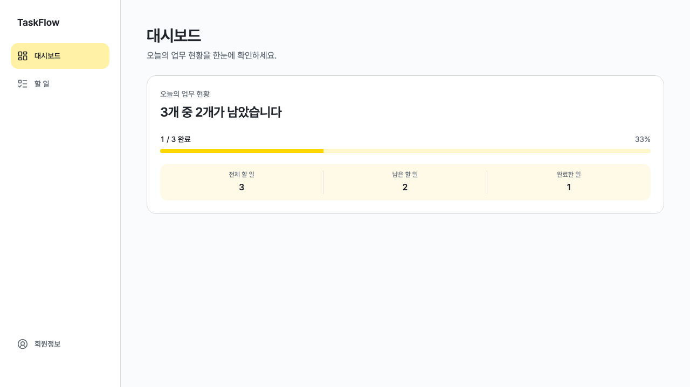
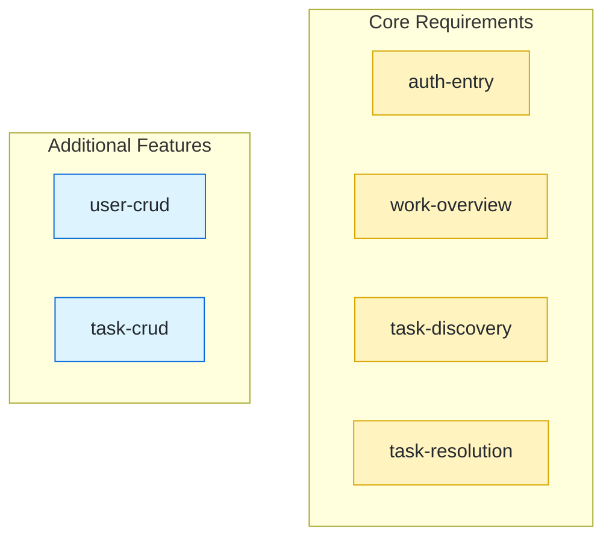
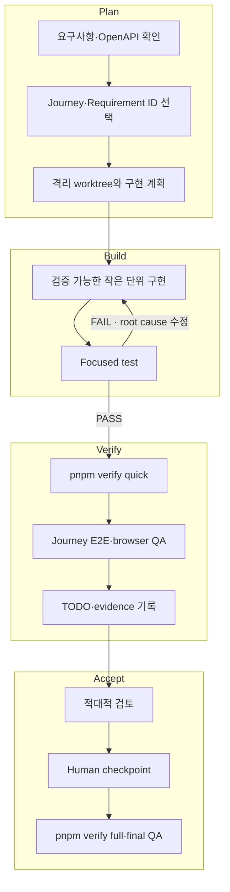

<h1 align="center">TaskFlow</h1>

<p align="center">
  <strong>업무의 시작부터 완료까지, 한눈에</strong><br />
  할 일과 진행 상황을 한곳에서 관리하는 TaskFlow입니다.
</p>

<p align="center">
  
  
  
  
</p>

<p align="center">
  <a href="#quick-start">Quick Start</a> ·
  <a href="#product-preview">Preview</a> ·
  <a href="#requirements">Requirements</a> ·
  <a href="#development-journeys">Journeys</a> ·
  <a href="#development-workflow">Workflow</a> ·
  <a href="#documentation">Documentation</a>
</p>

## Quick Start

### 1. Prerequisites

- Node.js: `^20.19.0 || ^22.12.0 || >=24.0.0`
- pnpm: `10.15.1`

### 2. Install & Run

```bash
corepack enable
pnpm install --frozen-lockfile
pnpm dev --host 127.0.0.1 --port 5173
```

브라우저에서 <http://127.0.0.1:5173>을 엽니다. 별도 backend 없이 MSW가 mock API를
제공합니다.

### 3. Test Account

| 용도                  | 이메일              | 비밀번호    |
| --------------------- | ------------------- | ----------- |
| 기본·무한 스크롤      | `user@example.com`  | `Password1` |
| 빈 목록               | `empty@example.com` | `Password1` |
| 보호 조회 네트워크 오류 | `error@example.com` | `Password1` |

> [!IMPORTANT]
> User와 Task 변경 내용은 현재 탭의 `sessionStorage`에 저장됩니다. 초기화하려면 새
> browser session을 열거나 해당 site의 session storage를 지운 뒤 reload하세요.

<details>
<summary><strong>4. Production Preview</strong></summary>

```bash
pnpm build
pnpm preview --host 127.0.0.1 --port 4173
```

브라우저에서 <http://127.0.0.1:4173>을 엽니다.

</details>

## Product Preview



로그인 후 전체·남은·완료 업무와 진행률을 한 화면에서 확인할 수 있습니다.

## Project Overview

### Routes

| Route       | 주요 기능                                            |
| ----------- | ---------------------------------------------------- |
| `/`         | 전체·남은·완료 할 일 수 확인                         |
| `/sign-in`  | 입력 검증, 로그인, API 오류 modal                    |
| `/sign-up`  | 회원가입과 입력 검증                                 |
| `/task`     | 할 일 생성, 가상 목록, 무한 스크롤, 상세 이동        |
| `/task/:id` | 상세 조회, 필드·상태 수정, ID 확인 후 삭제, 404 복구 |
| `/user`     | 회원정보 조회·수정, 로그아웃, 비밀번호 확인 후 탈퇴  |

### Tech Stack

| 영역     | 기술                                              |
| -------- | ------------------------------------------------- |
| Frontend | React 19, TypeScript, Vite, React Router          |
| 상태·폼  | TanStack Query, React Hook Form, Zod              |
| UI       | Tailwind CSS, shadcn/ui, Lucide React, Pretendard |
| API      | Fetch API, OpenAPI generated types, MSW           |
| Test     | Vitest, Testing Library, Playwright               |

## Requirements

### Source of Truth

| 우선순위 | 문서                                                                         | 역할                                        |
| -------- | ---------------------------------------------------------------------------- | ------------------------------------------- |
| 1        | [`assignment-original/openapi.yaml`](./assignment-original/openapi.yaml)     | API method, path, schema, status, 인증 방식 |
| 2        | [`assignment-original/requirement.md`](./assignment-original/requirement.md) | 화면, 상호작용, 제출 조건                   |
| 3        | [`docs/api/crud-openapi.yaml`](./docs/api/crud-openapi.yaml)                 | 기존 요구사항에서 확장한 User·Task CRUD     |
| 4        | [`docs/quality/requirements.md`](./docs/quality/requirements.md)             | Requirement ID, acceptance, 검증 evidence   |

API 세부사항이 다른 문서와 충돌하면 해당 범위의 OpenAPI 계약을 우선합니다.

### Core Requirements

원본 명세와 OpenAPI에 포함된 범위입니다.

| 요구사항 영역                              | Requirement ID                    | 구현·검증 근거                                                                                            |
| ------------------------------------------ | --------------------------------- | --------------------------------------------------------------------------------------------------------- |
| 시스템, 폰트, 색상, API 대체 구현, AI 공개 | `SYS-01`~`SYS-05`                 | [최종 QA](./docs/quality/evidence/final-qa.md)                                                            |
| 공통 navigation                            | `NAV-01`~`NAV-03`                 | [인증 진입](./docs/quality/evidence/auth-entry.md), [업무 현황](./docs/quality/evidence/work-overview.md) |
| 대시보드와 회원정보                        | `DASH-01`, `USER-01`              | [업무 현황](./docs/quality/evidence/work-overview.md)                                                     |
| 로그인                                     | `AUTH-01`~`AUTH-07`               | [인증 진입](./docs/quality/evidence/auth-entry.md)                                                        |
| 할 일 목록                                 | `TASK-LIST-01`~`TASK-LIST-05`     | [할 일 탐색](./docs/quality/evidence/task-discovery.md)                                                   |
| 할 일 상세·삭제                            | `TASK-DETAIL-01`~`TASK-DETAIL-05` | [할 일 해결](./docs/quality/evidence/task-resolution.md)                                                  |

### Additional Features

원본 범위를 구현한 뒤 추가 기획하여 확장한 기능입니다.

| 추가 기능                            | Requirement ID                                                   | 구현·검증 근거                                    |
| ------------------------------------ | ---------------------------------------------------------------- | ------------------------------------------------- |
| 회원가입·회원정보 수정·로그아웃·탈퇴 | `USER-CRUD-01`~`USER-CRUD-08`, `USER-LOGOUT-01`~`USER-LOGOUT-05` | [User CRUD](./docs/quality/evidence/user-crud.md) |
| 할 일 생성·수정·상태 변경            | `TASK-CRUD-01`~`TASK-CRUD-08`                                    | [Task CRUD](./docs/quality/evidence/task-crud.md) |

## Development Journeys

Journey는 사용자가 완료할 수 있는 하나의 목적을 기준으로 요구사항, 구현, 테스트,
browser evidence와 사람 checkpoint를 묶은 개발 단위입니다. 페이지 수가 아니라 다음
경계를 기준으로 작업 단위를 나눴습니다.

| 분리 기준   | 적용 방식                                                         |
| ----------- | ----------------------------------------------------------------- |
| 사용자 결과 | 로그인, 현황 확인, 업무 탐색처럼 독립적으로 완료되는 흐름         |
| 계약과 상태 | 같은 API·인증·cache 경계를 공유하는 요구사항을 한 Journey로 구성  |
| 검증 가능성 | 각 Journey가 focused test, E2E, browser evidence로 독립 검증 가능 |
| 범위 구분   | 원본 범위 4개와 추가 보완 범위 2개를 분리                         |

### Journey Map



| 범위       | Journey           | 개발 단위                                             | Requirements                                                     | Evidence                                                      |
| ---------- | ----------------- | ----------------------------------------------------- | ---------------------------------------------------------------- | ------------------------------------------------------------- |
| Core       | `auth-entry`      | 로그인 검증, 오류 modal, 보호 route 진입, 인증 복구   | `NAV-02`, `AUTH-01`~`AUTH-07`                                    | [Auth Entry](./docs/quality/evidence/auth-entry.md)           |
| Core       | `work-overview`   | 공통 navigation, dashboard 지표, 회원정보 조회        | `NAV-01`, `NAV-03`, `DASH-01`, `USER-01`                         | [Work Overview](./docs/quality/evidence/work-overview.md)     |
| Core       | `task-discovery`  | 목록 요청, card, 가상화, 무한 pagination, 상세 이동   | `TASK-LIST-01`~`TASK-LIST-05`                                    | [Task Discovery](./docs/quality/evidence/task-discovery.md)   |
| Core       | `task-resolution` | 상세 조회, 404 복구, exact-ID 확인 삭제               | `TASK-DETAIL-01`~`TASK-DETAIL-05`                                | [Task Resolution](./docs/quality/evidence/task-resolution.md) |
| Additional | `user-crud`       | 회원가입, profile 수정, 로그아웃, 계정·소유 업무 삭제 | `USER-CRUD-01`~`USER-CRUD-08`, `USER-LOGOUT-01`~`USER-LOGOUT-05` | [User CRUD](./docs/quality/evidence/user-crud.md)             |
| Additional | `task-crud`       | 업무 생성, 필드·상태 수정, 소유권과 화면 간 일관성    | `TASK-CRUD-01`~`TASK-CRUD-08`                                    | [Task CRUD](./docs/quality/evidence/task-crud.md)             |

### Journey Implementation Units

각 Journey는 같은 순서로 작게 나눠 개발했습니다.

| 단계 | 구현 단위         | 완료 조건                                      |
| ---- | ----------------- | ---------------------------------------------- |
| 1    | Contract & Gap    | Requirement ID, OpenAPI, 기존 구현 차이 확인   |
| 2    | Model & Transport | schema, store, API client, MSW handler 검증    |
| 3    | UI States         | loading, empty, error, success와 접근성 구현   |
| 4    | Integration       | route, auth, cache와 Journey E2E 연결          |
| 5    | Acceptance        | browser evidence, 적대적 검토, 사람 checkpoint |

## Development Workflow



### Workflow Steps

| 단계         | 작업                                                                      | 결과물·검증                         |
| ------------ | ------------------------------------------------------------------------- | ----------------------------------- |
| 1. Select    | [`TODO.md`](./TODO.md)에서 dependency가 해소된 작업과 Requirement ID 선택 | 소유 task block과 연결된 Journey    |
| 2. Trace     | requirement, route, API path, symbol 검색                                 | 원본 계약과 기존 구현의 gap         |
| 3. Isolate   | ignored `.worktrees/<branch>` 생성                                        | 다른 작업과 분리된 checkout         |
| 4. Implement | 하나의 검증 가능한 단위와 가장 낮은 수준의 test 구현                      | RED → GREEN focused test            |
| 5. Verify    | quick, Journey E2E, 실제 browser의 viewport·keyboard·console·network 확인 | 자동·browser evidence               |
| 6. Correct   | 실패를 요구사항·구현·통합·UX·테스트·환경·도구로 분류                      | root cause 수정과 실패 gate 재실행  |
| 7. Record    | `TODO.md`와 `docs/quality/evidence/` 갱신                                 | 명령, 결과, 재현 조건, exact target |
| 8. Review    | 적대적 검토 후 사람 checkpoint, 마지막에 full QA                          | review verdict와 acceptance 기록    |

AI는 자동 검증과 evidence를 작성합니다. `HUMAN_APPROVED`, HIGH-risk 결정과 최종
acceptance는 사람이 소유합니다. 상세 규칙은
[`docs/quality/workflow.md`](./docs/quality/workflow.md)와
[`docs/quality/verification.md`](./docs/quality/verification.md)에 있습니다.

## Testing & Verification

| 목적                                 | 명령                          |
| ------------------------------------ | ----------------------------- |
| 변경 모듈 focused test               | `pnpm vitest run <test-file>` |
| 개발 환경·hook·TODO 계약             | `pnpm verify setup`           |
| format·lint·typecheck·전체 Vitest    | `pnpm verify quick`           |
| build·6개 core Journey E2E·회귀 검증 | `pnpm verify full`            |

<details>
<summary><strong>Journey별 Playwright 명령</strong></summary>

Chromium이 없다면 `pnpm exec playwright install chromium`으로 먼저 설치합니다.

```bash
pnpm exec playwright test e2e/auth-entry.spec.ts
pnpm exec playwright test e2e/work-overview.spec.ts
pnpm exec playwright test e2e/task-discovery.spec.ts
pnpm exec playwright test e2e/task-resolution.spec.ts
pnpm exec playwright test e2e/user-crud.spec.ts
pnpm exec playwright test e2e/task-crud.spec.ts
```

</details>

검증 명령은 저장소를 수정하지 않습니다. formatting은 `pnpm run format`으로 별도
실행하고 diff 검토 후 `pnpm verify quick`을 다시 실행합니다.

## Architecture

<details>
<summary><strong>FSD 디렉터리와 책임 보기</strong></summary>

```text
src/
├── app/       # provider, 인증 상태, router
├── pages/     # route 단위 composition
├── widgets/   # app shell과 큰 화면 block
├── features/  # 로그인, 생성, 수정, 삭제 등 사용자 action
├── entities/  # Task, User, Dashboard domain 표시와 model
├── shared/    # API client, validation, 공용 UI
├── mocks/     # MSW handler와 fixture
└── generated/ # OpenAPI에서 생성한 TypeScript type
```

| 책임      | 구현                                    |
| --------- | --------------------------------------- |
| 서버 상태 | TanStack Query cache와 invalidation     |
| form      | React Hook Form + Zod validation        |
| 인증      | app auth boundary와 bearer/refresh 처리 |
| mock data | MSW fixture store와 OpenAPI 계약        |

</details>

## Documentation

| 문서                                         | 내용                                    |
| -------------------------------------------- | --------------------------------------- |
| 📋 [프로젝트 상위 기획](./docs/project-plan.md) | 목표, 범위, 구조, 단계                  |
| 📐 [코딩 규약](./docs/coding-standards.md)      | 구현·접근성·browser QA 기준             |
| ✅ [현재 작업과 evidence](./TODO.md)            | task 상태, dependency, 재현 가능한 근거 |
| 🧭 [기능 설계](./docs/superpowers/specs/)       | Journey와 기능별 설계                   |
| 🛠️ [구현 계획](./docs/superpowers/plans/)       | 실행 순서와 검증 단계                   |
| 🤖 [AI 사용 내역](./AI_USAGE.md)                | 도구, 모델, 스킬, 검증 범위             |
| 🗂️ [프롬프트 작업 기록](./artifacts/index.md)   | 사람 검토를 마친 세션별 작업 주제       |
