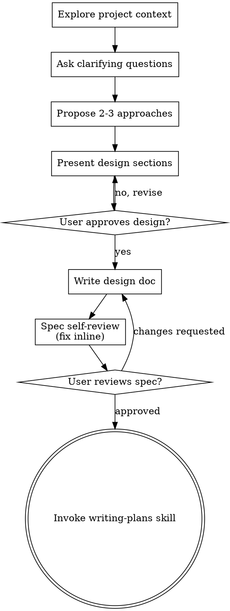

# Codex Session `01a04c3e-0a24-7e30-a767-64f1e2c4f3ae`

> Human review required before submission. Automatic redaction is best-effort.

- Model: `gpt-5.6-sol`
- Started: `2026-08-29T06:38:49.414Z`
- Working directory: `~/dev/assignment/kbhc-assgn`

## Turn 1

### User prompt

<environment_context>
  <cwd>~/dev/assignment/kbhc-assgn</cwd>
  <shell>zsh</shell>
  <current_date>2026-08-29</current_date>
  <timezone>Asia/Seoul</timezone>
  <filesystem><workspace_roots><root>~/dev/assignment/kbhc-assgn</root></workspace_roots><permission_profile type="disabled"><file_system type="unrestricted" /></permission_profile></filesystem>
</environment_context>

usage

### Assistant response

Usage of what: project, command, API, or token quota?

## Turn 2

### User prompt

현재 있는 두개 파일은 과제 원본 파일이야 디렉토리 루트에서 구분해서 폴더 하나 만들어줘

### Tool activity

#### `exec`

- Call ID: `call_ATfDpjHc7s4vmLKPBuEZkTPh`
- Status: `completed`

**Input**

```text
const r = await tools.exec_command({cmd:"pwd && find . -maxdepth 1 -type f -print && find . -maxdepth 1 -type d -print","workdir":"~/dev/assignment/kbhc-assgn","yield_time_ms":10000,"max_output_tokens":2000}); text(r.output);

```

**Output**

```text
Script completed
Wall time 0.6 seconds
Output:

~/dev/assignment/kbhc-assgn
./requirement.md
./openapi.yaml
.
./.git

```

#### `exec`

- Call ID: `call_xOGBR8WQUquB70GTlLh7icyo`
- Status: `completed`

**Input**

```text
const r = await tools.exec_command({cmd:"mkdir assignment-original && mv requirement.md openapi.yaml assignment-original/ && find . -maxdepth 2 -print | sort && git status --short","workdir":"~/dev/assignment/kbhc-assgn","yield_time_ms":10000,"max_output_tokens":3000}); text(r.output);

```

**Output**

```text
Script completed
Wall time 0.2 seconds
Output:

.
./.git
./.git/HEAD
./.git/config
./.git/description
./.git/hooks
./.git/index
./.git/info
./.git/objects
./.git/refs
./assignment-original
./assignment-original/openapi.yaml
./assignment-original/requirement.md
?? assignment-original/

```

### Assistant response

`assignment-original/` 폴더 생성 후 원본 2개 이동 완료.

- `assignment-original/requirement.md`
- `assignment-original/openapi.yaml`

## Turn 3

### User prompt

requirement.md 파일 살펴보면 AI_USAGE.md 구조 먼저 잡을 필요가 있어

먼저 연결된 문서로 관리할 전체 프롬프트 원문에 대한 것부터 잡고 가려고 하는데

stophook으로 프롬프트 원문과 작업 내용을 기록하는 구조를 잡고 가려고해

Codex가 턴 종료
  → Stop Hook 실행
  → stdin에서 transcript_path, session_id 수신
  → rollout JSONL 파싱
  → Markdown 또는 HTML 생성
  → artifacts/codex-session-<id>.md 저장

이런 프로세스로 추가해야

### Tool activity

#### `exec`

- Call ID: `call_zz6xzNrIZNSQtgENHega8VdU`
- Status: `completed`

**Input**

```text
const r = await tools.exec_command({cmd:"sed -n '1,240p' ~/.agents/skills/brainstorming/SKILL.md && sed -n '1,260p' ~/.codex/skills/.system/openai-docs/SKILL.md && sed -n '1,260p' assignment-original/requirement.md && printf '\\n--- ROOT FILES ---\\n' && find . -maxdepth 3 -type f -not -path './.git/*' -print | sort","workdir":"~/dev/assignment/kbhc-assgn","yield_time_ms":10000,"max_output_tokens":20000}); text(r.output);

```

**Output**

````text
Script completed
Wall time 0.3 seconds
Output:

---
name: brainstorming
description: "You MUST use this before any creative work - creating features, building components, adding functionality, or modifying behavior. Explores user intent, requirements and design before implementation."
---

# Brainstorming Ideas Into Designs

Help turn ideas into fully formed designs and specs through natural collaborative dialogue.

Start by understanding the current project context, then ask questions one at a time to refine the idea. Once you understand what you're building, present the design and get user approval.

<HARD-GATE>
Do NOT invoke any implementation skill, write any code, scaffold any project, or take any implementation action until you have presented a design and the user has approved it. This applies to EVERY project regardless of perceived simplicity.
</HARD-GATE>

## Anti-Pattern: "This Is Too Simple To Need A Design"

Every project goes through this process. A todo list, a single-function utility, a config change — all of them. "Simple" projects are where unexamined assumptions cause the most wasted work. The design can be short (a few sentences for truly simple projects), but you MUST present it and get approval.

## Checklist

You MUST create a task for each of these items and complete them in order:

1. **Explore project context** — check files, docs, recent commits
2. **Offer the visual companion just-in-time** — NOT upfront. The first time a question would genuinely be clearer shown than described, offer it then (its own message); on approval its browser tab opens for you. If no visual question ever arises, never offer it. See the Visual Companion section below.
3. **Ask clarifying questions** — one at a time, understand purpose/constraints/success criteria
4. **Propose 2-3 approaches** — with trade-offs and your recommendation
5. **Present design** — in sections scaled to their complexity, get user approval after each section
6. **Write design doc** — save to `docs/superpowers/specs/YYYY-MM-DD-<topic>-design.md` and commit
7. **Spec self-review** — quick inline check for placeholders, contradictions, ambiguity, scope (see below)
8. **User reviews written spec** — ask user to review the spec file before proceeding
9. **Transition to implementation** — invoke writing-plans skill to create implementation plan

## Process Flow



**The terminal state is invoking writing-plans.** Do NOT invoke frontend-design, mcp-builder, or any other implementation skill. The ONLY skill you invoke after brainstorming is writing-plans.

## The Process

**Understanding the idea:**

- Check out the current project state first (files, docs, recent commits)
- Before asking detailed questions, assess scope: if the request describes multiple independent subsystems (e.g., "build a platform with chat, file storage, billing, and analytics"), flag this immediately. Don't spend questions refining details of a project that needs to be decomposed first.
- If the project is too large for a single spec, help the user decompose into sub-projects: what are the independent pieces, how do they relate, what order should they be built? Then brainstorm the first sub-project through the normal design flow. Each sub-project gets its own spec → plan → implementation cycle.
- For appropriately-scoped projects, ask questions one at a time to refine the idea
- Prefer multiple choice questions when possible, but open-ended is fine too
- Only one question per message - if a topic needs more exploration, break it into multiple questions
- Focus on understanding: purpose, constraints, success criteria

**Exploring approaches:**

- Propose 2-3 different approaches with trade-offs
- Present options conversationally with your recommendation and reasoning
- Lead with your recommended option and explain why

**Presenting the design:**

- Once you believe you understand what you're building, present the design
- Scale each section to its complexity: a few sentences if straightforward, up to 200-300 words if nuanced
- Ask after each section whether it looks right so far
- Cover: architecture, components, data flow, error handling, testing
- Be ready to go back and clarify if something doesn't make sense

**Design for isolation and clarity:**

- Break the system into smaller units that each have one clear purpose, communicate through well-defined interfaces, and can be understood and tested independently
- For each unit, you should be able to answer: what does it do, how do you use it, and what does it depend on?
- Can someone understand what a unit does without reading its internals? Can you change the internals without breaking consumers? If not, the boundaries need work.
- Smaller, well-bounded units are also easier for you to work with - you reason better about code you can hold in context at once, and your edits are more reliable when files are focused. When a file grows large, that's often a signal that it's doing too much.

**Working in existing codebases:**

- Explore the current structure before proposing changes. Follow existing patterns.
- Where existing code has problems that affect the work (e.g., a file that's grown too large, unclear boundaries, tangled responsibilities), include targeted improvements as part of the design - the way a good developer improves code they're working in.
- Don't propose unrelated refactoring. Stay focused on what serves the current goal.

## After the Design

**Documentation:**

- Write the validated design (spec) to `docs/superpowers/specs/YYYY-MM-DD-<topic>-design.md`
  - (User preferences for spec location override this default)
- Use elements-of-style:writing-clearly-and-concisely skill if available
- Commit the design document to git

**Spec Self-Review:**
After writing the spec document, look at it with fresh eyes:

1. **Placeholder scan:** Any "TBD", "TODO", incomplete sections, or vague requirements? Fix them.
2. **Internal consistency:** Do any sections contradict each other? Does the architecture match the feature descriptions?
3. **Scope check:** Is this focused enough for a single implementation plan, or does it need decomposition?
4. **Ambiguity check:** Could any requirement be interpreted two different ways? If so, pick one and make it explicit.

Fix any issues inline. No need to re-review — just fix and move on.

**User Review Gate:**
After the spec review loop passes, ask the user to review the written spec before proceeding:

> "Spec written and committed to `<path>`. Please review it and let me know if you want to make any changes before we start writing out the implementation plan."

Wait for the user's response. If they request changes, make them and re-run the spec review loop. Only proceed once the user approves.

**Implementation:**

- Invoke the writing-plans skill to create a detailed implementation plan
- Do NOT invoke any other skill. writing-plans is the next step.

## Key Principles

- **One question at a time** - Don't overwhelm with multiple questions
- **Multiple choice preferred** - Easier to answer than open-ended when possible
- **YAGNI ruthlessly** - Remove unnecessary features from all designs
- **Explore alternatives** - Always propose 2-3 approaches before settling
- **Incremental validation** - Present design, get approval before moving on
- **Be flexible** - Go back and clarify when something doesn't make sense

## Visual Companion

A browser-based companion for showing mockups, diagrams, and visual options during brainstorming. Available as a tool — not a mode. Accepting the companion means it's available for questions that benefit from visual treatment; it does NOT mean every question goes through the browser.

**Offering the companion (just-in-time):** Do NOT offer it upfront. Wait until a question would genuinely be clearer shown than told — a real mockup / layout / diagram question, not merely a UI *topic*. The first time that happens, offer it then, as its own message:
> "This next part might be easier if I show you — I can put together mockups, diagrams, and comparisons in a browser tab as we go. It's still new and can be token-intensive. Want me to? I'll open it for you."

**This offer MUST be its own message.** Only the offer — no clarifying question, summary, or other content. Wait for the user's response. If they accept, start the server with `--open` so their browser opens to the first screen automatically. If they decline, continue text-only and don't offer again unless they raise it.

**Per-question decision:** Even after the user accepts, decide FOR EACH QUESTION whether to use the browser or the terminal. The test: **would the user understand this better by seeing it than reading it?**

- **Use the browser** for content that IS visual — mockups, wireframes, layout comparisons, architecture diagrams, side-by-side visual designs
- **Use the terminal** for content that is text — requirements questions, conceptual choices, tradeoff lists, A/B/C/D text options, scope decisions

A question about a UI topic is not automatically a visual question. "What does personality mean in this context?" is a conceptual question — use the terminal. "Which wizard layout works better?" is a visual question — use the browser.

If they agree to the companion, read the detailed guide before proceeding:
`skills/brainstorming/visual-companion.md`
---
name: "openai-docs"
description: "Use for Codex models/pricing, scheduled tasks, skills, settings, setup, troubleshooting, customization, automations, and self-knowledge—including 'you,' 'your,' 'this app,' or 'this coding agent' when they refer to Codex—and for OpenAI APIs/products and ChatGPT Work. Also use for model choice/migration, prompting, SDKs, Responses, Realtime, agents, evals, and Chat/Work/Codex comparisons. Do not use for generic app/software tasks that merely mention Codex."
metadata:
  short-description: "Codex models/pricing, scheduled tasks, skills, settings, setup, troubleshooting, and self-knowledge; OpenAI APIs and ChatGPT Work. 'You'/'this app' means Codex only."
---

# OpenAI Docs

Provide current, cited OpenAI product, API, model, and Codex guidance. Read zero or one primary reference.

**First substantive action:** Search the user's exact requested official OpenAI documentation topic and any explicitly named model using a concise, topic-specific query of 2-6 essential terms. When an already-available direct official documentation search and page-retrieval capability is present, use it first: search, then fetch or open the matching official page before general web search. Otherwise, immediately use official-domain web search, then actually open or fetch the relevant official page. Complete this source order before reading a reference, inspecting local or repository files, running a Codex manual or model resolver, drafting a plan, or answering from memory. Use the actual fetched page, not a search snippet or an unopened link. If one official search or page does not establish the answer, search another appropriate official domain and actually open or fetch the result. Preserve the exact requested model; never substitute a newer model.

**Only exception:** An explicitly requested, genuinely broad, cross-topic Codex setup, orientation, or system-map synthesis may use the manual first when shell execution and an allowed temporary cache are available. A specific Codex feature, setting, command, error, model, or requested citation remains docs-first. Mixed Chat/Work/Codex comparisons are official documentation questions, not manual-first Codex requests.

For generic software tasks, answer the software task directly. OpenAI implementation, debugging, SDK, API, prompting, agent, and eval requests are not generic.

For a straightforward factual or citation-only request, follow the source order and do not read a route reference. This includes straightforward API facts, ChatGPT Work or mixed Chat/Work/Codex comparisons, model tiers, aliases, Pro mode, reasoning settings, factual migration baselines, and narrow Codex facts. Prioritize `learn.chatgpt.com` for ChatGPT Work.

## Choose one primary route

Use the first matching route, and read its reference only when the requested task needs that specialized workflow:

- **Explicitly requested local documentation integration:** Read [integration guidance](references/mcp-diagnostics.md) only when the user explicitly requests that local integration.
- **Model migration, upgrades, or model-specific prompting:** Read [model-migration.md](references/model-migration.md) for actual migration planning, implementation, dynamic target resolution, or prompt changes. Preserve an explicitly requested target.
- **Model selection and comparisons:** Read [model-selection.md](references/model-selection.md) only when nuanced current, latest, default, cost, latency, quality, or modality tradeoffs need more guidance. Do not run a migration resolver for selection alone.
- **Product, API, ChatGPT Work, and mixed Chat/Work/Codex documentation:** Read [official-docs.md](references/official-docs.md) only when fetched official pages leave source selection, API schemas, or the requested implementation unresolved. This route is not manual-first.
- **Explicitly broad Codex setup, orientation, or cross-topic synthesis:** Read [codex-self-knowledge.md](references/codex-self-knowledge.md) when the eligible Codex manual or deeper Codex procedures are needed.

Read at most one primary reference. Do not open every route, bundled model guide, or helper script. Read a supporting reference or run a helper only when the chosen workflow demonstrably needs it.

## Source and execution boundaries

- Search, open, fetch, and cite only `developers.openai.com`, `platform.openai.com`, and `learn.chatgpt.com`. Cite the page that supports the claim. State uncertainty when official sources do not establish pricing, availability, account access, limits, or behavior.
- Preserve an explicitly requested model for selection, migration, and prompting. Resolve an unspecified latest or current migration target only after searching and fetching current official guidance.
- Use `references/latest-model.md` only as a disclosed fallback after current official model guidance does not answer the question. Read `references/upgrading-to-gpt-5p6-sol.md` only for an actual, requested GPT-5.6-family migration; read `references/prompting-guide.md` only for requested prompting work.
- Before building, running, editing, debugging, or testing an API-backed app or tool, use `openai-platform-api-key` first when available. Documentation, conceptual examples, model selection, and read-only guidance do not require an API key.
- Say "OpenAI Docs" or "official OpenAI documentation" in user-facing answers. Keep exact official citations and examples concise.
# 프론트엔드 과제

## 설명

- React@18/19와 typescript를 사용해주세요. 그 이외의 라이브러리는 자유롭게 사용하셔도 됩니다.
  다만, 해당 라이브러리 사용에 대한 판단은 개발자마다 다를 수 있습니다.
- 아이콘은 항목별로 겹치지 않게 지정하여 사용하면 됩니다. 아이콘 요소에 대해 심미적인 부분은 고려하지 않아도 됩니다.
- 색상은 토큰으로 관리되어야 합니다.
  - 예시) primary: blue, disabled: gray
- 폰트는 pretendard를 사용해주세요.
- 추가적인 결정 사항이 필요한 경우 자의적으로 결정하신 후 코멘트를 남겨주시거나, 질문을 주셔도 됩니다.
  다만, 질문에 대한 답변이 실시간성이 없을 수 있습니다.
- Agent AI를 활용한 경우, 사용 사실과 활용 범위를 `AI_USAGE.md`로 제출해주세요.
  - 제출 시 가산점이 있을 수 있습니다. 미제출 시 감점은 없습니다.
  - 필수: 사용한 도구/모델, 적용한 작업 범위, 핵심 프롬프트 요약, 사람이 최종 검증한 내용
  - 선택: 전체 프롬프트 원문, subagent 설정, 계획 문서
  - 주의: 비밀정보(API 키, 개인/회사 민감정보)는 제거 후 제출

## 페이지

### GNB/LNB

- 라우트 맵
  - 대시보드 `대시보드 아이콘 표시`, 클릭 시 대시보드 페이지로 전환
  - 할 일 `할일 아이콘 표시`, 클릭 시 할 일 페이지로 전환
- 로그인/회원정보
  - 로그인 한 경우, `회원정보 아이콘` 표시, 클릭 시 회원정보 페이지로 전환
  - 로그인하지 않은 경우, `로그인 아이콘` 표시, 클릭 시 로그인 페이지로 전환

### 대시보드 (/)

|   요소    | 설명                               |
| :-------: | ---------------------------------- |
|    일     | 일의 갯수(numOfTask) 표기          |
| 해야할 일 | 해야할 일 갯수 표기(numOfRestTask) |
|   한 일   | 한 일의 갯수 표기(numOfDoneTask)   |

### 로그인 (/sign-in)

- [POST] /api/sign-in로 제출해주세요.
  - API Status Code가 200이 아닌 경우, `errorMessage`을 제공하는 모달을 띄어주세요.
- form의 input에 대한 label이 표기되어야 합니다.
- form의 input에에 대한 유효성 검증이 통과되지 않는 경우 적절히 표시되어야 합니다.

**로그인 폼**
| 요소 | 설명 | 설명2 |
| :------: | ------------------------------------------------------------------ | ------ |
| email | email 규약에 맞는 문자열 | 필수값 |
| 비밀번호 | 영문, 숫자로 구성된 8글자 이상의, 24글자 이하의 문자열 | 필수값 |
| 제출 | ID와 PW의 조건이 만족된 경우 활성화, 만족되지 않은 경우는 비활성화 ||

### 목록 (/task)

- `[GET] /api/task`의 결과값을 카드 목록으로 보여주세요.
- 각 카드는 title과 memo가 보여져야 합니다.
- 스크롤 영역에서 화면에 보여지는 요소 또는 보여질 요소에 대해서만 적절히 렌더링해주세요(가상 스크롤링).
- 목록에 끝에 도달하는 경우 다음 페이지의 API를 호출해주세요(무한 스크롤).
- 할 일을 클릭 시 각 상세페이지로 이동해주세요.

### 상세 (/task/:id)

- `[GET] /api/task/:id`의 결과값을 보여주세요.
  - 404가 반환된 경우, 목록으로 돌아갈 수 있는 버튼을 포함한 리소스가 없는 경우의 화면을 구현해주세요.
    _심미성은 판단하지 않습니다._
- 삭제 버튼을 제공해주세요.
  - 삭제 버튼을 클릭 시, 삭제 여부를 확인하는 input을 포함한 모달을 생성해주세요.
    - input에 해당 id와 동일한 값을 기입한 후 `제출` 버튼을 클릭하면, 목록으로 redirect 해주세요.
    - input에 해당 id와 동일한 값을 기입되지 않은 경우 `제출` 버튼은 비활성화해주세요.

### 회원정보

- `[GET] /api/user`의 결과값을 보여주세요.

## 전문

API 서버에 대해서는 별도의 서버 구축, API 함수 레벨에서의 mocking, MSW 등 익숙하신 방법으로 처리하시면 됩니다.
다만 구성하신 방법에 대한 코드는 함께 제출해주세요.
API 전문은 `openapi.yaml` (OAS 3.1) 기준을 우선합니다.
--- ROOT FILES ---
./assignment-original/openapi.yaml
./assignment-original/requirement.md

````

#### `exec`

- Call ID: `call_9raX21z6xl6WXjiSJbQYJckT`
- Status: `completed`

**Input**

```text
const r = await tools.web__run({search_query:[{q:"site:developers.openai.com/codex hooks notify transcript_path session_id stop hook"}],response_length:"short"}); text(JSON.stringify(r));

```

**Output**

```text
Script completed
Wall time 2.2 seconds
Output:

"GPT-5-Codex Model | OpenAI API (https://developers.openai.com/api/docs/models/gpt-5-codex)\nciteturn0search0 [wordlim: 200] Crawled: yesterday; A version of GPT-5 optimized for agentic coding in Codex ... GPT-5-Codex is a version of GPT-5 optimized for agentic coding tasks in Codex or similar environments.\n\nImage: gpt-5-codex\n\nGPT-5-Codex\n\nDefault\n\nA version of GPT-5 optimized for agentic coding in Codex\n\nCompare\n\nReasoning\n\nSpeed\n\nPrice\n\n$1.25•$10\n\nInput\n\nOutput\n\nGPT-5-Codex is a version of GPT-5 optimized for agentic coding tasks in Codex or similar environments. It's available in the Responses API only and the underlying model snapshot will be regularly updated. If you want to learn more about prompting GPT-5-Codex, refer to our dedicated guide.\n\n400,000 context window\n\n128,000 max output tokens\n\nSep 30, 2024 knowledge cutoff\n\nReasoning token support\n\nPricing\n\nPricing is based on the number of tokens used, or other metrics based on the model type. For tool-specific models, like search and computer use, there’s a fee per tool call. See details in the pricing page.\n\nText tokens\n\nPer 1M tokens\n\nInput\n\n$1.25\n\nCached input\n\n$0.125\n\nOutput\n\n$10.00\n\n\nEndpoints\n\nChat Completions\n\nv1/chat/completions\n\nResponses\n\nv1/responses\n\nRealtime\n\nv1/realtime\n\nRealtime translation\n\nv1/realtime/translations\n\nRealtime transcription\n\nv1/realtime/transcription_sessions\n\nAssistants\n\nv1/assistants\n\nBatch\n\nv1/batch\n\nFeatures\n\nStreaming\n\nSupported\n\nFunction calling\n\nSupported\n\nStructured outputs\n\nSupported\n\nFine-tuning\n\nNot supported\n\nPredicted outputs\n\nNot supported\n\nSnapshots\n\nSnapshots let you lock in a specific version of the model so that performance and behavior remain consistent. Below is a list of all available snapshots and aliases for GPT-5-Codex.\n\nImage: gpt-5-codex\n\ngpt-5-codex\n\ngpt-5-codex\n\nDeprecated\n\ngpt-5-codex\n\n\nRate limits ensure fair and reliable access to the API by placing specific caps on requests, tokens, audio duration, or other usage within a given time period. Your usage tier determines how high these limits are set and automatically increases as you send more requests and spend more on the API.\n\nTier  | RPM  | TPM  | Batch queue limit\n--- | --- | --- | ---\nFree  | Not supported\nTier 1  | 500  | 500,000  | 1,500,000\nTier 2  | 5,000  | 1,000,000  | 3,000,000\nTier 3  | 5,000  | 2,000,000  | 100,000,000\nTier 4  | 10,000  | 4,000,000  | 200,000,000\nTier 5  | 15,000  | 10,000,000  | 15,000,000,000--------------------------------------------------------------------------------\nOpenAI Developers (https://developers.openai.com/)\nciteturn0search1 [wordlim: 200] Crawled: today; Discover what builders are creating with Codex and the OpenAI API, and build your own version. ... Help center Frequently asked account and billing questions Developer forum Discuss topics with other developers OpenAI Academy Courses and resources for learning about AI Status Check the status of OpenAI services\n\n# OpenAI for developers\n\nDocs and resources to help you build with, for, and on OpenAI.\n\n## GPT-5.6: Lower prices and faster speeds.\n\nSol is now over 20% cheaper, Luna is 80% cheaper, and Terra is 20% cheaper, while Fast mode makes Sol up to 2.5× faster.\n\nRead more here.\n\nAPI Platform Use our APIs and models to build your own AI experiences. Codex Build and ship faster with our coding agent — everywhere you work. Plugins Extend ChatGPT and Codex with skills, MCP servers, and optional UI.\n\n## Codex use cases\n\nLearn how teams are using Codex to automate tasks, build apps and ship with confidence.\n\nExplore use cases (opens in a new tab)\n\nImage: Illustration of Codex workflows and use cases\n\n## Showcase\n\nDiscover what builders are creating with Codex and the OpenAI API, and build your own version.\n\nExplore demos\n\nImage: Illustration of polished OpenAI demo showcases\n\n## Featured\n\nImage\n\n## GPT Image 2 for image generation and editing\n\nGenerate and edit images with stronger instruction following, flexible sizes, and high-fidelity image inputs.\n\nRead the GPT Image 2 prompting guide\n\n### Codex for (almost) everything\n\nApril 16, 2026\n\nRealtime and audio Codex changelog Community page\n\n## Blog posts\n\nView all\n\nAutomating repetitive work at OpenAI with Codex How Runme and WebMCP turn recurring engineering tasks into reviewable, reusable workflows. Aug 25, 2026 Codex Scaling cyber defenders with Daybreak Use ChatGPT, Codex Security, and open-source tools to investigate threats, validate vulnerabilities, and move from findings to reviewed, verified fixes. Aug 21, 2026 Codex Codex as a platform: build on the open agent harness Build Codex into the products and workflows your users already know. Aug 19, 2026 Codex\n\nHelp center Frequently asked account and billing questions Developer forum Discuss topics with other developers OpenAI Academy Courses and resources for learning about AI Status Check the status of OpenAI services\n\nAsk AI\n\n## Docs agent--------------------------------------------------------------------------------\ncodex-mini-latest Model | OpenAI API (https://developers.openai.com/api/docs/models/codex-mini-latest)\nciteturn0search2 [wordlim: 200] Crawled: yesterday; Image: codex-mini-latest ... codex-mini-latest is a fine-tuned version of o4-mini specifically for use in Codex CLI.\n\nImage: codex-mini-latest\n\ncodex-mini-latest\n\nDefault\n\nFast reasoning model optimized for the Codex CLI\n\nCompare\n\nPerformance\n\nSpeed\n\nPrice\n\n$1.5•$6\n\nInput\n\nOutput\n\ncodex-mini-latest is a fine-tuned version of o4-mini specifically for use in Codex CLI. For direct use in the API, we recommend starting with gpt-4.1.\n\n200,000 context window\n\n100,000 max output tokens\n\nJun 01, 2024 knowledge cutoff\n\nReasoning token support\n\nPricing\n\nPricing is based on the number of tokens used, or other metrics based on the model type. For tool-specific models, like search and computer use, there’s a fee per tool call. See details in the pricing page.\n\nText tokens\n\nPer 1M tokens\n\nInput\n\n$1.50\n\nCached input\n\n$0.375\n\nOutput\n\n$6.00\n\n\nModalities\n\nText\n\nInput and output\n\nImage\n\nInput only\n\nAudio\n\nNot supported\n\nVideo\n\nNot supported\n\nEndpoints\n\nChat Completions\n\nv1/chat/completions\n\nResponses\n\nv1/responses\n\nRealtime\n\nv1/realtime\n\nRealtime translation\n\nv1/realtime/translations\n\nRealtime transcription\n\nv1/realtime/transcription_sessions\n--------------------------------------------------------------------------------\nCodex use cases (https://developers.openai.com/codex/use-cases?category=automation&category=integrations&category=ios&category=knowledge-work&category=quality&task_type=analysis&team=engineering&team=finance&team=quality-engineering&team=research&team=sales)\nciteturn0search3 [wordlim: 200] Crawled: 2 months ago; # Codex Use Cases[Input][Input][Input][Input][Input][Input][Input][Input][Input][Input][Input] [Input: Search Codex use cases]\n\n# Codex Use Cases\n\n[Input][Input][Input][Input][Input][Input][Input][Input][Input][Input][Input] [Input: Search Codex use cases]\n\nWorkflow Analysis Knowledge Work\n\n## Use cases\n\nSort:Sort use cases Recommended\n\nTurn feedback into actions Synthesize feedback from multiple sources into a reviewable artifact. Data Integrations\n\nClean and prepare messy data Process tabular data without affecting the original. Data Knowledge Work\n\nQuery tabular data Ask a question about a CSV, spreadsheet, export, or data folder. Data Knowledge Work\n\nLearn a new concept Turn dense source material into a clear, reviewable learning report. Knowledge Work Data\n\nRun a deep security scan Search an authorized repository deeply for plausible vulnerabilities. Engineering Quality\n\nScan code changes for security Review a pull request or local diff for security regressions. Engineering Quality\n\nAnnotate scRNA-seq data Review single-cell QC, annotations, and UMAPs in one thread. Sciences Data\n\nPrioritize drug targets Rank drug targets across multiple evidence lanes. Sciences Data\n\nValidate bulk RNA-seq inputs Validate bulk RNA-seq inputs before differential expression. Sciences Data\n\nForecast cash flow Find the liquidity low point in an editable forecast workbook. Data Knowledge Work\n\nModel a DCF valuation Turn financial inputs into an editable valuation workbook. Data Knowledge Work\n\nReview budget vs. actuals Turn plan, actuals, and close notes into a variance workbook. Data Knowledge Work\n\nTurn meetings into follow-ups Convert Zoom meeting insights into actions across your tools. Automation Integrations\n\nAudit dependency incidents Turn a public package advisory into a safe repo-audit plan. Engineering Quality\n\n## No use cases match these filters\n\nTry clearing a few filters or searching for a broader term.\n\nAsk AI\n\n## Docs agent\n\nLoading docs agent...--------------------------------------------------------------------------------\nCodex use cases (https://developers.openai.com/codex/use-cases?category=data&category=engineering&category=front-end&category=integrations&category=ios&category=macos&search=Automation&task_type=analysis&task_type=code&task_type=testing&team=engineering&team=operations&team=sales)\nciteturn0search4 [wordlim: 200] Crawled: last month; Upgrade your API integration Upgrade your app to the latest OpenAI API models. ... Create a CLI Codex can use Give Codex a composable command for an API, log source, export, or team script.\n\n# Codex Use Cases\n\n[Input][Input][Input][Input][Input][Input][Input][Input][Input][Input][Input][Input] [Input: Search Codex use cases]\n\nWorkflow Analysis Knowledge Work\n\n## Use cases\n\nSort:Sort use cases Recommended\n\nSet up a teammate Give Codex a durable view of your work so it can notice what changed. Automation Integrations\n\nTurn feedback into actions Synthesize feedback from multiple sources into a reviewable artifact. Data Integrations\n\nClean and prepare messy data Process tabular data without affecting the original. Data Knowledge Work\n\nQuery tabular data Ask a question about a CSV, spreadsheet, export, or data folder. Data Knowledge Work\n\nUnderstand large codebases Trace request flows, map unfamiliar modules, and find the right files fast. Engineering Analysis\n\nBuild a Mac app shell Use Codex to build a Mac-native SwiftUI app shell with a sidebar, detail pane, inspector... macOS Code\n\n【9†Make granular UI changes Use Codex-Spark for fast, focused UI iteration in an existing app. --------------------------------------------------------------------------------\nGPT-5.3-Codex Model | OpenAI API (https://developers.openai.com/api/docs/models/gpt-5.3-codex)\nciteturn0search5 [wordlim: 200] Crawled: today; Image: gpt-5.3-codexGPT-5.3-Codex\n--------------------------------------------------------------------------------\nResponses | OpenAI API Reference (https://developers.openai.com/api/reference/cli/resources/beta/subresources/responses)\nciteturn0search6 [wordlim: 200] Crawled: 2 days ago; $ openai beta:responses cancel ... beta_computer_action: object { button, type, x, 2 more } or object { keys, type, x, y } or object { path, type, keys } or 6 more ... Instructions given with the `developer` or `system` role take precedence over instructions given with the `user` role. ... beta_response_audio_transcript_delta_event: object { delta, sequence_number, type, agent } ... beta_response_output_item: BetaResponseOutputMessage { id, content, role, 4 more } or BetaResponseFileSearchToolCall { id, queries, status, 3 more } or BetaResponseFunctionToolCall { arguments, call_id, name, 6 more } or 28 more\n--------------------------------------------------------------------------------\nGPT-5.2-Codex Model | OpenAI API (https://developers.openai.com/api/docs/models/gpt-5.2-codex)\nciteturn0search7 [wordlim: 200] Crawled: 2 days ago; Image: gpt-5.2-codex ... GPT-5.2-Codex is an upgraded version of GPT-5.2 optimized for agentic coding tasks in Codex or similar environments.\n--------------------------------------------------------------------------------\nAll models | OpenAI API (https://developers.openai.com/api/docs/models/all)\nciteturn0search8 [wordlim: 200] Crawled: yesterday; OpenAI's most advanced models, recommended for most tasks. ... 35†GPT-5.2 Previous frontier model for professional work with configurable reasoning effort】GPT-5.2 Pro Previous pro model for professional work that produces smarter and more precise responses.GPT-5.1 The best model for coding and agentic tasks with configurable reasoning effort GPT-5 Previous intelligent reasoning model for coding and agentic tasks with configurable reasoning effort GPT-5 Mini Near-frontier intelligence for cost sensitive, low latency, high volume workloads GPT-5 nano Fastest, most cost-efficient version of GPT-5 GPT-5 Pro Version of GPT-5 that produces smarter and more precise responses o3-pro Version of o3 with more compute for better responses o3 Reasoning model for complex tasks, succeeded by GPT-5 GPT-4.1 Smartest non-reasoning model GPT-4.1 Mini Smaller, faster version of GPT-4.1 omni-moderation Identify potentially harmful content in text and images GPT-4o Mini Fast, affordable small model for focused tasks GPT-4o Fast, intelligent, flexible GPT model GPT-Realtime Deprecated Model capable of realtime text and audio inputs and outputs GPT-Audio Deprecated For audio inputs and outputs with Chat Completions API GPT-5.3 Chat Deprecated GPT-5.3 Instant model used in ChatGPT GPT-5.2 Chat Deprecated GPT-5.2 model used in ChatGPT GPT-5.2-Codex Deprecated Our most intelligent coding model optimized for long-horizon, agentic coding tasks.Sora 2 Deprecated Flagship video generation with synced audio Sora 2 Pro Deprecated Most advanced synced-audio video generation GPT-Image-1.5 Deprecated Our previous image generation model chatgpt-image-latest Deprecated Previous image model used in ChatGPT.GPT-Image-1 Mini Deprecated A cost-efficient version of GPT Image 1 GPT-Image-1 Deprecated Our previous image generation model o3-deep-research Deprecated Our most powerful deep research model o4-mini-deep-research Deprecated Faster, more affordable deep research model GPT-4.1 nano Deprecated Fastest, most cost-efficient version of GPT-4.1 o4-mini Deprecated Fast, cost-efficient reasoning model, succeeded by GPT-5 Mini o1-pro Deprecated Version of o1 with more compute for better responses computer-use-preview Deprecated Specialized model for computer use tool GPT-Realtime Mini Deprecated A cost-efficient version of GPT-Realtime GPT-Audio Mini Deprecated A cost-efficient version of GPT Audio GPT-4o Mini Search Preview Deprecated Fast, affordable small model for web search GPT-4o Search Preview Deprecated GPT model for web search in Chat Completions GPT-4.5 Preview Deprecated Deprecated large model.o3-mini Deprecated A small model alternative to o3 o1 Deprecated Previous full o-series reasoning model o1-mini Deprecated A small model alternative to o1 o1 Preview Deprecated Preview of our first o-series reasoning model GPT-4o Audio Deprecated GPT-4o models capable of audio inputs and outputs GPT-4o Mini Audio Deprecated Smaller model capable of audio inputs and outputs GPT-4o Mini Realtime Deprecated Smaller realtime model for text and audio inputs and outputs GPT-4o Realtime Deprecated Model capable of realtime text and audio inputs and outputs GPT-4 Turbo Deprecated An older high-intelligence GPT model babbage-002 Deprecated Replacement for the GPT-3 ada and babbage base models ChatGPT-4o Deprecated GPT-4o model used in ChatGPT GPT-5.1-Codex Deprecated A version of GPT-5.1 optimized for agentic coding in Codex.GPT-5.1-Codex-Max Deprecated A version of GPT-5.1-codex optimized for long running tasks.【\n--------------------------------------------------------------------------------\nGPT-5.1-Codex Model | OpenAI API (https://developers.openai.com/api/docs/models/gpt-5.1-codex)\nciteturn0search9 [wordlim: 200] Crawled: today; A version of GPT-5.1 optimized for agentic coding in Codex. ... GPT-5.1-Codex is a version of GPT-5 optimized for agentic coding tasks in Codex or similar environments.\n--------------------------------------------------------------------------------\nWebhooks | OpenAI API Reference (https://developers.openai.com/api/reference/java/resources/webhooks)\nciteturn0search10 [wordlim: 200] Crawled: yesterday; The same pending session can also emit `realtime.call.incoming`; the first successful Realtime or Live accept endpoint selects the runtime surface. ... The same pending session can also emit `live.call.incoming`; the first successful Realtime or Live accept endpoint selects the runtime surface.\n--------------------------------------------------------------------------------\nModel guidance | OpenAI API (https://developers.openai.com/api/docs/guides/latest-model)\nciteturn0search11 [wordlim: 200] Crawled: today; Multi-agent is available as a beta feature in the Responses API as we iterate on developer feedback. ... Codex can apply the recommended changes in this guide with the OpenAI Docs skill. ... To use this skill in other coding agents, download it from the OpenAI skills repository. ...     Stop when [condition] is met.\n"
```

#### `exec`

- Call ID: `call_SZvv7EblTzyKymltJaPieg4p`
- Status: `completed`

**Input**

```text
const r = await tools.web__run({search_query:[{q:"site:developers.openai.com/codex/config-reference notify command Codex CLI turn complete JSON"},{"q:"site:developers.openai.com/codex \"notify\" \"agent-turn-complete\""},{"q:"site:developers.openai.com/codex hooks configuration"}],response_length:"medium"}); text(JSON.stringify(r));

```

**Output**

```text
Script failed
Wall time 0.0 seconds
Output:

Script error:
SyntaxError: Unexpected identifier 'site'
```

#### `exec`

- Call ID: `call_xSad9vNBZF3ou9jpLF6wVkBy`
- Status: `completed`

**Input**

```text
const r = await tools.web__run({search_query:[
  {q:'site:developers.openai.com/codex/config-reference notify command Codex CLI turn complete JSON'},
  {q:'site:developers.openai.com/codex "notify" "agent-turn-complete"'},
  {q:'site:developers.openai.com/codex hooks configuration'}
],response_length:"medium"}); text(JSON.stringify(r));

```

**Output**

```text
Script completed
Wall time 2.3 seconds
Output:

"Codex use cases (https://developers.openai.com/codex/use-cases?category=data&category=engineering&category=front-end&category=integrations&category=ios&category=macos&search=Automation&task_type=analysis&task_type=code&task_type=testing&team=engineering&team=operations&team=sales)\nciteturn1search0 [wordlim: 200] Crawled: last month; Upgrade your API integration Upgrade your app to the latest OpenAI API models. ... Create a CLI Codex can use Give Codex a composable command for an API, log source, export, or team script.\n\n# Codex Use Cases\n\n[Input][Input][Input][Input][Input][Input][Input][Input][Input][Input][Input][Input] [Input: Search Codex use cases]\n\nWorkflow Analysis Knowledge Work\n\n## Use cases\n\nSort:Sort use cases Recommended\n\nSet up a teammate Give Codex a durable view of your work so it can notice what changed. Automation Integrations\n\nTurn feedback into actions Synthesize feedback from multiple sources into a reviewable artifact. Data Integrations\n\nClean and prepare messy data Process tabular data without affecting the original. Data Knowledge Work\n\nQuery tabular data Ask a question about a CSV, spreadsheet, export, or data folder. Data Knowledge Work\n\nUnderstand large codebases Trace request flows, map unfamiliar modules, and find the right files fast. Engineering Analysis\n\nBuild a Mac app shell Use Codex to build a Mac-native SwiftUI app shell with a sidebar, detail pane, inspector... macOS Code\n\ncite9†Make granular UI changes Use Codex-Spark for fast, focused UI iteration in an existing app. Front-end Design Coordinate new-hire onboarding Prepare onboarding trackers, team summaries, and welcome-space drafts. Integrations Data\n\nLearn a new concept Turn dense source material into a clear, reviewable learning report. Knowledge Work Data\n\nUpgrade your API integration Upgrade your app to the latest OpenAI API models. Evaluation Engineering\n\nDeploy an app or website Build or update a web app, deploy a preview, and get a live URL. Front-end Integrations\n\nAnalyze datasets and ship reports Turn messy data into clear analysis and visualizations. Data Analysis\n\nGet from idea to proof of concept Explore the concept visually with ImageGen and build a first version of your idea. Front-end Engineering\n\nCreate browser-based games Define a game plan and let Codex build and test it in a live browser. Engineering Code\n\nIterate on difficult problems Use Codex as a scored improvement loop to solve hard tasks. Engineering Analysis\n\nKeep documentation up-to-date Use code and other sources to automate docs updates. Engineering Code\n\nBuild for iOS Use Codex to scaffold, build, and debug SwiftUI apps for iPhone and iPad. iOS Code\n\nDiscover protein folding architectures Turn protein-folding hypotheses into benchmarked experiment loops. Sciences Engineering\n\nRefactor your codebase Remove dead code and modernize legacy patterns without changing behavior. Engineering Code\n\nAdd iOS app intents Use Codex to make your app's actions and content available to Shortcuts, Siri, Spotlight... iOS Code\n\nBuild for macOS Use Codex to scaffold, build, and debug native Mac apps with SwiftUI. macOS Code\n\nAdopt liquid glass Use Codex to migrate an existing SwiftUI app to Liquid Glass with iOS 26 APIs and Xcode 26. iOS Code\n\nAdd Mac telemetry Use Codex to instrument one Mac feature with Logger, run the app, and verify the action from... macOS Code\n\nDebug in iOS simulator Use Codex and XcodeBuildMCP to drive your app in iOS Simulator, capture evidence, and... iOS Code\n\nRemediate a vulnerability backlog Turn reviewed findings into minimal fixes with regression evidence. Engineering Quality\n\nRun a deep security scan Search an authorized repository deeply for plausible vulnerabilities. Engineering Quality\n\nScan code changes for security Review a pull request or local diff for security regressions. Engineering Quality\n\nRun code migrations Migrate legacy stacks in controlled checkpoints. Engineering Code\n\nRefactor SwiftUI screens Use Codex to split an oversized SwiftUI screen into small subviews without changing behavior... iOS Code\n\nDraft PRDs from internal context Create product requirements documents from Linear, Slack, source documents, and meeting notes. Integrations Knowledge Work\n\nForecast cash flow Find the liquidity low point in an editable forecast workbook. Data Knowledge Work\n\nModel a DCF valuation Turn financial inputs into an editable valuation workbook. Data Knowledge Work\n\ncite35†Review budget vs. actuals Turn plan, actuals, and close notes into a variance workbook. Data Knowledge Work Follow a goal Give Codex a durable objective for long-running work. Engineering Automation\n\nAdd evals to your AI application Use Codex to turn expected behavior into a Promptfoo eval suite. Evaluation Quality\n\nTurn user stories into UI mocks Convert product feedback, issue threads, and design context into mockups your team can react... Integrations Knowledge Work\n\nBring your app to ChatGPT Turn your use cases into focused apps for ChatGPT. Integrations Code\n\nBuild React Native apps with Expo Go from a mobile-app idea to a working Expo app with the dedicated plugin. Mobile Engineering\n\nCreate a CLI Codex can use Give Codex a composable command for an API, log source, export, or team script. Engineering Code\n\nPrioritize Slack action items Turn Slack threads and DMs into a ranked queue of next steps. Automation Integrations\n\nBuild and deploy internal apps Turn a team workflow into a hosted internal app with Sites. Front-end Integrations\n\nTurn meetings into follow-ups Convert Zoom meeting insights into actions across your tools. Automation Integrations\n\nAudit dependency incidents Turn a public package advisory into a safe repo-audit plan. Engineering Quality\n\nPrepare meeting briefs Turn calendar context into an agenda and notes plan. Integrations Knowledge Work\n\nRun event playbooks Create repeatable workflows for event program management. Integrations Knowledge Work\n--------------------------------------------------------------------------------\nCodex use cases (https://developers.openai.com/codex/use-cases?category=automation&category=integrations&category=ios&category=knowledge-work&category=quality&task_type=analysis&team=engineering&team=finance&team=quality-engineering&team=research&team=sales)\nciteturn1search1 [wordlim: 200] Crawled: 2 months ago; # Codex Use Cases\n\n# Codex Use Cases\n\n[Input][Input][Input][Input][Input][Input][Input][Input][Input][Input][Input] [Input: Search Codex use cases]\n\nWorkflow Analysis Knowledge Work\n\n## Use cases\n\nSort:Sort use cases Recommended\n\nTurn feedback into actions Synthesize feedback from multiple sources into a reviewable artifact. Data Integrations\n\nClean and prepare messy data Process tabular data without affecting the original. Data Knowledge Work\n\nQuery tabular data Ask a question about a CSV, spreadsheet, export, or data folder. Data Knowledge Work\n\nLearn a new concept Turn dense source material into a clear, reviewable learning report. Knowledge Work Data\n\nRun a deep security scan Search an authorized repository deeply for plausible vulnerabilities. Engineering Quality\n\nScan code changes for security Review a pull request or local diff for security regressions. Engineering Quality\n\nAnnotate scRNA-seq data Review single-cell QC, annotations, and UMAPs in one thread. Sciences Data\n\nPrioritize drug targets Rank drug targets across multiple evidence lanes. Sciences Data\n\nValidate bulk RNA-seq inputs Validate bulk RNA-seq inputs before differential expression. Sciences Data\n\nForecast cash flow Find the liquidity low point in an editable forecast workbook. Data Knowledge Work\n\nModel a DCF valuation Turn financial inputs into an editable valuation workbook. Data Knowledge Work\n\nReview budget vs. actuals Turn plan, actuals, and close notes into a variance workbook. Data Knowledge Work\n\nTurn meetings into follow-ups Convert Zoom meeting insights into actions across your tools. Automation Integrations\n\nAudit dependency incidents Turn a public package advisory into a safe repo-audit plan. Engineering Quality\n\n## No use cases match these filters\n\nTry clearing a few filters or searching for a broader term.\n\nAsk AI\n\n## Docs agent\n\nLoading docs agent...--------------------------------------------------------------------------------\nOpenAI Developers (https://developers.openai.com/)\nciteturn1search2 [wordlim: 200] Crawled: today; Automating repetitive work at OpenAI with Codex How Runme and WebMCP turn recurring engineering tasks into reviewable, reusable workflows. ... Help center Frequently asked account and billing questions Developer forum Discuss topics with other developers OpenAI Academy Courses and resources for learning about AI Status Check the status of OpenAI services\n\n# OpenAI for developers\n\nDocs and resources to help you build with, for, and on OpenAI.\n\n## GPT-5.6: Lower prices and faster speeds.\n\nSol is now over 20% cheaper, Luna is 80% cheaper, and Terra is 20% cheaper, while Fast mode makes Sol up to 2.5× faster.\n\nRead more here.\n\nAPI Platform Use our APIs and models to build your own AI experiences. Codex Build and ship faster with our coding agent — everywhere you work. Plugins Extend ChatGPT and Codex with skills, MCP servers, and optional UI.\n\n## Codex use cases\n\nLearn how teams are using Codex to automate tasks, build apps and ship with confidence.\n\nExplore use cases (opens in a new tab)\n\nImage: Illustration of Codex workflows and use cases\n\n## Showcase\n\nDiscover what builders are creating with Codex and the OpenAI API, and build your own version.\n\nExplore demos\n\nImage: Illustration of polished OpenAI demo showcases\n\n## Featured\n\nImage\n\n## GPT Image 2 for image generation and editing\n\nGenerate and edit images with stronger instruction following, flexible sizes, and high-fidelity image inputs.\n\nRead the GPT Image 2 prompting guide\n\n### Codex for (almost) everything\n\nApril 16, 2026\n\nRealtime and audio Codex changelog Community page\n\n## Blog posts\n\nView all\n\nAutomating repetitive work at OpenAI with Codex How Runme and WebMCP turn recurring engineering tasks into reviewable, reusable workflows. Aug 25, 2026 Codex Scaling cyber defenders with Daybreak Use ChatGPT, Codex Security, and open-source tools to investigate threats, validate vulnerabilities, and move from findings to reviewed, verified fixes. Aug 21, 2026 Codex Codex as a platform: build on the open agent harness Build Codex into the products and workflows your users already know. Aug 19, 2026 Codex\n\nHelp center Frequently asked account and billing questions Developer forum Discuss topics with other developers OpenAI Academy Courses and resources for learning about AI Status Check the status of OpenAI services\n\nAsk AI\n\n## Docs agent--------------------------------------------------------------------------------\nCreate a model response | OpenAI API Reference (https://developers.openai.com/api/reference/cli/resources/responses/methods/create)\nciteturn1search3 [wordlim: 200] Crawled: 2 days ago; $ openai responses create ... Provide text or image inputs to generate text or JSON outputs. ... This enables reasoning items to be used in multi-turn conversations when using the Responses API statelessly (like when the `store` parameter is set to `false`, or when an organization is enrolled in the zero data retention program). ... A system (or developer) message inserted into the model’s context. ... OpenAI offers a wide range of models with different capabilities, performance characteristics, and price points.\n\n# Create a model response\n\n$ openai responses create\n\nPOST/responses\n\nCreates a model response. Provide text or image inputs to generate text or JSON outputs. Have the model call your own custom code or use built-in tools like web search or file search to use your own data as input for the model’s response.\n\n##### Parameters Expand Collapse\n\n--background: optional boolean\n\nWhether to run the model response in the background. Learn more.\n\n--context-management: optional array of object { type, compact_threshold }\n\nContext management configuration for this request.\n\n--conversation: optional string or ResponseConversationParam { id }\n\nThe conversation that this response belongs to. Items from this conversation are prepended to `input_items` for this response request. Learn more about function calling. You can also use custom tools to call your own code.\n\nView schema details\n\ntop_p: number\n\nAn alternative to sampling with temperature, called nucleus sampling, where the model considers the results of the tokens with top_p probability mass. So 0.1 means only the tokens comprising the top 10% probability mass are considered.\n\nWe generally recommend altering this or `temperature` but not both.\n\nbackground: optional boolean\n\nWhether to run the model response in the background. Learn more.\n\ncompleted_at: optional number\n\nUnix timestamp (in seconds) of when this Response was completed. Only present when the status is `completed`.\n\nconversation: optional object { id }\n\nThe conversation that this response belonged to. Input items and output items from this response were automatically added to this conversation.\n\nView schema details\n\nmax_output_tokens: optional number\n\nAn upper bound for the number of tokens that can be generated for a response, including visible output tokens and reasoning tokens.\n\nmax_tool_calls: optional number\n\nThe maximum number of total calls to built-in tools that can be processed in a response. This maximum number applies across all built-in tool calls, not per individual tool. Any further attempts to call a tool by the model will be ignored.\n\n  * When not set, the default behavior is ‘auto’.\n\nWhen the `service_tier` parameter is set, the response body will include the `service_tier` value based on the processing mode actually used to serve the request. This response value may be different from the value set in the parameter.\n\nView schema details\n\nstatus: optional \"completed\" or \"failed\" or \"in_progress\" or 3 more\n\nThe status of the response generation. One of `completed`, `failed`, `in_progress`, `cancelled`, `queued`, or `incomplete`.\n\nView schema details\n\ntext: optional object { format, verbosity }\n\nConfiguration options for a text response from the model. Can be plain text or structured JSON data. Learn more:\n\n  * Text inputs and outputs\n  * Structured Outputs\n\nView schema details\n\ntop_logprobs: optional number\n\nAn integer between 0 and 20 specifying the maximum number of most likely tokens to return at each token position, each with an associated log probability. In some cases, the number of returned tokens may be fewer than requested.\n\ntruncation: optional \"auto\" or \"disabled\"\n\n##### Returns Examples\n\n[Button: 200 example]\n    \n    `{\n      \"id\": \"id\",\n      \"created_at\": 0,\n      \"error\": {\n        \"code\": \"server_error\",\n        \"message\": \"message\"\n      },\n      \"incomplete_details\": {\n        \"reason\": \"max_output_tokens\"\n      },\n      \"instructions\": \"string\",\n      \"metadata\": {\n        \"foo\": \"string\"\n      },\n      \"model\": \"gpt-5.1\",\n      \"object\": \"response\",\n      \"output\": [\n        {\n          \"id\": \"id\",\n          \"content\": [\n            {\n              \"annotations\": [\n                {\n                  \"file_id\": \"file_id\",\n                  \"filename\": \"filename\",\n                  \"index\": 0,\n                  \"type\": \"file_citation\"\n                }\n              ],\n              \"text\": \"text\",\n              \"type\": \"output_text\",\n              \"logprobs\": [\n                {\n                  \"token\": \"token\",\n                  \"bytes\": [\n                    0\n                  ],\n                  \"logprob\": 0,\n                  \"top_logprobs\": [\n                    {\n      \"max_tool_calls\": 0,\n      \"moderation\": {\n        \"input\": {\n          \"categories\": {\n            \"foo\": true\n          },\n          \"category_applied_input_types\": {\n            \"foo\": [\n              \"text\"\n            ]\n          },\n          \"category_scores\": {\n            \"foo\": 0\n          },\n          \"flagged\": true,\n          \"model\": \"model\",\n          \"type\": \"moderation_result\"\n        },\n        \"output\": {\n          \"categories\": {\n            \"foo\": true\n          },\n          \"category_applied_input_types\": {\n            \"foo\": [\n              \"text\"\n            ]\n          },\n          \"category_scores\": {\n            \"foo\": 0\n          },\n          \"flagged\": true,\n          \"model\": \"model\",\n          \"type\": \"moderation_result\"\n        }\n      },\n      \"output_text\": \"output_text\",\n      \"previous_response_id\": \"previous_response_id\",\n      \"prompt\": {\n        \"id\": \"id\",\n        \"variables\": {\n          \"foo\": \"string\"\n        },\n        \"version\": \"version\"\n      },\n      \"prompt_cache_key\": \"prompt-cache-key-1234\",\n      \"prompt_cache_options\": {\n        \"mode\": \"implicit\",\n        \"ttl\": \"30m\"\n      },\n      \"prompt_cache_retention\": \"in_memory\",\n      \"reasoning\": {\n        \"context\": \"auto\",\n        \"effort\": \"none\",\n        \"generate_summary\": \"auto\",\n        \"mode\": \"standard\",\n        \"summary\": \"auto\"\n      },\n      \"safety_identifier\": \"safety-identifier-1234\",\n      \"service_tier\": \"auto\",\n      \"status\": \"completed\",\n      \"text\": {\n        \"format\": {\n          \"type\": \"text\"\n        },\n        \"verbosity\": \"low\"\n      },\n      \"top_logprobs\": 0,\n      \"truncation\": \"auto\",\n      \"usage\": {\n        \"input_tokens\": 0,\n        \"input_tokens_details\": {\n          \"cache_write_tokens\": 0,\n          \"cached_tokens\": 0\n        },\n        \"output_tokens\": 0,\n        \"output_tokens_details\": {\n          \"reasoning_tokens\": 0\n        },\n        \"total_tokens\": 0\n      },\n      \"user\": \"user-1234\"\n    }`--------------------------------------------------------------------------------\nWebhooks | OpenAI API Reference (https://developers.openai.com/api/reference/java/resources/webhooks)\nciteturn1search4 [wordlim: 200] Crawled: yesterday; # Webhooks\n\nFor the complete documentation index, see llms.txt. Markdown versions of documentation pages are available by appending `.md` to the page URL.\n\n# Webhooks\n\n##### Models Expand Collapse\n\nclass BatchCancelledWebhookEvent:\n\nSent when a batch API request has been cancelled.\n\nView schema details\n\nclass BatchCompletedWebhookEvent:\n\nSent when a batch API request has been completed.\n\nView schema details\n\nclass BatchExpiredWebhookEvent:\n\nSent when a batch API request has expired.\n\nView schema details\n\nclass BatchFailedWebhookEvent:\n\nSent when a batch API request has failed.\n\nView schema details\n\nclass EvalRunCanceledWebhookEvent:\n\nSent when an eval run has been canceled.\n\nView schema details\n\nclass EvalRunFailedWebhookEvent:\n\nSent when an eval run has failed.\n\nView schema details\n\nclass EvalRunSucceededWebhookEvent:\n\nSent when an eval run has succeeded.\n\nView schema details\n\nclass FineTuningJobCancelledWebhookEvent:\n\nSent when a fine-tuning job has been cancelled.\n--------------------------------------------------------------------------------\nShowcase | OpenAI Developers (https://developers.openai.com/showcase?view=api-examples)\nciteturn1search5 [wordlim: 200] Crawled: 2 days ago; Paperie Design greeting cards and artwork with Codex. ... OpenAI.fm Interactive Speech API demo for trying OpenAI text-to-speech voices. gpt-4o-mini-tts Next.js TypeScript\n\n# Showcase\n\nExplore demos built with OpenAI\n\n## All projects\n\nBuilt with Codex API examples Internal apps WebMCP apps\n\n\nMargin Editor A local note-taking app for collaborating with your agent.\n\nFieldwork // 12 Create beats and sequence music with Codex.\n\nWanderNote Plan a trip together in an editable itinerary.\n\nSunday Table Plan weekly meals, recipes, and groceries together.\n\nPaperie Design greeting cards and artwork with Codex.\n\nWebroom Agent-compatible photo editing.\n\nVerdant Market Browse groceries and build a shared cart with an agent.\n\nCrossword Desk Build and solve crosswords with an agent.\n\nCodex Modeling Studio A web-native 3D modeling suite designed for Codex.\n\nCubecade An arcade-style 3D puzzle cube with agent controls.\n\nAsterism Build constellations from a finite deck of named stars and illuminate the...\n\nCodex Pet Arena A fast, colorful platform arena where animated pets collect tokens, grow...\n--------------------------------------------------------------------------------\nCompletions | OpenAI API Reference (https://developers.openai.com/api/reference/cli/resources/chat/subresources/completions)\nciteturn1search6 [wordlim: 200] Crawled: yesterday; $ openai chat:completions create ... chat_completion_developer_message_param: object { content, role, name } ... chat_completion_message_param: ChatCompletionDeveloperMessageParam { content, role, name } or ChatCompletionSystemMessageParam { content, role, name } or ChatCompletionUserMessageParam { content, role, name } or 3 more\n\nView schema details\n\nchat_completion_named_tool_choice_custom: object { custom, type }\n\nSpecifies a tool the model should use. Use to force the model to call a specific custom tool.\n\nView schema details\n\nchat_completion_prediction_content: object { content, type }\n\nStatic predicted output content, such as the content of a text file that is being regenerated.\n\nView schema details\n\nchat_completion_role: \"developer\" or \"system\" or \"user\" or 3 more\n\nThe role of the author of a message\n\nView schema details\n\nchat_completion_store_message: ChatCompletionMessage { content, refusal, role, 4 more }\n\nA chat completion message generated by the model.\n\nView schema details\n\nchat_completion_stream_options: object { include_obfuscation, include_usage }\n\nOptions for streaming response. Only set this when you set `stream: true`.\n\nView schema details\n\nchat_completion_system_message_param: object { content, role, name }\n\nDeveloper-provided instructions that the model should follow, regardless of messages sent by the user. --------------------------------------------------------------------------------\nCodex Meetups | OpenAI Developers (https://developers.openai.com/community/meetups)\nciteturn1search7 [wordlim: 200] Crawled: today; Meetups hosted by Codex community & OpenAI.\n\n# Codex Meetups\n\nMeetups hosted by Codex community & OpenAI.\n\n[Button: Upcoming][Button: Past]\n\n18 events\n\nLocation All locations[Input]\n\nDate All dates[Input]\n\nImage: Stylized city cover for Casablanca\n\nUpcoming Aug 29\n\nCommunity Hackathon\n\n### Casablanca, Morocco\n\nAugust 29, 2026\n\nHosted by Othman Moussaoui\n\nRegister now (opens in a new tab)Share city\n\nImage: Stylized city cover for Chiang Mai\n\nUpcoming Aug 29\n\nCommunity Meetup\n\n### Chiang Mai, Thailand\n\nAugust 29, 2026\n\nHosted by Vladislav Viktorovich Guzey\n\nRegister now (opens in a new tab)Share city\n\nImage: Stylized city cover for San Francisco\n\nUpcoming Aug 29\n\nCommunity Hackathon\n\n### San Francisco, California\n\nAugust 29, 2026\n\nHosted by Muhtasham Oblokulov\n\nRegister now (opens in a new tab)Share city\n\nImage: Stylized city cover for Taipei\n\nUpcoming Aug 29\n--------------------------------------------------------------------------------\nCommunity | OpenAI Developers (https://developers.openai.com/community)\nciteturn1search8 [wordlim: 200] Crawled: today; See programs Share what you built Submit your project, demo, or workflow to the OpenAI developer showcase.Submit a project Get community support Ask questions, compare implementation patterns, and learn from other developers in the Developer Forum. ... Bloody hell, I'll say this GPT 5.2 Codex Extra High is a methodical beast It's updating the OpenCode OpenAI Codex OAuth plugin Literally not leaving any stone unturned This is the first model that feels like it's building for itself ie leaving the door open for future work\n\nJul 29, 2026\n\nImage\n\n### EstePrime\n\n@EstePrimeWorld\n\nThis month was the first time I paid for an AI subscription other than Copilot, although I had occasionally used OpenCode with API keys in the past. I chose Codex, and honestly, it has made me much more productive. It is also genuinely fun to build new features and MVPs with it.\n\nImage: Codex desktop app showing its project selection screen.\n\nJul 26, 2026\n\nImage\n\n### DHH\n\n@dhh\n\nFor complicated agent work, it's amazing how much GPT5.5 has improved. I found 5.2 to be very far behind Opus. Now using Opus 4.7 after 5.5 feels like a big step backwards. Gotta love this level of competion! Strong comeback for OpenAI.\n\nMay 22, 2026\n\nImage\n\n### Aman\n\n@Amank1412\n\nOPENAI INTEGRATED GPT-IMAGE-2 INTO CODEX. Developers can generate and swap game textures in real time using natural language no restart needed. In a 2D zombie tower defense demo, environments update in seconds. Huge boost for indie game art iteration. pic.twitter.com/CcADbOUlLZ\n--------------------------------------------------------------------------------\nCreate ChatKit session | OpenAI API Reference (https://developers.openai.com/api/reference/typescript/resources/beta/subresources/chatkit/subresources/sessions/methods/create)\nciteturn1search9 [wordlim: 200] Crawled: yesterday; client.beta.chatkit.sessions.create(SessionCreateParams { user, workflow, chatkit_configuration, 2 more } body, RequestOptions options?): ChatSession { id, chatkit_configuration, client_secret, 7 more }\n\n# Create ChatKit session\n\nclient.beta.chatkit.sessions.create(SessionCreateParams { user, workflow, chatkit_configuration, 2 more } body, RequestOptions options?): ChatSession { id, chatkit_configuration, client_secret, 7 more }\n\nPOST/chatkit/sessions\n\nCreate a ChatKit session.\n\n##### Parameters Expand Collapse\n\nbody: SessionCreateParams { user, workflow, chatkit_configuration, 2 more }\n\nuser: string\n\nA free-form string that identifies your end user; ensures this Session can access other objects that have the same `user` scope.\n\nminLength 1\n\nworkflow: ChatSessionWorkflowParam { id, state_variables, tracing, version }\n\nWorkflow that powers the session.\n\nView schema details\n\nchatkit_configuration?: ChatSessionChatKitConfigurationParam { automatic_thread_titling, file_upload, history }\n\nOptional overrides for ChatKit runtime configuration features\n\nView schema details\n\nexpires_after?: ChatSessionExpiresAfterParam { anchor, seconds }\n\nOptional override for session expiration timing in seconds from creation. --------------------------------------------------------------------------------\nUsage | OpenAI API Reference (https://developers.openai.com/api/reference/python/resources/admin/subresources/organization/subresources/usage)\nciteturn1search10 [wordlim: 200] Crawled: yesterday; ##### Code interpreter sessions\n\n# Usage\n\n##### Audio speeches\n\nadmin.organization.usage.audio_speeches(UsageAudioSpeechesParams**kwargs) -> UsageAudioSpeechesResponse\n\nGET/organization/usage/audio_speeches\n\n##### Audio transcriptions\n\nadmin.organization.usage.audio_transcriptions(UsageAudioTranscriptionsParams**kwargs) -> UsageAudioTranscriptionsResponse\n\nGET/organization/usage/audio_transcriptions\n\n##### Code interpreter sessions\n\nadmin.organization.usage.code_interpreter_sessions(UsageCodeInterpreterSessionsParams**kwargs) -> UsageCodeInterpreterSessionsResponse\n\nGET/organization/usage/code_interpreter_sessions\n\n##### Completions\n\nadmin.organization.usage.completions(UsageCompletionsParams**kwargs) -> UsageCompletionsResponse\n\nGET/organization/usage/completions\n\n##### Costs\n\nadmin.organization.usage.costs(UsageCostsParams**kwargs) -> UsageCostsResponse\n\nGET/organization/costs\n\n##### Embeddings\n\nadmin.organization.usage.embeddings(UsageEmbeddingsParams**kwargs) -> UsageEmbeddingsResponse\n--------------------------------------------------------------------------------\nGet a model response | OpenAI API Reference (https://developers.openai.com/api/reference/cli/resources/responses/methods/retrieve)\nciteturn1search11 [wordlim: 200] Crawled: yesterday; Can be plain text or structured JSON data. ... Used to boost cache hit rates by better bucketing similar requests and to help OpenAI detect and prevent abuse. ... CLI Tool    `openai responses retrieve \\\n"
```

#### `exec`

- Call ID: `call_X1Od3rjcmm6CDi8MUSWU0NtY`
- Status: `completed`

**Input**

```text
const r = await tools.web__run({open:[
  {ref_id:"https://developers.openai.com/codex/config-reference"},
  {ref_id:"https://developers.openai.com/codex/config-advanced"},
  {ref_id:"https://developers.openai.com/codex/config-basic"}
],response_length:"long"}); text(JSON.stringify(r));

```

**Output**

```text
Script completed
Wall time 2.4 seconds
Output:

"Configuration Reference | ChatGPT Learn (https://developers.openai.com/codex/config-reference)\nciteturn2view0 [wordlim: 200] Crawled: today; Content type: text/html; Source: open({\"ref_id\":\"https://developers.openai.com/codex/config-reference\",\"lineno\":null}); Redirected to URL: https://learn.chatgpt.com/docs/config-file/config-reference; Total lines: 5848\nL0: For the complete documentation index, see cite0†llms.txt . Markdown versions of documentation pages are available by appending `.md` to the page URL.\nL1: \nL2: cite1†ChatGPT L3: \nL4: cite1†Home L5: \nL6: cite2†API L7: \nL8: cite3†Codex L9: \nL10: cite4†Docs L11: \nL12: cite5†Use cases L13: \nL14: cite6†Training L15: \nL16: cite7†Resources L17: \nL18: cite8†ChatGPT L19: \nL20: cite9†Resources L21: \nL22: cite4†Overview cite10†Features cite11†Configuration cite12†Developers cite13†Security cite14†Administration cite5†Use Cases cite7†Resources L23: \nL24: ## Search the docs\nL25: \nL26: Search docs[Input: Start searching]\nL27: ### Suggested\nL28: \nL29: [Button: responses create][Button: reasoning_effort][Button: realtime][Button: prompt caching]\nL30: \nL31: Primary navigation\nL32: \nL33: [Button: API ][Button: Codex ][Button: ChatGPT ][Button: Docs ][Button: Use cases ][Button: Training ][Button: Resources ][Button: Resources ]\nL34: \nL35: Search docs[Input: Start searching]\nL36: ### Suggested\nL37: \nL38: [Button: responses create][Button: reasoning_effort][Button: realtime][Button: prompt caching]\nL39: \nL40: [Button: Overview ][Button: Models ][Button: Agents ][Button: Tools ][Button: Voice & Audio ][Button: Production ][Button: API reference ]\nL41: \nL42: [Select]Docs section Overview\nL43: \nL44:   * cite2†Home L45: \nL46: ### Get started\nL47: \nL48:   * cite15†Quickstart L49:   * cite16†Using GPT-5.6 L50:   * cite17†Key concepts L51: ### Core concepts\nL52: \nL53:   * cite18†Responses API L54:   * cite19†Conversation state L55:   * cite20†Background mode L56:   * cite21†Streaming L57:   * cite22†WebSocket mode L58:   * cite23†Multi-agent L59:   * cite24†Webhooks L60:   * cite25†File inputs L61:   * cite26†Compaction L62:   * cite27†Counting tokens L63: \nL64: ### SDKs and CLI\nL65: \nL66:   * cite28†OpenAI SDK L67:   * cite29†OpenAI CLI L68: \nL69: ### Resources\nL70: \nL71:   * cite30†Changelog L72:   * cite31†Deprecations L73:   * cite32†Supported countries L74:   * cite33†OpenAI Crawlers L75:   * cite34†Terms and policies†openai.com L76: ### Legacy APIs\nL77:   * Agent Builder\nL78:     * cite35†Overview L79:     * cite36†Migration guide L80:     * cite37†Node reference L81:     * cite38†Safety in building agents L82:   * Evals\nL83:     * cite39†Getting started L84:     * cite40†Working with evals L85:     * cite41†Prompt optimizer L86:     * cite42†External models L87:     * cite43†Best practices L88:     * cite44†Graders L89:   * Fine-tuning\nL90:     * cite45†Optimization cycle L91:     * cite46†Supervised fine-tuning L92:     * cite47†Vision fine-tuning L93:     * cite48†Direct preference optimization L94:     * cite49†Reinforcement fine-tuning L95:     * cite50†RFT use cases L96:     * cite51†Best practices L97:   * Assistants API\nL98:     * cite52†Migration guide L99:   * cite53†Model catalog L100: ### Choose a model\nL101: \nL102:   * cite54†Pricing L103:   * cite55†Model selection L104: \nL105: ### Text and code\nL106: \nL107:   * cite56†Text generation L108:   * cite57†Code generation L109:   * cite58†Structured output L110: \nL111: ### Prompting\nL112: \nL113:   * cite59†Overview L114:   * cite60†Prompt engineering L115:   * cite61†Citation formatting L116:   * cite62†Migration guide L117:   * cite63†Prompt generation L118:   * cite64†Frontend prompting L119: \nL120: ### Reasoning\nL121: \nL122:   * cite65†Reasoning models L123:   * cite66†Reasoning best practices L124: ### Images and video\nL125: \nL126:   * cite67†Images and vision L127:     * cite68†Image input cost calculator L128:   * cite69†Image generation L129:   * cite70†Video generation L130: \nL131: ### Realtime and audio\nL132: \nL133:   * cite71†Audio and speech L134:   * cite72†Overview L135:   * cite73†Voice agents L136: \nL137: ### Specialized models\nL138: \nL139:   * cite74†Deep research L140:   * cite75†Embeddings L141:   * cite76†Moderation L142: \nL143:   * cite77†Overview L144: ### Agents SDK\nL145: \nL146:   * cite78†Quickstart L147:   * cite79†Agent definitions L148:   * cite80†Models and providers L149:   * cite81†Running agents L150:   * cite82†Sandbox agents L151:   * cite83†Orchestration L152:   * cite84†Guardrails L153:   * cite85†Results and state L154:   * cite86†Integrations and observability L155:   * cite87†Evaluate agent workflows L156: \nL157: ### ChatKit\nL158: \nL159:   * cite88†Overview L160:   * cite89†Customize L161:   * cite90†Widgets L162:   * cite91†Actions L163:   * cite92†Advanced integrations L164: \nL165:   * cite93†Overview L166:   * cite94†Function calling L167: ### Search and retrieval\nL168: \nL169:   * cite95†Web search L170:   * cite96†File search L171:   * cite97†Retrieval L172: \nL173: ### Connect tools and data\nL174: \nL175:   * cite98†MCP and Connectors L176:   * cite99†Secure MCP Tunnel L177: \nL178: ### Build tool workflows\nL179: \nL180:   * cite100†Skills L181:   * cite101†Tool search L182:   * cite102†Programmatic tool calling L183: \nL184: ### Computer and code\nL185: \nL186:   * cite103†Shell L187:   * cite104†Computer use L188:   * cite105†Apply Patch L189:   * cite106†Local shell L190:   * cite107†Code interpreter L191: \nL192: ### Media\nL193: \nL194:   * cite108†Image generation L195: \nL196:   * cite72†Overview L197: ### Get started\nL198: \nL199:   * cite73†Voice agents L200:   * cite109†Live translation L201:   * cite110†Realtime prompting guide L202: \nL203: ### Audio\nL204: \nL205:   * cite71†Audio and speech L206:   * cite111†Transcription L207:   * cite112†File transcription L208:   * cite113†Realtime transcription L209:   * cite114†Speech generation L210: \nL211: ### Connection methods\nL212: \nL213:   * cite115†WebRTC L214:   * cite116†WebSocket L215:   * cite117†SIP L216: ### Sessions and operations\nL217: \nL218:   * cite118†Managing conversations L219:   * cite119†Voice activity detection L220:   * cite120†Realtime with tools L221:   * cite121†Webhooks and server-side controls L222:   * cite122†Managing costs L223: \nL224: ### Go live\nL225: \nL226:   * cite123†Production best practices L227:   * cite124†Deployment checklist L228: \nL229: ### Performance and quality\nL230: \nL231:   * cite125†Latency optimization L232:   * cite126†Predicted Outputs L233:   * cite127†Fast mode L234:   * cite128†Accuracy optimization L235: ### Cost and throughput\nL236: \nL237:   * cite129†Cost optimization L238:   * cite130†Prompt caching L239:   * cite131†Batch L240:   * cite132†Flex processing L241: \nL242: ### Safety and governance\nL243: \nL244:   * cite133†Safety best practices L245:   * cite134†Red teaming L246:   * cite135†Safety checks L247:     * cite136†Cybersecurity checks L248:     * cite137†Under 18 API Guidance L249:   * cite138†CSAM guidance L250:   * cite139†Content provenance L251:   * cite140†Your data L252:   * cite141†Permissions L253: ### Infrastructure and access\nL254:   * cite142†Terraform provider L255:     * cite142†Overview L256:     * cite143†Projects and access L257:     * cite144†Service accounts L258:     * cite145†Rate limits and spend L259:     * cite146†Model, tool, and data controls L260:     * cite147†Import and reconciliation L261:   * cite148†Private Link L262:   * cite149†IP allowlist L263:   * cite150†Mutual TLS L264:   * cite151†Workload identity federation L265:     * cite152†Codex setup L266:     * cite153†Federation rules L267:     * cite154†Admin API L268:     * cite155†X.509 certificates L269:     * cite156†Kubernetes L270:     * cite157†AWS L271:     * cite158†Microsoft Azure L272:     * cite159†Google Cloud L273:     * cite160†Oracle Cloud Infrastructure L274:     * cite161†GitHub Actions L275:     * cite162†SPIFFE L276:   * cite163†IP egress ranges L277:   * cite164†Amazon Bedrock L278: ### Operations\nL279: \nL280:   * cite165†Rate limits L281:   * cite166†Spend limits L282:   * cite167†Admin APIs L283:   * cite168†Error codes L284: \nL285: cite3†Docs cite169†Use cases L286: \nL287: [Select]Docs section Docs\nL288: \nL289: [Button: Plugins ][Button: Workspace Agents ][Button: Commerce ][Button: Ads ]\nL290: \nL291: [Select]Docs section Select...\nL292: \nL293:   * cite170†Home L294:   * cite171†Quickstart L295: \nL296: ### Core concepts\nL297: \nL298:   * cite172†Plugin architecture L299:   * cite173†Skills L300:   * cite174†MCP server L301: \nL302: ### Plan\nL303: \nL304:   * cite175†Brainstorm use cases L305:   * cite176†Define tools L306: ### Build\nL307: \nL308:   * cite177†Build an MCP server L309:   * cite178†Add UI to your MCP server (optional) L310:   * cite179†Authenticate users L311:   * cite180†Build skills L312:   * cite181†Package your plugin L313:   * cite182†Examples L314: \nL315: ### Test and publish\nL316: \nL317:   * cite183†Connect and test your plugin L318:   * cite184†Submit and publish L319:   * cite185†Submission error reference L320: \nL321: ### Conversion specs\nL322: \nL323:   * cite186†Restaurant reservation spec L324:   * cite187†Get Quote spec L325:   * cite188†Product checkout spec L326: ### Guides\nL327: \nL328:   * cite189†UI guidelines L329:   * cite190†Optimize Metadata L330:   * cite191†Submit a Claude Code plugin L331:   * cite192†Security & Privacy L332:   * cite193†Troubleshooting L333: \nL334: ### Resources\nL335: \nL336:   * cite194†Changelog L337:   * cite195†Plugin guidelines L338:   * cite196†MCP server review requirements L339:   * cite197†Plugin UI reference L340:   * cite198†Checkout API reference L341: \nL342:   * cite199†Home L343: \nL344: ### Get started\nL345: \nL346:   * cite200†Trigger workspace agent runs L347:   * cite201†Authenticate with Workspace Agent access tokens L348: \nL349:   * cite202†Home L350: ### Guides\nL351: \nL352:   * cite203†Get started L353:   * cite204†Best practices L354: \nL355: ### File Upload\nL356: \nL357:   * cite205†Overview L358:   * cite206†Products L359: \nL360: ### API\nL361: \nL362:   * cite207†Overview L363:   * cite208†Feeds L364:   * cite209†Products L365:   * cite210†Promotions L366: \nL367:   * cite211†Ads Overview L368: \nL369: ### Measurement\nL370: \nL371:   * cite212†Measurement Pixel L372:   * cite213†Multiple Pixels (Advanced) L373:   * cite214†Image Tag L374:   * cite215†Conversions API L375:   * cite216†Supported Events L376: ### Advertiser API\nL377: \nL378:   * cite217†Overview L379:   * cite218†API Partner Setup L380:   * cite219†Quickstart L381:   * cite220†Bulk API L382:   * cite221†Product Feeds L383:   * cite222†Delta Feeds API L384:   * cite223†Campaign Targeting L385:   * cite224†Conversion-Optimized Campaigns L386:   * cite225†Custom Audiences L387: ### API Reference\nL388: \nL389:   * cite226†Authentication L390:   * cite227†Ad Account L391:   * cite228†Campaigns L392:   * cite229†Ad Groups L393:   * cite230†Ads L394:   * cite231†Insights L395:   * cite232†Files L396:   * cite233†Conversion Setup L397: \nL398: [Button: Overview ][Button: Features ][Button: Configuration ][Button: Developers ][Button: Security ][Button: Administration ][Button: Use Cases ][Button: Resources ]\nL399: \nL400: [Select]Docs section Configuration\nL401: \nL402:   * cite4†Home L403: ### Get started\nL404: \nL405:   * cite234†Quickstart L406:   * cite235†Use ChatGPT L407:   * cite236†Get started with Work L408:   * cite237†Import from another agent L409: \nL410: ### Foundations\nL411: \nL412:   * cite238†Prompting L413:   * cite239†Personalize ChatGPT L414:   * cite240†Skills & Plugins L415:   * cite241†Permissions L416: \nL417: ### Explore\nL418: \nL419:   * cite242†What's new L420:   * cite243†Models L421:   * cite244†Pricing L422:   * cite245†Glossary L423: \nL424: ### Available on\nL425: \nL426:   * cite246†ChatGPT desktop app L427:   * cite247†Remote L428:   * cite248†ChatGPT on the web L429:   * cite249†Codex CLI L430:   * cite250†Codex IDE extension L431:   * cite251†Codex cloud L432: ### Releases\nL433: \nL434:   * cite252†Changelog L435:   * cite253†Feature Maturity L436:   * cite254†Open Source L437: \nL438:   * cite10†Overview L439: \nL440: ### Workflows\nL441: \nL442:   * cite255†Projects and chats L443:   * cite256†Sites L444:   * cite257†Visualizations L445:   * cite258†Scheduled tasks L446:   * cite259†Long-running work L447:   * cite260†Notifications L448:   * cite261†Pets L449:   * cite262†Codex Micro L450: ### Capabilities\nL451: \nL452:   * cite263†Browser L453:   * cite264†Computer use L454:   * cite265†Voice L455:   * cite266†Plugins L456:   * cite267†Web search L457:   * cite268†Image generation L458:   * cite269†Image inputs L459:   * cite270†Appshots L460:   * cite271†Browser extension L461:   * cite272†Work with files L462: \nL463: ### Reference\nL464: \nL465:   * cite273†Commands L466:   * cite274†Slash commands L467:   * cite275†Settings L468:   * cite276†Troubleshooting L469: \nL470:   * cite11†Overview L471: \nL472: ### Customization\nL473: \nL474:   * cite277†Overview L475:   * cite278†Memories L476:   * cite279†Computer History L477: ### Config file\nL478: \nL479:   * cite280†Config Basics L480:   * cite281†Advanced Config L481:   * cite282†Config Reference L482:   * cite283†Environment Variables L483:   * cite284†Sample Config L484: \nL485: ### Agent configuration\nL486: \nL487:   * cite285†AGENTS.md L488:   * cite286†Subagents L489:   * cite287†Speed L490:   * cite288†Rules L491: \nL492: ### Extend ChatGPT and Codex\nL493: \nL494:   * cite289†Record & Replay L495:   * cite290†MCP L496: \nL497: ### Linux\nL498: \nL499:   * cite291†Desktop app L500: \nL501: ### Windows\nL502: \nL503:   * cite292†Desktop app L504:   * cite293†Windows sandbox L505:   * cite294†WSL L506: \nL507:   * cite12†Overview L508: ### Development workflows\nL509: \nL510:   * cite295†Code review L511:   * cite296†Integrated terminal L512: \nL513: ### Extend and automate\nL514: \nL515:   * cite297†Build skills L516:   * cite298†Build plugins L517:   * cite299†Site tools (WebMCP) L518:   * cite300†Hooks L519: \nL520: ### Environments\nL521: \nL522:   * cite301†Modes L523:   * cite302†Local environments L524:   * cite303†Cloud environment L525:   * cite304†Git worktrees L526: \nL527: ### Build with Codex\nL528: \nL529:   * cite305†Codex SDK L530:   * cite306†App Server L531:   * cite307†MCP Server L532:   * cite308†GitHub Action L533:   * cite309†Non-interactive mode L534: ### Third-party integrations\nL535: \nL536:   * cite310†GitHub L537:   * cite311†GitLab (Beta) L538:   * cite312†Slack L539:   * cite313†Linear L540: \nL541: ### Reference\nL542: \nL543:   * cite314†CLI customization L544:   * cite315†Developer commands L545:   * cite316†Developer settings L546: \nL547:   * cite13†Overview L548: \nL549: ### Permissions\nL550: \nL551:   * cite317†Profiles L552:   * cite318†Sandboxing L553:   * cite319†Auto-review L554:   * cite320†Agent approvals & security L555:   * cite321†Internet access L556: ### Codex Security\nL557:   * cite322†Overview L558:   * Codex Security plugin\nL559:     * cite323†Quickstart L560:     * cite324†Run a security scan L561:     * cite325†Run a deep scan L562:     * cite326†Review code changes L563:     * cite327†Use the Security workbench L564:     * cite328†Triage a backlog L565:     * cite329†Fix findings L566:     * cite330†Propose security hardening L567:     * cite331†Write vulnerability reports L568:     * cite332†Export and track findings L569:     * cite333†Changelog L570:   * Codex Security CLI\nL571:     * cite334†Quickstart L572:     * cite335†Run bulk scans L573:     * cite336†Run scans in CI L574:     * cite337†GitLab CI/CD L575:     * cite338†Reference L576:     * cite339†FAQ L577:   * cite340†TypeScript SDK L578:   * Codex Security cloud\nL579:     * cite341†Setup L580:     * cite342†Security Review L581:     * cite343†Improving the threat model L582:     * cite344†FAQ L583: ### Cyber safety\nL584: \nL585:   * cite345†Models & Trusted Access L586:   * cite346†Recommended configuration L587: \nL588:   * cite14†Overview L589: \nL590: ### Getting started\nL591: \nL592:   * cite347†Admin rollout guide L593:   * cite348†ChatGPT Work Overview L594:   * cite349†ChatGPT Work cloud security L595:   * cite350†ChatGPT Work local security L596:   * cite351†ChatGPT Work admin FAQ L597:   * cite352†ChatGPT Work: usage and cost L598: \nL599: ### Identity and authentication\nL600: \nL601:   * cite353†Authentication overview L602:   * cite152†Workload identity L603:   * cite354†Personal Access Tokens L604:   * cite355†Service accounts L605: ### Workspace access, policy, and models\nL606: \nL607:   * cite356†Groups and provisioning L608:   * cite357†Roles and workspace permissions L609:   * cite358†GPTs and Sharing L610:   * cite359†Managed configuration L611:   * cite360†Prisma AIRS L612:   * cite361†HIPAA configuration L613:   * cite362†Workspace model availability L614: \nL615: ### Plugin and connector controls\nL616: \nL617:   * cite363†Plugin controls L618:   * cite364†Plugin management L619:   * cite365†Skill controls L620: ### Usage, governance, and compliance\nL621: \nL622:   * cite366†Governance L623:   * cite367†Admin plugin L624:   * cite368†Workspace analytics L625:   * cite369†Analytics API L626:   * cite370†Compliance API and audit events L627: ### Deployment and model providers\nL628: \nL629:   * cite371†Manage app updates L630:   * cite372†Windows app deployment L631:   * cite373†Remote connections L632:   * cite374†Amazon Bedrock L633: \nL634:   * cite5†Explore use cases L635:   * cite375†Collections L636: \nL637:   * cite7†Home L638:   * cite376†Videos L639:   * cite377†Showcase†developers.openai.com L640:   * cite378†OpenAI Academy†openai.com L641:   * cite379†Online trainings†academy.openai.com L642: ### Community\nL643: \nL644:   * cite380†Codex Ambassadors†developers.openai.com L645:   * cite381†Codex for Students†developers.openai.com L646:   * cite382†Codex for Open Source†developers.openai.com L647:   * cite383†Meetups†developers.openai.com L648: \nL649: ### Blog\nL650: \nL651:   * cite384†Company blog†openai.com L652:   * cite385†Developer blog†developers.openai.com L653: \nL654:   * cite5†Explore use cases L655:   * cite375†Collections L656: \nL657:   * cite7†Home L658:   * cite376†Videos L659:   * cite377†Showcase†developers.openai.com L660:   * cite378†OpenAI Academy†openai.com L661:   * cite379†Online trainings†academy.openai.com L662: ### Community\nL663: \nL664:   * cite380†Codex Ambassadors†developers.openai.com L665:   * cite381†Codex for Students†developers.openai.com L666:   * cite382†Codex for Open Source†developers.openai.com L667:   * cite383†Meetups†developers.openai.com L668: \nL669: ### Blog\nL670: \nL671:   * cite384†Company blog†openai.com L672:   * cite385†Developer blog†developers.openai.com L673: \nL674: cite386†Showcase [Button: Blog ][Button: Cookbook ][Button: Learn ][Button: Community ]\nL675: \nL676: [Select]Docs section Select...\nL677: \nL678:   * cite387†All posts L679: ### Recent\nL680: \nL681:   * cite388†Meet Rosalind Workbench: Empowering every scientist to be their own research team L682:   * cite389†Automating repetitive work at OpenAI with Codex L683:   * cite390†Meet the winners of OpenAI Build Week L684:   * cite391†Scaling cyber defenders with Daybreak L685:   * cite392†Codex as a platform: build on the open agent harness L686: \nL687: ### Topics\nL688: \nL689:   * cite393†General L690:   * cite394†API L691:   * cite395†Apps SDK L692:   * cite396†Audio L693:   * cite397†Codex L694:   * cite398†Life sciences L695: \nL696:   * cite399†Home L697: ### Topics\nL698: \nL699:   * cite400†Agents L700:   * cite401†Evals L701:   * cite402†Multimodal L702:   * cite403†Text L703:   * cite404†Guardrails L704:   * cite405†Optimization L705:   * cite406†ChatGPT L706:   * cite407†Codex L707:   * cite408†gpt-oss L708: \nL709: ### Contribute\nL710: \nL711:   * cite409†Cookbook on GitHub†github.com L712: \nL713:   * cite9†Home L714:   * cite410†OpenAI Developers plugin L715:   * cite411†Docs MCP L716: \nL717: ### Categories\nL718: \nL719:   * cite412†Demo apps L720:   * cite413†Videos L721: ### Topics\nL722: \nL723:   * cite414†Agents L724:   * cite415†Audio & Voice L725:   * cite416†Computer Use L726:   * cite417†Codex L727:   * cite418†Evals L728:   * cite419†gpt-oss L729:   * cite420†Fine-tuning L730:   * cite421†Image generation L731:   * cite422†Scaling L732:   * cite423†Tools L733:   * cite424†Video generation L734: \nL735:   * cite425†Community L736: \nL737: ### Programs\nL738: \nL739:   * cite426†Codex Ambassadors L740:   * cite427†Codex for Students L741:   * cite428†Codex for Open Source L742:   * cite429†OpenAI for Startups†openai.com L743: \nL744: ### Events\nL745: \nL746:   * cite430†Meetups L747: ### Spaces\nL748: \nL749:   * cite431†Developer Forum†community.openai.com L750:   * cite432†Discord†discord.com L751:   * cite433†Reddit†www.reddit.com L752:   * cite434†X†x.com L753: \nL754: cite435†API Dashboard†platform.openai.com L755: \nL756: cite436†Try ChatGPT†chatgpt.com L757: \nL758:   * cite11†Overview L759: \nL760: ### Customization\nL761: \nL762:   * cite277†Overview L763:   * cite278†Memories L764:   * cite279†Computer History L765: \nL766: ### Config file\nL767: \nL768:   * cite280†Config Basics L769:   * cite281†Advanced Config L770:   * cite282†Config Reference L771:   * cite283†Environment Variables L772:   * cite284†Sample Config L773: ### Agent configuration\nL774: \nL775:   * cite285†AGENTS.md L776:   * cite286†Subagents L777:   * cite287†Speed L778:   * cite288†Rules L779: \nL780: ### Extend ChatGPT and Codex\nL781: \nL782:   * cite289†Record & Replay L783:   * cite290†MCP L784: \nL785: ### Linux\nL786: \nL787:   * cite291†Desktop app L788: \nL789: ### Windows\nL790: \nL791:   * cite292†Desktop app L792:   * cite293†Windows sandbox L793:   * cite294†WSL L794: # Configuration Reference\nL795: \nL796: Complete reference for Codex config.toml and requirements.toml\nL797: \nL798: Copy Page\nL799: \nL800: Use this page as a searchable reference for Codex configuration files. For conceptual guidance and examples, start with cite280†Config basics and cite281†Advanced Config .\nL801: ## `config.toml`\nL802: \nL803: User-level configuration lives in `~/.codex/config.toml`. You can also add project-scoped overrides in `.codex/config.toml` files. Codex loads project-scoped config files only when you trust the project.\nL804: Project-scoped config can’t override machine-local provider, auth, host-owned app request metadata, notification, configuration profile selection, or telemetry routing keys. Codex ignores `openai_base_url`, `chatgpt_base_url`, `apps_mcp_product_sku`, `model_provider`, `model_providers`, `notify`, `profile`, `profiles`, `experimental_realtime_ws_base_url`, and `otel` when they appear in a project-local `.codex/config.toml`; put provider, notification, and telemetry keys in user-level config instead.\nL805: Config cite437†profile files live next to `config.toml` as `$CODEX_HOME/profile-name.config.toml`; select one with `--profile profile-name`.\n--------------------------------------------------------------------------------\nAdvanced Configuration | ChatGPT Learn (https://developers.openai.com/codex/config-advanced)\nciteturn2view1 [wordlim: 200] Crawled: today; Content type: text/html; Source: open({\"ref_id\":\"https://developers.openai.com/codex/config-advanced\",\"lineno\":null}); Redirected to URL: https://learn.chatgpt.com/docs/config-file/config-advanced; Total lines: 1408\n--------------------------------------------------------------------------------\nConfig basics | ChatGPT Learn (https://developers.openai.com/codex/config-basic)\nciteturn2view2 [wordlim: 200] Crawled: today; Content type: text/html; Source: open({\"ref_id\":\"https://developers.openai.com/codex/config-basic\",\"lineno\":null}); Redirected to URL: https://learn.chatgpt.com/docs/config-file/config-basic; Total lines: 934\n"
```

#### `exec`

- Call ID: `call_jBbXp9UOwU65RU2LYhzsh8ta`
- Status: `completed`

**Input**

```text
const r = await tools.web__run({find:[
  {ref_id:"turn2view0","pattern":"notify"},
  {ref_id:"turn2view0","pattern":"Hooks"},
  {ref_id:"turn2view1","pattern":"notify"}
],response_length:"medium"}); text(JSON.stringify(r));

```

**Output**

```text
Script completed
Wall time 2.7 seconds
Output:

"Configuration Reference | ChatGPT Learn (https://developers.openai.com/codex/config-reference)\nciteturn3view0 [wordlim: 200] Crawled: today; Content type: text/html; Source: find({\"ref_id\":\"turn2view0\",\"pattern\":\"notify\"}); Redirected to URL: https://learn.chatgpt.com/docs/config-file/config-reference; Total lines: 5848\nL804: Project-scoped config can’t override machine-local provider, auth, host-owned app request metadata, notification, configuration profile selection, or telemetry routing keys. Codex ignores `openai_base_url`, `chatgpt_base_url`, `apps_mcp_product_sku`, `model_provider`, `model_providers`, `notify`, `profile`, `profiles`, `experimental_realtime_ws_base_url`, and `otel` when they appear in a project-local `.codex/config.toml`; put provider, notification, and telemetry keys in user-level config instead.\nL805: Config cite437†profile files live next to `config.toml` as `$CODEX_HOME/profile-name.config.toml`; select one with `--profile profile-name`.\nL992: `notice.hide_rate_limit_model_nudge`  | `boolean`  | Track opt-out of the rate limit model switch reminder.\nL993: `notice.hide_world_writable_warning`  | `boolean`  | Track acknowledgement of the Windows world-writable directories warning.\nL994: `notice.model_migrations`  | `map<string,string>`  | Track acknowledged model migrations as old->new mappings.\nL995: `notify`  | `array<string>`  | Command invoked for notifications; receives a JSON payload from Codex.\nL996: `openai_base_url`  | `string`  | Base URL override for the built-in `openai` model provider.\nL997: `oss_provider`  | `lmstudio | ollama`  | Default local provider used when running with `--oss` (defaults to prompting if unset).\nL998: `otel.environment`  | `string`  | Environment tag applied to emitted OpenTelemetry events (default: `dev`).\nL999: `otel.exporter`  | `none | otlp-http | otlp-grpc`  | Select the OpenTelemetry exporter and provide any endpoint metadata.\nL3170: Track acknowledgement of the GPT-5.1 migration prompt.\nL3171: \nL3172: Key\nL3173: \nL3174: `notice.hide_rate_limit_model_nudge`\nL3175: \nL3176: Type / Values\nL3177: \nL3178: `boolean`\nL3179: \nL3180: Details\nL3181: \nL3182: Track opt-out of the rate limit model switch reminder.\nL3183: \nL3184: Key\nL3185: \nL3186: `notice.hide_world_writable_warning`\nL3187: \nL3188: Type / Values\nL3189: \nL3190: `boolean`\nL3191: \nL3192: Details\nL3193: \nL3194: Track acknowledgement of the Windows world-writable directories warning.\nL3195: \nL3196: Key\nL3197: \nL3198: `notice.model_migrations`\nL3199: \nL3200: Type / Values\nL3201: \nL3202: `map<string,string>`\nL3203: \nL3204: Details\nL3205: \nL3206: Track acknowledged model migrations as old->new mappings.\nL3207: \nL3208: Key\nL3209: \nL3210: `notify`\nL3211: \nL3212: Type / Values\n--------------------------------------------------------------------------------\nConfiguration Reference | ChatGPT Learn (https://developers.openai.com/codex/config-reference)\nciteturn3view1 [wordlim: 200] Crawled: today; Content type: text/html; Source: find({\"ref_id\":\"turn2view0\",\"pattern\":\"Hooks\"}); Redirected to URL: https://learn.chatgpt.com/docs/config-file/config-reference; Total lines: 5848\nL904: `history.max_bytes`  | `number`  | If set, caps the history file size in bytes by dropping oldest entries.\nL905: `history.persistence`  | `save-all | none`  | Control whether Codex saves session transcripts to history.jsonl.\nL906: `hooks`  | `table`  | Lifecycle hooks configured inline in `config.toml`. Uses the same event schema as `hooks.json`; see the Hooks guide for examples and supported events.\nL907: `hooks.<Event>`  | `array<table>`  | Matcher groups for hook events such as `PreToolUse`, `PermissionRequest`, `PostToolUse`, `PreCompact`, `PostCompact`, `SessionStart`, `SessionEnd`, `SubagentStart`, `SubagentStop`, `UserPromptSubmit`, or `Stop`.\nL908: `hooks.<Event>[].hooks`  | `array<table>`  | Hook handlers for a matcher group. Command and MCP tool hooks are supported while prompt and agent hook handlers are parsed but skipped.\nL909: `hooks.<Event>[].hooks[].additionalContextLimit`  | `integer`  | Approximate per-handler token threshold for saving oversized `additionalContext` to disk and showing the model a shorter preview. Defaults to `2500`; `0` passes the full context directly to the model. See cite442†Large hook output .\nL910: `hooks.<Event>[].hooks[].async`  | `boolean`  | Run a command hook in the background without delaying the triggering operation. Defaults to `false`; `SessionEnd` always runs synchronously. See cite443†Run hooks in the background .\nL911: `hooks.<Event>[].hooks[].commandWindows`  | `string`  | Windows-only command override for command hooks. The TOML alias `command_windows` is also accepted.\nL912: `instructions`  | `string`  | Reserved for future use; prefer `model_instructions_file` or `AGENTS.md`.\nL913: `log_dir`  | `string (path)`  | Directory where Codex writes log files; defaults to `$CODEX_HOME/log`. Setting this explicitly also enables the opt-in plaintext TUI log, `codex-tui.log`, in that directory.\nL914: `mcp_oauth_callback_port`  | `integer`  | Optional global fixed port for the local HTTP callback server used during MCP OAuth login. A server-specific `oauth.callback_port` takes precedence. When neither is set, Codex binds to an ephemeral port chosen by the OS.\nL915: `mcp_oauth_callback_url`  | `string`  | Optional base callback URL for MCP OAuth login, such as a devbox ingress URL. Newly added pre-registered clients use this URL unchanged when the authorization server supports issuer identification; existing clients without a saved callback append a server-specific callback ID. Without issuer support, any pre-registered MCP server whose configured callback lacks the required ID falls back to this URL with the ID appended.\nL2136: Limit ChatGPT logins to a specific workspace identifier.\nL2137: \nL2138: Key\nL2139: \nL2140: `forced_login_method`\nL2141: \nL2142: Type / Values\nL2143: \nL2144: `chatgpt | api`\nL2145: \nL2146: Details\nL2147: \nL2148: Restrict Codex to a specific authentication method.\nL2149: \nL2150: Key\nL2151: \nL2152: `hide_agent_reasoning`\nL2153: \nL2154: Type / Values\nL2155: \nL2156: `boolean`\nL2157: \nL2158: Details\nL2159: \nL2160: Suppress reasoning events in both the TUI and `codex exec` output.\nL2161: \nL2162: Key\nL2163: \nL2164: `history.max_bytes`\nL2165: \nL2166: Type / Values\nL2167: \nL2168: `number`\nL2169: \nL2170: Details\nL2171: \nL2181: Details\nL2182: \nL2183: Control whether Codex saves session transcripts to history.jsonl.\nL2184: \nL2185: Key\nL2186: \nL2187: `hooks`\nL2188: \nL2189: Type / Values\nL2190: \nL2191: `table`\nL2192: \nL2193: Details\nL2194: \nL2195: Lifecycle hooks configured inline in `config.toml`. Uses the same event schema as `hooks.json`; see the Hooks guide for examples and supported events.\nL2196: \nL2197: Key\nL2198: \nL2199: `hooks.<Event>`\nL2200: \nL2201: Type / Values\nL2202: \nL2203: `array<table>`\nL2204: \nL2205: Details\nL2206: Matcher groups for hook events such as `PreToolUse`, `PermissionRequest`, `PostToolUse`, `PreCompact`, `PostCompact`, `SessionStart`, `SessionEnd`, `SubagentStart`, `SubagentStop`, `UserPromptSubmit`, or `Stop`.\nL2207: \nL2208: Key\nL2209: \nL2210: `hooks.<Event>[].hooks`\nL2211: \nL2212: Type / Values\nL2213: \nL2214: `array<table>`\nL2215: \nL2216: Details\nL2217: \nL2218: Hook handlers for a matcher group. Command and MCP tool hooks are supported while prompt and agent hook handlers are parsed but skipped.\nL2219: \nL2220: Key\nL2221: \nL2222: `hooks.<Event>[].hooks[].additionalContextLimit`\nL2223: \nL2224: Type / Values\nL2225: \nL2226: `integer`\nL2227: \nL2228: Details\nL2229: Approximate per-handler token threshold for saving oversized `additionalContext` to disk and showing the model a shorter preview. Defaults to `2500`; `0` passes the full context directly to the model. See cite442†Large hook output .\nL2230: \nL2231: Key\nL2232: \nL2233: `hooks.<Event>[].hooks[].async`\nL2234: \nL2235: Type / Values\nL2236: \nL2237: `boolean`\nL2238: \nL2239: Details\nL2240: \nL2241: Run a command hook in the background without delaying the triggering operation. Defaults to `false`; `SessionEnd` always runs synchronously. See cite443†Run hooks in the background .\nL2242: \nL2243: Key\nL2244: `hooks.<Event>[].hooks[].commandWindows`\nL2245: \nL2246: Type / Values\nL2247: \nL2248: `string`\nL2249: \nL2250: Details\nL2251: \nL2252: Windows-only command override for command hooks. The TOML alias `command_windows` is also accepted.\nL2253: \nL2254: Key\nL2255: \nL2256: `instructions`\nL2257: \nL2258: Type / Values\nL2259: \nL2260: `string`\nL2261: \nL2262: Details\nL2263: \nL2264: Reserved for future use; prefer `model_instructions_file` or `AGENTS.md`.\nL2265: \nL2266: Key\nL2267: \nL2268: `log_dir`\nL2269: \nL2270: Type / Values\nL2271: \nL2272: `string (path)`\nL2273: \nL2274: Details\nL2275: Directory where Codex writes log files; defaults to `$CODEX_HOME/log`. Setting this explicitly also enables the opt-in plaintext TUI log, `codex-tui.log`, in that directory.\nL2276: \nL2277: Key\nL2278: \nL2279: `mcp_oauth_callback_port`\nL2280: \nL2281: Type / Values\nL2282: \nL2283: `integer`\nL2284: \nL2285: Details\nL2286: \nL2287: Optional global fixed port for the local HTTP callback server used during MCP OAuth login. A server-specific `oauth.callback_port` takes precedence. When neither is set, Codex binds to an ephemeral port chosen by the OS.\nL2288: \nL2289: Key\nL2290: \nL2291: `mcp_oauth_callback_url`\nL2292: \nL2293: Type / Values\nL4416: `features.remote_plugin`  | `boolean`  | Pin remote plugin catalog availability on or off for managed users.\nL4417: `features.workspace_dependencies`  | `boolean`  | Pin bundled workspace-dependency runtime availability on or off for managed users.\nL4418: `feedback`  | `table`  | Managed feedback settings.\nL4419: `feedback.enabled`  | `boolean`  | Enforce whether users can submit feedback across Codex clients.\nL4420: `guardian_policy_config`  | `string`  | Managed Markdown policy instructions for automatic review. This takes precedence over local `[auto_review].policy`. Blank values are ignored.\nL4421: `hooks`  | `table`  | Admin-enforced managed lifecycle hooks. Requires a managed hook directory and uses the same event schema as inline `[hooks]` in `config.toml`.\nL4422: `hooks.<Event>`  | `array<table>`  | Matcher groups for a hook event such as `PreToolUse`, `PermissionRequest`, `PostToolUse`, `PreCompact`, `PostCompact`, `SessionStart`, `SessionEnd`, `SubagentStart`, `SubagentStop`, `UserPromptSubmit`, or `Stop`.\nL4423: `hooks.<Event>[].hooks`  | `array<table>`  | Hook handlers for a matcher group. Command and MCP tool hooks are supported while prompt and agent hook handlers are parsed but skipped.\nL4424: `hooks.<Event>[].hooks[].additionalContextLimit`  | `integer`  | Approximate per-handler token threshold for saving oversized `additionalContext` to disk and showing the model a shorter preview. Defaults to `2500`; `0` passes the full context directly to the model. See cite442†Large hook output .\nL4425: `hooks.<Event>[].hooks[].async`  | `boolean`  | Run a command hook in the background without delaying the triggering operation. Defaults to `false`; `SessionEnd` always runs synchronously. See cite443†Run hooks in the background .\nL4426: `hooks.<Event>[].hooks[].commandWindows`  | `string`  | Windows-only command override for command hooks. The TOML alias `command_windows` is also accepted.\nL4427: `hooks.managed_dir`  | `string (absolute path)`  | Directory containing managed hook scripts on macOS and Linux. Codex validates that it is absolute and exists before loading managed hooks.\nL4428: `hooks.windows_managed_dir`  | `string (absolute path)`  | Directory containing managed hook scripts on Windows. Codex validates that it is absolute and exists before loading managed hooks.\nL4429: `log_dir`  | `string (path)`  | Enforce the directory where Codex writes local log files.\nL4430: `marketplaces`  | `table`  | Admin requirements for plugin marketplace sources. Rules take effect when `restrict_to_allowed_sources` is `true`.\nL4431: `marketplaces.allowed_sources`  | `table`  | Allowed marketplace sources keyed by administrator-chosen rule name. Distinct names accumulate across requirements layers; fields under the same name use normal layer precedence.\nL4432: `marketplaces.allowed_sources.<name>`  | `table`  | One allowed source rule. The final `source` value after requirements merge determines which sibling fields Codex interprets.\nL4433: `marketplaces.allowed_sources.<name>.host_pattern`  | `string`  | Regular expression required when `source = \"host_pattern\"`. Codex matches it against the lowercase hostname parsed from an HTTPS, SSH, or SCP-style Git source. Use `^` and `$` to require a whole-host match.\nL4434: `marketplaces.allowed_sources.<name>.path`  | `string (absolute path)`  | Local marketplace directory required when `source = \"local\"`. Codex requires an absolute path and compares paths after normalization.\nL4435: `marketplaces.allowed_sources.<name>.ref`  | `string`  | Optional exact Git ref for a `git` rule. When omitted, the rule allows any ref for the matching repository.\nL5080: Type / Values\nL5081: \nL5082: `table`\nL5083: \nL5084: Details\nL5085: \nL5086: Admin-enforced managed lifecycle hooks. Requires a managed hook directory and uses the same event schema as inline `[hooks]` in `config.toml`.\nL5087: \nL5088: Key\nL5089: \nL5090: `hooks.<Event>`\nL5091: \nL5092: Type / Values\nL5093: \nL5094: `array<table>`\nL5095: \nL5096: Details\nL5097: \nL5098: Matcher groups for a hook event such as `PreToolUse`, `PermissionRequest`, `PostToolUse`, `PreCompact`, `PostCompact`, `SessionStart`, `SessionEnd`, `SubagentStart`, `SubagentStop`, `UserPromptSubmit`, or `Stop`.\nL5099: \nL5100: Key\nL5101: \nL5102: `hooks.<Event>[].hooks`\nL5103: \nL5104: Type / Values\nL5105: `array<table>`\nL5106: \nL5107: Details\nL5108: \nL5109: Hook handlers for a matcher group. Command and MCP tool hooks are supported while prompt and agent hook handlers are parsed but skipped.\nL5110: \nL5111: Key\nL5112: \nL5113: `hooks.<Event>[].hooks[].additionalContextLimit`\nL5114: \nL5115: Type / Values\nL5116: \nL5117: `integer`\nL5118: \nL5119: Details\nL5120: \nL5121: Approximate per-handler token threshold for saving oversized `additionalContext` to disk and showing the model a shorter preview. Defaults to `2500`; `0` passes the full context directly to the model. See cite442†Large hook output .\nL5122: \nL5123: Key\nL5124: `hooks.<Event>[].hooks[].async`\nL5125: \nL5126: Type / Values\nL5127: \nL5128: `boolean`\nL5129: \nL5130: Details\nL5131: \nL5132: Run a command hook in the background without delaying the triggering operation. Defaults to `false`; `SessionEnd` always runs synchronously. See cite443†Run hooks in the background .\nL5133: \nL5134: Key\nL5135: \nL5136: `hooks.<Event>[].hooks[].commandWindows`\nL5137: \nL5138: Type / Values\nL5139: \nL5140: `string`\nL5141: \nL5142: Details\nL5143: \nL5144: Windows-only command override for command hooks. The TOML alias `command_windows` is also accepted.\nL5145: \nL5146: Key\nL5147: \nL5148: `hooks.managed_dir`\nL5149: \nL5150: Type / Values\nL5151: \nL5152: `string (absolute path)`\nL5153: \nL5154: Details\nL5155: Directory containing managed hook scripts on macOS and Linux. Codex validates that it is absolute and exists before loading managed hooks.\nL5156: \nL5157: Key\nL5158: \nL5159: `hooks.windows_managed_dir`\nL5160: \nL5161: Type / Values\nL5162: \nL5163: `string (absolute path)`\nL5164: \nL5165: Details\nL5166: \nL5167: Directory containing managed hook scripts on Windows. Codex validates that it is absolute and exists before loading managed hooks.\nL5168: \nL5169: Key\nL5170: \nL5171: `log_dir`\nL5172: \nL5173: Type / Values\nL5174: \nL5175: `string (path)`\nL5176: \nL5177: Details\nL5178: \nL5179: Enforce the directory where Codex writes local log files.\nL5180: \nL5181: Key\nL5182: \nL5183: `marketplaces`\nL5184: \nL5185: Type / Values\nL5186: `table`\nL5187: \nL5188: Details\nL5189: \nL5190: Admin requirements for plugin marketplace sources. Rules take effect when `restrict_to_allowed_sources` is `true`.\nL5191: \nL5192: Key\nL5193: \nL5194: `marketplaces.allowed_sources`\nL5195: \nL5196: Type / Values\nL5197: \nL5198: `table`\nL5199: \nL5200: Details\nL5201: \nL5202: Allowed marketplace sources keyed by administrator-chosen rule name. Distinct names accumulate across requirements layers; fields under the same name use normal layer precedence.\nL5203: \nL5204: Key\nL5205: \nL5206: `marketplaces.allowed_sources.<name>`\nL5207: \nL5208: Type / Values\nL5209: \nL5210: `table`\nL5211: \nL5212: Details\n--------------------------------------------------------------------------------\nAdvanced Configuration | ChatGPT Learn (https://developers.openai.com/codex/config-advanced)\nciteturn3view2 [wordlim: 200] Crawled: today; Content type: text/html; Source: find({\"ref_id\":\"turn2view1\",\"pattern\":\"notify\"}); Redirected to URL: https://learn.chatgpt.com/docs/config-file/config-advanced; Total lines: 1408\nL1249: ### Hide or surface reasoning events\nL1250: \nL1251: If you want to reduce noisy “reasoning” output (for example in CI logs), you can suppress it:\nL1252: \nL1253:     `hide_agent_reasoning = true`\nL1254: \nL1255: If you want to surface raw reasoning content when a model emits it:\nL1256: \nL1257:     `show_raw_agent_reasoning = true`\nL1258: \nL1259: Enable raw reasoning only if it’s acceptable for your workflow. Some models/providers (like `gpt-oss`) don’t emit raw reasoning; in that case, this setting has no visible effect.\nL1260: ## Notifications\nL1261: \nL1262: Use `notify` to trigger an external program whenever Codex emits supported events (currently only `agent-turn-complete`). This is handy for desktop toasts, chat webhooks, CI updates, or any side-channel alerting that the built-in TUI notifications don’t cover.\nL1263: \nL1264:     `notify = [\"python3\", \"/path/to/notify.py\"]`\nL1265: Example `notify.py` (truncated) that reacts to `agent-turn-complete`:\nL1266: \nL1267:     `#!/usr/bin/env python3\nL1268:     import json, subprocess, sys\nL1269: \nL1270:     def main() -> int:\nL1271:         notification = json.loads(sys.argv[1])\nL1272:         if notification.get(\"type\") != \"agent-turn-complete\":\nL1273:             return 0\nL1274:         title = f\"Codex: {notification.get('last-assistant-message', 'Turn Complete!')}\"\nL1275:         message = \" \".join(notification.get(\"input-messages\", []))\nL1276:         subprocess.check_output([\nL1277:             \"terminal-notifier\",\nL1278:             \"-title\", title,\nL1279:             \"-message\", message,\nL1280:             \"-group\", \"codex-\" + notification.get(\"thread-id\", \"\"),\nL1281:             \"-activate\", \"com.googlecode.iterm2\",\nL1282:         ])\nL1283:         return 0\nL1284: \nL1285:     if __name__ == \"__main__\":\nL1286:         sys.exit(main())`\nL1287: The script receives a single JSON argument. Common fields include:\nL1288: \nL1289:   * `type` (currently `agent-turn-complete`)\nL1290:   * `thread-id` (session identifier)\nL1291:   * `turn-id` (turn identifier)\nL1292:   * `cwd` (working directory)\nL1293:   * `input-messages` (user messages that led to the turn)\nL1294:   * `last-assistant-message` (last assistant message text)\nL1295: \nL1296: Place the script somewhere on disk and point `notify` to it.\nL1297: #### `notify` vs `tui.notifications`\nL1298: \nL1299:   * `notify` runs an external program (good for webhooks, desktop notifiers, CI hooks).\nL1300:   * `tui.notifications` is built in to the TUI and can optionally filter by event type (for example, `agent-turn-complete` and `approval-requested`).\nL1301:   * `tui.notification_method` controls how the TUI emits terminal notifications (`auto`, `osc9`, or `bel`).\nL1302:   * `tui.notification_condition` controls whether TUI notifications fire only when the terminal is `unfocused` or `always`.\nL1303: In `auto` mode, Codex prefers OSC 9 notifications (a terminal escape sequence some terminals interpret as a desktop notification) and falls back to BEL (`\\x07`) otherwise.\nL1304: \nL1305: See cite282†Configuration Reference for the exact keys.\nL1306: ## History persistence\nL1307: \nL1308: By default, Codex saves local session transcripts under `CODEX_HOME` (for example, `~/.codex/history.jsonl`). To disable local history persistence:\nL1309: \nL1310:     `[history]\nL1311:     persistence = \"none\"`\nL1312: \nL1313: To cap the history file size, set `history.max_bytes`. When the file exceeds the cap, Codex drops the oldest entries and compacts the file while keeping the newest records.\nL1314: \nL1315:     `[history]\nL1316:     max_bytes = 104857600 # 100 MiB`\nL1317: ## Clickable citations\nL1318: \nL1319: If you use a terminal/editor integration that supports it, Codex can render file citations as clickable links. Configure `file_opener` to pick the URI scheme Codex uses:\nL1320: \nL1321:     `file_opener = \"vscode\" # or cursor, windsurf, vscode-insiders, none`\nL1322: \nL1323: Example: a citation like `/home/user/project/main.py:42` can be rewritten into a clickable `vscode://file/...:42` link.\n"
```

#### `exec`

- Call ID: `call_1HN8pulhPzI0sP8pv13fj2FH`
- Status: `completed`

**Input**

```text
const r = await tools.web__run({click:[{ref_id:"turn2view0","id":300}],response_length:"long"}); text(JSON.stringify(r));

```

**Output**

```text
Script completed
Wall time 2.7 seconds
Output:

"Hooks | ChatGPT Learn (https://learn.chatgpt.com/codex/hooks)\nciteturn4view0 [wordlim: 200] Crawled: today; Content type: text/html; Source: click({\"ref_id\":\"turn2view0\",\"id\":300}); Redirected to URL: https://learn.chatgpt.com/docs/hooks; Total lines: 1540\nL0: For the complete documentation index, see cite0†llms.txt . Markdown versions of documentation pages are available by appending `.md` to the page URL.\nL1: \nL2: cite1†ChatGPT L3: \nL4: cite2†Overview cite3†Features cite4†Configuration cite5†Developers cite6†Security cite7†Administration cite8†Use Cases cite9†Resources L5: \nL6: ## Search the docs\nL7: \nL8: Search docs[Input: Start searching]\nL9: ### Suggested\nL10: \nL11: [Button: responses create][Button: reasoning_effort][Button: realtime][Button: prompt caching]\nL12: \nL13: Primary navigation\nL14: \nL15: [Button: API ][Button: Codex ][Button: ChatGPT ][Button: Docs ][Button: Use cases ][Button: Resources ][Button: Resources ]\nL16: \nL17: Search docs[Input: Start searching]\nL18: ### Suggested\nL19: \nL20: [Button: responses create][Button: reasoning_effort][Button: realtime][Button: prompt caching]\nL21: \nL22: [Button: Overview ][Button: Models ][Button: Agents ][Button: Tools ][Button: Voice & Audio ][Button: Production ][Button: API reference ]\nL23: \nL24: [Select]Docs section Overview\nL25: \nL26:   * cite10†Home L27: \nL28: ### Get started\nL29: \nL30:   * cite11†Quickstart L31:   * cite12†Using GPT-5.6 L32:   * cite13†Key concepts L33: ### Core concepts\nL34: \nL35:   * cite14†Responses API L36:   * cite15†Conversation state L37:   * cite16†Background mode L38:   * cite17†Streaming L39:   * cite18†WebSocket mode L40:   * cite19†Multi-agent L41:   * cite20†Webhooks L42:   * cite21†File inputs L43:   * cite22†Compaction L44:   * cite23†Counting tokens L45: \nL46: ### SDKs and CLI\nL47: \nL48:   * cite24†OpenAI SDK L49:   * cite25†OpenAI CLI L50: \nL51: ### Resources\nL52: \nL53:   * cite26†Changelog L54:   * cite27†Deprecations L55:   * cite28†Supported countries L56:   * cite29†OpenAI Crawlers L57:   * cite30†Terms and policies†openai.com L58: ### Legacy APIs\nL59:   * Agent Builder\nL60:     * cite31†Overview L61:     * cite32†Migration guide L62:     * cite33†Node reference L63:     * cite34†Safety in building agents L64:   * Evals\nL65:     * cite35†Getting started L66:     * cite36†Working with evals L67:     * cite37†Prompt optimizer L68:     * cite38†External models L69:     * cite39†Best practices L70:     * cite40†Graders L71:   * Fine-tuning\nL72:     * cite41†Optimization cycle L73:     * cite42†Supervised fine-tuning L74:     * cite43†Vision fine-tuning L75:     * cite44†Direct preference optimization L76:     * cite45†Reinforcement fine-tuning L77:     * cite46†RFT use cases L78:     * cite47†Best practices L79:   * Assistants API\nL80:     * cite48†Migration guide L81:   * cite49†Model catalog L82: ### Choose a model\nL83: \nL84:   * cite50†Pricing L85:   * cite51†Model selection L86: \nL87: ### Text and code\nL88: \nL89:   * cite52†Text generation L90:   * cite53†Code generation L91:   * cite54†Structured output L92: \nL93: ### Prompting\nL94: \nL95:   * cite55†Overview L96:   * cite56†Prompt engineering L97:   * cite57†Citation formatting L98:   * cite58†Migration guide L99:   * cite59†Prompt generation L100:   * cite60†Frontend prompting L101: \nL102: ### Reasoning\nL103: \nL104:   * cite61†Reasoning models L105:   * cite62†Reasoning best practices L106: ### Images and video\nL107: \nL108:   * cite63†Images and vision L109:     * cite64†Image input cost calculator L110:   * cite65†Image generation L111:   * cite66†Video generation L112: \nL113: ### Realtime and audio\nL114: \nL115:   * cite67†Audio and speech L116:   * cite68†Overview L117:   * cite69†Voice agents L118: \nL119: ### Specialized models\nL120: \nL121:   * cite70†Deep research L122:   * cite71†Embeddings L123:   * cite72†Moderation L124: \nL125:   * cite73†Overview L126: ### Agents SDK\nL127: \nL128:   * cite74†Quickstart L129:   * cite75†Agent definitions L130:   * cite76†Models and providers L131:   * cite77†Running agents L132:   * cite78†Sandbox agents L133:   * cite79†Orchestration L134:   * cite80†Guardrails L135:   * cite81†Results and state L136:   * cite82†Integrations and observability L137:   * cite83†Evaluate agent workflows L138: \nL139: ### ChatKit\nL140: \nL141:   * cite84†Overview L142:   * cite85†Customize L143:   * cite86†Widgets L144:   * cite87†Actions L145:   * cite88†Advanced integrations L146: \nL147:   * cite89†Overview L148:   * cite90†Function calling L149: ### Search and retrieval\nL150: \nL151:   * cite91†Web search L152:   * cite92†File search L153:   * cite93†Retrieval L154: \nL155: ### Connect tools and data\nL156: \nL157:   * cite94†MCP and Connectors L158:   * cite95†Secure MCP Tunnel L159: \nL160: ### Build tool workflows\nL161: \nL162:   * cite96†Skills L163:   * cite97†Tool search L164:   * cite98†Programmatic tool calling L165: \nL166: ### Computer and code\nL167: \nL168:   * cite99†Shell L169:   * cite100†Computer use L170:   * cite101†Apply Patch L171:   * cite102†Local shell L172:   * cite103†Code interpreter L173: \nL174: ### Media\nL175: \nL176:   * cite104†Image generation L177: \nL178:   * cite68†Overview L179: ### Get started\nL180: \nL181:   * cite69†Voice agents L182:   * cite105†Live translation L183:   * cite106†Realtime prompting guide L184: \nL185: ### Audio\nL186: \nL187:   * cite67†Audio and speech L188:   * cite107†Transcription L189:   * cite108†File transcription L190:   * cite109†Realtime transcription L191:   * cite110†Speech generation L192: \nL193: ### Connection methods\nL194: \nL195:   * cite111†WebRTC L196:   * cite112†WebSocket L197:   * cite113†SIP L198: ### Sessions and operations\nL199: \nL200:   * cite114†Managing conversations L201:   * cite115†Voice activity detection L202:   * cite116†Realtime with tools L203:   * cite117†Webhooks and server-side controls L204:   * cite118†Managing costs L205: \nL206: ### Go live\nL207: \nL208:   * cite119†Production best practices L209:   * cite120†Deployment checklist L210: \nL211: ### Performance and quality\nL212: \nL213:   * cite121†Latency optimization L214:   * cite122†Predicted Outputs L215:   * cite123†Fast mode L216:   * cite124†Accuracy optimization L217: ### Cost and throughput\nL218: \nL219:   * cite125†Cost optimization L220:   * cite126†Prompt caching L221:   * cite127†Batch L222:   * cite128†Flex processing L223: \nL224: ### Safety and governance\nL225: \nL226:   * cite129†Safety best practices L227:   * cite130†Red teaming L228:   * cite131†Safety checks L229:     * cite132†Cybersecurity checks L230:     * cite133†Under 18 API Guidance L231:   * cite134†CSAM guidance L232:   * cite135†Content provenance L233:   * cite136†Your data L234:   * cite137†Permissions L235: ### Infrastructure and access\nL236:   * cite138†Terraform provider L237:     * cite138†Overview L238:     * cite139†Projects and access L239:     * cite140†Service accounts L240:     * cite141†Rate limits and spend L241:     * cite142†Model, tool, and data controls L242:     * cite143†Import and reconciliation L243:   * cite144†Private Link L244:   * cite145†IP allowlist L245:   * cite146†Mutual TLS L246:   * cite147†Workload identity federation L247:     * cite148†Codex setup L248:     * cite149†Federation rules L249:     * cite150†Admin API L250:     * cite151†X.509 certificates L251:     * cite152†Kubernetes L252:     * cite153†AWS L253:     * cite154†Microsoft Azure L254:     * cite155†Google Cloud L255:     * cite156†Oracle Cloud Infrastructure L256:     * cite157†GitHub Actions L257:     * cite158†SPIFFE L258:   * cite159†IP egress ranges L259:   * cite160†Amazon Bedrock L260: ### Operations\nL261: \nL262:   * cite161†Rate limits L263:   * cite162†Spend limits L264:   * cite163†Admin APIs L265:   * cite164†Error codes L266: \nL267: cite165†Docs cite166†Use cases L268: \nL269: [Select]Docs section Docs\nL270: \nL271: [Button: Plugins ][Button: Workspace Agents ][Button: Commerce ][Button: Ads ]\nL272: \nL273: [Select]Docs section Select...\nL274: \nL275:   * cite167†Home L276:   * cite168†Quickstart L277: \nL278: ### Core concepts\nL279: \nL280:   * cite169†Plugin architecture L281:   * cite170†Skills L282:   * cite171†MCP server L283: \nL284: ### Plan\nL285: \nL286:   * cite172†Brainstorm use cases L287:   * cite173†Define tools L288: ### Build\nL289: \nL290:   * cite174†Build an MCP server L291:   * cite175†Add UI to your MCP server (optional) L292:   * cite176†Authenticate users L293:   * cite177†Build skills L294:   * cite178†Package your plugin L295:   * cite179†Examples L296: \nL297: ### Test and publish\nL298: \nL299:   * cite180†Connect and test your plugin L300:   * cite181†Submit and publish L301:   * cite182†Submission error reference L302: \nL303: ### Conversion specs\nL304: \nL305:   * cite183†Restaurant reservation spec L306:   * cite184†Get Quote spec L307:   * cite185†Product checkout spec L308: ### Guides\nL309: \nL310:   * cite186†UI guidelines L311:   * cite187†Optimize Metadata L312:   * cite188†Submit a Claude Code plugin L313:   * cite189†Security & Privacy L314:   * cite190†Troubleshooting L315: \nL316: ### Resources\nL317: \nL318:   * cite191†Changelog L319:   * cite192†Plugin guidelines L320:   * cite193†MCP server review requirements L321:   * cite194†Plugin UI reference L322:   * cite195†Checkout API reference L323: \nL324:   * cite196†Home L325: \nL326: ### Get started\nL327: \nL328:   * cite197†Trigger workspace agent runs L329:   * cite198†Authenticate with Workspace Agent access tokens L330: \nL331:   * cite199†Home L332: ### Guides\nL333: \nL334:   * cite200†Get started L335:   * cite201†Best practices L336: \nL337: ### File Upload\nL338: \nL339:   * cite202†Overview L340:   * cite203†Products L341: \nL342: ### API\nL343: \nL344:   * cite204†Overview L345:   * cite205†Feeds L346:   * cite206†Products L347:   * cite207†Promotions L348: \nL349:   * cite208†Ads Overview L350: \nL351: ### Measurement\nL352: \nL353:   * cite209†Measurement Pixel L354:   * cite210†Multiple Pixels (Advanced) L355:   * cite211†Image Tag L356:   * cite212†Conversions API L357:   * cite213†Supported Events L358: ### Advertiser API\nL359: \nL360:   * cite214†Overview L361:   * cite215†API Partner Setup L362:   * cite216†Quickstart L363:   * cite217†Bulk API L364:   * cite218†Product Feeds L365:   * cite219†Delta Feeds API L366:   * cite220†Campaign Targeting L367:   * cite221†Conversion-Optimized Campaigns L368:   * cite222†Custom Audiences L369: ### API Reference\nL370: \nL371:   * cite223†Authentication L372:   * cite224†Ad Account L373:   * cite225†Campaigns L374:   * cite226†Ad Groups L375:   * cite227†Ads L376:   * cite228†Insights L377:   * cite229†Files L378:   * cite230†Conversion Setup L379: \nL380: [Button: Overview ][Button: Features ][Button: Configuration ][Button: Developers ][Button: Security ][Button: Administration ][Button: Use Cases ][Button: Resources ]\nL381: \nL382: [Select]Docs section Developers\nL383: \nL384:   * cite2†Home L385: ### Get started\nL386: \nL387:   * cite231†Quickstart L388:   * cite232†Use ChatGPT L389:   * cite233†Get started with Work L390:   * cite234†Import from another agent L391: \nL392: ### Foundations\nL393: \nL394:   * cite235†Prompting L395:   * cite236†Personalize ChatGPT L396:   * cite237†Skills & Plugins L397:   * cite238†Permissions L398: \nL399: ### Explore\nL400: \nL401:   * cite239†What's new L402:   * cite240†Models L403:   * cite241†Pricing L404:   * cite242†Glossary L405: \nL406: ### Available on\nL407: \nL408:   * cite243†ChatGPT desktop app L409:   * cite244†Remote L410:   * cite245†ChatGPT on the web L411:   * cite246†Codex CLI L412:   * cite247†Codex IDE extension L413:   * cite248†Codex cloud L414: ### Releases\nL415: \nL416:   * cite249†Changelog L417:   * cite250†Feature Maturity L418:   * cite251†Open Source L419: \nL420:   * cite3†Overview L421: \nL422: ### Workflows\nL423: \nL424:   * cite252†Projects and chats L425:   * cite253†Sites L426:   * cite254†Visualizations L427:   * cite255†Scheduled tasks L428:   * cite256†Long-running work L429:   * cite257†Notifications L430:   * cite258†Pets L431:   * cite259†Codex Micro L432: ### Capabilities\nL433: \nL434:   * cite260†Browser L435:   * cite261†Computer use L436:   * cite262†Voice L437:   * cite263†Plugins L438:   * cite264†Web search L439:   * cite265†Image generation L440:   * cite266†Image inputs L441:   * cite267†Appshots L442:   * cite268†Browser extension L443:   * cite269†Work with files L444: \nL445: ### Reference\nL446: \nL447:   * cite270†Commands L448:   * cite271†Slash commands L449:   * cite272†Settings L450:   * cite273†Troubleshooting L451: \nL452:   * cite4†Overview L453: \nL454: ### Customization\nL455: \nL456:   * cite274†Overview L457:   * cite275†Memories L458:   * cite276†Computer History L459: ### Config file\nL460: \nL461:   * cite277†Config Basics L462:   * cite278†Advanced Config L463:   * cite279†Config Reference L464:   * cite280†Environment Variables L465:   * cite281†Sample Config L466: \nL467: ### Agent configuration\nL468: \nL469:   * cite282†AGENTS.md L470:   * cite283†Subagents L471:   * cite284†Speed L472:   * cite285†Rules L473: \nL474: ### Extend ChatGPT and Codex\nL475: \nL476:   * cite286†Record & Replay L477:   * cite287†MCP L478: \nL479: ### Linux\nL480: \nL481:   * cite288†Desktop app L482: \nL483: ### Windows\nL484: \nL485:   * cite289†Desktop app L486:   * cite290†Windows sandbox L487:   * cite291†WSL L488: \nL489:   * cite5†Overview L490: ### Development workflows\nL491: \nL492:   * cite292†Code review L493:   * cite293†Integrated terminal L494: \nL495: ### Extend and automate\nL496: \nL497:   * cite294†Build skills L498:   * cite295†Build plugins L499:   * cite296†Site tools (WebMCP) L500:   * cite297†Hooks L501: \nL502: ### Environments\nL503: \nL504:   * cite298†Modes L505:   * cite299†Local environments L506:   * cite300†Cloud environment L507:   * cite301†Git worktrees L508: \nL509: ### Build with Codex\nL510: \nL511:   * cite302†Codex SDK L512:   * cite303†App Server L513:   * cite304†MCP Server L514:   * cite305†GitHub Action L515:   * cite306†Non-interactive mode L516: ### Third-party integrations\nL517: \nL518:   * cite307†GitHub L519:   * cite308†GitLab (Beta) L520:   * cite309†Slack L521:   * cite310†Linear L522: \nL523: ### Reference\nL524: \nL525:   * cite311†CLI customization L526:   * cite312†Developer commands L527:   * cite313†Developer settings L528: \nL529:   * cite6†Overview L530: \nL531: ### Permissions\nL532: \nL533:   * cite314†Profiles L534:   * cite315†Sandboxing L535:   * cite316†Auto-review L536:   * cite317†Agent approvals & security L537:   * cite318†Internet access L538: ### Codex Security\nL539:   * cite319†Overview L540:   * Codex Security plugin\nL541:     * cite320†Quickstart L542:     * cite321†Run a security scan L543:     * cite322†Run a deep scan L544:     * cite323†Review code changes L545:     * cite324†Use the Security workbench L546:     * cite325†Triage a backlog L547:     * cite326†Fix findings L548:     * cite327†Propose security hardening L549:     * cite328†Write vulnerability reports L550:     * cite329†Export and track findings L551:     * cite330†Changelog L552:   * Codex Security CLI\nL553:     * cite331†Quickstart L554:     * cite332†Run bulk scans L555:     * cite333†Run scans in CI L556:     * cite334†GitLab CI/CD L557:     * cite335†Reference L558:     * cite336†FAQ L559:   * cite337†TypeScript SDK L560:   * Codex Security cloud\nL561:     * cite338†Setup L562:     * cite339†Security Review L563:     * cite340†Improving the threat model L564:     * cite341†FAQ L565: ### Cyber safety\nL566: \nL567:   * cite342†Models & Trusted Access L568:   * cite343†Recommended configuration L569: \nL570:   * cite7†Overview L571: \nL572: ### Getting started\nL573: \nL574:   * cite344†Admin rollout guide L575:   * cite345†ChatGPT Work Overview L576:   * cite346†ChatGPT Work cloud security L577:   * cite347†ChatGPT Work admin FAQ L578: \nL579: ### Identity and authentication\nL580: \nL581:   * cite348†Authentication overview L582:   * cite148†Workload identity L583:   * cite349†Personal Access Tokens L584:   * cite350†Service accounts L585: ### Workspace access, policy, and models\nL586: \nL587:   * cite351†Groups and provisioning L588:   * cite352†Roles and workspace permissions L589:   * cite353†GPTs and Sharing L590:   * cite354†Managed configuration L591:   * cite355†Prisma AIRS L592:   * cite356†HIPAA configuration L593:   * cite357†Workspace model availability L594: \nL595: ### Plugin and connector controls\nL596: \nL597:   * cite358†Plugin controls L598:   * cite359†Skill controls L599: ### Usage, governance, and compliance\nL600: \nL601:   * cite360†Governance L602:   * cite361†Workspace analytics L603:   * cite362†Analytics API L604:   * cite363†Compliance API and audit events L605: ### Deployment and model providers\nL606: \nL607:   * cite364†Manage app updates L608:   * cite365†Windows app deployment L609:   * cite366†Remote connections L610:   * cite367†Amazon Bedrock L611: \nL612:   * cite8†Explore use cases L613:   * cite368†Collections L614: \nL615:   * cite9†Home L616:   * cite369†Videos L617:   * cite370†Showcase†developers.openai.com L618:   * cite371†OpenAI Academy†openai.com L619:   * cite372†Online trainings†academy.openai.com L620: ### Community\nL621: \nL622:   * cite373†Codex Ambassadors†developers.openai.com L623:   * cite374†Codex for Students†developers.openai.com L624:   * cite375†Codex for Open Source†developers.openai.com L625:   * cite376†Meetups†developers.openai.com L626: \nL627: ### Blog\nL628: \nL629:   * cite377†Company blog†openai.com L630:   * cite378†Developer blog†developers.openai.com L631: \nL632:   * cite8†Explore use cases L633:   * cite368†Collections L634: \nL635:   * cite9†Home L636:   * cite369†Videos L637:   * cite370†Showcase†developers.openai.com L638:   * cite371†OpenAI Academy†openai.com L639:   * cite372†Online trainings†academy.openai.com L640: ### Community\nL641: \nL642:   * cite373†Codex Ambassadors†developers.openai.com L643:   * cite374†Codex for Students†developers.openai.com L644:   * cite375†Codex for Open Source†developers.openai.com L645:   * cite376†Meetups†developers.openai.com L646: \nL647: ### Blog\nL648: \nL649:   * cite377†Company blog†openai.com L650:   * cite378†Developer blog†developers.openai.com L651: \nL652: cite379†Showcase [Button: Blog ][Button: Cookbook ][Button: Learn ][Button: Community ]\nL653: \nL654: [Select]Docs section Select...\nL655: \nL656:   * cite380†All posts L657: ### Recent\nL658: \nL659:   * cite381†Meet Rosalind Workbench: Empowering every scientist to be their own research team L660:   * cite382†Automating repetitive work at OpenAI with Codex L661:   * cite383†Meet the winners of OpenAI Build Week L662:   * cite384†Scaling cyber defenders with Daybreak L663:   * cite385†Codex as a platform: build on the open agent harness L664: \nL665: ### Topics\nL666: \nL667:   * cite386†General L668:   * cite387†API L669:   * cite388†Apps SDK L670:   * cite389†Audio L671:   * cite390†Codex L672:   * cite391†Life sciences L673: \nL674:   * cite392†Home L675: ### Topics\nL676: \nL677:   * cite393†Agents L678:   * cite394†Evals L679:   * cite395†Multimodal L680:   * cite396†Text L681:   * cite397†Guardrails L682:   * cite398†Optimization L683:   * cite399†ChatGPT L684:   * cite400†Codex L685:   * cite401†gpt-oss L686: \nL687: ### Contribute\nL688: \nL689:   * cite402†Cookbook on GitHub†github.com L690: \nL691:   * cite403†Home L692:   * cite404†OpenAI Developers plugin L693:   * cite405†Docs MCP L694: \nL695: ### Categories\nL696: \nL697:   * cite406†Demo apps L698:   * cite407†Videos L699: ### Topics\nL700: \nL701:   * cite408†Agents L702:   * cite409†Audio & Voice L703:   * cite410†Computer Use L704:   * cite411†Codex L705:   * cite412†Evals L706:   * cite413†gpt-oss L707:   * cite414†Fine-tuning L708:   * cite415†Image generation L709:   * cite416†Scaling L710:   * cite417†Tools L711:   * cite418†Video generation L712: \nL713:   * cite419†Community L714: \nL715: ### Programs\nL716: \nL717:   * cite420†Codex Ambassadors L718:   * cite421†Codex for Students L719:   * cite422†Codex for Open Source L720:   * cite423†OpenAI for Startups†openai.com L721: \nL722: ### Events\nL723: \nL724:   * cite424†Meetups L725: ### Spaces\nL726: \nL727:   * cite425†Developer Forum†community.openai.com L728:   * cite426†Discord†discord.com L729:   * cite427†Reddit†www.reddit.com L730:   * cite428†X†x.com L731: \nL732: cite429†API Dashboard†platform.openai.com L733: \nL734: cite430†Try ChatGPT†chatgpt.com L735: \nL736:   * cite5†Overview L737: \nL738: ### Development workflows\nL739: \nL740:   * cite292†Code review L741:   * cite293†Integrated terminal L742: \nL743: ### Extend and automate\nL744: \nL745:   * cite294†Build skills L746:   * cite295†Build plugins L747:   * cite296†Site tools (WebMCP) L748:   * cite297†Hooks L749: ### Environments\nL750: \nL751:   * cite298†Modes L752:   * cite299†Local environments L753:   * cite300†Cloud environment L754:   * cite301†Git worktrees L755: \nL756: ### Build with Codex\nL757: \nL758:   * cite302†Codex SDK L759:   * cite303†App Server L760:   * cite304†MCP Server L761:   * cite305†GitHub Action L762:   * cite306†Non-interactive mode L763: \nL764: ### Third-party integrations\nL765: \nL766:   * cite307†GitHub L767:   * cite308†GitLab (Beta) L768:   * cite309†Slack L769:   * cite310†Linear L770: \nL771: ### Reference\nL772: \nL773:   * cite311†CLI customization L774:   * cite312†Developer commands L775:   * cite313†Developer settings L776: # Hooks\nL777: \nL778: Run scripts or MCP tools during the Codex lifecycle\nL779: \nL780: Copy Page\nL781: \nL782: Hooks are an extensibility framework for Codex. They let you run scripts or MCP tools during the agentic loop, enabling features such as:\nL783:   * Send the chat to a custom logging/analytics engine\nL784:   * Scan your team’s prompts to block accidentally pasting API keys\nL785:   * Summarize chats to create persistent memories automatically\nL786:   * Run a custom validation check when a chat turn stops, enforcing standards\nL787:   * Customize prompting when in a certain directory\nL788: \nL789: Runtime behavior to keep in mind:\nL790:   * Matching hooks from multiple files all run.\nL791:   * Multiple matching command hooks for the same event are launched concurrently, so one hook can’t prevent another matching hook from starting.\nL792:   * Non-managed hooks must be reviewed and trusted before they run.\nL793: \nL794: Hooks run at different points in a conversation:\nL795: When  | Hooks\nL796: --- | ---\nL797: During a turn  | `PreToolUse`, `PermissionRequest`, `PostToolUse`, `PreCompact`, `PostCompact`, `UserPromptSubmit`, `SubagentStop`, `Stop`\nL798: When a session or subagent starts  | `SessionStart`, `SubagentStart`\nL799: When the main thread ends  | `SessionEnd` (doesn’t run for subagents)\nL800: ## Where Codex looks for hooks\nL801: \nL802: Codex discovers hooks next to active config layers in either of these forms:\nL803: \nL804:   * `hooks.json`\nL805:   * inline `[hooks]` tables inside `config.toml`\nL806: \nL807: Installed plugins can also bundle lifecycle config through their plugin manifest or a default `hooks/hooks.json` file. See cite431†Build plugins†developers.openai.com for the plugin packaging rules.\nL808: \nL809: In practice, the four most useful locations are:\nL810:   * `~/.codex/hooks.json`\nL811:   * `~/.codex/config.toml`\nL812:   * `<repo>/.codex/hooks.json`\nL813:   * `<repo>/.codex/config.toml`\nL814: \nL815: If more than one hook source exists, Codex loads all matching hooks. Higher-precedence config layers don’t replace lower-precedence hooks. If a single layer contains both `hooks.json` and inline `[hooks]`, Codex merges them and warns at startup. Prefer one representation per layer.\nL816: Codex can also discover hooks bundled with enabled plugins. Plugin-bundled hooks load alongside other hook sources and use the same trust-review flow as other non-managed hooks.\nL817: \nL818: Project-local hooks load only when the project `.codex/` layer is trusted. In untrusted projects, Codex still loads user and system hooks from their own active config layers.\nL819: ## Review and trust hooks\n"
```

#### `exec`

- Call ID: `call_JfOdmTpGEPW5v9wM9z6qzx6F`
- Status: `completed`

**Input**

```text
const r = await tools.web__run({find:[
  {ref_id:"turn4view0","pattern":"transcript_path"},
  {ref_id:"turn4view0","pattern":"session_id"},
  {ref_id:"turn4view0","pattern":"Stop input"},
  {ref_id:"turn4view0","pattern":"Common input fields"},
  {ref_id:"turn4view0","pattern":"cwd"}
],response_length:"long"}); text(JSON.stringify(r));

```

**Output**

```text
Script completed
Wall time 2.5 seconds
Output:

"Hooks | ChatGPT Learn (https://learn.chatgpt.com/codex/hooks)\nciteturn5view0 [wordlim: 200] Crawled: today; Content type: text/html; Source: find({\"ref_id\":\"turn4view0\",\"pattern\":\"transcript_path\"}); Redirected to URL: https://learn.chatgpt.com/docs/hooks; Total lines: 1540\nL1110: ## Common input fields\nL1111: \nL1112: Every command hook receives one JSON object on `stdin`.\nL1113: \nL1114: These are the shared fields you will usually use:\nL1115: Field  | Type  | Meaning\nL1116: --- | --- | ---\nL1117: `session_id`  | `string`  | Current Codex session id. Subagent hooks use the parent session id.\nL1118: `transcript_path`  | `string | null`  | Path to the session transcript file, if any\nL1119: `cwd`  | `string`  | Working directory for the session\nL1120: `hook_event_name`  | `string`  | Current hook event name\nL1121: `model`  | `string`  | Codex-specific extension. Active model slug\nL1122: \nL1123: Turn-scoped hooks list `turn_id` as a Codex-specific extension in their event-specific tables.\nL1124: `SessionStart`, `PreToolUse`, `PermissionRequest`, `PostToolUse`, `UserPromptSubmit`, `SubagentStart`, `SubagentStop`, and `Stop` also include `permission_mode`, which describes the current permission mode as `default`, `acceptEdits`, `plan`, `dontAsk`, or `bypassPermissions`.\nL1125: \nL1126: `transcript_path` points to a chat transcript for convenience, but the transcript format isn’t a stable interface for hooks and may change over time.\nL1127: \nL1128: If you need the full wire format, see cite435†Schemas .\nL1129: ## Common output fields\nL1130: \nL1131: `SessionStart`, `PreCompact`, `PostCompact`, `UserPromptSubmit`, `SubagentStop`, and `Stop` support these shared JSON fields. `SubagentStart` accepts the same shape for `systemMessage` and hook-specific context, but `continue: false` doesn’t stop the subagent:\nL1132: \nL1133:     `{\nL1134:       \"continue\": true,\nL1135:       \"stopReason\": \"optional\",\nL1136:       \"systemMessage\": \"optional\",\nL1137:       \"suppressOutput\": false\nL1138:     }`\nL1139: Field  | Effect\nL1140: --- | ---\nL1141: `continue`  | If `false`, marks that hook run as stopped\nL1142: `stopReason`  | Recorded as the reason for stopping\nL1143: `systemMessage`  | Surfaced as a warning in the UI or event stream\nL1144: `suppressOutput`  | Parsed today but not yet implemented\nL1145: \nL1146: Exit `0` with no output is treated as success and Codex continues.\nL1147: `PreToolUse` and `PermissionRequest` support `systemMessage`, but `continue`, `stopReason`, and `suppressOutput` aren’t currently supported for those events. If a `PreToolUse` hook returns one of those unsupported fields, Codex marks that hook run as failed, reports the error, and continues the tool call.\nL1148: \nL1149: `PostToolUse` supports `systemMessage`, `continue: false`, and `stopReason`. `suppressOutput` is parsed but not currently supported for that event.\nL1252: For example, a `SessionEnd` command receives:\nL1253: \nL1254:     `{\nL1255:       \"session_id\": \"thr_123\",\nL1256:       \"transcript_path\": \"/workspace/.codex/rollout.jsonl\",\nL1257:       \"cwd\": \"/workspace\",\nL1258:       \"hook_event_name\": \"SessionEnd\",\nL1259:       \"reason\": \"other\"\nL1260:     }`\nL1261: \nL1262: `SessionEnd` hooks always run synchronously, even when `async` is `true`. They are advisory, so their output won’t steer Codex or keep the thread open. If a command times out or exits with an error, Codex reports it as a hook failure.\n--------------------------------------------------------------------------------\nHooks | ChatGPT Learn (https://learn.chatgpt.com/codex/hooks)\nciteturn5view1 [wordlim: 200] Crawled: today; Content type: text/html; Source: find({\"ref_id\":\"turn4view0\",\"pattern\":\"session_id\"}); Redirected to URL: https://learn.chatgpt.com/docs/hooks; Total lines: 1540\nL1115: Field  | Type  | Meaning\nL1116: --- | --- | ---\nL1117: `session_id`  | `string`  | Current Codex session id. Subagent hooks use the parent session id.\nL1118: `transcript_path`  | `string | null`  | Path to the session transcript file, if any\nL1119: `cwd`  | `string`  | Working directory for the session\nL1120: `hook_event_name`  | `string`  | Current hook event name\nL1121: `model`  | `string`  | Codex-specific extension. Active model slug\nL1122: \nL1123: Turn-scoped hooks list `turn_id` as a Codex-specific extension in their event-specific tables.\nL1124: `SessionStart`, `PreToolUse`, `PermissionRequest`, `PostToolUse`, `UserPromptSubmit`, `SubagentStart`, `SubagentStop`, and `Stop` also include `permission_mode`, which describes the current permission mode as `default`, `acceptEdits`, `plan`, `dontAsk`, or `bypassPermissions`.\nL1125: \nL1126: `transcript_path` points to a chat transcript for convenience, but the transcript format isn’t a stable interface for hooks and may change over time.\nL1127: \nL1128: If you need the full wire format, see cite435†Schemas .\nL1129: ## Common output fields\nL1130: \nL1131: `SessionStart`, `PreCompact`, `PostCompact`, `UserPromptSubmit`, `SubagentStop`, and `Stop` support these shared JSON fields. `SubagentStart` accepts the same shape for `systemMessage` and hook-specific context, but `continue: false` doesn’t stop the subagent:\nL1132: \nL1133:     `{\nL1134:       \"continue\": true,\nL1135:       \"stopReason\": \"optional\",\nL1136:       \"systemMessage\": \"optional\",\nL1137:       \"suppressOutput\": false\nL1138:     }`\nL1139: Field  | Effect\nL1140: --- | ---\nL1141: `continue`  | If `false`, marks that hook run as stopped\nL1142: `stopReason`  | Recorded as the reason for stopping\nL1143: `systemMessage`  | Surfaced as a warning in the UI or event stream\nL1144: `suppressOutput`  | Parsed today but not yet implemented\nL1145: \nL1146: Exit `0` with no output is treated as success and Codex continues.\nL1147: `PreToolUse` and `PermissionRequest` support `systemMessage`, but `continue`, `stopReason`, and `suppressOutput` aren’t currently supported for those events. If a `PreToolUse` hook returns one of those unsupported fields, Codex marks that hook run as failed, reports the error, and continues the tool call.\nL1148: \nL1149: `PostToolUse` supports `systemMessage`, `continue: false`, and `stopReason`. `suppressOutput` is parsed but not currently supported for that event.\nL1150: ### Large hook output\nL1151: \nL1152: By default, Codex limits each model-visible hook-output message to roughly 2,500 tokens. If a hook returns more, Codex saves the full text under `<temp_dir>/hook_outputs/<session_id>/<uuid>.txt` and gives the model a head-and-tail preview with the saved-file path. This behavior is called spilling: Codex stores oversized output on disk and replaces it with a shorter, model-visible preview. If the file can’t be written, the model still receives a truncated preview.\nL1153: Keep hook and plugin context concise. Context from multiple hooks and plugins adds up and can degrade model performance. Raising `additionalContextLimit` increases that risk. Avoid setting the limit to `0` unless the hook enforces a strict output cap; otherwise, a single hook can consume the entire context window.\nL1154: For any command hook that returns `additionalContext`, set `additionalContextLimit` on the handler to customize the approximate token threshold:\nL1155: \nL1156:     `{\nL1157:       \"type\": \"command\",\nL1158:       \"command\": \"python3 ~/.codex/hooks/session_start.py\",\nL1159:       \"additionalContextLimit\": 5000\nL1160:     }`\nL1243: Switching away from a conversation or calling `thread/unsubscribe` doesn’t end the session right away, so it won’t immediately run `SessionEnd`. Your hook can still read the session transcript while it runs.\nL1244: \nL1245: `matcher` filters `reason` for this event. For now, `reason` is always `other`. You can omit `matcher` or use `other` to run on every `SessionEnd` event.\nL1246: \nL1247: Fields in addition to cite436†Common input fields :\nL1248: \nL1249: Field  | Type  | Meaning\nL1250: --- | --- | ---\nL1251: `reason`  | `string`  | Why the session ended: `other`\nL1252: For example, a `SessionEnd` command receives:\nL1253: \nL1254:     `{\nL1255:       \"session_id\": \"thr_123\",\nL1256:       \"transcript_path\": \"/workspace/.codex/rollout.jsonl\",\nL1257:       \"cwd\": \"/workspace\",\nL1258:       \"hook_event_name\": \"SessionEnd\",\nL1259:       \"reason\": \"other\"\nL1260:     }`\nL1261: \nL1262: `SessionEnd` hooks always run synchronously, even when `async` is `true`. They are advisory, so their output won’t steer Codex or keep the thread open. If a command times out or exits with an error, Codex reports it as a hook failure.\nL1263: ### SubagentStart\nL1264: \nL1265: `matcher` is applied to `agent_type` for this event.\nL1266: \nL1267: Fields in addition to cite436†Common input fields :\nL1268: \nL1269: Field  | Type  | Meaning\nL1270: --- | --- | ---\nL1271: `turn_id`  | `string`  | Codex-specific extension. Active Codex turn id\nL1272: `agent_id`  | `string`  | Identifier for the subagent\nL1273: `agent_type`  | `string`  | Subagent type or profile\nL1274: `permission_mode`  | `string`  | Current permission mode\nL1275: \nL1276: Plain text on `stdout` is added as extra developer context for the subagent.\n--------------------------------------------------------------------------------\nHooks | ChatGPT Learn (https://learn.chatgpt.com/codex/hooks)\nciteturn5view2 [wordlim: 200] Crawled: today; Content type: text/html; Source: find({\"ref_id\":\"turn4view0\",\"pattern\":\"Stop input\"}); Redirected to URL: https://learn.chatgpt.com/docs/hooks; Total lines: 1540\nNo matching text found for \"Stop input\"--------------------------------------------------------------------------------\nHooks | ChatGPT Learn (https://learn.chatgpt.com/codex/hooks)\nciteturn5view3 [wordlim: 200] Crawled: today; Content type: text/html; Source: find({\"ref_id\":\"turn4view0\",\"pattern\":\"Common input fields\"}); Redirected to URL: https://learn.chatgpt.com/docs/hooks; Total lines: 1540\nL1110: ## Common input fields\nL1111: \nL1112: Every command hook receives one JSON object on `stdin`.\nL1113: \nL1114: These are the shared fields you will usually use:\nL1218: ### SessionStart\nL1219: \nL1220: `matcher` is applied to `source` for this event.\nL1221: \nL1222: Fields in addition to cite436†Common input fields :\nL1223: \nL1224: Field  | Type  | Meaning\nL1225: --- | --- | ---\nL1226: `source`  | `string`  | How the session started: `startup`, `resume`, `clear`, or `compact`\nL1227: \nL1228: Plain text on `stdout` is added as extra developer context.\nL1240: ### SessionEnd\nL1241: \nL1242: `SessionEnd` lets you run a command when a session ends, such as saving final notes or cleaning up files. It runs for the main thread when you archive or delete a conversation that’s still open, when Codex closes normally, or after a conversation has been idle and isn’t open in any connected client for 30 minutes. It won’t run for subagents.\nL1243: Switching away from a conversation or calling `thread/unsubscribe` doesn’t end the session right away, so it won’t immediately run `SessionEnd`. Your hook can still read the session transcript while it runs.\nL1244: \nL1245: `matcher` filters `reason` for this event. For now, `reason` is always `other`. You can omit `matcher` or use `other` to run on every `SessionEnd` event.\nL1246: \nL1247: Fields in addition to cite436†Common input fields :\nL1248: \nL1249: Field  | Type  | Meaning\nL1250: --- | --- | ---\nL1251: `reason`  | `string`  | Why the session ended: `other`\nL1252: For example, a `SessionEnd` command receives:\nL1253: \nL1254:     `{\nL1255:       \"session_id\": \"thr_123\",\nL1256:       \"transcript_path\": \"/workspace/.codex/rollout.jsonl\",\nL1257:       \"cwd\": \"/workspace\",\nL1258:       \"hook_event_name\": \"SessionEnd\",\nL1259:       \"reason\": \"other\"\nL1260:     }`\nL1261: \nL1262: `SessionEnd` hooks always run synchronously, even when `async` is `true`. They are advisory, so their output won’t steer Codex or keep the thread open. If a command times out or exits with an error, Codex reports it as a hook failure.\nL1263: ### SubagentStart\nL1264: \nL1265: `matcher` is applied to `agent_type` for this event.\nL1266: \nL1267: Fields in addition to cite436†Common input fields :\nL1268: \nL1269: Field  | Type  | Meaning\nL1270: --- | --- | ---\nL1271: `turn_id`  | `string`  | Codex-specific extension. Active Codex turn id\nL1272: `agent_id`  | `string`  | Identifier for the subagent\nL1273: `agent_type`  | `string`  | Subagent type or profile\nL1274: `permission_mode`  | `string`  | Current permission mode\nL1275: \nL1276: Plain text on `stdout` is added as extra developer context for the subagent.\nL1277: JSON on `stdout` supports `systemMessage` and this hook-specific shape:\nL1278: \nL1279:     `{\nL1280:       \"hookSpecificOutput\": {\nL1281:         \"hookEventName\": \"SubagentStart\",\nL1282:         \"additionalContext\": \"Review the repository test conventions first.\"\nL1283:       }\nL1284:     }`\nL1285: \nL1286: That `additionalContext` text is added as extra developer context for the subagent. `continue: false` is parsed for compatibility, but it doesn’t stop the subagent from starting.\nL1287: ### PreToolUse\nL1288: \nL1289: `PreToolUse` can intercept Bash, file edits performed through `apply_patch`, MCP tool calls, and other local function tools. See cite434†Tool coverage for the supported paths and exceptions.\nL1290: \nL1291: `matcher` is applied to `tool_name` and matcher aliases. For file edits through `apply_patch`, `matcher` values can use `apply_patch`, `Edit`, or `Write`; hook input still reports `tool_name: \"apply_patch\"`.\nL1292: \nL1293: Fields in addition to cite436†Common input fields :\nL1294: Field  | Type  | Meaning\nL1295: --- | --- | ---\nL1296: `turn_id`  | `string`  | Codex-specific extension. Active Codex turn id\nL1297: `tool_name`  | `string`  | Canonical hook tool name, such as `Bash`, `apply_patch`, or an MCP name like `mcp__fs__read`\nL1298: `tool_use_id`  | `string`  | Tool-call id for this invocation\nL1299: `tool_input`  | `JSON value`  | Tool-specific input. `Bash` and `apply_patch` use `tool_input.command`. MCP and other local function tools send their arguments.\nL1300: \nL1301: Plain text on `stdout` is ignored.\nL1302: JSON on `stdout` can use `systemMessage`. To deny a supported tool call, return this hook-specific shape:\nL1303: \nL1304:     `{\nL1305:       \"hookSpecificOutput\": {\nL1306:         \"hookEventName\": \"PreToolUse\",\nL1307:         \"permissionDecision\": \"deny\",\nL1308:         \"permissionDecisionReason\": \"Destructive command blocked by hook.\"\nL1309:       }\nL1310:     }`\nL1311: \nL1312: Codex also accepts this older block shape:\nL1313: \nL1314:     `{\nL1315:       \"decision\": \"block\",\nL1316:       \"reason\": \"Destructive command blocked by hook.\"\nL1317:     }`\nL1318: You can also use exit code `2` and write the blocking reason to `stderr`.\nL1319: \nL1320: To add model-visible context without blocking, return `hookSpecificOutput.additionalContext`:\nL1321: \nL1322:     `{\nL1323:       \"hookSpecificOutput\": {\nL1324:         \"hookEventName\": \"PreToolUse\",\nL1325:         \"additionalContext\": \"The pending command touches generated files.\"\nL1326:       }\nL1327:     }`\nL1341: ### PermissionRequest\nL1342: \nL1343: `PermissionRequest` runs when Codex is about to ask for approval, such as a shell escalation or managed-network approval. It can allow the request, deny the request, or decline to decide and let the normal approval prompt continue. It doesn’t run for commands that don’t need approval.\nL1344: `matcher` is applied to `tool_name` and matcher aliases. Current canonical values include `Bash`, `apply_patch`, and MCP tool names such as `mcp__server__tool`; `apply_patch` also matches `Edit` and `Write`.\nL1345: \nL1346: Fields in addition to cite436†Common input fields :\nL1347: Field  | Type  | Meaning\nL1348: --- | --- | ---\nL1349: `turn_id`  | `string`  | Codex-specific extension. Active Codex turn id\nL1350: `tool_name`  | `string`  | Canonical hook tool name, such as `Bash`, `apply_patch`, or an MCP name like `mcp__fs__read`\nL1351: `tool_input`  | `JSON value`  | Tool-specific input. `Bash` and `apply_patch` use `tool_input.command` while MCP tools send all the arguments.\nL1352: `tool_input.description`  | `string | null`  | Human-readable approval reason, when Codex has one\nL1353: \nL1354: Plain text on `stdout` is ignored.\nL1355: Some tool inputs may include a human-readable description, but don’t rely on a `tool_input.description` field for every tool.\nL1356: \nL1357: To approve the request, return:\nL1358: \nL1359:     `{\nL1360:       \"hookSpecificOutput\": {\nL1361:         \"hookEventName\": \"PermissionRequest\",\nL1362:         \"decision\": {\nL1363:           \"behavior\": \"allow\"\nL1364:         }\nL1367: To deny the request, return:\nL1368: \nL1369:     `{\nL1370:       \"hookSpecificOutput\": {\nL1371:         \"hookEventName\": \"PermissionRequest\",\nL1372:         \"decision\": {\nL1373:           \"behavior\": \"deny\",\nL1374:           \"message\": \"Blocked by repository policy.\"\nL1375:         }\nL1376:       }\nL1377:     }`\nL1378: \nL1379: If multiple matching hooks return decisions, any `deny` wins. Otherwise, an `allow` lets the request proceed without surfacing the approval prompt. If no matching hook decides, Codex uses the normal approval flow.\nL1381: ### PostToolUse\nL1382: \nL1383: `PostToolUse` runs after supported tools produce output, including Bash, `apply_patch`, MCP tool calls, and other local function tools. For Bash, it also runs after commands that exit with a non-zero status. It can’t undo side effects from a tool that already ran. See cite434†Tool coverage for the supported paths and exceptions.\nL1384: `matcher` is applied to `tool_name` and matcher aliases. For file edits through `apply_patch`, `matcher` values can use `apply_patch`, `Edit`, or `Write`; hook input still reports `tool_name: \"apply_patch\"`.\nL1385: \nL1386: Fields in addition to cite436†Common input fields :\nL1387: Field  | Type  | Meaning\nL1388: --- | --- | ---\nL1389: `turn_id`  | `string`  | Codex-specific extension. Active Codex turn id\nL1390: `tool_name`  | `string`  | Canonical hook tool name, such as `Bash`, `apply_patch`, or an MCP name like `mcp__fs__read`\nL1391: `tool_use_id`  | `string`  | Tool-call id for this invocation\nL1392: `tool_input`  | `JSON value`  | Tool-specific input. `Bash` and `apply_patch` use `tool_input.command`. MCP and other local function tools send their arguments.\nL1408: For this event, `decision: \"block\"` doesn’t undo the completed Bash command. Instead, Codex records the feedback, replaces the tool result with that feedback, and continues the model from the hook-provided message.\nL1409: \nL1410: You can also use exit code `2` and write the feedback reason to `stderr`.\nL1411: \nL1412: To stop normal processing of the original tool result after the command has already run, return `continue: false`. Codex will replace the tool result with your feedback or stop text and continue from there.\nL1414: #### Tool calls from code mode\nL1415: \nL1416: When a model uses code mode to call a tool from JavaScript, hook decisions apply to that nested call. `PreToolUse` can stop the tool before it runs or rewrite its input. A blocking `PostToolUse` can’t undo the tool’s side effects, but it can keep the original result from reaching the running script.\nL1417: Hook result  | What code mode sees\nL1418: --- | ---\nL1419: `PreToolUse` blocks  | The tool promise rejects before the tool runs.\nL1420: `PreToolUse` returns `updatedInput`  | The tool runs with the rewritten input and the promise resolves with that result.\nL1421: `PostToolUse` returns `decision: \"block\"` or exits with code `2`  | The tool runs, then the promise rejects with the hook reason.\nL1422: `PostToolUse` returns `continue: false`  | Codex uses the hook feedback for the model-visible result, but doesn’t reject the nested tool promise.\nL1423: ### PreCompact\nL1424: \nL1425: `PreCompact` runs before Codex compacts the chat. `matcher` is applied to `trigger`, whose values are `manual` and `auto`.\nL1426: \nL1427: Fields in addition to cite436†Common input fields :\nL1428: \nL1429: Field  | Type  | Meaning\nL1430: --- | --- | ---\nL1431: `turn_id`  | `string`  | Codex-specific extension. Active Codex turn id\nL1432: `trigger`  | `string`  | What triggered compaction: `manual` or `auto`\nL1433: \nL1434: Plain text on `stdout` is ignored.\nL1435: JSON on `stdout` supports cite437†Common output fields . If a matching `PreCompact` hook returns `continue: false`, Codex stops before compacting.\nL1436: ### PostCompact\nL1437: \nL1438: `PostCompact` runs after Codex compacts the chat. `matcher` is applied to `trigger`, whose values are `manual` and `auto`.\nL1439: \nL1440: Fields in addition to cite436†Common input fields :\nL1441: \nL1442: Field  | Type  | Meaning\nL1443: --- | --- | ---\nL1444: `turn_id`  | `string`  | Codex-specific extension. Active Codex turn id\nL1445: `trigger`  | `string`  | What triggered compaction: `manual` or `auto`\nL1446: \nL1447: Plain text on `stdout` is ignored.\nL1448: JSON on `stdout` supports cite437†Common output fields . If a matching `PostCompact` hook returns `continue: false`, Codex stops after compacting.\nL1449: ### UserPromptSubmit\nL1450: \nL1451: `matcher` isn’t currently used for this event.\nL1452: \nL1453: Fields in addition to cite436†Common input fields :\nL1454: \nL1455: Field  | Type  | Meaning\nL1456: --- | --- | ---\nL1457: `turn_id`  | `string`  | Codex-specific extension. Active Codex turn id\nL1458: `prompt`  | `string`  | User prompt that’s about to be sent\nL1459: \nL1460: Plain text on `stdout` is added as extra developer context.\nL1461: JSON on `stdout` supports cite437†Common output fields and this hook-specific shape:\nL1462: \nL1463:     `{\nL1464:       \"hookSpecificOutput\": {\nL1465:         \"hookEventName\": \"UserPromptSubmit\",\nL1466:         \"additionalContext\": \"Ask for a clearer reproduction before editing files.\"\nL1467:       }\nL1468:     }`\nL1469: \nL1470: That `additionalContext` text is added as extra developer context.\nL1471: \nL1472: To block the prompt, return:\nL1473: \nL1474:     `{\nL1475:       \"decision\": \"block\",\nL1476:       \"reason\": \"Ask for confirmation before doing that.\"\nL1477:     }`\nL1478: You can also use exit code `2` and write the blocking reason to `stderr`.\nL1479: ### SubagentStop\nL1480: \nL1481: `matcher` is applied to `agent_type` for this event.\nL1482: \nL1483: Fields in addition to cite436†Common input fields :\nL1484: Field  | Type  | Meaning\nL1485: --- | --- | ---\nL1486: `turn_id`  | `string`  | Codex-specific extension. Active Codex turn id\nL1487: `agent_id`  | `string`  | Identifier for the subagent\nL1488: `agent_type`  | `string`  | Subagent type or profile\nL1489: `agent_transcript_path`  | `string | null`  | Path to the subagent transcript file, if any\nL1490: `stop_hook_active`  | `boolean`  | Whether this subagent was already continued\nL1491: `last_assistant_message`  | `string | null`  | Latest subagent assistant message, if available\nL1492: `SubagentStop` expects JSON on `stdout` when it exits `0`. Plain text output is invalid for this event.\nL1493: \nL1494: JSON on `stdout` supports cite437†Common output fields . To ask Codex to continue the subagent flow, return:\nL1495: \nL1496:     `{\nL1497:       \"decision\": \"block\",\nL1498:       \"reason\": \"Run one more focused pass inside the subagent.\"\nL1499:     }`\nL1500: \nL1501: You can also use exit code `2` and write the continuation reason to `stderr`.\nL1502: If any matching `SubagentStop` hook returns `continue: false`, that takes precedence over continuation decisions from other matching `SubagentStop` hooks.\nL1503: ### Stop\nL1504: \nL1505: `matcher` isn’t currently used for this event.\nL1506: \nL1507: Fields in addition to cite436†Common input fields :\nL1508: \nL1509: Field  | Type  | Meaning\nL1510: --- | --- | ---\nL1511: `turn_id`  | `string`  | Codex-specific extension. Active Codex turn id\nL1512: `stop_hook_active`  | `boolean`  | Whether this turn was already continued by `Stop`\nL1513: `last_assistant_message`  | `string | null`  | Latest assistant message text, if available\nL1514: \nL1515: `Stop` expects JSON on `stdout` when it exits `0`. Plain text output is invalid for this event.\nL1516: JSON on `stdout` supports cite437†Common output fields . To keep Codex going, return:\nL1517: \nL1518:     `{\nL1519:       \"decision\": \"block\",\nL1520:       \"reason\": \"Run one more pass over the failing tests.\"\nL1521:     }`\nL1522: \nL1523: You can also use exit code `2` and write the continuation reason to `stderr`.\nL1524: \nL1525: For this event, `decision: \"block\"` doesn’t reject the turn. Instead, it tells Codex to continue and automatically creates a new continuation prompt that acts as a new user prompt, using your `reason` as that prompt text.\nL1526: If any matching `Stop` hook returns `continue: false`, that takes precedence over continuation decisions from other matching `Stop` hooks.\nL1527: ## Schemas\nL1528: \nL1529: The linked `main` branch schemas may include hook fields that are not in the current release. Use this page as the release behavior reference.\nL1530: \nL1531: If you need the exact current wire format, see the generated schemas in the cite438†Codex GitHub repository†github.com .\nL1532: \nL1533: cite296†Previous Site tools (WebMCP) L1534: \nL1535: Ask AI\nL1536: \nL1537: ## Docs agent\nL1538: \nL1539: Loading docs agent...\n--------------------------------------------------------------------------------\nHooks | ChatGPT Learn (https://learn.chatgpt.com/codex/hooks)\nciteturn5view4 [wordlim: 200] Crawled: today; Content type: text/html; Source: find({\"ref_id\":\"turn4view0\",\"pattern\":\"cwd\"}); Redirected to URL: https://learn.chatgpt.com/docs/hooks; Total lines: 1540\nL925:   * `additionalContextLimit` sets how much `additionalContext` a command hook can send to the model before Codex saves the full text to disk and sends a shorter preview instead. See cite432†Large hook output .\nL926:   * `commandWindows` is an optional Windows-only command override. In TOML, use `command_windows` or `commandWindows`.\nL927:   * Set `async` to `true` to cite433†run a command hook in the background .\nL928:   * `command` and `mcp_tool` handlers are supported. `prompt` and `agent` handlers are parsed but skipped.\nL929:   * Commands run with the session `cwd` as their working directory.\nL930:   * For repo-local hooks, prefer resolving from the git root instead of using a relative path such as `.codex/hooks/...`. Codex may be started from a subdirectory, and a git-root-based path keeps the hook location stable.\nL931: Equivalent inline TOML in `config.toml`:\nL932: \nL933:     `[[hooks.SessionStart]]\nL934:     matcher = \"^compact$\"\nL935: \nL936:     [[hooks.SessionStart.hooks]]\nL937:     type = \"command\"\nL938:     command = '/usr/bin/python3 \"$(git rev-parse --show-toplevel)/.codex/hooks/session_start.py\"'\nL939:     additionalContextLimit = 5000\nL940: \nL941:     [[hooks.PreToolUse]]\nL942:     matcher = \"^Bash$\"\nL943: \nL944:     [[hooks.PreToolUse.hooks]]\nL945:     type = \"command\"\nL946:     command = '/usr/bin/python3 \"$(git rev-parse --show-toplevel)/.codex/hooks/pre_tool_use_policy.py\"'\nL1115: Field  | Type  | Meaning\nL1116: --- | --- | ---\nL1117: `session_id`  | `string`  | Current Codex session id. Subagent hooks use the parent session id.\nL1118: `transcript_path`  | `string | null`  | Path to the session transcript file, if any\nL1119: `cwd`  | `string`  | Working directory for the session\nL1120: `hook_event_name`  | `string`  | Current hook event name\nL1121: `model`  | `string`  | Codex-specific extension. Active model slug\nL1122: \nL1123: Turn-scoped hooks list `turn_id` as a Codex-specific extension in their event-specific tables.\nL1252: For example, a `SessionEnd` command receives:\nL1253: \nL1254:     `{\nL1255:       \"session_id\": \"thr_123\",\nL1256:       \"transcript_path\": \"/workspace/.codex/rollout.jsonl\",\nL1257:       \"cwd\": \"/workspace\",\nL1258:       \"hook_event_name\": \"SessionEnd\",\nL1259:       \"reason\": \"other\"\nL1260:     }`\nL1261: \nL1262: `SessionEnd` hooks always run synchronously, even when `async` is `true`. They are advisory, so their output won’t steer Codex or keep the thread open. If a command times out or exits with an error, Codex reports it as a hook failure.\n"
```

#### `exec`

- Call ID: `call_mAsFEbZu5rclGnSd13820nB4`
- Status: `completed`

**Input**

```text
const r = await tools.exec_command({cmd:"git status --short && git log --oneline -5 && codex --version && find . -maxdepth 3 -type f -not -path './.git/*' -print | sort && find ~/.codex/sessions -type f -name '*.jsonl' -mmin -180 -print 2>/dev/null | tail -5","workdir":"~/dev/assignment/kbhc-assgn","yield_time_ms":10000,"max_output_tokens":5000}); text(r.output);

```

**Output**

```text
Script completed
Wall time 0.2 seconds
Output:

?? assignment-original/
fatal: your current branch 'main' does not have any commits yet

```

#### `exec`

- Call ID: `call_CYrZcLB9C7YCJc4v6LyXeAOF`
- Status: `completed`

**Input**

```text
const results = await Promise.all([
  tools.exec_command({cmd:"codex --version","workdir":"~/dev/assignment/kbhc-assgn","yield_time_ms":10000,"max_output_tokens":1000}),
  tools.exec_command({cmd:"find . -maxdepth 3 -type f -not -path './.git/*' -print | sort","workdir":"~/dev/assignment/kbhc-assgn","yield_time_ms":10000,"max_output_tokens":2000}),
  tools.exec_command({cmd:"find ~/.codex/sessions -type f -name '*.jsonl' -mmin -180 -print 2>/dev/null | tail -5","workdir":"~/dev/assignment/kbhc-assgn","yield_time_ms":10000,"max_output_tokens":2000})
]);
for (const r of results) text(r.output);

```

**Output**

```text
Script completed
Wall time 0.3 seconds
Output:

codex-cli 0.150.1

./assignment-original/openapi.yaml
./assignment-original/requirement.md

~/.codex/sessions/2026/08/29/rollout-2026-08-29T15-38-49-01a04c3e-0a24-7e30-a767-64f1e2c4f3ae.jsonl
~/.codex/sessions/2026/08/29/rollout-2026-08-29T15-41-37-01a04c40-9b40-7900-8400-8f1c72bbf12f.jsonl
~/.codex/sessions/2026/08/29/rollout-2026-08-29T15-28-51-01a04c34-ebc4-77b3-b84a-2ed5c3fa3705.jsonl
~/.codex/sessions/2026/08/29/rollout-2026-08-29T14-24-35-01a04bfa-12ab-7612-a295-f466e57ce5fe.jsonl
~/.codex/sessions/2026/08/28/rollout-2026-08-28T15-01-46-01a046f5-c2b9-73e1-99f6-a02d80f5caad.jsonl

```

#### `exec`

- Call ID: `call_eGeAt5G6p1SmqGPzdljym2lZ`
- Status: `completed`

**Input**

```text
const r = await tools.exec_command({cmd:"recent_rollout=$(find ~/.codex/sessions -type f -name '*.jsonl' -mmin -180 -print 2>/dev/null | head -1)\nstat -f '%Sm %N' -t '%Y-%m-%d %H:%M:%S' \"$recent_rollout\"\njq -r '[.type, ((.payload // {}) | keys | join(\",\"))] | @tsv' \"$recent_rollout\" | sort | uniq -c\njq -c 'select(.type == \"session_meta\") | {type, payload: {id: .payload.id, cwd: .payload.cwd, model_provider: .payload.model_provider, keys: (.payload | keys)}}' \"$recent_rollout\" | head -1","workdir":"~/dev/assignment/kbhc-assgn","yield_time_ms":10000,"max_output_tokens":5000}); text(r.output);

```

**Output**

```text
Script completed
Wall time 0.2 seconds
Output:

2026-08-29 16:02:49 ~/.codex/sessions/2026/08/29/rollout-2026-08-29T15-38-49-01a04c3e-0a24-7e30-a767-64f1e2c4f3ae.jsonl
   3 event_msg	collaboration_mode_kind,model_context_window,started_at,turn_id,type
   2 event_msg	completed_at,duration_ms,last_agent_message,started_at,time_to_first_token_ms,turn_id,type
  36 event_msg	completed_at_ms,item,started_at_ms,thread_id,turn_id,type
  14 event_msg	info,rate_limits,type
   2 event_msg	thread_settings,type
  13 response_item	call_id,id,input,internal_chat_message_metadata_passthrough,name,status,type
  12 response_item	call_id,id,internal_chat_message_metadata_passthrough,output,type
   6 response_item	content,id,internal_chat_message_metadata_passthrough,phase,role,type
   9 response_item	content,id,internal_chat_message_metadata_passthrough,role,type
  14 response_item	encrypted_content,id,internal_chat_message_metadata_passthrough,summary,type
   1 session_meta	base_instructions,cli_version,context_window,cwd,git,history_mode,id,model_provider,originator,session_id,source,thread_source,timestamp
   3 turn_context	approval_policy,approvals_reviewer,collaboration_mode,comp_hash,current_date,cwd,effort,model,multi_agent_version,permission_profile,personality,realtime_active,sandbox_policy,summary,timezone,turn_id,workspace_roots
   2 world_state	full,state
{"type":"session_meta","payload":{"id":"01a04c3e-0a24-7e30-a767-64f1e2c4f3ae","cwd":"~/dev/assignment/kbhc-assgn","model_provider":"openai","keys":["base_instructions","cli_version","context_window","cwd","git","history_mode","id","model_provider","originator","session_id","source","thread_source","timestamp"]}}

```

#### `exec`

- Call ID: `call_27X06xdMraQSINZIFk751D3l`
- Status: `completed`

**Input**

```text
const r = await tools.exec_command({cmd:"recent_rollout=$(find ~/.codex/sessions -type f -name '*.jsonl' -mmin -180 -print 2>/dev/null | head -1)\njq -r 'select(.type == \"response_item\") | [.payload.type, (.payload.role // \"-\"), ((.payload.content // []) | map(.type) | join(\",\")), (.payload.name // \"-\")] | @tsv' \"$recent_rollout\" | sort | uniq -c\njq -r 'select(.type == \"event_msg\") | .payload.type' \"$recent_rollout\" | sort | uniq -c","workdir":"~/dev/assignment/kbhc-assgn","yield_time_ms":10000,"max_output_tokens":3000}); text(r.output);

```

**Output**

```text
Script completed
Wall time 0.2 seconds
Output:

  14 custom_tool_call	-		exec
  13 custom_tool_call_output	-		-
   6 message	assistant	output_text	-
   4 message	developer	input_text	-
   1 message	developer	input_text,input_text,input_text,input_text,input_text	-
   4 message	user	input_text	-
  15 reasoning	-		-
  38 item_completed
   2 task_complete
   3 task_started
   2 thread_settings_applied
  15 token_count

```

### Assistant response

공식 Codex `Stop` Hook이 요구 흐름 지원한다. Hook은 stdin으로 `session_id`, `transcript_path`, `turn_id`, `model`, `last_assistant_message`를 받는다. 단, rollout JSONL 포맷은 비안정 인터페이스라 방어적 파싱 필요. [OpenAI Hooks 문서](https://learn.chatgpt.com/docs/hooks)

설계 전 한 가지 결정 필요.

“전체 프롬프트 원문” 범위:

1. 사용자 입력만 기록 — 추천. 과제 증빙 명확, 내부 시스템 지침 제외
2. 사용자 + 시스템/개발자 지침 기록 — 완전하지만 파일 크고 불필요한 내부 지침 포함
3. 사용자 입력 원문 + 도구 호출/응답 + Codex 최종 답변 기록 — 작업 과정까지 가장 잘 증빙

어느 범위로 할까?

## Turn 4

### User prompt

3

### Assistant response

범위 확정: 사용자 프롬프트 원문 + 도구 호출/응답 + Codex 최종 답변.

산출물 형식 선택 필요:

1. Markdown — 추천. `AI_USAGE.md`에서 직접 링크, Git diff·검토 쉬움
2. HTML — 가독성 좋지만 제출물 관리·diff 불편
3. 둘 다 — 중복 생성, 현재 과제에는 과함

Markdown으로 갈까?

## Turn 5

### User prompt

1

### Assistant response

접근 3개:

1. `Stop` 단일 Hook — 추천  
   매 턴 rollout 전체 재파싱 → 세션 Markdown 원자적 갱신. 요청 흐름과 정확히 일치. 단, JSONL 스키마 변화 대응 필요.

2. 이벤트별 Hook 조합  
   `UserPromptSubmit` + `PostToolUse` + `Stop`에서 별도 로그 누적. 구조 안정적이나 동시성·중복·순서 처리 복잡.

3. `notify` 사용  
   `agent-turn-complete` 처리 간단. 입력 메시지·최종 답변만 제공해 도구 작업 상세 부족.

추천 설계:

```text
.codex/hooks.json
        ↓ Stop
.codex/hooks/export_session.py
        ↓ stdin: session_id, transcript_path, cwd, model, turn_id
rollout JSONL
        ↓ 필터·마스킹
artifacts/codex-session-<session_id>.md
        ↑
AI_USAGE.md 링크
```

기록 대상:

- 세션·모델 메타데이터
- 사용자 프롬프트 원문
- 도구 이름과 입력
- 도구 결과
- Codex 최종 답변
- 내부 reasoning, system/developer 지침 제외
- API 키·토큰·인증 헤더 패턴 자동 마스킹
- 매 턴 같은 파일 원자적 재생성—중복 없음

프로젝트 로컬 Hook은 저장소 신뢰 후 실행된다. `Stop` Hook stdout은 `{"continue":true}` 반환. [OpenAI Hooks 문서](https://learn.chatgpt.com/docs/hooks)

이 접근으로 설계 확정할까?

## Turn 6

### User prompt

1 추천설계로 진행

### Assistant response

설계 상세:

```markdown
# Codex Session <session-id>

- Model: ...
- Started: ...
- Working directory: ...

## Turn 1

### User prompt
원문

### Tool activity

#### exec
- Input
- Output
- Status

### Assistant response
최종 답변
```

처리 규칙:

- session ID 기반 파일명 안전화
- JSONL 한 줄 오류 시 해당 줄만 건너뜀
- `response_item` 중심 파싱
- `reasoning`, system/developer 메시지 제외
- 비밀정보 패턴 `[REDACTED]` 치환
- 임시 파일 작성 후 `os.replace()`로 원자적 교체
- transcript 없음/읽기 실패 시 기존 artifact 보존
- Hook 실패가 Codex 턴을 재개하지 않도록 항상 `{"continue":true}` 반환
- 오류는 `.codex/hooks/export-session.log`에 기록
- Python 표준 라이브러리만 사용

검증:

- 정상 세션
- 여러 턴
- 잘못된 JSONL
- 도구 호출/결과 연결
- 비밀정보 마스킹
- 중복 없는 재실행
- transcript 없음
- 파일명 경로 주입 방지

이 상세까지 승인하면 설계 문서 작성·검토 후 구현 계획으로 넘긴다. 승인?

## Turn 7

### User prompt

승인

### Tool activity

#### `exec`

- Call ID: `call_Vye6YaPreQbgdZgAenea9qyW`
- Status: `completed`

**Input**

```text
const r = await tools.exec_command({cmd:"mkdir -p docs/superpowers/specs","workdir":"~/dev/assignment/kbhc-assgn","yield_time_ms":10000,"max_output_tokens":1000}); text(r.output);

```

**Output**

```text
Script completed
Wall time 0.2 seconds
Output:

```

#### `exec`

- Call ID: `call_vbdBglHitbPA25UC4gct2Ubm`
- Status: `completed`

**Input**

````text
const patch = "*** Begin Patch\n*** Add File: ~/dev/assignment/kbhc-assgn/docs/superpowers/specs/2026-08-29-codex-session-artifact-design.md\n+# Codex Session Artifact Design\n+\n+## Purpose\n+\n+Generate reviewable evidence of Codex usage for the assignment. Each completed\n+Codex turn updates a session Markdown artifact containing user prompts, tool\n+activity, and final assistant responses. `AI_USAGE.md` links to these artifacts.\n+\n+Assignment requirements come from\n+`assignment-original/requirement.md`. Prompt artifacts are optional submission\n+evidence, but any secrets or sensitive information must be removed.\n+\n+## Scope\n+\n+Included:\n+\n+- Project-local Codex `Stop` hook configuration.\n+- Standard-library Python exporter.\n+- One cumulative Markdown artifact per Codex session.\n+- User prompt text, tool inputs and outputs, and final assistant responses.\n+- Automatic masking for common secret formats.\n+- Parser and redaction tests using synthetic fixtures.\n+- `AI_USAGE.md` structure linking generated session artifacts.\n+\n+Excluded:\n+\n+- System and developer instructions.\n+- Internal reasoning records.\n+- Subagent transcripts.\n+- HTML output.\n+- External logging services or dependencies.\n+- Automatic claims that a human performed final verification.\n+\n+## Decision\n+\n+Use one project-local `Stop` command hook. On every completed turn, the hook\n+reads its JSON input from stdin, parses the referenced rollout JSONL, builds the\n+complete session document in memory, and atomically replaces the existing\n+artifact.\n+\n+Alternatives rejected:\n+\n+- Multiple `UserPromptSubmit`, `PostToolUse`, and `Stop` hooks require ordering,\n+  concurrency, and deduplication logic.\n+- `notify` exposes turn inputs and the last assistant message but does not\n+  provide complete tool activity.\n+\n+## Files\n+\n+```text\n+.codex/hooks.json\n+.codex/hooks/export_session.py\n+.codex/hooks/export-session.log        # runtime-only, ignored by Git\n+artifacts/codex-session-<session-id>.md # generated submission evidence\n+AI_USAGE.md\n+tests/test_export_session.py\n+```\n+\n+The hook command resolves the repository root with Git before invoking the\n+exporter. This remains correct when Codex starts from a repository\n+subdirectory. Project hooks execute only after the user trusts the repository.\n+\n+## Hook Input and Output\n+\n+Codex sends one JSON object to the hook on stdin. Used fields:\n+\n+- `session_id`: artifact identity.\n+- `transcript_path`: rollout JSONL source.\n+- `cwd`: diagnostic context and repository boundary check.\n+- `model`: model metadata.\n+- `turn_id`: diagnostic metadata.\n+- `hook_event_name`: must equal `Stop`.\n+\n+The exporter writes `{\"continue\": true}` as valid JSON to stdout. Export\n+failures never request another Codex continuation. Diagnostics go only to the\n+log file.\n+\n+Official Codex documentation states that `transcript_path` is convenient but\n+its transcript format is not a stable hook interface. Parser logic therefore\n+uses tolerant field access and skips unknown records:\n+\n+- <https://learn.chatgpt.com/docs/hooks>\n+- <https://learn.chatgpt.com/docs/config-file/config-reference>\n+\n+## Data Flow\n+\n+```text\n+Codex finishes turn\n+  -> Stop hook receives JSON on stdin\n+  -> validate event, session id, and transcript path\n+  -> stream rollout JSONL records\n+  -> select session metadata and visible response items\n+  -> redact secrets from every rendered text field\n+  -> render cumulative Markdown\n+  -> write temporary file beside destination\n+  -> atomically replace artifacts/codex-session-<id>.md\n+  -> return {\"continue\": true}\n+```\n+\n+Every `Stop` run rebuilds the same session artifact. Repeated runs are\n+idempotent and cannot append duplicate turns.\n+\n+## Rollout Parsing\n+\n+Primary records are `session_meta`, `turn_context`, and `response_item`.\n+Unknown record types and unknown fields are ignored.\n+\n+Included `response_item` payloads:\n+\n+- `message` with role `user`: original user prompt.\n+- `message` with role `assistant`: visible assistant response.\n+- Tool-call items, including `custom_tool_call`: tool name and input.\n+- Tool-result items, including `custom_tool_call_output`: output associated by\n+  call ID when available.\n+\n+Excluded payloads:\n+\n+- Messages with role `system` or `developer`.\n+- `reasoning` items and encrypted reasoning content.\n+- Event telemetry, token counts, rate limits, and internal thread settings.\n+\n+Turns are grouped by `turn_id` when present. When a visible legacy item lacks a\n+turn ID, source order is preserved under an `Ungrouped records` section rather\n+than dropping evidence. Content arrays are flattened only for visible text\n+types such as `input_text` and `output_text`; unsupported content shapes are\n+ignored.\n+\n+## Markdown Format\n+\n+```markdown\n+# Codex Session `<session-id>`\n+\n+- Model: `<model>`\n+- Started: `<timestamp>`\n+- Working directory: `<repository-relative or redacted path>`\n+\n+## Turn 1\n+\n+### User prompt\n+\n+<verbatim user text after redaction>\n+\n+### Tool activity\n+\n+#### `<tool name>`\n+\n+**Input**\n+\n+```text\n+<tool input after redaction>\n+```\n+\n+**Output**\n+\n+```text\n+<tool output after redaction>\n+```\n+\n+### Assistant response\n+\n+<visible assistant text after redaction>\n+```\n+\n+Generated artifacts contain a warning that automatic redaction is best-effort\n+and human review remains required before submission.\n+\n+## Secret and Privacy Handling\n+\n+Redaction runs before Markdown rendering and covers user text, tool inputs,\n+tool outputs, assistant text, and metadata. Initial patterns include:\n+\n+- Authorization bearer/basic credentials.\n+- Common API-key assignments and JSON fields.\n+- OpenAI-style and GitHub-style token prefixes.\n+- PEM private-key blocks.\n+- Sensitive URL query parameters.\n+\n+Matches become `[REDACTED]`. Absolute paths under the current user's home\n+directory render with `~` where useful. System/developer prompts and reasoning\n+are excluded structurally, not regex-redacted.\n+\n+Automatic redaction cannot prove all sensitive content is absent.\n+`AI_USAGE.md` must include an unchecked human-review item until a person\n+reviews generated artifacts. The exporter never marks human verification as\n+complete.\n+\n+## Failure Handling\n+\n+- Invalid hook stdin: log error, preserve existing artifact, return continuation\n+  JSON, exit successfully.\n+- Non-`Stop` event: no-op and return continuation JSON.\n+- Missing or unreadable transcript: log error and preserve existing artifact.\n+- Malformed JSONL line: log line number, skip line, continue parsing.\n+- Missing required session identity: do not create an artifact.\n+- Unsafe session ID characters: replace with `_` and enforce a length limit.\n+- Write or replace failure: remove temporary file when possible and preserve the\n+  prior artifact.\n+- Unknown rollout schema: ignore unknown records; never render internal records\n+  by fallback stringification.\n+\n+Logs must not include transcript content or secrets. They contain timestamps,\n+event/session identifiers, line numbers, and exception classes only.\n+\n+## `AI_USAGE.md` Structure\n+\n+The root document contains assignment-required sections:\n+\n+1. Tools and models used.\n+2. Work scope.\n+3. Core prompt summary.\n+4. Human verification.\n+5. Full prompt and work records.\n+\n+Section 5 links each tracked file under `artifacts/`. Generated artifacts are\n+committed as submission evidence. Runtime log and temporary files are ignored.\n+Human-verification wording remains factual and must be updated by the submitter.\n+\n+## Verification\n+\n+Unit tests use synthetic JSONL only and cover:\n+\n+- One normal turn.\n+- Multiple turns and stable ordering.\n+- User, tool-call, tool-result, and assistant extraction.\n+- System/developer/reasoning exclusion.\n+- Malformed JSONL recovery.\n+- Unknown record and content types.\n+- Secret redaction across every rendered field.\n+- Safe session filename generation.\n+- Idempotent rerun without duplicate output.\n+- Missing transcript without destroying an existing artifact.\n+- Atomic replacement behavior.\n+\n+An integration test pipes representative hook JSON into the exporter from a\n+repository subdirectory and verifies stdout JSON plus generated Markdown.\n+\n+## Acceptance Criteria\n+\n+- A Codex `Stop` event produces or updates exactly one Markdown file named\n+  `artifacts/codex-session-<safe-session-id>.md`.\n+- Artifact includes original user prompts, tool activity, and visible final\n+  assistant responses in source order.\n+- Artifact excludes system/developer instructions and reasoning records.\n+- Reprocessing an unchanged transcript produces identical output.\n+- One malformed rollout line does not prevent remaining valid records from\n+  rendering.\n+- Common credential samples never appear unmasked in generated output.\n+- Hook errors preserve any prior valid artifact and never continue the Codex\n+  turn.\n+- `AI_USAGE.md` links generated artifacts and does not falsely claim completed\n+  human verification.\n*** End Patch";
text(await tools.apply_patch(patch));

````

**Output**

```text
Script completed
Wall time 0.1 seconds
Output:

{}
```

#### `exec`

- Call ID: `call_O7zI6kbcy7ORYAXAjaI7fuEU`
- Status: `completed`

**Input**

```text
const r = await tools.exec_command({cmd:"test -f docs/superpowers/specs/2026-08-29-codex-session-artifact-design.md && wc -l docs/superpowers/specs/2026-08-29-codex-session-artifact-design.md\nrg -n 'TBD|TODO|FIXME|placeholder|never continue|continue' docs/superpowers/specs/2026-08-29-codex-session-artifact-design.md\ngit diff --check -- docs/superpowers/specs/2026-08-29-codex-session-artifact-design.md\ngit status --short","workdir":"~/dev/assignment/kbhc-assgn","yield_time_ms":10000,"max_output_tokens":3000}); text(r.output);

```

**Output**

```text
Script completed
Wall time 0.4 seconds
Output:

     251 docs/superpowers/specs/2026-08-29-codex-session-artifact-design.md
74:The exporter writes `{"continue": true}` as valid JSON to stdout. Export
97:  -> return {"continue": true}
193:- Malformed JSONL line: log line number, skip line, continue parsing.
248:- Hook errors preserve any prior valid artifact and never continue the Codex
?? assignment-original/
?? docs/

```

#### `exec`

- Call ID: `call_sLEurY6sjmQm4f61k4RzBkIE`
- Status: `completed`

**Input**

```text
const patch = "*** Begin Patch\n*** Update File: ~/dev/assignment/kbhc-assgn/docs/superpowers/specs/2026-08-29-codex-session-artifact-design.md\n@@\n-- Hook errors preserve any prior valid artifact and never continue the Codex\n-  turn.\n+- Hook errors preserve any prior valid artifact and never request a Codex\n+  continuation prompt.\n*** End Patch";
text(await tools.apply_patch(patch));

```

**Output**

```text
Script completed
Wall time 0.1 seconds
Output:

{}
```

#### `exec`

- Call ID: `call_QgsUihtJ2dAq2IhaZBD9M4PO`
- Status: `completed`

**Input**

```text
const r = await tools.exec_command({cmd:"git add docs/superpowers/specs/2026-08-29-codex-session-artifact-design.md\ngit diff --cached --check\ngit commit -m \"docs: design Codex session artifact export\"\ngit status --short","workdir":"~/dev/assignment/kbhc-assgn","yield_time_ms":30000,"max_output_tokens":5000}); text(r.output);

```

**Output**

```text
Script completed
Wall time 0.7 seconds
Output:

[main (root-commit) ee791b7] docs: design Codex session artifact export
 1 file changed, 251 insertions(+)
 create mode 100644 docs/superpowers/specs/2026-08-29-codex-session-artifact-design.md
?? assignment-original/

```

### Assistant response

설계 문서 작성·자체 검토·커밋 완료.

- 문서: [Codex Session Artifact Design](~/dev/assignment/kbhc-assgn/docs/superpowers/specs/2026-08-29-codex-session-artifact-design.md)
- 커밋: `ee791b7`
- 구현 미착수
- `assignment-original/`은 기존대로 미추적 상태 유지

문서 검토 후 구현 계획 진행 승인해줘.

## Turn 8

### User prompt

승인

### Tool activity

#### `exec`

- Call ID: `call_HOsM8xFEve2YPFehsqwRfBeU`
- Status: `completed`

**Input**

```text
const r = await tools.exec_command({cmd:"sed -n '1,320p' ~/.agents/skills/writing-plans/SKILL.md","workdir":"~/dev/assignment/kbhc-assgn","yield_time_ms":10000,"max_output_tokens":20000}); text(r.output);

```

**Output**

`````text
Script completed
Wall time 0.3 seconds
Output:

---
name: writing-plans
description: Use when you have a spec or requirements for a multi-step task, before touching code
---

# Writing Plans

## Overview

Write comprehensive implementation plans assuming the engineer has zero context for our codebase and questionable taste. Document everything they need to know: which files to touch for each task, code, testing, docs they might need to check, how to test it. Give them the whole plan as bite-sized tasks. DRY. YAGNI. TDD. Frequent commits.

Assume they are a skilled developer, but know almost nothing about our toolset or problem domain. Assume they don't know good test design very well.

**Announce at start:** "I'm using the writing-plans skill to create the implementation plan."

**Context:** If working in an isolated worktree, it should have been created via the `superpowers:using-git-worktrees` skill at execution time.

**Save plans to:** `docs/superpowers/plans/YYYY-MM-DD-<feature-name>.md`
- (User preferences for plan location override this default)

## Scope Check

If the spec covers multiple independent subsystems, it should have been broken into sub-project specs during brainstorming. If it wasn't, suggest breaking this into separate plans — one per subsystem. Each plan should produce working, testable software on its own.

## File Structure

Before defining tasks, map out which files will be created or modified and what each one is responsible for. This is where decomposition decisions get locked in.

- Design units with clear boundaries and well-defined interfaces. Each file should have one clear responsibility.
- You reason best about code you can hold in context at once, and your edits are more reliable when files are focused. Prefer smaller, focused files over large ones that do too much.
- Files that change together should live together. Split by responsibility, not by technical layer.
- In existing codebases, follow established patterns. If the codebase uses large files, don't unilaterally restructure - but if a file you're modifying has grown unwieldy, including a split in the plan is reasonable.

This structure informs the task decomposition. Each task should produce self-contained changes that make sense independently.

## Task Right-Sizing

A task is the smallest unit that carries its own test cycle and is worth a
fresh reviewer's gate. When drawing task boundaries: fold setup,
configuration, scaffolding, and documentation steps into the task whose
deliverable needs them; split only where a reviewer could meaningfully
reject one task while approving its neighbor. Each task ends with an
independently testable deliverable.

## Bite-Sized Task Granularity

**Each step is one action (2-5 minutes):**
- "Write the failing test" - step
- "Run it to make sure it fails" - step
- "Implement the minimal code to make the test pass" - step
- "Run the tests and make sure they pass" - step
- "Commit" - step

## Plan Document Header

**Every plan MUST start with this header:**

```markdown
# [Feature Name] Implementation Plan

> **For agentic workers:** REQUIRED SUB-SKILL: Use superpowers:subagent-driven-development (recommended) or superpowers:executing-plans to implement this plan task-by-task. Steps use checkbox (`- [ ]`) syntax for tracking.

**Goal:** [One sentence describing what this builds]

**Architecture:** [2-3 sentences about approach]

**Tech Stack:** [Key technologies/libraries]

## Global Constraints

[The spec's project-wide requirements — version floors, dependency limits,
naming and copy rules, platform requirements — one line each, with exact
values copied verbatim from the spec. Every task's requirements implicitly
include this section.]

---
```

## Task Structure

````markdown
### Task N: [Component Name]

**Files:**
- Create: `exact/path/to/file.py`
- Modify: `exact/path/to/existing.py:123-145`
- Test: `tests/exact/path/to/test.py`

**Interfaces:**
- Consumes: [what this task uses from earlier tasks — exact signatures]
- Produces: [what later tasks rely on — exact function names, parameter
  and return types. A task's implementer sees only their own task; this
  block is how they learn the names and types neighboring tasks use.]

- [ ] **Step 1: Write the failing test**

```python
def test_specific_behavior():
    result = function(input)
    assert result == expected
```

- [ ] **Step 2: Run test to verify it fails**

Run: `pytest tests/path/test.py::test_name -v`
Expected: FAIL with "function not defined"

- [ ] **Step 3: Write minimal implementation**

```python
def function(input):
    return expected
```

- [ ] **Step 4: Run test to verify it passes**

Run: `pytest tests/path/test.py::test_name -v`
Expected: PASS

- [ ] **Step 5: Commit**

```bash
git add tests/path/test.py src/path/file.py
git commit -m "feat: add specific feature"
```
````

## No Placeholders

Every step must contain the actual content an engineer needs. These are **plan failures** — never write them:
- "TBD", "TODO", "implement later", "fill in details"
- "Add appropriate error handling" / "add validation" / "handle edge cases"
- "Write tests for the above" (without actual test code)
- "Similar to Task N" (repeat the code — the engineer may be reading tasks out of order)
- Steps that describe what to do without showing how (code blocks required for code steps)
- References to types, functions, or methods not defined in any task

## Remember
- Exact file paths always
- Complete code in every step — if a step changes code, show the code
- Exact commands with expected output
- DRY, YAGNI, TDD, frequent commits

## Self-Review

After writing the complete plan, look at the spec with fresh eyes and check the plan against it. This is a checklist you run yourself — not a subagent dispatch.

**1. Spec coverage:** Skim each section/requirement in the spec. Can you point to a task that implements it? List any gaps.

**2. Placeholder scan:** Search your plan for red flags — any of the patterns from the "No Placeholders" section above. Fix them.

**3. Type consistency:** Do the types, method signatures, and property names you used in later tasks match what you defined in earlier tasks? A function called `clearLayers()` in Task 3 but `clearFullLayers()` in Task 7 is a bug.

If you find issues, fix them inline. No need to re-review — just fix and move on. If you find a spec requirement with no task, add the task.

## Execution Handoff

After saving the plan, offer execution choice:

**"Plan complete and saved to `docs/superpowers/plans/<filename>.md`. Two execution options:**

**1. Subagent-Driven (recommended)** - I dispatch a fresh subagent per task, review between tasks, fast iteration

**2. Inline Execution** - Execute tasks in this session using executing-plans, batch execution with checkpoints

**Which approach?"**

**If Subagent-Driven chosen:**
- **REQUIRED SUB-SKILL:** Use superpowers:subagent-driven-development
- Fresh subagent per task + two-stage review

**If Inline Execution chosen:**
- **REQUIRED SUB-SKILL:** Use superpowers:executing-plans
- Batch execution with checkpoints for review

`````

#### `exec`

- Call ID: `call_nizHonRwdTLyTZsr8Uq3HkDn`
- Status: `completed`

**Input**

```text
const r = await tools.web__run({open:[{ref_id:"turn4view0","lineno":850}],response_length:"medium"}); text(JSON.stringify(r));

```

**Output**

```text
Script completed
Wall time 2.7 seconds
Output:

"Hooks | ChatGPT Learn (https://learn.chatgpt.com/codex/hooks)\nciteturn6view0 [wordlim: 200] Crawled: today; Content type: text/html; Source: open({\"ref_id\":\"turn4view0\",\"lineno\":850}); Redirected to URL: https://learn.chatgpt.com/docs/hooks; Total lines: 1540\nL657: ### Recent\nL658: \nL659:   * cite381†Meet Rosalind Workbench: Empowering every scientist to be their own research team L660:   * cite382†Automating repetitive work at OpenAI with Codex L661:   * cite383†Meet the winners of OpenAI Build Week L662:   * cite384†Scaling cyber defenders with Daybreak L663:   * cite385†Codex as a platform: build on the open agent harness L664: \nL665: ### Topics\nL666: \nL667:   * cite386†General L668:   * cite387†API L669:   * cite388†Apps SDK L670:   * cite389†Audio L671:   * cite390†Codex L672:   * cite391†Life sciences L673: \nL674:   * cite392†Home L675: ### Topics\nL676: \nL677:   * cite393†Agents L678:   * cite394†Evals L679:   * cite395†Multimodal L680:   * cite396†Text L681:   * cite397†Guardrails L682:   * cite398†Optimization L683:   * cite399†ChatGPT L684:   * cite400†Codex L685:   * cite401†gpt-oss L686: \nL687: ### Contribute\nL688: \nL689:   * cite402†Cookbook on GitHub†github.com L690: \nL691:   * cite403†Home L692:   * cite404†OpenAI Developers plugin L693:   * cite405†Docs MCP L694: \nL695: ### Categories\nL696: \nL697:   * cite406†Demo apps L698:   * cite407†Videos L699: ### Topics\nL700: \nL701:   * cite408†Agents L702:   * cite409†Audio & Voice L703:   * cite410†Computer Use L704:   * cite411†Codex L705:   * cite412†Evals L706:   * cite413†gpt-oss L707:   * cite414†Fine-tuning L708:   * cite415†Image generation L709:   * cite416†Scaling L710:   * cite417†Tools L711:   * cite418†Video generation L712: \nL713:   * cite419†Community L714: \nL715: ### Programs\nL716: \nL717:   * cite420†Codex Ambassadors L718:   * cite421†Codex for Students L719:   * cite422†Codex for Open Source L720:   * cite423†OpenAI for Startups†openai.com L721: \nL722: ### Events\nL723: \nL724:   * cite424†Meetups L725: ### Spaces\nL726: \nL727:   * cite425†Developer Forum†community.openai.com L728:   * cite426†Discord†discord.com L729:   * cite427†Reddit†www.reddit.com L730:   * cite428†X†x.com L731: \nL732: cite429†API Dashboard†platform.openai.com L733: \nL734: cite430†Try ChatGPT†chatgpt.com L735: \nL736:   * cite5†Overview L737: \nL738: ### Development workflows\nL739: \nL740:   * cite292†Code review L741:   * cite293†Integrated terminal L742: \nL743: ### Extend and automate\nL744: \nL745:   * cite294†Build skills L746:   * cite295†Build plugins L747:   * cite296†Site tools (WebMCP) L748:   * cite297†Hooks L749: ### Environments\nL750: \nL751:   * cite298†Modes L752:   * cite299†Local environments L753:   * cite300†Cloud environment L754:   * cite301†Git worktrees L755: \nL756: ### Build with Codex\nL757: \nL758:   * cite302†Codex SDK L759:   * cite303†App Server L760:   * cite304†MCP Server L761:   * cite305†GitHub Action L762:   * cite306†Non-interactive mode L763: \nL764: ### Third-party integrations\nL765: \nL766:   * cite307†GitHub L767:   * cite308†GitLab (Beta) L768:   * cite309†Slack L769:   * cite310†Linear L770: \nL771: ### Reference\nL772: \nL773:   * cite311†CLI customization L774:   * cite312†Developer commands L775:   * cite313†Developer settings L776: # Hooks\nL777: \nL778: Run scripts or MCP tools during the Codex lifecycle\nL779: \nL780: Copy Page\nL781: \nL782: Hooks are an extensibility framework for Codex. They let you run scripts or MCP tools during the agentic loop, enabling features such as:\nL783:   * Send the chat to a custom logging/analytics engine\nL784:   * Scan your team’s prompts to block accidentally pasting API keys\nL785:   * Summarize chats to create persistent memories automatically\nL786:   * Run a custom validation check when a chat turn stops, enforcing standards\nL787:   * Customize prompting when in a certain directory\nL788: \nL789: Runtime behavior to keep in mind:\nL790:   * Matching hooks from multiple files all run.\nL791:   * Multiple matching command hooks for the same event are launched concurrently, so one hook can’t prevent another matching hook from starting.\nL792:   * Non-managed hooks must be reviewed and trusted before they run.\nL793: \nL794: Hooks run at different points in a conversation:\nL795: When  | Hooks\nL796: --- | ---\nL797: During a turn  | `PreToolUse`, `PermissionRequest`, `PostToolUse`, `PreCompact`, `PostCompact`, `UserPromptSubmit`, `SubagentStop`, `Stop`\nL798: When a session or subagent starts  | `SessionStart`, `SubagentStart`\nL799: When the main thread ends  | `SessionEnd` (doesn’t run for subagents)\nL800: ## Where Codex looks for hooks\nL801: \nL802: Codex discovers hooks next to active config layers in either of these forms:\nL803: \nL804:   * `hooks.json`\nL805:   * inline `[hooks]` tables inside `config.toml`\nL806: \nL807: Installed plugins can also bundle lifecycle config through their plugin manifest or a default `hooks/hooks.json` file. See cite431†Build plugins†developers.openai.com for the plugin packaging rules.\nL808: \nL809: In practice, the four most useful locations are:\nL810:   * `~/.codex/hooks.json`\nL811:   * `~/.codex/config.toml`\nL812:   * `<repo>/.codex/hooks.json`\nL813:   * `<repo>/.codex/config.toml`\nL814: \nL815: If more than one hook source exists, Codex loads all matching hooks. Higher-precedence config layers don’t replace lower-precedence hooks. If a single layer contains both `hooks.json` and inline `[hooks]`, Codex merges them and warns at startup. Prefer one representation per layer.\nL816: Codex can also discover hooks bundled with enabled plugins. Plugin-bundled hooks load alongside other hook sources and use the same trust-review flow as other non-managed hooks.\nL817: \nL818: Project-local hooks load only when the project `.codex/` layer is trusted. In untrusted projects, Codex still loads user and system hooks from their own active config layers.\nL819: ## Review and trust hooks\nL820: \nL821: Codex lists configured hooks before deciding which ones can run. Before a non-managed hook can run, Codex requires you to review and trust the exact hook definition. Codex records trust against the hook’s current hash, so new or changed hooks are marked for review and skipped until trusted.\nL822: Use `/hooks` in the CLI to inspect hook sources, review new or changed hooks, trust hooks, or disable individual non-managed hooks. If hooks need review at startup, Codex prints a warning that tells you to open `/hooks`.\nL823: \nL824: Managed hooks from system, MDM, cloud, or `requirements.toml` sources are marked as managed, trusted by policy, and can’t be disabled from the user hook browser.\nL825: For one-off automation that already vets hook sources outside Codex, pass `--dangerously-bypass-hook-trust` to run enabled hooks without requiring persisted hook trust for that invocation.\nL826: ## Config shape\nL827: \nL828: Hooks are organized in three levels:\nL829:   * A hook event such as `PreToolUse`, `PostToolUse`, `PreCompact`, `SubagentStart`, or `Stop`\nL830:   * A matcher group that decides when that event matches\nL831:   * One or more hook handlers that run when the matcher group matches\nL832: \nL833:     `{\nL834:       \"description\": \"Optional lifecycle hooks for this workspace.\",\nL835:       \"hooks\": {\nL836:         \"SessionStart\": [\nL837:           {\nL838:             \"matcher\": \"startup|resume\",\nL839:             \"hooks\": [\nL840:               {\nL841:                 \"type\": \"command\",\nL842:                 \"command\": \"python3 ~/.codex/hooks/session_start.py\",\nL843:                 \"statusMessage\": \"Loading session notes\",\nL844:                 \"additionalContextLimit\": 5000\nL845:               }\nL846:             ]\nL847:           }\nL848:         ],\nL849:         \"SessionEnd\": [\nL850:           {\nL851:             \"hooks\": [\nL852:               {\nL853:                 \"type\": \"command\",\nL854:                 \"command\": \"python3 ~/.codex/hooks/session_end.py\",\nL855:                 \"timeout\": 3\nL856:               }\nL857:             ]\nL858:           }\nL859:         ],\nL860:         \"PreToolUse\": [\nL861:           {\nL862:             \"matcher\": \"Bash\",\nL863:             \"hooks\": [\nL864:               {\nL865:                 \"type\": \"command\",\nL866:                 \"command\": \"/usr/bin/python3 \\\"$(git rev-parse --show-toplevel)/.codex/hooks/pre_tool_use_policy.py\\\"\",\nL867:                 \"statusMessage\": \"Checking Bash command\"\nL868:               }\nL869:             ]\nL870:           }\nL871:         ],\nL872:         \"PermissionRequest\": [\nL873:           {\nL874:             \"matcher\": \"Bash\",\nL875:             \"hooks\": [\nL876:               {\nL877:                 \"type\": \"command\",\nL878:                 \"command\": \"/usr/bin/python3 \\\"$(git rev-parse --show-toplevel)/.codex/hooks/permission_request.py\\\"\",\nL879:                 \"statusMessage\": \"Checking approval request\"\nL880:               }\nL881:             ]\nL882:           }\nL883:         ],\nL884:         \"PostToolUse\": [\nL885:           {\nL886:             \"matcher\": \"Bash\",\nL887:             \"hooks\": [\nL888:               {\nL889:                 \"type\": \"command\",\nL890:                 \"command\": \"/usr/bin/python3 \\\"$(git rev-parse --show-toplevel)/.codex/hooks/post_tool_use_review.py\\\"\",\nL891:                 \"statusMessage\": \"Reviewing Bash output\"\nL892:               }\nL893:             ]\nL894:           }\nL895:         ],\nL896:         \"UserPromptSubmit\": [\nL897:           {\nL898:             \"hooks\": [\nL899:               {\nL900:                 \"type\": \"command\",\nL901:                 \"command\": \"/usr/bin/python3 \\\"$(git rev-parse --show-toplevel)/.codex/hooks/user_prompt_submit_data_flywheel.py\\\"\"\nL902:               }\nL903:             ]\nL904:           }\nL905:         ],\nL906:         \"Stop\": [\nL907:           {\nL908:             \"hooks\": [\nL909:               {\nL910:                 \"type\": \"command\",\nL911:                 \"command\": \"/usr/bin/python3 \\\"$(git rev-parse --show-toplevel)/.codex/hooks/stop_continue.py\\\"\",\nL912:                 \"timeout\": 30\nL913:               }\nL914:             ]\nL915:           }\nL916:         ]\nL917:       }\nL918:     }`\nL919: Notes:\nL920:   * `description` is optional top-level metadata for a `hooks.json` file. It doesn’t change which hooks run.\nL921:   * `timeout` is in seconds.\nL922:   * If `timeout` is omitted, Codex uses `600` seconds for most hooks.\nL923:     * `SessionEnd` uses `1` second by default and supports up to `3` seconds.\nL924:   * `statusMessage` is optional.\nL925:   * `additionalContextLimit` sets how much `additionalContext` a command hook can send to the model before Codex saves the full text to disk and sends a shorter preview instead. See cite432†Large hook output .\nL926:   * `commandWindows` is an optional Windows-only command override. In TOML, use `command_windows` or `commandWindows`.\nL927:   * Set `async` to `true` to cite433†run a command hook in the background .\nL928:   * `command` and `mcp_tool` handlers are supported. `prompt` and `agent` handlers are parsed but skipped.\nL929:   * Commands run with the session `cwd` as their working directory.\nL930:   * For repo-local hooks, prefer resolving from the git root instead of using a relative path such as `.codex/hooks/...`. Codex may be started from a subdirectory, and a git-root-based path keeps the hook location stable.\nL931: Equivalent inline TOML in `config.toml`:\nL932: \nL933:     `[[hooks.SessionStart]]\nL934:     matcher = \"^compact$\"\nL935: \nL936:     [[hooks.SessionStart.hooks]]\nL937:     type = \"command\"\nL938:     command = '/usr/bin/python3 \"$(git rev-parse --show-toplevel)/.codex/hooks/session_start.py\"'\nL939:     additionalContextLimit = 5000\nL940: \nL941:     [[hooks.PreToolUse]]\nL942:     matcher = \"^Bash$\"\nL943: \nL944:     [[hooks.PreToolUse.hooks]]\nL945:     type = \"command\"\nL946:     command = '/usr/bin/python3 \"$(git rev-parse --show-toplevel)/.codex/hooks/pre_tool_use_policy.py\"'\nL947:     timeout = 30\nL948:     statusMessage = \"Checking Bash command\"\nL949: \nL950:     [[hooks.PostToolUse]]\nL951:     matcher = \"^Bash$\"\nL952: \nL953:     [[hooks.PostToolUse.hooks]]\nL954:     type = \"command\"\nL955:     command = '/usr/bin/python3 \"$(git rev-parse --show-toplevel)/.codex/hooks/post_tool_use_review.py\"'\nL956:     timeout = 30\nL957:     statusMessage = \"Reviewing Bash output\"`\nL958: ## MCP tool hooks\nL959: \nL960: An MCP tool hook lets a lifecycle event call a tool on an already-connected MCP server. It sends structured arguments directly to the tool and uses the same trust review and output contract as a command hook.\nL961: ### Configure an MCP tool hook\nL962: This hook asks the `scanner` MCP server to scan each patch after Codex writes or edits files:\nL963: \nL964:     `{\nL965:       \"hooks\": {\nL966:         \"PostToolUse\": [\nL967:           {\nL968:             \"matcher\": \"Write|Edit\",\nL969:             \"hooks\": [\nL970:               {\nL971:                 \"type\": \"mcp_tool\",\nL972:                 \"server\": \"scanner\",\nL973:                 \"tool\": \"scan_patch\",\nL974:                 \"input\": { \"patch\": \"${tool_input.command}\" },\nL975:                 \"timeout\": 30,\nL976:                 \"statusMessage\": \"Scanning edited files\"\nL977:               }\nL978:             ]\nL979:           }\nL980:         ]\nL981:       }\nL982:     }`\nL983: Field  | Meaning\nL984: --- | ---\nL985: `type`  | Must be `mcp_tool`.\nL986: `server`  | Required name of an already-connected MCP server.\nL987: `tool`  | Required name of a tool exposed by that server.\nL988: `input`  | Optional JSON object of argument templates. Defaults to `{}`.\nL989: `timeout`  | Optional active execution timeout in seconds. Defaults to `600`.\nL990: `statusMessage`  | Optional message shown while the hook runs.\nL991: ### Expand arguments from the hook event\nL992: \nL993: Use `${field.nested}` to read a dotted field from the hook event. A placeholder that fills an entire value keeps its JSON type. A placeholder inside a larger string is rendered as text. Codex expands objects and arrays recursively.\nL994: For an event containing `{\"tool_input\":{\"file_path\":\"src/main.rs\",\"count\":3}}`, this argument template:\nL995: \nL996:     `{\nL997:       \"path\": \"${tool_input.file_path}\",\nL998:       \"count\": \"${tool_input.count}\",\nL999:       \"message\": \"Scanning ${tool_input.file_path}\"\nL1000:     }`\nL1001: \nL1002: becomes:\nL1003: \nL1004:     `{\nL1005:       \"path\": \"src/main.rs\",\nL1006:       \"count\": 3,\nL1007:       \"message\": \"Scanning src/main.rs\"\nL1008:     }`\nL1009: ### Execution and lifecycle\nL1010:   * Hooks use an existing MCP connection. They don’t start or reconnect servers.\nL1011:   * A hook can block an operation when the tool returns a blocking decision. Errors, missing servers, and unavailable tools don’t block the operation.\nL1012:   * MCP tool hooks run synchronously. They don’t request tool approval or trigger other hooks.\nL1013:   * The shorter hook or server timeout applies. Time spent waiting for an MCP elicitation response doesn’t count against the timeout.\nL1014:   * `SessionStart` hooks can run before an MCP server is ready. If that happens, they don’t block the session.\nL1015:   * `SessionEnd` doesn’t support MCP tool hooks.\nL1016: ## Turn hooks off\nL1017: \nL1018: Hooks are enabled by default. To turn them off in `config.toml`, set:\nL1019: \nL1020:     `[features]\nL1021:     hooks = false`\nL1022: \nL1023: Use `hooks` as the canonical feature key. `codex_hooks` still works as a deprecated alias. Admins can force hooks off the same way in `requirements.toml` with `[features].hooks = false`.\nL1024: ## Managed hooks from `requirements.toml`\nL1025: Enterprise-managed requirements can also define hooks inline under `[hooks]`. This is useful when admins want to enforce the hook configuration while delivering the actual scripts through MDM or another device-management system. To enforce managed hooks even for users who disabled hooks locally, pin `[features].hooks = true` in `requirements.toml` alongside `[hooks]`. To ignore user, project, session, and plugin hooks while still allowing administrator managed hooks, set `allow_managed_hooks_only = true`.\nL1026: \nL1027:     `allow_managed_hooks_only = true\nL1028: \nL1029:     [features]\nL1030:     hooks = true\nL1031: \nL1032:     [hooks]\nL1033:     managed_dir = \"/enterprise/hooks\"\nL1034:     windows_managed_dir = 'C:\\enterprise\\hooks'\nL1035: \nL1036:     [[hooks.PreToolUse]]\nL1037:     matcher = \"^Bash$\"\nL1038: \nL1039:     [[hooks.PreToolUse.hooks]]\nL1040:     type = \"command\"\nL1041:     command = \"python3 /enterprise/hooks/pre_tool_use_policy.py\"\nL1042:     command_windows = 'py -3 C:\\enterprise\\hooks\\pre_tool_use_policy.py'\nL1043:     timeout = 30\nL1044:     statusMessage = \"Checking managed Bash command\"`\nL1045: Notes for managed hooks:\nL1046:   * `managed_dir` is used on macOS and Linux.\nL1047:   * `windows_managed_dir` is used on Windows.\nL1048:   * Codex doesn’t distribute the scripts in `managed_dir`; your enterprise tooling must install and update them separately.\nL1049:   * Managed hook commands should use absolute script paths under the configured managed directory.\nL1050:   * `allow_managed_hooks_only = true` skips hooks from user, project, session, and plugin sources, but still loads managed hooks from `requirements.toml` and other managed config layers.\nL1051: ## Plugin-bundled hooks\nL1052: \nL1053: When a plugin is enabled, Codex can load lifecycle hooks from that plugin alongside user, project, and managed hooks.\nL1054: By default, Codex looks for `hooks/hooks.json` inside the plugin root. A plugin manifest can override that default with a `hooks` entry in `.codex-plugin/plugin.json`. The manifest entry can be a `./`-prefixed path, an array of `./`-prefixed paths, an inline hooks object, or an array of inline hooks objects.\nL1055: \nL1056:     `{\nL1057:       \"name\": \"repo-policy\",\nL1058:       \"hooks\": \"./hooks/hooks.json\"\nL1059:     }`\nL1060: Manifest hook paths are resolved relative to the plugin root and must stay inside that root. If a manifest defines `hooks`, Codex uses those manifest entries instead of the default `hooks/hooks.json`.\nL1061: \nL1062: Plugin hook commands receive these environment variables:\nL1063:   * `PLUGIN_ROOT` is a Codex-specific extension that points to the installed plugin root.\nL1064:   * `PLUGIN_DATA` is a Codex-specific extension that points to the plugin’s writable data directory.\nL1065:   * Codex also sets `CLAUDE_PLUGIN_ROOT` and `CLAUDE_PLUGIN_DATA` for compatibility with existing plugin hooks.\nL1066: Plugin hooks use the same event schema as other hooks. Installing or enabling a plugin doesn’t automatically trust its hooks; Codex skips plugin-bundled hooks until you review and trust the current hook definition.\nL1067: ## Matcher patterns\nL1068: \nL1069: The `matcher` field is a regex string that filters when hooks fire. Use `\"*\"`, `\"\"`, or omit `matcher` entirely to match every occurrence of a supported event.\nL1070: \nL1071: Only some current Codex events honor `matcher`:\nL1072: Event  | What `matcher` filters  | Notes\nL1073: --- | --- | ---\nL1074: `PermissionRequest`  | tool name  | Support includes `Bash`, `apply_patch`*, and MCP tool names\nL1075: `PostToolUse`  | tool name  | See cite434†Tool coverage L1076: `PostCompact`  | compaction trigger  | Values are `manual` or `auto`\nL1077: `PreCompact`  | compaction trigger  | Values are `manual` or `auto`\nL1078: `PreToolUse`  | tool name  | See cite434†Tool coverage L1079: `SessionEnd`  | end reason  | Currently only `other`\nL1080: `SessionStart`  | start source  | Values are `startup`, `resume`, `clear`, and `compact`\nL1081: `SubagentStart`  | subagent type  | Values depend on the subagent that starts\nL1082: `SubagentStop`  | subagent type  | Values depend on the subagent that stops\nL1083: `UserPromptSubmit`  | not supported  | Any configured `matcher` is ignored for this event\nL1084: `Stop`  | not supported  | Any configured `matcher` is ignored for this event\nL1085: *For `apply_patch`, `matcher` values can also use `Edit` or `Write`.\nL1086: \nL1087: Examples:\nL1088: \nL1089:   * `Bash`\nL1090:   * `^apply_patch$`\nL1091:   * `Edit|Write`\nL1092:   * `mcp__filesystem__read_file`\nL1093:   * `mcp__filesystem__.*`\nL1094:   * `startup|resume|clear|compact`\nL1095:   * `manual|auto`\nL1096: ### Tool coverage\nL1097: \nL1098: `PreToolUse` and `PostToolUse` can observe more than shell and MCP calls. Most local function tools use the same hook path, so you can match their tool name, inspect their JSON arguments, and, for `PreToolUse`, block or rewrite the call.\nL1099: Tool path  | `PreToolUse`  | `PostToolUse`  | Notes\nL1100: --- | --- | --- | ---\nL1101: Shell commands  | Yes  | Yes  | Match as `Bash`.\nL1102: Unified exec (`exec_command`)  | Yes  | Yes  | Match as `Bash`. A later `write_stdin` poll can deliver the original command’s `PostToolUse` when that command finishes.\nL1103: `apply_patch`  | Yes  | Yes  | Match as `apply_patch`, `Edit`, or `Write`.\nL1104: MCP tools  | Yes  | Yes  | Match the MCP tool name, such as `mcp__filesystem__read_file`.\nL1105: Other local function tools  | Yes  | Yes  | Match the function tool name, such as `update_plan`. `spawn_agent` also matches `Agent`.\nL1106: Hosted tools, such as `WebSearch`  | No  | No  | These don’t use the local function-tool hook path.\n"
```

#### `exec`

- Call ID: `call_nADSPl8u7oYiogJhodqoVUBy`
- Status: `completed`

**Input**

```text
const r = await tools.exec_command({cmd:"recent_rollout=$(find ~/.codex/sessions -type f -name '*.jsonl' -mmin -180 -print 2>/dev/null | head -1)\njq -r 'to_entries | map(.key) | join(\",\")' \"$recent_rollout\" | sort -u\njq -r 'select(.type == \"response_item\") | (.payload.internal_chat_message_metadata_passthrough // {}) | keys | join(\",\")' \"$recent_rollout\" | sort -u\njq -r 'select(.type == \"event_msg\" and .payload.type == \"item_completed\") | [.payload.turn_id, .payload.item.type, (.payload.item.role // \"-\"), (.payload.item.name // \"-\"), (.payload.item.call_id // \"-\")] | @tsv' \"$recent_rollout\" | head -30\njq -r 'select(.type == \"event_msg\" and (.payload.type == \"task_started\" or .payload.type == \"task_complete\")) | [.payload.type, .payload.turn_id, (.payload.last_agent_message // \"-\")] | @tsv' \"$recent_rollout\"","workdir":"~/dev/assignment/kbhc-assgn","yield_time_ms":10000,"max_output_tokens":5000}); text(r.output);

```

**Output**

````text
Script completed
Wall time 0.3 seconds
Output:

timestamp,ordinal,type,payload
content_item_kinds,create_time,turn_id
create_time,turn_id
turn_id
01a04c3f-260b-7b03-84f1-d22344b0927d	UserMessage	-	-	-
01a04c3f-260b-7b03-84f1-d22344b0927d	Reasoning	-	-	-
01a04c3f-260b-7b03-84f1-d22344b0927d	AgentMessage	-	-	-
01a04c4e-4a6c-7cb0-bb96-78b45c79261e	UserMessage	-	-	-
01a04c4e-4a6c-7cb0-bb96-78b45c79261e	Reasoning	-	-	-
01a04c4e-4a6c-7cb0-bb96-78b45c79261e	AgentMessage	-	-	-
01a04c4e-4a6c-7cb0-bb96-78b45c79261e	CommandExecution	-	-	-
01a04c4e-4a6c-7cb0-bb96-78b45c79261e	Reasoning	-	-	-
01a04c4e-4a6c-7cb0-bb96-78b45c79261e	CommandExecution	-	-	-
01a04c4e-4a6c-7cb0-bb96-78b45c79261e	AgentMessage	-	-	-
01a04c52-cb9d-7471-90a5-b8d2d42899b7	UserMessage	-	-	-
01a04c52-cb9d-7471-90a5-b8d2d42899b7	Reasoning	-	-	-
01a04c52-cb9d-7471-90a5-b8d2d42899b7	AgentMessage	-	-	-
01a04c52-cb9d-7471-90a5-b8d2d42899b7	CommandExecution	-	-	-
01a04c52-cb9d-7471-90a5-b8d2d42899b7	Reasoning	-	-	-
01a04c52-cb9d-7471-90a5-b8d2d42899b7	AgentMessage	-	-	-
01a04c52-cb9d-7471-90a5-b8d2d42899b7	Extension	-	-	-
01a04c52-cb9d-7471-90a5-b8d2d42899b7	Reasoning	-	-	-
01a04c52-cb9d-7471-90a5-b8d2d42899b7	Reasoning	-	-	-
01a04c52-cb9d-7471-90a5-b8d2d42899b7	Extension	-	-	-
01a04c52-cb9d-7471-90a5-b8d2d42899b7	Reasoning	-	-	-
01a04c52-cb9d-7471-90a5-b8d2d42899b7	Extension	-	-	-
01a04c52-cb9d-7471-90a5-b8d2d42899b7	Reasoning	-	-	-
01a04c52-cb9d-7471-90a5-b8d2d42899b7	Extension	-	-	-
01a04c52-cb9d-7471-90a5-b8d2d42899b7	Reasoning	-	-	-
01a04c52-cb9d-7471-90a5-b8d2d42899b7	Extension	-	-	-
01a04c52-cb9d-7471-90a5-b8d2d42899b7	Reasoning	-	-	-
01a04c52-cb9d-7471-90a5-b8d2d42899b7	Extension	-	-	-
01a04c52-cb9d-7471-90a5-b8d2d42899b7	Reasoning	-	-	-
01a04c52-cb9d-7471-90a5-b8d2d42899b7	AgentMessage	-	-	-
task_started	01a04c3f-260b-7b03-84f1-d22344b0927d	-
task_complete	01a04c3f-260b-7b03-84f1-d22344b0927d	Usage of what: project, command, API, or token quota?
task_started	01a04c4e-4a6c-7cb0-bb96-78b45c79261e	-
task_complete	01a04c4e-4a6c-7cb0-bb96-78b45c79261e	`assignment-original/` 폴더 생성 후 원본 2개 이동 완료.\n\n- `assignment-original/requirement.md`\n- `assignment-original/openapi.yaml`
task_started	01a04c52-cb9d-7471-90a5-b8d2d42899b7	-
task_complete	01a04c52-cb9d-7471-90a5-b8d2d42899b7	공식 Codex `Stop` Hook이 요구 흐름 지원한다. Hook은 stdin으로 `session_id`, `transcript_path`, `turn_id`, `model`, `last_assistant_message`를 받는다. 단, rollout JSONL 포맷은 비안정 인터페이스라 방어적 파싱 필요. [OpenAI Hooks 문서](https://learn.chatgpt.com/docs/hooks)\n\n설계 전 한 가지 결정 필요.\n\n“전체 프롬프트 원문” 범위:\n\n1. 사용자 입력만 기록 — 추천. 과제 증빙 명확, 내부 시스템 지침 제외\n2. 사용자 + 시스템/개발자 지침 기록 — 완전하지만 파일 크고 불필요한 내부 지침 포함\n3. 사용자 입력 원문 + 도구 호출/응답 + Codex 최종 답변 기록 — 작업 과정까지 가장 잘 증빙\n\n어느 범위로 할까?
task_started	01a04c55-1cce-7631-b997-92d8c86560a9	-
task_complete	01a04c55-1cce-7631-b997-92d8c86560a9	범위 확정: 사용자 프롬프트 원문 + 도구 호출/응답 + Codex 최종 답변.\n\n산출물 형식 선택 필요:\n\n1. Markdown — 추천. `AI_USAGE.md`에서 직접 링크, Git diff·검토 쉬움\n2. HTML — 가독성 좋지만 제출물 관리·diff 불편\n3. 둘 다 — 중복 생성, 현재 과제에는 과함\n\nMarkdown으로 갈까?
task_started	01a04c56-57d7-71c3-9002-2c23505fe38e	-
task_complete	01a04c56-57d7-71c3-9002-2c23505fe38e	접근 3개:\n\n1. `Stop` 단일 Hook — 추천  \n   매 턴 rollout 전체 재파싱 → 세션 Markdown 원자적 갱신. 요청 흐름과 정확히 일치. 단, JSONL 스키마 변화 대응 필요.\n\n2. 이벤트별 Hook 조합  \n   `UserPromptSubmit` + `PostToolUse` + `Stop`에서 별도 로그 누적. 구조 안정적이나 동시성·중복·순서 처리 복잡.\n\n3. `notify` 사용  \n   `agent-turn-complete` 처리 간단. 입력 메시지·최종 답변만 제공해 도구 작업 상세 부족.\n\n추천 설계:\n\n```text\n.codex/hooks.json\n        ↓ Stop\n.codex/hooks/export_session.py\n        ↓ stdin: session_id, transcript_path, cwd, model, turn_id\nrollout JSONL\n        ↓ 필터·마스킹\nartifacts/codex-session-<session_id>.md\n        ↑\nAI_USAGE.md 링크\n```\n\n기록 대상:\n\n- 세션·모델 메타데이터\n- 사용자 프롬프트 원문\n- 도구 이름과 입력\n- 도구 결과\n- Codex 최종 답변\n- 내부 reasoning, system/developer 지침 제외\n- API 키·토큰·인증 헤더 패턴 자동 마스킹\n- 매 턴 같은 파일 원자적 재생성—중복 없음\n\n프로젝트 로컬 Hook은 저장소 신뢰 후 실행된다. `Stop` Hook stdout은 `{"continue":true}` 반환. [OpenAI Hooks 문서](https://learn.chatgpt.com/docs/hooks)\n\n이 접근으로 설계 확정할까?
task_started	01a04c57-22e7-7013-9765-2d7466198137	-
task_complete	01a04c57-22e7-7013-9765-2d7466198137	설계 상세:\n\n```markdown\n# Codex Session <session-id>\n\n- Model: ...\n- Started: ...\n- Working directory: ...\n\n## Turn 1\n\n### User prompt\n원문\n\n### Tool activity\n\n#### exec\n- Input\n- Output\n- Status\n\n### Assistant response\n최종 답변\n```\n\n처리 규칙:\n\n- session ID 기반 파일명 안전화\n- JSONL 한 줄 오류 시 해당 줄만 건너뜀\n- `response_item` 중심 파싱\n- `reasoning`, system/developer 메시지 제외\n- 비밀정보 패턴 `[REDACTED]` 치환\n- 임시 파일 작성 후 `os.replace()`로 원자적 교체\n- transcript 없음/읽기 실패 시 기존 artifact 보존\n- Hook 실패가 Codex 턴을 재개하지 않도록 항상 `{"continue":true}` 반환\n- 오류는 `.codex/hooks/export-session.log`에 기록\n- Python 표준 라이브러리만 사용\n\n검증:\n\n- 정상 세션\n- 여러 턴\n- 잘못된 JSONL\n- 도구 호출/결과 연결\n- 비밀정보 마스킹\n- 중복 없는 재실행\n- transcript 없음\n- 파일명 경로 주입 방지\n\n이 상세까지 승인하면 설계 문서 작성·검토 후 구현 계획으로 넘긴다. 승인?
task_started	01a04c57-9f5d-7470-a040-816a12978229	-
task_complete	01a04c57-9f5d-7470-a040-816a12978229	설계 문서 작성·자체 검토·커밋 완료.\n\n- 문서: [Codex Session Artifact Design](~/dev/assignment/kbhc-assgn/docs/superpowers/specs/2026-08-29-codex-session-artifact-design.md)\n- 커밋: `ee791b7`\n- 구현 미착수\n- `assignment-original/`은 기존대로 미추적 상태 유지\n\n문서 검토 후 구현 계획 진행 승인해줘.
task_started	01a04c58-fc9d-7572-ad53-e803d4044929	-

````

#### `exec`

- Call ID: `call_fYJK7dcKSYuzKo6mvjb7QnPM`
- Status: `completed`

**Input**

```text
const r = await tools.exec_command({cmd:"recent_rollout=$(find ~/.codex/sessions -type f -name '*.jsonl' -mmin -180 -print 2>/dev/null | head -1)\njq -r 'select(.type == \"event_msg\" and .payload.type == \"item_completed\") | [.payload.item.type, ((.payload.item | keys) | join(\",\"))] | @tsv' \"$recent_rollout\" | sort -u\njq -r 'select(.type == \"response_item\") | [.payload.type, (.payload.internal_chat_message_metadata_passthrough.turn_id // \"none\")] | @tsv' \"$recent_rollout\" | sort | uniq -c","workdir":"~/dev/assignment/kbhc-assgn","yield_time_ms":10000,"max_output_tokens":3000}); text(r.output);

```

**Output**

```text
Script completed
Wall time 0.2 seconds
Output:

AgentMessage	content,id,phase,type
CommandExecution	aggregated_output,command,cwd,duration,exit_code,formatted_output,id,parsed_cmd,process_id,source,status,stderr,stdout,type
Extension	action,id,kind,query,results,type
FileChange	changes,id,status,stderr,stdout,type
Reasoning	id,raw_content,summary_text,type
UserMessage	content,id,type
   2 custom_tool_call	01a04c4e-4a6c-7cb0-bb96-78b45c79261e
  12 custom_tool_call	01a04c52-cb9d-7471-90a5-b8d2d42899b7
   5 custom_tool_call	01a04c57-9f5d-7470-a040-816a12978229
   4 custom_tool_call	01a04c58-fc9d-7572-ad53-e803d4044929
   2 custom_tool_call_output	01a04c4e-4a6c-7cb0-bb96-78b45c79261e
  12 custom_tool_call_output	01a04c52-cb9d-7471-90a5-b8d2d42899b7
   5 custom_tool_call_output	01a04c57-9f5d-7470-a040-816a12978229
   3 custom_tool_call_output	01a04c58-fc9d-7572-ad53-e803d4044929
   7 message	01a04c3f-260b-7b03-84f1-d22344b0927d
   4 message	01a04c4e-4a6c-7cb0-bb96-78b45c79261e
   5 message	01a04c52-cb9d-7471-90a5-b8d2d42899b7
   2 message	01a04c55-1cce-7631-b997-92d8c86560a9
   2 message	01a04c56-57d7-71c3-9002-2c23505fe38e
   2 message	01a04c57-22e7-7013-9765-2d7466198137
   3 message	01a04c57-9f5d-7470-a040-816a12978229
   3 message	01a04c58-fc9d-7572-ad53-e803d4044929
   1 reasoning	01a04c3f-260b-7b03-84f1-d22344b0927d
   2 reasoning	01a04c4e-4a6c-7cb0-bb96-78b45c79261e
  13 reasoning	01a04c52-cb9d-7471-90a5-b8d2d42899b7
   1 reasoning	01a04c55-1cce-7631-b997-92d8c86560a9
   2 reasoning	01a04c56-57d7-71c3-9002-2c23505fe38e
   1 reasoning	01a04c57-22e7-7013-9765-2d7466198137
   6 reasoning	01a04c57-9f5d-7470-a040-816a12978229
   4 reasoning	01a04c58-fc9d-7572-ad53-e803d4044929

```

#### `exec`

- Call ID: `call_1aPjZ51DOB42TDNp7RubOlNF`
- Status: `completed`

**Input**

```text
const r = await tools.exec_command({cmd:"recent_rollout=$(find ~/.codex/sessions -type f -name '*.jsonl' -mmin -180 -print 2>/dev/null | head -1)\njq -r 'select(.type == \"response_item\" and .payload.type == \"message\") | [.payload.role, (.payload.phase // \"none\")] | @tsv' \"$recent_rollout\" | sort | uniq -c\njq -r 'select(.type == \"response_item\" and (.payload.type == \"custom_tool_call\" or .payload.type == \"custom_tool_call_output\")) | [.payload.type, (.payload.name // \"none\"), (.payload.status // \"none\"), ((.payload.input // .payload.output // \"\") | type)] | @tsv' \"$recent_rollout\" | sort | uniq -c","workdir":"~/dev/assignment/kbhc-assgn","yield_time_ms":10000,"max_output_tokens":3000}); text(r.output);

```

**Output**

```text
Script completed
Wall time 0.2 seconds
Output:

   7 assistant	commentary
   7 assistant	final_answer
   5 developer	none
   9 user	none
  24 custom_tool_call	exec	completed	string
  23 custom_tool_call_output	none	none	array

```

#### `exec`

- Call ID: `call_qoFUhjUrc7A7UVmMA3csOynV`
- Status: `completed`

**Input**

```text
const r = await tools.exec_command({cmd:"recent_rollout=$(find ~/.codex/sessions -type f -name '*.jsonl' -mmin -180 -print 2>/dev/null | head -1)\njq -r 'select(.type == \"response_item\" and .payload.type == \"custom_tool_call_output\") | .payload.output[]? | [(.type // \"none\"), ((keys) | join(\",\"))] | @tsv' \"$recent_rollout\" | sort -u","workdir":"~/dev/assignment/kbhc-assgn","yield_time_ms":10000,"max_output_tokens":2000}); text(r.output);

```

**Output**

```text
Script completed
Wall time 0.2 seconds
Output:

input_text	text,type

```

#### `exec`

- Call ID: `call_Xb638hLaHOLnLrHeATJA2D9P`
- Status: `completed`

**Input**

```text
const r = await tools.exec_command({cmd:"mkdir -p docs/superpowers/plans","workdir":"~/dev/assignment/kbhc-assgn","yield_time_ms":10000,"max_output_tokens":1000}); text(r.output);

```

**Output**

```text
Script completed
Wall time 0.2 seconds
Output:

```

#### `exec`

- Call ID: `call_rRYI3daQTfmkcjOSRvLjrEpb`
- Status: `completed`

**Input**

```text
const r = await tools.exec_command({cmd:"recent_rollout=$(find ~/.codex/sessions -type f -name '*.jsonl' -mmin -180 -print 2>/dev/null | head -1)\njq -r 'select(.type == \"turn_context\") | .payload.model' \"$recent_rollout\" | sort -u","workdir":"~/dev/assignment/kbhc-assgn","yield_time_ms":10000,"max_output_tokens":1000}); text(r.output);

```

**Output**

```text
Script completed
Wall time 0.2 seconds
Output:

gpt-5.6-sol

```

#### `exec`

- Call ID: `call_dmO1ROdhse9DOAFRRNyh932o`
- Status: `completed`

**Input**

```text
const r = await tools.exec_command({cmd:"command -v python3\npython3 --version","workdir":"~/dev/assignment/kbhc-assgn","yield_time_ms":10000,"max_output_tokens":1000}); text(r.output);

```

**Output**

```text
Script completed
Wall time 0.2 seconds
Output:

/opt/homebrew/bin/python3
Python 3.14.2

```

#### `exec`

- Call ID: `call_hYJCoBK7UEtcqybqz5QABEnV`
- Status: `completed`

**Input**

```text
const r = await tools.exec_command({cmd:"/usr/bin/python3 --version","workdir":"~/dev/assignment/kbhc-assgn","yield_time_ms":10000,"max_output_tokens":1000}); text(r.output);

```

**Output**

```text
Script completed
Wall time 0.2 seconds
Output:

Python 3.9.6

```

#### `exec`

- Call ID: `call_cbB4ngjkoBRywWOwd3pfmekN`
- Status: `completed`

**Input**

````text
const patch = "*** Begin Patch\n*** Add File: ~/dev/assignment/kbhc-assgn/docs/superpowers/plans/2026-08-29-codex-session-artifact.md\n+# Codex Session Artifact Implementation Plan\n+\n+> **For agentic workers:** REQUIRED SUB-SKILL: Use superpowers:subagent-driven-development (recommended) or superpowers:executing-plans to implement this plan task-by-task. Steps use checkbox (`- [ ]`) syntax for tracking.\n+\n+**Goal:** Export each completed Codex session turn into a cumulative, redacted Markdown artifact linked from `AI_USAGE.md`.\n+\n+**Architecture:** A project-local Codex `Stop` hook invokes one Python 3.9-compatible standard-library script. The script reads hook JSON from stdin, parses visible `response_item` records from rollout JSONL, redacts secrets, renders a complete session document, and atomically replaces one session-scoped Markdown file.\n+\n+**Tech Stack:** Codex `hooks.json`, Python 3.9+ standard library, `unittest`, Markdown\n+\n+## Global Constraints\n+\n+- Use project-local `.codex/hooks.json`; project hook must work from repository subdirectories.\n+- Use Python standard library only; no runtime or test package dependency.\n+- Support `/usr/bin/python3` version 3.9.6 available on target machine.\n+- Include user prompts, tool calls/results, and `final_answer` assistant messages.\n+- Exclude system/developer messages, commentary messages, reasoning, telemetry, and token records.\n+- Treat rollout JSONL as an unstable interface: tolerate missing/unknown fields and malformed individual lines.\n+- Mask common credentials before rendering any transcript-derived text.\n+- Never claim human verification was completed automatically.\n+- Preserve existing artifact when hook input, transcript reading, parsing, or writing fails.\n+- Return valid `Stop` hook JSON without requesting a continuation prompt.\n+\n+## File Map\n+\n+- Create `.codex/hooks/export_session.py`: data model, rollout parser, redactor, Markdown renderer, atomic writer, hook CLI, and safe diagnostics.\n+- Create `.codex/hooks.json`: one synchronous `Stop` command hook resolving exporter from Git root.\n+- Create `tests/fixtures/codex-rollout.jsonl`: synthetic two-turn rollout matching current Codex record shapes.\n+- Create `tests/test_export_session.py`: unit and integration coverage using only `unittest`.\n+- Create `AI_USAGE.md`: assignment-required disclosure with session-artifact directory link and unchecked human-review checklist.\n+- Create `.gitignore`: ignore hook log and atomic-write leftovers, while keeping generated Markdown artifacts trackable.\n+\n+---\n+\n+### Task 1: Parse visible rollout records into session data\n+\n+**Files:**\n+- Create: `.codex/hooks/export_session.py`\n+- Create: `tests/fixtures/codex-rollout.jsonl`\n+- Create: `tests/test_export_session.py`\n+\n+**Interfaces:**\n+- Consumes: rollout JSONL records shaped as `session_meta`, `turn_context`, and `response_item`.\n+- Produces: `safe_session_id(raw: object) -> Optional[str]`, `extract_visible_text(content: object, allowed_types: Set[str]) -> str`, and `parse_rollout(path: Path, session_id: str, fallback_model: str, on_warning: Callable[[str, int], None]) -> SessionData`.\n+- Produces data classes: `ToolActivity`, `TurnData`, and `SessionData`.\n+\n+- [ ] **Step 1: Write synthetic two-turn rollout fixture**\n+\n+Create `tests/fixtures/codex-rollout.jsonl` with these complete newline-delimited records:\n+\n+```jsonl\n+{\"timestamp\":\"2026-08-29T01:00:00Z\",\"type\":\"session_meta\",\"payload\":{\"id\":\"session-123\",\"timestamp\":\"2026-08-29T01:00:00Z\",\"cwd\":\"/workspace/kbhc-assgn\",\"model_provider\":\"openai\"}}\n+{\"timestamp\":\"2026-08-29T01:00:01Z\",\"type\":\"turn_context\",\"payload\":{\"turn_id\":\"turn-1\",\"model\":\"gpt-5.6-sol\"}}\n+{\"timestamp\":\"2026-08-29T01:00:02Z\",\"type\":\"response_item\",\"payload\":{\"type\":\"message\",\"role\":\"developer\",\"content\":[{\"type\":\"input_text\",\"text\":\"internal instruction\"}],\"internal_chat_message_metadata_passthrough\":{\"turn_id\":\"turn-1\"}}}\n+{\"timestamp\":\"2026-08-29T01:00:03Z\",\"type\":\"response_item\",\"payload\":{\"type\":\"message\",\"role\":\"user\",\"content\":[{\"type\":\"input_text\",\"text\":\"Create the assignment structure\"}],\"internal_chat_message_metadata_passthrough\":{\"turn_id\":\"turn-1\"}}}\n+{\"timestamp\":\"2026-08-29T01:00:04Z\",\"type\":\"response_item\",\"payload\":{\"type\":\"reasoning\",\"summary\":[{\"type\":\"summary_text\",\"text\":\"private reasoning\"}],\"internal_chat_message_metadata_passthrough\":{\"turn_id\":\"turn-1\"}}}\n+{\"timestamp\":\"2026-08-29T01:00:05Z\",\"type\":\"response_item\",\"payload\":{\"type\":\"custom_tool_call\",\"name\":\"exec\",\"call_id\":\"call-1\",\"status\":\"completed\",\"input\":\"{\\\"cmd\\\":\\\"pwd\\\"}\",\"internal_chat_message_metadata_passthrough\":{\"turn_id\":\"turn-1\"}}}\n+{\"timestamp\":\"2026-08-29T01:00:06Z\",\"type\":\"response_item\",\"payload\":{\"type\":\"custom_tool_call_output\",\"call_id\":\"call-1\",\"output\":[{\"type\":\"input_text\",\"text\":\"/workspace/kbhc-assgn\"}],\"internal_chat_message_metadata_passthrough\":{\"turn_id\":\"turn-1\"}}}\n+{\"timestamp\":\"2026-08-29T01:00:07Z\",\"type\":\"response_item\",\"payload\":{\"type\":\"message\",\"role\":\"assistant\",\"phase\":\"commentary\",\"content\":[{\"type\":\"output_text\",\"text\":\"Working on it\"}],\"internal_chat_message_metadata_passthrough\":{\"turn_id\":\"turn-1\"}}}\n+{\"timestamp\":\"2026-08-29T01:00:08Z\",\"type\":\"response_item\",\"payload\":{\"type\":\"message\",\"role\":\"assistant\",\"phase\":\"final_answer\",\"content\":[{\"type\":\"output_text\",\"text\":\"Structure created\"}],\"internal_chat_message_metadata_passthrough\":{\"turn_id\":\"turn-1\"}}}\n+{\"timestamp\":\"2026-08-29T01:01:00Z\",\"type\":\"turn_context\",\"payload\":{\"turn_id\":\"turn-2\",\"model\":\"gpt-5.6-sol\"}}\n+{\"timestamp\":\"2026-08-29T01:01:01Z\",\"type\":\"response_item\",\"payload\":{\"type\":\"message\",\"role\":\"user\",\"content\":[{\"type\":\"input_text\",\"text\":\"Add tests\"}],\"internal_chat_message_metadata_passthrough\":{\"turn_id\":\"turn-2\"}}}\n+{\"timestamp\":\"2026-08-29T01:01:02Z\",\"type\":\"response_item\",\"payload\":{\"type\":\"message\",\"role\":\"assistant\",\"phase\":\"final_answer\",\"content\":[{\"type\":\"output_text\",\"text\":\"Tests added\"}],\"internal_chat_message_metadata_passthrough\":{\"turn_id\":\"turn-2\"}}}\n+{\"timestamp\":\"2026-08-29T01:01:03Z\",\"type\":\"future_record\",\"payload\":{\"secret_internal_field\":\"must not render\"}}\n+```\n+\n+- [ ] **Step 2: Write failing parser tests**\n+\n+Create `tests/test_export_session.py` with import setup and parser assertions:\n+\n+```python\n+import importlib.util\n+import json\n+import subprocess\n+import sys\n+import tempfile\n+import unittest\n+from pathlib import Path\n+\n+\n+ROOT = Path(__file__).resolve().parents[1]\n+MODULE_PATH = ROOT / \".codex\" / \"hooks\" / \"export_session.py\"\n+SPEC = importlib.util.spec_from_file_location(\"export_session\", MODULE_PATH)\n+export_session = importlib.util.module_from_spec(SPEC)\n+sys.modules[SPEC.name] = export_session\n+SPEC.loader.exec_module(export_session)\n+\n+\n+class ParseRolloutTests(unittest.TestCase):\n+    def setUp(self):\n+        self.fixture = ROOT / \"tests\" / \"fixtures\" / \"codex-rollout.jsonl\"\n+        self.warnings = []\n+\n+    def parse(self, path=None):\n+        return export_session.parse_rollout(\n+            path or self.fixture,\n+            session_id=\"session-123\",\n+            fallback_model=\"fallback-model\",\n+            on_warning=lambda event, line: self.warnings.append((event, line)),\n+        )\n+\n+    def test_parses_two_turns_and_visible_items(self):\n+        session = self.parse()\n+        self.assertEqual(session.session_id, \"session-123\")\n+        self.assertEqual(session.model, \"gpt-5.6-sol\")\n+        self.assertEqual(session.started_at, \"2026-08-29T01:00:00Z\")\n+        self.assertEqual([turn.turn_id for turn in session.turns], [\"turn-1\", \"turn-2\"])\n+        self.assertEqual(session.turns[0].prompts, [\"Create the assignment structure\"])\n+        self.assertEqual(session.turns[0].responses, [\"Structure created\"])\n+        self.assertEqual(session.turns[1].prompts, [\"Add tests\"])\n+        self.assertEqual(session.turns[1].responses, [\"Tests added\"])\n+\n+    def test_pairs_tool_call_and_output_by_call_id(self):\n+        session = self.parse()\n+        tool = session.turns[0].tools[0]\n+        self.assertEqual(tool.call_id, \"call-1\")\n+        self.assertEqual(tool.name, \"exec\")\n+        self.assertEqual(tool.input_text, '{\"cmd\":\"pwd\"}')\n+        self.assertEqual(tool.output_text, \"/workspace/kbhc-assgn\")\n+        self.assertEqual(tool.status, \"completed\")\n+\n+    def test_excludes_internal_and_unknown_records(self):\n+        session = self.parse()\n+        visible = repr(session)\n+        self.assertNotIn(\"internal instruction\", visible)\n+        self.assertNotIn(\"private reasoning\", visible)\n+        self.assertNotIn(\"Working on it\", visible)\n+        self.assertNotIn(\"must not render\", visible)\n+\n+    def test_skips_one_malformed_line(self):\n+        with tempfile.TemporaryDirectory() as directory:\n+            path = Path(directory) / \"rollout.jsonl\"\n+            lines = self.fixture.read_text(encoding=\"utf-8\").splitlines()\n+            lines.insert(4, \"{not-json\")\n+            path.write_text(\"\\n\".join(lines) + \"\\n\", encoding=\"utf-8\")\n+            session = self.parse(path)\n+        self.assertEqual(len(session.turns), 2)\n+        self.assertEqual(self.warnings, [(\"malformed_json\", 5)])\n+\n+\n+if __name__ == \"__main__\":\n+    unittest.main()\n+```\n+\n+- [ ] **Step 3: Run parser tests to verify failure**\n+\n+Run:\n+\n+```bash\n+python3 -m unittest tests.test_export_session.ParseRolloutTests -v\n+```\n+\n+Expected: import failure because `.codex/hooks/export_session.py` does not exist.\n+\n+- [ ] **Step 4: Implement data model and tolerant parser**\n+\n+Create `.codex/hooks/export_session.py` with these imports, data classes, and parser functions:\n+\n+```python\n+#!/usr/bin/env python3\n+import json\n+import re\n+from dataclasses import dataclass, field\n+from pathlib import Path\n+from typing import Callable, Dict, List, Optional, Set\n+\n+\n+@dataclass\n+class ToolActivity:\n+    call_id: str\n+    name: str\n+    input_text: str\n+    output_text: str = \"\"\n+    status: str = \"\"\n+\n+\n+@dataclass\n+class TurnData:\n+    turn_id: str\n+    prompts: List[str] = field(default_factory=list)\n+    tools: List[ToolActivity] = field(default_factory=list)\n+    responses: List[str] = field(default_factory=list)\n+\n+\n+@dataclass\n+class SessionData:\n+    session_id: str\n+    model: str\n+    started_at: str\n+    cwd: str\n+    turns: List[TurnData] = field(default_factory=list)\n+\n+\n+def safe_session_id(raw: object) -> Optional[str]:\n+    if not isinstance(raw, str) or not raw:\n+        return None\n+    value = re.sub(r\"[^A-Za-z0-9._-]\", \"_\", raw)[:128].strip(\".\")\n+    return value or None\n+\n+\n+def extract_visible_text(content: object, allowed_types: Set[str]) -> str:\n+    if not isinstance(content, list):\n+        return \"\"\n+    parts = []\n+    for item in content:\n+        if not isinstance(item, dict) or item.get(\"type\") not in allowed_types:\n+            continue\n+        text = item.get(\"text\")\n+        if isinstance(text, str) and text:\n+            parts.append(text)\n+    return \"\\n\".join(parts)\n+\n+\n+def parse_rollout(\n+    path: Path,\n+    session_id: str,\n+    fallback_model: str,\n+    on_warning: Callable[[str, int], None],\n+) -> SessionData:\n+    session = SessionData(session_id, fallback_model, \"unknown\", \"unknown\")\n+    turns_by_id: Dict[str, TurnData] = {}\n+    tools_by_call_id: Dict[str, ToolActivity] = {}\n+\n+    def get_turn(turn_id: object) -> TurnData:\n+        key = turn_id if isinstance(turn_id, str) and turn_id else \"ungrouped\"\n+        if key not in turns_by_id:\n+            turn = TurnData(key)\n+            turns_by_id[key] = turn\n+            session.turns.append(turn)\n+        return turns_by_id[key]\n+\n+    with path.open(\"r\", encoding=\"utf-8\") as stream:\n+        for line_number, raw_line in enumerate(stream, start=1):\n+            try:\n+                record = json.loads(raw_line)\n+            except (json.JSONDecodeError, TypeError):\n+                on_warning(\"malformed_json\", line_number)\n+                continue\n+            if not isinstance(record, dict):\n+                continue\n+            record_type = record.get(\"type\")\n+            payload = record.get(\"payload\")\n+            if not isinstance(payload, dict):\n+                continue\n+            if record_type == \"session_meta\":\n+                timestamp = payload.get(\"timestamp\") or record.get(\"timestamp\")\n+                cwd = payload.get(\"cwd\")\n+                if isinstance(timestamp, str):\n+                    session.started_at = timestamp\n+                if isinstance(cwd, str):\n+                    session.cwd = cwd\n+                continue\n+            if record_type == \"turn_context\":\n+                turn = get_turn(payload.get(\"turn_id\"))\n+                model = payload.get(\"model\")\n+                if isinstance(model, str) and model:\n+                    session.model = model\n+                continue\n+            if record_type != \"response_item\":\n+                continue\n+            metadata = payload.get(\"internal_chat_message_metadata_passthrough\")\n+            metadata = metadata if isinstance(metadata, dict) else {}\n+            turn = get_turn(metadata.get(\"turn_id\"))\n+            item_type = payload.get(\"type\")\n+            if item_type == \"message\":\n+                role = payload.get(\"role\")\n+                if role == \"user\":\n+                    text = extract_visible_text(payload.get(\"content\"), {\"input_text\"})\n+                    if text:\n+                        turn.prompts.append(text)\n+                elif role == \"assistant\" and payload.get(\"phase\") == \"final_answer\":\n+                    text = extract_visible_text(payload.get(\"content\"), {\"output_text\"})\n+                    if text:\n+                        turn.responses.append(text)\n+                continue\n+            if item_type == \"custom_tool_call\":\n+                call_id = payload.get(\"call_id\")\n+                if not isinstance(call_id, str) or not call_id:\n+                    continue\n+                tool = ToolActivity(\n+                    call_id=call_id,\n+                    name=payload.get(\"name\") if isinstance(payload.get(\"name\"), str) else \"unknown\",\n+                    input_text=payload.get(\"input\") if isinstance(payload.get(\"input\"), str) else \"\",\n+                    status=payload.get(\"status\") if isinstance(payload.get(\"status\"), str) else \"\",\n+                )\n+                turn.tools.append(tool)\n+                tools_by_call_id[call_id] = tool\n+                continue\n+            if item_type == \"custom_tool_call_output\":\n+                call_id = payload.get(\"call_id\")\n+                tool = tools_by_call_id.get(call_id) if isinstance(call_id, str) else None\n+                if tool is not None:\n+                    tool.output_text = extract_visible_text(payload.get(\"output\"), {\"input_text\", \"output_text\"})\n+    return session\n+```\n+\n+- [ ] **Step 5: Run parser tests**\n+\n+Run:\n+\n+```bash\n+python3 -m unittest tests.test_export_session.ParseRolloutTests -v\n+```\n+\n+Expected: `Ran 4 tests` and `OK`.\n+\n+- [ ] **Step 6: Commit parser deliverable**\n+\n+```bash\n+git add .codex/hooks/export_session.py tests/fixtures/codex-rollout.jsonl tests/test_export_session.py\n+git commit -m \"feat: parse Codex session rollout\"\n+```\n+\n+---\n+\n+### Task 2: Redact secrets and render deterministic Markdown\n+\n+**Files:**\n+- Modify: `.codex/hooks/export_session.py`\n+- Modify: `tests/test_export_session.py`\n+\n+**Interfaces:**\n+- Consumes: `SessionData` from Task 1.\n+- Produces: `redact(text: str, home: Optional[Path] = None) -> str` and `render_markdown(session: SessionData, home: Optional[Path] = None) -> str`.\n+\n+- [ ] **Step 1: Add failing redaction and rendering tests**\n+\n+Insert these classes before the `if __name__ == \"__main__\"` block in `tests/test_export_session.py`:\n+\n+```python\n+class RedactionTests(unittest.TestCase):\n+    def test_masks_supported_secret_shapes(self):\n+        source = \"\\n\".join([\n+            \"Authorization: Bearer [REDACTED]",\n+            \"api_key=[REDACTED]",\n+            '\"access_token\": \"json-secret-value\"',\n+            \"OPENAI_API_KEY=[REDACTED]",\n+            \"GITHUB_TOKEN=[REDACTED]\",\n+            \"https://example.test/path?token=[REDACTED]&safe=yes\",\n+            \"[REDACTED]\",\n+        ])\n+        rendered = export_session.redact(source)\n+        for secret in (\n+            \"bearer-secret-value\",\n+            \"plain-secret-value\",\n+            \"json-secret-value\",\n+            \"[REDACTED]\",\n+            \"[REDACTED]\",\n+            \"query-secret\",\n+            \"private-material\",\n+        ):\n+            self.assertNotIn(secret, rendered)\n+        self.assertGreaterEqual(rendered.count(\"[REDACTED]\"), 7)\n+\n+    def test_shortens_home_directory(self):\n+        rendered = export_session.redact(\n+            \"/Users/example/private/project\",\n+            home=Path(\"/Users/example\"),\n+        )\n+        self.assertEqual(rendered, \"~/private/project\")\n+\n+\n+class RenderMarkdownTests(unittest.TestCase):\n+    def setUp(self):\n+        fixture = ROOT / \"tests\" / \"fixtures\" / \"codex-rollout.jsonl\"\n+        self.session = export_session.parse_rollout(\n+            fixture,\n+            session_id=\"session-123\",\n+            fallback_model=\"fallback-model\",\n+            on_warning=lambda event, line: None,\n+        )\n+\n+    def test_renders_required_sections_in_turn_order(self):\n+        document = export_session.render_markdown(self.session)\n+        expected_fragments = [\n+            \"# Codex Session `session-123`\",\n+            \"- Model: `gpt-5.6-sol`\",\n+            \"## Turn 1\",\n+            \"### User prompt\",\n+            \"Create the assignment structure\",\n+            \"### Tool activity\",\n+            \"#### `exec`\",\n+            \"{\\\"cmd\\\":\\\"pwd\\\"}\",\n+            \"/workspace/kbhc-assgn\",\n+            \"### Assistant response\",\n+            \"Structure created\",\n+            \"## Turn 2\",\n+            \"Add tests\",\n+            \"Tests added\",\n+        ]\n+        positions = [document.index(fragment) for fragment in expected_fragments]\n+        self.assertEqual(positions, sorted(positions))\n+\n+    def test_output_is_deterministic_and_warns_about_human_review(self):\n+        first = export_session.render_markdown(self.session)\n+        second = export_session.render_markdown(self.session)\n+        self.assertEqual(first, second)\n+        self.assertIn(\"Human review required before submission\", first)\n+        self.assertTrue(first.endswith(\"\\n\"))\n+```\n+\n+- [ ] **Step 2: Run new tests to verify failure**\n+\n+Run:\n+\n+```bash\n+python3 -m unittest tests.test_export_session.RedactionTests tests.test_export_session.RenderMarkdownTests -v\n+```\n+\n+Expected: errors reporting missing `redact` and `render_markdown`.\n+\n+- [ ] **Step 3: Implement redaction and Markdown rendering**\n+\n+Add these imports and definitions to `.codex/hooks/export_session.py` after parser code:\n+\n+```python\n+import os\n+from typing import Pattern, Tuple\n+\n+\n+REDACTED = \"[REDACTED]\"\n+SECRET_PATTERNS: List[Tuple[Pattern[str], str]] = [\n+    (re.compile(r\"(?i)(Authorization\\s*:\\s*(?:Bearer|Basic)\\s+)[^\\s\\\"']+\"), r\"\\1\" + REDACTED),\n+    (re.compile(r\"(?i)((?:api[_-]?key|access[_-]?token|secret|password)\\s*[:=]\\s*[\\\"']?)[^\\s\\\"'&,]+\"), r\"\\1\" + REDACTED),\n+    (re.compile(r\"\\bsk-[A-Za-z0-9_-]{16,}\\b\"), REDACTED),\n+    (re.compile(r\"\\bgh[pousr]_[A-Za-z0-9]{20,}\\b\"), REDACTED),\n+    (re.compile(r\"(?s)-----BEGIN (?:RSA |EC |OPENSSH )?PRIVATE KEY-----.*?-----END (?:RSA |EC |OPENSSH )?PRIVATE KEY-----\"), REDACTED),\n+    (re.compile(r\"(?i)([?&](?:api_key|access_token|token|key)=)[^&\\s]+\"), r\"\\1\" + REDACTED),\n+]\n+\n+\n+def redact(text: str, home: Optional[Path] = None) -> str:\n+    rendered = text\n+    for pattern, replacement in SECRET_PATTERNS:\n+        rendered = pattern.sub(replacement, rendered)\n+    resolved_home = str(home or Path.home())\n+    if resolved_home and resolved_home != \"/\":\n+        rendered = rendered.replace(resolved_home, \"~\")\n+    return rendered\n+\n+\n+def fenced(text: str) -> str:\n+    fence = \"```\"\n+    while fence in text:\n+        fence += \"`\"\n+    return \"{0}text\\n{1}\\n{0}\".format(fence, text, fence)\n+\n+\n+def render_markdown(session: SessionData, home: Optional[Path] = None) -> str:\n+    lines = [\n+        \"# Codex Session `{}`\".format(redact(session.session_id, home)),\n+        \"\",\n+        \"> Human review required before submission. Automatic redaction is best-effort.\",\n+        \"\",\n+        \"- Model: `{}`\".format(redact(session.model, home)),\n+        \"- Started: `{}`\".format(redact(session.started_at, home)),\n+        \"- Working directory: `{}`\".format(redact(session.cwd, home)),\n+        \"\",\n+    ]\n+    for index, turn in enumerate(session.turns, start=1):\n+        lines.extend([\"## Turn {}\".format(index), \"\"])\n+        if turn.prompts:\n+            lines.extend([\"### User prompt\", \"\", redact(\"\\n\\n\".join(turn.prompts), home), \"\"])\n+        if turn.tools:\n+            lines.extend([\"### Tool activity\", \"\"])\n+            for tool in turn.tools:\n+                lines.extend([\n+                    \"#### `{}`\".format(redact(tool.name, home)),\n+                    \"\",\n+                    \"- Call ID: `{}`\".format(redact(tool.call_id, home)),\n+                    \"- Status: `{}`\".format(redact(tool.status or \"unknown\", home)),\n+                    \"\",\n+                    \"**Input**\",\n+                    \"\",\n+                    fenced(redact(tool.input_text, home)),\n+                    \"\",\n+                    \"**Output**\",\n+                    \"\",\n+                    fenced(redact(tool.output_text, home)),\n+                    \"\",\n+                ])\n+        if turn.responses:\n+            lines.extend([\"### Assistant response\", \"\", redact(\"\\n\\n\".join(turn.responses), home), \"\"])\n+    return \"\\n\".join(lines).rstrip() + \"\\n\"\n+```\n+\n+Remove unused `os` import if no later Task 3 code references it yet; Task 3 will use it for atomic replacement.\n+\n+- [ ] **Step 4: Run all current tests**\n+\n+Run:\n+\n+```bash\n+python3 -m unittest tests.test_export_session -v\n+```\n+\n+Expected: `Ran 8 tests` and `OK`.\n+\n+- [ ] **Step 5: Commit renderer deliverable**\n+\n+```bash\n+git add .codex/hooks/export_session.py tests/test_export_session.py\n+git commit -m \"feat: redact and render Codex session artifacts\"\n+```\n+\n+---\n+\n+### Task 3: Add safe hook CLI and atomic artifact replacement\n+\n+**Files:**\n+- Modify: `.codex/hooks/export_session.py`\n+- Modify: `tests/test_export_session.py`\n+\n+**Interfaces:**\n+- Consumes: one hook JSON object on stdin with `hook_event_name`, `session_id`, `transcript_path`, `cwd`, and `model`.\n+- Produces: `atomic_write(path: Path, content: str) -> None`, `run_hook(hook_input: object, repo_root: Path) -> None`, and CLI stdout `{\"continue\": true}`.\n+- Produces runtime artifact: `artifacts/codex-session-<safe-session-id>.md`.\n+\n+- [ ] **Step 1: Add failing CLI, safety, and idempotency tests**\n+\n+Insert this class before the final `unittest.main()` call:\n+\n+```python\n+class HookCliTests(unittest.TestCase):\n+    def setUp(self):\n+        self.fixture = ROOT / \"tests\" / \"fixtures\" / \"codex-rollout.jsonl\"\n+\n+    def run_cli(self, repo_root, payload):\n+        return subprocess.run(\n+            [sys.executable, str(MODULE_PATH), \"--repo-root\", str(repo_root)],\n+            input=json.dumps(payload),\n+            text=True,\n+            capture_output=True,\n+            check=False,\n+        )\n+\n+    def test_safe_session_id_blocks_path_traversal(self):\n+        self.assertEqual(export_session.safe_session_id(\"../../session/123\"), \"_.._session_123\")\n+        self.assertIsNone(export_session.safe_session_id(\"...\"))\n+        self.assertIsNone(export_session.safe_session_id(None))\n+\n+    def test_success_writes_artifact_and_valid_hook_json(self):\n+        with tempfile.TemporaryDirectory() as directory:\n+            repo_root = Path(directory)\n+            result = self.run_cli(repo_root, {\n+                \"hook_event_name\": \"Stop\",\n+                \"session_id\": \"session-123\",\n+                \"transcript_path\": str(self.fixture),\n+                \"cwd\": str(repo_root),\n+                \"model\": \"gpt-5.6-sol\",\n+                \"turn_id\": \"turn-2\",\n+            })\n+            artifact = repo_root / \"artifacts\" / \"codex-session-session-123.md\"\n+            first = artifact.read_text(encoding=\"utf-8\")\n+            second_result = self.run_cli(repo_root, {\n+                \"hook_event_name\": \"Stop\",\n+                \"session_id\": \"session-123\",\n+                \"transcript_path\": str(self.fixture),\n+                \"cwd\": str(repo_root),\n+                \"model\": \"gpt-5.6-sol\",\n+                \"turn_id\": \"turn-2\",\n+            })\n+            second = artifact.read_text(encoding=\"utf-8\")\n+        self.assertEqual(result.returncode, 0)\n+        self.assertEqual(json.loads(result.stdout), {\"continue\": True})\n+        self.assertEqual(json.loads(second_result.stdout), {\"continue\": True})\n+        self.assertEqual(first, second)\n+        self.assertEqual(first.count(\"## Turn 1\"), 1)\n+\n+    def test_missing_transcript_preserves_existing_artifact(self):\n+        with tempfile.TemporaryDirectory() as directory:\n+            repo_root = Path(directory)\n+            artifacts = repo_root / \"artifacts\"\n+            artifacts.mkdir()\n+            artifact = artifacts / \"codex-session-session-123.md\"\n+            artifact.write_text(\"existing\\n\", encoding=\"utf-8\")\n+            result = self.run_cli(repo_root, {\n+                \"hook_event_name\": \"Stop\",\n+                \"session_id\": \"session-123\",\n+                \"transcript_path\": str(repo_root / \"missing.jsonl\"),\n+                \"cwd\": str(repo_root),\n+                \"model\": \"gpt-5.6-sol\",\n+            })\n+            preserved = artifact.read_text(encoding=\"utf-8\")\n+            log_text = (repo_root / \".codex\" / \"hooks\" / \"export-session.log\").read_text(encoding=\"utf-8\")\n+        self.assertEqual(result.returncode, 0)\n+        self.assertEqual(json.loads(result.stdout), {\"continue\": True})\n+        self.assertEqual(preserved, \"existing\\n\")\n+        self.assertIn(\"missing_transcript\", log_text)\n+        self.assertNotIn(str(repo_root / \"missing.jsonl\"), log_text)\n+\n+    def test_invalid_stdin_returns_success_without_artifact(self):\n+        with tempfile.TemporaryDirectory() as directory:\n+            repo_root = Path(directory)\n+            result = subprocess.run(\n+                [sys.executable, str(MODULE_PATH), \"--repo-root\", str(repo_root)],\n+                input=\"not-json\",\n+                text=True,\n+                capture_output=True,\n+                check=False,\n+            )\n+            artifact_dir = repo_root / \"artifacts\"\n+        self.assertEqual(result.returncode, 0)\n+        self.assertEqual(json.loads(result.stdout), {\"continue\": True})\n+        self.assertFalse(artifact_dir.exists())\n+```\n+\n+- [ ] **Step 2: Run CLI tests to verify failure**\n+\n+Run:\n+\n+```bash\n+python3 -m unittest tests.test_export_session.HookCliTests -v\n+```\n+\n+Expected: failures because argument parsing, logging, and artifact writing are not implemented.\n+\n+- [ ] **Step 3: Implement logging, atomic write, hook orchestration, and CLI**\n+\n+Add these imports near the top of `.codex/hooks/export_session.py`:\n+\n+```python\n+import argparse\n+import datetime\n+import os\n+import sys\n+import tempfile\n+```\n+\n+Append these functions and replace any earlier direct `unittest`-unrelated main block with this CLI main:\n+\n+```python\n+def log_event(repo_root: Path, event: str, session_id: str = \"unknown\", line: int = 0) -> None:\n+    log_path = repo_root / \".codex\" / \"hooks\" / \"export-session.log\"\n+    log_path.parent.mkdir(parents=True, exist_ok=True)\n+    timestamp = datetime.datetime.now(datetime.timezone.utc).isoformat()\n+    safe_id = safe_session_id(session_id) or \"unknown\"\n+    with log_path.open(\"a\", encoding=\"utf-8\") as stream:\n+        stream.write(\"{} event={} session={} line={}\\n\".format(timestamp, event, safe_id, line))\n+\n+\n+def atomic_write(path: Path, content: str) -> None:\n+    path.parent.mkdir(parents=True, exist_ok=True)\n+    temporary_name = None\n+    try:\n+        with tempfile.NamedTemporaryFile(\n+            mode=\"w\",\n+            encoding=\"utf-8\",\n+            dir=str(path.parent),\n+            prefix=\".codex-session-\",\n+            suffix=\".tmp\",\n+            delete=False,\n+        ) as stream:\n+            temporary_name = stream.name\n+            stream.write(content)\n+            stream.flush()\n+            os.fsync(stream.fileno())\n+        os.replace(temporary_name, path)\n+        temporary_name = None\n+    finally:\n+        if temporary_name:\n+            try:\n+                Path(temporary_name).unlink()\n+            except OSError:\n+                pass\n+\n+\n+def cwd_is_inside_repo(cwd: object, repo_root: Path) -> bool:\n+    if not isinstance(cwd, str) or not cwd:\n+        return False\n+    try:\n+        return os.path.commonpath([str(Path(cwd).resolve()), str(repo_root.resolve())]) == str(repo_root.resolve())\n+    except (OSError, ValueError):\n+        return False\n+\n+\n+def run_hook(hook_input: object, repo_root: Path) -> None:\n+    if not isinstance(hook_input, dict):\n+        log_event(repo_root, \"invalid_hook_input\")\n+        return\n+    if hook_input.get(\"hook_event_name\") != \"Stop\":\n+        return\n+    session_id = safe_session_id(hook_input.get(\"session_id\"))\n+    if session_id is None:\n+        log_event(repo_root, \"invalid_session_id\")\n+        return\n+    if not cwd_is_inside_repo(hook_input.get(\"cwd\"), repo_root):\n+        log_event(repo_root, \"cwd_outside_repo\", session_id)\n+        return\n+    transcript_value = hook_input.get(\"transcript_path\")\n+    if not isinstance(transcript_value, str) or not transcript_value:\n+        log_event(repo_root, \"missing_transcript\", session_id)\n+        return\n+    transcript = Path(transcript_value).expanduser()\n+    if not transcript.is_file():\n+        log_event(repo_root, \"missing_transcript\", session_id)\n+        return\n+    model = hook_input.get(\"model\")\n+    fallback_model = model if isinstance(model, str) and model else \"unknown\"\n+    try:\n+        session = parse_rollout(\n+            transcript,\n+            session_id=session_id,\n+            fallback_model=fallback_model,\n+            on_warning=lambda event, line: log_event(repo_root, event, session_id, line),\n+        )\n+        document = render_markdown(session)\n+        destination = repo_root / \"artifacts\" / \"codex-session-{}.md\".format(session_id)\n+        atomic_write(destination, document)\n+    except (OSError, UnicodeError, ValueError, TypeError):\n+        log_event(repo_root, \"export_failed\", session_id)\n+\n+\n+def parse_args(argv=None):\n+    parser = argparse.ArgumentParser()\n+    parser.add_argument(\"--repo-root\", type=Path, default=Path(__file__).resolve().parents[2])\n+    return parser.parse_args(argv)\n+\n+\n+def main(argv=None) -> int:\n+    args = parse_args(argv)\n+    try:\n+        hook_input = json.load(sys.stdin)\n+    except (json.JSONDecodeError, UnicodeError, TypeError):\n+        hook_input = None\n+    run_hook(hook_input, args.repo_root.resolve())\n+    json.dump({\"continue\": True}, sys.stdout)\n+    sys.stdout.write(\"\\n\")\n+    return 0\n+\n+\n+if __name__ == \"__main__\":\n+    sys.exit(main())\n+```\n+\n+- [ ] **Step 4: Run complete exporter suite**\n+\n+Run:\n+\n+```bash\n+python3 -m unittest tests.test_export_session -v\n+```\n+\n+Expected: `Ran 12 tests` and `OK`.\n+\n+- [ ] **Step 5: Verify Python 3.9 compatibility**\n+\n+Run:\n+\n+```bash\n+/usr/bin/python3 -m py_compile .codex/hooks/export_session.py\n+/usr/bin/python3 -m unittest tests.test_export_session -v\n+```\n+\n+Expected: compile command exits `0`; test command reports `Ran 12 tests` and `OK`.\n+\n+- [ ] **Step 6: Commit hook runner deliverable**\n+\n+```bash\n+git add .codex/hooks/export_session.py tests/test_export_session.py\n+git commit -m \"feat: export Codex session artifacts atomically\"\n+```\n+\n+---\n+\n+### Task 4: Wire project hook and AI usage disclosure\n+\n+**Files:**\n+- Create: `.codex/hooks.json`\n+- Create: `AI_USAGE.md`\n+- Create: `.gitignore`\n+- Test: `tests/test_export_session.py`\n+\n+**Interfaces:**\n+- Consumes: `.codex/hooks/export_session.py` CLI from Task 3.\n+- Produces: trusted project-local `Stop` hook and root disclosure linking `./artifacts/`.\n+\n+- [ ] **Step 1: Add failing configuration tests**\n+\n+Insert this class before the final `unittest.main()` call:\n+\n+```python\n+class ProjectWiringTests(unittest.TestCase):\n+    def test_hooks_json_registers_one_stop_exporter(self):\n+        config = json.loads((ROOT / \".codex\" / \"hooks.json\").read_text(encoding=\"utf-8\"))\n+        handlers = config[\"hooks\"][\"Stop\"][0][\"hooks\"]\n+        self.assertEqual(len(handlers), 1)\n+        self.assertEqual(handlers[0][\"type\"], \"command\")\n+        self.assertIn(\"git rev-parse --show-toplevel\", handlers[0][\"command\"])\n+        self.assertIn(\".codex/hooks/export_session.py\", handlers[0][\"command\"])\n+        self.assertEqual(handlers[0][\"timeout\"], 30)\n+\n+    def test_ai_usage_contains_required_assignment_sections(self):\n+        document = (ROOT / \"AI_USAGE.md\").read_text(encoding=\"utf-8\")\n+        for heading in (\n+            \"## 사용한 도구와 모델\",\n+            \"## 적용한 작업 범위\",\n+            \"## 핵심 프롬프트 요약\",\n+            \"## 사람이 최종 검증한 내용\",\n+            \"## 전체 프롬프트와 작업 기록\",\n+        ):\n+            self.assertIn(heading, document)\n+        self.assertIn(\"[세션 기록 디렉터리](./artifacts/)\", document)\n+        self.assertIn(\"- [ ]\", document)\n+```\n+\n+- [ ] **Step 2: Run wiring tests to verify failure**\n+\n+Run:\n+\n+```bash\n+python3 -m unittest tests.test_export_session.ProjectWiringTests -v\n+```\n+\n+Expected: errors because `.codex/hooks.json` and `AI_USAGE.md` do not exist.\n+\n+- [ ] **Step 3: Create project-local Stop hook config**\n+\n+Create `.codex/hooks.json`:\n+\n+```json\n+{\n+  \"description\": \"Export reviewable Codex session evidence for AI_USAGE.md.\",\n+  \"hooks\": {\n+    \"Stop\": [\n+      {\n+        \"hooks\": [\n+          {\n+            \"type\": \"command\",\n+            \"command\": \"/usr/bin/python3 \\\"$(git rev-parse --show-toplevel)/.codex/hooks/export_session.py\\\"\",\n+            \"timeout\": 30,\n+            \"statusMessage\": \"Exporting Codex session record\"\n+          }\n+        ]\n+      }\n+    ]\n+  }\n+}\n+```\n+\n+- [ ] **Step 4: Create truthful AI usage disclosure**\n+\n+Create `AI_USAGE.md`:\n+\n+```markdown\n+# AI 사용 내역\n+\n+## 사용한 도구와 모델\n+\n+- 도구: OpenAI Codex\n+- 모델: `gpt-5.6-sol`\n+\n+## 적용한 작업 범위\n+\n+- 과제 요구사항 분석과 프로젝트 구조 결정\n+- Codex 사용 기록 자동화 설계 및 구현\n+- 이후 구현 과정의 코드 작성, 테스트, 검토 보조\n+\n+## 핵심 프롬프트 요약\n+\n+- 과제 원본 문서를 별도 디렉터리로 분리\n+- Codex `Stop` Hook으로 사용자 프롬프트, 도구 작업, 최종 응답을 세션별 Markdown으로 기록\n+- 시스템·개발자 지침과 내부 reasoning 제외\n+- 제출 전 비밀정보 자동 마스킹과 사람의 최종 검토 적용\n+\n+## 사람이 최종 검증한 내용\n+\n+아래 항목은 제출자가 직접 확인한 뒤 체크합니다.\n+\n+- [ ] 생성된 세션 기록에서 비밀정보와 민감정보가 제거되었는지 확인\n+- [ ] 세션 기록이 실제 프롬프트와 작업 결과를 정확히 반영하는지 확인\n+- [ ] 자동화 테스트 결과와 최종 애플리케이션 동작 확인\n+- [ ] 사용 도구, 모델, 작업 범위가 실제 사용 내역과 일치하는지 확인\n+\n+## 전체 프롬프트와 작업 기록\n+\n+- [세션 기록 디렉터리](./artifacts/)\n+\n+세션 문서는 Codex Hook이 `artifacts/codex-session-<session-id>.md` 형식으로 생성합니다. 자동 마스킹은 보조 수단이므로 제출 전 사람의 검토가 필요합니다.\n+```\n+\n+- [ ] **Step 5: Ignore runtime-only files**\n+\n+Create `.gitignore`:\n+\n+```gitignore\n+.codex/hooks/export-session.log\n+artifacts/.codex-session-*.tmp\n+__pycache__/\n+*.pyc\n+```\n+\n+- [ ] **Step 6: Run wiring and complete test suites**\n+\n+Run:\n+\n+```bash\n+python3 -m unittest tests.test_export_session.ProjectWiringTests -v\n+python3 -m unittest discover -s tests -v\n+```\n+\n+Expected: first command reports `Ran 2 tests` and `OK`; second reports `Ran 14 tests` and `OK`.\n+\n+- [ ] **Step 7: Run manual hook smoke test in temporary repository root**\n+\n+Run:\n+\n+```bash\n+smoke_root=$(mktemp -d)\nprintf '%s' \"{\\\"hook_event_name\\\":\\\"Stop\\\",\\\"session_id\\\":\\\"smoke-session\\\",\\\"transcript_path\\\":\\\"$(pwd)/tests/fixtures/codex-rollout.jsonl\\\",\\\"cwd\\\":\\\"$smoke_root\\\",\\\"model\\\":\\\"gpt-5.6-sol\\\",\\\"turn_id\\\":\\\"turn-2\\\"}\" | /usr/bin/python3 .codex/hooks/export_session.py --repo-root \"$smoke_root\"\ntest -f \"$smoke_root/artifacts/codex-session-smoke-session.md\"\n+grep -q 'Create the assignment structure' \"$smoke_root/artifacts/codex-session-smoke-session.md\"\n+grep -q 'Structure created' \"$smoke_root/artifacts/codex-session-smoke-session.md\"\n+if grep -q 'internal instruction\\|private reasoning\\|Working on it' \"$smoke_root/artifacts/codex-session-smoke-session.md\"; then exit 1; fi\n+```\n+\n+Expected: exporter prints `{\"continue\": true}`; all remaining commands exit `0` with no output.\n+\n+- [ ] **Step 8: Inspect Hook configuration in Codex**\n+\n+Start or resume Codex from repository root, run `/hooks`, review `.codex/hooks.json`, and trust its exact hash. Confirm one enabled `Stop` handler named `Exporting Codex session record`. Official behavior: changed non-managed hooks remain skipped until reviewed and trusted.\n+\n+- [ ] **Step 9: Verify repository diff and commit wiring**\n+\n+Run:\n+\n+```bash\n+git diff --check\n+git status --short\n+```\n+\n+Expected: no whitespace errors; only intended AI usage, hook, ignore, and test changes remain.\n+\n+Commit:\n+\n+```bash\n+git add .codex/hooks.json AI_USAGE.md .gitignore tests/test_export_session.py\n+git commit -m \"chore: wire Codex usage recording\"\n+```\n+\n+## Final Verification\n+\n+Run:\n+\n+```bash\n+/usr/bin/python3 -m py_compile .codex/hooks/export_session.py\n+/usr/bin/python3 -m unittest discover -s tests -v\n+git diff --check HEAD~3..HEAD\n+git status --short\n+```\n+\n+Expected:\n+\n+- Python compile exits `0`.\n+- Test suite reports `Ran 14 tests` and `OK`.\n+- Diff check emits no output.\n+- `git status --short` shows only pre-existing untracked `assignment-original/` unless generated session artifacts were intentionally reviewed and added.\n+\n+Before submission, reviewer opens every generated `artifacts/codex-session-*.md`, checks redaction and factual accuracy, then updates only verified checkboxes in `AI_USAGE.md`.\n*** End Patch";
text(await tools.apply_patch(patch));

````

**Output**

```text
Script failed
Wall time 0.0 seconds
Output:

Script error:
apply_patch verification failed: invalid hunk at line 912, 'printf '%s' "{\"hook_event_name\":\"Stop\",\"session_id\":\"smoke-session\",\"transcript_path\":\"$(pwd)/tests/fixtures/codex-rollout.jsonl\",\"cwd\":\"$smoke_root\",\"model\":\"gpt-5.6-sol\",\"turn_id\":\"turn-2\"}" | /usr/bin/python3 .codex/hooks/export_session.py --repo-root "$smoke_root"' is not a valid hunk header. Valid hunk headers: '*** Add File: {path}', '*** Delete File: {path}', '*** Update File: {path}'
```

#### `exec`

- Call ID: `call_d6Gspy3nLF2Ge2HJzejADGgV`
- Status: `completed`

**Input**

````text
const content = String.raw`# Codex Session Artifact Implementation Plan

> **For agentic workers:** REQUIRED SUB-SKILL: Use superpowers:subagent-driven-development (recommended) or superpowers:executing-plans to implement this plan task-by-task. Steps use checkbox (- [ ]) syntax for tracking.

**Goal:** Export each completed Codex turn into a cumulative, redacted Markdown session artifact linked from AI_USAGE.md.

**Architecture:** Project-local Codex Stop hook invokes one Python 3.9-compatible standard-library script. Script reads hook JSON from stdin, parses visible response_item records from rollout JSONL, redacts secrets, renders complete session document, then atomically replaces one session-scoped Markdown file.

**Tech Stack:** Codex hooks.json, Python 3.9+ standard library, unittest, Markdown

## Global Constraints

- Use project-local .codex/hooks.json and resolve exporter from Git root.
- Use Python standard library only. Support /usr/bin/python3 3.9.6.
- Include user prompts, custom tool calls/results, and assistant final_answer messages.
- Exclude system/developer messages, commentary, reasoning, telemetry, and token records.
- Treat rollout JSONL as unstable: tolerate missing fields, unknown records, and malformed individual lines.
- Mask common credentials before rendering transcript-derived text.
- Never mark human verification complete automatically.
- Preserve existing artifact on input, read, parse, or write failure.
- Return valid Stop hook JSON without requesting continuation.

## File Map

- Create .codex/hooks/export_session.py: parser, redactor, renderer, atomic writer, and hook CLI.
- Create .codex/hooks.json: one synchronous Stop command hook.
- Create tests/fixtures/codex-rollout.jsonl: synthetic two-turn rollout.
- Create tests/test_export_session.py: standard-library test suite.
- Create AI_USAGE.md: required disclosure and artifact-directory link.
- Create .gitignore: runtime log, temp file, and Python cache exclusions.

---

### Task 1: Parse visible rollout records

**Files:**
- Create: .codex/hooks/export_session.py
- Create: tests/fixtures/codex-rollout.jsonl
- Create: tests/test_export_session.py

**Interfaces:**
- Consumes: session_meta, turn_context, and response_item JSONL records.
- Produces: safe_session_id(raw), extract_visible_text(content, allowed_types), parse_rollout(path, session_id, fallback_model, on_warning).
- Produces data classes: ToolActivity, TurnData, SessionData.

- [ ] **Step 1: Create synthetic rollout fixture**

Create tests/fixtures/codex-rollout.jsonl:

~~~jsonl
{"timestamp":"2026-08-29T01:00:00Z","type":"session_meta","payload":{"id":"session-123","timestamp":"2026-08-29T01:00:00Z","cwd":"/workspace/kbhc-assgn","model_provider":"openai"}}
{"timestamp":"2026-08-29T01:00:01Z","type":"turn_context","payload":{"turn_id":"turn-1","model":"gpt-5.6-sol"}}
{"timestamp":"2026-08-29T01:00:02Z","type":"response_item","payload":{"type":"message","role":"developer","content":[{"type":"input_text","text":"internal instruction"}],"internal_chat_message_metadata_passthrough":{"turn_id":"turn-1"}}}
{"timestamp":"2026-08-29T01:00:03Z","type":"response_item","payload":{"type":"message","role":"user","content":[{"type":"input_text","text":"Create structure"}],"internal_chat_message_metadata_passthrough":{"turn_id":"turn-1"}}}
{"timestamp":"2026-08-29T01:00:04Z","type":"response_item","payload":{"type":"reasoning","summary":[{"type":"summary_text","text":"private reasoning"}],"internal_chat_message_metadata_passthrough":{"turn_id":"turn-1"}}}
{"timestamp":"2026-08-29T01:00:05Z","type":"response_item","payload":{"type":"custom_tool_call","name":"exec","call_id":"call-1","status":"completed","input":"{\"cmd\":\"pwd\"}","internal_chat_message_metadata_passthrough":{"turn_id":"turn-1"}}}
{"timestamp":"2026-08-29T01:00:06Z","type":"response_item","payload":{"type":"custom_tool_call_output","call_id":"call-1","output":[{"type":"input_text","text":"/workspace/kbhc-assgn"}],"internal_chat_message_metadata_passthrough":{"turn_id":"turn-1"}}}
{"timestamp":"2026-08-29T01:00:07Z","type":"response_item","payload":{"type":"message","role":"assistant","phase":"commentary","content":[{"type":"output_text","text":"Working"}],"internal_chat_message_metadata_passthrough":{"turn_id":"turn-1"}}}
{"timestamp":"2026-08-29T01:00:08Z","type":"response_item","payload":{"type":"message","role":"assistant","phase":"final_answer","content":[{"type":"output_text","text":"Structure created"}],"internal_chat_message_metadata_passthrough":{"turn_id":"turn-1"}}}
{"timestamp":"2026-08-29T01:01:00Z","type":"turn_context","payload":{"turn_id":"turn-2","model":"gpt-5.6-sol"}}
{"timestamp":"2026-08-29T01:01:01Z","type":"response_item","payload":{"type":"message","role":"user","content":[{"type":"input_text","text":"Add tests"}],"internal_chat_message_metadata_passthrough":{"turn_id":"turn-2"}}}
{"timestamp":"2026-08-29T01:01:02Z","type":"response_item","payload":{"type":"message","role":"assistant","phase":"final_answer","content":[{"type":"output_text","text":"Tests added"}],"internal_chat_message_metadata_passthrough":{"turn_id":"turn-2"}}}
{"timestamp":"2026-08-29T01:01:03Z","type":"future_record","payload":{"secret_internal_field":"must not render"}}
~~~

- [ ] **Step 2: Write failing parser tests**

Create tests/test_export_session.py with import bootstrap and these tests:

~~~python
import importlib.util
import json
import subprocess
import sys
import tempfile
import unittest
from pathlib import Path

ROOT = Path(__file__).resolve().parents[1]
MODULE_PATH = ROOT / ".codex" / "hooks" / "export_session.py"
SPEC = importlib.util.spec_from_file_location("export_session", MODULE_PATH)
export_session = importlib.util.module_from_spec(SPEC)
sys.modules[SPEC.name] = export_session
SPEC.loader.exec_module(export_session)


class ParseRolloutTests(unittest.TestCase):
    def setUp(self):
        self.fixture = ROOT / "tests" / "fixtures" / "codex-rollout.jsonl"
        self.warnings = []

    def parse(self, path=None):
        return export_session.parse_rollout(
            path or self.fixture,
            "session-123",
            "fallback-model",
            lambda event, line: self.warnings.append((event, line)),
        )

    def test_visible_records_are_grouped_in_source_order(self):
        session = self.parse()
        self.assertEqual(session.model, "gpt-5.6-sol")
        self.assertEqual([turn.turn_id for turn in session.turns], ["turn-1", "turn-2"])
        self.assertEqual(session.turns[0].prompts, ["Create structure"])
        self.assertEqual(session.turns[0].responses, ["Structure created"])
        self.assertEqual(session.turns[1].prompts, ["Add tests"])
        self.assertEqual(session.turns[1].responses, ["Tests added"])

    def test_tool_result_is_paired_by_call_id(self):
        tool = self.parse().turns[0].tools[0]
        self.assertEqual(
            (tool.call_id, tool.name, tool.input_text, tool.output_text, tool.status),
            ("call-1", "exec", '{"cmd":"pwd"}', "/workspace/kbhc-assgn", "completed"),
        )

    def test_internal_records_never_fall_back_to_stringification(self):
        visible = repr(self.parse())
        for hidden in ("internal instruction", "private reasoning", "Working", "must not render"):
            self.assertNotIn(hidden, visible)

    def test_one_malformed_line_is_skipped(self):
        with tempfile.TemporaryDirectory() as directory:
            path = Path(directory) / "rollout.jsonl"
            lines = self.fixture.read_text(encoding="utf-8").splitlines()
            lines.insert(4, "{not-json")
            path.write_text("\n".join(lines) + "\n", encoding="utf-8")
            session = self.parse(path)
        self.assertEqual(len(session.turns), 2)
        self.assertEqual(self.warnings, [("malformed_json", 5)])
~~~

- [ ] **Step 3: Run parser tests and confirm red state**

Run:

~~~bash
python3 -m unittest tests.test_export_session.ParseRolloutTests -v
~~~

Expected: import failure because exporter file does not exist.

- [ ] **Step 4: Implement data model and parser**

Create .codex/hooks/export_session.py:

~~~python
#!/usr/bin/env python3
import json
import re
from dataclasses import dataclass, field
from pathlib import Path
from typing import Callable, Dict, List, Optional, Set


@dataclass
class ToolActivity:
    call_id: str
    name: str
    input_text: str
    output_text: str = ""
    status: str = ""


@dataclass
class TurnData:
    turn_id: str
    prompts: List[str] = field(default_factory=list)
    tools: List[ToolActivity] = field(default_factory=list)
    responses: List[str] = field(default_factory=list)


@dataclass
class SessionData:
    session_id: str
    model: str
    started_at: str
    cwd: str
    turns: List[TurnData] = field(default_factory=list)


def safe_session_id(raw: object) -> Optional[str]:
    if not isinstance(raw, str) or not raw:
        return None
    value = re.sub(r"[^A-Za-z0-9._-]", "_", raw)[:128].strip(".")
    return value or None


def extract_visible_text(content: object, allowed_types: Set[str]) -> str:
    if not isinstance(content, list):
        return ""
    parts = []
    for item in content:
        if not isinstance(item, dict) or item.get("type") not in allowed_types:
            continue
        text = item.get("text")
        if isinstance(text, str) and text:
            parts.append(text)
    return "\n".join(parts)


def parse_rollout(
    path: Path,
    session_id: str,
    fallback_model: str,
    on_warning: Callable[[str, int], None],
) -> SessionData:
    session = SessionData(session_id, fallback_model, "unknown", "unknown")
    turns_by_id: Dict[str, TurnData] = {}
    tools_by_call_id: Dict[str, ToolActivity] = {}

    def get_turn(raw_turn_id: object) -> TurnData:
        turn_id = raw_turn_id if isinstance(raw_turn_id, str) and raw_turn_id else "ungrouped"
        if turn_id not in turns_by_id:
            turns_by_id[turn_id] = TurnData(turn_id)
            session.turns.append(turns_by_id[turn_id])
        return turns_by_id[turn_id]

    with path.open("r", encoding="utf-8") as stream:
        for line_number, raw_line in enumerate(stream, 1):
            try:
                record = json.loads(raw_line)
            except (json.JSONDecodeError, TypeError):
                on_warning("malformed_json", line_number)
                continue
            if not isinstance(record, dict) or not isinstance(record.get("payload"), dict):
                continue
            record_type = record.get("type")
            payload = record["payload"]
            if record_type == "session_meta":
                started = payload.get("timestamp") or record.get("timestamp")
                if isinstance(started, str):
                    session.started_at = started
                if isinstance(payload.get("cwd"), str):
                    session.cwd = payload["cwd"]
                continue
            if record_type == "turn_context":
                get_turn(payload.get("turn_id"))
                if isinstance(payload.get("model"), str) and payload["model"]:
                    session.model = payload["model"]
                continue
            if record_type != "response_item":
                continue

            metadata = payload.get("internal_chat_message_metadata_passthrough")
            metadata = metadata if isinstance(metadata, dict) else {}
            turn = get_turn(metadata.get("turn_id"))
            item_type = payload.get("type")
            if item_type == "message":
                if payload.get("role") == "user":
                    text = extract_visible_text(payload.get("content"), {"input_text"})
                    if text:
                        turn.prompts.append(text)
                elif payload.get("role") == "assistant" and payload.get("phase") == "final_answer":
                    text = extract_visible_text(payload.get("content"), {"output_text"})
                    if text:
                        turn.responses.append(text)
            elif item_type == "custom_tool_call" and isinstance(payload.get("call_id"), str):
                tool = ToolActivity(
                    payload["call_id"],
                    payload.get("name") if isinstance(payload.get("name"), str) else "unknown",
                    payload.get("input") if isinstance(payload.get("input"), str) else "",
                    status=payload.get("status") if isinstance(payload.get("status"), str) else "",
                )
                turn.tools.append(tool)
                tools_by_call_id[tool.call_id] = tool
            elif item_type == "custom_tool_call_output" and isinstance(payload.get("call_id"), str):
                tool = tools_by_call_id.get(payload["call_id"])
                if tool:
                    tool.output_text = extract_visible_text(
                        payload.get("output"), {"input_text", "output_text"}
                    )
    return session
~~~

- [ ] **Step 5: Run parser tests**

Run:

~~~bash
python3 -m unittest tests.test_export_session.ParseRolloutTests -v
~~~

Expected: Ran 4 tests, OK.

- [ ] **Step 6: Commit parser**

~~~bash
git add .codex/hooks/export_session.py tests/fixtures/codex-rollout.jsonl tests/test_export_session.py
git commit -m "feat: parse Codex session rollout"
~~~

---

### Task 2: Redact secrets and render deterministic Markdown

**Files:**
- Modify: .codex/hooks/export_session.py
- Modify: tests/test_export_session.py

**Interfaces:**
- Consumes: SessionData.
- Produces: redact(text, home), fenced(text), render_markdown(session, home).

- [ ] **Step 1: Add failing redaction and renderer tests**

Append before unittest.main():

~~~python
class RedactionAndRenderTests(unittest.TestCase):
    def test_redacts_credentials_and_home_path(self):
        source = "\n".join([
            "Authorization: Bearer [REDACTED]",
            "api_key=[REDACTED]",
            '"access_token": "[REDACTED]"',
            "OPENAI_API_KEY=[REDACTED]",
            "GITHUB_TOKEN=[REDACTED]",
            "https://example.test/?token=[REDACTED]&safe=yes",
            "[REDACTED]",
            "/Users/example/private/project",
        ])
        rendered = export_session.redact(source, Path("/Users/example"))
        for secret in (
            "bearer-secret-value", "plain-secret-value", "json-secret-value",
            "[REDACTED]", "[REDACTED]",
            "query-secret", "private-material",
        ):
            self.assertNotIn(secret, rendered)
        self.assertIn("~/private/project", rendered)

    def test_markdown_is_ordered_deterministic_and_reviewable(self):
        fixture = ROOT / "tests" / "fixtures" / "codex-rollout.jsonl"
        session = export_session.parse_rollout(
            fixture, "session-123", "fallback", lambda event, line: None
        )
        first = export_session.render_markdown(session)
        second = export_session.render_markdown(session)
        self.assertEqual(first, second)
        expected = [
            "# Codex Session", "Human review required before submission",
            "## Turn 1", "### User prompt", "Create structure",
            "### Tool activity", "#### exec", '{"cmd":"pwd"}',
            "/workspace/kbhc-assgn", "### Assistant response", "Structure created",
            "## Turn 2", "Add tests", "Tests added",
        ]
        positions = [first.index(fragment) for fragment in expected]
        self.assertEqual(positions, sorted(positions))
        self.assertTrue(first.endswith("\n"))
~~~

- [ ] **Step 2: Run tests and confirm missing functions**

~~~bash
python3 -m unittest tests.test_export_session.RedactionAndRenderTests -v
~~~

Expected: errors for missing redact and render_markdown.

- [ ] **Step 3: Implement redaction and rendering**

Add typing imports Pattern and Tuple. Append:

~~~python
REDACTED = "[REDACTED]"
SECRET_PATTERNS = [
    (re.compile(r"(?i)(Authorization\s*:\s*(?:Bearer|Basic)\s+)[^\s\"']+"), r"\1" + REDACTED),
    (re.compile(r"(?i)((?:api[_-]?key|access[_-]?token|secret|password)\s*[:=]\s*[\"']?)[^\s\"'&,]+"), r"\1" + REDACTED),
    (re.compile(r"\bsk-[A-Za-z0-9_-]{16,}\b"), REDACTED),
    (re.compile(r"\bgh[pousr]_[A-Za-z0-9]{20,}\b"), REDACTED),
    (re.compile(r"(?s)-----BEGIN (?:RSA |EC |OPENSSH )?PRIVATE KEY-----.*?-----END (?:RSA |EC |OPENSSH )?PRIVATE KEY-----"), REDACTED),
    (re.compile(r"(?i)([?&](?:api_key|access_token|token|key)=)[^&\s]+"), r"\1" + REDACTED),
]


def redact(text: str, home: Optional[Path] = None) -> str:
    result = text
    for pattern, replacement in SECRET_PATTERNS:
        result = pattern.sub(replacement, result)
    home_text = str(home or Path.home())
    if home_text and home_text != "/":
        result = result.replace(home_text, "~")
    return result


def fenced(text: str) -> str:
    fence = "```"
    while fence in text:
        fence += "`"
    return "{0}text\n{1}\n{0}".format(fence, text, fence)


def render_markdown(session: SessionData, home: Optional[Path] = None) -> str:
    lines = [
        "# Codex Session {0}".format(redact(session.session_id, home)),
        "",
        "> Human review required before submission. Automatic redaction is best-effort.",
        "",
        "- Model: {0}".format(redact(session.model, home)),
        "- Started: {0}".format(redact(session.started_at, home)),
        "- Working directory: {0}".format(redact(session.cwd, home)),
        "",
    ]
    for index, turn in enumerate(session.turns, 1):
        lines.extend(["## Turn {0}".format(index), ""])
        if turn.prompts:
            lines.extend(["### User prompt", "", redact("\n\n".join(turn.prompts), home), ""])
        if turn.tools:
            lines.extend(["### Tool activity", ""])
            for tool in turn.tools:
                lines.extend([
                    "#### {0}".format(redact(tool.name, home)), "",
                    "- Call ID: {0}".format(redact(tool.call_id, home)),
                    "- Status: {0}".format(redact(tool.status or "unknown", home)), "",
                    "**Input**", "", fenced(redact(tool.input_text, home)), "",
                    "**Output**", "", fenced(redact(tool.output_text, home)), "",
                ])
        if turn.responses:
            lines.extend([
                "### Assistant response", "",
                redact("\n\n".join(turn.responses), home), "",
            ])
    return "\n".join(lines).rstrip() + "\n"
~~~

- [ ] **Step 4: Run all tests and commit**

~~~bash
python3 -m unittest tests.test_export_session -v
git add .codex/hooks/export_session.py tests/test_export_session.py
git commit -m "feat: redact and render Codex session artifacts"
~~~

Expected: Ran 6 tests, OK, then commit succeeds.

---

### Task 3: Add safe hook CLI and atomic replacement

**Files:**
- Modify: .codex/hooks/export_session.py
- Modify: tests/test_export_session.py

**Interfaces:**
- Consumes stdin hook JSON containing hook_event_name, session_id, transcript_path, cwd, model, and turn_id.
- Produces artifacts/codex-session-<safe-id>.md and stdout JSON {"continue": true}.
- Produces diagnostics .codex/hooks/export-session.log without transcript content.

- [ ] **Step 1: Add failing hook integration tests**

Append:

~~~python
class HookCliTests(unittest.TestCase):
    def setUp(self):
        self.fixture = ROOT / "tests" / "fixtures" / "codex-rollout.jsonl"

    def run_cli(self, repo_root, payload):
        return subprocess.run(
            [sys.executable, str(MODULE_PATH), "--repo-root", str(repo_root)],
            input=json.dumps(payload), text=True, capture_output=True, check=False,
        )

    def payload(self, repo_root):
        return {
            "hook_event_name": "Stop",
            "session_id": "session-123",
            "transcript_path": str(self.fixture),
            "cwd": str(repo_root),
            "model": "gpt-5.6-sol",
            "turn_id": "turn-2",
        }

    def test_success_is_idempotent(self):
        with tempfile.TemporaryDirectory() as directory:
            root = Path(directory)
            first_result = self.run_cli(root, self.payload(root))
            artifact = root / "artifacts" / "codex-session-session-123.md"
            first = artifact.read_text(encoding="utf-8")
            second_result = self.run_cli(root, self.payload(root))
            second = artifact.read_text(encoding="utf-8")
        self.assertEqual(json.loads(first_result.stdout), {"continue": True})
        self.assertEqual(json.loads(second_result.stdout), {"continue": True})
        self.assertEqual(first_result.returncode, 0)
        self.assertEqual(first, second)
        self.assertEqual(first.count("## Turn 1"), 1)

    def test_missing_transcript_preserves_artifact_and_logs_no_path(self):
        with tempfile.TemporaryDirectory() as directory:
            root = Path(directory)
            artifacts = root / "artifacts"
            artifacts.mkdir()
            artifact = artifacts / "codex-session-session-123.md"
            artifact.write_text("existing\n", encoding="utf-8")
            payload = self.payload(root)
            payload["transcript_path"] = str(root / "secret-name.jsonl")
            result = self.run_cli(root, payload)
            log = (root / ".codex/hooks/export-session.log").read_text(encoding="utf-8")
            preserved = artifact.read_text(encoding="utf-8")
        self.assertEqual(json.loads(result.stdout), {"continue": True})
        self.assertEqual(preserved, "existing\n")
        self.assertIn("missing_transcript", log)
        self.assertNotIn("secret-name.jsonl", log)

    def test_invalid_input_and_unsafe_session_never_write(self):
        with tempfile.TemporaryDirectory() as directory:
            root = Path(directory)
            invalid = subprocess.run(
                [sys.executable, str(MODULE_PATH), "--repo-root", str(root)],
                input="not-json", text=True, capture_output=True, check=False,
            )
            unsafe_payload = self.payload(root)
            unsafe_payload["session_id"] = "..."
            unsafe = self.run_cli(root, unsafe_payload)
            self.assertFalse((root / "artifacts").exists())
        self.assertEqual(json.loads(invalid.stdout), {"continue": True})
        self.assertEqual(json.loads(unsafe.stdout), {"continue": True})
~~~

- [ ] **Step 2: Run tests and confirm CLI failure**

~~~bash
python3 -m unittest tests.test_export_session.HookCliTests -v
~~~

Expected: failures because argument parsing and writing are absent.

- [ ] **Step 3: Implement CLI, safe logging, and atomic write**

Add imports argparse, datetime, os, sys, tempfile. Append:

~~~python
def log_event(repo_root: Path, event: str, session_id: str = "unknown", line: int = 0) -> None:
    path = repo_root / ".codex/hooks/export-session.log"
    path.parent.mkdir(parents=True, exist_ok=True)
    stamp = datetime.datetime.now(datetime.timezone.utc).isoformat()
    with path.open("a", encoding="utf-8") as stream:
        stream.write("{} event={} session={} line={}\n".format(
            stamp, event, safe_session_id(session_id) or "unknown", line
        ))


def atomic_write(path: Path, content: str) -> None:
    path.parent.mkdir(parents=True, exist_ok=True)
    temporary_name = None
    try:
        with tempfile.NamedTemporaryFile(
            "w", encoding="utf-8", dir=str(path.parent),
            prefix=".codex-session-", suffix=".tmp", delete=False,
        ) as stream:
            temporary_name = stream.name
            stream.write(content)
            stream.flush()
            os.fsync(stream.fileno())
        os.replace(temporary_name, path)
        temporary_name = None
    finally:
        if temporary_name:
            try:
                Path(temporary_name).unlink()
            except OSError:
                pass


def cwd_is_inside_repo(cwd: object, repo_root: Path) -> bool:
    if not isinstance(cwd, str) or not cwd:
        return False
    try:
        resolved_root = str(repo_root.resolve())
        return os.path.commonpath([str(Path(cwd).resolve()), resolved_root]) == resolved_root
    except (OSError, ValueError):
        return False


def run_hook(hook_input: object, repo_root: Path) -> None:
    if not isinstance(hook_input, dict):
        log_event(repo_root, "invalid_hook_input")
        return
    if hook_input.get("hook_event_name") != "Stop":
        return
    session_id = safe_session_id(hook_input.get("session_id"))
    if session_id is None:
        log_event(repo_root, "invalid_session_id")
        return
    if not cwd_is_inside_repo(hook_input.get("cwd"), repo_root):
        log_event(repo_root, "cwd_outside_repo", session_id)
        return
    transcript_value = hook_input.get("transcript_path")
    if not isinstance(transcript_value, str) or not Path(transcript_value).is_file():
        log_event(repo_root, "missing_transcript", session_id)
        return
    model = hook_input.get("model")
    try:
        session = parse_rollout(
            Path(transcript_value), session_id,
            model if isinstance(model, str) and model else "unknown",
            lambda event, line: log_event(repo_root, event, session_id, line),
        )
        atomic_write(
            repo_root / "artifacts" / "codex-session-{}.md".format(session_id),
            render_markdown(session),
        )
    except (OSError, UnicodeError, ValueError, TypeError):
        log_event(repo_root, "export_failed", session_id)


def parse_args(argv=None):
    parser = argparse.ArgumentParser()
    parser.add_argument("--repo-root", type=Path, default=Path(__file__).resolve().parents[2])
    return parser.parse_args(argv)


def main(argv=None) -> int:
    args = parse_args(argv)
    try:
        hook_input = json.load(sys.stdin)
    except (json.JSONDecodeError, UnicodeError, TypeError):
        hook_input = None
    run_hook(hook_input, args.repo_root.resolve())
    json.dump({"continue": True}, sys.stdout)
    sys.stdout.write("\n")
    return 0


if __name__ == "__main__":
    sys.exit(main())
~~~

- [ ] **Step 4: Run test suite on default and target Python**

~~~bash
python3 -m unittest tests.test_export_session -v
/usr/bin/python3 -m py_compile .codex/hooks/export_session.py
/usr/bin/python3 -m unittest tests.test_export_session -v
~~~

Expected: both suites report Ran 9 tests, OK; compile exits 0.

- [ ] **Step 5: Commit runner**

~~~bash
git add .codex/hooks/export_session.py tests/test_export_session.py
git commit -m "feat: export Codex session artifacts atomically"
~~~

---

### Task 4: Wire Stop hook and AI usage disclosure

**Files:**
- Create: .codex/hooks.json
- Create: AI_USAGE.md
- Create: .gitignore
- Modify: tests/test_export_session.py

**Interfaces:**
- Consumes exporter CLI.
- Produces trusted project Stop hook and root AI disclosure linking artifacts directory.

- [ ] **Step 1: Add failing wiring tests**

Append:

~~~python
class ProjectWiringTests(unittest.TestCase):
    def test_stop_hook_points_to_git_root_exporter(self):
        config = json.loads((ROOT / ".codex/hooks.json").read_text(encoding="utf-8"))
        handlers = config["hooks"]["Stop"][0]["hooks"]
        self.assertEqual(len(handlers), 1)
        self.assertEqual(handlers[0]["type"], "command")
        self.assertIn("git rev-parse --show-toplevel", handlers[0]["command"])
        self.assertIn(".codex/hooks/export_session.py", handlers[0]["command"])
        self.assertEqual(handlers[0]["timeout"], 30)

    def test_ai_usage_has_required_sections_and_unchecked_review(self):
        document = (ROOT / "AI_USAGE.md").read_text(encoding="utf-8")
        for heading in (
            "## 사용한 도구와 모델", "## 적용한 작업 범위",
            "## 핵심 프롬프트 요약", "## 사람이 최종 검증한 내용",
            "## 전체 프롬프트와 작업 기록",
        ):
            self.assertIn(heading, document)
        self.assertIn("[세션 기록 디렉터리](./artifacts/)", document)
        self.assertIn("- [ ]", document)


if __name__ == "__main__":
    unittest.main()
~~~

- [ ] **Step 2: Run wiring tests and confirm missing files**

~~~bash
python3 -m unittest tests.test_export_session.ProjectWiringTests -v
~~~

Expected: errors for missing hooks.json and AI_USAGE.md.

- [ ] **Step 3: Create .codex/hooks.json**

~~~json
{
  "description": "Export reviewable Codex session evidence for AI_USAGE.md.",
  "hooks": {
    "Stop": [
      {
        "hooks": [
          {
            "type": "command",
            "command": "/usr/bin/python3 \"$(git rev-parse --show-toplevel)/.codex/hooks/export_session.py\"",
            "timeout": 30,
            "statusMessage": "Exporting Codex session record"
          }
        ]
      }
    ]
  }
}
~~~

- [ ] **Step 4: Create AI_USAGE.md**

~~~markdown
# AI 사용 내역

## 사용한 도구와 모델

- 도구: OpenAI Codex
- 모델: gpt-5.6-sol

## 적용한 작업 범위

- 과제 요구사항 분석과 프로젝트 구조 결정
- Codex 사용 기록 자동화 설계 및 구현
- 이후 구현 과정의 코드 작성, 테스트, 검토 보조

## 핵심 프롬프트 요약

- 과제 원본 문서를 별도 디렉터리로 분리
- Codex Stop Hook으로 사용자 프롬프트, 도구 작업, 최종 응답을 세션별 Markdown으로 기록
- 시스템·개발자 지침과 내부 reasoning 제외
- 제출 전 비밀정보 자동 마스킹과 사람의 최종 검토 적용

## 사람이 최종 검증한 내용

아래 항목은 제출자가 직접 확인한 뒤 체크합니다.

- [ ] 세션 기록에서 비밀정보와 민감정보가 제거되었는지 확인
- [ ] 세션 기록이 실제 프롬프트와 작업 결과를 반영하는지 확인
- [ ] 자동화 테스트 결과와 최종 애플리케이션 동작 확인
- [ ] 도구, 모델, 작업 범위가 실제 사용 내역과 일치하는지 확인

## 전체 프롬프트와 작업 기록

- [세션 기록 디렉터리](./artifacts/)

세션 문서는 artifacts/codex-session-<session-id>.md 형식으로 생성합니다. 자동 마스킹은 보조 수단이므로 제출 전 사람의 검토가 필요합니다.
~~~

- [ ] **Step 5: Create .gitignore**

~~~gitignore
.codex/hooks/export-session.log
artifacts/.codex-session-*.tmp
__pycache__/
*.pyc
~~~

- [ ] **Step 6: Run full verification**

~~~bash
/usr/bin/python3 -m py_compile .codex/hooks/export_session.py
/usr/bin/python3 -m unittest discover -s tests -v
git diff --check
~~~

Expected: compile exits 0; suite reports Ran 11 tests, OK; diff check emits no output.

- [ ] **Step 7: Run isolated smoke test**

~~~bash
smoke_root=$(mktemp -d)
fixture_path="$(pwd)/tests/fixtures/codex-rollout.jsonl"
printf '%s' "{\"hook_event_name\":\"Stop\",\"session_id\":\"smoke-session\",\"transcript_path\":\"$fixture_path\",\"cwd\":\"$smoke_root\",\"model\":\"gpt-5.6-sol\",\"turn_id\":\"turn-2\"}" | /usr/bin/python3 .codex/hooks/export_session.py --repo-root "$smoke_root"
test -f "$smoke_root/artifacts/codex-session-smoke-session.md"
grep -q 'Create structure' "$smoke_root/artifacts/codex-session-smoke-session.md"
grep -q 'Structure created' "$smoke_root/artifacts/codex-session-smoke-session.md"
if grep -q 'internal instruction\|private reasoning\|Working' "$smoke_root/artifacts/codex-session-smoke-session.md"; then exit 1; fi
~~~

Expected: exporter prints {"continue": true}; remaining commands exit 0.

- [ ] **Step 8: Review and trust project hook**

From repository root, start/resume Codex, run /hooks, review .codex/hooks.json, and trust exact hook hash. Confirm one enabled Stop handler with status “Exporting Codex session record.” Changed project hooks remain skipped until reviewed again.

- [ ] **Step 9: Commit wiring**

~~~bash
git add .codex/hooks.json AI_USAGE.md .gitignore tests/test_export_session.py
git commit -m "chore: wire Codex usage recording"
~~~

## Final Verification

Run:

~~~bash
/usr/bin/python3 -m py_compile .codex/hooks/export_session.py
/usr/bin/python3 -m unittest discover -s tests -v
git diff --check HEAD~3..HEAD
git status --short
~~~

Expected:

- Python compile exits 0.
- Test suite reports Ran 11 tests, OK.
- Diff check emits no output.
- Status shows only pre-existing untracked assignment-original/ unless reviewed session artifacts were intentionally added.

Before submission, reviewer opens every artifacts/codex-session-*.md, checks redaction and accuracy, then updates only verified AI_USAGE.md checkboxes.
`;
const patch = "*** Begin Patch\n*** Add File: ~/dev/assignment/kbhc-assgn/docs/superpowers/plans/2026-08-29-codex-session-artifact.md\n" + content.split("\n").map(line => "+" + line).join("\n") + "\n*** End Patch";
text(await tools.apply_patch(patch));

````

**Output**

```text
Script failed
Wall time 0.0 seconds
Output:

Script error:
SyntaxError: Invalid or unexpected token
```

#### `exec`

- Call ID: `call_6FDjYhsKsH4E10y7zWvYkwMU`
- Status: `completed`

**Input**

```text
const content = String.raw`# Codex Session Artifact Implementation Plan

> **For agentic workers:** REQUIRED SUB-SKILL: Use superpowers:subagent-driven-development (recommended) or superpowers:executing-plans to implement this plan task-by-task. Steps use checkbox (- [ ]) syntax for tracking.

**Goal:** Export each completed Codex turn into a cumulative, redacted Markdown artifact linked from AI_USAGE.md.

**Architecture:** Project-local Stop hook runs one Python 3.9-compatible standard-library exporter. Exporter reads hook JSON from stdin, parses visible rollout response items, redacts secrets, renders full session Markdown, and atomically replaces one session file.

**Tech Stack:** Codex hooks.json, Python 3.9 standard library, unittest, Markdown

## Global Constraints

- Resolve project-local hook script from Git root.
- Include user prompts, custom tool calls/results, and assistant final_answer messages.
- Exclude system/developer messages, commentary, reasoning, telemetry, and token records.
- Tolerate unknown records, missing fields, and malformed individual JSONL lines.
- Mask credentials before rendering transcript-derived text.
- Preserve prior artifact on all failures.
- Log event identifiers only; never log transcript text or exception messages.
- Return {"continue": true}; never request another Codex continuation.
- Never mark human verification complete automatically.

## File Map

- .codex/hooks/export_session.py: parser, redactor, renderer, writer, CLI.
- .codex/hooks.json: Stop hook.
- tests/fixtures/codex-rollout.jsonl: synthetic two-turn transcript.
- tests/test_export_session.py: unit and integration tests.
- AI_USAGE.md: assignment disclosure and artifact link.
- .gitignore: hook log, temp files, Python caches.

---

### Task 1: Tolerant visible-record parser

**Files:**
- Create: .codex/hooks/export_session.py
- Create: tests/fixtures/codex-rollout.jsonl
- Create: tests/test_export_session.py

**Interfaces:**
- safe_session_id(raw: object) -> Optional[str]
- extract_visible_text(content: object, allowed_types: Set[str]) -> str
- parse_rollout(path: Path, session_id: str, fallback_model: str, on_warning: Callable) -> SessionData
- Data classes: ToolActivity, TurnData, SessionData

- [ ] **Step 1: Create exact synthetic fixture**

Write 13 JSONL records: session_meta; turn_context turn-1; developer message; user “Create structure”; reasoning; custom_tool_call exec/call-1/input {"cmd":"pwd"}; matching custom_tool_call_output; commentary “Working”; final_answer “Structure created”; turn_context turn-2; user “Add tests”; final_answer “Tests added”; future_record containing “must not render”.

Each response_item includes internal_chat_message_metadata_passthrough.turn_id. Fixture values must match current rollout keys inspected during design.

- [ ] **Step 2: Write failing parser tests**

~~~python
class ParseRolloutTests(unittest.TestCase):
    def test_visible_records_are_grouped(self):
        session = parse_fixture()
        self.assertEqual(session.model, "gpt-5.6-sol")
        self.assertEqual([t.turn_id for t in session.turns], ["turn-1", "turn-2"])
        self.assertEqual(session.turns[0].prompts, ["Create structure"])
        self.assertEqual(session.turns[0].responses, ["Structure created"])
        self.assertEqual(session.turns[1].prompts, ["Add tests"])
        self.assertEqual(session.turns[1].responses, ["Tests added"])

    def test_tool_output_pairs_by_call_id(self):
        tool = parse_fixture().turns[0].tools[0]
        self.assertEqual(tool.call_id, "call-1")
        self.assertEqual(tool.name, "exec")
        self.assertEqual(tool.input_text, '{"cmd":"pwd"}')
        self.assertEqual(tool.output_text, "/workspace/kbhc-assgn")
        self.assertEqual(tool.status, "completed")

    def test_internal_records_never_render(self):
        visible = repr(parse_fixture())
        for hidden in ("internal instruction", "private reasoning", "Working", "must not render"):
            self.assertNotIn(hidden, visible)

    def test_malformed_line_is_skipped(self):
        path = fixture_with_line_inserted(5, "{not-json")
        session = parse_path(path)
        self.assertEqual(len(session.turns), 2)
        self.assertEqual(warnings, [("malformed_json", 5)])
~~~

Test module imports exporter through importlib.util so hidden .codex directory needs no package files. Helpers use tempfile.TemporaryDirectory and UTF-8.

- [ ] **Step 3: Confirm red state**

Run:

~~~bash
python3 -m unittest tests.test_export_session.ParseRolloutTests -v
~~~

Expected: import failure because exporter does not exist.

- [ ] **Step 4: Implement data classes and parser**

~~~python
@dataclass
class ToolActivity:
    call_id: str
    name: str
    input_text: str
    output_text: str = ""
    status: str = ""

@dataclass
class TurnData:
    turn_id: str
    prompts: List[str] = field(default_factory=list)
    tools: List[ToolActivity] = field(default_factory=list)
    responses: List[str] = field(default_factory=list)

@dataclass
class SessionData:
    session_id: str
    model: str
    started_at: str
    cwd: str
    turns: List[TurnData] = field(default_factory=list)
~~~

Parser rules, implemented directly rather than generic serialization:

1. json.loads each line; catch JSONDecodeError and call on_warning("malformed_json", line_number).
2. session_meta supplies timestamp and cwd.
3. turn_context creates ordered turn and updates model.
4. response_item derives turn ID only from internal_chat_message_metadata_passthrough.turn_id.
5. role user accepts input_text only.
6. role assistant accepts output_text only when phase equals final_answer.
7. custom_tool_call creates ToolActivity keyed by call_id.
8. custom_tool_call_output attaches visible text to existing call_id.
9. All other roles/types are ignored without fallback stringification.
10. Missing turn ID groups under literal “ungrouped”.

safe_session_id replaces characters outside A-Z, a-z, 0-9, dot, underscore, hyphen with underscore, limits to 128 characters, strips edge dots, and returns None for empty result.

- [ ] **Step 5: Verify green and commit**

~~~bash
python3 -m unittest tests.test_export_session.ParseRolloutTests -v
git add .codex/hooks/export_session.py tests/fixtures/codex-rollout.jsonl tests/test_export_session.py
git commit -m "feat: parse Codex session rollout"
~~~

Expected: Ran 4 tests, OK.

---

### Task 2: Secret redaction and deterministic Markdown

**Files:**
- Modify: .codex/hooks/export_session.py
- Modify: tests/test_export_session.py

**Interfaces:**
- redact(text: str, home: Optional[Path] = None) -> str
- fenced(text: str) -> str
- render_markdown(session: SessionData, home: Optional[Path] = None) -> str

- [ ] **Step 1: Add failing tests**

~~~python
class RedactionAndRenderTests(unittest.TestCase):
    def test_redacts_all_supported_shapes(self):
        source = "\n".join([
            "Authorization: Bearer [REDACTED]",
            "api_key=[REDACTED]",
            '"access_token": "[REDACTED]"',
            "OPENAI_API_KEY=[REDACTED]",
            "GITHUB_TOKEN=[REDACTED]",
            "https://example.test/?token=[REDACTED]&safe=yes",
            "[REDACTED]",
        ])
        rendered = export_session.redact(source)
        for secret in (
            "bearer-secret", "plain-secret", "json-secret",
            "[REDACTED]",
            "[REDACTED]",
            "query-secret", "private-material",
        ):
            self.assertNotIn(secret, rendered)

    def test_render_is_ordered_and_deterministic(self):
        session = parse_fixture()
        first = export_session.render_markdown(session)
        second = export_session.render_markdown(session)
        self.assertEqual(first, second)
        expected = [
            "Human review required before submission",
            "## Turn 1", "### User prompt", "Create structure",
            "### Tool activity", "exec", '{"cmd":"pwd"}',
            "/workspace/kbhc-assgn", "### Assistant response",
            "Structure created", "## Turn 2", "Add tests", "Tests added",
        ]
        positions = [first.index(value) for value in expected]
        self.assertEqual(positions, sorted(positions))
        self.assertTrue(first.endswith("\n"))
~~~

- [ ] **Step 2: Confirm red state**

~~~bash
python3 -m unittest tests.test_export_session.RedactionAndRenderTests -v
~~~

Expected: missing redact and render_markdown errors.

- [ ] **Step 3: Implement exact redaction rules**

Compile and apply these patterns in order:

~~~python
SECRET_PATTERNS = [
    authorization_bearer_or_basic,
    named_api_key_access_token_secret_or_password_assignment,
    openai_sk_prefix_with_at_least_16_payload_characters,
    github_ghp_gho_ghu_ghs_ghr_prefix_with_at_least_20_payload_characters,
    complete_pem_private_key_block,
    api_key_access_token_token_or_key_url_query_parameter,
]
~~~

Each match becomes [REDACTED], retaining safe field prefix where useful. Replace current user home prefix with ~. Redaction runs on session metadata, prompts, tool name/input/output/status/call ID, and assistant response.

Implement fenced() using chr(96) * 3, lengthening fence while contained in payload. This prevents tool output from closing its own Markdown fence.

- [ ] **Step 4: Implement exact document hierarchy**

~~~markdown
# Codex Session <safe-session-id>

> Human review required before submission. Automatic redaction is best-effort.

- Model: <model>
- Started: <timestamp>
- Working directory: <path>

## Turn N

### User prompt

<redacted original text>

### Tool activity

#### <tool name>

- Call ID: <id>
- Status: <status>

**Input**

<fenced redacted input>

**Output**

<fenced redacted output>

### Assistant response

<redacted final answer>
~~~

Omit empty user/tool/assistant sections. End file with one newline.

- [ ] **Step 5: Verify and commit**

~~~bash
python3 -m unittest tests.test_export_session -v
git add .codex/hooks/export_session.py tests/test_export_session.py
git commit -m "feat: redact and render Codex session artifacts"
~~~

Expected: Ran 6 tests, OK.

---

### Task 3: Hook CLI, safe logging, atomic replacement

**Files:**
- Modify: .codex/hooks/export_session.py
- Modify: tests/test_export_session.py

**Interfaces:**
- log_event(repo_root, event, session_id="unknown", line=0) -> None
- atomic_write(path, content) -> None
- cwd_is_inside_repo(cwd, repo_root) -> bool
- run_hook(hook_input, repo_root) -> None
- main(argv=None) -> int

- [ ] **Step 1: Add failing integration tests**

~~~python
class HookCliTests(unittest.TestCase):
    def test_success_is_idempotent(self):
        first_result, first = run_fixture_hook()
        second_result, second = run_fixture_hook_same_root()
        self.assertEqual(json.loads(first_result.stdout), {"continue": True})
        self.assertEqual(json.loads(second_result.stdout), {"continue": True})
        self.assertEqual(first, second)
        self.assertEqual(first.count("## Turn 1"), 1)

    def test_missing_transcript_preserves_previous_artifact(self):
        result, artifact, log = run_hook_with_missing_transcript_and_existing_file()
        self.assertEqual(json.loads(result.stdout), {"continue": True})
        self.assertEqual(artifact, "existing\n")
        self.assertIn("missing_transcript", log)
        self.assertNotIn("secret-name.jsonl", log)

    def test_invalid_stdin_and_unsafe_session_write_nothing(self):
        invalid = run_cli("not-json")
        unsafe = run_cli_json({"hook_event_name": "Stop", "session_id": "..."})
        self.assertEqual(json.loads(invalid.stdout), {"continue": True})
        self.assertEqual(json.loads(unsafe.stdout), {"continue": True})
        self.assertFalse(artifact_directory.exists())

    def test_cwd_outside_repo_is_rejected(self):
        result, log = run_hook_with_external_cwd()
        self.assertEqual(json.loads(result.stdout), {"continue": True})
        self.assertIn("cwd_outside_repo", log)
~~~

Helpers use subprocess.run with sys.executable, --repo-root temporary directory, captured text stdin/stdout, and no check=True.

- [ ] **Step 2: Confirm red state**

~~~bash
python3 -m unittest tests.test_export_session.HookCliTests -v
~~~

Expected: failures because CLI and writer are absent.

- [ ] **Step 3: Implement orchestration**

Exact behavior:

1. argparse accepts optional --repo-root, default Path(__file__).resolve().parents[2].
2. main catches invalid stdin JSON, calls run_hook(None), prints one JSON line {"continue": true}, returns 0.
3. run_hook ignores non-Stop events.
4. Invalid session ID, external cwd, or missing transcript logs event and returns.
5. parse/render exceptions caught: OSError, UnicodeError, ValueError, TypeError.
6. Log format: ISO-8601 UTC timestamp, event, sanitized session, line number. No path or exception text.
7. atomic_write uses NamedTemporaryFile beside destination, flush, os.fsync, os.replace, and best-effort temp cleanup.
8. Destination: repo_root / artifacts / codex-session-<safe-id>.md.
9. Existing destination remains untouched until os.replace succeeds.

- [ ] **Step 4: Verify on both Python interpreters**

~~~bash
python3 -m unittest tests.test_export_session -v
/usr/bin/python3 -m py_compile .codex/hooks/export_session.py
/usr/bin/python3 -m unittest tests.test_export_session -v
~~~

Expected: both suites report Ran 10 tests, OK; compile exits 0.

- [ ] **Step 5: Commit**

~~~bash
git add .codex/hooks/export_session.py tests/test_export_session.py
git commit -m "feat: export Codex session artifacts atomically"
~~~

---

### Task 4: Project wiring and AI disclosure

**Files:**
- Create: .codex/hooks.json
- Create: AI_USAGE.md
- Create: .gitignore
- Modify: tests/test_export_session.py

**Interfaces:**
- Stop handler invokes /usr/bin/python3 with exporter resolved through git rev-parse --show-toplevel.
- AI_USAGE.md links ./artifacts/ and retains unchecked human-review items.

- [ ] **Step 1: Add failing wiring tests**

~~~python
class ProjectWiringTests(unittest.TestCase):
    def test_stop_hook(self):
        config = json.loads((ROOT / ".codex/hooks.json").read_text())
        handler = config["hooks"]["Stop"][0]["hooks"][0]
        self.assertEqual(handler["type"], "command")
        self.assertIn("git rev-parse --show-toplevel", handler["command"])
        self.assertIn(".codex/hooks/export_session.py", handler["command"])
        self.assertEqual(handler["timeout"], 30)

    def test_ai_usage_required_sections(self):
        document = (ROOT / "AI_USAGE.md").read_text()
        for heading in (
            "## 사용한 도구와 모델", "## 적용한 작업 범위",
            "## 핵심 프롬프트 요약", "## 사람이 최종 검증한 내용",
            "## 전체 프롬프트와 작업 기록",
        ):
            self.assertIn(heading, document)
        self.assertIn("[세션 기록 디렉터리](./artifacts/)", document)
        self.assertIn("- [ ]", document)
~~~

- [ ] **Step 2: Confirm red state**

~~~bash
python3 -m unittest tests.test_export_session.ProjectWiringTests -v
~~~

Expected: missing hooks.json and AI_USAGE.md errors.

- [ ] **Step 3: Create hook config**

~~~json
{
  "description": "Export reviewable Codex session evidence for AI_USAGE.md.",
  "hooks": {
    "Stop": [{
      "hooks": [{
        "type": "command",
        "command": "/usr/bin/python3 \"$(git rev-parse --show-toplevel)/.codex/hooks/export_session.py\"",
        "timeout": 30,
        "statusMessage": "Exporting Codex session record"
      }]
    }]
  }
}
~~~

- [ ] **Step 4: Create AI_USAGE.md**

Required content:

- Tool: OpenAI Codex.
- Model: gpt-5.6-sol.
- Scope: requirements analysis, structure decisions, usage-record automation, later code/test/review assistance.
- Prompt summary: original-file separation; Stop Hook recording; internal-message exclusion; redaction plus human review.
- Four unchecked verification items: secret scan, transcript accuracy, tests/app behavior, disclosure accuracy.
- Link: [세션 기록 디렉터리](./artifacts/).
- Warning: generated files need manual review before submission.

- [ ] **Step 5: Create .gitignore**

~~~gitignore
.codex/hooks/export-session.log
artifacts/.codex-session-*.tmp
__pycache__/
*.pyc
~~~

- [ ] **Step 6: Verify full system**

~~~bash
/usr/bin/python3 -m py_compile .codex/hooks/export_session.py
/usr/bin/python3 -m unittest discover -s tests -v
git diff --check
~~~

Expected: compile exits 0; Ran 12 tests, OK; no diff-check output.

- [ ] **Step 7: Isolated smoke test**

Create temporary root with mktemp -d. Pipe Stop JSON referencing absolute synthetic fixture path and temporary cwd into exporter with --repo-root. Assert generated file exists; contains “Create structure” and “Structure created”; excludes “internal instruction”, “private reasoning”, and “Working”. Expected stdout: {"continue": true}.

- [ ] **Step 8: Trust hook**

Start/resume Codex in repository. Run /hooks. Review .codex/hooks.json exact hash. Trust one Stop handler named “Exporting Codex session record.” Changed hook hashes must be reviewed again.

- [ ] **Step 9: Commit wiring**

~~~bash
git add .codex/hooks.json AI_USAGE.md .gitignore tests/test_export_session.py
git commit -m "chore: wire Codex usage recording"
~~~

## Final Verification

~~~bash
/usr/bin/python3 -m py_compile .codex/hooks/export_session.py
/usr/bin/python3 -m unittest discover -s tests -v
git diff --check HEAD~3..HEAD
git status --short
~~~

Expected:

- Compile exits 0.
- Suite reports Ran 12 tests, OK.
- Diff check emits no output.
- Status shows only pre-existing assignment-original/ unless reviewed generated artifacts were added.

Before submission, human opens every artifacts/codex-session-*.md, verifies redaction and accuracy, then checks only completed AI_USAGE.md verification items.
`;
const patch = "*** Begin Patch\n*** Add File: ~/dev/assignment/kbhc-assgn/docs/superpowers/plans/2026-08-29-codex-session-artifact.md\n" + content.split("\n").map(line => "+" + line).join("\n") + "\n*** End Patch";
text(await tools.apply_patch(patch));

```

**Output**

```text
Script completed
Wall time 0.1 seconds
Output:

{}
```

#### `exec`

- Call ID: `call_VhtCSGlMLLBqfe8aslPwIvmf`
- Status: `completed`

**Input**

```text
const r = await tools.exec_command({cmd:"wc -l docs/superpowers/plans/2026-08-29-codex-session-artifact.md\nrg -n 'TBD|TODO|FIXME|implement later|fill in|appropriate error|similar to|placeholder' docs/superpowers/plans/2026-08-29-codex-session-artifact.md || true\nrg -n '^### Task|^## Final|Ran [0-9]+|safe_session_id|parse_rollout|render_markdown|run_hook' docs/superpowers/plans/2026-08-29-codex-session-artifact.md\ngit diff --check -- docs/superpowers/plans/2026-08-29-codex-session-artifact.md\ngit status --short","workdir":"~/dev/assignment/kbhc-assgn","yield_time_ms":10000,"max_output_tokens":5000}); text(r.output);

```

**Output**

```text
Script completed
Wall time 0.2 seconds
Output:

     494 docs/superpowers/plans/2026-08-29-codex-session-artifact.md
34:### Task 1: Tolerant visible-record parser
42:- safe_session_id(raw: object) -> Optional[str]
44:- parse_rollout(path: Path, session_id: str, fallback_model: str, on_warning: Callable) -> SessionData
138:safe_session_id replaces characters outside A-Z, a-z, 0-9, dot, underscore, hyphen with underscore, limits to 128 characters, strips edge dots, and returns None for empty result.
148:Expected: Ran 4 tests, OK.
152:### Task 2: Secret redaction and deterministic Markdown
161:- render_markdown(session: SessionData, home: Optional[Path] = None) -> str
188:        first = export_session.render_markdown(session)
189:        second = export_session.render_markdown(session)
209:Expected: missing redact and render_markdown errors.
277:Expected: Ran 6 tests, OK.
281:### Task 3: Hook CLI, safe logging, atomic replacement
291:- run_hook(hook_input, repo_root) -> None
307:        result, artifact, log = run_hook_with_missing_transcript_and_existing_file()
321:        result, log = run_hook_with_external_cwd()
341:2. main catches invalid stdin JSON, calls run_hook(None), prints one JSON line {"continue": true}, returns 0.
342:3. run_hook ignores non-Stop events.
358:Expected: both suites report Ran 10 tests, OK; compile exits 0.
369:### Task 4: Project wiring and AI disclosure
460:Expected: compile exits 0; Ran 12 tests, OK; no diff-check output.
477:## Final Verification
489:- Suite reports Ran 12 tests, OK.
?? assignment-original/
?? docs/superpowers/plans/

```

#### `exec`

- Call ID: `call_zVCl4iVGyOSRbACy6cTJlwv4`
- Status: `completed`

**Input**

```text
const r = await tools.exec_command({cmd:"sed -n '45,125p' docs/superpowers/plans/2026-08-29-codex-session-artifact.md\nsed -n '295,333p' docs/superpowers/plans/2026-08-29-codex-session-artifact.md","workdir":"~/dev/assignment/kbhc-assgn","yield_time_ms":10000,"max_output_tokens":6000}); text(r.output);

```

**Output**

```text
Script completed
Wall time 0.2 seconds
Output:

- Data classes: ToolActivity, TurnData, SessionData

- [ ] **Step 1: Create exact synthetic fixture**

Write 13 JSONL records: session_meta; turn_context turn-1; developer message; user “Create structure”; reasoning; custom_tool_call exec/call-1/input {"cmd":"pwd"}; matching custom_tool_call_output; commentary “Working”; final_answer “Structure created”; turn_context turn-2; user “Add tests”; final_answer “Tests added”; future_record containing “must not render”.

Each response_item includes internal_chat_message_metadata_passthrough.turn_id. Fixture values must match current rollout keys inspected during design.

- [ ] **Step 2: Write failing parser tests**

~~~python
class ParseRolloutTests(unittest.TestCase):
    def test_visible_records_are_grouped(self):
        session = parse_fixture()
        self.assertEqual(session.model, "gpt-5.6-sol")
        self.assertEqual([t.turn_id for t in session.turns], ["turn-1", "turn-2"])
        self.assertEqual(session.turns[0].prompts, ["Create structure"])
        self.assertEqual(session.turns[0].responses, ["Structure created"])
        self.assertEqual(session.turns[1].prompts, ["Add tests"])
        self.assertEqual(session.turns[1].responses, ["Tests added"])

    def test_tool_output_pairs_by_call_id(self):
        tool = parse_fixture().turns[0].tools[0]
        self.assertEqual(tool.call_id, "call-1")
        self.assertEqual(tool.name, "exec")
        self.assertEqual(tool.input_text, '{"cmd":"pwd"}')
        self.assertEqual(tool.output_text, "/workspace/kbhc-assgn")
        self.assertEqual(tool.status, "completed")

    def test_internal_records_never_render(self):
        visible = repr(parse_fixture())
        for hidden in ("internal instruction", "private reasoning", "Working", "must not render"):
            self.assertNotIn(hidden, visible)

    def test_malformed_line_is_skipped(self):
        path = fixture_with_line_inserted(5, "{not-json")
        session = parse_path(path)
        self.assertEqual(len(session.turns), 2)
        self.assertEqual(warnings, [("malformed_json", 5)])
~~~

Test module imports exporter through importlib.util so hidden .codex directory needs no package files. Helpers use tempfile.TemporaryDirectory and UTF-8.

- [ ] **Step 3: Confirm red state**

Run:

~~~bash
python3 -m unittest tests.test_export_session.ParseRolloutTests -v
~~~

Expected: import failure because exporter does not exist.

- [ ] **Step 4: Implement data classes and parser**

~~~python
@dataclass
class ToolActivity:
    call_id: str
    name: str
    input_text: str
    output_text: str = ""
    status: str = ""

@dataclass
class TurnData:
    turn_id: str
    prompts: List[str] = field(default_factory=list)
    tools: List[ToolActivity] = field(default_factory=list)
    responses: List[str] = field(default_factory=list)

@dataclass
class SessionData:
    session_id: str
    model: str
    started_at: str
    cwd: str
    turns: List[TurnData] = field(default_factory=list)
~~~

Parser rules, implemented directly rather than generic serialization:

~~~python
class HookCliTests(unittest.TestCase):
    def test_success_is_idempotent(self):
        first_result, first = run_fixture_hook()
        second_result, second = run_fixture_hook_same_root()
        self.assertEqual(json.loads(first_result.stdout), {"continue": True})
        self.assertEqual(json.loads(second_result.stdout), {"continue": True})
        self.assertEqual(first, second)
        self.assertEqual(first.count("## Turn 1"), 1)

    def test_missing_transcript_preserves_previous_artifact(self):
        result, artifact, log = run_hook_with_missing_transcript_and_existing_file()
        self.assertEqual(json.loads(result.stdout), {"continue": True})
        self.assertEqual(artifact, "existing\n")
        self.assertIn("missing_transcript", log)
        self.assertNotIn("secret-name.jsonl", log)

    def test_invalid_stdin_and_unsafe_session_write_nothing(self):
        invalid = run_cli("not-json")
        unsafe = run_cli_json({"hook_event_name": "Stop", "session_id": "..."})
        self.assertEqual(json.loads(invalid.stdout), {"continue": True})
        self.assertEqual(json.loads(unsafe.stdout), {"continue": True})
        self.assertFalse(artifact_directory.exists())

    def test_cwd_outside_repo_is_rejected(self):
        result, log = run_hook_with_external_cwd()
        self.assertEqual(json.loads(result.stdout), {"continue": True})
        self.assertIn("cwd_outside_repo", log)
~~~

Helpers use subprocess.run with sys.executable, --repo-root temporary directory, captured text stdin/stdout, and no check=True.

- [ ] **Step 2: Confirm red state**

~~~bash
python3 -m unittest tests.test_export_session.HookCliTests -v
~~~


```

#### `exec`

- Call ID: `call_zEZ3WY0BR4i54sICnAD83OE0`
- Status: `completed`

**Input**

```text
const patch = String.raw`*** Begin Patch
*** Update File: ~/dev/assignment/kbhc-assgn/docs/superpowers/plans/2026-08-29-codex-session-artifact.md
@@
 ~~~python
+import importlib.util
+import json
+import sys
+import tempfile
+import unittest
+from pathlib import Path
+
+ROOT = Path(__file__).resolve().parents[1]
+FIXTURE = ROOT / "tests/fixtures/codex-rollout.jsonl"
+MODULE_PATH = ROOT / ".codex/hooks/export_session.py"
+SPEC = importlib.util.spec_from_file_location("export_session", MODULE_PATH)
+export_session = importlib.util.module_from_spec(SPEC)
+sys.modules[SPEC.name] = export_session
+SPEC.loader.exec_module(export_session)
+
+
 class ParseRolloutTests(unittest.TestCase):
+    def setUp(self):
+        self.warnings = []
+
+    def parse(self, path=FIXTURE):
+        return export_session.parse_rollout(
+            path,
+            "session-123",
+            "fallback-model",
+            lambda event, line: self.warnings.append((event, line)),
+        )
+
     def test_visible_records_are_grouped(self):
-        session = parse_fixture()
+        session = self.parse()
@@
     def test_tool_output_pairs_by_call_id(self):
-        tool = parse_fixture().turns[0].tools[0]
+        tool = self.parse().turns[0].tools[0]
@@
     def test_internal_records_never_render(self):
-        visible = repr(parse_fixture())
+        visible = repr(self.parse())
@@
     def test_malformed_line_is_skipped(self):
-        path = fixture_with_line_inserted(5, "{not-json")
-        session = parse_path(path)
+        with tempfile.TemporaryDirectory() as directory:
+            path = Path(directory) / "rollout.jsonl"
+            lines = FIXTURE.read_text(encoding="utf-8").splitlines()
+            lines.insert(4, "{not-json")
+            path.write_text("\n".join(lines) + "\n", encoding="utf-8")
+            session = self.parse(path)
         self.assertEqual(len(session.turns), 2)
-        self.assertEqual(warnings, [("malformed_json", 5)])
+        self.assertEqual(self.warnings, [("malformed_json", 5)])
 ~~~
 
-Test module imports exporter through importlib.util so hidden .codex directory needs no package files. Helpers use tempfile.TemporaryDirectory and UTF-8.
+Hidden .codex directory needs no package files because import uses importlib.util.
*** End Patch`;
text(await tools.apply_patch(patch));

```

**Output**

```text
Script completed
Wall time 0.1 seconds
Output:

{}
```

#### `exec`

- Call ID: `call_6hHT0yvFn1fkeaBhHlrJPlsR`
- Status: `completed`

**Input**

```text
const patch = String.raw`*** Begin Patch
*** Update File: ~/dev/assignment/kbhc-assgn/docs/superpowers/plans/2026-08-29-codex-session-artifact.md
@@
 ~~~python
 class HookCliTests(unittest.TestCase):
+    def setUp(self):
+        self.fixture = FIXTURE
+
+    def run_cli(self, repo_root, stdin_text):
+        return subprocess.run(
+            [sys.executable, str(MODULE_PATH), "--repo-root", str(repo_root)],
+            input=stdin_text,
+            text=True,
+            capture_output=True,
+            check=False,
+        )
+
+    def payload(self, repo_root):
+        return {
+            "hook_event_name": "Stop",
+            "session_id": "session-123",
+            "transcript_path": str(self.fixture),
+            "cwd": str(repo_root),
+            "model": "gpt-5.6-sol",
+            "turn_id": "turn-2",
+        }
+
     def test_success_is_idempotent(self):
-        first_result, first = run_fixture_hook()
-        second_result, second = run_fixture_hook_same_root()
+        with tempfile.TemporaryDirectory() as directory:
+            root = Path(directory)
+            first_result = self.run_cli(root, json.dumps(self.payload(root)))
+            artifact = root / "artifacts/codex-session-session-123.md"
+            first = artifact.read_text(encoding="utf-8")
+            second_result = self.run_cli(root, json.dumps(self.payload(root)))
+            second = artifact.read_text(encoding="utf-8")
         self.assertEqual(json.loads(first_result.stdout), {"continue": True})
         self.assertEqual(json.loads(second_result.stdout), {"continue": True})
         self.assertEqual(first, second)
         self.assertEqual(first.count("## Turn 1"), 1)
 
     def test_missing_transcript_preserves_previous_artifact(self):
-        result, artifact, log = run_hook_with_missing_transcript_and_existing_file()
+        with tempfile.TemporaryDirectory() as directory:
+            root = Path(directory)
+            artifact_path = root / "artifacts/codex-session-session-123.md"
+            artifact_path.parent.mkdir()
+            artifact_path.write_text("existing\n", encoding="utf-8")
+            payload = self.payload(root)
+            payload["transcript_path"] = str(root / "secret-name.jsonl")
+            result = self.run_cli(root, json.dumps(payload))
+            artifact = artifact_path.read_text(encoding="utf-8")
+            log = (root / ".codex/hooks/export-session.log").read_text(encoding="utf-8")
         self.assertEqual(json.loads(result.stdout), {"continue": True})
         self.assertEqual(artifact, "existing\n")
         self.assertIn("missing_transcript", log)
         self.assertNotIn("secret-name.jsonl", log)
 
     def test_invalid_stdin_and_unsafe_session_write_nothing(self):
-        invalid = run_cli("not-json")
-        unsafe = run_cli_json({"hook_event_name": "Stop", "session_id": "..."})
+        with tempfile.TemporaryDirectory() as directory:
+            root = Path(directory)
+            invalid = self.run_cli(root, "not-json")
+            payload = self.payload(root)
+            payload["session_id"] = "..."
+            unsafe = self.run_cli(root, json.dumps(payload))
+            artifact_directory = root / "artifacts"
         self.assertEqual(json.loads(invalid.stdout), {"continue": True})
         self.assertEqual(json.loads(unsafe.stdout), {"continue": True})
         self.assertFalse(artifact_directory.exists())
 
     def test_cwd_outside_repo_is_rejected(self):
-        result, log = run_hook_with_external_cwd()
+        with tempfile.TemporaryDirectory() as directory:
+            root = Path(directory)
+            payload = self.payload(root)
+            payload["cwd"] = str(root.parent)
+            result = self.run_cli(root, json.dumps(payload))
+            log = (root / ".codex/hooks/export-session.log").read_text(encoding="utf-8")
         self.assertEqual(json.loads(result.stdout), {"continue": True})
         self.assertIn("cwd_outside_repo", log)
 ~~~
 
-Helpers use subprocess.run with sys.executable, --repo-root temporary directory, captured text stdin/stdout, and no check=True.
+Add subprocess to imports from Task 1.
*** End Patch`;
text(await tools.apply_patch(patch));

```

**Output**

```text
Script completed
Wall time 0.2 seconds
Output:

{}
```

#### `exec`

- Call ID: `call_DECdlR8KlxZDI3PuCC2NP6kM`
- Status: `completed`

**Input**

```text
const patch = String.raw`*** Begin Patch
*** Update File: ~/dev/assignment/kbhc-assgn/docs/superpowers/plans/2026-08-29-codex-session-artifact.md
@@
     def test_render_is_ordered_and_deterministic(self):
-        session = parse_fixture()
+        session = export_session.parse_rollout(
+            FIXTURE,
+            "session-123",
+            "fallback-model",
+            lambda event, line: None,
+        )
*** End Patch`;
text(await tools.apply_patch(patch));

```

**Output**

```text
Script completed
Wall time 0.1 seconds
Output:

{}
```

#### `exec`

- Call ID: `call_DZNVpztK1V0K2ONMTj4adQ4H`
- Status: `completed`

**Input**

```text
const patch = String.raw`*** Begin Patch
*** Update File: ~/dev/assignment/kbhc-assgn/docs/superpowers/plans/2026-08-29-codex-session-artifact.md
@@
 Write 13 JSONL records: session_meta; turn_context turn-1; developer message; user “Create structure”; reasoning; custom_tool_call exec/call-1/input {"cmd":"pwd"}; matching custom_tool_call_output; commentary “Working”; final_answer “Structure created”; turn_context turn-2; user “Add tests”; final_answer “Tests added”; future_record containing “must not render”.
 
 Each response_item includes internal_chat_message_metadata_passthrough.turn_id. Fixture values must match current rollout keys inspected during design.
+
+~~~jsonl
+{"timestamp":"2026-08-29T01:00:00Z","type":"session_meta","payload":{"id":"session-123","timestamp":"2026-08-29T01:00:00Z","cwd":"/workspace/kbhc-assgn"}}
+{"type":"turn_context","payload":{"turn_id":"turn-1","model":"gpt-5.6-sol"}}
+{"type":"response_item","payload":{"type":"message","role":"developer","content":[{"type":"input_text","text":"internal instruction"}],"internal_chat_message_metadata_passthrough":{"turn_id":"turn-1"}}}
+{"type":"response_item","payload":{"type":"message","role":"user","content":[{"type":"input_text","text":"Create structure"}],"internal_chat_message_metadata_passthrough":{"turn_id":"turn-1"}}}
+{"type":"response_item","payload":{"type":"reasoning","summary":[{"type":"summary_text","text":"private reasoning"}],"internal_chat_message_metadata_passthrough":{"turn_id":"turn-1"}}}
+{"type":"response_item","payload":{"type":"custom_tool_call","name":"exec","call_id":"call-1","status":"completed","input":"{\"cmd\":\"pwd\"}","internal_chat_message_metadata_passthrough":{"turn_id":"turn-1"}}}
+{"type":"response_item","payload":{"type":"custom_tool_call_output","call_id":"call-1","output":[{"type":"input_text","text":"/workspace/kbhc-assgn"}],"internal_chat_message_metadata_passthrough":{"turn_id":"turn-1"}}}
+{"type":"response_item","payload":{"type":"message","role":"assistant","phase":"commentary","content":[{"type":"output_text","text":"Working"}],"internal_chat_message_metadata_passthrough":{"turn_id":"turn-1"}}}
+{"type":"response_item","payload":{"type":"message","role":"assistant","phase":"final_answer","content":[{"type":"output_text","text":"Structure created"}],"internal_chat_message_metadata_passthrough":{"turn_id":"turn-1"}}}
+{"type":"turn_context","payload":{"turn_id":"turn-2","model":"gpt-5.6-sol"}}
+{"type":"response_item","payload":{"type":"message","role":"user","content":[{"type":"input_text","text":"Add tests"}],"internal_chat_message_metadata_passthrough":{"turn_id":"turn-2"}}}
+{"type":"response_item","payload":{"type":"message","role":"assistant","phase":"final_answer","content":[{"type":"output_text","text":"Tests added"}],"internal_chat_message_metadata_passthrough":{"turn_id":"turn-2"}}}
+{"type":"future_record","payload":{"secret_internal_field":"must not render"}}
+~~~
*** End Patch`;
text(await tools.apply_patch(patch));

```

**Output**

```text
Script completed
Wall time 0.1 seconds
Output:

{}
```

#### `exec`

- Call ID: `call_ofoWGXn4NGuzip5milsMIbkI`
- Status: `completed`

**Input**

```text
const patch = "*** Begin Patch\n*** Update File: ~/dev/assignment/kbhc-assgn/docs/superpowers/plans/2026-08-29-codex-session-artifact.md\n@@\n import importlib.util\n import json\n+import subprocess\n import sys\n@@\n-Add subprocess to imports from Task 1.\n-\n - [ ] **Step 2: Confirm red state**\n*** End Patch";
text(await tools.apply_patch(patch));

```

**Output**

```text
Script completed
Wall time 0.1 seconds
Output:

{}
```

#### `exec`

- Call ID: `call_83gftQCDnW5igah0OCyzQP3s`
- Status: `completed`

**Input**

```text
const r = await tools.exec_command({cmd:"rg -n 'TBD|TODO|FIXME|implement later|fill in|appropriate error|similar to|placeholder|parse_fixture|run_fixture|run_cli_json|artifact_directory|warnings\\b' docs/superpowers/plans/2026-08-29-codex-session-artifact.md || true\ngit diff --check -- docs/superpowers/plans/2026-08-29-codex-session-artifact.md\nsed -n '1,45p' docs/superpowers/plans/2026-08-29-codex-session-artifact.md\ngit status --short","workdir":"~/dev/assignment/kbhc-assgn","yield_time_ms":10000,"max_output_tokens":5000}); text(r.output);

```

**Output**

```text
Script completed
Wall time 0.2 seconds
Output:

91:        self.warnings = []
98:            lambda event, line: self.warnings.append((event, line)),
131:        self.assertEqual(self.warnings, [("malformed_json", 5)])
409:            artifact_directory = root / "artifacts"
412:        self.assertFalse(artifact_directory.exists())
# Codex Session Artifact Implementation Plan

> **For agentic workers:** REQUIRED SUB-SKILL: Use superpowers:subagent-driven-development (recommended) or superpowers:executing-plans to implement this plan task-by-task. Steps use checkbox (- [ ]) syntax for tracking.

**Goal:** Export each completed Codex turn into a cumulative, redacted Markdown artifact linked from AI_USAGE.md.

**Architecture:** Project-local Stop hook runs one Python 3.9-compatible standard-library exporter. Exporter reads hook JSON from stdin, parses visible rollout response items, redacts secrets, renders full session Markdown, and atomically replaces one session file.

**Tech Stack:** Codex hooks.json, Python 3.9 standard library, unittest, Markdown

## Global Constraints

- Resolve project-local hook script from Git root.
- Include user prompts, custom tool calls/results, and assistant final_answer messages.
- Exclude system/developer messages, commentary, reasoning, telemetry, and token records.
- Tolerate unknown records, missing fields, and malformed individual JSONL lines.
- Mask credentials before rendering transcript-derived text.
- Preserve prior artifact on all failures.
- Log event identifiers only; never log transcript text or exception messages.
- Return {"continue": true}; never request another Codex continuation.
- Never mark human verification complete automatically.

## File Map

- .codex/hooks/export_session.py: parser, redactor, renderer, writer, CLI.
- .codex/hooks.json: Stop hook.
- tests/fixtures/codex-rollout.jsonl: synthetic two-turn transcript.
- tests/test_export_session.py: unit and integration tests.
- AI_USAGE.md: assignment disclosure and artifact link.
- .gitignore: hook log, temp files, Python caches.

---

### Task 1: Tolerant visible-record parser

**Files:**
- Create: .codex/hooks/export_session.py
- Create: tests/fixtures/codex-rollout.jsonl
- Create: tests/test_export_session.py

**Interfaces:**
- safe_session_id(raw: object) -> Optional[str]
- extract_visible_text(content: object, allowed_types: Set[str]) -> str
- parse_rollout(path: Path, session_id: str, fallback_model: str, on_warning: Callable) -> SessionData
- Data classes: ToolActivity, TurnData, SessionData
?? assignment-original/
?? docs/superpowers/plans/

```

#### `exec`

- Call ID: `call_Twbk2V3oFt8nRNpbqu0CdhQw`
- Status: `completed`

**Input**

```text
const patch = String.raw`*** Begin Patch
*** Update File: ~/dev/assignment/kbhc-assgn/docs/superpowers/plans/2026-08-29-codex-session-artifact.md
@@
 ~~~python
 SECRET_PATTERNS = [
-    authorization_bearer_or_basic,
-    named_api_key_access_token_secret_or_password_assignment,
-    openai_sk_prefix_with_at_least_16_payload_characters,
-    github_ghp_gho_ghu_ghs_ghr_prefix_with_at_least_20_payload_characters,
-    complete_pem_private_key_block,
-    api_key_access_token_token_or_key_url_query_parameter,
+    (re.compile(r"(?i)(Authorization\s*:\s*(?:Bearer|Basic)\s+)[^\s\"']+"), r"\1[REDACTED]"),
+    (re.compile(r"(?i)((?:api[_-]?key|access[_-]?token|secret|password)\s*[:=]\s*[\"']?)[^\s\"'&,]+"), r"\1[REDACTED]"),
+    (re.compile(r"\bsk-[A-Za-z0-9_-]{16,}\b"), "[REDACTED]"),
+    (re.compile(r"\bgh[pousr]_[A-Za-z0-9]{20,}\b"), "[REDACTED]"),
+    (re.compile(r"(?s)-----BEGIN (?:RSA |EC |OPENSSH )?PRIVATE KEY-----.*?-----END (?:RSA |EC |OPENSSH )?PRIVATE KEY-----"), "[REDACTED]"),
+    (re.compile(r"(?i)([?&](?:api_key|access_token|token|key)=)[^&\s]+"), r"\1[REDACTED]"),
 ]
 ~~~
*** End Patch`;
text(await tools.apply_patch(patch));

```

**Output**

```text
Script completed
Wall time 0.1 seconds
Output:

{}
```

#### `exec`

- Call ID: `call_3jBvHcVj2aJjeHw89weeR2pS`
- Status: `completed`

**Input**

```text
const patch = String.raw`*** Begin Patch
*** Update File: ~/dev/assignment/kbhc-assgn/docs/superpowers/plans/2026-08-29-codex-session-artifact.md
@@
 8. Destination: repo_root / artifacts / codex-session-<safe-id>.md.
 9. Existing destination remains untouched until os.replace succeeds.
+
+Add argparse, datetime, os, sys, and tempfile imports, then implement:
+
+~~~python
+def log_event(repo_root, event, session_id="unknown", line=0):
+    path = repo_root / ".codex/hooks/export-session.log"
+    path.parent.mkdir(parents=True, exist_ok=True)
+    stamp = datetime.datetime.now(datetime.timezone.utc).isoformat()
+    with path.open("a", encoding="utf-8") as stream:
+        stream.write("{} event={} session={} line={}\n".format(
+            stamp, event, safe_session_id(session_id) or "unknown", line
+        ))
+
+
+def atomic_write(path, content):
+    path.parent.mkdir(parents=True, exist_ok=True)
+    temporary_name = None
+    try:
+        with tempfile.NamedTemporaryFile(
+            "w", encoding="utf-8", dir=str(path.parent),
+            prefix=".codex-session-", suffix=".tmp", delete=False,
+        ) as stream:
+            temporary_name = stream.name
+            stream.write(content)
+            stream.flush()
+            os.fsync(stream.fileno())
+        os.replace(temporary_name, path)
+        temporary_name = None
+    finally:
+        if temporary_name:
+            try:
+                Path(temporary_name).unlink()
+            except OSError:
+                pass
+
+
+def cwd_is_inside_repo(cwd, repo_root):
+    if not isinstance(cwd, str) or not cwd:
+        return False
+    try:
+        root = str(repo_root.resolve())
+        return os.path.commonpath([str(Path(cwd).resolve()), root]) == root
+    except (OSError, ValueError):
+        return False
+
+
+def run_hook(hook_input, repo_root):
+    if not isinstance(hook_input, dict):
+        log_event(repo_root, "invalid_hook_input")
+        return
+    if hook_input.get("hook_event_name") != "Stop":
+        return
+    session_id = safe_session_id(hook_input.get("session_id"))
+    if session_id is None:
+        log_event(repo_root, "invalid_session_id")
+        return
+    if not cwd_is_inside_repo(hook_input.get("cwd"), repo_root):
+        log_event(repo_root, "cwd_outside_repo", session_id)
+        return
+    raw_path = hook_input.get("transcript_path")
+    if not isinstance(raw_path, str) or not Path(raw_path).is_file():
+        log_event(repo_root, "missing_transcript", session_id)
+        return
+    model = hook_input.get("model")
+    try:
+        session = parse_rollout(
+            Path(raw_path),
+            session_id,
+            model if isinstance(model, str) and model else "unknown",
+            lambda event, line: log_event(repo_root, event, session_id, line),
+        )
+        destination = repo_root / "artifacts" / (
+            "codex-session-{}.md".format(session_id)
+        )
+        atomic_write(destination, render_markdown(session))
+    except (OSError, UnicodeError, ValueError, TypeError):
+        log_event(repo_root, "export_failed", session_id)
+
+
+def main(argv=None):
+    parser = argparse.ArgumentParser()
+    parser.add_argument(
+        "--repo-root",
+        type=Path,
+        default=Path(__file__).resolve().parents[2],
+    )
+    args = parser.parse_args(argv)
+    try:
+        hook_input = json.load(sys.stdin)
+    except (json.JSONDecodeError, UnicodeError, TypeError):
+        hook_input = None
+    run_hook(hook_input, args.repo_root.resolve())
+    json.dump({"continue": True}, sys.stdout)
+    sys.stdout.write("\n")
+    return 0
+
+
+if __name__ == "__main__":
+    sys.exit(main())
+~~~
*** End Patch`;
text(await tools.apply_patch(patch));

```

**Output**

```text
Script completed
Wall time 0.1 seconds
Output:

{}
```

#### `exec`

- Call ID: `call_JuPLMwGgRrqhchtBDU5OBvLK`
- Status: `completed`

**Input**

```text
const patch = String.raw`*** Begin Patch
*** Update File: ~/dev/assignment/kbhc-assgn/docs/superpowers/plans/2026-08-29-codex-session-artifact.md
@@
 9. All other roles/types are ignored without fallback stringification.
 10. Missing turn ID groups under literal “ungrouped”.
 
 safe_session_id replaces characters outside A-Z, a-z, 0-9, dot, underscore, hyphen with underscore, limits to 128 characters, strips edge dots, and returns None for empty result.
+
+Implement those rules with:
+
+~~~python
+def safe_session_id(raw):
+    if not isinstance(raw, str) or not raw:
+        return None
+    value = re.sub(r"[^A-Za-z0-9._-]", "_", raw)[:128].strip(".")
+    return value or None
+
+
+def extract_visible_text(content, allowed_types):
+    if not isinstance(content, list):
+        return ""
+    parts = []
+    for item in content:
+        if not isinstance(item, dict) or item.get("type") not in allowed_types:
+            continue
+        text = item.get("text")
+        if isinstance(text, str) and text:
+            parts.append(text)
+    return "\n".join(parts)
+
+
+def parse_rollout(path, session_id, fallback_model, on_warning):
+    session = SessionData(session_id, fallback_model, "unknown", "unknown")
+    turns_by_id = {}
+    tools_by_call_id = {}
+
+    def get_turn(raw_turn_id):
+        turn_id = (
+            raw_turn_id
+            if isinstance(raw_turn_id, str) and raw_turn_id
+            else "ungrouped"
+        )
+        if turn_id not in turns_by_id:
+            turns_by_id[turn_id] = TurnData(turn_id)
+            session.turns.append(turns_by_id[turn_id])
+        return turns_by_id[turn_id]
+
+    with path.open("r", encoding="utf-8") as stream:
+        for line_number, raw_line in enumerate(stream, 1):
+            try:
+                record = json.loads(raw_line)
+            except (json.JSONDecodeError, TypeError):
+                on_warning("malformed_json", line_number)
+                continue
+            if not isinstance(record, dict):
+                continue
+            payload = record.get("payload")
+            if not isinstance(payload, dict):
+                continue
+            if record.get("type") == "session_meta":
+                started = payload.get("timestamp") or record.get("timestamp")
+                if isinstance(started, str):
+                    session.started_at = started
+                if isinstance(payload.get("cwd"), str):
+                    session.cwd = payload["cwd"]
+                continue
+            if record.get("type") == "turn_context":
+                get_turn(payload.get("turn_id"))
+                if isinstance(payload.get("model"), str) and payload["model"]:
+                    session.model = payload["model"]
+                continue
+            if record.get("type") != "response_item":
+                continue
+            metadata = payload.get("internal_chat_message_metadata_passthrough")
+            metadata = metadata if isinstance(metadata, dict) else {}
+            turn = get_turn(metadata.get("turn_id"))
+            if payload.get("type") == "message":
+                if payload.get("role") == "user":
+                    text = extract_visible_text(payload.get("content"), {"input_text"})
+                    if text:
+                        turn.prompts.append(text)
+                elif (
+                    payload.get("role") == "assistant"
+                    and payload.get("phase") == "final_answer"
+                ):
+                    text = extract_visible_text(payload.get("content"), {"output_text"})
+                    if text:
+                        turn.responses.append(text)
+            elif (
+                payload.get("type") == "custom_tool_call"
+                and isinstance(payload.get("call_id"), str)
+            ):
+                tool = ToolActivity(
+                    payload["call_id"],
+                    payload.get("name")
+                    if isinstance(payload.get("name"), str)
+                    else "unknown",
+                    payload.get("input")
+                    if isinstance(payload.get("input"), str)
+                    else "",
+                    status=payload.get("status")
+                    if isinstance(payload.get("status"), str)
+                    else "",
+                )
+                turn.tools.append(tool)
+                tools_by_call_id[tool.call_id] = tool
+            elif (
+                payload.get("type") == "custom_tool_call_output"
+                and isinstance(payload.get("call_id"), str)
+            ):
+                tool = tools_by_call_id.get(payload["call_id"])
+                if tool:
+                    tool.output_text = extract_visible_text(
+                        payload.get("output"), {"input_text", "output_text"}
+                    )
+    return session
+~~~
*** End Patch`;
text(await tools.apply_patch(patch));

```

**Output**

```text
Script completed
Wall time 0.1 seconds
Output:

{}
```

#### `exec`

- Call ID: `call_BbSJNeQdfhu60ughQKbFRjeA`
- Status: `completed`

**Input**

```text
const patch = String.raw`*** Begin Patch
*** Update File: ~/dev/assignment/kbhc-assgn/docs/superpowers/plans/2026-08-29-codex-session-artifact.md
@@
 Omit empty user/tool/assistant sections. End file with one newline.
+
+Implement redaction and rendering with:
+
+~~~python
+def redact(text, home=None):
+    result = text
+    for pattern, replacement in SECRET_PATTERNS:
+        result = pattern.sub(replacement, result)
+    home_text = str(home or Path.home())
+    if home_text and home_text != "/":
+        result = result.replace(home_text, "~")
+    return result
+
+
+def fenced(text):
+    fence = chr(96) * 3
+    while fence in text:
+        fence += chr(96)
+    return "{0}text\n{1}\n{0}".format(fence, text, fence)
+
+
+def render_markdown(session, home=None):
+    lines = [
+        "# Codex Session {}".format(redact(session.session_id, home)),
+        "",
+        "> Human review required before submission. "
+        "Automatic redaction is best-effort.",
+        "",
+        "- Model: {}".format(redact(session.model, home)),
+        "- Started: {}".format(redact(session.started_at, home)),
+        "- Working directory: {}".format(redact(session.cwd, home)),
+        "",
+    ]
+    for index, turn in enumerate(session.turns, 1):
+        lines.extend(["## Turn {}".format(index), ""])
+        if turn.prompts:
+            lines.extend([
+                "### User prompt", "",
+                redact("\n\n".join(turn.prompts), home), "",
+            ])
+        if turn.tools:
+            lines.extend(["### Tool activity", ""])
+            for tool in turn.tools:
+                lines.extend([
+                    "#### {}".format(redact(tool.name, home)), "",
+                    "- Call ID: {}".format(redact(tool.call_id, home)),
+                    "- Status: {}".format(redact(tool.status or "unknown", home)),
+                    "", "**Input**", "",
+                    fenced(redact(tool.input_text, home)), "",
+                    "**Output**", "",
+                    fenced(redact(tool.output_text, home)), "",
+                ])
+        if turn.responses:
+            lines.extend([
+                "### Assistant response", "",
+                redact("\n\n".join(turn.responses), home), "",
+            ])
+    return "\n".join(lines).rstrip() + "\n"
+~~~
*** End Patch`;
text(await tools.apply_patch(patch));

```

**Output**

```text
Script completed
Wall time 0.3 seconds
Output:

{}
```

#### `exec`

- Call ID: `call_rKOVoMz3qQFHscTptPY6SXoN`
- Status: `completed`

**Input**

```text
const patch = String.raw`*** Begin Patch
*** Update File: ~/dev/assignment/kbhc-assgn/docs/superpowers/plans/2026-08-29-codex-session-artifact.md
@@
 - Warning: generated files need manual review before submission.
+
+~~~markdown
+# AI 사용 내역
+
+## 사용한 도구와 모델
+
+- 도구: OpenAI Codex
+- 모델: gpt-5.6-sol
+
+## 적용한 작업 범위
+
+- 과제 요구사항 분석과 프로젝트 구조 결정
+- Codex 사용 기록 자동화 설계 및 구현
+- 이후 구현 과정의 코드 작성, 테스트, 검토 보조
+
+## 핵심 프롬프트 요약
+
+- 과제 원본 문서를 별도 디렉터리로 분리
+- Stop Hook으로 사용자 프롬프트, 도구 작업, 최종 응답 기록
+- 시스템·개발자 지침과 내부 reasoning 제외
+- 비밀정보 자동 마스킹 후 사람 검토
+
+## 사람이 최종 검증한 내용
+
+- [ ] 비밀정보와 민감정보 제거 확인
+- [ ] 프롬프트와 작업 결과 정확성 확인
+- [ ] 테스트 결과와 애플리케이션 동작 확인
+- [ ] 도구, 모델, 작업 범위 정확성 확인
+
+## 전체 프롬프트와 작업 기록
+
+- [세션 기록 디렉터리](./artifacts/)
+
+자동 마스킹은 보조 수단이므로 제출 전 사람 검토가 필요합니다.
+~~~
*** End Patch`;
text(await tools.apply_patch(patch));

```

**Output**

```text
Script completed
Wall time 0.1 seconds
Output:

{}
```

#### `exec`

- Call ID: `call_1Lm3ijTpml3dDEA0Cehe1ENt`
- Status: `completed`

**Input**

```text
const r = await tools.exec_command({cmd:"rg -n 'TBD|TODO|FIXME|implement later|fill in|appropriate error|similar to|placeholder|parse_fixture|run_fixture|run_cli_json|run_hook_with|fixture_with|parse_path\\(' docs/superpowers/plans/2026-08-29-codex-session-artifact.md || true\nrg -n '### Task|Expected: Ran|Suite reports Ran' docs/superpowers/plans/2026-08-29-codex-session-artifact.md\ngit diff --check -- docs/superpowers/plans/2026-08-29-codex-session-artifact.md\nwc -l docs/superpowers/plans/2026-08-29-codex-session-artifact.md","workdir":"~/dev/assignment/kbhc-assgn","yield_time_ms":10000,"max_output_tokens":4000}); text(r.output);

```

**Output**

```text
Script completed
Wall time 0.2 seconds
Output:

34:### Task 1: Tolerant visible-record parser
306:Expected: Ran 4 tests, OK.
310:### Task 2: Secret redaction and deterministic Markdown
499:Expected: Ran 6 tests, OK.
503:### Task 3: Hook CLI, safe logging, atomic replacement
735:### Task 4: Project wiring and AI disclosure
890:- Suite reports Ran 12 tests, OK.
     894 docs/superpowers/plans/2026-08-29-codex-session-artifact.md

```

#### `exec`

- Call ID: `call_bW8Nz7FVhYeuwbx7TJYHbgPf`
- Status: `completed`

**Input**

```text
const r = await tools.exec_command({cmd:"git add docs/superpowers/plans/2026-08-29-codex-session-artifact.md\ngit diff --cached --check\ngit commit -m \"docs: plan Codex session artifact export\"\ngit status --short","workdir":"~/dev/assignment/kbhc-assgn","yield_time_ms":30000,"max_output_tokens":5000}); text(r.output);

```

**Output**

```text
Script completed
Wall time 0.2 seconds
Output:

[main e9b2cef] docs: plan Codex session artifact export
 1 file changed, 894 insertions(+)
 create mode 100644 docs/superpowers/plans/2026-08-29-codex-session-artifact.md
?? assignment-original/

```

### Assistant response

구현 계획 완료·커밋.

- 계획: [Codex Session Artifact Implementation Plan](~/dev/assignment/kbhc-assgn/docs/superpowers/plans/2026-08-29-codex-session-artifact.md)
- 커밋: `e9b2cef`
- 구현 미착수

실행 방식:

1. Subagent-Driven — 추천. 작업별 에이전트 실행·검토
2. Inline Execution — 현재 세션에서 순차 구현·체크포인트 검토

번호 선택.

## Turn 9

### User prompt

2

### Tool activity

#### `exec`

- Call ID: `call_bjxcCj3hJ1aun5G2psJpomw4`
- Status: `completed`

**Input**

```text
const r = await tools.exec_command({cmd:"sed -n '1,360p' ~/.agents/skills/executing-plans/SKILL.md","workdir":"~/dev/assignment/kbhc-assgn","yield_time_ms":10000,"max_output_tokens":20000}); text(r.output);

```

**Output**

```text
Script completed
Wall time 0.2 seconds
Output:

---
name: executing-plans
description: Use when you have a written implementation plan to execute in a separate session with review checkpoints
---

# Executing Plans

## Overview

Load plan, review critically, execute all tasks, report when complete.

**Announce at start:** "I'm using the executing-plans skill to implement this plan."

**Note:** Tell your human partner that Superpowers works much better with access to subagents. The quality of its work will be significantly higher if run on a platform with subagent support (Claude Code, Codex CLI, Codex App, and Copilot CLI all qualify; see the per-platform tool refs in `../using-superpowers/references/`). If subagents are available, use superpowers:subagent-driven-development instead of this skill.

## The Process

### Step 1: Load and Review Plan
1. Read plan file
2. Review critically - identify any questions or concerns about the plan
3. If concerns: Raise them with your human partner before starting
4. If no concerns: Create todos for the plan items and proceed

### Step 2: Execute Tasks

For each task:
1. Mark as in_progress
2. Follow each step exactly (plan has bite-sized steps)
3. Run verifications as specified
4. Mark as completed

### Step 3: Complete Development

After all tasks complete and verified:
- Announce: "I'm using the finishing-a-development-branch skill to complete this work."
- **REQUIRED SUB-SKILL:** Use superpowers:finishing-a-development-branch
- Follow that skill to verify tests, present options, execute choice

## When to Stop and Ask for Help

**STOP executing immediately when:**
- Hit a blocker (missing dependency, test fails, instruction unclear)
- Plan has critical gaps preventing starting
- You don't understand an instruction
- Verification fails repeatedly

**Ask for clarification rather than guessing.**

## When to Revisit Earlier Steps

**Return to Review (Step 1) when:**
- Partner updates the plan based on your feedback
- Fundamental approach needs rethinking

**Don't force through blockers** - stop and ask.

## Remember
- Review plan critically first
- Follow plan steps exactly
- Don't skip verifications
- Reference skills when plan says to
- Stop when blocked, don't guess
- Never start implementation on main/master branch without explicit user consent

## Integration

**Required workflow skills:**
- **superpowers:using-git-worktrees** - Ensures isolated workspace (creates one or verifies existing)
- **superpowers:writing-plans** - Creates the plan this skill executes
- **superpowers:finishing-a-development-branch** - Complete development after all tasks

```

#### `exec`

- Call ID: `call_hkHPlLxXsTIk1JXsNIPjqfKA`
- Status: `completed`

**Input**

```text
const r = await tools.exec_command({cmd:"sed -n '1,360p' ~/.agents/skills/using-git-worktrees/SKILL.md","workdir":"~/dev/assignment/kbhc-assgn","yield_time_ms":10000,"max_output_tokens":20000}); text(r.output);

```

**Output**

````text
Script completed
Wall time 0.2 seconds
Output:

---
name: using-git-worktrees
description: Use when starting feature work that needs isolation from current workspace or before executing implementation plans - ensures an isolated workspace exists via native tools or git worktree fallback
---

# Using Git Worktrees

## Overview

Ensure work happens in an isolated workspace. Prefer your platform's native worktree tools. Fall back to manual git worktrees only when no native tool is available.

**Core principle:** Detect existing isolation first. Then use native tools. Then fall back to git. Never fight the harness.

**Announce at start:** "I'm using the using-git-worktrees skill to set up an isolated workspace."

## Step 0: Detect Existing Isolation

**Before creating anything, check if you are already in an isolated workspace.**

```bash
GIT_DIR=$(cd "$(git rev-parse --git-dir)" 2>/dev/null && pwd -P)
GIT_COMMON=$(cd "$(git rev-parse --git-common-dir)" 2>/dev/null && pwd -P)
BRANCH=$(git branch --show-current)
```

**Submodule guard:** `GIT_DIR != GIT_COMMON` is also true inside git submodules. Before concluding "already in a worktree," verify you are not in a submodule:

```bash
# If this returns a path, you're in a submodule, not a worktree — treat as normal repo
git rev-parse --show-superproject-working-tree 2>/dev/null
```

**If `GIT_DIR != GIT_COMMON` (and not a submodule):** You are already in a linked worktree. Skip to Step 2 (Project Setup). Do NOT create another worktree.

Report with branch state:
- On a branch: "Already in isolated workspace at `<path>` on branch `<name>`."
- Detached HEAD: "Already in isolated workspace at `<path>` (detached HEAD, externally managed). Branch creation needed at finish time."

**If `GIT_DIR == GIT_COMMON` (or in a submodule):** You are in a normal repo checkout.

Has the user already indicated their worktree preference in your instructions? If not, ask for consent before creating a worktree:

> "Would you like me to set up an isolated worktree? It protects your current branch from changes."

Honor any existing declared preference without asking. If the user declines consent, work in place and skip to Step 2.

## Step 1: Create Isolated Workspace

**You have two mechanisms. Try them in this order.**

### 1a. Native Worktree Tools (preferred)

The user has asked for an isolated workspace (Step 0 consent). Do you already have a way to create a worktree? It might be a tool with a name like `EnterWorktree`, `WorktreeCreate`, a `/worktree` command, or a `--worktree` flag. If you do, use it and skip to Step 2.

Native tools handle directory placement, branch creation, and cleanup automatically. Using `git worktree add` when you have a native tool creates phantom state your harness can't see or manage.

Only proceed to Step 1b if you have no native worktree tool available.

### 1b. Git Worktree Fallback

**Only use this if Step 1a does not apply** — you have no native worktree tool available. Create a worktree manually using git.

#### Directory Selection

Follow this priority order. Explicit user preference always beats observed filesystem state.

1. **Check your instructions for a declared worktree directory preference.** If the user has already specified one, use it without asking.

2. **Check for an existing project-local worktree directory:**
   ```bash
   ls -d .worktrees 2>/dev/null     # Preferred (hidden)
   ls -d worktrees 2>/dev/null      # Alternative
   ```
   If found, use it. If both exist, `.worktrees` wins.

3. **If there is no other guidance available**, default to `.worktrees/` at the project root.

#### Safety Verification (project-local directories only)

**MUST verify directory is ignored before creating worktree:**

```bash
git check-ignore -q .worktrees 2>/dev/null || git check-ignore -q worktrees 2>/dev/null
```

**If NOT ignored:** Add to .gitignore, commit the change, then proceed.

**Why critical:** Prevents accidentally committing worktree contents to repository.

#### Create the Worktree

```bash
# Determine path based on chosen location
path="$LOCATION/$BRANCH_NAME"

git worktree add "$path" -b "$BRANCH_NAME"
cd "$path"
```

**Sandbox fallback:** If `git worktree add` fails with a permission error (sandbox denial), tell the user the sandbox blocked worktree creation and you're working in the current directory instead. Then run setup and baseline tests in place.

## Step 2: Project Setup

Auto-detect and run appropriate setup:

```bash
# Node.js
if [ -f package.json ]; then npm install; fi

# Rust
if [ -f Cargo.toml ]; then cargo build; fi

# Python
if [ -f requirements.txt ]; then pip install -r requirements.txt; fi
if [ -f pyproject.toml ]; then poetry install; fi

# Go
if [ -f go.mod ]; then go mod download; fi
```

## Step 3: Verify Clean Baseline

Run tests to ensure workspace starts clean:

```bash
# Use project-appropriate command
npm test / cargo test / pytest / go test ./...
```

**If tests fail:** Report failures, ask whether to proceed or investigate.

**If tests pass:** Report ready.

### Report

```
Worktree ready at <full-path>
Tests passing (<N> tests, 0 failures)
Ready to implement <feature-name>
```

## Quick Reference

| Situation | Action |
|-----------|--------|
| Already in linked worktree | Skip creation (Step 0) |
| In a submodule | Treat as normal repo (Step 0 guard) |
| Native worktree tool available | Use it (Step 1a) |
| No native tool | Git worktree fallback (Step 1b) |
| `.worktrees/` exists | Use it (verify ignored) |
| `worktrees/` exists | Use it (verify ignored) |
| Both exist | Use `.worktrees/` |
| Neither exists | Check instruction file, then default `.worktrees/` |
| Directory not ignored | Add to .gitignore + commit |
| Permission error on create | Sandbox fallback, work in place |
| Tests fail during baseline | Report failures + ask |
| No package.json/Cargo.toml | Skip dependency install |

## Common Mistakes

### Fighting the harness

- **Problem:** Using `git worktree add` when the platform already provides isolation
- **Fix:** Step 0 detects existing isolation. Step 1a defers to native tools.

### Skipping detection

- **Problem:** Creating a nested worktree inside an existing one
- **Fix:** Always run Step 0 before creating anything

### Skipping ignore verification

- **Problem:** Worktree contents get tracked, pollute git status
- **Fix:** Always use `git check-ignore` before creating project-local worktree

### Assuming directory location

- **Problem:** Creates inconsistency, violates project conventions
- **Fix:** Follow priority: explicit instructions > existing project-local directory > default

### Proceeding with failing tests

- **Problem:** Can't distinguish new bugs from pre-existing issues
- **Fix:** Report failures, get explicit permission to proceed

## Red Flags

**Never:**
- Create a worktree when Step 0 detects existing isolation
- Use `git worktree add` when you have a native worktree tool (e.g., `EnterWorktree`). This is the #1 mistake — if you have it, use it.
- Skip Step 1a by jumping straight to Step 1b's git commands
- Create worktree without verifying it's ignored (project-local)
- Skip baseline test verification
- Proceed with failing tests without asking

**Always:**
- Run Step 0 detection first
- Prefer native tools over git fallback
- Follow directory priority: explicit instructions > existing project-local directory > default
- Verify directory is ignored for project-local
- Auto-detect and run project setup
- Verify clean test baseline

````

#### `exec`

- Call ID: `call_uQTzSYvitHhlr5sP8WsSGVtO`
- Status: `completed`

**Input**

```text
const r = await tools.exec_command({cmd:"git_dir=$(cd \"$(git rev-parse --git-dir)\" && pwd -P)\ngit_common=$(cd \"$(git rev-parse --git-common-dir)\" && pwd -P)\nprintf 'git_dir=%s\\ngit_common=%s\\nbranch=%s\\nsuperproject=%s\\n' \"$git_dir\" \"$git_common\" \"$(git branch --show-current)\" \"$(git rev-parse --show-superproject-working-tree 2>/dev/null)\"\nls -d .worktrees worktrees 2>/dev/null || true","workdir":"~/dev/assignment/kbhc-assgn","yield_time_ms":10000,"max_output_tokens":2000}); text(r.output);

```

**Output**

```text
Script completed
Wall time 0.3 seconds
Output:

git_dir=~/dev/assignment/kbhc-assgn/.git
git_common=~/dev/assignment/kbhc-assgn/.git
branch=main
superproject=

```

### Assistant response

현재 `main` 일반 체크아웃. 실행 지침상 구현 전 격리 worktree 동의 필요.

`.worktrees/codex-session-artifact` 생성해 작업할까? 현재 `assignment-original/` 미추적 파일은 그대로 보존한다.

## Turn 10

### User prompt

동의

### Tool activity

#### `exec`

- Call ID: `call_jwIokJQpu4UQchvwZkmBQjYI`
- Status: `completed`

**Input**

```text
const r = await tools.exec_command({cmd:"git check-ignore -v .worktrees 2>/dev/null || true\ntest -f .gitignore && sed -n '1,160p' .gitignore || true","workdir":"~/dev/assignment/kbhc-assgn","yield_time_ms":10000,"max_output_tokens":2000}); text(r.output);

```

**Output**

```text
Script completed
Wall time 0.2 seconds
Output:

```

#### `exec`

- Call ID: `call_3GCCsSnigUjFUkXFBJ24AVBn`
- Status: `completed`

**Input**

```text
const patch = "*** Begin Patch\n*** Add File: ~/dev/assignment/kbhc-assgn/.gitignore\n+.worktrees/\n*** End Patch";
text(await tools.apply_patch(patch));

```

**Output**

```text
Script completed
Wall time 0.1 seconds
Output:

{}
```

#### `exec`

- Call ID: `call_VV3QF79VjTTN1AVZWkeXgEJJ`
- Status: `completed`

**Input**

```text
const r = await tools.exec_command({cmd:"git add .gitignore\ngit diff --cached --check\ngit commit -m \"chore: ignore local worktrees\"\ngit check-ignore -v .worktrees/probe\ngit status --short","workdir":"~/dev/assignment/kbhc-assgn","yield_time_ms":30000,"max_output_tokens":3000}); text(r.output);

```

**Output**

```text
Script completed
Wall time 0.2 seconds
Output:

[main eb549f3] chore: ignore local worktrees
 1 file changed, 1 insertion(+)
 create mode 100644 .gitignore
.gitignore:1:.worktrees/	.worktrees/probe

```

#### `exec`

- Call ID: `call_nMDeQDmZdO9tfAbOQUelaLgc`
- Status: `completed`

**Input**

```text
const r = await tools.exec_command({cmd:"git status --short\ngit ls-files assignment-original\nfind assignment-original -maxdepth 1 -type f -print 2>/dev/null","workdir":"~/dev/assignment/kbhc-assgn","yield_time_ms":10000,"max_output_tokens":2000}); text(r.output);

```

**Output**

```text
Script completed
Wall time 0.2 seconds
Output:

assignment-original/openapi.yaml
assignment-original/requirement.md
assignment-original/requirement.md
assignment-original/openapi.yaml

```

#### `exec`

- Call ID: `call_ZsP6Iv0leV3prJwmuANVVWpi`
- Status: `completed`

**Input**

```text
const r = await tools.exec_command({cmd:"git log --oneline --stat -5","workdir":"~/dev/assignment/kbhc-assgn","yield_time_ms":10000,"max_output_tokens":4000}); text(r.output);

```

**Output**

```text
Script completed
Wall time 0.2 seconds
Output:

eb549f3 chore: ignore local worktrees
 .gitignore | 1 +
 1 file changed, 1 insertion(+)
d556902 docs: add original assignment specification
 assignment-original/openapi.yaml   | 310 +++++++++++++++++++++++++++++++++++++
 assignment-original/requirement.md |  78 ++++++++++
 2 files changed, 388 insertions(+)
e9b2cef docs: plan Codex session artifact export
 .../plans/2026-08-29-codex-session-artifact.md     | 894 +++++++++++++++++++++
 1 file changed, 894 insertions(+)
ee791b7 docs: design Codex session artifact export
 .../2026-08-29-codex-session-artifact-design.md    | 251 +++++++++++++++++++++
 1 file changed, 251 insertions(+)

```

#### `exec`

- Call ID: `call_trNjXmnDHNvH0UjhoHSNZSkp`
- Status: `completed`

**Input**

```text
const r = await tools.exec_command({cmd:"git worktree add .worktrees/codex-session-artifact -b feature/codex-session-artifact","workdir":"~/dev/assignment/kbhc-assgn","yield_time_ms":30000,"max_output_tokens":4000}); text(r.output);

```

**Output**

```text
Script completed
Wall time 0.2 seconds
Output:

Preparing worktree (new branch 'feature/codex-session-artifact')
HEAD is now at eb549f3 chore: ignore local worktrees

```

#### `exec`

- Call ID: `call_C5re8vuks99FzoWUi8VEjQMN`
- Status: `completed`

**Input**

```text
const r = await tools.exec_command({cmd:"python3 -m unittest discover -v\ngit status --short","workdir":"~/dev/assignment/kbhc-assgn/.worktrees/codex-session-artifact","yield_time_ms":30000,"max_output_tokens":3000}); text(r.output);

```

**Output**

```text
Script completed
Wall time 0.3 seconds
Output:


----------------------------------------------------------------------
Ran 0 tests in 0.000s

NO TESTS RAN

```

#### `exec`

- Call ID: `call_A5GYbnDBeruR4PHimPmAGckp`
- Status: `completed`

**Input**

```text
const r = await tools.update_plan({plan:[
  {step:"Task 1: rollout 파서와 fixture/test 구현","status":"in_progress"},
  {step:"Task 2: 비밀정보 마스킹과 Markdown 렌더러 구현","status":"pending"},
  {step:"Task 3: Stop Hook CLI·로그·원자적 저장 구현","status":"pending"},
  {step:"Task 4: hooks.json·AI_USAGE.md·ignore 연결 및 전체 검증","status":"pending"},
  {step:"브랜치 완료 검증과 통합 방식 선택","status":"pending"}
]}); text(JSON.stringify(r));

```

**Output**

```text
Script completed
Wall time 0.1 seconds
Output:

{}
```

#### `exec`

- Call ID: `call_4DrqRHxHWtK0Uza1JkFc1Dx9`
- Status: `completed`

**Input**

```text
const r = await tools.exec_command({cmd:"mkdir -p tests/fixtures .codex/hooks","workdir":"~/dev/assignment/kbhc-assgn/.worktrees/codex-session-artifact","yield_time_ms":10000,"max_output_tokens":1000}); text(r.output);

```

**Output**

```text
Script completed
Wall time 0.2 seconds
Output:

```

#### `exec`

- Call ID: `call_oOY9ja1FUQjdNX8W9DlGIdZP`
- Status: `completed`

**Input**

```text
const patch = "*** Begin Patch\n*** Add File: ~/dev/assignment/kbhc-assgn/.worktrees/codex-session-artifact/tests/fixtures/codex-rollout.jsonl\n+{\"timestamp\":\"2026-08-29T01:00:00Z\",\"type\":\"session_meta\",\"payload\":{\"id\":\"session-123\",\"timestamp\":\"2026-08-29T01:00:00Z\",\"cwd\":\"/workspace/kbhc-assgn\"}}\n+{\"type\":\"turn_context\",\"payload\":{\"turn_id\":\"turn-1\",\"model\":\"gpt-5.6-sol\"}}\n+{\"type\":\"response_item\",\"payload\":{\"type\":\"message\",\"role\":\"developer\",\"content\":[{\"type\":\"input_text\",\"text\":\"internal instruction\"}],\"internal_chat_message_metadata_passthrough\":{\"turn_id\":\"turn-1\"}}}\n+{\"type\":\"response_item\",\"payload\":{\"type\":\"message\",\"role\":\"user\",\"content\":[{\"type\":\"input_text\",\"text\":\"Create structure\"}],\"internal_chat_message_metadata_passthrough\":{\"turn_id\":\"turn-1\"}}}\n+{\"type\":\"response_item\",\"payload\":{\"type\":\"reasoning\",\"summary\":[{\"type\":\"summary_text\",\"text\":\"private reasoning\"}],\"internal_chat_message_metadata_passthrough\":{\"turn_id\":\"turn-1\"}}}\n+{\"type\":\"response_item\",\"payload\":{\"type\":\"custom_tool_call\",\"name\":\"exec\",\"call_id\":\"call-1\",\"status\":\"completed\",\"input\":\"{\\\"cmd\\\":\\\"pwd\\\"}\",\"internal_chat_message_metadata_passthrough\":{\"turn_id\":\"turn-1\"}}}\n+{\"type\":\"response_item\",\"payload\":{\"type\":\"custom_tool_call_output\",\"call_id\":\"call-1\",\"output\":[{\"type\":\"input_text\",\"text\":\"/workspace/kbhc-assgn\"}],\"internal_chat_message_metadata_passthrough\":{\"turn_id\":\"turn-1\"}}}\n+{\"type\":\"response_item\",\"payload\":{\"type\":\"message\",\"role\":\"assistant\",\"phase\":\"commentary\",\"content\":[{\"type\":\"output_text\",\"text\":\"Working\"}],\"internal_chat_message_metadata_passthrough\":{\"turn_id\":\"turn-1\"}}}\n+{\"type\":\"response_item\",\"payload\":{\"type\":\"message\",\"role\":\"assistant\",\"phase\":\"final_answer\",\"content\":[{\"type\":\"output_text\",\"text\":\"Structure created\"}],\"internal_chat_message_metadata_passthrough\":{\"turn_id\":\"turn-1\"}}}\n+{\"type\":\"turn_context\",\"payload\":{\"turn_id\":\"turn-2\",\"model\":\"gpt-5.6-sol\"}}\n+{\"type\":\"response_item\",\"payload\":{\"type\":\"message\",\"role\":\"user\",\"content\":[{\"type\":\"input_text\",\"text\":\"Add tests\"}],\"internal_chat_message_metadata_passthrough\":{\"turn_id\":\"turn-2\"}}}\n+{\"type\":\"response_item\",\"payload\":{\"type\":\"message\",\"role\":\"assistant\",\"phase\":\"final_answer\",\"content\":[{\"type\":\"output_text\",\"text\":\"Tests added\"}],\"internal_chat_message_metadata_passthrough\":{\"turn_id\":\"turn-2\"}}}\n+{\"type\":\"future_record\",\"payload\":{\"secret_internal_field\":\"must not render\"}}\n*** Add File: ~/dev/assignment/kbhc-assgn/.worktrees/codex-session-artifact/tests/test_export_session.py\n+import importlib.util\n+import json\n+import subprocess\n+import sys\n+import tempfile\n+import unittest\n+from pathlib import Path\n+\n+\n+ROOT = Path(__file__).resolve().parents[1]\n+FIXTURE = ROOT / \"tests\" / \"fixtures\" / \"codex-rollout.jsonl\"\n+MODULE_PATH = ROOT / \".codex\" / \"hooks\" / \"export_session.py\"\n+SPEC = importlib.util.spec_from_file_location(\"export_session\", MODULE_PATH)\n+export_session = importlib.util.module_from_spec(SPEC)\n+sys.modules[SPEC.name] = export_session\n+SPEC.loader.exec_module(export_session)\n+\n+\n+class ParseRolloutTests(unittest.TestCase):\n+    def setUp(self):\n+        self.warnings = []\n+\n+    def parse(self, path=FIXTURE):\n+        return export_session.parse_rollout(\n+            path,\n+            \"session-123\",\n+            \"fallback-model\",\n+            lambda event, line: self.warnings.append((event, line)),\n+        )\n+\n+    def test_visible_records_are_grouped(self):\n+        session = self.parse()\n+        self.assertEqual(session.model, \"gpt-5.6-sol\")\n+        self.assertEqual([turn.turn_id for turn in session.turns], [\"turn-1\", \"turn-2\"])\n+        self.assertEqual(session.turns[0].prompts, [\"Create structure\"])\n+        self.assertEqual(session.turns[0].responses, [\"Structure created\"])\n+        self.assertEqual(session.turns[1].prompts, [\"Add tests\"])\n+        self.assertEqual(session.turns[1].responses, [\"Tests added\"])\n+\n+    def test_tool_output_pairs_by_call_id(self):\n+        tool = self.parse().turns[0].tools[0]\n+        self.assertEqual(tool.call_id, \"call-1\")\n+        self.assertEqual(tool.name, \"exec\")\n+        self.assertEqual(tool.input_text, '{\"cmd\":\"pwd\"}')\n+        self.assertEqual(tool.output_text, \"/workspace/kbhc-assgn\")\n+        self.assertEqual(tool.status, \"completed\")\n+\n+    def test_internal_records_never_render(self):\n+        visible = repr(self.parse())\n+        for hidden in (\"internal instruction\", \"private reasoning\", \"Working\", \"must not render\"):\n+            self.assertNotIn(hidden, visible)\n+\n+    def test_malformed_line_is_skipped(self):\n+        with tempfile.TemporaryDirectory() as directory:\n+            path = Path(directory) / \"rollout.jsonl\"\n+            lines = FIXTURE.read_text(encoding=\"utf-8\").splitlines()\n+            lines.insert(4, \"{not-json\")\n+            path.write_text(\"\\n\".join(lines) + \"\\n\", encoding=\"utf-8\")\n+            session = self.parse(path)\n+        self.assertEqual(len(session.turns), 2)\n+        self.assertEqual(self.warnings, [(\"malformed_json\", 5)])\n+\n+\n+if __name__ == \"__main__\":\n+    unittest.main()\n*** End Patch";
text(await tools.apply_patch(patch));

```

**Output**

```text
Script completed
Wall time 0.1 seconds
Output:

{}
```

#### `exec`

- Call ID: `call_mVtwlfws6euxRhaEg01IlKak`
- Status: `completed`

**Input**

```text
const r = await tools.exec_command({cmd:"python3 -m unittest tests.test_export_session.ParseRolloutTests -v","workdir":"~/dev/assignment/kbhc-assgn/.worktrees/codex-session-artifact","yield_time_ms":30000,"max_output_tokens":3000}); text(r.output);

```

**Output**

```text
Script completed
Wall time 0.3 seconds
Output:

Traceback (most recent call last):
  File "<frozen runpy>", line 198, in _run_module_as_main
  File "<frozen runpy>", line 88, in _run_code
  File "/opt/homebrew/Cellar/python@3.14/3.14.2/Frameworks/Python.framework/Versions/3.14/lib/python3.14/unittest/__main__.py", line 18, in <module>
    main(module=None)
    ~~~~^^^^^^^^^^^^^
  File "/opt/homebrew/Cellar/python@3.14/3.14.2/Frameworks/Python.framework/Versions/3.14/lib/python3.14/unittest/main.py", line 103, in __init__
    self.parseArgs(argv)
    ~~~~~~~~~~~~~~^^^^^^
  File "/opt/homebrew/Cellar/python@3.14/3.14.2/Frameworks/Python.framework/Versions/3.14/lib/python3.14/unittest/main.py", line 142, in parseArgs
    self.createTests()
    ~~~~~~~~~~~~~~~~^^
  File "/opt/homebrew/Cellar/python@3.14/3.14.2/Frameworks/Python.framework/Versions/3.14/lib/python3.14/unittest/main.py", line 153, in createTests
    self.test = self.testLoader.loadTestsFromNames(self.testNames,
                ~~~~~~~~~~~~~~~~~~~~~~~~~~~~~~~~~~^^^^^^^^^^^^^^^^
                                                   self.module)
                                                   ^^^^^^^^^^^^
  File "/opt/homebrew/Cellar/python@3.14/3.14.2/Frameworks/Python.framework/Versions/3.14/lib/python3.14/unittest/loader.py", line 207, in loadTestsFromNames
    suites = [self.loadTestsFromName(name, module) for name in names]
              ~~~~~~~~~~~~~~~~~~~~~~^^^^^^^^^^^^^^
  File "/opt/homebrew/Cellar/python@3.14/3.14.2/Frameworks/Python.framework/Versions/3.14/lib/python3.14/unittest/loader.py", line 137, in loadTestsFromName
    module = __import__(module_name)
  File "~/dev/assignment/kbhc-assgn/.worktrees/codex-session-artifact/tests/test_export_session.py", line 16, in <module>
    SPEC.loader.exec_module(export_session)
    ~~~~~~~~~~~~~~~~~~~~~~~^^^^^^^^^^^^^^^^
  File "<frozen importlib._bootstrap_external>", line 755, in exec_module
  File "<frozen importlib._bootstrap_external>", line 892, in get_code
  File "<frozen importlib._bootstrap_external>", line 950, in get_data
FileNotFoundError: [Errno 2] No such file or directory: '~/dev/assignment/kbhc-assgn/.worktrees/codex-session-artifact/.codex/hooks/export_session.py'

```

#### `exec`

- Call ID: `call_VWFBcVuCFB8INnTYEC91mR1F`
- Status: `completed`

**Input**

```text
const patch = "*** Begin Patch\n*** Add File: ~/dev/assignment/kbhc-assgn/.worktrees/codex-session-artifact/.codex/hooks/export_session.py\n+#!/usr/bin/env python3\n+import json\n+import re\n+from dataclasses import dataclass, field\n+from pathlib import Path\n+from typing import Callable, Dict, List, Optional, Set\n+\n+\n+@dataclass\n+class ToolActivity:\n+    call_id: str\n+    name: str\n+    input_text: str\n+    output_text: str = \"\"\n+    status: str = \"\"\n+\n+\n+@dataclass\n+class TurnData:\n+    turn_id: str\n+    prompts: List[str] = field(default_factory=list)\n+    tools: List[ToolActivity] = field(default_factory=list)\n+    responses: List[str] = field(default_factory=list)\n+\n+\n+@dataclass\n+class SessionData:\n+    session_id: str\n+    model: str\n+    started_at: str\n+    cwd: str\n+    turns: List[TurnData] = field(default_factory=list)\n+\n+\n+def safe_session_id(raw: object) -> Optional[str]:\n+    if not isinstance(raw, str) or not raw:\n+        return None\n+    value = re.sub(r\"[^A-Za-z0-9._-]\", \"_\", raw)[:128].strip(\".\")\n+    return value or None\n+\n+\n+def extract_visible_text(content: object, allowed_types: Set[str]) -> str:\n+    if not isinstance(content, list):\n+        return \"\"\n+    parts = []\n+    for item in content:\n+        if not isinstance(item, dict) or item.get(\"type\") not in allowed_types:\n+            continue\n+        text = item.get(\"text\")\n+        if isinstance(text, str) and text:\n+            parts.append(text)\n+    return \"\\n\".join(parts)\n+\n+\n+def parse_rollout(\n+    path: Path,\n+    session_id: str,\n+    fallback_model: str,\n+    on_warning: Callable[[str, int], None],\n+) -> SessionData:\n+    session = SessionData(session_id, fallback_model, \"unknown\", \"unknown\")\n+    turns_by_id: Dict[str, TurnData] = {}\n+    tools_by_call_id: Dict[str, ToolActivity] = {}\n+\n+    def get_turn(raw_turn_id: object) -> TurnData:\n+        turn_id = (\n+            raw_turn_id\n+            if isinstance(raw_turn_id, str) and raw_turn_id\n+            else \"ungrouped\"\n+        )\n+        if turn_id not in turns_by_id:\n+            turns_by_id[turn_id] = TurnData(turn_id)\n+            session.turns.append(turns_by_id[turn_id])\n+        return turns_by_id[turn_id]\n+\n+    with path.open(\"r\", encoding=\"utf-8\") as stream:\n+        for line_number, raw_line in enumerate(stream, 1):\n+            try:\n+                record = json.loads(raw_line)\n+            except (json.JSONDecodeError, TypeError):\n+                on_warning(\"malformed_json\", line_number)\n+                continue\n+            if not isinstance(record, dict):\n+                continue\n+            payload = record.get(\"payload\")\n+            if not isinstance(payload, dict):\n+                continue\n+            if record.get(\"type\") == \"session_meta\":\n+                started = payload.get(\"timestamp\") or record.get(\"timestamp\")\n+                if isinstance(started, str):\n+                    session.started_at = started\n+                if isinstance(payload.get(\"cwd\"), str):\n+                    session.cwd = payload[\"cwd\"]\n+                continue\n+            if record.get(\"type\") == \"turn_context\":\n+                get_turn(payload.get(\"turn_id\"))\n+                if isinstance(payload.get(\"model\"), str) and payload[\"model\"]:\n+                    session.model = payload[\"model\"]\n+                continue\n+            if record.get(\"type\") != \"response_item\":\n+                continue\n+\n+            metadata = payload.get(\"internal_chat_message_metadata_passthrough\")\n+            metadata = metadata if isinstance(metadata, dict) else {}\n+            turn = get_turn(metadata.get(\"turn_id\"))\n+            if payload.get(\"type\") == \"message\":\n+                if payload.get(\"role\") == \"user\":\n+                    text = extract_visible_text(payload.get(\"content\"), {\"input_text\"})\n+                    if text:\n+                        turn.prompts.append(text)\n+                elif (\n+                    payload.get(\"role\") == \"assistant\"\n+                    and payload.get(\"phase\") == \"final_answer\"\n+                ):\n+                    text = extract_visible_text(payload.get(\"content\"), {\"output_text\"})\n+                    if text:\n+                        turn.responses.append(text)\n+            elif (\n+                payload.get(\"type\") == \"custom_tool_call\"\n+                and isinstance(payload.get(\"call_id\"), str)\n+            ):\n+                tool = ToolActivity(\n+                    payload[\"call_id\"],\n+                    payload.get(\"name\")\n+                    if isinstance(payload.get(\"name\"), str)\n+                    else \"unknown\",\n+                    payload.get(\"input\")\n+                    if isinstance(payload.get(\"input\"), str)\n+                    else \"\",\n+                    status=payload.get(\"status\")\n+                    if isinstance(payload.get(\"status\"), str)\n+                    else \"\",\n+                )\n+                turn.tools.append(tool)\n+                tools_by_call_id[tool.call_id] = tool\n+            elif (\n+                payload.get(\"type\") == \"custom_tool_call_output\"\n+                and isinstance(payload.get(\"call_id\"), str)\n+            ):\n+                tool = tools_by_call_id.get(payload[\"call_id\"])\n+                if tool:\n+                    tool.output_text = extract_visible_text(\n+                        payload.get(\"output\"), {\"input_text\", \"output_text\"}\n+                    )\n+    return session\n*** End Patch";
text(await tools.apply_patch(patch));

```

**Output**

```text
Script completed
Wall time 0.1 seconds
Output:

{}
```

#### `exec`

- Call ID: `call_zeRsWt1mfCLsRvQQpMMIBxaY`
- Status: `completed`

**Input**

```text
const r = await tools.exec_command({cmd:"python3 -m unittest tests.test_export_session.ParseRolloutTests -v","workdir":"~/dev/assignment/kbhc-assgn/.worktrees/codex-session-artifact","yield_time_ms":30000,"max_output_tokens":3000}); text(r.output);

```

**Output**

```text
Script completed
Wall time 0.3 seconds
Output:

test_internal_records_never_render (tests.test_export_session.ParseRolloutTests.test_internal_records_never_render) ... ok
test_malformed_line_is_skipped (tests.test_export_session.ParseRolloutTests.test_malformed_line_is_skipped) ... ok
test_tool_output_pairs_by_call_id (tests.test_export_session.ParseRolloutTests.test_tool_output_pairs_by_call_id) ... ok
test_visible_records_are_grouped (tests.test_export_session.ParseRolloutTests.test_visible_records_are_grouped) ... ok

----------------------------------------------------------------------
Ran 4 tests in 0.002s

OK

```

#### `exec`

- Call ID: `call_nr0juYSN8OrenqmwYI46uVOT`
- Status: `completed`

**Input**

```text
const r = await tools.exec_command({cmd:"git add .codex/hooks/export_session.py tests/fixtures/codex-rollout.jsonl tests/test_export_session.py\ngit diff --cached --check\ngit commit -m \"feat: parse Codex session rollout\"","workdir":"~/dev/assignment/kbhc-assgn/.worktrees/codex-session-artifact","yield_time_ms":30000,"max_output_tokens":3000}); text(r.output);

```

**Output**

```text
Script completed
Wall time 0.2 seconds
Output:

[feature/codex-session-artifact 8893171] feat: parse Codex session rollout
 3 files changed, 223 insertions(+)
 create mode 100644 .codex/hooks/export_session.py
 create mode 100644 tests/fixtures/codex-rollout.jsonl
 create mode 100644 tests/test_export_session.py

```

#### `exec`

- Call ID: `call_p2nhYZBLuzSXAcf1caJNfslA`
- Status: `completed`

**Input**

```text
const r = await tools.update_plan({plan:[
  {step:"Task 1: rollout 파서와 fixture/test 구현","status":"completed"},
  {step:"Task 2: 비밀정보 마스킹과 Markdown 렌더러 구현","status":"in_progress"},
  {step:"Task 3: Stop Hook CLI·로그·원자적 저장 구현","status":"pending"},
  {step:"Task 4: hooks.json·AI_USAGE.md·ignore 연결 및 전체 검증","status":"pending"},
  {step:"브랜치 완료 검증과 통합 방식 선택","status":"pending"}
]}); text(JSON.stringify(r));

```

**Output**

```text
Script completed
Wall time 0.1 seconds
Output:

{}
```

#### `exec`

- Call ID: `call_ifQ8P8gJi2Hq9Yg0Rsi8aICJ`
- Status: `completed`

**Input**

`````text
const patch = "*** Begin Patch\n*** Update File: ~/dev/assignment/kbhc-assgn/.worktrees/codex-session-artifact/tests/test_export_session.py\n@@\n class ParseRolloutTests(unittest.TestCase):\n@@\n         self.assertEqual(self.warnings, [(\"malformed_json\", 5)])\n \n \n+class RedactionAndRenderTests(unittest.TestCase):\n+    def test_redacts_all_supported_shapes(self):\n+        source = \"\\n\".join(\n+            [\n+                \"Authorization: Bearer [REDACTED]",\n+                \"api_key=[REDACTED]",\n+                '\"access_token\": \"json-secret\"',\n+                \"OPENAI_API_KEY=[REDACTED]",\n+                \"GITHUB_TOKEN=[REDACTED]\",\n+                \"https://example.test/?token=[REDACTED]&safe=yes\",\n+                \"[REDACTED]\",\n+                \"/Users/example/private/project\",\n+            ]\n+        )\n+        rendered = export_session.redact(source, Path(\"/Users/example\"))\n+        for secret in (\n+            \"bearer-secret\",\n+            \"plain-secret\",\n+            \"json-secret\",\n+            \"[REDACTED]\",\n+            \"[REDACTED]\",\n+            \"query-secret\",\n+            \"private-material\",\n+        ):\n+            self.assertNotIn(secret, rendered)\n+        self.assertIn(\"~/private/project\", rendered)\n+\n+    def test_render_is_ordered_and_deterministic(self):\n+        session = export_session.parse_rollout(\n+            FIXTURE,\n+            \"session-123\",\n+            \"fallback-model\",\n+            lambda event, line: None,\n+        )\n+        first = export_session.render_markdown(session)\n+        second = export_session.render_markdown(session)\n+        self.assertEqual(first, second)\n+        expected = [\n+            \"Human review required before submission\",\n+            \"## Turn 1\",\n+            \"### User prompt\",\n+            \"Create structure\",\n+            \"### Tool activity\",\n+            \"#### `exec`\",\n+            '{\"cmd\":\"pwd\"}',\n+            \"/workspace/kbhc-assgn\",\n+            \"### Assistant response\",\n+            \"Structure created\",\n+            \"## Turn 2\",\n+            \"Add tests\",\n+            \"Tests added\",\n+        ]\n+        positions = [first.index(value) for value in expected]\n+        self.assertEqual(positions, sorted(positions))\n+        self.assertTrue(first.endswith(\"\\n\"))\n+\n+    def test_fence_expands_for_embedded_backticks(self):\n+        block = export_session.fenced(\"before ``` after\")\n+        self.assertTrue(block.startswith(\"````text\\n\"))\n+        self.assertTrue(block.endswith(\"\\n````\"))\n+\n+\n if __name__ == \"__main__\":\n*** End Patch";
text(await tools.apply_patch(patch));

`````

**Output**

```text
Script completed
Wall time 0.1 seconds
Output:

{}
```

#### `exec`

- Call ID: `call_mYGxTILGFcQg2gN4NcbWcm6n`
- Status: `completed`

**Input**

```text
const r = await tools.exec_command({cmd:"python3 -m unittest tests.test_export_session.RedactionAndRenderTests -v","workdir":"~/dev/assignment/kbhc-assgn/.worktrees/codex-session-artifact","yield_time_ms":30000,"max_output_tokens":3000}); text(r.output);

```

**Output**

````text
Script completed
Wall time 0.3 seconds
Output:

test_fence_expands_for_embedded_backticks (tests.test_export_session.RedactionAndRenderTests.test_fence_expands_for_embedded_backticks) ... ERROR
test_redacts_all_supported_shapes (tests.test_export_session.RedactionAndRenderTests.test_redacts_all_supported_shapes) ... ERROR
test_render_is_ordered_and_deterministic (tests.test_export_session.RedactionAndRenderTests.test_render_is_ordered_and_deterministic) ... ERROR

======================================================================
ERROR: test_fence_expands_for_embedded_backticks (tests.test_export_session.RedactionAndRenderTests.test_fence_expands_for_embedded_backticks)
----------------------------------------------------------------------
Traceback (most recent call last):
  File "~/dev/assignment/kbhc-assgn/.worktrees/codex-session-artifact/tests/test_export_session.py", line 121, in test_fence_expands_for_embedded_backticks
    block = export_session.fenced("before ``` after")
            ^^^^^^^^^^^^^^^^^^^^^
AttributeError: module 'export_session' has no attribute 'fenced'

======================================================================
ERROR: test_redacts_all_supported_shapes (tests.test_export_session.RedactionAndRenderTests.test_redacts_all_supported_shapes)
----------------------------------------------------------------------
Traceback (most recent call last):
  File "~/dev/assignment/kbhc-assgn/.worktrees/codex-session-artifact/tests/test_export_session.py", line 78, in test_redacts_all_supported_shapes
    rendered = export_session.redact(source, Path("/Users/example"))
               ^^^^^^^^^^^^^^^^^^^^^
AttributeError: module 'export_session' has no attribute 'redact'

======================================================================
ERROR: test_render_is_ordered_and_deterministic (tests.test_export_session.RedactionAndRenderTests.test_render_is_ordered_and_deterministic)
----------------------------------------------------------------------
Traceback (most recent call last):
  File "~/dev/assignment/kbhc-assgn/.worktrees/codex-session-artifact/tests/test_export_session.py", line 98, in test_render_is_ordered_and_deterministic
    first = export_session.render_markdown(session)
            ^^^^^^^^^^^^^^^^^^^^^^^^^^^^^^
AttributeError: module 'export_session' has no attribute 'render_markdown'

----------------------------------------------------------------------
Ran 3 tests in 0.001s

FAILED (errors=3)

````

#### `exec`

- Call ID: `call_xWrganoUZQpqFQYsyKFAlFYO`
- Status: `completed`

**Input**

```text
const patch = "*** Begin Patch\n*** Update File: ~/dev/assignment/kbhc-assgn/.worktrees/codex-session-artifact/.codex/hooks/export_session.py\n@@\n from typing import Callable, Dict, List, Optional, Set\n \n \n+REDACTED = \"[REDACTED]\"\n+SECRET_PATTERNS = [\n+    (\n+        re.compile(r\"(?i)(Authorization\\s*:\\s*(?:Bearer|Basic)\\s+)[^\\s\\\"']+\"),\n+        r\"\\1\" + REDACTED,\n+    ),\n+    (\n+        re.compile(\n+            r\"(?i)([\\\"']?(?:api[_-]?key|access[_-]?token|secret|password)\"\n+            r\"[\\\"']?\\s*[:=]\\s*[\\\"']?)[^\\s\\\"'&,]+\"\n+        ),\n+        r\"\\1\" + REDACTED,\n+    ),\n+    (re.compile(r\"\\bsk-[A-Za-z0-9_-]{16,}\\b\"), REDACTED),\n+    (re.compile(r\"\\bgh[pousr]_[A-Za-z0-9]{20,}\\b\"), REDACTED),\n+    (\n+        re.compile(\n+            r\"(?s)-----BEGIN (?:RSA |EC |OPENSSH )?PRIVATE KEY-----.*?\"\n+            r\"-----END (?:RSA |EC |OPENSSH )?PRIVATE KEY-----\"\n+        ),\n+        REDACTED,\n+    ),\n+    (\n+        re.compile(r\"(?i)([?&](?:api_key|access_token|token|key)=)[^&\\s]+\"),\n+        r\"\\1\" + REDACTED,\n+    ),\n+]\n+\n+\n@@\n def parse_rollout(\n@@\n     return session\n+\n+\n+def redact(text: str, home: Optional[Path] = None) -> str:\n+    result = text\n+    for pattern, replacement in SECRET_PATTERNS:\n+        result = pattern.sub(replacement, result)\n+    home_text = str(home or Path.home())\n+    if home_text and home_text != \"/\":\n+        result = result.replace(home_text, \"~\")\n+    return result\n+\n+\n+def fenced(text: str) -> str:\n+    fence = chr(96) * 3\n+    while fence in text:\n+        fence += chr(96)\n+    return \"{0}text\\n{1}\\n{0}\".format(fence, text, fence)\n+\n+\n+def render_markdown(session: SessionData, home: Optional[Path] = None) -> str:\n+    lines = [\n+        \"# Codex Session `{}`\".format(redact(session.session_id, home)),\n+        \"\",\n+        \"> Human review required before submission. Automatic redaction is best-effort.\",\n+        \"\",\n+        \"- Model: `{}`\".format(redact(session.model, home)),\n+        \"- Started: `{}`\".format(redact(session.started_at, home)),\n+        \"- Working directory: `{}`\".format(redact(session.cwd, home)),\n+        \"\",\n+    ]\n+    for index, turn in enumerate(session.turns, 1):\n+        lines.extend([\"## Turn {}\".format(index), \"\"])\n+        if turn.prompts:\n+            lines.extend(\n+                [\n+                    \"### User prompt\",\n+                    \"\",\n+                    redact(\"\\n\\n\".join(turn.prompts), home),\n+                    \"\",\n+                ]\n+            )\n+        if turn.tools:\n+            lines.extend([\"### Tool activity\", \"\"])\n+            for tool in turn.tools:\n+                lines.extend(\n+                    [\n+                        \"#### `{}`\".format(redact(tool.name, home)),\n+                        \"\",\n+                        \"- Call ID: `{}`\".format(redact(tool.call_id, home)),\n+                        \"- Status: `{}`\".format(\n+                            redact(tool.status or \"unknown\", home)\n+                        ),\n+                        \"\",\n+                        \"**Input**\",\n+                        \"\",\n+                        fenced(redact(tool.input_text, home)),\n+                        \"\",\n+                        \"**Output**\",\n+                        \"\",\n+                        fenced(redact(tool.output_text, home)),\n+                        \"\",\n+                    ]\n+                )\n+        if turn.responses:\n+            lines.extend(\n+                [\n+                    \"### Assistant response\",\n+                    \"\",\n+                    redact(\"\\n\\n\".join(turn.responses), home),\n+                    \"\",\n+                ]\n+            )\n+    return \"\\n\".join(lines).rstrip() + \"\\n\"\n*** End Patch";
text(await tools.apply_patch(patch));

```

**Output**

```text
Script completed
Wall time 0.1 seconds
Output:

{}
```

#### `exec`

- Call ID: `call_eO0yWVINy4j8pLCpcOTEUKL0`
- Status: `completed`

**Input**

```text
const r = await tools.exec_command({cmd:"python3 -m unittest tests.test_export_session -v","workdir":"~/dev/assignment/kbhc-assgn/.worktrees/codex-session-artifact","yield_time_ms":30000,"max_output_tokens":4000}); text(r.output);

```

**Output**

```text
Script completed
Wall time 0.3 seconds
Output:

test_internal_records_never_render (tests.test_export_session.ParseRolloutTests.test_internal_records_never_render) ... ok
test_malformed_line_is_skipped (tests.test_export_session.ParseRolloutTests.test_malformed_line_is_skipped) ... ok
test_tool_output_pairs_by_call_id (tests.test_export_session.ParseRolloutTests.test_tool_output_pairs_by_call_id) ... ok
test_visible_records_are_grouped (tests.test_export_session.ParseRolloutTests.test_visible_records_are_grouped) ... ok
test_fence_expands_for_embedded_backticks (tests.test_export_session.RedactionAndRenderTests.test_fence_expands_for_embedded_backticks) ... ok
test_redacts_all_supported_shapes (tests.test_export_session.RedactionAndRenderTests.test_redacts_all_supported_shapes) ... ok
test_render_is_ordered_and_deterministic (tests.test_export_session.RedactionAndRenderTests.test_render_is_ordered_and_deterministic) ... FAIL

======================================================================
FAIL: test_render_is_ordered_and_deterministic (tests.test_export_session.RedactionAndRenderTests.test_render_is_ordered_and_deterministic)
----------------------------------------------------------------------
Traceback (most recent call last):
  File "~/dev/assignment/kbhc-assgn/.worktrees/codex-session-artifact/tests/test_export_session.py", line 117, in test_render_is_ordered_and_deterministic
    self.assertEqual(positions, sorted(positions))
    ~~~~~~~~~~~~~~~~^^^^^^^^^^^^^^^^^^^^^^^^^^^^^^
AssertionError: Lists differ: [33, 214, 225, 242, 260, 279, 354, 190, 420, 444, 463, 491, 526] != [33, 190, 214, 225, 242, 260, 279, 354, 420, 444, 463, 491, 526]

First differing element 1:
214
190

- [33, 214, 225, 242, 260, 279, 354, 190, 420, 444, 463, 491, 526]
?                                    -----

+ [33, 190, 214, 225, 242, 260, 279, 354, 420, 444, 463, 491, 526]
?      +++++


----------------------------------------------------------------------
Ran 7 tests in 0.003s

FAILED (failures=1)

```

#### `exec`

- Call ID: `call_OgaFB5UIL53Iiam5tWpwAVYj`
- Status: `completed`

**Input**

```text
const patch = "*** Begin Patch\n*** Update File: ~/dev/assignment/kbhc-assgn/.worktrees/codex-session-artifact/tests/test_export_session.py\n@@\n-        positions = [first.index(value) for value in expected]\n-        self.assertEqual(positions, sorted(positions))\n+        position = -1\n+        for value in expected:\n+            position = first.index(value, position + 1)\n*** End Patch";
text(await tools.apply_patch(patch));

```

**Output**

```text
Script completed
Wall time 0.1 seconds
Output:

{}
```

#### `exec`

- Call ID: `call_E5UeXIHyXIO3grIihZTqTeJA`
- Status: `completed`

**Input**

```text
const r = await tools.exec_command({cmd:"python3 -m unittest tests.test_export_session -v","workdir":"~/dev/assignment/kbhc-assgn/.worktrees/codex-session-artifact","yield_time_ms":30000,"max_output_tokens":4000}); text(r.output);

```

**Output**

```text
Script completed
Wall time 0.2 seconds
Output:

test_internal_records_never_render (tests.test_export_session.ParseRolloutTests.test_internal_records_never_render) ... ok
test_malformed_line_is_skipped (tests.test_export_session.ParseRolloutTests.test_malformed_line_is_skipped) ... ok
test_tool_output_pairs_by_call_id (tests.test_export_session.ParseRolloutTests.test_tool_output_pairs_by_call_id) ... ok
test_visible_records_are_grouped (tests.test_export_session.ParseRolloutTests.test_visible_records_are_grouped) ... ok
test_fence_expands_for_embedded_backticks (tests.test_export_session.RedactionAndRenderTests.test_fence_expands_for_embedded_backticks) ... ok
test_redacts_all_supported_shapes (tests.test_export_session.RedactionAndRenderTests.test_redacts_all_supported_shapes) ... ok
test_render_is_ordered_and_deterministic (tests.test_export_session.RedactionAndRenderTests.test_render_is_ordered_and_deterministic) ... ok

----------------------------------------------------------------------
Ran 7 tests in 0.002s

OK

```

#### `exec`

- Call ID: `call_HrH4lCVEMS94lswrTlkXYfiw`
- Status: `completed`

**Input**

```text
const r = await tools.exec_command({cmd:"git add .codex/hooks/export_session.py tests/test_export_session.py\ngit diff --cached --check\ngit commit -m \"feat: redact and render Codex session artifacts\"","workdir":"~/dev/assignment/kbhc-assgn/.worktrees/codex-session-artifact","yield_time_ms":30000,"max_output_tokens":3000}); text(r.output);

```

**Output**

```text
Script completed
Wall time 0.2 seconds
Output:

[feature/codex-session-artifact d3f67f4] feat: redact and render Codex session artifacts
 2 files changed, 165 insertions(+)

```

#### `exec`

- Call ID: `call_0PebCqMWheTWp02tzBgQtxXX`
- Status: `completed`

**Input**

```text
const r = await tools.update_plan({plan:[
  {step:"Task 1: rollout 파서와 fixture/test 구현","status":"completed"},
  {step:"Task 2: 비밀정보 마스킹과 Markdown 렌더러 구현","status":"completed"},
  {step:"Task 3: Stop Hook CLI·로그·원자적 저장 구현","status":"in_progress"},
  {step:"Task 4: hooks.json·AI_USAGE.md·ignore 연결 및 전체 검증","status":"pending"},
  {step:"브랜치 완료 검증과 통합 방식 선택","status":"pending"}
]}); text(JSON.stringify(r));

```

**Output**

```text
Script completed
Wall time 0.1 seconds
Output:

{}
```

#### `exec`

- Call ID: `call_8MPC3hpI6jPY6zHbRlKTxg9v`
- Status: `completed`

**Input**

`````text
const patch = "*** Begin Patch\n*** Update File: ~/dev/assignment/kbhc-assgn/.worktrees/codex-session-artifact/tests/test_export_session.py\n@@\n class RedactionAndRenderTests(unittest.TestCase):\n@@\n         self.assertTrue(block.endswith(\"\\n````\"))\n \n \n+class HookCliTests(unittest.TestCase):\n+    def run_cli(self, repo_root, stdin_text):\n+        return subprocess.run(\n+            [sys.executable, str(MODULE_PATH), \"--repo-root\", str(repo_root)],\n+            input=stdin_text,\n+            text=True,\n+            capture_output=True,\n+            check=False,\n+        )\n+\n+    def payload(self, repo_root):\n+        return {\n+            \"hook_event_name\": \"Stop\",\n+            \"session_id\": \"session-123\",\n+            \"transcript_path\": str(FIXTURE),\n+            \"cwd\": str(repo_root),\n+            \"model\": \"gpt-5.6-sol\",\n+            \"turn_id\": \"turn-2\",\n+        }\n+\n+    def test_success_is_idempotent(self):\n+        with tempfile.TemporaryDirectory() as directory:\n+            root = Path(directory)\n+            first_result = self.run_cli(root, json.dumps(self.payload(root)))\n+            artifact = root / \"artifacts\" / \"codex-session-session-123.md\"\n+            first = artifact.read_text(encoding=\"utf-8\")\n+            second_result = self.run_cli(root, json.dumps(self.payload(root)))\n+            second = artifact.read_text(encoding=\"utf-8\")\n+        self.assertEqual(first_result.returncode, 0)\n+        self.assertEqual(json.loads(first_result.stdout), {\"continue\": True})\n+        self.assertEqual(json.loads(second_result.stdout), {\"continue\": True})\n+        self.assertEqual(first, second)\n+        self.assertEqual(first.count(\"## Turn 1\"), 1)\n+\n+    def test_missing_transcript_preserves_previous_artifact(self):\n+        with tempfile.TemporaryDirectory() as directory:\n+            root = Path(directory)\n+            artifact_path = root / \"artifacts\" / \"codex-session-session-123.md\"\n+            artifact_path.parent.mkdir()\n+            artifact_path.write_text(\"existing\\n\", encoding=\"utf-8\")\n+            payload = self.payload(root)\n+            payload[\"transcript_path\"] = str(root / \"secret-name.jsonl\")\n+            result = self.run_cli(root, json.dumps(payload))\n+            artifact = artifact_path.read_text(encoding=\"utf-8\")\n+            log = (root / \".codex\" / \"hooks\" / \"export-session.log\").read_text(\n+                encoding=\"utf-8\"\n+            )\n+        self.assertEqual(json.loads(result.stdout), {\"continue\": True})\n+        self.assertEqual(artifact, \"existing\\n\")\n+        self.assertIn(\"missing_transcript\", log)\n+        self.assertNotIn(\"secret-name.jsonl\", log)\n+\n+    def test_invalid_stdin_and_unsafe_session_write_nothing(self):\n+        with tempfile.TemporaryDirectory() as directory:\n+            root = Path(directory)\n+            invalid = self.run_cli(root, \"not-json\")\n+            payload = self.payload(root)\n+            payload[\"session_id\"] = \"...\"\n+            unsafe = self.run_cli(root, json.dumps(payload))\n+            artifact_directory = root / \"artifacts\"\n+        self.assertEqual(json.loads(invalid.stdout), {\"continue\": True})\n+        self.assertEqual(json.loads(unsafe.stdout), {\"continue\": True})\n+        self.assertFalse(artifact_directory.exists())\n+\n+    def test_cwd_outside_repo_is_rejected(self):\n+        with tempfile.TemporaryDirectory() as directory:\n+            root = Path(directory)\n+            payload = self.payload(root)\n+            payload[\"cwd\"] = str(root.parent)\n+            result = self.run_cli(root, json.dumps(payload))\n+            log = (root / \".codex\" / \"hooks\" / \"export-session.log\").read_text(\n+                encoding=\"utf-8\"\n+            )\n+        self.assertEqual(json.loads(result.stdout), {\"continue\": True})\n+        self.assertIn(\"cwd_outside_repo\", log)\n+\n+\n if __name__ == \"__main__\":\n*** End Patch";
text(await tools.apply_patch(patch));

`````

**Output**

```text
Script completed
Wall time 0.2 seconds
Output:

{}
```

#### `exec`

- Call ID: `call_Mt6mRIZBpD1Sk8vfuISxBUWU`
- Status: `completed`

**Input**

```text
const r = await tools.exec_command({cmd:"python3 -m unittest tests.test_export_session.HookCliTests -v","workdir":"~/dev/assignment/kbhc-assgn/.worktrees/codex-session-artifact","yield_time_ms":30000,"max_output_tokens":4000}); text(r.output);

```

**Output**

```text
Script completed
Wall time 0.4 seconds
Output:

test_cwd_outside_repo_is_rejected (tests.test_export_session.HookCliTests.test_cwd_outside_repo_is_rejected) ... ERROR
test_invalid_stdin_and_unsafe_session_write_nothing (tests.test_export_session.HookCliTests.test_invalid_stdin_and_unsafe_session_write_nothing) ... ERROR
test_missing_transcript_preserves_previous_artifact (tests.test_export_session.HookCliTests.test_missing_transcript_preserves_previous_artifact) ... ERROR
test_success_is_idempotent (tests.test_export_session.HookCliTests.test_success_is_idempotent) ... ERROR

======================================================================
ERROR: test_cwd_outside_repo_is_rejected (tests.test_export_session.HookCliTests.test_cwd_outside_repo_is_rejected)
----------------------------------------------------------------------
Traceback (most recent call last):
  File "~/dev/assignment/kbhc-assgn/.worktrees/codex-session-artifact/tests/test_export_session.py", line 197, in test_cwd_outside_repo_is_rejected
    log = (root / ".codex" / "hooks" / "export-session.log").read_text(
        encoding="utf-8"
    )
  File "/opt/homebrew/Cellar/python@3.14/3.14.2/Frameworks/Python.framework/Versions/3.14/lib/python3.14/pathlib/__init__.py", line 787, in read_text
    with self.open(mode='r', encoding=encoding, errors=errors, newline=newline) as f:
         ~~~~~~~~~^^^^^^^^^^^^^^^^^^^^^^^^^^^^^^^^^^^^^^^^^^^^^^^^^^^^^^^^^^^^^
  File "/opt/homebrew/Cellar/python@3.14/3.14.2/Frameworks/Python.framework/Versions/3.14/lib/python3.14/pathlib/__init__.py", line 771, in open
    return io.open(self, mode, buffering, encoding, errors, newline)
           ~~~~~~~^^^^^^^^^^^^^^^^^^^^^^^^^^^^^^^^^^^^^^^^^^^^^^^^^^
FileNotFoundError: [Errno 2] No such file or directory: '/var/folders/wg/hr9hz6516652y40266b1k2v00000gn/T/tmps52jazii/.codex/hooks/export-session.log'

======================================================================
ERROR: test_invalid_stdin_and_unsafe_session_write_nothing (tests.test_export_session.HookCliTests.test_invalid_stdin_and_unsafe_session_write_nothing)
----------------------------------------------------------------------
Traceback (most recent call last):
  File "~/dev/assignment/kbhc-assgn/.worktrees/codex-session-artifact/tests/test_export_session.py", line 187, in test_invalid_stdin_and_unsafe_session_write_nothing
    self.assertEqual(json.loads(invalid.stdout), {"continue": True})
                     ~~~~~~~~~~^^^^^^^^^^^^^^^^
  File "/opt/homebrew/Cellar/python@3.14/3.14.2/Frameworks/Python.framework/Versions/3.14/lib/python3.14/json/__init__.py", line 352, in loads
    return _default_decoder.decode(s)
           ~~~~~~~~~~~~~~~~~~~~~~~^^^
  File "/opt/homebrew/Cellar/python@3.14/3.14.2/Frameworks/Python.framework/Versions/3.14/lib/python3.14/json/decoder.py", line 345, in decode
    obj, end = self.raw_decode(s, idx=_w(s, 0).end())
               ~~~~~~~~~~~~~~~^^^^^^^^^^^^^^^^^^^^^^^
  File "/opt/homebrew/Cellar/python@3.14/3.14.2/Frameworks/Python.framework/Versions/3.14/lib/python3.14/json/decoder.py", line 363, in raw_decode
    raise JSONDecodeError("Expecting value", s, err.value) from None
json.decoder.JSONDecodeError: Expecting value: line 1 column 1 (char 0)

======================================================================
ERROR: test_missing_transcript_preserves_previous_artifact (tests.test_export_session.HookCliTests.test_missing_transcript_preserves_previous_artifact)
----------------------------------------------------------------------
Traceback (most recent call last):
  File "~/dev/assignment/kbhc-assgn/.worktrees/codex-session-artifact/tests/test_export_session.py", line 171, in test_missing_transcript_preserves_previous_artifact
    log = (root / ".codex" / "hooks" / "export-session.log").read_text(
        encoding="utf-8"
    )
  File "/opt/homebrew/Cellar/python@3.14/3.14.2/Frameworks/Python.framework/Versions/3.14/lib/python3.14/pathlib/__init__.py", line 787, in read_text
    with self.open(mode='r', encoding=encoding, errors=errors, newline=newline) as f:
         ~~~~~~~~~^^^^^^^^^^^^^^^^^^^^^^^^^^^^^^^^^^^^^^^^^^^^^^^^^^^^^^^^^^^^^
  File "/opt/homebrew/Cellar/python@3.14/3.14.2/Frameworks/Python.framework/Versions/3.14/lib/python3.14/pathlib/__init__.py", line 771, in open
    return io.open(self, mode, buffering, encoding, errors, newline)
           ~~~~~~~^^^^^^^^^^^^^^^^^^^^^^^^^^^^^^^^^^^^^^^^^^^^^^^^^^
FileNotFoundError: [Errno 2] No such file or directory: '/var/folders/wg/hr9hz6516652y40266b1k2v00000gn/T/tmpmw253rnl/.codex/hooks/export-session.log'

======================================================================
ERROR: test_success_is_idempotent (tests.test_export_session.HookCliTests.test_success_is_idempotent)
----------------------------------------------------------------------
Traceback (most recent call last):
  File "~/dev/assignment/kbhc-assgn/.worktrees/codex-session-artifact/tests/test_export_session.py", line 152, in test_success_is_idempotent
    first = artifact.read_text(encoding="utf-8")
  File "/opt/homebrew/Cellar/python@3.14/3.14.2/Frameworks/Python.framework/Versions/3.14/lib/python3.14/pathlib/__init__.py", line 787, in read_text
    with self.open(mode='r', encoding=encoding, errors=errors, newline=newline) as f:
         ~~~~~~~~~^^^^^^^^^^^^^^^^^^^^^^^^^^^^^^^^^^^^^^^^^^^^^^^^^^^^^^^^^^^^^
  File "/opt/homebrew/Cellar/python@3.14/3.14.2/Frameworks/Python.framework/Versions/3.14/lib/python3.14/pathlib/__init__.py", line 771, in open
    return io.open(self, mode, buffering, encoding, errors, newline)
           ~~~~~~~^^^^^^^^^^^^^^^^^^^^^^^^^^^^^^^^^^^^^^^^^^^^^^^^^^
FileNotFoundError: [Errno 2] No such file or directory: '/var/folders/wg/hr9hz6516652y40266b1k2v00000gn/T/tmpl98tpl7e/artifacts/codex-session-session-123.md'

----------------------------------------------------------------------
Ran 4 tests in 0.194s

FAILED (errors=4)

```

#### `exec`

- Call ID: `call_uiL25JfJqFJEyQQ05AIUQ57D`
- Status: `completed`

**Input**

```text
const patch = "*** Begin Patch\n*** Update File: ~/dev/assignment/kbhc-assgn/.worktrees/codex-session-artifact/.codex/hooks/export_session.py\n@@\n #!/usr/bin/env python3\n+import argparse\n+import datetime\n import json\n+import os\n import re\n+import sys\n+import tempfile\n@@\n def render_markdown(session: SessionData, home: Optional[Path] = None) -> str:\n@@\n     return \"\\n\".join(lines).rstrip() + \"\\n\"\n+\n+\n+def log_event(\n+    repo_root: Path,\n+    event: str,\n+    session_id: str = \"unknown\",\n+    line: int = 0,\n+) -> None:\n+    path = repo_root / \".codex\" / \"hooks\" / \"export-session.log\"\n+    stamp = datetime.datetime.now(datetime.timezone.utc).isoformat()\n+    try:\n+        path.parent.mkdir(parents=True, exist_ok=True)\n+        with path.open(\"a\", encoding=\"utf-8\") as stream:\n+            stream.write(\n+                \"{} event={} session={} line={}\\n\".format(\n+                    stamp,\n+                    event,\n+                    safe_session_id(session_id) or \"unknown\",\n+                    line,\n+                )\n+            )\n+    except OSError:\n+        pass\n+\n+\n+def atomic_write(path: Path, content: str) -> None:\n+    path.parent.mkdir(parents=True, exist_ok=True)\n+    temporary_name = None\n+    try:\n+        with tempfile.NamedTemporaryFile(\n+            \"w\",\n+            encoding=\"utf-8\",\n+            dir=str(path.parent),\n+            prefix=\".codex-session-\",\n+            suffix=\".tmp\",\n+            delete=False,\n+        ) as stream:\n+            temporary_name = stream.name\n+            stream.write(content)\n+            stream.flush()\n+            os.fsync(stream.fileno())\n+        os.replace(temporary_name, path)\n+        temporary_name = None\n+    finally:\n+        if temporary_name:\n+            try:\n+                Path(temporary_name).unlink()\n+            except OSError:\n+                pass\n+\n+\n+def cwd_is_inside_repo(cwd: object, repo_root: Path) -> bool:\n+    if not isinstance(cwd, str) or not cwd:\n+        return False\n+    try:\n+        root = str(repo_root.resolve())\n+        return os.path.commonpath([str(Path(cwd).resolve()), root]) == root\n+    except (OSError, ValueError):\n+        return False\n+\n+\n+def run_hook(hook_input: object, repo_root: Path) -> None:\n+    if not isinstance(hook_input, dict):\n+        log_event(repo_root, \"invalid_hook_input\")\n+        return\n+    if hook_input.get(\"hook_event_name\") != \"Stop\":\n+        return\n+    session_id = safe_session_id(hook_input.get(\"session_id\"))\n+    if session_id is None:\n+        log_event(repo_root, \"invalid_session_id\")\n+        return\n+    if not cwd_is_inside_repo(hook_input.get(\"cwd\"), repo_root):\n+        log_event(repo_root, \"cwd_outside_repo\", session_id)\n+        return\n+    raw_path = hook_input.get(\"transcript_path\")\n+    if not isinstance(raw_path, str) or not raw_path:\n+        log_event(repo_root, \"missing_transcript\", session_id)\n+        return\n+    transcript = Path(raw_path).expanduser()\n+    try:\n+        transcript_exists = transcript.is_file()\n+    except OSError:\n+        transcript_exists = False\n+    if not transcript_exists:\n+        log_event(repo_root, \"missing_transcript\", session_id)\n+        return\n+    model = hook_input.get(\"model\")\n+    try:\n+        session = parse_rollout(\n+            transcript,\n+            session_id,\n+            model if isinstance(model, str) and model else \"unknown\",\n+            lambda event, line: log_event(repo_root, event, session_id, line),\n+        )\n+        destination = repo_root / \"artifacts\" / \"codex-session-{}.md\".format(\n+            session_id\n+        )\n+        atomic_write(destination, render_markdown(session))\n+    except (OSError, UnicodeError, ValueError, TypeError):\n+        log_event(repo_root, \"export_failed\", session_id)\n+\n+\n+def parse_args(argv=None):\n+    parser = argparse.ArgumentParser()\n+    parser.add_argument(\n+        \"--repo-root\",\n+        type=Path,\n+        default=Path(__file__).resolve().parents[2],\n+    )\n+    return parser.parse_args(argv)\n+\n+\n+def main(argv=None) -> int:\n+    args = parse_args(argv)\n+    try:\n+        hook_input = json.load(sys.stdin)\n+    except (json.JSONDecodeError, UnicodeError, TypeError):\n+        hook_input = None\n+    run_hook(hook_input, args.repo_root.resolve())\n+    json.dump({\"continue\": True}, sys.stdout)\n+    sys.stdout.write(\"\\n\")\n+    return 0\n+\n+\n+if __name__ == \"__main__\":\n+    sys.exit(main())\n*** End Patch";
text(await tools.apply_patch(patch));

```

**Output**

```text
Script completed
Wall time 0.1 seconds
Output:

{}
```

#### `exec`

- Call ID: `call_7MrXX3mUAxWHv2ddbhELi6ge`
- Status: `completed`

**Input**

```text
const r = await tools.exec_command({cmd:"python3 -m unittest tests.test_export_session -v\n/usr/bin/python3 -m py_compile .codex/hooks/export_session.py\n/usr/bin/python3 -m unittest tests.test_export_session -v","workdir":"~/dev/assignment/kbhc-assgn/.worktrees/codex-session-artifact","yield_time_ms":30000,"max_output_tokens":8000}); text(r.output);

```

**Output**

```text
Script completed
Wall time 1.1 seconds
Output:

test_cwd_outside_repo_is_rejected (tests.test_export_session.HookCliTests.test_cwd_outside_repo_is_rejected) ... ok
test_invalid_stdin_and_unsafe_session_write_nothing (tests.test_export_session.HookCliTests.test_invalid_stdin_and_unsafe_session_write_nothing) ... ok
test_missing_transcript_preserves_previous_artifact (tests.test_export_session.HookCliTests.test_missing_transcript_preserves_previous_artifact) ... ok
test_success_is_idempotent (tests.test_export_session.HookCliTests.test_success_is_idempotent) ... ok
test_internal_records_never_render (tests.test_export_session.ParseRolloutTests.test_internal_records_never_render) ... ok
test_malformed_line_is_skipped (tests.test_export_session.ParseRolloutTests.test_malformed_line_is_skipped) ... ok
test_tool_output_pairs_by_call_id (tests.test_export_session.ParseRolloutTests.test_tool_output_pairs_by_call_id) ... ok
test_visible_records_are_grouped (tests.test_export_session.ParseRolloutTests.test_visible_records_are_grouped) ... ok
test_fence_expands_for_embedded_backticks (tests.test_export_session.RedactionAndRenderTests.test_fence_expands_for_embedded_backticks) ... ok
test_redacts_all_supported_shapes (tests.test_export_session.RedactionAndRenderTests.test_redacts_all_supported_shapes) ... ok
test_render_is_ordered_and_deterministic (tests.test_export_session.RedactionAndRenderTests.test_render_is_ordered_and_deterministic) ... ok

----------------------------------------------------------------------
Ran 11 tests in 0.403s

OK
test_cwd_outside_repo_is_rejected (tests.test_export_session.HookCliTests) ... ok
test_invalid_stdin_and_unsafe_session_write_nothing (tests.test_export_session.HookCliTests) ... ok
test_missing_transcript_preserves_previous_artifact (tests.test_export_session.HookCliTests) ... ok
test_success_is_idempotent (tests.test_export_session.HookCliTests) ... ok
test_internal_records_never_render (tests.test_export_session.ParseRolloutTests) ... ok
test_malformed_line_is_skipped (tests.test_export_session.ParseRolloutTests) ... ok
test_tool_output_pairs_by_call_id (tests.test_export_session.ParseRolloutTests) ... ok
test_visible_records_are_grouped (tests.test_export_session.ParseRolloutTests) ... ok
test_fence_expands_for_embedded_backticks (tests.test_export_session.RedactionAndRenderTests) ... ok
test_redacts_all_supported_shapes (tests.test_export_session.RedactionAndRenderTests) ... ok
test_render_is_ordered_and_deterministic (tests.test_export_session.RedactionAndRenderTests) ... ok

----------------------------------------------------------------------
Ran 11 tests in 0.257s

OK

```

#### `exec`

- Call ID: `call_VmxHf34mGVrnQVnFK9cUl0I2`
- Status: `completed`

**Input**

```text
const r = await tools.exec_command({cmd:"git add .codex/hooks/export_session.py tests/test_export_session.py\ngit diff --cached --check\ngit commit -m \"feat: export Codex session artifacts atomically\"","workdir":"~/dev/assignment/kbhc-assgn/.worktrees/codex-session-artifact","yield_time_ms":30000,"max_output_tokens":3000}); text(r.output);

```

**Output**

```text
Script completed
Wall time 0.3 seconds
Output:

[feature/codex-session-artifact a45640b] feat: export Codex session artifacts atomically
 2 files changed, 208 insertions(+)

```

#### `exec`

- Call ID: `call_BhvcLFuyrE3KYW9mxE6OFb3W`
- Status: `completed`

**Input**

```text
const r = await tools.update_plan({plan:[
  {step:"Task 1: rollout 파서와 fixture/test 구현","status":"completed"},
  {step:"Task 2: 비밀정보 마스킹과 Markdown 렌더러 구현","status":"completed"},
  {step:"Task 3: Stop Hook CLI·로그·원자적 저장 구현","status":"completed"},
  {step:"Task 4: hooks.json·AI_USAGE.md·ignore 연결 및 전체 검증","status":"in_progress"},
  {step:"브랜치 완료 검증과 통합 방식 선택","status":"pending"}
]}); text(JSON.stringify(r));

```

**Output**

```text
Script completed
Wall time 0.2 seconds
Output:

{}
```

#### `exec`

- Call ID: `call_yZQEP56SRvEch4WmeOEw6XAY`
- Status: `completed`

**Input**

```text
const patch = "*** Begin Patch\n*** Update File: ~/dev/assignment/kbhc-assgn/.worktrees/codex-session-artifact/tests/test_export_session.py\n@@\n class HookCliTests(unittest.TestCase):\n@@\n         self.assertIn(\"cwd_outside_repo\", log)\n \n \n+class ProjectWiringTests(unittest.TestCase):\n+    def test_stop_hook(self):\n+        config = json.loads(\n+            (ROOT / \".codex\" / \"hooks.json\").read_text(encoding=\"utf-8\")\n+        )\n+        handler = config[\"hooks\"][\"Stop\"][0][\"hooks\"][0]\n+        self.assertEqual(handler[\"type\"], \"command\")\n+        self.assertIn(\"git rev-parse --show-toplevel\", handler[\"command\"])\n+        self.assertIn(\".codex/hooks/export_session.py\", handler[\"command\"])\n+        self.assertEqual(handler[\"timeout\"], 30)\n+\n+    def test_ai_usage_required_sections(self):\n+        document = (ROOT / \"AI_USAGE.md\").read_text(encoding=\"utf-8\")\n+        for heading in (\n+            \"## 사용한 도구와 모델\",\n+            \"## 적용한 작업 범위\",\n+            \"## 핵심 프롬프트 요약\",\n+            \"## 사람이 최종 검증한 내용\",\n+            \"## 전체 프롬프트와 작업 기록\",\n+        ):\n+            self.assertIn(heading, document)\n+        self.assertIn(\"[세션 기록 디렉터리](./artifacts/)\", document)\n+        self.assertIn(\"- [ ]\", document)\n+\n+\n if __name__ == \"__main__\":\n*** End Patch";
text(await tools.apply_patch(patch));

```

**Output**

```text
Script completed
Wall time 0.1 seconds
Output:

{}
```

#### `exec`

- Call ID: `call_7loRQeq1Z8ZmXLm0VSxZyjgt`
- Status: `completed`

**Input**

```text
const r = await tools.exec_command({cmd:"python3 -m unittest tests.test_export_session.ProjectWiringTests -v","workdir":"~/dev/assignment/kbhc-assgn/.worktrees/codex-session-artifact","yield_time_ms":30000,"max_output_tokens":3000}); text(r.output);

```

**Output**

```text
Script completed
Wall time 0.3 seconds
Output:

test_ai_usage_required_sections (tests.test_export_session.ProjectWiringTests.test_ai_usage_required_sections) ... ERROR
test_stop_hook (tests.test_export_session.ProjectWiringTests.test_stop_hook) ... ERROR

======================================================================
ERROR: test_ai_usage_required_sections (tests.test_export_session.ProjectWiringTests.test_ai_usage_required_sections)
----------------------------------------------------------------------
Traceback (most recent call last):
  File "~/dev/assignment/kbhc-assgn/.worktrees/codex-session-artifact/tests/test_export_session.py", line 216, in test_ai_usage_required_sections
    document = (ROOT / "AI_USAGE.md").read_text(encoding="utf-8")
  File "/opt/homebrew/Cellar/python@3.14/3.14.2/Frameworks/Python.framework/Versions/3.14/lib/python3.14/pathlib/__init__.py", line 787, in read_text
    with self.open(mode='r', encoding=encoding, errors=errors, newline=newline) as f:
         ~~~~~~~~~^^^^^^^^^^^^^^^^^^^^^^^^^^^^^^^^^^^^^^^^^^^^^^^^^^^^^^^^^^^^^
  File "/opt/homebrew/Cellar/python@3.14/3.14.2/Frameworks/Python.framework/Versions/3.14/lib/python3.14/pathlib/__init__.py", line 771, in open
    return io.open(self, mode, buffering, encoding, errors, newline)
           ~~~~~~~^^^^^^^^^^^^^^^^^^^^^^^^^^^^^^^^^^^^^^^^^^^^^^^^^^
FileNotFoundError: [Errno 2] No such file or directory: '~/dev/assignment/kbhc-assgn/.worktrees/codex-session-artifact/AI_USAGE.md'

======================================================================
ERROR: test_stop_hook (tests.test_export_session.ProjectWiringTests.test_stop_hook)
----------------------------------------------------------------------
Traceback (most recent call last):
  File "~/dev/assignment/kbhc-assgn/.worktrees/codex-session-artifact/tests/test_export_session.py", line 207, in test_stop_hook
    (ROOT / ".codex" / "hooks.json").read_text(encoding="utf-8")
    ~~~~~~~~~~~~~~~~~~~~~~~~~~~~~~~~~~~~~~~~~~^^^^^^^^^^^^^^^^^^
  File "/opt/homebrew/Cellar/python@3.14/3.14.2/Frameworks/Python.framework/Versions/3.14/lib/python3.14/pathlib/__init__.py", line 787, in read_text
    with self.open(mode='r', encoding=encoding, errors=errors, newline=newline) as f:
         ~~~~~~~~~^^^^^^^^^^^^^^^^^^^^^^^^^^^^^^^^^^^^^^^^^^^^^^^^^^^^^^^^^^^^^
  File "/opt/homebrew/Cellar/python@3.14/3.14.2/Frameworks/Python.framework/Versions/3.14/lib/python3.14/pathlib/__init__.py", line 771, in open
    return io.open(self, mode, buffering, encoding, errors, newline)
           ~~~~~~~^^^^^^^^^^^^^^^^^^^^^^^^^^^^^^^^^^^^^^^^^^^^^^^^^^
FileNotFoundError: [Errno 2] No such file or directory: '~/dev/assignment/kbhc-assgn/.worktrees/codex-session-artifact/.codex/hooks.json'

----------------------------------------------------------------------
Ran 2 tests in 0.001s

FAILED (errors=2)

```

#### `exec`

- Call ID: `call_Qhp6M2Wter38rJC8mbl6WlkO`
- Status: `completed`

**Input**

```text
const patch = "*** Begin Patch\n*** Add File: ~/dev/assignment/kbhc-assgn/.worktrees/codex-session-artifact/.codex/hooks.json\n+{\n+  \"description\": \"Export reviewable Codex session evidence for AI_USAGE.md.\",\n+  \"hooks\": {\n+    \"Stop\": [\n+      {\n+        \"hooks\": [\n+          {\n+            \"type\": \"command\",\n+            \"command\": \"/usr/bin/python3 \\\"$(git rev-parse --show-toplevel)/.codex/hooks/export_session.py\\\"\",\n+            \"timeout\": 30,\n+            \"statusMessage\": \"Exporting Codex session record\"\n+          }\n+        ]\n+      }\n+    ]\n+  }\n+}\n*** Add File: ~/dev/assignment/kbhc-assgn/.worktrees/codex-session-artifact/AI_USAGE.md\n+# AI 사용 내역\n+\n+## 사용한 도구와 모델\n+\n+- 도구: OpenAI Codex\n+- 모델: `gpt-5.6-sol`\n+\n+## 적용한 작업 범위\n+\n+- 과제 요구사항 분석과 프로젝트 구조 결정\n+- Codex 사용 기록 자동화 설계 및 구현\n+- 이후 구현 과정의 코드 작성, 테스트, 검토 보조\n+\n+## 핵심 프롬프트 요약\n+\n+- 과제 원본 문서를 별도 디렉터리로 분리\n+- Codex Stop Hook으로 사용자 프롬프트, 도구 작업, 최종 응답 기록\n+- 시스템·개발자 지침과 내부 reasoning 제외\n+- 비밀정보 자동 마스킹 후 사람 검토\n+\n+## 사람이 최종 검증한 내용\n+\n+- [ ] 비밀정보와 민감정보 제거 확인\n+- [ ] 프롬프트와 작업 결과 정확성 확인\n+- [ ] 테스트 결과와 애플리케이션 동작 확인\n+- [ ] 도구, 모델, 작업 범위 정확성 확인\n+\n+## 전체 프롬프트와 작업 기록\n+\n+- [세션 기록 디렉터리](./artifacts/)\n+\n+세션 문서는 `artifacts/codex-session-<session-id>.md` 형식으로 생성합니다.\n+자동 마스킹은 보조 수단이므로 제출 전 사람 검토가 필요합니다.\n*** Add File: ~/dev/assignment/kbhc-assgn/.worktrees/codex-session-artifact/artifacts/.gitkeep\n+\n*** Update File: ~/dev/assignment/kbhc-assgn/.worktrees/codex-session-artifact/.gitignore\n@@\n .worktrees/\n+.codex/hooks/export-session.log\n+artifacts/.codex-session-*.tmp\n+__pycache__/\n+*.pyc\n*** End Patch";
text(await tools.apply_patch(patch));

```

**Output**

```text
Script completed
Wall time 0.1 seconds
Output:

{}
```

#### `exec`

- Call ID: `call_NV57FVMN1wAJe81zGrdxikmy`
- Status: `completed`

**Input**

```text
const r = await tools.exec_command({cmd:"/usr/bin/python3 -m py_compile .codex/hooks/export_session.py\n/usr/bin/python3 -m unittest discover -s tests -v\ngit diff --check","workdir":"~/dev/assignment/kbhc-assgn/.worktrees/codex-session-artifact","yield_time_ms":30000,"max_output_tokens":8000}); text(r.output);

```

**Output**

```text
Script completed
Wall time 0.6 seconds
Output:

test_cwd_outside_repo_is_rejected (test_export_session.HookCliTests) ... ok
test_invalid_stdin_and_unsafe_session_write_nothing (test_export_session.HookCliTests) ... ok
test_missing_transcript_preserves_previous_artifact (test_export_session.HookCliTests) ... ok
test_success_is_idempotent (test_export_session.HookCliTests) ... ok
test_internal_records_never_render (test_export_session.ParseRolloutTests) ... ok
test_malformed_line_is_skipped (test_export_session.ParseRolloutTests) ... ok
test_tool_output_pairs_by_call_id (test_export_session.ParseRolloutTests) ... ok
test_visible_records_are_grouped (test_export_session.ParseRolloutTests) ... ok
test_ai_usage_required_sections (test_export_session.ProjectWiringTests) ... ok
test_stop_hook (test_export_session.ProjectWiringTests) ... ok
test_fence_expands_for_embedded_backticks (test_export_session.RedactionAndRenderTests) ... ok
test_redacts_all_supported_shapes (test_export_session.RedactionAndRenderTests) ... ok
test_render_is_ordered_and_deterministic (test_export_session.RedactionAndRenderTests) ... ok

----------------------------------------------------------------------
Ran 13 tests in 0.293s

OK

```

#### `exec`

- Call ID: `call_V6iTrZz9UPP15MmYfyq4vi5e`
- Status: `completed`

**Input**

```text
const r = await tools.exec_command({cmd:"smoke_root=$(mktemp -d)\nfixture_path=\"$(pwd)/tests/fixtures/codex-rollout.jsonl\"\nprintf '%s' \"{\\\"hook_event_name\\\":\\\"Stop\\\",\\\"session_id\\\":\\\"smoke-session\\\",\\\"transcript_path\\\":\\\"$fixture_path\\\",\\\"cwd\\\":\\\"$smoke_root\\\",\\\"model\\\":\\\"gpt-5.6-sol\\\",\\\"turn_id\\\":\\\"turn-2\\\"}\" | /usr/bin/python3 .codex/hooks/export_session.py --repo-root \"$smoke_root\"\ntest -f \"$smoke_root/artifacts/codex-session-smoke-session.md\"\ngrep -q 'Create structure' \"$smoke_root/artifacts/codex-session-smoke-session.md\"\ngrep -q 'Structure created' \"$smoke_root/artifacts/codex-session-smoke-session.md\"\nif grep -q 'internal instruction\\|private reasoning\\|Working' \"$smoke_root/artifacts/codex-session-smoke-session.md\"; then exit 1; fi\nprintf 'smoke_artifact=%s\\n' \"$smoke_root/artifacts/codex-session-smoke-session.md\"","workdir":"~/dev/assignment/kbhc-assgn/.worktrees/codex-session-artifact","yield_time_ms":30000,"max_output_tokens":3000}); text(r.output);

```

**Output**

```text
Script completed
Wall time 0.3 seconds
Output:

{"continue": true}

```

#### `exec`

- Call ID: `call_4O8lIgvcjIBOhHvxtQuvhVLe`
- Status: `completed`

**Input**

```text
const r = await tools.exec_command({cmd:"smoke_root=$(mktemp -d)\nfixture_path=\"$(pwd)/tests/fixtures/codex-rollout.jsonl\"\nprintf '%s' \"{\\\"hook_event_name\\\":\\\"Stop\\\",\\\"session_id\\\":\\\"smoke-session\\\",\\\"transcript_path\\\":\\\"$fixture_path\\\",\\\"cwd\\\":\\\"$smoke_root\\\",\\\"model\\\":\\\"gpt-5.6-sol\\\",\\\"turn_id\\\":\\\"turn-2\\\"}\" | /usr/bin/python3 .codex/hooks/export_session.py --repo-root \"$smoke_root\"\ntest -f \"$smoke_root/artifacts/codex-session-smoke-session.md\"\ngrep -q 'Create structure' \"$smoke_root/artifacts/codex-session-smoke-session.md\"\ngrep -q 'Structure created' \"$smoke_root/artifacts/codex-session-smoke-session.md\"\nif grep -q 'internal instruction\\|private reasoning' \"$smoke_root/artifacts/codex-session-smoke-session.md\"; then exit 1; fi\nif grep -q '^Working$' \"$smoke_root/artifacts/codex-session-smoke-session.md\"; then exit 1; fi\nprintf 'smoke=PASS\\n'","workdir":"~/dev/assignment/kbhc-assgn/.worktrees/codex-session-artifact","yield_time_ms":30000,"max_output_tokens":3000}); text(r.output);

```

**Output**

```text
Script completed
Wall time 0.3 seconds
Output:

{"continue": true}
smoke=PASS

```

#### `exec`

- Call ID: `call_XGAkqnB8Dtuohx510a30PBp2`
- Status: `completed`

**Input**

```text
const r = await tools.exec_command({cmd:"git status --short\ngit diff --check\ngit diff --stat","workdir":"~/dev/assignment/kbhc-assgn/.worktrees/codex-session-artifact","yield_time_ms":10000,"max_output_tokens":3000}); text(r.output);

```

**Output**

```text
Script completed
Wall time 0.2 seconds
Output:

 M .gitignore
 M tests/test_export_session.py
?? .codex/hooks.json
?? AI_USAGE.md
?? artifacts/
 .gitignore                   |  4 ++++
 tests/test_export_session.py | 25 +++++++++++++++++++++++++
 2 files changed, 29 insertions(+)

```

#### `exec`

- Call ID: `call_MHvmEVeWnNGxOus1woRyZUFY`
- Status: `completed`

**Input**

```text
const r = await tools.exec_command({cmd:"git add .codex/hooks.json AI_USAGE.md .gitignore artifacts/.gitkeep tests/test_export_session.py\ngit diff --cached --check\ngit commit -m \"chore: wire Codex usage recording\"\ngit status --short","workdir":"~/dev/assignment/kbhc-assgn/.worktrees/codex-session-artifact","yield_time_ms":30000,"max_output_tokens":4000}); text(r.output);

```

**Output**

```text
Script completed
Wall time 0.2 seconds
Output:

[feature/codex-session-artifact 95b2c1f] chore: wire Codex usage recording
 5 files changed, 80 insertions(+)
 create mode 100644 .codex/hooks.json
 create mode 100644 AI_USAGE.md
 create mode 100644 artifacts/.gitkeep

```

#### `exec`

- Call ID: `call_r7EmXqyz4vqnlwhggjc8pvxV`
- Status: `completed`

**Input**

```text
const r = await tools.update_plan({plan:[
  {step:"Task 1: rollout 파서와 fixture/test 구현","status":"completed"},
  {step:"Task 2: 비밀정보 마스킹과 Markdown 렌더러 구현","status":"completed"},
  {step:"Task 3: Stop Hook CLI·로그·원자적 저장 구현","status":"completed"},
  {step:"Task 4: hooks.json·AI_USAGE.md·ignore 연결 및 전체 검증","status":"completed"},
  {step:"브랜치 완료 검증과 통합 방식 선택","status":"in_progress"}
]}); text(JSON.stringify(r));

```

**Output**

```text
Script completed
Wall time 0.1 seconds
Output:

{}
```

#### `exec`

- Call ID: `call_7x3Il84XL8vFOn46NwnU32IM`
- Status: `completed`

**Input**

```text
const r = await tools.exec_command({cmd:"sed -n '1,360p' ~/.agents/skills/finishing-a-development-branch/SKILL.md","workdir":"~/dev/assignment/kbhc-assgn/.worktrees/codex-session-artifact","yield_time_ms":10000,"max_output_tokens":20000}); text(r.output);

```

**Output**

````text
Script completed
Wall time 0.2 seconds
Output:

---
name: finishing-a-development-branch
description: Use when implementation is complete, all tests pass, and you need to decide how to integrate the work - guides completion of development work by presenting structured options for merge, PR, or cleanup
---

# Finishing a Development Branch

## Overview

Guide completion of development work by presenting clear options and handling chosen workflow.

**Core principle:** Verify tests → Detect environment → Present options → Execute choice → Clean up.

**Announce at start:** "I'm using the finishing-a-development-branch skill to complete this work."

## The Process

### Step 1: Verify Tests

**Before presenting options, verify tests pass:**

```bash
# Run project's test suite
npm test / cargo test / pytest / go test ./...
```

**If tests fail:**
```
Tests failing (<N> failures). Must fix before completing:

[Show failures]

Cannot proceed with merge/PR until tests pass.
```

Stop. Don't proceed to Step 2.

**If tests pass:** Continue to Step 2.

### Step 2: Detect Environment

**Determine workspace state before presenting options:**

```bash
GIT_DIR=$(cd "$(git rev-parse --git-dir)" 2>/dev/null && pwd -P)
GIT_COMMON=$(cd "$(git rev-parse --git-common-dir)" 2>/dev/null && pwd -P)
```

This determines which menu to show and how cleanup works:

| State | Menu | Cleanup |
|-------|------|---------|
| `GIT_DIR == GIT_COMMON` (normal repo) | Standard 4 options | No worktree to clean up |
| `GIT_DIR != GIT_COMMON`, named branch | Standard 4 options | Provenance-based (see Step 6) |
| `GIT_DIR != GIT_COMMON`, detached HEAD | Reduced 3 options (no merge) | No cleanup (externally managed) |

### Step 3: Determine Base Branch

```bash
# Try common base branches
git merge-base HEAD main 2>/dev/null || git merge-base HEAD master 2>/dev/null
```

Or ask: "This branch split from main - is that correct?"

### Step 4: Present Options

**Normal repo and named-branch worktree — present exactly these 4 options:**

```
Implementation complete. What would you like to do?

1. Merge back to <base-branch> locally
2. Push and create a Pull Request
3. Keep the branch as-is (I'll handle it later)
4. Discard this work

Which option?
```

**Detached HEAD — present exactly these 3 options:**

```
Implementation complete. You're on a detached HEAD (externally managed workspace).

1. Push as new branch and create a Pull Request
2. Keep as-is (I'll handle it later)
3. Discard this work

Which option?
```

**Don't add explanation** - keep options concise.

### Step 5: Execute Choice

#### Option 1: Merge Locally

```bash
# Get main repo root for CWD safety
MAIN_ROOT=$(git -C "$(git rev-parse --git-common-dir)/.." rev-parse --show-toplevel)
cd "$MAIN_ROOT"

# Merge first — verify success before removing anything
git checkout <base-branch>
git pull
git merge <feature-branch>

# Verify tests on merged result
<test command>

# Only after merge succeeds: cleanup worktree (Step 6), then delete branch
```

Then: Cleanup worktree (Step 6), then delete branch:

```bash
git branch -d <feature-branch>
```

#### Option 2: Push and Create PR

```bash
# Push branch
git push -u origin <feature-branch>
```

**Do NOT clean up worktree** — user needs it alive to iterate on PR feedback.

#### Option 3: Keep As-Is

Report: "Keeping branch <name>. Worktree preserved at <path>."

**Don't cleanup worktree.**

#### Option 4: Discard

**Confirm first:**
```
This will permanently delete:
- Branch <name>
- All commits: <commit-list>
- Worktree at <path>

Type 'discard' to confirm.
```

Wait for exact confirmation.

If confirmed:
```bash
MAIN_ROOT=$(git -C "$(git rev-parse --git-common-dir)/.." rev-parse --show-toplevel)
cd "$MAIN_ROOT"
```

Then: Cleanup worktree (Step 6), then force-delete branch:
```bash
git branch -D <feature-branch>
```

### Step 6: Cleanup Workspace

**Only runs for Options 1 and 4.** Options 2 and 3 always preserve the worktree.

```bash
GIT_DIR=$(cd "$(git rev-parse --git-dir)" 2>/dev/null && pwd -P)
GIT_COMMON=$(cd "$(git rev-parse --git-common-dir)" 2>/dev/null && pwd -P)
WORKTREE_PATH=$(git rev-parse --show-toplevel)
```

**If `GIT_DIR == GIT_COMMON`:** Normal repo, no worktree to clean up. Done.

**If worktree path is under `.worktrees/` or `worktrees/`:** Superpowers created this worktree — we own cleanup.

```bash
MAIN_ROOT=$(git -C "$(git rev-parse --git-common-dir)/.." rev-parse --show-toplevel)
cd "$MAIN_ROOT"
git worktree remove "$WORKTREE_PATH"
git worktree prune  # Self-healing: clean up any stale registrations
```

**Otherwise:** The host environment (harness) owns this workspace. Do NOT remove it. If your platform provides a workspace-exit tool, use it. Otherwise, leave the workspace in place.

## Quick Reference

| Option | Merge | Push | Keep Worktree | Cleanup Branch |
|--------|-------|------|---------------|----------------|
| 1. Merge locally | yes | - | - | yes |
| 2. Create PR | - | yes | yes | - |
| 3. Keep as-is | - | - | yes | - |
| 4. Discard | - | - | - | yes (force) |

## Common Mistakes

**Skipping test verification**
- **Problem:** Merge broken code, create failing PR
- **Fix:** Always verify tests before offering options

**Open-ended questions**
- **Problem:** "What should I do next?" is ambiguous
- **Fix:** Present exactly 4 structured options (or 3 for detached HEAD)

**Cleaning up worktree for Option 2**
- **Problem:** Remove worktree user needs for PR iteration
- **Fix:** Only cleanup for Options 1 and 4

**Deleting branch before removing worktree**
- **Problem:** `git branch -d` fails because worktree still references the branch
- **Fix:** Merge first, remove worktree, then delete branch

**Running git worktree remove from inside the worktree**
- **Problem:** Command fails silently when CWD is inside the worktree being removed
- **Fix:** Always `cd` to main repo root before `git worktree remove`

**Cleaning up harness-owned worktrees**
- **Problem:** Removing a worktree the harness created causes phantom state
- **Fix:** Only clean up worktrees under `.worktrees/` or `worktrees/`

**No confirmation for discard**
- **Problem:** Accidentally delete work
- **Fix:** Require typed "discard" confirmation

## Red Flags

**Never:**
- Proceed with failing tests
- Merge without verifying tests on result
- Delete work without confirmation
- Force-push without explicit request
- Remove a worktree before confirming merge success
- Clean up worktrees you didn't create (provenance check)
- Run `git worktree remove` from inside the worktree

**Always:**
- Verify tests before offering options
- Detect environment before presenting menu
- Present exactly 4 options (or 3 for detached HEAD)
- Get typed confirmation for Option 4
- Clean up worktree for Options 1 & 4 only
- `cd` to main repo root before worktree removal
- Run `git worktree prune` after removal

````

#### `exec`

- Call ID: `call_yaxZn6cs02cP9Xpmw4d2pweA`
- Status: `completed`

**Input**

```text
const r = await tools.exec_command({cmd:"sed -n '1,320p' ~/.agents/skills/verification-before-completion/SKILL.md","workdir":"~/dev/assignment/kbhc-assgn/.worktrees/codex-session-artifact","yield_time_ms":10000,"max_output_tokens":16000}); text(r.output);

```

**Output**

````text
Script completed
Wall time 0.2 seconds
Output:

---
name: verification-before-completion
description: Use when about to claim work is complete, fixed, or passing, before committing or creating PRs - requires running verification commands and confirming output before making any success claims; evidence before assertions always
---

# Verification Before Completion

## Overview

Claiming work is complete without verification is dishonesty, not efficiency.

**Core principle:** Evidence before claims, always.

**Violating the letter of this rule is violating the spirit of this rule.**

## The Iron Law

```
NO COMPLETION CLAIMS WITHOUT FRESH VERIFICATION EVIDENCE
```

If you haven't run the verification command in this message, you cannot claim it passes.

## The Gate Function

```
BEFORE claiming any status or expressing satisfaction:

1. IDENTIFY: What command proves this claim?
2. RUN: Execute the FULL command (fresh, complete)
3. READ: Full output, check exit code, count failures
4. VERIFY: Does output confirm the claim?
   - If NO: State actual status with evidence
   - If YES: State claim WITH evidence
5. ONLY THEN: Make the claim

Skip any step = lying, not verifying
```

## Common Failures

| Claim | Requires | Not Sufficient |
|-------|----------|----------------|
| Tests pass | Test command output: 0 failures | Previous run, "should pass" |
| Linter clean | Linter output: 0 errors | Partial check, extrapolation |
| Build succeeds | Build command: exit 0 | Linter passing, logs look good |
| Bug fixed | Test original symptom: passes | Code changed, assumed fixed |
| Regression test works | Red-green cycle verified | Test passes once |
| Agent completed | VCS diff shows changes | Agent reports "success" |
| Requirements met | Line-by-line checklist | Tests passing |

## Red Flags - STOP

- Using "should", "probably", "seems to"
- Expressing satisfaction before verification ("Great!", "Perfect!", "Done!", etc.)
- About to commit/push/PR without verification
- Trusting agent success reports
- Relying on partial verification
- Thinking "just this once"
- Tired and wanting work over
- **ANY wording implying success without having run verification**

## Rationalization Prevention

| Excuse | Reality |
|--------|---------|
| "Should work now" | RUN the verification |
| "I'm confident" | Confidence ≠ evidence |
| "Just this once" | No exceptions |
| "Linter passed" | Linter ≠ compiler |
| "Agent said success" | Verify independently |
| "I'm tired" | Exhaustion ≠ excuse |
| "Partial check is enough" | Partial proves nothing |
| "Different words so rule doesn't apply" | Spirit over letter |

## Key Patterns

**Tests:**
```
✅ [Run test command] [See: 34/34 pass] "All tests pass"
❌ "Should pass now" / "Looks correct"
```

**Regression tests (TDD Red-Green):**
```
✅ Write → Run (pass) → Revert fix → Run (MUST FAIL) → Restore → Run (pass)
❌ "I've written a regression test" (without red-green verification)
```

**Build:**
```
✅ [Run build] [See: exit 0] "Build passes"
❌ "Linter passed" (linter doesn't check compilation)
```

**Requirements:**
```
✅ Re-read plan → Create checklist → Verify each → Report gaps or completion
❌ "Tests pass, phase complete"
```

**Agent delegation:**
```
✅ Agent reports success → Check VCS diff → Verify changes → Report actual state
❌ Trust agent report
```

## Why This Matters

From 24 failure memories:
- your human partner said "I don't believe you" - trust broken
- Undefined functions shipped - would crash
- Missing requirements shipped - incomplete features
- Time wasted on false completion → redirect → rework
- Violates: "Honesty is a core value. If you lie, you'll be replaced."

## When To Apply

**ALWAYS before:**
- ANY variation of success/completion claims
- ANY expression of satisfaction
- ANY positive statement about work state
- Committing, PR creation, task completion
- Moving to next task
- Delegating to agents

**Rule applies to:**
- Exact phrases
- Paraphrases and synonyms
- Implications of success
- ANY communication suggesting completion/correctness

## The Bottom Line

**No shortcuts for verification.**

Run the command. Read the output. THEN claim the result.

This is non-negotiable.

````

#### `exec`

- Call ID: `call_11qfm0xoMiWKoTguviiXgydu`
- Status: `completed`

**Input**

```text
const r = await tools.exec_command({cmd:"/usr/bin/python3 -m py_compile .codex/hooks/export_session.py\n/usr/bin/python3 -m unittest discover -s tests -v\nverification_root=$(mktemp -d)\nlatest_rollout=$(find ~/.codex/sessions -type f -name '*.jsonl' -print0 | xargs -0 ls -t | head -1)\nsession_id=$(basename \"$latest_rollout\" .jsonl | sed 's/^rollout-[^-]*-[^-]*-//')\nprintf '%s' \"{\\\"hook_event_name\\\":\\\"Stop\\\",\\\"session_id\\\":\\\"$session_id\\\",\\\"transcript_path\\\":\\\"$latest_rollout\\\",\\\"cwd\\\":\\\"$verification_root\\\",\\\"model\\\":\\\"gpt-5.6-sol\\\"}\" | /usr/bin/python3 .codex/hooks/export_session.py --repo-root \"$verification_root\"\nartifact_count=$(find \"$verification_root/artifacts\" -type f -name 'codex-session-*.md' | wc -l | tr -d ' ')\nturn_count=$(grep -h '^## Turn ' \"$verification_root\"/artifacts/codex-session-*.md | wc -l | tr -d ' ')\nprintf 'artifact_count=%s turn_count=%s\\n' \"$artifact_count\" \"$turn_count\"\ngit diff --check main...HEAD\ngit status --short\ngit_dir=$(cd \"$(git rev-parse --git-dir)\" && pwd -P)\ngit_common=$(cd \"$(git rev-parse --git-common-dir)\" && pwd -P)\nprintf 'git_dir=%s\\ngit_common=%s\\nbranch=%s\\nmerge_base=%s\\n' \"$git_dir\" \"$git_common\" \"$(git branch --show-current)\" \"$(git merge-base HEAD main)\"","workdir":"~/dev/assignment/kbhc-assgn/.worktrees/codex-session-artifact","yield_time_ms":30000,"max_output_tokens":10000}); text(r.output);

```

**Output**

```text
Script completed
Wall time 0.7 seconds
Output:

test_cwd_outside_repo_is_rejected (test_export_session.HookCliTests) ... ok
test_invalid_stdin_and_unsafe_session_write_nothing (test_export_session.HookCliTests) ... ok
test_missing_transcript_preserves_previous_artifact (test_export_session.HookCliTests) ... ok
test_success_is_idempotent (test_export_session.HookCliTests) ... ok
test_internal_records_never_render (test_export_session.ParseRolloutTests) ... ok
test_malformed_line_is_skipped (test_export_session.ParseRolloutTests) ... ok
test_tool_output_pairs_by_call_id (test_export_session.ParseRolloutTests) ... ok
test_visible_records_are_grouped (test_export_session.ParseRolloutTests) ... ok
test_ai_usage_required_sections (test_export_session.ProjectWiringTests) ... ok
test_stop_hook (test_export_session.ProjectWiringTests) ... ok
test_fence_expands_for_embedded_backticks (test_export_session.RedactionAndRenderTests) ... ok
test_redacts_all_supported_shapes (test_export_session.RedactionAndRenderTests) ... ok
test_render_is_ordered_and_deterministic (test_export_session.RedactionAndRenderTests) ... ok

----------------------------------------------------------------------
Ran 13 tests in 0.269s

OK
xargs: ls: terminated with signal 13; aborting
{"continue": true}
artifact_count=1 turn_count=12
git_dir=~/dev/assignment/kbhc-assgn/.git/worktrees/codex-session-artifact
git_common=~/dev/assignment/kbhc-assgn/.git
branch=feature/codex-session-artifact
merge_base=eb549f3c93517d705ba989aa578622e0abe2eabe

```

### Assistant response

Implementation complete. What would you like to do?

1. Merge back to `main` locally
2. Push and create a Pull Request
3. Keep branch as-is (I'll handle it later)
4. Discard this work

Which option?

## Turn 11

### User prompt

1

### Tool activity

#### `exec`

- Call ID: `call_JhewNnEZoYNtkNh7j1PMJ82J`
- Status: `completed`

**Input**

```text
const r = await tools.exec_command({cmd:"git status --short\ngit branch --show-current\ngit remote -v\ngit rev-parse --abbrev-ref --symbolic-full-name '@{upstream}' 2>/dev/null || true\ngit log --oneline --decorate -3","workdir":"~/dev/assignment/kbhc-assgn","yield_time_ms":10000,"max_output_tokens":4000}); text(r.output);

```

**Output**

```text
Script completed
Wall time 0.2 seconds
Output:

main
origin	git@github.com:synuns/kbhc-assgn.git (fetch)
origin	git@github.com:synuns/kbhc-assgn.git (push)
@{upstream}
eb549f3 (HEAD -> main) chore: ignore local worktrees
d556902 docs: add original assignment specification
e9b2cef docs: plan Codex session artifact export

```

#### `exec`

- Call ID: `call_x1BhQE5Eyu3voboS3zisnn3M`
- Status: `completed`

**Input**

```text
const r = await tools.exec_command({cmd:"git merge --ff-only feature/codex-session-artifact","workdir":"~/dev/assignment/kbhc-assgn","yield_time_ms":30000,"max_output_tokens":5000}); text(r.output);

```

**Output**

```text
Script completed
Wall time 0.2 seconds
Output:

Updating eb549f3..95b2c1f
Fast-forward
 .codex/hooks.json                  |  17 ++
 .codex/hooks/export_session.py     | 378 +++++++++++++++++++++++++++++++++++++
 .gitignore                         |   4 +
 AI_USAGE.md                        |  33 ++++
 artifacts/.gitkeep                 |   1 +
 tests/fixtures/codex-rollout.jsonl |  13 ++
 tests/test_export_session.py       | 230 ++++++++++++++++++++++
 7 files changed, 676 insertions(+)
 create mode 100644 .codex/hooks.json
 create mode 100644 .codex/hooks/export_session.py
 create mode 100644 AI_USAGE.md
 create mode 100644 artifacts/.gitkeep
 create mode 100644 tests/fixtures/codex-rollout.jsonl
 create mode 100644 tests/test_export_session.py

```

#### `exec`

- Call ID: `call_gjZaLh6dGTnr1YRqxnRgMOIP`
- Status: `completed`

**Input**

```text
const r = await tools.exec_command({cmd:"/usr/bin/python3 -m py_compile .codex/hooks/export_session.py\n/usr/bin/python3 -m unittest discover -s tests -v\ngit diff --check HEAD~4..HEAD\ngit status --short","workdir":"~/dev/assignment/kbhc-assgn","yield_time_ms":30000,"max_output_tokens":10000}); text(r.output);

```

**Output**

```text
Script completed
Wall time 0.6 seconds
Output:

test_cwd_outside_repo_is_rejected (test_export_session.HookCliTests) ... ok
test_invalid_stdin_and_unsafe_session_write_nothing (test_export_session.HookCliTests) ... ok
test_missing_transcript_preserves_previous_artifact (test_export_session.HookCliTests) ... ok
test_success_is_idempotent (test_export_session.HookCliTests) ... ok
test_internal_records_never_render (test_export_session.ParseRolloutTests) ... ok
test_malformed_line_is_skipped (test_export_session.ParseRolloutTests) ... ok
test_tool_output_pairs_by_call_id (test_export_session.ParseRolloutTests) ... ok
test_visible_records_are_grouped (test_export_session.ParseRolloutTests) ... ok
test_ai_usage_required_sections (test_export_session.ProjectWiringTests) ... ok
test_stop_hook (test_export_session.ProjectWiringTests) ... ok
test_fence_expands_for_embedded_backticks (test_export_session.RedactionAndRenderTests) ... ok
test_redacts_all_supported_shapes (test_export_session.RedactionAndRenderTests) ... ok
test_render_is_ordered_and_deterministic (test_export_session.RedactionAndRenderTests) ... ok

----------------------------------------------------------------------
Ran 13 tests in 0.276s

OK

```

#### `exec`

- Call ID: `call_mp44hP8kdQJLZcPr4mtvOObv`
- Status: `completed`

**Input**

```text
const r = await tools.exec_command({cmd:"git worktree remove ~/dev/assignment/kbhc-assgn/.worktrees/codex-session-artifact\ngit worktree prune\ngit branch -d feature/codex-session-artifact\ngit worktree list\ngit status --short\ngit log --oneline --decorate -7","workdir":"~/dev/assignment/kbhc-assgn","yield_time_ms":30000,"max_output_tokens":6000}); text(r.output);

```

**Output**

```text
Script completed
Wall time 0.2 seconds
Output:

Deleted branch feature/codex-session-artifact (was 95b2c1f).
~/dev/assignment/kbhc-assgn  95b2c1f [main]
95b2c1f (HEAD -> main) chore: wire Codex usage recording
a45640b feat: export Codex session artifacts atomically
d3f67f4 feat: redact and render Codex session artifacts
8893171 feat: parse Codex session rollout
eb549f3 chore: ignore local worktrees
d556902 docs: add original assignment specification
e9b2cef docs: plan Codex session artifact export

```

#### `exec`

- Call ID: `call_URs9NQ5BbgBMEEPXZycfqXjc`
- Status: `completed`

**Input**

```text
const r = await tools.update_plan({plan:[
  {step:"Task 1: rollout 파서와 fixture/test 구현","status":"completed"},
  {step:"Task 2: 비밀정보 마스킹과 Markdown 렌더러 구현","status":"completed"},
  {step:"Task 3: Stop Hook CLI·로그·원자적 저장 구현","status":"completed"},
  {step:"Task 4: hooks.json·AI_USAGE.md·ignore 연결 및 전체 검증","status":"completed"},
  {step:"브랜치 완료 검증과 통합 방식 선택","status":"completed"}
]}); text(JSON.stringify(r));

```

**Output**

```text
Script completed
Wall time 0.1 seconds
Output:

{}
```

### Assistant response

구현 완료. `main` 병합·worktree 정리됨.

- Hook 설정: [.codex/hooks.json](~/dev/assignment/kbhc-assgn/.codex/hooks.json)
- Exporter: [export_session.py](~/dev/assignment/kbhc-assgn/.codex/hooks/export_session.py)
- 사용 문서: [AI_USAGE.md](~/dev/assignment/kbhc-assgn/AI_USAGE.md)
- 테스트: 13개 통과, Python 3.9 compile 통과
- HEAD: `95b2c1f`

다음 Codex 실행에서 `/hooks`로 프로젝트 Hook 검토·신뢰 필요. 신뢰 후 턴 종료마다 `artifacts/codex-session-<id>.md` 생성된다. 프로젝트 Hook은 신뢰 전 실행되지 않는다. [공식 Hooks 문서](https://learn.chatgpt.com/docs/hooks)

사람 검증 체크박스는 의도적으로 미체크 상태.

## Turn 12

### User prompt

생성하기까지의 기록 추가하기

### Tool activity

#### `exec`

- Call ID: `call_1JFXxrWTDgYNIqYBPrx3jVYP`
- Status: `completed`

**Input**

```text
const r = await tools.exec_command({cmd:"repo_root=$(pwd -P)\nfind ~/.codex/sessions -type f -name '*.jsonl' -print0 | while IFS= read -r -d '' file; do\n  if jq -e --arg cwd \"$repo_root\" 'select(.type == \"session_meta\" and .payload.cwd == $cwd)' \"$file\" >/dev/null 2>&1; then\n    stat -f '%m %N' \"$file\"\n  fi\ndone | sort -nr | head -3","workdir":"~/dev/assignment/kbhc-assgn","yield_time_ms":10000,"max_output_tokens":3000}); text(r.output);

```

**Output**

```text
Script completed
Wall time 10.2 seconds
Output:

```

#### `exec`

- Call ID: `call_giMqSSqjnl93qZllxHl9uqSe`
- Status: `completed`

**Input**

```text
const r = await tools.exec_command({cmd:"find ~/.codex/sessions -type f -name '*.jsonl' -mtime -2 -print0 | xargs -0 jq -r 'select(.type == \"session_meta\") | [.payload.cwd, .payload.id, input_filename] | @tsv' | tail -20","workdir":"~/dev/assignment/kbhc-assgn","yield_time_ms":10000,"max_output_tokens":5000}); text(r.output);

```

**Output**

```text
Script completed
Wall time 0.5 seconds
Output:

~/dev/assignment/kbhc-assgn	01a04c3e-0a24-7e30-a767-64f1e2c4f3ae	~/.codex/sessions/2026/08/29/rollout-2026-08-29T15-38-49-01a04c3e-0a24-7e30-a767-64f1e2c4f3ae.jsonl
~/dev/assignment/kbhc-assgn	01a04c64-3a0b-7b81-834b-a86b90e2eada	~/.codex/sessions/2026/08/29/rollout-2026-08-29T16-20-32-01a04c64-3a0b-7b81-834b-a86b90e2eada.jsonl
~/dev/assignment	01a04c40-9b40-7900-8400-8f1c72bbf12f	~/.codex/sessions/2026/08/29/rollout-2026-08-29T15-41-37-01a04c40-9b40-7900-8400-8f1c72bbf12f.jsonl
~/obsidian	01a04c34-ebc4-77b3-b84a-2ed5c3fa3705	~/.codex/sessions/2026/08/29/rollout-2026-08-29T15-28-51-01a04c34-ebc4-77b3-b84a-2ed5c3fa3705.jsonl
~/dev/blog	01a04a48-b9cb-7741-bc46-a5cc286b5ac9	~/.codex/sessions/2026/08/29/rollout-2026-08-29T06-31-15-01a04a48-b9cb-7741-bc46-a5cc286b5ac9.jsonl
~/obsidian	01a04bfa-12ab-7612-a295-f466e57ce5fe	~/.codex/sessions/2026/08/29/rollout-2026-08-29T14-24-35-01a04bfa-12ab-7612-a295-f466e57ce5fe.jsonl
~/Documents/Codex/2026-08-28/new-chat	01a046cf-a6ae-7d20-8b49-a71fdaf54ffc	~/.codex/sessions/2026/08/28/rollout-2026-08-28T14-20-08-01a046cf-a6ae-7d20-8b49-a71fdaf54ffc.jsonl
~/obsidian	01a046f5-c2b9-73e1-99f6-a02d80f5caad	~/.codex/sessions/2026/08/28/rollout-2026-08-28T15-01-46-01a046f5-c2b9-73e1-99f6-a02d80f5caad.jsonl

```

#### `exec`

- Call ID: `call_3b8tMt7hFb9wBoYYd7MPrrq0`
- Status: `completed`

**Input**

```text
const r = await tools.exec_command({cmd:"for file in ~/.codex/sessions/2026/08/29/rollout-2026-08-29T15-38-49-01a04c3e-0a24-7e30-a767-64f1e2c4f3ae.jsonl ~/.codex/sessions/2026/08/29/rollout-2026-08-29T16-20-32-01a04c64-3a0b-7b81-834b-a86b90e2eada.jsonl; do\n  jq -s -r '[.[0].payload.id, (map(select(.type == \"turn_context\")) | length), (map(select(.type == \"response_item\" and .payload.type == \"message\" and .payload.role == \"user\")) | length), (map(select(.type == \"response_item\" and .payload.type == \"custom_tool_call\")) | length), (map(select(.type == \"response_item\" and .payload.type == \"message\" and .payload.role == \"assistant\" and .payload.phase == \"final_answer\")) | length)] | @tsv' \"$file\"\ndone","workdir":"~/dev/assignment/kbhc-assgn","yield_time_ms":10000,"max_output_tokens":2000}); text(r.output);

```

**Output**

```text
Script completed
Wall time 0.3 seconds
Output:

01a04c3e-0a24-7e30-a767-64f1e2c4f3ae	12	13	99	11
01a04c64-3a0b-7b81-834b-a86b90e2eada	1	2	8	1

```

#### `exec`

- Call ID: `call_myUchAHWCGWJxqmitpD2PImk`
- Status: `completed`

**Input**

```text
const r = await tools.exec_command({cmd:"for file in ~/.codex/sessions/2026/08/29/rollout-2026-08-29T15-38-49-01a04c3e-0a24-7e30-a767-64f1e2c4f3ae.jsonl ~/.codex/sessions/2026/08/29/rollout-2026-08-29T16-20-32-01a04c64-3a0b-7b81-834b-a86b90e2eada.jsonl; do\n  jq -r 'select(.type == \"response_item\" and .payload.type == \"message\" and .payload.role == \"user\") | .payload.content[]? | select(.type == \"input_text\") | .text' \"$file\" | tail -1\ndone","workdir":"~/dev/assignment/kbhc-assgn","yield_time_ms":10000,"max_output_tokens":2000}); text(r.output);

```

**Output**

```text
Script completed
Wall time 0.2 seconds
Output:

생성하기까지의 기록 추가하기
original 폴더는 커밋하기

```

#### `exec`

- Call ID: `call_GreMBVQzIbtVWiJQmSqqFh8l`
- Status: `completed`

**Input**

```text
const r = await tools.exec_command({cmd:"transcript=~/.codex/sessions/2026/08/29/rollout-2026-08-29T15-38-49-01a04c3e-0a24-7e30-a767-64f1e2c4f3ae.jsonl\nprintf '%s' '{\"hook_event_name\":\"Stop\",\"session_id\":\"01a04c3e-0a24-7e30-a767-64f1e2c4f3ae\",\"transcript_path\":\"~/.codex/sessions/2026/08/29/rollout-2026-08-29T15-38-49-01a04c3e-0a24-7e30-a767-64f1e2c4f3ae.jsonl\",\"cwd\":\"~/dev/assignment/kbhc-assgn\",\"model\":\"gpt-5.6-sol\"}' | /usr/bin/python3 .codex/hooks/export_session.py\nwc -l artifacts/codex-session-01a04c3e-0a24-7e30-a767-64f1e2c4f3ae.md\nrg -c '^## Turn ' artifacts/codex-session-01a04c3e-0a24-7e30-a767-64f1e2c4f3ae.md\ngit status --short","workdir":"~/dev/assignment/kbhc-assgn","yield_time_ms":30000,"max_output_tokens":3000}); text(r.output);

```

**Output**

```text
Script completed
Wall time 0.3 seconds
Output:

{"continue": true}
    6334 artifacts/codex-session-01a04c3e-0a24-7e30-a767-64f1e2c4f3ae.md
14
?? artifacts/codex-session-01a04c3e-0a24-7e30-a767-64f1e2c4f3ae.md

```

#### `exec`

- Call ID: `call_UT8r4dInfCLdKYoTxaVHf223`
- Status: `completed`

**Input**

```text
const patch = "*** Begin Patch\n*** Update File: ~/dev/assignment/kbhc-assgn/AI_USAGE.md\n@@\n ## 전체 프롬프트와 작업 기록\n \n - [세션 기록 디렉터리](./artifacts/)\n+- [기록 자동화 설계·구현 세션](./artifacts/codex-session-01a04c3e-0a24-7e30-a767-64f1e2c4f3ae.md)\n \n 세션 문서는 `artifacts/codex-session-<session-id>.md` 형식으로 생성합니다.\n*** End Patch";
text(await tools.apply_patch(patch));

```

**Output**

```text
Script completed
Wall time 0.1 seconds
Output:

{}
```

#### `exec`

- Call ID: `call_NsMhwXJMi2Zde5NCd5BSwyol`
- Status: `completed`

**Input**

```text
const r = await tools.exec_command({cmd:"artifact=artifacts/codex-session-01a04c3e-0a24-7e30-a767-64f1e2c4f3ae.md\nprintf 'openai_token_hits=%s\\n' \"$(rg -P -c 'sk-[A-Za-z0-9_-]{16,}' \"$artifact\" || true)\"\nprintf 'github_token_hits=%s\\n' \"$(rg -P -c 'gh[pousr]_[A-Za-z0-9]{20,}' \"$artifact\" || true)\"\nprintf 'unredacted_auth_hits=%s\\n' \"$(rg -P -c '(?i)Authorization\\s*:\\s*(?:Bearer|Basic)\\s+(?!\\[REDACTED\\])\\S+' \"$artifact\" || true)\"\nprintf 'private_key_hits=%s\\n' \"$(rg -c -- '-----BEGIN (RSA |EC |OPENSSH )?PRIVATE KEY-----' \"$artifact\" || true)\"\nprintf 'absolute_home_hits=%s\\n' \"$(rg -F -c '~' \"$artifact\" || true)\"\n/usr/bin/python3 -m unittest discover -s tests -v\ngit diff --check","workdir":"~/dev/assignment/kbhc-assgn","yield_time_ms":30000,"max_output_tokens":8000}); text(r.output);

```

**Output**

```text
Script completed
Wall time 0.6 seconds
Output:

openai_token_hits=
github_token_hits=
unredacted_auth_hits=
private_key_hits=
absolute_home_hits=
test_cwd_outside_repo_is_rejected (test_export_session.HookCliTests) ... ok
test_invalid_stdin_and_unsafe_session_write_nothing (test_export_session.HookCliTests) ... ok
test_missing_transcript_preserves_previous_artifact (test_export_session.HookCliTests) ... ok
test_success_is_idempotent (test_export_session.HookCliTests) ... ok
test_internal_records_never_render (test_export_session.ParseRolloutTests) ... ok
test_malformed_line_is_skipped (test_export_session.ParseRolloutTests) ... ok
test_tool_output_pairs_by_call_id (test_export_session.ParseRolloutTests) ... ok
test_visible_records_are_grouped (test_export_session.ParseRolloutTests) ... ok
test_ai_usage_required_sections (test_export_session.ProjectWiringTests) ... ok
test_stop_hook (test_export_session.ProjectWiringTests) ... ok
test_fence_expands_for_embedded_backticks (test_export_session.RedactionAndRenderTests) ... ok
test_redacts_all_supported_shapes (test_export_session.RedactionAndRenderTests) ... ok
test_render_is_ordered_and_deterministic (test_export_session.RedactionAndRenderTests) ... ok

----------------------------------------------------------------------
Ran 13 tests in 0.270s

OK

```

#### `exec`

- Call ID: `call_7nQDa8LfL3eP2mCZyk9BFrzn`
- Status: `completed`

**Input**

```text
const r = await tools.exec_command({cmd:"printf '%s' '{\"hook_event_name\":\"Stop\",\"session_id\":\"01a04c3e-0a24-7e30-a767-64f1e2c4f3ae\",\"transcript_path\":\"~/.codex/sessions/2026/08/29/rollout-2026-08-29T15-38-49-01a04c3e-0a24-7e30-a767-64f1e2c4f3ae.jsonl\",\"cwd\":\"~/dev/assignment/kbhc-assgn\",\"model\":\"gpt-5.6-sol\"}' | /usr/bin/python3 .codex/hooks/export_session.py\nartifact=artifacts/codex-session-01a04c3e-0a24-7e30-a767-64f1e2c4f3ae.md\nfor label_pattern in 'openai|sk-[A-Za-z0-9_-]{16,}' 'github|gh[pousr]_[A-Za-z0-9]{20,}' 'private_key|-----BEGIN (RSA |EC |OPENSSH )?PRIVATE KEY-----' 'absolute_home|~'; do\n  label=${label_pattern%%|*}\n  pattern=${label_pattern#*|}\n  if rg -q -- \"$pattern\" \"$artifact\"; then result=1; else result=0; fi\n  printf '%s_hits=%s\\n' \"$label\" \"$result\"\ndone\nprintf 'turns=%s lines=%s\\n' \"$(rg -c '^## Turn ' \"$artifact\")\" \"$(wc -l < \"$artifact\" | tr -d ' ')\"\ngit diff --check\ngit status --short","workdir":"~/dev/assignment/kbhc-assgn","yield_time_ms":30000,"max_output_tokens":4000}); text(r.output);

```

**Output**

```text

```
