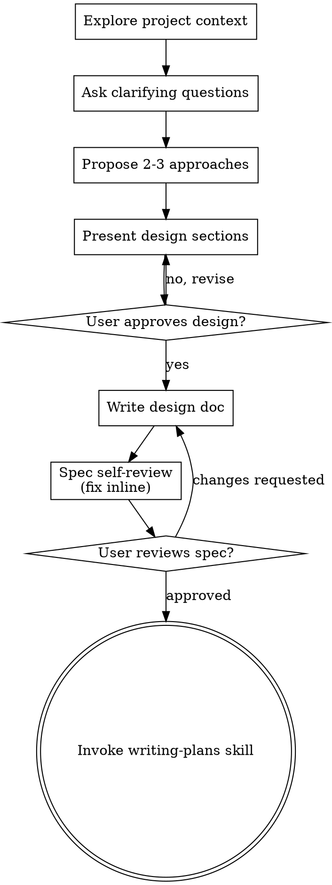
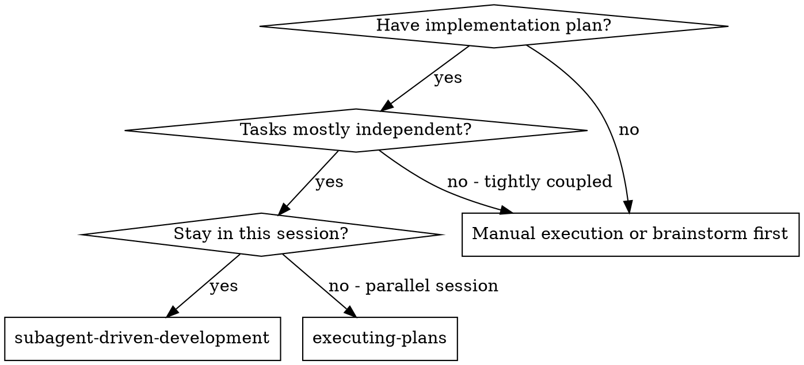
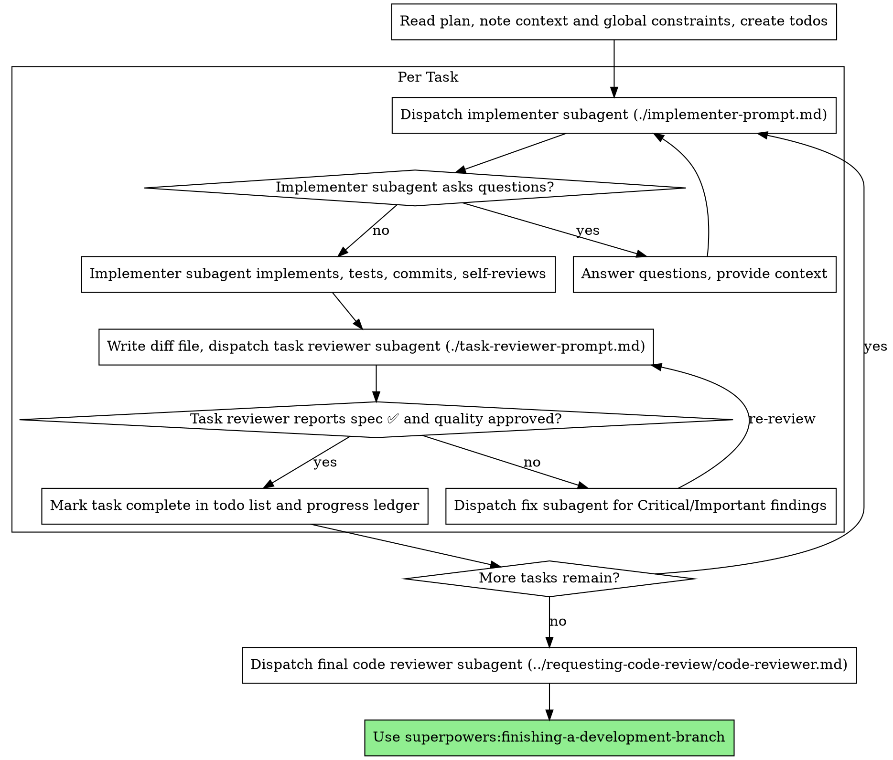

# Codex Session `01a04c77-2685-7013-ad38-d81feba1b2a4`

> Human review required before submission. Automatic redaction is best-effort.

- Model: `gpt-5.6-sol`
- Started: `2026-08-29T07:41:12.231Z`
- Working directory: `~/dev/assignment/kbhc-assgn`

## Turn 1

### User prompt

<environment_context>
  <cwd>~/dev/assignment/kbhc-assgn</cwd>
  <shell>zsh</shell>
  <current_date>2026-08-29</current_date>
  <timezone>Asia/Seoul</timezone>
  <filesystem><workspace_roots><root>~/dev/assignment/kbhc-assgn</root></workspace_roots><permission_profile type="disabled"><file_system type="unrestricted" /></permission_profile></filesystem>
</environment_context>

해당 세션에서는 과제 기능을 구현하지 말고, 저장소와 요구사항을 분석한 뒤 AI를 활용한 개발·검증 루프를 프로젝트 규모에 맞게 세팅할 것

작업 흐름은 다음과 같음 요구사항 분석 → 작은 단위 구현 → 자동 검증 → 브라우저 검증 → 실패 분류 및 수정 → 사람의 승인 → 최종 QA

### Tool activity

#### `exec`

- Call ID: `call_tO3xEHekoVf9mLCLuvsr0oGg`
- Status: `completed`

**Input**

```text
const r = await tools.exec_command({"cmd":"sed -n '1,240p' ~/.agents/skills/brainstorming/SKILL.md && sed -n '1,280p' ~/.agents/skills/writing-plans/SKILL.md && pwd && rg --files -g 'AGENTS.md' -g '!node_modules' -g '!vendor' | sort","workdir":"~/dev/assignment/kbhc-assgn","yield_time_ms":10000,"max_output_tokens":30000});
text(r.output);

```

**Output**

`````text
Script completed
Wall time 0.2 seconds
Output:

---
name: brainstorming
description: "You MUST use this before any creative work - creating features, building components, adding functionality, or modifying behavior. Explores user intent, requirements and design before implementation."
---

# Brainstorming Ideas Into Designs

Help turn ideas into fully formed designs and specs through natural collaborative dialogue.

Start by understanding the current project context, then ask questions one at a time to refine the idea. Once you understand what you're building, present the design and get user approval.

<HARD-GATE>
Do NOT invoke any implementation skill, write any code, scaffold any project, or take any implementation action until you have presented a design and the user has approved it. This applies to EVERY project regardless of perceived simplicity.
</HARD-GATE>

## Anti-Pattern: "This Is Too Simple To Need A Design"

Every project goes through this process. A todo list, a single-function utility, a config change — all of them. "Simple" projects are where unexamined assumptions cause the most wasted work. The design can be short (a few sentences for truly simple projects), but you MUST present it and get approval.

## Checklist

You MUST create a task for each of these items and complete them in order:

1. **Explore project context** — check files, docs, recent commits
2. **Offer the visual companion just-in-time** — NOT upfront. The first time a question would genuinely be clearer shown than described, offer it then (its own message); on approval its browser tab opens for you. If no visual question ever arises, never offer it. See the Visual Companion section below.
3. **Ask clarifying questions** — one at a time, understand purpose/constraints/success criteria
4. **Propose 2-3 approaches** — with trade-offs and your recommendation
5. **Present design** — in sections scaled to their complexity, get user approval after each section
6. **Write design doc** — save to `docs/superpowers/specs/YYYY-MM-DD-<topic>-design.md` and commit
7. **Spec self-review** — quick inline check for placeholders, contradictions, ambiguity, scope (see below)
8. **User reviews written spec** — ask user to review the spec file before proceeding
9. **Transition to implementation** — invoke writing-plans skill to create implementation plan

## Process Flow



**The terminal state is invoking writing-plans.** Do NOT invoke frontend-design, mcp-builder, or any other implementation skill. The ONLY skill you invoke after brainstorming is writing-plans.

## The Process

**Understanding the idea:**

- Check out the current project state first (files, docs, recent commits)
- Before asking detailed questions, assess scope: if the request describes multiple independent subsystems (e.g., "build a platform with chat, file storage, billing, and analytics"), flag this immediately. Don't spend questions refining details of a project that needs to be decomposed first.
- If the project is too large for a single spec, help the user decompose into sub-projects: what are the independent pieces, how do they relate, what order should they be built? Then brainstorm the first sub-project through the normal design flow. Each sub-project gets its own spec → plan → implementation cycle.
- For appropriately-scoped projects, ask questions one at a time to refine the idea
- Prefer multiple choice questions when possible, but open-ended is fine too
- Only one question per message - if a topic needs more exploration, break it into multiple questions
- Focus on understanding: purpose, constraints, success criteria

**Exploring approaches:**

- Propose 2-3 different approaches with trade-offs
- Present options conversationally with your recommendation and reasoning
- Lead with your recommended option and explain why

**Presenting the design:**

- Once you believe you understand what you're building, present the design
- Scale each section to its complexity: a few sentences if straightforward, up to 200-300 words if nuanced
- Ask after each section whether it looks right so far
- Cover: architecture, components, data flow, error handling, testing
- Be ready to go back and clarify if something doesn't make sense

**Design for isolation and clarity:**

- Break the system into smaller units that each have one clear purpose, communicate through well-defined interfaces, and can be understood and tested independently
- For each unit, you should be able to answer: what does it do, how do you use it, and what does it depend on?
- Can someone understand what a unit does without reading its internals? Can you change the internals without breaking consumers? If not, the boundaries need work.
- Smaller, well-bounded units are also easier for you to work with - you reason better about code you can hold in context at once, and your edits are more reliable when files are focused. When a file grows large, that's often a signal that it's doing too much.

**Working in existing codebases:**

- Explore the current structure before proposing changes. Follow existing patterns.
- Where existing code has problems that affect the work (e.g., a file that's grown too large, unclear boundaries, tangled responsibilities), include targeted improvements as part of the design - the way a good developer improves code they're working in.
- Don't propose unrelated refactoring. Stay focused on what serves the current goal.

## After the Design

**Documentation:**

- Write the validated design (spec) to `docs/superpowers/specs/YYYY-MM-DD-<topic>-design.md`
  - (User preferences for spec location override this default)
- Use elements-of-style:writing-clearly-and-concisely skill if available
- Commit the design document to git

**Spec Self-Review:**
After writing the spec document, look at it with fresh eyes:

1. **Placeholder scan:** Any "TBD", "TODO", incomplete sections, or vague requirements? Fix them.
2. **Internal consistency:** Do any sections contradict each other? Does the architecture match the feature descriptions?
3. **Scope check:** Is this focused enough for a single implementation plan, or does it need decomposition?
4. **Ambiguity check:** Could any requirement be interpreted two different ways? If so, pick one and make it explicit.

Fix any issues inline. No need to re-review — just fix and move on.

**User Review Gate:**
After the spec review loop passes, ask the user to review the written spec before proceeding:

> "Spec written and committed to `<path>`. Please review it and let me know if you want to make any changes before we start writing out the implementation plan."

Wait for the user's response. If they request changes, make them and re-run the spec review loop. Only proceed once the user approves.

**Implementation:**

- Invoke the writing-plans skill to create a detailed implementation plan
- Do NOT invoke any other skill. writing-plans is the next step.

## Key Principles

- **One question at a time** - Don't overwhelm with multiple questions
- **Multiple choice preferred** - Easier to answer than open-ended when possible
- **YAGNI ruthlessly** - Remove unnecessary features from all designs
- **Explore alternatives** - Always propose 2-3 approaches before settling
- **Incremental validation** - Present design, get approval before moving on
- **Be flexible** - Go back and clarify when something doesn't make sense

## Visual Companion

A browser-based companion for showing mockups, diagrams, and visual options during brainstorming. Available as a tool — not a mode. Accepting the companion means it's available for questions that benefit from visual treatment; it does NOT mean every question goes through the browser.

**Offering the companion (just-in-time):** Do NOT offer it upfront. Wait until a question would genuinely be clearer shown than told — a real mockup / layout / diagram question, not merely a UI *topic*. The first time that happens, offer it then, as its own message:
> "This next part might be easier if I show you — I can put together mockups, diagrams, and comparisons in a browser tab as we go. It's still new and can be token-intensive. Want me to? I'll open it for you."

**This offer MUST be its own message.** Only the offer — no clarifying question, summary, or other content. Wait for the user's response. If they accept, start the server with `--open` so their browser opens to the first screen automatically. If they decline, continue text-only and don't offer again unless they raise it.

**Per-question decision:** Even after the user accepts, decide FOR EACH QUESTION whether to use the browser or the terminal. The test: **would the user understand this better by seeing it than reading it?**

- **Use the browser** for content that IS visual — mockups, wireframes, layout comparisons, architecture diagrams, side-by-side visual designs
- **Use the terminal** for content that is text — requirements questions, conceptual choices, tradeoff lists, A/B/C/D text options, scope decisions

A question about a UI topic is not automatically a visual question. "What does personality mean in this context?" is a conceptual question — use the terminal. "Which wizard layout works better?" is a visual question — use the browser.

If they agree to the companion, read the detailed guide before proceeding:
`skills/brainstorming/visual-companion.md`
---
name: writing-plans
description: Use when you have a spec or requirements for a multi-step task, before touching code
---

# Writing Plans

## Overview

Write comprehensive implementation plans assuming the engineer has zero context for our codebase and questionable taste. Document everything they need to know: which files to touch for each task, code, testing, docs they might need to check, how to test it. Give them the whole plan as bite-sized tasks. DRY. YAGNI. TDD. Frequent commits.

Assume they are a skilled developer, but know almost nothing about our toolset or problem domain. Assume they don't know good test design very well.

**Announce at start:** "I'm using the writing-plans skill to create the implementation plan."

**Context:** If working in an isolated worktree, it should have been created via the `superpowers:using-git-worktrees` skill at execution time.

**Save plans to:** `docs/superpowers/plans/YYYY-MM-DD-<feature-name>.md`
- (User preferences for plan location override this default)

## Scope Check

If the spec covers multiple independent subsystems, it should have been broken into sub-project specs during brainstorming. If it wasn't, suggest breaking this into separate plans — one per subsystem. Each plan should produce working, testable software on its own.

## File Structure

Before defining tasks, map out which files will be created or modified and what each one is responsible for. This is where decomposition decisions get locked in.

- Design units with clear boundaries and well-defined interfaces. Each file should have one clear responsibility.
- You reason best about code you can hold in context at once, and your edits are more reliable when files are focused. Prefer smaller, focused files over large ones that do too much.
- Files that change together should live together. Split by responsibility, not by technical layer.
- In existing codebases, follow established patterns. If the codebase uses large files, don't unilaterally restructure - but if a file you're modifying has grown unwieldy, including a split in the plan is reasonable.

This structure informs the task decomposition. Each task should produce self-contained changes that make sense independently.

## Task Right-Sizing

A task is the smallest unit that carries its own test cycle and is worth a
fresh reviewer's gate. When drawing task boundaries: fold setup,
configuration, scaffolding, and documentation steps into the task whose
deliverable needs them; split only where a reviewer could meaningfully
reject one task while approving its neighbor. Each task ends with an
independently testable deliverable.

## Bite-Sized Task Granularity

**Each step is one action (2-5 minutes):**
- "Write the failing test" - step
- "Run it to make sure it fails" - step
- "Implement the minimal code to make the test pass" - step
- "Run the tests and make sure they pass" - step
- "Commit" - step

## Plan Document Header

**Every plan MUST start with this header:**

```markdown
# [Feature Name] Implementation Plan

> **For agentic workers:** REQUIRED SUB-SKILL: Use superpowers:subagent-driven-development (recommended) or superpowers:executing-plans to implement this plan task-by-task. Steps use checkbox (`- [ ]`) syntax for tracking.

**Goal:** [One sentence describing what this builds]

**Architecture:** [2-3 sentences about approach]

**Tech Stack:** [Key technologies/libraries]

## Global Constraints

[The spec's project-wide requirements — version floors, dependency limits,
naming and copy rules, platform requirements — one line each, with exact
values copied verbatim from the spec. Every task's requirements implicitly
include this section.]

---
```

## Task Structure

````markdown
### Task N: [Component Name]

**Files:**
- Create: `exact/path/to/file.py`
- Modify: `exact/path/to/existing.py:123-145`
- Test: `tests/exact/path/to/test.py`

**Interfaces:**
- Consumes: [what this task uses from earlier tasks — exact signatures]
- Produces: [what later tasks rely on — exact function names, parameter
  and return types. A task's implementer sees only their own task; this
  block is how they learn the names and types neighboring tasks use.]

- [ ] **Step 1: Write the failing test**

```python
def test_specific_behavior():
    result = function(input)
    assert result == expected
```

- [ ] **Step 2: Run test to verify it fails**

Run: `pytest tests/path/test.py::test_name -v`
Expected: FAIL with "function not defined"

- [ ] **Step 3: Write minimal implementation**

```python
def function(input):
    return expected
```

- [ ] **Step 4: Run test to verify it passes**

Run: `pytest tests/path/test.py::test_name -v`
Expected: PASS

- [ ] **Step 5: Commit**

```bash
git add tests/path/test.py src/path/file.py
git commit -m "feat: add specific feature"
```
````

## No Placeholders

Every step must contain the actual content an engineer needs. These are **plan failures** — never write them:
- "TBD", "TODO", "implement later", "fill in details"
- "Add appropriate error handling" / "add validation" / "handle edge cases"
- "Write tests for the above" (without actual test code)
- "Similar to Task N" (repeat the code — the engineer may be reading tasks out of order)
- Steps that describe what to do without showing how (code blocks required for code steps)
- References to types, functions, or methods not defined in any task

## Remember
- Exact file paths always
- Complete code in every step — if a step changes code, show the code
- Exact commands with expected output
- DRY, YAGNI, TDD, frequent commits

## Self-Review

After writing the complete plan, look at the spec with fresh eyes and check the plan against it. This is a checklist you run yourself — not a subagent dispatch.

**1. Spec coverage:** Skim each section/requirement in the spec. Can you point to a task that implements it? List any gaps.

**2. Placeholder scan:** Search your plan for red flags — any of the patterns from the "No Placeholders" section above. Fix them.

**3. Type consistency:** Do the types, method signatures, and property names you used in later tasks match what you defined in earlier tasks? A function called `clearLayers()` in Task 3 but `clearFullLayers()` in Task 7 is a bug.

If you find issues, fix them inline. No need to re-review — just fix and move on. If you find a spec requirement with no task, add the task.

## Execution Handoff

After saving the plan, offer execution choice:

**"Plan complete and saved to `docs/superpowers/plans/<filename>.md`. Two execution options:**

**1. Subagent-Driven (recommended)** - I dispatch a fresh subagent per task, review between tasks, fast iteration

**2. Inline Execution** - Execute tasks in this session using executing-plans, batch execution with checkpoints

**Which approach?"**

**If Subagent-Driven chosen:**
- **REQUIRED SUB-SKILL:** Use superpowers:subagent-driven-development
- Fresh subagent per task + two-stage review

**If Inline Execution chosen:**
- **REQUIRED SUB-SKILL:** Use superpowers:executing-plans
- Batch execution with checkpoints for review
~/dev/assignment/kbhc-assgn

`````

#### `exec`

- Call ID: `call_E1DGDxoN04FPxPyYcHXbh3ZE`
- Status: `completed`

**Input**

```text
const p = await tools.update_plan({plan:[
  {step:"저장소 구조·문서·최근 변경·실행 경로 조사",status:"in_progress"},
  {step:"요구사항·제약·성공 기준을 질문으로 확정",status:"pending"},
  {step:"개발·검증 루프 대안 2~3개 비교",status:"pending"},
  {step:"권장 설계 제시 후 사용자 승인",status:"pending"},
  {step:"승인된 설계 문서화·자체 검토",status:"pending"},
  {step:"사용자 문서 승인 후 실행 계획 작성",status:"pending"}
]});
const r = await tools.exec_command({"cmd":"ls -la && find . -maxdepth 2 -type f -not -path './.git/*' -not -path './node_modules/*' | sort | sed -n '1,260p' && git status --short --branch && git log -8 --oneline --decorate --stat","workdir":"~/dev/assignment/kbhc-assgn","yield_time_ms":10000,"max_output_tokens":30000});
text(r.output);

```

**Output**

```text
Script completed
Wall time 0.4 seconds
Output:

total 24
drwxr-xr-x@ 12 identity  staff   384 Aug 29 16:34 .
drwxr-xr-x   5 identity  staff   160 Aug 29 15:33 ..
drwxr-xr-x@  4 identity  staff   128 Aug 29 16:30 .codex
drwxr-xr-x@ 15 identity  staff   480 Aug 29 16:34 .git
-rw-r--r--@  1 identity  staff    41 Aug 29 16:34 .gitattributes
-rw-r--r--@  1 identity  staff    94 Aug 29 16:30 .gitignore
drwxr-xr-x@  2 identity  staff    64 Aug 29 16:30 .worktrees
-rw-r--r--@  1 identity  staff  1209 Aug 29 16:33 AI_USAGE.md
drwxr-xr-x@  4 identity  staff   128 Aug 29 16:33 artifacts
drwxr-xr-x@  4 identity  staff   128 Aug 29 15:56 assignment-original
drwxr-xr-x@  3 identity  staff    96 Aug 29 16:06 docs
drwxr-xr-x@  4 identity  staff   128 Aug 29 16:30 tests
./.codex/hooks.json
./.gitattributes
./.gitignore
./AI_USAGE.md
./artifacts/.gitkeep
./artifacts/codex-session-01a04c3e-0a24-7e30-a767-64f1e2c4f3ae.md
./assignment-original/openapi.yaml
./assignment-original/requirement.md
./tests/test_export_session.py
## main...origin/main [gone]
a740d66 (HEAD -> main) chore: preserve session transcript whitespace
 .gitattributes | 1 +
 1 file changed, 1 insertion(+)
94db365 docs: add Codex implementation session record
 AI_USAGE.md                                        |    1 +
 ...session-01a04c3e-0a24-7e30-a767-64f1e2c4f3ae.md | 6428 ++++++++++++++++++++
 2 files changed, 6429 insertions(+)
95b2c1f chore: wire Codex usage recording
 .codex/hooks.json            | 17 +++++++++++++++++
 .gitignore                   |  4 ++++
 AI_USAGE.md                  | 33 +++++++++++++++++++++++++++++++++
 artifacts/.gitkeep           |  1 +
 tests/test_export_session.py | 25 +++++++++++++++++++++++++
 5 files changed, 80 insertions(+)
a45640b feat: export Codex session artifacts atomically
 .codex/hooks/export_session.py | 131 +++++++++++++++++++++++++++++++++++++++++
 tests/test_export_session.py   |  77 ++++++++++++++++++++++++
 2 files changed, 208 insertions(+)
d3f67f4 feat: redact and render Codex session artifacts
 .codex/hooks/export_session.py | 102 +++++++++++++++++++++++++++++++++++++++++
 tests/test_export_session.py   |  63 +++++++++++++++++++++++++
 2 files changed, 165 insertions(+)
8893171 feat: parse Codex session rollout
 .codex/hooks/export_session.py     | 145 +++++++++++++++++++++++++++++++++++++
 tests/fixtures/codex-rollout.jsonl |  13 ++++
 tests/test_export_session.py       |  65 +++++++++++++++++
 3 files changed, 223 insertions(+)
eb549f3 chore: ignore local worktrees
 .gitignore | 1 +
 1 file changed, 1 insertion(+)
d556902 docs: add original assignment specification
 assignment-original/openapi.yaml   | 310 +++++++++++++++++++++++++++++++++++++
 assignment-original/requirement.md |  78 ++++++++++
 2 files changed, 388 insertions(+)

```

#### `exec`

- Call ID: `call_nOlQV45E0rusfbFfTTznAwLy`
- Status: `completed`

**Input**

```text
const r = await tools.exec_command({"cmd":"rg --files -g '!artifacts/*.md' | sort && find docs -type f -maxdepth 4 -print | sort && git branch -a -vv && git worktree list --porcelain && sed -n '1,220p' assignment-original/requirement.md && sed -n '1,380p' assignment-original/openapi.yaml && sed -n '1,220p' AI_USAGE.md && sed -n '1,220p' .codex/hooks.json && sed -n '1,460p' .codex/hooks/export_session.py && sed -n '1,320p' tests/test_export_session.py","workdir":"~/dev/assignment/kbhc-assgn","yield_time_ms":10000,"max_output_tokens":50000});
text(r.output);

```

**Output**

`````text
Script completed
Wall time 0.2 seconds
Output:

AI_USAGE.md
assignment-original/openapi.yaml
assignment-original/requirement.md
docs/superpowers/plans/2026-08-29-codex-session-artifact.md
docs/superpowers/specs/2026-08-29-codex-session-artifact-design.md
tests/fixtures/codex-rollout.jsonl
tests/test_export_session.py
docs/superpowers/plans/2026-08-29-codex-session-artifact.md
docs/superpowers/specs/2026-08-29-codex-session-artifact-design.md
* main a740d66 [origin/main: gone] chore: preserve session transcript whitespace
worktree ~/dev/assignment/kbhc-assgn
HEAD a740d668d887c2d7fa49abf8ac6cd54075c4fd8d
branch refs/heads/main

# 프론트엔드 과제

## 설명

- React@18/19와 typescript를 사용해주세요. 그 이외의 라이브러리는 자유롭게 사용하셔도 됩니다.
  다만, 해당 라이브러리 사용에 대한 판단은 개발자마다 다를 수 있습니다.
- 아이콘은 항목별로 겹치지 않게 지정하여 사용하면 됩니다. 아이콘 요소에 대해 심미적인 부분은 고려하지 않아도 됩니다.
- 색상은 토큰으로 관리되어야 합니다.
  - 예시) primary: blue, disabled: gray
- 폰트는 pretendard를 사용해주세요.
- 추가적인 결정 사항이 필요한 경우 자의적으로 결정하신 후 코멘트를 남겨주시거나, 질문을 주셔도 됩니다.
  다만, 질문에 대한 답변이 실시간성이 없을 수 있습니다.
- Agent AI를 활용한 경우, 사용 사실과 활용 범위를 `AI_USAGE.md`로 제출해주세요.
  - 제출 시 가산점이 있을 수 있습니다. 미제출 시 감점은 없습니다.
  - 필수: 사용한 도구/모델, 적용한 작업 범위, 핵심 프롬프트 요약, 사람이 최종 검증한 내용
  - 선택: 전체 프롬프트 원문, subagent 설정, 계획 문서
  - 주의: 비밀정보(API 키, 개인/회사 민감정보)는 제거 후 제출

## 페이지

### GNB/LNB

- 라우트 맵
  - 대시보드 `대시보드 아이콘 표시`, 클릭 시 대시보드 페이지로 전환
  - 할 일 `할일 아이콘 표시`, 클릭 시 할 일 페이지로 전환
- 로그인/회원정보
  - 로그인 한 경우, `회원정보 아이콘` 표시, 클릭 시 회원정보 페이지로 전환
  - 로그인하지 않은 경우, `로그인 아이콘` 표시, 클릭 시 로그인 페이지로 전환

### 대시보드 (/)

|   요소    | 설명                               |
| :-------: | ---------------------------------- |
|    일     | 일의 갯수(numOfTask) 표기          |
| 해야할 일 | 해야할 일 갯수 표기(numOfRestTask) |
|   한 일   | 한 일의 갯수 표기(numOfDoneTask)   |

### 로그인 (/sign-in)

- [POST] /api/sign-in로 제출해주세요.
  - API Status Code가 200이 아닌 경우, `errorMessage`을 제공하는 모달을 띄어주세요.
- form의 input에 대한 label이 표기되어야 합니다.
- form의 input에에 대한 유효성 검증이 통과되지 않는 경우 적절히 표시되어야 합니다.

**로그인 폼**
| 요소 | 설명 | 설명2 |
| :------: | ------------------------------------------------------------------ | ------ |
| email | email 규약에 맞는 문자열 | 필수값 |
| 비밀번호 | 영문, 숫자로 구성된 8글자 이상의, 24글자 이하의 문자열 | 필수값 |
| 제출 | ID와 PW의 조건이 만족된 경우 활성화, 만족되지 않은 경우는 비활성화 ||

### 목록 (/task)

- `[GET] /api/task`의 결과값을 카드 목록으로 보여주세요.
- 각 카드는 title과 memo가 보여져야 합니다.
- 스크롤 영역에서 화면에 보여지는 요소 또는 보여질 요소에 대해서만 적절히 렌더링해주세요(가상 스크롤링).
- 목록에 끝에 도달하는 경우 다음 페이지의 API를 호출해주세요(무한 스크롤).
- 할 일을 클릭 시 각 상세페이지로 이동해주세요.

### 상세 (/task/:id)

- `[GET] /api/task/:id`의 결과값을 보여주세요.
  - 404가 반환된 경우, 목록으로 돌아갈 수 있는 버튼을 포함한 리소스가 없는 경우의 화면을 구현해주세요.
    _심미성은 판단하지 않습니다._
- 삭제 버튼을 제공해주세요.
  - 삭제 버튼을 클릭 시, 삭제 여부를 확인하는 input을 포함한 모달을 생성해주세요.
    - input에 해당 id와 동일한 값을 기입한 후 `제출` 버튼을 클릭하면, 목록으로 redirect 해주세요.
    - input에 해당 id와 동일한 값을 기입되지 않은 경우 `제출` 버튼은 비활성화해주세요.

### 회원정보

- `[GET] /api/user`의 결과값을 보여주세요.

## 전문

API 서버에 대해서는 별도의 서버 구축, API 함수 레벨에서의 mocking, MSW 등 익숙하신 방법으로 처리하시면 됩니다.
다만 구성하신 방법에 대한 코드는 함께 제출해주세요.
API 전문은 `openapi.yaml` (OAS 3.1) 기준을 우선합니다.openapi: 3.1.0
info:
  title: Frontend Assignment API
  version: 1.0.0
  description: API contract derived from requirement.md
servers:
  - url: /
paths:
  /api/sign-in:
    post:
      summary: Sign in
      operationId: signIn
      requestBody:
        required: true
        content:
          application/json:
            schema:
              $ref: '#/components/schemas/SignInRequest'
      responses:
        '200':
          description: Sign-in success
          content:
            application/json:
              schema:
                $ref: '#/components/schemas/AuthTokenResponse'
        '400':
          description: Sign-in failed
          content:
            application/json:
              schema:
                $ref: '#/components/schemas/ErrorResponse'
  /api/refresh:
    post:
      summary: Refresh access token
      operationId: refreshToken
      security:
        - refreshTokenCookie: []
      responses:
        '200':
          description: Refresh success
          content:
            application/json:
              schema:
                $ref: '#/components/schemas/AuthTokenResponse'
        '401':
          description: Unauthorized (invalid or expired refresh token)
          content:
            application/json:
              schema:
                $ref: '#/components/schemas/ErrorResponse'
        '400':
          description: Refresh failed
          content:
            application/json:
              schema:
                $ref: '#/components/schemas/ErrorResponse'
  /api/user:
    get:
      summary: Get user profile
      operationId: getUser
      security:
        - bearerAuth: []
      responses:
        '200':
          description: User profile
          content:
            application/json:
              schema:
                $ref: '#/components/schemas/UserResponse'
        '401':
          description: Unauthorized
          content:
            application/json:
              schema:
                $ref: '#/components/schemas/ErrorResponse'
  /api/dashboard:
    get:
      summary: Get dashboard metrics
      operationId: getDashboard
      security:
        - bearerAuth: []
      responses:
        '200':
          description: Dashboard data
          content:
            application/json:
              schema:
                $ref: '#/components/schemas/DashboardResponse'
        '401':
          description: Unauthorized
          content:
            application/json:
              schema:
                $ref: '#/components/schemas/ErrorResponse'
  /api/task:
    get:
      summary: Get task list
      operationId: getTasks
      security:
        - bearerAuth: []
      parameters:
        - in: query
          name: page
          required: true
          schema:
            type: integer
            minimum: 1
      responses:
        '200':
          description: Task page
          content:
            application/json:
              schema:
                $ref: '#/components/schemas/TaskListResponse'
        '401':
          description: Unauthorized
          content:
            application/json:
              schema:
                $ref: '#/components/schemas/ErrorResponse'
  /api/task/{id}:
    get:
      summary: Get task detail
      operationId: getTaskDetail
      security:
        - bearerAuth: []
      parameters:
        - $ref: '#/components/parameters/TaskIdPath'
      responses:
        '200':
          description: Task detail
          content:
            application/json:
              schema:
                $ref: '#/components/schemas/TaskDetailResponse'
        '401':
          description: Unauthorized
          content:
            application/json:
              schema:
                $ref: '#/components/schemas/ErrorResponse'
        '404':
          description: Task not found
          content:
            application/json:
              schema:
                $ref: '#/components/schemas/ErrorResponse'
    delete:
      summary: Delete task
      operationId: deleteTask
      security:
        - bearerAuth: []
      parameters:
        - $ref: '#/components/parameters/TaskIdPath'
      responses:
        '200':
          description: Task deleted
          content:
            application/json:
              schema:
                $ref: '#/components/schemas/DeleteTaskResponse'
        '401':
          description: Unauthorized
          content:
            application/json:
              schema:
                $ref: '#/components/schemas/ErrorResponse'
        '404':
          description: Task not found
          content:
            application/json:
              schema:
                $ref: '#/components/schemas/ErrorResponse'
components:
  securitySchemes:
    bearerAuth:
      type: http
      scheme: bearer
      bearerFormat: JWT
    refreshTokenCookie:
      type: apiKey
      in: cookie
      name: token
      description: Refresh token cookie. In browser clients, send requests with credentials.
  parameters:
    TaskIdPath:
      name: id
      in: path
      required: true
      schema:
        type: string
  schemas:
    SignInRequest:
      type: object
      additionalProperties: false
      required:
        - email
        - password
      properties:
        email:
          type: string
          format: email
        password:
          [REDACTED] string
          minLength: 8
          maxLength: 24
          pattern: '^[A-Za-z0-9]+$'
    AuthTokenResponse:
      type: object
      additionalProperties: false
      required:
        - accessToken
        - refreshToken
      properties:
        accessToken:
          [REDACTED] string
          description: JWT token. Decoded payload contains id and exp.
        refreshToken:
          type: string
          description: JWT token. Decoded payload contains id and exp.
    UserResponse:
      type: object
      additionalProperties: false
      required:
        - name
        - memo
      properties:
        name:
          type: string
        memo:
          type: string
    DashboardResponse:
      type: object
      additionalProperties: false
      required:
        - numOfTask
        - numOfRestTask
        - numOfDoneTask
      properties:
        numOfTask:
          type: integer
        numOfRestTask:
          type: integer
        numOfDoneTask:
          type: integer
    TaskItem:
      type: object
      additionalProperties: false
      required:
        - id
        - title
        - memo
        - status
      properties:
        id:
          type: string
        title:
          type: string
        memo:
          type: string
        status:
          type: string
          enum:
            - TODO
            - DONE
    TaskListResponse:
      type: object
      additionalProperties: false
      required:
        - data
        - hasNext
      properties:
        data:
          type: array
          items:
            $ref: '#/components/schemas/TaskItem'
        hasNext:
          type: boolean
    TaskDetailResponse:
      type: object
      additionalProperties: false
      required:
        - title
        - memo
        - registerDatetime
      properties:
        title:
          type: string
        memo:
          type: string
        registerDatetime:
          type: string
          format: date-time
    DeleteTaskResponse:
      type: object
      additionalProperties: false
      required:
        - success
      properties:
        success:
          type: boolean
          const: true
    ErrorResponse:
      type: object
      additionalProperties: false
      required:
        - errorMessage
      properties:
        errorMessage:
          type: string
# AI 사용 내역

## 사용한 도구와 모델

- 도구: OpenAI Codex
- 모델: `gpt-5.6-sol`

## 적용한 작업 범위

- 과제 요구사항 분석과 프로젝트 구조 결정
- Codex 사용 기록 자동화 설계 및 구현
- 이후 구현 과정의 코드 작성, 테스트, 검토 보조

## 핵심 프롬프트 요약

- 과제 원본 문서를 별도 디렉터리로 분리
- Codex Stop Hook으로 사용자 프롬프트, 도구 작업, 최종 응답 기록
- 시스템·개발자 지침과 내부 reasoning 제외
- 비밀정보 자동 마스킹 후 사람 검토

## 사람이 최종 검증한 내용

- [ ] 비밀정보와 민감정보 제거 확인
- [ ] 프롬프트와 작업 결과 정확성 확인
- [ ] 테스트 결과와 애플리케이션 동작 확인
- [ ] 도구, 모델, 작업 범위 정확성 확인

## 전체 프롬프트와 작업 기록

- [세션 기록 디렉터리](./artifacts/)
- [기록 자동화 설계·구현 세션](./artifacts/codex-session-01a04c3e-0a24-7e30-a767-64f1e2c4f3ae.md)

세션 문서는 `artifacts/codex-session-<session-id>.md` 형식으로 생성합니다.
자동 마스킹은 보조 수단이므로 제출 전 사람 검토가 필요합니다.
{
  "description": "Export reviewable Codex session evidence for AI_USAGE.md.",
  "hooks": {
    "Stop": [
      {
        "hooks": [
          {
            "type": "command",
            "command": "/usr/bin/python3 \"$(git rev-parse --show-toplevel)/.codex/hooks/export_session.py\"",
            "timeout": 30,
            "statusMessage": "Exporting Codex session record"
          }
        ]
      }
    ]
  }
}
#!/usr/bin/env python3
import argparse
import datetime
import json
import os
import re
import sys
import tempfile
from dataclasses import dataclass, field
from pathlib import Path
from typing import Callable, Dict, List, Optional, Set


REDACTED = "[REDACTED]"
SECRET_PATTERNS = [
    (
        re.compile(r"(?i)(Authorization\s*:\s*(?:Bearer|Basic)\s+)[^\s\"']+"),
        r"\1" + REDACTED,
    ),
    (
        re.compile(
            r"(?i)([\"']?(?:api[_-]?key|access[_-]?token|secret|password)"
            r"[\"']?\s*[:=]\s*[\"']?)[^\s\"'&,]+"
        ),
        r"\1" + REDACTED,
    ),
    (re.compile(r"\bsk-[A-Za-z0-9_-]{16,}\b"), REDACTED),
    (re.compile(r"\bgh[pousr]_[A-Za-z0-9]{20,}\b"), REDACTED),
    (
        re.compile(
            r"(?s)-----BEGIN (?:RSA |EC |OPENSSH )?PRIVATE KEY-----.*?"
            r"-----END (?:RSA |EC |OPENSSH )?PRIVATE KEY-----"
        ),
        REDACTED,
    ),
    (
        re.compile(r"(?i)([?&](?:api_key|access_token|token|key)=)[^&\s]+"),
        r"\1" + REDACTED,
    ),
]


@dataclass
class ToolActivity:
    call_id: str
    name: str
    input_text: str
    output_text: str = ""
    status: str = ""


@dataclass
class TurnData:
    turn_id: str
    prompts: List[str] = field(default_factory=list)
    tools: List[ToolActivity] = field(default_factory=list)
    responses: List[str] = field(default_factory=list)


@dataclass
class SessionData:
    session_id: str
    model: str
    started_at: str
    cwd: str
    turns: List[TurnData] = field(default_factory=list)


def safe_session_id(raw: object) -> Optional[str]:
    if not isinstance(raw, str) or not raw:
        return None
    value = re.sub(r"[^A-Za-z0-9._-]", "_", raw)[:128].strip(".")
    return value or None


def extract_visible_text(content: object, allowed_types: Set[str]) -> str:
    if not isinstance(content, list):
        return ""
    parts = []
    for item in content:
        if not isinstance(item, dict) or item.get("type") not in allowed_types:
            continue
        text = item.get("text")
        if isinstance(text, str) and text:
            parts.append(text)
    return "\n".join(parts)


def parse_rollout(
    path: Path,
    session_id: str,
    fallback_model: str,
    on_warning: Callable[[str, int], None],
) -> SessionData:
    session = SessionData(session_id, fallback_model, "unknown", "unknown")
    turns_by_id: Dict[str, TurnData] = {}
    tools_by_call_id: Dict[str, ToolActivity] = {}

    def get_turn(raw_turn_id: object) -> TurnData:
        turn_id = (
            raw_turn_id
            if isinstance(raw_turn_id, str) and raw_turn_id
            else "ungrouped"
        )
        if turn_id not in turns_by_id:
            turns_by_id[turn_id] = TurnData(turn_id)
            session.turns.append(turns_by_id[turn_id])
        return turns_by_id[turn_id]

    with path.open("r", encoding="utf-8") as stream:
        for line_number, raw_line in enumerate(stream, 1):
            try:
                record = json.loads(raw_line)
            except (json.JSONDecodeError, TypeError):
                on_warning("malformed_json", line_number)
                continue
            if not isinstance(record, dict):
                continue
            payload = record.get("payload")
            if not isinstance(payload, dict):
                continue
            if record.get("type") == "session_meta":
                started = payload.get("timestamp") or record.get("timestamp")
                if isinstance(started, str):
                    session.started_at = started
                if isinstance(payload.get("cwd"), str):
                    session.cwd = payload["cwd"]
                continue
            if record.get("type") == "turn_context":
                get_turn(payload.get("turn_id"))
                if isinstance(payload.get("model"), str) and payload["model"]:
                    session.model = payload["model"]
                continue
            if record.get("type") != "response_item":
                continue

            metadata = payload.get("internal_chat_message_metadata_passthrough")
            metadata = metadata if isinstance(metadata, dict) else {}
            turn = get_turn(metadata.get("turn_id"))
            if payload.get("type") == "message":
                if payload.get("role") == "user":
                    text = extract_visible_text(payload.get("content"), {"input_text"})
                    if text:
                        turn.prompts.append(text)
                elif (
                    payload.get("role") == "assistant"
                    and payload.get("phase") == "final_answer"
                ):
                    text = extract_visible_text(payload.get("content"), {"output_text"})
                    if text:
                        turn.responses.append(text)
            elif (
                payload.get("type") == "custom_tool_call"
                and isinstance(payload.get("call_id"), str)
            ):
                tool = ToolActivity(
                    payload["call_id"],
                    payload.get("name")
                    if isinstance(payload.get("name"), str)
                    else "unknown",
                    payload.get("input")
                    if isinstance(payload.get("input"), str)
                    else "",
                    status=payload.get("status")
                    if isinstance(payload.get("status"), str)
                    else "",
                )
                turn.tools.append(tool)
                tools_by_call_id[tool.call_id] = tool
            elif (
                payload.get("type") == "custom_tool_call_output"
                and isinstance(payload.get("call_id"), str)
            ):
                tool = tools_by_call_id.get(payload["call_id"])
                if tool:
                    tool.output_text = extract_visible_text(
                        payload.get("output"), {"input_text", "output_text"}
                    )
    return session


def redact(text: str, home: Optional[Path] = None) -> str:
    result = text
    for pattern, replacement in SECRET_PATTERNS:
        result = pattern.sub(replacement, result)
    home_text = str(home or Path.home())
    if home_text and home_text != "/":
        result = result.replace(home_text, "~")
    return result


def fenced(text: str) -> str:
    fence = chr(96) * 3
    while fence in text:
        fence += chr(96)
    return "{0}text\n{1}\n{0}".format(fence, text, fence)


def render_markdown(session: SessionData, home: Optional[Path] = None) -> str:
    lines = [
        "# Codex Session `{}`".format(redact(session.session_id, home)),
        "",
        "> Human review required before submission. Automatic redaction is best-effort.",
        "",
        "- Model: `{}`".format(redact(session.model, home)),
        "- Started: `{}`".format(redact(session.started_at, home)),
        "- Working directory: `{}`".format(redact(session.cwd, home)),
        "",
    ]
    for index, turn in enumerate(session.turns, 1):
        lines.extend(["## Turn {}".format(index), ""])
        if turn.prompts:
            lines.extend(
                [
                    "### User prompt",
                    "",
                    redact("\n\n".join(turn.prompts), home),
                    "",
                ]
            )
        if turn.tools:
            lines.extend(["### Tool activity", ""])
            for tool in turn.tools:
                lines.extend(
                    [
                        "#### `{}`".format(redact(tool.name, home)),
                        "",
                        "- Call ID: `{}`".format(redact(tool.call_id, home)),
                        "- Status: `{}`".format(
                            redact(tool.status or "unknown", home)
                        ),
                        "",
                        "**Input**",
                        "",
                        fenced(redact(tool.input_text, home)),
                        "",
                        "**Output**",
                        "",
                        fenced(redact(tool.output_text, home)),
                        "",
                    ]
                )
        if turn.responses:
            lines.extend(
                [
                    "### Assistant response",
                    "",
                    redact("\n\n".join(turn.responses), home),
                    "",
                ]
            )
    return "\n".join(lines).rstrip() + "\n"


def log_event(
    repo_root: Path,
    event: str,
    session_id: str = "unknown",
    line: int = 0,
) -> None:
    path = repo_root / ".codex" / "hooks" / "export-session.log"
    stamp = datetime.datetime.now(datetime.timezone.utc).isoformat()
    try:
        path.parent.mkdir(parents=True, exist_ok=True)
        with path.open("a", encoding="utf-8") as stream:
            stream.write(
                "{} event={} session={} line={}\n".format(
                    stamp,
                    event,
                    safe_session_id(session_id) or "unknown",
                    line,
                )
            )
    except OSError:
        pass


def atomic_write(path: Path, content: str) -> None:
    path.parent.mkdir(parents=True, exist_ok=True)
    temporary_name = None
    try:
        with tempfile.NamedTemporaryFile(
            "w",
            encoding="utf-8",
            dir=str(path.parent),
            prefix=".codex-session-",
            suffix=".tmp",
            delete=False,
        ) as stream:
            temporary_name = stream.name
            stream.write(content)
            stream.flush()
            os.fsync(stream.fileno())
        os.replace(temporary_name, path)
        temporary_name = None
    finally:
        if temporary_name:
            try:
                Path(temporary_name).unlink()
            except OSError:
                pass


def cwd_is_inside_repo(cwd: object, repo_root: Path) -> bool:
    if not isinstance(cwd, str) or not cwd:
        return False
    try:
        root = str(repo_root.resolve())
        return os.path.commonpath([str(Path(cwd).resolve()), root]) == root
    except (OSError, ValueError):
        return False


def run_hook(hook_input: object, repo_root: Path) -> None:
    if not isinstance(hook_input, dict):
        log_event(repo_root, "invalid_hook_input")
        return
    if hook_input.get("hook_event_name") != "Stop":
        return
    session_id = safe_session_id(hook_input.get("session_id"))
    if session_id is None:
        log_event(repo_root, "invalid_session_id")
        return
    if not cwd_is_inside_repo(hook_input.get("cwd"), repo_root):
        log_event(repo_root, "cwd_outside_repo", session_id)
        return
    raw_path = hook_input.get("transcript_path")
    if not isinstance(raw_path, str) or not raw_path:
        log_event(repo_root, "missing_transcript", session_id)
        return
    transcript = Path(raw_path).expanduser()
    try:
        transcript_exists = transcript.is_file()
    except OSError:
        transcript_exists = False
    if not transcript_exists:
        log_event(repo_root, "missing_transcript", session_id)
        return
    model = hook_input.get("model")
    try:
        session = parse_rollout(
            transcript,
            session_id,
            model if isinstance(model, str) and model else "unknown",
            lambda event, line: log_event(repo_root, event, session_id, line),
        )
        destination = repo_root / "artifacts" / "codex-session-{}.md".format(
            session_id
        )
        atomic_write(destination, render_markdown(session))
    except (OSError, UnicodeError, ValueError, TypeError):
        log_event(repo_root, "export_failed", session_id)


def parse_args(argv=None):
    parser = argparse.ArgumentParser()
    parser.add_argument(
        "--repo-root",
        type=Path,
        default=Path(__file__).resolve().parents[2],
    )
    return parser.parse_args(argv)


def main(argv=None) -> int:
    args = parse_args(argv)
    try:
        hook_input = json.load(sys.stdin)
    except (json.JSONDecodeError, UnicodeError, TypeError):
        hook_input = None
    run_hook(hook_input, args.repo_root.resolve())
    json.dump({"continue": True}, sys.stdout)
    sys.stdout.write("\n")
    return 0


if __name__ == "__main__":
    sys.exit(main())
import importlib.util
import json
import subprocess
import sys
import tempfile
import unittest
from pathlib import Path


ROOT = Path(__file__).resolve().parents[1]
FIXTURE = ROOT / "tests" / "fixtures" / "codex-rollout.jsonl"
MODULE_PATH = ROOT / ".codex" / "hooks" / "export_session.py"
SPEC = importlib.util.spec_from_file_location("export_session", MODULE_PATH)
export_session = importlib.util.module_from_spec(SPEC)
sys.modules[SPEC.name] = export_session
SPEC.loader.exec_module(export_session)


class ParseRolloutTests(unittest.TestCase):
    def setUp(self):
        self.warnings = []

    def parse(self, path=FIXTURE):
        return export_session.parse_rollout(
            path,
            "session-123",
            "fallback-model",
            lambda event, line: self.warnings.append((event, line)),
        )

    def test_visible_records_are_grouped(self):
        session = self.parse()
        self.assertEqual(session.model, "gpt-5.6-sol")
        self.assertEqual([turn.turn_id for turn in session.turns], ["turn-1", "turn-2"])
        self.assertEqual(session.turns[0].prompts, ["Create structure"])
        self.assertEqual(session.turns[0].responses, ["Structure created"])
        self.assertEqual(session.turns[1].prompts, ["Add tests"])
        self.assertEqual(session.turns[1].responses, ["Tests added"])

    def test_tool_output_pairs_by_call_id(self):
        tool = self.parse().turns[0].tools[0]
        self.assertEqual(tool.call_id, "call-1")
        self.assertEqual(tool.name, "exec")
        self.assertEqual(tool.input_text, '{"cmd":"pwd"}')
        self.assertEqual(tool.output_text, "/workspace/kbhc-assgn")
        self.assertEqual(tool.status, "completed")

    def test_internal_records_never_render(self):
        visible = repr(self.parse())
        for hidden in ("internal instruction", "private reasoning", "Working", "must not render"):
            self.assertNotIn(hidden, visible)

    def test_malformed_line_is_skipped(self):
        with tempfile.TemporaryDirectory() as directory:
            path = Path(directory) / "rollout.jsonl"
            lines = FIXTURE.read_text(encoding="utf-8").splitlines()
            lines.insert(4, "{not-json")
            path.write_text("\n".join(lines) + "\n", encoding="utf-8")
            session = self.parse(path)
        self.assertEqual(len(session.turns), 2)
        self.assertEqual(self.warnings, [("malformed_json", 5)])


class RedactionAndRenderTests(unittest.TestCase):
    def test_redacts_all_supported_shapes(self):
        source = "\n".join(
            [
                "Authorization: Bearer [REDACTED]",
                "api_key=[REDACTED]",
                '"access_token": "[REDACTED]"',
                "OPENAI_API_KEY=[REDACTED]",
                "GITHUB_TOKEN=[REDACTED]",
                "https://example.test/?token=[REDACTED]&safe=yes",
                "[REDACTED]",
                "/Users/example/private/project",
            ]
        )
        rendered = export_session.redact(source, Path("/Users/example"))
        for secret in (
            "bearer-secret",
            "plain-secret",
            "json-secret",
            "[REDACTED]",
            "[REDACTED]",
            "query-secret",
            "private-material",
        ):
            self.assertNotIn(secret, rendered)
        self.assertIn("~/private/project", rendered)

    def test_render_is_ordered_and_deterministic(self):
        session = export_session.parse_rollout(
            FIXTURE,
            "session-123",
            "fallback-model",
            lambda event, line: None,
        )
        first = export_session.render_markdown(session)
        second = export_session.render_markdown(session)
        self.assertEqual(first, second)
        expected = [
            "Human review required before submission",
            "## Turn 1",
            "### User prompt",
            "Create structure",
            "### Tool activity",
            "#### `exec`",
            '{"cmd":"pwd"}',
            "/workspace/kbhc-assgn",
            "### Assistant response",
            "Structure created",
            "## Turn 2",
            "Add tests",
            "Tests added",
        ]
        position = -1
        for value in expected:
            position = first.index(value, position + 1)
        self.assertTrue(first.endswith("\n"))

    def test_fence_expands_for_embedded_backticks(self):
        block = export_session.fenced("before ``` after")
        self.assertTrue(block.startswith("````text\n"))
        self.assertTrue(block.endswith("\n````"))


class HookCliTests(unittest.TestCase):
    def run_cli(self, repo_root, stdin_text):
        return subprocess.run(
            [sys.executable, str(MODULE_PATH), "--repo-root", str(repo_root)],
            input=stdin_text,
            text=True,
            capture_output=True,
            check=False,
        )

    def payload(self, repo_root):
        return {
            "hook_event_name": "Stop",
            "session_id": "session-123",
            "transcript_path": str(FIXTURE),
            "cwd": str(repo_root),
            "model": "gpt-5.6-sol",
            "turn_id": "turn-2",
        }

    def test_success_is_idempotent(self):
        with tempfile.TemporaryDirectory() as directory:
            root = Path(directory)
            first_result = self.run_cli(root, json.dumps(self.payload(root)))
            artifact = root / "artifacts" / "codex-session-session-123.md"
            first = artifact.read_text(encoding="utf-8")
            second_result = self.run_cli(root, json.dumps(self.payload(root)))
            second = artifact.read_text(encoding="utf-8")
        self.assertEqual(first_result.returncode, 0)
        self.assertEqual(json.loads(first_result.stdout), {"continue": True})
        self.assertEqual(json.loads(second_result.stdout), {"continue": True})
        self.assertEqual(first, second)
        self.assertEqual(first.count("## Turn 1"), 1)

    def test_missing_transcript_preserves_previous_artifact(self):
        with tempfile.TemporaryDirectory() as directory:
            root = Path(directory)
            artifact_path = root / "artifacts" / "codex-session-session-123.md"
            artifact_path.parent.mkdir()
            artifact_path.write_text("existing\n", encoding="utf-8")
            payload = self.payload(root)
            payload["transcript_path"] = str(root / "secret-name.jsonl")
            result = self.run_cli(root, json.dumps(payload))
            artifact = artifact_path.read_text(encoding="utf-8")
            log = (root / ".codex" / "hooks" / "export-session.log").read_text(
                encoding="utf-8"
            )
        self.assertEqual(json.loads(result.stdout), {"continue": True})
        self.assertEqual(artifact, "existing\n")
        self.assertIn("missing_transcript", log)
        self.assertNotIn("secret-name.jsonl", log)

    def test_invalid_stdin_and_unsafe_session_write_nothing(self):
        with tempfile.TemporaryDirectory() as directory:
            root = Path(directory)
            invalid = self.run_cli(root, "not-json")
            payload = self.payload(root)
            payload["session_id"] = "..."
            unsafe = self.run_cli(root, json.dumps(payload))
            artifact_directory = root / "artifacts"
        self.assertEqual(json.loads(invalid.stdout), {"continue": True})
        self.assertEqual(json.loads(unsafe.stdout), {"continue": True})
        self.assertFalse(artifact_directory.exists())

    def test_cwd_outside_repo_is_rejected(self):
        with tempfile.TemporaryDirectory() as directory:
            root = Path(directory)
            payload = self.payload(root)
            payload["cwd"] = str(root.parent)
            result = self.run_cli(root, json.dumps(payload))
            log = (root / ".codex" / "hooks" / "export-session.log").read_text(
                encoding="utf-8"
            )
        self.assertEqual(json.loads(result.stdout), {"continue": True})
        self.assertIn("cwd_outside_repo", log)


class ProjectWiringTests(unittest.TestCase):
    def test_stop_hook(self):
        config = json.loads(
            (ROOT / ".codex" / "hooks.json").read_text(encoding="utf-8")
        )
        handler = config["hooks"]["Stop"][0]["hooks"][0]
        self.assertEqual(handler["type"], "command")
        self.assertIn("git rev-parse --show-toplevel", handler["command"])
        self.assertIn(".codex/hooks/export_session.py", handler["command"])
        self.assertEqual(handler["timeout"], 30)

    def test_ai_usage_required_sections(self):
        document = (ROOT / "AI_USAGE.md").read_text(encoding="utf-8")
        for heading in (
            "## 사용한 도구와 모델",
            "## 적용한 작업 범위",
            "## 핵심 프롬프트 요약",
            "## 사람이 최종 검증한 내용",
            "## 전체 프롬프트와 작업 기록",
        ):
            self.assertIn(heading, document)
        self.assertIn("[세션 기록 디렉터리](./artifacts/)", document)
        self.assertIn("- [ ]", document)


if __name__ == "__main__":
    unittest.main()

`````

#### `exec`

- Call ID: `call_qELQraD1ZBCAD1criDQUna7q`
- Status: `completed`

**Input**

```text
const r = await tools.exec_command({"cmd":"sed -n '1,320p' docs/superpowers/specs/2026-08-29-codex-session-artifact-design.md && sed -n '1,420p' docs/superpowers/plans/2026-08-29-codex-session-artifact.md && python3 -m unittest discover -s tests -v","workdir":"~/dev/assignment/kbhc-assgn","yield_time_ms":30000,"max_output_tokens":40000});
text(r.output);

```

**Output**

````text
Script completed
Wall time 0.6 seconds
Output:

# Codex Session Artifact Design

## Purpose

Generate reviewable evidence of Codex usage for the assignment. Each completed
Codex turn updates a session Markdown artifact containing user prompts, tool
activity, and final assistant responses. `AI_USAGE.md` links to these artifacts.

Assignment requirements come from
`assignment-original/requirement.md`. Prompt artifacts are optional submission
evidence, but any secrets or sensitive information must be removed.

## Scope

Included:

- Project-local Codex `Stop` hook configuration.
- Standard-library Python exporter.
- One cumulative Markdown artifact per Codex session.
- User prompt text, tool inputs and outputs, and final assistant responses.
- Automatic masking for common secret formats.
- Parser and redaction tests using synthetic fixtures.
- `AI_USAGE.md` structure linking generated session artifacts.

Excluded:

- System and developer instructions.
- Internal reasoning records.
- Subagent transcripts.
- HTML output.
- External logging services or dependencies.
- Automatic claims that a human performed final verification.

## Decision

Use one project-local `Stop` command hook. On every completed turn, the hook
reads its JSON input from stdin, parses the referenced rollout JSONL, builds the
complete session document in memory, and atomically replaces the existing
artifact.

Alternatives rejected:

- Multiple `UserPromptSubmit`, `PostToolUse`, and `Stop` hooks require ordering,
  concurrency, and deduplication logic.
- `notify` exposes turn inputs and the last assistant message but does not
  provide complete tool activity.

## Files

```text
.codex/hooks.json
.codex/hooks/export_session.py
.codex/hooks/export-session.log        # runtime-only, ignored by Git
artifacts/codex-session-<session-id>.md # generated submission evidence
AI_USAGE.md
tests/test_export_session.py
```

The hook command resolves the repository root with Git before invoking the
exporter. This remains correct when Codex starts from a repository
subdirectory. Project hooks execute only after the user trusts the repository.

## Hook Input and Output

Codex sends one JSON object to the hook on stdin. Used fields:

- `session_id`: artifact identity.
- `transcript_path`: rollout JSONL source.
- `cwd`: diagnostic context and repository boundary check.
- `model`: model metadata.
- `turn_id`: diagnostic metadata.
- `hook_event_name`: must equal `Stop`.

The exporter writes `{"continue": true}` as valid JSON to stdout. Export
failures never request another Codex continuation. Diagnostics go only to the
log file.

Official Codex documentation states that `transcript_path` is convenient but
its transcript format is not a stable hook interface. Parser logic therefore
uses tolerant field access and skips unknown records:

- <https://learn.chatgpt.com/docs/hooks>
- <https://learn.chatgpt.com/docs/config-file/config-reference>

## Data Flow

```text
Codex finishes turn
  -> Stop hook receives JSON on stdin
  -> validate event, session id, and transcript path
  -> stream rollout JSONL records
  -> select session metadata and visible response items
  -> redact secrets from every rendered text field
  -> render cumulative Markdown
  -> write temporary file beside destination
  -> atomically replace artifacts/codex-session-<id>.md
  -> return {"continue": true}
```

Every `Stop` run rebuilds the same session artifact. Repeated runs are
idempotent and cannot append duplicate turns.

## Rollout Parsing

Primary records are `session_meta`, `turn_context`, and `response_item`.
Unknown record types and unknown fields are ignored.

Included `response_item` payloads:

- `message` with role `user`: original user prompt.
- `message` with role `assistant`: visible assistant response.
- Tool-call items, including `custom_tool_call`: tool name and input.
- Tool-result items, including `custom_tool_call_output`: output associated by
  call ID when available.

Excluded payloads:

- Messages with role `system` or `developer`.
- `reasoning` items and encrypted reasoning content.
- Event telemetry, token counts, rate limits, and internal thread settings.

Turns are grouped by `turn_id` when present. When a visible legacy item lacks a
turn ID, source order is preserved under an `Ungrouped records` section rather
than dropping evidence. Content arrays are flattened only for visible text
types such as `input_text` and `output_text`; unsupported content shapes are
ignored.

## Markdown Format

```markdown
# Codex Session `<session-id>`

- Model: `<model>`
- Started: `<timestamp>`
- Working directory: `<repository-relative or redacted path>`

## Turn 1

### User prompt

<verbatim user text after redaction>

### Tool activity

#### `<tool name>`

**Input**

```text
<tool input after redaction>
```

**Output**

```text
<tool output after redaction>
```

### Assistant response

<visible assistant text after redaction>
```

Generated artifacts contain a warning that automatic redaction is best-effort
and human review remains required before submission.

## Secret and Privacy Handling

Redaction runs before Markdown rendering and covers user text, tool inputs,
tool outputs, assistant text, and metadata. Initial patterns include:

- Authorization bearer/basic credentials.
- Common API-key assignments and JSON fields.
- OpenAI-style and GitHub-style token prefixes.
- PEM private-key blocks.
- Sensitive URL query parameters.

Matches become `[REDACTED]`. Absolute paths under the current user's home
directory render with `~` where useful. System/developer prompts and reasoning
are excluded structurally, not regex-redacted.

Automatic redaction cannot prove all sensitive content is absent.
`AI_USAGE.md` must include an unchecked human-review item until a person
reviews generated artifacts. The exporter never marks human verification as
complete.

## Failure Handling

- Invalid hook stdin: log error, preserve existing artifact, return continuation
  JSON, exit successfully.
- Non-`Stop` event: no-op and return continuation JSON.
- Missing or unreadable transcript: log error and preserve existing artifact.
- Malformed JSONL line: log line number, skip line, continue parsing.
- Missing required session identity: do not create an artifact.
- Unsafe session ID characters: replace with `_` and enforce a length limit.
- Write or replace failure: remove temporary file when possible and preserve the
  prior artifact.
- Unknown rollout schema: ignore unknown records; never render internal records
  by fallback stringification.

Logs must not include transcript content or secrets. They contain timestamps,
event/session identifiers, line numbers, and exception classes only.

## `AI_USAGE.md` Structure

The root document contains assignment-required sections:

1. Tools and models used.
2. Work scope.
3. Core prompt summary.
4. Human verification.
5. Full prompt and work records.

Section 5 links each tracked file under `artifacts/`. Generated artifacts are
committed as submission evidence. Runtime log and temporary files are ignored.
Human-verification wording remains factual and must be updated by the submitter.

## Verification

Unit tests use synthetic JSONL only and cover:

- One normal turn.
- Multiple turns and stable ordering.
- User, tool-call, tool-result, and assistant extraction.
- System/developer/reasoning exclusion.
- Malformed JSONL recovery.
- Unknown record and content types.
- Secret redaction across every rendered field.
- Safe session filename generation.
- Idempotent rerun without duplicate output.
- Missing transcript without destroying an existing artifact.
- Atomic replacement behavior.

An integration test pipes representative hook JSON into the exporter from a
repository subdirectory and verifies stdout JSON plus generated Markdown.

## Acceptance Criteria

- A Codex `Stop` event produces or updates exactly one Markdown file named
  `artifacts/codex-session-<safe-session-id>.md`.
- Artifact includes original user prompts, tool activity, and visible final
  assistant responses in source order.
- Artifact excludes system/developer instructions and reasoning records.
- Reprocessing an unchanged transcript produces identical output.
- One malformed rollout line does not prevent remaining valid records from
  rendering.
- Common credential samples never appear unmasked in generated output.
- Hook errors preserve any prior valid artifact and never request a Codex
  continuation prompt.
- `AI_USAGE.md` links generated artifacts and does not falsely claim completed
  human verification.
# Codex Session Artifact Implementation Plan

> **For agentic workers:** REQUIRED SUB-SKILL: Use superpowers:subagent-driven-development (recommended) or superpowers:executing-plans to implement this plan task-by-task. Steps use checkbox (- [ ]) syntax for tracking.

**Goal:** Export each completed Codex turn into a cumulative, redacted Markdown artifact linked from AI_USAGE.md.

**Architecture:** Project-local Stop hook runs one Python 3.9-compatible standard-library exporter. Exporter reads hook JSON from stdin, parses visible rollout response items, redacts secrets, renders full session Markdown, and atomically replaces one session file.

**Tech Stack:** Codex hooks.json, Python 3.9 standard library, unittest, Markdown

## Global Constraints

- Resolve project-local hook script from Git root.
- Include user prompts, custom tool calls/results, and assistant final_answer messages.
- Exclude system/developer messages, commentary, reasoning, telemetry, and token records.
- Tolerate unknown records, missing fields, and malformed individual JSONL lines.
- Mask credentials before rendering transcript-derived text.
- Preserve prior artifact on all failures.
- Log event identifiers only; never log transcript text or exception messages.
- Return {"continue": true}; never request another Codex continuation.
- Never mark human verification complete automatically.

## File Map

- .codex/hooks/export_session.py: parser, redactor, renderer, writer, CLI.
- .codex/hooks.json: Stop hook.
- tests/fixtures/codex-rollout.jsonl: synthetic two-turn transcript.
- tests/test_export_session.py: unit and integration tests.
- AI_USAGE.md: assignment disclosure and artifact link.
- .gitignore: hook log, temp files, Python caches.

---

### Task 1: Tolerant visible-record parser

**Files:**
- Create: .codex/hooks/export_session.py
- Create: tests/fixtures/codex-rollout.jsonl
- Create: tests/test_export_session.py

**Interfaces:**
- safe_session_id(raw: object) -> Optional[str]
- extract_visible_text(content: object, allowed_types: Set[str]) -> str
- parse_rollout(path: Path, session_id: str, fallback_model: str, on_warning: Callable) -> SessionData
- Data classes: ToolActivity, TurnData, SessionData

- [ ] **Step 1: Create exact synthetic fixture**

Write 13 JSONL records: session_meta; turn_context turn-1; developer message; user “Create structure”; reasoning; custom_tool_call exec/call-1/input {"cmd":"pwd"}; matching custom_tool_call_output; commentary “Working”; final_answer “Structure created”; turn_context turn-2; user “Add tests”; final_answer “Tests added”; future_record containing “must not render”.

Each response_item includes internal_chat_message_metadata_passthrough.turn_id. Fixture values must match current rollout keys inspected during design.

~~~jsonl
{"timestamp":"2026-08-29T01:00:00Z","type":"session_meta","payload":{"id":"session-123","timestamp":"2026-08-29T01:00:00Z","cwd":"/workspace/kbhc-assgn"}}
{"type":"turn_context","payload":{"turn_id":"turn-1","model":"gpt-5.6-sol"}}
{"type":"response_item","payload":{"type":"message","role":"developer","content":[{"type":"input_text","text":"internal instruction"}],"internal_chat_message_metadata_passthrough":{"turn_id":"turn-1"}}}
{"type":"response_item","payload":{"type":"message","role":"user","content":[{"type":"input_text","text":"Create structure"}],"internal_chat_message_metadata_passthrough":{"turn_id":"turn-1"}}}
{"type":"response_item","payload":{"type":"reasoning","summary":[{"type":"summary_text","text":"private reasoning"}],"internal_chat_message_metadata_passthrough":{"turn_id":"turn-1"}}}
{"type":"response_item","payload":{"type":"custom_tool_call","name":"exec","call_id":"call-1","status":"completed","input":"{\"cmd\":\"pwd\"}","internal_chat_message_metadata_passthrough":{"turn_id":"turn-1"}}}
{"type":"response_item","payload":{"type":"custom_tool_call_output","call_id":"call-1","output":[{"type":"input_text","text":"/workspace/kbhc-assgn"}],"internal_chat_message_metadata_passthrough":{"turn_id":"turn-1"}}}
{"type":"response_item","payload":{"type":"message","role":"assistant","phase":"commentary","content":[{"type":"output_text","text":"Working"}],"internal_chat_message_metadata_passthrough":{"turn_id":"turn-1"}}}
{"type":"response_item","payload":{"type":"message","role":"assistant","phase":"final_answer","content":[{"type":"output_text","text":"Structure created"}],"internal_chat_message_metadata_passthrough":{"turn_id":"turn-1"}}}
{"type":"turn_context","payload":{"turn_id":"turn-2","model":"gpt-5.6-sol"}}
{"type":"response_item","payload":{"type":"message","role":"user","content":[{"type":"input_text","text":"Add tests"}],"internal_chat_message_metadata_passthrough":{"turn_id":"turn-2"}}}
{"type":"response_item","payload":{"type":"message","role":"assistant","phase":"final_answer","content":[{"type":"output_text","text":"Tests added"}],"internal_chat_message_metadata_passthrough":{"turn_id":"turn-2"}}}
{"type":"future_record","payload":{"secret_internal_field":"must not render"}}
~~~

- [ ] **Step 2: Write failing parser tests**

~~~python
import importlib.util
import json
import subprocess
import sys
import tempfile
import unittest
from pathlib import Path

ROOT = Path(__file__).resolve().parents[1]
FIXTURE = ROOT / "tests/fixtures/codex-rollout.jsonl"
MODULE_PATH = ROOT / ".codex/hooks/export_session.py"
SPEC = importlib.util.spec_from_file_location("export_session", MODULE_PATH)
export_session = importlib.util.module_from_spec(SPEC)
sys.modules[SPEC.name] = export_session
SPEC.loader.exec_module(export_session)


class ParseRolloutTests(unittest.TestCase):
    def setUp(self):
        self.warnings = []

    def parse(self, path=FIXTURE):
        return export_session.parse_rollout(
            path,
            "session-123",
            "fallback-model",
            lambda event, line: self.warnings.append((event, line)),
        )

    def test_visible_records_are_grouped(self):
        session = self.parse()
        self.assertEqual(session.model, "gpt-5.6-sol")
        self.assertEqual([t.turn_id for t in session.turns], ["turn-1", "turn-2"])
        self.assertEqual(session.turns[0].prompts, ["Create structure"])
        self.assertEqual(session.turns[0].responses, ["Structure created"])
        self.assertEqual(session.turns[1].prompts, ["Add tests"])
        self.assertEqual(session.turns[1].responses, ["Tests added"])

    def test_tool_output_pairs_by_call_id(self):
        tool = self.parse().turns[0].tools[0]
        self.assertEqual(tool.call_id, "call-1")
        self.assertEqual(tool.name, "exec")
        self.assertEqual(tool.input_text, '{"cmd":"pwd"}')
        self.assertEqual(tool.output_text, "/workspace/kbhc-assgn")
        self.assertEqual(tool.status, "completed")

    def test_internal_records_never_render(self):
        visible = repr(self.parse())
        for hidden in ("internal instruction", "private reasoning", "Working", "must not render"):
            self.assertNotIn(hidden, visible)

    def test_malformed_line_is_skipped(self):
        with tempfile.TemporaryDirectory() as directory:
            path = Path(directory) / "rollout.jsonl"
            lines = FIXTURE.read_text(encoding="utf-8").splitlines()
            lines.insert(4, "{not-json")
            path.write_text("\n".join(lines) + "\n", encoding="utf-8")
            session = self.parse(path)
        self.assertEqual(len(session.turns), 2)
        self.assertEqual(self.warnings, [("malformed_json", 5)])
~~~

Hidden .codex directory needs no package files because import uses importlib.util.

- [ ] **Step 3: Confirm red state**

Run:

~~~bash
python3 -m unittest tests.test_export_session.ParseRolloutTests -v
~~~

Expected: import failure because exporter does not exist.

- [ ] **Step 4: Implement data classes and parser**

~~~python
@dataclass
class ToolActivity:
    call_id: str
    name: str
    input_text: str
    output_text: str = ""
    status: str = ""

@dataclass
class TurnData:
    turn_id: str
    prompts: List[str] = field(default_factory=list)
    tools: List[ToolActivity] = field(default_factory=list)
    responses: List[str] = field(default_factory=list)

@dataclass
class SessionData:
    session_id: str
    model: str
    started_at: str
    cwd: str
    turns: List[TurnData] = field(default_factory=list)
~~~

Parser rules, implemented directly rather than generic serialization:

1. json.loads each line; catch JSONDecodeError and call on_warning("malformed_json", line_number).
2. session_meta supplies timestamp and cwd.
3. turn_context creates ordered turn and updates model.
4. response_item derives turn ID only from internal_chat_message_metadata_passthrough.turn_id.
5. role user accepts input_text only.
6. role assistant accepts output_text only when phase equals final_answer.
7. custom_tool_call creates ToolActivity keyed by call_id.
8. custom_tool_call_output attaches visible text to existing call_id.
9. All other roles/types are ignored without fallback stringification.
10. Missing turn ID groups under literal “ungrouped”.

safe_session_id replaces characters outside A-Z, a-z, 0-9, dot, underscore, hyphen with underscore, limits to 128 characters, strips edge dots, and returns None for empty result.

Implement those rules with:

~~~python
def safe_session_id(raw):
    if not isinstance(raw, str) or not raw:
        return None
    value = re.sub(r"[^A-Za-z0-9._-]", "_", raw)[:128].strip(".")
    return value or None


def extract_visible_text(content, allowed_types):
    if not isinstance(content, list):
        return ""
    parts = []
    for item in content:
        if not isinstance(item, dict) or item.get("type") not in allowed_types:
            continue
        text = item.get("text")
        if isinstance(text, str) and text:
            parts.append(text)
    return "\n".join(parts)


def parse_rollout(path, session_id, fallback_model, on_warning):
    session = SessionData(session_id, fallback_model, "unknown", "unknown")
    turns_by_id = {}
    tools_by_call_id = {}

    def get_turn(raw_turn_id):
        turn_id = (
            raw_turn_id
            if isinstance(raw_turn_id, str) and raw_turn_id
            else "ungrouped"
        )
        if turn_id not in turns_by_id:
            turns_by_id[turn_id] = TurnData(turn_id)
            session.turns.append(turns_by_id[turn_id])
        return turns_by_id[turn_id]

    with path.open("r", encoding="utf-8") as stream:
        for line_number, raw_line in enumerate(stream, 1):
            try:
                record = json.loads(raw_line)
            except (json.JSONDecodeError, TypeError):
                on_warning("malformed_json", line_number)
                continue
            if not isinstance(record, dict):
                continue
            payload = record.get("payload")
            if not isinstance(payload, dict):
                continue
            if record.get("type") == "session_meta":
                started = payload.get("timestamp") or record.get("timestamp")
                if isinstance(started, str):
                    session.started_at = started
                if isinstance(payload.get("cwd"), str):
                    session.cwd = payload["cwd"]
                continue
            if record.get("type") == "turn_context":
                get_turn(payload.get("turn_id"))
                if isinstance(payload.get("model"), str) and payload["model"]:
                    session.model = payload["model"]
                continue
            if record.get("type") != "response_item":
                continue
            metadata = payload.get("internal_chat_message_metadata_passthrough")
            metadata = metadata if isinstance(metadata, dict) else {}
            turn = get_turn(metadata.get("turn_id"))
            if payload.get("type") == "message":
                if payload.get("role") == "user":
                    text = extract_visible_text(payload.get("content"), {"input_text"})
                    if text:
                        turn.prompts.append(text)
                elif (
                    payload.get("role") == "assistant"
                    and payload.get("phase") == "final_answer"
                ):
                    text = extract_visible_text(payload.get("content"), {"output_text"})
                    if text:
                        turn.responses.append(text)
            elif (
                payload.get("type") == "custom_tool_call"
                and isinstance(payload.get("call_id"), str)
            ):
                tool = ToolActivity(
                    payload["call_id"],
                    payload.get("name")
                    if isinstance(payload.get("name"), str)
                    else "unknown",
                    payload.get("input")
                    if isinstance(payload.get("input"), str)
                    else "",
                    status=payload.get("status")
                    if isinstance(payload.get("status"), str)
                    else "",
                )
                turn.tools.append(tool)
                tools_by_call_id[tool.call_id] = tool
            elif (
                payload.get("type") == "custom_tool_call_output"
                and isinstance(payload.get("call_id"), str)
            ):
                tool = tools_by_call_id.get(payload["call_id"])
                if tool:
                    tool.output_text = extract_visible_text(
                        payload.get("output"), {"input_text", "output_text"}
                    )
    return session
~~~

- [ ] **Step 5: Verify green and commit**

~~~bash
python3 -m unittest tests.test_export_session.ParseRolloutTests -v
git add .codex/hooks/export_session.py tests/fixtures/codex-rollout.jsonl tests/test_export_session.py
git commit -m "feat: parse Codex session rollout"
~~~

Expected: Ran 4 tests, OK.

---

### Task 2: Secret redaction and deterministic Markdown

**Files:**
- Modify: .codex/hooks/export_session.py
- Modify: tests/test_export_session.py

**Interfaces:**
- redact(text: str, home: Optional[Path] = None) -> str
- fenced(text: str) -> str
- render_markdown(session: SessionData, home: Optional[Path] = None) -> str

- [ ] **Step 1: Add failing tests**

~~~python
class RedactionAndRenderTests(unittest.TestCase):
    def test_redacts_all_supported_shapes(self):
        source = "\n".join([
            "Authorization: Bearer [REDACTED]",
            "api_key=[REDACTED]",
            '"access_token": "[REDACTED]"',
            "OPENAI_API_KEY=[REDACTED]",
            "GITHUB_TOKEN=[REDACTED]",
            "https://example.test/?token=[REDACTED]&safe=yes",
            "[REDACTED]",
        ])
        rendered = export_session.redact(source)
        for secret in (
            "bearer-secret", "plain-secret", "json-secret",
            "[REDACTED]",
            "[REDACTED]",
            "query-secret", "private-material",
        ):
            self.assertNotIn(secret, rendered)

    def test_render_is_ordered_and_deterministic(self):
        session = export_session.parse_rollout(
            FIXTURE,
            "session-123",
            "fallback-model",
            lambda event, line: None,
        )
        first = export_session.render_markdown(session)
        second = export_session.render_markdown(session)
        self.assertEqual(first, second)
        expected = [
            "Human review required before submission",
            "## Turn 1", "### User prompt", "Create structure",
            "### Tool activity", "exec", '{"cmd":"pwd"}',
            "/workspace/kbhc-assgn", "### Assistant response",
            "Structure created", "## Turn 2", "Add tests", "Tests added",
        ]
        positions = [first.index(value) for value in expected]
        self.assertEqual(positions, sorted(positions))
        self.assertTrue(first.endswith("\n"))
~~~

- [ ] **Step 2: Confirm red state**

~~~bash
python3 -m unittest tests.test_export_session.RedactionAndRenderTests -v
~~~

Expected: missing redact and render_markdown errors.

- [ ] **Step 3: Implement exact redaction rules**

Compile and apply these patterns in order:

~~~python
SECRET_PATTERNS = [
    (re.compile(r"(?i)(Authorization\s*:\s*(?:Bearer|Basic)\s+)[^\s\"']+"), r"\1[REDACTED]"),
    (re.compile(r"(?i)((?:api[_-]?key|access[_-]?token|secret|password)\s*[:=]\s*[\"']?)[^\s\"'&,]+"), r"\1[REDACTED]"),
    (re.compile(r"\bsk-[A-Za-z0-9_-]{16,}\b"), "[REDACTED]"),
    (re.compile(r"\bgh[pousr]_[A-Za-z0-9]{20,}\b"), "[REDACTED]"),
    (re.compile(r"(?s)-----BEGIN (?:RSA |EC |OPENSSH )?PRIVATE KEY-----.*?-----END (?:RSA |EC |OPENSSH )?PRIVATE KEY-----"), "[REDACTED]"),
    (re.compile(r"(?i)([?&](?:api_key|access_token|token|key)=)[^&\s]+"), r"\1[REDACTED]"),
]
~~~

Each match becomes [REDACTED], retaining safe field prefix where useful. Replace current user home prefix with ~. Redaction runs on session metadata, prompts, tool name/input/output/status/call ID, and assistant response.

Implement fenced() using chr(96) * 3, lengthening fence while contained in payload. This prevents tool output from closing its own Markdown fence.

- [ ] **Step 4: Implement exact document hierarchy**

~~~markdown
# Codex Session <safe-session-id>

> Human review required before submission. Automatic redaction is best-effort.

- Model: <model>
- Started: <timestamp>
- Working directory: <path>

## Turn N

### User prompt

<redacted original text>

### Tool activity

#### <tool name>

- Call ID: <id>
- Status: <status>

**Input**

<fenced redacted input>

test_cwd_outside_repo_is_rejected (test_export_session.HookCliTests.test_cwd_outside_repo_is_rejected) ... ok
test_invalid_stdin_and_unsafe_session_write_nothing (test_export_session.HookCliTests.test_invalid_stdin_and_unsafe_session_write_nothing) ... ok
test_missing_transcript_preserves_previous_artifact (test_export_session.HookCliTests.test_missing_transcript_preserves_previous_artifact) ... ok
test_success_is_idempotent (test_export_session.HookCliTests.test_success_is_idempotent) ... ok
test_internal_records_never_render (test_export_session.ParseRolloutTests.test_internal_records_never_render) ... ok
test_malformed_line_is_skipped (test_export_session.ParseRolloutTests.test_malformed_line_is_skipped) ... ok
test_tool_output_pairs_by_call_id (test_export_session.ParseRolloutTests.test_tool_output_pairs_by_call_id) ... ok
test_visible_records_are_grouped (test_export_session.ParseRolloutTests.test_visible_records_are_grouped) ... ok
test_ai_usage_required_sections (test_export_session.ProjectWiringTests.test_ai_usage_required_sections) ... ok
test_stop_hook (test_export_session.ProjectWiringTests.test_stop_hook) ... ok
test_fence_expands_for_embedded_backticks (test_export_session.RedactionAndRenderTests.test_fence_expands_for_embedded_backticks) ... ok
test_redacts_all_supported_shapes (test_export_session.RedactionAndRenderTests.test_redacts_all_supported_shapes) ... ok
test_render_is_ordered_and_deterministic (test_export_session.RedactionAndRenderTests.test_render_is_ordered_and_deterministic) ... ok

----------------------------------------------------------------------
Ran 13 tests in 0.329s

OK

````

#### `exec`

- Call ID: `call_WuTZv617Ti0LvaxdCN0lfmiR`
- Status: `completed`

**Input**

```text
const r = await tools.update_plan({explanation:"과제 원문, OpenAPI, 기존 Codex 기록 훅·문서, Git 이력, 현재 테스트 기준선 확인 완료. 기능 애플리케이션은 아직 없음.",plan:[
  {step:"저장소 구조·문서·최근 변경·실행 경로 조사",status:"completed"},
  {step:"요구사항·제약·성공 기준을 질문으로 확정",status:"in_progress"},
  {step:"개발·검증 루프 대안 2~3개 비교",status:"pending"},
  {step:"권장 설계 제시 후 사용자 승인",status:"pending"},
  {step:"승인된 설계 문서화·자체 검토",status:"pending"},
  {step:"사용자 문서 승인 후 실행 계획 작성",status:"pending"}
]});
text(r);

```

**Output**

```text
Script completed
Wall time 0.2 seconds
Output:

{}
```

### Assistant response

현재 앱 스캐폴딩도 없음. 이번 세션에서 React/Vite·테스트·Playwright 같은 기반 도구까지 설치해도 되는가, 아니면 문서·명령·승인 체크리스트만 세팅해야 하는가?

## Turn 2

### User prompt

문서 명령 체크리스트까지만 세팅할것

### Assistant response

개발 루프 실행 주체를 Codex로 한정할까, 다른 AI 도구도 따를 수 있는 도구 중립 규약으로 만들까?

## Turn 3

### User prompt

범위에 추가할 것은 다음과 같음

- AGENTS.md 작업 규칙
- 요구사항 체크리스트
- AI 위임 및 승인 경계
- 골든 시나리오와 불변 조건
- 통합 verify 명령
- 핵심 E2E
- 프롬프트 자동 기록과 스톱 훅
- 적대적 리뷰 및 최종 QA

도구 중립 규약으로 생성할것

### Tool activity

#### `exec`

- Call ID: `call_takeJgs7U0oPkWcvwXZqubNv`
- Status: `completed`

**Input**

```text
const r = await tools.update_plan({explanation:"범위 추가 반영: AGENTS.md, 요구사항 추적, 위임·승인 경계, 골든 시나리오·불변 조건, verify 계약, 핵심 E2E 명세, 기록 훅, 적대적 리뷰, 최종 QA. 규약은 도구 중립.",plan:[
  {step:"저장소 구조·문서·최근 변경·실행 경로 조사",status:"completed"},
  {step:"요구사항·제약·성공 기준을 질문으로 확정",status:"completed"},
  {step:"개발·검증 루프 대안 2~3개 비교",status:"in_progress"},
  {step:"권장 설계 제시 후 사용자 승인",status:"pending"},
  {step:"승인된 설계 문서화·자체 검토",status:"pending"},
  {step:"사용자 문서 승인 후 실행 계획 작성",status:"pending"}
]});
text(r);

```

**Output**

```text
Script completed
Wall time 0.1 seconds
Output:

{}
```

### Assistant response

세 가지 구조 가능.

1. 권장: 얇은 `AGENTS.md` + `docs/quality/` 모듈 문서  
   작업 규칙은 진입점에, 요구사항·시나리오·승인·QA는 분리. 유지보수·추적성 좋음. 기존 Codex Stop 훅은 도구별 어댑터 사례로 유지.

2. 단일 `AGENTS.md`  
   읽기 쉬우나 문서 비대화, 요구사항 변경 시 충돌 큼.

3. 역할별 문서 완전 분리  
   정밀하지만 현재 규모에 과함. 탐색 비용 큼.

권장 구조로 진행할까?

## Turn 4

### User prompt

권장 방식이 제일 적합함

### Assistant response

### 설계 1: 구조와 책임

```text
AGENTS.md
docs/quality/
  requirements-checklist.md
  delegation-and-approval.md
  golden-scenarios.md
  verification.md
  failure-playbook.md
  adversarial-review.md
  final-qa.md
scripts/verify
.codex/hooks.json
.codex/hooks/export_session.py
AI_USAGE.md
```

- `AGENTS.md`: 전체 작업 순서, 작은 구현 단위, 필수 게이트, 문서 링크.
- 요구사항 체크리스트: 원문 요구사항마다 ID·완료 조건·자동 검증·브라우저 검증·사람 승인 상태 연결.
- 위임 문서: AI 허용 작업, 사람 전용 결정, 중단 조건, 승인 증거 정의.
- 골든 시나리오: 로그인·대시보드·목록·상세·삭제·회원정보 핵심 흐름과 불변 조건.
- `scripts/verify`: 단일 진입점. 현재는 문서 무결성과 기존 훅 테스트 실행. 프론트 생성 후 필수 검증 스크립트 누락 시 fail-closed.
- 핵심 E2E: 이번 세션에는 실행 코드 대신 Given/When/Then 명세와 향후 테스트 파일 매핑 기록.
- 기록 정책: 도구 중립 형식 정의. 기존 Codex Stop 훅은 첫 어댑터로 유지·검증.
- 적대적 리뷰와 최종 QA: 구현자와 다른 관점으로 요구사항 누락, 오류 흐름, 접근성, 회귀 검토.

이 구조와 책임 분리가 맞는가?

## Turn 5

### User prompt

문서 분리가 너무 세분화 되어 있음

docs/quality/
  requirements.md
  workflow.md
  verification.md

이 정도의 구분이 좋아보임. 충분히 문서가 커진 다음 분리해도 충분함.

### Assistant response

동의. 초기 규모에 맞게 통합.

```text
AGENTS.md
docs/quality/
  requirements.md
  workflow.md
  verification.md
scripts/verify
.codex/hooks.json
.codex/hooks/export_session.py
AI_USAGE.md
```

- `requirements.md`: 요구사항 체크리스트, ID, 완료 조건, 골든 시나리오, 불변 조건.
- `workflow.md`: 작은 단위 작업, AI 위임 경계, 실패 분류·수정, 사람 승인, 적대적 리뷰, 최종 QA.
- `verification.md`: 통합 verify 명령, 자동 검증 단계, 브라우저 증거, 핵심 E2E 명세.
- `AGENTS.md`: 강제 규칙과 위 세 문서 링크만 유지.
- `scripts/verify`: 현재 저장소 상태부터 실행 가능한 단일 검증 진입점.
- `.codex/`, `AI_USAGE.md`: 도구 중립 기록 규약의 Codex 어댑터와 제출 기록.

이 구조로 설계 1 승인할까?

## Turn 6

### User prompt

승인

### Assistant response

### 설계 2: 작업·승인 흐름

```text
요구사항 ID 선택
→ 완료 조건·불변 조건 확인
→ 한 단위 구현
→ ./scripts/verify
→ 브라우저 골든 시나리오 검증
→ 실패 분류·수정
→ 사람 승인
→ 다음 단위
→ 적대적 리뷰
→ 전체 verify·최종 QA
```

규칙:

- 한 작업은 요구사항 ID 1개 또는 독립 검증 가능한 하위 조건 1개.
- AI는 구현·자동 검증·브라우저 검증·실패 분류·수정 가능.
- AI는 사람 승인 체크 불가. 승인 증거와 결과만 제시.
- 실패는 `PRODUCT`, `TEST`, `ENVIRONMENT`, `REQUIREMENT`, `TOOLING`으로 분류.
- 동일 실패 2회 수정 후 재현되면 중단하고 사람 판단 요청.
- 자동 검증 통과 전 브라우저 검증 금지.
- 브라우저 검증은 경로, 조작, 기대값, 실제값, 증거를 기록.
- 사람 승인 전 다음 요구사항 구현 금지.
- 모든 요구사항 승인 후 별도 적대적 리뷰 수행.
- 적대적 리뷰 지적 해결 후 전체 verify와 최종 QA 수행.
- 최종 완료 선언은 사람만 가능.

이 흐름과 게이트를 승인할까?

## Turn 7

### User prompt

1. 모든 요청에 대한 승인 요청은 과함.
생산성이 떨어질 위험이 있음

2. 실패 분류를 조금 조정해야될 것 같음
product의 분류가 너무 넓어 보

3. 적대적 리뷰를 마지막에만 두면 조금 늦는다.
구현 이후 리뷰가 될것이기 때문
핵심 흐름마다 가벼운 리뷰를 진행할것

### Assistant response

수정안:

```text
작은 구현 단위 반복
→ 자동 검증
→ 브라우저 검증
→ 실패 분류·수정
→ 핵심 흐름 완료
→ 경량 적대적 리뷰
→ 사람 체크포인트 승인
→ 다음 핵심 흐름
→ 전체 적대적 리뷰
→ 최종 QA
```

승인 경계:

- 개별 요구사항마다 승인받지 않음.
- 자동·브라우저 검증 통과 시 AI가 연속 진행.
- 사람 승인 요청 시점:
  - 핵심 흐름 완료
  - 요구사항 충돌·중대한 설계 선택
  - 범위 확대·파괴적 변경
  - 최종 QA 직전과 완료 시점
- 관련 요구사항은 하나의 체크포인트로 묶음.

실패 분류:

- `REQUIREMENT`: 모호함, 충돌, 누락.
- `IMPLEMENTATION`: 로직·상태·렌더링 오류.
- `INTEGRATION`: API·라우팅·인증·브라우저 연결 오류.
- `UX_ACCESSIBILITY`: 시각·상호작용·접근성 문제.
- `TEST`: 잘못된 테스트·불안정 테스트.
- `ENVIRONMENT`: 런타임·브라우저·로컬 환경 문제.
- `TOOLING`: 빌드·린트·검증 명령 문제.

리뷰 시점:

- 로그인·인증
- GNB/LNB·대시보드
- 할 일 목록·무한/가상 스크롤
- 상세·404·삭제
- 회원정보

각 흐름 뒤 경량 적대적 리뷰. 전체 구현 뒤 교차 요구사항·회귀 중심 최종 적대적 리뷰.

이 수정 흐름 승인할까?

## Turn 8

### User prompt

저위험 작업은 AI가 연속 수행하고 핵심 흐름과 고위험 판단에서 사람이 책임지는 구조가 핵심 목표인 것을 참고

### Assistant response

핵심 원칙으로 고정:

- `LOW`: AI 연속 수행. 구현·검증·수정·경량 리뷰 후 기록만 남김.
- `MEDIUM`: 핵심 흐름 단위로 묶어 AI가 완성·검증. 사람이 체크포인트 결과 승인.
- `HIGH`: 구현 전 사람 판단 필수. 요구사항 해석 변경, 보안·인증 정책, 데이터 파괴, 의존성·아키텍처 변경, 범위 확대 포함.
- AI 책임: 작업 분해, 증거 생성, 실패 분류, 수정, 위험도 제안.
- 사람 책임: 핵심 흐름 수용 여부, 고위험 결정, 예외 승인, 최종 완료 판정.
- 승인 대기 중 AI는 증거 정리·다른 저위험 분석 가능. 승인 대상 흐름을 넘는 구현은 중단.

설계 2를 이 책임 모델로 승인할까?

## Turn 9

### User prompt

승인

### Assistant response

### 설계 3: 검증 계약

통합 진입점:

```bash
./scripts/verify          # 전체 자동 검증
./scripts/verify quick    # 작은 단위용 빠른 검증
./scripts/verify full     # 빌드·핵심 E2E 포함
```

현재 세션:

- 문서 구조·필수 규칙 무결성 검사.
- 기존 프롬프트 기록 훅 테스트 실행.
- 프론트 미존재 단계는 명시적으로 `SKIP: frontend not scaffolded`.
- 성공은 “워크플로 세팅 검증 완료”만 의미. 과제 기능 완료 의미 아님.

프론트 생성 이후:

- `quick`: 포맷 검사 → 린트 → 타입 검사 → 단위·컴포넌트 테스트.
- 기본/`full`: `quick` → 프로덕션 빌드 → 핵심 E2E.
- 필수 검증 명령 누락 시 `SKIP` 아닌 실패.
- 첫 실패에서 중단하며 단계명·실패 분류 후보·재실행 명령 출력.

브라우저 증거:

```text
Scenario ID / commit
route / viewport
precondition
actions
expected / actual
console·network 오류
screenshot 또는 trace
verdict
```

핵심 E2E 명세:

- 로그인 검증·실패 모달·성공 상태 전환.
- GNB/LNB와 대시보드 수치.
- 목록 최초 로드·무한 스크롤·가상 렌더링·상세 이동.
- 상세 성공·404 복귀.
- 삭제 ID 확인·버튼 활성화·삭제 후 목록 이동.
- 로그인 상태별 회원정보 접근.

프롬프트 기록:

- 공통 기록 항목과 민감정보 제거 규칙은 도구 중립.
- 기존 Codex Stop 훅은 지원 어댑터.
- 다른 AI 도구는 같은 산출물 형식 충족 시 허용.
- 자동 기록 성공과 사람 민감정보 검토를 별도 상태로 관리.

이 검증 계약을 승인할까?

## Turn 10

### User prompt

1. 문서, 워크플로우, 훅 등을 검증할 verify setup도 추가할 것
2. 포맷 검사는 자동 수정을 포함하지 않도록 하기 해당 작업은 꼭 구분해야함

나머지는 승인

### Assistant response

수정 반영:

```bash
./scripts/verify setup    # 문서·규칙·워크플로·훅·기록 구조
./scripts/verify quick    # format:check·lint·typecheck·unit
./scripts/verify full     # setup + quick + build + 핵심 E2E
./scripts/verify          # full 별칭
```

불변 조건:

- 모든 `verify` 명령은 읽기 전용. 파일 자동 수정 금지.
- `format:check`는 차이만 보고하고 실패.
- 포맷 수정은 별도 명령으로 분리:

```bash
npm run format
```

- 포맷 수정 후 변경 diff 검토와 `./scripts/verify quick` 재실행 필수.
- 현재 프론트 미존재 상태에서 `setup`은 완전 실행.
- `quick`·`full`의 프론트 단계는 명시적 `SKIP`; 프론트 생성 후 필수 명령 누락 시 실패.

이 수정 포함 설계 3 승인으로 처리할까?

## Turn 11

### User prompt

추가 피드백
1. e2e 테스트는 사용자 여정 중심으로 카테고리화해서 관리
테스트가 너무 많아지지 않도록 적합한 테스트만 실행하도록 설계
컴포넌트 또는 통합 테스트가 더 올바른 케이스도 있음

2. 프롬프트 작성 기능 보완
작성 후에 민간 정보 검토 순서보다는 검토 이후 작성이 더 올바르게 보임

### Assistant response

수정안:

### E2E 선택 원칙

페이지 아닌 사용자 여정 기준:

- `auth-entry`: 로그인 실패·성공·인증 상태 전환.
- `work-overview`: 내비게이션·대시보드·회원정보.
- `task-discovery`: 목록·무한 스크롤·가상화·상세 이동.
- `task-resolution`: 상세·404·삭제 확인·목록 복귀.

E2E 채택 조건:

- 라우트, 네트워크, 인증, 스크롤, 브라우저 상호작용처럼 여러 경계를 실제로 통과해야 함.
- 여정별 기본 성공 1개와 핵심 실패 1개 이내.
- 입력 검증, 버튼 활성화, 모달 내부 상태는 컴포넌트 테스트 우선.
- API 응답과 화면 상태 연결은 통합 테스트 우선.
- 동일 위험을 낮은 테스트 레벨에서 충분히 검증하면 E2E 중복 금지.
- `full`은 `@core` 여정만 실행. 확장 E2E는 별도 명령으로 분리.

### 프롬프트 기록 순서

```text
Stop hook
→ 원본 transcript 메모리 처리
→ 내부 지침 제외
→ 자동 마스킹·민감정보 스캔
→ Git 비추적 pending 후보 생성
→ 사람 검토
→ 명시적 publish 명령
→ artifacts/ 제출 기록 작성
→ AI_USAGE.md 연결
```

규칙:

- 원본 transcript 복제 금지.
- 자동 마스킹 전 내용 디스크 기록 금지.
- pending 후보는 `.gitignore` 적용.
- 사람 검토 전 `artifacts/` 작성·갱신 금지.
- publish는 검토 확인 없으면 실패.
- 기존 tracked 기록은 `legacy/pre-policy`로 표시하고 별도 사람 검토 요구.

이 수정 포함 설계 3 승인할까?

## Turn 12

### User prompt

승인

### Tool activity

#### `exec`

- Call ID: `call_WnWxryN75AO0sKZ7byzB14FC`
- Status: `completed`

**Input**

```text
const r = await tools.update_plan({explanation:"권장 문서 구조, 위험 기반 승인 경계, 단계별 리뷰, verify 계약, 여정 중심 E2E, 검토 선행 프롬프트 게시 흐름 승인 완료.",plan:[
  {step:"저장소 구조·문서·최근 변경·실행 경로 조사",status:"completed"},
  {step:"요구사항·제약·성공 기준을 질문으로 확정",status:"completed"},
  {step:"개발·검증 루프 대안 2~3개 비교",status:"completed"},
  {step:"권장 설계 제시 후 사용자 승인",status:"completed"},
  {step:"승인된 설계 문서화·자체 검토",status:"in_progress"},
  {step:"사용자 문서 승인 후 실행 계획 작성",status:"pending"}
]});
const s = await tools.exec_command({"cmd":"git status --short --branch && test ! -e docs/superpowers/specs/2026-08-29-agentic-development-verification-loop-design.md","workdir":"~/dev/assignment/kbhc-assgn","yield_time_ms":10000,"max_output_tokens":10000});
text(s.output);

```

**Output**

```text
Script completed
Wall time 0.3 seconds
Output:

## main...origin/main [gone]
?? artifacts/codex-session-01a04c77-2685-7013-ad38-d81feba1b2a4.md

```

#### `exec`

- Call ID: `call_nT7NjNWVPWPYHXxyQYJ6CrR6`
- Status: `completed`

**Input**

````text
const patch = "*** Begin Patch\n*** Add File: ~/dev/assignment/kbhc-assgn/docs/superpowers/specs/2026-08-29-agentic-development-verification-loop-design.md\n+# Agentic Development and Verification Loop Design\n+\n+## Purpose\n+\n+Set up a tool-neutral operating model for AI-assisted implementation of the\n+frontend assignment. The model lets AI complete low-risk work continuously\n+while people retain responsibility for core user journeys, high-risk\n+decisions, exceptions, and final acceptance.\n+\n+This setup defines project rules, commands, checklists, evidence, and prompt\n+record handling. It does not scaffold the React application, install\n+dependencies, or implement assignment features.\n+\n+## Repository Context\n+\n+The repository currently contains:\n+\n+- The assignment requirements and OAS 3.1 contract under\n+  `assignment-original/`.\n+- A Codex `Stop` hook, a standard-library Python session exporter, and 13\n+  passing `unittest` tests.\n+- `AI_USAGE.md` and one tracked Codex session artifact.\n+- No frontend package, application source, package manager lockfile, browser\n+  test runner, or CI configuration.\n+\n+The assignment requires React 18 or 19 with TypeScript, Pretendard, color\n+tokens, authenticated and unauthenticated navigation, dashboard metrics,\n+validated sign-in, virtualized infinite task browsing, task detail and\n+deletion flows, a not-found state, and user profile display. The OpenAPI file\n+is authoritative when prose and API details differ.\n+\n+## Scope\n+\n+Included:\n+\n+- Root `AGENTS.md` with mandatory operating rules.\n+- Three focused quality documents under `docs/quality/`.\n+- Requirement traceability, golden user journeys, and invariant checklists.\n+- Risk-based AI delegation and human approval boundaries.\n+- A single, read-only verification entry point with setup, quick, and full\n+  modes.\n+- User-journey-based core E2E selection rules and test-level guidance.\n+- Failure classification and correction rules.\n+- Lightweight adversarial review at each core-journey checkpoint and a full\n+  review before final QA.\n+- A review-before-publish prompt-record pipeline and Codex adapter migration.\n+\n+Excluded:\n+\n+- React or TypeScript scaffolding.\n+- Assignment feature implementation.\n+- Package or browser dependency installation.\n+- Executable component, integration, or E2E tests for an application that does\n+  not exist yet.\n+- CI provider configuration.\n+- Automatic human approval or final-completion claims.\n+\n+## File Structure\n+\n+```text\n+AGENTS.md\n+docs/quality/\n+  requirements.md\n+  workflow.md\n+  verification.md\n+scripts/verify\n+.codex/hooks.json\n+.codex/hooks/export_session.py\n+AI_USAGE.md\n+```\n+\n+Responsibilities:\n+\n+- `AGENTS.md` is the short control plane. It states mandatory sequence,\n+  non-negotiable boundaries, canonical commands, and links to detailed rules.\n+- `docs/quality/requirements.md` owns requirement IDs, acceptance checklists,\n+  golden journeys, invariants, evidence links, and human checkpoint status.\n+- `docs/quality/workflow.md` owns work sizing, risk classification, delegation,\n+  approval gates, failure handling, adversarial review, and final QA.\n+- `docs/quality/verification.md` owns command behavior, read-only guarantees,\n+  test-level selection, browser evidence, and core E2E scope.\n+- `scripts/verify` is the stable command interface. It validates the current\n+  repository phase and expands when frontend tooling exists.\n+- `.codex/` is one tool-specific adapter behind the tool-neutral prompt-record\n+  contract.\n+- `AI_USAGE.md` contains submission disclosure and links only to reviewed,\n+  published records.\n+\n+These three quality documents remain combined until navigation or ownership\n+becomes difficult. New one-topic files are not created merely to shorten a\n+document.\n+\n+## Requirement Traceability\n+\n+Each assignment requirement receives a stable ID grouped by domain:\n+\n+- `NAV-*`: GNB/LNB and authentication-dependent navigation.\n+- `DASH-*`: dashboard metrics.\n+- `AUTH-*`: sign-in fields, validation, submission, and API errors.\n+- `TASK-LIST-*`: task loading, cards, virtualization, infinite pagination, and\n+  detail navigation.\n+- `TASK-DETAIL-*`: detail data, not-found behavior, delete confirmation, and\n+  redirect behavior.\n+- `USER-*`: user profile.\n+- `SYS-*`: React/TypeScript version, color tokens, Pretendard, API mocking, and\n+  AI usage disclosure.\n+\n+Every checklist row includes:\n+\n+```text\n+ID | requirement | source | acceptance condition | risk | preferred test level\n+| automated evidence | browser evidence | checkpoint | status\n+```\n+\n+Valid statuses are `NOT_STARTED`, `IN_PROGRESS`, `AI_VERIFIED`,\n+`HUMAN_APPROVED`, and `BLOCKED`. AI may set all except `HUMAN_APPROVED`.\n+Evidence must identify a command result, browser record, or review finding;\n+an unsupported assertion is not evidence.\n+\n+## Operating Loop\n+\n+```text\n+select requirement IDs and acceptance conditions\n+  -> classify risk and choose smallest independently testable unit\n+  -> implement one unit\n+  -> run read-only automatic verification\n+  -> run applicable browser journey check\n+  -> classify and correct failures\n+  -> record evidence\n+  -> continue low-risk work\n+  -> complete a core user journey\n+  -> run lightweight adversarial review\n+  -> request human checkpoint acceptance\n+  -> repeat\n+  -> run full adversarial review\n+  -> run full verification and final QA\n+  -> request human final acceptance\n+```\n+\n+A work unit covers one requirement ID or one independently testable condition\n+within an ID. Setup, test, implementation, and evidence needed for the same\n+deliverable remain together; arbitrary file-by-file tasks do not qualify as\n+useful units.\n+\n+## Delegation and Approval Boundaries\n+\n+Risk controls approval frequency:\n+\n+### Low Risk\n+\n+Examples include local implementation following an approved pattern, focused\n+tests, non-semantic refactoring needed by the active unit, documentation\n+updates, and fixes whose intended result is already unambiguous.\n+\n+AI may implement, verify, correct, review, and continue without requesting\n+approval for each unit. It records decisions and evidence.\n+\n+### Medium Risk\n+\n+Examples include completion of a core user journey, a new interaction pattern,\n+or a change spanning routing, API state, and multiple views without changing\n+approved architecture.\n+\n+AI completes and verifies the coherent journey, performs a lightweight\n+adversarial review, then requests one human checkpoint acceptance for the\n+batch. Individual requirements inside the batch do not each require approval.\n+\n+### High Risk\n+\n+Examples include conflicting requirement interpretations, authentication or\n+security policy, destructive-data behavior, architecture or dependency\n+changes, assignment-scope expansion, acceptance-criterion changes, and any\n+request to bypass a failed gate.\n+\n+AI stops before the consequential change and requests a human decision. AI may\n+continue evidence collection, diagnosis, or unrelated low-risk analysis while\n+waiting, but may not implement beyond the affected boundary.\n+\n+AI owns work decomposition, proposed risk, implementation, evidence, failure\n+classification, and corrective attempts. People own core-journey acceptance,\n+high-risk decisions, exception approval, and final completion.\n+\n+## Core User Journeys and Review Checkpoints\n+\n+E2E organization follows user intent, not page or component structure:\n+\n+1. `auth-entry`: invalid sign-in, server rejection, successful sign-in, and\n+   authenticated navigation state.\n+2. `work-overview`: global/local navigation, dashboard metrics, and profile\n+   access.\n+3. `task-discovery`: initial task page, virtualized rendering, next-page load,\n+   and detail navigation.\n+4. `task-resolution`: successful detail, missing detail recovery, guarded\n+   deletion, and return to the task list.\n+\n+Each completed journey receives a lightweight adversarial review before its\n+human checkpoint. The review looks for missed acceptance conditions, negative\n+paths, invariant violations, accessibility problems, test weakness, and\n+evidence gaps. It must come from a fresh reviewer context or an explicit\n+second-pass role that did not author the final change.\n+\n+After all checkpoints, a full adversarial review examines interactions between\n+journeys, authentication transitions, stale state, API error behavior,\n+regressions, test duplication, and assignment-wide constraints. Findings are\n+resolved before final QA.\n+\n+## Golden Scenarios and Invariants\n+\n+`requirements.md` defines concise golden scenarios using preconditions,\n+actions, expected results, and mapped requirement IDs. At minimum it covers\n+the four core journeys above.\n+\n+Project-wide invariants include:\n+\n+- Navigation always exposes dashboard and task routes and displays the correct\n+  sign-in or profile action for authentication state.\n+- Color values used by application UI flow through named tokens.\n+- Pretendard is the application font.\n+- Sign-in labels remain programmatically associated with inputs.\n+- Invalid sign-in input cannot submit; server failures expose\n+  `errorMessage` in a modal.\n+- Protected API calls use the approved authentication mechanism.\n+- Task pages do not render the complete growing dataset at once.\n+- Infinite pagination stops when `hasNext` is false and does not duplicate an\n+  in-flight page request.\n+- Task detail 404 provides a usable return to the list.\n+- Delete submission remains disabled until entered ID exactly matches route\n+  ID, and successful deletion returns to the list.\n+- Loading, empty, error, and success states are distinguishable where\n+  applicable.\n+- AI-generated evidence never marks a human checkpoint complete.\n+- Verification commands never modify tracked files.\n+\n+## Verification Command Contract\n+\n+Canonical commands:\n+\n+```bash\n+./scripts/verify setup\n+./scripts/verify quick\n+./scripts/verify full\n+./scripts/verify\n+```\n+\n+`./scripts/verify` is an alias for `full`.\n+\n+### Setup Mode\n+\n+`setup` validates items available before application scaffolding:\n+\n+- Required files and cross-document links.\n+- Required workflow sections, risk labels, approval boundaries, requirement\n+  groups, journey categories, and final-QA checklist.\n+- Read-only verification rules and separate formatting mutation rules.\n+- Codex hook configuration, prompt exporter tests, pending-record ignore rule,\n+  and reviewed-publication contract.\n+- `AI_USAGE.md` required headings and review language.\n+\n+### Quick Mode\n+\n+Once frontend tooling exists, `quick` runs format checking, linting, TypeScript\n+checking, and unit/component/integration tests. Before scaffolding, frontend\n+steps report `SKIP: frontend not scaffolded`; this means workflow setup passed,\n+not that assignment functionality passed.\n+\n+### Full Mode\n+\n+Once frontend tooling exists, `full` runs `setup`, `quick`, production build,\n+and selected core E2E journeys. After `package.json` exists, missing required\n+commands are failures rather than skips.\n+\n+Every verification mode is read-only. Format checking only reports differences\n+and fails. Formatting mutation is a separate application command:\n+\n+```bash\n+npm run format\n+```\n+\n+After formatting, the operator reviews the diff and reruns\n+`./scripts/verify quick`. No verification command invokes the mutation command.\n+\n+Verification stops at the first failing stage and prints the stage, command to\n+reproduce it, and candidate failure categories. It returns nonzero on failures\n+and unsupported modes.\n+\n+## Test-Level and E2E Selection\n+\n+Tests use the lowest level that can prove the behavior reliably:\n+\n+- Unit tests cover pure validation, data transforms, and isolated state rules.\n+- Component tests cover labels, disabled states, modal interaction, conditional\n+  rendering, and focused accessibility behavior.\n+- Integration tests cover API-response-to-view behavior, router transitions,\n+  and feature-level state with controlled external boundaries.\n+- E2E tests cover risks that require real browser interaction across multiple\n+  boundaries, such as authentication, routing, network behavior, scrolling,\n+  virtualization, and deletion navigation.\n+\n+E2E selection rules:\n+\n+- Organize by the four named user journeys.\n+- Keep at most one representative success path and one critical failure path\n+  per journey in the core suite.\n+- Do not add E2E coverage when a component or integration test proves the same\n+  risk more directly and reliably.\n+- Every E2E must name the unique cross-boundary risk it protects.\n+- `full` runs only core scenarios tagged `@core`.\n+- Extended, diagnostic, or browser-compatibility scenarios run through a\n+  separate explicit command and do not silently expand the core suite.\n+- Review redundant, slow, or flaky scenarios for removal or demotion to a\n+  lower test level.\n+\n+Browser evidence records:\n+\n+```text\n+scenario ID and commit\n+route and viewport\n+precondition\n+actions\n+expected and actual results\n+console and network errors\n+screenshot or trace reference\n+verdict\n+```\n+\n+## Failure Classification and Correction\n+\n+Every failed check uses one primary category:\n+\n+- `REQUIREMENT`: ambiguous, conflicting, missing, or misunderstood acceptance\n+  condition.\n+- `IMPLEMENTATION`: application logic, state, or rendering defect.\n+- `INTEGRATION`: API, authentication, routing, browser, or cross-module defect.\n+- `UX_ACCESSIBILITY`: usability, interaction clarity, visual consistency, or\n+  accessibility defect.\n+- `TEST`: incorrect, redundant, flaky, or overly broad test.\n+- `ENVIRONMENT`: runtime, operating system, browser installation, port, or\n+  local service problem.\n+- `TOOLING`: build, lint, typecheck, verification command, hook, or test-runner\n+  problem.\n+\n+The record includes observed evidence, chosen category, rationale, corrective\n+change, and rerun result. Requirement failures and any correction that changes\n+accepted behavior are high risk. Repeated failure is not hidden through a skip\n+or weakened assertion; unresolved failures become explicit blockers or human\n+decisions.\n+\n+## Prompt Record Review and Publication\n+\n+The common record format remains tool-neutral. A record identifies tool and\n+model, prompt or prompt summary, task scope, visible tool activity, visible\n+response, verification evidence, and human-review status. Tool adapters may\n+collect this information differently but must satisfy the same privacy and\n+publication contract.\n+\n+Publication order:\n+\n+```text\n+tool stop event\n+  -> process source transcript in memory\n+  -> structurally exclude internal instructions and reasoning\n+  -> redact and scan sensitive values\n+  -> write only a redacted candidate to ignored pending storage\n+  -> human reviews candidate\n+  -> explicit publish command confirms review\n+  -> atomically write tracked artifacts record\n+  -> link reviewed record from AI_USAGE.md\n+```\n+\n+Rules:\n+\n+- Never copy or persist a raw transcript as part of the project workflow.\n+- Never write pre-redaction content to pending or tracked project files.\n+- Pending candidates are ignored by Git and are not submission evidence.\n+- Automated redaction is necessary but cannot grant publication approval.\n+- The publish command fails without explicit human-review confirmation.\n+- `artifacts/` contains reviewed records only.\n+- Existing tracked records created under the earlier policy are labeled\n+  `legacy/pre-policy` until separately reviewed; automation never marks them\n+  reviewed.\n+- `AI_USAGE.md` links only reviewed records and retains factual, unchecked\n+  human-verification items until a person completes them.\n+\n+The existing Codex `Stop` hook becomes the first adapter. Other AI tools are\n+allowed when their adapter or manual process produces the same reviewed record\n+contract. Tool neutrality does not mean pretending unsupported tools have an\n+automatic hook.\n+\n+## Final QA\n+\n+Final QA starts only after core-journey checkpoints and full adversarial review\n+findings are resolved. It includes:\n+\n+- Full requirement checklist coverage.\n+- `./scripts/verify full` success on the intended submission commit.\n+- Core browser evidence for all four journeys.\n+- Cross-journey authentication, navigation, stale-state, error, and regression\n+  checks.\n+- Browser console and network error review.\n+- Accessibility and responsive-layout spot checks at documented viewports.\n+- OAS contract and mock implementation consistency.\n+- AI usage disclosure, reviewed artifact links, and sensitive-information\n+  review.\n+- Git diff review for generated files, accidental secrets, debug output, and\n+  unrelated changes.\n+\n+AI prepares the final QA evidence and reports open risks. Only a person marks\n+final acceptance complete.\n+\n+## Failure Safety\n+\n+- Setup verification failures stop publication claims but do not modify files.\n+- A missing frontend is a documented pre-scaffold skip; missing frontend\n+  commands after scaffolding are failures.\n+- Browser-tool failure is classified separately from product behavior and does\n+  not become a false product pass.\n+- Prompt export failure preserves the last reviewed artifact and never\n+  publishes a partial candidate.\n+- Sensitive-data scan failure produces no tracked artifact.\n+- Human rejection reopens the affected journey without erasing prior evidence.\n+- No agent may bypass a failed check by editing the checklist status alone.\n+\n+## Acceptance Criteria for This Setup\n+\n+- Root rules express the approved risk-based autonomy and human responsibility\n+  model without requiring approval for each low-risk request.\n+- Three quality documents contain all required guidance without premature\n+  fragmentation.\n+- Requirements map to stable IDs, acceptance conditions, test level, evidence,\n+  and approval status.\n+- Golden scenarios and invariants cover all assignment domains.\n+- One read-only command supports `setup`, `quick`, and `full`; formatting\n+  mutation remains separate.\n+- Setup verification checks documents, workflow, hooks, and record handling.\n+- E2E scope is journey-based, core-tagged, and bounded against test inflation.\n+- Failure categories distinguish requirement, implementation, integration,\n+  UX/accessibility, test, environment, and tooling problems.\n+- Lightweight adversarial review precedes each core-journey checkpoint; full\n+  adversarial review precedes final QA.\n+- Prompt records are redacted before any project-file write and reviewed before\n+  tracked publication.\n+- Existing Codex hook behavior has a documented migration path without falsely\n+  presenting legacy artifacts as reviewed.\n+- No React application, dependency, or assignment feature is added by this\n+  setup work.\n*** End Patch";
const result = await tools.apply_patch(patch);
text(result);

````

**Output**

```text
Script completed
Wall time 0.1 seconds
Output:

{}
```

#### `exec`

- Call ID: `call_5xHCKJMVpcPxzZeWlAFcwD5V`
- Status: `completed`

**Input**

```text
const r = await tools.exec_command({"cmd":"test -f docs/superpowers/specs/2026-08-29-agentic-development-verification-loop-design.md && wc -l docs/superpowers/specs/2026-08-29-agentic-development-verification-loop-design.md && rg -n 'TBD|TODO|implement later|fill in|appropriate|similar to|자동 수정|HUMAN_APPROVED|SKIP|legacy/pre-policy' docs/superpowers/specs/2026-08-29-agentic-development-verification-loop-design.md && git diff --check && git diff -- docs/superpowers/specs/2026-08-29-agentic-development-verification-loop-design.md && git status --short","workdir":"~/dev/assignment/kbhc-assgn","yield_time_ms":10000,"max_output_tokens":30000});
text(r.output);

```

**Output**

```text
Script completed
Wall time 0.3 seconds
Output:

     445 docs/superpowers/specs/2026-08-29-agentic-development-verification-loop-design.md
116:`HUMAN_APPROVED`, and `BLOCKED`. AI may set all except `HUMAN_APPROVED`.
263:steps report `SKIP: frontend not scaffolded`; this means workflow setup passed,
379:  `legacy/pre-policy` until separately reviewed; automation never marks them
?? artifacts/codex-session-01a04c77-2685-7013-ad38-d81feba1b2a4.md
?? docs/superpowers/specs/2026-08-29-agentic-development-verification-loop-design.md

```

#### `exec`

- Call ID: `call_gS9SujjCo0z0EkMH0LA2WhcK`
- Status: `completed`

**Input**

```text
const r = await tools.exec_command({"cmd":"git add docs/superpowers/specs/2026-08-29-agentic-development-verification-loop-design.md && git diff --cached --check && git diff --cached --stat && git commit -m \"docs: design agentic verification workflow\" && git status --short --branch","workdir":"~/dev/assignment/kbhc-assgn","yield_time_ms":30000,"max_output_tokens":30000});
text(r.output);

```

**Output**

```text
Script completed
Wall time 0.3 seconds
Output:

 ...agentic-development-verification-loop-design.md | 445 +++++++++++++++++++++
 1 file changed, 445 insertions(+)
[main 3cc7190] docs: design agentic verification workflow
 1 file changed, 445 insertions(+)
 create mode 100644 docs/superpowers/specs/2026-08-29-agentic-development-verification-loop-design.md
## main...origin/main [gone]
?? artifacts/codex-session-01a04c77-2685-7013-ad38-d81feba1b2a4.md

```

#### `exec`

- Call ID: `call_Sk74oQUlywyKRSsTmQnZcqWl`
- Status: `completed`

**Input**

```text
const r = await tools.update_plan({explanation:"승인 설계를 문서화하고 placeholder·모순·범위 자체 검토 후 커밋함. 다음 단계는 사용자 문서 승인.",plan:[
  {step:"저장소 구조·문서·최근 변경·실행 경로 조사",status:"completed"},
  {step:"요구사항·제약·성공 기준을 질문으로 확정",status:"completed"},
  {step:"개발·검증 루프 대안 2~3개 비교",status:"completed"},
  {step:"권장 설계 제시 후 사용자 승인",status:"completed"},
  {step:"승인된 설계 문서화·자체 검토",status:"completed"},
  {step:"사용자 문서 승인 후 실행 계획 작성",status:"pending"}
]});
text(r);

```

**Output**

```text
Script completed
Wall time 0.1 seconds
Output:

{}
```

### Assistant response

설계 문서 작성·자체 검토·커밋 완료.

- 문서: [agentic-development-verification-loop-design.md](~/dev/assignment/kbhc-assgn/docs/superpowers/specs/2026-08-29-agentic-development-verification-loop-design.md)
- 커밋: `3cc7190 docs: design agentic verification workflow`
- 현재 세션 미추적 artifact는 변경·커밋하지 않음.

문서 검토 후 승인해주면 실행 계획 작성으로 진행한다.

## Turn 13

### User prompt

승인

### Tool activity

#### `exec`

- Call ID: `call_qUGxKU8ApfzhW5kLVPXSRPme`
- Status: `completed`

**Input**

```text
const r = await tools.update_plan({explanation:"사용자가 설계 문서를 승인함. writing-plans 단계 시작.",plan:[
  {step:"저장소 구조·문서·최근 변경·실행 경로 조사",status:"completed"},
  {step:"요구사항·제약·성공 기준을 질문으로 확정",status:"completed"},
  {step:"개발·검증 루프 대안 2~3개 비교",status:"completed"},
  {step:"권장 설계 제시 후 사용자 승인",status:"completed"},
  {step:"승인된 설계 문서화·자체 검토",status:"completed"},
  {step:"사용자 문서 승인 후 실행 계획 작성",status:"in_progress"}
]});
const s = await tools.exec_command({"cmd":"nl -ba .gitignore && nl -ba AI_USAGE.md && nl -ba .codex/hooks.json && nl -ba .codex/hooks/export_session.py | sed -n '1,430p' && nl -ba tests/test_export_session.py | sed -n '1,340p' && nl -ba docs/superpowers/specs/2026-08-29-agentic-development-verification-loop-design.md | sed -n '1,500p'","workdir":"~/dev/assignment/kbhc-assgn","yield_time_ms":10000,"max_output_tokens":50000});
text(s.output);

```

**Output**

````text
Script completed
Wall time 0.3 seconds
Output:

Warning: truncated output (original token count: 12313)
Total output lines: 1109

     1	.worktrees/
     2	.codex/hooks/export-session.log
     3	artifacts/.codex-session-*.tmp
     4	__pycache__/
     5	*.pyc
     1	# AI 사용 내역
     2	
     3	## 사용한 도구와 모델
     4	
     5	- 도구: OpenAI Codex
     6	- 모델: `gpt-5.6-sol`
     7	
     8	## 적용한 작업 범위
     9	
    10	- 과제 요구사항 분석과 프로젝트 구조 결정
    11	- Codex 사용 기록 자동화 설계 및 구현
    12	- 이후 구현 과정의 코드 작성, 테스트, 검토 보조
    13	
    14	## 핵심 프롬프트 요약
    15	
    16	- 과제 원본 문서를 별도 디렉터리로 분리
    17	- Codex Stop Hook으로 사용자 프롬프트, 도구 작업, 최종 응답 기록
    18	- 시스템·개발자 지침과 내부 reasoning 제외
    19	- 비밀정보 자동 마스킹 후 사람 검토
    20	
    21	## 사람이 최종 검증한 내용
    22	
    23	- [ ] 비밀정보와 민감정보 제거 확인
    24	- [ ] 프롬프트와 작업 결과 정확성 확인
    25	- [ ] 테스트 결과와 애플리케이션 동작 확인
    26	- [ ] 도구, 모델, 작업 범위 정확성 확인
    27	
    28	## 전체 프롬프트와 작업 기록
    29	
    30	- [세션 기록 디렉터리](./artifacts/)
    31	- [기록 자동화 설계·구현 세션](./artifacts/codex-session-01a04c3e-0a24-7e30-a767-64f1e2c4f3ae.md)
    32	
    33	세션 문서는 `artifacts/codex-session-<session-id>.md` 형식으로 생성합니다.
    34	자동 마스킹은 보조 수단이므로 제출 전 사람 검토가 필요합니다.
     1	{
     2	  "description": "Export reviewable Codex session evidence for AI_USAGE.md.",
     3	  "hooks": {
     4	    "Stop": [
     5	      {
     6	        "hooks": [
     7	          {
     8	            "type": "command",
     9	            "command": "/usr/bin/python3 \"$(git rev-parse --show-toplevel)/.codex/hooks/export_session.py\"",
    10	            "timeout": 30,
    11	            "statusMessage": "Exporting Codex session record"
    12	          }
    13	        ]
    14	      }
    15	    ]
    16	  }
    17	}
     1	#!/usr/bin/env python3
     2	import argparse
     3	import datetime
     4	import json
     5	import os
     6	import re
     7	import sys
     8	import tempfile
     9	from dataclasses import dataclass, field
    10	from pathlib import Path
    11	from typing import Callable, Dict, List, Optional, Set
    12	
    13	
    14	REDACTED = "[REDACTED]"
    15	SECRET_PATTERNS = [
    16	    (
    17	        re.compile(r"(?i)(Authorization\s*:\s*(?:Bearer|Basic)\s+)[^\s\"']+"),
    18	        r"\1" + REDACTED,
    19	    ),
    20	    (
    21	        re.compile(
    22	            r"(?i)([\"']?(?:api[_-]?key|access[_-]?token|secret|password)"
    23	            r"[\"']?\s*[:=]\s*[\"']?)[^\s\"'&,]+"
    24	        ),
    25	        r"\1" + REDACTED,
    26	    ),
    27	    (re.compile(r"\bsk-[A-Za-z0-9_-]{16,}\b"), REDACTED),
    28	    (re.compile(r"\bgh[pousr]_[A-Za-z0-9]{20,}\b"), REDACTED),
    29	    (
    30	        re.compile(
    31	            r"(?s)-----BEGIN (?:RSA |EC |OPENSSH )?PRIVATE KEY-----.*?"
    32	            r"-----END (?:RSA |EC |OPENSSH )?PRIVATE KEY-----"
    33	        ),
    34	        REDACTED,
    35	    ),
    36	    (
    37	        re.compile(r"(?i)([?&](?:api_key|access_token|token|key)=)[^&\s]+"),
    38	        r"\1" + REDACTED,
    39	    ),
    40	]
    41	
    42	
    43	@dataclass
    44	class ToolActivity:
    45	    call_id: str
    46	    name: str
    47	    input_text: str
    48	    output_text: str = ""
    49	    status: str = ""
    50	
    51	
    52	@dataclass
    53	class TurnData:
    54	    turn_id: str
    55	    prompts: List[str] = field(default_factory=list)
    56	    tools: List[ToolActivity] = field(default_factory=list)
    57	    responses: List[str] = field(default_factory=list)
    58	
    59	
    60	@dataclass
    61	class SessionData:
    62	    session_id: str
    63	    model: str
    64	    started_at: str
    65	    cwd: str
    66	    turns: List[TurnData] = field(default_factory=list)
    67	
    68	
    69	def safe_session_id(raw: object) -> Optional[str]:
    70	    if not isinstance(raw, str) or not raw:
    71	        return None
    72	    value = re.sub(r"[^A-Za-z0-9._-]", "_", raw)[:128].strip(".")
    73	    return value or None
    74	
    75	
    76	def extract_visible_text(content: object, allowed_types: Set[str]) -> str:
    77	    if not isinstance(content, list):
    78	        return ""
    79	    parts = []
    80	    for item in content:
    81	        if not isinstance(item, dict) or item.get("type") not in allowed_types:
    82	            continue
    83	        text = item.get("text")
    84	        if isinstance(text, str) and text:
    85	            parts.append(text)
    86	    return "\n".join(parts)
    87	
    88	
    89	def parse_rollout(
    90	    path: Path,
    91	    session_id: str,
    92	    fallback_model: str,
    93	    on_warning: Callable[[str, int], None],
    94	) -> SessionData:
    95	    session = SessionData(session_id, fallback_model, "unknown", "unknown")
    96	    turns_by_id: Dict[str, TurnData] = {}
    97	    tools_by_call_id: Dict[str, ToolActivity] = {}
    98	
    99	    def get_turn(raw_turn_id: object) -> TurnData:
   100	        turn_id = (
   101	            raw_turn_id
   102	            if isinstance(raw_turn_id, str) and raw_turn_id
   103	            else "ungrouped"
   104	        )
   105	        if turn_id not in turns_by_id:
   106	            turns_by_id[turn_id] = TurnData(turn_id)
   107	            session.turns.append(turns_by_id[turn_id])
   108	        return turns_by_id[turn_id]
   109	
   110	    with path.open("r", encoding="utf-8") as stream:
   111	        for line_number, raw_line in enumerate(stream, 1):
   112	            try:
   113	                record = json.loads(raw_line)
   114	            except (json.JSONDecodeError, TypeError):
   115	                on_warning("malformed_json", line_number)
   116	                continue
   117	            if not isinstance(record, dict):
   118	                continue
   119	            payload = record.get("payload")
   120	            if not isinstance(payload, dict):
   121	                continue
   122	            if record.get("type") == "session_meta":
   123	                started = payload.get("timestamp") or record.get("timestamp")
   124	                if isinstance(started, str):
   125	                    session.started_at = started
   126	                if isinstance(payload.get("cwd"), str):
   127	                    session.cwd = payload["cwd"]
   128	                continue
   129	            if record.get("type") == "turn_context":
   130	                get_turn(payload.get("turn_id"))
   131	                if isinstance(payload.get("model"), str) and payload["model"]:
   132	                    session.model = payload["model"]
   133	                continue
   134	            if record.get("type") != "response_item":
   135	                continue
   136	
   137	            metadata = payload.get("internal_chat_message_metadata_passthrough")
   138	            metadata = metadata if isinstance(metadata, dict) else {}
   139	            turn = get_turn(metadata.get("turn_id"))
   140	            if payload.get("type") == "message":
   141	                if payload.get("role") == "user":
   142	                    text = extract_visible_text(payload.get("content"), {"input_text"})
   143	                    if text:
   144	                        turn.prompts.append(text)
   145	                elif (
   146	                    payload.get("role") == "assistant"
   147	                    and payload.get("phase") == "final_answer"
   148	                ):
   149	                    text = extract_visible_text(payload.get("content"), {"output_text"})
   150	                    if text:
   151	                        turn.responses.append(text)
   152	            elif (
   153	                payload.get("type") == "custom_tool_call"
   154	                and isinstance(payload.get("call_id"), str)
   155	            ):
   156	                tool = ToolActivity(
   157	                    payload["call_id"],
   158	                    payload.get("name")
   159	                    if isinstance(payload.get("name"), str)
   160	                    else "unknown",
   161	                    payload.get("input")
   162	                    if isinstance(payload.get("input"), str)
   163	                    else "",
   164	                    status=payload.get("status")
   165	                    if isinstance(payload.get("status"), str)
   166	                    else "",
   167	                )
   168	                turn.tools.append(tool)
   169	                tools_by_call_id[tool.call_id] = tool
   170	            elif (
   171	                payload.get("type") == "custom_tool_call_output"
   172	                and isinstance(payload.get("call_id"), str)
   173	            ):
   174	                tool = tools_by_call_id.get(payload["call_id"])
   175	                if tool:
   176	                    tool.output_text = extract_visible_text(
   177	                        payload.get("output"), {"input_text", "output_text"}
   178	                    )
   179	    return session
   180	
   181	
   182	def redact(text: str, home: Optional[Path] = None) -> str:
   183	    result = text
   184	    for pattern, replacement in SECRET_PATTERNS:
   185	        result = pattern.sub(replacement, result)
   186	    home_text = str(home or Path.home())
   187	    if home_text and home_text != "/":
   188	        result = result.replace(home_text, "~")
   189	    return result
   190	
   191	
   192	def fenced(text: str) -> str:
   193	    fence = chr(96) * 3
   194	    while fence in text:
   195	        fence += chr(96)
   196	    return "{0}text\n{1}\n{0}".format(fence, text, fence)
   197	
   198	
   199	def render_markdown(session: SessionData, home: Optional[Path] = None) -> str:
   200	    lines = [
   201	        "# Codex Session `{}`".format(redact(session.session_id, home)),
   202	        "",
   203	        "> Human review required before submission. Automatic redaction is best-effort.",
   204	        "",
   205	        "- Model: `{}`".format(redact(session.model, home)),
   206	        "- Started: `{}`".format(redact(session.started_at, home)),
   207	        "- Working directory: `{}`".format(redact(session.cwd, home)),
   208	        "",
   209	    ]
   210	    for index, turn in enumerate(session.turns, 1):
   211	        lines.extend(["## Turn {}".format(index), ""])
   212	        if turn.prompts:
   213	            lines.extend(
   214	                [
   215	                    "### User prompt",
   216	                    "",
   217	                    redact("\n\n".join(turn.prompts), home),
   218	                    "",
   219	                ]
   220	            )
   221	        if turn.tools:
   222	            lines.extend(["### Tool activity", ""])
   223	            for tool in turn.tools:
   224	                lines.extend(
   225	                    [
   226	                        "#### `{}`".format(redact(tool.name, home)),
   227	                        "",
   228	                        "- Call ID: `{}`".format(redact(tool.call_id, home)),
   229	                        "- Status: `{}`".format(
   230	                            redact(tool.status or "unknown", home)
   231	                        ),
   232	                        "",
   233	                        "**Input**",
   234	                        "",
   235	                        fenced(redact(tool.input_text, home)),
   236	                        "",
   237	                        "**Output**",
   238	                        "",
   239	                        fenced(redact(tool.output_text, home)),
   240	                        "",
   241	                    ]
   242	                )
   243	        if turn.responses:
   244	            lines.extend(
   245	                [
   246	                    "### Assistant response",
   247	                    "",
   248	                    redact("\n\n".join(turn.responses), home),
   249	                    "",
   250	                ]
   251	            )
   252	    return "\n".join(lines).rstrip() + "\n"
   253	
   254	
   255	def log_event(
   256	    repo_root: Path,
   257	    event: str,
   258	    session_id: str = "unknown",
   259	    line: int = 0,
   260	) -> None:
   261	    path = repo_root / ".codex" / "hooks" / "export-session.log"
   262	    stamp = datetime.datetime.now(datetime.timezone.utc).isoformat()
   263	    try:
   264	        path.parent.mkdir(parents=True, exist_ok=True)
   265	        with path.open("a", encoding="utf-8") as stream:
   266	            stream.write(
   267	                "{} event={} session={} line={}\n".format(
   268	                    stamp,
   269	                    event,
   270	                    safe_session_id(session_id) or "unknown",
   271	                    line,
   272	                )
   273	            )
   274	    except OSError:
   275	        pass
   276	
   277	
   278	def atomic_write(path: Path, content: str) -> None:
   279	    path.parent.mkdir(parents=True, exist_ok=True)
   280	    temporary_name = None
   281	    try:
   282	        with tempfile.NamedTemporaryFile(
   283	            "w",
   284	            encoding="utf-8",
   285	            dir=str(path.parent),
   286	            prefix=".codex-session-",
   287	            suffix=".tmp",
   288	            delete=False,
   289	        ) as stream:
   290	            temporary_name = stream.name
   291	            stream.write(content)
   292	            stream.flush()
   293	            os.fsync(stream.fileno())
   294	        os.replace(temporary_name, path)
   295	        temporary_name = None
   296	    finally:
   297	        if temporary_name:
   298	            try:
   299	                Path(temporary_name).unlink()
   300	            except OSError:
   301	                pass
   302	
   303	
   304	def cwd_is_inside_repo(cwd: object, repo_root: Path) -> bool:
   305	    if not isinstance(cwd, str) or not cwd:
   306	        return False
   307	    try:
   308	        root = str(repo_root.resolve())
   309	        return os.path.commonpath([str(Path(cwd).resolve()), root]) == root
   310	    except (OSError, ValueError):
   311	        return False
   312	
   313	
   314	def run_hook(hook_input: object, repo_root: Path) -> None:
   315	    if not isinstance(hook_input, dict):
   316	        log_event(repo_root, "invalid_hook_input")
   317	        return
   318	    if hook_input.get("hook_event_name") != "Stop":
   319	        return
   320	    session_id = safe_session_id(hook_input.get("session_id"))
   321	    if session_id is None:
   322	        log_event(repo_root, "invalid_session_id")
   323	        return
   324	    if not cwd_is_inside_repo(hook_input.get("cwd"), repo_root):
   325	        log_event(repo_root, "cwd_outside_repo", session_id)
   326	        return
   327	    raw_path = hook_input.get("transcript_path")
   328	    if not isinstance(raw_path, str) or not raw_path:
   329	        log_event(repo_root, "missing_transcript", session_id)
   330	        return
   331	    transcript = Path(raw_path).expanduser()
   332	    try:
   333	        transcript_exists = transcript.is_file()
   334	    except OSError:
   335	        transcript_exists = False
   336	    if not transcript_exists:
   337	        log_event(repo_root, "missing_transcript", session_id)
   338	        return
   339	    model = hook_input.get("model")
   340	    try:
   341	        session = parse_rollout(
   342	            transcript,
   343	            session_id,
   344	            model if isinstance(model, str) and model else "unknown",
   345	            lambda event, line: log_event(repo_root, event, session_id, line),
   346	        )
   347	        destination = repo_root / "artifacts" / "codex-session-{}.md".format(
   348	            session_id
   349	        )
   350	        atomic_write(destination, render_markdown(session))
   351	    except (OSError, UnicodeError, ValueError, TypeError):
   352	        log_event(repo_root, "export_failed", session_id)
   353	
   354	
   355	def parse_args(argv=None):
   356	    parser = argparse.ArgumentParser()
   357	    parser.add_argument(
   358	        "--repo-root",
   359	        type=Path,
   360	        default=Path(__file__).resolve().parents[2],
   361	    )
   362	    return parser.parse_args(argv)
   363	
   364	
   365	def main(argv=None) -> int:
   366	    args = parse_args(argv)
   367	    try:
   368	        hook_input = json.load(sys.stdin)
   369	    except (json.JSONDecodeError, UnicodeError, TypeError):
   370	        hook_input = None
   371	    run_hook(hook_input, args.repo_root.resolve())
   372	    json.dump({"continue": True}, sys.stdout)
   373	    sys.stdout.write("\n")
   374	    return 0
   375	
   376	
   377	if __name__ == "__main__":
   378	    sys.exit(main())
     1	import importlib.util
     2	import json
     3	import subprocess
     4	import sys
     5	import tempfile
     6	import unittest
     7	from pathlib import Path
     8	
     9	
    10	ROOT = Path(__file__).resolve().parents[1]
    11	FIXTURE = ROOT / "tests" / "fixtures" / "codex-rollout.jsonl"
    12	MODULE_PATH = ROOT / ".codex" / "hooks" / "export_session.py"
    13	SPEC = importlib.util.spec_from_file_location("export_session", MODULE_PATH)
    14	export_session = importlib.util.module_from_spec(SPEC)
    15	sys.modules[SPEC.name] = export_session
    16	SPEC.loader.exec_module(export_session)
    17	
    18	
    19	class ParseRolloutTests(unittest.TestCase):
    20	    def setUp(self):
    21	        self.warnings = []
    22	
    23	    def parse(self, path=FIXTURE):
    24	        return export_session.parse_rollout(
    25	            path,
    26	            "session-123",
    27	            "fallback-model",
    28	            lambda event, line: self.warnings.append((event, line)),
    29	        )
    30	
    31	    def test_visible_records_are_grouped(self):
    32	        session = self.parse()
    33	        self.assertEqual(session.model, "gpt-5.6-sol")
    34	        self.assertEqual([turn.turn_id for turn in session.turns], ["turn-1", "turn-2"])
    35	        self.assertEqual(session.turns[0].prompts, ["Create structure"])
    36	        self.assertEqual(session.turns[0].responses, ["Structure created"])
    37	        self.assertEqual(session.turns[1].prompts, ["Add tests"])
    38	        self.assertEqual(session.turns[1].responses, ["Tests added"])
    39	
    40	    def test_tool_output_pairs_by_call_id(self):
    41	        tool = self.parse().turns[0].tools[0]
    42	        self.assertEqual(tool.call_id, "call-1")
    43	        self.assertEqual(tool.name, "exec")
    44	        self.assertEqual(tool.input_text, '{"cmd":"pwd"}')
    45	        self.assertEqual(tool.output_text, "/workspace/kbhc-assgn")
    46	        self.assertEqual(tool.status, "completed")
    47	
    48	    def test_internal_records_never_render(self):
    49	        visible = repr(self.parse())
    50	        for hidden in ("internal instruction", "private reasoning", "Working", "must not render"):
    51	            self.assertNotIn(hidden, visible)
    52	
    53	    def test_malformed_line_is_skipped(self):
    54	        with tempfile.TemporaryDirectory() as directory:
    55	            path = Path(directory) / "rollout.jsonl"
    56	            lines = FIXTURE.read_text(encoding="utf-8").splitlines()
    57	            lines.insert(4, "{not-json")
    58	            path.write_text("\n".join(lines) + "\n", encoding="utf-8")
    59	            session = self.parse(path)
    60	        self.assertEqual(len(session.turns), 2)
    61	        self.assertEqual(self.warnings, [("malformed_json",…2313 tokens truncated…or 19 with TypeScript, Pretendard, color
    27	tokens, authenticated and unauthenticated navigation, dashboard metrics,
    28	validated sign-in, virtualized infinite task browsing, task detail and
    29	deletion flows, a not-found state, and user profile display. The OpenAPI file
    30	is authoritative when prose and API details differ.
    31	
    32	## Scope
    33	
    34	Included:
    35	
    36	- Root `AGENTS.md` with mandatory operating rules.
    37	- Three focused quality documents under `docs/quality/`.
    38	- Requirement traceability, golden user journeys, and invariant checklists.
    39	- Risk-based AI delegation and human approval boundaries.
    40	- A single, read-only verification entry point with setup, quick, and full
    41	  modes.
    42	- User-journey-based core E2E selection rules and test-level guidance.
    43	- Failure classification and correction rules.
    44	- Lightweight adversarial review at each core-journey checkpoint and a full
    45	  review before final QA.
    46	- A review-before-publish prompt-record pipeline and Codex adapter migration.
    47	
    48	Excluded:
    49	
    50	- React or TypeScript scaffolding.
    51	- Assignment feature implementation.
    52	- Package or browser dependency installation.
    53	- Executable component, integration, or E2E tests for an application that does
    54	  not exist yet.
    55	- CI provider configuration.
    56	- Automatic human approval or final-completion claims.
    57	
    58	## File Structure
    59	
    60	```text
    61	AGENTS.md
    62	docs/quality/
    63	  requirements.md
    64	  workflow.md
    65	  verification.md
    66	scripts/verify
    67	.codex/hooks.json
    68	.codex/hooks/export_session.py
    69	AI_USAGE.md
    70	```
    71	
    72	Responsibilities:
    73	
    74	- `AGENTS.md` is the short control plane. It states mandatory sequence,
    75	  non-negotiable boundaries, canonical commands, and links to detailed rules.
    76	- `docs/quality/requirements.md` owns requirement IDs, acceptance checklists,
    77	  golden journeys, invariants, evidence links, and human checkpoint status.
    78	- `docs/quality/workflow.md` owns work sizing, risk classification, delegation,
    79	  approval gates, failure handling, adversarial review, and final QA.
    80	- `docs/quality/verification.md` owns command behavior, read-only guarantees,
    81	  test-level selection, browser evidence, and core E2E scope.
    82	- `scripts/verify` is the stable command interface. It validates the current
    83	  repository phase and expands when frontend tooling exists.
    84	- `.codex/` is one tool-specific adapter behind the tool-neutral prompt-record
    85	  contract.
    86	- `AI_USAGE.md` contains submission disclosure and links only to reviewed,
    87	  published records.
    88	
    89	These three quality documents remain combined until navigation or ownership
    90	becomes difficult. New one-topic files are not created merely to shorten a
    91	document.
    92	
    93	## Requirement Traceability
    94	
    95	Each assignment requirement receives a stable ID grouped by domain:
    96	
    97	- `NAV-*`: GNB/LNB and authentication-dependent navigation.
    98	- `DASH-*`: dashboard metrics.
    99	- `AUTH-*`: sign-in fields, validation, submission, and API errors.
   100	- `TASK-LIST-*`: task loading, cards, virtualization, infinite pagination, and
   101	  detail navigation.
   102	- `TASK-DETAIL-*`: detail data, not-found behavior, delete confirmation, and
   103	  redirect behavior.
   104	- `USER-*`: user profile.
   105	- `SYS-*`: React/TypeScript version, color tokens, Pretendard, API mocking, and
   106	  AI usage disclosure.
   107	
   108	Every checklist row includes:
   109	
   110	```text
   111	ID | requirement | source | acceptance condition | risk | preferred test level
   112	| automated evidence | browser evidence | checkpoint | status
   113	```
   114	
   115	Valid statuses are `NOT_STARTED`, `IN_PROGRESS`, `AI_VERIFIED`,
   116	`HUMAN_APPROVED`, and `BLOCKED`. AI may set all except `HUMAN_APPROVED`.
   117	Evidence must identify a command result, browser record, or review finding;
   118	an unsupported assertion is not evidence.
   119	
   120	## Operating Loop
   121	
   122	```text
   123	select requirement IDs and acceptance conditions
   124	  -> classify risk and choose smallest independently testable unit
   125	  -> implement one unit
   126	  -> run read-only automatic verification
   127	  -> run applicable browser journey check
   128	  -> classify and correct failures
   129	  -> record evidence
   130	  -> continue low-risk work
   131	  -> complete a core user journey
   132	  -> run lightweight adversarial review
   133	  -> request human checkpoint acceptance
   134	  -> repeat
   135	  -> run full adversarial review
   136	  -> run full verification and final QA
   137	  -> request human final acceptance
   138	```
   139	
   140	A work unit covers one requirement ID or one independently testable condition
   141	within an ID. Setup, test, implementation, and evidence needed for the same
   142	deliverable remain together; arbitrary file-by-file tasks do not qualify as
   143	useful units.
   144	
   145	## Delegation and Approval Boundaries
   146	
   147	Risk controls approval frequency:
   148	
   149	### Low Risk
   150	
   151	Examples include local implementation following an approved pattern, focused
   152	tests, non-semantic refactoring needed by the active unit, documentation
   153	updates, and fixes whose intended result is already unambiguous.
   154	
   155	AI may implement, verify, correct, review, and continue without requesting
   156	approval for each unit. It records decisions and evidence.
   157	
   158	### Medium Risk
   159	
   160	Examples include completion of a core user journey, a new interaction pattern,
   161	or a change spanning routing, API state, and multiple views without changing
   162	approved architecture.
   163	
   164	AI completes and verifies the coherent journey, performs a lightweight
   165	adversarial review, then requests one human checkpoint acceptance for the
   166	batch. Individual requirements inside the batch do not each require approval.
   167	
   168	### High Risk
   169	
   170	Examples include conflicting requirement interpretations, authentication or
   171	security policy, destructive-data behavior, architecture or dependency
   172	changes, assignment-scope expansion, acceptance-criterion changes, and any
   173	request to bypass a failed gate.
   174	
   175	AI stops before the consequential change and requests a human decision. AI may
   176	continue evidence collection, diagnosis, or unrelated low-risk analysis while
   177	waiting, but may not implement beyond the affected boundary.
   178	
   179	AI owns work decomposition, proposed risk, implementation, evidence, failure
   180	classification, and corrective attempts. People own core-journey acceptance,
   181	high-risk decisions, exception approval, and final completion.
   182	
   183	## Core User Journeys and Review Checkpoints
   184	
   185	E2E organization follows user intent, not page or component structure:
   186	
   187	1. `auth-entry`: invalid sign-in, server rejection, successful sign-in, and
   188	   authenticated navigation state.
   189	2. `work-overview`: global/local navigation, dashboard metrics, and profile
   190	   access.
   191	3. `task-discovery`: initial task page, virtualized rendering, next-page load,
   192	   and detail navigation.
   193	4. `task-resolution`: successful detail, missing detail recovery, guarded
   194	   deletion, and return to the task list.
   195	
   196	Each completed journey receives a lightweight adversarial review before its
   197	human checkpoint. The review looks for missed acceptance conditions, negative
   198	paths, invariant violations, accessibility problems, test weakness, and
   199	evidence gaps. It must come from a fresh reviewer context or an explicit
   200	second-pass role that did not author the final change.
   201	
   202	After all checkpoints, a full adversarial review examines interactions between
   203	journeys, authentication transitions, stale state, API error behavior,
   204	regressions, test duplication, and assignment-wide constraints. Findings are
   205	resolved before final QA.
   206	
   207	## Golden Scenarios and Invariants
   208	
   209	`requirements.md` defines concise golden scenarios using preconditions,
   210	actions, expected results, and mapped requirement IDs. At minimum it covers
   211	the four core journeys above.
   212	
   213	Project-wide invariants include:
   214	
   215	- Navigation always exposes dashboard and task routes and displays the correct
   216	  sign-in or profile action for authentication state.
   217	- Color values used by application UI flow through named tokens.
   218	- Pretendard is the application font.
   219	- Sign-in labels remain programmatically associated with inputs.
   220	- Invalid sign-in input cannot submit; server failures expose
   221	  `errorMessage` in a modal.
   222	- Protected API calls use the approved authentication mechanism.
   223	- Task pages do not render the complete growing dataset at once.
   224	- Infinite pagination stops when `hasNext` is false and does not duplicate an
   225	  in-flight page request.
   226	- Task detail 404 provides a usable return to the list.
   227	- Delete submission remains disabled until entered ID exactly matches route
   228	  ID, and successful deletion returns to the list.
   229	- Loading, empty, error, and success states are distinguishable where
   230	  applicable.
   231	- AI-generated evidence never marks a human checkpoint complete.
   232	- Verification commands never modify tracked files.
   233	
   234	## Verification Command Contract
   235	
   236	Canonical commands:
   237	
   238	```bash
   239	./scripts/verify setup
   240	./scripts/verify quick
   241	./scripts/verify full
   242	./scripts/verify
   243	```
   244	
   245	`./scripts/verify` is an alias for `full`.
   246	
   247	### Setup Mode
   248	
   249	`setup` validates items available before application scaffolding:
   250	
   251	- Required files and cross-document links.
   252	- Required workflow sections, risk labels, approval boundaries, requirement
   253	  groups, journey categories, and final-QA checklist.
   254	- Read-only verification rules and separate formatting mutation rules.
   255	- Codex hook configuration, prompt exporter tests, pending-record ignore rule,
   256	  and reviewed-publication contract.
   257	- `AI_USAGE.md` required headings and review language.
   258	
   259	### Quick Mode
   260	
   261	Once frontend tooling exists, `quick` runs format checking, linting, TypeScript
   262	checking, and unit/component/integration tests. Before scaffolding, frontend
   263	steps report `SKIP: frontend not scaffolded`; this means workflow setup passed,
   264	not that assignment functionality passed.
   265	
   266	### Full Mode
   267	
   268	Once frontend tooling exists, `full` runs `setup`, `quick`, production build,
   269	and selected core E2E journeys. After `package.json` exists, missing required
   270	commands are failures rather than skips.
   271	
   272	Every verification mode is read-only. Format checking only reports differences
   273	and fails. Formatting mutation is a separate application command:
   274	
   275	```bash
   276	npm run format
   277	```
   278	
   279	After formatting, the operator reviews the diff and reruns
   280	`./scripts/verify quick`. No verification command invokes the mutation command.
   281	
   282	Verification stops at the first failing stage and prints the stage, command to
   283	reproduce it, and candidate failure categories. It returns nonzero on failures
   284	and unsupported modes.
   285	
   286	## Test-Level and E2E Selection
   287	
   288	Tests use the lowest level that can prove the behavior reliably:
   289	
   290	- Unit tests cover pure validation, data transforms, and isolated state rules.
   291	- Component tests cover labels, disabled states, modal interaction, conditional
   292	  rendering, and focused accessibility behavior.
   293	- Integration tests cover API-response-to-view behavior, router transitions,
   294	  and feature-level state with controlled external boundaries.
   295	- E2E tests cover risks that require real browser interaction across multiple
   296	  boundaries, such as authentication, routing, network behavior, scrolling,
   297	  virtualization, and deletion navigation.
   298	
   299	E2E selection rules:
   300	
   301	- Organize by the four named user journeys.
   302	- Keep at most one representative success path and one critical failure path
   303	  per journey in the core suite.
   304	- Do not add E2E coverage when a component or integration test proves the same
   305	  risk more directly and reliably.
   306	- Every E2E must name the unique cross-boundary risk it protects.
   307	- `full` runs only core scenarios tagged `@core`.
   308	- Extended, diagnostic, or browser-compatibility scenarios run through a
   309	  separate explicit command and do not silently expand the core suite.
   310	- Review redundant, slow, or flaky scenarios for removal or demotion to a
   311	  lower test level.
   312	
   313	Browser evidence records:
   314	
   315	```text
   316	scenario ID and commit
   317	route and viewport
   318	precondition
   319	actions
   320	expected and actual results
   321	console and network errors
   322	screenshot or trace reference
   323	verdict
   324	```
   325	
   326	## Failure Classification and Correction
   327	
   328	Every failed check uses one primary category:
   329	
   330	- `REQUIREMENT`: ambiguous, conflicting, missing, or misunderstood acceptance
   331	  condition.
   332	- `IMPLEMENTATION`: application logic, state, or rendering defect.
   333	- `INTEGRATION`: API, authentication, routing, browser, or cross-module defect.
   334	- `UX_ACCESSIBILITY`: usability, interaction clarity, visual consistency, or
   335	  accessibility defect.
   336	- `TEST`: incorrect, redundant, flaky, or overly broad test.
   337	- `ENVIRONMENT`: runtime, operating system, browser installation, port, or
   338	  local service problem.
   339	- `TOOLING`: build, lint, typecheck, verification command, hook, or test-runner
   340	  problem.
   341	
   342	The record includes observed evidence, chosen category, rationale, corrective
   343	change, and rerun result. Requirement failures and any correction that changes
   344	accepted behavior are high risk. Repeated failure is not hidden through a skip
   345	or weakened assertion; unresolved failures become explicit blockers or human
   346	decisions.
   347	
   348	## Prompt Record Review and Publication
   349	
   350	The common record format remains tool-neutral. A record identifies tool and
   351	model, prompt or prompt summary, task scope, visible tool activity, visible
   352	response, verification evidence, and human-review status. Tool adapters may
   353	collect this information differently but must satisfy the same privacy and
   354	publication contract.
   355	
   356	Publication order:
   357	
   358	```text
   359	tool stop event
   360	  -> process source transcript in memory
   361	  -> structurally exclude internal instructions and reasoning
   362	  -> redact and scan sensitive values
   363	  -> write only a redacted candidate to ignored pending storage
   364	  -> human reviews candidate
   365	  -> explicit publish command confirms review
   366	  -> atomically write tracked artifacts record
   367	  -> link reviewed record from AI_USAGE.md
   368	```
   369	
   370	Rules:
   371	
   372	- Never copy or persist a raw transcript as part of the project workflow.
   373	- Never write pre-redaction content to pending or tracked project files.
   374	- Pending candidates are ignored by Git and are not submission evidence.
   375	- Automated redaction is necessary but cannot grant publication approval.
   376	- The publish command fails without explicit human-review confirmation.
   377	- `artifacts/` contains reviewed records only.
   378	- Existing tracked records created under the earlier policy are labeled
   379	  `legacy/pre-policy` until separately reviewed; automation never marks them
   380	  reviewed.
   381	- `AI_USAGE.md` links only reviewed records and retains factual, unchecked
   382	  human-verification items until a person completes them.
   383	
   384	The existing Codex `Stop` hook becomes the first adapter. Other AI tools are
   385	allowed when their adapter or manual process produces the same reviewed record
   386	contract. Tool neutrality does not mean pretending unsupported tools have an
   387	automatic hook.
   388	
   389	## Final QA
   390	
   391	Final QA starts only after core-journey checkpoints and full adversarial review
   392	findings are resolved. It includes:
   393	
   394	- Full requirement checklist coverage.
   395	- `./scripts/verify full` success on the intended submission commit.
   396	- Core browser evidence for all four journeys.
   397	- Cross-journey authentication, navigation, stale-state, error, and regression
   398	  checks.
   399	- Browser console and network error review.
   400	- Accessibility and responsive-layout spot checks at documented viewports.
   401	- OAS contract and mock implementation consistency.
   402	- AI usage disclosure, reviewed artifact links, and sensitive-information
   403	  review.
   404	- Git diff review for generated files, accidental secrets, debug output, and
   405	  unrelated changes.
   406	
   407	AI prepares the final QA evidence and reports open risks. Only a person marks
   408	final acceptance complete.
   409	
   410	## Failure Safety
   411	
   412	- Setup verification failures stop publication claims but do not modify files.
   413	- A missing frontend is a documented pre-scaffold skip; missing frontend
   414	  commands after scaffolding are failures.
   415	- Browser-tool failure is classified separately from product behavior and does
   416	  not become a false product pass.
   417	- Prompt export failure preserves the last reviewed artifact and never
   418	  publishes a partial candidate.
   419	- Sensitive-data scan failure produces no tracked artifact.
   420	- Human rejection reopens the affected journey without erasing prior evidence.
   421	- No agent may bypass a failed check by editing the checklist status alone.
   422	
   423	## Acceptance Criteria for This Setup
   424	
   425	- Root rules express the approved risk-based autonomy and human responsibility
   426	  model without requiring approval for each low-risk request.
   427	- Three quality documents contain all required guidance without premature
   428	  fragmentation.
   429	- Requirements map to stable IDs, acceptance conditions, test level, evidence,
   430	  and approval status.
   431	- Golden scenarios and invariants cover all assignment domains.
   432	- One read-only command supports `setup`, `quick`, and `full`; formatting
   433	  mutation remains separate.
   434	- Setup verification checks documents, workflow, hooks, and record handling.
   435	- E2E scope is journey-based, core-tagged, and bounded against test inflation.
   436	- Failure categories distinguish requirement, implementation, integration,
   437	  UX/accessibility, test, environment, and tooling problems.
   438	- Lightweight adversarial review precedes each core-journey checkpoint; full
   439	  adversarial review precedes final QA.
   440	- Prompt records are redacted before any project-file write and reviewed before
   441	  tracked publication.
   442	- Existing Codex hook behavior has a documented migration path without falsely
   443	  presenting legacy artifacts as reviewed.
   444	- No React application, dependency, or assignment feature is added by this
   445	  setup work.

````

#### `exec`

- Call ID: `call_dnNRMJGJGiBUGbc3kA6iwfPx`
- Status: `completed`

**Input**

````text
const patch = "*** Begin Patch\n*** Add File: ~/dev/assignment/kbhc-assgn/docs/superpowers/plans/2026-08-29-agentic-development-verification-loop.md\n+# Agentic Development and Verification Loop Implementation Plan\n+\n+> **For agentic workers:** REQUIRED SUB-SKILL: Use superpowers:subagent-driven-development (recommended) or superpowers:executing-plans to implement this plan task-by-task. Steps use checkbox (`- [ ]`) syntax for tracking.\n+\n+**Goal:** Add a tool-neutral, risk-based AI development and verification operating model without scaffolding or implementing the frontend assignment.\n+\n+**Architecture:** A short root `AGENTS.md` controls execution and delegates detail to three documents under `docs/quality/`. One standard-library Python command provides read-only `setup`, `quick`, and `full` verification modes. Existing Codex session collection becomes a redacted pending-candidate adapter; a separate explicit command publishes only human-reviewed records.\n+\n+**Tech Stack:** Markdown, POSIX executable entry points backed by Python 3.9 standard library, `unittest`, Codex project hooks\n+\n+## Global Constraints\n+\n+- Do not scaffold React or TypeScript, install packages, or implement assignment features.\n+- Keep exactly three quality documents: `requirements.md`, `workflow.md`, and `verification.md`.\n+- AI performs low-risk work continuously; people own core-journey acceptance, high-risk decisions, exceptions, and final acceptance.\n+- All `scripts/verify` modes are read-only and must detect tracked or untracked file mutations during their run.\n+- Formatting checks never invoke formatting mutation; `npm run format` remains separate.\n+- E2E tests are organized by user journey, limited to one representative success and one critical failure per journey in the core suite, and added only when a lower test level cannot prove the same risk.\n+- Prompt content is structurally filtered and redacted before any project-file write.\n+- Pending prompt candidates are ignored by Git and require explicit human review before tracked publication.\n+- Existing tracked prompt records remain labeled `legacy/pre-policy` until separately reviewed.\n+- Never mark `HUMAN_APPROVED` or final acceptance automatically.\n+\n+## File Map\n+\n+- `AGENTS.md`: short mandatory control plane and links.\n+- `docs/quality/requirements.md`: requirement IDs, acceptance matrix, golden journeys, invariants, and checkpoint status.\n+- `docs/quality/workflow.md`: work loop, risk/delegation rules, failure handling, adversarial reviews, and final QA.\n+- `docs/quality/verification.md`: command contract, test-level selection, core E2E limits, and browser evidence format.\n+- `scripts/verify`: stable read-only setup/quick/full command.\n+- `tests/test_verify.py`: setup verifier and mutation-guard CLI tests.\n+- `.codex/hooks/export_session.py`: write redacted candidates to ignored pending storage.\n+- `.codex/hooks.json`: describe candidate preparation accurately.\n+- `scripts/publish-ai-record`: explicit reviewed-record publisher.\n+- `tests/test_publish_ai_record.py`: review gate, secret scan, atomic publication, and `AI_USAGE.md` linking tests.\n+- `tests/test_export_session.py`: pending-destination and wiring assertions.\n+- `.gitignore`: pending record storage.\n+- `AI_USAGE.md`: reviewed-record policy, legacy label, and managed reviewed-record list.\n+\n+---\n+\n+### Task 1: Requirement Traceability and Golden Journeys\n+\n+**Files:**\n+- Create: `docs/quality/requirements.md`\n+\n+**Interfaces:**\n+- Consumes: `assignment-original/requirement.md`, `assignment-original/openapi.yaml`\n+- Produces: stable requirement IDs and four journey checkpoint IDs consumed by `workflow.md`, `verification.md`, and future tests\n+\n+- [ ] **Step 1: Write the complete requirement contract**\n+\n+Create `docs/quality/requirements.md` with this content:\n+\n+```markdown\n+# Requirements and Golden Journeys\n+\n+## Source Priority\n+\n+Use `assignment-original/openapi.yaml` as the API authority and\n+`assignment-original/requirement.md` for UI and delivery requirements. Record a\n+`REQUIREMENT` failure and request a human decision when the sources conflict in\n+a way that changes accepted behavior.\n+\n+## Status and Evidence Rules\n+\n+Allowed statuses: `NOT_STARTED`, `IN_PROGRESS`, `AI_VERIFIED`,\n+`HUMAN_APPROVED`, `BLOCKED`.\n+\n+AI may set every status except `HUMAN_APPROVED`. Evidence must name a command,\n+browser record, or review finding. Text claiming a result without reproducible\n+evidence does not satisfy a checklist row.\n+\n+## Requirement Checklist\n+\n+| ID | Requirement | Source | Acceptance condition | Risk | Preferred test level | Automated evidence | Browser evidence | Checkpoint | Status |\n+| --- | --- | --- | --- | --- | --- | --- | --- | --- | --- |\n+| SYS-01 | React and TypeScript | requirement: 설명 | Application uses React 18 or 19 and TypeScript. | HIGH until stack approved | setup/build | — | — | final | NOT_STARTED |\n+| SYS-02 | Color tokens | requirement: 설명 | Application UI colors resolve through named tokens rather than feature-local literals. | LOW | static/component | — | — | final | NOT_STARTED |\n+| SYS-03 | Pretendard | requirement: 설명 | Pretendard is loaded and used as application font. | LOW | component/browser | — | — | work-overview | NOT_STARTED |\n+| SYS-04 | API substitute | requirement: 전문 | Submitted code contains a documented mock or equivalent API implementation conforming to OAS 3.1. | HIGH until approach approved | integration/contract | — | — | final | NOT_STARTED |\n+| SYS-05 | AI disclosure | requirement: 설명 | `AI_USAGE.md` identifies tool/model, scope, prompt summary, and human verification without secrets. | MEDIUM | setup/manual | — | — | final | IN_PROGRESS |\n+| NAV-01 | Primary routes | requirement: GNB/LNB | Dashboard and task actions are always visible, use distinct icons, and navigate to `/` and `/task`. | LOW | integration/browser | — | — | work-overview | NOT_STARTED |\n+| NAV-02 | Anonymous action | requirement: GNB/LNB | Signed-out state shows sign-in action with distinct icon and navigates to `/sign-in`. | LOW | component/integration | — | — | auth-entry | NOT_STARTED |\n+| NAV-03 | Authenticated action | requirement: GNB/LNB | Signed-in state shows profile action with distinct icon and navigates to the profile route selected by implementation. | MEDIUM | integration/browser | — | — | work-overview | NOT_STARTED |\n+| DASH-01 | Dashboard metrics | requirement: 대시보드; OAS `DashboardResponse` | `/` shows `numOfTask`, `numOfRestTask`, and `numOfDoneTask` from `GET /api/dashboard`. | MEDIUM | integration/browser | — | — | work-overview | NOT_STARTED |\n+| AUTH-01 | Accessible fields | requirement: 로그인 | Email and password inputs have visible, programmatically associated labels. | LOW | component | — | — | auth-entry | NOT_STARTED |\n+| AUTH-02 | Email validation | requirement: 로그인; OAS `SignInRequest` | Email is required and follows email syntax; invalid value shows an appropriate field error. | LOW | unit/component | — | — | auth-entry | NOT_STARTED |\n+| AUTH-03 | Password validation | requirement: 로그인; OAS `SignInRequest` | Password is required, ASCII alphanumeric only, and 8–24 characters. | LOW | unit/component | — | — | auth-entry | NOT_STARTED |\n+| AUTH-04 | Submit state | requirement: 로그인 | Submit is enabled only when email and password both satisfy validation. | LOW | component | — | — | auth-entry | NOT_STARTED |\n+| AUTH-05 | Sign-in request | requirement: 로그인; OAS `/api/sign-in` | Valid submit sends email/password JSON to `POST /api/sign-in`. | MEDIUM | integration | — | — | auth-entry | NOT_STARTED |\n+| AUTH-06 | Sign-in failure | requirement: 로그인; OAS `ErrorResponse` | Any non-200 sign-in response displays returned `errorMessage` in a modal. | MEDIUM | integration/browser | — | — | auth-entry | NOT_STARTED |\n+| AUTH-07 | Authentication state | OAS auth schemas | Successful sign-in establishes approved access-token state and protected requests use it; refresh behavior follows approved design. | HIGH | integration/browser | — | — | auth-entry | NOT_STARTED |\n+| TASK-LIST-01 | Page request | requirement: 목록; OAS `/api/task` | `/task` requests `GET /api/task?page=1` and renders returned data. | MEDIUM | integration | — | — | task-discovery | NOT_STARTED |\n+| TASK-LIST-02 | Card content | requirement: 목록 | Each rendered task card shows title and memo. | LOW | component | — | — | task-discovery | NOT_STARTED |\n+| TASK-LIST-03 | Virtual rendering | requirement: 목록 | Growing list renders only visible or near-visible items rather than every fetched item. | MEDIUM | integration/browser | — | — | task-discovery | NOT_STARTED |\n+| TASK-LIST-04 | Infinite pagination | requirement: 목록; OAS `TaskListResponse` | Reaching list end requests each next page once while `hasNext` is true and stops when false. | MEDIUM | integration/browser | — | — | task-discovery | NOT_STARTED |\n+| TASK-LIST-05 | Detail navigation | requirement: 목록 | Selecting a task navigates to `/task/:id` for that task. | LOW | integration/browser | — | — | task-discovery | NOT_STARTED |\n+| TASK-DETAIL-01 | Detail success | requirement: 상세; OAS `TaskDetailResponse` | Detail view shows title, memo, and `registerDatetime` returned by `GET /api/task/:id`. | MEDIUM | integration | — | — | task-resolution | NOT_STARTED |\n+| TASK-DETAIL-02 | Detail missing | requirement: 상세; OAS 404 | A 404 shows a resource-missing state with a usable return-to-list action. | MEDIUM | integration/browser | — | — | task-resolution | NOT_STARTED |\n+| TASK-DETAIL-03 | Delete confirmation | requirement: 상세 | Delete opens a modal containing an ID confirmation input. | LOW | component | — | — | task-resolution | NOT_STARTED |\n+| TASK-DETAIL-04 | Delete guard | requirement: 상세 | Delete submit stays disabled until input exactly equals route ID. | LOW | unit/component | — | — | task-resolution | NOT_STARTED |\n+| TASK-DETAIL-05 | Delete success | requirement: 상세; OAS `DELETE /api/task/{id}` | Confirmed submit calls delete API and successful response redirects to `/task`. | MEDIUM | integration/browser | — | — | task-resolution | NOT_STARTED |\n+| USER-01 | Profile data | requirement: 회원정보; OAS `UserResponse` | Authenticated profile view shows name and memo from `GET /api/user`. | MEDIUM | integration/browser | — | — | work-overview | NOT_STARTED |\n+\n+## Golden Journeys\n+\n+### auth-entry\n+\n+Requirements: `NAV-02`, `AUTH-01` through `AUTH-07`.\n+\n+- Preconditions: signed out; sign-in API can return deterministic success and\n+  error responses.\n+- Actions: open `/sign-in`; submit invalid fields; submit valid fields against\n+  error response; dismiss error; submit valid fields against success response;\n+  inspect authenticated navigation.\n+- Expected: labels remain usable, invalid values cannot submit, server\n+  `errorMessage` appears in modal, success establishes authenticated state, and\n+  navigation switches from sign-in to profile.\n+\n+### work-overview\n+\n+Requirements: `SYS-03`, `NAV-01`, `NAV-03`, `DASH-01`, `USER-01`.\n+\n+- Preconditions: signed in; dashboard and profile APIs return known fixtures.\n+- Actions: navigate between dashboard, task route, and profile; compare fixture\n+  data with visible values.\n+- Expected: route actions and distinct icons remain available, metrics match\n+  API values, and profile name/memo match API values.\n+\n+### task-discovery\n+\n+Requirements: `TASK-LIST-01` through `TASK-LIST-05`.\n+\n+- Preconditions: signed in; at least two task pages with `hasNext` transition\n+  from true to false.\n+- Actions: open `/task`; inspect cards; scroll through viewport; trigger next\n+  page; continue to terminal page; select a task.\n+- Expected: correct cards render, DOM stays bounded by virtualization, each\n+  page is requested once, loading stops at `hasNext: false`, and selection\n+  navigates to matching detail.\n+\n+### task-resolution\n+\n+Requirements: `TASK-DETAIL-01` through `TASK-DETAIL-05`.\n+\n+- Preconditions: signed in; one existing ID and one missing ID; delete API\n+  succeeds for existing ID.\n+- Actions: open existing detail; open missing detail and return; reopen existing\n+  detail; open delete modal; enter wrong then exact ID; submit.\n+- Expected: detail fields match API, 404 recovery returns to list, delete submit\n+  is guarded by exact ID, delete request targets route ID, and success returns\n+  to `/task`.\n+\n+## Invariants\n+\n+- Dashboard and task navigation remain present across routes.\n+- Authentication state exposes exactly one of sign-in and profile actions.\n+- UI colors flow through named tokens; Pretendard remains application font.\n+- Input labels remain associated with controls.\n+- Invalid sign-in input cannot submit; API errors surface `errorMessage`.\n+- Protected requests use approved authentication state.\n+- Virtualized task DOM remains bounded as fetched data grows.\n+- One task page has at most one in-flight request; `hasNext: false` stops paging.\n+- Detail 404 always provides list recovery.\n+- Delete cannot submit without exact ID and success always returns to task list.\n+- Loading, empty, error, and success states are distinguishable.\n+- AI evidence never marks `HUMAN_APPROVED`.\n+- Verification commands never modify repository files.\n+```\n+\n+- [ ] **Step 2: Check source coverage and formatting**\n+\n+Run:\n+\n+```bash\n+rg -n '^\\| (SYS|NAV|DASH|AUTH|TASK-LIST|TASK-DETAIL|USER)-' docs/quality/requirements.md\n+rg -n '^### (auth-entry|work-overview|task-discovery|task-resolution)$' docs/quality/requirements.md\n+git diff --check -- docs/quality/requirements.md\n+```\n+\n+Expected: 27 checklist rows, four journey headings, and no whitespace errors.\n+\n+- [ ] **Step 3: Commit the requirement contract**\n+\n+```bash\n+git add docs/quality/requirements.md\n+git commit -m \"docs: map assignment requirements and journeys\"\n+```\n+\n+---\n+\n+### Task 2: Risk-Based Workflow Control Plane\n+\n+**Files:**\n+- Create: `docs/quality/workflow.md`\n+- Create: `AGENTS.md`\n+\n+**Interfaces:**\n+- Consumes: requirement IDs and checkpoints from Task 1\n+- Produces: mandatory agent sequence, `LOW`/`MEDIUM`/`HIGH` authority rules, failure categories, and human gates used by every future task\n+\n+- [ ] **Step 1: Write the workflow document**\n+\n+Create `docs/quality/workflow.md` with this content:\n+\n+```markdown\n+# AI Development Workflow\n+\n+## Operating Loop\n+\n+1. Select requirement IDs and acceptance conditions from `requirements.md`.\n+2. Classify risk and choose one independently testable unit.\n+3. Implement the smallest change and its appropriate automated test.\n+4. Run `./scripts/verify quick`.\n+5. Run applicable browser checks and record evidence.\n+6. Classify failures, correct root cause, and rerun the failed gate.\n+7. Record evidence and continue low-risk work.\n+8. At a completed golden journey, run lightweight adversarial review and ask\n+   for one human checkpoint acceptance.\n+9. After all journeys, run full adversarial review, `./scripts/verify full`,\n+   and final QA.\n+10. Ask a person for final acceptance. AI never declares human acceptance.\n+\n+One work unit covers one requirement ID or one independently testable condition\n+inside an ID. Do not split work by file when files form one testable behavior.\n+\n+## Risk and Authority\n+\n+### LOW — AI proceeds continuously\n+\n+Examples: approved-pattern implementation, focused tests, local unambiguous\n+fixes, active-task documentation, and necessary non-semantic cleanup.\n+\n+AI may implement, test, diagnose, fix, review, commit, and continue. Record\n+requirement IDs, commands, browser evidence when applicable, and decisions.\n+\n+### MEDIUM — human owns journey checkpoint\n+\n+Examples: completing a golden journey, introducing a new interaction pattern,\n+or spanning routes, API state, and views within approved architecture.\n+\n+AI completes and verifies a coherent batch, runs lightweight adversarial\n+review, then requests one checkpoint acceptance. Do not request approval for\n+each requirement inside the batch.\n+\n+### HIGH — human decides before consequential change\n+\n+Examples: conflicting requirements, authentication or security policy,\n+destructive-data semantics, dependency or architecture changes, scope\n+expansion, acceptance changes, and bypassing a failed gate.\n+\n+Stop before the consequential implementation. Present evidence, options,\n+trade-offs, and recommendation. While waiting, continue only evidence work,\n+diagnosis, or unrelated LOW work that cannot cross the affected boundary.\n+\n+AI proposes risk and owns execution evidence. People own journey acceptance,\n+HIGH decisions, exceptions, and final acceptance.\n+\n+## Failure Classification\n+\n+Assign one primary class and record evidence, rationale, corrective change, and\n+rerun result:\n+\n+- `REQUIREMENT`: ambiguous, conflicting, missing, or misunderstood condition.\n+- `IMPLEMENTATION`: logic, state, or rendering defect.\n+- `INTEGRATION`: API, auth, routing, browser, or cross-module defect.\n+- `UX_ACCESSIBILITY`: usability, interaction, visual, or accessibility defect.\n+- `TEST`: incorrect, duplicate, flaky, or overly broad test.\n+- `ENVIRONMENT`: runtime, OS, browser, port, or local service problem.\n+- `TOOLING`: build, lint, typecheck, verify, hook, or runner problem.\n+\n+`REQUIREMENT` and behavior-changing corrections are HIGH. Never turn a failure\n+green by weakening an assertion, adding an undocumented skip, or editing only\n+checklist status.\n+\n+## Browser Failure Record\n+\n+```text\n+Requirement/Journey:\n+Commit:\n+Route/Viewport:\n+Precondition:\n+Actions:\n+Expected:\n+Actual:\n+Console/Network:\n+Screenshot/Trace:\n+Failure class:\n+Correction:\n+Rerun verdict:\n+```\n+\n+Browser-tool failure is not product success. Classify it as `ENVIRONMENT` or\n+`TOOLING`, restore trustworthy evidence, then rerun.\n+\n+## Adversarial Review\n+\n+After each of `auth-entry`, `work-overview`, `task-discovery`, and\n+`task-resolution`, use a fresh reviewer context or explicit second-pass role\n+that did not author the final change. Check requirement omissions, negative\n+paths, invariants, accessibility, weak or duplicate tests, console/network\n+errors, and missing evidence. Resolve findings before requesting checkpoint\n+acceptance.\n+\n+After all checkpoints, perform a full review across journeys: auth transitions,\n+navigation, stale state, API errors, regression risk, OAS/mock consistency,\n+test duplication, and assignment-wide constraints.\n+\n+## Human Checkpoints\n+\n+Request human action only for:\n+\n+- A completed golden journey after evidence and lightweight review.\n+- A HIGH-risk decision before consequential implementation.\n+- An exception to a required gate.\n+- Final QA readiness and final completion.\n+\n+While a checkpoint is pending, evidence preparation and unrelated LOW analysis\n+may continue. Do not implement beyond the unapproved journey boundary.\n+\n+## Prompt Records\n+\n+Tool stop hooks may create redacted candidates only. Candidates are not\n+submission evidence. A person reviews content and sensitive information, then\n+runs the explicit publication command. AI must not invoke that command or mark\n+review complete on a person's behalf. See `verification.md` and `AI_USAGE.md`.\n+\n+## Final QA Checklist\n+\n+- [ ] Every requirement row has reproducible evidence and correct status.\n+- [ ] All four journey checkpoints are human-approved.\n+- [ ] Full adversarial review findings are resolved.\n+- [ ] `./scripts/verify full` passes on the intended submission commit.\n+- [ ] Core browser evidence exists for all four journeys.\n+- [ ] Auth, navigation, stale state, errors, and regressions were cross-checked.\n+- [ ] Console and network errors were reviewed.\n+- [ ] Accessibility and responsive layouts were spot-checked at recorded viewports.\n+- [ ] API mock behavior matches `openapi.yaml`.\n+- [ ] AI records were human-reviewed before publication.\n+- [ ] Git diff contains no secrets, debug output, generated noise, or unrelated work.\n+- [ ] A person, not AI, marks final acceptance.\n+```\n+\n+- [ ] **Step 2: Write the root control plane**\n+\n+Create `AGENTS.md` with this content:\n+\n+```markdown\n+# Project Agent Rules\n+\n+## Scope\n+\n+Follow the assignment sources in `assignment-original/`. The OpenAPI contract\n+is authoritative for API details. Do not change accepted behavior, architecture,\n+dependencies, authentication policy, or destructive-data semantics without a\n+HIGH-risk human decision.\n+\n+## Required Reading\n+\n+- `docs/quality/requirements.md`\n+- `docs/quality/workflow.md`\n+- `docs/quality/verification.md`\n+- `AI_USAGE.md`\n+\n+## Required Loop\n+\n+Select requirement IDs → implement one testable unit → run read-only automatic\n+verification → verify applicable browser behavior → classify and fix failures →\n+record evidence → run lightweight adversarial review at each golden journey →\n+request one human checkpoint → run full review and final QA.\n+\n+LOW work proceeds continuously. People own golden-journey acceptance, HIGH-risk\n+decisions, exceptions, and final completion. AI never marks `HUMAN_APPROVED`.\n+\n+## Commands\n+\n+```bash\n+./scripts/verify setup\n+./scripts/verify quick\n+./scripts/verify full\n+```\n+\n+Verification is read-only. `npm run format` is a separate mutation command;\n+review its diff and rerun `./scripts/verify quick` afterward.\n+\n+## Evidence and AI Records\n+\n+Use journey-based browser evidence defined in `workflow.md`. Keep core E2E\n+small and prefer unit, component, or integration tests when they prove the risk\n+better. Stop hooks create ignored redacted candidates only. A person must review\n+and explicitly publish any tracked AI record.\n+```\n+\n+- [ ] **Step 3: Verify control-plane consistency**\n+\n+Run:\n+\n+```bash\n+rg -n 'LOW|MEDIUM|HIGH|HUMAN_APPROVED|Adversarial Review|Final QA' AGENTS.md docs/quality/workflow.md\n+rg -n 'requirements.md|workflow.md|verification.md|AI_USAGE.md' AGENTS.md\n+git diff --check -- AGENTS.md docs/quality/workflow.md\n+```\n+\n+Expected: all risk labels, human boundary, review/QA sections, and required links are present; no whitespace errors.\n+\n+- [ ] **Step 4: Commit the workflow control plane**\n+\n+```bash\n+git add AGENTS.md docs/quality/workflow.md\n+git commit -m \"docs: define risk-based agent workflow\"\n+```\n+\n+---\n+\n+### Task 3: Read-Only Unified Verification Command\n+\n+**Files:**\n+- Create: `docs/quality/verification.md`\n+- Create: `scripts/verify`\n+- Create: `tests/test_verify.py`\n+\n+**Interfaces:**\n+- Consumes: quality documents from Tasks 1–2 and current `tests/test_export_session.py`\n+- Produces: `./scripts/verify [setup|quick|full]`; default mode is `full`\n+\n+- [ ] **Step 1: Write failing CLI tests**\n+\n+Create `tests/test_verify.py`:\n+\n+```python\n+import subprocess\n+import unittest\n+from pathlib import Path\n+\n+\n+ROOT = Path(__file__).resolve().parents[1]\n+VERIFY = ROOT / \"scripts\" / \"verify\"\n+\n+\n+class VerifyCliTests(unittest.TestCase):\n+    def run_verify(self, *args):\n+        return subprocess.run(\n+            [str(VERIFY), *args],\n+            cwd=str(ROOT),\n+            text=True,\n+            capture_output=True,\n+            check=False,\n+        )\n+\n+    def test_setup_validates_workflow_and_hook(self):\n+        result = self.run_verify(\"setup\")\n+        self.assertEqual(result.returncode, 0, result.stdout + result.stderr)\n+        self.assertIn(\"PASS setup\", result.stdout)\n+        self.assertIn(\"PASS hook-tests\", result.stdout)\n+\n+    def test_quick_skips_frontend_before_scaffolding(self):\n+        result = self.run_verify(\"quick\")\n+        self.assertEqual(result.returncode, 0, result.stdout + result.stderr)\n+        self.assertIn(\"SKIP frontend not scaffolded\", result.stdout)\n+\n+    def test_default_is_full(self):\n+        result = self.run_verify()\n+        self.assertEqual(result.returncode, 0, result.stdout + result.stderr)\n+        self.assertIn(\"PASS setup\", result.stdout)\n+        self.assertIn(\"SKIP frontend not scaffolded\", result.stdout)\n+\n+    def test_unknown_mode_fails(self):\n+        result = self.run_verify(\"unknown\")\n+        self.assertEqual(result.returncode, 2)\n+        self.assertIn(\"usage:\", result.stderr)\n+\n+    def test_verify_is_read_only(self):\n+        before = subprocess.check_output(\n+            [\"git\", \"status\", \"--porcelain=v1\", \"-z\"], cwd=str(ROOT)\n+        )\n+        result = self.run_verify(\"setup\")\n+        after = subprocess.check_output(\n+            [\"git\", \"status\", \"--porcelain=v1\", \"-z\"], cwd=str(ROOT)\n+        )\n+        self.assertEqual(result.returncode, 0, result.stdout + result.stderr)\n+        self.assertEqual(after, before)\n+\n+\n+if __name__ == \"__main__\":\n+    unittest.main()\n+```\n+\n+- [ ] **Step 2: Confirm red state**\n+\n+Run:\n+\n+```bash\n+python3 -m unittest tests/test_verify.py -v\n+```\n+\n+Expected: error because `scripts/verify` does not exist.\n+\n+- [ ] **Step 3: Implement the verifier**\n+\n+Create executable `scripts/verify` with this content:\n+\n+```python\n+#!/usr/bin/env python3\n+import json\n+import subprocess\n+import sys\n+from pathlib import Path\n+\n+\n+ROOT = Path(__file__).resolve().parents[1]\n+MODES = {\"setup\", \"quick\", \"full\"}\n+REQUIRED_FILES = (\n+    \"AGENTS.md\",\n+    \"docs/quality/requirements.md\",\n+    \"docs/quality/workflow.md\",\n+    \"docs/quality/verification.md\",\n+    \".codex/hooks.json\",\n+    \".codex/hooks/export_session.py\",\n+    \"AI_USAGE.md\",\n+)\n+REQUIRED_MARKERS = {\n+    \"AGENTS.md\": (\n+        \"LOW work proceeds continuously\",\n+        \"AI never marks `HUMAN_APPROVED`\",\n+        \"./scripts/verify setup\",\n+    ),\n+    \"docs/quality/requirements.md\": (\n+        \"### auth-entry\",\n+        \"### work-overview\",\n+        \"### task-discovery\",\n+        \"### task-resolution\",\n+        \"AI may set every status except `HUMAN_APPROVED`\",\n+    ),\n+    \"docs/quality/workflow.md\": (\n+        \"### LOW — AI proceeds continuously\",\n+        \"### MEDIUM — human owns journey checkpoint\",\n+        \"### HIGH — human decides before consequential change\",\n+        \"## Adversarial Review\",\n+        \"## Final QA Checklist\",\n+    ),\n+    \"docs/quality/verification.md\": (\n+        \"Every verification mode is read-only\",\n+        \"Formatting mutation is separate\",\n+        \"one representative success path and one critical failure path\",\n+        \"@core\",\n+    ),\n+    \"AI_USAGE.md\": (\n+        \"## 사용한 도구와 모델\",\n+        \"## 적용한 작업 범위\",\n+        \"## 핵심 프롬프트 요약\",\n+        \"## 사람이 최종 검증한 내용\",\n+        \"## 전체 프롬프트와 작업 기록\",\n+    ),\n+}\n+REQUIRED_PACKAGE_SCRIPTS = (\n+    \"format:check\",\n+    \"lint\",\n+    \"typecheck\",\n+    \"test\",\n+    \"build\",\n+    \"test:e2e:core\",\n+)\n+\n+\n+def status_snapshot():\n+    return subprocess.check_output(\n+        [\"git\", \"status\", \"--porcelain=v1\", \"-z\"], cwd=str(ROOT)\n+    )\n+\n+\n+def fail(stage, detail, reproduce):\n+    print(\"FAIL {}: {}\".format(stage, detail), file=sys.stderr)\n+    print(\"REPRODUCE: {}\".format(reproduce), file=sys.stderr)\n+    print(\n+        \"CLASSIFY: REQUIREMENT | IMPLEMENTATION | INTEGRATION | \"\n+        \"UX_ACCESSIBILITY | TEST | ENVIRONMENT | TOOLING\",\n+        file=sys.stderr,\n+    )\n+    return 1\n+\n+\n+def run_stage(name, command):\n+    print(\"RUN {}: {}\".format(name, \" \".join(command)))\n+    result = subprocess.run(command, cwd=str(ROOT), check=False)\n+    if result.returncode:\n+        return fail(name, \"command exited {}\".format(result.returncode), \" \".join(command))\n+    print(\"PASS {}\".format(name))\n+    return 0\n+\n+\n+def verify_setup():\n+    for relative in REQUIRED_FILES:\n+        path = ROOT / relative\n+        if not path.is_file():\n+            return fail(\"setup\", \"missing {}\".format(relative), \"./scripts/verify setup\")\n+    for relative, markers in REQUIRED_MARKERS.items():\n+        text = (ROOT / relative).read_text(encoding=\"utf-8\")\n+        for marker in markers:\n+            if marker not in text:\n+                return fail(\n+                    \"setup\",\n+                    \"{} missing marker {!r}\".format(relative, marker),\n+                    \"./scripts/verify setup\",\n+                )\n+    ignored = subprocess.run(\n+        [\"git\", \"check-ignore\", \"-q\", \".codex/review-pending/probe.md\"],\n+        cwd=str(ROOT),\n+        check=False,\n+    )\n+    if ignored.returncode:\n+        return fail(\n+            \"setup\",\n+            \".codex/review-pending/ is not ignored\",\n+            \"git check-ignore .codex/review-pending/probe.md\",\n+        )\n+    hooks = json.loads((ROOT / \".codex/hooks.json\").read_text(encoding=\"utf-8\"))\n+    command = hooks[\"hooks\"][\"Stop\"][0][\"hooks\"][0][\"command\"]\n+    if \".codex/hooks/export_session.py\" not in command:\n+        return fail(\"setup\", \"Stop hook exporter missing\", \"./scripts/verify setup\")\n+    print(\"PASS setup\")\n+    return run_stage(\n+        \"hook-tests\",\n+        [sys.executable, \"-m\", \"unittest\", \"tests/test_export_session.py\", \"-v\"],\n+    )\n+\n+\n+def package_scripts():\n+    package_path = ROOT / \"package.json\"\n+    if not package_path.is_file():\n+        return None\n+    package = json.loads(package_path.read_text(encoding=\"utf-8\"))\n+    scripts = package.get(\"scripts\")\n+    return scripts if isinstance(scripts, dict) else {}\n+\n+\n+def require_frontend_scripts(scripts):\n+    missing = [name for name in REQUIRED_PACKAGE_SCRIPTS if name not in scripts]\n+    if missing:\n+        return fail(\n+            \"frontend-scripts\",\n+            \"missing package scripts: {}\".format(\", \".join(missing)),\n+            \"./scripts/verify full\",\n+        )\n+    return 0\n+\n+\n+def verify_frontend(mode):\n+    scripts = package_scripts()\n+    if scripts is None:\n+        print(\"SKIP frontend not scaffolded\")\n+        return 0\n+    required = require_frontend_scripts(scripts)\n+    if required:\n+        return required\n+    quick = (\"format:check\", \"lint\", \"typecheck\", \"test\")\n+    for name in quick:\n+        result = run_stage(name, [\"npm\", \"run\", name])\n+        if result:\n+            return result\n+    if mode == \"full\":\n+        for name in (\"build\", \"test:e2e:core\"):\n+            result = run_stage(name, [\"npm\", \"run\", name])\n+            if result:\n+                return result\n+    return 0\n+\n+\n+def main(argv=None):\n+    args = list(sys.argv[1:] if argv is None else argv)\n+    if len(args) > 1 or (args and args[0] not in MODES):\n+        print(\"usage: ./scripts/verify [setup|quick|full]\", file=sys.stderr)\n+        return 2\n+    mode = args[0] if args else \"full\"\n+    before = status_snapshot()\n+    result = verify_setup()\n+    if not result and mode != \"setup\":\n+        result = verify_frontend(mode)\n+    after = status_snapshot()\n+    if after != before:\n+        return fail(\n+            \"read-only\",\n+            \"repository changed during verification\",\n+            \"git status --short\",\n+        )\n+    return result\n+\n+\n+if __name__ == \"__main__\":\n+    sys.exit(main())\n+```\n+\n+Then make it executable:\n+\n+```bash\n+chmod +x scripts/verify\n+```\n+\n+- [ ] **Step 4: Write the verification policy**\n+\n+Create `docs/quality/verification.md` with this content:\n+\n+```markdown\n+# Verification Policy\n+\n+## Canonical Commands\n+\n+```bash\n+./scripts/verify setup\n+./scripts/verify quick\n+./scripts/verify full\n+./scripts/verify\n+```\n+\n+No argument means `full`. Every verification mode is read-only and compares\n+Git status before and after execution. A mutation makes verification fail.\n+\n+## Modes\n+\n+- `setup`: required files, document markers and links, risk/approval rules,\n+  journey categories, review/final-QA sections, pending-record ignore rule,\n+  Stop hook wiring, AI disclosure headings, and exporter unit tests.\n+- `quick`: `setup`, then `format:check`, `lint`, `typecheck`, and `test` after\n+  frontend scaffolding.\n+- `full`: `setup`, `quick`, `build`, and `test:e2e:core` after frontend\n+  scaffolding.\n+\n+Before `package.json` exists, frontend stages print\n+`SKIP frontend not scaffolded`. This certifies workflow setup only. After\n+`package.json` exists, all six required scripts must exist; absence is failure.\n+\n+Verification stops on first failure, exits nonzero, prints a reproduction\n+command, and lists failure classes from `workflow.md`.\n+\n+## Formatting Mutation Is Separate\n+\n+`format:check` reports differences and never edits files. Formatting mutation\n+is separate:\n+\n+```bash\n+npm run format\n+```\n+\n+Review the resulting diff and run `./scripts/verify quick`. No verify command\n+may call `npm run format` or another write-mode formatter.\n+\n+## Test-Level Selection\n+\n+- Unit: pure validation, transforms, and isolated state.\n+- Component: labels, disabled states, modal interaction, conditional UI, and\n+  focused accessibility.\n+- Integration: API response to view state, router transitions, and feature\n+  state with controlled external boundaries.\n+- E2E: real browser behavior crossing authentication, routing, network,\n+  scrolling, virtualization, or deletion/navigation boundaries.\n+\n+Choose the lowest level that proves risk reliably. Do not duplicate lower-level\n+coverage in E2E.\n+\n+## Core E2E Journeys\n+\n+Organize by `auth-entry`, `work-overview`, `task-discovery`, and\n+`task-resolution`, not by page. Keep at most one representative success path\n+and one critical failure path per journey. Every E2E names its unique\n+cross-boundary risk. `test:e2e:core` runs only `@core`; extended, diagnostic,\n+or browser-compatibility suites use separate explicit commands.\n+\n+Review slow, flaky, redundant cases for removal or demotion to integration or\n+component tests.\n+\n+## Browser Evidence\n+\n+Record scenario and requirement IDs, commit, route, viewport, preconditions,\n+actions, expected and actual results, console/network errors, screenshot or\n+trace, verdict, failure class, correction, and rerun result.\n+\n+Browser automation failure is `ENVIRONMENT` or `TOOLING`, never product pass.\n+\n+## Prompt Candidate Verification\n+\n+Setup verification confirms ignored pending storage, Stop hook wiring, exporter\n+tests, and reviewed-publication language. The hook creates only structurally\n+filtered and redacted pending candidates. A person reviews content and sensitive\n+information before running `scripts/publish-ai-record`. Published records alone\n+may be linked from `AI_USAGE.md`.\n+```\n+\n+- [ ] **Step 5: Run verifier tests and commands**\n+\n+Run:\n+\n+```bash\n+python3 -m unittest tests/test_verify.py -v\n+./scripts/verify setup\n+./scripts/verify quick\n+./scripts/verify full\n+git diff --check\n+```\n+\n+Expected: five verifier tests pass; setup and hook tests pass; quick/full print `SKIP frontend not scaffolded`; no files change during verification.\n+\n+- [ ] **Step 6: Commit unified verification**\n+\n+```bash\n+git add docs/quality/verification.md scripts/verify tests/test_verify.py\n+git commit -m \"test: add read-only verification entry point\"\n+```\n+\n+---\n+\n+### Task 4: Review-Before-Publish Prompt Records\n+\n+**Files:**\n+- Modify: `.codex/hooks/export_session.py:314-350`\n+- Modify: `.codex/hooks.json:2-11`\n+- Modify: `.gitignore:1-5`\n+- Modify: `tests/test_export_session.py:108-225`\n+- Create: `scripts/publish-ai-record`\n+- Create: `tests/test_publish_ai_record.py`\n+- Modify: `AI_USAGE.md:14-34`\n+\n+**Interfaces:**\n+- Produces from hook: `.codex/review-pending/codex-session-<safe-id>.md`\n+- Consumes for publication: `scripts/publish-ai-record SESSION_ID --reviewed-by NAME --confirm-sensitive-review --confirm-content-review`\n+- Produces after human command: `artifacts/codex-session-<safe-id>.md` plus a managed `AI_USAGE.md` link\n+\n+- [ ] **Step 1: Write failing exporter destination tests**\n+\n+Change `HookCliTests.test_success_is_idempotent` so `artifact` is:\n+\n+```python\n+candidate = root / \".codex\" / \"review-pending\" / \"codex-session-session-123.md\"\n+first = candidate.read_text(encoding=\"utf-8\")\n+second_result = self.run_cli(root, json.dumps(self.payload(root)))\n+second = candidate.read_text(encoding=\"utf-8\")\n+self.assertFalse((root / \"artifacts\").exists())\n+```\n+\n+Rename `test_missing_transcript_preserves_previous_artifact` to\n+`test_missing_transcript_preserves_previous_candidate` and use:\n+\n+```python\n+candidate_path = (\n+    root / \".codex\" / \"review-pending\" / \"codex-session-session-123.md\"\n+)\n+candidate_path.parent.mkdir(parents=True)\n+candidate_path.write_text(\"existing\\n\", encoding=\"utf-8\")\n+```\n+\n+Add this project wiring assertion:\n+\n+```python\n+def test_pending_records_are_ignored(self):\n+    result = subprocess.run(\n+        [\"git\", \"check-ignore\", \"-q\", \".codex/review-pending/probe.md\"],\n+        cwd=str(ROOT),\n+        check=False,\n+    )\n+    self.assertEqual(result.returncode, 0)\n+```\n+\n+- [ ] **Step 2: Confirm exporter red state**\n+\n+Run:\n+\n+```bash\n+python3 -m unittest tests/test_export_session.py -v\n+```\n+\n+Expected: destination and ignore-rule tests fail because hook still writes to `artifacts/` and pending directory is not ignored.\n+\n+- [ ] **Step 3: Move hook output to ignored pending storage**\n+\n+In `.codex/hooks/export_session.py`, replace destination construction with:\n+\n+```python\n+destination = (\n+    repo_root\n+    / \".codex\"\n+    / \"review-pending\"\n+    / \"codex-session-{}.md\".format(session_id)\n+)\n+atomic_write(destination, render_markdown(session))\n+```\n+\n+Append to `.gitignore`:\n+\n+```gitignore\n+.codex/review-pending/\n+```\n+\n+Update `.codex/hooks.json` fields to:\n+\n+```json\n+{\n+  \"description\": \"Prepare redacted Codex session candidates for human review.\",\n+  \"hooks\": {\n+    \"Stop\": [\n+      {\n+        \"hooks\": [\n+          {\n+            \"type\": \"command\",\n+            \"command\": \"/usr/bin/python3 \\\"$(git rev-parse --show-toplevel)/.codex/hooks/export_session.py\\\"\",\n+            \"timeout\": 30,\n+            \"statusMessage\": \"Preparing redacted Codex session candidate\"\n+          }\n+        ]\n+      }\n+    ]\n+  }\n+}\n+```\n+\n+- [ ] **Step 4: Write failing publication tests**\n+\n+Create `tests/test_publish_ai_record.py`:\n+\n+```python\n+import subprocess\n+import tempfile\n+import unittest\n+from pathlib import Path\n+\n+\n+ROOT = Path(__file__).resolve().parents[1]\n+PUBLISH = ROOT / \"scripts\" / \"publish-ai-record\"\n+\n+\n+class PublishAiRecordTests(unittest.TestCase):\n+    def setUp(self):\n+        self.temporary = tempfile.TemporaryDirectory()\n+        self.root = Path(self.temporary.name)\n+        pending = self.root / \".codex\" / \"review-pending\"\n+        pending.mkdir(parents=True)\n+        self.candidate = pending / \"codex-session-session-123.md\"\n+        self.candidate.write_text(\n+            \"# Codex Session `session-123`\\n\\n- Model: `test-model`\\n\",\n+            encoding=\"utf-8\",\n+        )\n+        (self.root / \"AI_USAGE.md\").write_text(\n+            \"# AI 사용 내역\\n\\n\"\n+            \"## 전체 프롬프트와 작업 기록\\n\\n\"\n+            \"<!-- reviewed-records:start -->\\n\"\n+            \"<!-- reviewed-records:end -->\\n\",\n+            encoding=\"utf-8\",\n+        )\n+\n+    def tearDown(self):\n+        self.temporary.cleanup()\n+\n+    def run_publish(self, *extra):\n+        return subprocess.run(\n+            [\n+                str(PUBLISH),\n+                \"session-123\",\n+                \"--repo-root\",\n+                str(self.root),\n+                \"--reviewed-by\",\n+                \"Human Reviewer\",\n+                *extra,\n+            ],\n+            text=True,\n+            capture_output=True,\n+            check=False,\n+        )\n+\n+    def test_both_human_confirmations_are_required(self):\n+        result = self.run_publish(\"--confirm-sensitive-review\")\n+        self.assertNotEqual(result.returncode, 0)\n+        self.assertFalse((self.root / \"artifacts\").exists())\n+\n+    def test_unredacted_secret_blocks_publication(self):\n+        self.candidate.write_text(\n+            \"# Candidate\\nAuthorization: Bearer [REDACTED]",\n+            encoding=\"utf-8\",\n+        )\n+        result = self.run_publish(\n+            \"--confirm-sensitive-review\", \"--confirm-content-review\"\n+        )\n+        self.assertNotEqual(result.returncode, 0)\n+        self.assertIn(\"sensitive pattern\", result.stderr)\n+        self.assertFalse((self.root / \"artifacts\").exists())\n+\n+    def test_reviewed_candidate_is_published_and_linked(self):\n+        result = self.run_publish(\n+            \"--confirm-sensitive-review\", \"--confirm-content-review\"\n+        )\n+        artifact = self.root / \"artifacts\" / \"codex-session-session-123.md\"\n+        usage = (self.root / \"AI_USAGE.md\").read_text(encoding=\"utf-8\")\n+        self.assertEqual(result.returncode, 0, result.stderr)\n+        self.assertIn(\"Review status: `human-reviewed`\", artifact.read_text())\n+        self.assertIn(\"Reviewed by: `Human Reviewer`\", artifact.read_text())\n+        self.assertIn(\"./artifacts/codex-session-session-123.md\", usage)\n+\n+    def test_republication_does_not_duplicate_link(self):\n+        flags = (\"--confirm-sensitive-review\", \"--confirm-content-review\")\n+        self.assertEqual(self.run_publish(*flags).returncode, 0)\n+        self.assertEqual(self.run_publish(*flags).returncode, 0)\n+        usage = (self.root / \"AI_USAGE.md\").read_text(encoding=\"utf-8\")\n+        self.assertEqual(usage.count(\"./artifacts/codex-session-session-123.md\"), 1)\n+\n+\n+if __name__ == \"__main__\":\n+    unittest.main()\n+```\n+\n+- [ ] **Step 5: Confirm publisher red state**\n+\n+Run:\n+\n+```bash\n+python3 -m unittest tests/test_publish_ai_record.py -v\n+```\n+\n+Expected: error because `scripts/publish-ai-record` does not exist.\n+\n+- [ ] **Step 6: Implement explicit publisher**\n+\n+Create executable `scripts/publish-ai-record`:\n+\n+```python\n+#!/usr/bin/env python3\n+import argparse\n+import datetime\n+import importlib.util\n+import os\n+import sys\n+import tempfile\n+from pathlib import Path\n+\n+\n+DEFAULT_ROOT = Path(__file__).resolve().parents[1]\n+\n+\n+def load_exporter(repo_root):\n+    path = repo_root / \".codex\" / \"hooks\" / \"export_session.py\"\n+    spec = importlib.util.spec_from_file_location(\"record_exporter\", path)\n+    module = importlib.util.module_from_spec(spec)\n+    sys.modules[spec.name] = module\n+    spec.loader.exec_module(module)\n+    return module\n+\n+\n+def atomic_write(path, content):\n+    path.parent.mkdir(parents=True, exist_ok=True)\n+    temporary_name = None\n+    try:\n+        with tempfile.NamedTemporaryFile(\n+            \"w\",\n+            encoding=\"utf-8\",\n+            dir=str(path.parent),\n+            prefix=\".reviewed-record-\",\n+            suffix=\".tmp\",\n+            delete=False,\n+        ) as stream:\n+            temporary_name = stream.name\n+            stream.write(content)\n+            stream.flush()\n+            os.fsync(stream.fileno())\n+        os.replace(temporary_name, path)\n+        temporary_name = None\n+    finally:\n+        if temporary_name:\n+            try:\n+                Path(temporary_name).unlink()\n+            except OSError:\n+                pass\n+\n+\n+def reviewed_content(candidate, reviewer):\n+    stamp = datetime.datetime.now(datetime.timezone.utc).isoformat()\n+    lines = candidate.splitlines()\n+    metadata = [\n+        \"\",\n+        \"- Review status: `human-reviewed`\",\n+        \"- Reviewed by: `{}`\".format(reviewer.replace(\"`\", \"'\")),\n+        \"- Reviewed at: `{}`\".format(stamp),\n+    ]\n+    return \"\\n\".join(lines[:1] + metadata + lines[1:]).rstrip() + \"\\n\"\n+\n+\n+def update_usage(document, session_id):\n+    start = \"<!-- reviewed-records:start -->\"\n+    end = \"<!-- reviewed-records:end -->\"\n+    if start not in document or end not in document:\n+        raise ValueError(\"AI_USAGE.md reviewed-record markers missing\")\n+    link = (\n+        \"- [검토 완료 세션 `{0}`]\"\n+        \"(./artifacts/codex-session-{0}.md)\".format(session_id)\n+    )\n+    if link in document:\n+        return document\n+    position = document.index(end)\n+    return document[:position] + link + \"\\n\" + document[position:]\n+\n+\n+def parse_args(argv=None):\n+    parser = argparse.ArgumentParser()\n+    parser.add_argument(\"session_id\")\n+    parser.add_argument(\"--repo-root\", type=Path, default=DEFAULT_ROOT)\n+    parser.add_argument(\"--reviewed-by\", required=True)\n+    parser.add_argument(\"--confirm-sensitive-review\", action=\"store_true\")\n+    parser.add_argument(\"--confirm-content-review\", action=\"store_true\")\n+    return parser.parse_args(argv)\n+\n+\n+def main(argv=None):\n+    args = parse_args(argv)\n+    if not args.confirm_sensitive_review or not args.confirm_content_review:\n+        print(\"both human review confirmations are required\", file=sys.stderr)\n+        return 2\n+    root = args.repo_root.resolve()\n+    exporter = load_exporter(root)\n+    session_id = exporter.safe_session_id(args.session_id)\n+    if session_id != args.session_id:\n+        print(\"unsafe session id\", file=sys.stderr)\n+        return 2\n+    candidate_path = (\n+        root / \".codex\" / \"review-pending\" / \"codex-session-{}.md\".format(session_id)\n+    )\n+    if not candidate_path.is_file():\n+        print(\"pending candidate not found\", file=sys.stderr)\n+        return 1\n+    candidate = candidate_path.read_text(encoding=\"utf-8\")\n+    if exporter.redact(candidate, Path(\"/__no_home_match__\")) != candidate:\n+        print(\"candidate still contains a sensitive pattern\", file=sys.stderr)\n+        return 1\n+    usage_path = root / \"AI_USAGE.md\"\n+    usage = usage_path.read_text(encoding=\"utf-8\")\n+    updated_usage = update_usage(usage, session_id)\n+    destination = root / \"artifacts\" / \"codex-session-{}.md\".format(session_id)\n+    atomic_write(destination, reviewed_content(candidate, args.reviewed_by))\n+    atomic_write(usage_path, updated_usage)\n+    print(\"published reviewed record: {}\".format(destination.relative_to(root)))\n+    return 0\n+\n+\n+if __name__ == \"__main__\":\n+    sys.exit(main())\n+```\n+\n+Then make it executable:\n+\n+```bash\n+chmod +x scripts/publish-ai-record\n+```\n+\n+- [ ] **Step 7: Update AI usage policy and legacy label**\n+\n+Replace the last section of `AI_USAGE.md` with:\n+\n+```markdown\n+## 전체 프롬프트와 작업 기록\n+\n+Stop 훅은 구조적으로 내부 지침과 reasoning을 제외하고, 메모리에서\n+민감정보를 마스킹한 뒤 Git 비추적 pending 후보만 생성합니다. 사람이\n+후보의 내용과 민감정보를 모두 검토한 후 다음 명령으로 게시합니다.\n+\n+```bash\n+./scripts/publish-ai-record <session-id> \\\n+  --reviewed-by \"<reviewer>\" \\\n+  --confirm-sensitive-review \\\n+  --confirm-content-review\n+```\n+\n+자동 마스킹은 사람 검토를 대체하지 않습니다. `artifacts/`에는 검토 후\n+게시된 기록만 추가합니다.\n+\n+### 검토 완료 기록\n+\n+<!-- reviewed-records:start -->\n+<!-- reviewed-records:end -->\n+\n+### 기존 정책 기록\n+\n+- [기록 자동화 설계·구현 세션](./artifacts/codex-session-01a04c3e-0a24-7e30-a767-64f1e2c4f3ae.md) — `legacy/pre-policy`, 사람 검토 대기\n+```\n+\n+Also change the core prompt summary bullet to:\n+\n+```markdown\n+- 비밀정보 자동 마스킹, 비추적 후보 생성, 사람 검토 후 명시적 게시\n+```\n+\n+- [ ] **Step 8: Run prompt pipeline tests**\n+\n+Run:\n+\n+```bash\n+python3 -m unittest tests/test_export_session.py tests/test_publish_ai_record.py -v\n+git check-ignore .codex/review-pending/probe.md\n+```\n+\n+Expected: all exporter and publisher tests pass; `git check-ignore` prints `.codex/review-pending/probe.md`.\n+\n+- [ ] **Step 9: Commit reviewed publication pipeline**\n+\n+```bash\n+git add .codex/hooks/export_session.py .codex/hooks.json .gitignore \\\n+  scripts/publish-ai-record tests/test_export_session.py \\\n+  tests/test_publish_ai_record.py AI_USAGE.md\n+git commit -m \"feat: gate AI record publication on human review\"\n+```\n+\n+---\n+\n+### Task 5: Integrated Setup Verification and Handoff\n+\n+**Files:**\n+- Modify: `tests/test_verify.py`\n+- Modify: `docs/quality/verification.md`\n+\n+**Interfaces:**\n+- Consumes: all setup artifacts from Tasks 1–4\n+- Produces: one verified setup baseline ready for frontend implementation in a later session\n+\n+- [ ] **Step 1: Extend setup verification coverage test**\n+\n+Add to `VerifyCliTests`:\n+\n+```python\n+def test_setup_covers_review_before_publish_contract(self):\n+    result = self.run_verify(\"setup\")\n+    combined = result.stdout + result.stderr\n+    self.assertEqual(result.returncode, 0, combined)\n+    self.assertIn(\"PASS setup\", combined)\n+    self.assertIn(\"PASS hook-tests\", combined)\n+    self.assertNotIn(\"FAIL\", combined)\n+```\n+\n+Update `scripts/verify` in `verify_setup()` so the hook-test stage includes both\n+pipeline suites:\n+\n+```python\n+return run_stage(\n+    \"hook-tests\",\n+    [\n+        sys.executable,\n+        \"-m\",\n+        \"unittest\",\n+        \"tests/test_export_session.py\",\n+        \"tests/test_publish_ai_record.py\",\n+        \"-v\",\n+    ],\n+)\n+```\n+\n+- [ ] **Step 2: Run complete automated verification**\n+\n+Run:\n+\n+```bash\n+python3 -m unittest discover -s tests -v\n+./scripts/verify setup\n+./scripts/verify quick\n+./scripts/verify full\n+git diff --check\n+```\n+\n+Expected:\n+\n+- All Python tests pass.\n+- `setup` reports `PASS setup` and `PASS hook-tests`.\n+- `quick` and `full` report `SKIP frontend not scaffolded` and exit 0.\n+- No verification command changes Git status.\n+- `git diff --check` reports nothing.\n+\n+- [ ] **Step 3: Run setup-level adversarial review**\n+\n+Review the diff against the approved design and record findings in the commit or\n+handoff notes. Check exact points:\n+\n+```text\n+- AGENTS.md is short and links exactly three quality documents.\n+- LOW work does not require per-request approval.\n+- MEDIUM journey checkpoints and HIGH pre-change decisions remain human-owned.\n+- Failure classes match across spec, workflow, and verifier output.\n+- setup/quick/full are read-only; formatting mutation is separate.\n+- frontend absence cannot be mistaken for assignment completion.\n+- E2E is journey-based, @core-bounded, and lower-level-first.\n+- Stop hook writes only redacted ignored candidates.\n+- Publisher requires both human confirmations and blocks detected secrets.\n+- Legacy artifact is not represented as reviewed.\n+- No frontend scaffold, dependencies, or assignment features were added.\n+```\n+\n+Expected: no unresolved requirement, privacy, or gate-semantics finding. Fix any\n+finding in its owning file and rerun Step 2.\n+\n+- [ ] **Step 4: Commit final integration adjustment**\n+\n+```bash\n+git add scripts/verify tests/test_verify.py docs/quality/verification.md\n+git commit -m \"test: verify complete agent workflow setup\"\n+```\n+\n+- [ ] **Step 5: Prepare human handoff**\n+\n+Provide:\n+\n+```text\n+- Commits created and files changed.\n+- `./scripts/verify setup`, `quick`, and `full` results.\n+- Explicit note that frontend stages were skipped because no app exists.\n+- Untracked pending candidate paths, without publishing them.\n+- Legacy record review still required.\n+- Human decision requested: accept workflow setup or request changes.\n+```\n+\n+Do not invoke `scripts/publish-ai-record` on the user's behalf. Do not start\n+frontend implementation in this session.\n*** End Patch";
const result = await tools.apply_patch(patch);
text(result);

````

**Output**

```text
Script completed
Wall time 0.1 seconds
Output:

{}
```

#### `exec`

- Call ID: `call_W7CvsSN2K00SKx6tx9IoDA9v`
- Status: `completed`

**Input**

````text
const patch = "*** Begin Patch\n*** Update File: ~/dev/assignment/kbhc-assgn/docs/superpowers/plans/2026-08-29-agentic-development-verification-loop.md\n@@\n-    \"docs/quality/verification.md\": (\n+    \"docs/quality/verification.md\": (\n         \"Every verification mode is read-only\",\n-        \"Formatting mutation is separate\",\n+        \"## Formatting Mutation Is Separate\",\n         \"one representative success path and one critical failure path\",\n         \"@core\",\n@@\n-    ignored = subprocess.run(\n-        [\"git\", \"check-ignore\", \"-q\", \".codex/review-pending/probe.md\"],\n-        cwd=str(ROOT),\n-        check=False,\n-    )\n-    if ignored.returncode:\n-        return fail(\n-            \"setup\",\n-            \".codex/review-pending/ is not ignored\",\n-            \"git check-ignore .codex/review-pending/probe.md\",\n-        )\n     hooks = json.loads((ROOT / \".codex/hooks.json\").read_text(encoding=\"utf-8\"))\n@@\n-def load_exporter(repo_root):\n-    path = repo_root / \".codex\" / \"hooks\" / \"export_session.py\"\n+def load_exporter(source_root):\n+    path = source_root / \".codex\" / \"hooks\" / \"export_session.py\"\n@@\n-    exporter = load_exporter(root)\n+    exporter = load_exporter(DEFAULT_ROOT)\n@@\n-    atomic_write(destination, reviewed_content(candidate, args.reviewed_by))\n-    atomic_write(usage_path, updated_usage)\n+    previous_artifact = (\n+        destination.read_text(encoding=\"utf-8\") if destination.is_file() else None\n+    )\n+    try:\n+        atomic_write(destination, reviewed_content(candidate, args.reviewed_by))\n+        atomic_write(usage_path, updated_usage)\n+    except OSError:\n+        if previous_artifact is None:\n+            try:\n+                destination.unlink()\n+            except OSError:\n+                pass\n+        else:\n+            atomic_write(destination, previous_artifact)\n+        raise\n@@\n-Update `scripts/verify` in `verify_setup()` so the hook-test stage includes both\n-pipeline suites:\n+Update `scripts/verify` so `REQUIRED_FILES` also contains\n+`\"scripts/publish-ai-record\"`. Then add this check immediately before loading\n+`.codex/hooks.json`:\n+\n+```python\n+ignored = subprocess.run(\n+    [\"git\", \"check-ignore\", \"-q\", \".codex/review-pending/probe.md\"],\n+    cwd=str(ROOT),\n+    check=False,\n+)\n+if ignored.returncode:\n+    return fail(\n+        \"setup\",\n+        \".codex/review-pending/ is not ignored\",\n+        \"git check-ignore .codex/review-pending/probe.md\",\n+    )\n+```\n+\n+Also update `verify_setup()` so the hook-test stage includes both pipeline\n+suites:\n*** End Patch";
const result = await tools.apply_patch(patch);
text(result);

````

**Output**

```text
Script completed
Wall time 0.1 seconds
Output:

{}
```

#### `exec`

- Call ID: `call_Hl6ViLjZoI3nH7SrI4xM9mf7`
- Status: `completed`

**Input**

```text
const r = await tools.exec_command({"cmd":"wc -l docs/superpowers/plans/2026-08-29-agentic-development-verification-loop.md && rg -n 'TBD|TODO|implement later|fill in details|appropriate error|Similar to|placeholder|\\.\\.\\.' docs/superpowers/plans/2026-08-29-agentic-development-verification-loop.md || true && rg -n '^### Task|^- \\[ \\] \\*\\*Step' docs/superpowers/plans/2026-08-29-agentic-development-verification-loop.md && sed -n '640,900p' docs/superpowers/plans/2026-08-29-agentic-development-verification-loop.md && sed -n '900,1180p' docs/superpowers/plans/2026-08-29-agentic-development-verification-loop.md && git diff --check && git status --short","workdir":"~/dev/assignment/kbhc-assgn","yield_time_ms":10000,"max_output_tokens":40000});
text(r.output);

```

**Output**

````text
Script completed
Wall time 0.3 seconds
Output:

    1331 docs/superpowers/plans/2026-08-29-agentic-development-verification-loop.md
42:### Task 1: Requirement Traceability and Golden Journeys
51:- [ ] **Step 1: Write the complete requirement contract**
172:- [ ] **Step 2: Check source coverage and formatting**
184:- [ ] **Step 3: Commit the requirement contract**
193:### Task 2: Risk-Based Workflow Control Plane
203:- [ ] **Step 1: Write the workflow document**
345:- [ ] **Step 2: Write the root control plane**
395:- [ ] **Step 3: Verify control-plane consistency**
407:- [ ] **Step 4: Commit the workflow control plane**
416:### Task 3: Read-Only Unified Verification Command
427:- [ ] **Step 1: Write failing CLI tests**
489:- [ ] **Step 2: Confirm red state**
499:- [ ] **Step 3: Implement the verifier**
688:- [ ] **Step 4: Write the verification policy**
777:- [ ] **Step 5: Run verifier tests and commands**
791:- [ ] **Step 6: Commit unified verification**
800:### Task 4: Review-Before-Publish Prompt Records
816:- [ ] **Step 1: Write failing exporter destination tests**
851:- [ ] **Step 2: Confirm exporter red state**
861:- [ ] **Step 3: Move hook output to ignored pending storage**
903:- [ ] **Step 4: Write failing publication tests**
996:- [ ] **Step 5: Confirm publisher red state**
1006:- [ ] **Step 6: Implement explicit publisher**
1150:- [ ] **Step 7: Update AI usage policy and legacy label**
1187:- [ ] **Step 8: Run prompt pipeline tests**
1198:- [ ] **Step 9: Commit reviewed publication pipeline**
1209:### Task 5: Integrated Setup Verification and Handoff
1219:- [ ] **Step 1: Extend setup verification coverage test**
1268:- [ ] **Step 2: Run complete automated verification**
1288:- [ ] **Step 3: Run setup-level adversarial review**
1310:- [ ] **Step 4: Commit final integration adjustment**
1317:- [ ] **Step 5: Prepare human handoff**
        print("SKIP frontend not scaffolded")
        return 0
    required = require_frontend_scripts(scripts)
    if required:
        return required
    quick = ("format:check", "lint", "typecheck", "test")
    for name in quick:
        result = run_stage(name, ["npm", "run", name])
        if result:
            return result
    if mode == "full":
        for name in ("build", "test:e2e:core"):
            result = run_stage(name, ["npm", "run", name])
            if result:
                return result
    return 0


def main(argv=None):
    args = list(sys.argv[1:] if argv is None else argv)
    if len(args) > 1 or (args and args[0] not in MODES):
        print("usage: ./scripts/verify [setup|quick|full]", file=sys.stderr)
        return 2
    mode = args[0] if args else "full"
    before = status_snapshot()
    result = verify_setup()
    if not result and mode != "setup":
        result = verify_frontend(mode)
    after = status_snapshot()
    if after != before:
        return fail(
            "read-only",
            "repository changed during verification",
            "git status --short",
        )
    return result


if __name__ == "__main__":
    sys.exit(main())
```

Then make it executable:

```bash
chmod +x scripts/verify
```

- [ ] **Step 4: Write the verification policy**

Create `docs/quality/verification.md` with this content:

```markdown
# Verification Policy

## Canonical Commands

```bash
./scripts/verify setup
./scripts/verify quick
./scripts/verify full
./scripts/verify
```

No argument means `full`. Every verification mode is read-only and compares
Git status before and after execution. A mutation makes verification fail.

## Modes

- `setup`: required files, document markers and links, risk/approval rules,
  journey categories, review/final-QA sections, pending-record ignore rule,
  Stop hook wiring, AI disclosure headings, and exporter unit tests.
- `quick`: `setup`, then `format:check`, `lint`, `typecheck`, and `test` after
  frontend scaffolding.
- `full`: `setup`, `quick`, `build`, and `test:e2e:core` after frontend
  scaffolding.

Before `package.json` exists, frontend stages print
`SKIP frontend not scaffolded`. This certifies workflow setup only. After
`package.json` exists, all six required scripts must exist; absence is failure.

Verification stops on first failure, exits nonzero, prints a reproduction
command, and lists failure classes from `workflow.md`.

## Formatting Mutation Is Separate

`format:check` reports differences and never edits files. Formatting mutation
is separate:

```bash
npm run format
```

Review the resulting diff and run `./scripts/verify quick`. No verify command
may call `npm run format` or another write-mode formatter.

## Test-Level Selection

- Unit: pure validation, transforms, and isolated state.
- Component: labels, disabled states, modal interaction, conditional UI, and
  focused accessibility.
- Integration: API response to view state, router transitions, and feature
  state with controlled external boundaries.
- E2E: real browser behavior crossing authentication, routing, network,
  scrolling, virtualization, or deletion/navigation boundaries.

Choose the lowest level that proves risk reliably. Do not duplicate lower-level
coverage in E2E.

## Core E2E Journeys

Organize by `auth-entry`, `work-overview`, `task-discovery`, and
`task-resolution`, not by page. Keep at most one representative success path
and one critical failure path per journey. Every E2E names its unique
cross-boundary risk. `test:e2e:core` runs only `@core`; extended, diagnostic,
or browser-compatibility suites use separate explicit commands.

Review slow, flaky, redundant cases for removal or demotion to integration or
component tests.

## Browser Evidence

Record scenario and requirement IDs, commit, route, viewport, preconditions,
actions, expected and actual results, console/network errors, screenshot or
trace, verdict, failure class, correction, and rerun result.

Browser automation failure is `ENVIRONMENT` or `TOOLING`, never product pass.

## Prompt Candidate Verification

Setup verification confirms ignored pending storage, Stop hook wiring, exporter
tests, and reviewed-publication language. The hook creates only structurally
filtered and redacted pending candidates. A person reviews content and sensitive
information before running `scripts/publish-ai-record`. Published records alone
may be linked from `AI_USAGE.md`.
```

- [ ] **Step 5: Run verifier tests and commands**

Run:

```bash
python3 -m unittest tests/test_verify.py -v
./scripts/verify setup
./scripts/verify quick
./scripts/verify full
git diff --check
```

Expected: five verifier tests pass; setup and hook tests pass; quick/full print `SKIP frontend not scaffolded`; no files change during verification.

- [ ] **Step 6: Commit unified verification**

```bash
git add docs/quality/verification.md scripts/verify tests/test_verify.py
git commit -m "test: add read-only verification entry point"
```

---

### Task 4: Review-Before-Publish Prompt Records

**Files:**
- Modify: `.codex/hooks/export_session.py:314-350`
- Modify: `.codex/hooks.json:2-11`
- Modify: `.gitignore:1-5`
- Modify: `tests/test_export_session.py:108-225`
- Create: `scripts/publish-ai-record`
- Create: `tests/test_publish_ai_record.py`
- Modify: `AI_USAGE.md:14-34`

**Interfaces:**
- Produces from hook: `.codex/review-pending/codex-session-<safe-id>.md`
- Consumes for publication: `scripts/publish-ai-record SESSION_ID --reviewed-by NAME --confirm-sensitive-review --confirm-content-review`
- Produces after human command: `artifacts/codex-session-<safe-id>.md` plus a managed `AI_USAGE.md` link

- [ ] **Step 1: Write failing exporter destination tests**

Change `HookCliTests.test_success_is_idempotent` so `artifact` is:

```python
candidate = root / ".codex" / "review-pending" / "codex-session-session-123.md"
first = candidate.read_text(encoding="utf-8")
second_result = self.run_cli(root, json.dumps(self.payload(root)))
second = candidate.read_text(encoding="utf-8")
self.assertFalse((root / "artifacts").exists())
```

Rename `test_missing_transcript_preserves_previous_artifact` to
`test_missing_transcript_preserves_previous_candidate` and use:

```python
candidate_path = (
    root / ".codex" / "review-pending" / "codex-session-session-123.md"
)
candidate_path.parent.mkdir(parents=True)
candidate_path.write_text("existing\n", encoding="utf-8")
```

Add this project wiring assertion:

```python
def test_pending_records_are_ignored(self):
    result = subprocess.run(
        ["git", "check-ignore", "-q", ".codex/review-pending/probe.md"],
        cwd=str(ROOT),
        check=False,
    )
    self.assertEqual(result.returncode, 0)
```

- [ ] **Step 2: Confirm exporter red state**

Run:

```bash
python3 -m unittest tests/test_export_session.py -v
```

Expected: destination and ignore-rule tests fail because hook still writes to `artifacts/` and pending directory is not ignored.

- [ ] **Step 3: Move hook output to ignored pending storage**

In `.codex/hooks/export_session.py`, replace destination construction with:

```python
destination = (
    repo_root
    / ".codex"
    / "review-pending"
    / "codex-session-{}.md".format(session_id)
)
atomic_write(destination, render_markdown(session))
```

Append to `.gitignore`:

```gitignore
.codex/review-pending/
```

Update `.codex/hooks.json` fields to:

```json
{
  "description": "Prepare redacted Codex session candidates for human review.",
  "hooks": {
    "Stop": [
      {
        "hooks": [
          {
            "type": "command",
            "command": "/usr/bin/python3 \"$(git rev-parse --show-toplevel)/.codex/hooks/export_session.py\"",
            "timeout": 30,
            "statusMessage": "Preparing redacted Codex session candidate"
          }
        ]
      }
    ]
  }
}
}
```

- [ ] **Step 4: Write failing publication tests**

Create `tests/test_publish_ai_record.py`:

```python
import subprocess
import tempfile
import unittest
from pathlib import Path


ROOT = Path(__file__).resolve().parents[1]
PUBLISH = ROOT / "scripts" / "publish-ai-record"


class PublishAiRecordTests(unittest.TestCase):
    def setUp(self):
        self.temporary = tempfile.TemporaryDirectory()
        self.root = Path(self.temporary.name)
        pending = self.root / ".codex" / "review-pending"
        pending.mkdir(parents=True)
        self.candidate = pending / "codex-session-session-123.md"
        self.candidate.write_text(
            "# Codex Session `session-123`\n\n- Model: `test-model`\n",
            encoding="utf-8",
        )
        (self.root / "AI_USAGE.md").write_text(
            "# AI 사용 내역\n\n"
            "## 전체 프롬프트와 작업 기록\n\n"
            "<!-- reviewed-records:start -->\n"
            "<!-- reviewed-records:end -->\n",
            encoding="utf-8",
        )

    def tearDown(self):
        self.temporary.cleanup()

    def run_publish(self, *extra):
        return subprocess.run(
            [
                str(PUBLISH),
                "session-123",
                "--repo-root",
                str(self.root),
                "--reviewed-by",
                "Human Reviewer",
                *extra,
            ],
            text=True,
            capture_output=True,
            check=False,
        )

    def test_both_human_confirmations_are_required(self):
        result = self.run_publish("--confirm-sensitive-review")
        self.assertNotEqual(result.returncode, 0)
        self.assertFalse((self.root / "artifacts").exists())

    def test_unredacted_secret_blocks_publication(self):
        self.candidate.write_text(
            "# Candidate\nAuthorization: Bearer [REDACTED]",
            encoding="utf-8",
        )
        result = self.run_publish(
            "--confirm-sensitive-review", "--confirm-content-review"
        )
        self.assertNotEqual(result.returncode, 0)
        self.assertIn("sensitive pattern", result.stderr)
        self.assertFalse((self.root / "artifacts").exists())

    def test_reviewed_candidate_is_published_and_linked(self):
        result = self.run_publish(
            "--confirm-sensitive-review", "--confirm-content-review"
        )
        artifact = self.root / "artifacts" / "codex-session-session-123.md"
        usage = (self.root / "AI_USAGE.md").read_text(encoding="utf-8")
        self.assertEqual(result.returncode, 0, result.stderr)
        self.assertIn("Review status: `human-reviewed`", artifact.read_text())
        self.assertIn("Reviewed by: `Human Reviewer`", artifact.read_text())
        self.assertIn("./artifacts/codex-session-session-123.md", usage)

    def test_republication_does_not_duplicate_link(self):
        flags = ("--confirm-sensitive-review", "--confirm-content-review")
        self.assertEqual(self.run_publish(*flags).returncode, 0)
        self.assertEqual(self.run_publish(*flags).returncode, 0)
        usage = (self.root / "AI_USAGE.md").read_text(encoding="utf-8")
        self.assertEqual(usage.count("./artifacts/codex-session-session-123.md"), 1)


if __name__ == "__main__":
    unittest.main()
```

- [ ] **Step 5: Confirm publisher red state**

Run:

```bash
python3 -m unittest tests/test_publish_ai_record.py -v
```

Expected: error because `scripts/publish-ai-record` does not exist.

- [ ] **Step 6: Implement explicit publisher**

Create executable `scripts/publish-ai-record`:

```python
#!/usr/bin/env python3
import argparse
import datetime
import importlib.util
import os
import sys
import tempfile
from pathlib import Path


DEFAULT_ROOT = Path(__file__).resolve().parents[1]


def load_exporter(source_root):
    path = source_root / ".codex" / "hooks" / "export_session.py"
    spec = importlib.util.spec_from_file_location("record_exporter", path)
    module = importlib.util.module_from_spec(spec)
    sys.modules[spec.name] = module
    spec.loader.exec_module(module)
    return module


def atomic_write(path, content):
    path.parent.mkdir(parents=True, exist_ok=True)
    temporary_name = None
    try:
        with tempfile.NamedTemporaryFile(
            "w",
            encoding="utf-8",
            dir=str(path.parent),
            prefix=".reviewed-record-",
            suffix=".tmp",
            delete=False,
        ) as stream:
            temporary_name = stream.name
            stream.write(content)
            stream.flush()
            os.fsync(stream.fileno())
        os.replace(temporary_name, path)
        temporary_name = None
    finally:
        if temporary_name:
            try:
                Path(temporary_name).unlink()
            except OSError:
                pass


def reviewed_content(candidate, reviewer):
    stamp = datetime.datetime.now(datetime.timezone.utc).isoformat()
    lines = candidate.splitlines()
    metadata = [
        "",
        "- Review status: `human-reviewed`",
        "- Reviewed by: `{}`".format(reviewer.replace("`", "'")),
        "- Reviewed at: `{}`".format(stamp),
    ]
    return "\n".join(lines[:1] + metadata + lines[1:]).rstrip() + "\n"


def update_usage(document, session_id):
    start = "<!-- reviewed-records:start -->"
    end = "<!-- reviewed-records:end -->"
    if start not in document or end not in document:
        raise ValueError("AI_USAGE.md reviewed-record markers missing")
    link = (
        "- [검토 완료 세션 `{0}`]"
        "(./artifacts/codex-session-{0}.md)".format(session_id)
    )
    if link in document:
        return document
    position = document.index(end)
    return document[:position] + link + "\n" + document[position:]


def parse_args(argv=None):
    parser = argparse.ArgumentParser()
    parser.add_argument("session_id")
    parser.add_argument("--repo-root", type=Path, default=DEFAULT_ROOT)
    parser.add_argument("--reviewed-by", required=True)
    parser.add_argument("--confirm-sensitive-review", action="store_true")
    parser.add_argument("--confirm-content-review", action="store_true")
    return parser.parse_args(argv)


def main(argv=None):
    args = parse_args(argv)
    if not args.confirm_sensitive_review or not args.confirm_content_review:
        print("both human review confirmations are required", file=sys.stderr)
        return 2
    root = args.repo_root.resolve()
    exporter = load_exporter(DEFAULT_ROOT)
    session_id = exporter.safe_session_id(args.session_id)
    if session_id != args.session_id:
        print("unsafe session id", file=sys.stderr)
        return 2
    candidate_path = (
        root / ".codex" / "review-pending" / "codex-session-{}.md".format(session_id)
    )
    if not candidate_path.is_file():
        print("pending candidate not found", file=sys.stderr)
        return 1
    candidate = candidate_path.read_text(encoding="utf-8")
    if exporter.redact(candidate, Path("/__no_home_match__")) != candidate:
        print("candidate still contains a sensitive pattern", file=sys.stderr)
        return 1
    usage_path = root / "AI_USAGE.md"
    usage = usage_path.read_text(encoding="utf-8")
    updated_usage = update_usage(usage, session_id)
    destination = root / "artifacts" / "codex-session-{}.md".format(session_id)
    previous_artifact = (
        destination.read_text(encoding="utf-8") if destination.is_file() else None
    )
    try:
        atomic_write(destination, reviewed_content(candidate, args.reviewed_by))
        atomic_write(usage_path, updated_usage)
    except OSError:
        if previous_artifact is None:
            try:
                destination.unlink()
            except OSError:
                pass
        else:
            atomic_write(destination, previous_artifact)
        raise
    print("published reviewed record: {}".format(destination.relative_to(root)))
    return 0


if __name__ == "__main__":
    sys.exit(main())
```

Then make it executable:

```bash
chmod +x scripts/publish-ai-record
```

- [ ] **Step 7: Update AI usage policy and legacy label**

Replace the last section of `AI_USAGE.md` with:

```markdown
## 전체 프롬프트와 작업 기록

Stop 훅은 구조적으로 내부 지침과 reasoning을 제외하고, 메모리에서
민감정보를 마스킹한 뒤 Git 비추적 pending 후보만 생성합니다. 사람이
후보의 내용과 민감정보를 모두 검토한 후 다음 명령으로 게시합니다.

```bash
./scripts/publish-ai-record <session-id> \
  --reviewed-by "<reviewer>" \
  --confirm-sensitive-review \
  --confirm-content-review
```

자동 마스킹은 사람 검토를 대체하지 않습니다. `artifacts/`에는 검토 후
게시된 기록만 추가합니다.

### 검토 완료 기록

<!-- reviewed-records:start -->
<!-- reviewed-records:end -->

### 기존 정책 기록

- [기록 자동화 설계·구현 세션](./artifacts/codex-session-01a04c3e-0a24-7e30-a767-64f1e2c4f3ae.md) — `legacy/pre-policy`, 사람 검토 대기
```

?? artifacts/codex-session-01a04c77-2685-7013-ad38-d81feba1b2a4.md
?? docs/superpowers/plans/2026-08-29-agentic-development-verification-loop.md

````

#### `exec`

- Call ID: `call_xyDJwP8ZV2gTtoqviLyOaYOI`
- Status: `completed`

**Input**

````text
const r = await tools.exec_command({"cmd":"rg -n '^```markdown$|^```$|^~~~~markdown$|^~~~~$' docs/superpowers/plans/2026-08-29-agentic-development-verification-loop.md","workdir":"~/dev/assignment/kbhc-assgn","yield_time_ms":10000,"max_output_tokens":20000});
text(r.output);

````

**Output**

````text
Script completed
Wall time 0.2 seconds
Output:

55:```markdown
170:```
180:```
189:```
207:```markdown
292:```
343:```
349:```markdown
382:```
393:```
403:```
412:```
487:```
495:```
680:```
686:```
692:```markdown
702:```
731:```
775:```
787:```
796:```
826:```
837:```
849:```
857:```
873:```
879:```
901:```
994:```
1002:```
1142:```
1148:```
1154:```markdown
1166:```
1179:```
1183:```markdown
1185:```
1194:```
1205:```
1231:```
1249:```
1266:```
1278:```
1305:```
1315:```
1328:```

````

#### `exec`

- Call ID: `call_nkeVIblpsuddZZdFJLvFF6mO`
- Status: `completed`

**Input**

```text
const r = await tools.exec_command({"cmd":"sed -n '45,180p' docs/superpowers/plans/2026-08-29-agentic-development-verification-loop.md && sed -n '195,420p' docs/superpowers/plans/2026-08-29-agentic-development-verification-loop.md && sed -n '680,805p' docs/superpowers/plans/2026-08-29-agentic-development-verification-loop.md && sed -n '1145,1210p' docs/superpowers/plans/2026-08-29-agentic-development-verification-loop.md","workdir":"~/dev/assignment/kbhc-assgn","yield_time_ms":10000,"max_output_tokens":35000});
text(r.output);

```

**Output**

````text
Script completed
Wall time 0.2 seconds
Output:

- Create: `docs/quality/requirements.md`

**Interfaces:**
- Consumes: `assignment-original/requirement.md`, `assignment-original/openapi.yaml`
- Produces: stable requirement IDs and four journey checkpoint IDs consumed by `workflow.md`, `verification.md`, and future tests

- [ ] **Step 1: Write the complete requirement contract**

Create `docs/quality/requirements.md` with this content:

```markdown
# Requirements and Golden Journeys

## Source Priority

Use `assignment-original/openapi.yaml` as the API authority and
`assignment-original/requirement.md` for UI and delivery requirements. Record a
`REQUIREMENT` failure and request a human decision when the sources conflict in
a way that changes accepted behavior.

## Status and Evidence Rules

Allowed statuses: `NOT_STARTED`, `IN_PROGRESS`, `AI_VERIFIED`,
`HUMAN_APPROVED`, `BLOCKED`.

AI may set every status except `HUMAN_APPROVED`. Evidence must name a command,
browser record, or review finding. Text claiming a result without reproducible
evidence does not satisfy a checklist row.

## Requirement Checklist

| ID | Requirement | Source | Acceptance condition | Risk | Preferred test level | Automated evidence | Browser evidence | Checkpoint | Status |
| --- | --- | --- | --- | --- | --- | --- | --- | --- | --- |
| SYS-01 | React and TypeScript | requirement: 설명 | Application uses React 18 or 19 and TypeScript. | HIGH until stack approved | setup/build | — | — | final | NOT_STARTED |
| SYS-02 | Color tokens | requirement: 설명 | Application UI colors resolve through named tokens rather than feature-local literals. | LOW | static/component | — | — | final | NOT_STARTED |
| SYS-03 | Pretendard | requirement: 설명 | Pretendard is loaded and used as application font. | LOW | component/browser | — | — | work-overview | NOT_STARTED |
| SYS-04 | API substitute | requirement: 전문 | Submitted code contains a documented mock or equivalent API implementation conforming to OAS 3.1. | HIGH until approach approved | integration/contract | — | — | final | NOT_STARTED |
| SYS-05 | AI disclosure | requirement: 설명 | `AI_USAGE.md` identifies tool/model, scope, prompt summary, and human verification without secrets. | MEDIUM | setup/manual | — | — | final | IN_PROGRESS |
| NAV-01 | Primary routes | requirement: GNB/LNB | Dashboard and task actions are always visible, use distinct icons, and navigate to `/` and `/task`. | LOW | integration/browser | — | — | work-overview | NOT_STARTED |
| NAV-02 | Anonymous action | requirement: GNB/LNB | Signed-out state shows sign-in action with distinct icon and navigates to `/sign-in`. | LOW | component/integration | — | — | auth-entry | NOT_STARTED |
| NAV-03 | Authenticated action | requirement: GNB/LNB | Signed-in state shows profile action with distinct icon and navigates to the profile route selected by implementation. | MEDIUM | integration/browser | — | — | work-overview | NOT_STARTED |
| DASH-01 | Dashboard metrics | requirement: 대시보드; OAS `DashboardResponse` | `/` shows `numOfTask`, `numOfRestTask`, and `numOfDoneTask` from `GET /api/dashboard`. | MEDIUM | integration/browser | — | — | work-overview | NOT_STARTED |
| AUTH-01 | Accessible fields | requirement: 로그인 | Email and password inputs have visible, programmatically associated labels. | LOW | component | — | — | auth-entry | NOT_STARTED |
| AUTH-02 | Email validation | requirement: 로그인; OAS `SignInRequest` | Email is required and follows email syntax; invalid value shows an appropriate field error. | LOW | unit/component | — | — | auth-entry | NOT_STARTED |
| AUTH-03 | Password validation | requirement: 로그인; OAS `SignInRequest` | Password is required, ASCII alphanumeric only, and 8–24 characters. | LOW | unit/component | — | — | auth-entry | NOT_STARTED |
| AUTH-04 | Submit state | requirement: 로그인 | Submit is enabled only when email and password both satisfy validation. | LOW | component | — | — | auth-entry | NOT_STARTED |
| AUTH-05 | Sign-in request | requirement: 로그인; OAS `/api/sign-in` | Valid submit sends email/password JSON to `POST /api/sign-in`. | MEDIUM | integration | — | — | auth-entry | NOT_STARTED |
| AUTH-06 | Sign-in failure | requirement: 로그인; OAS `ErrorResponse` | Any non-200 sign-in response displays returned `errorMessage` in a modal. | MEDIUM | integration/browser | — | — | auth-entry | NOT_STARTED |
| AUTH-07 | Authentication state | OAS auth schemas | Successful sign-in establishes approved access-token state and protected requests use it; refresh behavior follows approved design. | HIGH | integration/browser | — | — | auth-entry | NOT_STARTED |
| TASK-LIST-01 | Page request | requirement: 목록; OAS `/api/task` | `/task` requests `GET /api/task?page=1` and renders returned data. | MEDIUM | integration | — | — | task-discovery | NOT_STARTED |
| TASK-LIST-02 | Card content | requirement: 목록 | Each rendered task card shows title and memo. | LOW | component | — | — | task-discovery | NOT_STARTED |
| TASK-LIST-03 | Virtual rendering | requirement: 목록 | Growing list renders only visible or near-visible items rather than every fetched item. | MEDIUM | integration/browser | — | — | task-discovery | NOT_STARTED |
| TASK-LIST-04 | Infinite pagination | requirement: 목록; OAS `TaskListResponse` | Reaching list end requests each next page once while `hasNext` is true and stops when false. | MEDIUM | integration/browser | — | — | task-discovery | NOT_STARTED |
| TASK-LIST-05 | Detail navigation | requirement: 목록 | Selecting a task navigates to `/task/:id` for that task. | LOW | integration/browser | — | — | task-discovery | NOT_STARTED |
| TASK-DETAIL-01 | Detail success | requirement: 상세; OAS `TaskDetailResponse` | Detail view shows title, memo, and `registerDatetime` returned by `GET /api/task/:id`. | MEDIUM | integration | — | — | task-resolution | NOT_STARTED |
| TASK-DETAIL-02 | Detail missing | requirement: 상세; OAS 404 | A 404 shows a resource-missing state with a usable return-to-list action. | MEDIUM | integration/browser | — | — | task-resolution | NOT_STARTED |
| TASK-DETAIL-03 | Delete confirmation | requirement: 상세 | Delete opens a modal containing an ID confirmation input. | LOW | component | — | — | task-resolution | NOT_STARTED |
| TASK-DETAIL-04 | Delete guard | requirement: 상세 | Delete submit stays disabled until input exactly equals route ID. | LOW | unit/component | — | — | task-resolution | NOT_STARTED |
| TASK-DETAIL-05 | Delete success | requirement: 상세; OAS `DELETE /api/task/{id}` | Confirmed submit calls delete API and successful response redirects to `/task`. | MEDIUM | integration/browser | — | — | task-resolution | NOT_STARTED |
| USER-01 | Profile data | requirement: 회원정보; OAS `UserResponse` | Authenticated profile view shows name and memo from `GET /api/user`. | MEDIUM | integration/browser | — | — | work-overview | NOT_STARTED |

## Golden Journeys

### auth-entry

Requirements: `NAV-02`, `AUTH-01` through `AUTH-07`.

- Preconditions: signed out; sign-in API can return deterministic success and
  error responses.
- Actions: open `/sign-in`; submit invalid fields; submit valid fields against
  error response; dismiss error; submit valid fields against success response;
  inspect authenticated navigation.
- Expected: labels remain usable, invalid values cannot submit, server
  `errorMessage` appears in modal, success establishes authenticated state, and
  navigation switches from sign-in to profile.

### work-overview

Requirements: `SYS-03`, `NAV-01`, `NAV-03`, `DASH-01`, `USER-01`.

- Preconditions: signed in; dashboard and profile APIs return known fixtures.
- Actions: navigate between dashboard, task route, and profile; compare fixture
  data with visible values.
- Expected: route actions and distinct icons remain available, metrics match
  API values, and profile name/memo match API values.

### task-discovery

Requirements: `TASK-LIST-01` through `TASK-LIST-05`.

- Preconditions: signed in; at least two task pages with `hasNext` transition
  from true to false.
- Actions: open `/task`; inspect cards; scroll through viewport; trigger next
  page; continue to terminal page; select a task.
- Expected: correct cards render, DOM stays bounded by virtualization, each
  page is requested once, loading stops at `hasNext: false`, and selection
  navigates to matching detail.

### task-resolution

Requirements: `TASK-DETAIL-01` through `TASK-DETAIL-05`.

- Preconditions: signed in; one existing ID and one missing ID; delete API
  succeeds for existing ID.
- Actions: open existing detail; open missing detail and return; reopen existing
  detail; open delete modal; enter wrong then exact ID; submit.
- Expected: detail fields match API, 404 recovery returns to list, delete submit
  is guarded by exact ID, delete request targets route ID, and success returns
  to `/task`.

## Invariants

- Dashboard and task navigation remain present across routes.
- Authentication state exposes exactly one of sign-in and profile actions.
- UI colors flow through named tokens; Pretendard remains application font.
- Input labels remain associated with controls.
- Invalid sign-in input cannot submit; API errors surface `errorMessage`.
- Protected requests use approved authentication state.
- Virtualized task DOM remains bounded as fetched data grows.
- One task page has at most one in-flight request; `hasNext: false` stops paging.
- Detail 404 always provides list recovery.
- Delete cannot submit without exact ID and success always returns to task list.
- Loading, empty, error, and success states are distinguishable.
- AI evidence never marks `HUMAN_APPROVED`.
- Verification commands never modify repository files.
```

- [ ] **Step 2: Check source coverage and formatting**

Run:

```bash
rg -n '^\| (SYS|NAV|DASH|AUTH|TASK-LIST|TASK-DETAIL|USER)-' docs/quality/requirements.md
rg -n '^### (auth-entry|work-overview|task-discovery|task-resolution)$' docs/quality/requirements.md
git diff --check -- docs/quality/requirements.md
```
**Files:**
- Create: `docs/quality/workflow.md`
- Create: `AGENTS.md`

**Interfaces:**
- Consumes: requirement IDs and checkpoints from Task 1
- Produces: mandatory agent sequence, `LOW`/`MEDIUM`/`HIGH` authority rules, failure categories, and human gates used by every future task

- [ ] **Step 1: Write the workflow document**

Create `docs/quality/workflow.md` with this content:

```markdown
# AI Development Workflow

## Operating Loop

1. Select requirement IDs and acceptance conditions from `requirements.md`.
2. Classify risk and choose one independently testable unit.
3. Implement the smallest change and its appropriate automated test.
4. Run `./scripts/verify quick`.
5. Run applicable browser checks and record evidence.
6. Classify failures, correct root cause, and rerun the failed gate.
7. Record evidence and continue low-risk work.
8. At a completed golden journey, run lightweight adversarial review and ask
   for one human checkpoint acceptance.
9. After all journeys, run full adversarial review, `./scripts/verify full`,
   and final QA.
10. Ask a person for final acceptance. AI never declares human acceptance.

One work unit covers one requirement ID or one independently testable condition
inside an ID. Do not split work by file when files form one testable behavior.

## Risk and Authority

### LOW — AI proceeds continuously

Examples: approved-pattern implementation, focused tests, local unambiguous
fixes, active-task documentation, and necessary non-semantic cleanup.

AI may implement, test, diagnose, fix, review, commit, and continue. Record
requirement IDs, commands, browser evidence when applicable, and decisions.

### MEDIUM — human owns journey checkpoint

Examples: completing a golden journey, introducing a new interaction pattern,
or spanning routes, API state, and views within approved architecture.

AI completes and verifies a coherent batch, runs lightweight adversarial
review, then requests one checkpoint acceptance. Do not request approval for
each requirement inside the batch.

### HIGH — human decides before consequential change

Examples: conflicting requirements, authentication or security policy,
destructive-data semantics, dependency or architecture changes, scope
expansion, acceptance changes, and bypassing a failed gate.

Stop before the consequential implementation. Present evidence, options,
trade-offs, and recommendation. While waiting, continue only evidence work,
diagnosis, or unrelated LOW work that cannot cross the affected boundary.

AI proposes risk and owns execution evidence. People own journey acceptance,
HIGH decisions, exceptions, and final acceptance.

## Failure Classification

Assign one primary class and record evidence, rationale, corrective change, and
rerun result:

- `REQUIREMENT`: ambiguous, conflicting, missing, or misunderstood condition.
- `IMPLEMENTATION`: logic, state, or rendering defect.
- `INTEGRATION`: API, auth, routing, browser, or cross-module defect.
- `UX_ACCESSIBILITY`: usability, interaction, visual, or accessibility defect.
- `TEST`: incorrect, duplicate, flaky, or overly broad test.
- `ENVIRONMENT`: runtime, OS, browser, port, or local service problem.
- `TOOLING`: build, lint, typecheck, verify, hook, or runner problem.

`REQUIREMENT` and behavior-changing corrections are HIGH. Never turn a failure
green by weakening an assertion, adding an undocumented skip, or editing only
checklist status.

## Browser Failure Record

```text
Requirement/Journey:
Commit:
Route/Viewport:
Precondition:
Actions:
Expected:
Actual:
Console/Network:
Screenshot/Trace:
Failure class:
Correction:
Rerun verdict:
```

Browser-tool failure is not product success. Classify it as `ENVIRONMENT` or
`TOOLING`, restore trustworthy evidence, then rerun.

## Adversarial Review

After each of `auth-entry`, `work-overview`, `task-discovery`, and
`task-resolution`, use a fresh reviewer context or explicit second-pass role
that did not author the final change. Check requirement omissions, negative
paths, invariants, accessibility, weak or duplicate tests, console/network
errors, and missing evidence. Resolve findings before requesting checkpoint
acceptance.

After all checkpoints, perform a full review across journeys: auth transitions,
navigation, stale state, API errors, regression risk, OAS/mock consistency,
test duplication, and assignment-wide constraints.

## Human Checkpoints

Request human action only for:

- A completed golden journey after evidence and lightweight review.
- A HIGH-risk decision before consequential implementation.
- An exception to a required gate.
- Final QA readiness and final completion.

While a checkpoint is pending, evidence preparation and unrelated LOW analysis
may continue. Do not implement beyond the unapproved journey boundary.

## Prompt Records

Tool stop hooks may create redacted candidates only. Candidates are not
submission evidence. A person reviews content and sensitive information, then
runs the explicit publication command. AI must not invoke that command or mark
review complete on a person's behalf. See `verification.md` and `AI_USAGE.md`.

## Final QA Checklist

- [ ] Every requirement row has reproducible evidence and correct status.
- [ ] All four journey checkpoints are human-approved.
- [ ] Full adversarial review findings are resolved.
- [ ] `./scripts/verify full` passes on the intended submission commit.
- [ ] Core browser evidence exists for all four journeys.
- [ ] Auth, navigation, stale state, errors, and regressions were cross-checked.
- [ ] Console and network errors were reviewed.
- [ ] Accessibility and responsive layouts were spot-checked at recorded viewports.
- [ ] API mock behavior matches `openapi.yaml`.
- [ ] AI records were human-reviewed before publication.
- [ ] Git diff contains no secrets, debug output, generated noise, or unrelated work.
- [ ] A person, not AI, marks final acceptance.
```

- [ ] **Step 2: Write the root control plane**

Create `AGENTS.md` with this content:

```markdown
# Project Agent Rules

## Scope

Follow the assignment sources in `assignment-original/`. The OpenAPI contract
is authoritative for API details. Do not change accepted behavior, architecture,
dependencies, authentication policy, or destructive-data semantics without a
HIGH-risk human decision.

## Required Reading

- `docs/quality/requirements.md`
- `docs/quality/workflow.md`
- `docs/quality/verification.md`
- `AI_USAGE.md`

## Required Loop

Select requirement IDs → implement one testable unit → run read-only automatic
verification → verify applicable browser behavior → classify and fix failures →
record evidence → run lightweight adversarial review at each golden journey →
request one human checkpoint → run full review and final QA.

LOW work proceeds continuously. People own golden-journey acceptance, HIGH-risk
decisions, exceptions, and final completion. AI never marks `HUMAN_APPROVED`.

## Commands

```bash
./scripts/verify setup
./scripts/verify quick
./scripts/verify full
```

Verification is read-only. `npm run format` is a separate mutation command;
review its diff and rerun `./scripts/verify quick` afterward.

## Evidence and AI Records

Use journey-based browser evidence defined in `workflow.md`. Keep core E2E
small and prefer unit, component, or integration tests when they prove the risk
better. Stop hooks create ignored redacted candidates only. A person must review
and explicitly publish any tracked AI record.
```

- [ ] **Step 3: Verify control-plane consistency**

Run:

```bash
rg -n 'LOW|MEDIUM|HIGH|HUMAN_APPROVED|Adversarial Review|Final QA' AGENTS.md docs/quality/workflow.md
rg -n 'requirements.md|workflow.md|verification.md|AI_USAGE.md' AGENTS.md
git diff --check -- AGENTS.md docs/quality/workflow.md
```

Expected: all risk labels, human boundary, review/QA sections, and required links are present; no whitespace errors.

- [ ] **Step 4: Commit the workflow control plane**

```bash
git add AGENTS.md docs/quality/workflow.md
git commit -m "docs: define risk-based agent workflow"
```

---

### Task 3: Read-Only Unified Verification Command

**Files:**
- Create: `docs/quality/verification.md`
- Create: `scripts/verify`
```

Then make it executable:

```bash
chmod +x scripts/verify
```

- [ ] **Step 4: Write the verification policy**

Create `docs/quality/verification.md` with this content:

```markdown
# Verification Policy

## Canonical Commands

```bash
./scripts/verify setup
./scripts/verify quick
./scripts/verify full
./scripts/verify
```

No argument means `full`. Every verification mode is read-only and compares
Git status before and after execution. A mutation makes verification fail.

## Modes

- `setup`: required files, document markers and links, risk/approval rules,
  journey categories, review/final-QA sections, pending-record ignore rule,
  Stop hook wiring, AI disclosure headings, and exporter unit tests.
- `quick`: `setup`, then `format:check`, `lint`, `typecheck`, and `test` after
  frontend scaffolding.
- `full`: `setup`, `quick`, `build`, and `test:e2e:core` after frontend
  scaffolding.

Before `package.json` exists, frontend stages print
`SKIP frontend not scaffolded`. This certifies workflow setup only. After
`package.json` exists, all six required scripts must exist; absence is failure.

Verification stops on first failure, exits nonzero, prints a reproduction
command, and lists failure classes from `workflow.md`.

## Formatting Mutation Is Separate

`format:check` reports differences and never edits files. Formatting mutation
is separate:

```bash
npm run format
```

Review the resulting diff and run `./scripts/verify quick`. No verify command
may call `npm run format` or another write-mode formatter.

## Test-Level Selection

- Unit: pure validation, transforms, and isolated state.
- Component: labels, disabled states, modal interaction, conditional UI, and
  focused accessibility.
- Integration: API response to view state, router transitions, and feature
  state with controlled external boundaries.
- E2E: real browser behavior crossing authentication, routing, network,
  scrolling, virtualization, or deletion/navigation boundaries.

Choose the lowest level that proves risk reliably. Do not duplicate lower-level
coverage in E2E.

## Core E2E Journeys

Organize by `auth-entry`, `work-overview`, `task-discovery`, and
`task-resolution`, not by page. Keep at most one representative success path
and one critical failure path per journey. Every E2E names its unique
cross-boundary risk. `test:e2e:core` runs only `@core`; extended, diagnostic,
or browser-compatibility suites use separate explicit commands.

Review slow, flaky, redundant cases for removal or demotion to integration or
component tests.

## Browser Evidence

Record scenario and requirement IDs, commit, route, viewport, preconditions,
actions, expected and actual results, console/network errors, screenshot or
trace, verdict, failure class, correction, and rerun result.

Browser automation failure is `ENVIRONMENT` or `TOOLING`, never product pass.

## Prompt Candidate Verification

Setup verification confirms ignored pending storage, Stop hook wiring, exporter
tests, and reviewed-publication language. The hook creates only structurally
filtered and redacted pending candidates. A person reviews content and sensitive
information before running `scripts/publish-ai-record`. Published records alone
may be linked from `AI_USAGE.md`.
```

- [ ] **Step 5: Run verifier tests and commands**

Run:

```bash
python3 -m unittest tests/test_verify.py -v
./scripts/verify setup
./scripts/verify quick
./scripts/verify full
git diff --check
```

Expected: five verifier tests pass; setup and hook tests pass; quick/full print `SKIP frontend not scaffolded`; no files change during verification.

- [ ] **Step 6: Commit unified verification**

```bash
git add docs/quality/verification.md scripts/verify tests/test_verify.py
git commit -m "test: add read-only verification entry point"
```

---

### Task 4: Review-Before-Publish Prompt Records

**Files:**
- Modify: `.codex/hooks/export_session.py:314-350`
- Modify: `.codex/hooks.json:2-11`
- Modify: `.gitignore:1-5`

```bash
chmod +x scripts/publish-ai-record
```

- [ ] **Step 7: Update AI usage policy and legacy label**

Replace the last section of `AI_USAGE.md` with:

```markdown
## 전체 프롬프트와 작업 기록

Stop 훅은 구조적으로 내부 지침과 reasoning을 제외하고, 메모리에서
민감정보를 마스킹한 뒤 Git 비추적 pending 후보만 생성합니다. 사람이
후보의 내용과 민감정보를 모두 검토한 후 다음 명령으로 게시합니다.

```bash
./scripts/publish-ai-record <session-id> \
  --reviewed-by "<reviewer>" \
  --confirm-sensitive-review \
  --confirm-content-review
```

자동 마스킹은 사람 검토를 대체하지 않습니다. `artifacts/`에는 검토 후
게시된 기록만 추가합니다.

### 검토 완료 기록

<!-- reviewed-records:start -->
<!-- reviewed-records:end -->

### 기존 정책 기록

- [기록 자동화 설계·구현 세션](./artifacts/codex-session-01a04c3e-0a24-7e30-a767-64f1e2c4f3ae.md) — `legacy/pre-policy`, 사람 검토 대기
```

Also change the core prompt summary bullet to:

```markdown
- 비밀정보 자동 마스킹, 비추적 후보 생성, 사람 검토 후 명시적 게시
```

- [ ] **Step 8: Run prompt pipeline tests**

Run:

```bash
python3 -m unittest tests/test_export_session.py tests/test_publish_ai_record.py -v
git check-ignore .codex/review-pending/probe.md
```

Expected: all exporter and publisher tests pass; `git check-ignore` prints `.codex/review-pending/probe.md`.

- [ ] **Step 9: Commit reviewed publication pipeline**

```bash
git add .codex/hooks/export_session.py .codex/hooks.json .gitignore \
  scripts/publish-ai-record tests/test_export_session.py \
  tests/test_publish_ai_record.py AI_USAGE.md
git commit -m "feat: gate AI record publication on human review"
```

---

### Task 5: Integrated Setup Verification and Handoff


````

#### `exec`

- Call ID: `call_jesfkWOkOthW8KXxxLHg77Hm`
- Status: `completed`

**Input**

````text
const patch = "*** Begin Patch\n*** Update File: ~/dev/assignment/kbhc-assgn/docs/superpowers/plans/2026-08-29-agentic-development-verification-loop.md\n@@\n-```markdown\n+~~~~markdown\n # AI Development Workflow\n@@\n-- [ ] A person, not AI, marks final acceptance.\n-```\n+- [ ] A person, not AI, marks final acceptance.\n+~~~~\n@@\n-```markdown\n+~~~~markdown\n # Project Agent Rules\n@@\n-and explicitly publish any tracked AI record.\n-```\n+and explicitly publish any tracked AI record.\n+~~~~\n@@\n-```markdown\n+~~~~markdown\n # Verification Policy\n@@\n-may be linked from `AI_USAGE.md`.\n-```\n+may be linked from `AI_USAGE.md`.\n+~~~~\n@@\n-```markdown\n+~~~~markdown\n ## 전체 프롬프트와 작업 기록\n@@\n-- [기록 자동화 설계·구현 세션](./artifacts/codex-session-01a04c3e-0a24-7e30-a767-64f1e2c4f3ae.md) — `legacy/pre-policy`, 사람 검토 대기\n-```\n+- [기록 자동화 설계·구현 세션](./artifacts/codex-session-01a04c3e-0a24-7e30-a767-64f1e2c4f3ae.md) — `legacy/pre-policy`, 사람 검토 대기\n+~~~~\n*** End Patch";
const result = await tools.apply_patch(patch);
text(result);

````

**Output**

```text
Script completed
Wall time 0.1 seconds
Output:

{}
```

#### `exec`

- Call ID: `call_dW3wPiyyU8mKJzIp6LwHURft`
- Status: `completed`

**Input**

````text
const patch = "*** Begin Patch\n*** Update File: ~/dev/assignment/kbhc-assgn/docs/superpowers/plans/2026-08-29-agentic-development-verification-loop.md\n@@\n def run_stage(name, command):\n     print(\"RUN {}: {}\".format(name, \" \".join(command)))\n-    result = subprocess.run(command, cwd=str(ROOT), check=False)\n+    try:\n+        result = subprocess.run(command, cwd=str(ROOT), check=False)\n+    except OSError:\n+        return fail(name, \"command could not start\", \" \".join(command))\n@@\n def verify_frontend(mode):\n-    scripts = package_scripts()\n+    try:\n+        scripts = package_scripts()\n+    except (OSError, json.JSONDecodeError):\n+        return fail(\n+            \"frontend-scripts\",\n+            \"package.json is unreadable or invalid\",\n+            \"python3 -m json.tool package.json\",\n+        )\n@@\n-Change `HookCliTests.test_success_is_idempotent` so `artifact` is:\n+Replace `HookCliTests.test_success_is_idempotent` with:\n \n ```python\n-candidate = root / \".codex\" / \"review-pending\" / \"codex-session-session-123.md\"\n-first = candidate.read_text(encoding=\"utf-8\")\n-second_result = self.run_cli(root, json.dumps(self.payload(root)))\n-second = candidate.read_text(encoding=\"utf-8\")\n-self.assertFalse((root / \"artifacts\").exists())\n+def test_success_is_idempotent(self):\n+    with tempfile.TemporaryDirectory() as directory:\n+        root = Path(directory)\n+        first_result = self.run_cli(root, json.dumps(self.payload(root)))\n+        candidate = (\n+            root\n+            / \".codex\"\n+            / \"review-pending\"\n+            / \"codex-session-session-123.md\"\n+        )\n+        first = candidate.read_text(encoding=\"utf-8\")\n+        second_result = self.run_cli(root, json.dumps(self.payload(root)))\n+        second = candidate.read_text(encoding=\"utf-8\")\n+        artifacts_exist = (root / \"artifacts\").exists()\n+    self.assertEqual(first_result.returncode, 0)\n+    self.assertEqual(json.loads(first_result.stdout), {\"continue\": True})\n+    self.assertEqual(json.loads(second_result.stdout), {\"continue\": True})\n+    self.assertEqual(first, second)\n+    self.assertEqual(first.count(\"## Turn 1\"), 1)\n+    self.assertFalse(artifacts_exist)\n ```\n \n-Rename `test_missing_transcript_preserves_previous_artifact` to\n-`test_missing_transcript_preserves_previous_candidate` and use:\n+Replace `test_missing_transcript_preserves_previous_artifact` with:\n \n ```python\n-candidate_path = (\n-    root / \".codex\" / \"review-pending\" / \"codex-session-session-123.md\"\n-)\n-candidate_path.parent.mkdir(parents=True)\n-candidate_path.write_text(\"existing\\n\", encoding=\"utf-8\")\n+def test_missing_transcript_preserves_previous_candidate(self):\n+    with tempfile.TemporaryDirectory() as directory:\n+        root = Path(directory)\n+        candidate_path = (\n+            root / \".codex\" / \"review-pending\" / \"codex-session-session-123.md\"\n+        )\n+        candidate_path.parent.mkdir(parents=True)\n+        candidate_path.write_text(\"existing\\n\", encoding=\"utf-8\")\n+        payload = self.payload(root)\n+        payload[\"transcript_path\"] = str(root / \"secret-name.jsonl\")\n+        result = self.run_cli(root, json.dumps(payload))\n+        candidate = candidate_path.read_text(encoding=\"utf-8\")\n+        log = (root / \".codex\" / \"hooks\" / \"export-session.log\").read_text(\n+            encoding=\"utf-8\"\n+        )\n+    self.assertEqual(json.loads(result.stdout), {\"continue\": True})\n+    self.assertEqual(candidate, \"existing\\n\")\n+    self.assertIn(\"missing_transcript\", log)\n+    self.assertNotIn(\"secret-name.jsonl\", log)\n ```\n@@\n def test_pending_records_are_ignored(self):\n@@\n     self.assertEqual(result.returncode, 0)\n ```\n+\n+In `ProjectWiringTests.test_stop_hook`, add:\n+\n+```python\n+self.assertEqual(\n+    config[\"description\"],\n+    \"Prepare redacted Codex session candidates for human review.\",\n+)\n+self.assertEqual(\n+    handler[\"statusMessage\"],\n+    \"Preparing redacted Codex session candidate\",\n+)\n+```\n@@\n Update `scripts/verify` so `REQUIRED_FILES` also contains\n-`\"scripts/publish-ai-record\"`. Then add this check immediately before loading\n+`\"scripts/publish-ai-record\"`:\n+\n+```python\n+REQUIRED_FILES = (\n+    \"AGENTS.md\",\n+    \"docs/quality/requirements.md\",\n+    \"docs/quality/workflow.md\",\n+    \"docs/quality/verification.md\",\n+    \".codex/hooks.json\",\n+    \".codex/hooks/export_session.py\",\n+    \"scripts/publish-ai-record\",\n+    \"AI_USAGE.md\",\n+)\n+```\n+\n+Extend `REQUIRED_MARKERS[\"AI_USAGE.md\"]` with:\n+\n+```python\n+\"<!-- reviewed-records:start -->\",\n+\"legacy/pre-policy\",\n+```\n+\n+Then add this check immediately before loading\n `.codex/hooks.json`:\n*** End Patch";
const result = await tools.apply_patch(patch);
text(result);

````

**Output**

```text
Script completed
Wall time 0.1 seconds
Output:

{}
```

#### `exec`

- Call ID: `call_zPhWZedYMAV29amNGGuGXrJK`
- Status: `completed`

**Input**

````text
const r = await tools.exec_command({"cmd":"rg -n '^```markdown$|^~~~~markdown$|^~~~~$' docs/superpowers/plans/2026-08-29-agentic-development-verification-loop.md && git diff --check -- docs/superpowers/plans/2026-08-29-agentic-development-verification-loop.md && sed -n '1190,1325p' docs/superpowers/plans/2026-08-29-agentic-development-verification-loop.md && git status --short --branch","workdir":"~/dev/assignment/kbhc-assgn","yield_time_ms":10000,"max_output_tokens":25000});
text(r.output);

````

**Output**

````text
Script completed
Wall time 0.2 seconds
Output:

55:```markdown
207:~~~~markdown
343:~~~~
349:~~~~markdown
393:~~~~
702:~~~~markdown
785:~~~~
1205:~~~~markdown
1230:~~~~
1234:```markdown

if __name__ == "__main__":
    sys.exit(main())
```

Then make it executable:

```bash
chmod +x scripts/publish-ai-record
```

- [ ] **Step 7: Update AI usage policy and legacy label**

Replace the last section of `AI_USAGE.md` with:

~~~~markdown
## 전체 프롬프트와 작업 기록

Stop 훅은 구조적으로 내부 지침과 reasoning을 제외하고, 메모리에서
민감정보를 마스킹한 뒤 Git 비추적 pending 후보만 생성합니다. 사람이
후보의 내용과 민감정보를 모두 검토한 후 다음 명령으로 게시합니다.

```bash
./scripts/publish-ai-record <session-id> \
  --reviewed-by "<reviewer>" \
  --confirm-sensitive-review \
  --confirm-content-review
```

자동 마스킹은 사람 검토를 대체하지 않습니다. `artifacts/`에는 검토 후
게시된 기록만 추가합니다.

### 검토 완료 기록

<!-- reviewed-records:start -->
<!-- reviewed-records:end -->

### 기존 정책 기록

- [기록 자동화 설계·구현 세션](./artifacts/codex-session-01a04c3e-0a24-7e30-a767-64f1e2c4f3ae.md) — `legacy/pre-policy`, 사람 검토 대기
~~~~

Also change the core prompt summary bullet to:

```markdown
- 비밀정보 자동 마스킹, 비추적 후보 생성, 사람 검토 후 명시적 게시
```

- [ ] **Step 8: Run prompt pipeline tests**

Run:

```bash
python3 -m unittest tests/test_export_session.py tests/test_publish_ai_record.py -v
git check-ignore .codex/review-pending/probe.md
```

Expected: all exporter and publisher tests pass; `git check-ignore` prints `.codex/review-pending/probe.md`.

- [ ] **Step 9: Commit reviewed publication pipeline**

```bash
git add .codex/hooks/export_session.py .codex/hooks.json .gitignore \
  scripts/publish-ai-record tests/test_export_session.py \
  tests/test_publish_ai_record.py AI_USAGE.md
git commit -m "feat: gate AI record publication on human review"
```

---

### Task 5: Integrated Setup Verification and Handoff

**Files:**
- Modify: `tests/test_verify.py`
- Modify: `docs/quality/verification.md`

**Interfaces:**
- Consumes: all setup artifacts from Tasks 1–4
- Produces: one verified setup baseline ready for frontend implementation in a later session

- [ ] **Step 1: Extend setup verification coverage test**

Add to `VerifyCliTests`:

```python
def test_setup_covers_review_before_publish_contract(self):
    result = self.run_verify("setup")
    combined = result.stdout + result.stderr
    self.assertEqual(result.returncode, 0, combined)
    self.assertIn("PASS setup", combined)
    self.assertIn("PASS hook-tests", combined)
    self.assertNotIn("FAIL", combined)
```

Update `scripts/verify` so `REQUIRED_FILES` also contains
`"scripts/publish-ai-record"`:

```python
REQUIRED_FILES = (
    "AGENTS.md",
    "docs/quality/requirements.md",
    "docs/quality/workflow.md",
    "docs/quality/verification.md",
    ".codex/hooks.json",
    ".codex/hooks/export_session.py",
    "scripts/publish-ai-record",
    "AI_USAGE.md",
)
```

Extend `REQUIRED_MARKERS["AI_USAGE.md"]` with:

```python
"<!-- reviewed-records:start -->",
"legacy/pre-policy",
```

Then add this check immediately before loading
`.codex/hooks.json`:

```python
ignored = subprocess.run(
    ["git", "check-ignore", "-q", ".codex/review-pending/probe.md"],
    cwd=str(ROOT),
    check=False,
)
if ignored.returncode:
    return fail(
        "setup",
        ".codex/review-pending/ is not ignored",
        "git check-ignore .codex/review-pending/probe.md",
    )
```

Also update `verify_setup()` so the hook-test stage includes both pipeline
suites:
## main...origin/main [gone]
?? artifacts/codex-session-01a04c77-2685-7013-ad38-d81feba1b2a4.md
?? docs/superpowers/plans/2026-08-29-agentic-development-verification-loop.md

````

#### `exec`

- Call ID: `call_HDvTbTC8an4mf071rXMXkUAj`
- Status: `completed`

**Input**

````text
const patch = "*** Begin Patch\n*** Update File: ~/dev/assignment/kbhc-assgn/docs/superpowers/plans/2026-08-29-agentic-development-verification-loop.md\n@@\n-In `.codex/hooks/export_session.py`, replace destination construction with:\n+In `.codex/hooks/export_session.py`, replace destination construction and write\n+with:\n \n ```python\n+rendered = render_markdown(session)\n+if redact(rendered, Path(\"/__no_home_match__\")) != rendered:\n+    log_event(repo_root, \"sensitive_candidate\", session_id)\n+    return\n destination = (\n     repo_root\n     / \".codex\"\n@@\n     / \"review-pending\"\n     / \"codex-session-{}.md\".format(session_id)\n )\n-atomic_write(destination, render_markdown(session))\n+atomic_write(destination, rendered)\n@@\n def reviewed_content(candidate, reviewer):\n     stamp = datetime.datetime.now(datetime.timezone.utc).isoformat()\n+    safe_reviewer = \" \".join(reviewer.replace(\"`\", \"'\").split())\n     lines = candidate.splitlines()\n     metadata = [\n         \"\",\n         \"- Review status: `human-reviewed`\",\n-        \"- Reviewed by: `{}`\".format(reviewer.replace(\"`\", \"'\")),\n+        \"- Reviewed by: `{}`\".format(safe_reviewer),\n@@\n     if not args.confirm_sensitive_review or not args.confirm_content_review:\n         print(\"both human review confirmations are required\", file=sys.stderr)\n         return 2\n+    if not args.reviewed_by.strip():\n+        print(\"reviewer name is required\", file=sys.stderr)\n+        return 2\n@@\n **Files:**\n - Modify: `tests/test_verify.py`\n+- Modify: `scripts/verify`\n - Modify: `docs/quality/verification.md`\n@@\n - Untracked pending candidate paths, without publishing them.\n+- Any untracked pre-policy record under `artifacts/`, without moving, deleting,\n+  linking, or publishing it.\n*** End Patch";
const result = await tools.apply_patch(patch);
text(result);

````

**Output**

```text
Script completed
Wall time 0.1 seconds
Output:

{}
```

#### `exec`

- Call ID: `call_nIzloRMpFrfQZZ5QkErgzddK`
- Status: `completed`

**Input**

````text
const patch = "*** Begin Patch\n*** Update File: ~/dev/assignment/kbhc-assgn/docs/superpowers/plans/2026-08-29-agentic-development-verification-loop.md\n@@\n ```python\n-rendered = render_markdown(session)\n-if redact(rendered, Path(\"/__no_home_match__\")) != rendered:\n-    log_event(repo_root, \"sensitive_candidate\", session_id)\n-    return\n-destination = (\n-    repo_root\n-    / \".codex\"\n-    / \"review-pending\"\n-    / \"codex-session-{}.md\".format(session_id)\n-)\n-atomic_write(destination, rendered)\n+        rendered = render_markdown(session)\n+        if redact(rendered, Path(\"/__no_home_match__\")) != rendered:\n+            log_event(repo_root, \"sensitive_candidate\", session_id)\n+            return\n+        destination = (\n+            repo_root\n+            / \".codex\"\n+            / \"review-pending\"\n+            / \"codex-session-{}.md\".format(session_id)\n+        )\n+        atomic_write(destination, rendered)\n ```\n*** End Patch";
const result = await tools.apply_patch(patch);
text(result);

````

**Output**

```text
Script completed
Wall time 0.1 seconds
Output:

{}
```

#### `exec`

- Call ID: `call_Njyo5zWCNDClxxeCXMaq4z19`
- Status: `completed`

**Input**

````text
const patch = "*** Begin Patch\n*** Update File: ~/dev/assignment/kbhc-assgn/docs/superpowers/plans/2026-08-29-agentic-development-verification-loop.md\n@@\n In `ProjectWiringTests.test_stop_hook`, add:\n@@\n )\n ```\n+\n+In `ProjectWiringTests.test_ai_usage_required_sections`, replace the artifact\n+directory-link assertion with:\n+\n+```python\n+self.assertIn(\"<!-- reviewed-records:start -->\", document)\n+self.assertIn(\"<!-- reviewed-records:end -->\", document)\n+self.assertIn(\"legacy/pre-policy\", document)\n+```\n*** End Patch";
const result = await tools.apply_patch(patch);
text(result);

````

**Output**

```text
Script completed
Wall time 0.1 seconds
Output:

{}
```

#### `exec`

- Call ID: `call_0JbXjpCEHi3m0Hr0JPNQdqPO`
- Status: `completed`

**Input**

```text
const r = await tools.exec_command({"cmd":"python3 -m unittest tests/test_export_session.py -v >/tmp/kbhc-unittest-check.out 2>&1; status=$?; tail -8 /tmp/kbhc-unittest-check.out; exit $status","workdir":"~/dev/assignment/kbhc-assgn","yield_time_ms":30000,"max_output_tokens":10000});
text(r.output);

```

**Output**

```text
Script completed
Wall time 0.5 seconds
Output:

zsh:1: read-only variable: status

```

#### `exec`

- Call ID: `call_pQdB4b2yWTh7bo47D9958QKu`
- Status: `completed`

**Input**

```text
const r = await tools.exec_command({"cmd":"python3 -m unittest tests/test_export_session.py -v","workdir":"~/dev/assignment/kbhc-assgn","yield_time_ms":30000,"max_output_tokens":12000});
text(r.output);

```

**Output**

```text
Script completed
Wall time 0.5 seconds
Output:

test_cwd_outside_repo_is_rejected (tests.test_export_session.HookCliTests.test_cwd_outside_repo_is_rejected) ... ok
test_invalid_stdin_and_unsafe_session_write_nothing (tests.test_export_session.HookCliTests.test_invalid_stdin_and_unsafe_session_write_nothing) ... ok
test_missing_transcript_preserves_previous_artifact (tests.test_export_session.HookCliTests.test_missing_transcript_preserves_previous_artifact) ... ok
test_success_is_idempotent (tests.test_export_session.HookCliTests.test_success_is_idempotent) ... ok
test_internal_records_never_render (tests.test_export_session.ParseRolloutTests.test_internal_records_never_render) ... ok
test_malformed_line_is_skipped (tests.test_export_session.ParseRolloutTests.test_malformed_line_is_skipped) ... ok
test_tool_output_pairs_by_call_id (tests.test_export_session.ParseRolloutTests.test_tool_output_pairs_by_call_id) ... ok
test_visible_records_are_grouped (tests.test_export_session.ParseRolloutTests.test_visible_records_are_grouped) ... ok
test_ai_usage_required_sections (tests.test_export_session.ProjectWiringTests.test_ai_usage_required_sections) ... ok
test_stop_hook (tests.test_export_session.ProjectWiringTests.test_stop_hook) ... ok
test_fence_expands_for_embedded_backticks (tests.test_export_session.RedactionAndRenderTests.test_fence_expands_for_embedded_backticks) ... ok
test_redacts_all_supported_shapes (tests.test_export_session.RedactionAndRenderTests.test_redacts_all_supported_shapes) ... ok
test_render_is_ordered_and_deterministic (tests.test_export_session.RedactionAndRenderTests.test_render_is_ordered_and_deterministic) ... ok

----------------------------------------------------------------------
Ran 13 tests in 0.320s

OK

```

#### `exec`

- Call ID: `call_GfPae2UdoXMCgvUyqyYoXnvd`
- Status: `completed`

**Input**

```text
const r = await tools.exec_command({"cmd":"rm /tmp/kbhc-unittest-check.out","workdir":"~/dev/assignment/kbhc-assgn","yield_time_ms":10000,"max_output_tokens":1000});
text(r.output);

```

**Output**

```text
Script completed
Wall time 0.2 seconds
Output:

```

#### `exec`

- Call ID: `call_OTtHfFCkDKDkhFBG6aK51n2J`
- Status: `completed`

**Input**

```text
const r = await tools.exec_command({"cmd":"sed -n '850,940p' docs/superpowers/plans/2026-08-29-agentic-development-verification-loop.md && sed -n '1200,1345p' docs/superpowers/plans/2026-08-29-agentic-development-verification-loop.md && git diff --check && git diff --stat && git status --short --branch","workdir":"~/dev/assignment/kbhc-assgn","yield_time_ms":10000,"max_output_tokens":25000});
text(r.output);

```

**Output**

````text
Script completed
Wall time 0.2 seconds
Output:

    self.assertFalse(artifacts_exist)
```

Replace `test_missing_transcript_preserves_previous_artifact` with:

```python
def test_missing_transcript_preserves_previous_candidate(self):
    with tempfile.TemporaryDirectory() as directory:
        root = Path(directory)
        candidate_path = (
            root / ".codex" / "review-pending" / "codex-session-session-123.md"
        )
        candidate_path.parent.mkdir(parents=True)
        candidate_path.write_text("existing\n", encoding="utf-8")
        payload = self.payload(root)
        payload["transcript_path"] = str(root / "secret-name.jsonl")
        result = self.run_cli(root, json.dumps(payload))
        candidate = candidate_path.read_text(encoding="utf-8")
        log = (root / ".codex" / "hooks" / "export-session.log").read_text(
            encoding="utf-8"
        )
    self.assertEqual(json.loads(result.stdout), {"continue": True})
    self.assertEqual(candidate, "existing\n")
    self.assertIn("missing_transcript", log)
    self.assertNotIn("secret-name.jsonl", log)
```

Add this project wiring assertion:

```python
def test_pending_records_are_ignored(self):
    result = subprocess.run(
        ["git", "check-ignore", "-q", ".codex/review-pending/probe.md"],
        cwd=str(ROOT),
        check=False,
    )
    self.assertEqual(result.returncode, 0)
```

In `ProjectWiringTests.test_stop_hook`, add:

```python
self.assertEqual(
    config["description"],
    "Prepare redacted Codex session candidates for human review.",
)
self.assertEqual(
    handler["statusMessage"],
    "Preparing redacted Codex session candidate",
)
```

In `ProjectWiringTests.test_ai_usage_required_sections`, replace the artifact
directory-link assertion with:

```python
self.assertIn("<!-- reviewed-records:start -->", document)
self.assertIn("<!-- reviewed-records:end -->", document)
self.assertIn("legacy/pre-policy", document)
```

- [ ] **Step 2: Confirm exporter red state**

Run:

```bash
python3 -m unittest tests/test_export_session.py -v
```

Expected: destination and ignore-rule tests fail because hook still writes to `artifacts/` and pending directory is not ignored.

- [ ] **Step 3: Move hook output to ignored pending storage**

In `.codex/hooks/export_session.py`, replace destination construction and write
with:

```python
        rendered = render_markdown(session)
        if redact(rendered, Path("/__no_home_match__")) != rendered:
            log_event(repo_root, "sensitive_candidate", session_id)
            return
        destination = (
            repo_root
            / ".codex"
            / "review-pending"
            / "codex-session-{}.md".format(session_id)
        )
        atomic_write(destination, rendered)
```

Append to `.gitignore`:
            except OSError:
                pass
        else:
            atomic_write(destination, previous_artifact)
        raise
    print("published reviewed record: {}".format(destination.relative_to(root)))
    return 0


if __name__ == "__main__":
    sys.exit(main())
```

Then make it executable:

```bash
chmod +x scripts/publish-ai-record
```

- [ ] **Step 7: Update AI usage policy and legacy label**

Replace the last section of `AI_USAGE.md` with:

~~~~markdown
## 전체 프롬프트와 작업 기록

Stop 훅은 구조적으로 내부 지침과 reasoning을 제외하고, 메모리에서
민감정보를 마스킹한 뒤 Git 비추적 pending 후보만 생성합니다. 사람이
후보의 내용과 민감정보를 모두 검토한 후 다음 명령으로 게시합니다.

```bash
./scripts/publish-ai-record <session-id> \
  --reviewed-by "<reviewer>" \
  --confirm-sensitive-review \
  --confirm-content-review
```

자동 마스킹은 사람 검토를 대체하지 않습니다. `artifacts/`에는 검토 후
게시된 기록만 추가합니다.

### 검토 완료 기록

<!-- reviewed-records:start -->
<!-- reviewed-records:end -->

### 기존 정책 기록

- [기록 자동화 설계·구현 세션](./artifacts/codex-session-01a04c3e-0a24-7e30-a767-64f1e2c4f3ae.md) — `legacy/pre-policy`, 사람 검토 대기
~~~~

Also change the core prompt summary bullet to:

```markdown
- 비밀정보 자동 마스킹, 비추적 후보 생성, 사람 검토 후 명시적 게시
```

- [ ] **Step 8: Run prompt pipeline tests**

Run:

```bash
python3 -m unittest tests/test_export_session.py tests/test_publish_ai_record.py -v
git check-ignore .codex/review-pending/probe.md
```

Expected: all exporter and publisher tests pass; `git check-ignore` prints `.codex/review-pending/probe.md`.

- [ ] **Step 9: Commit reviewed publication pipeline**

```bash
git add .codex/hooks/export_session.py .codex/hooks.json .gitignore \
  scripts/publish-ai-record tests/test_export_session.py \
  tests/test_publish_ai_record.py AI_USAGE.md
git commit -m "feat: gate AI record publication on human review"
```

---

### Task 5: Integrated Setup Verification and Handoff

**Files:**
- Modify: `tests/test_verify.py`
- Modify: `scripts/verify`
- Modify: `docs/quality/verification.md`

**Interfaces:**
- Consumes: all setup artifacts from Tasks 1–4
- Produces: one verified setup baseline ready for frontend implementation in a later session

- [ ] **Step 1: Extend setup verification coverage test**

Add to `VerifyCliTests`:

```python
def test_setup_covers_review_before_publish_contract(self):
    result = self.run_verify("setup")
    combined = result.stdout + result.stderr
    self.assertEqual(result.returncode, 0, combined)
    self.assertIn("PASS setup", combined)
    self.assertIn("PASS hook-tests", combined)
    self.assertNotIn("FAIL", combined)
```

Update `scripts/verify` so `REQUIRED_FILES` also contains
`"scripts/publish-ai-record"`:

```python
REQUIRED_FILES = (
    "AGENTS.md",
    "docs/quality/requirements.md",
    "docs/quality/workflow.md",
    "docs/quality/verification.md",
    ".codex/hooks.json",
    ".codex/hooks/export_session.py",
    "scripts/publish-ai-record",
    "AI_USAGE.md",
)
```

Extend `REQUIRED_MARKERS["AI_USAGE.md"]` with:

```python
"<!-- reviewed-records:start -->",
"legacy/pre-policy",
```

Then add this check immediately before loading
`.codex/hooks.json`:

```python
ignored = subprocess.run(
    ["git", "check-ignore", "-q", ".codex/review-pending/probe.md"],
    cwd=str(ROOT),
    check=False,
)
if ignored.returncode:
    return fail(
        "setup",
        ".codex/review-pending/ is not ignored",
        "git check-ignore .codex/review-pending/probe.md",
    )
```

Also update `verify_setup()` so the hook-test stage includes both pipeline
suites:

## main...origin/main [gone]
?? artifacts/codex-session-01a04c77-2685-7013-ad38-d81feba1b2a4.md
?? docs/superpowers/plans/2026-08-29-agentic-development-verification-loop.md

````

#### `exec`

- Call ID: `call_w8nnm5mdBsCHJttfnNE2YDPF`
- Status: `completed`

**Input**

```text
const r = await tools.exec_command({"cmd":"sed -n '910,1005p' docs/superpowers/plans/2026-08-29-agentic-development-verification-loop.md && sed -n '1300,1375p' docs/superpowers/plans/2026-08-29-agentic-development-verification-loop.md","workdir":"~/dev/assignment/kbhc-assgn","yield_time_ms":10000,"max_output_tokens":16000});
text(r.output);

```

**Output**

````text
Script completed
Wall time 0.2 seconds
Output:


- [ ] **Step 2: Confirm exporter red state**

Run:

```bash
python3 -m unittest tests/test_export_session.py -v
```

Expected: destination and ignore-rule tests fail because hook still writes to `artifacts/` and pending directory is not ignored.

- [ ] **Step 3: Move hook output to ignored pending storage**

In `.codex/hooks/export_session.py`, replace destination construction and write
with:

```python
        rendered = render_markdown(session)
        if redact(rendered, Path("/__no_home_match__")) != rendered:
            log_event(repo_root, "sensitive_candidate", session_id)
            return
        destination = (
            repo_root
            / ".codex"
            / "review-pending"
            / "codex-session-{}.md".format(session_id)
        )
        atomic_write(destination, rendered)
```

Append to `.gitignore`:

```gitignore
.codex/review-pending/
```

Update `.codex/hooks.json` fields to:

```json
{
  "description": "Prepare redacted Codex session candidates for human review.",
  "hooks": {
    "Stop": [
      {
        "hooks": [
          {
            "type": "command",
            "command": "/usr/bin/python3 \"$(git rev-parse --show-toplevel)/.codex/hooks/export_session.py\"",
            "timeout": 30,
            "statusMessage": "Preparing redacted Codex session candidate"
          }
        ]
      }
    ]
  }
}
```

- [ ] **Step 4: Write failing publication tests**

Create `tests/test_publish_ai_record.py`:

```python
import subprocess
import tempfile
import unittest
from pathlib import Path


ROOT = Path(__file__).resolve().parents[1]
PUBLISH = ROOT / "scripts" / "publish-ai-record"


class PublishAiRecordTests(unittest.TestCase):
    def setUp(self):
        self.temporary = tempfile.TemporaryDirectory()
        self.root = Path(self.temporary.name)
        pending = self.root / ".codex" / "review-pending"
        pending.mkdir(parents=True)
        self.candidate = pending / "codex-session-session-123.md"
        self.candidate.write_text(
            "# Codex Session `session-123`\n\n- Model: `test-model`\n",
            encoding="utf-8",
        )
        (self.root / "AI_USAGE.md").write_text(
            "# AI 사용 내역\n\n"
            "## 전체 프롬프트와 작업 기록\n\n"
            "<!-- reviewed-records:start -->\n"
            "<!-- reviewed-records:end -->\n",
            encoding="utf-8",
        )

    def tearDown(self):
        self.temporary.cleanup()

    def run_publish(self, *extra):
    self.assertNotIn("FAIL", combined)
```

Update `scripts/verify` so `REQUIRED_FILES` also contains
`"scripts/publish-ai-record"`:

```python
REQUIRED_FILES = (
    "AGENTS.md",
    "docs/quality/requirements.md",
    "docs/quality/workflow.md",
    "docs/quality/verification.md",
    ".codex/hooks.json",
    ".codex/hooks/export_session.py",
    "scripts/publish-ai-record",
    "AI_USAGE.md",
)
```

Extend `REQUIRED_MARKERS["AI_USAGE.md"]` with:

```python
"<!-- reviewed-records:start -->",
"legacy/pre-policy",
```

Then add this check immediately before loading
`.codex/hooks.json`:

```python
ignored = subprocess.run(
    ["git", "check-ignore", "-q", ".codex/review-pending/probe.md"],
    cwd=str(ROOT),
    check=False,
)
if ignored.returncode:
    return fail(
        "setup",
        ".codex/review-pending/ is not ignored",
        "git check-ignore .codex/review-pending/probe.md",
    )
```

Also update `verify_setup()` so the hook-test stage includes both pipeline
suites:

```python
return run_stage(
    "hook-tests",
    [
        sys.executable,
        "-m",
        "unittest",
        "tests/test_export_session.py",
        "tests/test_publish_ai_record.py",
        "-v",
    ],
)
```

- [ ] **Step 2: Run complete automated verification**

Run:

```bash
python3 -m unittest discover -s tests -v
./scripts/verify setup
./scripts/verify quick
./scripts/verify full
git diff --check
```

Expected:

- All Python tests pass.
- `setup` reports `PASS setup` and `PASS hook-tests`.

````

#### `exec`

- Call ID: `call_LCZkpYZhgt7W2SRgYKWNmhVw`
- Status: `completed`

**Input**

````text
const patch = "*** Begin Patch\n*** Update File: ~/dev/assignment/kbhc-assgn/docs/superpowers/plans/2026-08-29-agentic-development-verification-loop.md\n@@\n **Files:**\n - Create: `docs/quality/verification.md`\n - Create: `scripts/verify`\n - Create: `tests/test_verify.py`\n+- Modify: `.gitignore:1-5`\n@@\n - [ ] **Step 3: Implement the verifier**\n+\n+Append the pending-candidate directory to `.gitignore` before implementing the\n+setup check:\n+\n+```gitignore\n+.codex/review-pending/\n+```\n \n Create executable `scripts/verify` with this content:\n@@\n     for relative, markers in REQUIRED_MARKERS.items():\n@@\n                     \"./scripts/verify setup\",\n                 )\n+    ignored = subprocess.run(\n+        [\"git\", \"check-ignore\", \"-q\", \".codex/review-pending/probe.md\"],\n+        cwd=str(ROOT),\n+        check=False,\n+    )\n+    if ignored.returncode:\n+        return fail(\n+            \"setup\",\n+            \".codex/review-pending/ is not ignored\",\n+            \"git check-ignore .codex/review-pending/probe.md\",\n+        )\n     hooks = json.loads((ROOT / \".codex/hooks.json\").read_text(encoding=\"utf-8\"))\n@@\n-git add docs/quality/verification.md scripts/verify tests/test_verify.py\n+git add .gitignore docs/quality/verification.md scripts/verify tests/test_verify.py\n git commit -m \"test: add read-only verification entry point\"\n@@\n - Modify: `.codex/hooks/export_session.py:314-350`\n - Modify: `.codex/hooks.json:2-11`\n-- Modify: `.gitignore:1-5`\n - Modify: `tests/test_export_session.py:108-225`\n@@\n-Expected: destination and ignore-rule tests fail because hook still writes to `artifacts/` and pending directory is not ignored.\n+Expected: destination tests fail because hook still writes to `artifacts/`; the\n+ignore-rule test already passes from Task 3.\n@@\n-Append to `.gitignore`:\n-\n-```gitignore\n-.codex/review-pending/\n-```\n-\n Update `.codex/hooks.json` fields to:\n@@\n-git add .codex/hooks/export_session.py .codex/hooks.json .gitignore \\\n+git add .codex/hooks/export_session.py .codex/hooks.json \\\n@@\n-Then add this check immediately before loading\n-`.codex/hooks.json`:\n-\n-```python\n-ignored = subprocess.run(\n-    [\"git\", \"check-ignore\", \"-q\", \".codex/review-pending/probe.md\"],\n-    cwd=str(ROOT),\n-    check=False,\n-)\n-if ignored.returncode:\n-    return fail(\n-        \"setup\",\n-        \".codex/review-pending/ is not ignored\",\n-        \"git check-ignore .codex/review-pending/probe.md\",\n-    )\n-```\n-\n Also update `verify_setup()` so the hook-test stage includes both pipeline\n*** End Patch";
const result = await tools.apply_patch(patch);
text(result);

````

**Output**

```text
Script completed
Wall time 0.1 seconds
Output:

{}
```

#### `exec`

- Call ID: `call_NXhBsmTUC7MFiYLtWBDry3R5`
- Status: `completed`

**Input**

```text
const patch = "*** Begin Patch\n*** Update File: ~/dev/assignment/kbhc-assgn/docs/superpowers/plans/2026-08-29-agentic-development-verification-loop.md\n@@\n-| NAV-03 | Authenticated action | requirement: GNB/LNB | Signed-in state shows profile action with distinct icon and navigates to the profile route selected by implementation. | MEDIUM | integration/browser | — | — | work-overview | NOT_STARTED |\n+| NAV-03 | Authenticated action | requirement: GNB/LNB | Signed-in state shows profile action with distinct icon and navigates to `/user`. | MEDIUM | integration/browser | — | — | work-overview | NOT_STARTED |\n@@\n-| AUTH-02 | Email validation | requirement: 로그인; OAS `SignInRequest` | Email is required and follows email syntax; invalid value shows an appropriate field error. | LOW | unit/component | — | — | auth-entry | NOT_STARTED |\n-| AUTH-03 | Password validation | requirement: 로그인; OAS `SignInRequest` | Password is required, ASCII alphanumeric only, and 8–24 characters. | LOW | unit/component | — | — | auth-entry | NOT_STARTED |\n+| AUTH-02 | Email validation | requirement: 로그인; OAS `SignInRequest` | Email is required and follows email syntax; invalid value shows a visible inline error associated with the input. | LOW | unit/component | — | — | auth-entry | NOT_STARTED |\n+| AUTH-03 | Password validation | requirement: 로그인; OAS `SignInRequest` | Password is required, ASCII alphanumeric only, and 8–24 characters; invalid value shows a visible inline error associated with the input. | LOW | unit/component | — | — | auth-entry | NOT_STARTED |\n*** End Patch";
const result = await tools.apply_patch(patch);
text(result);

```

**Output**

```text
Script completed
Wall time 0.2 seconds
Output:

{}
```

#### `exec`

- Call ID: `call_QQ4atkOGALP1NJsP621j9UZ8`
- Status: `completed`

**Input**

```text
const r = await tools.exec_command({"cmd":"rg -n 'TBD|TODO|implement later|fill in details|Add appropriate|Similar to Task|selected by implementation' docs/superpowers/plans/2026-08-29-agentic-development-verification-loop.md || true\nrg -n 'AGENTS.md|requirements.md|workflow.md|verification.md|scripts/verify|publish-ai-record|review-pending|auth-entry|work-overview|task-discovery|task-resolution|REQUIREMENT|IMPLEMENTATION|INTEGRATION|UX_ACCESSIBILITY|TEST|ENVIRONMENT|TOOLING|HUMAN_APPROVED|legacy/pre-policy' docs/superpowers/plans/2026-08-29-agentic-development-verification-loop.md | wc -l\ngit diff --check -- docs/superpowers/plans/2026-08-29-agentic-development-verification-loop.md\ngit diff --stat\ngit status --short --branch","workdir":"~/dev/assignment/kbhc-assgn","yield_time_ms":10000,"max_output_tokens":10000});
text(r.output);

```

**Output**

```text
Script completed
Wall time 0.2 seconds
Output:

     166
## main...origin/main [gone]
?? artifacts/codex-session-01a04c77-2685-7013-ad38-d81feba1b2a4.md
?? docs/superpowers/plans/2026-08-29-agentic-development-verification-loop.md

```

#### `exec`

- Call ID: `call_RBDS3CZyYVCq9Pct1OhIn8Rc`
- Status: `completed`

**Input**

````text
const patch = "*** Begin Patch\n*** Update File: ~/dev/assignment/kbhc-assgn/docs/superpowers/plans/2026-08-29-agentic-development-verification-loop.md\n@@\n **Files:**\n - Modify: `tests/test_verify.py`\n - Modify: `scripts/verify`\n-- Modify: `docs/quality/verification.md`\n@@\n-Extend `REQUIRED_MARKERS[\"AI_USAGE.md\"]` with:\n+Replace `REQUIRED_MARKERS[\"AI_USAGE.md\"]` with:\n \n ```python\n-\"<!-- reviewed-records:start -->\",\n-\"legacy/pre-policy\",\n+\"AI_USAGE.md\": (\n+    \"## 사용한 도구와 모델\",\n+    \"## 적용한 작업 범위\",\n+    \"## 핵심 프롬프트 요약\",\n+    \"## 사람이 최종 검증한 내용\",\n+    \"## 전체 프롬프트와 작업 기록\",\n+    \"<!-- reviewed-records:start -->\",\n+    \"<!-- reviewed-records:end -->\",\n+    \"legacy/pre-policy\",\n+),\n@@\n-git add scripts/verify tests/test_verify.py docs/quality/verification.md\n+git add scripts/verify tests/test_verify.py\n git commit -m \"test: verify complete agent workflow setup\"\n*** End Patch";
const result = await tools.apply_patch(patch);
text(result);

````

**Output**

```text
Script completed
Wall time 0.2 seconds
Output:

{}
```

#### `exec`

- Call ID: `call_8Sx9bFwOJsy8o9DaVnaiiisD`
- Status: `completed`

**Input**

```text
const r = await tools.exec_command({"cmd":"git add docs/superpowers/plans/2026-08-29-agentic-development-verification-loop.md && git diff --cached --check && git diff --cached --stat && git commit -m \"docs: plan agentic verification workflow setup\" && git status --short --branch","workdir":"~/dev/assignment/kbhc-assgn","yield_time_ms":30000,"max_output_tokens":20000});
text(r.output);

```

**Output**

```text
Script completed
Wall time 0.3 seconds
Output:

 ...-08-29-agentic-development-verification-loop.md | 1428 ++++++++++++++++++++
 1 file changed, 1428 insertions(+)
[main 9277e1e] docs: plan agentic verification workflow setup
 1 file changed, 1428 insertions(+)
 create mode 100644 docs/superpowers/plans/2026-08-29-agentic-development-verification-loop.md
## main...origin/main [gone]
?? artifacts/codex-session-01a04c77-2685-7013-ad38-d81feba1b2a4.md

```

#### `exec`

- Call ID: `call_qIyarh1TQk2aFMZpvFH0DQwC`
- Status: `completed`

**Input**

```text
const r = await tools.update_plan({explanation:"승인 설계 기반 5개 실행 작업, 정확한 파일·테스트·명령·커밋 경계를 포함한 계획 작성·자체 검토·커밋 완료.",plan:[
  {step:"저장소 구조·문서·최근 변경·실행 경로 조사",status:"completed"},
  {step:"요구사항·제약·성공 기준을 질문으로 확정",status:"completed"},
  {step:"개발·검증 루프 대안 2~3개 비교",status:"completed"},
  {step:"권장 설계 제시 후 사용자 승인",status:"completed"},
  {step:"승인된 설계 문서화·자체 검토",status:"completed"},
  {step:"사용자 문서 승인 후 실행 계획 작성",status:"completed"}
]});
text(r);

```

**Output**

```text
Script completed
Wall time 0.1 seconds
Output:

{}
```

### Assistant response

실행 계획 완료·커밋.

- 계획: [agentic-development-verification-loop.md](~/dev/assignment/kbhc-assgn/docs/superpowers/plans/2026-08-29-agentic-development-verification-loop.md)
- 커밋: `9277e1e`
- 과제 기능·프론트 스캐폴딩 제외 유지.

실행 선택:

1. Subagent-Driven — 작업별 에이전트 실행·단계별 리뷰
2. Inline Execution — 현재 세션에서 순차 실행·체크포인트 적용

어느 방식으로 진행할까?

## Turn 14

### User prompt

1

### Tool activity

#### `exec`

- Call ID: `call_ts9C9UJZE34Zxq4h82cfHa1D`
- Status: `completed`

**Input**

```text
const r = await tools.exec_command({"cmd":"sed -n '1,360p' ~/.agents/skills/subagent-driven-development/SKILL.md","workdir":"~/dev/assignment/kbhc-assgn","yield_time_ms":10000,"max_output_tokens":30000});
text(r.output);

```

**Output**

````text
Script completed
Wall time 0.2 seconds
Output:

---
name: subagent-driven-development
description: Use when executing implementation plans with independent tasks in the current session
---

# Subagent-Driven Development

Execute plan by dispatching a fresh implementer subagent per task, a task review (spec compliance + code quality) after each, and a broad whole-branch review at the end.

**Why subagents:** You delegate tasks to specialized agents with isolated context. By precisely crafting their instructions and context, you ensure they stay focused and succeed at their task. They should never inherit your session's context or history — you construct exactly what they need. This also preserves your own context for coordination work.

**Core principle:** Fresh subagent per task + task review (spec + quality) + broad final review = high quality, fast iteration

**Narration:** between tool calls, narrate at most one short line — the
ledger and the tool results carry the record.

**Continuous execution:** Do not pause to check in with your human partner between tasks. Execute all tasks from the plan without stopping. The only reasons to stop are: BLOCKED status you cannot resolve, ambiguity that genuinely prevents progress, or all tasks complete. "Should I continue?" prompts and progress summaries waste their time — they asked you to execute the plan, so execute it.

## When to Use



**vs. Executing Plans (parallel session):**
- Same session (no context switch)
- Fresh subagent per task (no context pollution)
- Review after each task (spec compliance + code quality), broad review at the end
- Faster iteration (no human-in-loop between tasks)

## The Process



## Pre-Flight Plan Review

Before dispatching Task 1, scan the plan once for conflicts:

- tasks that contradict each other or the plan's Global Constraints
- anything the plan explicitly mandates that the review rubric treats as a
  defect (a test that asserts nothing, verbatim duplication of a logic block)

Present everything you find to your human partner as one batched question —
each finding beside the plan text that mandates it, asking which governs —
before execution begins, not one interrupt per discovery mid-plan. If the
scan is clean, proceed without comment. The review loop remains the net for
conflicts that only emerge from implementation.

## Model Selection

Use the least powerful model that can handle each role to conserve cost and increase speed.

**Mechanical implementation tasks** (isolated functions, clear specs, 1-2 files): use a fast, cheap model. Most implementation tasks are mechanical when the plan is well-specified.

**Integration and judgment tasks** (multi-file coordination, pattern matching, debugging): use a standard model.

**Architecture and design tasks**: use the most capable available model.
The final whole-branch review is one of these — dispatch it on the most
capable available model, not the session default.

**Review tasks**: choose the model with the same judgment, scaled to the
diff's size, complexity, and risk. A small mechanical diff does not need the
most capable model; a subtle concurrency change does.

**Always specify the model explicitly when dispatching a subagent.** An
omitted model inherits your session's model — often the most capable and
most expensive — which silently defeats this section.

**Turn count beats token price.** Wall-clock and context cost scale with how
many turns a subagent takes, and the cheapest models routinely take 2-3× the
turns on multi-step work — costing more overall. Use a mid-tier model as the
floor for reviewers and for implementers working from prose descriptions.
When the task's plan text contains the complete code to write, the
implementation is transcription plus testing: use the cheapest tier for
that implementer. Single-file mechanical fixes also take the cheapest tier.

**Task complexity signals (implementation tasks):**
- Touches 1-2 files with a complete spec → cheap model
- Touches multiple files with integration concerns → standard model
- Requires design judgment or broad codebase understanding → most capable model

## Handling Implementer Status

Implementer subagents report one of four statuses. Handle each appropriately:

**DONE:** Generate the review package (`scripts/review-package BASE HEAD`, from this skill's directory — it prints the unique file path it wrote; BASE is the commit you recorded before dispatching the implementer — never `HEAD~1`, which silently drops all but the last commit of a multi-commit task), then dispatch the task reviewer with the printed path.

**DONE_WITH_CONCERNS:** The implementer completed the work but flagged doubts. Read the concerns before proceeding. If the concerns are about correctness or scope, address them before review. If they're observations (e.g., "this file is getting large"), note them and proceed to review.

**NEEDS_CONTEXT:** The implementer needs information that wasn't provided. Provide the missing context and re-dispatch.

**BLOCKED:** The implementer cannot complete the task. Assess the blocker:
1. If it's a context problem, provide more context and re-dispatch with the same model
2. If the task requires more reasoning, re-dispatch with a more capable model
3. If the task is too large, break it into smaller pieces
4. If the plan itself is wrong, escalate to the human

**Never** ignore an escalation or force the same model to retry without changes. If the implementer said it's stuck, something needs to change.

## Handling Reviewer ⚠️ Items

The task reviewer may report "⚠️ Cannot verify from diff" items — requirements
that live in unchanged code or span tasks. These do not block the rest of the
review, but you must resolve each one yourself before marking the task
complete: you hold the plan and cross-task context the reviewer
lacks. If you confirm an item is a real gap, treat it as a failed spec
review — send it back to the implementer and re-review.

## Constructing Reviewer Prompts

Per-task reviews are task-scoped gates. The broad review happens once, at the
final whole-branch review. When you fill a reviewer template:

- Do not add open-ended directives like "check all uses" or "run race tests
  if useful" without a concrete, task-specific reason
- Do not ask a reviewer to re-run tests the implementer already ran on the
  same code — the implementer's report carries the test evidence
- Do not pre-judge findings for the reviewer — never instruct a reviewer to
  ignore or not flag a specific issue. If you believe a finding would be a
  false positive, let the reviewer raise it and adjudicate it in the review
  loop. If the prompt you are writing contains "do not flag," "don't treat X
  as a defect," "at most Minor," or "the plan chose" — stop: you are
  pre-judging, usually to spare yourself a review loop.
- The global-constraints block you hand the reviewer is its attention
  lens. Copy the binding requirements verbatim from the plan's Global
  Constraints section or the spec: exact values, exact formats, and the
  stated relationships between components ("same layout as X", "matches
  Y"). The reviewer's template already carries the process rules (YAGNI,
  test hygiene, review method) — the constraints block is for what THIS
  project's spec demands.
- Hand the reviewer its diff as a file: run this skill's
  `scripts/review-package BASE HEAD` and pass the reviewer the file path
  it prints (or, without bash: `git log --oneline`, `git diff --stat`,
  and `git diff -U10` for the range, redirected to one uniquely named
  file). The output never enters your own context, and the reviewer sees
  the commit list, stat summary, and full diff with context in one Read
  call. Use the BASE you recorded before dispatching the implementer —
  never `HEAD~1`, which silently truncates multi-commit tasks.
- A dispatch prompt describes one task, not the session's history. Do not
  paste accumulated prior-task summaries ("state after Tasks 1-3") into
  later dispatches — a real session's dispatch hit 42k chars of which 99%
  was pasted history. A fresh subagent needs its task, the interfaces it
  touches, and the global constraints. Nothing else.
- Dispatch fix subagents for Critical and Important findings. Record Minor
  findings in the progress ledger as you go, and point the final
  whole-branch review at that list so it can triage which must be fixed
  before merge. A roll-up nobody reads is a silent discard.
- A finding labeled plan-mandated — or any finding that conflicts with
  what the plan's text requires — is the human's decision, like any plan
  contradiction: present the finding and the plan text, ask which governs.
  Do not dismiss the finding because the plan mandates it, and do not
  dispatch a fix that contradicts the plan without asking.
- The final whole-branch review gets a package too: run
  `scripts/review-package MERGE_BASE HEAD` (MERGE_BASE = the commit the
  branch started from, e.g. `git merge-base main HEAD`) and include the
  printed path in the final review dispatch, so the final reviewer reads
  one file instead of re-deriving the branch diff with git commands.
- Every fix dispatch carries the implementer contract: the fix subagent
  re-runs the tests covering its change and reports the results. Name the
  covering test files in the dispatch — a one-line fix does not need the
  whole suite. Before re-dispatching the reviewer, confirm the fix report
  contains the covering tests, the command run, and the output; dispatch
  the re-review once all three are present.
- If the final whole-branch review returns findings, dispatch ONE fix
  subagent with the complete findings list — not one fixer per finding.
  Per-finding fixers each rebuild context and re-run suites; a real
  session's final-review fix wave cost more than all its tasks combined.

## File Handoffs

Everything you paste into a dispatch prompt — and everything a subagent
prints back — stays resident in your context for the rest of the session
and is re-read on every later turn. Hand artifacts over as files:

- **Task brief:** before dispatching an implementer, run this skill's
  `scripts/task-brief PLAN_FILE N` — it extracts the task's full text to a
  uniquely named file and prints the path. Compose the dispatch so the
  brief stays the single source of requirements. Your dispatch should
  contain: (1) one line on where this task fits in the project; (2) the
  brief path, introduced as "read this first — it is your requirements,
  with the exact values to use verbatim"; (3) interfaces and decisions
  from earlier tasks that the brief cannot know; (4) your resolution of
  any ambiguity you noticed in the brief; (5) the report-file path and
  report contract. Exact values (numbers, magic strings, signatures, test
  cases) appear only in the brief.
- **Report file:** name the implementer's report file after the brief
  (brief `…/task-N-brief.md` → report `…/task-N-report.md`) and put it in
  the dispatch prompt. The implementer writes the full report there and
  returns only status, commits, a one-line test summary, and concerns.
- **Reviewer inputs:** the task reviewer gets three paths — the same brief
  file, the report file, and the review package — plus the global
  constraints that bind the task.
- Fix dispatches append their fix report (with test results) to the same
  report file and return a short summary; re-reviews read the updated file.

## Durable Progress

Conversation memory does not survive compaction. In real sessions,
controllers that lost their place have re-dispatched entire completed task
sequences — the single most expensive failure observed. Track progress in
a ledger file, not only in todos.

- At skill start, check for a ledger:
  `cat "$(git rev-parse --show-toplevel)/.superpowers/sdd/progress.md"`. Tasks listed there
  as complete are DONE — do not re-dispatch them; resume at the first task
  not marked complete.
- When a task's review comes back clean, append one line to the ledger in
  the same message as your other bookkeeping:
  `Task N: complete (commits <base7>..<head7>, review clean)`.
- The ledger is your recovery map: the commits it names exist in git even
  when your context no longer remembers creating them. After compaction,
  trust the ledger and `git log` over your own recollection.
- `git clean -fdx` will destroy the ledger (it's git-ignored scratch); if
  that happens, recover from `git log`.

## Prompt Templates

- [implementer-prompt.md](implementer-prompt.md) - Dispatch implementer subagent
- [task-reviewer-prompt.md](task-reviewer-prompt.md) - Dispatch task reviewer subagent (spec compliance + code quality)
- Final whole-branch review: use superpowers:requesting-code-review's [code-reviewer.md](../requesting-code-review/code-reviewer.md)

## Example Workflow

```
You: I'm using Subagent-Driven Development to execute this plan.

[Read plan file once: docs/superpowers/plans/feature-plan.md]
[Create todos for all tasks]

Task 1: Hook installation script

[Run task-brief for Task 1; dispatch implementer with brief + report paths + context]

Implementer: "Before I begin - should the hook be installed at user or system level?"

You: "User level (~/.config/superpowers/hooks/)"

Implementer: "Got it. Implementing now..."
[Later] Implementer:
  - Implemented install-hook command
  - Added tests, 5/5 passing
  - Self-review: Found I missed --force flag, added it
  - Committed

[Run review-package, dispatch task reviewer with the printed path]
Task reviewer: Spec ✅ - all requirements met, nothing extra.
  Strengths: Good test coverage, clean. Issues: None. Task quality: Approved.

[Mark Task 1 complete]

Task 2: Recovery modes

[Run task-brief for Task 2; dispatch implementer with brief + report paths + context]

Implementer: [No questions, proceeds]
Implementer:
  - Added verify/repair modes
  - 8/8 tests passing
  - Self-review: All good
  - Committed

[Run review-package, dispatch task reviewer with the printed path]
Task reviewer: Spec ❌:
  - Missing: Progress reporting (spec says "report every 100 items")
  - Extra: Added --json flag (not requested)
  Issues (Important): Magic number (100)

[Dispatch fix subagent with all findings]
Fixer: Removed --json flag, added progress reporting, extracted PROGRESS_INTERVAL constant

[Task reviewer reviews again]
Task reviewer: Spec ✅. Task quality: Approved.

[Mark Task 2 complete]

...

[After all tasks]
[Dispatch final code-reviewer]
Final reviewer: All requirements met, ready to merge

Done!
```

## Advantages

**vs. Manual execution:**
- Subagents follow TDD naturally
- Fresh context per task (no confusion)
- Parallel-safe (subagents don't interfere)
- Subagent can ask questions (before AND during work)

**vs. Executing Plans:**
- Same session (no handoff)
- Continuous progress (no waiting)
- Review checkpoints automatic

**Efficiency gains:**
- Controller curates exactly what context is needed; bulk artifacts move
  as files, not pasted text
- Subagent gets complete information upfront
- Questions surfaced before work begins (not after)

**Quality gates:**
- Self-review catches issues before handoff
- Task review carries two verdicts: spec compliance and code quality
- Review loops ensure fixes actually work
- Spec compliance prevents over/under-building
- Code quality ensures implementation is well-built


````

#### `exec`

- Call ID: `call_eHDUJeg6GjnKaADbKXa537bI`
- Status: `completed`

**Input**

```text
const r = await tools.exec_command({"cmd":"sed -n '1,320p' ~/.agents/skills/subagent-driven-development/implementer-prompt.md && sed -n '1,360p' ~/.agents/skills/subagent-driven-development/task-reviewer-prompt.md && if test -f .superpowers/sdd/progress.md; then sed -n '1,240p' .superpowers/sdd/progress.md; else echo 'NO_LEDGER'; fi && git log -6 --oneline --decorate && git status --short","workdir":"~/dev/assignment/kbhc-assgn","yield_time_ms":10000,"max_output_tokens":40000});
text(r.output);

```

**Output**

````text
Script completed
Wall time 0.2 seconds
Output:

# Implementer Subagent Prompt Template

Use this template when dispatching an implementer subagent.

```
Subagent (general-purpose):
  description: "Implement Task N: [task name]"
  model: [MODEL — REQUIRED: choose per SKILL.md Model Selection; an omitted
         model silently inherits the session's most expensive one]
  prompt: |
    You are implementing Task N: [task name]

    ## Task Description

    Read your task brief first: [BRIEF_FILE]
    It contains the full task text from the plan.

    ## Context

    [Scene-setting: where this fits, dependencies, architectural context]

    ## Before You Begin

    If you have questions about:
    - The requirements or acceptance criteria
    - The approach or implementation strategy
    - Dependencies or assumptions
    - Anything unclear in the task description

    **Ask them now.** Raise any concerns before starting work.

    ## Your Job

    Once you're clear on requirements:
    1. Implement exactly what the task specifies
    2. Write tests (following TDD if task says to)
    3. Verify implementation works
    4. Commit your work
    5. Self-review (see below)
    6. Report back

    Work from: [directory]

    **While you work:** If you encounter something unexpected or unclear, **ask questions**.
    It's always OK to pause and clarify. Don't guess or make assumptions.

    While iterating, run the focused test for what you're changing; run the
    full suite once before committing, not after every edit.

    ## Code Organization

    You reason best about code you can hold in context at once, and your edits are more
    reliable when files are focused. Keep this in mind:
    - Follow the file structure defined in the plan
    - Each file should have one clear responsibility with a well-defined interface
    - If a file you're creating is growing beyond the plan's intent, stop and report
      it as DONE_WITH_CONCERNS — don't split files on your own without plan guidance
    - If an existing file you're modifying is already large or tangled, work carefully
      and note it as a concern in your report
    - In existing codebases, follow established patterns. Improve code you're touching
      the way a good developer would, but don't restructure things outside your task.

    ## When You're in Over Your Head

    It is always OK to stop and say "this is too hard for me." Bad work is worse than
    no work. You will not be penalized for escalating.

    **STOP and escalate when:**
    - The task requires architectural decisions with multiple valid approaches
    - You need to understand code beyond what was provided and can't find clarity
    - You feel uncertain about whether your approach is correct
    - The task involves restructuring existing code in ways the plan didn't anticipate
    - You've been reading file after file trying to understand the system without progress

    **How to escalate:** Report back with status BLOCKED or NEEDS_CONTEXT. Describe
    specifically what you're stuck on, what you've tried, and what kind of help you need.
    The controller can provide more context, re-dispatch with a more capable model,
    or break the task into smaller pieces.

    ## Before Reporting Back: Self-Review

    Review your work with fresh eyes. Ask yourself:

    **Completeness:**
    - Did I fully implement everything in the spec?
    - Did I miss any requirements?
    - Are there edge cases I didn't handle?

    **Quality:**
    - Is this my best work?
    - Are names clear and accurate (match what things do, not how they work)?
    - Is the code clean and maintainable?

    **Discipline:**
    - Did I avoid overbuilding (YAGNI)?
    - Did I only build what was requested?
    - Did I follow existing patterns in the codebase?

    **Testing:**
    - Do tests actually verify behavior (not just mock behavior)?
    - Did I follow TDD if required?
    - Are tests comprehensive?
    - Is the test output pristine (no stray warnings or noise)?

    If you find issues during self-review, fix them now before reporting.

    ## After Review Findings

    If a reviewer finds issues and you fix them, re-run the tests that cover
    the amended code and append the results to your report file. Reviewers
    will not re-run tests for you — your report is the test evidence.

    ## Report Format

    Write your full report to [REPORT_FILE]:
    - What you implemented (or what you attempted, if blocked)
    - What you tested and test results
    - **TDD Evidence** (if TDD was required for this task):
      - RED: command run, relevant failing output before implementation, and why the failure was expected
      - GREEN: command run and relevant passing output after implementation
    - Files changed
    - Self-review findings (if any)
    - Any issues or concerns

    Then report back with ONLY (under 15 lines — the detail lives in the
    report file):
    - **Status:** DONE | DONE_WITH_CONCERNS | BLOCKED | NEEDS_CONTEXT
    - Commits created (short SHA + subject)
    - One-line test summary (e.g. "14/14 passing, output pristine")
    - Your concerns, if any
    - The report file path

    If BLOCKED or NEEDS_CONTEXT, put the specifics in the final message
    itself — the controller acts on it directly.

    Use DONE_WITH_CONCERNS if you completed the work but have doubts about correctness.
    Use BLOCKED if you cannot complete the task. Use NEEDS_CONTEXT if you need
    information that wasn't provided. Never silently produce work you're unsure about.
```
# Task Reviewer Prompt Template

Use this template when dispatching a task reviewer subagent. The reviewer
reads the task's diff once and returns two verdicts: spec compliance and
code quality.

**Purpose:** Verify one task's implementation matches its requirements (nothing
more, nothing less) and is well-built (clean, tested, maintainable)

```
Subagent (general-purpose):
  description: "Review Task N (spec + quality)"
  model: [MODEL — REQUIRED: choose per SKILL.md Model Selection; an omitted
         model silently inherits the session's most expensive one]
  prompt: |
    You are reviewing one task's implementation: first whether it matches its
    requirements, then whether it is well-built. This is a task-scoped gate,
    not a merge review — a broad whole-branch review happens separately after
    all tasks are complete.

    ## What Was Requested

    Read the task brief: [BRIEF_FILE]

    Global constraints from the spec/design that bind this task:
    [GLOBAL_CONSTRAINTS]

    ## What the Implementer Claims They Built

    Read the implementer's report: [REPORT_FILE]

    ## Diff Under Review

    **Base:** [BASE_SHA]
    **Head:** [HEAD_SHA]
    **Diff file:** [DIFF_FILE]

    Read the diff file once — it contains the commit list, a stat summary,
    and the full diff with surrounding context, and it is your view of the
    change. The diff's context lines ARE the changed files: do not Read a
    changed file separately unless a hunk you must judge is cut off
    mid-function — and say so in your report. Do not re-run git commands.
    If the diff file is missing, fetch the diff yourself:
    `git diff --stat [BASE_SHA]..[HEAD_SHA]` and `git diff [BASE_SHA]..[HEAD_SHA]`.
    Do not crawl the broader codebase. Inspect code outside the diff only
    to evaluate a concrete risk you can name — one focused check per named
    risk, and name both the risk and what you checked in your report.
    Cross-cutting changes are legitimate named risks: if the diff changes
    lock ordering, a function or API contract, or shared mutable state,
    checking the call sites is the right method.

    Your review is read-only on this checkout. Do not mutate the working
    tree, the index, HEAD, or branch state in any way.

    ## Do Not Trust the Report

    Treat the implementer's report as unverified claims about the code. It
    may be incomplete, inaccurate, or optimistic. Verify the claims against
    the diff. Design rationales in the report are claims too: "left it per
    YAGNI," "kept it simple deliberately," or any other justification is the
    implementer grading their own work. Judge the code on its merits — a
    stated rationale never downgrades a finding's severity.

    ## Tests

    The implementer already ran the tests and reported results with TDD
    evidence for exactly this code. Do not re-run the suite to confirm their
    report. Run a test only when reading the code raises a specific doubt
    that no existing run answers — and then a focused test, never a
    package-wide suite, race detector run, or repeated/high-count loop. If
    heavy validation seems warranted, recommend it in your report instead of
    running it. If you cannot run commands in this environment, name the
    test you would run.

    Warnings or other noise in the implementer's reported test output are
    findings — test output should be pristine.

    ## Part 1: Spec Compliance

    Compare the diff against What Was Requested:

    - **Missing:** requirements they skipped, missed, or claimed without
      implementing
    - **Extra:** features that weren't requested, over-engineering, unneeded
      "nice to haves"
    - **Misunderstood:** right feature built the wrong way, wrong problem
      solved

    If a requirement cannot be verified from this diff alone (it lives in
    unchanged code or spans tasks), report it as a ⚠️ item instead of
    broadening your search.

    ## Part 2: Code Quality

    **Code quality:**
    - Clean separation of concerns?
    - Proper error handling?
    - DRY without premature abstraction?
    - Edge cases handled?

    **Tests:**
    - Do the new and changed tests verify real behavior, not mocks?
    - Are the task's edge cases covered?

    **Structure:**
    - Does each file have one clear responsibility with a well-defined interface?
    - Are units decomposed so they can be understood and tested independently?
    - Is the implementation following the file structure from the plan?
    - Did this change create new files that are already large, or
      significantly grow existing files? (Don't flag pre-existing file
      sizes — focus on what this change contributed.)

    Your report should point at evidence: file:line references for every
    finding and for any check you would otherwise answer with a bare
    "yes." A tight report that cites lines gives the controller everything
    it needs.

    Your final message is the report itself: begin directly with the
    spec-compliance verdict. Every line is a verdict, a finding with
    file:line, or a check you ran — no preamble, no process narration,
    no closing summary.

    ## Calibration

    Categorize issues by actual severity. Not everything is Critical.
    Important means this task cannot be trusted until it is fixed: incorrect
    or fragile behavior, a missed requirement, or maintainability damage you
    would block a merge over — verbatim duplication of a logic block,
    swallowed errors, tests that assert nothing. "Coverage could be broader"
    and polish suggestions are Minor.
    If the plan or brief explicitly mandates something this rubric calls a
    defect (a test that asserts nothing, verbatim duplication of a logic
    block), that IS a finding — report it as Important, labeled
    plan-mandated. The plan's authorship does not grade its own work; the
    human decides.
    Acknowledge what was done well before listing issues — accurate praise
    helps the implementer trust the rest of the feedback.

    ## Output Format

    ### Spec Compliance

    - ✅ Spec compliant | ❌ Issues found: [what's missing/extra/misunderstood,
      with file:line references]
    - ⚠️ Cannot verify from diff: [requirements you could not verify from the
      diff alone, and what the controller should check — report alongside the
      ✅/❌ verdict for everything you could verify]

    ### Strengths
    [What's well done? Be specific.]

    ### Issues

    #### Critical (Must Fix)
    #### Important (Should Fix)
    #### Minor (Nice to Have)

    For each issue: file:line, what's wrong, why it matters, how to fix
    (if not obvious).

    ### Assessment

    **Task quality:** [Approved | Needs fixes]

    **Reasoning:** [1-2 sentence technical assessment]
```

**Placeholders:**
- `[MODEL]` — REQUIRED: reviewer model per SKILL.md Model Selection
- `[BRIEF_FILE]` — REQUIRED: the task brief file (`scripts/task-brief PLAN N`
  prints the path; same file the implementer worked from)
- `[GLOBAL_CONSTRAINTS]` — the binding requirements copied verbatim from
  the plan's Global Constraints section or the spec: exact values, formats,
  and stated relationships between components (not process rules — those
  are already in this template)
- `[REPORT_FILE]` — REQUIRED: the file the implementer wrote its detailed
  report to
- `[BASE_SHA]` — commit before this task
- `[HEAD_SHA]` — current commit
- `[DIFF_FILE]` — REQUIRED: the path the controller wrote the review
  package to (`scripts/review-package BASE HEAD` prints the unique path it
  wrote; the package never enters the controller's context)

**Reviewer returns:** Spec Compliance verdict (✅/❌/⚠️), Strengths, Issues
(Critical/Important/Minor), Task quality verdict

A fix dispatch can address spec gaps and quality findings together;
re-review after fixes covers both verdicts.
NO_LEDGER
9277e1e (HEAD -> main) docs: plan agentic verification workflow setup
3cc7190 docs: design agentic verification workflow
760ce48 docs: 커밋 메시지 작성 규약 추가
a740d66 chore: preserve session transcript whitespace
94db365 docs: add Codex implementation session record
95b2c1f chore: wire Codex usage recording
?? artifacts/codex-session-01a04c77-2685-7013-ad38-d81feba1b2a4.md

````

#### `exec`

- Call ID: `call_vhcuSVaXHDQLCoafonOUI8Ku`
- Status: `completed`

**Input**

```text
const r = await tools.exec_command({"cmd":"git show --stat --oneline 760ce48 && git show 760ce48 -- AGENTS.md && if test -f AGENTS.md; then nl -ba AGENTS.md; fi && git show --no-patch --format='%H%n%P%n%an%n%ad%n%s' 760ce48","workdir":"~/dev/assignment/kbhc-assgn","yield_time_ms":10000,"max_output_tokens":20000});
text(r.output);

```

**Output**

```text
Script completed
Wall time 0.3 seconds
Output:

760ce48 docs: 커밋 메시지 작성 규약 추가
 AGENTS.md | 11 +++++++++++
 1 file changed, 11 insertions(+)
commit 760ce48eb1dca430ef0153644194d55ad55c9542
Author: synuns <identityjang@gmail.com>
Date:   Sat Aug 29 16:48:17 2026 +0900

    docs: 커밋 메시지 작성 규약 추가

diff --git a/AGENTS.md b/AGENTS.md
new file mode 100644
index 0000000..1c04678
--- /dev/null
+++ b/AGENTS.md
@@ -0,0 +1,11 @@
+# 프로젝트 작업 규약
+
+## 커밋 메시지
+
+- 모든 커밋 메시지는 Conventional Commits 형식을 따른다.
+- 형식은 `<type>(<scope>): <한글 설명>`이며, `scope`는 필요할 때만 사용한다.
+- `type`과 `scope`는 영문 소문자로 작성하고, 제목·본문·꼬리말의 설명은 한글로 작성한다. 코드 식별자와 고유명사는 예외로 한다.
+- 주요 `type`은 `feat`, `fix`, `docs`, `refactor`, `test`, `chore`를 사용한다.
+- 호환성을 깨는 변경은 `!` 또는 `BREAKING CHANGE:` 꼬리말로 표시한다.
+
+예시: `docs: 과제 원본 명세 추가`
     1	# 프로젝트 작업 규약
     2	
     3	## 커밋 메시지
     4	
     5	- 모든 커밋 메시지는 Conventional Commits 형식을 따른다.
     6	- 형식은 `<type>(<scope>): <한글 설명>`이며, `scope`는 필요할 때만 사용한다.
     7	- `type`과 `scope`는 영문 소문자로 작성하고, 제목·본문·꼬리말의 설명은 한글로 작성한다. 코드 식별자와 고유명사는 예외로 한다.
     8	- 주요 `type`은 `feat`, `fix`, `docs`, `refactor`, `test`, `chore`를 사용한다.
     9	- 호환성을 깨는 변경은 `!` 또는 `BREAKING CHANGE:` 꼬리말로 표시한다.
    10	
    11	예시: `docs: 과제 원본 명세 추가`
760ce48eb1dca430ef0153644194d55ad55c9542
a740d668d887c2d7fa49abf8ac6cd54075c4fd8d
synuns
Sat Aug 29 16:48:17 2026 +0900
docs: 커밋 메시지 작성 규약 추가

```

### Assistant response

사전 충돌 2건:

- 계획: `AGENTS.md` 신규 작성. 현재 파일: 한글 Conventional Commit 규칙 존재.
- 계획 예시 커밋: 영문 설명. 현재 규칙: 설명은 한글.

권장 처리:

- 기존 커밋 규칙 보존하고 작업 규칙 병합.
- 이후 커밋 메시지는 한글 사용.
- 이미 생성된 `3cc7190`, `9277e1e`는 히스토리 재작성 없이 유지.

이 기준으로 실행할까?

## Turn 15

### User prompt

권장 방식으로 진행.
이미 작성한 커밋은 보존.

### Tool activity

#### `exec`

- Call ID: `call_KERxolTQX6YifoM7mkcB0GSH`
- Status: `completed`

**Input**

```text
const patch = "*** Begin Patch\n*** Update File: ~/dev/assignment/kbhc-assgn/docs/superpowers/plans/2026-08-29-agentic-development-verification-loop.md\n@@\n-git commit -m \"docs: map assignment requirements and journeys\"\n+git commit -m \"docs: 과제 요구사항과 사용자 여정 매핑\"\n@@\n **Files:**\n - Create: `docs/quality/workflow.md`\n-- Create: `AGENTS.md`\n+- Modify: `AGENTS.md`\n@@\n-Create `AGENTS.md` with this content:\n+Preserve the existing commit-message section in `AGENTS.md`, then append the\n+control-plane sections so the complete file has this content:\n@@\n # Project Agent Rules\n+\n+## 커밋 메시지\n+\n+- 모든 커밋 메시지는 Conventional Commits 형식을 따른다.\n+- 형식은 `<type>(<scope>): <한글 설명>`이며, `scope`는 필요할 때만 사용한다.\n+- `type`과 `scope`는 영문 소문자로 작성하고, 제목·본문·꼬리말의 설명은 한글로 작성한다. 코드 식별자와 고유명사는 예외로 한다.\n+- 주요 `type`은 `feat`, `fix`, `docs`, `refactor`, `test`, `chore`를 사용한다.\n+- 호환성을 깨는 변경은 `!` 또는 `BREAKING CHANGE:` 꼬리말로 표시한다.\n+\n+예시: `docs: 과제 원본 명세 추가`\n@@\n-git commit -m \"docs: define risk-based agent workflow\"\n+git commit -m \"docs: 위험 기반 AI 작업 흐름 정의\"\n@@\n-git commit -m \"test: add read-only verification entry point\"\n+git commit -m \"test: 읽기 전용 통합 검증 명령 추가\"\n@@\n-git commit -m \"feat: gate AI record publication on human review\"\n+git commit -m \"feat: AI 기록 게시에 사람 검토 게이트 추가\"\n@@\n-git commit -m \"test: verify complete agent workflow setup\"\n+git commit -m \"test: AI 작업 흐름 통합 검증\"\n*** Add File: ~/dev/assignment/kbhc-assgn/.superpowers/sdd/progress.md\n+# Subagent-Driven Development Progress\n+\n+Plan: `docs/superpowers/plans/2026-08-29-agentic-development-verification-loop.md`\n+Start: `9277e1e`\n+Resolution: Preserve existing `AGENTS.md` commit rules; use Korean Conventional Commit descriptions for all new commits; keep existing commits unchanged.\n+\n*** End Patch";
const result = await tools.apply_patch(patch);
text(result);

```

**Output**

```text
Script completed
Wall time 0.1 seconds
Output:

{}
```

#### `exec`

- Call ID: `call_cyPOEwfRml3tgesGxO6tRkza`
- Status: `completed`

**Input**

```text
const patch = "*** Begin Patch\n*** Update File: ~/dev/assignment/kbhc-assgn/docs/superpowers/plans/2026-08-29-agentic-development-verification-loop.md\n@@\n-# Project Agent Rules\n+# 프로젝트 작업 규약\n*** End Patch";
const result = await tools.apply_patch(patch);
const r = await tools.exec_command({"cmd":"git check-ignore -v .superpowers/sdd/progress.md || true && git diff --check && git diff -- docs/superpowers/plans/2026-08-29-agentic-development-verification-loop.md | sed -n '1,260p' && git status --short","workdir":"~/dev/assignment/kbhc-assgn","yield_time_ms":10000,"max_output_tokens":20000});
text(r.output);

```

**Output**

````text
Script completed
Wall time 0.3 seconds
Output:

diff --git a/docs/superpowers/plans/2026-08-29-agentic-development-verification-loop.md b/docs/superpowers/plans/2026-08-29-agentic-development-verification-loop.md
index 62e93b5..1adaad4 100644
--- a/docs/superpowers/plans/2026-08-29-agentic-development-verification-loop.md
+++ b/docs/superpowers/plans/2026-08-29-agentic-development-verification-loop.md
@@ -185,7 +185,7 @@ Expected: 27 checklist rows, four journey headings, and no whitespace errors.
 
 ```bash
 git add docs/quality/requirements.md
-git commit -m "docs: map assignment requirements and journeys"
+git commit -m "docs: 과제 요구사항과 사용자 여정 매핑"
 ```
 
 ---
@@ -194,7 +194,7 @@ git commit -m "docs: map assignment requirements and journeys"
 
 **Files:**
 - Create: `docs/quality/workflow.md`
-- Create: `AGENTS.md`
+- Modify: `AGENTS.md`
 
 **Interfaces:**
 - Consumes: requirement IDs and checkpoints from Task 1
@@ -344,10 +344,21 @@ review complete on a person's behalf. See `verification.md` and `AI_USAGE.md`.
 
 - [ ] **Step 2: Write the root control plane**
 
-Create `AGENTS.md` with this content:
+Preserve the existing commit-message section in `AGENTS.md`, then append the
+control-plane sections so the complete file has this content:
 
 ~~~~markdown
-# Project Agent Rules
+# 프로젝트 작업 규약
+
+## 커밋 메시지
+
+- 모든 커밋 메시지는 Conventional Commits 형식을 따른다.
+- 형식은 `<type>(<scope>): <한글 설명>`이며, `scope`는 필요할 때만 사용한다.
+- `type`과 `scope`는 영문 소문자로 작성하고, 제목·본문·꼬리말의 설명은 한글로 작성한다. 코드 식별자와 고유명사는 예외로 한다.
+- 주요 `type`은 `feat`, `fix`, `docs`, `refactor`, `test`, `chore`를 사용한다.
+- 호환성을 깨는 변경은 `!` 또는 `BREAKING CHANGE:` 꼬리말로 표시한다.
+
+예시: `docs: 과제 원본 명세 추가`
 
 ## Scope
 
@@ -408,7 +419,7 @@ Expected: all risk labels, human boundary, review/QA sections, and required link
 
 ```bash
 git add AGENTS.md docs/quality/workflow.md
-git commit -m "docs: define risk-based agent workflow"
+git commit -m "docs: 위험 기반 AI 작업 흐름 정의"
 ```
 
 ---
@@ -821,7 +832,7 @@ Expected: five verifier tests pass; setup and hook tests pass; quick/full print
 
 ```bash
 git add .gitignore docs/quality/verification.md scripts/verify tests/test_verify.py
-git commit -m "test: add read-only verification entry point"
+git commit -m "test: 읽기 전용 통합 검증 명령 추가"
 ```
 
 ---
@@ -1283,7 +1294,7 @@ Expected: all exporter and publisher tests pass; `git check-ignore` prints `.cod
 git add .codex/hooks/export_session.py .codex/hooks.json \
   scripts/publish-ai-record tests/test_export_session.py \
   tests/test_publish_ai_record.py AI_USAGE.md
-git commit -m "feat: gate AI record publication on human review"
+git commit -m "feat: AI 기록 게시에 사람 검토 게이트 추가"
 ```
 
 ---
@@ -1406,7 +1417,7 @@ finding in its owning file and rerun Step 2.
 
 ```bash
 git add scripts/verify tests/test_verify.py
-git commit -m "test: verify complete agent workflow setup"
+git commit -m "test: AI 작업 흐름 통합 검증"
 ```
 
 - [ ] **Step 5: Prepare human handoff**
 M docs/superpowers/plans/2026-08-29-agentic-development-verification-loop.md
?? .superpowers/
?? artifacts/codex-session-01a04c77-2685-7013-ad38-d81feba1b2a4.md

````

#### `exec`

- Call ID: `call_7ZivEkTh2Vpcjed5hJo4YrSh`
- Status: `completed`

**Input**

```text
const patch = "*** Begin Patch\n*** Update File: ~/dev/assignment/kbhc-assgn/.gitignore\n@@\n .worktrees/\n+.superpowers/\n .codex/hooks/export-session.log\n*** End Patch";
const result = await tools.apply_patch(patch);
const r = await tools.exec_command({"cmd":"git check-ignore -v .superpowers/sdd/progress.md && git diff --check && git add .gitignore docs/superpowers/plans/2026-08-29-agentic-development-verification-loop.md && git commit -m \"docs: 기존 커밋 규약을 실행 계획에 반영\" && git status --short --branch","workdir":"~/dev/assignment/kbhc-assgn","yield_time_ms":30000,"max_output_tokens":20000});
text(r.output);

```

**Output**

```text
Script completed
Wall time 0.3 seconds
Output:

.gitignore:2:.superpowers/	.superpowers/sdd/progress.md
[main 4d233c2] docs: 기존 커밋 규약을 실행 계획에 반영
 2 files changed, 20 insertions(+), 8 deletions(-)
## main...origin/main [gone]
?? artifacts/codex-session-01a04c77-2685-7013-ad38-d81feba1b2a4.md

```

#### `exec`

- Call ID: `call_mlOm9lGZOXdzoGDqKakLQEKY`
- Status: `completed`

**Input**

```text
const patch = "*** Begin Patch\n*** Update File: ~/dev/assignment/kbhc-assgn/.superpowers/sdd/progress.md\n@@\n-Start: `9277e1e`\n+Start: `4d233c2`\n*** End Patch";
const result = await tools.apply_patch(patch);
const r = await tools.update_plan({explanation:"Subagent-Driven Development 실행 시작. 기존 AGENTS.md 규약 충돌 해소·계획 보정 완료.",plan:[
  {step:"Task 1 요구사항 추적성과 골든 여정 구현·검토",status:"in_progress"},
  {step:"Task 2 위험 기반 워크플로 제어면 구현·검토",status:"pending"},
  {step:"Task 3 읽기 전용 통합 verify 구현·검토",status:"pending"},
  {step:"Task 4 검토 후 AI 기록 게시 파이프라인 구현·검토",status:"pending"},
  {step:"Task 5 통합 setup 검증·핸드오프 구현·검토",status:"pending"},
  {step:"전체 브랜치 리뷰·최종 검증·종료 처리",status:"pending"}
]});
text(r);

```

**Output**

```text
Script completed
Wall time 0.2 seconds
Output:

{}
```

#### `exec`

- Call ID: `call_CLOyFWS1372QMUuHPE0gCdQb`
- Status: `completed`

**Input**

```text
const r = await tools.exec_command({"cmd":"~/.agents/skills/subagent-driven-development/scripts/task-brief docs/superpowers/plans/2026-08-29-agentic-development-verification-loop.md 1","workdir":"~/dev/assignment/kbhc-assgn","yield_time_ms":10000,"max_output_tokens":5000});
text(r.output);

```

**Output**

```text
Script completed
Wall time 0.4 seconds
Output:

wrote ~/dev/assignment/kbhc-assgn/.superpowers/sdd/task-1-brief.md: 151 lines

```

#### `exec`

- Call ID: `call_9XxyerkXqq4qc7nuTb2nRTyF`
- Status: `completed`

**Input**

```text
const r = await tools.exec_command({"cmd":"~/.agents/skills/subagent-driven-development/scripts/review-package 4d233c2 96a31ea","workdir":"~/dev/assignment/kbhc-assgn","yield_time_ms":10000,"max_output_tokens":5000});
text(r.output);

```

**Output**

```text
Script completed
Wall time 0.4 seconds
Output:

wrote ~/dev/assignment/kbhc-assgn/.superpowers/sdd/review-4d233c2..96a31ea.diff: 1 commit(s), 10049 bytes

```

#### `exec`

- Call ID: `call_UpEW4ywubn4dP3Q7MqPDLaLp`
- Status: `completed`

**Input**

```text
const r = await tools.exec_command({"cmd":"~/.agents/skills/subagent-driven-development/scripts/review-package 4d233c2 9748cfc","workdir":"~/dev/assignment/kbhc-assgn","yield_time_ms":10000,"max_output_tokens":5000});
text(r.output);

```

**Output**

```text
Script completed
Wall time 0.3 seconds
Output:

wrote ~/dev/assignment/kbhc-assgn/.superpowers/sdd/review-4d233c2..9748cfc.diff: 2 commit(s), 10206 bytes

```

#### `exec`

- Call ID: `call_71CD8s5ib1GqqhG1Z9nkRbXv`
- Status: `completed`

**Input**

```text
const patch = "*** Begin Patch\n*** Update File: ~/dev/assignment/kbhc-assgn/.superpowers/sdd/progress.md\n@@\n Resolution: Preserve existing `AGENTS.md` commit rules; use Korean Conventional Commit descriptions for all new commits; keep existing commits unchanged.\n+\n+Task 1: complete (commits 4d233c2..9748cfc, review clean)\n*** End Patch";
const result = await tools.apply_patch(patch);
const r = await tools.update_plan({plan:[
  {step:"Task 1 요구사항 추적성과 골든 여정 구현·검토",status:"completed"},
  {step:"Task 2 위험 기반 워크플로 제어면 구현·검토",status:"in_progress"},
  {step:"Task 3 읽기 전용 통합 verify 구현·검토",status:"pending"},
  {step:"Task 4 검토 후 AI 기록 게시 파이프라인 구현·검토",status:"pending"},
  {step:"Task 5 통합 setup 검증·핸드오프 구현·검토",status:"pending"},
  {step:"전체 브랜치 리뷰·최종 검증·종료 처리",status:"pending"}
]});
text(r);

```

**Output**

```text
Script completed
Wall time 0.3 seconds
Output:

{}
```

#### `exec`

- Call ID: `call_GYInSSLATKEa5aOcr84zehUC`
- Status: `completed`

**Input**

```text
const r = await tools.exec_command({"cmd":"~/.agents/skills/subagent-driven-development/scripts/task-brief docs/superpowers/plans/2026-08-29-agentic-development-verification-loop.md 2","workdir":"~/dev/assignment/kbhc-assgn","yield_time_ms":10000,"max_output_tokens":5000});
text(r.output);

```

**Output**

```text
Script completed
Wall time 0.2 seconds
Output:

wrote ~/dev/assignment/kbhc-assgn/.superpowers/sdd/task-2-brief.md: 234 lines

```

#### `exec`

- Call ID: `call_ayTB3dt6WRbAyk0XPINcielz`
- Status: `completed`

**Input**

```text
const r = await tools.exec_command({"cmd":"~/.agents/skills/subagent-driven-development/scripts/review-package 9748cfc 56d7cdf","workdir":"~/dev/assignment/kbhc-assgn","yield_time_ms":10000,"max_output_tokens":5000});
text(r.output);

```

**Output**

```text
Script completed
Wall time 0.3 seconds
Output:

wrote ~/dev/assignment/kbhc-assgn/.superpowers/sdd/review-9748cfc..56d7cdf.diff: 1 commit(s), 8304 bytes

```

#### `exec`

- Call ID: `call_54xkpcct87jAy81VURBA8rWT`
- Status: `completed`

**Input**

```text
const patch = "*** Begin Patch\n*** Update File: ~/dev/assignment/kbhc-assgn/.superpowers/sdd/progress.md\n@@\n Task 1: complete (commits 4d233c2..9748cfc, review clean)\n+Task 2: complete (commits 9748cfc..56d7cdf, review clean)\n*** End Patch";
const result = await tools.apply_patch(patch);
const r = await tools.update_plan({plan:[
  {step:"Task 1 요구사항 추적성과 골든 여정 구현·검토",status:"completed"},
  {step:"Task 2 위험 기반 워크플로 제어면 구현·검토",status:"completed"},
  {step:"Task 3 읽기 전용 통합 verify 구현·검토",status:"in_progress"},
  {step:"Task 4 검토 후 AI 기록 게시 파이프라인 구현·검토",status:"pending"},
  {step:"Task 5 통합 setup 검증·핸드오프 구현·검토",status:"pending"},
  {step:"전체 브랜치 리뷰·최종 검증·종료 처리",status:"pending"}
]});
text(r);

```

**Output**

```text
Script completed
Wall time 0.2 seconds
Output:

{}
```

#### `exec`

- Call ID: `call_FhH1xbtdbQtPMuNS8xtuAoyD`
- Status: `completed`

**Input**

```text
const r = await tools.exec_command({"cmd":"~/.agents/skills/subagent-driven-development/scripts/task-brief docs/superpowers/plans/2026-08-29-agentic-development-verification-loop.md 3","workdir":"~/dev/assignment/kbhc-assgn","yield_time_ms":10000,"max_output_tokens":5000});
text(r.output);

```

**Output**

```text
Script completed
Wall time 0.2 seconds
Output:

wrote ~/dev/assignment/kbhc-assgn/.superpowers/sdd/task-3-brief.md: 413 lines

```

#### `exec`

- Call ID: `call_ZK4UbdpNsyzQh0r7iwETGRlr`
- Status: `completed`

**Input**

```text
const r = await tools.exec_command({"cmd":"~/.agents/skills/subagent-driven-development/scripts/review-package 56d7cdf e9f4fd3","workdir":"~/dev/assignment/kbhc-assgn","yield_time_ms":10000,"max_output_tokens":5000});
text(r.output);

```

**Output**

```text
Script completed
Wall time 0.3 seconds
Output:

wrote ~/dev/assignment/kbhc-assgn/.superpowers/sdd/review-56d7cdf..e9f4fd3.diff: 1 commit(s), 12439 bytes

```

### Assistant response

Task 3 리뷰에서 계획 자체 결함 발견.

- 계획 코드: `git status --porcelain` 전후 비교.
- 문제: 이미 수정된 tracked 파일·기존 untracked 파일 내용이 바뀌어도 상태 문자열 동일. 변경 누락.
- 추가 문제: 잘못된 JSON 구조·UTF-8·훅 구조에서 traceback 발생, 최종 변경 검사 생략 가능.

권장: 리뷰 기준 우선.

- 파일 경로+내용 해시 기반 스냅샷으로 교체.
- 모든 종료 경로에서 최종 스냅샷 검사.
- malformed metadata를 표준 `FAIL/REPRODUCE/CLASSIFY`로 변환.
- 회귀 테스트 추가.

이 수정으로 진행할까?
