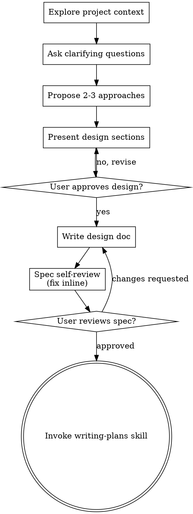
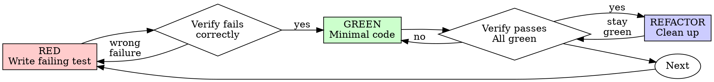

# Codex Session `01a04ddf-5be6-7322-838c-12e18fc2d714`

- Review status: `human-reviewed`
- Reviewed by: `synuns`
- Reviewed at: `2026-09-01T02:05:01.784466+00:00`
- Reviewed candidate SHA-256: `50887bf3efc8fbc6e095155f5881fdbf95a17e00e031a66a6c3b4491cad7e11b`

> Human review required before submission. Automatic redaction is best-effort.

- Model: `gpt-5.6-sol`
- Started: `2026-08-29T14:14:38.848Z`
- Working directory: `~/dev/assignment/kbhc-assgn`

## Turn 1

### User prompt

# AGENTS.md instructions for ~/dev/assignment/kbhc-assgn

<INSTRUCTIONS>
# 프로젝트 작업 규약

## 커밋 메시지

- 모든 커밋 메시지는 Conventional Commits 형식을 따른다.
- 형식은 `<type>(<scope>): <한글 설명>`이며, `scope`는 필요할 때만 사용한다.
- `type`과 `scope`는 영문 소문자로 작성하고, 제목·본문·꼬리말의 설명은 한글로 작성한다. 코드 식별자와 고유명사는 예외로 한다.
- 주요 `type`은 `feat`, `fix`, `docs`, `refactor`, `test`, `chore`를 사용한다.
- 호환성을 깨는 변경은 `!` 또는 `BREAKING CHANGE:` 꼬리말로 표시한다.

예시: `docs: 과제 원본 명세 추가`

## Scope

Follow the assignment sources in `assignment-original/`. The OpenAPI contract
is authoritative for API details. Do not change accepted behavior, architecture,
dependencies, authentication policy, or destructive-data semantics without a
HIGH-risk human decision.

## Required Reading

- [기술 스택](docs/tech-stack.md)
- `docs/quality/requirements.md`
- `docs/quality/workflow.md`
- `docs/quality/verification.md`
- `AI_USAGE.md`

## Required Loop

Select requirement IDs → implement one testable unit → run read-only automatic
verification → verify applicable browser behavior → classify and fix failures →
record evidence → run lightweight adversarial review at each golden journey →
request one human checkpoint → run full review and final QA.

LOW work proceeds continuously. People own golden-journey acceptance, HIGH-risk
decisions, exceptions, and final completion. AI never marks `HUMAN_APPROVED`.

## Commands

```bash
./scripts/verify setup
./scripts/verify quick
./scripts/verify full
```

Verification is read-only. `npm run format` is a separate mutation command;
review its diff and rerun `./scripts/verify quick` afterward.

## Evidence and AI Records

Use journey-based browser evidence defined in `workflow.md`. Keep core E2E
small and prefer unit, component, or integration tests when they prove the risk
better. Stop hooks create ignored redacted candidates only. A person must review
and explicitly publish any tracked AI record.

</INSTRUCTIONS>
<environment_context>
  <cwd>~/dev/assignment/kbhc-assgn</cwd>
  <shell>zsh</shell>
  <current_date>2026-08-29</current_date>
  <timezone>Asia/Seoul</timezone>
  <filesystem><workspace_roots><root>~/dev/assignment/kbhc-assgn</root></workspace_roots><permission_profile type="disabled"><file_system type="unrestricted" /></permission_profile></filesystem>
</environment_context>

worktree에서 전체 기획문서와 그에 기반한 투두리스트 작성할 것
기획문서는 superpowers 나 혹은 세부 기능에 대한 계획 문서와는 별개이며 상위의 문서임.
투두리스트는 에이전트가 남은 작업을 판단하며 참고하는 문서로 사용

### Tool activity

#### `exec`

- Call ID: `call_WFLbCoFYvBZkSsvzeMDuDf2Y`
- Status: `completed`

**Input**

```text
const r = await tools.exec_command({cmd:"pwd && sed -n '1,240p' ~/.agents/skills/brainstorming/SKILL.md && sed -n '1,280p' ~/.agents/skills/writing-plans/SKILL.md","workdir":"~/dev/assignment/kbhc-assgn","yield_time_ms":10000,"max_output_tokens":30000}); text(r.output);

```

**Output**

`````text
Script completed
Wall time 0.2 seconds
Output:

~/dev/assignment/kbhc-assgn
---
name: brainstorming
description: "You MUST use this before any creative work - creating features, building components, adding functionality, or modifying behavior. Explores user intent, requirements and design before implementation."
---

# Brainstorming Ideas Into Designs

Help turn ideas into fully formed designs and specs through natural collaborative dialogue.

Start by understanding the current project context, then ask questions one at a time to refine the idea. Once you understand what you're building, present the design and get user approval.

<HARD-GATE>
Do NOT invoke any implementation skill, write any code, scaffold any project, or take any implementation action until you have presented a design and the user has approved it. This applies to EVERY project regardless of perceived simplicity.
</HARD-GATE>

## Anti-Pattern: "This Is Too Simple To Need A Design"

Every project goes through this process. A todo list, a single-function utility, a config change — all of them. "Simple" projects are where unexamined assumptions cause the most wasted work. The design can be short (a few sentences for truly simple projects), but you MUST present it and get approval.

## Checklist

You MUST create a task for each of these items and complete them in order:

1. **Explore project context** — check files, docs, recent commits
2. **Offer the visual companion just-in-time** — NOT upfront. The first time a question would genuinely be clearer shown than described, offer it then (its own message); on approval its browser tab opens for you. If no visual question ever arises, never offer it. See the Visual Companion section below.
3. **Ask clarifying questions** — one at a time, understand purpose/constraints/success criteria
4. **Propose 2-3 approaches** — with trade-offs and your recommendation
5. **Present design** — in sections scaled to their complexity, get user approval after each section
6. **Write design doc** — save to `docs/superpowers/specs/YYYY-MM-DD-<topic>-design.md` and commit
7. **Spec self-review** — quick inline check for placeholders, contradictions, ambiguity, scope (see below)
8. **User reviews written spec** — ask user to review the spec file before proceeding
9. **Transition to implementation** — invoke writing-plans skill to create implementation plan

## Process Flow



**The terminal state is invoking writing-plans.** Do NOT invoke frontend-design, mcp-builder, or any other implementation skill. The ONLY skill you invoke after brainstorming is writing-plans.

## The Process

**Understanding the idea:**

- Check out the current project state first (files, docs, recent commits)
- Before asking detailed questions, assess scope: if the request describes multiple independent subsystems (e.g., "build a platform with chat, file storage, billing, and analytics"), flag this immediately. Don't spend questions refining details of a project that needs to be decomposed first.
- If the project is too large for a single spec, help the user decompose into sub-projects: what are the independent pieces, how do they relate, what order should they be built? Then brainstorm the first sub-project through the normal design flow. Each sub-project gets its own spec → plan → implementation cycle.
- For appropriately-scoped projects, ask questions one at a time to refine the idea
- Prefer multiple choice questions when possible, but open-ended is fine too
- Only one question per message - if a topic needs more exploration, break it into multiple questions
- Focus on understanding: purpose, constraints, success criteria

**Exploring approaches:**

- Propose 2-3 different approaches with trade-offs
- Present options conversationally with your recommendation and reasoning
- Lead with your recommended option and explain why

**Presenting the design:**

- Once you believe you understand what you're building, present the design
- Scale each section to its complexity: a few sentences if straightforward, up to 200-300 words if nuanced
- Ask after each section whether it looks right so far
- Cover: architecture, components, data flow, error handling, testing
- Be ready to go back and clarify if something doesn't make sense

**Design for isolation and clarity:**

- Break the system into smaller units that each have one clear purpose, communicate through well-defined interfaces, and can be understood and tested independently
- For each unit, you should be able to answer: what does it do, how do you use it, and what does it depend on?
- Can someone understand what a unit does without reading its internals? Can you change the internals without breaking consumers? If not, the boundaries need work.
- Smaller, well-bounded units are also easier for you to work with - you reason better about code you can hold in context at once, and your edits are more reliable when files are focused. When a file grows large, that's often a signal that it's doing too much.

**Working in existing codebases:**

- Explore the current structure before proposing changes. Follow existing patterns.
- Where existing code has problems that affect the work (e.g., a file that's grown too large, unclear boundaries, tangled responsibilities), include targeted improvements as part of the design - the way a good developer improves code they're working in.
- Don't propose unrelated refactoring. Stay focused on what serves the current goal.

## After the Design

**Documentation:**

- Write the validated design (spec) to `docs/superpowers/specs/YYYY-MM-DD-<topic>-design.md`
  - (User preferences for spec location override this default)
- Use elements-of-style:writing-clearly-and-concisely skill if available
- Commit the design document to git

**Spec Self-Review:**
After writing the spec document, look at it with fresh eyes:

1. **Placeholder scan:** Any "TBD", "TODO", incomplete sections, or vague requirements? Fix them.
2. **Internal consistency:** Do any sections contradict each other? Does the architecture match the feature descriptions?
3. **Scope check:** Is this focused enough for a single implementation plan, or does it need decomposition?
4. **Ambiguity check:** Could any requirement be interpreted two different ways? If so, pick one and make it explicit.

Fix any issues inline. No need to re-review — just fix and move on.

**User Review Gate:**
After the spec review loop passes, ask the user to review the written spec before proceeding:

> "Spec written and committed to `<path>`. Please review it and let me know if you want to make any changes before we start writing out the implementation plan."

Wait for the user's response. If they request changes, make them and re-run the spec review loop. Only proceed once the user approves.

**Implementation:**

- Invoke the writing-plans skill to create a detailed implementation plan
- Do NOT invoke any other skill. writing-plans is the next step.

## Key Principles

- **One question at a time** - Don't overwhelm with multiple questions
- **Multiple choice preferred** - Easier to answer than open-ended when possible
- **YAGNI ruthlessly** - Remove unnecessary features from all designs
- **Explore alternatives** - Always propose 2-3 approaches before settling
- **Incremental validation** - Present design, get approval before moving on
- **Be flexible** - Go back and clarify when something doesn't make sense

## Visual Companion

A browser-based companion for showing mockups, diagrams, and visual options during brainstorming. Available as a tool — not a mode. Accepting the companion means it's available for questions that benefit from visual treatment; it does NOT mean every question goes through the browser.

**Offering the companion (just-in-time):** Do NOT offer it upfront. Wait until a question would genuinely be clearer shown than told — a real mockup / layout / diagram question, not merely a UI *topic*. The first time that happens, offer it then, as its own message:
> "This next part might be easier if I show you — I can put together mockups, diagrams, and comparisons in a browser tab as we go. It's still new and can be token-intensive. Want me to? I'll open it for you."

**This offer MUST be its own message.** Only the offer — no clarifying question, summary, or other content. Wait for the user's response. If they accept, start the server with `--open` so their browser opens to the first screen automatically. If they decline, continue text-only and don't offer again unless they raise it.

**Per-question decision:** Even after the user accepts, decide FOR EACH QUESTION whether to use the browser or the terminal. The test: **would the user understand this better by seeing it than reading it?**

- **Use the browser** for content that IS visual — mockups, wireframes, layout comparisons, architecture diagrams, side-by-side visual designs
- **Use the terminal** for content that is text — requirements questions, conceptual choices, tradeoff lists, A/B/C/D text options, scope decisions

A question about a UI topic is not automatically a visual question. "What does personality mean in this context?" is a conceptual question — use the terminal. "Which wizard layout works better?" is a visual question — use the browser.

If they agree to the companion, read the detailed guide before proceeding:
`skills/brainstorming/visual-companion.md`
---
name: writing-plans
description: Use when you have a spec or requirements for a multi-step task, before touching code
---

# Writing Plans

## Overview

Write comprehensive implementation plans assuming the engineer has zero context for our codebase and questionable taste. Document everything they need to know: which files to touch for each task, code, testing, docs they might need to check, how to test it. Give them the whole plan as bite-sized tasks. DRY. YAGNI. TDD. Frequent commits.

Assume they are a skilled developer, but know almost nothing about our toolset or problem domain. Assume they don't know good test design very well.

**Announce at start:** "I'm using the writing-plans skill to create the implementation plan."

**Context:** If working in an isolated worktree, it should have been created via the `superpowers:using-git-worktrees` skill at execution time.

**Save plans to:** `docs/superpowers/plans/YYYY-MM-DD-<feature-name>.md`
- (User preferences for plan location override this default)

## Scope Check

If the spec covers multiple independent subsystems, it should have been broken into sub-project specs during brainstorming. If it wasn't, suggest breaking this into separate plans — one per subsystem. Each plan should produce working, testable software on its own.

## File Structure

Before defining tasks, map out which files will be created or modified and what each one is responsible for. This is where decomposition decisions get locked in.

- Design units with clear boundaries and well-defined interfaces. Each file should have one clear responsibility.
- You reason best about code you can hold in context at once, and your edits are more reliable when files are focused. Prefer smaller, focused files over large ones that do too much.
- Files that change together should live together. Split by responsibility, not by technical layer.
- In existing codebases, follow established patterns. If the codebase uses large files, don't unilaterally restructure - but if a file you're modifying has grown unwieldy, including a split in the plan is reasonable.

This structure informs the task decomposition. Each task should produce self-contained changes that make sense independently.

## Task Right-Sizing

A task is the smallest unit that carries its own test cycle and is worth a
fresh reviewer's gate. When drawing task boundaries: fold setup,
configuration, scaffolding, and documentation steps into the task whose
deliverable needs them; split only where a reviewer could meaningfully
reject one task while approving its neighbor. Each task ends with an
independently testable deliverable.

## Bite-Sized Task Granularity

**Each step is one action (2-5 minutes):**
- "Write the failing test" - step
- "Run it to make sure it fails" - step
- "Implement the minimal code to make the test pass" - step
- "Run the tests and make sure they pass" - step
- "Commit" - step

## Plan Document Header

**Every plan MUST start with this header:**

```markdown
# [Feature Name] Implementation Plan

> **For agentic workers:** REQUIRED SUB-SKILL: Use superpowers:subagent-driven-development (recommended) or superpowers:executing-plans to implement this plan task-by-task. Steps use checkbox (`- [ ]`) syntax for tracking.

**Goal:** [One sentence describing what this builds]

**Architecture:** [2-3 sentences about approach]

**Tech Stack:** [Key technologies/libraries]

## Global Constraints

[The spec's project-wide requirements — version floors, dependency limits,
naming and copy rules, platform requirements — one line each, with exact
values copied verbatim from the spec. Every task's requirements implicitly
include this section.]

---
```

## Task Structure

````markdown
### Task N: [Component Name]

**Files:**
- Create: `exact/path/to/file.py`
- Modify: `exact/path/to/existing.py:123-145`
- Test: `tests/exact/path/to/test.py`

**Interfaces:**
- Consumes: [what this task uses from earlier tasks — exact signatures]
- Produces: [what later tasks rely on — exact function names, parameter
  and return types. A task's implementer sees only their own task; this
  block is how they learn the names and types neighboring tasks use.]

- [ ] **Step 1: Write the failing test**

```python
def test_specific_behavior():
    result = function(input)
    assert result == expected
```

- [ ] **Step 2: Run test to verify it fails**

Run: `pytest tests/path/test.py::test_name -v`
Expected: FAIL with "function not defined"

- [ ] **Step 3: Write minimal implementation**

```python
def function(input):
    return expected
```

- [ ] **Step 4: Run test to verify it passes**

Run: `pytest tests/path/test.py::test_name -v`
Expected: PASS

- [ ] **Step 5: Commit**

```bash
git add tests/path/test.py src/path/file.py
git commit -m "feat: add specific feature"
```
````

## No Placeholders

Every step must contain the actual content an engineer needs. These are **plan failures** — never write them:
- "TBD", "TODO", "implement later", "fill in details"
- "Add appropriate error handling" / "add validation" / "handle edge cases"
- "Write tests for the above" (without actual test code)
- "Similar to Task N" (repeat the code — the engineer may be reading tasks out of order)
- Steps that describe what to do without showing how (code blocks required for code steps)
- References to types, functions, or methods not defined in any task

## Remember
- Exact file paths always
- Complete code in every step — if a step changes code, show the code
- Exact commands with expected output
- DRY, YAGNI, TDD, frequent commits

## Self-Review

After writing the complete plan, look at the spec with fresh eyes and check the plan against it. This is a checklist you run yourself — not a subagent dispatch.

**1. Spec coverage:** Skim each section/requirement in the spec. Can you point to a task that implements it? List any gaps.

**2. Placeholder scan:** Search your plan for red flags — any of the patterns from the "No Placeholders" section above. Fix them.

**3. Type consistency:** Do the types, method signatures, and property names you used in later tasks match what you defined in earlier tasks? A function called `clearLayers()` in Task 3 but `clearFullLayers()` in Task 7 is a bug.

If you find issues, fix them inline. No need to re-review — just fix and move on. If you find a spec requirement with no task, add the task.

## Execution Handoff

After saving the plan, offer execution choice:

**"Plan complete and saved to `docs/superpowers/plans/<filename>.md`. Two execution options:**

**1. Subagent-Driven (recommended)** - I dispatch a fresh subagent per task, review between tasks, fast iteration

**2. Inline Execution** - Execute tasks in this session using executing-plans, batch execution with checkpoints

**Which approach?"**

**If Subagent-Driven chosen:**
- **REQUIRED SUB-SKILL:** Use superpowers:subagent-driven-development
- Fresh subagent per task + two-stage review

**If Inline Execution chosen:**
- **REQUIRED SUB-SKILL:** Use superpowers:executing-plans
- Batch execution with checkpoints for review

`````

#### `exec`

- Call ID: `call_bz7w1ORpG34A3UpbGIgCguz9`
- Status: `completed`

**Input**

```text
const p = await tools.update_plan({plan:[
  {step:"프로젝트 구조·필수 문서·원본 명세·최근 변경 확인",status:"in_progress"},
  {step:"상위 기획문서 목적·범위·완료 기준 확인",status:"pending"},
  {step:"문서 구조 대안 제시 및 사용자 승인",status:"pending"},
  {step:"상위 기획문서와 에이전트용 투두리스트 작성",status:"pending"},
  {step:"문서 자체 검토·검증·증거 기록",status:"pending"},
  {step:"사용자 검토 체크포인트 요청",status:"pending"}
]}); text(p);

```

**Output**

```text
Script completed
Wall time 0.1 seconds
Output:

{}
```

#### `exec`

- Call ID: `call_kiOrdxTzY5FSbVQFcNeH5VLL`
- Status: `completed`

**Input**

```text
const r = await tools.exec_command({cmd:"git status --short --branch && git log -8 --oneline --decorate && rg --files -g 'AGENTS.md' -g '!node_modules' -g '!dist' && rg --files docs assignment-original | sort | sed -n '1,260p'","workdir":"~/dev/assignment/kbhc-assgn","yield_time_ms":10000,"max_output_tokens":30000}); text(r.output);

```

**Output**

```text
Script completed
Wall time 0.3 seconds
Output:

## main...origin/main [gone]
?? artifacts/codex-session-01a04c77-2685-7013-ad38-d81feba1b2a4.md
46140ff (HEAD -> main) docs(hooks): SessionEnd 기록 보완 반영
dc0164f feat(artifacts): 세션 기록 검토·게시 lifecycle 통합
78f37dd docs(review): 사람 중심 기록 게시 절차 반영
006f72e test(hooks): 세션 생명주기 wiring 검증 추가
89bb413 fix(review): publisher 연결 보완
492f12a feat(review): idempotent 게시 transaction 추가
a6beb96 feat(review): 단일 TTY 검토 명령 추가
f64b367 feat(review): 위험 우선 기록 검사 추가
AGENTS.md
assignment-original/openapi.yaml
assignment-original/requirement.md
docs/quality/requirements.md
docs/quality/verification.md
docs/quality/workflow.md
docs/superpowers/plans/2026-08-29-agentic-development-verification-loop.md
docs/superpowers/plans/2026-08-29-codex-session-artifact.md
docs/superpowers/plans/2026-08-29-human-ai-record-review.md
docs/superpowers/plans/2026-08-29-session-artifact-lifecycle.md
docs/superpowers/plans/2026-08-29-session-end-artifact-index.md
docs/superpowers/plans/2026-08-29-tech-stack-document.md
docs/superpowers/specs/2026-08-29-agentic-development-verification-loop-design.md
docs/superpowers/specs/2026-08-29-codex-session-artifact-design.md
docs/superpowers/specs/2026-08-29-human-ai-record-review-design.md
docs/superpowers/specs/2026-08-29-session-artifact-lifecycle-design.md
docs/superpowers/specs/2026-08-29-session-end-artifact-index-design.md
docs/superpowers/specs/2026-08-29-tech-stack-document-design.md
docs/tech-stack.md

```

#### `exec`

- Call ID: `call_2xB1CBe3M9JlV0PxyVC6AvuK`
- Status: `completed`

**Input**

```text
const r = await tools.exec_command({cmd:"sed -n '1,260p' docs/tech-stack.md && sed -n '1,320p' docs/quality/requirements.md && sed -n '1,360p' docs/quality/workflow.md && sed -n '1,320p' docs/quality/verification.md && sed -n '1,300p' AI_USAGE.md && sed -n '1,320p' assignment-original/requirement.md && sed -n '1,360p' assignment-original/openapi.yaml","workdir":"~/dev/assignment/kbhc-assgn","yield_time_ms":10000,"max_output_tokens":60000}); text(r.output);

```

**Output**

````text
Script completed
Wall time 0.2 seconds
Output:

Warning: truncated output (original token count: 10388)
Total output lines: 924

# 기술 스택

## 목적

과제 구현에 사용하는 기술, 역할, 선정 근거, 채택 상태를 관리한다. 작업 중
기술을 추가·교체·제거할 때 이 문서를 함께 갱신한다.

API 동작은 `assignment-original/openapi.yaml`을 최우선으로 따르고, UI와
제출 조건은 `assignment-original/requirement.md`를 따른다.

## 상태 기준

- `필수`: 과제 원본이 직접 요구한 기술 또는 특성
- `제안`: 구현 전 검토 중인 기술
- `채택`: 사람 승인을 받아 구현 대상으로 확정된 기술
- `보류`: 후보로 유지하지만 현재 구현에는 사용하지 않는 기술
- `제거`: 사용을 중단한 기술

`채택`은 설치 완료를 뜻하지 않는다. 실제 설치 여부와 정확한 버전은
`package.json`과 `pnpm-lock.yaml`을 기준으로 확인한다.

## 요구사항 기반 조건

| 조건 | 상태 | 근거 |
| --- | --- | --- |
| React 18 또는 19 | 필수 | `assignment-original/requirement.md` 설명 |
| TypeScript | 필수 | `assignment-original/requirement.md` 설명 |
| 명명된 색상 토큰 | 필수 | `assignment-original/requirement.md` 설명 |
| Pretendard | 필수 | `assignment-original/requirement.md` 설명 |
| OAS 3.1에 맞는 API 대체 구현 | 필수 | `assignment-original/requirement.md` 전문과 `assignment-original/openapi.yaml` |

React 필수 조건에서 major version은 19를 채택한다. API 대체 구현 방식은
MSW를 채택한다.

## 채택 기술

| 영역 | 기술 | 상태 | 역할과 선정 근거 |
| --- | --- | --- | --- |
| 애플리케이션 | React 19 | 채택 | 과제 허용 범위에서 선택한 React major로 UI를 구성한다. |
| 언어 | TypeScript | 필수 | 컴포넌트, API 데이터, 상태 경계를 정적 타입으로 검증한다. |
| 개발·빌드 | Vite | 채택 | React·TypeScript 개발 서버와 production build를 단순한 구성으로 제공한다. |
| 패키지 관리 | pnpm | 채택 | 의존성과 실행 스크립트를 관리하고 `pnpm-lock.yaml`로 설치 결과를 고정한다. |
| 라우팅 | React Router (`react-router-dom`) | 채택 | `/`, `/sign-in`, `/task`, `/task/:id`, `/user` 이동을 관리한다. |
| 서버 상태 | TanStack Query (`@tanstack/react-query`) | 채택 | API 로딩·오류·캐시와 task 무한 페이지 요청을 관리한다. |
| 폼 | React Hook Form (`react-hook-form`) | 채택 | 로그인 입력, 오류, 제출 가능 상태를 관리한다. |
| 스키마 검증 | Zod (`zod`) | 채택 | 이메일과 비밀번호 규칙을 재사용 가능한 스키마로 정의한다. |
| 가상 목록 | TanStack Virtual (`@tanstack/react-virtual`) | 채택 | task 목록에서 화면에 보이거나 곧 보일 항목만 렌더링한다. |
| HTTP | Fetch API | 채택 | 브라우저 표준 API로 JSON 요청과 응답을 처리해 별도 HTTP 클라이언트를 줄인다. |
| API 타입 | `openapi-typescript` | 채택 | OAS 3.1 계약에서 TypeScript 타입을 생성해 계약 불일치를 줄인다. |
| API 대체 | MSW (`msw`) | 채택 | 같은 mock handler를 개발 브라우저와 자동 테스트 경계에서 재사용한다. |
| UI 컴포넌트 | shadcn/ui | 채택 | 접근 가능한 컴포넌트 코드를 저장소에 생성하고 요구사항에 맞게 직접 수정한다. |
| 스타일 | Tailwind CSS (`tailwindcss`) | 채택 | utility class로 UI 스타일을 구성하고 shadcn/ui와 같은 스타일 체계를 사용한다. |
| 색상 토큰 | CSS Custom Properties | 필수 | 의미 기반 변수로 색상을 정의하고 Tailwind CSS에서 해당 토큰을 참조한다. |
| 폰트 | Pretendard 자체 호스팅 | 필수 | 외부 폰트 응답에 의존하지 않고 과제 지정 글꼴을 일관되게 적용한다. |
| 아이콘 | Lucide React (`lucide-react`) | 채택 | 내비게이션 항목마다 서로 다른 아이콘을 제공하고 shadcn/ui와 조합한다. |
| 단위·통합 테스트 | Vitest (`vitest`) | 채택 | TypeScript 로직과 컴포넌트·통합 테스트를 Vite 환경에서 실행한다. |
| UI 테스트 | Testing Library (`@testing-library/react`), user-event (`@testing-library/user-event`) | 채택 | 구현 세부사항보다 사용자가 보는 요소와 상호작용을 검증한다. |
| E2E 테스트 | Playwright (`@playwright/test`) | 채택 | 실제 브라우저에서 네 가지 Golden Journey의 경계 동작을 검증한다. |
| lint·format | Biome (`@biomejs/biome`) | 채택 | lint와 format 검사 및 format 변경을 전담한다. |
| 타입 검사 | TypeScript | 필수 | `tsc` 기반 타입 검사를 전담하며 lint·format 책임을 갖지 않는다. |

## 도구 책임

### pnpm

- 의존성 추가·제거와 package script 실행은 pnpm으로 통일한다.
- `pnpm-lock.yaml`을 커밋해 재현 가능한 설치 결과를 유지한다.
- npm, Yarn 등 다른 package manager의 lockfile을 함께 두지 않는다.

### Biome과 TypeScript

- Biome은 lint와 format을 전담한다.
- 읽기 전용 검증은 Biome check 명령을 사용한다.
- format 변경은 별도 Biome write 명령으로 실행하고 diff를 검토한다.
- TypeScript는 `tsc` 기반 타입 검사를 전담한다.
- ESLint와 Prettier는 Biome과 책임이 겹치므로 도입하지 않는다.

### shadcn/ui와 Tailwind CSS

- shadcn/ui가 생성한 컴포넌트 코드는 저장소가 직접 소유한다.
- 생성된 코드는 과제 요구사항과 접근성 조건에 맞게 수정할 수 있다.
- Tailwind CSS가 UI 스타일을 담당한다.
- 색상은 기능별 literal 대신 CSS Custom Properties로 정의한 의미 기반 토큰을 참조한다.

## 변경 규칙

새 기술을 도입할 때 다음 항목을 함께 기록한다.

1. 기술이 속한 영역과 정확한 이름
2. 해결할 문제와 적용 범위
3. 기존 기술로 해결하지 못하는 이유
4. `제안`, `채택`, `보류`, `제거` 중 현재 상태
5. 교체하거나 제거하는 기술과 변경 사유

기술을 설치·제거한 변경은 이 문서와 `package.json`, `pnpm-lock.yaml`이
서로 모순되지 않는지 확인한다. 기존 항목은 조용히 삭제하지 않고 상태와
사유를 갱신한다.

## 범위 밖 결정

인증 토큰 저장 위치, access token 갱신, refresh 실패 처리, 보호 경로 정책은
이 문서에서 결정하지 않는다. 인증 정책은 별도 HIGH-risk 설계 문서와 사람
승인을 통해 관리한다.

## 변경 이력

| 날짜 | 변경 | 사유 |
| --- | --- | --- |
| 2026-08-29 | 초기 기술 스택 채택 | 과제 요구사항과 구현 예정 기술을 단일 문서로 관리하기 위해 추가 |
# Requirements and Golden Journeys

## Source Priority

Use `assignment-original/openapi.yaml` as the API authority and
`assignment-original/requirement.md` for UI and delivery requirements. Record a
`REQUIREMENT` failure and request a human decision when the sources conflict in
a way that changes accepted behavior.

## Status and Evidence Rules

Allowed statuses: `NOT_STARTED`, `IN_PROGRESS`, `AI_VERIFIED`,
`HUMAN_APPROVED`, `BLOCKED`.

AI may set every status except `HUMAN_APPROVED`. Evidence must name a command,
browser record, or review finding. Text claiming a result without reproducible
evidence does not satisfy a checklist row.
Core-journey acceptance, HIGH-risk decisions, exceptions, and final acceptance
are reserved for human owners.

## Requirement Checklist

| ID | Requirement | Source | Acceptance condition | Risk | Preferred test level | Automated evidence | Browser evidence | Checkpoint | Status |
| --- | --- | --- | --- | --- | --- | --- | --- | --- | --- |
| SYS-01 | React and TypeScript | requirement: 설명 | Application uses React 18 or 19 and TypeScript. | HIGH until stack approved | setup/build | — | — | final | NOT_STARTED |
| SYS-02 | Color tokens | requirement: 설명 | Application UI colors resolve through named tokens rather than feature-local literals. | LOW | static/component | — | — | final | NOT_STARTED |
| SYS-03 | Pretendard | requirement: 설명 | Pretendard is loaded and used as application font. | LOW | component/browser | — | — | work-overview | NOT_STARTED |
| SYS-04 | API substitute | requirement: 전문 | Submitted code contains a documented mock or equivalent API implementation conforming to OAS 3.1. | HIGH until approach approved | integration/contract | — | — | final | NOT_STARTED |
| SYS-05 | AI disclosure | requirement: 설명 | `AI_USAGE.md` identifies tool/model, scope, prompt summary, and human verification without secrets. | MEDIUM | setup/manual | — | — | final | IN_PROGRESS |
| NAV-01 | Primary routes | requirement: GNB/LNB | Dashboard and task actions are always visible, use distinct icons, and navigate to `/` and `/task`. | LOW | integration/browser | — | — | work-overview | NOT_STARTED |
| NAV-02 | Anonymous action | requirement: GNB/LNB | Signed-out state shows sign-in action with distinct icon and navigates to `/sign-in`. | LOW | component/integration | — | — | auth-entry | NOT_STARTED |
| NAV-03 | Authenticated action | requirement: GNB/LNB | Signed-in state shows profile action with distinct icon and navigates to `/user`. | MEDIUM | integration/browser | — | — | work-overview | NOT_STARTED |
| DASH-01 | Dashboard metrics | requirement: 대시보드; OAS `DashboardResponse` | `/` shows `numOfTask`, `numOfRestTask`, and `numOfDoneTask` from `GET /api/dashboard`. | MEDIUM | integration/browser | — | — | work-overview | NOT_STARTED |
| AUTH-01 | Accessible fields | requirement: 로그인 | Email and password inputs have visible, programmatically associated labels. | LOW | component | — | — | auth-entry | NOT_STARTED |
| AUTH-02 | Email validation | requirement: 로그인; OAS `SignInRequest` | Email is required and follows email syntax; invalid value shows a visible inline error associated with the input. | LOW | unit/component | — | — | auth-entry | NOT_STARTED |
| AUTH-03 | Password validation | requirement: 로그인; OAS `SignInRequest` | Password is required, ASCII alphanumeric only, and 8–24 characters; invalid value shows a visible inline error associated with the input. | LOW | unit/component | — | — | auth-entry | NOT_STARTED |
| AUTH-04 | Submit state | requirement: 로그인 | Submit is enabled only when email and password both satisfy validation. | LOW | component | — | — | auth-entry | NOT_STARTED |
| AUTH-05 | Sign-in request | requirement: 로그인; OAS `/api/sign-in` | Valid submit sends email/password JSON to `POST /api/sign-in`. | MEDIUM | integration | — | — | auth-entry | NOT_STARTED |
| AUTH-06 | Sign-in failure | requirement: 로그인; OAS `ErrorResponse` | Any non-200 sign-in response displays returned `errorMessage` in a modal. | MEDIUM | integration/browser | — | — | auth-entry | NOT_STARTED |
| AUTH-07 | Authentication state | OAS auth schemas | Successful sign-in establishes approved access-token state. Integration evidence proves a protected request sends `Authorization: Bearer [REDACTED] and exercises the human-approved refresh/expiry behavior; browser evidence is reserved for a credential or network boundary integration tests cannot prove. | HIGH | integration + targeted browser/network checkpoint | — | — | auth-entry | NOT_STARTED |
| TASK-LIST-01 | Page request | requirement: 목록; OAS `/api/task` | `/task` requests `GET /api/task?page=1` and renders returned data. | MEDIUM | integration | — | — | task-discovery | NOT_STARTED |
| TASK-LIST-02 | Card content | requirement: 목록 | Each rendered task card shows title and memo. | LOW | component | — | — | task-discovery | NOT_STARTED |
| TASK-LIST-03 | Virtual rendering | requirement: 목록 | Growing list renders only visible or near-visible items rather than every fetched item. | MEDIUM | integration/browser | — | — | task-discovery | NOT_STARTED |
| TASK-LIST-04 | Infinite pagination | requirement: 목록; OAS `TaskListResponse` | Reaching list end requests each next page once while `hasNext` is true and stops when false. | MEDIUM | integration/browser | — | — | task-discovery | NOT_STARTED |
| TASK-LIST-05 | Detail navigation | requirement: 목록 | Selecting a task navigates to `/task/:id` for that task. | LOW | integration/browser | — | — | task-discovery | NOT_STARTED |
| TASK-DETAIL-01 | Detail success | requirement: 상세; OAS `TaskDetailResponse` | Detail view shows title, memo, and `registerDatetime` returned by `GET /api/task/:id`. | MEDIUM | integration | — | — | task-resolution | NOT_STARTED |
| TASK-DETAIL-02 | Detail missing | requirement: 상세; OAS 404 | A 404 shows a resource-missing state with a usable return-to-list action. | MEDIUM | integration/browser | — | — | task-resolution | NOT_STARTED |
| TASK-DETAIL-03 | Delete confirmation | requirement: 상세 | Delete opens a modal containing an ID confirmation input. | LOW | component | — | — | task-resolution | NOT_STARTED |
| TASK-DETAIL-04 | Delete guard | requirement: 상세 | Delete submit stays disabled until input exactly equals route ID. | LOW | unit/component | — | — | task-resolution | NOT_STARTED |
| TASK-DETAIL-05 | Delete success | requirement: 상세; OAS `DELETE /api/task/{id}` | Confirmed submit calls delete API and successful response redirects to `/task`. | MEDIUM | integration/browser | — | — | task-resolution | NOT_STARTED |
| USER-01 | Profile data | requirement: 회원정보; OAS `UserResponse` | Authenticated profile view shows name and memo from `GET /api/user`. | MEDIUM | integration/browser | — | — | work-overview | NOT_STARTED |

## Golden Journeys

### auth-entry

Requirements: `NAV-02`, `AUTH-01` through `AUTH-07`.

- Preconditions: signed out; sign-in API can return deterministic success and
  error responses; protected and refresh endpoints can exercise the approved
  access-token expiry behavior deterministically.
- Actions: open `/sign-in`; submit invalid fields; submit valid fields against
  error response; dismiss error; submit valid fields against success response;
  trigger a protected request; inspect captured integration or browser-network
  evidence for `Authorization: Bearer [REDACTED] exercise and inspect the
  approved refresh/expiry path; inspect authenticated navigation.
- Expected: labels remain usable, invalid values cannot submit, server
  `errorMessage` appears in modal, success establishes authenticated state, and
  navigation switches from sign-in to profile. The protected request carries
  the access token as a bearer credential, and expiry follows exactly the
  human-approved refresh behavior. The human checkpoint reviews both pieces of
  auth evidence rather than inferring them from the navigation change.

### work-overview

Requirements: `SYS-03`, `NAV-01`, `NAV-03`, `DASH-01`, `USER-01`.

- Preconditions: signed in; dashboard and profile APIs return known fixtures.
- Actions: navigate between dashboard, task route, and profile; compare fixture
  data with visible values.
- Expected: route actions and distinct icons remain available, metrics match
  API values, and profile name/memo match API values.

### task-discovery

Requirements: `TASK-LIST-01` through `TASK-LIST-05`.

- Preconditions: signed in; at least two task pages with `hasNext` transition
  from true to false.
- Actions: open `/task`; inspect cards; scroll through viewport; trigger next
  page; continue to terminal page; select a task.
- Expected: correct cards render, DOM stays bounded by virtualization, each
  page is requested once, loading stops at `hasNext: false`, and selection
  navigates to matching detail.

### task-resolution

Requirements: `TASK-DETAIL-01` through `TASK-DETAIL-05`.

- Preconditions: signed in; one existing ID and one missing ID; delete API
  succeeds for existing ID.
- Actions: open existing detail; open missing detail and return; reopen existing
  detail; open delete modal; enter wrong then exact ID; submit.
- Expected: detail fields match API, 404 recovery returns to list, delete submit
  is guarded by exact ID, delete request targets route ID, and success returns
  to `/task`.

## Invariants

- Dashboard and task navigation remain present across routes.
- Authentication state exposes exactly one of sign-in and profile actions.
- UI colors flow through named tokens; Pretendard remains application font.
- Input labels remain associated with controls.
- Invalid sign-in input cannot submit; API errors surface `errorMessage`.
- Protected requests use approved authentication state.
- Virtualized task DOM remains bounded as fetched data grows.
- One task page has at most one in-flight request; `hasNext: false` stops paging.
- Detail 404 always provides list recovery.
- Delete cannot submit without exact ID and success always returns to task list.
- Loading, empty, error, and success states are distinguishable.
- AI evidence never marks `HUMAN_APPROVED`.
- Verification commands never modify repository files.
# AI Development Workflow

## Operating Loop

1. Select requirement IDs and acceptance conditions from `requirements.md`.
2. Classify risk and choose one independently testable unit.
3. Implement the smallest change and its appropriate automated test.
4. Run `./scripts/verify quick`.
5. Run applicable browser checks and record evidence.
6. Classify failures, correct root cause, and rerun the failed gate.
7. Record evidence and continue low-risk work.
8. At a completed golden journey, run lightweight adversarial review and ask
   for one human checkpoint acceptance.
9. After all journeys, run full adversarial review, `./scripts/verify full`,
   and final QA.
10. Ask a person for final acceptance. AI never declares human acceptance.

One work unit covers one requirement ID or one independently testable condition
inside an ID. Do not split work by file when files form one testable behavior.

## Risk and Authority

### LOW — AI proceeds continuously

Examples: approved-pattern implementation, focused tests, local unambiguous
fixes, active-task documentation, and necessary non-semantic cleanup.

AI may implement, test, diagnose, fix, review, commit, and continue. Record
requirement IDs, commands, browser evidence when applicable, and decisions.

### MEDIUM — human owns journey checkpoint

Examples: completing a golden journey, introducing a new interaction pattern,
or spanning routes, API state, and views within approved architecture.

AI completes and verifies a coherent batch, runs lightweight adversarial
review, then requests one checkpoint acceptance. Do not request approval for
each requirement inside the batch.

### HIGH — human decides before consequential change

Examples: conflicting requirements, authentication or security policy,
destructive-data semantics, dependency or architecture changes, scope
expansion, acceptance changes, and bypassing a failed gate.

Stop before the consequential implementation. Present evidence, options,
trade-offs, and recommendation. While waiting, continue only evidence work,
diagnosis, or unrelated LOW work that cannot cross the affected boundary.

AI proposes risk and owns execution evidence. People own journey acceptance,
HIGH decisions, exceptions, and final acceptance.

## Failure Classification

Assign one primary class and record evidence, rationale, corrective change, and
rerun result:

- `REQUIREMENT`: ambiguous, conflicting, missing, or misunderstood condition.
- `IMPLEMENTATION`: logic, state, or rendering defect.
- `INTEGRATION`: API, auth, routing, browser, or cross-module defect.
- `UX_ACCESSIBILITY`: usability, interaction, visual, or accessibility defect.
- `TEST`: incorrect, duplicate, flaky, or overly broad test.
- `ENVIRONMENT`: runtime, OS, browser, port, or local service problem.
- `TOOLING`: build, lint, typecheck, verify, hook, or runner problem.

`REQUIREMENT` and behavior-changing corrections are HIGH. Never turn a failure
green by weakening an assertion, addin…388 tokens truncated…er <accessToken>`
and that the approved refresh/expiry path was exercised. Add core browser
evidence only for credential or network behavior that the integration boundary
cannot prove; a visible profile action alone is not authentication evidence.

## Prompt Records

Lifecycle hooks create pending snapshots and metadata only. A person runs
`npm run ai:review`; the tool selects candidates risk-first, computes and
records reviewed SHA-256 digest and reviewer, then asks for exact `y`+Enter.
Other input, EOF, or signal cancels. Publication uses staging and atomic
rename, then regenerates public index and managed `AI_USAGE.md`; reruns are
idempotent. AI must not approve or publish on a person's behalf. See
`verification.md` and `AI_USAGE.md`.

## Final QA Checklist

- [ ] Every requirement row has reproducible evidence and correct status.
- [ ] All four journey checkpoints are human-approved.
- [ ] Full adversarial review findings are resolved.
- [ ] `./scripts/verify full` passes on the intended submission commit.
- [ ] Core browser evidence exists for all four journeys.
- [ ] Auth, navigation, stale state, errors, and regressions were cross-checked.
- [ ] Console and network errors were reviewed.
- [ ] Accessibility and responsive layouts were spot-checked at recorded viewports.
- [ ] API mock behavior matches `openapi.yaml`.
- [ ] AI records were human-reviewed before publication.
- [ ] Git diff contains no secrets, debug output, generated noise, or unrelated work.
- [ ] A person, not AI, marks final acceptance.
# Verification Policy

## Canonical Commands

```bash
./scripts/verify setup
./scripts/verify quick
./scripts/verify full
./scripts/verify
```

No argument means `full`. Every verification mode is read-only and compares a
repository content fingerprint before and after execution. A mutation makes
verification fail.

## Modes

- `setup`: required files, document markers and links, risk/approval rules,
  journey categories, review/final-QA sections, pending-record ignore rule,
  Stop/SessionEnd hook wiring, AI disclosure headings, and the four focused
  artifact-contract, exporter, index, and publisher unit-test suites.
- `quick`: `setup`, then `format:check`, `lint`, `typecheck`, and `test` after
  frontend scaffolding.
- `full`: `setup`, `quick`, `build`, and `test:e2e:core` after frontend
  scaffolding.

Before `package.json` exists, frontend stages print
`SKIP frontend not scaffolded`. This certifies workflow setup only. After
`package.json` exists, all six required scripts must exist; absence is failure.

Verification stops on first failure, exits nonzero, prints a reproduction
command, and lists failure classes from `workflow.md`.

## Formatting Mutation Is Separate

`format:check` reports differences and never edits files. Formatting mutation
is separate:

```bash
npm run format
```

Review the resulting diff and run `./scripts/verify quick`. No verify command
may call `npm run format` or another write-mode formatter.

## Test-Level Selection

- Unit: pure validation, transforms, and isolated state.
- Component: labels, disabled states, modal interaction, conditional UI, and
  focused accessibility.
- Integration: API response to view state, router transitions, and feature
  state with controlled external boundaries.
- E2E: real browser behavior crossing authentication, routing, network,
  scrolling, virtualization, or deletion/navigation boundaries.

Choose the lowest level that proves risk reliably. Do not duplicate lower-level
coverage in E2E.

## Core E2E Journeys

Organize by `auth-entry`, `work-overview`, `task-discovery`, and
`task-resolution`, not by page.
Keep at most one representative success path and one critical failure path per journey.
Every E2E names its unique cross-boundary risk. `test:e2e:core` runs only
`@core`; extended, diagnostic,
or browser-compatibility suites use separate explicit commands.

Review slow, flaky, redundant cases for removal or demotion to integration or
component tests.

## Browser Evidence

Record scenario and requirement IDs, commit, route, viewport, preconditions,
actions, expected and actual results, console/network errors, screenshot or
trace, verdict, failure class, correction, and rerun result.

Browser automation failure is `ENVIRONMENT` or `TOOLING`, never product pass.

For `AUTH-07`, focused integration evidence proves that a protected request
sends `Authorization: Bearer [REDACTED] and exercises the human-approved
refresh/expiry behavior. Core E2E covers only a credential or browser-network
boundary that integration evidence cannot prove. The human `auth-entry`
checkpoint reviews both artifacts; authenticated navigation alone is
insufficient.

## Prompt Candidate Verification

Setup verification confirms ignored pending storage, Stop hook wiring, exporter
tests, and reviewed-publication language. The hook creates only structurally
filtered and redacted pending candidates. `npm run ai:review` presents them
risk-first; a person reviews content and sensitive information, then confirms
with exact `y`+Enter. Reviewer and reviewed SHA-256 digest are recorded by the
tool. `n`, blank input, EOF, or signal cancels. The publisher opens the
candidate with no-follow semantics, requires a regular file, reads it once,
rejects a digest mismatch, and publishes from those bytes.
Published records alone are indexed in `artifacts/index.md`. The explicit
publisher holds the shared index lock and writes the reviewed artifact,
canonical index, and fully regenerated managed `AI_USAGE.md` region in that
order, rolling earlier files back if a later write fails. The region is derived
only from post-publication canonical index filenames, so stale, malformed,
missing, and unindexed links are removed. `SessionEnd` validates and prunes the
index only; it never rewrites `AI_USAGE.md`.
# AI 사용 내역

## 사용한 도구와 모델

- 도구: OpenAI Codex
- 모델: `gpt-5.6-sol`

## 적용한 작업 범위

- 과제 요구사항 분석과 프로젝트 구조 결정
- Codex 사용 기록 자동화 설계 및 구현
- 이후 구현 과정의 코드 작성, 테스트, 검토 보조

## 핵심 프롬프트 요약

- 과제 원본 문서를 별도 디렉터리로 분리
- Codex Stop Hook으로 사용자 프롬프트, 도구 작업, 최종 응답 기록
- SessionEnd Hook으로 세션 기록 인덱스 자동 생성
- 시스템·개발자 지침과 내부 reasoning 제외
- 비밀정보 자동 마스킹, 비추적 후보 생성, 사람 검토 후 명시적 게시

## 사람이 최종 검증한 내용

- [ ] 비밀정보와 민감정보 제거 확인
- [ ] 프롬프트와 작업 결과 정확성 확인
- [ ] 테스트 결과와 애플리케이션 동작 확인
- [ ] 도구, 모델, 작업 범위 정확성 확인

## 자동 검증 내역

- 자동화 결과는 사람 검증으로 간주하지 않으며 제출 전 확인된 결과만 수동 기록합니다.

## 전체 프롬프트와 작업 기록

Lifecycle 훅은 pending 후보와 metadata만 생성합니다. 사람 게시 절차는
후보 선택, 위험 우선 미리보기, digest 계산, reviewer 기록을 한 명령에서
처리합니다.

```bash
npm run ai:review
```

자동 마스킹은 사람 검토를 대체하지 않습니다. `y`+Enter만 승인이고,
`n`, 빈 입력, EOF, signal은 취소입니다. 게시 transaction은 staging,
artifact atomic rename, public index 갱신 순서로 실행되며 재실행해도
동일 결과를 냅니다. `artifacts/`에는 사람 승인 기록만 추가합니다.

### 검토 완료 기록

<!-- reviewed-records:start -->
<!-- reviewed-records:end -->

- [전체 프롬프트와 작업 기록](./artifacts/index.md)

### 기존 정책 기록

- [기록 자동화 설계·구현 세션](./artifacts/codex-session-01a04c3e-0a24-7e30-a767-64f1e2c4f3ae.md) — `legacy/pre-policy`, 사람 검토 대기

기존 정책 기록은 별도 사람 검토 전까지 검토 완료 managed 영역과
`artifacts/index.md`에 포함하지 않습니다.
# 프론트엔드 과제

## 설명

- React@18/19와 typescript를 사용해주세요. 그 이외의 라이브러리는 자유롭게 사용하셔도 됩니다.
  다만, 해당 라이브러리 사용에 대한 판단은 개발자마다 다를 수 있습니다.
- 아이콘은 항목별로 겹치지 않게 지정하여 사용하면 됩니다. 아이콘 요소에 대해 심미적인 부분은 고려하지 않아도 됩니다.
- 색상은 토큰으로 관리되어야 합니다.
  - 예시) primary: blue, disabled: gray
- 폰트는 pretendard를 사용해주세요.
- 추가적인 결정 사항이 필요한 경우 자의적으로 결정하신 후 코멘트를 남겨주시거나, 질문을 주셔도 됩니다.
  다만, 질문에 대한 답변이 실시간성이 없을 수 있습니다.
- Agent AI를 활용한 경우, 사용 사실과 활용 범위를 `AI_USAGE.md`로 제출해주세요.
  - 제출 시 가산점이 있을 수 있습니다. 미제출 시 감점은 없습니다.
  - 필수: 사용한 도구/모델, 적용한 작업 범위, 핵심 프롬프트 요약, 사람이 최종 검증한 내용
  - 선택: 전체 프롬프트 원문, subagent 설정, 계획 문서
  - 주의: 비밀정보(API 키, 개인/회사 민감정보)는 제거 후 제출

## 페이지

### GNB/LNB

- 라우트 맵
  - 대시보드 `대시보드 아이콘 표시`, 클릭 시 대시보드 페이지로 전환
  - 할 일 `할일 아이콘 표시`, 클릭 시 할 일 페이지로 전환
- 로그인/회원정보
  - 로그인 한 경우, `회원정보 아이콘` 표시, 클릭 시 회원정보 페이지로 전환
  - 로그인하지 않은 경우, `로그인 아이콘` 표시, 클릭 시 로그인 페이지로 전환

### 대시보드 (/)

|   요소    | 설명                               |
| :-------: | ---------------------------------- |
|    일     | 일의 갯수(numOfTask) 표기          |
| 해야할 일 | 해야할 일 갯수 표기(numOfRestTask) |
|   한 일   | 한 일의 갯수 표기(numOfDoneTask)   |

### 로그인 (/sign-in)

- [POST] /api/sign-in로 제출해주세요.
  - API Status Code가 200이 아닌 경우, `errorMessage`을 제공하는 모달을 띄어주세요.
- form의 input에 대한 label이 표기되어야 합니다.
- form의 input에에 대한 유효성 검증이 통과되지 않는 경우 적절히 표시되어야 합니다.

**로그인 폼**
| 요소 | 설명 | 설명2 |
| :------: | ------------------------------------------------------------------ | ------ |
| email | email 규약에 맞는 문자열 | 필수값 |
| 비밀번호 | 영문, 숫자로 구성된 8글자 이상의, 24글자 이하의 문자열 | 필수값 |
| 제출 | ID와 PW의 조건이 만족된 경우 활성화, 만족되지 않은 경우는 비활성화 ||

### 목록 (/task)

- `[GET] /api/task`의 결과값을 카드 목록으로 보여주세요.
- 각 카드는 title과 memo가 보여져야 합니다.
- 스크롤 영역에서 화면에 보여지는 요소 또는 보여질 요소에 대해서만 적절히 렌더링해주세요(가상 스크롤링).
- 목록에 끝에 도달하는 경우 다음 페이지의 API를 호출해주세요(무한 스크롤).
- 할 일을 클릭 시 각 상세페이지로 이동해주세요.

### 상세 (/task/:id)

- `[GET] /api/task/:id`의 결과값을 보여주세요.
  - 404가 반환된 경우, 목록으로 돌아갈 수 있는 버튼을 포함한 리소스가 없는 경우의 화면을 구현해주세요.
    _심미성은 판단하지 않습니다._
- 삭제 버튼을 제공해주세요.
  - 삭제 버튼을 클릭 시, 삭제 여부를 확인하는 input을 포함한 모달을 생성해주세요.
    - input에 해당 id와 동일한 값을 기입한 후 `제출` 버튼을 클릭하면, 목록으로 redirect 해주세요.
    - input에 해당 id와 동일한 값을 기입되지 않은 경우 `제출` 버튼은 비활성화해주세요.

### 회원정보

- `[GET] /api/user`의 결과값을 보여주세요.

## 전문

API 서버에 대해서는 별도의 서버 구축, API 함수 레벨에서의 mocking, MSW 등 익숙하신 방법으로 처리하시면 됩니다.
다만 구성하신 방법에 대한 코드는 함께 제출해주세요.
API 전문은 `openapi.yaml` (OAS 3.1) 기준을 우선합니다.openapi: 3.1.0
info:
  title: Frontend Assignment API
  version: 1.0.0
  description: API contract derived from requirement.md
servers:
  - url: /
paths:
  /api/sign-in:
    post:
      summary: Sign in
      operationId: signIn
      requestBody:
        required: true
        content:
          application/json:
            schema:
              $ref: '#/components/schemas/SignInRequest'
      responses:
        '200':
          description: Sign-in success
          content:
            application/json:
              schema:
                $ref: '#/components/schemas/AuthTokenResponse'
        '400':
          description: Sign-in failed
          content:
            application/json:
              schema:
                $ref: '#/components/schemas/ErrorResponse'
  /api/refresh:
    post:
      summary: Refresh access token
      operationId: refreshToken
      security:
        - refreshTokenCookie: []
      responses:
        '200':
          description: Refresh success
          content:
            application/json:
              schema:
                $ref: '#/components/schemas/AuthTokenResponse'
        '401':
          description: Unauthorized (invalid or expired refresh token)
          content:
            application/json:
              schema:
                $ref: '#/components/schemas/ErrorResponse'
        '400':
          description: Refresh failed
          content:
            application/json:
              schema:
                $ref: '#/components/schemas/ErrorResponse'
  /api/user:
    get:
      summary: Get user profile
      operationId: getUser
      security:
        - bearerAuth: []
      responses:
        '200':
          description: User profile
          content:
            application/json:
              schema:
                $ref: '#/components/schemas/UserResponse'
        '401':
          description: Unauthorized
          content:
            application/json:
              schema:
                $ref: '#/components/schemas/ErrorResponse'
  /api/dashboard:
    get:
      summary: Get dashboard metrics
      operationId: getDashboard
      security:
        - bearerAuth: []
      responses:
        '200':
          description: Dashboard data
          content:
            application/json:
              schema:
                $ref: '#/components/schemas/DashboardResponse'
        '401':
          description: Unauthorized
          content:
            application/json:
              schema:
                $ref: '#/components/schemas/ErrorResponse'
  /api/task:
    get:
      summary: Get task list
      operationId: getTasks
      security:
        - bearerAuth: []
      parameters:
        - in: query
          name: page
          required: true
          schema:
            type: integer
            minimum: 1
      responses:
        '200':
          description: Task page
          content:
            application/json:
              schema:
                $ref: '#/components/schemas/TaskListResponse'
        '401':
          description: Unauthorized
          content:
            application/json:
              schema:
                $ref: '#/components/schemas/ErrorResponse'
  /api/task/{id}:
    get:
      summary: Get task detail
      operationId: getTaskDetail
      security:
        - bearerAuth: []
      parameters:
        - $ref: '#/components/parameters/TaskIdPath'
      responses:
        '200':
          description: Task detail
          content:
            application/json:
              schema:
                $ref: '#/components/schemas/TaskDetailResponse'
        '401':
          description: Unauthorized
          content:
            application/json:
              schema:
                $ref: '#/components/schemas/ErrorResponse'
        '404':
          description: Task not found
          content:
            application/json:
              schema:
                $ref: '#/components/schemas/ErrorResponse'
    delete:
      summary: Delete task
      operationId: deleteTask
      security:
        - bearerAuth: []
      parameters:
        - $ref: '#/components/parameters/TaskIdPath'
      responses:
        '200':
          description: Task deleted
          content:
            application/json:
              schema:
                $ref: '#/components/schemas/DeleteTaskResponse'
        '401':
          description: Unauthorized
          content:
            application/json:
              schema:
                $ref: '#/components/schemas/ErrorResponse'
        '404':
          description: Task not found
          content:
            application/json:
              schema:
                $ref: '#/components/schemas/ErrorResponse'
components:
  securitySchemes:
    bearerAuth:
      type: http
      scheme: bearer
      bearerFormat: JWT
    refreshTokenCookie:
      type: apiKey
      in: cookie
      name: token
      description: Refresh token cookie. In browser clients, send requests with credentials.
  parameters:
    TaskIdPath:
      name: id
      in: path
      required: true
      schema:
        type: string
  schemas:
    SignInRequest:
      type: object
      additionalProperties: false
      required:
        - email
        - password
      properties:
        email:
          type: string
          format: email
        password:
          [REDACTED] string
          minLength: 8
          maxLength: 24
          pattern: '^[A-Za-z0-9]+$'
    AuthTokenResponse:
      type: object
      additionalProperties: false
      required:
        - accessToken
        - refreshToken
      properties:
        accessToken:
          [REDACTED] string
          description: JWT token. Decoded payload contains id and exp.
        refreshToken:
          [REDACTED] string
          description: JWT token. Decoded payload contains id and exp.
    UserResponse:
      type: object
      additionalProperties: false
      required:
        - name
        - memo
      properties:
        name:
          type: string
        memo:
          type: string
    DashboardResponse:
      type: object
      additionalProperties: false
      required:
        - numOfTask
        - numOfRestTask
        - numOfDoneTask
      properties:
        numOfTask:
          type: integer
        numOfRestTask:
          type: integer
        numOfDoneTask:
          type: integer
    TaskItem:
      type: object
      additionalProperties: false
      required:
        - id
        - title
        - memo
        - status
      properties:
        id:
          type: string
        title:
          type: string
        memo:
          type: string
        status:
          type: string
          enum:
            - TODO
            - DONE
    TaskListResponse:
      type: object
      additionalProperties: false
      required:
        - data
        - hasNext
      properties:
        data:
          type: array
          items:
            $ref: '#/components/schemas/TaskItem'
        hasNext:
          type: boolean
    TaskDetailResponse:
      type: object
      additionalProperties: false
      required:
        - title
        - memo
        - registerDatetime
      properties:
        title:
          type: string
        memo:
          type: string
        registerDatetime:
          type: string
          format: date-time
    DeleteTaskResponse:
      type: object
      additionalProperties: false
      required:
        - success
      properties:
        success:
          type: boolean
          const: true
    ErrorResponse:
      type: object
      additionalProperties: false
      required:
        - errorMessage
      properties:
        errorMessage:
          type: string

````

#### `exec`

- Call ID: `call_ryqo170af77bQjMRUUUnMFdo`
- Status: `completed`

**Input**

```text
const r = await tools.exec_command({cmd:"find . -maxdepth 3 -type f -not -path './.git/*' -not -path './artifacts/.pending/*' | sort && sed -n '1,420p' docs/quality/workflow.md && sed -n '1,420p' docs/quality/requirements.md && sed -n '1,420p' assignment-original/openapi.yaml && sed -n '1,260p' docs/superpowers/specs/2026-08-29-agentic-development-verification-loop-design.md && sed -n '1,320p' docs/superpowers/plans/2026-08-29-agentic-development-verification-loop.md","workdir":"~/dev/assignment/kbhc-assgn","yield_time_ms":10000,"max_output_tokens":60000}); text(r.output);

```

**Output**

````text
Script completed
Wall time 0.2 seconds
Output:

Warning: truncated output (original token count: 14120)
Total output lines: 1244

./.codex/hooks.json
./.codex/hooks/artifact_contract.py
./.codex/hooks/export-session.log
./.codex/hooks/export_session.py
./.codex/hooks/render_artifact_index.py
./.codex/hooks/review_publisher.py
./.codex/hooks/review_scanner.py
./.codex/hooks/session_hook.py
./.codex/hooks/session_records.py
./.codex/hooks/transcript_adapter.py
./.codex/review-pending/.index.lock
./.codex/review-pending/codex-session-01a04cd4-c09b-7582-9129-ab4540e01cbd.md
./.codex/review-pending/codex-session-01a04d34-4114-7db3-ae5c-224f46596fd2.md
./.codex/review-pending/codex-session-01a04d98-3b50-7731-9baa-4171a675dce1.md
./.codex/review-pending/codex-session-01a04ddf-4d15-74f3-8568-99bf5272814e.s0001.json
./.codex/review-pending/codex-session-01a04ddf-4d15-74f3-8568-99bf5272814e.s0001.md
./.codex/review-pending/codex-session-01a04ddf-5be6-7322-838c-12e18fc2d714.s0001.json
./.codex/review-pending/codex-session-01a04ddf-5be6-7322-838c-12e18fc2d714.s0001.md
./.codex/review-pending/index.md
./.gitattributes
./.gitignore
./.superpowers/sdd/.gitignore
./.superpowers/sdd/final-fix-report.md
./.superpowers/sdd/progress.md
./.superpowers/sdd/review-001e731..34dab6a.diff
./.superpowers/sdd/review-001e731..7553415.diff
./.superpowers/sdd/review-001e731..9a19193.diff
./.superpowers/sdd/review-001e731..a716cbe.diff
./.superpowers/sdd/review-34dab6a..3806f34.diff
./.superpowers/sdd/review-4d233c2..3806f34.diff
./.superpowers/sdd/review-4d233c2..69a1c4e.diff
./.superpowers/sdd/review-4d233c2..7551b58.diff
./.superpowers/sdd/review-4d233c2..96a31ea.diff
./.superpowers/sdd/review-4d233c2..9748cfc.diff
./.superpowers/sdd/review-56d7cdf..001e731.diff
./.superpowers/sdd/review-56d7cdf..067888f.diff
./.superpowers/sdd/review-56d7cdf..e9f4fd3.diff
./.superpowers/sdd/review-9748cfc..56d7cdf.diff
./.superpowers/sdd/task-1-brief.md
./.superpowers/sdd/task-1-report.md
./.superpowers/sdd/task-2-brief.md
./.superpowers/sdd/task-2-report.md
./.superpowers/sdd/task-3-brief.md
./.superpowers/sdd/task-3-report.md
./.superpowers/sdd/task-4-brief.md
./.superpowers/sdd/task-4-report.md
./.superpowers/sdd/task-5-brief.md
./.superpowers/sdd/task-5-report.md
./AGENTS.md
./AI_USAGE.md
./artifacts/.index.lock
./artifacts/codex-session-01a04c3e-0a24-7e30-a767-64f1e2c4f3ae.md
./artifacts/codex-session-01a04c77-2685-7013-ad38-d81feba1b2a4.md
./artifacts/index.md
./assignment-original/openapi.yaml
./assignment-original/requirement.md
./docs/quality/requirements.md
./docs/quality/verification.md
./docs/quality/workflow.md
./docs/tech-stack.md
./package.json
./scripts/__pycache__/publish-ai-recordcpython-314.pyc
./scripts/__pycache__/review-ai-recordcpython-314.pyc
./scripts/__pycache__/verifycpython-314.pyc
./scripts/publish-ai-record
./scripts/review-ai-record
./scripts/verify
./tests/__pycache__/test_artifact_contract.cpython-314.pyc
./tests/__pycache__/test_export_session.cpython-314.pyc
./tests/__pycache__/test_publish_ai_record.cpython-314.pyc
./tests/__pycache__/test_render_artifact_index.cpython-314.pyc
./tests/__pycache__/test_review_ai_record.cpython-314.pyc
./tests/__pycache__/test_review_publisher.cpython-314.pyc
./tests/__pycache__/test_review_scanner.cpython-314.pyc
./tests/__pycache__/test_session_records.cpython-314.pyc
./tests/__pycache__/test_transcript_adapter.cpython-314.pyc
./tests/__pycache__/test_verify.cpython-314.pyc
./tests/fixtures/codex-rollout.jsonl
./tests/test_artifact_contract.py
./tests/test_export_session.py
./tests/test_publish_ai_record.py
./tests/test_render_artifact_index.py
./tests/test_review_ai_record.py
./tests/test_review_publisher.py
./tests/test_review_scanner.py
./tests/test_session_records.py
./tests/test_transcript_adapter.py
./tests/test_verify.py
# AI Development Workflow

## Operating Loop

1. Select requirement IDs and acceptance conditions from `requirements.md`.
2. Classify risk and choose one independently testable unit.
3. Implement the smallest change and its appropriate automated test.
4. Run `./scripts/verify quick`.
5. Run applicable browser checks and record evidence.
6. Classify failures, correct root cause, and rerun the failed gate.
7. Record evidence and continue low-risk work.
8. At a completed golden journey, run lightweight adversarial review and ask
   for one human checkpoint acceptance.
9. After all journeys, run full adversarial review, `./scripts/verify full`,
   and final QA.
10. Ask a person for final acceptance. AI never declares human acceptance.

One work unit covers one requirement ID or one independently testable condition
inside an ID. Do not split work by file when files form one testable behavior.

## Risk and Authority

### LOW — AI proceeds continuously

Examples: approved-pattern implementation, focused tests, local unambiguous
fixes, active-task documentation, and necessary non-semantic cleanup.

AI may implement, test, diagnose, fix, review, commit, and continue. Record
requirement IDs, commands, browser evidence when applicable, and decisions.

### MEDIUM — human owns journey checkpoint

Examples: completing a golden journey, introducing a new interaction pattern,
or spanning routes, API state, and views within approved architecture.

AI completes and verifies a coherent batch, runs lightweight adversarial
review, then requests one checkpoint acceptance. Do not request approval for
each requirement inside the batch.

### HIGH — human decides before consequential change

Examples: conflicting requirements, authentication or security policy,
destructive-data semantics, dependency or architecture changes, scope
expansion, acceptance changes, and bypassing a failed gate.

Stop before the consequential implementation. Present evidence, options,
trade-offs, and recommendation. While waiting, continue only evidence work,
diagnosis, or unrelated LOW work that cannot cross the affected boundary.

AI proposes risk and owns execution evidence. People own journey acceptance,
HIGH decisions, exceptions, and final acceptance.

## Failure Classification

Assign one primary class and record evidence, rationale, corrective change, and
rerun result:

- `REQUIREMENT`: ambiguous, conflicting, missing, or misunderstood condition.
- `IMPLEMENTATION`: logic, state, or rendering defect.
- `INTEGRATION`: API, auth, routing, browser, or cross-module defect.
- `UX_ACCESSIBILITY`: usability, interaction, visual, or accessibility defect.
- `TEST`: incorrect, duplicate, flaky, or overly broad test.
- `ENVIRONMENT`: runtime, OS, browser, port, or local service problem.
- `TOOLING`: build, lint, typecheck, verify, hook, or runner problem.

`REQUIREMENT` and behavior-changing corrections are HIGH. Never turn a failure
green by weakening an assertion, adding an undocumented skip, or editing only
checklist status.

## Browser Failure Record

```text
Requirement/Journey:
Commit:
Route/Viewport:
Precondition:
Actions:
Expected:
Actual:
Console/Network:
Screenshot/Trace:
Failure class:
Correction:
Rerun verdict:
```

Browser-tool failure is not product success. Classify it as `ENVIRONMENT` or
`TOOLING`, restore trustworthy evidence, then rerun.

## Adversarial Review

After each of `auth-entry`, `work-overview`, `task-discovery`, and
`task-resolution`, use a fresh reviewer context or explicit second-pass role
that did not author the final change. Check requirement omissions, negative
paths, invariants, accessibility, weak or duplicate tests, console/network
errors, and missing evidence. Resolve findings before requesting checkpoint
acceptance.

After all checkpoints, perform a full review across journeys: auth transitions,
navigation, stale state, API errors, regression risk, OAS/mock consistency,
test duplication, and assignment-wide constraints.

## Human Checkpoints

Request human action only for:

- A completed golden journey after evidence and lightweight review.
- A HIGH-risk decision before consequential implementation.
- An exception to a required gate.
- Final QA readiness and final completion.

While a checkpoint is pending, evidence preparation and unrelated LOW analysis
may continue. Do not implement beyond the unapproved journey boundary.

For the `auth-entry` checkpoint, the person reviews focused integration
evidence that a protected request uses `Authorization: Bearer [REDACTED]
and that the approved refresh/expiry path was exercised. Add core browser
evidence only for credential or network behavior that the integration boundary
cannot prove; a visible profile action alone is not authentication evidence.

## Prompt Records

Lifecycle hooks create pending snapshots and metadata only. A person runs
`npm run ai:review`; the tool selects candidates risk-first, computes and
records reviewed SHA-256 digest and reviewer, then asks for exact `y`+Enter.
Other input, EOF, or signal cancels. Publication uses staging and atomic
rename, then regenerates public index and managed `AI_USAGE.md`; reruns are
idempotent. AI must not approve or publish on a person's behalf. See
`verification.md` and `AI_USAGE.md`.

## Final QA Checklist

- [ ] Every requirement row has reproducible evidence and correct status.
- [ ] All four journey checkpoints are human-approved.
- [ ] Full adversarial review findings are resolved.
- [ ] `./scripts/verify full` passes on the intended submission commit.
- [ ] Core browser evidence exists for all four journeys.
- [ ] Auth, navigation, stale state, errors, and regressions were cross-checked.
- [ ] Console and network errors were reviewed.
- [ ] Accessibility and responsive layouts were spot-checked at recorded viewports.
- [ ] API mock behavior matches `openapi.yaml`.
- [ ] AI records were human-reviewed before publication.
- [ ] Git diff contains no secrets, debug output, generated noise, or unrelated work.
- [ ] A person, not AI, marks final acceptance.
# Requirements and Golden Journeys

## Source Priority

Use `assignment-original/openapi.yaml` as the API authority and
`assignment-original/requirement.md` for UI and delivery requirements. Record a
`REQUIREMENT` failure and request a human decision when the sources conflict in
a way that changes accepted behavior.

## Status and Evidence Rules

Allowed statuses: `NOT_STARTED`, `IN_PROGRESS`, `AI_VERIFIED`,
`HUMAN_APPROVED`, `BLOCKED`.

AI may set every status except `HUMAN_APPROVED`. Evidence must name a command,
browser record, or review finding. Text claiming a result without reproducible
evidence does not satisfy a checklist row.
Core-journey acceptance, HIGH-risk decisions, exceptions, and final acceptance
are reserved for human owners.

## Requirement Checklist

| ID | Requirement | Source | Acceptance condition | Risk | Preferred test level | Automated evidence | Browser evidence | Checkpoint | Status |
| --- | --- | --- | --- | --- | --- | --- | --- | --- | --- |
| SYS-01 | React and TypeScript | requirement: 설명 | Application uses React 18 or 19 and TypeScript. | HIGH until stack approved | setup/build | — | — | final | NOT_STARTED |
| SYS-02 | Color tokens | requirement: 설명 | Application UI colors resolve through named tokens rather than feature-local literals. | LOW | static/component | — | — | final | NOT_STARTED |
| SYS-03 | Pretendard | requirement: 설명 | Pretendard is loaded and used as application font. | LOW | component/browser | — | — | work-overview | NOT_STARTED |
| SYS-04 | API substitute | requirement: 전문 | Submitted code contains a documented mock or equivalent API implementation conforming to OAS 3.1. | HIGH until approach approved | integration/contract | — | — | final | NOT_STARTED |
| SYS-05 | AI disclosure | requirement: 설명 | `AI_USAGE.md` identifies tool/model, scope, prompt summary, and human verification without secrets. | MEDIUM | setup/manual | — | — | final | IN_PROGRESS |
| NAV-01 | Primary routes | requirement: GNB/LNB | Dashboard and task actions are always visible, use distinct icons, and navigate to `/` and `/task`. | LOW | integration/browser | — | — | work-overview | NOT_STARTED |
| NAV-02 | Anonymous action | requirement: GNB/LNB | Signed-out state shows sign-in action with distinct icon and navigates to `/sign-in`. | LOW | component/integration | — | — | auth-entry | NOT_STARTED |
| NAV-03 | Authenticated action | requirement: GNB/LNB | Signed-in state shows profile action with distinct icon and navigates to `/user`. | MEDIUM | integration/browser | — | — | work-overview | NOT_STARTED |
| DASH-01 | Dashboard metrics | requirement: 대시보드; OAS `DashboardResponse` | `/` shows `numOfTask`, `numOfRestTask`, and `numOfDoneTask` from `GET /api/dashboard`. | MEDIUM | integration/browser | — | — | work-overview | NOT_STARTED |
| AUTH-01 | Accessible fields | requirement: 로그인 | Email and password inputs have visible, programmatically associated labels. | LOW | component | — | — | auth-entry | NOT_STARTED |
| AUTH-02 | Email validation | requirement: 로그인; OAS `SignInRequest` | Email is required and follows email syntax; invalid value shows a visible inline error associated with the input. | LOW | unit/component | — | — | auth-entry | NOT_STARTED |
| AUTH-03 | Password validation | requirement: 로그인; OAS `SignInRequest` | Password is required, ASCII alphanumeric only, and 8–24 characters; invalid value shows a visible inline error associated with the input. | LOW | unit/component | — | — | auth-entry | NOT_STARTED |
| AUTH-04 | Submit state | requirement: 로그인 | Submit is enabled only when email and password both satisfy validation. | LOW | component | — | — | auth-entry | NOT_STARTED |
| AUTH-05 | Sign-in request | requirement: 로그인; OAS `/api/sign-in` | Valid submit sends email/password JSON to `POST /api/sign-in`. | MEDIUM | integration | — | — | auth-entry | NOT_STARTED |
| AUTH-06 | Sign-in failure | requirement: 로그인; OAS `ErrorResponse` | Any non-200 sign-in response displays returned `errorMessage` in a modal. | MEDIUM | integration/browser | — | — | auth-entry | NOT_STARTED |
| AUTH-07 | Authentication state | OAS auth schemas | Successful sign-in establishes approved access-token state. Integration evidence proves a protected request sends `Authorization: Bearer [REDACTED] and exercises the human-approved refresh/expiry behavior; browser evidence is reserved for a credential or network boundary integration tests cannot prove. | HIGH | integration + targeted browser/network checkpoint | — | — | auth-entry | NOT_STARTED |
| TASK-LIST-01 | Page request | requirement: 목록; OAS `/api/task` | `/task` requests `GET /api/task?page=1` and renders returned data. | MEDIUM | integration | — | — | task-discovery | NOT_STARTED |
| TASK-LIST-02 | Card content | requirement: 목록 | Each rendered task card shows title and memo. | LOW | component | — | — | task-discovery | NOT_STARTED |
| TASK-LIST-03 | Virtual rendering | requirement: 목록 | Growing list renders only visible or near-visible items rather than every fetched item. | MEDIUM | integration/browser | — | — | task-discovery | NOT_STARTED |
| TASK-LIST-04 | Infinite pagination | requirement: 목록; OAS `TaskListResponse` | Reaching list end requests each next page once while `hasNext` is true and stops when false. | MEDIUM | integration/browser | — | — | task-discovery | NOT_STARTED |
| TASK-LIST-05 | Detail navigation | requirement: 목록 | Selecting a task navigates to `/task/:id` for that task. | LOW | integration/browser | — | — | task-discovery | NOT_STARTED |
| TASK-DETAIL-01 | Detail success | requirement: 상세; OAS `TaskDetailResponse` | Detail view shows title, memo, and `registerDatetime` returned by `GET /api/task/:id`. | MEDIUM | integration | — | — | task-resolution | NOT_STARTED |
| TASK-DETAIL-02 | Detail missing | requirement: 상세; OAS 404 | A 404 shows a resource-missing state with a usable return-to-list action. | MEDIUM | integration/browser | — | — | task-resolution | NOT_STARTED |
| TASK-DETAIL-03 | Delete confirmation | requirement: 상세 | Delete opens a modal containing an ID confirmation input. | LOW | component | — | — | task-resolution | NOT_STARTED |
| TASK-DETAIL-04 | Delete guard | requirement: 상세 | Delete submit stays disabled until input exactly equals route ID. | LOW | unit/component | — | — | task-resolution | NOT_STARTED |
| TASK-DETAIL-05 | Delete success | requirement: 상세; OAS `DELETE /api/task/{id}` | Confirmed submit calls delete API and successful response redirects to `/task`. | MEDIUM | integration/browser | — | — | task-resolution | NOT_STARTED |
| USER-01 | Profile data | requirement: 회원정보; OAS `UserResponse` | Authenticated profile view shows name and memo from `GET /api/user`. | MEDIUM | integration/browser | — | — | work-overview | NOT_STARTED |

## Golden Journeys

### auth-entry

Requirements: `NAV-02`, `AUTH-01` through `AUTH-07`.

- Preconditions: signed out; sign-in API can return deterministic success and
  error responses; protected and refresh endpoints can exercise the approved
  access-token expiry behavior deterministically.
- Actions: open `/sign-in`; submit invalid fields; submit valid fields against
  error response; dismiss error; submit valid fields against success response;
  trigger a protected request; inspect captured integration or browser-network
  evidence for `Authorization: Bearer [REDACTED] exercise and inspect the
  approved refresh/expiry path; inspect authenticated navigation.
- Expected: labels remain usable, invalid values cannot submit, server
  `errorMessage` appears in modal, success establishes authenticated state, and
  navigation switches from sign-in to profile. The protected request carries
  the access token as a bearer credential, and expiry follows exactly the
  human-approved refresh behavior. The human checkpoint reviews both pieces of
  auth evidence rather than inferring them from the navigation change.

### work-overview

Requirements: `SYS-03`, `NAV-01`, `NAV-03`, `DASH-01`, `USER-01`.

- Preconditions: signed in; dashboard and profile APIs return known fixtures.
- Actions: navigate between dashboard, task route, and profile; compare fixture
  data with visible values.
- Expected: route actions and distinct icons remain available, metrics match
  API values, and profile name/memo match API values.

### task-discovery

Requirements: `TASK-LIST-01` through `TASK-LIST-05`.

- Preconditions: signed in; at least two task pages with `hasNext` transition
  from true to false.
- Actions: open `/task`; inspect cards; scroll through viewport; trigger next
  page; continue to terminal page; select a task.
- Expected: correct cards render, DOM stays bounded by virtualization, each
  page is requested once, loading stops at `hasNext: false`, and selection
  navigates to matching detail.

### task-resolution

Requirements: `TASK-DETAIL-01` through `TASK-DETAIL-05`.

- Preconditions: signed in; one existing ID and one missing ID; delete API
  succeeds for existing ID.
- Actions: open existing detail; open missing detail and return; reopen existing
  detail; open delete modal; enter wrong then exact ID; submit.
- Expected: detail fields match API, 404 recovery returns to list, delete submit
  is guarded by exact ID, delete request targets route ID, and success returns
  to `/task`.

## Invariants

- Dashboard and task navigation remain present across routes.
- Authentication state exposes exactly one of sign-in and profile actions.
- UI colors flow through named tokens; Pretendard remains application font.
- Input labels remain associated with controls.
- Invalid sign-in input cannot submit; API errors surface `errorMessage`.
- Protected requests use approved authentication state.
- Virtualized task DOM remains bounded as fetched data grows.
- One task page has at most one in-flight request; `hasNext: false` stops paging.
- Detail 404 always provides list recovery.
- Delete cannot submit without exact ID and success always returns to task list.
- Loading, empty, error, and success s…4120 tokens truncated…n input cannot submit; server failures expose
  `errorMessage` in a modal.
- Protected API calls use the approved authentication mechanism.
- Task pages do not render the complete growing dataset at once.
- Infinite pagination stops when `hasNext` is false and does not duplicate an
  in-flight page request.
- Task detail 404 provides a usable return to the list.
- Delete submission remains disabled until entered ID exactly matches route
  ID, and successful deletion returns to the list.
- Loading, empty, error, and success states are distinguishable where
  applicable.
- AI-generated evidence never marks a human checkpoint complete.
- Verification commands never modify tracked files.

## Verification Command Contract

Canonical commands:

```bash
./scripts/verify setup
./scripts/verify quick
./scripts/verify full
./scripts/verify
```

`./scripts/verify` is an alias for `full`.

### Setup Mode

`setup` validates items available before application scaffolding:

- Required files and cross-document links.
- Required workflow sections, risk labels, approval boundaries, requirement
  groups, journey categories, and final-QA checklist.
- Read-only verification rules and separate formatting mutation rules.
- Codex hook configuration, prompt exporter tests, pending-record ignore rule,
  artifact-contract/index/publisher tests, and reviewed-publication contract.
- `AI_USAGE.md` required headings and review language.

### Quick Mode

# Agentic Development and Verification Loop Implementation Plan

> **For agentic workers:** REQUIRED SUB-SKILL: Use superpowers:subagent-driven-development (recommended) or superpowers:executing-plans to implement this plan task-by-task. Steps use checkbox (`- [ ]`) syntax for tracking.

**Goal:** Add a tool-neutral, risk-based AI development and verification operating model without scaffolding or implementing the frontend assignment.

**Architecture:** A short root `AGENTS.md` controls execution and delegates detail to three documents under `docs/quality/`. One standard-library Python command provides read-only `setup`, `quick`, and `full` verification modes. Existing Codex session collection becomes a redacted pending-candidate adapter; a separate explicit command publishes only human-reviewed records.

**Tech Stack:** Markdown, POSIX executable entry points backed by Python 3.9 standard library, `unittest`, Codex project hooks

## Global Constraints

- Do not scaffold React or TypeScript, install packages, or implement assignment features.
- Keep exactly three quality documents: `requirements.md`, `workflow.md`, and `verification.md`.
- AI performs low-risk work continuously; people own core-journey acceptance, high-risk decisions, exceptions, and final acceptance.
- All `scripts/verify` modes are read-only and must detect tracked or untracked file mutations during their run.
- Formatting checks never invoke formatting mutation; `npm run format` remains separate.
- E2E tests are organized by user journey, limited to one representative success and one critical failure per journey in the core suite, and added only when a lower test level cannot prove the same risk.
- Prompt content is structurally filtered and redacted before any project-file write.
- Pending prompt candidates are ignored by Git and require explicit human review before tracked publication.
- Existing tracked prompt records remain labeled `legacy/pre-policy` until separately reviewed.
- Never mark `HUMAN_APPROVED` or final acceptance automatically.

## File Map

- `AGENTS.md`: short mandatory control plane and links.
- `docs/quality/requirements.md`: requirement IDs, acceptance matrix, golden journeys, invariants, and checkpoint status.
- `docs/quality/workflow.md`: work loop, risk/delegation rules, failure handling, adversarial reviews, and final QA.
- `docs/quality/verification.md`: command contract, test-level selection, core E2E limits, and browser evidence format.
- `scripts/verify`: stable read-only setup/quick/full command.
- `tests/test_verify.py`: setup verifier and mutation-guard CLI tests.
- `.codex/hooks/export_session.py`: write redacted candidates to ignored pending storage.
- `.codex/hooks.json`: describe candidate preparation accurately.
- `scripts/publish-ai-record`: explicit reviewed-record publisher.
- `tests/test_publish_ai_record.py`: review gate, secret scan, atomic publication, and `AI_USAGE.md` linking tests.
- `tests/test_export_session.py`: pending-destination and wiring assertions.
- `.gitignore`: pending record storage.
- `AI_USAGE.md`: reviewed-record policy, legacy label, and managed reviewed-record list.

---

### Task 1: Requirement Traceability and Golden Journeys

**Files:**
- Create: `docs/quality/requirements.md`

**Interfaces:**
- Consumes: `assignment-original/requirement.md`, `assignment-original/openapi.yaml`
- Produces: stable requirement IDs and four journey checkpoint IDs consumed by `workflow.md`, `verification.md`, and future tests

- [ ] **Step 1: Write the complete requirement contract**

Create `docs/quality/requirements.md` with this content:

```markdown
# Requirements and Golden Journeys

## Source Priority

Use `assignment-original/openapi.yaml` as the API authority and
`assignment-original/requirement.md` for UI and delivery requirements. Record a
`REQUIREMENT` failure and request a human decision when the sources conflict in
a way that changes accepted behavior.

## Status and Evidence Rules

Allowed statuses: `NOT_STARTED`, `IN_PROGRESS`, `AI_VERIFIED`,
`HUMAN_APPROVED`, `BLOCKED`.

AI may set every status except `HUMAN_APPROVED`. Evidence must name a command,
browser record, or review finding. Text claiming a result without reproducible
evidence does not satisfy a checklist row.

## Requirement Checklist

| ID | Requirement | Source | Acceptance condition | Risk | Preferred test level | Automated evidence | Browser evidence | Checkpoint | Status |
| --- | --- | --- | --- | --- | --- | --- | --- | --- | --- |
| SYS-01 | React and TypeScript | requirement: 설명 | Application uses React 18 or 19 and TypeScript. | HIGH until stack approved | setup/build | — | — | final | NOT_STARTED |
| SYS-02 | Color tokens | requirement: 설명 | Application UI colors resolve through named tokens rather than feature-local literals. | LOW | static/component | — | — | final | NOT_STARTED |
| SYS-03 | Pretendard | requirement: 설명 | Pretendard is loaded and used as application font. | LOW | component/browser | — | — | work-overview | NOT_STARTED |
| SYS-04 | API substitute | requirement: 전문 | Submitted code contains a documented mock or equivalent API implementation conforming to OAS 3.1. | HIGH until approach approved | integration/contract | — | — | final | NOT_STARTED |
| SYS-05 | AI disclosure | requirement: 설명 | `AI_USAGE.md` identifies tool/model, scope, prompt summary, and human verification without secrets. | MEDIUM | setup/manual | — | — | final | IN_PROGRESS |
| NAV-01 | Primary routes | requirement: GNB/LNB | Dashboard and task actions are always visible, use distinct icons, and navigate to `/` and `/task`. | LOW | integration/browser | — | — | work-overview | NOT_STARTED |
| NAV-02 | Anonymous action | requirement: GNB/LNB | Signed-out state shows sign-in action with distinct icon and navigates to `/sign-in`. | LOW | component/integration | — | — | auth-entry | NOT_STARTED |
| NAV-03 | Authenticated action | requirement: GNB/LNB | Signed-in state shows profile action with distinct icon and navigates to `/user`. | MEDIUM | integration/browser | — | — | work-overview | NOT_STARTED |
| DASH-01 | Dashboard metrics | requirement: 대시보드; OAS `DashboardResponse` | `/` shows `numOfTask`, `numOfRestTask`, and `numOfDoneTask` from `GET /api/dashboard`. | MEDIUM | integration/browser | — | — | work-overview | NOT_STARTED |
| AUTH-01 | Accessible fields | requirement: 로그인 | Email and password inputs have visible, programmatically associated labels. | LOW | component | — | — | auth-entry | NOT_STARTED |
| AUTH-02 | Email validation | requirement: 로그인; OAS `SignInRequest` | Email is required and follows email syntax; invalid value shows a visible inline error associated with the input. | LOW | unit/component | — | — | auth-entry | NOT_STARTED |
| AUTH-03 | Password validation | requirement: 로그인; OAS `SignInRequest` | Password is required, ASCII alphanumeric only, and 8–24 characters; invalid value shows a visible inline error associated with the input. | LOW | unit/component | — | — | auth-entry | NOT_STARTED |
| AUTH-04 | Submit state | requirement: 로그인 | Submit is enabled only when email and password both satisfy validation. | LOW | component | — | — | auth-entry | NOT_STARTED |
| AUTH-05 | Sign-in request | requirement: 로그인; OAS `/api/sign-in` | Valid submit sends email/password JSON to `POST /api/sign-in`. | MEDIUM | integration | — | — | auth-entry | NOT_STARTED |
| AUTH-06 | Sign-in failure | requirement: 로그인; OAS `ErrorResponse` | Any non-200 sign-in response displays returned `errorMessage` in a modal. | MEDIUM | integration/browser | — | — | auth-entry | NOT_STARTED |
| AUTH-07 | Authentication state | OAS auth schemas | Successful sign-in establishes approved access-token state and protected requests use it; refresh behavior follows approved design. | HIGH | integration/browser | — | — | auth-entry | NOT_STARTED |
| TASK-LIST-01 | Page request | requirement: 목록; OAS `/api/task` | `/task` requests `GET /api/task?page=1` and renders returned data. | MEDIUM | integration | — | — | task-discovery | NOT_STARTED |
| TASK-LIST-02 | Card content | requirement: 목록 | Each rendered task card shows title and memo. | LOW | component | — | — | task-discovery | NOT_STARTED |
| TASK-LIST-03 | Virtual rendering | requirement: 목록 | Growing list renders only visible or near-visible items rather than every fetched item. | MEDIUM | integration/browser | — | — | task-discovery | NOT_STARTED |
| TASK-LIST-04 | Infinite pagination | requirement: 목록; OAS `TaskListResponse` | Reaching list end requests each next page once while `hasNext` is true and stops when false. | MEDIUM | integration/browser | — | — | task-discovery | NOT_STARTED |
| TASK-LIST-05 | Detail navigation | requirement: 목록 | Selecting a task navigates to `/task/:id` for that task. | LOW | integration/browser | — | — | task-discovery | NOT_STARTED |
| TASK-DETAIL-01 | Detail success | requirement: 상세; OAS `TaskDetailResponse` | Detail view shows title, memo, and `registerDatetime` returned by `GET /api/task/:id`. | MEDIUM | integration | — | — | task-resolution | NOT_STARTED |
| TASK-DETAIL-02 | Detail missing | requirement: 상세; OAS 404 | A 404 shows a resource-missing state with a usable return-to-list action. | MEDIUM | integration/browser | — | — | task-resolution | NOT_STARTED |
| TASK-DETAIL-03 | Delete confirmation | requirement: 상세 | Delete opens a modal containing an ID confirmation input. | LOW | component | — | — | task-resolution | NOT_STARTED |
| TASK-DETAIL-04 | Delete guard | requirement: 상세 | Delete submit stays disabled until input exactly equals route ID. | LOW | unit/component | — | — | task-resolution | NOT_STARTED |
| TASK-DETAIL-05 | Delete success | requirement: 상세; OAS `DELETE /api/task/{id}` | Confirmed submit calls delete API and successful response redirects to `/task`. | MEDIUM | integration/browser | — | — | task-resolution | NOT_STARTED |
| USER-01 | Profile data | requirement: 회원정보; OAS `UserResponse` | Authenticated profile view shows name and memo from `GET /api/user`. | MEDIUM | integration/browser | — | — | work-overview | NOT_STARTED |

## Golden Journeys

### auth-entry

Requirements: `NAV-02`, `AUTH-01` through `AUTH-07`.

- Preconditions: signed out; sign-in API can return deterministic success and
  error responses.
- Actions: open `/sign-in`; submit invalid fields; submit valid fields against
  error response; dismiss error; submit valid fields against success response;
  inspect authenticated navigation.
- Expected: labels remain usable, invalid values cannot submit, server
  `errorMessage` appears in modal, success establishes authenticated state, and
  navigation switches from sign-in to profile.

### work-overview

Requirements: `SYS-03`, `NAV-01`, `NAV-03`, `DASH-01`, `USER-01`.

- Preconditions: signed in; dashboard and profile APIs return known fixtures.
- Actions: navigate between dashboard, task route, and profile; compare fixture
  data with visible values.
- Expected: route actions and distinct icons remain available, metrics match
  API values, and profile name/memo match API values.

### task-discovery

Requirements: `TASK-LIST-01` through `TASK-LIST-05`.

- Preconditions: signed in; at least two task pages with `hasNext` transition
  from true to false.
- Actions: open `/task`; inspect cards; scroll through viewport; trigger next
  page; continue to terminal page; select a task.
- Expected: correct cards render, DOM stays bounded by virtualization, each
  page is requested once, loading stops at `hasNext: false`, and selection
  navigates to matching detail.

### task-resolution

Requirements: `TASK-DETAIL-01` through `TASK-DETAIL-05`.

- Preconditions: signed in; one existing ID and one missing ID; delete API
  succeeds for existing ID.
- Actions: open existing detail; open missing detail and return; reopen existing
  detail; open delete modal; enter wrong then exact ID; submit.
- Expected: detail fields match API, 404 recovery returns to list, delete submit
  is guarded by exact ID, delete request targets route ID, and success returns
  to `/task`.

## Invariants

- Dashboard and task navigation remain present across routes.
- Authentication state exposes exactly one of sign-in and profile actions.
- UI colors flow through named tokens; Pretendard remains application font.
- Input labels remain associated with controls.
- Invalid sign-in input cannot submit; API errors surface `errorMessage`.
- Protected requests use approved authentication state.
- Virtualized task DOM remains bounded as fetched data grows.
- One task page has at most one in-flight request; `hasNext: false` stops paging.
- Detail 404 always provides list recovery.
- Delete cannot submit without exact ID and success always returns to task list.
- Loading, empty, error, and success states are distinguishable.
- AI evidence never marks `HUMAN_APPROVED`.
- Verification commands never modify repository files.
```

- [ ] **Step 2: Check source coverage and formatting**

Run:

```bash
rg -n '^\| (SYS|NAV|DASH|AUTH|TASK-LIST|TASK-DETAIL|USER)-' docs/quality/requirements.md
rg -n '^### (auth-entry|work-overview|task-discovery|task-resolution)$' docs/quality/requirements.md
git diff --check -- docs/quality/requirements.md
```

Expected: 27 checklist rows, four journey headings, and no whitespace errors.

- [ ] **Step 3: Commit the requirement contract**

```bash
git add docs/quality/requirements.md
git commit -m "docs: 과제 요구사항과 사용자 여정 매핑"
```

---

### Task 2: Risk-Based Workflow Control Plane

**Files:**
- Create: `docs/quality/workflow.md`
- Modify: `AGENTS.md`

**Interfaces:**
- Consumes: requirement IDs and checkpoints from Task 1
- Produces: mandatory agent sequence, `LOW`/`MEDIUM`/`HIGH` authority rules, failure categories, and human gates used by every future task

- [ ] **Step 1: Write the workflow document**

Create `docs/quality/workflow.md` with this content:

~~~~markdown
# AI Development Workflow

## Operating Loop

1. Select requirement IDs and acceptance conditions from `requirements.md`.
2. Classify risk and choose one independently testable unit.
3. Implement the smallest change and its appropriate automated test.
4. Run `./scripts/verify quick`.
5. Run applicable browser checks and record evidence.
6. Classify failures, correct root cause, and rerun the failed gate.
7. Record evidence and continue low-risk work.
8. At a completed golden journey, run lightweight adversarial review and ask
   for one human checkpoint acceptance.
9. After all journeys, run full adversarial review, `./scripts/verify full`,
   and final QA.
10. Ask a person for final acceptance. AI never declares human acceptance.

One work unit covers one requirement ID or one independently testable condition
inside an ID. Do not split work by file when files form one testable behavior.

## Risk and Authority

### LOW — AI proceeds continuously

Examples: approved-pattern implementation, focused tests, local unambiguous
fixes, active-task documentation, and necessary non-semantic cleanup.

AI may implement, test, diagnose, fix, review, commit, and continue. Record
requirement IDs, commands, browser evidence when applicable, and decisions.

### MEDIUM — human owns journey checkpoint

Examples: completing a golden journey, introducing a new interaction pattern,
or spanning routes, API state, and views within approved architecture.

AI completes and verifies a coherent batch, runs lightweight adversarial
review, then requests one checkpoint acceptance. Do not request approval for
each requirement inside the batch.

### HIGH — human decides before consequential change

Examples: conflicting requirements, authentication or security policy,
destructive-data semantics, dependency or architecture changes, scope
expansion, acceptance changes, and bypassing a failed gate.

Stop before the consequential implementation. Present evidence, options,
trade-offs, and recommendation. While waiting, continue only evidence work,
diagnosis, or unrelated LOW work that cannot cross the affected boundary.

AI proposes risk and owns execution evidence. People own journey acceptance,
HIGH decisions, exceptions, and final acceptance.

## Failure Classification

Assign one primary class and record evidence, rationale, corrective change, and
rerun result:

- `REQUIREMENT`: ambiguous, conflicting, missing, or misunderstood condition.
- `IMPLEMENTATION`: logic, state, or rendering defect.
- `INTEGRATION`: API, auth, routing, browser, or cross-module defect.
- `UX_ACCESSIBILITY`: usability, interaction, visual, or accessibility defect.
- `TEST`: incorrect, duplicate, flaky, or overly broad test.
- `ENVIRONMENT`: runtime, OS, browser, port, or local service problem.
- `TOOLING`: build, lint, typecheck, verify, hook, or runner problem.

`REQUIREMENT` and behavior-changing corrections are HIGH. Never turn a failure
green by weakening an assertion, adding an undocumented skip, or editing only
checklist status.

## Browser Failure Record

```text
Requirement/Journey:
Commit:
Route/Viewport:
Precondition:
Actions:
Expected:
Actual:
Console/Network:
Screenshot/Trace:
Failure class:
Correction:
Rerun verdict:
```

Browser-tool failure is not product success. Classify it as `ENVIRONMENT` or
`TOOLING`, restore trustworthy evidence, then rerun.

## Adversarial Review

After each of `auth-entry`, `work-overview`, `task-discovery`, and
`task-resolution`, use a fresh reviewer context or explicit second-pass role
that did not author the final change. Check requirement omissions, negative
paths, invariants, accessibility, weak or duplicate tests, console/network
errors, and missing evidence. Resolve findings before requesting checkpoint
acceptance.

After all checkpoints, perform a full review across journeys: auth transitions,
navigation, stale state, API errors, regression risk, OAS/mock consistency,
test duplication, and assignment-wide constraints.

## Human Checkpoints

Request human action only for:

- A completed golden journey after evidence and lightweight review.
- A HIGH-risk decision before consequential implementation.
- An exception to a required gate.
- Final QA readiness and final completion.

While a checkpoint is pending, evidence preparation and unrelated LOW analysis
may continue. Do not implement beyond the unapproved journey boundary.

````

#### `exec`

- Call ID: `call_rwbTeQzniFQVy94YfoOXS1iI`
- Status: `completed`

**Input**

```text
const r = await tools.exec_command({cmd:"git worktree list --porcelain && git rev-parse --show-toplevel && git rev-parse --git-dir && git branch --all --verbose --no-abbrev && sed -n '1,220p' package.json && rg -n \"project|roadmap|todo|기획|계획|작업 목록|backlog\" . --glob '!artifacts/**' --glob '!.codex/review-pending/**' --glob '!docs/superpowers/**' --glob '!*.pyc'","workdir":"~/dev/assignment/kbhc-assgn","yield_time_ms":10000,"max_output_tokens":20000}); text(r.output);

```

**Output**

```text
Script completed
Wall time 0.2 seconds
Output:

worktree ~/dev/assignment/kbhc-assgn
HEAD 46140ff2263a0982004fb37cf53a89467a2a359a
branch refs/heads/main

~/dev/assignment/kbhc-assgn
.git
* main 46140ff2263a0982004fb37cf53a89467a2a359a [gone] docs(hooks): SessionEnd 기록 보완 반영
{
  "private": true,
  "scripts": {
    "ai:review": "./scripts/review-ai-record"
  },
  "kbhc": {
    "frontendScaffolded": false
  }
}
./assignment-original/requirement.md:16:  - 선택: 전체 프롬프트 원문, subagent 설정, 계획 문서
./tests/test_export_session.py:78:                "/Users/example/private/project",
./tests/test_export_session.py:92:        self.assertIn("~/private/project", rendered)

```

#### `exec`

- Call ID: `call_dfs1to0Q4gvvBecpSNRNkmDs`
- Status: `completed`

**Input**

```text
const p = await tools.update_plan({explanation:"필수 문서, 원본 명세, Git 상태, 기존 계획 체계 확인 완료. 상위 문서 범위 결정 필요.","plan":[
  {step:"프로젝트 구조·필수 문서·원본 명세·최근 변경 확인",status:"completed"},
  {step:"상위 기획문서 목적·범위·완료 기준 확인",status:"in_progress"},
  {step:"문서 구조 대안 제시 및 사용자 승인",status:"pending"},
  {step:"상위 기획문서와 에이전트용 투두리스트 작성",status:"pending"},
  {step:"문서 자체 검토·검증·증거 기록",status:"pending"},
  {step:"사용자 검토 체크포인트 요청",status:"pending"}
]}); text(p);

```

**Output**

```text
Script completed
Wall time 0.1 seconds
Output:

{}
```

### Assistant response

상위 기획문서에 제품 요구사항뿐 아니라 기술 구조·인증 정책 결정점·개발 단계·검증 전략까지 포함할까요?

## Turn 2

### User prompt

포함 할 것 단, 각 세부 사항의 기준은 required.md 문서를 기반으로 할 것이며 목표까지의 단계를 세부적으로 나누어서 에이전트가 작업 할때 빈틈없이 검증 가능한 단위로 일할 수 있도록 할 것

### Tool activity

#### `exec`

- Call ID: `call_UqJ1kBJGljVcjDo5X4SkrGvD`
- Status: `completed`

**Input**

```text
const r = await tools.exec_command({cmd:"sed -n '1,320p' ~/.agents/skills/using-git-worktrees/SKILL.md","workdir":"~/dev/assignment/kbhc-assgn","yield_time_ms":10000,"max_output_tokens":30000}); text(r.output);

```

**Output**

````text
Script completed
Wall time 0.2 seconds
Output:

---
name: using-git-worktrees
description: Use when starting feature work that needs isolation from current workspace or before executing implementation plans - ensures an isolated workspace exists via native tools or git worktree fallback
---

# Using Git Worktrees

## Overview

Ensure work happens in an isolated workspace. Prefer your platform's native worktree tools. Fall back to manual git worktrees only when no native tool is available.

**Core principle:** Detect existing isolation first. Then use native tools. Then fall back to git. Never fight the harness.

**Announce at start:** "I'm using the using-git-worktrees skill to set up an isolated workspace."

## Step 0: Detect Existing Isolation

**Before creating anything, check if you are already in an isolated workspace.**

```bash
GIT_DIR=$(cd "$(git rev-parse --git-dir)" 2>/dev/null && pwd -P)
GIT_COMMON=$(cd "$(git rev-parse --git-common-dir)" 2>/dev/null && pwd -P)
BRANCH=$(git branch --show-current)
```

**Submodule guard:** `GIT_DIR != GIT_COMMON` is also true inside git submodules. Before concluding "already in a worktree," verify you are not in a submodule:

```bash
# If this returns a path, you're in a submodule, not a worktree — treat as normal repo
git rev-parse --show-superproject-working-tree 2>/dev/null
```

**If `GIT_DIR != GIT_COMMON` (and not a submodule):** You are already in a linked worktree. Skip to Step 2 (Project Setup). Do NOT create another worktree.

Report with branch state:
- On a branch: "Already in isolated workspace at `<path>` on branch `<name>`."
- Detached HEAD: "Already in isolated workspace at `<path>` (detached HEAD, externally managed). Branch creation needed at finish time."

**If `GIT_DIR == GIT_COMMON` (or in a submodule):** You are in a normal repo checkout.

Has the user already indicated their worktree preference in your instructions? If not, ask for consent before creating a worktree:

> "Would you like me to set up an isolated worktree? It protects your current branch from changes."

Honor any existing declared preference without asking. If the user declines consent, work in place and skip to Step 2.

## Step 1: Create Isolated Workspace

**You have two mechanisms. Try them in this order.**

### 1a. Native Worktree Tools (preferred)

The user has asked for an isolated workspace (Step 0 consent). Do you already have a way to create a worktree? It might be a tool with a name like `EnterWorktree`, `WorktreeCreate`, a `/worktree` command, or a `--worktree` flag. If you do, use it and skip to Step 2.

Native tools handle directory placement, branch creation, and cleanup automatically. Using `git worktree add` when you have a native tool creates phantom state your harness can't see or manage.

Only proceed to Step 1b if you have no native worktree tool available.

### 1b. Git Worktree Fallback

**Only use this if Step 1a does not apply** — you have no native worktree tool available. Create a worktree manually using git.

#### Directory Selection

Follow this priority order. Explicit user preference always beats observed filesystem state.

1. **Check your instructions for a declared worktree directory preference.** If the user has already specified one, use it without asking.

2. **Check for an existing project-local worktree directory:**
   ```bash
   ls -d .worktrees 2>/dev/null     # Preferred (hidden)
   ls -d worktrees 2>/dev/null      # Alternative
   ```
   If found, use it. If both exist, `.worktrees` wins.

3. **If there is no other guidance available**, default to `.worktrees/` at the project root.

#### Safety Verification (project-local directories only)

**MUST verify directory is ignored before creating worktree:**

```bash
git check-ignore -q .worktrees 2>/dev/null || git check-ignore -q worktrees 2>/dev/null
```

**If NOT ignored:** Add to .gitignore, commit the change, then proceed.

**Why critical:** Prevents accidentally committing worktree contents to repository.

#### Create the Worktree

```bash
# Determine path based on chosen location
path="$LOCATION/$BRANCH_NAME"

git worktree add "$path" -b "$BRANCH_NAME"
cd "$path"
```

**Sandbox fallback:** If `git worktree add` fails with a permission error (sandbox denial), tell the user the sandbox blocked worktree creation and you're working in the current directory instead. Then run setup and baseline tests in place.

## Step 2: Project Setup

Auto-detect and run appropriate setup:

```bash
# Node.js
if [ -f package.json ]; then npm install; fi

# Rust
if [ -f Cargo.toml ]; then cargo build; fi

# Python
if [ -f requirements.txt ]; then pip install -r requirements.txt; fi
if [ -f pyproject.toml ]; then poetry install; fi

# Go
if [ -f go.mod ]; then go mod download; fi
```

## Step 3: Verify Clean Baseline

Run tests to ensure workspace starts clean:

```bash
# Use project-appropriate command
npm test / cargo test / pytest / go test ./...
```

**If tests fail:** Report failures, ask whether to proceed or investigate.

**If tests pass:** Report ready.

### Report

```
Worktree ready at <full-path>
Tests passing (<N> tests, 0 failures)
Ready to implement <feature-name>
```

## Quick Reference

| Situation | Action |
|-----------|--------|
| Already in linked worktree | Skip creation (Step 0) |
| In a submodule | Treat as normal repo (Step 0 guard) |
| Native worktree tool available | Use it (Step 1a) |
| No native tool | Git worktree fallback (Step 1b) |
| `.worktrees/` exists | Use it (verify ignored) |
| `worktrees/` exists | Use it (verify ignored) |
| Both exist | Use `.worktrees/` |
| Neither exists | Check instruction file, then default `.worktrees/` |
| Directory not ignored | Add to .gitignore + commit |
| Permission error on create | Sandbox fallback, work in place |
| Tests fail during baseline | Report failures + ask |
| No package.json/Cargo.toml | Skip dependency install |

## Common Mistakes

### Fighting the harness

- **Problem:** Using `git worktree add` when the platform already provides isolation
- **Fix:** Step 0 detects existing isolation. Step 1a defers to native tools.

### Skipping detection

- **Problem:** Creating a nested worktree inside an existing one
- **Fix:** Always run Step 0 before creating anything

### Skipping ignore verification

- **Problem:** Worktree contents get tracked, pollute git status
- **Fix:** Always use `git check-ignore` before creating project-local worktree

### Assuming directory location

- **Problem:** Creates inconsistency, violates project conventions
- **Fix:** Follow priority: explicit instructions > existing project-local directory > default

### Proceeding with failing tests

- **Problem:** Can't distinguish new bugs from pre-existing issues
- **Fix:** Report failures, get explicit permission to proceed

## Red Flags

**Never:**
- Create a worktree when Step 0 detects existing isolation
- Use `git worktree add` when you have a native worktree tool (e.g., `EnterWorktree`). This is the #1 mistake — if you have it, use it.
- Skip Step 1a by jumping straight to Step 1b's git commands
- Create worktree without verifying it's ignored (project-local)
- Skip baseline test verification
- Proceed with failing tests without asking

**Always:**
- Run Step 0 detection first
- Prefer native tools over git fallback
- Follow directory priority: explicit instructions > existing project-local directory > default
- Verify directory is ignored for project-local
- Auto-detect and run project setup
- Verify clean test baseline

````

### Assistant response

추천안 1 구조로 진행해도 될까요? 승인 후 격리 worktree 생성, 기준 검증, 문서 작성·검증·커밋 진행.

## Turn 3

### User prompt

1구조로 승인

추가로 코딩 규약도 작성할것
해당 규약은 에이전트가 따라야 할 문서로 구분할 것.

- 검증가능한 TDD 개발
- FSD 아키텍처 기반
- 브라우저 QA 검증은 agent-browser 사용할 것
- 컴포넌트 추가는 코드 작성보다 사용처에 맞는 shadcn/ui 서칭 후 사용을 최우선으로 할 것
- SOLID 원칙 기반으로 코드를 작성하고 모듈화를 우선시 하되 기존의 코드를 재작성하지 않도록 코드베이스를 살펴볼것

더 필요한 규약이 있으면 보완해줘

### Tool activity

#### `exec`

- Call ID: `call_8SDQqyzydVxwejfXyXS4Di5p`
- Status: `completed`

**Input**

```text
const r = await tools.exec_command({cmd:"git rev-parse --git-dir && git rev-parse --git-common-dir && git rev-parse --show-superproject-working-tree && git branch --show-current && sed -n '1,240p' .gitignore && git check-ignore -v .worktrees || true && ./scripts/verify setup","workdir":"~/dev/assignment/kbhc-assgn","yield_time_ms":30000,"max_output_tokens":30000}); text(r.output);

```

**Output**

```text
Script completed
Wall time 2.7 seconds
Output:

.git
.git
main
.worktrees/
.codex/review-pending/
.superpowers/
.codex/hooks/export-session.log
.codex/hooks/artifact-index.log
.codex/hooks/session-record-events/
.codex/hooks/.*.tmp
artifacts/.codex-session-*.tmp
artifacts/.index.lock
artifacts/.index-*.tmp
/.reviewed-record-*.tmp
/artifacts/.reviewed-record-*.tmp
__pycache__/
*.pyc
.gitignore:1:.worktrees/	.worktrees
test_artifact_filename_round_trip_and_rejection (tests.test_artifact_contract.ArtifactContractTests.test_artifact_filename_round_trip_and_rejection) ... ok
test_maximum_session_id_has_valid_segment_filename (tests.test_artifact_contract.ArtifactContractTests.test_maximum_session_id_has_valid_segment_filename) ... ok
test_record_id_rejects_segment_boundaries (tests.test_artifact_contract.ArtifactContractTests.test_record_id_rejects_segment_boundaries) ... ok
test_record_id_round_trip (tests.test_artifact_contract.ArtifactContractTests.test_record_id_round_trip) ... ok
test_safe_session_id_accepts_and_sanitizes_supported_values (tests.test_artifact_contract.ArtifactContractTests.test_safe_session_id_accepts_and_sanitizes_supported_values) ... ok
test_safe_session_id_rejects_unsafe_boundaries (tests.test_artifact_contract.ArtifactContractTests.test_safe_session_id_rejects_unsafe_boundaries) ... ok
test_cwd_outside_repo_is_rejected (tests.test_export_session.HookCliTests.test_cwd_outside_repo_is_rejected) ... ok
test_invalid_stdin_and_unsafe_session_write_nothing (tests.test_export_session.HookCliTests.test_invalid_stdin_and_unsafe_session_write_nothing) ... ok
test_missing_transcript_preserves_previous_candidate (tests.test_export_session.HookCliTests.test_missing_transcript_preserves_previous_candidate) ... ok
test_quoted_secret_suffix_never_reaches_pending_candidate (tests.test_export_session.HookCliTests.test_quoted_secret_suffix_never_reaches_pending_candidate) ... ok
test_refresh_token_suffix_never_reaches_pending_candidate (tests.test_export_session.HookCliTests.test_refresh_token_suffix_never_reaches_pending_candidate) ... ok
test_repeated_refresh_cookie_suffix_never_reaches_pending_candidate (tests.test_export_session.HookCliTests.test_repeated_refresh_cookie_suffix_never_reaches_pending_candidate) ... ok
test_success_is_idempotent (tests.test_export_session.HookCliTests.test_success_is_idempotent) ... ok
test_internal_records_never_render (tests.test_export_session.ParseRolloutTests.test_internal_records_never_render) ... ok
test_malformed_line_is_rejected (tests.test_export_session.ParseRolloutTests.test_malformed_line_is_rejected) ... ok
test_tool_output_pairs_by_call_id (tests.test_export_session.ParseRolloutTests.test_tool_output_pairs_by_call_id) ... ok
test_visible_records_are_grouped (tests.test_export_session.ParseRolloutTests.test_visible_records_are_grouped) ... ok
test_ai_usage_required_sections (tests.test_export_session.ProjectWiringTests.test_ai_usage_required_sections) ... ok
test_all_lifecycle_hooks_use_common_dispatcher (tests.test_export_session.ProjectWiringTests.test_all_lifecycle_hooks_use_common_dispatcher) ... ok
test_legacy_artifact_matches_pre_deletion_git_object (tests.test_export_session.ProjectWiringTests.test_legacy_artifact_matches_pre_deletion_git_object) ... ok
test_pending_records_are_ignored (tests.test_export_session.ProjectWiringTests.test_pending_records_are_ignored) ... ok
test_publisher_temporary_files_are_precisely_ignored (tests.test_export_session.ProjectWiringTests.test_publisher_temporary_files_are_precisely_ignored) ... ok
test_session_end_hook (tests.test_export_session.ProjectWiringTests.test_session_end_hook) ... ok
test_stop_hook (tests.test_export_session.ProjectWiringTests.test_stop_hook) ... ok
test_fence_expands_for_embedded_backticks (tests.test_export_session.RedactionAndRenderTests.test_fence_expands_for_embedded_backticks) ... ok
test_redacts_all_supported_shapes (tests.test_export_session.RedactionAndRenderTests.test_redacts_all_supported_shapes) ... ok
test_redacts_authoritative_refresh_tokens_and_refresh_cookie (tests.test_export_session.RedactionAndRenderTests.test_redacts_authoritative_refresh_tokens_and_refresh_cookie) ... ok
test_redacts_complete_quoted_assignment_values (tests.test_export_session.RedactionAndRenderTests.test_redacts_complete_quoted_assignment_values) ... ok
test_redacts_every_repeated_refresh_cookie_token (tests.test_export_session.RedactionAndRenderTests.test_redacts_every_repeated_refresh_cookie_token) ... ok
test_render_is_ordered_and_deterministic (tests.test_export_session.RedactionAndRenderTests.test_render_is_ordered_and_deterministic) ... ok
test_atomic_write_preserves_old_index_and_cleans_temp_on_failure (tests.test_render_artifact_index.ArtifactIndexRenderTests.test_atomic_write_preserves_old_index_and_cleans_temp_on_failure) ... ok
test_published_selection_ignores_unindexed_contract_file (tests.test_render_artifact_index.ArtifactIndexRenderTests.test_published_selection_ignores_unindexed_contract_file) ... ok
test_render_is_sorted_deduplicated_and_deterministic (tests.test_render_artifact_index.ArtifactIndexRenderTests.test_render_is_sorted_deduplicated_and_deterministic) ... ok
test_selects_only_direct_regular_contract_files (tests.test_render_artifact_index.ArtifactIndexRenderTests.test_selects_only_direct_regular_contract_files) ... ok
test_pending_index_selects_only_valid_pending_and_closed_records (tests.test_render_artifact_index.PendingIndexTests.test_pending_index_selects_only_valid_pending_and_closed_records) ... ok
test_tracked_index_matches_current_artifacts (tests.test_render_artifact_index.ProjectArtifactIndexTests.test_tracked_index_matches_current_artifacts) ... ok
test_clear_does_not_export_from_legacy_index_cli (tests.test_render_artifact_index.SessionEndCliTests.test_clear_does_not_export_from_legacy_index_cli) ... ok
test_current_pending_session_is_not_required (tests.test_render_artifact_index.SessionEndCliTests.test_current_pending_session_is_not_required) ... ok
test_invalid_inputs_preserve_existing_index (tests.test_render_artifact_index.SessionEndCliTests.test_invalid_inputs_preserve_existing_index) ... ok
test_lock_timeout_preserves_existing_index (tests.test_render_artifact_index.SessionEndCliTests.test_lock_timeout_preserves_existing_index) ... ok
test_missing_indexed_artifact_is_removed_while_present_entry_remains (tests.test_render_artifact_index.SessionEndCliTests.test_missing_indexed_artifact_is_removed_while_present_entry_remains) ... ok
test_success_rebuilds_sorted_index_without_transcript (tests.test_render_artifact_index.SessionEndCliTests.test_success_rebuilds_sorted_index_without_transcript) ... ok
test_legacy_publication_flags_are_rejected (tests.test_publish_ai_record.RecoveryCliTests.test_legacy_publication_flags_are_rejected) ... ok
test_status_requires_existing_journal (tests.test_publish_ai_record.RecoveryCliTests.test_status_requires_existing_journal) ... ok
test_changed_file_is_rejected (tests.test_transcript_adapter.TranscriptAdapterTests.test_changed_file_is_rejected) ... ok
test_fixture_returns_watermark_and_digest (tests.test_transcript_adapter.TranscriptAdapterTests.test_fixture_returns_watermark_and_digest) ... ok
test_malformed_json_fails (tests.test_transcript_adapter.TranscriptAdapterTests.test_malformed_json_fails) ... ok
test_missing_session_boundary_is_rejected (tests.test_transcript_adapter.TranscriptAdapterTests.test_missing_session_boundary_is_rejected) ... ok
test_symlink_is_rejected (tests.test_transcript_adapter.TranscriptAdapterTests.test_symlink_is_rejected) ... ok
test_unknown_optional_record_is_ignored (tests.test_transcript_adapter.TranscriptAdapterTests.test_unknown_optional_record_is_ignored) ... ok
test_parse_failure_preserves_previous_candidate (tests.test_session_records.HookDispatcherTests.test_parse_failure_preserves_previous_candidate) ... ok
test_session_end_does_not_call_parser (tests.test_session_records.HookDispatcherTests.test_session_end_does_not_call_parser) ... ok
test_stop_replaces_provisional_snapshot (tests.test_session_records.HookDispatcherTests.test_stop_replaces_provisional_snapshot) ... ok
test_user_prompt_creates_minimum_snapshot (tests.test_session_records.HookDispatcherTests.test_user_prompt_creates_minimum_snapshot) ... ok
test_legacy_candidate_migrates_byte_for_byte (tests.test_session_records.LifecycleTests.test_legacy_candidate_migrates_byte_for_byte) ... ok
test_old_stop_cannot_overwrite_new_prompt (tests.test_session_records.LifecycleTests.test_old_stop_cannot_overwrite_new_prompt) ... ok
test_parser_error_preserves_snapshot (tests.test_session_records.LifecycleTests.test_parser_error_preserves_snapshot) ... ok
test_prompt_stop_end_resume_clear_flow (tests.test_session_records.LifecycleTests.test_prompt_stop_end_resume_clear_flow) ... ok
test_published_record_is_not_reopened (tests.test_session_records.LifecycleTests.test_published_record_is_not_reopened) ... ok
test_atomic_bytes_are_private_and_complete (tests.test_session_records.RecordStorageTests.test_atomic_bytes_are_private_and_complete) ... ok
test_event_log_has_contract_fields_and_redacts_path_error (tests.test_session_records.RecordStorageTests.test_event_log_has_contract_fields_and_redacts_path_error) ... ok
test_metadata_failure_restores_snapshot_and_metadata (tests.test_session_records.RecordStorageTests.test_metadata_failure_restores_snapshot_and_metadata) ... ok
test_metadata_is_commit_marker_for_snapshot (tests.test_session_records.RecordStorageTests.test_metadata_is_commit_marker_for_snapshot) ... ok
test_previous_slot_recovers_interrupted_commit (tests.test_session_records.RecordStorageTests.test_previous_slot_recovers_interrupted_commit) ... ok
test_entropy_string_is_review_not_blocking_when_pattern_does_not_match (tests.test_review_scanner.ReviewScannerTests.test_entropy_string_is_review_not_blocking_when_pattern_does_not_match) ... ok
test_error_metadata_is_blocking_and_error_code_is_not_exposed (tests.test_review_scanner.ReviewScannerTests.test_error_metadata_is_blocking_and_error_code_is_not_exposed) ... ok
test_secret_is_blocking_and_context_is_bounded (tests.test_review_scanner.ReviewScannerTests.test_secret_is_blocking_and_context_is_bounded) ... ok
test_tool_and_large_block_are_review_findings (tests.test_review_scanner.ReviewScannerTests.test_tool_and_large_block_are_review_findings) ... ok
test_closed_record_is_selected_and_blocking_stops_before_approval (tests.test_review_ai_record.ReviewCliTests.test_closed_record_is_selected_and_blocking_stops_before_approval) ... ok
test_exact_y_newline_approves_only (tests.test_review_ai_record.ReviewCliTests.test_exact_y_newline_approves_only) ... ok
test_missing_reviewer_is_saved_after_input (tests.test_review_ai_record.ReviewCliTests.test_missing_reviewer_is_saved_after_input) ... ok
test_non_tty_process_cannot_publish (tests.test_review_ai_record.ReviewCliTests.test_non_tty_process_cannot_publish) ... ok
test_one_clean_record_needs_only_y_enter_and_publishes (tests.test_review_ai_record.ReviewCliTests.test_one_clean_record_needs_only_y_enter_and_publishes) ... ok
test_reviewer_uses_config_without_prompt (tests.test_review_ai_record.ReviewCliTests.test_reviewer_uses_config_without_prompt) ... ok
test_cancel_before_commit_leaves_no_public_artifact (tests.test_review_publisher.PublisherTransactionTests.test_cancel_before_commit_leaves_no_public_artifact) ... ok
test_destination_conflict_does_not_overwrite (tests.test_review_publisher.PublisherTransactionTests.test_destination_conflict_does_not_overwrite) ... ok
test_pending_record_rejected (tests.test_review_publisher.PublisherTransactionTests.test_pending_record_rejected) ... ok
test_publish_is_idempotent (tests.test_review_publisher.PublisherTransactionTests.test_publish_is_idempotent) ... ok
test_reviewer_digest_mismatch_rejected (tests.test_review_publisher.PublisherTransactionTests.test_reviewer_digest_mismatch_rejected) ... ok

----------------------------------------------------------------------
Ran 79 tests in 2.278s

OK
FAIL read-only: repository changed during verification
REPRODUCE: git status --short
CLASSIFY: REQUIREMENT | IMPLEMENTATION | INTEGRATION | UX_ACCESSIBILITY | TEST | ENVIRONMENT | TOOLING
PASS setup
RUN hook-tests: /opt/homebrew/opt/python@3.14/bin/python3.14 -m unittest tests/test_artifact_contract.py tests/test_export_session.py tests/test_render_artifact_index.py tests/test_publish_ai_record.py tests/test_transcript_adapter.py tests/test_session_records.py tests/test_review_scanner.py tests/test_review_ai_record.py tests/test_review_publisher.py -v
PASS hook-tests

```

#### `exec`

- Call ID: `call_JyFehSCVvue8TZCycLxfMfbN`
- Status: `completed`

**Input**

```text
const r = await tools.exec_command({cmd:"git status --short && git diff --stat && git diff -- . ':!artifacts/*' && git status --ignored --short .codex/review-pending | tail -30","workdir":"~/dev/assignment/kbhc-assgn","yield_time_ms":10000,"max_output_tokens":20000}); text(r.output);

```

**Output**

```text
Script completed
Wall time 0.2 seconds
Output:

?? artifacts/codex-session-01a04c77-2685-7013-ad38-d81feba1b2a4.md
!! .codex/review-pending/

```

#### `exec`

- Call ID: `call_Eu9JEo9ppihQCxiXiICGz6s0`
- Status: `completed`

**Input**

```text
const r = await tools.exec_command({cmd:"rg -n \"fingerprint|status|read-only|repository changed|git ls-files|git status\" scripts/verify tests/test_verify.py && sed -n '1,300p' scripts/verify","workdir":"~/dev/assignment/kbhc-assgn","yield_time_ms":10000,"max_output_tokens":30000}); text(r.output);

```

**Output**

```text
Script completed
Wall time 0.2 seconds
Output:

tests/test_verify.py:159:            ["git", "status", "--porcelain=v1", "-z"], cwd=str(ROOT)
tests/test_verify.py:163:            ["git", "status", "--porcelain=v1", "-z"], cwd=str(ROOT)
tests/test_verify.py:191:        with tempfile.TemporaryDirectory(dir=ROOT, prefix=".verify-read-only-") as directory:
tests/test_verify.py:310:        self.assertIn("FAIL read-only:", errors.getvalue())
scripts/verify:45:        "AI may set every status except `HUMAN_APPROVED`",
scripts/verify:57:        "Every verification mode is read-only",
scripts/verify:90:def update_file_fingerprint(hasher, category, relative):
scripts/verify:114:def repository_fingerprint():
scripts/verify:119:        update_file_fingerprint(hasher, b"tracked", relative)
scripts/verify:121:        update_file_fingerprint(hasher, b"untracked", relative)
scripts/verify:359:        before = repository_fingerprint()
scripts/verify:362:            "read-only",
scripts/verify:363:            "repository fingerprint could not start: {}".format(error),
scripts/verify:364:            "git status --short",
scripts/verify:379:            after = repository_fingerprint()
scripts/verify:382:                "read-only",
scripts/verify:383:                "repository fingerprint could not finish: {}".format(error),
scripts/verify:384:                "git status --short",
scripts/verify:391:                    "read-only",
scripts/verify:392:                    "repository changed during verification",
scripts/verify:393:                    "git status --short",
#!/usr/bin/env python3
import hashlib
import json
import os
import re
import stat
import subprocess
import sys
from pathlib import Path


ROOT = Path(__file__).resolve().parents[1]
MODES = {"setup", "quick", "full"}
REQUIRED_FILES = (
    "AGENTS.md",
    "docs/quality/requirements.md",
    "docs/quality/workflow.md",
    "docs/quality/verification.md",
    ".codex/hooks.json",
    ".codex/hooks/artifact_contract.py",
    ".codex/hooks/export_session.py",
    ".codex/hooks/render_artifact_index.py",
    ".codex/hooks/transcript_adapter.py",
    ".codex/hooks/session_records.py",
    ".codex/hooks/session_hook.py",
    ".codex/hooks/review_scanner.py",
    ".codex/hooks/review_publisher.py",
    "scripts/publish-ai-record",
    "scripts/review-ai-record",
    "package.json",
    "artifacts/index.md",
    "AI_USAGE.md",
)
REQUIRED_MARKERS = {
    "AGENTS.md": (
        "LOW work proceeds continuously",
        "AI never marks `HUMAN_APPROVED`",
        "./scripts/verify setup",
    ),
    "docs/quality/requirements.md": (
        "### auth-entry",
        "### work-overview",
        "### task-discovery",
        "### task-resolution",
        "AI may set every status except `HUMAN_APPROVED`",
        "Authorization: Bearer [REDACTED]",
    ),
    "docs/quality/workflow.md": (
        "### LOW — AI proceeds continuously",
        "### MEDIUM — human owns journey checkpoint",
        "### HIGH — human decides before consequential change",
        "## Adversarial Review",
        "## Final QA Checklist",
        "reviewed SHA-256 digest",
    ),
    "docs/quality/verification.md": (
        "Every verification mode is read-only",
        "## Formatting Mutation Is Separate",
        "one representative success path and one critical failure path",
        "@core",
        "reviewed SHA-256 digest",
    ),
    "AI_USAGE.md": (
        "## 사용한 도구와 모델",
        "## 적용한 작업 범위",
        "## 핵심 프롬프트 요약",
        "## 사람이 최종 검증한 내용",
        "## 전체 프롬프트와 작업 기록",
        "<!-- reviewed-records:start -->",
        "<!-- reviewed-records:end -->",
        "npm run ai:review",
        "legacy/pre-policy",
    ),
}
REQUIRED_PACKAGE_SCRIPTS = (
    "format:check",
    "lint",
    "typecheck",
    "test",
    "build",
    "test:e2e:core",
)


def git_paths(command):
    output = subprocess.check_output(command, cwd=str(ROOT))
    return [path for path in output.split(b"\0") if path]


def update_file_fingerprint(hasher, category, relative):
    path = ROOT / os.fsdecode(relative)
    hasher.update(category)
    hasher.update(b"\0")
    hasher.update(relative)
    hasher.update(b"\0")
    try:
        metadata = path.lstat()
    except FileNotFoundError:
        hasher.update(b"missing\0")
        return

    hasher.update(str(stat.S_IFMT(metadata.st_mode)).encode("ascii"))
    hasher.update(b"\0")
    hasher.update(str(stat.S_IMODE(metadata.st_mode)).encode("ascii"))
    hasher.update(b"\0")
    if stat.S_ISREG(metadata.st_mode):
        with path.open("rb") as source:
            for chunk in iter(lambda: source.read(1024 * 1024), b""):
                hasher.update(chunk)
    elif stat.S_ISLNK(metadata.st_mode):
        hasher.update(os.fsencode(os.readlink(path)))


def repository_fingerprint():
    hasher = hashlib.sha256()
    tracked = git_paths(["git", "ls-files", "-z"])
    untracked = git_paths(["git", "ls-files", "--others", "--exclude-standard", "-z"])
    for relative in tracked:
        update_file_fingerprint(hasher, b"tracked", relative)
    for relative in untracked:
        update_file_fingerprint(hasher, b"untracked", relative)
    return hasher.digest()


def fail(stage, detail, reproduce):
    print("FAIL {}: {}".format(stage, detail), file=sys.stderr)
    print("REPRODUCE: {}".format(reproduce), file=sys.stderr)
    print(
        "CLASSIFY: REQUIREMENT | IMPLEMENTATION | INTEGRATION | "
        "UX_ACCESSIBILITY | TEST | ENVIRONMENT | TOOLING",
        file=sys.stderr,
    )
    return 1


def run_stage(name, command):
    print("RUN {}: {}".format(name, " ".join(command)))
    try:
        result = subprocess.run(command, cwd=str(ROOT), check=False)
    except OSError:
        return fail(name, "command could not start", " ".join(command))
    if result.returncode:
        return fail(name, "command exited {}".format(result.returncode), " ".join(command))
    print("PASS {}".format(name))
    return 0


def hook_command(event_name):
    try:
        hooks = json.loads((ROOT / ".codex/hooks.json").read_text(encoding="utf-8"))
    except (OSError, UnicodeError, json.JSONDecodeError) as error:
        raise ValueError("hooks.json is unreadable or invalid: {}".format(error)) from error
    if not isinstance(hooks, dict):
        raise ValueError("hooks.json root must be an object")
    hooks_section = hooks.get("hooks")
    if not isinstance(hooks_section, dict):
        raise ValueError("hooks.json hooks must be an object")
    entries = hooks_section.get(event_name)
    if not isinstance(entries, list) or not entries:
        raise ValueError(
            "hooks.json {} must be a non-empty list".format(event_name)
        )
    first_entry = entries[0]
    if not isinstance(first_entry, dict):
        raise ValueError("hooks.json {} entry must be an object".format(event_name))
    nested_hooks = first_entry.get("hooks")
    if not isinstance(nested_hooks, list) or not nested_hooks:
        raise ValueError(
            "hooks.json {} hooks must be a non-empty list".format(event_name)
        )
    first_hook = nested_hooks[0]
    if not isinstance(first_hook, dict):
        raise ValueError("hooks.json {} hook must be an object".format(event_name))
    command = first_hook.get("command")
    if not isinstance(command, str):
        raise ValueError(
            "hooks.json {} hook command must be a string".format(event_name)
        )
    return command


def stop_hook_command():
    return hook_command("Stop")


def verify_setup():
    try:
        for relative in REQUIRED_FILES:
            path = ROOT / relative
            if not path.is_file():
                return fail(
                    "setup", "missing {}".format(relative), "./scripts/verify setup"
                )
        for relative, markers in REQUIRED_MARKERS.items():
            text = (ROOT / relative).read_text(encoding="utf-8")
            for marker in markers:
                if marker not in text:
                    return fail(
                        "setup",
                        "{} missing marker {!r}".format(relative, marker),
                        "./scripts/verify setup",
                    )
        ignored = subprocess.run(
            ["git", "check-ignore", "-q", ".codex/review-pending/probe.md"],
            cwd=str(ROOT),
            check=False,
        )
        if ignored.returncode:
            return fail(
                "setup",
                ".codex/review-pending/ is not ignored",
                "git check-ignore .codex/review-pending/probe.md",
            )
        stop_command = hook_command("Stop")
        session_end_command = hook_command("SessionEnd")
    except Exception as error:
        return fail("setup", "validation error: {}".format(error), "./scripts/verify setup")
    if ".codex/hooks/session_hook.py" not in stop_command:
        return fail("setup", "Stop hook exporter missing", "./scripts/verify setup")
    if ".codex/hooks/session_hook.py" not in session_end_command:
        return fail(
            "setup",
            "SessionEnd hook dispatcher missing",
            "./scripts/verify setup",
        )
    tooling_errors = verify_review_tooling(ROOT)
    if tooling_errors:
        return fail(
            "setup",
            "review tooling invalid: {}".format(", ".join(tooling_errors)),
            "./scripts/verify setup",
        )
    print("PASS setup")
    return run_stage(
        "hook-tests",
        [
            sys.executable,
            "-m",
            "unittest",
            "tests/test_artifact_contract.py",
            "tests/test_export_session.py",
            "tests/test_render_artifact_index.py",
            "tests/test_publish_ai_record.py",
            "tests/test_transcript_adapter.py",
            "tests/test_session_records.py",
            "tests/test_review_scanner.py",
            "tests/test_review_ai_record.py",
            "tests/test_review_publisher.py",
            "-v",
        ],
    )


def package_document():
    package_path = ROOT / "package.json"
    if not package_path.is_file():
        return None
    package = json.loads(package_path.read_text(encoding="utf-8"))
    if not isinstance(package, dict):
        raise ValueError("package.json root must be an object")
    scripts = package.get("scripts")
    if not isinstance(scripts, dict):
        raise ValueError("package.json scripts must be an object")
    kbhc = package.get("kbhc")
    if not isinstance(kbhc, dict) or not isinstance(kbhc.get("frontendScaffolded"), bool):
        raise ValueError("package.json kbhc.frontendScaffolded must be boolean")
    return package


def package_scripts():
    package = package_document()
    return None if package is None else package["scripts"]


def verify_journal_consistency(root=ROOT):
    publications = root / ".codex" / "review-pending" / "publications"
    if not publications.exists():
        return []
    errors = []
    for path in sorted(publications.glob("*.json")):
        try:
            value = json.loads(path.read_text(encoding="utf-8"))
            if value.get("schema_version") != 1 or value.get("state") not in {"prepared", "committing", "rolling_back", "cancelled", "complete"}:
                errors.append("invalid_journal:{}".format(path.name))
            if not isinstance(value.get("transaction_key"), str) or not re.fullmatch(r"[^:]+:[0-9a-f]{64}", value["transaction_key"]):
                errors.append("invalid_journal:{}".format(path.name))
        except (OSError, UnicodeError, ValueError, json.JSONDecodeError):
            errors.append("invalid_journal:{}".format(path.name))
    return sorted(set(errors))


def verify_review_tooling(root=ROOT):
    try:
        package = json.loads((root / "package.json").read_text(encoding="utf-8"))
        if package.get("scripts", {}).get("ai:review") != "./scripts/review-ai-record":
            return ["ai_review_script_mismatch"]
        if not isinstance(package.get("kbhc", {}).get("frontendScaffolded"), bool):
            return ["frontend_scaffold_marker_invalid"]
        executable = root / "scripts" / "review-ai-record"
        if not executable.is_file() or not os.access(str(executable), os.X_OK):

```

#### `exec`

- Call ID: `call_PbFv4GwXn5wGqxBlMWaqpk1l`
- Status: `completed`

**Input**

```text
const r = await tools.exec_command({cmd:"git worktree add .worktrees/project-planning -b docs/project-planning","workdir":"~/dev/assignment/kbhc-assgn","yield_time_ms":30000,"max_output_tokens":20000}); text(r.output);

```

**Output**

```text
Script completed
Wall time 0.2 seconds
Output:

Preparing worktree (new branch 'docs/project-planning')
HEAD is now at d6a1ff2 docs(scaffold): 프런트엔드 개발 기반 설계 추가

```

#### `exec`

- Call ID: `call_oRQ8mrelv9zptkSKIEXEFd4K`
- Status: `completed`

**Input**

```text
const r = await tools.exec_command({cmd:"git status --short --branch && git log -5 --oneline --decorate && rg --files -g 'AGENTS.md' -g '!node_modules' | sort && sed -n '1,220p' package.json && ./scripts/verify setup","workdir":"~/dev/assignment/kbhc-assgn/.worktrees/project-planning","yield_time_ms":30000,"max_output_tokens":30000}); text(r.output);

```

**Output**

```text
Script completed
Wall time 3.7 seconds
Output:

## docs/project-planning
d6a1ff2 (HEAD -> docs/project-planning, main) docs(scaffold): 프런트엔드 개발 기반 설계 추가
46140ff docs(hooks): SessionEnd 기록 보완 반영
dc0164f feat(artifacts): 세션 기록 검토·게시 lifecycle 통합
78f37dd docs(review): 사람 중심 기록 게시 절차 반영
006f72e test(hooks): 세션 생명주기 wiring 검증 추가
AGENTS.md
{
  "private": true,
  "scripts": {
    "ai:review": "./scripts/review-ai-record"
  },
  "kbhc": {
    "frontendScaffolded": false
  }
}
test_artifact_filename_round_trip_and_rejection (tests.test_artifact_contract.ArtifactContractTests.test_artifact_filename_round_trip_and_rejection) ... ok
test_maximum_session_id_has_valid_segment_filename (tests.test_artifact_contract.ArtifactContractTests.test_maximum_session_id_has_valid_segment_filename) ... ok
test_record_id_rejects_segment_boundaries (tests.test_artifact_contract.ArtifactContractTests.test_record_id_rejects_segment_boundaries) ... ok
test_record_id_round_trip (tests.test_artifact_contract.ArtifactContractTests.test_record_id_round_trip) ... ok
test_safe_session_id_accepts_and_sanitizes_supported_values (tests.test_artifact_contract.ArtifactContractTests.test_safe_session_id_accepts_and_sanitizes_supported_values) ... ok
test_safe_session_id_rejects_unsafe_boundaries (tests.test_artifact_contract.ArtifactContractTests.test_safe_session_id_rejects_unsafe_boundaries) ... ok
test_cwd_outside_repo_is_rejected (tests.test_export_session.HookCliTests.test_cwd_outside_repo_is_rejected) ... ok
test_invalid_stdin_and_unsafe_session_write_nothing (tests.test_export_session.HookCliTests.test_invalid_stdin_and_unsafe_session_write_nothing) ... ok
test_missing_transcript_preserves_previous_candidate (tests.test_export_session.HookCliTests.test_missing_transcript_preserves_previous_candidate) ... ok
test_quoted_secret_suffix_never_reaches_pending_candidate (tests.test_export_session.HookCliTests.test_quoted_secret_suffix_never_reaches_pending_candidate) ... ok
test_refresh_token_suffix_never_reaches_pending_candidate (tests.test_export_session.HookCliTests.test_refresh_token_suffix_never_reaches_pending_candidate) ... ok
test_repeated_refresh_cookie_suffix_never_reaches_pending_candidate (tests.test_export_session.HookCliTests.test_repeated_refresh_cookie_suffix_never_reaches_pending_candidate) ... ok
test_success_is_idempotent (tests.test_export_session.HookCliTests.test_success_is_idempotent) ... ok
test_internal_records_never_render (tests.test_export_session.ParseRolloutTests.test_internal_records_never_render) ... ok
test_malformed_line_is_rejected (tests.test_export_session.ParseRolloutTests.test_malformed_line_is_rejected) ... ok
test_tool_output_pairs_by_call_id (tests.test_export_session.ParseRolloutTests.test_tool_output_pairs_by_call_id) ... ok
test_visible_records_are_grouped (tests.test_export_session.ParseRolloutTests.test_visible_records_are_grouped) ... ok
test_ai_usage_required_sections (tests.test_export_session.ProjectWiringTests.test_ai_usage_required_sections) ... ok
test_all_lifecycle_hooks_use_common_dispatcher (tests.test_export_session.ProjectWiringTests.test_all_lifecycle_hooks_use_common_dispatcher) ... ok
test_legacy_artifact_matches_pre_deletion_git_object (tests.test_export_session.ProjectWiringTests.test_legacy_artifact_matches_pre_deletion_git_object) ... ok
test_pending_records_are_ignored (tests.test_export_session.ProjectWiringTests.test_pending_records_are_ignored) ... ok
test_publisher_temporary_files_are_precisely_ignored (tests.test_export_session.ProjectWiringTests.test_publisher_temporary_files_are_precisely_ignored) ... ok
test_session_end_hook (tests.test_export_session.ProjectWiringTests.test_session_end_hook) ... ok
test_stop_hook (tests.test_export_session.ProjectWiringTests.test_stop_hook) ... ok
test_fence_expands_for_embedded_backticks (tests.test_export_session.RedactionAndRenderTests.test_fence_expands_for_embedded_backticks) ... ok
test_redacts_all_supported_shapes (tests.test_export_session.RedactionAndRenderTests.test_redacts_all_supported_shapes) ... ok
test_redacts_authoritative_refresh_tokens_and_refresh_cookie (tests.test_export_session.RedactionAndRenderTests.test_redacts_authoritative_refresh_tokens_and_refresh_cookie) ... ok
test_redacts_complete_quoted_assignment_values (tests.test_export_session.RedactionAndRenderTests.test_redacts_complete_quoted_assignment_values) ... ok
test_redacts_every_repeated_refresh_cookie_token (tests.test_export_session.RedactionAndRenderTests.test_redacts_every_repeated_refresh_cookie_token) ... ok
test_render_is_ordered_and_deterministic (tests.test_export_session.RedactionAndRenderTests.test_render_is_ordered_and_deterministic) ... ok
test_atomic_write_preserves_old_index_and_cleans_temp_on_failure (tests.test_render_artifact_index.ArtifactIndexRenderTests.test_atomic_write_preserves_old_index_and_cleans_temp_on_failure) ... ok
test_published_selection_ignores_unindexed_contract_file (tests.test_render_artifact_index.ArtifactIndexRenderTests.test_published_selection_ignores_unindexed_contract_file) ... ok
test_render_is_sorted_deduplicated_and_deterministic (tests.test_render_artifact_index.ArtifactIndexRenderTests.test_render_is_sorted_deduplicated_and_deterministic) ... ok
test_selects_only_direct_regular_contract_files (tests.test_render_artifact_index.ArtifactIndexRenderTests.test_selects_only_direct_regular_contract_files) ... ok
test_pending_index_selects_only_valid_pending_and_closed_records (tests.test_render_artifact_index.PendingIndexTests.test_pending_index_selects_only_valid_pending_and_closed_records) ... ok
test_tracked_index_matches_current_artifacts (tests.test_render_artifact_index.ProjectArtifactIndexTests.test_tracked_index_matches_current_artifacts) ... ok
test_clear_does_not_export_from_legacy_index_cli (tests.test_render_artifact_index.SessionEndCliTests.test_clear_does_not_export_from_legacy_index_cli) ... ok
test_current_pending_session_is_not_required (tests.test_render_artifact_index.SessionEndCliTests.test_current_pending_session_is_not_required) ... ok
test_invalid_inputs_preserve_existing_index (tests.test_render_artifact_index.SessionEndCliTests.test_invalid_inputs_preserve_existing_index) ... ok
test_lock_timeout_preserves_existing_index (tests.test_render_artifact_index.SessionEndCliTests.test_lock_timeout_preserves_existing_index) ... ok
test_missing_indexed_artifact_is_removed_while_present_entry_remains (tests.test_render_artifact_index.SessionEndCliTests.test_missing_indexed_artifact_is_removed_while_present_entry_remains) ... ok
test_success_rebuilds_sorted_index_without_transcript (tests.test_render_artifact_index.SessionEndCliTests.test_success_rebuilds_sorted_index_without_transcript) ... ok
test_legacy_publication_flags_are_rejected (tests.test_publish_ai_record.RecoveryCliTests.test_legacy_publication_flags_are_rejected) ... ok
test_status_requires_existing_journal (tests.test_publish_ai_record.RecoveryCliTests.test_status_requires_existing_journal) ... ok
test_changed_file_is_rejected (tests.test_transcript_adapter.TranscriptAdapterTests.test_changed_file_is_rejected) ... ok
test_fixture_returns_watermark_and_digest (tests.test_transcript_adapter.TranscriptAdapterTests.test_fixture_returns_watermark_and_digest) ... ok
test_malformed_json_fails (tests.test_transcript_adapter.TranscriptAdapterTests.test_malformed_json_fails) ... ok
test_missing_session_boundary_is_rejected (tests.test_transcript_adapter.TranscriptAdapterTests.test_missing_session_boundary_is_rejected) ... ok
test_symlink_is_rejected (tests.test_transcript_adapter.TranscriptAdapterTests.test_symlink_is_rejected) ... ok
test_unknown_optional_record_is_ignored (tests.test_transcript_adapter.TranscriptAdapterTests.test_unknown_optional_record_is_ignored) ... ok
test_parse_failure_preserves_previous_candidate (tests.test_session_records.HookDispatcherTests.test_parse_failure_preserves_previous_candidate) ... ok
test_session_end_does_not_call_parser (tests.test_session_records.HookDispatcherTests.test_session_end_does_not_call_parser) ... ok
test_stop_replaces_provisional_snapshot (tests.test_session_records.HookDispatcherTests.test_stop_replaces_provisional_snapshot) ... ok
test_user_prompt_creates_minimum_snapshot (tests.test_session_records.HookDispatcherTests.test_user_prompt_creates_minimum_snapshot) ... ok
test_legacy_candidate_migrates_byte_for_byte (tests.test_session_records.LifecycleTests.test_legacy_candidate_migrates_byte_for_byte) ... ok
test_old_stop_cannot_overwrite_new_prompt (tests.test_session_records.LifecycleTests.test_old_stop_cannot_overwrite_new_prompt) ... ok
test_parser_error_preserves_snapshot (tests.test_session_records.LifecycleTests.test_parser_error_preserves_snapshot) ... ok
test_prompt_stop_end_resume_clear_flow (tests.test_session_records.LifecycleTests.test_prompt_stop_end_resume_clear_flow) ... ok
test_published_record_is_not_reopened (tests.test_session_records.LifecycleTests.test_published_record_is_not_reopened) ... ok
test_atomic_bytes_are_private_and_complete (tests.test_session_records.RecordStorageTests.test_atomic_bytes_are_private_and_complete) ... ok
test_event_log_has_contract_fields_and_redacts_path_error (tests.test_session_records.RecordStorageTests.test_event_log_has_contract_fields_and_redacts_path_error) ... ok
test_metadata_failure_restores_snapshot_and_metadata (tests.test_session_records.RecordStorageTests.test_metadata_failure_restores_snapshot_and_metadata) ... ok
test_metadata_is_commit_marker_for_snapshot (tests.test_session_records.RecordStorageTests.test_metadata_is_commit_marker_for_snapshot) ... ok
test_previous_slot_recovers_interrupted_commit (tests.test_session_records.RecordStorageTests.test_previous_slot_recovers_interrupted_commit) ... ok
test_entropy_string_is_review_not_blocking_when_pattern_does_not_match (tests.test_review_scanner.ReviewScannerTests.test_entropy_string_is_review_not_blocking_when_pattern_does_not_match) ... ok
test_error_metadata_is_blocking_and_error_code_is_not_exposed (tests.test_review_scanner.ReviewScannerTests.test_error_metadata_is_blocking_and_error_code_is_not_exposed) ... ok
test_secret_is_blocking_and_context_is_bounded (tests.test_review_scanner.ReviewScannerTests.test_secret_is_blocking_and_context_is_bounded) ... ok
test_tool_and_large_block_are_review_findings (tests.test_review_scanner.ReviewScannerTests.test_tool_and_large_block_are_review_findings) ... ok
test_closed_record_is_selected_and_blocking_stops_before_approval (tests.test_review_ai_record.ReviewCliTests.test_closed_record_is_selected_and_blocking_stops_before_approval) ... ok
test_exact_y_newline_approves_only (tests.test_review_ai_record.ReviewCliTests.test_exact_y_newline_approves_only) ... ok
test_missing_reviewer_is_saved_after_input (tests.test_review_ai_record.ReviewCliTests.test_missing_reviewer_is_saved_after_input) ... ok
test_non_tty_process_cannot_publish (tests.test_review_ai_record.ReviewCliTests.test_non_tty_process_cannot_publish) ... ok
test_one_clean_record_needs_only_y_enter_and_publishes (tests.test_review_ai_record.ReviewCliTests.test_one_clean_record_needs_only_y_enter_and_publishes) ... ok
test_reviewer_uses_config_without_prompt (tests.test_review_ai_record.ReviewCliTests.test_reviewer_uses_config_without_prompt) ... ok
test_cancel_before_commit_leaves_no_public_artifact (tests.test_review_publisher.PublisherTransactionTests.test_cancel_before_commit_leaves_no_public_artifact) ... ok
test_destination_conflict_does_not_overwrite (tests.test_review_publisher.PublisherTransactionTests.test_destination_conflict_does_not_overwrite) ... ok
test_pending_record_rejected (tests.test_review_publisher.PublisherTransactionTests.test_pending_record_rejected) ... ok
test_publish_is_idempotent (tests.test_review_publisher.PublisherTransactionTests.test_publish_is_idempotent) ... ok
test_reviewer_digest_mismatch_rejected (tests.test_review_publisher.PublisherTransactionTests.test_reviewer_digest_mismatch_rejected) ... ok

----------------------------------------------------------------------
Ran 79 tests in 2.701s

OK
PASS setup
RUN hook-tests: /opt/homebrew/opt/python@3.14/bin/python3.14 -m unittest tests/test_artifact_contract.py tests/test_export_session.py tests/test_render_artifact_index.py tests/test_publish_ai_record.py tests/test_transcript_adapter.py tests/test_session_records.py tests/test_review_scanner.py tests/test_review_ai_record.py tests/test_review_publisher.py -v
PASS hook-tests

```

#### `exec`

- Call ID: `call_vwd7kf4kEaOVQVvtpdWSAL3R`
- Status: `completed`

**Input**

```text
const r = await tools.exec_command({cmd:"git show --stat --oneline d6a1ff2 && git show --format=fuller --no-ext-diff d6a1ff2 -- docs/tech-stack.md docs/superpowers/specs docs/superpowers/plans | sed -n '1,1200p'","workdir":"~/dev/assignment/kbhc-assgn/.worktrees/project-planning","yield_time_ms":10000,"max_output_tokens":60000}); text(r.output);

```

**Output**

```text
Script completed
Wall time 0.2 seconds
Output:

d6a1ff2 docs(scaffold): 프런트엔드 개발 기반 설계 추가
 ...8-29-frontend-development-scaffolding-design.md | 200 +++++++++++++++++++++
 1 file changed, 200 insertions(+)
commit d6a1ff295c16fef3f388d02b4abdd66e10e3fe08
Author:     synuns <identityjang@gmail.com>
AuthorDate: Sat Aug 29 23:26:26 2026 +0900
Commit:     synuns <identityjang@gmail.com>
CommitDate: Sat Aug 29 23:26:26 2026 +0900

    docs(scaffold): 프런트엔드 개발 기반 설계 추가

diff --git a/docs/superpowers/specs/2026-08-29-frontend-development-scaffolding-design.md b/docs/superpowers/specs/2026-08-29-frontend-development-scaffolding-design.md
new file mode 100644
index 0000000..f0257f4
--- /dev/null
+++ b/docs/superpowers/specs/2026-08-29-frontend-development-scaffolding-design.md
@@ -0,0 +1,200 @@
+# 프런트엔드 개발 기반 scaffolding 설계
+
+## 목적
+
+과제 기능과 레이아웃을 구현하기 전에 React 19·TypeScript 애플리케이션을
+실행, 검사, 테스트, 빌드할 수 있는 개발 기반을 만든다. 이번 작업은 승인된
+도구를 설치하고 각 도구가 실제로 동작하는지 증명하는 데 한정한다.
+
+후속 애플리케이션 구조는 Feature-Sliced Design(FSD)을 기반으로 별도
+설계한다. 이번 작업에서는 FSD layer, segment, public API, feature별 alias를
+미리 만들지 않는다.
+
+## 근거와 대상 요구사항
+
+- `assignment-original/requirement.md`는 React 18 또는 19, TypeScript,
+  명명된 색상 토큰, Pretendard, 제출 가능한 API 대체 구현을 요구한다.
+- API 세부 계약은 `assignment-original/openapi.yaml`을 최우선으로 따른다.
+- 기술 선택은 `docs/tech-stack.md`의 채택 기술을 그대로 사용한다.
+- 기반 작업은 `SYS-01`, `SYS-02`, `SYS-03`, `SYS-04`를 대상으로 한다.
+- `SYS-02`는 토큰 정의 기반까지만, `SYS-04`는 OpenAPI 타입 생성과 MSW
+  실행 기반까지만 진행한다. 실제 UI 색상 적용과 API handler 계약 검증은
+  후속 기능 작업에서 완료한다.
+
+## 범위
+
+### 포함
+
+- React 19, TypeScript, Vite 기반 최소 브라우저 진입점
+- pnpm 의존성 관리와 `pnpm-lock.yaml`
+- 승인된 runtime·development dependency 설치
+- TypeScript strict typecheck
+- Biome lint, read-only format check, 별도 write format
+- Vitest, jsdom, Testing Library matcher smoke test
+- Playwright Chromium scaffold smoke test
+- Tailwind CSS와 shadcn/ui 설정 기반
+- CSS Custom Properties 기반 명명된 색상 토큰
+- 로컬 Pretendard font asset과 전역 font 적용
+- `openapi-typescript` 생성 명령과 `src/generated/openapi.ts` 생성 산출물
+- MSW worker 설치와 실행 준비
+- `./scripts/verify quick`, `./scripts/verify full`이 요구하는 frontend scripts
+- 기존 `ai:review` script와 AI 기록 lifecycle 보존
+
+### 제외
+
+- 업무 route와 React Router 구성
+- provider 계층과 TanStack Query client 연결
+- page, widget, feature, entity, shared layer 구조
+- GNB/LNB, layout, page, 공용 UI component
+- sign-in, dashboard, task, user 기능
+- MSW handler, fixture, API별 mock behavior
+- 인증 token 저장·갱신·만료·보호 경로 정책
+- Golden Journey E2E와 사람 journey checkpoint
+- shadcn/ui component 생성
+
+## 접근안과 결정
+
+### 최소 Vite scaffold
+
+React, TypeScript, Vite만 구성하는 방식이다. 초기 변경은 작지만 다음 기능
+작업에서 테스트, MSW, 품질 도구를 다시 구성해야 하고 검증 정책의 frontend
+gate를 한 번에 활성화하지 못한다.
+
+### 검증 가능한 개발 기반
+
+승인된 도구 전체를 설치하고 각 도구의 최소 실행 경로를 검증한다. 기능
+코드 없이도 이후 작업이 같은 명령과 lockfile 위에서 시작할 수 있다. 이번
+작업은 이 방식을 사용한다.
+
+### FSD 골격 선구성
+
+FSD layer와 provider, route placeholder까지 미리 만드는 방식이다. 아직
+승인하지 않은 책임 경계와 import 방향을 고정하므로 이번 범위에서 제외한다.
+
+## 파일과 책임
+
+### 패키지와 도구 설정
+
+- `package.json`: 기존 `ai:review`를 보존하고 pnpm package manager,
+  dependency, frontend scripts를 추가한다.
+- `package.json`의 `kbhc.frontendScaffolded`는 실제 scaffold가 검증되는
+  변경에서 `false`에서 `true`로 바꾼다.
+- `pnpm-lock.yaml`: 설치 결과를 고정한다. 다른 package manager lockfile은
+  만들지 않는다.
+- `vite.config.ts`: React plugin과 `@/*`에서 `src/*`로 향하는 단일 alias를
+  설정한다.
+- TypeScript config: browser source, Vite config, test source를 strict
+  mode로 검사한다.
+- Biome config: lint와 format을 전담한다. ESLint와 Prettier는 추가하지
+  않는다.
+- Vitest setup: jsdom과 Testing Library matcher를 활성화한다.
+- Playwright config: Vite development server를 사용한 Chromium smoke
+  실행을 제공한다.
+- `components.json`: shadcn/ui와 Tailwind 연동 정보만 기록한다.
+
+FSD layer별 alias는 만들지 않는다. `@/*` 하나만 사용해 후속 FSD 설계가
+layer 이름과 public API 규칙을 독립적으로 결정할 수 있게 한다.
+
+### 최소 애플리케이션 진입점
+
+- `index.html`은 Vite root와 module entry만 제공한다.
+- `src/main.tsx`는 React root를 생성하고 빈 application root를 렌더링한다.
+- 전역 stylesheet는 Tailwind 진입, 명명된 색상 토큰, Pretendard font-face와
+  body font 적용만 담당한다.
+- 제품 문구, route, layout, component, provider는 만들지 않는다.
+
+### API와 mock 기반
+
+- `openapi-typescript`는 `assignment-original/openapi.yaml`에서 type을
+  생성한다.
+- 생성 산출물은 사람이 작성하는 source와 구분해
+  `src/generated/openapi.ts`에 둔다. 후속 FSD 설계에서 `shared/api`의 최종
+  위치와 public API를 결정하면 생성 명령과 import를 함께 옮긴다.
+- MSW worker asset은 공식 초기화 명령으로 생성하고 제출 가능한 정적
+  asset으로 관리한다.
+- handler, fixture, browser worker bootstrap, Node mock server는 실제 API
+  behavior 설계 전까지 만들지 않는다.
+
+## script 계약
+
+필수 frontend scripts는 다음 책임을 갖는다.
+
+| Script | 책임 |
+| --- | --- |
+| `format` | Biome write mode로 format 수정 |
+| `format:check` | repository를 수정하지 않고 format 검사 |
+| `lint` | Biome lint 검사 |
+| `typecheck` | TypeScript type 검사 |
+| `test` | Vitest 단위·component·integration suite 실행 |
+| `build` | Vite production build |
+| `test:e2e:core` | `@core` Golden Journey만 실행하고 미구현 상태의 빈 선택 허용 |
+
+보조 scripts는 development server, preview, OpenAPI type 생성, scaffold
+browser smoke를 제공한다. scaffold smoke는 Golden Journey가 아니므로
+`@core`로 표시하지 않는다.
+
+## 테스트와 browser evidence
+
+### 자동 검증
+
+Vitest smoke는 다음 경계를 증명한다.
+
+- jsdom test environment가 열린다.
+- Testing Library가 임시 test element를 render할 수 있다.
+- DOM matcher가 등록되어 assertion에 사용된다.
+
+Playwright scaffold smoke는 다음 경계를 증명한다.
+
+- Vite server의 `/`가 열린다.
+- React root가 browser DOM에 존재한다.
+- page error와 예상하지 않은 console error가 없다.
+- `document.fonts.load("16px Pretendard")`로 font 사용을 강제했을 때
+  `public/fonts/PretendardVariable.woff2` 요청이 성공한다.
+- root의 computed font family에 Pretendard가 적용된다.
+
+Browser evidence에는 route `/`, viewport, commit, precondition, actions,
+expected/actual, console/network, screenshot 또는 trace, verdict를 기록한다.
+기능 Golden Journey evidence로 재사용하지 않는다.
+
+### 검증 순서
+
+1. 변경 전 `./scripts/verify setup`으로 workflow baseline을 확인한다.
+2. scaffold와 package dependency를 적용한다.
+3. OpenAPI type 생성 명령을 실행해 계약 입력과 출력 경로를 확인한다.
+4. `./scripts/verify quick`을 실행한다.
+5. Playwright scaffold smoke와 수동 browser 확인을 실행한다.
+6. `./scripts/verify full`을 실행한다.
+7. 검증 전후 repository fingerprint가 같고 생성 누락이 없는지 확인한다.
+
+Formatting 수정이 필요하면 `pnpm format`을 별도로 실행하고 diff를 검토한
+뒤 `./scripts/verify quick`을 다시 실행한다.
+
+## 실패 처리와 상태 기록
+
+실패는 `docs/quality/workflow.md`의 `REQUIREMENT`, `IMPLEMENTATION`,
+`INTEGRATION`, `UX_ACCESSIBILITY`, `TEST`, `ENVIRONMENT`, `TOOLING` 중 하나로
+분류한다. 증상, 재현 명령, 원인, 수정, 재실행 결과를 evidence에 남긴다.
+검증을 통과시키기 위한 assertion 약화, skip 추가, read-only verification
+내 mutation은 허용하지 않는다.
+
+`SYS-01`은 React 19·TypeScript build evidence로 검증할 수 있다. `SYS-02`와
+`SYS-04`는 기반만 만들어지므로 후속 작업 전까지 완료로 표시하지 않는다.
+`SYS-03`은 local font request와 computed style evidence가 모두 있을 때만
+AI 검증 상태로 올릴 수 있다. AI는 어떤 항목도 `HUMAN_APPROVED`로 표시하지
+않는다.
+
+## 완료 조건
+
+- pnpm install 결과가 lockfile로 고정된다.
+- 최소 React application이 development와 production mode에서 열린다.
+- OpenAPI type 생성, format check, lint, typecheck, Vitest, build가 통과한다.
+- scaffold browser smoke가 Chromium에서 통과한다.
+- MSW worker와 shadcn/Tailwind 설정이 존재하지만 제품 behavior는 없다.
+- 기존 AI review command와 lifecycle test가 회귀하지 않는다.
+- `./scripts/verify quick`과 `./scripts/verify full`이 repository를 수정하지
+  않고 통과한다.
+- 변경 파일에 업무 route, layout, feature, API handler가 없다.
+- 후속 FSD 설계가 layer와 import rule을 새로 결정할 수 있다.
+
+이 완료는 개발 기반 준비만 의미한다. Golden Journey, assignment 기능,
+최종 QA 또는 사람 acceptance 완료를 의미하지 않는다.

```

#### `exec`

- Call ID: `call_Zc8U8tpTSNRLP0hRUpRcPx0R`
- Status: `completed`

**Input**

````text
const patch = "*** Begin Patch\n*** Update File: ~/dev/assignment/kbhc-assgn/.worktrees/project-planning/AGENTS.md\n@@\n ## Required Reading\n \n+- [프로젝트 상위 기획](docs/project-plan.md)\n+- `TODO.md`\n - [기술 스택](docs/tech-stack.md)\n - `docs/quality/requirements.md`\n - `docs/quality/workflow.md`\n - `docs/quality/verification.md`\n - `AI_USAGE.md`\n@@\n request one human checkpoint → run full review and final QA.\n+\n+작업 시작 시 `TODO.md`에서 의존성이 해소된 작업 하나를 선택하고, 종료 전\n+상태와 재현 가능한 evidence를 갱신한다. 상위 목표·범위·단계는\n+`docs/project-plan.md`를 따른다. 세부 기능 설계와 구현 순서는 별도\n+`docs/superpowers/` 문서에서 구체화한다.\n*** Add File: ~/dev/assignment/kbhc-assgn/.worktrees/project-planning/docs/project-plan.md\n+# 프론트엔드 과제 상위 기획\n+\n+## 문서 목적\n+\n+이 문서는 과제 전체의 목표, 범위, 제품 동작, 기술 구조, 단계, 검증 전략과\n+사람 결정 지점을 정의하는 최상위 기획 기준이다. 개별 기능의 설계·구현\n+절차를 담는 `docs/superpowers/specs/`와 `docs/superpowers/plans/`보다 상위에\n+있다.\n+\n+실행 상태와 남은 작업은 루트 `TODO.md`에서 관리한다. 에이전트는 작업 시작\n+전 이 문서와 `TODO.md`를 읽고, 한 번에 검증 가능한 작업 단위 하나만 수행한다.\n+\n+## 기준 문서와 우선순위\n+\n+충돌 시 다음 순서를 적용한다.\n+\n+1. `assignment-original/openapi.yaml`: API 경로, method, 요청·응답 schema,\n+   인증 scheme의 최우선 계약\n+2. `assignment-original/requirement.md`: 화면, 상호작용, 제출 조건\n+3. `docs/quality/requirements.md`: 원본을 requirement ID와 acceptance로 변환한\n+   실행 기준\n+4. 이 문서: 전체 범위, 구조, 단계, 품질 전략\n+5. `docs/tech-stack.md`: 승인된 기술과 도구 책임\n+6. `docs/superpowers/specs/`와 `docs/superpowers/plans/`: 특정 작업의 상세 설계와\n+   구현 순서\n+7. `TODO.md`: 현재 실행 순서, 상태, evidence\n+\n+하위 문서는 상위 문서의 accepted behavior를 바꿀 수 없다. 원본과\n+`docs/quality/requirements.md`가 충돌하거나 해석이 둘 이상이면\n+`REQUIREMENT` 실패로 기록하고 HIGH-risk 사람 결정을 요청한다.\n+\n+## 제품 목표\n+\n+React 19와 TypeScript로 다음 업무 흐름을 제공하는 제출 가능한 단일 페이지\n+애플리케이션을 만든다.\n+\n+- 사용자는 로그인 입력을 검증하고 API를 통해 인증한다.\n+- 공통 navigation에서 dashboard와 task 목록으로 이동한다.\n+- 로그인 상태에 따라 sign-in 또는 profile 진입점 하나만 본다.\n+- dashboard에서 전체, 남은, 완료 task 수를 확인한다.\n+- 가상화된 무한 목록에서 task를 탐색하고 상세로 이동한다.\n+- 상세가 없으면 목록으로 복구한다.\n+- route ID를 정확히 입력한 경우에만 task를 삭제하고 목록으로 돌아간다.\n+- profile에서 사용자 name과 memo를 확인한다.\n+\n+## 성공 기준\n+\n+완료는 기능 존재가 아니라 다음 증거가 모두 충족된 상태다.\n+\n+- `docs/quality/requirements.md`의 모든 requirement에 재현 가능한 자동 또는\n+  browser evidence가 기록된다.\n+- 네 Golden Journey `auth-entry`, `work-overview`, `task-discovery`,\n+  `task-resolution`이 각각 경량 adversarial review를 통과하고 사람이\n+  checkpoint를 승인한다.\n+- OpenAPI 계약에서 생성한 타입과 MSW 동작이 실제 client 요청·응답과 일치한다.\n+- loading, empty, error, success 상태가 적용 가능한 화면에서 구분된다.\n+- keyboard 사용, label 연결, focus 이동, modal 접근성, 반응형 layout을 확인한다.\n+- format, lint, typecheck, unit/component/integration test, build, core E2E가\n+  read-only `./scripts/verify full`에서 통과한다.\n+- console·network 오류, 비밀정보, debug 출력, 불필요한 생성물, 관련 없는 diff가\n+  없다.\n+- `AI_USAGE.md`와 공개 AI 기록은 사람 검토 결과만 반영한다.\n+- AI가 `HUMAN_APPROVED`나 최종 완료를 선언하지 않는다.\n+\n+## 범위\n+\n+### 포함\n+\n+- `/`, `/sign-in`, `/task`, `/task/:id`, `/user` route\n+- 상태별 GNB/LNB action과 서로 다른 아이콘\n+- sign-in validation, 요청, 오류 modal, 인증 상태\n+- dashboard metrics\n+- task 가상 목록, 무한 pagination, 상세, 404 복구, 확인 후 삭제\n+- user profile\n+- OAS 3.1 기반 생성 타입과 제출 가능한 MSW API 대체 구현\n+- 명명된 색상 token과 local Pretendard font\n+- 자동 검증, browser evidence, Golden Journey checkpoint, AI 사용 공개\n+\n+### 제외\n+\n+- 원본에 없는 회원가입, 로그아웃 UI, task 생성·수정, 검색, 정렬, filter\n+- 별도 production backend와 database\n+- 원본에 없는 role·permission 체계\n+- offline mode, realtime synchronization, analytics, 국제화\n+- 심미성을 위한 대규모 animation이나 독자 design system 확장\n+- 승인 없는 dependency, architecture, 인증 정책, 삭제 의미 변경\n+\n+## 사용자와 핵심 흐름\n+\n+별도 role 체계는 두지 않는다. UI 관점 상태만 구분한다.\n+\n+### 비로그인 사용자\n+\n+1. 공통 navigation에서 dashboard, task, sign-in action을 확인한다.\n+2. `/sign-in`에서 email과 password를 입력한다.\n+3. client validation 실패 시 연결된 inline 오류를 확인한다.\n+4. 유효한 입력을 제출한다.\n+5. non-200 응답이면 API `errorMessage` modal을 확인하고 닫는다.\n+6. 200 응답이면 승인된 방식으로 인증 상태를 만들고 보호 API 요청을 수행한다.\n+\n+dashboard와 task action의 노출 여부와 보호 route 접근 정책은 원본만으로\n+확정되지 않았다. navigation action은 항상 존재한다는 invariant를 지키되,\n+비로그인 접근 결과는 인증 정책 사람 결정에서 확정한다.\n+\n+### 로그인 사용자\n+\n+1. sign-in 대신 profile action을 확인한다.\n+2. dashboard에서 API fixture와 같은 세 지표를 본다.\n+3. task 목록을 scroll하며 다음 page를 중복 없이 불러온다.\n+4. card의 title과 memo를 확인하고 상세로 이동한다.\n+5. 없는 상세에서 목록 복구 action을 사용한다.\n+6. 존재하는 상세에서 title, memo, registerDatetime을 확인한다.\n+7. 삭제 modal에서 잘못된 ID에는 submit이 비활성화되고 정확한 ID에서만\n+   활성화되는지 확인한다.\n+8. 삭제 성공 후 `/task`로 돌아간다.\n+9. profile에서 name과 memo를 확인한다.\n+\n+## 화면·route 기획\n+\n+| Route | 목적 | 주요 상태 | Requirement |\n+| --- | --- | --- | --- |\n+| `/` | 업무 현황 확인 | loading, error, success | `DASH-01`, `NAV-01`, `NAV-03` |\n+| `/sign-in` | 인증 시작 | invalid, submitting, API error, success | `NAV-02`, `AUTH-01`~`AUTH-07` |\n+| `/task` | task 탐색 | initial loading, empty, page loading, error, terminal page | `TASK-LIST-01`~`TASK-LIST-05` |\n+| `/task/:id` | task 확인·삭제 | loading, 404, error, success, delete modal | `TASK-DETAIL-01`~`TASK-DETAIL-05` |\n+| `/user` | profile 확인 | loading, error, success | `USER-01`, `NAV-03` |\n+\n+공통 shell은 현재 route를 표시하고 dashboard/task action을 유지한다. 인증\n+action은 sign-in과 profile 중 정확히 하나만 표시한다. 아이콘은 항목별로\n+서로 다르며 accessible name은 text와 함께 유지한다.\n+\n+## API 계약 기획\n+\n+| 동작 | 계약 | 핵심 처리 |\n+| --- | --- | --- |\n+| 로그인 | `POST /api/sign-in` | email/password JSON, 200 token 응답, non-200 `errorMessage` |\n+| 갱신 | `POST /api/refresh` | refresh cookie credential, 200 token, 400/401 error |\n+| profile | `GET /api/user` | bearer token, name/memo |\n+| dashboard | `GET /api/dashboard` | bearer token, 세 integer metric |\n+| task 목록 | `GET /api/task?page=N` | 1부터 시작, data/hasNext |\n+| task 상세 | `GET /api/task/{id}` | bearer token, 200 detail, 404 error |\n+| task 삭제 | `DELETE /api/task/{id}` | bearer token, 200 `{ success: true }`, 404 error |\n+\n+Client는 generated OpenAPI type을 경계에서 사용한다. UI model 변환이 필요하면\n+순수 함수로 분리하고 원본 response 필드를 조용히 바꾸지 않는다. 모든 보호\n+요청은 승인된 auth adapter를 통과한다. MSW browser handler와 test server\n+handler는 같은 fixture와 contract behavior를 공유한다.\n+\n+## 기술 구조\n+\n+### 채택 stack\n+\n+- React 19, TypeScript strict, Vite, pnpm\n+- React Router, TanStack Query, React Hook Form, Zod\n+- TanStack Virtual, Fetch API, `openapi-typescript`, MSW\n+- shadcn/ui, Tailwind CSS, CSS Custom Properties, Pretendard, Lucide React\n+- Vitest, Testing Library, Playwright, Biome\n+\n+정확한 채택 상태와 변경 규칙은 `docs/tech-stack.md`가 관리한다. 새 dependency나\n+교체는 HIGH-risk 사람 승인 전 적용하지 않는다.\n+\n+### 목표 module 경계\n+\n+후속 상세 설계는 FSD 원칙을 사용하되, 이 문서는 책임 방향만 고정한다.\n+\n+```text\n+src/\n+├── app/        # bootstrap, provider composition, router, global styles\n+├── pages/      # route 단위 composition\n+├── widgets/    # app shell, navigation 등 page 간 큰 UI block\n+├── features/   # sign-in, delete-task 등 사용자 행위\n+├── entities/   # task, user 등 domain 표시·model\n+├── shared/     # api client, generated contract, auth adapter, 공용 UI·utility\n+└── mocks/      # MSW handlers, fixtures, browser/node bootstrap\n+```\n+\n+의존 방향은 상위 composition에서 하위 재사용 단위로 흐른다. 각 공개 경계는\n+후속 기능 설계에서 exact export를 정한다. route page가 fetch, token, fixture\n+세부 구현을 직접 소유하지 않는다.\n+\n+### provider와 data flow\n+\n+```text\n+Browser event\n+  → feature/page action\n+  → typed API client\n+  → auth adapter가 bearer/refresh 정책 적용\n+  → real fetch boundary 또는 MSW\n+  → OpenAPI response validation boundary\n+  → TanStack Query cache\n+  → entity/widget/page rendering\n+```\n+\n+App bootstrap은 router, query client, auth context, MSW development bootstrap을\n+명시적 순서로 조합한다. test는 필요한 provider만 test harness로 구성한다.\n+\n+### 상태 책임\n+\n+- server state: TanStack Query가 loading, error, data, pagination, invalidation을\n+  관리한다.\n+- form state: React Hook Form과 Zod가 sign-in 입력·오류·submit 가능 상태를\n+  관리한다.\n+- auth state: 승인된 auth adapter/context만 token과 session transition을\n+  관리한다.\n+- modal state: 해당 feature가 open/close, focus restore, 입력 reset을 관리한다.\n+- route state: React Router param과 navigation을 단일 기준으로 사용한다.\n+- mock state: MSW fixture store가 delete 이후 목록·상세·dashboard 일관성을\n+  결정한다. 의미 변경은 삭제 정책 결정 범위에서 승인받는다.\n+\n+## HIGH-risk 결정 gate\n+\n+다음은 구현 전에 사람이 결정한다. 결정 전에는 evidence 조사, test 설계,\n+독립 LOW 작업만 진행한다.\n+\n+### 인증 정책\n+\n+OpenAPI는 sign-in response에 accessToken과 refreshToken을 반환하면서 refresh는\n+`token` cookie를 요구한다. token 저장 위치와 cookie 설정 주체는 명시하지\n+않는다. 다음을 하나의 auth 설계에서 확정한다.\n+\n+- access token 저장 위치와 page reload 시 동작\n+- response의 refreshToken과 refresh cookie 관계\n+- token expiry 판정과 동시 401 처리\n+- refresh 성공 시 request replay 범위와 무한 retry 방지\n+- refresh 400/401 시 session 정리와 UI 이동\n+- `/`, `/task`, `/task/:id`, `/user`의 비로그인 접근 정책\n+- MSW가 cookie와 JWT expiry를 결정적으로 재현하는 방법\n+\n+승인 evidence는 결정 문서 경로, 승인자, 승인 시점, 영향을 받는 requirement를\n+남긴다. `AUTH-07` 구현은 승인 전 시작하지 않는다.\n+\n+### 삭제와 mock data 일관성\n+\n+원본은 exact ID 확인 후 delete 호출과 `/task` redirect를 요구한다. 다음\n+세부사항이 accepted behavior를 바꾸면 사람 결정을 요청한다.\n+\n+- 성공 후 목록, 상세, dashboard fixture의 일관성 유지 범위\n+- delete 401/404와 network 실패 표시 방식\n+- 중복 submit과 요청 중 modal close 정책\n+\n+최소 기준은 정확한 route ID 없이는 호출하지 않고, 200 success에서만\n+`/task`로 이동하는 것이다.\n+\n+## 공통 UX·접근성 기준\n+\n+- 모든 form control은 visible label과 programmatic association을 가진다.\n+- inline 오류는 해당 input과 연결하고 상태만 색으로 전달하지 않는다.\n+- modal은 accessible name, 초기 focus, focus trap, Escape/close, 닫힌 뒤 focus\n+  restore를 검증한다.\n+- submit 중 중복 요청을 막고 진행 상태를 text로 전달한다.\n+- loading, empty, recoverable error, terminal success를 서로 구분한다.\n+- error는 가능한 recovery action을 제공한다. 404 상세는 목록 이동을 반드시\n+  제공한다.\n+- 명명된 semantic color token만 사용한다. feature-local color literal을\n+  추가하지 않는다.\n+- Pretendard local asset 요청과 computed font를 browser에서 확인한다.\n+- 최소 mobile과 desktop viewport에서 content clipping, 가상 목록 scroll,\n+  modal overflow, navigation 가용성을 확인한다.\n+\n+## 검증 전략\n+\n+### test pyramid\n+\n+- unit: Zod validation, token expiry helper, pagination 계산, ID equality, model\n+  transform\n+- component: label/error/disabled 상태, conditional navigation, modal focus와\n+  interaction, card rendering\n+- integration: MSW request/response, auth header와 refresh path, query cache,\n+  route transition, delete 이후 상태\n+- E2E: 인증·routing·network·scroll virtualization·삭제 redirect를 가로지르는\n+  Golden Journey 핵심 경계\n+\n+낮은 수준 test가 위험을 충분히 증명하면 E2E에 중복하지 않는다. core E2E는\n+journey별 대표 success 하나와 critical failure 하나 이하로 유지한다.\n+\n+### 작업 단위 loop\n+\n+1. `TODO.md`에서 dependency가 해소된 item 하나를 선택한다.\n+2. requirement ID와 acceptance를 다시 확인한다.\n+3. 위험을 분류하고 HIGH면 구현 전에 사람 결정을 요청한다.\n+4. 가장 낮은 적합 test level에서 실패 test를 만든다.\n+5. 최소 구현 후 대상 test와 `./scripts/verify quick`을 실행한다.\n+6. 적용 가능한 browser behavior를 확인하고 evidence를 기록한다.\n+7. 실패를 분류하고 root cause를 수정한 뒤 같은 gate를 재실행한다.\n+8. TODO 상태와 requirement evidence를 갱신한다.\n+9. Golden Journey 완료 시 독립 adversarial review 후 사람 checkpoint를 요청한다.\n+\n+### evidence 최소 필드\n+\n+- requirement 또는 journey ID\n+- commit SHA\n+- 실행 명령과 결과\n+- browser route, viewport, precondition, action, expected/actual\n+- console/network 오류와 screenshot/trace 경로\n+- failure class, correction, rerun verdict\n+- AI 상태와 별도 사람 checkpoint 상태\n+\n+## 전체 단계와 exit gate\n+\n+### 0. 기획·결정 준비\n+\n+상위 기획과 TODO를 연결하고 auth 정책 등 HIGH 결정을 분리한다. Exit: 문서\n+기준이 서로 연결되고 다음 작업이 requirement ID와 검증법으로 선택 가능하다.\n+\n+### 1. 검증 가능한 개발 기반\n+\n+승인된 scaffold 설계에 따라 React/Vite, quality scripts, token/font,\n+OpenAPI generation, MSW, test/browser smoke를 준비한다. Exit:\n+`./scripts/verify quick`과 `./scripts/verify full`이 mutation 없이 통과한다.\n+\n+### 2. 애플리케이션 구조·공통 경계\n+\n+FSD 상세 설계, provider, router, typed client, 공통 상태 UI, test harness를\n+구성한다. Exit: 빈 route composition과 API 경계가 독립 test로 검증되고 기능\n+behavior는 아직 포함하지 않는다.\n+\n+### 3. auth-entry Journey\n+\n+승인된 auth 정책 아래 sign-in validation, error modal, token state, 보호 요청,\n+navigation 전환을 완성한다. Exit: 관련 requirement evidence, targeted auth\n+integration evidence, core browser evidence, adversarial review가 준비되고 사람\n+checkpoint를 요청한다.\n+\n+### 4. work-overview Journey\n+\n+공통 navigation, dashboard, profile, Pretendard 적용을 완성한다. Exit: fixture와\n+화면 값 일치, 상태별 navigation, 접근성·viewport evidence, review가 준비되고\n+사람 checkpoint를 요청한다.\n+\n+### 5. task-discovery Journey\n+\n+초기 page, card, virtualization, infinite pagination, 상세 이동을 완성한다.\n+Exit: DOM bound와 page request 중복 방지, `hasNext: false` 종료, browser scroll\n+evidence, review가 준비되고 사람 checkpoint를 요청한다.\n+\n+### 6. task-resolution Journey\n+\n+상세 success/404, delete modal guard, delete API와 redirect를 완성한다. Exit:\n+정확한 ID guard, failure recovery, 성공 redirect evidence, review가 준비되고\n+사람 checkpoint를 요청한다.\n+\n+### 7. 통합·제출 QA\n+\n+journey 간 auth transition, stale cache, API error, mock/OAS 일관성, 반응형,\n+접근성, AI disclosure를 교차 검토한다. Exit: full adversarial review와\n+`./scripts/verify full`이 통과하고 최종 사람 acceptance를 요청한다.\n+\n+## 변경 관리\n+\n+- 목표, 범위, accepted behavior, architecture, dependency, 인증 또는 삭제\n+  의미 변경은 이 문서와 관련 기준 문서를 함께 갱신하고 HIGH-risk 승인을\n+  받는다.\n+- 실행 순서와 증거만 바뀌면 `TODO.md`만 갱신한다.\n+- 특정 feature의 상세 설계나 exact file/function 순서는\n+  `docs/superpowers/`에 기록하고 이 문서를 복제하지 않는다.\n+- 완료된 TODO는 삭제하지 않는다. status와 evidence를 남겨 결정 이력을\n+  보존한다.\n+- 문서 간 모순을 발견한 에이전트는 임의 해석 대신 `REQUIREMENT` 실패로\n+  기록한다.\n*** Add File: ~/dev/assignment/kbhc-assgn/.worktrees/project-planning/TODO.md\n+# 에이전트 작업 목록\n+\n+## 목적\n+\n+과제 완료까지 남은 작업, 의존성, 검증법, evidence를 관리하는 실행 원장이다.\n+상위 목표와 단계는 `docs/project-plan.md`, accepted behavior는\n+`docs/quality/requirements.md`, 세부 작업 설계는 `docs/superpowers/`를 따른다.\n+\n+## 에이전트 사용 규칙\n+\n+1. 작업 시작 전 필수 문서와 이 파일을 읽는다.\n+2. `Status: NOT_STARTED`이며 모든 `Depends on`이 완료된 item 하나를 고른다.\n+3. 시작할 때만 `IN_PROGRESS`로 바꾸고 담당 agent/session을 Evidence에 남긴다.\n+4. requirement ID, risk, acceptance, 검증법을 바꾸지 않고 한 testable unit만\n+   구현한다.\n+5. HIGH item은 사람 결정 evidence 없이는 구현하지 않는다.\n+6. 자동·browser 검증 후 재현 명령, commit, 결과를 Evidence에 기록한다.\n+7. AI는 검증 완료 item을 `AI_VERIFIED`까지만 변경한다.\n+8. `HUMAN_APPROVED`는 사람이 명시적으로 승인한 journey checkpoint에만 사람이\n+   기록한다.\n+9. 실패는 `docs/quality/workflow.md` 분류와 root cause, correction, rerun을\n+   Evidence에 남긴다.\n+10. 새 작업은 해당 단계에 stable ID로 추가한다. 완료 item을 삭제하거나\n+    번호를 재사용하지 않는다.\n+\n+## 상태\n+\n+- `NOT_STARTED`: 시작 전\n+- `IN_PROGRESS`: 한 agent가 수행 중\n+- `AI_VERIFIED`: acceptance와 자동/browser evidence 충족\n+- `HUMAN_APPROVED`: 사람이 checkpoint 승인\n+- `BLOCKED`: blocker와 해제 조건 기록\n+\n+`[ ]`는 미완료, `[x]`는 `AI_VERIFIED` 또는 사람이 기록한\n+`HUMAN_APPROVED`를 뜻한다. checkbox와 Status가 다르면 Status를 보수적으로\n+낮추고 evidence를 다시 확인한다.\n+\n+## 현재 진행 요약\n+\n+| 단계 | Exit gate | 상태 |\n+| --- | --- | --- |\n+| 0. 기획·결정 준비 | 상위 기준 연결, HIGH 결정 목록 분리 | IN_PROGRESS |\n+| 1. 개발 기반 | quick/full 및 scaffold browser smoke 통과 | NOT_STARTED |\n+| 2. 공통 구조 | provider/router/API/test 경계 검증 | NOT_STARTED |\n+| 3. auth-entry | evidence·review 후 사람 checkpoint | BLOCKED — auth 정책 결정 필요 |\n+| 4. work-overview | evidence·review 후 사람 checkpoint | NOT_STARTED |\n+| 5. task-discovery | evidence·review 후 사람 checkpoint | NOT_STARTED |\n+| 6. task-resolution | evidence·review 후 사람 checkpoint | NOT_STARTED |\n+| 7. 통합·제출 QA | full QA 후 사람 최종 acceptance | NOT_STARTED |\n+\n+## 0. 기획·결정 준비\n+\n+### [ ] PLAN-01 상위 기획과 실행 원장 연결\n+\n+- Requirements: 전체\n+- Risk: LOW\n+- Depends on: 없음\n+- Deliverable: `docs/project-plan.md`, `TODO.md`, `AGENTS.md` Required Reading\n+- Acceptance: 문서 역할, source priority, 전체 단계, agent 갱신 규칙이 서로\n+  모순 없이 연결된다.\n+- Automatic verification: `./scripts/verify setup`, `git diff --check`, 문서 link와\n+  heading 정적 검사\n+- Browser verification: 적용 없음\n+- Status: IN_PROGRESS\n+- Evidence: 현재 branch `docs/project-planning`; 완료 검증·commit 미기록\n+\n+### [ ] DEC-AUTH-01 인증 정책 사람 결정\n+\n+- Requirements: `AUTH-07`, `NAV-02`, `NAV-03`\n+- Risk: HIGH\n+- Depends on: `PLAN-01`\n+- Deliverable: access token 저장, refresh cookie 관계, expiry/401/replay,\n+  refresh 실패, 보호 route 정책을 확정한 별도 auth 설계 문서\n+- Acceptance: `docs/project-plan.md`의 인증 정책 질문이 각각 한 가지 동작으로\n+  답해지고 OpenAPI bearer/refresh scheme과 모순이 없으며 사람이 승인한다.\n+- Automatic verification: 설계 문서 self-review와 OpenAPI/auth requirement\n+  trace 검사\n+- Browser verification: 구현 전 적용 없음\n+- Status: NOT_STARTED\n+- Evidence: 미실행; 사람 승인 필요\n+\n+### [ ] DEC-ARCH-01 애플리케이션 구조 상세 설계\n+\n+- Requirements: 전체 기능 requirement의 구조 기반\n+- Risk: HIGH — architecture 결정\n+- Depends on: `PLAN-01`\n+- Deliverable: FSD layer, public API, import 방향, provider composition,\n+  route/API/test 경계를 확정한 별도 설계 문서\n+- Acceptance: 각 module의 책임·소비·제공 interface가 명확하고 scaffold 및\n+  `docs/tech-stack.md`와 일치하며 사람이 승인한다.\n+- Automatic verification: 설계 self-review, dependency 방향과 requirement\n+  coverage 정적 검토\n+- Browser verification: 구현 전 적용 없음\n+- Status: NOT_STARTED\n+- Evidence: 미실행; 사람 승인 필요\n+\n+## 1. 검증 가능한 개발 기반\n+\n+### [ ] SCF-01 package와 toolchain 기반\n+\n+- Requirements: `SYS-01`\n+- Risk: LOW — 이미 채택된 stack 적용\n+- Depends on: `PLAN-01`\n+- Deliverable: React 19, TypeScript, Vite, pnpm lockfile, strict TS, Biome,\n+  Vitest, Playwright dependencies와 scripts\n+- Acceptance: 기존 `ai:review`가 유지되고 여섯 frontend script가 read-only\n+  책임에 맞게 존재하며 다른 package manager lockfile이 없다.\n+- Automatic verification: package script test, install reproducibility,\n+  `pnpm format:check`, `pnpm lint`, `pnpm typecheck`\n+- Browser verification: 적용 없음\n+- Status: NOT_STARTED\n+- Evidence: 미실행\n+\n+### [ ] SCF-02 최소 React 진입점과 style 기반\n+\n+- Requirements: `SYS-01`, `SYS-02`, `SYS-03`\n+- Risk: LOW\n+- Depends on: `SCF-01`\n+- Deliverable: Vite entry, React root, Tailwind entry, semantic color tokens,\n+  local Pretendard asset과 global font\n+- Acceptance: 업무 feature 없이 root가 render되고 UI color literal 없이 token이\n+  정의되며 font asset 요청과 computed family가 확인된다.\n+- Automatic verification: component smoke, typecheck, build, token/literal 정적 검사\n+- Browser verification: `/`, desktop viewport, console/page error 없음, font\n+  network 200, computed `Pretendard`, screenshot 또는 trace\n+- Status: NOT_STARTED\n+- Evidence: 미실행\n+\n+### [ ] SCF-03 OpenAPI type 생성과 MSW 기반\n+\n+- Requirements: `SYS-04`\n+- Risk: LOW — 승인된 대체 방식의 기반만 구성\n+- Depends on: `SCF-01`\n+- Deliverable: 재현 가능한 `openapi-typescript` command, generated type,\n+  MSW worker asset과 browser/node bootstrap 준비\n+- Acceptance: 입력은 `assignment-original/openapi.yaml` 하나이며 재생성 diff가\n+  없고 아직 feature handler나 독자 behavior를 추가하지 않는다.\n+- Automatic verification: OpenAPI 재생성 비교, typecheck, MSW smoke\n+- Browser verification: worker asset 요청 성공과 예상하지 않은 network error 없음\n+- Status: NOT_STARTED\n+- Evidence: 미실행\n+\n+### [ ] SCF-04 개발 기반 통합 검증\n+\n+- Requirements: `SYS-01`, `SYS-02`, `SYS-03`, `SYS-04`\n+- Risk: MEDIUM\n+- Depends on: `SCF-01`, `SCF-02`, `SCF-03`\n+- Deliverable: scaffold smoke test와 browser evidence\n+- Acceptance: `./scripts/verify quick`, scaffold Playwright smoke,\n+  `./scripts/verify full`이 repository를 수정하지 않고 통과한다. 기반만 완료된\n+  `SYS-02`, `SYS-04`를 과대 완료 처리하지 않는다.\n+- Automatic verification: `./scripts/verify quick`, `./scripts/verify full`\n+- Browser verification: root render, font, console/network, trace 확인\n+- Status: NOT_STARTED\n+- Evidence: 미실행\n+\n+## 2. 애플리케이션 구조·공통 경계\n+\n+### [ ] ARCH-01 FSD directory와 public boundary\n+\n+- Requirements: 전체 기능 requirement의 구조 기반\n+- Risk: LOW — `DEC-ARCH-01` 승인안 실행\n+- Depends on: `DEC-ARCH-01`, `SCF-04`\n+- Deliverable: 승인된 app/pages/widgets/features/entities/shared/mocks 경계와\n+  import restriction\n+- Acceptance: placeholder 업무 UI 없이 layer import 방향이 정적 검사되고 public\n+  export 밖 deep import가 차단된다.\n+- Automatic verification: architecture lint/type test, `./scripts/verify quick`\n+- Browser verification: 적용 없음\n+- Status: NOT_STARTED\n+- Evidence: 미실행\n+\n+### [ ] ARCH-02 app provider와 router composition\n+\n+- Requirements: `NAV-01`, route 기반 전체 requirement\n+- Risk: MEDIUM\n+- Depends on: `ARCH-01`\n+- Deliverable: router, query client, auth provider, 공통 error boundary, 개발 MSW\n+  bootstrap의 composition\n+- Acceptance: 다섯 route가 고유 page boundary로 resolve되고 provider 초기화\n+  실패가 숨겨지지 않으며 test에서 독립 render 가능하다.\n+- Automatic verification: provider/router integration tests,\n+  `./scripts/verify quick`\n+- Browser verification: 다섯 route 직접 진입, page/console error 기록\n+- Status: NOT_STARTED\n+- Evidence: 미실행\n+\n+### [ ] ARCH-03 typed API client와 공통 상태 UI\n+\n+- Requirements: 모든 API requirement\n+- Risk: MEDIUM\n+- Depends on: `ARCH-01`, `SCF-03`\n+- Deliverable: generated contract를 소비하는 fetch client, error normalization,\n+  loading/empty/error primitives, MSW test harness\n+- Acceptance: JSON success와 `ErrorResponse`가 구분되고 non-JSON/network/abort가\n+  deterministic error로 변환되며 page가 raw fetch를 직접 호출하지 않는다.\n+- Automatic verification: client unit/integration tests, MSW handler contract tests,\n+  `./scripts/verify quick`\n+- Browser verification: 대표 loading/error/success 상태의 accessible output\n+- Status: NOT_STARTED\n+- Evidence: 미실행\n+\n+## 3. auth-entry Journey\n+\n+### [ ] AUTH-UNIT-01 sign-in schema\n+\n+- Requirements: `AUTH-02`, `AUTH-03`\n+- Risk: LOW\n+- Depends on: `ARCH-01`\n+- Deliverable: email required/syntax와 password ASCII alphanumeric 8~24 규칙의\n+  reusable Zod schema\n+- Acceptance: 빈 값, invalid email, 7/25자, 한글·기호 password가 실패하고 8/24자\n+  ASCII alphanumeric가 통과한다.\n+- Automatic verification: schema boundary table unit tests,\n+  `./scripts/verify quick`\n+- Browser verification: 적용 없음\n+- Status: NOT_STARTED\n+- Evidence: 미실행\n+\n+### [ ] AUTH-UI-01 sign-in form 접근성·submit 상태\n+\n+- Requirements: `AUTH-01`, `AUTH-02`, `AUTH-03`, `AUTH-04`\n+- Risk: LOW\n+- Depends on: `AUTH-UNIT-01`, `ARCH-02`\n+- Deliverable: visible labels, inline errors, 조건부 enabled submit을 가진 form\n+- Acceptance: keyboard 입력과 submit, label association, error description,\n+  invalid submit 차단, valid enable이 component test로 증명된다.\n+- Automatic verification: Testing Library/user-event component tests,\n+  `./scripts/verify quick`\n+- Browser verification: `/sign-in` mobile/desktop, keyboard tab order와 visible 오류\n+- Status: NOT_STARTED\n+- Evidence: 미실행\n+\n+### [ ] AUTH-API-01 sign-in 요청과 오류 modal\n+\n+- Requirements: `AUTH-05`, `AUTH-06`\n+- Risk: MEDIUM\n+- Depends on: `AUTH-UI-01`, `ARCH-03`\n+- Deliverable: typed POST request, submitting guard, 모든 non-200의 API\n+  `errorMessage` modal\n+- Acceptance: body가 exact email/password JSON이고 중복 submit이 없으며 400과\n+  대표 non-200 errorMessage가 accessible modal에 표시·해제된다.\n+- Automatic verification: MSW integration tests, modal component tests,\n+  `./scripts/verify quick`\n+- Browser verification: error fixture, focus trap/restore, console/network 기록\n+- Status: NOT_STARTED\n+- Evidence: 미실행\n+\n+### [ ] AUTH-STATE-01 승인된 token·refresh 상태\n+\n+- Requirements: `AUTH-07`\n+- Risk: HIGH 실행 — 승인안 준수 검토 필요\n+- Depends on: `DEC-AUTH-01`, `AUTH-API-01`, `ARCH-03`\n+- Deliverable: auth adapter, bearer injection, expiry 판정, single-flight refresh,\n+  bounded replay, terminal failure 처리\n+- Acceptance: 보호 요청 header가 `Authorization: Bearer [REDACTED] 승인된\n+  refresh/expiry/실패 path가 concurrent request에서도 정확히 한 번 실행된다.\n+- Automatic verification: token helper unit tests, protected request와 refresh\n+  integration tests, `./scripts/verify quick`\n+- Browser verification: integration에서 증명 못한 cookie/network boundary만 대상\n+- Status: BLOCKED\n+- Evidence: blocker `DEC-AUTH-01` 사람 승인 없음\n+\n+### [ ] AUTH-NAV-01 비로그인/로그인 navigation 전환\n+\n+- Requirements: `NAV-02`, `NAV-03`, `AUTH-07`\n+- Risk: MEDIUM\n+- Depends on: `AUTH-STATE-01`, `ARCH-02`\n+- Deliverable: sign-in/profile 상호 배타 action과 승인된 보호 route 처리\n+- Acceptance: signed-out에는 sign-in만, signed-in에는 profile만 보이고 각각\n+  `/sign-in`, `/user`로 이동한다. dashboard/task action은 유지된다.\n+- Automatic verification: router/auth integration tests,\n+  `./scripts/verify quick`\n+- Browser verification: auth transition 전후 route/action/icon 확인\n+- Status: BLOCKED\n+- Evidence: blocker `AUTH-STATE-01`\n+\n+### [ ] JOURNEY-AUTH-01 auth-entry 검증·review·checkpoint\n+\n+- Requirements: `NAV-02`, `AUTH-01`~`AUTH-07`\n+- Risk: MEDIUM checkpoint\n+- Depends on: `AUTH-NAV-01`\n+- Deliverable: focused integration evidence, 최소 core E2E, 독립 adversarial review\n+- Acceptance: `docs/quality/requirements.md` auth-entry action/expected 전체가 증명되고\n+  finding이 해결된 뒤 사람 checkpoint를 요청한다.\n+- Automatic verification: auth 관련 test, `./scripts/verify quick`, core E2E auth tag\n+- Browser verification: `/sign-in` invalid/error/success와 필요한 credential boundary\n+- Status: BLOCKED\n+- Evidence: blocker auth 구현 미완료; AI가 사람 승인 기록 금지\n+\n+## 4. work-overview Journey\n+\n+### [ ] NAV-PRIMARY-01 공통 dashboard/task navigation\n+\n+- Requirements: `NAV-01`\n+- Risk: LOW\n+- Depends on: `ARCH-02`\n+- Deliverable: 항상 보이는 서로 다른 dashboard/task icon action\n+- Acceptance: 모든 route에서 action이 accessible하고 `/`, `/task` 이동과 현재\n+  위치 표시가 정확하다.\n+- Automatic verification: shell/router integration tests,\n+  `./scripts/verify quick`\n+- Browser verification: 다섯 route와 mobile/desktop navigation\n+- Status: NOT_STARTED\n+- Evidence: 미실행\n+\n+### [ ] DASH-01 dashboard metrics\n+\n+- Requirements: `DASH-01`\n+- Risk: MEDIUM\n+- Depends on: `ARCH-03`, `AUTH-STATE-01`\n+- Deliverable: dashboard query와 세 metric의 loading/error/success UI\n+- Acceptance: `numOfTask`, `numOfRestTask`, `numOfDoneTask`가 fixture와 정확히\n+  일치하고 retry/recovery가 예측 가능하다.\n+- Automatic verification: MSW integration tests, component state tests,\n+  `./scripts/verify quick`\n+- Browser verification: `/` fixture 비교와 console/network 기록\n+- Status: BLOCKED\n+- Evidence: blocker `AUTH-STATE-01`\n+\n+### [ ] USER-01 profile data\n+\n+- Requirements: `USER-01`\n+- Risk: MEDIUM\n+- Depends on: `ARCH-03`, `AUTH-STATE-01`\n+- Deliverable: profile query와 name/memo의 loading/error/success UI\n+- Acceptance: bearer 보호 요청으로 받은 name/memo가 fixture와 정확히 일치한다.\n+- Automatic verification: MSW integration tests, component state tests,\n+  `./scripts/verify quick`\n+- Browser verification: `/user` fixture 비교와 console/network 기록\n+- Status: BLOCKED\n+- Evidence: blocker `AUTH-STATE-01`\n+\n+### [ ] JOURNEY-WORK-01 work-overview 검증·review·checkpoint\n+\n+- Requirements: `SYS-03`, `NAV-01`, `NAV-03`, `DASH-01`, `USER-01`\n+- Risk: MEDIUM checkpoint\n+- Depends on: `NAV-PRIMARY-01`, `AUTH-NAV-01`, `DASH-01`, `USER-01`\n+- Deliverable: core browser evidence와 독립 adversarial review\n+- Acceptance: fixture 값, route action, distinct icon, Pretendard, viewport,\n+  accessibility가 증명되고 finding 해결 후 사람 checkpoint를 요청한다.\n+- Automatic verification: 관련 test, `./scripts/verify quick`, core E2E work tag\n+- Browser verification: dashboard/task/profile navigation과 fixture 비교\n+- Status: BLOCKED\n+- Evidence: 선행 작업 미완료; AI가 사람 승인 기록 금지\n+\n+## 5. task-discovery Journey\n+\n+### [ ] TASK-PAGE-01 초기 task page와 card\n+\n+- Requirements: `TASK-LIST-01`, `TASK-LIST-02`, `TASK-LIST-05`\n+- Risk: MEDIUM\n+- Depends on: `ARCH-03`, `AUTH-STATE-01`\n+- Deliverable: `page=1` query, title/memo card, detail route action, 상태 UI\n+- Acceptance: 첫 요청 query가 exact `page=1`이고 fixture card와 route ID가 일치하며\n+  loading/empty/error/success가 구분된다.\n+- Automatic verification: MSW/router integration tests, card component tests,\n+  `./scripts/verify quick`\n+- Browser verification: `/task` initial states와 card→detail navigation\n+- Status: BLOCKED\n+- Evidence: blocker `AUTH-STATE-01`\n+\n+### [ ] TASK-PAGE-02 infinite pagination state\n+\n+- Requirements: `TASK-LIST-04`\n+- Risk: MEDIUM\n+- Depends on: `TASK-PAGE-01`\n+- Deliverable: page 순서, single in-flight, retry, `hasNext` 종료를 관리하는 query\n+- Acceptance: 끝 도달마다 다음 page를 한 번 요청하고 중복 trigger를 합치며\n+  `hasNext: false` 뒤 추가 요청하지 않는다.\n+- Automatic verification: multi-page integration tests와 request count assertion,\n+  `./scripts/verify quick`\n+- Browser verification: two-page scroll network log와 terminal page 확인\n+- Status: BLOCKED\n+- Evidence: blocker `TASK-PAGE-01`\n+\n+### [ ] TASK-PAGE-03 virtualized growing list\n+\n+- Requirements: `TASK-LIST-03`, `TASK-LIST-04`\n+- Risk: MEDIUM\n+- Depends on: `TASK-PAGE-02`\n+- Deliverable: TanStack Virtual list, stable key, size estimate/measurement,\n+  pagination trigger\n+- Acceptance: fetched item 수가 증가해도 mounted task row 수가 viewport 주변으로\n+  제한되고 scroll position과 next-page trigger가 안정적이다.\n+- Automatic verification: virtualizer integration test와 bounded DOM assertion,\n+  `./scripts/verify quick`\n+- Browser verification: 고정 viewport에서 scroll, DOM count, request sequence,\n+  terminal page trace\n+- Status: BLOCKED\n+- Evidence: blocker `TASK-PAGE-02`\n+\n+### [ ] JOURNEY-TASK-LIST-01 task-discovery 검증·review·checkpoint\n+\n+- Requirements: `TASK-LIST-01`~`TASK-LIST-05`\n+- Risk: MEDIUM checkpoint\n+- Depends on: `TASK-PAGE-03`\n+- Deliverable: core scroll/navigation evidence와 독립 adversarial review\n+- Acceptance: card content, bounded DOM, page request once, terminal stop, exact detail\n+  navigation이 증명되고 finding 해결 후 사람 checkpoint를 요청한다.\n+- Automatic verification: 관련 test, `./scripts/verify quick`, core E2E discovery tag\n+- Browser verification: two-page journey trace, console/network/DOM count\n+- Status: BLOCKED\n+- Evidence: 선행 작업 미완료; AI가 사람 승인 기록 금지\n+\n+## 6. task-resolution Journey\n+\n+### [ ] TASK-DETAIL-01 상세 success와 404 복구\n+\n+- Requirements: `TASK-DETAIL-01`, `TASK-DETAIL-02`\n+- Risk: MEDIUM\n+- Depends on: `ARCH-03`, `AUTH-STATE-01`\n+- Deliverable: route ID detail query, title/memo/registerDatetime UI, 404 전용 복구 UI\n+- Acceptance: 200 fixture fields가 정확하고 404 `errorMessage`가 resource-missing\n+  상태로 분리되며 목록 action이 `/task`로 이동한다.\n+- Automatic verification: MSW/router integration tests,\n+  `./scripts/verify quick`\n+- Browser verification: existing/missing ID 직접 진입과 recovery\n+- Status: BLOCKED\n+- Evidence: blocker `AUTH-STATE-01`\n+\n+### [ ] TASK-DELETE-01 삭제 modal과 exact ID guard\n+\n+- Requirements: `TASK-DETAIL-03`, `TASK-DETAIL-04`\n+- Risk: LOW\n+- Depends on: `TASK-DETAIL-01`\n+- Deliverable: ID input, disabled submit, accessible focus lifecycle을 가진 modal\n+- Acceptance: wrong/공백/case-different ID에서 disabled이고 route ID exact match에서만\n+  enabled이며 close/reopen 시 입력이 reset된다.\n+- Automatic verification: component boundary tests와 user-event keyboard test,\n+  `./scripts/verify quick`\n+- Browser verification: wrong→exact 입력, focus trap/restore, mobile overflow\n+- Status: BLOCKED\n+- Evidence: blocker `TASK-DETAIL-01`\n+\n+### [ ] TASK-DELETE-02 delete 요청·실패·redirect\n+\n+- Requirements: `TASK-DETAIL-05`\n+- Risk: HIGH 실행 — destructive behavior 검토 필요\n+- Depends on: `TASK-DELETE-01`, 삭제 일관성 정책 확인\n+- Deliverable: exact route ID DELETE, in-flight guard, error 표시, success cache 처리와\n+  `/task` navigation\n+- Acceptance: guard 전 요청 0회, submit 후 exact endpoint 1회, 200 success에서만\n+  redirect하며 승인된 목록/dashboard/detail 일관성을 유지한다.\n+- Automatic verification: MSW integration tests와 request count/cache assertions,\n+  `./scripts/verify quick`\n+- Browser verification: wrong/exact ID, network request, failure stay, success redirect\n+- Status: BLOCKED\n+- Evidence: 선행 구현과 삭제 일관성 검토 미완료\n+\n+### [ ] JOURNEY-TASK-DETAIL-01 task-resolution 검증·review·checkpoint\n+\n+- Requirements: `TASK-DETAIL-01`~`TASK-DETAIL-05`\n+- Risk: MEDIUM checkpoint\n+- Depends on: `TASK-DELETE-02`\n+- Deliverable: core detail/delete evidence와 독립 adversarial review\n+- Acceptance: success/404/recovery/modal/guard/delete/redirect가 증명되고 finding\n+  해결 후 사람 checkpoint를 요청한다.\n+- Automatic verification: 관련 test, `./scripts/verify quick`, core E2E resolution tag\n+- Browser verification: 기존→없는 ID→복구→삭제 전체 trace\n+- Status: BLOCKED\n+- Evidence: 선행 작업 미완료; AI가 사람 승인 기록 금지\n+\n+## 7. 통합·제출 QA\n+\n+### [ ] QA-01 requirement evidence와 상태 정합성\n+\n+- Requirements: 전체\n+- Risk: MEDIUM\n+- Depends on: 네 Journey 구현·AI 검증\n+- Deliverable: `docs/quality/requirements.md`의 자동/browser evidence와 status 갱신\n+- Acceptance: 모든 row가 재현 가능한 명령 또는 browser record를 가리키고 AI가\n+  `HUMAN_APPROVED`를 기록하지 않는다.\n+- Automatic verification: requirement ID/상태/evidence 정적 audit,\n+  `./scripts/verify setup`\n+- Browser verification: evidence 경로 존재와 대상 commit 확인\n+- Status: BLOCKED\n+- Evidence: 선행 Journey 미완료\n+\n+### [ ] QA-02 journey 간 full adversarial review\n+\n+- Requirements: 전체 invariant와 Golden Journey\n+- Risk: MEDIUM\n+- Depends on: `QA-01`, 네 사람 Journey checkpoint\n+- Deliverable: auth transition, navigation, stale cache, API error, OAS/MSW,\n+  accessibility, responsive, test 중복 review findings와 correction\n+- Acceptance: fresh context review finding마다 class, root cause, correction, rerun이\n+  있고 unresolved high/medium finding이 없다.\n+- Automatic verification: 영향 test와 `./scripts/verify quick` 재실행\n+- Browser verification: 교차 journey regression, console/network, mobile/desktop\n+- Status: BLOCKED\n+- Evidence: 사람 Journey checkpoint와 구현 미완료\n+\n+### [ ] QA-03 제출 산출물과 AI disclosure\n+\n+- Requirements: `SYS-05`\n+- Risk: MEDIUM\n+- Depends on: `QA-02`\n+- Deliverable: 정확한 README/실행 정보, `AI_USAGE.md`, 사람이 검토한 공개 record,\n+  clean submission diff\n+- Acceptance: 도구/model/범위/prompt 요약/사람 검증 항목이 정확하고 비밀정보,\n+  pending record, debug output, unrelated artifact가 제출에 없다.\n+- Automatic verification: `./scripts/verify setup`, secret/generated-noise scan,\n+  `git diff --check`\n+- Browser verification: 적용 없음\n+- Status: BLOCKED\n+- Evidence: 선행 QA 미완료; AI record 게시에는 사람 TTY 승인 필요\n+\n+### [ ] QA-04 final verification과 사람 acceptance 요청\n+\n+- Requirements: 전체\n+- Risk: HIGH — 최종 완료는 사람 소유\n+- Depends on: `QA-02`, `QA-03`, 네 Journey `HUMAN_APPROVED`\n+- Deliverable: intended submission commit의 full 검증·browser evidence·최종 QA 보고\n+- Acceptance: `docs/quality/workflow.md` Final QA Checklist 전체가 충족되고\n+  `./scripts/verify full`이 read-only로 통과하며 사람이 최종 acceptance를 결정한다.\n+- Automatic verification: `./scripts/verify full`\n+- Browser verification: 네 core journey의 최종 commit evidence, console/network,\n+  accessibility, responsive spot check\n+- Status: BLOCKED\n+- Evidence: 선행 QA와 사람 checkpoint 미완료; AI가 최종 승인 기록 금지\n*** End Patch";
text(await tools.apply_patch(patch));

````

**Output**

```text
Script completed
Wall time 0.1 seconds
Output:

{}
```

#### `exec`

- Call ID: `call_ZuXJJQ9RXwgUaHuxuONhH3tZ`
- Status: `completed`

**Input**

```text
const r = await tools.exec_command({cmd:"sed -n '1,360p' ~/.agents/skills/test-driven-development/SKILL.md && sed -n '1,420p' ~/.agents/skills/agent-browser/SKILL.md && git status --short && test -f docs/project-plan.md && sed -n '1,100p' docs/project-plan.md && test -f TODO.md && sed -n '1,80p' TODO.md","workdir":"~/dev/assignment/kbhc-assgn/.worktrees/project-planning","yield_time_ms":10000,"max_output_tokens":60000}); text(r.output);

```

**Output**

````text
Script completed
Wall time 0.2 seconds
Output:

---
name: test-driven-development
description: Use when implementing any feature or bugfix, before writing implementation code
---

# Test-Driven Development (TDD)

## Overview

Write the test first. Watch it fail. Write minimal code to pass.

**Core principle:** If you didn't watch the test fail, you don't know if it tests the right thing.

**Violating the letter of the rules is violating the spirit of the rules.**

## When to Use

**Always:**
- New features
- Bug fixes
- Refactoring
- Behavior changes

**Exceptions (ask your human partner):**
- Throwaway prototypes
- Generated code
- Configuration files

Thinking "skip TDD just this once"? Stop. That's rationalization.

## The Iron Law

```
NO PRODUCTION CODE WITHOUT A FAILING TEST FIRST
```

Write code before the test? Delete it. Start over.

**No exceptions:**
- Don't keep it as "reference"
- Don't "adapt" it while writing tests
- Don't look at it
- Delete means delete

Implement fresh from tests. Period.

## Red-Green-Refactor



### RED - Write Failing Test

Write one minimal test showing what should happen.

<Good>
```typescript
test('retries failed operations 3 times', async () => {
  let attempts = 0;
  const operation = () => {
    attempts++;
    if (attempts < 3) throw new Error('fail');
    return 'success';
  };

  const result = await retryOperation(operation);

  expect(result).toBe('success');
  expect(attempts).toBe(3);
});
```
Clear name, tests real behavior, one thing
</Good>

<Bad>
```typescript
test('retry works', async () => {
  const mock = jest.fn()
    .mockRejectedValueOnce(new Error())
    .mockRejectedValueOnce(new Error())
    .mockResolvedValueOnce('success');
  await retryOperation(mock);
  expect(mock).toHaveBeenCalledTimes(3);
});
```
Vague name, tests mock not code
</Bad>

**Requirements:**
- One behavior
- Clear name
- Real code (no mocks unless unavoidable)

### Verify RED - Watch It Fail

**MANDATORY. Never skip.**

```bash
npm test path/to/test.test.ts
```

Confirm:
- Test fails (not errors)
- Failure message is expected
- Fails because feature missing (not typos)

**Test passes?** You're testing existing behavior. Fix test.

**Test errors?** Fix error, re-run until it fails correctly.

### GREEN - Minimal Code

Write simplest code to pass the test.

<Good>
```typescript
async function retryOperation<T>(fn: () => Promise<T>): Promise<T> {
  for (let i = 0; i < 3; i++) {
    try {
      return await fn();
    } catch (e) {
      if (i === 2) throw e;
    }
  }
  throw new Error('unreachable');
}
```
Just enough to pass
</Good>

<Bad>
```typescript
async function retryOperation<T>(
  fn: () => Promise<T>,
  options?: {
    maxRetries?: number;
    backoff?: 'linear' | 'exponential';
    onRetry?: (attempt: number) => void;
  }
): Promise<T> {
  // YAGNI
}
```
Over-engineered
</Bad>

Don't add features, refactor other code, or "improve" beyond the test.

### Verify GREEN - Watch It Pass

**MANDATORY.**

```bash
npm test path/to/test.test.ts
```

Confirm:
- Test passes
- Other tests still pass
- Output pristine (no errors, warnings)

**Test fails?** Fix code, not test.

**Other tests fail?** Fix now.

### REFACTOR - Clean Up

After green only:
- Remove duplication
- Improve names
- Extract helpers

Keep tests green. Don't add behavior.

### Repeat

Next failing test for next feature.

## Good Tests

| Quality | Good | Bad |
|---------|------|-----|
| **Minimal** | One thing. "and" in name? Split it. | `test('validates email and domain and whitespace')` |
| **Clear** | Name describes behavior | `test('test1')` |
| **Shows intent** | Demonstrates desired API | Obscures what code should do |

## Why Order Matters

**"I'll write tests after to verify it works"**

Tests written after code pass immediately. Passing immediately proves nothing:
- Might test wrong thing
- Might test implementation, not behavior
- Might miss edge cases you forgot
- You never saw it catch the bug

Test-first forces you to see the test fail, proving it actually tests something.

**"I already manually tested all the edge cases"**

Manual testing is ad-hoc. You think you tested everything but:
- No record of what you tested
- Can't re-run when code changes
- Easy to forget cases under pressure
- "It worked when I tried it" ≠ comprehensive

Automated tests are systematic. They run the same way every time.

**"Deleting X hours of work is wasteful"**

Sunk cost fallacy. The time is already gone. Your choice now:
- Delete and rewrite with TDD (X more hours, high confidence)
- Keep it and add tests after (30 min, low confidence, likely bugs)

The "waste" is keeping code you can't trust. Working code without real tests is technical debt.

**"TDD is dogmatic, being pragmatic means adapting"**

TDD IS pragmatic:
- Finds bugs before commit (faster than debugging after)
- Prevents regressions (tests catch breaks immediately)
- Documents behavior (tests show how to use code)
- Enables refactoring (change freely, tests catch breaks)

"Pragmatic" shortcuts = debugging in production = slower.

**"Tests after achieve the same goals - it's spirit not ritual"**

No. Tests-after answer "What does this do?" Tests-first answer "What should this do?"

Tests-after are biased by your implementation. You test what you built, not what's required. You verify remembered edge cases, not discovered ones.

Tests-first force edge case discovery before implementing. Tests-after verify you remembered everything (you didn't).

30 minutes of tests after ≠ TDD. You get coverage, lose proof tests work.

## Common Rationalizations

| Excuse | Reality |
|--------|---------|
| "Too simple to test" | Simple code breaks. Test takes 30 seconds. |
| "I'll test after" | Tests passing immediately prove nothing. |
| "Tests after achieve same goals" | Tests-after = "what does this do?" Tests-first = "what should this do?" |
| "Already manually tested" | Ad-hoc ≠ systematic. No record, can't re-run. |
| "Deleting X hours is wasteful" | Sunk cost fallacy. Keeping unverified code is technical debt. |
| "Keep as reference, write tests first" | You'll adapt it. That's testing after. Delete means delete. |
| "Need to explore first" | Fine. Throw away exploration, start with TDD. |
| "Test hard = design unclear" | Listen to test. Hard to test = hard to use. |
| "TDD will slow me down" | TDD faster than debugging. Pragmatic = test-first. |
| "Manual test faster" | Manual doesn't prove edge cases. You'll re-test every change. |
| "Existing code has no tests" | You're improving it. Add tests for existing code. |

## Red Flags - STOP and Start Over

- Code before test
- Test after implementation
- Test passes immediately
- Can't explain why test failed
- Tests added "later"
- Rationalizing "just this once"
- "I already manually tested it"
- "Tests after achieve the same purpose"
- "It's about spirit not ritual"
- "Keep as reference" or "adapt existing code"
- "Already spent X hours, deleting is wasteful"
- "TDD is dogmatic, I'm being pragmatic"
- "This is different because..."

**All of these mean: Delete code. Start over with TDD.**

## Example: Bug Fix

**Bug:** Empty email accepted

**RED**
```typescript
test('rejects empty email', async () => {
  const result = await submitForm({ email: '' });
  expect(result.error).toBe('Email required');
});
```

**Verify RED**
```bash
$ npm test
FAIL: expected 'Email required', got undefined
```

**GREEN**
```typescript
function submitForm(data: FormData) {
  if (!data.email?.trim()) {
    return { error: 'Email required' };
  }
  // ...
}
```

**Verify GREEN**
```bash
$ npm test
PASS
```

**REFACTOR**
Extract validation for multiple fields if needed.

## Verification Checklist

Before marking work complete:

- [ ] Every new function/method has a test
- [ ] Watched each test fail before implementing
- [ ] Each test failed for expected reason (feature missing, not typo)
- [ ] Wrote minimal code to pass each test
- [ ] All tests pass
- [ ] Output pristine (no errors, warnings)
- [ ] Tests use real code (mocks only if unavoidable)
- [ ] Edge cases and errors covered

Can't check all boxes? You skipped TDD. Start over.

## When Stuck

| Problem | Solution |
|---------|----------|
| Don't know how to test | Write wished-for API. Write assertion first. Ask your human partner. |
| Test too complicated | Design too complicated. Simplify interface. |
| Must mock everything | Code too coupled. Use dependency injection. |
| Test setup huge | Extract helpers. Still complex? Simplify design. |

## Debugging Integration

Bug found? Write failing test reproducing it. Follow TDD cycle. Test proves fix and prevents regression.

Never fix bugs without a test.

## Testing Anti-Patterns

When adding mocks or test utilities, read [testing-anti-patterns.md](testing-anti-patterns.md) to avoid common pitfalls:
- Testing mock behavior instead of real behavior
---
name: agent-browser
description: Browser automation CLI for AI agents. Use when the user needs to interact with websites, including navigating pages, filling forms, clicking buttons, taking screenshots, extracting data, testing web apps, or automating any browser task. Triggers include requests to "open a website", "fill out a form", "click a button", "take a screenshot", "scrape data from a page", "test this web app", "login to a site", "automate browser actions", or any task requiring programmatic web interaction.
allowed-tools: Bash(npx agent-browser:*), Bash(agent-browser:*)
---

# Browser Automation with agent-browser

## Core Workflow

Every browser automation follows this pattern:

1. **Navigate**: `agent-browser open <url>`
2. **Snapshot**: `agent-browser snapshot -i` (get element refs like `@e1`, `@e2`)
3. **Interact**: Use refs to click, fill, select
4. **Re-snapshot**: After navigation or DOM changes, get fresh refs

```bash
agent-browser open https://example.com/form
agent-browser snapshot -i
# Output: @e1 [input type="email"], @e2 [input type="password"], @e3 [button] "Submit"

agent-browser fill @e1 "user@example.com"
agent-browser fill @e2 "password123"
agent-browser click @e3
agent-browser wait --load networkidle
agent-browser snapshot -i  # Check result
```

## Command Chaining

Commands can be chained with `&&` in a single shell invocation. The browser persists between commands via a background daemon, so chaining is safe and more efficient than separate calls.

```bash
# Chain open + wait + snapshot in one call
agent-browser open https://example.com && agent-browser wait --load networkidle && agent-browser snapshot -i

# Chain multiple interactions
agent-browser fill @e1 "user@example.com" && agent-browser fill @e2 "password123" && agent-browser click @e3

# Navigate and capture
agent-browser open https://example.com && agent-browser wait --load networkidle && agent-browser screenshot page.png
```

**When to chain:** Use `&&` when you don't need to read the output of an intermediate command before proceeding (e.g., open + wait + screenshot). Run commands separately when you need to parse the output first (e.g., snapshot to discover refs, then interact using those refs).

## Essential Commands

```bash
# Navigation
agent-browser open <url>              # Navigate (aliases: goto, navigate)
agent-browser close                   # Close browser

# Snapshot
agent-browser snapshot -i             # Interactive elements with refs (recommended)
agent-browser snapshot -i -C          # Include cursor-interactive elements (divs with onclick, cursor:pointer)
agent-browser snapshot -s "#selector" # Scope to CSS selector

# Interaction (use @refs from snapshot)
agent-browser click @e1               # Click element
agent-browser click @e1 --new-tab     # Click and open in new tab
agent-browser fill @e2 "text"         # Clear and type text
agent-browser type @e2 "text"         # Type without clearing
agent-browser select @e1 "option"     # Select dropdown option
agent-browser check @e1               # Check checkbox
agent-browser press Enter             # Press key
agent-browser keyboard type "text"    # Type at current focus (no selector)
agent-browser keyboard inserttext "text"  # Insert without key events
agent-browser scroll down 500         # Scroll page
agent-browser scroll down 500 --selector "div.content"  # Scroll within a specific container

# Get information
agent-browser get text @e1            # Get element text
agent-browser get url                 # Get current URL
agent-browser get title               # Get page title

# Wait
agent-browser wait @e1                # Wait for element
agent-browser wait --load networkidle # Wait for network idle
agent-browser wait --url "**/page"    # Wait for URL pattern
agent-browser wait 2000               # Wait milliseconds

# Downloads
agent-browser download @e1 ./file.pdf          # Click element to trigger download
agent-browser wait --download ./output.zip     # Wait for any download to complete
agent-browser --download-path ./downloads open <url>  # Set default download directory

# Capture
agent-browser screenshot              # Screenshot to temp dir
agent-browser screenshot --full       # Full page screenshot
agent-browser screenshot --annotate   # Annotated screenshot with numbered element labels
agent-browser pdf output.pdf          # Save as PDF

# Diff (compare page states)
agent-browser diff snapshot                          # Compare current vs last snapshot
agent-browser diff snapshot --baseline before.txt    # Compare current vs saved file
agent-browser diff screenshot --baseline before.png  # Visual pixel diff
agent-browser diff url <url1> <url2>                 # Compare two pages
agent-browser diff url <url1> <url2> --wait-until networkidle  # Custom wait strategy
agent-browser diff url <url1> <url2> --selector "#main"  # Scope to element
```

## Common Patterns

### Form Submission

```bash
agent-browser open https://example.com/signup
agent-browser snapshot -i
agent-browser fill @e1 "Jane Doe"
agent-browser fill @e2 "jane@example.com"
agent-browser select @e3 "California"
agent-browser check @e4
agent-browser click @e5
agent-browser wait --load networkidle
```

### Authentication with Auth Vault (Recommended)

```bash
# Save credentials once (encrypted with AGENT_BROWSER_ENCRYPTION_KEY)
# Recommended: pipe password via stdin to avoid shell history exposure
echo "pass" | agent-browser auth save github --url https://github.com/login --username user --password-stdin

# Login using saved profile (LLM never sees password)
agent-browser auth login github

# List/show/delete profiles
agent-browser auth list
agent-browser auth show github
agent-browser auth delete github
```

### Authentication with State Persistence

```bash
# Login once and save state
agent-browser open https://app.example.com/login
agent-browser snapshot -i
agent-browser fill @e1 "$USERNAME"
agent-browser fill @e2 "$PASSWORD"
agent-browser click @e3
agent-browser wait --url "**/dashboard"
agent-browser state save auth.json

# Reuse in future sessions
agent-browser state load auth.json
agent-browser open https://app.example.com/dashboard
```

### Session Persistence

```bash
# Auto-save/restore cookies and localStorage across browser restarts
agent-browser --session-name myapp open https://app.example.com/login
# ... login flow ...
agent-browser close  # State auto-saved to ~/.agent-browser/sessions/

# Next time, state is auto-loaded
agent-browser --session-name myapp open https://app.example.com/dashboard

# Encrypt state at rest
export AGENT_BROWSER_ENCRYPTION_KEY=$(openssl rand -hex 32)
agent-browser --session-name secure open https://app.example.com

# Manage saved states
agent-browser state list
agent-browser state show myapp-default.json
agent-browser state clear myapp
agent-browser state clean --older-than 7
```

### Data Extraction

```bash
agent-browser open https://example.com/products
agent-browser snapshot -i
agent-browser get text @e5           # Get specific element text
agent-browser get text body > page.txt  # Get all page text

# JSON output for parsing
agent-browser snapshot -i --json
agent-browser get text @e1 --json
```

### Parallel Sessions

```bash
agent-browser --session site1 open https://site-a.com
agent-browser --session site2 open https://site-b.com

agent-browser --session site1 snapshot -i
agent-browser --session site2 snapshot -i

agent-browser session list
```

### Connect to Existing Chrome

```bash
# Auto-discover running Chrome with remote debugging enabled
agent-browser --auto-connect open https://example.com
agent-browser --auto-connect snapshot

# Or with explicit CDP port
agent-browser --cdp 9222 snapshot
```

### Color Scheme (Dark Mode)

```bash
# Persistent dark mode via flag (applies to all pages and new tabs)
agent-browser --color-scheme dark open https://example.com

# Or via environment variable
AGENT_BROWSER_COLOR_SCHEME=dark agent-browser open https://example.com

# Or set during session (persists for subsequent commands)
agent-browser set media dark
```

### Visual Browser (Debugging)

```bash
agent-browser --headed open https://example.com
agent-browser highlight @e1          # Highlight element
agent-browser record start demo.webm # Record session
agent-browser profiler start         # Start Chrome DevTools profiling
agent-browser profiler stop trace.json # Stop and save profile (path optional)
```

Use `AGENT_BROWSER_HEADED=1` to enable headed mode via environment variable. Browser extensions work in both headed and headless mode.

### Local Files (PDFs, HTML)

```bash
# Open local files with file:// URLs
agent-browser --allow-file-access open file:///path/to/document.pdf
agent-browser --allow-file-access open file:///path/to/page.html
agent-browser screenshot output.png
```

### iOS Simulator (Mobile Safari)

```bash
# List available iOS simulators
agent-browser device list

# Launch Safari on a specific device
agent-browser -p ios --device "iPhone 16 Pro" open https://example.com

# Same workflow as desktop - snapshot, interact, re-snapshot
agent-browser -p ios snapshot -i
agent-browser -p ios tap @e1          # Tap (alias for click)
agent-browser -p ios fill @e2 "text"
agent-browser -p ios swipe up         # Mobile-specific gesture

# Take screenshot
agent-browser -p ios screenshot mobile.png

# Close session (shuts down simulator)
agent-browser -p ios close
```

**Requirements:** macOS with Xcode, Appium (`npm install -g appium && appium driver install xcuitest`)

**Real devices:** Works with physical iOS devices if pre-configured. Use `--device "<UDID>"` where UDID is from `xcrun xctrace list devices`.

## Security

All security features are opt-in. By default, agent-browser imposes no restrictions on navigation, actions, or output.

### Content Boundaries (Recommended for AI Agents)

Enable `--content-boundaries` to wrap page-sourced output in markers that help LLMs distinguish tool output from untrusted page content:

```bash
export AGENT_BROWSER_CONTENT_BOUNDARIES=1
agent-browser snapshot
# Output:
# --- AGENT_BROWSER_PAGE_CONTENT nonce=<hex> origin=https://example.com ---
# [accessibility tree]
# --- END_AGENT_BROWSER_PAGE_CONTENT nonce=<hex> ---
```

### Domain Allowlist

Restrict navigation to trusted domains. Wildcards like `*.example.com` also match the bare domain `example.com`. Sub-resource requests, WebSocket, and EventSource connections to non-allowed domains are also blocked. Include CDN domains your target pages depend on:

```bash
export AGENT_BROWSER_ALLOWED_DOMAINS="example.com,*.example.com"
agent-browser open https://example.com        # OK
agent-browser open https://malicious.com       # Blocked
```

### Action Policy

Use a policy file to gate destructive actions:

```bash
export AGENT_BROWSER_ACTION_POLICY=./policy.json
```

Example `policy.json`:
```json
{"default": "deny", "allow": ["navigate", "snapshot", "click", "scroll", "wait", "get"]}
```

Auth vault operations (`auth login`, etc.) bypass action policy but domain allowlist still applies.

### Output Limits

Prevent context flooding from large pages:

```bash
export AGENT_BROWSER_MAX_OUTPUT=50000
```

## Diffing (Verifying Changes)

Use `diff snapshot` after performing an action to verify it had the intended effect. This compares the current accessibility tree against the last snapshot taken in the session.

```bash
# Typical workflow: snapshot -> action -> diff
agent-browser snapshot -i          # Take baseline snapshot
agent-browser click @e2            # Perform action
agent-browser diff snapshot        # See what changed (auto-compares to last snapshot)
```

For visual regression testing or monitoring:

```bash
# Save a baseline screenshot, then compare later
agent-browser screenshot baseline.png
# ... time passes or changes are made ...
agent-browser diff screenshot --baseline baseline.png

# Compare staging vs production
agent-browser diff url https://staging.example.com https://prod.example.com --screenshot
```

`diff snapshot` output uses `+` for additions and `-` for removals, similar to git diff. `diff screenshot` produces a diff image with changed pixels highlighted in red, plus a mismatch percentage.

## Timeouts and Slow Pages

The default Playwright timeout is 25 seconds for local browsers. This can be overridden with the `AGENT_BROWSER_DEFAULT_TIMEOUT` environment variable (value in milliseconds). For slow websites or large pages, use explicit waits instead of relying on the default timeout:

```bash
# Wait for network activity to settle (best for slow pages)
agent-browser wait --load networkidle

# Wait for a specific element to appear
agent-browser wait "#content"
agent-browser wait @e1

# Wait for a specific URL pattern (useful after redirects)
agent-browser wait --url "**/dashboard"

# Wait for a JavaScript condition
agent-browser wait --fn "document.readyState === 'complete'"

# Wait a fixed duration (milliseconds) as a last resort
agent-browser wait 5000
```

When dealing with consistently slow websites, use `wait --load networkidle` after `open` to ensure the page is fully loaded before taking a snapshot. If a specific element is slow to render, wait for it directly with `wait <selector>` or `wait @ref`.

## Session Management and Cleanup

When running multiple agents or automations concurrently, always use named sessions to avoid conflicts:

```bash
# Each agent gets its own isolated session
agent-browser --session agent1 open site-a.com
agent-browser --session agent2 open site-b.com

# Check active sessions
agent-browser session list
```

Always close your browser session when done to avoid leaked processes:

```bash
agent-browser close                    # Close default session
agent-browser --session agent1 close   # Close specific session
```

If a previous session was not closed properly, the daemon may still be running. Use `agent-browser close` to clean it up before starting new work.

## Ref Lifecycle (Important)

Refs (`@e1`, `@e2`, etc.) are invalidated when the page changes. Always re-snapshot after:

- Clicking links or buttons that navigate
- Form submissions
- Dynamic content loading (dropdowns, modals)

```bash
agent-browser click @e5              # Navigates to new page
agent-browser snapshot -i            # MUST re-snapshot
agent-browser click @e1              # Use new refs
```

## Annotated Screenshots (Vision Mode)

Use `--annotate` to take a screenshot with numbered labels overlaid on interactive elements. Each label `[N]` maps to ref `@eN`. This also caches refs, so you can interact with elements immediately without a separate snapshot.

```bash
agent-browser screenshot --annotate
# Output includes the image path and a legend:
#   [1] @e1 button "Submit"
#   [2] @e2 link "Home"
#   [3] @e3 textbox "Email"
agent-browser click @e2              # Click using ref from annotated screenshot
```

Use annotated screenshots when:
- The page has unlabeled icon buttons or visual-only elements
- You need to verify visual layout or styling
- Canvas or chart elements are present (invisible to text snapshots)
 M AGENTS.md
?? TODO.md
?? docs/project-plan.md
# 프론트엔드 과제 상위 기획

## 문서 목적

이 문서는 과제 전체의 목표, 범위, 제품 동작, 기술 구조, 단계, 검증 전략과
사람 결정 지점을 정의하는 최상위 기획 기준이다. 개별 기능의 설계·구현
절차를 담는 `docs/superpowers/specs/`와 `docs/superpowers/plans/`보다 상위에
있다.

실행 상태와 남은 작업은 루트 `TODO.md`에서 관리한다. 에이전트는 작업 시작
전 이 문서와 `TODO.md`를 읽고, 한 번에 검증 가능한 작업 단위 하나만 수행한다.

## 기준 문서와 우선순위

충돌 시 다음 순서를 적용한다.

1. `assignment-original/openapi.yaml`: API 경로, method, 요청·응답 schema,
   인증 scheme의 최우선 계약
2. `assignment-original/requirement.md`: 화면, 상호작용, 제출 조건
3. `docs/quality/requirements.md`: 원본을 requirement ID와 acceptance로 변환한
   실행 기준
4. 이 문서: 전체 범위, 구조, 단계, 품질 전략
5. `docs/tech-stack.md`: 승인된 기술과 도구 책임
6. `docs/superpowers/specs/`와 `docs/superpowers/plans/`: 특정 작업의 상세 설계와
   구현 순서
7. `TODO.md`: 현재 실행 순서, 상태, evidence

하위 문서는 상위 문서의 accepted behavior를 바꿀 수 없다. 원본과
`docs/quality/requirements.md`가 충돌하거나 해석이 둘 이상이면
`REQUIREMENT` 실패로 기록하고 HIGH-risk 사람 결정을 요청한다.

## 제품 목표

React 19와 TypeScript로 다음 업무 흐름을 제공하는 제출 가능한 단일 페이지
애플리케이션을 만든다.

- 사용자는 로그인 입력을 검증하고 API를 통해 인증한다.
- 공통 navigation에서 dashboard와 task 목록으로 이동한다.
- 로그인 상태에 따라 sign-in 또는 profile 진입점 하나만 본다.
- dashboard에서 전체, 남은, 완료 task 수를 확인한다.
- 가상화된 무한 목록에서 task를 탐색하고 상세로 이동한다.
- 상세가 없으면 목록으로 복구한다.
- route ID를 정확히 입력한 경우에만 task를 삭제하고 목록으로 돌아간다.
- profile에서 사용자 name과 memo를 확인한다.

## 성공 기준

완료는 기능 존재가 아니라 다음 증거가 모두 충족된 상태다.

- `docs/quality/requirements.md`의 모든 requirement에 재현 가능한 자동 또는
  browser evidence가 기록된다.
- 네 Golden Journey `auth-entry`, `work-overview`, `task-discovery`,
  `task-resolution`이 각각 경량 adversarial review를 통과하고 사람이
  checkpoint를 승인한다.
- OpenAPI 계약에서 생성한 타입과 MSW 동작이 실제 client 요청·응답과 일치한다.
- loading, empty, error, success 상태가 적용 가능한 화면에서 구분된다.
- keyboard 사용, label 연결, focus 이동, modal 접근성, 반응형 layout을 확인한다.
- format, lint, typecheck, unit/component/integration test, build, core E2E가
  read-only `./scripts/verify full`에서 통과한다.
- console·network 오류, 비밀정보, debug 출력, 불필요한 생성물, 관련 없는 diff가
  없다.
- `AI_USAGE.md`와 공개 AI 기록은 사람 검토 결과만 반영한다.
- AI가 `HUMAN_APPROVED`나 최종 완료를 선언하지 않는다.

## 범위

### 포함

- `/`, `/sign-in`, `/task`, `/task/:id`, `/user` route
- 상태별 GNB/LNB action과 서로 다른 아이콘
- sign-in validation, 요청, 오류 modal, 인증 상태
- dashboard metrics
- task 가상 목록, 무한 pagination, 상세, 404 복구, 확인 후 삭제
- user profile
- OAS 3.1 기반 생성 타입과 제출 가능한 MSW API 대체 구현
- 명명된 색상 token과 local Pretendard font
- 자동 검증, browser evidence, Golden Journey checkpoint, AI 사용 공개

### 제외

- 원본에 없는 회원가입, 로그아웃 UI, task 생성·수정, 검색, 정렬, filter
- 별도 production backend와 database
- 원본에 없는 role·permission 체계
- offline mode, realtime synchronization, analytics, 국제화
- 심미성을 위한 대규모 animation이나 독자 design system 확장
- 승인 없는 dependency, architecture, 인증 정책, 삭제 의미 변경

## 사용자와 핵심 흐름

별도 role 체계는 두지 않는다. UI 관점 상태만 구분한다.

### 비로그인 사용자

1. 공통 navigation에서 dashboard, task, sign-in action을 확인한다.
2. `/sign-in`에서 email과 password를 입력한다.
3. client validation 실패 시 연결된 inline 오류를 확인한다.
4. 유효한 입력을 제출한다.
5. non-200 응답이면 API `errorMessage` modal을 확인하고 닫는다.
6. 200 응답이면 승인된 방식으로 인증 상태를 만들고 보호 API 요청을 수행한다.

# 에이전트 작업 목록

## 목적

과제 완료까지 남은 작업, 의존성, 검증법, evidence를 관리하는 실행 원장이다.
상위 목표와 단계는 `docs/project-plan.md`, accepted behavior는
`docs/quality/requirements.md`, 세부 작업 설계는 `docs/superpowers/`를 따른다.

## 에이전트 사용 규칙

1. 작업 시작 전 필수 문서와 이 파일을 읽는다.
2. `Status: NOT_STARTED`이며 모든 `Depends on`이 완료된 item 하나를 고른다.
3. 시작할 때만 `IN_PROGRESS`로 바꾸고 담당 agent/session을 Evidence에 남긴다.
4. requirement ID, risk, acceptance, 검증법을 바꾸지 않고 한 testable unit만
   구현한다.
5. HIGH item은 사람 결정 evidence 없이는 구현하지 않는다.
6. 자동·browser 검증 후 재현 명령, commit, 결과를 Evidence에 기록한다.
7. AI는 검증 완료 item을 `AI_VERIFIED`까지만 변경한다.
8. `HUMAN_APPROVED`는 사람이 명시적으로 승인한 journey checkpoint에만 사람이
   기록한다.
9. 실패는 `docs/quality/workflow.md` 분류와 root cause, correction, rerun을
   Evidence에 남긴다.
10. 새 작업은 해당 단계에 stable ID로 추가한다. 완료 item을 삭제하거나
    번호를 재사용하지 않는다.

## 상태

- `NOT_STARTED`: 시작 전
- `IN_PROGRESS`: 한 agent가 수행 중
- `AI_VERIFIED`: acceptance와 자동/browser evidence 충족
- `HUMAN_APPROVED`: 사람이 checkpoint 승인
- `BLOCKED`: blocker와 해제 조건 기록

`[ ]`는 미완료, `[x]`는 `AI_VERIFIED` 또는 사람이 기록한
`HUMAN_APPROVED`를 뜻한다. checkbox와 Status가 다르면 Status를 보수적으로
낮추고 evidence를 다시 확인한다.

## 현재 진행 요약

| 단계 | Exit gate | 상태 |
| --- | --- | --- |
| 0. 기획·결정 준비 | 상위 기준 연결, HIGH 결정 목록 분리 | IN_PROGRESS |
| 1. 개발 기반 | quick/full 및 scaffold browser smoke 통과 | NOT_STARTED |
| 2. 공통 구조 | provider/router/API/test 경계 검증 | NOT_STARTED |
| 3. auth-entry | evidence·review 후 사람 checkpoint | BLOCKED — auth 정책 결정 필요 |
| 4. work-overview | evidence·review 후 사람 checkpoint | NOT_STARTED |
| 5. task-discovery | evidence·review 후 사람 checkpoint | NOT_STARTED |
| 6. task-resolution | evidence·review 후 사람 checkpoint | NOT_STARTED |
| 7. 통합·제출 QA | full QA 후 사람 최종 acceptance | NOT_STARTED |

## 0. 기획·결정 준비

### [ ] PLAN-01 상위 기획과 실행 원장 연결

- Requirements: 전체
- Risk: LOW
- Depends on: 없음
- Deliverable: `docs/project-plan.md`, `TODO.md`, `AGENTS.md` Required Reading
- Acceptance: 문서 역할, source priority, 전체 단계, agent 갱신 규칙이 서로
  모순 없이 연결된다.
- Automatic verification: `./scripts/verify setup`, `git diff --check`, 문서 link와
  heading 정적 검사
- Browser verification: 적용 없음
- Status: IN_PROGRESS
- Evidence: 현재 branch `docs/project-planning`; 완료 검증·commit 미기록

### [ ] DEC-AUTH-01 인증 정책 사람 결정

- Requirements: `AUTH-07`, `NAV-02`, `NAV-03`
- Risk: HIGH
- Depends on: `PLAN-01`
- Deliverable: access token 저장, refresh cookie 관계, expiry/401/replay,
  refresh 실패, 보호 route 정책을 확정한 별도 auth 설계 문서
- Acceptance: `docs/project-plan.md`의 인증 정책 질문이 각각 한 가지 동작으로
  답해지고 OpenAPI bearer/refresh scheme과 모순이 없으며 사람이 승인한다.
- Automatic verification: 설계 문서 self-review와 OpenAPI/auth requirement
  trace 검사
- Browser verification: 구현 전 적용 없음
- Status: NOT_STARTED
- Evidence: 미실행; 사람 승인 필요

````

#### `exec`

- Call ID: `call_VLaE9a6JBY3rPj60VCtyKlLw`
- Status: `completed`

**Input**

```text
const r = await tools.exec_command({cmd:"wc -l ~/.agents/skills/agent-browser/SKILL.md ~/.agents/skills/test-driven-development/SKILL.md && sed -n '421,900p' ~/.agents/skills/agent-browser/SKILL.md","workdir":"~/dev/assignment/kbhc-assgn/.worktrees/project-planning","yield_time_ms":10000,"max_output_tokens":30000}); text(r.output);

```

**Output**

````text
Script completed
Wall time 0.3 seconds
Output:

     539 ~/.agents/skills/agent-browser/SKILL.md
     371 ~/.agents/skills/test-driven-development/SKILL.md
     910 total
- You need spatial reasoning about element positions

## Semantic Locators (Alternative to Refs)

When refs are unavailable or unreliable, use semantic locators:

```bash
agent-browser find text "Sign In" click
agent-browser find label "Email" fill "user@test.com"
agent-browser find role button click --name "Submit"
agent-browser find placeholder "Search" type "query"
agent-browser find testid "submit-btn" click
```

## JavaScript Evaluation (eval)

Use `eval` to run JavaScript in the browser context. **Shell quoting can corrupt complex expressions** -- use `--stdin` or `-b` to avoid issues.

```bash
# Simple expressions work with regular quoting
agent-browser eval 'document.title'
agent-browser eval 'document.querySelectorAll("img").length'

# Complex JS: use --stdin with heredoc (RECOMMENDED)
agent-browser eval --stdin <<'EVALEOF'
JSON.stringify(
  Array.from(document.querySelectorAll("img"))
    .filter(i => !i.alt)
    .map(i => ({ src: i.src.split("/").pop(), width: i.width }))
)
EVALEOF

# Alternative: base64 encoding (avoids all shell escaping issues)
agent-browser eval -b "$(echo -n 'Array.from(document.querySelectorAll("a")).map(a => a.href)' | base64)"
```

**Why this matters:** When the shell processes your command, inner double quotes, `!` characters (history expansion), backticks, and `$()` can all corrupt the JavaScript before it reaches agent-browser. The `--stdin` and `-b` flags bypass shell interpretation entirely.

**Rules of thumb:**
- Single-line, no nested quotes -> regular `eval 'expression'` with single quotes is fine
- Nested quotes, arrow functions, template literals, or multiline -> use `eval --stdin <<'EVALEOF'`
- Programmatic/generated scripts -> use `eval -b` with base64

## Configuration File

Create `agent-browser.json` in the project root for persistent settings:

```json
{
  "headed": true,
  "proxy": "http://localhost:8080",
  "profile": "./browser-data"
}
```

Priority (lowest to highest): `~/.agent-browser/config.json` < `./agent-browser.json` < env vars < CLI flags. Use `--config <path>` or `AGENT_BROWSER_CONFIG` env var for a custom config file (exits with error if missing/invalid). All CLI options map to camelCase keys (e.g., `--executable-path` -> `"executablePath"`). Boolean flags accept `true`/`false` values (e.g., `--headed false` overrides config). Extensions from user and project configs are merged, not replaced.

## Deep-Dive Documentation

| Reference | When to Use |
|-----------|-------------|
| [references/commands.md](references/commands.md) | Full command reference with all options |
| [references/snapshot-refs.md](references/snapshot-refs.md) | Ref lifecycle, invalidation rules, troubleshooting |
| [references/session-management.md](references/session-management.md) | Parallel sessions, state persistence, concurrent scraping |
| [references/authentication.md](references/authentication.md) | Login flows, OAuth, 2FA handling, state reuse |
| [references/video-recording.md](references/video-recording.md) | Recording workflows for debugging and documentation |
| [references/profiling.md](references/profiling.md) | Chrome DevTools profiling for performance analysis |
| [references/proxy-support.md](references/proxy-support.md) | Proxy configuration, geo-testing, rotating proxies |

## Experimental: Native Mode

agent-browser has an experimental native Rust daemon that communicates with Chrome directly via CDP, bypassing Node.js and Playwright entirely. It is opt-in and not recommended for production use yet.

```bash
# Enable via flag
agent-browser --native open example.com

# Enable via environment variable (avoids passing --native every time)
export AGENT_BROWSER_NATIVE=1
agent-browser open example.com
```

The native daemon supports Chromium and Safari (via WebDriver). Firefox and WebKit are not yet supported. All core commands (navigate, snapshot, click, fill, screenshot, cookies, storage, tabs, eval, etc.) work identically in native mode. Use `agent-browser close` before switching between native and default mode within the same session.

## Browser Engine Selection

Use `--engine` to choose a local browser engine. The default is `chrome`.

```bash
# Use Lightpanda (fast headless browser, requires separate install)
agent-browser --engine lightpanda open example.com

# Via environment variable
export AGENT_BROWSER_ENGINE=lightpanda
agent-browser open example.com

# With custom binary path
agent-browser --engine lightpanda --executable-path /path/to/lightpanda open example.com
```

Supported engines:
- `chrome` (default) -- Chrome/Chromium via CDP
- `lightpanda` -- Lightpanda headless browser via CDP (10x faster, 10x less memory than Chrome)

Lightpanda does not support `--extension`, `--profile`, `--state`, or `--allow-file-access`. Install Lightpanda from https://lightpanda.io/docs/open-source/installation.

## Ready-to-Use Templates

| Template | Description |
|----------|-------------|
| [templates/form-automation.sh](templates/form-automation.sh) | Form filling with validation |
| [templates/authenticated-session.sh](templates/authenticated-session.sh) | Login once, reuse state |
| [templates/capture-workflow.sh](templates/capture-workflow.sh) | Content extraction with screenshots |

```bash
./templates/form-automation.sh https://example.com/form
./templates/authenticated-session.sh https://app.example.com/login
./templates/capture-workflow.sh https://example.com ./output
```

````

#### `exec`

- Call ID: `call_tQocNBmcRA0GP51rawSFYtdL`
- Status: `completed`

**Input**

```text
const r = await tools.exec_command({cmd:"sed -n '361,430p' ~/.agents/skills/test-driven-development/SKILL.md","workdir":"~/dev/assignment/kbhc-assgn/.worktrees/project-planning","yield_time_ms":10000,"max_output_tokens":5000}); text(r.output);

```

**Output**

````text
Script completed
Wall time 0.2 seconds
Output:

- Adding test-only methods to production classes
- Mocking without understanding dependencies

## Final Rule

```
Production code → test exists and failed first
Otherwise → not TDD
```

No exceptions without your human partner's permission.

````

#### `exec`

- Call ID: `call_ktOiD1g53Dkgeo7np3haDEBs`
- Status: `completed`

**Input**

```text
const r = await tools.web__run({search_query:[
  {q:"site:ui.shadcn.com/docs/cli search registry shadcn CLI search command"},
  {q:"site:ui.shadcn.com/docs/components shadcn component registry documentation"}
],response_length:"medium"}); text(JSON.stringify(r));

```

**Output**

```text
Script completed
Wall time 2.2 seconds
Output:

"Registry Directory - shadcn/ui (https://ui.shadcn.com/docs/directory)\nciteturn0search0 [wordlim: 200] Crawled: 5 days ago; Discover community registries for shadcn/ui components and blocks. ... To add a component, run: `npx shadcn add @<registry>/<component>`.\n\n# Registry Directory\n\nPreviousNext\n\nDiscover community registries for shadcn/ui components and blocks.\n\nThese registries are built into the CLI with no additional configuration required. To add a component, run: `npx shadcn add @<registry>/<component>`.\n\nCommunity registries are maintained by third-party developers. Always review code on installation to ensure it meets your security and quality standards.\n\nDon't see a registry? Learn how to add it here.\n\n[Input: Search]\n\n289 registries\n\n@1st-pouf\n\nPuffy, pastel claymorphism components and app blocks for React, built with Tailwind CSS v4 and Radix UI.\n\nView Add\n\n@23rd\n\nOpinionated components for shippers.\n\nView Add\n\n@7ovr\n\nFree, production-ready UI blocks for marketing pages and application dashboards, built on Base UI and installable with the shadcn CLI.\n\nView Add\n\n@8bitcn\n\nA set of 8-bit styled retro components. Works with your favorite frameworks. Open Source. Open Code.\n\nView Add\n\n@8starlabs-ui\n\nA set of beautifully designed components designed for developers who want niche, high-utility UI elements that you won't find in standard libraries.\n\nView Add\n\n@abstract\n\nA collection of React components for the most common crypto patterns\n\nView Add\n\n@abui\n\nA shadcn-compatible registry of reusable components, blocks, and utilities conforming to Vercel's components.build specification\n\nView Add\n\n@aceternity\n\nA modern component library built with Tailwind CSS and Motion for React, Aceternity UI contains unique and interactive components that can make your landing pages look 100x better.\n\nView Add\n\n@aevr\n\nA small collection of focused, production‑ready components and primitives for React/Next.js projects—built on shadcn/ui and complementary libraries.\n\nView Add\n\n@agentcn\n\nProduction-ready agents, made simple. Ready to use, customizable AI agent recipes. Built on Eve and Flue.\n\nView Add\n\n## Documentation#\n\nYou can use the `shadcn` CLI to run your own code registry. Running your own registry allows you to distribute your custom components, hooks, pages, config, rules and other files to any project.\n\nGetting Started Set up and build your own registryAuthentication Secure your registry with authenticationNamespaces Configure registries with namespacesAdd a Registry Learn how to add a registry to the directoryExamples Registry item examples and configurationsSchema Schema specification for registry.json\n--------------------------------------------------------------------------------\nComponents - shadcn/ui (https://ui.shadcn.com/docs/components)\nciteturn0search1 [wordlim: 200] Crawled: 2 days ago; Accordion Alert Alert Dialog Aspect Ratio Attachment Avatar Badge Breadcrumb Bubble Button Button Group Calendar Card Carousel Chart Checkbox Collapsible Combobox Command Context Menu Data Table Date Picker Dialog Direction Drawer Dropdown Menu Empty Field Hover Card Input Input Group Input OTP Item Kbd Label Marker Menubar Message Message Scroller Native Select Navigation Menu Pagination Popover Progress QuestionnaireNew Radio Group Resizable Scroll Area Select Separator Sheet Sidebar Skeleton Slider Spinner Switch Table Tabs Textarea Toast Toggle Toggle Group Tooltip Typography ... Try the registry directory for community-maintained components.\n\n# Components\n\nNext\n\nHere you can find all the components available in the library. We are working on adding more components.\n\n## New Components#\n\nQuestionnaire\n\n## All Components#\n\nAccordionAlertAlert DialogAspect RatioAttachmentAvatarBadgeBreadcrumbBubbleButtonButton GroupCalendarCardCarouselChartCheckboxCollapsibleComboboxCommandContext MenuData TableDate PickerDialogDirectionDrawerDropdown MenuEmptyFieldHover CardInputInput GroupInput OTPItemKbdLabelMarkerMenubarMessageMessage ScrollerNative SelectNavigation MenuPaginationPopoverProgressQuestionnaireNewRadio GroupResizableScroll AreaSelectSeparatorSheetSidebarSkeletonSliderSpinnerSwitchTableTabsTextareaToastToggleToggle GroupTooltipTypography\n\n\nCan't find what you need? Try the registry directory for community-maintained components.\n\nOn This Page\n\nNew ComponentsAll Components\n--------------------------------------------------------------------------------\nGetting Started - shadcn/ui (https://ui.shadcn.com/docs/registry/getting-started)\nciteturn0search2 [wordlim: 200] Crawled: yesterday;       \"$schema\": \"https://ui.shadcn.com/schema/registry.json\", ... For example, add a UI component to `components/ui/registry.json`.\n\n# Getting Started\n\nPreviousNext\n\nLearn how to get setup and run your own component registry.\n\nThis guide will walk you through the process of setting up your own registry. It assumes you already have a project with components, hooks, utilities or other files you would like to distribute.\n\nIf you have an existing public GitHub repository, you can turn it into a registry by adding a `registry.json` file at the root. See GitHub Registries for details.\n\nIf you're starting a new registry project, you can use the registry template as a starting point. We have already configured it for you.\n\n## Requirements#\n\nYou are free to design and publish your custom registry as you see fit. The only requirement is that your registry catalog and registry items must conform to the registry schema specification and registry-item schema specification.\n\nYour registry can be a Next.js, Vite, Vue, Svelte, PHP or any other framework as long as it supports serving JSON over HTTP. ## Add an item#\n\n### Create a UI component#\n\nAdd your first item. Here's an example of a simple `<Button />` component:\n\ncomponents/ui/button.tsx\n    \n    Copy`import * as React from \"react\"\n     \n    export function Button(props: React.ComponentProps<\"button\">) {\n      return (\n        <button\n          {...props}\n          className=\"rounded-md bg-neutral-900 px-4 py-2 text-sm font-medium text-white\"\n        />\n      )\n    }`\n\nNote: This example places the component in the `components/ui` directory. You can place it anywhere in your project as long as you set the correct path in the `registry.json` file.\n    \n    Copy`components\n    └── ui\n        └── button.tsx`\n\n### Add the item to the registry#\n\nTo add your component to the registry, add an item definition to `registry.json`. If you are using `include`, add the item to the included `registry.json` file that owns the component. For example, add a UI component to `components/ui/registry.json`.\n\nregistry.json\n    \n    Copy`{\n      \"$schema\": \"https://ui.shadcn.com/schema/registry.json\",\n      \"name\": \"acme\",\n      \"homepage\": \"https://acme.com\",\n      \"items\": [\n        {\n          \"name\": \"button\",\n          \"type\": \"registry:ui\",\n          \"title\": \"Button\",\n          \"description\": \"A simple button component.\",\n          \"files\": [\n            {\n              \"path\": \"components/ui/button.tsx\",\n              \"type\": \"registry:ui\"\n            }\n          ]\n        }\n      ]\n    }`\n\nYou define your registry item by adding a `name`, `type`, `title`, `description` and `files`.\n\nFor every file you add, you must specify the `path` and `type` of the file. In a single-file registry, the `path` is relative to the root of your project. When using `include`, the `path` is relative to the `registry.json` file that declares the item. The `type` is the type of the file.\n\nYou can read more about the registry item schema and file types in the registry item schema docs.\n\n## Serve your registry#\n\nYou can serve your registry as static JSON files or from dynamic route handlers.\n\ncomponents.json\n    \n    Copy`{\n      \"registries\": {\n        \"@acme\": \"https://acme.com/r/{name}.json\"\n      }\n    }`\n\nUsers can then consume items from your registry by namespace.\n    \n    [Button: pnpm][Button: npm][Button: yarn][Button: bun]\n    \n    `pnpm dlx shadcn@latest add @acme/button`\n\nCopy\n\n### Add your namespace to the registry index#\n\nIf your registry is open source and publicly available, you can submit your namespace to the official registry index. This lets users add your namespace by name instead of pasting the full URL template.\n\nSee the Registry Index docs for the submission requirements.\n\n## Guidelines#\n\nHere are some guidelines to follow when building components for a registry.\n\n  * Place your registry item in the `registry/[STYLE]/[NAME]` directory. I'm using `default` as an example. It can be anything you want as long as it's nested under the `registry` directory.\n  * For blocks, the following properties are required: `name`, `description`, `type` and `files`.\n  * It is recommended to add a proper name and description to your registry item. This helps LLMs understand the component and its purpose.\n  * Make sure to list all registry dependencies in `registryDependencies`. A registry dependency is an item address such as `button`, `@acme/input-form`, `acme/ui/button` or `http://localhost:3000/r/editor.json`.\n  * Make sure to list all dependencies in `dependencies`. A dependency is the name of the package in the registry eg. `zod`, `sonner`, etc. To set a version, you can use the `name@version` format eg. `zod@^3.20.0`.\n  * Imports should always use the `@/registry` path. eg. `import { HelloWorld } from \"@/registry/default/hello-world/hello-world\"`\n  * Ideally, place your files within a registry item in `components`, `hooks`, `lib` directories.\n--------------------------------------------------------------------------------\nshadcn - shadcn/ui (https://ui.shadcn.com/docs/cli)\nciteturn0search3 [wordlim: 200] Crawled: 2 days ago;     `pnpm dlx shadcn@latest search [registry]` ... This command reads the `registry.json` file and generates the registry JSON files in the `public/r` directory.\n## view#\n\nUse the `view` command to view items from the registry before installing them.\n    \n    [Button: pnpm][Button: npm][Button: yarn][Button: bun]\n    \n    `pnpm dlx shadcn@latest view [item]`\n\nCopy\n\nYou can view multiple items at once:\n    \n    [Button: pnpm][Button: npm][Button: yarn][Button: bun]\n    \n    `pnpm dlx shadcn@latest view button card dialog`\n\nCopy\n\nOr view items from namespaced registries:\n    \n    [Button: pnpm][Button: npm][Button: yarn][Button: bun]\n    \n    `pnpm dlx shadcn@latest view @acme/auth @v0/dashboard`\n\nCopy\n\nOptions\n    \n    Copy`Usage: shadcn view [options] <items...>\n     \n    view items from the registry\n     \n    Arguments:\n      items            the item names or URLs to view\n     \n    Options:\n      -c, --cwd <cw d>  the working directory. defaults to the current directory.\n      -h, --help       display help for command`\n\n* * *\n\n## search#\n\nUse the `search` command to search for items from registries.\n    \n    [Button: pnpm][Button: npm][Button: yarn][Button: bun]\n    \n    `pnpm dlx shadcn@latest search [registry]`\n\nCopy\n\nYou can search with a query:\n    \n    [Button: pnpm][Button: npm][Button: yarn][Button: bun]\n    \n    `pnpm dlx shadcn@latest search @shadcn -q \"button\"`\n\nCopy\n\nOr search multiple registries at once:\n    \n    [Button: pnpm][Button: npm][Button: yarn][Button: bun]\n    \n    `pnpm dlx shadcn@latest search @shadcn @v0 @acme`\n\nCopy\n\nThe `list` command is an alias for `search`:\n    \n    [Button: pnpm][Button: npm][Button: yarn][Button: bun]\n    \n    `pnpm dlx shadcn@latest list @acme`\n\nCopy\n\nOptions\n    \n    Copy`Usage: shadcn search|list [options] <registries...>\n     \n    search items from registries\n     \n    Arguments:\n      registries             the registry names or urls to search items from. Names\n                             must be prefixed with @.\n     \n    Options:\n      -c, --cwd <cw d>        the working directory. defaults to the current directory.\n      -q, --query <quer y>    query string\n      -l, --limit <numbe r>   maximum number of items to display per registry (default: \"100\")\n      -o, --offset <numbe r>  number of items to skip (default: \"0\")\n      -h, --help             display help for command`\n\n* * *\n\n--------------------------------------------------------------------------------\nIntroduction - shadcn/ui (https://ui.shadcn.com/docs/registry)\nciteturn0search4 [wordlim: 200] Crawled: yesterday; You can use the `shadcn` CLI to run your own code registry. ... In the next section, we'll walk you through setting up your own custom registry step-by-step, from creating your first component to publishing it for others to use.\n\n# Introduction\n\nPreviousNext\n\nRun your own code registry.\n\nYou can use the `shadcn` CLI to run your own code registry. Running your own registry allows you to distribute your custom components, hooks, pages, config, rules and other files to any project.\n\nNote: The registry works with any project type and any framework, and is not limited to React.\n\nImage: Registry\n\nA distribution system for code\n\nReady to create your own registry? In the next section, we'll walk you through setting up your own custom registry step-by-step, from creating your first component to publishing it for others to use.\n\nGetting Started Set up and build your own registryGitHub Turn a GitHub repository into a registryNamespaces Configure registries with namespacesAuthentication Secure your registry with authenticationExamples Browse example registry itemsSchema Schema specification for registry.json--------------------------------------------------------------------------------\ncomponents.json - shadcn/ui (https://ui.shadcn.com/docs/components-json)\nciteturn0search5 [wordlim: 200] Crawled: yesterday; See the Namespaced Registries documentation for detailed information. ...         \"@shadcn\": \"https://ui.shadcn.com/r/{name}.json\", ...           \"url\": \"https://registry.company.com/ui/{name}.json\",\n\n# components.json\n\nPreviousNext\n\nConfiguration for your project.\n\nThe `components.json` file holds configuration for your project.\n\nWe use it to understand how your project is set up and how to generate components customized for your project.\n\nNote: The `components.json` file is optional\n\nIt is only required if you're using the CLI to add components to your project. If you're using the copy and paste method, you don't need this file.\n\nYou can create a `components.json` file in your project by running the following command:\n    \n    [Button: pnpm][Button: npm][Button: yarn][Button: bun]\n    \n    `pnpm dlx shadcn@latest init`\n\nCopy\n\nSee the CLI section for more information.\n\n## $schema#\n\nYou can see the JSON Schema for `components.json` here.\n\ncomponents.json\n    \n    Copy`{\n      \"$schema\": \"https://ui.shadcn.com/schema.json\"\n    }`\n\n## style#\n\nThe style for your components. This cannot be changed after initialization.\n\ncomponents.json\n    \n    Copy`{\n## registries#\n\nConfigure multiple resource registries for your project. This allows you to install components, libraries, utilities, and other resources from various sources including private registries.\n\nSee the Namespaced Registries documentation for detailed information.\n\n### Basic Configuration#\n\nConfigure registries with URL templates:\n\ncomponents.json\n    \n    Copy`{\n      \"registries\": {\n        \"@v0\": \"https://v0.dev/chat/b/{name}\",\n        \"@acme\": \"https://registry.acme.com/{name}.json\",\n        \"@internal\": \"https://internal.company.com/{name}.json\"\n      }\n    }`\n\nThe `{name}` placeholder is replaced with the resource name when installing.\n\n### Advanced Configuration with Authentication#\n\nFor private registries that require authentication:\n\ncomponents.json\n    \n    Copy`{\n      \"registries\": {\n        \"@private\": {\n          \"url\": \"https://api.company.com/registry/{name}.json\",\n          \"headers\": {\n            \"Authorization\": \"Bearer ${REGISTRY_TOKEN}\",\n--------------------------------------------------------------------------------\nregistry.json - shadcn/ui (https://ui.shadcn.com/docs/registry/registry-json)\nciteturn0search6 [wordlim: 200] Crawled: 2 days ago; Schema for running your own component registry. ...       \"$schema\": \"https://ui.shadcn.com/schema/registry.json\", ...       \"$schema\": \"https://ui.shadcn.com/schema/registry.json\",\n\n# registry.json\n\nPreviousNext\n\nSchema for running your own component registry.\n\nThe `registry.json` schema is used to define your custom component registry.\n\nregistry.json\n    \n    Copy`{\n      \"$schema\": \"https://ui.shadcn.com/schema/registry.json\",\n      \"name\": \"shadcn\",\n      \"homepage\": \"https://ui.shadcn.com\",\n      \"items\": [\n        {\n          \"name\": \"hello-world\",\n          \"type\": \"registry:block\",\n          \"title\": \"Hello World\",\n          \"description\": \"A simple hello world component.\",\n          \"registryDependencies\": [\n            \"button\",\n            \"@acme/input-form\",\n            \"https://example.com/r/foo\"\n          ],\n          \"dependencies\": [\"is-even@3.0.0\", \"motion\"],\n          \"files\": [\n            {\n              \"path\": \"registry/default/hello-world/hello-world.tsx\",\n              \"type\": \"registry:component\"\n            }\n          ]\n        }\n      ]\n    }`\n\nYou can also organize a large registry across multiple `registry.json` files using `include`.\n\nregistry.json\n--------------------------------------------------------------------------------\nRegistry Directory - shadcn/ui (https://ui.shadcn.com/docs/directory?q=elements)\nciteturn0search7 [wordlim: 200] Crawled: 5 days ago; Discover community registries for shadcn/ui components and blocks. ... To add a component, run: `npx shadcn add @<registry>/<component>`.\n\n# Registry Directory\n\nPreviousNext\n\nDiscover community registries for shadcn/ui components and blocks.\n\nThese registries are built into the CLI with no additional configuration required. To add a component, run: `npx shadcn add @<registry>/<component>`.\n\nCommunity registries are maintained by third-party developers. Always review code on installation to ensure it meets your security and quality standards.\n\nDon't see a registry? Learn how to add it here.\n\n[Input: Search]\n\n6 registries\n\n@8starlabs-ui\n\nA set of beautifully designed components designed for developers who want niche, high-utility UI elements that you won't find in standard libraries.\n\nView Add\n\n@ai-elements\n\nPre-built components like conversations, messages and more to help you build AI-native applications faster.\n\nView Add\n\n@asanshay\n\nClean, beautiful, and simple UI primitives and AI elements.\n\nView Add\n\n@elements\n\nFull-stack shadcn/ui components that go beyond UI. Add auth, monetization, uploads, and AI to your app in seconds.\n\nView Add\n\n@nexus-elements\n\nReady-made React components for almost any use case. Use as is or customise and go to market fast\n\nView Add\n\n@wandry-ui\n\nA set of open source fully controlled React Inertia form elements\n\nView Add\n\n## Documentation#\n\nYou can use the `shadcn` CLI to run your own code registry. Running your own registry allows you to distribute your custom components, hooks, pages, config, rules and other files to any project.\n\nGetting Started Set up and build your own registryAuthentication Secure your registry with authenticationNamespaces Configure registries with namespacesAdd a Registry Learn how to add a registry to the directoryExamples Registry item examples and configurationsSchema Schema specification for registry.json\n--------------------------------------------------------------------------------\nRegistry Directory - shadcn/ui (https://ui.shadcn.com/docs/registry/registry-index)\nciteturn0search8 [wordlim: 200] Crawled: 2 days ago; The registry is expected to be a flat registry with no nested items i.e `/registry.json` and `/component-name.json` files are expected to be in the root of the registry. ...       \"$schema\": \"https://ui.shadcn.com/schema/registry.json\",\n\n# Registry Directory\n\nPreviousNext\n\nOpen Source Registry Index\n\nThe open source registry index is a list of all the open source registries that are available to use out of the box.\n\nWhen you run `shadcn add` or `shadcn search`, the CLI will automatically check the registry index for the registry you are looking for and add it to your `components.json` file.\n\nYou can see the full list at https://ui.shadcn.com/r/registries.json.\n\nYou do not need to submit a public GitHub registry to the registry directory to use it with `owner/repo/item` addresses. The registry directory is for namespaces such as `@acme`.\n\n## Adding a Registry#\n\n  1. Add your registry to `apps/v4/registry/directory.json`\n  2. Run `pnpm validate:registries` to validate the registry directory.\n  3. Create a pull request to https://github.com/shadcn-ui/ui\n\nOnce you have submitted your request, it will be validated and reviewed by the team.\n\nOnce the pull request is merged, your registry is published immediately. Registry Health starts monitoring it after publication and does not delay or gate publication while it collects baseline data.\n\n## Requirements#\n\n  1. The registry must be open source and publicly accessible.\n  2. The registry must be a valid JSON file that conforms to the registry schema specification.\n  3. The registry is expected to be a flat registry with no nested items i.e `/registry.json` and `/component-name.json` files are expected to be in the root of the registry.\n  4. The `files` array, if present, must NOT include a `content` property.\n\nHere's an example of a valid registry:\n\nregistry.json\n    \n    Copy`{\n      \"$schema\": \"https://ui.shadcn.com/schema/registry.json\",\n      \"name\": \"acme\",\n      \"homepage\": \"https://acme.com\",\n      \"items\": [\n        {\n          \"name\": \"login-form\",\n          \"type\": \"registry:component\",\n          \"title\": \"Login Form\",\n          \"description\": \"A login form component.\",\n          \"files\": [\n            {\n              \"path\": \"registry/new-york/auth/login-form.tsx\",\n              \"type\": \"registry:component\"\n            }\n          ]\n        },\n        {\n          \"name\": \"example-login-form\",\n          \"type\": \"registry:component\",\n          \"title\": \"Example Login Form\",\n          \"description\": \"An example showing how to use the login form component.\",\n          \"files\": [\n            {\n              \"path\": \"registry/new-york/examples/example-login-form.tsx\",\n              \"type\": \"registry:component\"\n            }\n          ]\n        }\n\nOn This Page\n\nAdding a RegistryRequirements\n--------------------------------------------------------------------------------\nRegistry Directory - shadcn/ui (https://ui.shadcn.com/docs/directory?q=Delta)\nciteturn0search9 [wordlim: 200] Crawled: last week; Discover community registries for shadcn/ui components and blocks. ... To add a component, run: `npx shadcn add @<registry>/<component>`.\n\n# Registry Directory\n\nPreviousNext\n\nDiscover community registries for shadcn/ui components and blocks.\n\nThese registries are built into the CLI with no additional configuration required. To add a component, run: `npx shadcn add @<registry>/<component>`.\n\nCommunity registries are maintained by third-party developers. Always review code on installation to ensure it meets your security and quality standards.\n\nDon't see a registry? Learn how to add it here.\n\n[Input: Search]\n\n1 registry\n\n@delta\n\nA shadcn registry for AI and media-rich interfaces — streaming LLM chat, zoomable images, swipeable card decks, interactive maps, plus dashboard and landing-page blocks.\n\nView Add\n\n## Documentation#\n\nYou can use the `shadcn` CLI to run your own code registry. Running your own registry allows you to distribute your custom components, hooks, pages, config, rules and other files to any project.\n\nGetting Started Set up and build your own registryAuthentication Secure your registry with authenticationNamespaces Configure registries with namespacesAdd a Registry Learn how to add a registry to the directoryExamples Registry item examples and configurationsSchema Schema specification for registry.json\n\nOn This Page\n\nDocumentation\n\nDeploy your shadcn/ui app on Vercel\n\nTrusted by OpenAI, Sonos, Adobe, and more.\n\nVercel provides tools and infrastructure to deploy apps and features at scale.\n\n[Button: Deploy Now]Deploy to Vercel\n\nBuilt by shadcn at Vercel. The source code is available on GitHub.--------------------------------------------------------------------------------\nRegistry Directory - shadcn/ui (https://ui.shadcn.com/docs/directory?q=pure)\nciteturn0search10 [wordlim: 200] Crawled: 5 days ago; Discover community registries for shadcn/ui components and blocks. ... To add a component, run: `npx shadcn add @<registry>/<component>`.\n\n# Registry Directory\n\nPreviousNext\n\nDiscover community registries for shadcn/ui components and blocks.\n\nThese registries are built into the CLI with no additional configuration required. To add a component, run: `npx shadcn add @<registry>/<component>`.\n\nCommunity registries are maintained by third-party developers. Always review code on installation to ensure it meets your security and quality standards.\n\nDon't see a registry? Learn how to add it here.\n\n[Input: Search]\n\n2 registries\n\n@pureui\n\nPure UI is a curated collection of refined, animated, and accessible components built with Base UI, Tailwind CSS, Motion, and other high-quality open source libraries.\n\nView Add\n\n@shadcnmaps\n\nBeautiful map components powered by pure SVG.\n\nView Add\n\n## Documentation#\n\nYou can use the `shadcn` CLI to run your own code registry. Running your own registry allows you to distribute your custom components, hooks, pages, config, rules and other files to any project.\n\nGetting Started Set up and build your own registryAuthentication Secure your registry with authenticationNamespaces Configure registries with namespacesAdd a Registry Learn how to add a registry to the directoryExamples Registry item examples and configurationsSchema Schema specification for registry.json\n--------------------------------------------------------------------------------\nNamespaces - shadcn/ui (https://ui.shadcn.com/docs/registry/namespace)\nciteturn0search11 [wordlim: 200] Crawled: 2 days ago;   * `@shadcn/button` - UI component from the shadcn registry ...   * Organize by type: Separate UI components, documentation, AI resources, etc. ...     npx shadcn@latest add https://registry.example.com/button.json\n\n# Namespaces\n\nPreviousNext\n\nConfigure and use multiple resource registries with namespace support.\n\nNamespaced registries let you configure multiple resource sources in one project. This means you can install components, libraries, utilities, AI prompts, configuration files, and other resources from various registries, whether they're public, third-party, or your own custom private libraries.\n\n## Table of Contents#\n\n  * Overview\n  * Decentralized Namespace System\n  * Getting Started\n  * Registry Naming Convention\n  * Configuration\n  * Authentication & Security\n  * Versioning\n  * Dependency Resolution\n  * Built-in Registries\n  * CLI Commands\n  * Error Handling\n  * Creating Your Own Registry\n  * Example Configurations\n  * Technical Details\n  * Best Practices\n  * Troubleshooting\n\n* * *\n\n## Overview#\n\nRegistry namespaces are prefixed with `@` and provide a way to organize and reference resources from different sources. "
```

#### `exec`

- Call ID: `call_nBEgxjQi7DHurRkHfruFjS39`
- Status: `completed`

**Input**

```text
const r = await tools.exec_command({cmd:"rg -n \"console|network|request|errors|trace|viewport|session|snapshot|screenshot\" ~/.agents/skills/agent-browser/references/commands.md | sed -n '1,240p' && sed -n '1,220p' ~/.agents/skills/agent-browser/references/session-management.md","workdir":"~/dev/assignment/kbhc-assgn/.worktrees/project-planning","yield_time_ms":10000,"max_output_tokens":30000}); text(r.output);

```

**Output**

````text
Script completed
Wall time 0.2 seconds
Output:

21:agent-browser snapshot            # Full accessibility tree
22:agent-browser snapshot -i         # Interactive elements only (recommended)
23:agent-browser snapshot -c         # Compact output
24:agent-browser snapshot -d 3       # Limit depth to 3
25:agent-browser snapshot -s "#main" # Scope to CSS selector
28:## Interactions (use @refs from snapshot)
77:agent-browser screenshot          # Save to temporary directory
78:agent-browser screenshot path.png # Save to specific path
79:agent-browser screenshot --full   # Full page
99:agent-browser wait --load networkidle      # Wait for network idle (or -l)
131:agent-browser set viewport 1920 1080          # Set viewport size
156:agent-browser network route <url>              # Intercept requests
157:agent-browser network route <url> --abort      # Block requests
158:agent-browser network route <url> --body '{}'  # Mock response
159:agent-browser network unroute [url]            # Remove routes
160:agent-browser network requests                 # View tracked requests
161:agent-browser network requests --filter api    # Filter requests
220:agent-browser --session <name> ...    # Isolated browser session
223:agent-browser --full ...              # Full page screenshot (-f)
231:agent-browser --ignore-https-errors   # Ignore SSL certificate errors
241:agent-browser --cdp 9222 snapshot         # Connect via CDP port
243:agent-browser console                     # View console messages
244:agent-browser console --clear             # Clear console
245:agent-browser errors                      # View page errors
246:agent-browser errors --clear              # Clear errors
248:agent-browser trace start                 # Start recording trace
249:agent-browser trace stop trace.zip        # Stop and save trace
251:agent-browser profiler stop trace.json    # Stop and save profile
257:AGENT_BROWSER_SESSION="mysession"            # Default session name
# Session Management

Multiple isolated browser sessions with state persistence and concurrent browsing.

**Related**: [authentication.md](authentication.md) for login patterns, [SKILL.md](../SKILL.md) for quick start.

## Contents

- [Named Sessions](#named-sessions)
- [Session Isolation Properties](#session-isolation-properties)
- [Session State Persistence](#session-state-persistence)
- [Common Patterns](#common-patterns)
- [Default Session](#default-session)
- [Session Cleanup](#session-cleanup)
- [Best Practices](#best-practices)

## Named Sessions

Use `--session` flag to isolate browser contexts:

```bash
# Session 1: Authentication flow
agent-browser --session auth open https://app.example.com/login

# Session 2: Public browsing (separate cookies, storage)
agent-browser --session public open https://example.com

# Commands are isolated by session
agent-browser --session auth fill @e1 "user@example.com"
agent-browser --session public get text body
```

## Session Isolation Properties

Each session has independent:
- Cookies
- LocalStorage / SessionStorage
- IndexedDB
- Cache
- Browsing history
- Open tabs

## Session State Persistence

### Save Session State

```bash
# Save cookies, storage, and auth state
agent-browser state save /path/to/auth-state.json
```

### Load Session State

```bash
# Restore saved state
agent-browser state load /path/to/auth-state.json

# Continue with authenticated session
agent-browser open https://app.example.com/dashboard
```

### State File Contents

```json
{
  "cookies": [...],
  "localStorage": {...},
  "sessionStorage": {...},
  "origins": [...]
}
```

## Common Patterns

### Authenticated Session Reuse

```bash
#!/bin/bash
# Save login state once, reuse many times

STATE_FILE="/tmp/auth-state.json"

# Check if we have saved state
if [[ -f "$STATE_FILE" ]]; then
    agent-browser state load "$STATE_FILE"
    agent-browser open https://app.example.com/dashboard
else
    # Perform login
    agent-browser open https://app.example.com/login
    agent-browser snapshot -i
    agent-browser fill @e1 "$USERNAME"
    agent-browser fill @e2 "$PASSWORD"
    agent-browser click @e3
    agent-browser wait --load networkidle

    # Save for future use
    agent-browser state save "$STATE_FILE"
fi
```

### Concurrent Scraping

```bash
#!/bin/bash
# Scrape multiple sites concurrently

# Start all sessions
agent-browser --session site1 open https://site1.com &
agent-browser --session site2 open https://site2.com &
agent-browser --session site3 open https://site3.com &
wait

# Extract from each
agent-browser --session site1 get text body > site1.txt
agent-browser --session site2 get text body > site2.txt
agent-browser --session site3 get text body > site3.txt

# Cleanup
agent-browser --session site1 close
agent-browser --session site2 close
agent-browser --session site3 close
```

### A/B Testing Sessions

```bash
# Test different user experiences
agent-browser --session variant-a open "https://app.com?variant=a"
agent-browser --session variant-b open "https://app.com?variant=b"

# Compare
agent-browser --session variant-a screenshot /tmp/variant-a.png
agent-browser --session variant-b screenshot /tmp/variant-b.png
```

## Default Session

When `--session` is omitted, commands use the default session:

```bash
# These use the same default session
agent-browser open https://example.com
agent-browser snapshot -i
agent-browser close  # Closes default session
```

## Session Cleanup

```bash
# Close specific session
agent-browser --session auth close

# List active sessions
agent-browser session list
```

## Best Practices

### 1. Name Sessions Semantically

```bash
# GOOD: Clear purpose
agent-browser --session github-auth open https://github.com
agent-browser --session docs-scrape open https://docs.example.com

# AVOID: Generic names
agent-browser --session s1 open https://github.com
```

### 2. Always Clean Up

```bash
# Close sessions when done
agent-browser --session auth close
agent-browser --session scrape close
```

### 3. Handle State Files Securely

```bash
# Don't commit state files (contain auth tokens!)
echo "*.auth-state.json" >> .gitignore

# Delete after use
rm /tmp/auth-state.json
```

### 4. Timeout Long Sessions

```bash
# Set timeout for automated scripts
timeout 60 agent-browser --session long-task get text body
```

````

#### `exec`

- Call ID: `call_hILjdpGfwU3pCrBzmNGuzL3r`
- Status: `completed`

**Input**

```text
const r = await tools.exec_command({cmd:"sed -n '1,190p' ~/.agents/skills/agent-browser/references/commands.md && sed -n '210,275p' ~/.agents/skills/agent-browser/references/commands.md","workdir":"~/dev/assignment/kbhc-assgn/.worktrees/project-planning","yield_time_ms":10000,"max_output_tokens":30000}); text(r.output);

```

**Output**

````text
Script completed
Wall time 0.2 seconds
Output:

# Command Reference

Complete reference for all agent-browser commands. For quick start and common patterns, see SKILL.md.

## Navigation

```bash
agent-browser open <url>      # Navigate to URL (aliases: goto, navigate)
                              # Supports: https://, http://, file://, about:, data://
                              # Auto-prepends https:// if no protocol given
agent-browser back            # Go back
agent-browser forward         # Go forward
agent-browser reload          # Reload page
agent-browser close           # Close browser (aliases: quit, exit)
agent-browser connect 9222    # Connect to browser via CDP port
```

## Snapshot (page analysis)

```bash
agent-browser snapshot            # Full accessibility tree
agent-browser snapshot -i         # Interactive elements only (recommended)
agent-browser snapshot -c         # Compact output
agent-browser snapshot -d 3       # Limit depth to 3
agent-browser snapshot -s "#main" # Scope to CSS selector
```

## Interactions (use @refs from snapshot)

```bash
agent-browser click @e1           # Click
agent-browser click @e1 --new-tab # Click and open in new tab
agent-browser dblclick @e1        # Double-click
agent-browser focus @e1           # Focus element
agent-browser fill @e2 "text"     # Clear and type
agent-browser type @e2 "text"     # Type without clearing
agent-browser press Enter         # Press key (alias: key)
agent-browser press Control+a     # Key combination
agent-browser keydown Shift       # Hold key down
agent-browser keyup Shift         # Release key
agent-browser hover @e1           # Hover
agent-browser check @e1           # Check checkbox
agent-browser uncheck @e1         # Uncheck checkbox
agent-browser select @e1 "value"  # Select dropdown option
agent-browser select @e1 "a" "b"  # Select multiple options
agent-browser scroll down 500     # Scroll page (default: down 300px)
agent-browser scrollintoview @e1  # Scroll element into view (alias: scrollinto)
agent-browser drag @e1 @e2        # Drag and drop
agent-browser upload @e1 file.pdf # Upload files
```

## Get Information

```bash
agent-browser get text @e1        # Get element text
agent-browser get html @e1        # Get innerHTML
agent-browser get value @e1       # Get input value
agent-browser get attr @e1 href   # Get attribute
agent-browser get title           # Get page title
agent-browser get url             # Get current URL
agent-browser get count ".item"   # Count matching elements
agent-browser get box @e1         # Get bounding box
agent-browser get styles @e1      # Get computed styles (font, color, bg, etc.)
```

## Check State

```bash
agent-browser is visible @e1      # Check if visible
agent-browser is enabled @e1      # Check if enabled
agent-browser is checked @e1      # Check if checked
```

## Screenshots and PDF

```bash
agent-browser screenshot          # Save to temporary directory
agent-browser screenshot path.png # Save to specific path
agent-browser screenshot --full   # Full page
agent-browser pdf output.pdf      # Save as PDF
```

## Video Recording

```bash
agent-browser record start ./demo.webm    # Start recording
agent-browser click @e1                   # Perform actions
agent-browser record stop                 # Stop and save video
agent-browser record restart ./take2.webm # Stop current + start new
```

## Wait

```bash
agent-browser wait @e1                     # Wait for element
agent-browser wait 2000                    # Wait milliseconds
agent-browser wait --text "Success"        # Wait for text (or -t)
agent-browser wait --url "**/dashboard"    # Wait for URL pattern (or -u)
agent-browser wait --load networkidle      # Wait for network idle (or -l)
agent-browser wait --fn "window.ready"     # Wait for JS condition (or -f)
```

## Mouse Control

```bash
agent-browser mouse move 100 200      # Move mouse
agent-browser mouse down left         # Press button
agent-browser mouse up left           # Release button
agent-browser mouse wheel 100         # Scroll wheel
```

## Semantic Locators (alternative to refs)

```bash
agent-browser find role button click --name "Submit"
agent-browser find text "Sign In" click
agent-browser find text "Sign In" click --exact      # Exact match only
agent-browser find label "Email" fill "user@test.com"
agent-browser find placeholder "Search" type "query"
agent-browser find alt "Logo" click
agent-browser find title "Close" click
agent-browser find testid "submit-btn" click
agent-browser find first ".item" click
agent-browser find last ".item" click
agent-browser find nth 2 "a" hover
```

## Browser Settings

```bash
agent-browser set viewport 1920 1080          # Set viewport size
agent-browser set device "iPhone 14"          # Emulate device
agent-browser set geo 37.7749 -122.4194       # Set geolocation (alias: geolocation)
agent-browser set offline on                  # Toggle offline mode
agent-browser set headers '{"X-Key":"v"}'     # Extra HTTP headers
agent-browser set credentials user pass       # HTTP basic auth (alias: auth)
agent-browser set media dark                  # Emulate color scheme
agent-browser set media light reduced-motion  # Light mode + reduced motion
```

## Cookies and Storage

```bash
agent-browser cookies                     # Get all cookies
agent-browser cookies set name value      # Set cookie
agent-browser cookies clear               # Clear cookies
agent-browser storage local               # Get all localStorage
agent-browser storage local key           # Get specific key
agent-browser storage local set k v       # Set value
agent-browser storage local clear         # Clear all
```

## Network

```bash
agent-browser network route <url>              # Intercept requests
agent-browser network route <url> --abort      # Block requests
agent-browser network route <url> --body '{}'  # Mock response
agent-browser network unroute [url]            # Remove routes
agent-browser network requests                 # View tracked requests
agent-browser network requests --filter api    # Filter requests
```

## Tabs and Windows

```bash
agent-browser tab                 # List tabs
agent-browser tab new [url]       # New tab
agent-browser tab 2               # Switch to tab by index
agent-browser tab close           # Close current tab
agent-browser tab close 2         # Close tab by index
agent-browser window new          # New window
```

## Frames

```bash
agent-browser frame "#iframe"     # Switch to iframe
agent-browser frame main          # Back to main frame
```

## Dialogs

```bash
agent-browser dialog accept [text]  # Accept dialog
agent-browser dialog dismiss        # Dismiss dialog
```

## JavaScript

## State Management

```bash
agent-browser state save auth.json    # Save cookies, storage, auth state
agent-browser state load auth.json    # Restore saved state
```

## Global Options

```bash
agent-browser --session <name> ...    # Isolated browser session
agent-browser --json ...              # JSON output for parsing
agent-browser --headed ...            # Show browser window (not headless)
agent-browser --full ...              # Full page screenshot (-f)
agent-browser --cdp <port> ...        # Connect via Chrome DevTools Protocol
agent-browser -p <provider> ...       # Cloud browser provider (--provider)
agent-browser --proxy <url> ...       # Use proxy server
agent-browser --proxy-bypass <hosts>  # Hosts to bypass proxy
agent-browser --headers <json> ...    # HTTP headers scoped to URL's origin
agent-browser --executable-path <p>   # Custom browser executable
agent-browser --extension <path> ...  # Load browser extension (repeatable)
agent-browser --ignore-https-errors   # Ignore SSL certificate errors
agent-browser --help                  # Show help (-h)
agent-browser --version               # Show version (-V)
agent-browser <command> --help        # Show detailed help for a command
```

## Debugging

```bash
agent-browser --headed open example.com   # Show browser window
agent-browser --cdp 9222 snapshot         # Connect via CDP port
agent-browser connect 9222                # Alternative: connect command
agent-browser console                     # View console messages
agent-browser console --clear             # Clear console
agent-browser errors                      # View page errors
agent-browser errors --clear              # Clear errors
agent-browser highlight @e1               # Highlight element
agent-browser trace start                 # Start recording trace
agent-browser trace stop trace.zip        # Stop and save trace
agent-browser profiler start              # Start Chrome DevTools profiling
agent-browser profiler stop trace.json    # Stop and save profile
```

## Environment Variables

```bash
AGENT_BROWSER_SESSION="mysession"            # Default session name
AGENT_BROWSER_EXECUTABLE_PATH="/path/chrome" # Custom browser path
AGENT_BROWSER_EXTENSIONS="/ext1,/ext2"       # Comma-separated extension paths
AGENT_BROWSER_PROVIDER="browserbase"         # Cloud browser provider
AGENT_BROWSER_STREAM_PORT="9223"             # WebSocket streaming port
AGENT_BROWSER_HOME="/path/to/agent-browser"  # Custom install location
```

````

#### `exec`

- Call ID: `call_bLacNzY0o9n0A6zLQWvCDtmT`
- Status: `completed`

**Input**

````text
const patch = "*** Begin Patch\n*** Update File: ~/dev/assignment/kbhc-assgn/.worktrees/project-planning/AGENTS.md\n@@\n - [프로젝트 상위 기획](docs/project-plan.md)\n - `TODO.md`\n+- [코딩 규약](docs/coding-standards.md)\n - [기술 스택](docs/tech-stack.md)\n*** Update File: ~/dev/assignment/kbhc-assgn/.worktrees/project-planning/docs/project-plan.md\n@@\n-5. `docs/tech-stack.md`: 승인된 기술과 도구 책임\n-6. `docs/superpowers/specs/`와 `docs/superpowers/plans/`: 특정 작업의 상세 설계와\n+5. `docs/tech-stack.md`: 승인된 기술과 도구 책임\n+6. `docs/coding-standards.md`: 모든 에이전트가 구현·검토 때 지킬 코딩 규약\n+7. `docs/superpowers/specs/`와 `docs/superpowers/plans/`: 특정 작업의 상세 설계와\n    구현 순서\n-7. `TODO.md`: 현재 실행 순서, 상태, evidence\n+8. `TODO.md`: 현재 실행 순서, 상태, evidence\n@@\n 1. `TODO.md`에서 dependency가 해소된 item 하나를 선택한다.\n-2. requirement ID와 acceptance를 다시 확인한다.\n+2. `docs/coding-standards.md`와 requirement ID, acceptance를 다시 확인한다.\n@@\n - 특정 feature의 상세 설계나 exact file/function 순서는\n   `docs/superpowers/`에 기록하고 이 문서를 복제하지 않는다.\n+- 구현·test·module·component·browser QA 방식은 `docs/coding-standards.md`를\n+  따른다. 규약 예외는 이유와 사람 승인을 evidence에 남긴다.\n*** Update File: ~/dev/assignment/kbhc-assgn/.worktrees/project-planning/TODO.md\n@@\n-상위 목표와 단계는 `docs/project-plan.md`, accepted behavior는\n-`docs/quality/requirements.md`, 세부 작업 설계는 `docs/superpowers/`를 따른다.\n+상위 목표와 단계는 `docs/project-plan.md`, accepted behavior는\n+`docs/quality/requirements.md`, 구현 규율은 `docs/coding-standards.md`, 세부 작업\n+설계는 `docs/superpowers/`를 따른다.\n@@\n-1. 작업 시작 전 필수 문서와 이 파일을 읽는다.\n+1. 작업 시작 전 필수 문서와 이 파일을 읽는다.\n@@\n ### [ ] DEC-AUTH-01 인증 정책 사람 결정\n@@\n - Evidence: 미실행; 사람 승인 필요\n+\n+### [ ] PLAN-02 에이전트 코딩 규약 연결\n+\n+- Requirements: 전체 구현·검증 requirement\n+- Risk: LOW\n+- Depends on: `PLAN-01`\n+- Deliverable: `docs/coding-standards.md`, `AGENTS.md` Required Reading, TODO 연결\n+- Acceptance: TDD, FSD, shadcn-first, SOLID·기존 코드 보존, agent-browser QA,\n+  type/error/accessibility/diff 규칙과 예외 절차가 실행 가능한 수준으로 정의된다.\n+- Automatic verification: `./scripts/verify setup`, `git diff --check`, 필수 heading과\n+  명령 정적 검사\n+- Browser verification: 적용 없음\n+- Status: IN_PROGRESS\n+- Evidence: 현재 branch `docs/project-planning`; 완료 검증·commit 미기록\n@@\n-- Depends on: `PLAN-01`\n+- Depends on: `PLAN-02`\n*** Add File: ~/dev/assignment/kbhc-assgn/.worktrees/project-planning/docs/coding-standards.md\n+# 에이전트 코딩 규약\n+\n+## 목적과 적용 범위\n+\n+모든 구현·bugfix·refactor·test·review 작업에서 에이전트가 지킬 필수 규약이다.\n+제품 범위와 accepted behavior는 `docs/project-plan.md`와\n+`docs/quality/requirements.md`, 기술 선택은 `docs/tech-stack.md`, 작업 상태는\n+`TODO.md`가 관리한다.\n+\n+규약의 목표는 코드 양이 아니라 작은 diff, 명확한 module 경계, test-first\n+증거, 재현 가능한 browser behavior다. 상세 기능 계획이 이 규약과 충돌하면\n+규약을 우선한다. 원본 behavior, architecture, dependency, 인증, 삭제 의미를\n+바꾸는 예외는 HIGH-risk 사람 승인 없이는 적용하지 않는다.\n+\n+## 작업 시작 전 코드베이스 탐색\n+\n+코드 작성 전 기존 구현, 인접 test, public API, 현재 diff를 확인한다.\n+\n+```bash\n+git status --short\n+rg --files src tests e2e 2>/dev/null | sort\n+rg -n \"<변경할 symbol|route|API|component>\" src tests e2e 2>/dev/null\n+```\n+\n+에이전트는 다음 질문에 답한 뒤 RED test를 작성한다.\n+\n+- 같은 책임을 이미 가진 module, hook, component, schema, fixture가 있는가?\n+- 인접 code가 따르는 naming, export, error, test pattern은 무엇인가?\n+- 현재 public interface를 유지하면서 변경할 수 있는가?\n+- 사용자 또는 다른 agent의 미완료 diff와 겹치는가?\n+- 변경하지 않아도 되는 file은 무엇인가?\n+\n+기존 code를 새 구조로 통째로 다시 쓰지 않는다. 현재 behavior를 이해하지 못한\n+상태에서 대체 implementation을 만들지 않는다. 관련 없는 rename, formatting,\n+file 이동, 추상화, dependency 교체를 같은 diff에 섞지 않는다. 겹치는 사용자\n+변경을 발견하면 보존하고, 안전하게 분리할 수 없을 때만 사람에게 알린다.\n+\n+## 검증 가능한 TDD\n+\n+### 절대 순서\n+\n+production behavior 변경은 다음 RED–GREEN–REFACTOR 순서를 따른다.\n+\n+1. requirement acceptance 하나를 표현하는 가장 작은 test를 작성한다.\n+2. 대상 test를 실행해 예상한 이유로 실패하는지 직접 확인한다.\n+3. typo, import, setup error가 아닌 미구현 behavior 때문에 실패할 때만 RED\n+   evidence로 인정한다.\n+4. 그 test를 통과시키는 최소 production code만 작성한다.\n+5. 대상 test와 인접 suite를 실행해 GREEN을 확인한다.\n+6. 모든 test가 green인 상태에서만 중복 제거, naming 개선, 작은 module 추출을\n+   수행한다.\n+7. refactor 뒤 대상 suite와 `./scripts/verify quick`을 다시 실행한다.\n+\n+production code를 먼저 작성했으면 해당 변경을 유지한 채 test를 맞추지 않는다.\n+변경을 되돌리고 실패 test부터 다시 시작한다. bugfix는 반드시 재현 test가\n+먼저 실패해야 한다.\n+\n+### RED evidence\n+\n+TODO 또는 작업 evidence에 다음을 남긴다.\n+\n+```text\n+Requirement:\n+Test command:\n+Expected failure:\n+Actual failure:\n+Why this proves RED:\n+GREEN command/result:\n+Refactor rerun:\n+```\n+\n+test가 처음부터 통과하면 기존 behavior를 검사한 것이다. acceptance를 증명하는\n+다른 test로 수정한다. test가 error면 test harness를 고친 뒤 의도한 assertion\n+failure를 다시 확인한다.\n+\n+### test 단위와 선택\n+\n+- 한 test는 한 behavior만 검증한다. 이름에 서로 독립적인 `and`가 있으면\n+  분리한다.\n+- pure rule은 unit, DOM state는 component, API/router/cache 경계는 integration,\n+  browser cross-boundary risk만 E2E로 검증한다.\n+- 가장 낮은 수준에서 충분히 증명한 behavior를 E2E에 반복하지 않는다.\n+- 구현 detail, class name, hook call count보다 사용자가 보는 결과와 공개\n+  interface를 검사한다.\n+- mock은 network, clock, browser API 같은 외부 경계에만 사용한다. mock 자체의\n+  호출을 검증하는 test로 실제 behavior 검증을 대체하지 않는다.\n+- test용 method를 production component나 class에 추가하지 않는다.\n+- flaky wait, 임의 timeout, 실행 순서 의존, shared mutable fixture를 금지한다.\n+- 모든 failure·edge case는 deterministic fixture로 재현한다.\n+\n+### TDD 예외\n+\n+throwaway exploration은 결과를 버린 뒤 TDD로 다시 구현한다. generated OpenAPI\n+file과 shadcn 원본 import, 순수 configuration은 사람에게 예외 범위를 알리고\n+승인받을 수 있다. 단, generated code를 직접 수정하지 않고 generation\n+reproducibility 또는 configuration contract test를 먼저 둔다. shadcn code에\n+제품 behavior를 추가하거나 수정하는 순간 정상 TDD 순서를 적용한다.\n+\n+## FSD architecture 규약\n+\n+### layer 책임\n+\n+```text\n+app      → bootstrap, provider, router, global style\n+pages    → route 단위 composition\n+widgets  → 여러 feature/entity를 조합한 큰 UI block\n+features → 사용자가 수행하는 행위와 해당 상태\n+entities → domain model과 domain 표시\n+shared   → domain 비의존 API, auth adapter, UI primitive, utility\n+mocks    → MSW handler, fixture, browser/node mock bootstrap\n+```\n+\n+기본 dependency 방향은 `app → pages → widgets → features → entities → shared`다.\n+`mocks`는 runtime production graph에 포함하지 않는다. 같은 layer의 서로 다른\n+slice가 서로 직접 의존하지 않게 composition을 위 layer로 올린다.\n+\n+### public API와 import\n+\n+- slice 외부 import는 승인된 `index.ts` public API를 통한다.\n+- internal file deep import를 금지한다.\n+- barrel export가 순환 dependency나 불필요한 bundle 결합을 만들면 더 좁은\n+  public entry를 사용한다.\n+- page는 route composition만 담당한다. raw fetch, token 저장, fixture mutation을\n+  직접 수행하지 않는다.\n+- `shared`에 business rule을 숨기지 않는다. domain 의미가 있으면 entity 또는\n+  feature에 둔다.\n+- 한 file에 route, network, state, presentation 책임을 함께 두지 않는다.\n+- 아직 실제 소비자가 없는 slice, helper, generic abstraction을 미리 만들지\n+  않는다.\n+\n+### module 생성 기준\n+\n+새 module은 다음 중 하나를 만족해야 한다.\n+\n+- 독립 test가 필요한 rule 또는 state transition을 소유한다.\n+- 여러 소비자가 사용하는 안정된 public interface를 제공한다.\n+- 외부 dependency나 side effect 경계를 격리한다.\n+- 현재 file의 서로 다른 변경 이유를 분리한다.\n+\n+line 수만으로 분리하지 않는다. 함께 바뀌는 code는 가까이 두되, 책임과\n+dependency가 다른 code는 interface를 정의해 분리한다.\n+\n+## SOLID와 React module 설계\n+\n+### Single Responsibility\n+\n+component, hook, function, module은 한 변경 이유만 가진다. route orchestration,\n+data fetch, form validation, domain transform, presentation을 각각 명시된 경계에\n+둔다.\n+\n+### Open/Closed\n+\n+조건 분기 복제를 늘리기보다 composition, props, 작은 strategy로 확장한다.\n+아직 두 번째 사용처가 없는 범용 plugin 구조는 만들지 않는다.\n+\n+### Liskov Substitution\n+\n+같은 public interface를 구현하는 component와 adapter는 loading, error,\n+disabled, callback semantics를 바꾸지 않는다. React에서는 inheritance보다\n+composition을 사용한다.\n+\n+### Interface Segregation\n+\n+component props와 service interface는 소비자가 필요한 값만 받는다. 거대한\n+page model이나 query result 전체를 leaf component에 전달하지 않는다.\n+\n+### Dependency Inversion\n+\n+feature와 entity는 raw `fetch`, storage, clock, JWT decoder, MSW에 직접 결합하지\n+않는다. typed adapter 또는 좁은 function interface에 의존하고 app/test가 실제\n+구현을 조합한다.\n+\n+SOLID는 abstraction 수를 늘리기 위한 구호가 아니다. 한 구현과 한 소비자만\n+있고 변경 축이 없는 경우 plain function/component를 유지한다.\n+\n+## shadcn/ui 우선 component 정책\n+\n+새 interactive component를 직접 작성하기 전에 기존 저장소와 shadcn registry를\n+반드시 조사한다.\n+\n+### 선택 순서\n+\n+1. `src/shared/ui` 등 저장소가 이미 소유한 shadcn component를 찾는다.\n+2. 필요한 semantics와 interaction을 정리한다. 예: destructive confirmation은\n+   accessible modal, focus trap, cancel/confirm action이 필요하다.\n+3. 공식 registry를 검색한다.\n+\n+   ```bash\n+   pnpm dlx shadcn@latest search @shadcn -q \"<component or behavior>\"\n+   pnpm dlx shadcn@latest view <candidate>\n+   ```\n+\n+4. 사용처에 가장 가까운 공식 component를 우선 선택한다. 예: 일반 modal을\n+   직접 만들기보다 `Dialog` 또는 `AlertDialog`, label을 직접 흉내 내기보다\n+   `Label`, 상태 없는 button markup보다 `Button`을 검토한다.\n+5. code, dependency, accessibility, API, 기존 token/style 호환성을 확인한다.\n+6. 적합한 component만 추가한다.\n+\n+   ```bash\n+   pnpm dlx shadcn@latest add <component>\n+   ```\n+\n+7. 생성 diff 전체를 검토한다. 기존 customized file overwrite, 새 dependency,\n+   color literal, import path, client directive, 불필요한 file을 확인한다.\n+8. 제품 사용처를 TDD로 연결하고 접근성을 component test와 agent-browser로\n+   검증한다.\n+\n+공식 component가 없을 때만 community registry를 검토한다. community code는\n+제3자 dependency와 동일하게 source, license, maintenance, security, bundle,\n+accessibility를 검토한다. dependency 또는 architecture가 바뀌면 HIGH-risk 사람\n+승인을 먼저 받는다.\n+\n+직접 작성은 기존/shadcn 후보가 요구 semantics를 충족하지 못한다는 구체적\n+이유가 있을 때만 허용한다. 선택 근거를 TODO evidence나 상세 설계에 남긴다.\n+shadcn component code는 저장소가 직접 소유하므로 필요한 최소 수정은 가능하지만,\n+upgrade 명목으로 기존 customization을 통째로 덮어쓰지 않는다.\n+\n+공식 참고: [shadcn CLI](https://ui.shadcn.com/docs/cli),\n+[components](https://ui.shadcn.com/docs/components),\n+[registry directory](https://ui.shadcn.com/docs/directory).\n+\n+## TypeScript와 API 경계\n+\n+- `strict`를 유지한다. `any`, 무근거 type assertion, `@ts-ignore`, non-null\n+  assertion으로 compiler를 우회하지 않는다.\n+- 외부 입력은 `unknown`에서 좁힌다. API schema는 generated OpenAPI type을\n+  기준으로 사용한다.\n+- generated file을 직접 수정하지 않는다. generator 입력이나 transform 경계를\n+  수정하고 재생성한다.\n+- domain state는 impossible state를 만들기 어려운 discriminated union을\n+  우선한다.\n+- optional과 nullable을 임의로 섞지 않는다. OpenAPI required/nullable 의미를\n+  보존한다.\n+- public function과 adapter interface는 입력, 반환, error contract가 드러나는\n+  type을 가진다.\n+- route param, query page, token payload처럼 runtime 입력은 사용 전에 검증한다.\n+\n+## async, error, cache 규약\n+\n+- error를 빈 catch로 삼키거나 success fallback으로 위장하지 않는다.\n+- 사용자 오류, API `ErrorResponse`, 401, 404, network, abort, programming error를\n+  필요한 경계에서 구분한다.\n+- retry는 idempotency와 accepted behavior가 명확할 때만 제한적으로 사용한다.\n+- mutation submit은 in-flight 동안 중복 실행을 차단한다.\n+- pagination page마다 동시 요청은 하나만 허용하고 `hasNext: false` 이후 요청을\n+  중단한다.\n+- auth refresh는 승인된 single-flight와 bounded replay 정책을 따른다.\n+- query key는 안정되고 직렬화 가능한 값으로 구성한다. mutation 후 invalidate,\n+  remove, optimistic update 범위는 behavior와 test로 증명한다.\n+- component unmount 또는 route 전환 시 불필요한 work는 AbortSignal 등 승인된\n+  경계로 취소한다.\n+- UI는 loading, empty, recoverable error, success를 명시적으로 render한다.\n+\n+## React component 규약\n+\n+- semantic HTML과 native behavior를 우선한다.\n+- state는 가장 가까운 소유자에 둔다. server state를 local state로 복제하지\n+  않는다.\n+- derived value를 effect로 동기화하지 않는다. render 또는 memoized selector로\n+  계산한다.\n+- effect는 외부 system 동기화에만 사용하고 dependency를 숨기지 않는다.\n+- list key는 domain ID를 사용한다. index를 stable identity로 사용하지 않는다.\n+- component props callback의 이름과 실행 시점을 명확히 한다.\n+- icon-only action은 accessible name을 가진다. 이 과제 navigation은 text와 서로\n+  다른 Lucide icon을 함께 사용한다.\n+- CSS color는 semantic token으로만 참조한다. feature-local literal을 금지한다.\n+\n+## 접근성 규약\n+\n+- 모든 input은 visible label과 `for`/`id` 또는 동등한 programmatic association을\n+  가진다.\n+- validation message는 해당 control과 `aria-describedby` 등으로 연결한다.\n+- disabled, error, success를 color 하나로만 전달하지 않는다.\n+- modal은 accessible name, 초기 focus, focus trap, Escape/명시적 close, focus\n+  restore를 제공한다.\n+- keyboard만으로 모든 action에 도달하고 실행 가능해야 한다.\n+- loading과 mutation 진행 상태를 text 또는 적절한 live semantics로 알린다.\n+- heading, landmark, link/button semantics를 역할에 맞게 사용한다.\n+- mobile/desktop에서 zoom, clipping, scroll trap, modal overflow를 확인한다.\n+\n+## agent-browser 기반 browser QA\n+\n+browser behavior 확인은 `agent-browser`를 사용한다. Playwright test suite는\n+회귀 자동화이고, agent-browser는 현재 변경을 탐색·검증하고 evidence를 남기는\n+필수 수동 QA 도구다. 둘을 대체 관계로 보지 않는다.\n+\n+### 표준 실행 흐름\n+\n+task ID를 포함한 named session을 사용한다.\n+\n+```bash\n+agent-browser --session <task-id> open http://localhost:<port>/<route>\n+agent-browser --session <task-id> set viewport <width> <height>\n+agent-browser --session <task-id> wait --load networkidle\n+agent-browser --session <task-id> snapshot -i\n+```\n+\n+1. snapshot에서 accessible name과 element ref를 확인한다.\n+2. `fill`, `click`, `press`, `scroll`로 실제 사용자 action을 수행한다.\n+3. navigation, modal, validation, infinite load 등 DOM이 바뀔 때마다 새\n+   `snapshot -i`를 얻는다. 이전 ref를 재사용하지 않는다.\n+4. `get url`, `is enabled`, `get text`, `get count`, `get styles`로 expected를\n+   직접 확인한다.\n+5. `network requests --filter api`, `console`, `errors`를 확인한다.\n+6. screenshot 또는 trace를 저장하고 실제 결과를 기록한다.\n+7. session을 닫아 browser process와 state를 정리한다.\n+\n+```bash\n+agent-browser --session <task-id> network requests --filter api\n+agent-browser --session <task-id> console\n+agent-browser --session <task-id> errors\n+agent-browser --session <task-id> screenshot <evidence-path>.png\n+agent-browser --session <task-id> close\n+```\n+\n+임의 sleep보다 element, URL, text, network idle 같은 semantic wait를 사용한다.\n+동작 뒤 `diff snapshot`으로 변화 범위를 확인할 수 있다. visual-only 문제나\n+unlabeled icon은 `screenshot --annotate`로 확인한다.\n+\n+여러 agent가 동시에 QA하면 서로 다른 named session을 사용한다. credential,\n+cookie, localStorage가 포함된 state file은 repository에 저장하지 않는다.\n+browser tool failure는 제품 pass가 아니다. `ENVIRONMENT` 또는 `TOOLING`으로\n+분류하고 신뢰 가능한 환경을 복구한 뒤 다시 실행한다.\n+\n+### browser evidence 필수 항목\n+\n+```text\n+Requirement/Journey:\n+Commit:\n+Agent-browser session:\n+Route/Viewport:\n+Precondition:\n+Actions:\n+Expected:\n+Actual:\n+Console/Network:\n+Screenshot/Trace:\n+Failure class:\n+Correction:\n+Rerun verdict:\n+```\n+\n+snapshot, screenshot 경로만 남기고 pass라고 쓰지 않는다. expected와 actual을\n+비교하고 console/network 오류 유무를 기록한다. 삭제·인증처럼 중요한 network\n+경계는 요청 method, URL, 횟수, credential/header 적용을 확인한다.\n+\n+## 변경과 diff 규율\n+\n+- 한 commit은 한 testable unit만 담는다.\n+- 작업 전후 `git status --short`, `git diff --stat`, `git diff`를 확인한다.\n+- formatter는 `npm run format`으로 별도 실행하고 diff 검토 뒤\n+  `./scripts/verify quick`을 재실행한다.\n+- generated diff와 hand-written diff를 구분해 review한다.\n+- 사용자 또는 다른 agent가 만든 관련 없는 변경을 수정·삭제·commit하지 않는다.\n+- dead code 제거와 rename은 현재 acceptance에 필요한 범위만 수행한다.\n+- secret, token, credential, auth state, debug log, snapshot noise를 commit하지\n+  않는다.\n+- commit message는 `<type>(<scope>): <한글 설명>` Conventional Commits 형식을\n+  따른다.\n+\n+## 금지 패턴\n+\n+- 실패 test를 보지 않은 production behavior 추가\n+- test를 green으로 만들기 위한 assertion 약화, skip, timeout 증가\n+- 기존 code 탐색 없는 전체 재작성\n+- FSD layer 역방향 import와 slice 간 deep import\n+- 사용처 없는 abstraction, generic, wrapper, barrel export\n+- shadcn 조사 없는 custom dialog, form control, button 등 재구현\n+- generated OpenAPI type 직접 수정\n+- raw API response와 error를 무근거 assertion으로 UI에 전달\n+- raw `fetch`와 token/storage 접근을 page/component에 분산\n+- effect로 derived state 복제\n+- error 삼키기와 silent fallback\n+- browser screenshot만 보고 interaction·console·network 검증 생략\n+- agent-browser session 미정리\n+- 관련 없는 formatting, rename, dependency 변경 혼합\n+\n+## 완료 전 체크리스트\n+\n+- [ ] 기존 code와 인접 test를 먼저 조사했다.\n+- [ ] requirement 하나와 TODO item 하나에만 변경을 집중했다.\n+- [ ] test가 예상한 이유로 실패하는 RED를 직접 확인했다.\n+- [ ] 최소 code로 GREEN 후 refactor하고 다시 검증했다.\n+- [ ] FSD dependency와 public API 경계를 지켰다.\n+- [ ] 새 component 전 기존 component와 shadcn 공식 registry를 조사했다.\n+- [ ] SOLID를 책임 분리에 사용했고 불필요한 추상화는 만들지 않았다.\n+- [ ] TypeScript/OpenAPI/error/cache 규약을 지켰다.\n+- [ ] 적용 가능한 접근성과 responsive 상태를 검증했다.\n+- [ ] agent-browser로 action, snapshot, console, network, screenshot/trace를\n+      기록하고 session을 닫았다.\n+- [ ] 대상 test와 `./scripts/verify quick`이 read-only로 통과했다.\n+- [ ] diff에 사용자 변경, secret, debug, 생성 noise, 관련 없는 수정이 없다.\n+- [ ] TODO와 requirement evidence를 갱신했다.\n*** End Patch";
text(await tools.apply_patch(patch));

````

**Output**

```text
Script completed
Wall time 0.1 seconds
Output:

{}
```

#### `exec`

- Call ID: `call_KiqiAWpGYrLI29aBfWvqVkLK`
- Status: `completed`

**Input**

```text
const r = await tools.exec_command({cmd:"git diff --stat && git diff --check && rg -n \"^### \\[|^- Depends on:|^- Status:\" TODO.md | sed -n '1,180p' && sed -n '45,145p' TODO.md && sed -n '1,120p' AGENTS.md && rg -n \"TBD|TODO|implement later|fill in details|적절한 오류|나중\" docs/project-plan.md docs/coding-standards.md TODO.md || true","workdir":"~/dev/assignment/kbhc-assgn/.worktrees/project-planning","yield_time_ms":10000,"max_output_tokens":30000}); text(r.output);

```

**Output**

````text
Script completed
Wall time 0.2 seconds
Output:

 AGENTS.md | 8 ++++++++
 1 file changed, 8 insertions(+)
54:### [ ] PLAN-01 상위 기획과 실행 원장 연결
58:- Depends on: 없음
65:- Status: IN_PROGRESS
68:### [ ] DEC-AUTH-01 인증 정책 사람 결정
72:- Depends on: `PLAN-01`
80:- Status: NOT_STARTED
83:### [ ] PLAN-02 에이전트 코딩 규약 연결
87:- Depends on: `PLAN-01`
94:- Status: IN_PROGRESS
97:### [ ] DEC-ARCH-01 애플리케이션 구조 상세 설계
101:- Depends on: `PLAN-02`
109:- Status: NOT_STARTED
114:### [ ] SCF-01 package와 toolchain 기반
118:- Depends on: `PLAN-01`
126:- Status: NOT_STARTED
129:### [ ] SCF-02 최소 React 진입점과 style 기반
133:- Depends on: `SCF-01`
141:- Status: NOT_STARTED
144:### [ ] SCF-03 OpenAPI type 생성과 MSW 기반
148:- Depends on: `SCF-01`
155:- Status: NOT_STARTED
158:### [ ] SCF-04 개발 기반 통합 검증
162:- Depends on: `SCF-01`, `SCF-02`, `SCF-03`
169:- Status: NOT_STARTED
174:### [ ] ARCH-01 FSD directory와 public boundary
178:- Depends on: `DEC-ARCH-01`, `SCF-04`
185:- Status: NOT_STARTED
188:### [ ] ARCH-02 app provider와 router composition
192:- Depends on: `ARCH-01`
200:- Status: NOT_STARTED
203:### [ ] ARCH-03 typed API client와 공통 상태 UI
207:- Depends on: `ARCH-01`, `SCF-03`
215:- Status: NOT_STARTED
220:### [ ] AUTH-UNIT-01 sign-in schema
224:- Depends on: `ARCH-01`
232:- Status: NOT_STARTED
235:### [ ] AUTH-UI-01 sign-in form 접근성·submit 상태
239:- Depends on: `AUTH-UNIT-01`, `ARCH-02`
246:- Status: NOT_STARTED
249:### [ ] AUTH-API-01 sign-in 요청과 오류 modal
253:- Depends on: `AUTH-UI-01`, `ARCH-03`
261:- Status: NOT_STARTED
264:### [ ] AUTH-STATE-01 승인된 token·refresh 상태
268:- Depends on: `DEC-AUTH-01`, `AUTH-API-01`, `ARCH-03`
276:- Status: BLOCKED
279:### [ ] AUTH-NAV-01 비로그인/로그인 navigation 전환
283:- Depends on: `AUTH-STATE-01`, `ARCH-02`
290:- Status: BLOCKED
293:### [ ] JOURNEY-AUTH-01 auth-entry 검증·review·checkpoint
297:- Depends on: `AUTH-NAV-01`
303:- Status: BLOCKED
308:### [ ] NAV-PRIMARY-01 공통 dashboard/task navigation
312:- Depends on: `ARCH-02`
319:- Status: NOT_STARTED
322:### [ ] DASH-01 dashboard metrics
326:- Depends on: `ARCH-03`, `AUTH-STATE-01`
333:- Status: BLOCKED
336:### [ ] USER-01 profile data
340:- Depends on: `ARCH-03`, `AUTH-STATE-01`
346:- Status: BLOCKED
349:### [ ] JOURNEY-WORK-01 work-overview 검증·review·checkpoint
353:- Depends on: `NAV-PRIMARY-01`, `AUTH-NAV-01`, `DASH-01`, `USER-01`
359:- Status: BLOCKED
364:### [ ] TASK-PAGE-01 초기 task page와 card
368:- Depends on: `ARCH-03`, `AUTH-STATE-01`
375:- Status: BLOCKED
378:### [ ] TASK-PAGE-02 infinite pagination state
382:- Depends on: `TASK-PAGE-01`
389:- Status: BLOCKED
392:### [ ] TASK-PAGE-03 virtualized growing list
396:- Depends on: `TASK-PAGE-02`
405:- Status: BLOCKED
408:### [ ] JOURNEY-TASK-LIST-01 task-discovery 검증·review·checkpoint
412:- Depends on: `TASK-PAGE-03`
418:- Status: BLOCKED
423:### [ ] TASK-DETAIL-01 상세 success와 404 복구
427:- Depends on: `ARCH-03`, `AUTH-STATE-01`
434:- Status: BLOCKED
437:### [ ] TASK-DELETE-01 삭제 modal과 exact ID guard
441:- Depends on: `TASK-DETAIL-01`
448:- Status: BLOCKED
451:### [ ] TASK-DELETE-02 delete 요청·실패·redirect
455:- Depends on: `TASK-DELETE-01`, 삭제 일관성 정책 확인
463:- Status: BLOCKED
466:### [ ] JOURNEY-TASK-DETAIL-01 task-resolution 검증·review·checkpoint
470:- Depends on: `TASK-DELETE-02`
476:- Status: BLOCKED
481:### [ ] QA-01 requirement evidence와 상태 정합성
485:- Depends on: 네 Journey 구현·AI 검증
492:- Status: BLOCKED
495:### [ ] QA-02 journey 간 full adversarial review
499:- Depends on: `QA-01`, 네 사람 Journey checkpoint
506:- Status: BLOCKED
509:### [ ] QA-03 제출 산출물과 AI disclosure
513:- Depends on: `QA-02`
521:- Status: BLOCKED
524:### [ ] QA-04 final verification과 사람 acceptance 요청
528:- Depends on: `QA-02`, `QA-03`, 네 Journey `HUMAN_APPROVED`
535:- Status: BLOCKED
| 2. 공통 구조 | provider/router/API/test 경계 검증 | NOT_STARTED |
| 3. auth-entry | evidence·review 후 사람 checkpoint | BLOCKED — auth 정책 결정 필요 |
| 4. work-overview | evidence·review 후 사람 checkpoint | NOT_STARTED |
| 5. task-discovery | evidence·review 후 사람 checkpoint | NOT_STARTED |
| 6. task-resolution | evidence·review 후 사람 checkpoint | NOT_STARTED |
| 7. 통합·제출 QA | full QA 후 사람 최종 acceptance | NOT_STARTED |

## 0. 기획·결정 준비

### [ ] PLAN-01 상위 기획과 실행 원장 연결

- Requirements: 전체
- Risk: LOW
- Depends on: 없음
- Deliverable: `docs/project-plan.md`, `TODO.md`, `AGENTS.md` Required Reading
- Acceptance: 문서 역할, source priority, 전체 단계, agent 갱신 규칙이 서로
  모순 없이 연결된다.
- Automatic verification: `./scripts/verify setup`, `git diff --check`, 문서 link와
  heading 정적 검사
- Browser verification: 적용 없음
- Status: IN_PROGRESS
- Evidence: 현재 branch `docs/project-planning`; 완료 검증·commit 미기록

### [ ] DEC-AUTH-01 인증 정책 사람 결정

- Requirements: `AUTH-07`, `NAV-02`, `NAV-03`
- Risk: HIGH
- Depends on: `PLAN-01`
- Deliverable: access token 저장, refresh cookie 관계, expiry/401/replay,
  refresh 실패, 보호 route 정책을 확정한 별도 auth 설계 문서
- Acceptance: `docs/project-plan.md`의 인증 정책 질문이 각각 한 가지 동작으로
  답해지고 OpenAPI bearer/refresh scheme과 모순이 없으며 사람이 승인한다.
- Automatic verification: 설계 문서 self-review와 OpenAPI/auth requirement
  trace 검사
- Browser verification: 구현 전 적용 없음
- Status: NOT_STARTED
- Evidence: 미실행; 사람 승인 필요

### [ ] PLAN-02 에이전트 코딩 규약 연결

- Requirements: 전체 구현·검증 requirement
- Risk: LOW
- Depends on: `PLAN-01`
- Deliverable: `docs/coding-standards.md`, `AGENTS.md` Required Reading, TODO 연결
- Acceptance: TDD, FSD, shadcn-first, SOLID·기존 코드 보존, agent-browser QA,
  type/error/accessibility/diff 규칙과 예외 절차가 실행 가능한 수준으로 정의된다.
- Automatic verification: `./scripts/verify setup`, `git diff --check`, 필수 heading과
  명령 정적 검사
- Browser verification: 적용 없음
- Status: IN_PROGRESS
- Evidence: 현재 branch `docs/project-planning`; 완료 검증·commit 미기록

### [ ] DEC-ARCH-01 애플리케이션 구조 상세 설계

- Requirements: 전체 기능 requirement의 구조 기반
- Risk: HIGH — architecture 결정
- Depends on: `PLAN-02`
- Deliverable: FSD layer, public API, import 방향, provider composition,
  route/API/test 경계를 확정한 별도 설계 문서
- Acceptance: 각 module의 책임·소비·제공 interface가 명확하고 scaffold 및
  `docs/tech-stack.md`와 일치하며 사람이 승인한다.
- Automatic verification: 설계 self-review, dependency 방향과 requirement
  coverage 정적 검토
- Browser verification: 구현 전 적용 없음
- Status: NOT_STARTED
- Evidence: 미실행; 사람 승인 필요

## 1. 검증 가능한 개발 기반

### [ ] SCF-01 package와 toolchain 기반

- Requirements: `SYS-01`
- Risk: LOW — 이미 채택된 stack 적용
- Depends on: `PLAN-01`
- Deliverable: React 19, TypeScript, Vite, pnpm lockfile, strict TS, Biome,
  Vitest, Playwright dependencies와 scripts
- Acceptance: 기존 `ai:review`가 유지되고 여섯 frontend script가 read-only
  책임에 맞게 존재하며 다른 package manager lockfile이 없다.
- Automatic verification: package script test, install reproducibility,
  `pnpm format:check`, `pnpm lint`, `pnpm typecheck`
- Browser verification: 적용 없음
- Status: NOT_STARTED
- Evidence: 미실행

### [ ] SCF-02 최소 React 진입점과 style 기반

- Requirements: `SYS-01`, `SYS-02`, `SYS-03`
- Risk: LOW
- Depends on: `SCF-01`
- Deliverable: Vite entry, React root, Tailwind entry, semantic color tokens,
  local Pretendard asset과 global font
- Acceptance: 업무 feature 없이 root가 render되고 UI color literal 없이 token이
  정의되며 font asset 요청과 computed family가 확인된다.
- Automatic verification: component smoke, typecheck, build, token/literal 정적 검사
- Browser verification: `/`, desktop viewport, console/page error 없음, font
  network 200, computed `Pretendard`, screenshot 또는 trace
- Status: NOT_STARTED
- Evidence: 미실행

### [ ] SCF-03 OpenAPI type 생성과 MSW 기반

# 프로젝트 작업 규약

## 커밋 메시지

- 모든 커밋 메시지는 Conventional Commits 형식을 따른다.
- 형식은 `<type>(<scope>): <한글 설명>`이며, `scope`는 필요할 때만 사용한다.
- `type`과 `scope`는 영문 소문자로 작성하고, 제목·본문·꼬리말의 설명은 한글로 작성한다. 코드 식별자와 고유명사는 예외로 한다.
- 주요 `type`은 `feat`, `fix`, `docs`, `refactor`, `test`, `chore`를 사용한다.
- 호환성을 깨는 변경은 `!` 또는 `BREAKING CHANGE:` 꼬리말로 표시한다.

예시: `docs: 과제 원본 명세 추가`

## Scope

Follow the assignment sources in `assignment-original/`. The OpenAPI contract
is authoritative for API details. Do not change accepted behavior, architecture,
dependencies, authentication policy, or destructive-data semantics without a
HIGH-risk human decision.

## Required Reading

- [프로젝트 상위 기획](docs/project-plan.md)
- `TODO.md`
- [코딩 규약](docs/coding-standards.md)
- [기술 스택](docs/tech-stack.md)
- `docs/quality/requirements.md`
- `docs/quality/workflow.md`
- `docs/quality/verification.md`
- `AI_USAGE.md`

## Required Loop

Select requirement IDs → implement one testable unit → run read-only automatic
verification → verify applicable browser behavior → classify and fix failures →
record evidence → run lightweight adversarial review at each golden journey →
request one human checkpoint → run full review and final QA.

작업 시작 시 `TODO.md`에서 의존성이 해소된 작업 하나를 선택하고, 종료 전
상태와 재현 가능한 evidence를 갱신한다. 상위 목표·범위·단계는
`docs/project-plan.md`를 따른다. 세부 기능 설계와 구현 순서는 별도
`docs/superpowers/` 문서에서 구체화한다.

LOW work proceeds continuously. People own golden-journey acceptance, HIGH-risk
decisions, exceptions, and final completion. AI never marks `HUMAN_APPROVED`.

## Commands

```bash
./scripts/verify setup
./scripts/verify quick
./scripts/verify full
```

Verification is read-only. `npm run format` is a separate mutation command;
review its diff and rerun `./scripts/verify quick` afterward.

## Evidence and AI Records

Use journey-based browser evidence defined in `workflow.md`. Keep core E2E
small and prefer unit, component, or integration tests when they prove the risk
better. Stop hooks create ignored redacted candidates only. A person must review
and explicitly publish any tracked AI record.
TODO.md:59:- Deliverable: `docs/project-plan.md`, `TODO.md`, `AGENTS.md` Required Reading
TODO.md:88:- Deliverable: `docs/coding-standards.md`, `AGENTS.md` Required Reading, TODO 연결
docs/coding-standards.md:8:`TODO.md`가 관리한다.
docs/coding-standards.md:60:TODO 또는 작업 evidence에 다음을 남긴다.
docs/coding-standards.md:214:이유가 있을 때만 허용한다. 선택 근거를 TODO evidence나 상세 설계에 남긴다.
docs/coding-standards.md:381:- [ ] requirement 하나와 TODO item 하나에만 변경을 집중했다.
docs/coding-standards.md:393:- [ ] TODO와 requirement evidence를 갱신했다.
docs/project-plan.md:10:실행 상태와 남은 작업은 루트 `TODO.md`에서 관리한다. 에이전트는 작업 시작
docs/project-plan.md:11:전 이 문서와 `TODO.md`를 읽고, 한 번에 검증 가능한 작업 단위 하나만 수행한다.
docs/project-plan.md:27:8. `TODO.md`: 현재 실행 순서, 상태, evidence
docs/project-plan.md:279:1. `TODO.md`에서 dependency가 해소된 item 하나를 선택한다.
docs/project-plan.md:286:8. TODO 상태와 requirement evidence를 갱신한다.
docs/project-plan.md:303:상위 기획과 TODO를 연결하고 auth 정책 등 HIGH 결정을 분리한다. Exit: 문서
docs/project-plan.md:354:- 실행 순서와 증거만 바뀌면 `TODO.md`만 갱신한다.
docs/project-plan.md:359:- 완료된 TODO는 삭제하지 않는다. status와 evidence를 남겨 결정 이력을

````

#### `exec`

- Call ID: `call_gL78G7Koa41bSRlrVkGMeAB3`
- Status: `completed`

**Input**

```text
const patch = "*** Begin Patch\n*** Update File: ~/dev/assignment/kbhc-assgn/.worktrees/project-planning/docs/project-plan.md\n@@\n-  → OpenAPI response validation boundary\n+  → generated OpenAPI type를 쓰는 response mapping boundary\n*** Update File: ~/dev/assignment/kbhc-assgn/.worktrees/project-planning/TODO.md\n@@\n ### [ ] PLAN-02 에이전트 코딩 규약 연결\n@@\n - Status: IN_PROGRESS\n - Evidence: 현재 branch `docs/project-planning`; 완료 검증·commit 미기록\n+\n+### [ ] DEC-DELETE-01 삭제 일관성 정책 사람 결정\n+\n+- Requirements: `TASK-DETAIL-03`~`TASK-DETAIL-05`, `DASH-01`, `TASK-LIST-01`\n+- Risk: HIGH — destructive-data semantics\n+- Depends on: `PLAN-01`\n+- Deliverable: 200 success, 401/404/network failure, 중복 submit, modal close,\n+  목록·상세·dashboard mock/cache 일관성을 확정한 삭제 설계 문서\n+- Acceptance: exact route ID 확인 전 요청 금지와 200 success에서만 `/task`\n+  redirect하는 원본 동작을 유지하고 모든 실패·cache transition이 한 가지로\n+  확정되며 사람이 승인한다.\n+- Automatic verification: 설계 self-review, OpenAPI/delete requirement trace 검사\n+- Browser verification: 구현 전 적용 없음\n+- Status: NOT_STARTED\n+- Evidence: 미실행; 사람 승인 필요\n@@\n ### [ ] SCF-01 package와 toolchain 기반\n@@\n-- Depends on: `PLAN-01`\n+- Depends on: `PLAN-02`\n@@\n ### [ ] TASK-DELETE-02 delete 요청·실패·redirect\n@@\n-- Depends on: `TASK-DELETE-01`, 삭제 일관성 정책 확인\n+- Depends on: `TASK-DELETE-01`, `DEC-DELETE-01`\n@@\n ### [ ] QA-01 requirement evidence와 상태 정합성\n@@\n-- Depends on: 네 Journey 구현·AI 검증\n+- Depends on: `JOURNEY-AUTH-01`, `JOURNEY-WORK-01`,\n+  `JOURNEY-TASK-LIST-01`, `JOURNEY-TASK-DETAIL-01`\n@@\n ### [ ] QA-02 journey 간 full adversarial review\n@@\n-- Depends on: `QA-01`, 네 사람 Journey checkpoint\n+- Depends on: `QA-01`; `JOURNEY-AUTH-01`, `JOURNEY-WORK-01`,\n+  `JOURNEY-TASK-LIST-01`, `JOURNEY-TASK-DETAIL-01`의 `HUMAN_APPROVED`\n*** End Patch";
text(await tools.apply_patch(patch));

```

**Output**

```text
Script completed
Wall time 0.1 seconds
Output:

{}
```

#### `exec`

- Call ID: `call_Mxah6MmzWSBqnrG1DbQ2YyOR`
- Status: `completed`

**Input**

```text
const p = await tools.update_plan({explanation:"승인된 1번 구조와 추가 코딩 규약을 격리 worktree에 작성. 문서 self-review·검증 단계 진행.","plan":[
  {step:"프로젝트 구조·필수 문서·원본 명세·최근 변경 확인",status:"completed"},
  {step:"상위 기획문서 목적·범위·완료 기준 확인",status:"completed"},
  {step:"문서 구조 대안 제시 및 사용자 승인",status:"completed"},
  {step:"상위 기획문서·에이전트 TODO·코딩 규약 작성",status:"completed"},
  {step:"문서 자체 검토·검증·증거 기록",status:"in_progress"},
  {step:"격리 branch에 문서 commit",status:"pending"},
  {step:"사용자 검토 체크포인트 요청",status:"pending"}
]}); text(p);

```

**Output**

```text
Script completed
Wall time 0.1 seconds
Output:

{}
```

#### `exec`

- Call ID: `call_VRcKjWMGZocQa9WmzT97kqju`
- Status: `completed`

**Input**

```text
const r = await tools.exec_command({cmd:"command -v agent-browser || true\npnpm --version || true\nfor path in docs/project-plan.md docs/coding-standards.md TODO.md docs/tech-stack.md docs/quality/requirements.md docs/quality/workflow.md docs/quality/verification.md AI_USAGE.md; do test -f \"$path\" || echo \"MISSING $path\"; done\nrg -n '^## ' docs/project-plan.md docs/coding-standards.md TODO.md\nrg -o '`(SYS|NAV|DASH|AUTH|TASK-LIST|TASK-DETAIL|USER)-[0-9]+' docs/project-plan.md TODO.md | sed 's/.*`//' | sort -u\nrg -n 'TBD|implement later|fill in details|적절한 오류 처리|추후 결정|나중 구현' docs/project-plan.md docs/coding-standards.md TODO.md || true\nrg -n 'agent-browser|shadcn@latest search|RED|FSD|SOLID|기존 code|기존 코드' docs/coding-standards.md AGENTS.md TODO.md\ngit status --short --branch","workdir":"~/dev/assignment/kbhc-assgn/.worktrees/project-planning","yield_time_ms":10000,"max_output_tokens":30000}); text(r.output);

```

**Output**

```text
Script completed
Wall time 0.4 seconds
Output:

~/.nvm/versions/node/v22.19.0/bin/agent-browser
10.15.1
zsh:4: command not found: rg
zsh:5: command not found: rg
zsh:5: command not found: sed
zsh:5: command not found: sort
zsh:6: command not found: rg
zsh:7: command not found: rg
zsh:8: command not found: git

```

#### `exec`

- Call ID: `call_V3F3uxDr26Rvu42WUnstB840`
- Status: `completed`

**Input**

```text
const r = await tools.exec_command({cmd:"for task_file in docs/project-plan.md docs/coding-standards.md TODO.md docs/tech-stack.md docs/quality/requirements.md docs/quality/workflow.md docs/quality/verification.md AI_USAGE.md; do test -f \"$task_file\" || echo \"MISSING $task_file\"; done\nrg -n '^## ' docs/project-plan.md docs/coding-standards.md TODO.md\nrg -o '`(SYS|NAV|DASH|AUTH|TASK-LIST|TASK-DETAIL|USER)-[0-9]+' docs/project-plan.md TODO.md | sed 's/.*`//' | sort -u\nrg -n 'TBD|implement later|fill in details|적절한 오류 처리|추후 결정|나중 구현' docs/project-plan.md docs/coding-standards.md TODO.md || true\nrg -n 'agent-browser|shadcn@latest search|RED|FSD|SOLID|기존 code|기존 코드' docs/coding-standards.md AGENTS.md TODO.md\ngit status --short --branch","workdir":"~/dev/assignment/kbhc-assgn/.worktrees/project-planning","yield_time_ms":10000,"max_output_tokens":30000}); text(r.output);

```

**Output**

```text
Script completed
Wall time 0.2 seconds
Output:

docs/coding-standards.md:3:## 목적과 적용 범위
docs/coding-standards.md:15:## 작업 시작 전 코드베이스 탐색
docs/coding-standards.md:38:## 검증 가능한 TDD
docs/coding-standards.md:99:## FSD architecture 규약
docs/coding-standards.md:143:## SOLID와 React module 설계
docs/coding-standards.md:176:## shadcn/ui 우선 component 정책
docs/coding-standards.md:222:## TypeScript와 API 경계
docs/coding-standards.md:238:## async, error, cache 규약
docs/coding-standards.md:254:## React component 규약
docs/coding-standards.md:268:## 접근성 규약
docs/coding-standards.md:281:## agent-browser 기반 browser QA
docs/coding-standards.md:347:## 변경과 diff 규율
docs/coding-standards.md:361:## 금지 패턴
docs/coding-standards.md:378:## 완료 전 체크리스트
TODO.md:3:## 목적
TODO.md:10:## 에이전트 사용 규칙
TODO.md:27:## 상태
TODO.md:39:## 현재 진행 요약
TODO.md:52:## 0. 기획·결정 준비
TODO.md:127:## 1. 검증 가능한 개발 기반
TODO.md:187:## 2. 애플리케이션 구조·공통 경계
TODO.md:233:## 3. auth-entry Journey
TODO.md:321:## 4. work-overview Journey
TODO.md:377:## 5. task-discovery Journey
TODO.md:436:## 6. task-resolution Journey
TODO.md:494:## 7. 통합·제출 QA
docs/project-plan.md:3:## 문서 목적
docs/project-plan.md:13:## 기준 문서와 우선순위
docs/project-plan.md:33:## 제품 목표
docs/project-plan.md:47:## 성공 기준
docs/project-plan.md:66:## 범위
docs/project-plan.md:89:## 사용자와 핵심 흐름
docs/project-plan.md:119:## 화면·route 기획
docs/project-plan.md:133:## API 계약 기획
docs/project-plan.md:150:## 기술 구조
docs/project-plan.md:211:## HIGH-risk 결정 gate
docs/project-plan.md:245:## 공통 UX·접근성 기준
docs/project-plan.md:261:## 검증 전략
docs/project-plan.md:299:## 전체 단계와 exit gate
docs/project-plan.md:349:## 변경 관리
AUTH-01
AUTH-02
AUTH-03
AUTH-04
AUTH-05
AUTH-06
AUTH-07
DASH-01
NAV-01
NAV-02
NAV-03
SYS-01
SYS-02
SYS-03
SYS-04
SYS-05
TASK-DETAIL-01
TASK-DETAIL-02
TASK-DETAIL-03
TASK-DETAIL-04
TASK-DETAIL-05
TASK-LIST-01
TASK-LIST-02
TASK-LIST-03
TASK-LIST-04
TASK-LIST-05
USER-01
TODO.md:89:- Acceptance: TDD, FSD, shadcn-first, SOLID·기존 코드 보존, agent-browser QA,
TODO.md:117:- Deliverable: FSD layer, public API, import 방향, provider composition,
TODO.md:189:### [ ] ARCH-01 FSD directory와 public boundary
docs/coding-standards.md:25:에이전트는 다음 질문에 답한 뒤 RED test를 작성한다.
docs/coding-standards.md:33:기존 code를 새 구조로 통째로 다시 쓰지 않는다. 현재 behavior를 이해하지 못한
docs/coding-standards.md:42:production behavior 변경은 다음 RED–GREEN–REFACTOR 순서를 따른다.
docs/coding-standards.md:46:3. typo, import, setup error가 아닌 미구현 behavior 때문에 실패할 때만 RED
docs/coding-standards.md:58:### RED evidence
docs/coding-standards.md:67:Why this proves RED:
docs/coding-standards.md:99:## FSD architecture 규약
docs/coding-standards.md:143:## SOLID와 React module 설계
docs/coding-standards.md:173:SOLID는 abstraction 수를 늘리기 위한 구호가 아니다. 한 구현과 한 소비자만
docs/coding-standards.md:189:   pnpm dlx shadcn@latest search @shadcn -q "<component or behavior>"
docs/coding-standards.md:205:8. 제품 사용처를 TDD로 연결하고 접근성을 component test와 agent-browser로
docs/coding-standards.md:281:## agent-browser 기반 browser QA
docs/coding-standards.md:283:browser behavior 확인은 `agent-browser`를 사용한다. Playwright test suite는
docs/coding-standards.md:284:회귀 자동화이고, agent-browser는 현재 변경을 탐색·검증하고 evidence를 남기는
docs/coding-standards.md:292:agent-browser --session <task-id> open http://localhost:<port>/<route>
docs/coding-standards.md:293:agent-browser --session <task-id> set viewport <width> <height>
docs/coding-standards.md:294:agent-browser --session <task-id> wait --load networkidle
docs/coding-standards.md:295:agent-browser --session <task-id> snapshot -i
docs/coding-standards.md:309:agent-browser --session <task-id> network requests --filter api
docs/coding-standards.md:310:agent-browser --session <task-id> console
docs/coding-standards.md:311:agent-browser --session <task-id> errors
docs/coding-standards.md:312:agent-browser --session <task-id> screenshot <evidence-path>.png
docs/coding-standards.md:313:agent-browser --session <task-id> close
docs/coding-standards.md:365:- 기존 code 탐색 없는 전체 재작성
docs/coding-standards.md:366:- FSD layer 역방향 import와 slice 간 deep import
docs/coding-standards.md:375:- agent-browser session 미정리
docs/coding-standards.md:380:- [ ] 기존 code와 인접 test를 먼저 조사했다.
docs/coding-standards.md:382:- [ ] test가 예상한 이유로 실패하는 RED를 직접 확인했다.
docs/coding-standards.md:384:- [ ] FSD dependency와 public API 경계를 지켰다.
docs/coding-standards.md:386:- [ ] SOLID를 책임 분리에 사용했고 불필요한 추상화는 만들지 않았다.
docs/coding-standards.md:389:- [ ] agent-browser로 action, snapshot, console, network, screenshot/trace를
## docs/project-planning
 M AGENTS.md
?? TODO.md
?? docs/coding-standards.md
?? docs/project-plan.md

```

#### `exec`

- Call ID: `call_MmBtyBoua697vymkl8t6yGz4`
- Status: `completed`

**Input**

```text
const r = await tools.exec_command({cmd:"todo_ids=$(mktemp)\ndep_ids=$(mktemp)\nrg '^### \\[[ x]\\] [A-Z][A-Z0-9-]+ ' TODO.md | sed -E 's/^### \\[[ x]\\] ([A-Z][A-Z0-9-]+) .*/\\1/' | sort -u > \"$todo_ids\"\nrg '^- Depends on:' TODO.md | rg -o '`[A-Z][A-Z0-9-]*[0-9][A-Z0-9-]*`' | tr -d '`' | sort -u > \"$dep_ids\"\ncomm -23 \"$dep_ids\" \"$todo_ids\"\necho \"TODO_IDS $(wc -l < \"$todo_ids\" | tr -d ' ')\"\necho \"DEPENDENCY_IDS $(wc -l < \"$dep_ids\" | tr -d ' ')\"\nrg -c '^### \\[[ x]\\] ' TODO.md\nrg -c '^- Requirements:' TODO.md\nrg -c '^- Risk:' TODO.md\nrg -c '^- Depends on:' TODO.md\nrg -c '^- Deliverable:' TODO.md\nrg -c '^- Acceptance:' TODO.md\nrg -c '^- Automatic verification:' TODO.md\nrg -c '^- Browser verification:' TODO.md\nrg -c '^- Status:' TODO.md\nrg -c '^- Evidence:' TODO.md\nrm \"$todo_ids\" \"$dep_ids\"","workdir":"~/dev/assignment/kbhc-assgn/.worktrees/project-planning","yield_time_ms":10000,"max_output_tokens":10000}); text(r.output);

```

**Output**

```text
Script completed
Wall time 0.3 seconds
Output:

TODO_IDS 34
DEPENDENCY_IDS 31
34
34
34
34
34
34
34
34
34
34

```

#### `exec`

- Call ID: `call_valfYCQxpxtImWDew1c4w8Q6`
- Status: `completed`

**Input**

```text
const r = await tools.exec_command({cmd:"./scripts/verify setup","workdir":"~/dev/assignment/kbhc-assgn/.worktrees/project-planning","yield_time_ms":30000,"max_output_tokens":25000}); text(r.output);

```

**Output**

```text
Script completed
Wall time 2.7 seconds
Output:

test_artifact_filename_round_trip_and_rejection (tests.test_artifact_contract.ArtifactContractTests.test_artifact_filename_round_trip_and_rejection) ... ok
test_maximum_session_id_has_valid_segment_filename (tests.test_artifact_contract.ArtifactContractTests.test_maximum_session_id_has_valid_segment_filename) ... ok
test_record_id_rejects_segment_boundaries (tests.test_artifact_contract.ArtifactContractTests.test_record_id_rejects_segment_boundaries) ... ok
test_record_id_round_trip (tests.test_artifact_contract.ArtifactContractTests.test_record_id_round_trip) ... ok
test_safe_session_id_accepts_and_sanitizes_supported_values (tests.test_artifact_contract.ArtifactContractTests.test_safe_session_id_accepts_and_sanitizes_supported_values) ... ok
test_safe_session_id_rejects_unsafe_boundaries (tests.test_artifact_contract.ArtifactContractTests.test_safe_session_id_rejects_unsafe_boundaries) ... ok
test_cwd_outside_repo_is_rejected (tests.test_export_session.HookCliTests.test_cwd_outside_repo_is_rejected) ... ok
test_invalid_stdin_and_unsafe_session_write_nothing (tests.test_export_session.HookCliTests.test_invalid_stdin_and_unsafe_session_write_nothing) ... ok
test_missing_transcript_preserves_previous_candidate (tests.test_export_session.HookCliTests.test_missing_transcript_preserves_previous_candidate) ... ok
test_quoted_secret_suffix_never_reaches_pending_candidate (tests.test_export_session.HookCliTests.test_quoted_secret_suffix_never_reaches_pending_candidate) ... ok
test_refresh_token_suffix_never_reaches_pending_candidate (tests.test_export_session.HookCliTests.test_refresh_token_suffix_never_reaches_pending_candidate) ... ok
test_repeated_refresh_cookie_suffix_never_reaches_pending_candidate (tests.test_export_session.HookCliTests.test_repeated_refresh_cookie_suffix_never_reaches_pending_candidate) ... ok
test_success_is_idempotent (tests.test_export_session.HookCliTests.test_success_is_idempotent) ... ok
test_internal_records_never_render (tests.test_export_session.ParseRolloutTests.test_internal_records_never_render) ... ok
test_malformed_line_is_rejected (tests.test_export_session.ParseRolloutTests.test_malformed_line_is_rejected) ... ok
test_tool_output_pairs_by_call_id (tests.test_export_session.ParseRolloutTests.test_tool_output_pairs_by_call_id) ... ok
test_visible_records_are_grouped (tests.test_export_session.ParseRolloutTests.test_visible_records_are_grouped) ... ok
test_ai_usage_required_sections (tests.test_export_session.ProjectWiringTests.test_ai_usage_required_sections) ... ok
test_all_lifecycle_hooks_use_common_dispatcher (tests.test_export_session.ProjectWiringTests.test_all_lifecycle_hooks_use_common_dispatcher) ... ok
test_legacy_artifact_matches_pre_deletion_git_object (tests.test_export_session.ProjectWiringTests.test_legacy_artifact_matches_pre_deletion_git_object) ... ok
test_pending_records_are_ignored (tests.test_export_session.ProjectWiringTests.test_pending_records_are_ignored) ... ok
test_publisher_temporary_files_are_precisely_ignored (tests.test_export_session.ProjectWiringTests.test_publisher_temporary_files_are_precisely_ignored) ... ok
test_session_end_hook (tests.test_export_session.ProjectWiringTests.test_session_end_hook) ... ok
test_stop_hook (tests.test_export_session.ProjectWiringTests.test_stop_hook) ... ok
test_fence_expands_for_embedded_backticks (tests.test_export_session.RedactionAndRenderTests.test_fence_expands_for_embedded_backticks) ... ok
test_redacts_all_supported_shapes (tests.test_export_session.RedactionAndRenderTests.test_redacts_all_supported_shapes) ... ok
test_redacts_authoritative_refresh_tokens_and_refresh_cookie (tests.test_export_session.RedactionAndRenderTests.test_redacts_authoritative_refresh_tokens_and_refresh_cookie) ... ok
test_redacts_complete_quoted_assignment_values (tests.test_export_session.RedactionAndRenderTests.test_redacts_complete_quoted_assignment_values) ... ok
test_redacts_every_repeated_refresh_cookie_token (tests.test_export_session.RedactionAndRenderTests.test_redacts_every_repeated_refresh_cookie_token) ... ok
test_render_is_ordered_and_deterministic (tests.test_export_session.RedactionAndRenderTests.test_render_is_ordered_and_deterministic) ... ok
test_atomic_write_preserves_old_index_and_cleans_temp_on_failure (tests.test_render_artifact_index.ArtifactIndexRenderTests.test_atomic_write_preserves_old_index_and_cleans_temp_on_failure) ... ok
test_published_selection_ignores_unindexed_contract_file (tests.test_render_artifact_index.ArtifactIndexRenderTests.test_published_selection_ignores_unindexed_contract_file) ... ok
test_render_is_sorted_deduplicated_and_deterministic (tests.test_render_artifact_index.ArtifactIndexRenderTests.test_render_is_sorted_deduplicated_and_deterministic) ... ok
test_selects_only_direct_regular_contract_files (tests.test_render_artifact_index.ArtifactIndexRenderTests.test_selects_only_direct_regular_contract_files) ... ok
test_pending_index_selects_only_valid_pending_and_closed_records (tests.test_render_artifact_index.PendingIndexTests.test_pending_index_selects_only_valid_pending_and_closed_records) ... ok
test_tracked_index_matches_current_artifacts (tests.test_render_artifact_index.ProjectArtifactIndexTests.test_tracked_index_matches_current_artifacts) ... ok
test_clear_does_not_export_from_legacy_index_cli (tests.test_render_artifact_index.SessionEndCliTests.test_clear_does_not_export_from_legacy_index_cli) ... ok
test_current_pending_session_is_not_required (tests.test_render_artifact_index.SessionEndCliTests.test_current_pending_session_is_not_required) ... ok
test_invalid_inputs_preserve_existing_index (tests.test_render_artifact_index.SessionEndCliTests.test_invalid_inputs_preserve_existing_index) ... ok
test_lock_timeout_preserves_existing_index (tests.test_render_artifact_index.SessionEndCliTests.test_lock_timeout_preserves_existing_index) ... ok
test_missing_indexed_artifact_is_removed_while_present_entry_remains (tests.test_render_artifact_index.SessionEndCliTests.test_missing_indexed_artifact_is_removed_while_present_entry_remains) ... ok
test_success_rebuilds_sorted_index_without_transcript (tests.test_render_artifact_index.SessionEndCliTests.test_success_rebuilds_sorted_index_without_transcript) ... ok
test_legacy_publication_flags_are_rejected (tests.test_publish_ai_record.RecoveryCliTests.test_legacy_publication_flags_are_rejected) ... ok
test_status_requires_existing_journal (tests.test_publish_ai_record.RecoveryCliTests.test_status_requires_existing_journal) ... ok
test_changed_file_is_rejected (tests.test_transcript_adapter.TranscriptAdapterTests.test_changed_file_is_rejected) ... ok
test_fixture_returns_watermark_and_digest (tests.test_transcript_adapter.TranscriptAdapterTests.test_fixture_returns_watermark_and_digest) ... ok
test_malformed_json_fails (tests.test_transcript_adapter.TranscriptAdapterTests.test_malformed_json_fails) ... ok
test_missing_session_boundary_is_rejected (tests.test_transcript_adapter.TranscriptAdapterTests.test_missing_session_boundary_is_rejected) ... ok
test_symlink_is_rejected (tests.test_transcript_adapter.TranscriptAdapterTests.test_symlink_is_rejected) ... ok
test_unknown_optional_record_is_ignored (tests.test_transcript_adapter.TranscriptAdapterTests.test_unknown_optional_record_is_ignored) ... ok
test_parse_failure_preserves_previous_candidate (tests.test_session_records.HookDispatcherTests.test_parse_failure_preserves_previous_candidate) ... ok
test_session_end_does_not_call_parser (tests.test_session_records.HookDispatcherTests.test_session_end_does_not_call_parser) ... ok
test_stop_replaces_provisional_snapshot (tests.test_session_records.HookDispatcherTests.test_stop_replaces_provisional_snapshot) ... ok
test_user_prompt_creates_minimum_snapshot (tests.test_session_records.HookDispatcherTests.test_user_prompt_creates_minimum_snapshot) ... ok
test_legacy_candidate_migrates_byte_for_byte (tests.test_session_records.LifecycleTests.test_legacy_candidate_migrates_byte_for_byte) ... ok
test_old_stop_cannot_overwrite_new_prompt (tests.test_session_records.LifecycleTests.test_old_stop_cannot_overwrite_new_prompt) ... ok
test_parser_error_preserves_snapshot (tests.test_session_records.LifecycleTests.test_parser_error_preserves_snapshot) ... ok
test_prompt_stop_end_resume_clear_flow (tests.test_session_records.LifecycleTests.test_prompt_stop_end_resume_clear_flow) ... ok
test_published_record_is_not_reopened (tests.test_session_records.LifecycleTests.test_published_record_is_not_reopened) ... ok
test_atomic_bytes_are_private_and_complete (tests.test_session_records.RecordStorageTests.test_atomic_bytes_are_private_and_complete) ... ok
test_event_log_has_contract_fields_and_redacts_path_error (tests.test_session_records.RecordStorageTests.test_event_log_has_contract_fields_and_redacts_path_error) ... ok
test_metadata_failure_restores_snapshot_and_metadata (tests.test_session_records.RecordStorageTests.test_metadata_failure_restores_snapshot_and_metadata) ... ok
test_metadata_is_commit_marker_for_snapshot (tests.test_session_records.RecordStorageTests.test_metadata_is_commit_marker_for_snapshot) ... ok
test_previous_slot_recovers_interrupted_commit (tests.test_session_records.RecordStorageTests.test_previous_slot_recovers_interrupted_commit) ... ok
test_entropy_string_is_review_not_blocking_when_pattern_does_not_match (tests.test_review_scanner.ReviewScannerTests.test_entropy_string_is_review_not_blocking_when_pattern_does_not_match) ... ok
test_error_metadata_is_blocking_and_error_code_is_not_exposed (tests.test_review_scanner.ReviewScannerTests.test_error_metadata_is_blocking_and_error_code_is_not_exposed) ... ok
test_secret_is_blocking_and_context_is_bounded (tests.test_review_scanner.ReviewScannerTests.test_secret_is_blocking_and_context_is_bounded) ... ok
test_tool_and_large_block_are_review_findings (tests.test_review_scanner.ReviewScannerTests.test_tool_and_large_block_are_review_findings) ... ok
test_closed_record_is_selected_and_blocking_stops_before_approval (tests.test_review_ai_record.ReviewCliTests.test_closed_record_is_selected_and_blocking_stops_before_approval) ... ok
test_exact_y_newline_approves_only (tests.test_review_ai_record.ReviewCliTests.test_exact_y_newline_approves_only) ... ok
test_missing_reviewer_is_saved_after_input (tests.test_review_ai_record.ReviewCliTests.test_missing_reviewer_is_saved_after_input) ... ok
test_non_tty_process_cannot_publish (tests.test_review_ai_record.ReviewCliTests.test_non_tty_process_cannot_publish) ... ok
test_one_clean_record_needs_only_y_enter_and_publishes (tests.test_review_ai_record.ReviewCliTests.test_one_clean_record_needs_only_y_enter_and_publishes) ... ok
test_reviewer_uses_config_without_prompt (tests.test_review_ai_record.ReviewCliTests.test_reviewer_uses_config_without_prompt) ... ok
test_cancel_before_commit_leaves_no_public_artifact (tests.test_review_publisher.PublisherTransactionTests.test_cancel_before_commit_leaves_no_public_artifact) ... ok
test_destination_conflict_does_not_overwrite (tests.test_review_publisher.PublisherTransactionTests.test_destination_conflict_does_not_overwrite) ... ok
test_pending_record_rejected (tests.test_review_publisher.PublisherTransactionTests.test_pending_record_rejected) ... ok
test_publish_is_idempotent (tests.test_review_publisher.PublisherTransactionTests.test_publish_is_idempotent) ... ok
test_reviewer_digest_mismatch_rejected (tests.test_review_publisher.PublisherTransactionTests.test_reviewer_digest_mismatch_rejected) ... ok

----------------------------------------------------------------------
Ran 79 tests in 2.284s

OK
PASS setup
RUN hook-tests: /opt/homebrew/opt/python@3.14/bin/python3.14 -m unittest tests/test_artifact_contract.py tests/test_export_session.py tests/test_render_artifact_index.py tests/test_publish_ai_record.py tests/test_transcript_adapter.py tests/test_session_records.py tests/test_review_scanner.py tests/test_review_ai_record.py tests/test_review_publisher.py -v
PASS hook-tests

```

#### `exec`

- Call ID: `call_OvpkATNdYc63w06b3PBnaBXW`
- Status: `completed`

**Input**

```text
const patch = "*** Begin Patch\n*** Update File: ~/dev/assignment/kbhc-assgn/.worktrees/project-planning/AGENTS.md\n@@\n Use journey-based browser evidence defined in `workflow.md`. Keep core E2E\n small and prefer unit, component, or integration tests when they prove the risk\n-better. Stop hooks create ignored redacted candidates only. A person must review\n-and explicitly publish any tracked AI record.\n+better. Applicable interactive browser QA uses `agent-browser` and follows\n+`docs/coding-standards.md`. Stop hooks create ignored redacted candidates only.\n+A person must review and explicitly publish any tracked AI record.\n*** Update File: ~/dev/assignment/kbhc-assgn/.worktrees/project-planning/docs/project-plan.md\n@@\n - E2E: 인증·routing·network·scroll virtualization·삭제 redirect를 가로지르는\n   Golden Journey 핵심 경계\n \n 낮은 수준 test가 위험을 충분히 증명하면 E2E에 중복하지 않는다. core E2E는\n journey별 대표 success 하나와 critical failure 하나 이하로 유지한다.\n+대화형 browser QA와 evidence 수집은 `agent-browser`를 사용하고 exact 절차는\n+`docs/coding-standards.md`를 따른다.\n*** Update File: ~/dev/assignment/kbhc-assgn/.worktrees/project-planning/TODO.md\n@@\n-| 0. 기획·결정 준비 | 상위 기준 연결, HIGH 결정 목록 분리 | IN_PROGRESS |\n+| 0. 기획·결정 준비 | 상위 기준 연결, HIGH 결정 목록 분리 | AI_VERIFIED |\n@@\n-### [ ] PLAN-01 상위 기획과 실행 원장 연결\n+### [x] PLAN-01 상위 기획과 실행 원장 연결\n@@\n-- Status: IN_PROGRESS\n-- Evidence: 현재 branch `docs/project-planning`; 완료 검증·commit 미기록\n+- Status: AI_VERIFIED\n+- Evidence: 2026-08-29 `./scripts/verify setup` PASS, 79 tests; requirement ID\n+  coverage 27/27; TODO 34 items의 필수 field 10종과 dependency reference 검사 PASS;\n+  `git diff --check`는 staging 후 재실행 예정\n@@\n-### [ ] PLAN-02 에이전트 코딩 규약 연결\n+### [x] PLAN-02 에이전트 코딩 규약 연결\n@@\n-- Status: IN_PROGRESS\n-- Evidence: 현재 branch `docs/project-planning`; 완료 검증·commit 미기록\n+- Status: AI_VERIFIED\n+- Evidence: 2026-08-29 `agent-browser` 설치 경로와 pnpm 10.15.1 확인; TDD,\n+  FSD, shadcn-first, SOLID, 기존 code 보존, browser QA heading·명령 정적 검사\n+  PASS; shadcn `search`, `view`, `add` 명령은 공식 CLI 문서와 대조\n*** End Patch";
text(await tools.apply_patch(patch));

```

**Output**

```text
Script completed
Wall time 0.4 seconds
Output:

{}
```

#### `exec`

- Call ID: `call_2HFIFJFFkW3G0273wr6Gu3fm`
- Status: `completed`

**Input**

```text
const r = await tools.exec_command({cmd:"git add AGENTS.md TODO.md docs/project-plan.md docs/coding-standards.md && git diff --cached --check && git diff --cached --stat && git status --short --branch && git diff --cached -- AGENTS.md | sed -n '1,220p' && git diff --cached --numstat","workdir":"~/dev/assignment/kbhc-assgn/.worktrees/project-planning","yield_time_ms":10000,"max_output_tokens":20000}); text(r.output);

```

**Output**

```text
Script completed
Wall time 0.3 seconds
Output:

 AGENTS.md                |  13 +-
 TODO.md                  | 557 +++++++++++++++++++++++++++++++++++++++++++++++
 docs/coding-standards.md | 393 +++++++++++++++++++++++++++++++++
 docs/project-plan.md     | 364 +++++++++++++++++++++++++++++++
 4 files changed, 1325 insertions(+), 2 deletions(-)
## docs/project-planning
M  AGENTS.md
A  TODO.md
A  docs/coding-standards.md
A  docs/project-plan.md
diff --git a/AGENTS.md b/AGENTS.md
index 85c2585..03d13ac 100644
--- a/AGENTS.md
+++ b/AGENTS.md
@@ -19,6 +19,9 @@ HIGH-risk human decision.
 
 ## Required Reading
 
+- [프로젝트 상위 기획](docs/project-plan.md)
+- `TODO.md`
+- [코딩 규약](docs/coding-standards.md)
 - [기술 스택](docs/tech-stack.md)
 - `docs/quality/requirements.md`
 - `docs/quality/workflow.md`
@@ -32,6 +35,11 @@ verification → verify applicable browser behavior → classify and fix failure
 record evidence → run lightweight adversarial review at each golden journey →
 request one human checkpoint → run full review and final QA.
 
+작업 시작 시 `TODO.md`에서 의존성이 해소된 작업 하나를 선택하고, 종료 전
+상태와 재현 가능한 evidence를 갱신한다. 상위 목표·범위·단계는
+`docs/project-plan.md`를 따른다. 세부 기능 설계와 구현 순서는 별도
+`docs/superpowers/` 문서에서 구체화한다.
+
 LOW work proceeds continuously. People own golden-journey acceptance, HIGH-risk
 decisions, exceptions, and final completion. AI never marks `HUMAN_APPROVED`.
 
@@ -50,5 +58,6 @@ review its diff and rerun `./scripts/verify quick` afterward.
 
 Use journey-based browser evidence defined in `workflow.md`. Keep core E2E
 small and prefer unit, component, or integration tests when they prove the risk
-better. Stop hooks create ignored redacted candidates only. A person must review
-and explicitly publish any tracked AI record.
+better. Applicable interactive browser QA uses `agent-browser` and follows
+`docs/coding-standards.md`. Stop hooks create ignored redacted candidates only.
+A person must review and explicitly publish any tracked AI record.
11	2	AGENTS.md
557	0	TODO.md
393	0	docs/coding-standards.md
364	0	docs/project-plan.md

```

#### `exec`

- Call ID: `call_NeblRBoNSMBTLtns0WFX5j8X`
- Status: `completed`

**Input**

```text
const r = await tools.exec_command({cmd:"sed -n '1,360p' ~/.agents/skills/verification-before-completion/SKILL.md","workdir":"~/dev/assignment/kbhc-assgn/.worktrees/project-planning","yield_time_ms":10000,"max_output_tokens":30000}); text(r.output);

```

**Output**

````text
Script completed
Wall time 0.2 seconds
Output:

---
name: verification-before-completion
description: Use when about to claim work is complete, fixed, or passing, before committing or creating PRs - requires running verification commands and confirming output before making any success claims; evidence before assertions always
---

# Verification Before Completion

## Overview

Claiming work is complete without verification is dishonesty, not efficiency.

**Core principle:** Evidence before claims, always.

**Violating the letter of this rule is violating the spirit of this rule.**

## The Iron Law

```
NO COMPLETION CLAIMS WITHOUT FRESH VERIFICATION EVIDENCE
```

If you haven't run the verification command in this message, you cannot claim it passes.

## The Gate Function

```
BEFORE claiming any status or expressing satisfaction:

1. IDENTIFY: What command proves this claim?
2. RUN: Execute the FULL command (fresh, complete)
3. READ: Full output, check exit code, count failures
4. VERIFY: Does output confirm the claim?
   - If NO: State actual status with evidence
   - If YES: State claim WITH evidence
5. ONLY THEN: Make the claim

Skip any step = lying, not verifying
```

## Common Failures

| Claim | Requires | Not Sufficient |
|-------|----------|----------------|
| Tests pass | Test command output: 0 failures | Previous run, "should pass" |
| Linter clean | Linter output: 0 errors | Partial check, extrapolation |
| Build succeeds | Build command: exit 0 | Linter passing, logs look good |
| Bug fixed | Test original symptom: passes | Code changed, assumed fixed |
| Regression test works | Red-green cycle verified | Test passes once |
| Agent completed | VCS diff shows changes | Agent reports "success" |
| Requirements met | Line-by-line checklist | Tests passing |

## Red Flags - STOP

- Using "should", "probably", "seems to"
- Expressing satisfaction before verification ("Great!", "Perfect!", "Done!", etc.)
- About to commit/push/PR without verification
- Trusting agent success reports
- Relying on partial verification
- Thinking "just this once"
- Tired and wanting work over
- **ANY wording implying success without having run verification**

## Rationalization Prevention

| Excuse | Reality |
|--------|---------|
| "Should work now" | RUN the verification |
| "I'm confident" | Confidence ≠ evidence |
| "Just this once" | No exceptions |
| "Linter passed" | Linter ≠ compiler |
| "Agent said success" | Verify independently |
| "I'm tired" | Exhaustion ≠ excuse |
| "Partial check is enough" | Partial proves nothing |
| "Different words so rule doesn't apply" | Spirit over letter |

## Key Patterns

**Tests:**
```
✅ [Run test command] [See: 34/34 pass] "All tests pass"
❌ "Should pass now" / "Looks correct"
```

**Regression tests (TDD Red-Green):**
```
✅ Write → Run (pass) → Revert fix → Run (MUST FAIL) → Restore → Run (pass)
❌ "I've written a regression test" (without red-green verification)
```

**Build:**
```
✅ [Run build] [See: exit 0] "Build passes"
❌ "Linter passed" (linter doesn't check compilation)
```

**Requirements:**
```
✅ Re-read plan → Create checklist → Verify each → Report gaps or completion
❌ "Tests pass, phase complete"
```

**Agent delegation:**
```
✅ Agent reports success → Check VCS diff → Verify changes → Report actual state
❌ Trust agent report
```

## Why This Matters

From 24 failure memories:
- your human partner said "I don't believe you" - trust broken
- Undefined functions shipped - would crash
- Missing requirements shipped - incomplete features
- Time wasted on false completion → redirect → rework
- Violates: "Honesty is a core value. If you lie, you'll be replaced."

## When To Apply

**ALWAYS before:**
- ANY variation of success/completion claims
- ANY expression of satisfaction
- ANY positive statement about work state
- Committing, PR creation, task completion
- Moving to next task
- Delegating to agents

**Rule applies to:**
- Exact phrases
- Paraphrases and synonyms
- Implications of success
- ANY communication suggesting completion/correctness

## The Bottom Line

**No shortcuts for verification.**

Run the command. Read the output. THEN claim the result.

This is non-negotiable.

````

#### `exec`

- Call ID: `call_h66qNiLCRy5wsWip1NQND8KF`
- Status: `completed`

**Input**

```text
const patch = "*** Begin Patch\n*** Update File: ~/dev/assignment/kbhc-assgn/.worktrees/project-planning/TODO.md\n@@\n - Status: AI_VERIFIED\n - Evidence: 2026-08-29 `./scripts/verify setup` PASS, 79 tests; requirement ID\n   coverage 27/27; TODO 34 items의 필수 field 10종과 dependency reference 검사 PASS;\n-  `git diff --check`는 staging 후 재실행 예정\n+  staged `git diff --check` PASS\n*** End Patch";
text(await tools.apply_patch(patch));

```

**Output**

```text
Script completed
Wall time 0.1 seconds
Output:

{}
```

#### `exec`

- Call ID: `call_RU1PdHPEWwMKVxKAktNOb4Uh`
- Status: `completed`

**Input**

```text
const r = await tools.exec_command({cmd:"set -e\ngit add TODO.md\nfor task_file in docs/project-plan.md docs/coding-standards.md TODO.md docs/tech-stack.md docs/quality/requirements.md docs/quality/workflow.md docs/quality/verification.md AI_USAGE.md; do test -f \"$task_file\"; done\ngit diff --cached --check\nitem_count=$(rg -c '^### \\[[ x]\\] ' TODO.md)\ntest \"$item_count\" -eq 34\nfor field_pattern in '^- Requirements:' '^- Risk:' '^- Depends on:' '^- Deliverable:' '^- Acceptance:' '^- Automatic verification:' '^- Browser verification:' '^- Status:' '^- Evidence:'; do field_count=$(rg -c \"$field_pattern\" TODO.md); test \"$field_count\" -eq \"$item_count\"; done\ntodo_id_file=$(mktemp)\ndep_id_file=$(mktemp)\ntrap 'rm -f \"$todo_id_file\" \"$dep_id_file\"' EXIT\nrg '^### \\[[ x]\\] [A-Z][A-Z0-9-]+ ' TODO.md | sed -E 's/^### \\[[ x]\\] ([A-Z][A-Z0-9-]+) .*/\\1/' | sort -u > \"$todo_id_file\"\nrg '^- Depends on:' TODO.md | rg -o '`[A-Z][A-Z0-9-]*[0-9][A-Z0-9-]*`' | tr -d '`' | sort -u > \"$dep_id_file\"\ntest -z \"$(comm -23 \"$dep_id_file\" \"$todo_id_file\")\"\nrequirement_count=$(rg -o '`(SYS|NAV|DASH|AUTH|TASK-LIST|TASK-DETAIL|USER)-[0-9]+' docs/project-plan.md TODO.md | sed 's/.*`//' | sort -u | wc -l | tr -d ' ')\ntest \"$requirement_count\" -eq 27\nif rg -n 'TBD|implement later|fill in details|적절한 오류 처리|추후 결정|나중 구현' docs/project-plan.md docs/coding-standards.md TODO.md; then exit 1; fi\nrg -q 'pnpm dlx shadcn@latest search @shadcn' docs/coding-standards.md\nrg -q '^## agent-browser 기반 browser QA$' docs/coding-standards.md\nrg -q 'docs/coding-standards.md' AGENTS.md\ncommand -v agent-browser\n./scripts/verify setup","workdir":"~/dev/assignment/kbhc-assgn/.worktrees/project-planning","yield_time_ms":30000,"max_output_tokens":30000}); text(r.output);

```

**Output**

```text
Script failed
Wall time 0.0 seconds
Output:

Script error:
exec_command failed for `/bin/zsh -lc 'set -e
git add TODO.md
for task_file in docs/project-plan.md docs/coding-standards.md TODO.md docs/tech-stack.md docs/quality/requirements.md docs/quality/workflow.md docs/quality/verification.md AI_USAGE.md; do test -f "$task_file"; done
git diff --cached --check
item_count=$(rg -c '"'"'^### '"\\[[ x]\\] ' TODO.md)
test \""'$item_count" -eq 34
for field_pattern in '"'"'^- Requirements:'"' '"'^- Risk:'"' '"'^- Depends on:'"' '"'^- Deliverable:'"' '"'^- Acceptance:'"' '"'^- Automatic verification:'"' '"'^- Browser verification:'"' '"'^- Status:'"' '"'^- Evidence:'"'; do field_count="'$(rg -c "$field_pattern" TODO.md); test "$field_count" -eq "$item_count"; done
todo_id_file=$(mktemp)
dep_id_file=$(mktemp)
trap '"'rm -f \""'$todo_id_file" "$dep_id_file"'"' EXIT
rg '"'^### '"\\[[ x]\\] [A-Z][A-Z0-9-]+ ' TODO.md | sed -E 's/"'^### '"\\[[ x]\\] ([A-Z][A-Z0-9-]+) .*/\\1/' | sort -u > \""'$todo_id_file"
rg '"'"'^- Depends on:'"' TODO.md | rg -o '"'`[A-Z][A-Z0-9-]*[0-9][A-Z0-9-]*`'"' | tr -d '"'`'"' | sort -u > \""'$dep_id_file"
test -z "$(comm -23 "$dep_id_file" "$todo_id_file")"
requirement_count=$(rg -o '"'"'`(SYS|NAV|DASH|AUTH|TASK-LIST|TASK-DETAIL|USER)-[0-9]+'"' docs/project-plan.md TODO.md | sed 's/.*"'`//'"' | sort -u | wc -l | tr -d ' ')
test \""'$requirement_count" -eq 27
if rg -n '"'TBD|implement later|fill in details|적절한 오류 처리|추후 결정|나중 구현' docs/project-plan.md docs/coding-standards.md TODO.md; then exit 1; fi
rg -q 'pnpm dlx shadcn@latest search @shadcn' docs/coding-standards.md
rg -q '"'^## agent-browser 기반 browser QA$'"' docs/coding-standards.md
rg -q 'docs/coding-standards.md' AGENTS.md
command -v agent-browser
./scripts/verify setup"`: CreateProcess { message: "Rejected(\"`/bin/zsh -lc 'set -e\\ngit add TODO.md\\nfor task_file in docs/project-plan.md docs/coding-standards.md TODO.md docs/tech-stack.md docs/quality/requirements.md docs/quality/workflow.md docs/quality/verification.md AI_USAGE.md; do test -f \\\"$task_file\\\"; done\\ngit diff --cached --check\\nitem_count=$(rg -c '\\\"'\\\"'^### '\\\"\\\\\\\\[[ x]\\\\\\\\] ' TODO.md)\\ntest \\\\\\\"\\\"'$item_count\\\" -eq 34\\nfor field_pattern in '\\\"'\\\"'^- Requirements:'\\\"' '\\\"'^- Risk:'\\\"' '\\\"'^- Depends on:'\\\"' '\\\"'^- Deliverable:'\\\"' '\\\"'^- Acceptance:'\\\"' '\\\"'^- Automatic verification:'\\\"' '\\\"'^- Browser verification:'\\\"' '\\\"'^- Status:'\\\"' '\\\"'^- Evidence:'\\\"'; do field_count=\\\"'$(rg -c \\\"$field_pattern\\\" TODO.md); test \\\"$field_count\\\" -eq \\\"$item_count\\\"; done\\ntodo_id_file=$(mktemp)\\ndep_id_file=$(mktemp)\\ntrap '\\\"'rm -f \\\\\\\"\\\"'$todo_id_file\\\" \\\"$dep_id_file\\\"'\\\"' EXIT\\nrg '\\\"'^### '\\\"\\\\\\\\[[ x]\\\\\\\\] [A-Z][A-Z0-9-]+ ' TODO.md | sed -E 's/\\\"'^### '\\\"\\\\\\\\[[ x]\\\\\\\\] ([A-Z][A-Z0-9-]+) .*/\\\\\\\\1/' | sort -u > \\\\\\\"\\\"'$todo_id_file\\\"\\nrg '\\\"'\\\"'^- Depends on:'\\\"' TODO.md | rg -o '\\\"'`[A-Z][A-Z0-9-]*[0-9][A-Z0-9-]*`'\\\"' | tr -d '\\\"'`'\\\"' | sort -u > \\\\\\\"\\\"'$dep_id_file\\\"\\ntest -z \\\"$(comm -23 \\\"$dep_id_file\\\" \\\"$todo_id_file\\\")\\\"\\nrequirement_count=$(rg -o '\\\"'\\\"'`(SYS|NAV|DASH|AUTH|TASK-LIST|TASK-DETAIL|USER)-[0-9]+'\\\"' docs/project-plan.md TODO.md | sed 's/.*\\\"'`//'\\\"' | sort -u | wc -l | tr -d ' ')\\ntest \\\\\\\"\\\"'$requirement_count\\\" -eq 27\\nif rg -n '\\\"'TBD|implement later|fill in details|적절한 오류 처리|추후 결정|나중 구현' docs/project-plan.md docs/coding-standards.md TODO.md; then exit 1; fi\\nrg -q 'pnpm dlx shadcn@latest search @shadcn' docs/coding-standards.md\\nrg -q '\\\"'^## agent-browser 기반 browser QA$'\\\"' docs/coding-standards.md\\nrg -q 'docs/coding-standards.md' AGENTS.md\\ncommand -v agent-browser\\n./scripts/verify setup\\\"` rejected: rm -f style commands are not permitted. Use a safer approach\")" }
```

#### `exec`

- Call ID: `call_7WmgT5YDMl7h1idsTaUpK6aj`
- Status: `completed`

**Input**

```text
const r = await tools.exec_command({cmd:"set -e\ngit add TODO.md\nfor task_file in docs/project-plan.md docs/coding-standards.md TODO.md docs/tech-stack.md docs/quality/requirements.md docs/quality/workflow.md docs/quality/verification.md AI_USAGE.md; do test -f \"$task_file\"; done\ngit diff --cached --check\nitem_count=$(rg -c '^### \\[[ x]\\] ' TODO.md)\ntest \"$item_count\" -eq 34\nfor field_pattern in '^- Requirements:' '^- Risk:' '^- Depends on:' '^- Deliverable:' '^- Acceptance:' '^- Automatic verification:' '^- Browser verification:' '^- Status:' '^- Evidence:'; do\n  field_count=$(rg -c \"$field_pattern\" TODO.md)\n  test \"$field_count\" -eq \"$item_count\"\ndone\nunknown_dependencies=$(comm -23 <(rg '^- Depends on:' TODO.md | rg -o '`[A-Z][A-Z0-9-]*[0-9][A-Z0-9-]*`' | tr -d '`' | sort -u) <(rg '^### \\[[ x]\\] [A-Z][A-Z0-9-]+ ' TODO.md | sed -E 's/^### \\[[ x]\\] ([A-Z][A-Z0-9-]+) .*/\\1/' | sort -u))\ntest -z \"$unknown_dependencies\"\nrequirement_count=$(rg -o '`(SYS|NAV|DASH|AUTH|TASK-LIST|TASK-DETAIL|USER)-[0-9]+' docs/project-plan.md TODO.md | sed 's/.*`//' | sort -u | wc -l | tr -d ' ')\ntest \"$requirement_count\" -eq 27\nif rg -n 'TBD|implement later|fill in details|적절한 오류 처리|추후 결정|나중 구현' docs/project-plan.md docs/coding-standards.md TODO.md; then exit 1; fi\nrg -q 'pnpm dlx shadcn@latest search @shadcn' docs/coding-standards.md\nrg -q '^## agent-browser 기반 browser QA$' docs/coding-standards.md\nrg -q 'docs/coding-standards.md' AGENTS.md\ncommand -v agent-browser\n./scripts/verify setup","workdir":"~/dev/assignment/kbhc-assgn/.worktrees/project-planning","yield_time_ms":30000,"max_output_tokens":30000}); text(r.output);

```

**Output**

```text
Script completed
Wall time 3.0 seconds
Output:

~/.nvm/versions/node/v22.19.0/bin/agent-browser
test_artifact_filename_round_trip_and_rejection (tests.test_artifact_contract.ArtifactContractTests.test_artifact_filename_round_trip_and_rejection) ... ok
test_maximum_session_id_has_valid_segment_filename (tests.test_artifact_contract.ArtifactContractTests.test_maximum_session_id_has_valid_segment_filename) ... ok
test_record_id_rejects_segment_boundaries (tests.test_artifact_contract.ArtifactContractTests.test_record_id_rejects_segment_boundaries) ... ok
test_record_id_round_trip (tests.test_artifact_contract.ArtifactContractTests.test_record_id_round_trip) ... ok
test_safe_session_id_accepts_and_sanitizes_supported_values (tests.test_artifact_contract.ArtifactContractTests.test_safe_session_id_accepts_and_sanitizes_supported_values) ... ok
test_safe_session_id_rejects_unsafe_boundaries (tests.test_artifact_contract.ArtifactContractTests.test_safe_session_id_rejects_unsafe_boundaries) ... ok
test_cwd_outside_repo_is_rejected (tests.test_export_session.HookCliTests.test_cwd_outside_repo_is_rejected) ... ok
test_invalid_stdin_and_unsafe_session_write_nothing (tests.test_export_session.HookCliTests.test_invalid_stdin_and_unsafe_session_write_nothing) ... ok
test_missing_transcript_preserves_previous_candidate (tests.test_export_session.HookCliTests.test_missing_transcript_preserves_previous_candidate) ... ok
test_quoted_secret_suffix_never_reaches_pending_candidate (tests.test_export_session.HookCliTests.test_quoted_secret_suffix_never_reaches_pending_candidate) ... ok
test_refresh_token_suffix_never_reaches_pending_candidate (tests.test_export_session.HookCliTests.test_refresh_token_suffix_never_reaches_pending_candidate) ... ok
test_repeated_refresh_cookie_suffix_never_reaches_pending_candidate (tests.test_export_session.HookCliTests.test_repeated_refresh_cookie_suffix_never_reaches_pending_candidate) ... ok
test_success_is_idempotent (tests.test_export_session.HookCliTests.test_success_is_idempotent) ... ok
test_internal_records_never_render (tests.test_export_session.ParseRolloutTests.test_internal_records_never_render) ... ok
test_malformed_line_is_rejected (tests.test_export_session.ParseRolloutTests.test_malformed_line_is_rejected) ... ok
test_tool_output_pairs_by_call_id (tests.test_export_session.ParseRolloutTests.test_tool_output_pairs_by_call_id) ... ok
test_visible_records_are_grouped (tests.test_export_session.ParseRolloutTests.test_visible_records_are_grouped) ... ok
test_ai_usage_required_sections (tests.test_export_session.ProjectWiringTests.test_ai_usage_required_sections) ... ok
test_all_lifecycle_hooks_use_common_dispatcher (tests.test_export_session.ProjectWiringTests.test_all_lifecycle_hooks_use_common_dispatcher) ... ok
test_legacy_artifact_matches_pre_deletion_git_object (tests.test_export_session.ProjectWiringTests.test_legacy_artifact_matches_pre_deletion_git_object) ... ok
test_pending_records_are_ignored (tests.test_export_session.ProjectWiringTests.test_pending_records_are_ignored) ... ok
test_publisher_temporary_files_are_precisely_ignored (tests.test_export_session.ProjectWiringTests.test_publisher_temporary_files_are_precisely_ignored) ... ok
test_session_end_hook (tests.test_export_session.ProjectWiringTests.test_session_end_hook) ... ok
test_stop_hook (tests.test_export_session.ProjectWiringTests.test_stop_hook) ... ok
test_fence_expands_for_embedded_backticks (tests.test_export_session.RedactionAndRenderTests.test_fence_expands_for_embedded_backticks) ... ok
test_redacts_all_supported_shapes (tests.test_export_session.RedactionAndRenderTests.test_redacts_all_supported_shapes) ... ok
test_redacts_authoritative_refresh_tokens_and_refresh_cookie (tests.test_export_session.RedactionAndRenderTests.test_redacts_authoritative_refresh_tokens_and_refresh_cookie) ... ok
test_redacts_complete_quoted_assignment_values (tests.test_export_session.RedactionAndRenderTests.test_redacts_complete_quoted_assignment_values) ... ok
test_redacts_every_repeated_refresh_cookie_token (tests.test_export_session.RedactionAndRenderTests.test_redacts_every_repeated_refresh_cookie_token) ... ok
test_render_is_ordered_and_deterministic (tests.test_export_session.RedactionAndRenderTests.test_render_is_ordered_and_deterministic) ... ok
test_atomic_write_preserves_old_index_and_cleans_temp_on_failure (tests.test_render_artifact_index.ArtifactIndexRenderTests.test_atomic_write_preserves_old_index_and_cleans_temp_on_failure) ... ok
test_published_selection_ignores_unindexed_contract_file (tests.test_render_artifact_index.ArtifactIndexRenderTests.test_published_selection_ignores_unindexed_contract_file) ... ok
test_render_is_sorted_deduplicated_and_deterministic (tests.test_render_artifact_index.ArtifactIndexRenderTests.test_render_is_sorted_deduplicated_and_deterministic) ... ok
test_selects_only_direct_regular_contract_files (tests.test_render_artifact_index.ArtifactIndexRenderTests.test_selects_only_direct_regular_contract_files) ... ok
test_pending_index_selects_only_valid_pending_and_closed_records (tests.test_render_artifact_index.PendingIndexTests.test_pending_index_selects_only_valid_pending_and_closed_records) ... ok
test_tracked_index_matches_current_artifacts (tests.test_render_artifact_index.ProjectArtifactIndexTests.test_tracked_index_matches_current_artifacts) ... ok
test_clear_does_not_export_from_legacy_index_cli (tests.test_render_artifact_index.SessionEndCliTests.test_clear_does_not_export_from_legacy_index_cli) ... ok
test_current_pending_session_is_not_required (tests.test_render_artifact_index.SessionEndCliTests.test_current_pending_session_is_not_required) ... ok
test_invalid_inputs_preserve_existing_index (tests.test_render_artifact_index.SessionEndCliTests.test_invalid_inputs_preserve_existing_index) ... ok
test_lock_timeout_preserves_existing_index (tests.test_render_artifact_index.SessionEndCliTests.test_lock_timeout_preserves_existing_index) ... ok
test_missing_indexed_artifact_is_removed_while_present_entry_remains (tests.test_render_artifact_index.SessionEndCliTests.test_missing_indexed_artifact_is_removed_while_present_entry_remains) ... ok
test_success_rebuilds_sorted_index_without_transcript (tests.test_render_artifact_index.SessionEndCliTests.test_success_rebuilds_sorted_index_without_transcript) ... ok
test_legacy_publication_flags_are_rejected (tests.test_publish_ai_record.RecoveryCliTests.test_legacy_publication_flags_are_rejected) ... ok
test_status_requires_existing_journal (tests.test_publish_ai_record.RecoveryCliTests.test_status_requires_existing_journal) ... ok
test_changed_file_is_rejected (tests.test_transcript_adapter.TranscriptAdapterTests.test_changed_file_is_rejected) ... ok
test_fixture_returns_watermark_and_digest (tests.test_transcript_adapter.TranscriptAdapterTests.test_fixture_returns_watermark_and_digest) ... ok
test_malformed_json_fails (tests.test_transcript_adapter.TranscriptAdapterTests.test_malformed_json_fails) ... ok
test_missing_session_boundary_is_rejected (tests.test_transcript_adapter.TranscriptAdapterTests.test_missing_session_boundary_is_rejected) ... ok
test_symlink_is_rejected (tests.test_transcript_adapter.TranscriptAdapterTests.test_symlink_is_rejected) ... ok
test_unknown_optional_record_is_ignored (tests.test_transcript_adapter.TranscriptAdapterTests.test_unknown_optional_record_is_ignored) ... ok
test_parse_failure_preserves_previous_candidate (tests.test_session_records.HookDispatcherTests.test_parse_failure_preserves_previous_candidate) ... ok
test_session_end_does_not_call_parser (tests.test_session_records.HookDispatcherTests.test_session_end_does_not_call_parser) ... ok
test_stop_replaces_provisional_snapshot (tests.test_session_records.HookDispatcherTests.test_stop_replaces_provisional_snapshot) ... ok
test_user_prompt_creates_minimum_snapshot (tests.test_session_records.HookDispatcherTests.test_user_prompt_creates_minimum_snapshot) ... ok
test_legacy_candidate_migrates_byte_for_byte (tests.test_session_records.LifecycleTests.test_legacy_candidate_migrates_byte_for_byte) ... ok
test_old_stop_cannot_overwrite_new_prompt (tests.test_session_records.LifecycleTests.test_old_stop_cannot_overwrite_new_prompt) ... ok
test_parser_error_preserves_snapshot (tests.test_session_records.LifecycleTests.test_parser_error_preserves_snapshot) ... ok
test_prompt_stop_end_resume_clear_flow (tests.test_session_records.LifecycleTests.test_prompt_stop_end_resume_clear_flow) ... ok
test_published_record_is_not_reopened (tests.test_session_records.LifecycleTests.test_published_record_is_not_reopened) ... ok
test_atomic_bytes_are_private_and_complete (tests.test_session_records.RecordStorageTests.test_atomic_bytes_are_private_and_complete) ... ok
test_event_log_has_contract_fields_and_redacts_path_error (tests.test_session_records.RecordStorageTests.test_event_log_has_contract_fields_and_redacts_path_error) ... ok
test_metadata_failure_restores_snapshot_and_metadata (tests.test_session_records.RecordStorageTests.test_metadata_failure_restores_snapshot_and_metadata) ... ok
test_metadata_is_commit_marker_for_snapshot (tests.test_session_records.RecordStorageTests.test_metadata_is_commit_marker_for_snapshot) ... ok
test_previous_slot_recovers_interrupted_commit (tests.test_session_records.RecordStorageTests.test_previous_slot_recovers_interrupted_commit) ... ok
test_entropy_string_is_review_not_blocking_when_pattern_does_not_match (tests.test_review_scanner.ReviewScannerTests.test_entropy_string_is_review_not_blocking_when_pattern_does_not_match) ... ok
test_error_metadata_is_blocking_and_error_code_is_not_exposed (tests.test_review_scanner.ReviewScannerTests.test_error_metadata_is_blocking_and_error_code_is_not_exposed) ... ok
test_secret_is_blocking_and_context_is_bounded (tests.test_review_scanner.ReviewScannerTests.test_secret_is_blocking_and_context_is_bounded) ... ok
test_tool_and_large_block_are_review_findings (tests.test_review_scanner.ReviewScannerTests.test_tool_and_large_block_are_review_findings) ... ok
test_closed_record_is_selected_and_blocking_stops_before_approval (tests.test_review_ai_record.ReviewCliTests.test_closed_record_is_selected_and_blocking_stops_before_approval) ... ok
test_exact_y_newline_approves_only (tests.test_review_ai_record.ReviewCliTests.test_exact_y_newline_approves_only) ... ok
test_missing_reviewer_is_saved_after_input (tests.test_review_ai_record.ReviewCliTests.test_missing_reviewer_is_saved_after_input) ... ok
test_non_tty_process_cannot_publish (tests.test_review_ai_record.ReviewCliTests.test_non_tty_process_cannot_publish) ... ok
test_one_clean_record_needs_only_y_enter_and_publishes (tests.test_review_ai_record.ReviewCliTests.test_one_clean_record_needs_only_y_enter_and_publishes) ... ok
test_reviewer_uses_config_without_prompt (tests.test_review_ai_record.ReviewCliTests.test_reviewer_uses_config_without_prompt) ... ok
test_cancel_before_commit_leaves_no_public_artifact (tests.test_review_publisher.PublisherTransactionTests.test_cancel_before_commit_leaves_no_public_artifact) ... ok
test_destination_conflict_does_not_overwrite (tests.test_review_publisher.PublisherTransactionTests.test_destination_conflict_does_not_overwrite) ... ok
test_pending_record_rejected (tests.test_review_publisher.PublisherTransactionTests.test_pending_record_rejected) ... ok
test_publish_is_idempotent (tests.test_review_publisher.PublisherTransactionTests.test_publish_is_idempotent) ... ok
test_reviewer_digest_mismatch_rejected (tests.test_review_publisher.PublisherTransactionTests.test_reviewer_digest_mismatch_rejected) ... ok

----------------------------------------------------------------------
Ran 79 tests in 2.423s

OK
PASS setup
RUN hook-tests: /opt/homebrew/opt/python@3.14/bin/python3.14 -m unittest tests/test_artifact_contract.py tests/test_export_session.py tests/test_render_artifact_index.py tests/test_publish_ai_record.py tests/test_transcript_adapter.py tests/test_session_records.py tests/test_review_scanner.py tests/test_review_ai_record.py tests/test_review_publisher.py -v
PASS hook-tests

```

#### `exec`

- Call ID: `call_HytlpZIRQCZJwTJak25ceOlo`
- Status: `completed`

**Input**

```text
const r = await tools.exec_command({cmd:"git commit -m \"docs: 상위 기획과 에이전트 작업 규약 추가\"","workdir":"~/dev/assignment/kbhc-assgn/.worktrees/project-planning","yield_time_ms":30000,"max_output_tokens":20000}); text(r.output);

```

**Output**

```text
Script completed
Wall time 0.2 seconds
Output:

[docs/project-planning 088f931] docs: 상위 기획과 에이전트 작업 규약 추가
 4 files changed, 1325 insertions(+), 2 deletions(-)
 create mode 100644 TODO.md
 create mode 100644 docs/coding-standards.md
 create mode 100644 docs/project-plan.md

```

#### `exec`

- Call ID: `call_pPF1nSSqN6RnaQRYfx5wHfSc`
- Status: `completed`

**Input**

```text
const r = await tools.exec_command({cmd:"./scripts/verify setup && git status --short --branch && git log -1 --oneline --decorate","workdir":"~/dev/assignment/kbhc-assgn/.worktrees/project-planning","yield_time_ms":30000,"max_output_tokens":25000}); text(r.output);

```

**Output**

```text
Script completed
Wall time 2.8 seconds
Output:

test_artifact_filename_round_trip_and_rejection (tests.test_artifact_contract.ArtifactContractTests.test_artifact_filename_round_trip_and_rejection) ... ok
test_maximum_session_id_has_valid_segment_filename (tests.test_artifact_contract.ArtifactContractTests.test_maximum_session_id_has_valid_segment_filename) ... ok
test_record_id_rejects_segment_boundaries (tests.test_artifact_contract.ArtifactContractTests.test_record_id_rejects_segment_boundaries) ... ok
test_record_id_round_trip (tests.test_artifact_contract.ArtifactContractTests.test_record_id_round_trip) ... ok
test_safe_session_id_accepts_and_sanitizes_supported_values (tests.test_artifact_contract.ArtifactContractTests.test_safe_session_id_accepts_and_sanitizes_supported_values) ... ok
test_safe_session_id_rejects_unsafe_boundaries (tests.test_artifact_contract.ArtifactContractTests.test_safe_session_id_rejects_unsafe_boundaries) ... ok
test_cwd_outside_repo_is_rejected (tests.test_export_session.HookCliTests.test_cwd_outside_repo_is_rejected) ... ok
test_invalid_stdin_and_unsafe_session_write_nothing (tests.test_export_session.HookCliTests.test_invalid_stdin_and_unsafe_session_write_nothing) ... ok
test_missing_transcript_preserves_previous_candidate (tests.test_export_session.HookCliTests.test_missing_transcript_preserves_previous_candidate) ... ok
test_quoted_secret_suffix_never_reaches_pending_candidate (tests.test_export_session.HookCliTests.test_quoted_secret_suffix_never_reaches_pending_candidate) ... ok
test_refresh_token_suffix_never_reaches_pending_candidate (tests.test_export_session.HookCliTests.test_refresh_token_suffix_never_reaches_pending_candidate) ... ok
test_repeated_refresh_cookie_suffix_never_reaches_pending_candidate (tests.test_export_session.HookCliTests.test_repeated_refresh_cookie_suffix_never_reaches_pending_candidate) ... ok
test_success_is_idempotent (tests.test_export_session.HookCliTests.test_success_is_idempotent) ... ok
test_internal_records_never_render (tests.test_export_session.ParseRolloutTests.test_internal_records_never_render) ... ok
test_malformed_line_is_rejected (tests.test_export_session.ParseRolloutTests.test_malformed_line_is_rejected) ... ok
test_tool_output_pairs_by_call_id (tests.test_export_session.ParseRolloutTests.test_tool_output_pairs_by_call_id) ... ok
test_visible_records_are_grouped (tests.test_export_session.ParseRolloutTests.test_visible_records_are_grouped) ... ok
test_ai_usage_required_sections (tests.test_export_session.ProjectWiringTests.test_ai_usage_required_sections) ... ok
test_all_lifecycle_hooks_use_common_dispatcher (tests.test_export_session.ProjectWiringTests.test_all_lifecycle_hooks_use_common_dispatcher) ... ok
test_legacy_artifact_matches_pre_deletion_git_object (tests.test_export_session.ProjectWiringTests.test_legacy_artifact_matches_pre_deletion_git_object) ... ok
test_pending_records_are_ignored (tests.test_export_session.ProjectWiringTests.test_pending_records_are_ignored) ... ok
test_publisher_temporary_files_are_precisely_ignored (tests.test_export_session.ProjectWiringTests.test_publisher_temporary_files_are_precisely_ignored) ... ok
test_session_end_hook (tests.test_export_session.ProjectWiringTests.test_session_end_hook) ... ok
test_stop_hook (tests.test_export_session.ProjectWiringTests.test_stop_hook) ... ok
test_fence_expands_for_embedded_backticks (tests.test_export_session.RedactionAndRenderTests.test_fence_expands_for_embedded_backticks) ... ok
test_redacts_all_supported_shapes (tests.test_export_session.RedactionAndRenderTests.test_redacts_all_supported_shapes) ... ok
test_redacts_authoritative_refresh_tokens_and_refresh_cookie (tests.test_export_session.RedactionAndRenderTests.test_redacts_authoritative_refresh_tokens_and_refresh_cookie) ... ok
test_redacts_complete_quoted_assignment_values (tests.test_export_session.RedactionAndRenderTests.test_redacts_complete_quoted_assignment_values) ... ok
test_redacts_every_repeated_refresh_cookie_token (tests.test_export_session.RedactionAndRenderTests.test_redacts_every_repeated_refresh_cookie_token) ... ok
test_render_is_ordered_and_deterministic (tests.test_export_session.RedactionAndRenderTests.test_render_is_ordered_and_deterministic) ... ok
test_atomic_write_preserves_old_index_and_cleans_temp_on_failure (tests.test_render_artifact_index.ArtifactIndexRenderTests.test_atomic_write_preserves_old_index_and_cleans_temp_on_failure) ... ok
test_published_selection_ignores_unindexed_contract_file (tests.test_render_artifact_index.ArtifactIndexRenderTests.test_published_selection_ignores_unindexed_contract_file) ... ok
test_render_is_sorted_deduplicated_and_deterministic (tests.test_render_artifact_index.ArtifactIndexRenderTests.test_render_is_sorted_deduplicated_and_deterministic) ... ok
test_selects_only_direct_regular_contract_files (tests.test_render_artifact_index.ArtifactIndexRenderTests.test_selects_only_direct_regular_contract_files) ... ok
test_pending_index_selects_only_valid_pending_and_closed_records (tests.test_render_artifact_index.PendingIndexTests.test_pending_index_selects_only_valid_pending_and_closed_records) ... ok
test_tracked_index_matches_current_artifacts (tests.test_render_artifact_index.ProjectArtifactIndexTests.test_tracked_index_matches_current_artifacts) ... ok
test_clear_does_not_export_from_legacy_index_cli (tests.test_render_artifact_index.SessionEndCliTests.test_clear_does_not_export_from_legacy_index_cli) ... ok
test_current_pending_session_is_not_required (tests.test_render_artifact_index.SessionEndCliTests.test_current_pending_session_is_not_required) ... ok
test_invalid_inputs_preserve_existing_index (tests.test_render_artifact_index.SessionEndCliTests.test_invalid_inputs_preserve_existing_index) ... ok
test_lock_timeout_preserves_existing_index (tests.test_render_artifact_index.SessionEndCliTests.test_lock_timeout_preserves_existing_index) ... ok
test_missing_indexed_artifact_is_removed_while_present_entry_remains (tests.test_render_artifact_index.SessionEndCliTests.test_missing_indexed_artifact_is_removed_while_present_entry_remains) ... ok
test_success_rebuilds_sorted_index_without_transcript (tests.test_render_artifact_index.SessionEndCliTests.test_success_rebuilds_sorted_index_without_transcript) ... ok
test_legacy_publication_flags_are_rejected (tests.test_publish_ai_record.RecoveryCliTests.test_legacy_publication_flags_are_rejected) ... ok
test_status_requires_existing_journal (tests.test_publish_ai_record.RecoveryCliTests.test_status_requires_existing_journal) ... ok
test_changed_file_is_rejected (tests.test_transcript_adapter.TranscriptAdapterTests.test_changed_file_is_rejected) ... ok
test_fixture_returns_watermark_and_digest (tests.test_transcript_adapter.TranscriptAdapterTests.test_fixture_returns_watermark_and_digest) ... ok
test_malformed_json_fails (tests.test_transcript_adapter.TranscriptAdapterTests.test_malformed_json_fails) ... ok
test_missing_session_boundary_is_rejected (tests.test_transcript_adapter.TranscriptAdapterTests.test_missing_session_boundary_is_rejected) ... ok
test_symlink_is_rejected (tests.test_transcript_adapter.TranscriptAdapterTests.test_symlink_is_rejected) ... ok
test_unknown_optional_record_is_ignored (tests.test_transcript_adapter.TranscriptAdapterTests.test_unknown_optional_record_is_ignored) ... ok
test_parse_failure_preserves_previous_candidate (tests.test_session_records.HookDispatcherTests.test_parse_failure_preserves_previous_candidate) ... ok
test_session_end_does_not_call_parser (tests.test_session_records.HookDispatcherTests.test_session_end_does_not_call_parser) ... ok
test_stop_replaces_provisional_snapshot (tests.test_session_records.HookDispatcherTests.test_stop_replaces_provisional_snapshot) ... ok
test_user_prompt_creates_minimum_snapshot (tests.test_session_records.HookDispatcherTests.test_user_prompt_creates_minimum_snapshot) ... ok
test_legacy_candidate_migrates_byte_for_byte (tests.test_session_records.LifecycleTests.test_legacy_candidate_migrates_byte_for_byte) ... ok
test_old_stop_cannot_overwrite_new_prompt (tests.test_session_records.LifecycleTests.test_old_stop_cannot_overwrite_new_prompt) ... ok
test_parser_error_preserves_snapshot (tests.test_session_records.LifecycleTests.test_parser_error_preserves_snapshot) ... ok
test_prompt_stop_end_resume_clear_flow (tests.test_session_records.LifecycleTests.test_prompt_stop_end_resume_clear_flow) ... ok
test_published_record_is_not_reopened (tests.test_session_records.LifecycleTests.test_published_record_is_not_reopened) ... ok
test_atomic_bytes_are_private_and_complete (tests.test_session_records.RecordStorageTests.test_atomic_bytes_are_private_and_complete) ... ok
test_event_log_has_contract_fields_and_redacts_path_error (tests.test_session_records.RecordStorageTests.test_event_log_has_contract_fields_and_redacts_path_error) ... ok
test_metadata_failure_restores_snapshot_and_metadata (tests.test_session_records.RecordStorageTests.test_metadata_failure_restores_snapshot_and_metadata) ... ok
test_metadata_is_commit_marker_for_snapshot (tests.test_session_records.RecordStorageTests.test_metadata_is_commit_marker_for_snapshot) ... ok
test_previous_slot_recovers_interrupted_commit (tests.test_session_records.RecordStorageTests.test_previous_slot_recovers_interrupted_commit) ... ok
test_entropy_string_is_review_not_blocking_when_pattern_does_not_match (tests.test_review_scanner.ReviewScannerTests.test_entropy_string_is_review_not_blocking_when_pattern_does_not_match) ... ok
test_error_metadata_is_blocking_and_error_code_is_not_exposed (tests.test_review_scanner.ReviewScannerTests.test_error_metadata_is_blocking_and_error_code_is_not_exposed) ... ok
test_secret_is_blocking_and_context_is_bounded (tests.test_review_scanner.ReviewScannerTests.test_secret_is_blocking_and_context_is_bounded) ... ok
test_tool_and_large_block_are_review_findings (tests.test_review_scanner.ReviewScannerTests.test_tool_and_large_block_are_review_findings) ... ok
test_closed_record_is_selected_and_blocking_stops_before_approval (tests.test_review_ai_record.ReviewCliTests.test_closed_record_is_selected_and_blocking_stops_before_approval) ... ok
test_exact_y_newline_approves_only (tests.test_review_ai_record.ReviewCliTests.test_exact_y_newline_approves_only) ... ok
test_missing_reviewer_is_saved_after_input (tests.test_review_ai_record.ReviewCliTests.test_missing_reviewer_is_saved_after_input) ... ok
test_non_tty_process_cannot_publish (tests.test_review_ai_record.ReviewCliTests.test_non_tty_process_cannot_publish) ... ok
test_one_clean_record_needs_only_y_enter_and_publishes (tests.test_review_ai_record.ReviewCliTests.test_one_clean_record_needs_only_y_enter_and_publishes) ... ok
test_reviewer_uses_config_without_prompt (tests.test_review_ai_record.ReviewCliTests.test_reviewer_uses_config_without_prompt) ... ok
test_cancel_before_commit_leaves_no_public_artifact (tests.test_review_publisher.PublisherTransactionTests.test_cancel_before_commit_leaves_no_public_artifact) ... ok
test_destination_conflict_does_not_overwrite (tests.test_review_publisher.PublisherTransactionTests.test_destination_conflict_does_not_overwrite) ... ok
test_pending_record_rejected (tests.test_review_publisher.PublisherTransactionTests.test_pending_record_rejected) ... ok
test_publish_is_idempotent (tests.test_review_publisher.PublisherTransactionTests.test_publish_is_idempotent) ... ok
test_reviewer_digest_mismatch_rejected (tests.test_review_publisher.PublisherTransactionTests.test_reviewer_digest_mismatch_rejected) ... ok

----------------------------------------------------------------------
Ran 79 tests in 2.305s

OK
PASS setup
RUN hook-tests: /opt/homebrew/opt/python@3.14/bin/python3.14 -m unittest tests/test_artifact_contract.py tests/test_export_session.py tests/test_render_artifact_index.py tests/test_publish_ai_record.py tests/test_transcript_adapter.py tests/test_session_records.py tests/test_review_scanner.py tests/test_review_ai_record.py tests/test_review_publisher.py -v
PASS hook-tests
## docs/project-planning
088f931 (HEAD -> docs/project-planning) docs: 상위 기획과 에이전트 작업 규약 추가

```

#### `exec`

- Call ID: `call_BCESgrL3oIKSVTSXEXdN2WPq`
- Status: `completed`

**Input**

```text
const p = await tools.update_plan({explanation:"격리 worktree에서 문서 작성, self-review, 정적 검사, setup 79 tests, commit 완료. 사용자 문서 검토 checkpoint만 요청.","plan":[
  {step:"프로젝트 구조·필수 문서·원본 명세·최근 변경 확인",status:"completed"},
  {step:"상위 기획문서 목적·범위·완료 기준 확인",status:"completed"},
  {step:"문서 구조 대안 제시 및 사용자 승인",status:"completed"},
  {step:"상위 기획문서·에이전트 TODO·코딩 규약 작성",status:"completed"},
  {step:"문서 자체 검토·검증·증거 기록",status:"completed"},
  {step:"격리 branch에 문서 commit",status:"completed"},
  {step:"사용자 검토 체크포인트 요청",status:"completed"}
]}); text(p);

```

**Output**

```text
Script completed
Wall time 0.1 seconds
Output:

{}
```

### Assistant response

격리 worktree 작성·커밋 완료.

- Worktree: `~/dev/assignment/kbhc-assgn/.worktrees/project-planning`
- Branch: `docs/project-planning`
- Commit: `088f931 docs: 상위 기획과 에이전트 작업 규약 추가`
- [상위 기획문서](~/dev/assignment/kbhc-assgn/.worktrees/project-planning/docs/project-plan.md)
- [에이전트 TODO](~/dev/assignment/kbhc-assgn/.worktrees/project-planning/TODO.md): 34개 검증 가능 작업
- [코딩 규약](~/dev/assignment/kbhc-assgn/.worktrees/project-planning/docs/coding-standards.md): TDD, FSD, SOLID, shadcn-first, 기존 코드 보존, agent-browser QA
- [AGENTS.md](~/dev/assignment/kbhc-assgn/.worktrees/project-planning/AGENTS.md): 세 문서 필수 읽기 연결

shadcn `search`·`view`·`add` 절차는 [공식 CLI 문서](https://ui.shadcn.com/docs/cli) 기준.

검증:

- 요구사항 27/27 매핑
- TODO 34/34 필수 필드 확인
- dependency 참조 오류 0
- `git diff --check` PASS
- `./scripts/verify setup` PASS — 79 tests
- worktree clean

구현 전 세 문서 검토 필요. 수정 의견 있으면 반영.

## Turn 4

### User prompt

승인

### Assistant response

기획문서 승인 확인. 다음 작업 시작점: `SCF-01 package와 toolchain 기반`. 구현 요청 전까지 추가 변경 없음.

## Turn 5

### User prompt

다른 문서들도 모두 승인했으니 worktree 정리하고 main에 병합

### Tool activity

#### `exec`

- Call ID: `call_IGOkLxfhOXWgnryHL8X2fIfE`
- Status: `completed`

**Input**

```text
const r = await tools.exec_command({cmd:"sed -n '1,360p' ~/.agents/skills/finishing-a-development-branch/SKILL.md","workdir":"~/dev/assignment/kbhc-assgn","yield_time_ms":10000,"max_output_tokens":30000}); text(r.output);

```

**Output**

````text
Script completed
Wall time 0.2 seconds
Output:

---
name: finishing-a-development-branch
description: Use when implementation is complete, all tests pass, and you need to decide how to integrate the work - guides completion of development work by presenting structured options for merge, PR, or cleanup
---

# Finishing a Development Branch

## Overview

Guide completion of development work by presenting clear options and handling chosen workflow.

**Core principle:** Verify tests → Detect environment → Present options → Execute choice → Clean up.

**Announce at start:** "I'm using the finishing-a-development-branch skill to complete this work."

## The Process

### Step 1: Verify Tests

**Before presenting options, verify tests pass:**

```bash
# Run project's test suite
npm test / cargo test / pytest / go test ./...
```

**If tests fail:**
```
Tests failing (<N> failures). Must fix before completing:

[Show failures]

Cannot proceed with merge/PR until tests pass.
```

Stop. Don't proceed to Step 2.

**If tests pass:** Continue to Step 2.

### Step 2: Detect Environment

**Determine workspace state before presenting options:**

```bash
GIT_DIR=$(cd "$(git rev-parse --git-dir)" 2>/dev/null && pwd -P)
GIT_COMMON=$(cd "$(git rev-parse --git-common-dir)" 2>/dev/null && pwd -P)
```

This determines which menu to show and how cleanup works:

| State | Menu | Cleanup |
|-------|------|---------|
| `GIT_DIR == GIT_COMMON` (normal repo) | Standard 4 options | No worktree to clean up |
| `GIT_DIR != GIT_COMMON`, named branch | Standard 4 options | Provenance-based (see Step 6) |
| `GIT_DIR != GIT_COMMON`, detached HEAD | Reduced 3 options (no merge) | No cleanup (externally managed) |

### Step 3: Determine Base Branch

```bash
# Try common base branches
git merge-base HEAD main 2>/dev/null || git merge-base HEAD master 2>/dev/null
```

Or ask: "This branch split from main - is that correct?"

### Step 4: Present Options

**Normal repo and named-branch worktree — present exactly these 4 options:**

```
Implementation complete. What would you like to do?

1. Merge back to <base-branch> locally
2. Push and create a Pull Request
3. Keep the branch as-is (I'll handle it later)
4. Discard this work

Which option?
```

**Detached HEAD — present exactly these 3 options:**

```
Implementation complete. You're on a detached HEAD (externally managed workspace).

1. Push as new branch and create a Pull Request
2. Keep as-is (I'll handle it later)
3. Discard this work

Which option?
```

**Don't add explanation** - keep options concise.

### Step 5: Execute Choice

#### Option 1: Merge Locally

```bash
# Get main repo root for CWD safety
MAIN_ROOT=$(git -C "$(git rev-parse --git-common-dir)/.." rev-parse --show-toplevel)
cd "$MAIN_ROOT"

# Merge first — verify success before removing anything
git checkout <base-branch>
git pull
git merge <feature-branch>

# Verify tests on merged result
<test command>

# Only after merge succeeds: cleanup worktree (Step 6), then delete branch
```

Then: Cleanup worktree (Step 6), then delete branch:

```bash
git branch -d <feature-branch>
```

#### Option 2: Push and Create PR

```bash
# Push branch
git push -u origin <feature-branch>
```

**Do NOT clean up worktree** — user needs it alive to iterate on PR feedback.

#### Option 3: Keep As-Is

Report: "Keeping branch <name>. Worktree preserved at <path>."

**Don't cleanup worktree.**

#### Option 4: Discard

**Confirm first:**
```
This will permanently delete:
- Branch <name>
- All commits: <commit-list>
- Worktree at <path>

Type 'discard' to confirm.
```

Wait for exact confirmation.

If confirmed:
```bash
MAIN_ROOT=$(git -C "$(git rev-parse --git-common-dir)/.." rev-parse --show-toplevel)
cd "$MAIN_ROOT"
```

Then: Cleanup worktree (Step 6), then force-delete branch:
```bash
git branch -D <feature-branch>
```

### Step 6: Cleanup Workspace

**Only runs for Options 1 and 4.** Options 2 and 3 always preserve the worktree.

```bash
GIT_DIR=$(cd "$(git rev-parse --git-dir)" 2>/dev/null && pwd -P)
GIT_COMMON=$(cd "$(git rev-parse --git-common-dir)" 2>/dev/null && pwd -P)
WORKTREE_PATH=$(git rev-parse --show-toplevel)
```

**If `GIT_DIR == GIT_COMMON`:** Normal repo, no worktree to clean up. Done.

**If worktree path is under `.worktrees/` or `worktrees/`:** Superpowers created this worktree — we own cleanup.

```bash
MAIN_ROOT=$(git -C "$(git rev-parse --git-common-dir)/.." rev-parse --show-toplevel)
cd "$MAIN_ROOT"
git worktree remove "$WORKTREE_PATH"
git worktree prune  # Self-healing: clean up any stale registrations
```

**Otherwise:** The host environment (harness) owns this workspace. Do NOT remove it. If your platform provides a workspace-exit tool, use it. Otherwise, leave the workspace in place.

## Quick Reference

| Option | Merge | Push | Keep Worktree | Cleanup Branch |
|--------|-------|------|---------------|----------------|
| 1. Merge locally | yes | - | - | yes |
| 2. Create PR | - | yes | yes | - |
| 3. Keep as-is | - | - | yes | - |
| 4. Discard | - | - | - | yes (force) |

## Common Mistakes

**Skipping test verification**
- **Problem:** Merge broken code, create failing PR
- **Fix:** Always verify tests before offering options

**Open-ended questions**
- **Problem:** "What should I do next?" is ambiguous
- **Fix:** Present exactly 4 structured options (or 3 for detached HEAD)

**Cleaning up worktree for Option 2**
- **Problem:** Remove worktree user needs for PR iteration
- **Fix:** Only cleanup for Options 1 and 4

**Deleting branch before removing worktree**
- **Problem:** `git branch -d` fails because worktree still references the branch
- **Fix:** Merge first, remove worktree, then delete branch

**Running git worktree remove from inside the worktree**
- **Problem:** Command fails silently when CWD is inside the worktree being removed
- **Fix:** Always `cd` to main repo root before `git worktree remove`

**Cleaning up harness-owned worktrees**
- **Problem:** Removing a worktree the harness created causes phantom state
- **Fix:** Only clean up worktrees under `.worktrees/` or `worktrees/`

**No confirmation for discard**
- **Problem:** Accidentally delete work
- **Fix:** Require typed "discard" confirmation

## Red Flags

**Never:**
- Proceed with failing tests
- Merge without verifying tests on result
- Delete work without confirmation
- Force-push without explicit request
- Remove a worktree before confirming merge success
- Clean up worktrees you didn't create (provenance check)
- Run `git worktree remove` from inside the worktree

**Always:**
- Verify tests before offering options
- Detect environment before presenting menu
- Present exactly 4 options (or 3 for detached HEAD)
- Get typed confirmation for Option 4
- Clean up worktree for Options 1 & 4 only
- `cd` to main repo root before worktree removal
- Run `git worktree prune` after removal

````

#### `exec`

- Call ID: `call_pygngOTo2UMGSPAQAd8KR6PW`
- Status: `completed`

**Input**

```text
const r = await tools.exec_command({cmd:"./scripts/verify setup && git status --short --branch && git rev-parse --git-dir && git rev-parse --git-common-dir && git merge-base HEAD main && git log --oneline --decorate main..HEAD","workdir":"~/dev/assignment/kbhc-assgn/.worktrees/project-planning","yield_time_ms":30000,"max_output_tokens":25000}); text(r.output);

```

**Output**

```text
Script completed
Wall time 3.0 seconds
Output:

test_artifact_filename_round_trip_and_rejection (tests.test_artifact_contract.ArtifactContractTests.test_artifact_filename_round_trip_and_rejection) ... ok
test_maximum_session_id_has_valid_segment_filename (tests.test_artifact_contract.ArtifactContractTests.test_maximum_session_id_has_valid_segment_filename) ... ok
test_record_id_rejects_segment_boundaries (tests.test_artifact_contract.ArtifactContractTests.test_record_id_rejects_segment_boundaries) ... ok
test_record_id_round_trip (tests.test_artifact_contract.ArtifactContractTests.test_record_id_round_trip) ... ok
test_safe_session_id_accepts_and_sanitizes_supported_values (tests.test_artifact_contract.ArtifactContractTests.test_safe_session_id_accepts_and_sanitizes_supported_values) ... ok
test_safe_session_id_rejects_unsafe_boundaries (tests.test_artifact_contract.ArtifactContractTests.test_safe_session_id_rejects_unsafe_boundaries) ... ok
test_cwd_outside_repo_is_rejected (tests.test_export_session.HookCliTests.test_cwd_outside_repo_is_rejected) ... ok
test_invalid_stdin_and_unsafe_session_write_nothing (tests.test_export_session.HookCliTests.test_invalid_stdin_and_unsafe_session_write_nothing) ... ok
test_missing_transcript_preserves_previous_candidate (tests.test_export_session.HookCliTests.test_missing_transcript_preserves_previous_candidate) ... ok
test_quoted_secret_suffix_never_reaches_pending_candidate (tests.test_export_session.HookCliTests.test_quoted_secret_suffix_never_reaches_pending_candidate) ... ok
test_refresh_token_suffix_never_reaches_pending_candidate (tests.test_export_session.HookCliTests.test_refresh_token_suffix_never_reaches_pending_candidate) ... ok
test_repeated_refresh_cookie_suffix_never_reaches_pending_candidate (tests.test_export_session.HookCliTests.test_repeated_refresh_cookie_suffix_never_reaches_pending_candidate) ... ok
test_success_is_idempotent (tests.test_export_session.HookCliTests.test_success_is_idempotent) ... ok
test_internal_records_never_render (tests.test_export_session.ParseRolloutTests.test_internal_records_never_render) ... ok
test_malformed_line_is_rejected (tests.test_export_session.ParseRolloutTests.test_malformed_line_is_rejected) ... ok
test_tool_output_pairs_by_call_id (tests.test_export_session.ParseRolloutTests.test_tool_output_pairs_by_call_id) ... ok
test_visible_records_are_grouped (tests.test_export_session.ParseRolloutTests.test_visible_records_are_grouped) ... ok
test_ai_usage_required_sections (tests.test_export_session.ProjectWiringTests.test_ai_usage_required_sections) ... ok
test_all_lifecycle_hooks_use_common_dispatcher (tests.test_export_session.ProjectWiringTests.test_all_lifecycle_hooks_use_common_dispatcher) ... ok
test_legacy_artifact_matches_pre_deletion_git_object (tests.test_export_session.ProjectWiringTests.test_legacy_artifact_matches_pre_deletion_git_object) ... ok
test_pending_records_are_ignored (tests.test_export_session.ProjectWiringTests.test_pending_records_are_ignored) ... ok
test_publisher_temporary_files_are_precisely_ignored (tests.test_export_session.ProjectWiringTests.test_publisher_temporary_files_are_precisely_ignored) ... ok
test_session_end_hook (tests.test_export_session.ProjectWiringTests.test_session_end_hook) ... ok
test_stop_hook (tests.test_export_session.ProjectWiringTests.test_stop_hook) ... ok
test_fence_expands_for_embedded_backticks (tests.test_export_session.RedactionAndRenderTests.test_fence_expands_for_embedded_backticks) ... ok
test_redacts_all_supported_shapes (tests.test_export_session.RedactionAndRenderTests.test_redacts_all_supported_shapes) ... ok
test_redacts_authoritative_refresh_tokens_and_refresh_cookie (tests.test_export_session.RedactionAndRenderTests.test_redacts_authoritative_refresh_tokens_and_refresh_cookie) ... ok
test_redacts_complete_quoted_assignment_values (tests.test_export_session.RedactionAndRenderTests.test_redacts_complete_quoted_assignment_values) ... ok
test_redacts_every_repeated_refresh_cookie_token (tests.test_export_session.RedactionAndRenderTests.test_redacts_every_repeated_refresh_cookie_token) ... ok
test_render_is_ordered_and_deterministic (tests.test_export_session.RedactionAndRenderTests.test_render_is_ordered_and_deterministic) ... ok
test_atomic_write_preserves_old_index_and_cleans_temp_on_failure (tests.test_render_artifact_index.ArtifactIndexRenderTests.test_atomic_write_preserves_old_index_and_cleans_temp_on_failure) ... ok
test_published_selection_ignores_unindexed_contract_file (tests.test_render_artifact_index.ArtifactIndexRenderTests.test_published_selection_ignores_unindexed_contract_file) ... ok
test_render_is_sorted_deduplicated_and_deterministic (tests.test_render_artifact_index.ArtifactIndexRenderTests.test_render_is_sorted_deduplicated_and_deterministic) ... ok
test_selects_only_direct_regular_contract_files (tests.test_render_artifact_index.ArtifactIndexRenderTests.test_selects_only_direct_regular_contract_files) ... ok
test_pending_index_selects_only_valid_pending_and_closed_records (tests.test_render_artifact_index.PendingIndexTests.test_pending_index_selects_only_valid_pending_and_closed_records) ... ok
test_tracked_index_matches_current_artifacts (tests.test_render_artifact_index.ProjectArtifactIndexTests.test_tracked_index_matches_current_artifacts) ... ok
test_clear_does_not_export_from_legacy_index_cli (tests.test_render_artifact_index.SessionEndCliTests.test_clear_does_not_export_from_legacy_index_cli) ... ok
test_current_pending_session_is_not_required (tests.test_render_artifact_index.SessionEndCliTests.test_current_pending_session_is_not_required) ... ok
test_invalid_inputs_preserve_existing_index (tests.test_render_artifact_index.SessionEndCliTests.test_invalid_inputs_preserve_existing_index) ... ok
test_lock_timeout_preserves_existing_index (tests.test_render_artifact_index.SessionEndCliTests.test_lock_timeout_preserves_existing_index) ... ok
test_missing_indexed_artifact_is_removed_while_present_entry_remains (tests.test_render_artifact_index.SessionEndCliTests.test_missing_indexed_artifact_is_removed_while_present_entry_remains) ... ok
test_success_rebuilds_sorted_index_without_transcript (tests.test_render_artifact_index.SessionEndCliTests.test_success_rebuilds_sorted_index_without_transcript) ... ok
test_legacy_publication_flags_are_rejected (tests.test_publish_ai_record.RecoveryCliTests.test_legacy_publication_flags_are_rejected) ... ok
test_status_requires_existing_journal (tests.test_publish_ai_record.RecoveryCliTests.test_status_requires_existing_journal) ... ok
test_changed_file_is_rejected (tests.test_transcript_adapter.TranscriptAdapterTests.test_changed_file_is_rejected) ... ok
test_fixture_returns_watermark_and_digest (tests.test_transcript_adapter.TranscriptAdapterTests.test_fixture_returns_watermark_and_digest) ... ok
test_malformed_json_fails (tests.test_transcript_adapter.TranscriptAdapterTests.test_malformed_json_fails) ... ok
test_missing_session_boundary_is_rejected (tests.test_transcript_adapter.TranscriptAdapterTests.test_missing_session_boundary_is_rejected) ... ok
test_symlink_is_rejected (tests.test_transcript_adapter.TranscriptAdapterTests.test_symlink_is_rejected) ... ok
test_unknown_optional_record_is_ignored (tests.test_transcript_adapter.TranscriptAdapterTests.test_unknown_optional_record_is_ignored) ... ok
test_parse_failure_preserves_previous_candidate (tests.test_session_records.HookDispatcherTests.test_parse_failure_preserves_previous_candidate) ... ok
test_session_end_does_not_call_parser (tests.test_session_records.HookDispatcherTests.test_session_end_does_not_call_parser) ... ok
test_stop_replaces_provisional_snapshot (tests.test_session_records.HookDispatcherTests.test_stop_replaces_provisional_snapshot) ... ok
test_user_prompt_creates_minimum_snapshot (tests.test_session_records.HookDispatcherTests.test_user_prompt_creates_minimum_snapshot) ... ok
test_legacy_candidate_migrates_byte_for_byte (tests.test_session_records.LifecycleTests.test_legacy_candidate_migrates_byte_for_byte) ... ok
test_old_stop_cannot_overwrite_new_prompt (tests.test_session_records.LifecycleTests.test_old_stop_cannot_overwrite_new_prompt) ... ok
test_parser_error_preserves_snapshot (tests.test_session_records.LifecycleTests.test_parser_error_preserves_snapshot) ... ok
test_prompt_stop_end_resume_clear_flow (tests.test_session_records.LifecycleTests.test_prompt_stop_end_resume_clear_flow) ... ok
test_published_record_is_not_reopened (tests.test_session_records.LifecycleTests.test_published_record_is_not_reopened) ... ok
test_atomic_bytes_are_private_and_complete (tests.test_session_records.RecordStorageTests.test_atomic_bytes_are_private_and_complete) ... ok
test_event_log_has_contract_fields_and_redacts_path_error (tests.test_session_records.RecordStorageTests.test_event_log_has_contract_fields_and_redacts_path_error) ... ok
test_metadata_failure_restores_snapshot_and_metadata (tests.test_session_records.RecordStorageTests.test_metadata_failure_restores_snapshot_and_metadata) ... ok
test_metadata_is_commit_marker_for_snapshot (tests.test_session_records.RecordStorageTests.test_metadata_is_commit_marker_for_snapshot) ... ok
test_previous_slot_recovers_interrupted_commit (tests.test_session_records.RecordStorageTests.test_previous_slot_recovers_interrupted_commit) ... ok
test_entropy_string_is_review_not_blocking_when_pattern_does_not_match (tests.test_review_scanner.ReviewScannerTests.test_entropy_string_is_review_not_blocking_when_pattern_does_not_match) ... ok
test_error_metadata_is_blocking_and_error_code_is_not_exposed (tests.test_review_scanner.ReviewScannerTests.test_error_metadata_is_blocking_and_error_code_is_not_exposed) ... ok
test_secret_is_blocking_and_context_is_bounded (tests.test_review_scanner.ReviewScannerTests.test_secret_is_blocking_and_context_is_bounded) ... ok
test_tool_and_large_block_are_review_findings (tests.test_review_scanner.ReviewScannerTests.test_tool_and_large_block_are_review_findings) ... ok
test_closed_record_is_selected_and_blocking_stops_before_approval (tests.test_review_ai_record.ReviewCliTests.test_closed_record_is_selected_and_blocking_stops_before_approval) ... ok
test_exact_y_newline_approves_only (tests.test_review_ai_record.ReviewCliTests.test_exact_y_newline_approves_only) ... ok
test_missing_reviewer_is_saved_after_input (tests.test_review_ai_record.ReviewCliTests.test_missing_reviewer_is_saved_after_input) ... ok
test_non_tty_process_cannot_publish (tests.test_review_ai_record.ReviewCliTests.test_non_tty_process_cannot_publish) ... ok
test_one_clean_record_needs_only_y_enter_and_publishes (tests.test_review_ai_record.ReviewCliTests.test_one_clean_record_needs_only_y_enter_and_publishes) ... ok
test_reviewer_uses_config_without_prompt (tests.test_review_ai_record.ReviewCliTests.test_reviewer_uses_config_without_prompt) ... ok
test_cancel_before_commit_leaves_no_public_artifact (tests.test_review_publisher.PublisherTransactionTests.test_cancel_before_commit_leaves_no_public_artifact) ... ok
test_destination_conflict_does_not_overwrite (tests.test_review_publisher.PublisherTransactionTests.test_destination_conflict_does_not_overwrite) ... ok
test_pending_record_rejected (tests.test_review_publisher.PublisherTransactionTests.test_pending_record_rejected) ... ok
test_publish_is_idempotent (tests.test_review_publisher.PublisherTransactionTests.test_publish_is_idempotent) ... ok
test_reviewer_digest_mismatch_rejected (tests.test_review_publisher.PublisherTransactionTests.test_reviewer_digest_mismatch_rejected) ... ok

----------------------------------------------------------------------
Ran 79 tests in 2.469s

OK
PASS setup
RUN hook-tests: /opt/homebrew/opt/python@3.14/bin/python3.14 -m unittest tests/test_artifact_contract.py tests/test_export_session.py tests/test_render_artifact_index.py tests/test_publish_ai_record.py tests/test_transcript_adapter.py tests/test_session_records.py tests/test_review_scanner.py tests/test_review_ai_record.py tests/test_review_publisher.py -v
PASS hook-tests
## docs/project-planning
~/dev/assignment/kbhc-assgn/.git/worktrees/project-planning
~/dev/assignment/kbhc-assgn/.git
d6a1ff295c16fef3f388d02b4abdd66e10e3fe08
088f931 (HEAD -> docs/project-planning) docs: 상위 기획과 에이전트 작업 규약 추가

```

#### `exec`

- Call ID: `call_J7cwWNY4siVEMlXSZ29ieLjc`
- Status: `completed`

**Input**

```text
const r = await tools.exec_command({cmd:"git status --short --branch && git log -3 --oneline --decorate && git merge-base --is-ancestor main docs/project-planning && git diff --stat main..docs/project-planning","workdir":"~/dev/assignment/kbhc-assgn","yield_time_ms":10000,"max_output_tokens":10000}); text(r.output);

```

**Output**

```text
Script completed
Wall time 0.2 seconds
Output:

## main...origin/main [gone]
?? artifacts/codex-session-01a04c77-2685-7013-ad38-d81feba1b2a4.md
9d7b444 (HEAD -> main) docs(scaffold): 프런트엔드 개발 기반 계획 추가
b95cd80 docs(scaffold): shadcn 설정을 FSD 설계로 유예
d6a1ff2 docs(scaffold): 프런트엔드 개발 기반 설계 추가

```

#### `exec`

- Call ID: `call_yod9scFXSHBDdBvuzFsXPUsH`
- Status: `completed`

**Input**

```text
const r = await tools.exec_command({cmd:"git show --stat --oneline b95cd80 && git show --stat --oneline 9d7b444 && git merge-tree $(git merge-base main docs/project-planning) main docs/project-planning | rg -n '<<<<<<<|=======|>>>>>>>|changed in both|CONFLICT' || true && git diff --name-status $(git merge-base main docs/project-planning)..main && git diff --name-status $(git merge-base main docs/project-planning)..docs/project-planning","workdir":"~/dev/assignment/kbhc-assgn","yield_time_ms":10000,"max_output_tokens":12000}); text(r.output);

```

**Output**

```text
Script completed
Wall time 0.2 seconds
Output:

b95cd80 docs(scaffold): shadcn 설정을 FSD 설계로 유예
 .../2026-08-29-frontend-development-scaffolding-design.md    | 12 ++++++++----
 1 file changed, 8 insertions(+), 4 deletions(-)
9d7b444 docs(scaffold): 프런트엔드 개발 기반 계획 추가
 .../2026-08-29-frontend-development-scaffolding.md | 1043 ++++++++++++++++++++
 1 file changed, 1043 insertions(+)
A	docs/superpowers/plans/2026-08-29-frontend-development-scaffolding.md
M	docs/superpowers/specs/2026-08-29-frontend-development-scaffolding-design.md
M	AGENTS.md
A	TODO.md
A	docs/coding-standards.md
A	docs/project-plan.md

```

#### `exec`

- Call ID: `call_be7zR99TXI3ScV7YIEvlEnDi`
- Status: `completed`

**Input**

```text
const r = await tools.exec_command({cmd:"git merge --no-ff docs/project-planning -m \"docs: 상위 기획과 작업 규약 병합\"","workdir":"~/dev/assignment/kbhc-assgn","yield_time_ms":30000,"max_output_tokens":20000}); text(r.output);

```

**Output**

```text
Script completed
Wall time 0.2 seconds
Output:

Merge made by the 'ort' strategy.
 AGENTS.md                |  13 +-
 TODO.md                  | 557 +++++++++++++++++++++++++++++++++++++++++++++++
 docs/coding-standards.md | 393 +++++++++++++++++++++++++++++++++
 docs/project-plan.md     | 364 +++++++++++++++++++++++++++++++
 4 files changed, 1325 insertions(+), 2 deletions(-)
 create mode 100644 TODO.md
 create mode 100644 docs/coding-standards.md
 create mode 100644 docs/project-plan.md

```

#### `exec`

- Call ID: `call_svS87WVygPJu67bkmQA9IEiz`
- Status: `completed`

**Input**

```text
const r = await tools.exec_command({cmd:"./scripts/verify setup && git status --short --branch && git log -4 --oneline --decorate","workdir":"~/dev/assignment/kbhc-assgn","yield_time_ms":30000,"max_output_tokens":25000}); text(r.output);

```

**Output**

```text
Script completed
Wall time 2.8 seconds
Output:

test_artifact_filename_round_trip_and_rejection (tests.test_artifact_contract.ArtifactContractTests.test_artifact_filename_round_trip_and_rejection) ... ok
test_maximum_session_id_has_valid_segment_filename (tests.test_artifact_contract.ArtifactContractTests.test_maximum_session_id_has_valid_segment_filename) ... ok
test_record_id_rejects_segment_boundaries (tests.test_artifact_contract.ArtifactContractTests.test_record_id_rejects_segment_boundaries) ... ok
test_record_id_round_trip (tests.test_artifact_contract.ArtifactContractTests.test_record_id_round_trip) ... ok
test_safe_session_id_accepts_and_sanitizes_supported_values (tests.test_artifact_contract.ArtifactContractTests.test_safe_session_id_accepts_and_sanitizes_supported_values) ... ok
test_safe_session_id_rejects_unsafe_boundaries (tests.test_artifact_contract.ArtifactContractTests.test_safe_session_id_rejects_unsafe_boundaries) ... ok
test_cwd_outside_repo_is_rejected (tests.test_export_session.HookCliTests.test_cwd_outside_repo_is_rejected) ... ok
test_invalid_stdin_and_unsafe_session_write_nothing (tests.test_export_session.HookCliTests.test_invalid_stdin_and_unsafe_session_write_nothing) ... ok
test_missing_transcript_preserves_previous_candidate (tests.test_export_session.HookCliTests.test_missing_transcript_preserves_previous_candidate) ... ok
test_quoted_secret_suffix_never_reaches_pending_candidate (tests.test_export_session.HookCliTests.test_quoted_secret_suffix_never_reaches_pending_candidate) ... ok
test_refresh_token_suffix_never_reaches_pending_candidate (tests.test_export_session.HookCliTests.test_refresh_token_suffix_never_reaches_pending_candidate) ... ok
test_repeated_refresh_cookie_suffix_never_reaches_pending_candidate (tests.test_export_session.HookCliTests.test_repeated_refresh_cookie_suffix_never_reaches_pending_candidate) ... ok
test_success_is_idempotent (tests.test_export_session.HookCliTests.test_success_is_idempotent) ... ok
test_internal_records_never_render (tests.test_export_session.ParseRolloutTests.test_internal_records_never_render) ... ok
test_malformed_line_is_rejected (tests.test_export_session.ParseRolloutTests.test_malformed_line_is_rejected) ... ok
test_tool_output_pairs_by_call_id (tests.test_export_session.ParseRolloutTests.test_tool_output_pairs_by_call_id) ... ok
test_visible_records_are_grouped (tests.test_export_session.ParseRolloutTests.test_visible_records_are_grouped) ... ok
test_ai_usage_required_sections (tests.test_export_session.ProjectWiringTests.test_ai_usage_required_sections) ... ok
test_all_lifecycle_hooks_use_common_dispatcher (tests.test_export_session.ProjectWiringTests.test_all_lifecycle_hooks_use_common_dispatcher) ... ok
test_legacy_artifact_matches_pre_deletion_git_object (tests.test_export_session.ProjectWiringTests.test_legacy_artifact_matches_pre_deletion_git_object) ... ok
test_pending_records_are_ignored (tests.test_export_session.ProjectWiringTests.test_pending_records_are_ignored) ... ok
test_publisher_temporary_files_are_precisely_ignored (tests.test_export_session.ProjectWiringTests.test_publisher_temporary_files_are_precisely_ignored) ... ok
test_session_end_hook (tests.test_export_session.ProjectWiringTests.test_session_end_hook) ... ok
test_stop_hook (tests.test_export_session.ProjectWiringTests.test_stop_hook) ... ok
test_fence_expands_for_embedded_backticks (tests.test_export_session.RedactionAndRenderTests.test_fence_expands_for_embedded_backticks) ... ok
test_redacts_all_supported_shapes (tests.test_export_session.RedactionAndRenderTests.test_redacts_all_supported_shapes) ... ok
test_redacts_authoritative_refresh_tokens_and_refresh_cookie (tests.test_export_session.RedactionAndRenderTests.test_redacts_authoritative_refresh_tokens_and_refresh_cookie) ... ok
test_redacts_complete_quoted_assignment_values (tests.test_export_session.RedactionAndRenderTests.test_redacts_complete_quoted_assignment_values) ... ok
test_redacts_every_repeated_refresh_cookie_token (tests.test_export_session.RedactionAndRenderTests.test_redacts_every_repeated_refresh_cookie_token) ... ok
test_render_is_ordered_and_deterministic (tests.test_export_session.RedactionAndRenderTests.test_render_is_ordered_and_deterministic) ... ok
test_atomic_write_preserves_old_index_and_cleans_temp_on_failure (tests.test_render_artifact_index.ArtifactIndexRenderTests.test_atomic_write_preserves_old_index_and_cleans_temp_on_failure) ... ok
test_published_selection_ignores_unindexed_contract_file (tests.test_render_artifact_index.ArtifactIndexRenderTests.test_published_selection_ignores_unindexed_contract_file) ... ok
test_render_is_sorted_deduplicated_and_deterministic (tests.test_render_artifact_index.ArtifactIndexRenderTests.test_render_is_sorted_deduplicated_and_deterministic) ... ok
test_selects_only_direct_regular_contract_files (tests.test_render_artifact_index.ArtifactIndexRenderTests.test_selects_only_direct_regular_contract_files) ... ok
test_pending_index_selects_only_valid_pending_and_closed_records (tests.test_render_artifact_index.PendingIndexTests.test_pending_index_selects_only_valid_pending_and_closed_records) ... ok
test_tracked_index_matches_current_artifacts (tests.test_render_artifact_index.ProjectArtifactIndexTests.test_tracked_index_matches_current_artifacts) ... ok
test_clear_does_not_export_from_legacy_index_cli (tests.test_render_artifact_index.SessionEndCliTests.test_clear_does_not_export_from_legacy_index_cli) ... ok
test_current_pending_session_is_not_required (tests.test_render_artifact_index.SessionEndCliTests.test_current_pending_session_is_not_required) ... ok
test_invalid_inputs_preserve_existing_index (tests.test_render_artifact_index.SessionEndCliTests.test_invalid_inputs_preserve_existing_index) ... ok
test_lock_timeout_preserves_existing_index (tests.test_render_artifact_index.SessionEndCliTests.test_lock_timeout_preserves_existing_index) ... ok
test_missing_indexed_artifact_is_removed_while_present_entry_remains (tests.test_render_artifact_index.SessionEndCliTests.test_missing_indexed_artifact_is_removed_while_present_entry_remains) ... ok
test_success_rebuilds_sorted_index_without_transcript (tests.test_render_artifact_index.SessionEndCliTests.test_success_rebuilds_sorted_index_without_transcript) ... ok
test_legacy_publication_flags_are_rejected (tests.test_publish_ai_record.RecoveryCliTests.test_legacy_publication_flags_are_rejected) ... ok
test_status_requires_existing_journal (tests.test_publish_ai_record.RecoveryCliTests.test_status_requires_existing_journal) ... ok
test_changed_file_is_rejected (tests.test_transcript_adapter.TranscriptAdapterTests.test_changed_file_is_rejected) ... ok
test_fixture_returns_watermark_and_digest (tests.test_transcript_adapter.TranscriptAdapterTests.test_fixture_returns_watermark_and_digest) ... ok
test_malformed_json_fails (tests.test_transcript_adapter.TranscriptAdapterTests.test_malformed_json_fails) ... ok
test_missing_session_boundary_is_rejected (tests.test_transcript_adapter.TranscriptAdapterTests.test_missing_session_boundary_is_rejected) ... ok
test_symlink_is_rejected (tests.test_transcript_adapter.TranscriptAdapterTests.test_symlink_is_rejected) ... ok
test_unknown_optional_record_is_ignored (tests.test_transcript_adapter.TranscriptAdapterTests.test_unknown_optional_record_is_ignored) ... ok
test_parse_failure_preserves_previous_candidate (tests.test_session_records.HookDispatcherTests.test_parse_failure_preserves_previous_candidate) ... ok
test_session_end_does_not_call_parser (tests.test_session_records.HookDispatcherTests.test_session_end_does_not_call_parser) ... ok
test_stop_replaces_provisional_snapshot (tests.test_session_records.HookDispatcherTests.test_stop_replaces_provisional_snapshot) ... ok
test_user_prompt_creates_minimum_snapshot (tests.test_session_records.HookDispatcherTests.test_user_prompt_creates_minimum_snapshot) ... ok
test_legacy_candidate_migrates_byte_for_byte (tests.test_session_records.LifecycleTests.test_legacy_candidate_migrates_byte_for_byte) ... ok
test_old_stop_cannot_overwrite_new_prompt (tests.test_session_records.LifecycleTests.test_old_stop_cannot_overwrite_new_prompt) ... ok
test_parser_error_preserves_snapshot (tests.test_session_records.LifecycleTests.test_parser_error_preserves_snapshot) ... ok
test_prompt_stop_end_resume_clear_flow (tests.test_session_records.LifecycleTests.test_prompt_stop_end_resume_clear_flow) ... ok
test_published_record_is_not_reopened (tests.test_session_records.LifecycleTests.test_published_record_is_not_reopened) ... ok
test_atomic_bytes_are_private_and_complete (tests.test_session_records.RecordStorageTests.test_atomic_bytes_are_private_and_complete) ... ok
test_event_log_has_contract_fields_and_redacts_path_error (tests.test_session_records.RecordStorageTests.test_event_log_has_contract_fields_and_redacts_path_error) ... ok
test_metadata_failure_restores_snapshot_and_metadata (tests.test_session_records.RecordStorageTests.test_metadata_failure_restores_snapshot_and_metadata) ... ok
test_metadata_is_commit_marker_for_snapshot (tests.test_session_records.RecordStorageTests.test_metadata_is_commit_marker_for_snapshot) ... ok
test_previous_slot_recovers_interrupted_commit (tests.test_session_records.RecordStorageTests.test_previous_slot_recovers_interrupted_commit) ... ok
test_entropy_string_is_review_not_blocking_when_pattern_does_not_match (tests.test_review_scanner.ReviewScannerTests.test_entropy_string_is_review_not_blocking_when_pattern_does_not_match) ... ok
test_error_metadata_is_blocking_and_error_code_is_not_exposed (tests.test_review_scanner.ReviewScannerTests.test_error_metadata_is_blocking_and_error_code_is_not_exposed) ... ok
test_secret_is_blocking_and_context_is_bounded (tests.test_review_scanner.ReviewScannerTests.test_secret_is_blocking_and_context_is_bounded) ... ok
test_tool_and_large_block_are_review_findings (tests.test_review_scanner.ReviewScannerTests.test_tool_and_large_block_are_review_findings) ... ok
test_closed_record_is_selected_and_blocking_stops_before_approval (tests.test_review_ai_record.ReviewCliTests.test_closed_record_is_selected_and_blocking_stops_before_approval) ... ok
test_exact_y_newline_approves_only (tests.test_review_ai_record.ReviewCliTests.test_exact_y_newline_approves_only) ... ok
test_missing_reviewer_is_saved_after_input (tests.test_review_ai_record.ReviewCliTests.test_missing_reviewer_is_saved_after_input) ... ok
test_non_tty_process_cannot_publish (tests.test_review_ai_record.ReviewCliTests.test_non_tty_process_cannot_publish) ... ok
test_one_clean_record_needs_only_y_enter_and_publishes (tests.test_review_ai_record.ReviewCliTests.test_one_clean_record_needs_only_y_enter_and_publishes) ... ok
test_reviewer_uses_config_without_prompt (tests.test_review_ai_record.ReviewCliTests.test_reviewer_uses_config_without_prompt) ... ok
test_cancel_before_commit_leaves_no_public_artifact (tests.test_review_publisher.PublisherTransactionTests.test_cancel_before_commit_leaves_no_public_artifact) ... ok
test_destination_conflict_does_not_overwrite (tests.test_review_publisher.PublisherTransactionTests.test_destination_conflict_does_not_overwrite) ... ok
test_pending_record_rejected (tests.test_review_publisher.PublisherTransactionTests.test_pending_record_rejected) ... ok
test_publish_is_idempotent (tests.test_review_publisher.PublisherTransactionTests.test_publish_is_idempotent) ... ok
test_reviewer_digest_mismatch_rejected (tests.test_review_publisher.PublisherTransactionTests.test_reviewer_digest_mismatch_rejected) ... ok

----------------------------------------------------------------------
Ran 79 tests in 2.340s

OK
PASS setup
RUN hook-tests: /opt/homebrew/opt/python@3.14/bin/python3.14 -m unittest tests/test_artifact_contract.py tests/test_export_session.py tests/test_render_artifact_index.py tests/test_publish_ai_record.py tests/test_transcript_adapter.py tests/test_session_records.py tests/test_review_scanner.py tests/test_review_ai_record.py tests/test_review_publisher.py -v
PASS hook-tests
## main...origin/main [gone]
b6e9e45 (HEAD -> main) docs(artifacts): 검토한 기존 세션 기록 추가
6ce7539 docs: 상위 기획과 작업 규약 병합
9d7b444 docs(scaffold): 프런트엔드 개발 기반 계획 추가
088f931 (docs/project-planning) docs: 상위 기획과 에이전트 작업 규약 추가

```

#### `exec`

- Call ID: `call_M8gdKsiOl5vSNMuI7hKimNe1`
- Status: `completed`

**Input**

```text
const r = await tools.exec_command({cmd:"set -e\ngit merge-base --is-ancestor docs/project-planning main\ngit -C ~/dev/assignment/kbhc-assgn/.worktrees/project-planning status --porcelain=v1\ngit worktree remove ~/dev/assignment/kbhc-assgn/.worktrees/project-planning\ngit worktree prune\ngit branch -d docs/project-planning\ngit worktree list --porcelain\ngit branch --list docs/project-planning","workdir":"~/dev/assignment/kbhc-assgn","yield_time_ms":30000,"max_output_tokens":12000}); text(r.output);

```

**Output**

```text
Script completed
Wall time 0.2 seconds
Output:

Deleted branch docs/project-planning (was 088f931).
worktree ~/dev/assignment/kbhc-assgn
HEAD b6e9e458f1b0f5543065649d4ac06a2d93c14211
branch refs/heads/main

worktree ~/dev/assignment/kbhc-assgn/.worktrees/frontend-scaffolding
HEAD b6e9e458f1b0f5543065649d4ac06a2d93c14211
branch refs/heads/feat/frontend-scaffolding


```

#### `exec`

- Call ID: `call_AJGHsJKp3LZzUPQLAH3zTNlr`
- Status: `completed`

**Input**

```text
const r = await tools.exec_command({cmd:"git status --short --branch && git log -5 --oneline --decorate && test -f docs/project-plan.md && test -f docs/coding-standards.md && test -f TODO.md && test ! -e .worktrees/project-planning && test -z \"$(git branch --list docs/project-planning)\"","workdir":"~/dev/assignment/kbhc-assgn","yield_time_ms":10000,"max_output_tokens":10000}); text(r.output);

```

**Output**

```text
Script completed
Wall time 0.2 seconds
Output:

## main...origin/main [gone]
b6e9e45 (HEAD -> main, feat/frontend-scaffolding) docs(artifacts): 검토한 기존 세션 기록 추가
6ce7539 docs: 상위 기획과 작업 규약 병합
9d7b444 docs(scaffold): 프런트엔드 개발 기반 계획 추가
088f931 docs: 상위 기획과 에이전트 작업 규약 추가
b95cd80 docs(scaffold): shadcn 설정을 FSD 설계로 유예

```

### Assistant response

병합·정리 완료.

- Main merge commit: `6ce7539`
- 현재 HEAD: `b6e9e45`
- `./scripts/verify setup`: 79 tests PASS
- `docs/project-planning` worktree 제거
- `docs/project-planning` branch 삭제
- main working tree clean
- 별도 `frontend-scaffolding` worktree는 유지
- 원격 push는 수행하지 않음

## Turn 6

### User prompt

<user_shell_command>
<command>
git push
</command>
<result>
Exit code: 0
Duration: 3.6242 seconds
Output:
To github.com:synuns/kbhc-assgn.git
 * [new branch]      main -> main

</result>
</user_shell_command>

## Turn 7

### User prompt

<environment_context>
  <current_date>2026-08-30</current_date>
  <timezone>Asia/Seoul</timezone>
  <filesystem><workspace_roots><root>~/dev/assignment/kbhc-assgn</root></workspace_roots><permission_profile type="disabled"><file_system type="unrestricted" /></permission_profile></filesystem>
</environment_context>

clear

### Assistant response

컨텍스트 정리됨. 다음 요청 대기.
