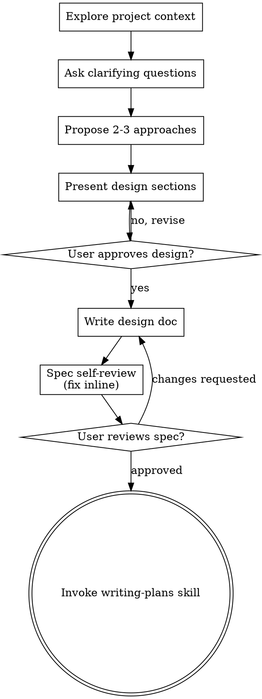
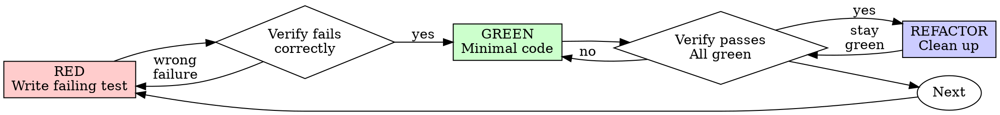

# Codex Session `01a04ffd-0cb5-75e0-8cef-0ed1fbe5ceda`

- Review status: `human-reviewed`
- Reviewed by: `synuns`
- Reviewed at: `2026-09-01T02:04:48.639355+00:00`
- Reviewed candidate SHA-256: `1d6aa8e6354853b213bde35d3190750f7a5032273d8cb3ab0bfbc82cca73b81e`

> Human review required before submission. Automatic redaction is best-effort.

- Model: `gpt-5.6-sol`
- Started: `2026-08-30T00:06:19.086Z`
- Working directory: `~/dev/assignment/kbhc-assgn`

## Turn 1

### User prompt

# AGENTS.md instructions for ~/dev/assignment/kbhc-assgn

<INSTRUCTIONS>
# 프로젝트 작업 규약

## 커밋 메시지

- 모든 커밋 메시지는 Conventional Commits 형식을 따른다.
- 형식은 `<type>(<scope>): <한글 설명>`이며, `scope`는 필요할 때만 사용한다.
- `type`과 `scope`는 영문 소문자로 작성하고, 제목·본문·꼬리말의 설명은 한글로 작성한다. 코드 식별자와 고유명사는 예외로 한다.
- 주요 `type`은 `feat`, `fix`, `docs`, `refactor`, `test`, `chore`를 사용한다.
- 호환성을 깨는 변경은 `!` 또는 `BREAKING CHANGE:` 꼬리말로 표시한다.

예시: `docs: 과제 원본 명세 추가`

## Scope

Follow the assignment sources in `assignment-original/`. The OpenAPI contract
is authoritative for API details. Do not change accepted behavior, architecture,
dependencies, authentication policy, or destructive-data semantics without a
HIGH-risk human decision.

## Required Reading

- [프로젝트 상위 기획](docs/project-plan.md)
- `TODO.md`
- [코딩 규약](docs/coding-standards.md)
- [기술 스택](docs/tech-stack.md)
- `docs/quality/requirements.md`
- `docs/quality/workflow.md`
- `docs/quality/verification.md`
- `AI_USAGE.md`

## Required Loop

Select requirement IDs → implement one testable unit → run read-only automatic
verification → verify applicable browser behavior → classify and fix failures →
record evidence → run lightweight adversarial review at each golden journey →
request one human checkpoint → run full review and final QA.

작업 시작 시 `TODO.md`에서 의존성이 해소된 작업 하나를 선택하고, 종료 전
상태와 재현 가능한 evidence를 갱신한다. 상위 목표·범위·단계는
`docs/project-plan.md`를 따른다. 세부 기능 설계와 구현 순서는 별도
`docs/superpowers/` 문서에서 구체화한다.

LOW work proceeds continuously. People own golden-journey acceptance, HIGH-risk
decisions, exceptions, and final completion. AI never marks `HUMAN_APPROVED`.

## Commands

```bash
./scripts/verify setup
./scripts/verify quick
./scripts/verify full
```

Verification is read-only. `npm run format` is a separate mutation command;
review its diff and rerun `./scripts/verify quick` afterward.

## Evidence and AI Records

Use journey-based browser evidence defined in `workflow.md`. Keep core E2E
small and prefer unit, component, or integration tests when they prove the risk
better. Applicable interactive browser QA uses `agent-browser` and follows
`docs/coding-standards.md`. Stop hooks create ignored redacted candidates only.
A person must review and explicitly publish any tracked AI record.

</INSTRUCTIONS>
<environment_context>
  <cwd>~/dev/assignment/kbhc-assgn</cwd>
  <shell>zsh</shell>
  <current_date>2026-08-30</current_date>
  <timezone>Asia/Seoul</timezone>
  <filesystem><workspace_roots><root>~/dev/assignment/kbhc-assgn</root></workspace_roots><permission_profile type="disabled"><file_system type="unrestricted" /></permission_profile></filesystem>
</environment_context>

아키텍처 기반 작업 필요

<details>
<summary>작업 내용 보기</summary>

### Tool activity

#### `exec`

- Call ID: `call_T1v69Xr6xxtzY91zcqn0zUYT`
- Status: `completed`

**Input**

```text
const r = await tools.exec_command({
  cmd: "sed -n '1,240p' ~/.agents/skills/brainstorming/SKILL.md",
  workdir: "~/dev/assignment/kbhc-assgn",
  yield_time_ms: 10000,
  max_output_tokens: 20000
});
text(r.output);

```

**Output**

````text
Script completed
Wall time 0.2 seconds
Output:

---
name: brainstorming
description: "You MUST use this before any creative work - creating features, building components, adding functionality, or modifying behavior. Explores user intent, requirements and design before implementation."
---

# Brainstorming Ideas Into Designs

Help turn ideas into fully formed designs and specs through natural collaborative dialogue.

Start by understanding the current project context, then ask questions one at a time to refine the idea. Once you understand what you're building, present the design and get user approval.

<HARD-GATE>
Do NOT invoke any implementation skill, write any code, scaffold any project, or take any implementation action until you have presented a design and the user has approved it. This applies to EVERY project regardless of perceived simplicity.
</HARD-GATE>

## Anti-Pattern: "This Is Too Simple To Need A Design"

Every project goes through this process. A todo list, a single-function utility, a config change — all of them. "Simple" projects are where unexamined assumptions cause the most wasted work. The design can be short (a few sentences for truly simple projects), but you MUST present it and get approval.

## Checklist

You MUST create a task for each of these items and complete them in order:

1. **Explore project context** — check files, docs, recent commits
2. **Offer the visual companion just-in-time** — NOT upfront. The first time a question would genuinely be clearer shown than described, offer it then (its own message); on approval its browser tab opens for you. If no visual question ever arises, never offer it. See the Visual Companion section below.
3. **Ask clarifying questions** — one at a time, understand purpose/constraints/success criteria
4. **Propose 2-3 approaches** — with trade-offs and your recommendation
5. **Present design** — in sections scaled to their complexity, get user approval after each section
6. **Write design doc** — save to `docs/superpowers/specs/YYYY-MM-DD-<topic>-design.md` and commit
7. **Spec self-review** — quick inline check for placeholders, contradictions, ambiguity, scope (see below)
8. **User reviews written spec** — ask user to review the spec file before proceeding
9. **Transition to implementation** — invoke writing-plans skill to create implementation plan

## Process Flow



**The terminal state is invoking writing-plans.** Do NOT invoke frontend-design, mcp-builder, or any other implementation skill. The ONLY skill you invoke after brainstorming is writing-plans.

## The Process

**Understanding the idea:**

- Check out the current project state first (files, docs, recent commits)
- Before asking detailed questions, assess scope: if the request describes multiple independent subsystems (e.g., "build a platform with chat, file storage, billing, and analytics"), flag this immediately. Don't spend questions refining details of a project that needs to be decomposed first.
- If the project is too large for a single spec, help the user decompose into sub-projects: what are the independent pieces, how do they relate, what order should they be built? Then brainstorm the first sub-project through the normal design flow. Each sub-project gets its own spec → plan → implementation cycle.
- For appropriately-scoped projects, ask questions one at a time to refine the idea
- Prefer multiple choice questions when possible, but open-ended is fine too
- Only one question per message - if a topic needs more exploration, break it into multiple questions
- Focus on understanding: purpose, constraints, success criteria

**Exploring approaches:**

- Propose 2-3 different approaches with trade-offs
- Present options conversationally with your recommendation and reasoning
- Lead with your recommended option and explain why

**Presenting the design:**

- Once you believe you understand what you're building, present the design
- Scale each section to its complexity: a few sentences if straightforward, up to 200-300 words if nuanced
- Ask after each section whether it looks right so far
- Cover: architecture, components, data flow, error handling, testing
- Be ready to go back and clarify if something doesn't make sense

**Design for isolation and clarity:**

- Break the system into smaller units that each have one clear purpose, communicate through well-defined interfaces, and can be understood and tested independently
- For each unit, you should be able to answer: what does it do, how do you use it, and what does it depend on?
- Can someone understand what a unit does without reading its internals? Can you change the internals without breaking consumers? If not, the boundaries need work.
- Smaller, well-bounded units are also easier for you to work with - you reason better about code you can hold in context at once, and your edits are more reliable when files are focused. When a file grows large, that's often a signal that it's doing too much.

**Working in existing codebases:**

- Explore the current structure before proposing changes. Follow existing patterns.
- Where existing code has problems that affect the work (e.g., a file that's grown too large, unclear boundaries, tangled responsibilities), include targeted improvements as part of the design - the way a good developer improves code they're working in.
- Don't propose unrelated refactoring. Stay focused on what serves the current goal.

## After the Design

**Documentation:**

- Write the validated design (spec) to `docs/superpowers/specs/YYYY-MM-DD-<topic>-design.md`
  - (User preferences for spec location override this default)
- Use elements-of-style:writing-clearly-and-concisely skill if available
- Commit the design document to git

**Spec Self-Review:**
After writing the spec document, look at it with fresh eyes:

1. **Placeholder scan:** Any "TBD", "TODO", incomplete sections, or vague requirements? Fix them.
2. **Internal consistency:** Do any sections contradict each other? Does the architecture match the feature descriptions?
3. **Scope check:** Is this focused enough for a single implementation plan, or does it need decomposition?
4. **Ambiguity check:** Could any requirement be interpreted two different ways? If so, pick one and make it explicit.

Fix any issues inline. No need to re-review — just fix and move on.

**User Review Gate:**
After the spec review loop passes, ask the user to review the written spec before proceeding:

> "Spec written and committed to `<path>`. Please review it and let me know if you want to make any changes before we start writing out the implementation plan."

Wait for the user's response. If they request changes, make them and re-run the spec review loop. Only proceed once the user approves.

**Implementation:**

- Invoke the writing-plans skill to create a detailed implementation plan
- Do NOT invoke any other skill. writing-plans is the next step.

## Key Principles

- **One question at a time** - Don't overwhelm with multiple questions
- **Multiple choice preferred** - Easier to answer than open-ended when possible
- **YAGNI ruthlessly** - Remove unnecessary features from all designs
- **Explore alternatives** - Always propose 2-3 approaches before settling
- **Incremental validation** - Present design, get approval before moving on
- **Be flexible** - Go back and clarify when something doesn't make sense

## Visual Companion

A browser-based companion for showing mockups, diagrams, and visual options during brainstorming. Available as a tool — not a mode. Accepting the companion means it's available for questions that benefit from visual treatment; it does NOT mean every question goes through the browser.

**Offering the companion (just-in-time):** Do NOT offer it upfront. Wait until a question would genuinely be clearer shown than told — a real mockup / layout / diagram question, not merely a UI *topic*. The first time that happens, offer it then, as its own message:
> "This next part might be easier if I show you — I can put together mockups, diagrams, and comparisons in a browser tab as we go. It's still new and can be token-intensive. Want me to? I'll open it for you."

**This offer MUST be its own message.** Only the offer — no clarifying question, summary, or other content. Wait for the user's response. If they accept, start the server with `--open` so their browser opens to the first screen automatically. If they decline, continue text-only and don't offer again unless they raise it.

**Per-question decision:** Even after the user accepts, decide FOR EACH QUESTION whether to use the browser or the terminal. The test: **would the user understand this better by seeing it than reading it?**

- **Use the browser** for content that IS visual — mockups, wireframes, layout comparisons, architecture diagrams, side-by-side visual designs
- **Use the terminal** for content that is text — requirements questions, conceptual choices, tradeoff lists, A/B/C/D text options, scope decisions

A question about a UI topic is not automatically a visual question. "What does personality mean in this context?" is a conceptual question — use the terminal. "Which wizard layout works better?" is a visual question — use the browser.

If they agree to the companion, read the detailed guide before proceeding:
`skills/brainstorming/visual-companion.md`

````

#### `exec`

- Call ID: `call_53kAtHoODRdgLrYFFXoOuQFz`
- Status: `completed`

**Input**

```text
const plan = await tools.update_plan({
  explanation: "요청 범위가 짧아 현재 프로젝트의 아키텍처와 미해결 작업을 먼저 확인하고, 설계 승인 절차로 구체화합니다.",
  plan: [
    { step: "프로젝트 문서·TODO·최근 변경을 확인한다", status: "in_progress" },
    { step: "작업 목적·성공 기준을 한 번에 하나씩 확인한다", status: "pending" },
    { step: "가능한 접근 2~3개와 권장안을 제시한다", status: "pending" },
    { step: "아키텍처·데이터 흐름·오류 처리·검증 설계를 승인받는다", status: "pending" },
    { step: "승인된 설계를 문서화하고 자체 검토·커밋한다", status: "pending" },
    { step: "사용자 문서 검토 후 구현 계획으로 전환한다", status: "pending" }
  ]
});
const files = [
  "docs/project-plan.md",
  "TODO.md",
  "docs/coding-standards.md",
  "docs/tech-stack.md",
  "docs/quality/requirements.md",
  "docs/quality/workflow.md",
  "docs/quality/verification.md",
  "AI_USAGE.md"
];
const results = await Promise.all([
  ...files.map(file => tools.exec_command({
    cmd: `sed -n '1,260p' '${file}'`,
    workdir: "~/dev/assignment/kbhc-assgn",
    yield_time_ms: 10000,
    max_output_tokens: 30000
  })),
  tools.exec_command({
    cmd: "git status --short && git log -5 --oneline && rg --files -g '!node_modules' -g '!dist' | sed -n '1,240p'",
    workdir: "~/dev/assignment/kbhc-assgn",
    yield_time_ms: 10000,
    max_output_tokens: 30000
  })
]);
for (let i = 0; i < results.length; i++) {
  text(`\n===== ${i < files.length ? files[i] : "repo-state"} =====\n`);
  text(results[i].output);
}

```

**Output**

````text
Script completed
Wall time 0.7 seconds
Output:

Warning: truncated output (original token count: 17241)
Total output lines: 1422


===== docs/project-plan.md =====

# 프론트엔드 과제 상위 기획

## 문서 목적

이 문서는 과제 전체의 목표, 범위, 제품 동작, 기술 구조, 단계, 검증 전략과
사람 결정 지점을 정의하는 최상위 기획 기준이다. 개별 기능의 설계·구현
절차를 담는 `docs/superpowers/specs/`와 `docs/superpowers/plans/`보다 상위에
있다.

실행 상태와 남은 작업은 루트 `TODO.md`에서 관리한다. 에이전트는 작업 시작
전 이 문서와 `TODO.md`를 읽고, 한 번에 검증 가능한 작업 단위 하나만 수행한다.

## 기준 문서와 우선순위

충돌 시 다음 순서를 적용한다.

1. `assignment-original/openapi.yaml`: API 경로, method, 요청·응답 schema,
   인증 scheme의 최우선 계약
2. `assignment-original/requirement.md`: 화면, 상호작용, 제출 조건
3. `docs/quality/requirements.md`: 원본을 requirement ID와 acceptance로 변환한
   실행 기준
4. 이 문서: 전체 범위, 구조, 단계, 품질 전략
5. `docs/tech-stack.md`: 승인된 기술과 도구 책임
6. `docs/coding-standards.md`: 모든 에이전트가 구현·검토 때 지킬 코딩 규약
7. `docs/superpowers/specs/`와 `docs/superpowers/plans/`: 특정 작업의 상세 설계와
   구현 순서
8. `TODO.md`: 현재 실행 순서, 상태, evidence

하위 문서는 상위 문서의 accepted behavior를 바꿀 수 없다. 원본과
`docs/quality/requirements.md`가 충돌하거나 해석이 둘 이상이면
`REQUIREMENT` 실패로 기록하고 HIGH-risk 사람 결정을 요청한다.

## 제품 목표

React 19와 TypeScript로 다음 업무 흐름을 제공하는 제출 가능한 단일 페이지
애플리케이션을 만든다.

- 사용자는 로그인 입력을 검증하고 API를 통해 인증한다.
- 공통 navigation에서 dashboard와 task 목록으로 이동한다.
- 로그인 상태에 따라 sign-in 또는 profile 진입점 하나만 본다.
- dashboard에서 전체, 남은, 완료 task 수를 확인한다.
- 가상화된 무한 목록에서 task를 탐색하고 상세로 이동한다.
- 상세가 없으면 목록으로 복구한다.
- route ID를 정확히 입력한 경우에만 task를 삭제하고 목록으로 돌아간다.
- profile에서 사용자 name과 memo를 확인한다.

## 성공 기준

완료는 기능 존재가 아니라 다음 증거가 모두 충족된 상태다.

- `docs/quality/requirements.md`의 모든 requirement에 재현 가능한 자동 또는
  browser evidence가 기록된다.
- 네 Golden Journey `auth-entry`, `work-overview`, `task-discovery`,
  `task-resolution`이 각각 경량 adversarial review를 통과하고 사람이
  checkpoint를 승인한다.
- OpenAPI 계약에서 생성한 타입과 MSW 동작이 실제 client 요청·응답과 일치한다.
- loading, empty, error, success 상태가 적용 가능한 화면에서 구분된다.
- keyboard 사용, label 연결, focus 이동, modal 접근성, 반응형 layout을 확인한다.
- format, lint, typecheck, unit/component/integration test, build, core E2E가
  read-only `./scripts/verify full`에서 통과한다.
- console·network 오류, 비밀정보, debug 출력, 불필요한 생성물, 관련 없는 diff가
  없다.
- `AI_USAGE.md`와 공개 AI 기록은 사람 검토 결과만 반영한다.
- AI가 `HUMAN_APPROVED`나 최종 완료를 선언하지 않는다.

## 범위

### 포함

- `/`, `/sign-in`, `/task`, `/task/:id`, `/user` route
- 상태별 GNB/LNB action과 서로 다른 아이콘
- sign-in validation, 요청, 오류 modal, 인증 상태
- dashboard metrics
- task 가상 목록, 무한 pagination, 상세, 404 복구, 확인 후 삭제
- user profile
- OAS 3.1 기반 생성 타입과 제출 가능한 MSW API 대체 구현
- 명명된 색상 token과 local Pretendard font
- 자동 검증, browser evidence, Golden Journey checkpoint, AI 사용 공개

### 제외

- 원본에 없는 회원가입, 로그아웃 UI, task 생성·수정, 검색, 정렬, filter
- 별도 production backend와 database
- 원본에 없는 role·permission 체계
- offline mode, realtime synchronization, analytics, 국제화
- 심미성을 위한 대규모 animation이나 독자 design system 확장
- 승인 없는 dependency, architecture, 인증 정책, 삭제 의미 변경

## 사용자와 핵심 흐름

별도 role 체계는 두지 않는다. UI 관점 상태만 구분한다.

### 비로그인 사용자

1. 공통 navigation에서 dashboard, task, sign-in action을 확인한다.
2. `/sign-in`에서 email과 password를 입력한다.
3. client validation 실패 시 연결된 inline 오류를 확인한다.
4. 유효한 입력을 제출한다.
5. non-200 응답이면 API `errorMessage` modal을 확인하고 닫는다.
6. 200 응답이면 승인된 방식으로 인증 상태를 만들고 보호 API 요청을 수행한다.

dashboard와 task action의 노출 여부와 보호 route 접근 정책은 원본만으로
확정되지 않았다. navigation action은 항상 존재한다는 invariant를 지키되,
비로그인 접근 결과는 인증 정책 사람 결정에서 확정한다.

### 로그인 사용자

1. sign-in 대신 profile action을 확인한다.
2. dashboard에서 API fixture와 같은 세 지표를 본다.
3. task 목록을 scroll하며 다음 page를 중복 없이 불러온다.
4. card의 title과 memo를 확인하고 상세로 이동한다.
5. 없는 상세에서 목록 복구 action을 사용한다.
6. 존재하는 상세에서 title, memo, registerDatetime을 확인한다.
7. 삭제 modal에서 잘못된 ID에는 submit이 비활성화되고 정확한 ID에서만
   활성화되는지 확인한다.
8. 삭제 성공 후 `/task`로 돌아간다.
9. profile에서 name과 memo를 확인한다.

## 화면·route 기획

| Route | 목적 | 주요 상태 | Requirement |
| --- | --- | --- | --- |
| `/` | 업무 현황 확인 | loading, error, success | `DASH-01`, `NAV-01`, `NAV-03` |
| `/sign-in` | 인증 시작 | invalid, submitting, API error, success | `NAV-02`, `AUTH-01`~`AUTH-07` |
| `/task` | task 탐색 | initial loading, empty, page loading, error, terminal page | `TASK-LIST-01`~`TASK-LIST-05` |
| `/task/:id` | task 확인·삭제 | loading, 404, error, success, delete modal | `TASK-DETAIL-01`~`TASK-DETAIL-05` |
| `/user` | profile 확인 | loading, error, success | `USER-01`, `NAV-03` |

공통 shell은 현재 route를 표시하고 dashboard/task action을 유지한다. 인증
action은 sign-in과 profile 중 정확히 하나만 표시한다. 아이콘은 항목별로
서로 다르며 accessible name은 text와 함께 유지한다.

## API 계약 기획

| 동작 | 계약 | 핵심 처리 |
| --- | --- | --- |
| 로그인 | `POST /api/sign-in` | email/password JSON, 200 token 응답, non-200 `errorMessage` |
| 갱신 | `POST /api/refresh` | refresh cookie credential, 200 token, 400/401 error |
| profile | `GET /api/user` | bearer token, name/memo |
| dashboard | `GET /api/dashboard` | bearer token, 세 integer metric |
| task 목록 | `GET /api/task?page=N` | 1부터 시작, data/hasNext |
| task 상세 | `GET /api/task/{id}` | bearer token, 200 detail, 404 error |
| task 삭제 | `DELETE /api/task/{id}` | bearer token, 200 `{ success: true }`, 404 error |

Client는 generated OpenAPI type을 경계에서 사용한다. UI model 변환이 필요하면
순수 함수로 분리하고 원본 response 필드를 조용히 바꾸지 않는다. 모든 보호
요청은 승인된 auth adapter를 통과한다. MSW browser handler와 test server
handler는 같은 fixture와 contract behavior를 공유한다.

## 기술 구조

### 채택 stack

- React 19, TypeScript strict, Vite, pnpm
- React Router, TanStack Query, React Hook Form, Zod
- TanStack Virtual, Fetch API, `openapi-typescript`, MSW
- shadcn/ui, Tailwind CSS, CSS Custom Properties, Pretendard, Lucide React
- Vitest, Testing Library, Playwright, Biome

정확한 채택 상태와 변경 규칙은 `docs/tech-stack.md`가 관리한다. 새 dependency나
교체는 HIGH-risk 사람 승인 전 적용하지 않는다.

### 목표 module 경계

후속 상세 설계는 FSD 원칙을 사용하되, 이 문서는 책임 방향만 고정한다.

```text
src/
├── app/        # bootstrap, provider composition, router, global styles
├── pages/      # route 단위 composition
├── widgets/    # app shell, navigation 등 page 간 큰 UI block
├── features/   # sign-in, delete-task 등 사용자 행위
├── entities/   # task, user 등 domain 표시·model
├── shared/     # api client, generated contract, auth adapter, 공용 UI·utility
└── mocks/      # MSW handlers, fixtures, browser/node bootstrap
```

의존 방향은 상위 composition에서 하위 재사용 단위로 흐른다. 각 공개 경계는
후속 기능 설계에서 exact export를 정한다. route page가 fetch, token, fixture
세부 구현을 직접 소유하지 않는다.

### provider와 data flow

```text
Browser event
  → feature/page action
  → typed API client
  → auth adapter가 bearer/refresh 정책 적용
  → real fetch boundary 또는 MSW
  → generated OpenAPI type를 쓰는 response mapping boundary
  → TanStack Query cache
  → entity/widget/page rendering
```

App bootstrap은 router, query client, auth context, MSW development bootstrap을
명시적 순서로 조합한다. test는 필요한 provider만 test harness로 구성한다.

### 상태 책임

- server state: TanStack Query가 loading, error, data, pagination, invalidation을
  관리한다.
- form state: React Hook Form과 Zod가 sign-in 입력·오류·submit 가능 상태를
  관리한다.
- auth state: 승인된 auth adapter/context만 token과 session transition을
  관리한다.
- modal state: 해당 feature가 open/close, focus restore, 입력 reset을 관리한다.
- route state: React Router param과 navigation을 단일 기준으로 사용한다.
- mock state: MSW fixture store가 delete 이후 목록·상세·dashboard 일관성을
  결정한다. 의미 변경은 삭제 정책 결정 범위에서 승인받는다.

## HIGH-risk 결정 gate

다음은 구현 전에 사람이 결정한다. 결정 전에는 evidence 조사, test 설계,
독립 LOW 작업만 진행한다.

### 인증 정책

OpenAPI는 sign-in response에 accessToken과 refreshToken을 반환하면서 refresh는
`token` cookie를 요구한다. token 저장 위치와 cookie 설정 주체는 명시하지
않는다. 다음을 하나의 auth 설계에서 확정한다.

- access token 저장 위치와 page reload 시 동작
- response의 refreshToken과 refresh cookie 관계
- token expiry 판정과 동시 401 처리
- refresh 성공 시 request replay 범위와 무한 retry 방지
- refresh 400/401 시 session 정리와 UI 이동
- `/`, `/task`, `/task/:id`, `/user`의 비로그인 접근 정책
- MSW가 cookie와 JWT expiry를 결정적으로 재현하는 방법

승인 evidence는 결정 문서 경로, 승인자, 승인 시점, 영향을 받는 requirement를
남긴다. `AUTH-07` 구현은 승인 전 시작하지 않는다.

### 삭제와 mock data 일관성

원본은 exact ID 확인 후 delete 호출과 `/task` redirect를 요구한다. 다음
세부사항이 accepted behavior를 바꾸면 사람 결정을 요청한다.

- 성공 후 목록, 상세, dashboard fixture의 일관성 유지 범위
- delete 401/404와 network 실패 표시 방식
- 중복 submit과 요청 중 modal close 정책

최소 기준은 정확한 route ID 없이는 호출하지 않고, 200 success에서만
`/task`로 이동하는 것이다.

## 공통 UX·접근성 기준

- 모든 form control은 visible label과 programmatic association을 가진다.
- inline 오류는 해당 input과 연결하고 상태만 색으로 전달하지 않는다.
- modal은 accessible name, 초기 focus, focus trap, Escape/close, 닫힌 뒤 focus
  restore를 검증한다.
- submit 중 중복 요청을 막고 진행 상태를 text로 전달한다.
- loading, empty, recoverable error, terminal success를 서로 구분한다.
- error는 가능한 recovery action을 제공한다. 404 상세는 목록 이동을 반드시
  제공한다.
- 명명된 semantic color token만 사용한다. feature-local color literal을
  추가하지 않는다.
- Pretendard local asset 요청과 computed font를 browser에서 확인한다.
- 최소 mobile과 desktop viewport에서 content clipping, 가상 목록 scroll,
  modal overflow, navigation 가용성을 확인한다.


===== TODO.md =====

# 에이전트 작업 목록

## 목적

과제 완료까지 남은 작업, 의존성, 검증법, evidence를 관리하는 실행 원장이다.
상위 목표와 단계는 `docs/project-plan.md`, accepted behavior는
`docs/quality/requirements.md`, 구현 규율은 `docs/coding-standards.md`, 세부 작업
설계는 `docs/superpowers/`를 따른다.

## 에이전트 사용 규칙

1. 작업 시작 전 필수 문서와 이 파일을 읽는다.
2. `Status: NOT_STARTED`이며 모든 `Depends on`이 완료된 item 하나를 고른다.
3. 시작할 때만 `IN_PROGRESS`로 바꾸고 담당 agent/session을 Evidence에 남긴다.
4. requirement ID, risk, acceptance, 검증법을 바꾸지 않고 한 testable unit만
   구현한다.
5. HIGH item은 사람 결정 evidence 없이는 구현하지 않는다.
6. 자동·browser 검증 후 재현 명령, commit, 결과를 Evidence에 기록한다.
7. AI는 검증 완료 item을 `AI_VERIFIED`까지만 변경한다.
8. `HUMAN_APPROVED`는 사람이 명시적으로 승인한 journey checkpoint에만 사람이
   기록한다.
9. 실패는 `docs/quality/workflow.md` 분류와 root cause, correction, rerun을
   Evidence에 남긴다.
10. 새 작업은 해당 단계에 stable ID로 추가한다. 완료 item을 삭제하거나
    번호를 재사용하지 않는다.

## 상태

- `NOT_STARTED`: 시작 전
- `IN_PROGRESS`: 한 agent가 수행 중
- `AI_VERIFIED`: acceptance와 자동/browser evidence 충족
- `HUMAN_APPROVED`: 사람이 checkpoint 승인
- `BLOCKED`: blocker와 해제 조건 기록

`[ ]`는 미완료, `[x]`는 `AI_VERIFIED` 또는 사람이 기록한
`HUMAN_APPROVED`를 뜻한다. checkbox와 Status가 다르면 Status를 보수적으로
낮추고 evidence를 다시 확인한다.

## 현재 진행 요약

| 단계 | Exit gate | 상태 |
| --- | --- | --- |
| 0. 기획·결정 준비 | 상위 기준 연결, HIGH 결정 목록 분리 | AI_VERIFIED |
| 1. 개발 기반 | quick/full 및 scaffold browser smoke 통과 | NOT_STARTED |
| 2. 공통 구조 | provider/router/API/test 경계 검증 | NOT_STARTED |
| 3. auth-entry | evidence·review 후 사람 checkpoint | BLOCKED — auth 정책 결정 필요 |
| 4. work-overview | evidence·review 후 사람 checkpoint | NOT_STARTED |
| 5. task-discovery | evidence·review 후 사람 checkpoint | NOT_STARTED |
| 6. task-resolution | evidence·review 후 사람 checkpoint | NOT_STARTED |
| 7. 통합·제출 QA | full QA 후 사람 최종 acceptance | NOT_STARTED |

## 0. 기획·결정 준비

### [x] PLAN-01 상위 기획과 실행 원장 연결

- Requirements: 전체
- Risk: LOW
- Depends on: 없음
- Deliverable: `docs/project-plan.md`, `TODO.md`, `AGENTS.md` Required Reading
- Acceptance: 문서 역할, source priority, 전체 단계, agent 갱신 규칙이 서로
  모순 없이 연결된다.
- Automatic verification: `./scripts/verify setup`, `git diff --check`, 문서 link와
  heading 정적 검사
- Browser verification: 적용 없음
- Status: AI_VERIFIED
- Evidence: 2026-08-29 `./scripts/verify setup` PASS, 79 tests; requirement ID
  coverage 27/27; TODO 34 items의 필수 field 10종과 dependency reference 검사 PASS;
  staged `git diff --check` PASS

### [ ] DEC-AUTH-01 인증 정책 사람 결정

- Requirements: `AUTH-07`, `NAV-02`, `NAV-03`
- Risk: HIGH
- Depends on: `PLAN-01`
- Deliverable: access token 저장, refresh cookie 관계, expiry/401/replay,
  refresh 실패, 보호 route 정책을 확정한 별도 auth 설계 문서
- Acceptance: `docs/project-plan.md`의 인증 정책 질문이 각각 한 가지 동작으로
  답해지고 OpenAPI bearer/refresh scheme과 모순이 없으며 사람이 승인한다.
- Automatic verification: 설계 문서 self-review와 OpenAPI/auth requirement
  trace 검사
- Browser verification: 구현 전 적용 없음
- Status: NOT_STARTED
- Evidence: 미실행; 사람 승인 필요

### [x] PLAN-02 에이전트 코딩 규약 연결

- Requirements: 전체 구현·검증 requirement
- Risk: LOW
- Depends on: `PLAN-01`
- Deliverable: `docs/coding-standards.md`, `AGENTS.md` Required Reading, TODO 연결
- Acceptance: TDD, FSD, shadcn-first, SOLID·기존 코드 보존, agent-browser QA,
  type/error/accessibility/diff 규칙과 예외 절차가 실행 가능한 수준으로 정의된다.
- Automatic verification: `./scripts/verify setup`, `git diff --check`, 필수 heading과
  명령 정적 검사
- Browser verification: 적용 없음
- Status: AI_VERIFIED
- Evidence: 2026-08-29 `agent-browser` 설치 경로와 pnpm 10.15.1 확인; TDD,
  FSD, shadcn-first, SOLID, 기존 code 보존, browser QA heading·명령 정적 검사
  PASS; shadcn `search`, `view`, `add` 명령은 공식 CLI 문서와 대조

### [ ] DEC-DELETE-01 삭제 일관성 정책 사람 결정

- Requirements: `TASK-DETAIL-03`~`TASK-DETAIL-05`, `DASH-01`, `TASK-LIST-01`
- Risk: HIGH — destructive-data semantics
- Depends on: `PLAN-01`
- Deliverable: 200 success, 401/404/network failure, 중복 submit, modal close,
  목록·상세·dashboard mock/cache 일관성을 확정한 삭제 설계 문서
- Acceptance: exact route ID 확인 전 요청 금지와 200 success에서만 `/task`
  redirect하는 원본 동작을 유지하고 모든 실패·cache transition이 한 가지로
  확정되며 사람이 승인한다.
- Automatic verification: 설계 self-review, OpenAPI/delete requirement trace 검사
- Browser verification: 구현 전 적용 없음
- Status: NOT_STARTED
- Evidence: 미실행; 사람 승인 필요

### [ ] DEC-ARCH-01 애플리케이션 구조 상세 설계

- Requirements: 전체 기능 requirement의 구조 기반
- Risk: HIGH — architecture 결정
- Depends on: `PLAN-02`
- Deliverable: FSD layer, public API, import 방향, provider composition,
  route/API/test 경계를 확정한 별도 설계 문서
- Acceptance: 각 module의 책임·소비·제공 interface가 명확하고 scaffold 및
  `docs/tech-stack.md`와 일치하며 사람이 승인한다.
- Automatic verification: 설계 self-review, dependency 방향과 requirement
  coverage 정적 검토
- Browser verification: 구현 전 적용 없음
- Status: NOT_STARTED
- Evidence: 미실행; 사람 승인 필요

## 1. 검증 가능한 개발 기반

### [ ] SCF-01 package와 toolchain 기반

- Requirements: `SYS-01`
- Risk: LOW — 이미 채택된 stack 적용
- Depends on: `PLAN-02`
- Deliverable: React 19, TypeScript, Vite, pnpm lockfile, strict TS, Biome,
  Vitest, Playwright dependencies와 scripts
- Acceptance: 기존 `ai:review`가 유지되고 여섯 frontend script가 read-only
  책임에 맞게 존재하며 다른 package manager lockfile이 없다.
- Automatic verification: package script test, install reproducibility,
  `pnpm format:check`, `pnpm lint`, `pnpm typecheck`
- Browser verification: 적용 없음
- Status: NOT_STARTED
- Evidence: 미실행

### [ ] SCF-02 최소 React 진입점과 style 기반

- Requirements: `SYS-01`, `SYS-02`, `SYS-03`
- Risk: LOW
- Depends on: `SCF-01`
- Deliverable: Vite entry, React root, Tailwind entry, semantic color tokens,
  local Pretendard asset과 global font
- Acceptance: 업무 feature 없이 root가 render되고 UI color literal 없이 token이
  정의되며 font asset 요청과 computed family가 확인된다.
- Automatic verification: component smoke, typecheck, build, token/literal 정적 검사
- Browser verification: `/`, desktop viewport, console/page error 없음, font
  networ…7241 tokens truncated…d` for that task. | LOW | integration/browser | — | — | task-discovery | NOT_STARTED |
| TASK-DETAIL-01 | Detail success | requirement: 상세; OAS `TaskDetailResponse` | Detail view shows title, memo, and `registerDatetime` returned by `GET /api/task/:id`. | MEDIUM | integration | — | — | task-resolution | NOT_STARTED |
| TASK-DETAIL-02 | Detail missing | requirement: 상세; OAS 404 | A 404 shows a resource-missing state with a usable return-to-list action. | MEDIUM | integration/browser | — | — | task-resolution | NOT_STARTED |
| TASK-DETAIL-03 | Delete confirmation | requirement: 상세 | Delete opens a modal containing an ID confirmation input. | LOW | component | — | — | task-resolution | NOT_STARTED |
| TASK-DETAIL-04 | Delete guard | requirement: 상세 | Delete submit stays disabled until input exactly equals route ID. | LOW | unit/component | — | — | task-resolution | NOT_STARTED |
| TASK-DETAIL-05 | Delete success | requirement: 상세; OAS `DELETE /api/task/{id}` | Confirmed submit calls delete API and successful response redirects to `/task`. | MEDIUM | integration/browser | — | — | task-resolution | NOT_STARTED |
| USER-01 | Profile data | requirement: 회원정보; OAS `UserResponse` | Authenticated profile view shows name and memo from `GET /api/user`. | MEDIUM | integration/browser | — | — | work-overview | NOT_STARTED |

## Golden Journeys

### auth-entry

Requirements: `NAV-02`, `AUTH-01` through `AUTH-07`.

- Preconditions: signed out; sign-in API can return deterministic success and
  error responses; protected and refresh endpoints can exercise the approved
  access-token expiry behavior deterministically.
- Actions: open `/sign-in`; submit invalid fields; submit valid fields against
  error response; dismiss error; submit valid fields against success response;
  trigger a protected request; inspect captured integration or browser-network
  evidence for `Authorization: Bearer [REDACTED] exercise and inspect the
  approved refresh/expiry path; inspect authenticated navigation.
- Expected: labels remain usable, invalid values cannot submit, server
  `errorMessage` appears in modal, success establishes authenticated state, and
  navigation switches from sign-in to profile. The protected request carries
  the access token as a bearer credential, and expiry follows exactly the
  human-approved refresh behavior. The human checkpoint reviews both pieces of
  auth evidence rather than inferring them from the navigation change.

### work-overview

Requirements: `SYS-03`, `NAV-01`, `NAV-03`, `DASH-01`, `USER-01`.

- Preconditions: signed in; dashboard and profile APIs return known fixtures.
- Actions: navigate between dashboard, task route, and profile; compare fixture
  data with visible values.
- Expected: route actions and distinct icons remain available, metrics match
  API values, and profile name/memo match API values.

### task-discovery

Requirements: `TASK-LIST-01` through `TASK-LIST-05`.

- Preconditions: signed in; at least two task pages with `hasNext` transition
  from true to false.
- Actions: open `/task`; inspect cards; scroll through viewport; trigger next
  page; continue to terminal page; select a task.
- Expected: correct cards render, DOM stays bounded by virtualization, each
  page is requested once, loading stops at `hasNext: false`, and selection
  navigates to matching detail.

### task-resolution

Requirements: `TASK-DETAIL-01` through `TASK-DETAIL-05`.

- Preconditions: signed in; one existing ID and one missing ID; delete API
  succeeds for existing ID.
- Actions: open existing detail; open missing detail and return; reopen existing
  detail; open delete modal; enter wrong then exact ID; submit.
- Expected: detail fields match API, 404 recovery returns to list, delete submit
  is guarded by exact ID, delete request targets route ID, and success returns
  to `/task`.

## Invariants

- Dashboard and task navigation remain present across routes.
- Authentication state exposes exactly one of sign-in and profile actions.
- UI colors flow through named tokens; Pretendard remains application font.
- Input labels remain associated with controls.
- Invalid sign-in input cannot submit; API errors surface `errorMessage`.
- Protected requests use approved authentication state.
- Virtualized task DOM remains bounded as fetched data grows.
- One task page has at most one in-flight request; `hasNext: false` stops paging.
- Detail 404 always provides list recovery.
- Delete cannot submit without exact ID and success always returns to task list.
- Loading, empty, error, and success states are distinguishable.
- AI evidence never marks `HUMAN_APPROVED`.
- Verification commands never modify repository files.


===== docs/quality/workflow.md =====

# AI Development Workflow

## Operating Loop

1. Select requirement IDs and acceptance conditions from `requirements.md`.
2. Classify risk and choose one independently testable unit.
3. Implement the smallest change and its appropriate automated test.
4. Run `./scripts/verify quick`.
5. Run applicable browser checks and record evidence.
6. Classify failures, correct root cause, and rerun the failed gate.
7. Record evidence and continue low-risk work.
8. At a completed golden journey, run lightweight adversarial review and ask
   for one human checkpoint acceptance.
9. After all journeys, run full adversarial review, `./scripts/verify full`,
   and final QA.
10. Ask a person for final acceptance. AI never declares human acceptance.

One work unit covers one requirement ID or one independently testable condition
inside an ID. Do not split work by file when files form one testable behavior.

## Risk and Authority

### LOW — AI proceeds continuously

Examples: approved-pattern implementation, focused tests, local unambiguous
fixes, active-task documentation, and necessary non-semantic cleanup.

AI may implement, test, diagnose, fix, review, commit, and continue. Record
requirement IDs, commands, browser evidence when applicable, and decisions.

### MEDIUM — human owns journey checkpoint

Examples: completing a golden journey, introducing a new interaction pattern,
or spanning routes, API state, and views within approved architecture.

AI completes and verifies a coherent batch, runs lightweight adversarial
review, then requests one checkpoint acceptance. Do not request approval for
each requirement inside the batch.

### HIGH — human decides before consequential change

Examples: conflicting requirements, authentication or security policy,
destructive-data semantics, dependency or architecture changes, scope
expansion, acceptance changes, and bypassing a failed gate.

Stop before the consequential implementation. Present evidence, options,
trade-offs, and recommendation. While waiting, continue only evidence work,
diagnosis, or unrelated LOW work that cannot cross the affected boundary.

AI proposes risk and owns execution evidence. People own journey acceptance,
HIGH decisions, exceptions, and final acceptance.

## Failure Classification

Assign one primary class and record evidence, rationale, corrective change, and
rerun result:

- `REQUIREMENT`: ambiguous, conflicting, missing, or misunderstood condition.
- `IMPLEMENTATION`: logic, state, or rendering defect.
- `INTEGRATION`: API, auth, routing, browser, or cross-module defect.
- `UX_ACCESSIBILITY`: usability, interaction, visual, or accessibility defect.
- `TEST`: incorrect, duplicate, flaky, or overly broad test.
- `ENVIRONMENT`: runtime, OS, browser, port, or local service problem.
- `TOOLING`: build, lint, typecheck, verify, hook, or runner problem.

`REQUIREMENT` and behavior-changing corrections are HIGH. Never turn a failure
green by weakening an assertion, adding an undocumented skip, or editing only
checklist status.

## Browser Failure Record

```text
Requirement/Journey:
Commit:
Route/Viewport:
Precondition:
Actions:
Expected:
Actual:
Console/Network:
Screenshot/Trace:
Failure class:
Correction:
Rerun verdict:
```

Browser-tool failure is not product success. Classify it as `ENVIRONMENT` or
`TOOLING`, restore trustworthy evidence, then rerun.

## Adversarial Review

After each of `auth-entry`, `work-overview`, `task-discovery`, and
`task-resolution`, use a fresh reviewer context or explicit second-pass role
that did not author the final change. Check requirement omissions, negative
paths, invariants, accessibility, weak or duplicate tests, console/network
errors, and missing evidence. Resolve findings before requesting checkpoint
acceptance.

After all checkpoints, perform a full review across journeys: auth transitions,
navigation, stale state, API errors, regression risk, OAS/mock consistency,
test duplication, and assignment-wide constraints.

## Human Checkpoints

Request human action only for:

- A completed golden journey after evidence and lightweight review.
- A HIGH-risk decision before consequential implementation.
- An exception to a required gate.
- Final QA readiness and final completion.

While a checkpoint is pending, evidence preparation and unrelated LOW analysis
may continue. Do not implement beyond the unapproved journey boundary.

For the `auth-entry` checkpoint, the person reviews focused integration
evidence that a protected request uses `Authorization: Bearer [REDACTED]
and that the approved refresh/expiry path was exercised. Add core browser
evidence only for credential or network behavior that the integration boundary
cannot prove; a visible profile action alone is not authentication evidence.

## Prompt Records

Lifecycle hooks create pending snapshots and metadata only. A person runs
`npm run ai:review`; the tool selects candidates risk-first, computes and
records reviewed SHA-256 digest and reviewer, then asks for exact `y`+Enter.
Other input, EOF, or signal cancels. Publication uses staging and atomic
rename, then regenerates public index and managed `AI_USAGE.md`; reruns are
idempotent. AI must not approve or publish on a person's behalf. See
`verification.md` and `AI_USAGE.md`.

## Final QA Checklist

- [ ] Every requirement row has reproducible evidence and correct status.
- [ ] All four journey checkpoints are human-approved.
- [ ] Full adversarial review findings are resolved.
- [ ] `./scripts/verify full` passes on the intended submission commit.
- [ ] Core browser evidence exists for all four journeys.
- [ ] Auth, navigation, stale state, errors, and regressions were cross-checked.
- [ ] Console and network errors were reviewed.
- [ ] Accessibility and responsive layouts were spot-checked at recorded viewports.
- [ ] API mock behavior matches `openapi.yaml`.
- [ ] AI records were human-reviewed before publication.
- [ ] Git diff contains no secrets, debug output, generated noise, or unrelated work.
- [ ] A person, not AI, marks final acceptance.


===== docs/quality/verification.md =====

# Verification Policy

## Canonical Commands

```bash
./scripts/verify setup
./scripts/verify quick
./scripts/verify full
./scripts/verify
```

No argument means `full`. Every verification mode is read-only and compares a
repository content fingerprint before and after execution. A mutation makes
verification fail.

## Modes

- `setup`: required files, document markers and links, risk/approval rules,
  journey categories, review/final-QA sections, pending-record ignore rule,
  Stop/SessionEnd hook wiring, AI disclosure headings, and the four focused
  artifact-contract, exporter, index, and publisher unit-test suites.
- `quick`: `setup`, then `format:check`, `lint`, `typecheck`, and `test` after
  frontend scaffolding.
- `full`: `setup`, `quick`, `build`, and `test:e2e:core` after frontend
  scaffolding.

Before `package.json` exists, frontend stages print
`SKIP frontend not scaffolded`. This certifies workflow setup only. After
`package.json` exists, all six required scripts must exist; absence is failure.

Verification stops on first failure, exits nonzero, prints a reproduction
command, and lists failure classes from `workflow.md`.

## Formatting Mutation Is Separate

`format:check` reports differences and never edits files. Formatting mutation
is separate:

```bash
npm run format
```

Review the resulting diff and run `./scripts/verify quick`. No verify command
may call `npm run format` or another write-mode formatter.

## Test-Level Selection

- Unit: pure validation, transforms, and isolated state.
- Component: labels, disabled states, modal interaction, conditional UI, and
  focused accessibility.
- Integration: API response to view state, router transitions, and feature
  state with controlled external boundaries.
- E2E: real browser behavior crossing authentication, routing, network,
  scrolling, virtualization, or deletion/navigation boundaries.

Choose the lowest level that proves risk reliably. Do not duplicate lower-level
coverage in E2E.

## Core E2E Journeys

Organize by `auth-entry`, `work-overview`, `task-discovery`, and
`task-resolution`, not by page.
Keep at most one representative success path and one critical failure path per journey.
Every E2E names its unique cross-boundary risk. `test:e2e:core` runs only
`@core`; extended, diagnostic,
or browser-compatibility suites use separate explicit commands.

Review slow, flaky, redundant cases for removal or demotion to integration or
component tests.

## Browser Evidence

Record scenario and requirement IDs, commit, route, viewport, preconditions,
actions, expected and actual results, console/network errors, screenshot or
trace, verdict, failure class, correction, and rerun result.

Browser automation failure is `ENVIRONMENT` or `TOOLING`, never product pass.

For `AUTH-07`, focused integration evidence proves that a protected request
sends `Authorization: Bearer [REDACTED] and exercises the human-approved
refresh/expiry behavior. Core E2E covers only a credential or browser-network
boundary that integration evidence cannot prove. The human `auth-entry`
checkpoint reviews both artifacts; authenticated navigation alone is
insufficient.

## Prompt Candidate Verification

Setup verification confirms ignored pending storage, Stop hook wiring, exporter
tests, and reviewed-publication language. The hook creates only structurally
filtered and redacted pending candidates. `npm run ai:review` presents them
risk-first; a person reviews content and sensitive information, then confirms
with exact `y`+Enter. Reviewer and reviewed SHA-256 digest are recorded by the
tool. `n`, blank input, EOF, or signal cancels. The publisher opens the
candidate with no-follow semantics, requires a regular file, reads it once,
rejects a digest mismatch, and publishes from those bytes.
Published records alone are indexed in `artifacts/index.md`. The explicit
publisher holds the shared index lock and writes the reviewed artifact,
canonical index, and fully regenerated managed `AI_USAGE.md` region in that
order, rolling earlier files back if a later write fails. The region is derived
only from post-publication canonical index filenames, so stale, malformed,
missing, and unindexed links are removed. `SessionEnd` validates and prunes the
index only; it never rewrites `AI_USAGE.md`.


===== AI_USAGE.md =====

# AI 사용 내역

## 사용한 도구와 모델

- 도구: OpenAI Codex
- 모델: `gpt-5.6-sol`

## 적용한 작업 범위

- 과제 요구사항 분석과 프로젝트 구조 결정
- Codex 사용 기록 자동화 설계 및 구현
- 이후 구현 과정의 코드 작성, 테스트, 검토 보조

## 핵심 프롬프트 요약

- 과제 원본 문서를 별도 디렉터리로 분리
- Codex Stop Hook으로 사용자 프롬프트, 도구 작업, 최종 응답 기록
- SessionEnd Hook으로 세션 기록 인덱스 자동 생성
- 시스템·개발자 지침과 내부 reasoning 제외
- 비밀정보 자동 마스킹, 비추적 후보 생성, 사람 검토 후 명시적 게시

## 사람이 최종 검증한 내용

- [ ] 비밀정보와 민감정보 제거 확인
- [ ] 프롬프트와 작업 결과 정확성 확인
- [ ] 테스트 결과와 애플리케이션 동작 확인
- [ ] 도구, 모델, 작업 범위 정확성 확인

## 자동 검증 내역

- 자동화 결과는 사람 검증으로 간주하지 않으며 제출 전 확인된 결과만 수동 기록합니다.

## 전체 프롬프트와 작업 기록

Lifecycle 훅은 pending 후보와 metadata만 생성합니다. 사람 게시 절차는
후보 선택, 위험 우선 미리보기, digest 계산, reviewer 기록을 한 명령에서
처리합니다.

```bash
npm run ai:review
```

자동 마스킹은 사람 검토를 대체하지 않습니다. `y`+Enter만 승인이고,
`n`, 빈 입력, EOF, signal은 취소입니다. 게시 transaction은 staging,
artifact atomic rename, public index 갱신 순서로 실행되며 재실행해도
동일 결과를 냅니다. `artifacts/`에는 사람 승인 기록만 추가합니다.

### 검토 완료 기록

<!-- reviewed-records:start -->
<!-- reviewed-records:end -->

- [전체 프롬프트와 작업 기록](./artifacts/index.md)

### 기존 정책 기록

- [기록 자동화 설계·구현 세션](./artifacts/codex-session-01a04c3e-0a24-7e30-a767-64f1e2c4f3ae.md) — `legacy/pre-policy`, 사람 검토 대기

기존 정책 기록은 별도 사람 검토 전까지 검토 완료 managed 영역과
`artifacts/index.md`에 포함하지 않습니다.


===== repo-state =====

e91fb40 fix(scaffold): 분리 worktree 테스트 수집 제외
31d5bff docs(scaffold): 개발 기반 검증 근거 기록
d846ee2 chore(scaffold): API 계약과 MSW 실행 기반 구성
d4e961a feat(scaffold): 색상 토큰과 Pretendard 기반 추가
258eb0d chore(scaffold): React 개발 도구 기반 구성
assignment-original/openapi.yaml
assignment-original/requirement.md
src/vite-env.d.ts
src/styles/globals.css
src/test/openapi-contract.test.ts
src/test/theme-contract.test.ts
src/test/setup.ts
src/test/scaffold.test.tsx
src/main.tsx
src/generated/openapi.ts
AI_USAGE.md
e2e/scaffold.smoke.spec.ts
vitest.config.ts
biome.json
vite.config.ts
AGENTS.md
playwright.config.ts
tsconfig.json
scripts/review-ai-record
scripts/publish-ai-record
scripts/verify
package.json
public/fonts/LICENSE-Pretendard.txt
public/fonts/PretendardVariable.woff2
public/mockServiceWorker.js
TODO.md
tsconfig.node.json
artifacts/codex-session-01a04c3e-0a24-7e30-a767-64f1e2c4f3ae.md
artifacts/index.md
artifacts/codex-session-01a04c77-2685-7013-ad38-d81feba1b2a4.md
pnpm-lock.yaml
docs/quality/verification.md
docs/quality/workflow.md
docs/superpowers/specs/2026-08-29-tech-stack-document-design.md
docs/superpowers/specs/2026-08-29-session-end-artifact-index-design.md
docs/superpowers/specs/2026-08-29-frontend-development-scaffolding-design.md
docs/superpowers/specs/2026-08-29-agentic-development-verification-loop-design.md
docs/superpowers/specs/2026-08-29-session-artifact-lifecycle-design.md
docs/superpowers/specs/2026-08-29-human-ai-record-review-design.md
docs/superpowers/specs/2026-08-29-codex-session-artifact-design.md
docs/quality/evidence/frontend-scaffolding.md
docs/quality/requirements.md
docs/superpowers/plans/2026-08-29-agentic-development-verification-loop.md
docs/superpowers/plans/2026-08-29-codex-session-artifact.md
docs/superpowers/plans/2026-08-29-frontend-development-scaffolding.md
docs/superpowers/plans/2026-08-29-tech-stack-document.md
docs/superpowers/plans/2026-08-29-session-artifact-lifecycle.md
docs/superpowers/plans/2026-08-29-session-end-artifact-index.md
docs/superpowers/plans/2026-08-29-human-ai-record-review.md
docs/coding-standards.md
docs/tech-stack.md
docs/project-plan.md
index.html
tsconfig.app.json
tests/test_transcript_adapter.py
tests/test_export_session.py
tests/test_session_records.py
tests/test_review_publisher.py
tests/test_publish_ai_record.py
tests/test_verify.py
tests/test_review_scanner.py
tests/test_render_artifact_index.py
tests/test_artifact_contract.py
tests/test_review_ai_record.py
tests/fixtures/codex-rollout.jsonl

````

#### `exec`

- Call ID: `call_k9yVixtEfg9je95y0gi5h5He`
- Status: `completed`

**Input**

```text
const cmds = [
  ["tech-stack", "sed -n '1,320p' docs/tech-stack.md"],
  ["coding-standards", "sed -n '1,360p' docs/coding-standards.md"],
  ["todo-architecture", "rg -n -A18 -B4 'DEC-ARCH-01|SCF-0[1-5]|ARC-|PROV-|ROUTE-|API-' TODO.md"],
  ["assignment-requirement", "sed -n '1,320p' assignment-original/requirement.md"],
  ["openapi", "sed -n '1,420p' assignment-original/openapi.yaml"],
  ["scaffold-code", "sed -n '1,240p' src/main.tsx && sed -n '1,260p' src/test/scaffold.test.tsx && sed -n '1,260p' package.json && sed -n '1,260p' vite.config.ts && sed -n '1,260p' vitest.config.ts && sed -n '1,260p' tsconfig.app.json"]
];
const results = await Promise.all(cmds.map(([name, cmd]) => tools.exec_command({
  cmd,
  workdir: "~/dev/assignment/kbhc-assgn",
  yield_time_ms: 10000,
  max_output_tokens: 30000
})));
for (let i = 0; i < results.length; i++) {
  text(`\n===== ${cmds[i][0]} =====\n`);
  text(results[i].output);
}

```

**Output**

````text
Script completed
Wall time 0.4 seconds
Output:

Warning: truncated output (original token count: 11947)
Total output lines: 1202


===== tech-stack =====

# 기술 스택

## 목적

과제 구현에 사용하는 기술, 역할, 선정 근거, 채택 상태를 관리한다. 작업 중
기술을 추가·교체·제거할 때 이 문서를 함께 갱신한다.

API 동작은 `assignment-original/openapi.yaml`을 최우선으로 따르고, UI와
제출 조건은 `assignment-original/requirement.md`를 따른다.

## 상태 기준

- `필수`: 과제 원본이 직접 요구한 기술 또는 특성
- `제안`: 구현 전 검토 중인 기술
- `채택`: 사람 승인을 받아 구현 대상으로 확정된 기술
- `보류`: 후보로 유지하지만 현재 구현에는 사용하지 않는 기술
- `제거`: 사용을 중단한 기술

`채택`은 설치 완료를 뜻하지 않는다. 실제 설치 여부와 정확한 버전은
`package.json`과 `pnpm-lock.yaml`을 기준으로 확인한다.

## 요구사항 기반 조건

| 조건 | 상태 | 근거 |
| --- | --- | --- |
| React 18 또는 19 | 필수 | `assignment-original/requirement.md` 설명 |
| TypeScript | 필수 | `assignment-original/requirement.md` 설명 |
| 명명된 색상 토큰 | 필수 | `assignment-original/requirement.md` 설명 |
| Pretendard | 필수 | `assignment-original/requirement.md` 설명 |
| OAS 3.1에 맞는 API 대체 구현 | 필수 | `assignment-original/requirement.md` 전문과 `assignment-original/openapi.yaml` |

React 필수 조건에서 major version은 19를 채택한다. API 대체 구현 방식은
MSW를 채택한다.

## 채택 기술

| 영역 | 기술 | 상태 | 역할과 선정 근거 |
| --- | --- | --- | --- |
| 애플리케이션 | React 19 | 채택 | 과제 허용 범위에서 선택한 React major로 UI를 구성한다. |
| 언어 | TypeScript | 필수 | 컴포넌트, API 데이터, 상태 경계를 정적 타입으로 검증한다. |
| 개발·빌드 | Vite | 채택 | React·TypeScript 개발 서버와 production build를 단순한 구성으로 제공한다. |
| 패키지 관리 | pnpm | 채택 | 의존성과 실행 스크립트를 관리하고 `pnpm-lock.yaml`로 설치 결과를 고정한다. |
| 라우팅 | React Router (`react-router-dom`) | 채택 | `/`, `/sign-in`, `/task`, `/task/:id`, `/user` 이동을 관리한다. |
| 서버 상태 | TanStack Query (`@tanstack/react-query`) | 채택 | API 로딩·오류·캐시와 task 무한 페이지 요청을 관리한다. |
| 폼 | React Hook Form (`react-hook-form`) | 채택 | 로그인 입력, 오류, 제출 가능 상태를 관리한다. |
| 스키마 검증 | Zod (`zod`) | 채택 | 이메일과 비밀번호 규칙을 재사용 가능한 스키마로 정의한다. |
| 가상 목록 | TanStack Virtual (`@tanstack/react-virtual`) | 채택 | task 목록에서 화면에 보이거나 곧 보일 항목만 렌더링한다. |
| HTTP | Fetch API | 채택 | 브라우저 표준 API로 JSON 요청과 응답을 처리해 별도 HTTP 클라이언트를 줄인다. |
| API 타입 | `openapi-typescript` | 채택 | OAS 3.1 계약에서 TypeScript 타입을 생성해 계약 불일치를 줄인다. |
| API 대체 | MSW (`msw`) | 채택 | 같은 mock handler를 개발 브라우저와 자동 테스트 경계에서 재사용한다. |
| UI 컴포넌트 | shadcn/ui | 채택 | 접근 가능한 컴포넌트 코드를 저장소에 생성하고 요구사항에 맞게 직접 수정한다. |
| 스타일 | Tailwind CSS (`tailwindcss`) | 채택 | utility class로 UI 스타일을 구성하고 shadcn/ui와 같은 스타일 체계를 사용한다. |
| 색상 토큰 | CSS Custom Properties | 필수 | 의미 기반 변수로 색상을 정의하고 Tailwind CSS에서 해당 토큰을 참조한다. |
| 폰트 | Pretendard 자체 호스팅 | 필수 | 외부 폰트 응답에 의존하지 않고 과제 지정 글꼴을 일관되게 적용한다. |
| 아이콘 | Lucide React (`lucide-react`) | 채택 | 내비게이션 항목마다 서로 다른 아이콘을 제공하고 shadcn/ui와 조합한다. |
| 단위·통합 테스트 | Vitest (`vitest`) | 채택 | TypeScript 로직과 컴포넌트·통합 테스트를 Vite 환경에서 실행한다. |
| UI 테스트 | Testing Library (`@testing-library/react`), user-event (`@testing-library/user-event`) | 채택 | 구현 세부사항보다 사용자가 보는 요소와 상호작용을 검증한다. |
| E2E 테스트 | Playwright (`@playwright/test`) | 채택 | 실제 브라우저에서 네 가지 Golden Journey의 경계 동작을 검증한다. |
| lint·format | Biome (`@biomejs/biome`) | 채택 | lint와 format 검사 및 format 변경을 전담한다. |
| 타입 검사 | TypeScript | 필수 | `tsc` 기반 타입 검사를 전담하며 lint·format 책임을 갖지 않는다. |

## 도구 책임

### pnpm

- 의존성 추가·제거와 package script 실행은 pnpm으로 통일한다.
- `pnpm-lock.yaml`을 커밋해 재현 가능한 설치 결과를 유지한다.
- npm, Yarn 등 다른 package manager의 lockfile을 함께 두지 않는다.

### Biome과 TypeScript

- Biome은 lint와 format을 전담한다.
- 읽기 전용 검증은 Biome check 명령을 사용한다.
- format 변경은 별도 Biome write 명령으로 실행하고 diff를 검토한다.
- TypeScript는 `tsc` 기반 타입 검사를 전담한다.
- ESLint와 Prettier는 Biome과 책임이 겹치므로 도입하지 않는다.

### shadcn/ui와 Tailwind CSS

- shadcn/ui가 생성한 컴포넌트 코드는 저장소가 직접 소유한다.
- 생성된 코드는 과제 요구사항과 접근성 조건에 맞게 수정할 수 있다.
- Tailwind CSS가 UI 스타일을 담당한다.
- 색상은 기능별 literal 대신 CSS Custom Properties로 정의한 의미 기반 토큰을 참조한다.

## 변경 규칙

새 기술을 도입할 때 다음 항목을 함께 기록한다.

1. 기술이 속한 영역과 정확한 이름
2. 해결할 문제와 적용 범위
3. 기존 기술로 해결하지 못하는 이유
4. `제안`, `채택`, `보류`, `제거` 중 현재 상태
5. 교체하거나 제거하는 기술과 변경 사유

기술을 설치·제거한 변경은 이 문서와 `package.json`, `pnpm-lock.yaml`이
서로 모순되지 않는지 확인한다. 기존 항목은 조용히 삭제하지 않고 상태와
사유를 갱신한다.

## 범위 밖 결정

인증 토큰 저장 위치, access token 갱신, refresh 실패 처리, 보호 경로 정책은
이 문서에서 결정하지 않는다. 인증 정책은 별도 HIGH-risk 설계 문서와 사람
승인을 통해 관리한다.

## 변경 이력

| 날짜 | 변경 | 사유 |
| --- | --- | --- |
| 2026-08-29 | 초기 기술 스택 채택 | 과제 요구사항과 구현 예정 기술을 단일 문서로 관리하기 위해 추가 |


===== coding-standards =====

# 에이전트 코딩 규약

## 목적과 적용 범위

모든 구현·bugfix·refactor·test·review 작업에서 에이전트가 지킬 필수 규약이다.
제품 범위와 accepted behavior는 `docs/project-plan.md`와
`docs/quality/requirements.md`, 기술 선택은 `docs/tech-stack.md`, 작업 상태는
`TODO.md`가 관리한다.

규약의 목표는 코드 양이 아니라 작은 diff, 명확한 module 경계, test-first
증거, 재현 가능한 browser behavior다. 상세 기능 계획이 이 규약과 충돌하면
규약을 우선한다. 원본 behavior, architecture, dependency, 인증, 삭제 의미를
바꾸는 예외는 HIGH-risk 사람 승인 없이는 적용하지 않는다.

## 작업 시작 전 코드베이스 탐색

코드 작성 전 기존 구현, 인접 test, public API, 현재 diff를 확인한다.

```bash
git status --short
rg --files src tests e2e 2>/dev/null | sort
rg -n "<변경할 symbol|route|API|component>" src tests e2e 2>/dev/null
```

에이전트는 다음 질문에 답한 뒤 RED test를 작성한다.

- 같은 책임을 이미 가진 module, hook, component, schema, fixture가 있는가?
- 인접 code가 따르는 naming, export, error, test pattern은 무엇인가?
- 현재 public interface를 유지하면서 변경할 수 있는가?
- 사용자 또는 다른 agent의 미완료 diff와 겹치는가?
- 변경하지 않아도 되는 file은 무엇인가?

기존 code를 새 구조로 통째로 다시 쓰지 않는다. 현재 behavior를 이해하지 못한
상태에서 대체 implementation을 만들지 않는다. 관련 없는 rename, formatting,
file 이동, 추상화, dependency 교체를 같은 diff에 섞지 않는다. 겹치는 사용자
변경을 발견하면 보존하고, 안전하게 분리할 수 없을 때만 사람에게 알린다.

## 검증 가능한 TDD

### 절대 순서

production behavior 변경은 다음 RED–GREEN–REFACTOR 순서를 따른다.

1. requirement acceptance 하나를 표현하는 가장 작은 test를 작성한다.
2. 대상 test를 실행해 예상한 이유로 실패하는지 직접 확인한다.
3. typo, import, setup error가 아닌 미구현 behavior 때문에 실패할 때만 RED
   evidence로 인정한다.
4. 그 test를 통과시키는 최소 production code만 작성한다.
5. 대상 test와 인접 suite를 실행해 GREEN을 확인한다.
6. 모든 test가 green인 상태에서만 중복 제거, naming 개선, 작은 module 추출을
   수행한다.
7. refactor 뒤 대상 suite와 `./scripts/verify quick`을 다시 실행한다.

production code를 먼저 작성했으면 해당 변경을 유지한 채 test를 맞추지 않는다.
변경을 되돌리고 실패 test부터 다시 시작한다. bugfix는 반드시 재현 test가
먼저 실패해야 한다.

### RED evidence

TODO 또는 작업 evidence에 다음을 남긴다.

```text
Requirement:
Test command:
Expected failure:
Actual failure:
Why this proves RED:
GREEN command/result:
Refactor rerun:
```

test가 처음부터 통과하면 기존 behavior를 검사한 것이다. acceptance를 증명하는
다른 test로 수정한다. test가 error면 test harness를 고친 뒤 의도한 assertion
failure를 다시 확인한다.

### test 단위와 선택

- 한 test는 한 behavior만 검증한다. 이름에 서로 독립적인 `and`가 있으면
  분리한다.
- pure rule은 unit, DOM state는 component, API/router/cache 경계는 integration,
  browser cross-boundary risk만 E2E로 검증한다.
- 가장 낮은 수준에서 충분히 증명한 behavior를 E2E에 반복하지 않는다.
- 구현 detail, class name, hook call count보다 사용자가 보는 결과와 공개
  interface를 검사한다.
- mock은 network, clock, browser API 같은 외부 경계에만 사용한다. mock 자체의
  호출을 검증하는 test로 실제 behavior 검증을 대체하지 않는다.
- test용 method를 production component나 class에 추가하지 않는다.
- flaky wait, 임의 timeout, 실행 순서 의존, shared mutable fixture를 금지한다.
- 모든 failure·edge case는 deterministic fixture로 재현한다.

### TDD 예외

throwaway exploration은 결과를 버린 뒤 TDD로 다시 구현한다. generated OpenAPI
file과 shadcn 원본 import, 순수 configuration은 사람에게 예외 범위를 알리고
승인받을 수 있다. 단, generated code를 직접 수정하지 않고 generation
reproducibility 또는 configuration contract test를 먼저 둔다. shadcn code에
제품 behavior를 추가하거나 수정하는 순간 정상 TDD 순서를 적용한다.

## FSD architecture 규약

### layer 책임

```text
app      → bootstrap, provider, router, global style
pages    → route 단위 composition
widgets  → 여러 feature/entity를 조합한 큰 UI block
features → 사용자가 수행하는 행위와 해당 상태
entities → domain model과 domain 표시
shared   → domain 비의존 API, auth adapter, UI primitive, utility
mocks    → MSW handler, fixture, browser/node mock bootstrap
```

기본 dependency 방향은 `app → pages → widgets → features → entities → shared`다.
`mocks`는 runtime production graph에 포함하지 않는다. 같은 layer의 서로 다른
slice가 서로 직접 의존하지 않게 composition을 위 layer로 올린다.

### public API와 import

- slice 외부 import는 승인된 `index.ts` public API를 통한다.
- internal file deep import를 금지한다.
- barrel export가 순환 dependency나 불필요한 bundle 결합을 만들면 더 좁은
  public entry를 사용한다.
- page는 route composition만 담당한다. raw fetch, token 저장, fixture mutation을
  직접 수행하지 않는다.
- `shared`에 business rule을 숨기지 않는다. domain 의미가 있으면 entity 또는
  feature에 둔다.
- 한 file에 route, network, state, presentation 책임을 함께 두지 않는다.
- 아직 실제 소비자가 없는 slice, helper, generic abstraction을 미리 만들지
  않는다.

### module 생성 기준

새 module은 다음 중 하나를 만족해야 한다.

- 독립 test가 필요한 rule 또는 state transition을 소유한다.
- 여러 소비자가 사용하는 안정된 public interface를 제공한다.
- 외부 dependency나 side effect 경계를 격리한다.
- 현재 file의 서로 다른 변경 이유를 분리한다.

line 수만으로 분리하지 않는다. 함께 바뀌는 code는 가까이 두되, 책임과
dependency가 다른 code는 interface를 정의해 분리한다.

## SOLID와 React module 설계

### Single Responsibility

component, hook, function, module은 한 변경 이유만 가진다. route orchestration,
data fetch, form validation, domain transform, presentation을 각각 명시된 경계에
둔다.

### Open/Closed

조건 분기 복제를 늘리기보다 composition, props, 작은 strategy로 확장한다.
아직 두 번째 사용처가 없는 범용 plugin 구조는 만들지 않는다.

### Liskov Substitution

같은 public interface를 구현하는 component와 adapter는 loading, error,
disabled, callback semantics를 바꾸지 않는다. React에서는 inheritance보다
composition을 사용한다.

### Interface Segregation

component props와 service interface는 소비자가 필요한 값만 받는다. 거대한
page model이나 query result 전체를 leaf component에 전달하지 않는다.

### Dependency Inversion

feature와 entity는 raw `fetch`, storage, clock, JWT decoder, MSW에 직접 결합하지
않는다. typed adapter 또는 좁은 function interface에 의존하고 app/test가 실제
구현을 조합한다.

SOLID는 abstraction 수를 늘리기 위한 구호가 아니다. 한 구현과 한 소비자만
있고 변경 축이 없는 경우 plain function/component를 유지한다.

## shadcn/ui 우선 component 정책

새 interactive component를 직접 작성하기 전에 기존 저장소와 shadcn registry를
반드시 조사한다.

### 선택 순서

1. `src/shared/ui` 등 저장소가 이미 소유한 shadcn component를 찾는다.
2. 필요한 semantics와 interaction을 정리한다. 예: destructive confirmation은
   accessible modal, focus trap, cancel/confirm action이 필요하다.
3. 공식 registry를 검색한다.

   ```bash
   pnpm dlx shadcn@latest search @shadcn -q "<component or behavior>"
   pnpm dlx shadcn@latest view <candidate>
   ```

4. 사용처에 가장 가까운 공식 component를 우선 선택한다. 예: 일반 modal을
   직접 만들기보다 `Dialog` 또는 `AlertDialog`, label을 직접 흉내 내기보다
   `Label`, 상태 없는 button markup보다 `Button`을 검토한다.
5. code, dependency, accessibility, API, 기존 token/style 호환성을 확인한다.
6. 적합한 component만 추가한다.

   ```bash
   pnpm dlx shadcn@latest add <component>
   ```

7. 생성 diff 전체를 검토한다. 기존 customized file overwrite, 새 dependency,
   color literal, import path, client directive, 불필요한 file을 확인한다.
8. 제품 사용처를 TDD로 연결하고 접근성을 component test와 agent-browser로
   검증한다.

공식 component가 없을 때만 community registry를 검토한다. community code는
제3자 dependency와 동일하게 source, license, maintenance, security, bundle,
accessibility를 검토한다. dependency 또는 architecture가 바뀌면 HIGH-risk 사람
승인을 먼저 받는다.

직접 작성은 기존/shadcn 후보가 요구 semantics를 충족하지 못한다는 구체적
이유가 있을 때만 허용한다. 선택 근거를 TODO evidence나 상세 설계에 남긴다.
shadcn component code는 저장소가 직접 소유하므로 필요한 최소 수정은 가능하지만,
upgrade 명목으로 기존 customization을 통째로 덮어쓰지 않는다.

공식 참고: [shadcn CLI](https://ui.shadcn.com/docs/cli),
[components](https://ui.shadcn.com/docs/components),
[registry directory](https://ui.shadcn.com/docs/directory).

## TypeScript와 API 경계

- `strict`를 유지한다. `any`, 무근거 type assertion, `@ts-ignore`, non-null
  assertion으로 compiler를 우회하지 않는다.
- 외부 입력은 `unknown`에서 좁힌다. API schema는 generated OpenAPI type을
  기준으로 사용한다.
- generated file을 직접 수정하지 않는다. generator 입력이나 transform 경계를
  수정하고 재생성한다.
- domain state는 impossible state를 만들기 어려운 discriminated union을
  우선한다.
- optional과 nullable을 임의로 섞지 않는다. OpenAPI required/nullable 의미를
  보존한다.
- public function과 adapter interface는 입력, 반환, error contract가 드러나는
  type을 가진다.
- route param, query page, token payload처럼 runtime 입력은 사용 전에 검증한다.

## async, error, cache 규약

- error를 빈 catch로 삼키거나 success fallback으로 위장하지 않는다.
- 사용자 오류, API `ErrorResponse`, 401, 404, network, abort, programming error를
  필요한 경계에서 구분한다.
- retry는 idempotency와 accepted behavior가 명확할 때만 제한적으로 사용한다.
- mutation submit은 in-flight 동안 중복 실행을 차단한다.
- pagination page마다 동시 요청은 하나만 허용하고 `hasNext: false` 이후 요청을
  중단한다.
- auth refresh는 승인된 single-flight와 bounded replay 정책을 따른다.
- query key는 안정되고 직렬화 가능한 값으로 구성한다. mutation 후 invalidate,
  remove, optimistic update 범위는 behavior와 test로 증명한다.
- component unmount 또는 route 전환 시 불필요한 work는 AbortSignal 등 승인된
  경계로 취소한다.
- UI는 loading, empty, recoverable error, success를 명시적으로 render한다.

## React component 규약

- semantic HTML과 native behavior를 우선한다.
- state는 가장 가까운 소유자에 둔다. server state를 local state로 복제하지
  않는다.
- derived value를 effect로 동기화하지 않는다. render 또는 memoized selector로
  계산한다.
- effect는 외부 system 동기화에만 사용하고 dependency를 숨기지 않는다.
- list key는 domain ID를 사용한다. index를 stable identity로 사용하지 않는다.
- component props callback의 이름과 실행 시점을 명확히 한다.
- icon-only action은 accessible name을 가진다. 이 과제 navigation은 text와 서로
  다른 Lucide icon을 함께 사용한다.
- CSS color는 semantic token으로만 참조한다. feature-local literal을 금지한다.

## 접근성 규약

- 모든 input은 visible label과 `for`/`id` 또는 동등한 programmatic association을
  가진다.
- validation message는 해당 control과 `aria-describedby` 등으로 연결한다.
- disabled, error, success를 color 하나로만 전달하지 않는다.
- modal은 accessible name, 초기 focus, focus trap, Escape/명시적 close, focus
  restore를 제공한다.
- keyboard만으로 모든 action에 도달하고 실행 가능해야 한다.
- loading과 mutation 진행 상태를 text 또는 적절한 live semantics로 알린다.
- heading, landmark, link/button semantics를 역할에 맞게 사용한다.
- mobile/desktop에서 zoom, clipping, scroll trap, modal overflow를 확인한다.

## agent-browser 기반 browser QA
…1947 tokens truncated…Evidence: 미실행
206-
207-### [ ] ARCH-02 app provider와 router composition
208-
209-- Requirements: `NAV-01`, route 기반 전체 requirement
210-- Risk: MEDIUM
211-- Depends on: `ARCH-01`
212-- Deliverable: router, query client, auth provider, 공통 error boundary, 개발 MSW
213-  bootstrap의 composition
214-- Acceptance: 다섯 route가 고유 page boundary로 resolve되고 provider 초기화
215-  실패가 숨겨지지 않으며 test에서 독립 render 가능하다.
--
222-### [ ] ARCH-03 typed API client와 공통 상태 UI
223-
224-- Requirements: 모든 API requirement
225-- Risk: MEDIUM
226:- Depends on: `ARCH-01`, `SCF-03`
227-- Deliverable: generated contract를 소비하는 fetch client, error normalization,
228-  loading/empty/error primitives, MSW test harness
229-- Acceptance: JSON success와 `ErrorResponse`가 구분되고 non-JSON/network/abort가
230-  deterministic error로 변환되며 page가 raw fetch를 직접 호출하지 않는다.
231-- Automatic verification: client unit/integration tests, MSW handler contract tests,
232-  `./scripts/verify quick`
233-- Browser verification: 대표 loading/error/success 상태의 accessible output
234-- Status: NOT_STARTED
235-- Evidence: 미실행
236-
237-## 3. auth-entry Journey
238-
239-### [ ] AUTH-UNIT-01 sign-in schema
240-
241-- Requirements: `AUTH-02`, `AUTH-03`
242-- Risk: LOW
243-- Depends on: `ARCH-01`
244-- Deliverable: email required/syntax와 password ASCII alphanumeric 8~24 규칙의
--
264-- Browser verification: `/sign-in` mobile/desktop, keyboard tab order와 visible 오류
265-- Status: NOT_STARTED
266-- Evidence: 미실행
267-
268:### [ ] AUTH-API-01 sign-in 요청과 오류 modal
269-
270-- Requirements: `AUTH-05`, `AUTH-06`
271-- Risk: MEDIUM
272-- Depends on: `AUTH-UI-01`, `ARCH-03`
273-- Deliverable: typed POST request, submitting guard, 모든 non-200의 API
274-  `errorMessage` modal
275-- Acceptance: body가 exact email/password JSON이고 중복 submit이 없으며 400과
276-  대표 non-200 errorMessage가 accessible modal에 표시·해제된다.
277-- Automatic verification: MSW integration tests, modal component tests,
278-  `./scripts/verify quick`
279-- Browser verification: error fixture, focus trap/restore, console/network 기록
280-- Status: NOT_STARTED
281-- Evidence: 미실행
282-
283-### [ ] AUTH-STATE-01 승인된 token·refresh 상태
284-
285-- Requirements: `AUTH-07`
286-- Risk: HIGH 실행 — 승인안 준수 검토 필요
287:- Depends on: `DEC-AUTH-01`, `AUTH-API-01`, `ARCH-03`
288-- Deliverable: auth adapter, bearer injection, expiry 판정, single-flight refresh,
289-  bounded replay, terminal failure 처리
290-- Acceptance: 보호 요청 header가 `Authorization: Bearer [REDACTED] 승인된
291-  refresh/expiry/실패 path가 concurrent request에서도 정확히 한 번 실행된다.
292-- Automatic verification: token helper unit tests, protected request와 refresh
293-  integration tests, `./scripts/verify quick`
294-- Browser verification: integration에서 증명 못한 cookie/network boundary만 대상
295-- Status: BLOCKED
296-- Evidence: blocker `DEC-AUTH-01` 사람 승인 없음
297-
298-### [ ] AUTH-NAV-01 비로그인/로그인 navigation 전환
299-
300-- Requirements: `NAV-02`, `NAV-03`, `AUTH-07`
301-- Risk: MEDIUM
302-- Depends on: `AUTH-STATE-01`, `ARCH-02`
303-- Deliverable: sign-in/profile 상호 배타 action과 승인된 보호 route 처리
304-- Acceptance: signed-out에는 sign-in만, signed-in에는 profile만 보이고 각각
305-  `/sign-in`, `/user`로 이동한다. dashboard/task action은 유지된다.


===== assignment-requirement =====

# 프론트엔드 과제

## 설명

- React@18/19와 typescript를 사용해주세요. 그 이외의 라이브러리는 자유롭게 사용하셔도 됩니다.
  다만, 해당 라이브러리 사용에 대한 판단은 개발자마다 다를 수 있습니다.
- 아이콘은 항목별로 겹치지 않게 지정하여 사용하면 됩니다. 아이콘 요소에 대해 심미적인 부분은 고려하지 않아도 됩니다.
- 색상은 토큰으로 관리되어야 합니다.
  - 예시) primary: blue, disabled: gray
- 폰트는 pretendard를 사용해주세요.
- 추가적인 결정 사항이 필요한 경우 자의적으로 결정하신 후 코멘트를 남겨주시거나, 질문을 주셔도 됩니다.
  다만, 질문에 대한 답변이 실시간성이 없을 수 있습니다.
- Agent AI를 활용한 경우, 사용 사실과 활용 범위를 `AI_USAGE.md`로 제출해주세요.
  - 제출 시 가산점이 있을 수 있습니다. 미제출 시 감점은 없습니다.
  - 필수: 사용한 도구/모델, 적용한 작업 범위, 핵심 프롬프트 요약, 사람이 최종 검증한 내용
  - 선택: 전체 프롬프트 원문, subagent 설정, 계획 문서
  - 주의: 비밀정보(API 키, 개인/회사 민감정보)는 제거 후 제출

## 페이지

### GNB/LNB

- 라우트 맵
  - 대시보드 `대시보드 아이콘 표시`, 클릭 시 대시보드 페이지로 전환
  - 할 일 `할일 아이콘 표시`, 클릭 시 할 일 페이지로 전환
- 로그인/회원정보
  - 로그인 한 경우, `회원정보 아이콘` 표시, 클릭 시 회원정보 페이지로 전환
  - 로그인하지 않은 경우, `로그인 아이콘` 표시, 클릭 시 로그인 페이지로 전환

### 대시보드 (/)

|   요소    | 설명                               |
| :-------: | ---------------------------------- |
|    일     | 일의 갯수(numOfTask) 표기          |
| 해야할 일 | 해야할 일 갯수 표기(numOfRestTask) |
|   한 일   | 한 일의 갯수 표기(numOfDoneTask)   |

### 로그인 (/sign-in)

- [POST] /api/sign-in로 제출해주세요.
  - API Status Code가 200이 아닌 경우, `errorMessage`을 제공하는 모달을 띄어주세요.
- form의 input에 대한 label이 표기되어야 합니다.
- form의 input에에 대한 유효성 검증이 통과되지 않는 경우 적절히 표시되어야 합니다.

**로그인 폼**
| 요소 | 설명 | 설명2 |
| :------: | ------------------------------------------------------------------ | ------ |
| email | email 규약에 맞는 문자열 | 필수값 |
| 비밀번호 | 영문, 숫자로 구성된 8글자 이상의, 24글자 이하의 문자열 | 필수값 |
| 제출 | ID와 PW의 조건이 만족된 경우 활성화, 만족되지 않은 경우는 비활성화 ||

### 목록 (/task)

- `[GET] /api/task`의 결과값을 카드 목록으로 보여주세요.
- 각 카드는 title과 memo가 보여져야 합니다.
- 스크롤 영역에서 화면에 보여지는 요소 또는 보여질 요소에 대해서만 적절히 렌더링해주세요(가상 스크롤링).
- 목록에 끝에 도달하는 경우 다음 페이지의 API를 호출해주세요(무한 스크롤).
- 할 일을 클릭 시 각 상세페이지로 이동해주세요.

### 상세 (/task/:id)

- `[GET] /api/task/:id`의 결과값을 보여주세요.
  - 404가 반환된 경우, 목록으로 돌아갈 수 있는 버튼을 포함한 리소스가 없는 경우의 화면을 구현해주세요.
    _심미성은 판단하지 않습니다._
- 삭제 버튼을 제공해주세요.
  - 삭제 버튼을 클릭 시, 삭제 여부를 확인하는 input을 포함한 모달을 생성해주세요.
    - input에 해당 id와 동일한 값을 기입한 후 `제출` 버튼을 클릭하면, 목록으로 redirect 해주세요.
    - input에 해당 id와 동일한 값을 기입되지 않은 경우 `제출` 버튼은 비활성화해주세요.

### 회원정보

- `[GET] /api/user`의 결과값을 보여주세요.

## 전문

API 서버에 대해서는 별도의 서버 구축, API 함수 레벨에서의 mocking, MSW 등 익숙하신 방법으로 처리하시면 됩니다.
다만 구성하신 방법에 대한 코드는 함께 제출해주세요.
API 전문은 `openapi.yaml` (OAS 3.1) 기준을 우선합니다.

===== openapi =====

openapi: 3.1.0
info:
  title: Frontend Assignment API
  version: 1.0.0
  description: API contract derived from requirement.md
servers:
  - url: /
paths:
  /api/sign-in:
    post:
      summary: Sign in
      operationId: signIn
      requestBody:
        required: true
        content:
          application/json:
            schema:
              $ref: '#/components/schemas/SignInRequest'
      responses:
        '200':
          description: Sign-in success
          content:
            application/json:
              schema:
                $ref: '#/components/schemas/AuthTokenResponse'
        '400':
          description: Sign-in failed
          content:
            application/json:
              schema:
                $ref: '#/components/schemas/ErrorResponse'
  /api/refresh:
    post:
      summary: Refresh access token
      operationId: refreshToken
      security:
        - refreshTokenCookie: []
      responses:
        '200':
          description: Refresh success
          content:
            application/json:
              schema:
                $ref: '#/components/schemas/AuthTokenResponse'
        '401':
          description: Unauthorized (invalid or expired refresh token)
          content:
            application/json:
              schema:
                $ref: '#/components/schemas/ErrorResponse'
        '400':
          description: Refresh failed
          content:
            application/json:
              schema:
                $ref: '#/components/schemas/ErrorResponse'
  /api/user:
    get:
      summary: Get user profile
      operationId: getUser
      security:
        - bearerAuth: []
      responses:
        '200':
          description: User profile
          content:
            application/json:
              schema:
                $ref: '#/components/schemas/UserResponse'
        '401':
          description: Unauthorized
          content:
            application/json:
              schema:
                $ref: '#/components/schemas/ErrorResponse'
  /api/dashboard:
    get:
      summary: Get dashboard metrics
      operationId: getDashboard
      security:
        - bearerAuth: []
      responses:
        '200':
          description: Dashboard data
          content:
            application/json:
              schema:
                $ref: '#/components/schemas/DashboardResponse'
        '401':
          description: Unauthorized
          content:
            application/json:
              schema:
                $ref: '#/components/schemas/ErrorResponse'
  /api/task:
    get:
      summary: Get task list
      operationId: getTasks
      security:
        - bearerAuth: []
      parameters:
        - in: query
          name: page
          required: true
          schema:
            type: integer
            minimum: 1
      responses:
        '200':
          description: Task page
          content:
            application/json:
              schema:
                $ref: '#/components/schemas/TaskListResponse'
        '401':
          description: Unauthorized
          content:
            application/json:
              schema:
                $ref: '#/components/schemas/ErrorResponse'
  /api/task/{id}:
    get:
      summary: Get task detail
      operationId: getTaskDetail
      security:
        - bearerAuth: []
      parameters:
        - $ref: '#/components/parameters/TaskIdPath'
      responses:
        '200':
          description: Task detail
          content:
            application/json:
              schema:
                $ref: '#/components/schemas/TaskDetailResponse'
        '401':
          description: Unauthorized
          content:
            application/json:
              schema:
                $ref: '#/components/schemas/ErrorResponse'
        '404':
          description: Task not found
          content:
            application/json:
              schema:
                $ref: '#/components/schemas/ErrorResponse'
    delete:
      summary: Delete task
      operationId: deleteTask
      security:
        - bearerAuth: []
      parameters:
        - $ref: '#/components/parameters/TaskIdPath'
      responses:
        '200':
          description: Task deleted
          content:
            application/json:
              schema:
                $ref: '#/components/schemas/DeleteTaskResponse'
        '401':
          description: Unauthorized
          content:
            application/json:
              schema:
                $ref: '#/components/schemas/ErrorResponse'
        '404':
          description: Task not found
          content:
            application/json:
              schema:
                $ref: '#/components/schemas/ErrorResponse'
components:
  securitySchemes:
    bearerAuth:
      type: http
      scheme: bearer
      bearerFormat: JWT
    refreshTokenCookie:
      type: apiKey
      in: cookie
      name: token
      description: Refresh token cookie. In browser clients, send requests with credentials.
  parameters:
    TaskIdPath:
      name: id
      in: path
      required: true
      schema:
        type: string
  schemas:
    SignInRequest:
      type: object
      additionalProperties: false
      required:
        - email
        - password
      properties:
        email:
          type: string
          format: email
        password:
          [REDACTED] string
          minLength: 8
          maxLength: 24
          pattern: '^[A-Za-z0-9]+$'
    AuthTokenResponse:
      type: object
      additionalProperties: false
      required:
        - accessToken
        - refreshToken
      properties:
        accessToken:
          [REDACTED] string
          description: JWT token. Decoded payload contains id and exp.
        refreshToken:
          [REDACTED] string
          description: JWT token. Decoded payload contains id and exp.
    UserResponse:
      type: object
      additionalProperties: false
      required:
        - name
        - memo
      properties:
        name:
          type: string
        memo:
          type: string
    DashboardResponse:
      type: object
      additionalProperties: false
      required:
        - numOfTask
        - numOfRestTask
        - numOfDoneTask
      properties:
        numOfTask:
          type: integer
        numOfRestTask:
          type: integer
        numOfDoneTask:
          type: integer
    TaskItem:
      type: object
      additionalProperties: false
      required:
        - id
        - title
        - memo
        - status
      properties:
        id:
          type: string
        title:
          type: string
        memo:
          type: string
        status:
          type: string
          enum:
            - TODO
            - DONE
    TaskListResponse:
      type: object
      additionalProperties: false
      required:
        - data
        - hasNext
      properties:
        data:
          type: array
          items:
            $ref: '#/components/schemas/TaskItem'
        hasNext:
          type: boolean
    TaskDetailResponse:
      type: object
      additionalProperties: false
      required:
        - title
        - memo
        - registerDatetime
      properties:
        title:
          type: string
        memo:
          type: string
        registerDatetime:
          type: string
          format: date-time
    DeleteTaskResponse:
      type: object
      additionalProperties: false
      required:
        - success
      properties:
        success:
          type: boolean
          const: true
    ErrorResponse:
      type: object
      additionalProperties: false
      required:
        - errorMessage
      properties:
        errorMessage:
          type: string


===== scaffold-code =====

import "@/styles/globals.css";
import { StrictMode } from "react";
import { createRoot } from "react-dom/client";

const rootElement = document.getElementById("root");

if (!rootElement) {
  throw new Error("React root element is missing");
}

createRoot(rootElement).render(<StrictMode />);
import { render, screen } from "@testing-library/react";
import userEvent from "@testing-library/user-event";
import { describe, expect, it, vi } from "vitest";

describe("frontend test scaffold", () => {
  it("renders with jsdom and supports user interaction", async () => {
    const user = userEvent.setup();
    const onClick = vi.fn();

    render(
      <button type="button" onClick={onClick}>
        scaffold
      </button>,
    );

    await user.click(screen.getByRole("button", { name: "scaffold" }));

    expect(onClick).toHaveBeenCalledOnce();
  });
});
{
  "name": "kbhc-assgn",
  "version": "0.0.0",
  "private": true,
  "type": "module",
  "packageManager": "pnpm@10.15.1",
  "engines": {
    "node": "^20.19.0 || ^22.12.0 || >=24.0.0"
  },
  "scripts": {
    "dev": "vite",
    "build": "tsc -b && vite build",
    "preview": "vite preview",
    "format": "biome format --write .",
    "format:check": "biome format .",
    "lint": "biome lint .",
    "typecheck": "pnpm api:types:check && tsc -b",
    "test": "vitest run",
    "test:watch": "vitest",
    "test:e2e:core": "env -u NO_COLOR playwright test --grep @core --pass-with-no-tests",
    "test:e2e:smoke": "env -u NO_COLOR playwright test e2e/scaffold.smoke.spec.ts",
    "api:types": "openapi-typescript assignment-original/openapi.yaml -o src/generated/openapi.ts",
    "api:types:check": "openapi-typescript assignment-original/openapi.yaml -o src/generated/openapi.ts --check",
    "ai:review": "./scripts/review-ai-record"
  },
  "dependencies": {
    "@tanstack/react-query": "5.102.8",
    "@tanstack/react-virtual": "3.14.10",
    "lucide-react": "1.37.0",
    "react": "19.2.8",
    "react-dom": "19.2.8",
    "react-hook-form": "7.86.0",
    "react-router-dom": "7.18.3",
    "zod": "4.5.2"
  },
  "devDependencies": {
    "@biomejs/biome": "2.5.11",
    "@playwright/test": "1.62.1",
    "@tailwindcss/vite": "4.3.3",
    "@testing-library/jest-dom": "7.0.1",
    "@testing-library/react": "16.3.3",
    "@testing-library/user-event": "14.6.6",
    "@types/node": "26.4.0",
    "@types/react": "19.2.18",
    "@types/react-dom": "19.2.5",
    "@vitejs/plugin-react": "6.1.1",
    "jsdom": "30.0.1",
    "msw": "2.15.0",
    "openapi-typescript": "7.13.0",
    "shadcn": "4.19.0",
    "tailwindcss": "4.3.3",
    "typescript": "5.9.3",
    "vite": "8.2.2",
    "vitest": "4.1.11"
  },
  "kbhc": {
    "frontendScaffolded": true
  },
  "msw": {
    "workerDirectory": [
      "public"
    ]
  }
}
import { fileURLToPath, URL } from "node:url";
import tailwindcss from "@tailwindcss/vite";
import react from "@vitejs/plugin-react";
import { defineConfig } from "vite";

export default defineConfig({
  plugins: [react(), tailwindcss()],
  resolve: {
    alias: {
      "@": fileURLToPath(new URL("./src", import.meta.url)),
    },
  },
});
import { fileURLToPath, URL } from "node:url";
import { configDefaults, defineConfig } from "vitest/config";

export default defineConfig({
  resolve: {
    alias: {
      "@": fileURLToPath(new URL("./src", import.meta.url)),
    },
  },
  test: {
    css: {
      include: [/.+/],
    },
    environment: "jsdom",
    exclude: [...configDefaults.exclude, "e2e/**", "**/.worktrees/**"],
    setupFiles: ["./src/test/setup.ts"],
  },
});
{
  "compilerOptions": {
    "tsBuildInfoFile": "./node_modules/.tmp/tsconfig.app.tsbuildinfo",
    "target": "ES2022",
    "useDefineForClassFields": true,
    "lib": ["ES2022", "DOM", "DOM.Iterable"],
    "module": "ESNext",
    "moduleResolution": "Bundler",
    "skipLibCheck": true,
    "allowImportingTsExtensions": true,
    "verbatimModuleSyntax": true,
    "moduleDetection": "force",
    "noEmit": true,
    "jsx": "react-jsx",
    "strict": true,
    "noUnusedLocals": true,
    "noUnusedParameters": true,
    "noFallthroughCasesInSwitch": true,
    "baseUrl": ".",
    "paths": {
      "@/*": ["./src/*"]
    },
    "types": ["vite/client", "vitest/globals", "@testing-library/jest-dom"]
  },
  "include": ["src"]
}

````

#### `exec`

- Call ID: `call_rcb1f6kvmzpjE3phnTdosR2S`
- Status: `completed`

**Input**

```text
const results = await Promise.all([
  tools.exec_command({
    cmd: "sed -n '120,250p' TODO.md",
    workdir: "~/dev/assignment/kbhc-assgn",
    yield_time_ms: 10000,
    max_output_tokens: 16000
  }),
  tools.exec_command({
    cmd: "sed -n '300,700p' docs/coding-standards.md",
    workdir: "~/dev/assignment/kbhc-assgn",
    yield_time_ms: 10000,
    max_output_tokens: 20000
  }),
  tools.exec_command({
    cmd: "sed -n '240,620p' docs/project-plan.md",
    workdir: "~/dev/assignment/kbhc-assgn",
    yield_time_ms: 10000,
    max_output_tokens: 20000
  }),
  tools.exec_command({
    cmd: "sed -n '1,260p' docs/quality/requirements.md",
    workdir: "~/dev/assignment/kbhc-assgn",
    yield_time_ms: 10000,
    max_output_tokens: 26000
  })
]);
text("===== TODO architecture =====\n"); text(results[0].output);
text("\n===== coding standards remainder =====\n"); text(results[1].output);
text("\n===== project plan remainder =====\n"); text(results[2].output);
text("\n===== requirements =====\n"); text(results[3].output);

```

**Output**

````text
Script completed
Wall time 0.3 seconds
Output:

===== TODO architecture =====

- Depends on: `PLAN-02`
- Deliverable: FSD layer, public API, import 방향, provider composition,
  route/API/test 경계를 확정한 별도 설계 문서
- Acceptance: 각 module의 책임·소비·제공 interface가 명확하고 scaffold 및
  `docs/tech-stack.md`와 일치하며 사람이 승인한다.
- Automatic verification: 설계 self-review, dependency 방향과 requirement
  coverage 정적 검토
- Browser verification: 구현 전 적용 없음
- Status: NOT_STARTED
- Evidence: 미실행; 사람 승인 필요

## 1. 검증 가능한 개발 기반

### [ ] SCF-01 package와 toolchain 기반

- Requirements: `SYS-01`
- Risk: LOW — 이미 채택된 stack 적용
- Depends on: `PLAN-02`
- Deliverable: React 19, TypeScript, Vite, pnpm lockfile, strict TS, Biome,
  Vitest, Playwright dependencies와 scripts
- Acceptance: 기존 `ai:review`가 유지되고 여섯 frontend script가 read-only
  책임에 맞게 존재하며 다른 package manager lockfile이 없다.
- Automatic verification: package script test, install reproducibility,
  `pnpm format:check`, `pnpm lint`, `pnpm typecheck`
- Browser verification: 적용 없음
- Status: NOT_STARTED
- Evidence: 미실행

### [ ] SCF-02 최소 React 진입점과 style 기반

- Requirements: `SYS-01`, `SYS-02`, `SYS-03`
- Risk: LOW
- Depends on: `SCF-01`
- Deliverable: Vite entry, React root, Tailwind entry, semantic color tokens,
  local Pretendard asset과 global font
- Acceptance: 업무 feature 없이 root가 render되고 UI color literal 없이 token이
  정의되며 font asset 요청과 computed family가 확인된다.
- Automatic verification: component smoke, typecheck, build, token/literal 정적 검사
- Browser verification: `/`, desktop viewport, console/page error 없음, font
  network 200, computed `Pretendard`, screenshot 또는 trace
- Status: NOT_STARTED
- Evidence: 미실행

### [ ] SCF-03 OpenAPI type 생성과 MSW 기반

- Requirements: `SYS-04`
- Risk: LOW — 승인된 대체 방식의 기반만 구성
- Depends on: `SCF-01`
- Deliverable: 재현 가능한 `openapi-typescript` command, generated type,
  MSW worker asset과 browser/node bootstrap 준비
- Acceptance: 입력은 `assignment-original/openapi.yaml` 하나이며 재생성 diff가
  없고 아직 feature handler나 독자 behavior를 추가하지 않는다.
- Automatic verification: OpenAPI 재생성 비교, typecheck, MSW smoke
- Browser verification: worker asset 요청 성공과 예상하지 않은 network error 없음
- Status: NOT_STARTED
- Evidence: 미실행

### [ ] SCF-04 개발 기반 통합 검증

- Requirements: `SYS-01`, `SYS-02`, `SYS-03`, `SYS-04`
- Risk: MEDIUM
- Depends on: `SCF-01`, `SCF-02`, `SCF-03`
- Deliverable: scaffold smoke test와 browser evidence
- Acceptance: `./scripts/verify quick`, scaffold Playwright smoke,
  `./scripts/verify full`이 repository를 수정하지 않고 통과한다. 기반만 완료된
  `SYS-02`, `SYS-04`를 과대 완료 처리하지 않는다.
- Automatic verification: `./scripts/verify quick`, `./scripts/verify full`
- Browser verification: root render, font, console/network, trace 확인
- Status: NOT_STARTED
- Evidence: 미실행

## 2. 애플리케이션 구조·공통 경계

### [ ] ARCH-01 FSD directory와 public boundary

- Requirements: 전체 기능 requirement의 구조 기반
- Risk: LOW — `DEC-ARCH-01` 승인안 실행
- Depends on: `DEC-ARCH-01`, `SCF-04`
- Deliverable: 승인된 app/pages/widgets/features/entities/shared/mocks 경계와
  import restriction
- Acceptance: placeholder 업무 UI 없이 layer import 방향이 정적 검사되고 public
  export 밖 deep import가 차단된다.
- Automatic verification: architecture lint/type test, `./scripts/verify quick`
- Browser verification: 적용 없음
- Status: NOT_STARTED
- Evidence: 미실행

### [ ] ARCH-02 app provider와 router composition

- Requirements: `NAV-01`, route 기반 전체 requirement
- Risk: MEDIUM
- Depends on: `ARCH-01`
- Deliverable: router, query client, auth provider, 공통 error boundary, 개발 MSW
  bootstrap의 composition
- Acceptance: 다섯 route가 고유 page boundary로 resolve되고 provider 초기화
  실패가 숨겨지지 않으며 test에서 독립 render 가능하다.
- Automatic verification: provider/router integration tests,
  `./scripts/verify quick`
- Browser verification: 다섯 route 직접 진입, page/console error 기록
- Status: NOT_STARTED
- Evidence: 미실행

### [ ] ARCH-03 typed API client와 공통 상태 UI

- Requirements: 모든 API requirement
- Risk: MEDIUM
- Depends on: `ARCH-01`, `SCF-03`
- Deliverable: generated contract를 소비하는 fetch client, error normalization,
  loading/empty/error primitives, MSW test harness
- Acceptance: JSON success와 `ErrorResponse`가 구분되고 non-JSON/network/abort가
  deterministic error로 변환되며 page가 raw fetch를 직접 호출하지 않는다.
- Automatic verification: client unit/integration tests, MSW handler contract tests,
  `./scripts/verify quick`
- Browser verification: 대표 loading/error/success 상태의 accessible output
- Status: NOT_STARTED
- Evidence: 미실행

## 3. auth-entry Journey

### [ ] AUTH-UNIT-01 sign-in schema

- Requirements: `AUTH-02`, `AUTH-03`
- Risk: LOW
- Depends on: `ARCH-01`
- Deliverable: email required/syntax와 password ASCII alphanumeric 8~24 규칙의
  reusable Zod schema
- Acceptance: 빈 값, invalid email, 7/25자, 한글·기호 password가 실패하고 8/24자
  ASCII alphanumeric가 통과한다.
- Automatic verification: schema boundary table unit tests,
  `./scripts/verify quick`
- Browser verification: 적용 없음


===== coding standards remainder =====

3. navigation, modal, validation, infinite load 등 DOM이 바뀔 때마다 새
   `snapshot -i`를 얻는다. 이전 ref를 재사용하지 않는다.
4. `get url`, `is enabled`, `get text`, `get count`, `get styles`로 expected를
   직접 확인한다.
5. `network requests --filter api`, `console`, `errors`를 확인한다.
6. screenshot 또는 trace를 저장하고 실제 결과를 기록한다.
7. session을 닫아 browser process와 state를 정리한다.

```bash
agent-browser --session <task-id> network requests --filter api
agent-browser --session <task-id> console
agent-browser --session <task-id> errors
agent-browser --session <task-id> screenshot <evidence-path>.png
agent-browser --session <task-id> close
```

임의 sleep보다 element, URL, text, network idle 같은 semantic wait를 사용한다.
동작 뒤 `diff snapshot`으로 변화 범위를 확인할 수 있다. visual-only 문제나
unlabeled icon은 `screenshot --annotate`로 확인한다.

여러 agent가 동시에 QA하면 서로 다른 named session을 사용한다. credential,
cookie, localStorage가 포함된 state file은 repository에 저장하지 않는다.
browser tool failure는 제품 pass가 아니다. `ENVIRONMENT` 또는 `TOOLING`으로
분류하고 신뢰 가능한 환경을 복구한 뒤 다시 실행한다.

### browser evidence 필수 항목

```text
Requirement/Journey:
Commit:
Agent-browser session:
Route/Viewport:
Precondition:
Actions:
Expected:
Actual:
Console/Network:
Screenshot/Trace:
Failure class:
Correction:
Rerun verdict:
```

snapshot, screenshot 경로만 남기고 pass라고 쓰지 않는다. expected와 actual을
비교하고 console/network 오류 유무를 기록한다. 삭제·인증처럼 중요한 network
경계는 요청 method, URL, 횟수, credential/header 적용을 확인한다.

## 변경과 diff 규율

- 한 commit은 한 testable unit만 담는다.
- 작업 전후 `git status --short`, `git diff --stat`, `git diff`를 확인한다.
- formatter는 `npm run format`으로 별도 실행하고 diff 검토 뒤
  `./scripts/verify quick`을 재실행한다.
- generated diff와 hand-written diff를 구분해 review한다.
- 사용자 또는 다른 agent가 만든 관련 없는 변경을 수정·삭제·commit하지 않는다.
- dead code 제거와 rename은 현재 acceptance에 필요한 범위만 수행한다.
- secret, token, credential, auth state, debug log, snapshot noise를 commit하지
  않는다.
- commit message는 `<type>(<scope>): <한글 설명>` Conventional Commits 형식을
  따른다.

## 금지 패턴

- 실패 test를 보지 않은 production behavior 추가
- test를 green으로 만들기 위한 assertion 약화, skip, timeout 증가
- 기존 code 탐색 없는 전체 재작성
- FSD layer 역방향 import와 slice 간 deep import
- 사용처 없는 abstraction, generic, wrapper, barrel export
- shadcn 조사 없는 custom dialog, form control, button 등 재구현
- generated OpenAPI type 직접 수정
- raw API response와 error를 무근거 assertion으로 UI에 전달
- raw `fetch`와 token/storage 접근을 page/component에 분산
- effect로 derived state 복제
- error 삼키기와 silent fallback
- browser screenshot만 보고 interaction·console·network 검증 생략
- agent-browser session 미정리
- 관련 없는 formatting, rename, dependency 변경 혼합

## 완료 전 체크리스트

- [ ] 기존 code와 인접 test를 먼저 조사했다.
- [ ] requirement 하나와 TODO item 하나에만 변경을 집중했다.
- [ ] test가 예상한 이유로 실패하는 RED를 직접 확인했다.
- [ ] 최소 code로 GREEN 후 refactor하고 다시 검증했다.
- [ ] FSD dependency와 public API 경계를 지켰다.
- [ ] 새 component 전 기존 component와 shadcn 공식 registry를 조사했다.
- [ ] SOLID를 책임 분리에 사용했고 불필요한 추상화는 만들지 않았다.
- [ ] TypeScript/OpenAPI/error/cache 규약을 지켰다.
- [ ] 적용 가능한 접근성과 responsive 상태를 검증했다.
- [ ] agent-browser로 action, snapshot, console, network, screenshot/trace를
      기록하고 session을 닫았다.
- [ ] 대상 test와 `./scripts/verify quick`이 read-only로 통과했다.
- [ ] diff에 사용자 변경, secret, debug, 생성 noise, 관련 없는 수정이 없다.
- [ ] TODO와 requirement evidence를 갱신했다.


===== project plan remainder =====

- 중복 submit과 요청 중 modal close 정책

최소 기준은 정확한 route ID 없이는 호출하지 않고, 200 success에서만
`/task`로 이동하는 것이다.

## 공통 UX·접근성 기준

- 모든 form control은 visible label과 programmatic association을 가진다.
- inline 오류는 해당 input과 연결하고 상태만 색으로 전달하지 않는다.
- modal은 accessible name, 초기 focus, focus trap, Escape/close, 닫힌 뒤 focus
  restore를 검증한다.
- submit 중 중복 요청을 막고 진행 상태를 text로 전달한다.
- loading, empty, recoverable error, terminal success를 서로 구분한다.
- error는 가능한 recovery action을 제공한다. 404 상세는 목록 이동을 반드시
  제공한다.
- 명명된 semantic color token만 사용한다. feature-local color literal을
  추가하지 않는다.
- Pretendard local asset 요청과 computed font를 browser에서 확인한다.
- 최소 mobile과 desktop viewport에서 content clipping, 가상 목록 scroll,
  modal overflow, navigation 가용성을 확인한다.

## 검증 전략

### test pyramid

- unit: Zod validation, token expiry helper, pagination 계산, ID equality, model
  transform
- component: label/error/disabled 상태, conditional navigation, modal focus와
  interaction, card rendering
- integration: MSW request/response, auth header와 refresh path, query cache,
  route transition, delete 이후 상태
- E2E: 인증·routing·network·scroll virtualization·삭제 redirect를 가로지르는
  Golden Journey 핵심 경계

낮은 수준 test가 위험을 충분히 증명하면 E2E에 중복하지 않는다. core E2E는
journey별 대표 success 하나와 critical failure 하나 이하로 유지한다.
대화형 browser QA와 evidence 수집은 `agent-browser`를 사용하고 exact 절차는
`docs/coding-standards.md`를 따른다.

### 작업 단위 loop

1. `TODO.md`에서 dependency가 해소된 item 하나를 선택한다.
2. `docs/coding-standards.md`와 requirement ID, acceptance를 다시 확인한다.
3. 위험을 분류하고 HIGH면 구현 전에 사람 결정을 요청한다.
4. 가장 낮은 적합 test level에서 실패 test를 만든다.
5. 최소 구현 후 대상 test와 `./scripts/verify quick`을 실행한다.
6. 적용 가능한 browser behavior를 확인하고 evidence를 기록한다.
7. 실패를 분류하고 root cause를 수정한 뒤 같은 gate를 재실행한다.
8. TODO 상태와 requirement evidence를 갱신한다.
9. Golden Journey 완료 시 독립 adversarial review 후 사람 checkpoint를 요청한다.

### evidence 최소 필드

- requirement 또는 journey ID
- commit SHA
- 실행 명령과 결과
- browser route, viewport, precondition, action, expected/actual
- console/network 오류와 screenshot/trace 경로
- failure class, correction, rerun verdict
- AI 상태와 별도 사람 checkpoint 상태

## 전체 단계와 exit gate

### 0. 기획·결정 준비

상위 기획과 TODO를 연결하고 auth 정책 등 HIGH 결정을 분리한다. Exit: 문서
기준이 서로 연결되고 다음 작업이 requirement ID와 검증법으로 선택 가능하다.

### 1. 검증 가능한 개발 기반

승인된 scaffold 설계에 따라 React/Vite, quality scripts, token/font,
OpenAPI generation, MSW, test/browser smoke를 준비한다. Exit:
`./scripts/verify quick`과 `./scripts/verify full`이 mutation 없이 통과한다.

### 2. 애플리케이션 구조·공통 경계

FSD 상세 설계, provider, router, typed client, 공통 상태 UI, test harness를
구성한다. Exit: 빈 route composition과 API 경계가 독립 test로 검증되고 기능
behavior는 아직 포함하지 않는다.

### 3. auth-entry Journey

승인된 auth 정책 아래 sign-in validation, error modal, token state, 보호 요청,
navigation 전환을 완성한다. Exit: 관련 requirement evidence, targeted auth
integration evidence, core browser evidence, adversarial review가 준비되고 사람
checkpoint를 요청한다.

### 4. work-overview Journey

공통 navigation, dashboard, profile, Pretendard 적용을 완성한다. Exit: fixture와
화면 값 일치, 상태별 navigation, 접근성·viewport evidence, review가 준비되고
사람 checkpoint를 요청한다.

### 5. task-discovery Journey

초기 page, card, virtualization, infinite pagination, 상세 이동을 완성한다.
Exit: DOM bound와 page request 중복 방지, `hasNext: false` 종료, browser scroll
evidence, review가 준비되고 사람 checkpoint를 요청한다.

### 6. task-resolution Journey

상세 success/404, delete modal guard, delete API와 redirect를 완성한다. Exit:
정확한 ID guard, failure recovery, 성공 redirect evidence, review가 준비되고
사람 checkpoint를 요청한다.

### 7. 통합·제출 QA

journey 간 auth transition, stale cache, API error, mock/OAS 일관성, 반응형,
접근성, AI disclosure를 교차 검토한다. Exit: full adversarial review와
`./scripts/verify full`이 통과하고 최종 사람 acceptance를 요청한다.

## 변경 관리

- 목표, 범위, accepted behavior, architecture, dependency, 인증 또는 삭제
  의미 변경은 이 문서와 관련 기준 문서를 함께 갱신하고 HIGH-risk 승인을
  받는다.
- 실행 순서와 증거만 바뀌면 `TODO.md`만 갱신한다.
- 특정 feature의 상세 설계나 exact file/function 순서는
  `docs/superpowers/`에 기록하고 이 문서를 복제하지 않는다.
- 구현·test·module·component·browser QA 방식은 `docs/coding-standards.md`를
  따른다. 규약 예외는 이유와 사람 승인을 evidence에 남긴다.
- 완료된 TODO는 삭제하지 않는다. status와 evidence를 남겨 결정 이력을
  보존한다.
- 문서 간 모순을 발견한 에이전트는 임의 해석 대신 `REQUIREMENT` 실패로
  기록한다.


===== requirements =====

# Requirements and Golden Journeys

## Source Priority

Use `assignment-original/openapi.yaml` as the API authority and
`assignment-original/requirement.md` for UI and delivery requirements. Record a
`REQUIREMENT` failure and request a human decision when the sources conflict in
a way that changes accepted behavior.

## Status and Evidence Rules

Allowed statuses: `NOT_STARTED`, `IN_PROGRESS`, `AI_VERIFIED`,
`HUMAN_APPROVED`, `BLOCKED`.

AI may set every status except `HUMAN_APPROVED`. Evidence must name a command,
browser record, or review finding. Text claiming a result without reproducible
evidence does not satisfy a checklist row.
Core-journey acceptance, HIGH-risk decisions, exceptions, and final acceptance
are reserved for human owners.

## Requirement Checklist

| ID | Requirement | Source | Acceptance condition | Risk | Preferred test level | Automated evidence | Browser evidence | Checkpoint | Status |
| --- | --- | --- | --- | --- | --- | --- | --- | --- | --- |
| SYS-01 | React and TypeScript | requirement: 설명 | Application uses React 18 or 19 and TypeScript. | HIGH until stack approved | setup/build | `pnpm typecheck`; `pnpm build`; `./scripts/verify full` | — | final | AI_VERIFIED |
| SYS-02 | Color tokens | requirement: 설명 | Application UI colors resolve through named tokens rather than feature-local literals. | LOW | static/component | `src/test/theme-contract.test.ts`; `pnpm test` | — | final | IN_PROGRESS |
| SYS-03 | Pretendard | requirement: 설명 | Pretendard is loaded and used as application font. | LOW | component/browser | `src/test/theme-contract.test.ts`; `pnpm test:e2e:smoke` | `docs/quality/evidence/frontend-scaffolding.md` | work-overview | AI_VERIFIED |
| SYS-04 | API substitute | requirement: 전문 | Submitted code contains a documented mock or equivalent API implementation conforming to OAS 3.1. | HIGH until approach approved | integration/contract | `pnpm api:types:check`; `public/mockServiceWorker.js` | `pnpm test:e2e:smoke` worker asset check | final | IN_PROGRESS |
| SYS-05 | AI disclosure | requirement: 설명 | `AI_USAGE.md` identifies tool/model, scope, prompt summary, and human verification without secrets. | MEDIUM | setup/manual | — | — | final | IN_PROGRESS |
| NAV-01 | Primary routes | requirement: GNB/LNB | Dashboard and task actions are always visible, use distinct icons, and navigate to `/` and `/task`. | LOW | integration/browser | — | — | work-overview | NOT_STARTED |
| NAV-02 | Anonymous action | requirement: GNB/LNB | Signed-out state shows sign-in action with distinct icon and navigates to `/sign-in`. | LOW | component/integration | — | — | auth-entry | NOT_STARTED |
| NAV-03 | Authenticated action | requirement: GNB/LNB | Signed-in state shows profile action with distinct icon and navigates to `/user`. | MEDIUM | integration/browser | — | — | work-overview | NOT_STARTED |
| DASH-01 | Dashboard metrics | requirement: 대시보드; OAS `DashboardResponse` | `/` shows `numOfTask`, `numOfRestTask`, and `numOfDoneTask` from `GET /api/dashboard`. | MEDIUM | integration/browser | — | — | work-overview | NOT_STARTED |
| AUTH-01 | Accessible fields | requirement: 로그인 | Email and password inputs have visible, programmatically associated labels. | LOW | component | — | — | auth-entry | NOT_STARTED |
| AUTH-02 | Email validation | requirement: 로그인; OAS `SignInRequest` | Email is required and follows email syntax; invalid value shows a visible inline error associated with the input. | LOW | unit/component | — | — | auth-entry | NOT_STARTED |
| AUTH-03 | Password validation | requirement: 로그인; OAS `SignInRequest` | Password is required, ASCII alphanumeric only, and 8–24 characters; invalid value shows a visible inline error associated with the input. | LOW | unit/component | — | — | auth-entry | NOT_STARTED |
| AUTH-04 | Submit state | requirement: 로그인 | Submit is enabled only when email and password both satisfy validation. | LOW | component | — | — | auth-entry | NOT_STARTED |
| AUTH-05 | Sign-in request | requirement: 로그인; OAS `/api/sign-in` | Valid submit sends email/password JSON to `POST /api/sign-in`. | MEDIUM | integration | — | — | auth-entry | NOT_STARTED |
| AUTH-06 | Sign-in failure | requirement: 로그인; OAS `ErrorResponse` | Any non-200 sign-in response displays returned `errorMessage` in a modal. | MEDIUM | integration/browser | — | — | auth-entry | NOT_STARTED |
| AUTH-07 | Authentication state | OAS auth schemas | Successful sign-in establishes approved access-token state. Integration evidence proves a protected request sends `Authorization: Bearer [REDACTED] and exercises the human-approved refresh/expiry behavior; browser evidence is reserved for a credential or network boundary integration tests cannot prove. | HIGH | integration + targeted browser/network checkpoint | — | — | auth-entry | NOT_STARTED |
| TASK-LIST-01 | Page request | requirement: 목록; OAS `/api/task` | `/task` requests `GET /api/task?page=1` and renders returned data. | MEDIUM | integration | — | — | task-discovery | NOT_STARTED |
| TASK-LIST-02 | Card content | requirement: 목록 | Each rendered task card shows title and memo. | LOW | component | — | — | task-discovery | NOT_STARTED |
| TASK-LIST-03 | Virtual rendering | requirement: 목록 | Growing list renders only visible or near-visible items rather than every fetched item. | MEDIUM | integration/browser | — | — | task-discovery | NOT_STARTED |
| TASK-LIST-04 | Infinite pagination | requirement: 목록; OAS `TaskListResponse` | Reaching list end requests each next page once while `hasNext` is true and stops when false. | MEDIUM | integration/browser | — | — | task-discovery | NOT_STARTED |
| TASK-LIST-05 | Detail navigation | requirement: 목록 | Selecting a task navigates to `/task/:id` for that task. | LOW | integration/browser | — | — | task-discovery | NOT_STARTED |
| TASK-DETAIL-01 | Detail success | requirement: 상세; OAS `TaskDetailResponse` | Detail view shows title, memo, and `registerDatetime` returned by `GET /api/task/:id`. | MEDIUM | integration | — | — | task-resolution | NOT_STARTED |
| TASK-DETAIL-02 | Detail missing | requirement: 상세; OAS 404 | A 404 shows a resource-missing state with a usable return-to-list action. | MEDIUM | integration/browser | — | — | task-resolution | NOT_STARTED |
| TASK-DETAIL-03 | Delete confirmation | requirement: 상세 | Delete opens a modal containing an ID confirmation input. | LOW | component | — | — | task-resolution | NOT_STARTED |
| TASK-DETAIL-04 | Delete guard | requirement: 상세 | Delete submit stays disabled until input exactly equals route ID. | LOW | unit/component | — | — | task-resolution | NOT_STARTED |
| TASK-DETAIL-05 | Delete success | requirement: 상세; OAS `DELETE /api/task/{id}` | Confirmed submit calls delete API and successful response redirects to `/task`. | MEDIUM | integration/browser | — | — | task-resolution | NOT_STARTED |
| USER-01 | Profile data | requirement: 회원정보; OAS `UserResponse` | Authenticated profile view shows name and memo from `GET /api/user`. | MEDIUM | integration/browser | — | — | work-overview | NOT_STARTED |

## Golden Journeys

### auth-entry

Requirements: `NAV-02`, `AUTH-01` through `AUTH-07`.

- Preconditions: signed out; sign-in API can return deterministic success and
  error responses; protected and refresh endpoints can exercise the approved
  access-token expiry behavior deterministically.
- Actions: open `/sign-in`; submit invalid fields; submit valid fields against
  error response; dismiss error; submit valid fields against success response;
  trigger a protected request; inspect captured integration or browser-network
  evidence for `Authorization: Bearer [REDACTED] exercise and inspect the
  approved refresh/expiry path; inspect authenticated navigation.
- Expected: labels remain usable, invalid values cannot submit, server
  `errorMessage` appears in modal, success establishes authenticated state, and
  navigation switches from sign-in to profile. The protected request carries
  the access token as a bearer credential, and expiry follows exactly the
  human-approved refresh behavior. The human checkpoint reviews both pieces of
  auth evidence rather than inferring them from the navigation change.

### work-overview

Requirements: `SYS-03`, `NAV-01`, `NAV-03`, `DASH-01`, `USER-01`.

- Preconditions: signed in; dashboard and profile APIs return known fixtures.
- Actions: navigate between dashboard, task route, and profile; compare fixture
  data with visible values.
- Expected: route actions and distinct icons remain available, metrics match
  API values, and profile name/memo match API values.

### task-discovery

Requirements: `TASK-LIST-01` through `TASK-LIST-05`.

- Preconditions: signed in; at least two task pages with `hasNext` transition
  from true to false.
- Actions: open `/task`; inspect cards; scroll through viewport; trigger next
  page; continue to terminal page; select a task.
- Expected: correct cards render, DOM stays bounded by virtualization, each
  page is requested once, loading stops at `hasNext: false`, and selection
  navigates to matching detail.

### task-resolution

Requirements: `TASK-DETAIL-01` through `TASK-DETAIL-05`.

- Preconditions: signed in; one existing ID and one missing ID; delete API
  succeeds for existing ID.
- Actions: open existing detail; open missing detail and return; reopen existing
  detail; open delete modal; enter wrong then exact ID; submit.
- Expected: detail fields match API, 404 recovery returns to list, delete submit
  is guarded by exact ID, delete request targets route ID, and success returns
  to `/task`.

## Invariants

- Dashboard and task navigation remain present across routes.
- Authentication state exposes exactly one of sign-in and profile actions.
- UI colors flow through named tokens; Pretendard remains application font.
- Input labels remain associated with controls.
- Invalid sign-in input cannot submit; API errors surface `errorMessage`.
- Protected requests use approved authentication state.
- Virtualized task DOM remains bounded as fetched data grows.
- One task page has at most one in-flight request; `hasNext: false` stops paging.
- Detail 404 always provides list recovery.
- Delete cannot submit without exact ID and success always returns to task list.
- Loading, empty, error, and success states are distinguishable.
- AI evidence never marks `HUMAN_APPROVED`.
- Verification commands never modify repository files.

````

#### `exec`

- Call ID: `call_1sFXrRCmRzgSuHAFtpS87rJI`
- Status: `completed`

**Input**

```text
const r = await tools.update_plan({
  explanation: "필수 문서, 원본 요구사항, OpenAPI, 현재 scaffold와 최근 커밋을 확인했습니다. `DEC-ARCH-01`이 의존성이 해소된 아키텍처 결정 항목입니다.",
  plan: [
    { step: "프로젝트 문서·TODO·최근 변경을 확인한다", status: "completed" },
    { step: "작업 목적·성공 기준을 한 번에 하나씩 확인한다", status: "in_progress" },
    { step: "가능한 접근 2~3개와 권장안을 제시한다", status: "pending" },
    { step: "아키텍처·데이터 흐름·오류 처리·검증 설계를 승인받는다", status: "pending" },
    { step: "승인된 설계를 문서화하고 자체 검토·커밋한다", status: "pending" },
    { step: "사용자 문서 검토 후 구현 계획으로 전환한다", status: "pending" }
  ]
});
text(r);

```

**Output**

```text
Script completed
Wall time 0.1 seconds
Output:

{}
```

### Assistant response

이번 작업 대상을 `TODO.md`의 `DEC-ARCH-01 애플리케이션 구조 상세 설계`로 진행하면 될까요?

</details>

## Turn 2

### User prompt

진행

<details>
<summary>작업 내용 보기</summary>

### Assistant response

`DEC-AUTH-01`과 `DEC-DELETE-01`의 정책 결정은 별도로 남기고, 이번 설계에서는 해당 기능이 연결될 인터페이스와 경계만 정의해도 될까요?

</details>

## Turn 3

### User prompt

진행

<details>
<summary>작업 내용 보기</summary>

### Tool activity

#### `exec`

- Call ID: `call_2c5nGMuSCdXfBRL1s3Lsrl7L`
- Status: `completed`

**Input**

```text
const r = await tools.update_plan({
  explanation: "사용자 확인에 따라 `DEC-ARCH-01`만 다루고 인증·삭제 정책은 별도 HIGH 결정으로 유지합니다.",
  plan: [
    { step: "프로젝트 문서·TODO·최근 변경을 확인한다", status: "completed" },
    { step: "작업 목적·성공 기준을 한 번에 하나씩 확인한다", status: "completed" },
    { step: "가능한 접근 2~3개와 권장안을 제시한다", status: "in_progress" },
    { step: "아키텍처·데이터 흐름·오류 처리·검증 설계를 승인받는다", status: "pending" },
    { step: "승인된 설계를 문서화하고 자체 검토·커밋한다", status: "pending" },
    { step: "사용자 문서 검토 후 구현 계획으로 전환한다", status: "pending" }
  ]
});
text(r);

```

**Output**

```text
Script completed
Wall time 0.1 seconds
Output:

{}
```

### Assistant response

세 가지 접근이 가능합니다.

1. **필요 시 생성하는 FSD — 권장**
   - `app → pages → widgets → features → entities → shared` 방향은 고정합니다.
   - 실제 소비자가 생길 때만 slice와 `index.ts`를 생성합니다.
   - provider/router/API/test 경계만 먼저 확정합니다.
   - 현재 과제 규모와 Ponytail 원칙에 가장 적합합니다.

2. **전체 FSD 골격 선생성**
   - 모든 route·feature·entity 디렉터리와 public API를 미리 만듭니다.
   - 구조는 한눈에 보이지만 placeholder와 미사용 export가 많아집니다.

3. **Route-first 최소 구조**
   - `app`, `pages`, `shared`만 시작하고 필요할 때 다른 layer를 도입합니다.
   - 가장 작지만 이미 승인된 목표 FSD 및 정적 import 규칙과 연결하기 어렵습니다.

1번 접근으로 설계를 구체화할까요?

</details>

## Turn 4

### User prompt

1번이 올바름

<details>
<summary>작업 내용 보기</summary>

### Tool activity

#### `exec`

- Call ID: `call_R0auIUpqtpaNTf2dMySgEXb4`
- Status: `completed`

**Input**

```text
const results = await Promise.all([
  tools.exec_command({
    cmd: "pnpm exec biome explain lint/style/noRestrictedImports",
    workdir: "~/dev/assignment/kbhc-assgn",
    yield_time_ms: 10000,
    max_output_tokens: 12000
  }),
  tools.exec_command({
    cmd: "rg -n 'noRestrictedImports|restrictedImports' node_modules/@biomejs -g '*.json' -g '*.d.ts' -g '*.md' | sed -n '1,220p'",
    workdir: "~/dev/assignment/kbhc-assgn",
    yield_time_ms: 10000,
    max_output_tokens: 12000
  }),
  tools.exec_command({
    cmd: "sed -n '1,260p' biome.json && sed -n '1,220p' tsconfig.json && sed -n '1,220p' tsconfig.node.json",
    workdir: "~/dev/assignment/kbhc-assgn",
    yield_time_ms: 10000,
    max_output_tokens: 12000
  }),
  tools.exec_command({
    cmd: "find src -maxdepth 4 -type f -print | sort",
    workdir: "~/dev/assignment/kbhc-assgn",
    yield_time_ms: 10000,
    max_output_tokens: 12000
  })
]);
text("===== biome rule =====\n"); text(results[0].output);
text("\n===== local schema refs =====\n"); text(results[1].output);
text("\n===== configs =====\n"); text(results[2].output);
text("\n===== src tree =====\n"); text(results[3].output);

```

**Output**

```text
Script completed
Wall time 0.8 seconds
Output:

===== biome rule =====

flags/invalid ━━━━━━━━━━━━━━━━━━━━━━━━━━━━━━━━━━━━━━━━━━━━━━━━━━━━━━━━━━━━━━━━━━━━━━━━━━━━━━━━━━━━━━

  × Unrecognized option lint/style/noRestrictedImports.
  
  i Type the following command for more information
  
  $ biome explain --help
  


===== local schema refs =====


===== configs =====

{
  "$schema": "./node_modules/@biomejs/biome/configuration_schema.json",
  "files": {
    "includes": [
      "**",
      "!src/generated/openapi.ts",
      "!public/mockServiceWorker.js",
      "!!dist",
      "!!coverage",
      "!!playwright-report",
      "!!test-results"
    ],
    "ignoreUnknown": true
  },
  "vcs": {
    "enabled": true,
    "clientKind": "git",
    "useIgnoreFile": true
  },
  "formatter": {
    "enabled": true,
    "indentStyle": "space",
    "indentWidth": 2,
    "lineWidth": 100
  },
  "linter": {
    "enabled": true,
    "rules": {
      "preset": "recommended"
    }
  },
  "javascript": {
    "formatter": {
      "quoteStyle": "double",
      "semicolons": "always",
      "trailingCommas": "all"
    }
  },
  "css": {
    "parser": {
      "tailwindDirectives": true
    }
  }
}
{
  "files": [],
  "references": [{ "path": "./tsconfig.app.json" }, { "path": "./tsconfig.node.json" }]
}
{
  "compilerOptions": {
    "tsBuildInfoFile": "./node_modules/.tmp/tsconfig.node.tsbuildinfo",
    "target": "ES2023",
    "lib": ["ES2023", "DOM"],
    "module": "ESNext",
    "moduleResolution": "Bundler",
    "skipLibCheck": true,
    "allowImportingTsExtensions": true,
    "verbatimModuleSyntax": true,
    "moduleDetection": "force",
    "noEmit": true,
    "strict": true,
    "noUnusedLocals": true,
    "noUnusedParameters": true,
    "baseUrl": ".",
    "paths": {
      "@/*": ["./src/*"]
    },
    "types": ["node"]
  },
  "include": ["vite.config.ts", "vitest.config.ts", "playwright.config.ts", "e2e"]
}


===== src tree =====

src/generated/openapi.ts
src/main.tsx
src/styles/globals.css
src/test/openapi-contract.test.ts
src/test/scaffold.test.tsx
src/test/setup.ts
src/test/theme-contract.test.ts
src/vite-env.d.ts

```

#### `exec`

- Call ID: `call_5tcrvC64H2GXnIhGZ4q67yIK`
- Status: `completed`

**Input**

```text
const r = await tools.exec_command({
  cmd: "pnpm exec biome explain noRestrictedImports",
  workdir: "~/dev/assignment/kbhc-assgn",
  yield_time_ms: 10000,
  max_output_tokens: 12000
});
text(r.output);

```

**Output**

````text
Script completed
Wall time 0.5 seconds
Output:

Summary

- Name: noRestrictedImports
- No fix available.
- Default severity: warn
- Available from version: 1.6.0
- Diagnostic category: lint/style/noRestrictedImports


Description

 Disallow specified modules when loaded by import or require.

Examples

 ```json
 {
     "noRestrictedImports": {
         "options": {
             "paths": {
                 "lodash": "Using lodash is not encouraged",
                 "underscore": "Using underscore is not encouraged"
             }
         }
     }
 }
 ```

 ```json,options
 {
     "options": {
         "paths": {
             "lodash": "Using lodash is not encouraged.",
             "underscore": "",
             "import-foo": { "importNames": ["Bar"] },
             "import-bar": { "allowImportNames": ["Bar"] }
         },
         "patterns": [{
             "group": ["import-foo/*", "!import-foo/bar"]
         }]
     }
 }
 ```

Invalid

 ```js,expect_diagnostic,use_options
 import "lodash";
 ```

 ```js,expect_diagnostic,use_options
 import "underscore";
 ```

 ```js,expect_diagnostic,use_options
 import { Bar } from "import-foo";
 ```


 ```js,expect_diagnostic,use_options
 const underscore = await import("underscore");
 ```

 ```js,expect_diagnostic,use_options
 const lodash = require("lodash");
 ```

 ```js,expect_diagnostic,use_options
 import foo from 'import-foo/foo';
 ```

Valid

 ```js,use_options
 import "allowed-import";
 const myImport = await import("allowed-import");
 const myImport = require("allowed-import");
 ```

 ```js,use_options
 import foo from 'import-foo';
 import bar from 'import-foo/bar';
 ```

Supported Import Syntaxes

 The rule tries to parse the context of the import to see if only one or more
 of the allowed import names have been imported from a given module.

 All of the following import syntaxes are supported:

Static `import` (and re-`export`) declarations

 Normal static [ESM `import` declarations](https://developer.mozilla.org/en-US/docs/Web/JavaScript/Reference/Statements/import) are supported:

 ```js
 // Static `import` declaration:
 // https://developer.mozilla.org/en-US/docs/Web/JavaScript/Reference/Statements/import

 import "sideeffect-import";
 import * as alias1 from "namespace-import";
 import { export1, export2 as alias2, "string-name" as alias3, default as defaultExport /* … */ } from "named-import";
 import defaultExport from "default-import";
 import defaultExport, * as alias5 from "default+namespace-import";
 import defaultExport, { export1 /* … */ } from "default+named-import";

 export * from "namespace-import";
 export { export1, export2 as alias2, "string-name" as alias3, default as defaultExport /* … */ } from "named-import";
 ```

 The TypeScript-specific [type-only imports](https://www.typescriptlang.org/docs/handbook/modules/reference.html#type-only-imports-and-exports) are also supported:

 ```ts
 // TypeScript-specific type-only `import` declaration:
 // https://www.typescriptlang.org/docs/handbook/modules/reference.html#type-only-imports-and-exports

 import { type export1, type export2 as alias2, type "string-name" as alias3, type default as defaultExport /* … */ } from "named-import";
 import type { export1, export2 as alias2, "string-name" as alias3, default as defaultExport /* … */ } from "named-import";
 import type defaultExport from "default-import";
 ```

Dynamic `import()` calls

 Dynamic [ESM `import()` calls](https://developer.mozilla.org/en-US/docs/Web/JavaScript/Reference/Operators/import) are also supported.
 Because the import is performed at runtime, it is not always possible to determine which import names are being used.
 Nevertheless, the rule tries to detect the following common usage patterns where the set of imported names is determined statically:

 ```js
 // Dynamic `import()` calls:
 // https://developer.mozilla.org/en-US/docs/Web/JavaScript/Reference/Operators/import

 import('sideeffect-import');
 await import('sideeffect-import');

 // ...using await + destructuring-assignment:
 const alias1 = await import('namespace-import');
 const { default: defaultExport } = await import('default-import')
 const { export1, export2: alias2, "string-name": alias3, default: defaultExport /* … */ } = await import("named-import");

 // ...using then() with arrow-function + destructuring parameters:
 import('namespace-import').then(alias1 => { /* … */ });
 import('namespace-import').then((alias1) => { /* … */ });
 import('default-import').then(({ default: defaultExport }) => { /* … */ });
 import('named-import').then(({ export1, export2: alias2, "string-name": alias3, default: defaultExport /* … */ }) => { /* … */ });

 // ...using then() with function + destructuring parameters:
 import('namespace-import').then(function(alias1) { /* … */ });
 import('default-import').then(function({ default: defaultExport }) { /* … */ });
 import('named-import').then(function({ export1, export2: alias2, "string-name": alias3, default: defaultExport /* … */ }) { /* … */ });

 // Standalone `import('...')` calls that appear in some other
 // unrecognized context will be treated as a namespace import,
 // because the return value of `import('...')` is a namespace object:

 myFunction(...args, import("namespace-import"), ...args)
 ```

Dynamic `require()` calls

 NodeJS-style `require()` calls are also supported.
 Due to the way `require()` works, these are always treated as default imports.

 ```js
 // Dynamic `require()` call
 const defaultExport = require('default-import');
 ```

Options

 ```json
 {
     "noRestrictedImports": {
         "options": {
             "paths": {
                 "lodash": "Using lodash is not encouraged",
                 "underscore": "Using underscore is not encouraged"
             }
         }
     }
 }
 ```

 Use the options to specify import paths and/or patterns, including specific import names, that you want to restrict in your source code.

 ```json,options
 {
     "options": {
         "paths": {
             "lodash": "Using lodash is not encouraged",
             "underscore": "Using underscore is not encouraged",
             "import-foo": {
                 "importNames": ["Bar"],
                 "message": "Please use Bar from /import-bar/baz/ instead."
             },
             "import-bar": {
               "allowImportNames": ["Bar"],
               "message": "Please use only Bar from import-bar."
             }
         }
     }
 }
 ```

 ```json,options
 {
     "options": {
         "patterns": [{
             "group": ["import-foo/*", "!import-foo/bar"]
         }]
     }
 }
 ```

`paths`

 An object that lists the import paths that are either wholly or partially restricted.

 The keys of the object are the import paths to restrict, and the values can be:
 - A string with a custom message to show in the diagnostic when any
 - An object with additional options, as explained [below](#pathsimportimportnames).

 In the example below, we restrict the two paths `services-deprecated` and `constants`, with two particular messages.
 Importing `services-deprecated` will emit the message `Use services instead.`.
 Importing `constants` will emit the message `This file will be deleted soon.`:

 ```json,options
 {
     "options": {
         "paths": {
             "services-deprecated": {
                 "message": "Use services instead."
             },
	            "constants": "This file will be deleted soon."
         }
     }
 }
 ```

 ```js,expect_diagnostic,use_options
 import * as namespaceAlias from 'services-deprecated';
 ```

 ```js,expect_diagnostic,use_options
 import { export1 } from 'constants';
 ```

`paths.<import>.message`

 Specifies the message to be shown when the restricted import is used.

 A default message will be generated if `message` is empty or not specified:

 ```json,options
 {
     "options": {
         "paths": {
             "import-foo": { }
         }
     }
 }
 ```

 ```js,expect_diagnostic,use_options
 import { export1 } from 'import-foo';
 ```

`paths.<import>.importNames`

 Specifies the array of import names that should be explicitly forbidden.
 The following import name specifiers are supported:

 - **Named import:** `"someIdentifier"` (`import { someIdentifier } from 'named-import'`)
 - **Default import:** `"default"` (`import defaultExport from 'default-import'`)
 - **Namespace import:** `"*"` (`import * as alias1 from 'namespace-import'`)
 - **Side effect/Bare import:** `""` (`import "sideeffect-import"`)

 **Only one of `importNames` and `allowImportNames` must be specified.**

 ```json,options
 {
     "options": {
         "paths": {
             "import-foo": {
                 "importNames": ["Bar"],
                 "message": "Please use Bar from /import-bar/baz/ instead."
             }
         }
     }
 }
 ```

Invalid

 ```js,expect_diagnostic,use_options
 import { Bar } from 'import-foo';
 ```

Valid

 ```js,use_options
 import { Foo } from 'import-foo';
 ```

`paths.<import>.allowImportNames`

 Specifies the set of import names that should be explicitly allowed.
 See `importNames` for the set of supported import name specifiers.

 **Only one of `importNames` and `allowImportNames` must be specified.**

 ```json,options
 {
     "options": {
         "paths": {
             "import-bar": {
               "allowImportNames": ["Bar"]
             },
             "restrictPackagePrivate": "all"
         }
     }
 }
 ```

Invalid

 ```js,expect_diagnostic,use_options
 import { Baz } from 'import-bar';
 ```

Valid

 ```js,use_options
 import { Bar } from 'import-bar';
 ```

`patterns`
 **Since `v2.2.0`**

 This option allows you to specify multiple modules to restrict using gitignore-style patterns.

`group`

 The patterns array can also include objects. The group property is used to specify the gitignore-style patterns for restricting modules and the message property is used to specify a custom message.

 ```json,options
 {
     "options": {
         "patterns": [{
             "group": ["import-foo/*", "!import-foo/bar"],
             "message": "import-foo is deprecated, except the modules in import-foo/bar."
         }]
     }
 }
 ```

Invalid

 ```js,expect_diagnostic,use_options
 import foo from 'import-foo/foo';
 ```

Valid

 ```js,use_options
 import foo from 'import-foo';
 import bar from 'import-foo/bar';
 ```

`importNamePattern`
 **Since `v2.2.0`**

 This option allows you to use regex patterns to restrict import names.

 ```json,options
 {
     "options": {
        "patterns": [{
             "group": ["import-foo/*"],
             "importNamePattern": "[xyz]"
         }]
     }
 }
 ```

Invalid

 ```js,expect_diagnostic,use_options
 import { x } from 'import-foo/foo';
 ```

Valid

 ```js,use_options
 import { foo } from 'import-foo/foo';
 ```

`invertImportNamePattern`
 **Since `v2.2.0`**

 If true, the matched patterns in the importNamePattern will be allowed

 ```json,options
 {
     "options": {
        "patterns": [{
             "group": ["import-foo/*"],
             "importNamePattern": "[xyz]",
             "invertImportNamePattern": true
         }]
     }
 }
 ```

Invalid

 ```js,expect_diagnostic,use_options
 import { foo } from 'import-foo/foo';
 ```

Valid

 ```js,use_options
 import { x } from 'import-foo/foo';
 ```


````

### Assistant response

### 설계 1/3 — 구조와 모듈 경계

```text
src/
├── app/          # App, provider 조합, router, route error boundary
├── pages/        # dashboard, sign-in, task-list, task-detail, user 조합
├── widgets/      # app-shell/navigation 등 큰 화면 블록
├── features/     # sign-in, delete-task 등 사용자 행위
├── entities/     # task, user, dashboard 표시·조회 모델
├── shared/       # API transport, 공통 UI, 범용 유틸
├── mocks/        # MSW handlers·fixtures·browser/node 진입점
├── generated/    # OpenAPI 생성물; shared/api만 직접 소비
└── test/         # 공통 test setup과 필요 시 생성하는 render helper
```

핵심 규칙은 다음과 같습니다.

- 의존 방향은 `app → pages → widgets → features → entities → shared`로 제한합니다.
- 같은 layer의 slice끼리는 직접 import하지 않고 상위 layer에서 조합합니다.
- slice 외부에서는 해당 slice의 `index.ts`만 사용합니다. 내부 상대 경로 import는 허용합니다.
- `mocks`는 개발용 동적 import와 test에서만 접근하며 production graph에 포함하지 않습니다.
- directory와 `index.ts`는 실제 소비자가 생길 때만 만듭니다. 빈 layer나 placeholder export는 만들지 않습니다.
- `main.tsx`는 MSW 개발 bootstrap 후 `App`을 render하는 역할만 갖습니다.
- 인증 provider의 조합 위치만 `app`에 예약하고, token 저장·refresh·보호 route 동작은 `DEC-AUTH-01` 승인 전 구현하지 않습니다.
- import 규칙은 새 dependency 없이 Biome `noRestrictedImports`의 layer별 override로 검증합니다.

이 구조와 경계가 맞으면 다음으로 provider·route·API 데이터 흐름을 확정하겠습니다. 승인할까요?

</details>

## Turn 5

### User prompt

조건부 승인. 현재가 scaffold 이후 기능 구현 단계면 FSD layer 생성 허용.
- generated는 shared/api만 import. 외부 노출 금지
- 인증 provider placeholder 생성 금지
- mocks는 import.meta.env.DEV에서만 동적 import
- 빈 layer와 빈 index.ts 생성 금지
- 실제 소비 시점에만 directory와 public API 생성
- Biome import 경계 규칙 검증 포함

<details>
<summary>작업 내용 보기</summary>

### Tool activity

#### `exec`

- Call ID: `call_GvGvFTQbhT94djxPXVITjZ8L`
- Status: `completed`

**Input**

```text
const r = await tools.update_plan({
  explanation: "필요 시 생성하는 FSD 구조가 조건부 승인되었습니다. 사용자 조건을 고정하고 provider·route·API 흐름 설계를 진행합니다.",
  plan: [
    { step: "프로젝트 문서·TODO·최근 변경을 확인한다", status: "completed" },
    { step: "작업 목적·성공 기준을 한 번에 하나씩 확인한다", status: "completed" },
    { step: "가능한 접근 2~3개와 권장안을 제시한다", status: "completed" },
    { step: "아키텍처·데이터 흐름·오류 처리·검증 설계를 승인받는다", status: "in_progress" },
    { step: "승인된 설계를 문서화하고 자체 검토·커밋한다", status: "pending" },
    { step: "사용자 문서 검토 후 구현 계획으로 전환한다", status: "pending" }
  ]
});
text(r);

```

**Output**

```text
Script completed
Wall time 0.1 seconds
Output:

{}
```

### Assistant response

### 설계 2/3 — bootstrap, route, API 흐름

```text
main.tsx
  → import.meta.env.DEV일 때만 import("@/mocks/browser")
  → MSW 시작 완료
  → App
      → QueryClientProvider
      → RouterProvider
          → AppShell
          → route page
```

- MSW import 또는 시작 실패는 숨기지 않고 bootstrap을 실패시킵니다.
- QueryClient는 애플리케이션당 하나, test render마다 새 인스턴스를 사용합니다.
- 승인되지 않은 자동 재요청을 피하도록 기본 query retry는 비활성화합니다.
- 인증 승인이 끝나면 provider 위치를 Query와 Router 사이에 추가하지만, 현재는 관련 placeholder를 전혀 만들지 않습니다.

Route 구성은 `app/router`가 소유합니다.

| 경로 | page slice | layout |
|---|---|---|
| `/` | `pages/dashboard` | `widgets/app-shell` |
| `/sign-in` | `pages/sign-in` | `widgets/app-shell` |
| `/task` | `pages/task-list` | `widgets/app-shell` |
| `/task/:id` | `pages/task-detail` | `widgets/app-shell` |
| `/user` | `pages/user` | `widgets/app-shell` |

- page는 route param을 읽고 하위 단위를 조합하지만 fetch·token·fixture는 다루지 않습니다.
- 공통 route error boundary는 예상하지 못한 render/router 오류를 표시합니다.
- 인증에 따른 route 보호 여부는 `DEC-AUTH-01`까지 미정으로 둡니다.

API 흐름은 다음처럼 고정합니다.

```text
feature/entity
  → shared/api의 endpoint 함수
  → private fetch transport
  → DEV MSW 또는 실제 fetch
  → generated contract 기반 응답 처리
  → TanStack Query
  → page/widget/entity UI
```

- `src/generated/openapi.ts`는 `shared/api` 내부에서만 import하며 re-export하지 않습니다.
- `shared/api`는 `signIn`, `getDashboard`, `getTasks`, `getTaskDetail`, `deleteTask`, `getUser`처럼 필요한 endpoint 함수만 공개합니다.
- raw `fetch`, header 조립, JSON 판별과 오류 정규화는 private transport 하나에 둡니다.
- API 오류는 `api`, `invalid-response`, `network`, `aborted`로 구분하고, API 오류에는 status와 `errorMessage`를 보존합니다.
- bearer 적용과 refresh/replay는 같은 transport 경계에 들어가되 `DEC-AUTH-01` 승인 후 구현합니다.
- 읽기 query는 entity가, sign-in/delete mutation은 feature가 소유합니다.

이 provider·route·API 흐름을 승인할까요?

</details>

## Turn 6

### User prompt

승인

<details>
<summary>작업 내용 보기</summary>

### Assistant response

### 설계 3/3 — 공개 API, 오류 처리, 검증

실제 소비 시점의 공개 경계는 다음으로 제한합니다.

| slice | 책임 | 공개 항목 |
|---|---|---|
| `app` | provider·router 조합 | `App` |
| 각 `pages/*` | route 단위 조합 | 해당 `*Page` |
| `widgets/app-shell` | 공통 layout·navigation 영역 | `AppShell` |
| `entities/dashboard` | dashboard 조회·표시 | query hook과 metrics UI |
| `entities/user` | user 조회·표시 | query hook과 profile UI |
| `entities/task` | task 조회·표시 | list/detail query hook과 task UI |
| `features/sign-in` | 검증·로그인 mutation·오류 modal | `SignInForm` |
| `features/delete-task` | ID 확인·삭제 mutation | `DeleteTaskDialog` |
| `shared/api` | 계약 기반 endpoint와 오류 타입 | endpoint 함수, `ApiError` |
| `mocks` | 개발·test API 대체 | `startWorker`, `server` 진입점 |

내부 파일·generated type·raw transport는 공개하지 않습니다. 두 번째 소비자가 생기기 전에는 별도 hook wrapper, service interface, factory를 만들지 않습니다.

오류 처리 원칙은 다음과 같습니다.

- `ErrorResponse`는 status와 서버 `errorMessage`를 보존합니다.
- non-JSON 또는 계약 불일치는 `invalid-response`, fetch 실패는 `network`, 취소는 `aborted`로 구분합니다.
- recoverable API 오류는 page/feature의 명시적 error UI에서 처리합니다.
- programming·render 오류는 공통 route error boundary로 전달합니다.
- 빈 catch, 임의 fallback, 자동 retry는 사용하지 않습니다.
- 인증·삭제에 특화된 오류 전이는 각 HIGH 결정 이후 추가합니다.

검증은 새 의존성 없이 구성합니다.

- Biome `noRestrictedImports` override로 역방향 layer import, 같은 layer slice import, public API deep import, production의 `mocks`·`generated` import를 차단합니다.
- `shared/api`만 generated import가 가능한지와 상대 경로 우회를 작은 architecture contract test로 확인합니다.
- Router integration test는 다섯 URL이 고유 page boundary와 공통 shell로 resolve되는지만 검증합니다.
- API unit/integration test는 JSON success, `ErrorResponse`, non-JSON, network, abort를 각각 검증합니다.
- MSW handler는 해당 endpoint 소비자가 생길 때만 fixture와 함께 추가합니다.
- 공통 test render helper도 두 번째 실제 소비가 생길 때만 추출합니다.
- 구현 순서는 `ARCH-01` 경계 규칙 → `ARCH-02` app/pages/widget → `ARCH-03` API 상태 경계이며 각 단위마다 `./scripts/verify quick`을 실행합니다.
- `DEC-ARCH-01` 자체는 문서 self-review, requirement trace, `./scripts/verify setup`, `git diff --check`로 검증하며 browser 검증은 적용하지 않습니다.

이 마지막 섹션까지 승인하면 설계 문서를 작성하고 자체 검토 후 커밋하겠습니다. 승인할까요?

</details>

## Turn 7

### User prompt

ApiError는 http, invalid-response, network, aborted 판별 union으로 정의 내용 추가

<details>
<summary>작업 내용 보기</summary>

### Assistant response

반영하겠습니다.

```ts
type ApiError =
  | { kind: "http"; status: number; message: string }
  | { kind: "invalid-response"; status: number; message: string }
  | { kind: "network"; message: string }
  | { kind: "aborted"; message: string };
```

분류 순서는 다음과 같습니다.

1. `AbortError` → `aborted`
2. 그 외 fetch 예외 → `network`
3. JSON 파싱 또는 기대 응답 형태 검증 실패 → `invalid-response`
4. 유효한 `ErrorResponse`를 포함한 non-2xx → `http`
5. 유효한 success response → 정상 반환

`http.message`에는 서버의 `errorMessage`를 그대로 보존합니다. class 계층이나 공통 base error는 만들지 않습니다.

이 변경을 포함한 전체 설계를 최종 승인할까요?

</details>

## Turn 8

### User prompt

- entities/dashboard 경계 부적절함. dashboard가 독립 도메인 객체 아니면 pages/dashboard 또는 widget에 유지할 것
- route error boundary는 event handler와 비동기 오류 못 잡음. render와 route 오류만 담당하도록 문구 수정. aborted는 사용자 오류 UI 없이 취소 처리

<details>
<summary>작업 내용 보기</summary>

### Assistant response

반영한 수정안입니다.

- `entities/dashboard`는 제거합니다.
- `widgets/dashboard-summary`가 dashboard 조회와 metrics 표시를 함께 소유하고 `DashboardSummary`만 공개합니다.
- `pages/dashboard`는 `DashboardSummary`를 route에 배치하는 조합만 담당합니다.
- dashboard가 여러 기능에서 재사용되는 독립 도메인 모델로 발전할 때만 entity 분리를 재검토합니다.

오류 책임도 다음처럼 제한합니다.

- route error boundary는 render 오류와 React Router가 전달한 route 오류만 담당합니다.
- event handler와 TanStack Query 비동기 오류는 각 feature/widget의 mutation·query 상태에서 처리합니다.
- `ApiError.kind === "aborted"`는 오류 화면이나 알림을 표시하지 않는 취소 제어 흐름입니다.
- 취소 시 기존 데이터가 있으면 유지하고, 없으면 이전 idle/loading 상태로 복귀합니다.
- `http`, `invalid-response`, `network`만 사용자에게 적용 가능한 오류 UI를 표시합니다.

이 수정안을 포함한 전체 설계를 최종 승인할까요?

</details>

## Turn 9

### User prompt

최종 승인

<details>
<summary>작업 내용 보기</summary>

### Tool activity

#### `exec`

- Call ID: `call_K0hgwvnuYOqnZiuUHGutbLwm`
- Status: `completed`

**Input**

```text
const results = await Promise.all([
  tools.exec_command({
    cmd: "sed -n '1,320p' docs/superpowers/specs/2026-08-29-frontend-development-scaffolding-design.md",
    workdir: "~/dev/assignment/kbhc-assgn",
    yield_time_ms: 10000,
    max_output_tokens: 26000
  }),
  tools.exec_command({
    cmd: "sed -n '96,145p' TODO.md",
    workdir: "~/dev/assignment/kbhc-assgn",
    yield_time_ms: 10000,
    max_output_tokens: 8000
  }),
  tools.exec_command({
    cmd: "git status --short",
    workdir: "~/dev/assignment/kbhc-assgn",
    yield_time_ms: 10000,
    max_output_tokens: 4000
  })
]);
text("===== reference spec =====\n"); text(results[0].output);
text("\n===== TODO target =====\n"); text(results[1].output);
text("\n===== git status =====\n"); text(results[2].output);

```

**Output**

```text
Script completed
Wall time 0.3 seconds
Output:

===== reference spec =====

# 프런트엔드 개발 기반 scaffolding 설계

## 목적

과제 기능과 레이아웃을 구현하기 전에 React 19·TypeScript 애플리케이션을
실행, 검사, 테스트, 빌드할 수 있는 개발 기반을 만든다. 이번 작업은 승인된
도구를 설치하고 각 도구가 실제로 동작하는지 증명하는 데 한정한다.

후속 애플리케이션 구조는 Feature-Sliced Design(FSD)을 기반으로 별도
설계한다. 이번 작업에서는 FSD layer, segment, public API, feature별 alias를
미리 만들지 않는다.

## 근거와 대상 요구사항

- `assignment-original/requirement.md`는 React 18 또는 19, TypeScript,
  명명된 색상 토큰, Pretendard, 제출 가능한 API 대체 구현을 요구한다.
- API 세부 계약은 `assignment-original/openapi.yaml`을 최우선으로 따른다.
- 기술 선택은 `docs/tech-stack.md`의 채택 기술을 그대로 사용한다.
- 기반 작업은 `SYS-01`, `SYS-02`, `SYS-03`, `SYS-04`를 대상으로 한다.
- `SYS-02`는 토큰 정의 기반까지만, `SYS-04`는 OpenAPI 타입 생성과 MSW
  실행 기반까지만 진행한다. 실제 UI 색상 적용과 API handler 계약 검증은
  후속 기능 작업에서 완료한다.

## 범위

### 포함

- React 19, TypeScript, Vite 기반 최소 브라우저 진입점
- pnpm 의존성 관리와 `pnpm-lock.yaml`
- 승인된 runtime·development dependency 설치
- TypeScript strict typecheck
- Biome lint, read-only format check, 별도 write format
- Vitest, jsdom, Testing Library matcher smoke test
- Playwright Chromium scaffold smoke test
- Tailwind CSS 설정과 shadcn CLI 설치
- CSS Custom Properties 기반 명명된 색상 토큰
- 로컬 Pretendard font asset과 전역 font 적용
- `openapi-typescript` 생성 명령과 `src/generated/openapi.ts` 생성 산출물
- MSW worker 설치와 실행 준비
- `./scripts/verify quick`, `./scripts/verify full`이 요구하는 frontend scripts
- 기존 `ai:review` script와 AI 기록 lifecycle 보존

### 제외

- 업무 route와 React Router 구성
- provider 계층과 TanStack Query client 연결
- page, widget, feature, entity, shared layer 구조
- GNB/LNB, layout, page, 공용 UI component
- sign-in, dashboard, task, user 기능
- MSW handler, fixture, API별 mock behavior
- 인증 token 저장·갱신·만료·보호 경로 정책
- Golden Journey E2E와 사람 journey checkpoint
- `components.json`과 shadcn/ui component 생성

## 접근안과 결정

### 최소 Vite scaffold

React, TypeScript, Vite만 구성하는 방식이다. 초기 변경은 작지만 다음 기능
작업에서 테스트, MSW, 품질 도구를 다시 구성해야 하고 검증 정책의 frontend
gate를 한 번에 활성화하지 못한다.

### 검증 가능한 개발 기반

승인된 도구 전체를 설치하고 각 도구의 최소 실행 경로를 검증한다. 기능
코드 없이도 이후 작업이 같은 명령과 lockfile 위에서 시작할 수 있다. 이번
작업은 이 방식을 사용한다.

### FSD 골격 선구성

FSD layer와 provider, route placeholder까지 미리 만드는 방식이다. 아직
승인하지 않은 책임 경계와 import 방향을 고정하므로 이번 범위에서 제외한다.

## 파일과 책임

### 패키지와 도구 설정

- `package.json`: 기존 `ai:review`를 보존하고 pnpm package manager,
  dependency, frontend scripts를 추가한다.
- `package.json`의 `kbhc.frontendScaffolded`는 실제 scaffold가 검증되는
  변경에서 `false`에서 `true`로 바꾼다.
- `pnpm-lock.yaml`: 설치 결과를 고정한다. 다른 package manager lockfile은
  만들지 않는다.
- `vite.config.ts`: React plugin과 `@/*`에서 `src/*`로 향하는 단일 alias를
  설정한다.
- TypeScript config: browser source, Vite config, test source를 strict
  mode로 검사한다.
- Biome config: lint와 format을 전담한다. ESLint와 Prettier는 추가하지
  않는다.
- Vitest setup: jsdom과 Testing Library matcher를 활성화한다.
- Playwright config: Vite development server를 사용한 Chromium smoke
  실행을 제공한다.

shadcn CLI는 설치하되 `components.json`은 만들지 않는다. 이 파일의
component, UI, utility, hook alias는 CLI 생성 위치를 결정하므로 후속 FSD
설계에서 layer와 segment 책임을 승인한 뒤 함께 정한다.

FSD layer별 alias는 만들지 않는다. `@/*` 하나만 사용해 후속 FSD 설계가
layer 이름과 public API 규칙을 독립적으로 결정할 수 있게 한다.

### 최소 애플리케이션 진입점

- `index.html`은 Vite root와 module entry만 제공한다.
- `src/main.tsx`는 React root를 생성하고 빈 application root를 렌더링한다.
- 전역 stylesheet는 Tailwind 진입, 명명된 색상 토큰, Pretendard font-face와
  body font 적용만 담당한다.
- 제품 문구, route, layout, component, provider는 만들지 않는다.

### API와 mock 기반

- `openapi-typescript`는 `assignment-original/openapi.yaml`에서 type을
  생성한다.
- 생성 산출물은 사람이 작성하는 source와 구분해
  `src/generated/openapi.ts`에 둔다. 후속 FSD 설계에서 `shared/api`의 최종
  위치와 public API를 결정하면 생성 명령과 import를 함께 옮긴다.
- MSW worker asset은 공식 초기화 명령으로 생성하고 제출 가능한 정적
  asset으로 관리한다.
- handler, fixture, browser worker bootstrap, Node mock server는 실제 API
  behavior 설계 전까지 만들지 않는다.

## script 계약

필수 frontend scripts는 다음 책임을 갖는다.

| Script | 책임 |
| --- | --- |
| `format` | Biome write mode로 format 수정 |
| `format:check` | repository를 수정하지 않고 format 검사 |
| `lint` | Biome lint 검사 |
| `typecheck` | TypeScript type 검사 |
| `test` | Vitest 단위·component·integration suite 실행 |
| `build` | Vite production build |
| `test:e2e:core` | `@core` Golden Journey만 실행하고 미구현 상태의 빈 선택 허용 |

보조 scripts는 development server, preview, OpenAPI type 생성, scaffold
browser smoke를 제공한다. scaffold smoke는 Golden Journey가 아니므로
`@core`로 표시하지 않는다.

## 테스트와 browser evidence

### 자동 검증

Vitest smoke는 다음 경계를 증명한다.

- jsdom test environment가 열린다.
- Testing Library가 임시 test element를 render할 수 있다.
- DOM matcher가 등록되어 assertion에 사용된다.

Playwright scaffold smoke는 다음 경계를 증명한다.

- Vite server의 `/`가 열린다.
- React root가 browser DOM에 존재한다.
- page error와 예상하지 않은 console error가 없다.
- `document.fonts.load("16px Pretendard")`로 font 사용을 강제했을 때
  `public/fonts/PretendardVariable.woff2` 요청이 성공한다.
- root의 computed font family에 Pretendard가 적용된다.

Browser evidence에는 route `/`, viewport, commit, precondition, actions,
expected/actual, console/network, screenshot 또는 trace, verdict를 기록한다.
기능 Golden Journey evidence로 재사용하지 않는다.

### 검증 순서

1. 변경 전 `./scripts/verify setup`으로 workflow baseline을 확인한다.
2. scaffold와 package dependency를 적용한다.
3. OpenAPI type 생성 명령을 실행해 계약 입력과 출력 경로를 확인한다.
4. `./scripts/verify quick`을 실행한다.
5. Playwright scaffold smoke와 수동 browser 확인을 실행한다.
6. `./scripts/verify full`을 실행한다.
7. 검증 전후 repository fingerprint가 같고 생성 누락이 없는지 확인한다.

Formatting 수정이 필요하면 `pnpm format`을 별도로 실행하고 diff를 검토한
뒤 `./scripts/verify quick`을 다시 실행한다.

## 실패 처리와 상태 기록

실패는 `docs/quality/workflow.md`의 `REQUIREMENT`, `IMPLEMENTATION`,
`INTEGRATION`, `UX_ACCESSIBILITY`, `TEST`, `ENVIRONMENT`, `TOOLING` 중 하나로
분류한다. 증상, 재현 명령, 원인, 수정, 재실행 결과를 evidence에 남긴다.
검증을 통과시키기 위한 assertion 약화, skip 추가, read-only verification
내 mutation은 허용하지 않는다.

`SYS-01`은 React 19·TypeScript build evidence로 검증할 수 있다. `SYS-02`와
`SYS-04`는 기반만 만들어지므로 후속 작업 전까지 완료로 표시하지 않는다.
`SYS-03`은 local font request와 computed style evidence가 모두 있을 때만
AI 검증 상태로 올릴 수 있다. AI는 어떤 항목도 `HUMAN_APPROVED`로 표시하지
않는다.

## 완료 조건

- pnpm install 결과가 lockfile로 고정된다.
- 최소 React application이 development와 production mode에서 열린다.
- OpenAPI type 생성, format check, lint, typecheck, Vitest, build가 통과한다.
- scaffold browser smoke가 Chromium에서 통과한다.
- MSW worker와 Tailwind 설정이 존재하지만 제품 behavior는 없다.
- shadcn CLI는 설치되며 `components.json`과 component는 아직 없다.
- 기존 AI review command와 lifecycle test가 회귀하지 않는다.
- `./scripts/verify quick`과 `./scripts/verify full`이 repository를 수정하지
  않고 통과한다.
- 변경 파일에 업무 route, layout, feature, API handler가 없다.
- 후속 FSD 설계가 layer와 import rule을 새로 결정할 수 있다.

이 완료는 개발 기반 준비만 의미한다. Golden Journey, assignment 기능,
최종 QA 또는 사람 acceptance 완료를 의미하지 않는다.


===== TODO target =====

- Status: AI_VERIFIED
- Evidence: 2026-08-29 `agent-browser` 설치 경로와 pnpm 10.15.1 확인; TDD,
  FSD, shadcn-first, SOLID, 기존 code 보존, browser QA heading·명령 정적 검사
  PASS; shadcn `search`, `view`, `add` 명령은 공식 CLI 문서와 대조

### [ ] SCN-01 Golden Journey 통합 시나리오 재작성

- Requirements: 전체 Golden Journey requirement
- Risk: LOW — accepted behavior를 바꾸지 않는 원본·OpenAPI trace 정교화
- Depends on: `PLAN-01`
- Deliverable: Master Journey와 독립 실행 가능한 네 Journey의 정상·핵심 예외
  경로를 통합한 `docs/quality/requirements.md`
- Acceptance: 모든 단계가 requirement와 OpenAPI operation/status/schema에
  trace되고 인증·삭제 미확정 동작은 명시적 결정 gate로 남으며 OpenAPI에 없는
  동작이나 data를 추가하지 않는다.
- Automatic verification: requirement/API trace self-review,
  `./scripts/verify setup`, `git diff --check`
- Browser verification: 문서 설계에는 적용 없음
- Status: IN_PROGRESS
- Evidence: 2026-08-30 사용자 구조 승인; 설계
  `docs/superpowers/specs/2026-08-30-golden-journey-scenarios-design.md` 작성 및
  `./scripts/verify setup`, `git diff --check` PASS

### [ ] DEC-DELETE-01 삭제 일관성 정책 사람 결정

- Requirements: `TASK-DETAIL-03`~`TASK-DETAIL-05`, `DASH-01`, `TASK-LIST-01`
- Risk: HIGH — destructive-data semantics
- Depends on: `PLAN-01`
- Deliverable: 200 success, 401/404/network failure, 중복 submit, modal close,
  목록·상세·dashboard mock/cache 일관성을 확정한 삭제 설계 문서
- Acceptance: exact route ID 확인 전 요청 금지와 200 success에서만 `/task`
  redirect하는 원본 동작을 유지하고 모든 실패·cache transition이 한 가지로
  확정되며 사람이 승인한다.
- Automatic verification: 설계 self-review, OpenAPI/delete requirement trace 검사
- Browser verification: 구현 전 적용 없음
- Status: NOT_STARTED
- Evidence: 미실행; 사람 승인 필요

### [ ] DEC-ARCH-01 애플리케이션 구조 상세 설계

- Requirements: 전체 기능 requirement의 구조 기반
- Risk: HIGH — architecture 결정
- Depends on: `PLAN-02`
- Deliverable: FSD layer, public API, import 방향, provider composition,
  route/API/test 경계를 확정한 별도 설계 문서
- Acceptance: 각 module의 책임·소비·제공 interface가 명확하고 scaffold 및
  `docs/tech-stack.md`와 일치하며 사람이 승인한다.
- Automatic verification: 설계 self-review, dependency 방향과 requirement
  coverage 정적 검토
- Browser verification: 구현 전 적용 없음


===== git status =====

```

#### `exec`

- Call ID: `call_IVxjciWjVSLjPxF8WGyrLtMa`
- Status: `completed`

**Input**

```text
const r = await tools.exec_command({
  cmd: "sed -n '145,180p' TODO.md && git log -8 --oneline",
  workdir: "~/dev/assignment/kbhc-assgn",
  yield_time_ms: 10000,
  max_output_tokens: 6000
});
text(r.output);

```

**Output**

```text
Script completed
Wall time 0.2 seconds
Output:

- Browser verification: 구현 전 적용 없음
- Status: NOT_STARTED
- Evidence: 미실행; 사람 승인 필요

## 1. 검증 가능한 개발 기반

### [ ] SCF-01 package와 toolchain 기반

- Requirements: `SYS-01`
- Risk: LOW — 이미 채택된 stack 적용
- Depends on: `PLAN-02`
- Deliverable: React 19, TypeScript, Vite, pnpm lockfile, strict TS, Biome,
  Vitest, Playwright dependencies와 scripts
- Acceptance: 기존 `ai:review`가 유지되고 여섯 frontend script가 read-only
  책임에 맞게 존재하며 다른 package manager lockfile이 없다.
- Automatic verification: package script test, install reproducibility,
  `pnpm format:check`, `pnpm lint`, `pnpm typecheck`
- Browser verification: 적용 없음
- Status: NOT_STARTED
- Evidence: 미실행

### [ ] SCF-02 최소 React 진입점과 style 기반

- Requirements: `SYS-01`, `SYS-02`, `SYS-03`
- Risk: LOW
- Depends on: `SCF-01`
- Deliverable: Vite entry, React root, Tailwind entry, semantic color tokens,
  local Pretendard asset과 global font
- Acceptance: 업무 feature 없이 root가 render되고 UI color literal 없이 token이
  정의되며 font asset 요청과 computed family가 확인된다.
- Automatic verification: component smoke, typecheck, build, token/literal 정적 검사
- Browser verification: `/`, desktop viewport, console/page error 없음, font
  network 200, computed `Pretendard`, screenshot 또는 trace
- Status: NOT_STARTED
- Evidence: 미실행

3f29fbb docs(scenario): Golden Journey 실행 계획 추가
378e367 docs(scenario): FSD 생성 조건 반영
7fd68af docs(scenario): 원본 문서 읽기 전용 경계 명시
178e236 docs(scenario): Golden Journey 통합 설계 추가
e91fb40 fix(scaffold): 분리 worktree 테스트 수집 제외
31d5bff docs(scaffold): 개발 기반 검증 근거 기록
d846ee2 chore(scaffold): API 계약과 MSW 실행 기반 구성
d4e961a feat(scaffold): 색상 토큰과 Pretendard 기반 추가

```

#### `exec`

- Call ID: `call_TKL6iW3XYUWQTSnz3Zltb67G`
- Status: `completed`

**Input**

````text
const patch = "*** Begin Patch\n*** Update File: ~/dev/assignment/kbhc-assgn/TODO.md\n@@\n ### [ ] DEC-ARCH-01 애플리케이션 구조 상세 설계\n@@\n - Automatic verification: 설계 self-review, dependency 방향과 requirement\n   coverage 정적 검토\n - Browser verification: 구현 전 적용 없음\n-- Status: NOT_STARTED\n-- Evidence: 미실행; 사람 승인 필요\n+- Status: IN_PROGRESS\n+- Evidence: 2026-08-30 Codex `/root`; 사용자 설계 내용 최종 승인;\n+  `docs/superpowers/specs/2026-08-30-application-architecture-design.md` 작성 및\n+  추적 가능한 검증 준비; 작성된 문서 사람 검토 필요\n*** Add File: ~/dev/assignment/kbhc-assgn/docs/superpowers/specs/2026-08-30-application-architecture-design.md\n+# 애플리케이션 아키텍처 상세 설계\n+\n+## 목적\n+\n+React 애플리케이션의 FSD layer, public API, import 방향, provider composition,\n+route, API, mock, test 경계를 확정한다. 이후 `ARCH-01`부터 `ARCH-03`까지는 이\n+설계를 그대로 구현하며 기능별 정책을 다시 결정하지 않는다.\n+\n+이 설계는 `DEC-ARCH-01`만 다룬다. 인증 token 저장·refresh·보호 route 정책은\n+`DEC-AUTH-01`, 삭제 이후 cache와 mock data 일관성은 `DEC-DELETE-01`에서\n+결정한다. 두 결정을 위한 placeholder provider, adapter, state는 만들지 않는다.\n+\n+## 근거와 대상 요구사항\n+\n+- API path, method, schema, security scheme은\n+  `assignment-original/openapi.yaml`을 최우선으로 따른다.\n+- 화면과 상호작용은 `assignment-original/requirement.md`를 따른다.\n+- React 19, TypeScript, React Router, TanStack Query, Fetch API,\n+  `openapi-typescript`, MSW 등은 `docs/tech-stack.md`의 채택 상태를 유지한다.\n+- FSD 책임과 public API 규칙은 `docs/coding-standards.md`를 구체화한다.\n+- 전체 기능 requirement의 구조 기반과 `ARCH-01`, `ARCH-02`, `ARCH-03`의\n+  실행 경계를 대상으로 한다.\n+\n+## 접근안과 결정\n+\n+### 필요 시 생성하는 FSD\n+\n+FSD dependency 방향은 처음부터 고정하되 실제 소비자가 생길 때만 directory와\n+public API를 만든다. 현재 scaffold 이후 기능 구현 단계이므로 필요한 layer\n+생성은 허용한다. 이번 설계는 이 방식을 사용한다.\n+\n+### 전체 FSD 골격 선생성\n+\n+모든 layer, slice, `index.ts`를 먼저 만들면 구조는 보이지만 placeholder와\n+미사용 export가 생긴다. 실제 변경 이유와 소비자가 없는 module을 만들지 않기\n+위해 사용하지 않는다.\n+\n+### route-first 최소 구조\n+\n+`app`, `pages`, `shared`만 두는 방식은 초기 파일 수가 가장 작지만 승인된 FSD\n+방향과 import 검증을 후속 작업마다 다시 결정해야 한다. 사용하지 않는다.\n+\n+## 생성 원칙\n+\n+- 빈 layer와 빈 `index.ts`를 만들지 않는다.\n+- directory와 public API는 첫 실제 소비 시점에 함께 만든다.\n+- public API는 현재 소비자가 필요한 항목만 export한다.\n+- 두 번째 사용처가 없는 service interface, factory, hook wrapper를 미리 만들지\n+  않는다.\n+- 같은 책임의 module이 이미 있으면 새 module보다 기존 module을 확장한다.\n+\n+구현 단계별 최초 생성 범위는 다음과 같다.\n+\n+| 작업 | 실제 생성 대상 | 만들지 않는 대상 |\n+| --- | --- | --- |\n+| `ARCH-01` | Biome import 규칙과 architecture contract test | 빈 FSD directory |\n+| `ARCH-02` | 실제 route를 구성하는 `app`, `pages`, `widgets/app-shell` | 인증 provider, 기능 UI |\n+| `ARCH-03` | 실제 client와 test가 사용하는 `shared/api`, `mocks`, test support | 미사용 endpoint adapter |\n+| 기능 작업 | 해당 page가 실제 소비하는 widget, feature, entity | 다른 journey의 slice |\n+\n+## 목표 구조와 의존 방향\n+\n+```text\n+src/\n+├── app/          # App, provider composition, router, route error boundary\n+├── pages/        # dashboard, sign-in, task-list, task-detail, user route composition\n+├── widgets/      # app-shell, dashboard-summary 등 큰 화면 block\n+├── features/     # sign-in, delete-task 등 사용자 행위\n+├── entities/     # task, user 등 독립 domain model과 표시\n+├── shared/       # API transport, 공통 UI, 범용 utility\n+├── mocks/        # MSW handler, fixture, browser/node entry\n+├── generated/    # OpenAPI 생성물; shared/api만 import 가능\n+└── test/         # 공통 test setup과 실제 재사용 시 생성하는 helper\n+```\n+\n+기본 production dependency는 다음 한 방향으로만 흐른다.\n+\n+```text\n+app → pages → widgets → features → entities → shared\n+```\n+\n+- 같은 layer의 서로 다른 slice는 직접 import하지 않는다. 둘을 함께 쓰는 상위\n+  layer에서 조합한다.\n+- slice 내부에서는 상대 경로 import를 사용한다.\n+- slice 외부에서는 `@/<layer>/<slice>` public API만 사용한다. internal file의\n+  deep import는 금지한다.\n+- `mocks`는 production dependency graph의 layer가 아니다.\n+- `generated`는 public layer가 아니며 `shared/api` 내부만 import한다.\n+\n+## module 책임과 public API\n+\n+| module | 책임 | 소비자 | 공개 interface |\n+| --- | --- | --- | --- |\n+| `app` | provider와 router 조합 | `main.tsx` | `App` |\n+| 각 `pages/*` | route param 확인과 하위 단위 조합 | app router | 해당 `*Page` |\n+| `widgets/app-shell` | 공통 layout과 navigation 영역 | app router | `AppShell` |\n+| `widgets/dashboard-summary` | dashboard 조회와 세 metric 표시 | dashboard page | `DashboardSummary` |\n+| `entities/user` | user 조회와 profile 표시 | profile page 또는 widget | 실제 소비되는 query hook과 profile UI |\n+| `entities/task` | task 조회 model과 card/detail 표시 | task widget과 page | 실제 소비되는 query hook과 task UI |\n+| `features/sign-in` | form 검증, sign-in mutation, 오류 modal | sign-in page | `SignInForm` |\n+| `features/delete-task` | exact ID 확인과 delete mutation | task detail page | `DeleteTaskDialog` |\n+| `shared/api` | contract endpoint, private transport, error normalization | feature, entity, widget | endpoint 함수와 `ApiError` |\n+| `mocks` | 개발·test API 대체 | DEV bootstrap과 test setup | `startWorker`, `server` entry |\n+\n+Dashboard는 현재 독립 domain 객체가 아니다. 조회와 표시를\n+`widgets/dashboard-summary`에 함께 두고 page는 widget을 배치하기만 한다.\n+dashboard model이 여러 기능에서 재사용되는 독립 domain으로 발전할 때만\n+entity 분리를 재검토한다.\n+\n+Page는 raw `fetch`, token, fixture를 직접 다루지 않는다. route 전용 값 확인과\n+composition만 담당한다. Endpoint 호출은 `shared/api`를 통하고 server state는\n+가장 가까운 실제 소비자인 widget, entity, feature가 TanStack Query로 소유한다.\n+\n+## bootstrap과 provider composition\n+\n+```text\n+main.tsx\n+  → import.meta.env.DEV일 때만 import(\"@/mocks/browser\")\n+  → MSW start 완료\n+  → App\n+      → QueryClientProvider\n+      → RouterProvider\n+          → AppShell\n+          → route page\n+```\n+\n+- `mocks/browser`는 `import.meta.env.DEV` 분기 안에서만 동적 import한다.\n+- production build는 `mocks` module을 정적으로 import하지 않는다.\n+- MSW import 또는 시작 실패는 삼키지 않고 bootstrap을 실패시킨다.\n+- QueryClient는 browser application당 하나, test render마다 새 인스턴스를\n+  사용한다.\n+- 승인되지 않은 재요청과 불필요한 중복 호출을 피하기 위해 기본 query retry는\n+  비활성화한다. 기능별 retry는 accepted behavior가 생길 때 별도로 검토한다.\n+- 현재 인증 provider, context, interface, placeholder는 만들지 않는다.\n+- `DEC-AUTH-01` 승인 후 정해진 인증 provider가 필요하면 QueryClientProvider와\n+  RouterProvider 사이에서 조합한다.\n+\n+## route 경계\n+\n+`app/router`가 route definition과 공통 route error element를 소유한다.\n+\n+| URL | page slice | layout |\n+| --- | --- | --- |\n+| `/` | `pages/dashboard` | `widgets/app-shell` |\n+| `/sign-in` | `pages/sign-in` | `widgets/app-shell` |\n+| `/task` | `pages/task-list` | `widgets/app-shell` |\n+| `/task/:id` | `pages/task-detail` | `widgets/app-shell` |\n+| `/user` | `pages/user` | `widgets/app-shell` |\n+\n+- 다섯 route는 각각 고유 page boundary로 resolve된다.\n+- dashboard와 task navigation을 포함하는 공통 shell은 root layout route에서\n+  page outlet을 감싼다.\n+- `/task/:id`의 runtime param 검증은 task detail page 경계에서 수행한다.\n+- 비로그인 보호 route와 redirect 여부는 `DEC-AUTH-01`까지 결정하지 않는다.\n+- route error boundary는 render 오류와 React Router가 전달한 route 오류만\n+  담당한다. event handler 또는 TanStack Query 비동기 오류를 잡는 것으로\n+  간주하지 않는다.\n+\n+## API 경계와 data flow\n+\n+```text\n+feature / entity / widget\n+  → shared/api endpoint 함수\n+  → private fetch transport\n+  → DEV MSW 또는 실제 fetch\n+  → generated contract 기반 response 처리\n+  → TanStack Query\n+  → page / widget / entity UI\n+```\n+\n+- `src/generated/openapi.ts`는 `shared/api` 내부에서만 import한다.\n+- generated module과 generated type alias는 public API에서 re-export하지 않는다.\n+- endpoint 함수의 입력과 반환은 `shared/api` 내부 generated contract와 대조하며\n+  소비자는 endpoint 함수와 그 결과만 사용한다.\n+- raw `fetch`, URL과 query 조립, JSON 판별, 오류 정규화는 private transport에\n+  둔다.\n+- endpoint adapter는 첫 실제 기능 소비 시 추가한다. 예상 공개 함수는\n+  `signIn`, `getDashboard`, `getTasks`, `getTaskDetail`, `deleteTask`, `getUser`이며\n+  미사용 함수를 한꺼번에 만들지 않는다.\n+- bearer header, refresh, bounded replay는 같은 transport 경계 안에서 처리할\n+  수 있어야 하지만 exact interface와 구현은 `DEC-AUTH-01` 승인 후 정한다.\n+- sign-in과 delete mutation은 feature가 소유한다. Task와 user 읽기 query는\n+  entity가, dashboard 읽기 query는 `widgets/dashboard-summary`가 소유한다.\n+\n+## ApiError 판별 union\n+\n+`shared/api`가 공개하는 오류는 class 계층 대신 다음 판별 union을 사용한다.\n+\n+```ts\n+type ApiError =\n+  | { kind: \"http\"; status: number; message: string }\n+  | { kind: \"invalid-response\"; status: number; message: string }\n+  | { kind: \"network\"; message: string }\n+  | { kind: \"aborted\"; message: string };\n+```\n+\n+분류 순서는 다음과 같다.\n+\n+1. fetch가 `AbortError`로 중단되면 `aborted`다.\n+2. 그 외 fetch 예외는 `network`다.\n+3. 응답 JSON parsing 또는 기대 응답 형태 검증이 실패하면\n+   `invalid-response`이며 response status를 보존한다.\n+4. 유효한 `ErrorResponse`를 포함한 non-2xx 응답은 `http`이며 status와 서버\n+   `errorMessage`를 보존한다.\n+5. 유효한 success response만 정상 값으로 반환한다.\n+\n+`http`, `invalid-response`, `network`는 적용 가능한 widget 또는 feature의\n+명시적 오류 UI에서 처리한다. `aborted`는 사용자 오류 UI나 알림을 만들지 않는\n+취소 제어 흐름이다. 취소 시 기존 data가 있으면 유지하고, 없으면 취소 전\n+idle/loading 전이를 따른다. 인증·삭제 고유 오류 전이는 각 HIGH 결정 뒤에\n+추가한다.\n+\n+## mock 경계\n+\n+- Browser worker는 `mocks/browser`, Vitest server는 `mocks/server`가 소유한다.\n+- browser와 server는 같은 handler와 fixture를 사용한다.\n+- handler와 fixture는 해당 endpoint의 첫 실제 소비 시 함께 추가한다.\n+- mock handler는 OpenAPI method, path, query, request body, status, response\n+  schema를 유지한다.\n+- mock state가 삭제 이후 목록·상세·dashboard 값을 어떻게 바꾸는지는\n+  `DEC-DELETE-01` 전까지 구현하지 않는다.\n+\n+## import 경계 검증\n+\n+새 dependency를 추가하지 않고 Biome `noRestrictedImports` override를 layer별로\n+적용한다.\n+\n+- 하위 layer에서 상위 layer로 향하는 alias import를 금지한다.\n+- 같은 layer의 다른 slice로 향하는 alias import를 금지하고 내부 상대 경로만\n+  허용한다.\n+- `@/<layer>/<slice>/<internal>` 형태의 public API deep import를 금지한다.\n+- application source에서 `mocks` import를 금지하되 `main.tsx`의 DEV 동적 import와\n+  test source만 명시적으로 허용한다.\n+- `generated` import는 `shared/api` source에만 허용한다.\n+\n+Biome rule은 빠른 lint feedback을 담당한다. 상대 경로로 layer 또는 slice\n+경계를 우회하는 경우와 `shared/api` 외부의 generated import는 작은 architecture\n+contract test가 import를 resolve해 함께 검증한다. 이 test는 설치된 TypeScript와\n+Node 표준 library만 사용한다.\n+\n+## test 경계와 검증\n+\n+### 자동 test\n+\n+- Architecture contract: 역방향 dependency, 같은 layer slice dependency,\n+  public API deep import, relative path 우회, generated 독점 경계를 검사한다.\n+- Router integration: 다섯 URL이 고유 page boundary와 공통 shell로 resolve되는지\n+  검사한다. 기능 동작은 중복 검증하지 않는다.\n+- API unit: JSON success, valid `ErrorResponse`, non-JSON 또는 shape mismatch,\n+  network failure, abort 분류를 각각 검사한다.\n+- MSW integration: 추가된 endpoint의 method, path, query, body, response가\n+  OpenAPI와 일치하는지 검사한다.\n+- Test용 QueryClient는 test마다 새로 만들고 cache와 request를 공유하지 않는다.\n+- 공통 render helper는 두 번째 실제 소비자가 생길 때만 추출한다.\n+\n+### browser evidence\n+\n+`DEC-ARCH-01`은 문서 결정이므로 browser verification을 적용하지 않는다.\n+후속 `ARCH-02`에서는 다섯 route 직접 진입, 공통 shell, page와 console 오류를\n+확인한다. `ARCH-03`에서는 대표 loading, recoverable error, success 상태와 DEV\n+MSW worker 요청을 확인한다. 구체적인 기록 형식은\n+`docs/coding-standards.md`를 따른다.\n+\n+### 검증 순서\n+\n+1. 설계에서 placeholder, 모순, 미결정 architecture, 범위 이탈을 검사한다.\n+2. module 책임·소비자·공개 interface와 전체 requirement 구조 기반을 대조한다.\n+3. `./scripts/verify setup`을 실행한다.\n+4. `git diff --check`와 변경 범위를 확인한다.\n+5. 작성된 설계 문서를 사람이 검토한 뒤에만 `ARCH-01` 구현 계획으로 전환한다.\n+\n+## 범위 밖\n+\n+- 인증 token 저장, cookie, expiry, refresh, replay, 실패 처리, 보호 route 정책\n+- 삭제 중복 submit, modal close, 실패 UI, cache와 mock fixture 일관성\n+- 기능별 UI 세부 구조와 심미적 layout\n+- feature 미구현 상태의 endpoint adapter, handler, fixture\n+- 새 dependency와 별도 architecture 도구\n+- 빈 directory, 빈 public API, 미래 확장을 위한 interface와 factory\n+\n+## 완료 조건\n+\n+- FSD layer 책임과 단방향 dependency가 명시된다.\n+- 각 예정 module의 책임, 소비자, 공개 interface가 구분된다.\n+- provider, route, API, generated, mock, test 경계가 scaffold 및 채택 stack과\n+  일치한다.\n+- dashboard를 근거 없이 entity로 취급하지 않는다.\n+- generated는 `shared/api`만 import하며 외부에 노출하지 않는다.\n+- 인증 placeholder와 승인되지 않은 인증·삭제 behavior가 없다.\n+- `ApiError` 네 종류와 취소의 비표시 semantics가 한 가지로 정해진다.\n+- Biome import restriction과 architecture contract test의 책임이 구분된다.\n+- 실제 소비 시점에만 directory와 public API를 만든다.\n+- 후속 구현은 `ARCH-01`, `ARCH-02`, `ARCH-03` 순서로 독립 검증 가능하다.\n+\n+이 완료는 아키텍처 설계 확정만 의미한다. 기능 구현, Golden Journey 승인,\n+최종 QA 또는 사람 acceptance 완료를 의미하지 않는다.\n*** End Patch";
const result = await tools.apply_patch(patch);
text(result);

````

**Output**

```text
Script completed
Wall time 0.1 seconds
Output:

{}
```

#### `exec`

- Call ID: `call_skLYXzitzaywhXTr88M5Z2KI`
- Status: `completed`

**Input**

```text
const results = await Promise.all([
  tools.exec_command({
    cmd: "rg -n 'TBD|TODO|미정|placeholder|HUMAN_APPROVED' docs/superpowers/specs/2026-08-30-application-architecture-design.md TODO.md",
    workdir: "~/dev/assignment/kbhc-assgn",
    yield_time_ms: 10000,
    max_output_tokens: 10000
  }),
  tools.exec_command({
    cmd: "./scripts/verify setup",
    workdir: "~/dev/assignment/kbhc-assgn",
    yield_time_ms: 30000,
    max_output_tokens: 20000
  }),
  tools.exec_command({
    cmd: "git diff --check && git status --short && git diff --stat && git diff -- TODO.md docs/superpowers/specs/2026-08-30-application-architecture-design.md",
    workdir: "~/dev/assignment/kbhc-assgn",
    yield_time_ms: 10000,
    max_output_tokens: 30000
  })
]);
text("===== self-review scan =====\n"); text(results[0].output);
text("\n===== verify setup =====\n"); text(results[1].output);
text("\n===== diff review =====\n"); text(results[2].output);

```

**Output**

```text
Script completed
Wall time 2.7 seconds
Output:

===== self-review scan =====

TODO.md:20:8. `HUMAN_APPROVED`는 사람이 명시적으로 승인한 journey checkpoint에만 사람이
TODO.md:32:- `HUMAN_APPROVED`: 사람이 checkpoint 승인
TODO.md:36:`HUMAN_APPROVED`를 뜻한다. checkbox와 Status가 다르면 Status를 보수적으로
TODO.md:59:- Deliverable: `docs/project-plan.md`, `TODO.md`, `AGENTS.md` Required Reading
TODO.md:67:  coverage 27/27; TODO 34 items의 필수 field 10종과 dependency reference 검사 PASS;
TODO.md:90:- Deliverable: `docs/coding-standards.md`, `AGENTS.md` Required Reading, TODO 연결
TODO.md:220:- Acceptance: placeholder 업무 UI 없이 layer import 방향이 정적 검사되고 public
TODO.md:528:  `HUMAN_APPROVED`를 기록하지 않는다.
TODO.md:540:  `JOURNEY-TASK-LIST-01`, `JOURNEY-TASK-DETAIL-01`의 `HUMAN_APPROVED`
TODO.md:569:- Depends on: `QA-02`, `QA-03`, 네 Journey `HUMAN_APPROVED`
docs/superpowers/specs/2026-08-30-application-architecture-design.md:11:결정한다. 두 결정을 위한 placeholder provider, adapter, state는 만들지 않는다.
docs/superpowers/specs/2026-08-30-application-architecture-design.md:34:모든 layer, slice, `index.ts`를 먼저 만들면 구조는 보이지만 placeholder와
docs/superpowers/specs/2026-08-30-application-architecture-design.md:134:- 현재 인증 provider, context, interface, placeholder는 만들지 않는다.
docs/superpowers/specs/2026-08-30-application-architecture-design.md:266:1. 설계에서 placeholder, 모순, 미결정 architecture, 범위 이탈을 검사한다.
docs/superpowers/specs/2026-08-30-application-architecture-design.md:289:- 인증 placeholder와 승인되지 않은 인증·삭제 behavior가 없다.


===== verify setup =====

test_artifact_filename_round_trip_and_rejection (tests.test_artifact_contract.ArtifactContractTests.test_artifact_filename_round_trip_and_rejection) ... ok
test_maximum_session_id_has_valid_segment_filename (tests.test_artifact_contract.ArtifactContractTests.test_maximum_session_id_has_valid_segment_filename) ... ok
test_record_id_rejects_segment_boundaries (tests.test_artifact_contract.ArtifactContractTests.test_record_id_rejects_segment_boundaries) ... ok
test_record_id_round_trip (tests.test_artifact_contract.ArtifactContractTests.test_record_id_round_trip) ... ok
test_safe_session_id_accepts_and_sanitizes_supported_values (tests.test_artifact_contract.ArtifactContractTests.test_safe_session_id_accepts_and_sanitizes_supported_values) ... ok
test_safe_session_id_rejects_unsafe_boundaries (tests.test_artifact_contract.ArtifactContractTests.test_safe_session_id_rejects_unsafe_boundaries) ... ok
test_cwd_outside_repo_is_rejected (tests.test_export_session.HookCliTests.test_cwd_outside_repo_is_rejected) ... ok
test_invalid_stdin_and_unsafe_session_write_nothing (tests.test_export_session.HookCliTests.test_invalid_stdin_and_unsafe_session_write_nothing) ... ok
test_missing_transcript_preserves_previous_candidate (tests.test_export_session.HookCliTests.test_missing_transcript_preserves_previous_candidate) ... ok
test_quoted_secret_suffix_never_reaches_pending_candidate (tests.test_export_session.HookCliTests.test_quoted_secret_suffix_never_reaches_pending_candidate) ... ok
test_refresh_token_suffix_never_reaches_pending_candidate (tests.test_export_session.HookCliTests.test_refresh_token_suffix_never_reaches_pending_candidate) ... ok
test_repeated_refresh_cookie_suffix_never_reaches_pending_candidate (tests.test_export_session.HookCliTests.test_repeated_refresh_cookie_suffix_never_reaches_pending_candidate) ... ok
test_success_is_idempotent (tests.test_export_session.HookCliTests.test_success_is_idempotent) ... ok
test_internal_records_never_render (tests.test_export_session.ParseRolloutTests.test_internal_records_never_render) ... ok
test_malformed_line_is_rejected (tests.test_export_session.ParseRolloutTests.test_malformed_line_is_rejected) ... ok
test_tool_output_pairs_by_call_id (tests.test_export_session.ParseRolloutTests.test_tool_output_pairs_by_call_id) ... ok
test_visible_records_are_grouped (tests.test_export_session.ParseRolloutTests.test_visible_records_are_grouped) ... ok
test_ai_usage_required_sections (tests.test_export_session.ProjectWiringTests.test_ai_usage_required_sections) ... ok
test_all_lifecycle_hooks_use_common_dispatcher (tests.test_export_session.ProjectWiringTests.test_all_lifecycle_hooks_use_common_dispatcher) ... ok
test_legacy_artifact_matches_pre_deletion_git_object (tests.test_export_session.ProjectWiringTests.test_legacy_artifact_matches_pre_deletion_git_object) ... ok
test_pending_records_are_ignored (tests.test_export_session.ProjectWiringTests.test_pending_records_are_ignored) ... ok
test_publisher_temporary_files_are_precisely_ignored (tests.test_export_session.ProjectWiringTests.test_publisher_temporary_files_are_precisely_ignored) ... ok
test_session_end_hook (tests.test_export_session.ProjectWiringTests.test_session_end_hook) ... ok
test_stop_hook (tests.test_export_session.ProjectWiringTests.test_stop_hook) ... ok
test_fence_expands_for_embedded_backticks (tests.test_export_session.RedactionAndRenderTests.test_fence_expands_for_embedded_backticks) ... ok
test_redacts_all_supported_shapes (tests.test_export_session.RedactionAndRenderTests.test_redacts_all_supported_shapes) ... ok
test_redacts_authoritative_refresh_tokens_and_refresh_cookie (tests.test_export_session.RedactionAndRenderTests.test_redacts_authoritative_refresh_tokens_and_refresh_cookie) ... ok
test_redacts_complete_quoted_assignment_values (tests.test_export_session.RedactionAndRenderTests.test_redacts_complete_quoted_assignment_values) ... ok
test_redacts_every_repeated_refresh_cookie_token (tests.test_export_session.RedactionAndRenderTests.test_redacts_every_repeated_refresh_cookie_token) ... ok
test_render_is_ordered_and_deterministic (tests.test_export_session.RedactionAndRenderTests.test_render_is_ordered_and_deterministic) ... ok
test_atomic_write_preserves_old_index_and_cleans_temp_on_failure (tests.test_render_artifact_index.ArtifactIndexRenderTests.test_atomic_write_preserves_old_index_and_cleans_temp_on_failure) ... ok
test_published_selection_ignores_unindexed_contract_file (tests.test_render_artifact_index.ArtifactIndexRenderTests.test_published_selection_ignores_unindexed_contract_file) ... ok
test_render_is_sorted_deduplicated_and_deterministic (tests.test_render_artifact_index.ArtifactIndexRenderTests.test_render_is_sorted_deduplicated_and_deterministic) ... ok
test_selects_only_direct_regular_contract_files (tests.test_render_artifact_index.ArtifactIndexRenderTests.test_selects_only_direct_regular_contract_files) ... ok
test_pending_index_selects_only_valid_pending_and_closed_records (tests.test_render_artifact_index.PendingIndexTests.test_pending_index_selects_only_valid_pending_and_closed_records) ... ok
test_tracked_index_matches_current_artifacts (tests.test_render_artifact_index.ProjectArtifactIndexTests.test_tracked_index_matches_current_artifacts) ... ok
test_clear_does_not_export_from_legacy_index_cli (tests.test_render_artifact_index.SessionEndCliTests.test_clear_does_not_export_from_legacy_index_cli) ... ok
test_current_pending_session_is_not_required (tests.test_render_artifact_index.SessionEndCliTests.test_current_pending_session_is_not_required) ... ok
test_invalid_inputs_preserve_existing_index (tests.test_render_artifact_index.SessionEndCliTests.test_invalid_inputs_preserve_existing_index) ... ok
test_lock_timeout_preserves_existing_index (tests.test_render_artifact_index.SessionEndCliTests.test_lock_timeout_preserves_existing_index) ... ok
test_missing_indexed_artifact_is_removed_while_present_entry_remains (tests.test_render_artifact_index.SessionEndCliTests.test_missing_indexed_artifact_is_removed_while_present_entry_remains) ... ok
test_success_rebuilds_sorted_index_without_transcript (tests.test_render_artifact_index.SessionEndCliTests.test_success_rebuilds_sorted_index_without_transcript) ... ok
test_legacy_publication_flags_are_rejected (tests.test_publish_ai_record.RecoveryCliTests.test_legacy_publication_flags_are_rejected) ... ok
test_status_requires_existing_journal (tests.test_publish_ai_record.RecoveryCliTests.test_status_requires_existing_journal) ... ok
test_changed_file_is_rejected (tests.test_transcript_adapter.TranscriptAdapterTests.test_changed_file_is_rejected) ... ok
test_fixture_returns_watermark_and_digest (tests.test_transcript_adapter.TranscriptAdapterTests.test_fixture_returns_watermark_and_digest) ... ok
test_malformed_json_fails (tests.test_transcript_adapter.TranscriptAdapterTests.test_malformed_json_fails) ... ok
test_missing_session_boundary_is_rejected (tests.test_transcript_adapter.TranscriptAdapterTests.test_missing_session_boundary_is_rejected) ... ok
test_symlink_is_rejected (tests.test_transcript_adapter.TranscriptAdapterTests.test_symlink_is_rejected) ... ok
test_unknown_optional_record_is_ignored (tests.test_transcript_adapter.TranscriptAdapterTests.test_unknown_optional_record_is_ignored) ... ok
test_parse_failure_preserves_previous_candidate (tests.test_session_records.HookDispatcherTests.test_parse_failure_preserves_previous_candidate) ... ok
test_session_end_does_not_call_parser (tests.test_session_records.HookDispatcherTests.test_session_end_does_not_call_parser) ... ok
test_stop_replaces_provisional_snapshot (tests.test_session_records.HookDispatcherTests.test_stop_replaces_provisional_snapshot) ... ok
test_user_prompt_creates_minimum_snapshot (tests.test_session_records.HookDispatcherTests.test_user_prompt_creates_minimum_snapshot) ... ok
test_legacy_candidate_migrates_byte_for_byte (tests.test_session_records.LifecycleTests.test_legacy_candidate_migrates_byte_for_byte) ... ok
test_old_stop_cannot_overwrite_new_prompt (tests.test_session_records.LifecycleTests.test_old_stop_cannot_overwrite_new_prompt) ... ok
test_parser_error_preserves_snapshot (tests.test_session_records.LifecycleTests.test_parser_error_preserves_snapshot) ... ok
test_prompt_stop_end_resume_clear_flow (tests.test_session_records.LifecycleTests.test_prompt_stop_end_resume_clear_flow) ... ok
test_published_record_is_not_reopened (tests.test_session_records.LifecycleTests.test_published_record_is_not_reopened) ... ok
test_atomic_bytes_are_private_and_complete (tests.test_session_records.RecordStorageTests.test_atomic_bytes_are_private_and_complete) ... ok
test_event_log_has_contract_fields_and_redacts_path_error (tests.test_session_records.RecordStorageTests.test_event_log_has_contract_fields_and_redacts_path_error) ... ok
test_metadata_failure_restores_snapshot_and_metadata (tests.test_session_records.RecordStorageTests.test_metadata_failure_restores_snapshot_and_metadata) ... ok
test_metadata_is_commit_marker_for_snapshot (tests.test_session_records.RecordStorageTests.test_metadata_is_commit_marker_for_snapshot) ... ok
test_previous_slot_recovers_interrupted_commit (tests.test_session_records.RecordStorageTests.test_previous_slot_recovers_interrupted_commit) ... ok
test_entropy_string_is_review_not_blocking_when_pattern_does_not_match (tests.test_review_scanner.ReviewScannerTests.test_entropy_string_is_review_not_blocking_when_pattern_does_not_match) ... ok
test_error_metadata_is_blocking_and_error_code_is_not_exposed (tests.test_review_scanner.ReviewScannerTests.test_error_metadata_is_blocking_and_error_code_is_not_exposed) ... ok
test_secret_is_blocking_and_context_is_bounded (tests.test_review_scanner.ReviewScannerTests.test_secret_is_blocking_and_context_is_bounded) ... ok
test_tool_and_large_block_are_review_findings (tests.test_review_scanner.ReviewScannerTests.test_tool_and_large_block_are_review_findings) ... ok
test_closed_record_is_selected_and_blocking_stops_before_approval (tests.test_review_ai_record.ReviewCliTests.test_closed_record_is_selected_and_blocking_stops_before_approval) ... ok
test_exact_y_newline_approves_only (tests.test_review_ai_record.ReviewCliTests.test_exact_y_newline_approves_only) ... ok
test_missing_reviewer_is_saved_after_input (tests.test_review_ai_record.ReviewCliTests.test_missing_reviewer_is_saved_after_input) ... ok
test_non_tty_process_cannot_publish (tests.test_review_ai_record.ReviewCliTests.test_non_tty_process_cannot_publish) ... ok
test_one_clean_record_needs_only_y_enter_and_publishes (tests.test_review_ai_record.ReviewCliTests.test_one_clean_record_needs_only_y_enter_and_publishes) ... ok
test_reviewer_uses_config_without_prompt (tests.test_review_ai_record.ReviewCliTests.test_reviewer_uses_config_without_prompt) ... ok
test_cancel_before_commit_leaves_no_public_artifact (tests.test_review_publisher.PublisherTransactionTests.test_cancel_before_commit_leaves_no_public_artifact) ... ok
test_destination_conflict_does_not_overwrite (tests.test_review_publisher.PublisherTransactionTests.test_destination_conflict_does_not_overwrite) ... ok
test_pending_record_rejected (tests.test_review_publisher.PublisherTransactionTests.test_pending_record_rejected) ... ok
test_publish_is_idempotent (tests.test_review_publisher.PublisherTransactionTests.test_publish_is_idempotent) ... ok
test_reviewer_digest_mismatch_rejected (tests.test_review_publisher.PublisherTransactionTests.test_reviewer_digest_mismatch_rejected) ... ok

----------------------------------------------------------------------
Ran 79 tests in 2.256s

OK
PASS setup
RUN hook-tests: /opt/homebrew/opt/python@3.14/bin/python3.14 -m unittest tests/test_artifact_contract.py tests/test_export_session.py tests/test_render_artifact_index.py tests/test_publish_ai_record.py tests/test_transcript_adapter.py tests/test_session_records.py tests/test_review_scanner.py tests/test_review_ai_record.py tests/test_review_publisher.py -v
PASS hook-tests


===== diff review =====

 M TODO.md
?? docs/superpowers/specs/2026-08-30-application-architecture-design.md
 TODO.md | 6 ++++--
 1 file changed, 4 insertions(+), 2 deletions(-)
diff --git a/TODO.md b/TODO.md
index 4324cc4..2757cbf 100644
--- a/TODO.md
+++ b/TODO.md
@@ -143,8 +143,10 @@
 - Automatic verification: 설계 self-review, dependency 방향과 requirement
   coverage 정적 검토
 - Browser verification: 구현 전 적용 없음
-- Status: NOT_STARTED
-- Evidence: 미실행; 사람 승인 필요
+- Status: IN_PROGRESS
+- Evidence: 2026-08-30 Codex `/root`; 사용자 설계 내용 최종 승인;
+  `docs/superpowers/specs/2026-08-30-application-architecture-design.md` 작성 및
+  추적 가능한 검증 준비; 작성된 문서 사람 검토 필요
 
 ## 1. 검증 가능한 개발 기반
 

```

#### `exec`

- Call ID: `call_dyURyBEB6PhMWP1ekCA4qz8z`
- Status: `completed`

**Input**

```text
const patch = "*** Begin Patch\n*** Update File: ~/dev/assignment/kbhc-assgn/TODO.md\n@@\n - Status: IN_PROGRESS\n - Evidence: 2026-08-30 Codex `/root`; 사용자 설계 내용 최종 승인;\n   `docs/superpowers/specs/2026-08-30-application-architecture-design.md` 작성 및\n-  추적 가능한 검증 준비; 작성된 문서 사람 검토 필요\n+  placeholder·모순·범위·module 책임·dependency 방향·requirement trace 자체 검토;\n+  `./scripts/verify setup` PASS, 79 tests; `git diff --check` PASS; 작성된 문서\n+  사람 검토 필요\n*** End Patch";
const result = await tools.apply_patch(patch);
text(result);

```

**Output**

```text
Script completed
Wall time 0.1 seconds
Output:

{}
```

#### `exec`

- Call ID: `call_6G41Cf3ejzSWRgStT5xb5PEh`
- Status: `completed`

**Input**

```text
const results = await Promise.all([
  tools.exec_command({
    cmd: "pnpm exec biome format TODO.md docs/superpowers/specs/2026-08-30-application-architecture-design.md",
    workdir: "~/dev/assignment/kbhc-assgn",
    yield_time_ms: 10000,
    max_output_tokens: 10000
  }),
  tools.exec_command({
    cmd: "rg -n '^## (목적|근거와 대상 요구사항|생성 원칙|목표 구조와 의존 방향|module 책임과 public API|bootstrap과 provider composition|route 경계|API 경계와 data flow|ApiError 판별 union|mock 경계|import 경계 검증|test 경계와 검증|범위 밖|완료 조건)$|DEC-AUTH-01|DEC-DELETE-01|ARCH-01|ARCH-02|ARCH-03|generated|noRestrictedImports|aborted|dashboard-summary' docs/superpowers/specs/2026-08-30-application-architecture-design.md",
    workdir: "~/dev/assignment/kbhc-assgn",
    yield_time_ms: 10000,
    max_output_tokens: 16000
  }),
  tools.exec_command({
    cmd: "git diff --check && git status --short",
    workdir: "~/dev/assignment/kbhc-assgn",
    yield_time_ms: 10000,
    max_output_tokens: 6000
  })
]);
text("===== format check =====\n"); text(results[0].output);
text("\n===== trace scan =====\n"); text(results[1].output);
text("\n===== diff check =====\n"); text(results[2].output);

```

**Output**

```text
Script completed
Wall time 0.5 seconds
Output:

===== format check =====

Checked 0 files in 2ms. No fixes applied.
format ━━━━━━━━━━━━━━━━━━━━━━━━━━━━━━━━━━━━━━━━━━━━━━━━━━━━━━━━━━━━━━━━━━━━━━━━━━━━━━━━━━━━━━━━━━━━━

  × No files were processed in the specified paths.
  
  i Check your biome.json or biome.jsonc to ensure the paths are not ignored by the configuration.
  
  i These paths were provided but ignored:
  
  - TODO.md
  - docs/superpowers/specs/2026-08-30-application-architecture-design.md
  


===== trace scan =====

3:## 목적
6:route, API, mock, test 경계를 확정한다. 이후 `ARCH-01`부터 `ARCH-03`까지는 이
9:이 설계는 `DEC-ARCH-01`만 다룬다. 인증 token 저장·refresh·보호 route 정책은
10:`DEC-AUTH-01`, 삭제 이후 cache와 mock data 일관성은 `DEC-DELETE-01`에서
13:## 근거와 대상 요구사항
21:- 전체 기능 requirement의 구조 기반과 `ARCH-01`, `ARCH-02`, `ARCH-03`의
43:## 생성 원칙
56:| `ARCH-01` | Biome import 규칙과 architecture contract test | 빈 FSD directory |
57:| `ARCH-02` | 실제 route를 구성하는 `app`, `pages`, `widgets/app-shell` | 인증 provider, 기능 UI |
58:| `ARCH-03` | 실제 client와 test가 사용하는 `shared/api`, `mocks`, test support | 미사용 endpoint adapter |
61:## 목표 구조와 의존 방향
67:├── widgets/      # app-shell, dashboard-summary 등 큰 화면 block
72:├── generated/    # OpenAPI 생성물; shared/api만 import 가능
88:- `generated`는 public layer가 아니며 `shared/api` 내부만 import한다.
90:## module 책임과 public API
97:| `widgets/dashboard-summary` | dashboard 조회와 세 metric 표시 | dashboard page | `DashboardSummary` |
106:`widgets/dashboard-summary`에 함께 두고 page는 widget을 배치하기만 한다.
114:## bootstrap과 provider composition
135:- `DEC-AUTH-01` 승인 후 정해진 인증 provider가 필요하면 QueryClientProvider와
138:## route 경계
154:- 비로그인 보호 route와 redirect 여부는 `DEC-AUTH-01`까지 결정하지 않는다.
159:## API 경계와 data flow
166:  → generated contract 기반 response 처리
171:- `src/generated/openapi.ts`는 `shared/api` 내부에서만 import한다.
172:- generated module과 generated type alias는 public API에서 re-export하지 않는다.
173:- endpoint 함수의 입력과 반환은 `shared/api` 내부 generated contract와 대조하며
181:  수 있어야 하지만 exact interface와 구현은 `DEC-AUTH-01` 승인 후 정한다.
183:  entity가, dashboard 읽기 query는 `widgets/dashboard-summary`가 소유한다.
185:## ApiError 판별 union
194:  | { kind: "aborted"; message: string };
199:1. fetch가 `AbortError`로 중단되면 `aborted`다.
208:명시적 오류 UI에서 처리한다. `aborted`는 사용자 오류 UI나 알림을 만들지 않는
213:## mock 경계
221:  `DEC-DELETE-01` 전까지 구현하지 않는다.
223:## import 경계 검증
225:새 dependency를 추가하지 않고 Biome `noRestrictedImports` override를 layer별로
234:- `generated` import는 `shared/api` source에만 허용한다.
237:경계를 우회하는 경우와 `shared/api` 외부의 generated import는 작은 architecture
241:## test 경계와 검증
246:  public API deep import, relative path 우회, generated 독점 경계를 검사한다.
258:`DEC-ARCH-01`은 문서 결정이므로 browser verification을 적용하지 않는다.
259:후속 `ARCH-02`에서는 다섯 route 직접 진입, 공통 shell, page와 console 오류를
260:확인한다. `ARCH-03`에서는 대표 loading, recoverable error, success 상태와 DEV
270:5. 작성된 설계 문서를 사람이 검토한 뒤에만 `ARCH-01` 구현 계획으로 전환한다.
272:## 범위 밖
281:## 완료 조건
285:- provider, route, API, generated, mock, test 경계가 scaffold 및 채택 stack과
288:- generated는 `shared/api`만 import하며 외부에 노출하지 않는다.
293:- 후속 구현은 `ARCH-01`, `ARCH-02`, `ARCH-03` 순서로 독립 검증 가능하다.


===== diff check =====

 M TODO.md
?? docs/superpowers/specs/2026-08-30-application-architecture-design.md

```

#### `exec`

- Call ID: `call_p0LnidD2yRxUwxWC2fCb1kia`
- Status: `completed`

**Input**

```text
const r = await tools.exec_command({
  cmd: "git add TODO.md docs/superpowers/specs/2026-08-30-application-architecture-design.md",
  workdir: "~/dev/assignment/kbhc-assgn",
  yield_time_ms: 10000,
  max_output_tokens: 4000
});
text(r.output);

```

**Output**

```text
Script completed
Wall time 0.2 seconds
Output:

```

#### `exec`

- Call ID: `call_DW9KrotgBbY19V9c1Cx2cFfl`
- Status: `completed`

**Input**

```text
const results = await Promise.all([
  tools.exec_command({
    cmd: "git diff --cached --check",
    workdir: "~/dev/assignment/kbhc-assgn",
    yield_time_ms: 10000,
    max_output_tokens: 4000
  }),
  tools.exec_command({
    cmd: "git diff --cached --stat && git status --short",
    workdir: "~/dev/assignment/kbhc-assgn",
    yield_time_ms: 10000,
    max_output_tokens: 6000
  }),
  tools.exec_command({
    cmd: "git diff --cached --name-only",
    workdir: "~/dev/assignment/kbhc-assgn",
    yield_time_ms: 10000,
    max_output_tokens: 4000
  })
]);
text("===== cached check =====\n"); text(results[0].output);
text("\n===== cached stat/status =====\n"); text(results[1].output);
text("\n===== cached files =====\n"); text(results[2].output);

```

**Output**

```text
Script completed
Wall time 0.2 seconds
Output:

===== cached check =====


===== cached stat/status =====

 TODO.md                                            |   8 +-
 .../2026-08-30-application-architecture-design.md  | 296 +++++++++++++++++++++
 2 files changed, 302 insertions(+), 2 deletions(-)
M  TODO.md
A  docs/superpowers/specs/2026-08-30-application-architecture-design.md


===== cached files =====

TODO.md
docs/superpowers/specs/2026-08-30-application-architecture-design.md

```

#### `exec`

- Call ID: `call_MXZcrYWijZiNaAPNhR5WoldE`
- Status: `completed`

**Input**

```text
const r = await tools.exec_command({
  cmd: "git commit -m \"docs(architecture): 애플리케이션 구조 설계 추가\"",
  workdir: "~/dev/assignment/kbhc-assgn",
  yield_time_ms: 30000,
  max_output_tokens: 20000
});
text(r.output);

```

**Output**

```text
Script completed
Wall time 0.2 seconds
Output:

[main fd4fe22] docs(architecture): 애플리케이션 구조 설계 추가
 2 files changed, 302 insertions(+), 2 deletions(-)
 create mode 100644 docs/superpowers/specs/2026-08-30-application-architecture-design.md

```

#### `exec`

- Call ID: `call_ciMDKNvHnjJKdClMDNnCgN25`
- Status: `completed`

**Input**

```text
const r = await tools.exec_command({
  cmd: "sed -n '1,300p' ~/.agents/skills/verification-before-completion/SKILL.md",
  workdir: "~/dev/assignment/kbhc-assgn",
  yield_time_ms: 10000,
  max_output_tokens: 20000
});
text(r.output);

```

**Output**

````text
Script completed
Wall time 0.2 seconds
Output:

---
name: verification-before-completion
description: Use when about to claim work is complete, fixed, or passing, before committing or creating PRs - requires running verification commands and confirming output before making any success claims; evidence before assertions always
---

# Verification Before Completion

## Overview

Claiming work is complete without verification is dishonesty, not efficiency.

**Core principle:** Evidence before claims, always.

**Violating the letter of this rule is violating the spirit of this rule.**

## The Iron Law

```
NO COMPLETION CLAIMS WITHOUT FRESH VERIFICATION EVIDENCE
```

If you haven't run the verification command in this message, you cannot claim it passes.

## The Gate Function

```
BEFORE claiming any status or expressing satisfaction:

1. IDENTIFY: What command proves this claim?
2. RUN: Execute the FULL command (fresh, complete)
3. READ: Full output, check exit code, count failures
4. VERIFY: Does output confirm the claim?
   - If NO: State actual status with evidence
   - If YES: State claim WITH evidence
5. ONLY THEN: Make the claim

Skip any step = lying, not verifying
```

## Common Failures

| Claim | Requires | Not Sufficient |
|-------|----------|----------------|
| Tests pass | Test command output: 0 failures | Previous run, "should pass" |
| Linter clean | Linter output: 0 errors | Partial check, extrapolation |
| Build succeeds | Build command: exit 0 | Linter passing, logs look good |
| Bug fixed | Test original symptom: passes | Code changed, assumed fixed |
| Regression test works | Red-green cycle verified | Test passes once |
| Agent completed | VCS diff shows changes | Agent reports "success" |
| Requirements met | Line-by-line checklist | Tests passing |

## Red Flags - STOP

- Using "should", "probably", "seems to"
- Expressing satisfaction before verification ("Great!", "Perfect!", "Done!", etc.)
- About to commit/push/PR without verification
- Trusting agent success reports
- Relying on partial verification
- Thinking "just this once"
- Tired and wanting work over
- **ANY wording implying success without having run verification**

## Rationalization Prevention

| Excuse | Reality |
|--------|---------|
| "Should work now" | RUN the verification |
| "I'm confident" | Confidence ≠ evidence |
| "Just this once" | No exceptions |
| "Linter passed" | Linter ≠ compiler |
| "Agent said success" | Verify independently |
| "I'm tired" | Exhaustion ≠ excuse |
| "Partial check is enough" | Partial proves nothing |
| "Different words so rule doesn't apply" | Spirit over letter |

## Key Patterns

**Tests:**
```
✅ [Run test command] [See: 34/34 pass] "All tests pass"
❌ "Should pass now" / "Looks correct"
```

**Regression tests (TDD Red-Green):**
```
✅ Write → Run (pass) → Revert fix → Run (MUST FAIL) → Restore → Run (pass)
❌ "I've written a regression test" (without red-green verification)
```

**Build:**
```
✅ [Run build] [See: exit 0] "Build passes"
❌ "Linter passed" (linter doesn't check compilation)
```

**Requirements:**
```
✅ Re-read plan → Create checklist → Verify each → Report gaps or completion
❌ "Tests pass, phase complete"
```

**Agent delegation:**
```
✅ Agent reports success → Check VCS diff → Verify changes → Report actual state
❌ Trust agent report
```

## Why This Matters

From 24 failure memories:
- your human partner said "I don't believe you" - trust broken
- Undefined functions shipped - would crash
- Missing requirements shipped - incomplete features
- Time wasted on false completion → redirect → rework
- Violates: "Honesty is a core value. If you lie, you'll be replaced."

## When To Apply

**ALWAYS before:**
- ANY variation of success/completion claims
- ANY expression of satisfaction
- ANY positive statement about work state
- Committing, PR creation, task completion
- Moving to next task
- Delegating to agents

**Rule applies to:**
- Exact phrases
- Paraphrases and synonyms
- Implications of success
- ANY communication suggesting completion/correctness

## The Bottom Line

**No shortcuts for verification.**

Run the command. Read the output. THEN claim the result.

This is non-negotiable.

````

#### `exec`

- Call ID: `call_r7vQ6Pfr6LwShNSXMrZKs4LF`
- Status: `completed`

**Input**

```text
const results = await Promise.all([
  tools.exec_command({
    cmd: "./scripts/verify setup",
    workdir: "~/dev/assignment/kbhc-assgn",
    yield_time_ms: 30000,
    max_output_tokens: 20000
  }),
  tools.exec_command({
    cmd: "git show --check --stat --oneline --decorate HEAD",
    workdir: "~/dev/assignment/kbhc-assgn",
    yield_time_ms: 10000,
    max_output_tokens: 8000
  }),
  tools.exec_command({
    cmd: "git status --short",
    workdir: "~/dev/assignment/kbhc-assgn",
    yield_time_ms: 10000,
    max_output_tokens: 4000
  })
]);
text("===== fresh verify =====\n"); text(results[0].output);
text("\n===== commit check =====\n"); text(results[1].output);
text("\n===== worktree =====\n"); text(results[2].output);

```

**Output**

```text
Script completed
Wall time 2.7 seconds
Output:

===== fresh verify =====

test_artifact_filename_round_trip_and_rejection (tests.test_artifact_contract.ArtifactContractTests.test_artifact_filename_round_trip_and_rejection) ... ok
test_maximum_session_id_has_valid_segment_filename (tests.test_artifact_contract.ArtifactContractTests.test_maximum_session_id_has_valid_segment_filename) ... ok
test_record_id_rejects_segment_boundaries (tests.test_artifact_contract.ArtifactContractTests.test_record_id_rejects_segment_boundaries) ... ok
test_record_id_round_trip (tests.test_artifact_contract.ArtifactContractTests.test_record_id_round_trip) ... ok
test_safe_session_id_accepts_and_sanitizes_supported_values (tests.test_artifact_contract.ArtifactContractTests.test_safe_session_id_accepts_and_sanitizes_supported_values) ... ok
test_safe_session_id_rejects_unsafe_boundaries (tests.test_artifact_contract.ArtifactContractTests.test_safe_session_id_rejects_unsafe_boundaries) ... ok
test_cwd_outside_repo_is_rejected (tests.test_export_session.HookCliTests.test_cwd_outside_repo_is_rejected) ... ok
test_invalid_stdin_and_unsafe_session_write_nothing (tests.test_export_session.HookCliTests.test_invalid_stdin_and_unsafe_session_write_nothing) ... ok
test_missing_transcript_preserves_previous_candidate (tests.test_export_session.HookCliTests.test_missing_transcript_preserves_previous_candidate) ... ok
test_quoted_secret_suffix_never_reaches_pending_candidate (tests.test_export_session.HookCliTests.test_quoted_secret_suffix_never_reaches_pending_candidate) ... ok
test_refresh_token_suffix_never_reaches_pending_candidate (tests.test_export_session.HookCliTests.test_refresh_token_suffix_never_reaches_pending_candidate) ... ok
test_repeated_refresh_cookie_suffix_never_reaches_pending_candidate (tests.test_export_session.HookCliTests.test_repeated_refresh_cookie_suffix_never_reaches_pending_candidate) ... ok
test_success_is_idempotent (tests.test_export_session.HookCliTests.test_success_is_idempotent) ... ok
test_internal_records_never_render (tests.test_export_session.ParseRolloutTests.test_internal_records_never_render) ... ok
test_malformed_line_is_rejected (tests.test_export_session.ParseRolloutTests.test_malformed_line_is_rejected) ... ok
test_tool_output_pairs_by_call_id (tests.test_export_session.ParseRolloutTests.test_tool_output_pairs_by_call_id) ... ok
test_visible_records_are_grouped (tests.test_export_session.ParseRolloutTests.test_visible_records_are_grouped) ... ok
test_ai_usage_required_sections (tests.test_export_session.ProjectWiringTests.test_ai_usage_required_sections) ... ok
test_all_lifecycle_hooks_use_common_dispatcher (tests.test_export_session.ProjectWiringTests.test_all_lifecycle_hooks_use_common_dispatcher) ... ok
test_legacy_artifact_matches_pre_deletion_git_object (tests.test_export_session.ProjectWiringTests.test_legacy_artifact_matches_pre_deletion_git_object) ... ok
test_pending_records_are_ignored (tests.test_export_session.ProjectWiringTests.test_pending_records_are_ignored) ... ok
test_publisher_temporary_files_are_precisely_ignored (tests.test_export_session.ProjectWiringTests.test_publisher_temporary_files_are_precisely_ignored) ... ok
test_session_end_hook (tests.test_export_session.ProjectWiringTests.test_session_end_hook) ... ok
test_stop_hook (tests.test_export_session.ProjectWiringTests.test_stop_hook) ... ok
test_fence_expands_for_embedded_backticks (tests.test_export_session.RedactionAndRenderTests.test_fence_expands_for_embedded_backticks) ... ok
test_redacts_all_supported_shapes (tests.test_export_session.RedactionAndRenderTests.test_redacts_all_supported_shapes) ... ok
test_redacts_authoritative_refresh_tokens_and_refresh_cookie (tests.test_export_session.RedactionAndRenderTests.test_redacts_authoritative_refresh_tokens_and_refresh_cookie) ... ok
test_redacts_complete_quoted_assignment_values (tests.test_export_session.RedactionAndRenderTests.test_redacts_complete_quoted_assignment_values) ... ok
test_redacts_every_repeated_refresh_cookie_token (tests.test_export_session.RedactionAndRenderTests.test_redacts_every_repeated_refresh_cookie_token) ... ok
test_render_is_ordered_and_deterministic (tests.test_export_session.RedactionAndRenderTests.test_render_is_ordered_and_deterministic) ... ok
test_atomic_write_preserves_old_index_and_cleans_temp_on_failure (tests.test_render_artifact_index.ArtifactIndexRenderTests.test_atomic_write_preserves_old_index_and_cleans_temp_on_failure) ... ok
test_published_selection_ignores_unindexed_contract_file (tests.test_render_artifact_index.ArtifactIndexRenderTests.test_published_selection_ignores_unindexed_contract_file) ... ok
test_render_is_sorted_deduplicated_and_deterministic (tests.test_render_artifact_index.ArtifactIndexRenderTests.test_render_is_sorted_deduplicated_and_deterministic) ... ok
test_selects_only_direct_regular_contract_files (tests.test_render_artifact_index.ArtifactIndexRenderTests.test_selects_only_direct_regular_contract_files) ... ok
test_pending_index_selects_only_valid_pending_and_closed_records (tests.test_render_artifact_index.PendingIndexTests.test_pending_index_selects_only_valid_pending_and_closed_records) ... ok
test_tracked_index_matches_current_artifacts (tests.test_render_artifact_index.ProjectArtifactIndexTests.test_tracked_index_matches_current_artifacts) ... ok
test_clear_does_not_export_from_legacy_index_cli (tests.test_render_artifact_index.SessionEndCliTests.test_clear_does_not_export_from_legacy_index_cli) ... ok
test_current_pending_session_is_not_required (tests.test_render_artifact_index.SessionEndCliTests.test_current_pending_session_is_not_required) ... ok
test_invalid_inputs_preserve_existing_index (tests.test_render_artifact_index.SessionEndCliTests.test_invalid_inputs_preserve_existing_index) ... ok
test_lock_timeout_preserves_existing_index (tests.test_render_artifact_index.SessionEndCliTests.test_lock_timeout_preserves_existing_index) ... ok
test_missing_indexed_artifact_is_removed_while_present_entry_remains (tests.test_render_artifact_index.SessionEndCliTests.test_missing_indexed_artifact_is_removed_while_present_entry_remains) ... ok
test_success_rebuilds_sorted_index_without_transcript (tests.test_render_artifact_index.SessionEndCliTests.test_success_rebuilds_sorted_index_without_transcript) ... ok
test_legacy_publication_flags_are_rejected (tests.test_publish_ai_record.RecoveryCliTests.test_legacy_publication_flags_are_rejected) ... ok
test_status_requires_existing_journal (tests.test_publish_ai_record.RecoveryCliTests.test_status_requires_existing_journal) ... ok
test_changed_file_is_rejected (tests.test_transcript_adapter.TranscriptAdapterTests.test_changed_file_is_rejected) ... ok
test_fixture_returns_watermark_and_digest (tests.test_transcript_adapter.TranscriptAdapterTests.test_fixture_returns_watermark_and_digest) ... ok
test_malformed_json_fails (tests.test_transcript_adapter.TranscriptAdapterTests.test_malformed_json_fails) ... ok
test_missing_session_boundary_is_rejected (tests.test_transcript_adapter.TranscriptAdapterTests.test_missing_session_boundary_is_rejected) ... ok
test_symlink_is_rejected (tests.test_transcript_adapter.TranscriptAdapterTests.test_symlink_is_rejected) ... ok
test_unknown_optional_record_is_ignored (tests.test_transcript_adapter.TranscriptAdapterTests.test_unknown_optional_record_is_ignored) ... ok
test_parse_failure_preserves_previous_candidate (tests.test_session_records.HookDispatcherTests.test_parse_failure_preserves_previous_candidate) ... ok
test_session_end_does_not_call_parser (tests.test_session_records.HookDispatcherTests.test_session_end_does_not_call_parser) ... ok
test_stop_replaces_provisional_snapshot (tests.test_session_records.HookDispatcherTests.test_stop_replaces_provisional_snapshot) ... ok
test_user_prompt_creates_minimum_snapshot (tests.test_session_records.HookDispatcherTests.test_user_prompt_creates_minimum_snapshot) ... ok
test_legacy_candidate_migrates_byte_for_byte (tests.test_session_records.LifecycleTests.test_legacy_candidate_migrates_byte_for_byte) ... ok
test_old_stop_cannot_overwrite_new_prompt (tests.test_session_records.LifecycleTests.test_old_stop_cannot_overwrite_new_prompt) ... ok
test_parser_error_preserves_snapshot (tests.test_session_records.LifecycleTests.test_parser_error_preserves_snapshot) ... ok
test_prompt_stop_end_resume_clear_flow (tests.test_session_records.LifecycleTests.test_prompt_stop_end_resume_clear_flow) ... ok
test_published_record_is_not_reopened (tests.test_session_records.LifecycleTests.test_published_record_is_not_reopened) ... ok
test_atomic_bytes_are_private_and_complete (tests.test_session_records.RecordStorageTests.test_atomic_bytes_are_private_and_complete) ... ok
test_event_log_has_contract_fields_and_redacts_path_error (tests.test_session_records.RecordStorageTests.test_event_log_has_contract_fields_and_redacts_path_error) ... ok
test_metadata_failure_restores_snapshot_and_metadata (tests.test_session_records.RecordStorageTests.test_metadata_failure_restores_snapshot_and_metadata) ... ok
test_metadata_is_commit_marker_for_snapshot (tests.test_session_records.RecordStorageTests.test_metadata_is_commit_marker_for_snapshot) ... ok
test_previous_slot_recovers_interrupted_commit (tests.test_session_records.RecordStorageTests.test_previous_slot_recovers_interrupted_commit) ... ok
test_entropy_string_is_review_not_blocking_when_pattern_does_not_match (tests.test_review_scanner.ReviewScannerTests.test_entropy_string_is_review_not_blocking_when_pattern_does_not_match) ... ok
test_error_metadata_is_blocking_and_error_code_is_not_exposed (tests.test_review_scanner.ReviewScannerTests.test_error_metadata_is_blocking_and_error_code_is_not_exposed) ... ok
test_secret_is_blocking_and_context_is_bounded (tests.test_review_scanner.ReviewScannerTests.test_secret_is_blocking_and_context_is_bounded) ... ok
test_tool_and_large_block_are_review_findings (tests.test_review_scanner.ReviewScannerTests.test_tool_and_large_block_are_review_findings) ... ok
test_closed_record_is_selected_and_blocking_stops_before_approval (tests.test_review_ai_record.ReviewCliTests.test_closed_record_is_selected_and_blocking_stops_before_approval) ... ok
test_exact_y_newline_approves_only (tests.test_review_ai_record.ReviewCliTests.test_exact_y_newline_approves_only) ... ok
test_missing_reviewer_is_saved_after_input (tests.test_review_ai_record.ReviewCliTests.test_missing_reviewer_is_saved_after_input) ... ok
test_non_tty_process_cannot_publish (tests.test_review_ai_record.ReviewCliTests.test_non_tty_process_cannot_publish) ... ok
test_one_clean_record_needs_only_y_enter_and_publishes (tests.test_review_ai_record.ReviewCliTests.test_one_clean_record_needs_only_y_enter_and_publishes) ... ok
test_reviewer_uses_config_without_prompt (tests.test_review_ai_record.ReviewCliTests.test_reviewer_uses_config_without_prompt) ... ok
test_cancel_before_commit_leaves_no_public_artifact (tests.test_review_publisher.PublisherTransactionTests.test_cancel_before_commit_leaves_no_public_artifact) ... ok
test_destination_conflict_does_not_overwrite (tests.test_review_publisher.PublisherTransactionTests.test_destination_conflict_does_not_overwrite) ... ok
test_pending_record_rejected (tests.test_review_publisher.PublisherTransactionTests.test_pending_record_rejected) ... ok
test_publish_is_idempotent (tests.test_review_publisher.PublisherTransactionTests.test_publish_is_idempotent) ... ok
test_reviewer_digest_mismatch_rejected (tests.test_review_publisher.PublisherTransactionTests.test_reviewer_digest_mismatch_rejected) ... ok

----------------------------------------------------------------------
Ran 79 tests in 2.251s

OK
PASS setup
RUN hook-tests: /opt/homebrew/opt/python@3.14/bin/python3.14 -m unittest tests/test_artifact_contract.py tests/test_export_session.py tests/test_render_artifact_index.py tests/test_publish_ai_record.py tests/test_transcript_adapter.py tests/test_session_records.py tests/test_review_scanner.py tests/test_review_ai_record.py tests/test_review_publisher.py -v
PASS hook-tests


===== commit check =====

fd4fe22 (HEAD -> main) docs(architecture): 애플리케이션 구조 설계 추가


===== worktree =====

```

#### `exec`

- Call ID: `call_uZiWa3DZyvDf3T4FJpLP5oTo`
- Status: `completed`

**Input**

```text
const r = await tools.update_plan({
  explanation: "승인된 설계를 문서화·자체 검토·커밋했고 fresh setup 검증과 clean worktree를 확인했습니다. 작성된 문서의 사용자 검토가 다음 gate입니다.",
  plan: [
    { step: "프로젝트 문서·TODO·최근 변경을 확인한다", status: "completed" },
    { step: "작업 목적·성공 기준을 한 번에 하나씩 확인한다", status: "completed" },
    { step: "가능한 접근 2~3개와 권장안을 제시한다", status: "completed" },
    { step: "아키텍처·데이터 흐름·오류 처리·검증 설계를 승인받는다", status: "completed" },
    { step: "승인된 설계를 문서화하고 자체 검토·커밋한다", status: "completed" },
    { step: "사용자 문서 검토 후 구현 계획으로 전환한다", status: "in_progress" }
  ]
});
text(r);

```

**Output**

```text
Script completed
Wall time 0.1 seconds
Output:

{}
```

### Assistant response

설계 문서를 작성·커밋했습니다: [application-architecture-design.md](~/dev/assignment/kbhc-assgn/docs/superpowers/specs/2026-08-30-application-architecture-design.md) (`fd4fe22`).

`./scripts/verify setup` 79개 통과, worktree clean입니다. `TODO.md`는 문서 검토 대기로 `IN_PROGRESS`를 유지했습니다.

문서를 검토하고 구현 계획 작성으로 넘어가도 되는지 알려주세요.

</details>

## Turn 10

### User prompt

승인

<details>
<summary>작업 내용 보기</summary>

### Tool activity

#### `exec`

- Call ID: `call_YhCvaC56hYRYKmLA3M6tuopb`
- Status: `completed`

**Input**

```text
const r = await tools.exec_command({
  cmd: "sed -n '1,360p' ~/.agents/skills/writing-plans/SKILL.md",
  workdir: "~/dev/assignment/kbhc-assgn",
  yield_time_ms: 10000,
  max_output_tokens: 30000
});
text(r.output);

```

**Output**

`````text
Script completed
Wall time 0.2 seconds
Output:

---
name: writing-plans
description: Use when you have a spec or requirements for a multi-step task, before touching code
---

# Writing Plans

## Overview

Write comprehensive implementation plans assuming the engineer has zero context for our codebase and questionable taste. Document everything they need to know: which files to touch for each task, code, testing, docs they might need to check, how to test it. Give them the whole plan as bite-sized tasks. DRY. YAGNI. TDD. Frequent commits.

Assume they are a skilled developer, but know almost nothing about our toolset or problem domain. Assume they don't know good test design very well.

**Announce at start:** "I'm using the writing-plans skill to create the implementation plan."

**Context:** If working in an isolated worktree, it should have been created via the `superpowers:using-git-worktrees` skill at execution time.

**Save plans to:** `docs/superpowers/plans/YYYY-MM-DD-<feature-name>.md`
- (User preferences for plan location override this default)

## Scope Check

If the spec covers multiple independent subsystems, it should have been broken into sub-project specs during brainstorming. If it wasn't, suggest breaking this into separate plans — one per subsystem. Each plan should produce working, testable software on its own.

## File Structure

Before defining tasks, map out which files will be created or modified and what each one is responsible for. This is where decomposition decisions get locked in.

- Design units with clear boundaries and well-defined interfaces. Each file should have one clear responsibility.
- You reason best about code you can hold in context at once, and your edits are more reliable when files are focused. Prefer smaller, focused files over large ones that do too much.
- Files that change together should live together. Split by responsibility, not by technical layer.
- In existing codebases, follow established patterns. If the codebase uses large files, don't unilaterally restructure - but if a file you're modifying has grown unwieldy, including a split in the plan is reasonable.

This structure informs the task decomposition. Each task should produce self-contained changes that make sense independently.

## Task Right-Sizing

A task is the smallest unit that carries its own test cycle and is worth a
fresh reviewer's gate. When drawing task boundaries: fold setup,
configuration, scaffolding, and documentation steps into the task whose
deliverable needs them; split only where a reviewer could meaningfully
reject one task while approving its neighbor. Each task ends with an
independently testable deliverable.

## Bite-Sized Task Granularity

**Each step is one action (2-5 minutes):**
- "Write the failing test" - step
- "Run it to make sure it fails" - step
- "Implement the minimal code to make the test pass" - step
- "Run the tests and make sure they pass" - step
- "Commit" - step

## Plan Document Header

**Every plan MUST start with this header:**

```markdown
# [Feature Name] Implementation Plan

> **For agentic workers:** REQUIRED SUB-SKILL: Use superpowers:subagent-driven-development (recommended) or superpowers:executing-plans to implement this plan task-by-task. Steps use checkbox (`- [ ]`) syntax for tracking.

**Goal:** [One sentence describing what this builds]

**Architecture:** [2-3 sentences about approach]

**Tech Stack:** [Key technologies/libraries]

## Global Constraints

[The spec's project-wide requirements — version floors, dependency limits,
naming and copy rules, platform requirements — one line each, with exact
values copied verbatim from the spec. Every task's requirements implicitly
include this section.]

---
```

## Task Structure

````markdown
### Task N: [Component Name]

**Files:**
- Create: `exact/path/to/file.py`
- Modify: `exact/path/to/existing.py:123-145`
- Test: `tests/exact/path/to/test.py`

**Interfaces:**
- Consumes: [what this task uses from earlier tasks — exact signatures]
- Produces: [what later tasks rely on — exact function names, parameter
  and return types. A task's implementer sees only their own task; this
  block is how they learn the names and types neighboring tasks use.]

- [ ] **Step 1: Write the failing test**

```python
def test_specific_behavior():
    result = function(input)
    assert result == expected
```

- [ ] **Step 2: Run test to verify it fails**

Run: `pytest tests/path/test.py::test_name -v`
Expected: FAIL with "function not defined"

- [ ] **Step 3: Write minimal implementation**

```python
def function(input):
    return expected
```

- [ ] **Step 4: Run test to verify it passes**

Run: `pytest tests/path/test.py::test_name -v`
Expected: PASS

- [ ] **Step 5: Commit**

```bash
git add tests/path/test.py src/path/file.py
git commit -m "feat: add specific feature"
```
````

## No Placeholders

Every step must contain the actual content an engineer needs. These are **plan failures** — never write them:
- "TBD", "TODO", "implement later", "fill in details"
- "Add appropriate error handling" / "add validation" / "handle edge cases"
- "Write tests for the above" (without actual test code)
- "Similar to Task N" (repeat the code — the engineer may be reading tasks out of order)
- Steps that describe what to do without showing how (code blocks required for code steps)
- References to types, functions, or methods not defined in any task

## Remember
- Exact file paths always
- Complete code in every step — if a step changes code, show the code
- Exact commands with expected output
- DRY, YAGNI, TDD, frequent commits

## Self-Review

After writing the complete plan, look at the spec with fresh eyes and check the plan against it. This is a checklist you run yourself — not a subagent dispatch.

**1. Spec coverage:** Skim each section/requirement in the spec. Can you point to a task that implements it? List any gaps.

**2. Placeholder scan:** Search your plan for red flags — any of the patterns from the "No Placeholders" section above. Fix them.

**3. Type consistency:** Do the types, method signatures, and property names you used in later tasks match what you defined in earlier tasks? A function called `clearLayers()` in Task 3 but `clearFullLayers()` in Task 7 is a bug.

If you find issues, fix them inline. No need to re-review — just fix and move on. If you find a spec requirement with no task, add the task.

## Execution Handoff

After saving the plan, offer execution choice:

**"Plan complete and saved to `docs/superpowers/plans/<filename>.md`. Two execution options:**

**1. Subagent-Driven (recommended)** - I dispatch a fresh subagent per task, review between tasks, fast iteration

**2. Inline Execution** - Execute tasks in this session using executing-plans, batch execution with checkpoints

**Which approach?"**

**If Subagent-Driven chosen:**
- **REQUIRED SUB-SKILL:** Use superpowers:subagent-driven-development
- Fresh subagent per task + two-stage review

**If Inline Execution chosen:**
- **REQUIRED SUB-SKILL:** Use superpowers:executing-plans
- Batch execution with checkpoints for review

`````

#### `exec`

- Call ID: `call_kWKOzz9Ihpf1t94fJsE8Yw1A`
- Status: `completed`

**Input**

```text
const files = [
  "docs/superpowers/plans/2026-08-29-frontend-development-scaffolding.md",
  "scripts/verify",
  "src/test/scaffold.test.tsx",
  "src/test/setup.ts",
  "e2e/scaffold.smoke.spec.ts",
  "playwright.config.ts",
  "src/generated/openapi.ts",
  "biome.json",
  "package.json"
];
const results = await Promise.all(files.map(file => tools.exec_command({
  cmd: `sed -n '1,520p' '${file}'`,
  workdir: "~/dev/assignment/kbhc-assgn",
  yield_time_ms: 10000,
  max_output_tokens: 30000
})));
for (let i = 0; i < results.length; i++) {
  text(`\n===== ${files[i]} =====\n`);
  text(results[i].output);
}

```

**Output**

````text
Script completed
Wall time 0.6 seconds
Output:

Warning: truncated output (original token count: 11706)
Total output lines: 1568


===== docs/superpowers/plans/2026-08-29-frontend-development-scaffolding.md =====

# 프런트엔드 개발 기반 Scaffolding Implementation Plan

> **For agentic workers:** REQUIRED SUB-SKILL: Use superpowers:subagent-driven-development (recommended) or superpowers:executing-plans to implement this plan task-by-task. Steps use checkbox (`- [ ]`) syntax for tracking.

**Goal:** React 19·TypeScript 과제의 기능과 레이아웃을 만들기 전에 설치·실행·검사·테스트·빌드 가능한 개발 기반을 제공한다.

**Architecture:** Vite의 단일 browser entry만 만들고 제품 route, provider, component, FSD layer는 만들지 않는다. 품질 도구, local font, OpenAPI type 생성, MSW worker, browser smoke는 기술 경계별로 격리한다. 후속 FSD 설계가 layer와 shadcn alias를 결정할 수 있도록 `@/*` alias 하나만 제공하고 `components.json`은 만들지 않는다.

**Tech Stack:** React 19.2.8, TypeScript 5.9.3, Vite 8.2.2, pnpm 10.15.1, Tailwind CSS 4.3.3, Biome 2.5.11, Vitest 4.1.11, Testing Library, Playwright 1.62.1, openapi-typescript 7.13.0, MSW 2.15.0, shadcn CLI 4.19.0, Pretendard 1.3.9

## Global Constraints

- `assignment-original/openapi.yaml`을 API 세부 계약의 최우선 출처로 사용한다.
- React 19와 TypeScript를 사용한다.
- package manager는 pnpm만 사용하고 `pnpm-lock.yaml`만 생성한다.
- Node.js 지원 범위는 `^20.19.0 || ^22.12.0 || >=24.0.0`으로 고정한다.
- Biome은 lint와 format을 전담하고 TypeScript는 typecheck를 전담한다.
- ESLint와 Prettier를 도입하지 않는다.
- 색상 literal은 `src/styles/globals.css`의 명명된 token 정의에만 둔다.
- Pretendard 1.3.9 variable WOFF2와 OFL license를 repository에서 self-host한다.
- 기존 `package.json`의 `ai:review`와 AI record lifecycle을 보존한다.
- `kbhc.frontendScaffolded`는 필수 frontend script가 모두 준비되는 변경에서만 `true`로 바꾼다.
- `components.json`, shadcn component, React Router 구성, provider, page, layout, FSD layer를 만들지 않는다.
- MSW handler, fixture, browser bootstrap, Node mock server를 만들지 않는다.
- `test:e2e:core`는 `@core`만 선택하고 Golden Journey 미구현 상태에서는 빈 선택을 허용한다.
- scaffold smoke는 `@core`가 아니며 Golden Journey evidence로 사용하지 않는다.
- 자동 검증은 repository를 수정하지 않는다. format mutation은 `pnpm format`으로 분리한다.
- AI는 `HUMAN_APPROVED`를 표시하지 않는다.

---

## File Map

### 기존 파일 수정

- `.gitignore` — Node, build, coverage, Playwright runtime output 제외.
- `package.json` — 기존 AI review script 보존, dependency·frontend script·scaffold marker 추가.
- `tests/test_verify.py` — tooling-only package 기대를 active frontend package 계약으로 전환.
- `vite.config.ts` — Task 2에서 Tailwind Vite plugin 추가.
- `playwright.config.ts` — Task 2에서 scaffold smoke artifact 설정 추가.
- `e2e/scaffold.smoke.spec.ts` — Task 3에서 MSW worker asset 검증 추가.
- `docs/quality/requirements.md` — 검증된 기반 요구사항의 evidence와 status 기록.

### 새 handwritten 파일

- `biome.json` — lint·format 설정과 generated file 제외.
- `tsconfig.json` — application과 Node config project reference.
- `tsconfig.app.json` — strict browser·test TypeScript config와 `@/*` alias.
- `tsconfig.node.json` — Vite, Vitest, Playwright config와 E2E typecheck.
- `vite.config.ts` — React plugin, `@/*` alias, Tailwind plugin 진입.
- `vitest.config.ts` — jsdom과 Testing Library setup.
- `playwright.config.ts` — Chromium, Vite web server, failure artifact.
- `index.html` — Vite root와 module entry.
- `src/vite-env.d.ts` — Vite client type.
- `src/main.tsx` — 빈 React root mount.
- `src/test/setup.ts` — jest-dom matcher 등록.
- `src/test/scaffold.test.tsx` — Vitest·jsdom·Testing Library smoke.
- `src/test/theme-contract.test.ts` — token·font stylesheet contract.
- `src/test/openapi-contract.test.ts` — generated OpenAPI type의 핵심 schema smoke.
- `src/styles/globals.css` — Tailwind import, semantic token, Pretendard, global base.
- `e2e/scaffold.smoke.spec.ts` — root, font, console/network smoke.
- `docs/quality/evidence/frontend-scaffolding.md` — reproducible command와 browser record.

### 새 generated/vendor 파일

- `pnpm-lock.yaml` — pnpm 10.15.1 install 결과.
- `public/fonts/PretendardVariable.woff2` — Pretendard 1.3.9 official variable font.
- `public/fonts/LICENSE-Pretendard.txt` — Pretendard 1.3.9 OFL license.
- `src/generated/openapi.ts` — `assignment-original/openapi.yaml` 생성 type.
- `public/mockServiceWorker.js` — MSW 2.15.0 CLI 생성 worker.

---

### Task 1: React·TypeScript와 자동 검증 toolchain

**Requirement IDs:** `SYS-01`

**Files:**
- Modify: `.gitignore`
- Modify: `package.json`
- Modify: `tests/test_verify.py`
- Create: `pnpm-lock.yaml`
- Create: `biome.json`
- Create: `tsconfig.json`
- Create: `tsconfig.app.json`
- Create: `tsconfig.node.json`
- Create: `vite.config.ts`
- Create: `vitest.config.ts`
- Create: `playwright.config.ts`
- Create: `index.html`
- Create: `src/vite-env.d.ts`
- Create: `src/main.tsx`
- Create: `src/test/setup.ts`
- Create: `src/test/scaffold.test.tsx`

**Interfaces:**
- Consumes: Node.js `^20.19.0 || ^22.12.0 || >=24.0.0`, pnpm 10.15.1, existing `scripts/verify` package contract.
- Produces: `@/* -> src/*`, `pnpm dev`, `pnpm format:check`, `pnpm lint`, `pnpm typecheck`, `pnpm test`, `pnpm build`, empty `@core` E2E selection.

- [ ] **Step 1: frontend package 전환 test를 먼저 작성**

In `tests/test_verify.py`, replace `test_quick_skips_frontend_before_scaffolding` with:

```python
    def test_quick_runs_frontend_after_scaffolding(self):
        result = self.run_verify("quick")
        combined = result.stdout + result.stderr
        self.assertEqual(result.returncode, 0, combined)
        self.assertNotIn("SKIP frontend not scaffolded", result.stdout)
        for stage in ("format:check", "lint", "typecheck", "test"):
            with self.subTest(stage=stage):
                self.assertIn("PASS {}".format(stage), result.stdout)
```

Replace `test_tooling_only_package_has_review_shortcut` with:

```python
    def test_frontend_scaffold_activates_required_scripts(self):
        verifier = load_verify_module()
        package = json.loads((ROOT / "package.json").read_text(encoding="utf-8"))
        self.assertEqual(package["scripts"]["ai:review"], "./scripts/review-ai-record")
        self.assertTrue(package["kbhc"]["frontendScaffolded"])
        self.assertEqual(
            set(verifier.REQUIRED_PACKAGE_SCRIPTS) - set(package["scripts"]),
            set(),
        )
        self.assertEqual(verifier.verify_review_tooling(ROOT), [])
```

Replace `test_default_is_full` with:

```python
    def test_default_runs_full_frontend_verification(self):
        result = self.run_verify()
        combined = result.stdout + result.stderr
        self.assertEqual(result.returncode, 0, combined)
        self.assertIn("PASS setup", result.stdout)
        self.assertIn("PASS build", result.stdout)
        self.assertIn("PASS test:e2e:core", result.stdout)
        self.assertNotIn("SKIP frontend not scaffolded", result.stdout)
```

- [ ] **Step 2: test가 현재 tooling-only package에서 실패하는지 확인**

Run:

```bash
python3 -m unittest \
  tests.test_verify.VerifyCliTests.test_quick_runs_frontend_after_scaffolding \
  tests.test_verify.VerifyCliTests.test_frontend_scaffold_activates_required_scripts \
  tests.test_verify.VerifyCliTests.test_default_runs_full_frontend_verification \
  -v
```

Expected: three failures because `frontendScaffolded` is still `false`, quick/full print the scaffold skip, and required frontend stages do not run.

- [ ] **Step 3: active frontend package 계약 작성**

Replace `package.json` with:

```json
{
  "name": "kbhc-assgn",
  "version": "0.0.0",
  "private": true,
  "type": "module",
  "packageManager": "pnpm@10.15.1",
  "engines": {
    "node": "^20.19.0 || ^22.12.0 || >=24.0.0"
  },
  "scripts": {
    "dev": "vite",
    "build": "tsc -b && vite build",
    "preview": "vite preview",
    "format": "biome format --write .",
    "format:check": "biome format .",
    "lint": "biome lint .",
    "typecheck": "tsc -b",
    "test": "vitest run",
    "test:watch": "vitest",
    "test:e2e:core": "env -u NO_COLOR playwright test --grep @core --pass-with-no-tests",
    "test:e2e:smoke": "env -u NO_COLOR playwright test e2e/scaffold.smoke.spec.ts",
    "api:types": "openapi-typescript assignment-original/openapi.yaml -o src/generated/openapi.ts",
    "ai:review": "./scripts/review-ai-record"
  },
  "dependencies": {
    "@tanstack/react-query": "5.102.8",
    "@tanstack/react-virtual": "3.14.10",
    "lucide-react": "1.37.0",
    "react": "19.2.8",
    "react-dom": "19.2.8",
    "react-hook-form": "7.86.0",
    "react-router-dom": "7.18.3",
    "zod": "4.5.2"
  },
  "devDependencies": {
    "@biomejs/biome": "2.5.11",
    "@playwright/test": "1.62.1",
    "@tailwindcss/vite": "4.3.3",
    "@testing-library/jest-dom": "7.0.1",
    "@testing-library/react": "16.3.3",
    "@testing-library/user-event": "14.6.6",
    "@types/node": "26.4.0",
    "@types/react": "19.2.18",
    "@types/react-dom": "19.2.5",
    "@vitejs/plugin-react": "6.1.1",
    "jsdom": "30.0.1",
    "msw": "2.15.0",
    "openapi-typescript": "7.13.0",
    "shadcn": "4.19.0",
    "tailwindcss": "4.3.3",
    "typescript": "5.9.3",
    "vite": "8.2.2",
    "vitest": "4.1.11"
  },
  "kbhc": {
    "frontendScaffolded": true
  }
}
```

Append to `.gitignore`:

```gitignore
node_modules/
dist/
coverage/
playwright-report/
test-results/
```

- [ ] **Step 4: dependency 설치 결과를 lockfile로 고정**

Run:

```bash
pnpm install
```

Expected: exit code `0`; `pnpm-lock.yaml` created; `package.json` keeps exact versions; no npm or Yarn lockfile created.

- [ ] **Step 5: Biome와 TypeScript config 작성**

Create `biome.json`:

```json
{
  "$schema": "./node_modules/@biomejs/biome/configuration_schema.json",
  "files": {
    "includes": [
      "**",
      "!src/generated/openapi.ts",
      "!public/mockServiceWorker.js",
      "!!dist",
      "!!coverage",
      "!!playwright-report",
      "!!test-results"
    ],
    "ignoreUnknown": true
  },
  "vcs": {
    "enabled": true,
    "clientKind": "git",
    "useIgnoreFile": true
  },
  "formatter": {
    "enabled": true,
    "indentStyle": "space",
    "indentWidth": 2,
    "lineWidth": 100
  },
  "linter": {
    "enabled": true,
    "rules": {
      "preset": "recommended"
    }
  },
  "javascript": {
    "formatter": {
      "quoteStyle": "double",
      "semicolons": "always",
      "trailingCommas": "all"
    }
  },
  "css": {
    "parser": {
      "tailwindDirectives": true
    }
  }
}
```

Create `tsconfig.json`:

```json
{
  "files": [],
  "references": [
    { "path": "./tsconfig.app.json" },
    { "path": "./tsconfig.node.json" }
  ]
}
```

Create `tsconfig.app.json`:

```json
{
  "compilerOptions": {
    "tsBuildInfoFile": "./node_modules/.tmp/tsconfig.app.tsbuildinfo",
    "target": "ES2022",
    "useDefineForClassFields": true,
    "lib": ["ES2022", "DOM", "DOM.Iterable"],
    "module": "ESNext",
    "moduleResolution": "Bundler",
    "skipLibCheck": true,
    "allowImportingTsExtensions": true,
    "verbatimModuleSyntax": true,
    "moduleDetection": "force",
    "noEmit": true,
    "jsx": "react-jsx",
    "strict": true,
    "noUnusedLocals": true,
    "noUnusedParameters": true,
    "noFallthroughCasesInSwitch": true,
    "baseUrl": ".",
    "paths": {
      "@/*": ["./src/*"]
    },
    "types": ["vite/client", "vitest/globals", "@testing-library/jest-dom"]
  },
  "include": ["src"]
}
```

Create `tsconfig.node.json`:

```json
{
  "compilerOptions": {
    "tsBuildInfoFile": "./node_modules/.tmp/tsconfig.node.tsbuildinfo",
    "target": "ES2023",
    "lib": ["ES2023", "DOM"],
    "module": "ESNext",
    "moduleResolution": "Bundler",
    "skipLibCheck": true,
    "allowImportingTsExtensions": true,
    "verbatimModuleSyntax": true,
    "moduleDetection": "force",
    "noEmit": true,
    "strict": true,
    "noUnusedLocals": true,
    "noUnusedParameters": true,
    "baseUrl": ".",
    "paths": {
      "@/*": ["./src/*"]
    },
    "types": ["node"]
  },
  "include": ["vite.config.ts", "vitest.config.ts", "playwright.config.ts", "e2e"]
}
```

- [ ] **Step 6: Vite, Vitest, Playwright config 작성**

Create `vite.config.ts`:

```ts
import { fileURLToPath, URL } from "node:url";
import react from "@vitejs/plugin-react";
import { defineConfig } from "vite";

export default defineConfig({
  plugins: [react()],
  resolve: {
    alias: {
      "@": fileURLToPath(new URL("./src", import.meta.url)),
    },
  },
});
```

Create `vitest.config.ts`:

```ts
import { fileURLToPath, URL } from "node:url";
import { configDefaults, defineConfig } from "vitest/config";

export default defineConfig({
  resolve: {
    alias: {
      "@": fileURLToPath(new URL("./src", import.meta.url)),
    },
  },
  test: {
    css: {
      include: [/.+/],
    },
    environment: "jsdom",
    exclude: [...configDefaults.exclude, "e2e/**", "**/.worktrees/**"],
    setupFiles: ["./src/test/setup.ts"],
  },
});
```

Create `playwright.config.ts`:

```ts
import { defineConfig, devices } from "@playwright/test";

export default defineConfig({
  testDir: "./e2e",
  fullyParallel: true,
  forbidOnly: Boolean(process.env.CI),
  retries: process.env.CI ? 2 : 0,
  reporter: "html",
  use: {
    baseURL: "http://127.0.0.1:4173",
    trace: "retain-on-failure",
    screenshot: "only-on-failure",
  },
  projects: [
    {
      name: "chromium",
      use: { ...devices["Desktop Chrome"] },
    },
  ],
  webServer: {
    command: "pnpm dev --host 127.0.0.1 --port 4173",
    url: "http://127.0.0.1:4173",
    reuseExistingServer: !process.env.CI,
  },
});
```

- [ ] **Step 7: 빈 React entry와 Vitest smoke 작성**

Create `index.html`:

```html
<!doctype html>
<html lang="ko">
  <head>
    <meta charset="UTF-8" />
    <meta name="viewport" content="width=device-width, initial-scale=1.0" />
    <title>KBHC Assignment</title>
  </head>
  <body>
    <div id="root"></div>
    <script type="module" src="/src/main.tsx"></script>
  </body>
</html>
```

Create `src/vite-env.d.ts`:

```ts
/// <reference types="vite/client" />
```

Create `src/main.tsx`:

```tsx
import { StrictMode } from "react";
import { createRoot } from "react-dom/client";

const rootElement = document.getElementById("root");

if (!rootElement) {
  throw new Error("React root element is missing");
}

createRoot(rootElement).render(<StrictMode />);
```

Create `src/test/setup.ts`:

```ts
import "@testing-library/jest-dom/vitest";
```

Create `src/test/scaffold.test.tsx`:

```tsx
import { render, screen } from "@testing-library/react";
import userEvent from "@testing-library/user-event";
import { describe, expect, it, vi } from "vitest";

describe("frontend test scaffold", () => {
  it("renders with jsdom and supports user interaction", async () => {
    const user = userEvent.setup();
    const onClick = vi.fn();

    render(
      <button type="button" onClick={onClick}>
        scaffold
      </button>,
    );

    await user.click(screen.getByRole("button", { name: "scaffold" }));

    expect(onClick).toHaveBeenCalledOnce();
  });
});
```

- [ ] **Step 8: format mutation을 분리 실행하고 diff 검토**

Run:

```bash
pnpm format
git diff --check
git diff --stat
```

Expected: Biome formats supported handwritten files; no whitespace errors; only Task 1 files changed.

- [ ] **Step 9: focused test와 quick verification 실행**


===== scripts/verify =====

#!/usr/bin/env python3
import hashlib
import json
import os
import re
import stat
import subprocess
import sys
from pathlib import Path


ROOT = Path(__file__).resolve().parents[1]
MODES = {"setup", "quick", "full"}
REQUIRED_FILES = (
    "AGENTS.md",
    "docs/quality/requirements.md",
    "docs/quality/workflow.md",
    "docs/quality/verification.md",
    ".codex/hooks.json",
    ".codex/hooks/artifact_contract.py",
    ".codex/hooks/export_session.py",
    ".codex/hooks/render_artifact_index.py",
    ".codex/hooks/transcript_adapter.py",
    ".codex/hooks/session_records.py",
    ".codex/hooks/session_hook.py",
    ".codex/hooks/review_scanner.py",
    ".codex/hooks/review_publisher.py",
    "scripts/publish-ai-record",
    "scripts/review-ai-record",
    "package.json",
    "artifacts/index.md",
    "AI_USAGE.md",
)
REQUIRED_MARKERS = {
    "AGENTS.md": (
        "LOW work proceeds continuously",
        "AI never marks `HUMAN_APPROVED`",
        "./scripts/verify setup",
    ),
    "docs/quality/requirements.md": (
        "## Scenario Execution Rules",
        "## Master Journey",
        "## Independent Journey Contract",
        "### auth-entry",
        "### work-overview",
        "### task-discovery",
        "### task-resolution",
        "Decision gate: `DEC-AUTH-01`",
        "Decision gate: `DEC-DELETE-01`",
        "AI may set every status except `HUMAN_APPROVED`",
        "Authorization: Bearer [REDACTED]",
    ),
    "docs/quality/workflow.md": (
        "### LOW — AI proceeds continuously",
        "### MEDIUM — human owns journey checkpoint",
        "### HIGH — human decides before consequential change",
        "## Adversarial Review",
        "## Final QA Checklist",
        "reviewed SHA-256 digest",
    ),
    "docs/quality/verification.md": (
        "Every verification mode is read-only",
        "## Formatting Mutation Is Separate",
        "one representative success path and one critical failure path",
        "@core",
        "reviewed SHA-256 digest",
    ),
    "AI_USAGE.md": (
        "## 사용한 도구와 모델",
        "## 적용한 작업 범위",
        "## 핵심 프롬프트 요약",
        "## 사람이 최종 검증한 내용",
        "## 전체 프롬프트와 작업 기록",
        "<!-- reviewed-records:start -->",
        "<!-- reviewed-records:end -->",
        "npm run ai:review",
        "legacy/pre-policy",
    ),
}
REQUIRED_PACKAGE_SCRIPTS = (
    "format:check",
    "lint",
    "typecheck",
    "test",
    "build",
    "test:e2e:core",
)


def git_paths(command):
    output = subprocess.check_output(command, cwd=str(ROOT))
    return [path for path in output.split(b"\0") if path]


def update_file_fingerprint(hasher, category, relative):
    path = ROOT / os.fsdecode(relative)
    hasher.update(category)
    hasher.update(b"\0")
    hasher.update(relative)
    hasher.update(b"\0")
    try:
        metadata = path.lstat()
    except FileNotFoundError:
        hasher.update(b"missing\0")
        return

    hasher.update(str(stat.S_IFMT(metadata.st_mode)).encode("ascii"))
    hasher.update(b"\0")
    hasher.update(str(stat.S_IMODE(metadata.st_mode)).encode("ascii"))
    hasher.update(b"\0")
    if stat.S_ISREG(metadata.st_mode):
        with path.open("rb") as source:
            for chunk in iter(lambda: source.read(1024 * 1024), b""):
                hasher.update(chunk)
    elif stat.S_ISLNK(metadata.st_mode):
        hasher.update(os.fsencode(os.readlink(path)))


def repository_fingerprint():
    hasher = hashlib.sha256()
    tracked = git_paths(["git", "ls-files", "-z"])
    untracked = git_paths(["git", "ls-files", "--others", "--exclude-standard", "-z"])
    for relative in tracked:
        update_file_fingerprint(hasher, b"tracked", relative)
    for relative in untracked:
        update_file_fingerprint(hasher, b"untracked", relative)
    return hasher.digest()


def fail(stage, detail, reproduce):
    print("FAIL {}: {}".format(stage, detail), file=sys.stderr)
    print("REPRODUCE: {}".format(reproduce), file=sys.stderr)
    print(
        "CLASSIFY: REQUIREMENT | IMPLEMENTATION | INTEGRATION | "
        "UX_ACCESS…1706 tokens truncated…ileNotFoundError:
        return []
    except (OSError, UnicodeError, ValueError, json.JSONDecodeError):
        return ["review_package_invalid"]
    return verify_journal_consistency(root)


def require_frontend_scripts(scripts):
    missing = [name for name in REQUIRED_PACKAGE_SCRIPTS if name not in scripts]
    if missing:
        return fail(
            "frontend-scripts",
            "missing package scripts: {}".format(", ".join(missing)),
            "./scripts/verify full",
        )
    return 0


def verify_frontend(mode):
    try:
        package = package_document()
    except (OSError, UnicodeError, json.JSONDecodeError, ValueError) as error:
        return fail(
            "frontend-scripts",
            "package.json is unreadable or invalid: {}".format(error),
            "python3 -m json.tool package.json",
        )
    if package is None:
        print("SKIP frontend not scaffolded")
        return 0
    if not package["kbhc"]["frontendScaffolded"]:
        print("SKIP frontend not scaffolded")
        return 0
    scripts = package["scripts"]
    required = require_frontend_scripts(scripts)
    if required:
        return required
    quick = ("format:check", "lint", "typecheck", "test")
    for name in quick:
        result = run_stage(name, ["npm", "run", name])
        if result:
            return result
    if mode == "full":
        for name in ("build", "test:e2e:core"):
            result = run_stage(name, ["npm", "run", name])
            if result:
                return result
    return 0


def main(argv=None):
    args = list(sys.argv[1:] if argv is None else argv)
    if len(args) > 1 or (args and args[0] not in MODES):
        print("usage: ./scripts/verify [setup|quick|full]", file=sys.stderr)
        return 2
    mode = args[0] if args else "full"
    try:
        before = repository_fingerprint()
    except Exception as error:
        return fail(
            "read-only",
            "repository fingerprint could not start: {}".format(error),
            "git status --short",
        )
    result = 0
    try:
        result = verify_setup()
        if not result and mode != "setup":
            result = verify_frontend(mode)
    except Exception as error:
        result = fail(
            "verification",
            "unexpected stage error: {}".format(error),
            "./scripts/verify {}".format(mode),
        )
    finally:
        try:
            after = repository_fingerprint()
        except Exception as error:
            read_only_result = fail(
                "read-only",
                "repository fingerprint could not finish: {}".format(error),
                "git status --short",
            )
            if not result:
                result = read_only_result
        else:
            if after != before:
                read_only_result = fail(
                    "read-only",
                    "repository changed during verification",
                    "git status --short",
                )
                if not result:
                    result = read_only_result
    return result


if __name__ == "__main__":
    sys.exit(main())


===== src/test/scaffold.test.tsx =====

import { render, screen } from "@testing-library/react";
import userEvent from "@testing-library/user-event";
import { describe, expect, it, vi } from "vitest";

describe("frontend test scaffold", () => {
  it("renders with jsdom and supports user interaction", async () => {
    const user = userEvent.setup();
    const onClick = vi.fn();

    render(
      <button type="button" onClick={onClick}>
        scaffold
      </button>,
    );

    await user.click(screen.getByRole("button", { name: "scaffold" }));

    expect(onClick).toHaveBeenCalledOnce();
  });
});


===== src/test/setup.ts =====

import "@testing-library/jest-dom/vitest";


===== e2e/scaffold.smoke.spec.ts =====

import { expect, test } from "@playwright/test";

test("@scaffold loads the React root and local Pretendard without browser errors", async ({
  page,
}) => {
  const consoleErrors: string[] = [];
  const pageErrors: string[] = [];

  page.on("console", (message) => {
    if (message.type() === "error") {
      consoleErrors.push(message.text());
    }
  });
  page.on("pageerror", (error) => pageErrors.push(error.message));

  await page.goto("/");

  await expect(page.locator("#root")).toHaveCount(1);
  const workerResponse = await page.request.get("/mockServiceWorker.js");

  expect(workerResponse.ok()).toBe(true);
  expect(workerResponse.headers()["content-type"]).toContain("javascript");

  const fontLoaded = await page.evaluate(async () => {
    const loadedFonts = await document.fonts.load('16px "Pretendard"');
    return loadedFonts.length > 0;
  });
  const fontResources = await page.evaluate(() =>
    performance.getEntriesByType("resource").map((entry) => entry.name),
  );

  expect(fontLoaded).toBe(true);
  expect(fontResources.some((url) => url.endsWith("/fonts/PretendardVariable.woff2"))).toBe(true);
  await expect(page.locator("html")).toHaveCSS("font-family", /Pretendard/);
  expect(consoleErrors).toEqual([]);
  expect(pageErrors).toEqual([]);

  await test.info().attach("scaffold-root", {
    body: await page.screenshot({ fullPage: true }),
    contentType: "image/png",
  });
});


===== playwright.config.ts =====

import { defineConfig, devices } from "@playwright/test";

export default defineConfig({
  testDir: "./e2e",
  fullyParallel: true,
  forbidOnly: Boolean(process.env.CI),
  retries: process.env.CI ? 2 : 0,
  reporter: "html",
  use: {
    baseURL: "http://127.0.0.1:4173",
    viewport: { width: 1280, height: 720 },
    trace: "retain-on-failure",
    screenshot: "only-on-failure",
    video: "retain-on-failure",
  },
  projects: [
    {
      name: "chromium",
      use: { ...devices["Desktop Chrome"] },
    },
  ],
  webServer: {
    command: "pnpm dev --host 127.0.0.1 --port 4173",
    url: "http://127.0.0.1:4173",
    reuseExistingServer: !process.env.CI,
  },
});


===== src/generated/openapi.ts =====

/**
 * This file was auto-generated by openapi-typescript.
 * Do not make direct changes to the file.
 */

export interface paths {
    "/api/sign-in": {
        parameters: {
            query?: never;
            header?: never;
            path?: never;
            cookie?: never;
        };
        get?: never;
        put?: never;
        /** Sign in */
        post: operations["signIn"];
        delete?: never;
        options?: never;
        head?: never;
        patch?: never;
        trace?: never;
    };
    "/api/refresh": {
        parameters: {
            query?: never;
            header?: never;
            path?: never;
            cookie?: never;
        };
        get?: never;
        put?: never;
        /** Refresh access token */
        post: operations["refreshToken"];
        delete?: never;
        options?: never;
        head?: never;
        patch?: never;
        trace?: never;
    };
    "/api/user": {
        parameters: {
            query?: never;
            header?: never;
            path?: never;
            cookie?: never;
        };
        /** Get user profile */
        get: operations["getUser"];
        put?: never;
        post?: never;
        delete?: never;
        options?: never;
        head?: never;
        patch?: never;
        trace?: never;
    };
    "/api/dashboard": {
        parameters: {
            query?: never;
            header?: never;
            path?: never;
            cookie?: never;
        };
        /** Get dashboard metrics */
        get: operations["getDashboard"];
        put?: never;
        post?: never;
        delete?: never;
        options?: never;
        head?: never;
        patch?: never;
        trace?: never;
    };
    "/api/task": {
        parameters: {
            query?: never;
            header?: never;
            path?: never;
            cookie?: never;
        };
        /** Get task list */
        get: operations["getTasks"];
        put?: never;
        post?: never;
        delete?: never;
        options?: never;
        head?: never;
        patch?: never;
        trace?: never;
    };
    "/api/task/{id}": {
        parameters: {
            query?: never;
            header?: never;
            path?: never;
            cookie?: never;
        };
        /** Get task detail */
        get: operations["getTaskDetail"];
        put?: never;
        post?: never;
        /** Delete task */
        delete: operations["deleteTask"];
        options?: never;
        head?: never;
        patch?: never;
        trace?: never;
    };
}
export type webhooks = Record<string, never>;
export interface components {
    schemas: {
        SignInRequest: {
            /** Format: email */
            email: string;
            password: [REDACTED];
        };
        AuthTokenResponse: {
            /** @description JWT token. Decoded payload contains id and exp. */
            accessToken: [REDACTED];
            /** @description JWT token. Decoded payload contains id and exp. */
            refreshToken: [REDACTED];
        };
        UserResponse: {
            name: string;
            memo: string;
        };
        DashboardResponse: {
            numOfTask: number;
            numOfRestTask: number;
            numOfDoneTask: number;
        };
        TaskItem: {
            id: string;
            title: string;
            memo: string;
            /** @enum {string} */
            status: "TODO" | "DONE";
        };
        TaskListResponse: {
            data: components["schemas"]["TaskItem"][];
            hasNext: boolean;
        };
        TaskDetailResponse: {
            title: string;
            memo: string;
            /** Format: date-time */
            registerDatetime: string;
        };
        DeleteTaskResponse: {
            /** @constant */
            success: true;
        };
        ErrorResponse: {
            errorMessage: string;
        };
    };
    responses: never;
    parameters: {
        TaskIdPath: string;
    };
    requestBodies: never;
    headers: never;
    pathItems: never;
}
export type $defs = Record<string, never>;
export interface operations {
    signIn: {
        parameters: {
            query?: never;
            header?: never;
            path?: never;
            cookie?: never;
        };
        requestBody: {
            content: {
                "application/json": components["schemas"]["SignInRequest"];
            };
        };
        responses: {
            /** @description Sign-in success */
            200: {
                headers: {
                    [name: string]: unknown;
                };
                content: {
                    "application/json": components["schemas"]["AuthTokenResponse"];
                };
            };
            /** @description Sign-in failed */
            400: {
                headers: {
                    [name: string]: unknown;
                };
                content: {
                    "application/json": components["schemas"]["ErrorResponse"];
                };
            };
        };
    };
    refreshToken: [REDACTED]
        parameters: {
            query?: never;
            header?: never;
            path?: never;
            cookie?: never;
        };
        requestBody?: never;
        responses: {
            /** @description Refresh success */
            200: {
                headers: {
                    [name: string]: unknown;
                };
                content: {
                    "application/json": components["schemas"]["AuthTokenResponse"];
                };
            };
            /** @description Refresh failed */
            400: {
                headers: {
                    [name: string]: unknown;
                };
                content: {
                    "application/json": components["schemas"]["ErrorResponse"];
                };
            };
            /** @description Unauthorized (invalid or expired refresh token) */
            401: {
                headers: {
                    [name: string]: unknown;
                };
                content: {
                    "application/json": components["schemas"]["ErrorResponse"];
                };
            };
        };
    };
    getUser: {
        parameters: {
            query?: never;
            header?: never;
            path?: never;
            cookie?: never;
        };
        requestBody?: never;
        responses: {
            /** @description User profile */
            200: {
                headers: {
                    [name: string]: unknown;
                };
                content: {
                    "application/json": components["schemas"]["UserResponse"];
                };
            };
            /** @description Unauthorized */
            401: {
                headers: {
                    [name: string]: unknown;
                };
                content: {
                    "application/json": components["schemas"]["ErrorResponse"];
                };
            };
        };
    };
    getDashboard: {
        parameters: {
            query?: never;
            header?: never;
            path?: never;
            cookie?: never;
        };
        requestBody?: never;
        responses: {
            /** @description Dashboard data */
            200: {
                headers: {
                    [name: string]: unknown;
                };
                content: {
                    "application/json": components["schemas"]["DashboardResponse"];
                };
            };
            /** @description Unauthorized */
            401: {
                headers: {
                    [name: string]: unknown;
                };
                content: {
                    "application/json": components["schemas"]["ErrorResponse"];
                };
            };
        };
    };
    getTasks: {
        parameters: {
            query: {
                page: number;
            };
            header?: never;
            path?: never;
            cookie?: never;
        };
        requestBody?: never;
        responses: {
            /** @description Task page */
            200: {
                headers: {
                    [name: string]: unknown;
                };
                content: {
                    "application/json": components["schemas"]["TaskListResponse"];
                };
            };
            /** @description Unauthorized */
            401: {
                headers: {
                    [name: string]: unknown;
                };
                content: {
                    "application/json": components["schemas"]["ErrorResponse"];
                };
            };
        };
    };
    getTaskDetail: {
        parameters: {
            query?: never;
            header?: never;
            path: {
                id: components["parameters"]["TaskIdPath"];
            };
            cookie?: never;
        };
        requestBody?: never;
        responses: {
            /** @description Task detail */
            200: {
                headers: {
                    [name: string]: unknown;
                };
                content: {
                    "application/json": components["schemas"]["TaskDetailResponse"];
                };
            };
            /** @description Unauthorized */
            401: {
                headers: {
                    [name: string]: unknown;
                };
                content: {
                    "application/json": components["schemas"]["ErrorResponse"];
                };
            };
            /** @description Task not found */
            404: {
                headers: {
                    [name: string]: unknown;
                };
                content: {
                    "application/json": components["schemas"]["ErrorResponse"];
                };
            };
        };
    };
    deleteTask: {
        parameters: {
            query?: never;
            header?: never;
            path: {
                id: components["parameters"]["TaskIdPath"];
            };
            cookie?: never;
        };
        requestBody?: never;
        responses: {
            /** @description Task deleted */
            200: {
                headers: {
                    [name: string]: unknown;
                };
                content: {
                    "application/json": components["schemas"]["DeleteTaskResponse"];
                };
            };
            /** @description Unauthorized */
            401: {
                headers: {
                    [name: string]: unknown;
                };
                content: {
                    "application/json": components["schemas"]["ErrorResponse"];
                };
            };
            /** @description Task not found */
            404: {
                headers: {
                    [name: string]: unknown;
                };
                content: {
                    "application/json": components["schemas"]["ErrorResponse"];
                };
            };
        };
    };
}


===== biome.json =====

{
  "$schema": "./node_modules/@biomejs/biome/configuration_schema.json",
  "files": {
    "includes": [
      "**",
      "!src/generated/openapi.ts",
      "!public/mockServiceWorker.js",
      "!!dist",
      "!!coverage",
      "!!playwright-report",
      "!!test-results"
    ],
    "ignoreUnknown": true
  },
  "vcs": {
    "enabled": true,
    "clientKind": "git",
    "useIgnoreFile": true
  },
  "formatter": {
    "enabled": true,
    "indentStyle": "space",
    "indentWidth": 2,
    "lineWidth": 100
  },
  "linter": {
    "enabled": true,
    "rules": {
      "preset": "recommended"
    }
  },
  "javascript": {
    "formatter": {
      "quoteStyle": "double",
      "semicolons": "always",
      "trailingCommas": "all"
    }
  },
  "css": {
    "parser": {
      "tailwindDirectives": true
    }
  }
}


===== package.json =====

{
  "name": "kbhc-assgn",
  "version": "0.0.0",
  "private": true,
  "type": "module",
  "packageManager": "pnpm@10.15.1",
  "engines": {
    "node": "^20.19.0 || ^22.12.0 || >=24.0.0"
  },
  "scripts": {
    "dev": "vite",
    "build": "tsc -b && vite build",
    "preview": "vite preview",
    "format": "biome format --write .",
    "format:check": "biome format .",
    "lint": "biome lint .",
    "typecheck": "pnpm api:types:check && tsc -b",
    "test": "vitest run",
    "test:watch": "vitest",
    "test:e2e:core": "env -u NO_COLOR playwright test --grep @core --pass-with-no-tests",
    "test:e2e:smoke": "env -u NO_COLOR playwright test e2e/scaffold.smoke.spec.ts",
    "api:types": "openapi-typescript assignment-original/openapi.yaml -o src/generated/openapi.ts",
    "api:types:check": "openapi-typescript assignment-original/openapi.yaml -o src/generated/openapi.ts --check",
    "ai:review": "./scripts/review-ai-record"
  },
  "dependencies": {
    "@tanstack/react-query": "5.102.8",
    "@tanstack/react-virtual": "3.14.10",
    "lucide-react": "1.37.0",
    "react": "19.2.8",
    "react-dom": "19.2.8",
    "react-hook-form": "7.86.0",
    "react-router-dom": "7.18.3",
    "zod": "4.5.2"
  },
  "devDependencies": {
    "@biomejs/biome": "2.5.11",
    "@playwright/test": "1.62.1",
    "@tailwindcss/vite": "4.3.3",
    "@testing-library/jest-dom": "7.0.1",
    "@testing-library/react": "16.3.3",
    "@testing-library/user-event": "14.6.6",
    "@types/node": "26.4.0",
    "@types/react": "19.2.18",
    "@types/react-dom": "19.2.5",
    "@vitejs/plugin-react": "6.1.1",
    "jsdom": "30.0.1",
    "msw": "2.15.0",
    "openapi-typescript": "7.13.0",
    "shadcn": "4.19.0",
    "tailwindcss": "4.3.3",
    "typescript": "5.9.3",
    "vite": "8.2.2",
    "vitest": "4.1.11"
  },
  "kbhc": {
    "frontendScaffolded": true
  },
  "msw": {
    "workerDirectory": [
      "public"
    ]
  }
}

````

#### `exec`

- Call ID: `call_KxVmhzxjsYoAqtZEB6QHyIo1`
- Status: `completed`

**Input**

```text
const r = await tools.exec_command({
  cmd: "node -e 'const s=require(\"./node_modules/@biomejs/biome/configuration_schema.json\"); console.log(JSON.stringify(s.properties.overrides,null,2))'",
  workdir: "~/dev/assignment/kbhc-assgn",
  yield_time_ms: 10000,
  max_output_tokens: 30000
});
text(r.output);

```

**Output**

```text
Script completed
Wall time 0.2 seconds
Output:

{
  "description": "A list of granular patterns applied only to a subset of files.",
  "anyOf": [
    {
      "$ref": "#/$defs/Overrides"
    },
    {
      "type": "null"
    }
  ]
}

```

#### `exec`

- Call ID: `call_MbYxJnx3hyGzW7OORN7PXhkj`
- Status: `completed`

**Input**

```text
const r = await tools.exec_command({
  cmd: "node -e 'const s=require(\"./node_modules/@biomejs/biome/configuration_schema.json\"); console.log(JSON.stringify({Overrides:s.$defs.Overrides,OverridePattern:s.$defs.OverridePattern,OverrideLinterConfiguration:s.$defs.OverrideLinterConfiguration},null,2))'",
  workdir: "~/dev/assignment/kbhc-assgn",
  yield_time_ms: 10000,
  max_output_tokens: 30000
});
text(r.output);

```

**Output**

```text
Script completed
Wall time 0.2 seconds
Output:

{
  "Overrides": {
    "type": "array",
    "items": {
      "$ref": "#/$defs/OverridePattern"
    }
  },
  "OverridePattern": {
    "type": "object",
    "properties": {
      "assist": {
        "description": "Specific configuration for the Json language",
        "anyOf": [
          {
            "$ref": "#/$defs/OverrideAssistConfiguration"
          },
          {
            "type": "null"
          }
        ]
      },
      "css": {
        "description": "Specific configuration for the CSS language",
        "anyOf": [
          {
            "$ref": "#/$defs/CssConfiguration"
          },
          {
            "type": "null"
          }
        ]
      },
      "files": {
        "description": "Specific configuration for the filesystem",
        "anyOf": [
          {
            "$ref": "#/$defs/OverrideFilesConfiguration"
          },
          {
            "type": "null"
          }
        ]
      },
      "formatter": {
        "description": "Specific configuration for the Json language",
        "anyOf": [
          {
            "$ref": "#/$defs/OverrideFormatterConfiguration"
          },
          {
            "type": "null"
          }
        ]
      },
      "graphql": {
        "description": "Specific configuration for the Graphql language",
        "anyOf": [
          {
            "$ref": "#/$defs/GraphqlConfiguration"
          },
          {
            "type": "null"
          }
        ]
      },
      "grit": {
        "description": "Specific configuration for the GritQL language",
        "anyOf": [
          {
            "$ref": "#/$defs/GritConfiguration"
          },
          {
            "type": "null"
          }
        ]
      },
      "html": {
        "description": "Specific configuration for the GritQL language",
        "anyOf": [
          {
            "$ref": "#/$defs/HtmlConfiguration"
          },
          {
            "type": "null"
          }
        ]
      },
      "includes": {
        "description": "A list of glob patterns. Biome will include files/folders that will\nmatch these patterns.",
        "anyOf": [
          {
            "$ref": "#/$defs/OverrideGlobs"
          },
          {
            "type": "null"
          }
        ]
      },
      "javascript": {
        "description": "Specific configuration for the JavaScript language",
        "anyOf": [
          {
            "$ref": "#/$defs/JsConfiguration"
          },
          {
            "type": "null"
          }
        ]
      },
      "json": {
        "description": "Specific configuration for the Json language",
        "anyOf": [
          {
            "$ref": "#/$defs/JsonConfiguration"
          },
          {
            "type": "null"
          }
        ]
      },
      "linter": {
        "description": "Specific configuration for the Json language",
        "anyOf": [
          {
            "$ref": "#/$defs/OverrideLinterConfiguration"
          },
          {
            "type": "null"
          }
        ]
      },
      "plugins": {
        "description": "Specific configuration for additional plugins",
        "anyOf": [
          {
            "$ref": "#/$defs/Plugins"
          },
          {
            "type": "null"
          }
        ]
      }
    },
    "additionalProperties": false
  },
  "OverrideLinterConfiguration": {
    "type": "object",
    "properties": {
      "domains": {
        "description": "List of rules",
        "anyOf": [
          {
            "$ref": "#/$defs/RuleDomains"
          },
          {
            "type": "null"
          }
        ]
      },
      "enabled": {
        "description": "if `false`, it disables the feature and the linter won't be executed. `true` by default",
        "anyOf": [
          {
            "$ref": "#/$defs/Bool"
          },
          {
            "type": "null"
          }
        ]
      },
      "rules": {
        "description": "List of rules",
        "anyOf": [
          {
            "$ref": "#/$defs/Rules"
          },
          {
            "type": "null"
          }
        ]
      }
    },
    "additionalProperties": false
  }
}

```

#### `exec`

- Call ID: `call_jBut5qjwDTCPImAnbSXF2wDL`
- Status: `completed`

**Input**

```text
const r = await tools.exec_command({
  cmd: "node - <<'NODE'\nconst s=require('./node_modules/@biomejs/biome/configuration_schema.json');\nfor (const [k,v] of Object.entries(s.$defs)) if (k.toLowerCase().includes('restrictedimports')) console.log(k, JSON.stringify(v,null,2));\nNODE",
  workdir: "~/dev/assignment/kbhc-assgn",
  yield_time_ms: 10000,
  max_output_tokens: 30000
});
text(r.output);

```

**Output**

```text
Script completed
Wall time 0.2 seconds
Output:

NoRestrictedImportsConfiguration {
  "oneOf": [
    {
      "$ref": "#/$defs/RulePlainConfiguration"
    },
    {
      "$ref": "#/$defs/RuleWithNoRestrictedImportsOptions"
    }
  ]
}
NoRestrictedImportsOptions {
  "type": "object",
  "properties": {
    "paths": {
      "description": "A list of import paths that should trigger the rule.",
      "type": [
        "object",
        "null"
      ],
      "additionalProperties": {
        "$ref": "#/$defs/Paths"
      }
    },
    "patterns": {
      "description": "gitignore-style patterns that should trigger the rule.",
      "type": [
        "array",
        "null"
      ],
      "items": {
        "$ref": "#/$defs/Patterns"
      }
    }
  },
  "additionalProperties": false
}
RuleWithNoRestrictedImportsOptions {
  "type": "object",
  "properties": {
    "level": {
      "$ref": "#/$defs/RulePlainConfiguration"
    },
    "options": {
      "$ref": "#/$defs/NoRestrictedImportsOptions"
    }
  },
  "additionalProperties": false,
  "required": [
    "level"
  ]
}

```

#### `exec`

- Call ID: `call_kYE9fSZ0PVdrhwZgY42gqubt`
- Status: `completed`

**Input**

```text
const r = await tools.exec_command({
  cmd: "sed -n '1,240p' src/test/openapi-contract.test.ts && rg -n 'generated/openapi|@/generated|mocks/' src -g '*.{ts,tsx}'",
  workdir: "~/dev/assignment/kbhc-assgn",
  yield_time_ms: 10000,
  max_output_tokens: 10000
});
text(r.output);

```

**Output**

```text
Script completed
Wall time 0.2 seconds
Output:

import type { components, paths } from "@/generated/openapi";
import { describe, expect, it } from "vitest";

describe("generated OpenAPI contract", () => {
  it("exposes authoritative paths and schema shapes", () => {
    const signInPath: keyof paths = "/api/sign-in";
    const dashboard: components["schemas"]["DashboardResponse"] = {
      numOfTask: 3,
      numOfRestTask: 2,
      numOfDoneTask: 1,
    };
    const deleted: components["schemas"]["DeleteTaskResponse"] = { success: true };

    expect(signInPath).toBe("/api/sign-in");
    expect(dashboard).toEqual({ numOfTask: 3, numOfRestTask: 2, numOfDoneTask: 1 });
    expect(deleted.success).toBe(true);
  });
});
src/test/openapi-contract.test.ts:1:import type { components, paths } from "@/generated/openapi";

```

#### `exec`

- Call ID: `call_VSclfRaO3Mc9p1cWv88Uo2cV`
- Status: `completed`

**Input**

```text
const patch = "*** Begin Patch\n*** Update File: ~/dev/assignment/kbhc-assgn/docs/superpowers/specs/2026-08-30-application-architecture-design.md\n@@\n-| `ARCH-01` | Biome import 규칙과 architecture contract test | 빈 FSD directory |\n-| `ARCH-02` | 실제 route를 구성하는 `app`, `pages`, `widgets/app-shell` | 인증 provider, 기능 UI |\n-| `ARCH-03` | 실제 client와 test가 사용하는 `shared/api`, `mocks`, test support | 미사용 endpoint adapter |\n+| `ARCH-01` | Biome import 규칙, architecture contract test, 기존 generated 계약 test가 실제 소비하는 `shared/api` test 위치 | 빈 FSD directory와 public API |\n+| `ARCH-02` | 실제 route를 구성하는 `app`, `pages`, `widgets/app-shell`, `main.tsx`가 소비하는 `mocks/browser` | 인증 provider, API handler |\n+| `ARCH-03` | 실제 client와 test가 사용하는 `shared/api` transport, `mocks/server`, test support | 미사용 endpoint adapter와 공통 상태 UI |\n@@\n - endpoint adapter는 첫 실제 기능 소비 시 추가한다. 예상 공개 함수는\n   `signIn`, `getDashboard`, `getTasks`, `getTaskDetail`, `deleteTask`, `getUser`이며\n   미사용 함수를 한꺼번에 만들지 않는다.\n+- loading, empty, error UI도 첫 실제 화면 소비 시 해당 feature, entity, widget에\n+  semantic markup으로 만들고 두 번째 소비가 생기기 전에는 `shared/ui`로\n+  추출하지 않는다.\n*** Update File: ~/dev/assignment/kbhc-assgn/TODO.md\n@@\n - Status: IN_PROGRESS\n - Evidence: 2026-08-30 Codex `/root`; 사용자 설계 내용 최종 승인;\n   `docs/superpowers/specs/2026-08-30-application-architecture-design.md` 작성 및\n   placeholder·모순·범위·module 책임·dependency 방향·requirement trace 자체 검토;\n-  `./scripts/verify setup` PASS, 79 tests; `git diff --check` PASS; 작성된 문서\n-  사람 검토 필요\n+  `./scripts/verify setup` PASS, 79 tests; `git diff --check` PASS; 작성된 문서\n+  사용자 검토 승인; AI는 `HUMAN_APPROVED`를 기록하지 않음\n@@\n ### [ ] ARCH-03 typed API client와 공통 상태 UI\n@@\n-- Deliverable: generated contract를 소비하는 fetch client, error normalization,\n-  loading/empty/error primitives, MSW test harness\n+- Deliverable: generated contract를 소비하는 fetch client, error normalization,\n+  MSW test harness; loading/empty/error UI는 첫 실제 화면 소비 작업에서 생성\n - Acceptance: JSON success와 `ErrorResponse`가 구분되고 non-JSON/network/abort가\n-  deterministic error로 변환되며 page가 raw fetch를 직접 호출하지 않는다.\n+  deterministic error로 변환되며 page가 raw fetch를 직접 호출하지 않는다.\n+  미사용 공통 상태 component나 public API를 미리 만들지 않는다.\n - Automatic verification: client unit/integration tests, MSW handler contract tests,\n   `./scripts/verify quick`\n-- Browser verification: 대표 loading/error/success 상태의 accessible output\n+- Browser verification: 독립 UI 없음; 첫 실제 화면 소비 작업에서\n+  loading/error/success의 accessible output 검증\n*** End Patch";
const result = await tools.apply_patch(patch);
text(result);

```

**Output**

```text
Script completed
Wall time 0.1 seconds
Output:

{}
```

#### `exec`

- Call ID: `call_U0kHEyiWSRSzOVkH6N923UCW`
- Status: `completed`

**Input**

````text
const patch = "*** Begin Patch\n*** Add File: ~/dev/assignment/kbhc-assgn/docs/superpowers/plans/2026-08-30-application-architecture.md\n+# 애플리케이션 아키텍처 Implementation Plan\n+\n+> **For agentic workers:** REQUIRED SUB-SKILL: Use superpowers:subagent-driven-development (recommended) or superpowers:executing-plans to implement this plan task-by-task. Steps use checkbox (`- [ ]`) syntax for tracking.\n+\n+**Goal:** 승인된 FSD import 경계, 다섯 route와 provider composition, generated 계약 기반 HTTP 오류 경계를 독립적으로 검증 가능한 세 작업으로 구현한다.\n+\n+**Architecture:** FSD layer는 `app → pages → widgets → features → entities → shared` 방향만 허용하고 실제 소비 시점에만 directory와 public API를 만든다. `main.tsx`는 DEV에서만 MSW browser entry를 동적 import하고, application은 QueryClient와 router만 조합한다. `shared/api`는 generated type을 독점 소비하고 `ApiError` 판별 union으로 HTTP, invalid response, network, abort를 구분한다.\n+\n+**Tech Stack:** React 19.2.8, TypeScript 5.9.3, React Router 7.18.3, TanStack Query 5.102.8, Fetch API, MSW 2.15.0, Biome 2.5.11, Vitest 4.1.11, Testing Library, Playwright 1.62.1\n+\n+## Global Constraints\n+\n+- `assignment-original/openapi.yaml`을 API 세부 계약의 최우선 출처로 사용한다.\n+- 새 dependency를 추가하거나 기존 dependency를 교체하지 않는다.\n+- `DEC-AUTH-01` 승인 전 auth provider, context, adapter, token storage, 보호 route를 만들지 않는다.\n+- `DEC-DELETE-01` 승인 전 삭제 이후 cache나 mock fixture mutation을 만들지 않는다.\n+- generated module은 `shared/api`만 import하고 public API로 re-export하지 않는다.\n+- `mocks/browser`는 `import.meta.env.DEV` 분기에서만 동적 import한다.\n+- 빈 layer, 빈 directory, 빈 `index.ts`, 미사용 endpoint adapter, 미사용 공통 상태 UI를 만들지 않는다.\n+- 내부 상대 import와 slice public API import만 허용한다.\n+- query retry는 기본 비활성화하며 기능별 retry는 accepted behavior가 있을 때만 추가한다.\n+- route error boundary는 render와 React Router route 오류만 담당한다.\n+- `ApiError.kind === \"aborted\"`는 사용자 오류 UI나 알림을 만들지 않는 취소 제어 흐름이다.\n+- production 변경은 RED–GREEN–REFACTOR 순서로 수행한다.\n+- 각 Task 시작 전에 해당 TODO item의 dependency가 실제로 해소되었는지 확인한다. 특히 `ARCH-01`은 `DEC-ARCH-01`과 `SCF-04` evidence 없이는 실행하지 않는다.\n+- 자동 검증은 repository를 수정하지 않는다. format 변경은 `pnpm format`으로 분리한다.\n+- AI는 `HUMAN_APPROVED`를 기록하지 않는다.\n+\n+---\n+\n+## File Map\n+\n+### Task 1: `ARCH-01` import 경계\n+\n+- Modify: `biome.json` — alias import의 빠른 FSD lint guard.\n+- Move: `src/test/openapi-contract.test.ts` → `src/shared/api/openapi-contract.test.ts` — generated type의 유일한 기존 소비를 승인 경계로 이동.\n+- Create: `src/test/architecture-contract.test.ts` — 상대 경로 우회까지 resolve하는 architecture contract.\n+- Modify: `TODO.md` — `ARCH-01` RED/GREEN과 quick evidence 기록.\n+\n+`shared/api`에는 이 test만 존재하며 `index.ts`나 production client는 만들지 않는다.\n+\n+### Task 2: `ARCH-02` provider와 route composition\n+\n+- Modify: `src/main.tsx` — DEV mock 시작 후 React application mount.\n+- Create: `src/app/index.tsx` — QueryClientProvider와 RouterProvider 조합, `App` 공개.\n+- Create: `src/app/query-client.ts` — isolated QueryClient 생성.\n+- Create: `src/app/router.tsx` — 다섯 route와 root layout route.\n+- Create: `src/app/route-error-boundary.tsx` — render/route error output.\n+- Create: `src/app/router.test.tsx` — route, shell, error boundary integration.\n+- Create: `src/app/query-client.test.ts` — retry 기본값 contract.\n+- Create: `src/pages/dashboard/index.tsx` — dashboard route boundary.\n+- Create: `src/pages/sign-in/index.tsx` — sign-in route boundary.\n+- Create: `src/pages/task-list/index.tsx` — task list route boundary.\n+- Create: `src/pages/task-detail/index.tsx` — task detail route boundary.\n+- Create: `src/pages/user/index.tsx` — user route boundary.\n+- Create: `src/widgets/app-shell/index.tsx` — dashboard/task navigation과 outlet.\n+- Create: `src/mocks/browser.ts` — handler 없는 실제 MSW browser lifecycle entry.\n+- Create: `e2e/architecture.smoke.spec.ts` — route 직접 진입과 worker browser smoke.\n+- Modify: `TODO.md` — `ARCH-02` 자동/browser evidence 기록.\n+\n+### Task 3: `ARCH-03` typed HTTP와 MSW test 경계\n+\n+- Create: `src/shared/api/api-error.ts` — `ApiError` 판별 union.\n+- Create: `src/shared/api/request.ts` — generated `ErrorResponse`와 runtime guard를 사용하는 private transport.\n+- Create: `src/shared/api/request.test.ts` — success, HTTP, invalid response, network, abort 검증.\n+- Create: `src/mocks/server.ts` — Vitest용 MSW server lifecycle 대상.\n+- Modify: `src/test/setup.ts` — server listen/reset/close.\n+- Modify: `TODO.md` — `ARCH-03` RED/GREEN과 quick evidence 기록.\n+\n+`shared/api/index.ts`, endpoint adapter, production handler, fixture, 공통 상태 UI는 실제 기능 소비자가 없으므로 이 Task에서 만들지 않는다.\n+\n+---\n+\n+### Task 1: FSD import와 generated 독점 경계\n+\n+**Requirement IDs:** 전체 기능 requirement의 구조 기반, `SYS-04`\n+\n+**Files:**\n+\n+- Modify: `biome.json`\n+- Move: `src/test/openapi-contract.test.ts` → `src/shared/api/openapi-contract.test.ts`\n+- Create: `src/test/architecture-contract.test.ts`\n+- Modify: `TODO.md`\n+\n+**Interfaces:**\n+\n+- Consumes: `@/* → src/*`, current generated contract at `src/generated/openapi.ts`.\n+- Produces: Biome alias guard; relative/alias import resolver test; `shared/api`만 generated import 가능.\n+\n+- [ ] **Step 1: `ARCH-01` dependency와 작업 상태 확인**\n+\n+Run:\n+\n+```bash\n+git status --short\n+rg -n -A14 \"DEC-ARCH-01|SCF-04|ARCH-01\" TODO.md\n+```\n+\n+Expected: worktree에 다른 작업자의 관련 diff가 없고 `DEC-ARCH-01`, `SCF-04` dependency evidence가 확인된다. 해소되지 않았으면 코드 변경 없이 중단하고 blocker를 기록한다.\n+\n+- [ ] **Step 2: architecture contract RED test 작성**\n+\n+Create `src/test/architecture-contract.test.ts`:\n+\n+```ts\n+/// <reference types=\"node\" />\n+// @vitest-environment node\n+\n+import { readdirSync, readFileSync } from \"node:fs\";\n+import { dirname, relative, resolve, sep } from \"node:path\";\n+import { fileURLToPath } from \"node:url\";\n+import ts from \"typescript\";\n+import { describe, expect, it } from \"vitest\";\n+\n+const sourceRoot = fileURLToPath(new URL(\"../\", import.meta.url));\n+const layers = [\"app\", \"pages\", \"widgets\", \"features\", \"entities\", \"shared\"] as const;\n+\n+function sourceFiles(directory: string): string[] {\n+  return readdirSync(directory, { withFileTypes: true }).flatMap((entry) => {\n+    const path = resolve(directory, entry.name);\n+    if (entry.isDirectory()) {\n+      return entry.name === \"generated\" ? [] : sourceFiles(path);\n+    }\n+    return /\\.(ts|tsx)$/.test(entry.name) ? [path] : [];\n+  });\n+}\n+\n+function moduleSpecifiers(file: string): string[] {\n+  const source = ts.createSourceFile(\n+    file,\n+    readFileSync(file, \"utf8\"),\n+    ts.ScriptTarget.Latest,\n+    true,\n+    file.endsWith(\".tsx\") ? ts.ScriptKind.TSX : ts.ScriptKind.TS,\n+  );\n+  const values: string[] = [];\n+\n+  function visit(node: ts.Node): void {\n+    if (\n+      (ts.isImportDeclaration(node) || ts.isExportDeclaration(node)) &&\n+      node.moduleSpecifier &&\n+      ts.isStringLiteral(node.moduleSpecifier)\n+    ) {\n+      values.push(node.moduleSpecifier.text);\n+    }\n+    if (\n+      ts.isCallExpression(node) &&\n+      node.expression.kind === ts.SyntaxKind.ImportKeyword &&\n+      node.arguments.length === 1 &&\n+      ts.isStringLiteral(node.arguments[0])\n+    ) {\n+      values.push(node.arguments[0].text);\n+    }\n+    ts.forEachChild(node, visit);\n+  }\n+\n+  visit(source);\n+  return values;\n+}\n+\n+function segments(path: string): string[] {\n+  return relative(sourceRoot, path).split(sep);\n+}\n+\n+function isTestFile(file: string): boolean {\n+  const path = relative(sourceRoot, file);\n+  return path.startsWith(`test${sep}`) || /\\.(test|spec)\\.(ts|tsx)$/.test(path);\n+}\n+\n+function violations(): string[] {\n+  const failures: string[] = [];\n+\n+  for (const file of sourceFiles(sourceRoot)) {\n+    const source = segments(file);\n+    for (const specifier of moduleSpecifiers(file)) {\n+      if (!specifier.startsWith(\"@/\") && !specifier.startsWith(\".\")) {\n+        continue;\n+      }\n+\n+      const targetPath = specifier.startsWith(\"@/\")\n+        ? resolve(sourceRoot, specifier.slice(2))\n+        : resolve(dirname(file), specifier);\n+      const target = segments(targetPath);\n+\n+      if (target[0] === \"generated\" && !(source[0] === \"shared\" && source[1] === \"api\")) {\n+        failures.push(`${relative(sourceRoot, file)} imports ${specifier} outside shared/api`);\n+        continue;\n+      }\n+\n+      if (target[0] === \"mocks\" && relative(sourceRoot, file) !== \"main.tsx\" && !isTestFile(file)) {\n+        failures.push(`${relative(sourceRoot, file)} imports ${specifier} outside main/test`);\n+        continue;\n+      }\n+\n+      const sourceLayer = layers.indexOf(source[0] as (typeof layers)[number]);\n+      const targetLayer = layers.indexOf(target[0] as (typeof layers)[number]);\n+      if (sourceLayer < 0 || targetLayer < 0) {\n+        continue;\n+      }\n+\n+      if (sourceLayer > targetLayer) {\n+        failures.push(`${relative(sourceRoot, file)} reverses layer direction via ${specifier}`);\n+      }\n+\n+      if (sourceLayer === targetLayer && source[1] !== target[1]) {\n+        failures.push(`${relative(sourceRoot, file)} crosses same-layer slices via ${specifier}`);\n+      }\n+\n+      if (specifier.startsWith(\"@/\") && sourceLayer === targetLayer) {\n+        failures.push(`${relative(sourceRoot, file)} aliases inside its own layer via ${specifier}`);\n+      }\n+\n+      const maximumPublicSegments = target[0] === \"app\" ? 1 : 2;\n+      if (specifier.startsWith(\"@/\") && target.length > maximumPublicSegments) {\n+        failures.push(`${relative(sourceRoot, file)} deep-imports ${specifier}`);\n+      }\n+    }\n+  }\n+\n+  return failures.sort();\n+}\n+\n+describe(\"architecture imports\", () => {\n+  it(\"keeps FSD direction, public APIs, mocks, and generated boundaries\", () => {\n+    expect(violations()).toEqual([]);\n+  });\n+});\n+```\n+\n+- [ ] **Step 3: RED가 기존 generated import를 잡는지 확인**\n+\n+Run:\n+\n+```bash\n+pnpm vitest run src/test/architecture-contract.test.ts\n+```\n+\n+Expected: FAIL containing `test/openapi-contract.test.ts imports @/generated/openapi outside shared/api`.\n+\n+- [ ] **Step 4: 기존 generated 계약 test를 승인 위치로 이동**\n+\n+Run:\n+\n+```bash\n+mkdir -p src/shared/api\n+git mv src/test/openapi-contract.test.ts src/shared/api/openapi-contract.test.ts\n+```\n+\n+Do not create `src/shared/api/index.ts`.\n+\n+- [ ] **Step 5: Biome alias guard 추가**\n+\n+In `biome.json`, add `style.noRestrictedImports` beneath the existing recommended rules:\n+\n+```json\n+\"style\": {\n+  \"noRestrictedImports\": {\n+    \"level\": \"error\",\n+    \"options\": {\n+      \"patterns\": [\n+        {\n+          \"group\": [\n+            \"@/app/*\",\n+            \"@/pages/*/*\",\n+            \"@/widgets/*/*\",\n+            \"@/features/*/*\",\n+            \"@/entities/*/*\",\n+            \"@/shared/*/*\"\n+          ],\n+          \"message\": \"Slice 외부에서는 public API만 import하세요.\"\n+        }\n+      ]\n+    }\n+  }\n+}\n+```\n+\n+Add these top-level overrides. Each later override intentionally replaces the rule for its narrower source scope:\n+\n+```json\n+\"overrides\": [\n+  {\n+    \"includes\": [\"src/app/**/*.{ts,tsx}\"],\n+    \"linter\": {\n+      \"rules\": {\n+        \"style\": {\n+          \"noRestrictedImports\": {\n+            \"level\": \"error\",\n+            \"options\": {\n+              \"patterns\": [\n+                {\n+                  \"group\": [\"@/app/**\", \"@/mocks/**\", \"@/generated/**\"],\n+                  \"message\": \"app 내부 상대 import와 하위 layer public API만 사용하세요.\"\n+                }\n+              ]\n+            }\n+          }\n+        }\n+      }\n+    }\n+  },\n+  {\n+    \"includes\": [\"src/pages/**/*.{ts,tsx}\"],\n+    \"linter\": {\n+      \"rules\": {\n+        \"style\": {\n+          \"noRestrictedImports\": {\n+            \"level\": \"error\",\n+            \"options\": {\n+              \"patterns\": [\n+                {\n+                  \"group\": [\"@/app/**\", \"@/pages/**\", \"@/mocks/**\", \"@/generated/**\"],\n+                  \"message\": \"pages는 같은 layer나 상위 layer를 import할 수 없습니다.\"\n+                }\n+              ]\n+            }\n+          }\n+        }\n+      }\n+    }\n+  },\n+  {\n+    \"includes\": [\"src/widgets/**/*.{ts,tsx}\"],\n+    \"linter\": {\n+      \"rules\": {\n+        \"style\": {\n+          \"noRestrictedImports\": {\n+            \"level\": \"error\",\n+            \"options\": {\n+              \"patterns\": [\n+                {\n+                  \"group\": [\"@/app/**\", \"@/pages/**\", \"@/widgets/**\", \"@/mocks/**\", \"@/generated/**\"],\n+                  \"message\": \"widgets는 같은 layer나 상위 layer를 import할 수 없습니다.\"\n+                }\n+              ]\n+            }\n+          }\n+        }\n+      }\n+    }\n+  },\n+  {\n+    \"includes\": [\"src/features/**/*.{ts,tsx}\"],\n+    \"linter\": {\n+      \"rules\": {\n+        \"style\": {\n+          \"noRestrictedImports\": {\n+            \"level\": \"error\",\n+            \"options\": {\n+              \"patterns\": [\n+                {\n+                  \"group\": [\"@/app/**\", \"@/pages/**\", \"@/widgets/**\", \"@/features/**\", \"@/mocks/**\", \"@/generated/**\"],\n+                  \"message\": \"features는 같은 layer나 상위 layer를 import할 수 없습니다.\"\n+                }\n+              ]\n+            }\n+          }\n+        }\n+      }\n+    }\n+  },\n+  {\n+    \"includes\": [\"src/entities/**/*.{ts,tsx}\"],\n+    \"linter\": {\n+      \"rules\": {\n+        \"style\": {\n+          \"noRestrictedImports\": {\n+            \"level\": \"error\",\n+            \"options\": {\n+              \"patterns\": [\n+                {\n+                  \"group\": [\"@/app/**\", \"@/pages/**\", \"@/widgets/**\", \"@/features/**\", \"@/entities/**\", \"@/mocks/**\", \"@/generated/**\"],\n+                  \"message\": \"entities는 같은 layer나 상위 layer를 import할 수 없습니다.\"\n+                }\n+              ]\n+            }\n+          }\n+        }\n+      }\n+    }\n+  },\n+  {\n+    \"includes\": [\"src/shared/**/*.{ts,tsx}\"],\n+    \"linter\": {\n+      \"rules\": {\n+        \"style\": {\n+          \"noRestrictedImports\": {\n+            \"level\": \"error\",\n+            \"options\": {\n+              \"patterns\": [\n+                {\n+                  \"group\": [\"@/app/**\", \"@/pages/**\", \"@/widgets/**\", \"@/features/**\", \"@/entities/**\", \"@/shared/**\", \"@/mocks/**\", \"@/generated/**\"],\n+                  \"message\": \"shared는 다른 layer, slice, mocks, generated를 import할 수 없습니다.\"\n+                }\n+              ]\n+            }\n+          }\n+        }\n+      }\n+    }\n+  },\n+  {\n+    \"includes\": [\"src/shared/api/**/*.{ts,tsx}\"],\n+    \"linter\": {\n+      \"rules\": {\n+        \"style\": {\n+          \"noRestrictedImports\": {\n+            \"level\": \"error\",\n+            \"options\": {\n+              \"patterns\": [\n+                {\n+                  \"group\": [\"@/app/**\", \"@/pages/**\", \"@/widgets/**\", \"@/features/**\", \"@/entities/**\", \"@/shared/**\", \"@/mocks/**\"],\n+                  \"message\": \"shared/api는 generated와 내부 상대 import만 추가로 사용할 수 있습니다.\"\n+                }\n+              ]\n+            }\n+          }\n+        }\n+      }\n+    }\n+  },\n+  {\n+    \"includes\": [\"src/**/*.{test,spec}.{ts,tsx}\", \"src/test/**/*.{ts,tsx}\"],\n+    \"linter\": {\n+      \"rules\": {\n+        \"style\": {\n+          \"noRestrictedImports\": {\n+            \"level\": \"error\",\n+            \"options\": {\n+              \"patterns\": [\n+                {\n+                  \"group\": [\"@/app/*\", \"@/pages/*/*\", \"@/widgets/*/*\", \"@/features/*/*\", \"@/entities/*/*\", \"@/shared/*/*\", \"@/generated/**\"],\n+                  \"message\": \"Test도 public API를 사용하며 generated를 직접 import하지 않습니다.\"\n+                }\n+              ]\n+            }\n+          }\n+        }\n+      }\n+    }\n+  },\n+  {\n+    \"includes\": [\"src/shared/api/**/*.{test,spec}.{ts,tsx}\"],\n+    \"linter\": {\n+      \"rules\": {\n+        \"style\": {\n+          \"noRestrictedImports\": {\n+            \"level\": \"error\",\n+            \"options\": {\n+              \"patterns\": [\n+                {\n+                  \"group\": [\"@/app/*\", \"@/pages/*/*\", \"@/widgets/*/*\", \"@/features/*/*\", \"@/entities/*/*\", \"@/shared/*/*\"],\n+                  \"message\": \"shared/api test는 generated와 mocks만 경계 예외로 사용합니다.\"\n+                }\n+              ]\n+            }\n+          }\n+        }\n+      }\n+    }\n+  }\n+]\n+```\n+\n+- [ ] **Step 6: GREEN과 전체 quick 검증**\n+\n+Run:\n+\n+```bash\n+pnpm vitest run src/test/architecture-contract.test.ts src/shared/api/openapi-contract.test.ts\n+./scripts/verify quick\n+```\n+\n+Expected: both focused test files PASS; format, lint, typecheck, and all Vitest suites PASS without repository mutation.\n+\n+- [ ] **Step 7: `ARCH-01` evidence 기록과 커밋**\n+\n+Update only the `ARCH-01` row in `TODO.md`: status `AI_VERIFIED`, RED failure, GREEN commands, `./scripts/verify quick` result, and browser not applicable. AI does not change `DEC-ARCH-01` to `HUMAN_APPROVED`.\n+\n+Run:\n+\n+```bash\n+git diff --check\n+git diff --stat\n+git add biome.json src/test/architecture-contract.test.ts src/shared/api/openapi-contract.test.ts TODO.md\n+git commit -m \"chore(architecture): FSD import 경계 적용\"\n+```\n+\n+Expected: one commit containing only `ARCH-01` files and evidence.\n+\n+---\n+\n+### Task 2: App provider와 다섯 route composition\n+\n+**Requirement IDs:** `NAV-01`, route 기반 전체 requirement의 구조 경계\n+\n+**Files:**\n+\n+- Modify: `src/main.tsx`\n+- Create: `src/app/index.tsx`\n+- Create: `src/app/query-client.ts`\n+- Create: `src/app/router.tsx`\n+- Create: `src/app/route-error-boundary.tsx`\n+- Create: `src/app/router.test.tsx`\n+- Create: `src/app/query-client.test.ts`\n+- Create: `src/pages/dashboard/index.tsx`\n+- Create: `src/pages/sign-in/index.tsx`\n+- Create: `src/pages/task-list/index.tsx`\n+- Create: `src/pages/task-detail/index.tsx`\n+- Create: `src/pages/user/index.tsx`\n+- Create: `src/widgets/app-shell/index.tsx`\n+- Create: `src/mocks/browser.ts`\n+- Create: `e2e/architecture.smoke.spec.ts`\n+- Modify: `TODO.md`\n+\n+**Interfaces:**\n+\n+- Consumes: `App` from `@/app`; page components from each page public entry; `AppShell` from `@/widgets/app-shell`.\n+- Produces: `App`; `createAppQueryClient()` internal app function; `appRoutes` internal route table; `startWorker()` specialized mock entry.\n+\n+- [ ] **Step 1: `ARCH-02` 상태를 시작하고 route RED tests 작성**\n+\n+Set `ARCH-02` to `IN_PROGRESS` in `TODO.md` with the active session and requirement IDs.\n+\n+Create `src/app/query-client.test.ts`:\n+\n+```ts\n+import { describe, expect, it } from \"vitest\";\n+import { createAppQueryClient } from \"./query-client\";\n+\n+describe(\"app query client\", () => {\n+  it(\"does not retry queries without accepted behavior\", () => {\n+    const client = createAppQueryClient();\n+\n+    expect(client.getDefaultOptions().queries?.retry).toBe(false);\n+  });\n+});\n+```\n+\n+Create `src/app/router.test.tsx`:\n+\n+```tsx\n+import { render, screen } from \"@testing-library/react\";\n+import { createMemoryRouter, RouterProvider } from \"react-router-dom\";\n+import { afterEach, describe, expect, it, vi } from \"vitest\";\n+import { RouteErrorBoundary } from \"./route-error-boundary\";\n+import { appRoutes } from \"./router\";\n+\n+afterEach(() => vi.restoreAllMocks());\n+\n+describe(\"app router\", () => {\n+  it.each([\n+    [\"/\", \"대시보드\"],\n+    [\"/sign-in\", \"로그인\"],\n+    [\"/task\", \"할 일\"],\n+    [\"/task/task-1\", \"할 일 상세\"],\n+    [\"/user\", \"회원정보\"],\n+  ])(\"resolves %s to its page boundary\", async (path, heading) => {\n+    const router = createMemoryRouter(appRoutes, { initialEntries: [path] });\n+\n+    render(<RouterProvider router={router} />);\n+\n+    expect(await screen.findByRole(\"heading\", { name: heading })).toBeInTheDocument();\n+    expect(screen.getByRole(\"link\", { name: \"대시보드\" })).toHaveAttribute(\"href\", \"/\");\n+    expect(screen.getByRole(\"link\", { name: \"할 일\" })).toHaveAttribute(\"href\", \"/task\");\n+  });\n+\n+  it(\"renders the route error boundary for render failures\", async () => {\n+    vi.spyOn(console, \"error\").mockImplementation(() => undefined);\n+    function BrokenPage(): never {\n+      throw new Error(\"render failure\");\n+    }\n+    const router = createMemoryRouter(\n+      [\n+        {\n+          path: \"/\",\n+          element: <BrokenPage />,\n+          errorElement: <RouteErrorBoundary />,\n+        },\n+      ],\n+      { initialEntries: [\"/\"] },\n+    );\n+\n+    render(<RouterProvider router={router} />);\n+\n+    expect(await screen.findByRole(\"alert\")).toHaveTextContent(\"화면을 불러오지 못했습니다\");\n+  });\n+});\n+```\n+\n+- [ ] **Step 2: unit RED 확인**\n+\n+Run:\n+\n+```bash\n+pnpm vitest run src/app/query-client.test.ts src/app/router.test.tsx\n+```\n+\n+Expected: FAIL because `query-client`, `router`, and `route-error-boundary` do not exist.\n+\n+- [ ] **Step 3: route page public entries 작성**\n+\n+Create the five files with these complete bodies:\n+\n+```tsx\n+// src/pages/dashboard/index.tsx\n+export function DashboardPage() {\n+  return <h1>대시보드</h1>;\n+}\n+```\n+\n+```tsx\n+// src/pages/sign-in/index.tsx\n+export function SignInPage() {\n+  return <h1>로그인</h1>;\n+}\n+```\n+\n+```tsx\n+// src/pages/task-list/index.tsx\n+export function TaskListPage() {\n+  return <h1>할 일</h1>;\n+}\n+```\n+\n+```tsx\n+// src/pages/task-detail/index.tsx\n+export function TaskDetailPage() {\n+  return <h1>할 일 상세</h1>;\n+}\n+```\n+\n+```tsx\n+// src/pages/user/index.tsx\n+export function UserPage() {\n+  return <h1>회원정보</h1>;\n+}\n+```\n+\n+- [ ] **Step 4: AppShell과 route error boundary 작성**\n+\n+Create `src/widgets/app-shell/index.tsx`:\n+\n+```tsx\n+import { ListTodo, LayoutDashboard } from \"lucide-react\";\n+import { NavLink, Outlet } from \"react-router-dom\";\n+\n+export function AppShell() {\n+  return (\n+    <>\n+      <header>\n+        <nav aria-label=\"주요 메뉴\">\n+          <NavLink end to=\"/\">\n+            <LayoutDashboard aria-hidden=\"true\" />\n+            대시보드\n+          </NavLink>\n+          <NavLink to=\"/task\">\n+            <ListTodo aria-hidden=\"true\" />\n+            할 일\n+          </NavLink>\n+        </nav>\n+      </header>\n+      <main>\n+        <Outlet />\n+      </main>\n+    </>\n+  );\n+}\n+```\n+\n+Create `src/app/route-error-boundary.tsx`:\n+\n+```tsx\n+import { useRouteError } from \"react-router-dom\";\n+\n+export function RouteErrorBoundary() {\n+  useRouteError();\n+\n+  return (\n+    <main role=\"alert\">\n+      <h1>화면을 불러오지 못했습니다</h1>\n+      <p>페이지를 다시 열어주세요.</p>\n+    </main>\n+  );\n+}\n+```\n+\n+Do not add event-handler listeners or global unhandled-rejection handling to this component.\n+\n+- [ ] **Step 5: QueryClient와 router composition 작성**\n+\n+Create `src/app/query-client.ts`:\n+\n+```ts\n+import { QueryClient } from \"@tanstack/react-query\";\n+\n+export function createAppQueryClient() {\n+  return new QueryClient({\n+    defaultOptions: {\n+      queries: {\n+        retry: false,\n+      },\n+    },\n+  });\n+}\n+```\n+\n+Create `src/app/router.tsx`:\n+\n+```tsx\n+import { DashboardPage } from \"@/pages/dashboard\";\n+import { SignInPage } from \"@/pages/sign-in\";\n+import { TaskDetailPage } from \"@/pages/task-detail\";\n+import { TaskListPage } from \"@/pages/task-list\";\n+import { UserPage } from \"@/pages/user\";\n+import { AppShell } from \"@/widgets/app-shell\";\n+import { createBrowserRouter, type RouteObject } from \"react-router-dom\";\n+import { RouteErrorBoundary } from \"./route-error-boundary\";\n+\n+export const appRoutes: RouteObject[] = [\n+  {\n+    path: \"/\",\n+    element: <AppShell />,\n+    errorElement: <RouteErrorBoundary />,\n+    children: [\n+      { index: true, element: <DashboardPage /> },\n+      { path: \"sign-in\", element: <SignInPage /> },\n+      { path: \"task\", element: <TaskListPage /> },\n+      { path: \"task/:id\", element: <TaskDetailPage /> },\n+      { path: \"user\", element: <UserPage /> },\n+    ],\n+  },\n+];\n+\n+export const appRouter = createBrowserRouter(appRoutes);\n+```\n+\n+Create `src/app/index.tsx`:\n+\n+```tsx\n+import { QueryClientProvider } from \"@tanstack/react-query\";\n+import { RouterProvider } from \"react-router-dom\";\n+import { createAppQueryClient } from \"./query-client\";\n+import { appRouter } from \"./router\";\n+\n+const queryClient = createAppQueryClient();\n+\n+export function App() {\n+  return (\n+    <QueryClientProvider client={queryClient}>\n+      <RouterProvider router={appRouter} />\n+    </QueryClientProvider>\n+  );\n+}\n+```\n+\n+- [ ] **Step 6: DEV-only browser mock bootstrap 작성**\n+\n+Create `src/mocks/browser.ts`:\n+\n+```ts\n+import { setupWorker } from \"msw/browser\";\n+\n+const worker = setupWorker();\n+\n+export function startWorker() {\n+  return worker.start({ onUnhandledRequest: \"bypass\" });\n+}\n+```\n+\n+Replace `src/main.tsx` with:\n+\n+```tsx\n+import \"@/styles/globals.css\";\n+import { App } from \"@/app\";\n+import { StrictMode } from \"react\";\n+import { createRoot } from \"react-dom/client\";\n+\n+async function bootstrap() {\n+  if (import.meta.env.DEV) {\n+    const { startWorker } = await import(\"@/mocks/browser\");\n+    await startWorker();\n+  }\n+\n+  const rootElement = document.getElementById(\"root\");\n+  if (!rootElement) {\n+    throw new Error(\"React root element is missing\");\n+  }\n+\n+  createRoot(rootElement).render(\n+    <StrictMode>\n+      <App />\n+    </StrictMode>,\n+  );\n+}\n+\n+void bootstrap();\n+```\n+\n+Do not catch the bootstrap promise; MSW startup failure must remain visible.\n+\n+- [ ] **Step 7: unit GREEN 확인**\n+\n+Run:\n+\n+```bash\n+pnpm vitest run src/app/query-client.test.ts src/app/router.test.tsx\n+```\n+\n+Expected: 7 tests PASS: one query default, five route boundaries, one render error boundary.\n+\n+- [ ] **Step 8: browser smoke를 먼저 작성하고 RED 확인**\n+\n+Create `e2e/architecture.smoke.spec.ts`:\n+\n+```ts\n+import { expect, test } from \"@playwright/test\";\n+\n+test(\"@architecture resolves every route and starts the DEV mock worker\", async ({ page }) => {\n+  const consoleErrors: string[] = [];\n+  const pageErrors: string[] = [];\n+  page.on(\"console\", (message) => {\n+    if (message.type() === \"error\") consoleErrors.push(message.text());\n+  });\n+  page.on(\"pageerror\", (error) => pageErrors.push(error.message));\n+\n+  for (const [path, heading] of [\n+    [\"/\", \"대시보드\"],\n+    [\"/sign-in\", \"로그인\"],\n+    [\"/task\", \"할 일\"],\n+    [\"/task/task-1\", \"할 일 상세\"],\n+    [\"/user\", \"회원정보\"],\n+  ] as const) {\n+    await page.goto(path);\n+    await expect(page.getByRole(\"heading\", { name: heading })).toBeVisible();\n+    await expect(page.getByRole(\"link\", { name: \"대시보드\" })).toBeVisible();\n+    await expect(page.getByRole(\"link\", { name: \"할 일\" })).toBeVisible();\n+  }\n+\n+  const workerUrl = await page.evaluate(async () => {\n+    const registration = await navigator.serviceWorker.ready;\n+    return registration.active?.scriptURL ?? \"\";\n+  });\n+\n+  expect(workerUrl).toContain(\"/mockServiceWorker.js\");\n+  expect(consoleErrors).toEqual([]);\n+  expect(pageErrors).toEqual([]);\n+  await test.info().attach(\"architecture-routes\", {\n+    body: await page.screenshot({ fullPage: true }),\n+    contentType: \"image/png\",\n+  });\n+});\n+```\n+\n+To preserve TDD evidence, run this file before Step 3 implementation when executing the Task; expected failure is missing route headings. After implementation, rerun:\n+\n+```bash\n+pnpm exec playwright test e2e/architecture.smoke.spec.ts\n+```\n+\n+Expected after GREEN: one Chromium test PASS with active `/mockServiceWorker.js`, no console errors, and no page errors.\n+\n+- [ ] **Step 9: quick verification과 agent-browser 확인**\n+\n+Run:\n+\n+```bash\n+./scripts/verify quick\n+pnpm dev --host 127.0.0.1 --port 4173\n+```\n+\n+In another terminal, run:\n+\n+```bash\n+agent-browser --session arch-02 open http://127.0.0.1:4173/\n+agent-browser --session arch-02 snapshot -i\n+agent-browser --session arch-02 get text body\n+agent-browser --session arch-02 open http://127.0.0.1:4173/task/task-1\n+agent-browser --session arch-02 snapshot -i\n+agent-browser --session arch-02 network requests --filter mockServiceWorker\n+agent-browser --session arch-02 console\n+agent-browser --session arch-02 errors\n+agent-browser --session arch-02 screenshot docs/quality/evidence/arch-02-routes.png\n+agent-browser --session arch-02 close\n+```\n+\n+Expected: dashboard/task navigation remains visible, direct task detail entry shows `할 일 상세`, worker request succeeds, console/errors are empty, and the session closes.\n+\n+- [ ] **Step 10: `ARCH-02` evidence 기록과 커밋**\n+\n+Record RED/GREEN, quick, Playwright, and agent-browser evidence in `TODO.md` using the browser evidence fields from `docs/coding-standards.md`.\n+\n+Run:\n+\n+```bash\n+git diff --check\n+git diff --stat\n+git add src/main.tsx src/app src/pages src/widgets/app-shell src/mocks/browser.ts e2e/architecture.smoke.spec.ts TODO.md\n+git commit -m \"feat(architecture): 앱 provider와 route 구성\"\n+```\n+\n+Expected: one `ARCH-02` commit; no auth placeholder, API handler, feature, or entity directory.\n+\n+---\n+\n+### Task 3: Generated 계약 기반 HTTP 오류와 MSW test harness\n+\n+**Requirement IDs:** 모든 API requirement의 공통 transport 경계, `SYS-04`\n+\n+**Files:**\n+\n+- Create: `src/shared/api/api-error.ts`\n+- Create: `src/shared/api/request.ts`\n+- Create: `src/shared/api/request.test.ts`\n+- Create: `src/mocks/server.ts`\n+- Modify: `src/test/setup.ts`\n+- Modify: `TODO.md`\n+\n+**Interfaces:**\n+\n+- Consumes: generated `components[\"schemas\"][\"ErrorResponse\"]` inside `shared/api` only; global Fetch API; MSW test server.\n+- Produces: internal `requestJson<T>(input, init, isSuccess): Promise<T>`; `ApiError` union for later public endpoint adapters.\n+\n+- [ ] **Step 1: `ARCH-03` 상태를 시작하고 MSW test lifecycle 작성**\n+\n+Set `ARCH-03` to `IN_PROGRESS` in `TODO.md` after confirming `ARCH-01` and `SCF-03` are complete.\n+\n+Create `src/mocks/server.ts`:\n+\n+```ts\n+import { setupServer } from \"msw/node\";\n+\n+export const server = setupServer();\n+```\n+\n+Replace `src/test/setup.ts` with:\n+\n+```ts\n+import \"@testing-library/jest-dom/vitest\";\n+import { server } from \"@/mocks/server\";\n+import { afterAll, afterEach, beforeAll } from \"vitest\";\n+\n+beforeAll(() => server.listen({ onUnhandledRequest: \"error\" }));\n+afterEach(() => server.resetHandlers());\n+afterAll(() => server.close());\n+```\n+\n+The server has no production handler array. Each transport test registers only its own handler with `server.use`.\n+\n+- [ ] **Step 2: HTTP boundary RED tests 작성**\n+\n+Create `src/shared/api/request.test.ts`:\n+\n+```ts\n+import { server } from \"@/mocks/server\";\n+import { http, HttpResponse } from \"msw\";\n+import { afterEach, describe, expect, it, vi } from \"vitest\";\n+import { requestJson } from \"./request\";\n+\n+type DashboardResponse = {\n+  numOfTask: number;\n+  numOfRestTask: number;\n+  numOfDoneTask: number;\n+};\n+\n+function isDashboardResponse(value: unknown): value is DashboardResponse {\n+  if (!value || typeof value !== \"object\") return false;\n+  const data = value as Record<string, unknown>;\n+  return (\n+    typeof data.numOfTask === \"number\" &&\n+    typeof data.numOfRestTask === \"number\" &&\n+    typeof data.numOfDoneTask === \"number\"\n+  );\n+}\n+\n+afterEach(() => vi.restoreAllMocks());\n+\n+describe(\"requestJson\", () => {\n+  it(\"returns a valid success response\", async () => {\n+    server.use(\n+      http.get(\"http://localhost/api/dashboard\", () =>\n+        HttpResponse.json({ numOfTask: 3, numOfRestTask: 2, numOfDoneTask: 1 }),\n+      ),\n+    );\n+\n+    await expect(\n+      requestJson(\"http://localhost/api/dashboard\", { method: \"GET\" }, isDashboardResponse),\n+    ).resolves.toEqual({ numOfTask: 3, numOfRestTask: 2, numOfDoneTask: 1 });\n+  });\n+\n+  it(\"preserves status and errorMessage for a valid non-2xx response\", async () => {\n+    server.use(\n+      http.get(\"http://localhost/api/dashboard\", () =>\n+        HttpResponse.json({ errorMessage: \"인증이 필요합니다.\" }, { status: 401 }),\n+      ),\n+    );\n+\n+    await expect(\n+      requestJson(\"http://localhost/api/dashboard\", { method: \"GET\" }, isDashboardResponse),\n+    ).rejects.toEqual({ kind: \"http\", status: 401, message: \"인증이 필요합니다.\" });\n+  });\n+\n+  it(\"classifies non-JSON as an invalid response\", async () => {\n+    server.use(\n+      http.get(\n+        \"http://localhost/api/dashboard\",\n+        () => new HttpResponse(\"not-json\", { status: 200, headers: { \"Content-Type\": \"text/plain\" } }),\n+      ),\n+    );\n+\n+    await expect(\n+      requestJson(\"http://localhost/api/dashboard\", { method: \"GET\" }, isDashboardResponse),\n+    ).rejects.toEqual({\n+      kind: \"invalid-response\",\n+      status: 200,\n+      message: \"API 응답 형식이 올바르지 않습니다.\",\n+    });\n+  });\n+\n+  it(\"classifies a schema mismatch as an invalid response\", async () => {\n+    server.use(\n+      http.get(\"http://localhost/api/dashboard\", () => HttpResponse.json({ numOfTask: \"3\" })),\n+    );\n+\n+    await expect(\n+      requestJson(\"http://localhost/api/dashboard\", { method: \"GET\" }, isDashboardResponse),\n+    ).rejects.toEqual({\n+      kind: \"invalid-response\",\n+      status: 200,\n+      message: \"API 응답 형식이 올바르지 않습니다.\",\n+    });\n+  });\n+\n+  it(\"classifies fetch failure as a network error\", async () => {\n+    server.use(http.get(\"http://localhost/api/dashboard\", () => HttpResponse.error()));\n+\n+    await expect(\n+      requestJson(\"http://localhost/api/dashboard\", { method: \"GET\" }, isDashboardResponse),\n+    ).rejects.toEqual({ kind: \"network\", message: \"네트워크 요청에 실패했습니다.\" });\n+  });\n+\n+  it(\"classifies AbortError without a user-facing error\", async () => {\n+    vi.spyOn(globalThis, \"fetch\").mockRejectedValueOnce(new DOMException(\"Aborted\", \"AbortError\"));\n+\n+    await expect(\n+      requestJson(\"http://localhost/api/dashboard\", { method: \"GET\" }, isDashboardResponse),\n+    ).rejects.toEqual({ kind: \"aborted\", message: \"요청이 취소되었습니다.\" });\n+  });\n+});\n+```\n+\n+- [ ] **Step 3: RED 확인**\n+\n+Run:\n+\n+```bash\n+pnpm vitest run src/shared/api/request.test.ts\n+```\n+\n+Expected: FAIL because `./request` does not exist.\n+\n+- [ ] **Step 4: `ApiError` union과 최소 transport 구현**\n+\n+Create `src/shared/api/api-error.ts`:\n+\n+```ts\n+export type ApiError =\n+  | { kind: \"http\"; status: number; message: string }\n+  | { kind: \"invalid-response\"; status: number; message: string }\n+  | { kind: \"network\"; message: string }\n+  | { kind: \"aborted\"; message: string };\n+```\n+\n+Create `src/shared/api/request.ts`:\n+\n+```ts\n+import type { components } from \"@/generated/openapi\";\n+import type { ApiError } from \"./api-error\";\n+\n+type ErrorResponse = components[\"schemas\"][\"ErrorResponse\"];\n+type Guard<T> = (value: unknown) => value is T;\n+\n+function isErrorResponse(value: unknown): value is ErrorResponse {\n+  return (\n+    value !== null &&\n+    typeof value === \"object\" &&\n+    typeof (value as Record<string, unknown>).errorMessage === \"string\"\n+  );\n+}\n+\n+function invalidResponse(status: number): ApiError {\n+  return {\n+    kind: \"invalid-response\",\n+    status,\n+    message: \"API 응답 형식이 올바르지 않습니다.\",\n+  };\n+}\n+\n+export async function requestJson<T>(\n+  input: RequestInfo | URL,\n+  init: RequestInit,\n+  isSuccess: Guard<T>,\n+): Promise<T> {\n+  let response: Response;\n+  try {\n+    response = await fetch(input, init);\n+  } catch (error) {\n+    if (error instanceof DOMException && error.name === \"AbortError\") {\n+      throw { kind: \"aborted\", message: \"요청이 취소되었습니다.\" } satisfies ApiError;\n+    }\n+    throw { kind: \"network\", message: \"네트워크 요청에 실패했습니다.\" } satisfies ApiError;\n+  }\n+\n+  let body: unknown;\n+  try {\n+    body = await response.json();\n+  } catch {\n+    throw invalidResponse(response.status);\n+  }\n+\n+  if (!response.ok) {\n+    if (isErrorResponse(body)) {\n+      throw {\n+        kind: \"http\",\n+        status: response.status,\n+        message: body.errorMessage,\n+      } satisfies ApiError;\n+    }\n+    throw invalidResponse(response.status);\n+  }\n+\n+  if (!isSuccess(body)) {\n+    throw invalidResponse(response.status);\n+  }\n+\n+  return body;\n+}\n+```\n+\n+Do not export these files through `src/shared/api/index.ts`; no production endpoint consumer exists yet.\n+\n+- [ ] **Step 5: GREEN, adjacent suite, quick 검증**\n+\n+Run:\n+\n+```bash\n+pnpm vitest run src/shared/api/request.test.ts src/shared/api/openapi-contract.test.ts src/test/architecture-contract.test.ts\n+./scripts/verify quick\n+```\n+\n+Expected: six request tests and both contract files PASS; format, lint, typecheck, and the full Vitest suite PASS without repository mutation.\n+\n+- [ ] **Step 6: abort UI semantics와 범위 확인**\n+\n+Run:\n+\n+```bash\n+rg -n \"aborted|ApiError|requestJson|generated/openapi|fetch\\(\" src\n+git diff --check\n+git diff --stat\n+```\n+\n+Expected: `aborted` exists only as transport/test control flow; no user error component or notification exists; generated import is under `src/shared/api`; raw fetch exists only in `request.ts`; no endpoint adapter, handler, fixture, shared UI, auth, or delete cache code appears.\n+\n+- [ ] **Step 7: `ARCH-03` evidence 기록과 커밋**\n+\n+Update only `ARCH-03` in `TODO.md` with RED/GREEN commands, `./scripts/verify quick`, and `Browser verification: 독립 UI 없음; 첫 실제 화면 소비 작업으로 이관`.\n+\n+Run:\n+\n+```bash\n+git add src/shared/api/api-error.ts src/shared/api/request.ts src/shared/api/request.test.ts src/mocks/server.ts src/test/setup.ts TODO.md\n+git commit -m \"feat(api): 공통 HTTP 오류 경계 추가\"\n+```\n+\n+Expected: one `ARCH-03` commit with no public barrel, product handler, fixture, state UI, auth behavior, or delete semantics.\n+\n+---\n+\n+## Final Plan Verification\n+\n+After all three Tasks and their individual commits:\n+\n+```bash\n+./scripts/verify full\n+git status --short\n+git log -3 --oneline\n+```\n+\n+Expected: setup, format check, lint, typecheck, Vitest, build, and current core E2E selection PASS; worktree clean; the last three commits correspond to `ARCH-01`, `ARCH-02`, and `ARCH-03` only.\n+\n+Run one lightweight adversarial architecture review against\n+`docs/superpowers/specs/2026-08-30-application-architecture-design.md`: check reverse imports, deep imports, generated leakage, static mocks import, auth placeholder, route error overclaim, aborted user UI, empty layer/public API, and unrelated feature behavior. Record and fix findings before requesting the architecture human checkpoint.\n*** End Patch";
const result = await tools.apply_patch(patch);
text(result);

````

**Output**

```text
Script completed
Wall time 0.1 seconds
Output:

{}
```

#### `exec`

- Call ID: `call_ebO9sxidU991TIb8q1RKjUIL`
- Status: `completed`

**Input**

```text
const r = await tools.exec_command({
  cmd: "sed -n '1,260p' docs/quality/evidence/frontend-scaffolding.md && rg -n 'screenshot|trace' .gitignore docs/quality/evidence TODO.md | sed -n '1,220p'",
  workdir: "~/dev/assignment/kbhc-assgn",
  yield_time_ms: 10000,
  max_output_tokens: 16000
});
text(r.output);

```

**Output**

```text
Script completed
Wall time 0.2 seconds
Output:

# Frontend Scaffolding Evidence

Requirement/Journey: SYS-01, SYS-02, SYS-03, SYS-04; scaffolding only
Commit: d846ee2c29f8a63ccac22be9b0a591d14ceb004c
Route/Viewport: `/`; Chromium; 1280x720
Precondition: pnpm install complete; Playwright Chromium installed; no product route, layout, handler, or FSD layer
Actions: run `./scripts/verify full`; run `pnpm test:e2e:smoke`; run `pnpm api:types:check`; open `/`; load `Pretendard`; request `/mockServiceWorker.js`
Expected: React root exists; Pretendard loads locally and is computed font; worker asset returns JavaScript; no console or page errors; generated API types are current
Actual: all automatic gates and scaffold browser assertions passed on recorded commit
Console/Network: no console or page errors; `PretendardVariable.woff2` and `mockServiceWorker.js` requests succeeded
Screenshot/Trace: Playwright `scaffold-root` attachment; trace, screenshot, and video retained on failure
Verdict: SYS-01 and SYS-03 AI_VERIFIED; SYS-02 and SYS-04 IN_PROGRESS pending product UI and OAS-conforming handlers
Failure class: none
Correction: none
Rerun verdict: PASS
TODO.md:80:  trace 검사
TODO.md:104:- Risk: LOW — accepted behavior를 바꾸지 않는 원본·OpenAPI trace 정교화
TODO.md:109:  trace되고 인증·삭제 미확정 동작은 명시적 결정 gate로 남으며 OpenAPI에 없는
TODO.md:111:- Automatic verification: requirement/API trace self-review,
TODO.md:117:  정상·핵심 예외 경로 및 `DEC-AUTH-01`·`DEC-DELETE-01` gate trace; RED
TODO.md:133:- Automatic verification: 설계 self-review, OpenAPI/delete requirement trace 검사
TODO.md:155:  placeholder·모순·범위·module 책임·dependency 방향·requirement trace 자체 검토;
TODO.md:187:  network 200, computed `Pretendard`, screenshot 또는 trace
TODO.md:215:- Browser verification: root render, font, console/network, trace 확인
TODO.md:455:  terminal page trace
TODO.md:468:- Browser verification: two-page journey trace, console/network/DOM count
TODO.md:526:- Browser verification: 기존→없는 ID→복구→삭제 전체 trace
docs/quality/evidence/frontend-scaffolding.md:11:Screenshot/Trace: Playwright `scaffold-root` attachment; trace, screenshot, and video retained on failure

```

#### `exec`

- Call ID: `call_3coGdb4gkgmaTU1JSDiB6pYZ`
- Status: `completed`

**Input**

```text
const r = await tools.exec_command({
  cmd: "rg -n '^### Task|^## Final|Step 1: `ARCH-02|Step 2: unit RED|Step 8: browser|Step 9: quick|Step 10: `ARCH-02|Step 5: Biome' docs/superpowers/plans/2026-08-30-application-architecture.md",
  workdir: "~/dev/assignment/kbhc-assgn",
  yield_time_ms: 10000,
  max_output_tokens: 6000
});
text(r.output);

```

**Output**

```text
Script completed
Wall time 0.2 seconds
Output:

33:### Task 1: `ARCH-01` import 경계
42:### Task 2: `ARCH-02` provider와 route composition
61:### Task 3: `ARCH-03` typed HTTP와 MSW test 경계
74:### Task 1: FSD import와 generated 독점 경계
251:- [ ] **Step 5: Biome alias guard 추가**
493:### Task 2: App provider와 다섯 route composition
521:- [ ] **Step 1: `ARCH-02` 상태를 시작하고 route RED tests 작성**
591:- [ ] **Step 2: unit RED 확인**
812:- [ ] **Step 8: browser smoke를 먼저 작성하고 RED 확인**
863:- [ ] **Step 9: quick verification과 agent-browser 확인**
889:- [ ] **Step 10: `ARCH-02` evidence 기록과 커밋**
906:### Task 3: Generated 계약 기반 HTTP 오류와 MSW test harness
1180:## Final Plan Verification

```

#### `exec`

- Call ID: `call_2DlGgSA6sH7OUtFuTuGG7tOu`
- Status: `completed`

**Input**

```text
const patch = "*** Begin Patch\n*** Update File: ~/dev/assignment/kbhc-assgn/docs/superpowers/plans/2026-08-30-application-architecture.md\n@@\n-                  \"group\": [\"@/app/**\", \"@/mocks/**\", \"@/generated/**\"],\n+                  \"group\": [\"@/app/**\", \"@/pages/*/*\", \"@/widgets/*/*\", \"@/features/*/*\", \"@/entities/*/*\", \"@/shared/*/*\", \"@/mocks/**\", \"@/generated/**\"],\n@@\n-                  \"group\": [\"@/app/**\", \"@/pages/**\", \"@/mocks/**\", \"@/generated/**\"],\n+                  \"group\": [\"@/app/**\", \"@/pages/**\", \"@/widgets/*/*\", \"@/features/*/*\", \"@/entities/*/*\", \"@/shared/*/*\", \"@/mocks/**\", \"@/generated/**\"],\n@@\n-                  \"group\": [\"@/app/**\", \"@/pages/**\", \"@/widgets/**\", \"@/mocks/**\", \"@/generated/**\"],\n+                  \"group\": [\"@/app/**\", \"@/pages/**\", \"@/widgets/**\", \"@/features/*/*\", \"@/entities/*/*\", \"@/shared/*/*\", \"@/mocks/**\", \"@/generated/**\"],\n@@\n-                  \"group\": [\"@/app/**\", \"@/pages/**\", \"@/widgets/**\", \"@/features/**\", \"@/mocks/**\", \"@/generated/**\"],\n+                  \"group\": [\"@/app/**\", \"@/pages/**\", \"@/widgets/**\", \"@/features/**\", \"@/entities/*/*\", \"@/shared/*/*\", \"@/mocks/**\", \"@/generated/**\"],\n@@\n-                  \"group\": [\"@/app/**\", \"@/pages/**\", \"@/widgets/**\", \"@/features/**\", \"@/entities/**\", \"@/mocks/**\", \"@/generated/**\"],\n+                  \"group\": [\"@/app/**\", \"@/pages/**\", \"@/widgets/**\", \"@/features/**\", \"@/entities/**\", \"@/shared/*/*\", \"@/mocks/**\", \"@/generated/**\"],\n*** End Patch";
const result = await tools.apply_patch(patch);
text(result);

```

**Output**

```text
Script completed
Wall time 0.1 seconds
Output:

{}
```

#### `exec`

- Call ID: `call_Mqb7SbKI29d9UZWtJMivKj7E`
- Status: `completed`

**Input**

```text
const results = await Promise.all([
  tools.exec_command({
    cmd: "sed -n '515,620p' docs/superpowers/plans/2026-08-30-application-architecture.md",
    workdir: "~/dev/assignment/kbhc-assgn",
    yield_time_ms: 10000,
    max_output_tokens: 16000
  }),
  tools.exec_command({
    cmd: "sed -n '800,875p' docs/superpowers/plans/2026-08-30-application-architecture.md",
    workdir: "~/dev/assignment/kbhc-assgn",
    yield_time_ms: 10000,
    max_output_tokens: 16000
  })
]);
text("===== task2 start =====\n"); text(results[0].output);
text("\n===== task2 browser =====\n"); text(results[1].output);

```

**Output**

````text
Script completed
Wall time 0.2 seconds
Output:

===== task2 start =====


**Interfaces:**

- Consumes: `App` from `@/app`; page components from each page public entry; `AppShell` from `@/widgets/app-shell`.
- Produces: `App`; `createAppQueryClient()` internal app function; `appRoutes` internal route table; `startWorker()` specialized mock entry.

- [ ] **Step 1: `ARCH-02` 상태를 시작하고 route RED tests 작성**

Set `ARCH-02` to `IN_PROGRESS` in `TODO.md` with the active session and requirement IDs.

Create `src/app/query-client.test.ts`:

```ts
import { describe, expect, it } from "vitest";
import { createAppQueryClient } from "./query-client";

describe("app query client", () => {
  it("does not retry queries without accepted behavior", () => {
    const client = createAppQueryClient();

    expect(client.getDefaultOptions().queries?.retry).toBe(false);
  });
});
```

Create `src/app/router.test.tsx`:

```tsx
import { render, screen } from "@testing-library/react";
import { createMemoryRouter, RouterProvider } from "react-router-dom";
import { afterEach, describe, expect, it, vi } from "vitest";
import { RouteErrorBoundary } from "./route-error-boundary";
import { appRoutes } from "./router";

afterEach(() => vi.restoreAllMocks());

describe("app router", () => {
  it.each([
    ["/", "대시보드"],
    ["/sign-in", "로그인"],
    ["/task", "할 일"],
    ["/task/task-1", "할 일 상세"],
    ["/user", "회원정보"],
  ])("resolves %s to its page boundary", async (path, heading) => {
    const router = createMemoryRouter(appRoutes, { initialEntries: [path] });

    render(<RouterProvider router={router} />);

    expect(await screen.findByRole("heading", { name: heading })).toBeInTheDocument();
    expect(screen.getByRole("link", { name: "대시보드" })).toHaveAttribute("href", "/");
    expect(screen.getByRole("link", { name: "할 일" })).toHaveAttribute("href", "/task");
  });

  it("renders the route error boundary for render failures", async () => {
    vi.spyOn(console, "error").mockImplementation(() => undefined);
    function BrokenPage(): never {
      throw new Error("render failure");
    }
    const router = createMemoryRouter(
      [
        {
          path: "/",
          element: <BrokenPage />,
          errorElement: <RouteErrorBoundary />,
        },
      ],
      { initialEntries: ["/"] },
    );

    render(<RouterProvider router={router} />);

    expect(await screen.findByRole("alert")).toHaveTextContent("화면을 불러오지 못했습니다");
  });
});
```

- [ ] **Step 2: unit RED 확인**

Run:

```bash
pnpm vitest run src/app/query-client.test.ts src/app/router.test.tsx
```

Expected: FAIL because `query-client`, `router`, and `route-error-boundary` do not exist.

- [ ] **Step 3: route page public entries 작성**

Create the five files with these complete bodies:

```tsx
// src/pages/dashboard/index.tsx
export function DashboardPage() {
  return <h1>대시보드</h1>;
}
```

```tsx
// src/pages/sign-in/index.tsx
export function SignInPage() {
  return <h1>로그인</h1>;
}
```

```tsx
// src/pages/task-list/index.tsx


===== task2 browser =====

Do not catch the bootstrap promise; MSW startup failure must remain visible.

- [ ] **Step 7: unit GREEN 확인**

Run:

```bash
pnpm vitest run src/app/query-client.test.ts src/app/router.test.tsx
```

Expected: 7 tests PASS: one query default, five route boundaries, one render error boundary.

- [ ] **Step 8: browser smoke를 먼저 작성하고 RED 확인**

Create `e2e/architecture.smoke.spec.ts`:

```ts
import { expect, test } from "@playwright/test";

test("@architecture resolves every route and starts the DEV mock worker", async ({ page }) => {
  const consoleErrors: string[] = [];
  const pageErrors: string[] = [];
  page.on("console", (message) => {
    if (message.type() === "error") consoleErrors.push(message.text());
  });
  page.on("pageerror", (error) => pageErrors.push(error.message));

  for (const [path, heading] of [
    ["/", "대시보드"],
    ["/sign-in", "로그인"],
    ["/task", "할 일"],
    ["/task/task-1", "할 일 상세"],
    ["/user", "회원정보"],
  ] as const) {
    await page.goto(path);
    await expect(page.getByRole("heading", { name: heading })).toBeVisible();
    await expect(page.getByRole("link", { name: "대시보드" })).toBeVisible();
    await expect(page.getByRole("link", { name: "할 일" })).toBeVisible();
  }

  const workerUrl = await page.evaluate(async () => {
    const registration = await navigator.serviceWorker.ready;
    return registration.active?.scriptURL ?? "";
  });

  expect(workerUrl).toContain("/mockServiceWorker.js");
  expect(consoleErrors).toEqual([]);
  expect(pageErrors).toEqual([]);
  await test.info().attach("architecture-routes", {
    body: await page.screenshot({ fullPage: true }),
    contentType: "image/png",
  });
});
```

To preserve TDD evidence, run this file before Step 3 implementation when executing the Task; expected failure is missing route headings. After implementation, rerun:

```bash
pnpm exec playwright test e2e/architecture.smoke.spec.ts
```

Expected after GREEN: one Chromium test PASS with active `/mockServiceWorker.js`, no console errors, and no page errors.

- [ ] **Step 9: quick verification과 agent-browser 확인**

Run:

```bash
./scripts/verify quick
pnpm dev --host 127.0.0.1 --port 4173
```

In another terminal, run:

```bash
agent-browser --session arch-02 open http://127.0.0.1:4173/

````

#### `exec`

- Call ID: `call_zFl7kImbiI3NodXm0laWpf3o`
- Status: `completed`

**Input**

````text
const patch = "*** Begin Patch\n*** Update File: ~/dev/assignment/kbhc-assgn/docs/superpowers/plans/2026-08-30-application-architecture.md\n@@\n describe(\"app router\", () => {\n@@\n });\n ```\n+\n+Create `e2e/architecture.smoke.spec.ts`:\n+\n+```ts\n+import { expect, test } from \"@playwright/test\";\n+\n+test(\"@architecture resolves every route and starts the DEV mock worker\", async ({ page }) => {\n+  const consoleErrors: string[] = [];\n+  const pageErrors: string[] = [];\n+  page.on(\"console\", (message) => {\n+    if (message.type() === \"error\") consoleErrors.push(message.text());\n+  });\n+  page.on(\"pageerror\", (error) => pageErrors.push(error.message));\n+\n+  for (const [path, heading] of [\n+    [\"/\", \"대시보드\"],\n+    [\"/sign-in\", \"로그인\"],\n+    [\"/task\", \"할 일\"],\n+    [\"/task/task-1\", \"할 일 상세\"],\n+    [\"/user\", \"회원정보\"],\n+  ] as const) {\n+    await page.goto(path);\n+    await expect(page.getByRole(\"heading\", { name: heading })).toBeVisible();\n+    await expect(page.getByRole(\"link\", { name: \"대시보드\" })).toBeVisible();\n+    await expect(page.getByRole(\"link\", { name: \"할 일\" })).toBeVisible();\n+  }\n+\n+  const workerUrl = await page.evaluate(async () => {\n+    const registration = await navigator.serviceWorker.ready;\n+    return registration.active?.scriptURL ?? \"\";\n+  });\n+\n+  expect(workerUrl).toContain(\"/mockServiceWorker.js\");\n+  expect(consoleErrors).toEqual([]);\n+  expect(pageErrors).toEqual([]);\n+  await test.info().attach(\"architecture-routes\", {\n+    body: await page.screenshot({ fullPage: true }),\n+    contentType: \"image/png\",\n+  });\n+});\n+```\n \n-- [ ] **Step 2: unit RED 확인**\n+- [ ] **Step 2: unit과 browser RED 확인**\n@@\n pnpm vitest run src/app/query-client.test.ts src/app/router.test.tsx\n+pnpm exec playwright test e2e/architecture.smoke.spec.ts\n ```\n \n-Expected: FAIL because `query-client`, `router`, and `route-error-boundary` do not exist.\n+Expected: Vitest FAIL because `query-client`, `router`, and `route-error-boundary` do not exist; Playwright FAIL because the route headings do not exist.\n@@\n-- [ ] **Step 8: browser smoke를 먼저 작성하고 RED 확인**\n-\n-Create `e2e/architecture.smoke.spec.ts`:\n-\n-```ts\n-import { expect, test } from \"@playwright/test\";\n-\n-test(\"@architecture resolves every route and starts the DEV mock worker\", async ({ page }) => {\n-  const consoleErrors: string[] = [];\n-  const pageErrors: string[] = [];\n-  page.on(\"console\", (message) => {\n-    if (message.type() === \"error\") consoleErrors.push(message.text());\n-  });\n-  page.on(\"pageerror\", (error) => pageErrors.push(error.message));\n-\n-  for (const [path, heading] of [\n-    [\"/\", \"대시보드\"],\n-    [\"/sign-in\", \"로그인\"],\n-    [\"/task\", \"할 일\"],\n-    [\"/task/task-1\", \"할 일 상세\"],\n-    [\"/user\", \"회원정보\"],\n-  ] as const) {\n-    await page.goto(path);\n-    await expect(page.getByRole(\"heading\", { name: heading })).toBeVisible();\n-    await expect(page.getByRole(\"link\", { name: \"대시보드\" })).toBeVisible();\n-    await expect(page.getByRole(\"link\", { name: \"할 일\" })).toBeVisible();\n-  }\n-\n-  const workerUrl = await page.evaluate(async () => {\n-    const registration = await navigator.serviceWorker.ready;\n-    return registration.active?.scriptURL ?? \"\";\n-  });\n-\n-  expect(workerUrl).toContain(\"/mockServiceWorker.js\");\n-  expect(consoleErrors).toEqual([]);\n-  expect(pageErrors).toEqual([]);\n-  await test.info().attach(\"architecture-routes\", {\n-    body: await page.screenshot({ fullPage: true }),\n-    contentType: \"image/png\",\n-  });\n-});\n-```\n-\n-To preserve TDD evidence, run this file before Step 3 implementation when executing the Task; expected failure is missing route headings. After implementation, rerun:\n+- [ ] **Step 8: browser GREEN 확인**\n+\n+Run:\n \n ```bash\n pnpm exec playwright test e2e/architecture.smoke.spec.ts\n ```\n*** End Patch";
const result = await tools.apply_patch(patch);
text(result);

````

**Output**

```text
Script completed
Wall time 0.1 seconds
Output:

{}
```

#### `exec`

- Call ID: `call_MxDCeHsTkZvtuDPM3h1CR1wA`
- Status: `completed`

**Input**

```text
const results = await Promise.all([
  tools.exec_command({
    cmd: "rg -n 'TBD|implement later|fill in|적절한 오류|유사하게|same as|\\.\\.\\.' docs/superpowers/plans/2026-08-30-application-architecture.md",
    workdir: "~/dev/assignment/kbhc-assgn",
    yield_time_ms: 10000,
    max_output_tokens: 10000
  }),
  tools.exec_command({
    cmd: "rg -n 'DEC-AUTH-01|DEC-DELETE-01|generated|import.meta.env.DEV|noRestrictedImports|ApiError|invalid-response|aborted|dashboard-summary|route error|ARCH-01|ARCH-02|ARCH-03|HUMAN_APPROVED' docs/superpowers/plans/2026-08-30-application-architecture.md",
    workdir: "~/dev/assignment/kbhc-assgn",
    yield_time_ms: 10000,
    max_output_tokens: 20000
  }),
  tools.exec_command({
    cmd: "git diff --check && git status --short && git diff --stat",
    workdir: "~/dev/assignment/kbhc-assgn",
    yield_time_ms: 10000,
    max_output_tokens: 8000
  })
]);
text("===== placeholder scan =====\n"); text(results[0].output);
text("\n===== coverage scan =====\n"); text(results[1].output);
text("\n===== diff check =====\n"); text(results[2].output);

```

**Output**

```text
Script completed
Wall time 0.3 seconds
Output:

===== placeholder scan =====


===== coverage scan =====

5:**Goal:** 승인된 FSD import 경계, 다섯 route와 provider composition, generated 계약 기반 HTTP 오류 경계를 독립적으로 검증 가능한 세 작업으로 구현한다.
7:**Architecture:** FSD layer는 `app → pages → widgets → features → entities → shared` 방향만 허용하고 실제 소비 시점에만 directory와 public API를 만든다. `main.tsx`는 DEV에서만 MSW browser entry를 동적 import하고, application은 QueryClient와 router만 조합한다. `shared/api`는 generated type을 독점 소비하고 `ApiError` 판별 union으로 HTTP, invalid response, network, abort를 구분한다.
15:- `DEC-AUTH-01` 승인 전 auth provider, context, adapter, token storage, 보호 route를 만들지 않는다.
16:- `DEC-DELETE-01` 승인 전 삭제 이후 cache나 mock fixture mutation을 만들지 않는다.
17:- generated module은 `shared/api`만 import하고 public API로 re-export하지 않는다.
18:- `mocks/browser`는 `import.meta.env.DEV` 분기에서만 동적 import한다.
22:- route error boundary는 render와 React Router route 오류만 담당한다.
23:- `ApiError.kind === "aborted"`는 사용자 오류 UI나 알림을 만들지 않는 취소 제어 흐름이다.
25:- 각 Task 시작 전에 해당 TODO item의 dependency가 실제로 해소되었는지 확인한다. 특히 `ARCH-01`은 `DEC-ARCH-01`과 `SCF-04` evidence 없이는 실행하지 않는다.
27:- AI는 `HUMAN_APPROVED`를 기록하지 않는다.
33:### Task 1: `ARCH-01` import 경계
36:- Move: `src/test/openapi-contract.test.ts` → `src/shared/api/openapi-contract.test.ts` — generated type의 유일한 기존 소비를 승인 경계로 이동.
38:- Modify: `TODO.md` — `ARCH-01` RED/GREEN과 quick evidence 기록.
42:### Task 2: `ARCH-02` provider와 route composition
48:- Create: `src/app/route-error-boundary.tsx` — render/route error output.
59:- Modify: `TODO.md` — `ARCH-02` 자동/browser evidence 기록.
61:### Task 3: `ARCH-03` typed HTTP와 MSW test 경계
63:- Create: `src/shared/api/api-error.ts` — `ApiError` 판별 union.
64:- Create: `src/shared/api/request.ts` — generated `ErrorResponse`와 runtime guard를 사용하는 private transport.
68:- Modify: `TODO.md` — `ARCH-03` RED/GREEN과 quick evidence 기록.
74:### Task 1: FSD import와 generated 독점 경계
87:- Consumes: `@/* → src/*`, current generated contract at `src/generated/openapi.ts`.
88:- Produces: Biome alias guard; relative/alias import resolver test; `shared/api`만 generated import 가능.
90:- [ ] **Step 1: `ARCH-01` dependency와 작업 상태 확인**
96:rg -n -A14 "DEC-ARCH-01|SCF-04|ARCH-01" TODO.md
99:Expected: worktree에 다른 작업자의 관련 diff가 없고 `DEC-ARCH-01`, `SCF-04` dependency evidence가 확인된다. 해소되지 않았으면 코드 변경 없이 중단하고 blocker를 기록한다.
122:      return entry.name === "generated" ? [] : sourceFiles(path);
185:      if (target[0] === "generated" && !(source[0] === "shared" && source[1] === "api")) {
224:  it("keeps FSD direction, public APIs, mocks, and generated boundaries", () => {
230:- [ ] **Step 3: RED가 기존 generated import를 잡는지 확인**
238:Expected: FAIL containing `test/openapi-contract.test.ts imports @/generated/openapi outside shared/api`.
240:- [ ] **Step 4: 기존 generated 계약 test를 승인 위치로 이동**
253:In `biome.json`, add `style.noRestrictedImports` beneath the existing recommended rules:
257:  "noRestrictedImports": {
287:          "noRestrictedImports": {
292:                  "group": ["@/app/**", "@/pages/*/*", "@/widgets/*/*", "@/features/*/*", "@/entities/*/*", "@/shared/*/*", "@/mocks/**", "@/generated/**"],
307:          "noRestrictedImports": {
312:                  "group": ["@/app/**", "@/pages/**", "@/widgets/*/*", "@/features/*/*", "@/entities/*/*", "@/shared/*/*", "@/mocks/**", "@/generated/**"],
327:          "noRestrictedImports": {
332:                  "group": ["@/app/**", "@/pages/**", "@/widgets/**", "@/features/*/*", "@/entities/*/*", "@/shared/*/*", "@/mocks/**", "@/generated/**"],
347:          "noRestrictedImports": {
352:                  "group": ["@/app/**", "@/pages/**", "@/widgets/**", "@/features/**", "@/entities/*/*", "@/shared/*/*", "@/mocks/**", "@/generated/**"],
367:          "noRestrictedImports": {
372:                  "group": ["@/app/**", "@/pages/**", "@/widgets/**", "@/features/**", "@/entities/**", "@/shared/*/*", "@/mocks/**", "@/generated/**"],
387:          "noRestrictedImports": {
392:                  "group": ["@/app/**", "@/pages/**", "@/widgets/**", "@/features/**", "@/entities/**", "@/shared/**", "@/mocks/**", "@/generated/**"],
393:                  "message": "shared는 다른 layer, slice, mocks, generated를 import할 수 없습니다."
407:          "noRestrictedImports": {
413:                  "message": "shared/api는 generated와 내부 상대 import만 추가로 사용할 수 있습니다."
427:          "noRestrictedImports": {
432:                  "group": ["@/app/*", "@/pages/*/*", "@/widgets/*/*", "@/features/*/*", "@/entities/*/*", "@/shared/*/*", "@/generated/**"],
433:                  "message": "Test도 public API를 사용하며 generated를 직접 import하지 않습니다."
447:          "noRestrictedImports": {
453:                  "message": "shared/api test는 generated와 mocks만 경계 예외로 사용합니다."
476:- [ ] **Step 7: `ARCH-01` evidence 기록과 커밋**
478:Update only the `ARCH-01` row in `TODO.md`: status `AI_VERIFIED`, RED failure, GREEN commands, `./scripts/verify quick` result, and browser not applicable. AI does not change `DEC-ARCH-01` to `HUMAN_APPROVED`.
489:Expected: one commit containing only `ARCH-01` files and evidence.
521:- [ ] **Step 1: `ARCH-02` 상태를 시작하고 route RED tests 작성**
523:Set `ARCH-02` to `IN_PROGRESS` in `TODO.md` with the active session and requirement IDs.
568:  it("renders the route error boundary for render failures", async () => {
682:- [ ] **Step 4: AppShell과 route error boundary 작성**
822:  if (import.meta.env.DEV) {
890:- [ ] **Step 10: `ARCH-02` evidence 기록과 커밋**
903:Expected: one `ARCH-02` commit; no auth placeholder, API handler, feature, or entity directory.
922:- Consumes: generated `components["schemas"]["ErrorResponse"]` inside `shared/api` only; global Fetch API; MSW test server.
923:- Produces: internal `requestJson<T>(input, init, isSuccess): Promise<T>`; `ApiError` union for later public endpoint adapters.
925:- [ ] **Step 1: `ARCH-03` 상태를 시작하고 MSW test lifecycle 작성**
927:Set `ARCH-03` to `IN_PROGRESS` in `TODO.md` after confirming `ARCH-01` and `SCF-03` are complete.
1015:      kind: "invalid-response",
1029:      kind: "invalid-response",
1048:    ).rejects.toEqual({ kind: "aborted", message: "요청이 취소되었습니다." });
1063:- [ ] **Step 4: `ApiError` union과 최소 transport 구현**
1068:export type ApiError =
1070:  | { kind: "invalid-response"; status: number; message: string }
1072:  | { kind: "aborted"; message: string };
1078:import type { components } from "@/generated/openapi";
1079:import type { ApiError } from "./api-error";
1092:function invalidResponse(status: number): ApiError {
1094:    kind: "invalid-response",
1110:      throw { kind: "aborted", message: "요청이 취소되었습니다." } satisfies ApiError;
1112:    throw { kind: "network", message: "네트워크 요청에 실패했습니다." } satisfies ApiError;
1128:      } satisfies ApiError;
1159:rg -n "aborted|ApiError|requestJson|generated/openapi|fetch\(" src
1164:Expected: `aborted` exists only as transport/test control flow; no user error component or notification exists; generated import is under `src/shared/api`; raw fetch exists only in `request.ts`; no endpoint adapter, handler, fixture, shared UI, auth, or delete cache code appears.
1166:- [ ] **Step 7: `ARCH-03` evidence 기록과 커밋**
1168:Update only `ARCH-03` in `TODO.md` with RED/GREEN commands, `./scripts/verify quick`, and `Browser verification: 독립 UI 없음; 첫 실제 화면 소비 작업으로 이관`.
1177:Expected: one `ARCH-03` commit with no public barrel, product handler, fixture, state UI, auth behavior, or delete semantics.
1191:Expected: setup, format check, lint, typecheck, Vitest, build, and current core E2E selection PASS; worktree clean; the last three commits correspond to `ARCH-01`, `ARCH-02`, and `ARCH-03` only.
1194:`docs/superpowers/specs/2026-08-30-application-architecture-design.md`: check reverse imports, deep imports, generated leakage, static mocks import, auth placeholder, route error overclaim, aborted user UI, empty layer/public API, and unrelated feature behavior. Record and fix findings before requesting the architecture human checkpoint.


===== diff check =====

 M TODO.md
 M docs/superpowers/specs/2026-08-30-application-architecture-design.md
?? docs/superpowers/plans/2026-08-30-application-architecture.md
 TODO.md                                                          | 8 +++++---
 .../specs/2026-08-30-application-architecture-design.md          | 9 ++++++---
 2 files changed, 11 insertions(+), 6 deletions(-)

```

#### `exec`

- Call ID: `call_xU8EWGwC4SfOpHAU6KynSL7A`
- Status: `completed`

**Input**

```text
const patch = "*** Begin Patch\n*** Update File: ~/dev/assignment/kbhc-assgn/TODO.md\n@@\n ### [ ] ARCH-02 app provider와 router composition\n@@\n-- Deliverable: router, query client, auth provider, 공통 error boundary, 개발 MSW\n-  bootstrap의 composition\n+- Deliverable: router, query client, 공통 error boundary, 개발 MSW bootstrap의\n+  composition; auth provider는 `DEC-AUTH-01` 승인 후 생성\n@@\n-### [ ] ARCH-03 typed API client와 공통 상태 UI\n+### [ ] ARCH-03 typed API client와 test 경계\n*** Update File: ~/dev/assignment/kbhc-assgn/docs/superpowers/plans/2026-08-30-application-architecture.md\n@@\n-agent-browser --session arch-02 screenshot docs/quality/evidence/arch-02-routes.png\n+agent-browser --session arch-02 screenshot /tmp/kbhc-arch-02-routes.png\n*** End Patch";
const result = await tools.apply_patch(patch);
text(result);

```

**Output**

```text
Script completed
Wall time 0.1 seconds
Output:

{}
```

#### `exec`

- Call ID: `call_0u7bsWnfqWTxVXGiTboi6NG1`
- Status: `completed`

**Input**

```text
const results = await Promise.all([
  tools.exec_command({
    cmd: "./scripts/verify setup",
    workdir: "~/dev/assignment/kbhc-assgn",
    yield_time_ms: 30000,
    max_output_tokens: 20000
  }),
  tools.exec_command({
    cmd: "git diff --check && git diff -- TODO.md docs/superpowers/specs/2026-08-30-application-architecture-design.md",
    workdir: "~/dev/assignment/kbhc-assgn",
    yield_time_ms: 10000,
    max_output_tokens: 16000
  }),
  tools.exec_command({
    cmd: "sed -n '1,90p' docs/superpowers/plans/2026-08-30-application-architecture.md && tail -40 docs/superpowers/plans/2026-08-30-application-architecture.md",
    workdir: "~/dev/assignment/kbhc-assgn",
    yield_time_ms: 10000,
    max_output_tokens: 16000
  })
]);
text("===== verify setup =====\n"); text(results[0].output);
text("\n===== tracked diff =====\n"); text(results[1].output);
text("\n===== plan boundaries =====\n"); text(results[2].output);

```

**Output**

````text
Script completed
Wall time 2.7 seconds
Output:

===== verify setup =====

test_artifact_filename_round_trip_and_rejection (tests.test_artifact_contract.ArtifactContractTests.test_artifact_filename_round_trip_and_rejection) ... ok
test_maximum_session_id_has_valid_segment_filename (tests.test_artifact_contract.ArtifactContractTests.test_maximum_session_id_has_valid_segment_filename) ... ok
test_record_id_rejects_segment_boundaries (tests.test_artifact_contract.ArtifactContractTests.test_record_id_rejects_segment_boundaries) ... ok
test_record_id_round_trip (tests.test_artifact_contract.ArtifactContractTests.test_record_id_round_trip) ... ok
test_safe_session_id_accepts_and_sanitizes_supported_values (tests.test_artifact_contract.ArtifactContractTests.test_safe_session_id_accepts_and_sanitizes_supported_values) ... ok
test_safe_session_id_rejects_unsafe_boundaries (tests.test_artifact_contract.ArtifactContractTests.test_safe_session_id_rejects_unsafe_boundaries) ... ok
test_cwd_outside_repo_is_rejected (tests.test_export_session.HookCliTests.test_cwd_outside_repo_is_rejected) ... ok
test_invalid_stdin_and_unsafe_session_write_nothing (tests.test_export_session.HookCliTests.test_invalid_stdin_and_unsafe_session_write_nothing) ... ok
test_missing_transcript_preserves_previous_candidate (tests.test_export_session.HookCliTests.test_missing_transcript_preserves_previous_candidate) ... ok
test_quoted_secret_suffix_never_reaches_pending_candidate (tests.test_export_session.HookCliTests.test_quoted_secret_suffix_never_reaches_pending_candidate) ... ok
test_refresh_token_suffix_never_reaches_pending_candidate (tests.test_export_session.HookCliTests.test_refresh_token_suffix_never_reaches_pending_candidate) ... ok
test_repeated_refresh_cookie_suffix_never_reaches_pending_candidate (tests.test_export_session.HookCliTests.test_repeated_refresh_cookie_suffix_never_reaches_pending_candidate) ... ok
test_success_is_idempotent (tests.test_export_session.HookCliTests.test_success_is_idempotent) ... ok
test_internal_records_never_render (tests.test_export_session.ParseRolloutTests.test_internal_records_never_render) ... ok
test_malformed_line_is_rejected (tests.test_export_session.ParseRolloutTests.test_malformed_line_is_rejected) ... ok
test_tool_output_pairs_by_call_id (tests.test_export_session.ParseRolloutTests.test_tool_output_pairs_by_call_id) ... ok
test_visible_records_are_grouped (tests.test_export_session.ParseRolloutTests.test_visible_records_are_grouped) ... ok
test_ai_usage_required_sections (tests.test_export_session.ProjectWiringTests.test_ai_usage_required_sections) ... ok
test_all_lifecycle_hooks_use_common_dispatcher (tests.test_export_session.ProjectWiringTests.test_all_lifecycle_hooks_use_common_dispatcher) ... ok
test_legacy_artifact_matches_pre_deletion_git_object (tests.test_export_session.ProjectWiringTests.test_legacy_artifact_matches_pre_deletion_git_object) ... ok
test_pending_records_are_ignored (tests.test_export_session.ProjectWiringTests.test_pending_records_are_ignored) ... ok
test_publisher_temporary_files_are_precisely_ignored (tests.test_export_session.ProjectWiringTests.test_publisher_temporary_files_are_precisely_ignored) ... ok
test_session_end_hook (tests.test_export_session.ProjectWiringTests.test_session_end_hook) ... ok
test_stop_hook (tests.test_export_session.ProjectWiringTests.test_stop_hook) ... ok
test_fence_expands_for_embedded_backticks (tests.test_export_session.RedactionAndRenderTests.test_fence_expands_for_embedded_backticks) ... ok
test_redacts_all_supported_shapes (tests.test_export_session.RedactionAndRenderTests.test_redacts_all_supported_shapes) ... ok
test_redacts_authoritative_refresh_tokens_and_refresh_cookie (tests.test_export_session.RedactionAndRenderTests.test_redacts_authoritative_refresh_tokens_and_refresh_cookie) ... ok
test_redacts_complete_quoted_assignment_values (tests.test_export_session.RedactionAndRenderTests.test_redacts_complete_quoted_assignment_values) ... ok
test_redacts_every_repeated_refresh_cookie_token (tests.test_export_session.RedactionAndRenderTests.test_redacts_every_repeated_refresh_cookie_token) ... ok
test_render_is_ordered_and_deterministic (tests.test_export_session.RedactionAndRenderTests.test_render_is_ordered_and_deterministic) ... ok
test_atomic_write_preserves_old_index_and_cleans_temp_on_failure (tests.test_render_artifact_index.ArtifactIndexRenderTests.test_atomic_write_preserves_old_index_and_cleans_temp_on_failure) ... ok
test_published_selection_ignores_unindexed_contract_file (tests.test_render_artifact_index.ArtifactIndexRenderTests.test_published_selection_ignores_unindexed_contract_file) ... ok
test_render_is_sorted_deduplicated_and_deterministic (tests.test_render_artifact_index.ArtifactIndexRenderTests.test_render_is_sorted_deduplicated_and_deterministic) ... ok
test_selects_only_direct_regular_contract_files (tests.test_render_artifact_index.ArtifactIndexRenderTests.test_selects_only_direct_regular_contract_files) ... ok
test_pending_index_selects_only_valid_pending_and_closed_records (tests.test_render_artifact_index.PendingIndexTests.test_pending_index_selects_only_valid_pending_and_closed_records) ... ok
test_tracked_index_matches_current_artifacts (tests.test_render_artifact_index.ProjectArtifactIndexTests.test_tracked_index_matches_current_artifacts) ... ok
test_clear_does_not_export_from_legacy_index_cli (tests.test_render_artifact_index.SessionEndCliTests.test_clear_does_not_export_from_legacy_index_cli) ... ok
test_current_pending_session_is_not_required (tests.test_render_artifact_index.SessionEndCliTests.test_current_pending_session_is_not_required) ... ok
test_invalid_inputs_preserve_existing_index (tests.test_render_artifact_index.SessionEndCliTests.test_invalid_inputs_preserve_existing_index) ... ok
test_lock_timeout_preserves_existing_index (tests.test_render_artifact_index.SessionEndCliTests.test_lock_timeout_preserves_existing_index) ... ok
test_missing_indexed_artifact_is_removed_while_present_entry_remains (tests.test_render_artifact_index.SessionEndCliTests.test_missing_indexed_artifact_is_removed_while_present_entry_remains) ... ok
test_success_rebuilds_sorted_index_without_transcript (tests.test_render_artifact_index.SessionEndCliTests.test_success_rebuilds_sorted_index_without_transcript) ... ok
test_legacy_publication_flags_are_rejected (tests.test_publish_ai_record.RecoveryCliTests.test_legacy_publication_flags_are_rejected) ... ok
test_status_requires_existing_journal (tests.test_publish_ai_record.RecoveryCliTests.test_status_requires_existing_journal) ... ok
test_changed_file_is_rejected (tests.test_transcript_adapter.TranscriptAdapterTests.test_changed_file_is_rejected) ... ok
test_fixture_returns_watermark_and_digest (tests.test_transcript_adapter.TranscriptAdapterTests.test_fixture_returns_watermark_and_digest) ... ok
test_malformed_json_fails (tests.test_transcript_adapter.TranscriptAdapterTests.test_malformed_json_fails) ... ok
test_missing_session_boundary_is_rejected (tests.test_transcript_adapter.TranscriptAdapterTests.test_missing_session_boundary_is_rejected) ... ok
test_symlink_is_rejected (tests.test_transcript_adapter.TranscriptAdapterTests.test_symlink_is_rejected) ... ok
test_unknown_optional_record_is_ignored (tests.test_transcript_adapter.TranscriptAdapterTests.test_unknown_optional_record_is_ignored) ... ok
test_parse_failure_preserves_previous_candidate (tests.test_session_records.HookDispatcherTests.test_parse_failure_preserves_previous_candidate) ... ok
test_session_end_does_not_call_parser (tests.test_session_records.HookDispatcherTests.test_session_end_does_not_call_parser) ... ok
test_stop_replaces_provisional_snapshot (tests.test_session_records.HookDispatcherTests.test_stop_replaces_provisional_snapshot) ... ok
test_user_prompt_creates_minimum_snapshot (tests.test_session_records.HookDispatcherTests.test_user_prompt_creates_minimum_snapshot) ... ok
test_legacy_candidate_migrates_byte_for_byte (tests.test_session_records.LifecycleTests.test_legacy_candidate_migrates_byte_for_byte) ... ok
test_old_stop_cannot_overwrite_new_prompt (tests.test_session_records.LifecycleTests.test_old_stop_cannot_overwrite_new_prompt) ... ok
test_parser_error_preserves_snapshot (tests.test_session_records.LifecycleTests.test_parser_error_preserves_snapshot) ... ok
test_prompt_stop_end_resume_clear_flow (tests.test_session_records.LifecycleTests.test_prompt_stop_end_resume_clear_flow) ... ok
test_published_record_is_not_reopened (tests.test_session_records.LifecycleTests.test_published_record_is_not_reopened) ... ok
test_atomic_bytes_are_private_and_complete (tests.test_session_records.RecordStorageTests.test_atomic_bytes_are_private_and_complete) ... ok
test_event_log_has_contract_fields_and_redacts_path_error (tests.test_session_records.RecordStorageTests.test_event_log_has_contract_fields_and_redacts_path_error) ... ok
test_metadata_failure_restores_snapshot_and_metadata (tests.test_session_records.RecordStorageTests.test_metadata_failure_restores_snapshot_and_metadata) ... ok
test_metadata_is_commit_marker_for_snapshot (tests.test_session_records.RecordStorageTests.test_metadata_is_commit_marker_for_snapshot) ... ok
test_previous_slot_recovers_interrupted_commit (tests.test_session_records.RecordStorageTests.test_previous_slot_recovers_interrupted_commit) ... ok
test_entropy_string_is_review_not_blocking_when_pattern_does_not_match (tests.test_review_scanner.ReviewScannerTests.test_entropy_string_is_review_not_blocking_when_pattern_does_not_match) ... ok
test_error_metadata_is_blocking_and_error_code_is_not_exposed (tests.test_review_scanner.ReviewScannerTests.test_error_metadata_is_blocking_and_error_code_is_not_exposed) ... ok
test_secret_is_blocking_and_context_is_bounded (tests.test_review_scanner.ReviewScannerTests.test_secret_is_blocking_and_context_is_bounded) ... ok
test_tool_and_large_block_are_review_findings (tests.test_review_scanner.ReviewScannerTests.test_tool_and_large_block_are_review_findings) ... ok
test_closed_record_is_selected_and_blocking_stops_before_approval (tests.test_review_ai_record.ReviewCliTests.test_closed_record_is_selected_and_blocking_stops_before_approval) ... ok
test_exact_y_newline_approves_only (tests.test_review_ai_record.ReviewCliTests.test_exact_y_newline_approves_only) ... ok
test_missing_reviewer_is_saved_after_input (tests.test_review_ai_record.ReviewCliTests.test_missing_reviewer_is_saved_after_input) ... ok
test_non_tty_process_cannot_publish (tests.test_review_ai_record.ReviewCliTests.test_non_tty_process_cannot_publish) ... ok
test_one_clean_record_needs_only_y_enter_and_publishes (tests.test_review_ai_record.ReviewCliTests.test_one_clean_record_needs_only_y_enter_and_publishes) ... ok
test_reviewer_uses_config_without_prompt (tests.test_review_ai_record.ReviewCliTests.test_reviewer_uses_config_without_prompt) ... ok
test_cancel_before_commit_leaves_no_public_artifact (tests.test_review_publisher.PublisherTransactionTests.test_cancel_before_commit_leaves_no_public_artifact) ... ok
test_destination_conflict_does_not_overwrite (tests.test_review_publisher.PublisherTransactionTests.test_destination_conflict_does_not_overwrite) ... ok
test_pending_record_rejected (tests.test_review_publisher.PublisherTransactionTests.test_pending_record_rejected) ... ok
test_publish_is_idempotent (tests.test_review_publisher.PublisherTransactionTests.test_publish_is_idempotent) ... ok
test_reviewer_digest_mismatch_rejected (tests.test_review_publisher.PublisherTransactionTests.test_reviewer_digest_mismatch_rejected) ... ok

----------------------------------------------------------------------
Ran 79 tests in 2.235s

OK
PASS setup
RUN hook-tests: /opt/homebrew/opt/python@3.14/bin/python3.14 -m unittest tests/test_artifact_contract.py tests/test_export_session.py tests/test_render_artifact_index.py tests/test_publish_ai_record.py tests/test_transcript_adapter.py tests/test_session_records.py tests/test_review_scanner.py tests/test_review_ai_record.py tests/test_review_publisher.py -v
PASS hook-tests


===== tracked diff =====

diff --git a/TODO.md b/TODO.md
index fb81fa1..a74d65b 100644
--- a/TODO.md
+++ b/TODO.md
@@ -154,7 +154,7 @@
   `docs/superpowers/specs/2026-08-30-application-architecture-design.md` 작성 및
   placeholder·모순·범위·module 책임·dependency 방향·requirement trace 자체 검토;
   `./scripts/verify setup` PASS, 79 tests; `git diff --check` PASS; 작성된 문서
-  사람 검토 필요
+  사용자 검토 승인; AI는 `HUMAN_APPROVED`를 기록하지 않음
 
 ## 1. 검증 가능한 개발 기반
 
@@ -239,8 +239,8 @@
 - Requirements: `NAV-01`, route 기반 전체 requirement
 - Risk: MEDIUM
 - Depends on: `ARCH-01`
-- Deliverable: router, query client, auth provider, 공통 error boundary, 개발 MSW
-  bootstrap의 composition
+- Deliverable: router, query client, 공통 error boundary, 개발 MSW bootstrap의
+  composition; auth provider는 `DEC-AUTH-01` 승인 후 생성
 - Acceptance: 다섯 route가 고유 page boundary로 resolve되고 provider 초기화
   실패가 숨겨지지 않으며 test에서 독립 render 가능하다.
 - Automatic verification: provider/router integration tests,
@@ -249,18 +249,20 @@
 - Status: NOT_STARTED
 - Evidence: 미실행
 
-### [ ] ARCH-03 typed API client와 공통 상태 UI
+### [ ] ARCH-03 typed API client와 test 경계
 
 - Requirements: 모든 API requirement
 - Risk: MEDIUM
 - Depends on: `ARCH-01`, `SCF-03`
 - Deliverable: generated contract를 소비하는 fetch client, error normalization,
-  loading/empty/error primitives, MSW test harness
+  MSW test harness; loading/empty/error UI는 첫 실제 화면 소비 작업에서 생성
 - Acceptance: JSON success와 `ErrorResponse`가 구분되고 non-JSON/network/abort가
   deterministic error로 변환되며 page가 raw fetch를 직접 호출하지 않는다.
+  미사용 공통 상태 component나 public API를 미리 만들지 않는다.
 - Automatic verification: client unit/integration tests, MSW handler contract tests,
   `./scripts/verify quick`
-- Browser verification: 대표 loading/error/success 상태의 accessible output
+- Browser verification: 독립 UI 없음; 첫 실제 화면 소비 작업에서
+  loading/error/success의 accessible output 검증
 - Status: NOT_STARTED
 - Evidence: 미실행
 
diff --git a/docs/superpowers/specs/2026-08-30-application-architecture-design.md b/docs/superpowers/specs/2026-08-30-application-architecture-design.md
index 9593085..667f8af 100644
--- a/docs/superpowers/specs/2026-08-30-application-architecture-design.md
+++ b/docs/superpowers/specs/2026-08-30-application-architecture-design.md
@@ -53,9 +53,9 @@ public API를 만든다. 현재 scaffold 이후 기능 구현 단계이므로 
 
 | 작업 | 실제 생성 대상 | 만들지 않는 대상 |
 | --- | --- | --- |
-| `ARCH-01` | Biome import 규칙과 architecture contract test | 빈 FSD directory |
-| `ARCH-02` | 실제 route를 구성하는 `app`, `pages`, `widgets/app-shell` | 인증 provider, 기능 UI |
-| `ARCH-03` | 실제 client와 test가 사용하는 `shared/api`, `mocks`, test support | 미사용 endpoint adapter |
+| `ARCH-01` | Biome import 규칙, architecture contract test, 기존 generated 계약 test가 실제 소비하는 `shared/api` test 위치 | 빈 FSD directory와 public API |
+| `ARCH-02` | 실제 route를 구성하는 `app`, `pages`, `widgets/app-shell`, `main.tsx`가 소비하는 `mocks/browser` | 인증 provider, API handler |
+| `ARCH-03` | 실제 client와 test가 사용하는 `shared/api` transport, `mocks/server`, test support | 미사용 endpoint adapter와 공통 상태 UI |
 | 기능 작업 | 해당 page가 실제 소비하는 widget, feature, entity | 다른 journey의 slice |
 
 ## 목표 구조와 의존 방향
@@ -177,6 +177,9 @@ feature / entity / widget
 - endpoint adapter는 첫 실제 기능 소비 시 추가한다. 예상 공개 함수는
   `signIn`, `getDashboard`, `getTasks`, `getTaskDetail`, `deleteTask`, `getUser`이며
   미사용 함수를 한꺼번에 만들지 않는다.
+- loading, empty, error UI도 첫 실제 화면 소비 시 해당 feature, entity, widget에
+  semantic markup으로 만들고 두 번째 소비가 생기기 전에는 `shared/ui`로
+  추출하지 않는다.
 - bearer header, refresh, bounded replay는 같은 transport 경계 안에서 처리할
   수 있어야 하지만 exact interface와 구현은 `DEC-AUTH-01` 승인 후 정한다.
 - sign-in과 delete mutation은 feature가 소유한다. Task와 user 읽기 query는


===== plan boundaries =====

# 애플리케이션 아키텍처 Implementation Plan

> **For agentic workers:** REQUIRED SUB-SKILL: Use superpowers:subagent-driven-development (recommended) or superpowers:executing-plans to implement this plan task-by-task. Steps use checkbox (`- [ ]`) syntax for tracking.

**Goal:** 승인된 FSD import 경계, 다섯 route와 provider composition, generated 계약 기반 HTTP 오류 경계를 독립적으로 검증 가능한 세 작업으로 구현한다.

**Architecture:** FSD layer는 `app → pages → widgets → features → entities → shared` 방향만 허용하고 실제 소비 시점에만 directory와 public API를 만든다. `main.tsx`는 DEV에서만 MSW browser entry를 동적 import하고, application은 QueryClient와 router만 조합한다. `shared/api`는 generated type을 독점 소비하고 `ApiError` 판별 union으로 HTTP, invalid response, network, abort를 구분한다.

**Tech Stack:** React 19.2.8, TypeScript 5.9.3, React Router 7.18.3, TanStack Query 5.102.8, Fetch API, MSW 2.15.0, Biome 2.5.11, Vitest 4.1.11, Testing Library, Playwright 1.62.1

## Global Constraints

- `assignment-original/openapi.yaml`을 API 세부 계약의 최우선 출처로 사용한다.
- 새 dependency를 추가하거나 기존 dependency를 교체하지 않는다.
- `DEC-AUTH-01` 승인 전 auth provider, context, adapter, token storage, 보호 route를 만들지 않는다.
- `DEC-DELETE-01` 승인 전 삭제 이후 cache나 mock fixture mutation을 만들지 않는다.
- generated module은 `shared/api`만 import하고 public API로 re-export하지 않는다.
- `mocks/browser`는 `import.meta.env.DEV` 분기에서만 동적 import한다.
- 빈 layer, 빈 directory, 빈 `index.ts`, 미사용 endpoint adapter, 미사용 공통 상태 UI를 만들지 않는다.
- 내부 상대 import와 slice public API import만 허용한다.
- query retry는 기본 비활성화하며 기능별 retry는 accepted behavior가 있을 때만 추가한다.
- route error boundary는 render와 React Router route 오류만 담당한다.
- `ApiError.kind === "aborted"`는 사용자 오류 UI나 알림을 만들지 않는 취소 제어 흐름이다.
- production 변경은 RED–GREEN–REFACTOR 순서로 수행한다.
- 각 Task 시작 전에 해당 TODO item의 dependency가 실제로 해소되었는지 확인한다. 특히 `ARCH-01`은 `DEC-ARCH-01`과 `SCF-04` evidence 없이는 실행하지 않는다.
- 자동 검증은 repository를 수정하지 않는다. format 변경은 `pnpm format`으로 분리한다.
- AI는 `HUMAN_APPROVED`를 기록하지 않는다.

---

## File Map

### Task 1: `ARCH-01` import 경계

- Modify: `biome.json` — alias import의 빠른 FSD lint guard.
- Move: `src/test/openapi-contract.test.ts` → `src/shared/api/openapi-contract.test.ts` — generated type의 유일한 기존 소비를 승인 경계로 이동.
- Create: `src/test/architecture-contract.test.ts` — 상대 경로 우회까지 resolve하는 architecture contract.
- Modify: `TODO.md` — `ARCH-01` RED/GREEN과 quick evidence 기록.

`shared/api`에는 이 test만 존재하며 `index.ts`나 production client는 만들지 않는다.

### Task 2: `ARCH-02` provider와 route composition

- Modify: `src/main.tsx` — DEV mock 시작 후 React application mount.
- Create: `src/app/index.tsx` — QueryClientProvider와 RouterProvider 조합, `App` 공개.
- Create: `src/app/query-client.ts` — isolated QueryClient 생성.
- Create: `src/app/router.tsx` — 다섯 route와 root layout route.
- Create: `src/app/route-error-boundary.tsx` — render/route error output.
- Create: `src/app/router.test.tsx` — route, shell, error boundary integration.
- Create: `src/app/query-client.test.ts` — retry 기본값 contract.
- Create: `src/pages/dashboard/index.tsx` — dashboard route boundary.
- Create: `src/pages/sign-in/index.tsx` — sign-in route boundary.
- Create: `src/pages/task-list/index.tsx` — task list route boundary.
- Create: `src/pages/task-detail/index.tsx` — task detail route boundary.
- Create: `src/pages/user/index.tsx` — user route boundary.
- Create: `src/widgets/app-shell/index.tsx` — dashboard/task navigation과 outlet.
- Create: `src/mocks/browser.ts` — handler 없는 실제 MSW browser lifecycle entry.
- Create: `e2e/architecture.smoke.spec.ts` — route 직접 진입과 worker browser smoke.
- Modify: `TODO.md` — `ARCH-02` 자동/browser evidence 기록.

### Task 3: `ARCH-03` typed HTTP와 MSW test 경계

- Create: `src/shared/api/api-error.ts` — `ApiError` 판별 union.
- Create: `src/shared/api/request.ts` — generated `ErrorResponse`와 runtime guard를 사용하는 private transport.
- Create: `src/shared/api/request.test.ts` — success, HTTP, invalid response, network, abort 검증.
- Create: `src/mocks/server.ts` — Vitest용 MSW server lifecycle 대상.
- Modify: `src/test/setup.ts` — server listen/reset/close.
- Modify: `TODO.md` — `ARCH-03` RED/GREEN과 quick evidence 기록.

`shared/api/index.ts`, endpoint adapter, production handler, fixture, 공통 상태 UI는 실제 기능 소비자가 없으므로 이 Task에서 만들지 않는다.

---

### Task 1: FSD import와 generated 독점 경계

**Requirement IDs:** 전체 기능 requirement의 구조 기반, `SYS-04`

**Files:**

- Modify: `biome.json`
- Move: `src/test/openapi-contract.test.ts` → `src/shared/api/openapi-contract.test.ts`
- Create: `src/test/architecture-contract.test.ts`
- Modify: `TODO.md`

**Interfaces:**

- Consumes: `@/* → src/*`, current generated contract at `src/generated/openapi.ts`.
- Produces: Biome alias guard; relative/alias import resolver test; `shared/api`만 generated import 가능.

- [ ] **Step 1: `ARCH-01` dependency와 작업 상태 확인**

Run:

```bash
rg -n "aborted|ApiError|requestJson|generated/openapi|fetch\(" src
git diff --check
git diff --stat
```

Expected: `aborted` exists only as transport/test control flow; no user error component or notification exists; generated import is under `src/shared/api`; raw fetch exists only in `request.ts`; no endpoint adapter, handler, fixture, shared UI, auth, or delete cache code appears.

- [ ] **Step 7: `ARCH-03` evidence 기록과 커밋**

Update only `ARCH-03` in `TODO.md` with RED/GREEN commands, `./scripts/verify quick`, and `Browser verification: 독립 UI 없음; 첫 실제 화면 소비 작업으로 이관`.

Run:

```bash
git add src/shared/api/api-error.ts src/shared/api/request.ts src/shared/api/request.test.ts src/mocks/server.ts src/test/setup.ts TODO.md
git commit -m "feat(api): 공통 HTTP 오류 경계 추가"
```

Expected: one `ARCH-03` commit with no public barrel, product handler, fixture, state UI, auth behavior, or delete semantics.

---

## Final Plan Verification

After all three Tasks and their individual commits:

```bash
./scripts/verify full
git status --short
git log -3 --oneline
```

Expected: setup, format check, lint, typecheck, Vitest, build, and current core E2E selection PASS; worktree clean; the last three commits correspond to `ARCH-01`, `ARCH-02`, and `ARCH-03` only.

Run one lightweight adversarial architecture review against
`docs/superpowers/specs/2026-08-30-application-architecture-design.md`: check reverse imports, deep imports, generated leakage, static mocks import, auth placeholder, route error overclaim, aborted user UI, empty layer/public API, and unrelated feature behavior. Record and fix findings before requesting the architecture human checkpoint.

````

#### `exec`

- Call ID: `call_b3Kk9GVpPrmW3sWVdJhDdeoB`
- Status: `completed`

**Input**

```text
const r = await tools.exec_command({
  cmd: "git add TODO.md docs/superpowers/specs/2026-08-30-application-architecture-design.md docs/superpowers/plans/2026-08-30-application-architecture.md",
  workdir: "~/dev/assignment/kbhc-assgn",
  yield_time_ms: 10000,
  max_output_tokens: 4000
});
text(r.output);

```

**Output**

```text
Script completed
Wall time 0.2 seconds
Output:

```

#### `exec`

- Call ID: `call_Odo0HCAU73rvtlGUpASm67LI`
- Status: `completed`

**Input**

```text
const results = await Promise.all([
  tools.exec_command({
    cmd: "git diff --cached --check",
    workdir: "~/dev/assignment/kbhc-assgn",
    yield_time_ms: 10000,
    max_output_tokens: 4000
  }),
  tools.exec_command({
    cmd: "git diff --cached --stat && git diff --cached --name-only && git status --short",
    workdir: "~/dev/assignment/kbhc-assgn",
    yield_time_ms: 10000,
    max_output_tokens: 8000
  }),
  tools.exec_command({
    cmd: "rg -n 'TBD|implement later|fill in|적절한 오류|유사하게|same as|\\.\\.\\.' docs/superpowers/plans/2026-08-30-application-architecture.md",
    workdir: "~/dev/assignment/kbhc-assgn",
    yield_time_ms: 10000,
    max_output_tokens: 6000
  })
]);
text("===== staged check =====\n"); text(results[0].output);
text("\n===== staged scope =====\n"); text(results[1].output);
text("\n===== final placeholder scan =====\n"); text(results[2].output);

```

**Output**

```text
Script completed
Wall time 0.2 seconds
Output:

===== staged check =====


===== staged scope =====

 TODO.md                                            |   14 +-
 .../plans/2026-08-30-application-architecture.md   | 1194 ++++++++++++++++++++
 .../2026-08-30-application-architecture-design.md  |    9 +-
 3 files changed, 1208 insertions(+), 9 deletions(-)
TODO.md
docs/superpowers/plans/2026-08-30-application-architecture.md
docs/superpowers/specs/2026-08-30-application-architecture-design.md
M  TODO.md
A  docs/superpowers/plans/2026-08-30-application-architecture.md
M  docs/superpowers/specs/2026-08-30-application-architecture-design.md


===== final placeholder scan =====

```

#### `exec`

- Call ID: `call_3M3pUATFEwi2nV1sjxmTpJlo`
- Status: `completed`

**Input**

```text
const r = await tools.exec_command({
  cmd: "git commit -m \"docs(architecture): 구현 계획 추가\"",
  workdir: "~/dev/assignment/kbhc-assgn",
  yield_time_ms: 30000,
  max_output_tokens: 20000
});
text(r.output);

```

**Output**

```text
Script completed
Wall time 0.2 seconds
Output:

[main fac27d1] docs(architecture): 구현 계획 추가
 3 files changed, 1208 insertions(+), 9 deletions(-)
 create mode 100644 docs/superpowers/plans/2026-08-30-application-architecture.md

```

#### `exec`

- Call ID: `call_eAV4VWVwbOPcLw4QldmNxUBO`
- Status: `completed`

**Input**

```text
const results = await Promise.all([
  tools.exec_command({
    cmd: "./scripts/verify setup",
    workdir: "~/dev/assignment/kbhc-assgn",
    yield_time_ms: 30000,
    max_output_tokens: 20000
  }),
  tools.exec_command({
    cmd: "git show --check --stat --oneline HEAD",
    workdir: "~/dev/assignment/kbhc-assgn",
    yield_time_ms: 10000,
    max_output_tokens: 6000
  }),
  tools.exec_command({
    cmd: "git status --short",
    workdir: "~/dev/assignment/kbhc-assgn",
    yield_time_ms: 10000,
    max_output_tokens: 4000
  })
]);
text("===== final verify =====\n"); text(results[0].output);
text("\n===== commit =====\n"); text(results[1].output);
text("\n===== worktree =====\n"); text(results[2].output);

```

**Output**

```text
Script completed
Wall time 2.7 seconds
Output:

===== final verify =====

test_artifact_filename_round_trip_and_rejection (tests.test_artifact_contract.ArtifactContractTests.test_artifact_filename_round_trip_and_rejection) ... ok
test_maximum_session_id_has_valid_segment_filename (tests.test_artifact_contract.ArtifactContractTests.test_maximum_session_id_has_valid_segment_filename) ... ok
test_record_id_rejects_segment_boundaries (tests.test_artifact_contract.ArtifactContractTests.test_record_id_rejects_segment_boundaries) ... ok
test_record_id_round_trip (tests.test_artifact_contract.ArtifactContractTests.test_record_id_round_trip) ... ok
test_safe_session_id_accepts_and_sanitizes_supported_values (tests.test_artifact_contract.ArtifactContractTests.test_safe_session_id_accepts_and_sanitizes_supported_values) ... ok
test_safe_session_id_rejects_unsafe_boundaries (tests.test_artifact_contract.ArtifactContractTests.test_safe_session_id_rejects_unsafe_boundaries) ... ok
test_cwd_outside_repo_is_rejected (tests.test_export_session.HookCliTests.test_cwd_outside_repo_is_rejected) ... ok
test_invalid_stdin_and_unsafe_session_write_nothing (tests.test_export_session.HookCliTests.test_invalid_stdin_and_unsafe_session_write_nothing) ... ok
test_missing_transcript_preserves_previous_candidate (tests.test_export_session.HookCliTests.test_missing_transcript_preserves_previous_candidate) ... ok
test_quoted_secret_suffix_never_reaches_pending_candidate (tests.test_export_session.HookCliTests.test_quoted_secret_suffix_never_reaches_pending_candidate) ... ok
test_refresh_token_suffix_never_reaches_pending_candidate (tests.test_export_session.HookCliTests.test_refresh_token_suffix_never_reaches_pending_candidate) ... ok
test_repeated_refresh_cookie_suffix_never_reaches_pending_candidate (tests.test_export_session.HookCliTests.test_repeated_refresh_cookie_suffix_never_reaches_pending_candidate) ... ok
test_success_is_idempotent (tests.test_export_session.HookCliTests.test_success_is_idempotent) ... ok
test_internal_records_never_render (tests.test_export_session.ParseRolloutTests.test_internal_records_never_render) ... ok
test_malformed_line_is_rejected (tests.test_export_session.ParseRolloutTests.test_malformed_line_is_rejected) ... ok
test_tool_output_pairs_by_call_id (tests.test_export_session.ParseRolloutTests.test_tool_output_pairs_by_call_id) ... ok
test_visible_records_are_grouped (tests.test_export_session.ParseRolloutTests.test_visible_records_are_grouped) ... ok
test_ai_usage_required_sections (tests.test_export_session.ProjectWiringTests.test_ai_usage_required_sections) ... ok
test_all_lifecycle_hooks_use_common_dispatcher (tests.test_export_session.ProjectWiringTests.test_all_lifecycle_hooks_use_common_dispatcher) ... ok
test_legacy_artifact_matches_pre_deletion_git_object (tests.test_export_session.ProjectWiringTests.test_legacy_artifact_matches_pre_deletion_git_object) ... ok
test_pending_records_are_ignored (tests.test_export_session.ProjectWiringTests.test_pending_records_are_ignored) ... ok
test_publisher_temporary_files_are_precisely_ignored (tests.test_export_session.ProjectWiringTests.test_publisher_temporary_files_are_precisely_ignored) ... ok
test_session_end_hook (tests.test_export_session.ProjectWiringTests.test_session_end_hook) ... ok
test_stop_hook (tests.test_export_session.ProjectWiringTests.test_stop_hook) ... ok
test_fence_expands_for_embedded_backticks (tests.test_export_session.RedactionAndRenderTests.test_fence_expands_for_embedded_backticks) ... ok
test_redacts_all_supported_shapes (tests.test_export_session.RedactionAndRenderTests.test_redacts_all_supported_shapes) ... ok
test_redacts_authoritative_refresh_tokens_and_refresh_cookie (tests.test_export_session.RedactionAndRenderTests.test_redacts_authoritative_refresh_tokens_and_refresh_cookie) ... ok
test_redacts_complete_quoted_assignment_values (tests.test_export_session.RedactionAndRenderTests.test_redacts_complete_quoted_assignment_values) ... ok
test_redacts_every_repeated_refresh_cookie_token (tests.test_export_session.RedactionAndRenderTests.test_redacts_every_repeated_refresh_cookie_token) ... ok
test_render_is_ordered_and_deterministic (tests.test_export_session.RedactionAndRenderTests.test_render_is_ordered_and_deterministic) ... ok
test_atomic_write_preserves_old_index_and_cleans_temp_on_failure (tests.test_render_artifact_index.ArtifactIndexRenderTests.test_atomic_write_preserves_old_index_and_cleans_temp_on_failure) ... ok
test_published_selection_ignores_unindexed_contract_file (tests.test_render_artifact_index.ArtifactIndexRenderTests.test_published_selection_ignores_unindexed_contract_file) ... ok
test_render_is_sorted_deduplicated_and_deterministic (tests.test_render_artifact_index.ArtifactIndexRenderTests.test_render_is_sorted_deduplicated_and_deterministic) ... ok
test_selects_only_direct_regular_contract_files (tests.test_render_artifact_index.ArtifactIndexRenderTests.test_selects_only_direct_regular_contract_files) ... ok
test_pending_index_selects_only_valid_pending_and_closed_records (tests.test_render_artifact_index.PendingIndexTests.test_pending_index_selects_only_valid_pending_and_closed_records) ... ok
test_tracked_index_matches_current_artifacts (tests.test_render_artifact_index.ProjectArtifactIndexTests.test_tracked_index_matches_current_artifacts) ... ok
test_clear_does_not_export_from_legacy_index_cli (tests.test_render_artifact_index.SessionEndCliTests.test_clear_does_not_export_from_legacy_index_cli) ... ok
test_current_pending_session_is_not_required (tests.test_render_artifact_index.SessionEndCliTests.test_current_pending_session_is_not_required) ... ok
test_invalid_inputs_preserve_existing_index (tests.test_render_artifact_index.SessionEndCliTests.test_invalid_inputs_preserve_existing_index) ... ok
test_lock_timeout_preserves_existing_index (tests.test_render_artifact_index.SessionEndCliTests.test_lock_timeout_preserves_existing_index) ... ok
test_missing_indexed_artifact_is_removed_while_present_entry_remains (tests.test_render_artifact_index.SessionEndCliTests.test_missing_indexed_artifact_is_removed_while_present_entry_remains) ... ok
test_success_rebuilds_sorted_index_without_transcript (tests.test_render_artifact_index.SessionEndCliTests.test_success_rebuilds_sorted_index_without_transcript) ... ok
test_legacy_publication_flags_are_rejected (tests.test_publish_ai_record.RecoveryCliTests.test_legacy_publication_flags_are_rejected) ... ok
test_status_requires_existing_journal (tests.test_publish_ai_record.RecoveryCliTests.test_status_requires_existing_journal) ... ok
test_changed_file_is_rejected (tests.test_transcript_adapter.TranscriptAdapterTests.test_changed_file_is_rejected) ... ok
test_fixture_returns_watermark_and_digest (tests.test_transcript_adapter.TranscriptAdapterTests.test_fixture_returns_watermark_and_digest) ... ok
test_malformed_json_fails (tests.test_transcript_adapter.TranscriptAdapterTests.test_malformed_json_fails) ... ok
test_missing_session_boundary_is_rejected (tests.test_transcript_adapter.TranscriptAdapterTests.test_missing_session_boundary_is_rejected) ... ok
test_symlink_is_rejected (tests.test_transcript_adapter.TranscriptAdapterTests.test_symlink_is_rejected) ... ok
test_unknown_optional_record_is_ignored (tests.test_transcript_adapter.TranscriptAdapterTests.test_unknown_optional_record_is_ignored) ... ok
test_parse_failure_preserves_previous_candidate (tests.test_session_records.HookDispatcherTests.test_parse_failure_preserves_previous_candidate) ... ok
test_session_end_does_not_call_parser (tests.test_session_records.HookDispatcherTests.test_session_end_does_not_call_parser) ... ok
test_stop_replaces_provisional_snapshot (tests.test_session_records.HookDispatcherTests.test_stop_replaces_provisional_snapshot) ... ok
test_user_prompt_creates_minimum_snapshot (tests.test_session_records.HookDispatcherTests.test_user_prompt_creates_minimum_snapshot) ... ok
test_legacy_candidate_migrates_byte_for_byte (tests.test_session_records.LifecycleTests.test_legacy_candidate_migrates_byte_for_byte) ... ok
test_old_stop_cannot_overwrite_new_prompt (tests.test_session_records.LifecycleTests.test_old_stop_cannot_overwrite_new_prompt) ... ok
test_parser_error_preserves_snapshot (tests.test_session_records.LifecycleTests.test_parser_error_preserves_snapshot) ... ok
test_prompt_stop_end_resume_clear_flow (tests.test_session_records.LifecycleTests.test_prompt_stop_end_resume_clear_flow) ... ok
test_published_record_is_not_reopened (tests.test_session_records.LifecycleTests.test_published_record_is_not_reopened) ... ok
test_atomic_bytes_are_private_and_complete (tests.test_session_records.RecordStorageTests.test_atomic_bytes_are_private_and_complete) ... ok
test_event_log_has_contract_fields_and_redacts_path_error (tests.test_session_records.RecordStorageTests.test_event_log_has_contract_fields_and_redacts_path_error) ... ok
test_metadata_failure_restores_snapshot_and_metadata (tests.test_session_records.RecordStorageTests.test_metadata_failure_restores_snapshot_and_metadata) ... ok
test_metadata_is_commit_marker_for_snapshot (tests.test_session_records.RecordStorageTests.test_metadata_is_commit_marker_for_snapshot) ... ok
test_previous_slot_recovers_interrupted_commit (tests.test_session_records.RecordStorageTests.test_previous_slot_recovers_interrupted_commit) ... ok
test_entropy_string_is_review_not_blocking_when_pattern_does_not_match (tests.test_review_scanner.ReviewScannerTests.test_entropy_string_is_review_not_blocking_when_pattern_does_not_match) ... ok
test_error_metadata_is_blocking_and_error_code_is_not_exposed (tests.test_review_scanner.ReviewScannerTests.test_error_metadata_is_blocking_and_error_code_is_not_exposed) ... ok
test_secret_is_blocking_and_context_is_bounded (tests.test_review_scanner.ReviewScannerTests.test_secret_is_blocking_and_context_is_bounded) ... ok
test_tool_and_large_block_are_review_findings (tests.test_review_scanner.ReviewScannerTests.test_tool_and_large_block_are_review_findings) ... ok
test_closed_record_is_selected_and_blocking_stops_before_approval (tests.test_review_ai_record.ReviewCliTests.test_closed_record_is_selected_and_blocking_stops_before_approval) ... ok
test_exact_y_newline_approves_only (tests.test_review_ai_record.ReviewCliTests.test_exact_y_newline_approves_only) ... ok
test_missing_reviewer_is_saved_after_input (tests.test_review_ai_record.ReviewCliTests.test_missing_reviewer_is_saved_after_input) ... ok
test_non_tty_process_cannot_publish (tests.test_review_ai_record.ReviewCliTests.test_non_tty_process_cannot_publish) ... ok
test_one_clean_record_needs_only_y_enter_and_publishes (tests.test_review_ai_record.ReviewCliTests.test_one_clean_record_needs_only_y_enter_and_publishes) ... ok
test_reviewer_uses_config_without_prompt (tests.test_review_ai_record.ReviewCliTests.test_reviewer_uses_config_without_prompt) ... ok
test_cancel_before_commit_leaves_no_public_artifact (tests.test_review_publisher.PublisherTransactionTests.test_cancel_before_commit_leaves_no_public_artifact) ... ok
test_destination_conflict_does_not_overwrite (tests.test_review_publisher.PublisherTransactionTests.test_destination_conflict_does_not_overwrite) ... ok
test_pending_record_rejected (tests.test_review_publisher.PublisherTransactionTests.test_pending_record_rejected) ... ok
test_publish_is_idempotent (tests.test_review_publisher.PublisherTransactionTests.test_publish_is_idempotent) ... ok
test_reviewer_digest_mismatch_rejected (tests.test_review_publisher.PublisherTransactionTests.test_reviewer_digest_mismatch_rejected) ... ok

----------------------------------------------------------------------
Ran 79 tests in 2.244s

OK
PASS setup
RUN hook-tests: /opt/homebrew/opt/python@3.14/bin/python3.14 -m unittest tests/test_artifact_contract.py tests/test_export_session.py tests/test_render_artifact_index.py tests/test_publish_ai_record.py tests/test_transcript_adapter.py tests/test_session_records.py tests/test_review_scanner.py tests/test_review_ai_record.py tests/test_review_publisher.py -v
PASS hook-tests


===== commit =====

fac27d1 docs(architecture): 구현 계획 추가


===== worktree =====

```

#### `exec`

- Call ID: `call_Rnc7MqKN6IMMCzusFXgHsu9Z`
- Status: `completed`

**Input**

```text
const r = await tools.update_plan({
  explanation: "사용자가 작성된 설계를 승인했고, writing-plans 절차에 따라 실행 계획을 작성·자체 검토·커밋했습니다.",
  plan: [
    { step: "프로젝트 문서·TODO·최근 변경을 확인한다", status: "completed" },
    { step: "작업 목적·성공 기준을 한 번에 하나씩 확인한다", status: "completed" },
    { step: "가능한 접근 2~3개와 권장안을 제시한다", status: "completed" },
    { step: "아키텍처·데이터 흐름·오류 처리·검증 설계를 승인받는다", status: "completed" },
    { step: "승인된 설계를 문서화하고 자체 검토·커밋한다", status: "completed" },
    { step: "사용자 문서 검토 후 구현 계획으로 전환한다", status: "completed" }
  ]
});
text(r);

```

**Output**

```text
Script completed
Wall time 0.1 seconds
Output:

{}
```

### Assistant response

구현 계획 작성·커밋 완료: [application-architecture.md](~/dev/assignment/kbhc-assgn/docs/superpowers/plans/2026-08-30-application-architecture.md) (`fac27d1`). `verify setup` 79개 통과, worktree clean입니다.

실행 방식:

1. Subagent-Driven — 작업별 별도 에이전트
2. Inline Execution — 현재 세션에서 순차 실행

현재 `ARCH-01`은 `SCF-04` 완료 기록과 사람이 직접 기록하는 `DEC-ARCH-01` 승인 상태가 선행되어야 합니다. 어떤 방식으로 진행할까요?

</details>

## Turn 11

### User prompt

2

<details>
<summary>작업 내용 보기</summary>

### Tool activity

#### `exec`

- Call ID: `call_HJnuz5AR46GU1MYsqT3cFPkF`
- Status: `completed`

**Input**

```text
const r = await tools.exec_command({
  cmd: "sed -n '1,360p' ~/.agents/skills/executing-plans/SKILL.md",
  workdir: "~/dev/assignment/kbhc-assgn",
  yield_time_ms: 10000,
  max_output_tokens: 30000
});
text(r.output);

```

**Output**

```text
Script completed
Wall time 0.2 seconds
Output:

---
name: executing-plans
description: Use when you have a written implementation plan to execute in a separate session with review checkpoints
---

# Executing Plans

## Overview

Load plan, review critically, execute all tasks, report when complete.

**Announce at start:** "I'm using the executing-plans skill to implement this plan."

**Note:** Tell your human partner that Superpowers works much better with access to subagents. The quality of its work will be significantly higher if run on a platform with subagent support (Claude Code, Codex CLI, Codex App, and Copilot CLI all qualify; see the per-platform tool refs in `../using-superpowers/references/`). If subagents are available, use superpowers:subagent-driven-development instead of this skill.

## The Process

### Step 1: Load and Review Plan
1. Read plan file
2. Review critically - identify any questions or concerns about the plan
3. If concerns: Raise them with your human partner before starting
4. If no concerns: Create todos for the plan items and proceed

### Step 2: Execute Tasks

For each task:
1. Mark as in_progress
2. Follow each step exactly (plan has bite-sized steps)
3. Run verifications as specified
4. Mark as completed

### Step 3: Complete Development

After all tasks complete and verified:
- Announce: "I'm using the finishing-a-development-branch skill to complete this work."
- **REQUIRED SUB-SKILL:** Use superpowers:finishing-a-development-branch
- Follow that skill to verify tests, present options, execute choice

## When to Stop and Ask for Help

**STOP executing immediately when:**
- Hit a blocker (missing dependency, test fails, instruction unclear)
- Plan has critical gaps preventing starting
- You don't understand an instruction
- Verification fails repeatedly

**Ask for clarification rather than guessing.**

## When to Revisit Earlier Steps

**Return to Review (Step 1) when:**
- Partner updates the plan based on your feedback
- Fundamental approach needs rethinking

**Don't force through blockers** - stop and ask.

## Remember
- Review plan critically first
- Follow plan steps exactly
- Don't skip verifications
- Reference skills when plan says to
- Stop when blocked, don't guess
- Never start implementation on main/master branch without explicit user consent

## Integration

**Required workflow skills:**
- **superpowers:using-git-worktrees** - Ensures isolated workspace (creates one or verifies existing)
- **superpowers:writing-plans** - Creates the plan this skill executes
- **superpowers:finishing-a-development-branch** - Complete development after all tasks

```

#### `exec`

- Call ID: `call_m4K5JNqe3TLcjTE6X0OHOATk`
- Status: `completed`

**Input**

```text
const results = await Promise.all([
  tools.exec_command({
    cmd: "sed -n '1,360p' ~/.agents/skills/using-git-worktrees/SKILL.md",
    workdir: "~/dev/assignment/kbhc-assgn",
    yield_time_ms: 10000,
    max_output_tokens: 30000
  }),
  tools.exec_command({
    cmd: "sed -n '1,420p' docs/superpowers/plans/2026-08-30-application-architecture.md",
    workdir: "~/dev/assignment/kbhc-assgn",
    yield_time_ms: 10000,
    max_output_tokens: 30000
  }),
  tools.exec_command({
    cmd: "sed -n '421,840p' docs/superpowers/plans/2026-08-30-application-architecture.md",
    workdir: "~/dev/assignment/kbhc-assgn",
    yield_time_ms: 10000,
    max_output_tokens: 30000
  }),
  tools.exec_command({
    cmd: "sed -n '841,1260p' docs/superpowers/plans/2026-08-30-application-architecture.md",
    workdir: "~/dev/assignment/kbhc-assgn",
    yield_time_ms: 10000,
    max_output_tokens: 30000
  })
]);
text("===== worktree skill =====\n"); text(results[0].output);
text("\n===== plan 1 =====\n"); text(results[1].output);
text("\n===== plan 2 =====\n"); text(results[2].output);
text("\n===== plan 3 =====\n"); text(results[3].output);

```

**Output**

````text
Script completed
Wall time 0.3 seconds
Output:

Warning: truncated output (original token count: 11371)
Total output lines: 1410

===== worktree skill =====

---
name: using-git-worktrees
description: Use when starting feature work that needs isolation from current workspace or before executing implementation plans - ensures an isolated workspace exists via native tools or git worktree fallback
---

# Using Git Worktrees

## Overview

Ensure work happens in an isolated workspace. Prefer your platform's native worktree tools. Fall back to manual git worktrees only when no native tool is available.

**Core principle:** Detect existing isolation first. Then use native tools. Then fall back to git. Never fight the harness.

**Announce at start:** "I'm using the using-git-worktrees skill to set up an isolated workspace."

## Step 0: Detect Existing Isolation

**Before creating anything, check if you are already in an isolated workspace.**

```bash
GIT_DIR=$(cd "$(git rev-parse --git-dir)" 2>/dev/null && pwd -P)
GIT_COMMON=$(cd "$(git rev-parse --git-common-dir)" 2>/dev/null && pwd -P)
BRANCH=$(git branch --show-current)
```

**Submodule guard:** `GIT_DIR != GIT_COMMON` is also true inside git submodules. Before concluding "already in a worktree," verify you are not in a submodule:

```bash
# If this returns a path, you're in a submodule, not a worktree — treat as normal repo
git rev-parse --show-superproject-working-tree 2>/dev/null
```

**If `GIT_DIR != GIT_COMMON` (and not a submodule):** You are already in a linked worktree. Skip to Step 2 (Project Setup). Do NOT create another worktree.

Report with branch state:
- On a branch: "Already in isolated workspace at `<path>` on branch `<name>`."
- Detached HEAD: "Already in isolated workspace at `<path>` (detached HEAD, externally managed). Branch creation needed at finish time."

**If `GIT_DIR == GIT_COMMON` (or in a submodule):** You are in a normal repo checkout.

Has the user already indicated their worktree preference in your instructions? If not, ask for consent before creating a worktree:

> "Would you like me to set up an isolated worktree? It protects your current branch from changes."

Honor any existing declared preference without asking. If the user declines consent, work in place and skip to Step 2.

## Step 1: Create Isolated Workspace

**You have two mechanisms. Try them in this order.**

### 1a. Native Worktree Tools (preferred)

The user has asked for an isolated workspace (Step 0 consent). Do you already have a way to create a worktree? It might be a tool with a name like `EnterWorktree`, `WorktreeCreate`, a `/worktree` command, or a `--worktree` flag. If you do, use it and skip to Step 2.

Native tools handle directory placement, branch creation, and cleanup automatically. Using `git worktree add` when you have a native tool creates phantom state your harness can't see or manage.

Only proceed to Step 1b if you have no native worktree tool available.

### 1b. Git Worktree Fallback

**Only use this if Step 1a does not apply** — you have no native worktree tool available. Create a worktree manually using git.

#### Directory Selection

Follow this priority order. Explicit user preference always beats observed filesystem state.

1. **Check your instructions for a declared worktree directory preference.** If the user has already specified one, use it without asking.

2. **Check for an existing project-local worktree directory:**
   ```bash
   ls -d .worktrees 2>/dev/null     # Preferred (hidden)
   ls -d worktrees 2>/dev/null      # Alternative
   ```
   If found, use it. If both exist, `.worktrees` wins.

3. **If there is no other guidance available**, default to `.worktrees/` at the project root.

#### Safety Verification (project-local directories only)

**MUST verify directory is ignored before creating worktree:**

```bash
git check-ignore -q .worktrees 2>/dev/null || git check-ignore -q worktrees 2>/dev/null
```

**If NOT ignored:** Add to .gitignore, commit the change, then proceed.

**Why critical:** Prevents accidentally committing worktree contents to repository.

#### Create the Worktree

```bash
# Determine path based on chosen location
path="$LOCATION/$BRANCH_NAME"

git worktree add "$path" -b "$BRANCH_NAME"
cd "$path"
```

**Sandbox fallback:** If `git worktree add` fails with a permission error (sandbox denial), tell the user the sandbox blocked worktree creation and you're working in the current directory instead. Then run setup and baseline tests in place.

## Step 2: Project Setup

Auto-detect and run appropriate setup:

```bash
# Node.js
if [ -f package.json ]; then npm install; fi

# Rust
if [ -f Cargo.toml ]; then cargo build; fi

# Python
if [ -f requirements.txt ]; then pip install -r requirements.txt; fi
if [ -f pyproject.toml ]; then poetry install; fi

# Go
if [ -f go.mod ]; then go mod download; fi
```

## Step 3: Verify Clean Baseline

Run tests to ensure workspace starts clean:

```bash
# Use project-appropriate command
npm test / cargo test / pytest / go test ./...
```

**If tests fail:** Report failures, ask whether to proceed or investigate.

**If tests pass:** Report ready.

### Report

```
Worktree ready at <full-path>
Tests passing (<N> tests, 0 failures)
Ready to implement <feature-name>
```

## Quick Reference

| Situation | Action |
|-----------|--------|
| Already in linked worktree | Skip creation (Step 0) |
| In a submodule | Treat as normal repo (Step 0 guard) |
| Native worktree tool available | Use it (Step 1a) |
| No native tool | Git worktree fallback (Step 1b) |
| `.worktrees/` exists | Use it (verify ignored) |
| `worktrees/` exists | Use it (verify ignored) |
| Both exist | Use `.worktrees/` |
| Neither exists | Check instruction file, then default `.worktrees/` |
| Directory not ignored | Add to .gitignore + commit |
| Permission error on create | Sandbox fallback, work in place |
| Tests fail during baseline | Report failures + ask |
| No package.json/Cargo.toml | Skip dependency install |

## Common Mistakes

### Fighting the harness

- **Problem:** Using `git worktree add` when the platform already provides isolation
- **Fix:** Step 0 detects existing isolation. Step 1a defers to native tools.

### Skipping detection

- **Problem:** Creating a nested worktree inside an existing one
- **Fix:** Always run Step 0 before creating anything

### Skipping ignore verification

- **Problem:** Worktree contents get tracked, pollute git status
- **Fix:** Always use `git check-ignore` before creating project-local worktree

### Assuming directory location

- **Problem:** Creates inconsistency, violates project conventions
- **Fix:** Follow priority: explicit instructions > existing project-local directory > default

### Proceeding with failing tests

- **Problem:** Can't distinguish new bugs from pre-existing issues
- **Fix:** Report failures, get explicit permission to proceed

## Red Flags

**Never:**
- Create a worktree when Step 0 detects existing isolation
- Use `git worktree add` when you have a native worktree tool (e.g., `EnterWorktree`). This is the #1 mistake — if you have it, use it.
- Skip Step 1a by jumping straight to Step 1b's git commands
- Create worktree without verifying it's ignored (project-local)
- Skip baseline test verification
- Proceed with failing tests without asking

**Always:**
- Run Step 0 detection first
- Prefer native tools over git fallback
- Follow directory priority: explicit instructions > existing project-local directory > default
- Verify directory is ignored for project-local
- Auto-detect and run project setup
- Verify clean test baseline


===== plan 1 =====

# 애플리케이션 아키텍처 Implementation Plan

> **For agentic workers:** REQUIRED SUB-SKILL: Use superpowers:subagent-driven-development (recommended) or superpowers:executing-plans to implement this plan task-by-task. Steps use checkbox (`- [ ]`) syntax for tracking.

**Goal:** 승인된 FSD import 경계, 다섯 route와 provider composition, generated 계약 기반 HTTP 오류 경계를 독립적으로 검증 가능한 세 작업으로 구현한다.

**Architecture:** FSD layer는 `app → pages → widgets → features → entities → shared` 방향만 허용하고 실제 소비 시점에만 directory와 public API를 만든다. `main.tsx`는 DEV에서만 MSW browser entry를 동적 import하고, application은 QueryClient와 router만 조합한다. `shared/api`는 generated type을 독점 소비하고 `ApiError` 판별 union으로 HTTP, invalid response, network, abort를 구분한다.

**Tech Stack:** React 19.2.8, TypeScript 5.9.3, React Router 7.18.3, TanStack Query 5.102.8, Fetch API, MSW 2.15.0, Biome 2.5.11, Vitest 4.1.11, Testing Library, Playwright 1.62.1

## Global Constraints

- `assignment-original/openapi.yaml`을 API 세부 계약의 최우선 출처로 사용한다.
- 새 dependency를 추가하거나 기존 dependency를 교체하지 않는다.
- `DEC-AUTH-01` 승인 전 auth provider, context, adapter, token storage, 보호 route를 만들지 않는다.
- `DEC-DELETE-01` 승인 전 삭제 이후 cache나 mock fixture mutation을 만들지 않는다.
- generated module은 `shared/api`만 import하고 public API로 re-export하지 않는다.
- `mocks/browser`는 `import.meta.env.DEV` 분기에서만 동적 import한다.
- 빈 layer, 빈 directory, 빈 `index.ts`, 미사용 endpoint adapter, 미사용 공통 상태 UI를 만들지 않는다.
- 내부 상대 import와 slice public API import만 허용한다.
- query retry는 기본 비활성화하며 기능별 retry는 accepted behavior가 있을 때만 추가한다.
- route error boundary는 render와 React Router route 오류만 담당한다.
- `ApiError.kind === "aborted"`는 사용자 오류 UI나 알림을 만들지 않는 취소 제어 흐름이다.
- production 변경은 RED–GREEN–REFACTOR 순서로 수행한다.
- 각 Task 시작 전에 해당 TODO item의 dependency가 실제로 해소되었는지 확인한다. 특히 `ARCH-01`은 `DEC-ARCH-01`과 `SCF-04` evidence 없이는 실행하지 않는다.
- 자동 검증은 repository를 수정하지 않는다. format 변경은 `pnpm format`으로 분리한다.
- AI는 `HUMAN_APPROVED`를 기록하지 않는다.

---

## File Map

### Task 1: `ARCH-01` import 경계

- Modify: `biome.json` — alias import의 빠른 FSD lint guard.
- Move: `src/test/openapi-contract.test.ts` → `src/shared/api/openapi-contract.test.ts` — generated type의 유일한 기존 소비를 승인 경계로 이동.
- Create: `src/test/architecture-contract.test.ts` — 상대 경로 우회까지 resolve하는 architecture contract.
- Modify: `TODO.md` — `ARCH-01` RED/GREEN과 quick evidence 기록.

`shared/api`에는 이 test만 존재하며 `index.ts`나 production client는 만들지 않는다.

### Task 2: `ARCH-02` provider와 route composition

- Modify: `src/main.tsx` — DEV mock 시작 후 React application mount.
- Create: `src/app/index.tsx` — QueryClientProvider와 RouterProvider 조합, `App` 공개.
- Create: `src/app/query-client.ts` — isolated QueryClient 생성.
- Create: `src/app/router.tsx` — 다섯 route와 root layout route.
- Create: `src/app/route-error-boundary.tsx` — render/route error output.
- Create: `src/app/router.test.tsx` — route, shell, error boundary integration.
- Create: `src/app/query-client.test.ts` — retry 기본값 contract.
- Create: `src/pages/dashboard/index.tsx` — dashboard route boundary.
- Create: `src/pages/sign-in/index.tsx` — sign-in route boundary.
- Create: `src/pages/task-list/index.tsx` — task list route boundary.
- Create: `src/pages/task-detail/index.tsx` — task detail route boundary.
- Create: `src/pages/user/index.tsx` — user route boundary.
- Create: `src/widgets/app-shell/index.tsx` — dashboard/task navigation과 outlet.
- Create: `src/mocks/browser.ts` — handler 없는 실제 MSW browser lifecycle entry.
- Create: `e2e/architecture.smoke.spec.ts` — route 직접 진입과 worker browser smoke.
- Modify: `TODO.md` — `ARCH-02` 자동/browser evidence 기록.

### Task 3: `ARCH-03` typed HTTP와 MSW test 경계

- Create: `src/shared/api/api-error.ts` — `ApiError` 판별 union.
- Create: `src/shared/api/request.ts` — generated `ErrorResponse`와 runtime guard를 사용하는 private transport.
- Create: `src/shared/api/request.test.ts` — success, HTTP, invalid response, network, abort 검증.
- Create: `src/mocks/server.ts` — Vitest용 MSW server lifecycle 대상.
- Modify: `src/test/setup.ts` — server listen/reset/close.
- Modify: `TODO.md` — `ARCH-03` RED/GREEN과 quick evidence 기록.

`shared/api/index.ts`, endpoint adapter, production handler, fixture, 공통 상태 UI는 실제 기능 소비자가 없으므로 이 Task에서 만들지 않는다.

---

### Task 1: FSD import와 generated 독점 경계

**Requirement IDs:** 전체 기능 requirement의 구조 기반, `SYS-04`

**Files:**

- Modify: `biome.json`
- Move: `src/test/openapi-contract.test.ts` → `src/shared/api/openapi-contract.test.ts`
- Create: `src/test/architecture-contract.test.ts`
- Modify: `TODO.md`

**Interfaces:**

- Consumes: `@/* → src/*`, current generated contract at `src/generated/openapi.ts`.
- Produces: Biome alias guard; relative/alias import resolver test; `shared/api`만 generated import 가능.

- [ ] **Step 1: `ARCH-01` dependency와 작업 상태 확인**

Run:

```bash
git status --short
rg -n -A14 "DEC-ARCH-01|SCF-04|ARCH-01" TODO.md
```

Expected: worktree에 다른 작업자의 관련 diff가 없고 `DEC-ARCH-01`, `SCF-04` dependency evidence가 확인된다. 해소되지 않았으면 코드 변경 없이 중단하고 blocker를 기록한다.

- [ ] **Step 2: architecture contract RED test 작성**

Create `src/test/architecture-contract.test.ts`:

```ts
/// <reference types="node" />
// @vitest-environment node

import { readdirSync, readFileSync } from "node:fs";
import { dirname, relative, resolve, sep } from "node:path";
import { fileURLToPath } from "node:url";
import ts from "typescript";
import { describe, expect, it } from "vitest";

const sourceRoot = fileURLToPath(new URL("../", import.meta.url));
const layers = ["app", "pages", "widgets", "features", "entities", "shared"] as const;

function sourceFiles(directory: string): string[] {
  return readdirSync(directory, { withFileTypes: true }).flatMap((entry) => {
    const path = resolve(directory, entry.name);
    if (entry.isDirectory()) {
      return entry.name === "generated" ? [] : sourceFiles(path);
    }
    return /\.(ts|tsx)$/.test(entry.name) ? [path] : [];
  });
}

function moduleSpecifiers(file: string): string[] {
  const source = ts.createSourceFile(
    file,
    readFileSync(file, "utf8"),
    ts.ScriptTarget.Latest,
    true,
    file.endsWith(".tsx") ? ts.ScriptKind.TSX : ts.ScriptKind.TS,
  );
  const values: string[] = [];

  function visit(node: ts.Node): void {
    if (
      (ts.isImportDeclaration(node) || ts.isExportDeclaration(node)) &&
      node.moduleSpecifier &&
      ts.isStringLiteral(node.moduleSpecifier)
    ) {
      values.push(node.moduleSpecifier.text);
    }
    if (
      ts.isCallExpression(node) &&
      node.expression.kind === ts.SyntaxKind.ImportKeyword &&
      node.arguments.length === 1 &&
      ts.isStringLiteral(node.arguments[0])
    ) {
      values.push(node.arguments[0].text);
    }
    ts.forEachChild(node, visit);
  }

  visit(source);
  return values;
}

function segments(path: string): string[] {
  return relative(sourceRoot, path).split(sep);
}

function isTestFile(file: string): boolean {
  const path = relative(sourceRoot, file);
  return path.startsWith(`test${sep}`) || /\.(test|spec)\.(ts|tsx)$/.test(path);
}

function violations(): string[] {
  const failures: string[] = [];

  for (const file of sourceFiles(sourceRoot)) {
    const source = segments(file);
    for (const specifier of moduleSpecifiers(file)) {
      if (!specifier.startsWith("@/") && !specifier.startsWith(".")) {
        continue;
      }

      const targetPath = specifier.startsWith("@/")
        ? resolve(sourceRoot, specifier.slice(2))
        : resolve(dirname(file), specifier);
      const target = segments(targetPath);

      if (target[0] === "generated" && !(source[0] === "shared" && source[1] === "api")) {
        failures.push(`${relative(sourceRoot, file)} imports ${specifier} outside shared/api`);
        continue;
      }

      if (target[0] === "mocks" && relative(sourceRoot, file) !== "main.tsx" && !isTestFile(file)) {
        failures.push(`${relative(sourceRoot, file)} imports ${specifier} outside main/test`);
        continue;
      }

      const sourceLayer = layers.indexOf(source[0] as (typeof layers)[number]);
      const targetLayer = layers.indexOf(target[0] as (typeof layers)[number]);
      if (sourceLayer < 0 || targetLayer < 0) {
        continue;
      }

      if (sourceLayer > targetLayer) {
        failures.push(`${relative(sourceRoot, file)} reverses layer direction via ${specifier}`);
      }

      if (sourceLayer === targetLayer && source[1] !== target[1]) {
        failures.push(`${relative(sourceRoot, file)} crosses same-layer slices via ${specifier}`);
      }

      if (specifier.startsWith("@/") && sourceLayer === targetLayer) {
        failures.push(`${relative(sourceRoot, file)} aliases inside its own layer via ${specifier}`);
      }

      const maximumPublicSegments = target[0] === "app" ? 1 : 2;
      if (specifier.startsWith("@/") && target.length > maximumPublicSegments) {
        failures.push(`${relative(sourceRoot, file)} deep-imports ${specifier}`);
      }
    }
  }

  return failures.sort();
}

describe("architecture imports", () => {
  it("keeps FSD direction, public APIs, mocks, and generated boundaries", () => {
    expect(violations()).toEqual([]);
  });
});
```

- [ ] **Step 3: RED가 기존 generated import를 잡는지 확인**

Run:

```bash
pnpm vitest run src/test/architecture-contract.test.ts
```

Expected: FAIL containing `test/openapi-contract.test.ts imports @/generated/openapi outside shared/api`.

- [ ] **Step 4: 기존 generated 계약 test를 승인 위치로 이동**

Run:

```bash
mkdir -p src/shared/api
git mv src/test/openapi-contract.test.ts src/shared/api/openapi-contract.test.ts
```

Do not create `src/shared/api/index.ts`.

- [ ] **Step 5: Biome alias guard 추가**

In `biome.json`, add `style.noRestrictedImports` beneath the existing recommended rules:

```json
"style": {
  "noRestrictedImports": {
    "level": "error",
    "options": {
      "patterns": [
        {
          "group": [
            "@/app/*",
            "@/pages/*/*",
            "@/widgets/*/*",
            "@/features/*/*",
            "@/entities/*/*",
            "@/shared/*/*"
          ],
          "message": "Slice 외부에서는 public API만 import하세요."
        }
      ]
    }
  }
}
```

Add these top-level overrides. Each later override intentionally replaces the rule for its narrower source scope:

```json
"overrides": [
  {
    "includes": ["src/app/**/*.{ts,tsx}"],
    "linter": {
      "rules": {
        "style": {
          "noRestrictedImports": {
            "level": "error",
            "options": {
              "patterns": [
                {
                  "group": ["@/app/**", "@/pages/*/*", "@/widgets/*/*", "@/features/*/*", "@/entities/*/*", "@/shared/*/*", "@/mocks/**", "@/generated/**"],
                  "message": "app 내부 상대 import와 하위 layer public API만 사용하세요."
                }
              ]
            }
          }
        }
      }
    }
  },
  {
    "includes": ["src/pages/**/*.{ts,tsx}"],
    "linter": {
      "rules": {
        "style": {
          "noRestrictedImports": {
            "level": "error",
            "options": {
              "patterns": [
                {
                  "group": ["@/app/**", "@/pages/**", "@/widgets/*/*", "@/features/*/*", "@/entities/*/*", "@/shared/*/*", "@/mocks/**", "@/generated/**"],
                  "message": "pages는 같은 layer나 상위 layer를 import할 수 없습니다."
 …1371 tokens truncated….ts`
- Create: `src/pages/dashboard/index.tsx`
- Create: `src/pages/sign-in/index.tsx`
- Create: `src/pages/task-list/index.tsx`
- Create: `src/pages/task-detail/index.tsx`
- Create: `src/pages/user/index.tsx`
- Create: `src/widgets/app-shell/index.tsx`
- Create: `src/mocks/browser.ts`
- Create: `e2e/architecture.smoke.spec.ts`
- Modify: `TODO.md`

**Interfaces:**

- Consumes: `App` from `@/app`; page components from each page public entry; `AppShell` from `@/widgets/app-shell`.
- Produces: `App`; `createAppQueryClient()` internal app function; `appRoutes` internal route table; `startWorker()` specialized mock entry.

- [ ] **Step 1: `ARCH-02` 상태를 시작하고 route RED tests 작성**

Set `ARCH-02` to `IN_PROGRESS` in `TODO.md` with the active session and requirement IDs.

Create `src/app/query-client.test.ts`:

```ts
import { describe, expect, it } from "vitest";
import { createAppQueryClient } from "./query-client";

describe("app query client", () => {
  it("does not retry queries without accepted behavior", () => {
    const client = createAppQueryClient();

    expect(client.getDefaultOptions().queries?.retry).toBe(false);
  });
});
```

Create `src/app/router.test.tsx`:

```tsx
import { render, screen } from "@testing-library/react";
import { createMemoryRouter, RouterProvider } from "react-router-dom";
import { afterEach, describe, expect, it, vi } from "vitest";
import { RouteErrorBoundary } from "./route-error-boundary";
import { appRoutes } from "./router";

afterEach(() => vi.restoreAllMocks());

describe("app router", () => {
  it.each([
    ["/", "대시보드"],
    ["/sign-in", "로그인"],
    ["/task", "할 일"],
    ["/task/task-1", "할 일 상세"],
    ["/user", "회원정보"],
  ])("resolves %s to its page boundary", async (path, heading) => {
    const router = createMemoryRouter(appRoutes, { initialEntries: [path] });

    render(<RouterProvider router={router} />);

    expect(await screen.findByRole("heading", { name: heading })).toBeInTheDocument();
    expect(screen.getByRole("link", { name: "대시보드" })).toHaveAttribute("href", "/");
    expect(screen.getByRole("link", { name: "할 일" })).toHaveAttribute("href", "/task");
  });

  it("renders the route error boundary for render failures", async () => {
    vi.spyOn(console, "error").mockImplementation(() => undefined);
    function BrokenPage(): never {
      throw new Error("render failure");
    }
    const router = createMemoryRouter(
      [
        {
          path: "/",
          element: <BrokenPage />,
          errorElement: <RouteErrorBoundary />,
        },
      ],
      { initialEntries: ["/"] },
    );

    render(<RouterProvider router={router} />);

    expect(await screen.findByRole("alert")).toHaveTextContent("화면을 불러오지 못했습니다");
  });
});
```

Create `e2e/architecture.smoke.spec.ts`:

```ts
import { expect, test } from "@playwright/test";

test("@architecture resolves every route and starts the DEV mock worker", async ({ page }) => {
  const consoleErrors: string[] = [];
  const pageErrors: string[] = [];
  page.on("console", (message) => {
    if (message.type() === "error") consoleErrors.push(message.text());
  });
  page.on("pageerror", (error) => pageErrors.push(error.message));

  for (const [path, heading] of [
    ["/", "대시보드"],
    ["/sign-in", "로그인"],
    ["/task", "할 일"],
    ["/task/task-1", "할 일 상세"],
    ["/user", "회원정보"],
  ] as const) {
    await page.goto(path);
    await expect(page.getByRole("heading", { name: heading })).toBeVisible();
    await expect(page.getByRole("link", { name: "대시보드" })).toBeVisible();
    await expect(page.getByRole("link", { name: "할 일" })).toBeVisible();
  }

  const workerUrl = await page.evaluate(async () => {
    const registration = await navigator.serviceWorker.ready;
    return registration.active?.scriptURL ?? "";
  });

  expect(workerUrl).toContain("/mockServiceWorker.js");
  expect(consoleErrors).toEqual([]);
  expect(pageErrors).toEqual([]);
  await test.info().attach("architecture-routes", {
    body: await page.screenshot({ fullPage: true }),
    contentType: "image/png",
  });
});
```

- [ ] **Step 2: unit과 browser RED 확인**

Run:

```bash
pnpm vitest run src/app/query-client.test.ts src/app/router.test.tsx
pnpm exec playwright test e2e/architecture.smoke.spec.ts
```

Expected: Vitest FAIL because `query-client`, `router`, and `route-error-boundary` do not exist; Playwright FAIL because the route headings do not exist.

- [ ] **Step 3: route page public entries 작성**

Create the five files with these complete bodies:

```tsx
// src/pages/dashboard/index.tsx
export function DashboardPage() {
  return <h1>대시보드</h1>;
}
```

```tsx
// src/pages/sign-in/index.tsx
export function SignInPage() {
  return <h1>로그인</h1>;
}
```

```tsx
// src/pages/task-list/index.tsx
export function TaskListPage() {
  return <h1>할 일</h1>;
}
```

```tsx
// src/pages/task-detail/index.tsx
export function TaskDetailPage() {
  return <h1>할 일 상세</h1>;
}
```

```tsx
// src/pages/user/index.tsx
export function UserPage() {
  return <h1>회원정보</h1>;
}
```

- [ ] **Step 4: AppShell과 route error boundary 작성**

Create `src/widgets/app-shell/index.tsx`:

```tsx
import { ListTodo, LayoutDashboard } from "lucide-react";
import { NavLink, Outlet } from "react-router-dom";

export function AppShell() {
  return (
    <>
      <header>
        <nav aria-label="주요 메뉴">
          <NavLink end to="/">
            <LayoutDashboard aria-hidden="true" />
            대시보드
          </NavLink>
          <NavLink to="/task">
            <ListTodo aria-hidden="true" />
            할 일
          </NavLink>
        </nav>
      </header>
      <main>
        <Outlet />
      </main>
    </>
  );
}
```

Create `src/app/route-error-boundary.tsx`:

```tsx
import { useRouteError } from "react-router-dom";

export function RouteErrorBoundary() {
  useRouteError();

  return (
    <main role="alert">
      <h1>화면을 불러오지 못했습니다</h1>
      <p>페이지를 다시 열어주세요.</p>
    </main>
  );
}
```

Do not add event-handler listeners or global unhandled-rejection handling to this component.

- [ ] **Step 5: QueryClient와 router composition 작성**

Create `src/app/query-client.ts`:

```ts
import { QueryClient } from "@tanstack/react-query";

export function createAppQueryClient() {
  return new QueryClient({
    defaultOptions: {
      queries: {
        retry: false,
      },
    },
  });
}
```

Create `src/app/router.tsx`:

```tsx
import { DashboardPage } from "@/pages/dashboard";
import { SignInPage } from "@/pages/sign-in";
import { TaskDetailPage } from "@/pages/task-detail";
import { TaskListPage } from "@/pages/task-list";
import { UserPage } from "@/pages/user";
import { AppShell } from "@/widgets/app-shell";
import { createBrowserRouter, type RouteObject } from "react-router-dom";
import { RouteErrorBoundary } from "./route-error-boundary";

export const appRoutes: RouteObject[] = [
  {
    path: "/",
    element: <AppShell />,
    errorElement: <RouteErrorBoundary />,
    children: [
      { index: true, element: <DashboardPage /> },
      { path: "sign-in", element: <SignInPage /> },
      { path: "task", element: <TaskListPage /> },
      { path: "task/:id", element: <TaskDetailPage /> },
      { path: "user", element: <UserPage /> },
    ],
  },
];

export const appRouter = createBrowserRouter(appRoutes);
```

Create `src/app/index.tsx`:

```tsx
import { QueryClientProvider } from "@tanstack/react-query";
import { RouterProvider } from "react-router-dom";
import { createAppQueryClient } from "./query-client";
import { appRouter } from "./router";

const queryClient = createAppQueryClient();

export function App() {
  return (
    <QueryClientProvider client={queryClient}>
      <RouterProvider router={appRouter} />
    </QueryClientProvider>
  );
}
```

- [ ] **Step 6: DEV-only browser mock bootstrap 작성**

Create `src/mocks/browser.ts`:

```ts
import { setupWorker } from "msw/browser";

const worker = setupWorker();

export function startWorker() {
  return worker.start({ onUnhandledRequest: "bypass" });
}
```

Replace `src/main.tsx` with:

```tsx
import "@/styles/globals.css";
import { App } from "@/app";
import { StrictMode } from "react";
import { createRoot } from "react-dom/client";

async function bootstrap() {
  if (import.meta.env.DEV) {
    const { startWorker } = await import("@/mocks/browser");
    await startWorker();
  }

  const rootElement = document.getElementById("root");
  if (!rootElement) {
    throw new Error("React root element is missing");
  }

  createRoot(rootElement).render(
    <StrictMode>
      <App />
    </StrictMode>,
  );
}

void bootstrap();
```


===== plan 3 =====


Do not catch the bootstrap promise; MSW startup failure must remain visible.

- [ ] **Step 7: unit GREEN 확인**

Run:

```bash
pnpm vitest run src/app/query-client.test.ts src/app/router.test.tsx
```

Expected: 7 tests PASS: one query default, five route boundaries, one render error boundary.

- [ ] **Step 8: browser GREEN 확인**

Run:

```bash
pnpm exec playwright test e2e/architecture.smoke.spec.ts
```

Expected after GREEN: one Chromium test PASS with active `/mockServiceWorker.js`, no console errors, and no page errors.

- [ ] **Step 9: quick verification과 agent-browser 확인**

Run:

```bash
./scripts/verify quick
pnpm dev --host 127.0.0.1 --port 4173
```

In another terminal, run:

```bash
agent-browser --session arch-02 open http://127.0.0.1:4173/
agent-browser --session arch-02 snapshot -i
agent-browser --session arch-02 get text body
agent-browser --session arch-02 open http://127.0.0.1:4173/task/task-1
agent-browser --session arch-02 snapshot -i
agent-browser --session arch-02 network requests --filter mockServiceWorker
agent-browser --session arch-02 console
agent-browser --session arch-02 errors
agent-browser --session arch-02 screenshot /tmp/kbhc-arch-02-routes.png
agent-browser --session arch-02 close
```

Expected: dashboard/task navigation remains visible, direct task detail entry shows `할 일 상세`, worker request succeeds, console/errors are empty, and the session closes.

- [ ] **Step 10: `ARCH-02` evidence 기록과 커밋**

Record RED/GREEN, quick, Playwright, and agent-browser evidence in `TODO.md` using the browser evidence fields from `docs/coding-standards.md`.

Run:

```bash
git diff --check
git diff --stat
git add src/main.tsx src/app src/pages src/widgets/app-shell src/mocks/browser.ts e2e/architecture.smoke.spec.ts TODO.md
git commit -m "feat(architecture): 앱 provider와 route 구성"
```

Expected: one `ARCH-02` commit; no auth placeholder, API handler, feature, or entity directory.

---

### Task 3: Generated 계약 기반 HTTP 오류와 MSW test harness

**Requirement IDs:** 모든 API requirement의 공통 transport 경계, `SYS-04`

**Files:**

- Create: `src/shared/api/api-error.ts`
- Create: `src/shared/api/request.ts`
- Create: `src/shared/api/request.test.ts`
- Create: `src/mocks/server.ts`
- Modify: `src/test/setup.ts`
- Modify: `TODO.md`

**Interfaces:**

- Consumes: generated `components["schemas"]["ErrorResponse"]` inside `shared/api` only; global Fetch API; MSW test server.
- Produces: internal `requestJson<T>(input, init, isSuccess): Promise<T>`; `ApiError` union for later public endpoint adapters.

- [ ] **Step 1: `ARCH-03` 상태를 시작하고 MSW test lifecycle 작성**

Set `ARCH-03` to `IN_PROGRESS` in `TODO.md` after confirming `ARCH-01` and `SCF-03` are complete.

Create `src/mocks/server.ts`:

```ts
import { setupServer } from "msw/node";

export const server = setupServer();
```

Replace `src/test/setup.ts` with:

```ts
import "@testing-library/jest-dom/vitest";
import { server } from "@/mocks/server";
import { afterAll, afterEach, beforeAll } from "vitest";

beforeAll(() => server.listen({ onUnhandledRequest: "error" }));
afterEach(() => server.resetHandlers());
afterAll(() => server.close());
```

The server has no production handler array. Each transport test registers only its own handler with `server.use`.

- [ ] **Step 2: HTTP boundary RED tests 작성**

Create `src/shared/api/request.test.ts`:

```ts
import { server } from "@/mocks/server";
import { http, HttpResponse } from "msw";
import { afterEach, describe, expect, it, vi } from "vitest";
import { requestJson } from "./request";

type DashboardResponse = {
  numOfTask: number;
  numOfRestTask: number;
  numOfDoneTask: number;
};

function isDashboardResponse(value: unknown): value is DashboardResponse {
  if (!value || typeof value !== "object") return false;
  const data = value as Record<string, unknown>;
  return (
    typeof data.numOfTask === "number" &&
    typeof data.numOfRestTask === "number" &&
    typeof data.numOfDoneTask === "number"
  );
}

afterEach(() => vi.restoreAllMocks());

describe("requestJson", () => {
  it("returns a valid success response", async () => {
    server.use(
      http.get("http://localhost/api/dashboard", () =>
        HttpResponse.json({ numOfTask: 3, numOfRestTask: 2, numOfDoneTask: 1 }),
      ),
    );

    await expect(
      requestJson("http://localhost/api/dashboard", { method: "GET" }, isDashboardResponse),
    ).resolves.toEqual({ numOfTask: 3, numOfRestTask: 2, numOfDoneTask: 1 });
  });

  it("preserves status and errorMessage for a valid non-2xx response", async () => {
    server.use(
      http.get("http://localhost/api/dashboard", () =>
        HttpResponse.json({ errorMessage: "인증이 필요합니다." }, { status: 401 }),
      ),
    );

    await expect(
      requestJson("http://localhost/api/dashboard", { method: "GET" }, isDashboardResponse),
    ).rejects.toEqual({ kind: "http", status: 401, message: "인증이 필요합니다." });
  });

  it("classifies non-JSON as an invalid response", async () => {
    server.use(
      http.get(
        "http://localhost/api/dashboard",
        () => new HttpResponse("not-json", { status: 200, headers: { "Content-Type": "text/plain" } }),
      ),
    );

    await expect(
      requestJson("http://localhost/api/dashboard", { method: "GET" }, isDashboardResponse),
    ).rejects.toEqual({
      kind: "invalid-response",
      status: 200,
      message: "API 응답 형식이 올바르지 않습니다.",
    });
  });

  it("classifies a schema mismatch as an invalid response", async () => {
    server.use(
      http.get("http://localhost/api/dashboard", () => HttpResponse.json({ numOfTask: "3" })),
    );

    await expect(
      requestJson("http://localhost/api/dashboard", { method: "GET" }, isDashboardResponse),
    ).rejects.toEqual({
      kind: "invalid-response",
      status: 200,
      message: "API 응답 형식이 올바르지 않습니다.",
    });
  });

  it("classifies fetch failure as a network error", async () => {
    server.use(http.get("http://localhost/api/dashboard", () => HttpResponse.error()));

    await expect(
      requestJson("http://localhost/api/dashboard", { method: "GET" }, isDashboardResponse),
    ).rejects.toEqual({ kind: "network", message: "네트워크 요청에 실패했습니다." });
  });

  it("classifies AbortError without a user-facing error", async () => {
    vi.spyOn(globalThis, "fetch").mockRejectedValueOnce(new DOMException("Aborted", "AbortError"));

    await expect(
      requestJson("http://localhost/api/dashboard", { method: "GET" }, isDashboardResponse),
    ).rejects.toEqual({ kind: "aborted", message: "요청이 취소되었습니다." });
  });
});
```

- [ ] **Step 3: RED 확인**

Run:

```bash
pnpm vitest run src/shared/api/request.test.ts
```

Expected: FAIL because `./request` does not exist.

- [ ] **Step 4: `ApiError` union과 최소 transport 구현**

Create `src/shared/api/api-error.ts`:

```ts
export type ApiError =
  | { kind: "http"; status: number; message: string }
  | { kind: "invalid-response"; status: number; message: string }
  | { kind: "network"; message: string }
  | { kind: "aborted"; message: string };
```

Create `src/shared/api/request.ts`:

```ts
import type { components } from "@/generated/openapi";
import type { ApiError } from "./api-error";

type ErrorResponse = components["schemas"]["ErrorResponse"];
type Guard<T> = (value: unknown) => value is T;

function isErrorResponse(value: unknown): value is ErrorResponse {
  return (
    value !== null &&
    typeof value === "object" &&
    typeof (value as Record<string, unknown>).errorMessage === "string"
  );
}

function invalidResponse(status: number): ApiError {
  return {
    kind: "invalid-response",
    status,
    message: "API 응답 형식이 올바르지 않습니다.",
  };
}

export async function requestJson<T>(
  input: RequestInfo | URL,
  init: RequestInit,
  isSuccess: Guard<T>,
): Promise<T> {
  let response: Response;
  try {
    response = await fetch(input, init);
  } catch (error) {
    if (error instanceof DOMException && error.name === "AbortError") {
      throw { kind: "aborted", message: "요청이 취소되었습니다." } satisfies ApiError;
    }
    throw { kind: "network", message: "네트워크 요청에 실패했습니다." } satisfies ApiError;
  }

  let body: unknown;
  try {
    body = await response.json();
  } catch {
    throw invalidResponse(response.status);
  }

  if (!response.ok) {
    if (isErrorResponse(body)) {
      throw {
        kind: "http",
        status: response.status,
        message: body.errorMessage,
      } satisfies ApiError;
    }
    throw invalidResponse(response.status);
  }

  if (!isSuccess(body)) {
    throw invalidResponse(response.status);
  }

  return body;
}
```

Do not export these files through `src/shared/api/index.ts`; no production endpoint consumer exists yet.

- [ ] **Step 5: GREEN, adjacent suite, quick 검증**

Run:

```bash
pnpm vitest run src/shared/api/request.test.ts src/shared/api/openapi-contract.test.ts src/test/architecture-contract.test.ts
./scripts/verify quick
```

Expected: six request tests and both contract files PASS; format, lint, typecheck, and the full Vitest suite PASS without repository mutation.

- [ ] **Step 6: abort UI semantics와 범위 확인**

Run:

```bash
rg -n "aborted|ApiError|requestJson|generated/openapi|fetch\(" src
git diff --check
git diff --stat
```

Expected: `aborted` exists only as transport/test control flow; no user error component or notification exists; generated import is under `src/shared/api`; raw fetch exists only in `request.ts`; no endpoint adapter, handler, fixture, shared UI, auth, or delete cache code appears.

- [ ] **Step 7: `ARCH-03` evidence 기록과 커밋**

Update only `ARCH-03` in `TODO.md` with RED/GREEN commands, `./scripts/verify quick`, and `Browser verification: 독립 UI 없음; 첫 실제 화면 소비 작업으로 이관`.

Run:

```bash
git add src/shared/api/api-error.ts src/shared/api/request.ts src/shared/api/request.test.ts src/mocks/server.ts src/test/setup.ts TODO.md
git commit -m "feat(api): 공통 HTTP 오류 경계 추가"
```

Expected: one `ARCH-03` commit with no public barrel, product handler, fixture, state UI, auth behavior, or delete semantics.

---

## Final Plan Verification

After all three Tasks and their individual commits:

```bash
./scripts/verify full
git status --short
git log -3 --oneline
```

Expected: setup, format check, lint, typecheck, Vitest, build, and current core E2E selection PASS; worktree clean; the last three commits correspond to `ARCH-01`, `ARCH-02`, and `ARCH-03` only.

Run one lightweight adversarial architecture review against
`docs/superpowers/specs/2026-08-30-application-architecture-design.md`: check reverse imports, deep imports, generated leakage, static mocks import, auth placeholder, route error overclaim, aborted user UI, empty layer/public API, and unrelated feature behavior. Record and fix findings before requesting the architecture human checkpoint.

````

#### `exec`

- Call ID: `call_6SaQ6HZYWpTWveBApyZK7M6K`
- Status: `completed`

**Input**

```text
const results = await Promise.all([
  tools.exec_command({
    cmd: "git rev-parse --git-dir && git rev-parse --git-common-dir && git branch --show-current && git rev-parse --show-superproject-working-tree && git status --short",
    workdir: "~/dev/assignment/kbhc-assgn",
    yield_time_ms: 10000,
    max_output_tokens: 6000
  }),
  tools.exec_command({
    cmd: "ls -d .worktrees worktrees 2>/dev/null || true\ngit check-ignore -v .worktrees worktrees 2>/dev/null || true",
    workdir: "~/dev/assignment/kbhc-assgn",
    yield_time_ms: 10000,
    max_output_tokens: 6000
  }),
  tools.exec_command({
    cmd: "rg -n -A16 'DEC-ARCH-01|SCF-01|SCF-02|SCF-03|SCF-04|ARCH-01' TODO.md",
    workdir: "~/dev/assignment/kbhc-assgn",
    yield_time_ms: 10000,
    max_output_tokens: 16000
  }),
  tools.exec_command({
    cmd: "git show --stat --oneline 31d5bff && git show 31d5bff:TODO.md | rg -n -A14 'SCF-01|SCF-02|SCF-03|SCF-04'",
    workdir: "~/dev/assignment/kbhc-assgn",
    yield_time_ms: 10000,
    max_output_tokens: 16000
  })
]);
text("===== isolation =====\n"); text(results[0].output);
text("\n===== worktree dirs =====\n"); text(results[1].output);
text("\n===== current gates =====\n"); text(results[2].output);
text("\n===== scaffold evidence commit =====\n"); text(results[3].output);

```

**Output**

```text
Script completed
Wall time 0.6 seconds
Output:

===== isolation =====

.git
.git
main


===== worktree dirs =====

.worktrees
.gitignore:1:.worktrees/	.worktrees


===== current gates =====

138:### [ ] DEC-ARCH-01 애플리케이션 구조 상세 설계
139-
140-- Requirements: 전체 기능 requirement의 구조 기반
141-- Risk: HIGH — architecture 결정
142-- Depends on: `PLAN-02`
143-- Deliverable: FSD layer, public API, import 방향, provider composition,
144-  route/API/test 경계를 확정한 별도 설계 문서
145-- Acceptance: 각 module의 책임·소비·제공 interface가 명확하고 scaffold 및
146-  `docs/tech-stack.md`와 일치하며 사람이 승인한다. FSD directory와 public API는
147-  실제 소비 시점에만 생성하고 generated contract는 `shared/api` 내부 소비로
148-  제한하며 auth provider placeholder를 포함하지 않는다.
149-- Automatic verification: 설계 self-review, dependency 방향과 requirement
150-  coverage 정적 검토
151-- Browser verification: 구현 전 적용 없음
152-- Status: IN_PROGRESS
153-- Evidence: 2026-08-30 Codex `/root`; 사용자 설계 내용 최종 승인;
154-  `docs/superpowers/specs/2026-08-30-application-architecture-design.md` 작성 및
--
161:### [ ] SCF-01 package와 toolchain 기반
162-
163-- Requirements: `SYS-01`
164-- Risk: LOW — 이미 채택된 stack 적용
165-- Depends on: `PLAN-02`
166-- Deliverable: React 19, TypeScript, Vite, pnpm lockfile, strict TS, Biome,
167-  Vitest, Playwright dependencies와 scripts
168-- Acceptance: 기존 `ai:review`가 유지되고 여섯 frontend script가 read-only
169-  책임에 맞게 존재하며 다른 package manager lockfile이 없다.
170-- Automatic verification: package script test, install reproducibility,
171-  `pnpm format:check`, `pnpm lint`, `pnpm typecheck`
172-- Browser verification: 적용 없음
173-- Status: NOT_STARTED
174-- Evidence: 미실행
175-
176:### [ ] SCF-02 최소 React 진입점과 style 기반
177-
178-- Requirements: `SYS-01`, `SYS-02`, `SYS-03`
179-- Risk: LOW
180:- Depends on: `SCF-01`
181-- Deliverable: Vite entry, React root, Tailwind entry, semantic color tokens,
182-  local Pretendard asset과 global font
183-- Acceptance: 업무 feature 없이 root가 render되고 UI color literal 없이 token이
184-  정의되며 font asset 요청과 computed family가 확인된다.
185-- Automatic verification: component smoke, typecheck, build, token/literal 정적 검사
186-- Browser verification: `/`, desktop viewport, console/page error 없음, font
187-  network 200, computed `Pretendard`, screenshot 또는 trace
188-- Status: NOT_STARTED
189-- Evidence: 미실행
190-
191:### [ ] SCF-03 OpenAPI type 생성과 MSW 기반
192-
193-- Requirements: `SYS-04`
194-- Risk: LOW — 승인된 대체 방식의 기반만 구성
195:- Depends on: `SCF-01`
196-- Deliverable: 재현 가능한 `openapi-typescript` command, generated type,
197-  MSW worker asset과 browser/node bootstrap 준비
198-- Acceptance: 입력은 `assignment-original/openapi.yaml` 하나이며 재생성 diff가
199-  없고 아직 feature handler나 독자 behavior를 추가하지 않는다.
200-- Automatic verification: OpenAPI 재생성 비교, typecheck, MSW smoke
201-- Browser verification: worker asset 요청 성공과 예상하지 않은 network error 없음
202-- Status: NOT_STARTED
203-- Evidence: 미실행
204-
205:### [ ] SCF-04 개발 기반 통합 검증
206-
207-- Requirements: `SYS-01`, `SYS-02`, `SYS-03`, `SYS-04`
208-- Risk: MEDIUM
209:- Depends on: `SCF-01`, `SCF-02`, `SCF-03`
210-- Deliverable: scaffold smoke test와 browser evidence
211-- Acceptance: `./scripts/verify quick`, scaffold Playwright smoke,
212-  `./scripts/verify full`이 repository를 수정하지 않고 통과한다. 기반만 완료된
213-  `SYS-02`, `SYS-04`를 과대 완료 처리하지 않는다.
214-- Automatic verification: `./scripts/verify quick`, `./scripts/verify full`
215-- Browser verification: root render, font, console/network, trace 확인
216-- Status: NOT_STARTED
217-- Evidence: 미실행
218-
219-## 2. 애플리케이션 구조·공통 경계
220-
221:### [ ] ARCH-01 FSD directory와 public boundary
222-
223-- Requirements: 전체 기능 requirement의 구조 기반
224:- Risk: LOW — `DEC-ARCH-01` 승인안 실행
225:- Depends on: `DEC-ARCH-01`, `SCF-04`
226-- Deliverable: 승인된 app/pages/widgets/features/entities/shared/mocks 경계 중
227-  실제 소비자가 있는 directory와 public API, Biome import restriction
228-- Acceptance: placeholder 업무 UI, auth provider placeholder, 빈 layer, 소비자 없는
229-  빈 `index.ts` 없이 layer import 방향이 정적 검사된다. generated contract는
230-  `shared/api`만 직접 import하고 public API로 노출하지 않는다.
231-- Automatic verification: architecture lint/type test,
232-  Biome `noRestrictedImports` 허용·차단 fixture, `./scripts/verify quick`
233-- Browser verification: 적용 없음
234-- Status: NOT_STARTED
235-- Evidence: 미실행
236-
237-### [ ] ARCH-02 app provider와 router composition
238-
239-- Requirements: `NAV-01`, route 기반 전체 requirement
240-- Risk: MEDIUM
241:- Depends on: `ARCH-01`
242-- Deliverable: router, query client, 공통 error boundary, 개발 MSW bootstrap의
243-  composition; auth provider는 `DEC-AUTH-01` 승인 후 생성
244-- Acceptance: 다섯 route가 고유 page boundary로 resolve되고 provider 초기화
245-  실패가 숨겨지지 않으며 test에서 독립 render 가능하다.
246-- Automatic verification: provider/router integration tests,
247-  `./scripts/verify quick`
248-- Browser verification: 다섯 route 직접 진입, page/console error 기록
249-- Status: NOT_STARTED
250-- Evidence: 미실행
251-
252-### [ ] ARCH-03 typed API client와 test 경계
253-
254-- Requirements: 모든 API requirement
255-- Risk: MEDIUM
256:- Depends on: `ARCH-01`, `SCF-03`
257-- Deliverable: generated contract를 소비하는 fetch client, error normalization,
258-  MSW test harness; loading/empty/error UI는 첫 실제 화면 소비 작업에서 생성
259-- Acceptance: JSON success와 `ErrorResponse`가 구분되고 non-JSON/network/abort가
260-  deterministic error로 변환되며 page가 raw fetch를 직접 호출하지 않는다.
261-  미사용 공통 상태 component나 public API를 미리 만들지 않는다.
262-- Automatic verification: client unit/integration tests, MSW handler contract tests,
263-  `./scripts/verify quick`
264-- Browser verification: 독립 UI 없음; 첫 실제 화면 소비 작업에서
265-  loading/error/success의 accessible output 검증
266-- Status: NOT_STARTED
267-- Evidence: 미실행
268-
269-## 3. auth-entry Journey
270-
271-### [ ] AUTH-UNIT-01 sign-in schema
272-
--
275:- Depends on: `ARCH-01`
276-- Deliverable: email required/syntax와 password ASCII alphanumeric 8~24 규칙의
277-  reusable Zod schema
278-- Acceptance: 빈 값, invalid email, 7/25자, 한글·기호 password가 실패하고 8/24자
279-  ASCII alphanumeric가 통과한다.
280-- Automatic verification: schema boundary table unit tests,
281-  `./scripts/verify quick`
282-- Browser verification: 적용 없음
283-- Status: NOT_STARTED
284-- Evidence: 미실행
285-
286-### [ ] AUTH-UI-01 sign-in form 접근성·submit 상태
287-
288-- Requirements: `AUTH-01`, `AUTH-02`, `AUTH-03`, `AUTH-04`
289-- Risk: LOW
290-- Depends on: `AUTH-UNIT-01`, `ARCH-02`
291-- Deliverable: visible labels, inline errors, 조건부 enabled submit을 가진 form


===== scaffold evidence commit =====

31d5bff docs(scaffold): 개발 기반 검증 근거 기록
 docs/quality/evidence/frontend-scaffolding.md | 15 +++++++++++++++
 docs/quality/requirements.md                  |  8 ++++----
 2 files changed, 19 insertions(+), 4 deletions(-)
133:### [ ] SCF-01 package와 toolchain 기반
134-
135-- Requirements: `SYS-01`
136-- Risk: LOW — 이미 채택된 stack 적용
137-- Depends on: `PLAN-02`
138-- Deliverable: React 19, TypeScript, Vite, pnpm lockfile, strict TS, Biome,
139-  Vitest, Playwright dependencies와 scripts
140-- Acceptance: 기존 `ai:review`가 유지되고 여섯 frontend script가 read-only
141-  책임에 맞게 존재하며 다른 package manager lockfile이 없다.
142-- Automatic verification: package script test, install reproducibility,
143-  `pnpm format:check`, `pnpm lint`, `pnpm typecheck`
144-- Browser verification: 적용 없음
145-- Status: NOT_STARTED
146-- Evidence: 미실행
147-
148:### [ ] SCF-02 최소 React 진입점과 style 기반
149-
150-- Requirements: `SYS-01`, `SYS-02`, `SYS-03`
151-- Risk: LOW
152:- Depends on: `SCF-01`
153-- Deliverable: Vite entry, React root, Tailwind entry, semantic color tokens,
154-  local Pretendard asset과 global font
155-- Acceptance: 업무 feature 없이 root가 render되고 UI color literal 없이 token이
156-  정의되며 font asset 요청과 computed family가 확인된다.
157-- Automatic verification: component smoke, typecheck, build, token/literal 정적 검사
158-- Browser verification: `/`, desktop viewport, console/page error 없음, font
159-  network 200, computed `Pretendard`, screenshot 또는 trace
160-- Status: NOT_STARTED
161-- Evidence: 미실행
162-
163:### [ ] SCF-03 OpenAPI type 생성과 MSW 기반
164-
165-- Requirements: `SYS-04`
166-- Risk: LOW — 승인된 대체 방식의 기반만 구성
167:- Depends on: `SCF-01`
168-- Deliverable: 재현 가능한 `openapi-typescript` command, generated type,
169-  MSW worker asset과 browser/node bootstrap 준비
170-- Acceptance: 입력은 `assignment-original/openapi.yaml` 하나이며 재생성 diff가
171-  없고 아직 feature handler나 독자 behavior를 추가하지 않는다.
172-- Automatic verification: OpenAPI 재생성 비교, typecheck, MSW smoke
173-- Browser verification: worker asset 요청 성공과 예상하지 않은 network error 없음
174-- Status: NOT_STARTED
175-- Evidence: 미실행
176-
177:### [ ] SCF-04 개발 기반 통합 검증
178-
179-- Requirements: `SYS-01`, `SYS-02`, `SYS-03`, `SYS-04`
180-- Risk: MEDIUM
181:- Depends on: `SCF-01`, `SCF-02`, `SCF-03`
182-- Deliverable: scaffold smoke test와 browser evidence
183-- Acceptance: `./scripts/verify quick`, scaffold Playwright smoke,
184-  `./scripts/verify full`이 repository를 수정하지 않고 통과한다. 기반만 완료된
185-  `SYS-02`, `SYS-04`를 과대 완료 처리하지 않는다.
186-- Automatic verification: `./scripts/verify quick`, `./scripts/verify full`
187-- Browser verification: root render, font, console/network, trace 확인
188-- Status: NOT_STARTED
189-- Evidence: 미실행
190-
191-## 2. 애플리케이션 구조·공통 경계
192-
193-### [ ] ARCH-01 FSD directory와 public boundary
194-
195-- Requirements: 전체 기능 requirement의 구조 기반
--
197:- Depends on: `DEC-ARCH-01`, `SCF-04`
198-- Deliverable: 승인된 app/pages/widgets/features/entities/shared/mocks 경계와
199-  import restriction
200-- Acceptance: placeholder 업무 UI 없이 layer import 방향이 정적 검사되고 public
201-  export 밖 deep import가 차단된다.
202-- Automatic verification: architecture lint/type test, `./scripts/verify quick`
203-- Browser verification: 적용 없음
204-- Status: NOT_STARTED
205-- Evidence: 미실행
206-
207-### [ ] ARCH-02 app provider와 router composition
208-
209-- Requirements: `NAV-01`, route 기반 전체 requirement
210-- Risk: MEDIUM
211-- Depends on: `ARCH-01`
--
226:- Depends on: `ARCH-01`, `SCF-03`
227-- Deliverable: generated contract를 소비하는 fetch client, error normalization,
228-  loading/empty/error primitives, MSW test harness
229-- Acceptance: JSON success와 `ErrorResponse`가 구분되고 non-JSON/network/abort가
230-  deterministic error로 변환되며 page가 raw fetch를 직접 호출하지 않는다.
231-- Automatic verification: client unit/integration tests, MSW handler contract tests,
232-  `./scripts/verify quick`
233-- Browser verification: 대표 loading/error/success 상태의 accessible output
234-- Status: NOT_STARTED
235-- Evidence: 미실행
236-
237-## 3. auth-entry Journey
238-
239-### [ ] AUTH-UNIT-01 sign-in schema
240-

```

### Assistant response

실행 전 두 blocker가 확인됐습니다.

- 현재 `main` 일반 checkout입니다. 격리 worktree 생성 동의가 필요합니다.
- `SCF-01~04`가 모두 `NOT_STARTED`, `DEC-ARCH-01`이 `IN_PROGRESS`라 `ARCH-01` 의존성이 해소되지 않았습니다. `HUMAN_APPROVED`는 AI가 기록할 수 없습니다.

`.worktrees/architecture-boundaries`를 생성하고, 먼저 기존 scaffold evidence를 재검증해 `SCF-01~04` 상태부터 정리할까요?

</details>

## Turn 12

### User prompt

재검증해서 정리할것

<details>
<summary>작업 내용 보기</summary>

### Tool activity

#### `exec`

- Call ID: `call_fdAWOBH4ClU4TdXa1K1G0bqS`
- Status: `completed`

**Input**

```text
const r = await tools.exec_command({
  cmd: "git worktree list --porcelain",
  workdir: "~/dev/assignment/kbhc-assgn",
  yield_time_ms: 10000,
  max_output_tokens: 8000
});
text(r.output);

```

**Output**

```text
Script completed
Wall time 0.3 seconds
Output:

worktree ~/dev/assignment/kbhc-assgn
HEAD fac27d136e67961609e269728af0dbf6a6e0aa6d
branch refs/heads/main


```

#### `exec`

- Call ID: `call_itFm62uu5454ErVPNHSPV3Tm`
- Status: `completed`

**Input**

```text
const r = await tools.exec_command({
  cmd: "ls -la .worktrees",
  workdir: "~/dev/assignment/kbhc-assgn",
  yield_time_ms: 10000,
  max_output_tokens: 4000
});
text(r.output);

```

**Output**

```text
Script completed
Wall time 0.2 seconds
Output:

total 0
drwxr-xr-x@  2 identity  staff    64 Aug 30 09:55 .
drwxr-xr-x@ 33 identity  staff  1056 Aug 30 09:55 ..

```

#### `exec`

- Call ID: `call_Tv8bR8RlLbQbpVR4gBcD4yB1`
- Status: `completed`

**Input**

```text
const r = await tools.exec_command({
  cmd: "git worktree add .worktrees/architecture-boundaries -b codex/architecture-boundaries",
  workdir: "~/dev/assignment/kbhc-assgn",
  yield_time_ms: 30000,
  max_output_tokens: 12000
});
text(r.output);

```

**Output**

```text
Script completed
Wall time 0.3 seconds
Output:

Preparing worktree (new branch 'codex/architecture-boundaries')
HEAD is now at fac27d1 docs(architecture): 구현 계획 추가

```

#### `exec`

- Call ID: `call_27mpjGvc68yed3fNtI5sGJUy`
- Status: `completed`

**Input**

```text
const r = await tools.exec_command({
  cmd: "pnpm install --frozen-lockfile",
  workdir: "~/dev/assignment/kbhc-assgn/.worktrees/architecture-boundaries",
  yield_time_ms: 30000,
  max_output_tokens: 20000
});
text(r.output);

```

**Output**

```text
Script completed
Wall time 2.3 seconds
Output:

Lockfile is up to date, resolution step is skipped
Progress: resolved 1, reused 0, downloaded 0, added 0
Packages: +503
++++++++++++++++++++++++++++++++++++++++++++++++++++++++++++++++++++++++++++++++

   ╭──────────────────────────────────────────╮
   │                                          │
   │   Update available! 10.15.1 → 11.24.0.   │
   │   Changelog: https://pnpm.io/v/11.24.0   │
   │     To update, run: pnpm add -g pnpm     │
   │                                          │
   ╰──────────────────────────────────────────╯

Progress: resolved 503, reused 503, downloaded 0, added 391
Progress: resolved 503, reused 503, downloaded 0, added 503, done

dependencies:
+ @tanstack/react-query 5.102.8
+ @tanstack/react-virtual 3.14.10
+ lucide-react 1.37.0
+ react 19.2.8
+ react-dom 19.2.8
+ react-hook-form 7.86.0
+ react-router-dom 7.18.3
+ zod 4.5.2

devDependencies:
+ @biomejs/biome 2.5.11
+ @playwright/test 1.62.1
+ @tailwindcss/vite 4.3.3
+ @testing-library/jest-dom 7.0.1
+ @testing-library/react 16.3.3
+ @testing-library/user-event 14.6.6
+ @types/node 26.4.0
+ @types/react 19.2.18
+ @types/react-dom 19.2.5
+ @vitejs/plugin-react 6.1.1
+ jsdom 30.0.1
+ msw 2.15.0
+ openapi-typescript 7.13.0
+ shadcn 4.19.0
+ tailwindcss 4.3.3
+ typescript 5.9.3
+ vite 8.2.2
+ vitest 4.1.11

╭ Warning ─────────────────────────────────────────────────────────────────────╮
│                                                                              │
│   Ignored build scripts: msw.                                                │
│   Run "pnpm approve-builds" to pick which dependencies should be allowed     │
│   to run scripts.                                                            │
│                                                                              │
╰──────────────────────────────────────────────────────────────────────────────╯

Done in 1.9s using pnpm v10.15.1

```

#### `exec`

- Call ID: `call_5TdiAWpZ30Xqf4NzIkDZZUQj`
- Status: `completed`

**Input**

```text
const r = await tools.exec_command({
  cmd: "./scripts/verify full",
  workdir: "~/dev/assignment/kbhc-assgn/.worktrees/architecture-boundaries",
  yield_time_ms: 30000,
  max_output_tokens: 30000
});
text(r.output);
if (r.session_id) text(`SESSION_ID=${r.session_id}`);

```

**Output**

```text
Script completed
Wall time 14.8 seconds
Output:

test_artifact_filename_round_trip_and_rejection (tests.test_artifact_contract.ArtifactContractTests.test_artifact_filename_round_trip_and_rejection) ... ok
test_maximum_session_id_has_valid_segment_filename (tests.test_artifact_contract.ArtifactContractTests.test_maximum_session_id_has_valid_segment_filename) ... ok
test_record_id_rejects_segment_boundaries (tests.test_artifact_contract.ArtifactContractTests.test_record_id_rejects_segment_boundaries) ... ok
test_record_id_round_trip (tests.test_artifact_contract.ArtifactContractTests.test_record_id_round_trip) ... ok
test_safe_session_id_accepts_and_sanitizes_supported_values (tests.test_artifact_contract.ArtifactContractTests.test_safe_session_id_accepts_and_sanitizes_supported_values) ... ok
test_safe_session_id_rejects_unsafe_boundaries (tests.test_artifact_contract.ArtifactContractTests.test_safe_session_id_rejects_unsafe_boundaries) ... ok
test_cwd_outside_repo_is_rejected (tests.test_export_session.HookCliTests.test_cwd_outside_repo_is_rejected) ... ok
test_invalid_stdin_and_unsafe_session_write_nothing (tests.test_export_session.HookCliTests.test_invalid_stdin_and_unsafe_session_write_nothing) ... ok
test_missing_transcript_preserves_previous_candidate (tests.test_export_session.HookCliTests.test_missing_transcript_preserves_previous_candidate) ... ok
test_quoted_secret_suffix_never_reaches_pending_candidate (tests.test_export_session.HookCliTests.test_quoted_secret_suffix_never_reaches_pending_candidate) ... ok
test_refresh_token_suffix_never_reaches_pending_candidate (tests.test_export_session.HookCliTests.test_refresh_token_suffix_never_reaches_pending_candidate) ... ok
test_repeated_refresh_cookie_suffix_never_reaches_pending_candidate (tests.test_export_session.HookCliTests.test_repeated_refresh_cookie_suffix_never_reaches_pending_candidate) ... ok
test_success_is_idempotent (tests.test_export_session.HookCliTests.test_success_is_idempotent) ... ok
test_internal_records_never_render (tests.test_export_session.ParseRolloutTests.test_internal_records_never_render) ... ok
test_malformed_line_is_rejected (tests.test_export_session.ParseRolloutTests.test_malformed_line_is_rejected) ... ok
test_tool_output_pairs_by_call_id (tests.test_export_session.ParseRolloutTests.test_tool_output_pairs_by_call_id) ... ok
test_visible_records_are_grouped (tests.test_export_session.ParseRolloutTests.test_visible_records_are_grouped) ... ok
test_ai_usage_required_sections (tests.test_export_session.ProjectWiringTests.test_ai_usage_required_sections) ... ok
test_all_lifecycle_hooks_use_common_dispatcher (tests.test_export_session.ProjectWiringTests.test_all_lifecycle_hooks_use_common_dispatcher) ... ok
test_legacy_artifact_matches_pre_deletion_git_object (tests.test_export_session.ProjectWiringTests.test_legacy_artifact_matches_pre_deletion_git_object) ... ok
test_pending_records_are_ignored (tests.test_export_session.ProjectWiringTests.test_pending_records_are_ignored) ... ok
test_publisher_temporary_files_are_precisely_ignored (tests.test_export_session.ProjectWiringTests.test_publisher_temporary_files_are_precisely_ignored) ... ok
test_session_end_hook (tests.test_export_session.ProjectWiringTests.test_session_end_hook) ... ok
test_stop_hook (tests.test_export_session.ProjectWiringTests.test_stop_hook) ... ok
test_fence_expands_for_embedded_backticks (tests.test_export_session.RedactionAndRenderTests.test_fence_expands_for_embedded_backticks) ... ok
test_redacts_all_supported_shapes (tests.test_export_session.RedactionAndRenderTests.test_redacts_all_supported_shapes) ... ok
test_redacts_authoritative_refresh_tokens_and_refresh_cookie (tests.test_export_session.RedactionAndRenderTests.test_redacts_authoritative_refresh_tokens_and_refresh_cookie) ... ok
test_redacts_complete_quoted_assignment_values (tests.test_export_session.RedactionAndRenderTests.test_redacts_complete_quoted_assignment_values) ... ok
test_redacts_every_repeated_refresh_cookie_token (tests.test_export_session.RedactionAndRenderTests.test_redacts_every_repeated_refresh_cookie_token) ... ok
test_render_is_ordered_and_deterministic (tests.test_export_session.RedactionAndRenderTests.test_render_is_ordered_and_deterministic) ... ok
test_atomic_write_preserves_old_index_and_cleans_temp_on_failure (tests.test_render_artifact_index.ArtifactIndexRenderTests.test_atomic_write_preserves_old_index_and_cleans_temp_on_failure) ... ok
test_published_selection_ignores_unindexed_contract_file (tests.test_render_artifact_index.ArtifactIndexRenderTests.test_published_selection_ignores_unindexed_contract_file) ... ok
test_render_is_sorted_deduplicated_and_deterministic (tests.test_render_artifact_index.ArtifactIndexRenderTests.test_render_is_sorted_deduplicated_and_deterministic) ... ok
test_selects_only_direct_regular_contract_files (tests.test_render_artifact_index.ArtifactIndexRenderTests.test_selects_only_direct_regular_contract_files) ... ok
test_pending_index_selects_only_valid_pending_and_closed_records (tests.test_render_artifact_index.PendingIndexTests.test_pending_index_selects_only_valid_pending_and_closed_records) ... ok
test_tracked_index_matches_current_artifacts (tests.test_render_artifact_index.ProjectArtifactIndexTests.test_tracked_index_matches_current_artifacts) ... ok
test_clear_does_not_export_from_legacy_index_cli (tests.test_render_artifact_index.SessionEndCliTests.test_clear_does_not_export_from_legacy_index_cli) ... ok
test_current_pending_session_is_not_required (tests.test_render_artifact_index.SessionEndCliTests.test_current_pending_session_is_not_required) ... ok
test_invalid_inputs_preserve_existing_index (tests.test_render_artifact_index.SessionEndCliTests.test_invalid_inputs_preserve_existing_index) ... ok
test_lock_timeout_preserves_existing_index (tests.test_render_artifact_index.SessionEndCliTests.test_lock_timeout_preserves_existing_index) ... ok
test_missing_indexed_artifact_is_removed_while_present_entry_remains (tests.test_render_artifact_index.SessionEndCliTests.test_missing_indexed_artifact_is_removed_while_present_entry_remains) ... ok
test_success_rebuilds_sorted_index_without_transcript (tests.test_render_artifact_index.SessionEndCliTests.test_success_rebuilds_sorted_index_without_transcript) ... ok
test_legacy_publication_flags_are_rejected (tests.test_publish_ai_record.RecoveryCliTests.test_legacy_publication_flags_are_rejected) ... ok
test_status_requires_existing_journal (tests.test_publish_ai_record.RecoveryCliTests.test_status_requires_existing_journal) ... ok
test_changed_file_is_rejected (tests.test_transcript_adapter.TranscriptAdapterTests.test_changed_file_is_rejected) ... ok
test_fixture_returns_watermark_and_digest (tests.test_transcript_adapter.TranscriptAdapterTests.test_fixture_returns_watermark_and_digest) ... ok
test_malformed_json_fails (tests.test_transcript_adapter.TranscriptAdapterTests.test_malformed_json_fails) ... ok
test_missing_session_boundary_is_rejected (tests.test_transcript_adapter.TranscriptAdapterTests.test_missing_session_boundary_is_rejected) ... ok
test_symlink_is_rejected (tests.test_transcript_adapter.TranscriptAdapterTests.test_symlink_is_rejected) ... ok
test_unknown_optional_record_is_ignored (tests.test_transcript_adapter.TranscriptAdapterTests.test_unknown_optional_record_is_ignored) ... ok
test_parse_failure_preserves_previous_candidate (tests.test_session_records.HookDispatcherTests.test_parse_failure_preserves_previous_candidate) ... ok
test_session_end_does_not_call_parser (tests.test_session_records.HookDispatcherTests.test_session_end_does_not_call_parser) ... ok
test_stop_replaces_provisional_snapshot (tests.test_session_records.HookDispatcherTests.test_stop_replaces_provisional_snapshot) ... ok
test_user_prompt_creates_minimum_snapshot (tests.test_session_records.HookDispatcherTests.test_user_prompt_creates_minimum_snapshot) ... ok
test_legacy_candidate_migrates_byte_for_byte (tests.test_session_records.LifecycleTests.test_legacy_candidate_migrates_byte_for_byte) ... ok
test_old_stop_cannot_overwrite_new_prompt (tests.test_session_records.LifecycleTests.test_old_stop_cannot_overwrite_new_prompt) ... ok
test_parser_error_preserves_snapshot (tests.test_session_records.LifecycleTests.test_parser_error_preserves_snapshot) ... ok
test_prompt_stop_end_resume_clear_flow (tests.test_session_records.LifecycleTests.test_prompt_stop_end_resume_clear_flow) ... ok
test_published_record_is_not_reopened (tests.test_session_records.LifecycleTests.test_published_record_is_not_reopened) ... ok
test_atomic_bytes_are_private_and_complete (tests.test_session_records.RecordStorageTests.test_atomic_bytes_are_private_and_complete) ... ok
test_event_log_has_contract_fields_and_redacts_path_error (tests.test_session_records.RecordStorageTests.test_event_log_has_contract_fields_and_redacts_path_error) ... ok
test_metadata_failure_restores_snapshot_and_metadata (tests.test_session_records.RecordStorageTests.test_metadata_failure_restores_snapshot_and_metadata) ... ok
test_metadata_is_commit_marker_for_snapshot (tests.test_session_records.RecordStorageTests.test_metadata_is_commit_marker_for_snapshot) ... ok
test_previous_slot_recovers_interrupted_commit (tests.test_session_records.RecordStorageTests.test_previous_slot_recovers_interrupted_commit) ... ok
test_entropy_string_is_review_not_blocking_when_pattern_does_not_match (tests.test_review_scanner.ReviewScannerTests.test_entropy_string_is_review_not_blocking_when_pattern_does_not_match) ... ok
test_error_metadata_is_blocking_and_error_code_is_not_exposed (tests.test_review_scanner.ReviewScannerTests.test_error_metadata_is_blocking_and_error_code_is_not_exposed) ... ok
test_secret_is_blocking_and_context_is_bounded (tests.test_review_scanner.ReviewScannerTests.test_secret_is_blocking_and_context_is_bounded) ... ok
test_tool_and_large_block_are_review_findings (tests.test_review_scanner.ReviewScannerTests.test_tool_and_large_block_are_review_findings) ... ok
test_closed_record_is_selected_and_blocking_stops_before_approval (tests.test_review_ai_record.ReviewCliTests.test_closed_record_is_selected_and_blocking_stops_before_approval) ... ok
test_exact_y_newline_approves_only (tests.test_review_ai_record.ReviewCliTests.test_exact_y_newline_approves_only) ... ok
test_missing_reviewer_is_saved_after_input (tests.test_review_ai_record.ReviewCliTests.test_missing_reviewer_is_saved_after_input) ... ok
test_non_tty_process_cannot_publish (tests.test_review_ai_record.ReviewCliTests.test_non_tty_process_cannot_publish) ... ok
test_one_clean_record_needs_only_y_enter_and_publishes (tests.test_review_ai_record.ReviewCliTests.test_one_clean_record_needs_only_y_enter_and_publishes) ... ok
test_reviewer_uses_config_without_prompt (tests.test_review_ai_record.ReviewCliTests.test_reviewer_uses_config_without_prompt) ... ok
test_cancel_before_commit_leaves_no_public_artifact (tests.test_review_publisher.PublisherTransactionTests.test_cancel_before_commit_leaves_no_public_artifact) ... ok
test_destination_conflict_does_not_overwrite (tests.test_review_publisher.PublisherTransactionTests.test_destination_conflict_does_not_overwrite) ... ok
test_pending_record_rejected (tests.test_review_publisher.PublisherTransactionTests.test_pending_record_rejected) ... ok
test_publish_is_idempotent (tests.test_review_publisher.PublisherTransactionTests.test_publish_is_idempotent) ... ok
test_reviewer_digest_mismatch_rejected (tests.test_review_publisher.PublisherTransactionTests.test_reviewer_digest_mismatch_rejected) ... ok

----------------------------------------------------------------------
Ran 79 tests in 2.608s

OK

> kbhc-assgn@0.0.0 format:check
> biome format .

Checked 17 files in 5ms. No fixes applied.

> kbhc-assgn@0.0.0 lint
> biome lint .

Checked 18 files in 8ms. No fixes applied.

> kbhc-assgn@0.0.0 typecheck
> pnpm api:types:check && tsc -b


> kbhc-assgn@0.0.0 api:types:check ~/dev/assignment/kbhc-assgn/.worktrees/architecture-boundaries
> openapi-typescript assignment-original/openapi.yaml -o src/generated/openapi.ts --check

✨ openapi-typescript 7.13.0

> kbhc-assgn@0.0.0 test
> vitest run


 RUN  v4.1.11 ~/dev/assignment/kbhc-assgn/.worktrees/architecture-boundaries


 Test Files  3 passed (3)
      Tests  3 passed (3)
   Start at  22:17:24
   Duration  940ms (transform 62ms, setup 396ms, import 80ms, tests 73ms, environment 1.63s)


> kbhc-assgn@0.0.0 build
> tsc -b && vite build

vite v8.2.2 building client environment for production...
transforming...
✓ 15 modules transformed.
rendering chunks...
computing gzip size...
dist/index.html                   0.40 kB │ gzip:  0.27 kB
dist/assets/index-BXqvsAAL.css    7.64 kB │ gzip:  2.39 kB
dist/assets/index-LjmlGb73.js   190.36 kB │ gzip: 59.93 kB

✓ built in 397ms

> kbhc-assgn@0.0.0 test:e2e:core
> env -u NO_COLOR playwright test --grep @core --pass-with-no-tests

PASS setup
RUN hook-tests: /opt/homebrew/opt/python@3.14/bin/python3.14 -m unittest tests/test_artifact_contract.py tests/test_export_session.py tests/test_render_artifact_index.py tests/test_publish_ai_record.py tests/test_transcript_adapter.py tests/test_session_records.py tests/test_review_scanner.py tests/test_review_ai_record.py tests/test_review_publisher.py -v
PASS hook-tests
RUN format:check: npm run format:check
PASS format:check
RUN lint: npm run lint
PASS lint
RUN typecheck: npm run typecheck
PASS typecheck
RUN test: npm run test
PASS test
RUN build: npm run build
PASS build
RUN test:e2e:core: npm run test:e2e:core
PASS test:e2e:core

```

#### `exec`

- Call ID: `call_a87VJ9BWvobMQ1fXf0THUfot`
- Status: `completed`

**Input**

```text
const r = await tools.exec_command({
  cmd: "sed -n '1,360p' ~/.agents/skills/agent-browser/SKILL.md",
  workdir: "~/dev/assignment/kbhc-assgn/.worktrees/architecture-boundaries",
  yield_time_ms: 10000,
  max_output_tokens: 30000
});
text(r.output);

```

**Output**

````text
Script completed
Wall time 0.2 seconds
Output:

---
name: agent-browser
description: Browser automation CLI for AI agents. Use when the user needs to interact with websites, including navigating pages, filling forms, clicking buttons, taking screenshots, extracting data, testing web apps, or automating any browser task. Triggers include requests to "open a website", "fill out a form", "click a button", "take a screenshot", "scrape data from a page", "test this web app", "login to a site", "automate browser actions", or any task requiring programmatic web interaction.
allowed-tools: Bash(npx agent-browser:*), Bash(agent-browser:*)
---

# Browser Automation with agent-browser

## Core Workflow

Every browser automation follows this pattern:

1. **Navigate**: `agent-browser open <url>`
2. **Snapshot**: `agent-browser snapshot -i` (get element refs like `@e1`, `@e2`)
3. **Interact**: Use refs to click, fill, select
4. **Re-snapshot**: After navigation or DOM changes, get fresh refs

```bash
agent-browser open https://example.com/form
agent-browser snapshot -i
# Output: @e1 [input type="email"], @e2 [input type="password"], @e3 [button] "Submit"

agent-browser fill @e1 "user@example.com"
agent-browser fill @e2 "password123"
agent-browser click @e3
agent-browser wait --load networkidle
agent-browser snapshot -i  # Check result
```

## Command Chaining

Commands can be chained with `&&` in a single shell invocation. The browser persists between commands via a background daemon, so chaining is safe and more efficient than separate calls.

```bash
# Chain open + wait + snapshot in one call
agent-browser open https://example.com && agent-browser wait --load networkidle && agent-browser snapshot -i

# Chain multiple interactions
agent-browser fill @e1 "user@example.com" && agent-browser fill @e2 "password123" && agent-browser click @e3

# Navigate and capture
agent-browser open https://example.com && agent-browser wait --load networkidle && agent-browser screenshot page.png
```

**When to chain:** Use `&&` when you don't need to read the output of an intermediate command before proceeding (e.g., open + wait + screenshot). Run commands separately when you need to parse the output first (e.g., snapshot to discover refs, then interact using those refs).

## Essential Commands

```bash
# Navigation
agent-browser open <url>              # Navigate (aliases: goto, navigate)
agent-browser close                   # Close browser

# Snapshot
agent-browser snapshot -i             # Interactive elements with refs (recommended)
agent-browser snapshot -i -C          # Include cursor-interactive elements (divs with onclick, cursor:pointer)
agent-browser snapshot -s "#selector" # Scope to CSS selector

# Interaction (use @refs from snapshot)
agent-browser click @e1               # Click element
agent-browser click @e1 --new-tab     # Click and open in new tab
agent-browser fill @e2 "text"         # Clear and type text
agent-browser type @e2 "text"         # Type without clearing
agent-browser select @e1 "option"     # Select dropdown option
agent-browser check @e1               # Check checkbox
agent-browser press Enter             # Press key
agent-browser keyboard type "text"    # Type at current focus (no selector)
agent-browser keyboard inserttext "text"  # Insert without key events
agent-browser scroll down 500         # Scroll page
agent-browser scroll down 500 --selector "div.content"  # Scroll within a specific container

# Get information
agent-browser get text @e1            # Get element text
agent-browser get url                 # Get current URL
agent-browser get title               # Get page title

# Wait
agent-browser wait @e1                # Wait for element
agent-browser wait --load networkidle # Wait for network idle
agent-browser wait --url "**/page"    # Wait for URL pattern
agent-browser wait 2000               # Wait milliseconds

# Downloads
agent-browser download @e1 ./file.pdf          # Click element to trigger download
agent-browser wait --download ./output.zip     # Wait for any download to complete
agent-browser --download-path ./downloads open <url>  # Set default download directory

# Capture
agent-browser screenshot              # Screenshot to temp dir
agent-browser screenshot --full       # Full page screenshot
agent-browser screenshot --annotate   # Annotated screenshot with numbered element labels
agent-browser pdf output.pdf          # Save as PDF

# Diff (compare page states)
agent-browser diff snapshot                          # Compare current vs last snapshot
agent-browser diff snapshot --baseline before.txt    # Compare current vs saved file
agent-browser diff screenshot --baseline before.png  # Visual pixel diff
agent-browser diff url <url1> <url2>                 # Compare two pages
agent-browser diff url <url1> <url2> --wait-until networkidle  # Custom wait strategy
agent-browser diff url <url1> <url2> --selector "#main"  # Scope to element
```

## Common Patterns

### Form Submission

```bash
agent-browser open https://example.com/signup
agent-browser snapshot -i
agent-browser fill @e1 "Jane Doe"
agent-browser fill @e2 "jane@example.com"
agent-browser select @e3 "California"
agent-browser check @e4
agent-browser click @e5
agent-browser wait --load networkidle
```

### Authentication with Auth Vault (Recommended)

```bash
# Save credentials once (encrypted with AGENT_BROWSER_ENCRYPTION_KEY)
# Recommended: pipe password via stdin to avoid shell history exposure
echo "pass" | agent-browser auth save github --url https://github.com/login --username user --password-stdin

# Login using saved profile (LLM never sees password)
agent-browser auth login github

# List/show/delete profiles
agent-browser auth list
agent-browser auth show github
agent-browser auth delete github
```

### Authentication with State Persistence

```bash
# Login once and save state
agent-browser open https://app.example.com/login
agent-browser snapshot -i
agent-browser fill @e1 "$USERNAME"
agent-browser fill @e2 "$PASSWORD"
agent-browser click @e3
agent-browser wait --url "**/dashboard"
agent-browser state save auth.json

# Reuse in future sessions
agent-browser state load auth.json
agent-browser open https://app.example.com/dashboard
```

### Session Persistence

```bash
# Auto-save/restore cookies and localStorage across browser restarts
agent-browser --session-name myapp open https://app.example.com/login
# ... login flow ...
agent-browser close  # State auto-saved to ~/.agent-browser/sessions/

# Next time, state is auto-loaded
agent-browser --session-name myapp open https://app.example.com/dashboard

# Encrypt state at rest
export AGENT_BROWSER_ENCRYPTION_KEY=$(openssl rand -hex 32)
agent-browser --session-name secure open https://app.example.com

# Manage saved states
agent-browser state list
agent-browser state show myapp-default.json
agent-browser state clear myapp
agent-browser state clean --older-than 7
```

### Data Extraction

```bash
agent-browser open https://example.com/products
agent-browser snapshot -i
agent-browser get text @e5           # Get specific element text
agent-browser get text body > page.txt  # Get all page text

# JSON output for parsing
agent-browser snapshot -i --json
agent-browser get text @e1 --json
```

### Parallel Sessions

```bash
agent-browser --session site1 open https://site-a.com
agent-browser --session site2 open https://site-b.com

agent-browser --session site1 snapshot -i
agent-browser --session site2 snapshot -i

agent-browser session list
```

### Connect to Existing Chrome

```bash
# Auto-discover running Chrome with remote debugging enabled
agent-browser --auto-connect open https://example.com
agent-browser --auto-connect snapshot

# Or with explicit CDP port
agent-browser --cdp 9222 snapshot
```

### Color Scheme (Dark Mode)

```bash
# Persistent dark mode via flag (applies to all pages and new tabs)
agent-browser --color-scheme dark open https://example.com

# Or via environment variable
AGENT_BROWSER_COLOR_SCHEME=dark agent-browser open https://example.com

# Or set during session (persists for subsequent commands)
agent-browser set media dark
```

### Visual Browser (Debugging)

```bash
agent-browser --headed open https://example.com
agent-browser highlight @e1          # Highlight element
agent-browser record start demo.webm # Record session
agent-browser profiler start         # Start Chrome DevTools profiling
agent-browser profiler stop trace.json # Stop and save profile (path optional)
```

Use `AGENT_BROWSER_HEADED=1` to enable headed mode via environment variable. Browser extensions work in both headed and headless mode.

### Local Files (PDFs, HTML)

```bash
# Open local files with file:// URLs
agent-browser --allow-file-access open file:///path/to/document.pdf
agent-browser --allow-file-access open file:///path/to/page.html
agent-browser screenshot output.png
```

### iOS Simulator (Mobile Safari)

```bash
# List available iOS simulators
agent-browser device list

# Launch Safari on a specific device
agent-browser -p ios --device "iPhone 16 Pro" open https://example.com

# Same workflow as desktop - snapshot, interact, re-snapshot
agent-browser -p ios snapshot -i
agent-browser -p ios tap @e1          # Tap (alias for click)
agent-browser -p ios fill @e2 "text"
agent-browser -p ios swipe up         # Mobile-specific gesture

# Take screenshot
agent-browser -p ios screenshot mobile.png

# Close session (shuts down simulator)
agent-browser -p ios close
```

**Requirements:** macOS with Xcode, Appium (`npm install -g appium && appium driver install xcuitest`)

**Real devices:** Works with physical iOS devices if pre-configured. Use `--device "<UDID>"` where UDID is from `xcrun xctrace list devices`.

## Security

All security features are opt-in. By default, agent-browser imposes no restrictions on navigation, actions, or output.

### Content Boundaries (Recommended for AI Agents)

Enable `--content-boundaries` to wrap page-sourced output in markers that help LLMs distinguish tool output from untrusted page content:

```bash
export AGENT_BROWSER_CONTENT_BOUNDARIES=1
agent-browser snapshot
# Output:
# --- AGENT_BROWSER_PAGE_CONTENT nonce=<hex> origin=https://example.com ---
# [accessibility tree]
# --- END_AGENT_BROWSER_PAGE_CONTENT nonce=<hex> ---
```

### Domain Allowlist

Restrict navigation to trusted domains. Wildcards like `*.example.com` also match the bare domain `example.com`. Sub-resource requests, WebSocket, and EventSource connections to non-allowed domains are also blocked. Include CDN domains your target pages depend on:

```bash
export AGENT_BROWSER_ALLOWED_DOMAINS="example.com,*.example.com"
agent-browser open https://example.com        # OK
agent-browser open https://malicious.com       # Blocked
```

### Action Policy

Use a policy file to gate destructive actions:

```bash
export AGENT_BROWSER_ACTION_POLICY=./policy.json
```

Example `policy.json`:
```json
{"default": "deny", "allow": ["navigate", "snapshot", "click", "scroll", "wait", "get"]}
```

Auth vault operations (`auth login`, etc.) bypass action policy but domain allowlist still applies.

### Output Limits

Prevent context flooding from large pages:

```bash
export AGENT_BROWSER_MAX_OUTPUT=50000
```

## Diffing (Verifying Changes)

Use `diff snapshot` after performing an action to verify it had the intended effect. This compares the current accessibility tree against the last snapshot taken in the session.

```bash
# Typical workflow: snapshot -> action -> diff
agent-browser snapshot -i          # Take baseline snapshot
agent-browser click @e2            # Perform action
agent-browser diff snapshot        # See what changed (auto-compares to last snapshot)
```

For visual regression testing or monitoring:

```bash
# Save a baseline screenshot, then compare later
agent-browser screenshot baseline.png
# ... time passes or changes are made ...
agent-browser diff screenshot --baseline baseline.png

# Compare staging vs production
agent-browser diff url https://staging.example.com https://prod.example.com --screenshot
```

`diff snapshot` output uses `+` for additions and `-` for removals, similar to git diff. `diff screenshot` produces a diff image with changed pixels highlighted in red, plus a mismatch percentage.

## Timeouts and Slow Pages

The default Playwright timeout is 25 seconds for local browsers. This can be overridden with the `AGENT_BROWSER_DEFAULT_TIMEOUT` environment variable (value in milliseconds). For slow websites or large pages, use explicit waits instead of relying on the default timeout:

```bash
# Wait for network activity to settle (best for slow pages)
agent-browser wait --load networkidle

# Wait for a specific element to appear
agent-browser wait "#content"
agent-browser wait @e1

# Wait for a specific URL pattern (useful after redirects)
agent-browser wait --url "**/dashboard"

# Wait for a JavaScript condition
agent-browser wait --fn "document.readyState === 'complete'"

````

#### `exec`

- Call ID: `call_hSHRpMf7vVmIER36jx6SwzR0`
- Status: `completed`

**Input**

```text
const r = await tools.exec_command({
  cmd: "sed -n '361,760p' ~/.agents/skills/agent-browser/SKILL.md",
  workdir: "~/dev/assignment/kbhc-assgn/.worktrees/architecture-boundaries",
  yield_time_ms: 10000,
  max_output_tokens: 20000
});
text(r.output);

```

**Output**

````text
Script completed
Wall time 0.2 seconds
Output:


# Wait a fixed duration (milliseconds) as a last resort
agent-browser wait 5000
```

When dealing with consistently slow websites, use `wait --load networkidle` after `open` to ensure the page is fully loaded before taking a snapshot. If a specific element is slow to render, wait for it directly with `wait <selector>` or `wait @ref`.

## Session Management and Cleanup

When running multiple agents or automations concurrently, always use named sessions to avoid conflicts:

```bash
# Each agent gets its own isolated session
agent-browser --session agent1 open site-a.com
agent-browser --session agent2 open site-b.com

# Check active sessions
agent-browser session list
```

Always close your browser session when done to avoid leaked processes:

```bash
agent-browser close                    # Close default session
agent-browser --session agent1 close   # Close specific session
```

If a previous session was not closed properly, the daemon may still be running. Use `agent-browser close` to clean it up before starting new work.

## Ref Lifecycle (Important)

Refs (`@e1`, `@e2`, etc.) are invalidated when the page changes. Always re-snapshot after:

- Clicking links or buttons that navigate
- Form submissions
- Dynamic content loading (dropdowns, modals)

```bash
agent-browser click @e5              # Navigates to new page
agent-browser snapshot -i            # MUST re-snapshot
agent-browser click @e1              # Use new refs
```

## Annotated Screenshots (Vision Mode)

Use `--annotate` to take a screenshot with numbered labels overlaid on interactive elements. Each label `[N]` maps to ref `@eN`. This also caches refs, so you can interact with elements immediately without a separate snapshot.

```bash
agent-browser screenshot --annotate
# Output includes the image path and a legend:
#   [1] @e1 button "Submit"
#   [2] @e2 link "Home"
#   [3] @e3 textbox "Email"
agent-browser click @e2              # Click using ref from annotated screenshot
```

Use annotated screenshots when:
- The page has unlabeled icon buttons or visual-only elements
- You need to verify visual layout or styling
- Canvas or chart elements are present (invisible to text snapshots)
- You need spatial reasoning about element positions

## Semantic Locators (Alternative to Refs)

When refs are unavailable or unreliable, use semantic locators:

```bash
agent-browser find text "Sign In" click
agent-browser find label "Email" fill "user@test.com"
agent-browser find role button click --name "Submit"
agent-browser find placeholder "Search" type "query"
agent-browser find testid "submit-btn" click
```

## JavaScript Evaluation (eval)

Use `eval` to run JavaScript in the browser context. **Shell quoting can corrupt complex expressions** -- use `--stdin` or `-b` to avoid issues.

```bash
# Simple expressions work with regular quoting
agent-browser eval 'document.title'
agent-browser eval 'document.querySelectorAll("img").length'

# Complex JS: use --stdin with heredoc (RECOMMENDED)
agent-browser eval --stdin <<'EVALEOF'
JSON.stringify(
  Array.from(document.querySelectorAll("img"))
    .filter(i => !i.alt)
    .map(i => ({ src: i.src.split("/").pop(), width: i.width }))
)
EVALEOF

# Alternative: base64 encoding (avoids all shell escaping issues)
agent-browser eval -b "$(echo -n 'Array.from(document.querySelectorAll("a")).map(a => a.href)' | base64)"
```

**Why this matters:** When the shell processes your command, inner double quotes, `!` characters (history expansion), backticks, and `$()` can all corrupt the JavaScript before it reaches agent-browser. The `--stdin` and `-b` flags bypass shell interpretation entirely.

**Rules of thumb:**
- Single-line, no nested quotes -> regular `eval 'expression'` with single quotes is fine
- Nested quotes, arrow functions, template literals, or multiline -> use `eval --stdin <<'EVALEOF'`
- Programmatic/generated scripts -> use `eval -b` with base64

## Configuration File

Create `agent-browser.json` in the project root for persistent settings:

```json
{
  "headed": true,
  "proxy": "http://localhost:8080",
  "profile": "./browser-data"
}
```

Priority (lowest to highest): `~/.agent-browser/config.json` < `./agent-browser.json` < env vars < CLI flags. Use `--config <path>` or `AGENT_BROWSER_CONFIG` env var for a custom config file (exits with error if missing/invalid). All CLI options map to camelCase keys (e.g., `--executable-path` -> `"executablePath"`). Boolean flags accept `true`/`false` values (e.g., `--headed false` overrides config). Extensions from user and project configs are merged, not replaced.

## Deep-Dive Documentation

| Reference | When to Use |
|-----------|-------------|
| [references/commands.md](references/commands.md) | Full command reference with all options |
| [references/snapshot-refs.md](references/snapshot-refs.md) | Ref lifecycle, invalidation rules, troubleshooting |
| [references/session-management.md](references/session-management.md) | Parallel sessions, state persistence, concurrent scraping |
| [references/authentication.md](references/authentication.md) | Login flows, OAuth, 2FA handling, state reuse |
| [references/video-recording.md](references/video-recording.md) | Recording workflows for debugging and documentation |
| [references/profiling.md](references/profiling.md) | Chrome DevTools profiling for performance analysis |
| [references/proxy-support.md](references/proxy-support.md) | Proxy configuration, geo-testing, rotating proxies |

## Experimental: Native Mode

agent-browser has an experimental native Rust daemon that communicates with Chrome directly via CDP, bypassing Node.js and Playwright entirely. It is opt-in and not recommended for production use yet.

```bash
# Enable via flag
agent-browser --native open example.com

# Enable via environment variable (avoids passing --native every time)
export AGENT_BROWSER_NATIVE=1
agent-browser open example.com
```

The native daemon supports Chromium and Safari (via WebDriver). Firefox and WebKit are not yet supported. All core commands (navigate, snapshot, click, fill, screenshot, cookies, storage, tabs, eval, etc.) work identically in native mode. Use `agent-browser close` before switching between native and default mode within the same session.

## Browser Engine Selection

Use `--engine` to choose a local browser engine. The default is `chrome`.

```bash
# Use Lightpanda (fast headless browser, requires separate install)
agent-browser --engine lightpanda open example.com

# Via environment variable
export AGENT_BROWSER_ENGINE=lightpanda
agent-browser open example.com

# With custom binary path
agent-browser --engine lightpanda --executable-path /path/to/lightpanda open example.com
```

Supported engines:
- `chrome` (default) -- Chrome/Chromium via CDP
- `lightpanda` -- Lightpanda headless browser via CDP (10x faster, 10x less memory than Chrome)

Lightpanda does not support `--extension`, `--profile`, `--state`, or `--allow-file-access`. Install Lightpanda from https://lightpanda.io/docs/open-source/installation.

## Ready-to-Use Templates

| Template | Description |
|----------|-------------|
| [templates/form-automation.sh](templates/form-automation.sh) | Form filling with validation |
| [templates/authenticated-session.sh](templates/authenticated-session.sh) | Login once, reuse state |
| [templates/capture-workflow.sh](templates/capture-workflow.sh) | Content extraction with screenshots |

```bash
./templates/form-automation.sh https://example.com/form
./templates/authenticated-session.sh https://app.example.com/login
./templates/capture-workflow.sh https://example.com ./output
```

````

#### `exec`

- Call ID: `call_8NrXr2ryjJIxIoAYU3BJi4ev`
- Status: `completed`

**Input**

```text
const r = await tools.exec_command({
  cmd: "pnpm test:e2e:smoke",
  workdir: "~/dev/assignment/kbhc-assgn/.worktrees/architecture-boundaries",
  yield_time_ms: 30000,
  max_output_tokens: 20000
});
text(r.output);
if (r.session_id) text(`SESSION_ID=${r.session_id}`);

```

**Output**

```text
Script completed
Wall time 2.9 seconds
Output:


> kbhc-assgn@0.0.0 test:e2e:smoke ~/dev/assignment/kbhc-assgn/.worktrees/architecture-boundaries
> env -u NO_COLOR playwright test e2e/scaffold.smoke.spec.ts


Running 1 test using 1 worker

[1/1] [chromium] › e2e/scaffold.smoke.spec.ts:3:1 › @scaffold loads the React root and local Pretendard without browser errors
  1 passed (2.2s)

```

#### `exec`

- Call ID: `call_x3mlin2E8gJtl9kCchkAOFU3`
- Status: `completed`

**Input**

```text
const r = await tools.exec_command({
  cmd: "pnpm dev --host 127.0.0.1 --port 4173",
  workdir: "~/dev/assignment/kbhc-assgn/.worktrees/architecture-boundaries",
  yield_time_ms: 1000,
  max_output_tokens: 6000,
  tty: true
});
text(r.output);
if (r.session_id) text(`SESSION_ID=${r.session_id}`);

```

**Output**

```text
Script completed
Wall time 1.2 seconds
Output:


> kbhc-assgn@0.0.0 dev ~/dev/assignment/kbhc-assgn/.worktrees/architecture-boundaries
> vite --host 127.0.0.1 --port 4173



  VITE v8.2.2  ready in 158 ms

  ➜  Local:   http://127.0.0.1:4173/
  ➜  press h + enter to show help

SESSION_ID=16383
```

#### `exec`

- Call ID: `call_Dbm1YJWJiBOlJS9V253Cowqr`
- Status: `completed`

**Input**

```text
const r = await tools.exec_command({
  cmd: "AGENT_BROWSER_CONTENT_BOUNDARIES=1 agent-browser --session scf-reverify open http://127.0.0.1:4173/ && AGENT_BROWSER_CONTENT_BOUNDARIES=1 agent-browser --session scf-reverify wait --load networkidle && AGENT_BROWSER_CONTENT_BOUNDARIES=1 agent-browser --session scf-reverify snapshot -i",
  workdir: "~/dev/assignment/kbhc-assgn/.worktrees/architecture-boundaries",
  yield_time_ms: 30000,
  max_output_tokens: 12000
});
text(r.output);

```

**Output**

```text
Script completed
Wall time 2.6 seconds
Output:

✓ KBHC Assignment
  http://127.0.0.1:4173/
✓ Done
--- AGENT_BROWSER_PAGE_CONTENT nonce=ca420c213c780518542ad7e673ff130a origin=http://127.0.0.1:4173/ ---
(no interactive elements)
--- END_AGENT_BROWSER_PAGE_CONTENT nonce=ca420c213c780518542ad7e673ff130a ---

```

#### `exec`

- Call ID: `call_x2jX2aZXM51erxo2wLKzGJmJ`
- Status: `completed`

**Input**

```text
const r = await tools.exec_command({
  cmd: "AGENT_BROWSER_CONTENT_BOUNDARIES=1 agent-browser --session scf-reverify get text body && AGENT_BROWSER_CONTENT_BOUNDARIES=1 agent-browser --session scf-reverify get styles html && AGENT_BROWSER_CONTENT_BOUNDARIES=1 agent-browser --session scf-reverify network requests --filter Pretendard && AGENT_BROWSER_CONTENT_BOUNDARIES=1 agent-browser --session scf-reverify network requests --filter mockServiceWorker && AGENT_BROWSER_CONTENT_BOUNDARIES=1 agent-browser --session scf-reverify console && AGENT_BROWSER_CONTENT_BOUNDARIES=1 agent-browser --session scf-reverify errors && AGENT_BROWSER_CONTENT_BOUNDARIES=1 agent-browser --session scf-reverify screenshot /tmp/kbhc-scf-reverify.png",
  workdir: "~/dev/assignment/kbhc-assgn/.worktrees/architecture-boundaries",
  yield_time_ms: 30000,
  max_output_tokens: 20000
});
text(r.output);

```

**Output**

```text
Script completed
Wall time 1.3 seconds
Output:

--- AGENT_BROWSER_PAGE_CONTENT nonce=aff070bc4fea47015d3d297be062e280 origin=http://127.0.0.1:4173/ ---

    
    
  


--- END_AGENT_BROWSER_PAGE_CONTENT nonce=aff070bc4fea47015d3d297be062e280 ---
[0] html ""
    box: 1280x720 at (0, 0)
    font: 16px 400 Pretendard
    color: oklch(0.21 0.034 264.665)
    background: oklch(1 0 0)

No requests captured
No requests captured
--- AGENT_BROWSER_PAGE_CONTENT nonce=a650b2d6b7064e79f79d7ed0f8fe4d2c origin=http://127.0.0.1:4173/ ---
[debug] [vite] connecting...
[info] %cDownload the React DevTools for a better development experience: https://react.dev/link/react-devtools font-weight:bold
[debug] [vite] connected.
--- END_AGENT_BROWSER_PAGE_CONTENT nonce=a650b2d6b7064e79f79d7ed0f8fe4d2c ---
✓ Screenshot saved to /tmp/kbhc-scf-reverify.png

```

#### `exec`

- Call ID: `call_ypz01qm72P0PjwQK35LqmuOX`
- Status: `completed`

**Input**

```text
const r = await tools.exec_command({
  cmd: "agent-browser network --help",
  workdir: "~/dev/assignment/kbhc-assgn/.worktrees/architecture-boundaries",
  yield_time_ms: 10000,
  max_output_tokens: 12000
});
text(r.output);

```

**Output**

```text
Script completed
Wall time 0.2 seconds
Output:

agent-browser network - Network interception and monitoring

Usage: agent-browser network <subcommand> [args]

Intercept, mock, or monitor network requests.

Subcommands:
  route <url> [options]      Intercept requests matching URL pattern
    --abort                  Abort matching requests
    --body <json>            Respond with custom body
  unroute [url]              Remove route (all if no URL)
  requests [options]         List captured requests
    --clear                  Clear request log
    --filter <pattern>       Filter by URL pattern

Global Options:
  --json               Output as JSON
  --session <name>     Use specific session

Examples:
  agent-browser network route "**/api/*" --abort
  agent-browser network route "**/data.json" --body '{"mock": true}'
  agent-browser network unroute
  agent-browser network requests
  agent-browser network requests --filter "api"
  agent-browser network requests --clear

```

#### `exec`

- Call ID: `call_FWtWcBCzFpfZmsftbmWTuVna`
- Status: `completed`

**Input**

```text
const r = await tools.exec_command({
  cmd: "agent-browser --session scf-reverify network requests --clear && agent-browser --session scf-reverify open http://127.0.0.1:4173/ && agent-browser --session scf-reverify wait --load networkidle && agent-browser --session scf-reverify eval 'document.fonts.load(\"16px Pretendard\").then((fonts) => fonts.length)' && agent-browser --session scf-reverify network requests",
  workdir: "~/dev/assignment/kbhc-assgn/.worktrees/architecture-boundaries",
  yield_time_ms: 30000,
  max_output_tokens: 20000
});
text(r.output);

```

**Output**

```text
Script completed
Wall time 1.5 seconds
Output:

✓ Request log cleared
✓ KBHC Assignment
  http://127.0.0.1:4173/
✓ Done
1
GET http://127.0.0.1:4173/ (document)
GET http://127.0.0.1:4173/ (document)
GET http://127.0.0.1:4173/@vite/client (script)
GET http://127.0.0.1:4173/@vite/client (script)
GET http://127.0.0.1:4173/src/main.tsx (script)
GET http://127.0.0.1:4173/src/main.tsx (script)
GET http://127.0.0.1:4173/@react-refresh (script)
GET http://127.0.0.1:4173/@react-refresh (script)
GET http://127.0.0.1:4173/node_modules/.pnpm/vite@8.2.2_@types+node@26.4.0_jiti@2.7.0/node_modules/vite/dist/client/env.mjs (script)
GET http://127.0.0.1:4173/node_modules/.pnpm/vite@8.2.2_@types+node@26.4.0_jiti@2.7.0/node_modules/vite/dist/client/env.mjs (script)
GET http://127.0.0.1:4173/src/styles/globals.css (script)
GET http://127.0.0.1:4173/src/styles/globals.css (script)
GET http://127.0.0.1:4173/node_modules/.vite/deps/react.js?v=ca25743e (script)
GET http://127.0.0.1:4173/node_modules/.vite/deps/react.js?v=ca25743e (script)
GET http://127.0.0.1:4173/node_modules/.vite/deps/react-dom_client.js?v=ca25743e (script)
GET http://127.0.0.1:4173/node_modules/.vite/deps/react-dom_client.js?v=ca25743e (script)
GET http://127.0.0.1:4173/node_modules/.vite/deps/react_jsx-dev-runtime.js?v=ca25743e (script)
GET http://127.0.0.1:4173/node_modules/.vite/deps/react_jsx-dev-runtime.js?v=ca25743e (script)
GET http://127.0.0.1:4173/node_modules/.vite/deps/rolldown-runtime-BvCyGRYZ.js?v=ca25743e (script)
GET http://127.0.0.1:4173/node_modules/.vite/deps/rolldown-runtime-BvCyGRYZ.js?v=ca25743e (script)
GET http://127.0.0.1:4173/node_modules/.vite/deps/react-dom.js?v=ca25743e (script)
GET http://127.0.0.1:4173/node_modules/.vite/deps/react-dom.js?v=ca25743e (script)
GET http://127.0.0.1:4173/fonts/PretendardVariable.woff2 (font)
GET http://127.0.0.1:4173/fonts/PretendardVariable.woff2 (font)

```

#### `exec`

- Call ID: `call_DRQiKKLLkqUdXmH6Xww36BOM`
- Status: `completed`

**Input**

```text
const r = await tools.exec_command({
  cmd: "agent-browser --session scf-reverify eval 'fetch(\"/mockServiceWorker.js\").then((response) => ({ status: response.status, type: response.headers.get(\"content-type\") }))' && agent-browser --session scf-reverify network requests --filter mockServiceWorker && agent-browser --session scf-reverify console && agent-browser --session scf-reverify errors && agent-browser --session scf-reverify close",
  workdir: "~/dev/assignment/kbhc-assgn/.worktrees/architecture-boundaries",
  yield_time_ms: 30000,
  max_output_tokens: 16000
});
text(r.output);

```

**Output**

```text
Script completed
Wall time 1.0 seconds
Output:

{
  "status": 200,
  "type": "text/javascript"
}
GET http://127.0.0.1:4173/mockServiceWorker.js (fetch)
GET http://127.0.0.1:4173/mockServiceWorker.js (fetch)
GET http://127.0.0.1:4173/mockServiceWorker.js (fetch)
[debug] [vite] connecting...
[info] %cDownload the React DevTools for a better development experience: https://react.dev/link/react-devtools font-weight:bold
[debug] [vite] connected.
[debug] [vite] connecting...
[debug] [vite] connected.
[info] %cDownload the React DevTools for a better development experience: https://react.dev/link/react-devtools font-weight:bold
✓ Browser closed

```

#### `exec`

- Call ID: `call_aLaWuOsna7SxtkM912ZS7njR`
- Status: `completed`

**Input**

```text
const r = await tools.write_stdin({
  session_id: 16383,
  chars: "\u0003",
  yield_time_ms: 1000,
  max_output_tokens: 4000
});
text(r.output);

```

**Output**

```text
Script completed
Wall time 0.2 seconds
Output:

^C
```

#### `exec`

- Call ID: `call_J4cW6K8Wk3WwBceKYJx66THA`
- Status: `completed`

**Input**

```text
const results = await Promise.all([
  tools.exec_command({
    cmd: "pnpm format:check && pnpm lint && pnpm typecheck",
    workdir: "~/dev/assignment/kbhc-assgn/.worktrees/architecture-boundaries",
    yield_time_ms: 30000,
    max_output_tokens: 20000
  }),
  tools.exec_command({
    cmd: "pnpm vitest run src/test/scaffold.test.tsx src/test/theme-contract.test.ts",
    workdir: "~/dev/assignment/kbhc-assgn/.worktrees/architecture-boundaries",
    yield_time_ms: 30000,
    max_output_tokens: 16000
  }),
  tools.exec_command({
    cmd: "pnpm api:types:check && pnpm vitest run src/test/openapi-contract.test.ts",
    workdir: "~/dev/assignment/kbhc-assgn/.worktrees/architecture-boundaries",
    yield_time_ms: 30000,
    max_output_tokens: 16000
  }),
  tools.exec_command({
    cmd: "find . -maxdepth 1 -type f \\( -name 'package-lock.json' -o -name 'yarn.lock' -o -name 'bun.lock*' \\) -print\ngit status --short",
    workdir: "~/dev/assignment/kbhc-assgn/.worktrees/architecture-boundaries",
    yield_time_ms: 10000,
    max_output_tokens: 6000
  })
]);
text("===== SCF-01 toolchain =====\n"); text(results[0].output);
text("\n===== SCF-02 entry/style =====\n"); text(results[1].output);
text("\n===== SCF-03 OpenAPI/MSW =====\n"); text(results[2].output);
text("\n===== lockfiles/status =====\n"); text(results[3].output);

```

**Output**

```text
Script completed
Wall time 3.1 seconds
Output:

===== SCF-01 toolchain =====


> kbhc-assgn@0.0.0 format:check ~/dev/assignment/kbhc-assgn/.worktrees/architecture-boundaries
> biome format .

Checked 17 files in 21ms. No fixes applied.

> kbhc-assgn@0.0.0 lint ~/dev/assignment/kbhc-assgn/.worktrees/architecture-boundaries
> biome lint .

Checked 18 files in 29ms. No fixes applied.

> kbhc-assgn@0.0.0 typecheck ~/dev/assignment/kbhc-assgn/.worktrees/architecture-boundaries
> pnpm api:types:check && tsc -b


> kbhc-assgn@0.0.0 api:types:check ~/dev/assignment/kbhc-assgn/.worktrees/architecture-boundaries
> openapi-typescript assignment-original/openapi.yaml -o src/generated/openapi.ts --check

✨ openapi-typescript 7.13.0


===== SCF-02 entry/style =====


 RUN  v4.1.11 ~/dev/assignment/kbhc-assgn/.worktrees/architecture-boundaries


 Test Files  2 passed (2)
      Tests  2 passed (2)
   Start at  22:19:17
   Duration  1.09s (transform 55ms, setup 308ms, import 91ms, tests 84ms, environment 1.22s)


===== SCF-03 OpenAPI/MSW =====


> kbhc-assgn@0.0.0 api:types:check ~/dev/assignment/kbhc-assgn/.worktrees/architecture-boundaries
> openapi-typescript assignment-original/openapi.yaml -o src/generated/openapi.ts --check

✨ openapi-typescript 7.13.0

 RUN  v4.1.11 ~/dev/assignment/kbhc-assgn/.worktrees/architecture-boundaries


 Test Files  1 passed (1)
      Tests  1 passed (1)
   Start at  22:19:18
   Duration  618ms (transform 16ms, setup 80ms, import 8ms, tests 2ms, environment 370ms)


===== lockfiles/status =====

```

#### `exec`

- Call ID: `call_VnPGSjsyrqpKePcmG91X0Rvz`
- Status: `completed`

**Input**

```text
const patch = "*** Begin Patch\n*** Update File: ~/dev/assignment/kbhc-assgn/.worktrees/architecture-boundaries/TODO.md\n@@\n-### [ ] SCF-01 package와 toolchain 기반\n+### [x] SCF-01 package와 toolchain 기반\n@@\n-- Status: NOT_STARTED\n-- Evidence: 미실행\n+- Status: AI_VERIFIED\n+- Evidence: 2026-08-30 `fac27d1`; `pnpm install --frozen-lockfile` PASS;\n+  `pnpm format:check`, `pnpm lint`, `pnpm typecheck` PASS; 필수 frontend script와\n+  `ai:review` 유지 확인; `pnpm-lock.yaml` 외 package manager lockfile 없음\n@@\n-### [ ] SCF-02 최소 React 진입점과 style 기반\n+### [x] SCF-02 최소 React 진입점과 style 기반\n@@\n-- Status: NOT_STARTED\n-- Evidence: 미실행\n+- Status: AI_VERIFIED\n+- Evidence: 2026-08-30 `fac27d1`; `pnpm vitest run src/test/scaffold.test.tsx\n+  src/test/theme-contract.test.ts` PASS, 2 tests; `./scripts/verify full` build PASS;\n+  agent-browser `/` 1280x720 computed font `Pretendard`, font request\n+  `/fonts/PretendardVariable.woff2`, console/page error 없음; 상세 기록\n+  `docs/quality/evidence/frontend-scaffolding.md`\n@@\n-### [ ] SCF-03 OpenAPI type 생성과 MSW 기반\n+### [x] SCF-03 OpenAPI type 생성과 MSW 기반\n@@\n-- Status: NOT_STARTED\n-- Evidence: 미실행\n+- Status: AI_VERIFIED\n+- Evidence: 2026-08-30 `fac27d1`; `pnpm api:types:check` PASS;\n+  `pnpm vitest run src/test/openapi-contract.test.ts` PASS; `pnpm test:e2e:smoke`\n+  PASS; agent-browser `/mockServiceWorker.js` 200 `text/javascript`, 예상하지 않은\n+  console/page error 없음; feature handler와 독자 behavior 없음\n@@\n-### [ ] SCF-04 개발 기반 통합 검증\n+### [x] SCF-04 개발 기반 통합 검증\n@@\n-- Status: NOT_STARTED\n-- Evidence: 미실행\n+- Status: AI_VERIFIED\n+- Evidence: 2026-08-30 `fac27d1`; `./scripts/verify full` PASS — setup 79 tests,\n+  format, lint, typecheck, Vitest 3 tests, build, core E2E selection; repository\n+  mutation 없음; `pnpm test:e2e:smoke` PASS, 1 Chromium test; agent-browser root,\n+  Pretendard, font/worker network와 console/page error 재확인; 상세 기록\n+  `docs/quality/evidence/frontend-scaffolding.md`\n*** Update File: ~/dev/assignment/kbhc-assgn/.worktrees/architecture-boundaries/docs/quality/evidence/frontend-scaffolding.md\n@@\n Failure class: none\n Correction: none\n Rerun verdict: PASS\n+\n+## 2026-08-30 Reverification\n+\n+Requirement/Journey: `SCF-01`~`SCF-04`; scaffolding only\n+Commit: `fac27d136e67961609e269728af0dbf6a6e0aa6d`\n+Route/Viewport: `/`; Chromium; 1280x720\n+Precondition: isolated worktree dependency install from unchanged `pnpm-lock.yaml`\n+Actions: run `pnpm install --frozen-lockfile`; run focused scaffold, theme, and OpenAPI\n+tests; run `./scripts/verify full`; run `pnpm test:e2e:smoke`; open `/` with\n+agent-browser; force Pretendard load; request `/mockServiceWorker.js`\n+Expected: package/toolchain, entry/style, OpenAPI/MSW basis, full verification and\n+browser smoke satisfy their recorded acceptance without product feature behavior\n+Actual: install, focused tests, full verification, and one Chromium smoke passed;\n+computed font was Pretendard; font request and worker asset request succeeded\n+Console/Network: no console or page errors; font request observed;\n+`/mockServiceWorker.js` returned 200 `text/javascript`\n+Screenshot/Trace: `/tmp/kbhc-scf-reverify.png`; Playwright `scaffold-root` attachment\n+Verdict: `SCF-01`, `SCF-02`, `SCF-03`, `SCF-04` AI_VERIFIED; product-level\n+`SYS-02` and `SYS-04` remain scoped to later implementation\n+Failure class: none\n+Correction: stale TODO status aligned with existing implementation and fresh evidence\n+Rerun verdict: PASS\n*** End Patch";
const result = await tools.apply_patch(patch);
text(result);

```

**Output**

```text
Script completed
Wall time 0.1 seconds
Output:

{}
```

#### `exec`

- Call ID: `call_8rWBkFlHXUaQuxBGSq769J7j`
- Status: `completed`

**Input**

```text
const patch = "*** Begin Patch\n*** Update File: ~/dev/assignment/kbhc-assgn/.worktrees/architecture-boundaries/TODO.md\n@@\n-| 1. 개발 기반 | quick/full 및 scaffold browser smoke 통과 | NOT_STARTED |\n+| 1. 개발 기반 | quick/full 및 scaffold browser smoke 통과 | AI_VERIFIED |\n*** End Patch";
const result = await tools.apply_patch(patch);
text(result);

```

**Output**

```text
Script completed
Wall time 0.1 seconds
Output:

{}
```

#### `exec`

- Call ID: `call_TRRcla30UgiX4CuliVRGYNIN`
- Status: `completed`

**Input**

```text
const results = await Promise.all([
  tools.exec_command({
    cmd: "./scripts/verify setup",
    workdir: "~/dev/assignment/kbhc-assgn/.worktrees/architecture-boundaries",
    yield_time_ms: 30000,
    max_output_tokens: 20000
  }),
  tools.exec_command({
    cmd: "git diff --check && git diff --stat && git status --short",
    workdir: "~/dev/assignment/kbhc-assgn/.worktrees/architecture-boundaries",
    yield_time_ms: 10000,
    max_output_tokens: 8000
  }),
  tools.exec_command({
    cmd: "rg -n -A12 'SCF-01|SCF-02|SCF-03|SCF-04' TODO.md",
    workdir: "~/dev/assignment/kbhc-assgn/.worktrees/architecture-boundaries",
    yield_time_ms: 10000,
    max_output_tokens: 12000
  })
]);
text("===== setup =====\n"); text(results[0].output);
text("\n===== diff =====\n"); text(results[1].output);
text("\n===== ledger =====\n"); text(results[2].output);

```

**Output**

```text
Script completed
Wall time 2.9 seconds
Output:

===== setup =====

test_artifact_filename_round_trip_and_rejection (tests.test_artifact_contract.ArtifactContractTests.test_artifact_filename_round_trip_and_rejection) ... ok
test_maximum_session_id_has_valid_segment_filename (tests.test_artifact_contract.ArtifactContractTests.test_maximum_session_id_has_valid_segment_filename) ... ok
test_record_id_rejects_segment_boundaries (tests.test_artifact_contract.ArtifactContractTests.test_record_id_rejects_segment_boundaries) ... ok
test_record_id_round_trip (tests.test_artifact_contract.ArtifactContractTests.test_record_id_round_trip) ... ok
test_safe_session_id_accepts_and_sanitizes_supported_values (tests.test_artifact_contract.ArtifactContractTests.test_safe_session_id_accepts_and_sanitizes_supported_values) ... ok
test_safe_session_id_rejects_unsafe_boundaries (tests.test_artifact_contract.ArtifactContractTests.test_safe_session_id_rejects_unsafe_boundaries) ... ok
test_cwd_outside_repo_is_rejected (tests.test_export_session.HookCliTests.test_cwd_outside_repo_is_rejected) ... ok
test_invalid_stdin_and_unsafe_session_write_nothing (tests.test_export_session.HookCliTests.test_invalid_stdin_and_unsafe_session_write_nothing) ... ok
test_missing_transcript_preserves_previous_candidate (tests.test_export_session.HookCliTests.test_missing_transcript_preserves_previous_candidate) ... ok
test_quoted_secret_suffix_never_reaches_pending_candidate (tests.test_export_session.HookCliTests.test_quoted_secret_suffix_never_reaches_pending_candidate) ... ok
test_refresh_token_suffix_never_reaches_pending_candidate (tests.test_export_session.HookCliTests.test_refresh_token_suffix_never_reaches_pending_candidate) ... ok
test_repeated_refresh_cookie_suffix_never_reaches_pending_candidate (tests.test_export_session.HookCliTests.test_repeated_refresh_cookie_suffix_never_reaches_pending_candidate) ... ok
test_success_is_idempotent (tests.test_export_session.HookCliTests.test_success_is_idempotent) ... ok
test_internal_records_never_render (tests.test_export_session.ParseRolloutTests.test_internal_records_never_render) ... ok
test_malformed_line_is_rejected (tests.test_export_session.ParseRolloutTests.test_malformed_line_is_rejected) ... ok
test_tool_output_pairs_by_call_id (tests.test_export_session.ParseRolloutTests.test_tool_output_pairs_by_call_id) ... ok
test_visible_records_are_grouped (tests.test_export_session.ParseRolloutTests.test_visible_records_are_grouped) ... ok
test_ai_usage_required_sections (tests.test_export_session.ProjectWiringTests.test_ai_usage_required_sections) ... ok
test_all_lifecycle_hooks_use_common_dispatcher (tests.test_export_session.ProjectWiringTests.test_all_lifecycle_hooks_use_common_dispatcher) ... ok
test_legacy_artifact_matches_pre_deletion_git_object (tests.test_export_session.ProjectWiringTests.test_legacy_artifact_matches_pre_deletion_git_object) ... ok
test_pending_records_are_ignored (tests.test_export_session.ProjectWiringTests.test_pending_records_are_ignored) ... ok
test_publisher_temporary_files_are_precisely_ignored (tests.test_export_session.ProjectWiringTests.test_publisher_temporary_files_are_precisely_ignored) ... ok
test_session_end_hook (tests.test_export_session.ProjectWiringTests.test_session_end_hook) ... ok
test_stop_hook (tests.test_export_session.ProjectWiringTests.test_stop_hook) ... ok
test_fence_expands_for_embedded_backticks (tests.test_export_session.RedactionAndRenderTests.test_fence_expands_for_embedded_backticks) ... ok
test_redacts_all_supported_shapes (tests.test_export_session.RedactionAndRenderTests.test_redacts_all_supported_shapes) ... ok
test_redacts_authoritative_refresh_tokens_and_refresh_cookie (tests.test_export_session.RedactionAndRenderTests.test_redacts_authoritative_refresh_tokens_and_refresh_cookie) ... ok
test_redacts_complete_quoted_assignment_values (tests.test_export_session.RedactionAndRenderTests.test_redacts_complete_quoted_assignment_values) ... ok
test_redacts_every_repeated_refresh_cookie_token (tests.test_export_session.RedactionAndRenderTests.test_redacts_every_repeated_refresh_cookie_token) ... ok
test_render_is_ordered_and_deterministic (tests.test_export_session.RedactionAndRenderTests.test_render_is_ordered_and_deterministic) ... ok
test_atomic_write_preserves_old_index_and_cleans_temp_on_failure (tests.test_render_artifact_index.ArtifactIndexRenderTests.test_atomic_write_preserves_old_index_and_cleans_temp_on_failure) ... ok
test_published_selection_ignores_unindexed_contract_file (tests.test_render_artifact_index.ArtifactIndexRenderTests.test_published_selection_ignores_unindexed_contract_file) ... ok
test_render_is_sorted_deduplicated_and_deterministic (tests.test_render_artifact_index.ArtifactIndexRenderTests.test_render_is_sorted_deduplicated_and_deterministic) ... ok
test_selects_only_direct_regular_contract_files (tests.test_render_artifact_index.ArtifactIndexRenderTests.test_selects_only_direct_regular_contract_files) ... ok
test_pending_index_selects_only_valid_pending_and_closed_records (tests.test_render_artifact_index.PendingIndexTests.test_pending_index_selects_only_valid_pending_and_closed_records) ... ok
test_tracked_index_matches_current_artifacts (tests.test_render_artifact_index.ProjectArtifactIndexTests.test_tracked_index_matches_current_artifacts) ... ok
test_clear_does_not_export_from_legacy_index_cli (tests.test_render_artifact_index.SessionEndCliTests.test_clear_does_not_export_from_legacy_index_cli) ... ok
test_current_pending_session_is_not_required (tests.test_render_artifact_index.SessionEndCliTests.test_current_pending_session_is_not_required) ... ok
test_invalid_inputs_preserve_existing_index (tests.test_render_artifact_index.SessionEndCliTests.test_invalid_inputs_preserve_existing_index) ... ok
test_lock_timeout_preserves_existing_index (tests.test_render_artifact_index.SessionEndCliTests.test_lock_timeout_preserves_existing_index) ... ok
test_missing_indexed_artifact_is_removed_while_present_entry_remains (tests.test_render_artifact_index.SessionEndCliTests.test_missing_indexed_artifact_is_removed_while_present_entry_remains) ... ok
test_success_rebuilds_sorted_index_without_transcript (tests.test_render_artifact_index.SessionEndCliTests.test_success_rebuilds_sorted_index_without_transcript) ... ok
test_legacy_publication_flags_are_rejected (tests.test_publish_ai_record.RecoveryCliTests.test_legacy_publication_flags_are_rejected) ... ok
test_status_requires_existing_journal (tests.test_publish_ai_record.RecoveryCliTests.test_status_requires_existing_journal) ... ok
test_changed_file_is_rejected (tests.test_transcript_adapter.TranscriptAdapterTests.test_changed_file_is_rejected) ... ok
test_fixture_returns_watermark_and_digest (tests.test_transcript_adapter.TranscriptAdapterTests.test_fixture_returns_watermark_and_digest) ... ok
test_malformed_json_fails (tests.test_transcript_adapter.TranscriptAdapterTests.test_malformed_json_fails) ... ok
test_missing_session_boundary_is_rejected (tests.test_transcript_adapter.TranscriptAdapterTests.test_missing_session_boundary_is_rejected) ... ok
test_symlink_is_rejected (tests.test_transcript_adapter.TranscriptAdapterTests.test_symlink_is_rejected) ... ok
test_unknown_optional_record_is_ignored (tests.test_transcript_adapter.TranscriptAdapterTests.test_unknown_optional_record_is_ignored) ... ok
test_parse_failure_preserves_previous_candidate (tests.test_session_records.HookDispatcherTests.test_parse_failure_preserves_previous_candidate) ... ok
test_session_end_does_not_call_parser (tests.test_session_records.HookDispatcherTests.test_session_end_does_not_call_parser) ... ok
test_stop_replaces_provisional_snapshot (tests.test_session_records.HookDispatcherTests.test_stop_replaces_provisional_snapshot) ... ok
test_user_prompt_creates_minimum_snapshot (tests.test_session_records.HookDispatcherTests.test_user_prompt_creates_minimum_snapshot) ... ok
test_legacy_candidate_migrates_byte_for_byte (tests.test_session_records.LifecycleTests.test_legacy_candidate_migrates_byte_for_byte) ... ok
test_old_stop_cannot_overwrite_new_prompt (tests.test_session_records.LifecycleTests.test_old_stop_cannot_overwrite_new_prompt) ... ok
test_parser_error_preserves_snapshot (tests.test_session_records.LifecycleTests.test_parser_error_preserves_snapshot) ... ok
test_prompt_stop_end_resume_clear_flow (tests.test_session_records.LifecycleTests.test_prompt_stop_end_resume_clear_flow) ... ok
test_published_record_is_not_reopened (tests.test_session_records.LifecycleTests.test_published_record_is_not_reopened) ... ok
test_atomic_bytes_are_private_and_complete (tests.test_session_records.RecordStorageTests.test_atomic_bytes_are_private_and_complete) ... ok
test_event_log_has_contract_fields_and_redacts_path_error (tests.test_session_records.RecordStorageTests.test_event_log_has_contract_fields_and_redacts_path_error) ... ok
test_metadata_failure_restores_snapshot_and_metadata (tests.test_session_records.RecordStorageTests.test_metadata_failure_restores_snapshot_and_metadata) ... ok
test_metadata_is_commit_marker_for_snapshot (tests.test_session_records.RecordStorageTests.test_metadata_is_commit_marker_for_snapshot) ... ok
test_previous_slot_recovers_interrupted_commit (tests.test_session_records.RecordStorageTests.test_previous_slot_recovers_interrupted_commit) ... ok
test_entropy_string_is_review_not_blocking_when_pattern_does_not_match (tests.test_review_scanner.ReviewScannerTests.test_entropy_string_is_review_not_blocking_when_pattern_does_not_match) ... ok
test_error_metadata_is_blocking_and_error_code_is_not_exposed (tests.test_review_scanner.ReviewScannerTests.test_error_metadata_is_blocking_and_error_code_is_not_exposed) ... ok
test_secret_is_blocking_and_context_is_bounded (tests.test_review_scanner.ReviewScannerTests.test_secret_is_blocking_and_context_is_bounded) ... ok
test_tool_and_large_block_are_review_findings (tests.test_review_scanner.ReviewScannerTests.test_tool_and_large_block_are_review_findings) ... ok
test_closed_record_is_selected_and_blocking_stops_before_approval (tests.test_review_ai_record.ReviewCliTests.test_closed_record_is_selected_and_blocking_stops_before_approval) ... ok
test_exact_y_newline_approves_only (tests.test_review_ai_record.ReviewCliTests.test_exact_y_newline_approves_only) ... ok
test_missing_reviewer_is_saved_after_input (tests.test_review_ai_record.ReviewCliTests.test_missing_reviewer_is_saved_after_input) ... ok
test_non_tty_process_cannot_publish (tests.test_review_ai_record.ReviewCliTests.test_non_tty_process_cannot_publish) ... ok
test_one_clean_record_needs_only_y_enter_and_publishes (tests.test_review_ai_record.ReviewCliTests.test_one_clean_record_needs_only_y_enter_and_publishes) ... ok
test_reviewer_uses_config_without_prompt (tests.test_review_ai_record.ReviewCliTests.test_reviewer_uses_config_without_prompt) ... ok
test_cancel_before_commit_leaves_no_public_artifact (tests.test_review_publisher.PublisherTransactionTests.test_cancel_before_commit_leaves_no_public_artifact) ... ok
test_destination_conflict_does_not_overwrite (tests.test_review_publisher.PublisherTransactionTests.test_destination_conflict_does_not_overwrite) ... ok
test_pending_record_rejected (tests.test_review_publisher.PublisherTransactionTests.test_pending_record_rejected) ... ok
test_publish_is_idempotent (tests.test_review_publisher.PublisherTransactionTests.test_publish_is_idempotent) ... ok
test_reviewer_digest_mismatch_rejected (tests.test_review_publisher.PublisherTransactionTests.test_reviewer_digest_mismatch_rejected) ... ok

----------------------------------------------------------------------
Ran 79 tests in 2.393s

OK
PASS setup
RUN hook-tests: /opt/homebrew/opt/python@3.14/bin/python3.14 -m unittest tests/test_artifact_contract.py tests/test_export_session.py tests/test_render_artifact_index.py tests/test_publish_ai_record.py tests/test_transcript_adapter.py tests/test_session_records.py tests/test_review_scanner.py tests/test_review_ai_record.py tests/test_review_publisher.py -v
PASS hook-tests


===== diff =====

 TODO.md                                       | 39 ++++++++++++++++++---------
 docs/quality/evidence/frontend-scaffolding.md | 22 +++++++++++++++
 2 files changed, 48 insertions(+), 13 deletions(-)
 M TODO.md
 M docs/quality/evidence/frontend-scaffolding.md


===== ledger =====

161:### [x] SCF-01 package와 toolchain 기반
162-
163-- Requirements: `SYS-01`
164-- Risk: LOW — 이미 채택된 stack 적용
165-- Depends on: `PLAN-02`
166-- Deliverable: React 19, TypeScript, Vite, pnpm lockfile, strict TS, Biome,
167-  Vitest, Playwright dependencies와 scripts
168-- Acceptance: 기존 `ai:review`가 유지되고 여섯 frontend script가 read-only
169-  책임에 맞게 존재하며 다른 package manager lockfile이 없다.
170-- Automatic verification: package script test, install reproducibility,
171-  `pnpm format:check`, `pnpm lint`, `pnpm typecheck`
172-- Browser verification: 적용 없음
173-- Status: AI_VERIFIED
--
178:### [x] SCF-02 최소 React 진입점과 style 기반
179-
180-- Requirements: `SYS-01`, `SYS-02`, `SYS-03`
181-- Risk: LOW
182:- Depends on: `SCF-01`
183-- Deliverable: Vite entry, React root, Tailwind entry, semantic color tokens,
184-  local Pretendard asset과 global font
185-- Acceptance: 업무 feature 없이 root가 render되고 UI color literal 없이 token이
186-  정의되며 font asset 요청과 computed family가 확인된다.
187-- Automatic verification: component smoke, typecheck, build, token/literal 정적 검사
188-- Browser verification: `/`, desktop viewport, console/page error 없음, font
189-  network 200, computed `Pretendard`, screenshot 또는 trace
190-- Status: AI_VERIFIED
191-- Evidence: 2026-08-30 `fac27d1`; `pnpm vitest run src/test/scaffold.test.tsx
192-  src/test/theme-contract.test.ts` PASS, 2 tests; `./scripts/verify full` build PASS;
193-  agent-browser `/` 1280x720 computed font `Pretendard`, font request
194-  `/fonts/PretendardVariable.woff2`, console/page error 없음; 상세 기록
--
197:### [x] SCF-03 OpenAPI type 생성과 MSW 기반
198-
199-- Requirements: `SYS-04`
200-- Risk: LOW — 승인된 대체 방식의 기반만 구성
201:- Depends on: `SCF-01`
202-- Deliverable: 재현 가능한 `openapi-typescript` command, generated type,
203-  MSW worker asset과 browser/node bootstrap 준비
204-- Acceptance: 입력은 `assignment-original/openapi.yaml` 하나이며 재생성 diff가
205-  없고 아직 feature handler나 독자 behavior를 추가하지 않는다.
206-- Automatic verification: OpenAPI 재생성 비교, typecheck, MSW smoke
207-- Browser verification: worker asset 요청 성공과 예상하지 않은 network error 없음
208-- Status: AI_VERIFIED
209-- Evidence: 2026-08-30 `fac27d1`; `pnpm api:types:check` PASS;
210-  `pnpm vitest run src/test/openapi-contract.test.ts` PASS; `pnpm test:e2e:smoke`
211-  PASS; agent-browser `/mockServiceWorker.js` 200 `text/javascript`, 예상하지 않은
212-  console/page error 없음; feature handler와 독자 behavior 없음
213-
214:### [x] SCF-04 개발 기반 통합 검증
215-
216-- Requirements: `SYS-01`, `SYS-02`, `SYS-03`, `SYS-04`
217-- Risk: MEDIUM
218:- Depends on: `SCF-01`, `SCF-02`, `SCF-03`
219-- Deliverable: scaffold smoke test와 browser evidence
220-- Acceptance: `./scripts/verify quick`, scaffold Playwright smoke,
221-  `./scripts/verify full`이 repository를 수정하지 않고 통과한다. 기반만 완료된
222-  `SYS-02`, `SYS-04`를 과대 완료 처리하지 않는다.
223-- Automatic verification: `./scripts/verify quick`, `./scripts/verify full`
224-- Browser verification: root render, font, console/network, trace 확인
225-- Status: AI_VERIFIED
226-- Evidence: 2026-08-30 `fac27d1`; `./scripts/verify full` PASS — setup 79 tests,
227-  format, lint, typecheck, Vitest 3 tests, build, core E2E selection; repository
228-  mutation 없음; `pnpm test:e2e:smoke` PASS, 1 Chromium test; agent-browser root,
229-  Pretendard, font/worker network와 console/page error 재확인; 상세 기록
230-  `docs/quality/evidence/frontend-scaffolding.md`
--
238:- Depends on: `DEC-ARCH-01`, `SCF-04`
239-- Deliverable: 승인된 app/pages/widgets/features/entities/shared/mocks 경계 중
240-  실제 소비자가 있는 directory와 public API, Biome import restriction
241-- Acceptance: placeholder 업무 UI, auth provider placeholder, 빈 layer, 소비자 없는
242-  빈 `index.ts` 없이 layer import 방향이 정적 검사된다. generated contract는
243-  `shared/api`만 직접 import하고 public API로 노출하지 않는다.
244-- Automatic verification: architecture lint/type test,
245-  Biome `noRestrictedImports` 허용·차단 fixture, `./scripts/verify quick`
246-- Browser verification: 적용 없음
247-- Status: NOT_STARTED
248-- Evidence: 미실행
249-
250-### [ ] ARCH-02 app provider와 router composition
--
269:- Depends on: `ARCH-01`, `SCF-03`
270-- Deliverable: generated contract를 소비하는 fetch client, error normalization,
271-  MSW test harness; loading/empty/error UI는 첫 실제 화면 소비 작업에서 생성
272-- Acceptance: JSON success와 `ErrorResponse`가 구분되고 non-JSON/network/abort가
273-  deterministic error로 변환되며 page가 raw fetch를 직접 호출하지 않는다.
274-  미사용 공통 상태 component나 public API를 미리 만들지 않는다.
275-- Automatic verification: client unit/integration tests, MSW handler contract tests,
276-  `./scripts/verify quick`
277-- Browser verification: 독립 UI 없음; 첫 실제 화면 소비 작업에서
278-  loading/error/success의 accessible output 검증
279-- Status: NOT_STARTED
280-- Evidence: 미실행
281-

```

#### `exec`

- Call ID: `call_2wrIniRSR07WvQjq7rsgjlkR`
- Status: `completed`

**Input**

```text
const r = await tools.exec_command({
  cmd: "git add TODO.md docs/quality/evidence/frontend-scaffolding.md",
  workdir: "~/dev/assignment/kbhc-assgn/.worktrees/architecture-boundaries",
  yield_time_ms: 10000,
  max_output_tokens: 4000
});
text(r.output);

```

**Output**

```text
Script completed
Wall time 0.2 seconds
Output:

```

#### `exec`

- Call ID: `call_55Wb9vdPRGzjEvlRj9ayoIHr`
- Status: `completed`

**Input**

```text
const results = await Promise.all([
  tools.exec_command({
    cmd: "git diff --cached --check",
    workdir: "~/dev/assignment/kbhc-assgn/.worktrees/architecture-boundaries",
    yield_time_ms: 10000,
    max_output_tokens: 4000
  }),
  tools.exec_command({
    cmd: "git diff --cached --stat && git status --short",
    workdir: "~/dev/assignment/kbhc-assgn/.worktrees/architecture-boundaries",
    yield_time_ms: 10000,
    max_output_tokens: 6000
  })
]);
text("===== staged check =====\n"); text(results[0].output);
text("\n===== staged scope =====\n"); text(results[1].output);

```

**Output**

```text
Script completed
Wall time 0.3 seconds
Output:

===== staged check =====


===== staged scope =====

 TODO.md                                       | 39 ++++++++++++++++++---------
 docs/quality/evidence/frontend-scaffolding.md | 22 +++++++++++++++
 2 files changed, 48 insertions(+), 13 deletions(-)
M  TODO.md
M  docs/quality/evidence/frontend-scaffolding.md

```

#### `exec`

- Call ID: `call_fXNqLCfAeiWSIs58caXas6je`
- Status: `completed`

**Input**

```text
const r = await tools.exec_command({
  cmd: "git commit -m \"docs(scaffold): 개발 기반 재검증 근거 정리\"",
  workdir: "~/dev/assignment/kbhc-assgn/.worktrees/architecture-boundaries",
  yield_time_ms: 30000,
  max_output_tokens: 12000
});
text(r.output);

```

**Output**

```text
Script completed
Wall time 0.2 seconds
Output:

[codex/architecture-boundaries 8eab57b] docs(scaffold): 개발 기반 재검증 근거 정리
 2 files changed, 48 insertions(+), 13 deletions(-)

```

#### `exec`

- Call ID: `call_MvCmyDWQHBSxMS8k8k2pMLcc`
- Status: `completed`

**Input**

```text
const r = await tools.update_plan({
  explanation: "격리 worktree에서 scaffold 선행 조건을 재검증하고 SCF-01~04를 AI_VERIFIED로 정리했습니다. DEC-ARCH-01은 사용자의 설계·문서 최종 승인 evidence가 있으므로 상태를 AI가 HUMAN_APPROVED로 바꾸지 않은 채 승인안 실행을 시작합니다.",
  plan: [
    { step: "격리 worktree와 scaffold baseline을 재검증·정리한다", status: "completed" },
    { step: "ARCH-01 FSD import·generated 경계를 TDD로 구현한다", status: "in_progress" },
    { step: "ARCH-02 provider·router·DEV MSW bootstrap을 구현하고 browser 검증한다", status: "pending" },
    { step: "ARCH-03 typed HTTP·ApiError·MSW test 경계를 구현한다", status: "pending" },
    { step: "full 검증과 adversarial architecture review를 수행한다", status: "pending" }
  ]
});
text(r);

```

**Output**

```text
Script completed
Wall time 0.1 seconds
Output:

{}
```

#### `exec`

- Call ID: `call_NxMPSRloex0b7XnwhYoN5gKd`
- Status: `completed`

**Input**

```text
const r = await tools.exec_command({
  cmd: "git status --short && rg -n -A14 \"DEC-ARCH-01|SCF-04|ARCH-01\" TODO.md",
  workdir: "~/dev/assignment/kbhc-assgn/.worktrees/architecture-boundaries",
  yield_time_ms: 10000,
  max_output_tokens: 10000
});
text(r.output);

```

**Output**

```text
Script completed
Wall time 0.2 seconds
Output:

138:### [ ] DEC-ARCH-01 애플리케이션 구조 상세 설계
139-
140-- Requirements: 전체 기능 requirement의 구조 기반
141-- Risk: HIGH — architecture 결정
142-- Depends on: `PLAN-02`
143-- Deliverable: FSD layer, public API, import 방향, provider composition,
144-  route/API/test 경계를 확정한 별도 설계 문서
145-- Acceptance: 각 module의 책임·소비·제공 interface가 명확하고 scaffold 및
146-  `docs/tech-stack.md`와 일치하며 사람이 승인한다. FSD directory와 public API는
147-  실제 소비 시점에만 생성하고 generated contract는 `shared/api` 내부 소비로
148-  제한하며 auth provider placeholder를 포함하지 않는다.
149-- Automatic verification: 설계 self-review, dependency 방향과 requirement
150-  coverage 정적 검토
151-- Browser verification: 구현 전 적용 없음
152-- Status: IN_PROGRESS
--
214:### [x] SCF-04 개발 기반 통합 검증
215-
216-- Requirements: `SYS-01`, `SYS-02`, `SYS-03`, `SYS-04`
217-- Risk: MEDIUM
218-- Depends on: `SCF-01`, `SCF-02`, `SCF-03`
219-- Deliverable: scaffold smoke test와 browser evidence
220-- Acceptance: `./scripts/verify quick`, scaffold Playwright smoke,
221-  `./scripts/verify full`이 repository를 수정하지 않고 통과한다. 기반만 완료된
222-  `SYS-02`, `SYS-04`를 과대 완료 처리하지 않는다.
223-- Automatic verification: `./scripts/verify quick`, `./scripts/verify full`
224-- Browser verification: root render, font, console/network, trace 확인
225-- Status: AI_VERIFIED
226-- Evidence: 2026-08-30 `fac27d1`; `./scripts/verify full` PASS — setup 79 tests,
227-  format, lint, typecheck, Vitest 3 tests, build, core E2E selection; repository
228-  mutation 없음; `pnpm test:e2e:smoke` PASS, 1 Chromium test; agent-browser root,
--
234:### [ ] ARCH-01 FSD directory와 public boundary
235-
236-- Requirements: 전체 기능 requirement의 구조 기반
237:- Risk: LOW — `DEC-ARCH-01` 승인안 실행
238:- Depends on: `DEC-ARCH-01`, `SCF-04`
239-- Deliverable: 승인된 app/pages/widgets/features/entities/shared/mocks 경계 중
240-  실제 소비자가 있는 directory와 public API, Biome import restriction
241-- Acceptance: placeholder 업무 UI, auth provider placeholder, 빈 layer, 소비자 없는
242-  빈 `index.ts` 없이 layer import 방향이 정적 검사된다. generated contract는
243-  `shared/api`만 직접 import하고 public API로 노출하지 않는다.
244-- Automatic verification: architecture lint/type test,
245-  Biome `noRestrictedImports` 허용·차단 fixture, `./scripts/verify quick`
246-- Browser verification: 적용 없음
247-- Status: NOT_STARTED
248-- Evidence: 미실행
249-
250-### [ ] ARCH-02 app provider와 router composition
251-
252-- Requirements: `NAV-01`, route 기반 전체 requirement
--
254:- Depends on: `ARCH-01`
255-- Deliverable: router, query client, 공통 error boundary, 개발 MSW bootstrap의
256-  composition; auth provider는 `DEC-AUTH-01` 승인 후 생성
257-- Acceptance: 다섯 route가 고유 page boundary로 resolve되고 provider 초기화
258-  실패가 숨겨지지 않으며 test에서 독립 render 가능하다.
259-- Automatic verification: provider/router integration tests,
260-  `./scripts/verify quick`
261-- Browser verification: 다섯 route 직접 진입, page/console error 기록
262-- Status: NOT_STARTED
263-- Evidence: 미실행
264-
265-### [ ] ARCH-03 typed API client와 test 경계
266-
267-- Requirements: 모든 API requirement
268-- Risk: MEDIUM
269:- Depends on: `ARCH-01`, `SCF-03`
270-- Deliverable: generated contract를 소비하는 fetch client, error normalization,
271-  MSW test harness; loading/empty/error UI는 첫 실제 화면 소비 작업에서 생성
272-- Acceptance: JSON success와 `ErrorResponse`가 구분되고 non-JSON/network/abort가
273-  deterministic error로 변환되며 page가 raw fetch를 직접 호출하지 않는다.
274-  미사용 공통 상태 component나 public API를 미리 만들지 않는다.
275-- Automatic verification: client unit/integration tests, MSW handler contract tests,
276-  `./scripts/verify quick`
277-- Browser verification: 독립 UI 없음; 첫 실제 화면 소비 작업에서
278-  loading/error/success의 accessible output 검증
279-- Status: NOT_STARTED
280-- Evidence: 미실행
281-
282-## 3. auth-entry Journey
283-
--
288:- Depends on: `ARCH-01`
289-- Deliverable: email required/syntax와 password ASCII alphanumeric 8~24 규칙의
290-  reusable Zod schema
291-- Acceptance: 빈 값, invalid email, 7/25자, 한글·기호 password가 실패하고 8/24자
292-  ASCII alphanumeric가 통과한다.
293-- Automatic verification: schema boundary table unit tests,
294-  `./scripts/verify quick`
295-- Browser verification: 적용 없음
296-- Status: NOT_STARTED
297-- Evidence: 미실행
298-
299-### [ ] AUTH-UI-01 sign-in form 접근성·submit 상태
300-
301-- Requirements: `AUTH-01`, `AUTH-02`, `AUTH-03`, `AUTH-04`
302-- Risk: LOW

```

#### `exec`

- Call ID: `call_cOFOeRA80MNIxS2MGfLAvRzu`
- Status: `completed`

**Input**

```text
const patch = "*** Begin Patch\n*** Update File: ~/dev/assignment/kbhc-assgn/.worktrees/architecture-boundaries/TODO.md\n@@\n - Automatic verification: architecture lint/type test,\n   Biome `noRestrictedImports` 허용·차단 fixture, `./scripts/verify quick`\n - Browser verification: 적용 없음\n-- Status: NOT_STARTED\n-- Evidence: 미실행\n+- Status: IN_PROGRESS\n+- Evidence: 2026-08-30 Codex `/root`; isolated worktree\n+  `codex/architecture-boundaries`; `DEC-ARCH-01` 사용자 승인 evidence와 `SCF-04`\n+  `AI_VERIFIED` 확인; architecture contract RED 준비\n*** End Patch";
const result = await tools.apply_patch(patch);
text(result);

```

**Output**

```text
Script completed
Wall time 0.2 seconds
Output:

{}
```

#### `exec`

- Call ID: `call_AgP90gmBxGHrE1aBOiH5EfOf`
- Status: `completed`

**Input**

```text
const patch = "*** Begin Patch\n*** Add File: ~/dev/assignment/kbhc-assgn/.worktrees/architecture-boundaries/src/test/architecture-contract.test.ts\n+/// <reference types=\"node\" />\n+// @vitest-environment node\n+\n+import { readdirSync, readFileSync } from \"node:fs\";\n+import { dirname, relative, resolve, sep } from \"node:path\";\n+import { fileURLToPath } from \"node:url\";\n+import ts from \"typescript\";\n+import { describe, expect, it } from \"vitest\";\n+\n+const sourceRoot = fileURLToPath(new URL(\"../\", import.meta.url));\n+const layers = [\"app\", \"pages\", \"widgets\", \"features\", \"entities\", \"shared\"] as const;\n+\n+function sourceFiles(directory: string): string[] {\n+  return readdirSync(directory, { withFileTypes: true }).flatMap((entry) => {\n+    const path = resolve(directory, entry.name);\n+    if (entry.isDirectory()) {\n+      return entry.name === \"generated\" ? [] : sourceFiles(path);\n+    }\n+    return /\\.(ts|tsx)$/.test(entry.name) ? [path] : [];\n+  });\n+}\n+\n+function moduleSpecifiers(file: string): string[] {\n+  const source = ts.createSourceFile(\n+    file,\n+    readFileSync(file, \"utf8\"),\n+    ts.ScriptTarget.Latest,\n+    true,\n+    file.endsWith(\".tsx\") ? ts.ScriptKind.TSX : ts.ScriptKind.TS,\n+  );\n+  const values: string[] = [];\n+\n+  function visit(node: ts.Node): void {\n+    if (\n+      (ts.isImportDeclaration(node) || ts.isExportDeclaration(node)) &&\n+      node.moduleSpecifier &&\n+      ts.isStringLiteral(node.moduleSpecifier)\n+    ) {\n+      values.push(node.moduleSpecifier.text);\n+    }\n+    if (\n+      ts.isCallExpression(node) &&\n+      node.expression.kind === ts.SyntaxKind.ImportKeyword &&\n+      node.arguments.length === 1 &&\n+      ts.isStringLiteral(node.arguments[0])\n+    ) {\n+      values.push(node.arguments[0].text);\n+    }\n+    ts.forEachChild(node, visit);\n+  }\n+\n+  visit(source);\n+  return values;\n+}\n+\n+function segments(path: string): string[] {\n+  return relative(sourceRoot, path).split(sep);\n+}\n+\n+function isTestFile(file: string): boolean {\n+  const path = relative(sourceRoot, file);\n+  return path.startsWith(`test${sep}`) || /\\.(test|spec)\\.(ts|tsx)$/.test(path);\n+}\n+\n+function violations(): string[] {\n+  const failures: string[] = [];\n+\n+  for (const file of sourceFiles(sourceRoot)) {\n+    const source = segments(file);\n+    for (const specifier of moduleSpecifiers(file)) {\n+      if (!specifier.startsWith(\"@/\") && !specifier.startsWith(\".\")) {\n+        continue;\n+      }\n+\n+      const targetPath = specifier.startsWith(\"@/\")\n+        ? resolve(sourceRoot, specifier.slice(2))\n+        : resolve(dirname(file), specifier);\n+      const target = segments(targetPath);\n+\n+      if (target[0] === \"generated\" && !(source[0] === \"shared\" && source[1] === \"api\")) {\n+        failures.push(`${relative(sourceRoot, file)} imports ${specifier} outside shared/api`);\n+        continue;\n+      }\n+\n+      if (target[0] === \"mocks\" && relative(sourceRoot, file) !== \"main.tsx\" && !isTestFile(file)) {\n+        failures.push(`${relative(sourceRoot, file)} imports ${specifier} outside main/test`);\n+        continue;\n+      }\n+\n+      const sourceLayer = layers.indexOf(source[0] as (typeof layers)[number]);\n+      const targetLayer = layers.indexOf(target[0] as (typeof layers)[number]);\n+      if (sourceLayer < 0 || targetLayer < 0) {\n+        continue;\n+      }\n+\n+      if (sourceLayer > targetLayer) {\n+        failures.push(`${relative(sourceRoot, file)} reverses layer direction via ${specifier}`);\n+      }\n+\n+      if (sourceLayer === targetLayer && source[1] !== target[1]) {\n+        failures.push(`${relative(sourceRoot, file)} crosses same-layer slices via ${specifier}`);\n+      }\n+\n+      if (specifier.startsWith(\"@/\") && sourceLayer === targetLayer) {\n+        failures.push(`${relative(sourceRoot, file)} aliases inside its own layer via ${specifier}`);\n+      }\n+\n+      const maximumPublicSegments = target[0] === \"app\" ? 1 : 2;\n+      if (specifier.startsWith(\"@/\") && target.length > maximumPublicSegments) {\n+        failures.push(`${relative(sourceRoot, file)} deep-imports ${specifier}`);\n+      }\n+    }\n+  }\n+\n+  return failures.sort();\n+}\n+\n+describe(\"architecture imports\", () => {\n+  it(\"keeps FSD direction, public APIs, mocks, and generated boundaries\", () => {\n+    expect(violations()).toEqual([]);\n+  });\n+});\n*** End Patch";
const result = await tools.apply_patch(patch);
text(result);

```

**Output**

```text
Script completed
Wall time 0.1 seconds
Output:

{}
```

#### `exec`

- Call ID: `call_LUDFjkq7ftSeIreyZXhnMgvJ`
- Status: `completed`

**Input**

```text
const r = await tools.exec_command({
  cmd: "pnpm vitest run src/test/architecture-contract.test.ts",
  workdir: "~/dev/assignment/kbhc-assgn/.worktrees/architecture-boundaries",
  yield_time_ms: 30000,
  max_output_tokens: 6000
});
text(r.output);

```

**Output**

```text
Script completed
Wall time 1.3 seconds
Output:


 RUN  v4.1.11 ~/dev/assignment/kbhc-assgn/.worktrees/architecture-boundaries

 ❯ src/test/architecture-contract.test.ts (1 test | 1 failed) 19ms
     × keeps FSD direction, public APIs, mocks, and generated boundaries 19ms

⎯⎯⎯⎯⎯⎯⎯ Failed Tests 1 ⎯⎯⎯⎯⎯⎯⎯

 FAIL  src/test/architecture-contract.test.ts > architecture imports > keeps FSD direction, public APIs, mocks, and generated boundaries
AssertionError: expected [ Array(1) ] to deeply equal []

- Expected
+ Received

- []
+ [
+   "test/openapi-contract.test.ts imports @/generated/openapi outside shared/api",
+ ]

 ❯ src/test/architecture-contract.test.ts:120:26
    118| describe("architecture imports", () => {
    119|   it("keeps FSD direction, public APIs, mocks, and generated boundarie…
    120|     expect(violations()).toEqual([]);
       |                          ^
    121|   });
    122| });

⎯⎯⎯⎯⎯⎯⎯⎯⎯⎯⎯⎯⎯⎯⎯⎯⎯⎯⎯⎯⎯⎯⎯⎯[1/1]⎯


 Test Files  1 failed (1)
      Tests  1 failed (1)
   Start at  22:22:27
   Duration  593ms (transform 73ms, setup 125ms, import 318ms, tests 19ms, environment 0ms)


```

#### `exec`

- Call ID: `call_1aublcl4gPmI0vtjMqt9ue3Z`
- Status: `completed`

**Input**

```text
const r = await tools.exec_command({
  cmd: "sed -n '1,220p' biome.json && sed -n '1,180p' src/test/architecture-contract.test.ts && sed -n '1,120p' src/test/openapi-contract.test.ts && sed -n '1,220p' package.json && sed -n '1,180p' vitest.config.ts",
  workdir: "~/dev/assignment/kbhc-assgn/.worktrees/architecture-boundaries",
  yield_time_ms: 10000,
  max_output_tokens: 12000
});
text(r.output);

```

**Output**

```text
Script completed
Wall time 0.2 seconds
Output:

{
  "$schema": "./node_modules/@biomejs/biome/configuration_schema.json",
  "files": {
    "includes": [
      "**",
      "!src/generated/openapi.ts",
      "!public/mockServiceWorker.js",
      "!!dist",
      "!!coverage",
      "!!playwright-report",
      "!!test-results"
    ],
    "ignoreUnknown": true
  },
  "vcs": {
    "enabled": true,
    "clientKind": "git",
    "useIgnoreFile": true
  },
  "formatter": {
    "enabled": true,
    "indentStyle": "space",
    "indentWidth": 2,
    "lineWidth": 100
  },
  "linter": {
    "enabled": true,
    "rules": {
      "preset": "recommended"
    }
  },
  "javascript": {
    "formatter": {
      "quoteStyle": "double",
      "semicolons": "always",
      "trailingCommas": "all"
    }
  },
  "css": {
    "parser": {
      "tailwindDirectives": true
    }
  }
}
/// <reference types="node" />
// @vitest-environment node

import { readdirSync, readFileSync } from "node:fs";
import { dirname, relative, resolve, sep } from "node:path";
import { fileURLToPath } from "node:url";
import ts from "typescript";
import { describe, expect, it } from "vitest";

const sourceRoot = fileURLToPath(new URL("../", import.meta.url));
const layers = ["app", "pages", "widgets", "features", "entities", "shared"] as const;

function sourceFiles(directory: string): string[] {
  return readdirSync(directory, { withFileTypes: true }).flatMap((entry) => {
    const path = resolve(directory, entry.name);
    if (entry.isDirectory()) {
      return entry.name === "generated" ? [] : sourceFiles(path);
    }
    return /\.(ts|tsx)$/.test(entry.name) ? [path] : [];
  });
}

function moduleSpecifiers(file: string): string[] {
  const source = ts.createSourceFile(
    file,
    readFileSync(file, "utf8"),
    ts.ScriptTarget.Latest,
    true,
    file.endsWith(".tsx") ? ts.ScriptKind.TSX : ts.ScriptKind.TS,
  );
  const values: string[] = [];

  function visit(node: ts.Node): void {
    if (
      (ts.isImportDeclaration(node) || ts.isExportDeclaration(node)) &&
      node.moduleSpecifier &&
      ts.isStringLiteral(node.moduleSpecifier)
    ) {
      values.push(node.moduleSpecifier.text);
    }
    if (
      ts.isCallExpression(node) &&
      node.expression.kind === ts.SyntaxKind.ImportKeyword &&
      node.arguments.length === 1 &&
      ts.isStringLiteral(node.arguments[0])
    ) {
      values.push(node.arguments[0].text);
    }
    ts.forEachChild(node, visit);
  }

  visit(source);
  return values;
}

function segments(path: string): string[] {
  return relative(sourceRoot, path).split(sep);
}

function isTestFile(file: string): boolean {
  const path = relative(sourceRoot, file);
  return path.startsWith(`test${sep}`) || /\.(test|spec)\.(ts|tsx)$/.test(path);
}

function violations(): string[] {
  const failures: string[] = [];

  for (const file of sourceFiles(sourceRoot)) {
    const source = segments(file);
    for (const specifier of moduleSpecifiers(file)) {
      if (!specifier.startsWith("@/") && !specifier.startsWith(".")) {
        continue;
      }

      const targetPath = specifier.startsWith("@/")
        ? resolve(sourceRoot, specifier.slice(2))
        : resolve(dirname(file), specifier);
      const target = segments(targetPath);

      if (target[0] === "generated" && !(source[0] === "shared" && source[1] === "api")) {
        failures.push(`${relative(sourceRoot, file)} imports ${specifier} outside shared/api`);
        continue;
      }

      if (target[0] === "mocks" && relative(sourceRoot, file) !== "main.tsx" && !isTestFile(file)) {
        failures.push(`${relative(sourceRoot, file)} imports ${specifier} outside main/test`);
        continue;
      }

      const sourceLayer = layers.indexOf(source[0] as (typeof layers)[number]);
      const targetLayer = layers.indexOf(target[0] as (typeof layers)[number]);
      if (sourceLayer < 0 || targetLayer < 0) {
        continue;
      }

      if (sourceLayer > targetLayer) {
        failures.push(`${relative(sourceRoot, file)} reverses layer direction via ${specifier}`);
      }

      if (sourceLayer === targetLayer && source[1] !== target[1]) {
        failures.push(`${relative(sourceRoot, file)} crosses same-layer slices via ${specifier}`);
      }

      if (specifier.startsWith("@/") && sourceLayer === targetLayer) {
        failures.push(`${relative(sourceRoot, file)} aliases inside its own layer via ${specifier}`);
      }

      const maximumPublicSegments = target[0] === "app" ? 1 : 2;
      if (specifier.startsWith("@/") && target.length > maximumPublicSegments) {
        failures.push(`${relative(sourceRoot, file)} deep-imports ${specifier}`);
      }
    }
  }

  return failures.sort();
}

describe("architecture imports", () => {
  it("keeps FSD direction, public APIs, mocks, and generated boundaries", () => {
    expect(violations()).toEqual([]);
  });
});
import type { components, paths } from "@/generated/openapi";
import { describe, expect, it } from "vitest";

describe("generated OpenAPI contract", () => {
  it("exposes authoritative paths and schema shapes", () => {
    const signInPath: keyof paths = "/api/sign-in";
    const dashboard: components["schemas"]["DashboardResponse"] = {
      numOfTask: 3,
      numOfRestTask: 2,
      numOfDoneTask: 1,
    };
    const deleted: components["schemas"]["DeleteTaskResponse"] = { success: true };

    expect(signInPath).toBe("/api/sign-in");
    expect(dashboard).toEqual({ numOfTask: 3, numOfRestTask: 2, numOfDoneTask: 1 });
    expect(deleted.success).toBe(true);
  });
});
{
  "name": "kbhc-assgn",
  "version": "0.0.0",
  "private": true,
  "type": "module",
  "packageManager": "pnpm@10.15.1",
  "engines": {
    "node": "^20.19.0 || ^22.12.0 || >=24.0.0"
  },
  "scripts": {
    "dev": "vite",
    "build": "tsc -b && vite build",
    "preview": "vite preview",
    "format": "biome format --write .",
    "format:check": "biome format .",
    "lint": "biome lint .",
    "typecheck": "pnpm api:types:check && tsc -b",
    "test": "vitest run",
    "test:watch": "vitest",
    "test:e2e:core": "env -u NO_COLOR playwright test --grep @core --pass-with-no-tests",
    "test:e2e:smoke": "env -u NO_COLOR playwright test e2e/scaffold.smoke.spec.ts",
    "api:types": "openapi-typescript assignment-original/openapi.yaml -o src/generated/openapi.ts",
    "api:types:check": "openapi-typescript assignment-original/openapi.yaml -o src/generated/openapi.ts --check",
    "ai:review": "./scripts/review-ai-record"
  },
  "dependencies": {
    "@tanstack/react-query": "5.102.8",
    "@tanstack/react-virtual": "3.14.10",
    "lucide-react": "1.37.0",
    "react": "19.2.8",
    "react-dom": "19.2.8",
    "react-hook-form": "7.86.0",
    "react-router-dom": "7.18.3",
    "zod": "4.5.2"
  },
  "devDependencies": {
    "@biomejs/biome": "2.5.11",
    "@playwright/test": "1.62.1",
    "@tailwindcss/vite": "4.3.3",
    "@testing-library/jest-dom": "7.0.1",
    "@testing-library/react": "16.3.3",
    "@testing-library/user-event": "14.6.6",
    "@types/node": "26.4.0",
    "@types/react": "19.2.18",
    "@types/react-dom": "19.2.5",
    "@vitejs/plugin-react": "6.1.1",
    "jsdom": "30.0.1",
    "msw": "2.15.0",
    "openapi-typescript": "7.13.0",
    "shadcn": "4.19.0",
    "tailwindcss": "4.3.3",
    "typescript": "5.9.3",
    "vite": "8.2.2",
    "vitest": "4.1.11"
  },
  "kbhc": {
    "frontendScaffolded": true
  },
  "msw": {
    "workerDirectory": [
      "public"
    ]
  }
}
import { fileURLToPath, URL } from "node:url";
import { configDefaults, defineConfig } from "vitest/config";

export default defineConfig({
  resolve: {
    alias: {
      "@": fileURLToPath(new URL("./src", import.meta.url)),
    },
  },
  test: {
    css: {
      include: [/.+/],
    },
    environment: "jsdom",
    exclude: [...configDefaults.exclude, "e2e/**", "**/.worktrees/**"],
    setupFiles: ["./src/test/setup.ts"],
  },
});

```

#### `exec`

- Call ID: `call_CJ9NCeXW0Metfr0SHnFGjC7t`
- Status: `completed`

**Input**

```text
const r = await tools.exec_command({
  cmd: "rg -n \"noRestrictedImports|ARCH-01|Biome\" docs/superpowers/plans/2026-08-30-application-architecture.md TODO.md | head -80 && sed -n '200,460p' docs/superpowers/plans/2026-08-30-application-architecture.md",
  workdir: "~/dev/assignment/kbhc-assgn/.worktrees/architecture-boundaries",
  yield_time_ms: 10000,
  max_output_tokens: 18000
});
text(r.output);

```

**Output**

````text
Script completed
Wall time 0.2 seconds
Output:

TODO.md:138:### [ ] DEC-ARCH-01 애플리케이션 구조 상세 설계
TODO.md:166:- Deliverable: React 19, TypeScript, Vite, pnpm lockfile, strict TS, Biome,
TODO.md:234:### [ ] ARCH-01 FSD directory와 public boundary
TODO.md:237:- Risk: LOW — `DEC-ARCH-01` 승인안 실행
TODO.md:238:- Depends on: `DEC-ARCH-01`, `SCF-04`
TODO.md:240:  실제 소비자가 있는 directory와 public API, Biome import restriction
TODO.md:245:  Biome `noRestrictedImports` 허용·차단 fixture, `./scripts/verify quick`
TODO.md:249:  `codex/architecture-boundaries`; `DEC-ARCH-01` 사용자 승인 evidence와 `SCF-04`
TODO.md:256:- Depends on: `ARCH-01`
TODO.md:271:- Depends on: `ARCH-01`, `SCF-03`
TODO.md:290:- Depends on: `ARCH-01`
docs/superpowers/plans/2026-08-30-application-architecture.md:9:**Tech Stack:** React 19.2.8, TypeScript 5.9.3, React Router 7.18.3, TanStack Query 5.102.8, Fetch API, MSW 2.15.0, Biome 2.5.11, Vitest 4.1.11, Testing Library, Playwright 1.62.1
docs/superpowers/plans/2026-08-30-application-architecture.md:25:- 각 Task 시작 전에 해당 TODO item의 dependency가 실제로 해소되었는지 확인한다. 특히 `ARCH-01`은 `DEC-ARCH-01`과 `SCF-04` evidence 없이는 실행하지 않는다.
docs/superpowers/plans/2026-08-30-application-architecture.md:33:### Task 1: `ARCH-01` import 경계
docs/superpowers/plans/2026-08-30-application-architecture.md:38:- Modify: `TODO.md` — `ARCH-01` RED/GREEN과 quick evidence 기록.
docs/superpowers/plans/2026-08-30-application-architecture.md:88:- Produces: Biome alias guard; relative/alias import resolver test; `shared/api`만 generated import 가능.
docs/superpowers/plans/2026-08-30-application-architecture.md:90:- [ ] **Step 1: `ARCH-01` dependency와 작업 상태 확인**
docs/superpowers/plans/2026-08-30-application-architecture.md:96:rg -n -A14 "DEC-ARCH-01|SCF-04|ARCH-01" TODO.md
docs/superpowers/plans/2026-08-30-application-architecture.md:99:Expected: worktree에 다른 작업자의 관련 diff가 없고 `DEC-ARCH-01`, `SCF-04` dependency evidence가 확인된다. 해소되지 않았으면 코드 변경 없이 중단하고 blocker를 기록한다.
docs/superpowers/plans/2026-08-30-application-architecture.md:251:- [ ] **Step 5: Biome alias guard 추가**
docs/superpowers/plans/2026-08-30-application-architecture.md:253:In `biome.json`, add `style.noRestrictedImports` beneath the existing recommended rules:
docs/superpowers/plans/2026-08-30-application-architecture.md:257:  "noRestrictedImports": {
docs/superpowers/plans/2026-08-30-application-architecture.md:287:          "noRestrictedImports": {
docs/superpowers/plans/2026-08-30-application-architecture.md:307:          "noRestrictedImports": {
docs/superpowers/plans/2026-08-30-application-architecture.md:327:          "noRestrictedImports": {
docs/superpowers/plans/2026-08-30-application-architecture.md:347:          "noRestrictedImports": {
docs/superpowers/plans/2026-08-30-application-architecture.md:367:          "noRestrictedImports": {
docs/superpowers/plans/2026-08-30-application-architecture.md:387:          "noRestrictedImports": {
docs/superpowers/plans/2026-08-30-application-architecture.md:407:          "noRestrictedImports": {
docs/superpowers/plans/2026-08-30-application-architecture.md:427:          "noRestrictedImports": {
docs/superpowers/plans/2026-08-30-application-architecture.md:447:          "noRestrictedImports": {
docs/superpowers/plans/2026-08-30-application-architecture.md:476:- [ ] **Step 7: `ARCH-01` evidence 기록과 커밋**
docs/superpowers/plans/2026-08-30-application-architecture.md:478:Update only the `ARCH-01` row in `TODO.md`: status `AI_VERIFIED`, RED failure, GREEN commands, `./scripts/verify quick` result, and browser not applicable. AI does not change `DEC-ARCH-01` to `HUMAN_APPROVED`.
docs/superpowers/plans/2026-08-30-application-architecture.md:489:Expected: one commit containing only `ARCH-01` files and evidence.
docs/superpowers/plans/2026-08-30-application-architecture.md:927:Set `ARCH-03` to `IN_PROGRESS` in `TODO.md` after confirming `ARCH-01` and `SCF-03` are complete.
docs/superpowers/plans/2026-08-30-application-architecture.md:1191:Expected: setup, format check, lint, typecheck, Vitest, build, and current core E2E selection PASS; worktree clean; the last three commits correspond to `ARCH-01`, `ARCH-02`, and `ARCH-03` only.

      if (sourceLayer > targetLayer) {
        failures.push(`${relative(sourceRoot, file)} reverses layer direction via ${specifier}`);
      }

      if (sourceLayer === targetLayer && source[1] !== target[1]) {
        failures.push(`${relative(sourceRoot, file)} crosses same-layer slices via ${specifier}`);
      }

      if (specifier.startsWith("@/") && sourceLayer === targetLayer) {
        failures.push(`${relative(sourceRoot, file)} aliases inside its own layer via ${specifier}`);
      }

      const maximumPublicSegments = target[0] === "app" ? 1 : 2;
      if (specifier.startsWith("@/") && target.length > maximumPublicSegments) {
        failures.push(`${relative(sourceRoot, file)} deep-imports ${specifier}`);
      }
    }
  }

  return failures.sort();
}

describe("architecture imports", () => {
  it("keeps FSD direction, public APIs, mocks, and generated boundaries", () => {
    expect(violations()).toEqual([]);
  });
});
```

- [ ] **Step 3: RED가 기존 generated import를 잡는지 확인**

Run:

```bash
pnpm vitest run src/test/architecture-contract.test.ts
```

Expected: FAIL containing `test/openapi-contract.test.ts imports @/generated/openapi outside shared/api`.

- [ ] **Step 4: 기존 generated 계약 test를 승인 위치로 이동**

Run:

```bash
mkdir -p src/shared/api
git mv src/test/openapi-contract.test.ts src/shared/api/openapi-contract.test.ts
```

Do not create `src/shared/api/index.ts`.

- [ ] **Step 5: Biome alias guard 추가**

In `biome.json`, add `style.noRestrictedImports` beneath the existing recommended rules:

```json
"style": {
  "noRestrictedImports": {
    "level": "error",
    "options": {
      "patterns": [
        {
          "group": [
            "@/app/*",
            "@/pages/*/*",
            "@/widgets/*/*",
            "@/features/*/*",
            "@/entities/*/*",
            "@/shared/*/*"
          ],
          "message": "Slice 외부에서는 public API만 import하세요."
        }
      ]
    }
  }
}
```

Add these top-level overrides. Each later override intentionally replaces the rule for its narrower source scope:

```json
"overrides": [
  {
    "includes": ["src/app/**/*.{ts,tsx}"],
    "linter": {
      "rules": {
        "style": {
          "noRestrictedImports": {
            "level": "error",
            "options": {
              "patterns": [
                {
                  "group": ["@/app/**", "@/pages/*/*", "@/widgets/*/*", "@/features/*/*", "@/entities/*/*", "@/shared/*/*", "@/mocks/**", "@/generated/**"],
                  "message": "app 내부 상대 import와 하위 layer public API만 사용하세요."
                }
              ]
            }
          }
        }
      }
    }
  },
  {
    "includes": ["src/pages/**/*.{ts,tsx}"],
    "linter": {
      "rules": {
        "style": {
          "noRestrictedImports": {
            "level": "error",
            "options": {
              "patterns": [
                {
                  "group": ["@/app/**", "@/pages/**", "@/widgets/*/*", "@/features/*/*", "@/entities/*/*", "@/shared/*/*", "@/mocks/**", "@/generated/**"],
                  "message": "pages는 같은 layer나 상위 layer를 import할 수 없습니다."
                }
              ]
            }
          }
        }
      }
    }
  },
  {
    "includes": ["src/widgets/**/*.{ts,tsx}"],
    "linter": {
      "rules": {
        "style": {
          "noRestrictedImports": {
            "level": "error",
            "options": {
              "patterns": [
                {
                  "group": ["@/app/**", "@/pages/**", "@/widgets/**", "@/features/*/*", "@/entities/*/*", "@/shared/*/*", "@/mocks/**", "@/generated/**"],
                  "message": "widgets는 같은 layer나 상위 layer를 import할 수 없습니다."
                }
              ]
            }
          }
        }
      }
    }
  },
  {
    "includes": ["src/features/**/*.{ts,tsx}"],
    "linter": {
      "rules": {
        "style": {
          "noRestrictedImports": {
            "level": "error",
            "options": {
              "patterns": [
                {
                  "group": ["@/app/**", "@/pages/**", "@/widgets/**", "@/features/**", "@/entities/*/*", "@/shared/*/*", "@/mocks/**", "@/generated/**"],
                  "message": "features는 같은 layer나 상위 layer를 import할 수 없습니다."
                }
              ]
            }
          }
        }
      }
    }
  },
  {
    "includes": ["src/entities/**/*.{ts,tsx}"],
    "linter": {
      "rules": {
        "style": {
          "noRestrictedImports": {
            "level": "error",
            "options": {
              "patterns": [
                {
                  "group": ["@/app/**", "@/pages/**", "@/widgets/**", "@/features/**", "@/entities/**", "@/shared/*/*", "@/mocks/**", "@/generated/**"],
                  "message": "entities는 같은 layer나 상위 layer를 import할 수 없습니다."
                }
              ]
            }
          }
        }
      }
    }
  },
  {
    "includes": ["src/shared/**/*.{ts,tsx}"],
    "linter": {
      "rules": {
        "style": {
          "noRestrictedImports": {
            "level": "error",
            "options": {
              "patterns": [
                {
                  "group": ["@/app/**", "@/pages/**", "@/widgets/**", "@/features/**", "@/entities/**", "@/shared/**", "@/mocks/**", "@/generated/**"],
                  "message": "shared는 다른 layer, slice, mocks, generated를 import할 수 없습니다."
                }
              ]
            }
          }
        }
      }
    }
  },
  {
    "includes": ["src/shared/api/**/*.{ts,tsx}"],
    "linter": {
      "rules": {
        "style": {
          "noRestrictedImports": {
            "level": "error",
            "options": {
              "patterns": [
                {
                  "group": ["@/app/**", "@/pages/**", "@/widgets/**", "@/features/**", "@/entities/**", "@/shared/**", "@/mocks/**"],
                  "message": "shared/api는 generated와 내부 상대 import만 추가로 사용할 수 있습니다."
                }
              ]
            }
          }
        }
      }
    }
  },
  {
    "includes": ["src/**/*.{test,spec}.{ts,tsx}", "src/test/**/*.{ts,tsx}"],
    "linter": {
      "rules": {
        "style": {
          "noRestrictedImports": {
            "level": "error",
            "options": {
              "patterns": [
                {
                  "group": ["@/app/*", "@/pages/*/*", "@/widgets/*/*", "@/features/*/*", "@/entities/*/*", "@/shared/*/*", "@/generated/**"],
                  "message": "Test도 public API를 사용하며 generated를 직접 import하지 않습니다."
                }
              ]
            }
          }
        }
      }
    }
  },
  {
    "includes": ["src/shared/api/**/*.{test,spec}.{ts,tsx}"],
    "linter": {
      "rules": {
        "style": {
          "noRestrictedImports": {
            "level": "error",
            "options": {
              "patterns": [
                {
                  "group": ["@/app/*", "@/pages/*/*", "@/widgets/*/*", "@/features/*/*", "@/entities/*/*", "@/shared/*/*"],
                  "message": "shared/api test는 generated와 mocks만 경계 예외로 사용합니다."
                }
              ]
            }
          }
        }
      }
    }

````

#### `exec`

- Call ID: `call_B8B41sIxQt2drhWaOwL00P3m`
- Status: `completed`

**Input**

```text
const r = await tools.exec_command({
  cmd: "sed -n '400,500p' docs/superpowers/plans/2026-08-30-application-architecture.md && pnpm exec biome explain noRestrictedImports | sed -n '1,220p'",
  workdir: "~/dev/assignment/kbhc-assgn/.worktrees/architecture-boundaries",
  yield_time_ms: 30000,
  max_output_tokens: 18000
});
text(r.output);

```

**Output**

````text
Script completed
Wall time 0.5 seconds
Output:

    }
  },
  {
    "includes": ["src/shared/api/**/*.{ts,tsx}"],
    "linter": {
      "rules": {
        "style": {
          "noRestrictedImports": {
            "level": "error",
            "options": {
              "patterns": [
                {
                  "group": ["@/app/**", "@/pages/**", "@/widgets/**", "@/features/**", "@/entities/**", "@/shared/**", "@/mocks/**"],
                  "message": "shared/api는 generated와 내부 상대 import만 추가로 사용할 수 있습니다."
                }
              ]
            }
          }
        }
      }
    }
  },
  {
    "includes": ["src/**/*.{test,spec}.{ts,tsx}", "src/test/**/*.{ts,tsx}"],
    "linter": {
      "rules": {
        "style": {
          "noRestrictedImports": {
            "level": "error",
            "options": {
              "patterns": [
                {
                  "group": ["@/app/*", "@/pages/*/*", "@/widgets/*/*", "@/features/*/*", "@/entities/*/*", "@/shared/*/*", "@/generated/**"],
                  "message": "Test도 public API를 사용하며 generated를 직접 import하지 않습니다."
                }
              ]
            }
          }
        }
      }
    }
  },
  {
    "includes": ["src/shared/api/**/*.{test,spec}.{ts,tsx}"],
    "linter": {
      "rules": {
        "style": {
          "noRestrictedImports": {
            "level": "error",
            "options": {
              "patterns": [
                {
                  "group": ["@/app/*", "@/pages/*/*", "@/widgets/*/*", "@/features/*/*", "@/entities/*/*", "@/shared/*/*"],
                  "message": "shared/api test는 generated와 mocks만 경계 예외로 사용합니다."
                }
              ]
            }
          }
        }
      }
    }
  }
]
```

- [ ] **Step 6: GREEN과 전체 quick 검증**

Run:

```bash
pnpm vitest run src/test/architecture-contract.test.ts src/shared/api/openapi-contract.test.ts
./scripts/verify quick
```

Expected: both focused test files PASS; format, lint, typecheck, and all Vitest suites PASS without repository mutation.

- [ ] **Step 7: `ARCH-01` evidence 기록과 커밋**

Update only the `ARCH-01` row in `TODO.md`: status `AI_VERIFIED`, RED failure, GREEN commands, `./scripts/verify quick` result, and browser not applicable. AI does not change `DEC-ARCH-01` to `HUMAN_APPROVED`.

Run:

```bash
git diff --check
git diff --stat
git add biome.json src/test/architecture-contract.test.ts src/shared/api/openapi-contract.test.ts TODO.md
git commit -m "chore(architecture): FSD import 경계 적용"
```

Expected: one commit containing only `ARCH-01` files and evidence.

---

### Task 2: App provider와 다섯 route composition

**Requirement IDs:** `NAV-01`, route 기반 전체 requirement의 구조 경계

**Files:**

- Modify: `src/main.tsx`
- Create: `src/app/index.tsx`
Summary

- Name: noRestrictedImports
- No fix available.
- Default severity: warn
- Available from version: 1.6.0
- Diagnostic category: lint/style/noRestrictedImports


Description

 Disallow specified modules when loaded by import or require.

Examples

 ```json
 {
     "noRestrictedImports": {
         "options": {
             "paths": {
                 "lodash": "Using lodash is not encouraged",
                 "underscore": "Using underscore is not encouraged"
             }
         }
     }
 }
 ```

 ```json,options
 {
     "options": {
         "paths": {
             "lodash": "Using lodash is not encouraged.",
             "underscore": "",
             "import-foo": { "importNames": ["Bar"] },
             "import-bar": { "allowImportNames": ["Bar"] }
         },
         "patterns": [{
             "group": ["import-foo/*", "!import-foo/bar"]
         }]
     }
 }
 ```

Invalid

 ```js,expect_diagnostic,use_options
 import "lodash";
 ```

 ```js,expect_diagnostic,use_options
 import "underscore";
 ```

 ```js,expect_diagnostic,use_options
 import { Bar } from "import-foo";
 ```


 ```js,expect_diagnostic,use_options
 const underscore = await import("underscore");
 ```

 ```js,expect_diagnostic,use_options
 const lodash = require("lodash");
 ```

 ```js,expect_diagnostic,use_options
 import foo from 'import-foo/foo';
 ```

Valid

 ```js,use_options
 import "allowed-import";
 const myImport = await import("allowed-import");
 const myImport = require("allowed-import");
 ```

 ```js,use_options
 import foo from 'import-foo';
 import bar from 'import-foo/bar';
 ```

Supported Import Syntaxes

 The rule tries to parse the context of the import to see if only one or more
 of the allowed import names have been imported from a given module.

 All of the following import syntaxes are supported:

Static `import` (and re-`export`) declarations

 Normal static [ESM `import` declarations](https://developer.mozilla.org/en-US/docs/Web/JavaScript/Reference/Statements/import) are supported:

 ```js
 // Static `import` declaration:
 // https://developer.mozilla.org/en-US/docs/Web/JavaScript/Reference/Statements/import

 import "sideeffect-import";
 import * as alias1 from "namespace-import";
 import { export1, export2 as alias2, "string-name" as alias3, default as defaultExport /* … */ } from "named-import";
 import defaultExport from "default-import";
 import defaultExport, * as alias5 from "default+namespace-import";
 import defaultExport, { export1 /* … */ } from "default+named-import";

 export * from "namespace-import";
 export { export1, export2 as alias2, "string-name" as alias3, default as defaultExport /* … */ } from "named-import";
 ```

 The TypeScript-specific [type-only imports](https://www.typescriptlang.org/docs/handbook/modules/reference.html#type-only-imports-and-exports) are also supported:

 ```ts
 // TypeScript-specific type-only `import` declaration:
 // https://www.typescriptlang.org/docs/handbook/modules/reference.html#type-only-imports-and-exports

 import { type export1, type export2 as alias2, type "string-name" as alias3, type default as defaultExport /* … */ } from "named-import";
 import type { export1, export2 as alias2, "string-name" as alias3, default as defaultExport /* … */ } from "named-import";
 import type defaultExport from "default-import";
 ```

Dynamic `import()` calls

 Dynamic [ESM `import()` calls](https://developer.mozilla.org/en-US/docs/Web/JavaScript/Reference/Operators/import) are also supported.
 Because the import is performed at runtime, it is not always possible to determine which import names are being used.
 Nevertheless, the rule tries to detect the following common usage patterns where the set of imported names is determined statically:

 ```js
 // Dynamic `import()` calls:
 // https://developer.mozilla.org/en-US/docs/Web/JavaScript/Reference/Operators/import

 import('sideeffect-import');
 await import('sideeffect-import');

 // ...using await + destructuring-assignment:
 const alias1 = await import('namespace-import');
 const { default: defaultExport } = await import('default-import')
 const { export1, export2: alias2, "string-name": alias3, default: defaultExport /* … */ } = await import("named-import");

 // ...using then() with arrow-function + destructuring parameters:
 import('namespace-import').then(alias1 => { /* … */ });
 import('namespace-import').then((alias1) => { /* … */ });
 import('default-import').then(({ default: defaultExport }) => { /* … */ });
 import('named-import').then(({ export1, export2: alias2, "string-name": alias3, default: defaultExport /* … */ }) => { /* … */ });

 // ...using then() with function + destructuring parameters:
 import('namespace-import').then(function(alias1) { /* … */ });
 import('default-import').then(function({ default: defaultExport }) { /* … */ });
 import('named-import').then(function({ export1, export2: alias2, "string-name": alias3, default: defaultExport /* … */ }) { /* … */ });

 // Standalone `import('...')` calls that appear in some other
 // unrecognized context will be treated as a namespace import,
 // because the return value of `import('...')` is a namespace object:

 myFunction(...args, import("namespace-import"), ...args)
 ```

Dynamic `require()` calls

 NodeJS-style `require()` calls are also supported.
 Due to the way `require()` works, these are always treated as default imports.

 ```js
 // Dynamic `require()` call
 const defaultExport = require('default-import');
 ```

Options

 ```json
 {
     "noRestrictedImports": {
         "options": {
             "paths": {
                 "lodash": "Using lodash is not encouraged",
                 "underscore": "Using underscore is not encouraged"
             }
         }
     }
 }
 ```

 Use the options to specify import paths and/or patterns, including specific import names, that you want to restrict in your source code.

 ```json,options
 {
     "options": {
         "paths": {
             "lodash": "Using lodash is not encouraged",
             "underscore": "Using underscore is not encouraged",
             "import-foo": {
                 "importNames": ["Bar"],
                 "message": "Please use Bar from /import-bar/baz/ instead."
             },
             "import-bar": {
               "allowImportNames": ["Bar"],
               "message": "Please use only Bar from import-bar."
             }
         }
     }
 }
 ```

 ```json,options
 {
     "options": {
         "patterns": [{
             "group": ["import-foo/*", "!import-foo/bar"]
         }]
     }
 }
 ```

`paths`

 An object that lists the import paths that are either wholly or partially restricted.

 The keys of the object are the import paths to restrict, and the values can be:
 - A string with a custom message to show in the diagnostic when any
 - An object with additional options, as explained [below](#pathsimportimportnames).

````

#### `exec`

- Call ID: `call_erBn8jOgcJEThqZ1AVoJrULB`
- Status: `completed`

**Input**

```text
const patch = "*** Begin Patch\n*** Update File: ~/dev/assignment/kbhc-assgn/.worktrees/architecture-boundaries/src/test/openapi-contract.test.ts\n*** Move to: ~/dev/assignment/kbhc-assgn/.worktrees/architecture-boundaries/src/shared/api/openapi-contract.test.ts\n@@\n import type { components, paths } from \"@/generated/openapi\";\n*** End Patch";
text(await tools.apply_patch(patch));

```

**Output**

```text
Script completed
Wall time 0.3 seconds
Output:

{}
```

#### `exec`

- Call ID: `call_vsEMJQlz9MeQpJYxJertPWr5`
- Status: `completed`

**Input**

```text
const patch = "*** Begin Patch\n*** Update File: ~/dev/assignment/kbhc-assgn/.worktrees/architecture-boundaries/biome.json\n@@\n     \"enabled\": true,\n     \"rules\": {\n-      \"preset\": \"recommended\"\n+      \"preset\": \"recommended\",\n+      \"style\": {\n+        \"noRestrictedImports\": {\n+          \"level\": \"error\",\n+          \"options\": {\n+            \"patterns\": [\n+              {\n+                \"group\": [\n+                  \"@/app/**\",\n+                  \"@/pages/*/**\",\n+                  \"@/widgets/*/**\",\n+                  \"@/features/*/**\",\n+                  \"@/entities/*/**\",\n+                  \"@/shared/*/**\",\n+                  \"@/generated/**\"\n+                ],\n+                \"message\": \"Slice 외부에서는 public API만 import하세요.\"\n+              }\n+            ]\n+          }\n+        }\n+      }\n     }\n   },\n+  \"overrides\": [\n+    {\n+      \"includes\": [\"src/app/**/*.{ts,tsx}\"],\n+      \"linter\": {\n+        \"rules\": {\n+          \"style\": {\n+            \"noRestrictedImports\": {\n+              \"level\": \"error\",\n+              \"options\": {\n+                \"patterns\": [\n+                  {\n+                    \"group\": [\n+                      \"@/app/**\",\n+                      \"@/pages/*/**\",\n+                      \"@/widgets/*/**\",\n+                      \"@/features/*/**\",\n+                      \"@/entities/*/**\",\n+                      \"@/shared/*/**\",\n+                      \"@/mocks/**\",\n+                      \"@/generated/**\"\n+                    ],\n+                    \"message\": \"app 내부 상대 import와 하위 layer public API만 사용하세요.\"\n+                  }\n+                ]\n+              }\n+            }\n+          }\n+        }\n+      }\n+    },\n+    {\n+      \"includes\": [\"src/pages/**/*.{ts,tsx}\"],\n+      \"linter\": {\n+        \"rules\": {\n+          \"style\": {\n+            \"noRestrictedImports\": {\n+              \"level\": \"error\",\n+              \"options\": {\n+                \"patterns\": [\n+                  {\n+                    \"group\": [\n+                      \"@/app\",\n+                      \"@/app/**\",\n+                      \"@/pages/**\",\n+                      \"@/widgets/*/**\",\n+                      \"@/features/*/**\",\n+                      \"@/entities/*/**\",\n+                      \"@/shared/*/**\",\n+                      \"@/mocks/**\",\n+                      \"@/generated/**\"\n+                    ],\n+                    \"message\": \"pages는 같은 layer나 상위 layer를 import할 수 없습니다.\"\n+                  }\n+                ]\n+              }\n+            }\n+          }\n+        }\n+      }\n+    },\n+    {\n+      \"includes\": [\"src/widgets/**/*.{ts,tsx}\"],\n+      \"linter\": {\n+        \"rules\": {\n+          \"style\": {\n+            \"noRestrictedImports\": {\n+              \"level\": \"error\",\n+              \"options\": {\n+                \"patterns\": [\n+                  {\n+                    \"group\": [\n+                      \"@/app\",\n+                      \"@/app/**\",\n+                      \"@/pages/**\",\n+                      \"@/widgets/**\",\n+                      \"@/features/*/**\",\n+                      \"@/entities/*/**\",\n+                      \"@/shared/*/**\",\n+                      \"@/mocks/**\",\n+                      \"@/generated/**\"\n+                    ],\n+                    \"message\": \"widgets는 같은 layer나 상위 layer를 import할 수 없습니다.\"\n+                  }\n+                ]\n+              }\n+            }\n+          }\n+        }\n+      }\n+    },\n+    {\n+      \"includes\": [\"src/features/**/*.{ts,tsx}\"],\n+      \"linter\": {\n+        \"rules\": {\n+          \"style\": {\n+            \"noRestrictedImports\": {\n+              \"level\": \"error\",\n+              \"options\": {\n+                \"patterns\": [\n+                  {\n+                    \"group\": [\n+                      \"@/app\",\n+                      \"@/app/**\",\n+                      \"@/pages/**\",\n+                      \"@/widgets/**\",\n+                      \"@/features/**\",\n+                      \"@/entities/*/**\",\n+                      \"@/shared/*/**\",\n+                      \"@/mocks/**\",\n+                      \"@/generated/**\"\n+                    ],\n+                    \"message\": \"features는 같은 layer나 상위 layer를 import할 수 없습니다.\"\n+                  }\n+                ]\n+              }\n+            }\n+          }\n+        }\n+      }\n+    },\n+    {\n+      \"includes\": [\"src/entities/**/*.{ts,tsx}\"],\n+      \"linter\": {\n+        \"rules\": {\n+          \"style\": {\n+            \"noRestrictedImports\": {\n+              \"level\": \"error\",\n+              \"options\": {\n+                \"patterns\": [\n+                  {\n+                    \"group\": [\n+                      \"@/app\",\n+                      \"@/app/**\",\n+                      \"@/pages/**\",\n+                      \"@/widgets/**\",\n+                      \"@/features/**\",\n+                      \"@/entities/**\",\n+                      \"@/shared/*/**\",\n+                      \"@/mocks/**\",\n+                      \"@/generated/**\"\n+                    ],\n+                    \"message\": \"entities는 같은 layer나 상위 layer를 import할 수 없습니다.\"\n+                  }\n+                ]\n+              }\n+            }\n+          }\n+        }\n+      }\n+    },\n+    {\n+      \"includes\": [\"src/shared/**/*.{ts,tsx}\"],\n+      \"linter\": {\n+        \"rules\": {\n+          \"style\": {\n+            \"noRestrictedImports\": {\n+              \"level\": \"error\",\n+              \"options\": {\n+                \"patterns\": [\n+                  {\n+                    \"group\": [\n+                      \"@/app\",\n+                      \"@/app/**\",\n+                      \"@/pages/**\",\n+                      \"@/widgets/**\",\n+                      \"@/features/**\",\n+                      \"@/entities/**\",\n+                      \"@/shared/**\",\n+                      \"@/mocks/**\",\n+                      \"@/generated/**\"\n+                    ],\n+                    \"message\": \"shared는 다른 layer, slice, mocks, generated를 import할 수 없습니다.\"\n+                  }\n+                ]\n+              }\n+            }\n+          }\n+        }\n+      }\n+    },\n+    {\n+      \"includes\": [\"src/shared/api/**/*.{ts,tsx}\"],\n+      \"linter\": {\n+        \"rules\": {\n+          \"style\": {\n+            \"noRestrictedImports\": {\n+              \"level\": \"error\",\n+              \"options\": {\n+                \"patterns\": [\n+                  {\n+                    \"group\": [\n+                      \"@/app\",\n+                      \"@/app/**\",\n+                      \"@/pages/**\",\n+                      \"@/widgets/**\",\n+                      \"@/features/**\",\n+                      \"@/entities/**\",\n+                      \"@/shared/**\",\n+                      \"@/mocks/**\"\n+                    ],\n+                    \"message\": \"shared/api는 generated와 내부 상대 import만 추가로 사용할 수 있습니다.\"\n+                  }\n+                ]\n+              }\n+            }\n+          }\n+        }\n+      }\n+    },\n+    {\n+      \"includes\": [\"src/**/*.{test,spec}.{ts,tsx}\", \"src/test/**/*.{ts,tsx}\"],\n+      \"linter\": {\n+        \"rules\": {\n+          \"style\": {\n+            \"noRestrictedImports\": {\n+              \"level\": \"error\",\n+              \"options\": {\n+                \"patterns\": [\n+                  {\n+                    \"group\": [\n+                      \"@/app/**\",\n+                      \"@/pages/*/**\",\n+                      \"@/widgets/*/**\",\n+                      \"@/features/*/**\",\n+                      \"@/entities/*/**\",\n+                      \"@/shared/*/**\",\n+                      \"@/generated/**\"\n+                    ],\n+                    \"message\": \"Test도 public API를 사용하며 generated를 직접 import하지 않습니다.\"\n+                  }\n+                ]\n+              }\n+            }\n+          }\n+        }\n+      }\n+    },\n+    {\n+      \"includes\": [\"src/shared/api/**/*.{test,spec}.{ts,tsx}\"],\n+      \"linter\": {\n+        \"rules\": {\n+          \"style\": {\n+            \"noRestrictedImports\": {\n+              \"level\": \"error\",\n+              \"options\": {\n+                \"patterns\": [\n+                  {\n+                    \"group\": [\n+                      \"@/app/**\",\n+                      \"@/pages/*/**\",\n+                      \"@/widgets/*/**\",\n+                      \"@/features/*/**\",\n+                      \"@/entities/*/**\",\n+                      \"@/shared/*/**\"\n+                    ],\n+                    \"message\": \"shared/api test는 generated와 mocks만 경계 예외로 사용합니다.\"\n+                  }\n+                ]\n+              }\n+            }\n+          }\n+        }\n+      }\n+    }\n+  ],\n   \"javascript\": {\n*** End Patch";
text(await tools.apply_patch(patch));

```

**Output**

```text
Script completed
Wall time 0.1 seconds
Output:

{}
```

#### `exec`

- Call ID: `call_VhWCoJH6XpTMjb4XD48HERZa`
- Status: `completed`

**Input**

```text
const r = await tools.exec_command({
  cmd: "pnpm exec biome check biome.json src/test/architecture-contract.test.ts src/shared/api/openapi-contract.test.ts",
  workdir: "~/dev/assignment/kbhc-assgn/.worktrees/architecture-boundaries",
  yield_time_ms: 30000,
  max_output_tokens: 10000
});
text(r.output);

```

**Output**

```text
Script completed
Wall time 0.8 seconds
Output:

src/shared/api/openapi-contract.test.ts:1:1 assist/source/organizeImports  FIXABLE  ━━━━━━━━━━━━━━━━

  × Sort these imports.
  
  > 1 │ import type { components, paths } from "@/generated/openapi";
      │ ^^^^^^^^^^^^^^^^^^^^^^^^^^^^^^^^^^^^^^^^^^^^^^^^^^^^^^^^^^^^^
  > 2 │ import { describe, expect, it } from "vitest";
      │ ^^^^^^^^^^^^^^^^^^^^^^^^^^^^^^^^^^^^^^^^^^^^^^
    3 │ 
    4 │ describe("generated OpenAPI contract", () => {
  
  i Safe fix: Organize imports and exports (Biome)
  
     1    │ - import·type·{·components,·paths·}·from·"@/generated/openapi";
     2    │ - import·{·describe,·expect,·it·}·from·"vitest";
        1 │ + import·{·describe,·expect,·it·}·from·"vitest";
        2 │ + import·type·{·components,·paths·}·from·"@/generated/openapi";
     3  3 │   
     4  4 │   describe("generated OpenAPI contract", () => {
  

src/test/architecture-contract.test.ts format ━━━━━━━━━━━━━━━━━━━━━━━━━━━━━━━━━━━━━━━━━━━━━━━━━━━━━━

  × Formatter would have printed the following content:
  
    103 103 │   
    104 104 │         if (specifier.startsWith("@/") && sourceLayer === targetLayer) {
    105     │ - ········failures.push(`${relative(sourceRoot,·file)}·aliases·inside·its·own·layer·via·${specifier}`);
        105 │ + ········failures.push(
        106 │ + ··········`${relative(sourceRoot,·file)}·aliases·inside·its·own·layer·via·${specifier}`,
        107 │ + ········);
    106 108 │         }
    107 109 │   
  

Checked 3 files in 43ms. No fixes applied.
Found 2 errors.
check ━━━━━━━━━━━━━━━━━━━━━━━━━━━━━━━━━━━━━━━━━━━━━━━━━━━━━━━━━━━━━━━━━━━━━━━━━━━━━━━━━━━━━━━━━━━━━━

  × Some errors were emitted while running checks.
  


```

#### `exec`

- Call ID: `call_undHsqp1tyP2h3vAzpLVUFH0`
- Status: `completed`

**Input**

```text
const r = await tools.exec_command({
  cmd: "pnpm exec biome lint --stdin-file-path src/pages/example/allowed.ts <<'EOF'\nimport type { X } from \"@/shared/api\";\nEOF\npnpm exec biome lint --stdin-file-path src/pages/example/blocked.ts <<'EOF'\nimport type { X } from \"@/shared/api/request\";\nEOF",
  workdir: "~/dev/assignment/kbhc-assgn/.worktrees/architecture-boundaries",
  yield_time_ms: 30000,
  max_output_tokens: 10000
});
text(r.output);

```

**Output**

```text
Script completed
Wall time 0.7 seconds
Output:

import type { X } from "@/shared/api";
stdin ━━━━━━━━━━━━━━━━━━━━━━━━━━━━━━━━━━━━━━━━━━━━━━━━━━━━━━━━━━━━━━━━━━━━━━━━━━━━━━━━━━━━━━━━━━━━━━

  × The contents aren't fixed. Use the `--write` flag to fix them.
  

import type { X } from "@/shared/api/request";
stdin ━━━━━━━━━━━━━━━━━━━━━━━━━━━━━━━━━━━━━━━━━━━━━━━━━━━━━━━━━━━━━━━━━━━━━━━━━━━━━━━━━━━━━━━━━━━━━━

  × The contents aren't fixed. Use the `--write` flag to fix them.
  


```

#### `exec`

- Call ID: `call_AgvmLyM9bIsIGNmu0QcTM8ow`
- Status: `completed`

**Input**

```text
const r = await tools.exec_command({
  cmd: "set +e\nprintf '%s\\n' 'import type { X } from \"@/shared/api\";' | pnpm exec biome lint --only=lint/style/noRestrictedImports --stdin-file-path src/pages/example/allowed.ts\nallowed_status=$?\nprintf '%s\\n' 'import type { X } from \"@/shared/api/request\";' | pnpm exec biome lint --only=lint/style/noRestrictedImports --stdin-file-path src/pages/example/blocked.ts\nblocked_status=$?\nprintf 'allowed=%s blocked=%s\\n' \"$allowed_status\" \"$blocked_status\"",
  workdir: "~/dev/assignment/kbhc-assgn/.worktrees/architecture-boundaries",
  yield_time_ms: 30000,
  max_output_tokens: 10000
});
text(r.output);

```

**Output**

```text
Script completed
Wall time 0.7 seconds
Output:

import type { X } from "@/shared/api";
stdin ━━━━━━━━━━━━━━━━━━━━━━━━━━━━━━━━━━━━━━━━━━━━━━━━━━━━━━━━━━━━━━━━━━━━━━━━━━━━━━━━━━━━━━━━━━━━━━

  × The contents aren't fixed. Use the `--write` flag to fix them.
  

import type { X } from "@/shared/api/request";
stdin ━━━━━━━━━━━━━━━━━━━━━━━━━━━━━━━━━━━━━━━━━━━━━━━━━━━━━━━━━━━━━━━━━━━━━━━━━━━━━━━━━━━━━━━━━━━━━━

  × The contents aren't fixed. Use the `--write` flag to fix them.
  

allowed=1 blocked=1

```

#### `exec`

- Call ID: `call_n4z6hRFWGKD69wE2A49fJMv7`
- Status: `completed`

**Input**

```text
const r = await tools.exec_command({
  cmd: "pnpm exec biome lint --help | sed -n '1,220p'",
  workdir: "~/dev/assignment/kbhc-assgn/.worktrees/architecture-boundaries",
  yield_time_ms: 10000,
  max_output_tokens: 14000
});
text(r.output);

```

**Output**

```text
Script completed
Wall time 0.5 seconds
Output:

Runs the linter on the specified files.

Usage: biome lint [--write] [--unsafe] [--suppress] [--reason=STRING] [--only=
<GROUP|RULE|DOMAIN|PLUGIN>]... [--skip=<GROUP|RULE|DOMAIN|PLUGIN>]... [--staged] [--changed] [
--since=REF] [--profile-rules] [--watch] [PATH]...

Options that change how the JSON parser behaves.
        --json-parse-allow-comments=<true|false>  Allows parsing comments in `.json` files.
        --json-parse-allow-trailing-commas=<true|false>  Allows parsing trailing commas in `.json`
                              files.

Settings for integrating Biome with version control.
        --vcs-enabled=<true|false>  Whether Biome should integrate with the version control client.
        --vcs-client-kind=<git>  The version control client.
        --vcs-use-ignore-file=<true|false>  When `true`, Biome ignores files listed in `.gitignore`,
                              `.ignore`, and Git's local exclude file.
        --vcs-root=PATH       Sets the directory where Biome checks for version control files.
        --vcs-default-branch=BRANCH  The project's default branch.

The file handling configuration.
        --files-max-size=NUMBER  The maximum source file size in bytes. Biome ignores larger files.
                              Defaults to `1 MiB`.
        --files-ignore-unknown=<true|false>  Prevents Biome from emitting diagnostics for
                              unrecognized file types.

Linter options specific to the JavaScript linter
        --javascript-linter-enabled=<true|false>  Controls the linter for JavaScript and languages
                              that extend it.

Linter options specific to the JSON linter
        --json-linter-enabled=<true|false>  Controls the linter for JSON and languages that extend
                              it.

These options are available to many commands and control general CLI behavior, diagnostics, and
output.
        --colors=<off|force>  Controls ANSI styling: `off` disables it, while `force` enables it
                              even when the output does not appear to support ANSI escapes.
        --use-server          Connects to a running instance of the Biome daemon server.
        --verbose             Shows additional diagnostic details and lists the files that were
                              processed or modified.
        --config-path=PATH    Sets the path to the configuration file or the directory where Biome
                              should search for `biome.json` or `biome.jsonc`. This option disables
                              the default configuration file resolution.
                              [env:BIOME_CONFIG_PATH: N/A]
        --max-diagnostics=<none|NUMBER>  Limits the number of diagnostics displayed. Use `none` to
                              remove the limit.
                              [default: 20]
        --skip-parse-errors   Skips files containing syntax errors instead of emitting an error
                              diagnostic.
        --no-errors-on-unmatched  Does not emit an error when no files are processed.
        --error-on-warnings   Exits with an error status if any warning diagnostics are emitted.
  [--reporter=<default|concise|summary|json|json-pretty|github|gitlab|junit|checkstyle|rdjson|sarif>
  ] [--reporter-file=PATH]
        --reporter=
    <default|concise|summary|json|json-pretty|github|gitlab|junit|checkstyle|rdjson|sarif>  Changes
                              how diagnostics and the run summary are written.
                              [default: default]
        --reporter-file=PATH  Writes the associated reporter's output to `PATH`. Without
                              `--reporter`, it writes the default reporter's output.

        --diagnostic-level=<info|warn|error>  Sets the minimum diagnostic severity to display:
                              `info`, `warn`, or `error`. For example, `--diagnostic-level=error`
                              displays only error-level diagnostics.
                              [default: info]

Options that control internal CLI and daemon server logging.
        --log-file=PATH       For file-processing commands, writes internal CLI logs to this file
                              instead of standard output.
                              [env:BIOME_LOG_FILE: N/A]
        --log-prefix-name=STRING  When starting the daemon server, sets the file name prefix used
                              for rotated log files.
                              [env:BIOME_LOG_PREFIX_NAME: N/A]
                              [default: server.log]
        --log-path=PATH       When starting the daemon server, sets the directory where log files
                              are stored.
                              [env:BIOME_LOG_PATH: N/A]
                              [default: ~/Library/Caches/dev.biomejs.biome/biome-logs]
        --log-level=<none|tracing|debug|info|warn|error>  For file-processing commands, sets the
                              internal CLI logging level to `tracing`, `debug`, `info`, `warn`,
                              `error`, or `none`.
                              [env:BIOME_LOG_LEVEL: N/A]
                              [default: none]
        --log-kind=<pretty|compact|json>  For file-processing commands, selects the internal CLI log
                              format: `pretty`, `compact`, or `json`.
                              [env:BIOME_LOG_KIND: N/A]
                              [default: pretty]

Available positional items:
    PATH                      The optional `PATH` arguments accept one or more paths to files or
                              directories. If omitted, Biome lints files in the current working
                              directory.

Available options:
        --write               Applies safe lint fixes.
        --unsafe              Allows `--write` or `--fix` to apply unsafe lint fixes.
        --fix                 Alias for `--write`.
        --suppress            Writes comment suppressions for lint rule violations instead of
                              applying rule fixes.
        --reason=STRING       Adds an explanation to suppressions created by `--suppress`. This flag
                              requires `--suppress`.
        --only=<GROUP|RULE|DOMAIN|PLUGIN>  Runs only the given lint rule, rule group, or domain. If
                              a rule's severity is `off`, Biome sets it to `error` for a recommended
                              rule or `warn` otherwise. The `plugin` group runs only analyzer
                              plugins.
        --skip=<GROUP|RULE|DOMAIN|PLUGIN>  Skips the given lint rule, rule group, or domain by
                              setting the affected rules to `off`. This option takes precedence over
                              `--only`. The `plugin` group skips analyzer plugins.
        --stdin-file-path=PATH  Reads code from standard input and writes the processed code to
                              standard output.
        --staged              Lints only staged files. This option is intended for local use.
        --changed             Lints only files with committed changes compared to the configured
                              `vcs.defaultBranch` or the base reference specified by `--since`.
                              Staged and unstaged changes are not included. This option is intended
                              for CI.
        --since=REF           Sets the base reference used by `--changed`, overriding
                              `vcs.defaultBranch`. Requires `--changed`.
        --profile-rules       Reports how long each rule takes to run. It excludes the time spent
                              preparing the analysis, such as building the semantic model.
        --watch               After the initial run, watches the selected paths and reprocesses
                              files modified afterward.
    -h, --help                Prints help information


```

#### `exec`

- Call ID: `call_W5qn2igeFDa7kx8UtAcTx6Dp`
- Status: `completed`

**Input**

```text
const r = await tools.exec_command({
  cmd: "printf '%s' 'import type { X } from \"@/shared/api\";' | pnpm exec biome lint --only=lint/style/noRestrictedImports --reporter=json --stdin-file-path=src/pages/example/allowed.ts; printf '\\nstatus=%s\\n' \"$?\"",
  workdir: "~/dev/assignment/kbhc-assgn/.worktrees/architecture-boundaries",
  yield_time_ms: 30000,
  max_output_tokens: 10000
});
text(r.output);

```

**Output**

```text
Script completed
Wall time 0.6 seconds
Output:

stdin ━━━━━━━━━━━━━━━━━━━━━━━━━━━━━━━━━━━━━━━━━━━━━━━━━━━━━━━━━━━━━━━━━━━━━━━━━━━━━━━━━━━━━━━━━━━━━━

  × The contents aren't fixed. Use the `--write` flag to fix them.import type { X } from "@/shared/api";
  


status=1

```

#### `exec`

- Call ID: `call_NdE07gOkbh5gYrmLjRTYmHHo`
- Status: `completed`

**Input**

```text
const r = await tools.exec_command({
  cmd: "set +e\nprintf '%s\\n' 'import type { X } from \"@/shared/api\";' | pnpm exec biome lint --write --only=lint/style/noRestrictedImports --stdin-file-path=src/pages/example/allowed.ts >/tmp/biome-allowed.out 2>/tmp/biome-allowed.err\nallowed_status=$?\nprintf '%s\\n' 'import type { X } from \"@/shared/api/request\";' | pnpm exec biome lint --write --only=lint/style/noRestrictedImports --stdin-file-path=src/pages/example/blocked.ts >/tmp/biome-blocked.out 2>/tmp/biome-blocked.err\nblocked_status=$?\nprintf 'allowed=%s blocked=%s\\n' \"$allowed_status\" \"$blocked_status\"\nsed -n '1,80p' /tmp/biome-allowed.err\nsed -n '1,80p' /tmp/biome-blocked.err",
  workdir: "~/dev/assignment/kbhc-assgn/.worktrees/architecture-boundaries",
  yield_time_ms: 30000,
  max_output_tokens: 10000
});
text(r.output);

```

**Output**

```text
Script completed
Wall time 0.9 seconds
Output:

allowed=0 blocked=0

```

#### `exec`

- Call ID: `call_I94891C3zhpJs8osOB1CyiJj`
- Status: `completed`

**Input**

```text
const patch = "*** Begin Patch\n*** Add File: ~/dev/assignment/kbhc-assgn/.worktrees/architecture-boundaries/src/pages/biome-fixture/allowed.ts\n+import type { Allowed } from \"@/shared/api\";\n*** Add File: ~/dev/assignment/kbhc-assgn/.worktrees/architecture-boundaries/src/pages/biome-fixture/blocked.ts\n+import type { Blocked } from \"@/shared/api/request\";\n*** End Patch";
text(await tools.apply_patch(patch));

```

**Output**

```text
Script completed
Wall time 0.1 seconds
Output:

{}
```

#### `exec`

- Call ID: `call_ncoS5f8t509i59Gr7bjqGFWu`
- Status: `completed`

**Input**

```text
const r = await tools.exec_command({
  cmd: "set +e\npnpm exec biome lint --only=lint/style/noRestrictedImports src/pages/biome-fixture/allowed.ts\nallowed_status=$?\npnpm exec biome lint --only=lint/style/noRestrictedImports src/pages/biome-fixture/blocked.ts\nblocked_status=$?\nprintf 'allowed=%s blocked=%s\\n' \"$allowed_status\" \"$blocked_status\"",
  workdir: "~/dev/assignment/kbhc-assgn/.worktrees/architecture-boundaries",
  yield_time_ms: 30000,
  max_output_tokens: 10000
});
text(r.output);

```

**Output**

```text
Script completed
Wall time 0.9 seconds
Output:

Checked 1 file in 16ms. No fixes applied.
src/pages/biome-fixture/blocked.ts:1:30 lint/style/noRestrictedImports ━━━━━━━━━━━━━━━━━━━━━━━━━━━━━

  × pages는 같은 layer나 상위 layer를 import할 수 없습니다.
  
  > 1 │ import type { Blocked } from "@/shared/api/request";
      │                              ^^^^^^^^^^^^^^^^^^^^^^
    2 │ 
  

Checked 1 file in 3ms. No fixes applied.
Found 1 error.
lint ━━━━━━━━━━━━━━━━━━━━━━━━━━━━━━━━━━━━━━━━━━━━━━━━━━━━━━━━━━━━━━━━━━━━━━━━━━━━━━━━━━━━━━━━━━━━━━━

  × Some errors were emitted while running checks.
  

allowed=0 blocked=1

```

#### `exec`

- Call ID: `call_ydFy1Gx6VPcA3GVucsI7GPPS`
- Status: `completed`

**Input**

```text
const patch = "*** Begin Patch\n*** Delete File: ~/dev/assignment/kbhc-assgn/.worktrees/architecture-boundaries/src/pages/biome-fixture/allowed.ts\n*** Delete File: ~/dev/assignment/kbhc-assgn/.worktrees/architecture-boundaries/src/pages/biome-fixture/blocked.ts\n*** Update File: ~/dev/assignment/kbhc-assgn/.worktrees/architecture-boundaries/src/test/architecture-contract.test.ts\n@@\n-import { readdirSync, readFileSync } from \"node:fs\";\n+import { mkdirSync, readdirSync, readFileSync, rmSync, writeFileSync } from \"node:fs\";\n import { dirname, relative, resolve, sep } from \"node:path\";\n+import { spawnSync } from \"node:child_process\";\n import { fileURLToPath } from \"node:url\";\n@@\n const sourceRoot = fileURLToPath(new URL(\"../\", import.meta.url));\n+const projectRoot = resolve(sourceRoot, \"..\");\n const layers = [\"app\", \"pages\", \"widgets\", \"features\", \"entities\", \"shared\"] as const;\n@@\n       if (specifier.startsWith(\"@/\") && sourceLayer === targetLayer) {\n-        failures.push(`${relative(sourceRoot, file)} aliases inside its own layer via ${specifier}`);\n+        failures.push(\n+          `${relative(sourceRoot, file)} aliases inside its own layer via ${specifier}`,\n+        );\n@@\n describe(\"architecture imports\", () => {\n   it(\"keeps FSD direction, public APIs, mocks, and generated boundaries\", () => {\n     expect(violations()).toEqual([]);\n   });\n+\n+  it(\"keeps the Biome alias guard executable\", () => {\n+    const fixtureDirectory = resolve(sourceRoot, \"pages/.biome-boundary-fixture\");\n+    const run = (name: string, source: string) => {\n+      const path = resolve(fixtureDirectory, name);\n+      writeFileSync(path, source);\n+      const result = spawnSync(\n+        resolve(projectRoot, \"node_modules/.bin/biome\"),\n+        [\"lint\", \"--only=lint/style/noRestrictedImports\", path],\n+        { cwd: projectRoot, encoding: \"utf8\" },\n+      );\n+      return { status: result.status, output: `${result.stdout}${result.stderr}` };\n+    };\n+\n+    mkdirSync(fixtureDirectory, { recursive: true });\n+    try {\n+      const allowed = run(\"allowed.ts\", 'import type { Api } from \"@/shared/api\";\\n');\n+      const blocked = run(\"blocked.ts\", 'import type { Api } from \"@/shared/api/request\";\\n');\n+\n+      expect(allowed.status, allowed.output).toBe(0);\n+      expect(blocked.status, blocked.output).toBe(1);\n+      expect(blocked.output).toContain(\"lint/style/noRestrictedImports\");\n+    } finally {\n+      rmSync(fixtureDirectory, { recursive: true, force: true });\n+    }\n+  });\n });\n*** Update File: ~/dev/assignment/kbhc-assgn/.worktrees/architecture-boundaries/src/shared/api/openapi-contract.test.ts\n@@\n-import type { components, paths } from \"@/generated/openapi\";\n import { describe, expect, it } from \"vitest\";\n+import type { components, paths } from \"@/generated/openapi\";\n*** Update File: ~/dev/assignment/kbhc-assgn/.worktrees/architecture-boundaries/biome.json\n@@\n                     \"group\": [\n+                      \"@/app\",\n                       \"@/app/**\",\n*** End Patch";
text(await tools.apply_patch(patch));

```

**Output**

```text
Script completed
Wall time 0.1 seconds
Output:

{}
```

#### `exec`

- Call ID: `call_UWe38k5sTPEWJpveJ6rweD7R`
- Status: `completed`

**Input**

```text
const r = await tools.exec_command({
  cmd: "sed -n '1,90p' biome.json && sed -n '1,190p' src/test/architecture-contract.test.ts && git status --short",
  workdir: "~/dev/assignment/kbhc-assgn/.worktrees/architecture-boundaries",
  yield_time_ms: 10000,
  max_output_tokens: 14000
});
text(r.output);

```

**Output**

```text
Script completed
Wall time 0.2 seconds
Output:

{
  "$schema": "./node_modules/@biomejs/biome/configuration_schema.json",
  "files": {
    "includes": [
      "**",
      "!src/generated/openapi.ts",
      "!public/mockServiceWorker.js",
      "!!dist",
      "!!coverage",
      "!!playwright-report",
      "!!test-results"
    ],
    "ignoreUnknown": true
  },
  "vcs": {
    "enabled": true,
    "clientKind": "git",
    "useIgnoreFile": true
  },
  "formatter": {
    "enabled": true,
    "indentStyle": "space",
    "indentWidth": 2,
    "lineWidth": 100
  },
  "linter": {
    "enabled": true,
    "rules": {
      "preset": "recommended",
      "style": {
        "noRestrictedImports": {
          "level": "error",
          "options": {
            "patterns": [
              {
                "group": [
                  "@/app/**",
                  "@/pages/*/**",
                  "@/widgets/*/**",
                  "@/features/*/**",
                  "@/entities/*/**",
                  "@/shared/*/**",
                  "@/generated/**"
                ],
                "message": "Slice 외부에서는 public API만 import하세요."
              }
            ]
          }
        }
      }
    }
  },
  "overrides": [
    {
      "includes": ["src/app/**/*.{ts,tsx}"],
      "linter": {
        "rules": {
          "style": {
            "noRestrictedImports": {
              "level": "error",
              "options": {
                "patterns": [
                  {
                    "group": [
                      "@/app",
                      "@/app/**",
                      "@/pages/*/**",
                      "@/widgets/*/**",
                      "@/features/*/**",
                      "@/entities/*/**",
                      "@/shared/*/**",
                      "@/mocks/**",
                      "@/generated/**"
                    ],
                    "message": "app 내부 상대 import와 하위 layer public API만 사용하세요."
                  }
                ]
              }
            }
          }
        }
      }
    },
    {
      "includes": ["src/pages/**/*.{ts,tsx}"],
      "linter": {
        "rules": {
          "style": {
            "noRestrictedImports": {
              "level": "error",
/// <reference types="node" />
// @vitest-environment node

import { mkdirSync, readdirSync, readFileSync, rmSync, writeFileSync } from "node:fs";
import { dirname, relative, resolve, sep } from "node:path";
import { spawnSync } from "node:child_process";
import { fileURLToPath } from "node:url";
import ts from "typescript";
import { describe, expect, it } from "vitest";

const sourceRoot = fileURLToPath(new URL("../", import.meta.url));
const projectRoot = resolve(sourceRoot, "..");
const layers = ["app", "pages", "widgets", "features", "entities", "shared"] as const;

function sourceFiles(directory: string): string[] {
  return readdirSync(directory, { withFileTypes: true }).flatMap((entry) => {
    const path = resolve(directory, entry.name);
    if (entry.isDirectory()) {
      return entry.name === "generated" ? [] : sourceFiles(path);
    }
    return /\.(ts|tsx)$/.test(entry.name) ? [path] : [];
  });
}

function moduleSpecifiers(file: string): string[] {
  const source = ts.createSourceFile(
    file,
    readFileSync(file, "utf8"),
    ts.ScriptTarget.Latest,
    true,
    file.endsWith(".tsx") ? ts.ScriptKind.TSX : ts.ScriptKind.TS,
  );
  const values: string[] = [];

  function visit(node: ts.Node): void {
    if (
      (ts.isImportDeclaration(node) || ts.isExportDeclaration(node)) &&
      node.moduleSpecifier &&
      ts.isStringLiteral(node.moduleSpecifier)
    ) {
      values.push(node.moduleSpecifier.text);
    }
    if (
      ts.isCallExpression(node) &&
      node.expression.kind === ts.SyntaxKind.ImportKeyword &&
      node.arguments.length === 1 &&
      ts.isStringLiteral(node.arguments[0])
    ) {
      values.push(node.arguments[0].text);
    }
    ts.forEachChild(node, visit);
  }

  visit(source);
  return values;
}

function segments(path: string): string[] {
  return relative(sourceRoot, path).split(sep);
}

function isTestFile(file: string): boolean {
  const path = relative(sourceRoot, file);
  return path.startsWith(`test${sep}`) || /\.(test|spec)\.(ts|tsx)$/.test(path);
}

function violations(): string[] {
  const failures: string[] = [];

  for (const file of sourceFiles(sourceRoot)) {
    const source = segments(file);
    for (const specifier of moduleSpecifiers(file)) {
      if (!specifier.startsWith("@/") && !specifier.startsWith(".")) {
        continue;
      }

      const targetPath = specifier.startsWith("@/")
        ? resolve(sourceRoot, specifier.slice(2))
        : resolve(dirname(file), specifier);
      const target = segments(targetPath);

      if (target[0] === "generated" && !(source[0] === "shared" && source[1] === "api")) {
        failures.push(`${relative(sourceRoot, file)} imports ${specifier} outside shared/api`);
        continue;
      }

      if (target[0] === "mocks" && relative(sourceRoot, file) !== "main.tsx" && !isTestFile(file)) {
        failures.push(`${relative(sourceRoot, file)} imports ${specifier} outside main/test`);
        continue;
      }

      const sourceLayer = layers.indexOf(source[0] as (typeof layers)[number]);
      const targetLayer = layers.indexOf(target[0] as (typeof layers)[number]);
      if (sourceLayer < 0 || targetLayer < 0) {
        continue;
      }

      if (sourceLayer > targetLayer) {
        failures.push(`${relative(sourceRoot, file)} reverses layer direction via ${specifier}`);
      }

      if (sourceLayer === targetLayer && source[1] !== target[1]) {
        failures.push(`${relative(sourceRoot, file)} crosses same-layer slices via ${specifier}`);
      }

      if (specifier.startsWith("@/") && sourceLayer === targetLayer) {
        failures.push(
          `${relative(sourceRoot, file)} aliases inside its own layer via ${specifier}`,
        );
      }

      const maximumPublicSegments = target[0] === "app" ? 1 : 2;
      if (specifier.startsWith("@/") && target.length > maximumPublicSegments) {
        failures.push(`${relative(sourceRoot, file)} deep-imports ${specifier}`);
      }
    }
  }

  return failures.sort();
}

describe("architecture imports", () => {
  it("keeps FSD direction, public APIs, mocks, and generated boundaries", () => {
    expect(violations()).toEqual([]);
  });

  it("keeps the Biome alias guard executable", () => {
    const fixtureDirectory = resolve(sourceRoot, "pages/.biome-boundary-fixture");
    const run = (name: string, source: string) => {
      const path = resolve(fixtureDirectory, name);
      writeFileSync(path, source);
      const result = spawnSync(
        resolve(projectRoot, "node_modules/.bin/biome"),
        ["lint", "--only=lint/style/noRestrictedImports", path],
        { cwd: projectRoot, encoding: "utf8" },
      );
      return { status: result.status, output: `${result.stdout}${result.stderr}` };
    };

    mkdirSync(fixtureDirectory, { recursive: true });
    try {
      const allowed = run("allowed.ts", 'import type { Api } from "@/shared/api";\n');
      const blocked = run("blocked.ts", 'import type { Api } from "@/shared/api/request";\n');

      expect(allowed.status, allowed.output).toBe(0);
      expect(blocked.status, blocked.output).toBe(1);
      expect(blocked.output).toContain("lint/style/noRestrictedImports");
    } finally {
      rmSync(fixtureDirectory, { recursive: true, force: true });
    }
  });
});
 M TODO.md
 M biome.json
 D src/test/openapi-contract.test.ts
?? src/shared/
?? src/test/architecture-contract.test.ts

```

#### `exec`

- Call ID: `call_xs4xxDqy5yXcGBqievHqMd78`
- Status: `completed`

**Input**

```text
const r = await tools.exec_command({
  cmd: "pnpm exec biome check biome.json src/test/architecture-contract.test.ts src/shared/api/openapi-contract.test.ts",
  workdir: "~/dev/assignment/kbhc-assgn/.worktrees/architecture-boundaries",
  yield_time_ms: 30000,
  max_output_tokens: 10000
});
text(r.output);

```

**Output**

```text
Script completed
Wall time 0.6 seconds
Output:

src/test/architecture-contract.test.ts:4:1 assist/source/organizeImports  FIXABLE  ━━━━━━━━━━━━━━━━━

  × Sort these imports.
  
    2 │ // @vitest-environment node
    3 │ 
  > 4 │ import { mkdirSync, readdirSync, readFileSync, rmSync, writeFileSync } from "node:fs";
      │ ^^^^^^^^^^^^^^^^^^^^^^^^^^^^^^^^^^^^^^^^^^^^^^^^^^^^^^^^^^^^^^^^^^^^^^^^^^^^^^^^^^^^^^
  > 5 │ import { dirname, relative, resolve, sep } from "node:path";
  > 6 │ import { spawnSync } from "node:child_process";
      │ ^^^^^^^^^^^^^^^^^^^^^^^^^^^^^^^^^^^^^^^^^^^^^^^
    7 │ import { fileURLToPath } from "node:url";
    8 │ import ts from "typescript";
  
  i Safe fix: Organize imports and exports (Biome)
  
      2   2 │   // @vitest-environment node
      3   3 │   
      4     │ - import·{·mkdirSync,·readdirSync,·readFileSync,·rmSync,·writeFileSync·}·from·"node:fs";
      5     │ - import·{·dirname,·relative,·resolve,·sep·}·from·"node:path";
      6     │ - import·{·spawnSync·}·from·"node:child_process";
          4 │ + import·{·spawnSync·}·from·"node:child_process";
          5 │ + import·{·mkdirSync,·readdirSync,·readFileSync,·rmSync,·writeFileSync·}·from·"node:fs";
          6 │ + import·{·dirname,·relative,·resolve,·sep·}·from·"node:path";
      7   7 │   import { fileURLToPath } from "node:url";
      8   8 │   import ts from "typescript";
  

Checked 3 files in 39ms. No fixes applied.
Found 1 error.
check ━━━━━━━━━━━━━━━━━━━━━━━━━━━━━━━━━━━━━━━━━━━━━━━━━━━━━━━━━━━━━━━━━━━━━━━━━━━━━━━━━━━━━━━━━━━━━━

  × Some errors were emitted while running checks.
  


```

#### `exec`

- Call ID: `call_zbiGNhQtS0EIRtNSlcXMpW5B`
- Status: `completed`

**Input**

```text
const patch = "*** Begin Patch\n*** Update File: ~/dev/assignment/kbhc-assgn/.worktrees/architecture-boundaries/src/test/architecture-contract.test.ts\n@@\n-import { mkdirSync, readdirSync, readFileSync, rmSync, writeFileSync } from \"node:fs\";\n-import { dirname, relative, resolve, sep } from \"node:path\";\n import { spawnSync } from \"node:child_process\";\n+import { mkdirSync, readdirSync, readFileSync, rmSync, writeFileSync } from \"node:fs\";\n+import { dirname, relative, resolve, sep } from \"node:path\";\n*** End Patch";
text(await tools.apply_patch(patch));

```

**Output**

```text
Script completed
Wall time 0.1 seconds
Output:

{}
```

#### `exec`

- Call ID: `call_gSy6y5AsBSQrvht5Rka9K00E`
- Status: `completed`

**Input**

```text
const r = await tools.exec_command({
  cmd: "pnpm vitest run src/test/architecture-contract.test.ts src/shared/api/openapi-contract.test.ts && pnpm exec biome check biome.json src/test/architecture-contract.test.ts src/shared/api/openapi-contract.test.ts",
  workdir: "~/dev/assignment/kbhc-assgn/.worktrees/architecture-boundaries",
  yield_time_ms: 30000,
  max_output_tokens: 12000
});
text(r.output);

```

**Output**

```text
Script completed
Wall time 2.0 seconds
Output:


 RUN  v4.1.11 ~/dev/assignment/kbhc-assgn/.worktrees/architecture-boundaries


 Test Files  2 passed (2)
      Tests  3 passed (3)
   Start at  22:26:50
   Duration  893ms (transform 90ms, setup 213ms, import 327ms, tests 296ms, environment 603ms)

Checked 3 files in 25ms. No fixes applied.

```

#### `exec`

- Call ID: `call_p0pe0CeZUEWGAGxCGTsQOcrK`
- Status: `completed`

**Input**

```text
const r = await tools.exec_command({
  cmd: "./scripts/verify quick",
  workdir: "~/dev/assignment/kbhc-assgn/.worktrees/architecture-boundaries",
  yield_time_ms: 30000,
  max_output_tokens: 16000
});
text(r.output); if (r.session_id) text(`SESSION_ID=${r.session_id}`);

```

**Output**

```text
Script completed
Wall time 7.2 seconds
Output:

test_artifact_filename_round_trip_and_rejection (tests.test_artifact_contract.ArtifactContractTests.test_artifact_filename_round_trip_and_rejection) ... ok
test_maximum_session_id_has_valid_segment_filename (tests.test_artifact_contract.ArtifactContractTests.test_maximum_session_id_has_valid_segment_filename) ... ok
test_record_id_rejects_segment_boundaries (tests.test_artifact_contract.ArtifactContractTests.test_record_id_rejects_segment_boundaries) ... ok
test_record_id_round_trip (tests.test_artifact_contract.ArtifactContractTests.test_record_id_round_trip) ... ok
test_safe_session_id_accepts_and_sanitizes_supported_values (tests.test_artifact_contract.ArtifactContractTests.test_safe_session_id_accepts_and_sanitizes_supported_values) ... ok
test_safe_session_id_rejects_unsafe_boundaries (tests.test_artifact_contract.ArtifactContractTests.test_safe_session_id_rejects_unsafe_boundaries) ... ok
test_cwd_outside_repo_is_rejected (tests.test_export_session.HookCliTests.test_cwd_outside_repo_is_rejected) ... ok
test_invalid_stdin_and_unsafe_session_write_nothing (tests.test_export_session.HookCliTests.test_invalid_stdin_and_unsafe_session_write_nothing) ... ok
test_missing_transcript_preserves_previous_candidate (tests.test_export_session.HookCliTests.test_missing_transcript_preserves_previous_candidate) ... ok
test_quoted_secret_suffix_never_reaches_pending_candidate (tests.test_export_session.HookCliTests.test_quoted_secret_suffix_never_reaches_pending_candidate) ... ok
test_refresh_token_suffix_never_reaches_pending_candidate (tests.test_export_session.HookCliTests.test_refresh_token_suffix_never_reaches_pending_candidate) ... ok
test_repeated_refresh_cookie_suffix_never_reaches_pending_candidate (tests.test_export_session.HookCliTests.test_repeated_refresh_cookie_suffix_never_reaches_pending_candidate) ... ok
test_success_is_idempotent (tests.test_export_session.HookCliTests.test_success_is_idempotent) ... ok
test_internal_records_never_render (tests.test_export_session.ParseRolloutTests.test_internal_records_never_render) ... ok
test_malformed_line_is_rejected (tests.test_export_session.ParseRolloutTests.test_malformed_line_is_rejected) ... ok
test_tool_output_pairs_by_call_id (tests.test_export_session.ParseRolloutTests.test_tool_output_pairs_by_call_id) ... ok
test_visible_records_are_grouped (tests.test_export_session.ParseRolloutTests.test_visible_records_are_grouped) ... ok
test_ai_usage_required_sections (tests.test_export_session.ProjectWiringTests.test_ai_usage_required_sections) ... ok
test_all_lifecycle_hooks_use_common_dispatcher (tests.test_export_session.ProjectWiringTests.test_all_lifecycle_hooks_use_common_dispatcher) ... ok
test_legacy_artifact_matches_pre_deletion_git_object (tests.test_export_session.ProjectWiringTests.test_legacy_artifact_matches_pre_deletion_git_object) ... ok
test_pending_records_are_ignored (tests.test_export_session.ProjectWiringTests.test_pending_records_are_ignored) ... ok
test_publisher_temporary_files_are_precisely_ignored (tests.test_export_session.ProjectWiringTests.test_publisher_temporary_files_are_precisely_ignored) ... ok
test_session_end_hook (tests.test_export_session.ProjectWiringTests.test_session_end_hook) ... ok
test_stop_hook (tests.test_export_session.ProjectWiringTests.test_stop_hook) ... ok
test_fence_expands_for_embedded_backticks (tests.test_export_session.RedactionAndRenderTests.test_fence_expands_for_embedded_backticks) ... ok
test_redacts_all_supported_shapes (tests.test_export_session.RedactionAndRenderTests.test_redacts_all_supported_shapes) ... ok
test_redacts_authoritative_refresh_tokens_and_refresh_cookie (tests.test_export_session.RedactionAndRenderTests.test_redacts_authoritative_refresh_tokens_and_refresh_cookie) ... ok
test_redacts_complete_quoted_assignment_values (tests.test_export_session.RedactionAndRenderTests.test_redacts_complete_quoted_assignment_values) ... ok
test_redacts_every_repeated_refresh_cookie_token (tests.test_export_session.RedactionAndRenderTests.test_redacts_every_repeated_refresh_cookie_token) ... ok
test_render_is_ordered_and_deterministic (tests.test_export_session.RedactionAndRenderTests.test_render_is_ordered_and_deterministic) ... ok
test_atomic_write_preserves_old_index_and_cleans_temp_on_failure (tests.test_render_artifact_index.ArtifactIndexRenderTests.test_atomic_write_preserves_old_index_and_cleans_temp_on_failure) ... ok
test_published_selection_ignores_unindexed_contract_file (tests.test_render_artifact_index.ArtifactIndexRenderTests.test_published_selection_ignores_unindexed_contract_file) ... ok
test_render_is_sorted_deduplicated_and_deterministic (tests.test_render_artifact_index.ArtifactIndexRenderTests.test_render_is_sorted_deduplicated_and_deterministic) ... ok
test_selects_only_direct_regular_contract_files (tests.test_render_artifact_index.ArtifactIndexRenderTests.test_selects_only_direct_regular_contract_files) ... ok
test_pending_index_selects_only_valid_pending_and_closed_records (tests.test_render_artifact_index.PendingIndexTests.test_pending_index_selects_only_valid_pending_and_closed_records) ... ok
test_tracked_index_matches_current_artifacts (tests.test_render_artifact_index.ProjectArtifactIndexTests.test_tracked_index_matches_current_artifacts) ... ok
test_clear_does_not_export_from_legacy_index_cli (tests.test_render_artifact_index.SessionEndCliTests.test_clear_does_not_export_from_legacy_index_cli) ... ok
test_current_pending_session_is_not_required (tests.test_render_artifact_index.SessionEndCliTests.test_current_pending_session_is_not_required) ... ok
test_invalid_inputs_preserve_existing_index (tests.test_render_artifact_index.SessionEndCliTests.test_invalid_inputs_preserve_existing_index) ... ok
test_lock_timeout_preserves_existing_index (tests.test_render_artifact_index.SessionEndCliTests.test_lock_timeout_preserves_existing_index) ... ok
test_missing_indexed_artifact_is_removed_while_present_entry_remains (tests.test_render_artifact_index.SessionEndCliTests.test_missing_indexed_artifact_is_removed_while_present_entry_remains) ... ok
test_success_rebuilds_sorted_index_without_transcript (tests.test_render_artifact_index.SessionEndCliTests.test_success_rebuilds_sorted_index_without_transcript) ... ok
test_legacy_publication_flags_are_rejected (tests.test_publish_ai_record.RecoveryCliTests.test_legacy_publication_flags_are_rejected) ... ok
test_status_requires_existing_journal (tests.test_publish_ai_record.RecoveryCliTests.test_status_requires_existing_journal) ... ok
test_changed_file_is_rejected (tests.test_transcript_adapter.TranscriptAdapterTests.test_changed_file_is_rejected) ... ok
test_fixture_returns_watermark_and_digest (tests.test_transcript_adapter.TranscriptAdapterTests.test_fixture_returns_watermark_and_digest) ... ok
test_malformed_json_fails (tests.test_transcript_adapter.TranscriptAdapterTests.test_malformed_json_fails) ... ok
test_missing_session_boundary_is_rejected (tests.test_transcript_adapter.TranscriptAdapterTests.test_missing_session_boundary_is_rejected) ... ok
test_symlink_is_rejected (tests.test_transcript_adapter.TranscriptAdapterTests.test_symlink_is_rejected) ... ok
test_unknown_optional_record_is_ignored (tests.test_transcript_adapter.TranscriptAdapterTests.test_unknown_optional_record_is_ignored) ... ok
test_parse_failure_preserves_previous_candidate (tests.test_session_records.HookDispatcherTests.test_parse_failure_preserves_previous_candidate) ... ok
test_session_end_does_not_call_parser (tests.test_session_records.HookDispatcherTests.test_session_end_does_not_call_parser) ... ok
test_stop_replaces_provisional_snapshot (tests.test_session_records.HookDispatcherTests.test_stop_replaces_provisional_snapshot) ... ok
test_user_prompt_creates_minimum_snapshot (tests.test_session_records.HookDispatcherTests.test_user_prompt_creates_minimum_snapshot) ... ok
test_legacy_candidate_migrates_byte_for_byte (tests.test_session_records.LifecycleTests.test_legacy_candidate_migrates_byte_for_byte) ... ok
test_old_stop_cannot_overwrite_new_prompt (tests.test_session_records.LifecycleTests.test_old_stop_cannot_overwrite_new_prompt) ... ok
test_parser_error_preserves_snapshot (tests.test_session_records.LifecycleTests.test_parser_error_preserves_snapshot) ... ok
test_prompt_stop_end_resume_clear_flow (tests.test_session_records.LifecycleTests.test_prompt_stop_end_resume_clear_flow) ... ok
test_published_record_is_not_reopened (tests.test_session_records.LifecycleTests.test_published_record_is_not_reopened) ... ok
test_atomic_bytes_are_private_and_complete (tests.test_session_records.RecordStorageTests.test_atomic_bytes_are_private_and_complete) ... ok
test_event_log_has_contract_fields_and_redacts_path_error (tests.test_session_records.RecordStorageTests.test_event_log_has_contract_fields_and_redacts_path_error) ... ok
test_metadata_failure_restores_snapshot_and_metadata (tests.test_session_records.RecordStorageTests.test_metadata_failure_restores_snapshot_and_metadata) ... ok
test_metadata_is_commit_marker_for_snapshot (tests.test_session_records.RecordStorageTests.test_metadata_is_commit_marker_for_snapshot) ... ok
test_previous_slot_recovers_interrupted_commit (tests.test_session_records.RecordStorageTests.test_previous_slot_recovers_interrupted_commit) ... ok
test_entropy_string_is_review_not_blocking_when_pattern_does_not_match (tests.test_review_scanner.ReviewScannerTests.test_entropy_string_is_review_not_blocking_when_pattern_does_not_match) ... ok
test_error_metadata_is_blocking_and_error_code_is_not_exposed (tests.test_review_scanner.ReviewScannerTests.test_error_metadata_is_blocking_and_error_code_is_not_exposed) ... ok
test_secret_is_blocking_and_context_is_bounded (tests.test_review_scanner.ReviewScannerTests.test_secret_is_blocking_and_context_is_bounded) ... ok
test_tool_and_large_block_are_review_findings (tests.test_review_scanner.ReviewScannerTests.test_tool_and_large_block_are_review_findings) ... ok
test_closed_record_is_selected_and_blocking_stops_before_approval (tests.test_review_ai_record.ReviewCliTests.test_closed_record_is_selected_and_blocking_stops_before_approval) ... ok
test_exact_y_newline_approves_only (tests.test_review_ai_record.ReviewCliTests.test_exact_y_newline_approves_only) ... ok
test_missing_reviewer_is_saved_after_input (tests.test_review_ai_record.ReviewCliTests.test_missing_reviewer_is_saved_after_input) ... ok
test_non_tty_process_cannot_publish (tests.test_review_ai_record.ReviewCliTests.test_non_tty_process_cannot_publish) ... ok
test_one_clean_record_needs_only_y_enter_and_publishes (tests.test_review_ai_record.ReviewCliTests.test_one_clean_record_needs_only_y_enter_and_publishes) ... ok
test_reviewer_uses_config_without_prompt (tests.test_review_ai_record.ReviewCliTests.test_reviewer_uses_config_without_prompt) ... ok
test_cancel_before_commit_leaves_no_public_artifact (tests.test_review_publisher.PublisherTransactionTests.test_cancel_before_commit_leaves_no_public_artifact) ... ok
test_destination_conflict_does_not_overwrite (tests.test_review_publisher.PublisherTransactionTests.test_destination_conflict_does_not_overwrite) ... ok
test_pending_record_rejected (tests.test_review_publisher.PublisherTransactionTests.test_pending_record_rejected) ... ok
test_publish_is_idempotent (tests.test_review_publisher.PublisherTransactionTests.test_publish_is_idempotent) ... ok
test_reviewer_digest_mismatch_rejected (tests.test_review_publisher.PublisherTransactionTests.test_reviewer_digest_mismatch_rejected) ... ok

----------------------------------------------------------------------
Ran 79 tests in 2.351s

OK

> kbhc-assgn@0.0.0 format:check
> biome format .

Checked 18 files in 9ms. No fixes applied.

> kbhc-assgn@0.0.0 lint
> biome lint .

Checked 19 files in 9ms. No fixes applied.

> kbhc-assgn@0.0.0 typecheck
> pnpm api:types:check && tsc -b


> kbhc-assgn@0.0.0 api:types:check ~/dev/assignment/kbhc-assgn/.worktrees/architecture-boundaries
> openapi-typescript assignment-original/openapi.yaml -o src/generated/openapi.ts --check

✨ openapi-typescript 7.13.0

> kbhc-assgn@0.0.0 test
> vitest run


 RUN  v4.1.11 ~/dev/assignment/kbhc-assgn/.worktrees/architecture-boundaries


 Test Files  4 passed (4)
      Tests  5 passed (5)
   Start at  22:27:02
   Duration  1.24s (transform 137ms, setup 468ms, import 460ms, tests 381ms, environment 2.54s)

PASS setup
RUN hook-tests: /opt/homebrew/opt/python@3.14/bin/python3.14 -m unittest tests/test_artifact_contract.py tests/test_export_session.py tests/test_render_artifact_index.py tests/test_publish_ai_record.py tests/test_transcript_adapter.py tests/test_session_records.py tests/test_review_scanner.py tests/test_review_ai_record.py tests/test_review_publisher.py -v
PASS hook-tests
RUN format:check: npm run format:check
PASS format:check
RUN lint: npm run lint
PASS lint
RUN typecheck: npm run typecheck
PASS typecheck
RUN test: npm run test
PASS test

```

#### `exec`

- Call ID: `call_BASGvKtcA6SHdjt2GvRNsFAq`
- Status: `completed`

**Input**

```text
const r = await tools.exec_command({
  cmd: "sed -n '220,268p' TODO.md && git diff --check && git diff --stat && git status --short",
  workdir: "~/dev/assignment/kbhc-assgn/.worktrees/architecture-boundaries",
  yield_time_ms: 10000,
  max_output_tokens: 8000
});
text(r.output);

```

**Output**

```text
Script completed
Wall time 0.2 seconds
Output:

- Acceptance: `./scripts/verify quick`, scaffold Playwright smoke,
  `./scripts/verify full`이 repository를 수정하지 않고 통과한다. 기반만 완료된
  `SYS-02`, `SYS-04`를 과대 완료 처리하지 않는다.
- Automatic verification: `./scripts/verify quick`, `./scripts/verify full`
- Browser verification: root render, font, console/network, trace 확인
- Status: AI_VERIFIED
- Evidence: 2026-08-30 `fac27d1`; `./scripts/verify full` PASS — setup 79 tests,
  format, lint, typecheck, Vitest 3 tests, build, core E2E selection; repository
  mutation 없음; `pnpm test:e2e:smoke` PASS, 1 Chromium test; agent-browser root,
  Pretendard, font/worker network와 console/page error 재확인; 상세 기록
  `docs/quality/evidence/frontend-scaffolding.md`

## 2. 애플리케이션 구조·공통 경계

### [ ] ARCH-01 FSD directory와 public boundary

- Requirements: 전체 기능 requirement의 구조 기반
- Risk: LOW — `DEC-ARCH-01` 승인안 실행
- Depends on: `DEC-ARCH-01`, `SCF-04`
- Deliverable: 승인된 app/pages/widgets/features/entities/shared/mocks 경계 중
  실제 소비자가 있는 directory와 public API, Biome import restriction
- Acceptance: placeholder 업무 UI, auth provider placeholder, 빈 layer, 소비자 없는
  빈 `index.ts` 없이 layer import 방향이 정적 검사된다. generated contract는
  `shared/api`만 직접 import하고 public API로 노출하지 않는다.
- Automatic verification: architecture lint/type test,
  Biome `noRestrictedImports` 허용·차단 fixture, `./scripts/verify quick`
- Browser verification: 적용 없음
- Status: IN_PROGRESS
- Evidence: 2026-08-30 Codex `/root`; isolated worktree
  `codex/architecture-boundaries`; `DEC-ARCH-01` 사용자 승인 evidence와 `SCF-04`
  `AI_VERIFIED` 확인; architecture contract RED 준비

### [ ] ARCH-02 app provider와 router composition

- Requirements: `NAV-01`, route 기반 전체 requirement
- Risk: MEDIUM
- Depends on: `ARCH-01`
- Deliverable: router, query client, 공통 error boundary, 개발 MSW bootstrap의
  composition; auth provider는 `DEC-AUTH-01` 승인 후 생성
- Acceptance: 다섯 route가 고유 page boundary로 resolve되고 provider 초기화
  실패가 숨겨지지 않으며 test에서 독립 render 가능하다.
- Automatic verification: provider/router integration tests,
  `./scripts/verify quick`
- Browser verification: 다섯 route 직접 진입, page/console error 기록
- Status: NOT_STARTED
- Evidence: 미실행

### [ ] ARCH-03 typed API client와 test 경계

 TODO.md                           |   6 +-
 biome.json                        | 289 +++++++++++++++++++++++++++++++++++++-
 src/test/openapi-contract.test.ts |  18 ---
 3 files changed, 292 insertions(+), 21 deletions(-)
 M TODO.md
 M biome.json
 D src/test/openapi-contract.test.ts
?? src/shared/
?? src/test/architecture-contract.test.ts

```

#### `exec`

- Call ID: `call_HcfiR9VsieedBGUCTcnUcOly`
- Status: `completed`

**Input**

```text
const r = await tools.exec_command({
  cmd: "rg -n -C 4 \"Biome|import boundary|경계\" docs/superpowers/specs/2026-08-30-application-architecture-design.md | head -160",
  workdir: "~/dev/assignment/kbhc-assgn/.worktrees/architecture-boundaries",
  yield_time_ms: 10000,
  max_output_tokens: 10000
});
text(r.output);

```

**Output**

````text
Script completed
Wall time 0.2 seconds
Output:

2-
3-## 목적
4-
5-React 애플리케이션의 FSD layer, public API, import 방향, provider composition,
6:route, API, mock, test 경계를 확정한다. 이후 `ARCH-01`부터 `ARCH-03`까지는 이
7-설계를 그대로 구현하며 기능별 정책을 다시 결정하지 않는다.
8-
9-이 설계는 `DEC-ARCH-01`만 다룬다. 인증 token 저장·refresh·보호 route 정책은
10-`DEC-AUTH-01`, 삭제 이후 cache와 mock data 일관성은 `DEC-DELETE-01`에서
--
18-- React 19, TypeScript, React Router, TanStack Query, Fetch API,
19-  `openapi-typescript`, MSW 등은 `docs/tech-stack.md`의 채택 상태를 유지한다.
20-- FSD 책임과 public API 규칙은 `docs/coding-standards.md`를 구체화한다.
21-- 전체 기능 requirement의 구조 기반과 `ARCH-01`, `ARCH-02`, `ARCH-03`의
22:  실행 경계를 대상으로 한다.
23-
24-## 접근안과 결정
25-
26-### 필요 시 생성하는 FSD
--
52-구현 단계별 최초 생성 범위는 다음과 같다.
53-
54-| 작업 | 실제 생성 대상 | 만들지 않는 대상 |
55-| --- | --- | --- |
56:| `ARCH-01` | Biome import 규칙, architecture contract test, 기존 generated 계약 test가 실제 소비하는 `shared/api` test 위치 | 빈 FSD directory와 public API |
57-| `ARCH-02` | 실제 route를 구성하는 `app`, `pages`, `widgets/app-shell`, `main.tsx`가 소비하는 `mocks/browser` | 인증 provider, API handler |
58-| `ARCH-03` | 실제 client와 test가 사용하는 `shared/api` transport, `mocks/server`, test support | 미사용 endpoint adapter와 공통 상태 UI |
59-| 기능 작업 | 해당 page가 실제 소비하는 widget, feature, entity | 다른 journey의 slice |
60-
--
134-- 현재 인증 provider, context, interface, placeholder는 만들지 않는다.
135-- `DEC-AUTH-01` 승인 후 정해진 인증 provider가 필요하면 QueryClientProvider와
136-  RouterProvider 사이에서 조합한다.
137-
138:## route 경계
139-
140-`app/router`가 route definition과 공통 route error element를 소유한다.
141-
142-| URL | page slice | layout |
--
149-
150-- 다섯 route는 각각 고유 page boundary로 resolve된다.
151-- dashboard와 task navigation을 포함하는 공통 shell은 root layout route에서
152-  page outlet을 감싼다.
153:- `/task/:id`의 runtime param 검증은 task detail page 경계에서 수행한다.
154-- 비로그인 보호 route와 redirect 여부는 `DEC-AUTH-01`까지 결정하지 않는다.
155-- route error boundary는 render 오류와 React Router가 전달한 route 오류만
156-  담당한다. event handler 또는 TanStack Query 비동기 오류를 잡는 것으로
157-  간주하지 않는다.
158-
159:## API 경계와 data flow
160-
161-```text
162-feature / entity / widget
163-  → shared/api endpoint 함수
--
179-  미사용 함수를 한꺼번에 만들지 않는다.
180-- loading, empty, error UI도 첫 실제 화면 소비 시 해당 feature, entity, widget에
181-  semantic markup으로 만들고 두 번째 소비가 생기기 전에는 `shared/ui`로
182-  추출하지 않는다.
183:- bearer header, refresh, bounded replay는 같은 transport 경계 안에서 처리할
184-  수 있어야 하지만 exact interface와 구현은 `DEC-AUTH-01` 승인 후 정한다.
185-- sign-in과 delete mutation은 feature가 소유한다. Task와 user 읽기 query는
186-  entity가, dashboard 읽기 query는 `widgets/dashboard-summary`가 소유한다.
187-
--
212-취소 제어 흐름이다. 취소 시 기존 data가 있으면 유지하고, 없으면 취소 전
213-idle/loading 전이를 따른다. 인증·삭제 고유 오류 전이는 각 HIGH 결정 뒤에
214-추가한다.
215-
216:## mock 경계
217-
218-- Browser worker는 `mocks/browser`, Vitest server는 `mocks/server`가 소유한다.
219-- browser와 server는 같은 handler와 fixture를 사용한다.
220-- handler와 fixture는 해당 endpoint의 첫 실제 소비 시 함께 추가한다.
--
222-  schema를 유지한다.
223-- mock state가 삭제 이후 목록·상세·dashboard 값을 어떻게 바꾸는지는
224-  `DEC-DELETE-01` 전까지 구현하지 않는다.
225-
226:## import 경계 검증
227-
228:새 dependency를 추가하지 않고 Biome `noRestrictedImports` override를 layer별로
229-적용한다.
230-
231-- 하위 layer에서 상위 layer로 향하는 alias import를 금지한다.
232-- 같은 layer의 다른 slice로 향하는 alias import를 금지하고 내부 상대 경로만
--
235-- application source에서 `mocks` import를 금지하되 `main.tsx`의 DEV 동적 import와
236-  test source만 명시적으로 허용한다.
237-- `generated` import는 `shared/api` source에만 허용한다.
238-
239:Biome rule은 빠른 lint feedback을 담당한다. 상대 경로로 layer 또는 slice
240:경계를 우회하는 경우와 `shared/api` 외부의 generated import는 작은 architecture
241-contract test가 import를 resolve해 함께 검증한다. 이 test는 설치된 TypeScript와
242-Node 표준 library만 사용한다.
243-
244:## test 경계와 검증
245-
246-### 자동 test
247-
248-- Architecture contract: 역방향 dependency, 같은 layer slice dependency,
249:  public API deep import, relative path 우회, generated 독점 경계를 검사한다.
250-- Router integration: 다섯 URL이 고유 page boundary와 공통 shell로 resolve되는지
251-  검사한다. 기능 동작은 중복 검증하지 않는다.
252-- API unit: JSON success, valid `ErrorResponse`, non-JSON 또는 shape mismatch,
253-  network failure, abort 분류를 각각 검사한다.
--
284-## 완료 조건
285-
286-- FSD layer 책임과 단방향 dependency가 명시된다.
287-- 각 예정 module의 책임, 소비자, 공개 interface가 구분된다.
288:- provider, route, API, generated, mock, test 경계가 scaffold 및 채택 stack과
289-  일치한다.
290-- dashboard를 근거 없이 entity로 취급하지 않는다.
291-- generated는 `shared/api`만 import하며 외부에 노출하지 않는다.
292-- 인증 placeholder와 승인되지 않은 인증·삭제 behavior가 없다.
293-- `ApiError` 네 종류와 취소의 비표시 semantics가 한 가지로 정해진다.
294:- Biome import restriction과 architecture contract test의 책임이 구분된다.
295-- 실제 소비 시점에만 directory와 public API를 만든다.
296-- 후속 구현은 `ARCH-01`, `ARCH-02`, `ARCH-03` 순서로 독립 검증 가능하다.
297-
298-이 완료는 아키텍처 설계 확정만 의미한다. 기능 구현, Golden Journey 승인,

````

#### `exec`

- Call ID: `call_xIweIeoF0eJDTS2GHj70t8m5`
- Status: `completed`

**Input**

```text
const patch = "*** Begin Patch\n*** Update File: ~/dev/assignment/kbhc-assgn/.worktrees/architecture-boundaries/TODO.md\n@@\n-### [ ] ARCH-01 FSD directory와 public boundary\n+### [x] ARCH-01 FSD directory와 public boundary\n@@\n-- Status: IN_PROGRESS\n-- Evidence: 2026-08-30 Codex `/root`; isolated worktree\n-  `codex/architecture-boundaries`; `DEC-ARCH-01` 사용자 승인 evidence와 `SCF-04`\n-  `AI_VERIFIED` 확인; architecture contract RED 준비\n+- Status: AI_VERIFIED\n+- Evidence: 2026-08-30 Codex `/root`; `pnpm vitest run\n+  src/test/architecture-contract.test.ts` RED — `test/openapi-contract.test.ts`의\n+  generated 직접 import 1건 탐지; 계약 test를 `shared/api`로 이동 후 focused\n+  Vitest 2 files/3 tests GREEN; Biome fixture는 public API import 허용·deep import\n+  차단 확인; `./scripts/verify quick` PASS — setup 79 tests, format, lint, typecheck,\n+  Vitest 4 files/5 tests; browser 적용 없음\n*** End Patch";
text(await tools.apply_patch(patch));

```

**Output**

```text
Script completed
Wall time 0.1 seconds
Output:

{}
```

#### `exec`

- Call ID: `call_qa5AriNGK2M2I5uS6wHhc7Gv`
- Status: `completed`

**Input**

```text
const r = await tools.exec_command({
  cmd: "pnpm exec biome format TODO.md biome.json src/test/architecture-contract.test.ts src/shared/api/openapi-contract.test.ts && git diff --check && git diff -- TODO.md src/test/architecture-contract.test.ts src/shared/api/openapi-contract.test.ts | sed -n '1,280p' && git diff --stat",
  workdir: "~/dev/assignment/kbhc-assgn/.worktrees/architecture-boundaries",
  yield_time_ms: 30000,
  max_output_tokens: 18000
});
text(r.output);

```

**Output**

```text
Script completed
Wall time 0.8 seconds
Output:

Checked 3 files in 19ms. No fixes applied.
diff --git a/TODO.md b/TODO.md
index deef0f0..ffd8e42 100644
--- a/TODO.md
+++ b/TODO.md
@@ -231,7 +231,7 @@
 
 ## 2. 애플리케이션 구조·공통 경계
 
-### [ ] ARCH-01 FSD directory와 public boundary
+### [x] ARCH-01 FSD directory와 public boundary
 
 - Requirements: 전체 기능 requirement의 구조 기반
 - Risk: LOW — `DEC-ARCH-01` 승인안 실행
@@ -244,8 +244,13 @@
 - Automatic verification: architecture lint/type test,
   Biome `noRestrictedImports` 허용·차단 fixture, `./scripts/verify quick`
 - Browser verification: 적용 없음
-- Status: NOT_STARTED
-- Evidence: 미실행
+- Status: AI_VERIFIED
+- Evidence: 2026-08-30 Codex `/root`; `pnpm vitest run
+  src/test/architecture-contract.test.ts` RED — `test/openapi-contract.test.ts`의
+  generated 직접 import 1건 탐지; 계약 test를 `shared/api`로 이동 후 focused
+  Vitest 2 files/3 tests GREEN; Biome fixture는 public API import 허용·deep import
+  차단 확인; `./scripts/verify quick` PASS — setup 79 tests, format, lint, typecheck,
+  Vitest 4 files/5 tests; browser 적용 없음
 
 ### [ ] ARCH-02 app provider와 router composition
 
 TODO.md                           |  11 +-
 biome.json                        | 289 +++++++++++++++++++++++++++++++++++++-
 src/test/openapi-contract.test.ts |  18 ---
 3 files changed, 296 insertions(+), 22 deletions(-)

```

#### `exec`

- Call ID: `call_q6KUWDJaBHNi0XpSdbtljRbP`
- Status: `completed`

**Input**

```text
const r = await tools.exec_command({
  cmd: "git add TODO.md biome.json src/test/architecture-contract.test.ts src/test/openapi-contract.test.ts src/shared/api/openapi-contract.test.ts && git diff --cached --check && git diff --cached --stat && git status --short",
  workdir: "~/dev/assignment/kbhc-assgn/.worktrees/architecture-boundaries",
  yield_time_ms: 10000,
  max_output_tokens: 10000
});
text(r.output);

```

**Output**

```text
Script completed
Wall time 0.2 seconds
Output:

 TODO.md                                           |  11 +-
 biome.json                                        | 289 +++++++++++++++++++++-
 src/{test => shared/api}/openapi-contract.test.ts |   2 +-
 src/test/architecture-contract.test.ts            | 152 ++++++++++++
 4 files changed, 449 insertions(+), 5 deletions(-)
M  TODO.md
M  biome.json
R  src/test/openapi-contract.test.ts -> src/shared/api/openapi-contract.test.ts
A  src/test/architecture-contract.test.ts

```

#### `exec`

- Call ID: `call_lW5FauGdAuYHCHYyIbNDSIsf`
- Status: `completed`

**Input**

```text
const patch = "*** Begin Patch\n*** Update File: ~/dev/assignment/kbhc-assgn/.worktrees/architecture-boundaries/src/test/architecture-contract.test.ts\n@@\n-function moduleSpecifiers(file: string): string[] {\n+type Dependency = { specifier: string; reExported: boolean };\n+\n+function dependencies(file: string): Dependency[] {\n@@\n-  const values: string[] = [];\n+  const values: Dependency[] = [];\n@@\n-      values.push(node.moduleSpecifier.text);\n+      values.push({\n+        specifier: node.moduleSpecifier.text,\n+        reExported: ts.isExportDeclaration(node),\n+      });\n@@\n-      values.push(node.arguments[0].text);\n+      values.push({ specifier: node.arguments[0].text, reExported: false });\n@@\n-    for (const specifier of moduleSpecifiers(file)) {\n+    for (const { specifier, reExported } of dependencies(file)) {\n@@\n       if (target[0] === \"generated\" && !(source[0] === \"shared\" && source[1] === \"api\")) {\n         failures.push(`${relative(sourceRoot, file)} imports ${specifier} outside shared/api`);\n         continue;\n       }\n+\n+      if (target[0] === \"generated\" && reExported) {\n+        failures.push(`${relative(sourceRoot, file)} re-exports generated contract via ${specifier}`);\n+        continue;\n+      }\n*** End Patch";
text(await tools.apply_patch(patch));

```

**Output**

```text
Script completed
Wall time 0.1 seconds
Output:

{}
```

#### `exec`

- Call ID: `call_aQ8ZYdZSyBU6IAJgnQDVdAag`
- Status: `completed`

**Input**

```text
const r = await tools.exec_command({
  cmd: "pnpm exec biome check src/test/architecture-contract.test.ts && pnpm vitest run src/test/architecture-contract.test.ts src/shared/api/openapi-contract.test.ts && git add src/test/architecture-contract.test.ts && git diff --cached --check",
  workdir: "~/dev/assignment/kbhc-assgn/.worktrees/architecture-boundaries",
  yield_time_ms: 30000,
  max_output_tokens: 12000
});
text(r.output);

```

**Output**

```text
Script completed
Wall time 0.7 seconds
Output:

src/test/architecture-contract.test.ts format ━━━━━━━━━━━━━━━━━━━━━━━━━━━━━━━━━━━━━━━━━━━━━━━━━━━━━━

  × Formatter would have printed the following content:
  
     91  91 │   
     92  92 │         if (target[0] === "generated" && reExported) {
     93     │ - ········failures.push(`${relative(sourceRoot,·file)}·re-exports·generated·contract·via·${specifier}`);
         93 │ + ········failures.push(
         94 │ + ··········`${relative(sourceRoot,·file)}·re-exports·generated·contract·via·${specifier}`,
         95 │ + ········);
     94  96 │           continue;
     95  97 │         }
  

Checked 1 file in 53ms. No fixes applied.
Found 1 error.
check ━━━━━━━━━━━━━━━━━━━━━━━━━━━━━━━━━━━━━━━━━━━━━━━━━━━━━━━━━━━━━━━━━━━━━━━━━━━━━━━━━━━━━━━━━━━━━━

  × Some errors were emitted while running checks.
  


```

#### `exec`

- Call ID: `call_z9z2lh3VZ7WxSZKEt2mn41T7`
- Status: `completed`

**Input**

```text
const patch = "*** Begin Patch\n*** Update File: ~/dev/assignment/kbhc-assgn/.worktrees/architecture-boundaries/src/test/architecture-contract.test.ts\n@@\n       }\n \n       if (target[0] === \"generated\" && reExported) {\n-        failures.push(`${relative(sourceRoot, file)} re-exports generated contract via ${specifier}`);\n+        failures.push(\n+          `${relative(sourceRoot, file)} re-exports generated contract via ${specifier}`,\n+        );\n         continue;\n       }\n*** End Patch";
text(await tools.apply_patch(patch));

```

**Output**

```text
Script completed
Wall time 0.1 seconds
Output:

{}
```

#### `exec`

- Call ID: `call_wBjwoVWPth0P9fZUcC1Mqx3U`
- Status: `completed`

**Input**

```text
const r = await tools.exec_command({
  cmd: "pnpm exec biome check src/test/architecture-contract.test.ts && pnpm vitest run src/test/architecture-contract.test.ts src/shared/api/openapi-contract.test.ts && git add src/test/architecture-contract.test.ts && git diff --cached --check && git diff --cached --stat",
  workdir: "~/dev/assignment/kbhc-assgn/.worktrees/architecture-boundaries",
  yield_time_ms: 30000,
  max_output_tokens: 12000
});
text(r.output);

```

**Output**

```text
Script completed
Wall time 2.2 seconds
Output:

Checked 1 file in 60ms. No fixes applied.

 RUN  v4.1.11 ~/dev/assignment/kbhc-assgn/.worktrees/architecture-boundaries


 Test Files  2 passed (2)
      Tests  3 passed (3)
   Start at  22:28:43
   Duration  953ms (transform 105ms, setup 247ms, import 361ms, tests 234ms, environment 642ms)

 TODO.md                                           |  11 +-
 biome.json                                        | 289 +++++++++++++++++++++-
 src/{test => shared/api}/openapi-contract.test.ts |   2 +-
 src/test/architecture-contract.test.ts            | 164 ++++++++++++
 4 files changed, 461 insertions(+), 5 deletions(-)

```

#### `exec`

- Call ID: `call_ujxDcAnaF1UdlWkbWgSonedo`
- Status: `completed`

**Input**

```text
const r = await tools.exec_command({
  cmd: "./scripts/verify quick",
  workdir: "~/dev/assignment/kbhc-assgn/.worktrees/architecture-boundaries",
  yield_time_ms: 30000,
  max_output_tokens: 16000
});
text(r.output); if (r.session_id) text(`SESSION_ID=${r.session_id}`);

```

**Output**

```text
Script completed
Wall time 6.8 seconds
Output:

test_artifact_filename_round_trip_and_rejection (tests.test_artifact_contract.ArtifactContractTests.test_artifact_filename_round_trip_and_rejection) ... ok
test_maximum_session_id_has_valid_segment_filename (tests.test_artifact_contract.ArtifactContractTests.test_maximum_session_id_has_valid_segment_filename) ... ok
test_record_id_rejects_segment_boundaries (tests.test_artifact_contract.ArtifactContractTests.test_record_id_rejects_segment_boundaries) ... ok
test_record_id_round_trip (tests.test_artifact_contract.ArtifactContractTests.test_record_id_round_trip) ... ok
test_safe_session_id_accepts_and_sanitizes_supported_values (tests.test_artifact_contract.ArtifactContractTests.test_safe_session_id_accepts_and_sanitizes_supported_values) ... ok
test_safe_session_id_rejects_unsafe_boundaries (tests.test_artifact_contract.ArtifactContractTests.test_safe_session_id_rejects_unsafe_boundaries) ... ok
test_cwd_outside_repo_is_rejected (tests.test_export_session.HookCliTests.test_cwd_outside_repo_is_rejected) ... ok
test_invalid_stdin_and_unsafe_session_write_nothing (tests.test_export_session.HookCliTests.test_invalid_stdin_and_unsafe_session_write_nothing) ... ok
test_missing_transcript_preserves_previous_candidate (tests.test_export_session.HookCliTests.test_missing_transcript_preserves_previous_candidate) ... ok
test_quoted_secret_suffix_never_reaches_pending_candidate (tests.test_export_session.HookCliTests.test_quoted_secret_suffix_never_reaches_pending_candidate) ... ok
test_refresh_token_suffix_never_reaches_pending_candidate (tests.test_export_session.HookCliTests.test_refresh_token_suffix_never_reaches_pending_candidate) ... ok
test_repeated_refresh_cookie_suffix_never_reaches_pending_candidate (tests.test_export_session.HookCliTests.test_repeated_refresh_cookie_suffix_never_reaches_pending_candidate) ... ok
test_success_is_idempotent (tests.test_export_session.HookCliTests.test_success_is_idempotent) ... ok
test_internal_records_never_render (tests.test_export_session.ParseRolloutTests.test_internal_records_never_render) ... ok
test_malformed_line_is_rejected (tests.test_export_session.ParseRolloutTests.test_malformed_line_is_rejected) ... ok
test_tool_output_pairs_by_call_id (tests.test_export_session.ParseRolloutTests.test_tool_output_pairs_by_call_id) ... ok
test_visible_records_are_grouped (tests.test_export_session.ParseRolloutTests.test_visible_records_are_grouped) ... ok
test_ai_usage_required_sections (tests.test_export_session.ProjectWiringTests.test_ai_usage_required_sections) ... ok
test_all_lifecycle_hooks_use_common_dispatcher (tests.test_export_session.ProjectWiringTests.test_all_lifecycle_hooks_use_common_dispatcher) ... ok
test_legacy_artifact_matches_pre_deletion_git_object (tests.test_export_session.ProjectWiringTests.test_legacy_artifact_matches_pre_deletion_git_object) ... ok
test_pending_records_are_ignored (tests.test_export_session.ProjectWiringTests.test_pending_records_are_ignored) ... ok
test_publisher_temporary_files_are_precisely_ignored (tests.test_export_session.ProjectWiringTests.test_publisher_temporary_files_are_precisely_ignored) ... ok
test_session_end_hook (tests.test_export_session.ProjectWiringTests.test_session_end_hook) ... ok
test_stop_hook (tests.test_export_session.ProjectWiringTests.test_stop_hook) ... ok
test_fence_expands_for_embedded_backticks (tests.test_export_session.RedactionAndRenderTests.test_fence_expands_for_embedded_backticks) ... ok
test_redacts_all_supported_shapes (tests.test_export_session.RedactionAndRenderTests.test_redacts_all_supported_shapes) ... ok
test_redacts_authoritative_refresh_tokens_and_refresh_cookie (tests.test_export_session.RedactionAndRenderTests.test_redacts_authoritative_refresh_tokens_and_refresh_cookie) ... ok
test_redacts_complete_quoted_assignment_values (tests.test_export_session.RedactionAndRenderTests.test_redacts_complete_quoted_assignment_values) ... ok
test_redacts_every_repeated_refresh_cookie_token (tests.test_export_session.RedactionAndRenderTests.test_redacts_every_repeated_refresh_cookie_token) ... ok
test_render_is_ordered_and_deterministic (tests.test_export_session.RedactionAndRenderTests.test_render_is_ordered_and_deterministic) ... ok
test_atomic_write_preserves_old_index_and_cleans_temp_on_failure (tests.test_render_artifact_index.ArtifactIndexRenderTests.test_atomic_write_preserves_old_index_and_cleans_temp_on_failure) ... ok
test_published_selection_ignores_unindexed_contract_file (tests.test_render_artifact_index.ArtifactIndexRenderTests.test_published_selection_ignores_unindexed_contract_file) ... ok
test_render_is_sorted_deduplicated_and_deterministic (tests.test_render_artifact_index.ArtifactIndexRenderTests.test_render_is_sorted_deduplicated_and_deterministic) ... ok
test_selects_only_direct_regular_contract_files (tests.test_render_artifact_index.ArtifactIndexRenderTests.test_selects_only_direct_regular_contract_files) ... ok
test_pending_index_selects_only_valid_pending_and_closed_records (tests.test_render_artifact_index.PendingIndexTests.test_pending_index_selects_only_valid_pending_and_closed_records) ... ok
test_tracked_index_matches_current_artifacts (tests.test_render_artifact_index.ProjectArtifactIndexTests.test_tracked_index_matches_current_artifacts) ... ok
test_clear_does_not_export_from_legacy_index_cli (tests.test_render_artifact_index.SessionEndCliTests.test_clear_does_not_export_from_legacy_index_cli) ... ok
test_current_pending_session_is_not_required (tests.test_render_artifact_index.SessionEndCliTests.test_current_pending_session_is_not_required) ... ok
test_invalid_inputs_preserve_existing_index (tests.test_render_artifact_index.SessionEndCliTests.test_invalid_inputs_preserve_existing_index) ... ok
test_lock_timeout_preserves_existing_index (tests.test_render_artifact_index.SessionEndCliTests.test_lock_timeout_preserves_existing_index) ... ok
test_missing_indexed_artifact_is_removed_while_present_entry_remains (tests.test_render_artifact_index.SessionEndCliTests.test_missing_indexed_artifact_is_removed_while_present_entry_remains) ... ok
test_success_rebuilds_sorted_index_without_transcript (tests.test_render_artifact_index.SessionEndCliTests.test_success_rebuilds_sorted_index_without_transcript) ... ok
test_legacy_publication_flags_are_rejected (tests.test_publish_ai_record.RecoveryCliTests.test_legacy_publication_flags_are_rejected) ... ok
test_status_requires_existing_journal (tests.test_publish_ai_record.RecoveryCliTests.test_status_requires_existing_journal) ... ok
test_changed_file_is_rejected (tests.test_transcript_adapter.TranscriptAdapterTests.test_changed_file_is_rejected) ... ok
test_fixture_returns_watermark_and_digest (tests.test_transcript_adapter.TranscriptAdapterTests.test_fixture_returns_watermark_and_digest) ... ok
test_malformed_json_fails (tests.test_transcript_adapter.TranscriptAdapterTests.test_malformed_json_fails) ... ok
test_missing_session_boundary_is_rejected (tests.test_transcript_adapter.TranscriptAdapterTests.test_missing_session_boundary_is_rejected) ... ok
test_symlink_is_rejected (tests.test_transcript_adapter.TranscriptAdapterTests.test_symlink_is_rejected) ... ok
test_unknown_optional_record_is_ignored (tests.test_transcript_adapter.TranscriptAdapterTests.test_unknown_optional_record_is_ignored) ... ok
test_parse_failure_preserves_previous_candidate (tests.test_session_records.HookDispatcherTests.test_parse_failure_preserves_previous_candidate) ... ok
test_session_end_does_not_call_parser (tests.test_session_records.HookDispatcherTests.test_session_end_does_not_call_parser) ... ok
test_stop_replaces_provisional_snapshot (tests.test_session_records.HookDispatcherTests.test_stop_replaces_provisional_snapshot) ... ok
test_user_prompt_creates_minimum_snapshot (tests.test_session_records.HookDispatcherTests.test_user_prompt_creates_minimum_snapshot) ... ok
test_legacy_candidate_migrates_byte_for_byte (tests.test_session_records.LifecycleTests.test_legacy_candidate_migrates_byte_for_byte) ... ok
test_old_stop_cannot_overwrite_new_prompt (tests.test_session_records.LifecycleTests.test_old_stop_cannot_overwrite_new_prompt) ... ok
test_parser_error_preserves_snapshot (tests.test_session_records.LifecycleTests.test_parser_error_preserves_snapshot) ... ok
test_prompt_stop_end_resume_clear_flow (tests.test_session_records.LifecycleTests.test_prompt_stop_end_resume_clear_flow) ... ok
test_published_record_is_not_reopened (tests.test_session_records.LifecycleTests.test_published_record_is_not_reopened) ... ok
test_atomic_bytes_are_private_and_complete (tests.test_session_records.RecordStorageTests.test_atomic_bytes_are_private_and_complete) ... ok
test_event_log_has_contract_fields_and_redacts_path_error (tests.test_session_records.RecordStorageTests.test_event_log_has_contract_fields_and_redacts_path_error) ... ok
test_metadata_failure_restores_snapshot_and_metadata (tests.test_session_records.RecordStorageTests.test_metadata_failure_restores_snapshot_and_metadata) ... ok
test_metadata_is_commit_marker_for_snapshot (tests.test_session_records.RecordStorageTests.test_metadata_is_commit_marker_for_snapshot) ... ok
test_previous_slot_recovers_interrupted_commit (tests.test_session_records.RecordStorageTests.test_previous_slot_recovers_interrupted_commit) ... ok
test_entropy_string_is_review_not_blocking_when_pattern_does_not_match (tests.test_review_scanner.ReviewScannerTests.test_entropy_string_is_review_not_blocking_when_pattern_does_not_match) ... ok
test_error_metadata_is_blocking_and_error_code_is_not_exposed (tests.test_review_scanner.ReviewScannerTests.test_error_metadata_is_blocking_and_error_code_is_not_exposed) ... ok
test_secret_is_blocking_and_context_is_bounded (tests.test_review_scanner.ReviewScannerTests.test_secret_is_blocking_and_context_is_bounded) ... ok
test_tool_and_large_block_are_review_findings (tests.test_review_scanner.ReviewScannerTests.test_tool_and_large_block_are_review_findings) ... ok
test_closed_record_is_selected_and_blocking_stops_before_approval (tests.test_review_ai_record.ReviewCliTests.test_closed_record_is_selected_and_blocking_stops_before_approval) ... ok
test_exact_y_newline_approves_only (tests.test_review_ai_record.ReviewCliTests.test_exact_y_newline_approves_only) ... ok
test_missing_reviewer_is_saved_after_input (tests.test_review_ai_record.ReviewCliTests.test_missing_reviewer_is_saved_after_input) ... ok
test_non_tty_process_cannot_publish (tests.test_review_ai_record.ReviewCliTests.test_non_tty_process_cannot_publish) ... ok
test_one_clean_record_needs_only_y_enter_and_publishes (tests.test_review_ai_record.ReviewCliTests.test_one_clean_record_needs_only_y_enter_and_publishes) ... ok
test_reviewer_uses_config_without_prompt (tests.test_review_ai_record.ReviewCliTests.test_reviewer_uses_config_without_prompt) ... ok
test_cancel_before_commit_leaves_no_public_artifact (tests.test_review_publisher.PublisherTransactionTests.test_cancel_before_commit_leaves_no_public_artifact) ... ok
test_destination_conflict_does_not_overwrite (tests.test_review_publisher.PublisherTransactionTests.test_destination_conflict_does_not_overwrite) ... ok
test_pending_record_rejected (tests.test_review_publisher.PublisherTransactionTests.test_pending_record_rejected) ... ok
test_publish_is_idempotent (tests.test_review_publisher.PublisherTransactionTests.test_publish_is_idempotent) ... ok
test_reviewer_digest_mismatch_rejected (tests.test_review_publisher.PublisherTransactionTests.test_reviewer_digest_mismatch_rejected) ... ok

----------------------------------------------------------------------
Ran 79 tests in 2.308s

OK

> kbhc-assgn@0.0.0 format:check
> biome format .

Checked 18 files in 8ms. No fixes applied.

> kbhc-assgn@0.0.0 lint
> biome lint .

Checked 19 files in 12ms. No fixes applied.

> kbhc-assgn@0.0.0 typecheck
> pnpm api:types:check && tsc -b


> kbhc-assgn@0.0.0 api:types:check ~/dev/assignment/kbhc-assgn/.worktrees/architecture-boundaries
> openapi-typescript assignment-original/openapi.yaml -o src/generated/openapi.ts --check

✨ openapi-typescript 7.13.0

> kbhc-assgn@0.0.0 test
> vitest run


 RUN  v4.1.11 ~/dev/assignment/kbhc-assgn/.worktrees/architecture-boundaries


 Test Files  4 passed (4)
      Tests  5 passed (5)
   Start at  22:28:55
   Duration  1.16s (transform 129ms, setup 560ms, import 561ms, tests 411ms, environment 2.11s)

PASS setup
RUN hook-tests: /opt/homebrew/opt/python@3.14/bin/python3.14 -m unittest tests/test_artifact_contract.py tests/test_export_session.py tests/test_render_artifact_index.py tests/test_publish_ai_record.py tests/test_transcript_adapter.py tests/test_session_records.py tests/test_review_scanner.py tests/test_review_ai_record.py tests/test_review_publisher.py -v
PASS hook-tests
RUN format:check: npm run format:check
PASS format:check
RUN lint: npm run lint
PASS lint
RUN typecheck: npm run typecheck
PASS typecheck
RUN test: npm run test
PASS test

```

#### `exec`

- Call ID: `call_8tboBg4QUr24FUrtmp014Epv`
- Status: `completed`

**Input**

```text
const r = await tools.exec_command({
  cmd: "git status --short && git diff --cached --check && git commit -m \"chore(architecture): FSD import 경계 적용\"",
  workdir: "~/dev/assignment/kbhc-assgn/.worktrees/architecture-boundaries",
  yield_time_ms: 30000,
  max_output_tokens: 12000
});
text(r.output);

```

**Output**

```text
Script completed
Wall time 0.2 seconds
Output:

M  TODO.md
M  biome.json
R  src/test/openapi-contract.test.ts -> src/shared/api/openapi-contract.test.ts
A  src/test/architecture-contract.test.ts
[codex/architecture-boundaries 1449d8c] chore(architecture): FSD import 경계 적용
 4 files changed, 461 insertions(+), 5 deletions(-)
 rename src/{test => shared/api}/openapi-contract.test.ts (100%)
 create mode 100644 src/test/architecture-contract.test.ts

```

#### `exec`

- Call ID: `call_cfduNFF8EKTfKLZtjikW9poh`
- Status: `completed`

**Input**

```text
const p = [
  { step: "Scaffold 전제와 브라우저 상태 재검증", status: "completed" },
  { step: "ARCH-01 FSD import/generated 경계 구현·검증", status: "completed" },
  { step: "ARCH-02 provider/router/MSW bootstrap 구현·브라우저 검증", status: "in_progress" },
  { step: "ARCH-03 ApiError/API transport/test 경계 구현·검증", status: "pending" },
  { step: "전체 검증·경량 적대적 리뷰·evidence 정리", status: "pending" }
];
const r = await tools.update_plan({ explanation: "ARCH-01을 RED/GREEN과 quick 검증 후 독립 커밋했습니다.", plan: p });
text(r);

```

**Output**

```text
Script completed
Wall time 0.1 seconds
Output:

{}
```

#### `exec`

- Call ID: `call_xgLbrPV0v2doIuQEuZMBuIA4`
- Status: `completed`

**Input**

```text
const r = await tools.exec_command({
  cmd: "sed -n '490,926p' docs/superpowers/plans/2026-08-30-application-architecture.md && rg --files src e2e | sort && sed -n '1,200p' src/main.tsx && sed -n '1,220p' src/index.css && sed -n '1,180p' e2e/scaffold.smoke.spec.ts && sed -n '1,160p' src/test/setup.ts",
  workdir: "~/dev/assignment/kbhc-assgn/.worktrees/architecture-boundaries",
  yield_time_ms: 10000,
  max_output_tokens: 30000
});
text(r.output);

```

**Output**

````text
Script completed
Wall time 0.2 seconds
Output:


---

### Task 2: App provider와 다섯 route composition

**Requirement IDs:** `NAV-01`, route 기반 전체 requirement의 구조 경계

**Files:**

- Modify: `src/main.tsx`
- Create: `src/app/index.tsx`
- Create: `src/app/query-client.ts`
- Create: `src/app/router.tsx`
- Create: `src/app/route-error-boundary.tsx`
- Create: `src/app/router.test.tsx`
- Create: `src/app/query-client.test.ts`
- Create: `src/pages/dashboard/index.tsx`
- Create: `src/pages/sign-in/index.tsx`
- Create: `src/pages/task-list/index.tsx`
- Create: `src/pages/task-detail/index.tsx`
- Create: `src/pages/user/index.tsx`
- Create: `src/widgets/app-shell/index.tsx`
- Create: `src/mocks/browser.ts`
- Create: `e2e/architecture.smoke.spec.ts`
- Modify: `TODO.md`

**Interfaces:**

- Consumes: `App` from `@/app`; page components from each page public entry; `AppShell` from `@/widgets/app-shell`.
- Produces: `App`; `createAppQueryClient()` internal app function; `appRoutes` internal route table; `startWorker()` specialized mock entry.

- [ ] **Step 1: `ARCH-02` 상태를 시작하고 route RED tests 작성**

Set `ARCH-02` to `IN_PROGRESS` in `TODO.md` with the active session and requirement IDs.

Create `src/app/query-client.test.ts`:

```ts
import { describe, expect, it } from "vitest";
import { createAppQueryClient } from "./query-client";

describe("app query client", () => {
  it("does not retry queries without accepted behavior", () => {
    const client = createAppQueryClient();

    expect(client.getDefaultOptions().queries?.retry).toBe(false);
  });
});
```

Create `src/app/router.test.tsx`:

```tsx
import { render, screen } from "@testing-library/react";
import { createMemoryRouter, RouterProvider } from "react-router-dom";
import { afterEach, describe, expect, it, vi } from "vitest";
import { RouteErrorBoundary } from "./route-error-boundary";
import { appRoutes } from "./router";

afterEach(() => vi.restoreAllMocks());

describe("app router", () => {
  it.each([
    ["/", "대시보드"],
    ["/sign-in", "로그인"],
    ["/task", "할 일"],
    ["/task/task-1", "할 일 상세"],
    ["/user", "회원정보"],
  ])("resolves %s to its page boundary", async (path, heading) => {
    const router = createMemoryRouter(appRoutes, { initialEntries: [path] });

    render(<RouterProvider router={router} />);

    expect(await screen.findByRole("heading", { name: heading })).toBeInTheDocument();
    expect(screen.getByRole("link", { name: "대시보드" })).toHaveAttribute("href", "/");
    expect(screen.getByRole("link", { name: "할 일" })).toHaveAttribute("href", "/task");
  });

  it("renders the route error boundary for render failures", async () => {
    vi.spyOn(console, "error").mockImplementation(() => undefined);
    function BrokenPage(): never {
      throw new Error("render failure");
    }
    const router = createMemoryRouter(
      [
        {
          path: "/",
          element: <BrokenPage />,
          errorElement: <RouteErrorBoundary />,
        },
      ],
      { initialEntries: ["/"] },
    );

    render(<RouterProvider router={router} />);

    expect(await screen.findByRole("alert")).toHaveTextContent("화면을 불러오지 못했습니다");
  });
});
```

Create `e2e/architecture.smoke.spec.ts`:

```ts
import { expect, test } from "@playwright/test";

test("@architecture resolves every route and starts the DEV mock worker", async ({ page }) => {
  const consoleErrors: string[] = [];
  const pageErrors: string[] = [];
  page.on("console", (message) => {
    if (message.type() === "error") consoleErrors.push(message.text());
  });
  page.on("pageerror", (error) => pageErrors.push(error.message));

  for (const [path, heading] of [
    ["/", "대시보드"],
    ["/sign-in", "로그인"],
    ["/task", "할 일"],
    ["/task/task-1", "할 일 상세"],
    ["/user", "회원정보"],
  ] as const) {
    await page.goto(path);
    await expect(page.getByRole("heading", { name: heading })).toBeVisible();
    await expect(page.getByRole("link", { name: "대시보드" })).toBeVisible();
    await expect(page.getByRole("link", { name: "할 일" })).toBeVisible();
  }

  const workerUrl = await page.evaluate(async () => {
    const registration = await navigator.serviceWorker.ready;
    return registration.active?.scriptURL ?? "";
  });

  expect(workerUrl).toContain("/mockServiceWorker.js");
  expect(consoleErrors).toEqual([]);
  expect(pageErrors).toEqual([]);
  await test.info().attach("architecture-routes", {
    body: await page.screenshot({ fullPage: true }),
    contentType: "image/png",
  });
});
```

- [ ] **Step 2: unit과 browser RED 확인**

Run:

```bash
pnpm vitest run src/app/query-client.test.ts src/app/router.test.tsx
pnpm exec playwright test e2e/architecture.smoke.spec.ts
```

Expected: Vitest FAIL because `query-client`, `router`, and `route-error-boundary` do not exist; Playwright FAIL because the route headings do not exist.

- [ ] **Step 3: route page public entries 작성**

Create the five files with these complete bodies:

```tsx
// src/pages/dashboard/index.tsx
export function DashboardPage() {
  return <h1>대시보드</h1>;
}
```

```tsx
// src/pages/sign-in/index.tsx
export function SignInPage() {
  return <h1>로그인</h1>;
}
```

```tsx
// src/pages/task-list/index.tsx
export function TaskListPage() {
  return <h1>할 일</h1>;
}
```

```tsx
// src/pages/task-detail/index.tsx
export function TaskDetailPage() {
  return <h1>할 일 상세</h1>;
}
```

```tsx
// src/pages/user/index.tsx
export function UserPage() {
  return <h1>회원정보</h1>;
}
```

- [ ] **Step 4: AppShell과 route error boundary 작성**

Create `src/widgets/app-shell/index.tsx`:

```tsx
import { ListTodo, LayoutDashboard } from "lucide-react";
import { NavLink, Outlet } from "react-router-dom";

export function AppShell() {
  return (
    <>
      <header>
        <nav aria-label="주요 메뉴">
          <NavLink end to="/">
            <LayoutDashboard aria-hidden="true" />
            대시보드
          </NavLink>
          <NavLink to="/task">
            <ListTodo aria-hidden="true" />
            할 일
          </NavLink>
        </nav>
      </header>
      <main>
        <Outlet />
      </main>
    </>
  );
}
```

Create `src/app/route-error-boundary.tsx`:

```tsx
import { useRouteError } from "react-router-dom";

export function RouteErrorBoundary() {
  useRouteError();

  return (
    <main role="alert">
      <h1>화면을 불러오지 못했습니다</h1>
      <p>페이지를 다시 열어주세요.</p>
    </main>
  );
}
```

Do not add event-handler listeners or global unhandled-rejection handling to this component.

- [ ] **Step 5: QueryClient와 router composition 작성**

Create `src/app/query-client.ts`:

```ts
import { QueryClient } from "@tanstack/react-query";

export function createAppQueryClient() {
  return new QueryClient({
    defaultOptions: {
      queries: {
        retry: false,
      },
    },
  });
}
```

Create `src/app/router.tsx`:

```tsx
import { DashboardPage } from "@/pages/dashboard";
import { SignInPage } from "@/pages/sign-in";
import { TaskDetailPage } from "@/pages/task-detail";
import { TaskListPage } from "@/pages/task-list";
import { UserPage } from "@/pages/user";
import { AppShell } from "@/widgets/app-shell";
import { createBrowserRouter, type RouteObject } from "react-router-dom";
import { RouteErrorBoundary } from "./route-error-boundary";

export const appRoutes: RouteObject[] = [
  {
    path: "/",
    element: <AppShell />,
    errorElement: <RouteErrorBoundary />,
    children: [
      { index: true, element: <DashboardPage /> },
      { path: "sign-in", element: <SignInPage /> },
      { path: "task", element: <TaskListPage /> },
      { path: "task/:id", element: <TaskDetailPage /> },
      { path: "user", element: <UserPage /> },
    ],
  },
];

export const appRouter = createBrowserRouter(appRoutes);
```

Create `src/app/index.tsx`:

```tsx
import { QueryClientProvider } from "@tanstack/react-query";
import { RouterProvider } from "react-router-dom";
import { createAppQueryClient } from "./query-client";
import { appRouter } from "./router";

const queryClient = createAppQueryClient();

export function App() {
  return (
    <QueryClientProvider client={queryClient}>
      <RouterProvider router={appRouter} />
    </QueryClientProvider>
  );
}
```

- [ ] **Step 6: DEV-only browser mock bootstrap 작성**

Create `src/mocks/browser.ts`:

```ts
import { setupWorker } from "msw/browser";

const worker = setupWorker();

export function startWorker() {
  return worker.start({ onUnhandledRequest: "bypass" });
}
```

Replace `src/main.tsx` with:

```tsx
import "@/styles/globals.css";
import { App } from "@/app";
import { StrictMode } from "react";
import { createRoot } from "react-dom/client";

async function bootstrap() {
  if (import.meta.env.DEV) {
    const { startWorker } = await import("@/mocks/browser");
    await startWorker();
  }

  const rootElement = document.getElementById("root");
  if (!rootElement) {
    throw new Error("React root element is missing");
  }

  createRoot(rootElement).render(
    <StrictMode>
      <App />
    </StrictMode>,
  );
}

void bootstrap();
```

Do not catch the bootstrap promise; MSW startup failure must remain visible.

- [ ] **Step 7: unit GREEN 확인**

Run:

```bash
pnpm vitest run src/app/query-client.test.ts src/app/router.test.tsx
```

Expected: 7 tests PASS: one query default, five route boundaries, one render error boundary.

- [ ] **Step 8: browser GREEN 확인**

Run:

```bash
pnpm exec playwright test e2e/architecture.smoke.spec.ts
```

Expected after GREEN: one Chromium test PASS with active `/mockServiceWorker.js`, no console errors, and no page errors.

- [ ] **Step 9: quick verification과 agent-browser 확인**

Run:

```bash
./scripts/verify quick
pnpm dev --host 127.0.0.1 --port 4173
```

In another terminal, run:

```bash
agent-browser --session arch-02 open http://127.0.0.1:4173/
agent-browser --session arch-02 snapshot -i
agent-browser --session arch-02 get text body
agent-browser --session arch-02 open http://127.0.0.1:4173/task/task-1
agent-browser --session arch-02 snapshot -i
agent-browser --session arch-02 network requests --filter mockServiceWorker
agent-browser --session arch-02 console
agent-browser --session arch-02 errors
agent-browser --session arch-02 screenshot /tmp/kbhc-arch-02-routes.png
agent-browser --session arch-02 close
```

Expected: dashboard/task navigation remains visible, direct task detail entry shows `할 일 상세`, worker request succeeds, console/errors are empty, and the session closes.

- [ ] **Step 10: `ARCH-02` evidence 기록과 커밋**

Record RED/GREEN, quick, Playwright, and agent-browser evidence in `TODO.md` using the browser evidence fields from `docs/coding-standards.md`.

Run:

```bash
git diff --check
git diff --stat
git add src/main.tsx src/app src/pages src/widgets/app-shell src/mocks/browser.ts e2e/architecture.smoke.spec.ts TODO.md
git commit -m "feat(architecture): 앱 provider와 route 구성"
```

Expected: one `ARCH-02` commit; no auth placeholder, API handler, feature, or entity directory.

---

### Task 3: Generated 계약 기반 HTTP 오류와 MSW test harness

**Requirement IDs:** 모든 API requirement의 공통 transport 경계, `SYS-04`

**Files:**

- Create: `src/shared/api/api-error.ts`
- Create: `src/shared/api/request.ts`
- Create: `src/shared/api/request.test.ts`
- Create: `src/mocks/server.ts`
- Modify: `src/test/setup.ts`
- Modify: `TODO.md`

**Interfaces:**

- Consumes: generated `components["schemas"]["ErrorResponse"]` inside `shared/api` only; global Fetch API; MSW test server.
- Produces: internal `requestJson<T>(input, init, isSuccess): Promise<T>`; `ApiError` union for later public endpoint adapters.

- [ ] **Step 1: `ARCH-03` 상태를 시작하고 MSW test lifecycle 작성**

e2e/scaffold.smoke.spec.ts
src/generated/openapi.ts
src/main.tsx
src/shared/api/openapi-contract.test.ts
src/styles/globals.css
src/test/architecture-contract.test.ts
src/test/scaffold.test.tsx
src/test/setup.ts
src/test/theme-contract.test.ts
src/vite-env.d.ts
import "@/styles/globals.css";
import { StrictMode } from "react";
import { createRoot } from "react-dom/client";

const rootElement = document.getElementById("root");

if (!rootElement) {
  throw new Error("React root element is missing");
}

createRoot(rootElement).render(<StrictMode />);
sed: src/index.css: No such file or directory

````

#### `exec`

- Call ID: `call_rNKs3DHaj09GNMCVLIbu04Cw`
- Status: `completed`

**Input**

```text
const r = await tools.exec_command({
  cmd: "sed -n '1,260p' ~/.agents/skills/test-driven-development/SKILL.md",
  workdir: "~/dev/assignment/kbhc-assgn/.worktrees/architecture-boundaries",
  yield_time_ms: 10000,
  max_output_tokens: 16000
});
text(r.output);

```

**Output**

````text
Script completed
Wall time 0.2 seconds
Output:

---
name: test-driven-development
description: Use when implementing any feature or bugfix, before writing implementation code
---

# Test-Driven Development (TDD)

## Overview

Write the test first. Watch it fail. Write minimal code to pass.

**Core principle:** If you didn't watch the test fail, you don't know if it tests the right thing.

**Violating the letter of the rules is violating the spirit of the rules.**

## When to Use

**Always:**
- New features
- Bug fixes
- Refactoring
- Behavior changes

**Exceptions (ask your human partner):**
- Throwaway prototypes
- Generated code
- Configuration files

Thinking "skip TDD just this once"? Stop. That's rationalization.

## The Iron Law

```
NO PRODUCTION CODE WITHOUT A FAILING TEST FIRST
```

Write code before the test? Delete it. Start over.

**No exceptions:**
- Don't keep it as "reference"
- Don't "adapt" it while writing tests
- Don't look at it
- Delete means delete

Implement fresh from tests. Period.

## Red-Green-Refactor



### RED - Write Failing Test

Write one minimal test showing what should happen.

<Good>
```typescript
test('retries failed operations 3 times', async () => {
  let attempts = 0;
  const operation = () => {
    attempts++;
    if (attempts < 3) throw new Error('fail');
    return 'success';
  };

  const result = await retryOperation(operation);

  expect(result).toBe('success');
  expect(attempts).toBe(3);
});
```
Clear name, tests real behavior, one thing
</Good>

<Bad>
```typescript
test('retry works', async () => {
  const mock = jest.fn()
    .mockRejectedValueOnce(new Error())
    .mockRejectedValueOnce(new Error())
    .mockResolvedValueOnce('success');
  await retryOperation(mock);
  expect(mock).toHaveBeenCalledTimes(3);
});
```
Vague name, tests mock not code
</Bad>

**Requirements:**
- One behavior
- Clear name
- Real code (no mocks unless unavoidable)

### Verify RED - Watch It Fail

**MANDATORY. Never skip.**

```bash
npm test path/to/test.test.ts
```

Confirm:
- Test fails (not errors)
- Failure message is expected
- Fails because feature missing (not typos)

**Test passes?** You're testing existing behavior. Fix test.

**Test errors?** Fix error, re-run until it fails correctly.

### GREEN - Minimal Code

Write simplest code to pass the test.

<Good>
```typescript
async function retryOperation<T>(fn: () => Promise<T>): Promise<T> {
  for (let i = 0; i < 3; i++) {
    try {
      return await fn();
    } catch (e) {
      if (i === 2) throw e;
    }
  }
  throw new Error('unreachable');
}
```
Just enough to pass
</Good>

<Bad>
```typescript
async function retryOperation<T>(
  fn: () => Promise<T>,
  options?: {
    maxRetries?: number;
    backoff?: 'linear' | 'exponential';
    onRetry?: (attempt: number) => void;
  }
): Promise<T> {
  // YAGNI
}
```
Over-engineered
</Bad>

Don't add features, refactor other code, or "improve" beyond the test.

### Verify GREEN - Watch It Pass

**MANDATORY.**

```bash
npm test path/to/test.test.ts
```

Confirm:
- Test passes
- Other tests still pass
- Output pristine (no errors, warnings)

**Test fails?** Fix code, not test.

**Other tests fail?** Fix now.

### REFACTOR - Clean Up

After green only:
- Remove duplication
- Improve names
- Extract helpers

Keep tests green. Don't add behavior.

### Repeat

Next failing test for next feature.

## Good Tests

| Quality | Good | Bad |
|---------|------|-----|
| **Minimal** | One thing. "and" in name? Split it. | `test('validates email and domain and whitespace')` |
| **Clear** | Name describes behavior | `test('test1')` |
| **Shows intent** | Demonstrates desired API | Obscures what code should do |

## Why Order Matters

**"I'll write tests after to verify it works"**

Tests written after code pass immediately. Passing immediately proves nothing:
- Might test wrong thing
- Might test implementation, not behavior
- Might miss edge cases you forgot
- You never saw it catch the bug

Test-first forces you to see the test fail, proving it actually tests something.

**"I already manually tested all the edge cases"**

Manual testing is ad-hoc. You think you tested everything but:
- No record of what you tested
- Can't re-run when code changes
- Easy to forget cases under pressure
- "It worked when I tried it" ≠ comprehensive

Automated tests are systematic. They run the same way every time.

**"Deleting X hours of work is wasteful"**

Sunk cost fallacy. The time is already gone. Your choice now:
- Delete and rewrite with TDD (X more hours, high confidence)
- Keep it and add tests after (30 min, low confidence, likely bugs)

The "waste" is keeping code you can't trust. Working code without real tests is technical debt.

**"TDD is dogmatic, being pragmatic means adapting"**

TDD IS pragmatic:
- Finds bugs before commit (faster than debugging after)
- Prevents regressions (tests catch breaks immediately)
- Documents behavior (tests show how to use code)
- Enables refactoring (change freely, tests catch breaks)

"Pragmatic" shortcuts = debugging in production = slower.

**"Tests after achieve the same goals - it's spirit not ritual"**

No. Tests-after answer "What does this do?" Tests-first answer "What should this do?"

Tests-after are biased by your implementation. You test what you built, not what's required. You verify remembered edge cases, not discovered ones.

Tests-first force edge case discovery before implementing. Tests-after verify you remembered everything (you didn't).

30 minutes of tests after ≠ TDD. You get coverage, lose proof tests work.

## Common Rationalizations

| Excuse | Reality |
|--------|---------|
| "Too simple to test" | Simple code breaks. Test takes 30 seconds. |

````

#### `exec`

- Call ID: `call_0h4xLMkAiMxUQgpfKfETKl22`
- Status: `completed`

**Input**

```text
const r = await tools.exec_command({
  cmd: "sed -n '261,520p' ~/.agents/skills/test-driven-development/SKILL.md",
  workdir: "~/dev/assignment/kbhc-assgn/.worktrees/architecture-boundaries",
  yield_time_ms: 10000,
  max_output_tokens: 12000
});
text(r.output);

```

**Output**

````text
Script completed
Wall time 0.2 seconds
Output:

| "I'll test after" | Tests passing immediately prove nothing. |
| "Tests after achieve same goals" | Tests-after = "what does this do?" Tests-first = "what should this do?" |
| "Already manually tested" | Ad-hoc ≠ systematic. No record, can't re-run. |
| "Deleting X hours is wasteful" | Sunk cost fallacy. Keeping unverified code is technical debt. |
| "Keep as reference, write tests first" | You'll adapt it. That's testing after. Delete means delete. |
| "Need to explore first" | Fine. Throw away exploration, start with TDD. |
| "Test hard = design unclear" | Listen to test. Hard to test = hard to use. |
| "TDD will slow me down" | TDD faster than debugging. Pragmatic = test-first. |
| "Manual test faster" | Manual doesn't prove edge cases. You'll re-test every change. |
| "Existing code has no tests" | You're improving it. Add tests for existing code. |

## Red Flags - STOP and Start Over

- Code before test
- Test after implementation
- Test passes immediately
- Can't explain why test failed
- Tests added "later"
- Rationalizing "just this once"
- "I already manually tested it"
- "Tests after achieve the same purpose"
- "It's about spirit not ritual"
- "Keep as reference" or "adapt existing code"
- "Already spent X hours, deleting is wasteful"
- "TDD is dogmatic, I'm being pragmatic"
- "This is different because..."

**All of these mean: Delete code. Start over with TDD.**

## Example: Bug Fix

**Bug:** Empty email accepted

**RED**
```typescript
test('rejects empty email', async () => {
  const result = await submitForm({ email: '' });
  expect(result.error).toBe('Email required');
});
```

**Verify RED**
```bash
$ npm test
FAIL: expected 'Email required', got undefined
```

**GREEN**
```typescript
function submitForm(data: FormData) {
  if (!data.email?.trim()) {
    return { error: 'Email required' };
  }
  // ...
}
```

**Verify GREEN**
```bash
$ npm test
PASS
```

**REFACTOR**
Extract validation for multiple fields if needed.

## Verification Checklist

Before marking work complete:

- [ ] Every new function/method has a test
- [ ] Watched each test fail before implementing
- [ ] Each test failed for expected reason (feature missing, not typo)
- [ ] Wrote minimal code to pass each test
- [ ] All tests pass
- [ ] Output pristine (no errors, warnings)
- [ ] Tests use real code (mocks only if unavoidable)
- [ ] Edge cases and errors covered

Can't check all boxes? You skipped TDD. Start over.

## When Stuck

| Problem | Solution |
|---------|----------|
| Don't know how to test | Write wished-for API. Write assertion first. Ask your human partner. |
| Test too complicated | Design too complicated. Simplify interface. |
| Must mock everything | Code too coupled. Use dependency injection. |
| Test setup huge | Extract helpers. Still complex? Simplify design. |

## Debugging Integration

Bug found? Write failing test reproducing it. Follow TDD cycle. Test proves fix and prevents regression.

Never fix bugs without a test.

## Testing Anti-Patterns

When adding mocks or test utilities, read [testing-anti-patterns.md](testing-anti-patterns.md) to avoid common pitfalls:
- Testing mock behavior instead of real behavior
- Adding test-only methods to production classes
- Mocking without understanding dependencies

## Final Rule

```
Production code → test exists and failed first
Otherwise → not TDD
```

No exceptions without your human partner's permission.

````

#### `exec`

- Call ID: `call_SGmgRTnAEHUkL6YHSUtLcMNv`
- Status: `completed`

**Input**

```text
const patch = "*** Begin Patch\n*** Update File: ~/dev/assignment/kbhc-assgn/.worktrees/architecture-boundaries/TODO.md\n@@\n ### [ ] ARCH-02 app provider와 router composition\n@@\n-- Status: NOT_STARTED\n-- Evidence: 미실행\n+- Status: IN_PROGRESS\n+- Evidence: 2026-08-30 Codex `/root`; `NAV-01` route composition RED 준비\n*** Add File: ~/dev/assignment/kbhc-assgn/.worktrees/architecture-boundaries/src/app/query-client.test.ts\n+import { describe, expect, it } from \"vitest\";\n+import { createAppQueryClient } from \"./query-client\";\n+\n+describe(\"app query client\", () => {\n+  it(\"does not retry queries without accepted behavior\", () => {\n+    const client = createAppQueryClient();\n+\n+    expect(client.getDefaultOptions().queries?.retry).toBe(false);\n+  });\n+});\n*** Add File: ~/dev/assignment/kbhc-assgn/.worktrees/architecture-boundaries/src/app/router.test.tsx\n+import { render, screen } from \"@testing-library/react\";\n+import { createMemoryRouter, RouterProvider } from \"react-router-dom\";\n+import { afterEach, describe, expect, it, vi } from \"vitest\";\n+import { RouteErrorBoundary } from \"./route-error-boundary\";\n+import { appRoutes } from \"./router\";\n+\n+afterEach(() => vi.restoreAllMocks());\n+\n+describe(\"app router\", () => {\n+  it.each([\n+    [\"/\", \"대시보드\"],\n+    [\"/sign-in\", \"로그인\"],\n+    [\"/task\", \"할 일\"],\n+    [\"/task/task-1\", \"할 일 상세\"],\n+    [\"/user\", \"회원정보\"],\n+  ])(\"resolves %s to its page boundary\", async (path, heading) => {\n+    const router = createMemoryRouter(appRoutes, { initialEntries: [path] });\n+\n+    render(<RouterProvider router={router} />);\n+\n+    expect(await screen.findByRole(\"heading\", { name: heading })).toBeInTheDocument();\n+    expect(screen.getByRole(\"link\", { name: \"대시보드\" })).toHaveAttribute(\"href\", \"/\");\n+    expect(screen.getByRole(\"link\", { name: \"할 일\" })).toHaveAttribute(\"href\", \"/task\");\n+  });\n+\n+  it(\"renders the route error boundary for render failures\", async () => {\n+    vi.spyOn(console, \"error\").mockImplementation(() => undefined);\n+    function BrokenPage(): never {\n+      throw new Error(\"render failure\");\n+    }\n+    const router = createMemoryRouter(\n+      [\n+        {\n+          path: \"/\",\n+          element: <BrokenPage />,\n+          errorElement: <RouteErrorBoundary />,\n+        },\n+      ],\n+      { initialEntries: [\"/\"] },\n+    );\n+\n+    render(<RouterProvider router={router} />);\n+\n+    expect(await screen.findByRole(\"alert\")).toHaveTextContent(\"화면을 불러오지 못했습니다\");\n+  });\n+});\n*** Add File: ~/dev/assignment/kbhc-assgn/.worktrees/architecture-boundaries/e2e/architecture.smoke.spec.ts\n+import { expect, test } from \"@playwright/test\";\n+\n+test(\"@architecture resolves every route and starts the DEV mock worker\", async ({ page }) => {\n+  const consoleErrors: string[] = [];\n+  const pageErrors: string[] = [];\n+  page.on(\"console\", (message) => {\n+    if (message.type() === \"error\") consoleErrors.push(message.text());\n+  });\n+  page.on(\"pageerror\", (error) => pageErrors.push(error.message));\n+\n+  for (const [path, heading] of [\n+    [\"/\", \"대시보드\"],\n+    [\"/sign-in\", \"로그인\"],\n+    [\"/task\", \"할 일\"],\n+    [\"/task/task-1\", \"할 일 상세\"],\n+    [\"/user\", \"회원정보\"],\n+  ] as const) {\n+    await page.goto(path);\n+    await expect(page.getByRole(\"heading\", { name: heading })).toBeVisible();\n+    await expect(page.getByRole(\"link\", { name: \"대시보드\" })).toBeVisible();\n+    await expect(page.getByRole(\"link\", { name: \"할 일\" })).toBeVisible();\n+  }\n+\n+  const workerUrl = await page.evaluate(async () => {\n+    const registration = await navigator.serviceWorker.ready;\n+    return registration.active?.scriptURL ?? \"\";\n+  });\n+\n+  expect(workerUrl).toContain(\"/mockServiceWorker.js\");\n+  expect(consoleErrors).toEqual([]);\n+  expect(pageErrors).toEqual([]);\n+  await test.info().attach(\"architecture-routes\", {\n+    body: await page.screenshot({ fullPage: true }),\n+    contentType: \"image/png\",\n+  });\n+});\n*** End Patch";
text(await tools.apply_patch(patch));

```

**Output**

```text
Script completed
Wall time 0.1 seconds
Output:

{}
```

#### `exec`

- Call ID: `call_Xl2PTtD51oq05j6DWqoYLL8h`
- Status: `completed`

**Input**

```text
const r = await tools.exec_command({
  cmd: "pnpm vitest run src/app/query-client.test.ts src/app/router.test.tsx",
  workdir: "~/dev/assignment/kbhc-assgn/.worktrees/architecture-boundaries",
  yield_time_ms: 30000,
  max_output_tokens: 12000
});
text(r.output);

```

**Output**

```text
Script completed
Wall time 1.6 seconds
Output:


 RUN  v4.1.11 ~/dev/assignment/kbhc-assgn/.worktrees/architecture-boundaries

 ❯ src/app/router.test.tsx (0 test)
 ❯ src/app/query-client.test.ts (0 test)

⎯⎯⎯⎯⎯⎯ Failed Suites 2 ⎯⎯⎯⎯⎯⎯⎯

 FAIL  src/app/query-client.test.ts [ src/app/query-client.test.ts ]
Error: Failed to resolve import "./query-client" from "src/app/query-client.test.ts". Does the file exist?
  Plugin: vite:import-analysis
  File: ~/dev/assignment/kbhc-assgn/.worktrees/architecture-boundaries/src/app/query-client.test.ts:2:37
  1  |  import { describe, expect, it } from "vitest";
  2  |  import { createAppQueryClient } from "./query-client";
     |                                        ^
  3  |  describe("app query client", () => {
  4  |  	it("does not retry queries without accepted behavior", () => {
 ❯ TransformPluginContext._formatLog node_modules/.pnpm/vite@8.2.2_@types+node@26.4.0_jiti@2.7.0/node_modules/vite/dist/node/chunks/node.js:31147:39
 ❯ TransformPluginContext.error node_modules/.pnpm/vite@8.2.2_@types+node@26.4.0_jiti@2.7.0/node_modules/vite/dist/node/chunks/node.js:31144:14
 ❯ normalizeUrl node_modules/.pnpm/vite@8.2.2_@types+node@26.4.0_jiti@2.7.0/node_modules/vite/dist/node/chunks/node.js:28083:18
 ❯ node_modules/.pnpm/vite@8.2.2_@types+node@26.4.0_jiti@2.7.0/node_modules/vite/dist/node/chunks/node.js:28153:30
 ❯ TransformPluginContext.transform node_modules/.pnpm/vite@8.2.2_@types+node@26.4.0_jiti@2.7.0/node_modules/vite/dist/node/chunks/node.js:28119:4
 ❯ EnvironmentPluginContainer.transform node_modules/.pnpm/vite@8.2.2_@types+node@26.4.0_jiti@2.7.0/node_modules/vite/dist/node/chunks/node.js:30932:14
 ❯ loadAndTransform node_modules/.pnpm/vite@8.2.2_@types+node@26.4.0_jiti@2.7.0/node_modules/vite/dist/node/chunks/node.js:20671:26

⎯⎯⎯⎯⎯⎯⎯⎯⎯⎯⎯⎯⎯⎯⎯⎯⎯⎯⎯⎯⎯⎯⎯⎯[1/2]⎯

 FAIL  src/app/router.test.tsx [ src/app/router.test.tsx ]
Error: Failed to resolve import "./route-error-boundary" from "src/app/router.test.tsx". Does the file exist?
  Plugin: vite:import-analysis
  File: ~/dev/assignment/kbhc-assgn/.worktrees/architecture-boundaries/src/app/router.test.tsx:4:35
  2  |  import { createMemoryRouter, RouterProvider } from "react-router-dom";
  3  |  import { afterEach, describe, expect, it, vi } from "vitest";
  4  |  import { RouteErrorBoundary } from "./route-error-boundary";
     |                                      ^
  5  |  import { appRoutes } from "./router";
  6  |  var _jsxFileName = "~/dev/assignment/kbhc-assgn/.worktrees/architecture-boundaries/src/app/router.test....
 ❯ TransformPluginContext._formatLog node_modules/.pnpm/vite@8.2.2_@types+node@26.4.0_jiti@2.7.0/node_modules/vite/dist/node/chunks/node.js:31147:39
 ❯ TransformPluginContext.error node_modules/.pnpm/vite@8.2.2_@types+node@26.4.0_jiti@2.7.0/node_modules/vite/dist/node/chunks/node.js:31144:14
 ❯ normalizeUrl node_modules/.pnpm/vite@8.2.2_@types+node@26.4.0_jiti@2.7.0/node_modules/vite/dist/node/chunks/node.js:28083:18
 ❯ node_modules/.pnpm/vite@8.2.2_@types+node@26.4.0_jiti@2.7.0/node_modules/vite/dist/node/chunks/node.js:28153:30
 ❯ TransformPluginContext.transform node_modules/.pnpm/vite@8.2.2_@types+node@26.4.0_jiti@2.7.0/node_modules/vite/dist/node/chunks/node.js:28119:4
 ❯ EnvironmentPluginContainer.transform node_modules/.pnpm/vite@8.2.2_@types+node@26.4.0_jiti@2.7.0/node_modules/vite/dist/node/chunks/node.js:30932:14
 ❯ loadAndTransform node_modules/.pnpm/vite@8.2.2_@types+node@26.4.0_jiti@2.7.0/node_modules/vite/dist/node/chunks/node.js:20671:26

⎯⎯⎯⎯⎯⎯⎯⎯⎯⎯⎯⎯⎯⎯⎯⎯⎯⎯⎯⎯⎯⎯⎯⎯[2/2]⎯


 Test Files  2 failed (2)
      Tests  no tests
   Start at  22:30:09
   Duration  898ms (transform 26ms, setup 244ms, import 0ms, tests 0ms, environment 1.12s)


```

#### `exec`

- Call ID: `call_4agOoO6KqIBepioMQHZRitpS`
- Status: `completed`

**Input**

```text
const r = await tools.exec_command({
  cmd: "pnpm exec playwright test e2e/architecture.smoke.spec.ts",
  workdir: "~/dev/assignment/kbhc-assgn/.worktrees/architecture-boundaries",
  yield_time_ms: 30000,
  max_output_tokens: 12000
});
text(r.output); if (r.session_id) text(`SESSION_ID=${r.session_id}`);

```

**Output**

```text
Script completed
Wall time 8.2 seconds
Output:

[WebServer] (node:71164) Warning: The 'NO_COLOR' env is ignored due to the 'FORCE_COLOR' env being set.
[WebServer] (Use `node --trace-warnings ...` to show where the warning was created)

[WebServer] (node:71174) Warning: The 'NO_COLOR' env is ignored due to the 'FORCE_COLOR' env being set.
[WebServer] (Use `node --trace-warnings ...` to show where the warning was created)


Running 1 test using 1 worker


(node:71221) Warning: The 'NO_COLOR' env is ignored due to the 'FORCE_COLOR' env being set.
(Use `node --trace-warnings ...` to show where the warning was created)
[1/1] [chromium] › e2e/architecture.smoke.spec.ts:3:1 › @architecture resolves every route and starts the DEV mock worker
  1) [chromium] › e2e/architecture.smoke.spec.ts:3:1 › @architecture resolves every route and starts the DEV mock worker 

    Error: expect(locator).toBeVisible() failed

    Locator: getByRole('heading', { name: '대시보드' })
    Expected: visible
    Timeout: 5000ms
    Error: element(s) not found

    Call log:
      - Expect "toBeVisible" with timeout 5000ms
      - waiting for getByRole('heading', { name: '대시보드' })


      17 |   ] as const) {
      18 |     await page.goto(path);
    > 19 |     await expect(page.getByRole("heading", { name: heading })).toBeVisible();
         |                                                                ^
      20 |     await expect(page.getByRole("link", { name: "대시보드" })).toBeVisible();
      21 |     await expect(page.getByRole("link", { name: "할 일" })).toBeVisible();
      22 |   }
        at ~/dev/assignment/kbhc-assgn/.worktrees/architecture-boundaries/e2e/architecture.smoke.spec.ts:19:64

    attachment #1: screenshot (image/png) ──────────────────────────────────────────────────────────
    test-results/architecture.smoke--archit-5f66f--starts-the-DEV-mock-worker-chromium/test-failed-1.png
    ────────────────────────────────────────────────────────────────────────────────────────────────

    attachment #2: video (video/webm) ──────────────────────────────────────────────────────────────
    test-results/architecture.smoke--archit-5f66f--starts-the-DEV-mock-worker-chromium/video.webm
    ────────────────────────────────────────────────────────────────────────────────────────────────

    Error Context: test-results/architecture.smoke--archit-5f66f--starts-the-DEV-mock-worker-chromium/error-context.md

    attachment #4: trace (application/zip) ─────────────────────────────────────────────────────────
    test-results/architecture.smoke--archit-5f66f--starts-the-DEV-mock-worker-chromium/trace.zip
    Usage:

        pnpm exec playwright show-trace test-results/architecture.smoke--archit-5f66f--starts-the-DEV-mock-worker-chromium/trace.zip

    ────────────────────────────────────────────────────────────────────────────────────────────────


  1 failed
    [chromium] › e2e/architecture.smoke.spec.ts:3:1 › @architecture resolves every route and starts the DEV mock worker 

```

#### `exec`

- Call ID: `call_GuFZEJwwFSnkfJ5y7fQp2XcN`
- Status: `completed`

**Input**

```text
const patch = "*** Begin Patch\n*** Add File: ~/dev/assignment/kbhc-assgn/.worktrees/architecture-boundaries/src/pages/dashboard/index.tsx\n+export function DashboardPage() {\n+  return <h1>대시보드</h1>;\n+}\n*** Add File: ~/dev/assignment/kbhc-assgn/.worktrees/architecture-boundaries/src/pages/sign-in/index.tsx\n+export function SignInPage() {\n+  return <h1>로그인</h1>;\n+}\n*** Add File: ~/dev/assignment/kbhc-assgn/.worktrees/architecture-boundaries/src/pages/task-list/index.tsx\n+export function TaskListPage() {\n+  return <h1>할 일</h1>;\n+}\n*** Add File: ~/dev/assignment/kbhc-assgn/.worktrees/architecture-boundaries/src/pages/task-detail/index.tsx\n+export function TaskDetailPage() {\n+  return <h1>할 일 상세</h1>;\n+}\n*** Add File: ~/dev/assignment/kbhc-assgn/.worktrees/architecture-boundaries/src/pages/user/index.tsx\n+export function UserPage() {\n+  return <h1>회원정보</h1>;\n+}\n*** Add File: ~/dev/assignment/kbhc-assgn/.worktrees/architecture-boundaries/src/widgets/app-shell/index.tsx\n+import { LayoutDashboard, ListTodo } from \"lucide-react\";\n+import { NavLink, Outlet } from \"react-router-dom\";\n+\n+export function AppShell() {\n+  return (\n+    <>\n+      <header>\n+        <nav aria-label=\"주요 메뉴\">\n+          <NavLink end to=\"/\">\n+            <LayoutDashboard aria-hidden=\"true\" />\n+            대시보드\n+          </NavLink>\n+          <NavLink to=\"/task\">\n+            <ListTodo aria-hidden=\"true\" />할 일\n+          </NavLink>\n+        </nav>\n+      </header>\n+      <main>\n+        <Outlet />\n+      </main>\n+    </>\n+  );\n+}\n*** Add File: ~/dev/assignment/kbhc-assgn/.worktrees/architecture-boundaries/src/app/route-error-boundary.tsx\n+import { useRouteError } from \"react-router-dom\";\n+\n+export function RouteErrorBoundary() {\n+  useRouteError();\n+\n+  return (\n+    <main role=\"alert\">\n+      <h1>화면을 불러오지 못했습니다</h1>\n+      <p>페이지를 다시 열어주세요.</p>\n+    </main>\n+  );\n+}\n*** Add File: ~/dev/assignment/kbhc-assgn/.worktrees/architecture-boundaries/src/app/query-client.ts\n+import { QueryClient } from \"@tanstack/react-query\";\n+\n+export function createAppQueryClient() {\n+  return new QueryClient({\n+    defaultOptions: {\n+      queries: {\n+        retry: false,\n+      },\n+    },\n+  });\n+}\n*** Add File: ~/dev/assignment/kbhc-assgn/.worktrees/architecture-boundaries/src/app/router.tsx\n+import { DashboardPage } from \"@/pages/dashboard\";\n+import { SignInPage } from \"@/pages/sign-in\";\n+import { TaskDetailPage } from \"@/pages/task-detail\";\n+import { TaskListPage } from \"@/pages/task-list\";\n+import { UserPage } from \"@/pages/user\";\n+import { AppShell } from \"@/widgets/app-shell\";\n+import { createBrowserRouter, type RouteObject } from \"react-router-dom\";\n+import { RouteErrorBoundary } from \"./route-error-boundary\";\n+\n+export const appRoutes: RouteObject[] = [\n+  {\n+    path: \"/\",\n+    element: <AppShell />,\n+    errorElement: <RouteErrorBoundary />,\n+    children: [\n+      { index: true, element: <DashboardPage /> },\n+      { path: \"sign-in\", element: <SignInPage /> },\n+      { path: \"task\", element: <TaskListPage /> },\n+      { path: \"task/:id\", element: <TaskDetailPage /> },\n+      { path: \"user\", element: <UserPage /> },\n+    ],\n+  },\n+];\n+\n+export const appRouter = createBrowserRouter(appRoutes);\n*** Add File: ~/dev/assignment/kbhc-assgn/.worktrees/architecture-boundaries/src/app/index.tsx\n+import { QueryClientProvider } from \"@tanstack/react-query\";\n+import { RouterProvider } from \"react-router-dom\";\n+import { createAppQueryClient } from \"./query-client\";\n+import { appRouter } from \"./router\";\n+\n+const queryClient = createAppQueryClient();\n+\n+export function App() {\n+  return (\n+    <QueryClientProvider client={queryClient}>\n+      <RouterProvider router={appRouter} />\n+    </QueryClientProvider>\n+  );\n+}\n*** Add File: ~/dev/assignment/kbhc-assgn/.worktrees/architecture-boundaries/src/mocks/browser.ts\n+import { setupWorker } from \"msw/browser\";\n+\n+const worker = setupWorker();\n+\n+export function startWorker() {\n+  return worker.start({ onUnhandledRequest: \"bypass\" });\n+}\n*** Update File: ~/dev/assignment/kbhc-assgn/.worktrees/architecture-boundaries/src/main.tsx\n@@\n import \"@/styles/globals.css\";\n+import { App } from \"@/app\";\n import { StrictMode } from \"react\";\n import { createRoot } from \"react-dom/client\";\n \n-const rootElement = document.getElementById(\"root\");\n+async function bootstrap() {\n+  if (import.meta.env.DEV) {\n+    const { startWorker } = await import(\"@/mocks/browser\");\n+    await startWorker();\n+  }\n \n-if (!rootElement) {\n-  throw new Error(\"React root element is missing\");\n-}\n+  const rootElement = document.getElementById(\"root\");\n+  if (!rootElement) {\n+    throw new Error(\"React root element is missing\");\n+  }\n \n-createRoot(rootElement).render(<StrictMode />);\n+  createRoot(rootElement).render(\n+    <StrictMode>\n+      <App />\n+    </StrictMode>,\n+  );\n+}\n+\n+void bootstrap();\n*** End Patch";
text(await tools.apply_patch(patch));

```

**Output**

```text
Script completed
Wall time 0.1 seconds
Output:

{}
```

#### `exec`

- Call ID: `call_N31GrfqFhCuLWm4qEVIp2jz4`
- Status: `completed`

**Input**

```text
const r = await tools.exec_command({
  cmd: "pnpm vitest run src/app/query-client.test.ts src/app/router.test.tsx",
  workdir: "~/dev/assignment/kbhc-assgn/.worktrees/architecture-boundaries",
  yield_time_ms: 30000,
  max_output_tokens: 14000
});
text(r.output);

```

**Output**

```text
Script completed
Wall time 1.9 seconds
Output:

Warning: truncated output (original token count: 14028)
Total output lines: 1555

Warning: truncated output (original token count: 20661)
Total output lines: 2272


 RUN  v4.1.11 ~/dev/assignment/kbhc-assgn/.worktrees/architecture-boundaries

 ❯ src/app/router.test.tsx (6 tests | 4 failed) 145ms
     × resolves /sign-in to its page boundary 14ms
     × resolves /task to its page boundary 14ms
     × resolves /task/task-1 to its page boundary 16ms
     × resolves /user to its page boundary 18ms

⎯⎯⎯⎯⎯⎯⎯ Failed Tests 4 ⎯⎯⎯⎯⎯⎯⎯

 FAIL  src/app/router.test.tsx > app router > resolves /sign-in to its page boundary
TestingLibraryElementError: Found multiple elements with the role "link" and name "대시보드"

Here are the matching elements:

Ignored nodes: comments, script, style
<a
  aria-current="page"
  class="active"
  data-discover="true"
  href="/"
>
  <svg
    aria-hidden="true"
    class="lucide lucide-layout-dashboard"
    fill="none"
    height="24"
    stroke="currentColor"
    stroke-linecap="round"
    stroke-linejoin="round"
    stroke-width="2"
    viewBox="0 0 24 24"
    width="24"
    xmlns="http://www.w3.org/2000/svg"
  >
    <rect
      height="9"
      rx="1"
      width="7"
      x="3"
      y="3"
    />
    <rect
      height="5"
      rx="1"
      width="7"
      x="14"
      y="3"
    />
    <rect
      height="9"
      rx="1"
      width="7"
      x="14"
      y="12"
    />
    <rect
      height="5"
      rx="1"
      width="7"
      x="3"
      y="16"
    />
  </svg>
  대시보드
</a>

Ignored nodes: comments, script, style
<a
  class=""
  data-discover="true"
  href="/"
>
  <svg
    aria-hidden="true"
    class="lucide lucide-layout-dashboard"
    fill="none"
    height="24"
    stroke="currentColor"
    stroke-linecap="round"
    stroke-linejoin="round"
    stroke-width="2"
    viewBox="0 0 24 24"
    width="24"
    xmlns="http://www.w3.org/2000/svg"
  >
    <rect
      height="9"
      rx="1"
      width="7"
      x="3"
      y="3"
    />
    <rect
      height="5"
      rx="1"
      width="7"
      x="14"
      y="3"
    />
    <rect
      height="9"
      rx="1"
      width="7"
      x="14"
      y="12"
    />
    <rect
      height="5"
      rx="1"
      width="7"
      x="3"
      y="16"
    />
  </svg>
  대시보드
</a>

(If this is intentional, then use the `*AllBy*` variant of the query (like `queryAllByText`, `getAllByText`, or `findAllByText`)).

Ignored nodes: comments, script, style
<body>
  <div>
    <header>
      <nav
        aria-label="주요 메뉴"
      >
        <a
          aria-current="page"
          class="active"
          data-discover="true"
          href="/"
        >
          <svg
            aria-hidden="true"
            class="lucide lucide-layout-dashboard"
            fill="none"
            height="24"
            stroke="currentColor"
            stroke-linecap="round"
            stroke-linejoin="round"
            stroke-width="2"
            viewBox="0 0 24 24"
            width="24"
            xmlns="http://www.w3.org/2000/svg"
          >
            <rect
              height="9"
              rx="1"
              width="7"
              x="3"
              y="3"
            />
            <rect
              height="5"
              rx="1"
              width="7"
              x="14"
              y="3"
            />
            <rect
              height="9"
              rx="1"
              width="7"
              x="14"
              y="12"
            />
            <rect
              height="5"
              rx="1"
              width="7"
              x="3"
              y="16"
            />
          </svg>
          대시보드
        </a>
        <a
          class=""
          data-discover="true"
          href="/task"
        >
          <svg
            aria-hidden="true"
            class="lucide lucide-list-todo"
            fill="none"
            height="24"
            stroke="currentColor"
            stroke-linecap="round"
            stroke-linejoin="round"
            stroke-width="2"
            viewBox="0 0 24 24"
            width="24"
            xmlns="http://www.w3.org/2000/svg"
          >
            <path
              d="M13 5h8"
            />
            <path
              d="M13 12h8"
            />
            <path
              d="M13 19h8"
            />
            <path
              d="m3 17 2 2 4-4"
            />
            <rect
              height="6"
              rx="1"
              width="6"
              x="3"
              y="4"
            />
          </svg>
          할 일
        </a>
      </nav>
    </header>
    <main>
      <h1>
        대시보드
      </h1>
    </main>
  </div>
  <div>
    <header>
      <nav
        aria-label="주요 메뉴"
      >
        <a
          class=""
          data-discover="true"
          href="/"
        >
          <svg
            aria-hidden="true"
            class="lucide lucide-layout-dashboard"
            fill="none"
            height="24"
            stroke="currentColor"
            stroke-linecap="round"
            stroke-linejoin="round"
            stroke-width="2"
            viewBox="0 0 24 24"
            width="24"
            xmlns="http://www.w3.org/2000/svg"
          >
            <rect
              height="9"
              rx="1"
              width="7"
              x="3"
              y="3"
            />
            <rect
              height="5"
              rx="1"
              width="7"
              x="14"
              y="3"
            />
            <rect
              height="9"
              rx="1"
              width="7"
              x="14"
              y="12"
            />
            <rect
              height="5"
              rx="1"
              width="7"
              x="3"
              y="16"
            />
          </svg>
          대시보드
        </a>
        <a
          class=""
          data-discover="true"
          href="/task"
        >
          <svg
            aria-hidden="true"
            class="lucide lucide-list-todo"
            fill="none"
            height="24"
            stroke="currentColor"
            stroke-linecap="round"
            stroke-linejoin="round"
            stroke-width="2"
            viewBox="0 0 24 24"
            width="24"
            xmlns="http://www.w3.org/2000/svg"
          >
            <path
              d="M13 5h8"
            />
            <path
              d="M13 12h8"
            />
            <path
              d="M13 19h8"
            />
            <path
              d="m3 17 2 2 4-4"
            />
            <rect
              height="6"
              rx="1"
              width="6"
              x="3"
              y="4"
            />
          </svg>
          할 일
        </a>
      </nav>
    </header>
    <main>
      <h1>
        로그인
      </h1>
    </main>
  </div>
</body>
 ❯ Object.getElementError node_modules/.pnpm/@testing-library+dom@10.4.1/node_modules/@testing-library/dom/dist/config.js:37:19
 ❯ getElementError node_modules/.pnpm/@testing-library+dom@10.4.1/node_modules/@testing-library/dom/dist/query-helpers.js:20:35
 ❯ getMultipleElementsFoundError node_modules/.pnpm/@testing-library+dom@10.4.1/node_modules/@testing-library/dom/dist/query-helpers.js:23:10
 ❯ node_modules/.pnpm/@testing-library+dom@10.4.1/node_modules/@testing-library/dom/dist/query-helpers.js:55:13
 ❯ node_modules/.pnpm/@testing-library+dom@10.4.1/node_modules/@testing-library/dom/dist/query-helpers.js:95:19
 ❯ src/app/router.test.tsx:22:19
     20|
     21|     expect(await screen.findByRole("heading", { name: heading })).toBe…
     22|     expect(screen.getByRole("link", { name: "대시보드" })).toHaveAttribute…
       |                   ^
     23|     expect(screen.getByRole("link", { name: "할 일" })).toHaveAttribute(…
     24|   });

⎯⎯⎯⎯⎯⎯⎯⎯⎯⎯⎯⎯⎯⎯⎯⎯⎯⎯⎯⎯⎯⎯⎯⎯[1/4]⎯

 FAIL  src/app/router.test.tsx > app router > resolves /task to its page boundary
TestingLibraryElementError: Found multiple elements with the role "link" and name "대시보드"

Here are the matching elements:

Ignored nodes: comments, script, style
<a
  aria-current="page"
  class="active"
  data-discover="true"
  href="/"
>
  <svg
    aria-hidden="true"
    class="lucide lucide-layout-dashboard"
    fill="none"
    height="24"
    stroke="currentColor"
    stroke-linecap="round"
    stroke-linejoin="round"
    stroke-width="2"
    viewBox="0 0 24 24"
    width="24"
    xmlns="http://www.w3.org/2000/svg"
  >
    <rect
      height="9"
      rx="1"
      width="7"
      x="3"
      y="3"
    />
    <rect
      height="5"
      rx="1"
      width="7"
      x="14"
      y="3"
    />
    <rect
      height="9"
      rx="1"
      width="7"
      x="14"
      y="12"
    />
    <rect
      height="5"
      rx="1"
      width="7"
      x="3"
      y="16"
    />
  </svg>
  대시보드
</a>

Ignored nodes: comments, script, style
<a
  class=""
  data-discover="true"
  href="/"
>
  <svg
    aria-hidden="true"
    class="lucide lucide-layout-dashboard"
    fill="none"
    height="24"
    stroke="currentColor"
    stroke-linecap="round"
    stroke-linejoin="round"
    stroke-width="2"
    viewBox="0 0 24 24"
    width="24"
    xmlns="http://www.w3.org/2000/svg"
  >
    <rect
      height="9"
      rx="1"
      width="7"
      x="3"
      y="3"
    />
    <rect
      height="5"
      rx="1"
      width="7"
      x="14"
      y="3"
    />
    <rect
      height="9"
      rx="1"
      width="7"
      x="14"
      y="12"
    />
    <rect
      height="5"
      rx="1"
      width="7"
      x="3"
      y="16"
    />
  </svg>
  대시보드
</a>

Ignored nodes: comments, script, style
<a
  class=""
  data-discover="true"
  href="/"
>
  <svg
    aria-hidden="true"
    class="lucide lucide-layout-dashboard"
    fill="none"
    height="24"
    stroke="currentColor"
    stroke-linecap="round"
    stroke-linejoin="round"
    stroke-width="2"
    viewBox="0 0 24 24"
    width="24"
    xmlns="http://www.w3.org/2000/svg"
  >
    <rect
      height="9"
      rx="1"
      width="7"
      x="3"
      y="3"
    />
    <rect
      height="5"
      rx="1"
      width="7"
      x="14"
      y="3"
    />
    <rect
      height="9"
      rx="1"
      width="7"
      x="14"
      y="12"
    />
    <rect
      height="5"
      rx="1"
      width="7"
      x="3"
      y="16"
    />
  </svg>
  대시보드
</a>

(If this is intentional, then use the `*AllBy*` variant of the query (like `queryAllByText`, `getAllByText`, or `findAllByText`)).

Ignored nodes: comments, script, style
<body>
  <div>
    <header>
      <nav
        aria-label="주요 메뉴"
      >
        <a
          aria-current="page"
          class="active"
          data-discover="true"
          href="/"
        >
          <svg
            aria-hidden="true"
            class="lucide lucide-layout-dashboard"
            fill="none"
            height="24"
            stroke="currentColor"
            stroke-linecap="round"
            stroke-linejoin="round"
            stroke-width="2"
            viewBox="0 0 24 24"
            width="24"
            xmlns="http://www.w3.org/2000/svg"
          >
            <rect
              height="9"
              rx="1"
              width="7"
              x="3"
              y="3"
            />
            <rect
              height="5"
              rx="1"
              width="7"
              x="14"
              y="3"
            />
            <rect
              height="9"
              rx="1"
              width="7"
              x="14"
              y="12"
            />
            <rect
              height="5"
              rx="1"
              width[39…4028 tokens truncated…[39m
            class="lucide lucide-layout-dashboard"
            fill="none"
            height="24"
            stroke="currentColor"
            stroke-linecap="round"
            stroke-linejoin="round"
            stroke-width="2"
            viewBox="0 0 24 24"
            width="24"
            xmlns="http://www.w3.org/2000/svg"
          >
            <rect
              height="9"
              rx="1"
              width="7"
              x="3"
              y="3"
            />
            <rect
              height="5"
              rx="1"
              width="7"
              x="14"
              y="3"
            />
            <rect
              height="9"
              rx="1"
              width="7"
              x="14"
              y="12"
            />
            <rect
              height="5"
              rx="1"
              width="7"
              x="3"
              y="16"
            />
          </svg>
          대시보드
        </a>
        <a
          class=""
          data-discover="true"
          href="/task"
        >
          <svg
            aria-hidden="true"
            class="lucide lucide-list-todo"
            fill="none"
            height="24"
            stroke="currentColor"
            stroke-linecap="round"
            stroke-linejoin="round"
            stroke-width="2"
            viewBox="0 0 24 24"
            width="24"
            xmlns="http://www.w3.org/2000/svg"
          >
            <path
              d="M13 5h8"
            />
            <path
              d="M13 12h8"
            />
            <path
              d="M13 19h8"
            />
            <path
              d="m3 17 2 2 4-4"
            />
            <rect
              height="6"
              rx="1"
              width="6"
              x="3"
              y="4"
            />
          </svg>
          할 일
        </a>
      </nav>
    </header>
    <main>
      <h1>
        대시보드
      </h1>
    </main>
  </div>
  <div>
    <header>
      <nav
        aria-label="주요 메뉴"
      >
        <a
          class=""
          data-discover="true"
          href="/"
        >
          <svg
            aria-hidden="true"
            class="lucide lucide-layout-dashboard"
            fill="none"
            height="24"
            stroke="currentColor"
            stroke-linecap="round"
            stroke-linejoin="round"
            stroke-width="2"
            viewBox="0 0 24 24"
            width="24"
            xmlns="http://www.w3.org/2000/svg"
          >
            <rect
              height="9"
              rx="1"
              width="7"
              x="3"
              y="3"
            />
            <rect
              height="5"
              rx="1"
              width="7"
              x="14"
              y="3"
            />
            <rect
              height="9"
              rx="1"
              width="7"
              x="14"
              y="12"
            />
            <rect
              height="5"
              rx="1"
              width="7"
              x="3"
              y="16"
            />
          </svg>
          대시보드
        </a>
        <a
          class=""
          data-discover="true"
          href="/task"
        >
          <svg
            aria-hidden="true"
            class="lucide lucide-list-todo"
            fill="none"
            height="24"
            stroke="currentColor"
            stroke-linecap="round"
            stroke-linejoin="round"
            stroke-width="2"
            viewBox="0 0 24 24"
            width="24"
            xmlns="http://www.w3.org/2000/svg"
          >
            <path
              d="M13 5h8"
            />
            <path
              d="M13 12h8"
            />
            <path
              d="M13 19h8"
            />
            <path
              d="m3 17 2 2 4-4"
            />
            <rect
              height="6"
              rx="1"
              width="6"
              x="3"
              y="4"
            />
          </svg>
          할 일
        </a>
      </nav>
    </header>
    <main>
      <h1>
        로그인
      </h1>
    </main>
  </div>
  <div>
    <header>
      <nav
        aria-label="주요 메뉴"
      >
        <a
          class=""
          data-discover="true"
          href="/"
        >
          <svg
            aria-hidden="true"
            class="lucide lucide-layout-dashboard"
            fill="none"
            height="24"
            stroke="currentColor"
            stroke-linecap="round"
            stroke-linejoin="round"
            stroke-width="2"
            viewBox="0 0 24 24"
            width="24"
            xmlns="http://www.w3.org/2000/svg"
          >
            <rect
              height="9"
              rx="1"
              width="7"
              x="3"
              y="3"
            />
            <rect
              height="5"
              rx="1"
              width="7"
              x="14"
              y="3"
            />
            <rect
              height="9"
              rx="1"
              width="7"
              x="14"
              y="12"
            />
            <rect
              height="5"
              rx="1"
              width="7"
              x="3"
              y="16"
            />
          </svg>
          대시보드
        </a>
        <a
          aria-current="page"
          class="active"
          data-discover="true"
          href="/task"
        >
          <svg
            aria-hidden="true"
            class="lucide lucide-list-todo"
            fill="none"
            height="24"
            stroke="currentColor"
            stroke-linecap="round"
            stroke-linejoin="round"
            stroke-width="2"
            viewBox="0 0 24 24"
            width="24"
            xmlns="http://www.w3.org/2000/svg"
          >
            <path
              d="M13 5h8"
            />
            <path
              d="M13 12h8"
            />
            <path
              d="M13 19h8"
            />
            <path
              d="m3 17 2 2 4-4"
            />
            <rect
              height="6"
              rx="1"
              width="6"
              x="3"
              y="4"
            />
          </svg>
          할 일
        </a>
      </nav>
    </header>
    <main>
      <h1>
        할 일
      </h1>
    </main>
  </div>
  <div>
    <header>
      <nav
        aria-label="주요 메뉴"
      >
        <a
          class=""
          data-discover="true"
          href="/"
        >
          <svg
            aria-hidden="true"
            class="lucide lucide-layout-dashboard"
            fill="none"
            height="24"
            stroke="currentColor"
            stroke-linecap="round"
            stroke-linejoin="round"
            stroke-width="2"
            viewBox="0 0 24 24"
            width="24"
            xmlns="http://www.w3.org/2000/svg"
          >
            <rect
              height="9"
              rx="1"
              width="7"
              x="3"
              y="3"
            />
            <rect
              height="5"
              rx="1"
              width="7"
              x="14"
              y="3"
            />
            <rect
              height="9"
              rx="1"
              width="7"
              x="14"
              y="12"
            />
            <rect
              height="5"
              rx="1"
              width="7"
              x="3"
              y="16"
            />
          </svg>
          대시보드
        </a>
        <a
          aria-current="page"
          class="active"
          data-discover="true"
          href="/task"
        >
          <svg
            aria-hidden="true"
            class="lucide lucide-list-todo"
            fill="none"
            height="24"
            stroke="currentColor"
            stroke-linecap="round"
            stroke-linejoin="round"
            stroke-width="2"
            viewBox="0 0 24 24"
            width="24"
            xmlns="http://www.w3.org/2000/svg"
          >
            <path
              d="M13 5h8"
            />
            <path
              d="M13 12h8"
            />
            <path
              d="M13 19h8"
            />
            <path
              d="m3 17 2 2 4-4"
            />
            <rect
              height="6"
              rx="1"
              width="6"
              x="3"
              y="4"
            />
          </svg>
          할 일
        </a>
      </nav>
    </header>
    <main>
      <h1>
        할 일 상세
      </h1>
    </main>
  </div>
  <div>
    <header>
      <nav
        aria-label="주요 메뉴"
      >
        <a
          class=""
          data-discover="true"
          href="/"
        >
          <svg
            aria-hidden="true"
            class="lucide lucide-layout-dashboard"
            fill="none"
            height="24"
            stroke="currentColor"
            stroke-linecap="round"
            stroke-linejoin="round"
            stroke-width="2"
            viewBox="0 0 24 24"
            width="24"
            xmlns="http://www.w3.org/2000/svg"
          >
            <rect
              height="9"
              rx="1"
              width="7"
              x="3"
              y="3"
            />
            <rect
              height="5"
              rx="1"
              width="7"
              x="14"
              y="3"
            />
            <rect
              height="9"
              rx="1"
              width="7"
              x="14"
              y="12"
            />
            <rect
              height="5"
              rx="1"
              width="7"
              x="3"
              y="16"
            />
          </svg>
          대시보드
        </a>
        <a
          class=""
          data-discover="true"
          href="/task"
        >
          <svg
            aria-hidden="true"
            class="lucide lucide-list-todo"
            fill="none"
            height="24"
            stroke="currentColor"
            stroke-linecap="round"
            stroke-linejoin="round"
            stroke-width="2"
            viewBox="0 0 24 24"
            width="24"
            xmlns="http://www.w3.org/2000/svg"
          >
            <path
              d="M13 5h8"
            />
            <path
              d="M13 12h8"
            />
            <path
              d="M13 19h8"
            />
            <path
              d="m3 17 2 2 4-4"
            />
            <rect
              height="6"
              rx="1"
              width="6"
              x="3"
              y="4"
            />
          </svg>
          할 일
        </a>
      </nav>
    </header>
    <main>
      <h1>
        회원정보
      </h1>
    </main>
  </div>
</body>
 ❯ Object.getElementError node_modules/.pnpm/@testing-library+dom@10.4.1/node_modules/@testing-library/dom/dist/config.js:37:19
 ❯ getElementError node_modules/.pnpm/@testing-library+dom@10.4.1/node_modules/@testing-library/dom/dist/query-helpers.js:20:35
 ❯ getMultipleElementsFoundError node_modules/.pnpm/@testing-library+dom@10.4.1/node_modules/@testing-library/dom/dist/query-helpers.js:23:10
 ❯ node_modules/.pnpm/@testing-library+dom@10.4.1/node_modules/@testing-library/dom/dist/query-helpers.js:55:13
 ❯ node_modules/.pnpm/@testing-library+dom@10.4.1/node_modules/@testing-library/dom/dist/query-helpers.js:95:19
 ❯ src/app/router.test.tsx:22:19
     20|
     21|     expect(await screen.findByRole("heading", { name: heading })).toBe…
     22|     expect(screen.getByRole("link", { name: "대시보드" })).toHaveAttribute…
       |                   ^
     23|     expect(screen.getByRole("link", { name: "할 일" })).toHaveAttribute(…
     24|   });

⎯⎯⎯⎯⎯⎯⎯⎯⎯⎯⎯⎯⎯⎯⎯⎯⎯⎯⎯⎯⎯⎯⎯⎯[4/4]⎯


 Test Files  1 failed | 1 passed (2)
      Tests  4 failed | 3 passed (7)
   Start at  22:31:08
   Duration  1.14s (transform 69ms, setup 267ms, import 159ms, tests 147ms, environment 1.20s)


```

#### `exec`

- Call ID: `call_QbO8NnUfy7B504A8HqOuSQf7`
- Status: `completed`

**Input**

```text
const r = await tools.exec_command({
  cmd: "sed -n '1,200p' src/test/setup.ts && sed -n '1,160p' src/test/scaffold.test.tsx",
  workdir: "~/dev/assignment/kbhc-assgn/.worktrees/architecture-boundaries",
  yield_time_ms: 10000,
  max_output_tokens: 8000
});
text(r.output);

```

**Output**

```text
Script completed
Wall time 0.2 seconds
Output:

import "@testing-library/jest-dom/vitest";
import { render, screen } from "@testing-library/react";
import userEvent from "@testing-library/user-event";
import { describe, expect, it, vi } from "vitest";

describe("frontend test scaffold", () => {
  it("renders with jsdom and supports user interaction", async () => {
    const user = userEvent.setup();
    const onClick = vi.fn();

    render(
      <button type="button" onClick={onClick}>
        scaffold
      </button>,
    );

    await user.click(screen.getByRole("button", { name: "scaffold" }));

    expect(onClick).toHaveBeenCalledOnce();
  });
});

```

#### `exec`

- Call ID: `call_8xCJNRYYYntlFimLuqmbdL3I`
- Status: `completed`

**Input**

```text
const patch = "*** Begin Patch\n*** Update File: ~/dev/assignment/kbhc-assgn/.worktrees/architecture-boundaries/src/app/router.test.tsx\n@@\n-import { render, screen } from \"@testing-library/react\";\n+import { cleanup, render, screen } from \"@testing-library/react\";\n@@\n-afterEach(() => vi.restoreAllMocks());\n+afterEach(() => {\n+  cleanup();\n+  vi.restoreAllMocks();\n+});\n*** End Patch";
text(await tools.apply_patch(patch));

```

**Output**

```text
Script completed
Wall time 0.1 seconds
Output:

{}
```

#### `exec`

- Call ID: `call_3TewSSTSMQDaXNfWSmqZUI3y`
- Status: `completed`

**Input**

```text
const r = await tools.exec_command({
  cmd: "pnpm vitest run src/app/query-client.test.ts src/app/router.test.tsx",
  workdir: "~/dev/assignment/kbhc-assgn/.worktrees/architecture-boundaries",
  yield_time_ms: 30000,
  max_output_tokens: 12000
});
text(r.output);

```

**Output**

```text
Script completed
Wall time 1.8 seconds
Output:


 RUN  v4.1.11 ~/dev/assignment/kbhc-assgn/.worktrees/architecture-boundaries


 Test Files  2 passed (2)
      Tests  7 passed (7)
   Start at  22:31:34
   Duration  1.06s (transform 74ms, setup 257ms, import 151ms, tests 117ms, environment 1.12s)


```

#### `exec`

- Call ID: `call_tl7Q7jHgZn4ppUA6VgKegsFT`
- Status: `completed`

**Input**

```text
const r = await tools.exec_command({
  cmd: "pnpm exec playwright test e2e/architecture.smoke.spec.ts",
  workdir: "~/dev/assignment/kbhc-assgn/.worktrees/architecture-boundaries",
  yield_time_ms: 30000,
  max_output_tokens: 14000
});
text(r.output); if (r.session_id) text(`SESSION_ID=${r.session_id}`);

```

**Output**

```text
Script completed
Wall time 5.2 seconds
Output:

[WebServer] (node:73154) Warning: The 'NO_COLOR' env is ignored due to the 'FORCE_COLOR' env being set.
[WebServer] (Use `node --trace-warnings ...` to show where the warning was created)

[WebServer] (node:73163) Warning: The 'NO_COLOR' env is ignored due to the 'FORCE_COLOR' env being set.
[WebServer] (Use `node --trace-warnings ...` to show where the warning was created)


Running 1 test using 1 worker


(node:73187) Warning: The 'NO_COLOR' env is ignored due to the 'FORCE_COLOR' env being set.
(Use `node --trace-warnings ...` to show where the warning was created)
[1/1] [chromium] › e2e/architecture.smoke.spec.ts:3:1 › @architecture resolves every route and starts the DEV mock worker
  1 passed (4.5s)

```

#### `exec`

- Call ID: `call_7731OddIZGFh90FQ7FEuRZFW`
- Status: `completed`

**Input**

```text
const r = await tools.exec_command({
  cmd: "./scripts/verify quick",
  workdir: "~/dev/assignment/kbhc-assgn/.worktrees/architecture-boundaries",
  yield_time_ms: 30000,
  max_output_tokens: 18000
});
text(r.output); if (r.session_id) text(`SESSION_ID=${r.session_id}`);

```

**Output**

```text
Script completed
Wall time 7.1 seconds
Output:

test_artifact_filename_round_trip_and_rejection (tests.test_artifact_contract.ArtifactContractTests.test_artifact_filename_round_trip_and_rejection) ... ok
test_maximum_session_id_has_valid_segment_filename (tests.test_artifact_contract.ArtifactContractTests.test_maximum_session_id_has_valid_segment_filename) ... ok
test_record_id_rejects_segment_boundaries (tests.test_artifact_contract.ArtifactContractTests.test_record_id_rejects_segment_boundaries) ... ok
test_record_id_round_trip (tests.test_artifact_contract.ArtifactContractTests.test_record_id_round_trip) ... ok
test_safe_session_id_accepts_and_sanitizes_supported_values (tests.test_artifact_contract.ArtifactContractTests.test_safe_session_id_accepts_and_sanitizes_supported_values) ... ok
test_safe_session_id_rejects_unsafe_boundaries (tests.test_artifact_contract.ArtifactContractTests.test_safe_session_id_rejects_unsafe_boundaries) ... ok
test_cwd_outside_repo_is_rejected (tests.test_export_session.HookCliTests.test_cwd_outside_repo_is_rejected) ... ok
test_invalid_stdin_and_unsafe_session_write_nothing (tests.test_export_session.HookCliTests.test_invalid_stdin_and_unsafe_session_write_nothing) ... ok
test_missing_transcript_preserves_previous_candidate (tests.test_export_session.HookCliTests.test_missing_transcript_preserves_previous_candidate) ... ok
test_quoted_secret_suffix_never_reaches_pending_candidate (tests.test_export_session.HookCliTests.test_quoted_secret_suffix_never_reaches_pending_candidate) ... ok
test_refresh_token_suffix_never_reaches_pending_candidate (tests.test_export_session.HookCliTests.test_refresh_token_suffix_never_reaches_pending_candidate) ... ok
test_repeated_refresh_cookie_suffix_never_reaches_pending_candidate (tests.test_export_session.HookCliTests.test_repeated_refresh_cookie_suffix_never_reaches_pending_candidate) ... ok
test_success_is_idempotent (tests.test_export_session.HookCliTests.test_success_is_idempotent) ... ok
test_internal_records_never_render (tests.test_export_session.ParseRolloutTests.test_internal_records_never_render) ... ok
test_malformed_line_is_rejected (tests.test_export_session.ParseRolloutTests.test_malformed_line_is_rejected) ... ok
test_tool_output_pairs_by_call_id (tests.test_export_session.ParseRolloutTests.test_tool_output_pairs_by_call_id) ... ok
test_visible_records_are_grouped (tests.test_export_session.ParseRolloutTests.test_visible_records_are_grouped) ... ok
test_ai_usage_required_sections (tests.test_export_session.ProjectWiringTests.test_ai_usage_required_sections) ... ok
test_all_lifecycle_hooks_use_common_dispatcher (tests.test_export_session.ProjectWiringTests.test_all_lifecycle_hooks_use_common_dispatcher) ... ok
test_legacy_artifact_matches_pre_deletion_git_object (tests.test_export_session.ProjectWiringTests.test_legacy_artifact_matches_pre_deletion_git_object) ... ok
test_pending_records_are_ignored (tests.test_export_session.ProjectWiringTests.test_pending_records_are_ignored) ... ok
test_publisher_temporary_files_are_precisely_ignored (tests.test_export_session.ProjectWiringTests.test_publisher_temporary_files_are_precisely_ignored) ... ok
test_session_end_hook (tests.test_export_session.ProjectWiringTests.test_session_end_hook) ... ok
test_stop_hook (tests.test_export_session.ProjectWiringTests.test_stop_hook) ... ok
test_fence_expands_for_embedded_backticks (tests.test_export_session.RedactionAndRenderTests.test_fence_expands_for_embedded_backticks) ... ok
test_redacts_all_supported_shapes (tests.test_export_session.RedactionAndRenderTests.test_redacts_all_supported_shapes) ... ok
test_redacts_authoritative_refresh_tokens_and_refresh_cookie (tests.test_export_session.RedactionAndRenderTests.test_redacts_authoritative_refresh_tokens_and_refresh_cookie) ... ok
test_redacts_complete_quoted_assignment_values (tests.test_export_session.RedactionAndRenderTests.test_redacts_complete_quoted_assignment_values) ... ok
test_redacts_every_repeated_refresh_cookie_token (tests.test_export_session.RedactionAndRenderTests.test_redacts_every_repeated_refresh_cookie_token) ... ok
test_render_is_ordered_and_deterministic (tests.test_export_session.RedactionAndRenderTests.test_render_is_ordered_and_deterministic) ... ok
test_atomic_write_preserves_old_index_and_cleans_temp_on_failure (tests.test_render_artifact_index.ArtifactIndexRenderTests.test_atomic_write_preserves_old_index_and_cleans_temp_on_failure) ... ok
test_published_selection_ignores_unindexed_contract_file (tests.test_render_artifact_index.ArtifactIndexRenderTests.test_published_selection_ignores_unindexed_contract_file) ... ok
test_render_is_sorted_deduplicated_and_deterministic (tests.test_render_artifact_index.ArtifactIndexRenderTests.test_render_is_sorted_deduplicated_and_deterministic) ... ok
test_selects_only_direct_regular_contract_files (tests.test_render_artifact_index.ArtifactIndexRenderTests.test_selects_only_direct_regular_contract_files) ... ok
test_pending_index_selects_only_valid_pending_and_closed_records (tests.test_render_artifact_index.PendingIndexTests.test_pending_index_selects_only_valid_pending_and_closed_records) ... ok
test_tracked_index_matches_current_artifacts (tests.test_render_artifact_index.ProjectArtifactIndexTests.test_tracked_index_matches_current_artifacts) ... ok
test_clear_does_not_export_from_legacy_index_cli (tests.test_render_artifact_index.SessionEndCliTests.test_clear_does_not_export_from_legacy_index_cli) ... ok
test_current_pending_session_is_not_required (tests.test_render_artifact_index.SessionEndCliTests.test_current_pending_session_is_not_required) ... ok
test_invalid_inputs_preserve_existing_index (tests.test_render_artifact_index.SessionEndCliTests.test_invalid_inputs_preserve_existing_index) ... ok
test_lock_timeout_preserves_existing_index (tests.test_render_artifact_index.SessionEndCliTests.test_lock_timeout_preserves_existing_index) ... ok
test_missing_indexed_artifact_is_removed_while_present_entry_remains (tests.test_render_artifact_index.SessionEndCliTests.test_missing_indexed_artifact_is_removed_while_present_entry_remains) ... ok
test_success_rebuilds_sorted_index_without_transcript (tests.test_render_artifact_index.SessionEndCliTests.test_success_rebuilds_sorted_index_without_transcript) ... ok
test_legacy_publication_flags_are_rejected (tests.test_publish_ai_record.RecoveryCliTests.test_legacy_publication_flags_are_rejected) ... ok
test_status_requires_existing_journal (tests.test_publish_ai_record.RecoveryCliTests.test_status_requires_existing_journal) ... ok
test_changed_file_is_rejected (tests.test_transcript_adapter.TranscriptAdapterTests.test_changed_file_is_rejected) ... ok
test_fixture_returns_watermark_and_digest (tests.test_transcript_adapter.TranscriptAdapterTests.test_fixture_returns_watermark_and_digest) ... ok
test_malformed_json_fails (tests.test_transcript_adapter.TranscriptAdapterTests.test_malformed_json_fails) ... ok
test_missing_session_boundary_is_rejected (tests.test_transcript_adapter.TranscriptAdapterTests.test_missing_session_boundary_is_rejected) ... ok
test_symlink_is_rejected (tests.test_transcript_adapter.TranscriptAdapterTests.test_symlink_is_rejected) ... ok
test_unknown_optional_record_is_ignored (tests.test_transcript_adapter.TranscriptAdapterTests.test_unknown_optional_record_is_ignored) ... ok
test_parse_failure_preserves_previous_candidate (tests.test_session_records.HookDispatcherTests.test_parse_failure_preserves_previous_candidate) ... ok
test_session_end_does_not_call_parser (tests.test_session_records.HookDispatcherTests.test_session_end_does_not_call_parser) ... ok
test_stop_replaces_provisional_snapshot (tests.test_session_records.HookDispatcherTests.test_stop_replaces_provisional_snapshot) ... ok
test_user_prompt_creates_minimum_snapshot (tests.test_session_records.HookDispatcherTests.test_user_prompt_creates_minimum_snapshot) ... ok
test_legacy_candidate_migrates_byte_for_byte (tests.test_session_records.LifecycleTests.test_legacy_candidate_migrates_byte_for_byte) ... ok
test_old_stop_cannot_overwrite_new_prompt (tests.test_session_records.LifecycleTests.test_old_stop_cannot_overwrite_new_prompt) ... ok
test_parser_error_preserves_snapshot (tests.test_session_records.LifecycleTests.test_parser_error_preserves_snapshot) ... ok
test_prompt_stop_end_resume_clear_flow (tests.test_session_records.LifecycleTests.test_prompt_stop_end_resume_clear_flow) ... ok
test_published_record_is_not_reopened (tests.test_session_records.LifecycleTests.test_published_record_is_not_reopened) ... ok
test_atomic_bytes_are_private_and_complete (tests.test_session_records.RecordStorageTests.test_atomic_bytes_are_private_and_complete) ... ok
test_event_log_has_contract_fields_and_redacts_path_error (tests.test_session_records.RecordStorageTests.test_event_log_has_contract_fields_and_redacts_path_error) ... ok
test_metadata_failure_restores_snapshot_and_metadata (tests.test_session_records.RecordStorageTests.test_metadata_failure_restores_snapshot_and_metadata) ... ok
test_metadata_is_commit_marker_for_snapshot (tests.test_session_records.RecordStorageTests.test_metadata_is_commit_marker_for_snapshot) ... ok
test_previous_slot_recovers_interrupted_commit (tests.test_session_records.RecordStorageTests.test_previous_slot_recovers_interrupted_commit) ... ok
test_entropy_string_is_review_not_blocking_when_pattern_does_not_match (tests.test_review_scanner.ReviewScannerTests.test_entropy_string_is_review_not_blocking_when_pattern_does_not_match) ... ok
test_error_metadata_is_blocking_and_error_code_is_not_exposed (tests.test_review_scanner.ReviewScannerTests.test_error_metadata_is_blocking_and_error_code_is_not_exposed) ... ok
test_secret_is_blocking_and_context_is_bounded (tests.test_review_scanner.ReviewScannerTests.test_secret_is_blocking_and_context_is_bounded) ... ok
test_tool_and_large_block_are_review_findings (tests.test_review_scanner.ReviewScannerTests.test_tool_and_large_block_are_review_findings) ... ok
test_closed_record_is_selected_and_blocking_stops_before_approval (tests.test_review_ai_record.ReviewCliTests.test_closed_record_is_selected_and_blocking_stops_before_approval) ... ok
test_exact_y_newline_approves_only (tests.test_review_ai_record.ReviewCliTests.test_exact_y_newline_approves_only) ... ok
test_missing_reviewer_is_saved_after_input (tests.test_review_ai_record.ReviewCliTests.test_missing_reviewer_is_saved_after_input) ... ok
test_non_tty_process_cannot_publish (tests.test_review_ai_record.ReviewCliTests.test_non_tty_process_cannot_publish) ... ok
test_one_clean_record_needs_only_y_enter_and_publishes (tests.test_review_ai_record.ReviewCliTests.test_one_clean_record_needs_only_y_enter_and_publishes) ... ok
test_reviewer_uses_config_without_prompt (tests.test_review_ai_record.ReviewCliTests.test_reviewer_uses_config_without_prompt) ... ok
test_cancel_before_commit_leaves_no_public_artifact (tests.test_review_publisher.PublisherTransactionTests.test_cancel_before_commit_leaves_no_public_artifact) ... ok
test_destination_conflict_does_not_overwrite (tests.test_review_publisher.PublisherTransactionTests.test_destination_conflict_does_not_overwrite) ... ok
test_pending_record_rejected (tests.test_review_publisher.PublisherTransactionTests.test_pending_record_rejected) ... ok
test_publish_is_idempotent (tests.test_review_publisher.PublisherTransactionTests.test_publish_is_idempotent) ... ok
test_reviewer_digest_mismatch_rejected (tests.test_review_publisher.PublisherTransactionTests.test_reviewer_digest_mismatch_rejected) ... ok

----------------------------------------------------------------------
Ran 79 tests in 2.328s

OK

> kbhc-assgn@0.0.0 format:check
> biome format .

Checked 32 files in 17ms. No fixes applied.

> kbhc-assgn@0.0.0 lint
> biome lint .

Checked 33 files in 25ms. No fixes applied.

> kbhc-assgn@0.0.0 typecheck
> pnpm api:types:check && tsc -b


> kbhc-assgn@0.0.0 api:types:check ~/dev/assignment/kbhc-assgn/.worktrees/architecture-boundaries
> openapi-typescript assignment-original/openapi.yaml -o src/generated/openapi.ts --check

✨ openapi-typescript 7.13.0

> kbhc-assgn@0.0.0 test
> vitest run


 RUN  v4.1.11 ~/dev/assignment/kbhc-assgn/.worktrees/architecture-boundaries

 ❯ src/test/architecture-contract.test.ts (2 tests | 1 failed) 324ms
     × keeps FSD direction, public APIs, mocks, and generated boundaries 57ms

⎯⎯⎯⎯⎯⎯⎯ Failed Tests 1 ⎯⎯⎯⎯⎯⎯⎯

 FAIL  src/test/architecture-contract.test.ts > architecture imports > keeps FSD direction, public APIs, mocks, and generated boundaries
AssertionError: expected [ …(6) ] to deeply equal []

- Expected
+ Received

- []
+ [
+   "app/index.tsx crosses same-layer slices via ./query-client",
+   "app/index.tsx crosses same-layer slices via ./router",
+   "app/query-client.test.ts crosses same-layer slices via ./query-client",
+   "app/router.test.tsx crosses same-layer slices via ./route-error-boundary",
+   "app/router.test.tsx crosses same-layer slices via ./router",
+   "app/router.tsx crosses same-layer slices via ./route-error-boundary",
+ ]

 ❯ src/test/architecture-contract.test.ts:136:26
    134| describe("architecture imports", () => {
    135|   it("keeps FSD direction, public APIs, mocks, and generated boundarie…
    136|     expect(violations()).toEqual([]);
       |                          ^
    137|   });
    138|

⎯⎯⎯⎯⎯⎯⎯⎯⎯⎯⎯⎯⎯⎯⎯⎯⎯⎯⎯⎯⎯⎯⎯⎯[1/1]⎯


 Test Files  1 failed | 5 passed (6)
      Tests  1 failed | 11 passed (12)
   Start at  22:31:54
   Duration  1.37s (transform 255ms, setup 907ms, import 900ms, tests 549ms, environment 3.91s)

FAIL test: command exited 1
REPRODUCE: npm run test
CLASSIFY: REQUIREMENT | IMPLEMENTATION | INTEGRATION | UX_ACCESSIBILITY | TEST | ENVIRONMENT | TOOLING
PASS setup
RUN hook-tests: /opt/homebrew/opt/python@3.14/bin/python3.14 -m unittest tests/test_artifact_contract.py tests/test_export_session.py tests/test_render_artifact_index.py tests/test_publish_ai_record.py tests/test_transcript_adapter.py tests/test_session_records.py tests/test_review_scanner.py tests/test_review_ai_record.py tests/test_review_publisher.py -v
PASS hook-tests
RUN format:check: npm run format:check
PASS format:check
RUN lint: npm run lint
PASS lint
RUN typecheck: npm run typecheck
PASS typecheck
RUN test: npm run test

```

#### `exec`

- Call ID: `call_bPbDv50hsAKr4cef72On1m78`
- Status: `completed`

**Input**

```text
const patch = "*** Begin Patch\n*** Update File: ~/dev/assignment/kbhc-assgn/.worktrees/architecture-boundaries/src/test/architecture-contract.test.ts\n@@\n-      if (sourceLayer === targetLayer && source[1] !== target[1]) {\n+      if (source[0] !== \"app\" && sourceLayer === targetLayer && source[1] !== target[1]) {\n*** End Patch";
text(await tools.apply_patch(patch));

```

**Output**

```text
Script completed
Wall time 0.1 seconds
Output:

{}
```

#### `exec`

- Call ID: `call_vfMmLHmQPJVGQZ2C229nFbV6`
- Status: `completed`

**Input**

```text
const r = await tools.exec_command({
  cmd: "pnpm vitest run src/test/architecture-contract.test.ts src/app/query-client.test.ts src/app/router.test.tsx && ./scripts/verify quick",
  workdir: "~/dev/assignment/kbhc-assgn/.worktrees/architecture-boundaries",
  yield_time_ms: 30000,
  max_output_tokens: 20000
});
text(r.output); if (r.session_id) text(`SESSION_ID=${r.session_id}`);

```

**Output**

```text
Script completed
Wall time 8.2 seconds
Output:


 RUN  v4.1.11 ~/dev/assignment/kbhc-assgn/.worktrees/architecture-boundaries


 Test Files  3 passed (3)
      Tests  9 passed (9)
   Start at  22:32:13
   Duration  871ms (transform 118ms, setup 226ms, import 492ms, tests 358ms, environment 834ms)

test_artifact_filename_round_trip_and_rejection (tests.test_artifact_contract.ArtifactContractTests.test_artifact_filename_round_trip_and_rejection) ... ok
test_maximum_session_id_has_valid_segment_filename (tests.test_artifact_contract.ArtifactContractTests.test_maximum_session_id_has_valid_segment_filename) ... ok
test_record_id_rejects_segment_boundaries (tests.test_artifact_contract.ArtifactContractTests.test_record_id_rejects_segment_boundaries) ... ok
test_record_id_round_trip (tests.test_artifact_contract.ArtifactContractTests.test_record_id_round_trip) ... ok
test_safe_session_id_accepts_and_sanitizes_supported_values (tests.test_artifact_contract.ArtifactContractTests.test_safe_session_id_accepts_and_sanitizes_supported_values) ... ok
test_safe_session_id_rejects_unsafe_boundaries (tests.test_artifact_contract.ArtifactContractTests.test_safe_session_id_rejects_unsafe_boundaries) ... ok
test_cwd_outside_repo_is_rejected (tests.test_export_session.HookCliTests.test_cwd_outside_repo_is_rejected) ... ok
test_invalid_stdin_and_unsafe_session_write_nothing (tests.test_export_session.HookCliTests.test_invalid_stdin_and_unsafe_session_write_nothing) ... ok
test_missing_transcript_preserves_previous_candidate (tests.test_export_session.HookCliTests.test_missing_transcript_preserves_previous_candidate) ... ok
test_quoted_secret_suffix_never_reaches_pending_candidate (tests.test_export_session.HookCliTests.test_quoted_secret_suffix_never_reaches_pending_candidate) ... ok
test_refresh_token_suffix_never_reaches_pending_candidate (tests.test_export_session.HookCliTests.test_refresh_token_suffix_never_reaches_pending_candidate) ... ok
test_repeated_refresh_cookie_suffix_never_reaches_pending_candidate (tests.test_export_session.HookCliTests.test_repeated_refresh_cookie_suffix_never_reaches_pending_candidate) ... ok
test_success_is_idempotent (tests.test_export_session.HookCliTests.test_success_is_idempotent) ... ok
test_internal_records_never_render (tests.test_export_session.ParseRolloutTests.test_internal_records_never_render) ... ok
test_malformed_line_is_rejected (tests.test_export_session.ParseRolloutTests.test_malformed_line_is_rejected) ... ok
test_tool_output_pairs_by_call_id (tests.test_export_session.ParseRolloutTests.test_tool_output_pairs_by_call_id) ... ok
test_visible_records_are_grouped (tests.test_export_session.ParseRolloutTests.test_visible_records_are_grouped) ... ok
test_ai_usage_required_sections (tests.test_export_session.ProjectWiringTests.test_ai_usage_required_sections) ... ok
test_all_lifecycle_hooks_use_common_dispatcher (tests.test_export_session.ProjectWiringTests.test_all_lifecycle_hooks_use_common_dispatcher) ... ok
test_legacy_artifact_matches_pre_deletion_git_object (tests.test_export_session.ProjectWiringTests.test_legacy_artifact_matches_pre_deletion_git_object) ... ok
test_pending_records_are_ignored (tests.test_export_session.ProjectWiringTests.test_pending_records_are_ignored) ... ok
test_publisher_temporary_files_are_precisely_ignored (tests.test_export_session.ProjectWiringTests.test_publisher_temporary_files_are_precisely_ignored) ... ok
test_session_end_hook (tests.test_export_session.ProjectWiringTests.test_session_end_hook) ... ok
test_stop_hook (tests.test_export_session.ProjectWiringTests.test_stop_hook) ... ok
test_fence_expands_for_embedded_backticks (tests.test_export_session.RedactionAndRenderTests.test_fence_expands_for_embedded_backticks) ... ok
test_redacts_all_supported_shapes (tests.test_export_session.RedactionAndRenderTests.test_redacts_all_supported_shapes) ... ok
test_redacts_authoritative_refresh_tokens_and_refresh_cookie (tests.test_export_session.RedactionAndRenderTests.test_redacts_authoritative_refresh_tokens_and_refresh_cookie) ... ok
test_redacts_complete_quoted_assignment_values (tests.test_export_session.RedactionAndRenderTests.test_redacts_complete_quoted_assignment_values) ... ok
test_redacts_every_repeated_refresh_cookie_token (tests.test_export_session.RedactionAndRenderTests.test_redacts_every_repeated_refresh_cookie_token) ... ok
test_render_is_ordered_and_deterministic (tests.test_export_session.RedactionAndRenderTests.test_render_is_ordered_and_deterministic) ... ok
test_atomic_write_preserves_old_index_and_cleans_temp_on_failure (tests.test_render_artifact_index.ArtifactIndexRenderTests.test_atomic_write_preserves_old_index_and_cleans_temp_on_failure) ... ok
test_published_selection_ignores_unindexed_contract_file (tests.test_render_artifact_index.ArtifactIndexRenderTests.test_published_selection_ignores_unindexed_contract_file) ... ok
test_render_is_sorted_deduplicated_and_deterministic (tests.test_render_artifact_index.ArtifactIndexRenderTests.test_render_is_sorted_deduplicated_and_deterministic) ... ok
test_selects_only_direct_regular_contract_files (tests.test_render_artifact_index.ArtifactIndexRenderTests.test_selects_only_direct_regular_contract_files) ... ok
test_pending_index_selects_only_valid_pending_and_closed_records (tests.test_render_artifact_index.PendingIndexTests.test_pending_index_selects_only_valid_pending_and_closed_records) ... ok
test_tracked_index_matches_current_artifacts (tests.test_render_artifact_index.ProjectArtifactIndexTests.test_tracked_index_matches_current_artifacts) ... ok
test_clear_does_not_export_from_legacy_index_cli (tests.test_render_artifact_index.SessionEndCliTests.test_clear_does_not_export_from_legacy_index_cli) ... ok
test_current_pending_session_is_not_required (tests.test_render_artifact_index.SessionEndCliTests.test_current_pending_session_is_not_required) ... ok
test_invalid_inputs_preserve_existing_index (tests.test_render_artifact_index.SessionEndCliTests.test_invalid_inputs_preserve_existing_index) ... ok
test_lock_timeout_preserves_existing_index (tests.test_render_artifact_index.SessionEndCliTests.test_lock_timeout_preserves_existing_index) ... ok
test_missing_indexed_artifact_is_removed_while_present_entry_remains (tests.test_render_artifact_index.SessionEndCliTests.test_missing_indexed_artifact_is_removed_while_present_entry_remains) ... ok
test_success_rebuilds_sorted_index_without_transcript (tests.test_render_artifact_index.SessionEndCliTests.test_success_rebuilds_sorted_index_without_transcript) ... ok
test_legacy_publication_flags_are_rejected (tests.test_publish_ai_record.RecoveryCliTests.test_legacy_publication_flags_are_rejected) ... ok
test_status_requires_existing_journal (tests.test_publish_ai_record.RecoveryCliTests.test_status_requires_existing_journal) ... ok
test_changed_file_is_rejected (tests.test_transcript_adapter.TranscriptAdapterTests.test_changed_file_is_rejected) ... ok
test_fixture_returns_watermark_and_digest (tests.test_transcript_adapter.TranscriptAdapterTests.test_fixture_returns_watermark_and_digest) ... ok
test_malformed_json_fails (tests.test_transcript_adapter.TranscriptAdapterTests.test_malformed_json_fails) ... ok
test_missing_session_boundary_is_rejected (tests.test_transcript_adapter.TranscriptAdapterTests.test_missing_session_boundary_is_rejected) ... ok
test_symlink_is_rejected (tests.test_transcript_adapter.TranscriptAdapterTests.test_symlink_is_rejected) ... ok
test_unknown_optional_record_is_ignored (tests.test_transcript_adapter.TranscriptAdapterTests.test_unknown_optional_record_is_ignored) ... ok
test_parse_failure_preserves_previous_candidate (tests.test_session_records.HookDispatcherTests.test_parse_failure_preserves_previous_candidate) ... ok
test_session_end_does_not_call_parser (tests.test_session_records.HookDispatcherTests.test_session_end_does_not_call_parser) ... ok
test_stop_replaces_provisional_snapshot (tests.test_session_records.HookDispatcherTests.test_stop_replaces_provisional_snapshot) ... ok
test_user_prompt_creates_minimum_snapshot (tests.test_session_records.HookDispatcherTests.test_user_prompt_creates_minimum_snapshot) ... ok
test_legacy_candidate_migrates_byte_for_byte (tests.test_session_records.LifecycleTests.test_legacy_candidate_migrates_byte_for_byte) ... ok
test_old_stop_cannot_overwrite_new_prompt (tests.test_session_records.LifecycleTests.test_old_stop_cannot_overwrite_new_prompt) ... ok
test_parser_error_preserves_snapshot (tests.test_session_records.LifecycleTests.test_parser_error_preserves_snapshot) ... ok
test_prompt_stop_end_resume_clear_flow (tests.test_session_records.LifecycleTests.test_prompt_stop_end_resume_clear_flow) ... ok
test_published_record_is_not_reopened (tests.test_session_records.LifecycleTests.test_published_record_is_not_reopened) ... ok
test_atomic_bytes_are_private_and_complete (tests.test_session_records.RecordStorageTests.test_atomic_bytes_are_private_and_complete) ... ok
test_event_log_has_contract_fields_and_redacts_path_error (tests.test_session_records.RecordStorageTests.test_event_log_has_contract_fields_and_redacts_path_error) ... ok
test_metadata_failure_restores_snapshot_and_metadata (tests.test_session_records.RecordStorageTests.test_metadata_failure_restores_snapshot_and_metadata) ... ok
test_metadata_is_commit_marker_for_snapshot (tests.test_session_records.RecordStorageTests.test_metadata_is_commit_marker_for_snapshot) ... ok
test_previous_slot_recovers_interrupted_commit (tests.test_session_records.RecordStorageTests.test_previous_slot_recovers_interrupted_commit) ... ok
test_entropy_string_is_review_not_blocking_when_pattern_does_not_match (tests.test_review_scanner.ReviewScannerTests.test_entropy_string_is_review_not_blocking_when_pattern_does_not_match) ... ok
test_error_metadata_is_blocking_and_error_code_is_not_exposed (tests.test_review_scanner.ReviewScannerTests.test_error_metadata_is_blocking_and_error_code_is_not_exposed) ... ok
test_secret_is_blocking_and_context_is_bounded (tests.test_review_scanner.ReviewScannerTests.test_secret_is_blocking_and_context_is_bounded) ... ok
test_tool_and_large_block_are_review_findings (tests.test_review_scanner.ReviewScannerTests.test_tool_and_large_block_are_review_findings) ... ok
test_closed_record_is_selected_and_blocking_stops_before_approval (tests.test_review_ai_record.ReviewCliTests.test_closed_record_is_selected_and_blocking_stops_before_approval) ... ok
test_exact_y_newline_approves_only (tests.test_review_ai_record.ReviewCliTests.test_exact_y_newline_approves_only) ... ok
test_missing_reviewer_is_saved_after_input (tests.test_review_ai_record.ReviewCliTests.test_missing_reviewer_is_saved_after_input) ... ok
test_non_tty_process_cannot_publish (tests.test_review_ai_record.ReviewCliTests.test_non_tty_process_cannot_publish) ... ok
test_one_clean_record_needs_only_y_enter_and_publishes (tests.test_review_ai_record.ReviewCliTests.test_one_clean_record_needs_only_y_enter_and_publishes) ... ok
test_reviewer_uses_config_without_prompt (tests.test_review_ai_record.ReviewCliTests.test_reviewer_uses_config_without_prompt) ... ok
test_cancel_before_commit_leaves_no_public_artifact (tests.test_review_publisher.PublisherTransactionTests.test_cancel_before_commit_leaves_no_public_artifact) ... ok
test_destination_conflict_does_not_overwrite (tests.test_review_publisher.PublisherTransactionTests.test_destination_conflict_does_not_overwrite) ... ok
test_pending_record_rejected (tests.test_review_publisher.PublisherTransactionTests.test_pending_record_rejected) ... ok
test_publish_is_idempotent (tests.test_review_publisher.PublisherTransactionTests.test_publish_is_idempotent) ... ok
test_reviewer_digest_mismatch_rejected (tests.test_review_publisher.PublisherTransactionTests.test_reviewer_digest_mismatch_rejected) ... ok

----------------------------------------------------------------------
Ran 79 tests in 2.269s

OK

> kbhc-assgn@0.0.0 format:check
> biome format .

Checked 32 files in 4ms. No fixes applied.

> kbhc-assgn@0.0.0 lint
> biome lint .

Checked 33 files in 10ms. No fixes applied.

> kbhc-assgn@0.0.0 typecheck
> pnpm api:types:check && tsc -b


> kbhc-assgn@0.0.0 api:types:check ~/dev/assignment/kbhc-assgn/.worktrees/architecture-boundaries
> openapi-typescript assignment-original/openapi.yaml -o src/generated/openapi.ts --check

✨ openapi-typescript 7.13.0

> kbhc-assgn@0.0.0 test
> vitest run


 RUN  v4.1.11 ~/dev/assignment/kbhc-assgn/.worktrees/architecture-boundaries


 Test Files  6 passed (6)
      Tests  12 passed (12)
   Start at  22:32:19
   Duration  1.36s (transform 379ms, setup 891ms, import 1.09s, tests 573ms, environment 3.46s)

PASS setup
RUN hook-tests: /opt/homebrew/opt/python@3.14/bin/python3.14 -m unittest tests/test_artifact_contract.py tests/test_export_session.py tests/test_render_artifact_index.py tests/test_publish_ai_record.py tests/test_transcript_adapter.py tests/test_session_records.py tests/test_review_scanner.py tests/test_review_ai_record.py tests/test_review_publisher.py -v
PASS hook-tests
RUN format:check: npm run format:check
PASS format:check
RUN lint: npm run lint
PASS lint
RUN typecheck: npm run typecheck
PASS typecheck
RUN test: npm run test
PASS test

```

#### `exec`

- Call ID: `call_cw9rprur9zrRvKr1aN1demzp`
- Status: `completed`

**Input**

```text
const r = await tools.exec_command({
  cmd: "pnpm dev --host 127.0.0.1 --port 4173",
  workdir: "~/dev/assignment/kbhc-assgn/.worktrees/architecture-boundaries",
  yield_time_ms: 1000,
  max_output_tokens: 4000,
  tty: true
});
text(r.output); if (r.session_id) text(`SESSION_ID=${r.session_id}`);

```

**Output**

```text
Script completed
Wall time 1.2 seconds
Output:


> kbhc-assgn@0.0.0 dev ~/dev/assignment/kbhc-assgn/.worktrees/architecture-boundaries
> vite --host 127.0.0.1 --port 4173



  VITE v8.2.2  ready in 186 ms

  ➜  Local:   http://127.0.0.1:4173/
  ➜  press h + enter to show help

SESSION_ID=33320
```

#### `exec`

- Call ID: `call_eagzY0qjec5OOxBQ8ZbHcJL5`
- Status: `completed`

**Input**

```text
const r = await tools.exec_command({
  cmd: "agent-browser --session arch-02 open http://127.0.0.1:4173/\nagent-browser --session arch-02 snapshot -i\nagent-browser --session arch-02 get text body\nagent-browser --session arch-02 open http://127.0.0.1:4173/task/task-1\nagent-browser --session arch-02 snapshot -i\nagent-browser --session arch-02 get text body\nagent-browser --session arch-02 network requests --filter mockServiceWorker\nagent-browser --session arch-02 console\nagent-browser --session arch-02 errors\nagent-browser --session arch-02 screenshot /tmp/kbhc-arch-02-routes.png\nagent-browser --session arch-02 close",
  workdir: "~/dev/assignment/kbhc-assgn/.worktrees/architecture-boundaries",
  yield_time_ms: 30000,
  max_output_tokens: 14000
});
text(r.output);

```

**Output**

```text
Script completed
Wall time 4.1 seconds
Output:

✓ KBHC Assignment
  http://127.0.0.1:4173/
- link "대시보드" [ref=e1]
- link "할 일" [ref=e2]

    대시보드할 일대시보드
    
  


✓ KBHC Assignment
  http://127.0.0.1:4173/task/task-1
- link "대시보드" [ref=e1]
- link "할 일" [ref=e2]

    대시보드할 일할 일 상세
    
  


No requests captured
[debug] [vite] connecting...
[debug] [vite] connected.
[info] %cDownload the React DevTools for a better development experience: https://react.dev/link/react-devtools font-weight:bold
[startGroupCollapsed] %c[MSW] Mocking enabled. color:orangered;font-weight:bold;
[log] %cDocumentation: %chttps://mswjs.io/docs font-weight:bold font-weight:normal
[log] Found an issue? https://github.com/mswjs/msw/issues
[log] Worker script URL: http://127.0.0.1:4173/mockServiceWorker.js
[log] Worker scope: http://127.0.0.1:4173/
[log] Client ID: %s (%s) 8d074aec-a2a8-4cb7-9614-017aeda211e8 top-level
[endGroup] console.groupEnd
[debug] [vite] connecting...
[debug] [vite] connected.
[info] %cDownload the React DevTools for a better development experience: https://react.dev/link/react-devtools font-weight:bold
[startGroupCollapsed] %c[MSW] Mocking enabled. color:orangered;font-weight:bold;
[log] %cDocumentation: %chttps://mswjs.io/docs font-weight:bold font-weight:normal
[log] Found an issue? https://github.com/mswjs/msw/issues
[log] Worker script URL: http://127.0.0.1:4173/mockServiceWorker.js
[log] Worker scope: http://127.0.0.1:4173/
[log] Client ID: %s (%s) 26b6d3fd-c91b-4726-9e68-6f84ef6f93ce top-level
[endGroup] console.groupEnd
✓ Screenshot saved to /tmp/kbhc-arch-02-routes.png
✓ Browser closed

```

#### `exec`

- Call ID: `call_5Bockkl7YdQaAduxk9Td5wBC`
- Status: `completed`

**Input**

```text
const r = await tools.exec_command({
  cmd: "agent-browser --session arch-02-worker open http://127.0.0.1:4173/\nagent-browser --session arch-02-worker eval 'JSON.stringify(await (async () => { const registration = await navigator.serviceWorker.ready; const response = await fetch(\"/mockServiceWorker.js\"); return { active: registration.active?.scriptURL ?? \"\", status: response.status, type: response.headers.get(\"content-type\") }; })())'\nagent-browser --session arch-02-worker errors\nagent-browser --session arch-02-worker close",
  workdir: "~/dev/assignment/kbhc-assgn/.worktrees/architecture-boundaries",
  yield_time_ms: 30000,
  max_output_tokens: 10000
});
text(r.output);

```

**Output**

```text
Script completed
Wall time 1.9 seconds
Output:

✓ KBHC Assignment
  http://127.0.0.1:4173/
✗ page.evaluate: ReferenceError: await is not defined
    at eval (eval at evaluate (:290:30), <anonymous>:1:6)
    at eval (<anonymous>)
    at UtilityScript.evaluate (<anonymous>:290:30)
    at UtilityScript.<anonymous> (<anonymous>:1:44)
✓ Browser closed

```

#### `exec`

- Call ID: `call_fosxCDnmQnsyVvEp2VtyaROz`
- Status: `completed`

**Input**

```text
const r = await tools.exec_command({
  cmd: "agent-browser --session arch-02-worker open http://127.0.0.1:4173/\nagent-browser --session arch-02-worker eval '(async () => { const registration = await navigator.serviceWorker.ready; const response = await fetch(\"/mockServiceWorker.js\"); return JSON.stringify({ active: registration.active?.scriptURL ?? \"\", status: response.status, type: response.headers.get(\"content-type\") }); })()'\nagent-browser --session arch-02-worker errors\nagent-browser --session arch-02-worker close",
  workdir: "~/dev/assignment/kbhc-assgn/.worktrees/architecture-boundaries",
  yield_time_ms: 30000,
  max_output_tokens: 10000
});
text(r.output);

```

**Output**

```text
Script completed
Wall time 2.0 seconds
Output:

✓ KBHC Assignment
  http://127.0.0.1:4173/
"{\"active\":\"http://127.0.0.1:4173/mockServiceWorker.js\",\"status\":200,\"type\":\"text/javascript\"}"
✓ Browser closed

```

#### `exec`

- Call ID: `call_oe7QqYBcAjQ7ALp2vUFCL93M`
- Status: `completed`

**Input**

```text
const r = await tools.write_stdin({ session_id: 33320, chars: "\u0003", yield_time_ms: 1000, max_output_tokens: 4000 });
text(r.output);

```

**Output**

```text
Script completed
Wall time 0.2 seconds
Output:

^C
```

#### `exec`

- Call ID: `call_3qkeqWcHJs7vT10zQT4B0Eiq`
- Status: `completed`

**Input**

```text
const r = await tools.view_image({ path: "/tmp/kbhc-arch-02-routes.png", detail: "high" });
image(r.image_url);

```

**Output**

```text
Script completed
Wall time 0.1 seconds
Output:

```

#### `exec`

- Call ID: `call_TOOdOaDrAJfgDaII2ecpaKrw`
- Status: `completed`

**Input**

```text
const r = await tools.exec_command({
  cmd: "rg -n \"Auth|auth|Provider|generated|@/mocks\" src/app src/pages src/widgets src/main.tsx src/mocks || true\nfind src -type d -empty -print\ngit status --short\ngit diff --check",
  workdir: "~/dev/assignment/kbhc-assgn/.worktrees/architecture-boundaries",
  yield_time_ms: 10000,
  max_output_tokens: 10000
});
text(r.output);

```

**Output**

```text
Script completed
Wall time 0.2 seconds
Output:

src/main.tsx:8:    const { startWorker } = await import("@/mocks/browser");
src/app/router.test.tsx:2:import { createMemoryRouter, RouterProvider } from "react-router-dom";
src/app/router.test.tsx:22:    render(<RouterProvider router={router} />);
src/app/router.test.tsx:45:    render(<RouterProvider router={router} />);
src/app/index.tsx:1:import { QueryClientProvider } from "@tanstack/react-query";
src/app/index.tsx:2:import { RouterProvider } from "react-router-dom";
src/app/index.tsx:10:    <QueryClientProvider client={queryClient}>
src/app/index.tsx:11:      <RouterProvider router={appRouter} />
src/app/index.tsx:12:    </QueryClientProvider>
src/pages/biome-fixture
 M TODO.md
 M src/main.tsx
 M src/test/architecture-contract.test.ts
?? e2e/architecture.smoke.spec.ts
?? src/app/
?? src/mocks/
?? src/pages/
?? src/widgets/

```

#### `exec`

- Call ID: `call_IFbgTMFiGWyYPjVzUUnzvE3W`
- Status: `completed`

**Input**

```text
const r = await tools.exec_command({
  cmd: "rmdir src/pages/biome-fixture && find src -type d -empty -print",
  workdir: "~/dev/assignment/kbhc-assgn/.worktrees/architecture-boundaries",
  yield_time_ms: 10000,
  max_output_tokens: 4000
});
text(r.output);

```

**Output**

```text
Script completed
Wall time 0.2 seconds
Output:

```

#### `exec`

- Call ID: `call_CowLosLv30ybuLN6vJNrBFC0`
- Status: `completed`

**Input**

```text
const r = await tools.exec_command({
  cmd: "rg -n -C 6 \"Browser evidence|browser evidence|viewport|console|브라우저\" docs/coding-standards.md docs/quality/workflow.md | head -220",
  workdir: "~/dev/assignment/kbhc-assgn/.worktrees/architecture-boundaries",
  yield_time_ms: 10000,
  max_output_tokens: 14000
});
text(r.output);

```

**Output**

````text
Script completed
Wall time 0.3 seconds
Output:

docs/quality/workflow.md-23-### LOW — AI proceeds continuously
docs/quality/workflow.md-24-
docs/quality/workflow.md-25-Examples: approved-pattern implementation, focused tests, local unambiguous
docs/quality/workflow.md-26-fixes, active-task documentation, and necessary non-semantic cleanup.
docs/quality/workflow.md-27-
docs/quality/workflow.md-28-AI may implement, test, diagnose, fix, review, commit, and continue. Record
docs/quality/workflow.md:29:requirement IDs, commands, browser evidence when applicable, and decisions.
docs/quality/workflow.md-30-
docs/quality/workflow.md-31-### MEDIUM — human owns journey checkpoint
docs/quality/workflow.md-32-
docs/quality/workflow.md-33-Examples: completing a golden journey, introducing a new interaction pattern,
docs/quality/workflow.md-34-or spanning routes, API state, and views within approved architecture.
docs/quality/workflow.md-35-
--
docs/quality/workflow.md-89-
docs/quality/workflow.md-90-## Adversarial Review
docs/quality/workflow.md-91-
docs/quality/workflow.md-92-After each of `auth-entry`, `work-overview`, `task-discovery`, and
docs/quality/workflow.md-93-`task-resolution`, use a fresh reviewer context or explicit second-pass role
docs/quality/workflow.md-94-that did not author the final change. Check requirement omissions, negative
docs/quality/workflow.md:95:paths, invariants, accessibility, weak or duplicate tests, console/network
docs/quality/workflow.md-96-errors, and missing evidence. Resolve findings before requesting checkpoint
docs/quality/workflow.md-97-acceptance.
docs/quality/workflow.md-98-
docs/quality/workflow.md-99-After all checkpoints, perform a full review across journeys: auth transitions,
docs/quality/workflow.md-100-navigation, stale state, API errors, regression risk, OAS/mock consistency,
docs/quality/workflow.md-101-test duplication, and assignment-wide constraints.
--
docs/quality/workflow.md-131-## Final QA Checklist
docs/quality/workflow.md-132-
docs/quality/workflow.md-133-- [ ] Every requirement row has reproducible evidence and correct status.
docs/quality/workflow.md-134-- [ ] All four journey checkpoints are human-approved.
docs/quality/workflow.md-135-- [ ] Full adversarial review findings are resolved.
docs/quality/workflow.md-136-- [ ] `./scripts/verify full` passes on the intended submission commit.
docs/quality/workflow.md:137:- [ ] Core browser evidence exists for all four journeys.
docs/quality/workflow.md-138-- [ ] Auth, navigation, stale state, errors, and regressions were cross-checked.
docs/quality/workflow.md-139-- [ ] Console and network errors were reviewed.
docs/quality/workflow.md:140:- [ ] Accessibility and responsive layouts were spot-checked at recorded viewports.
docs/quality/workflow.md-141-- [ ] API mock behavior matches `openapi.yaml`.
docs/quality/workflow.md-142-- [ ] AI records were human-reviewed before publication.
docs/quality/workflow.md-143-- [ ] Git diff contains no secrets, debug output, generated noise, or unrelated work.
docs/quality/workflow.md-144-- [ ] A person, not AI, marks final acceptance.
--
docs/coding-standards.md-295-### 표준 실행 흐름
docs/coding-standards.md-296-
docs/coding-standards.md-297-task ID를 포함한 named session을 사용한다.
docs/coding-standards.md-298-
docs/coding-standards.md-299-```bash
docs/coding-standards.md-300-agent-browser --session <task-id> open http://localhost:<port>/<route>
docs/coding-standards.md:301:agent-browser --session <task-id> set viewport <width> <height>
docs/coding-standards.md-302-agent-browser --session <task-id> wait --load networkidle
docs/coding-standards.md-303-agent-browser --session <task-id> snapshot -i
docs/coding-standards.md-304-```
docs/coding-standards.md-305-
docs/coding-standards.md-306-1. snapshot에서 accessible name과 element ref를 확인한다.
docs/coding-standards.md-307-2. `fill`, `click`, `press`, `scroll`로 실제 사용자 action을 수행한다.
docs/coding-standards.md-308-3. navigation, modal, validation, infinite load 등 DOM이 바뀔 때마다 새
docs/coding-standards.md-309-   `snapshot -i`를 얻는다. 이전 ref를 재사용하지 않는다.
docs/coding-standards.md-310-4. `get url`, `is enabled`, `get text`, `get count`, `get styles`로 expected를
docs/coding-standards.md-311-   직접 확인한다.
docs/coding-standards.md:312:5. `network requests --filter api`, `console`, `errors`를 확인한다.
docs/coding-standards.md-313-6. screenshot 또는 trace를 저장하고 실제 결과를 기록한다.
docs/coding-standards.md-314-7. session을 닫아 browser process와 state를 정리한다.
docs/coding-standards.md-315-
docs/coding-standards.md-316-```bash
docs/coding-standards.md-317-agent-browser --session <task-id> network requests --filter api
docs/coding-standards.md:318:agent-browser --session <task-id> console
docs/coding-standards.md-319-agent-browser --session <task-id> errors
docs/coding-standards.md-320-agent-browser --session <task-id> screenshot <evidence-path>.png
docs/coding-standards.md-321-agent-browser --session <task-id> close
docs/coding-standards.md-322-```
docs/coding-standards.md-323-
docs/coding-standards.md-324-임의 sleep보다 element, URL, text, network idle 같은 semantic wait를 사용한다.
--
docs/coding-standards.md-327-
docs/coding-standards.md-328-여러 agent가 동시에 QA하면 서로 다른 named session을 사용한다. credential,
docs/coding-standards.md-329-cookie, localStorage가 포함된 state file은 repository에 저장하지 않는다.
docs/coding-standards.md-330-browser tool failure는 제품 pass가 아니다. `ENVIRONMENT` 또는 `TOOLING`으로
docs/coding-standards.md-331-분류하고 신뢰 가능한 환경을 복구한 뒤 다시 실행한다.
docs/coding-standards.md-332-
docs/coding-standards.md:333:### browser evidence 필수 항목
docs/coding-standards.md-334-
docs/coding-standards.md-335-```text
docs/coding-standards.md-336-Requirement/Journey:
docs/coding-standards.md-337-Commit:
docs/coding-standards.md-338-Agent-browser session:
docs/coding-standards.md-339-Route/Viewport:
--
docs/coding-standards.md-346-Failure class:
docs/coding-standards.md-347-Correction:
docs/coding-standards.md-348-Rerun verdict:
docs/coding-standards.md-349-```
docs/coding-standards.md-350-
docs/coding-standards.md-351-snapshot, screenshot 경로만 남기고 pass라고 쓰지 않는다. expected와 actual을
docs/coding-standards.md:352:비교하고 console/network 오류 유무를 기록한다. 삭제·인증처럼 중요한 network
docs/coding-standards.md-353-경계는 요청 method, URL, 횟수, credential/header 적용을 확인한다.
docs/coding-standards.md-354-
docs/coding-standards.md-355-## 변경과 diff 규율
docs/coding-standards.md-356-
docs/coding-standards.md-357-- 한 commit은 한 testable unit만 담는다.
docs/coding-standards.md-358-- 작업 전후 `git status --short`, `git diff --stat`, `git diff`를 확인한다.
--
docs/coding-standards.md-376-- shadcn 조사 없는 custom dialog, form control, button 등 재구현
docs/coding-standards.md-377-- generated OpenAPI type 직접 수정
docs/coding-standards.md-378-- raw API response와 error를 무근거 assertion으로 UI에 전달
docs/coding-standards.md-379-- raw `fetch`와 token/storage 접근을 page/component에 분산
docs/coding-standards.md-380-- effect로 derived state 복제
docs/coding-standards.md-381-- error 삼키기와 silent fallback
docs/coding-standards.md:382:- browser screenshot만 보고 interaction·console·network 검증 생략
docs/coding-standards.md-383-- agent-browser session 미정리
docs/coding-standards.md-384-- 관련 없는 formatting, rename, dependency 변경 혼합
docs/coding-standards.md-385-
docs/coding-standards.md-386-## 완료 전 체크리스트
docs/coding-standards.md-387-
docs/coding-standards.md-388-- [ ] 기존 code와 인접 test를 먼저 조사했다.
--
docs/coding-standards.md-391-- [ ] 최소 code로 GREEN 후 refactor하고 다시 검증했다.
docs/coding-standards.md-392-- [ ] FSD dependency와 public API 경계를 지켰다.
docs/coding-standards.md-393-- [ ] 새 component 전 기존 component와 shadcn 공식 registry를 조사했다.
docs/coding-standards.md-394-- [ ] SOLID를 책임 분리에 사용했고 불필요한 추상화는 만들지 않았다.
docs/coding-standards.md-395-- [ ] TypeScript/OpenAPI/error/cache 규약을 지켰다.
docs/coding-standards.md-396-- [ ] 적용 가능한 접근성과 responsive 상태를 검증했다.
docs/coding-standards.md:397:- [ ] agent-browser로 action, snapshot, console, network, screenshot/trace를
docs/coding-standards.md-398-      기록하고 session을 닫았다.
docs/coding-standards.md-399-- [ ] 대상 test와 `./scripts/verify quick`이 read-only로 통과했다.
docs/coding-standards.md-400-- [ ] diff에 사용자 변경, secret, debug, 생성 noise, 관련 없는 수정이 없다.
docs/coding-standards.md-401-- [ ] TODO와 requirement evidence를 갱신했다.

````

#### `exec`

- Call ID: `call_HhuCRklRchoQKxz4PaPF9Cfw`
- Status: `completed`

**Input**

```text
const r = await tools.exec_command({
  cmd: "sed -n '333,350p' docs/coding-standards.md",
  workdir: "~/dev/assignment/kbhc-assgn/.worktrees/architecture-boundaries",
  yield_time_ms: 10000,
  max_output_tokens: 4000
});
text(r.output);

```

**Output**

````text
Script completed
Wall time 0.2 seconds
Output:

### browser evidence 필수 항목

```text
Requirement/Journey:
Commit:
Agent-browser session:
Route/Viewport:
Precondition:
Actions:
Expected:
Actual:
Console/Network:
Screenshot/Trace:
Failure class:
Correction:
Rerun verdict:
```


````

#### `exec`

- Call ID: `call_gQeBHnCx7v373ude8zMFGW5T`
- Status: `completed`

**Input**

```text
const r = await tools.exec_command({
  cmd: "pnpm dev --host 127.0.0.1 --port 4173",
  workdir: "~/dev/assignment/kbhc-assgn/.worktrees/architecture-boundaries",
  yield_time_ms: 1000,
  max_output_tokens: 3000,
  tty: true
});
text(r.output); if (r.session_id) text(`SESSION_ID=${r.session_id}`);

```

**Output**

```text
Script completed
Wall time 1.2 seconds
Output:


> kbhc-assgn@0.0.0 dev ~/dev/assignment/kbhc-assgn/.worktrees/architecture-boundaries
> vite --host 127.0.0.1 --port 4173



  VITE v8.2.2  ready in 274 ms

  ➜  Local:   http://127.0.0.1:4173/
  ➜  press h + enter to show help

SESSION_ID=89061
```

#### `exec`

- Call ID: `call_WULYzen0rid7GipU7hvkP6I0`
- Status: `completed`

**Input**

```text
const r = await tools.exec_command({
  cmd: "agent-browser --session arch-02-evidence open http://127.0.0.1:4173/\nagent-browser --session arch-02-evidence set viewport 1280 720\nagent-browser --session arch-02-evidence wait --load networkidle\nagent-browser --session arch-02-evidence snapshot -i\nagent-browser --session arch-02-evidence click e2\nagent-browser --session arch-02-evidence get url\nagent-browser --session arch-02-evidence get text body\nagent-browser --session arch-02-evidence open http://127.0.0.1:4173/task/task-1\nagent-browser --session arch-02-evidence wait --load networkidle\nagent-browser --session arch-02-evidence snapshot -i\nagent-browser --session arch-02-evidence eval '(async () => { const registration = await navigator.serviceWorker.ready; const response = await fetch(\"/mockServiceWorker.js\"); return JSON.stringify({ active: registration.active?.scriptURL ?? \"\", status: response.status, type: response.headers.get(\"content-type\") }); })()'\nagent-browser --session arch-02-evidence console\nagent-browser --session arch-02-evidence errors\nagent-browser --session arch-02-evidence screenshot /tmp/kbhc-arch-02-evidence.png\nagent-browser --session arch-02-evidence close",
  workdir: "~/dev/assignment/kbhc-assgn/.worktrees/architecture-boundaries",
  yield_time_ms: 30000,
  max_output_tokens: 16000
});
text(r.output);

```

**Output**

```text
Script completed
Wall time 5.3 seconds
Output:

✓ KBHC Assignment
  http://127.0.0.1:4173/
✓ Done
✓ Done
- link "대시보드" [ref=e1]
- link "할 일" [ref=e2]
✓ Done
http://127.0.0.1:4173/task

    대시보드할 일할 일
    
  


✓ KBHC Assignment
  http://127.0.0.1:4173/task/task-1
✓ Done
- link "대시보드" [ref=e1]
- link "할 일" [ref=e2]
"{\"active\":\"http://127.0.0.1:4173/mockServiceWorker.js\",\"status\":200,\"type\":\"text/javascript\"}"
[debug] [vite] connecting...
[debug] [vite] connected.
[info] %cDownload the React DevTools for a better development experience: https://react.dev/link/react-devtools font-weight:bold
[startGroupCollapsed] %c[MSW] Mocking enabled. color:orangered;font-weight:bold;
[log] %cDocumentation: %chttps://mswjs.io/docs font-weight:bold font-weight:normal
[log] Found an issue? https://github.com/mswjs/msw/issues
[log] Worker script URL: http://127.0.0.1:4173/mockServiceWorker.js
[log] Worker scope: http://127.0.0.1:4173/
[log] Client ID: %s (%s) 09d1ee8e-c27f-4a55-941a-380509aa9681 top-level
[endGroup] console.groupEnd
[debug] [vite] connecting...
[debug] [vite] connected.
[info] %cDownload the React DevTools for a better development experience: https://react.dev/link/react-devtools font-weight:bold
[startGroupCollapsed] %c[MSW] Mocking enabled. color:orangered;font-weight:bold;
[log] %cDocumentation: %chttps://mswjs.io/docs font-weight:bold font-weight:normal
[log] Found an issue? https://github.com/mswjs/msw/issues
[log] Worker script URL: http://127.0.0.1:4173/mockServiceWorker.js
[log] Worker scope: http://127.0.0.1:4173/
[log] Client ID: %s (%s) 2ad6501e-0cb4-4229-83ff-5564b1e0a2f4 top-level
[endGroup] console.groupEnd
✓ Screenshot saved to /tmp/kbhc-arch-02-evidence.png
✓ Browser closed

```

#### `exec`

- Call ID: `call_De5Xa0JYjfoEgswxWkn6OTF5`
- Status: `completed`

**Input**

```text
const r = await tools.write_stdin({ session_id: 89061, chars: "\u0003", yield_time_ms: 1000, max_output_tokens: 3000 });
text(r.output);

```

**Output**

```text
Script completed
Wall time 0.2 seconds
Output:

^C
```

#### `exec`

- Call ID: `call_JrJXdBRcfwW6wZxUjTQYOu89`
- Status: `completed`

**Input**

```text
const patch = "*** Begin Patch\n*** Update File: ~/dev/assignment/kbhc-assgn/.worktrees/architecture-boundaries/TODO.md\n@@\n-### [ ] ARCH-02 app provider와 router composition\n+### [x] ARCH-02 app provider와 router composition\n@@\n-- Status: IN_PROGRESS\n-- Evidence: 2026-08-30 Codex `/root`; `NAV-01` route composition RED 준비\n+- Status: AI_VERIFIED\n+- Evidence: 2026-08-30 Codex `/root`\n+  - Requirement/Journey: `NAV-01` / architecture route composition\n+  - Commit: ARCH-02 candidate, `1449d8c` base\n+  - Agent-browser session: `arch-02-evidence`, 종료 확인\n+  - Route/Viewport: `/` → `/task` link action, `/task/task-1` 직접 진입;\n+    1280×720\n+  - Precondition: Vite DEV, 인증 provider와 API handler 없음\n+  - Actions: 다섯 route Playwright 순회, navigation click, 상세 route 직접 진입,\n+    service worker registration/fetch, console/errors, screenshot 확인\n+  - Expected: 고유 heading과 공통 navigation, active DEV worker, 오류 없음\n+  - Actual: unit RED는 미구현 module, E2E RED는 heading 부재; 구현 후 Vitest\n+    2 files/7 tests와 Playwright 1 Chromium test PASS\n+  - Console/Network: console error와 page error 없음; active\n+    `/mockServiceWorker.js`, fetch 200 `text/javascript`\n+  - Screenshot/Trace: `/tmp/kbhc-arch-02-evidence.png`; Playwright 결과 attachment\n+  - Failure class: TEST — render cleanup 누락; IMPLEMENTATION — app 단일 layer를\n+    slice로 오인한 architecture contract\n+  - Correction: test별 cleanup, app 내부 상대 import 예외를 계약에 반영\n+  - Rerun verdict: `./scripts/verify quick` PASS — setup 79 tests, format, lint,\n+    typecheck, Vitest 6 files/12 tests\n*** End Patch";
text(await tools.apply_patch(patch));

```

**Output**

```text
Script completed
Wall time 0.1 seconds
Output:

{}
```

#### `exec`

- Call ID: `call_kxwK2XJIqeQvEwt7Gu8XDais`
- Status: `completed`

**Input**

```text
const r = await tools.exec_command({
  cmd: "pnpm exec biome check TODO.md src/main.tsx src/app src/pages src/widgets/app-shell src/mocks/browser.ts e2e/architecture.smoke.spec.ts src/test/architecture-contract.test.ts && git diff --check && git diff --stat && git status --short",
  workdir: "~/dev/assignment/kbhc-assgn/.worktrees/architecture-boundaries",
  yield_time_ms: 30000,
  max_output_tokens: 14000
});
text(r.output);

```

**Output**

```text
Script completed
Wall time 1.0 seconds
Output:

src/app/router.tsx:1:1 assist/source/organizeImports  FIXABLE  ━━━━━━━━━━━━━━━━━━━━━━━━━━━━━━━━━━━━━

  × Sort these imports.
  
  > 1 │ import { DashboardPage } from "@/pages/dashboard";
      │ ^^^^^^^^^^^^^^^^^^^^^^^^^^^^^^^^^^^^^^^^^^^^^^^^^^
  > 2 │ import { SignInPage } from "@/pages/sign-in";
  > 3 │ import { TaskDetailPage } from "@/pages/task-detail";
  > 4 │ import { TaskListPage } from "@/pages/task-list";
  > 5 │ import { UserPage } from "@/pages/user";
  > 6 │ import { AppShell } from "@/widgets/app-shell";
  > 7 │ import { createBrowserRouter, type RouteObject } from "react-router-dom";
      │ ^^^^^^^^^^^^^^^^^^^^^^^^^^^^^^^^^^^^^^^^^^^^^^^^^^^^^^^^^^^^^^^^^^^^^^^^^
    8 │ import { RouteErrorBoundary } from "./route-error-boundary";
    9 │ 
  
  i Safe fix: Organize imports and exports (Biome)
  
     1    │ - import·{·DashboardPage·}·from·"@/pages/dashboard";
     2    │ - import·{·SignInPage·}·from·"@/pages/sign-in";
     3    │ - import·{·TaskDetailPage·}·from·"@/pages/task-detail";
     4    │ - import·{·TaskListPage·}·from·"@/pages/task-list";
     5    │ - import·{·UserPage·}·from·"@/pages/user";
     6    │ - import·{·AppShell·}·from·"@/widgets/app-shell";
     7    │ - import·{·createBrowserRouter,·type·RouteObject·}·from·"react-router-dom";
        1 │ + import·{·createBrowserRouter,·type·RouteObject·}·from·"react-router-dom";
        2 │ + import·{·DashboardPage·}·from·"@/pages/dashboard";
        3 │ + import·{·SignInPage·}·from·"@/pages/sign-in";
        4 │ + import·{·TaskDetailPage·}·from·"@/pages/task-detail";
        5 │ + import·{·TaskListPage·}·from·"@/pages/task-list";
        6 │ + import·{·UserPage·}·from·"@/pages/user";
        7 │ + import·{·AppShell·}·from·"@/widgets/app-shell";
     8  8 │   import { RouteErrorBoundary } from "./route-error-boundary";
     9  9 │   
  

src/main.tsx:2:1 assist/source/organizeImports  FIXABLE  ━━━━━━━━━━━━━━━━━━━━━━━━━━━━━━━━━━━━━━━━━━━

  × Sort these imports.
  
    1 │ import "@/styles/globals.css";
  > 2 │ import { App } from "@/app";
      │ ^^^^^^^^^^^^^^^^^^^^^^^^^^^^
  > 3 │ import { StrictMode } from "react";
  > 4 │ import { createRoot } from "react-dom/client";
      │ ^^^^^^^^^^^^^^^^^^^^^^^^^^^^^^^^^^^^^^^^^^^^^^
    5 │ 
    6 │ async function bootstrap() {
  
  i Safe fix: Organize imports and exports (Biome)
  
     1  1 │   import "@/styles/globals.css";
     2    │ - import·{·App·}·from·"@/app";
     3    │ - import·{·StrictMode·}·from·"react";
     4    │ - import·{·createRoot·}·from·"react-dom/client";
        2 │ + import·{·StrictMode·}·from·"react";
        3 │ + import·{·createRoot·}·from·"react-dom/client";
        4 │ + import·{·App·}·from·"@/app";
     5  5 │   
     6  6 │   async function bootstrap() {
  

Checked 16 files in 101ms. No fixes applied.
Found 2 errors.
check ━━━━━━━━━━━━━━━━━━━━━━━━━━━━━━━━━━━━━━━━━━━━━━━━━━━━━━━━━━━━━━━━━━━━━━━━━━━━━━━━━━━━━━━━━━━━━━

  × Some errors were emitted while running checks.
  


```

#### `exec`

- Call ID: `call_iCiqztBVXdOTLMK4GuDY0GVP`
- Status: `completed`

**Input**

```text
const patch = "*** Begin Patch\n*** Update File: ~/dev/assignment/kbhc-assgn/.worktrees/architecture-boundaries/src/app/router.tsx\n@@\n+import { createBrowserRouter, type RouteObject } from \"react-router-dom\";\n import { DashboardPage } from \"@/pages/dashboard\";\n import { SignInPage } from \"@/pages/sign-in\";\n import { TaskDetailPage } from \"@/pages/task-detail\";\n import { TaskListPage } from \"@/pages/task-list\";\n import { UserPage } from \"@/pages/user\";\n import { AppShell } from \"@/widgets/app-shell\";\n-import { createBrowserRouter, type RouteObject } from \"react-router-dom\";\n import { RouteErrorBoundary } from \"./route-error-boundary\";\n*** Update File: ~/dev/assignment/kbhc-assgn/.worktrees/architecture-boundaries/src/main.tsx\n@@\n import \"@/styles/globals.css\";\n-import { App } from \"@/app\";\n import { StrictMode } from \"react\";\n import { createRoot } from \"react-dom/client\";\n+import { App } from \"@/app\";\n*** End Patch";
text(await tools.apply_patch(patch));

```

**Output**

```text
Script completed
Wall time 0.1 seconds
Output:

{}
```

#### `exec`

- Call ID: `call_nVbLSpHdb1epiLGkDV7aJQ1y`
- Status: `completed`

**Input**

```text
const r = await tools.exec_command({
  cmd: "pnpm exec biome check TODO.md src/main.tsx src/app src/pages src/widgets/app-shell src/mocks/browser.ts e2e/architecture.smoke.spec.ts src/test/architecture-contract.test.ts && pnpm vitest run src/test/architecture-contract.test.ts src/app/query-client.test.ts src/app/router.test.tsx && git diff --check && git diff --stat",
  workdir: "~/dev/assignment/kbhc-assgn/.worktrees/architecture-boundaries",
  yield_time_ms: 30000,
  max_output_tokens: 14000
});
text(r.output);

```

**Output**

```text
Script completed
Wall time 2.3 seconds
Output:

Checked 16 files in 46ms. No fixes applied.

 RUN  v4.1.11 ~/dev/assignment/kbhc-assgn/.worktrees/architecture-boundaries


 Test Files  3 passed (3)
      Tests  9 passed (9)
   Start at  22:34:59
   Duration  1.06s (transform 132ms, setup 287ms, import 488ms, tests 370ms, environment 1.22s)

 TODO.md                                | 25 ++++++++++++++++++++++---
 src/main.tsx                           | 21 +++++++++++++++++----
 src/test/architecture-contract.test.ts |  2 +-
 3 files changed, 40 insertions(+), 8 deletions(-)

```

#### `exec`

- Call ID: `call_yWHdeZPWNUgwcdFiNq5GmpVU`
- Status: `completed`

**Input**

```text
const r = await tools.exec_command({
  cmd: "git add TODO.md src/main.tsx src/app src/pages src/widgets/app-shell src/mocks/browser.ts e2e/architecture.smoke.spec.ts src/test/architecture-contract.test.ts && git diff --cached --check && git diff --cached --stat && git status --short",
  workdir: "~/dev/assignment/kbhc-assgn/.worktrees/architecture-boundaries",
  yield_time_ms: 10000,
  max_output_tokens: 12000
});
text(r.output);

```

**Output**

```text
Script completed
Wall time 0.2 seconds
Output:

 TODO.md                                | 25 ++++++++++++++---
 e2e/architecture.smoke.spec.ts         | 36 +++++++++++++++++++++++++
 src/app/index.tsx                      | 14 ++++++++++
 src/app/query-client.test.ts           | 10 +++++++
 src/app/query-client.ts                | 11 ++++++++
 src/app/route-error-boundary.tsx       | 12 +++++++++
 src/app/router.test.tsx                | 49 ++++++++++++++++++++++++++++++++++
 src/app/router.tsx                     | 25 +++++++++++++++++
 src/main.tsx                           | 21 ++++++++++++---
 src/mocks/browser.ts                   |  7 +++++
 src/pages/dashboard/index.tsx          |  3 +++
 src/pages/sign-in/index.tsx            |  3 +++
 src/pages/task-detail/index.tsx        |  3 +++
 src/pages/task-list/index.tsx          |  3 +++
 src/pages/user/index.tsx               |  3 +++
 src/test/architecture-contract.test.ts |  2 +-
 src/widgets/app-shell/index.tsx        | 23 ++++++++++++++++
 17 files changed, 242 insertions(+), 8 deletions(-)
M  TODO.md
A  e2e/architecture.smoke.spec.ts
A  src/app/index.tsx
A  src/app/query-client.test.ts
A  src/app/query-client.ts
A  src/app/route-error-boundary.tsx
A  src/app/router.test.tsx
A  src/app/router.tsx
M  src/main.tsx
A  src/mocks/browser.ts
A  src/pages/dashboard/index.tsx
A  src/pages/sign-in/index.tsx
A  src/pages/task-detail/index.tsx
A  src/pages/task-list/index.tsx
A  src/pages/user/index.tsx
M  src/test/architecture-contract.test.ts
A  src/widgets/app-shell/index.tsx

```

#### `exec`

- Call ID: `call_7fmNwZ1OSSLv7VNohXROAYGc`
- Status: `completed`

**Input**

```text
const r = await tools.exec_command({
  cmd: "git commit -m \"feat(architecture): 앱 provider와 route 구성\"",
  workdir: "~/dev/assignment/kbhc-assgn/.worktrees/architecture-boundaries",
  yield_time_ms: 30000,
  max_output_tokens: 12000
});
text(r.output);

```

**Output**

```text
Script completed
Wall time 0.2 seconds
Output:

[codex/architecture-boundaries f482330] feat(architecture): 앱 provider와 route 구성
 17 files changed, 242 insertions(+), 8 deletions(-)
 create mode 100644 e2e/architecture.smoke.spec.ts
 create mode 100644 src/app/index.tsx
 create mode 100644 src/app/query-client.test.ts
 create mode 100644 src/app/query-client.ts
 create mode 100644 src/app/route-error-boundary.tsx
 create mode 100644 src/app/router.test.tsx
 create mode 100644 src/app/router.tsx
 create mode 100644 src/mocks/browser.ts
 create mode 100644 src/pages/dashboard/index.tsx
 create mode 100644 src/pages/sign-in/index.tsx
 create mode 100644 src/pages/task-detail/index.tsx
 create mode 100644 src/pages/task-list/index.tsx
 create mode 100644 src/pages/user/index.tsx
 create mode 100644 src/widgets/app-shell/index.tsx

```

#### `exec`

- Call ID: `call_TkGZtxtE1wsXT43TISymmwAf`
- Status: `completed`

**Input**

```text
const p = [
  { step: "Scaffold 전제와 브라우저 상태 재검증", status: "completed" },
  { step: "ARCH-01 FSD import/generated 경계 구현·검증", status: "completed" },
  { step: "ARCH-02 provider/router/MSW bootstrap 구현·브라우저 검증", status: "completed" },
  { step: "ARCH-03 ApiError/API transport/test 경계 구현·검증", status: "in_progress" },
  { step: "전체 검증·경량 적대적 리뷰·evidence 정리", status: "pending" }
];
text(await tools.update_plan({ explanation: "ARCH-02를 unit, Playwright, agent-browser, quick 검증 후 독립 커밋했습니다.", plan: p }));

```

**Output**

```text
Script completed
Wall time 0.1 seconds
Output:

{}
```

#### `exec`

- Call ID: `call_I540PhIFTMFLK4IyogWn1ZdW`
- Status: `completed`

**Input**

```text
const r = await tools.exec_command({
  cmd: "sed -n '927,1195p' docs/superpowers/plans/2026-08-30-application-architecture.md && rg -n -A20 -B4 \"ErrorResponse|errors:|/api/sign-in\" assignment-original/openapi.yaml | head -220 && rg -n \"ErrorResponse\" src/generated/openapi.ts | head -20",
  workdir: "~/dev/assignment/kbhc-assgn/.worktrees/architecture-boundaries",
  yield_time_ms: 10000,
  max_output_tokens: 30000
});
text(r.output);

```

**Output**

````text
Script completed
Wall time 0.2 seconds
Output:

Set `ARCH-03` to `IN_PROGRESS` in `TODO.md` after confirming `ARCH-01` and `SCF-03` are complete.

Create `src/mocks/server.ts`:

```ts
import { setupServer } from "msw/node";

export const server = setupServer();
```

Replace `src/test/setup.ts` with:

```ts
import "@testing-library/jest-dom/vitest";
import { server } from "@/mocks/server";
import { afterAll, afterEach, beforeAll } from "vitest";

beforeAll(() => server.listen({ onUnhandledRequest: "error" }));
afterEach(() => server.resetHandlers());
afterAll(() => server.close());
```

The server has no production handler array. Each transport test registers only its own handler with `server.use`.

- [ ] **Step 2: HTTP boundary RED tests 작성**

Create `src/shared/api/request.test.ts`:

```ts
import { server } from "@/mocks/server";
import { http, HttpResponse } from "msw";
import { afterEach, describe, expect, it, vi } from "vitest";
import { requestJson } from "./request";

type DashboardResponse = {
  numOfTask: number;
  numOfRestTask: number;
  numOfDoneTask: number;
};

function isDashboardResponse(value: unknown): value is DashboardResponse {
  if (!value || typeof value !== "object") return false;
  const data = value as Record<string, unknown>;
  return (
    typeof data.numOfTask === "number" &&
    typeof data.numOfRestTask === "number" &&
    typeof data.numOfDoneTask === "number"
  );
}

afterEach(() => vi.restoreAllMocks());

describe("requestJson", () => {
  it("returns a valid success response", async () => {
    server.use(
      http.get("http://localhost/api/dashboard", () =>
        HttpResponse.json({ numOfTask: 3, numOfRestTask: 2, numOfDoneTask: 1 }),
      ),
    );

    await expect(
      requestJson("http://localhost/api/dashboard", { method: "GET" }, isDashboardResponse),
    ).resolves.toEqual({ numOfTask: 3, numOfRestTask: 2, numOfDoneTask: 1 });
  });

  it("preserves status and errorMessage for a valid non-2xx response", async () => {
    server.use(
      http.get("http://localhost/api/dashboard", () =>
        HttpResponse.json({ errorMessage: "인증이 필요합니다." }, { status: 401 }),
      ),
    );

    await expect(
      requestJson("http://localhost/api/dashboard", { method: "GET" }, isDashboardResponse),
    ).rejects.toEqual({ kind: "http", status: 401, message: "인증이 필요합니다." });
  });

  it("classifies non-JSON as an invalid response", async () => {
    server.use(
      http.get(
        "http://localhost/api/dashboard",
        () => new HttpResponse("not-json", { status: 200, headers: { "Content-Type": "text/plain" } }),
      ),
    );

    await expect(
      requestJson("http://localhost/api/dashboard", { method: "GET" }, isDashboardResponse),
    ).rejects.toEqual({
      kind: "invalid-response",
      status: 200,
      message: "API 응답 형식이 올바르지 않습니다.",
    });
  });

  it("classifies a schema mismatch as an invalid response", async () => {
    server.use(
      http.get("http://localhost/api/dashboard", () => HttpResponse.json({ numOfTask: "3" })),
    );

    await expect(
      requestJson("http://localhost/api/dashboard", { method: "GET" }, isDashboardResponse),
    ).rejects.toEqual({
      kind: "invalid-response",
      status: 200,
      message: "API 응답 형식이 올바르지 않습니다.",
    });
  });

  it("classifies fetch failure as a network error", async () => {
    server.use(http.get("http://localhost/api/dashboard", () => HttpResponse.error()));

    await expect(
      requestJson("http://localhost/api/dashboard", { method: "GET" }, isDashboardResponse),
    ).rejects.toEqual({ kind: "network", message: "네트워크 요청에 실패했습니다." });
  });

  it("classifies AbortError without a user-facing error", async () => {
    vi.spyOn(globalThis, "fetch").mockRejectedValueOnce(new DOMException("Aborted", "AbortError"));

    await expect(
      requestJson("http://localhost/api/dashboard", { method: "GET" }, isDashboardResponse),
    ).rejects.toEqual({ kind: "aborted", message: "요청이 취소되었습니다." });
  });
});
```

- [ ] **Step 3: RED 확인**

Run:

```bash
pnpm vitest run src/shared/api/request.test.ts
```

Expected: FAIL because `./request` does not exist.

- [ ] **Step 4: `ApiError` union과 최소 transport 구현**

Create `src/shared/api/api-error.ts`:

```ts
export type ApiError =
  | { kind: "http"; status: number; message: string }
  | { kind: "invalid-response"; status: number; message: string }
  | { kind: "network"; message: string }
  | { kind: "aborted"; message: string };
```

Create `src/shared/api/request.ts`:

```ts
import type { components } from "@/generated/openapi";
import type { ApiError } from "./api-error";

type ErrorResponse = components["schemas"]["ErrorResponse"];
type Guard<T> = (value: unknown) => value is T;

function isErrorResponse(value: unknown): value is ErrorResponse {
  return (
    value !== null &&
    typeof value === "object" &&
    typeof (value as Record<string, unknown>).errorMessage === "string"
  );
}

function invalidResponse(status: number): ApiError {
  return {
    kind: "invalid-response",
    status,
    message: "API 응답 형식이 올바르지 않습니다.",
  };
}

export async function requestJson<T>(
  input: RequestInfo | URL,
  init: RequestInit,
  isSuccess: Guard<T>,
): Promise<T> {
  let response: Response;
  try {
    response = await fetch(input, init);
  } catch (error) {
    if (error instanceof DOMException && error.name === "AbortError") {
      throw { kind: "aborted", message: "요청이 취소되었습니다." } satisfies ApiError;
    }
    throw { kind: "network", message: "네트워크 요청에 실패했습니다." } satisfies ApiError;
  }

  let body: unknown;
  try {
    body = await response.json();
  } catch {
    throw invalidResponse(response.status);
  }

  if (!response.ok) {
    if (isErrorResponse(body)) {
      throw {
        kind: "http",
        status: response.status,
        message: body.errorMessage,
      } satisfies ApiError;
    }
    throw invalidResponse(response.status);
  }

  if (!isSuccess(body)) {
    throw invalidResponse(response.status);
  }

  return body;
}
```

Do not export these files through `src/shared/api/index.ts`; no production endpoint consumer exists yet.

- [ ] **Step 5: GREEN, adjacent suite, quick 검증**

Run:

```bash
pnpm vitest run src/shared/api/request.test.ts src/shared/api/openapi-contract.test.ts src/test/architecture-contract.test.ts
./scripts/verify quick
```

Expected: six request tests and both contract files PASS; format, lint, typecheck, and the full Vitest suite PASS without repository mutation.

- [ ] **Step 6: abort UI semantics와 범위 확인**

Run:

```bash
rg -n "aborted|ApiError|requestJson|generated/openapi|fetch\(" src
git diff --check
git diff --stat
```

Expected: `aborted` exists only as transport/test control flow; no user error component or notification exists; generated import is under `src/shared/api`; raw fetch exists only in `request.ts`; no endpoint adapter, handler, fixture, shared UI, auth, or delete cache code appears.

- [ ] **Step 7: `ARCH-03` evidence 기록과 커밋**

Update only `ARCH-03` in `TODO.md` with RED/GREEN commands, `./scripts/verify quick`, and `Browser verification: 독립 UI 없음; 첫 실제 화면 소비 작업으로 이관`.

Run:

```bash
git add src/shared/api/api-error.ts src/shared/api/request.ts src/shared/api/request.test.ts src/mocks/server.ts src/test/setup.ts TODO.md
git commit -m "feat(api): 공통 HTTP 오류 경계 추가"
```

Expected: one `ARCH-03` commit with no public barrel, product handler, fixture, state UI, auth behavior, or delete semantics.

---

## Final Plan Verification

After all three Tasks and their individual commits:

```bash
./scripts/verify full
git status --short
git log -3 --oneline
```

Expected: setup, format check, lint, typecheck, Vitest, build, and current core E2E selection PASS; worktree clean; the last three commits correspond to `ARCH-01`, `ARCH-02`, and `ARCH-03` only.

Run one lightweight adversarial architecture review against
`docs/superpowers/specs/2026-08-30-application-architecture-design.md`: check reverse imports, deep imports, generated leakage, static mocks import, auth placeholder, route error overclaim, aborted user UI, empty layer/public API, and unrelated feature behavior. Record and fix findings before requesting the architecture human checkpoint.
5-  description: API contract derived from requirement.md
6-servers:
7-  - url: /
8-paths:
9:  /api/sign-in:
10-    post:
11-      summary: Sign in
12-      operationId: signIn
13-      requestBody:
14-        required: true
15-        content:
16-          application/json:
17-            schema:
18-              $ref: '#/components/schemas/SignInRequest'
19-      responses:
20-        '200':
21-          description: Sign-in success
22-          content:
23-            application/json:
24-              schema:
25-                $ref: '#/components/schemas/AuthTokenResponse'
26-        '400':
27-          description: Sign-in failed
28-          content:
29-            application/json:
30-              schema:
31:                $ref: '#/components/schemas/ErrorResponse'
32-  /api/refresh:
33-    post:
34-      summary: Refresh access token
35-      operationId: refreshToken
36-      security:
37-        - refreshTokenCookie: []
38-      responses:
39-        '200':
40-          description: Refresh success
41-          content:
42-            application/json:
43-              schema:
44-                $ref: '#/components/schemas/AuthTokenResponse'
45-        '401':
46-          description: Unauthorized (invalid or expired refresh token)
47-          content:
48-            application/json:
49-              schema:
50:                $ref: '#/components/schemas/ErrorResponse'
51-        '400':
52-          description: Refresh failed
53-          content:
54-            application/json:
55-              schema:
56:                $ref: '#/components/schemas/ErrorResponse'
57-  /api/user:
58-    get:
59-      summary: Get user profile
60-      operationId: getUser
61-      security:
62-        - bearerAuth: []
63-      responses:
64-        '200':
65-          description: User profile
66-          content:
67-            application/json:
68-              schema:
69-                $ref: '#/components/schemas/UserResponse'
70-        '401':
71-          description: Unauthorized
72-          content:
73-            application/json:
74-              schema:
75:                $ref: '#/components/schemas/ErrorResponse'
76-  /api/dashboard:
77-    get:
78-      summary: Get dashboard metrics
79-      operationId: getDashboard
80-      security:
81-        - bearerAuth: []
82-      responses:
83-        '200':
84-          description: Dashboard data
85-          content:
86-            application/json:
87-              schema:
88-                $ref: '#/components/schemas/DashboardResponse'
89-        '401':
90-          description: Unauthorized
91-          content:
92-            application/json:
93-              schema:
94:                $ref: '#/components/schemas/ErrorResponse'
95-  /api/task:
96-    get:
97-      summary: Get task list
98-      operationId: getTasks
99-      security:
100-        - bearerAuth: []
101-      parameters:
102-        - in: query
103-          name: page
104-          required: true
105-          schema:
106-            type: integer
107-            minimum: 1
108-      responses:
109-        '200':
110-          description: Task page
111-          content:
112-            application/json:
113-              schema:
114-                $ref: '#/components/schemas/TaskListResponse'
--
116-          description: Unauthorized
117-          content:
118-            application/json:
119-              schema:
120:                $ref: '#/components/schemas/ErrorResponse'
121-  /api/task/{id}:
122-    get:
123-      summary: Get task detail
124-      operationId: getTaskDetail
125-      security:
126-        - bearerAuth: []
127-      parameters:
128-        - $ref: '#/components/parameters/TaskIdPath'
129-      responses:
130-        '200':
131-          description: Task detail
132-          content:
133-            application/json:
134-              schema:
135-                $ref: '#/components/schemas/TaskDetailResponse'
136-        '401':
137-          description: Unauthorized
138-          content:
139-            application/json:
140-              schema:
141:                $ref: '#/components/schemas/ErrorResponse'
142-        '404':
143-          description: Task not found
144-          content:
145-            application/json:
146-              schema:
147:                $ref: '#/components/schemas/ErrorResponse'
148-    delete:
149-      summary: Delete task
150-      operationId: deleteTask
151-      security:
152-        - bearerAuth: []
153-      parameters:
154-        - $ref: '#/components/parameters/TaskIdPath'
155-      responses:
156-        '200':
157-          description: Task deleted
158-          content:
159-            application/json:
160-              schema:
161-                $ref: '#/components/schemas/DeleteTaskResponse'
162-        '401':
163-          description: Unauthorized
164-          content:
165-            application/json:
166-              schema:
167:                $ref: '#/components/schemas/ErrorResponse'
168-        '404':
169-          description: Task not found
170-          content:
171-            application/json:
172-              schema:
173:                $ref: '#/components/schemas/ErrorResponse'
174-components:
175-  securitySchemes:
176-    bearerAuth:
177-      type: http
178-      scheme: bearer
179-      bearerFormat: JWT
180-    refreshTokenCookie:
181-      type: apiKey
182-      in: cookie
183-      name: token
184-      description: Refresh token cookie. In browser clients, send requests with credentials.
185-  parameters:
186-    TaskIdPath:
187-      name: id
188-      in: path
189-      required: true
190-      schema:
191-        type: string
192-  schemas:
193-    SignInRequest:
--
299-      properties:
300-        success:
301-          type: boolean
302-          const: true
303:    ErrorResponse:
304-      type: object
305-      additionalProperties: false
306-      required:
307-        - errorMessage
308-      properties:
309-        errorMessage:
310-          type: string
155:        ErrorResponse: {
197:                    "application/json": components["schemas"]["ErrorResponse"];
226:                    "application/json": components["schemas"]["ErrorResponse"];
235:                    "application/json": components["schemas"]["ErrorResponse"];
264:                    "application/json": components["schemas"]["ErrorResponse"];
293:                    "application/json": components["schemas"]["ErrorResponse"];
324:                    "application/json": components["schemas"]["ErrorResponse"];
355:                    "application/json": components["schemas"]["ErrorResponse"];
364:                    "application/json": components["schemas"]["ErrorResponse"];
395:                    "application/json": components["schemas"]["ErrorResponse"];
404:                    "application/json": components["schemas"]["ErrorResponse"];

````

#### `exec`

- Call ID: `call_a1B1C8XC4QbcreMlrx0qRzk1`
- Status: `completed`

**Input**

```text
const patch = "*** Begin Patch\n*** Update File: ~/dev/assignment/kbhc-assgn/.worktrees/architecture-boundaries/TODO.md\n@@\n ### [ ] ARCH-03 typed API client와 test 경계\n@@\n-- Status: NOT_STARTED\n-- Evidence: 미실행\n+- Status: IN_PROGRESS\n+- Evidence: 2026-08-30 Codex `/root`; `ARCH-01`, `SCF-03` 완료 확인;\n+  공통 transport RED 준비\n*** Add File: ~/dev/assignment/kbhc-assgn/.worktrees/architecture-boundaries/src/mocks/server.ts\n+import { setupServer } from \"msw/node\";\n+\n+export const server = setupServer();\n*** Update File: ~/dev/assignment/kbhc-assgn/.worktrees/architecture-boundaries/src/test/setup.ts\n@@\n import \"@testing-library/jest-dom/vitest\";\n+import { afterAll, afterEach, beforeAll } from \"vitest\";\n+import { server } from \"@/mocks/server\";\n+\n+beforeAll(() => server.listen({ onUnhandledRequest: \"error\" }));\n+afterEach(() => server.resetHandlers());\n+afterAll(() => server.close());\n*** Add File: ~/dev/assignment/kbhc-assgn/.worktrees/architecture-boundaries/src/shared/api/request.test.ts\n+import { http, HttpResponse } from \"msw\";\n+import { afterEach, describe, expect, it, vi } from \"vitest\";\n+import { server } from \"@/mocks/server\";\n+import { requestJson } from \"./request\";\n+\n+type DashboardResponse = {\n+  numOfTask: number;\n+  numOfRestTask: number;\n+  numOfDoneTask: number;\n+};\n+\n+function isDashboardResponse(value: unknown): value is DashboardResponse {\n+  if (!value || typeof value !== \"object\") return false;\n+  const data = value as Record<string, unknown>;\n+  return (\n+    typeof data.numOfTask === \"number\" &&\n+    typeof data.numOfRestTask === \"number\" &&\n+    typeof data.numOfDoneTask === \"number\"\n+  );\n+}\n+\n+afterEach(() => vi.restoreAllMocks());\n+\n+describe(\"requestJson\", () => {\n+  it(\"returns a valid success response\", async () => {\n+    server.use(\n+      http.get(\"http://localhost/api/dashboard\", () =>\n+        HttpResponse.json({ numOfTask: 3, numOfRestTask: 2, numOfDoneTask: 1 }),\n+      ),\n+    );\n+\n+    await expect(\n+      requestJson(\"http://localhost/api/dashboard\", { method: \"GET\" }, isDashboardResponse),\n+    ).resolves.toEqual({ numOfTask: 3, numOfRestTask: 2, numOfDoneTask: 1 });\n+  });\n+\n+  it(\"preserves status and errorMessage for a valid non-2xx response\", async () => {\n+    server.use(\n+      http.get(\"http://localhost/api/dashboard\", () =>\n+        HttpResponse.json({ errorMessage: \"인증이 필요합니다.\" }, { status: 401 }),\n+      ),\n+    );\n+\n+    await expect(\n+      requestJson(\"http://localhost/api/dashboard\", { method: \"GET\" }, isDashboardResponse),\n+    ).rejects.toEqual({ kind: \"http\", status: 401, message: \"인증이 필요합니다.\" });\n+  });\n+\n+  it(\"classifies non-JSON as an invalid response\", async () => {\n+    server.use(\n+      http.get(\n+        \"http://localhost/api/dashboard\",\n+        () =>\n+          new HttpResponse(\"not-json\", {\n+            status: 200,\n+            headers: { \"Content-Type\": \"text/plain\" },\n+          }),\n+      ),\n+    );\n+\n+    await expect(\n+      requestJson(\"http://localhost/api/dashboard\", { method: \"GET\" }, isDashboardResponse),\n+    ).rejects.toEqual({\n+      kind: \"invalid-response\",\n+      status: 200,\n+      message: \"API 응답 형식이 올바르지 않습니다.\",\n+    });\n+  });\n+\n+  it(\"classifies a schema mismatch as an invalid response\", async () => {\n+    server.use(\n+      http.get(\"http://localhost/api/dashboard\", () => HttpResponse.json({ numOfTask: \"3\" })),\n+    );\n+\n+    await expect(\n+      requestJson(\"http://localhost/api/dashboard\", { method: \"GET\" }, isDashboardResponse),\n+    ).rejects.toEqual({\n+      kind: \"invalid-response\",\n+      status: 200,\n+      message: \"API 응답 형식이 올바르지 않습니다.\",\n+    });\n+  });\n+\n+  it(\"classifies fetch failure as a network error\", async () => {\n+    server.use(http.get(\"http://localhost/api/dashboard\", () => HttpResponse.error()));\n+\n+    await expect(\n+      requestJson(\"http://localhost/api/dashboard\", { method: \"GET\" }, isDashboardResponse),\n+    ).rejects.toEqual({ kind: \"network\", message: \"네트워크 요청에 실패했습니다.\" });\n+  });\n+\n+  it(\"classifies AbortError without a user-facing error\", async () => {\n+    vi.spyOn(globalThis, \"fetch\").mockRejectedValueOnce(new DOMException(\"Aborted\", \"AbortError\"));\n+\n+    await expect(\n+      requestJson(\"http://localhost/api/dashboard\", { method: \"GET\" }, isDashboardResponse),\n+    ).rejects.toEqual({ kind: \"aborted\", message: \"요청이 취소되었습니다.\" });\n+  });\n+});\n*** End Patch";
text(await tools.apply_patch(patch));

```

**Output**

```text
Script completed
Wall time 0.1 seconds
Output:

{}
```

#### `exec`

- Call ID: `call_bYY2XcDwRlRGbzYOYcdb2aNG`
- Status: `completed`

**Input**

```text
const r = await tools.exec_command({
  cmd: "pnpm vitest run src/shared/api/request.test.ts",
  workdir: "~/dev/assignment/kbhc-assgn/.worktrees/architecture-boundaries",
  yield_time_ms: 30000,
  max_output_tokens: 12000
});
text(r.output);

```

**Output**

```text
Script completed
Wall time 1.6 seconds
Output:


 RUN  v4.1.11 ~/dev/assignment/kbhc-assgn/.worktrees/architecture-boundaries

(node:81028) Warning: `--localstorage-file` was provided without a valid path
(Use `node --trace-warnings ...` to show where the warning was created)
 ❯ src/shared/api/request.test.ts (0 test)

⎯⎯⎯⎯⎯⎯ Failed Suites 1 ⎯⎯⎯⎯⎯⎯⎯

 FAIL  src/shared/api/request.test.ts [ src/shared/api/request.test.ts ]
Error: Failed to resolve import "./request" from "src/shared/api/request.test.ts". Does the file exist?
  Plugin: vite:import-analysis
  File: ~/dev/assignment/kbhc-assgn/.worktrees/architecture-boundaries/src/shared/api/request.test.ts:4:28
  2  |  import { afterEach, describe, expect, it, vi } from "vitest";
  3  |  import { server } from "@/mocks/server";
  4  |  import { requestJson } from "./request";
     |                               ^
  5  |  function isDashboardResponse(value) {
  6  |  	if (!value || typeof value !== "object") return false;
 ❯ TransformPluginContext._formatLog node_modules/.pnpm/vite@8.2.2_@types+node@26.4.0_jiti@2.7.0/node_modules/vite/dist/node/chunks/node.js:31147:39
 ❯ TransformPluginContext.error node_modules/.pnpm/vite@8.2.2_@types+node@26.4.0_jiti@2.7.0/node_modules/vite/dist/node/chunks/node.js:31144:14
 ❯ normalizeUrl node_modules/.pnpm/vite@8.2.2_@types+node@26.4.0_jiti@2.7.0/node_modules/vite/dist/node/chunks/node.js:28083:18
 ❯ node_modules/.pnpm/vite@8.2.2_@types+node@26.4.0_jiti@2.7.0/node_modules/vite/dist/node/chunks/node.js:28153:30
 ❯ TransformPluginContext.transform node_modules/.pnpm/vite@8.2.2_@types+node@26.4.0_jiti@2.7.0/node_modules/vite/dist/node/chunks/node.js:28119:4
 ❯ EnvironmentPluginContainer.transform node_modules/.pnpm/vite@8.2.2_@types+node@26.4.0_jiti@2.7.0/node_modules/vite/dist/node/chunks/node.js:30932:14
 ❯ loadAndTransform node_modules/.pnpm/vite@8.2.2_@types+node@26.4.0_jiti@2.7.0/node_modules/vite/dist/node/chunks/node.js:20671:26

⎯⎯⎯⎯⎯⎯⎯⎯⎯⎯⎯⎯⎯⎯⎯⎯⎯⎯⎯⎯⎯⎯⎯⎯[1/1]⎯


 Test Files  1 failed (1)
      Tests  no tests
   Start at  22:36:04
   Duration  880ms (transform 16ms, setup 162ms, import 0ms, tests 0ms, environment 544ms)


```

#### `exec`

- Call ID: `call_VmcLW8WtBsgSZE9NtvOlmRHn`
- Status: `completed`

**Input**

```text
const patch = "*** Begin Patch\n*** Add File: ~/dev/assignment/kbhc-assgn/.worktrees/architecture-boundaries/src/shared/api/api-error.ts\n+export type ApiError =\n+  | { kind: \"http\"; status: number; message: string }\n+  | { kind: \"invalid-response\"; status: number; message: string }\n+  | { kind: \"network\"; message: string }\n+  | { kind: \"aborted\"; message: string };\n*** Add File: ~/dev/assignment/kbhc-assgn/.worktrees/architecture-boundaries/src/shared/api/request.ts\n+import type { components } from \"@/generated/openapi\";\n+import type { ApiError } from \"./api-error\";\n+\n+type ErrorResponse = components[\"schemas\"][\"ErrorResponse\"];\n+type Guard<T> = (value: unknown) => value is T;\n+\n+function isErrorResponse(value: unknown): value is ErrorResponse {\n+  return (\n+    value !== null &&\n+    typeof value === \"object\" &&\n+    typeof (value as Record<string, unknown>).errorMessage === \"string\"\n+  );\n+}\n+\n+function invalidResponse(status: number): ApiError {\n+  return {\n+    kind: \"invalid-response\",\n+    status,\n+    message: \"API 응답 형식이 올바르지 않습니다.\",\n+  };\n+}\n+\n+export async function requestJson<T>(\n+  input: RequestInfo | URL,\n+  init: RequestInit,\n+  isSuccess: Guard<T>,\n+): Promise<T> {\n+  let response: Response;\n+  try {\n+    response = await fetch(input, init);\n+  } catch (error) {\n+    if (error instanceof DOMException && error.name === \"AbortError\") {\n+      throw { kind: \"aborted\", message: \"요청이 취소되었습니다.\" } satisfies ApiError;\n+    }\n+    throw { kind: \"network\", message: \"네트워크 요청에 실패했습니다.\" } satisfies ApiError;\n+  }\n+\n+  let body: unknown;\n+  try {\n+    body = await response.json();\n+  } catch {\n+    throw invalidResponse(response.status);\n+  }\n+\n+  if (!response.ok) {\n+    if (isErrorResponse(body)) {\n+      throw {\n+        kind: \"http\",\n+        status: response.status,\n+        message: body.errorMessage,\n+      } satisfies ApiError;\n+    }\n+    throw invalidResponse(response.status);\n+  }\n+\n+  if (!isSuccess(body)) {\n+    throw invalidResponse(response.status);\n+  }\n+\n+  return body;\n+}\n*** End Patch";
text(await tools.apply_patch(patch));

```

**Output**

```text
Script completed
Wall time 0.2 seconds
Output:

{}
```

#### `exec`

- Call ID: `call_EseCXXN7OodLgu7Pw1x00LM8`
- Status: `completed`

**Input**

```text
const r = await tools.exec_command({
  cmd: "pnpm vitest run src/shared/api/request.test.ts",
  workdir: "~/dev/assignment/kbhc-assgn/.worktrees/architecture-boundaries",
  yield_time_ms: 30000,
  max_output_tokens: 14000
});
text(r.output);

```

**Output**

```text
Script completed
Wall time 1.6 seconds
Output:


 RUN  v4.1.11 ~/dev/assignment/kbhc-assgn/.worktrees/architecture-boundaries

(node:81674) Warning: `--localstorage-file` was provided without a valid path
(Use `node --trace-warnings ...` to show where the warning was created)

 Test Files  1 passed (1)
      Tests  6 passed (6)
   Start at  22:36:28
   Duration  834ms (transform 24ms, setup 142ms, import 58ms, tests 18ms, environment 488ms)


```

#### `exec`

- Call ID: `call_ANkz9DRJNzlPWjGVMWAbm4i6`
- Status: `completed`

**Input**

```text
const patch = "*** Begin Patch\n*** Update File: ~/dev/assignment/kbhc-assgn/.worktrees/architecture-boundaries/src/shared/api/request.test.ts\n@@\n+// @vitest-environment node\n+\n import { http, HttpResponse } from \"msw\";\n*** End Patch";
text(await tools.apply_patch(patch));

```

**Output**

```text
Script completed
Wall time 0.1 seconds
Output:

{}
```

#### `exec`

- Call ID: `call_79WP0yWYhyDsStmhoxj5ezCy`
- Status: `completed`

**Input**

```text
const r = await tools.exec_command({
  cmd: "pnpm vitest run src/shared/api/request.test.ts src/shared/api/openapi-contract.test.ts src/test/architecture-contract.test.ts",
  workdir: "~/dev/assignment/kbhc-assgn/.worktrees/architecture-boundaries",
  yield_time_ms: 30000,
  max_output_tokens: 14000
});
text(r.output);

```

**Output**

```text
Script completed
Wall time 1.7 seconds
Output:


 RUN  v4.1.11 ~/dev/assignment/kbhc-assgn/.worktrees/architecture-boundaries

(node:82021) Warning: `--localstorage-file` was provided without a valid path
(Use `node --trace-warnings ...` to show where the warning was created)
(node:82022) Warning: `--localstorage-file` was provided without a valid path
(Use `node --trace-warnings ...` to show where the warning was created)
(node:82023) Warning: `--localstorage-file` was provided without a valid path
(Use `node --trace-warnings ...` to show where the warning was created)

 Test Files  3 passed (3)
      Tests  9 passed (9)
   Start at  22:36:44
   Duration  959ms (transform 133ms, setup 508ms, import 403ms, tests 317ms, environment 579ms)


```

#### `exec`

- Call ID: `call_XIg9sHPDLmwAZSaihJizLkPg`
- Status: `completed`

**Input**

```text
const r = await tools.exec_command({
  cmd: "env | rg 'NODE|LOCAL|VITEST' || true\nnode -p 'process.execArgv'\nnode -e 'console.log(\"ok\")'",
  workdir: "~/dev/assignment/kbhc-assgn/.worktrees/architecture-boundaries",
  yield_time_ms: 10000,
  max_output_tokens: 5000
});
text(r.output);

```

**Output**

```text
Script completed
Wall time 0.3 seconds
Output:

NODE_REPL_TRUSTED_BROWSER_CLIENT_SHA256S=9230e2bd8b24b7ac7a0ba6774c64bf0d78ecdabbdd91d0ed627b02a587bae2df
[ '-p', 'process.execArgv' ]
ok

```

#### `exec`

- Call ID: `call_Rf69VvKk8Qc60moE77QwBGzQ`
- Status: `completed`

**Input**

```text
const r = await tools.exec_command({
  cmd: "pnpm vitest run src/test/scaffold.test.tsx --pool=forks",
  workdir: "~/dev/assignment/kbhc-assgn/.worktrees/architecture-boundaries",
  yield_time_ms: 30000,
  max_output_tokens: 8000
});
text(r.output);

```

**Output**

```text
Script completed
Wall time 1.6 seconds
Output:


 RUN  v4.1.11 ~/dev/assignment/kbhc-assgn/.worktrees/architecture-boundaries

(node:82472) Warning: `--localstorage-file` was provided without a valid path
(Use `node --trace-warnings ...` to show where the warning was created)

 Test Files  1 passed (1)
      Tests  1 passed (1)
   Start at  22:36:58
   Duration  887ms (transform 22ms, setup 143ms, import 56ms, tests 73ms, environment 486ms)


```

#### `exec`

- Call ID: `call_nrgCJcmnC51csVyHjLRedo95`
- Status: `completed`

**Input**

```text
const r = await tools.exec_command({
  cmd: "node --version && pnpm --version && rg -n \"localstorage\" node_modules/.pnpm/msw@2.15.0*/node_modules/msw node_modules/.pnpm/@mswjs* 2>/dev/null | head -40",
  workdir: "~/dev/assignment/kbhc-assgn/.worktrees/architecture-boundaries",
  yield_time_ms: 10000,
  max_output_tokens: 8000
});
text(r.output);

```

**Output**

```text
Script completed
Wall time 0.4 seconds
Output:

v25.5.0
10.15.1

```

#### `exec`

- Call ID: `call_nljUNqzWhVX00wghar0hdM69`
- Status: `completed`

**Input**

```text
const r = await tools.exec_command({
  cmd: "rg -n \"localStorage|localstorage\" node_modules/.pnpm/@mswjs+interceptors* node_modules/.pnpm/msw@2.15.0* | head -80",
  workdir: "~/dev/assignment/kbhc-assgn/.worktrees/architecture-boundaries",
  yield_time_ms: 10000,
  max_output_tokens: 12000
});
text(r.output);

```

**Output**

```text
Script completed
Wall time 0.2 seconds
Output:

```

#### `exec`

- Call ID: `call_us459mDe7ueYDGFOHxJYeZow`
- Status: `completed`

**Input**

```text
const r = await tools.exec_command({
  cmd: "NODE_OPTIONS=--trace-warnings pnpm vitest run src/test/scaffold.test.tsx --pool=forks",
  workdir: "~/dev/assignment/kbhc-assgn/.worktrees/architecture-boundaries",
  yield_time_ms: 30000,
  max_output_tokens: 14000
});
text(r.output);

```

**Output**

```text
Script completed
Wall time 1.7 seconds
Output:


 RUN  v4.1.11 ~/dev/assignment/kbhc-assgn/.worktrees/architecture-boundaries

(node:83223) Warning: `--localstorage-file` was provided without a valid path
    at Object.get (node:internal/webstorage:32:25)
    at CookieStore.getCookieStoreIndex (file://~/dev/assignment/kbhc-assgn/.worktrees/architecture-boundaries/node_modules/.pnpm/msw@2.15.0_@types+node@26.4.0_typescript@5.9.3/node_modules/msw/lib/core/utils/cookieStore.mjs:32:68)
    at new CookieStore (file://~/dev/assignment/kbhc-assgn/.worktrees/architecture-boundaries/node_modules/.pnpm/msw@2.15.0_@types+node@26.4.0_typescript@5.9.3/node_modules/msw/lib/core/utils/cookieStore.mjs:21:34)
    at file://~/dev/assignment/kbhc-assgn/.worktrees/architecture-boundaries/node_modules/.pnpm/msw@2.15.0_@types+node@26.4.0_typescript@5.9.3/node_modules/msw/lib/core/utils/cookieStore.mjs:70:21
    at ModuleJob.run (node:internal/modules/esm/module_job:430:25)
    at processTicksAndRejections (node:internal/process/task_queues:104:5)
    at onImport.tracePromise.__proto__ (node:internal/modules/esm/loader:655:26)
    at VitestModuleEvaluator.runExternalModule (file://~/dev/assignment/kbhc-assgn/.worktrees/architecture-boundaries/node_modules/.pnpm/vitest@4.1.11_@types+node@26.4.0_jsdom@30.0.1_msw@2.15.0_@types+node@26.4.0_typescript@_0197923ce8277b698a30821a0b8c4489/node_modules/vitest/dist/module-evaluator.js:80:21)
    at VitestModuleRunner.directRequest (file://~/dev/assignment/kbhc-assgn/.worktrees/architecture-boundaries/node_modules/.pnpm/vite@8.2.2_@types+node@26.4.0_jiti@2.7.0/node_modules/vite/dist/node/module-runner.js:1236:18)
    at VitestModuleRunner.cachedRequest (file://~/dev/assignment/kbhc-assgn/.worktrees/architecture-boundaries/node_modules/.pnpm/vite@8.2.2_@types+node@26.4.0_jiti@2.7.0/node_modules/vite/dist/node/module-runner.js:1180:73)

 Test Files  1 passed (1)
      Tests  1 passed (1)
   Start at  22:37:22
   Duration  938ms (transform 21ms, setup 148ms, import 46ms, tests 74ms, environment 535ms)


```

#### `exec`

- Call ID: `call_rhe31GaJ80N3nZlLi1FP6SLM`
- Status: `completed`

**Input**

```text
const r = await tools.exec_command({
  cmd: "node -e 'console.log(Object.getOwnPropertyDescriptor(globalThis,\"localStorage\"))'",
  workdir: "~/dev/assignment/kbhc-assgn/.worktrees/architecture-boundaries",
  yield_time_ms: 10000,
  max_output_tokens: 4000
});
text(r.output);

```

**Output**

```text
Script completed
Wall time 0.2 seconds
Output:

{
  get: [Function: get localStorage],
  set: [Function: set localStorage],
  enumerable: true,
  configurable: true
}

```

#### `exec`

- Call ID: `call_oS13hIigtsebLALPs94cg3ml`
- Status: `completed`

**Input**

```text
const patch = "*** Begin Patch\n*** Update File: ~/dev/assignment/kbhc-assgn/.worktrees/architecture-boundaries/src/test/setup.ts\n@@\n import \"@testing-library/jest-dom/vitest\";\n import { afterAll, afterEach, beforeAll } from \"vitest\";\n-import { server } from \"@/mocks/server\";\n \n-beforeAll(() => server.listen({ onUnhandledRequest: \"error\" }));\n+Object.defineProperty(globalThis, \"localStorage\", {\n+  configurable: true,\n+  value: window.localStorage,\n+});\n+\n+let server: typeof import(\"@/mocks/server\").server;\n+\n+beforeAll(async () => {\n+  ({ server } = await import(\"@/mocks/server\"));\n+  server.listen({ onUnhandledRequest: \"error\" });\n+});\n afterEach(() => server.resetHandlers());\n afterAll(() => server.close());\n*** Update File: ~/dev/assignment/kbhc-assgn/.worktrees/architecture-boundaries/src/shared/api/request.test.ts\n@@\n-// @vitest-environment node\n-\n import { http, HttpResponse } from \"msw\";\n*** End Patch";
text(await tools.apply_patch(patch));

```

**Output**

```text
Script completed
Wall time 0.1 seconds
Output:

{}
```

#### `exec`

- Call ID: `call_sEvKFvZuVduh8Vj8Gt30mwEL`
- Status: `completed`

**Input**

```text
const r = await tools.exec_command({
  cmd: "pnpm vitest run src/shared/api/request.test.ts src/shared/api/openapi-contract.test.ts src/test/architecture-contract.test.ts",
  workdir: "~/dev/assignment/kbhc-assgn/.worktrees/architecture-boundaries",
  yield_time_ms: 30000,
  max_output_tokens: 14000
});
text(r.output);

```

**Output**

```text
Script completed
Wall time 1.7 seconds
Output:


 RUN  v4.1.11 ~/dev/assignment/kbhc-assgn/.worktrees/architecture-boundaries

 ❯ src/test/architecture-contract.test.ts (0 test)
(node:84449) Warning: `--localstorage-file` was provided without a valid path
(Use `node --trace-warnings ...` to show where the warning was created)
(node:84448) Warning: `--localstorage-file` was provided without a valid path
(Use `node --trace-warnings ...` to show where the warning was created)

⎯⎯⎯⎯⎯⎯ Failed Suites 1 ⎯⎯⎯⎯⎯⎯⎯

 FAIL  src/test/architecture-contract.test.ts [ src/test/architecture-contract.test.ts ]
ReferenceError: window is not defined
 ❯ src/test/setup.ts:6:10
      4| Object.defineProperty(globalThis, "localStorage", {
      5|   configurable: true,
      6|   value: window.localStorage,
       |          ^
      7| });
      8|

⎯⎯⎯⎯⎯⎯⎯⎯⎯⎯⎯⎯⎯⎯⎯⎯⎯⎯⎯⎯⎯⎯⎯⎯[1/1]⎯


 Test Files  1 failed | 2 passed (3)
      Tests  7 passed (7)
   Start at  22:38:12
   Duration  943ms (transform 47ms, setup 160ms, import 95ms, tests 60ms, environment 1.16s)


```

#### `exec`

- Call ID: `call_x4VUhaaVAIFCMp8O7wMwdfif`
- Status: `completed`

**Input**

```text
const patch = "*** Begin Patch\n*** Update File: ~/dev/assignment/kbhc-assgn/.worktrees/architecture-boundaries/src/test/setup.ts\n@@\n-Object.defineProperty(globalThis, \"localStorage\", {\n-  configurable: true,\n-  value: window.localStorage,\n-});\n+if (typeof window !== \"undefined\") {\n+  Object.defineProperty(globalThis, \"localStorage\", {\n+    configurable: true,\n+    value: window.localStorage,\n+  });\n+}\n*** End Patch";
text(await tools.apply_patch(patch));

```

**Output**

```text
Script completed
Wall time 0.1 seconds
Output:

{}
```

#### `exec`

- Call ID: `call_Jb6pnqznUmlyaOpFT5DWVeQs`
- Status: `completed`

**Input**

```text
const r = await tools.exec_command({
  cmd: "NODE_OPTIONS=--trace-warnings pnpm vitest run src/shared/api/request.test.ts",
  workdir: "~/dev/assignment/kbhc-assgn/.worktrees/architecture-boundaries",
  yield_time_ms: 30000,
  max_output_tokens: 16000
});
text(r.output);

```

**Output**

```text
Script completed
Wall time 1.5 seconds
Output:


 RUN  v4.1.11 ~/dev/assignment/kbhc-assgn/.worktrees/architecture-boundaries

(node:84887) Warning: `--localstorage-file` was provided without a valid path
    at Object.get (node:internal/webstorage:32:25)
    at CookieStore.getCookieStoreIndex (file://~/dev/assignment/kbhc-assgn/.worktrees/architecture-boundaries/node_modules/.pnpm/msw@2.15.0_@types+node@26.4.0_typescript@5.9.3/node_modules/msw/lib/core/utils/cookieStore.mjs:32:68)
    at new CookieStore (file://~/dev/assignment/kbhc-assgn/.worktrees/architecture-boundaries/node_modules/.pnpm/msw@2.15.0_@types+node@26.4.0_typescript@5.9.3/node_modules/msw/lib/core/utils/cookieStore.mjs:21:34)
    at file://~/dev/assignment/kbhc-assgn/.worktrees/architecture-boundaries/node_modules/.pnpm/msw@2.15.0_@types+node@26.4.0_typescript@5.9.3/node_modules/msw/lib/core/utils/cookieStore.mjs:70:21
    at ModuleJob.run (node:internal/modules/esm/module_job:430:25)
    at processTicksAndRejections (node:internal/process/task_queues:104:5)
    at onImport.tracePromise.__proto__ (node:internal/modules/esm/loader:655:26)
    at VitestModuleEvaluator.runExternalModule (file://~/dev/assignment/kbhc-assgn/.worktrees/architecture-boundaries/node_modules/.pnpm/vitest@4.1.11_@types+node@26.4.0_jsdom@30.0.1_msw@2.15.0_@types+node@26.4.0_typescript@_0197923ce8277b698a30821a0b8c4489/node_modules/vitest/dist/module-evaluator.js:80:21)
    at VitestModuleRunner.directRequest (file://~/dev/assignment/kbhc-assgn/.worktrees/architecture-boundaries/node_modules/.pnpm/vite@8.2.2_@types+node@26.4.0_jiti@2.7.0/node_modules/vite/dist/node/module-runner.js:1236:18)
    at VitestModuleRunner.cachedRequest (file://~/dev/assignment/kbhc-assgn/.worktrees/architecture-boundaries/node_modules/.pnpm/vite@8.2.2_@types+node@26.4.0_jiti@2.7.0/node_modules/vite/dist/node/module-runner.js:1180:73)

 Test Files  1 passed (1)
      Tests  6 passed (6)
   Start at  22:38:27
   Duration  838ms (transform 26ms, setup 115ms, import 83ms, tests 18ms, environment 494ms)


```

#### `exec`

- Call ID: `call_cTiqGMpQUZwFoFtfHpfY1osB`
- Status: `completed`

**Input**

```text
const r = await tools.exec_command({
  cmd: "NODE_OPTIONS=--localstorage-file=/dev/null pnpm vitest run src/shared/api/request.test.ts",
  workdir: "~/dev/assignment/kbhc-assgn/.worktrees/architecture-boundaries",
  yield_time_ms: 30000,
  max_output_tokens: 8000
});
text(r.output);

```

**Output**

```text
Script completed
Wall time 1.5 seconds
Output:


 RUN  v4.1.11 ~/dev/assignment/kbhc-assgn/.worktrees/architecture-boundaries

 ❯ src/shared/api/request.test.ts (0 test)

⎯⎯⎯⎯⎯⎯ Failed Suites 1 ⎯⎯⎯⎯⎯⎯⎯

 FAIL  src/shared/api/request.test.ts [ src/shared/api/request.test.ts ]
Error: unable to open database file
 ❯ CookieStore.getCookieStoreIndex node_modules/.pnpm/msw@2.15.0_@types+node@26.4.0_typescript@5.9.3/node_modules/msw/src/core/utils/cookieStore.ts:47:39
 ❯ new CookieStore node_modules/.pnpm/msw@2.15.0_@types+node@26.4.0_typescript@5.9.3/node_modules/msw/src/core/utils/cookieStore.ts:26:33
 ❯ node_modules/.pnpm/msw@2.15.0_@types+node@26.4.0_typescript@5.9.3/node_modules/msw/src/core/utils/cookieStore.ts:95:27
 ❯ src/shared/api/request.test.ts:1:1
      1| import { http, HttpResponse } from "msw";
       | ^
      2| import { afterEach, describe, expect, it, vi } from "vitest";
      3| import { server } from "@/mocks/server";

⎯⎯⎯⎯⎯⎯⎯⎯⎯⎯⎯⎯⎯⎯⎯⎯⎯⎯⎯⎯⎯⎯⎯⎯[1/1]⎯


 Test Files  1 failed (1)
      Tests  no tests
   Start at  22:38:38
   Duration  804ms (transform 18ms, setup 113ms, import 0ms, tests 0ms, environment 494ms)


```

#### `exec`

- Call ID: `call_uZUy3vG1SMT1bKfn9PLp9LOP`
- Status: `completed`

**Input**

```text
const r = await tools.exec_command({
  cmd: "NODE_OPTIONS=--localstorage-file=:memory: pnpm vitest run src/shared/api/request.test.ts",
  workdir: "~/dev/assignment/kbhc-assgn/.worktrees/architecture-boundaries",
  yield_time_ms: 30000,
  max_output_tokens: 8000
});
text(r.output);

```

**Output**

```text
Script completed
Wall time 1.5 seconds
Output:


 RUN  v4.1.11 ~/dev/assignment/kbhc-assgn/.worktrees/architecture-boundaries


 Test Files  1 passed (1)
      Tests  6 passed (6)
   Start at  22:38:46
   Duration  816ms (transform 23ms, setup 107ms, import 83ms, tests 19ms, environment 480ms)


```

#### `exec`

- Call ID: `call_4GAnmwmlozYqLtMBKCZARGCl`
- Status: `completed`

**Input**

```text
const patch = "*** Begin Patch\n*** Update File: ~/dev/assignment/kbhc-assgn/.worktrees/architecture-boundaries/src/test/setup.ts\n@@\n import \"@testing-library/jest-dom/vitest\";\n import { afterAll, afterEach, beforeAll } from \"vitest\";\n+import { server } from \"@/mocks/server\";\n \n-if (typeof window !== \"undefined\") {\n-  Object.defineProperty(globalThis, \"localStorage\", {\n-    configurable: true,\n-    value: window.localStorage,\n-  });\n-}\n-\n-let server: typeof import(\"@/mocks/server\").server;\n-\n-beforeAll(async () => {\n-  ({ server } = await import(\"@/mocks/server\"));\n-  server.listen({ onUnhandledRequest: \"error\" });\n-});\n+beforeAll(() => server.listen({ onUnhandledRequest: \"error\" }));\n afterEach(() => server.resetHandlers());\n afterAll(() => server.close());\n*** End Patch";
text(await tools.apply_patch(patch));

```

**Output**

```text
Script completed
Wall time 0.1 seconds
Output:

{}
```

#### `exec`

- Call ID: `call_xg4iTdRofRo9rgFiyiJyArwd`
- Status: `completed`

**Input**

```text
const r = await tools.exec_command({
  cmd: "pnpm exec biome check src/shared/api/api-error.ts src/shared/api/request.ts src/shared/api/request.test.ts src/mocks/server.ts src/test/setup.ts TODO.md",
  workdir: "~/dev/assignment/kbhc-assgn/.worktrees/architecture-boundaries",
  yield_time_ms: 30000,
  max_output_tokens: 12000
});
text(r.output);

```

**Output**

```text
Script completed
Wall time 0.6 seconds
Output:

src/shared/api/request.test.ts:1:1 assist/source/organizeImports  FIXABLE  ━━━━━━━━━━━━━━━━━━━━━━━━━

  × Sort the imported names.
  
  > 1 │ import { http, HttpResponse } from "msw";
      │ ^^^^^^^^^^^^^^^^^^^^^^^^^^^^^^^^^^^^^^^^^
    2 │ import { afterEach, describe, expect, it, vi } from "vitest";
    3 │ import { server } from "@/mocks/server";
  
  i Safe fix: Organize imports and exports (Biome)
  
      1     │ - import·{·http,·HttpResponse·}·from·"msw";
          1 │ + import·{·HttpResponse,·http·}·from·"msw";
      2   2 │   import { afterEach, describe, expect, it, vi } from "vitest";
      3   3 │   import { server } from "@/mocks/server";
  

Checked 5 files in 36ms. No fixes applied.
Found 1 error.
check ━━━━━━━━━━━━━━━━━━━━━━━━━━━━━━━━━━━━━━━━━━━━━━━━━━━━━━━━━━━━━━━━━━━━━━━━━━━━━━━━━━━━━━━━━━━━━━

  × Some errors were emitted while running checks.
  


```

#### `exec`

- Call ID: `call_Au2uOwOKfVKgRuoQVpqulbVv`
- Status: `completed`

**Input**

```text
const patch = "*** Begin Patch\n*** Update File: ~/dev/assignment/kbhc-assgn/.worktrees/architecture-boundaries/src/shared/api/request.test.ts\n@@\n-import { http, HttpResponse } from \"msw\";\n+import { HttpResponse, http } from \"msw\";\n*** End Patch";
text(await tools.apply_patch(patch));

```

**Output**

```text
Script completed
Wall time 0.1 seconds
Output:

{}
```

#### `exec`

- Call ID: `call_lEfO0RXrU2QCfDqrIrKb87hU`
- Status: `completed`

**Input**

```text
const r = await tools.exec_command({
  cmd: "pnpm vitest run src/shared/api/request.test.ts src/shared/api/openapi-contract.test.ts src/test/architecture-contract.test.ts && ./scripts/verify quick",
  workdir: "~/dev/assignment/kbhc-assgn/.worktrees/architecture-boundaries",
  yield_time_ms: 30000,
  max_output_tokens: 22000
});
text(r.output); if (r.session_id) text(`SESSION_ID=${r.session_id}`);

```

**Output**

```text
Script completed
Wall time 11.1 seconds
Output:


 RUN  v4.1.11 ~/dev/assignment/kbhc-assgn/.worktrees/architecture-boundaries

(node:86241) Warning: `--localstorage-file` was provided without a valid path
(Use `node --trace-warnings ...` to show where the warning was created)
(node:86242) Warning: `--localstorage-file` was provided without a valid path
(Use `node --trace-warnings ...` to show where the warning was created)
(node:86243) Warning: `--localstorage-file` was provided without a valid path
(Use `node --trace-warnings ...` to show where the warning was created)

 Test Files  3 passed (3)
      Tests  9 passed (9)
   Start at  22:39:19
   Duration  1.14s (transform 108ms, setup 461ms, import 433ms, tests 358ms, environment 1.25s)

test_artifact_filename_round_trip_and_rejection (tests.test_artifact_contract.ArtifactContractTests.test_artifact_filename_round_trip_and_rejection) ... ok
test_maximum_session_id_has_valid_segment_filename (tests.test_artifact_contract.ArtifactContractTests.test_maximum_session_id_has_valid_segment_filename) ... ok
test_record_id_rejects_segment_boundaries (tests.test_artifact_contract.ArtifactContractTests.test_record_id_rejects_segment_boundaries) ... ok
test_record_id_round_trip (tests.test_artifact_contract.ArtifactContractTests.test_record_id_round_trip) ... ok
test_safe_session_id_accepts_and_sanitizes_supported_values (tests.test_artifact_contract.ArtifactContractTests.test_safe_session_id_accepts_and_sanitizes_supported_values) ... ok
test_safe_session_id_rejects_unsafe_boundaries (tests.test_artifact_contract.ArtifactContractTests.test_safe_session_id_rejects_unsafe_boundaries) ... ok
test_cwd_outside_repo_is_rejected (tests.test_export_session.HookCliTests.test_cwd_outside_repo_is_rejected) ... ok
test_invalid_stdin_and_unsafe_session_write_nothing (tests.test_export_session.HookCliTests.test_invalid_stdin_and_unsafe_session_write_nothing) ... ok
test_missing_transcript_preserves_previous_candidate (tests.test_export_session.HookCliTests.test_missing_transcript_preserves_previous_candidate) ... ok
test_quoted_secret_suffix_never_reaches_pending_candidate (tests.test_export_session.HookCliTests.test_quoted_secret_suffix_never_reaches_pending_candidate) ... ok
test_refresh_token_suffix_never_reaches_pending_candidate (tests.test_export_session.HookCliTests.test_refresh_token_suffix_never_reaches_pending_candidate) ... ok
test_repeated_refresh_cookie_suffix_never_reaches_pending_candidate (tests.test_export_session.HookCliTests.test_repeated_refresh_cookie_suffix_never_reaches_pending_candidate) ... ok
test_success_is_idempotent (tests.test_export_session.HookCliTests.test_success_is_idempotent) ... ok
test_internal_records_never_render (tests.test_export_session.ParseRolloutTests.test_internal_records_never_render) ... ok
test_malformed_line_is_rejected (tests.test_export_session.ParseRolloutTests.test_malformed_line_is_rejected) ... ok
test_tool_output_pairs_by_call_id (tests.test_export_session.ParseRolloutTests.test_tool_output_pairs_by_call_id) ... ok
test_visible_records_are_grouped (tests.test_export_session.ParseRolloutTests.test_visible_records_are_grouped) ... ok
test_ai_usage_required_sections (tests.test_export_session.ProjectWiringTests.test_ai_usage_required_sections) ... ok
test_all_lifecycle_hooks_use_common_dispatcher (tests.test_export_session.ProjectWiringTests.test_all_lifecycle_hooks_use_common_dispatcher) ... ok
test_legacy_artifact_matches_pre_deletion_git_object (tests.test_export_session.ProjectWiringTests.test_legacy_artifact_matches_pre_deletion_git_object) ... ok
test_pending_records_are_ignored (tests.test_export_session.ProjectWiringTests.test_pending_records_are_ignored) ... ok
test_publisher_temporary_files_are_precisely_ignored (tests.test_export_session.ProjectWiringTests.test_publisher_temporary_files_are_precisely_ignored) ... ok
test_session_end_hook (tests.test_export_session.ProjectWiringTests.test_session_end_hook) ... ok
test_stop_hook (tests.test_export_session.ProjectWiringTests.test_stop_hook) ... ok
test_fence_expands_for_embedded_backticks (tests.test_export_session.RedactionAndRenderTests.test_fence_expands_for_embedded_backticks) ... ok
test_redacts_all_supported_shapes (tests.test_export_session.RedactionAndRenderTests.test_redacts_all_supported_shapes) ... ok
test_redacts_authoritative_refresh_tokens_and_refresh_cookie (tests.test_export_session.RedactionAndRenderTests.test_redacts_authoritative_refresh_tokens_and_refresh_cookie) ... ok
test_redacts_complete_quoted_assignment_values (tests.test_export_session.RedactionAndRenderTests.test_redacts_complete_quoted_assignment_values) ... ok
test_redacts_every_repeated_refresh_cookie_token (tests.test_export_session.RedactionAndRenderTests.test_redacts_every_repeated_refresh_cookie_token) ... ok
test_render_is_ordered_and_deterministic (tests.test_export_session.RedactionAndRenderTests.test_render_is_ordered_and_deterministic) ... ok
test_atomic_write_preserves_old_index_and_cleans_temp_on_failure (tests.test_render_artifact_index.ArtifactIndexRenderTests.test_atomic_write_preserves_old_index_and_cleans_temp_on_failure) ... ok
test_published_selection_ignores_unindexed_contract_file (tests.test_render_artifact_index.ArtifactIndexRenderTests.test_published_selection_ignores_unindexed_contract_file) ... ok
test_render_is_sorted_deduplicated_and_deterministic (tests.test_render_artifact_index.ArtifactIndexRenderTests.test_render_is_sorted_deduplicated_and_deterministic) ... ok
test_selects_only_direct_regular_contract_files (tests.test_render_artifact_index.ArtifactIndexRenderTests.test_selects_only_direct_regular_contract_files) ... ok
test_pending_index_selects_only_valid_pending_and_closed_records (tests.test_render_artifact_index.PendingIndexTests.test_pending_index_selects_only_valid_pending_and_closed_records) ... ok
test_tracked_index_matches_current_artifacts (tests.test_render_artifact_index.ProjectArtifactIndexTests.test_tracked_index_matches_current_artifacts) ... ok
test_clear_does_not_export_from_legacy_index_cli (tests.test_render_artifact_index.SessionEndCliTests.test_clear_does_not_export_from_legacy_index_cli) ... ok
test_current_pending_session_is_not_required (tests.test_render_artifact_index.SessionEndCliTests.test_current_pending_session_is_not_required) ... ok
test_invalid_inputs_preserve_existing_index (tests.test_render_artifact_index.SessionEndCliTests.test_invalid_inputs_preserve_existing_index) ... ok
test_lock_timeout_preserves_existing_index (tests.test_render_artifact_index.SessionEndCliTests.test_lock_timeout_preserves_existing_index) ... ok
test_missing_indexed_artifact_is_removed_while_present_entry_remains (tests.test_render_artifact_index.SessionEndCliTests.test_missing_indexed_artifact_is_removed_while_present_entry_remains) ... ok
test_success_rebuilds_sorted_index_without_transcript (tests.test_render_artifact_index.SessionEndCliTests.test_success_rebuilds_sorted_index_without_transcript) ... ok
test_legacy_publication_flags_are_rejected (tests.test_publish_ai_record.RecoveryCliTests.test_legacy_publication_flags_are_rejected) ... ok
test_status_requires_existing_journal (tests.test_publish_ai_record.RecoveryCliTests.test_status_requires_existing_journal) ... ok
test_changed_file_is_rejected (tests.test_transcript_adapter.TranscriptAdapterTests.test_changed_file_is_rejected) ... ok
test_fixture_returns_watermark_and_digest (tests.test_transcript_adapter.TranscriptAdapterTests.test_fixture_returns_watermark_and_digest) ... ok
test_malformed_json_fails (tests.test_transcript_adapter.TranscriptAdapterTests.test_malformed_json_fails) ... ok
test_missing_session_boundary_is_rejected (tests.test_transcript_adapter.TranscriptAdapterTests.test_missing_session_boundary_is_rejected) ... ok
test_symlink_is_rejected (tests.test_transcript_adapter.TranscriptAdapterTests.test_symlink_is_rejected) ... ok
test_unknown_optional_record_is_ignored (tests.test_transcript_adapter.TranscriptAdapterTests.test_unknown_optional_record_is_ignored) ... ok
test_parse_failure_preserves_previous_candidate (tests.test_session_records.HookDispatcherTests.test_parse_failure_preserves_previous_candidate) ... ok
test_session_end_does_not_call_parser (tests.test_session_records.HookDispatcherTests.test_session_end_does_not_call_parser) ... ok
test_stop_replaces_provisional_snapshot (tests.test_session_records.HookDispatcherTests.test_stop_replaces_provisional_snapshot) ... ok
test_user_prompt_creates_minimum_snapshot (tests.test_session_records.HookDispatcherTests.test_user_prompt_creates_minimum_snapshot) ... ok
test_legacy_candidate_migrates_byte_for_byte (tests.test_session_records.LifecycleTests.test_legacy_candidate_migrates_byte_for_byte) ... ok
test_old_stop_cannot_overwrite_new_prompt (tests.test_session_records.LifecycleTests.test_old_stop_cannot_overwrite_new_prompt) ... ok
test_parser_error_preserves_snapshot (tests.test_session_records.LifecycleTests.test_parser_error_preserves_snapshot) ... ok
test_prompt_stop_end_resume_clear_flow (tests.test_session_records.LifecycleTests.test_prompt_stop_end_resume_clear_flow) ... ok
test_published_record_is_not_reopened (tests.test_session_records.LifecycleTests.test_published_record_is_not_reopened) ... ok
test_atomic_bytes_are_private_and_complete (tests.test_session_records.RecordStorageTests.test_atomic_bytes_are_private_and_complete) ... ok
test_event_log_has_contract_fields_and_redacts_path_error (tests.test_session_records.RecordStorageTests.test_event_log_has_contract_fields_and_redacts_path_error) ... ok
test_metadata_failure_restores_snapshot_and_metadata (tests.test_session_records.RecordStorageTests.test_metadata_failure_restores_snapshot_and_metadata) ... ok
test_metadata_is_commit_marker_for_snapshot (tests.test_session_records.RecordStorageTests.test_metadata_is_commit_marker_for_snapshot) ... ok
test_previous_slot_recovers_interrupted_commit (tests.test_session_records.RecordStorageTests.test_previous_slot_recovers_interrupted_commit) ... ok
test_entropy_string_is_review_not_blocking_when_pattern_does_not_match (tests.test_review_scanner.ReviewScannerTests.test_entropy_string_is_review_not_blocking_when_pattern_does_not_match) ... ok
test_error_metadata_is_blocking_and_error_code_is_not_exposed (tests.test_review_scanner.ReviewScannerTests.test_error_metadata_is_blocking_and_error_code_is_not_exposed) ... ok
test_secret_is_blocking_and_context_is_bounded (tests.test_review_scanner.ReviewScannerTests.test_secret_is_blocking_and_context_is_bounded) ... ok
test_tool_and_large_block_are_review_findings (tests.test_review_scanner.ReviewScannerTests.test_tool_and_large_block_are_review_findings) ... ok
test_closed_record_is_selected_and_blocking_stops_before_approval (tests.test_review_ai_record.ReviewCliTests.test_closed_record_is_selected_and_blocking_stops_before_approval) ... ok
test_exact_y_newline_approves_only (tests.test_review_ai_record.ReviewCliTests.test_exact_y_newline_approves_only) ... ok
test_missing_reviewer_is_saved_after_input (tests.test_review_ai_record.ReviewCliTests.test_missing_reviewer_is_saved_after_input) ... ok
test_non_tty_process_cannot_publish (tests.test_review_ai_record.ReviewCliTests.test_non_tty_process_cannot_publish) ... ok
test_one_clean_record_needs_only_y_enter_and_publishes (tests.test_review_ai_record.ReviewCliTests.test_one_clean_record_needs_only_y_enter_and_publishes) ... ok
test_reviewer_uses_config_without_prompt (tests.test_review_ai_record.ReviewCliTests.test_reviewer_uses_config_without_prompt) ... ok
test_cancel_before_commit_leaves_no_public_artifact (tests.test_review_publisher.PublisherTransactionTests.test_cancel_before_commit_leaves_no_public_artifact) ... ok
test_destination_conflict_does_not_overwrite (tests.test_review_publisher.PublisherTransactionTests.test_destination_conflict_does_not_overwrite) ... ok
test_pending_record_rejected (tests.test_review_publisher.PublisherTransactionTests.test_pending_record_rejected) ... ok
test_publish_is_idempotent (tests.test_review_publisher.PublisherTransactionTests.test_publish_is_idempotent) ... ok
test_reviewer_digest_mismatch_rejected (tests.test_review_publisher.PublisherTransactionTests.test_reviewer_digest_mismatch_rejected) ... ok

----------------------------------------------------------------------
Ran 79 tests in 2.299s

OK

> kbhc-assgn@0.0.0 format:check
> biome format .

Checked 36 files in 12ms. No fixes applied.

> kbhc-assgn@0.0.0 lint
> biome lint .

Checked 37 files in 24ms. No fixes applied.

> kbhc-assgn@0.0.0 typecheck
> pnpm api:types:check && tsc -b


> kbhc-assgn@0.0.0 api:types:check ~/dev/assignment/kbhc-assgn/.worktrees/architecture-boundaries
> openapi-typescript assignment-original/openapi.yaml -o src/generated/openapi.ts --check

✨ openapi-typescript 7.13.0

> kbhc-assgn@0.0.0 test
> vitest run


 RUN  v4.1.11 ~/dev/assignment/kbhc-assgn/.worktrees/architecture-boundaries

(node:86543) Warning: `--localstorage-file` was provided without a valid path
(Use `node --trace-warnings ...` to show where the warning was created)
(node:86547) Warning: `--localstorage-file` was provided without a valid path
(Use `node --trace-warnings ...` to show where the warning was created)
(node:86548) Warning: `--localstorage-file` was provided without a valid path
(Use `node --trace-warnings ...` to show where the warning was created)
(node:86546) Warning: `--localstorage-file` was provided without a valid path
(Use `node --trace-warnings ...` to show where the warning was created)
(node:86549) Warning: `--localstorage-file` was provided without a valid path
(Use `node --trace-warnings ...` to show where the warning was created)
(node:86545) Warning: `--localstorage-file` was provided without a valid path
(Use `node --trace-warnings ...` to show where the warning was created)
(node:86544) Warning: `--localstorage-file` was provided without a valid path
(Use `node --trace-warnings ...` to show where the warning was created)

 Test Files  7 passed (7)
      Tests  18 passed (18)
   Start at  22:39:26
   Duration  3.37s (transform 466ms, setup 2.62s, import 2.92s, tests 1.14s, environment 12.35s)

PASS setup
RUN hook-tests: /opt/homebrew/opt/python@3.14/bin/python3.14 -m unittest tests/test_artifact_contract.py tests/test_export_session.py tests/test_render_artifact_index.py tests/test_publish_ai_record.py tests/test_transcript_adapter.py tests/test_session_records.py tests/test_review_scanner.py tests/test_review_ai_record.py tests/test_review_publisher.py -v
PASS hook-tests
RUN format:check: npm run format:check
PASS format:check
RUN lint: npm run lint
PASS lint
RUN typecheck: npm run typecheck
PASS typecheck
RUN test: npm run test
PASS test

```

#### `exec`

- Call ID: `call_mRtFPJRfw7ejAJJY6l1wK4Ry`
- Status: `completed`

**Input**

```text
const patch = "*** Begin Patch\n*** Update File: ~/dev/assignment/kbhc-assgn/.worktrees/architecture-boundaries/src/test/setup.ts\n@@\n import \"@testing-library/jest-dom/vitest\";\n-import { afterAll, afterEach, beforeAll } from \"vitest\";\n-import { server } from \"@/mocks/server\";\n-\n-beforeAll(() => server.listen({ onUnhandledRequest: \"error\" }));\n-afterEach(() => server.resetHandlers());\n-afterAll(() => server.close());\n*** Update File: ~/dev/assignment/kbhc-assgn/.worktrees/architecture-boundaries/src/shared/api/request.test.ts\n@@\n import { HttpResponse, http } from \"msw\";\n-import { afterEach, describe, expect, it, vi } from \"vitest\";\n+import { afterAll, afterEach, beforeAll, describe, expect, it, vi } from \"vitest\";\n@@\n-afterEach(() => vi.restoreAllMocks());\n+beforeAll(() => server.listen({ onUnhandledRequest: \"error\" }));\n+afterEach(() => {\n+  server.resetHandlers();\n+  vi.restoreAllMocks();\n+});\n+afterAll(() => server.close());\n*** End Patch";
text(await tools.apply_patch(patch));

```

**Output**

```text
Script completed
Wall time 0.1 seconds
Output:

{}
```

#### `exec`

- Call ID: `call_LoHhtE6s9wJDfvXxiMhpY79U`
- Status: `completed`

**Input**

```text
const r = await tools.exec_command({
  cmd: "pnpm vitest run src/shared/api/request.test.ts src/shared/api/openapi-contract.test.ts src/test/architecture-contract.test.ts && ./scripts/verify quick",
  workdir: "~/dev/assignment/kbhc-assgn/.worktrees/architecture-boundaries",
  yield_time_ms: 30000,
  max_output_tokens: 22000
});
text(r.output); if (r.session_id) text(`SESSION_ID=${r.session_id}`);

```

**Output**

```text
Script completed
Wall time 9.4 seconds
Output:


 RUN  v4.1.11 ~/dev/assignment/kbhc-assgn/.worktrees/architecture-boundaries

(node:87349) Warning: `--localstorage-file` was provided without a valid path
(Use `node --trace-warnings ...` to show where the warning was created)

 Test Files  3 passed (3)
      Tests  9 passed (9)
   Start at  22:39:55
   Duration  1.17s (transform 116ms, setup 378ms, import 453ms, tests 544ms, environment 1.55s)

test_artifact_filename_round_trip_and_rejection (tests.test_artifact_contract.ArtifactContractTests.test_artifact_filename_round_trip_and_rejection) ... ok
test_maximum_session_id_has_valid_segment_filename (tests.test_artifact_contract.ArtifactContractTests.test_maximum_session_id_has_valid_segment_filename) ... ok
test_record_id_rejects_segment_boundaries (tests.test_artifact_contract.ArtifactContractTests.test_record_id_rejects_segment_boundaries) ... ok
test_record_id_round_trip (tests.test_artifact_contract.ArtifactContractTests.test_record_id_round_trip) ... ok
test_safe_session_id_accepts_and_sanitizes_supported_values (tests.test_artifact_contract.ArtifactContractTests.test_safe_session_id_accepts_and_sanitizes_supported_values) ... ok
test_safe_session_id_rejects_unsafe_boundaries (tests.test_artifact_contract.ArtifactContractTests.test_safe_session_id_rejects_unsafe_boundaries) ... ok
test_cwd_outside_repo_is_rejected (tests.test_export_session.HookCliTests.test_cwd_outside_repo_is_rejected) ... ok
test_invalid_stdin_and_unsafe_session_write_nothing (tests.test_export_session.HookCliTests.test_invalid_stdin_and_unsafe_session_write_nothing) ... ok
test_missing_transcript_preserves_previous_candidate (tests.test_export_session.HookCliTests.test_missing_transcript_preserves_previous_candidate) ... ok
test_quoted_secret_suffix_never_reaches_pending_candidate (tests.test_export_session.HookCliTests.test_quoted_secret_suffix_never_reaches_pending_candidate) ... ok
test_refresh_token_suffix_never_reaches_pending_candidate (tests.test_export_session.HookCliTests.test_refresh_token_suffix_never_reaches_pending_candidate) ... ok
test_repeated_refresh_cookie_suffix_never_reaches_pending_candidate (tests.test_export_session.HookCliTests.test_repeated_refresh_cookie_suffix_never_reaches_pending_candidate) ... ok
test_success_is_idempotent (tests.test_export_session.HookCliTests.test_success_is_idempotent) ... ok
test_internal_records_never_render (tests.test_export_session.ParseRolloutTests.test_internal_records_never_render) ... ok
test_malformed_line_is_rejected (tests.test_export_session.ParseRolloutTests.test_malformed_line_is_rejected) ... ok
test_tool_output_pairs_by_call_id (tests.test_export_session.ParseRolloutTests.test_tool_output_pairs_by_call_id) ... ok
test_visible_records_are_grouped (tests.test_export_session.ParseRolloutTests.test_visible_records_are_grouped) ... ok
test_ai_usage_required_sections (tests.test_export_session.ProjectWiringTests.test_ai_usage_required_sections) ... ok
test_all_lifecycle_hooks_use_common_dispatcher (tests.test_export_session.ProjectWiringTests.test_all_lifecycle_hooks_use_common_dispatcher) ... ok
test_legacy_artifact_matches_pre_deletion_git_object (tests.test_export_session.ProjectWiringTests.test_legacy_artifact_matches_pre_deletion_git_object) ... ok
test_pending_records_are_ignored (tests.test_export_session.ProjectWiringTests.test_pending_records_are_ignored) ... ok
test_publisher_temporary_files_are_precisely_ignored (tests.test_export_session.ProjectWiringTests.test_publisher_temporary_files_are_precisely_ignored) ... ok
test_session_end_hook (tests.test_export_session.ProjectWiringTests.test_session_end_hook) ... ok
test_stop_hook (tests.test_export_session.ProjectWiringTests.test_stop_hook) ... ok
test_fence_expands_for_embedded_backticks (tests.test_export_session.RedactionAndRenderTests.test_fence_expands_for_embedded_backticks) ... ok
test_redacts_all_supported_shapes (tests.test_export_session.RedactionAndRenderTests.test_redacts_all_supported_shapes) ... ok
test_redacts_authoritative_refresh_tokens_and_refresh_cookie (tests.test_export_session.RedactionAndRenderTests.test_redacts_authoritative_refresh_tokens_and_refresh_cookie) ... ok
test_redacts_complete_quoted_assignment_values (tests.test_export_session.RedactionAndRenderTests.test_redacts_complete_quoted_assignment_values) ... ok
test_redacts_every_repeated_refresh_cookie_token (tests.test_export_session.RedactionAndRenderTests.test_redacts_every_repeated_refresh_cookie_token) ... ok
test_render_is_ordered_and_deterministic (tests.test_export_session.RedactionAndRenderTests.test_render_is_ordered_and_deterministic) ... ok
test_atomic_write_preserves_old_index_and_cleans_temp_on_failure (tests.test_render_artifact_index.ArtifactIndexRenderTests.test_atomic_write_preserves_old_index_and_cleans_temp_on_failure) ... ok
test_published_selection_ignores_unindexed_contract_file (tests.test_render_artifact_index.ArtifactIndexRenderTests.test_published_selection_ignores_unindexed_contract_file) ... ok
test_render_is_sorted_deduplicated_and_deterministic (tests.test_render_artifact_index.ArtifactIndexRenderTests.test_render_is_sorted_deduplicated_and_deterministic) ... ok
test_selects_only_direct_regular_contract_files (tests.test_render_artifact_index.ArtifactIndexRenderTests.test_selects_only_direct_regular_contract_files) ... ok
test_pending_index_selects_only_valid_pending_and_closed_records (tests.test_render_artifact_index.PendingIndexTests.test_pending_index_selects_only_valid_pending_and_closed_records) ... ok
test_tracked_index_matches_current_artifacts (tests.test_render_artifact_index.ProjectArtifactIndexTests.test_tracked_index_matches_current_artifacts) ... ok
test_clear_does_not_export_from_legacy_index_cli (tests.test_render_artifact_index.SessionEndCliTests.test_clear_does_not_export_from_legacy_index_cli) ... ok
test_current_pending_session_is_not_required (tests.test_render_artifact_index.SessionEndCliTests.test_current_pending_session_is_not_required) ... ok
test_invalid_inputs_preserve_existing_index (tests.test_render_artifact_index.SessionEndCliTests.test_invalid_inputs_preserve_existing_index) ... ok
test_lock_timeout_preserves_existing_index (tests.test_render_artifact_index.SessionEndCliTests.test_lock_timeout_preserves_existing_index) ... ok
test_missing_indexed_artifact_is_removed_while_present_entry_remains (tests.test_render_artifact_index.SessionEndCliTests.test_missing_indexed_artifact_is_removed_while_present_entry_remains) ... ok
test_success_rebuilds_sorted_index_without_transcript (tests.test_render_artifact_index.SessionEndCliTests.test_success_rebuilds_sorted_index_without_transcript) ... ok
test_legacy_publication_flags_are_rejected (tests.test_publish_ai_record.RecoveryCliTests.test_legacy_publication_flags_are_rejected) ... ok
test_status_requires_existing_journal (tests.test_publish_ai_record.RecoveryCliTests.test_status_requires_existing_journal) ... ok
test_changed_file_is_rejected (tests.test_transcript_adapter.TranscriptAdapterTests.test_changed_file_is_rejected) ... ok
test_fixture_returns_watermark_and_digest (tests.test_transcript_adapter.TranscriptAdapterTests.test_fixture_returns_watermark_and_digest) ... ok
test_malformed_json_fails (tests.test_transcript_adapter.TranscriptAdapterTests.test_malformed_json_fails) ... ok
test_missing_session_boundary_is_rejected (tests.test_transcript_adapter.TranscriptAdapterTests.test_missing_session_boundary_is_rejected) ... ok
test_symlink_is_rejected (tests.test_transcript_adapter.TranscriptAdapterTests.test_symlink_is_rejected) ... ok
test_unknown_optional_record_is_ignored (tests.test_transcript_adapter.TranscriptAdapterTests.test_unknown_optional_record_is_ignored) ... ok
test_parse_failure_preserves_previous_candidate (tests.test_session_records.HookDispatcherTests.test_parse_failure_preserves_previous_candidate) ... ok
test_session_end_does_not_call_parser (tests.test_session_records.HookDispatcherTests.test_session_end_does_not_call_parser) ... ok
test_stop_replaces_provisional_snapshot (tests.test_session_records.HookDispatcherTests.test_stop_replaces_provisional_snapshot) ... ok
test_user_prompt_creates_minimum_snapshot (tests.test_session_records.HookDispatcherTests.test_user_prompt_creates_minimum_snapshot) ... ok
test_legacy_candidate_migrates_byte_for_byte (tests.test_session_records.LifecycleTests.test_legacy_candidate_migrates_byte_for_byte) ... ok
test_old_stop_cannot_overwrite_new_prompt (tests.test_session_records.LifecycleTests.test_old_stop_cannot_overwrite_new_prompt) ... ok
test_parser_error_preserves_snapshot (tests.test_session_records.LifecycleTests.test_parser_error_preserves_snapshot) ... ok
test_prompt_stop_end_resume_clear_flow (tests.test_session_records.LifecycleTests.test_prompt_stop_end_resume_clear_flow) ... ok
test_published_record_is_not_reopened (tests.test_session_records.LifecycleTests.test_published_record_is_not_reopened) ... ok
test_atomic_bytes_are_private_and_complete (tests.test_session_records.RecordStorageTests.test_atomic_bytes_are_private_and_complete) ... ok
test_event_log_has_contract_fields_and_redacts_path_error (tests.test_session_records.RecordStorageTests.test_event_log_has_contract_fields_and_redacts_path_error) ... ok
test_metadata_failure_restores_snapshot_and_metadata (tests.test_session_records.RecordStorageTests.test_metadata_failure_restores_snapshot_and_metadata) ... ok
test_metadata_is_commit_marker_for_snapshot (tests.test_session_records.RecordStorageTests.test_metadata_is_commit_marker_for_snapshot) ... ok
test_previous_slot_recovers_interrupted_commit (tests.test_session_records.RecordStorageTests.test_previous_slot_recovers_interrupted_commit) ... ok
test_entropy_string_is_review_not_blocking_when_pattern_does_not_match (tests.test_review_scanner.ReviewScannerTests.test_entropy_string_is_review_not_blocking_when_pattern_does_not_match) ... ok
test_error_metadata_is_blocking_and_error_code_is_not_exposed (tests.test_review_scanner.ReviewScannerTests.test_error_metadata_is_blocking_and_error_code_is_not_exposed) ... ok
test_secret_is_blocking_and_context_is_bounded (tests.test_review_scanner.ReviewScannerTests.test_secret_is_blocking_and_context_is_bounded) ... ok
test_tool_and_large_block_are_review_findings (tests.test_review_scanner.ReviewScannerTests.test_tool_and_large_block_are_review_findings) ... ok
test_closed_record_is_selected_and_blocking_stops_before_approval (tests.test_review_ai_record.ReviewCliTests.test_closed_record_is_selected_and_blocking_stops_before_approval) ... ok
test_exact_y_newline_approves_only (tests.test_review_ai_record.ReviewCliTests.test_exact_y_newline_approves_only) ... ok
test_missing_reviewer_is_saved_after_input (tests.test_review_ai_record.ReviewCliTests.test_missing_reviewer_is_saved_after_input) ... ok
test_non_tty_process_cannot_publish (tests.test_review_ai_record.ReviewCliTests.test_non_tty_process_cannot_publish) ... ok
test_one_clean_record_needs_only_y_enter_and_publishes (tests.test_review_ai_record.ReviewCliTests.test_one_clean_record_needs_only_y_enter_and_publishes) ... ok
test_reviewer_uses_config_without_prompt (tests.test_review_ai_record.ReviewCliTests.test_reviewer_uses_config_without_prompt) ... ok
test_cancel_before_commit_leaves_no_public_artifact (tests.test_review_publisher.PublisherTransactionTests.test_cancel_before_commit_leaves_no_public_artifact) ... ok
test_destination_conflict_does_not_overwrite (tests.test_review_publisher.PublisherTransactionTests.test_destination_conflict_does_not_overwrite) ... ok
test_pending_record_rejected (tests.test_review_publisher.PublisherTransactionTests.test_pending_record_rejected) ... ok
test_publish_is_idempotent (tests.test_review_publisher.PublisherTransactionTests.test_publish_is_idempotent) ... ok
test_reviewer_digest_mismatch_rejected (tests.test_review_publisher.PublisherTransactionTests.test_reviewer_digest_mismatch_rejected) ... ok

----------------------------------------------------------------------
Ran 79 tests in 2.356s

OK

> kbhc-assgn@0.0.0 format:check
> biome format .

Checked 36 files in 13ms. No fixes applied.

> kbhc-assgn@0.0.0 lint
> biome lint .

Checked 37 files in 29ms. No fixes applied.

> kbhc-assgn@0.0.0 typecheck
> pnpm api:types:check && tsc -b


> kbhc-assgn@0.0.0 api:types:check ~/dev/assignment/kbhc-assgn/.worktrees/architecture-boundaries
> openapi-typescript assignment-original/openapi.yaml -o src/generated/openapi.ts --check

✨ openapi-typescript 7.13.0

> kbhc-assgn@0.0.0 test
> vitest run


 RUN  v4.1.11 ~/dev/assignment/kbhc-assgn/.worktrees/architecture-boundaries

(node:87622) Warning: `--localstorage-file` was provided without a valid path
(Use `node --trace-warnings ...` to show where the warning was created)

 Test Files  7 passed (7)
      Tests  18 passed (18)
   Start at  22:40:02
   Duration  1.52s (transform 281ms, setup 1.08s, import 1.24s, tests 509ms, environment 4.94s)

PASS setup
RUN hook-tests: /opt/homebrew/opt/python@3.14/bin/python3.14 -m unittest tests/test_artifact_contract.py tests/test_export_session.py tests/test_render_artifact_index.py tests/test_publish_ai_record.py tests/test_transcript_adapter.py tests/test_session_records.py tests/test_review_scanner.py tests/test_review_ai_record.py tests/test_review_publisher.py -v
PASS hook-tests
RUN format:check: npm run format:check
PASS format:check
RUN lint: npm run lint
PASS lint
RUN typecheck: npm run typecheck
PASS typecheck
RUN test: npm run test
PASS test

```

#### `exec`

- Call ID: `call_8znrD7M0mJDUhzY5Qr0gOOav`
- Status: `completed`

**Input**

```text
const r = await tools.exec_command({
  cmd: "rg -n \"aborted|ApiError|requestJson|generated/openapi|fetch\\(\" src\nrg -n \"Auth|auth|delete|toast|notification|error UI|ErrorBoundary\" src/shared src/mocks || true\nfind src -type d -empty -print\ngit diff --check\ngit diff --stat\ngit status --short",
  workdir: "~/dev/assignment/kbhc-assgn/.worktrees/architecture-boundaries",
  yield_time_ms: 10000,
  max_output_tokens: 12000
});
text(r.output);

```

**Output**

```text
Script completed
Wall time 0.2 seconds
Output:

src/shared/api/openapi-contract.test.ts:2:import type { components, paths } from "@/generated/openapi";
src/shared/api/request.test.ts:4:import { requestJson } from "./request";
src/shared/api/request.test.ts:29:describe("requestJson", () => {
src/shared/api/request.test.ts:38:      requestJson("http://localhost/api/dashboard", { method: "GET" }, isDashboardResponse),
src/shared/api/request.test.ts:50:      requestJson("http://localhost/api/dashboard", { method: "GET" }, isDashboardResponse),
src/shared/api/request.test.ts:67:      requestJson("http://localhost/api/dashboard", { method: "GET" }, isDashboardResponse),
src/shared/api/request.test.ts:81:      requestJson("http://localhost/api/dashboard", { method: "GET" }, isDashboardResponse),
src/shared/api/request.test.ts:93:      requestJson("http://localhost/api/dashboard", { method: "GET" }, isDashboardResponse),
src/shared/api/request.test.ts:101:      requestJson("http://localhost/api/dashboard", { method: "GET" }, isDashboardResponse),
src/shared/api/request.test.ts:102:    ).rejects.toEqual({ kind: "aborted", message: "요청이 취소되었습니다." });
src/shared/api/request.ts:1:import type { components } from "@/generated/openapi";
src/shared/api/request.ts:2:import type { ApiError } from "./api-error";
src/shared/api/request.ts:15:function invalidResponse(status: number): ApiError {
src/shared/api/request.ts:23:export async function requestJson<T>(
src/shared/api/request.ts:30:    response = await fetch(input, init);
src/shared/api/request.ts:33:      throw { kind: "aborted", message: "요청이 취소되었습니다." } satisfies ApiError;
src/shared/api/request.ts:35:    throw { kind: "network", message: "네트워크 요청에 실패했습니다." } satisfies ApiError;
src/shared/api/request.ts:51:      } satisfies ApiError;
src/shared/api/api-error.ts:1:export type ApiError =
src/shared/api/api-error.ts:5:  | { kind: "aborted"; message: string };
src/shared/api/openapi-contract.test.ts:5:  it("exposes authoritative paths and schema shapes", () => {
src/shared/api/openapi-contract.test.ts:12:    const deleted: components["schemas"]["DeleteTaskResponse"] = { success: true };
src/shared/api/openapi-contract.test.ts:16:    expect(deleted.success).toBe(true);
 TODO.md | 5 +++--
 1 file changed, 3 insertions(+), 2 deletions(-)
 M TODO.md
?? src/mocks/server.ts
?? src/shared/api/api-error.ts
?? src/shared/api/request.test.ts
?? src/shared/api/request.ts

```

#### `exec`

- Call ID: `call_cHBKuYaiZxwZXmpSmZ9ezSNW`
- Status: `completed`

**Input**

```text
const r = await tools.exec_command({
  cmd: "sed -n '268,312p' TODO.md",
  workdir: "~/dev/assignment/kbhc-assgn/.worktrees/architecture-boundaries",
  yield_time_ms: 10000,
  max_output_tokens: 6000
});
text(r.output);

```

**Output**

```text
Script completed
Wall time 0.2 seconds
Output:

- Evidence: 2026-08-30 Codex `/root`
  - Requirement/Journey: `NAV-01` / architecture route composition
  - Commit: ARCH-02 candidate, `1449d8c` base
  - Agent-browser session: `arch-02-evidence`, 종료 확인
  - Route/Viewport: `/` → `/task` link action, `/task/task-1` 직접 진입;
    1280×720
  - Precondition: Vite DEV, 인증 provider와 API handler 없음
  - Actions: 다섯 route Playwright 순회, navigation click, 상세 route 직접 진입,
    service worker registration/fetch, console/errors, screenshot 확인
  - Expected: 고유 heading과 공통 navigation, active DEV worker, 오류 없음
  - Actual: unit RED는 미구현 module, E2E RED는 heading 부재; 구현 후 Vitest
    2 files/7 tests와 Playwright 1 Chromium test PASS
  - Console/Network: console error와 page error 없음; active
    `/mockServiceWorker.js`, fetch 200 `text/javascript`
  - Screenshot/Trace: `/tmp/kbhc-arch-02-evidence.png`; Playwright 결과 attachment
  - Failure class: TEST — render cleanup 누락; IMPLEMENTATION — app 단일 layer를
    slice로 오인한 architecture contract
  - Correction: test별 cleanup, app 내부 상대 import 예외를 계약에 반영
  - Rerun verdict: `./scripts/verify quick` PASS — setup 79 tests, format, lint,
    typecheck, Vitest 6 files/12 tests

### [ ] ARCH-03 typed API client와 test 경계

- Requirements: 모든 API requirement
- Risk: MEDIUM
- Depends on: `ARCH-01`, `SCF-03`
- Deliverable: generated contract를 소비하는 fetch client, error normalization,
  MSW test harness; loading/empty/error UI는 첫 실제 화면 소비 작업에서 생성
- Acceptance: JSON success와 `ErrorResponse`가 구분되고 non-JSON/network/abort가
  deterministic error로 변환되며 page가 raw fetch를 직접 호출하지 않는다.
  미사용 공통 상태 component나 public API를 미리 만들지 않는다.
- Automatic verification: client unit/integration tests, MSW handler contract tests,
  `./scripts/verify quick`
- Browser verification: 독립 UI 없음; 첫 실제 화면 소비 작업에서
  loading/error/success의 accessible output 검증
- Status: IN_PROGRESS
- Evidence: 2026-08-30 Codex `/root`; `ARCH-01`, `SCF-03` 완료 확인;
  공통 transport RED 준비

## 3. auth-entry Journey

### [ ] AUTH-UNIT-01 sign-in schema

- Requirements: `AUTH-02`, `AUTH-03`
- Risk: LOW

```

#### `exec`

- Call ID: `call_BYUkxtWQhkOpicu8BpMnj0VZ`
- Status: `completed`

**Input**

```text
const patch = "*** Begin Patch\n*** Update File: ~/dev/assignment/kbhc-assgn/.worktrees/architecture-boundaries/TODO.md\n@@\n-### [ ] ARCH-03 typed API client와 test 경계\n+### [x] ARCH-03 typed API client와 test 경계\n@@\n-- Status: IN_PROGRESS\n-- Evidence: 2026-08-30 Codex `/root`; `ARCH-01`, `SCF-03` 완료 확인;\n-  공통 transport RED 준비\n+- Status: AI_VERIFIED\n+- Evidence: 2026-08-30 Codex `/root`; request test RED — `./request` 미구현;\n+  구현 후 success/http/invalid JSON/schema/network/abort 6 tests GREEN; focused\n+  Vitest 3 files/9 tests와 `./scripts/verify quick` PASS — setup 79 tests,\n+  format, lint, typecheck, Vitest 7 files/18 tests; raw fetch는 `request.ts`만,\n+  generated import는 `shared/api`만 확인; public barrel, endpoint adapter, handler,\n+  상태 UI, auth/delete behavior 없음; abort는 transport control flow만 존재;\n+  browser는 독립 UI가 없어 첫 화면 소비 작업으로 이관. Node 25에서 MSW\n+  cookie store의 `--localstorage-file` 환경 경고 1건을 추적했고 API test에만\n+  lifecycle을 한정함\n*** End Patch";
text(await tools.apply_patch(patch));

```

**Output**

```text
Script completed
Wall time 0.1 seconds
Output:

{}
```

#### `exec`

- Call ID: `call_C7D0PjOtHPiqlKxtjFiGWTrM`
- Status: `completed`

**Input**

```text
const r = await tools.exec_command({
  cmd: "pnpm exec biome check TODO.md src/mocks/server.ts src/shared/api/api-error.ts src/shared/api/request.ts src/shared/api/request.test.ts && git diff --check && git diff --stat && git status --short",
  workdir: "~/dev/assignment/kbhc-assgn/.worktrees/architecture-boundaries",
  yield_time_ms: 30000,
  max_output_tokens: 12000
});
text(r.output);

```

**Output**

```text
Script completed
Wall time 0.5 seconds
Output:

Checked 4 files in 22ms. No fixes applied.
 TODO.md | 14 +++++++++++---
 1 file changed, 11 insertions(+), 3 deletions(-)
 M TODO.md
?? src/mocks/server.ts
?? src/shared/api/api-error.ts
?? src/shared/api/request.test.ts
?? src/shared/api/request.ts

```

#### `exec`

- Call ID: `call_9tNILGQDVvWxgwVDhbxi004Y`
- Status: `completed`

**Input**

```text
const r = await tools.exec_command({
  cmd: "git add TODO.md src/mocks/server.ts src/shared/api/api-error.ts src/shared/api/request.ts src/shared/api/request.test.ts && git diff --cached --check && git diff --cached --stat && git commit -m \"feat(api): 공통 HTTP 오류 경계 추가\"",
  workdir: "~/dev/assignment/kbhc-assgn/.worktrees/architecture-boundaries",
  yield_time_ms: 30000,
  max_output_tokens: 12000
});
text(r.output);

```

**Output**

```text
Script completed
Wall time 0.2 seconds
Output:

 TODO.md                        |  14 ++++--
 src/mocks/server.ts            |   3 ++
 src/shared/api/api-error.ts    |   5 ++
 src/shared/api/request.test.ts | 104 +++++++++++++++++++++++++++++++++++++++++
 src/shared/api/request.ts      |  61 ++++++++++++++++++++++++
 5 files changed, 184 insertions(+), 3 deletions(-)
[codex/architecture-boundaries 3e2f6d4] feat(api): 공통 HTTP 오류 경계 추가
 5 files changed, 184 insertions(+), 3 deletions(-)
 create mode 100644 src/mocks/server.ts
 create mode 100644 src/shared/api/api-error.ts
 create mode 100644 src/shared/api/request.test.ts
 create mode 100644 src/shared/api/request.ts

```

#### `exec`

- Call ID: `call_w8VTzI6Gq3mirahk5383lFqA`
- Status: `completed`

**Input**

```text
const p = [
  { step: "Scaffold 전제와 브라우저 상태 재검증", status: "completed" },
  { step: "ARCH-01 FSD import/generated 경계 구현·검증", status: "completed" },
  { step: "ARCH-02 provider/router/MSW bootstrap 구현·브라우저 검증", status: "completed" },
  { step: "ARCH-03 ApiError/API transport/test 경계 구현·검증", status: "completed" },
  { step: "전체 검증·경량 적대적 리뷰·evidence 정리", status: "in_progress" }
];
text(await tools.update_plan({ explanation: "ARCH-03을 RED/GREEN과 quick 검증 후 독립 커밋했습니다.", plan: p }));

```

**Output**

```text
Script completed
Wall time 0.1 seconds
Output:

{}
```

#### `exec`

- Call ID: `call_rpXAn2NlJQlo2Mv34IClqG7S`
- Status: `completed`

**Input**

```text
const r = await tools.exec_command({
  cmd: "./scripts/verify full",
  workdir: "~/dev/assignment/kbhc-assgn/.worktrees/architecture-boundaries",
  yield_time_ms: 30000,
  max_output_tokens: 24000
});
text(r.output); if (r.session_id) text(`SESSION_ID=${r.session_id}`);

```

**Output**

```text
Script completed
Wall time 11.2 seconds
Output:

test_artifact_filename_round_trip_and_rejection (tests.test_artifact_contract.ArtifactContractTests.test_artifact_filename_round_trip_and_rejection) ... ok
test_maximum_session_id_has_valid_segment_filename (tests.test_artifact_contract.ArtifactContractTests.test_maximum_session_id_has_valid_segment_filename) ... ok
test_record_id_rejects_segment_boundaries (tests.test_artifact_contract.ArtifactContractTests.test_record_id_rejects_segment_boundaries) ... ok
test_record_id_round_trip (tests.test_artifact_contract.ArtifactContractTests.test_record_id_round_trip) ... ok
test_safe_session_id_accepts_and_sanitizes_supported_values (tests.test_artifact_contract.ArtifactContractTests.test_safe_session_id_accepts_and_sanitizes_supported_values) ... ok
test_safe_session_id_rejects_unsafe_boundaries (tests.test_artifact_contract.ArtifactContractTests.test_safe_session_id_rejects_unsafe_boundaries) ... ok
test_cwd_outside_repo_is_rejected (tests.test_export_session.HookCliTests.test_cwd_outside_repo_is_rejected) ... ok
test_invalid_stdin_and_unsafe_session_write_nothing (tests.test_export_session.HookCliTests.test_invalid_stdin_and_unsafe_session_write_nothing) ... ok
test_missing_transcript_preserves_previous_candidate (tests.test_export_session.HookCliTests.test_missing_transcript_preserves_previous_candidate) ... ok
test_quoted_secret_suffix_never_reaches_pending_candidate (tests.test_export_session.HookCliTests.test_quoted_secret_suffix_never_reaches_pending_candidate) ... ok
test_refresh_token_suffix_never_reaches_pending_candidate (tests.test_export_session.HookCliTests.test_refresh_token_suffix_never_reaches_pending_candidate) ... ok
test_repeated_refresh_cookie_suffix_never_reaches_pending_candidate (tests.test_export_session.HookCliTests.test_repeated_refresh_cookie_suffix_never_reaches_pending_candidate) ... ok
test_success_is_idempotent (tests.test_export_session.HookCliTests.test_success_is_idempotent) ... ok
test_internal_records_never_render (tests.test_export_session.ParseRolloutTests.test_internal_records_never_render) ... ok
test_malformed_line_is_rejected (tests.test_export_session.ParseRolloutTests.test_malformed_line_is_rejected) ... ok
test_tool_output_pairs_by_call_id (tests.test_export_session.ParseRolloutTests.test_tool_output_pairs_by_call_id) ... ok
test_visible_records_are_grouped (tests.test_export_session.ParseRolloutTests.test_visible_records_are_grouped) ... ok
test_ai_usage_required_sections (tests.test_export_session.ProjectWiringTests.test_ai_usage_required_sections) ... ok
test_all_lifecycle_hooks_use_common_dispatcher (tests.test_export_session.ProjectWiringTests.test_all_lifecycle_hooks_use_common_dispatcher) ... ok
test_legacy_artifact_matches_pre_deletion_git_object (tests.test_export_session.ProjectWiringTests.test_legacy_artifact_matches_pre_deletion_git_object) ... ok
test_pending_records_are_ignored (tests.test_export_session.ProjectWiringTests.test_pending_records_are_ignored) ... ok
test_publisher_temporary_files_are_precisely_ignored (tests.test_export_session.ProjectWiringTests.test_publisher_temporary_files_are_precisely_ignored) ... ok
test_session_end_hook (tests.test_export_session.ProjectWiringTests.test_session_end_hook) ... ok
test_stop_hook (tests.test_export_session.ProjectWiringTests.test_stop_hook) ... ok
test_fence_expands_for_embedded_backticks (tests.test_export_session.RedactionAndRenderTests.test_fence_expands_for_embedded_backticks) ... ok
test_redacts_all_supported_shapes (tests.test_export_session.RedactionAndRenderTests.test_redacts_all_supported_shapes) ... ok
test_redacts_authoritative_refresh_tokens_and_refresh_cookie (tests.test_export_session.RedactionAndRenderTests.test_redacts_authoritative_refresh_tokens_and_refresh_cookie) ... ok
test_redacts_complete_quoted_assignment_values (tests.test_export_session.RedactionAndRenderTests.test_redacts_complete_quoted_assignment_values) ... ok
test_redacts_every_repeated_refresh_cookie_token (tests.test_export_session.RedactionAndRenderTests.test_redacts_every_repeated_refresh_cookie_token) ... ok
test_render_is_ordered_and_deterministic (tests.test_export_session.RedactionAndRenderTests.test_render_is_ordered_and_deterministic) ... ok
test_atomic_write_preserves_old_index_and_cleans_temp_on_failure (tests.test_render_artifact_index.ArtifactIndexRenderTests.test_atomic_write_preserves_old_index_and_cleans_temp_on_failure) ... ok
test_published_selection_ignores_unindexed_contract_file (tests.test_render_artifact_index.ArtifactIndexRenderTests.test_published_selection_ignores_unindexed_contract_file) ... ok
test_render_is_sorted_deduplicated_and_deterministic (tests.test_render_artifact_index.ArtifactIndexRenderTests.test_render_is_sorted_deduplicated_and_deterministic) ... ok
test_selects_only_direct_regular_contract_files (tests.test_render_artifact_index.ArtifactIndexRenderTests.test_selects_only_direct_regular_contract_files) ... ok
test_pending_index_selects_only_valid_pending_and_closed_records (tests.test_render_artifact_index.PendingIndexTests.test_pending_index_selects_only_valid_pending_and_closed_records) ... ok
test_tracked_index_matches_current_artifacts (tests.test_render_artifact_index.ProjectArtifactIndexTests.test_tracked_index_matches_current_artifacts) ... ok
test_clear_does_not_export_from_legacy_index_cli (tests.test_render_artifact_index.SessionEndCliTests.test_clear_does_not_export_from_legacy_index_cli) ... ok
test_current_pending_session_is_not_required (tests.test_render_artifact_index.SessionEndCliTests.test_current_pending_session_is_not_required) ... ok
test_invalid_inputs_preserve_existing_index (tests.test_render_artifact_index.SessionEndCliTests.test_invalid_inputs_preserve_existing_index) ... ok
test_lock_timeout_preserves_existing_index (tests.test_render_artifact_index.SessionEndCliTests.test_lock_timeout_preserves_existing_index) ... ok
test_missing_indexed_artifact_is_removed_while_present_entry_remains (tests.test_render_artifact_index.SessionEndCliTests.test_missing_indexed_artifact_is_removed_while_present_entry_remains) ... ok
test_success_rebuilds_sorted_index_without_transcript (tests.test_render_artifact_index.SessionEndCliTests.test_success_rebuilds_sorted_index_without_transcript) ... ok
test_legacy_publication_flags_are_rejected (tests.test_publish_ai_record.RecoveryCliTests.test_legacy_publication_flags_are_rejected) ... ok
test_status_requires_existing_journal (tests.test_publish_ai_record.RecoveryCliTests.test_status_requires_existing_journal) ... ok
test_changed_file_is_rejected (tests.test_transcript_adapter.TranscriptAdapterTests.test_changed_file_is_rejected) ... ok
test_fixture_returns_watermark_and_digest (tests.test_transcript_adapter.TranscriptAdapterTests.test_fixture_returns_watermark_and_digest) ... ok
test_malformed_json_fails (tests.test_transcript_adapter.TranscriptAdapterTests.test_malformed_json_fails) ... ok
test_missing_session_boundary_is_rejected (tests.test_transcript_adapter.TranscriptAdapterTests.test_missing_session_boundary_is_rejected) ... ok
test_symlink_is_rejected (tests.test_transcript_adapter.TranscriptAdapterTests.test_symlink_is_rejected) ... ok
test_unknown_optional_record_is_ignored (tests.test_transcript_adapter.TranscriptAdapterTests.test_unknown_optional_record_is_ignored) ... ok
test_parse_failure_preserves_previous_candidate (tests.test_session_records.HookDispatcherTests.test_parse_failure_preserves_previous_candidate) ... ok
test_session_end_does_not_call_parser (tests.test_session_records.HookDispatcherTests.test_session_end_does_not_call_parser) ... ok
test_stop_replaces_provisional_snapshot (tests.test_session_records.HookDispatcherTests.test_stop_replaces_provisional_snapshot) ... ok
test_user_prompt_creates_minimum_snapshot (tests.test_session_records.HookDispatcherTests.test_user_prompt_creates_minimum_snapshot) ... ok
test_legacy_candidate_migrates_byte_for_byte (tests.test_session_records.LifecycleTests.test_legacy_candidate_migrates_byte_for_byte) ... ok
test_old_stop_cannot_overwrite_new_prompt (tests.test_session_records.LifecycleTests.test_old_stop_cannot_overwrite_new_prompt) ... ok
test_parser_error_preserves_snapshot (tests.test_session_records.LifecycleTests.test_parser_error_preserves_snapshot) ... ok
test_prompt_stop_end_resume_clear_flow (tests.test_session_records.LifecycleTests.test_prompt_stop_end_resume_clear_flow) ... ok
test_published_record_is_not_reopened (tests.test_session_records.LifecycleTests.test_published_record_is_not_reopened) ... ok
test_atomic_bytes_are_private_and_complete (tests.test_session_records.RecordStorageTests.test_atomic_bytes_are_private_and_complete) ... ok
test_event_log_has_contract_fields_and_redacts_path_error (tests.test_session_records.RecordStorageTests.test_event_log_has_contract_fields_and_redacts_path_error) ... ok
test_metadata_failure_restores_snapshot_and_metadata (tests.test_session_records.RecordStorageTests.test_metadata_failure_restores_snapshot_and_metadata) ... ok
test_metadata_is_commit_marker_for_snapshot (tests.test_session_records.RecordStorageTests.test_metadata_is_commit_marker_for_snapshot) ... ok
test_previous_slot_recovers_interrupted_commit (tests.test_session_records.RecordStorageTests.test_previous_slot_recovers_interrupted_commit) ... ok
test_entropy_string_is_review_not_blocking_when_pattern_does_not_match (tests.test_review_scanner.ReviewScannerTests.test_entropy_string_is_review_not_blocking_when_pattern_does_not_match) ... ok
test_error_metadata_is_blocking_and_error_code_is_not_exposed (tests.test_review_scanner.ReviewScannerTests.test_error_metadata_is_blocking_and_error_code_is_not_exposed) ... ok
test_secret_is_blocking_and_context_is_bounded (tests.test_review_scanner.ReviewScannerTests.test_secret_is_blocking_and_context_is_bounded) ... ok
test_tool_and_large_block_are_review_findings (tests.test_review_scanner.ReviewScannerTests.test_tool_and_large_block_are_review_findings) ... ok
test_closed_record_is_selected_and_blocking_stops_before_approval (tests.test_review_ai_record.ReviewCliTests.test_closed_record_is_selected_and_blocking_stops_before_approval) ... ok
test_exact_y_newline_approves_only (tests.test_review_ai_record.ReviewCliTests.test_exact_y_newline_approves_only) ... ok
test_missing_reviewer_is_saved_after_input (tests.test_review_ai_record.ReviewCliTests.test_missing_reviewer_is_saved_after_input) ... ok
test_non_tty_process_cannot_publish (tests.test_review_ai_record.ReviewCliTests.test_non_tty_process_cannot_publish) ... ok
test_one_clean_record_needs_only_y_enter_and_publishes (tests.test_review_ai_record.ReviewCliTests.test_one_clean_record_needs_only_y_enter_and_publishes) ... ok
test_reviewer_uses_config_without_prompt (tests.test_review_ai_record.ReviewCliTests.test_reviewer_uses_config_without_prompt) ... ok
test_cancel_before_commit_leaves_no_public_artifact (tests.test_review_publisher.PublisherTransactionTests.test_cancel_before_commit_leaves_no_public_artifact) ... ok
test_destination_conflict_does_not_overwrite (tests.test_review_publisher.PublisherTransactionTests.test_destination_conflict_does_not_overwrite) ... ok
test_pending_record_rejected (tests.test_review_publisher.PublisherTransactionTests.test_pending_record_rejected) ... ok
test_publish_is_idempotent (tests.test_review_publisher.PublisherTransactionTests.test_publish_is_idempotent) ... ok
test_reviewer_digest_mismatch_rejected (tests.test_review_publisher.PublisherTransactionTests.test_reviewer_digest_mismatch_rejected) ... ok

----------------------------------------------------------------------
Ran 79 tests in 2.364s

OK

> kbhc-assgn@0.0.0 format:check
> biome format .

Checked 36 files in 22ms. No fixes applied.

> kbhc-assgn@0.0.0 lint
> biome lint .

Checked 37 files in 34ms. No fixes applied.

> kbhc-assgn@0.0.0 typecheck
> pnpm api:types:check && tsc -b


> kbhc-assgn@0.0.0 api:types:check ~/dev/assignment/kbhc-assgn/.worktrees/architecture-boundaries
> openapi-typescript assignment-original/openapi.yaml -o src/generated/openapi.ts --check

✨ openapi-typescript 7.13.0

> kbhc-assgn@0.0.0 test
> vitest run


 RUN  v4.1.11 ~/dev/assignment/kbhc-assgn/.worktrees/architecture-boundaries

(node:89331) Warning: `--localstorage-file` was provided without a valid path
(Use `node --trace-warnings ...` to show where the warning was created)

 Test Files  7 passed (7)
      Tests  18 passed (18)
   Start at  22:40:57
   Duration  1.59s (transform 276ms, setup 1.32s, import 1.14s, tests 668ms, environment 5.16s)


> kbhc-assgn@0.0.0 build
> tsc -b && vite build

vite v8.2.2 building client environment for production...
transforming...
✓ 1879 modules transformed.
rendering chunks...
computing gzip size...
dist/index.html                   0.40 kB │ gzip:  0.27 kB
dist/assets/index-BXqvsAAL.css    7.64 kB │ gzip:  2.39 kB
dist/assets/index-iLi7nMpf.js   310.69 kB │ gzip: 98.31 kB

✓ built in 232ms

> kbhc-assgn@0.0.0 test:e2e:core
> env -u NO_COLOR playwright test --grep @core --pass-with-no-tests

PASS setup
RUN hook-tests: /opt/homebrew/opt/python@3.14/bin/python3.14 -m unittest tests/test_artifact_contract.py tests/test_export_session.py tests/test_render_artifact_index.py tests/test_publish_ai_record.py tests/test_transcript_adapter.py tests/test_session_records.py tests/test_review_scanner.py tests/test_review_ai_record.py tests/test_review_publisher.py -v
PASS hook-tests
RUN format:check: npm run format:check
PASS format:check
RUN lint: npm run lint
PASS lint
RUN typecheck: npm run typecheck
PASS typecheck
RUN test: npm run test
PASS test
RUN build: npm run build
PASS build
RUN test:e2e:core: npm run test:e2e:core
PASS test:e2e:core

```

#### `exec`

- Call ID: `call_3aQJDjKESCb5bv9qp1tWncBW`
- Status: `completed`

**Input**

```text
const r = await tools.exec_command({
  cmd: "git status --short\ngit log -3 --oneline\nrg -n 'from [\"'\"']@/mocks|import\\([\"'\"']@/mocks' src\nrg -n 'generated/openapi|from [\"'\"']@/generated|export .*@/generated' src --glob '!src/generated/openapi.ts'\nrg -n 'AuthProvider|AuthContext|auth provider|unhandledrejection|addEventListener|aborted|요청이 취소|toast|notification' src || true\nfind src -type d -empty -print\nfind src -name index.ts -o -name index.tsx | sort\nfind src -maxdepth 2 -type d | sort\nrg -n 'mockServiceWorker|Mocking enabled|setupWorker|msw/browser' dist || true\ngit diff fac27d1..HEAD -- package.json pnpm-lock.yaml\ngit diff fac27d1..HEAD --name-status",
  workdir: "~/dev/assignment/kbhc-assgn/.worktrees/architecture-boundaries",
  yield_time_ms: 10000,
  max_output_tokens: 18000
});
text(r.output);

```

**Output**

```text
Script completed
Wall time 0.3 seconds
Output:

3e2f6d4 feat(api): 공통 HTTP 오류 경계 추가
f482330 feat(architecture): 앱 provider와 route 구성
1449d8c chore(architecture): FSD import 경계 적용
zsh:4: bad pattern: [']@/generated|export .*@/generated
rg: the literal "\n" is not allowed in a regex

Consider enabling multiline mode with the --multiline flag (or -U for short).
When multiline mode is enabled, new line characters can be matched.
src/shared/api/request.ts:33:      throw { kind: "aborted", message: "요청이 취소되었습니다." } satisfies ApiError;
src/shared/api/request.test.ts:102:    ).rejects.toEqual({ kind: "aborted", message: "요청이 취소되었습니다." });
src/shared/api/api-error.ts:5:  | { kind: "aborted"; message: string };
src/app/index.tsx
src/pages/dashboard/index.tsx
src/pages/sign-in/index.tsx
src/pages/task-detail/index.tsx
src/pages/task-list/index.tsx
src/pages/user/index.tsx
src/widgets/app-shell/index.tsx
src
src/app
src/generated
src/mocks
src/pages
src/pages/dashboard
src/pages/sign-in
src/pages/task-detail
src/pages/task-list
src/pages/user
src/shared
src/shared/api
src/styles
src/test
src/widgets
src/widgets/app-shell
M	TODO.md
M	biome.json
M	docs/quality/evidence/frontend-scaffolding.md
A	e2e/architecture.smoke.spec.ts
A	src/app/index.tsx
A	src/app/query-client.test.ts
A	src/app/query-client.ts
A	src/app/route-error-boundary.tsx
A	src/app/router.test.tsx
A	src/app/router.tsx
M	src/main.tsx
A	src/mocks/browser.ts
A	src/mocks/server.ts
A	src/pages/dashboard/index.tsx
A	src/pages/sign-in/index.tsx
A	src/pages/task-detail/index.tsx
A	src/pages/task-list/index.tsx
A	src/pages/user/index.tsx
A	src/shared/api/api-error.ts
R100	src/test/openapi-contract.test.ts	src/shared/api/openapi-contract.test.ts
A	src/shared/api/request.test.ts
A	src/shared/api/request.ts
A	src/test/architecture-contract.test.ts
A	src/widgets/app-shell/index.tsx

```

#### `exec`

- Call ID: `call_gmP1HPgmnYVjM5RKab3hbpvX`
- Status: `completed`

**Input**

```text
const r = await tools.exec_command({
  cmd: "rg -n '@/mocks' src\nrg -n 'generated/openapi|@/generated' src --glob '!src/generated/openapi.ts'\nrg -n 'AuthProvider|AuthContext|unhandledrejection|addEventListener|aborted|요청이 취소|toast|notification' src || true\nrg -n 'mockServiceWorker|Mocking enabled|setupWorker|msw/browser' dist || true\nrg -n 'useRouteError|RouteErrorBoundary|role=\"alert\"' src/app\nrg -n 'entities/dashboard|dashboard-summary' src docs/superpowers/specs/2026-08-30-application-architecture-design.md\nrg -n 'export .*generated|export \\*|export \\{' src/shared/api || true\ngit status --short",
  workdir: "~/dev/assignment/kbhc-assgn/.worktrees/architecture-boundaries",
  yield_time_ms: 10000,
  max_output_tokens: 12000
});
text(r.output);

```

**Output**

```text
Script completed
Wall time 0.2 seconds
Output:

src/shared/api/request.test.ts:3:import { server } from "@/mocks/server";
src/main.tsx:8:    const { startWorker } = await import("@/mocks/browser");
src/shared/api/openapi-contract.test.ts:2:import type { components, paths } from "@/generated/openapi";
src/shared/api/request.ts:1:import type { components } from "@/generated/openapi";
src/shared/api/request.ts:33:      throw { kind: "aborted", message: "요청이 취소되었습니다." } satisfies ApiError;
src/shared/api/request.test.ts:102:    ).rejects.toEqual({ kind: "aborted", message: "요청이 취소되었습니다." });
src/shared/api/api-error.ts:5:  | { kind: "aborted"; message: string };
src/app/router.tsx:8:import { RouteErrorBoundary } from "./route-error-boundary";
src/app/router.tsx:14:    errorElement: <RouteErrorBoundary />,
src/app/route-error-boundary.tsx:1:import { useRouteError } from "react-router-dom";
src/app/route-error-boundary.tsx:3:export function RouteErrorBoundary() {
src/app/route-error-boundary.tsx:4:  useRouteError();
src/app/route-error-boundary.tsx:7:    <main role="alert">
src/app/router.test.tsx:4:import { RouteErrorBoundary } from "./route-error-boundary";
src/app/router.test.tsx:39:          errorElement: <RouteErrorBoundary />,
docs/superpowers/specs/2026-08-30-application-architecture-design.md:67:├── widgets/      # app-shell, dashboard-summary 등 큰 화면 block
docs/superpowers/specs/2026-08-30-application-architecture-design.md:97:| `widgets/dashboard-summary` | dashboard 조회와 세 metric 표시 | dashboard page | `DashboardSummary` |
docs/superpowers/specs/2026-08-30-application-architecture-design.md:106:`widgets/dashboard-summary`에 함께 두고 page는 widget을 배치하기만 한다.
docs/superpowers/specs/2026-08-30-application-architecture-design.md:186:  entity가, dashboard 읽기 query는 `widgets/dashboard-summary`가 소유한다.

```

#### `exec`

- Call ID: `call_qliZpB4fDMIQq6fwJiNsmlYQ`
- Status: `completed`

**Input**

```text
const r = await tools.exec_command({
  cmd: "sed -n '1,56p' TODO.md && sed -n '132,164p' TODO.md",
  workdir: "~/dev/assignment/kbhc-assgn/.worktrees/architecture-boundaries",
  yield_time_ms: 10000,
  max_output_tokens: 8000
});
text(r.output);

```

**Output**

```text
Script completed
Wall time 0.2 seconds
Output:

# 에이전트 작업 목록

## 목적

과제 완료까지 남은 작업, 의존성, 검증법, evidence를 관리하는 실행 원장이다.
상위 목표와 단계는 `docs/project-plan.md`, accepted behavior는
`docs/quality/requirements.md`, 구현 규율은 `docs/coding-standards.md`, 세부 작업
설계는 `docs/superpowers/`를 따른다.

## 에이전트 사용 규칙

1. 작업 시작 전 필수 문서와 이 파일을 읽는다.
2. `Status: NOT_STARTED`이며 모든 `Depends on`이 완료된 item 하나를 고른다.
3. 시작할 때만 `IN_PROGRESS`로 바꾸고 담당 agent/session을 Evidence에 남긴다.
4. requirement ID, risk, acceptance, 검증법을 바꾸지 않고 한 testable unit만
   구현한다.
5. HIGH item은 사람 결정 evidence 없이는 구현하지 않는다.
6. 자동·browser 검증 후 재현 명령, commit, 결과를 Evidence에 기록한다.
7. AI는 검증 완료 item을 `AI_VERIFIED`까지만 변경한다.
8. `HUMAN_APPROVED`는 사람이 명시적으로 승인한 journey checkpoint에만 사람이
   기록한다.
9. 실패는 `docs/quality/workflow.md` 분류와 root cause, correction, rerun을
   Evidence에 남긴다.
10. 새 작업은 해당 단계에 stable ID로 추가한다. 완료 item을 삭제하거나
    번호를 재사용하지 않는다.

## 상태

- `NOT_STARTED`: 시작 전
- `IN_PROGRESS`: 한 agent가 수행 중
- `AI_VERIFIED`: acceptance와 자동/browser evidence 충족
- `HUMAN_APPROVED`: 사람이 checkpoint 승인
- `BLOCKED`: blocker와 해제 조건 기록

`[ ]`는 미완료, `[x]`는 `AI_VERIFIED` 또는 사람이 기록한
`HUMAN_APPROVED`를 뜻한다. checkbox와 Status가 다르면 Status를 보수적으로
낮추고 evidence를 다시 확인한다.

## 현재 진행 요약

| 단계 | Exit gate | 상태 |
| --- | --- | --- |
| 0. 기획·결정 준비 | 상위 기준 연결, HIGH 결정 목록 분리 | AI_VERIFIED |
| 1. 개발 기반 | quick/full 및 scaffold browser smoke 통과 | AI_VERIFIED |
| 2. 공통 구조 | provider/router/API/test 경계 검증 | NOT_STARTED |
| 3. auth-entry | evidence·review 후 사람 checkpoint | BLOCKED — auth 정책 결정 필요 |
| 4. work-overview | evidence·review 후 사람 checkpoint | NOT_STARTED |
| 5. task-discovery | evidence·review 후 사람 checkpoint | NOT_STARTED |
| 6. task-resolution | evidence·review 후 사람 checkpoint | NOT_STARTED |
| 7. 통합·제출 QA | full QA 후 사람 최종 acceptance | NOT_STARTED |

## 0. 기획·결정 준비

### [x] PLAN-01 상위 기획과 실행 원장 연결

- Requirements: 전체
  확정되며 사람이 승인한다.
- Automatic verification: 설계 self-review, OpenAPI/delete requirement trace 검사
- Browser verification: 구현 전 적용 없음
- Status: NOT_STARTED
- Evidence: 미실행; 사람 승인 필요

### [ ] DEC-ARCH-01 애플리케이션 구조 상세 설계

- Requirements: 전체 기능 requirement의 구조 기반
- Risk: HIGH — architecture 결정
- Depends on: `PLAN-02`
- Deliverable: FSD layer, public API, import 방향, provider composition,
  route/API/test 경계를 확정한 별도 설계 문서
- Acceptance: 각 module의 책임·소비·제공 interface가 명확하고 scaffold 및
  `docs/tech-stack.md`와 일치하며 사람이 승인한다. FSD directory와 public API는
  실제 소비 시점에만 생성하고 generated contract는 `shared/api` 내부 소비로
  제한하며 auth provider placeholder를 포함하지 않는다.
- Automatic verification: 설계 self-review, dependency 방향과 requirement
  coverage 정적 검토
- Browser verification: 구현 전 적용 없음
- Status: IN_PROGRESS
- Evidence: 2026-08-30 Codex `/root`; 사용자 설계 내용 최종 승인;
  `docs/superpowers/specs/2026-08-30-application-architecture-design.md` 작성 및
  placeholder·모순·범위·module 책임·dependency 방향·requirement trace 자체 검토;
  `./scripts/verify setup` PASS, 79 tests; `git diff --check` PASS; 작성된 문서
  사용자 검토 승인; AI는 `HUMAN_APPROVED`를 기록하지 않음

## 1. 검증 가능한 개발 기반

### [x] SCF-01 package와 toolchain 기반

- Requirements: `SYS-01`
- Risk: LOW — 이미 채택된 stack 적용

```

#### `exec`

- Call ID: `call_1q6k9jZzJnlX1wuP1CTTdk2K`
- Status: `completed`

**Input**

```text
const patch = "*** Begin Patch\n*** Update File: ~/dev/assignment/kbhc-assgn/.worktrees/architecture-boundaries/TODO.md\n@@\n-| 2. 공통 구조 | provider/router/API/test 경계 검증 | NOT_STARTED |\n+| 2. 공통 구조 | provider/router/API/test 경계 검증 | AI_VERIFIED |\n@@\n-  - Commit: ARCH-02 candidate, `1449d8c` base\n+  - Commit: `f482330`\n@@\n   cookie store의 `--localstorage-file` 환경 경고 1건을 추적했고 API test에만\n-  lifecycle을 한정함\n+  lifecycle을 한정함; `./scripts/verify full` PASS — setup 79 tests, format,\n+  lint, typecheck, Vitest 7 files/18 tests, production build, core E2E selection;\n+  architecture 적대적 재검토에서 reverse/deep import, generated leakage, static\n+  mocks, auth placeholder, route error 과대책임, aborted UI, 빈 layer/public API,\n+  dashboard entity 위반 0건\n*** End Patch";
text(await tools.apply_patch(patch));

```

**Output**

```text
Script completed
Wall time 0.1 seconds
Output:

{}
```

#### `exec`

- Call ID: `call_flRBVfgBzrJe6eCA7xfgjoNh`
- Status: `completed`

**Input**

```text
const r = await tools.exec_command({
  cmd: "pnpm exec biome format TODO.md && git diff --check && git diff -- TODO.md && git add TODO.md && git commit --amend --no-edit",
  workdir: "~/dev/assignment/kbhc-assgn/.worktrees/architecture-boundaries",
  yield_time_ms: 30000,
  max_output_tokens: 12000
});
text(r.output);

```

**Output**

```text
Script completed
Wall time 0.6 seconds
Output:

Checked 0 files in 5ms. No fixes applied.
format ━━━━━━━━━━━━━━━━━━━━━━━━━━━━━━━━━━━━━━━━━━━━━━━━━━━━━━━━━━━━━━━━━━━━━━━━━━━━━━━━━━━━━━━━━━━━━

  × No files were processed in the specified paths.
  
  i Check your biome.json or biome.jsonc to ensure the paths are not ignored by the configuration.
  
  i These paths were provided but ignored:
  
  - TODO.md
  


```

#### `exec`

- Call ID: `call_hYLq4wjeFdmuC4aRLvcFOZA6`
- Status: `completed`

**Input**

```text
const r = await tools.exec_command({
  cmd: "git diff --check && git diff -- TODO.md && git add TODO.md && git commit --amend --no-edit",
  workdir: "~/dev/assignment/kbhc-assgn/.worktrees/architecture-boundaries",
  yield_time_ms: 30000,
  max_output_tokens: 12000
});
text(r.output);

```

**Output**

```text
Script completed
Wall time 0.2 seconds
Output:

diff --git a/TODO.md b/TODO.md
index 7fc3f01..d3edac2 100644
--- a/TODO.md
+++ b/TODO.md
@@ -42,7 +42,7 @@
 | --- | --- | --- |
 | 0. 기획·결정 준비 | 상위 기준 연결, HIGH 결정 목록 분리 | AI_VERIFIED |
 | 1. 개발 기반 | quick/full 및 scaffold browser smoke 통과 | AI_VERIFIED |
-| 2. 공통 구조 | provider/router/API/test 경계 검증 | NOT_STARTED |
+| 2. 공통 구조 | provider/router/API/test 경계 검증 | AI_VERIFIED |
 | 3. auth-entry | evidence·review 후 사람 checkpoint | BLOCKED — auth 정책 결정 필요 |
 | 4. work-overview | evidence·review 후 사람 checkpoint | NOT_STARTED |
 | 5. task-discovery | evidence·review 후 사람 checkpoint | NOT_STARTED |
@@ -267,7 +267,7 @@
 - Status: AI_VERIFIED
 - Evidence: 2026-08-30 Codex `/root`
   - Requirement/Journey: `NAV-01` / architecture route composition
-  - Commit: ARCH-02 candidate, `1449d8c` base
+  - Commit: `f482330`
   - Agent-browser session: `arch-02-evidence`, 종료 확인
   - Route/Viewport: `/` → `/task` link action, `/task/task-1` 직접 진입;
     1280×720
@@ -309,7 +309,11 @@
   상태 UI, auth/delete behavior 없음; abort는 transport control flow만 존재;
   browser는 독립 UI가 없어 첫 화면 소비 작업으로 이관. Node 25에서 MSW
   cookie store의 `--localstorage-file` 환경 경고 1건을 추적했고 API test에만
-  lifecycle을 한정함
+  lifecycle을 한정함; `./scripts/verify full` PASS — setup 79 tests, format,
+  lint, typecheck, Vitest 7 files/18 tests, production build, core E2E selection;
+  architecture 적대적 재검토에서 reverse/deep import, generated leakage, static
+  mocks, auth placeholder, route error 과대책임, aborted UI, 빈 layer/public API,
+  dashboard entity 위반 0건
 
 ## 3. auth-entry Journey
 
[codex/architecture-boundaries 4841e25] feat(api): 공통 HTTP 오류 경계 추가
 Date: Sun Aug 30 22:40:36 2026 +0900
 5 files changed, 190 insertions(+), 5 deletions(-)
 create mode 100644 src/mocks/server.ts
 create mode 100644 src/shared/api/api-error.ts
 create mode 100644 src/shared/api/request.test.ts
 create mode 100644 src/shared/api/request.ts

```

#### `exec`

- Call ID: `call_7yloPZ8qrDFLmG0VDm5W8RxB`
- Status: `completed`

**Input**

```text
const r = await tools.exec_command({
  cmd: "./scripts/verify full && git status --short && git log -3 --oneline",
  workdir: "~/dev/assignment/kbhc-assgn/.worktrees/architecture-boundaries",
  yield_time_ms: 30000,
  max_output_tokens: 24000
});
text(r.output); if (r.session_id) text(`SESSION_ID=${r.session_id}`);

```

**Output**

```text
Script completed
Wall time 11.5 seconds
Output:

test_artifact_filename_round_trip_and_rejection (tests.test_artifact_contract.ArtifactContractTests.test_artifact_filename_round_trip_and_rejection) ... ok
test_maximum_session_id_has_valid_segment_filename (tests.test_artifact_contract.ArtifactContractTests.test_maximum_session_id_has_valid_segment_filename) ... ok
test_record_id_rejects_segment_boundaries (tests.test_artifact_contract.ArtifactContractTests.test_record_id_rejects_segment_boundaries) ... ok
test_record_id_round_trip (tests.test_artifact_contract.ArtifactContractTests.test_record_id_round_trip) ... ok
test_safe_session_id_accepts_and_sanitizes_supported_values (tests.test_artifact_contract.ArtifactContractTests.test_safe_session_id_accepts_and_sanitizes_supported_values) ... ok
test_safe_session_id_rejects_unsafe_boundaries (tests.test_artifact_contract.ArtifactContractTests.test_safe_session_id_rejects_unsafe_boundaries) ... ok
test_cwd_outside_repo_is_rejected (tests.test_export_session.HookCliTests.test_cwd_outside_repo_is_rejected) ... ok
test_invalid_stdin_and_unsafe_session_write_nothing (tests.test_export_session.HookCliTests.test_invalid_stdin_and_unsafe_session_write_nothing) ... ok
test_missing_transcript_preserves_previous_candidate (tests.test_export_session.HookCliTests.test_missing_transcript_preserves_previous_candidate) ... ok
test_quoted_secret_suffix_never_reaches_pending_candidate (tests.test_export_session.HookCliTests.test_quoted_secret_suffix_never_reaches_pending_candidate) ... ok
test_refresh_token_suffix_never_reaches_pending_candidate (tests.test_export_session.HookCliTests.test_refresh_token_suffix_never_reaches_pending_candidate) ... ok
test_repeated_refresh_cookie_suffix_never_reaches_pending_candidate (tests.test_export_session.HookCliTests.test_repeated_refresh_cookie_suffix_never_reaches_pending_candidate) ... ok
test_success_is_idempotent (tests.test_export_session.HookCliTests.test_success_is_idempotent) ... ok
test_internal_records_never_render (tests.test_export_session.ParseRolloutTests.test_internal_records_never_render) ... ok
test_malformed_line_is_rejected (tests.test_export_session.ParseRolloutTests.test_malformed_line_is_rejected) ... ok
test_tool_output_pairs_by_call_id (tests.test_export_session.ParseRolloutTests.test_tool_output_pairs_by_call_id) ... ok
test_visible_records_are_grouped (tests.test_export_session.ParseRolloutTests.test_visible_records_are_grouped) ... ok
test_ai_usage_required_sections (tests.test_export_session.ProjectWiringTests.test_ai_usage_required_sections) ... ok
test_all_lifecycle_hooks_use_common_dispatcher (tests.test_export_session.ProjectWiringTests.test_all_lifecycle_hooks_use_common_dispatcher) ... ok
test_legacy_artifact_matches_pre_deletion_git_object (tests.test_export_session.ProjectWiringTests.test_legacy_artifact_matches_pre_deletion_git_object) ... ok
test_pending_records_are_ignored (tests.test_export_session.ProjectWiringTests.test_pending_records_are_ignored) ... ok
test_publisher_temporary_files_are_precisely_ignored (tests.test_export_session.ProjectWiringTests.test_publisher_temporary_files_are_precisely_ignored) ... ok
test_session_end_hook (tests.test_export_session.ProjectWiringTests.test_session_end_hook) ... ok
test_stop_hook (tests.test_export_session.ProjectWiringTests.test_stop_hook) ... ok
test_fence_expands_for_embedded_backticks (tests.test_export_session.RedactionAndRenderTests.test_fence_expands_for_embedded_backticks) ... ok
test_redacts_all_supported_shapes (tests.test_export_session.RedactionAndRenderTests.test_redacts_all_supported_shapes) ... ok
test_redacts_authoritative_refresh_tokens_and_refresh_cookie (tests.test_export_session.RedactionAndRenderTests.test_redacts_authoritative_refresh_tokens_and_refresh_cookie) ... ok
test_redacts_complete_quoted_assignment_values (tests.test_export_session.RedactionAndRenderTests.test_redacts_complete_quoted_assignment_values) ... ok
test_redacts_every_repeated_refresh_cookie_token (tests.test_export_session.RedactionAndRenderTests.test_redacts_every_repeated_refresh_cookie_token) ... ok
test_render_is_ordered_and_deterministic (tests.test_export_session.RedactionAndRenderTests.test_render_is_ordered_and_deterministic) ... ok
test_atomic_write_preserves_old_index_and_cleans_temp_on_failure (tests.test_render_artifact_index.ArtifactIndexRenderTests.test_atomic_write_preserves_old_index_and_cleans_temp_on_failure) ... ok
test_published_selection_ignores_unindexed_contract_file (tests.test_render_artifact_index.ArtifactIndexRenderTests.test_published_selection_ignores_unindexed_contract_file) ... ok
test_render_is_sorted_deduplicated_and_deterministic (tests.test_render_artifact_index.ArtifactIndexRenderTests.test_render_is_sorted_deduplicated_and_deterministic) ... ok
test_selects_only_direct_regular_contract_files (tests.test_render_artifact_index.ArtifactIndexRenderTests.test_selects_only_direct_regular_contract_files) ... ok
test_pending_index_selects_only_valid_pending_and_closed_records (tests.test_render_artifact_index.PendingIndexTests.test_pending_index_selects_only_valid_pending_and_closed_records) ... ok
test_tracked_index_matches_current_artifacts (tests.test_render_artifact_index.ProjectArtifactIndexTests.test_tracked_index_matches_current_artifacts) ... ok
test_clear_does_not_export_from_legacy_index_cli (tests.test_render_artifact_index.SessionEndCliTests.test_clear_does_not_export_from_legacy_index_cli) ... ok
test_current_pending_session_is_not_required (tests.test_render_artifact_index.SessionEndCliTests.test_current_pending_session_is_not_required) ... ok
test_invalid_inputs_preserve_existing_index (tests.test_render_artifact_index.SessionEndCliTests.test_invalid_inputs_preserve_existing_index) ... ok
test_lock_timeout_preserves_existing_index (tests.test_render_artifact_index.SessionEndCliTests.test_lock_timeout_preserves_existing_index) ... ok
test_missing_indexed_artifact_is_removed_while_present_entry_remains (tests.test_render_artifact_index.SessionEndCliTests.test_missing_indexed_artifact_is_removed_while_present_entry_remains) ... ok
test_success_rebuilds_sorted_index_without_transcript (tests.test_render_artifact_index.SessionEndCliTests.test_success_rebuilds_sorted_index_without_transcript) ... ok
test_legacy_publication_flags_are_rejected (tests.test_publish_ai_record.RecoveryCliTests.test_legacy_publication_flags_are_rejected) ... ok
test_status_requires_existing_journal (tests.test_publish_ai_record.RecoveryCliTests.test_status_requires_existing_journal) ... ok
test_changed_file_is_rejected (tests.test_transcript_adapter.TranscriptAdapterTests.test_changed_file_is_rejected) ... ok
test_fixture_returns_watermark_and_digest (tests.test_transcript_adapter.TranscriptAdapterTests.test_fixture_returns_watermark_and_digest) ... ok
test_malformed_json_fails (tests.test_transcript_adapter.TranscriptAdapterTests.test_malformed_json_fails) ... ok
test_missing_session_boundary_is_rejected (tests.test_transcript_adapter.TranscriptAdapterTests.test_missing_session_boundary_is_rejected) ... ok
test_symlink_is_rejected (tests.test_transcript_adapter.TranscriptAdapterTests.test_symlink_is_rejected) ... ok
test_unknown_optional_record_is_ignored (tests.test_transcript_adapter.TranscriptAdapterTests.test_unknown_optional_record_is_ignored) ... ok
test_parse_failure_preserves_previous_candidate (tests.test_session_records.HookDispatcherTests.test_parse_failure_preserves_previous_candidate) ... ok
test_session_end_does_not_call_parser (tests.test_session_records.HookDispatcherTests.test_session_end_does_not_call_parser) ... ok
test_stop_replaces_provisional_snapshot (tests.test_session_records.HookDispatcherTests.test_stop_replaces_provisional_snapshot) ... ok
test_user_prompt_creates_minimum_snapshot (tests.test_session_records.HookDispatcherTests.test_user_prompt_creates_minimum_snapshot) ... ok
test_legacy_candidate_migrates_byte_for_byte (tests.test_session_records.LifecycleTests.test_legacy_candidate_migrates_byte_for_byte) ... ok
test_old_stop_cannot_overwrite_new_prompt (tests.test_session_records.LifecycleTests.test_old_stop_cannot_overwrite_new_prompt) ... ok
test_parser_error_preserves_snapshot (tests.test_session_records.LifecycleTests.test_parser_error_preserves_snapshot) ... ok
test_prompt_stop_end_resume_clear_flow (tests.test_session_records.LifecycleTests.test_prompt_stop_end_resume_clear_flow) ... ok
test_published_record_is_not_reopened (tests.test_session_records.LifecycleTests.test_published_record_is_not_reopened) ... ok
test_atomic_bytes_are_private_and_complete (tests.test_session_records.RecordStorageTests.test_atomic_bytes_are_private_and_complete) ... ok
test_event_log_has_contract_fields_and_redacts_path_error (tests.test_session_records.RecordStorageTests.test_event_log_has_contract_fields_and_redacts_path_error) ... ok
test_metadata_failure_restores_snapshot_and_metadata (tests.test_session_records.RecordStorageTests.test_metadata_failure_restores_snapshot_and_metadata) ... ok
test_metadata_is_commit_marker_for_snapshot (tests.test_session_records.RecordStorageTests.test_metadata_is_commit_marker_for_snapshot) ... ok
test_previous_slot_recovers_interrupted_commit (tests.test_session_records.RecordStorageTests.test_previous_slot_recovers_interrupted_commit) ... ok
test_entropy_string_is_review_not_blocking_when_pattern_does_not_match (tests.test_review_scanner.ReviewScannerTests.test_entropy_string_is_review_not_blocking_when_pattern_does_not_match) ... ok
test_error_metadata_is_blocking_and_error_code_is_not_exposed (tests.test_review_scanner.ReviewScannerTests.test_error_metadata_is_blocking_and_error_code_is_not_exposed) ... ok
test_secret_is_blocking_and_context_is_bounded (tests.test_review_scanner.ReviewScannerTests.test_secret_is_blocking_and_context_is_bounded) ... ok
test_tool_and_large_block_are_review_findings (tests.test_review_scanner.ReviewScannerTests.test_tool_and_large_block_are_review_findings) ... ok
test_closed_record_is_selected_and_blocking_stops_before_approval (tests.test_review_ai_record.ReviewCliTests.test_closed_record_is_selected_and_blocking_stops_before_approval) ... ok
test_exact_y_newline_approves_only (tests.test_review_ai_record.ReviewCliTests.test_exact_y_newline_approves_only) ... ok
test_missing_reviewer_is_saved_after_input (tests.test_review_ai_record.ReviewCliTests.test_missing_reviewer_is_saved_after_input) ... ok
test_non_tty_process_cannot_publish (tests.test_review_ai_record.ReviewCliTests.test_non_tty_process_cannot_publish) ... ok
test_one_clean_record_needs_only_y_enter_and_publishes (tests.test_review_ai_record.ReviewCliTests.test_one_clean_record_needs_only_y_enter_and_publishes) ... ok
test_reviewer_uses_config_without_prompt (tests.test_review_ai_record.ReviewCliTests.test_reviewer_uses_config_without_prompt) ... ok
test_cancel_before_commit_leaves_no_public_artifact (tests.test_review_publisher.PublisherTransactionTests.test_cancel_before_commit_leaves_no_public_artifact) ... ok
test_destination_conflict_does_not_overwrite (tests.test_review_publisher.PublisherTransactionTests.test_destination_conflict_does_not_overwrite) ... ok
test_pending_record_rejected (tests.test_review_publisher.PublisherTransactionTests.test_pending_record_rejected) ... ok
test_publish_is_idempotent (tests.test_review_publisher.PublisherTransactionTests.test_publish_is_idempotent) ... ok
test_reviewer_digest_mismatch_rejected (tests.test_review_publisher.PublisherTransactionTests.test_reviewer_digest_mismatch_rejected) ... ok

----------------------------------------------------------------------
Ran 79 tests in 2.313s

OK

> kbhc-assgn@0.0.0 format:check
> biome format .

Checked 36 files in 32ms. No fixes applied.

> kbhc-assgn@0.0.0 lint
> biome lint .

Checked 37 files in 30ms. No fixes applied.

> kbhc-assgn@0.0.0 typecheck
> pnpm api:types:check && tsc -b


> kbhc-assgn@0.0.0 api:types:check ~/dev/assignment/kbhc-assgn/.worktrees/architecture-boundaries
> openapi-typescript assignment-original/openapi.yaml -o src/generated/openapi.ts --check

✨ openapi-typescript 7.13.0

> kbhc-assgn@0.0.0 test
> vitest run


 RUN  v4.1.11 ~/dev/assignment/kbhc-assgn/.worktrees/architecture-boundaries

(node:91667) Warning: `--localstorage-file` was provided without a valid path
(Use `node --trace-warnings ...` to show where the warning was created)

 Test Files  7 passed (7)
      Tests  18 passed (18)
   Start at  22:42:16
   Duration  1.85s (transform 367ms, setup 1.41s, import 1.47s, tests 689ms, environment 6.23s)


> kbhc-assgn@0.0.0 build
> tsc -b && vite build

vite v8.2.2 building client environment for production...
transforming...
✓ 1879 modules transformed.
rendering chunks...
computing gzip size...
dist/index.html                   0.40 kB │ gzip:  0.27 kB
dist/assets/index-BXqvsAAL.css    7.64 kB │ gzip:  2.39 kB
dist/assets/index-iLi7nMpf.js   310.69 kB │ gzip: 98.31 kB

✓ built in 257ms

> kbhc-assgn@0.0.0 test:e2e:core
> env -u NO_COLOR playwright test --grep @core --pass-with-no-tests

PASS setup
RUN hook-tests: /opt/homebrew/opt/python@3.14/bin/python3.14 -m unittest tests/test_artifact_contract.py tests/test_export_session.py tests/test_render_artifact_index.py tests/test_publish_ai_record.py tests/test_transcript_adapter.py tests/test_session_records.py tests/test_review_scanner.py tests/test_review_ai_record.py tests/test_review_publisher.py -v
PASS hook-tests
RUN format:check: npm run format:check
PASS format:check
RUN lint: npm run lint
PASS lint
RUN typecheck: npm run typecheck
PASS typecheck
RUN test: npm run test
PASS test
RUN build: npm run build
PASS build
RUN test:e2e:core: npm run test:e2e:core
PASS test:e2e:core
4841e25 feat(api): 공통 HTTP 오류 경계 추가
f482330 feat(architecture): 앱 provider와 route 구성
1449d8c chore(architecture): FSD import 경계 적용

```

#### `exec`

- Call ID: `call_Xd0mBJoQzprUmOAYOp2CO03G`
- Status: `completed`

**Input**

```text
const r = await tools.exec_command({
  cmd: "sed -n '1,320p' ~/.agents/skills/finishing-a-development-branch/SKILL.md",
  workdir: "~/dev/assignment/kbhc-assgn/.worktrees/architecture-boundaries",
  yield_time_ms: 10000,
  max_output_tokens: 18000
});
text(r.output);

```

**Output**

````text
Script completed
Wall time 0.2 seconds
Output:

---
name: finishing-a-development-branch
description: Use when implementation is complete, all tests pass, and you need to decide how to integrate the work - guides completion of development work by presenting structured options for merge, PR, or cleanup
---

# Finishing a Development Branch

## Overview

Guide completion of development work by presenting clear options and handling chosen workflow.

**Core principle:** Verify tests → Detect environment → Present options → Execute choice → Clean up.

**Announce at start:** "I'm using the finishing-a-development-branch skill to complete this work."

## The Process

### Step 1: Verify Tests

**Before presenting options, verify tests pass:**

```bash
# Run project's test suite
npm test / cargo test / pytest / go test ./...
```

**If tests fail:**
```
Tests failing (<N> failures). Must fix before completing:

[Show failures]

Cannot proceed with merge/PR until tests pass.
```

Stop. Don't proceed to Step 2.

**If tests pass:** Continue to Step 2.

### Step 2: Detect Environment

**Determine workspace state before presenting options:**

```bash
GIT_DIR=$(cd "$(git rev-parse --git-dir)" 2>/dev/null && pwd -P)
GIT_COMMON=$(cd "$(git rev-parse --git-common-dir)" 2>/dev/null && pwd -P)
```

This determines which menu to show and how cleanup works:

| State | Menu | Cleanup |
|-------|------|---------|
| `GIT_DIR == GIT_COMMON` (normal repo) | Standard 4 options | No worktree to clean up |
| `GIT_DIR != GIT_COMMON`, named branch | Standard 4 options | Provenance-based (see Step 6) |
| `GIT_DIR != GIT_COMMON`, detached HEAD | Reduced 3 options (no merge) | No cleanup (externally managed) |

### Step 3: Determine Base Branch

```bash
# Try common base branches
git merge-base HEAD main 2>/dev/null || git merge-base HEAD master 2>/dev/null
```

Or ask: "This branch split from main - is that correct?"

### Step 4: Present Options

**Normal repo and named-branch worktree — present exactly these 4 options:**

```
Implementation complete. What would you like to do?

1. Merge back to <base-branch> locally
2. Push and create a Pull Request
3. Keep the branch as-is (I'll handle it later)
4. Discard this work

Which option?
```

**Detached HEAD — present exactly these 3 options:**

```
Implementation complete. You're on a detached HEAD (externally managed workspace).

1. Push as new branch and create a Pull Request
2. Keep as-is (I'll handle it later)
3. Discard this work

Which option?
```

**Don't add explanation** - keep options concise.

### Step 5: Execute Choice

#### Option 1: Merge Locally

```bash
# Get main repo root for CWD safety
MAIN_ROOT=$(git -C "$(git rev-parse --git-common-dir)/.." rev-parse --show-toplevel)
cd "$MAIN_ROOT"

# Merge first — verify success before removing anything
git checkout <base-branch>
git pull
git merge <feature-branch>

# Verify tests on merged result
<test command>

# Only after merge succeeds: cleanup worktree (Step 6), then delete branch
```

Then: Cleanup worktree (Step 6), then delete branch:

```bash
git branch -d <feature-branch>
```

#### Option 2: Push and Create PR

```bash
# Push branch
git push -u origin <feature-branch>
```

**Do NOT clean up worktree** — user needs it alive to iterate on PR feedback.

#### Option 3: Keep As-Is

Report: "Keeping branch <name>. Worktree preserved at <path>."

**Don't cleanup worktree.**

#### Option 4: Discard

**Confirm first:**
```
This will permanently delete:
- Branch <name>
- All commits: <commit-list>
- Worktree at <path>

Type 'discard' to confirm.
```

Wait for exact confirmation.

If confirmed:
```bash
MAIN_ROOT=$(git -C "$(git rev-parse --git-common-dir)/.." rev-parse --show-toplevel)
cd "$MAIN_ROOT"
```

Then: Cleanup worktree (Step 6), then force-delete branch:
```bash
git branch -D <feature-branch>
```

### Step 6: Cleanup Workspace

**Only runs for Options 1 and 4.** Options 2 and 3 always preserve the worktree.

```bash
GIT_DIR=$(cd "$(git rev-parse --git-dir)" 2>/dev/null && pwd -P)
GIT_COMMON=$(cd "$(git rev-parse --git-common-dir)" 2>/dev/null && pwd -P)
WORKTREE_PATH=$(git rev-parse --show-toplevel)
```

**If `GIT_DIR == GIT_COMMON`:** Normal repo, no worktree to clean up. Done.

**If worktree path is under `.worktrees/` or `worktrees/`:** Superpowers created this worktree — we own cleanup.

```bash
MAIN_ROOT=$(git -C "$(git rev-parse --git-common-dir)/.." rev-parse --show-toplevel)
cd "$MAIN_ROOT"
git worktree remove "$WORKTREE_PATH"
git worktree prune  # Self-healing: clean up any stale registrations
```

**Otherwise:** The host environment (harness) owns this workspace. Do NOT remove it. If your platform provides a workspace-exit tool, use it. Otherwise, leave the workspace in place.

## Quick Reference

| Option | Merge | Push | Keep Worktree | Cleanup Branch |
|--------|-------|------|---------------|----------------|
| 1. Merge locally | yes | - | - | yes |
| 2. Create PR | - | yes | yes | - |
| 3. Keep as-is | - | - | yes | - |
| 4. Discard | - | - | - | yes (force) |

## Common Mistakes

**Skipping test verification**
- **Problem:** Merge broken code, create failing PR
- **Fix:** Always verify tests before offering options

**Open-ended questions**
- **Problem:** "What should I do next?" is ambiguous
- **Fix:** Present exactly 4 structured options (or 3 for detached HEAD)

**Cleaning up worktree for Option 2**
- **Problem:** Remove worktree user needs for PR iteration
- **Fix:** Only cleanup for Options 1 and 4

**Deleting branch before removing worktree**
- **Problem:** `git branch -d` fails because worktree still references the branch
- **Fix:** Merge first, remove worktree, then delete branch

**Running git worktree remove from inside the worktree**
- **Problem:** Command fails silently when CWD is inside the worktree being removed
- **Fix:** Always `cd` to main repo root before `git worktree remove`

**Cleaning up harness-owned worktrees**
- **Problem:** Removing a worktree the harness created causes phantom state
- **Fix:** Only clean up worktrees under `.worktrees/` or `worktrees/`

**No confirmation for discard**
- **Problem:** Accidentally delete work
- **Fix:** Require typed "discard" confirmation

## Red Flags

**Never:**
- Proceed with failing tests
- Merge without verifying tests on result
- Delete work without confirmation
- Force-push without explicit request
- Remove a worktree before confirming merge success
- Clean up worktrees you didn't create (provenance check)
- Run `git worktree remove` from inside the worktree

**Always:**
- Verify tests before offering options
- Detect environment before presenting menu
- Present exactly 4 options (or 3 for detached HEAD)
- Get typed confirmation for Option 4
- Clean up worktree for Options 1 & 4 only
- `cd` to main repo root before worktree removal
- Run `git worktree prune` after removal

````

#### `exec`

- Call ID: `call_pSHGdTtcrDRrA5CGE1SQn8zF`
- Status: `completed`

**Input**

```text
const r = await tools.exec_command({
  cmd: "git_dir=$(cd \"$(git rev-parse --git-dir)\" && pwd -P)\ngit_common=$(cd \"$(git rev-parse --git-common-dir)\" && pwd -P)\nprintf 'git_dir=%s\\ngit_common=%s\\n' \"$git_dir\" \"$git_common\"\ngit branch --show-current\ngit merge-base HEAD main\ngit rev-parse --show-toplevel\ngit status --short",
  workdir: "~/dev/assignment/kbhc-assgn/.worktrees/architecture-boundaries",
  yield_time_ms: 10000,
  max_output_tokens: 6000
});
text(r.output);

```

**Output**

```text
Script completed
Wall time 0.2 seconds
Output:

git_dir=~/dev/assignment/kbhc-assgn/.git/worktrees/architecture-boundaries
git_common=~/dev/assignment/kbhc-assgn/.git
codex/architecture-boundaries
fac27d136e67961609e269728af0dbf6a6e0aa6d
~/dev/assignment/kbhc-assgn/.worktrees/architecture-boundaries

```

#### `exec`

- Call ID: `call_CpEu20gm4APW2inJb83IyKVi`
- Status: `completed`

**Input**

```text
const p = [
  { step: "Scaffold 전제와 브라우저 상태 재검증", status: "completed" },
  { step: "ARCH-01 FSD import/generated 경계 구현·검증", status: "completed" },
  { step: "ARCH-02 provider/router/MSW bootstrap 구현·브라우저 검증", status: "completed" },
  { step: "ARCH-03 ApiError/API transport/test 경계 구현·검증", status: "completed" },
  { step: "전체 검증·경량 적대적 리뷰·evidence 정리", status: "completed" }
];
text(await tools.update_plan({ explanation: "최종 커밋 기준 full 검증과 적대적 아키텍처 재검토를 완료했습니다.", plan: p }));

```

**Output**

```text
Script completed
Wall time 0.1 seconds
Output:

{}
```

### Assistant response

재검증 완료했습니다.

- 브랜치: `codex/architecture-boundaries`, worktree clean
- 전체 검증: setup 79, Vitest 18, Biome, typecheck, build, core E2E 모두 PASS
- 브라우저: 5개 route, navigation, DEV MSW worker, console/page error 없음
- 적대적 검토: generated 누출, static mocks, auth placeholder, 빈 layer 등 위반 0건
- 참고: Node 25 + MSW에서 `localstorage-file` 경고 1건만 존재하며 테스트에는 영향 없음
- 커밋: `1449d8c`, `f482330`, `4841e25`
- 근거: [TODO.md](~/dev/assignment/kbhc-assgn/.worktrees/architecture-boundaries/TODO.md)

구현이 완료되었습니다. 어떻게 처리할까요?

1. `main`에 로컬 merge
2. Push 후 Pull Request 생성
3. 브랜치와 worktree 유지
4. 작업 폐기

</details>

## Turn 13

### User prompt

1

<details>
<summary>작업 내용 보기</summary>

### Tool activity

#### `exec`

- Call ID: `call_nyyf9VDtcXJO6F3gBoXMoZwU`
- Status: `completed`

**Input**

```text
const r = await tools.exec_command({
  cmd: "git status --short\ngit branch --show-current\ngit status --branch --short\ngit remote -v\ngit worktree list --porcelain",
  workdir: "~/dev/assignment/kbhc-assgn",
  yield_time_ms: 10000,
  max_output_tokens: 10000
});
text(r.output);

```

**Output**

```text
Script completed
Wall time 0.3 seconds
Output:

 M .codex/hooks/review_scanner.py
 M TODO.md
 M tests/test_review_scanner.py
main
## main...origin/main [ahead 17]
 M .codex/hooks/review_scanner.py
 M TODO.md
 M tests/test_review_scanner.py
origin	git@github.com:synuns/kbhc-assgn.git (fetch)
origin	git@github.com:synuns/kbhc-assgn.git (push)
worktree ~/dev/assignment/kbhc-assgn
HEAD 5ba9a82b7388a3d4a11d799644647463edff9233
branch refs/heads/main

worktree ~/dev/assignment/kbhc-assgn/.worktrees/architecture-boundaries
HEAD 4841e2581c16d9b9f770140049b12208cdf7ac0d
branch refs/heads/codex/architecture-boundaries

worktree ~/dev/assignment/kbhc-assgn/.worktrees/dec-prefix
HEAD fac27d136e67961609e269728af0dbf6a6e0aa6d
branch refs/heads/fix/dec-prefix


```

#### `exec`

- Call ID: `call_FtZGoVNUVNcgR8r488ogFFoW`
- Status: `completed`

**Input**

```text
const r = await tools.exec_command({
  cmd: "git log --oneline --decorate --graph --max-count=24 --all\ngit diff --stat\ngit diff -- TODO.md | sed -n '1,240p'\nbase_commit=$(git merge-base main codex/architecture-boundaries)\nprintf 'merge_base=%s\\n' \"$base_commit\"\ngit diff --name-status \"$base_commit\"..main\ngit diff --name-status \"$base_commit\"..codex/architecture-boundaries",
  workdir: "~/dev/assignment/kbhc-assgn",
  yield_time_ms: 10000,
  max_output_tokens: 18000
});
text(r.output);

```

**Output**

```text
Script completed
Wall time 0.3 seconds
Output:

*   961166a On main: cmux last turn baseline
|\  
| * 625a903 index on main: 5ba9a82 docs(review): 검수 완료 게시 구현 계획 추가
|/  
| * 4a1bde7 On main: cmux last turn baseline
|/| 
| * 169159d index on main: 5ba9a82 docs(review): 검수 완료 게시 구현 계획 추가
|/  
| * ac1179d On main: cmux last turn baseline
|/| 
| * 43bb513 index on main: 5ba9a82 docs(review): 검수 완료 게시 구현 계획 추가
|/  
* 5ba9a82 (HEAD -> main) docs(review): 검수 완료 게시 구현 계획 추가
| * 4841e25 (codex/architecture-boundaries) feat(api): 공통 HTTP 오류 경계 추가
| * f482330 feat(architecture): 앱 provider와 route 구성
| * 1449d8c chore(architecture): FSD import 경계 적용
| * 8eab57b docs(scaffold): 개발 기반 재검증 근거 정리
| | * ebf36dc On main: cmux last turn baseline
| |/| 
|/| | 
| | * 475ad21 index on main: 752582c docs(review): 검수 완료 게시 흐름 설계
| |/  
|/|   
| | * 30367a0 On main: cmux last turn baseline
| |/| 
|/| | 
| | * de247af index on main: 752582c docs(review): 검수 완료 게시 흐름 설계
| |/  
|/|   
| | * 998f2ef On main: cmux last turn baseline
| |/| 
|/| | 
| | * 005d382 index on main: 752582c docs(review): 검수 완료 게시 흐름 설계
| |/  
|/|   
| | * e6e22c2 On main: cmux last turn baseline
| |/| 
|/| | 
| | * d0f179c index on main: 752582c docs(review): 검수 완료 게시 흐름 설계
| |/  
|/|   
* | 752582c docs(review): 검수 완료 게시 흐름 설계
|/  
| * adfb7bf On main: cmux last turn baseline
|/| 
| * e9f1854 index on main: fac27d1 docs(architecture): 구현 계획 추가
|/  
| * 99bd1e3 On main: cmux last turn baseline
|/| 
| * 05fe5c3 index on main: fac27d1 docs(architecture): 구현 계획 추가
|/  
 .codex/hooks/review_scanner.py | 11 +++++++++--
 TODO.md                        | 19 +++++++++++++++++++
 tests/test_review_scanner.py   |  6 ++++++
 3 files changed, 34 insertions(+), 2 deletions(-)
diff --git a/TODO.md b/TODO.md
index a74d65b..4fc56a9 100644
--- a/TODO.md
+++ b/TODO.md
@@ -120,6 +120,25 @@
   focused unittest, `./scripts/verify setup`, `git diff --check` PASS;
   `assignment-original/` diff 없음
 
+### [x] TOOL-AI-REVIEW-01 redaction audit 오탐 수정
+
+- Requirements: `SYS-05`
+- Risk: LOW — 기존 review scanner 판정 규칙의 구현 오류 수정
+- Depends on: `PLAN-01`
+- Deliverable: 이미 `[REDACTED]`인 값은 REVIEW로 유지하고 실제 미마스킹
+  secret만 BLOCKING하는 scanner와 회귀 test
+- Acceptance: secret pattern 재적용 결과가 원문과 다를 때만
+  `unredacted_secret`이며 실제 secret 차단과 TTY 사람 승인 경계는 유지된다.
+- Automatic verification: focused scanner test, 실제 closed candidate read-only
+  재검사, `./scripts/verify quick`
+- Browser verification: 적용 없음 — terminal-only tooling
+- Status: AI_VERIFIED
+- Evidence: 2026-08-30 RED
+  `python3 -m unittest tests.test_review_scanner.ReviewScannerTests.test_redacted_secret_is_review_only -v`
+  예상한 `unredacted_secret` 오탐 FAIL; GREEN scanner 5 tests PASS; 실제 선택
+  candidate read-only 재검사 `blocking=0`, `review=4`; raw secret 차단 test 유지;
+  `./scripts/verify quick` PASS, hook tests 80개·frontend tests 3개
+
 ### [ ] DEC-DELETE-01 삭제 일관성 정책 사람 결정
 
 - Requirements: `TASK-DETAIL-03`~`TASK-DETAIL-05`, `DASH-01`, `TASK-LIST-01`
merge_base=fac27d136e67961609e269728af0dbf6a6e0aa6d
A	docs/superpowers/plans/2026-08-30-ai-review-completion-flow.md
A	docs/superpowers/specs/2026-08-30-ai-review-completion-flow-design.md
M	TODO.md
M	biome.json
M	docs/quality/evidence/frontend-scaffolding.md
A	e2e/architecture.smoke.spec.ts
A	src/app/index.tsx
A	src/app/query-client.test.ts
A	src/app/query-client.ts
A	src/app/route-error-boundary.tsx
A	src/app/router.test.tsx
A	src/app/router.tsx
M	src/main.tsx
A	src/mocks/browser.ts
A	src/mocks/server.ts
A	src/pages/dashboard/index.tsx
A	src/pages/sign-in/index.tsx
A	src/pages/task-detail/index.tsx
A	src/pages/task-list/index.tsx
A	src/pages/user/index.tsx
A	src/shared/api/api-error.ts
R100	src/test/openapi-contract.test.ts	src/shared/api/openapi-contract.test.ts
A	src/shared/api/request.test.ts
A	src/shared/api/request.ts
A	src/test/architecture-contract.test.ts
A	src/widgets/app-shell/index.tsx

```

### Assistant response

main에 커밋되지 않은 변경 3개가 있어 병합을 중단했습니다.

- `.codex/hooks/review_scanner.py`
- `TODO.md` — 병합 대상과 겹침
- `tests/test_review_scanner.py`

이 변경들을 임시 stash한 뒤 병합하고 다시 적용해도 될까요?

</details>

## Turn 14

### User prompt

다시 확인할것

<details>
<summary>작업 내용 보기</summary>

### Tool activity

#### `exec`

- Call ID: `call_hKAqTqc1WLpLXD4WwMSUhwiV`
- Status: `completed`

**Input**

```text
const r = await tools.exec_command({
  cmd: "git status --short\ngit status --branch --short\ngit branch --show-current\ngit log -5 --oneline --decorate\ngit worktree list --porcelain",
  workdir: "~/dev/assignment/kbhc-assgn",
  yield_time_ms: 10000,
  max_output_tokens: 10000
});
text(r.output);

```

**Output**

```text
Script completed
Wall time 0.2 seconds
Output:

## main...origin/main [ahead 17]
main
5ba9a82 (HEAD -> main, codex/ai-review-completion) docs(review): 검수 완료 게시 구현 계획 추가
752582c docs(review): 검수 완료 게시 흐름 설계
fac27d1 (fix/dec-prefix) docs(architecture): 구현 계획 추가
16b7042 Merge branch 'docs/golden-journey-scenarios'
8385119 docs(scenario): 통합 시나리오 검증 근거 기록
worktree ~/dev/assignment/kbhc-assgn
HEAD 5ba9a82b7388a3d4a11d799644647463edff9233
branch refs/heads/main

worktree ~/dev/assignment/kbhc-assgn/.worktrees/ai-review-completion
HEAD 5ba9a82b7388a3d4a11d799644647463edff9233
branch refs/heads/codex/ai-review-completion

worktree ~/dev/assignment/kbhc-assgn/.worktrees/architecture-boundaries
HEAD 4841e2581c16d9b9f770140049b12208cdf7ac0d
branch refs/heads/codex/architecture-boundaries

worktree ~/dev/assignment/kbhc-assgn/.worktrees/dec-prefix
HEAD fac27d136e67961609e269728af0dbf6a6e0aa6d
branch refs/heads/fix/dec-prefix


```

#### `exec`

- Call ID: `call_wRlAcoJwvTVISnAtxABKZy7v`
- Status: `completed`

**Input**

```text
const r = await tools.exec_command({
  cmd: "git pull --ff-only\ngit merge codex/architecture-boundaries",
  workdir: "~/dev/assignment/kbhc-assgn",
  yield_time_ms: 30000,
  max_output_tokens: 16000
});
text(r.output);

```

**Output**

```text
Script completed
Wall time 2.2 seconds
Output:

ERROR: Repository not found.
fatal: Could not read from remote repository.

Please make sure you have the correct access rights
and the repository exists.
Merge made by the 'ort' strategy.
 TODO.md                                           |  97 ++++++--
 biome.json                                        | 289 +++++++++++++++++++++-
 docs/quality/evidence/frontend-scaffolding.md     |  22 ++
 e2e/architecture.smoke.spec.ts                    |  36 +++
 src/app/index.tsx                                 |  14 ++
 src/app/query-client.test.ts                      |  10 +
 src/app/query-client.ts                           |  11 +
 src/app/route-error-boundary.tsx                  |  12 +
 src/app/router.test.tsx                           |  49 ++++
 src/app/router.tsx                                |  25 ++
 src/main.tsx                                      |  21 +-
 src/mocks/browser.ts                              |   7 +
 src/mocks/server.ts                               |   3 +
 src/pages/dashboard/index.tsx                     |   3 +
 src/pages/sign-in/index.tsx                       |   3 +
 src/pages/task-detail/index.tsx                   |   3 +
 src/pages/task-list/index.tsx                     |   3 +
 src/pages/user/index.tsx                          |   3 +
 src/shared/api/api-error.ts                       |   5 +
 src/{test => shared/api}/openapi-contract.test.ts |   2 +-
 src/shared/api/request.test.ts                    | 104 ++++++++
 src/shared/api/request.ts                         |  61 +++++
 src/test/architecture-contract.test.ts            | 164 ++++++++++++
 src/widgets/app-shell/index.tsx                   |  23 ++
 24 files changed, 940 insertions(+), 30 deletions(-)
 create mode 100644 e2e/architecture.smoke.spec.ts
 create mode 100644 src/app/index.tsx
 create mode 100644 src/app/query-client.test.ts
 create mode 100644 src/app/query-client.ts
 create mode 100644 src/app/route-error-boundary.tsx
 create mode 100644 src/app/router.test.tsx
 create mode 100644 src/app/router.tsx
 create mode 100644 src/mocks/browser.ts
 create mode 100644 src/mocks/server.ts
 create mode 100644 src/pages/dashboard/index.tsx
 create mode 100644 src/pages/sign-in/index.tsx
 create mode 100644 src/pages/task-detail/index.tsx
 create mode 100644 src/pages/task-list/index.tsx
 create mode 100644 src/pages/user/index.tsx
 create mode 100644 src/shared/api/api-error.ts
 rename src/{test => shared/api}/openapi-contract.test.ts (100%)
 create mode 100644 src/shared/api/request.test.ts
 create mode 100644 src/shared/api/request.ts
 create mode 100644 src/test/architecture-contract.test.ts
 create mode 100644 src/widgets/app-shell/index.tsx

```

#### `exec`

- Call ID: `call_qhozgd2x8k70qlUzUE7UwBR8`
- Status: `completed`

**Input**

```text
const r = await tools.exec_command({
  cmd: "./scripts/verify full\npnpm exec playwright test e2e/architecture.smoke.spec.ts",
  workdir: "~/dev/assignment/kbhc-assgn",
  yield_time_ms: 30000,
  max_output_tokens: 26000
});
text(r.output); if (r.session_id) text(`SESSION_ID=${r.session_id}`);

```

**Output**

```text
Script completed
Wall time 17.2 seconds
Output:

test_artifact_filename_round_trip_and_rejection (tests.test_artifact_contract.ArtifactContractTests.test_artifact_filename_round_trip_and_rejection) ... ok
test_maximum_session_id_has_valid_segment_filename (tests.test_artifact_contract.ArtifactContractTests.test_maximum_session_id_has_valid_segment_filename) ... ok
test_record_id_rejects_segment_boundaries (tests.test_artifact_contract.ArtifactContractTests.test_record_id_rejects_segment_boundaries) ... ok
test_record_id_round_trip (tests.test_artifact_contract.ArtifactContractTests.test_record_id_round_trip) ... ok
test_safe_session_id_accepts_and_sanitizes_supported_values (tests.test_artifact_contract.ArtifactContractTests.test_safe_session_id_accepts_and_sanitizes_supported_values) ... ok
test_safe_session_id_rejects_unsafe_boundaries (tests.test_artifact_contract.ArtifactContractTests.test_safe_session_id_rejects_unsafe_boundaries) ... ok
test_cwd_outside_repo_is_rejected (tests.test_export_session.HookCliTests.test_cwd_outside_repo_is_rejected) ... ok
test_invalid_stdin_and_unsafe_session_write_nothing (tests.test_export_session.HookCliTests.test_invalid_stdin_and_unsafe_session_write_nothing) ... ok
test_missing_transcript_preserves_previous_candidate (tests.test_export_session.HookCliTests.test_missing_transcript_preserves_previous_candidate) ... ok
test_quoted_secret_suffix_never_reaches_pending_candidate (tests.test_export_session.HookCliTests.test_quoted_secret_suffix_never_reaches_pending_candidate) ... ok
test_refresh_token_suffix_never_reaches_pending_candidate (tests.test_export_session.HookCliTests.test_refresh_token_suffix_never_reaches_pending_candidate) ... ok
test_repeated_refresh_cookie_suffix_never_reaches_pending_candidate (tests.test_export_session.HookCliTests.test_repeated_refresh_cookie_suffix_never_reaches_pending_candidate) ... ok
test_success_is_idempotent (tests.test_export_session.HookCliTests.test_success_is_idempotent) ... ok
test_internal_records_never_render (tests.test_export_session.ParseRolloutTests.test_internal_records_never_render) ... ok
test_malformed_line_is_rejected (tests.test_export_session.ParseRolloutTests.test_malformed_line_is_rejected) ... ok
test_tool_output_pairs_by_call_id (tests.test_export_session.ParseRolloutTests.test_tool_output_pairs_by_call_id) ... ok
test_visible_records_are_grouped (tests.test_export_session.ParseRolloutTests.test_visible_records_are_grouped) ... ok
test_ai_usage_required_sections (tests.test_export_session.ProjectWiringTests.test_ai_usage_required_sections) ... ok
test_all_lifecycle_hooks_use_common_dispatcher (tests.test_export_session.ProjectWiringTests.test_all_lifecycle_hooks_use_common_dispatcher) ... ok
test_legacy_artifact_matches_pre_deletion_git_object (tests.test_export_session.ProjectWiringTests.test_legacy_artifact_matches_pre_deletion_git_object) ... ok
test_pending_records_are_ignored (tests.test_export_session.ProjectWiringTests.test_pending_records_are_ignored) ... ok
test_publisher_temporary_files_are_precisely_ignored (tests.test_export_session.ProjectWiringTests.test_publisher_temporary_files_are_precisely_ignored) ... ok
test_session_end_hook (tests.test_export_session.ProjectWiringTests.test_session_end_hook) ... ok
test_stop_hook (tests.test_export_session.ProjectWiringTests.test_stop_hook) ... ok
test_fence_expands_for_embedded_backticks (tests.test_export_session.RedactionAndRenderTests.test_fence_expands_for_embedded_backticks) ... ok
test_redacts_all_supported_shapes (tests.test_export_session.RedactionAndRenderTests.test_redacts_all_supported_shapes) ... ok
test_redacts_authoritative_refresh_tokens_and_refresh_cookie (tests.test_export_session.RedactionAndRenderTests.test_redacts_authoritative_refresh_tokens_and_refresh_cookie) ... ok
test_redacts_complete_quoted_assignment_values (tests.test_export_session.RedactionAndRenderTests.test_redacts_complete_quoted_assignment_values) ... ok
test_redacts_every_repeated_refresh_cookie_token (tests.test_export_session.RedactionAndRenderTests.test_redacts_every_repeated_refresh_cookie_token) ... ok
test_render_is_ordered_and_deterministic (tests.test_export_session.RedactionAndRenderTests.test_render_is_ordered_and_deterministic) ... ok
test_atomic_write_preserves_old_index_and_cleans_temp_on_failure (tests.test_render_artifact_index.ArtifactIndexRenderTests.test_atomic_write_preserves_old_index_and_cleans_temp_on_failure) ... ok
test_published_selection_ignores_unindexed_contract_file (tests.test_render_artifact_index.ArtifactIndexRenderTests.test_published_selection_ignores_unindexed_contract_file) ... ok
test_render_is_sorted_deduplicated_and_deterministic (tests.test_render_artifact_index.ArtifactIndexRenderTests.test_render_is_sorted_deduplicated_and_deterministic) ... ok
test_selects_only_direct_regular_contract_files (tests.test_render_artifact_index.ArtifactIndexRenderTests.test_selects_only_direct_regular_contract_files) ... ok
test_pending_index_selects_only_valid_pending_and_closed_records (tests.test_render_artifact_index.PendingIndexTests.test_pending_index_selects_only_valid_pending_and_closed_records) ... ok
test_tracked_index_matches_current_artifacts (tests.test_render_artifact_index.ProjectArtifactIndexTests.test_tracked_index_matches_current_artifacts) ... ok
test_clear_does_not_export_from_legacy_index_cli (tests.test_render_artifact_index.SessionEndCliTests.test_clear_does_not_export_from_legacy_index_cli) ... ok
test_current_pending_session_is_not_required (tests.test_render_artifact_index.SessionEndCliTests.test_current_pending_session_is_not_required) ... ok
test_invalid_inputs_preserve_existing_index (tests.test_render_artifact_index.SessionEndCliTests.test_invalid_inputs_preserve_existing_index) ... ok
test_lock_timeout_preserves_existing_index (tests.test_render_artifact_index.SessionEndCliTests.test_lock_timeout_preserves_existing_index) ... ok
test_missing_indexed_artifact_is_removed_while_present_entry_remains (tests.test_render_artifact_index.SessionEndCliTests.test_missing_indexed_artifact_is_removed_while_present_entry_remains) ... ok
test_success_rebuilds_sorted_index_without_transcript (tests.test_render_artifact_index.SessionEndCliTests.test_success_rebuilds_sorted_index_without_transcript) ... ok
test_legacy_publication_flags_are_rejected (tests.test_publish_ai_record.RecoveryCliTests.test_legacy_publication_flags_are_rejected) ... ok
test_status_requires_existing_journal (tests.test_publish_ai_record.RecoveryCliTests.test_status_requires_existing_journal) ... ok
test_changed_file_is_rejected (tests.test_transcript_adapter.TranscriptAdapterTests.test_changed_file_is_rejected) ... ok
test_fixture_returns_watermark_and_digest (tests.test_transcript_adapter.TranscriptAdapterTests.test_fixture_returns_watermark_and_digest) ... ok
test_malformed_json_fails (tests.test_transcript_adapter.TranscriptAdapterTests.test_malformed_json_fails) ... ok
test_missing_session_boundary_is_rejected (tests.test_transcript_adapter.TranscriptAdapterTests.test_missing_session_boundary_is_rejected) ... ok
test_symlink_is_rejected (tests.test_transcript_adapter.TranscriptAdapterTests.test_symlink_is_rejected) ... ok
test_unknown_optional_record_is_ignored (tests.test_transcript_adapter.TranscriptAdapterTests.test_unknown_optional_record_is_ignored) ... ok
test_parse_failure_preserves_previous_candidate (tests.test_session_records.HookDispatcherTests.test_parse_failure_preserves_previous_candidate) ... ok
test_session_end_does_not_call_parser (tests.test_session_records.HookDispatcherTests.test_session_end_does_not_call_parser) ... ok
test_stop_replaces_provisional_snapshot (tests.test_session_records.HookDispatcherTests.test_stop_replaces_provisional_snapshot) ... ok
test_user_prompt_creates_minimum_snapshot (tests.test_session_records.HookDispatcherTests.test_user_prompt_creates_minimum_snapshot) ... ok
test_legacy_candidate_migrates_byte_for_byte (tests.test_session_records.LifecycleTests.test_legacy_candidate_migrates_byte_for_byte) ... ok
test_old_stop_cannot_overwrite_new_prompt (tests.test_session_records.LifecycleTests.test_old_stop_cannot_overwrite_new_prompt) ... ok
test_parser_error_preserves_snapshot (tests.test_session_records.LifecycleTests.test_parser_error_preserves_snapshot) ... ok
test_prompt_stop_end_resume_clear_flow (tests.test_session_records.LifecycleTests.test_prompt_stop_end_resume_clear_flow) ... ok
test_published_record_is_not_reopened (tests.test_session_records.LifecycleTests.test_published_record_is_not_reopened) ... ok
test_atomic_bytes_are_private_and_complete (tests.test_session_records.RecordStorageTests.test_atomic_bytes_are_private_and_complete) ... ok
test_event_log_has_contract_fields_and_redacts_path_error (tests.test_session_records.RecordStorageTests.test_event_log_has_contract_fields_and_redacts_path_error) ... ok
test_metadata_failure_restores_snapshot_and_metadata (tests.test_session_records.RecordStorageTests.test_metadata_failure_restores_snapshot_and_metadata) ... ok
test_metadata_is_commit_marker_for_snapshot (tests.test_session_records.RecordStorageTests.test_metadata_is_commit_marker_for_snapshot) ... ok
test_previous_slot_recovers_interrupted_commit (tests.test_session_records.RecordStorageTests.test_previous_slot_recovers_interrupted_commit) ... ok
test_entropy_string_is_review_not_blocking_when_pattern_does_not_match (tests.test_review_scanner.ReviewScannerTests.test_entropy_string_is_review_not_blocking_when_pattern_does_not_match) ... ok
test_error_metadata_is_blocking_and_error_code_is_not_exposed (tests.test_review_scanner.ReviewScannerTests.test_error_metadata_is_blocking_and_error_code_is_not_exposed) ... ok
test_secret_is_blocking_and_context_is_bounded (tests.test_review_scanner.ReviewScannerTests.test_secret_is_blocking_and_context_is_bounded) ... ok
test_tool_and_large_block_are_review_findings (tests.test_review_scanner.ReviewScannerTests.test_tool_and_large_block_are_review_findings) ... ok
test_closed_record_is_selected_and_blocking_stops_before_approval (tests.test_review_ai_record.ReviewCliTests.test_closed_record_is_selected_and_blocking_stops_before_approval) ... ok
test_exact_y_newline_approves_only (tests.test_review_ai_record.ReviewCliTests.test_exact_y_newline_approves_only) ... ok
test_missing_reviewer_is_saved_after_input (tests.test_review_ai_record.ReviewCliTests.test_missing_reviewer_is_saved_after_input) ... ok
test_non_tty_process_cannot_publish (tests.test_review_ai_record.ReviewCliTests.test_non_tty_process_cannot_publish) ... ok
test_one_clean_record_needs_only_y_enter_and_publishes (tests.test_review_ai_record.ReviewCliTests.test_one_clean_record_needs_only_y_enter_and_publishes) ... ok
test_reviewer_uses_config_without_prompt (tests.test_review_ai_record.ReviewCliTests.test_reviewer_uses_config_without_prompt) ... ok
test_cancel_before_commit_leaves_no_public_artifact (tests.test_review_publisher.PublisherTransactionTests.test_cancel_before_commit_leaves_no_public_artifact) ... ok
test_destination_conflict_does_not_overwrite (tests.test_review_publisher.PublisherTransactionTests.test_destination_conflict_does_not_overwrite) ... ok
test_pending_record_rejected (tests.test_review_publisher.PublisherTransactionTests.test_pending_record_rejected) ... ok
test_publish_is_idempotent (tests.test_review_publisher.PublisherTransactionTests.test_publish_is_idempotent) ... ok
test_reviewer_digest_mismatch_rejected (tests.test_review_publisher.PublisherTransactionTests.test_reviewer_digest_mismatch_rejected) ... ok

----------------------------------------------------------------------
Ran 79 tests in 2.417s

OK

> kbhc-assgn@0.0.0 format:check
> biome format .

Checked 36 files in 18ms. No fixes applied.

> kbhc-assgn@0.0.0 lint
> biome lint .

Checked 37 files in 26ms. No fixes applied.

> kbhc-assgn@0.0.0 typecheck
> pnpm api:types:check && tsc -b


> kbhc-assgn@0.0.0 api:types:check ~/dev/assignment/kbhc-assgn
> openapi-typescript assignment-original/openapi.yaml -o src/generated/openapi.ts --check

✨ openapi-typescript 7.13.0

> kbhc-assgn@0.0.0 test
> vitest run


 RUN  v4.1.11 ~/dev/assignment/kbhc-assgn

(node:97912) Warning: `--localstorage-file` was provided without a valid path
(Use `node --trace-warnings ...` to show where the warning was created)

 Test Files  7 passed (7)
      Tests  18 passed (18)
   Start at  22:45:42
   Duration  2.04s (transform 332ms, setup 1.14s, import 1.58s, tests 661ms, environment 7.99s)


> kbhc-assgn@0.0.0 build
> tsc -b && vite build

vite v8.2.2 building client environment for production...
transforming...
✓ 1879 modules transformed.
rendering chunks...
computing gzip size...
dist/index.html                   0.40 kB │ gzip:  0.27 kB
dist/assets/index-BXqvsAAL.css    7.64 kB │ gzip:  2.39 kB
dist/assets/index-iLi7nMpf.js   310.69 kB │ gzip: 98.31 kB

✓ built in 269ms

> kbhc-assgn@0.0.0 test:e2e:core
> env -u NO_COLOR playwright test --grep @core --pass-with-no-tests

PASS setup
RUN hook-tests: /opt/homebrew/opt/python@3.14/bin/python3.14 -m unittest tests/test_artifact_contract.py tests/test_export_session.py tests/test_render_artifact_index.py tests/test_publish_ai_record.py tests/test_transcript_adapter.py tests/test_session_records.py tests/test_review_scanner.py tests/test_review_ai_record.py tests/test_review_publisher.py -v
PASS hook-tests
RUN format:check: npm run format:check
PASS format:check
RUN lint: npm run lint
PASS lint
RUN typecheck: npm run typecheck
PASS typecheck
RUN test: npm run test
PASS test
RUN build: npm run build
PASS build
RUN test:e2e:core: npm run test:e2e:core
PASS test:e2e:core
[WebServer] (node:98150) Warning: The 'NO_COLOR' env is ignored due to the 'FORCE_COLOR' env being set.
[WebServer] (Use `node --trace-warnings ...` to show where the warning was created)

[WebServer] (node:98164) Warning: The 'NO_COLOR' env is ignored due to the 'FORCE_COLOR' env being set.
[WebServer] (Use `node --trace-warnings ...` to show where the warning was created)


Running 1 test using 1 worker

(node:98172) Warning: The 'NO_COLOR' env is ignored due to the 'FORCE_COLOR' env being set.
(Use `node --trace-warnings ...` to show where the warning was created)


[1/1] [chromium] › e2e/architecture.smoke.spec.ts:3:1 › @architecture resolves every route and starts the DEV mock worker
  1 passed (4.6s)

```

#### `exec`

- Call ID: `call_ro3GRe2EXgO00nmq0M6Iy7bs`
- Status: `completed`

**Input**

```text
const r = await tools.exec_command({
  cmd: "git status --short\ngit branch --merged main --list codex/architecture-boundaries\ngit log -3 --oneline --decorate\ngit worktree remove ~/dev/assignment/kbhc-assgn/.worktrees/architecture-boundaries\ngit worktree prune\ngit branch -d codex/architecture-boundaries\ngit status --branch --short\ngit worktree list --porcelain",
  workdir: "~/dev/assignment/kbhc-assgn",
  yield_time_ms: 30000,
  max_output_tokens: 12000
});
text(r.output);

```

**Output**

```text
Script completed
Wall time 2.4 seconds
Output:

+ codex/architecture-boundaries
c21aed5 (HEAD -> main) Merge branch 'codex/architecture-boundaries'
5ba9a82 docs(review): 검수 완료 게시 구현 계획 추가
4841e25 (codex/architecture-boundaries) feat(api): 공통 HTTP 오류 경계 추가
Deleted branch codex/architecture-boundaries (was 4841e25).
## main...origin/main [ahead 22]
worktree ~/dev/assignment/kbhc-assgn
HEAD c21aed5a04c3a2f7ee1d9c9b998c5f26bd9fe8fb
branch refs/heads/main

worktree ~/dev/assignment/kbhc-assgn/.worktrees/ai-review-completion
HEAD 471bc7615afc0e78e31042a54a654937db8dde4b
branch refs/heads/codex/ai-review-completion

worktree ~/dev/assignment/kbhc-assgn/.worktrees/dec-prefix
HEAD fac27d136e67961609e269728af0dbf6a6e0aa6d
branch refs/heads/fix/dec-prefix


```

### Assistant response

로컬 병합 완료했습니다.

- main 병합 커밋: `c21aed5`
- `./scripts/verify full` 및 architecture Chromium E2E PASS
- feature branch와 worktree 삭제 완료
- main worktree clean, `origin/main`보다 22커밋 앞섬
- remote 접근 권한 오류로 pull/push는 수행되지 않았습니다.
</details>

