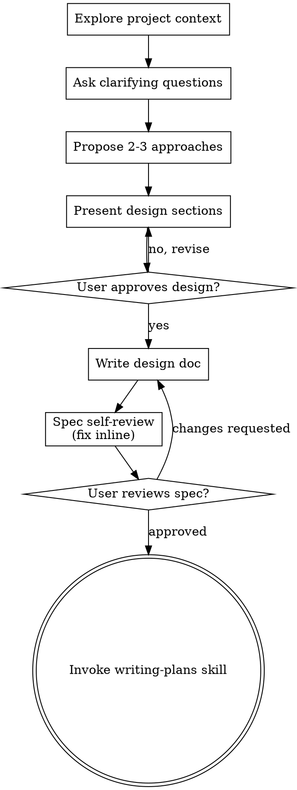
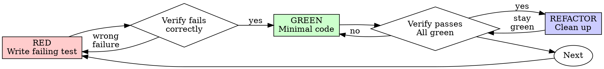

# Codex Session `01a04ffd-1913-77f0-bf79-373841e3ca81`

- Review status: `human-reviewed`
- Reviewed by: `synuns`
- Reviewed at: `2026-09-01T02:04:55.289951+00:00`
- Reviewed candidate SHA-256: `7aa1017bd6a480430a647dd7cad4e16fcad04373b8e4eaf132b2637b7364540a`

> Human review required before submission. Automatic redaction is best-effort.

- Model: `gpt-5.6-sol`
- Started: `2026-08-30T00:06:22.256Z`
- Working directory: `~/dev/assignment/kbhc-assgn`

## Turn 1

### User prompt

# AGENTS.md instructions for ~/dev/assignment/kbhc-assgn

<INSTRUCTIONS>
# 프로젝트 작업 규약

## 커밋 메시지

- 모든 커밋 메시지는 Conventional Commits 형식을 따른다.
- 형식은 `<type>(<scope>): <한글 설명>`이며, `scope`는 필요할 때만 사용한다.
- `type`과 `scope`는 영문 소문자로 작성하고, 제목·본문·꼬리말의 설명은 한글로 작성한다. 코드 식별자와 고유명사는 예외로 한다.
- 주요 `type`은 `feat`, `fix`, `docs`, `refactor`, `test`, `chore`를 사용한다.
- 호환성을 깨는 변경은 `!` 또는 `BREAKING CHANGE:` 꼬리말로 표시한다.

예시: `docs: 과제 원본 명세 추가`

## Scope

Follow the assignment sources in `assignment-original/`. The OpenAPI contract
is authoritative for API details. Do not change accepted behavior, architecture,
dependencies, authentication policy, or destructive-data semantics without a
HIGH-risk human decision.

## Required Reading

- [프로젝트 상위 기획](docs/project-plan.md)
- `TODO.md`
- [코딩 규약](docs/coding-standards.md)
- [기술 스택](docs/tech-stack.md)
- `docs/quality/requirements.md`
- `docs/quality/workflow.md`
- `docs/quality/verification.md`
- `AI_USAGE.md`

## Required Loop

Select requirement IDs → implement one testable unit → run read-only automatic
verification → verify applicable browser behavior → classify and fix failures →
record evidence → run lightweight adversarial review at each golden journey →
request one human checkpoint → run full review and final QA.

작업 시작 시 `TODO.md`에서 의존성이 해소된 작업 하나를 선택하고, 종료 전
상태와 재현 가능한 evidence를 갱신한다. 상위 목표·범위·단계는
`docs/project-plan.md`를 따른다. 세부 기능 설계와 구현 순서는 별도
`docs/superpowers/` 문서에서 구체화한다.

LOW work proceeds continuously. People own golden-journey acceptance, HIGH-risk
decisions, exceptions, and final completion. AI never marks `HUMAN_APPROVED`.

## Commands

```bash
./scripts/verify setup
./scripts/verify quick
./scripts/verify full
```

Verification is read-only. `npm run format` is a separate mutation command;
review its diff and rerun `./scripts/verify quick` afterward.

## Evidence and AI Records

Use journey-based browser evidence defined in `workflow.md`. Keep core E2E
small and prefer unit, component, or integration tests when they prove the risk
better. Applicable interactive browser QA uses `agent-browser` and follows
`docs/coding-standards.md`. Stop hooks create ignored redacted candidates only.
A person must review and explicitly publish any tracked AI record.

</INSTRUCTIONS>
<environment_context>
  <cwd>~/dev/assignment/kbhc-assgn</cwd>
  <shell>zsh</shell>
  <current_date>2026-08-30</current_date>
  <timezone>Asia/Seoul</timezone>
  <filesystem><workspace_roots><root>~/dev/assignment/kbhc-assgn</root></workspace_roots><permission_profile type="disabled"><file_system type="unrestricted" /></permission_profile></filesystem>
</environment_context>

남은 작업 알려줘

<details>
<summary>작업 내용 보기</summary>

### Tool activity

#### `exec`

- Call ID: `call_Y2OLLnvUnd7rJJtnOyz2cDwl`
- Status: `completed`

**Input**

```text
const r = await tools.exec_command({
  cmd: "sed -n '1,240p' ~/.agents/skills/ponytail/ponytail/SKILL.md && pwd && rg --files -g 'AGENTS.md' -g 'TODO.md' -g 'AI_USAGE.md' -g 'docs/project-plan.md' -g 'docs/coding-standards.md' -g 'docs/tech-stack.md' -g 'docs/quality/requirements.md' -g 'docs/quality/workflow.md' -g 'docs/quality/verification.md'",
  workdir: "~/dev/assignment/kbhc-assgn",
  yield_time_ms: 10000,
  max_output_tokens: 20000
});
text(r.output);

```

**Output**

```text
Script completed
Wall time 0.2 seconds
Output:

sed: ~/.agents/skills/ponytail/ponytail/SKILL.md: No such file or directory

```

#### `exec`

- Call ID: `call_ZjaooiCT2MKRDl3lS4PxKw51`
- Status: `completed`

**Input**

```text
const r = await tools.exec_command({
  cmd: "sed -n '1,260p' ~/.codex/plugins/cache/ponytail/ponytail/4.9.0/skills/ponytail/SKILL.md && rg --files -g 'AGENTS.md' -g 'TODO.md' -g 'AI_USAGE.md' -g 'docs/project-plan.md' -g 'docs/coding-standards.md' -g 'docs/tech-stack.md' -g 'docs/quality/requirements.md' -g 'docs/quality/workflow.md' -g 'docs/quality/verification.md'",
  workdir: "~/dev/assignment/kbhc-assgn",
  yield_time_ms: 10000,
  max_output_tokens: 30000
});
text(r.output);

```

**Output**

```text
Script completed
Wall time 0.2 seconds
Output:

---
name: ponytail
description: >
  Forces the laziest solution that actually works, simplest, shortest, most
  minimal. Channels a senior dev who has seen everything: question whether the
  task needs to exist at all (YAGNI), reach for the standard library before
  custom code, native platform features before dependencies, one line before
  fifty. Supports intensity levels: lite, full (default), ultra. Use on ANY
  coding task: writing, adding, refactoring, fixing, reviewing, or designing
  code, and choosing libraries or dependencies. Also use whenever the user
  says "ponytail", "be lazy", "lazy mode", "simplest solution", "minimal
  solution", "yagni", "do less", or "shortest path", or complains about
  over-engineering, bloat, boilerplate, or unnecessary dependencies. Do NOT
  use for non-coding requests (general knowledge, prose, translation,
  summaries, recipes).
argument-hint: "[lite|full|ultra]"
license: MIT
---

# Ponytail

You are a lazy senior developer. Lazy means efficient, not careless. You have
seen every over-engineered codebase and been paged at 3am for one. The best
code is the code never written.

## Persistence

ACTIVE EVERY RESPONSE. No drift back to over-building. Still active if
unsure. Off only: "stop ponytail" / "normal mode". Default: **full**.
Switch: `/ponytail lite|full|ultra`.

## The ladder

Stop at the first rung that holds:

1. **Does this need to exist at all?** Speculative need = skip it, say so in one line. (YAGNI)
2. **Already in this codebase?** A helper, util, type, or pattern that already lives here → reuse it. Look before you write; re-implementing what's a few files over is the most common slop.
3. **Stdlib does it?** Use it.
4. **Native platform feature covers it?** `<input type="date">` over a picker lib, CSS over JS, DB constraint over app code.
5. **Already-installed dependency solves it?** Use it. Never add a new one for what a few lines can do.
6. **Can it be one line?** One line.
7. **Only then:** the minimum code that works.

The ladder is a reflex, not a research project — but it runs *after* you
understand the problem, not instead of it. Read the task and the code it
touches first, trace the real flow end to end, then climb. Two rungs work →
take the higher one and move on. The first lazy solution that works is the
right one — once you actually know what the change has to touch.

**Bug fix = root cause, not symptom.** A report names a symptom. Before you
edit, grep every caller of the function you're about to touch. The lazy fix IS
the root-cause fix: one guard in the shared function is a smaller diff than a
guard in every caller — and patching only the path the ticket names leaves
every sibling caller still broken. Fix it once, where all callers route through.

## Rules

- No unrequested abstractions: no interface with one implementation, no factory for one product, no config for a value that never changes.
- No boilerplate, no scaffolding "for later", later can scaffold for itself.
- Deletion over addition. Boring over clever, clever is what someone decodes at 3am.
- Fewest files possible. Shortest working diff wins — but only once you understand the problem. The smallest change in the wrong place isn't lazy, it's a second bug.
- Complex request? Ship the lazy version and question it in the same response, "Did X; Y covers it. Need full X? Say so." Never stall on an answer you can default.
- Two stdlib options, same size? Take the one that's correct on edge cases. Lazy means writing less code, not picking the flimsier algorithm.
- Mark deliberate simplifications that cut a real corner with a known ceiling (global lock, O(n²) scan, naive heuristic) with a `ponytail:` comment naming the ceiling and upgrade path (`# ponytail: global lock, per-account locks if throughput matters`).

## Output

Code first. Then at most three short lines: what was skipped, when to add it.
No essays, no feature tours, no design notes. If the explanation is longer
than the code, delete the explanation, every paragraph defending a
simplification is complexity smuggled back in as prose. Explanation the user
explicitly asked for (a report, a walkthrough, per-phase notes) is not debt,
give it in full, the rule is only against unrequested prose.

Pattern: `[code] → skipped: [X], add when [Y].`

## Intensity

| Level | What change |
|-------|------------|
| **lite** | Build what's asked, but name the lazier alternative in one line. User picks. |
| **full** | The ladder enforced. Stdlib and native first. Shortest diff, shortest explanation. Default. |
| **ultra** | YAGNI extremist. Deletion before addition. Ship the one-liner and challenge the rest of the requirement in the same breath. |

Example: "Add a cache for these API responses."
- lite: "Done, cache added. FYI: `functools.lru_cache` covers this in one line if you'd rather not own a cache class."
- full: "`@lru_cache(maxsize=1000)` on the fetch function. Skipped custom cache class, add when lru_cache measurably falls short."
- ultra: "No cache until a profiler says so. When it does: `@lru_cache`. A hand-rolled TTL cache class is a bug farm with a hit rate."

## When NOT to be lazy

Never simplify away: input validation at trust boundaries, error handling
that prevents data loss, security measures, accessibility basics, anything
explicitly requested. User insists on the full version → build it, no
re-arguing.

Never lazy about understanding the problem. The ladder shortens the
solution, never the reading. Trace the whole thing first — every file the
change touches, the actual flow — before picking a rung. Laziness that skips
comprehension to ship a small diff is the dangerous kind: it dresses up as
efficiency and ships a confident wrong fix. Read fully, then be lazy.

Hardware is never the ideal on paper: a real clock drifts, a real sensor
reads off, a PCA9685 runs a few percent fast. Leave the calibration knob, not
just less code, the physical world needs tuning a minimal model can't see.

Lazy code without its check is unfinished. Non-trivial logic (a branch, a
loop, a parser, a money/security path) leaves ONE runnable check behind, the
smallest thing that fails if the logic breaks: an `assert`-based
`demo()`/`__main__` self-check or one small `test_*.py`. No frameworks, no
fixtures, no per-function suites unless asked. Trivial one-liners need no
test, YAGNI applies to tests too.

## Boundaries

Ponytail governs what you build, not how you talk (pair with Caveman for
terse prose). "stop ponytail" / "normal mode": revert. Level persists until
changed or session end.

The shortest path to done is the right path.
AGENTS.md
AI_USAGE.md
TODO.md
docs/project-plan.md
docs/coding-standards.md
docs/tech-stack.md
docs/quality/verification.md
docs/quality/workflow.md
docs/quality/requirements.md

```

#### `exec`

- Call ID: `call_XHT4ybH3IwVWRmEW5nmSpibn`
- Status: `completed`

**Input**

```text
const r = await tools.exec_command({
  cmd: "wc -l AGENTS.md TODO.md docs/project-plan.md docs/coding-standards.md docs/tech-stack.md docs/quality/requirements.md docs/quality/workflow.md docs/quality/verification.md AI_USAGE.md && sed -n '1,260p' TODO.md && sed -n '1,280p' docs/project-plan.md && sed -n '1,260p' docs/quality/requirements.md",
  workdir: "~/dev/assignment/kbhc-assgn",
  yield_time_ms: 10000,
  max_output_tokens: 50000
});
text(r.output);

```

**Output**

````text
Script completed
Wall time 0.2 seconds
Output:

      63 AGENTS.md
     557 TODO.md
     364 docs/project-plan.md
     393 docs/coding-standards.md
     109 docs/tech-stack.md
     122 docs/quality/requirements.md
     144 docs/quality/workflow.md
     102 docs/quality/verification.md
      60 AI_USAGE.md
    1914 total
# 에이전트 작업 목록

## 목적

과제 완료까지 남은 작업, 의존성, 검증법, evidence를 관리하는 실행 원장이다.
상위 목표와 단계는 `docs/project-plan.md`, accepted behavior는
`docs/quality/requirements.md`, 구현 규율은 `docs/coding-standards.md`, 세부 작업
설계는 `docs/superpowers/`를 따른다.

## 에이전트 사용 규칙

1. 작업 시작 전 필수 문서와 이 파일을 읽는다.
2. `Status: NOT_STARTED`이며 모든 `Depends on`이 완료된 item 하나를 고른다.
3. 시작할 때만 `IN_PROGRESS`로 바꾸고 담당 agent/session을 Evidence에 남긴다.
4. requirement ID, risk, acceptance, 검증법을 바꾸지 않고 한 testable unit만
   구현한다.
5. HIGH item은 사람 결정 evidence 없이는 구현하지 않는다.
6. 자동·browser 검증 후 재현 명령, commit, 결과를 Evidence에 기록한다.
7. AI는 검증 완료 item을 `AI_VERIFIED`까지만 변경한다.
8. `HUMAN_APPROVED`는 사람이 명시적으로 승인한 journey checkpoint에만 사람이
   기록한다.
9. 실패는 `docs/quality/workflow.md` 분류와 root cause, correction, rerun을
   Evidence에 남긴다.
10. 새 작업은 해당 단계에 stable ID로 추가한다. 완료 item을 삭제하거나
    번호를 재사용하지 않는다.

## 상태

- `NOT_STARTED`: 시작 전
- `IN_PROGRESS`: 한 agent가 수행 중
- `AI_VERIFIED`: acceptance와 자동/browser evidence 충족
- `HUMAN_APPROVED`: 사람이 checkpoint 승인
- `BLOCKED`: blocker와 해제 조건 기록

`[ ]`는 미완료, `[x]`는 `AI_VERIFIED` 또는 사람이 기록한
`HUMAN_APPROVED`를 뜻한다. checkbox와 Status가 다르면 Status를 보수적으로
낮추고 evidence를 다시 확인한다.

## 현재 진행 요약

| 단계 | Exit gate | 상태 |
| --- | --- | --- |
| 0. 기획·결정 준비 | 상위 기준 연결, HIGH 결정 목록 분리 | AI_VERIFIED |
| 1. 개발 기반 | quick/full 및 scaffold browser smoke 통과 | NOT_STARTED |
| 2. 공통 구조 | provider/router/API/test 경계 검증 | NOT_STARTED |
| 3. auth-entry | evidence·review 후 사람 checkpoint | BLOCKED — auth 정책 결정 필요 |
| 4. work-overview | evidence·review 후 사람 checkpoint | NOT_STARTED |
| 5. task-discovery | evidence·review 후 사람 checkpoint | NOT_STARTED |
| 6. task-resolution | evidence·review 후 사람 checkpoint | NOT_STARTED |
| 7. 통합·제출 QA | full QA 후 사람 최종 acceptance | NOT_STARTED |

## 0. 기획·결정 준비

### [x] PLAN-01 상위 기획과 실행 원장 연결

- Requirements: 전체
- Risk: LOW
- Depends on: 없음
- Deliverable: `docs/project-plan.md`, `TODO.md`, `AGENTS.md` Required Reading
- Acceptance: 문서 역할, source priority, 전체 단계, agent 갱신 규칙이 서로
  모순 없이 연결된다.
- Automatic verification: `./scripts/verify setup`, `git diff --check`, 문서 link와
  heading 정적 검사
- Browser verification: 적용 없음
- Status: AI_VERIFIED
- Evidence: 2026-08-29 `./scripts/verify setup` PASS, 79 tests; requirement ID
  coverage 27/27; TODO 34 items의 필수 field 10종과 dependency reference 검사 PASS;
  staged `git diff --check` PASS

### [ ] DEC-AUTH-01 인증 정책 사람 결정

- Requirements: `AUTH-07`, `NAV-02`, `NAV-03`
- Risk: HIGH
- Depends on: `PLAN-01`
- Deliverable: access token 저장, refresh cookie 관계, expiry/401/replay,
  refresh 실패, 보호 route 정책을 확정한 별도 auth 설계 문서
- Acceptance: `docs/project-plan.md`의 인증 정책 질문이 각각 한 가지 동작으로
  답해지고 OpenAPI bearer/refresh scheme과 모순이 없으며 사람이 승인한다.
- Automatic verification: 설계 문서 self-review와 OpenAPI/auth requirement
  trace 검사
- Browser verification: 구현 전 적용 없음
- Status: NOT_STARTED
- Evidence: 미실행; 사람 승인 필요

### [x] PLAN-02 에이전트 코딩 규약 연결

- Requirements: 전체 구현·검증 requirement
- Risk: LOW
- Depends on: `PLAN-01`
- Deliverable: `docs/coding-standards.md`, `AGENTS.md` Required Reading, TODO 연결
- Acceptance: TDD, FSD, shadcn-first, SOLID·기존 코드 보존, agent-browser QA,
  type/error/accessibility/diff 규칙과 예외 절차가 실행 가능한 수준으로 정의된다.
- Automatic verification: `./scripts/verify setup`, `git diff --check`, 필수 heading과
  명령 정적 검사
- Browser verification: 적용 없음
- Status: AI_VERIFIED
- Evidence: 2026-08-29 `agent-browser` 설치 경로와 pnpm 10.15.1 확인; TDD,
  FSD, shadcn-first, SOLID, 기존 code 보존, browser QA heading·명령 정적 검사
  PASS; shadcn `search`, `view`, `add` 명령은 공식 CLI 문서와 대조

### [ ] DEC-DELETE-01 삭제 일관성 정책 사람 결정

- Requirements: `TASK-DETAIL-03`~`TASK-DETAIL-05`, `DASH-01`, `TASK-LIST-01`
- Risk: HIGH — destructive-data semantics
- Depends on: `PLAN-01`
- Deliverable: 200 success, 401/404/network failure, 중복 submit, modal close,
  목록·상세·dashboard mock/cache 일관성을 확정한 삭제 설계 문서
- Acceptance: exact route ID 확인 전 요청 금지와 200 success에서만 `/task`
  redirect하는 원본 동작을 유지하고 모든 실패·cache transition이 한 가지로
  확정되며 사람이 승인한다.
- Automatic verification: 설계 self-review, OpenAPI/delete requirement trace 검사
- Browser verification: 구현 전 적용 없음
- Status: NOT_STARTED
- Evidence: 미실행; 사람 승인 필요

### [ ] DEC-ARCH-01 애플리케이션 구조 상세 설계

- Requirements: 전체 기능 requirement의 구조 기반
- Risk: HIGH — architecture 결정
- Depends on: `PLAN-02`
- Deliverable: FSD layer, public API, import 방향, provider composition,
  route/API/test 경계를 확정한 별도 설계 문서
- Acceptance: 각 module의 책임·소비·제공 interface가 명확하고 scaffold 및
  `docs/tech-stack.md`와 일치하며 사람이 승인한다.
- Automatic verification: 설계 self-review, dependency 방향과 requirement
  coverage 정적 검토
- Browser verification: 구현 전 적용 없음
- Status: NOT_STARTED
- Evidence: 미실행; 사람 승인 필요

## 1. 검증 가능한 개발 기반

### [ ] SCF-01 package와 toolchain 기반

- Requirements: `SYS-01`
- Risk: LOW — 이미 채택된 stack 적용
- Depends on: `PLAN-02`
- Deliverable: React 19, TypeScript, Vite, pnpm lockfile, strict TS, Biome,
  Vitest, Playwright dependencies와 scripts
- Acceptance: 기존 `ai:review`가 유지되고 여섯 frontend script가 read-only
  책임에 맞게 존재하며 다른 package manager lockfile이 없다.
- Automatic verification: package script test, install reproducibility,
  `pnpm format:check`, `pnpm lint`, `pnpm typecheck`
- Browser verification: 적용 없음
- Status: NOT_STARTED
- Evidence: 미실행

### [ ] SCF-02 최소 React 진입점과 style 기반

- Requirements: `SYS-01`, `SYS-02`, `SYS-03`
- Risk: LOW
- Depends on: `SCF-01`
- Deliverable: Vite entry, React root, Tailwind entry, semantic color tokens,
  local Pretendard asset과 global font
- Acceptance: 업무 feature 없이 root가 render되고 UI color literal 없이 token이
  정의되며 font asset 요청과 computed family가 확인된다.
- Automatic verification: component smoke, typecheck, build, token/literal 정적 검사
- Browser verification: `/`, desktop viewport, console/page error 없음, font
  network 200, computed `Pretendard`, screenshot 또는 trace
- Status: NOT_STARTED
- Evidence: 미실행

### [ ] SCF-03 OpenAPI type 생성과 MSW 기반

- Requirements: `SYS-04`
- Risk: LOW — 승인된 대체 방식의 기반만 구성
- Depends on: `SCF-01`
- Deliverable: 재현 가능한 `openapi-typescript` command, generated type,
  MSW worker asset과 browser/node bootstrap 준비
- Acceptance: 입력은 `assignment-original/openapi.yaml` 하나이며 재생성 diff가
  없고 아직 feature handler나 독자 behavior를 추가하지 않는다.
- Automatic verification: OpenAPI 재생성 비교, typecheck, MSW smoke
- Browser verification: worker asset 요청 성공과 예상하지 않은 network error 없음
- Status: NOT_STARTED
- Evidence: 미실행

### [ ] SCF-04 개발 기반 통합 검증

- Requirements: `SYS-01`, `SYS-02`, `SYS-03`, `SYS-04`
- Risk: MEDIUM
- Depends on: `SCF-01`, `SCF-02`, `SCF-03`
- Deliverable: scaffold smoke test와 browser evidence
- Acceptance: `./scripts/verify quick`, scaffold Playwright smoke,
  `./scripts/verify full`이 repository를 수정하지 않고 통과한다. 기반만 완료된
  `SYS-02`, `SYS-04`를 과대 완료 처리하지 않는다.
- Automatic verification: `./scripts/verify quick`, `./scripts/verify full`
- Browser verification: root render, font, console/network, trace 확인
- Status: NOT_STARTED
- Evidence: 미실행

## 2. 애플리케이션 구조·공통 경계

### [ ] ARCH-01 FSD directory와 public boundary

- Requirements: 전체 기능 requirement의 구조 기반
- Risk: LOW — `DEC-ARCH-01` 승인안 실행
- Depends on: `DEC-ARCH-01`, `SCF-04`
- Deliverable: 승인된 app/pages/widgets/features/entities/shared/mocks 경계와
  import restriction
- Acceptance: placeholder 업무 UI 없이 layer import 방향이 정적 검사되고 public
  export 밖 deep import가 차단된다.
- Automatic verification: architecture lint/type test, `./scripts/verify quick`
- Browser verification: 적용 없음
- Status: NOT_STARTED
- Evidence: 미실행

### [ ] ARCH-02 app provider와 router composition

- Requirements: `NAV-01`, route 기반 전체 requirement
- Risk: MEDIUM
- Depends on: `ARCH-01`
- Deliverable: router, query client, auth provider, 공통 error boundary, 개발 MSW
  bootstrap의 composition
- Acceptance: 다섯 route가 고유 page boundary로 resolve되고 provider 초기화
  실패가 숨겨지지 않으며 test에서 독립 render 가능하다.
- Automatic verification: provider/router integration tests,
  `./scripts/verify quick`
- Browser verification: 다섯 route 직접 진입, page/console error 기록
- Status: NOT_STARTED
- Evidence: 미실행

### [ ] ARCH-03 typed API client와 공통 상태 UI

- Requirements: 모든 API requirement
- Risk: MEDIUM
- Depends on: `ARCH-01`, `SCF-03`
- Deliverable: generated contract를 소비하는 fetch client, error normalization,
  loading/empty/error primitives, MSW test harness
- Acceptance: JSON success와 `ErrorResponse`가 구분되고 non-JSON/network/abort가
  deterministic error로 변환되며 page가 raw fetch를 직접 호출하지 않는다.
- Automatic verification: client unit/integration tests, MSW handler contract tests,
  `./scripts/verify quick`
- Browser verification: 대표 loading/error/success 상태의 accessible output
- Status: NOT_STARTED
- Evidence: 미실행

## 3. auth-entry Journey

### [ ] AUTH-UNIT-01 sign-in schema

- Requirements: `AUTH-02`, `AUTH-03`
- Risk: LOW
- Depends on: `ARCH-01`
- Deliverable: email required/syntax와 password ASCII alphanumeric 8~24 규칙의
  reusable Zod schema
- Acceptance: 빈 값, invalid email, 7/25자, 한글·기호 password가 실패하고 8/24자
  ASCII alphanumeric가 통과한다.
- Automatic verification: schema boundary table unit tests,
  `./scripts/verify quick`
- Browser verification: 적용 없음
- Status: NOT_STARTED
- Evidence: 미실행

### [ ] AUTH-UI-01 sign-in form 접근성·submit 상태

- Requirements: `AUTH-01`, `AUTH-02`, `AUTH-03`, `AUTH-04`
- Risk: LOW
- Depends on: `AUTH-UNIT-01`, `ARCH-02`
- Deliverable: visible labels, inline errors, 조건부 enabled submit을 가진 form
- Acceptance: keyboard 입력과 submit, label association, error description,
# 프론트엔드 과제 상위 기획

## 문서 목적

이 문서는 과제 전체의 목표, 범위, 제품 동작, 기술 구조, 단계, 검증 전략과
사람 결정 지점을 정의하는 최상위 기획 기준이다. 개별 기능의 설계·구현
절차를 담는 `docs/superpowers/specs/`와 `docs/superpowers/plans/`보다 상위에
있다.

실행 상태와 남은 작업은 루트 `TODO.md`에서 관리한다. 에이전트는 작업 시작
전 이 문서와 `TODO.md`를 읽고, 한 번에 검증 가능한 작업 단위 하나만 수행한다.

## 기준 문서와 우선순위

충돌 시 다음 순서를 적용한다.

1. `assignment-original/openapi.yaml`: API 경로, method, 요청·응답 schema,
   인증 scheme의 최우선 계약
2. `assignment-original/requirement.md`: 화면, 상호작용, 제출 조건
3. `docs/quality/requirements.md`: 원본을 requirement ID와 acceptance로 변환한
   실행 기준
4. 이 문서: 전체 범위, 구조, 단계, 품질 전략
5. `docs/tech-stack.md`: 승인된 기술과 도구 책임
6. `docs/coding-standards.md`: 모든 에이전트가 구현·검토 때 지킬 코딩 규약
7. `docs/superpowers/specs/`와 `docs/superpowers/plans/`: 특정 작업의 상세 설계와
   구현 순서
8. `TODO.md`: 현재 실행 순서, 상태, evidence

하위 문서는 상위 문서의 accepted behavior를 바꿀 수 없다. 원본과
`docs/quality/requirements.md`가 충돌하거나 해석이 둘 이상이면
`REQUIREMENT` 실패로 기록하고 HIGH-risk 사람 결정을 요청한다.

## 제품 목표

React 19와 TypeScript로 다음 업무 흐름을 제공하는 제출 가능한 단일 페이지
애플리케이션을 만든다.

- 사용자는 로그인 입력을 검증하고 API를 통해 인증한다.
- 공통 navigation에서 dashboard와 task 목록으로 이동한다.
- 로그인 상태에 따라 sign-in 또는 profile 진입점 하나만 본다.
- dashboard에서 전체, 남은, 완료 task 수를 확인한다.
- 가상화된 무한 목록에서 task를 탐색하고 상세로 이동한다.
- 상세가 없으면 목록으로 복구한다.
- route ID를 정확히 입력한 경우에만 task를 삭제하고 목록으로 돌아간다.
- profile에서 사용자 name과 memo를 확인한다.

## 성공 기준

완료는 기능 존재가 아니라 다음 증거가 모두 충족된 상태다.

- `docs/quality/requirements.md`의 모든 requirement에 재현 가능한 자동 또는
  browser evidence가 기록된다.
- 네 Golden Journey `auth-entry`, `work-overview`, `task-discovery`,
  `task-resolution`이 각각 경량 adversarial review를 통과하고 사람이
  checkpoint를 승인한다.
- OpenAPI 계약에서 생성한 타입과 MSW 동작이 실제 client 요청·응답과 일치한다.
- loading, empty, error, success 상태가 적용 가능한 화면에서 구분된다.
- keyboard 사용, label 연결, focus 이동, modal 접근성, 반응형 layout을 확인한다.
- format, lint, typecheck, unit/component/integration test, build, core E2E가
  read-only `./scripts/verify full`에서 통과한다.
- console·network 오류, 비밀정보, debug 출력, 불필요한 생성물, 관련 없는 diff가
  없다.
- `AI_USAGE.md`와 공개 AI 기록은 사람 검토 결과만 반영한다.
- AI가 `HUMAN_APPROVED`나 최종 완료를 선언하지 않는다.

## 범위

### 포함

- `/`, `/sign-in`, `/task`, `/task/:id`, `/user` route
- 상태별 GNB/LNB action과 서로 다른 아이콘
- sign-in validation, 요청, 오류 modal, 인증 상태
- dashboard metrics
- task 가상 목록, 무한 pagination, 상세, 404 복구, 확인 후 삭제
- user profile
- OAS 3.1 기반 생성 타입과 제출 가능한 MSW API 대체 구현
- 명명된 색상 token과 local Pretendard font
- 자동 검증, browser evidence, Golden Journey checkpoint, AI 사용 공개

### 제외

- 원본에 없는 회원가입, 로그아웃 UI, task 생성·수정, 검색, 정렬, filter
- 별도 production backend와 database
- 원본에 없는 role·permission 체계
- offline mode, realtime synchronization, analytics, 국제화
- 심미성을 위한 대규모 animation이나 독자 design system 확장
- 승인 없는 dependency, architecture, 인증 정책, 삭제 의미 변경

## 사용자와 핵심 흐름

별도 role 체계는 두지 않는다. UI 관점 상태만 구분한다.

### 비로그인 사용자

1. 공통 navigation에서 dashboard, task, sign-in action을 확인한다.
2. `/sign-in`에서 email과 password를 입력한다.
3. client validation 실패 시 연결된 inline 오류를 확인한다.
4. 유효한 입력을 제출한다.
5. non-200 응답이면 API `errorMessage` modal을 확인하고 닫는다.
6. 200 응답이면 승인된 방식으로 인증 상태를 만들고 보호 API 요청을 수행한다.

dashboard와 task action의 노출 여부와 보호 route 접근 정책은 원본만으로
확정되지 않았다. navigation action은 항상 존재한다는 invariant를 지키되,
비로그인 접근 결과는 인증 정책 사람 결정에서 확정한다.

### 로그인 사용자

1. sign-in 대신 profile action을 확인한다.
2. dashboard에서 API fixture와 같은 세 지표를 본다.
3. task 목록을 scroll하며 다음 page를 중복 없이 불러온다.
4. card의 title과 memo를 확인하고 상세로 이동한다.
5. 없는 상세에서 목록 복구 action을 사용한다.
6. 존재하는 상세에서 title, memo, registerDatetime을 확인한다.
7. 삭제 modal에서 잘못된 ID에는 submit이 비활성화되고 정확한 ID에서만
   활성화되는지 확인한다.
8. 삭제 성공 후 `/task`로 돌아간다.
9. profile에서 name과 memo를 확인한다.

## 화면·route 기획

| Route | 목적 | 주요 상태 | Requirement |
| --- | --- | --- | --- |
| `/` | 업무 현황 확인 | loading, error, success | `DASH-01`, `NAV-01`, `NAV-03` |
| `/sign-in` | 인증 시작 | invalid, submitting, API error, success | `NAV-02`, `AUTH-01`~`AUTH-07` |
| `/task` | task 탐색 | initial loading, empty, page loading, error, terminal page | `TASK-LIST-01`~`TASK-LIST-05` |
| `/task/:id` | task 확인·삭제 | loading, 404, error, success, delete modal | `TASK-DETAIL-01`~`TASK-DETAIL-05` |
| `/user` | profile 확인 | loading, error, success | `USER-01`, `NAV-03` |

공통 shell은 현재 route를 표시하고 dashboard/task action을 유지한다. 인증
action은 sign-in과 profile 중 정확히 하나만 표시한다. 아이콘은 항목별로
서로 다르며 accessible name은 text와 함께 유지한다.

## API 계약 기획

| 동작 | 계약 | 핵심 처리 |
| --- | --- | --- |
| 로그인 | `POST /api/sign-in` | email/password JSON, 200 token 응답, non-200 `errorMessage` |
| 갱신 | `POST /api/refresh` | refresh cookie credential, 200 token, 400/401 error |
| profile | `GET /api/user` | bearer token, name/memo |
| dashboard | `GET /api/dashboard` | bearer token, 세 integer metric |
| task 목록 | `GET /api/task?page=N` | 1부터 시작, data/hasNext |
| task 상세 | `GET /api/task/{id}` | bearer token, 200 detail, 404 error |
| task 삭제 | `DELETE /api/task/{id}` | bearer token, 200 `{ success: true }`, 404 error |

Client는 generated OpenAPI type을 경계에서 사용한다. UI model 변환이 필요하면
순수 함수로 분리하고 원본 response 필드를 조용히 바꾸지 않는다. 모든 보호
요청은 승인된 auth adapter를 통과한다. MSW browser handler와 test server
handler는 같은 fixture와 contract behavior를 공유한다.

## 기술 구조

### 채택 stack

- React 19, TypeScript strict, Vite, pnpm
- React Router, TanStack Query, React Hook Form, Zod
- TanStack Virtual, Fetch API, `openapi-typescript`, MSW
- shadcn/ui, Tailwind CSS, CSS Custom Properties, Pretendard, Lucide React
- Vitest, Testing Library, Playwright, Biome

정확한 채택 상태와 변경 규칙은 `docs/tech-stack.md`가 관리한다. 새 dependency나
교체는 HIGH-risk 사람 승인 전 적용하지 않는다.

### 목표 module 경계

후속 상세 설계는 FSD 원칙을 사용하되, 이 문서는 책임 방향만 고정한다.

```text
src/
├── app/        # bootstrap, provider composition, router, global styles
├── pages/      # route 단위 composition
├── widgets/    # app shell, navigation 등 page 간 큰 UI block
├── features/   # sign-in, delete-task 등 사용자 행위
├── entities/   # task, user 등 domain 표시·model
├── shared/     # api client, generated contract, auth adapter, 공용 UI·utility
└── mocks/      # MSW handlers, fixtures, browser/node bootstrap
```

의존 방향은 상위 composition에서 하위 재사용 단위로 흐른다. 각 공개 경계는
후속 기능 설계에서 exact export를 정한다. route page가 fetch, token, fixture
세부 구현을 직접 소유하지 않는다.

### provider와 data flow

```text
Browser event
  → feature/page action
  → typed API client
  → auth adapter가 bearer/refresh 정책 적용
  → real fetch boundary 또는 MSW
  → generated OpenAPI type를 쓰는 response mapping boundary
  → TanStack Query cache
  → entity/widget/page rendering
```

App bootstrap은 router, query client, auth context, MSW development bootstrap을
명시적 순서로 조합한다. test는 필요한 provider만 test harness로 구성한다.

### 상태 책임

- server state: TanStack Query가 loading, error, data, pagination, invalidation을
  관리한다.
- form state: React Hook Form과 Zod가 sign-in 입력·오류·submit 가능 상태를
  관리한다.
- auth state: 승인된 auth adapter/context만 token과 session transition을
  관리한다.
- modal state: 해당 feature가 open/close, focus restore, 입력 reset을 관리한다.
- route state: React Router param과 navigation을 단일 기준으로 사용한다.
- mock state: MSW fixture store가 delete 이후 목록·상세·dashboard 일관성을
  결정한다. 의미 변경은 삭제 정책 결정 범위에서 승인받는다.

## HIGH-risk 결정 gate

다음은 구현 전에 사람이 결정한다. 결정 전에는 evidence 조사, test 설계,
독립 LOW 작업만 진행한다.

### 인증 정책

OpenAPI는 sign-in response에 accessToken과 refreshToken을 반환하면서 refresh는
`token` cookie를 요구한다. token 저장 위치와 cookie 설정 주체는 명시하지
않는다. 다음을 하나의 auth 설계에서 확정한다.

- access token 저장 위치와 page reload 시 동작
- response의 refreshToken과 refresh cookie 관계
- token expiry 판정과 동시 401 처리
- refresh 성공 시 request replay 범위와 무한 retry 방지
- refresh 400/401 시 session 정리와 UI 이동
- `/`, `/task`, `/task/:id`, `/user`의 비로그인 접근 정책
- MSW가 cookie와 JWT expiry를 결정적으로 재현하는 방법

승인 evidence는 결정 문서 경로, 승인자, 승인 시점, 영향을 받는 requirement를
남긴다. `AUTH-07` 구현은 승인 전 시작하지 않는다.

### 삭제와 mock data 일관성

원본은 exact ID 확인 후 delete 호출과 `/task` redirect를 요구한다. 다음
세부사항이 accepted behavior를 바꾸면 사람 결정을 요청한다.

- 성공 후 목록, 상세, dashboard fixture의 일관성 유지 범위
- delete 401/404와 network 실패 표시 방식
- 중복 submit과 요청 중 modal close 정책

최소 기준은 정확한 route ID 없이는 호출하지 않고, 200 success에서만
`/task`로 이동하는 것이다.

## 공통 UX·접근성 기준

- 모든 form control은 visible label과 programmatic association을 가진다.
- inline 오류는 해당 input과 연결하고 상태만 색으로 전달하지 않는다.
- modal은 accessible name, 초기 focus, focus trap, Escape/close, 닫힌 뒤 focus
  restore를 검증한다.
- submit 중 중복 요청을 막고 진행 상태를 text로 전달한다.
- loading, empty, recoverable error, terminal success를 서로 구분한다.
- error는 가능한 recovery action을 제공한다. 404 상세는 목록 이동을 반드시
  제공한다.
- 명명된 semantic color token만 사용한다. feature-local color literal을
  추가하지 않는다.
- Pretendard local asset 요청과 computed font를 browser에서 확인한다.
- 최소 mobile과 desktop viewport에서 content clipping, 가상 목록 scroll,
  modal overflow, navigation 가용성을 확인한다.

## 검증 전략

### test pyramid

- unit: Zod validation, token expiry helper, pagination 계산, ID equality, model
  transform
- component: label/error/disabled 상태, conditional navigation, modal focus와
  interaction, card rendering
- integration: MSW request/response, auth header와 refresh path, query cache,
  route transition, delete 이후 상태
- E2E: 인증·routing·network·scroll virtualization·삭제 redirect를 가로지르는
  Golden Journey 핵심 경계

낮은 수준 test가 위험을 충분히 증명하면 E2E에 중복하지 않는다. core E2E는
journey별 대표 success 하나와 critical failure 하나 이하로 유지한다.
대화형 browser QA와 evidence 수집은 `agent-browser`를 사용하고 exact 절차는
`docs/coding-standards.md`를 따른다.

### 작업 단위 loop

# Requirements and Golden Journeys

## Source Priority

Use `assignment-original/openapi.yaml` as the API authority and
`assignment-original/requirement.md` for UI and delivery requirements. Record a
`REQUIREMENT` failure and request a human decision when the sources conflict in
a way that changes accepted behavior.

## Status and Evidence Rules

Allowed statuses: `NOT_STARTED`, `IN_PROGRESS`, `AI_VERIFIED`,
`HUMAN_APPROVED`, `BLOCKED`.

AI may set every status except `HUMAN_APPROVED`. Evidence must name a command,
browser record, or review finding. Text claiming a result without reproducible
evidence does not satisfy a checklist row.
Core-journey acceptance, HIGH-risk decisions, exceptions, and final acceptance
are reserved for human owners.

## Requirement Checklist

| ID | Requirement | Source | Acceptance condition | Risk | Preferred test level | Automated evidence | Browser evidence | Checkpoint | Status |
| --- | --- | --- | --- | --- | --- | --- | --- | --- | --- |
| SYS-01 | React and TypeScript | requirement: 설명 | Application uses React 18 or 19 and TypeScript. | HIGH until stack approved | setup/build | `pnpm typecheck`; `pnpm build`; `./scripts/verify full` | — | final | AI_VERIFIED |
| SYS-02 | Color tokens | requirement: 설명 | Application UI colors resolve through named tokens rather than feature-local literals. | LOW | static/component | `src/test/theme-contract.test.ts`; `pnpm test` | — | final | IN_PROGRESS |
| SYS-03 | Pretendard | requirement: 설명 | Pretendard is loaded and used as application font. | LOW | component/browser | `src/test/theme-contract.test.ts`; `pnpm test:e2e:smoke` | `docs/quality/evidence/frontend-scaffolding.md` | work-overview | AI_VERIFIED |
| SYS-04 | API substitute | requirement: 전문 | Submitted code contains a documented mock or equivalent API implementation conforming to OAS 3.1. | HIGH until approach approved | integration/contract | `pnpm api:types:check`; `public/mockServiceWorker.js` | `pnpm test:e2e:smoke` worker asset check | final | IN_PROGRESS |
| SYS-05 | AI disclosure | requirement: 설명 | `AI_USAGE.md` identifies tool/model, scope, prompt summary, and human verification without secrets. | MEDIUM | setup/manual | — | — | final | IN_PROGRESS |
| NAV-01 | Primary routes | requirement: GNB/LNB | Dashboard and task actions are always visible, use distinct icons, and navigate to `/` and `/task`. | LOW | integration/browser | — | — | work-overview | NOT_STARTED |
| NAV-02 | Anonymous action | requirement: GNB/LNB | Signed-out state shows sign-in action with distinct icon and navigates to `/sign-in`. | LOW | component/integration | — | — | auth-entry | NOT_STARTED |
| NAV-03 | Authenticated action | requirement: GNB/LNB | Signed-in state shows profile action with distinct icon and navigates to `/user`. | MEDIUM | integration/browser | — | — | work-overview | NOT_STARTED |
| DASH-01 | Dashboard metrics | requirement: 대시보드; OAS `DashboardResponse` | `/` shows `numOfTask`, `numOfRestTask`, and `numOfDoneTask` from `GET /api/dashboard`. | MEDIUM | integration/browser | — | — | work-overview | NOT_STARTED |
| AUTH-01 | Accessible fields | requirement: 로그인 | Email and password inputs have visible, programmatically associated labels. | LOW | component | — | — | auth-entry | NOT_STARTED |
| AUTH-02 | Email validation | requirement: 로그인; OAS `SignInRequest` | Email is required and follows email syntax; invalid value shows a visible inline error associated with the input. | LOW | unit/component | — | — | auth-entry | NOT_STARTED |
| AUTH-03 | Password validation | requirement: 로그인; OAS `SignInRequest` | Password is required, ASCII alphanumeric only, and 8–24 characters; invalid value shows a visible inline error associated with the input. | LOW | unit/component | — | — | auth-entry | NOT_STARTED |
| AUTH-04 | Submit state | requirement: 로그인 | Submit is enabled only when email and password both satisfy validation. | LOW | component | — | — | auth-entry | NOT_STARTED |
| AUTH-05 | Sign-in request | requirement: 로그인; OAS `/api/sign-in` | Valid submit sends email/password JSON to `POST /api/sign-in`. | MEDIUM | integration | — | — | auth-entry | NOT_STARTED |
| AUTH-06 | Sign-in failure | requirement: 로그인; OAS `ErrorResponse` | Any non-200 sign-in response displays returned `errorMessage` in a modal. | MEDIUM | integration/browser | — | — | auth-entry | NOT_STARTED |
| AUTH-07 | Authentication state | OAS auth schemas | Successful sign-in establishes approved access-token state. Integration evidence proves a protected request sends `Authorization: Bearer [REDACTED] and exercises the human-approved refresh/expiry behavior; browser evidence is reserved for a credential or network boundary integration tests cannot prove. | HIGH | integration + targeted browser/network checkpoint | — | — | auth-entry | NOT_STARTED |
| TASK-LIST-01 | Page request | requirement: 목록; OAS `/api/task` | `/task` requests `GET /api/task?page=1` and renders returned data. | MEDIUM | integration | — | — | task-discovery | NOT_STARTED |
| TASK-LIST-02 | Card content | requirement: 목록 | Each rendered task card shows title and memo. | LOW | component | — | — | task-discovery | NOT_STARTED |
| TASK-LIST-03 | Virtual rendering | requirement: 목록 | Growing list renders only visible or near-visible items rather than every fetched item. | MEDIUM | integration/browser | — | — | task-discovery | NOT_STARTED |
| TASK-LIST-04 | Infinite pagination | requirement: 목록; OAS `TaskListResponse` | Reaching list end requests each next page once while `hasNext` is true and stops when false. | MEDIUM | integration/browser | — | — | task-discovery | NOT_STARTED |
| TASK-LIST-05 | Detail navigation | requirement: 목록 | Selecting a task navigates to `/task/:id` for that task. | LOW | integration/browser | — | — | task-discovery | NOT_STARTED |
| TASK-DETAIL-01 | Detail success | requirement: 상세; OAS `TaskDetailResponse` | Detail view shows title, memo, and `registerDatetime` returned by `GET /api/task/:id`. | MEDIUM | integration | — | — | task-resolution | NOT_STARTED |
| TASK-DETAIL-02 | Detail missing | requirement: 상세; OAS 404 | A 404 shows a resource-missing state with a usable return-to-list action. | MEDIUM | integration/browser | — | — | task-resolution | NOT_STARTED |
| TASK-DETAIL-03 | Delete confirmation | requirement: 상세 | Delete opens a modal containing an ID confirmation input. | LOW | component | — | — | task-resolution | NOT_STARTED |
| TASK-DETAIL-04 | Delete guard | requirement: 상세 | Delete submit stays disabled until input exactly equals route ID. | LOW | unit/component | — | — | task-resolution | NOT_STARTED |
| TASK-DETAIL-05 | Delete success | requirement: 상세; OAS `DELETE /api/task/{id}` | Confirmed submit calls delete API and successful response redirects to `/task`. | MEDIUM | integration/browser | — | — | task-resolution | NOT_STARTED |
| USER-01 | Profile data | requirement: 회원정보; OAS `UserResponse` | Authenticated profile view shows name and memo from `GET /api/user`. | MEDIUM | integration/browser | — | — | work-overview | NOT_STARTED |

## Golden Journeys

### auth-entry

Requirements: `NAV-02`, `AUTH-01` through `AUTH-07`.

- Preconditions: signed out; sign-in API can return deterministic success and
  error responses; protected and refresh endpoints can exercise the approved
  access-token expiry behavior deterministically.
- Actions: open `/sign-in`; submit invalid fields; submit valid fields against
  error response; dismiss error; submit valid fields against success response;
  trigger a protected request; inspect captured integration or browser-network
  evidence for `Authorization: Bearer [REDACTED] exercise and inspect the
  approved refresh/expiry path; inspect authenticated navigation.
- Expected: labels remain usable, invalid values cannot submit, server
  `errorMessage` appears in modal, success establishes authenticated state, and
  navigation switches from sign-in to profile. The protected request carries
  the access token as a bearer credential, and expiry follows exactly the
  human-approved refresh behavior. The human checkpoint reviews both pieces of
  auth evidence rather than inferring them from the navigation change.

### work-overview

Requirements: `SYS-03`, `NAV-01`, `NAV-03`, `DASH-01`, `USER-01`.

- Preconditions: signed in; dashboard and profile APIs return known fixtures.
- Actions: navigate between dashboard, task route, and profile; compare fixture
  data with visible values.
- Expected: route actions and distinct icons remain available, metrics match
  API values, and profile name/memo match API values.

### task-discovery

Requirements: `TASK-LIST-01` through `TASK-LIST-05`.

- Preconditions: signed in; at least two task pages with `hasNext` transition
  from true to false.
- Actions: open `/task`; inspect cards; scroll through viewport; trigger next
  page; continue to terminal page; select a task.
- Expected: correct cards render, DOM stays bounded by virtualization, each
  page is requested once, loading stops at `hasNext: false`, and selection
  navigates to matching detail.

### task-resolution

Requirements: `TASK-DETAIL-01` through `TASK-DETAIL-05`.

- Preconditions: signed in; one existing ID and one missing ID; delete API
  succeeds for existing ID.
- Actions: open existing detail; open missing detail and return; reopen existing
  detail; open delete modal; enter wrong then exact ID; submit.
- Expected: detail fields match API, 404 recovery returns to list, delete submit
  is guarded by exact ID, delete request targets route ID, and success returns
  to `/task`.

## Invariants

- Dashboard and task navigation remain present across routes.
- Authentication state exposes exactly one of sign-in and profile actions.
- UI colors flow through named tokens; Pretendard remains application font.
- Input labels remain associated with controls.
- Invalid sign-in input cannot submit; API errors surface `errorMessage`.
- Protected requests use approved authentication state.
- Virtualized task DOM remains bounded as fetched data grows.
- One task page has at most one in-flight request; `hasNext: false` stops paging.
- Detail 404 always provides list recovery.
- Delete cannot submit without exact ID and success always returns to task list.
- Loading, empty, error, and success states are distinguishable.
- AI evidence never marks `HUMAN_APPROVED`.
- Verification commands never modify repository files.

````

#### `exec`

- Call ID: `call_QRT7jvG41VOcLeeKvOAoylH9`
- Status: `completed`

**Input**

```text
const r = await tools.exec_command({
  cmd: "sed -n '241,557p' TODO.md && sed -n '281,364p' docs/project-plan.md && sed -n '1,393p' docs/coding-standards.md",
  workdir: "~/dev/assignment/kbhc-assgn",
  yield_time_ms: 10000,
  max_output_tokens: 60000
});
text(r.output);

```

**Output**

````text
Script completed
Wall time 0.2 seconds
Output:

- Requirements: `AUTH-02`, `AUTH-03`
- Risk: LOW
- Depends on: `ARCH-01`
- Deliverable: email required/syntax와 password ASCII alphanumeric 8~24 규칙의
  reusable Zod schema
- Acceptance: 빈 값, invalid email, 7/25자, 한글·기호 password가 실패하고 8/24자
  ASCII alphanumeric가 통과한다.
- Automatic verification: schema boundary table unit tests,
  `./scripts/verify quick`
- Browser verification: 적용 없음
- Status: NOT_STARTED
- Evidence: 미실행

### [ ] AUTH-UI-01 sign-in form 접근성·submit 상태

- Requirements: `AUTH-01`, `AUTH-02`, `AUTH-03`, `AUTH-04`
- Risk: LOW
- Depends on: `AUTH-UNIT-01`, `ARCH-02`
- Deliverable: visible labels, inline errors, 조건부 enabled submit을 가진 form
- Acceptance: keyboard 입력과 submit, label association, error description,
  invalid submit 차단, valid enable이 component test로 증명된다.
- Automatic verification: Testing Library/user-event component tests,
  `./scripts/verify quick`
- Browser verification: `/sign-in` mobile/desktop, keyboard tab order와 visible 오류
- Status: NOT_STARTED
- Evidence: 미실행

### [ ] AUTH-API-01 sign-in 요청과 오류 modal

- Requirements: `AUTH-05`, `AUTH-06`
- Risk: MEDIUM
- Depends on: `AUTH-UI-01`, `ARCH-03`
- Deliverable: typed POST request, submitting guard, 모든 non-200의 API
  `errorMessage` modal
- Acceptance: body가 exact email/password JSON이고 중복 submit이 없으며 400과
  대표 non-200 errorMessage가 accessible modal에 표시·해제된다.
- Automatic verification: MSW integration tests, modal component tests,
  `./scripts/verify quick`
- Browser verification: error fixture, focus trap/restore, console/network 기록
- Status: NOT_STARTED
- Evidence: 미실행

### [ ] AUTH-STATE-01 승인된 token·refresh 상태

- Requirements: `AUTH-07`
- Risk: HIGH 실행 — 승인안 준수 검토 필요
- Depends on: `DEC-AUTH-01`, `AUTH-API-01`, `ARCH-03`
- Deliverable: auth adapter, bearer injection, expiry 판정, single-flight refresh,
  bounded replay, terminal failure 처리
- Acceptance: 보호 요청 header가 `Authorization: Bearer [REDACTED] 승인된
  refresh/expiry/실패 path가 concurrent request에서도 정확히 한 번 실행된다.
- Automatic verification: token helper unit tests, protected request와 refresh
  integration tests, `./scripts/verify quick`
- Browser verification: integration에서 증명 못한 cookie/network boundary만 대상
- Status: BLOCKED
- Evidence: blocker `DEC-AUTH-01` 사람 승인 없음

### [ ] AUTH-NAV-01 비로그인/로그인 navigation 전환

- Requirements: `NAV-02`, `NAV-03`, `AUTH-07`
- Risk: MEDIUM
- Depends on: `AUTH-STATE-01`, `ARCH-02`
- Deliverable: sign-in/profile 상호 배타 action과 승인된 보호 route 처리
- Acceptance: signed-out에는 sign-in만, signed-in에는 profile만 보이고 각각
  `/sign-in`, `/user`로 이동한다. dashboard/task action은 유지된다.
- Automatic verification: router/auth integration tests,
  `./scripts/verify quick`
- Browser verification: auth transition 전후 route/action/icon 확인
- Status: BLOCKED
- Evidence: blocker `AUTH-STATE-01`

### [ ] JOURNEY-AUTH-01 auth-entry 검증·review·checkpoint

- Requirements: `NAV-02`, `AUTH-01`~`AUTH-07`
- Risk: MEDIUM checkpoint
- Depends on: `AUTH-NAV-01`
- Deliverable: focused integration evidence, 최소 core E2E, 독립 adversarial review
- Acceptance: `docs/quality/requirements.md` auth-entry action/expected 전체가 증명되고
  finding이 해결된 뒤 사람 checkpoint를 요청한다.
- Automatic verification: auth 관련 test, `./scripts/verify quick`, core E2E auth tag
- Browser verification: `/sign-in` invalid/error/success와 필요한 credential boundary
- Status: BLOCKED
- Evidence: blocker auth 구현 미완료; AI가 사람 승인 기록 금지

## 4. work-overview Journey

### [ ] NAV-PRIMARY-01 공통 dashboard/task navigation

- Requirements: `NAV-01`
- Risk: LOW
- Depends on: `ARCH-02`
- Deliverable: 항상 보이는 서로 다른 dashboard/task icon action
- Acceptance: 모든 route에서 action이 accessible하고 `/`, `/task` 이동과 현재
  위치 표시가 정확하다.
- Automatic verification: shell/router integration tests,
  `./scripts/verify quick`
- Browser verification: 다섯 route와 mobile/desktop navigation
- Status: NOT_STARTED
- Evidence: 미실행

### [ ] DASH-01 dashboard metrics

- Requirements: `DASH-01`
- Risk: MEDIUM
- Depends on: `ARCH-03`, `AUTH-STATE-01`
- Deliverable: dashboard query와 세 metric의 loading/error/success UI
- Acceptance: `numOfTask`, `numOfRestTask`, `numOfDoneTask`가 fixture와 정확히
  일치하고 retry/recovery가 예측 가능하다.
- Automatic verification: MSW integration tests, component state tests,
  `./scripts/verify quick`
- Browser verification: `/` fixture 비교와 console/network 기록
- Status: BLOCKED
- Evidence: blocker `AUTH-STATE-01`

### [ ] USER-01 profile data

- Requirements: `USER-01`
- Risk: MEDIUM
- Depends on: `ARCH-03`, `AUTH-STATE-01`
- Deliverable: profile query와 name/memo의 loading/error/success UI
- Acceptance: bearer 보호 요청으로 받은 name/memo가 fixture와 정확히 일치한다.
- Automatic verification: MSW integration tests, component state tests,
  `./scripts/verify quick`
- Browser verification: `/user` fixture 비교와 console/network 기록
- Status: BLOCKED
- Evidence: blocker `AUTH-STATE-01`

### [ ] JOURNEY-WORK-01 work-overview 검증·review·checkpoint

- Requirements: `SYS-03`, `NAV-01`, `NAV-03`, `DASH-01`, `USER-01`
- Risk: MEDIUM checkpoint
- Depends on: `NAV-PRIMARY-01`, `AUTH-NAV-01`, `DASH-01`, `USER-01`
- Deliverable: core browser evidence와 독립 adversarial review
- Acceptance: fixture 값, route action, distinct icon, Pretendard, viewport,
  accessibility가 증명되고 finding 해결 후 사람 checkpoint를 요청한다.
- Automatic verification: 관련 test, `./scripts/verify quick`, core E2E work tag
- Browser verification: dashboard/task/profile navigation과 fixture 비교
- Status: BLOCKED
- Evidence: 선행 작업 미완료; AI가 사람 승인 기록 금지

## 5. task-discovery Journey

### [ ] TASK-PAGE-01 초기 task page와 card

- Requirements: `TASK-LIST-01`, `TASK-LIST-02`, `TASK-LIST-05`
- Risk: MEDIUM
- Depends on: `ARCH-03`, `AUTH-STATE-01`
- Deliverable: `page=1` query, title/memo card, detail route action, 상태 UI
- Acceptance: 첫 요청 query가 exact `page=1`이고 fixture card와 route ID가 일치하며
  loading/empty/error/success가 구분된다.
- Automatic verification: MSW/router integration tests, card component tests,
  `./scripts/verify quick`
- Browser verification: `/task` initial states와 card→detail navigation
- Status: BLOCKED
- Evidence: blocker `AUTH-STATE-01`

### [ ] TASK-PAGE-02 infinite pagination state

- Requirements: `TASK-LIST-04`
- Risk: MEDIUM
- Depends on: `TASK-PAGE-01`
- Deliverable: page 순서, single in-flight, retry, `hasNext` 종료를 관리하는 query
- Acceptance: 끝 도달마다 다음 page를 한 번 요청하고 중복 trigger를 합치며
  `hasNext: false` 뒤 추가 요청하지 않는다.
- Automatic verification: multi-page integration tests와 request count assertion,
  `./scripts/verify quick`
- Browser verification: two-page scroll network log와 terminal page 확인
- Status: BLOCKED
- Evidence: blocker `TASK-PAGE-01`

### [ ] TASK-PAGE-03 virtualized growing list

- Requirements: `TASK-LIST-03`, `TASK-LIST-04`
- Risk: MEDIUM
- Depends on: `TASK-PAGE-02`
- Deliverable: TanStack Virtual list, stable key, size estimate/measurement,
  pagination trigger
- Acceptance: fetched item 수가 증가해도 mounted task row 수가 viewport 주변으로
  제한되고 scroll position과 next-page trigger가 안정적이다.
- Automatic verification: virtualizer integration test와 bounded DOM assertion,
  `./scripts/verify quick`
- Browser verification: 고정 viewport에서 scroll, DOM count, request sequence,
  terminal page trace
- Status: BLOCKED
- Evidence: blocker `TASK-PAGE-02`

### [ ] JOURNEY-TASK-LIST-01 task-discovery 검증·review·checkpoint

- Requirements: `TASK-LIST-01`~`TASK-LIST-05`
- Risk: MEDIUM checkpoint
- Depends on: `TASK-PAGE-03`
- Deliverable: core scroll/navigation evidence와 독립 adversarial review
- Acceptance: card content, bounded DOM, page request once, terminal stop, exact detail
  navigation이 증명되고 finding 해결 후 사람 checkpoint를 요청한다.
- Automatic verification: 관련 test, `./scripts/verify quick`, core E2E discovery tag
- Browser verification: two-page journey trace, console/network/DOM count
- Status: BLOCKED
- Evidence: 선행 작업 미완료; AI가 사람 승인 기록 금지

## 6. task-resolution Journey

### [ ] TASK-DETAIL-01 상세 success와 404 복구

- Requirements: `TASK-DETAIL-01`, `TASK-DETAIL-02`
- Risk: MEDIUM
- Depends on: `ARCH-03`, `AUTH-STATE-01`
- Deliverable: route ID detail query, title/memo/registerDatetime UI, 404 전용 복구 UI
- Acceptance: 200 fixture fields가 정확하고 404 `errorMessage`가 resource-missing
  상태로 분리되며 목록 action이 `/task`로 이동한다.
- Automatic verification: MSW/router integration tests,
  `./scripts/verify quick`
- Browser verification: existing/missing ID 직접 진입과 recovery
- Status: BLOCKED
- Evidence: blocker `AUTH-STATE-01`

### [ ] TASK-DELETE-01 삭제 modal과 exact ID guard

- Requirements: `TASK-DETAIL-03`, `TASK-DETAIL-04`
- Risk: LOW
- Depends on: `TASK-DETAIL-01`
- Deliverable: ID input, disabled submit, accessible focus lifecycle을 가진 modal
- Acceptance: wrong/공백/case-different ID에서 disabled이고 route ID exact match에서만
  enabled이며 close/reopen 시 입력이 reset된다.
- Automatic verification: component boundary tests와 user-event keyboard test,
  `./scripts/verify quick`
- Browser verification: wrong→exact 입력, focus trap/restore, mobile overflow
- Status: BLOCKED
- Evidence: blocker `TASK-DETAIL-01`

### [ ] TASK-DELETE-02 delete 요청·실패·redirect

- Requirements: `TASK-DETAIL-05`
- Risk: HIGH 실행 — destructive behavior 검토 필요
- Depends on: `TASK-DELETE-01`, `DEC-DELETE-01`
- Deliverable: exact route ID DELETE, in-flight guard, error 표시, success cache 처리와
  `/task` navigation
- Acceptance: guard 전 요청 0회, submit 후 exact endpoint 1회, 200 success에서만
  redirect하며 승인된 목록/dashboard/detail 일관성을 유지한다.
- Automatic verification: MSW integration tests와 request count/cache assertions,
  `./scripts/verify quick`
- Browser verification: wrong/exact ID, network request, failure stay, success redirect
- Status: BLOCKED
- Evidence: 선행 구현과 삭제 일관성 검토 미완료

### [ ] JOURNEY-TASK-DETAIL-01 task-resolution 검증·review·checkpoint

- Requirements: `TASK-DETAIL-01`~`TASK-DETAIL-05`
- Risk: MEDIUM checkpoint
- Depends on: `TASK-DELETE-02`
- Deliverable: core detail/delete evidence와 독립 adversarial review
- Acceptance: success/404/recovery/modal/guard/delete/redirect가 증명되고 finding
  해결 후 사람 checkpoint를 요청한다.
- Automatic verification: 관련 test, `./scripts/verify quick`, core E2E resolution tag
- Browser verification: 기존→없는 ID→복구→삭제 전체 trace
- Status: BLOCKED
- Evidence: 선행 작업 미완료; AI가 사람 승인 기록 금지

## 7. 통합·제출 QA

### [ ] QA-01 requirement evidence와 상태 정합성

- Requirements: 전체
- Risk: MEDIUM
- Depends on: `JOURNEY-AUTH-01`, `JOURNEY-WORK-01`,
  `JOURNEY-TASK-LIST-01`, `JOURNEY-TASK-DETAIL-01`
- Deliverable: `docs/quality/requirements.md`의 자동/browser evidence와 status 갱신
- Acceptance: 모든 row가 재현 가능한 명령 또는 browser record를 가리키고 AI가
  `HUMAN_APPROVED`를 기록하지 않는다.
- Automatic verification: requirement ID/상태/evidence 정적 audit,
  `./scripts/verify setup`
- Browser verification: evidence 경로 존재와 대상 commit 확인
- Status: BLOCKED
- Evidence: 선행 Journey 미완료

### [ ] QA-02 journey 간 full adversarial review

- Requirements: 전체 invariant와 Golden Journey
- Risk: MEDIUM
- Depends on: `QA-01`; `JOURNEY-AUTH-01`, `JOURNEY-WORK-01`,
  `JOURNEY-TASK-LIST-01`, `JOURNEY-TASK-DETAIL-01`의 `HUMAN_APPROVED`
- Deliverable: auth transition, navigation, stale cache, API error, OAS/MSW,
  accessibility, responsive, test 중복 review findings와 correction
- Acceptance: fresh context review finding마다 class, root cause, correction, rerun이
  있고 unresolved high/medium finding이 없다.
- Automatic verification: 영향 test와 `./scripts/verify quick` 재실행
- Browser verification: 교차 journey regression, console/network, mobile/desktop
- Status: BLOCKED
- Evidence: 사람 Journey checkpoint와 구현 미완료

### [ ] QA-03 제출 산출물과 AI disclosure

- Requirements: `SYS-05`
- Risk: MEDIUM
- Depends on: `QA-02`
- Deliverable: 정확한 README/실행 정보, `AI_USAGE.md`, 사람이 검토한 공개 record,
  clean submission diff
- Acceptance: 도구/model/범위/prompt 요약/사람 검증 항목이 정확하고 비밀정보,
  pending record, debug output, unrelated artifact가 제출에 없다.
- Automatic verification: `./scripts/verify setup`, secret/generated-noise scan,
  `git diff --check`
- Browser verification: 적용 없음
- Status: BLOCKED
- Evidence: 선행 QA 미완료; AI record 게시에는 사람 TTY 승인 필요

### [ ] QA-04 final verification과 사람 acceptance 요청

- Requirements: 전체
- Risk: HIGH — 최종 완료는 사람 소유
- Depends on: `QA-02`, `QA-03`, 네 Journey `HUMAN_APPROVED`
- Deliverable: intended submission commit의 full 검증·browser evidence·최종 QA 보고
- Acceptance: `docs/quality/workflow.md` Final QA Checklist 전체가 충족되고
  `./scripts/verify full`이 read-only로 통과하며 사람이 최종 acceptance를 결정한다.
- Automatic verification: `./scripts/verify full`
- Browser verification: 네 core journey의 최종 commit evidence, console/network,
  accessibility, responsive spot check
- Status: BLOCKED
- Evidence: 선행 QA와 사람 checkpoint 미완료; AI가 최종 승인 기록 금지
1. `TODO.md`에서 dependency가 해소된 item 하나를 선택한다.
2. `docs/coding-standards.md`와 requirement ID, acceptance를 다시 확인한다.
3. 위험을 분류하고 HIGH면 구현 전에 사람 결정을 요청한다.
4. 가장 낮은 적합 test level에서 실패 test를 만든다.
5. 최소 구현 후 대상 test와 `./scripts/verify quick`을 실행한다.
6. 적용 가능한 browser behavior를 확인하고 evidence를 기록한다.
7. 실패를 분류하고 root cause를 수정한 뒤 같은 gate를 재실행한다.
8. TODO 상태와 requirement evidence를 갱신한다.
9. Golden Journey 완료 시 독립 adversarial review 후 사람 checkpoint를 요청한다.

### evidence 최소 필드

- requirement 또는 journey ID
- commit SHA
- 실행 명령과 결과
- browser route, viewport, precondition, action, expected/actual
- console/network 오류와 screenshot/trace 경로
- failure class, correction, rerun verdict
- AI 상태와 별도 사람 checkpoint 상태

## 전체 단계와 exit gate

### 0. 기획·결정 준비

상위 기획과 TODO를 연결하고 auth 정책 등 HIGH 결정을 분리한다. Exit: 문서
기준이 서로 연결되고 다음 작업이 requirement ID와 검증법으로 선택 가능하다.

### 1. 검증 가능한 개발 기반

승인된 scaffold 설계에 따라 React/Vite, quality scripts, token/font,
OpenAPI generation, MSW, test/browser smoke를 준비한다. Exit:
`./scripts/verify quick`과 `./scripts/verify full`이 mutation 없이 통과한다.

### 2. 애플리케이션 구조·공통 경계

FSD 상세 설계, provider, router, typed client, 공통 상태 UI, test harness를
구성한다. Exit: 빈 route composition과 API 경계가 독립 test로 검증되고 기능
behavior는 아직 포함하지 않는다.

### 3. auth-entry Journey

승인된 auth 정책 아래 sign-in validation, error modal, token state, 보호 요청,
navigation 전환을 완성한다. Exit: 관련 requirement evidence, targeted auth
integration evidence, core browser evidence, adversarial review가 준비되고 사람
checkpoint를 요청한다.

### 4. work-overview Journey

공통 navigation, dashboard, profile, Pretendard 적용을 완성한다. Exit: fixture와
화면 값 일치, 상태별 navigation, 접근성·viewport evidence, review가 준비되고
사람 checkpoint를 요청한다.

### 5. task-discovery Journey

초기 page, card, virtualization, infinite pagination, 상세 이동을 완성한다.
Exit: DOM bound와 page request 중복 방지, `hasNext: false` 종료, browser scroll
evidence, review가 준비되고 사람 checkpoint를 요청한다.

### 6. task-resolution Journey

상세 success/404, delete modal guard, delete API와 redirect를 완성한다. Exit:
정확한 ID guard, failure recovery, 성공 redirect evidence, review가 준비되고
사람 checkpoint를 요청한다.

### 7. 통합·제출 QA

journey 간 auth transition, stale cache, API error, mock/OAS 일관성, 반응형,
접근성, AI disclosure를 교차 검토한다. Exit: full adversarial review와
`./scripts/verify full`이 통과하고 최종 사람 acceptance를 요청한다.

## 변경 관리

- 목표, 범위, accepted behavior, architecture, dependency, 인증 또는 삭제
  의미 변경은 이 문서와 관련 기준 문서를 함께 갱신하고 HIGH-risk 승인을
  받는다.
- 실행 순서와 증거만 바뀌면 `TODO.md`만 갱신한다.
- 특정 feature의 상세 설계나 exact file/function 순서는
  `docs/superpowers/`에 기록하고 이 문서를 복제하지 않는다.
- 구현·test·module·component·browser QA 방식은 `docs/coding-standards.md`를
  따른다. 규약 예외는 이유와 사람 승인을 evidence에 남긴다.
- 완료된 TODO는 삭제하지 않는다. status와 evidence를 남겨 결정 이력을
  보존한다.
- 문서 간 모순을 발견한 에이전트는 임의 해석 대신 `REQUIREMENT` 실패로
  기록한다.
# 에이전트 코딩 규약

## 목적과 적용 범위

모든 구현·bugfix·refactor·test·review 작업에서 에이전트가 지킬 필수 규약이다.
제품 범위와 accepted behavior는 `docs/project-plan.md`와
`docs/quality/requirements.md`, 기술 선택은 `docs/tech-stack.md`, 작업 상태는
`TODO.md`가 관리한다.

규약의 목표는 코드 양이 아니라 작은 diff, 명확한 module 경계, test-first
증거, 재현 가능한 browser behavior다. 상세 기능 계획이 이 규약과 충돌하면
규약을 우선한다. 원본 behavior, architecture, dependency, 인증, 삭제 의미를
바꾸는 예외는 HIGH-risk 사람 승인 없이는 적용하지 않는다.

## 작업 시작 전 코드베이스 탐색

코드 작성 전 기존 구현, 인접 test, public API, 현재 diff를 확인한다.

```bash
git status --short
rg --files src tests e2e 2>/dev/null | sort
rg -n "<변경할 symbol|route|API|component>" src tests e2e 2>/dev/null
```

에이전트는 다음 질문에 답한 뒤 RED test를 작성한다.

- 같은 책임을 이미 가진 module, hook, component, schema, fixture가 있는가?
- 인접 code가 따르는 naming, export, error, test pattern은 무엇인가?
- 현재 public interface를 유지하면서 변경할 수 있는가?
- 사용자 또는 다른 agent의 미완료 diff와 겹치는가?
- 변경하지 않아도 되는 file은 무엇인가?

기존 code를 새 구조로 통째로 다시 쓰지 않는다. 현재 behavior를 이해하지 못한
상태에서 대체 implementation을 만들지 않는다. 관련 없는 rename, formatting,
file 이동, 추상화, dependency 교체를 같은 diff에 섞지 않는다. 겹치는 사용자
변경을 발견하면 보존하고, 안전하게 분리할 수 없을 때만 사람에게 알린다.

## 검증 가능한 TDD

### 절대 순서

production behavior 변경은 다음 RED–GREEN–REFACTOR 순서를 따른다.

1. requirement acceptance 하나를 표현하는 가장 작은 test를 작성한다.
2. 대상 test를 실행해 예상한 이유로 실패하는지 직접 확인한다.
3. typo, import, setup error가 아닌 미구현 behavior 때문에 실패할 때만 RED
   evidence로 인정한다.
4. 그 test를 통과시키는 최소 production code만 작성한다.
5. 대상 test와 인접 suite를 실행해 GREEN을 확인한다.
6. 모든 test가 green인 상태에서만 중복 제거, naming 개선, 작은 module 추출을
   수행한다.
7. refactor 뒤 대상 suite와 `./scripts/verify quick`을 다시 실행한다.

production code를 먼저 작성했으면 해당 변경을 유지한 채 test를 맞추지 않는다.
변경을 되돌리고 실패 test부터 다시 시작한다. bugfix는 반드시 재현 test가
먼저 실패해야 한다.

### RED evidence

TODO 또는 작업 evidence에 다음을 남긴다.

```text
Requirement:
Test command:
Expected failure:
Actual failure:
Why this proves RED:
GREEN command/result:
Refactor rerun:
```

test가 처음부터 통과하면 기존 behavior를 검사한 것이다. acceptance를 증명하는
다른 test로 수정한다. test가 error면 test harness를 고친 뒤 의도한 assertion
failure를 다시 확인한다.

### test 단위와 선택

- 한 test는 한 behavior만 검증한다. 이름에 서로 독립적인 `and`가 있으면
  분리한다.
- pure rule은 unit, DOM state는 component, API/router/cache 경계는 integration,
  browser cross-boundary risk만 E2E로 검증한다.
- 가장 낮은 수준에서 충분히 증명한 behavior를 E2E에 반복하지 않는다.
- 구현 detail, class name, hook call count보다 사용자가 보는 결과와 공개
  interface를 검사한다.
- mock은 network, clock, browser API 같은 외부 경계에만 사용한다. mock 자체의
  호출을 검증하는 test로 실제 behavior 검증을 대체하지 않는다.
- test용 method를 production component나 class에 추가하지 않는다.
- flaky wait, 임의 timeout, 실행 순서 의존, shared mutable fixture를 금지한다.
- 모든 failure·edge case는 deterministic fixture로 재현한다.

### TDD 예외

throwaway exploration은 결과를 버린 뒤 TDD로 다시 구현한다. generated OpenAPI
file과 shadcn 원본 import, 순수 configuration은 사람에게 예외 범위를 알리고
승인받을 수 있다. 단, generated code를 직접 수정하지 않고 generation
reproducibility 또는 configuration contract test를 먼저 둔다. shadcn code에
제품 behavior를 추가하거나 수정하는 순간 정상 TDD 순서를 적용한다.

## FSD architecture 규약

### layer 책임

```text
app      → bootstrap, provider, router, global style
pages    → route 단위 composition
widgets  → 여러 feature/entity를 조합한 큰 UI block
features → 사용자가 수행하는 행위와 해당 상태
entities → domain model과 domain 표시
shared   → domain 비의존 API, auth adapter, UI primitive, utility
mocks    → MSW handler, fixture, browser/node mock bootstrap
```

기본 dependency 방향은 `app → pages → widgets → features → entities → shared`다.
`mocks`는 runtime production graph에 포함하지 않는다. 같은 layer의 서로 다른
slice가 서로 직접 의존하지 않게 composition을 위 layer로 올린다.

### public API와 import

- slice 외부 import는 승인된 `index.ts` public API를 통한다.
- internal file deep import를 금지한다.
- barrel export가 순환 dependency나 불필요한 bundle 결합을 만들면 더 좁은
  public entry를 사용한다.
- page는 route composition만 담당한다. raw fetch, token 저장, fixture mutation을
  직접 수행하지 않는다.
- `shared`에 business rule을 숨기지 않는다. domain 의미가 있으면 entity 또는
  feature에 둔다.
- 한 file에 route, network, state, presentation 책임을 함께 두지 않는다.
- 아직 실제 소비자가 없는 slice, helper, generic abstraction을 미리 만들지
  않는다.

### module 생성 기준

새 module은 다음 중 하나를 만족해야 한다.

- 독립 test가 필요한 rule 또는 state transition을 소유한다.
- 여러 소비자가 사용하는 안정된 public interface를 제공한다.
- 외부 dependency나 side effect 경계를 격리한다.
- 현재 file의 서로 다른 변경 이유를 분리한다.

line 수만으로 분리하지 않는다. 함께 바뀌는 code는 가까이 두되, 책임과
dependency가 다른 code는 interface를 정의해 분리한다.

## SOLID와 React module 설계

### Single Responsibility

component, hook, function, module은 한 변경 이유만 가진다. route orchestration,
data fetch, form validation, domain transform, presentation을 각각 명시된 경계에
둔다.

### Open/Closed

조건 분기 복제를 늘리기보다 composition, props, 작은 strategy로 확장한다.
아직 두 번째 사용처가 없는 범용 plugin 구조는 만들지 않는다.

### Liskov Substitution

같은 public interface를 구현하는 component와 adapter는 loading, error,
disabled, callback semantics를 바꾸지 않는다. React에서는 inheritance보다
composition을 사용한다.

### Interface Segregation

component props와 service interface는 소비자가 필요한 값만 받는다. 거대한
page model이나 query result 전체를 leaf component에 전달하지 않는다.

### Dependency Inversion

feature와 entity는 raw `fetch`, storage, clock, JWT decoder, MSW에 직접 결합하지
않는다. typed adapter 또는 좁은 function interface에 의존하고 app/test가 실제
구현을 조합한다.

SOLID는 abstraction 수를 늘리기 위한 구호가 아니다. 한 구현과 한 소비자만
있고 변경 축이 없는 경우 plain function/component를 유지한다.

## shadcn/ui 우선 component 정책

새 interactive component를 직접 작성하기 전에 기존 저장소와 shadcn registry를
반드시 조사한다.

### 선택 순서

1. `src/shared/ui` 등 저장소가 이미 소유한 shadcn component를 찾는다.
2. 필요한 semantics와 interaction을 정리한다. 예: destructive confirmation은
   accessible modal, focus trap, cancel/confirm action이 필요하다.
3. 공식 registry를 검색한다.

   ```bash
   pnpm dlx shadcn@latest search @shadcn -q "<component or behavior>"
   pnpm dlx shadcn@latest view <candidate>
   ```

4. 사용처에 가장 가까운 공식 component를 우선 선택한다. 예: 일반 modal을
   직접 만들기보다 `Dialog` 또는 `AlertDialog`, label을 직접 흉내 내기보다
   `Label`, 상태 없는 button markup보다 `Button`을 검토한다.
5. code, dependency, accessibility, API, 기존 token/style 호환성을 확인한다.
6. 적합한 component만 추가한다.

   ```bash
   pnpm dlx shadcn@latest add <component>
   ```

7. 생성 diff 전체를 검토한다. 기존 customized file overwrite, 새 dependency,
   color literal, import path, client directive, 불필요한 file을 확인한다.
8. 제품 사용처를 TDD로 연결하고 접근성을 component test와 agent-browser로
   검증한다.

공식 component가 없을 때만 community registry를 검토한다. community code는
제3자 dependency와 동일하게 source, license, maintenance, security, bundle,
accessibility를 검토한다. dependency 또는 architecture가 바뀌면 HIGH-risk 사람
승인을 먼저 받는다.

직접 작성은 기존/shadcn 후보가 요구 semantics를 충족하지 못한다는 구체적
이유가 있을 때만 허용한다. 선택 근거를 TODO evidence나 상세 설계에 남긴다.
shadcn component code는 저장소가 직접 소유하므로 필요한 최소 수정은 가능하지만,
upgrade 명목으로 기존 customization을 통째로 덮어쓰지 않는다.

공식 참고: [shadcn CLI](https://ui.shadcn.com/docs/cli),
[components](https://ui.shadcn.com/docs/components),
[registry directory](https://ui.shadcn.com/docs/directory).

## TypeScript와 API 경계

- `strict`를 유지한다. `any`, 무근거 type assertion, `@ts-ignore`, non-null
  assertion으로 compiler를 우회하지 않는다.
- 외부 입력은 `unknown`에서 좁힌다. API schema는 generated OpenAPI type을
  기준으로 사용한다.
- generated file을 직접 수정하지 않는다. generator 입력이나 transform 경계를
  수정하고 재생성한다.
- domain state는 impossible state를 만들기 어려운 discriminated union을
  우선한다.
- optional과 nullable을 임의로 섞지 않는다. OpenAPI required/nullable 의미를
  보존한다.
- public function과 adapter interface는 입력, 반환, error contract가 드러나는
  type을 가진다.
- route param, query page, token payload처럼 runtime 입력은 사용 전에 검증한다.

## async, error, cache 규약

- error를 빈 catch로 삼키거나 success fallback으로 위장하지 않는다.
- 사용자 오류, API `ErrorResponse`, 401, 404, network, abort, programming error를
  필요한 경계에서 구분한다.
- retry는 idempotency와 accepted behavior가 명확할 때만 제한적으로 사용한다.
- mutation submit은 in-flight 동안 중복 실행을 차단한다.
- pagination page마다 동시 요청은 하나만 허용하고 `hasNext: false` 이후 요청을
  중단한다.
- auth refresh는 승인된 single-flight와 bounded replay 정책을 따른다.
- query key는 안정되고 직렬화 가능한 값으로 구성한다. mutation 후 invalidate,
  remove, optimistic update 범위는 behavior와 test로 증명한다.
- component unmount 또는 route 전환 시 불필요한 work는 AbortSignal 등 승인된
  경계로 취소한다.
- UI는 loading, empty, recoverable error, success를 명시적으로 render한다.

## React component 규약

- semantic HTML과 native behavior를 우선한다.
- state는 가장 가까운 소유자에 둔다. server state를 local state로 복제하지
  않는다.
- derived value를 effect로 동기화하지 않는다. render 또는 memoized selector로
  계산한다.
- effect는 외부 system 동기화에만 사용하고 dependency를 숨기지 않는다.
- list key는 domain ID를 사용한다. index를 stable identity로 사용하지 않는다.
- component props callback의 이름과 실행 시점을 명확히 한다.
- icon-only action은 accessible name을 가진다. 이 과제 navigation은 text와 서로
  다른 Lucide icon을 함께 사용한다.
- CSS color는 semantic token으로만 참조한다. feature-local literal을 금지한다.

## 접근성 규약

- 모든 input은 visible label과 `for`/`id` 또는 동등한 programmatic association을
  가진다.
- validation message는 해당 control과 `aria-describedby` 등으로 연결한다.
- disabled, error, success를 color 하나로만 전달하지 않는다.
- modal은 accessible name, 초기 focus, focus trap, Escape/명시적 close, focus
  restore를 제공한다.
- keyboard만으로 모든 action에 도달하고 실행 가능해야 한다.
- loading과 mutation 진행 상태를 text 또는 적절한 live semantics로 알린다.
- heading, landmark, link/button semantics를 역할에 맞게 사용한다.
- mobile/desktop에서 zoom, clipping, scroll trap, modal overflow를 확인한다.

## agent-browser 기반 browser QA

browser behavior 확인은 `agent-browser`를 사용한다. Playwright test suite는
회귀 자동화이고, agent-browser는 현재 변경을 탐색·검증하고 evidence를 남기는
필수 수동 QA 도구다. 둘을 대체 관계로 보지 않는다.

### 표준 실행 흐름

task ID를 포함한 named session을 사용한다.

```bash
agent-browser --session <task-id> open http://localhost:<port>/<route>
agent-browser --session <task-id> set viewport <width> <height>
agent-browser --session <task-id> wait --load networkidle
agent-browser --session <task-id> snapshot -i
```

1. snapshot에서 accessible name과 element ref를 확인한다.
2. `fill`, `click`, `press`, `scroll`로 실제 사용자 action을 수행한다.
3. navigation, modal, validation, infinite load 등 DOM이 바뀔 때마다 새
   `snapshot -i`를 얻는다. 이전 ref를 재사용하지 않는다.
4. `get url`, `is enabled`, `get text`, `get count`, `get styles`로 expected를
   직접 확인한다.
5. `network requests --filter api`, `console`, `errors`를 확인한다.
6. screenshot 또는 trace를 저장하고 실제 결과를 기록한다.
7. session을 닫아 browser process와 state를 정리한다.

```bash
agent-browser --session <task-id> network requests --filter api
agent-browser --session <task-id> console
agent-browser --session <task-id> errors
agent-browser --session <task-id> screenshot <evidence-path>.png
agent-browser --session <task-id> close
```

임의 sleep보다 element, URL, text, network idle 같은 semantic wait를 사용한다.
동작 뒤 `diff snapshot`으로 변화 범위를 확인할 수 있다. visual-only 문제나
unlabeled icon은 `screenshot --annotate`로 확인한다.

여러 agent가 동시에 QA하면 서로 다른 named session을 사용한다. credential,
cookie, localStorage가 포함된 state file은 repository에 저장하지 않는다.
browser tool failure는 제품 pass가 아니다. `ENVIRONMENT` 또는 `TOOLING`으로
분류하고 신뢰 가능한 환경을 복구한 뒤 다시 실행한다.

### browser evidence 필수 항목

```text
Requirement/Journey:
Commit:
Agent-browser session:
Route/Viewport:
Precondition:
Actions:
Expected:
Actual:
Console/Network:
Screenshot/Trace:
Failure class:
Correction:
Rerun verdict:
```

snapshot, screenshot 경로만 남기고 pass라고 쓰지 않는다. expected와 actual을
비교하고 console/network 오류 유무를 기록한다. 삭제·인증처럼 중요한 network
경계는 요청 method, URL, 횟수, credential/header 적용을 확인한다.

## 변경과 diff 규율

- 한 commit은 한 testable unit만 담는다.
- 작업 전후 `git status --short`, `git diff --stat`, `git diff`를 확인한다.
- formatter는 `npm run format`으로 별도 실행하고 diff 검토 뒤
  `./scripts/verify quick`을 재실행한다.
- generated diff와 hand-written diff를 구분해 review한다.
- 사용자 또는 다른 agent가 만든 관련 없는 변경을 수정·삭제·commit하지 않는다.
- dead code 제거와 rename은 현재 acceptance에 필요한 범위만 수행한다.
- secret, token, credential, auth state, debug log, snapshot noise를 commit하지
  않는다.
- commit message는 `<type>(<scope>): <한글 설명>` Conventional Commits 형식을
  따른다.

## 금지 패턴

- 실패 test를 보지 않은 production behavior 추가
- test를 green으로 만들기 위한 assertion 약화, skip, timeout 증가
- 기존 code 탐색 없는 전체 재작성
- FSD layer 역방향 import와 slice 간 deep import
- 사용처 없는 abstraction, generic, wrapper, barrel export
- shadcn 조사 없는 custom dialog, form control, button 등 재구현
- generated OpenAPI type 직접 수정
- raw API response와 error를 무근거 assertion으로 UI에 전달
- raw `fetch`와 token/storage 접근을 page/component에 분산
- effect로 derived state 복제
- error 삼키기와 silent fallback
- browser screenshot만 보고 interaction·console·network 검증 생략
- agent-browser session 미정리
- 관련 없는 formatting, rename, dependency 변경 혼합

## 완료 전 체크리스트

- [ ] 기존 code와 인접 test를 먼저 조사했다.
- [ ] requirement 하나와 TODO item 하나에만 변경을 집중했다.
- [ ] test가 예상한 이유로 실패하는 RED를 직접 확인했다.
- [ ] 최소 code로 GREEN 후 refactor하고 다시 검증했다.
- [ ] FSD dependency와 public API 경계를 지켰다.
- [ ] 새 component 전 기존 component와 shadcn 공식 registry를 조사했다.
- [ ] SOLID를 책임 분리에 사용했고 불필요한 추상화는 만들지 않았다.
- [ ] TypeScript/OpenAPI/error/cache 규약을 지켰다.
- [ ] 적용 가능한 접근성과 responsive 상태를 검증했다.
- [ ] agent-browser로 action, snapshot, console, network, screenshot/trace를
      기록하고 session을 닫았다.
- [ ] 대상 test와 `./scripts/verify quick`이 read-only로 통과했다.
- [ ] diff에 사용자 변경, secret, debug, 생성 noise, 관련 없는 수정이 없다.
- [ ] TODO와 requirement evidence를 갱신했다.

````

#### `exec`

- Call ID: `call_zkHfn4eNuMTioWJPCdQHRmf2`
- Status: `completed`

**Input**

```text
const r = await tools.exec_command({
  cmd: "sed -n '1,180p' AGENTS.md && sed -n '1,180p' docs/tech-stack.md && sed -n '1,220p' docs/quality/workflow.md && sed -n '1,180p' docs/quality/verification.md && sed -n '1,120p' AI_USAGE.md",
  workdir: "~/dev/assignment/kbhc-assgn",
  yield_time_ms: 10000,
  max_output_tokens: 50000
});
text(r.output);

```

**Output**

````text
Script completed
Wall time 0.2 seconds
Output:

# 프로젝트 작업 규약

## 커밋 메시지

- 모든 커밋 메시지는 Conventional Commits 형식을 따른다.
- 형식은 `<type>(<scope>): <한글 설명>`이며, `scope`는 필요할 때만 사용한다.
- `type`과 `scope`는 영문 소문자로 작성하고, 제목·본문·꼬리말의 설명은 한글로 작성한다. 코드 식별자와 고유명사는 예외로 한다.
- 주요 `type`은 `feat`, `fix`, `docs`, `refactor`, `test`, `chore`를 사용한다.
- 호환성을 깨는 변경은 `!` 또는 `BREAKING CHANGE:` 꼬리말로 표시한다.

예시: `docs: 과제 원본 명세 추가`

## Scope

Follow the assignment sources in `assignment-original/`. The OpenAPI contract
is authoritative for API details. Do not change accepted behavior, architecture,
dependencies, authentication policy, or destructive-data semantics without a
HIGH-risk human decision.

## Required Reading

- [프로젝트 상위 기획](docs/project-plan.md)
- `TODO.md`
- [코딩 규약](docs/coding-standards.md)
- [기술 스택](docs/tech-stack.md)
- `docs/quality/requirements.md`
- `docs/quality/workflow.md`
- `docs/quality/verification.md`
- `AI_USAGE.md`

## Required Loop

Select requirement IDs → implement one testable unit → run read-only automatic
verification → verify applicable browser behavior → classify and fix failures →
record evidence → run lightweight adversarial review at each golden journey →
request one human checkpoint → run full review and final QA.

작업 시작 시 `TODO.md`에서 의존성이 해소된 작업 하나를 선택하고, 종료 전
상태와 재현 가능한 evidence를 갱신한다. 상위 목표·범위·단계는
`docs/project-plan.md`를 따른다. 세부 기능 설계와 구현 순서는 별도
`docs/superpowers/` 문서에서 구체화한다.

LOW work proceeds continuously. People own golden-journey acceptance, HIGH-risk
decisions, exceptions, and final completion. AI never marks `HUMAN_APPROVED`.

## Commands

```bash
./scripts/verify setup
./scripts/verify quick
./scripts/verify full
```

Verification is read-only. `npm run format` is a separate mutation command;
review its diff and rerun `./scripts/verify quick` afterward.

## Evidence and AI Records

Use journey-based browser evidence defined in `workflow.md`. Keep core E2E
small and prefer unit, component, or integration tests when they prove the risk
better. Applicable interactive browser QA uses `agent-browser` and follows
`docs/coding-standards.md`. Stop hooks create ignored redacted candidates only.
A person must review and explicitly publish any tracked AI record.
# 기술 스택

## 목적

과제 구현에 사용하는 기술, 역할, 선정 근거, 채택 상태를 관리한다. 작업 중
기술을 추가·교체·제거할 때 이 문서를 함께 갱신한다.

API 동작은 `assignment-original/openapi.yaml`을 최우선으로 따르고, UI와
제출 조건은 `assignment-original/requirement.md`를 따른다.

## 상태 기준

- `필수`: 과제 원본이 직접 요구한 기술 또는 특성
- `제안`: 구현 전 검토 중인 기술
- `채택`: 사람 승인을 받아 구현 대상으로 확정된 기술
- `보류`: 후보로 유지하지만 현재 구현에는 사용하지 않는 기술
- `제거`: 사용을 중단한 기술

`채택`은 설치 완료를 뜻하지 않는다. 실제 설치 여부와 정확한 버전은
`package.json`과 `pnpm-lock.yaml`을 기준으로 확인한다.

## 요구사항 기반 조건

| 조건 | 상태 | 근거 |
| --- | --- | --- |
| React 18 또는 19 | 필수 | `assignment-original/requirement.md` 설명 |
| TypeScript | 필수 | `assignment-original/requirement.md` 설명 |
| 명명된 색상 토큰 | 필수 | `assignment-original/requirement.md` 설명 |
| Pretendard | 필수 | `assignment-original/requirement.md` 설명 |
| OAS 3.1에 맞는 API 대체 구현 | 필수 | `assignment-original/requirement.md` 전문과 `assignment-original/openapi.yaml` |

React 필수 조건에서 major version은 19를 채택한다. API 대체 구현 방식은
MSW를 채택한다.

## 채택 기술

| 영역 | 기술 | 상태 | 역할과 선정 근거 |
| --- | --- | --- | --- |
| 애플리케이션 | React 19 | 채택 | 과제 허용 범위에서 선택한 React major로 UI를 구성한다. |
| 언어 | TypeScript | 필수 | 컴포넌트, API 데이터, 상태 경계를 정적 타입으로 검증한다. |
| 개발·빌드 | Vite | 채택 | React·TypeScript 개발 서버와 production build를 단순한 구성으로 제공한다. |
| 패키지 관리 | pnpm | 채택 | 의존성과 실행 스크립트를 관리하고 `pnpm-lock.yaml`로 설치 결과를 고정한다. |
| 라우팅 | React Router (`react-router-dom`) | 채택 | `/`, `/sign-in`, `/task`, `/task/:id`, `/user` 이동을 관리한다. |
| 서버 상태 | TanStack Query (`@tanstack/react-query`) | 채택 | API 로딩·오류·캐시와 task 무한 페이지 요청을 관리한다. |
| 폼 | React Hook Form (`react-hook-form`) | 채택 | 로그인 입력, 오류, 제출 가능 상태를 관리한다. |
| 스키마 검증 | Zod (`zod`) | 채택 | 이메일과 비밀번호 규칙을 재사용 가능한 스키마로 정의한다. |
| 가상 목록 | TanStack Virtual (`@tanstack/react-virtual`) | 채택 | task 목록에서 화면에 보이거나 곧 보일 항목만 렌더링한다. |
| HTTP | Fetch API | 채택 | 브라우저 표준 API로 JSON 요청과 응답을 처리해 별도 HTTP 클라이언트를 줄인다. |
| API 타입 | `openapi-typescript` | 채택 | OAS 3.1 계약에서 TypeScript 타입을 생성해 계약 불일치를 줄인다. |
| API 대체 | MSW (`msw`) | 채택 | 같은 mock handler를 개발 브라우저와 자동 테스트 경계에서 재사용한다. |
| UI 컴포넌트 | shadcn/ui | 채택 | 접근 가능한 컴포넌트 코드를 저장소에 생성하고 요구사항에 맞게 직접 수정한다. |
| 스타일 | Tailwind CSS (`tailwindcss`) | 채택 | utility class로 UI 스타일을 구성하고 shadcn/ui와 같은 스타일 체계를 사용한다. |
| 색상 토큰 | CSS Custom Properties | 필수 | 의미 기반 변수로 색상을 정의하고 Tailwind CSS에서 해당 토큰을 참조한다. |
| 폰트 | Pretendard 자체 호스팅 | 필수 | 외부 폰트 응답에 의존하지 않고 과제 지정 글꼴을 일관되게 적용한다. |
| 아이콘 | Lucide React (`lucide-react`) | 채택 | 내비게이션 항목마다 서로 다른 아이콘을 제공하고 shadcn/ui와 조합한다. |
| 단위·통합 테스트 | Vitest (`vitest`) | 채택 | TypeScript 로직과 컴포넌트·통합 테스트를 Vite 환경에서 실행한다. |
| UI 테스트 | Testing Library (`@testing-library/react`), user-event (`@testing-library/user-event`) | 채택 | 구현 세부사항보다 사용자가 보는 요소와 상호작용을 검증한다. |
| E2E 테스트 | Playwright (`@playwright/test`) | 채택 | 실제 브라우저에서 네 가지 Golden Journey의 경계 동작을 검증한다. |
| lint·format | Biome (`@biomejs/biome`) | 채택 | lint와 format 검사 및 format 변경을 전담한다. |
| 타입 검사 | TypeScript | 필수 | `tsc` 기반 타입 검사를 전담하며 lint·format 책임을 갖지 않는다. |

## 도구 책임

### pnpm

- 의존성 추가·제거와 package script 실행은 pnpm으로 통일한다.
- `pnpm-lock.yaml`을 커밋해 재현 가능한 설치 결과를 유지한다.
- npm, Yarn 등 다른 package manager의 lockfile을 함께 두지 않는다.

### Biome과 TypeScript

- Biome은 lint와 format을 전담한다.
- 읽기 전용 검증은 Biome check 명령을 사용한다.
- format 변경은 별도 Biome write 명령으로 실행하고 diff를 검토한다.
- TypeScript는 `tsc` 기반 타입 검사를 전담한다.
- ESLint와 Prettier는 Biome과 책임이 겹치므로 도입하지 않는다.

### shadcn/ui와 Tailwind CSS

- shadcn/ui가 생성한 컴포넌트 코드는 저장소가 직접 소유한다.
- 생성된 코드는 과제 요구사항과 접근성 조건에 맞게 수정할 수 있다.
- Tailwind CSS가 UI 스타일을 담당한다.
- 색상은 기능별 literal 대신 CSS Custom Properties로 정의한 의미 기반 토큰을 참조한다.

## 변경 규칙

새 기술을 도입할 때 다음 항목을 함께 기록한다.

1. 기술이 속한 영역과 정확한 이름
2. 해결할 문제와 적용 범위
3. 기존 기술로 해결하지 못하는 이유
4. `제안`, `채택`, `보류`, `제거` 중 현재 상태
5. 교체하거나 제거하는 기술과 변경 사유

기술을 설치·제거한 변경은 이 문서와 `package.json`, `pnpm-lock.yaml`이
서로 모순되지 않는지 확인한다. 기존 항목은 조용히 삭제하지 않고 상태와
사유를 갱신한다.

## 범위 밖 결정

인증 토큰 저장 위치, access token 갱신, refresh 실패 처리, 보호 경로 정책은
이 문서에서 결정하지 않는다. 인증 정책은 별도 HIGH-risk 설계 문서와 사람
승인을 통해 관리한다.

## 변경 이력

| 날짜 | 변경 | 사유 |
| --- | --- | --- |
| 2026-08-29 | 초기 기술 스택 채택 | 과제 요구사항과 구현 예정 기술을 단일 문서로 관리하기 위해 추가 |
# AI Development Workflow

## Operating Loop

1. Select requirement IDs and acceptance conditions from `requirements.md`.
2. Classify risk and choose one independently testable unit.
3. Implement the smallest change and its appropriate automated test.
4. Run `./scripts/verify quick`.
5. Run applicable browser checks and record evidence.
6. Classify failures, correct root cause, and rerun the failed gate.
7. Record evidence and continue low-risk work.
8. At a completed golden journey, run lightweight adversarial review and ask
   for one human checkpoint acceptance.
9. After all journeys, run full adversarial review, `./scripts/verify full`,
   and final QA.
10. Ask a person for final acceptance. AI never declares human acceptance.

One work unit covers one requirement ID or one independently testable condition
inside an ID. Do not split work by file when files form one testable behavior.

## Risk and Authority

### LOW — AI proceeds continuously

Examples: approved-pattern implementation, focused tests, local unambiguous
fixes, active-task documentation, and necessary non-semantic cleanup.

AI may implement, test, diagnose, fix, review, commit, and continue. Record
requirement IDs, commands, browser evidence when applicable, and decisions.

### MEDIUM — human owns journey checkpoint

Examples: completing a golden journey, introducing a new interaction pattern,
or spanning routes, API state, and views within approved architecture.

AI completes and verifies a coherent batch, runs lightweight adversarial
review, then requests one checkpoint acceptance. Do not request approval for
each requirement inside the batch.

### HIGH — human decides before consequential change

Examples: conflicting requirements, authentication or security policy,
destructive-data semantics, dependency or architecture changes, scope
expansion, acceptance changes, and bypassing a failed gate.

Stop before the consequential implementation. Present evidence, options,
trade-offs, and recommendation. While waiting, continue only evidence work,
diagnosis, or unrelated LOW work that cannot cross the affected boundary.

AI proposes risk and owns execution evidence. People own journey acceptance,
HIGH decisions, exceptions, and final acceptance.

## Failure Classification

Assign one primary class and record evidence, rationale, corrective change, and
rerun result:

- `REQUIREMENT`: ambiguous, conflicting, missing, or misunderstood condition.
- `IMPLEMENTATION`: logic, state, or rendering defect.
- `INTEGRATION`: API, auth, routing, browser, or cross-module defect.
- `UX_ACCESSIBILITY`: usability, interaction, visual, or accessibility defect.
- `TEST`: incorrect, duplicate, flaky, or overly broad test.
- `ENVIRONMENT`: runtime, OS, browser, port, or local service problem.
- `TOOLING`: build, lint, typecheck, verify, hook, or runner problem.

`REQUIREMENT` and behavior-changing corrections are HIGH. Never turn a failure
green by weakening an assertion, adding an undocumented skip, or editing only
checklist status.

## Browser Failure Record

```text
Requirement/Journey:
Commit:
Route/Viewport:
Precondition:
Actions:
Expected:
Actual:
Console/Network:
Screenshot/Trace:
Failure class:
Correction:
Rerun verdict:
```

Browser-tool failure is not product success. Classify it as `ENVIRONMENT` or
`TOOLING`, restore trustworthy evidence, then rerun.

## Adversarial Review

After each of `auth-entry`, `work-overview`, `task-discovery`, and
`task-resolution`, use a fresh reviewer context or explicit second-pass role
that did not author the final change. Check requirement omissions, negative
paths, invariants, accessibility, weak or duplicate tests, console/network
errors, and missing evidence. Resolve findings before requesting checkpoint
acceptance.

After all checkpoints, perform a full review across journeys: auth transitions,
navigation, stale state, API errors, regression risk, OAS/mock consistency,
test duplication, and assignment-wide constraints.

## Human Checkpoints

Request human action only for:

- A completed golden journey after evidence and lightweight review.
- A HIGH-risk decision before consequential implementation.
- An exception to a required gate.
- Final QA readiness and final completion.

While a checkpoint is pending, evidence preparation and unrelated LOW analysis
may continue. Do not implement beyond the unapproved journey boundary.

For the `auth-entry` checkpoint, the person reviews focused integration
evidence that a protected request uses `Authorization: Bearer [REDACTED]
and that the approved refresh/expiry path was exercised. Add core browser
evidence only for credential or network behavior that the integration boundary
cannot prove; a visible profile action alone is not authentication evidence.

## Prompt Records

Lifecycle hooks create pending snapshots and metadata only. A person runs
`npm run ai:review`; the tool selects candidates risk-first, computes and
records reviewed SHA-256 digest and reviewer, then asks for exact `y`+Enter.
Other input, EOF, or signal cancels. Publication uses staging and atomic
rename, then regenerates public index and managed `AI_USAGE.md`; reruns are
idempotent. AI must not approve or publish on a person's behalf. See
`verification.md` and `AI_USAGE.md`.

## Final QA Checklist

- [ ] Every requirement row has reproducible evidence and correct status.
- [ ] All four journey checkpoints are human-approved.
- [ ] Full adversarial review findings are resolved.
- [ ] `./scripts/verify full` passes on the intended submission commit.
- [ ] Core browser evidence exists for all four journeys.
- [ ] Auth, navigation, stale state, errors, and regressions were cross-checked.
- [ ] Console and network errors were reviewed.
- [ ] Accessibility and responsive layouts were spot-checked at recorded viewports.
- [ ] API mock behavior matches `openapi.yaml`.
- [ ] AI records were human-reviewed before publication.
- [ ] Git diff contains no secrets, debug output, generated noise, or unrelated work.
- [ ] A person, not AI, marks final acceptance.
# Verification Policy

## Canonical Commands

```bash
./scripts/verify setup
./scripts/verify quick
./scripts/verify full
./scripts/verify
```

No argument means `full`. Every verification mode is read-only and compares a
repository content fingerprint before and after execution. A mutation makes
verification fail.

## Modes

- `setup`: required files, document markers and links, risk/approval rules,
  journey categories, review/final-QA sections, pending-record ignore rule,
  Stop/SessionEnd hook wiring, AI disclosure headings, and the four focused
  artifact-contract, exporter, index, and publisher unit-test suites.
- `quick`: `setup`, then `format:check`, `lint`, `typecheck`, and `test` after
  frontend scaffolding.
- `full`: `setup`, `quick`, `build`, and `test:e2e:core` after frontend
  scaffolding.

Before `package.json` exists, frontend stages print
`SKIP frontend not scaffolded`. This certifies workflow setup only. After
`package.json` exists, all six required scripts must exist; absence is failure.

Verification stops on first failure, exits nonzero, prints a reproduction
command, and lists failure classes from `workflow.md`.

## Formatting Mutation Is Separate

`format:check` reports differences and never edits files. Formatting mutation
is separate:

```bash
npm run format
```

Review the resulting diff and run `./scripts/verify quick`. No verify command
may call `npm run format` or another write-mode formatter.

## Test-Level Selection

- Unit: pure validation, transforms, and isolated state.
- Component: labels, disabled states, modal interaction, conditional UI, and
  focused accessibility.
- Integration: API response to view state, router transitions, and feature
  state with controlled external boundaries.
- E2E: real browser behavior crossing authentication, routing, network,
  scrolling, virtualization, or deletion/navigation boundaries.

Choose the lowest level that proves risk reliably. Do not duplicate lower-level
coverage in E2E.

## Core E2E Journeys

Organize by `auth-entry`, `work-overview`, `task-discovery`, and
`task-resolution`, not by page.
Keep at most one representative success path and one critical failure path per journey.
Every E2E names its unique cross-boundary risk. `test:e2e:core` runs only
`@core`; extended, diagnostic,
or browser-compatibility suites use separate explicit commands.

Review slow, flaky, redundant cases for removal or demotion to integration or
component tests.

## Browser Evidence

Record scenario and requirement IDs, commit, route, viewport, preconditions,
actions, expected and actual results, console/network errors, screenshot or
trace, verdict, failure class, correction, and rerun result.

Browser automation failure is `ENVIRONMENT` or `TOOLING`, never product pass.

For `AUTH-07`, focused integration evidence proves that a protected request
sends `Authorization: Bearer [REDACTED] and exercises the human-approved
refresh/expiry behavior. Core E2E covers only a credential or browser-network
boundary that integration evidence cannot prove. The human `auth-entry`
checkpoint reviews both artifacts; authenticated navigation alone is
insufficient.

## Prompt Candidate Verification

Setup verification confirms ignored pending storage, Stop hook wiring, exporter
tests, and reviewed-publication language. The hook creates only structurally
filtered and redacted pending candidates. `npm run ai:review` presents them
risk-first; a person reviews content and sensitive information, then confirms
with exact `y`+Enter. Reviewer and reviewed SHA-256 digest are recorded by the
tool. `n`, blank input, EOF, or signal cancels. The publisher opens the
candidate with no-follow semantics, requires a regular file, reads it once,
rejects a digest mismatch, and publishes from those bytes.
Published records alone are indexed in `artifacts/index.md`. The explicit
publisher holds the shared index lock and writes the reviewed artifact,
canonical index, and fully regenerated managed `AI_USAGE.md` region in that
order, rolling earlier files back if a later write fails. The region is derived
only from post-publication canonical index filenames, so stale, malformed,
missing, and unindexed links are removed. `SessionEnd` validates and prunes the
index only; it never rewrites `AI_USAGE.md`.
# AI 사용 내역

## 사용한 도구와 모델

- 도구: OpenAI Codex
- 모델: `gpt-5.6-sol`

## 적용한 작업 범위

- 과제 요구사항 분석과 프로젝트 구조 결정
- Codex 사용 기록 자동화 설계 및 구현
- 이후 구현 과정의 코드 작성, 테스트, 검토 보조

## 핵심 프롬프트 요약

- 과제 원본 문서를 별도 디렉터리로 분리
- Codex Stop Hook으로 사용자 프롬프트, 도구 작업, 최종 응답 기록
- SessionEnd Hook으로 세션 기록 인덱스 자동 생성
- 시스템·개발자 지침과 내부 reasoning 제외
- 비밀정보 자동 마스킹, 비추적 후보 생성, 사람 검토 후 명시적 게시

## 사람이 최종 검증한 내용

- [ ] 비밀정보와 민감정보 제거 확인
- [ ] 프롬프트와 작업 결과 정확성 확인
- [ ] 테스트 결과와 애플리케이션 동작 확인
- [ ] 도구, 모델, 작업 범위 정확성 확인

## 자동 검증 내역

- 자동화 결과는 사람 검증으로 간주하지 않으며 제출 전 확인된 결과만 수동 기록합니다.

## 전체 프롬프트와 작업 기록

Lifecycle 훅은 pending 후보와 metadata만 생성합니다. 사람 게시 절차는
후보 선택, 위험 우선 미리보기, digest 계산, reviewer 기록을 한 명령에서
처리합니다.

```bash
npm run ai:review
```

자동 마스킹은 사람 검토를 대체하지 않습니다. `y`+Enter만 승인이고,
`n`, 빈 입력, EOF, signal은 취소입니다. 게시 transaction은 staging,
artifact atomic rename, public index 갱신 순서로 실행되며 재실행해도
동일 결과를 냅니다. `artifacts/`에는 사람 승인 기록만 추가합니다.

### 검토 완료 기록

<!-- reviewed-records:start -->
<!-- reviewed-records:end -->

- [전체 프롬프트와 작업 기록](./artifacts/index.md)

### 기존 정책 기록

- [기록 자동화 설계·구현 세션](./artifacts/codex-session-01a04c3e-0a24-7e30-a767-64f1e2c4f3ae.md) — `legacy/pre-policy`, 사람 검토 대기

기존 정책 기록은 별도 사람 검토 전까지 검토 완료 managed 영역과
`artifacts/index.md`에 포함하지 않습니다.

````

#### `exec`

- Call ID: `call_Pd9uyiJZgJzT7MwMXF9SkpVS`
- Status: `completed`

**Input**

```text
const r = await tools.exec_command({
  cmd: "git status --short && git log -8 --oneline --decorate && find . -maxdepth 2 -type f \\( -name 'package.json' -o -name 'pnpm-lock.yaml' -o -name 'vite.config.*' -o -name 'tsconfig*.json' \\) -print | sort && rg -n '^### \\[[ x]\\]|^- Status:' TODO.md",
  workdir: "~/dev/assignment/kbhc-assgn",
  yield_time_ms: 10000,
  max_output_tokens: 30000
});
text(r.output);

```

**Output**

```text
Script completed
Wall time 0.2 seconds
Output:

e91fb40 (HEAD -> main) fix(scaffold): 분리 worktree 테스트 수집 제외
31d5bff docs(scaffold): 개발 기반 검증 근거 기록
d846ee2 chore(scaffold): API 계약과 MSW 실행 기반 구성
d4e961a feat(scaffold): 색상 토큰과 Pretendard 기반 추가
258eb0d chore(scaffold): React 개발 도구 기반 구성
b6e9e45 (origin/main) docs(artifacts): 검토한 기존 세션 기록 추가
6ce7539 docs: 상위 기획과 작업 규약 병합
9d7b444 docs(scaffold): 프런트엔드 개발 기반 계획 추가
./package.json
./pnpm-lock.yaml
./tsconfig.app.json
./tsconfig.json
./tsconfig.node.json
./vite.config.ts
54:### [x] PLAN-01 상위 기획과 실행 원장 연결
65:- Status: AI_VERIFIED
70:### [ ] DEC-AUTH-01 인증 정책 사람 결정
82:- Status: NOT_STARTED
85:### [x] PLAN-02 에이전트 코딩 규약 연결
96:- Status: AI_VERIFIED
101:### [ ] DEC-DELETE-01 삭제 일관성 정책 사람 결정
113:- Status: NOT_STARTED
116:### [ ] DEC-ARCH-01 애플리케이션 구조 상세 설계
128:- Status: NOT_STARTED
133:### [ ] SCF-01 package와 toolchain 기반
145:- Status: NOT_STARTED
148:### [ ] SCF-02 최소 React 진입점과 style 기반
160:- Status: NOT_STARTED
163:### [ ] SCF-03 OpenAPI type 생성과 MSW 기반
174:- Status: NOT_STARTED
177:### [ ] SCF-04 개발 기반 통합 검증
188:- Status: NOT_STARTED
193:### [ ] ARCH-01 FSD directory와 public boundary
204:- Status: NOT_STARTED
207:### [ ] ARCH-02 app provider와 router composition
219:- Status: NOT_STARTED
222:### [ ] ARCH-03 typed API client와 공통 상태 UI
234:- Status: NOT_STARTED
239:### [ ] AUTH-UNIT-01 sign-in schema
251:- Status: NOT_STARTED
254:### [ ] AUTH-UI-01 sign-in form 접근성·submit 상태
265:- Status: NOT_STARTED
268:### [ ] AUTH-API-01 sign-in 요청과 오류 modal
280:- Status: NOT_STARTED
283:### [ ] AUTH-STATE-01 승인된 token·refresh 상태
295:- Status: BLOCKED
298:### [ ] AUTH-NAV-01 비로그인/로그인 navigation 전환
309:- Status: BLOCKED
312:### [ ] JOURNEY-AUTH-01 auth-entry 검증·review·checkpoint
322:- Status: BLOCKED
327:### [ ] NAV-PRIMARY-01 공통 dashboard/task navigation
338:- Status: NOT_STARTED
341:### [ ] DASH-01 dashboard metrics
352:- Status: BLOCKED
355:### [ ] USER-01 profile data
365:- Status: BLOCKED
368:### [ ] JOURNEY-WORK-01 work-overview 검증·review·checkpoint
378:- Status: BLOCKED
383:### [ ] TASK-PAGE-01 초기 task page와 card
394:- Status: BLOCKED
397:### [ ] TASK-PAGE-02 infinite pagination state
408:- Status: BLOCKED
411:### [ ] TASK-PAGE-03 virtualized growing list
424:- Status: BLOCKED
427:### [ ] JOURNEY-TASK-LIST-01 task-discovery 검증·review·checkpoint
437:- Status: BLOCKED
442:### [ ] TASK-DETAIL-01 상세 success와 404 복구
453:- Status: BLOCKED
456:### [ ] TASK-DELETE-01 삭제 modal과 exact ID guard
467:- Status: BLOCKED
470:### [ ] TASK-DELETE-02 delete 요청·실패·redirect
482:- Status: BLOCKED
485:### [ ] JOURNEY-TASK-DETAIL-01 task-resolution 검증·review·checkpoint
495:- Status: BLOCKED
500:### [ ] QA-01 requirement evidence와 상태 정합성
512:- Status: BLOCKED
515:### [ ] QA-02 journey 간 full adversarial review
527:- Status: BLOCKED
530:### [ ] QA-03 제출 산출물과 AI disclosure
542:- Status: BLOCKED
545:### [ ] QA-04 final verification과 사람 acceptance 요청
556:- Status: BLOCKED

```

#### `exec`

- Call ID: `call_6v62XWX71KdblYFihIvr1IGr`
- Status: `completed`

**Input**

```text
const r = await tools.exec_command({
  cmd: "git show --stat --oneline 258eb0d d4e961a d846ee2 31d5bff e91fb40 && sed -n '1,220p' package.json && find src tests e2e docs/quality/evidence -maxdepth 3 -type f 2>/dev/null | sort",
  workdir: "~/dev/assignment/kbhc-assgn",
  yield_time_ms: 10000,
  max_output_tokens: 30000
});
text(r.output);

```

**Output**

```text
Script completed
Wall time 0.2 seconds
Output:

258eb0d chore(scaffold): React 개발 도구 기반 구성
 .gitignore                                         |    5 +
 biome.json                                         |   44 +
 .../2026-08-29-frontend-development-scaffolding.md |    6 +-
 index.html                                         |   12 +
 package.json                                       |   51 +-
 playwright.config.ts                               |   25 +
 pnpm-lock.yaml                                     | 4832 ++++++++++++++++++++
 src/main.tsx                                       |   10 +
 src/test/scaffold.test.tsx                         |   20 +
 src/test/setup.ts                                  |    1 +
 src/vite-env.d.ts                                  |    1 +
 tests/test_verify.py                               |   29 +-
 tsconfig.app.json                                  |   26 +
 tsconfig.json                                      |    4 +
 tsconfig.node.json                                 |   23 +
 vite.config.ts                                     |   12 +
 vitest.config.ts                                   |   14 +
 17 files changed, 5102 insertions(+), 13 deletions(-)
d4e961a feat(scaffold): 색상 토큰과 Pretendard 기반 추가
 .../2026-08-29-frontend-development-scaffolding.md |  14 +--
 e2e/scaffold.smoke.spec.ts                         |  38 +++++++++
 package.json                                       |   4 +-
 playwright.config.ts                               |   2 +
 public/fonts/LICENSE-Pretendard.txt                |  94 +++++++++++++++++++++
 public/fonts/PretendardVariable.woff2              | Bin 0 -> 2057688 bytes
 src/main.tsx                                       |   1 +
 src/styles/globals.css                             |  43 ++++++++++
 src/test/theme-contract.test.ts                    |  14 +++
 tsconfig.node.json                                 |   2 +-
 vite.config.ts                                     |   3 +-
 vitest.config.ts                                   |   6 +-
 12 files changed, 211 insertions(+), 10 deletions(-)
d846ee2 chore(scaffold): API 계약과 MSW 실행 기반 구성
 .../2026-08-29-frontend-development-scaffolding.md |   5 +-
 e2e/scaffold.smoke.spec.ts                         |   4 +
 package.json                                       |   8 +-
 public/mockServiceWorker.js                        | 361 ++++++++++++++++++
 src/generated/openapi.ts                           | 409 +++++++++++++++++++++
 src/test/openapi-contract.test.ts                  |  18 +
 6 files changed, 802 insertions(+), 3 deletions(-)
31d5bff docs(scaffold): 개발 기반 검증 근거 기록
 docs/quality/evidence/frontend-scaffolding.md | 15 +++++++++++++++
 docs/quality/requirements.md                  |  8 ++++----
 2 files changed, 19 insertions(+), 4 deletions(-)
e91fb40 fix(scaffold): 분리 worktree 테스트 수집 제외
 docs/superpowers/plans/2026-08-29-frontend-development-scaffolding.md | 2 +-
 vitest.config.ts                                                      | 2 +-
 2 files changed, 2 insertions(+), 2 deletions(-)
{
  "name": "kbhc-assgn",
  "version": "0.0.0",
  "private": true,
  "type": "module",
  "packageManager": "pnpm@10.15.1",
  "engines": {
    "node": "^20.19.0 || ^22.12.0 || >=24.0.0"
  },
  "scripts": {
    "dev": "vite",
    "build": "tsc -b && vite build",
    "preview": "vite preview",
    "format": "biome format --write .",
    "format:check": "biome format .",
    "lint": "biome lint .",
    "typecheck": "pnpm api:types:check && tsc -b",
    "test": "vitest run",
    "test:watch": "vitest",
    "test:e2e:core": "env -u NO_COLOR playwright test --grep @core --pass-with-no-tests",
    "test:e2e:smoke": "env -u NO_COLOR playwright test e2e/scaffold.smoke.spec.ts",
    "api:types": "openapi-typescript assignment-original/openapi.yaml -o src/generated/openapi.ts",
    "api:types:check": "openapi-typescript assignment-original/openapi.yaml -o src/generated/openapi.ts --check",
    "ai:review": "./scripts/review-ai-record"
  },
  "dependencies": {
    "@tanstack/react-query": "5.102.8",
    "@tanstack/react-virtual": "3.14.10",
    "lucide-react": "1.37.0",
    "react": "19.2.8",
    "react-dom": "19.2.8",
    "react-hook-form": "7.86.0",
    "react-router-dom": "7.18.3",
    "zod": "4.5.2"
  },
  "devDependencies": {
    "@biomejs/biome": "2.5.11",
    "@playwright/test": "1.62.1",
    "@tailwindcss/vite": "4.3.3",
    "@testing-library/jest-dom": "7.0.1",
    "@testing-library/react": "16.3.3",
    "@testing-library/user-event": "14.6.6",
    "@types/node": "26.4.0",
    "@types/react": "19.2.18",
    "@types/react-dom": "19.2.5",
    "@vitejs/plugin-react": "6.1.1",
    "jsdom": "30.0.1",
    "msw": "2.15.0",
    "openapi-typescript": "7.13.0",
    "shadcn": "4.19.0",
    "tailwindcss": "4.3.3",
    "typescript": "5.9.3",
    "vite": "8.2.2",
    "vitest": "4.1.11"
  },
  "kbhc": {
    "frontendScaffolded": true
  },
  "msw": {
    "workerDirectory": [
      "public"
    ]
  }
}
docs/quality/evidence/frontend-scaffolding.md
e2e/scaffold.smoke.spec.ts
src/generated/openapi.ts
src/main.tsx
src/styles/globals.css
src/test/openapi-contract.test.ts
src/test/scaffold.test.tsx
src/test/setup.ts
src/test/theme-contract.test.ts
src/vite-env.d.ts
tests/__pycache__/test_artifact_contract.cpython-314.pyc
tests/__pycache__/test_export_session.cpython-314.pyc
tests/__pycache__/test_publish_ai_record.cpython-314.pyc
tests/__pycache__/test_render_artifact_index.cpython-314.pyc
tests/__pycache__/test_review_ai_record.cpython-314.pyc
tests/__pycache__/test_review_publisher.cpython-314.pyc
tests/__pycache__/test_review_scanner.cpython-314.pyc
tests/__pycache__/test_session_records.cpython-314.pyc
tests/__pycache__/test_transcript_adapter.cpython-314.pyc
tests/__pycache__/test_verify.cpython-314.pyc
tests/fixtures/codex-rollout.jsonl
tests/test_artifact_contract.py
tests/test_export_session.py
tests/test_publish_ai_record.py
tests/test_render_artifact_index.py
tests/test_review_ai_record.py
tests/test_review_publisher.py
tests/test_review_scanner.py
tests/test_session_records.py
tests/test_transcript_adapter.py
tests/test_verify.py

```

#### `exec`

- Call ID: `call_7uCG5Q1D2LOqfzpYMLkNgQVx`
- Status: `completed`

**Input**

```text
const r = await tools.exec_command({
  cmd: "sed -n '1,220p' docs/quality/evidence/frontend-scaffolding.md && ./scripts/verify full",
  workdir: "~/dev/assignment/kbhc-assgn",
  yield_time_ms: 30000,
  max_output_tokens: 40000
});
text(r.output);

```

**Output**

```text
Script completed
Wall time 8.6 seconds
Output:

# Frontend Scaffolding Evidence

Requirement/Journey: SYS-01, SYS-02, SYS-03, SYS-04; scaffolding only
Commit: d846ee2c29f8a63ccac22be9b0a591d14ceb004c
Route/Viewport: `/`; Chromium; 1280x720
Precondition: pnpm install complete; Playwright Chromium installed; no product route, layout, handler, or FSD layer
Actions: run `./scripts/verify full`; run `pnpm test:e2e:smoke`; run `pnpm api:types:check`; open `/`; load `Pretendard`; request `/mockServiceWorker.js`
Expected: React root exists; Pretendard loads locally and is computed font; worker asset returns JavaScript; no console or page errors; generated API types are current
Actual: all automatic gates and scaffold browser assertions passed on recorded commit
Console/Network: no console or page errors; `PretendardVariable.woff2` and `mockServiceWorker.js` requests succeeded
Screenshot/Trace: Playwright `scaffold-root` attachment; trace, screenshot, and video retained on failure
Verdict: SYS-01 and SYS-03 AI_VERIFIED; SYS-02 and SYS-04 IN_PROGRESS pending product UI and OAS-conforming handlers
Failure class: none
Correction: none
Rerun verdict: PASS
test_artifact_filename_round_trip_and_rejection (tests.test_artifact_contract.ArtifactContractTests.test_artifact_filename_round_trip_and_rejection) ... ok
test_maximum_session_id_has_valid_segment_filename (tests.test_artifact_contract.ArtifactContractTests.test_maximum_session_id_has_valid_segment_filename) ... ok
test_record_id_rejects_segment_boundaries (tests.test_artifact_contract.ArtifactContractTests.test_record_id_rejects_segment_boundaries) ... ok
test_record_id_round_trip (tests.test_artifact_contract.ArtifactContractTests.test_record_id_round_trip) ... ok
test_safe_session_id_accepts_and_sanitizes_supported_values (tests.test_artifact_contract.ArtifactContractTests.test_safe_session_id_accepts_and_sanitizes_supported_values) ... ok
test_safe_session_id_rejects_unsafe_boundaries (tests.test_artifact_contract.ArtifactContractTests.test_safe_session_id_rejects_unsafe_boundaries) ... ok
test_cwd_outside_repo_is_rejected (tests.test_export_session.HookCliTests.test_cwd_outside_repo_is_rejected) ... ok
test_invalid_stdin_and_unsafe_session_write_nothing (tests.test_export_session.HookCliTests.test_invalid_stdin_and_unsafe_session_write_nothing) ... ok
test_missing_transcript_preserves_previous_candidate (tests.test_export_session.HookCliTests.test_missing_transcript_preserves_previous_candidate) ... ok
test_quoted_secret_suffix_never_reaches_pending_candidate (tests.test_export_session.HookCliTests.test_quoted_secret_suffix_never_reaches_pending_candidate) ... ok
test_refresh_token_suffix_never_reaches_pending_candidate (tests.test_export_session.HookCliTests.test_refresh_token_suffix_never_reaches_pending_candidate) ... ok
test_repeated_refresh_cookie_suffix_never_reaches_pending_candidate (tests.test_export_session.HookCliTests.test_repeated_refresh_cookie_suffix_never_reaches_pending_candidate) ... ok
test_success_is_idempotent (tests.test_export_session.HookCliTests.test_success_is_idempotent) ... ok
test_internal_records_never_render (tests.test_export_session.ParseRolloutTests.test_internal_records_never_render) ... ok
test_malformed_line_is_rejected (tests.test_export_session.ParseRolloutTests.test_malformed_line_is_rejected) ... ok
test_tool_output_pairs_by_call_id (tests.test_export_session.ParseRolloutTests.test_tool_output_pairs_by_call_id) ... ok
test_visible_records_are_grouped (tests.test_export_session.ParseRolloutTests.test_visible_records_are_grouped) ... ok
test_ai_usage_required_sections (tests.test_export_session.ProjectWiringTests.test_ai_usage_required_sections) ... ok
test_all_lifecycle_hooks_use_common_dispatcher (tests.test_export_session.ProjectWiringTests.test_all_lifecycle_hooks_use_common_dispatcher) ... ok
test_legacy_artifact_matches_pre_deletion_git_object (tests.test_export_session.ProjectWiringTests.test_legacy_artifact_matches_pre_deletion_git_object) ... ok
test_pending_records_are_ignored (tests.test_export_session.ProjectWiringTests.test_pending_records_are_ignored) ... ok
test_publisher_temporary_files_are_precisely_ignored (tests.test_export_session.ProjectWiringTests.test_publisher_temporary_files_are_precisely_ignored) ... ok
test_session_end_hook (tests.test_export_session.ProjectWiringTests.test_session_end_hook) ... ok
test_stop_hook (tests.test_export_session.ProjectWiringTests.test_stop_hook) ... ok
test_fence_expands_for_embedded_backticks (tests.test_export_session.RedactionAndRenderTests.test_fence_expands_for_embedded_backticks) ... ok
test_redacts_all_supported_shapes (tests.test_export_session.RedactionAndRenderTests.test_redacts_all_supported_shapes) ... ok
test_redacts_authoritative_refresh_tokens_and_refresh_cookie (tests.test_export_session.RedactionAndRenderTests.test_redacts_authoritative_refresh_tokens_and_refresh_cookie) ... ok
test_redacts_complete_quoted_assignment_values (tests.test_export_session.RedactionAndRenderTests.test_redacts_complete_quoted_assignment_values) ... ok
test_redacts_every_repeated_refresh_cookie_token (tests.test_export_session.RedactionAndRenderTests.test_redacts_every_repeated_refresh_cookie_token) ... ok
test_render_is_ordered_and_deterministic (tests.test_export_session.RedactionAndRenderTests.test_render_is_ordered_and_deterministic) ... ok
test_atomic_write_preserves_old_index_and_cleans_temp_on_failure (tests.test_render_artifact_index.ArtifactIndexRenderTests.test_atomic_write_preserves_old_index_and_cleans_temp_on_failure) ... ok
test_published_selection_ignores_unindexed_contract_file (tests.test_render_artifact_index.ArtifactIndexRenderTests.test_published_selection_ignores_unindexed_contract_file) ... ok
test_render_is_sorted_deduplicated_and_deterministic (tests.test_render_artifact_index.ArtifactIndexRenderTests.test_render_is_sorted_deduplicated_and_deterministic) ... ok
test_selects_only_direct_regular_contract_files (tests.test_render_artifact_index.ArtifactIndexRenderTests.test_selects_only_direct_regular_contract_files) ... ok
test_pending_index_selects_only_valid_pending_and_closed_records (tests.test_render_artifact_index.PendingIndexTests.test_pending_index_selects_only_valid_pending_and_closed_records) ... ok
test_tracked_index_matches_current_artifacts (tests.test_render_artifact_index.ProjectArtifactIndexTests.test_tracked_index_matches_current_artifacts) ... ok
test_clear_does_not_export_from_legacy_index_cli (tests.test_render_artifact_index.SessionEndCliTests.test_clear_does_not_export_from_legacy_index_cli) ... ok
test_current_pending_session_is_not_required (tests.test_render_artifact_index.SessionEndCliTests.test_current_pending_session_is_not_required) ... ok
test_invalid_inputs_preserve_existing_index (tests.test_render_artifact_index.SessionEndCliTests.test_invalid_inputs_preserve_existing_index) ... ok
test_lock_timeout_preserves_existing_index (tests.test_render_artifact_index.SessionEndCliTests.test_lock_timeout_preserves_existing_index) ... ok
test_missing_indexed_artifact_is_removed_while_present_entry_remains (tests.test_render_artifact_index.SessionEndCliTests.test_missing_indexed_artifact_is_removed_while_present_entry_remains) ... ok
test_success_rebuilds_sorted_index_without_transcript (tests.test_render_artifact_index.SessionEndCliTests.test_success_rebuilds_sorted_index_without_transcript) ... ok
test_legacy_publication_flags_are_rejected (tests.test_publish_ai_record.RecoveryCliTests.test_legacy_publication_flags_are_rejected) ... ok
test_status_requires_existing_journal (tests.test_publish_ai_record.RecoveryCliTests.test_status_requires_existing_journal) ... ok
test_changed_file_is_rejected (tests.test_transcript_adapter.TranscriptAdapterTests.test_changed_file_is_rejected) ... ok
test_fixture_returns_watermark_and_digest (tests.test_transcript_adapter.TranscriptAdapterTests.test_fixture_returns_watermark_and_digest) ... ok
test_malformed_json_fails (tests.test_transcript_adapter.TranscriptAdapterTests.test_malformed_json_fails) ... ok
test_missing_session_boundary_is_rejected (tests.test_transcript_adapter.TranscriptAdapterTests.test_missing_session_boundary_is_rejected) ... ok
test_symlink_is_rejected (tests.test_transcript_adapter.TranscriptAdapterTests.test_symlink_is_rejected) ... ok
test_unknown_optional_record_is_ignored (tests.test_transcript_adapter.TranscriptAdapterTests.test_unknown_optional_record_is_ignored) ... ok
test_parse_failure_preserves_previous_candidate (tests.test_session_records.HookDispatcherTests.test_parse_failure_preserves_previous_candidate) ... ok
test_session_end_does_not_call_parser (tests.test_session_records.HookDispatcherTests.test_session_end_does_not_call_parser) ... ok
test_stop_replaces_provisional_snapshot (tests.test_session_records.HookDispatcherTests.test_stop_replaces_provisional_snapshot) ... ok
test_user_prompt_creates_minimum_snapshot (tests.test_session_records.HookDispatcherTests.test_user_prompt_creates_minimum_snapshot) ... ok
test_legacy_candidate_migrates_byte_for_byte (tests.test_session_records.LifecycleTests.test_legacy_candidate_migrates_byte_for_byte) ... ok
test_old_stop_cannot_overwrite_new_prompt (tests.test_session_records.LifecycleTests.test_old_stop_cannot_overwrite_new_prompt) ... ok
test_parser_error_preserves_snapshot (tests.test_session_records.LifecycleTests.test_parser_error_preserves_snapshot) ... ok
test_prompt_stop_end_resume_clear_flow (tests.test_session_records.LifecycleTests.test_prompt_stop_end_resume_clear_flow) ... ok
test_published_record_is_not_reopened (tests.test_session_records.LifecycleTests.test_published_record_is_not_reopened) ... ok
test_atomic_bytes_are_private_and_complete (tests.test_session_records.RecordStorageTests.test_atomic_bytes_are_private_and_complete) ... ok
test_event_log_has_contract_fields_and_redacts_path_error (tests.test_session_records.RecordStorageTests.test_event_log_has_contract_fields_and_redacts_path_error) ... ok
test_metadata_failure_restores_snapshot_and_metadata (tests.test_session_records.RecordStorageTests.test_metadata_failure_restores_snapshot_and_metadata) ... ok
test_metadata_is_commit_marker_for_snapshot (tests.test_session_records.RecordStorageTests.test_metadata_is_commit_marker_for_snapshot) ... ok
test_previous_slot_recovers_interrupted_commit (tests.test_session_records.RecordStorageTests.test_previous_slot_recovers_interrupted_commit) ... ok
test_entropy_string_is_review_not_blocking_when_pattern_does_not_match (tests.test_review_scanner.ReviewScannerTests.test_entropy_string_is_review_not_blocking_when_pattern_does_not_match) ... ok
test_error_metadata_is_blocking_and_error_code_is_not_exposed (tests.test_review_scanner.ReviewScannerTests.test_error_metadata_is_blocking_and_error_code_is_not_exposed) ... ok
test_secret_is_blocking_and_context_is_bounded (tests.test_review_scanner.ReviewScannerTests.test_secret_is_blocking_and_context_is_bounded) ... ok
test_tool_and_large_block_are_review_findings (tests.test_review_scanner.ReviewScannerTests.test_tool_and_large_block_are_review_findings) ... ok
test_closed_record_is_selected_and_blocking_stops_before_approval (tests.test_review_ai_record.ReviewCliTests.test_closed_record_is_selected_and_blocking_stops_before_approval) ... ok
test_exact_y_newline_approves_only (tests.test_review_ai_record.ReviewCliTests.test_exact_y_newline_approves_only) ... ok
test_missing_reviewer_is_saved_after_input (tests.test_review_ai_record.ReviewCliTests.test_missing_reviewer_is_saved_after_input) ... ok
test_non_tty_process_cannot_publish (tests.test_review_ai_record.ReviewCliTests.test_non_tty_process_cannot_publish) ... ok
test_one_clean_record_needs_only_y_enter_and_publishes (tests.test_review_ai_record.ReviewCliTests.test_one_clean_record_needs_only_y_enter_and_publishes) ... ok
test_reviewer_uses_config_without_prompt (tests.test_review_ai_record.ReviewCliTests.test_reviewer_uses_config_without_prompt) ... ok
test_cancel_before_commit_leaves_no_public_artifact (tests.test_review_publisher.PublisherTransactionTests.test_cancel_before_commit_leaves_no_public_artifact) ... ok
test_destination_conflict_does_not_overwrite (tests.test_review_publisher.PublisherTransactionTests.test_destination_conflict_does_not_overwrite) ... ok
test_pending_record_rejected (tests.test_review_publisher.PublisherTransactionTests.test_pending_record_rejected) ... ok
test_publish_is_idempotent (tests.test_review_publisher.PublisherTransactionTests.test_publish_is_idempotent) ... ok
test_reviewer_digest_mismatch_rejected (tests.test_review_publisher.PublisherTransactionTests.test_reviewer_digest_mismatch_rejected) ... ok

----------------------------------------------------------------------
Ran 79 tests in 2.313s

OK

> kbhc-assgn@0.0.0 format:check
> biome format .

Checked 17 files in 17ms. No fixes applied.

> kbhc-assgn@0.0.0 lint
> biome lint .

Checked 18 files in 23ms. No fixes applied.

> kbhc-assgn@0.0.0 typecheck
> pnpm api:types:check && tsc -b


> kbhc-assgn@0.0.0 api:types:check ~/dev/assignment/kbhc-assgn
> openapi-typescript assignment-original/openapi.yaml -o src/generated/openapi.ts --check

✨ openapi-typescript 7.13.0

> kbhc-assgn@0.0.0 test
> vitest run


 RUN  v4.1.11 ~/dev/assignment/kbhc-assgn


 Test Files  3 passed (3)
      Tests  3 passed (3)
   Start at  09:07:28
   Duration  991ms (transform 64ms, setup 423ms, import 82ms, tests 75ms, environment 1.88s)


> kbhc-assgn@0.0.0 build
> tsc -b && vite build

vite v8.2.2 building client environment for production...
transforming...
✓ 15 modules transformed.
rendering chunks...
computing gzip size...
dist/index.html                   0.40 kB │ gzip:  0.27 kB
dist/assets/index-BXqvsAAL.css    7.64 kB │ gzip:  2.39 kB
dist/assets/index-LjmlGb73.js   190.36 kB │ gzip: 59.93 kB

✓ built in 141ms

> kbhc-assgn@0.0.0 test:e2e:core
> env -u NO_COLOR playwright test --grep @core --pass-with-no-tests

PASS setup
RUN hook-tests: /opt/homebrew/opt/python@3.14/bin/python3.14 -m unittest tests/test_artifact_contract.py tests/test_export_session.py tests/test_render_artifact_index.py tests/test_publish_ai_record.py tests/test_transcript_adapter.py tests/test_session_records.py tests/test_review_scanner.py tests/test_review_ai_record.py tests/test_review_publisher.py -v
PASS hook-tests
RUN format:check: npm run format:check
PASS format:check
RUN lint: npm run lint
PASS lint
RUN typecheck: npm run typecheck
PASS typecheck
RUN test: npm run test
PASS test
RUN build: npm run build
PASS build
RUN test:e2e:core: npm run test:e2e:core
PASS test:e2e:core

```

#### `exec`

- Call ID: `call_KxwAIWmqJYhBB4v7weMJVaqH`
- Status: `completed`

**Input**

```text
const r = await tools.exec_command({
  cmd: "awk '/^- Status: / {count[$3]++} END {for (s in count) print s, count[s]}' TODO.md | sort && awk '/^### \\[[ x]\\]/ {n++} END {print \"TOTAL\", n}' TODO.md && awk -F'|' '/^\\| [A-Z].*\\| (AI_VERIFIED|IN_PROGRESS|NOT_STARTED|BLOCKED) \\|$/ {gsub(/^ +| +$/, \"\", $10); count[$10]++} END {for (s in count) print s, count[s]}' docs/quality/requirements.md | sort",
  workdir: "~/dev/assignment/kbhc-assgn",
  yield_time_ms: 10000,
  max_output_tokens: 10000
});
text(r.output);

```

**Output**

```text
Script completed
Wall time 0.2 seconds
Output:

AI_VERIFIED 2
BLOCKED 18
NOT_STARTED 14
TOTAL 34
auth-entry 8
final 4
task-discovery 5
task-resolution 5
work-overview 5

```

### Assistant response

현재 실질 진행률은 **scaffold 완료, 제품 기능 미착수**입니다.

- `./scripts/verify full`: 현재 HEAD에서 PASS
- Git 작업 트리: clean
- [TODO.md](~/dev/assignment/kbhc-assgn/TODO.md:44): 34개 중 2개 완료, 14개 미착수, 18개 차단
- 단, `SCF-01~04`는 이미 구현·검증됐는데 TODO 상태가 갱신되지 않았습니다.

남은 핵심 순서:

1. `SCF-01~04` evidence와 TODO 상태 정합성 수정
2. 사람 결정 3건
   - 인증 정책 `DEC-AUTH-01`
   - 삭제 일관성 `DEC-DELETE-01`
   - FSD 구조 `DEC-ARCH-01`
3. 공통 구조 `ARCH-01~03`
4. 네 Journey 구현·검증
   - 로그인
   - dashboard/profile
   - task 목록·무한 스크롤
   - task 상세·삭제
5. Journey별 사람 승인 4회
6. 통합 QA, AI 사용 기록 검토, 최종 사람 승인

다음 진행점은 **TODO 정합성 갱신 후 `DEC-ARCH-01` 사람 결정 준비**입니다. 현재 E2E core는 제품 테스트가 없어 통과하는 상태이며, 실제 기능 검증은 모두 남아 있습니다.

</details>

## Turn 2

### User prompt

시나리오를 먼저 손보고 가야함

<details>
<summary>작업 내용 보기</summary>

### Tool activity

#### `exec`

- Call ID: `call_H3GEgeITfwlZGXGKsyUOXR9J`
- Status: `completed`

**Input**

```text
const r = await tools.exec_command({
  cmd: "sed -n '1,260p' ~/.agents/skills/brainstorming/SKILL.md && wc -l assignment-original/requirement.md assignment-original/openapi.yaml && sed -n '1,260p' assignment-original/requirement.md && sed -n '1,360p' assignment-original/openapi.yaml && find docs/superpowers -maxdepth 3 -type f -print | sort",
  workdir: "~/dev/assignment/kbhc-assgn",
  yield_time_ms: 10000,
  max_output_tokens: 50000
});
text(r.output);

```

**Output**

````text
Script completed
Wall time 0.2 seconds
Output:

---
name: brainstorming
description: "You MUST use this before any creative work - creating features, building components, adding functionality, or modifying behavior. Explores user intent, requirements and design before implementation."
---

# Brainstorming Ideas Into Designs

Help turn ideas into fully formed designs and specs through natural collaborative dialogue.

Start by understanding the current project context, then ask questions one at a time to refine the idea. Once you understand what you're building, present the design and get user approval.

<HARD-GATE>
Do NOT invoke any implementation skill, write any code, scaffold any project, or take any implementation action until you have presented a design and the user has approved it. This applies to EVERY project regardless of perceived simplicity.
</HARD-GATE>

## Anti-Pattern: "This Is Too Simple To Need A Design"

Every project goes through this process. A todo list, a single-function utility, a config change — all of them. "Simple" projects are where unexamined assumptions cause the most wasted work. The design can be short (a few sentences for truly simple projects), but you MUST present it and get approval.

## Checklist

You MUST create a task for each of these items and complete them in order:

1. **Explore project context** — check files, docs, recent commits
2. **Offer the visual companion just-in-time** — NOT upfront. The first time a question would genuinely be clearer shown than described, offer it then (its own message); on approval its browser tab opens for you. If no visual question ever arises, never offer it. See the Visual Companion section below.
3. **Ask clarifying questions** — one at a time, understand purpose/constraints/success criteria
4. **Propose 2-3 approaches** — with trade-offs and your recommendation
5. **Present design** — in sections scaled to their complexity, get user approval after each section
6. **Write design doc** — save to `docs/superpowers/specs/YYYY-MM-DD-<topic>-design.md` and commit
7. **Spec self-review** — quick inline check for placeholders, contradictions, ambiguity, scope (see below)
8. **User reviews written spec** — ask user to review the spec file before proceeding
9. **Transition to implementation** — invoke writing-plans skill to create implementation plan

## Process Flow



**The terminal state is invoking writing-plans.** Do NOT invoke frontend-design, mcp-builder, or any other implementation skill. The ONLY skill you invoke after brainstorming is writing-plans.

## The Process

**Understanding the idea:**

- Check out the current project state first (files, docs, recent commits)
- Before asking detailed questions, assess scope: if the request describes multiple independent subsystems (e.g., "build a platform with chat, file storage, billing, and analytics"), flag this immediately. Don't spend questions refining details of a project that needs to be decomposed first.
- If the project is too large for a single spec, help the user decompose into sub-projects: what are the independent pieces, how do they relate, what order should they be built? Then brainstorm the first sub-project through the normal design flow. Each sub-project gets its own spec → plan → implementation cycle.
- For appropriately-scoped projects, ask questions one at a time to refine the idea
- Prefer multiple choice questions when possible, but open-ended is fine too
- Only one question per message - if a topic needs more exploration, break it into multiple questions
- Focus on understanding: purpose, constraints, success criteria

**Exploring approaches:**

- Propose 2-3 different approaches with trade-offs
- Present options conversationally with your recommendation and reasoning
- Lead with your recommended option and explain why

**Presenting the design:**

- Once you believe you understand what you're building, present the design
- Scale each section to its complexity: a few sentences if straightforward, up to 200-300 words if nuanced
- Ask after each section whether it looks right so far
- Cover: architecture, components, data flow, error handling, testing
- Be ready to go back and clarify if something doesn't make sense

**Design for isolation and clarity:**

- Break the system into smaller units that each have one clear purpose, communicate through well-defined interfaces, and can be understood and tested independently
- For each unit, you should be able to answer: what does it do, how do you use it, and what does it depend on?
- Can someone understand what a unit does without reading its internals? Can you change the internals without breaking consumers? If not, the boundaries need work.
- Smaller, well-bounded units are also easier for you to work with - you reason better about code you can hold in context at once, and your edits are more reliable when files are focused. When a file grows large, that's often a signal that it's doing too much.

**Working in existing codebases:**

- Explore the current structure before proposing changes. Follow existing patterns.
- Where existing code has problems that affect the work (e.g., a file that's grown too large, unclear boundaries, tangled responsibilities), include targeted improvements as part of the design - the way a good developer improves code they're working in.
- Don't propose unrelated refactoring. Stay focused on what serves the current goal.

## After the Design

**Documentation:**

- Write the validated design (spec) to `docs/superpowers/specs/YYYY-MM-DD-<topic>-design.md`
  - (User preferences for spec location override this default)
- Use elements-of-style:writing-clearly-and-concisely skill if available
- Commit the design document to git

**Spec Self-Review:**
After writing the spec document, look at it with fresh eyes:

1. **Placeholder scan:** Any "TBD", "TODO", incomplete sections, or vague requirements? Fix them.
2. **Internal consistency:** Do any sections contradict each other? Does the architecture match the feature descriptions?
3. **Scope check:** Is this focused enough for a single implementation plan, or does it need decomposition?
4. **Ambiguity check:** Could any requirement be interpreted two different ways? If so, pick one and make it explicit.

Fix any issues inline. No need to re-review — just fix and move on.

**User Review Gate:**
After the spec review loop passes, ask the user to review the written spec before proceeding:

> "Spec written and committed to `<path>`. Please review it and let me know if you want to make any changes before we start writing out the implementation plan."

Wait for the user's response. If they request changes, make them and re-run the spec review loop. Only proceed once the user approves.

**Implementation:**

- Invoke the writing-plans skill to create a detailed implementation plan
- Do NOT invoke any other skill. writing-plans is the next step.

## Key Principles

- **One question at a time** - Don't overwhelm with multiple questions
- **Multiple choice preferred** - Easier to answer than open-ended when possible
- **YAGNI ruthlessly** - Remove unnecessary features from all designs
- **Explore alternatives** - Always propose 2-3 approaches before settling
- **Incremental validation** - Present design, get approval before moving on
- **Be flexible** - Go back and clarify when something doesn't make sense

## Visual Companion

A browser-based companion for showing mockups, diagrams, and visual options during brainstorming. Available as a tool — not a mode. Accepting the companion means it's available for questions that benefit from visual treatment; it does NOT mean every question goes through the browser.

**Offering the companion (just-in-time):** Do NOT offer it upfront. Wait until a question would genuinely be clearer shown than told — a real mockup / layout / diagram question, not merely a UI *topic*. The first time that happens, offer it then, as its own message:
> "This next part might be easier if I show you — I can put together mockups, diagrams, and comparisons in a browser tab as we go. It's still new and can be token-intensive. Want me to? I'll open it for you."

**This offer MUST be its own message.** Only the offer — no clarifying question, summary, or other content. Wait for the user's response. If they accept, start the server with `--open` so their browser opens to the first screen automatically. If they decline, continue text-only and don't offer again unless they raise it.

**Per-question decision:** Even after the user accepts, decide FOR EACH QUESTION whether to use the browser or the terminal. The test: **would the user understand this better by seeing it than reading it?**

- **Use the browser** for content that IS visual — mockups, wireframes, layout comparisons, architecture diagrams, side-by-side visual designs
- **Use the terminal** for content that is text — requirements questions, conceptual choices, tradeoff lists, A/B/C/D text options, scope decisions

A question about a UI topic is not automatically a visual question. "What does personality mean in this context?" is a conceptual question — use the terminal. "Which wizard layout works better?" is a visual question — use the browser.

If they agree to the companion, read the detailed guide before proceeding:
`skills/brainstorming/visual-companion.md`
      77 assignment-original/requirement.md
     310 assignment-original/openapi.yaml
     387 total
# 프론트엔드 과제

## 설명

- React@18/19와 typescript를 사용해주세요. 그 이외의 라이브러리는 자유롭게 사용하셔도 됩니다.
  다만, 해당 라이브러리 사용에 대한 판단은 개발자마다 다를 수 있습니다.
- 아이콘은 항목별로 겹치지 않게 지정하여 사용하면 됩니다. 아이콘 요소에 대해 심미적인 부분은 고려하지 않아도 됩니다.
- 색상은 토큰으로 관리되어야 합니다.
  - 예시) primary: blue, disabled: gray
- 폰트는 pretendard를 사용해주세요.
- 추가적인 결정 사항이 필요한 경우 자의적으로 결정하신 후 코멘트를 남겨주시거나, 질문을 주셔도 됩니다.
  다만, 질문에 대한 답변이 실시간성이 없을 수 있습니다.
- Agent AI를 활용한 경우, 사용 사실과 활용 범위를 `AI_USAGE.md`로 제출해주세요.
  - 제출 시 가산점이 있을 수 있습니다. 미제출 시 감점은 없습니다.
  - 필수: 사용한 도구/모델, 적용한 작업 범위, 핵심 프롬프트 요약, 사람이 최종 검증한 내용
  - 선택: 전체 프롬프트 원문, subagent 설정, 계획 문서
  - 주의: 비밀정보(API 키, 개인/회사 민감정보)는 제거 후 제출

## 페이지

### GNB/LNB

- 라우트 맵
  - 대시보드 `대시보드 아이콘 표시`, 클릭 시 대시보드 페이지로 전환
  - 할 일 `할일 아이콘 표시`, 클릭 시 할 일 페이지로 전환
- 로그인/회원정보
  - 로그인 한 경우, `회원정보 아이콘` 표시, 클릭 시 회원정보 페이지로 전환
  - 로그인하지 않은 경우, `로그인 아이콘` 표시, 클릭 시 로그인 페이지로 전환

### 대시보드 (/)

|   요소    | 설명                               |
| :-------: | ---------------------------------- |
|    일     | 일의 갯수(numOfTask) 표기          |
| 해야할 일 | 해야할 일 갯수 표기(numOfRestTask) |
|   한 일   | 한 일의 갯수 표기(numOfDoneTask)   |

### 로그인 (/sign-in)

- [POST] /api/sign-in로 제출해주세요.
  - API Status Code가 200이 아닌 경우, `errorMessage`을 제공하는 모달을 띄어주세요.
- form의 input에 대한 label이 표기되어야 합니다.
- form의 input에에 대한 유효성 검증이 통과되지 않는 경우 적절히 표시되어야 합니다.

**로그인 폼**
| 요소 | 설명 | 설명2 |
| :------: | ------------------------------------------------------------------ | ------ |
| email | email 규약에 맞는 문자열 | 필수값 |
| 비밀번호 | 영문, 숫자로 구성된 8글자 이상의, 24글자 이하의 문자열 | 필수값 |
| 제출 | ID와 PW의 조건이 만족된 경우 활성화, 만족되지 않은 경우는 비활성화 ||

### 목록 (/task)

- `[GET] /api/task`의 결과값을 카드 목록으로 보여주세요.
- 각 카드는 title과 memo가 보여져야 합니다.
- 스크롤 영역에서 화면에 보여지는 요소 또는 보여질 요소에 대해서만 적절히 렌더링해주세요(가상 스크롤링).
- 목록에 끝에 도달하는 경우 다음 페이지의 API를 호출해주세요(무한 스크롤).
- 할 일을 클릭 시 각 상세페이지로 이동해주세요.

### 상세 (/task/:id)

- `[GET] /api/task/:id`의 결과값을 보여주세요.
  - 404가 반환된 경우, 목록으로 돌아갈 수 있는 버튼을 포함한 리소스가 없는 경우의 화면을 구현해주세요.
    _심미성은 판단하지 않습니다._
- 삭제 버튼을 제공해주세요.
  - 삭제 버튼을 클릭 시, 삭제 여부를 확인하는 input을 포함한 모달을 생성해주세요.
    - input에 해당 id와 동일한 값을 기입한 후 `제출` 버튼을 클릭하면, 목록으로 redirect 해주세요.
    - input에 해당 id와 동일한 값을 기입되지 않은 경우 `제출` 버튼은 비활성화해주세요.

### 회원정보

- `[GET] /api/user`의 결과값을 보여주세요.

## 전문

API 서버에 대해서는 별도의 서버 구축, API 함수 레벨에서의 mocking, MSW 등 익숙하신 방법으로 처리하시면 됩니다.
다만 구성하신 방법에 대한 코드는 함께 제출해주세요.
API 전문은 `openapi.yaml` (OAS 3.1) 기준을 우선합니다.openapi: 3.1.0
info:
  title: Frontend Assignment API
  version: 1.0.0
  description: API contract derived from requirement.md
servers:
  - url: /
paths:
  /api/sign-in:
    post:
      summary: Sign in
      operationId: signIn
      requestBody:
        required: true
        content:
          application/json:
            schema:
              $ref: '#/components/schemas/SignInRequest'
      responses:
        '200':
          description: Sign-in success
          content:
            application/json:
              schema:
                $ref: '#/components/schemas/AuthTokenResponse'
        '400':
          description: Sign-in failed
          content:
            application/json:
              schema:
                $ref: '#/components/schemas/ErrorResponse'
  /api/refresh:
    post:
      summary: Refresh access token
      operationId: refreshToken
      security:
        - refreshTokenCookie: []
      responses:
        '200':
          description: Refresh success
          content:
            application/json:
              schema:
                $ref: '#/components/schemas/AuthTokenResponse'
        '401':
          description: Unauthorized (invalid or expired refresh token)
          content:
            application/json:
              schema:
                $ref: '#/components/schemas/ErrorResponse'
        '400':
          description: Refresh failed
          content:
            application/json:
              schema:
                $ref: '#/components/schemas/ErrorResponse'
  /api/user:
    get:
      summary: Get user profile
      operationId: getUser
      security:
        - bearerAuth: []
      responses:
        '200':
          description: User profile
          content:
            application/json:
              schema:
                $ref: '#/components/schemas/UserResponse'
        '401':
          description: Unauthorized
          content:
            application/json:
              schema:
                $ref: '#/components/schemas/ErrorResponse'
  /api/dashboard:
    get:
      summary: Get dashboard metrics
      operationId: getDashboard
      security:
        - bearerAuth: []
      responses:
        '200':
          description: Dashboard data
          content:
            application/json:
              schema:
                $ref: '#/components/schemas/DashboardResponse'
        '401':
          description: Unauthorized
          content:
            application/json:
              schema:
                $ref: '#/components/schemas/ErrorResponse'
  /api/task:
    get:
      summary: Get task list
      operationId: getTasks
      security:
        - bearerAuth: []
      parameters:
        - in: query
          name: page
          required: true
          schema:
            type: integer
            minimum: 1
      responses:
        '200':
          description: Task page
          content:
            application/json:
              schema:
                $ref: '#/components/schemas/TaskListResponse'
        '401':
          description: Unauthorized
          content:
            application/json:
              schema:
                $ref: '#/components/schemas/ErrorResponse'
  /api/task/{id}:
    get:
      summary: Get task detail
      operationId: getTaskDetail
      security:
        - bearerAuth: []
      parameters:
        - $ref: '#/components/parameters/TaskIdPath'
      responses:
        '200':
          description: Task detail
          content:
            application/json:
              schema:
                $ref: '#/components/schemas/TaskDetailResponse'
        '401':
          description: Unauthorized
          content:
            application/json:
              schema:
                $ref: '#/components/schemas/ErrorResponse'
        '404':
          description: Task not found
          content:
            application/json:
              schema:
                $ref: '#/components/schemas/ErrorResponse'
    delete:
      summary: Delete task
      operationId: deleteTask
      security:
        - bearerAuth: []
      parameters:
        - $ref: '#/components/parameters/TaskIdPath'
      responses:
        '200':
          description: Task deleted
          content:
            application/json:
              schema:
                $ref: '#/components/schemas/DeleteTaskResponse'
        '401':
          description: Unauthorized
          content:
            application/json:
              schema:
                $ref: '#/components/schemas/ErrorResponse'
        '404':
          description: Task not found
          content:
            application/json:
              schema:
                $ref: '#/components/schemas/ErrorResponse'
components:
  securitySchemes:
    bearerAuth:
      type: http
      scheme: bearer
      bearerFormat: JWT
    refreshTokenCookie:
      type: apiKey
      in: cookie
      name: token
      description: Refresh token cookie. In browser clients, send requests with credentials.
  parameters:
    TaskIdPath:
      name: id
      in: path
      required: true
      schema:
        type: string
  schemas:
    SignInRequest:
      type: object
      additionalProperties: false
      required:
        - email
        - password
      properties:
        email:
          type: string
          format: email
        password:
          [REDACTED] string
          minLength: 8
          maxLength: 24
          pattern: '^[A-Za-z0-9]+$'
    AuthTokenResponse:
      type: object
      additionalProperties: false
      required:
        - accessToken
        - refreshToken
      properties:
        accessToken:
          [REDACTED] string
          description: JWT token. Decoded payload contains id and exp.
        refreshToken:
          [REDACTED] string
          description: JWT token. Decoded payload contains id and exp.
    UserResponse:
      type: object
      additionalProperties: false
      required:
        - name
        - memo
      properties:
        name:
          type: string
        memo:
          type: string
    DashboardResponse:
      type: object
      additionalProperties: false
      required:
        - numOfTask
        - numOfRestTask
        - numOfDoneTask
      properties:
        numOfTask:
          type: integer
        numOfRestTask:
          type: integer
        numOfDoneTask:
          type: integer
    TaskItem:
      type: object
      additionalProperties: false
      required:
        - id
        - title
        - memo
        - status
      properties:
        id:
          type: string
        title:
          type: string
        memo:
          type: string
        status:
          type: string
          enum:
            - TODO
            - DONE
    TaskListResponse:
      type: object
      additionalProperties: false
      required:
        - data
        - hasNext
      properties:
        data:
          type: array
          items:
            $ref: '#/components/schemas/TaskItem'
        hasNext:
          type: boolean
    TaskDetailResponse:
      type: object
      additionalProperties: false
      required:
        - title
        - memo
        - registerDatetime
      properties:
        title:
          type: string
        memo:
          type: string
        registerDatetime:
          type: string
          format: date-time
    DeleteTaskResponse:
      type: object
      additionalProperties: false
      required:
        - success
      properties:
        success:
          type: boolean
          const: true
    ErrorResponse:
      type: object
      additionalProperties: false
      required:
        - errorMessage
      properties:
        errorMessage:
          type: string
docs/superpowers/plans/2026-08-29-agentic-development-verification-loop.md
docs/superpowers/plans/2026-08-29-codex-session-artifact.md
docs/superpowers/plans/2026-08-29-frontend-development-scaffolding.md
docs/superpowers/plans/2026-08-29-human-ai-record-review.md
docs/superpowers/plans/2026-08-29-session-artifact-lifecycle.md
docs/superpowers/plans/2026-08-29-session-end-artifact-index.md
docs/superpowers/plans/2026-08-29-tech-stack-document.md
docs/superpowers/specs/2026-08-29-agentic-development-verification-loop-design.md
docs/superpowers/specs/2026-08-29-codex-session-artifact-design.md
docs/superpowers/specs/2026-08-29-frontend-development-scaffolding-design.md
docs/superpowers/specs/2026-08-29-human-ai-record-review-design.md
docs/superpowers/specs/2026-08-29-session-artifact-lifecycle-design.md
docs/superpowers/specs/2026-08-29-session-end-artifact-index-design.md
docs/superpowers/specs/2026-08-29-tech-stack-document-design.md

````

### Assistant response

현재 Golden Journey는 검증 체크리스트에 가깝고, 실행 가능한 사용자 시나리오가 부족합니다.

먼저 손볼 범위를 **사용자 흐름·예외 경로·브라우저 검증 절차를 하나의 Journey 시나리오로 통합**하는 방향으로 잡아도 될까요, 아니면 제품 사용자 흐름만 먼저 정리할까요?

</details>

## Turn 3

### User prompt

Golden Journey 디테일하게 확인하고 그에 대한 시나리오로 통합하도록 하기

<details>
<summary>작업 내용 보기</summary>

### Assistant response

통합 시나리오에서는 아직 미승인인 인증·삭제 정책을 어떻게 다룰까요? 제안은 **확정된 invariant만 시나리오에 고정하고, 정책 의존 단계는 명시적인 결정 게이트로 남기는 방식**입니다. 이 기준으로 진행해도 될까요?

</details>

## Turn 4

### User prompt

확정된 invariant만 시나리오에 고정하고 인증, 삭제처럼 정책 미확정 항목은 임의로 결정하지 말고 명시적 결정 게이트로 남기기
Golden Journey를 requirement.md와 openapi.yaml에 대조해 세부 검증한 뒤 하나의 실행 가능한 통합 시나리오로 재작성
Happy path만 작성하지 말고 핵심 예외 경로도 같은 Journey에 연결
OpenAPI에 없는 동작이나 데이터는 만들지 말것

<details>
<summary>작업 내용 보기</summary>

### Assistant response

“하나의 통합 시나리오”는 **로그인 → 대시보드·회원정보 → 할 일 목록 → 상세·삭제**를 한 번에 이어지는 Master Journey로 만들고, 각 단계에서 핵심 예외 경로를 분기시키는 구조를 뜻하나요?

</details>

## Turn 5

### User prompt

하나의 거대한 E2E 테스트가 아님.  Master Journey는 전체 사용자 흐름과 분기를 설명하는 상위 시나리오

독립 실행 가능하게 분리할것

<details>
<summary>작업 내용 보기</summary>

### Assistant response

권장안은 [requirements.md](~/dev/assignment/kbhc-assgn/docs/quality/requirements.md)의 Golden Journeys를 직접 단일 기준으로 확장하는 것입니다.

- 상위 `Master Journey`: 전체 사용자 흐름, Journey 간 연결, 정책 결정 게이트만 설명
- 독립 Journey 4개: 각각 별도 fixture와 초기 상태로 단독 실행 가능
- 각 Journey 내부: 정상 경로와 핵심 예외 경로를 함께 정의
- 각 단계: `Requirement ID → 사용자 행동 → API 요청 → 기대 UI/상태 → 증거 수준`
- 인증·삭제 미확정 항목: 행동을 만들지 않고 `DEC-AUTH-01`, `DEC-DELETE-01` 게이트로 표시
- API 요청·응답·데이터: `openapi.yaml`에 존재하는 내용만 사용

다른 방식은 별도 시나리오 문서를 만들거나 Gherkin 파일을 추가하는 것이지만, 기준 중복과 불필요한 형식이 생깁니다. 기존 requirements 문서를 단일 기준으로 쓰는 최소 변경이 적합합니다.

이 구조로 설계를 확정해도 될까요?

</details>

## Turn 6

### User prompt

확정

<details>
<summary>작업 내용 보기</summary>

### Tool activity

#### `exec`

- Call ID: `call_fih45OgosgyKXx6lGaLo9Iw0`
- Status: `completed`

**Input**

```text
const p = await tools.update_plan({plan:[
  {step:"프로젝트·원본·현재 Golden Journey 대조",status:"completed"},
  {step:"통합 시나리오 구조와 정책 게이트 설계 승인",status:"completed"},
  {step:"설계 스펙과 TODO 작업 항목 작성",status:"in_progress"},
  {step:"스펙 자체 검토 및 커밋",status:"pending"},
  {step:"사용자 스펙 검토 후 구현 계획 작성",status:"pending"}
]});
text(p);

```

**Output**

```text
Script completed
Wall time 0.1 seconds
Output:

{}
```

#### `exec`

- Call ID: `call_GIkGqFBDnTZ5B2BT9yqyNDHV`
- Status: `completed`

**Input**

```text
const r = await tools.exec_command({
  cmd: "sed -n '1,280p' docs/superpowers/specs/2026-08-29-frontend-development-scaffolding-design.md && git status --short",
  workdir: "~/dev/assignment/kbhc-assgn",
  yield_time_ms: 10000,
  max_output_tokens: 30000
});
text(r.output);

```

**Output**

```text
Script completed
Wall time 0.2 seconds
Output:

# 프런트엔드 개발 기반 scaffolding 설계

## 목적

과제 기능과 레이아웃을 구현하기 전에 React 19·TypeScript 애플리케이션을
실행, 검사, 테스트, 빌드할 수 있는 개발 기반을 만든다. 이번 작업은 승인된
도구를 설치하고 각 도구가 실제로 동작하는지 증명하는 데 한정한다.

후속 애플리케이션 구조는 Feature-Sliced Design(FSD)을 기반으로 별도
설계한다. 이번 작업에서는 FSD layer, segment, public API, feature별 alias를
미리 만들지 않는다.

## 근거와 대상 요구사항

- `assignment-original/requirement.md`는 React 18 또는 19, TypeScript,
  명명된 색상 토큰, Pretendard, 제출 가능한 API 대체 구현을 요구한다.
- API 세부 계약은 `assignment-original/openapi.yaml`을 최우선으로 따른다.
- 기술 선택은 `docs/tech-stack.md`의 채택 기술을 그대로 사용한다.
- 기반 작업은 `SYS-01`, `SYS-02`, `SYS-03`, `SYS-04`를 대상으로 한다.
- `SYS-02`는 토큰 정의 기반까지만, `SYS-04`는 OpenAPI 타입 생성과 MSW
  실행 기반까지만 진행한다. 실제 UI 색상 적용과 API handler 계약 검증은
  후속 기능 작업에서 완료한다.

## 범위

### 포함

- React 19, TypeScript, Vite 기반 최소 브라우저 진입점
- pnpm 의존성 관리와 `pnpm-lock.yaml`
- 승인된 runtime·development dependency 설치
- TypeScript strict typecheck
- Biome lint, read-only format check, 별도 write format
- Vitest, jsdom, Testing Library matcher smoke test
- Playwright Chromium scaffold smoke test
- Tailwind CSS 설정과 shadcn CLI 설치
- CSS Custom Properties 기반 명명된 색상 토큰
- 로컬 Pretendard font asset과 전역 font 적용
- `openapi-typescript` 생성 명령과 `src/generated/openapi.ts` 생성 산출물
- MSW worker 설치와 실행 준비
- `./scripts/verify quick`, `./scripts/verify full`이 요구하는 frontend scripts
- 기존 `ai:review` script와 AI 기록 lifecycle 보존

### 제외

- 업무 route와 React Router 구성
- provider 계층과 TanStack Query client 연결
- page, widget, feature, entity, shared layer 구조
- GNB/LNB, layout, page, 공용 UI component
- sign-in, dashboard, task, user 기능
- MSW handler, fixture, API별 mock behavior
- 인증 token 저장·갱신·만료·보호 경로 정책
- Golden Journey E2E와 사람 journey checkpoint
- `components.json`과 shadcn/ui component 생성

## 접근안과 결정

### 최소 Vite scaffold

React, TypeScript, Vite만 구성하는 방식이다. 초기 변경은 작지만 다음 기능
작업에서 테스트, MSW, 품질 도구를 다시 구성해야 하고 검증 정책의 frontend
gate를 한 번에 활성화하지 못한다.

### 검증 가능한 개발 기반

승인된 도구 전체를 설치하고 각 도구의 최소 실행 경로를 검증한다. 기능
코드 없이도 이후 작업이 같은 명령과 lockfile 위에서 시작할 수 있다. 이번
작업은 이 방식을 사용한다.

### FSD 골격 선구성

FSD layer와 provider, route placeholder까지 미리 만드는 방식이다. 아직
승인하지 않은 책임 경계와 import 방향을 고정하므로 이번 범위에서 제외한다.

## 파일과 책임

### 패키지와 도구 설정

- `package.json`: 기존 `ai:review`를 보존하고 pnpm package manager,
  dependency, frontend scripts를 추가한다.
- `package.json`의 `kbhc.frontendScaffolded`는 실제 scaffold가 검증되는
  변경에서 `false`에서 `true`로 바꾼다.
- `pnpm-lock.yaml`: 설치 결과를 고정한다. 다른 package manager lockfile은
  만들지 않는다.
- `vite.config.ts`: React plugin과 `@/*`에서 `src/*`로 향하는 단일 alias를
  설정한다.
- TypeScript config: browser source, Vite config, test source를 strict
  mode로 검사한다.
- Biome config: lint와 format을 전담한다. ESLint와 Prettier는 추가하지
  않는다.
- Vitest setup: jsdom과 Testing Library matcher를 활성화한다.
- Playwright config: Vite development server를 사용한 Chromium smoke
  실행을 제공한다.

shadcn CLI는 설치하되 `components.json`은 만들지 않는다. 이 파일의
component, UI, utility, hook alias는 CLI 생성 위치를 결정하므로 후속 FSD
설계에서 layer와 segment 책임을 승인한 뒤 함께 정한다.

FSD layer별 alias는 만들지 않는다. `@/*` 하나만 사용해 후속 FSD 설계가
layer 이름과 public API 규칙을 독립적으로 결정할 수 있게 한다.

### 최소 애플리케이션 진입점

- `index.html`은 Vite root와 module entry만 제공한다.
- `src/main.tsx`는 React root를 생성하고 빈 application root를 렌더링한다.
- 전역 stylesheet는 Tailwind 진입, 명명된 색상 토큰, Pretendard font-face와
  body font 적용만 담당한다.
- 제품 문구, route, layout, component, provider는 만들지 않는다.

### API와 mock 기반

- `openapi-typescript`는 `assignment-original/openapi.yaml`에서 type을
  생성한다.
- 생성 산출물은 사람이 작성하는 source와 구분해
  `src/generated/openapi.ts`에 둔다. 후속 FSD 설계에서 `shared/api`의 최종
  위치와 public API를 결정하면 생성 명령과 import를 함께 옮긴다.
- MSW worker asset은 공식 초기화 명령으로 생성하고 제출 가능한 정적
  asset으로 관리한다.
- handler, fixture, browser worker bootstrap, Node mock server는 실제 API
  behavior 설계 전까지 만들지 않는다.

## script 계약

필수 frontend scripts는 다음 책임을 갖는다.

| Script | 책임 |
| --- | --- |
| `format` | Biome write mode로 format 수정 |
| `format:check` | repository를 수정하지 않고 format 검사 |
| `lint` | Biome lint 검사 |
| `typecheck` | TypeScript type 검사 |
| `test` | Vitest 단위·component·integration suite 실행 |
| `build` | Vite production build |
| `test:e2e:core` | `@core` Golden Journey만 실행하고 미구현 상태의 빈 선택 허용 |

보조 scripts는 development server, preview, OpenAPI type 생성, scaffold
browser smoke를 제공한다. scaffold smoke는 Golden Journey가 아니므로
`@core`로 표시하지 않는다.

## 테스트와 browser evidence

### 자동 검증

Vitest smoke는 다음 경계를 증명한다.

- jsdom test environment가 열린다.
- Testing Library가 임시 test element를 render할 수 있다.
- DOM matcher가 등록되어 assertion에 사용된다.

Playwright scaffold smoke는 다음 경계를 증명한다.

- Vite server의 `/`가 열린다.
- React root가 browser DOM에 존재한다.
- page error와 예상하지 않은 console error가 없다.
- `document.fonts.load("16px Pretendard")`로 font 사용을 강제했을 때
  `public/fonts/PretendardVariable.woff2` 요청이 성공한다.
- root의 computed font family에 Pretendard가 적용된다.

Browser evidence에는 route `/`, viewport, commit, precondition, actions,
expected/actual, console/network, screenshot 또는 trace, verdict를 기록한다.
기능 Golden Journey evidence로 재사용하지 않는다.

### 검증 순서

1. 변경 전 `./scripts/verify setup`으로 workflow baseline을 확인한다.
2. scaffold와 package dependency를 적용한다.
3. OpenAPI type 생성 명령을 실행해 계약 입력과 출력 경로를 확인한다.
4. `./scripts/verify quick`을 실행한다.
5. Playwright scaffold smoke와 수동 browser 확인을 실행한다.
6. `./scripts/verify full`을 실행한다.
7. 검증 전후 repository fingerprint가 같고 생성 누락이 없는지 확인한다.

Formatting 수정이 필요하면 `pnpm format`을 별도로 실행하고 diff를 검토한
뒤 `./scripts/verify quick`을 다시 실행한다.

## 실패 처리와 상태 기록

실패는 `docs/quality/workflow.md`의 `REQUIREMENT`, `IMPLEMENTATION`,
`INTEGRATION`, `UX_ACCESSIBILITY`, `TEST`, `ENVIRONMENT`, `TOOLING` 중 하나로
분류한다. 증상, 재현 명령, 원인, 수정, 재실행 결과를 evidence에 남긴다.
검증을 통과시키기 위한 assertion 약화, skip 추가, read-only verification
내 mutation은 허용하지 않는다.

`SYS-01`은 React 19·TypeScript build evidence로 검증할 수 있다. `SYS-02`와
`SYS-04`는 기반만 만들어지므로 후속 작업 전까지 완료로 표시하지 않는다.
`SYS-03`은 local font request와 computed style evidence가 모두 있을 때만
AI 검증 상태로 올릴 수 있다. AI는 어떤 항목도 `HUMAN_APPROVED`로 표시하지
않는다.

## 완료 조건

- pnpm install 결과가 lockfile로 고정된다.
- 최소 React application이 development와 production mode에서 열린다.
- OpenAPI type 생성, format check, lint, typecheck, Vitest, build가 통과한다.
- scaffold browser smoke가 Chromium에서 통과한다.
- MSW worker와 Tailwind 설정이 존재하지만 제품 behavior는 없다.
- shadcn CLI는 설치되며 `components.json`과 component는 아직 없다.
- 기존 AI review command와 lifecycle test가 회귀하지 않는다.
- `./scripts/verify quick`과 `./scripts/verify full`이 repository를 수정하지
  않고 통과한다.
- 변경 파일에 업무 route, layout, feature, API handler가 없다.
- 후속 FSD 설계가 layer와 import rule을 새로 결정할 수 있다.

이 완료는 개발 기반 준비만 의미한다. Golden Journey, assignment 기능,
최종 QA 또는 사람 acceptance 완료를 의미하지 않는다.

```

#### `exec`

- Call ID: `call_tqOHqn6B3TcbRQDnhwDyofm8`
- Status: `completed`

**Input**

```text
const patch = "*** Begin Patch\n*** Add File: ~/dev/assignment/kbhc-assgn/docs/superpowers/specs/2026-08-30-golden-journey-scenarios-design.md\n+# Golden Journey 통합 시나리오 설계\n+\n+## 목적\n+\n+현재 Golden Journey를 과제 원본과 OpenAPI 계약에 대조해 세부 검증하고,\n+전체 사용자 흐름과 분기를 설명하는 Master Journey와 독립 실행 가능한 네\n+Journey 시나리오로 재작성한다.\n+\n+Master Journey는 하나의 거대한 E2E test가 아니다. Journey 사이의 관계와\n+정책 결정 gate를 설명하는 상위 지도이며, 자동·browser 검증은 각 Journey의\n+독립 초기 상태와 종료 조건을 기준으로 수행한다.\n+\n+## 기준과 우선순위\n+\n+시나리오는 다음 순서로만 동작을 정한다.\n+\n+1. `assignment-original/openapi.yaml`: API route, method, parameter,\n+   request·response schema, status, security scheme\n+2. `assignment-original/requirement.md`: 화면 요소와 사용자 상호작용\n+3. `docs/quality/requirements.md`: requirement ID, acceptance, evidence 상태\n+\n+OpenAPI에 없는 endpoint, status별 response, request·response field는 만들지\n+않는다. Schema를 만족하는 test fixture 값은 사용할 수 있지만 제품 동작이나\n+domain field로 승격하지 않는다.\n+\n+원본만으로 하나의 동작을 확정할 수 없는 인증 정책과 삭제 후 상태 일관성은\n+각각 `DEC-AUTH-01`, `DEC-DELETE-01` 결정 gate로 남긴다. 시나리오가 gate를\n+대신 결정하지 않는다.\n+\n+## 현재 Golden Journey 검토 결과\n+\n+현재 네 Journey는 requirement 묶음, 공통 precondition, action, expected를\n+제공하지만 다음 정보가 부족하다.\n+\n+- 전체 사용자 흐름에서 Journey가 연결되는 순서와 정책 gate 위치\n+- 앞 Journey 실행 결과에 의존하지 않는 독립 초기 상태와 fixture 경계\n+- 정상 경로와 같은 Journey에서 검증할 핵심 예외 경로\n+- 각 단계의 사용자 행동, API 계약, 기대 UI, requirement ID 간 trace\n+- 자동 test와 browser evidence가 각각 증명할 경계\n+- OpenAPI에 정의된 오류와 제품 문서가 별도 결정해야 하는 오류 UI의 구분\n+\n+기존 `auth-entry`는 승인되지 않은 refresh·보호 route 정책을 전제로 실행할 수\n+없다. `work-overview`, `task-discovery`, `task-resolution`은 signed-in을\n+precondition으로 사용하지만, 다른 Journey를 먼저 실행하지 않고 그 상태를\n+구성하는 방법이 명시되지 않았다. 삭제 실패 후 modal·cache 동작도 원본과\n+OpenAPI만으로 확정되지 않았다.\n+\n+## 문서 구조 결정\n+\n+`docs/quality/requirements.md`를 requirement와 시나리오의 단일 기준으로\n+유지한다. 별도 Gherkin file이나 중복 scenario 문서는 만들지 않는다.\n+\n+Golden Journeys section은 다음 구조로 교체한다.\n+\n+1. 공통 시나리오 규칙\n+2. Master Journey\n+3. 독립 Journey 실행 계약\n+4. `auth-entry`\n+5. `work-overview`\n+6. `task-discovery`\n+7. `task-resolution`\n+8. Journey 간 invariant와 evidence 규칙\n+\n+Requirement checklist의 ID, acceptance, risk, status는 시나리오 재작성만으로\n+변경하지 않는다. 시나리오가 원본과 checklist의 모순을 발견하면 acceptance를\n+조용히 바꾸지 않고 `REQUIREMENT` finding과 결정 gate를 기록한다.\n+\n+## 공통 시나리오 형식\n+\n+각 독립 Journey는 다음 항목을 가진다.\n+\n+- **대상:** 포함 requirement ID\n+- **정책 gate:** 실행 전 필요한 사람 결정과 gate 밖에서 검증 가능한 범위\n+- **독립 초기 상태:** 다른 Journey 실행 없이 구성할 route, auth state, API\n+  fixture 상태\n+- **계약 fixture:** 사용하는 OpenAPI operation, status, schema\n+- **정상 경로:** 사용자 행동 순서와 단계별 기대 결과\n+- **핵심 예외 경로:** 같은 초기 상태에서 재설정하거나 별도 case로 독립 실행할\n+  예외\n+- **종료 조건:** route, 화면 상태, API 요청 횟수 등 observable result\n+- **증거 분리:** unit/component/integration/browser 중 각 경계를 증명할 최저 수준\n+\n+정상·예외 경로의 각 단계는 다음 열을 가진 table row로 작성한다.\n+\n+| 단계 | Requirement | 사용자 행동 | API 계약 | 기대 결과 | 증거 |\n+| --- | --- | --- | --- | --- | --- |\n+\n+API 호출이 없는 client validation, navigation, modal guard 단계는 API 계약을\n+`없음`으로 명시한다. 계약이 있는데 UI 처리 방식이 미확정이면 기대 결과를\n+추측하지 않고 결정 gate를 가리킨다.\n+\n+## Master Journey\n+\n+Master Journey는 다음 연결만 설명한다.\n+\n+1. signed-out 사용자가 공통 navigation과 sign-in action을 확인한다.\n+2. `auth-entry`에서 입력 검증, sign-in 실패, sign-in 성공 경계를 확인한다.\n+3. `DEC-AUTH-01` 승인 결과에 따라 보호 요청과 authenticated navigation을\n+   검증한다.\n+4. 독립 `work-overview`에서 dashboard와 profile data를 확인한다.\n+5. 독립 `task-discovery`에서 첫 page, card, pagination, virtualization, detail\n+   이동을 확인한다.\n+6. 독립 `task-resolution`에서 detail success, 404 recovery, delete confirmation을\n+   확인한다.\n+7. `DEC-DELETE-01` 승인 결과에 따라 delete failure·success와 관련 상태\n+   일관성을 검증한다.\n+\n+Master Journey에는 test case와 새로운 acceptance를 만들지 않는다. 네 Journey\n+결과를 연결해 사람이 전체 흐름과 gate를 검토하는 index 역할만 한다.\n+\n+## 독립 실행 원칙\n+\n+- 각 Journey는 test별 새 browser context, query cache, MSW fixture state를\n+  사용한다.\n+- `work-overview`, `task-discovery`, `task-resolution`은 `auth-entry`를 먼저\n+  실행하지 않는다. `DEC-AUTH-01`에서 승인한 authenticated state fixture로\n+  시작한다.\n+- Journey 안의 예외 case는 앞선 정상 case가 만든 state에 의존하지 않는다.\n+- task pagination fixture는 `GET /api/task?page=N` 요청과\n+  `TaskListResponse`만 사용한다.\n+- 삭제 대상 ID는 route parameter와 OpenAPI `TaskIdPath`의 string이다. 별도\n+  confirmation token이나 task field를 만들지 않는다.\n+- test 재실행 순서가 결과를 바꾸지 않도록 fixture state를 case마다 reset한다.\n+\n+## auth-entry 설계\n+\n+### 계약 대조\n+\n+- `POST /api/sign-in` request는 `SignInRequest`의 `email`, `password`만 가진다.\n+- success는 200 `AuthTokenResponse`다.\n+- OpenAPI가 정의한 sign-in failure는 400 `ErrorResponse`다.\n+- `requirement.md`의 non-200 처리는 400 case로 실행 증명한다. OpenAPI에 schema가\n+  없는 임의 status response를 만들지 않는다.\n+- `POST /api/refresh`는 refresh cookie security와 200, 400, 401을 정의한다.\n+  cookie 설정 주체, token 저장, replay, terminal transition은 OpenAPI에 없으므로\n+  `DEC-AUTH-01` gate다.\n+\n+### 정상 경로\n+\n+signed-out `/sign-in`에서 visible label, invalid submit 차단, valid submit의 exact\n+JSON request, 200 token response까지 검증한다. 200 이후 access-token state,\n+protected request, refresh/expiry, authenticated navigation은 `DEC-AUTH-01` 승인\n+후 같은 Journey의 gate 이후 단계로 실행한다.\n+\n+### 핵심 예외 경로\n+\n+- 빈 값, invalid email, 7·25자 password, 한글·기호 password\n+- 400 `ErrorResponse.errorMessage` modal과 close/focus restore\n+- 승인 이후 refresh 400·401과 protected request 401 처리\n+\n+마지막 항목의 session 정리와 route 결과는 결정 문서가 정한 결과만 사용한다.\n+\n+## work-overview 설계\n+\n+### 계약 대조\n+\n+- `GET /api/dashboard`: bearer, 200 `DashboardResponse`, 401 `ErrorResponse`\n+- `GET /api/user`: bearer, 200 `UserResponse`, 401 `ErrorResponse`\n+- navigation route와 sign-in/profile 상호 배타 조건은 `requirement.md`에 있다.\n+- signed-out 보호 route 결과는 `DEC-AUTH-01` gate다.\n+\n+### 정상 경로\n+\n+승인된 authenticated fixture에서 모든 route의 dashboard/task action, profile\n+action, distinct icon, dashboard 세 integer, profile `name`·`memo`, Pretendard와\n+mobile/desktop navigation을 독립적으로 검증한다.\n+\n+### 핵심 예외 경로\n+\n+Dashboard와 user의 401은 OpenAPI 계약 case로 포함한다. 표시, session transition,\n+이동 결과는 `DEC-AUTH-01`이 승인한 동작과 대조한다. OpenAPI에 없는 임의 500\n+response나 error field는 추가하지 않는다.\n+\n+## task-discovery 설계\n+\n+### 계약 대조\n+\n+- `GET /api/task`는 bearer와 필수 integer query `page >= 1`을 사용한다.\n+- 200은 `TaskListResponse { data, hasNext }`, 401은 `ErrorResponse`다.\n+- card는 `TaskItem`의 `id`, `title`, `memo`, `status` 중 원본이 요구한\n+  `title`·`memo`를 표시하고 `id`를 detail navigation에 사용한다.\n+- 화면에 `status`를 표시하는 요구는 없으므로 시나리오가 추가하지 않는다.\n+\n+### 정상 경로\n+\n+page 1부터 시작해 card content와 detail route를 확인한다. `hasNext: true`인\n+page에서 list end가 관찰될 때 다음 page를 한 번 요청하고,\n+`hasNext: false`에서 중단한다. fetched item이 늘어도 mounted row가 viewport\n+주변으로 제한되는지 확인한다.\n+\n+### 핵심 예외 경로\n+\n+- 200의 빈 `data`와 `hasNext: false`\n+- pagination 도중 401 `ErrorResponse`\n+- 중복 end trigger와 `hasNext: false` 이후 추가 요청 차단\n+\n+401 이후 auth와 route 결과는 `DEC-AUTH-01` gate를 따른다. OpenAPI에 없는\n+network/500 response body를 fixture로 만들지 않는다.\n+\n+## task-resolution 설계\n+\n+### 계약 대조\n+\n+- `GET /api/task/{id}`: bearer, 200 `TaskDetailResponse`, 401·404\n+  `ErrorResponse`\n+- `DELETE /api/task/{id}`: bearer, 200 `DeleteTaskResponse`, 401·404\n+  `ErrorResponse`\n+- detail 화면은 `title`, `memo`, `registerDatetime`만 계약 data로 사용한다.\n+- exact ID guard와 success 후 `/task` 이동은 `requirement.md`에 있다.\n+- 실패 UI, modal close, 중복 submit, cache·dashboard 일관성은\n+  `DEC-DELETE-01` gate다.\n+\n+### 정상 경로\n+\n+기존 ID detail의 세 field를 확인하고 delete modal을 연다. wrong, whitespace,\n+case-different 입력에서는 submit이 disabled이고 route ID exact match에서만\n+enabled인지 확인한다. 승인된 삭제 정책 아래 exact route ID로 DELETE를 한 번\n+보내고 200 `{ success: true }`에서 `/task`로 이동한다.\n+\n+### 핵심 예외 경로\n+\n+- GET 404 `errorMessage`, resource-missing 화면, `/task` 복구 action\n+- DELETE 전 wrong ID에서 request 0회\n+- DELETE 401·404 `ErrorResponse`\n+- in-flight 중복 submit과 modal close\n+\n+DELETE 오류 표시·modal 상태·cache 결과는 `DEC-DELETE-01` 승인 전에는 실행\n+기대값을 확정하지 않는다. 삭제 200에서만 redirect한다는 invariant는 유지한다.\n+\n+## evidence와 test 분리\n+\n+- unit: sign-in validation boundary, exact ID equality, pagination 계산\n+- component: label/error association, enabled state, modal focus와 reset, card field\n+- integration: exact API request, OpenAPI response별 view state, request count,\n+  router transition, auth header와 승인된 refresh, cache transition\n+- browser: navigation, keyboard interaction, modal focus lifecycle, font,\n+  responsive, virtual scroll와 실제 network sequence\n+\n+각 Journey의 browser evidence는 route, viewport, independent precondition,\n+actions, expected/actual, console/network, screenshot/trace, failure class,\n+correction, rerun을 기록한다. 낮은 수준에서 증명된 validation table이나 request\n+mapping을 E2E에서 반복하지 않는다.\n+\n+Core E2E는 Journey마다 대표 success 하나와 critical failure 하나 이하를\n+유지한다. Master Journey용 E2E는 만들지 않는다.\n+\n+## 변경 대상\n+\n+- `docs/quality/requirements.md`: Golden Journeys section을 위 구조로 재작성\n+- `TODO.md`: scenario 작업의 상태·evidence와 영향받는 Journey task reference\n+  갱신\n+- `docs/project-plan.md`: 기존 Golden Journey 정의와 새 시나리오가 충돌할 때만\n+  최소 link 또는 용어를 갱신\n+- `docs/quality/workflow.md`, `docs/quality/verification.md`: 현재 evidence와\n+  독립 Journey 규칙이 새 시나리오를 충분히 지원하므로 원칙적으로 변경하지\n+  않음\n+\n+## 검증\n+\n+1. 네 Journey의 모든 requirement ID가 최소 한 번 trace된다.\n+2. 모든 API 단계가 OpenAPI operation, status, schema에 대응한다.\n+3. OpenAPI에 없는 endpoint, field, status response가 없다.\n+4. 인증·삭제 미확정 동작은 해당 결정 gate를 가리킨다.\n+5. 네 Journey에 정상 경로와 최소 한 개의 핵심 예외 경로가 있다.\n+6. 각 Journey가 다른 Journey 실행 없이 초기 상태를 구성할 수 있다.\n+7. Master Journey가 별도 E2E case를 요구하지 않는다.\n+8. Requirement checklist의 acceptance와 status를 근거 없이 바꾸지 않는다.\n+9. `./scripts/verify setup`과 `git diff --check`가 통과한다.\n+\n+## 완료 조건\n+\n+- Master Journey와 네 독립 Journey가 `requirements.md`에서 단일 시나리오\n+  기준으로 읽힌다.\n+- 각 Journey의 정상·핵심 예외 경로가 requirement와 OpenAPI에 trace된다.\n+- 정책 미확정 행동은 명시적 결정 gate로 남는다.\n+- 시나리오만 읽고도 독립 test의 초기 상태, 행동, observable 종료 조건,\n+  evidence 수준을 결정할 수 있다.\n+- 새 제품 동작, API data, dependency, architecture를 만들지 않는다.\n*** Update File: ~/dev/assignment/kbhc-assgn/TODO.md\n@@\n ### [x] PLAN-02 에이전트 코딩 규약 연결\n@@\n - Evidence: 2026-08-29 `agent-browser` 설치 경로와 pnpm 10.15.1 확인; TDD,\n   FSD, shadcn-first, SOLID, 기존 code 보존, browser QA heading·명령 정적 검사\n   PASS; shadcn `search`, `view`, `add` 명령은 공식 CLI 문서와 대조\n+\n+### [ ] SCN-01 Golden Journey 통합 시나리오 재작성\n+\n+- Requirements: 전체 Golden Journey requirement\n+- Risk: LOW — accepted behavior를 바꾸지 않는 원본·OpenAPI trace 정교화\n+- Depends on: `PLAN-01`\n+- Deliverable: Master Journey와 독립 실행 가능한 네 Journey의 정상·핵심 예외\n+  경로를 통합한 `docs/quality/requirements.md`\n+- Acceptance: 모든 단계가 requirement와 OpenAPI operation/status/schema에\n+  trace되고 인증·삭제 미확정 동작은 명시적 결정 gate로 남으며 OpenAPI에 없는\n+  동작이나 data를 추가하지 않는다.\n+- Automatic verification: requirement/API trace self-review,\n+  `./scripts/verify setup`, `git diff --check`\n+- Browser verification: 문서 설계에는 적용 없음\n+- Status: IN_PROGRESS\n+- Evidence: 2026-08-30 사용자 구조 승인; 설계\n+  `docs/superpowers/specs/2026-08-30-golden-journey-scenarios-design.md` 작성 중\n \n ### [ ] DEC-DELETE-01 삭제 일관성 정책 사람 결정\n*** End Patch";
text(await tools.apply_patch(patch));

```

**Output**

```text
Script completed
Wall time 0.1 seconds
Output:

{}
```

#### `exec`

- Call ID: `call_YaKkQRNlHLHN8afotyi8aJgb`
- Status: `completed`

**Input**

```text
const r = await tools.exec_command({
  cmd: "git status --short && git diff --check && rg -n 'TBD|FIXME|PLACEHOLDER|추후 결정|임의 결정' docs/superpowers/specs/2026-08-30-golden-journey-scenarios-design.md || true && git diff -- TODO.md docs/superpowers/specs/2026-08-30-golden-journey-scenarios-design.md",
  workdir: "~/dev/assignment/kbhc-assgn",
  yield_time_ms: 10000,
  max_output_tokens: 50000
});
text(r.output);

```

**Output**

```text
Script completed
Wall time 0.2 seconds
Output:

 M TODO.md
?? docs/superpowers/specs/2026-08-30-golden-journey-scenarios-design.md
diff --git a/TODO.md b/TODO.md
index e347f99..98929ac 100644
--- a/TODO.md
+++ b/TODO.md
@@ -98,6 +98,23 @@
   FSD, shadcn-first, SOLID, 기존 code 보존, browser QA heading·명령 정적 검사
   PASS; shadcn `search`, `view`, `add` 명령은 공식 CLI 문서와 대조
 
+### [ ] SCN-01 Golden Journey 통합 시나리오 재작성
+
+- Requirements: 전체 Golden Journey requirement
+- Risk: LOW — accepted behavior를 바꾸지 않는 원본·OpenAPI trace 정교화
+- Depends on: `PLAN-01`
+- Deliverable: Master Journey와 독립 실행 가능한 네 Journey의 정상·핵심 예외
+  경로를 통합한 `docs/quality/requirements.md`
+- Acceptance: 모든 단계가 requirement와 OpenAPI operation/status/schema에
+  trace되고 인증·삭제 미확정 동작은 명시적 결정 gate로 남으며 OpenAPI에 없는
+  동작이나 data를 추가하지 않는다.
+- Automatic verification: requirement/API trace self-review,
+  `./scripts/verify setup`, `git diff --check`
+- Browser verification: 문서 설계에는 적용 없음
+- Status: IN_PROGRESS
+- Evidence: 2026-08-30 사용자 구조 승인; 설계
+  `docs/superpowers/specs/2026-08-30-golden-journey-scenarios-design.md` 작성 중
+
 ### [ ] DEC-DELETE-01 삭제 일관성 정책 사람 결정
 
 - Requirements: `TASK-DETAIL-03`~`TASK-DETAIL-05`, `DASH-01`, `TASK-LIST-01`

```

#### `exec`

- Call ID: `call_ezaIV9xAA8v0qmCAV8RUiKoD`
- Status: `completed`

**Input**

```text
const r = await tools.exec_command({
  cmd: "./scripts/verify setup && git diff --check",
  workdir: "~/dev/assignment/kbhc-assgn",
  yield_time_ms: 30000,
  max_output_tokens: 30000
});
text(r.output);

```

**Output**

```text
Script completed
Wall time 2.8 seconds
Output:

test_artifact_filename_round_trip_and_rejection (tests.test_artifact_contract.ArtifactContractTests.test_artifact_filename_round_trip_and_rejection) ... ok
test_maximum_session_id_has_valid_segment_filename (tests.test_artifact_contract.ArtifactContractTests.test_maximum_session_id_has_valid_segment_filename) ... ok
test_record_id_rejects_segment_boundaries (tests.test_artifact_contract.ArtifactContractTests.test_record_id_rejects_segment_boundaries) ... ok
test_record_id_round_trip (tests.test_artifact_contract.ArtifactContractTests.test_record_id_round_trip) ... ok
test_safe_session_id_accepts_and_sanitizes_supported_values (tests.test_artifact_contract.ArtifactContractTests.test_safe_session_id_accepts_and_sanitizes_supported_values) ... ok
test_safe_session_id_rejects_unsafe_boundaries (tests.test_artifact_contract.ArtifactContractTests.test_safe_session_id_rejects_unsafe_boundaries) ... ok
test_cwd_outside_repo_is_rejected (tests.test_export_session.HookCliTests.test_cwd_outside_repo_is_rejected) ... ok
test_invalid_stdin_and_unsafe_session_write_nothing (tests.test_export_session.HookCliTests.test_invalid_stdin_and_unsafe_session_write_nothing) ... ok
test_missing_transcript_preserves_previous_candidate (tests.test_export_session.HookCliTests.test_missing_transcript_preserves_previous_candidate) ... ok
test_quoted_secret_suffix_never_reaches_pending_candidate (tests.test_export_session.HookCliTests.test_quoted_secret_suffix_never_reaches_pending_candidate) ... ok
test_refresh_token_suffix_never_reaches_pending_candidate (tests.test_export_session.HookCliTests.test_refresh_token_suffix_never_reaches_pending_candidate) ... ok
test_repeated_refresh_cookie_suffix_never_reaches_pending_candidate (tests.test_export_session.HookCliTests.test_repeated_refresh_cookie_suffix_never_reaches_pending_candidate) ... ok
test_success_is_idempotent (tests.test_export_session.HookCliTests.test_success_is_idempotent) ... ok
test_internal_records_never_render (tests.test_export_session.ParseRolloutTests.test_internal_records_never_render) ... ok
test_malformed_line_is_rejected (tests.test_export_session.ParseRolloutTests.test_malformed_line_is_rejected) ... ok
test_tool_output_pairs_by_call_id (tests.test_export_session.ParseRolloutTests.test_tool_output_pairs_by_call_id) ... ok
test_visible_records_are_grouped (tests.test_export_session.ParseRolloutTests.test_visible_records_are_grouped) ... ok
test_ai_usage_required_sections (tests.test_export_session.ProjectWiringTests.test_ai_usage_required_sections) ... ok
test_all_lifecycle_hooks_use_common_dispatcher (tests.test_export_session.ProjectWiringTests.test_all_lifecycle_hooks_use_common_dispatcher) ... ok
test_legacy_artifact_matches_pre_deletion_git_object (tests.test_export_session.ProjectWiringTests.test_legacy_artifact_matches_pre_deletion_git_object) ... ok
test_pending_records_are_ignored (tests.test_export_session.ProjectWiringTests.test_pending_records_are_ignored) ... ok
test_publisher_temporary_files_are_precisely_ignored (tests.test_export_session.ProjectWiringTests.test_publisher_temporary_files_are_precisely_ignored) ... ok
test_session_end_hook (tests.test_export_session.ProjectWiringTests.test_session_end_hook) ... ok
test_stop_hook (tests.test_export_session.ProjectWiringTests.test_stop_hook) ... ok
test_fence_expands_for_embedded_backticks (tests.test_export_session.RedactionAndRenderTests.test_fence_expands_for_embedded_backticks) ... ok
test_redacts_all_supported_shapes (tests.test_export_session.RedactionAndRenderTests.test_redacts_all_supported_shapes) ... ok
test_redacts_authoritative_refresh_tokens_and_refresh_cookie (tests.test_export_session.RedactionAndRenderTests.test_redacts_authoritative_refresh_tokens_and_refresh_cookie) ... ok
test_redacts_complete_quoted_assignment_values (tests.test_export_session.RedactionAndRenderTests.test_redacts_complete_quoted_assignment_values) ... ok
test_redacts_every_repeated_refresh_cookie_token (tests.test_export_session.RedactionAndRenderTests.test_redacts_every_repeated_refresh_cookie_token) ... ok
test_render_is_ordered_and_deterministic (tests.test_export_session.RedactionAndRenderTests.test_render_is_ordered_and_deterministic) ... ok
test_atomic_write_preserves_old_index_and_cleans_temp_on_failure (tests.test_render_artifact_index.ArtifactIndexRenderTests.test_atomic_write_preserves_old_index_and_cleans_temp_on_failure) ... ok
test_published_selection_ignores_unindexed_contract_file (tests.test_render_artifact_index.ArtifactIndexRenderTests.test_published_selection_ignores_unindexed_contract_file) ... ok
test_render_is_sorted_deduplicated_and_deterministic (tests.test_render_artifact_index.ArtifactIndexRenderTests.test_render_is_sorted_deduplicated_and_deterministic) ... ok
test_selects_only_direct_regular_contract_files (tests.test_render_artifact_index.ArtifactIndexRenderTests.test_selects_only_direct_regular_contract_files) ... ok
test_pending_index_selects_only_valid_pending_and_closed_records (tests.test_render_artifact_index.PendingIndexTests.test_pending_index_selects_only_valid_pending_and_closed_records) ... ok
test_tracked_index_matches_current_artifacts (tests.test_render_artifact_index.ProjectArtifactIndexTests.test_tracked_index_matches_current_artifacts) ... ok
test_clear_does_not_export_from_legacy_index_cli (tests.test_render_artifact_index.SessionEndCliTests.test_clear_does_not_export_from_legacy_index_cli) ... ok
test_current_pending_session_is_not_required (tests.test_render_artifact_index.SessionEndCliTests.test_current_pending_session_is_not_required) ... ok
test_invalid_inputs_preserve_existing_index (tests.test_render_artifact_index.SessionEndCliTests.test_invalid_inputs_preserve_existing_index) ... ok
test_lock_timeout_preserves_existing_index (tests.test_render_artifact_index.SessionEndCliTests.test_lock_timeout_preserves_existing_index) ... ok
test_missing_indexed_artifact_is_removed_while_present_entry_remains (tests.test_render_artifact_index.SessionEndCliTests.test_missing_indexed_artifact_is_removed_while_present_entry_remains) ... ok
test_success_rebuilds_sorted_index_without_transcript (tests.test_render_artifact_index.SessionEndCliTests.test_success_rebuilds_sorted_index_without_transcript) ... ok
test_legacy_publication_flags_are_rejected (tests.test_publish_ai_record.RecoveryCliTests.test_legacy_publication_flags_are_rejected) ... ok
test_status_requires_existing_journal (tests.test_publish_ai_record.RecoveryCliTests.test_status_requires_existing_journal) ... ok
test_changed_file_is_rejected (tests.test_transcript_adapter.TranscriptAdapterTests.test_changed_file_is_rejected) ... ok
test_fixture_returns_watermark_and_digest (tests.test_transcript_adapter.TranscriptAdapterTests.test_fixture_returns_watermark_and_digest) ... ok
test_malformed_json_fails (tests.test_transcript_adapter.TranscriptAdapterTests.test_malformed_json_fails) ... ok
test_missing_session_boundary_is_rejected (tests.test_transcript_adapter.TranscriptAdapterTests.test_missing_session_boundary_is_rejected) ... ok
test_symlink_is_rejected (tests.test_transcript_adapter.TranscriptAdapterTests.test_symlink_is_rejected) ... ok
test_unknown_optional_record_is_ignored (tests.test_transcript_adapter.TranscriptAdapterTests.test_unknown_optional_record_is_ignored) ... ok
test_parse_failure_preserves_previous_candidate (tests.test_session_records.HookDispatcherTests.test_parse_failure_preserves_previous_candidate) ... ok
test_session_end_does_not_call_parser (tests.test_session_records.HookDispatcherTests.test_session_end_does_not_call_parser) ... ok
test_stop_replaces_provisional_snapshot (tests.test_session_records.HookDispatcherTests.test_stop_replaces_provisional_snapshot) ... ok
test_user_prompt_creates_minimum_snapshot (tests.test_session_records.HookDispatcherTests.test_user_prompt_creates_minimum_snapshot) ... ok
test_legacy_candidate_migrates_byte_for_byte (tests.test_session_records.LifecycleTests.test_legacy_candidate_migrates_byte_for_byte) ... ok
test_old_stop_cannot_overwrite_new_prompt (tests.test_session_records.LifecycleTests.test_old_stop_cannot_overwrite_new_prompt) ... ok
test_parser_error_preserves_snapshot (tests.test_session_records.LifecycleTests.test_parser_error_preserves_snapshot) ... ok
test_prompt_stop_end_resume_clear_flow (tests.test_session_records.LifecycleTests.test_prompt_stop_end_resume_clear_flow) ... ok
test_published_record_is_not_reopened (tests.test_session_records.LifecycleTests.test_published_record_is_not_reopened) ... ok
test_atomic_bytes_are_private_and_complete (tests.test_session_records.RecordStorageTests.test_atomic_bytes_are_private_and_complete) ... ok
test_event_log_has_contract_fields_and_redacts_path_error (tests.test_session_records.RecordStorageTests.test_event_log_has_contract_fields_and_redacts_path_error) ... ok
test_metadata_failure_restores_snapshot_and_metadata (tests.test_session_records.RecordStorageTests.test_metadata_failure_restores_snapshot_and_metadata) ... ok
test_metadata_is_commit_marker_for_snapshot (tests.test_session_records.RecordStorageTests.test_metadata_is_commit_marker_for_snapshot) ... ok
test_previous_slot_recovers_interrupted_commit (tests.test_session_records.RecordStorageTests.test_previous_slot_recovers_interrupted_commit) ... ok
test_entropy_string_is_review_not_blocking_when_pattern_does_not_match (tests.test_review_scanner.ReviewScannerTests.test_entropy_string_is_review_not_blocking_when_pattern_does_not_match) ... ok
test_error_metadata_is_blocking_and_error_code_is_not_exposed (tests.test_review_scanner.ReviewScannerTests.test_error_metadata_is_blocking_and_error_code_is_not_exposed) ... ok
test_secret_is_blocking_and_context_is_bounded (tests.test_review_scanner.ReviewScannerTests.test_secret_is_blocking_and_context_is_bounded) ... ok
test_tool_and_large_block_are_review_findings (tests.test_review_scanner.ReviewScannerTests.test_tool_and_large_block_are_review_findings) ... ok
test_closed_record_is_selected_and_blocking_stops_before_approval (tests.test_review_ai_record.ReviewCliTests.test_closed_record_is_selected_and_blocking_stops_before_approval) ... ok
test_exact_y_newline_approves_only (tests.test_review_ai_record.ReviewCliTests.test_exact_y_newline_approves_only) ... ok
test_missing_reviewer_is_saved_after_input (tests.test_review_ai_record.ReviewCliTests.test_missing_reviewer_is_saved_after_input) ... ok
test_non_tty_process_cannot_publish (tests.test_review_ai_record.ReviewCliTests.test_non_tty_process_cannot_publish) ... ok
test_one_clean_record_needs_only_y_enter_and_publishes (tests.test_review_ai_record.ReviewCliTests.test_one_clean_record_needs_only_y_enter_and_publishes) ... ok
test_reviewer_uses_config_without_prompt (tests.test_review_ai_record.ReviewCliTests.test_reviewer_uses_config_without_prompt) ... ok
test_cancel_before_commit_leaves_no_public_artifact (tests.test_review_publisher.PublisherTransactionTests.test_cancel_before_commit_leaves_no_public_artifact) ... ok
test_destination_conflict_does_not_overwrite (tests.test_review_publisher.PublisherTransactionTests.test_destination_conflict_does_not_overwrite) ... ok
test_pending_record_rejected (tests.test_review_publisher.PublisherTransactionTests.test_pending_record_rejected) ... ok
test_publish_is_idempotent (tests.test_review_publisher.PublisherTransactionTests.test_publish_is_idempotent) ... ok
test_reviewer_digest_mismatch_rejected (tests.test_review_publisher.PublisherTransactionTests.test_reviewer_digest_mismatch_rejected) ... ok

----------------------------------------------------------------------
Ran 79 tests in 2.287s

OK
PASS setup
RUN hook-tests: /opt/homebrew/opt/python@3.14/bin/python3.14 -m unittest tests/test_artifact_contract.py tests/test_export_session.py tests/test_render_artifact_index.py tests/test_publish_ai_record.py tests/test_transcript_adapter.py tests/test_session_records.py tests/test_review_scanner.py tests/test_review_ai_record.py tests/test_review_publisher.py -v
PASS hook-tests

```

#### `exec`

- Call ID: `call_9iieVujzOL9TwC8rC94nmgW2`
- Status: `completed`

**Input**

```text
const patch = "*** Begin Patch\n*** Update File: ~/dev/assignment/kbhc-assgn/TODO.md\n@@\n - Browser verification: 문서 설계에는 적용 없음\n - Status: IN_PROGRESS\n-- Evidence: 2026-08-30 사용자 구조 승인; 설계\n-  `docs/superpowers/specs/2026-08-30-golden-journey-scenarios-design.md` 작성 중\n+- Evidence: 2026-08-30 사용자 구조 승인; 설계\n+  `docs/superpowers/specs/2026-08-30-golden-journey-scenarios-design.md` 작성 및\n+  `./scripts/verify setup`, `git diff --check` PASS\n*** End Patch";
text(await tools.apply_patch(patch));

```

**Output**

```text
Script completed
Wall time 0.1 seconds
Output:

{}
```

#### `exec`

- Call ID: `call_UKYXRT2z6aL42BJZKskZb9rM`
- Status: `completed`

**Input**

```text
const r = await tools.exec_command({
  cmd: "git add TODO.md docs/superpowers/specs/2026-08-30-golden-journey-scenarios-design.md && git diff --cached --check && git commit -m \"docs(scenario): Golden Journey 통합 설계 추가\" && git status --short",
  workdir: "~/dev/assignment/kbhc-assgn",
  yield_time_ms: 30000,
  max_output_tokens: 30000
});
text(r.output);

```

**Output**

```text
Script completed
Wall time 0.2 seconds
Output:

[main 178e236] docs(scenario): Golden Journey 통합 설계 추가
 2 files changed, 296 insertions(+)
 create mode 100644 docs/superpowers/specs/2026-08-30-golden-journey-scenarios-design.md

```

#### `exec`

- Call ID: `call_UIsx6AmCobO8BcNB4vH0mPFx`
- Status: `completed`

**Input**

```text
const p = await tools.update_plan({explanation:"승인된 구조를 설계 스펙으로 작성하고 자체 검토·문서 검증·커밋까지 완료했습니다. 실제 requirements.md 재작성은 사용자 스펙 검토 후 계획합니다.",plan:[
  {step:"프로젝트·원본·현재 Golden Journey 대조",status:"completed"},
  {step:"통합 시나리오 구조와 정책 게이트 설계 승인",status:"completed"},
  {step:"설계 스펙과 TODO 작업 항목 작성",status:"completed"},
  {step:"스펙 자체 검토 및 커밋",status:"completed"},
  {step:"사용자 스펙 검토 후 구현 계획 작성",status:"in_progress"}
]});
text(p);

```

**Output**

```text
Script completed
Wall time 0.1 seconds
Output:

{}
```

### Assistant response

통합 시나리오 설계안을 작성하고 커밋했습니다.

- 설계: [Golden Journey 통합 시나리오](~/dev/assignment/kbhc-assgn/docs/superpowers/specs/2026-08-30-golden-journey-scenarios-design.md)
- 작업 항목: `SCN-01` 추가, `IN_PROGRESS`
- 검증: `./scripts/verify setup`, `git diff --check` PASS
- 커밋: `178e236 docs(scenario): Golden Journey 통합 설계 추가`

스펙을 검토해 주세요. 승인되면 실제 `requirements.md` 재작성 계획으로 넘어가겠습니다.

</details>

## Turn 7

### User prompt

original 폴더에 있는 원본 requirements.md 문서는 수정하면 안돼

<details>
<summary>작업 내용 보기</summary>

### Tool activity

#### `exec`

- Call ID: `call_jYGhQHl3KkiTIqekPYtyiJBa`
- Status: `completed`

**Input**

```text
const r = await tools.exec_command({
  cmd: "sed -n '1,260p' ~/.agents/skills/receiving-code-review/SKILL.md && git show --stat --oneline 178e236 && git show --name-only --format='' 178e236 && rg -n 'assignment-original|requirements\\.md|변경 대상|읽기 전용' docs/superpowers/specs/2026-08-30-golden-journey-scenarios-design.md TODO.md",
  workdir: "~/dev/assignment/kbhc-assgn",
  yield_time_ms: 10000,
  max_output_tokens: 30000
});
text(r.output);

```

**Output**

````text
Script completed
Wall time 0.2 seconds
Output:

---
name: receiving-code-review
description: Use when receiving code review feedback, before implementing suggestions, especially if feedback seems unclear or technically questionable - requires technical rigor and verification, not performative agreement or blind implementation
---

# Code Review Reception

## Overview

Code review requires technical evaluation, not emotional performance.

**Core principle:** Verify before implementing. Ask before assuming. Technical correctness over social comfort.

## The Response Pattern

```
WHEN receiving code review feedback:

1. READ: Complete feedback without reacting
2. UNDERSTAND: Restate requirement in own words (or ask)
3. VERIFY: Check against codebase reality
4. EVALUATE: Technically sound for THIS codebase?
5. RESPOND: Technical acknowledgment or reasoned pushback
6. IMPLEMENT: One item at a time, test each
```

## Forbidden Responses

**NEVER:**
- "You're absolutely right!" (explicit instruction-file violation)
- "Great point!" / "Excellent feedback!" (performative)
- "Let me implement that now" (before verification)

**INSTEAD:**
- Restate the technical requirement
- Ask clarifying questions
- Push back with technical reasoning if wrong
- Just start working (actions > words)

## Handling Unclear Feedback

```
IF any item is unclear:
  STOP - do not implement anything yet
  ASK for clarification on unclear items

WHY: Items may be related. Partial understanding = wrong implementation.
```

**Example:**
```
your human partner: "Fix 1-6"
You understand 1,2,3,6. Unclear on 4,5.

❌ WRONG: Implement 1,2,3,6 now, ask about 4,5 later
✅ RIGHT: "I understand items 1,2,3,6. Need clarification on 4 and 5 before proceeding."
```

## Source-Specific Handling

### From your human partner
- **Trusted** - implement after understanding
- **Still ask** if scope unclear
- **No performative agreement**
- **Skip to action** or technical acknowledgment

### From External Reviewers
```
BEFORE implementing:
  1. Check: Technically correct for THIS codebase?
  2. Check: Breaks existing functionality?
  3. Check: Reason for current implementation?
  4. Check: Works on all platforms/versions?
  5. Check: Does reviewer understand full context?

IF suggestion seems wrong:
  Push back with technical reasoning

IF can't easily verify:
  Say so: "I can't verify this without [X]. Should I [investigate/ask/proceed]?"

IF conflicts with your human partner's prior decisions:
  Stop and discuss with your human partner first
```

**your human partner's rule:** "External feedback - be skeptical, but check carefully"

## YAGNI Check for "Professional" Features

```
IF reviewer suggests "implementing properly":
  grep codebase for actual usage

  IF unused: "This endpoint isn't called. Remove it (YAGNI)?"
  IF used: Then implement properly
```

**your human partner's rule:** "You and reviewer both report to me. If we don't need this feature, don't add it."

## Implementation Order

```
FOR multi-item feedback:
  1. Clarify anything unclear FIRST
  2. Then implement in this order:
     - Blocking issues (breaks, security)
     - Simple fixes (typos, imports)
     - Complex fixes (refactoring, logic)
  3. Test each fix individually
  4. Verify no regressions
```

## When To Push Back

Push back when:
- Suggestion breaks existing functionality
- Reviewer lacks full context
- Violates YAGNI (unused feature)
- Technically incorrect for this stack
- Legacy/compatibility reasons exist
- Conflicts with your human partner's architectural decisions

**How to push back:**
- Use technical reasoning, not defensiveness
- Ask specific questions
- Reference working tests/code
- Involve your human partner if architectural

**If you're uncomfortable pushing back out loud:** Name that tension, then tell your partner about the issue you've seen. They'll appreciate your honesty.

## Acknowledging Correct Feedback

When feedback IS correct:
```
✅ "Fixed. [Brief description of what changed]"
✅ "Good catch - [specific issue]. Fixed in [location]."
✅ [Just fix it and show in the code]

❌ "You're absolutely right!"
❌ "Great point!"
❌ "Thanks for catching that!"
❌ "Thanks for [anything]"
❌ ANY gratitude expression
```

**Why no thanks:** Actions speak. Just fix it. The code itself shows you heard the feedback.

**If you catch yourself about to write "Thanks":** DELETE IT. State the fix instead.

## Gracefully Correcting Your Pushback

If you pushed back and were wrong:
```
✅ "You were right - I checked [X] and it does [Y]. Implementing now."
✅ "Verified this and you're correct. My initial understanding was wrong because [reason]. Fixing."

❌ Long apology
❌ Defending why you pushed back
❌ Over-explaining
```

State the correction factually and move on.

## Common Mistakes

| Mistake | Fix |
|---------|-----|
| Performative agreement | State requirement or just act |
| Blind implementation | Verify against codebase first |
| Batch without testing | One at a time, test each |
| Assuming reviewer is right | Check if breaks things |
| Avoiding pushback | Technical correctness > comfort |
| Partial implementation | Clarify all items first |
| Can't verify, proceed anyway | State limitation, ask for direction |

## Real Examples

**Performative Agreement (Bad):**
```
Reviewer: "Remove legacy code"
❌ "You're absolutely right! Let me remove that..."
```

**Technical Verification (Good):**
```
Reviewer: "Remove legacy code"
✅ "Checking... build target is 10.15+, this API needs 13+. Need legacy for backward compat. Current impl has wrong bundle ID - fix it or drop pre-13 support?"
```

**YAGNI (Good):**
```
Reviewer: "Implement proper metrics tracking with database, date filters, CSV export"
✅ "Grepped codebase - nothing calls this endpoint. Remove it (YAGNI)? Or is there usage I'm missing?"
```

**Unclear Item (Good):**
```
your human partner: "Fix items 1-6"
You understand 1,2,3,6. Unclear on 4,5.
✅ "Understand 1,2,3,6. Need clarification on 4 and 5 before implementing."
```

## GitHub Thread Replies

When replying to inline review comments on GitHub, reply in the comment thread (`gh api repos/{owner}/{repo}/pulls/{pr}/comments/{id}/replies`), not as a top-level PR comment.

## The Bottom Line

**External feedback = suggestions to evaluate, not orders to follow.**

Verify. Question. Then implement.

No performative agreement. Technical rigor always.
178e236 docs(scenario): Golden Journey 통합 설계 추가
 TODO.md                                            |  18 ++
 .../2026-08-30-golden-journey-scenarios-design.md  | 278 +++++++++++++++++++++
 2 files changed, 296 insertions(+)
TODO.md
docs/superpowers/specs/2026-08-30-golden-journey-scenarios-design.md
docs/superpowers/specs/2026-08-30-golden-journey-scenarios-design.md:17:1. `assignment-original/openapi.yaml`: API route, method, parameter,
docs/superpowers/specs/2026-08-30-golden-journey-scenarios-design.md:19:2. `assignment-original/requirement.md`: 화면 요소와 사용자 상호작용
docs/superpowers/specs/2026-08-30-golden-journey-scenarios-design.md:20:3. `docs/quality/requirements.md`: requirement ID, acceptance, evidence 상태
docs/superpowers/specs/2026-08-30-golden-journey-scenarios-design.md:50:`docs/quality/requirements.md`를 requirement와 시나리오의 단일 기준으로
docs/superpowers/specs/2026-08-30-golden-journey-scenarios-design.md:247:## 변경 대상
docs/superpowers/specs/2026-08-30-golden-journey-scenarios-design.md:249:- `docs/quality/requirements.md`: Golden Journeys section을 위 구조로 재작성
docs/superpowers/specs/2026-08-30-golden-journey-scenarios-design.md:272:- Master Journey와 네 독립 Journey가 `requirements.md`에서 단일 시나리오
TODO.md:7:`docs/quality/requirements.md`, 구현 규율은 `docs/coding-standards.md`, 세부 작업
TODO.md:107:  경로를 통합한 `docs/quality/requirements.md`
TODO.md:188:- Acceptance: 입력은 `assignment-original/openapi.yaml` 하나이며 재생성 diff가
TODO.md:336:- Acceptance: `docs/quality/requirements.md` auth-entry action/expected 전체가 증명되고
TODO.md:524:- Deliverable: `docs/quality/requirements.md`의 자동/browser evidence와 status 갱신

````

#### `exec`

- Call ID: `call_vaBL7CZiQluOgNj3SEH9DxzX`
- Status: `completed`

**Input**

```text
const patch = "*** Begin Patch\n*** Update File: ~/dev/assignment/kbhc-assgn/docs/superpowers/specs/2026-08-30-golden-journey-scenarios-design.md\n@@\n 원본만으로 하나의 동작을 확정할 수 없는 인증 정책과 삭제 후 상태 일관성은\n 각각 `DEC-AUTH-01`, `DEC-DELETE-01` 결정 gate로 남긴다. 시나리오가 gate를\n 대신 결정하지 않는다.\n+\n+`assignment-original/` 아래 원본 문서는 모두 읽기 전용이다. 시나리오 작업은\n+원본을 대조 기준으로만 사용하며 해당 directory의 파일을 수정, 이동, 삭제,\n+재format하지 않는다. 재작성 대상은 추적·검증용 파생 문서인\n+`docs/quality/requirements.md`뿐이다.\n@@\n-- Master Journey와 네 독립 Journey가 `requirements.md`에서 단일 시나리오\n-  기준으로 읽힌다.\n+- Master Journey와 네 독립 Journey가 `docs/quality/requirements.md`에서 단일\n+  시나리오 기준으로 읽힌다.\n*** End Patch";
text(await tools.apply_patch(patch));

```

**Output**

```text
Script completed
Wall time 0.1 seconds
Output:

{}
```

#### `exec`

- Call ID: `call_GC38369nQayxoVWCQ7Owm3jr`
- Status: `completed`

**Input**

```text
const r = await tools.exec_command({
  cmd: "git status --short && git diff --name-only && git diff --check && ./scripts/verify setup && git diff -- assignment-original",
  workdir: "~/dev/assignment/kbhc-assgn",
  yield_time_ms: 30000,
  max_output_tokens: 30000
});
text(r.output);

```

**Output**

```text
Script completed
Wall time 2.8 seconds
Output:

 M docs/superpowers/specs/2026-08-30-golden-journey-scenarios-design.md
docs/superpowers/specs/2026-08-30-golden-journey-scenarios-design.md
test_artifact_filename_round_trip_and_rejection (tests.test_artifact_contract.ArtifactContractTests.test_artifact_filename_round_trip_and_rejection) ... ok
test_maximum_session_id_has_valid_segment_filename (tests.test_artifact_contract.ArtifactContractTests.test_maximum_session_id_has_valid_segment_filename) ... ok
test_record_id_rejects_segment_boundaries (tests.test_artifact_contract.ArtifactContractTests.test_record_id_rejects_segment_boundaries) ... ok
test_record_id_round_trip (tests.test_artifact_contract.ArtifactContractTests.test_record_id_round_trip) ... ok
test_safe_session_id_accepts_and_sanitizes_supported_values (tests.test_artifact_contract.ArtifactContractTests.test_safe_session_id_accepts_and_sanitizes_supported_values) ... ok
test_safe_session_id_rejects_unsafe_boundaries (tests.test_artifact_contract.ArtifactContractTests.test_safe_session_id_rejects_unsafe_boundaries) ... ok
test_cwd_outside_repo_is_rejected (tests.test_export_session.HookCliTests.test_cwd_outside_repo_is_rejected) ... ok
test_invalid_stdin_and_unsafe_session_write_nothing (tests.test_export_session.HookCliTests.test_invalid_stdin_and_unsafe_session_write_nothing) ... ok
test_missing_transcript_preserves_previous_candidate (tests.test_export_session.HookCliTests.test_missing_transcript_preserves_previous_candidate) ... ok
test_quoted_secret_suffix_never_reaches_pending_candidate (tests.test_export_session.HookCliTests.test_quoted_secret_suffix_never_reaches_pending_candidate) ... ok
test_refresh_token_suffix_never_reaches_pending_candidate (tests.test_export_session.HookCliTests.test_refresh_token_suffix_never_reaches_pending_candidate) ... ok
test_repeated_refresh_cookie_suffix_never_reaches_pending_candidate (tests.test_export_session.HookCliTests.test_repeated_refresh_cookie_suffix_never_reaches_pending_candidate) ... ok
test_success_is_idempotent (tests.test_export_session.HookCliTests.test_success_is_idempotent) ... ok
test_internal_records_never_render (tests.test_export_session.ParseRolloutTests.test_internal_records_never_render) ... ok
test_malformed_line_is_rejected (tests.test_export_session.ParseRolloutTests.test_malformed_line_is_rejected) ... ok
test_tool_output_pairs_by_call_id (tests.test_export_session.ParseRolloutTests.test_tool_output_pairs_by_call_id) ... ok
test_visible_records_are_grouped (tests.test_export_session.ParseRolloutTests.test_visible_records_are_grouped) ... ok
test_ai_usage_required_sections (tests.test_export_session.ProjectWiringTests.test_ai_usage_required_sections) ... ok
test_all_lifecycle_hooks_use_common_dispatcher (tests.test_export_session.ProjectWiringTests.test_all_lifecycle_hooks_use_common_dispatcher) ... ok
test_legacy_artifact_matches_pre_deletion_git_object (tests.test_export_session.ProjectWiringTests.test_legacy_artifact_matches_pre_deletion_git_object) ... ok
test_pending_records_are_ignored (tests.test_export_session.ProjectWiringTests.test_pending_records_are_ignored) ... ok
test_publisher_temporary_files_are_precisely_ignored (tests.test_export_session.ProjectWiringTests.test_publisher_temporary_files_are_precisely_ignored) ... ok
test_session_end_hook (tests.test_export_session.ProjectWiringTests.test_session_end_hook) ... ok
test_stop_hook (tests.test_export_session.ProjectWiringTests.test_stop_hook) ... ok
test_fence_expands_for_embedded_backticks (tests.test_export_session.RedactionAndRenderTests.test_fence_expands_for_embedded_backticks) ... ok
test_redacts_all_supported_shapes (tests.test_export_session.RedactionAndRenderTests.test_redacts_all_supported_shapes) ... ok
test_redacts_authoritative_refresh_tokens_and_refresh_cookie (tests.test_export_session.RedactionAndRenderTests.test_redacts_authoritative_refresh_tokens_and_refresh_cookie) ... ok
test_redacts_complete_quoted_assignment_values (tests.test_export_session.RedactionAndRenderTests.test_redacts_complete_quoted_assignment_values) ... ok
test_redacts_every_repeated_refresh_cookie_token (tests.test_export_session.RedactionAndRenderTests.test_redacts_every_repeated_refresh_cookie_token) ... ok
test_render_is_ordered_and_deterministic (tests.test_export_session.RedactionAndRenderTests.test_render_is_ordered_and_deterministic) ... ok
test_atomic_write_preserves_old_index_and_cleans_temp_on_failure (tests.test_render_artifact_index.ArtifactIndexRenderTests.test_atomic_write_preserves_old_index_and_cleans_temp_on_failure) ... ok
test_published_selection_ignores_unindexed_contract_file (tests.test_render_artifact_index.ArtifactIndexRenderTests.test_published_selection_ignores_unindexed_contract_file) ... ok
test_render_is_sorted_deduplicated_and_deterministic (tests.test_render_artifact_index.ArtifactIndexRenderTests.test_render_is_sorted_deduplicated_and_deterministic) ... ok
test_selects_only_direct_regular_contract_files (tests.test_render_artifact_index.ArtifactIndexRenderTests.test_selects_only_direct_regular_contract_files) ... ok
test_pending_index_selects_only_valid_pending_and_closed_records (tests.test_render_artifact_index.PendingIndexTests.test_pending_index_selects_only_valid_pending_and_closed_records) ... ok
test_tracked_index_matches_current_artifacts (tests.test_render_artifact_index.ProjectArtifactIndexTests.test_tracked_index_matches_current_artifacts) ... ok
test_clear_does_not_export_from_legacy_index_cli (tests.test_render_artifact_index.SessionEndCliTests.test_clear_does_not_export_from_legacy_index_cli) ... ok
test_current_pending_session_is_not_required (tests.test_render_artifact_index.SessionEndCliTests.test_current_pending_session_is_not_required) ... ok
test_invalid_inputs_preserve_existing_index (tests.test_render_artifact_index.SessionEndCliTests.test_invalid_inputs_preserve_existing_index) ... ok
test_lock_timeout_preserves_existing_index (tests.test_render_artifact_index.SessionEndCliTests.test_lock_timeout_preserves_existing_index) ... ok
test_missing_indexed_artifact_is_removed_while_present_entry_remains (tests.test_render_artifact_index.SessionEndCliTests.test_missing_indexed_artifact_is_removed_while_present_entry_remains) ... ok
test_success_rebuilds_sorted_index_without_transcript (tests.test_render_artifact_index.SessionEndCliTests.test_success_rebuilds_sorted_index_without_transcript) ... ok
test_legacy_publication_flags_are_rejected (tests.test_publish_ai_record.RecoveryCliTests.test_legacy_publication_flags_are_rejected) ... ok
test_status_requires_existing_journal (tests.test_publish_ai_record.RecoveryCliTests.test_status_requires_existing_journal) ... ok
test_changed_file_is_rejected (tests.test_transcript_adapter.TranscriptAdapterTests.test_changed_file_is_rejected) ... ok
test_fixture_returns_watermark_and_digest (tests.test_transcript_adapter.TranscriptAdapterTests.test_fixture_returns_watermark_and_digest) ... ok
test_malformed_json_fails (tests.test_transcript_adapter.TranscriptAdapterTests.test_malformed_json_fails) ... ok
test_missing_session_boundary_is_rejected (tests.test_transcript_adapter.TranscriptAdapterTests.test_missing_session_boundary_is_rejected) ... ok
test_symlink_is_rejected (tests.test_transcript_adapter.TranscriptAdapterTests.test_symlink_is_rejected) ... ok
test_unknown_optional_record_is_ignored (tests.test_transcript_adapter.TranscriptAdapterTests.test_unknown_optional_record_is_ignored) ... ok
test_parse_failure_preserves_previous_candidate (tests.test_session_records.HookDispatcherTests.test_parse_failure_preserves_previous_candidate) ... ok
test_session_end_does_not_call_parser (tests.test_session_records.HookDispatcherTests.test_session_end_does_not_call_parser) ... ok
test_stop_replaces_provisional_snapshot (tests.test_session_records.HookDispatcherTests.test_stop_replaces_provisional_snapshot) ... ok
test_user_prompt_creates_minimum_snapshot (tests.test_session_records.HookDispatcherTests.test_user_prompt_creates_minimum_snapshot) ... ok
test_legacy_candidate_migrates_byte_for_byte (tests.test_session_records.LifecycleTests.test_legacy_candidate_migrates_byte_for_byte) ... ok
test_old_stop_cannot_overwrite_new_prompt (tests.test_session_records.LifecycleTests.test_old_stop_cannot_overwrite_new_prompt) ... ok
test_parser_error_preserves_snapshot (tests.test_session_records.LifecycleTests.test_parser_error_preserves_snapshot) ... ok
test_prompt_stop_end_resume_clear_flow (tests.test_session_records.LifecycleTests.test_prompt_stop_end_resume_clear_flow) ... ok
test_published_record_is_not_reopened (tests.test_session_records.LifecycleTests.test_published_record_is_not_reopened) ... ok
test_atomic_bytes_are_private_and_complete (tests.test_session_records.RecordStorageTests.test_atomic_bytes_are_private_and_complete) ... ok
test_event_log_has_contract_fields_and_redacts_path_error (tests.test_session_records.RecordStorageTests.test_event_log_has_contract_fields_and_redacts_path_error) ... ok
test_metadata_failure_restores_snapshot_and_metadata (tests.test_session_records.RecordStorageTests.test_metadata_failure_restores_snapshot_and_metadata) ... ok
test_metadata_is_commit_marker_for_snapshot (tests.test_session_records.RecordStorageTests.test_metadata_is_commit_marker_for_snapshot) ... ok
test_previous_slot_recovers_interrupted_commit (tests.test_session_records.RecordStorageTests.test_previous_slot_recovers_interrupted_commit) ... ok
test_entropy_string_is_review_not_blocking_when_pattern_does_not_match (tests.test_review_scanner.ReviewScannerTests.test_entropy_string_is_review_not_blocking_when_pattern_does_not_match) ... ok
test_error_metadata_is_blocking_and_error_code_is_not_exposed (tests.test_review_scanner.ReviewScannerTests.test_error_metadata_is_blocking_and_error_code_is_not_exposed) ... ok
test_secret_is_blocking_and_context_is_bounded (tests.test_review_scanner.ReviewScannerTests.test_secret_is_blocking_and_context_is_bounded) ... ok
test_tool_and_large_block_are_review_findings (tests.test_review_scanner.ReviewScannerTests.test_tool_and_large_block_are_review_findings) ... ok
test_closed_record_is_selected_and_blocking_stops_before_approval (tests.test_review_ai_record.ReviewCliTests.test_closed_record_is_selected_and_blocking_stops_before_approval) ... ok
test_exact_y_newline_approves_only (tests.test_review_ai_record.ReviewCliTests.test_exact_y_newline_approves_only) ... ok
test_missing_reviewer_is_saved_after_input (tests.test_review_ai_record.ReviewCliTests.test_missing_reviewer_is_saved_after_input) ... ok
test_non_tty_process_cannot_publish (tests.test_review_ai_record.ReviewCliTests.test_non_tty_process_cannot_publish) ... ok
test_one_clean_record_needs_only_y_enter_and_publishes (tests.test_review_ai_record.ReviewCliTests.test_one_clean_record_needs_only_y_enter_and_publishes) ... ok
test_reviewer_uses_config_without_prompt (tests.test_review_ai_record.ReviewCliTests.test_reviewer_uses_config_without_prompt) ... ok
test_cancel_before_commit_leaves_no_public_artifact (tests.test_review_publisher.PublisherTransactionTests.test_cancel_before_commit_leaves_no_public_artifact) ... ok
test_destination_conflict_does_not_overwrite (tests.test_review_publisher.PublisherTransactionTests.test_destination_conflict_does_not_overwrite) ... ok
test_pending_record_rejected (tests.test_review_publisher.PublisherTransactionTests.test_pending_record_rejected) ... ok
test_publish_is_idempotent (tests.test_review_publisher.PublisherTransactionTests.test_publish_is_idempotent) ... ok
test_reviewer_digest_mismatch_rejected (tests.test_review_publisher.PublisherTransactionTests.test_reviewer_digest_mismatch_rejected) ... ok

----------------------------------------------------------------------
Ran 79 tests in 2.321s

OK
PASS setup
RUN hook-tests: /opt/homebrew/opt/python@3.14/bin/python3.14 -m unittest tests/test_artifact_contract.py tests/test_export_session.py tests/test_render_artifact_index.py tests/test_publish_ai_record.py tests/test_transcript_adapter.py tests/test_session_records.py tests/test_review_scanner.py tests/test_review_ai_record.py tests/test_review_publisher.py -v
PASS hook-tests

```

#### `exec`

- Call ID: `call_fsEQmm3GzGgB8jEj3ifgGXAe`
- Status: `completed`

**Input**

```text
const r = await tools.exec_command({
  cmd: "git add docs/superpowers/specs/2026-08-30-golden-journey-scenarios-design.md && git diff --cached --check && git commit -m \"docs(scenario): 원본 문서 읽기 전용 경계 명시\" && git status --short",
  workdir: "~/dev/assignment/kbhc-assgn",
  yield_time_ms: 30000,
  max_output_tokens: 20000
});
text(r.output);

```

**Output**

```text
Script completed
Wall time 0.2 seconds
Output:

[main 7fd68af] docs(scenario): 원본 문서 읽기 전용 경계 명시
 1 file changed, 7 insertions(+), 2 deletions(-)

```

### Assistant response

`assignment-original/` 전체를 읽기 전용으로 명시했습니다. 실제 재작성 대상은 [docs/quality/requirements.md](~/dev/assignment/kbhc-assgn/docs/quality/requirements.md)뿐입니다.

- 원본 변경 없음 확인
- `./scripts/verify setup` PASS
- 커밋: `7fd68af docs(scenario): 원본 문서 읽기 전용 경계 명시`

수정된 [설계 스펙](~/dev/assignment/kbhc-assgn/docs/superpowers/specs/2026-08-30-golden-journey-scenarios-design.md)을 승인하면 구현 계획을 작성하겠습니다.

</details>

## Turn 8

### User prompt

조건부 승인. 현재가 scaffold 이후 기능 구현 단계면 FSD layer 생성 허용.
- generated는 shared/api만 import. 외부 노출 금지
- 인증 provider placeholder 생성 금지
- 빈 layer와 빈 index.ts 생성 금지
- 실제 소비 시점에만 directory와 public API 생성
- Biome import 경계 규칙 검증 포함 확인

## Turn 9

### User prompt

승인

<details>
<summary>작업 내용 보기</summary>

### Tool activity

#### `exec`

- Call ID: `call_ZtAH4WeHq5KZITac8reQnKjL`
- Status: `completed`

**Input**

```text
const r = await tools.exec_command({
  cmd: "sed -n '1,320p' ~/.agents/skills/writing-plans/SKILL.md && git status --short && git log -3 --oneline",
  workdir: "~/dev/assignment/kbhc-assgn",
  yield_time_ms: 10000,
  max_output_tokens: 40000
});
text(r.output);

```

**Output**

`````text
Script completed
Wall time 0.2 seconds
Output:

---
name: writing-plans
description: Use when you have a spec or requirements for a multi-step task, before touching code
---

# Writing Plans

## Overview

Write comprehensive implementation plans assuming the engineer has zero context for our codebase and questionable taste. Document everything they need to know: which files to touch for each task, code, testing, docs they might need to check, how to test it. Give them the whole plan as bite-sized tasks. DRY. YAGNI. TDD. Frequent commits.

Assume they are a skilled developer, but know almost nothing about our toolset or problem domain. Assume they don't know good test design very well.

**Announce at start:** "I'm using the writing-plans skill to create the implementation plan."

**Context:** If working in an isolated worktree, it should have been created via the `superpowers:using-git-worktrees` skill at execution time.

**Save plans to:** `docs/superpowers/plans/YYYY-MM-DD-<feature-name>.md`
- (User preferences for plan location override this default)

## Scope Check

If the spec covers multiple independent subsystems, it should have been broken into sub-project specs during brainstorming. If it wasn't, suggest breaking this into separate plans — one per subsystem. Each plan should produce working, testable software on its own.

## File Structure

Before defining tasks, map out which files will be created or modified and what each one is responsible for. This is where decomposition decisions get locked in.

- Design units with clear boundaries and well-defined interfaces. Each file should have one clear responsibility.
- You reason best about code you can hold in context at once, and your edits are more reliable when files are focused. Prefer smaller, focused files over large ones that do too much.
- Files that change together should live together. Split by responsibility, not by technical layer.
- In existing codebases, follow established patterns. If the codebase uses large files, don't unilaterally restructure - but if a file you're modifying has grown unwieldy, including a split in the plan is reasonable.

This structure informs the task decomposition. Each task should produce self-contained changes that make sense independently.

## Task Right-Sizing

A task is the smallest unit that carries its own test cycle and is worth a
fresh reviewer's gate. When drawing task boundaries: fold setup,
configuration, scaffolding, and documentation steps into the task whose
deliverable needs them; split only where a reviewer could meaningfully
reject one task while approving its neighbor. Each task ends with an
independently testable deliverable.

## Bite-Sized Task Granularity

**Each step is one action (2-5 minutes):**
- "Write the failing test" - step
- "Run it to make sure it fails" - step
- "Implement the minimal code to make the test pass" - step
- "Run the tests and make sure they pass" - step
- "Commit" - step

## Plan Document Header

**Every plan MUST start with this header:**

```markdown
# [Feature Name] Implementation Plan

> **For agentic workers:** REQUIRED SUB-SKILL: Use superpowers:subagent-driven-development (recommended) or superpowers:executing-plans to implement this plan task-by-task. Steps use checkbox (`- [ ]`) syntax for tracking.

**Goal:** [One sentence describing what this builds]

**Architecture:** [2-3 sentences about approach]

**Tech Stack:** [Key technologies/libraries]

## Global Constraints

[The spec's project-wide requirements — version floors, dependency limits,
naming and copy rules, platform requirements — one line each, with exact
values copied verbatim from the spec. Every task's requirements implicitly
include this section.]

---
```

## Task Structure

````markdown
### Task N: [Component Name]

**Files:**
- Create: `exact/path/to/file.py`
- Modify: `exact/path/to/existing.py:123-145`
- Test: `tests/exact/path/to/test.py`

**Interfaces:**
- Consumes: [what this task uses from earlier tasks — exact signatures]
- Produces: [what later tasks rely on — exact function names, parameter
  and return types. A task's implementer sees only their own task; this
  block is how they learn the names and types neighboring tasks use.]

- [ ] **Step 1: Write the failing test**

```python
def test_specific_behavior():
    result = function(input)
    assert result == expected
```

- [ ] **Step 2: Run test to verify it fails**

Run: `pytest tests/path/test.py::test_name -v`
Expected: FAIL with "function not defined"

- [ ] **Step 3: Write minimal implementation**

```python
def function(input):
    return expected
```

- [ ] **Step 4: Run test to verify it passes**

Run: `pytest tests/path/test.py::test_name -v`
Expected: PASS

- [ ] **Step 5: Commit**

```bash
git add tests/path/test.py src/path/file.py
git commit -m "feat: add specific feature"
```
````

## No Placeholders

Every step must contain the actual content an engineer needs. These are **plan failures** — never write them:
- "TBD", "TODO", "implement later", "fill in details"
- "Add appropriate error handling" / "add validation" / "handle edge cases"
- "Write tests for the above" (without actual test code)
- "Similar to Task N" (repeat the code — the engineer may be reading tasks out of order)
- Steps that describe what to do without showing how (code blocks required for code steps)
- References to types, functions, or methods not defined in any task

## Remember
- Exact file paths always
- Complete code in every step — if a step changes code, show the code
- Exact commands with expected output
- DRY, YAGNI, TDD, frequent commits

## Self-Review

After writing the complete plan, look at the spec with fresh eyes and check the plan against it. This is a checklist you run yourself — not a subagent dispatch.

**1. Spec coverage:** Skim each section/requirement in the spec. Can you point to a task that implements it? List any gaps.

**2. Placeholder scan:** Search your plan for red flags — any of the patterns from the "No Placeholders" section above. Fix them.

**3. Type consistency:** Do the types, method signatures, and property names you used in later tasks match what you defined in earlier tasks? A function called `clearLayers()` in Task 3 but `clearFullLayers()` in Task 7 is a bug.

If you find issues, fix them inline. No need to re-review — just fix and move on. If you find a spec requirement with no task, add the task.

## Execution Handoff

After saving the plan, offer execution choice:

**"Plan complete and saved to `docs/superpowers/plans/<filename>.md`. Two execution options:**

**1. Subagent-Driven (recommended)** - I dispatch a fresh subagent per task, review between tasks, fast iteration

**2. Inline Execution** - Execute tasks in this session using executing-plans, batch execution with checkpoints

**Which approach?"**

**If Subagent-Driven chosen:**
- **REQUIRED SUB-SKILL:** Use superpowers:subagent-driven-development
- Fresh subagent per task + two-stage review

**If Inline Execution chosen:**
- **REQUIRED SUB-SKILL:** Use superpowers:executing-plans
- Batch execution with checkpoints for review
7fd68af docs(scenario): 원본 문서 읽기 전용 경계 명시
178e236 docs(scenario): Golden Journey 통합 설계 추가
e91fb40 fix(scaffold): 분리 worktree 테스트 수집 제외

`````

#### `exec`

- Call ID: `call_J3eijIFp7bvSjUNtO5QRAVWk`
- Status: `completed`

**Input**

```text
const r = await tools.exec_command({
  cmd: "sed -n '1,240p' biome.json && find src -maxdepth 4 -type f -print | sort && rg -n 'generated|FSD|public API|index\\.ts|Biome|import.*경계|import restriction' TODO.md docs/project-plan.md docs/coding-standards.md docs/superpowers/specs/2026-08-30-golden-journey-scenarios-design.md",
  workdir: "~/dev/assignment/kbhc-assgn",
  yield_time_ms: 10000,
  max_output_tokens: 30000
});
text(r.output);

```

**Output**

```text
Script completed
Wall time 0.2 seconds
Output:

{
  "$schema": "./node_modules/@biomejs/biome/configuration_schema.json",
  "files": {
    "includes": [
      "**",
      "!src/generated/openapi.ts",
      "!public/mockServiceWorker.js",
      "!!dist",
      "!!coverage",
      "!!playwright-report",
      "!!test-results"
    ],
    "ignoreUnknown": true
  },
  "vcs": {
    "enabled": true,
    "clientKind": "git",
    "useIgnoreFile": true
  },
  "formatter": {
    "enabled": true,
    "indentStyle": "space",
    "indentWidth": 2,
    "lineWidth": 100
  },
  "linter": {
    "enabled": true,
    "rules": {
      "preset": "recommended"
    }
  },
  "javascript": {
    "formatter": {
      "quoteStyle": "double",
      "semicolons": "always",
      "trailingCommas": "all"
    }
  },
  "css": {
    "parser": {
      "tailwindDirectives": true
    }
  }
}
src/generated/openapi.ts
src/main.tsx
src/styles/globals.css
src/test/openapi-contract.test.ts
src/test/scaffold.test.tsx
src/test/setup.ts
src/test/theme-contract.test.ts
src/vite-env.d.ts
docs/project-plan.md:145:Client는 generated OpenAPI type을 경계에서 사용한다. UI model 변환이 필요하면
docs/project-plan.md:158:- Vitest, Testing Library, Playwright, Biome
docs/project-plan.md:165:후속 상세 설계는 FSD 원칙을 사용하되, 이 문서는 책임 방향만 고정한다.
docs/project-plan.md:174:├── shared/     # api client, generated contract, auth adapter, 공용 UI·utility
docs/project-plan.md:190:  → generated OpenAPI type를 쓰는 response mapping boundary
docs/project-plan.md:316:FSD 상세 설계, provider, router, typed client, 공통 상태 UI, test harness를
docs/coding-standards.md:17:코드 작성 전 기존 구현, 인접 test, public API, 현재 diff를 확인한다.
docs/coding-standards.md:93:throwaway exploration은 결과를 버린 뒤 TDD로 다시 구현한다. generated OpenAPI
docs/coding-standards.md:95:승인받을 수 있다. 단, generated code를 직접 수정하지 않고 generation
docs/coding-standards.md:99:## FSD architecture 규약
docs/coding-standards.md:117:### public API와 import
docs/coding-standards.md:119:- slice 외부 import는 승인된 `index.ts` public API를 통한다.
docs/coding-standards.md:226:- 외부 입력은 `unknown`에서 좁힌다. API schema는 generated OpenAPI type을
docs/coding-standards.md:228:- generated file을 직접 수정하지 않는다. generator 입력이나 transform 경계를
docs/coding-standards.md:353:- generated diff와 hand-written diff를 구분해 review한다.
docs/coding-standards.md:366:- FSD layer 역방향 import와 slice 간 deep import
docs/coding-standards.md:369:- generated OpenAPI type 직접 수정
docs/coding-standards.md:384:- [ ] FSD dependency와 public API 경계를 지켰다.
TODO.md:91:- Acceptance: TDD, FSD, shadcn-first, SOLID·기존 코드 보존, agent-browser QA,
TODO.md:98:  FSD, shadcn-first, SOLID, 기존 code 보존, browser QA heading·명령 정적 검사
TODO.md:139:- Deliverable: FSD layer, public API, import 방향, provider composition,
TODO.md:156:- Deliverable: React 19, TypeScript, Vite, pnpm lockfile, strict TS, Biome,
TODO.md:186:- Deliverable: 재현 가능한 `openapi-typescript` command, generated type,
TODO.md:211:### [ ] ARCH-01 FSD directory와 public boundary
TODO.md:217:  import restriction
TODO.md:245:- Deliverable: generated contract를 소비하는 fetch client, error normalization,
TODO.md:557:- Automatic verification: `./scripts/verify setup`, secret/generated-noise scan,

```

#### `exec`

- Call ID: `call_YeqtgRE18SzEZp2vdbO5iSEH`
- Status: `completed`

**Input**

```text
const r = await tools.exec_command({
  cmd: "rg -n 'noRestrictedImports|restrictedImports|NoRestrictedImports' node_modules/@biomejs/biome/configuration_schema.json node_modules/@biomejs/biome -g '*.json' -g '*.d.ts' | head -80",
  workdir: "~/dev/assignment/kbhc-assgn",
  yield_time_ms: 10000,
  max_output_tokens: 12000
});
text(r.output);

```

**Output**

```text
Script completed
Wall time 0.2 seconds
Output:

node_modules/@biomejs/biome/configuration_schema.json:5392:		"NoRestrictedImportsConfiguration": {
node_modules/@biomejs/biome/configuration_schema.json:5395:				{ "$ref": "#/$defs/RuleWithNoRestrictedImportsOptions" }
node_modules/@biomejs/biome/configuration_schema.json:5398:		"NoRestrictedImportsOptions": {
node_modules/@biomejs/biome/configuration_schema.json:10191:		"RuleWithNoRestrictedImportsOptions": {
node_modules/@biomejs/biome/configuration_schema.json:10195:				"options": { "$ref": "#/$defs/NoRestrictedImportsOptions" }
node_modules/@biomejs/biome/configuration_schema.json:13557:				"noRestrictedImports": {
node_modules/@biomejs/biome/configuration_schema.json:13560:						{ "$ref": "#/$defs/NoRestrictedImportsConfiguration" },
node_modules/@biomejs/biome/configuration_schema.json:5392:		"NoRestrictedImportsConfiguration": {
node_modules/@biomejs/biome/configuration_schema.json:5395:				{ "$ref": "#/$defs/RuleWithNoRestrictedImportsOptions" }
node_modules/@biomejs/biome/configuration_schema.json:5398:		"NoRestrictedImportsOptions": {
node_modules/@biomejs/biome/configuration_schema.json:10191:		"RuleWithNoRestrictedImportsOptions": {
node_modules/@biomejs/biome/configuration_schema.json:10195:				"options": { "$ref": "#/$defs/NoRestrictedImportsOptions" }
node_modules/@biomejs/biome/configuration_schema.json:13557:				"noRestrictedImports": {
node_modules/@biomejs/biome/configuration_schema.json:13560:						{ "$ref": "#/$defs/NoRestrictedImportsConfiguration" },

```

#### `exec`

- Call ID: `call_yMvvnpRGBHupbEHVSCZfllMj`
- Status: `completed`

**Input**

```text
const r = await tools.exec_command({
  cmd: "sed -n '5390,5465p' node_modules/@biomejs/biome/configuration_schema.json && sed -n '13535,13575p' node_modules/@biomejs/biome/configuration_schema.json && rg -n 'noRestrictedImports' node_modules/@biomejs/biome/README.md node_modules/@biomejs -g '*.md' | head -40",
  workdir: "~/dev/assignment/kbhc-assgn",
  yield_time_ms: 10000,
  max_output_tokens: 12000
});
text(r.output);

```

**Output**

```text
Script completed
Wall time 0.2 seconds
Output:

			"additionalProperties": false
		},
		"NoRestrictedImportsConfiguration": {
			"oneOf": [
				{ "$ref": "#/$defs/RulePlainConfiguration" },
				{ "$ref": "#/$defs/RuleWithNoRestrictedImportsOptions" }
			]
		},
		"NoRestrictedImportsOptions": {
			"type": "object",
			"properties": {
				"paths": {
					"description": "A list of import paths that should trigger the rule.",
					"type": ["object", "null"],
					"additionalProperties": { "$ref": "#/$defs/Paths" }
				},
				"patterns": {
					"description": "gitignore-style patterns that should trigger the rule.",
					"type": ["array", "null"],
					"items": { "$ref": "#/$defs/Patterns" }
				}
			},
			"additionalProperties": false
		},
		"NoRestrictedTypesConfiguration": {
			"oneOf": [
				{ "$ref": "#/$defs/RulePlainConfiguration" },
				{ "$ref": "#/$defs/RuleWithNoRestrictedTypesOptions" }
			]
		},
		"NoRestrictedTypesOptions": {
			"type": "object",
			"properties": {
				"types": {
					"type": ["object", "null"],
					"additionalProperties": { "$ref": "#/$defs/CustomRestrictedType" }
				}
			},
			"additionalProperties": false
		},
		"NoReturnAssignConfiguration": {
			"oneOf": [
				{ "$ref": "#/$defs/RulePlainConfiguration" },
				{ "$ref": "#/$defs/RuleWithNoReturnAssignOptions" }
			]
		},
		"NoReturnAssignOptions": {
			"type": "object",
			"additionalProperties": false
		},
		"NoRootTypeConfiguration": {
			"oneOf": [
				{ "$ref": "#/$defs/RulePlainConfiguration" },
				{ "$ref": "#/$defs/RuleWithNoRootTypeOptions" }
			]
		},
		"NoRootTypeOptions": {
			"type": "object",
			"properties": {
				"disallow": {
					"description": "A list of disallowed root types (e.g. \"mutation\" and/or \"subscription\").\nThe values of the list are case-insensitive.",
					"type": "array",
					"items": { "type": "string" }
				}
			},
			"additionalProperties": false
		},
		"NoScriptUrlConfiguration": {
			"oneOf": [
				{ "$ref": "#/$defs/RulePlainConfiguration" },
				{ "$ref": "#/$defs/RuleWithNoScriptUrlOptions" }
			]
		},
		"NoScriptUrlOptions": { "type": "object", "additionalProperties": false },
		"NoSecretsConfiguration": {
			"oneOf": [
				},
				"noParameterProperties": {
					"description": "Disallow the use of parameter properties in class constructors.\nSee https://biomejs.dev/linter/rules/no-parameter-properties",
					"anyOf": [
						{ "$ref": "#/$defs/NoParameterPropertiesConfiguration" },
						{ "type": "null" }
					]
				},
				"noProcessEnv": {
					"description": "Disallow the use of process.env.\nSee https://biomejs.dev/linter/rules/no-process-env",
					"anyOf": [
						{ "$ref": "#/$defs/NoProcessEnvConfiguration" },
						{ "type": "null" }
					]
				},
				"noRestrictedGlobals": {
					"description": "This rule allows you to specify global variable names that you don’t want to use in your application.\nSee https://biomejs.dev/linter/rules/no-restricted-globals",
					"anyOf": [
						{ "$ref": "#/$defs/NoRestrictedGlobalsConfiguration" },
						{ "type": "null" }
					]
				},
				"noRestrictedImports": {
					"description": "Disallow specified modules when loaded by import or require.\nSee https://biomejs.dev/linter/rules/no-restricted-imports",
					"anyOf": [
						{ "$ref": "#/$defs/NoRestrictedImportsConfiguration" },
						{ "type": "null" }
					]
				},
				"noRestrictedTypes": {
					"description": "Disallow user defined types.\nSee https://biomejs.dev/linter/rules/no-restricted-types",
					"anyOf": [
						{ "$ref": "#/$defs/NoRestrictedTypesConfiguration" },
						{ "type": "null" }
					]
				},
				"noRootType": {
					"description": "Disallow the usage of specified root types.\nSee https://biomejs.dev/linter/rules/no-root-type",
					"anyOf": [
						{ "$ref": "#/$defs/NoRootTypeConfiguration" },
						{ "type": "null" }

```

#### `exec`

- Call ID: `call_DOFFudUo7v7PGtndBHWaMhsl`
- Status: `completed`

**Input**

```text
const r = await tools.exec_command({
  cmd: "sed -n '5320,5408p' node_modules/@biomejs/biome/configuration_schema.json && sed -n '13460,13570p' node_modules/@biomejs/biome/configuration_schema.json && rg -n '\"Patterns\"|\"Paths\"' node_modules/@biomejs/biome/configuration_schema.json | head -10",
  workdir: "~/dev/assignment/kbhc-assgn",
  yield_time_ms: 10000,
  max_output_tokens: 15000
});
text(r.output);

```

**Output**

```text
Script completed
Wall time 0.2 seconds
Output:

			]
		},
		"NoRedundantRolesOptions": {
			"type": "object",
			"additionalProperties": false
		},
		"NoRedundantUseStrictConfiguration": {
			"oneOf": [
				{ "$ref": "#/$defs/RulePlainConfiguration" },
				{ "$ref": "#/$defs/RuleWithNoRedundantUseStrictOptions" }
			]
		},
		"NoRedundantUseStrictOptions": {
			"type": "object",
			"additionalProperties": false
		},
		"NoRenderReturnValueConfiguration": {
			"oneOf": [
				{ "$ref": "#/$defs/RulePlainConfiguration" },
				{ "$ref": "#/$defs/RuleWithNoRenderReturnValueOptions" }
			]
		},
		"NoRenderReturnValueOptions": {
			"type": "object",
			"additionalProperties": false
		},
		"NoRestrictedDependenciesConfiguration": {
			"oneOf": [
				{ "$ref": "#/$defs/RulePlainConfiguration" },
				{ "$ref": "#/$defs/RuleWithNoRestrictedDependenciesOptions" }
			]
		},
		"NoRestrictedDependenciesOptions": {
			"type": "object",
			"additionalProperties": false
		},
		"NoRestrictedElementsConfiguration": {
			"oneOf": [
				{ "$ref": "#/$defs/RulePlainConfiguration" },
				{ "$ref": "#/$defs/RuleWithNoRestrictedElementsOptions" }
			]
		},
		"NoRestrictedElementsOptions": {
			"type": "object",
			"properties": {
				"elements": {
					"description": "Elements to restrict.\nEach key is the element name, and the value is the message to show when the element is used.",
					"anyOf": [
						{ "$ref": "#/$defs/CustomRestrictedElements" },
						{ "type": "null" }
					]
				}
			},
			"additionalProperties": false
		},
		"NoRestrictedGlobalsConfiguration": {
			"oneOf": [
				{ "$ref": "#/$defs/RulePlainConfiguration" },
				{ "$ref": "#/$defs/RuleWithNoRestrictedGlobalsOptions" }
			]
		},
		"NoRestrictedGlobalsOptions": {
			"type": "object",
			"properties": {
				"deniedGlobals": {
					"description": "A list of names that should trigger the rule",
					"type": ["object", "null"],
					"additionalProperties": { "type": "string" }
				}
			},
			"additionalProperties": false
		},
		"NoRestrictedImportsConfiguration": {
			"oneOf": [
				{ "$ref": "#/$defs/RulePlainConfiguration" },
				{ "$ref": "#/$defs/RuleWithNoRestrictedImportsOptions" }
			]
		},
		"NoRestrictedImportsOptions": {
			"type": "object",
			"properties": {
				"paths": {
					"description": "A list of import paths that should trigger the rule.",
					"type": ["object", "null"],
					"additionalProperties": { "$ref": "#/$defs/Paths" }
				},
				"patterns": {
					"description": "gitignore-style patterns that should trigger the rule.",
					"type": ["array", "null"],
					"description": "Disallows the usage of the unary operators ++ and --.\nSee https://biomejs.dev/linter/rules/no-increment-decrement",
					"anyOf": [
						{ "$ref": "#/$defs/NoIncrementDecrementConfiguration" },
						{ "type": "null" }
					]
				},
				"noInferrableTypes": {
					"description": "Disallow type annotations for variables, parameters, and class properties initialized with a literal expression.\nSee https://biomejs.dev/linter/rules/no-inferrable-types",
					"anyOf": [
						{ "$ref": "#/$defs/NoInferrableTypesConfiguration" },
						{ "type": "null" }
					]
				},
				"noJsxLiterals": {
					"description": "Disallow string literals inside JSX elements.\nSee https://biomejs.dev/linter/rules/no-jsx-literals",
					"anyOf": [
						{ "$ref": "#/$defs/NoJsxLiteralsConfiguration" },
						{ "type": "null" }
					]
				},
				"noMagicNumbers": {
					"description": "Reports usage of \"magic numbers\" — numbers used directly instead of being assigned to named constants.\nSee https://biomejs.dev/linter/rules/no-magic-numbers",
					"anyOf": [
						{ "$ref": "#/$defs/NoMagicNumbersConfiguration" },
						{ "type": "null" }
					]
				},
				"noMultiAssign": {
					"description": "Disallow use of chained assignment expressions.\nSee https://biomejs.dev/linter/rules/no-multi-assign",
					"anyOf": [
						{ "$ref": "#/$defs/NoMultiAssignConfiguration" },
						{ "type": "null" }
					]
				},
				"noMultilineString": {
					"description": "Disallow creating multiline strings by escaping newlines.\nSee https://biomejs.dev/linter/rules/no-multiline-string",
					"anyOf": [
						{ "$ref": "#/$defs/NoMultilineStringConfiguration" },
						{ "type": "null" }
					]
				},
				"noNamespace": {
					"description": "Disallow the use of TypeScript's namespaces.\nSee https://biomejs.dev/linter/rules/no-namespace",
					"anyOf": [
						{ "$ref": "#/$defs/NoNamespaceConfiguration" },
						{ "type": "null" }
					]
				},
				"noNegationElse": {
					"description": "Disallow negation in the condition of an if statement if it has an else clause.\nSee https://biomejs.dev/linter/rules/no-negation-else",
					"anyOf": [
						{ "$ref": "#/$defs/NoNegationElseConfiguration" },
						{ "type": "null" }
					]
				},
				"noNestedTernary": {
					"description": "Disallow nested ternary expressions.\nSee https://biomejs.dev/linter/rules/no-nested-ternary",
					"anyOf": [
						{ "$ref": "#/$defs/NoNestedTernaryConfiguration" },
						{ "type": "null" }
					]
				},
				"noNonNullAssertion": {
					"description": "Disallow non-null assertions using the ! postfix operator.\nSee https://biomejs.dev/linter/rules/no-non-null-assertion",
					"anyOf": [
						{ "$ref": "#/$defs/NoNonNullAssertionConfiguration" },
						{ "type": "null" }
					]
				},
				"noParameterAssign": {
					"description": "Disallow reassigning function parameters.\nSee https://biomejs.dev/linter/rules/no-parameter-assign",
					"anyOf": [
						{ "$ref": "#/$defs/NoParameterAssignConfiguration" },
						{ "type": "null" }
					]
				},
				"noParameterProperties": {
					"description": "Disallow the use of parameter properties in class constructors.\nSee https://biomejs.dev/linter/rules/no-parameter-properties",
					"anyOf": [
						{ "$ref": "#/$defs/NoParameterPropertiesConfiguration" },
						{ "type": "null" }
					]
				},
				"noProcessEnv": {
					"description": "Disallow the use of process.env.\nSee https://biomejs.dev/linter/rules/no-process-env",
					"anyOf": [
						{ "$ref": "#/$defs/NoProcessEnvConfiguration" },
						{ "type": "null" }
					]
				},
				"noRestrictedGlobals": {
					"description": "This rule allows you to specify global variable names that you don’t want to use in your application.\nSee https://biomejs.dev/linter/rules/no-restricted-globals",
					"anyOf": [
						{ "$ref": "#/$defs/NoRestrictedGlobalsConfiguration" },
						{ "type": "null" }
					]
				},
				"noRestrictedImports": {
					"description": "Disallow specified modules when loaded by import or require.\nSee https://biomejs.dev/linter/rules/no-restricted-imports",
					"anyOf": [
						{ "$ref": "#/$defs/NoRestrictedImportsConfiguration" },
						{ "type": "null" }
					]
				},
				"noRestrictedTypes": {
					"description": "Disallow user defined types.\nSee https://biomejs.dev/linter/rules/no-restricted-types",
					"anyOf": [
						{ "$ref": "#/$defs/NoRestrictedTypesConfiguration" },
						{ "type": "null" }
					]
				},
7671:		"Paths": {
7706:		"Patterns": { "anyOf": [{ "$ref": "#/$defs/PatternOptions" }] },

```

#### `exec`

- Call ID: `call_aklyjggHW6kPvfFpa0oEVFRa`
- Status: `completed`

**Input**

```text
const r = await tools.exec_command({
  cmd: "sed -n '7640,7735p' node_modules/@biomejs/biome/configuration_schema.json && sed -n '13020,13055p' node_modules/@biomejs/biome/configuration_schema.json && rg -n '\"Style\"|\"Suspicious\"|\"Nursery\"' node_modules/@biomejs/biome/configuration_schema.json | tail -20",
  workdir: "~/dev/assignment/kbhc-assgn",
  yield_time_ms: 10000,
  max_output_tokens: 15000
});
text(r.output);

```

**Output**

```text
Script completed
Wall time 0.2 seconds
Output:

				"plugins": {
					"description": "Specific configuration for additional plugins",
					"anyOf": [{ "$ref": "#/$defs/Plugins" }, { "type": "null" }]
				}
			},
			"additionalProperties": false
		},
		"Overrides": {
			"type": "array",
			"items": { "$ref": "#/$defs/OverridePattern" }
		},
		"PathOptions": {
			"type": "object",
			"properties": {
				"allowImportNames": {
					"description": "Names of the exported members that allowed to be not be used.",
					"type": "array",
					"items": { "type": "string" }
				},
				"importNames": {
					"description": "Names of the exported members that should not be used.",
					"type": "array",
					"items": { "type": "string" }
				},
				"message": {
					"description": "The message to display when this module is imported.",
					"type": "string"
				}
			},
			"additionalProperties": false
		},
		"Paths": {
			"anyOf": [
				{
					"description": "The message to display when this module is imported.",
					"type": "string"
				},
				{
					"description": "Additional options to configure the message and allowed/disallowed import names.",
					"$ref": "#/$defs/PathOptions"
				}
			]
		},
		"PatternOptions": {
			"type": "object",
			"properties": {
				"group": {
					"description": "An array of gitignore-style patterns.",
					"anyOf": [{ "$ref": "#/$defs/SourcesMatcher" }, { "type": "null" }]
				},
				"importNamePattern": {
					"description": "A regex pattern for import names to forbid within the matched modules.",
					"anyOf": [{ "$ref": "#/$defs/Regex" }, { "type": "null" }]
				},
				"invertImportNamePattern": {
					"description": "If true, the matched patterns in the importNamePattern will be allowed. Defaults to `false`.",
					"type": "boolean",
					"default": false
				},
				"message": {
					"description": "A custom message for diagnostics related to this pattern.",
					"type": ["string", "null"]
				}
			},
			"additionalProperties": false
		},
		"Patterns": { "anyOf": [{ "$ref": "#/$defs/PatternOptions" }] },
		"Performance": {
			"description": "A list of rules that belong to this group",
			"type": "object",
			"properties": {
				"noAccumulatingSpread": {
					"description": "Disallow the use of spread (...) syntax on accumulators.\nSee https://biomejs.dev/linter/rules/no-accumulating-spread",
					"anyOf": [
						{ "$ref": "#/$defs/NoAccumulatingSpreadConfiguration" },
						{ "type": "null" }
					]
				},
				"noAwaitInLoops": {
					"description": "Disallow await inside loops.\nSee https://biomejs.dev/linter/rules/no-await-in-loops",
					"anyOf": [
						{ "$ref": "#/$defs/NoAwaitInLoopsConfiguration" },
						{ "type": "null" }
					]
				},
				"noBarrelFile": {
					"description": "Disallow the use of barrel file.\nSee https://biomejs.dev/linter/rules/no-barrel-file",
					"anyOf": [
						{ "$ref": "#/$defs/NoBarrelFileConfiguration" },
						{ "type": "null" }
					]
				},
				"noDelete": {
					"description": "Disallow the use of the delete operator.\nSee https://biomejs.dev/linter/rules/no-delete",
					"anyOf": [
						{ "$ref": "#/$defs/NoDeleteConfiguration" },
				"level": { "$ref": "#/$defs/RulePlainConfiguration" },
				"options": { "$ref": "#/$defs/UseVueValidVTextOptions" }
			},
			"additionalProperties": false,
			"required": ["level"]
		},
		"RuleWithUseVueVaporOptions": {
			"type": "object",
			"properties": {
				"fix": { "anyOf": [{ "$ref": "#/$defs/FixKind" }, { "type": "null" }] },
				"level": { "$ref": "#/$defs/RulePlainConfiguration" },
				"options": { "$ref": "#/$defs/UseVueVaporOptions" }
			},
			"additionalProperties": false,
			"required": ["level"]
		},
		"RuleWithUseWhileOptions": {
			"type": "object",
			"properties": {
				"fix": { "anyOf": [{ "$ref": "#/$defs/FixKind" }, { "type": "null" }] },
				"level": { "$ref": "#/$defs/RulePlainConfiguration" },
				"options": { "$ref": "#/$defs/UseWhileOptions" }
			},
			"additionalProperties": false,
			"required": ["level"]
		},
		"RuleWithUseYieldOptions": {
			"type": "object",
			"properties": {
				"level": { "$ref": "#/$defs/RulePlainConfiguration" },
				"options": { "$ref": "#/$defs/UseYieldOptions" }
			},
			"additionalProperties": false,
			"required": ["level"]
		},
		"Rules": {
6726:		"Nursery": {
13371:		"Style": {
14081:		"Suspicious": {

```

#### `exec`

- Call ID: `call_rUgrREZi5XR9VLaDwVos4n2m`
- Status: `completed`

**Input**

```text
const r = await tools.exec_command({
  cmd: "sed -n '1,340p' tests/test_verify.py && sed -n '1,360p' scripts/verify && rg -n 'Requirement Checklist|Golden Journeys|requirement ID|coverage|TODO' tests scripts -g '*.py' -g 'verify'",
  workdir: "~/dev/assignment/kbhc-assgn",
  yield_time_ms: 10000,
  max_output_tokens: 50000
});
text(r.output);

```

**Output**

```text
Script completed
Wall time 0.2 seconds
Output:

import contextlib
import importlib.machinery
import importlib.util
import io
import json
import subprocess
import sys
import tempfile
import unittest
from pathlib import Path
from unittest import mock


ROOT = Path(__file__).resolve().parents[1]
VERIFY = ROOT / "scripts" / "verify"


def load_verify_module():
    loader = importlib.machinery.SourceFileLoader("verify_under_test", str(VERIFY))
    spec = importlib.util.spec_from_loader("verify_under_test", loader)
    module = importlib.util.module_from_spec(spec)
    sys.modules[spec.name] = module
    spec.loader.exec_module(module)
    return module


class VerifyCliTests(unittest.TestCase):
    def run_verify(self, *args):
        return subprocess.run(
            [str(VERIFY), *args],
            cwd=str(ROOT),
            text=True,
            capture_output=True,
            check=False,
        )

    def test_setup_covers_review_before_publish_contract(self):
        result = self.run_verify("setup")
        combined = result.stdout + result.stderr
        self.assertEqual(result.returncode, 0, combined)
        self.assertIn("PASS setup", combined)
        self.assertIn("PASS hook-tests", combined)
        self.assertNotIn("FAIL", combined)

    def test_setup_rejects_missing_reviewed_and_legacy_markers(self):
        verifier = load_verify_module()
        required_markers = (
            "## 사용한 도구와 모델",
            "## 적용한 작업 범위",
            "## 핵심 프롬프트 요약",
            "## 사람이 최종 검증한 내용",
            "## 전체 프롬프트와 작업 기록",
            "<!-- reviewed-records:start -->",
            "<!-- reviewed-records:end -->",
            "npm run ai:review",
            "legacy/pre-policy",
        )
        self.assertEqual(
            verifier.REQUIRED_MARKERS["AI_USAGE.md"], required_markers
        )

        with tempfile.TemporaryDirectory() as directory:
            temporary_root = Path(directory)
            usage_path = temporary_root / "AI_USAGE.md"
            for marker in (
                "<!-- reviewed-records:start -->",
                "<!-- reviewed-records:end -->",
                "--reviewed-sha256",
                "legacy/pre-policy",
            ):
                with self.subTest(marker=marker):
                    usage_path.write_text(
                        "\n".join(required_markers).replace(
                            marker, "missing-marker", 1
                        ),
                        encoding="utf-8",
                    )
                    errors = io.StringIO()
                    with contextlib.redirect_stderr(errors):
                        with mock.patch.multiple(
                            verifier,
                            ROOT=temporary_root,
                            REQUIRED_FILES=("AI_USAGE.md",),
                            REQUIRED_MARKERS={"AI_USAGE.md": required_markers},
                        ):
                            result = verifier.verify_setup()
                    self.assertEqual(result, 1, errors.getvalue())
                    self.assertIn("FAIL setup", errors.getvalue())

    def test_setup_requires_publisher(self):
        verifier = load_verify_module()
        self.assertIn("scripts/publish-ai-record", verifier.REQUIRED_FILES)

    def test_setup_requires_digest_and_auth_evidence_contracts(self):
        verifier = load_verify_module()
        self.assertIn(
            "reviewed SHA-256 digest",
            verifier.REQUIRED_MARKERS["docs/quality/workflow.md"],
        )
        self.assertIn(
            "reviewed SHA-256 digest",
            verifier.REQUIRED_MARKERS["docs/quality/verification.md"],
        )
        self.assertIn(
            "Authorization: Bearer [REDACTED]",
            verifier.REQUIRED_MARKERS["docs/quality/requirements.md"],
        )

    def test_setup_runs_pipeline_suites_without_verify_recursion(self):
        verifier = load_verify_module()
        with mock.patch.object(verifier, "run_stage", return_value=0) as run_stage:
            result = verifier.verify_setup()

        self.assertEqual(result, 0)
        run_stage.assert_called_once_with(
            "hook-tests",
            [
                sys.executable,
                "-m",
                "unittest",
                "tests/test_artifact_contract.py",
                "tests/test_export_session.py",
                "tests/test_render_artifact_index.py",
                "tests/test_publish_ai_record.py",
                "tests/test_transcript_adapter.py",
                "tests/test_session_records.py",
                "tests/test_review_scanner.py",
                "tests/test_review_ai_record.py",
                "tests/test_review_publisher.py",
                "-v",
            ],
        )

    def test_quick_runs_frontend_after_scaffolding(self):
        result = self.run_verify("quick")
        combined = result.stdout + result.stderr
        self.assertEqual(result.returncode, 0, combined)
        self.assertNotIn("SKIP frontend not scaffolded", result.stdout)
        for stage in ("format:check", "lint", "typecheck", "test"):
            with self.subTest(stage=stage):
                self.assertIn("PASS {}".format(stage), result.stdout)

    def test_frontend_scaffold_activates_required_scripts(self):
        verifier = load_verify_module()
        package = json.loads((ROOT / "package.json").read_text(encoding="utf-8"))
        self.assertEqual(package["scripts"]["ai:review"], "./scripts/review-ai-record")
        self.assertTrue(package["kbhc"]["frontendScaffolded"])
        self.assertEqual(
            set(verifier.REQUIRED_PACKAGE_SCRIPTS) - set(package["scripts"]),
            set(),
        )
        self.assertEqual(verifier.verify_review_tooling(ROOT), [])

    def test_default_runs_full_frontend_verification(self):
        result = self.run_verify()
        combined = result.stdout + result.stderr
        self.assertEqual(result.returncode, 0, combined)
        self.assertIn("PASS setup", result.stdout)
        self.assertIn("PASS build", result.stdout)
        self.assertIn("PASS test:e2e:core", result.stdout)
        self.assertNotIn("SKIP frontend not scaffolded", result.stdout)

    def test_unknown_mode_fails(self):
        result = self.run_verify("unknown")
        self.assertEqual(result.returncode, 2)
        self.assertIn("usage:", result.stderr)

    def test_verify_is_read_only(self):
        before = subprocess.check_output(
            ["git", "status", "--porcelain=v1", "-z"], cwd=str(ROOT)
        )
        result = self.run_verify("setup")
        after = subprocess.check_output(
            ["git", "status", "--porcelain=v1", "-z"], cwd=str(ROOT)
        )
        self.assertEqual(result.returncode, 0, result.stdout + result.stderr)
        self.assertEqual(after, before)

    def test_read_only_detects_tracked_modified_file_changed_during_stage(self):
        original = Path(__file__).read_bytes()
        pre_existing_dirty = original + b"\n# pre-existing tracked modification\n"
        verifier = load_verify_module()

        def mutate_stage():
            Path(__file__).write_bytes(
                pre_existing_dirty + b"# verifier-stage mutation\n"
            )
            return 0

        try:
            Path(__file__).write_bytes(pre_existing_dirty)
            with contextlib.redirect_stderr(io.StringIO()):
                with mock.patch.object(verifier, "verify_setup", mutate_stage):
                    result = verifier.main(["setup"])
        finally:
            Path(__file__).write_bytes(original)

        self.assertNotEqual(result, 0)

    def test_read_only_detects_untracked_file_changed_during_stage(self):
        verifier = load_verify_module()
        with tempfile.TemporaryDirectory(dir=ROOT, prefix=".verify-read-only-") as directory:
            candidate = Path(directory) / "pre-existing-untracked.txt"
            candidate.write_text("before\n", encoding="utf-8")

            def mutate_stage():
                candidate.write_text("after\n", encoding="utf-8")
                return 0

            with contextlib.redirect_stderr(io.StringIO()):
                with mock.patch.object(verifier, "verify_setup", mutate_stage):
                    result = verifier.main(["setup"])

        self.assertNotEqual(result, 0)

    def test_setup_invalid_hook_shapes_use_standard_failure(self):
        hooks_path = ROOT / ".codex" / "hooks.json"
        original = hooks_path.read_bytes()
        try:
            for source in (
                b"{",
                b"[]",
                b'{"hooks": {}}',
                b'{"hooks": {"Stop": [{"hooks": []}]}}',
            ):
                with self.subTest(source=source):
                    hooks_path.write_bytes(source)
                    result = self.run_verify("setup")
                    self.assertEqual(result.returncode, 1)
                    self.assertIn("FAIL setup:", result.stderr)
                    self.assertIn("REPRODUCE:", result.stderr)
                    self.assertIn("CLASSIFY:", result.stderr)
                    self.assertNotIn("Traceback", result.stderr)
        finally:
            hooks_path.write_bytes(original)

    def test_package_json_root_and_scripts_shapes_are_validation_errors(self):
        verifier = load_verify_module()
        with tempfile.TemporaryDirectory() as directory:
            temporary_root = Path(directory)
            package_path = temporary_root / "package.json"
            with mock.patch.object(verifier, "ROOT", temporary_root):
                for source in ("[]", "{}", '{"scripts": []}'):
                    with self.subTest(source=source):
                        package_path.write_text(source, encoding="utf-8")
                        errors = io.StringIO()
                        with contextlib.redirect_stderr(errors):
                            result = verifier.verify_frontend("quick")
                        self.assertEqual(result, 1)
                        self.assertIn("FAIL frontend-scripts:", errors.getvalue())
                        self.assertNotIn("Traceback", errors.getvalue())

                package_path.write_bytes(b"\xff")
                errors = io.StringIO()
                with contextlib.redirect_stderr(errors):
                    result = verifier.verify_frontend("quick")
                self.assertEqual(result, 1)
                self.assertIn("FAIL frontend-scripts:", errors.getvalue())
                self.assertNotIn("Traceback", errors.getvalue())

    def test_stop_hook_shapes_are_validation_errors(self):
        verifier = load_verify_module()
        with tempfile.TemporaryDirectory() as directory:
            temporary_root = Path(directory)
            hooks_path = temporary_root / ".codex" / "hooks.json"
            hooks_path.parent.mkdir()
            with mock.patch.object(verifier, "ROOT", temporary_root):
                for source in (
                    "[]",
                    "{}",
                    '{"hooks": {}}',
                    '{"hooks": {"Stop": []}}',
                    '{"hooks": {"Stop": [{"hooks": []}]}}',
                ):
                    with self.subTest(source=source):
                        hooks_path.write_text(source, encoding="utf-8")
                        with self.assertRaises(ValueError):
                            verifier.stop_hook_command()

                hooks_path.write_bytes(b"\xff")
                with self.assertRaises(ValueError):
                    verifier.stop_hook_command()

    def test_session_end_hook_shapes_are_validation_errors(self):
        verifier = load_verify_module()
        with tempfile.TemporaryDirectory() as directory:
            temporary_root = Path(directory)
            hooks_path = temporary_root / ".codex" / "hooks.json"
            hooks_path.parent.mkdir()
            with mock.patch.object(verifier, "ROOT", temporary_root):
                for source in (
                    "[]",
                    "{}",
                    '{"hooks": {}}',
                    '{"hooks": {"SessionEnd": []}}',
                    '{"hooks": {"SessionEnd": [{"hooks": []}]}}',
                ):
                    with self.subTest(source=source):
                        hooks_path.write_text(source, encoding="utf-8")
                        with self.assertRaises(ValueError):
                            verifier.hook_command("SessionEnd")

    def test_unexpected_stage_exception_still_runs_read_only_comparison(self):
        original = Path(__file__).read_bytes()
        verifier = load_verify_module()
        errors = io.StringIO()

        def mutate_then_raise():
            Path(__file__).write_bytes(original + b"\n# unexpected-stage mutation\n")
            raise RuntimeError("stage exploded")

        try:
            with contextlib.redirect_stderr(errors):
                with mock.patch.object(verifier, "verify_setup", mutate_then_raise):
                    result = verifier.main(["setup"])
        finally:
            Path(__file__).write_bytes(original)

        self.assertNotEqual(result, 0)
        self.assertIn("FAIL verification:", errors.getvalue())
        self.assertIn("FAIL read-only:", errors.getvalue())


if __name__ == "__main__":
    unittest.main()
#!/usr/bin/env python3
import hashlib
import json
import os
import re
import stat
import subprocess
import sys
from pathlib import Path


ROOT = Path(__file__).resolve().parents[1]
MODES = {"setup", "quick", "full"}
REQUIRED_FILES = (
    "AGENTS.md",
    "docs/quality/requirements.md",
    "docs/quality/workflow.md",
    "docs/quality/verification.md",
    ".codex/hooks.json",
    ".codex/hooks/artifact_contract.py",
    ".codex/hooks/export_session.py",
    ".codex/hooks/render_artifact_index.py",
    ".codex/hooks/transcript_adapter.py",
    ".codex/hooks/session_records.py",
    ".codex/hooks/session_hook.py",
    ".codex/hooks/review_scanner.py",
    ".codex/hooks/review_publisher.py",
    "scripts/publish-ai-record",
    "scripts/review-ai-record",
    "package.json",
    "artifacts/index.md",
    "AI_USAGE.md",
)
REQUIRED_MARKERS = {
    "AGENTS.md": (
        "LOW work proceeds continuously",
        "AI never marks `HUMAN_APPROVED`",
        "./scripts/verify setup",
    ),
    "docs/quality/requirements.md": (
        "### auth-entry",
        "### work-overview",
        "### task-discovery",
        "### task-resolution",
        "AI may set every status except `HUMAN_APPROVED`",
        "Authorization: Bearer [REDACTED]",
    ),
    "docs/quality/workflow.md": (
        "### LOW — AI proceeds continuously",
        "### MEDIUM — human owns journey checkpoint",
        "### HIGH — human decides before consequential change",
        "## Adversarial Review",
        "## Final QA Checklist",
        "reviewed SHA-256 digest",
    ),
    "docs/quality/verification.md": (
        "Every verification mode is read-only",
        "## Formatting Mutation Is Separate",
        "one representative success path and one critical failure path",
        "@core",
        "reviewed SHA-256 digest",
    ),
    "AI_USAGE.md": (
        "## 사용한 도구와 모델",
        "## 적용한 작업 범위",
        "## 핵심 프롬프트 요약",
        "## 사람이 최종 검증한 내용",
        "## 전체 프롬프트와 작업 기록",
        "<!-- reviewed-records:start -->",
        "<!-- reviewed-records:end -->",
        "npm run ai:review",
        "legacy/pre-policy",
    ),
}
REQUIRED_PACKAGE_SCRIPTS = (
    "format:check",
    "lint",
    "typecheck",
    "test",
    "build",
    "test:e2e:core",
)


def git_paths(command):
    output = subprocess.check_output(command, cwd=str(ROOT))
    return [path for path in output.split(b"\0") if path]


def update_file_fingerprint(hasher, category, relative):
    path = ROOT / os.fsdecode(relative)
    hasher.update(category)
    hasher.update(b"\0")
    hasher.update(relative)
    hasher.update(b"\0")
    try:
        metadata = path.lstat()
    except FileNotFoundError:
        hasher.update(b"missing\0")
        return

    hasher.update(str(stat.S_IFMT(metadata.st_mode)).encode("ascii"))
    hasher.update(b"\0")
    hasher.update(str(stat.S_IMODE(metadata.st_mode)).encode("ascii"))
    hasher.update(b"\0")
    if stat.S_ISREG(metadata.st_mode):
        with path.open("rb") as source:
            for chunk in iter(lambda: source.read(1024 * 1024), b""):
                hasher.update(chunk)
    elif stat.S_ISLNK(metadata.st_mode):
        hasher.update(os.fsencode(os.readlink(path)))


def repository_fingerprint():
    hasher = hashlib.sha256()
    tracked = git_paths(["git", "ls-files", "-z"])
    untracked = git_paths(["git", "ls-files", "--others", "--exclude-standard", "-z"])
    for relative in tracked:
        update_file_fingerprint(hasher, b"tracked", relative)
    for relative in untracked:
        update_file_fingerprint(hasher, b"untracked", relative)
    return hasher.digest()


def fail(stage, detail, reproduce):
    print("FAIL {}: {}".format(stage, detail), file=sys.stderr)
    print("REPRODUCE: {}".format(reproduce), file=sys.stderr)
    print(
        "CLASSIFY: REQUIREMENT | IMPLEMENTATION | INTEGRATION | "
        "UX_ACCESSIBILITY | TEST | ENVIRONMENT | TOOLING",
        file=sys.stderr,
    )
    return 1


def run_stage(name, command):
    print("RUN {}: {}".format(name, " ".join(command)))
    try:
        result = subprocess.run(command, cwd=str(ROOT), check=False)
    except OSError:
        return fail(name, "command could not start", " ".join(command))
    if result.returncode:
        return fail(name, "command exited {}".format(result.returncode), " ".join(command))
    print("PASS {}".format(name))
    return 0


def hook_command(event_name):
    try:
        hooks = json.loads((ROOT / ".codex/hooks.json").read_text(encoding="utf-8"))
    except (OSError, UnicodeError, json.JSONDecodeError) as error:
        raise ValueError("hooks.json is unreadable or invalid: {}".format(error)) from error
    if not isinstance(hooks, dict):
        raise ValueError("hooks.json root must be an object")
    hooks_section = hooks.get("hooks")
    if not isinstance(hooks_section, dict):
        raise ValueError("hooks.json hooks must be an object")
    entries = hooks_section.get(event_name)
    if not isinstance(entries, list) or not entries:
        raise ValueError(
            "hooks.json {} must be a non-empty list".format(event_name)
        )
    first_entry = entries[0]
    if not isinstance(first_entry, dict):
        raise ValueError("hooks.json {} entry must be an object".format(event_name))
    nested_hooks = first_entry.get("hooks")
    if not isinstance(nested_hooks, list) or not nested_hooks:
        raise ValueError(
            "hooks.json {} hooks must be a non-empty list".format(event_name)
        )
    first_hook = nested_hooks[0]
    if not isinstance(first_hook, dict):
        raise ValueError("hooks.json {} hook must be an object".format(event_name))
    command = first_hook.get("command")
    if not isinstance(command, str):
        raise ValueError(
            "hooks.json {} hook command must be a string".format(event_name)
        )
    return command


def stop_hook_command():
    return hook_command("Stop")


def verify_setup():
    try:
        for relative in REQUIRED_FILES:
            path = ROOT / relative
            if not path.is_file():
                return fail(
                    "setup", "missing {}".format(relative), "./scripts/verify setup"
                )
        for relative, markers in REQUIRED_MARKERS.items():
            text = (ROOT / relative).read_text(encoding="utf-8")
            for marker in markers:
                if marker not in text:
                    return fail(
                        "setup",
                        "{} missing marker {!r}".format(relative, marker),
                        "./scripts/verify setup",
                    )
        ignored = subprocess.run(
            ["git", "check-ignore", "-q", ".codex/review-pending/probe.md"],
            cwd=str(ROOT),
            check=False,
        )
        if ignored.returncode:
            return fail(
                "setup",
                ".codex/review-pending/ is not ignored",
                "git check-ignore .codex/review-pending/probe.md",
            )
        stop_command = hook_command("Stop")
        session_end_command = hook_command("SessionEnd")
    except Exception as error:
        return fail("setup", "validation error: {}".format(error), "./scripts/verify setup")
    if ".codex/hooks/session_hook.py" not in stop_command:
        return fail("setup", "Stop hook exporter missing", "./scripts/verify setup")
    if ".codex/hooks/session_hook.py" not in session_end_command:
        return fail(
            "setup",
            "SessionEnd hook dispatcher missing",
            "./scripts/verify setup",
        )
    tooling_errors = verify_review_tooling(ROOT)
    if tooling_errors:
        return fail(
            "setup",
            "review tooling invalid: {}".format(", ".join(tooling_errors)),
            "./scripts/verify setup",
        )
    print("PASS setup")
    return run_stage(
        "hook-tests",
        [
            sys.executable,
            "-m",
            "unittest",
            "tests/test_artifact_contract.py",
            "tests/test_export_session.py",
            "tests/test_render_artifact_index.py",
            "tests/test_publish_ai_record.py",
            "tests/test_transcript_adapter.py",
            "tests/test_session_records.py",
            "tests/test_review_scanner.py",
            "tests/test_review_ai_record.py",
            "tests/test_review_publisher.py",
            "-v",
        ],
    )


def package_document():
    package_path = ROOT / "package.json"
    if not package_path.is_file():
        return None
    package = json.loads(package_path.read_text(encoding="utf-8"))
    if not isinstance(package, dict):
        raise ValueError("package.json root must be an object")
    scripts = package.get("scripts")
    if not isinstance(scripts, dict):
        raise ValueError("package.json scripts must be an object")
    kbhc = package.get("kbhc")
    if not isinstance(kbhc, dict) or not isinstance(kbhc.get("frontendScaffolded"), bool):
        raise ValueError("package.json kbhc.frontendScaffolded must be boolean")
    return package


def package_scripts():
    package = package_document()
    return None if package is None else package["scripts"]


def verify_journal_consistency(root=ROOT):
    publications = root / ".codex" / "review-pending" / "publications"
    if not publications.exists():
        return []
    errors = []
    for path in sorted(publications.glob("*.json")):
        try:
            value = json.loads(path.read_text(encoding="utf-8"))
            if value.get("schema_version") != 1 or value.get("state") not in {"prepared", "committing", "rolling_back", "cancelled", "complete"}:
                errors.append("invalid_journal:{}".format(path.name))
            if not isinstance(value.get("transaction_key"), str) or not re.fullmatch(r"[^:]+:[0-9a-f]{64}", value["transaction_key"]):
                errors.append("invalid_journal:{}".format(path.name))
        except (OSError, UnicodeError, ValueError, json.JSONDecodeError):
            errors.append("invalid_journal:{}".format(path.name))
    return sorted(set(errors))


def verify_review_tooling(root=ROOT):
    try:
        package = json.loads((root / "package.json").read_text(encoding="utf-8"))
        if package.get("scripts", {}).get("ai:review") != "./scripts/review-ai-record":
            return ["ai_review_script_mismatch"]
        if not isinstance(package.get("kbhc", {}).get("frontendScaffolded"), bool):
            return ["frontend_scaffold_marker_invalid"]
        executable = root / "scripts" / "review-ai-record"
        if not executable.is_file() or not os.access(str(executable), os.X_OK):
            return ["review_executable_missing"]
    except FileNotFoundError:
        return []
    except (OSError, UnicodeError, ValueError, json.JSONDecodeError):
        return ["review_package_invalid"]
    return verify_journal_consistency(root)


def require_frontend_scripts(scripts):
    missing = [name for name in REQUIRED_PACKAGE_SCRIPTS if name not in scripts]
    if missing:
        return fail(
            "frontend-scripts",
            "missing package scripts: {}".format(", ".join(missing)),
            "./scripts/verify full",
        )
    return 0


def verify_frontend(mode):
    try:
        package = package_document()
    except (OSError, UnicodeError, json.JSONDecodeError, ValueError) as error:
        return fail(
            "frontend-scripts",
            "package.json is unreadable or invalid: {}".format(error),
            "python3 -m json.tool package.json",
        )
    if package is None:
        print("SKIP frontend not scaffolded")
        return 0
    if not package["kbhc"]["frontendScaffolded"]:
        print("SKIP frontend not scaffolded")
        return 0
    scripts = package["scripts"]
    required = require_frontend_scripts(scripts)
    if required:
        return required
    quick = ("format:check", "lint", "typecheck", "test")
    for name in quick:
        result = run_stage(name, ["npm", "run", name])
        if result:
            return result
    if mode == "full":
        for name in ("build", "test:e2e:core"):
            result = run_stage(name, ["npm", "run", name])
            if result:
                return result
    return 0


def main(argv=None):
    args = list(sys.argv[1:] if argv is None else argv)
    if len(args) > 1 or (args and args[0] not in MODES):
        print("usage: ./scripts/verify [setup|quick|full]", file=sys.stderr)
        return 2
    mode = args[0] if args else "full"
    try:
        before = repository_fingerprint()
    except Exception as error:

```

#### `exec`

- Call ID: `call_P16wQ9cvyrNWgkhTEDod9oT7`
- Status: `completed`

**Input**

```text
const patch = "*** Begin Patch\n*** Update File: ~/dev/assignment/kbhc-assgn/docs/superpowers/specs/2026-08-30-golden-journey-scenarios-design.md\n@@\n Requirement checklist의 ID, acceptance, risk, status는 시나리오 재작성만으로\n 변경하지 않는다. 시나리오가 원본과 checklist의 모순을 발견하면 acceptance를\n 조용히 바꾸지 않고 `REQUIREMENT` finding과 결정 gate를 기록한다.\n+\n+## 후속 FSD 구현 조건\n+\n+현재 repository는 frontend scaffold 검증을 마쳤으므로 실제 기능 소비자가\n+생기는 시점에는 FSD layer를 만들 수 있다. 이번 시나리오 문서 작업은 source\n+구조를 만들지 않으며, 후속 `DEC-ARCH-01`과 `ARCH-01`은 다음 승인 조건을\n+그대로 적용한다.\n+\n+- `src/generated/openapi.ts`는 `src/shared/api` 내부에서만 직접 import한다.\n+- `src/shared/api`는 generated type이나 generated module을 외부로 re-export하지\n+  않고 필요한 좁은 client·model interface만 제공한다.\n+- 실제 인증 기능 전에 auth provider placeholder를 만들지 않는다.\n+- 빈 layer directory와 소비자 없는 빈 `index.ts`를 만들지 않는다.\n+- directory와 public API는 실제 소비자가 생기는 testable unit에서 함께 만든다.\n+- Biome import 경계 규칙은 `src/generated/**` 직접 import를\n+  `src/shared/api/**`에만 허용하도록 검증한다. 현재 `biome.json`의 recommended\n+  preset만으로는 이 경계가 검증되지 않으므로, 첫 API boundary 구현에서\n+  `noRestrictedImports` 설정과 허용·차단 case 검증을 함께 추가한다.\n+\n+이 조건은 FSD 전체 구조나 auth provider 구성을 선승인하지 않는다. 미확정\n+architecture와 인증 정책은 기존 HIGH-risk gate를 유지한다.\n*** End Patch";
text(await tools.apply_patch(patch));

```

**Output**

```text
Script completed
Wall time 0.1 seconds
Output:

{}
```

#### `exec`

- Call ID: `call_s2VoOMhqikmUhfmBlM3utVho`
- Status: `completed`

**Input**

```text
const r = await tools.exec_command({
  cmd: "git diff --check && ./scripts/verify setup && git add docs/superpowers/specs/2026-08-30-golden-journey-scenarios-design.md && git commit -m \"docs(scenario): FSD 생성 조건 반영\" && git status --short",
  workdir: "~/dev/assignment/kbhc-assgn",
  yield_time_ms: 30000,
  max_output_tokens: 30000
});
text(r.output);

```

**Output**

```text
Script completed
Wall time 2.7 seconds
Output:

test_artifact_filename_round_trip_and_rejection (tests.test_artifact_contract.ArtifactContractTests.test_artifact_filename_round_trip_and_rejection) ... ok
test_maximum_session_id_has_valid_segment_filename (tests.test_artifact_contract.ArtifactContractTests.test_maximum_session_id_has_valid_segment_filename) ... ok
test_record_id_rejects_segment_boundaries (tests.test_artifact_contract.ArtifactContractTests.test_record_id_rejects_segment_boundaries) ... ok
test_record_id_round_trip (tests.test_artifact_contract.ArtifactContractTests.test_record_id_round_trip) ... ok
test_safe_session_id_accepts_and_sanitizes_supported_values (tests.test_artifact_contract.ArtifactContractTests.test_safe_session_id_accepts_and_sanitizes_supported_values) ... ok
test_safe_session_id_rejects_unsafe_boundaries (tests.test_artifact_contract.ArtifactContractTests.test_safe_session_id_rejects_unsafe_boundaries) ... ok
test_cwd_outside_repo_is_rejected (tests.test_export_session.HookCliTests.test_cwd_outside_repo_is_rejected) ... ok
test_invalid_stdin_and_unsafe_session_write_nothing (tests.test_export_session.HookCliTests.test_invalid_stdin_and_unsafe_session_write_nothing) ... ok
test_missing_transcript_preserves_previous_candidate (tests.test_export_session.HookCliTests.test_missing_transcript_preserves_previous_candidate) ... ok
test_quoted_secret_suffix_never_reaches_pending_candidate (tests.test_export_session.HookCliTests.test_quoted_secret_suffix_never_reaches_pending_candidate) ... ok
test_refresh_token_suffix_never_reaches_pending_candidate (tests.test_export_session.HookCliTests.test_refresh_token_suffix_never_reaches_pending_candidate) ... ok
test_repeated_refresh_cookie_suffix_never_reaches_pending_candidate (tests.test_export_session.HookCliTests.test_repeated_refresh_cookie_suffix_never_reaches_pending_candidate) ... ok
test_success_is_idempotent (tests.test_export_session.HookCliTests.test_success_is_idempotent) ... ok
test_internal_records_never_render (tests.test_export_session.ParseRolloutTests.test_internal_records_never_render) ... ok
test_malformed_line_is_rejected (tests.test_export_session.ParseRolloutTests.test_malformed_line_is_rejected) ... ok
test_tool_output_pairs_by_call_id (tests.test_export_session.ParseRolloutTests.test_tool_output_pairs_by_call_id) ... ok
test_visible_records_are_grouped (tests.test_export_session.ParseRolloutTests.test_visible_records_are_grouped) ... ok
test_ai_usage_required_sections (tests.test_export_session.ProjectWiringTests.test_ai_usage_required_sections) ... ok
test_all_lifecycle_hooks_use_common_dispatcher (tests.test_export_session.ProjectWiringTests.test_all_lifecycle_hooks_use_common_dispatcher) ... ok
test_legacy_artifact_matches_pre_deletion_git_object (tests.test_export_session.ProjectWiringTests.test_legacy_artifact_matches_pre_deletion_git_object) ... ok
test_pending_records_are_ignored (tests.test_export_session.ProjectWiringTests.test_pending_records_are_ignored) ... ok
test_publisher_temporary_files_are_precisely_ignored (tests.test_export_session.ProjectWiringTests.test_publisher_temporary_files_are_precisely_ignored) ... ok
test_session_end_hook (tests.test_export_session.ProjectWiringTests.test_session_end_hook) ... ok
test_stop_hook (tests.test_export_session.ProjectWiringTests.test_stop_hook) ... ok
test_fence_expands_for_embedded_backticks (tests.test_export_session.RedactionAndRenderTests.test_fence_expands_for_embedded_backticks) ... ok
test_redacts_all_supported_shapes (tests.test_export_session.RedactionAndRenderTests.test_redacts_all_supported_shapes) ... ok
test_redacts_authoritative_refresh_tokens_and_refresh_cookie (tests.test_export_session.RedactionAndRenderTests.test_redacts_authoritative_refresh_tokens_and_refresh_cookie) ... ok
test_redacts_complete_quoted_assignment_values (tests.test_export_session.RedactionAndRenderTests.test_redacts_complete_quoted_assignment_values) ... ok
test_redacts_every_repeated_refresh_cookie_token (tests.test_export_session.RedactionAndRenderTests.test_redacts_every_repeated_refresh_cookie_token) ... ok
test_render_is_ordered_and_deterministic (tests.test_export_session.RedactionAndRenderTests.test_render_is_ordered_and_deterministic) ... ok
test_atomic_write_preserves_old_index_and_cleans_temp_on_failure (tests.test_render_artifact_index.ArtifactIndexRenderTests.test_atomic_write_preserves_old_index_and_cleans_temp_on_failure) ... ok
test_published_selection_ignores_unindexed_contract_file (tests.test_render_artifact_index.ArtifactIndexRenderTests.test_published_selection_ignores_unindexed_contract_file) ... ok
test_render_is_sorted_deduplicated_and_deterministic (tests.test_render_artifact_index.ArtifactIndexRenderTests.test_render_is_sorted_deduplicated_and_deterministic) ... ok
test_selects_only_direct_regular_contract_files (tests.test_render_artifact_index.ArtifactIndexRenderTests.test_selects_only_direct_regular_contract_files) ... ok
test_pending_index_selects_only_valid_pending_and_closed_records (tests.test_render_artifact_index.PendingIndexTests.test_pending_index_selects_only_valid_pending_and_closed_records) ... ok
test_tracked_index_matches_current_artifacts (tests.test_render_artifact_index.ProjectArtifactIndexTests.test_tracked_index_matches_current_artifacts) ... ok
test_clear_does_not_export_from_legacy_index_cli (tests.test_render_artifact_index.SessionEndCliTests.test_clear_does_not_export_from_legacy_index_cli) ... ok
test_current_pending_session_is_not_required (tests.test_render_artifact_index.SessionEndCliTests.test_current_pending_session_is_not_required) ... ok
test_invalid_inputs_preserve_existing_index (tests.test_render_artifact_index.SessionEndCliTests.test_invalid_inputs_preserve_existing_index) ... ok
test_lock_timeout_preserves_existing_index (tests.test_render_artifact_index.SessionEndCliTests.test_lock_timeout_preserves_existing_index) ... ok
test_missing_indexed_artifact_is_removed_while_present_entry_remains (tests.test_render_artifact_index.SessionEndCliTests.test_missing_indexed_artifact_is_removed_while_present_entry_remains) ... ok
test_success_rebuilds_sorted_index_without_transcript (tests.test_render_artifact_index.SessionEndCliTests.test_success_rebuilds_sorted_index_without_transcript) ... ok
test_legacy_publication_flags_are_rejected (tests.test_publish_ai_record.RecoveryCliTests.test_legacy_publication_flags_are_rejected) ... ok
test_status_requires_existing_journal (tests.test_publish_ai_record.RecoveryCliTests.test_status_requires_existing_journal) ... ok
test_changed_file_is_rejected (tests.test_transcript_adapter.TranscriptAdapterTests.test_changed_file_is_rejected) ... ok
test_fixture_returns_watermark_and_digest (tests.test_transcript_adapter.TranscriptAdapterTests.test_fixture_returns_watermark_and_digest) ... ok
test_malformed_json_fails (tests.test_transcript_adapter.TranscriptAdapterTests.test_malformed_json_fails) ... ok
test_missing_session_boundary_is_rejected (tests.test_transcript_adapter.TranscriptAdapterTests.test_missing_session_boundary_is_rejected) ... ok
test_symlink_is_rejected (tests.test_transcript_adapter.TranscriptAdapterTests.test_symlink_is_rejected) ... ok
test_unknown_optional_record_is_ignored (tests.test_transcript_adapter.TranscriptAdapterTests.test_unknown_optional_record_is_ignored) ... ok
test_parse_failure_preserves_previous_candidate (tests.test_session_records.HookDispatcherTests.test_parse_failure_preserves_previous_candidate) ... ok
test_session_end_does_not_call_parser (tests.test_session_records.HookDispatcherTests.test_session_end_does_not_call_parser) ... ok
test_stop_replaces_provisional_snapshot (tests.test_session_records.HookDispatcherTests.test_stop_replaces_provisional_snapshot) ... ok
test_user_prompt_creates_minimum_snapshot (tests.test_session_records.HookDispatcherTests.test_user_prompt_creates_minimum_snapshot) ... ok
test_legacy_candidate_migrates_byte_for_byte (tests.test_session_records.LifecycleTests.test_legacy_candidate_migrates_byte_for_byte) ... ok
test_old_stop_cannot_overwrite_new_prompt (tests.test_session_records.LifecycleTests.test_old_stop_cannot_overwrite_new_prompt) ... ok
test_parser_error_preserves_snapshot (tests.test_session_records.LifecycleTests.test_parser_error_preserves_snapshot) ... ok
test_prompt_stop_end_resume_clear_flow (tests.test_session_records.LifecycleTests.test_prompt_stop_end_resume_clear_flow) ... ok
test_published_record_is_not_reopened (tests.test_session_records.LifecycleTests.test_published_record_is_not_reopened) ... ok
test_atomic_bytes_are_private_and_complete (tests.test_session_records.RecordStorageTests.test_atomic_bytes_are_private_and_complete) ... ok
test_event_log_has_contract_fields_and_redacts_path_error (tests.test_session_records.RecordStorageTests.test_event_log_has_contract_fields_and_redacts_path_error) ... ok
test_metadata_failure_restores_snapshot_and_metadata (tests.test_session_records.RecordStorageTests.test_metadata_failure_restores_snapshot_and_metadata) ... ok
test_metadata_is_commit_marker_for_snapshot (tests.test_session_records.RecordStorageTests.test_metadata_is_commit_marker_for_snapshot) ... ok
test_previous_slot_recovers_interrupted_commit (tests.test_session_records.RecordStorageTests.test_previous_slot_recovers_interrupted_commit) ... ok
test_entropy_string_is_review_not_blocking_when_pattern_does_not_match (tests.test_review_scanner.ReviewScannerTests.test_entropy_string_is_review_not_blocking_when_pattern_does_not_match) ... ok
test_error_metadata_is_blocking_and_error_code_is_not_exposed (tests.test_review_scanner.ReviewScannerTests.test_error_metadata_is_blocking_and_error_code_is_not_exposed) ... ok
test_secret_is_blocking_and_context_is_bounded (tests.test_review_scanner.ReviewScannerTests.test_secret_is_blocking_and_context_is_bounded) ... ok
test_tool_and_large_block_are_review_findings (tests.test_review_scanner.ReviewScannerTests.test_tool_and_large_block_are_review_findings) ... ok
test_closed_record_is_selected_and_blocking_stops_before_approval (tests.test_review_ai_record.ReviewCliTests.test_closed_record_is_selected_and_blocking_stops_before_approval) ... ok
test_exact_y_newline_approves_only (tests.test_review_ai_record.ReviewCliTests.test_exact_y_newline_approves_only) ... ok
test_missing_reviewer_is_saved_after_input (tests.test_review_ai_record.ReviewCliTests.test_missing_reviewer_is_saved_after_input) ... ok
test_non_tty_process_cannot_publish (tests.test_review_ai_record.ReviewCliTests.test_non_tty_process_cannot_publish) ... ok
test_one_clean_record_needs_only_y_enter_and_publishes (tests.test_review_ai_record.ReviewCliTests.test_one_clean_record_needs_only_y_enter_and_publishes) ... ok
test_reviewer_uses_config_without_prompt (tests.test_review_ai_record.ReviewCliTests.test_reviewer_uses_config_without_prompt) ... ok
test_cancel_before_commit_leaves_no_public_artifact (tests.test_review_publisher.PublisherTransactionTests.test_cancel_before_commit_leaves_no_public_artifact) ... ok
test_destination_conflict_does_not_overwrite (tests.test_review_publisher.PublisherTransactionTests.test_destination_conflict_does_not_overwrite) ... ok
test_pending_record_rejected (tests.test_review_publisher.PublisherTransactionTests.test_pending_record_rejected) ... ok
test_publish_is_idempotent (tests.test_review_publisher.PublisherTransactionTests.test_publish_is_idempotent) ... ok
test_reviewer_digest_mismatch_rejected (tests.test_review_publisher.PublisherTransactionTests.test_reviewer_digest_mismatch_rejected) ... ok

----------------------------------------------------------------------
Ran 79 tests in 2.240s

OK
PASS setup
RUN hook-tests: /opt/homebrew/opt/python@3.14/bin/python3.14 -m unittest tests/test_artifact_contract.py tests/test_export_session.py tests/test_render_artifact_index.py tests/test_publish_ai_record.py tests/test_transcript_adapter.py tests/test_session_records.py tests/test_review_scanner.py tests/test_review_ai_record.py tests/test_review_publisher.py -v
PASS hook-tests
[main 378e367] docs(scenario): FSD 생성 조건 반영
 1 file changed, 21 insertions(+)

```

#### `exec`

- Call ID: `call_KNv8QU9OvUy7YWFQdRrQjSYb`
- Status: `completed`

**Input**

````text
const patch = "*** Begin Patch\n*** Add File: ~/dev/assignment/kbhc-assgn/docs/superpowers/plans/2026-08-30-golden-journey-scenarios.md\n+# Golden Journey Integrated Scenarios Implementation Plan\n+\n+> **For agentic workers:** REQUIRED SUB-SKILL: Use superpowers:subagent-driven-development (recommended) or superpowers:executing-plans to implement this plan task-by-task. Steps use checkbox (`- [ ]`) syntax for tracking.\n+\n+**Goal:** 원본 requirement와 OpenAPI에 trace되는 Master Journey와 네 독립 실행 Journey를 `docs/quality/requirements.md`의 단일 실행 시나리오로 만든다.\n+\n+**Architecture:** Master Journey는 Journey 연결과 정책 gate만 설명하고 자동 test를 만들지 않는다. `auth-entry`, `work-overview`, `task-discovery`, `task-resolution`은 각자 초기 상태와 fixture를 reset해 독립 실행하며, 정상 경로와 OpenAPI가 정의한 핵심 예외 경로를 같은 Journey에 둔다. 이번 작업은 문서·정적 검증만 변경하고 FSD source 구조는 만들지 않는다.\n+\n+**Tech Stack:** Markdown, Python `unittest`, repository `scripts/verify`, OpenAPI 3.1 source contract\n+\n+## Global Constraints\n+\n+- `assignment-original/` 아래 파일은 읽기 전용이며 수정, 이동, 삭제, 재format하지 않는다.\n+- API route, method, parameter, status, request·response schema는 `assignment-original/openapi.yaml`만 따른다.\n+- 화면과 사용자 상호작용은 `assignment-original/requirement.md`만 따른다.\n+- 인증·보호 route 정책은 `DEC-AUTH-01`, 삭제 실패·cache 일관성은 `DEC-DELETE-01` gate로 남긴다.\n+- OpenAPI에 없는 endpoint, field, status response, domain data를 만들지 않는다.\n+- Master Journey를 하나의 E2E test로 만들지 않는다.\n+- 네 Journey는 서로의 실행 결과에 의존하지 않는다.\n+- 현재 scaffold 이후 실제 기능 소비 시점에는 FSD layer 생성이 가능하다.\n+- `src/generated/openapi.ts`는 `src/shared/api` 내부에서만 직접 import하고 외부로 re-export하지 않는다.\n+- auth provider placeholder, 빈 layer directory, 소비자 없는 빈 `index.ts`를 만들지 않는다.\n+- directory와 public API는 실제 소비자가 생기는 testable unit에서만 생성한다.\n+- 첫 API boundary 구현은 Biome `noRestrictedImports`의 허용·차단 case를 자동 검증해야 한다.\n+\n+---\n+\n+## File Map\n+\n+- Modify: `docs/quality/requirements.md` — Master Journey와 네 독립 Journey의 실행 시나리오 단일 기준\n+- Modify: `scripts/verify` — 통합 시나리오 필수 heading·decision gate marker 검증\n+- Modify: `tests/test_verify.py` — 시나리오 marker와 후속 FSD 제약 문서 계약 검증\n+- Modify: `docs/coding-standards.md` — 조건부 승인된 FSD 생성·generated import 경계\n+- Modify: `TODO.md` — `SCN-01` evidence와 `DEC-ARCH-01`·`ARCH-01` 실행 조건\n+- Do not modify: `assignment-original/requirement.md`\n+- Do not modify: `assignment-original/openapi.yaml`\n+- Do not create: `src/app`, `src/pages`, `src/widgets`, `src/features`, `src/entities`, `src/shared`, 각 layer `index.ts`\n+- Do not modify yet: `biome.json` — `src/shared/api` 소비자가 생기는 `ARCH-01`에서 rule과 검증을 함께 추가\n+\n+## Interfaces\n+\n+- `docs/quality/requirements.md` consumes: original UI requirements, OpenAPI operations and schemas, existing requirement IDs\n+- `docs/quality/requirements.md` produces: Master Journey index and four independently executable scenario contracts\n+- `scripts/verify` consumes: required scenario marker tuple\n+- `./scripts/verify setup` produces: read-only PASS/FAIL evidence for scenario document structure\n+- `docs/coding-standards.md` produces: future FSD implementation constraints consumed by `DEC-ARCH-01` and `ARCH-01`\n+\n+---\n+\n+### Task 1: Golden Journey 문서 계약을 RED로 고정하고 통합 시나리오 작성\n+\n+**Files:**\n+- Modify: `tests/test_verify.py`\n+- Modify: `scripts/verify`\n+- Modify: `docs/quality/requirements.md`\n+\n+**Interfaces:**\n+- Consumes: current requirement checklist IDs and `assignment-original/openapi.yaml`\n+- Produces: `REQUIRED_MARKERS[\"docs/quality/requirements.md\"]`가 검증하는 Master Journey와 네 독립 Journey\n+\n+- [ ] **Step 1: 통합 시나리오 marker 계약 test를 추가한다**\n+\n+`VerifyCliTests`에 다음 test를 추가한다.\n+\n+```python\n+def test_setup_requires_integrated_journey_contract_markers(self):\n+    verifier = load_verify_module()\n+    markers = verifier.REQUIRED_MARKERS[\"docs/quality/requirements.md\"]\n+    for marker in (\n+        \"## Scenario Execution Rules\",\n+        \"## Master Journey\",\n+        \"## Independent Journey Contract\",\n+        \"Decision gate: `DEC-AUTH-01`\",\n+        \"Decision gate: `DEC-DELETE-01`\",\n+    ):\n+        with self.subTest(marker=marker):\n+            self.assertIn(marker, markers)\n+```\n+\n+- [ ] **Step 2: RED를 확인한다**\n+\n+Run:\n+\n+```bash\n+python3 -m unittest tests.test_verify.VerifyCliTests.test_setup_requires_integrated_journey_contract_markers -v\n+```\n+\n+Expected: FAIL because the five new markers are absent from `REQUIRED_MARKERS`.\n+\n+- [ ] **Step 3: verifier에 필수 marker를 추가한다**\n+\n+`scripts/verify`의 `docs/quality/requirements.md` marker tuple을 다음과 같이 만든다.\n+\n+```python\n+\"docs/quality/requirements.md\": (\n+    \"## Scenario Execution Rules\",\n+    \"## Master Journey\",\n+    \"## Independent Journey Contract\",\n+    \"### auth-entry\",\n+    \"### work-overview\",\n+    \"### task-discovery\",\n+    \"### task-resolution\",\n+    \"Decision gate: `DEC-AUTH-01`\",\n+    \"Decision gate: `DEC-DELETE-01`\",\n+    \"AI may set every status except `HUMAN_APPROVED`\",\n+    \"Authorization: Bearer [REDACTED]",\n+),\n+```\n+\n+- [ ] **Step 4: Golden Journeys section을 공통 실행 규칙으로 시작하도록 교체한다**\n+\n+`docs/quality/requirements.md`의 `## Golden Journeys`부터 `## Invariants` 직전까지를 아래 구조로 교체한다. Requirement checklist는 수정하지 않는다.\n+\n+```markdown\n+## Scenario Execution Rules\n+\n+`assignment-original/` is read-only. API steps use only operations, statuses,\n+security schemes, and fields defined by `openapi.yaml`. UI-only steps use\n+`requirement.md`. A schema-conforming fixture value is test data, not a new\n+product field or behavior.\n+\n+Each journey starts with a fresh browser context, query cache, and MSW fixture\n+state. No journey depends on another journey having run. Each scenario records\n+its requirement IDs, independent initial state, OpenAPI contract, actions,\n+observable result, and lowest sufficient evidence level.\n+\n+Authentication storage, refresh replay, terminal session transition, and\n+signed-out protected-route behavior remain behind `DEC-AUTH-01`. Delete error\n+UI, modal-close behavior, duplicate-submit behavior, and list/detail/dashboard\n+cache consistency remain behind `DEC-DELETE-01`. A scenario names these gates\n+instead of choosing behavior for them.\n+\n+## Master Journey\n+\n+The Master Journey is a map, not an E2E test. It connects the four independently\n+executable journeys without making their state or execution order dependent.\n+\n+| Order | Journey | Entry state | Observable exit | Decision gate |\n+| --- | --- | --- | --- | --- |\n+| 1 | `auth-entry` | Fresh signed-out `/sign-in` context | Sign-in validation, 400 error, and 200 token-response boundaries are proven | `DEC-AUTH-01` before protected state, refresh, and authenticated navigation |\n+| 2 | `work-overview` | Fresh approved authenticated fixture | Primary navigation, dashboard metrics, and profile data are proven | `DEC-AUTH-01` for 401 transition and signed-out protected routes |\n+| 3 | `task-discovery` | Fresh approved authenticated fixture with reset task pages | First page, cards, bounded DOM, paging stop, and detail navigation are proven | `DEC-AUTH-01` for 401 transition |\n+| 4 | `task-resolution` | Fresh approved authenticated fixture with reset existing/missing task data | Detail, 404 recovery, exact-ID guard, and approved delete result are proven | `DEC-DELETE-01` before delete error/modal/cache semantics |\n+\n+## Independent Journey Contract\n+\n+- Each case resets browser, query, auth, and MSW state before its first action.\n+- `work-overview`, `task-discovery`, and `task-resolution` use the authenticated\n+  fixture approved by `DEC-AUTH-01`; they do not execute sign-in first.\n+- Exception cases do not reuse mutations or cache from a preceding success case.\n+- API-less client validation, navigation, and modal-guard steps say `None` in\n+  the contract column.\n+- Core E2E remains at most one representative success and one critical failure\n+  per journey. No Master Journey E2E is created.\n+```\n+\n+- [ ] **Step 5: auth-entry를 정상·예외 경로가 연결된 독립 시나리오로 작성한다**\n+\n+```markdown\n+### auth-entry\n+\n+Requirements: `NAV-02`, `AUTH-01` through `AUTH-07`.\n+\n+Decision gate: `DEC-AUTH-01`. Before approval, executable scope ends after\n+validating the 200 `AuthTokenResponse`. After approval, the same journey adds\n+the exact protected-request, refresh, terminal-failure, and navigation results\n+from the decision document.\n+\n+Independent initial state: fresh signed-out context at `/sign-in`; sign-in API\n+fixture reset per case; no stored token or cookie assumed.\n+\n+| Case/step | Requirement | User action | OpenAPI contract | Expected result | Evidence |\n+| --- | --- | --- | --- | --- | --- |\n+| `AUTH-P1-1` | `NAV-02`, `AUTH-01` | Open `/sign-in` and inspect the form | None | Sign-in action targets `/sign-in`; email and password have visible associated labels | component + browser |\n+| `AUTH-P1-2` | `AUTH-02`~`AUTH-04` | Enter a valid email and 8-character ASCII alphanumeric password | None | Submit changes from disabled to enabled only when both values are valid | unit + component |\n+| `AUTH-P1-3` | `AUTH-05` | Submit valid values | `POST /api/sign-in`, exact `SignInRequest` JSON, 200 `AuthTokenResponse` | One request contains only `email` and `password`; the token response reaches the auth boundary | integration |\n+| `AUTH-P2-1` | `AUTH-07`, `NAV-03` | After gate approval, trigger the approved protected request | Bearer-protected `GET /api/user` | Request sends `Authorization: Bearer [REDACTED] and navigation exposes profile instead of sign-in | integration + targeted browser |\n+| `AUTH-P2-2` | `AUTH-07` | Exercise the approved expiry path | `POST /api/refresh` with refresh cookie; 200 `AuthTokenResponse` | Refresh, bounded replay, and state transition match `DEC-AUTH-01` exactly | integration + targeted browser only if required |\n+\n+Core exception cases:\n+\n+| Case/step | Requirement | User action | OpenAPI contract | Expected result | Evidence |\n+| --- | --- | --- | --- | --- | --- |\n+| `AUTH-E1` | `AUTH-02`~`AUTH-04` | Try empty values, invalid email, 7/25-character password, and Korean/symbol password | None | Associated inline errors are visible and submit remains disabled | unit + component |\n+| `AUTH-E2` | `AUTH-06` | Submit valid values against the failure fixture, then close the modal | `POST /api/sign-in`, 400 `ErrorResponse` | Returned `errorMessage` is shown in an accessible modal; focus restores after close | integration + browser |\n+| `AUTH-E3` | `AUTH-07` | After gate approval, exercise refresh failure | `POST /api/refresh`, 400 or 401 `ErrorResponse` | Session and route result match `DEC-AUTH-01`; no invented response field is used | integration |\n+\n+OpenAPI defines only 400 for sign-in failure, so the executable fixture does\n+not invent a response body for another sign-in status.\n+```\n+\n+- [ ] **Step 6: work-overview를 독립 시나리오로 작성한다**\n+\n+```markdown\n+### work-overview\n+\n+Requirements: `SYS-03`, `NAV-01`, `NAV-03`, `DASH-01`, `USER-01`.\n+\n+Decision gate: `DEC-AUTH-01` controls the authenticated fixture and every 401\n+session/route result.\n+\n+Independent initial state: fresh approved authenticated fixture; dashboard and\n+user fixtures reset to OpenAPI-conforming 200 responses.\n+\n+| Case/step | Requirement | User action | OpenAPI contract | Expected result | Evidence |\n+| --- | --- | --- | --- | --- | --- |\n+| `WORK-P1-1` | `NAV-01`, `NAV-03` | Open each primary route and use navigation actions | None | Dashboard and task remain visible with distinct icons; profile, not sign-in, is visible | integration + browser |\n+| `WORK-P1-2` | `DASH-01` | Open `/` | `GET /api/dashboard`, bearer, 200 `DashboardResponse` | Visible `numOfTask`, `numOfRestTask`, and `numOfDoneTask` equal the response | integration + browser |\n+| `WORK-P1-3` | `USER-01` | Open `/user` | `GET /api/user`, bearer, 200 `UserResponse` | Visible `name` and `memo` equal the response | integration + browser |\n+| `WORK-P1-4` | `SYS-03`, `NAV-01` | Inspect mobile and desktop navigation | None | Pretendard is computed; actions remain keyboard-usable without clipping | component + browser |\n+\n+Core exception case:\n+\n+| Case/step | Requirement | User action | OpenAPI contract | Expected result | Evidence |\n+| --- | --- | --- | --- | --- | --- |\n+| `WORK-E1` | `AUTH-07`, `DASH-01`, `USER-01` | Request dashboard or user with the approved invalid/expired state | Respective GET, 401 `ErrorResponse` | Session, recovery UI, and route result match `DEC-AUTH-01` | integration + browser when route behavior is involved |\n+\n+No 500 response or non-contract error field is added.\n+```\n+\n+- [ ] **Step 7: task-discovery를 독립 시나리오로 작성한다**\n+\n+```markdown\n+### task-discovery\n+\n+Requirements: `TASK-LIST-01` through `TASK-LIST-05`.\n+\n+Decision gate: `DEC-AUTH-01` controls the authenticated fixture and 401 result.\n+\n+Independent initial state: fresh approved authenticated fixture; reset task\n+pages where page 1 has `hasNext: true` and the terminal page has\n+`hasNext: false`; request counts start at zero.\n+\n+| Case/step | Requirement | User action | OpenAPI contract | Expected result | Evidence |\n+| --- | --- | --- | --- | --- | --- |\n+| `DISC-P1-1` | `TASK-LIST-01` | Open `/task` | `GET /api/task?page=1`, bearer, 200 `TaskListResponse` | Page 1 is requested once and response data renders | integration |\n+| `DISC-P1-2` | `TASK-LIST-02` | Inspect rendered cards | `TaskItem` | Each card shows response `title` and `memo`; `status` is not added to UI by this scenario | component + browser |\n+| `DISC-P1-3` | `TASK-LIST-03` | Scroll a growing fetched list | None | Mounted rows stay bounded to visible or near-visible items | integration + browser |\n+| `DISC-P1-4` | `TASK-LIST-04` | Reach the list end through the terminal page | `GET /api/task?page=N`, 200 `TaskListResponse` | Each next page is requested once while `hasNext` is true; false stops requests | integration + browser |\n+| `DISC-P1-5` | `TASK-LIST-05` | Select a task card | None | Route changes to `/task/:id` using that response item's `id` | integration + browser |\n+\n+Core exception cases:\n+\n+| Case/step | Requirement | User action | OpenAPI contract | Expected result | Evidence |\n+| --- | --- | --- | --- | --- | --- |\n+| `DISC-E1` | `TASK-LIST-01`, `TASK-LIST-04` | Open `/task` with an empty terminal fixture | 200 `TaskListResponse` with empty `data` and `hasNext: false` | Empty state is distinct and no next-page request occurs | integration |\n+| `DISC-E2` | `TASK-LIST-04` | Trigger list-end observation more than once | 200 `TaskListResponse` | At most one request is in flight for a page and no request follows terminal false | integration |\n+| `DISC-E3` | `AUTH-07`, `TASK-LIST-01` | Request a task page with the approved invalid/expired state | `GET /api/task?page=1`, 401 `ErrorResponse` | Session, recovery UI, and route result match `DEC-AUTH-01` | integration |\n+\n+No network/500 response body is invented.\n+```\n+\n+- [ ] **Step 8: task-resolution을 독립 시나리오로 작성한다**\n+\n+```markdown\n+### task-resolution\n+\n+Requirements: `TASK-DETAIL-01` through `TASK-DETAIL-05`.\n+\n+Decision gate: `DEC-AUTH-01` controls 401 session/route results.\n+Decision gate: `DEC-DELETE-01` controls delete failure UI, modal-close and\n+duplicate-submit behavior, and list/detail/dashboard cache consistency.\n+\n+Independent initial state: fresh approved authenticated fixture; one existing\n+string route ID and one missing string route ID; detail and delete fixtures\n+reset per case; request counts start at zero.\n+\n+| Case/step | Requirement | User action | OpenAPI contract | Expected result | Evidence |\n+| --- | --- | --- | --- | --- | --- |\n+| `RES-P1-1` | `TASK-DETAIL-01` | Open the existing `/task/:id` | `GET /api/task/{id}`, bearer, 200 `TaskDetailResponse` | `title`, `memo`, and `registerDatetime` equal the response | integration + browser |\n+| `RES-P1-2` | `TASK-DETAIL-03` | Open delete confirmation | None | Accessible modal contains an ID confirmation input | component + browser |\n+| `RES-P1-3` | `TASK-DETAIL-04` | Enter wrong, whitespace, case-different, then exact route ID | None | Submit remains disabled until exact string equality; no request is sent before exact match | unit + component |\n+| `RES-P1-4` | `TASK-DETAIL-05` | Under the approved delete policy, submit exact ID | `DELETE /api/task/{id}`, bearer, 200 `DeleteTaskResponse { success: true }` | Exact route endpoint is called once and 200 success navigates to `/task` | integration + browser |\n+\n+Core exception cases:\n+\n+| Case/step | Requirement | User action | OpenAPI contract | Expected result | Evidence |\n+| --- | --- | --- | --- | --- | --- |\n+| `RES-E1` | `TASK-DETAIL-02` | Open the missing route ID and activate recovery | `GET /api/task/{id}`, 404 `ErrorResponse` | Resource-missing UI shows `errorMessage` and a usable action returns to `/task` | integration + browser |\n+| `RES-E2` | `TASK-DETAIL-04` | Attempt confirmation with a non-exact ID | None | Submit is disabled and DELETE request count stays zero | component + integration |\n+| `RES-E3` | `AUTH-07`, `TASK-DETAIL-05` | Exercise DELETE 401 under approved auth/delete policies | `DELETE /api/task/{id}`, 401 `ErrorResponse` | Session, modal, recovery, and route results match both decision documents | integration |\n+| `RES-E4` | `TASK-DETAIL-05` | Exercise DELETE 404 under the approved delete policy | `DELETE /api/task/{id}`, 404 `ErrorResponse` | Error, modal, cache, and route results match `DEC-DELETE-01`; no redirect occurs without 200 success | integration + browser when modal behavior is involved |\n+\n+The scenario does not choose behavior for in-flight close, duplicate submit,\n+or cache mutation before `DEC-DELETE-01` approval.\n+```\n+\n+- [ ] **Step 9: marker test와 setup gate를 GREEN으로 확인한다**\n+\n+Run:\n+\n+```bash\n+python3 -m unittest tests.test_verify.VerifyCliTests.test_setup_requires_integrated_journey_contract_markers -v\n+./scripts/verify setup\n+git diff --check\n+```\n+\n+Expected: test PASS, `PASS setup`, and no whitespace errors.\n+\n+- [ ] **Step 10: 원본 directory가 변경되지 않았는지 확인한다**\n+\n+Run:\n+\n+```bash\n+git diff --name-only -- assignment-original\n+```\n+\n+Expected: no output.\n+\n+- [ ] **Step 11: 통합 시나리오를 commit한다**\n+\n+```bash\n+git add tests/test_verify.py scripts/verify docs/quality/requirements.md\n+git commit -m \"docs(scenario): Golden Journey 실행 시나리오 통합\"\n+```\n+\n+Expected: one commit containing only the three named files.\n+\n+---\n+\n+### Task 2: 후속 FSD 생성 조건과 Biome 경계 검증 gate 기록\n+\n+**Files:**\n+- Modify: `tests/test_verify.py`\n+- Modify: `docs/coding-standards.md`\n+- Modify: `TODO.md`\n+\n+**Interfaces:**\n+- Consumes: approved post-scaffold FSD conditions\n+- Produces: `DEC-ARCH-01` and `ARCH-01` constraints that future API boundary work must satisfy\n+\n+- [ ] **Step 1: 승인 조건 문서 계약 test를 추가한다**\n+\n+`VerifyCliTests`에 다음 test를 추가한다.\n+\n+```python\n+def test_fsd_creation_constraints_are_recorded(self):\n+    standards = (ROOT / \"docs/coding-standards.md\").read_text(encoding=\"utf-8\")\n+    todo = (ROOT / \"TODO.md\").read_text(encoding=\"utf-8\")\n+    for marker in (\n+        \"`src/generated/openapi.ts`는 `src/shared/api` 내부에서만 직접 import한다.\",\n+        \"generated type 또는 module을 public API로 re-export하지 않는다.\",\n+        \"auth provider placeholder를 만들지 않는다.\",\n+        \"빈 layer directory와 소비자 없는 빈 `index.ts`를 만들지 않는다.\",\n+        \"Biome `noRestrictedImports`\",\n+    ):\n+        with self.subTest(marker=marker):\n+            self.assertIn(marker, standards)\n+    self.assertIn(\"Biome `noRestrictedImports` 허용·차단 fixture\", todo)\n+```\n+\n+- [ ] **Step 2: RED를 확인한다**\n+\n+Run:\n+\n+```bash\n+python3 -m unittest tests.test_verify.VerifyCliTests.test_fsd_creation_constraints_are_recorded -v\n+```\n+\n+Expected: FAIL on the first missing exact constraint marker.\n+\n+- [ ] **Step 3: coding standards에 조건부 FSD 생성 규칙을 추가한다**\n+\n+`docs/coding-standards.md`의 `### public API와 import` bullet list에 다음 내용을 추가한다.\n+\n+```markdown\n+- Frontend scaffold 이후에도 실제 소비자가 생기는 testable unit에서만 layer\n+  directory와 public API를 함께 만든다.\n+- `src/generated/openapi.ts`는 `src/shared/api` 내부에서만 직접 import한다.\n+  generated type 또는 module을 public API로 re-export하지 않는다.\n+- 실제 인증 기능 전에는 auth provider placeholder를 만들지 않는다.\n+- 빈 layer directory와 소비자 없는 빈 `index.ts`를 만들지 않는다.\n+- 첫 API boundary 구현은 Biome `noRestrictedImports`로 `src/generated/**` 직접\n+  import를 `src/shared/api/**`에만 허용하고 허용·차단 fixture를 자동 검증한다.\n+```\n+\n+- [ ] **Step 4: architecture TODO gate를 강화한다**\n+\n+`DEC-ARCH-01` Acceptance 끝에 다음 문장을 추가한다.\n+\n+```markdown\n+  FSD directory와 public API는 실제 소비 시점에만 생성하고 generated contract는\n+  `shared/api` 내부 소비로 제한하며 auth provider placeholder를 포함하지 않는다.\n+```\n+\n+`ARCH-01` Deliverable과 Acceptance를 다음 의미가 포함되도록 수정한다.\n+\n+```markdown\n+- Deliverable: 승인된 app/pages/widgets/features/entities/shared/mocks 경계 중\n+  실제 소비자가 있는 directory와 public API, Biome import restriction\n+- Acceptance: placeholder 업무 UI, auth provider placeholder, 빈 layer, 소비자 없는\n+  빈 `index.ts` 없이 layer import 방향이 정적 검사된다. generated contract는\n+  `shared/api`만 직접 import하고 public API로 노출하지 않는다.\n+- Automatic verification: architecture lint/type test, Biome\n+  `noRestrictedImports` 허용·차단 fixture, `./scripts/verify quick`\n+```\n+\n+- [ ] **Step 5: 문서 계약 test를 GREEN으로 확인한다**\n+\n+Run:\n+\n+```bash\n+python3 -m unittest tests.test_verify.VerifyCliTests.test_fsd_creation_constraints_are_recorded -v\n+./scripts/verify setup\n+git diff --check\n+```\n+\n+Expected: test PASS, setup PASS, no whitespace errors.\n+\n+- [ ] **Step 6: FSD source와 Biome config가 조기 생성되지 않았는지 확인한다**\n+\n+Run:\n+\n+```bash\n+find src -maxdepth 2 -type d -print | sort\ngit diff --name-only -- biome.json src\n+```\n+\n+Expected: no new FSD layer directory and no `biome.json` or `src` diff.\n+\n+- [ ] **Step 7: FSD 제약 문서를 commit한다**\n+\n+```bash\n+git add tests/test_verify.py docs/coding-standards.md TODO.md\n+git commit -m \"docs(architecture): FSD 지연 생성과 import 경계 명시\"\n+```\n+\n+Expected: one commit containing only the three named files.\n+\n+---\n+\n+### Task 3: SCN-01 evidence 정리와 최종 문서 QA\n+\n+**Files:**\n+- Modify: `TODO.md`\n+\n+**Interfaces:**\n+- Consumes: Tasks 1–2 commits and verification output\n+- Produces: reproducible `SCN-01` status/evidence without changing requirement row statuses\n+\n+- [ ] **Step 1: scenario requirement와 OpenAPI trace를 정적 검토한다**\n+\n+Run:\n+\n+```bash\n+rg -n '^### (auth-entry|work-overview|task-discovery|task-resolution)$|`(AUTH|NAV|DASH|TASK|USER|SYS)-' docs/quality/requirements.md\n+rg -n 'POST /api/(sign-in|refresh)|GET /api/(user|dashboard|task)|DELETE /api/task/\\{id\\}|200|400|401|404' docs/quality/requirements.md\n+```\n+\n+Expected: all four Journey headings, their requirement IDs, and only OpenAPI-defined operations/statuses appear in scenario API rows.\n+\n+- [ ] **Step 2: requirement checklist status가 scenario rewrite로 바뀌지 않았는지 확인한다**\n+\n+Run:\n+\n+```bash\n+git diff HEAD~2 -- docs/quality/requirements.md | rg '^[-+]\\| [A-Z].*\\| (AI_VERIFIED|IN_PROGRESS|NOT_STARTED|BLOCKED) \\|$'\n+```\n+\n+Expected: no output and exit 1 from `rg`, meaning checklist status rows were unchanged.\n+\n+- [ ] **Step 3: Task 1 commit SHA를 기록한다**\n+\n+Run:\n+\n+```bash\n+git log --format='%H %s' --grep='Golden Journey 실행 시나리오 통합' -1\n+```\n+\n+Expected: one full SHA followed by `docs(scenario): Golden Journey 실행 시나리오 통합`.\n+\n+- [ ] **Step 4: SCN-01을 AI_VERIFIED로 갱신한다**\n+\n+`TODO.md`의 `SCN-01`을 다음 원칙으로 수정한다.\n+\n+```markdown\n+### [x] SCN-01 Golden Journey 통합 시나리오 재작성\n+\n+- Status: AI_VERIFIED\n+- Evidence: 2026-08-30 `<Step 3에서 출력된 full SHA>`; Master Journey와 네 독립\n+  Journey 정상·핵심 예외 경로 및 `DEC-AUTH-01`·`DEC-DELETE-01` gate trace;\n+  `python3 -m unittest tests.test_verify.VerifyCliTests.test_setup_requires_integrated_journey_contract_markers tests.test_verify.VerifyCliTests.test_fsd_creation_constraints_are_recorded -v`,\n+  `./scripts/verify setup`, `git diff --check` PASS; `assignment-original/` diff 없음\n+```\n+\n+`<Step 3에서 출력된 full SHA>`는 실제 명령 출력으로 교체한다. 다른 TODO item이나 requirement status는 완료 처리하지 않는다.\n+\n+- [ ] **Step 5: 최종 read-only verification을 실행한다**\n+\n+Run:\n+\n+```bash\n+python3 -m unittest tests.test_verify.VerifyCliTests.test_setup_requires_integrated_journey_contract_markers tests.test_verify.VerifyCliTests.test_fsd_creation_constraints_are_recorded -v\n+./scripts/verify setup\n+git diff --check\n+git diff --name-only -- assignment-original\n+```\n+\n+Expected: 2 tests PASS, setup PASS, both diff commands produce no errors, and the original-directory command produces no output.\n+\n+- [ ] **Step 6: TODO evidence를 commit한다**\n+\n+```bash\n+git add TODO.md\n+git commit -m \"docs(scenario): 통합 시나리오 검증 근거 기록\"\n+```\n+\n+Expected: one commit containing only `TODO.md`.\n+\n+- [ ] **Step 7: 최종 worktree 상태를 확인한다**\n+\n+Run:\n+\n+```bash\n+git status --short\n+```\n+\n+Expected: no output.\n+\n+## Plan Self-Review Result\n+\n+- Spec coverage: Master map, independent setup, normal and contract-defined exception paths, both decision gates, evidence levels, original read-only boundary are assigned to Task 1.\n+- Conditional FSD coverage: on-demand directories/public APIs, generated-only-through-shared/api, no re-export, no auth placeholder, no empty layers/index, and deferred Biome allow/deny verification are assigned to Task 2.\n+- Status discipline: Task 3 updates only `SCN-01`; requirement checklist and human approval statuses remain unchanged.\n+- YAGNI: no FSD source, provider, empty index, Gherkin, Master E2E, or early Biome configuration is created by this plan.\n*** End Patch";
text(await tools.apply_patch(patch));

````

**Output**

```text
Script failed
Wall time 0.0 seconds
Output:

Script error:
apply_patch verification failed: invalid hunk at line 418, 'git diff --name-only -- biome.json src' is not a valid hunk header. Valid hunk headers: '*** Add File: {path}', '*** Delete File: {path}', '*** Update File: {path}'
```

#### `exec`

- Call ID: `call_LhMNyvLEQxHf6xBVRTZIsfBY`
- Status: `completed`

**Input**

````text
const patch = "*** Begin Patch\n*** Add File: ~/dev/assignment/kbhc-assgn/docs/superpowers/plans/2026-08-30-golden-journey-scenarios.md\n+# Golden Journey Integrated Scenarios Implementation Plan\n+\n+> **For agentic workers:** REQUIRED SUB-SKILL: Use superpowers:subagent-driven-development (recommended) or superpowers:executing-plans to implement this plan task-by-task. Steps use checkbox (`- [ ]`) syntax for tracking.\n+\n+**Goal:** 원본 requirement와 OpenAPI에 trace되는 Master Journey와 네 독립 실행 Journey를 `docs/quality/requirements.md`의 단일 실행 시나리오로 만든다.\n+\n+**Architecture:** Master Journey는 Journey 연결과 정책 gate만 설명하고 자동 test를 만들지 않는다. `auth-entry`, `work-overview`, `task-discovery`, `task-resolution`은 각자 초기 상태와 fixture를 reset해 독립 실행하며, 정상 경로와 OpenAPI가 정의한 핵심 예외 경로를 같은 Journey에 둔다. 이번 작업은 문서·정적 검증만 변경하고 FSD source 구조는 만들지 않는다.\n+\n+**Tech Stack:** Markdown, Python `unittest`, repository `scripts/verify`, OpenAPI 3.1 source contract\n+\n+## Global Constraints\n+\n+- `assignment-original/` 아래 파일은 읽기 전용이며 수정, 이동, 삭제, 재format하지 않는다.\n+- API route, method, parameter, status, request·response schema는 `assignment-original/openapi.yaml`만 따른다.\n+- 화면과 사용자 상호작용은 `assignment-original/requirement.md`만 따른다.\n+- 인증·보호 route 정책은 `DEC-AUTH-01`, 삭제 실패·cache 일관성은 `DEC-DELETE-01` gate로 남긴다.\n+- OpenAPI에 없는 endpoint, field, status response, domain data를 만들지 않는다.\n+- Master Journey를 하나의 E2E test로 만들지 않는다.\n+- 네 Journey는 서로의 실행 결과에 의존하지 않는다.\n+- 현재 scaffold 이후 실제 기능 소비 시점에는 FSD layer 생성이 가능하다.\n+- `src/generated/openapi.ts`는 `src/shared/api` 내부에서만 직접 import하고 외부로 re-export하지 않는다.\n+- auth provider placeholder, 빈 layer directory, 소비자 없는 빈 `index.ts`를 만들지 않는다.\n+- directory와 public API는 실제 소비자가 생기는 testable unit에서만 생성한다.\n+- 첫 API boundary 구현은 Biome `noRestrictedImports`의 허용·차단 case를 자동 검증해야 한다.\n+\n+---\n+\n+## File Map\n+\n+- Modify: `docs/quality/requirements.md` — Master Journey와 네 독립 Journey의 실행 시나리오 단일 기준\n+- Modify: `scripts/verify` — 통합 시나리오 필수 heading·decision gate marker 검증\n+- Modify: `tests/test_verify.py` — 시나리오 marker와 후속 FSD 제약 문서 계약 검증\n+- Modify: `docs/coding-standards.md` — 조건부 승인된 FSD 생성·generated import 경계\n+- Modify: `TODO.md` — `SCN-01` evidence와 `DEC-ARCH-01`·`ARCH-01` 실행 조건\n+- Do not modify: `assignment-original/requirement.md`, `assignment-original/openapi.yaml`\n+- Do not create: `src/app`, `src/pages`, `src/widgets`, `src/features`, `src/entities`, `src/shared`, 각 layer `index.ts`\n+- Do not modify yet: `biome.json` — `src/shared/api` 소비자가 생기는 `ARCH-01`에서 rule과 검증을 함께 추가\n+\n+## Interfaces\n+\n+- `docs/quality/requirements.md` consumes: original UI requirements, OpenAPI operations and schemas, existing requirement IDs\n+- `docs/quality/requirements.md` produces: Master Journey index and four independently executable scenario contracts\n+- `scripts/verify` consumes: required scenario marker tuple\n+- `./scripts/verify setup` produces: read-only PASS/FAIL evidence for scenario document structure\n+- `docs/coding-standards.md` produces: future FSD implementation constraints consumed by `DEC-ARCH-01` and `ARCH-01`\n+\n+---\n+\n+### Task 1: Golden Journey 문서 계약을 RED로 고정하고 통합 시나리오 작성\n+\n+**Files:**\n+- Modify: `tests/test_verify.py`\n+- Modify: `scripts/verify`\n+- Modify: `docs/quality/requirements.md`\n+\n+**Interfaces:**\n+- Consumes: current requirement checklist IDs and `assignment-original/openapi.yaml`\n+- Produces: `REQUIRED_MARKERS[\"docs/quality/requirements.md\"]`가 검증하는 Master Journey와 네 독립 Journey\n+\n+- [ ] **Step 1: 통합 시나리오 marker 계약 test를 추가한다**\n+\n+`VerifyCliTests`에 다음 test를 추가한다.\n+\n+```python\n+def test_setup_requires_integrated_journey_contract_markers(self):\n+    verifier = load_verify_module()\n+    markers = verifier.REQUIRED_MARKERS[\"docs/quality/requirements.md\"]\n+    for marker in (\n+        \"## Scenario Execution Rules\",\n+        \"## Master Journey\",\n+        \"## Independent Journey Contract\",\n+        \"Decision gate: `DEC-AUTH-01`\",\n+        \"Decision gate: `DEC-DELETE-01`\",\n+    ):\n+        with self.subTest(marker=marker):\n+            self.assertIn(marker, markers)\n+```\n+\n+- [ ] **Step 2: RED를 확인한다**\n+\n+Run:\n+\n+```bash\n+python3 -m unittest tests.test_verify.VerifyCliTests.test_setup_requires_integrated_journey_contract_markers -v\n+```\n+\n+Expected: FAIL because the five new markers are absent from `REQUIRED_MARKERS`.\n+\n+- [ ] **Step 3: verifier에 필수 marker를 추가한다**\n+\n+`scripts/verify`의 `docs/quality/requirements.md` marker tuple을 다음과 같이 만든다.\n+\n+```python\n+\"docs/quality/requirements.md\": (\n+    \"## Scenario Execution Rules\",\n+    \"## Master Journey\",\n+    \"## Independent Journey Contract\",\n+    \"### auth-entry\",\n+    \"### work-overview\",\n+    \"### task-discovery\",\n+    \"### task-resolution\",\n+    \"Decision gate: `DEC-AUTH-01`\",\n+    \"Decision gate: `DEC-DELETE-01`\",\n+    \"AI may set every status except `HUMAN_APPROVED`\",\n+    \"Authorization: Bearer [REDACTED]",\n+),\n+```\n+\n+- [ ] **Step 4: Golden Journeys section을 공통 실행 규칙과 Master map으로 교체한다**\n+\n+`docs/quality/requirements.md`의 `## Golden Journeys`부터 `## Invariants` 직전까지를 아래 구조로 교체한다. Requirement checklist는 수정하지 않는다.\n+\n+```markdown\n+## Scenario Execution Rules\n+\n+`assignment-original/` is read-only. API steps use only operations, statuses,\n+security schemes, and fields defined by `openapi.yaml`. UI-only steps use\n+`requirement.md`. A schema-conforming fixture value is test data, not a new\n+product field or behavior.\n+\n+Each journey starts with a fresh browser context, query cache, and MSW fixture\n+state. No journey depends on another journey having run. Each scenario records\n+its requirement IDs, independent initial state, OpenAPI contract, actions,\n+observable result, and lowest sufficient evidence level.\n+\n+Authentication storage, refresh replay, terminal session transition, and\n+signed-out protected-route behavior remain behind `DEC-AUTH-01`. Delete error\n+UI, modal-close behavior, duplicate-submit behavior, and list/detail/dashboard\n+cache consistency remain behind `DEC-DELETE-01`. A scenario names these gates\n+instead of choosing behavior for them.\n+\n+## Master Journey\n+\n+The Master Journey is a map, not an E2E test. It connects the four independently\n+executable journeys without making their state or execution order dependent.\n+\n+| Order | Journey | Entry state | Observable exit | Decision gate |\n+| --- | --- | --- | --- | --- |\n+| 1 | `auth-entry` | Fresh signed-out `/sign-in` context | Validation, 400 error, and 200 token-response boundaries | `DEC-AUTH-01` before protected state, refresh, and authenticated navigation |\n+| 2 | `work-overview` | Fresh approved authenticated fixture | Navigation, dashboard metrics, and profile data | `DEC-AUTH-01` for 401 transition and signed-out protected routes |\n+| 3 | `task-discovery` | Fresh approved authenticated fixture with reset pages | First page, cards, bounded DOM, paging stop, and detail navigation | `DEC-AUTH-01` for 401 transition |\n+| 4 | `task-resolution` | Fresh approved authenticated fixture with reset task data | Detail, 404 recovery, exact-ID guard, and approved delete result | `DEC-DELETE-01` before delete error/modal/cache semantics |\n+\n+## Independent Journey Contract\n+\n+- Each case resets browser, query, auth, and MSW state before its first action.\n+- Protected journeys use the authenticated fixture approved by `DEC-AUTH-01`;\n+  they do not execute sign-in first.\n+- Exception cases do not reuse mutations or cache from a preceding success case.\n+- API-less validation, navigation, and modal-guard steps say `None` in the\n+  contract column.\n+- Core E2E remains at most one representative success and one critical failure\n+  per journey. No Master Journey E2E is created.\n+```\n+\n+- [ ] **Step 5: auth-entry를 정상·예외 경로가 연결된 독립 시나리오로 작성한다**\n+\n+```markdown\n+### auth-entry\n+\n+Requirements: `NAV-02`, `AUTH-01` through `AUTH-07`.\n+\n+Decision gate: `DEC-AUTH-01`. Before approval, executable scope ends after\n+validating the 200 `AuthTokenResponse`. After approval, the same journey adds\n+the exact protected-request, refresh, terminal-failure, and navigation results.\n+\n+Independent initial state: fresh signed-out context at `/sign-in`; sign-in API\n+fixture reset per case; no stored token or cookie assumed.\n+\n+| Case/step | Requirement | User action | OpenAPI contract | Expected result | Evidence |\n+| --- | --- | --- | --- | --- | --- |\n+| `AUTH-P1-1` | `NAV-02`, `AUTH-01` | Open `/sign-in` and inspect the form | None | Sign-in targets `/sign-in`; email and password have visible associated labels | component + browser |\n+| `AUTH-P1-2` | `AUTH-02`~`AUTH-04` | Enter valid email and 8-character ASCII alphanumeric password | None | Submit is enabled only when both values are valid | unit + component |\n+| `AUTH-P1-3` | `AUTH-05` | Submit valid values | `POST /api/sign-in`, exact `SignInRequest`, 200 `AuthTokenResponse` | One request contains only `email` and `password`; token response reaches auth boundary | integration |\n+| `AUTH-P2-1` | `AUTH-07`, `NAV-03` | After gate approval, trigger approved protected request | Bearer `GET /api/user` | Request sends `Authorization: Bearer [REDACTED] profile replaces sign-in | integration + targeted browser |\n+| `AUTH-P2-2` | `AUTH-07` | Exercise approved expiry path | Cookie-secured `POST /api/refresh`, 200 `AuthTokenResponse` | Refresh, bounded replay, and transition exactly match `DEC-AUTH-01` | integration + targeted browser only if required |\n+\n+Core exception cases:\n+\n+| Case/step | Requirement | User action | OpenAPI contract | Expected result | Evidence |\n+| --- | --- | --- | --- | --- | --- |\n+| `AUTH-E1` | `AUTH-02`~`AUTH-04` | Try empty values, invalid email, 7/25-character and Korean/symbol passwords | None | Associated errors are visible and submit remains disabled | unit + component |\n+| `AUTH-E2` | `AUTH-06` | Submit valid values against failure fixture, then close modal | `POST /api/sign-in`, 400 `ErrorResponse` | `errorMessage` appears in accessible modal and focus restores | integration + browser |\n+| `AUTH-E3` | `AUTH-07` | After gate approval, exercise refresh failure | `POST /api/refresh`, 400 or 401 `ErrorResponse` | Session and route result match `DEC-AUTH-01` | integration |\n+\n+OpenAPI defines only 400 for sign-in failure, so no response body is invented\n+for another sign-in status.\n+```\n+\n+- [ ] **Step 6: work-overview를 독립 시나리오로 작성한다**\n+\n+```markdown\n+### work-overview\n+\n+Requirements: `SYS-03`, `NAV-01`, `NAV-03`, `DASH-01`, `USER-01`.\n+\n+Decision gate: `DEC-AUTH-01` controls the authenticated fixture and every 401\n+session/route result.\n+\n+Independent initial state: fresh approved authenticated fixture; dashboard and\n+user fixtures reset to OpenAPI-conforming 200 responses.\n+\n+| Case/step | Requirement | User action | OpenAPI contract | Expected result | Evidence |\n+| --- | --- | --- | --- | --- | --- |\n+| `WORK-P1-1` | `NAV-01`, `NAV-03` | Open each route and use navigation | None | Dashboard/task remain visible with distinct icons; profile, not sign-in, is visible | integration + browser |\n+| `WORK-P1-2` | `DASH-01` | Open `/` | Bearer `GET /api/dashboard`, 200 `DashboardResponse` | Three visible metrics equal response fields | integration + browser |\n+| `WORK-P1-3` | `USER-01` | Open `/user` | Bearer `GET /api/user`, 200 `UserResponse` | Visible `name` and `memo` equal response | integration + browser |\n+| `WORK-P1-4` | `SYS-03`, `NAV-01` | Inspect mobile and desktop navigation | None | Pretendard is computed; actions are keyboard-usable without clipping | component + browser |\n+| `WORK-E1` | `AUTH-07`, `DASH-01`, `USER-01` | Request dashboard or user with approved invalid/expired state | Respective GET, 401 `ErrorResponse` | Session, recovery UI, and route result match `DEC-AUTH-01` | integration + browser when route behavior is involved |\n+\n+No 500 response or non-contract error field is added.\n+```\n+\n+- [ ] **Step 7: task-discovery를 독립 시나리오로 작성한다**\n+\n+```markdown\n+### task-discovery\n+\n+Requirements: `TASK-LIST-01` through `TASK-LIST-05`.\n+\n+Decision gate: `DEC-AUTH-01` controls the authenticated fixture and 401 result.\n+\n+Independent initial state: fresh approved authenticated fixture; reset pages\n+where page 1 has `hasNext: true` and terminal page has `hasNext: false`;\n+request counts start at zero.\n+\n+| Case/step | Requirement | User action | OpenAPI contract | Expected result | Evidence |\n+| --- | --- | --- | --- | --- | --- |\n+| `DISC-P1-1` | `TASK-LIST-01` | Open `/task` | Bearer `GET /api/task?page=1`, 200 `TaskListResponse` | Page 1 is requested once and data renders | integration |\n+| `DISC-P1-2` | `TASK-LIST-02` | Inspect cards | `TaskItem` | Each card shows `title` and `memo`; scenario does not add `status` UI | component + browser |\n+| `DISC-P1-3` | `TASK-LIST-03` | Scroll growing list | None | Mounted rows remain bounded near viewport | integration + browser |\n+| `DISC-P1-4` | `TASK-LIST-04` | Reach terminal page | `GET /api/task?page=N`, 200 `TaskListResponse` | Each page requests once while true; false stops paging | integration + browser |\n+| `DISC-P1-5` | `TASK-LIST-05` | Select card | None | Route becomes `/task/:id` using response item `id` | integration + browser |\n+| `DISC-E1` | `TASK-LIST-01`, `TASK-LIST-04` | Open empty terminal fixture | 200 with empty `data`, `hasNext: false` | Empty state is distinct and no next page is requested | integration |\n+| `DISC-E2` | `TASK-LIST-04` | Trigger list end repeatedly | 200 `TaskListResponse` | One in-flight request per page; none after terminal false | integration |\n+| `DISC-E3` | `AUTH-07`, `TASK-LIST-01` | Request with approved invalid/expired state | `GET /api/task?page=1`, 401 `ErrorResponse` | Session, recovery, and route result match `DEC-AUTH-01` | integration |\n+\n+No network/500 response body is invented.\n+```\n+\n+- [ ] **Step 8: task-resolution을 독립 시나리오로 작성한다**\n+\n+```markdown\n+### task-resolution\n+\n+Requirements: `TASK-DETAIL-01` through `TASK-DETAIL-05`.\n+\n+Decision gate: `DEC-AUTH-01` controls 401 session/route results.\n+Decision gate: `DEC-DELETE-01` controls delete failure UI, modal-close and\n+duplicate-submit behavior, and list/detail/dashboard cache consistency.\n+\n+Independent initial state: fresh approved authenticated fixture; one existing\n+string route ID and one missing string route ID; fixtures reset per case;\n+request counts start at zero.\n+\n+| Case/step | Requirement | User action | OpenAPI contract | Expected result | Evidence |\n+| --- | --- | --- | --- | --- | --- |\n+| `RES-P1-1` | `TASK-DETAIL-01` | Open existing `/task/:id` | Bearer GET, 200 `TaskDetailResponse` | `title`, `memo`, `registerDatetime` equal response | integration + browser |\n+| `RES-P1-2` | `TASK-DETAIL-03` | Open delete confirmation | None | Accessible modal contains ID input | component + browser |\n+| `RES-P1-3` | `TASK-DETAIL-04` | Enter wrong, whitespace, case-different, then exact ID | None | Disabled until exact equality; no early request | unit + component |\n+| `RES-P1-4` | `TASK-DETAIL-05` | Under approved policy, submit exact ID | Bearer DELETE, 200 `{ success: true }` | Exact endpoint called once and success navigates `/task` | integration + browser |\n+| `RES-E1` | `TASK-DETAIL-02` | Open missing ID and recover | GET 404 `ErrorResponse` | Missing UI shows `errorMessage`; action returns `/task` | integration + browser |\n+| `RES-E2` | `TASK-DETAIL-04` | Attempt non-exact ID | None | Submit disabled and DELETE count is zero | component + integration |\n+| `RES-E3` | `AUTH-07`, `TASK-DETAIL-05` | Exercise DELETE 401 | DELETE 401 `ErrorResponse` | Result matches both decision documents | integration |\n+| `RES-E4` | `TASK-DETAIL-05` | Exercise DELETE 404 | DELETE 404 `ErrorResponse` | Result matches `DEC-DELETE-01`; no redirect without 200 | integration + browser when modal behavior is involved |\n+\n+The scenario does not choose in-flight close, duplicate submit, or cache\n+mutation before `DEC-DELETE-01` approval.\n+```\n+\n+- [ ] **Step 9: marker test와 setup gate를 GREEN으로 확인한다**\n+\n+```bash\n+python3 -m unittest tests.test_verify.VerifyCliTests.test_setup_requires_integrated_journey_contract_markers -v\n+./scripts/verify setup\n+git diff --check\n+git diff --name-only -- assignment-original\n+```\n+\n+Expected: test PASS, setup PASS, no whitespace errors, and no original-directory output.\n+\n+- [ ] **Step 10: 통합 시나리오를 commit한다**\n+\n+```bash\n+git add tests/test_verify.py scripts/verify docs/quality/requirements.md\n+git commit -m \"docs(scenario): Golden Journey 실행 시나리오 통합\"\n+```\n+\n+Expected: one commit containing only the three named files.\n+\n+<!-- task-2 -->\n*** End Patch";
text(await tools.apply_patch(patch));

````

**Output**

```text
Script completed
Wall time 0.2 seconds
Output:

{}
```

#### `exec`

- Call ID: `call_zo5BGBMUYN46ecdLtHqmsQPq`
- Status: `completed`

**Input**

````text
const patch = "*** Begin Patch\n*** Update File: ~/dev/assignment/kbhc-assgn/docs/superpowers/plans/2026-08-30-golden-journey-scenarios.md\n@@\n-<!-- task-2 -->\n+---\n+\n+### Task 2: 후속 FSD 생성 조건과 Biome 경계 검증 gate 기록\n+\n+**Files:**\n+- Modify: `tests/test_verify.py`\n+- Modify: `docs/coding-standards.md`\n+- Modify: `TODO.md`\n+\n+**Interfaces:**\n+- Consumes: approved post-scaffold FSD conditions\n+- Produces: `DEC-ARCH-01` and `ARCH-01` constraints that future API boundary work must satisfy\n+\n+- [ ] **Step 1: 승인 조건 문서 계약 test를 추가한다**\n+\n+`VerifyCliTests`에 다음 test를 추가한다.\n+\n+```python\n+def test_fsd_creation_constraints_are_recorded(self):\n+    standards = (ROOT / \"docs/coding-standards.md\").read_text(encoding=\"utf-8\")\n+    todo = (ROOT / \"TODO.md\").read_text(encoding=\"utf-8\")\n+    for marker in (\n+        \"`src/generated/openapi.ts`는 `src/shared/api` 내부에서만 직접 import한다.\",\n+        \"generated type 또는 module을 public API로 re-export하지 않는다.\",\n+        \"auth provider placeholder를 만들지 않는다.\",\n+        \"빈 layer directory와 소비자 없는 빈 `index.ts`를 만들지 않는다.\",\n+        \"Biome `noRestrictedImports`\",\n+    ):\n+        with self.subTest(marker=marker):\n+            self.assertIn(marker, standards)\n+    self.assertIn(\"Biome `noRestrictedImports` 허용·차단 fixture\", todo)\n+```\n+\n+- [ ] **Step 2: RED를 확인한다**\n+\n+```bash\n+python3 -m unittest tests.test_verify.VerifyCliTests.test_fsd_creation_constraints_are_recorded -v\n+```\n+\n+Expected: FAIL on the first missing exact constraint marker.\n+\n+- [ ] **Step 3: coding standards에 조건부 FSD 생성 규칙을 추가한다**\n+\n+`docs/coding-standards.md`의 `### public API와 import` bullet list에 다음 내용을 추가한다.\n+\n+```markdown\n+- Frontend scaffold 이후에도 실제 소비자가 생기는 testable unit에서만 layer\n+  directory와 public API를 함께 만든다.\n+- `src/generated/openapi.ts`는 `src/shared/api` 내부에서만 직접 import한다.\n+  generated type 또는 module을 public API로 re-export하지 않는다.\n+- 실제 인증 기능 전에는 auth provider placeholder를 만들지 않는다.\n+- 빈 layer directory와 소비자 없는 빈 `index.ts`를 만들지 않는다.\n+- 첫 API boundary 구현은 Biome `noRestrictedImports`로 `src/generated/**` 직접\n+  import를 `src/shared/api/**`에만 허용하고 허용·차단 fixture를 자동 검증한다.\n+```\n+\n+- [ ] **Step 4: architecture TODO gate를 강화한다**\n+\n+`DEC-ARCH-01` Acceptance 끝에 다음 문장을 추가한다.\n+\n+```markdown\n+  FSD directory와 public API는 실제 소비 시점에만 생성하고 generated contract는\n+  `shared/api` 내부 소비로 제한하며 auth provider placeholder를 포함하지 않는다.\n+```\n+\n+`ARCH-01` fields를 다음 내용으로 교체한다.\n+\n+```markdown\n+- Deliverable: 승인된 app/pages/widgets/features/entities/shared/mocks 경계 중\n+  실제 소비자가 있는 directory와 public API, Biome import restriction\n+- Acceptance: placeholder 업무 UI, auth provider placeholder, 빈 layer, 소비자 없는\n+  빈 `index.ts` 없이 layer import 방향이 정적 검사된다. generated contract는\n+  `shared/api`만 직접 import하고 public API로 노출하지 않는다.\n+- Automatic verification: architecture lint/type test, Biome\n+  `noRestrictedImports` 허용·차단 fixture, `./scripts/verify quick`\n+```\n+\n+- [ ] **Step 5: 문서 계약 test를 GREEN으로 확인한다**\n+\n+```bash\n+python3 -m unittest tests.test_verify.VerifyCliTests.test_fsd_creation_constraints_are_recorded -v\n+./scripts/verify setup\n+git diff --check\n+```\n+\n+Expected: test PASS, setup PASS, no whitespace errors.\n+\n+- [ ] **Step 6: FSD source와 Biome config가 조기 생성되지 않았는지 확인한다**\n+\n+```bash\n+find src -maxdepth 2 -type d -print | sort\n+git diff --name-only -- biome.json src\n+```\n+\n+Expected: no new FSD layer directory and no `biome.json` or `src` diff.\n+\n+- [ ] **Step 7: FSD 제약 문서를 commit한다**\n+\n+```bash\n+git add tests/test_verify.py docs/coding-standards.md TODO.md\n+git commit -m \"docs(architecture): FSD 지연 생성과 import 경계 명시\"\n+```\n+\n+Expected: one commit containing only the three named files.\n+\n+---\n+\n+### Task 3: SCN-01 evidence 정리와 최종 문서 QA\n+\n+**Files:**\n+- Modify: `TODO.md`\n+\n+**Interfaces:**\n+- Consumes: Tasks 1–2 commits and verification output\n+- Produces: reproducible `SCN-01` status/evidence without changing requirement row statuses\n+\n+- [ ] **Step 1: scenario requirement와 OpenAPI trace를 정적 검토한다**\n+\n+```bash\n+rg -n '^### (auth-entry|work-overview|task-discovery|task-resolution)$|`(AUTH|NAV|DASH|TASK|USER|SYS)-' docs/quality/requirements.md\n+rg -n 'POST /api/(sign-in|refresh)|GET /api/(user|dashboard|task)|DELETE /api/task/\\{id\\}|200|400|401|404' docs/quality/requirements.md\n+```\n+\n+Expected: all four Journey headings, requirement IDs, and only OpenAPI-defined operations/statuses appear in scenario API rows.\n+\n+- [ ] **Step 2: requirement checklist status가 scenario rewrite로 바뀌지 않았는지 확인한다**\n+\n+```bash\n+git diff HEAD~2 -- docs/quality/requirements.md | rg '^[-+]\\| [A-Z].*\\| (AI_VERIFIED|IN_PROGRESS|NOT_STARTED|BLOCKED) \\|$'\n+```\n+\n+Expected: no output and exit 1 from `rg`, meaning checklist status rows were unchanged.\n+\n+- [ ] **Step 3: Task 1 commit SHA를 확인한다**\n+\n+```bash\n+git log --format='%H %s' --grep='Golden Journey 실행 시나리오 통합' -1\n+```\n+\n+Expected: one full SHA followed by `docs(scenario): Golden Journey 실행 시나리오 통합`.\n+\n+- [ ] **Step 4: SCN-01을 AI_VERIFIED로 갱신한다**\n+\n+`TODO.md`의 `SCN-01` checkbox를 `[x]`, Status를 `AI_VERIFIED`로 바꾸고 Evidence를 다음 형식으로 교체한다.\n+\n+```markdown\n+- Evidence: 2026-08-30 `<Step 3에서 출력된 full SHA>`; Master Journey와 네 독립\n+  Journey 정상·핵심 예외 경로 및 `DEC-AUTH-01`·`DEC-DELETE-01` gate trace;\n+  `python3 -m unittest tests.test_verify.VerifyCliTests.test_setup_requires_integrated_journey_contract_markers tests.test_verify.VerifyCliTests.test_fsd_creation_constraints_are_recorded -v`,\n+  `./scripts/verify setup`, `git diff --check` PASS; `assignment-original/` diff 없음\n+```\n+\n+`<Step 3에서 출력된 full SHA>`는 실제 명령 출력으로 교체한다. 다른 TODO item이나 requirement status는 완료 처리하지 않는다.\n+\n+- [ ] **Step 5: 최종 read-only verification을 실행한다**\n+\n+```bash\n+python3 -m unittest tests.test_verify.VerifyCliTests.test_setup_requires_integrated_journey_contract_markers tests.test_verify.VerifyCliTests.test_fsd_creation_constraints_are_recorded -v\n+./scripts/verify setup\n+git diff --check\n+git diff --name-only -- assignment-original\n+```\n+\n+Expected: 2 tests PASS, setup PASS, no whitespace errors, and no original-directory output.\n+\n+- [ ] **Step 6: TODO evidence를 commit한다**\n+\n+```bash\n+git add TODO.md\n+git commit -m \"docs(scenario): 통합 시나리오 검증 근거 기록\"\n+```\n+\n+Expected: one commit containing only `TODO.md`.\n+\n+- [ ] **Step 7: 최종 worktree 상태를 확인한다**\n+\n+```bash\n+git status --short\n+```\n+\n+Expected: no output.\n+\n+## Plan Self-Review Result\n+\n+- Spec coverage: Master map, independent setup, normal and contract-defined exception paths, both decision gates, evidence levels, original read-only boundary are assigned to Task 1.\n+- Conditional FSD coverage: on-demand directories/public APIs, generated-only-through-shared/api, no re-export, no auth placeholder, no empty layers/index, and deferred Biome allow/deny verification are assigned to Task 2.\n+- Status discipline: Task 3 updates only `SCN-01`; requirement checklist and human approval statuses remain unchanged.\n+- YAGNI: no FSD source, provider, empty index, Gherkin, Master E2E, or early Biome configuration is created by this plan.\n*** End Patch";
text(await tools.apply_patch(patch));

````

**Output**

```text
Script completed
Wall time 0.1 seconds
Output:

{}
```

#### `exec`

- Call ID: `call_NmKMeTqCipa2bkN9qYGnmRXm`
- Status: `completed`

**Input**

```text
const r = await tools.exec_command({
  cmd: "rg -n 'TBD|TODO|PLACEHOLDER|implement later|appropriate|above|Similar to|<Step|<[^>]+>' docs/superpowers/plans/2026-08-30-golden-journey-scenarios.md || true && git diff --check && sed -n '1,220p' docs/superpowers/plans/2026-08-30-golden-journey-scenarios.md && sed -n '220,520p' docs/superpowers/plans/2026-08-30-golden-journey-scenarios.md",
  workdir: "~/dev/assignment/kbhc-assgn",
  yield_time_ms: 10000,
  max_output_tokens: 50000
});
text(r.output);

```

**Output**

````text
Script completed
Wall time 0.2 seconds
Output:

34:- Modify: `TODO.md` — `SCN-01` evidence와 `DEC-ARCH-01`·`ARCH-01` 실행 조건
105:    "Authorization: Bearer [REDACTED]",
175:| `AUTH-P2-1` | `AUTH-07`, `NAV-03` | After gate approval, trigger approved protected request | Bearer `GET /api/user` | Request sends `Authorization: Bearer [REDACTED] profile replaces sign-in | integration + targeted browser |
298:- Modify: `TODO.md`
311:    todo = (ROOT / "TODO.md").read_text(encoding="utf-8")
347:- [ ] **Step 4: architecture TODO gate를 강화한다**
390:git add tests/test_verify.py docs/coding-standards.md TODO.md
401:- Modify: `TODO.md`
434:`TODO.md`의 `SCN-01` checkbox를 `[x]`, Status를 `AI_VERIFIED`로 바꾸고 Evidence를 다음 형식으로 교체한다.
437:- Evidence: 2026-08-30 `<Step 3에서 출력된 full SHA>`; Master Journey와 네 독립
443:`<Step 3에서 출력된 full SHA>`는 실제 명령 출력으로 교체한다. 다른 TODO item이나 requirement status는 완료 처리하지 않는다.
456:- [ ] **Step 6: TODO evidence를 commit한다**
459:git add TODO.md
463:Expected: one commit containing only `TODO.md`.
# Golden Journey Integrated Scenarios Implementation Plan

> **For agentic workers:** REQUIRED SUB-SKILL: Use superpowers:subagent-driven-development (recommended) or superpowers:executing-plans to implement this plan task-by-task. Steps use checkbox (`- [ ]`) syntax for tracking.

**Goal:** 원본 requirement와 OpenAPI에 trace되는 Master Journey와 네 독립 실행 Journey를 `docs/quality/requirements.md`의 단일 실행 시나리오로 만든다.

**Architecture:** Master Journey는 Journey 연결과 정책 gate만 설명하고 자동 test를 만들지 않는다. `auth-entry`, `work-overview`, `task-discovery`, `task-resolution`은 각자 초기 상태와 fixture를 reset해 독립 실행하며, 정상 경로와 OpenAPI가 정의한 핵심 예외 경로를 같은 Journey에 둔다. 이번 작업은 문서·정적 검증만 변경하고 FSD source 구조는 만들지 않는다.

**Tech Stack:** Markdown, Python `unittest`, repository `scripts/verify`, OpenAPI 3.1 source contract

## Global Constraints

- `assignment-original/` 아래 파일은 읽기 전용이며 수정, 이동, 삭제, 재format하지 않는다.
- API route, method, parameter, status, request·response schema는 `assignment-original/openapi.yaml`만 따른다.
- 화면과 사용자 상호작용은 `assignment-original/requirement.md`만 따른다.
- 인증·보호 route 정책은 `DEC-AUTH-01`, 삭제 실패·cache 일관성은 `DEC-DELETE-01` gate로 남긴다.
- OpenAPI에 없는 endpoint, field, status response, domain data를 만들지 않는다.
- Master Journey를 하나의 E2E test로 만들지 않는다.
- 네 Journey는 서로의 실행 결과에 의존하지 않는다.
- 현재 scaffold 이후 실제 기능 소비 시점에는 FSD layer 생성이 가능하다.
- `src/generated/openapi.ts`는 `src/shared/api` 내부에서만 직접 import하고 외부로 re-export하지 않는다.
- auth provider placeholder, 빈 layer directory, 소비자 없는 빈 `index.ts`를 만들지 않는다.
- directory와 public API는 실제 소비자가 생기는 testable unit에서만 생성한다.
- 첫 API boundary 구현은 Biome `noRestrictedImports`의 허용·차단 case를 자동 검증해야 한다.

---

## File Map

- Modify: `docs/quality/requirements.md` — Master Journey와 네 독립 Journey의 실행 시나리오 단일 기준
- Modify: `scripts/verify` — 통합 시나리오 필수 heading·decision gate marker 검증
- Modify: `tests/test_verify.py` — 시나리오 marker와 후속 FSD 제약 문서 계약 검증
- Modify: `docs/coding-standards.md` — 조건부 승인된 FSD 생성·generated import 경계
- Modify: `TODO.md` — `SCN-01` evidence와 `DEC-ARCH-01`·`ARCH-01` 실행 조건
- Do not modify: `assignment-original/requirement.md`, `assignment-original/openapi.yaml`
- Do not create: `src/app`, `src/pages`, `src/widgets`, `src/features`, `src/entities`, `src/shared`, 각 layer `index.ts`
- Do not modify yet: `biome.json` — `src/shared/api` 소비자가 생기는 `ARCH-01`에서 rule과 검증을 함께 추가

## Interfaces

- `docs/quality/requirements.md` consumes: original UI requirements, OpenAPI operations and schemas, existing requirement IDs
- `docs/quality/requirements.md` produces: Master Journey index and four independently executable scenario contracts
- `scripts/verify` consumes: required scenario marker tuple
- `./scripts/verify setup` produces: read-only PASS/FAIL evidence for scenario document structure
- `docs/coding-standards.md` produces: future FSD implementation constraints consumed by `DEC-ARCH-01` and `ARCH-01`

---

### Task 1: Golden Journey 문서 계약을 RED로 고정하고 통합 시나리오 작성

**Files:**
- Modify: `tests/test_verify.py`
- Modify: `scripts/verify`
- Modify: `docs/quality/requirements.md`

**Interfaces:**
- Consumes: current requirement checklist IDs and `assignment-original/openapi.yaml`
- Produces: `REQUIRED_MARKERS["docs/quality/requirements.md"]`가 검증하는 Master Journey와 네 독립 Journey

- [ ] **Step 1: 통합 시나리오 marker 계약 test를 추가한다**

`VerifyCliTests`에 다음 test를 추가한다.

```python
def test_setup_requires_integrated_journey_contract_markers(self):
    verifier = load_verify_module()
    markers = verifier.REQUIRED_MARKERS["docs/quality/requirements.md"]
    for marker in (
        "## Scenario Execution Rules",
        "## Master Journey",
        "## Independent Journey Contract",
        "Decision gate: `DEC-AUTH-01`",
        "Decision gate: `DEC-DELETE-01`",
    ):
        with self.subTest(marker=marker):
            self.assertIn(marker, markers)
```

- [ ] **Step 2: RED를 확인한다**

Run:

```bash
python3 -m unittest tests.test_verify.VerifyCliTests.test_setup_requires_integrated_journey_contract_markers -v
```

Expected: FAIL because the five new markers are absent from `REQUIRED_MARKERS`.

- [ ] **Step 3: verifier에 필수 marker를 추가한다**

`scripts/verify`의 `docs/quality/requirements.md` marker tuple을 다음과 같이 만든다.

```python
"docs/quality/requirements.md": (
    "## Scenario Execution Rules",
    "## Master Journey",
    "## Independent Journey Contract",
    "### auth-entry",
    "### work-overview",
    "### task-discovery",
    "### task-resolution",
    "Decision gate: `DEC-AUTH-01`",
    "Decision gate: `DEC-DELETE-01`",
    "AI may set every status except `HUMAN_APPROVED`",
    "Authorization: Bearer [REDACTED]",
),
```

- [ ] **Step 4: Golden Journeys section을 공통 실행 규칙과 Master map으로 교체한다**

`docs/quality/requirements.md`의 `## Golden Journeys`부터 `## Invariants` 직전까지를 아래 구조로 교체한다. Requirement checklist는 수정하지 않는다.

```markdown
## Scenario Execution Rules

`assignment-original/` is read-only. API steps use only operations, statuses,
security schemes, and fields defined by `openapi.yaml`. UI-only steps use
`requirement.md`. A schema-conforming fixture value is test data, not a new
product field or behavior.

Each journey starts with a fresh browser context, query cache, and MSW fixture
state. No journey depends on another journey having run. Each scenario records
its requirement IDs, independent initial state, OpenAPI contract, actions,
observable result, and lowest sufficient evidence level.

Authentication storage, refresh replay, terminal session transition, and
signed-out protected-route behavior remain behind `DEC-AUTH-01`. Delete error
UI, modal-close behavior, duplicate-submit behavior, and list/detail/dashboard
cache consistency remain behind `DEC-DELETE-01`. A scenario names these gates
instead of choosing behavior for them.

## Master Journey

The Master Journey is a map, not an E2E test. It connects the four independently
executable journeys without making their state or execution order dependent.

| Order | Journey | Entry state | Observable exit | Decision gate |
| --- | --- | --- | --- | --- |
| 1 | `auth-entry` | Fresh signed-out `/sign-in` context | Validation, 400 error, and 200 token-response boundaries | `DEC-AUTH-01` before protected state, refresh, and authenticated navigation |
| 2 | `work-overview` | Fresh approved authenticated fixture | Navigation, dashboard metrics, and profile data | `DEC-AUTH-01` for 401 transition and signed-out protected routes |
| 3 | `task-discovery` | Fresh approved authenticated fixture with reset pages | First page, cards, bounded DOM, paging stop, and detail navigation | `DEC-AUTH-01` for 401 transition |
| 4 | `task-resolution` | Fresh approved authenticated fixture with reset task data | Detail, 404 recovery, exact-ID guard, and approved delete result | `DEC-DELETE-01` before delete error/modal/cache semantics |

## Independent Journey Contract

- Each case resets browser, query, auth, and MSW state before its first action.
- Protected journeys use the authenticated fixture approved by `DEC-AUTH-01`;
  they do not execute sign-in first.
- Exception cases do not reuse mutations or cache from a preceding success case.
- API-less validation, navigation, and modal-guard steps say `None` in the
  contract column.
- Core E2E remains at most one representative success and one critical failure
  per journey. No Master Journey E2E is created.
```

- [ ] **Step 5: auth-entry를 정상·예외 경로가 연결된 독립 시나리오로 작성한다**

```markdown
### auth-entry

Requirements: `NAV-02`, `AUTH-01` through `AUTH-07`.

Decision gate: `DEC-AUTH-01`. Before approval, executable scope ends after
validating the 200 `AuthTokenResponse`. After approval, the same journey adds
the exact protected-request, refresh, terminal-failure, and navigation results.

Independent initial state: fresh signed-out context at `/sign-in`; sign-in API
fixture reset per case; no stored token or cookie assumed.

| Case/step | Requirement | User action | OpenAPI contract | Expected result | Evidence |
| --- | --- | --- | --- | --- | --- |
| `AUTH-P1-1` | `NAV-02`, `AUTH-01` | Open `/sign-in` and inspect the form | None | Sign-in targets `/sign-in`; email and password have visible associated labels | component + browser |
| `AUTH-P1-2` | `AUTH-02`~`AUTH-04` | Enter valid email and 8-character ASCII alphanumeric password | None | Submit is enabled only when both values are valid | unit + component |
| `AUTH-P1-3` | `AUTH-05` | Submit valid values | `POST /api/sign-in`, exact `SignInRequest`, 200 `AuthTokenResponse` | One request contains only `email` and `password`; token response reaches auth boundary | integration |
| `AUTH-P2-1` | `AUTH-07`, `NAV-03` | After gate approval, trigger approved protected request | Bearer `GET /api/user` | Request sends `Authorization: Bearer [REDACTED] profile replaces sign-in | integration + targeted browser |
| `AUTH-P2-2` | `AUTH-07` | Exercise approved expiry path | Cookie-secured `POST /api/refresh`, 200 `AuthTokenResponse` | Refresh, bounded replay, and transition exactly match `DEC-AUTH-01` | integration + targeted browser only if required |

Core exception cases:

| Case/step | Requirement | User action | OpenAPI contract | Expected result | Evidence |
| --- | --- | --- | --- | --- | --- |
| `AUTH-E1` | `AUTH-02`~`AUTH-04` | Try empty values, invalid email, 7/25-character and Korean/symbol passwords | None | Associated errors are visible and submit remains disabled | unit + component |
| `AUTH-E2` | `AUTH-06` | Submit valid values against failure fixture, then close modal | `POST /api/sign-in`, 400 `ErrorResponse` | `errorMessage` appears in accessible modal and focus restores | integration + browser |
| `AUTH-E3` | `AUTH-07` | After gate approval, exercise refresh failure | `POST /api/refresh`, 400 or 401 `ErrorResponse` | Session and route result match `DEC-AUTH-01` | integration |

OpenAPI defines only 400 for sign-in failure, so no response body is invented
for another sign-in status.
```

- [ ] **Step 6: work-overview를 독립 시나리오로 작성한다**

```markdown
### work-overview

Requirements: `SYS-03`, `NAV-01`, `NAV-03`, `DASH-01`, `USER-01`.

Decision gate: `DEC-AUTH-01` controls the authenticated fixture and every 401
session/route result.

Independent initial state: fresh approved authenticated fixture; dashboard and
user fixtures reset to OpenAPI-conforming 200 responses.

| Case/step | Requirement | User action | OpenAPI contract | Expected result | Evidence |
| --- | --- | --- | --- | --- | --- |
| `WORK-P1-1` | `NAV-01`, `NAV-03` | Open each route and use navigation | None | Dashboard/task remain visible with distinct icons; profile, not sign-in, is visible | integration + browser |
| `WORK-P1-2` | `DASH-01` | Open `/` | Bearer `GET /api/dashboard`, 200 `DashboardResponse` | Three visible metrics equal response fields | integration + browser |
| `WORK-P1-3` | `USER-01` | Open `/user` | Bearer `GET /api/user`, 200 `UserResponse` | Visible `name` and `memo` equal response | integration + browser |
| `WORK-P1-4` | `SYS-03`, `NAV-01` | Inspect mobile and desktop navigation | None | Pretendard is computed; actions are keyboard-usable without clipping | component + browser |
| `WORK-E1` | `AUTH-07`, `DASH-01`, `USER-01` | Request dashboard or user with approved invalid/expired state | Respective GET, 401 `ErrorResponse` | Session, recovery UI, and route result match `DEC-AUTH-01` | integration + browser when route behavior is involved |

No 500 response or non-contract error field is added.
```

- [ ] **Step 7: task-discovery를 독립 시나리오로 작성한다**

```markdown
### task-discovery

Requirements: `TASK-LIST-01` through `TASK-LIST-05`.


Decision gate: `DEC-AUTH-01` controls the authenticated fixture and 401 result.

Independent initial state: fresh approved authenticated fixture; reset pages
where page 1 has `hasNext: true` and terminal page has `hasNext: false`;
request counts start at zero.

| Case/step | Requirement | User action | OpenAPI contract | Expected result | Evidence |
| --- | --- | --- | --- | --- | --- |
| `DISC-P1-1` | `TASK-LIST-01` | Open `/task` | Bearer `GET /api/task?page=1`, 200 `TaskListResponse` | Page 1 is requested once and data renders | integration |
| `DISC-P1-2` | `TASK-LIST-02` | Inspect cards | `TaskItem` | Each card shows `title` and `memo`; scenario does not add `status` UI | component + browser |
| `DISC-P1-3` | `TASK-LIST-03` | Scroll growing list | None | Mounted rows remain bounded near viewport | integration + browser |
| `DISC-P1-4` | `TASK-LIST-04` | Reach terminal page | `GET /api/task?page=N`, 200 `TaskListResponse` | Each page requests once while true; false stops paging | integration + browser |
| `DISC-P1-5` | `TASK-LIST-05` | Select card | None | Route becomes `/task/:id` using response item `id` | integration + browser |
| `DISC-E1` | `TASK-LIST-01`, `TASK-LIST-04` | Open empty terminal fixture | 200 with empty `data`, `hasNext: false` | Empty state is distinct and no next page is requested | integration |
| `DISC-E2` | `TASK-LIST-04` | Trigger list end repeatedly | 200 `TaskListResponse` | One in-flight request per page; none after terminal false | integration |
| `DISC-E3` | `AUTH-07`, `TASK-LIST-01` | Request with approved invalid/expired state | `GET /api/task?page=1`, 401 `ErrorResponse` | Session, recovery, and route result match `DEC-AUTH-01` | integration |

No network/500 response body is invented.
```

- [ ] **Step 8: task-resolution을 독립 시나리오로 작성한다**

```markdown
### task-resolution

Requirements: `TASK-DETAIL-01` through `TASK-DETAIL-05`.

Decision gate: `DEC-AUTH-01` controls 401 session/route results.
Decision gate: `DEC-DELETE-01` controls delete failure UI, modal-close and
duplicate-submit behavior, and list/detail/dashboard cache consistency.

Independent initial state: fresh approved authenticated fixture; one existing
string route ID and one missing string route ID; fixtures reset per case;
request counts start at zero.

| Case/step | Requirement | User action | OpenAPI contract | Expected result | Evidence |
| --- | --- | --- | --- | --- | --- |
| `RES-P1-1` | `TASK-DETAIL-01` | Open existing `/task/:id` | Bearer GET, 200 `TaskDetailResponse` | `title`, `memo`, `registerDatetime` equal response | integration + browser |
| `RES-P1-2` | `TASK-DETAIL-03` | Open delete confirmation | None | Accessible modal contains ID input | component + browser |
| `RES-P1-3` | `TASK-DETAIL-04` | Enter wrong, whitespace, case-different, then exact ID | None | Disabled until exact equality; no early request | unit + component |
| `RES-P1-4` | `TASK-DETAIL-05` | Under approved policy, submit exact ID | Bearer DELETE, 200 `{ success: true }` | Exact endpoint called once and success navigates `/task` | integration + browser |
| `RES-E1` | `TASK-DETAIL-02` | Open missing ID and recover | GET 404 `ErrorResponse` | Missing UI shows `errorMessage`; action returns `/task` | integration + browser |
| `RES-E2` | `TASK-DETAIL-04` | Attempt non-exact ID | None | Submit disabled and DELETE count is zero | component + integration |
| `RES-E3` | `AUTH-07`, `TASK-DETAIL-05` | Exercise DELETE 401 | DELETE 401 `ErrorResponse` | Result matches both decision documents | integration |
| `RES-E4` | `TASK-DETAIL-05` | Exercise DELETE 404 | DELETE 404 `ErrorResponse` | Result matches `DEC-DELETE-01`; no redirect without 200 | integration + browser when modal behavior is involved |

The scenario does not choose in-flight close, duplicate submit, or cache
mutation before `DEC-DELETE-01` approval.
```

- [ ] **Step 9: marker test와 setup gate를 GREEN으로 확인한다**

```bash
python3 -m unittest tests.test_verify.VerifyCliTests.test_setup_requires_integrated_journey_contract_markers -v
./scripts/verify setup
git diff --check
git diff --name-only -- assignment-original
```

Expected: test PASS, setup PASS, no whitespace errors, and no original-directory output.

- [ ] **Step 10: 통합 시나리오를 commit한다**

```bash
git add tests/test_verify.py scripts/verify docs/quality/requirements.md
git commit -m "docs(scenario): Golden Journey 실행 시나리오 통합"
```

Expected: one commit containing only the three named files.

---

### Task 2: 후속 FSD 생성 조건과 Biome 경계 검증 gate 기록

**Files:**
- Modify: `tests/test_verify.py`
- Modify: `docs/coding-standards.md`
- Modify: `TODO.md`

**Interfaces:**
- Consumes: approved post-scaffold FSD conditions
- Produces: `DEC-ARCH-01` and `ARCH-01` constraints that future API boundary work must satisfy

- [ ] **Step 1: 승인 조건 문서 계약 test를 추가한다**

`VerifyCliTests`에 다음 test를 추가한다.

```python
def test_fsd_creation_constraints_are_recorded(self):
    standards = (ROOT / "docs/coding-standards.md").read_text(encoding="utf-8")
    todo = (ROOT / "TODO.md").read_text(encoding="utf-8")
    for marker in (
        "`src/generated/openapi.ts`는 `src/shared/api` 내부에서만 직접 import한다.",
        "generated type 또는 module을 public API로 re-export하지 않는다.",
        "auth provider placeholder를 만들지 않는다.",
        "빈 layer directory와 소비자 없는 빈 `index.ts`를 만들지 않는다.",
        "Biome `noRestrictedImports`",
    ):
        with self.subTest(marker=marker):
            self.assertIn(marker, standards)
    self.assertIn("Biome `noRestrictedImports` 허용·차단 fixture", todo)
```

- [ ] **Step 2: RED를 확인한다**

```bash
python3 -m unittest tests.test_verify.VerifyCliTests.test_fsd_creation_constraints_are_recorded -v
```

Expected: FAIL on the first missing exact constraint marker.

- [ ] **Step 3: coding standards에 조건부 FSD 생성 규칙을 추가한다**

`docs/coding-standards.md`의 `### public API와 import` bullet list에 다음 내용을 추가한다.

```markdown
- Frontend scaffold 이후에도 실제 소비자가 생기는 testable unit에서만 layer
  directory와 public API를 함께 만든다.
- `src/generated/openapi.ts`는 `src/shared/api` 내부에서만 직접 import한다.
  generated type 또는 module을 public API로 re-export하지 않는다.
- 실제 인증 기능 전에는 auth provider placeholder를 만들지 않는다.
- 빈 layer directory와 소비자 없는 빈 `index.ts`를 만들지 않는다.
- 첫 API boundary 구현은 Biome `noRestrictedImports`로 `src/generated/**` 직접
  import를 `src/shared/api/**`에만 허용하고 허용·차단 fixture를 자동 검증한다.
```

- [ ] **Step 4: architecture TODO gate를 강화한다**

`DEC-ARCH-01` Acceptance 끝에 다음 문장을 추가한다.

```markdown
  FSD directory와 public API는 실제 소비 시점에만 생성하고 generated contract는
  `shared/api` 내부 소비로 제한하며 auth provider placeholder를 포함하지 않는다.
```

`ARCH-01` fields를 다음 내용으로 교체한다.

```markdown
- Deliverable: 승인된 app/pages/widgets/features/entities/shared/mocks 경계 중
  실제 소비자가 있는 directory와 public API, Biome import restriction
- Acceptance: placeholder 업무 UI, auth provider placeholder, 빈 layer, 소비자 없는
  빈 `index.ts` 없이 layer import 방향이 정적 검사된다. generated contract는
  `shared/api`만 직접 import하고 public API로 노출하지 않는다.
- Automatic verification: architecture lint/type test, Biome
  `noRestrictedImports` 허용·차단 fixture, `./scripts/verify quick`
```

- [ ] **Step 5: 문서 계약 test를 GREEN으로 확인한다**

```bash
python3 -m unittest tests.test_verify.VerifyCliTests.test_fsd_creation_constraints_are_recorded -v
./scripts/verify setup
git diff --check
```

Expected: test PASS, setup PASS, no whitespace errors.

- [ ] **Step 6: FSD source와 Biome config가 조기 생성되지 않았는지 확인한다**

```bash
find src -maxdepth 2 -type d -print | sort
git diff --name-only -- biome.json src
```

Expected: no new FSD layer directory and no `biome.json` or `src` diff.

- [ ] **Step 7: FSD 제약 문서를 commit한다**

```bash
git add tests/test_verify.py docs/coding-standards.md TODO.md
git commit -m "docs(architecture): FSD 지연 생성과 import 경계 명시"
```

Expected: one commit containing only the three named files.

---

### Task 3: SCN-01 evidence 정리와 최종 문서 QA

**Files:**
- Modify: `TODO.md`

**Interfaces:**
- Consumes: Tasks 1–2 commits and verification output
- Produces: reproducible `SCN-01` status/evidence without changing requirement row statuses

- [ ] **Step 1: scenario requirement와 OpenAPI trace를 정적 검토한다**

```bash
rg -n '^### (auth-entry|work-overview|task-discovery|task-resolution)$|`(AUTH|NAV|DASH|TASK|USER|SYS)-' docs/quality/requirements.md
rg -n 'POST /api/(sign-in|refresh)|GET /api/(user|dashboard|task)|DELETE /api/task/\{id\}|200|400|401|404' docs/quality/requirements.md
```

Expected: all four Journey headings, requirement IDs, and only OpenAPI-defined operations/statuses appear in scenario API rows.

- [ ] **Step 2: requirement checklist status가 scenario rewrite로 바뀌지 않았는지 확인한다**

```bash
git diff HEAD~2 -- docs/quality/requirements.md | rg '^[-+]\| [A-Z].*\| (AI_VERIFIED|IN_PROGRESS|NOT_STARTED|BLOCKED) \|$'
```

Expected: no output and exit 1 from `rg`, meaning checklist status rows were unchanged.

- [ ] **Step 3: Task 1 commit SHA를 확인한다**

```bash
git log --format='%H %s' --grep='Golden Journey 실행 시나리오 통합' -1
```

Expected: one full SHA followed by `docs(scenario): Golden Journey 실행 시나리오 통합`.

- [ ] **Step 4: SCN-01을 AI_VERIFIED로 갱신한다**

`TODO.md`의 `SCN-01` checkbox를 `[x]`, Status를 `AI_VERIFIED`로 바꾸고 Evidence를 다음 형식으로 교체한다.

```markdown
- Evidence: 2026-08-30 `<Step 3에서 출력된 full SHA>`; Master Journey와 네 독립
  Journey 정상·핵심 예외 경로 및 `DEC-AUTH-01`·`DEC-DELETE-01` gate trace;
  `python3 -m unittest tests.test_verify.VerifyCliTests.test_setup_requires_integrated_journey_contract_markers tests.test_verify.VerifyCliTests.test_fsd_creation_constraints_are_recorded -v`,
  `./scripts/verify setup`, `git diff --check` PASS; `assignment-original/` diff 없음
```

`<Step 3에서 출력된 full SHA>`는 실제 명령 출력으로 교체한다. 다른 TODO item이나 requirement status는 완료 처리하지 않는다.

- [ ] **Step 5: 최종 read-only verification을 실행한다**

```bash
python3 -m unittest tests.test_verify.VerifyCliTests.test_setup_requires_integrated_journey_contract_markers tests.test_verify.VerifyCliTests.test_fsd_creation_constraints_are_recorded -v
./scripts/verify setup
git diff --check
git diff --name-only -- assignment-original
```

Expected: 2 tests PASS, setup PASS, no whitespace errors, and no original-directory output.

- [ ] **Step 6: TODO evidence를 commit한다**

```bash
git add TODO.md
git commit -m "docs(scenario): 통합 시나리오 검증 근거 기록"
```

Expected: one commit containing only `TODO.md`.

- [ ] **Step 7: 최종 worktree 상태를 확인한다**

```bash
git status --short
```

Expected: no output.

## Plan Self-Review Result

- Spec coverage: Master map, independent setup, normal and contract-defined exception paths, both decision gates, evidence levels, original read-only boundary are assigned to Task 1.
- Conditional FSD coverage: on-demand directories/public APIs, generated-only-through-shared/api, no re-export, no auth placeholder, no empty layers/index, and deferred Biome allow/deny verification are assigned to Task 2.
- Status discipline: Task 3 updates only `SCN-01`; requirement checklist and human approval statuses remain unchanged.
- YAGNI: no FSD source, provider, empty index, Gherkin, Master E2E, or early Biome configuration is created by this plan.

````

#### `exec`

- Call ID: `call_fjlFNaS5awPoXizebnKMq4FQ`
- Status: `completed`

**Input**

````text
const patch = "*** Begin Patch\n*** Update File: ~/dev/assignment/kbhc-assgn/docs/superpowers/plans/2026-08-30-golden-journey-scenarios.md\n@@\n-| `RES-P1-1` | `TASK-DETAIL-01` | Open existing `/task/:id` | Bearer GET, 200 `TaskDetailResponse` | `title`, `memo`, `registerDatetime` equal response | integration + browser |\n+| `RES-P1-1` | `TASK-DETAIL-01` | Open existing `/task/:id` | Bearer `GET /api/task/{id}`, 200 `TaskDetailResponse` | `title`, `memo`, `registerDatetime` equal response | integration + browser |\n@@\n-| `RES-P1-4` | `TASK-DETAIL-05` | Under approved policy, submit exact ID | Bearer DELETE, 200 `{ success: true }` | Exact endpoint called once and success navigates `/task` | integration + browser |\n-| `RES-E1` | `TASK-DETAIL-02` | Open missing ID and recover | GET 404 `ErrorResponse` | Missing UI shows `errorMessage`; action returns `/task` | integration + browser |\n+| `RES-P1-4` | `TASK-DETAIL-05` | Under approved policy, submit exact ID | Bearer `DELETE /api/task/{id}`, 200 `DeleteTaskResponse { success: true }` | Exact endpoint called once and success navigates `/task` | integration + browser |\n+| `RES-E1` | `TASK-DETAIL-02` | Open missing ID and recover | `GET /api/task/{id}`, 404 `ErrorResponse` | Missing UI shows `errorMessage`; action returns `/task` | integration + browser |\n@@\n-| `RES-E3` | `AUTH-07`, `TASK-DETAIL-05` | Exercise DELETE 401 | DELETE 401 `ErrorResponse` | Result matches both decision documents | integration |\n-| `RES-E4` | `TASK-DETAIL-05` | Exercise DELETE 404 | DELETE 404 `ErrorResponse` | Result matches `DEC-DELETE-01`; no redirect without 200 | integration + browser when modal behavior is involved |\n+| `RES-E3` | `AUTH-07`, `TASK-DETAIL-05` | Exercise DELETE 401 | `DELETE /api/task/{id}`, 401 `ErrorResponse` | Result matches both decision documents | integration |\n+| `RES-E4` | `TASK-DETAIL-05` | Exercise DELETE 404 | `DELETE /api/task/{id}`, 404 `ErrorResponse` | Result matches `DEC-DELETE-01`; no redirect without 200 | integration + browser when modal behavior is involved |\n@@\n-`TODO.md`의 `SCN-01` checkbox를 `[x]`, Status를 `AI_VERIFIED`로 바꾸고 Evidence를 다음 형식으로 교체한다.\n+`TODO.md`의 `SCN-01` checkbox를 `[x]`, Status를 `AI_VERIFIED`로 바꾼다. Evidence 첫 줄에는 Step 3 명령이 출력한 full SHA를 날짜 바로 뒤에 그대로 붙이고, 이어서 아래 검증 내용을 기록한다.\n \n ```markdown\n-- Evidence: 2026-08-30 `<Step 3에서 출력된 full SHA>`; Master Journey와 네 독립\n-  Journey 정상·핵심 예외 경로 및 `DEC-AUTH-01`·`DEC-DELETE-01` gate trace;\n+- Evidence: 2026-08-30 full commit SHA; Master Journey와 네 독립 Journey\n+  정상·핵심 예외 경로 및 `DEC-AUTH-01`·`DEC-DELETE-01` gate trace;\n   `python3 -m unittest tests.test_verify.VerifyCliTests.test_setup_requires_integrated_journey_contract_markers tests.test_verify.VerifyCliTests.test_fsd_creation_constraints_are_recorded -v`,\n   `./scripts/verify setup`, `git diff --check` PASS; `assignment-original/` diff 없음\n ```\n \n-`<Step 3에서 출력된 full SHA>`는 실제 명령 출력으로 교체한다. 다른 TODO item이나 requirement status는 완료 처리하지 않는다.\n+위 code block의 `full commit SHA`라는 설명 문구를 복사하지 않고 실제 40자리 SHA를 기록한다. 다른 TODO item이나 requirement status는 완료 처리하지 않는다.\n*** End Patch";
text(await tools.apply_patch(patch));

````

**Output**

```text
Script completed
Wall time 0.1 seconds
Output:

{}
```

#### `exec`

- Call ID: `call_Nk2DflDHkUkBCvNoETpWBW96`
- Status: `completed`

**Input**

````text
const patch = "*** Begin Patch\n*** Update File: ~/dev/assignment/kbhc-assgn/docs/superpowers/plans/2026-08-30-golden-journey-scenarios.md\n@@\n-`TODO.md`의 `SCN-01` checkbox를 `[x]`, Status를 `AI_VERIFIED`로 바꾼다. Evidence 첫 줄에는 Step 3 명령이 출력한 full SHA를 날짜 바로 뒤에 그대로 붙이고, 이어서 아래 검증 내용을 기록한다.\n-\n-```markdown\n-- Evidence: 2026-08-30 full commit SHA; Master Journey와 네 독립 Journey\n-  정상·핵심 예외 경로 및 `DEC-AUTH-01`·`DEC-DELETE-01` gate trace;\n-  `python3 -m unittest tests.test_verify.VerifyCliTests.test_setup_requires_integrated_journey_contract_markers tests.test_verify.VerifyCliTests.test_fsd_creation_constraints_are_recorded -v`,\n-  `./scripts/verify setup`, `git diff --check` PASS; `assignment-original/` diff 없음\n-```\n-\n-위 code block의 `full commit SHA`라는 설명 문구를 복사하지 않고 실제 40자리 SHA를 기록한다. 다른 TODO item이나 requirement status는 완료 처리하지 않는다.\n+`TODO.md`의 `SCN-01` checkbox를 `[x]`, Status를 `AI_VERIFIED`로 바꾼다. Evidence는\n+`- Evidence: 2026-08-30 ` 다음에 Step 3이 출력한 실제 40자리 SHA를 붙인 뒤,\n+Master Journey와 네 독립 Journey 정상·핵심 예외 경로,\n+`DEC-AUTH-01`·`DEC-DELETE-01` gate trace, 두 focused unittest 명령,\n+`./scripts/verify setup`, `git diff --check` PASS, `assignment-original/` diff 없음\n+순서로 기록한다. 다른 TODO item이나 requirement status는 완료 처리하지 않는다.\n*** End Patch";
text(await tools.apply_patch(patch));

````

**Output**

```text
Script completed
Wall time 0.1 seconds
Output:

{}
```

#### `exec`

- Call ID: `call_bQ0kxN5NUgWXfMX9XwnEVG44`
- Status: `completed`

**Input**

```text
const r = await tools.exec_command({
  cmd: "rg -n 'TBD|FIXME|PLACEHOLDER|<Step|implement later|write tests for|similar to' docs/superpowers/plans/2026-08-30-golden-journey-scenarios.md || true && rg -n '^### Task|^- \\[ \\] \\*\\*Step|^## Plan Self-Review' docs/superpowers/plans/2026-08-30-golden-journey-scenarios.md && git diff --check && ./scripts/verify setup && git status --short",
  workdir: "~/dev/assignment/kbhc-assgn",
  yield_time_ms: 30000,
  max_output_tokens: 30000
});
text(r.output);

```

**Output**

```text
Script completed
Wall time 2.7 seconds
Output:

49:### Task 1: Golden Journey 문서 계약을 RED로 고정하고 통합 시나리오 작성
60:- [ ] **Step 1: 통합 시나리오 marker 계약 test를 추가한다**
79:- [ ] **Step 2: RED를 확인한다**
89:- [ ] **Step 3: verifier에 필수 marker를 추가한다**
109:- [ ] **Step 4: Golden Journeys section을 공통 실행 규칙과 Master map으로 교체한다**
156:- [ ] **Step 5: auth-entry를 정상·예외 경로가 연결된 독립 시나리오로 작성한다**
190:- [ ] **Step 6: work-overview를 독립 시나리오로 작성한다**
214:- [ ] **Step 7: task-discovery를 독립 시나리오로 작성한다**
241:- [ ] **Step 8: task-resolution을 독립 시나리오로 작성한다**
271:- [ ] **Step 9: marker test와 setup gate를 GREEN으로 확인한다**
282:- [ ] **Step 10: 통합 시나리오를 commit한다**
293:### Task 2: 후속 FSD 생성 조건과 Biome 경계 검증 gate 기록
304:- [ ] **Step 1: 승인 조건 문서 계약 test를 추가한다**
324:- [ ] **Step 2: RED를 확인한다**
332:- [ ] **Step 3: coding standards에 조건부 FSD 생성 규칙을 추가한다**
347:- [ ] **Step 4: architecture TODO gate를 강화한다**
368:- [ ] **Step 5: 문서 계약 test를 GREEN으로 확인한다**
378:- [ ] **Step 6: FSD source와 Biome config가 조기 생성되지 않았는지 확인한다**
387:- [ ] **Step 7: FSD 제약 문서를 commit한다**
398:### Task 3: SCN-01 evidence 정리와 최종 문서 QA
407:- [ ] **Step 1: scenario requirement와 OpenAPI trace를 정적 검토한다**
416:- [ ] **Step 2: requirement checklist status가 scenario rewrite로 바뀌지 않았는지 확인한다**
424:- [ ] **Step 3: Task 1 commit SHA를 확인한다**
432:- [ ] **Step 4: SCN-01을 AI_VERIFIED로 갱신한다**
441:- [ ] **Step 5: 최종 read-only verification을 실행한다**
452:- [ ] **Step 6: TODO evidence를 commit한다**
461:- [ ] **Step 7: 최종 worktree 상태를 확인한다**
469:## Plan Self-Review Result
test_artifact_filename_round_trip_and_rejection (tests.test_artifact_contract.ArtifactContractTests.test_artifact_filename_round_trip_and_rejection) ... ok
test_maximum_session_id_has_valid_segment_filename (tests.test_artifact_contract.ArtifactContractTests.test_maximum_session_id_has_valid_segment_filename) ... ok
test_record_id_rejects_segment_boundaries (tests.test_artifact_contract.ArtifactContractTests.test_record_id_rejects_segment_boundaries) ... ok
test_record_id_round_trip (tests.test_artifact_contract.ArtifactContractTests.test_record_id_round_trip) ... ok
test_safe_session_id_accepts_and_sanitizes_supported_values (tests.test_artifact_contract.ArtifactContractTests.test_safe_session_id_accepts_and_sanitizes_supported_values) ... ok
test_safe_session_id_rejects_unsafe_boundaries (tests.test_artifact_contract.ArtifactContractTests.test_safe_session_id_rejects_unsafe_boundaries) ... ok
test_cwd_outside_repo_is_rejected (tests.test_export_session.HookCliTests.test_cwd_outside_repo_is_rejected) ... ok
test_invalid_stdin_and_unsafe_session_write_nothing (tests.test_export_session.HookCliTests.test_invalid_stdin_and_unsafe_session_write_nothing) ... ok
test_missing_transcript_preserves_previous_candidate (tests.test_export_session.HookCliTests.test_missing_transcript_preserves_previous_candidate) ... ok
test_quoted_secret_suffix_never_reaches_pending_candidate (tests.test_export_session.HookCliTests.test_quoted_secret_suffix_never_reaches_pending_candidate) ... ok
test_refresh_token_suffix_never_reaches_pending_candidate (tests.test_export_session.HookCliTests.test_refresh_token_suffix_never_reaches_pending_candidate) ... ok
test_repeated_refresh_cookie_suffix_never_reaches_pending_candidate (tests.test_export_session.HookCliTests.test_repeated_refresh_cookie_suffix_never_reaches_pending_candidate) ... ok
test_success_is_idempotent (tests.test_export_session.HookCliTests.test_success_is_idempotent) ... ok
test_internal_records_never_render (tests.test_export_session.ParseRolloutTests.test_internal_records_never_render) ... ok
test_malformed_line_is_rejected (tests.test_export_session.ParseRolloutTests.test_malformed_line_is_rejected) ... ok
test_tool_output_pairs_by_call_id (tests.test_export_session.ParseRolloutTests.test_tool_output_pairs_by_call_id) ... ok
test_visible_records_are_grouped (tests.test_export_session.ParseRolloutTests.test_visible_records_are_grouped) ... ok
test_ai_usage_required_sections (tests.test_export_session.ProjectWiringTests.test_ai_usage_required_sections) ... ok
test_all_lifecycle_hooks_use_common_dispatcher (tests.test_export_session.ProjectWiringTests.test_all_lifecycle_hooks_use_common_dispatcher) ... ok
test_legacy_artifact_matches_pre_deletion_git_object (tests.test_export_session.ProjectWiringTests.test_legacy_artifact_matches_pre_deletion_git_object) ... ok
test_pending_records_are_ignored (tests.test_export_session.ProjectWiringTests.test_pending_records_are_ignored) ... ok
test_publisher_temporary_files_are_precisely_ignored (tests.test_export_session.ProjectWiringTests.test_publisher_temporary_files_are_precisely_ignored) ... ok
test_session_end_hook (tests.test_export_session.ProjectWiringTests.test_session_end_hook) ... ok
test_stop_hook (tests.test_export_session.ProjectWiringTests.test_stop_hook) ... ok
test_fence_expands_for_embedded_backticks (tests.test_export_session.RedactionAndRenderTests.test_fence_expands_for_embedded_backticks) ... ok
test_redacts_all_supported_shapes (tests.test_export_session.RedactionAndRenderTests.test_redacts_all_supported_shapes) ... ok
test_redacts_authoritative_refresh_tokens_and_refresh_cookie (tests.test_export_session.RedactionAndRenderTests.test_redacts_authoritative_refresh_tokens_and_refresh_cookie) ... ok
test_redacts_complete_quoted_assignment_values (tests.test_export_session.RedactionAndRenderTests.test_redacts_complete_quoted_assignment_values) ... ok
test_redacts_every_repeated_refresh_cookie_token (tests.test_export_session.RedactionAndRenderTests.test_redacts_every_repeated_refresh_cookie_token) ... ok
test_render_is_ordered_and_deterministic (tests.test_export_session.RedactionAndRenderTests.test_render_is_ordered_and_deterministic) ... ok
test_atomic_write_preserves_old_index_and_cleans_temp_on_failure (tests.test_render_artifact_index.ArtifactIndexRenderTests.test_atomic_write_preserves_old_index_and_cleans_temp_on_failure) ... ok
test_published_selection_ignores_unindexed_contract_file (tests.test_render_artifact_index.ArtifactIndexRenderTests.test_published_selection_ignores_unindexed_contract_file) ... ok
test_render_is_sorted_deduplicated_and_deterministic (tests.test_render_artifact_index.ArtifactIndexRenderTests.test_render_is_sorted_deduplicated_and_deterministic) ... ok
test_selects_only_direct_regular_contract_files (tests.test_render_artifact_index.ArtifactIndexRenderTests.test_selects_only_direct_regular_contract_files) ... ok
test_pending_index_selects_only_valid_pending_and_closed_records (tests.test_render_artifact_index.PendingIndexTests.test_pending_index_selects_only_valid_pending_and_closed_records) ... ok
test_tracked_index_matches_current_artifacts (tests.test_render_artifact_index.ProjectArtifactIndexTests.test_tracked_index_matches_current_artifacts) ... ok
test_clear_does_not_export_from_legacy_index_cli (tests.test_render_artifact_index.SessionEndCliTests.test_clear_does_not_export_from_legacy_index_cli) ... ok
test_current_pending_session_is_not_required (tests.test_render_artifact_index.SessionEndCliTests.test_current_pending_session_is_not_required) ... ok
test_invalid_inputs_preserve_existing_index (tests.test_render_artifact_index.SessionEndCliTests.test_invalid_inputs_preserve_existing_index) ... ok
test_lock_timeout_preserves_existing_index (tests.test_render_artifact_index.SessionEndCliTests.test_lock_timeout_preserves_existing_index) ... ok
test_missing_indexed_artifact_is_removed_while_present_entry_remains (tests.test_render_artifact_index.SessionEndCliTests.test_missing_indexed_artifact_is_removed_while_present_entry_remains) ... ok
test_success_rebuilds_sorted_index_without_transcript (tests.test_render_artifact_index.SessionEndCliTests.test_success_rebuilds_sorted_index_without_transcript) ... ok
test_legacy_publication_flags_are_rejected (tests.test_publish_ai_record.RecoveryCliTests.test_legacy_publication_flags_are_rejected) ... ok
test_status_requires_existing_journal (tests.test_publish_ai_record.RecoveryCliTests.test_status_requires_existing_journal) ... ok
test_changed_file_is_rejected (tests.test_transcript_adapter.TranscriptAdapterTests.test_changed_file_is_rejected) ... ok
test_fixture_returns_watermark_and_digest (tests.test_transcript_adapter.TranscriptAdapterTests.test_fixture_returns_watermark_and_digest) ... ok
test_malformed_json_fails (tests.test_transcript_adapter.TranscriptAdapterTests.test_malformed_json_fails) ... ok
test_missing_session_boundary_is_rejected (tests.test_transcript_adapter.TranscriptAdapterTests.test_missing_session_boundary_is_rejected) ... ok
test_symlink_is_rejected (tests.test_transcript_adapter.TranscriptAdapterTests.test_symlink_is_rejected) ... ok
test_unknown_optional_record_is_ignored (tests.test_transcript_adapter.TranscriptAdapterTests.test_unknown_optional_record_is_ignored) ... ok
test_parse_failure_preserves_previous_candidate (tests.test_session_records.HookDispatcherTests.test_parse_failure_preserves_previous_candidate) ... ok
test_session_end_does_not_call_parser (tests.test_session_records.HookDispatcherTests.test_session_end_does_not_call_parser) ... ok
test_stop_replaces_provisional_snapshot (tests.test_session_records.HookDispatcherTests.test_stop_replaces_provisional_snapshot) ... ok
test_user_prompt_creates_minimum_snapshot (tests.test_session_records.HookDispatcherTests.test_user_prompt_creates_minimum_snapshot) ... ok
test_legacy_candidate_migrates_byte_for_byte (tests.test_session_records.LifecycleTests.test_legacy_candidate_migrates_byte_for_byte) ... ok
test_old_stop_cannot_overwrite_new_prompt (tests.test_session_records.LifecycleTests.test_old_stop_cannot_overwrite_new_prompt) ... ok
test_parser_error_preserves_snapshot (tests.test_session_records.LifecycleTests.test_parser_error_preserves_snapshot) ... ok
test_prompt_stop_end_resume_clear_flow (tests.test_session_records.LifecycleTests.test_prompt_stop_end_resume_clear_flow) ... ok
test_published_record_is_not_reopened (tests.test_session_records.LifecycleTests.test_published_record_is_not_reopened) ... ok
test_atomic_bytes_are_private_and_complete (tests.test_session_records.RecordStorageTests.test_atomic_bytes_are_private_and_complete) ... ok
test_event_log_has_contract_fields_and_redacts_path_error (tests.test_session_records.RecordStorageTests.test_event_log_has_contract_fields_and_redacts_path_error) ... ok
test_metadata_failure_restores_snapshot_and_metadata (tests.test_session_records.RecordStorageTests.test_metadata_failure_restores_snapshot_and_metadata) ... ok
test_metadata_is_commit_marker_for_snapshot (tests.test_session_records.RecordStorageTests.test_metadata_is_commit_marker_for_snapshot) ... ok
test_previous_slot_recovers_interrupted_commit (tests.test_session_records.RecordStorageTests.test_previous_slot_recovers_interrupted_commit) ... ok
test_entropy_string_is_review_not_blocking_when_pattern_does_not_match (tests.test_review_scanner.ReviewScannerTests.test_entropy_string_is_review_not_blocking_when_pattern_does_not_match) ... ok
test_error_metadata_is_blocking_and_error_code_is_not_exposed (tests.test_review_scanner.ReviewScannerTests.test_error_metadata_is_blocking_and_error_code_is_not_exposed) ... ok
test_secret_is_blocking_and_context_is_bounded (tests.test_review_scanner.ReviewScannerTests.test_secret_is_blocking_and_context_is_bounded) ... ok
test_tool_and_large_block_are_review_findings (tests.test_review_scanner.ReviewScannerTests.test_tool_and_large_block_are_review_findings) ... ok
test_closed_record_is_selected_and_blocking_stops_before_approval (tests.test_review_ai_record.ReviewCliTests.test_closed_record_is_selected_and_blocking_stops_before_approval) ... ok
test_exact_y_newline_approves_only (tests.test_review_ai_record.ReviewCliTests.test_exact_y_newline_approves_only) ... ok
test_missing_reviewer_is_saved_after_input (tests.test_review_ai_record.ReviewCliTests.test_missing_reviewer_is_saved_after_input) ... ok
test_non_tty_process_cannot_publish (tests.test_review_ai_record.ReviewCliTests.test_non_tty_process_cannot_publish) ... ok
test_one_clean_record_needs_only_y_enter_and_publishes (tests.test_review_ai_record.ReviewCliTests.test_one_clean_record_needs_only_y_enter_and_publishes) ... ok
test_reviewer_uses_config_without_prompt (tests.test_review_ai_record.ReviewCliTests.test_reviewer_uses_config_without_prompt) ... ok
test_cancel_before_commit_leaves_no_public_artifact (tests.test_review_publisher.PublisherTransactionTests.test_cancel_before_commit_leaves_no_public_artifact) ... ok
test_destination_conflict_does_not_overwrite (tests.test_review_publisher.PublisherTransactionTests.test_destination_conflict_does_not_overwrite) ... ok
test_pending_record_rejected (tests.test_review_publisher.PublisherTransactionTests.test_pending_record_rejected) ... ok
test_publish_is_idempotent (tests.test_review_publisher.PublisherTransactionTests.test_publish_is_idempotent) ... ok
test_reviewer_digest_mismatch_rejected (tests.test_review_publisher.PublisherTransactionTests.test_reviewer_digest_mismatch_rejected) ... ok

----------------------------------------------------------------------
Ran 79 tests in 2.269s

OK
PASS setup
RUN hook-tests: /opt/homebrew/opt/python@3.14/bin/python3.14 -m unittest tests/test_artifact_contract.py tests/test_export_session.py tests/test_render_artifact_index.py tests/test_publish_ai_record.py tests/test_transcript_adapter.py tests/test_session_records.py tests/test_review_scanner.py tests/test_review_ai_record.py tests/test_review_publisher.py -v
PASS hook-tests
?? docs/superpowers/plans/2026-08-30-golden-journey-scenarios.md

```

#### `exec`

- Call ID: `call_mVETj06sMQL4BKBHb3FYI4Hy`
- Status: `completed`

**Input**

```text
const r = await tools.exec_command({
  cmd: "git add docs/superpowers/plans/2026-08-30-golden-journey-scenarios.md && git diff --cached --check && git commit -m \"docs(scenario): Golden Journey 실행 계획 추가\" && git status --short",
  workdir: "~/dev/assignment/kbhc-assgn",
  yield_time_ms: 30000,
  max_output_tokens: 20000
});
text(r.output);

```

**Output**

```text
Script completed
Wall time 0.2 seconds
Output:

[main 3f29fbb] docs(scenario): Golden Journey 실행 계획 추가
 1 file changed, 474 insertions(+)
 create mode 100644 docs/superpowers/plans/2026-08-30-golden-journey-scenarios.md

```

#### `exec`

- Call ID: `call_tU8NhV85Mjs9doam5Ej5jKcs`
- Status: `completed`

**Input**

```text
const p = await tools.update_plan({explanation:"조건부 승인 내용을 설계 스펙에 반영하고, Golden Journey 통합 시나리오 재작성과 후속 FSD/Biome 경계 gate를 포함한 구현 계획을 작성·자체 검토·커밋했습니다.",plan:[
  {step:"프로젝트·원본·현재 Golden Journey 대조",status:"completed"},
  {step:"통합 시나리오 구조와 정책 게이트 설계 승인",status:"completed"},
  {step:"설계 스펙과 TODO 작업 항목 작성",status:"completed"},
  {step:"조건부 FSD 생성 제약을 스펙에 반영",status:"completed"},
  {step:"Golden Journey 구현 계획 작성·검증·커밋",status:"completed"}
]});
text(p);

```

**Output**

```text
Script completed
Wall time 0.1 seconds
Output:

{}
```

### Assistant response

조건부 승인 내용을 반영하고 구현 계획을 확정했습니다.

- 설계 반영: `378e367`
- 실행 계획: [Golden Journey 시나리오 계획](~/dev/assignment/kbhc-assgn/docs/superpowers/plans/2026-08-30-golden-journey-scenarios.md)
- 계획 커밋: `3f29fbb`
- 현재 Biome에는 import 경계 규칙이 없음 확인
- 첫 `shared/api` 소비 시 `noRestrictedImports` 허용·차단 검증 추가
- 이번 작업에서는 FSD layer, 빈 `index.ts`, auth provider를 생성하지 않음

실행 방식은 두 가지입니다.

1. Subagent-Driven — 작업별 실행·검토 분리
2. Inline Execution — 현재 세션에서 순차 실행

어느 방식으로 진행할까요?

</details>

## Turn 10

### User prompt

2

<details>
<summary>작업 내용 보기</summary>

### Tool activity

#### `exec`

- Call ID: `call_y7HAfudnlk9jF8V8aLfqXpMz`
- Status: `completed`

**Input**

```text
const r = await tools.exec_command({
  cmd: "sed -n '1,320p' ~/.agents/skills/executing-plans/SKILL.md && sed -n '1,320p' ~/.agents/skills/test-driven-development/SKILL.md && sed -n '1,300p' ~/.agents/skills/verification-before-completion/SKILL.md",
  workdir: "~/dev/assignment/kbhc-assgn",
  yield_time_ms: 10000,
  max_output_tokens: 50000
});
text(r.output);

```

**Output**

````text
Script completed
Wall time 0.2 seconds
Output:

---
name: executing-plans
description: Use when you have a written implementation plan to execute in a separate session with review checkpoints
---

# Executing Plans

## Overview

Load plan, review critically, execute all tasks, report when complete.

**Announce at start:** "I'm using the executing-plans skill to implement this plan."

**Note:** Tell your human partner that Superpowers works much better with access to subagents. The quality of its work will be significantly higher if run on a platform with subagent support (Claude Code, Codex CLI, Codex App, and Copilot CLI all qualify; see the per-platform tool refs in `../using-superpowers/references/`). If subagents are available, use superpowers:subagent-driven-development instead of this skill.

## The Process

### Step 1: Load and Review Plan
1. Read plan file
2. Review critically - identify any questions or concerns about the plan
3. If concerns: Raise them with your human partner before starting
4. If no concerns: Create todos for the plan items and proceed

### Step 2: Execute Tasks

For each task:
1. Mark as in_progress
2. Follow each step exactly (plan has bite-sized steps)
3. Run verifications as specified
4. Mark as completed

### Step 3: Complete Development

After all tasks complete and verified:
- Announce: "I'm using the finishing-a-development-branch skill to complete this work."
- **REQUIRED SUB-SKILL:** Use superpowers:finishing-a-development-branch
- Follow that skill to verify tests, present options, execute choice

## When to Stop and Ask for Help

**STOP executing immediately when:**
- Hit a blocker (missing dependency, test fails, instruction unclear)
- Plan has critical gaps preventing starting
- You don't understand an instruction
- Verification fails repeatedly

**Ask for clarification rather than guessing.**

## When to Revisit Earlier Steps

**Return to Review (Step 1) when:**
- Partner updates the plan based on your feedback
- Fundamental approach needs rethinking

**Don't force through blockers** - stop and ask.

## Remember
- Review plan critically first
- Follow plan steps exactly
- Don't skip verifications
- Reference skills when plan says to
- Stop when blocked, don't guess
- Never start implementation on main/master branch without explicit user consent

## Integration

**Required workflow skills:**
- **superpowers:using-git-worktrees** - Ensures isolated workspace (creates one or verifies existing)
- **superpowers:writing-plans** - Creates the plan this skill executes
- **superpowers:finishing-a-development-branch** - Complete development after all tasks
---
name: test-driven-development
description: Use when implementing any feature or bugfix, before writing implementation code
---

# Test-Driven Development (TDD)

## Overview

Write the test first. Watch it fail. Write minimal code to pass.

**Core principle:** If you didn't watch the test fail, you don't know if it tests the right thing.

**Violating the letter of the rules is violating the spirit of the rules.**

## When to Use

**Always:**
- New features
- Bug fixes
- Refactoring
- Behavior changes

**Exceptions (ask your human partner):**
- Throwaway prototypes
- Generated code
- Configuration files

Thinking "skip TDD just this once"? Stop. That's rationalization.

## The Iron Law

```
NO PRODUCTION CODE WITHOUT A FAILING TEST FIRST
```

Write code before the test? Delete it. Start over.

**No exceptions:**
- Don't keep it as "reference"
- Don't "adapt" it while writing tests
- Don't look at it
- Delete means delete

Implement fresh from tests. Period.

## Red-Green-Refactor



### RED - Write Failing Test

Write one minimal test showing what should happen.

<Good>
```typescript
test('retries failed operations 3 times', async () => {
  let attempts = 0;
  const operation = () => {
    attempts++;
    if (attempts < 3) throw new Error('fail');
    return 'success';
  };

  const result = await retryOperation(operation);

  expect(result).toBe('success');
  expect(attempts).toBe(3);
});
```
Clear name, tests real behavior, one thing
</Good>

<Bad>
```typescript
test('retry works', async () => {
  const mock = jest.fn()
    .mockRejectedValueOnce(new Error())
    .mockRejectedValueOnce(new Error())
    .mockResolvedValueOnce('success');
  await retryOperation(mock);
  expect(mock).toHaveBeenCalledTimes(3);
});
```
Vague name, tests mock not code
</Bad>

**Requirements:**
- One behavior
- Clear name
- Real code (no mocks unless unavoidable)

### Verify RED - Watch It Fail

**MANDATORY. Never skip.**

```bash
npm test path/to/test.test.ts
```

Confirm:
- Test fails (not errors)
- Failure message is expected
- Fails because feature missing (not typos)

**Test passes?** You're testing existing behavior. Fix test.

**Test errors?** Fix error, re-run until it fails correctly.

### GREEN - Minimal Code

Write simplest code to pass the test.

<Good>
```typescript
async function retryOperation<T>(fn: () => Promise<T>): Promise<T> {
  for (let i = 0; i < 3; i++) {
    try {
      return await fn();
    } catch (e) {
      if (i === 2) throw e;
    }
  }
  throw new Error('unreachable');
}
```
Just enough to pass
</Good>

<Bad>
```typescript
async function retryOperation<T>(
  fn: () => Promise<T>,
  options?: {
    maxRetries?: number;
    backoff?: 'linear' | 'exponential';
    onRetry?: (attempt: number) => void;
  }
): Promise<T> {
  // YAGNI
}
```
Over-engineered
</Bad>

Don't add features, refactor other code, or "improve" beyond the test.

### Verify GREEN - Watch It Pass

**MANDATORY.**

```bash
npm test path/to/test.test.ts
```

Confirm:
- Test passes
- Other tests still pass
- Output pristine (no errors, warnings)

**Test fails?** Fix code, not test.

**Other tests fail?** Fix now.

### REFACTOR - Clean Up

After green only:
- Remove duplication
- Improve names
- Extract helpers

Keep tests green. Don't add behavior.

### Repeat

Next failing test for next feature.

## Good Tests

| Quality | Good | Bad |
|---------|------|-----|
| **Minimal** | One thing. "and" in name? Split it. | `test('validates email and domain and whitespace')` |
| **Clear** | Name describes behavior | `test('test1')` |
| **Shows intent** | Demonstrates desired API | Obscures what code should do |

## Why Order Matters

**"I'll write tests after to verify it works"**

Tests written after code pass immediately. Passing immediately proves nothing:
- Might test wrong thing
- Might test implementation, not behavior
- Might miss edge cases you forgot
- You never saw it catch the bug

Test-first forces you to see the test fail, proving it actually tests something.

**"I already manually tested all the edge cases"**

Manual testing is ad-hoc. You think you tested everything but:
- No record of what you tested
- Can't re-run when code changes
- Easy to forget cases under pressure
- "It worked when I tried it" ≠ comprehensive

Automated tests are systematic. They run the same way every time.

**"Deleting X hours of work is wasteful"**

Sunk cost fallacy. The time is already gone. Your choice now:
- Delete and rewrite with TDD (X more hours, high confidence)
- Keep it and add tests after (30 min, low confidence, likely bugs)

The "waste" is keeping code you can't trust. Working code without real tests is technical debt.

**"TDD is dogmatic, being pragmatic means adapting"**

TDD IS pragmatic:
- Finds bugs before commit (faster than debugging after)
- Prevents regressions (tests catch breaks immediately)
- Documents behavior (tests show how to use code)
- Enables refactoring (change freely, tests catch breaks)

"Pragmatic" shortcuts = debugging in production = slower.

**"Tests after achieve the same goals - it's spirit not ritual"**

No. Tests-after answer "What does this do?" Tests-first answer "What should this do?"

Tests-after are biased by your implementation. You test what you built, not what's required. You verify remembered edge cases, not discovered ones.

Tests-first force edge case discovery before implementing. Tests-after verify you remembered everything (you didn't).

30 minutes of tests after ≠ TDD. You get coverage, lose proof tests work.

## Common Rationalizations

| Excuse | Reality |
|--------|---------|
| "Too simple to test" | Simple code breaks. Test takes 30 seconds. |
| "I'll test after" | Tests passing immediately prove nothing. |
| "Tests after achieve same goals" | Tests-after = "what does this do?" Tests-first = "what should this do?" |
| "Already manually tested" | Ad-hoc ≠ systematic. No record, can't re-run. |
| "Deleting X hours is wasteful" | Sunk cost fallacy. Keeping unverified code is technical debt. |
| "Keep as reference, write tests first" | You'll adapt it. That's testing after. Delete means delete. |
| "Need to explore first" | Fine. Throw away exploration, start with TDD. |
| "Test hard = design unclear" | Listen to test. Hard to test = hard to use. |
| "TDD will slow me down" | TDD faster than debugging. Pragmatic = test-first. |
| "Manual test faster" | Manual doesn't prove edge cases. You'll re-test every change. |
| "Existing code has no tests" | You're improving it. Add tests for existing code. |

## Red Flags - STOP and Start Over

- Code before test
- Test after implementation
- Test passes immediately
- Can't explain why test failed
- Tests added "later"
- Rationalizing "just this once"
- "I already manually tested it"
- "Tests after achieve the same purpose"
- "It's about spirit not ritual"
- "Keep as reference" or "adapt existing code"
- "Already spent X hours, deleting is wasteful"
- "TDD is dogmatic, I'm being pragmatic"
- "This is different because..."

**All of these mean: Delete code. Start over with TDD.**

## Example: Bug Fix

**Bug:** Empty email accepted

**RED**
```typescript
test('rejects empty email', async () => {
  const result = await submitForm({ email: '' });
  expect(result.error).toBe('Email required');
});
```

**Verify RED**
```bash
$ npm test
FAIL: expected 'Email required', got undefined
```

**GREEN**
```typescript
function submitForm(data: FormData) {
  if (!data.email?.trim()) {
    return { error: 'Email required' };
  }
  // ...
}
```

**Verify GREEN**
```bash
$ npm test
---
name: verification-before-completion
description: Use when about to claim work is complete, fixed, or passing, before committing or creating PRs - requires running verification commands and confirming output before making any success claims; evidence before assertions always
---

# Verification Before Completion

## Overview

Claiming work is complete without verification is dishonesty, not efficiency.

**Core principle:** Evidence before claims, always.

**Violating the letter of this rule is violating the spirit of this rule.**

## The Iron Law

```
NO COMPLETION CLAIMS WITHOUT FRESH VERIFICATION EVIDENCE
```

If you haven't run the verification command in this message, you cannot claim it passes.

## The Gate Function

```
BEFORE claiming any status or expressing satisfaction:

1. IDENTIFY: What command proves this claim?
2. RUN: Execute the FULL command (fresh, complete)
3. READ: Full output, check exit code, count failures
4. VERIFY: Does output confirm the claim?
   - If NO: State actual status with evidence
   - If YES: State claim WITH evidence
5. ONLY THEN: Make the claim

Skip any step = lying, not verifying
```

## Common Failures

| Claim | Requires | Not Sufficient |
|-------|----------|----------------|
| Tests pass | Test command output: 0 failures | Previous run, "should pass" |
| Linter clean | Linter output: 0 errors | Partial check, extrapolation |
| Build succeeds | Build command: exit 0 | Linter passing, logs look good |
| Bug fixed | Test original symptom: passes | Code changed, assumed fixed |
| Regression test works | Red-green cycle verified | Test passes once |
| Agent completed | VCS diff shows changes | Agent reports "success" |
| Requirements met | Line-by-line checklist | Tests passing |

## Red Flags - STOP

- Using "should", "probably", "seems to"
- Expressing satisfaction before verification ("Great!", "Perfect!", "Done!", etc.)
- About to commit/push/PR without verification
- Trusting agent success reports
- Relying on partial verification
- Thinking "just this once"
- Tired and wanting work over
- **ANY wording implying success without having run verification**

## Rationalization Prevention

| Excuse | Reality |
|--------|---------|
| "Should work now" | RUN the verification |
| "I'm confident" | Confidence ≠ evidence |
| "Just this once" | No exceptions |
| "Linter passed" | Linter ≠ compiler |
| "Agent said success" | Verify independently |
| "I'm tired" | Exhaustion ≠ excuse |
| "Partial check is enough" | Partial proves nothing |
| "Different words so rule doesn't apply" | Spirit over letter |

## Key Patterns

**Tests:**
```
✅ [Run test command] [See: 34/34 pass] "All tests pass"
❌ "Should pass now" / "Looks correct"
```

**Regression tests (TDD Red-Green):**
```
✅ Write → Run (pass) → Revert fix → Run (MUST FAIL) → Restore → Run (pass)
❌ "I've written a regression test" (without red-green verification)
```

**Build:**
```
✅ [Run build] [See: exit 0] "Build passes"
❌ "Linter passed" (linter doesn't check compilation)
```

**Requirements:**
```
✅ Re-read plan → Create checklist → Verify each → Report gaps or completion
❌ "Tests pass, phase complete"
```

**Agent delegation:**
```
✅ Agent reports success → Check VCS diff → Verify changes → Report actual state
❌ Trust agent report
```

## Why This Matters

From 24 failure memories:
- your human partner said "I don't believe you" - trust broken
- Undefined functions shipped - would crash
- Missing requirements shipped - incomplete features
- Time wasted on false completion → redirect → rework
- Violates: "Honesty is a core value. If you lie, you'll be replaced."

## When To Apply

**ALWAYS before:**
- ANY variation of success/completion claims
- ANY expression of satisfaction
- ANY positive statement about work state
- Committing, PR creation, task completion
- Moving to next task
- Delegating to agents

**Rule applies to:**
- Exact phrases
- Paraphrases and synonyms
- Implications of success
- ANY communication suggesting completion/correctness

## The Bottom Line

**No shortcuts for verification.**

Run the command. Read the output. THEN claim the result.

This is non-negotiable.

````

#### `exec`

- Call ID: `call_nTcDgPn7aafU8d52lv6BzsrZ`
- Status: `completed`

**Input**

```text
const r = await tools.exec_command({
  cmd: "sed -n '1,340p' ~/.agents/skills/using-git-worktrees/SKILL.md && git status --short && git branch --show-current && git worktree list",
  workdir: "~/dev/assignment/kbhc-assgn",
  yield_time_ms: 10000,
  max_output_tokens: 40000
});
text(r.output);

```

**Output**

````text
Script completed
Wall time 0.3 seconds
Output:

---
name: using-git-worktrees
description: Use when starting feature work that needs isolation from current workspace or before executing implementation plans - ensures an isolated workspace exists via native tools or git worktree fallback
---

# Using Git Worktrees

## Overview

Ensure work happens in an isolated workspace. Prefer your platform's native worktree tools. Fall back to manual git worktrees only when no native tool is available.

**Core principle:** Detect existing isolation first. Then use native tools. Then fall back to git. Never fight the harness.

**Announce at start:** "I'm using the using-git-worktrees skill to set up an isolated workspace."

## Step 0: Detect Existing Isolation

**Before creating anything, check if you are already in an isolated workspace.**

```bash
GIT_DIR=$(cd "$(git rev-parse --git-dir)" 2>/dev/null && pwd -P)
GIT_COMMON=$(cd "$(git rev-parse --git-common-dir)" 2>/dev/null && pwd -P)
BRANCH=$(git branch --show-current)
```

**Submodule guard:** `GIT_DIR != GIT_COMMON` is also true inside git submodules. Before concluding "already in a worktree," verify you are not in a submodule:

```bash
# If this returns a path, you're in a submodule, not a worktree — treat as normal repo
git rev-parse --show-superproject-working-tree 2>/dev/null
```

**If `GIT_DIR != GIT_COMMON` (and not a submodule):** You are already in a linked worktree. Skip to Step 2 (Project Setup). Do NOT create another worktree.

Report with branch state:
- On a branch: "Already in isolated workspace at `<path>` on branch `<name>`."
- Detached HEAD: "Already in isolated workspace at `<path>` (detached HEAD, externally managed). Branch creation needed at finish time."

**If `GIT_DIR == GIT_COMMON` (or in a submodule):** You are in a normal repo checkout.

Has the user already indicated their worktree preference in your instructions? If not, ask for consent before creating a worktree:

> "Would you like me to set up an isolated worktree? It protects your current branch from changes."

Honor any existing declared preference without asking. If the user declines consent, work in place and skip to Step 2.

## Step 1: Create Isolated Workspace

**You have two mechanisms. Try them in this order.**

### 1a. Native Worktree Tools (preferred)

The user has asked for an isolated workspace (Step 0 consent). Do you already have a way to create a worktree? It might be a tool with a name like `EnterWorktree`, `WorktreeCreate`, a `/worktree` command, or a `--worktree` flag. If you do, use it and skip to Step 2.

Native tools handle directory placement, branch creation, and cleanup automatically. Using `git worktree add` when you have a native tool creates phantom state your harness can't see or manage.

Only proceed to Step 1b if you have no native worktree tool available.

### 1b. Git Worktree Fallback

**Only use this if Step 1a does not apply** — you have no native worktree tool available. Create a worktree manually using git.

#### Directory Selection

Follow this priority order. Explicit user preference always beats observed filesystem state.

1. **Check your instructions for a declared worktree directory preference.** If the user has already specified one, use it without asking.

2. **Check for an existing project-local worktree directory:**
   ```bash
   ls -d .worktrees 2>/dev/null     # Preferred (hidden)
   ls -d worktrees 2>/dev/null      # Alternative
   ```
   If found, use it. If both exist, `.worktrees` wins.

3. **If there is no other guidance available**, default to `.worktrees/` at the project root.

#### Safety Verification (project-local directories only)

**MUST verify directory is ignored before creating worktree:**

```bash
git check-ignore -q .worktrees 2>/dev/null || git check-ignore -q worktrees 2>/dev/null
```

**If NOT ignored:** Add to .gitignore, commit the change, then proceed.

**Why critical:** Prevents accidentally committing worktree contents to repository.

#### Create the Worktree

```bash
# Determine path based on chosen location
path="$LOCATION/$BRANCH_NAME"

git worktree add "$path" -b "$BRANCH_NAME"
cd "$path"
```

**Sandbox fallback:** If `git worktree add` fails with a permission error (sandbox denial), tell the user the sandbox blocked worktree creation and you're working in the current directory instead. Then run setup and baseline tests in place.

## Step 2: Project Setup

Auto-detect and run appropriate setup:

```bash
# Node.js
if [ -f package.json ]; then npm install; fi

# Rust
if [ -f Cargo.toml ]; then cargo build; fi

# Python
if [ -f requirements.txt ]; then pip install -r requirements.txt; fi
if [ -f pyproject.toml ]; then poetry install; fi

# Go
if [ -f go.mod ]; then go mod download; fi
```

## Step 3: Verify Clean Baseline

Run tests to ensure workspace starts clean:

```bash
# Use project-appropriate command
npm test / cargo test / pytest / go test ./...
```

**If tests fail:** Report failures, ask whether to proceed or investigate.

**If tests pass:** Report ready.

### Report

```
Worktree ready at <full-path>
Tests passing (<N> tests, 0 failures)
Ready to implement <feature-name>
```

## Quick Reference

| Situation | Action |
|-----------|--------|
| Already in linked worktree | Skip creation (Step 0) |
| In a submodule | Treat as normal repo (Step 0 guard) |
| Native worktree tool available | Use it (Step 1a) |
| No native tool | Git worktree fallback (Step 1b) |
| `.worktrees/` exists | Use it (verify ignored) |
| `worktrees/` exists | Use it (verify ignored) |
| Both exist | Use `.worktrees/` |
| Neither exists | Check instruction file, then default `.worktrees/` |
| Directory not ignored | Add to .gitignore + commit |
| Permission error on create | Sandbox fallback, work in place |
| Tests fail during baseline | Report failures + ask |
| No package.json/Cargo.toml | Skip dependency install |

## Common Mistakes

### Fighting the harness

- **Problem:** Using `git worktree add` when the platform already provides isolation
- **Fix:** Step 0 detects existing isolation. Step 1a defers to native tools.

### Skipping detection

- **Problem:** Creating a nested worktree inside an existing one
- **Fix:** Always run Step 0 before creating anything

### Skipping ignore verification

- **Problem:** Worktree contents get tracked, pollute git status
- **Fix:** Always use `git check-ignore` before creating project-local worktree

### Assuming directory location

- **Problem:** Creates inconsistency, violates project conventions
- **Fix:** Follow priority: explicit instructions > existing project-local directory > default

### Proceeding with failing tests

- **Problem:** Can't distinguish new bugs from pre-existing issues
- **Fix:** Report failures, get explicit permission to proceed

## Red Flags

**Never:**
- Create a worktree when Step 0 detects existing isolation
- Use `git worktree add` when you have a native worktree tool (e.g., `EnterWorktree`). This is the #1 mistake — if you have it, use it.
- Skip Step 1a by jumping straight to Step 1b's git commands
- Create worktree without verifying it's ignored (project-local)
- Skip baseline test verification
- Proceed with failing tests without asking

**Always:**
- Run Step 0 detection first
- Prefer native tools over git fallback
- Follow directory priority: explicit instructions > existing project-local directory > default
- Verify directory is ignored for project-local
- Auto-detect and run project setup
- Verify clean test baseline
main
~/dev/assignment/kbhc-assgn  3f29fbb [main]

````

### Assistant response

현재 `main` checkout입니다. 격리된 `.worktrees/golden-journey-scenarios` 작업공간을 만들어 실행해도 될까요?

</details>

## Turn 11

### User prompt

격리 후 실행

<details>
<summary>작업 내용 보기</summary>

### Tool activity

#### `exec`

- Call ID: `call_p63YKUwf0PBKruACfIvMr1bQ`
- Status: `completed`

**Input**

```text
const r = await tools.exec_command({
  cmd: "git check-ignore -q .worktrees && git worktree add .worktrees/golden-journey-scenarios -b docs/golden-journey-scenarios",
  workdir: "~/dev/assignment/kbhc-assgn",
  yield_time_ms: 30000,
  max_output_tokens: 20000
});
text(r.output);

```

**Output**

```text
Script completed
Wall time 0.2 seconds
Output:

Preparing worktree (new branch 'docs/golden-journey-scenarios')
HEAD is now at 3f29fbb docs(scenario): Golden Journey 실행 계획 추가

```

#### `exec`

- Call ID: `call_FsbhV5mx0JNpwYJJ6NLBNpUn`
- Status: `completed`

**Input**

```text
const r = await tools.exec_command({
  cmd: "pnpm install --frozen-lockfile && ./scripts/verify full",
  workdir: "~/dev/assignment/kbhc-assgn/.worktrees/golden-journey-scenarios",
  yield_time_ms: 30000,
  max_output_tokens: 40000
});
text(r.output);
if (r.session_id) text(`SESSION_ID=${r.session_id}`);

```

**Output**

```text
Script completed
Wall time 18.0 seconds
Output:

Lockfile is up to date, resolution step is skipped
Progress: resolved 1, reused 0, downloaded 0, added 0
Packages: +503
++++++++++++++++++++++++++++++++++++++++++++++++++++++++++++++++++++++++++++++++

   ╭──────────────────────────────────────────╮
   │                                          │
   │   Update available! 10.15.1 → 11.24.0.   │
   │   Changelog: https://pnpm.io/v/11.24.0   │
   │     To update, run: pnpm add -g pnpm     │
   │                                          │
   ╰──────────────────────────────────────────╯

Progress: resolved 503, reused 503, downloaded 0, added 166
Progress: resolved 503, reused 503, downloaded 0, added 496
Progress: resolved 503, reused 503, downloaded 0, added 503, done

dependencies:
+ @tanstack/react-query 5.102.8
+ @tanstack/react-virtual 3.14.10
+ lucide-react 1.37.0
+ react 19.2.8
+ react-dom 19.2.8
+ react-hook-form 7.86.0
+ react-router-dom 7.18.3
+ zod 4.5.2

devDependencies:
+ @biomejs/biome 2.5.11
+ @playwright/test 1.62.1
+ @tailwindcss/vite 4.3.3
+ @testing-library/jest-dom 7.0.1
+ @testing-library/react 16.3.3
+ @testing-library/user-event 14.6.6
+ @types/node 26.4.0
+ @types/react 19.2.18
+ @types/react-dom 19.2.5
+ @vitejs/plugin-react 6.1.1
+ jsdom 30.0.1
+ msw 2.15.0
+ openapi-typescript 7.13.0
+ shadcn 4.19.0
+ tailwindcss 4.3.3
+ typescript 5.9.3
+ vite 8.2.2
+ vitest 4.1.11

╭ Warning ─────────────────────────────────────────────────────────────────────╮
│                                                                              │
│   Ignored build scripts: msw.                                                │
│   Run "pnpm approve-builds" to pick which dependencies should be allowed     │
│   to run scripts.                                                            │
│                                                                              │
╰──────────────────────────────────────────────────────────────────────────────╯

Done in 3s using pnpm v10.15.1
test_artifact_filename_round_trip_and_rejection (tests.test_artifact_contract.ArtifactContractTests.test_artifact_filename_round_trip_and_rejection) ... ok
test_maximum_session_id_has_valid_segment_filename (tests.test_artifact_contract.ArtifactContractTests.test_maximum_session_id_has_valid_segment_filename) ... ok
test_record_id_rejects_segment_boundaries (tests.test_artifact_contract.ArtifactContractTests.test_record_id_rejects_segment_boundaries) ... ok
test_record_id_round_trip (tests.test_artifact_contract.ArtifactContractTests.test_record_id_round_trip) ... ok
test_safe_session_id_accepts_and_sanitizes_supported_values (tests.test_artifact_contract.ArtifactContractTests.test_safe_session_id_accepts_and_sanitizes_supported_values) ... ok
test_safe_session_id_rejects_unsafe_boundaries (tests.test_artifact_contract.ArtifactContractTests.test_safe_session_id_rejects_unsafe_boundaries) ... ok
test_cwd_outside_repo_is_rejected (tests.test_export_session.HookCliTests.test_cwd_outside_repo_is_rejected) ... ok
test_invalid_stdin_and_unsafe_session_write_nothing (tests.test_export_session.HookCliTests.test_invalid_stdin_and_unsafe_session_write_nothing) ... ok
test_missing_transcript_preserves_previous_candidate (tests.test_export_session.HookCliTests.test_missing_transcript_preserves_previous_candidate) ... ok
test_quoted_secret_suffix_never_reaches_pending_candidate (tests.test_export_session.HookCliTests.test_quoted_secret_suffix_never_reaches_pending_candidate) ... ok
test_refresh_token_suffix_never_reaches_pending_candidate (tests.test_export_session.HookCliTests.test_refresh_token_suffix_never_reaches_pending_candidate) ... ok
test_repeated_refresh_cookie_suffix_never_reaches_pending_candidate (tests.test_export_session.HookCliTests.test_repeated_refresh_cookie_suffix_never_reaches_pending_candidate) ... ok
test_success_is_idempotent (tests.test_export_session.HookCliTests.test_success_is_idempotent) ... ok
test_internal_records_never_render (tests.test_export_session.ParseRolloutTests.test_internal_records_never_render) ... ok
test_malformed_line_is_rejected (tests.test_export_session.ParseRolloutTests.test_malformed_line_is_rejected) ... ok
test_tool_output_pairs_by_call_id (tests.test_export_session.ParseRolloutTests.test_tool_output_pairs_by_call_id) ... ok
test_visible_records_are_grouped (tests.test_export_session.ParseRolloutTests.test_visible_records_are_grouped) ... ok
test_ai_usage_required_sections (tests.test_export_session.ProjectWiringTests.test_ai_usage_required_sections) ... ok
test_all_lifecycle_hooks_use_common_dispatcher (tests.test_export_session.ProjectWiringTests.test_all_lifecycle_hooks_use_common_dispatcher) ... ok
test_legacy_artifact_matches_pre_deletion_git_object (tests.test_export_session.ProjectWiringTests.test_legacy_artifact_matches_pre_deletion_git_object) ... ok
test_pending_records_are_ignored (tests.test_export_session.ProjectWiringTests.test_pending_records_are_ignored) ... ok
test_publisher_temporary_files_are_precisely_ignored (tests.test_export_session.ProjectWiringTests.test_publisher_temporary_files_are_precisely_ignored) ... ok
test_session_end_hook (tests.test_export_session.ProjectWiringTests.test_session_end_hook) ... ok
test_stop_hook (tests.test_export_session.ProjectWiringTests.test_stop_hook) ... ok
test_fence_expands_for_embedded_backticks (tests.test_export_session.RedactionAndRenderTests.test_fence_expands_for_embedded_backticks) ... ok
test_redacts_all_supported_shapes (tests.test_export_session.RedactionAndRenderTests.test_redacts_all_supported_shapes) ... ok
test_redacts_authoritative_refresh_tokens_and_refresh_cookie (tests.test_export_session.RedactionAndRenderTests.test_redacts_authoritative_refresh_tokens_and_refresh_cookie) ... ok
test_redacts_complete_quoted_assignment_values (tests.test_export_session.RedactionAndRenderTests.test_redacts_complete_quoted_assignment_values) ... ok
test_redacts_every_repeated_refresh_cookie_token (tests.test_export_session.RedactionAndRenderTests.test_redacts_every_repeated_refresh_cookie_token) ... ok
test_render_is_ordered_and_deterministic (tests.test_export_session.RedactionAndRenderTests.test_render_is_ordered_and_deterministic) ... ok
test_atomic_write_preserves_old_index_and_cleans_temp_on_failure (tests.test_render_artifact_index.ArtifactIndexRenderTests.test_atomic_write_preserves_old_index_and_cleans_temp_on_failure) ... ok
test_published_selection_ignores_unindexed_contract_file (tests.test_render_artifact_index.ArtifactIndexRenderTests.test_published_selection_ignores_unindexed_contract_file) ... ok
test_render_is_sorted_deduplicated_and_deterministic (tests.test_render_artifact_index.ArtifactIndexRenderTests.test_render_is_sorted_deduplicated_and_deterministic) ... ok
test_selects_only_direct_regular_contract_files (tests.test_render_artifact_index.ArtifactIndexRenderTests.test_selects_only_direct_regular_contract_files) ... ok
test_pending_index_selects_only_valid_pending_and_closed_records (tests.test_render_artifact_index.PendingIndexTests.test_pending_index_selects_only_valid_pending_and_closed_records) ... ok
test_tracked_index_matches_current_artifacts (tests.test_render_artifact_index.ProjectArtifactIndexTests.test_tracked_index_matches_current_artifacts) ... ok
test_clear_does_not_export_from_legacy_index_cli (tests.test_render_artifact_index.SessionEndCliTests.test_clear_does_not_export_from_legacy_index_cli) ... ok
test_current_pending_session_is_not_required (tests.test_render_artifact_index.SessionEndCliTests.test_current_pending_session_is_not_required) ... ok
test_invalid_inputs_preserve_existing_index (tests.test_render_artifact_index.SessionEndCliTests.test_invalid_inputs_preserve_existing_index) ... ok
test_lock_timeout_preserves_existing_index (tests.test_render_artifact_index.SessionEndCliTests.test_lock_timeout_preserves_existing_index) ... ok
test_missing_indexed_artifact_is_removed_while_present_entry_remains (tests.test_render_artifact_index.SessionEndCliTests.test_missing_indexed_artifact_is_removed_while_present_entry_remains) ... ok
test_success_rebuilds_sorted_index_without_transcript (tests.test_render_artifact_index.SessionEndCliTests.test_success_rebuilds_sorted_index_without_transcript) ... ok
test_legacy_publication_flags_are_rejected (tests.test_publish_ai_record.RecoveryCliTests.test_legacy_publication_flags_are_rejected) ... ok
test_status_requires_existing_journal (tests.test_publish_ai_record.RecoveryCliTests.test_status_requires_existing_journal) ... ok
test_changed_file_is_rejected (tests.test_transcript_adapter.TranscriptAdapterTests.test_changed_file_is_rejected) ... ok
test_fixture_returns_watermark_and_digest (tests.test_transcript_adapter.TranscriptAdapterTests.test_fixture_returns_watermark_and_digest) ... ok
test_malformed_json_fails (tests.test_transcript_adapter.TranscriptAdapterTests.test_malformed_json_fails) ... ok
test_missing_session_boundary_is_rejected (tests.test_transcript_adapter.TranscriptAdapterTests.test_missing_session_boundary_is_rejected) ... ok
test_symlink_is_rejected (tests.test_transcript_adapter.TranscriptAdapterTests.test_symlink_is_rejected) ... ok
test_unknown_optional_record_is_ignored (tests.test_transcript_adapter.TranscriptAdapterTests.test_unknown_optional_record_is_ignored) ... ok
test_parse_failure_preserves_previous_candidate (tests.test_session_records.HookDispatcherTests.test_parse_failure_preserves_previous_candidate) ... ok
test_session_end_does_not_call_parser (tests.test_session_records.HookDispatcherTests.test_session_end_does_not_call_parser) ... ok
test_stop_replaces_provisional_snapshot (tests.test_session_records.HookDispatcherTests.test_stop_replaces_provisional_snapshot) ... ok
test_user_prompt_creates_minimum_snapshot (tests.test_session_records.HookDispatcherTests.test_user_prompt_creates_minimum_snapshot) ... ok
test_legacy_candidate_migrates_byte_for_byte (tests.test_session_records.LifecycleTests.test_legacy_candidate_migrates_byte_for_byte) ... ok
test_old_stop_cannot_overwrite_new_prompt (tests.test_session_records.LifecycleTests.test_old_stop_cannot_overwrite_new_prompt) ... ok
test_parser_error_preserves_snapshot (tests.test_session_records.LifecycleTests.test_parser_error_preserves_snapshot) ... ok
test_prompt_stop_end_resume_clear_flow (tests.test_session_records.LifecycleTests.test_prompt_stop_end_resume_clear_flow) ... ok
test_published_record_is_not_reopened (tests.test_session_records.LifecycleTests.test_published_record_is_not_reopened) ... ok
test_atomic_bytes_are_private_and_complete (tests.test_session_records.RecordStorageTests.test_atomic_bytes_are_private_and_complete) ... ok
test_event_log_has_contract_fields_and_redacts_path_error (tests.test_session_records.RecordStorageTests.test_event_log_has_contract_fields_and_redacts_path_error) ... ok
test_metadata_failure_restores_snapshot_and_metadata (tests.test_session_records.RecordStorageTests.test_metadata_failure_restores_snapshot_and_metadata) ... ok
test_metadata_is_commit_marker_for_snapshot (tests.test_session_records.RecordStorageTests.test_metadata_is_commit_marker_for_snapshot) ... ok
test_previous_slot_recovers_interrupted_commit (tests.test_session_records.RecordStorageTests.test_previous_slot_recovers_interrupted_commit) ... ok
test_entropy_string_is_review_not_blocking_when_pattern_does_not_match (tests.test_review_scanner.ReviewScannerTests.test_entropy_string_is_review_not_blocking_when_pattern_does_not_match) ... ok
test_error_metadata_is_blocking_and_error_code_is_not_exposed (tests.test_review_scanner.ReviewScannerTests.test_error_metadata_is_blocking_and_error_code_is_not_exposed) ... ok
test_secret_is_blocking_and_context_is_bounded (tests.test_review_scanner.ReviewScannerTests.test_secret_is_blocking_and_context_is_bounded) ... ok
test_tool_and_large_block_are_review_findings (tests.test_review_scanner.ReviewScannerTests.test_tool_and_large_block_are_review_findings) ... ok
test_closed_record_is_selected_and_blocking_stops_before_approval (tests.test_review_ai_record.ReviewCliTests.test_closed_record_is_selected_and_blocking_stops_before_approval) ... ok
test_exact_y_newline_approves_only (tests.test_review_ai_record.ReviewCliTests.test_exact_y_newline_approves_only) ... ok
test_missing_reviewer_is_saved_after_input (tests.test_review_ai_record.ReviewCliTests.test_missing_reviewer_is_saved_after_input) ... ok
test_non_tty_process_cannot_publish (tests.test_review_ai_record.ReviewCliTests.test_non_tty_process_cannot_publish) ... ok
test_one_clean_record_needs_only_y_enter_and_publishes (tests.test_review_ai_record.ReviewCliTests.test_one_clean_record_needs_only_y_enter_and_publishes) ... ok
test_reviewer_uses_config_without_prompt (tests.test_review_ai_record.ReviewCliTests.test_reviewer_uses_config_without_prompt) ... ok
test_cancel_before_commit_leaves_no_public_artifact (tests.test_review_publisher.PublisherTransactionTests.test_cancel_before_commit_leaves_no_public_artifact) ... ok
test_destination_conflict_does_not_overwrite (tests.test_review_publisher.PublisherTransactionTests.test_destination_conflict_does_not_overwrite) ... ok
test_pending_record_rejected (tests.test_review_publisher.PublisherTransactionTests.test_pending_record_rejected) ... ok
test_publish_is_idempotent (tests.test_review_publisher.PublisherTransactionTests.test_publish_is_idempotent) ... ok
test_reviewer_digest_mismatch_rejected (tests.test_review_publisher.PublisherTransactionTests.test_reviewer_digest_mismatch_rejected) ... ok

----------------------------------------------------------------------
Ran 79 tests in 2.669s

OK

> kbhc-assgn@0.0.0 format:check
> biome format .

Checked 17 files in 6ms. No fixes applied.

> kbhc-assgn@0.0.0 lint
> biome lint .

Checked 18 files in 8ms. No fixes applied.

> kbhc-assgn@0.0.0 typecheck
> pnpm api:types:check && tsc -b


> kbhc-assgn@0.0.0 api:types:check ~/dev/assignment/kbhc-assgn/.worktrees/golden-journey-scenarios
> openapi-typescript assignment-original/openapi.yaml -o src/generated/openapi.ts --check

✨ openapi-typescript 7.13.0

> kbhc-assgn@0.0.0 test
> vitest run


 RUN  v4.1.11 ~/dev/assignment/kbhc-assgn/.worktrees/golden-journey-scenarios


 Test Files  3 passed (3)
      Tests  3 passed (3)
   Start at  09:40:25
   Duration  1.00s (transform 65ms, setup 423ms, import 79ms, tests 75ms, environment 1.76s)


> kbhc-assgn@0.0.0 build
> tsc -b && vite build

vite v8.2.2 building client environment for production...
transforming...
✓ 15 modules transformed.
rendering chunks...
computing gzip size...
dist/index.html                   0.40 kB │ gzip:  0.27 kB
dist/assets/index-BXqvsAAL.css    7.64 kB │ gzip:  2.39 kB
dist/assets/index-LjmlGb73.js   190.36 kB │ gzip: 59.93 kB

✓ built in 401ms

> kbhc-assgn@0.0.0 test:e2e:core
> env -u NO_COLOR playwright test --grep @core --pass-with-no-tests

PASS setup
RUN hook-tests: /opt/homebrew/opt/python@3.14/bin/python3.14 -m unittest tests/test_artifact_contract.py tests/test_export_session.py tests/test_render_artifact_index.py tests/test_publish_ai_record.py tests/test_transcript_adapter.py tests/test_session_records.py tests/test_review_scanner.py tests/test_review_ai_record.py tests/test_review_publisher.py -v
PASS hook-tests
RUN format:check: npm run format:check
PASS format:check
RUN lint: npm run lint
PASS lint
RUN typecheck: npm run typecheck
PASS typecheck
RUN test: npm run test
PASS test
RUN build: npm run build
PASS build
RUN test:e2e:core: npm run test:e2e:core
PASS test:e2e:core

```

#### `exec`

- Call ID: `call_ezQBhb4sV5y2SlqZ0ggoIU6C`
- Status: `completed`

**Input**

```text
const p = await tools.update_plan({plan:[
  {step:"Task 1: Golden Journey 계약 RED 및 통합 시나리오 작성",status:"in_progress"},
  {step:"Task 2: FSD 지연 생성·Biome 경계 gate 기록",status:"pending"},
  {step:"Task 3: SCN-01 evidence 및 최종 QA",status:"pending"},
  {step:"브랜치 마무리 검증과 통합 선택",status:"pending"}
]});
text(p);

```

**Output**

```text
Script completed
Wall time 0.1 seconds
Output:

{}
```

#### `exec`

- Call ID: `call_MxvADSwyREWplcJSJneOuFNc`
- Status: `completed`

**Input**

```text
const patch = "*** Begin Patch\n*** Update File: ~/dev/assignment/kbhc-assgn/.worktrees/golden-journey-scenarios/tests/test_verify.py\n@@\n     def test_setup_requires_digest_and_auth_evidence_contracts(self):\n         verifier = load_verify_module()\n         self.assertIn(\n             \"reviewed SHA-256 digest\",\n             verifier.REQUIRED_MARKERS[\"docs/quality/workflow.md\"],\n@@\n             \"Authorization: Bearer [REDACTED]",\n             verifier.REQUIRED_MARKERS[\"docs/quality/requirements.md\"],\n         )\n+\n+    def test_setup_requires_integrated_journey_contract_markers(self):\n+        verifier = load_verify_module()\n+        markers = verifier.REQUIRED_MARKERS[\"docs/quality/requirements.md\"]\n+        for marker in (\n+            \"## Scenario Execution Rules\",\n+            \"## Master Journey\",\n+            \"## Independent Journey Contract\",\n+            \"Decision gate: `DEC-AUTH-01`\",\n+            \"Decision gate: `DEC-DELETE-01`\",\n+        ):\n+            with self.subTest(marker=marker):\n+                self.assertIn(marker, markers)\n*** End Patch";
text(await tools.apply_patch(patch));

```

**Output**

```text
Script completed
Wall time 0.1 seconds
Output:

{}
```

#### `exec`

- Call ID: `call_vg9I07LBKmGoyZNPZ5gLtQH1`
- Status: `completed`

**Input**

```text
const r = await tools.exec_command({
  cmd: "python3 -m unittest tests.test_verify.VerifyCliTests.test_setup_requires_integrated_journey_contract_markers -v",
  workdir: "~/dev/assignment/kbhc-assgn/.worktrees/golden-journey-scenarios",
  yield_time_ms: 10000,
  max_output_tokens: 12000
});
text(r.output);

```

**Output**

```text
Script completed
Wall time 0.3 seconds
Output:

test_setup_requires_integrated_journey_contract_markers (tests.test_verify.VerifyCliTests.test_setup_requires_integrated_journey_contract_markers) ... 
  test_setup_requires_integrated_journey_contract_markers (tests.test_verify.VerifyCliTests.test_setup_requires_integrated_journey_contract_markers) (marker='## Scenario Execution Rules') ... FAIL
  test_setup_requires_integrated_journey_contract_markers (tests.test_verify.VerifyCliTests.test_setup_requires_integrated_journey_contract_markers) (marker='## Master Journey') ... FAIL
  test_setup_requires_integrated_journey_contract_markers (tests.test_verify.VerifyCliTests.test_setup_requires_integrated_journey_contract_markers) (marker='## Independent Journey Contract') ... FAIL
  test_setup_requires_integrated_journey_contract_markers (tests.test_verify.VerifyCliTests.test_setup_requires_integrated_journey_contract_markers) (marker='Decision gate: `DEC-AUTH-01`') ... FAIL
  test_setup_requires_integrated_journey_contract_markers (tests.test_verify.VerifyCliTests.test_setup_requires_integrated_journey_contract_markers) (marker='Decision gate: `DEC-DELETE-01`') ... FAIL

======================================================================
FAIL: test_setup_requires_integrated_journey_contract_markers (tests.test_verify.VerifyCliTests.test_setup_requires_integrated_journey_contract_markers) (marker='## Scenario Execution Rules')
----------------------------------------------------------------------
Traceback (most recent call last):
  File "~/dev/assignment/kbhc-assgn/.worktrees/golden-journey-scenarios/tests/test_verify.py", line 120, in test_setup_requires_integrated_journey_contract_markers
    self.assertIn(marker, markers)
    ~~~~~~~~~~~~~^^^^^^^^^^^^^^^^^
AssertionError: '## Scenario Execution Rules' not found in ('### auth-entry', '### work-overview', '### task-discovery', '### task-resolution', 'AI may set every status except `HUMAN_APPROVED`', 'Authorization: Bearer [REDACTED]')

======================================================================
FAIL: test_setup_requires_integrated_journey_contract_markers (tests.test_verify.VerifyCliTests.test_setup_requires_integrated_journey_contract_markers) (marker='## Master Journey')
----------------------------------------------------------------------
Traceback (most recent call last):
  File "~/dev/assignment/kbhc-assgn/.worktrees/golden-journey-scenarios/tests/test_verify.py", line 120, in test_setup_requires_integrated_journey_contract_markers
    self.assertIn(marker, markers)
    ~~~~~~~~~~~~~^^^^^^^^^^^^^^^^^
AssertionError: '## Master Journey' not found in ('### auth-entry', '### work-overview', '### task-discovery', '### task-resolution', 'AI may set every status except `HUMAN_APPROVED`', 'Authorization: Bearer [REDACTED]')

======================================================================
FAIL: test_setup_requires_integrated_journey_contract_markers (tests.test_verify.VerifyCliTests.test_setup_requires_integrated_journey_contract_markers) (marker='## Independent Journey Contract')
----------------------------------------------------------------------
Traceback (most recent call last):
  File "~/dev/assignment/kbhc-assgn/.worktrees/golden-journey-scenarios/tests/test_verify.py", line 120, in test_setup_requires_integrated_journey_contract_markers
    self.assertIn(marker, markers)
    ~~~~~~~~~~~~~^^^^^^^^^^^^^^^^^
AssertionError: '## Independent Journey Contract' not found in ('### auth-entry', '### work-overview', '### task-discovery', '### task-resolution', 'AI may set every status except `HUMAN_APPROVED`', 'Authorization: Bearer [REDACTED]')

======================================================================
FAIL: test_setup_requires_integrated_journey_contract_markers (tests.test_verify.VerifyCliTests.test_setup_requires_integrated_journey_contract_markers) (marker='Decision gate: `DEC-AUTH-01`')
----------------------------------------------------------------------
Traceback (most recent call last):
  File "~/dev/assignment/kbhc-assgn/.worktrees/golden-journey-scenarios/tests/test_verify.py", line 120, in test_setup_requires_integrated_journey_contract_markers
    self.assertIn(marker, markers)
    ~~~~~~~~~~~~~^^^^^^^^^^^^^^^^^
AssertionError: 'Decision gate: `DEC-AUTH-01`' not found in ('### auth-entry', '### work-overview', '### task-discovery', '### task-resolution', 'AI may set every status except `HUMAN_APPROVED`', 'Authorization: Bearer [REDACTED]')

======================================================================
FAIL: test_setup_requires_integrated_journey_contract_markers (tests.test_verify.VerifyCliTests.test_setup_requires_integrated_journey_contract_markers) (marker='Decision gate: `DEC-DELETE-01`')
----------------------------------------------------------------------
Traceback (most recent call last):
  File "~/dev/assignment/kbhc-assgn/.worktrees/golden-journey-scenarios/tests/test_verify.py", line 120, in test_setup_requires_integrated_journey_contract_markers
    self.assertIn(marker, markers)
    ~~~~~~~~~~~~~^^^^^^^^^^^^^^^^^
AssertionError: 'Decision gate: `DEC-DELETE-01`' not found in ('### auth-entry', '### work-overview', '### task-discovery', '### task-resolution', 'AI may set every status except `HUMAN_APPROVED`', 'Authorization: Bearer [REDACTED]')

----------------------------------------------------------------------
Ran 1 test in 0.007s

FAILED (failures=5)

```

#### `exec`

- Call ID: `call_RXTPUf2yb3iEHPSInEMJjFC6`
- Status: `completed`

**Input**

```text
const patch = "*** Begin Patch\n*** Update File: ~/dev/assignment/kbhc-assgn/.worktrees/golden-journey-scenarios/scripts/verify\n@@\n     ),\n     \"docs/quality/requirements.md\": (\n+        \"## Scenario Execution Rules\",\n+        \"## Master Journey\",\n+        \"## Independent Journey Contract\",\n         \"### auth-entry\",\n         \"### work-overview\",\n         \"### task-discovery\",\n         \"### task-resolution\",\n+        \"Decision gate: `DEC-AUTH-01`\",\n+        \"Decision gate: `DEC-DELETE-01`\",\n         \"AI may set every status except `HUMAN_APPROVED`\",\n         \"Authorization: Bearer [REDACTED]",\n     ),\n*** End Patch";
text(await tools.apply_patch(patch));

```

**Output**

```text
Script completed
Wall time 0.1 seconds
Output:

{}
```

#### `exec`

- Call ID: `call_VQ6oFnvnLbFzOfCSeh3pQtMD`
- Status: `completed`

**Input**

```text
const patch = "*** Begin Patch\n*** Update File: ~/dev/assignment/kbhc-assgn/.worktrees/golden-journey-scenarios/docs/quality/requirements.md\n@@\n-## Golden Journeys\n-\n-### auth-entry\n-\n-Requirements: `NAV-02`, `AUTH-01` through `AUTH-07`.\n-\n-- Preconditions: signed out; sign-in API can return deterministic success and\n-  error responses; protected and refresh endpoints can exercise the approved\n-  access-token expiry behavior deterministically.\n-- Actions: open `/sign-in`; submit invalid fields; submit valid fields against\n-  error response; dismiss error; submit valid fields against success response;\n-  trigger a protected request; inspect captured integration or browser-network\n-  evidence for `Authorization: Bearer [REDACTED] exercise and inspect the\n-  approved refresh/expiry path; inspect authenticated navigation.\n-- Expected: labels remain usable, invalid values cannot submit, server\n-  `errorMessage` appears in modal, success establishes authenticated state, and\n-  navigation switches from sign-in to profile. The protected request carries\n-  the access token as a bearer credential, and expiry follows exactly the\n-  human-approved refresh behavior. The human checkpoint reviews both pieces of\n-  auth evidence rather than inferring them from the navigation change.\n-\n-### work-overview\n-\n-Requirements: `SYS-03`, `NAV-01`, `NAV-03`, `DASH-01`, `USER-01`.\n-\n-- Preconditions: signed in; dashboard and profile APIs return known fixtures.\n-- Actions: navigate between dashboard, task route, and profile; compare fixture\n-  data with visible values.\n-- Expected: route actions and distinct icons remain available, metrics match\n-  API values, and profile name/memo match API values.\n-\n-### task-discovery\n-\n-Requirements: `TASK-LIST-01` through `TASK-LIST-05`.\n-\n-- Preconditions: signed in; at least two task pages with `hasNext` transition\n-  from true to false.\n-- Actions: open `/task`; inspect cards; scroll through viewport; trigger next\n-  page; continue to terminal page; select a task.\n-- Expected: correct cards render, DOM stays bounded by virtualization, each\n-  page is requested once, loading stops at `hasNext: false`, and selection\n-  navigates to matching detail.\n-\n-### task-resolution\n-\n-Requirements: `TASK-DETAIL-01` through `TASK-DETAIL-05`.\n-\n-- Preconditions: signed in; one existing ID and one missing ID; delete API\n-  succeeds for existing ID.\n-- Actions: open existing detail; open missing detail and return; reopen existing\n-  detail; open delete modal; enter wrong then exact ID; submit.\n-- Expected: detail fields match API, 404 recovery returns to list, delete submit\n-  is guarded by exact ID, delete request targets route ID, and success returns\n-  to `/task`.\n+## Scenario Execution Rules\n+\n+`assignment-original/` is read-only. API steps use only operations, statuses,\n+security schemes, and fields defined by `openapi.yaml`. UI-only steps use\n+`requirement.md`. A schema-conforming fixture value is test data, not a new\n+product field or behavior.\n+\n+Each journey starts with a fresh browser context, query cache, and MSW fixture\n+state. No journey depends on another journey having run. Each scenario records\n+its requirement IDs, independent initial state, OpenAPI contract, actions,\n+observable result, and lowest sufficient evidence level.\n+\n+Authentication storage, refresh replay, terminal session transition, and\n+signed-out protected-route behavior remain behind `DEC-AUTH-01`. Delete error\n+UI, modal-close behavior, duplicate-submit behavior, and list/detail/dashboard\n+cache consistency remain behind `DEC-DELETE-01`. A scenario names these gates\n+instead of choosing behavior for them.\n+\n+## Master Journey\n+\n+The Master Journey is a map, not an E2E test. It connects the four independently\n+executable journeys without making their state or execution order dependent.\n+\n+| Order | Journey | Entry state | Observable exit | Decision gate |\n+| --- | --- | --- | --- | --- |\n+| 1 | `auth-entry` | Fresh signed-out `/sign-in` context | Validation, 400 error, and 200 token-response boundaries | `DEC-AUTH-01` before protected state, refresh, and authenticated navigation |\n+| 2 | `work-overview` | Fresh approved authenticated fixture | Navigation, dashboard metrics, and profile data | `DEC-AUTH-01` for 401 transition and signed-out protected routes |\n+| 3 | `task-discovery` | Fresh approved authenticated fixture with reset pages | First page, cards, bounded DOM, paging stop, and detail navigation | `DEC-AUTH-01` for 401 transition |\n+| 4 | `task-resolution` | Fresh approved authenticated fixture with reset task data | Detail, 404 recovery, exact-ID guard, and approved delete result | `DEC-DELETE-01` before delete error/modal/cache semantics |\n+\n+## Independent Journey Contract\n+\n+- Each case resets browser, query, auth, and MSW state before its first action.\n+- Protected journeys use the authenticated fixture approved by `DEC-AUTH-01`;\n+  they do not execute sign-in first.\n+- Exception cases do not reuse mutations or cache from a preceding success case.\n+- API-less validation, navigation, and modal-guard steps say `None` in the\n+  contract column.\n+- Core E2E remains at most one representative success and one critical failure\n+  per journey. No Master Journey E2E is created.\n+\n+### auth-entry\n+\n+Requirements: `NAV-02`, `AUTH-01` through `AUTH-07`.\n+\n+Decision gate: `DEC-AUTH-01`. Before approval, executable scope ends after\n+validating the 200 `AuthTokenResponse`. After approval, the same journey adds\n+the exact protected-request, refresh, terminal-failure, and navigation results.\n+\n+Independent initial state: fresh signed-out context at `/sign-in`; sign-in API\n+fixture reset per case; no stored token or cookie assumed.\n+\n+| Case/step | Requirement | User action | OpenAPI contract | Expected result | Evidence |\n+| --- | --- | --- | --- | --- | --- |\n+| `AUTH-P1-1` | `NAV-02`, `AUTH-01` | Open `/sign-in` and inspect the form | None | Sign-in targets `/sign-in`; email and password have visible associated labels | component + browser |\n+| `AUTH-P1-2` | `AUTH-02`~`AUTH-04` | Enter valid email and 8-character ASCII alphanumeric password | None | Submit is enabled only when both values are valid | unit + component |\n+| `AUTH-P1-3` | `AUTH-05` | Submit valid values | `POST /api/sign-in`, exact `SignInRequest`, 200 `AuthTokenResponse` | One request contains only `email` and `password`; token response reaches auth boundary | integration |\n+| `AUTH-P2-1` | `AUTH-07`, `NAV-03` | After gate approval, trigger approved protected request | Bearer `GET /api/user` | Request sends `Authorization: Bearer [REDACTED] profile replaces sign-in | integration + targeted browser |\n+| `AUTH-P2-2` | `AUTH-07` | Exercise approved expiry path | Cookie-secured `POST /api/refresh`, 200 `AuthTokenResponse` | Refresh, bounded replay, and transition exactly match `DEC-AUTH-01` | integration + targeted browser only if required |\n+\n+Core exception cases:\n+\n+| Case/step | Requirement | User action | OpenAPI contract | Expected result | Evidence |\n+| --- | --- | --- | --- | --- | --- |\n+| `AUTH-E1` | `AUTH-02`~`AUTH-04` | Try empty values, invalid email, 7/25-character and Korean/symbol passwords | None | Associated errors are visible and submit remains disabled | unit + component |\n+| `AUTH-E2` | `AUTH-06` | Submit valid values against failure fixture, then close modal | `POST /api/sign-in`, 400 `ErrorResponse` | `errorMessage` appears in accessible modal and focus restores | integration + browser |\n+| `AUTH-E3` | `AUTH-07` | After gate approval, exercise refresh failure | `POST /api/refresh`, 400 or 401 `ErrorResponse` | Session and route result match `DEC-AUTH-01` | integration |\n+\n+OpenAPI defines only 400 for sign-in failure, so no response body is invented\n+for another sign-in status.\n+\n+### work-overview\n+\n+Requirements: `SYS-03`, `NAV-01`, `NAV-03`, `DASH-01`, `USER-01`.\n+\n+Decision gate: `DEC-AUTH-01` controls the authenticated fixture and every 401\n+session/route result.\n+\n+Independent initial state: fresh approved authenticated fixture; dashboard and\n+user fixtures reset to OpenAPI-conforming 200 responses.\n+\n+| Case/step | Requirement | User action | OpenAPI contract | Expected result | Evidence |\n+| --- | --- | --- | --- | --- | --- |\n+| `WORK-P1-1` | `NAV-01`, `NAV-03` | Open each route and use navigation | None | Dashboard/task remain visible with distinct icons; profile, not sign-in, is visible | integration + browser |\n+| `WORK-P1-2` | `DASH-01` | Open `/` | Bearer `GET /api/dashboard`, 200 `DashboardResponse` | Three visible metrics equal response fields | integration + browser |\n+| `WORK-P1-3` | `USER-01` | Open `/user` | Bearer `GET /api/user`, 200 `UserResponse` | Visible `name` and `memo` equal response | integration + browser |\n+| `WORK-P1-4` | `SYS-03`, `NAV-01` | Inspect mobile and desktop navigation | None | Pretendard is computed; actions are keyboard-usable without clipping | component + browser |\n+| `WORK-E1` | `AUTH-07`, `DASH-01`, `USER-01` | Request dashboard or user with approved invalid/expired state | Respective GET, 401 `ErrorResponse` | Session, recovery UI, and route result match `DEC-AUTH-01` | integration + browser when route behavior is involved |\n+\n+No 500 response or non-contract error field is added.\n+\n+### task-discovery\n+\n+Requirements: `TASK-LIST-01` through `TASK-LIST-05`.\n+\n+Decision gate: `DEC-AUTH-01` controls the authenticated fixture and 401 result.\n+\n+Independent initial state: fresh approved authenticated fixture; reset pages\n+where page 1 has `hasNext: true` and terminal page has `hasNext: false`;\n+request counts start at zero.\n+\n+| Case/step | Requirement | User action | OpenAPI contract | Expected result | Evidence |\n+| --- | --- | --- | --- | --- | --- |\n+| `DISC-P1-1` | `TASK-LIST-01` | Open `/task` | Bearer `GET /api/task?page=1`, 200 `TaskListResponse` | Page 1 is requested once and data renders | integration |\n+| `DISC-P1-2` | `TASK-LIST-02` | Inspect cards | `TaskItem` | Each card shows `title` and `memo`; scenario does not add `status` UI | component + browser |\n+| `DISC-P1-3` | `TASK-LIST-03` | Scroll growing list | None | Mounted rows remain bounded near viewport | integration + browser |\n+| `DISC-P1-4` | `TASK-LIST-04` | Reach terminal page | `GET /api/task?page=N`, 200 `TaskListResponse` | Each page requests once while true; false stops paging | integration + browser |\n+| `DISC-P1-5` | `TASK-LIST-05` | Select card | None | Route becomes `/task/:id` using response item `id` | integration + browser |\n+| `DISC-E1` | `TASK-LIST-01`, `TASK-LIST-04` | Open empty terminal fixture | 200 with empty `data`, `hasNext: false` | Empty state is distinct and no next page is requested | integration |\n+| `DISC-E2` | `TASK-LIST-04` | Trigger list end repeatedly | 200 `TaskListResponse` | One in-flight request per page; none after terminal false | integration |\n+| `DISC-E3` | `AUTH-07`, `TASK-LIST-01` | Request with approved invalid/expired state | `GET /api/task?page=1`, 401 `ErrorResponse` | Session, recovery, and route result match `DEC-AUTH-01` | integration |\n+\n+No network/500 response body is invented.\n+\n+### task-resolution\n+\n+Requirements: `TASK-DETAIL-01` through `TASK-DETAIL-05`.\n+\n+Decision gate: `DEC-AUTH-01` controls 401 session/route results.\n+Decision gate: `DEC-DELETE-01` controls delete failure UI, modal-close and\n+duplicate-submit behavior, and list/detail/dashboard cache consistency.\n+\n+Independent initial state: fresh approved authenticated fixture; one existing\n+string route ID and one missing string route ID; fixtures reset per case;\n+request counts start at zero.\n+\n+| Case/step | Requirement | User action | OpenAPI contract | Expected result | Evidence |\n+| --- | --- | --- | --- | --- | --- |\n+| `RES-P1-1` | `TASK-DETAIL-01` | Open existing `/task/:id` | Bearer `GET /api/task/{id}`, 200 `TaskDetailResponse` | `title`, `memo`, `registerDatetime` equal response | integration + browser |\n+| `RES-P1-2` | `TASK-DETAIL-03` | Open delete confirmation | None | Accessible modal contains ID input | component + browser |\n+| `RES-P1-3` | `TASK-DETAIL-04` | Enter wrong, whitespace, case-different, then exact ID | None | Disabled until exact equality; no early request | unit + component |\n+| `RES-P1-4` | `TASK-DETAIL-05` | Under approved policy, submit exact ID | Bearer `DELETE /api/task/{id}`, 200 `DeleteTaskResponse { success: true }` | Exact endpoint called once and success navigates `/task` | integration + browser |\n+| `RES-E1` | `TASK-DETAIL-02` | Open missing ID and recover | `GET /api/task/{id}`, 404 `ErrorResponse` | Missing UI shows `errorMessage`; action returns `/task` | integration + browser |\n+| `RES-E2` | `TASK-DETAIL-04` | Attempt non-exact ID | None | Submit disabled and DELETE count is zero | component + integration |\n+| `RES-E3` | `AUTH-07`, `TASK-DETAIL-05` | Exercise DELETE 401 | `DELETE /api/task/{id}`, 401 `ErrorResponse` | Result matches both decision documents | integration |\n+| `RES-E4` | `TASK-DETAIL-05` | Exercise DELETE 404 | `DELETE /api/task/{id}`, 404 `ErrorResponse` | Result matches `DEC-DELETE-01`; no redirect without 200 | integration + browser when modal behavior is involved |\n+\n+The scenario does not choose in-flight close, duplicate submit, or cache\n+mutation before `DEC-DELETE-01` approval.\n*** End Patch";
text(await tools.apply_patch(patch));

```

**Output**

```text
Script completed
Wall time 0.1 seconds
Output:

{}
```

#### `exec`

- Call ID: `call_jwD0IZh4Gw4pgh6TiQiPezPY`
- Status: `completed`

**Input**

```text
const r = await tools.exec_command({
  cmd: "python3 -m unittest tests.test_verify.VerifyCliTests.test_setup_requires_integrated_journey_contract_markers -v && ./scripts/verify setup && git diff --check && git diff --name-only -- assignment-original",
  workdir: "~/dev/assignment/kbhc-assgn/.worktrees/golden-journey-scenarios",
  yield_time_ms: 30000,
  max_output_tokens: 30000
});
text(r.output);

```

**Output**

```text
Script completed
Wall time 2.9 seconds
Output:

test_setup_requires_integrated_journey_contract_markers (tests.test_verify.VerifyCliTests.test_setup_requires_integrated_journey_contract_markers) ... ok

----------------------------------------------------------------------
Ran 1 test in 0.007s

OK
test_artifact_filename_round_trip_and_rejection (tests.test_artifact_contract.ArtifactContractTests.test_artifact_filename_round_trip_and_rejection) ... ok
test_maximum_session_id_has_valid_segment_filename (tests.test_artifact_contract.ArtifactContractTests.test_maximum_session_id_has_valid_segment_filename) ... ok
test_record_id_rejects_segment_boundaries (tests.test_artifact_contract.ArtifactContractTests.test_record_id_rejects_segment_boundaries) ... ok
test_record_id_round_trip (tests.test_artifact_contract.ArtifactContractTests.test_record_id_round_trip) ... ok
test_safe_session_id_accepts_and_sanitizes_supported_values (tests.test_artifact_contract.ArtifactContractTests.test_safe_session_id_accepts_and_sanitizes_supported_values) ... ok
test_safe_session_id_rejects_unsafe_boundaries (tests.test_artifact_contract.ArtifactContractTests.test_safe_session_id_rejects_unsafe_boundaries) ... ok
test_cwd_outside_repo_is_rejected (tests.test_export_session.HookCliTests.test_cwd_outside_repo_is_rejected) ... ok
test_invalid_stdin_and_unsafe_session_write_nothing (tests.test_export_session.HookCliTests.test_invalid_stdin_and_unsafe_session_write_nothing) ... ok
test_missing_transcript_preserves_previous_candidate (tests.test_export_session.HookCliTests.test_missing_transcript_preserves_previous_candidate) ... ok
test_quoted_secret_suffix_never_reaches_pending_candidate (tests.test_export_session.HookCliTests.test_quoted_secret_suffix_never_reaches_pending_candidate) ... ok
test_refresh_token_suffix_never_reaches_pending_candidate (tests.test_export_session.HookCliTests.test_refresh_token_suffix_never_reaches_pending_candidate) ... ok
test_repeated_refresh_cookie_suffix_never_reaches_pending_candidate (tests.test_export_session.HookCliTests.test_repeated_refresh_cookie_suffix_never_reaches_pending_candidate) ... ok
test_success_is_idempotent (tests.test_export_session.HookCliTests.test_success_is_idempotent) ... ok
test_internal_records_never_render (tests.test_export_session.ParseRolloutTests.test_internal_records_never_render) ... ok
test_malformed_line_is_rejected (tests.test_export_session.ParseRolloutTests.test_malformed_line_is_rejected) ... ok
test_tool_output_pairs_by_call_id (tests.test_export_session.ParseRolloutTests.test_tool_output_pairs_by_call_id) ... ok
test_visible_records_are_grouped (tests.test_export_session.ParseRolloutTests.test_visible_records_are_grouped) ... ok
test_ai_usage_required_sections (tests.test_export_session.ProjectWiringTests.test_ai_usage_required_sections) ... ok
test_all_lifecycle_hooks_use_common_dispatcher (tests.test_export_session.ProjectWiringTests.test_all_lifecycle_hooks_use_common_dispatcher) ... ok
test_legacy_artifact_matches_pre_deletion_git_object (tests.test_export_session.ProjectWiringTests.test_legacy_artifact_matches_pre_deletion_git_object) ... ok
test_pending_records_are_ignored (tests.test_export_session.ProjectWiringTests.test_pending_records_are_ignored) ... ok
test_publisher_temporary_files_are_precisely_ignored (tests.test_export_session.ProjectWiringTests.test_publisher_temporary_files_are_precisely_ignored) ... ok
test_session_end_hook (tests.test_export_session.ProjectWiringTests.test_session_end_hook) ... ok
test_stop_hook (tests.test_export_session.ProjectWiringTests.test_stop_hook) ... ok
test_fence_expands_for_embedded_backticks (tests.test_export_session.RedactionAndRenderTests.test_fence_expands_for_embedded_backticks) ... ok
test_redacts_all_supported_shapes (tests.test_export_session.RedactionAndRenderTests.test_redacts_all_supported_shapes) ... ok
test_redacts_authoritative_refresh_tokens_and_refresh_cookie (tests.test_export_session.RedactionAndRenderTests.test_redacts_authoritative_refresh_tokens_and_refresh_cookie) ... ok
test_redacts_complete_quoted_assignment_values (tests.test_export_session.RedactionAndRenderTests.test_redacts_complete_quoted_assignment_values) ... ok
test_redacts_every_repeated_refresh_cookie_token (tests.test_export_session.RedactionAndRenderTests.test_redacts_every_repeated_refresh_cookie_token) ... ok
test_render_is_ordered_and_deterministic (tests.test_export_session.RedactionAndRenderTests.test_render_is_ordered_and_deterministic) ... ok
test_atomic_write_preserves_old_index_and_cleans_temp_on_failure (tests.test_render_artifact_index.ArtifactIndexRenderTests.test_atomic_write_preserves_old_index_and_cleans_temp_on_failure) ... ok
test_published_selection_ignores_unindexed_contract_file (tests.test_render_artifact_index.ArtifactIndexRenderTests.test_published_selection_ignores_unindexed_contract_file) ... ok
test_render_is_sorted_deduplicated_and_deterministic (tests.test_render_artifact_index.ArtifactIndexRenderTests.test_render_is_sorted_deduplicated_and_deterministic) ... ok
test_selects_only_direct_regular_contract_files (tests.test_render_artifact_index.ArtifactIndexRenderTests.test_selects_only_direct_regular_contract_files) ... ok
test_pending_index_selects_only_valid_pending_and_closed_records (tests.test_render_artifact_index.PendingIndexTests.test_pending_index_selects_only_valid_pending_and_closed_records) ... ok
test_tracked_index_matches_current_artifacts (tests.test_render_artifact_index.ProjectArtifactIndexTests.test_tracked_index_matches_current_artifacts) ... ok
test_clear_does_not_export_from_legacy_index_cli (tests.test_render_artifact_index.SessionEndCliTests.test_clear_does_not_export_from_legacy_index_cli) ... ok
test_current_pending_session_is_not_required (tests.test_render_artifact_index.SessionEndCliTests.test_current_pending_session_is_not_required) ... ok
test_invalid_inputs_preserve_existing_index (tests.test_render_artifact_index.SessionEndCliTests.test_invalid_inputs_preserve_existing_index) ... ok
test_lock_timeout_preserves_existing_index (tests.test_render_artifact_index.SessionEndCliTests.test_lock_timeout_preserves_existing_index) ... ok
test_missing_indexed_artifact_is_removed_while_present_entry_remains (tests.test_render_artifact_index.SessionEndCliTests.test_missing_indexed_artifact_is_removed_while_present_entry_remains) ... ok
test_success_rebuilds_sorted_index_without_transcript (tests.test_render_artifact_index.SessionEndCliTests.test_success_rebuilds_sorted_index_without_transcript) ... ok
test_legacy_publication_flags_are_rejected (tests.test_publish_ai_record.RecoveryCliTests.test_legacy_publication_flags_are_rejected) ... ok
test_status_requires_existing_journal (tests.test_publish_ai_record.RecoveryCliTests.test_status_requires_existing_journal) ... ok
test_changed_file_is_rejected (tests.test_transcript_adapter.TranscriptAdapterTests.test_changed_file_is_rejected) ... ok
test_fixture_returns_watermark_and_digest (tests.test_transcript_adapter.TranscriptAdapterTests.test_fixture_returns_watermark_and_digest) ... ok
test_malformed_json_fails (tests.test_transcript_adapter.TranscriptAdapterTests.test_malformed_json_fails) ... ok
test_missing_session_boundary_is_rejected (tests.test_transcript_adapter.TranscriptAdapterTests.test_missing_session_boundary_is_rejected) ... ok
test_symlink_is_rejected (tests.test_transcript_adapter.TranscriptAdapterTests.test_symlink_is_rejected) ... ok
test_unknown_optional_record_is_ignored (tests.test_transcript_adapter.TranscriptAdapterTests.test_unknown_optional_record_is_ignored) ... ok
test_parse_failure_preserves_previous_candidate (tests.test_session_records.HookDispatcherTests.test_parse_failure_preserves_previous_candidate) ... ok
test_session_end_does_not_call_parser (tests.test_session_records.HookDispatcherTests.test_session_end_does_not_call_parser) ... ok
test_stop_replaces_provisional_snapshot (tests.test_session_records.HookDispatcherTests.test_stop_replaces_provisional_snapshot) ... ok
test_user_prompt_creates_minimum_snapshot (tests.test_session_records.HookDispatcherTests.test_user_prompt_creates_minimum_snapshot) ... ok
test_legacy_candidate_migrates_byte_for_byte (tests.test_session_records.LifecycleTests.test_legacy_candidate_migrates_byte_for_byte) ... ok
test_old_stop_cannot_overwrite_new_prompt (tests.test_session_records.LifecycleTests.test_old_stop_cannot_overwrite_new_prompt) ... ok
test_parser_error_preserves_snapshot (tests.test_session_records.LifecycleTests.test_parser_error_preserves_snapshot) ... ok
test_prompt_stop_end_resume_clear_flow (tests.test_session_records.LifecycleTests.test_prompt_stop_end_resume_clear_flow) ... ok
test_published_record_is_not_reopened (tests.test_session_records.LifecycleTests.test_published_record_is_not_reopened) ... ok
test_atomic_bytes_are_private_and_complete (tests.test_session_records.RecordStorageTests.test_atomic_bytes_are_private_and_complete) ... ok
test_event_log_has_contract_fields_and_redacts_path_error (tests.test_session_records.RecordStorageTests.test_event_log_has_contract_fields_and_redacts_path_error) ... ok
test_metadata_failure_restores_snapshot_and_metadata (tests.test_session_records.RecordStorageTests.test_metadata_failure_restores_snapshot_and_metadata) ... ok
test_metadata_is_commit_marker_for_snapshot (tests.test_session_records.RecordStorageTests.test_metadata_is_commit_marker_for_snapshot) ... ok
test_previous_slot_recovers_interrupted_commit (tests.test_session_records.RecordStorageTests.test_previous_slot_recovers_interrupted_commit) ... ok
test_entropy_string_is_review_not_blocking_when_pattern_does_not_match (tests.test_review_scanner.ReviewScannerTests.test_entropy_string_is_review_not_blocking_when_pattern_does_not_match) ... ok
test_error_metadata_is_blocking_and_error_code_is_not_exposed (tests.test_review_scanner.ReviewScannerTests.test_error_metadata_is_blocking_and_error_code_is_not_exposed) ... ok
test_secret_is_blocking_and_context_is_bounded (tests.test_review_scanner.ReviewScannerTests.test_secret_is_blocking_and_context_is_bounded) ... ok
test_tool_and_large_block_are_review_findings (tests.test_review_scanner.ReviewScannerTests.test_tool_and_large_block_are_review_findings) ... ok
test_closed_record_is_selected_and_blocking_stops_before_approval (tests.test_review_ai_record.ReviewCliTests.test_closed_record_is_selected_and_blocking_stops_before_approval) ... ok
test_exact_y_newline_approves_only (tests.test_review_ai_record.ReviewCliTests.test_exact_y_newline_approves_only) ... ok
test_missing_reviewer_is_saved_after_input (tests.test_review_ai_record.ReviewCliTests.test_missing_reviewer_is_saved_after_input) ... ok
test_non_tty_process_cannot_publish (tests.test_review_ai_record.ReviewCliTests.test_non_tty_process_cannot_publish) ... ok
test_one_clean_record_needs_only_y_enter_and_publishes (tests.test_review_ai_record.ReviewCliTests.test_one_clean_record_needs_only_y_enter_and_publishes) ... ok
test_reviewer_uses_config_without_prompt (tests.test_review_ai_record.ReviewCliTests.test_reviewer_uses_config_without_prompt) ... ok
test_cancel_before_commit_leaves_no_public_artifact (tests.test_review_publisher.PublisherTransactionTests.test_cancel_before_commit_leaves_no_public_artifact) ... ok
test_destination_conflict_does_not_overwrite (tests.test_review_publisher.PublisherTransactionTests.test_destination_conflict_does_not_overwrite) ... ok
test_pending_record_rejected (tests.test_review_publisher.PublisherTransactionTests.test_pending_record_rejected) ... ok
test_publish_is_idempotent (tests.test_review_publisher.PublisherTransactionTests.test_publish_is_idempotent) ... ok
test_reviewer_digest_mismatch_rejected (tests.test_review_publisher.PublisherTransactionTests.test_reviewer_digest_mismatch_rejected) ... ok

----------------------------------------------------------------------
Ran 79 tests in 2.277s

OK
PASS setup
RUN hook-tests: /opt/homebrew/opt/python@3.14/bin/python3.14 -m unittest tests/test_artifact_contract.py tests/test_export_session.py tests/test_render_artifact_index.py tests/test_publish_ai_record.py tests/test_transcript_adapter.py tests/test_session_records.py tests/test_review_scanner.py tests/test_review_ai_record.py tests/test_review_publisher.py -v
PASS hook-tests

```

#### `exec`

- Call ID: `call_b49sDwrT4HnqnAIxeOZPWDmL`
- Status: `completed`

**Input**

```text
const r = await tools.exec_command({
  cmd: "git status --short && git diff --stat && git diff --name-only -- assignment-original && git add tests/test_verify.py scripts/verify docs/quality/requirements.md && git diff --cached --check && git commit -m \"docs(scenario): Golden Journey 실행 시나리오 통합\"",
  workdir: "~/dev/assignment/kbhc-assgn/.worktrees/golden-journey-scenarios",
  yield_time_ms: 30000,
  max_output_tokens: 20000
});
text(r.output);

```

**Output**

```text
Script completed
Wall time 0.3 seconds
Output:

 M docs/quality/requirements.md
 M scripts/verify
 M tests/test_verify.py
 docs/quality/requirements.md | 153 +++++++++++++++++++++++++++++++++----------
 scripts/verify               |   5 ++
 tests/test_verify.py         |  13 ++++
 3 files changed, 137 insertions(+), 34 deletions(-)
[docs/golden-journey-scenarios c4c7fde] docs(scenario): Golden Journey 실행 시나리오 통합
 3 files changed, 137 insertions(+), 34 deletions(-)

```

#### `exec`

- Call ID: `call_dxIyxkrrylSfMcMhLAb6G6Eh`
- Status: `completed`

**Input**

```text
const p = await tools.update_plan({plan:[
  {step:"Task 1: Golden Journey 계약 RED 및 통합 시나리오 작성",status:"completed"},
  {step:"Task 2: FSD 지연 생성·Biome 경계 gate 기록",status:"in_progress"},
  {step:"Task 3: SCN-01 evidence 및 최종 QA",status:"pending"},
  {step:"브랜치 마무리 검증과 통합 선택",status:"pending"}
]});
text(p);

```

**Output**

```text
Script completed
Wall time 0.1 seconds
Output:

{}
```

#### `exec`

- Call ID: `call_aAq9AkjeM7uBJOooCc0Tp6JJ`
- Status: `completed`

**Input**

```text
const patch = "*** Begin Patch\n*** Update File: ~/dev/assignment/kbhc-assgn/.worktrees/golden-journey-scenarios/tests/test_verify.py\n@@\n     def test_setup_requires_integrated_journey_contract_markers(self):\n         verifier = load_verify_module()\n         markers = verifier.REQUIRED_MARKERS[\"docs/quality/requirements.md\"]\n         for marker in (\n             \"## Scenario Execution Rules\",\n@@\n             with self.subTest(marker=marker):\n                 self.assertIn(marker, markers)\n+\n+    def test_fsd_creation_constraints_are_recorded(self):\n+        standards = (ROOT / \"docs/coding-standards.md\").read_text(encoding=\"utf-8\")\n+        todo = (ROOT / \"TODO.md\").read_text(encoding=\"utf-8\")\n+        for marker in (\n+            \"`src/generated/openapi.ts`는 `src/shared/api` 내부에서만 직접 import한다.\",\n+            \"generated type 또는 module을 public API로 re-export하지 않는다.\",\n+            \"auth provider placeholder를 만들지 않는다.\",\n+            \"빈 layer directory와 소비자 없는 빈 `index.ts`를 만들지 않는다.\",\n+            \"Biome `noRestrictedImports`\",\n+        ):\n+            with self.subTest(marker=marker):\n+                self.assertIn(marker, standards)\n+        self.assertIn(\"Biome `noRestrictedImports` 허용·차단 fixture\", todo)\n*** End Patch";
text(await tools.apply_patch(patch));

```

**Output**

```text
Script completed
Wall time 0.1 seconds
Output:

{}
```

#### `exec`

- Call ID: `call_IiRFDLx8Dsb1cb7rUjU83zrA`
- Status: `completed`

**Input**

```text
const r = await tools.exec_command({
  cmd: "python3 -m unittest tests.test_verify.VerifyCliTests.test_fsd_creation_constraints_are_recorded -v",
  workdir: "~/dev/assignment/kbhc-assgn/.worktrees/golden-journey-scenarios",
  yield_time_ms: 10000,
  max_output_tokens: 16000
});
text(r.output);

```

**Output**

````text
Script completed
Wall time 0.3 seconds
Output:

Warning: truncated output (original token count: 16027)
Total output lines: 42

Warning: truncated output (original token count: 31587)
Total output lines: 66

test_fsd_creation_constraints_are_recorded (tests.test_verify.VerifyCliTests.test_fsd_creation_constraints_are_recorded) ... 
  test_fsd_creation_constraints_are_recorded (tests.test_verify.VerifyCliTests.test_fsd_creation_constraints_are_recorded) (marker='`src/generated/openapi.ts`는 `src/shared/api` 내부에서만 직접 import한다.') ... FAIL
  test_fsd_creation_constraints_are_recorded (tests.test_verify.VerifyCliTests.test_fsd_creation_constraints_are_recorded) (marker='generated type 또는 module을 public API로 re-export하지 않는다.') ... FAIL
  test_fsd_creation_constraints_are_recorded (tests.test_verify.VerifyCliTests.test_fsd_creation_constraints_are_recorded) (marker='auth provider placeholder를 만들지 않는다.') ... FAIL
  test_fsd_creation_constraints_are_recorded (tests.test_verify.VerifyCliTests.test_fsd_creation_constraints_are_recorded) (marker='빈 layer directory와 소비자 없는 빈 `index.ts`를 만들지 않는다.') ... FAIL
  test_fsd_creation_constraints_are_recorded (tests.test_verify.VerifyCliTests.test_fsd_creation_constraints_are_recorded) (marker='Biome `noRestrictedImports`') ... FAIL
test_fsd_creation_constraints_are_recorded (tests.test_verify.VerifyCliTests.test_fsd_creation_constraints_are_recorded) ... FAIL

======================================================================
FAIL: test_fsd_creation_constraints_are_recorded (tests.test_verify.VerifyCliTests.test_fsd_creation_constraints_are_recorded) (marker='`src/generated/openapi.ts`는 `src/shared/api` 내부에서만 직접 import한다.')
----------------------------------------------------------------------
Traceback (most recent call last):
  File "~/dev/assignment/kbhc-assgn/.worktrees/golden-journey-scenarios/tests/test_verify.py", line 133, in test_fsd_creation_constraints_are_recorded
    self.assertIn(marker, standards)
    ~~~~~~~~~~~~~^^^^^^^^^^^^^^^^^^^
AssertionError: '`src/generated/openapi.ts`는 `src/shared/api` 내부에서만 직접 import한다.' not found in '# 에이전트 코딩 규약\n\n## 목적과 적용 범위\n\n모든 구현·bugfix·refactor·test·review 작업에서 에이전트가 지킬 필수 규약이다.\n제품 범위와 accepted behavior는 `docs/project-plan.md`와\n`docs/quality/requirements.md`, 기술 선택은 `docs/tech-stack.md`, 작업 상태는\n`TODO.md`가 관리한다.\n\n규약의 목표는 코드 양이 아니라 작은 diff, 명확한 module 경계, test-first\n증거, 재현 가능한 browser behavior다. 상세 기능 계획이 이 규약과 충돌하면\n규약을 우선한다. 원본 behavior, architecture, dependency, 인증, 삭제 의미를\n바꾸는 예외는 HIGH-risk 사람 승인 없이는 적용하지 않는다.\n\n## 작업 시작 전 코드베이스 탐색\n\n코드 작성 전 기존 구현, 인접 test, public API, 현재 diff를 확인한다.\n\n```bash\ngit status --short\nrg --files src tests e2e 2>/dev/null | sort\nrg -n "<변경할 symbol|route|API|component>" src tests e2e 2>/dev/null\n```\n\n에이전트는 다음 질문에 답한 뒤 RED test를 작성한다.\n\n- 같은 책임을 이미 가진 module, hook, component, schema, fixture가 있는가?\n- 인접 code가 따르는 naming, export, error, test pattern은 무엇인가?\n- 현재 public interface를 유지하면서 변경할 수 있는가?\n- 사용자 또는 다른 agent의 미완료 diff와 겹치는가?\n- 변경하지 않아도 되는 file은 무엇인가?\n\n기존 code를 새 구조로 통째로 다시 쓰지 않는다. 현재 behavior를 이해하지 못한\n상태에서 대체 implementation을 만들지 않는다. 관련 없는 rename, formatting,\nfile 이동, 추상화, dependency 교체를 같은 diff에 섞지 않는다. 겹치는 사용자\n변경을 발견하면 보존하고, 안전하게 분리할 수 없을 때만 사람에게 알린다.\n\n## 검증 가능한 TDD\n\n### 절대 순서\n\nproduction behavior 변경은 다음 RED–GREEN–REFACTOR 순서를 따른다.\n\n1. requirement acceptance 하나를 표현하는 가장 작은 test를 작성한다.\n2. 대상 test를 실행해 예상한 이유로 실패하는지 직접 확인한다.\n3. typo, import, setup error가 아닌 미구현 behavior 때문에 실패할 때만 RED\n   evidence로 인정한다.\n4. 그 test를 통과시키는 최소 production code만 작성한다.\n5. 대상 test와 인접 suite를 실행해 GREEN을 확인한다.\n6. 모든 test가 green인 상태에서만 중복 제거, naming 개선, 작은 module 추출을\n   수행한다.\n7. refactor 뒤 대상 suite와 `./scripts/verify quick`을 다시 실행한다.\n\nproduction code를 먼저 작성했으면 해당 변경을 유지한 채 test를 맞추지 않는다.\n변경을 되돌리고 실패 test부터 다시 시작한다. bugfix는 반드시 재현 test가\n먼저 실패해야 한다.\n\n### RED evidence\n\nTODO 또는 작업 evidence에 다음을 남긴다.\n\n```text\nRequirement:\nTest command:\nExpected failure:\nActual failure:\nWhy this proves RED:\nGREEN command/result:\nRefactor rerun:\n```\n\ntest가 처음부터 통과하면 기존 behavior를 검사한 것이다. acceptance를 증명하는\n다른 test로 수정한다. test가 error면 test harness를 고친 뒤 의도한 assertion\nfailure를 다시 확인한다.\n\n### test 단위와 선택\n\n- 한 test는 한 behavior만 검증한다. 이름에 서로 독립적인 `and`가 있으면\n  분리한다.\n- pure rule은 unit, DOM state는 component, API/router/cache 경계는 integration,\n  browser cross-boundary risk만 E2E로 검증한다.\n- 가장 낮은 수준에서 충분히 증명한 behavior를 E2E에 반복하지 않는다.\n- 구현 detail, class name, hook call count보다 사용자가 보는 결과와 공개\n  interface를 검사한다.\n- mock은 network, clock, browser API 같은 외부 경계에만 사용한다. mock 자체의\n  호출을 검증하는 test로 실제 behavior 검증을 대체하지 않는다.\n- test용 method를 production component나 class에 추가하지 않는다.\n- flaky wait, 임의 timeout, 실행 순서 의존, shared mutable fixture를 금지한다.\n- 모든 failure·edge case는 deterministic fixture로 재현한다.\n\n### TDD 예외\n\nthrowaway exploration은 결과를 버린 뒤 TDD로 다시 구현한다. generated OpenAPI\nfile과 shadcn 원본 import, 순수 configuration은 사람에게 예외 범위를 알리고\n승인받을 수 있다. 단, generated code를 직접 수정하지 않고 generation\nreproducibility 또는 configuration contract test를 먼저 둔다. shadcn code에\n제품 behavior를 추가하거나 수정하는 순간 정상 TDD 순서를 적용한다.\n\n## FSD architecture 규약\n\n### layer 책임\n\n```text\napp      → bootstrap, provider, router, global style\npages    → route 단위 composition\nwidgets  → 여러 feature/entity를 조합한 큰 UI block\nfeatures → 사용자가 수행하는 행위와 해당 상태\nentities → domain model과 domain 표시\nshared   → domain 비의존 API, auth adapter, UI primitive, utility\nmocks    → MSW handler, fixture, browser/node mock bootstrap\n```\n\n기본 dependency 방향은 `app → pages → widgets → features → entities → shared`다.\n`mocks`는 runtime production graph에 포함하지 않는다. 같은 layer의 서로 다른\nslice가 서로 직접 의존하지 않게 composition을 위 layer로 올린다.\n\n### public API와 import\n\n- slice 외부 import는 승인된 `index.ts` public API를 통한다.\n- internal file deep import를 금지한다.\n- barrel export가 순환 dependency나 불필요한 bundle 결합을 만들면 더 좁은\n  public entry를 사용한다.\n- page는 route composition만 담당한다. raw fetch, token 저장, fixture mutation을\n  직접 수행하지 않는다.\n- `shared`에 business rule을 숨기지 않는다. domain 의미가 있으면 entity 또는\n  feature에 둔다.\n- 한 file에 route, network, state, presentation 책임을 함께 두지 않는다.\n- 아직 실제 소비자가 없는 slice, helper, generic abstraction을 미리 만들지\n  않는다.\n\n### module 생성 기준\n\n새 module은 다음 중 하나를 만족해야 한다.\n\n- 독립 test가 필요한 rule 또는 state transition을 소유한다.\n- 여러 소비자가 사용하는 안정된 public interface를 제공한다.\n- 외부 dependency나 side effect 경계를 격리한다.\n- 현재 file의 서로 다른 변경 이유를 분리한다.\n\nline 수만으로 분리하지 않는다. 함께 바뀌는 code는 가까이 두되, 책임과\ndependency가 다른 code는 interface를 정의해 분리한다.\n\n## SOLID와 React module 설계\n\n### Single Responsibility\n\ncomponent, hook, function, module은 한 변경 이유만 가진다. route orchestration,\ndata fetch, form validation, domain transform, presentation을 각각 명시된 경계에\n둔다.\n\n### Open/Closed\n\n조건 분기 복제를 늘리기보다 composition, props, 작은 strategy로 확장한다.\n아직 두 번째 사용처가 없는 범용 plugin 구조는 만들지 않는다.\n\n### Liskov Substitution\n\n같은 public interface를 구현하는 component와 adapter는 loading, error,\ndisabled, callback semantics를 바꾸지 않는다. React에서는 inheritance보다\ncomposition을 사용한다.\n\n### Interface Segregation\n\ncomponent props와 service interface는 소비자가 필요한 값만 받는다. 거대한\npage model이나 query result 전체를 leaf component에 전달하지 않는다.\n\n### Dependency Inversion\n\nfeature와 entity는 raw `fetch`, storage, clock, JWT decoder, MSW에 직접 결합하지\n않는다. typed adapter 또는 좁은 function interface에 의존하고 app/test가 실제\n구현을 조합한다.\n\nSOLID는 abstraction 수를 늘리기 위한 구호가 아니다. 한 구현과 한 소비자만\n있고 변경 축이 없는 경우 plain function/component를 유지한다.\n\n## shadcn/ui 우선 component 정책\n\n새 interactive component를 직접 작성하기 전에 기존 저장소와 shadcn registry를\n반드시 조사한다.\n\n### 선택 순서\n\n1. `src/shared/ui` 등 저장소가 이미 소유한 shadcn component를 찾는다.\n2. 필요한 semantics와 interaction을 정리한다. 예: destructive confirmation은\n   accessible modal, focus trap, cancel/confirm action이 필요하다.\n3. 공식 registry를 검색한다.\n\n   ```bash\n   pnpm dlx shadcn@latest search @shadcn -q "<component or behavior>"\n   pnpm dlx shadcn@latest view <candidate>\n   ```\n\n4. 사용처에 가장 가까운 공식 component를 우선 선택한다. 예: 일반 modal을\n   직접 만들기보다 `Dialog` 또는 `AlertDialog`, label을 직접 흉내 내기보다\n   `Label`, 상태 없는 button markup보다 `Button`을 검토한다.\n5. code, dependency, accessibility, API, 기존 token/style 호환성을 확인한다.\n6. 적합한 component만 추가한다.\n\n   ```bash\n   pnpm dlx shadcn@latest add <component>\n   ```\n\n7. 생성 diff 전체를 검토한다. 기존 customized file overwrite, 새 dependency,\n   color literal, import path, client directive, 불필요한 file을 확인한다.\n8. 제품 사용처를 TDD로 연결하고 접근성을 component test와 agent-browser로\n   검증한다.\n\n공식 component가 없을 때만 community registry를 검토한다. community code는\n제3자 dependency와 동일하게 source, license, maintenance, security, bundle,\naccessibility를 검토한다. dependency 또는 architecture가 바뀌면 HIGH-risk 사람\n승인을 먼저 받는다.\n\n직접 작성은 기존/shadcn 후보가 요구 semantics를 충족하지 못한다는 구체적\n이유가 있을 때만 허용한다. 선택 근거를 TODO evidence나 상세 설계에 남긴다.\nshadcn component code는 저장소가 직접 소유하므로 필요한 최소 수정은 가능하지만,\nupgrade 명목으로 기존 customization을 통째로 덮어쓰지 않는다.\n\n공식 참고: [shadcn CLI](https://ui.shadcn.com/docs/cli),\n[components](https://ui.shadcn.com/docs/components),\n[registry directory](https://ui.shadcn.com/docs/directory).\n\n## TypeScript와 API 경계\n\n- `strict`를 유지한다. `any`, 무근거 type assertion, `@ts-ignore`, non-null\n  assertion으로 compiler를 우회하지 않는다.\n- 외부 입력은 `unknown`에서 좁힌다. API schema는 generated OpenAPI type을\n  기준으로 사용한다.\n- generated file을 직접 수정하지 않는다. generator 입력이나 transform 경계를\n  수정하고 재생성한다.\n- domain state는 impossible state를 만들기 어려운 discriminated union을\n  우선한다.\n- optional과 nullable을 임의로 섞지 않는다. OpenAPI required/nullable 의미를\n  보존한다.\n- public function과 adapter interface는 입력, 반환, error contract가 드러나는\n  type을 가진다.\n- route param, query page, token payload처럼 runtime 입력은 사용 전에 검증한다.\n\n## async, error, cache 규약\n\n- error를 빈 catch로 삼키거나 success fallback으로 위장하지 않는다.\n- 사용자 오류, API `ErrorResponse`, 401, 404, network, abort, programming error를\n  필요한 경계에서 구분한다.\n- retry는 idempotency와 accepted behavior가 명확할 때만 제한적으로 사용한다.\n- mutation submit은 in-flight 동안 중복 실행을 차단한다.\n- pagination page마다 동시 요청은 하나만 허용하고 `hasNext: false` 이후 요청을\n  중단한다.\n- auth refresh는 승인된 single-flight와 bounded replay 정책을 따른다.\n- query key는 안정되고 직렬화 가능한 값으로 구성한다. mutation 후 invalidate,\n  remove, optimistic update 범위는 behavior와 test로 증명한다.\n- component unmount 또는 route 전환 시 불필요한 work는 AbortSignal 등 승인된\n  경계로 취소한다.\n- UI는 loading, empty, recoverable error, success를 명시적으로 render한다.\n\n## React component 규약\n\n- semantic HTML과 native behavior를 우선한다.\n- state는 가장 가까운 소유자에 둔다. server state를 local state로 복제하지\n  않는다.\n- derived value를 effect로 동기화하지 않는다. render 또는 memoized selector로\n  계산한다.\n- effect는 외부 system 동기화에만 사용하고 dependency를 숨기지 않는다.\n- list key는 domain ID를 사용한다. index를 stable identity로 사용하지 않는다.\n- component props callback의 이름과 실행 시점을 명확히 한다.\n- icon-only action은 accessible name을 가진다. 이 과제 navigation은 text와 서로\n  다른 Lucide icon을 함께 사용한다.\n- CSS color는 semantic token으로만 참조한다. feature-local literal을 금지한다.\n\n## 접근성 규약\n\n- 모든 input은 visible label과 `for`/`id` 또는 동등한 programmatic association을\n  가진다.\n- validation message는 해당 control과 `aria-describedby` 등으로 연결한다.\n- disabled, error, success를 color 하나로만 전달하지 않는다.\n- modal은 accessible name, 초기 focus, focus trap, Escape/명시적 close, focus\n  restore를 제공한다.\n- keyboard만으로 모든 action에 도달하고 실행 가능해야 한다.\n- loading과 mutation 진행 상태를 text 또는 적절한 live semantics로 알린다.\n- heading, landmark, link/button semantics를 역할에 맞게 사용한다.\n- mobile/desktop에서 zoom, clipping, scroll trap, modal overflow를 확인한다.\n\n## agent-browser 기반 browser QA\n\nbrowser behavior 확인은 `agent-browser`를 사용한다. Playwright test suite는\n회귀 자동화이고, agent-browser는 현재 변경을 탐색·검증하고 evidence를 남기는\n필수 수동 QA 도구다. 둘을 대체 관계로 보지 않는다.\n\n### 표준 실행 흐름\n\ntask ID를 포함한 named session을 사용한다.\n\n```bash\nagent-browser --session <task-id> open http://localhost:<port>/<route>\nagent-browser --session <task-id> set viewport <width> <height>\nagent-browser --session <task-id> wait --load networkidle\nagent-browser --session <task-id> snapshot -i\n```\n\n1. snapshot에서 accessible name과 element ref를 확인한다.\n2. `fill`, `click`, `press`, `scroll`로 실제 사용자 action을 수행한다.\n3. navigation, modal, validation, infinite load 등 DOM이 바뀔 때마다 새\n   `snapshot -i`를 얻는다. 이전 ref를 재사용하지 않는다.\n4. `get url`, `is enabled`, `get text`, `get count`, `get styles`로 expected를\n   직접 확인한다.\n5. `network requests --filter api`, `console`, `errors`를 확인한다.\n6. screenshot 또는 trace를 저장하고 실제 결과를 기록한다.\n7. session을 닫아 browser process와 state를 정리한다.\n\n```bash\nagent-browser --session <task-id> network requests --filter api\nagent-browser --session <task-id> console\nagent-browser --session <task-id> errors\nagent-browser --session <task-id> screenshot <evidence-path>.png\nagent-browser --session <task-id> close\n```\n\n임의 sleep보다 element, URL, text, network idle 같은 semantic wait를 사용한다.\n동작 뒤 `diff snapshot`으로 변화 범위를 확인할 수 있다. visual-only 문제나\nunlabeled icon은 `screenshot --annotate`로 확인한다.\n\n여러 agent가 동시에 QA하면 서로 다른 named session을 사용한다. credential,\ncookie, localStorage가 포함된 state file은 repository에 저장하지 않는다.\nbrowser tool failure는 제품 pass가 아니다. `ENVIRONMENT` 또는 `TOOLING`으로\n분류하고 신뢰 가능한 환경을 복구한 뒤 다시 실행한다.\n\n### browser evidence 필수 항목\n\n```text\nRequirement/Journey:\nCommit:\nAgent-browser session:\nRoute/Viewport:\nPrecondition:\nActions:\nExpected:\nActual:\nConsole/Network:\nScreenshot/Trace:\nFailure class:\nCorrection:\nRerun verdict:\n```\n\nsnapshot, screenshot 경로만 남기고 pass라고 쓰지 않는다. expected와 actual을\n비교하고 console/network 오류 유무를 기록한다. 삭제·인증처럼 중요한 network\n경계는 요청 method, URL, 횟수, credential/header 적용을 확인한다.\n\n## 변경과 diff 규율\n\n- 한 commit은 한 testable unit만 담는다.\n- 작업 전후 `git status --short`, `git diff --stat`, `git diff`를 확인한다.\n- formatter는 `npm run format`으로 별도 실행하고 diff 검토 뒤\n  `./scripts/verify quick`을 재실행한다.\n- generated diff와 hand-written diff를 구분해 review한다.\n- 사용자 또는 다른 agent가 만든 관련 없는 변경을 수정·삭제·commit하지 않는다.\n- dead code 제거와 rename은 현재 acceptance에 필요한 범위만 수행한다.\n- secret, token, credential, auth state, debug log, snapshot noise를 commit하지\n  않는다.\n- commit message는 `<type>(<scope>): <한글 설명>` Conventional Commits 형식을\n  따른다.\n\n## 금지 패턴\n\n- 실패 test를 보지 않은 production behavior 추가\n- test를 green으로 만들기 위한 assertion 약화, skip, timeout 증가\n- 기존 code 탐색 없는 전체 재작성\n- FSD layer 역방향 import와 slice 간 deep import\n- 사용처 없는 abstraction, generic, wrapper, barrel export\n- shadcn 조사 없는 custom dialog, form control, button 등 재구현\n- generated OpenAPI type 직접 수정\n- raw API response와 error를 무근거 assertion으로 UI에 전달\n- raw `fetch`와 token/storage 접근을 page/component에 분산\n- effect로 derived state 복제\n- error 삼키기와 silent fallback\n- browser screenshot만 보고 interaction·console·network 검증 생략\n- agent-browser session 미정리\n- 관련 없는 formatting, rename, dependency 변경 혼합\n\n## 완료 전 체크리스트\n\n- [ ] 기존 code와 인접 test를 먼저 조사했다.\n- [ ] requirement 하…6027 tokens truncated…: FSD layer, public API, import 방향, provider composition,\n  route/API/test 경계를 확정한 별도 설계 문서\n- Acceptance: 각 module의 책임·소비·제공 interface가 명확하고 scaffold 및\n  `docs/tech-stack.md`와 일치하며 사람이 승인한다.\n- Automatic verification: 설계 self-review, dependency 방향과 requirement\n  coverage 정적 검토\n- Browser verification: 구현 전 적용 없음\n- Status: NOT_STARTED\n- Evidence: 미실행; 사람 승인 필요\n\n## 1. 검증 가능한 개발 기반\n\n### [ ] SCF-01 package와 toolchain 기반\n\n- Requirements: `SYS-01`\n- Risk: LOW — 이미 채택된 stack 적용\n- Depends on: `PLAN-02`\n- Deliverable: React 19, TypeScript, Vite, pnpm lockfile, strict TS, Biome,\n  Vitest, Playwright dependencies와 scripts\n- Acceptance: 기존 `ai:review`가 유지되고 여섯 frontend script가 read-only\n  책임에 맞게 존재하며 다른 package manager lockfile이 없다.\n- Automatic verification: package script test, install reproducibility,\n  `pnpm format:check`, `pnpm lint`, `pnpm typecheck`\n- Browser verification: 적용 없음\n- Status: NOT_STARTED\n- Evidence: 미실행\n\n### [ ] SCF-02 최소 React 진입점과 style 기반\n\n- Requirements: `SYS-01`, `SYS-02`, `SYS-03`\n- Risk: LOW\n- Depends on: `SCF-01`\n- Deliverable: Vite entry, React root, Tailwind entry, semantic color tokens,\n  local Pretendard asset과 global font\n- Acceptance: 업무 feature 없이 root가 render되고 UI color literal 없이 token이\n  정의되며 font asset 요청과 computed family가 확인된다.\n- Automatic verification: component smoke, typecheck, build, token/literal 정적 검사\n- Browser verification: `/`, desktop viewport, console/page error 없음, font\n  network 200, computed `Pretendard`, screenshot 또는 trace\n- Status: NOT_STARTED\n- Evidence: 미실행\n\n### [ ] SCF-03 OpenAPI type 생성과 MSW 기반\n\n- Requirements: `SYS-04`\n- Risk: LOW — 승인된 대체 방식의 기반만 구성\n- Depends on: `SCF-01`\n- Deliverable: 재현 가능한 `openapi-typescript` command, generated type,\n  MSW worker asset과 browser/node bootstrap 준비\n- Acceptance: 입력은 `assignment-original/openapi.yaml` 하나이며 재생성 diff가\n  없고 아직 feature handler나 독자 behavior를 추가하지 않는다.\n- Automatic verification: OpenAPI 재생성 비교, typecheck, MSW smoke\n- Browser verification: worker asset 요청 성공과 예상하지 않은 network error 없음\n- Status: NOT_STARTED\n- Evidence: 미실행\n\n### [ ] SCF-04 개발 기반 통합 검증\n\n- Requirements: `SYS-01`, `SYS-02`, `SYS-03`, `SYS-04`\n- Risk: MEDIUM\n- Depends on: `SCF-01`, `SCF-02`, `SCF-03`\n- Deliverable: scaffold smoke test와 browser evidence\n- Acceptance: `./scripts/verify quick`, scaffold Playwright smoke,\n  `./scripts/verify full`이 repository를 수정하지 않고 통과한다. 기반만 완료된\n  `SYS-02`, `SYS-04`를 과대 완료 처리하지 않는다.\n- Automatic verification: `./scripts/verify quick`, `./scripts/verify full`\n- Browser verification: root render, font, console/network, trace 확인\n- Status: NOT_STARTED\n- Evidence: 미실행\n\n## 2. 애플리케이션 구조·공통 경계\n\n### [ ] ARCH-01 FSD directory와 public boundary\n\n- Requirements: 전체 기능 requirement의 구조 기반\n- Risk: LOW — `DEC-ARCH-01` 승인안 실행\n- Depends on: `DEC-ARCH-01`, `SCF-04`\n- Deliverable: 승인된 app/pages/widgets/features/entities/shared/mocks 경계와\n  import restriction\n- Acceptance: placeholder 업무 UI 없이 layer import 방향이 정적 검사되고 public\n  export 밖 deep import가 차단된다.\n- Automatic verification: architecture lint/type test, `./scripts/verify quick`\n- Browser verification: 적용 없음\n- Status: NOT_STARTED\n- Evidence: 미실행\n\n### [ ] ARCH-02 app provider와 router composition\n\n- Requirements: `NAV-01`, route 기반 전체 requirement\n- Risk: MEDIUM\n- Depends on: `ARCH-01`\n- Deliverable: router, query client, auth provider, 공통 error boundary, 개발 MSW\n  bootstrap의 composition\n- Acceptance: 다섯 route가 고유 page boundary로 resolve되고 provider 초기화\n  실패가 숨겨지지 않으며 test에서 독립 render 가능하다.\n- Automatic verification: provider/router integration tests,\n  `./scripts/verify quick`\n- Browser verification: 다섯 route 직접 진입, page/console error 기록\n- Status: NOT_STARTED\n- Evidence: 미실행\n\n### [ ] ARCH-03 typed API client와 공통 상태 UI\n\n- Requirements: 모든 API requirement\n- Risk: MEDIUM\n- Depends on: `ARCH-01`, `SCF-03`\n- Deliverable: generated contract를 소비하는 fetch client, error normalization,\n  loading/empty/error primitives, MSW test harness\n- Acceptance: JSON success와 `ErrorResponse`가 구분되고 non-JSON/network/abort가\n  deterministic error로 변환되며 page가 raw fetch를 직접 호출하지 않는다.\n- Automatic verification: client unit/integration tests, MSW handler contract tests,\n  `./scripts/verify quick`\n- Browser verification: 대표 loading/error/success 상태의 accessible output\n- Status: NOT_STARTED\n- Evidence: 미실행\n\n## 3. auth-entry Journey\n\n### [ ] AUTH-UNIT-01 sign-in schema\n\n- Requirements: `AUTH-02`, `AUTH-03`\n- Risk: LOW\n- Depends on: `ARCH-01`\n- Deliverable: email required/syntax와 password ASCII alphanumeric 8~24 규칙의\n  reusable Zod schema\n- Acceptance: 빈 값, invalid email, 7/25자, 한글·기호 password가 실패하고 8/24자\n  ASCII alphanumeric가 통과한다.\n- Automatic verification: schema boundary table unit tests,\n  `./scripts/verify quick`\n- Browser verification: 적용 없음\n- Status: NOT_STARTED\n- Evidence: 미실행\n\n### [ ] AUTH-UI-01 sign-in form 접근성·submit 상태\n\n- Requirements: `AUTH-01`, `AUTH-02`, `AUTH-03`, `AUTH-04`\n- Risk: LOW\n- Depends on: `AUTH-UNIT-01`, `ARCH-02`\n- Deliverable: visible labels, inline errors, 조건부 enabled submit을 가진 form\n- Acceptance: keyboard 입력과 submit, label association, error description,\n  invalid submit 차단, valid enable이 component test로 증명된다.\n- Automatic verification: Testing Library/user-event component tests,\n  `./scripts/verify quick`\n- Browser verification: `/sign-in` mobile/desktop, keyboard tab order와 visible 오류\n- Status: NOT_STARTED\n- Evidence: 미실행\n\n### [ ] AUTH-API-01 sign-in 요청과 오류 modal\n\n- Requirements: `AUTH-05`, `AUTH-06`\n- Risk: MEDIUM\n- Depends on: `AUTH-UI-01`, `ARCH-03`\n- Deliverable: typed POST request, submitting guard, 모든 non-200의 API\n  `errorMessage` modal\n- Acceptance: body가 exact email/password JSON이고 중복 submit이 없으며 400과\n  대표 non-200 errorMessage가 accessible modal에 표시·해제된다.\n- Automatic verification: MSW integration tests, modal component tests,\n  `./scripts/verify quick`\n- Browser verification: error fixture, focus trap/restore, console/network 기록\n- Status: NOT_STARTED\n- Evidence: 미실행\n\n### [ ] AUTH-STATE-01 승인된 token·refresh 상태\n\n- Requirements: `AUTH-07`\n- Risk: HIGH 실행 — 승인안 준수 검토 필요\n- Depends on: `DEC-AUTH-01`, `AUTH-API-01`, `ARCH-03`\n- Deliverable: auth adapter, bearer injection, expiry 판정, single-flight refresh,\n  bounded replay, terminal failure 처리\n- Acceptance: 보호 요청 header가 `Authorization: Bearer [REDACTED] 승인된\n  refresh/expiry/실패 path가 concurrent request에서도 정확히 한 번 실행된다.\n- Automatic verification: token helper unit tests, protected request와 refresh\n  integration tests, `./scripts/verify quick`\n- Browser verification: integration에서 증명 못한 cookie/network boundary만 대상\n- Status: BLOCKED\n- Evidence: blocker `DEC-AUTH-01` 사람 승인 없음\n\n### [ ] AUTH-NAV-01 비로그인/로그인 navigation 전환\n\n- Requirements: `NAV-02`, `NAV-03`, `AUTH-07`\n- Risk: MEDIUM\n- Depends on: `AUTH-STATE-01`, `ARCH-02`\n- Deliverable: sign-in/profile 상호 배타 action과 승인된 보호 route 처리\n- Acceptance: signed-out에는 sign-in만, signed-in에는 profile만 보이고 각각\n  `/sign-in`, `/user`로 이동한다. dashboard/task action은 유지된다.\n- Automatic verification: router/auth integration tests,\n  `./scripts/verify quick`\n- Browser verification: auth transition 전후 route/action/icon 확인\n- Status: BLOCKED\n- Evidence: blocker `AUTH-STATE-01`\n\n### [ ] JOURNEY-AUTH-01 auth-entry 검증·review·checkpoint\n\n- Requirements: `NAV-02`, `AUTH-01`~`AUTH-07`\n- Risk: MEDIUM checkpoint\n- Depends on: `AUTH-NAV-01`\n- Deliverable: focused integration evidence, 최소 core E2E, 독립 adversarial review\n- Acceptance: `docs/quality/requirements.md` auth-entry action/expected 전체가 증명되고\n  finding이 해결된 뒤 사람 checkpoint를 요청한다.\n- Automatic verification: auth 관련 test, `./scripts/verify quick`, core E2E auth tag\n- Browser verification: `/sign-in` invalid/error/success와 필요한 credential boundary\n- Status: BLOCKED\n- Evidence: blocker auth 구현 미완료; AI가 사람 승인 기록 금지\n\n## 4. work-overview Journey\n\n### [ ] NAV-PRIMARY-01 공통 dashboard/task navigation\n\n- Requirements: `NAV-01`\n- Risk: LOW\n- Depends on: `ARCH-02`\n- Deliverable: 항상 보이는 서로 다른 dashboard/task icon action\n- Acceptance: 모든 route에서 action이 accessible하고 `/`, `/task` 이동과 현재\n  위치 표시가 정확하다.\n- Automatic verification: shell/router integration tests,\n  `./scripts/verify quick`\n- Browser verification: 다섯 route와 mobile/desktop navigation\n- Status: NOT_STARTED\n- Evidence: 미실행\n\n### [ ] DASH-01 dashboard metrics\n\n- Requirements: `DASH-01`\n- Risk: MEDIUM\n- Depends on: `ARCH-03`, `AUTH-STATE-01`\n- Deliverable: dashboard query와 세 metric의 loading/error/success UI\n- Acceptance: `numOfTask`, `numOfRestTask`, `numOfDoneTask`가 fixture와 정확히\n  일치하고 retry/recovery가 예측 가능하다.\n- Automatic verification: MSW integration tests, component state tests,\n  `./scripts/verify quick`\n- Browser verification: `/` fixture 비교와 console/network 기록\n- Status: BLOCKED\n- Evidence: blocker `AUTH-STATE-01`\n\n### [ ] USER-01 profile data\n\n- Requirements: `USER-01`\n- Risk: MEDIUM\n- Depends on: `ARCH-03`, `AUTH-STATE-01`\n- Deliverable: profile query와 name/memo의 loading/error/success UI\n- Acceptance: bearer 보호 요청으로 받은 name/memo가 fixture와 정확히 일치한다.\n- Automatic verification: MSW integration tests, component state tests,\n  `./scripts/verify quick`\n- Browser verification: `/user` fixture 비교와 console/network 기록\n- Status: BLOCKED\n- Evidence: blocker `AUTH-STATE-01`\n\n### [ ] JOURNEY-WORK-01 work-overview 검증·review·checkpoint\n\n- Requirements: `SYS-03`, `NAV-01`, `NAV-03`, `DASH-01`, `USER-01`\n- Risk: MEDIUM checkpoint\n- Depends on: `NAV-PRIMARY-01`, `AUTH-NAV-01`, `DASH-01`, `USER-01`\n- Deliverable: core browser evidence와 독립 adversarial review\n- Acceptance: fixture 값, route action, distinct icon, Pretendard, viewport,\n  accessibility가 증명되고 finding 해결 후 사람 checkpoint를 요청한다.\n- Automatic verification: 관련 test, `./scripts/verify quick`, core E2E work tag\n- Browser verification: dashboard/task/profile navigation과 fixture 비교\n- Status: BLOCKED\n- Evidence: 선행 작업 미완료; AI가 사람 승인 기록 금지\n\n## 5. task-discovery Journey\n\n### [ ] TASK-PAGE-01 초기 task page와 card\n\n- Requirements: `TASK-LIST-01`, `TASK-LIST-02`, `TASK-LIST-05`\n- Risk: MEDIUM\n- Depends on: `ARCH-03`, `AUTH-STATE-01`\n- Deliverable: `page=1` query, title/memo card, detail route action, 상태 UI\n- Acceptance: 첫 요청 query가 exact `page=1`이고 fixture card와 route ID가 일치하며\n  loading/empty/error/success가 구분된다.\n- Automatic verification: MSW/router integration tests, card component tests,\n  `./scripts/verify quick`\n- Browser verification: `/task` initial states와 card→detail navigation\n- Status: BLOCKED\n- Evidence: blocker `AUTH-STATE-01`\n\n### [ ] TASK-PAGE-02 infinite pagination state\n\n- Requirements: `TASK-LIST-04`\n- Risk: MEDIUM\n- Depends on: `TASK-PAGE-01`\n- Deliverable: page 순서, single in-flight, retry, `hasNext` 종료를 관리하는 query\n- Acceptance: 끝 도달마다 다음 page를 한 번 요청하고 중복 trigger를 합치며\n  `hasNext: false` 뒤 추가 요청하지 않는다.\n- Automatic verification: multi-page integration tests와 request count assertion,\n  `./scripts/verify quick`\n- Browser verification: two-page scroll network log와 terminal page 확인\n- Status: BLOCKED\n- Evidence: blocker `TASK-PAGE-01`\n\n### [ ] TASK-PAGE-03 virtualized growing list\n\n- Requirements: `TASK-LIST-03`, `TASK-LIST-04`\n- Risk: MEDIUM\n- Depends on: `TASK-PAGE-02`\n- Deliverable: TanStack Virtual list, stable key, size estimate/measurement,\n  pagination trigger\n- Acceptance: fetched item 수가 증가해도 mounted task row 수가 viewport 주변으로\n  제한되고 scroll position과 next-page trigger가 안정적이다.\n- Automatic verification: virtualizer integration test와 bounded DOM assertion,\n  `./scripts/verify quick`\n- Browser verification: 고정 viewport에서 scroll, DOM count, request sequence,\n  terminal page trace\n- Status: BLOCKED\n- Evidence: blocker `TASK-PAGE-02`\n\n### [ ] JOURNEY-TASK-LIST-01 task-discovery 검증·review·checkpoint\n\n- Requirements: `TASK-LIST-01`~`TASK-LIST-05`\n- Risk: MEDIUM checkpoint\n- Depends on: `TASK-PAGE-03`\n- Deliverable: core scroll/navigation evidence와 독립 adversarial review\n- Acceptance: card content, bounded DOM, page request once, terminal stop, exact detail\n  navigation이 증명되고 finding 해결 후 사람 checkpoint를 요청한다.\n- Automatic verification: 관련 test, `./scripts/verify quick`, core E2E discovery tag\n- Browser verification: two-page journey trace, console/network/DOM count\n- Status: BLOCKED\n- Evidence: 선행 작업 미완료; AI가 사람 승인 기록 금지\n\n## 6. task-resolution Journey\n\n### [ ] TASK-DETAIL-01 상세 success와 404 복구\n\n- Requirements: `TASK-DETAIL-01`, `TASK-DETAIL-02`\n- Risk: MEDIUM\n- Depends on: `ARCH-03`, `AUTH-STATE-01`\n- Deliverable: route ID detail query, title/memo/registerDatetime UI, 404 전용 복구 UI\n- Acceptance: 200 fixture fields가 정확하고 404 `errorMessage`가 resource-missing\n  상태로 분리되며 목록 action이 `/task`로 이동한다.\n- Automatic verification: MSW/router integration tests,\n  `./scripts/verify quick`\n- Browser verification: existing/missing ID 직접 진입과 recovery\n- Status: BLOCKED\n- Evidence: blocker `AUTH-STATE-01`\n\n### [ ] TASK-DELETE-01 삭제 modal과 exact ID guard\n\n- Requirements: `TASK-DETAIL-03`, `TASK-DETAIL-04`\n- Risk: LOW\n- Depends on: `TASK-DETAIL-01`\n- Deliverable: ID input, disabled submit, accessible focus lifecycle을 가진 modal\n- Acceptance: wrong/공백/case-different ID에서 disabled이고 route ID exact match에서만\n  enabled이며 close/reopen 시 입력이 reset된다.\n- Automatic verification: component boundary tests와 user-event keyboard test,\n  `./scripts/verify quick`\n- Browser verification: wrong→exact 입력, focus trap/restore, mobile overflow\n- Status: BLOCKED\n- Evidence: blocker `TASK-DETAIL-01`\n\n### [ ] TASK-DELETE-02 delete 요청·실패·redirect\n\n- Requirements: `TASK-DETAIL-05`\n- Risk: HIGH 실행 — destructive behavior 검토 필요\n- Depends on: `TASK-DELETE-01`, `DEC-DELETE-01`\n- Deliverable: exact route ID DELETE, in-flight guard, error 표시, success cache 처리와\n  `/task` navigation\n- Acceptance: guard 전 요청 0회, submit 후 exact endpoint 1회, 200 success에서만\n  redirect하며 승인된 목록/dashboard/detail 일관성을 유지한다.\n- Automatic verification: MSW integration tests와 request count/cache assertions,\n  `./scripts/verify quick`\n- Browser verification: wrong/exact ID, network request, failure stay, success redirect\n- Status: BLOCKED\n- Evidence: 선행 구현과 삭제 일관성 검토 미완료\n\n### [ ] JOURNEY-TASK-DETAIL-01 task-resolution 검증·review·checkpoint\n\n- Requirements: `TASK-DETAIL-01`~`TASK-DETAIL-05`\n- Risk: MEDIUM checkpoint\n- Depends on: `TASK-DELETE-02`\n- Deliverable: core detail/delete evidence와 독립 adversarial review\n- Acceptance: success/404/recovery/modal/guard/delete/redirect가 증명되고 finding\n  해결 후 사람 checkpoint를 요청한다.\n- Automatic verification: 관련 test, `./scripts/verify quick`, core E2E resolution tag\n- Browser verification: 기존→없는 ID→복구→삭제 전체 trace\n- Status: BLOCKED\n- Evidence: 선행 작업 미완료; AI가 사람 승인 기록 금지\n\n## 7. 통합·제출 QA\n\n### [ ] QA-01 requirement evidence와 상태 정합성\n\n- Requirements: 전체\n- Risk: MEDIUM\n- Depends on: `JOURNEY-AUTH-01`, `JOURNEY-WORK-01`,\n  `JOURNEY-TASK-LIST-01`, `JOURNEY-TASK-DETAIL-01`\n- Deliverable: `docs/quality/requirements.md`의 자동/browser evidence와 status 갱신\n- Acceptance: 모든 row가 재현 가능한 명령 또는 browser record를 가리키고 AI가\n  `HUMAN_APPROVED`를 기록하지 않는다.\n- Automatic verification: requirement ID/상태/evidence 정적 audit,\n  `./scripts/verify setup`\n- Browser verification: evidence 경로 존재와 대상 commit 확인\n- Status: BLOCKED\n- Evidence: 선행 Journey 미완료\n\n### [ ] QA-02 journey 간 full adversarial review\n\n- Requirements: 전체 invariant와 Golden Journey\n- Risk: MEDIUM\n- Depends on: `QA-01`; `JOURNEY-AUTH-01`, `JOURNEY-WORK-01`,\n  `JOURNEY-TASK-LIST-01`, `JOURNEY-TASK-DETAIL-01`의 `HUMAN_APPROVED`\n- Deliverable: auth transition, navigation, stale cache, API error, OAS/MSW,\n  accessibility, responsive, test 중복 review findings와 correction\n- Acceptance: fresh context review finding마다 class, root cause, correction, rerun이\n  있고 unresolved high/medium finding이 없다.\n- Automatic verification: 영향 test와 `./scripts/verify quick` 재실행\n- Browser verification: 교차 journey regression, console/network, mobile/desktop\n- Status: BLOCKED\n- Evidence: 사람 Journey checkpoint와 구현 미완료\n\n### [ ] QA-03 제출 산출물과 AI disclosure\n\n- Requirements: `SYS-05`\n- Risk: MEDIUM\n- Depends on: `QA-02`\n- Deliverable: 정확한 README/실행 정보, `AI_USAGE.md`, 사람이 검토한 공개 record,\n  clean submission diff\n- Acceptance: 도구/model/범위/prompt 요약/사람 검증 항목이 정확하고 비밀정보,\n  pending record, debug output, unrelated artifact가 제출에 없다.\n- Automatic verification: `./scripts/verify setup`, secret/generated-noise scan,\n  `git diff --check`\n- Browser verification: 적용 없음\n- Status: BLOCKED\n- Evidence: 선행 QA 미완료; AI record 게시에는 사람 TTY 승인 필요\n\n### [ ] QA-04 final verification과 사람 acceptance 요청\n\n- Requirements: 전체\n- Risk: HIGH — 최종 완료는 사람 소유\n- Depends on: `QA-02`, `QA-03`, 네 Journey `HUMAN_APPROVED`\n- Deliverable: intended submission commit의 full 검증·browser evidence·최종 QA 보고\n- Acceptance: `docs/quality/workflow.md` Final QA Checklist 전체가 충족되고\n  `./scripts/verify full`이 read-only로 통과하며 사람이 최종 acceptance를 결정한다.\n- Automatic verification: `./scripts/verify full`\n- Browser verification: 네 core journey의 최종 commit evidence, console/network,\n  accessibility, responsive spot check\n- Status: BLOCKED\n- Evidence: 선행 QA와 사람 checkpoint 미완료; AI가 최종 승인 기록 금지\n'

----------------------------------------------------------------------
Ran 1 test in 0.011s

FAILED (failures=6)

````

#### `exec`

- Call ID: `call_aJHGTYZe9xiMvlwxcg2boSAB`
- Status: `completed`

**Input**

```text
const patch = "*** Begin Patch\n*** Update File: ~/dev/assignment/kbhc-assgn/.worktrees/golden-journey-scenarios/docs/coding-standards.md\n@@\n - `shared`에 business rule을 숨기지 않는다. domain 의미가 있으면 entity 또는\n   feature에 둔다.\n - 한 file에 route, network, state, presentation 책임을 함께 두지 않는다.\n - 아직 실제 소비자가 없는 slice, helper, generic abstraction을 미리 만들지\n   않는다.\n+- Frontend scaffold 이후에도 실제 소비자가 생기는 testable unit에서만 layer\n+  directory와 public API를 함께 만든다.\n+- `src/generated/openapi.ts`는 `src/shared/api` 내부에서만 직접 import한다.\n+  generated type 또는 module을 public API로 re-export하지 않는다.\n+- 실제 인증 기능 전에는 auth provider placeholder를 만들지 않는다.\n+- 빈 layer directory와 소비자 없는 빈 `index.ts`를 만들지 않는다.\n+- 첫 API boundary 구현은 Biome `noRestrictedImports`로 `src/generated/**` 직접\n+  import를 `src/shared/api/**`에만 허용하고 허용·차단 fixture를 자동 검증한다.\n*** Update File: ~/dev/assignment/kbhc-assgn/.worktrees/golden-journey-scenarios/TODO.md\n@@\n - Deliverable: FSD layer, public API, import 방향, provider composition,\n   route/API/test 경계를 확정한 별도 설계 문서\n - Acceptance: 각 module의 책임·소비·제공 interface가 명확하고 scaffold 및\n-  `docs/tech-stack.md`와 일치하며 사람이 승인한다.\n+  `docs/tech-stack.md`와 일치하며 사람이 승인한다. FSD directory와 public API는\n+  실제 소비 시점에만 생성하고 generated contract는 `shared/api` 내부 소비로\n+  제한하며 auth provider placeholder를 포함하지 않는다.\n@@\n - Risk: LOW — `DEC-ARCH-01` 승인안 실행\n - Depends on: `DEC-ARCH-01`, `SCF-04`\n-- Deliverable: 승인된 app/pages/widgets/features/entities/shared/mocks 경계와\n-  import restriction\n-- Acceptance: placeholder 업무 UI 없이 layer import 방향이 정적 검사되고 public\n-  export 밖 deep import가 차단된다.\n-- Automatic verification: architecture lint/type test, `./scripts/verify quick`\n+- Deliverable: 승인된 app/pages/widgets/features/entities/shared/mocks 경계 중\n+  실제 소비자가 있는 directory와 public API, Biome import restriction\n+- Acceptance: placeholder 업무 UI, auth provider placeholder, 빈 layer, 소비자 없는\n+  빈 `index.ts` 없이 layer import 방향이 정적 검사된다. generated contract는\n+  `shared/api`만 직접 import하고 public API로 노출하지 않는다.\n+- Automatic verification: architecture lint/type test, Biome\n+  `noRestrictedImports` 허용·차단 fixture, `./scripts/verify quick`\n*** End Patch";
text(await tools.apply_patch(patch));

```

**Output**

```text
Script completed
Wall time 0.1 seconds
Output:

{}
```

#### `exec`

- Call ID: `call_q29YZ7xrvVOE4xaHgYBwOlpa`
- Status: `completed`

**Input**

```text
const r = await tools.exec_command({
  cmd: "python3 -m unittest tests.test_verify.VerifyCliTests.test_fsd_creation_constraints_are_recorded -v",
  workdir: "~/dev/assignment/kbhc-assgn/.worktrees/golden-journey-scenarios",
  yield_time_ms: 10000,
  max_output_tokens: 10000
});
text(r.output);

```

**Output**

```text
Script completed
Wall time 0.3 seconds
Output:

test_fsd_creation_constraints_are_recorded (tests.test_verify.VerifyCliTests.test_fsd_creation_constraints_are_recorded) ... FAIL

======================================================================
FAIL: test_fsd_creation_constraints_are_recorded (tests.test_verify.VerifyCliTests.test_fsd_creation_constraints_are_recorded)
----------------------------------------------------------------------
Traceback (most recent call last):
  File "~/dev/assignment/kbhc-assgn/.worktrees/golden-journey-scenarios/tests/test_verify.py", line 134, in test_fsd_creation_constraints_are_recorded
    self.assertIn("Biome `noRestrictedImports` 허용·차단 fixture", todo)
    ~~~~~~~~~~~~~^^^^^^^^^^^^^^^^^^^^^^^^^^^^^^^^^^^^^^^^^^^^^^^^^^^^^^^
AssertionError: 'Biome `noRestrictedImports` 허용·차단 fixture' not found in '# 에이전트 작업 목록\n\n## 목적\n\n과제 완료까지 남은 작업, 의존성, 검증법, evidence를 관리하는 실행 원장이다.\n상위 목표와 단계는 `docs/project-plan.md`, accepted behavior는\n`docs/quality/requirements.md`, 구현 규율은 `docs/coding-standards.md`, 세부 작업\n설계는 `docs/superpowers/`를 따른다.\n\n## 에이전트 사용 규칙\n\n1. 작업 시작 전 필수 문서와 이 파일을 읽는다.\n2. `Status: NOT_STARTED`이며 모든 `Depends on`이 완료된 item 하나를 고른다.\n3. 시작할 때만 `IN_PROGRESS`로 바꾸고 담당 agent/session을 Evidence에 남긴다.\n4. requirement ID, risk, acceptance, 검증법을 바꾸지 않고 한 testable unit만\n   구현한다.\n5. HIGH item은 사람 결정 evidence 없이는 구현하지 않는다.\n6. 자동·browser 검증 후 재현 명령, commit, 결과를 Evidence에 기록한다.\n7. AI는 검증 완료 item을 `AI_VERIFIED`까지만 변경한다.\n8. `HUMAN_APPROVED`는 사람이 명시적으로 승인한 journey checkpoint에만 사람이\n   기록한다.\n9. 실패는 `docs/quality/workflow.md` 분류와 root cause, correction, rerun을\n   Evidence에 남긴다.\n10. 새 작업은 해당 단계에 stable ID로 추가한다. 완료 item을 삭제하거나\n    번호를 재사용하지 않는다.\n\n## 상태\n\n- `NOT_STARTED`: 시작 전\n- `IN_PROGRESS`: 한 agent가 수행 중\n- `AI_VERIFIED`: acceptance와 자동/browser evidence 충족\n- `HUMAN_APPROVED`: 사람이 checkpoint 승인\n- `BLOCKED`: blocker와 해제 조건 기록\n\n`[ ]`는 미완료, `[x]`는 `AI_VERIFIED` 또는 사람이 기록한\n`HUMAN_APPROVED`를 뜻한다. checkbox와 Status가 다르면 Status를 보수적으로\n낮추고 evidence를 다시 확인한다.\n\n## 현재 진행 요약\n\n| 단계 | Exit gate | 상태 |\n| --- | --- | --- |\n| 0. 기획·결정 준비 | 상위 기준 연결, HIGH 결정 목록 분리 | AI_VERIFIED |\n| 1. 개발 기반 | quick/full 및 scaffold browser smoke 통과 | NOT_STARTED |\n| 2. 공통 구조 | provider/router/API/test 경계 검증 | NOT_STARTED |\n| 3. auth-entry | evidence·review 후 사람 checkpoint | BLOCKED — auth 정책 결정 필요 |\n| 4. work-overview | evidence·review 후 사람 checkpoint | NOT_STARTED |\n| 5. task-discovery | evidence·review 후 사람 checkpoint | NOT_STARTED |\n| 6. task-resolution | evidence·review 후 사람 checkpoint | NOT_STARTED |\n| 7. 통합·제출 QA | full QA 후 사람 최종 acceptance | NOT_STARTED |\n\n## 0. 기획·결정 준비\n\n### [x] PLAN-01 상위 기획과 실행 원장 연결\n\n- Requirements: 전체\n- Risk: LOW\n- Depends on: 없음\n- Deliverable: `docs/project-plan.md`, `TODO.md`, `AGENTS.md` Required Reading\n- Acceptance: 문서 역할, source priority, 전체 단계, agent 갱신 규칙이 서로\n  모순 없이 연결된다.\n- Automatic verification: `./scripts/verify setup`, `git diff --check`, 문서 link와\n  heading 정적 검사\n- Browser verification: 적용 없음\n- Status: AI_VERIFIED\n- Evidence: 2026-08-29 `./scripts/verify setup` PASS, 79 tests; requirement ID\n  coverage 27/27; TODO 34 items의 필수 field 10종과 dependency reference 검사 PASS;\n  staged `git diff --check` PASS\n\n### [ ] DEC-AUTH-01 인증 정책 사람 결정\n\n- Requirements: `AUTH-07`, `NAV-02`, `NAV-03`\n- Risk: HIGH\n- Depends on: `PLAN-01`\n- Deliverable: access token 저장, refresh cookie 관계, expiry/401/replay,\n  refresh 실패, 보호 route 정책을 확정한 별도 auth 설계 문서\n- Acceptance: `docs/project-plan.md`의 인증 정책 질문이 각각 한 가지 동작으로\n  답해지고 OpenAPI bearer/refresh scheme과 모순이 없으며 사람이 승인한다.\n- Automatic verification: 설계 문서 self-review와 OpenAPI/auth requirement\n  trace 검사\n- Browser verification: 구현 전 적용 없음\n- Status: NOT_STARTED\n- Evidence: 미실행; 사람 승인 필요\n\n### [x] PLAN-02 에이전트 코딩 규약 연결\n\n- Requirements: 전체 구현·검증 requirement\n- Risk: LOW\n- Depends on: `PLAN-01`\n- Deliverable: `docs/coding-standards.md`, `AGENTS.md` Required Reading, TODO 연결\n- Acceptance: TDD, FSD, shadcn-first, SOLID·기존 코드 보존, agent-browser QA,\n  type/error/accessibility/diff 규칙과 예외 절차가 실행 가능한 수준으로 정의된다.\n- Automatic verification: `./scripts/verify setup`, `git diff --check`, 필수 heading과\n  명령 정적 검사\n- Browser verification: 적용 없음\n- Status: AI_VERIFIED\n- Evidence: 2026-08-29 `agent-browser` 설치 경로와 pnpm 10.15.1 확인; TDD,\n  FSD, shadcn-first, SOLID, 기존 code 보존, browser QA heading·명령 정적 검사\n  PASS; shadcn `search`, `view`, `add` 명령은 공식 CLI 문서와 대조\n\n### [ ] SCN-01 Golden Journey 통합 시나리오 재작성\n\n- Requirements: 전체 Golden Journey requirement\n- Risk: LOW — accepted behavior를 바꾸지 않는 원본·OpenAPI trace 정교화\n- Depends on: `PLAN-01`\n- Deliverable: Master Journey와 독립 실행 가능한 네 Journey의 정상·핵심 예외\n  경로를 통합한 `docs/quality/requirements.md`\n- Acceptance: 모든 단계가 requirement와 OpenAPI operation/status/schema에\n  trace되고 인증·삭제 미확정 동작은 명시적 결정 gate로 남으며 OpenAPI에 없는\n  동작이나 data를 추가하지 않는다.\n- Automatic verification: requirement/API trace self-review,\n  `./scripts/verify setup`, `git diff --check`\n- Browser verification: 문서 설계에는 적용 없음\n- Status: IN_PROGRESS\n- Evidence: 2026-08-30 사용자 구조 승인; 설계\n  `docs/superpowers/specs/2026-08-30-golden-journey-scenarios-design.md` 작성 및\n  `./scripts/verify setup`, `git diff --check` PASS\n\n### [ ] DEC-DELETE-01 삭제 일관성 정책 사람 결정\n\n- Requirements: `TASK-DETAIL-03`~`TASK-DETAIL-05`, `DASH-01`, `TASK-LIST-01`\n- Risk: HIGH — destructive-data semantics\n- Depends on: `PLAN-01`\n- Deliverable: 200 success, 401/404/network failure, 중복 submit, modal close,\n  목록·상세·dashboard mock/cache 일관성을 확정한 삭제 설계 문서\n- Acceptance: exact route ID 확인 전 요청 금지와 200 success에서만 `/task`\n  redirect하는 원본 동작을 유지하고 모든 실패·cache transition이 한 가지로\n  확정되며 사람이 승인한다.\n- Automatic verification: 설계 self-review, OpenAPI/delete requirement trace 검사\n- Browser verification: 구현 전 적용 없음\n- Status: NOT_STARTED\n- Evidence: 미실행; 사람 승인 필요\n\n### [ ] DEC-ARCH-01 애플리케이션 구조 상세 설계\n\n- Requirements: 전체 기능 requirement의 구조 기반\n- Risk: HIGH — architecture 결정\n- Depends on: `PLAN-02`\n- Deliverable: FSD layer, public API, import 방향, provider composition,\n  route/API/test 경계를 확정한 별도 설계 문서\n- Acceptance: 각 module의 책임·소비·제공 interface가 명확하고 scaffold 및\n  `docs/tech-stack.md`와 일치하며 사람이 승인한다. FSD directory와 public API는\n  실제 소비 시점에만 생성하고 generated contract는 `shared/api` 내부 소비로\n  제한하며 auth provider placeholder를 포함하지 않는다.\n- Automatic verification: 설계 self-review, dependency 방향과 requirement\n  coverage 정적 검토\n- Browser verification: 구현 전 적용 없음\n- Status: NOT_STARTED\n- Evidence: 미실행; 사람 승인 필요\n\n## 1. 검증 가능한 개발 기반\n\n### [ ] SCF-01 package와 toolchain 기반\n\n- Requirements: `SYS-01`\n- Risk: LOW — 이미 채택된 stack 적용\n- Depends on: `PLAN-02`\n- Deliverable: React 19, TypeScript, Vite, pnpm lockfile, strict TS, Biome,\n  Vitest, Playwright dependencies와 scripts\n- Acceptance: 기존 `ai:review`가 유지되고 여섯 frontend script가 read-only\n  책임에 맞게 존재하며 다른 package manager lockfile이 없다.\n- Automatic verification: package script test, install reproducibility,\n  `pnpm format:check`, `pnpm lint`, `pnpm typecheck`\n- Browser verification: 적용 없음\n- Status: NOT_STARTED\n- Evidence: 미실행\n\n### [ ] SCF-02 최소 React 진입점과 style 기반\n\n- Requirements: `SYS-01`, `SYS-02`, `SYS-03`\n- Risk: LOW\n- Depends on: `SCF-01`\n- Deliverable: Vite entry, React root, Tailwind entry, semantic color tokens,\n  local Pretendard asset과 global font\n- Acceptance: 업무 feature 없이 root가 render되고 UI color literal 없이 token이\n  정의되며 font asset 요청과 computed family가 확인된다.\n- Automatic verification: component smoke, typecheck, build, token/literal 정적 검사\n- Browser verification: `/`, desktop viewport, console/page error 없음, font\n  network 200, computed `Pretendard`, screenshot 또는 trace\n- Status: NOT_STARTED\n- Evidence: 미실행\n\n### [ ] SCF-03 OpenAPI type 생성과 MSW 기반\n\n- Requirements: `SYS-04`\n- Risk: LOW — 승인된 대체 방식의 기반만 구성\n- Depends on: `SCF-01`\n- Deliverable: 재현 가능한 `openapi-typescript` command, generated type,\n  MSW worker asset과 browser/node bootstrap 준비\n- Acceptance: 입력은 `assignment-original/openapi.yaml` 하나이며 재생성 diff가\n  없고 아직 feature handler나 독자 behavior를 추가하지 않는다.\n- Automatic verification: OpenAPI 재생성 비교, typecheck, MSW smoke\n- Browser verification: worker asset 요청 성공과 예상하지 않은 network error 없음\n- Status: NOT_STARTED\n- Evidence: 미실행\n\n### [ ] SCF-04 개발 기반 통합 검증\n\n- Requirements: `SYS-01`, `SYS-02`, `SYS-03`, `SYS-04`\n- Risk: MEDIUM\n- Depends on: `SCF-01`, `SCF-02`, `SCF-03`\n- Deliverable: scaffold smoke test와 browser evidence\n- Acceptance: `./scripts/verify quick`, scaffold Playwright smoke,\n  `./scripts/verify full`이 repository를 수정하지 않고 통과한다. 기반만 완료된\n  `SYS-02`, `SYS-04`를 과대 완료 처리하지 않는다.\n- Automatic verification: `./scripts/verify quick`, `./scripts/verify full`\n- Browser verification: root render, font, console/network, trace 확인\n- Status: NOT_STARTED\n- Evidence: 미실행\n\n## 2. 애플리케이션 구조·공통 경계\n\n### [ ] ARCH-01 FSD directory와 public boundary\n\n- Requirements: 전체 기능 requirement의 구조 기반\n- Risk: LOW — `DEC-ARCH-01` 승인안 실행\n- Depends on: `DEC-ARCH-01`, `SCF-04`\n- Deliverable: 승인된 app/pages/widgets/features/entities/shared/mocks 경계 중\n  실제 소비자가 있는 directory와 public API, Biome import restriction\n- Acceptance: placeholder 업무 UI, auth provider placeholder, 빈 layer, 소비자 없는\n  빈 `index.ts` 없이 layer import 방향이 정적 검사된다. generated contract는\n  `shared/api`만 직접 import하고 public API로 노출하지 않는다.\n- Automatic verification: architecture lint/type test, Biome\n  `noRestrictedImports` 허용·차단 fixture, `./scripts/verify quick`\n- Browser verification: 적용 없음\n- Status: NOT_STARTED\n- Evidence: 미실행\n\n### [ ] ARCH-02 app provider와 router composition\n\n- Requirements: `NAV-01`, route 기반 전체 requirement\n- Risk: MEDIUM\n- Depends on: `ARCH-01`\n- Deliverable: router, query client, auth provider, 공통 error boundary, 개발 MSW\n  bootstrap의 composition\n- Acceptance: 다섯 route가 고유 page boundary로 resolve되고 provider 초기화\n  실패가 숨겨지지 않으며 test에서 독립 render 가능하다.\n- Automatic verification: provider/router integration tests,\n  `./scripts/verify quick`\n- Browser verification: 다섯 route 직접 진입, page/console error 기록\n- Status: NOT_STARTED\n- Evidence: 미실행\n\n### [ ] ARCH-03 typed API client와 공통 상태 UI\n\n- Requirements: 모든 API requirement\n- Risk: MEDIUM\n- Depends on: `ARCH-01`, `SCF-03`\n- Deliverable: generated contract를 소비하는 fetch client, error normalization,\n  loading/empty/error primitives, MSW test harness\n- Acceptance: JSON success와 `ErrorResponse`가 구분되고 non-JSON/network/abort가\n  deterministic error로 변환되며 page가 raw fetch를 직접 호출하지 않는다.\n- Automatic verification: client unit/integration tests, MSW handler contract tests,\n  `./scripts/verify quick`\n- Browser verification: 대표 loading/error/success 상태의 accessible output\n- Status: NOT_STARTED\n- Evidence: 미실행\n\n## 3. auth-entry Journey\n\n### [ ] AUTH-UNIT-01 sign-in schema\n\n- Requirements: `AUTH-02`, `AUTH-03`\n- Risk: LOW\n- Depends on: `ARCH-01`\n- Deliverable: email required/syntax와 password ASCII alphanumeric 8~24 규칙의\n  reusable Zod schema\n- Acceptance: 빈 값, invalid email, 7/25자, 한글·기호 password가 실패하고 8/24자\n  ASCII alphanumeric가 통과한다.\n- Automatic verification: schema boundary table unit tests,\n  `./scripts/verify quick`\n- Browser verification: 적용 없음\n- Status: NOT_STARTED\n- Evidence: 미실행\n\n### [ ] AUTH-UI-01 sign-in form 접근성·submit 상태\n\n- Requirements: `AUTH-01`, `AUTH-02`, `AUTH-03`, `AUTH-04`\n- Risk: LOW\n- Depends on: `AUTH-UNIT-01`, `ARCH-02`\n- Deliverable: visible labels, inline errors, 조건부 enabled submit을 가진 form\n- Acceptance: keyboard 입력과 submit, label association, error description,\n  invalid submit 차단, valid enable이 component test로 증명된다.\n- Automatic verification: Testing Library/user-event component tests,\n  `./scripts/verify quick`\n- Browser verification: `/sign-in` mobile/desktop, keyboard tab order와 visible 오류\n- Status: NOT_STARTED\n- Evidence: 미실행\n\n### [ ] AUTH-API-01 sign-in 요청과 오류 modal\n\n- Requirements: `AUTH-05`, `AUTH-06`\n- Risk: MEDIUM\n- Depends on: `AUTH-UI-01`, `ARCH-03`\n- Deliverable: typed POST request, submitting guard, 모든 non-200의 API\n  `errorMessage` modal\n- Acceptance: body가 exact email/password JSON이고 중복 submit이 없으며 400과\n  대표 non-200 errorMessage가 accessible modal에 표시·해제된다.\n- Automatic verification: MSW integration tests, modal component tests,\n  `./scripts/verify quick`\n- Browser verification: error fixture, focus trap/restore, console/network 기록\n- Status: NOT_STARTED\n- Evidence: 미실행\n\n### [ ] AUTH-STATE-01 승인된 token·refresh 상태\n\n- Requirements: `AUTH-07`\n- Risk: HIGH 실행 — 승인안 준수 검토 필요\n- Depends on: `DEC-AUTH-01`, `AUTH-API-01`, `ARCH-03`\n- Deliverable: auth adapter, bearer injection, expiry 판정, single-flight refresh,\n  bounded replay, terminal failure 처리\n- Acceptance: 보호 요청 header가 `Authorization: Bearer [REDACTED] 승인된\n  refresh/expiry/실패 path가 concurrent request에서도 정확히 한 번 실행된다.\n- Automatic verification: token helper unit tests, protected request와 refresh\n  integration tests, `./scripts/verify quick`\n- Browser verification: integration에서 증명 못한 cookie/network boundary만 대상\n- Status: BLOCKED\n- Evidence: blocker `DEC-AUTH-01` 사람 승인 없음\n\n### [ ] AUTH-NAV-01 비로그인/로그인 navigation 전환\n\n- Requirements: `NAV-02`, `NAV-03`, `AUTH-07`\n- Risk: MEDIUM\n- Depends on: `AUTH-STATE-01`, `ARCH-02`\n- Deliverable: sign-in/profile 상호 배타 action과 승인된 보호 route 처리\n- Acceptance: signed-out에는 sign-in만, signed-in에는 profile만 보이고 각각\n  `/sign-in`, `/user`로 이동한다. dashboard/task action은 유지된다.\n- Automatic verification: router/auth integration tests,\n  `./scripts/verify quick`\n- Browser verification: auth transition 전후 route/action/icon 확인\n- Status: BLOCKED\n- Evidence: blocker `AUTH-STATE-01`\n\n### [ ] JOURNEY-AUTH-01 auth-entry 검증·review·checkpoint\n\n- Requirements: `NAV-02`, `AUTH-01`~`AUTH-07`\n- Risk: MEDIUM checkpoint\n- Depends on: `AUTH-NAV-01`\n- Deliverable: focused integration evidence, 최소 core E2E, 독립 adversarial review\n- Acceptance: `docs/quality/requirements.md` auth-entry action/expected 전체가 증명되고\n  finding이 해결된 뒤 사람 checkpoint를 요청한다.\n- Automatic verification: auth 관련 test, `./scripts/verify quick`, core E2E auth tag\n- Browser verification: `/sign-in` invalid/error/success와 필요한 credential boundary\n- Status: BLOCKED\n- Evidence: blocker auth 구현 미완료; AI가 사람 승인 기록 금지\n\n## 4. work-overview Journey\n\n### [ ] NAV-PRIMARY-01 공통 dashboard/task navigation\n\n- Requirements: `NAV-01`\n- Risk: LOW\n- Depends on: `ARCH-02`\n- Deliverable: 항상 보이는 서로 다른 dashboard/task icon action\n- Acceptance: 모든 route에서 action이 accessible하고 `/`, `/task` 이동과 현재\n  위치 표시가 정확하다.\n- Automatic verification: shell/router integration tests,\n  `./scripts/verify quick`\n- Browser verification: 다섯 route와 mobile/desktop navigation\n- Status: NOT_STARTED\n- Evidence: 미실행\n\n### [ ] DASH-01 dashboard metrics\n\n- Requirements: `DASH-01`\n- Risk: MEDIUM\n- Depends on: `ARCH-03`, `AUTH-STATE-01`\n- Deliverable: dashboard query와 세 metric의 loading/error/success UI\n- Acceptance: `numOfTask`, `numOfRestTask`, `numOfDoneTask`가 fixture와 정확히\n  일치하고 retry/recovery가 예측 가능하다.\n- Automatic verification: MSW integration tests, component state tests,\n  `./scripts/verify quick`\n- Browser verification: `/` fixture 비교와 console/network 기록\n- Status: BLOCKED\n- Evidence: blocker `AUTH-STATE-01`\n\n### [ ] USER-01 profile data\n\n- Requirements: `USER-01`\n- Risk: MEDIUM\n- Depends on: `ARCH-03`, `AUTH-STATE-01`\n- Deliverable: profile query와 name/memo의 loading/error/success UI\n- Acceptance: bearer 보호 요청으로 받은 name/memo가 fixture와 정확히 일치한다.\n- Automatic verification: MSW integration tests, component state tests,\n  `./scripts/verify quick`\n- Browser verification: `/user` fixture 비교와 console/network 기록\n- Status: BLOCKED\n- Evidence: blocker `AUTH-STATE-01`\n\n### [ ] JOURNEY-WORK-01 work-overview 검증·review·checkpoint\n\n- Requirements: `SYS-03`, `NAV-01`, `NAV-03`, `DASH-01`, `USER-01`\n- Risk: MEDIUM checkpoint\n- Depends on: `NAV-PRIMARY-01`, `AUTH-NAV-01`, `DASH-01`, `USER-01`\n- Deliverable: core browser evidence와 독립 adversarial review\n- Acceptance: fixture 값, route action, distinct icon, Pretendard, viewport,\n  accessibility가 증명되고 finding 해결 후 사람 checkpoint를 요청한다.\n- Automatic verification: 관련 test, `./scripts/verify quick`, core E2E work tag\n- Browser verification: dashboard/task/profile navigation과 fixture 비교\n- Status: BLOCKED\n- Evidence: 선행 작업 미완료; AI가 사람 승인 기록 금지\n\n## 5. task-discovery Journey\n\n### [ ] TASK-PAGE-01 초기 task page와 card\n\n- Requirements: `TASK-LIST-01`, `TASK-LIST-02`, `TASK-LIST-05`\n- Risk: MEDIUM\n- Depends on: `ARCH-03`, `AUTH-STATE-01`\n- Deliverable: `page=1` query, title/memo card, detail route action, 상태 UI\n- Acceptance: 첫 요청 query가 exact `page=1`이고 fixture card와 route ID가 일치하며\n  loading/empty/error/success가 구분된다.\n- Automatic verification: MSW/router integration tests, card component tests,\n  `./scripts/verify quick`\n- Browser verification: `/task` initial states와 card→detail navigation\n- Status: BLOCKED\n- Evidence: blocker `AUTH-STATE-01`\n\n### [ ] TASK-PAGE-02 infinite pagination state\n\n- Requirements: `TASK-LIST-04`\n- Risk: MEDIUM\n- Depends on: `TASK-PAGE-01`\n- Deliverable: page 순서, single in-flight, retry, `hasNext` 종료를 관리하는 query\n- Acceptance: 끝 도달마다 다음 page를 한 번 요청하고 중복 trigger를 합치며\n  `hasNext: false` 뒤 추가 요청하지 않는다.\n- Automatic verification: multi-page integration tests와 request count assertion,\n  `./scripts/verify quick`\n- Browser verification: two-page scroll network log와 terminal page 확인\n- Status: BLOCKED\n- Evidence: blocker `TASK-PAGE-01`\n\n### [ ] TASK-PAGE-03 virtualized growing list\n\n- Requirements: `TASK-LIST-03`, `TASK-LIST-04`\n- Risk: MEDIUM\n- Depends on: `TASK-PAGE-02`\n- Deliverable: TanStack Virtual list, stable key, size estimate/measurement,\n  pagination trigger\n- Acceptance: fetched item 수가 증가해도 mounted task row 수가 viewport 주변으로\n  제한되고 scroll position과 next-page trigger가 안정적이다.\n- Automatic verification: virtualizer integration test와 bounded DOM assertion,\n  `./scripts/verify quick`\n- Browser verification: 고정 viewport에서 scroll, DOM count, request sequence,\n  terminal page trace\n- Status: BLOCKED\n- Evidence: blocker `TASK-PAGE-02`\n\n### [ ] JOURNEY-TASK-LIST-01 task-discovery 검증·review·checkpoint\n\n- Requirements: `TASK-LIST-01`~`TASK-LIST-05`\n- Risk: MEDIUM checkpoint\n- Depends on: `TASK-PAGE-03`\n- Deliverable: core scroll/navigation evidence와 독립 adversarial review\n- Acceptance: card content, bounded DOM, page request once, terminal stop, exact detail\n  navigation이 증명되고 finding 해결 후 사람 checkpoint를 요청한다.\n- Automatic verification: 관련 test, `./scripts/verify quick`, core E2E discovery tag\n- Browser verification: two-page journey trace, console/network/DOM count\n- Status: BLOCKED\n- Evidence: 선행 작업 미완료; AI가 사람 승인 기록 금지\n\n## 6. task-resolution Journey\n\n### [ ] TASK-DETAIL-01 상세 success와 404 복구\n\n- Requirements: `TASK-DETAIL-01`, `TASK-DETAIL-02`\n- Risk: MEDIUM\n- Depends on: `ARCH-03`, `AUTH-STATE-01`\n- Deliverable: route ID detail query, title/memo/registerDatetime UI, 404 전용 복구 UI\n- Acceptance: 200 fixture fields가 정확하고 404 `errorMessage`가 resource-missing\n  상태로 분리되며 목록 action이 `/task`로 이동한다.\n- Automatic verification: MSW/router integration tests,\n  `./scripts/verify quick`\n- Browser verification: existing/missing ID 직접 진입과 recovery\n- Status: BLOCKED\n- Evidence: blocker `AUTH-STATE-01`\n\n### [ ] TASK-DELETE-01 삭제 modal과 exact ID guard\n\n- Requirements: `TASK-DETAIL-03`, `TASK-DETAIL-04`\n- Risk: LOW\n- Depends on: `TASK-DETAIL-01`\n- Deliverable: ID input, disabled submit, accessible focus lifecycle을 가진 modal\n- Acceptance: wrong/공백/case-different ID에서 disabled이고 route ID exact match에서만\n  enabled이며 close/reopen 시 입력이 reset된다.\n- Automatic verification: component boundary tests와 user-event keyboard test,\n  `./scripts/verify quick`\n- Browser verification: wrong→exact 입력, focus trap/restore, mobile overflow\n- Status: BLOCKED\n- Evidence: blocker `TASK-DETAIL-01`\n\n### [ ] TASK-DELETE-02 delete 요청·실패·redirect\n\n- Requirements: `TASK-DETAIL-05`\n- Risk: HIGH 실행 — destructive behavior 검토 필요\n- Depends on: `TASK-DELETE-01`, `DEC-DELETE-01`\n- Deliverable: exact route ID DELETE, in-flight guard, error 표시, success cache 처리와\n  `/task` navigation\n- Acceptance: guard 전 요청 0회, submit 후 exact endpoint 1회, 200 success에서만\n  redirect하며 승인된 목록/dashboard/detail 일관성을 유지한다.\n- Automatic verification: MSW integration tests와 request count/cache assertions,\n  `./scripts/verify quick`\n- Browser verification: wrong/exact ID, network request, failure stay, success redirect\n- Status: BLOCKED\n- Evidence: 선행 구현과 삭제 일관성 검토 미완료\n\n### [ ] JOURNEY-TASK-DETAIL-01 task-resolution 검증·review·checkpoint\n\n- Requirements: `TASK-DETAIL-01`~`TASK-DETAIL-05`\n- Risk: MEDIUM checkpoint\n- Depends on: `TASK-DELETE-02`\n- Deliverable: core detail/delete evidence와 독립 adversarial review\n- Acceptance: success/404/recovery/modal/guard/delete/redirect가 증명되고 finding\n  해결 후 사람 checkpoint를 요청한다.\n- Automatic verification: 관련 test, `./scripts/verify quick`, core E2E resolution tag\n- Browser verification: 기존→없는 ID→복구→삭제 전체 trace\n- Status: BLOCKED\n- Evidence: 선행 작업 미완료; AI가 사람 승인 기록 금지\n\n## 7. 통합·제출 QA\n\n### [ ] QA-01 requirement evidence와 상태 정합성\n\n- Requirements: 전체\n- Risk: MEDIUM\n- Depends on: `JOURNEY-AUTH-01`, `JOURNEY-WORK-01`,\n  `JOURNEY-TASK-LIST-01`, `JOURNEY-TASK-DETAIL-01`\n- Deliverable: `docs/quality/requirements.md`의 자동/browser evidence와 status 갱신\n- Acceptance: 모든 row가 재현 가능한 명령 또는 browser record를 가리키고 AI가\n  `HUMAN_APPROVED`를 기록하지 않는다.\n- Automatic verification: requirement ID/상태/evidence 정적 audit,\n  `./scripts/verify setup`\n- Browser verification: evidence 경로 존재와 대상 commit 확인\n- Status: BLOCKED\n- Evidence: 선행 Journey 미완료\n\n### [ ] QA-02 journey 간 full adversarial review\n\n- Requirements: 전체 invariant와 Golden Journey\n- Risk: MEDIUM\n- Depends on: `QA-01`; `JOURNEY-AUTH-01`, `JOURNEY-WORK-01`,\n  `JOURNEY-TASK-LIST-01`, `JOURNEY-TASK-DETAIL-01`의 `HUMAN_APPROVED`\n- Deliverable: auth transition, navigation, stale cache, API error, OAS/MSW,\n  accessibility, responsive, test 중복 review findings와 correction\n- Acceptance: fresh context review finding마다 class, root cause, correction, rerun이\n  있고 unresolved high/medium finding이 없다.\n- Automatic verification: 영향 test와 `./scripts/verify quick` 재실행\n- Browser verification: 교차 journey regression, console/network, mobile/desktop\n- Status: BLOCKED\n- Evidence: 사람 Journey checkpoint와 구현 미완료\n\n### [ ] QA-03 제출 산출물과 AI disclosure\n\n- Requirements: `SYS-05`\n- Risk: MEDIUM\n- Depends on: `QA-02`\n- Deliverable: 정확한 README/실행 정보, `AI_USAGE.md`, 사람이 검토한 공개 record,\n  clean submission diff\n- Acceptance: 도구/model/범위/prompt 요약/사람 검증 항목이 정확하고 비밀정보,\n  pending record, debug output, unrelated artifact가 제출에 없다.\n- Automatic verification: `./scripts/verify setup`, secret/generated-noise scan,\n  `git diff --check`\n- Browser verification: 적용 없음\n- Status: BLOCKED\n- Evidence: 선행 QA 미완료; AI record 게시에는 사람 TTY 승인 필요\n\n### [ ] QA-04 final verification과 사람 acceptance 요청\n\n- Requirements: 전체\n- Risk: HIGH — 최종 완료는 사람 소유\n- Depends on: `QA-02`, `QA-03`, 네 Journey `HUMAN_APPROVED`\n- Deliverable: intended submission commit의 full 검증·browser evidence·최종 QA 보고\n- Acceptance: `docs/quality/workflow.md` Final QA Checklist 전체가 충족되고\n  `./scripts/verify full`이 read-only로 통과하며 사람이 최종 acceptance를 결정한다.\n- Automatic verification: `./scripts/verify full`\n- Browser verification: 네 core journey의 최종 commit evidence, console/network,\n  accessibility, responsive spot check\n- Status: BLOCKED\n- Evidence: 선행 QA와 사람 checkpoint 미완료; AI가 최종 승인 기록 금지\n'

----------------------------------------------------------------------
Ran 1 test in 0.001s

FAILED (failures=1)

```

#### `exec`

- Call ID: `call_ztNITQBBVIHKHtlkfSgDxWuj`
- Status: `completed`

**Input**

```text
const patch = "*** Begin Patch\n*** Update File: ~/dev/assignment/kbhc-assgn/.worktrees/golden-journey-scenarios/TODO.md\n@@\n-- Automatic verification: architecture lint/type test, Biome\n-  `noRestrictedImports` 허용·차단 fixture, `./scripts/verify quick`\n+- Automatic verification: architecture lint/type test,\n+  Biome `noRestrictedImports` 허용·차단 fixture, `./scripts/verify quick`\n*** End Patch";
text(await tools.apply_patch(patch));

```

**Output**

```text
Script completed
Wall time 0.1 seconds
Output:

{}
```

#### `exec`

- Call ID: `call_F0iIMcAgq2ufPP0OFC4jWGY6`
- Status: `completed`

**Input**

```text
const r = await tools.exec_command({
  cmd: "python3 -m unittest tests.test_verify.VerifyCliTests.test_fsd_creation_constraints_are_recorded -v && ./scripts/verify setup && git diff --check && find src -maxdepth 2 -type d -print | sort && git diff --name-only -- biome.json src",
  workdir: "~/dev/assignment/kbhc-assgn/.worktrees/golden-journey-scenarios",
  yield_time_ms: 30000,
  max_output_tokens: 30000
});
text(r.output);

```

**Output**

```text
Script completed
Wall time 2.7 seconds
Output:

test_fsd_creation_constraints_are_recorded (tests.test_verify.VerifyCliTests.test_fsd_creation_constraints_are_recorded) ... ok

----------------------------------------------------------------------
Ran 1 test in 0.001s

OK
test_artifact_filename_round_trip_and_rejection (tests.test_artifact_contract.ArtifactContractTests.test_artifact_filename_round_trip_and_rejection) ... ok
test_maximum_session_id_has_valid_segment_filename (tests.test_artifact_contract.ArtifactContractTests.test_maximum_session_id_has_valid_segment_filename) ... ok
test_record_id_rejects_segment_boundaries (tests.test_artifact_contract.ArtifactContractTests.test_record_id_rejects_segment_boundaries) ... ok
test_record_id_round_trip (tests.test_artifact_contract.ArtifactContractTests.test_record_id_round_trip) ... ok
test_safe_session_id_accepts_and_sanitizes_supported_values (tests.test_artifact_contract.ArtifactContractTests.test_safe_session_id_accepts_and_sanitizes_supported_values) ... ok
test_safe_session_id_rejects_unsafe_boundaries (tests.test_artifact_contract.ArtifactContractTests.test_safe_session_id_rejects_unsafe_boundaries) ... ok
test_cwd_outside_repo_is_rejected (tests.test_export_session.HookCliTests.test_cwd_outside_repo_is_rejected) ... ok
test_invalid_stdin_and_unsafe_session_write_nothing (tests.test_export_session.HookCliTests.test_invalid_stdin_and_unsafe_session_write_nothing) ... ok
test_missing_transcript_preserves_previous_candidate (tests.test_export_session.HookCliTests.test_missing_transcript_preserves_previous_candidate) ... ok
test_quoted_secret_suffix_never_reaches_pending_candidate (tests.test_export_session.HookCliTests.test_quoted_secret_suffix_never_reaches_pending_candidate) ... ok
test_refresh_token_suffix_never_reaches_pending_candidate (tests.test_export_session.HookCliTests.test_refresh_token_suffix_never_reaches_pending_candidate) ... ok
test_repeated_refresh_cookie_suffix_never_reaches_pending_candidate (tests.test_export_session.HookCliTests.test_repeated_refresh_cookie_suffix_never_reaches_pending_candidate) ... ok
test_success_is_idempotent (tests.test_export_session.HookCliTests.test_success_is_idempotent) ... ok
test_internal_records_never_render (tests.test_export_session.ParseRolloutTests.test_internal_records_never_render) ... ok
test_malformed_line_is_rejected (tests.test_export_session.ParseRolloutTests.test_malformed_line_is_rejected) ... ok
test_tool_output_pairs_by_call_id (tests.test_export_session.ParseRolloutTests.test_tool_output_pairs_by_call_id) ... ok
test_visible_records_are_grouped (tests.test_export_session.ParseRolloutTests.test_visible_records_are_grouped) ... ok
test_ai_usage_required_sections (tests.test_export_session.ProjectWiringTests.test_ai_usage_required_sections) ... ok
test_all_lifecycle_hooks_use_common_dispatcher (tests.test_export_session.ProjectWiringTests.test_all_lifecycle_hooks_use_common_dispatcher) ... ok
test_legacy_artifact_matches_pre_deletion_git_object (tests.test_export_session.ProjectWiringTests.test_legacy_artifact_matches_pre_deletion_git_object) ... ok
test_pending_records_are_ignored (tests.test_export_session.ProjectWiringTests.test_pending_records_are_ignored) ... ok
test_publisher_temporary_files_are_precisely_ignored (tests.test_export_session.ProjectWiringTests.test_publisher_temporary_files_are_precisely_ignored) ... ok
test_session_end_hook (tests.test_export_session.ProjectWiringTests.test_session_end_hook) ... ok
test_stop_hook (tests.test_export_session.ProjectWiringTests.test_stop_hook) ... ok
test_fence_expands_for_embedded_backticks (tests.test_export_session.RedactionAndRenderTests.test_fence_expands_for_embedded_backticks) ... ok
test_redacts_all_supported_shapes (tests.test_export_session.RedactionAndRenderTests.test_redacts_all_supported_shapes) ... ok
test_redacts_authoritative_refresh_tokens_and_refresh_cookie (tests.test_export_session.RedactionAndRenderTests.test_redacts_authoritative_refresh_tokens_and_refresh_cookie) ... ok
test_redacts_complete_quoted_assignment_values (tests.test_export_session.RedactionAndRenderTests.test_redacts_complete_quoted_assignment_values) ... ok
test_redacts_every_repeated_refresh_cookie_token (tests.test_export_session.RedactionAndRenderTests.test_redacts_every_repeated_refresh_cookie_token) ... ok
test_render_is_ordered_and_deterministic (tests.test_export_session.RedactionAndRenderTests.test_render_is_ordered_and_deterministic) ... ok
test_atomic_write_preserves_old_index_and_cleans_temp_on_failure (tests.test_render_artifact_index.ArtifactIndexRenderTests.test_atomic_write_preserves_old_index_and_cleans_temp_on_failure) ... ok
test_published_selection_ignores_unindexed_contract_file (tests.test_render_artifact_index.ArtifactIndexRenderTests.test_published_selection_ignores_unindexed_contract_file) ... ok
test_render_is_sorted_deduplicated_and_deterministic (tests.test_render_artifact_index.ArtifactIndexRenderTests.test_render_is_sorted_deduplicated_and_deterministic) ... ok
test_selects_only_direct_regular_contract_files (tests.test_render_artifact_index.ArtifactIndexRenderTests.test_selects_only_direct_regular_contract_files) ... ok
test_pending_index_selects_only_valid_pending_and_closed_records (tests.test_render_artifact_index.PendingIndexTests.test_pending_index_selects_only_valid_pending_and_closed_records) ... ok
test_tracked_index_matches_current_artifacts (tests.test_render_artifact_index.ProjectArtifactIndexTests.test_tracked_index_matches_current_artifacts) ... ok
test_clear_does_not_export_from_legacy_index_cli (tests.test_render_artifact_index.SessionEndCliTests.test_clear_does_not_export_from_legacy_index_cli) ... ok
test_current_pending_session_is_not_required (tests.test_render_artifact_index.SessionEndCliTests.test_current_pending_session_is_not_required) ... ok
test_invalid_inputs_preserve_existing_index (tests.test_render_artifact_index.SessionEndCliTests.test_invalid_inputs_preserve_existing_index) ... ok
test_lock_timeout_preserves_existing_index (tests.test_render_artifact_index.SessionEndCliTests.test_lock_timeout_preserves_existing_index) ... ok
test_missing_indexed_artifact_is_removed_while_present_entry_remains (tests.test_render_artifact_index.SessionEndCliTests.test_missing_indexed_artifact_is_removed_while_present_entry_remains) ... ok
test_success_rebuilds_sorted_index_without_transcript (tests.test_render_artifact_index.SessionEndCliTests.test_success_rebuilds_sorted_index_without_transcript) ... ok
test_legacy_publication_flags_are_rejected (tests.test_publish_ai_record.RecoveryCliTests.test_legacy_publication_flags_are_rejected) ... ok
test_status_requires_existing_journal (tests.test_publish_ai_record.RecoveryCliTests.test_status_requires_existing_journal) ... ok
test_changed_file_is_rejected (tests.test_transcript_adapter.TranscriptAdapterTests.test_changed_file_is_rejected) ... ok
test_fixture_returns_watermark_and_digest (tests.test_transcript_adapter.TranscriptAdapterTests.test_fixture_returns_watermark_and_digest) ... ok
test_malformed_json_fails (tests.test_transcript_adapter.TranscriptAdapterTests.test_malformed_json_fails) ... ok
test_missing_session_boundary_is_rejected (tests.test_transcript_adapter.TranscriptAdapterTests.test_missing_session_boundary_is_rejected) ... ok
test_symlink_is_rejected (tests.test_transcript_adapter.TranscriptAdapterTests.test_symlink_is_rejected) ... ok
test_unknown_optional_record_is_ignored (tests.test_transcript_adapter.TranscriptAdapterTests.test_unknown_optional_record_is_ignored) ... ok
test_parse_failure_preserves_previous_candidate (tests.test_session_records.HookDispatcherTests.test_parse_failure_preserves_previous_candidate) ... ok
test_session_end_does_not_call_parser (tests.test_session_records.HookDispatcherTests.test_session_end_does_not_call_parser) ... ok
test_stop_replaces_provisional_snapshot (tests.test_session_records.HookDispatcherTests.test_stop_replaces_provisional_snapshot) ... ok
test_user_prompt_creates_minimum_snapshot (tests.test_session_records.HookDispatcherTests.test_user_prompt_creates_minimum_snapshot) ... ok
test_legacy_candidate_migrates_byte_for_byte (tests.test_session_records.LifecycleTests.test_legacy_candidate_migrates_byte_for_byte) ... ok
test_old_stop_cannot_overwrite_new_prompt (tests.test_session_records.LifecycleTests.test_old_stop_cannot_overwrite_new_prompt) ... ok
test_parser_error_preserves_snapshot (tests.test_session_records.LifecycleTests.test_parser_error_preserves_snapshot) ... ok
test_prompt_stop_end_resume_clear_flow (tests.test_session_records.LifecycleTests.test_prompt_stop_end_resume_clear_flow) ... ok
test_published_record_is_not_reopened (tests.test_session_records.LifecycleTests.test_published_record_is_not_reopened) ... ok
test_atomic_bytes_are_private_and_complete (tests.test_session_records.RecordStorageTests.test_atomic_bytes_are_private_and_complete) ... ok
test_event_log_has_contract_fields_and_redacts_path_error (tests.test_session_records.RecordStorageTests.test_event_log_has_contract_fields_and_redacts_path_error) ... ok
test_metadata_failure_restores_snapshot_and_metadata (tests.test_session_records.RecordStorageTests.test_metadata_failure_restores_snapshot_and_metadata) ... ok
test_metadata_is_commit_marker_for_snapshot (tests.test_session_records.RecordStorageTests.test_metadata_is_commit_marker_for_snapshot) ... ok
test_previous_slot_recovers_interrupted_commit (tests.test_session_records.RecordStorageTests.test_previous_slot_recovers_interrupted_commit) ... ok
test_entropy_string_is_review_not_blocking_when_pattern_does_not_match (tests.test_review_scanner.ReviewScannerTests.test_entropy_string_is_review_not_blocking_when_pattern_does_not_match) ... ok
test_error_metadata_is_blocking_and_error_code_is_not_exposed (tests.test_review_scanner.ReviewScannerTests.test_error_metadata_is_blocking_and_error_code_is_not_exposed) ... ok
test_secret_is_blocking_and_context_is_bounded (tests.test_review_scanner.ReviewScannerTests.test_secret_is_blocking_and_context_is_bounded) ... ok
test_tool_and_large_block_are_review_findings (tests.test_review_scanner.ReviewScannerTests.test_tool_and_large_block_are_review_findings) ... ok
test_closed_record_is_selected_and_blocking_stops_before_approval (tests.test_review_ai_record.ReviewCliTests.test_closed_record_is_selected_and_blocking_stops_before_approval) ... ok
test_exact_y_newline_approves_only (tests.test_review_ai_record.ReviewCliTests.test_exact_y_newline_approves_only) ... ok
test_missing_reviewer_is_saved_after_input (tests.test_review_ai_record.ReviewCliTests.test_missing_reviewer_is_saved_after_input) ... ok
test_non_tty_process_cannot_publish (tests.test_review_ai_record.ReviewCliTests.test_non_tty_process_cannot_publish) ... ok
test_one_clean_record_needs_only_y_enter_and_publishes (tests.test_review_ai_record.ReviewCliTests.test_one_clean_record_needs_only_y_enter_and_publishes) ... ok
test_reviewer_uses_config_without_prompt (tests.test_review_ai_record.ReviewCliTests.test_reviewer_uses_config_without_prompt) ... ok
test_cancel_before_commit_leaves_no_public_artifact (tests.test_review_publisher.PublisherTransactionTests.test_cancel_before_commit_leaves_no_public_artifact) ... ok
test_destination_conflict_does_not_overwrite (tests.test_review_publisher.PublisherTransactionTests.test_destination_conflict_does_not_overwrite) ... ok
test_pending_record_rejected (tests.test_review_publisher.PublisherTransactionTests.test_pending_record_rejected) ... ok
test_publish_is_idempotent (tests.test_review_publisher.PublisherTransactionTests.test_publish_is_idempotent) ... ok
test_reviewer_digest_mismatch_rejected (tests.test_review_publisher.PublisherTransactionTests.test_reviewer_digest_mismatch_rejected) ... ok

----------------------------------------------------------------------
Ran 79 tests in 2.243s

OK
PASS setup
RUN hook-tests: /opt/homebrew/opt/python@3.14/bin/python3.14 -m unittest tests/test_artifact_contract.py tests/test_export_session.py tests/test_render_artifact_index.py tests/test_publish_ai_record.py tests/test_transcript_adapter.py tests/test_session_records.py tests/test_review_scanner.py tests/test_review_ai_record.py tests/test_review_publisher.py -v
PASS hook-tests
src
src/generated
src/styles
src/test

```

#### `exec`

- Call ID: `call_pb4OMy7ODo9qO3jTwsXQxvcj`
- Status: `completed`

**Input**

```text
const r = await tools.exec_command({
  cmd: "git status --short && git diff --stat && git add tests/test_verify.py docs/coding-standards.md TODO.md && git diff --cached --check && git commit -m \"docs(architecture): FSD 지연 생성과 import 경계 명시\"",
  workdir: "~/dev/assignment/kbhc-assgn/.worktrees/golden-journey-scenarios",
  yield_time_ms: 30000,
  max_output_tokens: 20000
});
text(r.output);

```

**Output**

```text
Script completed
Wall time 0.2 seconds
Output:

 M TODO.md
 M docs/coding-standards.md
 M tests/test_verify.py
 TODO.md                  | 16 ++++++++++------
 docs/coding-standards.md |  8 ++++++++
 tests/test_verify.py     | 14 ++++++++++++++
 3 files changed, 32 insertions(+), 6 deletions(-)
[docs/golden-journey-scenarios 65d6a19] docs(architecture): FSD 지연 생성과 import 경계 명시
 3 files changed, 32 insertions(+), 6 deletions(-)

```

#### `exec`

- Call ID: `call_isbhG0o9Ggz1VNXlnfELNiNR`
- Status: `completed`

**Input**

```text
const p = await tools.update_plan({plan:[
  {step:"Task 1: Golden Journey 계약 RED 및 통합 시나리오 작성",status:"completed"},
  {step:"Task 2: FSD 지연 생성·Biome 경계 gate 기록",status:"completed"},
  {step:"Task 3: SCN-01 evidence 및 최종 QA",status:"in_progress"},
  {step:"브랜치 마무리 검증과 통합 선택",status:"pending"}
]});
text(p);

```

**Output**

```text
Script completed
Wall time 0.1 seconds
Output:

{}
```

#### `exec`

- Call ID: `call_tQouy475lZmOoVXbm5lzHeep`
- Status: `completed`

**Input**

```text
const r = await tools.exec_command({
  cmd: "rg -n '^### (auth-entry|work-overview|task-discovery|task-resolution)$|`(AUTH|NAV|DASH|TASK|USER|SYS)-' docs/quality/requirements.md && rg -n 'POST /api/(sign-in|refresh)|GET /api/(user|dashboard|task)|DELETE /api/task/\\{id\\}|200|400|401|404' docs/quality/requirements.md && git diff HEAD~2 -- docs/quality/requirements.md | rg '^[-+]\\| [A-Z].*\\| (AI_VERIFIED|IN_PROGRESS|NOT_STARTED|BLOCKED) \\|$' || true && git log --format='%H %s' --grep='Golden Journey 실행 시나리오 통합' -1",
  workdir: "~/dev/assignment/kbhc-assgn/.worktrees/golden-journey-scenarios",
  yield_time_ms: 10000,
  max_output_tokens: 30000
});
text(r.output);

```

**Output**

```text
Script completed
Wall time 0.2 seconds
Output:

94:### auth-entry
96:Requirements: `NAV-02`, `AUTH-01` through `AUTH-07`.
107:| `AUTH-P1-1` | `NAV-02`, `AUTH-01` | Open `/sign-in` and inspect the form | None | Sign-in targets `/sign-in`; email and password have visible associated labels | component + browser |
108:| `AUTH-P1-2` | `AUTH-02`~`AUTH-04` | Enter valid email and 8-character ASCII alphanumeric password | None | Submit is enabled only when both values are valid | unit + component |
109:| `AUTH-P1-3` | `AUTH-05` | Submit valid values | `POST /api/sign-in`, exact `SignInRequest`, 200 `AuthTokenResponse` | One request contains only `email` and `password`; token response reaches auth boundary | integration |
110:| `AUTH-P2-1` | `AUTH-07`, `NAV-03` | After gate approval, trigger approved protected request | Bearer `GET /api/user` | Request sends `Authorization: Bearer [REDACTED] profile replaces sign-in | integration + targeted browser |
111:| `AUTH-P2-2` | `AUTH-07` | Exercise approved expiry path | Cookie-secured `POST /api/refresh`, 200 `AuthTokenResponse` | Refresh, bounded replay, and transition exactly match `DEC-AUTH-01` | integration + targeted browser only if required |
117:| `AUTH-E1` | `AUTH-02`~`AUTH-04` | Try empty values, invalid email, 7/25-character and Korean/symbol passwords | None | Associated errors are visible and submit remains disabled | unit + component |
118:| `AUTH-E2` | `AUTH-06` | Submit valid values against failure fixture, then close modal | `POST /api/sign-in`, 400 `ErrorResponse` | `errorMessage` appears in accessible modal and focus restores | integration + browser |
119:| `AUTH-E3` | `AUTH-07` | After gate approval, exercise refresh failure | `POST /api/refresh`, 400 or 401 `ErrorResponse` | Session and route result match `DEC-AUTH-01` | integration |
124:### work-overview
126:Requirements: `SYS-03`, `NAV-01`, `NAV-03`, `DASH-01`, `USER-01`.
136:| `WORK-P1-1` | `NAV-01`, `NAV-03` | Open each route and use navigation | None | Dashboard/task remain visible with distinct icons; profile, not sign-in, is visible | integration + browser |
137:| `WORK-P1-2` | `DASH-01` | Open `/` | Bearer `GET /api/dashboard`, 200 `DashboardResponse` | Three visible metrics equal response fields | integration + browser |
138:| `WORK-P1-3` | `USER-01` | Open `/user` | Bearer `GET /api/user`, 200 `UserResponse` | Visible `name` and `memo` equal response | integration + browser |
139:| `WORK-P1-4` | `SYS-03`, `NAV-01` | Inspect mobile and desktop navigation | None | Pretendard is computed; actions are keyboard-usable without clipping | component + browser |
140:| `WORK-E1` | `AUTH-07`, `DASH-01`, `USER-01` | Request dashboard or user with approved invalid/expired state | Respective GET, 401 `ErrorResponse` | Session, recovery UI, and route result match `DEC-AUTH-01` | integration + browser when route behavior is involved |
144:### task-discovery
146:Requirements: `TASK-LIST-01` through `TASK-LIST-05`.
156:| `DISC-P1-1` | `TASK-LIST-01` | Open `/task` | Bearer `GET /api/task?page=1`, 200 `TaskListResponse` | Page 1 is requested once and data renders | integration |
157:| `DISC-P1-2` | `TASK-LIST-02` | Inspect cards | `TaskItem` | Each card shows `title` and `memo`; scenario does not add `status` UI | component + browser |
158:| `DISC-P1-3` | `TASK-LIST-03` | Scroll growing list | None | Mounted rows remain bounded near viewport | integration + browser |
159:| `DISC-P1-4` | `TASK-LIST-04` | Reach terminal page | `GET /api/task?page=N`, 200 `TaskListResponse` | Each page requests once while true; false stops paging | integration + browser |
160:| `DISC-P1-5` | `TASK-LIST-05` | Select card | None | Route becomes `/task/:id` using response item `id` | integration + browser |
161:| `DISC-E1` | `TASK-LIST-01`, `TASK-LIST-04` | Open empty terminal fixture | 200 with empty `data`, `hasNext: false` | Empty state is distinct and no next page is requested | integration |
162:| `DISC-E2` | `TASK-LIST-04` | Trigger list end repeatedly | 200 `TaskListResponse` | One in-flight request per page; none after terminal false | integration |
163:| `DISC-E3` | `AUTH-07`, `TASK-LIST-01` | Request with approved invalid/expired state | `GET /api/task?page=1`, 401 `ErrorResponse` | Session, recovery, and route result match `DEC-AUTH-01` | integration |
167:### task-resolution
169:Requirements: `TASK-DETAIL-01` through `TASK-DETAIL-05`.
181:| `RES-P1-1` | `TASK-DETAIL-01` | Open existing `/task/:id` | Bearer `GET /api/task/{id}`, 200 `TaskDetailResponse` | `title`, `memo`, `registerDatetime` equal response | integration + browser |
182:| `RES-P1-2` | `TASK-DETAIL-03` | Open delete confirmation | None | Accessible modal contains ID input | component + browser |
183:| `RES-P1-3` | `TASK-DETAIL-04` | Enter wrong, whitespace, case-different, then exact ID | None | Disabled until exact equality; no early request | unit + component |
184:| `RES-P1-4` | `TASK-DETAIL-05` | Under approved policy, submit exact ID | Bearer `DELETE /api/task/{id}`, 200 `DeleteTaskResponse { success: true }` | Exact endpoint called once and success navigates `/task` | integration + browser |
185:| `RES-E1` | `TASK-DETAIL-02` | Open missing ID and recover | `GET /api/task/{id}`, 404 `ErrorResponse` | Missing UI shows `errorMessage`; action returns `/task` | integration + browser |
186:| `RES-E2` | `TASK-DETAIL-04` | Attempt non-exact ID | None | Submit disabled and DELETE count is zero | component + integration |
187:| `RES-E3` | `AUTH-07`, `TASK-DETAIL-05` | Exercise DELETE 401 | `DELETE /api/task/{id}`, 401 `ErrorResponse` | Result matches both decision documents | integration |
188:| `RES-E4` | `TASK-DETAIL-05` | Exercise DELETE 404 | `DELETE /api/task/{id}`, 404 `ErrorResponse` | Result matches `DEC-DELETE-01`; no redirect without 200 | integration + browser when modal behavior is involved |
33:| DASH-01 | Dashboard metrics | requirement: 대시보드; OAS `DashboardResponse` | `/` shows `numOfTask`, `numOfRestTask`, and `numOfDoneTask` from `GET /api/dashboard`. | MEDIUM | integration/browser | — | — | work-overview | NOT_STARTED |
38:| AUTH-05 | Sign-in request | requirement: 로그인; OAS `/api/sign-in` | Valid submit sends email/password JSON to `POST /api/sign-in`. | MEDIUM | integration | — | — | auth-entry | NOT_STARTED |
39:| AUTH-06 | Sign-in failure | requirement: 로그인; OAS `ErrorResponse` | Any non-200 sign-in response displays returned `errorMessage` in a modal. | MEDIUM | integration/browser | — | — | auth-entry | NOT_STARTED |
41:| TASK-LIST-01 | Page request | requirement: 목록; OAS `/api/task` | `/task` requests `GET /api/task?page=1` and renders returned data. | MEDIUM | integration | — | — | task-discovery | NOT_STARTED |
46:| TASK-DETAIL-01 | Detail success | requirement: 상세; OAS `TaskDetailResponse` | Detail view shows title, memo, and `registerDatetime` returned by `GET /api/task/:id`. | MEDIUM | integration | — | — | task-resolution | NOT_STARTED |
47:| TASK-DETAIL-02 | Detail missing | requirement: 상세; OAS 404 | A 404 shows a resource-missing state with a usable return-to-list action. | MEDIUM | integration/browser | — | — | task-resolution | NOT_STARTED |
50:| TASK-DETAIL-05 | Delete success | requirement: 상세; OAS `DELETE /api/task/{id}` | Confirmed submit calls delete API and successful response redirects to `/task`. | MEDIUM | integration/browser | — | — | task-resolution | NOT_STARTED |
51:| USER-01 | Profile data | requirement: 회원정보; OAS `UserResponse` | Authenticated profile view shows name and memo from `GET /api/user`. | MEDIUM | integration/browser | — | — | work-overview | NOT_STARTED |
78:| 1 | `auth-entry` | Fresh signed-out `/sign-in` context | Validation, 400 error, and 200 token-response boundaries | `DEC-AUTH-01` before protected state, refresh, and authenticated navigation |
79:| 2 | `work-overview` | Fresh approved authenticated fixture | Navigation, dashboard metrics, and profile data | `DEC-AUTH-01` for 401 transition and signed-out protected routes |
80:| 3 | `task-discovery` | Fresh approved authenticated fixture with reset pages | First page, cards, bounded DOM, paging stop, and detail navigation | `DEC-AUTH-01` for 401 transition |
81:| 4 | `task-resolution` | Fresh approved authenticated fixture with reset task data | Detail, 404 recovery, exact-ID guard, and approved delete result | `DEC-DELETE-01` before delete error/modal/cache semantics |
99:validating the 200 `AuthTokenResponse`. After approval, the same journey adds
109:| `AUTH-P1-3` | `AUTH-05` | Submit valid values | `POST /api/sign-in`, exact `SignInRequest`, 200 `AuthTokenResponse` | One request contains only `email` and `password`; token response reaches auth boundary | integration |
110:| `AUTH-P2-1` | `AUTH-07`, `NAV-03` | After gate approval, trigger approved protected request | Bearer `GET /api/user` | Request sends `Authorization: Bearer [REDACTED] profile replaces sign-in | integration + targeted browser |
111:| `AUTH-P2-2` | `AUTH-07` | Exercise approved expiry path | Cookie-secured `POST /api/refresh`, 200 `AuthTokenResponse` | Refresh, bounded replay, and transition exactly match `DEC-AUTH-01` | integration + targeted browser only if required |
118:| `AUTH-E2` | `AUTH-06` | Submit valid values against failure fixture, then close modal | `POST /api/sign-in`, 400 `ErrorResponse` | `errorMessage` appears in accessible modal and focus restores | integration + browser |
119:| `AUTH-E3` | `AUTH-07` | After gate approval, exercise refresh failure | `POST /api/refresh`, 400 or 401 `ErrorResponse` | Session and route result match `DEC-AUTH-01` | integration |
121:OpenAPI defines only 400 for sign-in failure, so no response body is invented
128:Decision gate: `DEC-AUTH-01` controls the authenticated fixture and every 401
132:user fixtures reset to OpenAPI-conforming 200 responses.
137:| `WORK-P1-2` | `DASH-01` | Open `/` | Bearer `GET /api/dashboard`, 200 `DashboardResponse` | Three visible metrics equal response fields | integration + browser |
138:| `WORK-P1-3` | `USER-01` | Open `/user` | Bearer `GET /api/user`, 200 `UserResponse` | Visible `name` and `memo` equal response | integration + browser |
140:| `WORK-E1` | `AUTH-07`, `DASH-01`, `USER-01` | Request dashboard or user with approved invalid/expired state | Respective GET, 401 `ErrorResponse` | Session, recovery UI, and route result match `DEC-AUTH-01` | integration + browser when route behavior is involved |
148:Decision gate: `DEC-AUTH-01` controls the authenticated fixture and 401 result.
156:| `DISC-P1-1` | `TASK-LIST-01` | Open `/task` | Bearer `GET /api/task?page=1`, 200 `TaskListResponse` | Page 1 is requested once and data renders | integration |
159:| `DISC-P1-4` | `TASK-LIST-04` | Reach terminal page | `GET /api/task?page=N`, 200 `TaskListResponse` | Each page requests once while true; false stops paging | integration + browser |
161:| `DISC-E1` | `TASK-LIST-01`, `TASK-LIST-04` | Open empty terminal fixture | 200 with empty `data`, `hasNext: false` | Empty state is distinct and no next page is requested | integration |
162:| `DISC-E2` | `TASK-LIST-04` | Trigger list end repeatedly | 200 `TaskListResponse` | One in-flight request per page; none after terminal false | integration |
163:| `DISC-E3` | `AUTH-07`, `TASK-LIST-01` | Request with approved invalid/expired state | `GET /api/task?page=1`, 401 `ErrorResponse` | Session, recovery, and route result match `DEC-AUTH-01` | integration |
171:Decision gate: `DEC-AUTH-01` controls 401 session/route results.
181:| `RES-P1-1` | `TASK-DETAIL-01` | Open existing `/task/:id` | Bearer `GET /api/task/{id}`, 200 `TaskDetailResponse` | `title`, `memo`, `registerDatetime` equal response | integration + browser |
184:| `RES-P1-4` | `TASK-DETAIL-05` | Under approved policy, submit exact ID | Bearer `DELETE /api/task/{id}`, 200 `DeleteTaskResponse { success: true }` | Exact endpoint called once and success navigates `/task` | integration + browser |
185:| `RES-E1` | `TASK-DETAIL-02` | Open missing ID and recover | `GET /api/task/{id}`, 404 `ErrorResponse` | Missing UI shows `errorMessage`; action returns `/task` | integration + browser |
187:| `RES-E3` | `AUTH-07`, `TASK-DETAIL-05` | Exercise DELETE 401 | `DELETE /api/task/{id}`, 401 `ErrorResponse` | Result matches both decision documents | integration |
188:| `RES-E4` | `TASK-DETAIL-05` | Exercise DELETE 404 | `DELETE /api/task/{id}`, 404 `ErrorResponse` | Result matches `DEC-DELETE-01`; no redirect without 200 | integration + browser when modal behavior is involved |
203:- Detail 404 always provides list recovery.
c4c7fdef010cbb1246b2cef74f28a5d5b23e4546 docs(scenario): Golden Journey 실행 시나리오 통합

```

#### `exec`

- Call ID: `call_3148kZNXX7EfbPUjvd3Gojqj`
- Status: `completed`

**Input**

```text
const r = await tools.exec_command({
  cmd: "git rev-parse 65d6a19",
  workdir: "~/dev/assignment/kbhc-assgn/.worktrees/golden-journey-scenarios",
  yield_time_ms: 10000,
  max_output_tokens: 2000
});
text(r.output);

```

**Output**

```text
Script completed
Wall time 0.2 seconds
Output:

65d6a1927ab5f28258d74dbe6b63a2cef1e977c4

```

#### `exec`

- Call ID: `call_Ka87QlxUHw23PuyDzktVEMjQ`
- Status: `completed`

**Input**

```text
const patch = "*** Begin Patch\n*** Update File: ~/dev/assignment/kbhc-assgn/.worktrees/golden-journey-scenarios/TODO.md\n@@\n-### [ ] SCN-01 Golden Journey 통합 시나리오 재작성\n+### [x] SCN-01 Golden Journey 통합 시나리오 재작성\n@@\n - Automatic verification: requirement/API trace self-review,\n   `./scripts/verify setup`, `git diff --check`\n - Browser verification: 문서 설계에는 적용 없음\n-- Status: IN_PROGRESS\n-- Evidence: 2026-08-30 사용자 구조 승인; 설계\n-  `docs/superpowers/specs/2026-08-30-golden-journey-scenarios-design.md` 작성 및\n-  `./scripts/verify setup`, `git diff --check` PASS\n+- Status: AI_VERIFIED\n+- Evidence: 2026-08-30 `c4c7fdef010cbb1246b2cef74f28a5d5b23e4546`,\n+  `65d6a1927ab5f28258d74dbe6b63a2cef1e977c4`; Master Journey와 네 독립 Journey\n+  정상·핵심 예외 경로 및 `DEC-AUTH-01`·`DEC-DELETE-01` gate trace; RED\n+  `test_setup_requires_integrated_journey_contract_markers` 5 marker 누락 FAIL,\n+  `test_fsd_creation_constraints_are_recorded` 6 constraint 누락 FAIL; GREEN 두\n+  focused unittest, `./scripts/verify setup`, `git diff --check` PASS;\n+  `assignment-original/` diff 없음\n*** End Patch";
text(await tools.apply_patch(patch));

```

**Output**

```text
Script completed
Wall time 0.1 seconds
Output:

{}
```

#### `exec`

- Call ID: `call_ZDhEw5JxotrJYQyTTGzJdPXc`
- Status: `completed`

**Input**

```text
const r = await tools.exec_command({
  cmd: "python3 -m unittest tests.test_verify.VerifyCliTests.test_setup_requires_integrated_journey_contract_markers tests.test_verify.VerifyCliTests.test_fsd_creation_constraints_are_recorded -v && ./scripts/verify setup && git diff --check && git diff --name-only -- assignment-original",
  workdir: "~/dev/assignment/kbhc-assgn/.worktrees/golden-journey-scenarios",
  yield_time_ms: 30000,
  max_output_tokens: 30000
});
text(r.output);

```

**Output**

```text
Script completed
Wall time 2.8 seconds
Output:

test_setup_requires_integrated_journey_contract_markers (tests.test_verify.VerifyCliTests.test_setup_requires_integrated_journey_contract_markers) ... ok
test_fsd_creation_constraints_are_recorded (tests.test_verify.VerifyCliTests.test_fsd_creation_constraints_are_recorded) ... ok

----------------------------------------------------------------------
Ran 2 tests in 0.005s

OK
test_artifact_filename_round_trip_and_rejection (tests.test_artifact_contract.ArtifactContractTests.test_artifact_filename_round_trip_and_rejection) ... ok
test_maximum_session_id_has_valid_segment_filename (tests.test_artifact_contract.ArtifactContractTests.test_maximum_session_id_has_valid_segment_filename) ... ok
test_record_id_rejects_segment_boundaries (tests.test_artifact_contract.ArtifactContractTests.test_record_id_rejects_segment_boundaries) ... ok
test_record_id_round_trip (tests.test_artifact_contract.ArtifactContractTests.test_record_id_round_trip) ... ok
test_safe_session_id_accepts_and_sanitizes_supported_values (tests.test_artifact_contract.ArtifactContractTests.test_safe_session_id_accepts_and_sanitizes_supported_values) ... ok
test_safe_session_id_rejects_unsafe_boundaries (tests.test_artifact_contract.ArtifactContractTests.test_safe_session_id_rejects_unsafe_boundaries) ... ok
test_cwd_outside_repo_is_rejected (tests.test_export_session.HookCliTests.test_cwd_outside_repo_is_rejected) ... ok
test_invalid_stdin_and_unsafe_session_write_nothing (tests.test_export_session.HookCliTests.test_invalid_stdin_and_unsafe_session_write_nothing) ... ok
test_missing_transcript_preserves_previous_candidate (tests.test_export_session.HookCliTests.test_missing_transcript_preserves_previous_candidate) ... ok
test_quoted_secret_suffix_never_reaches_pending_candidate (tests.test_export_session.HookCliTests.test_quoted_secret_suffix_never_reaches_pending_candidate) ... ok
test_refresh_token_suffix_never_reaches_pending_candidate (tests.test_export_session.HookCliTests.test_refresh_token_suffix_never_reaches_pending_candidate) ... ok
test_repeated_refresh_cookie_suffix_never_reaches_pending_candidate (tests.test_export_session.HookCliTests.test_repeated_refresh_cookie_suffix_never_reaches_pending_candidate) ... ok
test_success_is_idempotent (tests.test_export_session.HookCliTests.test_success_is_idempotent) ... ok
test_internal_records_never_render (tests.test_export_session.ParseRolloutTests.test_internal_records_never_render) ... ok
test_malformed_line_is_rejected (tests.test_export_session.ParseRolloutTests.test_malformed_line_is_rejected) ... ok
test_tool_output_pairs_by_call_id (tests.test_export_session.ParseRolloutTests.test_tool_output_pairs_by_call_id) ... ok
test_visible_records_are_grouped (tests.test_export_session.ParseRolloutTests.test_visible_records_are_grouped) ... ok
test_ai_usage_required_sections (tests.test_export_session.ProjectWiringTests.test_ai_usage_required_sections) ... ok
test_all_lifecycle_hooks_use_common_dispatcher (tests.test_export_session.ProjectWiringTests.test_all_lifecycle_hooks_use_common_dispatcher) ... ok
test_legacy_artifact_matches_pre_deletion_git_object (tests.test_export_session.ProjectWiringTests.test_legacy_artifact_matches_pre_deletion_git_object) ... ok
test_pending_records_are_ignored (tests.test_export_session.ProjectWiringTests.test_pending_records_are_ignored) ... ok
test_publisher_temporary_files_are_precisely_ignored (tests.test_export_session.ProjectWiringTests.test_publisher_temporary_files_are_precisely_ignored) ... ok
test_session_end_hook (tests.test_export_session.ProjectWiringTests.test_session_end_hook) ... ok
test_stop_hook (tests.test_export_session.ProjectWiringTests.test_stop_hook) ... ok
test_fence_expands_for_embedded_backticks (tests.test_export_session.RedactionAndRenderTests.test_fence_expands_for_embedded_backticks) ... ok
test_redacts_all_supported_shapes (tests.test_export_session.RedactionAndRenderTests.test_redacts_all_supported_shapes) ... ok
test_redacts_authoritative_refresh_tokens_and_refresh_cookie (tests.test_export_session.RedactionAndRenderTests.test_redacts_authoritative_refresh_tokens_and_refresh_cookie) ... ok
test_redacts_complete_quoted_assignment_values (tests.test_export_session.RedactionAndRenderTests.test_redacts_complete_quoted_assignment_values) ... ok
test_redacts_every_repeated_refresh_cookie_token (tests.test_export_session.RedactionAndRenderTests.test_redacts_every_repeated_refresh_cookie_token) ... ok
test_render_is_ordered_and_deterministic (tests.test_export_session.RedactionAndRenderTests.test_render_is_ordered_and_deterministic) ... ok
test_atomic_write_preserves_old_index_and_cleans_temp_on_failure (tests.test_render_artifact_index.ArtifactIndexRenderTests.test_atomic_write_preserves_old_index_and_cleans_temp_on_failure) ... ok
test_published_selection_ignores_unindexed_contract_file (tests.test_render_artifact_index.ArtifactIndexRenderTests.test_published_selection_ignores_unindexed_contract_file) ... ok
test_render_is_sorted_deduplicated_and_deterministic (tests.test_render_artifact_index.ArtifactIndexRenderTests.test_render_is_sorted_deduplicated_and_deterministic) ... ok
test_selects_only_direct_regular_contract_files (tests.test_render_artifact_index.ArtifactIndexRenderTests.test_selects_only_direct_regular_contract_files) ... ok
test_pending_index_selects_only_valid_pending_and_closed_records (tests.test_render_artifact_index.PendingIndexTests.test_pending_index_selects_only_valid_pending_and_closed_records) ... ok
test_tracked_index_matches_current_artifacts (tests.test_render_artifact_index.ProjectArtifactIndexTests.test_tracked_index_matches_current_artifacts) ... ok
test_clear_does_not_export_from_legacy_index_cli (tests.test_render_artifact_index.SessionEndCliTests.test_clear_does_not_export_from_legacy_index_cli) ... ok
test_current_pending_session_is_not_required (tests.test_render_artifact_index.SessionEndCliTests.test_current_pending_session_is_not_required) ... ok
test_invalid_inputs_preserve_existing_index (tests.test_render_artifact_index.SessionEndCliTests.test_invalid_inputs_preserve_existing_index) ... ok
test_lock_timeout_preserves_existing_index (tests.test_render_artifact_index.SessionEndCliTests.test_lock_timeout_preserves_existing_index) ... ok
test_missing_indexed_artifact_is_removed_while_present_entry_remains (tests.test_render_artifact_index.SessionEndCliTests.test_missing_indexed_artifact_is_removed_while_present_entry_remains) ... ok
test_success_rebuilds_sorted_index_without_transcript (tests.test_render_artifact_index.SessionEndCliTests.test_success_rebuilds_sorted_index_without_transcript) ... ok
test_legacy_publication_flags_are_rejected (tests.test_publish_ai_record.RecoveryCliTests.test_legacy_publication_flags_are_rejected) ... ok
test_status_requires_existing_journal (tests.test_publish_ai_record.RecoveryCliTests.test_status_requires_existing_journal) ... ok
test_changed_file_is_rejected (tests.test_transcript_adapter.TranscriptAdapterTests.test_changed_file_is_rejected) ... ok
test_fixture_returns_watermark_and_digest (tests.test_transcript_adapter.TranscriptAdapterTests.test_fixture_returns_watermark_and_digest) ... ok
test_malformed_json_fails (tests.test_transcript_adapter.TranscriptAdapterTests.test_malformed_json_fails) ... ok
test_missing_session_boundary_is_rejected (tests.test_transcript_adapter.TranscriptAdapterTests.test_missing_session_boundary_is_rejected) ... ok
test_symlink_is_rejected (tests.test_transcript_adapter.TranscriptAdapterTests.test_symlink_is_rejected) ... ok
test_unknown_optional_record_is_ignored (tests.test_transcript_adapter.TranscriptAdapterTests.test_unknown_optional_record_is_ignored) ... ok
test_parse_failure_preserves_previous_candidate (tests.test_session_records.HookDispatcherTests.test_parse_failure_preserves_previous_candidate) ... ok
test_session_end_does_not_call_parser (tests.test_session_records.HookDispatcherTests.test_session_end_does_not_call_parser) ... ok
test_stop_replaces_provisional_snapshot (tests.test_session_records.HookDispatcherTests.test_stop_replaces_provisional_snapshot) ... ok
test_user_prompt_creates_minimum_snapshot (tests.test_session_records.HookDispatcherTests.test_user_prompt_creates_minimum_snapshot) ... ok
test_legacy_candidate_migrates_byte_for_byte (tests.test_session_records.LifecycleTests.test_legacy_candidate_migrates_byte_for_byte) ... ok
test_old_stop_cannot_overwrite_new_prompt (tests.test_session_records.LifecycleTests.test_old_stop_cannot_overwrite_new_prompt) ... ok
test_parser_error_preserves_snapshot (tests.test_session_records.LifecycleTests.test_parser_error_preserves_snapshot) ... ok
test_prompt_stop_end_resume_clear_flow (tests.test_session_records.LifecycleTests.test_prompt_stop_end_resume_clear_flow) ... ok
test_published_record_is_not_reopened (tests.test_session_records.LifecycleTests.test_published_record_is_not_reopened) ... ok
test_atomic_bytes_are_private_and_complete (tests.test_session_records.RecordStorageTests.test_atomic_bytes_are_private_and_complete) ... ok
test_event_log_has_contract_fields_and_redacts_path_error (tests.test_session_records.RecordStorageTests.test_event_log_has_contract_fields_and_redacts_path_error) ... ok
test_metadata_failure_restores_snapshot_and_metadata (tests.test_session_records.RecordStorageTests.test_metadata_failure_restores_snapshot_and_metadata) ... ok
test_metadata_is_commit_marker_for_snapshot (tests.test_session_records.RecordStorageTests.test_metadata_is_commit_marker_for_snapshot) ... ok
test_previous_slot_recovers_interrupted_commit (tests.test_session_records.RecordStorageTests.test_previous_slot_recovers_interrupted_commit) ... ok
test_entropy_string_is_review_not_blocking_when_pattern_does_not_match (tests.test_review_scanner.ReviewScannerTests.test_entropy_string_is_review_not_blocking_when_pattern_does_not_match) ... ok
test_error_metadata_is_blocking_and_error_code_is_not_exposed (tests.test_review_scanner.ReviewScannerTests.test_error_metadata_is_blocking_and_error_code_is_not_exposed) ... ok
test_secret_is_blocking_and_context_is_bounded (tests.test_review_scanner.ReviewScannerTests.test_secret_is_blocking_and_context_is_bounded) ... ok
test_tool_and_large_block_are_review_findings (tests.test_review_scanner.ReviewScannerTests.test_tool_and_large_block_are_review_findings) ... ok
test_closed_record_is_selected_and_blocking_stops_before_approval (tests.test_review_ai_record.ReviewCliTests.test_closed_record_is_selected_and_blocking_stops_before_approval) ... ok
test_exact_y_newline_approves_only (tests.test_review_ai_record.ReviewCliTests.test_exact_y_newline_approves_only) ... ok
test_missing_reviewer_is_saved_after_input (tests.test_review_ai_record.ReviewCliTests.test_missing_reviewer_is_saved_after_input) ... ok
test_non_tty_process_cannot_publish (tests.test_review_ai_record.ReviewCliTests.test_non_tty_process_cannot_publish) ... ok
test_one_clean_record_needs_only_y_enter_and_publishes (tests.test_review_ai_record.ReviewCliTests.test_one_clean_record_needs_only_y_enter_and_publishes) ... ok
test_reviewer_uses_config_without_prompt (tests.test_review_ai_record.ReviewCliTests.test_reviewer_uses_config_without_prompt) ... ok
test_cancel_before_commit_leaves_no_public_artifact (tests.test_review_publisher.PublisherTransactionTests.test_cancel_before_commit_leaves_no_public_artifact) ... ok
test_destination_conflict_does_not_overwrite (tests.test_review_publisher.PublisherTransactionTests.test_destination_conflict_does_not_overwrite) ... ok
test_pending_record_rejected (tests.test_review_publisher.PublisherTransactionTests.test_pending_record_rejected) ... ok
test_publish_is_idempotent (tests.test_review_publisher.PublisherTransactionTests.test_publish_is_idempotent) ... ok
test_reviewer_digest_mismatch_rejected (tests.test_review_publisher.PublisherTransactionTests.test_reviewer_digest_mismatch_rejected) ... ok

----------------------------------------------------------------------
Ran 79 tests in 2.240s

OK
PASS setup
RUN hook-tests: /opt/homebrew/opt/python@3.14/bin/python3.14 -m unittest tests/test_artifact_contract.py tests/test_export_session.py tests/test_render_artifact_index.py tests/test_publish_ai_record.py tests/test_transcript_adapter.py tests/test_session_records.py tests/test_review_scanner.py tests/test_review_ai_record.py tests/test_review_publisher.py -v
PASS hook-tests

```

#### `exec`

- Call ID: `call_5TELRnPCUrAC5gOyNMYdVye4`
- Status: `completed`

**Input**

```text
const r = await tools.exec_command({
  cmd: "git status --short && git diff --stat && git add TODO.md && git diff --cached --check && git commit -m \"docs(scenario): 통합 시나리오 검증 근거 기록\" && git status --short",
  workdir: "~/dev/assignment/kbhc-assgn/.worktrees/golden-journey-scenarios",
  yield_time_ms: 30000,
  max_output_tokens: 20000
});
text(r.output);

```

**Output**

```text
Script completed
Wall time 0.3 seconds
Output:

 M TODO.md
 TODO.md | 14 +++++++++-----
 1 file changed, 9 insertions(+), 5 deletions(-)
[docs/golden-journey-scenarios 8385119] docs(scenario): 통합 시나리오 검증 근거 기록
 1 file changed, 9 insertions(+), 5 deletions(-)

```

#### `exec`

- Call ID: `call_4QSSD7zjRbKhcKH0wxgWMmDU`
- Status: `completed`

**Input**

```text
const p = await tools.update_plan({plan:[
  {step:"Task 1: Golden Journey 계약 RED 및 통합 시나리오 작성",status:"completed"},
  {step:"Task 2: FSD 지연 생성·Biome 경계 gate 기록",status:"completed"},
  {step:"Task 3: SCN-01 evidence 및 최종 QA",status:"completed"},
  {step:"브랜치 마무리 검증과 통합 선택",status:"in_progress"}
]});
text(p);

```

**Output**

```text
Script completed
Wall time 0.1 seconds
Output:

{}
```

#### `exec`

- Call ID: `call_3U1C3haFOncj5faUMOqk3GNj`
- Status: `completed`

**Input**

```text
const r = await tools.exec_command({
  cmd: "sed -n '1,360p' ~/.agents/skills/finishing-a-development-branch/SKILL.md",
  workdir: "~/dev/assignment/kbhc-assgn/.worktrees/golden-journey-scenarios",
  yield_time_ms: 10000,
  max_output_tokens: 40000
});
text(r.output);

```

**Output**

````text
Script completed
Wall time 0.2 seconds
Output:

---
name: finishing-a-development-branch
description: Use when implementation is complete, all tests pass, and you need to decide how to integrate the work - guides completion of development work by presenting structured options for merge, PR, or cleanup
---

# Finishing a Development Branch

## Overview

Guide completion of development work by presenting clear options and handling chosen workflow.

**Core principle:** Verify tests → Detect environment → Present options → Execute choice → Clean up.

**Announce at start:** "I'm using the finishing-a-development-branch skill to complete this work."

## The Process

### Step 1: Verify Tests

**Before presenting options, verify tests pass:**

```bash
# Run project's test suite
npm test / cargo test / pytest / go test ./...
```

**If tests fail:**
```
Tests failing (<N> failures). Must fix before completing:

[Show failures]

Cannot proceed with merge/PR until tests pass.
```

Stop. Don't proceed to Step 2.

**If tests pass:** Continue to Step 2.

### Step 2: Detect Environment

**Determine workspace state before presenting options:**

```bash
GIT_DIR=$(cd "$(git rev-parse --git-dir)" 2>/dev/null && pwd -P)
GIT_COMMON=$(cd "$(git rev-parse --git-common-dir)" 2>/dev/null && pwd -P)
```

This determines which menu to show and how cleanup works:

| State | Menu | Cleanup |
|-------|------|---------|
| `GIT_DIR == GIT_COMMON` (normal repo) | Standard 4 options | No worktree to clean up |
| `GIT_DIR != GIT_COMMON`, named branch | Standard 4 options | Provenance-based (see Step 6) |
| `GIT_DIR != GIT_COMMON`, detached HEAD | Reduced 3 options (no merge) | No cleanup (externally managed) |

### Step 3: Determine Base Branch

```bash
# Try common base branches
git merge-base HEAD main 2>/dev/null || git merge-base HEAD master 2>/dev/null
```

Or ask: "This branch split from main - is that correct?"

### Step 4: Present Options

**Normal repo and named-branch worktree — present exactly these 4 options:**

```
Implementation complete. What would you like to do?

1. Merge back to <base-branch> locally
2. Push and create a Pull Request
3. Keep the branch as-is (I'll handle it later)
4. Discard this work

Which option?
```

**Detached HEAD — present exactly these 3 options:**

```
Implementation complete. You're on a detached HEAD (externally managed workspace).

1. Push as new branch and create a Pull Request
2. Keep as-is (I'll handle it later)
3. Discard this work

Which option?
```

**Don't add explanation** - keep options concise.

### Step 5: Execute Choice

#### Option 1: Merge Locally

```bash
# Get main repo root for CWD safety
MAIN_ROOT=$(git -C "$(git rev-parse --git-common-dir)/.." rev-parse --show-toplevel)
cd "$MAIN_ROOT"

# Merge first — verify success before removing anything
git checkout <base-branch>
git pull
git merge <feature-branch>

# Verify tests on merged result
<test command>

# Only after merge succeeds: cleanup worktree (Step 6), then delete branch
```

Then: Cleanup worktree (Step 6), then delete branch:

```bash
git branch -d <feature-branch>
```

#### Option 2: Push and Create PR

```bash
# Push branch
git push -u origin <feature-branch>
```

**Do NOT clean up worktree** — user needs it alive to iterate on PR feedback.

#### Option 3: Keep As-Is

Report: "Keeping branch <name>. Worktree preserved at <path>."

**Don't cleanup worktree.**

#### Option 4: Discard

**Confirm first:**
```
This will permanently delete:
- Branch <name>
- All commits: <commit-list>
- Worktree at <path>

Type 'discard' to confirm.
```

Wait for exact confirmation.

If confirmed:
```bash
MAIN_ROOT=$(git -C "$(git rev-parse --git-common-dir)/.." rev-parse --show-toplevel)
cd "$MAIN_ROOT"
```

Then: Cleanup worktree (Step 6), then force-delete branch:
```bash
git branch -D <feature-branch>
```

### Step 6: Cleanup Workspace

**Only runs for Options 1 and 4.** Options 2 and 3 always preserve the worktree.

```bash
GIT_DIR=$(cd "$(git rev-parse --git-dir)" 2>/dev/null && pwd -P)
GIT_COMMON=$(cd "$(git rev-parse --git-common-dir)" 2>/dev/null && pwd -P)
WORKTREE_PATH=$(git rev-parse --show-toplevel)
```

**If `GIT_DIR == GIT_COMMON`:** Normal repo, no worktree to clean up. Done.

**If worktree path is under `.worktrees/` or `worktrees/`:** Superpowers created this worktree — we own cleanup.

```bash
MAIN_ROOT=$(git -C "$(git rev-parse --git-common-dir)/.." rev-parse --show-toplevel)
cd "$MAIN_ROOT"
git worktree remove "$WORKTREE_PATH"
git worktree prune  # Self-healing: clean up any stale registrations
```

**Otherwise:** The host environment (harness) owns this workspace. Do NOT remove it. If your platform provides a workspace-exit tool, use it. Otherwise, leave the workspace in place.

## Quick Reference

| Option | Merge | Push | Keep Worktree | Cleanup Branch |
|--------|-------|------|---------------|----------------|
| 1. Merge locally | yes | - | - | yes |
| 2. Create PR | - | yes | yes | - |
| 3. Keep as-is | - | - | yes | - |
| 4. Discard | - | - | - | yes (force) |

## Common Mistakes

**Skipping test verification**
- **Problem:** Merge broken code, create failing PR
- **Fix:** Always verify tests before offering options

**Open-ended questions**
- **Problem:** "What should I do next?" is ambiguous
- **Fix:** Present exactly 4 structured options (or 3 for detached HEAD)

**Cleaning up worktree for Option 2**
- **Problem:** Remove worktree user needs for PR iteration
- **Fix:** Only cleanup for Options 1 and 4

**Deleting branch before removing worktree**
- **Problem:** `git branch -d` fails because worktree still references the branch
- **Fix:** Merge first, remove worktree, then delete branch

**Running git worktree remove from inside the worktree**
- **Problem:** Command fails silently when CWD is inside the worktree being removed
- **Fix:** Always `cd` to main repo root before `git worktree remove`

**Cleaning up harness-owned worktrees**
- **Problem:** Removing a worktree the harness created causes phantom state
- **Fix:** Only clean up worktrees under `.worktrees/` or `worktrees/`

**No confirmation for discard**
- **Problem:** Accidentally delete work
- **Fix:** Require typed "discard" confirmation

## Red Flags

**Never:**
- Proceed with failing tests
- Merge without verifying tests on result
- Delete work without confirmation
- Force-push without explicit request
- Remove a worktree before confirming merge success
- Clean up worktrees you didn't create (provenance check)
- Run `git worktree remove` from inside the worktree

**Always:**
- Verify tests before offering options
- Detect environment before presenting menu
- Present exactly 4 options (or 3 for detached HEAD)
- Get typed confirmation for Option 4
- Clean up worktree for Options 1 & 4 only
- `cd` to main repo root before worktree removal
- Run `git worktree prune` after removal

````

#### `exec`

- Call ID: `call_31c6eeLUXLEL5nhpAUhJ8ubi`
- Status: `completed`

**Input**

```text
const r = await tools.exec_command({
  cmd: "./scripts/verify full && git status --short && git diff --name-only main...HEAD -- assignment-original && git log --oneline main..HEAD && git merge-base HEAD main && git rev-parse --git-dir && git rev-parse --git-common-dir",
  workdir: "~/dev/assignment/kbhc-assgn/.worktrees/golden-journey-scenarios",
  yield_time_ms: 30000,
  max_output_tokens: 40000
});
text(r.output);

```

**Output**

```text
Script completed
Wall time 9.4 seconds
Output:

test_artifact_filename_round_trip_and_rejection (tests.test_artifact_contract.ArtifactContractTests.test_artifact_filename_round_trip_and_rejection) ... ok
test_maximum_session_id_has_valid_segment_filename (tests.test_artifact_contract.ArtifactContractTests.test_maximum_session_id_has_valid_segment_filename) ... ok
test_record_id_rejects_segment_boundaries (tests.test_artifact_contract.ArtifactContractTests.test_record_id_rejects_segment_boundaries) ... ok
test_record_id_round_trip (tests.test_artifact_contract.ArtifactContractTests.test_record_id_round_trip) ... ok
test_safe_session_id_accepts_and_sanitizes_supported_values (tests.test_artifact_contract.ArtifactContractTests.test_safe_session_id_accepts_and_sanitizes_supported_values) ... ok
test_safe_session_id_rejects_unsafe_boundaries (tests.test_artifact_contract.ArtifactContractTests.test_safe_session_id_rejects_unsafe_boundaries) ... ok
test_cwd_outside_repo_is_rejected (tests.test_export_session.HookCliTests.test_cwd_outside_repo_is_rejected) ... ok
test_invalid_stdin_and_unsafe_session_write_nothing (tests.test_export_session.HookCliTests.test_invalid_stdin_and_unsafe_session_write_nothing) ... ok
test_missing_transcript_preserves_previous_candidate (tests.test_export_session.HookCliTests.test_missing_transcript_preserves_previous_candidate) ... ok
test_quoted_secret_suffix_never_reaches_pending_candidate (tests.test_export_session.HookCliTests.test_quoted_secret_suffix_never_reaches_pending_candidate) ... ok
test_refresh_token_suffix_never_reaches_pending_candidate (tests.test_export_session.HookCliTests.test_refresh_token_suffix_never_reaches_pending_candidate) ... ok
test_repeated_refresh_cookie_suffix_never_reaches_pending_candidate (tests.test_export_session.HookCliTests.test_repeated_refresh_cookie_suffix_never_reaches_pending_candidate) ... ok
test_success_is_idempotent (tests.test_export_session.HookCliTests.test_success_is_idempotent) ... ok
test_internal_records_never_render (tests.test_export_session.ParseRolloutTests.test_internal_records_never_render) ... ok
test_malformed_line_is_rejected (tests.test_export_session.ParseRolloutTests.test_malformed_line_is_rejected) ... ok
test_tool_output_pairs_by_call_id (tests.test_export_session.ParseRolloutTests.test_tool_output_pairs_by_call_id) ... ok
test_visible_records_are_grouped (tests.test_export_session.ParseRolloutTests.test_visible_records_are_grouped) ... ok
test_ai_usage_required_sections (tests.test_export_session.ProjectWiringTests.test_ai_usage_required_sections) ... ok
test_all_lifecycle_hooks_use_common_dispatcher (tests.test_export_session.ProjectWiringTests.test_all_lifecycle_hooks_use_common_dispatcher) ... ok
test_legacy_artifact_matches_pre_deletion_git_object (tests.test_export_session.ProjectWiringTests.test_legacy_artifact_matches_pre_deletion_git_object) ... ok
test_pending_records_are_ignored (tests.test_export_session.ProjectWiringTests.test_pending_records_are_ignored) ... ok
test_publisher_temporary_files_are_precisely_ignored (tests.test_export_session.ProjectWiringTests.test_publisher_temporary_files_are_precisely_ignored) ... ok
test_session_end_hook (tests.test_export_session.ProjectWiringTests.test_session_end_hook) ... ok
test_stop_hook (tests.test_export_session.ProjectWiringTests.test_stop_hook) ... ok
test_fence_expands_for_embedded_backticks (tests.test_export_session.RedactionAndRenderTests.test_fence_expands_for_embedded_backticks) ... ok
test_redacts_all_supported_shapes (tests.test_export_session.RedactionAndRenderTests.test_redacts_all_supported_shapes) ... ok
test_redacts_authoritative_refresh_tokens_and_refresh_cookie (tests.test_export_session.RedactionAndRenderTests.test_redacts_authoritative_refresh_tokens_and_refresh_cookie) ... ok
test_redacts_complete_quoted_assignment_values (tests.test_export_session.RedactionAndRenderTests.test_redacts_complete_quoted_assignment_values) ... ok
test_redacts_every_repeated_refresh_cookie_token (tests.test_export_session.RedactionAndRenderTests.test_redacts_every_repeated_refresh_cookie_token) ... ok
test_render_is_ordered_and_deterministic (tests.test_export_session.RedactionAndRenderTests.test_render_is_ordered_and_deterministic) ... ok
test_atomic_write_preserves_old_index_and_cleans_temp_on_failure (tests.test_render_artifact_index.ArtifactIndexRenderTests.test_atomic_write_preserves_old_index_and_cleans_temp_on_failure) ... ok
test_published_selection_ignores_unindexed_contract_file (tests.test_render_artifact_index.ArtifactIndexRenderTests.test_published_selection_ignores_unindexed_contract_file) ... ok
test_render_is_sorted_deduplicated_and_deterministic (tests.test_render_artifact_index.ArtifactIndexRenderTests.test_render_is_sorted_deduplicated_and_deterministic) ... ok
test_selects_only_direct_regular_contract_files (tests.test_render_artifact_index.ArtifactIndexRenderTests.test_selects_only_direct_regular_contract_files) ... ok
test_pending_index_selects_only_valid_pending_and_closed_records (tests.test_render_artifact_index.PendingIndexTests.test_pending_index_selects_only_valid_pending_and_closed_records) ... ok
test_tracked_index_matches_current_artifacts (tests.test_render_artifact_index.ProjectArtifactIndexTests.test_tracked_index_matches_current_artifacts) ... ok
test_clear_does_not_export_from_legacy_index_cli (tests.test_render_artifact_index.SessionEndCliTests.test_clear_does_not_export_from_legacy_index_cli) ... ok
test_current_pending_session_is_not_required (tests.test_render_artifact_index.SessionEndCliTests.test_current_pending_session_is_not_required) ... ok
test_invalid_inputs_preserve_existing_index (tests.test_render_artifact_index.SessionEndCliTests.test_invalid_inputs_preserve_existing_index) ... ok
test_lock_timeout_preserves_existing_index (tests.test_render_artifact_index.SessionEndCliTests.test_lock_timeout_preserves_existing_index) ... ok
test_missing_indexed_artifact_is_removed_while_present_entry_remains (tests.test_render_artifact_index.SessionEndCliTests.test_missing_indexed_artifact_is_removed_while_present_entry_remains) ... ok
test_success_rebuilds_sorted_index_without_transcript (tests.test_render_artifact_index.SessionEndCliTests.test_success_rebuilds_sorted_index_without_transcript) ... ok
test_legacy_publication_flags_are_rejected (tests.test_publish_ai_record.RecoveryCliTests.test_legacy_publication_flags_are_rejected) ... ok
test_status_requires_existing_journal (tests.test_publish_ai_record.RecoveryCliTests.test_status_requires_existing_journal) ... ok
test_changed_file_is_rejected (tests.test_transcript_adapter.TranscriptAdapterTests.test_changed_file_is_rejected) ... ok
test_fixture_returns_watermark_and_digest (tests.test_transcript_adapter.TranscriptAdapterTests.test_fixture_returns_watermark_and_digest) ... ok
test_malformed_json_fails (tests.test_transcript_adapter.TranscriptAdapterTests.test_malformed_json_fails) ... ok
test_missing_session_boundary_is_rejected (tests.test_transcript_adapter.TranscriptAdapterTests.test_missing_session_boundary_is_rejected) ... ok
test_symlink_is_rejected (tests.test_transcript_adapter.TranscriptAdapterTests.test_symlink_is_rejected) ... ok
test_unknown_optional_record_is_ignored (tests.test_transcript_adapter.TranscriptAdapterTests.test_unknown_optional_record_is_ignored) ... ok
test_parse_failure_preserves_previous_candidate (tests.test_session_records.HookDispatcherTests.test_parse_failure_preserves_previous_candidate) ... ok
test_session_end_does_not_call_parser (tests.test_session_records.HookDispatcherTests.test_session_end_does_not_call_parser) ... ok
test_stop_replaces_provisional_snapshot (tests.test_session_records.HookDispatcherTests.test_stop_replaces_provisional_snapshot) ... ok
test_user_prompt_creates_minimum_snapshot (tests.test_session_records.HookDispatcherTests.test_user_prompt_creates_minimum_snapshot) ... ok
test_legacy_candidate_migrates_byte_for_byte (tests.test_session_records.LifecycleTests.test_legacy_candidate_migrates_byte_for_byte) ... ok
test_old_stop_cannot_overwrite_new_prompt (tests.test_session_records.LifecycleTests.test_old_stop_cannot_overwrite_new_prompt) ... ok
test_parser_error_preserves_snapshot (tests.test_session_records.LifecycleTests.test_parser_error_preserves_snapshot) ... ok
test_prompt_stop_end_resume_clear_flow (tests.test_session_records.LifecycleTests.test_prompt_stop_end_resume_clear_flow) ... ok
test_published_record_is_not_reopened (tests.test_session_records.LifecycleTests.test_published_record_is_not_reopened) ... ok
test_atomic_bytes_are_private_and_complete (tests.test_session_records.RecordStorageTests.test_atomic_bytes_are_private_and_complete) ... ok
test_event_log_has_contract_fields_and_redacts_path_error (tests.test_session_records.RecordStorageTests.test_event_log_has_contract_fields_and_redacts_path_error) ... ok
test_metadata_failure_restores_snapshot_and_metadata (tests.test_session_records.RecordStorageTests.test_metadata_failure_restores_snapshot_and_metadata) ... ok
test_metadata_is_commit_marker_for_snapshot (tests.test_session_records.RecordStorageTests.test_metadata_is_commit_marker_for_snapshot) ... ok
test_previous_slot_recovers_interrupted_commit (tests.test_session_records.RecordStorageTests.test_previous_slot_recovers_interrupted_commit) ... ok
test_entropy_string_is_review_not_blocking_when_pattern_does_not_match (tests.test_review_scanner.ReviewScannerTests.test_entropy_string_is_review_not_blocking_when_pattern_does_not_match) ... ok
test_error_metadata_is_blocking_and_error_code_is_not_exposed (tests.test_review_scanner.ReviewScannerTests.test_error_metadata_is_blocking_and_error_code_is_not_exposed) ... ok
test_secret_is_blocking_and_context_is_bounded (tests.test_review_scanner.ReviewScannerTests.test_secret_is_blocking_and_context_is_bounded) ... ok
test_tool_and_large_block_are_review_findings (tests.test_review_scanner.ReviewScannerTests.test_tool_and_large_block_are_review_findings) ... ok
test_closed_record_is_selected_and_blocking_stops_before_approval (tests.test_review_ai_record.ReviewCliTests.test_closed_record_is_selected_and_blocking_stops_before_approval) ... ok
test_exact_y_newline_approves_only (tests.test_review_ai_record.ReviewCliTests.test_exact_y_newline_approves_only) ... ok
test_missing_reviewer_is_saved_after_input (tests.test_review_ai_record.ReviewCliTests.test_missing_reviewer_is_saved_after_input) ... ok
test_non_tty_process_cannot_publish (tests.test_review_ai_record.ReviewCliTests.test_non_tty_process_cannot_publish) ... ok
test_one_clean_record_needs_only_y_enter_and_publishes (tests.test_review_ai_record.ReviewCliTests.test_one_clean_record_needs_only_y_enter_and_publishes) ... ok
test_reviewer_uses_config_without_prompt (tests.test_review_ai_record.ReviewCliTests.test_reviewer_uses_config_without_prompt) ... ok
test_cancel_before_commit_leaves_no_public_artifact (tests.test_review_publisher.PublisherTransactionTests.test_cancel_before_commit_leaves_no_public_artifact) ... ok
test_destination_conflict_does_not_overwrite (tests.test_review_publisher.PublisherTransactionTests.test_destination_conflict_does_not_overwrite) ... ok
test_pending_record_rejected (tests.test_review_publisher.PublisherTransactionTests.test_pending_record_rejected) ... ok
test_publish_is_idempotent (tests.test_review_publisher.PublisherTransactionTests.test_publish_is_idempotent) ... ok
test_reviewer_digest_mismatch_rejected (tests.test_review_publisher.PublisherTransactionTests.test_reviewer_digest_mismatch_rejected) ... ok

----------------------------------------------------------------------
Ran 79 tests in 2.249s

OK

> kbhc-assgn@0.0.0 format:check
> biome format .

Checked 17 files in 25ms. No fixes applied.

> kbhc-assgn@0.0.0 lint
> biome lint .

Checked 18 files in 46ms. No fixes applied.

> kbhc-assgn@0.0.0 typecheck
> pnpm api:types:check && tsc -b


> kbhc-assgn@0.0.0 api:types:check ~/dev/assignment/kbhc-assgn/.worktrees/golden-journey-scenarios
> openapi-typescript assignment-original/openapi.yaml -o src/generated/openapi.ts --check

✨ openapi-typescript 7.13.0

> kbhc-assgn@0.0.0 test
> vitest run


 RUN  v4.1.11 ~/dev/assignment/kbhc-assgn/.worktrees/golden-journey-scenarios


 Test Files  3 passed (3)
      Tests  3 passed (3)
   Start at  09:44:51
   Duration  1.02s (transform 57ms, setup 400ms, import 81ms, tests 72ms, environment 1.81s)


> kbhc-assgn@0.0.0 build
> tsc -b && vite build

vite v8.2.2 building client environment for production...
transforming...
✓ 15 modules transformed.
rendering chunks...
computing gzip size...
dist/index.html                   0.40 kB │ gzip:  0.27 kB
dist/assets/index-BXqvsAAL.css    7.64 kB │ gzip:  2.39 kB
dist/assets/index-LjmlGb73.js   190.36 kB │ gzip: 59.93 kB

✓ built in 138ms

> kbhc-assgn@0.0.0 test:e2e:core
> env -u NO_COLOR playwright test --grep @core --pass-with-no-tests

PASS setup
RUN hook-tests: /opt/homebrew/opt/python@3.14/bin/python3.14 -m unittest tests/test_artifact_contract.py tests/test_export_session.py tests/test_render_artifact_index.py tests/test_publish_ai_record.py tests/test_transcript_adapter.py tests/test_session_records.py tests/test_review_scanner.py tests/test_review_ai_record.py tests/test_review_publisher.py -v
PASS hook-tests
RUN format:check: npm run format:check
PASS format:check
RUN lint: npm run lint
PASS lint
RUN typecheck: npm run typecheck
PASS typecheck
RUN test: npm run test
PASS test
RUN build: npm run build
PASS build
RUN test:e2e:core: npm run test:e2e:core
PASS test:e2e:core
8385119 docs(scenario): 통합 시나리오 검증 근거 기록
65d6a19 docs(architecture): FSD 지연 생성과 import 경계 명시
c4c7fde docs(scenario): Golden Journey 실행 시나리오 통합
3f29fbb4eaa92b69f97c1fe41073e214fb221d69
~/dev/assignment/kbhc-assgn/.git/worktrees/golden-journey-scenarios
~/dev/assignment/kbhc-assgn/.git

```

### Assistant response

구현이 완료되었습니다. 다음 중 선택해 주세요.

1. `main`에 로컬 병합
2. Push 후 Pull Request 생성
3. 브랜치와 worktree 유지
4. 작업 폐기

어느 옵션으로 진행할까요?

</details>

## Turn 12

### User prompt

1

<details>
<summary>작업 내용 보기</summary>

### Tool activity

#### `exec`

- Call ID: `call_fM7ygI2zAKbGCuo8tx0pFsVc`
- Status: `completed`

**Input**

```text
const r = await tools.exec_command({
  cmd: "git status --short && git pull --ff-only && git merge docs/golden-journey-scenarios",
  workdir: "~/dev/assignment/kbhc-assgn",
  yield_time_ms: 30000,
  max_output_tokens: 30000
});
text(r.output);

```

**Output**

```text
Script completed
Wall time 2.6 seconds
Output:

Already up to date.
Auto-merging TODO.md
Merge made by the 'ort' strategy.
 TODO.md                      |  30 +++++----
 docs/coding-standards.md     |   8 +++
 docs/quality/requirements.md | 153 +++++++++++++++++++++++++++++++++----------
 scripts/verify               |   5 ++
 tests/test_verify.py         |  27 ++++++++
 5 files changed, 178 insertions(+), 45 deletions(-)

```

#### `exec`

- Call ID: `call_85LLYxI3aLOb2EJvSWcOxcZl`
- Status: `completed`

**Input**

```text
const r = await tools.exec_command({
  cmd: "./scripts/verify full && git status --short && git diff --name-only 3f29fbb..HEAD -- assignment-original",
  workdir: "~/dev/assignment/kbhc-assgn",
  yield_time_ms: 30000,
  max_output_tokens: 40000
});
text(r.output);

```

**Output**

```text
Script completed
Wall time 8.8 seconds
Output:

test_artifact_filename_round_trip_and_rejection (tests.test_artifact_contract.ArtifactContractTests.test_artifact_filename_round_trip_and_rejection) ... ok
test_maximum_session_id_has_valid_segment_filename (tests.test_artifact_contract.ArtifactContractTests.test_maximum_session_id_has_valid_segment_filename) ... ok
test_record_id_rejects_segment_boundaries (tests.test_artifact_contract.ArtifactContractTests.test_record_id_rejects_segment_boundaries) ... ok
test_record_id_round_trip (tests.test_artifact_contract.ArtifactContractTests.test_record_id_round_trip) ... ok
test_safe_session_id_accepts_and_sanitizes_supported_values (tests.test_artifact_contract.ArtifactContractTests.test_safe_session_id_accepts_and_sanitizes_supported_values) ... ok
test_safe_session_id_rejects_unsafe_boundaries (tests.test_artifact_contract.ArtifactContractTests.test_safe_session_id_rejects_unsafe_boundaries) ... ok
test_cwd_outside_repo_is_rejected (tests.test_export_session.HookCliTests.test_cwd_outside_repo_is_rejected) ... ok
test_invalid_stdin_and_unsafe_session_write_nothing (tests.test_export_session.HookCliTests.test_invalid_stdin_and_unsafe_session_write_nothing) ... ok
test_missing_transcript_preserves_previous_candidate (tests.test_export_session.HookCliTests.test_missing_transcript_preserves_previous_candidate) ... ok
test_quoted_secret_suffix_never_reaches_pending_candidate (tests.test_export_session.HookCliTests.test_quoted_secret_suffix_never_reaches_pending_candidate) ... ok
test_refresh_token_suffix_never_reaches_pending_candidate (tests.test_export_session.HookCliTests.test_refresh_token_suffix_never_reaches_pending_candidate) ... ok
test_repeated_refresh_cookie_suffix_never_reaches_pending_candidate (tests.test_export_session.HookCliTests.test_repeated_refresh_cookie_suffix_never_reaches_pending_candidate) ... ok
test_success_is_idempotent (tests.test_export_session.HookCliTests.test_success_is_idempotent) ... ok
test_internal_records_never_render (tests.test_export_session.ParseRolloutTests.test_internal_records_never_render) ... ok
test_malformed_line_is_rejected (tests.test_export_session.ParseRolloutTests.test_malformed_line_is_rejected) ... ok
test_tool_output_pairs_by_call_id (tests.test_export_session.ParseRolloutTests.test_tool_output_pairs_by_call_id) ... ok
test_visible_records_are_grouped (tests.test_export_session.ParseRolloutTests.test_visible_records_are_grouped) ... ok
test_ai_usage_required_sections (tests.test_export_session.ProjectWiringTests.test_ai_usage_required_sections) ... ok
test_all_lifecycle_hooks_use_common_dispatcher (tests.test_export_session.ProjectWiringTests.test_all_lifecycle_hooks_use_common_dispatcher) ... ok
test_legacy_artifact_matches_pre_deletion_git_object (tests.test_export_session.ProjectWiringTests.test_legacy_artifact_matches_pre_deletion_git_object) ... ok
test_pending_records_are_ignored (tests.test_export_session.ProjectWiringTests.test_pending_records_are_ignored) ... ok
test_publisher_temporary_files_are_precisely_ignored (tests.test_export_session.ProjectWiringTests.test_publisher_temporary_files_are_precisely_ignored) ... ok
test_session_end_hook (tests.test_export_session.ProjectWiringTests.test_session_end_hook) ... ok
test_stop_hook (tests.test_export_session.ProjectWiringTests.test_stop_hook) ... ok
test_fence_expands_for_embedded_backticks (tests.test_export_session.RedactionAndRenderTests.test_fence_expands_for_embedded_backticks) ... ok
test_redacts_all_supported_shapes (tests.test_export_session.RedactionAndRenderTests.test_redacts_all_supported_shapes) ... ok
test_redacts_authoritative_refresh_tokens_and_refresh_cookie (tests.test_export_session.RedactionAndRenderTests.test_redacts_authoritative_refresh_tokens_and_refresh_cookie) ... ok
test_redacts_complete_quoted_assignment_values (tests.test_export_session.RedactionAndRenderTests.test_redacts_complete_quoted_assignment_values) ... ok
test_redacts_every_repeated_refresh_cookie_token (tests.test_export_session.RedactionAndRenderTests.test_redacts_every_repeated_refresh_cookie_token) ... ok
test_render_is_ordered_and_deterministic (tests.test_export_session.RedactionAndRenderTests.test_render_is_ordered_and_deterministic) ... ok
test_atomic_write_preserves_old_index_and_cleans_temp_on_failure (tests.test_render_artifact_index.ArtifactIndexRenderTests.test_atomic_write_preserves_old_index_and_cleans_temp_on_failure) ... ok
test_published_selection_ignores_unindexed_contract_file (tests.test_render_artifact_index.ArtifactIndexRenderTests.test_published_selection_ignores_unindexed_contract_file) ... ok
test_render_is_sorted_deduplicated_and_deterministic (tests.test_render_artifact_index.ArtifactIndexRenderTests.test_render_is_sorted_deduplicated_and_deterministic) ... ok
test_selects_only_direct_regular_contract_files (tests.test_render_artifact_index.ArtifactIndexRenderTests.test_selects_only_direct_regular_contract_files) ... ok
test_pending_index_selects_only_valid_pending_and_closed_records (tests.test_render_artifact_index.PendingIndexTests.test_pending_index_selects_only_valid_pending_and_closed_records) ... ok
test_tracked_index_matches_current_artifacts (tests.test_render_artifact_index.ProjectArtifactIndexTests.test_tracked_index_matches_current_artifacts) ... ok
test_clear_does_not_export_from_legacy_index_cli (tests.test_render_artifact_index.SessionEndCliTests.test_clear_does_not_export_from_legacy_index_cli) ... ok
test_current_pending_session_is_not_required (tests.test_render_artifact_index.SessionEndCliTests.test_current_pending_session_is_not_required) ... ok
test_invalid_inputs_preserve_existing_index (tests.test_render_artifact_index.SessionEndCliTests.test_invalid_inputs_preserve_existing_index) ... ok
test_lock_timeout_preserves_existing_index (tests.test_render_artifact_index.SessionEndCliTests.test_lock_timeout_preserves_existing_index) ... ok
test_missing_indexed_artifact_is_removed_while_present_entry_remains (tests.test_render_artifact_index.SessionEndCliTests.test_missing_indexed_artifact_is_removed_while_present_entry_remains) ... ok
test_success_rebuilds_sorted_index_without_transcript (tests.test_render_artifact_index.SessionEndCliTests.test_success_rebuilds_sorted_index_without_transcript) ... ok
test_legacy_publication_flags_are_rejected (tests.test_publish_ai_record.RecoveryCliTests.test_legacy_publication_flags_are_rejected) ... ok
test_status_requires_existing_journal (tests.test_publish_ai_record.RecoveryCliTests.test_status_requires_existing_journal) ... ok
test_changed_file_is_rejected (tests.test_transcript_adapter.TranscriptAdapterTests.test_changed_file_is_rejected) ... ok
test_fixture_returns_watermark_and_digest (tests.test_transcript_adapter.TranscriptAdapterTests.test_fixture_returns_watermark_and_digest) ... ok
test_malformed_json_fails (tests.test_transcript_adapter.TranscriptAdapterTests.test_malformed_json_fails) ... ok
test_missing_session_boundary_is_rejected (tests.test_transcript_adapter.TranscriptAdapterTests.test_missing_session_boundary_is_rejected) ... ok
test_symlink_is_rejected (tests.test_transcript_adapter.TranscriptAdapterTests.test_symlink_is_rejected) ... ok
test_unknown_optional_record_is_ignored (tests.test_transcript_adapter.TranscriptAdapterTests.test_unknown_optional_record_is_ignored) ... ok
test_parse_failure_preserves_previous_candidate (tests.test_session_records.HookDispatcherTests.test_parse_failure_preserves_previous_candidate) ... ok
test_session_end_does_not_call_parser (tests.test_session_records.HookDispatcherTests.test_session_end_does_not_call_parser) ... ok
test_stop_replaces_provisional_snapshot (tests.test_session_records.HookDispatcherTests.test_stop_replaces_provisional_snapshot) ... ok
test_user_prompt_creates_minimum_snapshot (tests.test_session_records.HookDispatcherTests.test_user_prompt_creates_minimum_snapshot) ... ok
test_legacy_candidate_migrates_byte_for_byte (tests.test_session_records.LifecycleTests.test_legacy_candidate_migrates_byte_for_byte) ... ok
test_old_stop_cannot_overwrite_new_prompt (tests.test_session_records.LifecycleTests.test_old_stop_cannot_overwrite_new_prompt) ... ok
test_parser_error_preserves_snapshot (tests.test_session_records.LifecycleTests.test_parser_error_preserves_snapshot) ... ok
test_prompt_stop_end_resume_clear_flow (tests.test_session_records.LifecycleTests.test_prompt_stop_end_resume_clear_flow) ... ok
test_published_record_is_not_reopened (tests.test_session_records.LifecycleTests.test_published_record_is_not_reopened) ... ok
test_atomic_bytes_are_private_and_complete (tests.test_session_records.RecordStorageTests.test_atomic_bytes_are_private_and_complete) ... ok
test_event_log_has_contract_fields_and_redacts_path_error (tests.test_session_records.RecordStorageTests.test_event_log_has_contract_fields_and_redacts_path_error) ... ok
test_metadata_failure_restores_snapshot_and_metadata (tests.test_session_records.RecordStorageTests.test_metadata_failure_restores_snapshot_and_metadata) ... ok
test_metadata_is_commit_marker_for_snapshot (tests.test_session_records.RecordStorageTests.test_metadata_is_commit_marker_for_snapshot) ... ok
test_previous_slot_recovers_interrupted_commit (tests.test_session_records.RecordStorageTests.test_previous_slot_recovers_interrupted_commit) ... ok
test_entropy_string_is_review_not_blocking_when_pattern_does_not_match (tests.test_review_scanner.ReviewScannerTests.test_entropy_string_is_review_not_blocking_when_pattern_does_not_match) ... ok
test_error_metadata_is_blocking_and_error_code_is_not_exposed (tests.test_review_scanner.ReviewScannerTests.test_error_metadata_is_blocking_and_error_code_is_not_exposed) ... ok
test_secret_is_blocking_and_context_is_bounded (tests.test_review_scanner.ReviewScannerTests.test_secret_is_blocking_and_context_is_bounded) ... ok
test_tool_and_large_block_are_review_findings (tests.test_review_scanner.ReviewScannerTests.test_tool_and_large_block_are_review_findings) ... ok
test_closed_record_is_selected_and_blocking_stops_before_approval (tests.test_review_ai_record.ReviewCliTests.test_closed_record_is_selected_and_blocking_stops_before_approval) ... ok
test_exact_y_newline_approves_only (tests.test_review_ai_record.ReviewCliTests.test_exact_y_newline_approves_only) ... ok
test_missing_reviewer_is_saved_after_input (tests.test_review_ai_record.ReviewCliTests.test_missing_reviewer_is_saved_after_input) ... ok
test_non_tty_process_cannot_publish (tests.test_review_ai_record.ReviewCliTests.test_non_tty_process_cannot_publish) ... ok
test_one_clean_record_needs_only_y_enter_and_publishes (tests.test_review_ai_record.ReviewCliTests.test_one_clean_record_needs_only_y_enter_and_publishes) ... ok
test_reviewer_uses_config_without_prompt (tests.test_review_ai_record.ReviewCliTests.test_reviewer_uses_config_without_prompt) ... ok
test_cancel_before_commit_leaves_no_public_artifact (tests.test_review_publisher.PublisherTransactionTests.test_cancel_before_commit_leaves_no_public_artifact) ... ok
test_destination_conflict_does_not_overwrite (tests.test_review_publisher.PublisherTransactionTests.test_destination_conflict_does_not_overwrite) ... ok
test_pending_record_rejected (tests.test_review_publisher.PublisherTransactionTests.test_pending_record_rejected) ... ok
test_publish_is_idempotent (tests.test_review_publisher.PublisherTransactionTests.test_publish_is_idempotent) ... ok
test_reviewer_digest_mismatch_rejected (tests.test_review_publisher.PublisherTransactionTests.test_reviewer_digest_mismatch_rejected) ... ok

----------------------------------------------------------------------
Ran 79 tests in 2.303s

OK

> kbhc-assgn@0.0.0 format:check
> biome format .

Checked 17 files in 20ms. No fixes applied.

> kbhc-assgn@0.0.0 lint
> biome lint .

Checked 18 files in 30ms. No fixes applied.

> kbhc-assgn@0.0.0 typecheck
> pnpm api:types:check && tsc -b


> kbhc-assgn@0.0.0 api:types:check ~/dev/assignment/kbhc-assgn
> openapi-typescript assignment-original/openapi.yaml -o src/generated/openapi.ts --check

✨ openapi-typescript 7.13.0

> kbhc-assgn@0.0.0 test
> vitest run


 RUN  v4.1.11 ~/dev/assignment/kbhc-assgn


 Test Files  3 passed (3)
      Tests  3 passed (3)
   Start at  09:55:28
   Duration  952ms (transform 68ms, setup 442ms, import 88ms, tests 75ms, environment 1.72s)


> kbhc-assgn@0.0.0 build
> tsc -b && vite build

vite v8.2.2 building client environment for production...
transforming...
✓ 15 modules transformed.
rendering chunks...
computing gzip size...
dist/index.html                   0.40 kB │ gzip:  0.27 kB
dist/assets/index-BXqvsAAL.css    7.64 kB │ gzip:  2.39 kB
dist/assets/index-LjmlGb73.js   190.36 kB │ gzip: 59.93 kB

✓ built in 160ms

> kbhc-assgn@0.0.0 test:e2e:core
> env -u NO_COLOR playwright test --grep @core --pass-with-no-tests

PASS setup
RUN hook-tests: /opt/homebrew/opt/python@3.14/bin/python3.14 -m unittest tests/test_artifact_contract.py tests/test_export_session.py tests/test_render_artifact_index.py tests/test_publish_ai_record.py tests/test_transcript_adapter.py tests/test_session_records.py tests/test_review_scanner.py tests/test_review_ai_record.py tests/test_review_publisher.py -v
PASS hook-tests
RUN format:check: npm run format:check
PASS format:check
RUN lint: npm run lint
PASS lint
RUN typecheck: npm run typecheck
PASS typecheck
RUN test: npm run test
PASS test
RUN build: npm run build
PASS build
RUN test:e2e:core: npm run test:e2e:core
PASS test:e2e:core

```

#### `exec`

- Call ID: `call_SdC7fEBSYoiHrs9Y7WxY6uey`
- Status: `completed`

**Input**

```text
const r = await tools.exec_command({
  cmd: "git worktree remove ~/dev/assignment/kbhc-assgn/.worktrees/golden-journey-scenarios && git worktree prune && git branch -d docs/golden-journey-scenarios && git status --short && git log -5 --oneline --decorate",
  workdir: "~/dev/assignment/kbhc-assgn",
  yield_time_ms: 30000,
  max_output_tokens: 20000
});
text(r.output);

```

**Output**

```text
Script completed
Wall time 2.2 seconds
Output:

Deleted branch docs/golden-journey-scenarios (was 8385119).
16b7042 (HEAD -> main) Merge branch 'docs/golden-journey-scenarios'
8385119 docs(scenario): 통합 시나리오 검증 근거 기록
65d6a19 docs(architecture): FSD 지연 생성과 import 경계 명시
c4c7fde docs(scenario): Golden Journey 실행 시나리오 통합
fd4fe22 docs(architecture): 애플리케이션 구조 설계 추가

```

#### `exec`

- Call ID: `call_TKEgcb8GknTTOaR7rrWkPS35`
- Status: `completed`

**Input**

```text
const p = await tools.update_plan({explanation:"Feature branch was merged into main, the merged result passed full read-only verification, and the owned worktree/branch were removed.",plan:[
  {step:"Task 1: Golden Journey 계약 RED 및 통합 시나리오 작성",status:"completed"},
  {step:"Task 2: FSD 지연 생성·Biome 경계 gate 기록",status:"completed"},
  {step:"Task 3: SCN-01 evidence 및 최종 QA",status:"completed"},
  {step:"브랜치 마무리 검증과 통합 선택",status:"completed"}
]});
text(p);

```

**Output**

```text
Script completed
Wall time 0.1 seconds
Output:

{}
```

### Assistant response

`main` 병합 완료: `16b7042`.

- [통합 Golden Journey](~/dev/assignment/kbhc-assgn/docs/quality/requirements.md) 반영
- `./scripts/verify full` PASS, `assignment-original/` 변경 없음
- 격리 worktree와 feature branch 정리 완료

## Provisional turn `01a052d2-4687-7f01-bc2c-9a1f1ae6989d`

### User prompt

clear
</details>

