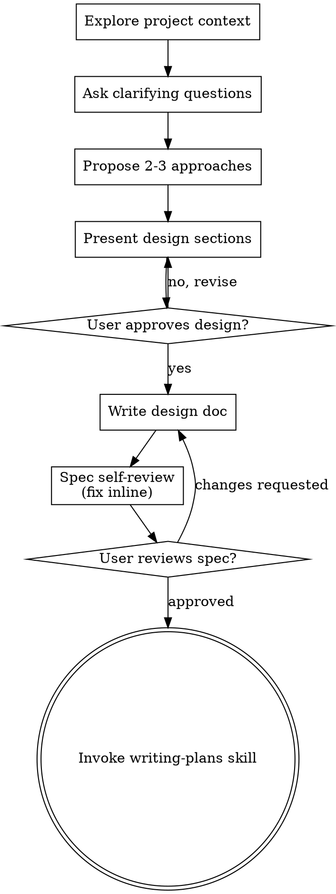
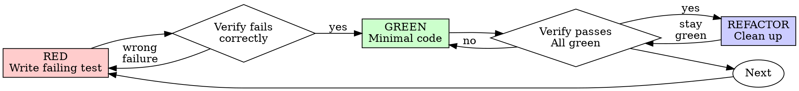

# Codex Session `01a052ec-d26a-7032-a6be-cf60cca407b6`

- Review status: `human-reviewed`
- Reviewed by: `synuns`
- Reviewed at: `2026-09-01T02:04:04.771355+00:00`
- Reviewed candidate SHA-256: `3a9998fcaf7cf9820f136508e91165b2a0747ed6ec7a2a4249fab487683902e5`

> Human review required before submission. Automatic redaction is best-effort.

- Model: `gpt-5.6-sol`
- Started: `2026-08-30T13:47:27.241Z`
- Working directory: `~/dev/assignment/kbhc-assgn`

## Turn 1

### User prompt

# AGENTS.md instructions for ~/dev/assignment/kbhc-assgn

<INSTRUCTIONS>
# 프로젝트 작업 규약

## 커밋 메시지

- 모든 커밋 메시지는 Conventional Commits 형식을 따른다.
- 형식은 `<type>(<scope>): <한글 설명>`이며, `scope`는 필요할 때만 사용한다.
- `type`과 `scope`는 영문 소문자로 작성하고, 제목·본문·꼬리말의 설명은 한글로 작성한다. 코드 식별자와 고유명사는 예외로 한다.
- 주요 `type`은 `feat`, `fix`, `docs`, `refactor`, `test`, `chore`를 사용한다.
- 호환성을 깨는 변경은 `!` 또는 `BREAKING CHANGE:` 꼬리말로 표시한다.

예시: `docs: 과제 원본 명세 추가`

## Scope

Follow the assignment sources in `assignment-original/`. The OpenAPI contract
is authoritative for API details. Do not change accepted behavior, architecture,
dependencies, authentication policy, or destructive-data semantics without a
HIGH-risk human decision.

## Required Reading

- [프로젝트 상위 기획](docs/project-plan.md)
- `TODO.md`
- [코딩 규약](docs/coding-standards.md)
- [기술 스택](docs/tech-stack.md)
- `docs/quality/requirements.md`
- `docs/quality/workflow.md`
- `docs/quality/verification.md`
- `AI_USAGE.md`

## Required Loop

Select requirement IDs → implement one testable unit → run read-only automatic
verification → verify applicable browser behavior → classify and fix failures →
record evidence → run lightweight adversarial review at each golden journey →
request one human checkpoint → run full review and final QA.

작업 시작 시 `TODO.md`에서 의존성이 해소된 작업 하나를 선택하고, 종료 전
상태와 재현 가능한 evidence를 갱신한다. 상위 목표·범위·단계는
`docs/project-plan.md`를 따른다. 세부 기능 설계와 구현 순서는 별도
`docs/superpowers/` 문서에서 구체화한다.

LOW work proceeds continuously. People own golden-journey acceptance, HIGH-risk
decisions, exceptions, and final completion. AI never marks `HUMAN_APPROVED`.

## Commands

```bash
./scripts/verify setup
./scripts/verify quick
./scripts/verify full
```

Verification is read-only. `npm run format` is a separate mutation command;
review its diff and rerun `./scripts/verify quick` afterward.

## Evidence and AI Records

Use journey-based browser evidence defined in `workflow.md`. Keep core E2E
small and prefer unit, component, or integration tests when they prove the risk
better. Applicable interactive browser QA uses `agent-browser` and follows
`docs/coding-standards.md`. Stop hooks create ignored redacted candidates only.
A person must review and explicitly publish any tracked AI record.

</INSTRUCTIONS>
<environment_context>
  <cwd>~/dev/assignment/kbhc-assgn</cwd>
  <shell>zsh</shell>
  <current_date>2026-08-30</current_date>
  <timezone>Asia/Seoul</timezone>
  <filesystem><workspace_roots><root>~/dev/assignment/kbhc-assgn</root></workspace_roots><permission_profile type="disabled"><file_system type="unrestricted" /></permission_profile></filesystem>
</environment_context>

todo 에서 css 스타일 토큰 관련 내용이 있는지 확인해줘

### Tool activity

#### `exec`

- Call ID: `call_DxVvuakReJUt6XYFwrtDlVED`
- Status: `completed`

**Input**

```text
const r = await tools.exec_command({
  cmd: "rg -n -i -C 3 'css|스타일|style|디자인[[:space:]-]*토큰|design[[:space:]-]*token|token' TODO.md",
  workdir: "~/dev/assignment/kbhc-assgn",
  yield_time_ms: 10000,
  max_output_tokens: 12000
});
text(r.output);

```

**Output**

```text
Script completed
Wall time 0.4 seconds
Output:

72-- Requirements: `AUTH-07`, `NAV-02`, `NAV-03`
73-- Risk: HIGH
74-- Depends on: `PLAN-01`
75:- Deliverable: access token 저장, refresh cookie 관계, expiry/401/replay,
76-  refresh 실패, 보호 route 정책을 확정한 별도 auth 설계 문서
77-- Acceptance: `docs/project-plan.md`의 인증 정책 질문이 각각 한 가지 동작으로
78-  답해지고 OpenAPI bearer/refresh scheme과 모순이 없으며 사람이 승인한다.
--
175-  `pnpm format:check`, `pnpm lint`, `pnpm typecheck` PASS; 필수 frontend script와
176-  `ai:review` 유지 확인; `pnpm-lock.yaml` 외 package manager lockfile 없음
177-
178:### [x] SCF-02 최소 React 진입점과 style 기반
179-
180-- Requirements: `SYS-01`, `SYS-02`, `SYS-03`
181-- Risk: LOW
182-- Depends on: `SCF-01`
183:- Deliverable: Vite entry, React root, Tailwind entry, semantic color tokens,
184-  local Pretendard asset과 global font
185:- Acceptance: 업무 feature 없이 root가 render되고 UI color literal 없이 token이
186-  정의되며 font asset 요청과 computed family가 확인된다.
187:- Automatic verification: component smoke, typecheck, build, token/literal 정적 검사
188-- Browser verification: `/`, desktop viewport, console/page error 없음, font
189-  network 200, computed `Pretendard`, screenshot 또는 trace
190-- Status: AI_VERIFIED
--
361-- Status: NOT_STARTED
362-- Evidence: 미실행
363-
364:### [ ] AUTH-STATE-01 승인된 token·refresh 상태
365-
366-- Requirements: `AUTH-07`
367-- Risk: HIGH 실행 — 승인안 준수 검토 필요
368-- Depends on: `DEC-AUTH-01`, `AUTH-API-01`, `ARCH-03`
369-- Deliverable: auth adapter, bearer injection, expiry 판정, single-flight refresh,
370-  bounded replay, terminal failure 처리
371:- Acceptance: 보호 요청 header가 `Authorization: Bearer [REDACTED] 승인된
372-  refresh/expiry/실패 path가 concurrent request에서도 정확히 한 번 실행된다.
373:- Automatic verification: token helper unit tests, protected request와 refresh
374-  integration tests, `./scripts/verify quick`
375-- Browser verification: integration에서 증명 못한 cookie/network boundary만 대상
376-- Status: BLOCKED

```

### Assistant response

네. `TODO.md`에 관련 작업이 있습니다.

- `SCF-02 최소 React 진입점과 style 기반` — 완료(`[x]`)
- Tailwind 진입점과 semantic color tokens 정의
- UI 색상 리터럴 없이 토큰 사용
- 토큰/리터럴 정적 검사 포함

그 외 `token` 검색 결과는 인증 access token 관련 내용으로 CSS와 무관합니다.

## Turn 2

### User prompt

color token 관련 구현 내용 검증해봐

### Tool activity

#### `exec`

- Call ID: `call_MSVqfWLzKyxTpij05b4ltm7k`
- Status: `completed`

**Input**

```text
const r = await tools.exec_command({
  cmd: "cat ~/.agents/skills/verification-before-completion/SKILL.md",
  workdir: "~/dev/assignment/kbhc-assgn",
  yield_time_ms: 10000,
  max_output_tokens: 20000
});
text(r.output);

```

**Output**

````text
Script completed
Wall time 0.2 seconds
Output:

---
name: verification-before-completion
description: Use when about to claim work is complete, fixed, or passing, before committing or creating PRs - requires running verification commands and confirming output before making any success claims; evidence before assertions always
---

# Verification Before Completion

## Overview

Claiming work is complete without verification is dishonesty, not efficiency.

**Core principle:** Evidence before claims, always.

**Violating the letter of this rule is violating the spirit of this rule.**

## The Iron Law

```
NO COMPLETION CLAIMS WITHOUT FRESH VERIFICATION EVIDENCE
```

If you haven't run the verification command in this message, you cannot claim it passes.

## The Gate Function

```
BEFORE claiming any status or expressing satisfaction:

1. IDENTIFY: What command proves this claim?
2. RUN: Execute the FULL command (fresh, complete)
3. READ: Full output, check exit code, count failures
4. VERIFY: Does output confirm the claim?
   - If NO: State actual status with evidence
   - If YES: State claim WITH evidence
5. ONLY THEN: Make the claim

Skip any step = lying, not verifying
```

## Common Failures

| Claim | Requires | Not Sufficient |
|-------|----------|----------------|
| Tests pass | Test command output: 0 failures | Previous run, "should pass" |
| Linter clean | Linter output: 0 errors | Partial check, extrapolation |
| Build succeeds | Build command: exit 0 | Linter passing, logs look good |
| Bug fixed | Test original symptom: passes | Code changed, assumed fixed |
| Regression test works | Red-green cycle verified | Test passes once |
| Agent completed | VCS diff shows changes | Agent reports "success" |
| Requirements met | Line-by-line checklist | Tests passing |

## Red Flags - STOP

- Using "should", "probably", "seems to"
- Expressing satisfaction before verification ("Great!", "Perfect!", "Done!", etc.)
- About to commit/push/PR without verification
- Trusting agent success reports
- Relying on partial verification
- Thinking "just this once"
- Tired and wanting work over
- **ANY wording implying success without having run verification**

## Rationalization Prevention

| Excuse | Reality |
|--------|---------|
| "Should work now" | RUN the verification |
| "I'm confident" | Confidence ≠ evidence |
| "Just this once" | No exceptions |
| "Linter passed" | Linter ≠ compiler |
| "Agent said success" | Verify independently |
| "I'm tired" | Exhaustion ≠ excuse |
| "Partial check is enough" | Partial proves nothing |
| "Different words so rule doesn't apply" | Spirit over letter |

## Key Patterns

**Tests:**
```
✅ [Run test command] [See: 34/34 pass] "All tests pass"
❌ "Should pass now" / "Looks correct"
```

**Regression tests (TDD Red-Green):**
```
✅ Write → Run (pass) → Revert fix → Run (MUST FAIL) → Restore → Run (pass)
❌ "I've written a regression test" (without red-green verification)
```

**Build:**
```
✅ [Run build] [See: exit 0] "Build passes"
❌ "Linter passed" (linter doesn't check compilation)
```

**Requirements:**
```
✅ Re-read plan → Create checklist → Verify each → Report gaps or completion
❌ "Tests pass, phase complete"
```

**Agent delegation:**
```
✅ Agent reports success → Check VCS diff → Verify changes → Report actual state
❌ Trust agent report
```

## Why This Matters

From 24 failure memories:
- your human partner said "I don't believe you" - trust broken
- Undefined functions shipped - would crash
- Missing requirements shipped - incomplete features
- Time wasted on false completion → redirect → rework
- Violates: "Honesty is a core value. If you lie, you'll be replaced."

## When To Apply

**ALWAYS before:**
- ANY variation of success/completion claims
- ANY expression of satisfaction
- ANY positive statement about work state
- Committing, PR creation, task completion
- Moving to next task
- Delegating to agents

**Rule applies to:**
- Exact phrases
- Paraphrases and synonyms
- Implications of success
- ANY communication suggesting completion/correctness

## The Bottom Line

**No shortcuts for verification.**

Run the command. Read the output. THEN claim the result.

This is non-negotiable.

````

#### `exec`

- Call ID: `call_3dPdUXeLL3SPmGqJuaE1IXam`
- Status: `completed`

**Input**

```text
const files = [
  "docs/project-plan.md",
  "TODO.md",
  "docs/coding-standards.md",
  "docs/tech-stack.md",
  "docs/quality/requirements.md",
  "docs/quality/workflow.md",
  "docs/quality/verification.md",
  "AI_USAGE.md"
];
const results = await Promise.all(files.map(file => tools.exec_command({
  cmd: `cat ${JSON.stringify(file)}`,
  workdir: "~/dev/assignment/kbhc-assgn",
  yield_time_ms: 10000,
  max_output_tokens: 30000
})));
for (let i = 0; i < results.length; i++) {
  text(`===== ${files[i]} =====\n${results[i].output}`);
}

```

**Output**

````text
Script completed
Wall time 0.6 seconds
Output:

Warning: truncated output (original token count: 26431)
Total output lines: 2040

===== docs/project-plan.md =====
# 프론트엔드 과제 상위 기획

## 문서 목적

이 문서는 과제 전체의 목표, 범위, 제품 동작, 기술 구조, 단계, 검증 전략과
사람 결정 지점을 정의하는 최상위 기획 기준이다. 개별 기능의 설계·구현
절차를 담는 `docs/superpowers/specs/`와 `docs/superpowers/plans/`보다 상위에
있다.

실행 상태와 남은 작업은 루트 `TODO.md`에서 관리한다. 에이전트는 작업 시작
전 이 문서와 `TODO.md`를 읽고, 한 번에 검증 가능한 작업 단위 하나만 수행한다.

## 기준 문서와 우선순위

충돌 시 다음 순서를 적용한다.

1. `assignment-original/openapi.yaml`: API 경로, method, 요청·응답 schema,
   인증 scheme의 최우선 계약
2. `assignment-original/requirement.md`: 화면, 상호작용, 제출 조건
3. `docs/quality/requirements.md`: 원본을 requirement ID와 acceptance로 변환한
   실행 기준
4. 이 문서: 전체 범위, 구조, 단계, 품질 전략
5. `docs/tech-stack.md`: 승인된 기술과 도구 책임
6. `docs/coding-standards.md`: 모든 에이전트가 구현·검토 때 지킬 코딩 규약
7. `docs/superpowers/specs/`와 `docs/superpowers/plans/`: 특정 작업의 상세 설계와
   구현 순서
8. `TODO.md`: 현재 실행 순서, 상태, evidence

하위 문서는 상위 문서의 accepted behavior를 바꿀 수 없다. 원본과
`docs/quality/requirements.md`가 충돌하거나 해석이 둘 이상이면
`REQUIREMENT` 실패로 기록하고 HIGH-risk 사람 결정을 요청한다.

## 제품 목표

React 19와 TypeScript로 다음 업무 흐름을 제공하는 제출 가능한 단일 페이지
애플리케이션을 만든다.

- 사용자는 로그인 입력을 검증하고 API를 통해 인증한다.
- 공통 navigation에서 dashboard와 task 목록으로 이동한다.
- 로그인 상태에 따라 sign-in 또는 profile 진입점 하나만 본다.
- dashboard에서 전체, 남은, 완료 task 수를 확인한다.
- 가상화된 무한 목록에서 task를 탐색하고 상세로 이동한다.
- 상세가 없으면 목록으로 복구한다.
- route ID를 정확히 입력한 경우에만 task를 삭제하고 목록으로 돌아간다.
- profile에서 사용자 name과 memo를 확인한다.

## 성공 기준

완료는 기능 존재가 아니라 다음 증거가 모두 충족된 상태다.

- `docs/quality/requirements.md`의 모든 requirement에 재현 가능한 자동 또는
  browser evidence가 기록된다.
- 네 Golden Journey `auth-entry`, `work-overview`, `task-discovery`,
  `task-resolution`이 각각 경량 adversarial review를 통과하고 사람이
  checkpoint를 승인한다.
- OpenAPI 계약에서 생성한 타입과 MSW 동작이 실제 client 요청·응답과 일치한다.
- loading, empty, error, success 상태가 적용 가능한 화면에서 구분된다.
- keyboard 사용, label 연결, focus 이동, modal 접근성, 반응형 layout을 확인한다.
- format, lint, typecheck, unit/component/integration test, build, core E2E가
  read-only `./scripts/verify full`에서 통과한다.
- console·network 오류, 비밀정보, debug 출력, 불필요한 생성물, 관련 없는 diff가
  없다.
- `AI_USAGE.md`와 공개 AI 기록은 사람 검토 결과만 반영한다.
- AI가 `HUMAN_APPROVED`나 최종 완료를 선언하지 않는다.

## 범위

### 포함

- `/`, `/sign-in`, `/task`, `/task/:id`, `/user` route
- 상태별 GNB/LNB action과 서로 다른 아이콘
- sign-in validation, 요청, 오류 modal, 인증 상태
- dashboard metrics
- task 가상 목록, 무한 pagination, 상세, 404 복구, 확인 후 삭제
- user profile
- OAS 3.1 기반 생성 타입과 제출 가능한 MSW API 대체 구현
- 명명된 색상 token과 local Pretendard font
- 자동 검증, browser evidence, Golden Journey checkpoint, AI 사용 공개

### 제외

- 원본에 없는 회원가입, 로그아웃 UI, task 생성·수정, 검색, 정렬, filter
- 별도 production backend와 database
- 원본에 없는 role·permission 체계
- offline mode, realtime synchronization, analytics, 국제화
- 심미성을 위한 대규모 animation이나 독자 design system 확장
- 승인 없는 dependency, architecture, 인증 정책, 삭제 의미 변경

## 사용자와 핵심 흐름

별도 role 체계는 두지 않는다. UI 관점 상태만 구분한다.

### 비로그인 사용자

1. 공통 navigation에서 dashboard, task, sign-in action을 확인한다.
2. `/sign-in`에서 email과 password를 입력한다.
3. client validation 실패 시 연결된 inline 오류를 확인한다.
4. 유효한 입력을 제출한다.
5. non-200 응답이면 API `errorMessage` modal을 확인하고 닫는다.
6. 200 응답이면 승인된 방식으로 인증 상태를 만들고 보호 API 요청을 수행한다.

dashboard와 task action의 노출 여부와 보호 route 접근 정책은 원본만으로
확정되지 않았다. navigation action은 항상 존재한다는 invariant를 지키되,
비로그인 접근 결과는 인증 정책 사람 결정에서 확정한다.

### 로그인 사용자

1. sign-in 대신 profile action을 확인한다.
2. dashboard에서 API fixture와 같은 세 지표를 본다.
3. task 목록을 scroll하며 다음 page를 중복 없이 불러온다.
4. card의 title과 memo를 확인하고 상세로 이동한다.
5. 없는 상세에서 목록 복구 action을 사용한다.
6. 존재하는 상세에서 title, memo, registerDatetime을 확인한다.
7. 삭제 modal에서 잘못된 ID에는 submit이 비활성화되고 정확한 ID에서만
   활성화되는지 확인한다.
8. 삭제 성공 후 `/task`로 돌아간다.
9. profile에서 name과 memo를 확인한다.

## 화면·route 기획

| Route | 목적 | 주요 상태 | Requirement |
| --- | --- | --- | --- |
| `/` | 업무 현황 확인 | loading, error, success | `DASH-01`, `NAV-01`, `NAV-03` |
| `/sign-in` | 인증 시작 | invalid, submitting, API error, success | `NAV-02`, `AUTH-01`~`AUTH-07` |
| `/task` | task 탐색 | initial loading, empty, page loading, error, terminal page | `TASK-LIST-01`~`TASK-LIST-05` |
| `/task/:id` | task 확인·삭제 | loading, 404, error, success, delete modal | `TASK-DETAIL-01`~`TASK-DETAIL-05` |
| `/user` | profile 확인 | loading, error, success | `USER-01`, `NAV-03` |

공통 shell은 현재 route를 표시하고 dashboard/task action을 유지한다. 인증
action은 sign-in과 profile 중 정확히 하나만 표시한다. 아이콘은 항목별로
서로 다르며 accessible name은 text와 함께 유지한다.

## API 계약 기획

| 동작 | 계약 | 핵심 처리 |
| --- | --- | --- |
| 로그인 | `POST /api/sign-in` | email/password JSON, 200 token 응답, non-200 `errorMessage` |
| 갱신 | `POST /api/refresh` | refresh cookie credential, 200 token, 400/401 error |
| profile | `GET /api/user` | bearer token, name/memo |
| dashboard | `GET /api/dashboard` | bearer token, 세 integer metric |
| task 목록 | `GET /api/task?page=N` | 1부터 시작, data/hasNext |
| task 상세 | `GET /api/task/{id}` | bearer token, 200 detail, 404 error |
| task 삭제 | `DELETE /api/task/{id}` | bearer token, 200 `{ success: true }`, 404 error |

Client는 generated OpenAPI type을 경계에서 사용한다. UI model 변환이 필요하면
순수 함수로 분리하고 원본 response 필드를 조용히 바꾸지 않는다. 모든 보호
요청은 승인된 auth adapter를 통과한다. MSW browser handler와 test server
handler는 같은 fixture와 contract behavior를 공유한다.

## 기술 구조

### 채택 stack

- React 19, TypeScript strict, Vite, pnpm
- React Router, TanStack Query, React Hook Form, Zod
- TanStack Virtual, Fetch API, `openapi-typescript`, MSW
- shadcn/ui, Tailwind CSS, CSS Custom Properties, Pretendard, Lucide React
- Vitest, Testing Library, Playwright, Biome

정확한 채택 상태와 변경 규칙은 `docs/tech-stack.md`가 관리한다. 새 dependency나
교체는 HIGH-risk 사람 승인 전 적용하지 않는다.

### 목표 module 경계

후속 상세 설계는 FSD 원칙을 사용하되, 이 문서는 책임 방향만 고정한다.

```text
src/
├── app/        # bootstrap, provider composition, router, global styles
├── pages/      # route 단위 composition
├── widgets/    # app shell, navigation 등 page 간 큰 UI block
├── features/   # sign-in, delete-task 등 사용자 행위
├── entities/   # task, user 등 domain 표시·model
├── shared/     # api client, generated contract, auth adapter, 공용 UI·utility
└── mocks/      # MSW handlers, fixtures, browser/node bootstrap
```

의존 방향은 상위 composition에서 하위 재사용 단위로 흐른다. 각 공개 경계는
후속 기능 설계에서 exact export를 정한다. route page가 fetch, token, fixture
세부 구현을 직접 소유하지 않는다.

### provider와 data flow

```text
Browser event
  → feature/page action
  → typed API client
  → auth adapter가 bearer/refresh 정책 적용
  → real fetch boundary 또는 MSW
  → generated OpenAPI type를 쓰는 response mapping boundary
  → TanStack Query cache
  → entity/widget/page rendering
```

App bootstrap은 router, query client, auth context, MSW development bootstrap을
명시적 순서로 조합한다. test는 필요한 provider만 test harness로 구성한다.

### 상태 책임

- server state: TanStack Query가 loading, error, data, pagination, invalidation을
  관리한다.
- form state: React Hook Form과 Zod가 sign-in 입력·오류·submit 가능 상태를
  관리한다.
- auth state: 승인된 auth adapter/context만 token과 session transition을
  관리한다.
- modal state: 해당 feature가 open/close, focus restore, 입력 reset을 관리한다.
- route state: React Router param과 navigation을 단일 기준으로 사용한다.
- mock state: MSW fixture store가 delete 이후 목록·상세·dashboard 일관성을
  결정한다. 의미 변경은 삭제 정책 결정 범위에서 승인받는다.

## HIGH-risk 결정 gate

다음은 구현 전에 사람이 결정한다. 결정 전에는 evidence 조사, test 설계,
독립 LOW 작업만 진행한다.

### 인증 정책

OpenAPI는 sign-in response에 accessToken과 refreshToken을 반환하면서 refresh는
`token` cookie를 요구한다. token 저장 위치와 cookie 설정 주체는 명시하지
않는다. 다음을 하나의 auth 설계에서 확정한다.

- access token 저장 위치와 page reload 시 동작
- response의 refreshToken과 refresh cookie 관계
- token expiry 판정과 동시 401 처리
- refresh 성공 시 request replay 범위와 무한 retry 방지
- refresh 400/401 시 session 정리와 UI 이동
- `/`, `/task`, `/task/:id`, `/user`의 비로그인 접근 정책
- MSW가 cookie와 JWT expiry를 결정적으로 재현하는 방법

승인 evidence는 결정 문서 경로, 승인자, 승인 시점, 영향을 받는 requirement를
남긴다. `AUTH-07` 구현은 승인 전 시작하지 않는다.

### 삭제와 mock data 일관성

원본은 exact ID 확인 후 delete 호출과 `/task` redirect를 요구한다. 다음
세부사항이 accepted behavior를 바꾸면 사람 결정을 요청한다.

- 성공 후 목록, 상세, dashboard fixture의 일관성 유지 범위
- delete 401/404와 network 실패 표시 방식
- 중복 submit과 요청 중 modal close 정책

최소 기준은 정확한 route ID 없이는 호출하지 않고, 200 success에서만
`/task`로 이동하는 것이다.

## 공통 UX·접근성 기준

- 모든 form control은 visible label과 programmatic association을 가진다.
- inline 오류는 해당 input과 연결하고 상태만 색으로 전달하지 않는다.
- modal은 accessible name, 초기 focus, focus trap, Escape/close, 닫힌 뒤 focus
  restore를 검증한다.
- submit 중 중복 요청을 막고 진행 상태를 text로 전달한다.
- loading, empty, recoverable error, terminal success를 서로 구분한다.
- error는 가능한 recovery action을 제공한다. 404 상세는 목록 이동을 반드시
  제공한다.
- 명명된 semantic color token만 사용한다. feature-local color literal을
  추가하지 않는다.
- Pretendard local asset 요청과 computed font를 browser에서 확인한다.
- 최소 mobile과 desktop viewport에서 content clipping, 가상 목록 scroll,
  modal overflow, navigation 가용성을 확인한다.

## 검증 전략

### test pyramid

- unit: Zod validation, token expiry helper, pagination 계산, ID equality, model
  transform
- component: label/error/disabled 상태, conditional navigation, modal focus와
  interaction, card rendering
- integration: MSW request/response, auth header와 refresh path, query cache,
  route transition, delete 이후 상태
- E2E: 인증·routing·network·scroll virtualization·삭제 redirect를 가로지르는
  Golden Journey 핵심 경계

낮은 수준 test가 위험을 충분히 증명하면 E2E에 중복하지 않는다. core E2E는
journey별 대표 success 하나와 critical failure 하나 이하로 유지한다.
대화형 browser QA와 evidence 수집은 `agent-browser`를 사용하고 exact 절차는
`docs/coding-standards.md`를 따른다.

### 작업 단위 loop

1. `TODO.md`에서 dependency가 해소된 item 하나를 선택한다.
2. `docs/coding-standards.md`와 requirement ID, acceptance를 다시 확인한다.
3. 위험을 분류하고 HIGH면 구현 전에 사람 결정을 요청한다.
4. 가장 낮은 적합 test level에서 실패 test를 만든다.
5. 최소 구현 후 대상 test와 `./scripts/verify quick`을 실행한다.
6. 적용 가능한 browser behavior를 확인하고 evidence를 기록한다.
7. 실패를 분류하고 root cause를 수정한 뒤 같은 gate를 재실행한다.
8. TODO 상태와 requirement evidence를 갱신한다.
9. Golden Journey 완료 시 독립 adversarial review 후 사람 checkpoint를 요청한다.

### evidence 최소 필드

- requirement 또는 journey ID
- commit SHA
- 실행 명령과 결과
- browser route, viewport, precondition, action, expected/actual
- console/network 오류와 screenshot/trace 경로
- failure class, correction, rerun verdict
- AI 상태와 별도 사람 checkpoint 상태

## 전체 단계와 exit gate

### 0. 기획·결정 준비

상위 기획과 TODO를 연결하고 auth 정책 등 HIGH 결정을 분리한다. Exit: 문서
기준이 서로 연결되고 다음 작업이 requirement ID와 검증법으로 선택 가능하다.

### 1. 검증 가능한 개발 기반

승인된 scaffold 설계에 따라 React/Vite, quality scripts, token/font,
OpenAPI generation, MSW, test/browser smoke를 준비한다. Exit:
`./scripts/verify quick`과 `./scripts/verify full`이 mutation 없이 통과한다.

### 2. 애플리케이션 구조·공통 경계

FSD 상세 설계, provider, router, typed client, 공통 상태 UI, test harness를
구성한다. Exit: 빈 route composition과 API 경계가 독립 test로 검증되고 기능
behavior는 아직 포함하지 않는다.

### 3. auth-entry Journey

승인된 auth 정책 아래 sign-in validation, error modal, token state, 보호 요청,
navigation 전환을 완성한다. Exit: 관련 requirement evidence, targeted auth
integration evidence, core browser evidence, adversarial review가 준비되고 사람
checkpoint를 요청한다.

### 4. work-overview Journey

공통 navigation, dashboard, profile, Pretendard 적용을 완성한다. Exit: fixture와
화면 값 일치, 상태별 navigation, 접근성·viewport evidence, review가 준비되고
사람 checkpoint를 요청한다.

### 5. task-discovery Journey

초기 page, card, virtualization, infinite pagination, 상세 이동을 완성한다.
Exit: DOM bound와 page request 중복 방지, `hasNext: false` 종료, browser scroll
evidence, review가 준비되고 사람 checkpoint를 요청한다.

### 6. task-resolution Journey

상세 success/404, delete modal guard, delete API와 redirect를 완성한다. Exit:
정확한 ID guard, failure recovery, 성공 redirect evidence, review가 준비되고
사람 checkpoint를 요청한다.

### 7. 통합·제출 QA

journey 간 auth transition, stale cache, API error, mock/OAS 일관성, 반응형,
접근성, AI disclosure를 교차 검토한다. Exit: full adversarial review와
`./scripts/verify full`이 통과하고 최종 사람 acceptance를 요청한다.

## 변경 관리

- 목표, 범위, accepted behavior, architecture, dependency, 인증 또는 삭제
  의미 변경은 이 문서와 관련 기준 문서를 함께 갱신하고 HIGH-risk 승인을
  받는다.
- 실행 순서와 증거만 바뀌면 `TODO.md`만 갱신한다.
- 특정 feature의 상세 설계나 exact file/function 순서는
  `docs/superpowers/`에 기록하고 이 문서를 복제하지 않는다.
- 구현·test·module·component·browser QA 방식은 `docs/coding-standards.md`를
  따른다. 규약 예외는 이유와 사람 승인을 evidence에 남긴다.
- 완료된 TODO는 삭제하지 않는다. status와 evidence를 남겨 결정 이력을
  보존한다.
- 문서 간 모순을 발견한 에이전트는 임의 해석 대신 `REQUIREMENT` 실패로
  기록한다.

===== TODO.md =====
# 에이전트 작업 목록

## 목적

과제 완료까지 남은 작업, 의존성, 검증법, evidence를 관리하는 실행 원장이다.
상위 목표와 단계는 `docs/project-plan.md`, accepted behavior는
`docs/quality/requirements.md`, 구현 규율은 `docs/coding-standards.md`, 세부 작업
설계는 `docs/superpowers/`를 따른다.

## 에이전트 사용 규칙

1. 작업 시작 전 필수 문서와 이 파일을 읽는다.
2. `Status: NOT_STARTED`이며 모든 `Depends on`이 완료된 item 하나를 고른다.
3. 시작할 때만 `IN_PROGRESS`로 바꾸고 담당 agent/session을 Evidence에 남긴다.
4. requirement ID, risk, acceptance, 검증법을 바꾸지 않고 한 testable unit만
   구현한다.
5. HIGH item은 사람 결정 evidence 없이는 구현하지 않는다.
6. 자동·browser 검증 후 재현 명령, commit, 결과를 Evidence에 기록한다.
7. AI는 검증 완료 item을 `AI_VERIFIED`까지만 변경한다.
8. `HUMAN_APPROVED`는 사람이 명시적으로 승인한 journey checkpoint에만 사람이
   기록한다.
9. 실패는 `docs/quality/workflow.md` 분류와 root cause, correction, rerun을
   Evidence에 남긴다.
10. 새 작업은 해당 단계에 stable ID로 추가한다. 완료 item을 삭제하거나
    번호를 재사용하지 않는다.

## 상태

- `NOT_STARTED`: 시작 전
- `IN_PROGRESS`: 한 agent가 수행 중
- `AI_VERIFIED`: acceptance와 자동/browser evidence 충족
- `HUMAN_APPROVED`: 사람이 checkpoint 승인
- `BLOCKED`: blocker와 해제 조건 기록

`[ ]`는 미완료, `[x]`는 `AI_VERIFIED` 또는 사람이 기록한
`HUMAN_APPROVED`를 뜻한다. checkbox와 Status가 다르면 Status를 보수적으로
낮추고 evidence를 다시 확인한다.

## 현재 진행 요약

| 단계 | Exit gate | 상태 |
| --- | --- | --- |
| 0. 기획·결정 준비 | 상위 기준 연결, HIGH 결정 목록 분리 | AI_VERIFIED |
| 1. 개발 기반 | quick/full 및 scaffold browser smoke 통과 | AI_VERIFIED |
| 2. 공통 구조 | provider/router/API/test 경계 검증 | AI_VERIFIED |
| 3. auth-entry | evidence·review 후 사람 checkpoint | BLOCKED — auth 정책 결정 필요 |
| 4. work-overview | evidence·review 후 사람 checkpoint | NOT_STARTED |
| 5. task-discovery | evidence·review 후 사람 checkpoint | NOT_STARTED |
| 6. task-resolution | evidence·review 후 사람 checkpoint | NOT_STARTED |
| 7. 통합·제출 QA | full QA 후 사람 최종 acceptance | NOT_STARTED |

## 0. 기획·결정 준비

### [x] PLAN-01 상위 기획과 실행 원장 연결

- Requirements: 전체
- Risk: LOW
- Depends on: 없음
- Deliverable: `docs/project-plan.md`, `T…16431 tokens truncated…07` | Exercise approved expiry path | Cookie-secured `POST /api/refresh`, 200 `AuthTokenResponse` | Refresh, bounded replay, and transition exactly match `DEC-AUTH-01` | integration + targeted browser only if required |

Core exception cases:

| Case/step | Requirement | User action | OpenAPI contract | Expected result | Evidence |
| --- | --- | --- | --- | --- | --- |
| `AUTH-E1` | `AUTH-02`~`AUTH-04` | Try empty values, invalid email, 7/25-character and Korean/symbol passwords | None | Associated errors are visible and submit remains disabled | unit + component |
| `AUTH-E2` | `AUTH-06` | Submit valid values against failure fixture, then close modal | `POST /api/sign-in`, 400 `ErrorResponse` | `errorMessage` appears in accessible modal and focus restores | integration + browser |
| `AUTH-E3` | `AUTH-07` | After gate approval, exercise refresh failure | `POST /api/refresh`, 400 or 401 `ErrorResponse` | Session and route result match `DEC-AUTH-01` | integration |

OpenAPI defines only 400 for sign-in failure, so no response body is invented
for another sign-in status.

### work-overview

Requirements: `SYS-03`, `NAV-01`, `NAV-03`, `DASH-01`, `USER-01`.

Decision gate: `DEC-AUTH-01` controls the authenticated fixture and every 401
session/route result.

Independent initial state: fresh approved authenticated fixture; dashboard and
user fixtures reset to OpenAPI-conforming 200 responses.

| Case/step | Requirement | User action | OpenAPI contract | Expected result | Evidence |
| --- | --- | --- | --- | --- | --- |
| `WORK-P1-1` | `NAV-01`, `NAV-03` | Open each route and use navigation | None | Dashboard/task remain visible with distinct icons; profile, not sign-in, is visible | integration + browser |
| `WORK-P1-2` | `DASH-01` | Open `/` | Bearer `GET /api/dashboard`, 200 `DashboardResponse` | Three visible metrics equal response fields | integration + browser |
| `WORK-P1-3` | `USER-01` | Open `/user` | Bearer `GET /api/user`, 200 `UserResponse` | Visible `name` and `memo` equal response | integration + browser |
| `WORK-P1-4` | `SYS-03`, `NAV-01` | Inspect mobile and desktop navigation | None | Pretendard is computed; actions are keyboard-usable without clipping | component + browser |
| `WORK-E1` | `AUTH-07`, `DASH-01`, `USER-01` | Request dashboard or user with approved invalid/expired state | Respective GET, 401 `ErrorResponse` | Session, recovery UI, and route result match `DEC-AUTH-01` | integration + browser when route behavior is involved |

No 500 response or non-contract error field is added.

### task-discovery

Requirements: `TASK-LIST-01` through `TASK-LIST-05`.

Decision gate: `DEC-AUTH-01` controls the authenticated fixture and 401 result.

Independent initial state: fresh approved authenticated fixture; reset pages
where page 1 has `hasNext: true` and terminal page has `hasNext: false`;
request counts start at zero.

| Case/step | Requirement | User action | OpenAPI contract | Expected result | Evidence |
| --- | --- | --- | --- | --- | --- |
| `DISC-P1-1` | `TASK-LIST-01` | Open `/task` | Bearer `GET /api/task?page=1`, 200 `TaskListResponse` | Page 1 is requested once and data renders | integration |
| `DISC-P1-2` | `TASK-LIST-02` | Inspect cards | `TaskItem` | Each card shows `title` and `memo`; scenario does not add `status` UI | component + browser |
| `DISC-P1-3` | `TASK-LIST-03` | Scroll growing list | None | Mounted rows remain bounded near viewport | integration + browser |
| `DISC-P1-4` | `TASK-LIST-04` | Reach terminal page | `GET /api/task?page=N`, 200 `TaskListResponse` | Each page requests once while true; false stops paging | integration + browser |
| `DISC-P1-5` | `TASK-LIST-05` | Select card | None | Route becomes `/task/:id` using response item `id` | integration + browser |
| `DISC-E1` | `TASK-LIST-01`, `TASK-LIST-04` | Open empty terminal fixture | 200 with empty `data`, `hasNext: false` | Empty state is distinct and no next page is requested | integration |
| `DISC-E2` | `TASK-LIST-04` | Trigger list end repeatedly | 200 `TaskListResponse` | One in-flight request per page; none after terminal false | integration |
| `DISC-E3` | `AUTH-07`, `TASK-LIST-01` | Request with approved invalid/expired state | `GET /api/task?page=1`, 401 `ErrorResponse` | Session, recovery, and route result match `DEC-AUTH-01` | integration |

No network/500 response body is invented.

### task-resolution

Requirements: `TASK-DETAIL-01` through `TASK-DETAIL-05`.

Decision gate: `DEC-AUTH-01` controls 401 session/route results.
Decision gate: `DEC-DELETE-01` controls delete failure UI, modal-close and
duplicate-submit behavior, and list/detail/dashboard cache consistency.

Independent initial state: fresh approved authenticated fixture; one existing
string route ID and one missing string route ID; fixtures reset per case;
request counts start at zero.

| Case/step | Requirement | User action | OpenAPI contract | Expected result | Evidence |
| --- | --- | --- | --- | --- | --- |
| `RES-P1-1` | `TASK-DETAIL-01` | Open existing `/task/:id` | Bearer `GET /api/task/{id}`, 200 `TaskDetailResponse` | `title`, `memo`, `registerDatetime` equal response | integration + browser |
| `RES-P1-2` | `TASK-DETAIL-03` | Open delete confirmation | None | Accessible modal contains ID input | component + browser |
| `RES-P1-3` | `TASK-DETAIL-04` | Enter wrong, whitespace, case-different, then exact ID | None | Disabled until exact equality; no early request | unit + component |
| `RES-P1-4` | `TASK-DETAIL-05` | Under approved policy, submit exact ID | Bearer `DELETE /api/task/{id}`, 200 `DeleteTaskResponse { success: true }` | Exact endpoint called once and success navigates `/task` | integration + browser |
| `RES-E1` | `TASK-DETAIL-02` | Open missing ID and recover | `GET /api/task/{id}`, 404 `ErrorResponse` | Missing UI shows `errorMessage`; action returns `/task` | integration + browser |
| `RES-E2` | `TASK-DETAIL-04` | Attempt non-exact ID | None | Submit disabled and DELETE count is zero | component + integration |
| `RES-E3` | `AUTH-07`, `TASK-DETAIL-05` | Exercise DELETE 401 | `DELETE /api/task/{id}`, 401 `ErrorResponse` | Result matches both decision documents | integration |
| `RES-E4` | `TASK-DETAIL-05` | Exercise DELETE 404 | `DELETE /api/task/{id}`, 404 `ErrorResponse` | Result matches `DEC-DELETE-01`; no redirect without 200 | integration + browser when modal behavior is involved |

The scenario does not choose in-flight close, duplicate submit, or cache
mutation before `DEC-DELETE-01` approval.

## Invariants

- Dashboard and task navigation remain present across routes.
- Authentication state exposes exactly one of sign-in and profile actions.
- UI colors flow through named tokens; Pretendard remains application font.
- Input labels remain associated with controls.
- Invalid sign-in input cannot submit; API errors surface `errorMessage`.
- Protected requests use approved authentication state.
- Virtualized task DOM remains bounded as fetched data grows.
- One task page has at most one in-flight request; `hasNext: false` stops paging.
- Detail 404 always provides list recovery.
- Delete cannot submit without exact ID and success always returns to task list.
- Loading, empty, error, and success states are distinguishable.
- AI evidence never marks `HUMAN_APPROVED`.
- Verification commands never modify repository files.

===== docs/quality/workflow.md =====
# AI Development Workflow

## Operating Loop

1. Select requirement IDs and acceptance conditions from `requirements.md`.
2. Classify risk and choose one independently testable unit.
3. Implement the smallest change and its appropriate automated test.
4. Run `./scripts/verify quick`.
5. Run applicable browser checks and record evidence.
6. Classify failures, correct root cause, and rerun the failed gate.
7. Record evidence and continue low-risk work.
8. At a completed golden journey, run lightweight adversarial review and ask
   for one human checkpoint acceptance.
9. After all journeys, run full adversarial review, `./scripts/verify full`,
   and final QA.
10. Ask a person for final acceptance. AI never declares human acceptance.

One work unit covers one requirement ID or one independently testable condition
inside an ID. Do not split work by file when files form one testable behavior.

## Risk and Authority

### LOW — AI proceeds continuously

Examples: approved-pattern implementation, focused tests, local unambiguous
fixes, active-task documentation, and necessary non-semantic cleanup.

AI may implement, test, diagnose, fix, review, commit, and continue. Record
requirement IDs, commands, browser evidence when applicable, and decisions.

### MEDIUM — human owns journey checkpoint

Examples: completing a golden journey, introducing a new interaction pattern,
or spanning routes, API state, and views within approved architecture.

AI completes and verifies a coherent batch, runs lightweight adversarial
review, then requests one checkpoint acceptance. Do not request approval for
each requirement inside the batch.

### HIGH — human decides before consequential change

Examples: conflicting requirements, authentication or security policy,
destructive-data semantics, dependency or architecture changes, scope
expansion, acceptance changes, and bypassing a failed gate.

Stop before the consequential implementation. Present evidence, options,
trade-offs, and recommendation. While waiting, continue only evidence work,
diagnosis, or unrelated LOW work that cannot cross the affected boundary.

AI proposes risk and owns execution evidence. People own journey acceptance,
HIGH decisions, exceptions, and final acceptance.

## Failure Classification

Assign one primary class and record evidence, rationale, corrective change, and
rerun result:

- `REQUIREMENT`: ambiguous, conflicting, missing, or misunderstood condition.
- `IMPLEMENTATION`: logic, state, or rendering defect.
- `INTEGRATION`: API, auth, routing, browser, or cross-module defect.
- `UX_ACCESSIBILITY`: usability, interaction, visual, or accessibility defect.
- `TEST`: incorrect, duplicate, flaky, or overly broad test.
- `ENVIRONMENT`: runtime, OS, browser, port, or local service problem.
- `TOOLING`: build, lint, typecheck, verify, hook, or runner problem.

`REQUIREMENT` and behavior-changing corrections are HIGH. Never turn a failure
green by weakening an assertion, adding an undocumented skip, or editing only
checklist status.

## Browser Failure Record

```text
Requirement/Journey:
Commit:
Route/Viewport:
Precondition:
Actions:
Expected:
Actual:
Console/Network:
Screenshot/Trace:
Failure class:
Correction:
Rerun verdict:
```

Browser-tool failure is not product success. Classify it as `ENVIRONMENT` or
`TOOLING`, restore trustworthy evidence, then rerun.

## Adversarial Review

After each of `auth-entry`, `work-overview`, `task-discovery`, and
`task-resolution`, use a fresh reviewer context or explicit second-pass role
that did not author the final change. Check requirement omissions, negative
paths, invariants, accessibility, weak or duplicate tests, console/network
errors, and missing evidence. Resolve findings before requesting checkpoint
acceptance.

After all checkpoints, perform a full review across journeys: auth transitions,
navigation, stale state, API errors, regression risk, OAS/mock consistency,
test duplication, and assignment-wide constraints.

## Human Checkpoints

Request human action only for:

- A completed golden journey after evidence and lightweight review.
- A HIGH-risk decision before consequential implementation.
- An exception to a required gate.
- Final QA readiness and final completion.

While a checkpoint is pending, evidence preparation and unrelated LOW analysis
may continue. Do not implement beyond the unapproved journey boundary.

For the `auth-entry` checkpoint, the person reviews focused integration
evidence that a protected request uses `Authorization: Bearer [REDACTED]
and that the approved refresh/expiry path was exercised. Add core browser
evidence only for credential or network behavior that the integration boundary
cannot prove; a visible profile action alone is not authentication evidence.

## Prompt Records

Lifecycle hooks create pending snapshots and metadata only. A person runs
`npm run ai:review`; the tool selects candidates risk-first, computes and
records reviewed SHA-256 digest and reviewer, then asks for exact `y`+Enter.
Other input, EOF, or signal cancels. Publication uses staging and atomic
rename, then regenerates public index and managed `AI_USAGE.md`; reruns are
idempotent. AI must not approve or publish on a person's behalf. See
`verification.md` and `AI_USAGE.md`.

## Final QA Checklist

- [ ] Every requirement row has reproducible evidence and correct status.
- [ ] All four journey checkpoints are human-approved.
- [ ] Full adversarial review findings are resolved.
- [ ] `./scripts/verify full` passes on the intended submission commit.
- [ ] Core browser evidence exists for all four journeys.
- [ ] Auth, navigation, stale state, errors, and regressions were cross-checked.
- [ ] Console and network errors were reviewed.
- [ ] Accessibility and responsive layouts were spot-checked at recorded viewports.
- [ ] API mock behavior matches `openapi.yaml`.
- [ ] AI records were human-reviewed before publication.
- [ ] Git diff contains no secrets, debug output, generated noise, or unrelated work.
- [ ] A person, not AI, marks final acceptance.

===== docs/quality/verification.md =====
# Verification Policy

## Canonical Commands

```bash
./scripts/verify setup
./scripts/verify quick
./scripts/verify full
./scripts/verify
```

No argument means `full`. Every verification mode is read-only and compares a
repository content fingerprint before and after execution. A mutation makes
verification fail.

## Modes

- `setup`: required files, document markers and links, risk/approval rules,
  journey categories, review/final-QA sections, pending-record ignore rule,
  Stop/SessionEnd hook wiring, AI disclosure headings, and the four focused
  artifact-contract, exporter, index, and publisher unit-test suites.
- `quick`: `setup`, then `format:check`, `lint`, `typecheck`, and `test` after
  frontend scaffolding.
- `full`: `setup`, `quick`, `build`, and `test:e2e:core` after frontend
  scaffolding.

Before `package.json` exists, frontend stages print
`SKIP frontend not scaffolded`. This certifies workflow setup only. After
`package.json` exists, all six required scripts must exist; absence is failure.

Verification stops on first failure, exits nonzero, prints a reproduction
command, and lists failure classes from `workflow.md`.

## Formatting Mutation Is Separate

`format:check` reports differences and never edits files. Formatting mutation
is separate:

```bash
npm run format
```

Review the resulting diff and run `./scripts/verify quick`. No verify command
may call `npm run format` or another write-mode formatter.

## Test-Level Selection

- Unit: pure validation, transforms, and isolated state.
- Component: labels, disabled states, modal interaction, conditional UI, and
  focused accessibility.
- Integration: API response to view state, router transitions, and feature
  state with controlled external boundaries.
- E2E: real browser behavior crossing authentication, routing, network,
  scrolling, virtualization, or deletion/navigation boundaries.

Choose the lowest level that proves risk reliably. Do not duplicate lower-level
coverage in E2E.

## Core E2E Journeys

Organize by `auth-entry`, `work-overview`, `task-discovery`, and
`task-resolution`, not by page.
Keep at most one representative success path and one critical failure path per journey.
Every E2E names its unique cross-boundary risk. `test:e2e:core` runs only
`@core`; extended, diagnostic,
or browser-compatibility suites use separate explicit commands.

Review slow, flaky, redundant cases for removal or demotion to integration or
component tests.

## Browser Evidence

Record scenario and requirement IDs, commit, route, viewport, preconditions,
actions, expected and actual results, console/network errors, screenshot or
trace, verdict, failure class, correction, and rerun result.

Browser automation failure is `ENVIRONMENT` or `TOOLING`, never product pass.

For `AUTH-07`, focused integration evidence proves that a protected request
sends `Authorization: Bearer [REDACTED] and exercises the human-approved
refresh/expiry behavior. Core E2E covers only a credential or browser-network
boundary that integration evidence cannot prove. The human `auth-entry`
checkpoint reviews both artifacts; authenticated navigation alone is
insufficient.

## Prompt Candidate Verification

Setup verification confirms ignored pending storage, Stop hook wiring, exporter
tests, and reviewed-publication language. The hook creates only structurally
filtered and redacted pending candidates. `npm run ai:review` presents them
risk-first; a person reviews content and sensitive information, then confirms
with exact `y`+Enter. Reviewer and reviewed SHA-256 digest are recorded by the
tool. `n`, blank input, EOF, or signal cancels. The publisher opens the
candidate with no-follow semantics, requires a regular file, reads it once,
rejects a digest mismatch, and publishes from those bytes.
Published records alone are indexed in `artifacts/index.md`. The explicit
publisher holds the shared index lock and writes the reviewed artifact,
canonical index, and fully regenerated managed `AI_USAGE.md` region in that
order, rolling earlier files back if a later write fails. The region is derived
only from post-publication canonical index filenames, so stale, malformed,
missing, and unindexed links are removed. `SessionEnd` validates and prunes the
index only; it never rewrites `AI_USAGE.md`.

===== AI_USAGE.md =====
# AI 사용 내역

## 사용한 도구와 모델

- 도구: OpenAI Codex
- 모델: `gpt-5.6-sol`

## 적용한 작업 범위

- 과제 요구사항 분석과 프로젝트 구조 결정
- Codex 사용 기록 자동화 설계 및 구현
- 이후 구현 과정의 코드 작성, 테스트, 검토 보조

## 핵심 프롬프트 요약

- 과제 원본 문서를 별도 디렉터리로 분리
- Codex Stop Hook으로 사용자 프롬프트, 도구 작업, 최종 응답 기록
- SessionEnd Hook으로 세션 기록 인덱스 자동 생성
- 시스템·개발자 지침과 내부 reasoning 제외
- 비밀정보 자동 마스킹, 비추적 후보 생성, 사람 검토 후 명시적 게시

## 사람이 최종 검증한 내용

- [ ] 비밀정보와 민감정보 제거 확인
- [ ] 프롬프트와 작업 결과 정확성 확인
- [ ] 테스트 결과와 애플리케이션 동작 확인
- [ ] 도구, 모델, 작업 범위 정확성 확인

## 자동 검증 내역

- 자동화 결과는 사람 검증으로 간주하지 않으며 제출 전 확인된 결과만 수동 기록합니다.

## 전체 프롬프트와 작업 기록

Lifecycle 훅은 pending 후보와 metadata만 생성합니다. 사람 게시 절차는
후보 선택, 위험 우선 미리보기, digest 계산, reviewer 기록을 한 명령에서
처리합니다.

```bash
npm run ai:review
```

자동 마스킹은 사람 검토를 대체하지 않습니다. `y`+Enter만 승인이고,
`n`, 빈 입력, EOF, signal은 취소입니다. 게시 transaction은 staging,
artifact atomic rename, public index 갱신 순서로 실행되며 재실행해도
동일 결과를 냅니다. `artifacts/`에는 사람 승인 기록만 추가합니다.

### 검토 완료 기록

<!-- reviewed-records:start -->
<!-- reviewed-records:end -->

- [전체 프롬프트와 작업 기록](./artifacts/index.md)

### 기존 정책 기록

- [기록 자동화 설계·구현 세션](./artifacts/codex-session-01a04c3e-0a24-7e30-a767-64f1e2c4f3ae.md) — `legacy/pre-policy`, 사람 검토 대기

기존 정책 기록은 별도 사람 검토 전까지 검토 완료 managed 영역과
`artifacts/index.md`에 포함하지 않습니다.

````

#### `exec`

- Call ID: `call_o5ZpP0QZnN8NliRuOqXoqQN6`
- Status: `completed`

**Input**

```text
const r = await tools.exec_command({
  cmd: "wc -l docs/project-plan.md TODO.md docs/coding-standards.md docs/tech-stack.md docs/quality/requirements.md docs/quality/workflow.md docs/quality/verification.md AI_USAGE.md",
  workdir: "~/dev/assignment/kbhc-assgn",
  yield_time_ms: 10000,
  max_output_tokens: 2000
});
text(r.output);

```

**Output**

```text
Script completed
Wall time 0.2 seconds
Output:

     364 docs/project-plan.md
     638 TODO.md
     401 docs/coding-standards.md
     109 docs/tech-stack.md
     207 docs/quality/requirements.md
     144 docs/quality/workflow.md
     102 docs/quality/verification.md
      60 AI_USAGE.md
    2025 total

```

#### `exec`

- Call ID: `call_XTmaGJuYgKlYq7Tr3uDk0VQp`
- Status: `completed`

**Input**

```text
const r = await tools.exec_command({
  cmd: "sed -n '1,220p' docs/coding-standards.md; sed -n '1,160p' docs/tech-stack.md; sed -n '1,240p' docs/quality/requirements.md",
  workdir: "~/dev/assignment/kbhc-assgn",
  yield_time_ms: 10000,
  max_output_tokens: 30000
});
text(r.output);

```

**Output**

````text
Script completed
Wall time 0.2 seconds
Output:

# 에이전트 코딩 규약

## 목적과 적용 범위

모든 구현·bugfix·refactor·test·review 작업에서 에이전트가 지킬 필수 규약이다.
제품 범위와 accepted behavior는 `docs/project-plan.md`와
`docs/quality/requirements.md`, 기술 선택은 `docs/tech-stack.md`, 작업 상태는
`TODO.md`가 관리한다.

규약의 목표는 코드 양이 아니라 작은 diff, 명확한 module 경계, test-first
증거, 재현 가능한 browser behavior다. 상세 기능 계획이 이 규약과 충돌하면
규약을 우선한다. 원본 behavior, architecture, dependency, 인증, 삭제 의미를
바꾸는 예외는 HIGH-risk 사람 승인 없이는 적용하지 않는다.

## 작업 시작 전 코드베이스 탐색

코드 작성 전 기존 구현, 인접 test, public API, 현재 diff를 확인한다.

```bash
git status --short
rg --files src tests e2e 2>/dev/null | sort
rg -n "<변경할 symbol|route|API|component>" src tests e2e 2>/dev/null
```

에이전트는 다음 질문에 답한 뒤 RED test를 작성한다.

- 같은 책임을 이미 가진 module, hook, component, schema, fixture가 있는가?
- 인접 code가 따르는 naming, export, error, test pattern은 무엇인가?
- 현재 public interface를 유지하면서 변경할 수 있는가?
- 사용자 또는 다른 agent의 미완료 diff와 겹치는가?
- 변경하지 않아도 되는 file은 무엇인가?

기존 code를 새 구조로 통째로 다시 쓰지 않는다. 현재 behavior를 이해하지 못한
상태에서 대체 implementation을 만들지 않는다. 관련 없는 rename, formatting,
file 이동, 추상화, dependency 교체를 같은 diff에 섞지 않는다. 겹치는 사용자
변경을 발견하면 보존하고, 안전하게 분리할 수 없을 때만 사람에게 알린다.

## 검증 가능한 TDD

### 절대 순서

production behavior 변경은 다음 RED–GREEN–REFACTOR 순서를 따른다.

1. requirement acceptance 하나를 표현하는 가장 작은 test를 작성한다.
2. 대상 test를 실행해 예상한 이유로 실패하는지 직접 확인한다.
3. typo, import, setup error가 아닌 미구현 behavior 때문에 실패할 때만 RED
   evidence로 인정한다.
4. 그 test를 통과시키는 최소 production code만 작성한다.
5. 대상 test와 인접 suite를 실행해 GREEN을 확인한다.
6. 모든 test가 green인 상태에서만 중복 제거, naming 개선, 작은 module 추출을
   수행한다.
7. refactor 뒤 대상 suite와 `./scripts/verify quick`을 다시 실행한다.

production code를 먼저 작성했으면 해당 변경을 유지한 채 test를 맞추지 않는다.
변경을 되돌리고 실패 test부터 다시 시작한다. bugfix는 반드시 재현 test가
먼저 실패해야 한다.

### RED evidence

TODO 또는 작업 evidence에 다음을 남긴다.

```text
Requirement:
Test command:
Expected failure:
Actual failure:
Why this proves RED:
GREEN command/result:
Refactor rerun:
```

test가 처음부터 통과하면 기존 behavior를 검사한 것이다. acceptance를 증명하는
다른 test로 수정한다. test가 error면 test harness를 고친 뒤 의도한 assertion
failure를 다시 확인한다.

### test 단위와 선택

- 한 test는 한 behavior만 검증한다. 이름에 서로 독립적인 `and`가 있으면
  분리한다.
- pure rule은 unit, DOM state는 component, API/router/cache 경계는 integration,
  browser cross-boundary risk만 E2E로 검증한다.
- 가장 낮은 수준에서 충분히 증명한 behavior를 E2E에 반복하지 않는다.
- 구현 detail, class name, hook call count보다 사용자가 보는 결과와 공개
  interface를 검사한다.
- mock은 network, clock, browser API 같은 외부 경계에만 사용한다. mock 자체의
  호출을 검증하는 test로 실제 behavior 검증을 대체하지 않는다.
- test용 method를 production component나 class에 추가하지 않는다.
- flaky wait, 임의 timeout, 실행 순서 의존, shared mutable fixture를 금지한다.
- 모든 failure·edge case는 deterministic fixture로 재현한다.

### TDD 예외

throwaway exploration은 결과를 버린 뒤 TDD로 다시 구현한다. generated OpenAPI
file과 shadcn 원본 import, 순수 configuration은 사람에게 예외 범위를 알리고
승인받을 수 있다. 단, generated code를 직접 수정하지 않고 generation
reproducibility 또는 configuration contract test를 먼저 둔다. shadcn code에
제품 behavior를 추가하거나 수정하는 순간 정상 TDD 순서를 적용한다.

## FSD architecture 규약

### layer 책임

```text
app      → bootstrap, provider, router, global style
pages    → route 단위 composition
widgets  → 여러 feature/entity를 조합한 큰 UI block
features → 사용자가 수행하는 행위와 해당 상태
entities → domain model과 domain 표시
shared   → domain 비의존 API, auth adapter, UI primitive, utility
mocks    → MSW handler, fixture, browser/node mock bootstrap
```

기본 dependency 방향은 `app → pages → widgets → features → entities → shared`다.
`mocks`는 runtime production graph에 포함하지 않는다. 같은 layer의 서로 다른
slice가 서로 직접 의존하지 않게 composition을 위 layer로 올린다.

### public API와 import

- slice 외부 import는 승인된 `index.ts` public API를 통한다.
- internal file deep import를 금지한다.
- barrel export가 순환 dependency나 불필요한 bundle 결합을 만들면 더 좁은
  public entry를 사용한다.
- page는 route composition만 담당한다. raw fetch, token 저장, fixture mutation을
  직접 수행하지 않는다.
- `shared`에 business rule을 숨기지 않는다. domain 의미가 있으면 entity 또는
  feature에 둔다.
- 한 file에 route, network, state, presentation 책임을 함께 두지 않는다.
- 아직 실제 소비자가 없는 slice, helper, generic abstraction을 미리 만들지
  않는다.
- Frontend scaffold 이후에도 실제 소비자가 생기는 testable unit에서만 layer
  directory와 public API를 함께 만든다.
- `src/generated/openapi.ts`는 `src/shared/api` 내부에서만 직접 import한다.
  generated type 또는 module을 public API로 re-export하지 않는다.
- 실제 인증 기능 전에는 auth provider placeholder를 만들지 않는다.
- 빈 layer directory와 소비자 없는 빈 `index.ts`를 만들지 않는다.
- 첫 API boundary 구현은 Biome `noRestrictedImports`로 `src/generated/**` 직접
  import를 `src/shared/api/**`에만 허용하고 허용·차단 fixture를 자동 검증한다.

### module 생성 기준

새 module은 다음 중 하나를 만족해야 한다.

- 독립 test가 필요한 rule 또는 state transition을 소유한다.
- 여러 소비자가 사용하는 안정된 public interface를 제공한다.
- 외부 dependency나 side effect 경계를 격리한다.
- 현재 file의 서로 다른 변경 이유를 분리한다.

line 수만으로 분리하지 않는다. 함께 바뀌는 code는 가까이 두되, 책임과
dependency가 다른 code는 interface를 정의해 분리한다.

## SOLID와 React module 설계

### Single Responsibility

component, hook, function, module은 한 변경 이유만 가진다. route orchestration,
data fetch, form validation, domain transform, presentation을 각각 명시된 경계에
둔다.

### Open/Closed

조건 분기 복제를 늘리기보다 composition, props, 작은 strategy로 확장한다.
아직 두 번째 사용처가 없는 범용 plugin 구조는 만들지 않는다.

### Liskov Substitution

같은 public interface를 구현하는 component와 adapter는 loading, error,
disabled, callback semantics를 바꾸지 않는다. React에서는 inheritance보다
composition을 사용한다.

### Interface Segregation

component props와 service interface는 소비자가 필요한 값만 받는다. 거대한
page model이나 query result 전체를 leaf component에 전달하지 않는다.

### Dependency Inversion

feature와 entity는 raw `fetch`, storage, clock, JWT decoder, MSW에 직접 결합하지
않는다. typed adapter 또는 좁은 function interface에 의존하고 app/test가 실제
구현을 조합한다.

SOLID는 abstraction 수를 늘리기 위한 구호가 아니다. 한 구현과 한 소비자만
있고 변경 축이 없는 경우 plain function/component를 유지한다.

## shadcn/ui 우선 component 정책

새 interactive component를 직접 작성하기 전에 기존 저장소와 shadcn registry를
반드시 조사한다.

### 선택 순서

1. `src/shared/ui` 등 저장소가 이미 소유한 shadcn component를 찾는다.
2. 필요한 semantics와 interaction을 정리한다. 예: destructive confirmation은
   accessible modal, focus trap, cancel/confirm action이 필요하다.
3. 공식 registry를 검색한다.

   ```bash
   pnpm dlx shadcn@latest search @shadcn -q "<component or behavior>"
   pnpm dlx shadcn@latest view <candidate>
   ```

4. 사용처에 가장 가까운 공식 component를 우선 선택한다. 예: 일반 modal을
   직접 만들기보다 `Dialog` 또는 `AlertDialog`, label을 직접 흉내 내기보다
   `Label`, 상태 없는 button markup보다 `Button`을 검토한다.
5. code, dependency, accessibility, API, 기존 token/style 호환성을 확인한다.
6. 적합한 component만 추가한다.

   ```bash
   pnpm dlx shadcn@latest add <component>
   ```

7. 생성 diff 전체를 검토한다. 기존 customized file overwrite, 새 dependency,
   color literal, import path, client directive, 불필요한 file을 확인한다.
8. 제품 사용처를 TDD로 연결하고 접근성을 component test와 agent-browser로
   검증한다.

공식 component가 없을 때만 community registry를 검토한다. community code는
제3자 dependency와 동일하게 source, license, maintenance, security, bundle,
accessibility를 검토한다. dependency 또는 architecture가 바뀌면 HIGH-risk 사람
승인을 먼저 받는다.

# 기술 스택

## 목적

과제 구현에 사용하는 기술, 역할, 선정 근거, 채택 상태를 관리한다. 작업 중
기술을 추가·교체·제거할 때 이 문서를 함께 갱신한다.

API 동작은 `assignment-original/openapi.yaml`을 최우선으로 따르고, UI와
제출 조건은 `assignment-original/requirement.md`를 따른다.

## 상태 기준

- `필수`: 과제 원본이 직접 요구한 기술 또는 특성
- `제안`: 구현 전 검토 중인 기술
- `채택`: 사람 승인을 받아 구현 대상으로 확정된 기술
- `보류`: 후보로 유지하지만 현재 구현에는 사용하지 않는 기술
- `제거`: 사용을 중단한 기술

`채택`은 설치 완료를 뜻하지 않는다. 실제 설치 여부와 정확한 버전은
`package.json`과 `pnpm-lock.yaml`을 기준으로 확인한다.

## 요구사항 기반 조건

| 조건 | 상태 | 근거 |
| --- | --- | --- |
| React 18 또는 19 | 필수 | `assignment-original/requirement.md` 설명 |
| TypeScript | 필수 | `assignment-original/requirement.md` 설명 |
| 명명된 색상 토큰 | 필수 | `assignment-original/requirement.md` 설명 |
| Pretendard | 필수 | `assignment-original/requirement.md` 설명 |
| OAS 3.1에 맞는 API 대체 구현 | 필수 | `assignment-original/requirement.md` 전문과 `assignment-original/openapi.yaml` |

React 필수 조건에서 major version은 19를 채택한다. API 대체 구현 방식은
MSW를 채택한다.

## 채택 기술

| 영역 | 기술 | 상태 | 역할과 선정 근거 |
| --- | --- | --- | --- |
| 애플리케이션 | React 19 | 채택 | 과제 허용 범위에서 선택한 React major로 UI를 구성한다. |
| 언어 | TypeScript | 필수 | 컴포넌트, API 데이터, 상태 경계를 정적 타입으로 검증한다. |
| 개발·빌드 | Vite | 채택 | React·TypeScript 개발 서버와 production build를 단순한 구성으로 제공한다. |
| 패키지 관리 | pnpm | 채택 | 의존성과 실행 스크립트를 관리하고 `pnpm-lock.yaml`로 설치 결과를 고정한다. |
| 라우팅 | React Router (`react-router-dom`) | 채택 | `/`, `/sign-in`, `/task`, `/task/:id`, `/user` 이동을 관리한다. |
| 서버 상태 | TanStack Query (`@tanstack/react-query`) | 채택 | API 로딩·오류·캐시와 task 무한 페이지 요청을 관리한다. |
| 폼 | React Hook Form (`react-hook-form`) | 채택 | 로그인 입력, 오류, 제출 가능 상태를 관리한다. |
| 스키마 검증 | Zod (`zod`) | 채택 | 이메일과 비밀번호 규칙을 재사용 가능한 스키마로 정의한다. |
| 가상 목록 | TanStack Virtual (`@tanstack/react-virtual`) | 채택 | task 목록에서 화면에 보이거나 곧 보일 항목만 렌더링한다. |
| HTTP | Fetch API | 채택 | 브라우저 표준 API로 JSON 요청과 응답을 처리해 별도 HTTP 클라이언트를 줄인다. |
| API 타입 | `openapi-typescript` | 채택 | OAS 3.1 계약에서 TypeScript 타입을 생성해 계약 불일치를 줄인다. |
| API 대체 | MSW (`msw`) | 채택 | 같은 mock handler를 개발 브라우저와 자동 테스트 경계에서 재사용한다. |
| UI 컴포넌트 | shadcn/ui | 채택 | 접근 가능한 컴포넌트 코드를 저장소에 생성하고 요구사항에 맞게 직접 수정한다. |
| 스타일 | Tailwind CSS (`tailwindcss`) | 채택 | utility class로 UI 스타일을 구성하고 shadcn/ui와 같은 스타일 체계를 사용한다. |
| 색상 토큰 | CSS Custom Properties | 필수 | 의미 기반 변수로 색상을 정의하고 Tailwind CSS에서 해당 토큰을 참조한다. |
| 폰트 | Pretendard 자체 호스팅 | 필수 | 외부 폰트 응답에 의존하지 않고 과제 지정 글꼴을 일관되게 적용한다. |
| 아이콘 | Lucide React (`lucide-react`) | 채택 | 내비게이션 항목마다 서로 다른 아이콘을 제공하고 shadcn/ui와 조합한다. |
| 단위·통합 테스트 | Vitest (`vitest`) | 채택 | TypeScript 로직과 컴포넌트·통합 테스트를 Vite 환경에서 실행한다. |
| UI 테스트 | Testing Library (`@testing-library/react`), user-event (`@testing-library/user-event`) | 채택 | 구현 세부사항보다 사용자가 보는 요소와 상호작용을 검증한다. |
| E2E 테스트 | Playwright (`@playwright/test`) | 채택 | 실제 브라우저에서 네 가지 Golden Journey의 경계 동작을 검증한다. |
| lint·format | Biome (`@biomejs/biome`) | 채택 | lint와 format 검사 및 format 변경을 전담한다. |
| 타입 검사 | TypeScript | 필수 | `tsc` 기반 타입 검사를 전담하며 lint·format 책임을 갖지 않는다. |

## 도구 책임

### pnpm

- 의존성 추가·제거와 package script 실행은 pnpm으로 통일한다.
- `pnpm-lock.yaml`을 커밋해 재현 가능한 설치 결과를 유지한다.
- npm, Yarn 등 다른 package manager의 lockfile을 함께 두지 않는다.

### Biome과 TypeScript

- Biome은 lint와 format을 전담한다.
- 읽기 전용 검증은 Biome check 명령을 사용한다.
- format 변경은 별도 Biome write 명령으로 실행하고 diff를 검토한다.
- TypeScript는 `tsc` 기반 타입 검사를 전담한다.
- ESLint와 Prettier는 Biome과 책임이 겹치므로 도입하지 않는다.

### shadcn/ui와 Tailwind CSS

- shadcn/ui가 생성한 컴포넌트 코드는 저장소가 직접 소유한다.
- 생성된 코드는 과제 요구사항과 접근성 조건에 맞게 수정할 수 있다.
- Tailwind CSS가 UI 스타일을 담당한다.
- 색상은 기능별 literal 대신 CSS Custom Properties로 정의한 의미 기반 토큰을 참조한다.

## 변경 규칙

새 기술을 도입할 때 다음 항목을 함께 기록한다.

1. 기술이 속한 영역과 정확한 이름
2. 해결할 문제와 적용 범위
3. 기존 기술로 해결하지 못하는 이유
4. `제안`, `채택`, `보류`, `제거` 중 현재 상태
5. 교체하거나 제거하는 기술과 변경 사유

기술을 설치·제거한 변경은 이 문서와 `package.json`, `pnpm-lock.yaml`이
서로 모순되지 않는지 확인한다. 기존 항목은 조용히 삭제하지 않고 상태와
사유를 갱신한다.

## 범위 밖 결정

인증 토큰 저장 위치, access token 갱신, refresh 실패 처리, 보호 경로 정책은
이 문서에서 결정하지 않는다. 인증 정책은 별도 HIGH-risk 설계 문서와 사람
승인을 통해 관리한다.

## 변경 이력

| 날짜 | 변경 | 사유 |
| --- | --- | --- |
| 2026-08-29 | 초기 기술 스택 채택 | 과제 요구사항과 구현 예정 기술을 단일 문서로 관리하기 위해 추가 |
# Requirements and Golden Journeys

## Source Priority

Use `assignment-original/openapi.yaml` as the API authority and
`assignment-original/requirement.md` for UI and delivery requirements. Record a
`REQUIREMENT` failure and request a human decision when the sources conflict in
a way that changes accepted behavior.

## Status and Evidence Rules

Allowed statuses: `NOT_STARTED`, `IN_PROGRESS`, `AI_VERIFIED`,
`HUMAN_APPROVED`, `BLOCKED`.

AI may set every status except `HUMAN_APPROVED`. Evidence must name a command,
browser record, or review finding. Text claiming a result without reproducible
evidence does not satisfy a checklist row.
Core-journey acceptance, HIGH-risk decisions, exceptions, and final acceptance
are reserved for human owners.

## Requirement Checklist

| ID | Requirement | Source | Acceptance condition | Risk | Preferred test level | Automated evidence | Browser evidence | Checkpoint | Status |
| --- | --- | --- | --- | --- | --- | --- | --- | --- | --- |
| SYS-01 | React and TypeScript | requirement: 설명 | Application uses React 18 or 19 and TypeScript. | HIGH until stack approved | setup/build | `pnpm typecheck`; `pnpm build`; `./scripts/verify full` | — | final | AI_VERIFIED |
| SYS-02 | Color tokens | requirement: 설명 | Application UI colors resolve through named tokens rather than feature-local literals. | LOW | static/component | `src/test/theme-contract.test.ts`; `pnpm test` | — | final | IN_PROGRESS |
| SYS-03 | Pretendard | requirement: 설명 | Pretendard is loaded and used as application font. | LOW | component/browser | `src/test/theme-contract.test.ts`; `pnpm test:e2e:smoke` | `docs/quality/evidence/frontend-scaffolding.md` | work-overview | AI_VERIFIED |
| SYS-04 | API substitute | requirement: 전문 | Submitted code contains a documented mock or equivalent API implementation conforming to OAS 3.1. | HIGH until approach approved | integration/contract | `pnpm api:types:check`; `public/mockServiceWorker.js` | `pnpm test:e2e:smoke` worker asset check | final | IN_PROGRESS |
| SYS-05 | AI disclosure | requirement: 설명 | `AI_USAGE.md` identifies tool/model, scope, prompt summary, and human verification without secrets. | MEDIUM | setup/manual | — | — | final | IN_PROGRESS |
| NAV-01 | Primary routes | requirement: GNB/LNB | Dashboard and task actions are always visible, use distinct icons, and navigate to `/` and `/task`. | LOW | integration/browser | — | — | work-overview | NOT_STARTED |
| NAV-02 | Anonymous action | requirement: GNB/LNB | Signed-out state shows sign-in action with distinct icon and navigates to `/sign-in`. | LOW | component/integration | — | — | auth-entry | NOT_STARTED |
| NAV-03 | Authenticated action | requirement: GNB/LNB | Signed-in state shows profile action with distinct icon and navigates to `/user`. | MEDIUM | integration/browser | — | — | work-overview | NOT_STARTED |
| DASH-01 | Dashboard metrics | requirement: 대시보드; OAS `DashboardResponse` | `/` shows `numOfTask`, `numOfRestTask`, and `numOfDoneTask` from `GET /api/dashboard`. | MEDIUM | integration/browser | — | — | work-overview | NOT_STARTED |
| AUTH-01 | Accessible fields | requirement: 로그인 | Email and password inputs have visible, programmatically associated labels. | LOW | component | — | — | auth-entry | NOT_STARTED |
| AUTH-02 | Email validation | requirement: 로그인; OAS `SignInRequest` | Email is required and follows email syntax; invalid value shows a visible inline error associated with the input. | LOW | unit/component | — | — | auth-entry | NOT_STARTED |
| AUTH-03 | Password validation | requirement: 로그인; OAS `SignInRequest` | Password is required, ASCII alphanumeric only, and 8–24 characters; invalid value shows a visible inline error associated with the input. | LOW | unit/component | — | — | auth-entry | NOT_STARTED |
| AUTH-04 | Submit state | requirement: 로그인 | Submit is enabled only when email and password both satisfy validation. | LOW | component | — | — | auth-entry | NOT_STARTED |
| AUTH-05 | Sign-in request | requirement: 로그인; OAS `/api/sign-in` | Valid submit sends email/password JSON to `POST /api/sign-in`. | MEDIUM | integration | — | — | auth-entry | NOT_STARTED |
| AUTH-06 | Sign-in failure | requirement: 로그인; OAS `ErrorResponse` | Any non-200 sign-in response displays returned `errorMessage` in a modal. | MEDIUM | integration/browser | — | — | auth-entry | NOT_STARTED |
| AUTH-07 | Authentication state | OAS auth schemas | Successful sign-in establishes approved access-token state. Integration evidence proves a protected request sends `Authorization: Bearer [REDACTED] and exercises the human-approved refresh/expiry behavior; browser evidence is reserved for a credential or network boundary integration tests cannot prove. | HIGH | integration + targeted browser/network checkpoint | — | — | auth-entry | NOT_STARTED |
| TASK-LIST-01 | Page request | requirement: 목록; OAS `/api/task` | `/task` requests `GET /api/task?page=1` and renders returned data. | MEDIUM | integration | — | — | task-discovery | NOT_STARTED |
| TASK-LIST-02 | Card content | requirement: 목록 | Each rendered task card shows title and memo. | LOW | component | — | — | task-discovery | NOT_STARTED |
| TASK-LIST-03 | Virtual rendering | requirement: 목록 | Growing list renders only visible or near-visible items rather than every fetched item. | MEDIUM | integration/browser | — | — | task-discovery | NOT_STARTED |
| TASK-LIST-04 | Infinite pagination | requirement: 목록; OAS `TaskListResponse` | Reaching list end requests each next page once while `hasNext` is true and stops when false. | MEDIUM | integration/browser | — | — | task-discovery | NOT_STARTED |
| TASK-LIST-05 | Detail navigation | requirement: 목록 | Selecting a task navigates to `/task/:id` for that task. | LOW | integration/browser | — | — | task-discovery | NOT_STARTED |
| TASK-DETAIL-01 | Detail success | requirement: 상세; OAS `TaskDetailResponse` | Detail view shows title, memo, and `registerDatetime` returned by `GET /api/task/:id`. | MEDIUM | integration | — | — | task-resolution | NOT_STARTED |
| TASK-DETAIL-02 | Detail missing | requirement: 상세; OAS 404 | A 404 shows a resource-missing state with a usable return-to-list action. | MEDIUM | integration/browser | — | — | task-resolution | NOT_STARTED |
| TASK-DETAIL-03 | Delete confirmation | requirement: 상세 | Delete opens a modal containing an ID confirmation input. | LOW | component | — | — | task-resolution | NOT_STARTED |
| TASK-DETAIL-04 | Delete guard | requirement: 상세 | Delete submit stays disabled until input exactly equals route ID. | LOW | unit/component | — | — | task-resolution | NOT_STARTED |
| TASK-DETAIL-05 | Delete success | requirement: 상세; OAS `DELETE /api/task/{id}` | Confirmed submit calls delete API and successful response redirects to `/task`. | MEDIUM | integration/browser | — | — | task-resolution | NOT_STARTED |
| USER-01 | Profile data | requirement: 회원정보; OAS `UserResponse` | Authenticated profile view shows name and memo from `GET /api/user`. | MEDIUM | integration/browser | — | — | work-overview | NOT_STARTED |

## Scenario Execution Rules

`assignment-original/` is read-only. API steps use only operations, statuses,
security schemes, and fields defined by `openapi.yaml`. UI-only steps use
`requirement.md`. A schema-conforming fixture value is test data, not a new
product field or behavior.

Each journey starts with a fresh browser context, query cache, and MSW fixture
state. No journey depends on another journey having run. Each scenario records
its requirement IDs, independent initial state, OpenAPI contract, actions,
observable result, and lowest sufficient evidence level.

Authentication storage, refresh replay, terminal session transition, and
signed-out protected-route behavior remain behind `DEC-AUTH-01`. Delete error
UI, modal-close behavior, duplicate-submit behavior, and list/detail/dashboard
cache consistency remain behind `DEC-DELETE-01`. A scenario names these gates
instead of choosing behavior for them.

## Master Journey

The Master Journey is a map, not an E2E test. It connects the four independently
executable journeys without making their state or execution order dependent.

| Order | Journey | Entry state | Observable exit | Decision gate |
| --- | --- | --- | --- | --- |
| 1 | `auth-entry` | Fresh signed-out `/sign-in` context | Validation, 400 error, and 200 token-response boundaries | `DEC-AUTH-01` before protected state, refresh, and authenticated navigation |
| 2 | `work-overview` | Fresh approved authenticated fixture | Navigation, dashboard metrics, and profile data | `DEC-AUTH-01` for 401 transition and signed-out protected routes |
| 3 | `task-discovery` | Fresh approved authenticated fixture with reset pages | First page, cards, bounded DOM, paging stop, and detail navigation | `DEC-AUTH-01` for 401 transition |
| 4 | `task-resolution` | Fresh approved authenticated fixture with reset task data | Detail, 404 recovery, exact-ID guard, and approved delete result | `DEC-DELETE-01` before delete error/modal/cache semantics |

## Independent Journey Contract

- Each case resets browser, query, auth, and MSW state before its first action.
- Protected journeys use the authenticated fixture approved by `DEC-AUTH-01`;
  they do not execute sign-in first.
- Exception cases do not reuse mutations or cache from a preceding success case.
- API-less validation, navigation, and modal-guard steps say `None` in the
  contract column.
- Core E2E remains at most one representative success and one critical failure
  per journey. No Master Journey E2E is created.

### auth-entry

Requirements: `NAV-02`, `AUTH-01` through `AUTH-07`.

Decision gate: `DEC-AUTH-01`. Before approval, executable scope ends after
validating the 200 `AuthTokenResponse`. After approval, the same journey adds
the exact protected-request, refresh, terminal-failure, and navigation results.

Independent initial state: fresh signed-out context at `/sign-in`; sign-in API
fixture reset per case; no stored token or cookie assumed.

| Case/step | Requirement | User action | OpenAPI contract | Expected result | Evidence |
| --- | --- | --- | --- | --- | --- |
| `AUTH-P1-1` | `NAV-02`, `AUTH-01` | Open `/sign-in` and inspect the form | None | Sign-in targets `/sign-in`; email and password have visible associated labels | component + browser |
| `AUTH-P1-2` | `AUTH-02`~`AUTH-04` | Enter valid email and 8-character ASCII alphanumeric password | None | Submit is enabled only when both values are valid | unit + component |
| `AUTH-P1-3` | `AUTH-05` | Submit valid values | `POST /api/sign-in`, exact `SignInRequest`, 200 `AuthTokenResponse` | One request contains only `email` and `password`; token response reaches auth boundary | integration |
| `AUTH-P2-1` | `AUTH-07`, `NAV-03` | After gate approval, trigger approved protected request | Bearer `GET /api/user` | Request sends `Authorization: Bearer [REDACTED] profile replaces sign-in | integration + targeted browser |
| `AUTH-P2-2` | `AUTH-07` | Exercise approved expiry path | Cookie-secured `POST /api/refresh`, 200 `AuthTokenResponse` | Refresh, bounded replay, and transition exactly match `DEC-AUTH-01` | integration + targeted browser only if required |

Core exception cases:

| Case/step | Requirement | User action | OpenAPI contract | Expected result | Evidence |
| --- | --- | --- | --- | --- | --- |
| `AUTH-E1` | `AUTH-02`~`AUTH-04` | Try empty values, invalid email, 7/25-character and Korean/symbol passwords | None | Associated errors are visible and submit remains disabled | unit + component |
| `AUTH-E2` | `AUTH-06` | Submit valid values against failure fixture, then close modal | `POST /api/sign-in`, 400 `ErrorResponse` | `errorMessage` appears in accessible modal and focus restores | integration + browser |
| `AUTH-E3` | `AUTH-07` | After gate approval, exercise refresh failure | `POST /api/refresh`, 400 or 401 `ErrorResponse` | Session and route result match `DEC-AUTH-01` | integration |

OpenAPI defines only 400 for sign-in failure, so no response body is invented
for another sign-in status.

### work-overview

Requirements: `SYS-03`, `NAV-01`, `NAV-03`, `DASH-01`, `USER-01`.

Decision gate: `DEC-AUTH-01` controls the authenticated fixture and every 401
session/route result.

Independent initial state: fresh approved authenticated fixture; dashboard and
user fixtures reset to OpenAPI-conforming 200 responses.

| Case/step | Requirement | User action | OpenAPI contract | Expected result | Evidence |
| --- | --- | --- | --- | --- | --- |
| `WORK-P1-1` | `NAV-01`, `NAV-03` | Open each route and use navigation | None | Dashboard/task remain visible with distinct icons; profile, not sign-in, is visible | integration + browser |
| `WORK-P1-2` | `DASH-01` | Open `/` | Bearer `GET /api/dashboard`, 200 `DashboardResponse` | Three visible metrics equal response fields | integration + browser |
| `WORK-P1-3` | `USER-01` | Open `/user` | Bearer `GET /api/user`, 200 `UserResponse` | Visible `name` and `memo` equal response | integration + browser |
| `WORK-P1-4` | `SYS-03`, `NAV-01` | Inspect mobile and desktop navigation | None | Pretendard is computed; actions are keyboard-usable without clipping | component + browser |
| `WORK-E1` | `AUTH-07`, `DASH-01`, `USER-01` | Request dashboard or user with approved invalid/expired state | Respective GET, 401 `ErrorResponse` | Session, recovery UI, and route result match `DEC-AUTH-01` | integration + browser when route behavior is involved |

No 500 response or non-contract error field is added.

### task-discovery

Requirements: `TASK-LIST-01` through `TASK-LIST-05`.

Decision gate: `DEC-AUTH-01` controls the authenticated fixture and 401 result.

Independent initial state: fresh approved authenticated fixture; reset pages
where page 1 has `hasNext: true` and terminal page has `hasNext: false`;
request counts start at zero.

| Case/step | Requirement | User action | OpenAPI contract | Expected result | Evidence |
| --- | --- | --- | --- | --- | --- |
| `DISC-P1-1` | `TASK-LIST-01` | Open `/task` | Bearer `GET /api/task?page=1`, 200 `TaskListResponse` | Page 1 is requested once and data renders | integration |
| `DISC-P1-2` | `TASK-LIST-02` | Inspect cards | `TaskItem` | Each card shows `title` and `memo`; scenario does not add `status` UI | component + browser |
| `DISC-P1-3` | `TASK-LIST-03` | Scroll growing list | None | Mounted rows remain bounded near viewport | integration + browser |
| `DISC-P1-4` | `TASK-LIST-04` | Reach terminal page | `GET /api/task?page=N`, 200 `TaskListResponse` | Each page requests once while true; false stops paging | integration + browser |
| `DISC-P1-5` | `TASK-LIST-05` | Select card | None | Route becomes `/task/:id` using response item `id` | integration + browser |
| `DISC-E1` | `TASK-LIST-01`, `TASK-LIST-04` | Open empty terminal fixture | 200 with empty `data`, `hasNext: false` | Empty state is distinct and no next page is requested | integration |
| `DISC-E2` | `TASK-LIST-04` | Trigger list end repeatedly | 200 `TaskListResponse` | One in-flight request per page; none after terminal false | integration |
| `DISC-E3` | `AUTH-07`, `TASK-LIST-01` | Request with approved invalid/expired state | `GET /api/task?page=1`, 401 `ErrorResponse` | Session, recovery, and route result match `DEC-AUTH-01` | integration |

No network/500 response body is invented.

### task-resolution

Requirements: `TASK-DETAIL-01` through `TASK-DETAIL-05`.

Decision gate: `DEC-AUTH-01` controls 401 session/route results.
Decision gate: `DEC-DELETE-01` controls delete failure UI, modal-close and
duplicate-submit behavior, and list/detail/dashboard cache consistency.

Independent initial state: fresh approved authenticated fixture; one existing
string route ID and one missing string route ID; fixtures reset per case;
request counts start at zero.

| Case/step | Requirement | User action | OpenAPI contract | Expected result | Evidence |
| --- | --- | --- | --- | --- | --- |
| `RES-P1-1` | `TASK-DETAIL-01` | Open existing `/task/:id` | Bearer `GET /api/task/{id}`, 200 `TaskDetailResponse` | `title`, `memo`, `registerDatetime` equal response | integration + browser |
| `RES-P1-2` | `TASK-DETAIL-03` | Open delete confirmation | None | Accessible modal contains ID input | component + browser |
| `RES-P1-3` | `TASK-DETAIL-04` | Enter wrong, whitespace, case-different, then exact ID | None | Disabled until exact equality; no early request | unit + component |
| `RES-P1-4` | `TASK-DETAIL-05` | Under approved policy, submit exact ID | Bearer `DELETE /api/task/{id}`, 200 `DeleteTaskResponse { success: true }` | Exact endpoint called once and success navigates `/task` | integration + browser |
| `RES-E1` | `TASK-DETAIL-02` | Open missing ID and recover | `GET /api/task/{id}`, 404 `ErrorResponse` | Missing UI shows `errorMessage`; action returns `/task` | integration + browser |
| `RES-E2` | `TASK-DETAIL-04` | Attempt non-exact ID | None | Submit disabled and DELETE count is zero | component + integration |
| `RES-E3` | `AUTH-07`, `TASK-DETAIL-05` | Exercise DELETE 401 | `DELETE /api/task/{id}`, 401 `ErrorResponse` | Result matches both decision documents | integration |
| `RES-E4` | `TASK-DETAIL-05` | Exercise DELETE 404 | `DELETE /api/task/{id}`, 404 `ErrorResponse` | Result matches `DEC-DELETE-01`; no redirect without 200 | integration + browser when modal behavior is involved |

The scenario does not choose in-flight close, duplicate submit, or cache
mutation before `DEC-DELETE-01` approval.

## Invariants

- Dashboard and task navigation remain present across routes.
- Authentication state exposes exactly one of sign-in and profile actions.
- UI colors flow through named tokens; Pretendard remains application font.
- Input labels remain associated with controls.
- Invalid sign-in input cannot submit; API errors surface `errorMessage`.
- Protected requests use approved authentication state.
- Virtualized task DOM remains bounded as fetched data grows.
- One task page has at most one in-flight request; `hasNext: false` stops paging.
- Detail 404 always provides list recovery.
- Delete cannot submit without exact ID and success always returns to task list.
- Loading, empty, error, and success states are distinguishable.
- AI evidence never marks `HUMAN_APPROVED`.
- Verification commands never modify repository files.

````

#### `exec`

- Call ID: `call_EKCKFP3rC4r5ELBGLzzzihNA`
- Status: `completed`

**Input**

```text
const r = await tools.exec_command({
  cmd: "sed -n '221,450p' docs/coding-standards.md; sed -n '1,260p' TODO.md",
  workdir: "~/dev/assignment/kbhc-assgn",
  yield_time_ms: 10000,
  max_output_tokens: 30000
});
text(r.output);

```

**Output**

````text
Script completed
Wall time 0.2 seconds
Output:

직접 작성은 기존/shadcn 후보가 요구 semantics를 충족하지 못한다는 구체적
이유가 있을 때만 허용한다. 선택 근거를 TODO evidence나 상세 설계에 남긴다.
shadcn component code는 저장소가 직접 소유하므로 필요한 최소 수정은 가능하지만,
upgrade 명목으로 기존 customization을 통째로 덮어쓰지 않는다.

공식 참고: [shadcn CLI](https://ui.shadcn.com/docs/cli),
[components](https://ui.shadcn.com/docs/components),
[registry directory](https://ui.shadcn.com/docs/directory).

## TypeScript와 API 경계

- `strict`를 유지한다. `any`, 무근거 type assertion, `@ts-ignore`, non-null
  assertion으로 compiler를 우회하지 않는다.
- 외부 입력은 `unknown`에서 좁힌다. API schema는 generated OpenAPI type을
  기준으로 사용한다.
- generated file을 직접 수정하지 않는다. generator 입력이나 transform 경계를
  수정하고 재생성한다.
- domain state는 impossible state를 만들기 어려운 discriminated union을
  우선한다.
- optional과 nullable을 임의로 섞지 않는다. OpenAPI required/nullable 의미를
  보존한다.
- public function과 adapter interface는 입력, 반환, error contract가 드러나는
  type을 가진다.
- route param, query page, token payload처럼 runtime 입력은 사용 전에 검증한다.

## async, error, cache 규약

- error를 빈 catch로 삼키거나 success fallback으로 위장하지 않는다.
- 사용자 오류, API `ErrorResponse`, 401, 404, network, abort, programming error를
  필요한 경계에서 구분한다.
- retry는 idempotency와 accepted behavior가 명확할 때만 제한적으로 사용한다.
- mutation submit은 in-flight 동안 중복 실행을 차단한다.
- pagination page마다 동시 요청은 하나만 허용하고 `hasNext: false` 이후 요청을
  중단한다.
- auth refresh는 승인된 single-flight와 bounded replay 정책을 따른다.
- query key는 안정되고 직렬화 가능한 값으로 구성한다. mutation 후 invalidate,
  remove, optimistic update 범위는 behavior와 test로 증명한다.
- component unmount 또는 route 전환 시 불필요한 work는 AbortSignal 등 승인된
  경계로 취소한다.
- UI는 loading, empty, recoverable error, success를 명시적으로 render한다.

## React component 규약

- semantic HTML과 native behavior를 우선한다.
- state는 가장 가까운 소유자에 둔다. server state를 local state로 복제하지
  않는다.
- derived value를 effect로 동기화하지 않는다. render 또는 memoized selector로
  계산한다.
- effect는 외부 system 동기화에만 사용하고 dependency를 숨기지 않는다.
- list key는 domain ID를 사용한다. index를 stable identity로 사용하지 않는다.
- component props callback의 이름과 실행 시점을 명확히 한다.
- icon-only action은 accessible name을 가진다. 이 과제 navigation은 text와 서로
  다른 Lucide icon을 함께 사용한다.
- CSS color는 semantic token으로만 참조한다. feature-local literal을 금지한다.

## 접근성 규약

- 모든 input은 visible label과 `for`/`id` 또는 동등한 programmatic association을
  가진다.
- validation message는 해당 control과 `aria-describedby` 등으로 연결한다.
- disabled, error, success를 color 하나로만 전달하지 않는다.
- modal은 accessible name, 초기 focus, focus trap, Escape/명시적 close, focus
  restore를 제공한다.
- keyboard만으로 모든 action에 도달하고 실행 가능해야 한다.
- loading과 mutation 진행 상태를 text 또는 적절한 live semantics로 알린다.
- heading, landmark, link/button semantics를 역할에 맞게 사용한다.
- mobile/desktop에서 zoom, clipping, scroll trap, modal overflow를 확인한다.

## agent-browser 기반 browser QA

browser behavior 확인은 `agent-browser`를 사용한다. Playwright test suite는
회귀 자동화이고, agent-browser는 현재 변경을 탐색·검증하고 evidence를 남기는
필수 수동 QA 도구다. 둘을 대체 관계로 보지 않는다.

### 표준 실행 흐름

task ID를 포함한 named session을 사용한다.

```bash
agent-browser --session <task-id> open http://localhost:<port>/<route>
agent-browser --session <task-id> set viewport <width> <height>
agent-browser --session <task-id> wait --load networkidle
agent-browser --session <task-id> snapshot -i
```

1. snapshot에서 accessible name과 element ref를 확인한다.
2. `fill`, `click`, `press`, `scroll`로 실제 사용자 action을 수행한다.
3. navigation, modal, validation, infinite load 등 DOM이 바뀔 때마다 새
   `snapshot -i`를 얻는다. 이전 ref를 재사용하지 않는다.
4. `get url`, `is enabled`, `get text`, `get count`, `get styles`로 expected를
   직접 확인한다.
5. `network requests --filter api`, `console`, `errors`를 확인한다.
6. screenshot 또는 trace를 저장하고 실제 결과를 기록한다.
7. session을 닫아 browser process와 state를 정리한다.

```bash
agent-browser --session <task-id> network requests --filter api
agent-browser --session <task-id> console
agent-browser --session <task-id> errors
agent-browser --session <task-id> screenshot <evidence-path>.png
agent-browser --session <task-id> close
```

임의 sleep보다 element, URL, text, network idle 같은 semantic wait를 사용한다.
동작 뒤 `diff snapshot`으로 변화 범위를 확인할 수 있다. visual-only 문제나
unlabeled icon은 `screenshot --annotate`로 확인한다.

여러 agent가 동시에 QA하면 서로 다른 named session을 사용한다. credential,
cookie, localStorage가 포함된 state file은 repository에 저장하지 않는다.
browser tool failure는 제품 pass가 아니다. `ENVIRONMENT` 또는 `TOOLING`으로
분류하고 신뢰 가능한 환경을 복구한 뒤 다시 실행한다.

### browser evidence 필수 항목

```text
Requirement/Journey:
Commit:
Agent-browser session:
Route/Viewport:
Precondition:
Actions:
Expected:
Actual:
Console/Network:
Screenshot/Trace:
Failure class:
Correction:
Rerun verdict:
```

snapshot, screenshot 경로만 남기고 pass라고 쓰지 않는다. expected와 actual을
비교하고 console/network 오류 유무를 기록한다. 삭제·인증처럼 중요한 network
경계는 요청 method, URL, 횟수, credential/header 적용을 확인한다.

## 변경과 diff 규율

- 한 commit은 한 testable unit만 담는다.
- 작업 전후 `git status --short`, `git diff --stat`, `git diff`를 확인한다.
- formatter는 `npm run format`으로 별도 실행하고 diff 검토 뒤
  `./scripts/verify quick`을 재실행한다.
- generated diff와 hand-written diff를 구분해 review한다.
- 사용자 또는 다른 agent가 만든 관련 없는 변경을 수정·삭제·commit하지 않는다.
- dead code 제거와 rename은 현재 acceptance에 필요한 범위만 수행한다.
- secret, token, credential, auth state, debug log, snapshot noise를 commit하지
  않는다.
- commit message는 `<type>(<scope>): <한글 설명>` Conventional Commits 형식을
  따른다.

## 금지 패턴

- 실패 test를 보지 않은 production behavior 추가
- test를 green으로 만들기 위한 assertion 약화, skip, timeout 증가
- 기존 code 탐색 없는 전체 재작성
- FSD layer 역방향 import와 slice 간 deep import
- 사용처 없는 abstraction, generic, wrapper, barrel export
- shadcn 조사 없는 custom dialog, form control, button 등 재구현
- generated OpenAPI type 직접 수정
- raw API response와 error를 무근거 assertion으로 UI에 전달
- raw `fetch`와 token/storage 접근을 page/component에 분산
- effect로 derived state 복제
- error 삼키기와 silent fallback
- browser screenshot만 보고 interaction·console·network 검증 생략
- agent-browser session 미정리
- 관련 없는 formatting, rename, dependency 변경 혼합

## 완료 전 체크리스트

- [ ] 기존 code와 인접 test를 먼저 조사했다.
- [ ] requirement 하나와 TODO item 하나에만 변경을 집중했다.
- [ ] test가 예상한 이유로 실패하는 RED를 직접 확인했다.
- [ ] 최소 code로 GREEN 후 refactor하고 다시 검증했다.
- [ ] FSD dependency와 public API 경계를 지켰다.
- [ ] 새 component 전 기존 component와 shadcn 공식 registry를 조사했다.
- [ ] SOLID를 책임 분리에 사용했고 불필요한 추상화는 만들지 않았다.
- [ ] TypeScript/OpenAPI/error/cache 규약을 지켰다.
- [ ] 적용 가능한 접근성과 responsive 상태를 검증했다.
- [ ] agent-browser로 action, snapshot, console, network, screenshot/trace를
      기록하고 session을 닫았다.
- [ ] 대상 test와 `./scripts/verify quick`이 read-only로 통과했다.
- [ ] diff에 사용자 변경, secret, debug, 생성 noise, 관련 없는 수정이 없다.
- [ ] TODO와 requirement evidence를 갱신했다.
# 에이전트 작업 목록

## 목적

과제 완료까지 남은 작업, 의존성, 검증법, evidence를 관리하는 실행 원장이다.
상위 목표와 단계는 `docs/project-plan.md`, accepted behavior는
`docs/quality/requirements.md`, 구현 규율은 `docs/coding-standards.md`, 세부 작업
설계는 `docs/superpowers/`를 따른다.

## 에이전트 사용 규칙

1. 작업 시작 전 필수 문서와 이 파일을 읽는다.
2. `Status: NOT_STARTED`이며 모든 `Depends on`이 완료된 item 하나를 고른다.
3. 시작할 때만 `IN_PROGRESS`로 바꾸고 담당 agent/session을 Evidence에 남긴다.
4. requirement ID, risk, acceptance, 검증법을 바꾸지 않고 한 testable unit만
   구현한다.
5. HIGH item은 사람 결정 evidence 없이는 구현하지 않는다.
6. 자동·browser 검증 후 재현 명령, commit, 결과를 Evidence에 기록한다.
7. AI는 검증 완료 item을 `AI_VERIFIED`까지만 변경한다.
8. `HUMAN_APPROVED`는 사람이 명시적으로 승인한 journey checkpoint에만 사람이
   기록한다.
9. 실패는 `docs/quality/workflow.md` 분류와 root cause, correction, rerun을
   Evidence에 남긴다.
10. 새 작업은 해당 단계에 stable ID로 추가한다. 완료 item을 삭제하거나
    번호를 재사용하지 않는다.

## 상태

- `NOT_STARTED`: 시작 전
- `IN_PROGRESS`: 한 agent가 수행 중
- `AI_VERIFIED`: acceptance와 자동/browser evidence 충족
- `HUMAN_APPROVED`: 사람이 checkpoint 승인
- `BLOCKED`: blocker와 해제 조건 기록

`[ ]`는 미완료, `[x]`는 `AI_VERIFIED` 또는 사람이 기록한
`HUMAN_APPROVED`를 뜻한다. checkbox와 Status가 다르면 Status를 보수적으로
낮추고 evidence를 다시 확인한다.

## 현재 진행 요약

| 단계 | Exit gate | 상태 |
| --- | --- | --- |
| 0. 기획·결정 준비 | 상위 기준 연결, HIGH 결정 목록 분리 | AI_VERIFIED |
| 1. 개발 기반 | quick/full 및 scaffold browser smoke 통과 | AI_VERIFIED |
| 2. 공통 구조 | provider/router/API/test 경계 검증 | AI_VERIFIED |
| 3. auth-entry | evidence·review 후 사람 checkpoint | BLOCKED — auth 정책 결정 필요 |
| 4. work-overview | evidence·review 후 사람 checkpoint | NOT_STARTED |
| 5. task-discovery | evidence·review 후 사람 checkpoint | NOT_STARTED |
| 6. task-resolution | evidence·review 후 사람 checkpoint | NOT_STARTED |
| 7. 통합·제출 QA | full QA 후 사람 최종 acceptance | NOT_STARTED |

## 0. 기획·결정 준비

### [x] PLAN-01 상위 기획과 실행 원장 연결

- Requirements: 전체
- Risk: LOW
- Depends on: 없음
- Deliverable: `docs/project-plan.md`, `TODO.md`, `AGENTS.md` Required Reading
- Acceptance: 문서 역할, source priority, 전체 단계, agent 갱신 규칙이 서로
  모순 없이 연결된다.
- Automatic verification: `./scripts/verify setup`, `git diff --check`, 문서 link와
  heading 정적 검사
- Browser verification: 적용 없음
- Status: AI_VERIFIED
- Evidence: 2026-08-29 `./scripts/verify setup` PASS, 79 tests; requirement ID
  coverage 27/27; TODO 34 items의 필수 field 10종과 dependency reference 검사 PASS;
  staged `git diff --check` PASS

### [ ] DEC-AUTH-01 인증 정책 사람 결정

- Requirements: `AUTH-07`, `NAV-02`, `NAV-03`
- Risk: HIGH
- Depends on: `PLAN-01`
- Deliverable: access token 저장, refresh cookie 관계, expiry/401/replay,
  refresh 실패, 보호 route 정책을 확정한 별도 auth 설계 문서
- Acceptance: `docs/project-plan.md`의 인증 정책 질문이 각각 한 가지 동작으로
  답해지고 OpenAPI bearer/refresh scheme과 모순이 없으며 사람이 승인한다.
- Automatic verification: 설계 문서 self-review와 OpenAPI/auth requirement
  trace 검사
- Browser verification: 구현 전 적용 없음
- Status: NOT_STARTED
- Evidence: 미실행; 사람 승인 필요

### [x] PLAN-02 에이전트 코딩 규약 연결

- Requirements: 전체 구현·검증 requirement
- Risk: LOW
- Depends on: `PLAN-01`
- Deliverable: `docs/coding-standards.md`, `AGENTS.md` Required Reading, TODO 연결
- Acceptance: TDD, FSD, shadcn-first, SOLID·기존 코드 보존, agent-browser QA,
  type/error/accessibility/diff 규칙과 예외 절차가 실행 가능한 수준으로 정의된다.
- Automatic verification: `./scripts/verify setup`, `git diff --check`, 필수 heading과
  명령 정적 검사
- Browser verification: 적용 없음
- Status: AI_VERIFIED
- Evidence: 2026-08-29 `agent-browser` 설치 경로와 pnpm 10.15.1 확인; TDD,
  FSD, shadcn-first, SOLID, 기존 code 보존, browser QA heading·명령 정적 검사
  PASS; shadcn `search`, `view`, `add` 명령은 공식 CLI 문서와 대조

### [x] SCN-01 Golden Journey 통합 시나리오 재작성

- Requirements: 전체 Golden Journey requirement
- Risk: LOW — accepted behavior를 바꾸지 않는 원본·OpenAPI trace 정교화
- Depends on: `PLAN-01`
- Deliverable: Master Journey와 독립 실행 가능한 네 Journey의 정상·핵심 예외
  경로를 통합한 `docs/quality/requirements.md`
- Acceptance: 모든 단계가 requirement와 OpenAPI operation/status/schema에
  trace되고 인증·삭제 미확정 동작은 명시적 결정 gate로 남으며 OpenAPI에 없는
  동작이나 data를 추가하지 않는다.
- Automatic verification: requirement/API trace self-review,
  `./scripts/verify setup`, `git diff --check`
- Browser verification: 문서 설계에는 적용 없음
- Status: AI_VERIFIED
- Evidence: 2026-08-30 `c4c7fdef010cbb1246b2cef74f28a5d5b23e4546`,
  `65d6a1927ab5f28258d74dbe6b63a2cef1e977c4`; Master Journey와 네 독립 Journey
  정상·핵심 예외 경로 및 `DEC-AUTH-01`·`DEC-DELETE-01` gate trace; RED
  `test_setup_requires_integrated_journey_contract_markers` 5 marker 누락 FAIL,
  `test_fsd_creation_constraints_are_recorded` 6 constraint 누락 FAIL; GREEN 두
  focused unittest, `./scripts/verify setup`, `git diff --check` PASS;
  `assignment-original/` diff 없음

### [ ] DEC-DELETE-01 삭제 일관성 정책 사람 결정

- Requirements: `TASK-DETAIL-03`~`TASK-DETAIL-05`, `DASH-01`, `TASK-LIST-01`
- Risk: HIGH — destructive-data semantics
- Depends on: `PLAN-01`
- Deliverable: 200 success, 401/404/network failure, 중복 submit, modal close,
  목록·상세·dashboard mock/cache 일관성을 확정한 삭제 설계 문서
- Acceptance: exact route ID 확인 전 요청 금지와 200 success에서만 `/task`
  redirect하는 원본 동작을 유지하고 모든 실패·cache transition이 한 가지로
  확정되며 사람이 승인한다.
- Automatic verification: 설계 self-review, OpenAPI/delete requirement trace 검사
- Browser verification: 구현 전 적용 없음
- Status: NOT_STARTED
- Evidence: 미실행; 사람 승인 필요

### [ ] DEC-ARCH-01 애플리케이션 구조 상세 설계

- Requirements: 전체 기능 requirement의 구조 기반
- Risk: HIGH — architecture 결정
- Depends on: `PLAN-02`
- Deliverable: FSD layer, public API, import 방향, provider composition,
  route/API/test 경계를 확정한 별도 설계 문서
- Acceptance: 각 module의 책임·소비·제공 interface가 명확하고 scaffold 및
  `docs/tech-stack.md`와 일치하며 사람이 승인한다. FSD directory와 public API는
  실제 소비 시점에만 생성하고 generated contract는 `shared/api` 내부 소비로
  제한하며 auth provider placeholder를 포함하지 않는다.
- Automatic verification: 설계 self-review, dependency 방향과 requirement
  coverage 정적 검토
- Browser verification: 구현 전 적용 없음
- Status: IN_PROGRESS
- Evidence: 2026-08-30 Codex `/root`; 사용자 설계 내용 최종 승인;
  `docs/superpowers/specs/2026-08-30-application-architecture-design.md` 작성 및
  placeholder·모순·범위·module 책임·dependency 방향·requirement trace 자체 검토;
  `./scripts/verify setup` PASS, 79 tests; `git diff --check` PASS; 작성된 문서
  사용자 검토 승인; AI는 `HUMAN_APPROVED`를 기록하지 않음

## 1. 검증 가능한 개발 기반

### [x] SCF-01 package와 toolchain 기반

- Requirements: `SYS-01`
- Risk: LOW — 이미 채택된 stack 적용
- Depends on: `PLAN-02`
- Deliverable: React 19, TypeScript, Vite, pnpm lockfile, strict TS, Biome,
  Vitest, Playwright dependencies와 scripts
- Acceptance: 기존 `ai:review`가 유지되고 여섯 frontend script가 read-only
  책임에 맞게 존재하며 다른 package manager lockfile이 없다.
- Automatic verification: package script test, install reproducibility,
  `pnpm format:check`, `pnpm lint`, `pnpm typecheck`
- Browser verification: 적용 없음
- Status: AI_VERIFIED
- Evidence: 2026-08-30 `fac27d1`; `pnpm install --frozen-lockfile` PASS;
  `pnpm format:check`, `pnpm lint`, `pnpm typecheck` PASS; 필수 frontend script와
  `ai:review` 유지 확인; `pnpm-lock.yaml` 외 package manager lockfile 없음

### [x] SCF-02 최소 React 진입점과 style 기반

- Requirements: `SYS-01`, `SYS-02`, `SYS-03`
- Risk: LOW
- Depends on: `SCF-01`
- Deliverable: Vite entry, React root, Tailwind entry, semantic color tokens,
  local Pretendard asset과 global font
- Acceptance: 업무 feature 없이 root가 render되고 UI color literal 없이 token이
  정의되며 font asset 요청과 computed family가 확인된다.
- Automatic verification: component smoke, typecheck, build, token/literal 정적 검사
- Browser verification: `/`, desktop viewport, console/page error 없음, font
  network 200, computed `Pretendard`, screenshot 또는 trace
- Status: AI_VERIFIED
- Evidence: 2026-08-30 `fac27d1`; `pnpm vitest run src/test/scaffold.test.tsx
  src/test/theme-contract.test.ts` PASS, 2 tests; `./scripts/verify full` build PASS;
  agent-browser `/` 1280x720 computed font `Pretendard`, font request
  `/fonts/PretendardVariable.woff2`, console/page error 없음; 상세 기록
  `docs/quality/evidence/frontend-scaffolding.md`

### [x] SCF-03 OpenAPI type 생성과 MSW 기반

- Requirements: `SYS-04`
- Risk: LOW — 승인된 대체 방식의 기반만 구성
- Depends on: `SCF-01`
- Deliverable: 재현 가능한 `openapi-typescript` command, generated type,
  MSW worker asset과 browser/node bootstrap 준비
- Acceptance: 입력은 `assignment-original/openapi.yaml` 하나이며 재생성 diff가
  없고 아직 feature handler나 독자 behavior를 추가하지 않는다.
- Automatic verification: OpenAPI 재생성 비교, typecheck, MSW smoke
- Browser verification: worker asset 요청 성공과 예상하지 않은 network error 없음
- Status: AI_VERIFIED
- Evidence: 2026-08-30 `fac27d1`; `pnpm api:types:check` PASS;
  `pnpm vitest run src/test/openapi-contract.test.ts` PASS; `pnpm test:e2e:smoke`
  PASS; agent-browser `/mockServiceWorker.js` 200 `text/javascript`, 예상하지 않은
  console/page error 없음; feature handler와 독자 behavior 없음

### [x] SCF-04 개발 기반 통합 검증

- Requirements: `SYS-01`, `SYS-02`, `SYS-03`, `SYS-04`
- Risk: MEDIUM
- Depends on: `SCF-01`, `SCF-02`, `SCF-03`
- Deliverable: scaffold smoke test와 browser evidence
- Acceptance: `./scripts/verify quick`, scaffold Playwright smoke,
  `./scripts/verify full`이 repository를 수정하지 않고 통과한다. 기반만 완료된
  `SYS-02`, `SYS-04`를 과대 완료 처리하지 않는다.
- Automatic verification: `./scripts/verify quick`, `./scripts/verify full`
- Browser verification: root render, font, console/network, trace 확인
- Status: AI_VERIFIED
- Evidence: 2026-08-30 `fac27d1`; `./scripts/verify full` PASS — setup 79 tests,
  format, lint, typecheck, Vitest 3 tests, build, core E2E selection; repository
  mutation 없음; `pnpm test:e2e:smoke` PASS, 1 Chromium test; agent-browser root,
  Pretendard, font/worker network와 console/page error 재확인; 상세 기록
  `docs/quality/evidence/frontend-scaffolding.md`

## 2. 애플리케이션 구조·공통 경계

### [x] ARCH-01 FSD directory와 public boundary

- Requirements: 전체 기능 requirement의 구조 기반
- Risk: LOW — `DEC-ARCH-01` 승인안 실행
- Depends on: `DEC-ARCH-01`, `SCF-04`
- Deliverable: 승인된 app/pages/widgets/features/entities/shared/mocks 경계 중
  실제 소비자가 있는 directory와 public API, Biome import restriction
- Acceptance: placeholder 업무 UI, auth provider placeholder, 빈 layer, 소비자 없는
  빈 `index.ts` 없이 layer import 방향이 정적 검사된다. generated contract는
  `shared/api`만 직접 import하고 public API로 노출하지 않는다.
- Automatic verification: architecture lint/type test,
  Biome `noRestrictedImports` 허용·차단 fixture, `./scripts/verify quick`
- Browser verification: 적용 없음
- Status: AI_VERIFIED
- Evidence: 2026-08-30 Codex `/root`; `pnpm vitest run
  src/test/architecture-contract.test.ts` RED — `test/openapi-contract.test.ts`의
  generated 직접 import 1건 탐지; 계약 test를 `shared/api`로 이동 후 focused
  Vitest 2 files/3 tests GREEN; Biome fixture는 public API import 허용·deep import
  차단 확인; `./scripts/verify quick` PASS — setup 79 tests, format, lint, typecheck,
  Vitest 4 files/5 tests; browser 적용 없음

### [x] ARCH-02 app provider와 router composition

- Requirements: `NAV-01`, route 기반 전체 requirement
- Risk: MEDIUM
- Depends on: `ARCH-01`
- Deliverable: router, query client, 공통 error boundary, 개발 MSW bootstrap의

````

#### `exec`

- Call ID: `call_Xu7xALhiM4fT3R0nzqTb65qt`
- Status: `completed`

**Input**

```text
const r = await tools.exec_command({
  cmd: "sed -n '261,638p' TODO.md",
  workdir: "~/dev/assignment/kbhc-assgn",
  yield_time_ms: 10000,
  max_output_tokens: 30000
});
text(r.output);

```

**Output**

```text
Script completed
Wall time 0.2 seconds
Output:

  composition; auth provider는 `DEC-AUTH-01` 승인 후 생성
- Acceptance: 다섯 route가 고유 page boundary로 resolve되고 provider 초기화
  실패가 숨겨지지 않으며 test에서 독립 render 가능하다.
- Automatic verification: provider/router integration tests,
  `./scripts/verify quick`
- Browser verification: 다섯 route 직접 진입, page/console error 기록
- Status: AI_VERIFIED
- Evidence: 2026-08-30 Codex `/root`
  - Requirement/Journey: `NAV-01` / architecture route composition
  - Commit: `f482330`
  - Agent-browser session: `arch-02-evidence`, 종료 확인
  - Route/Viewport: `/` → `/task` link action, `/task/task-1` 직접 진입;
    1280×720
  - Precondition: Vite DEV, 인증 provider와 API handler 없음
  - Actions: 다섯 route Playwright 순회, navigation click, 상세 route 직접 진입,
    service worker registration/fetch, console/errors, screenshot 확인
  - Expected: 고유 heading과 공통 navigation, active DEV worker, 오류 없음
  - Actual: unit RED는 미구현 module, E2E RED는 heading 부재; 구현 후 Vitest
    2 files/7 tests와 Playwright 1 Chromium test PASS
  - Console/Network: console error와 page error 없음; active
    `/mockServiceWorker.js`, fetch 200 `text/javascript`
  - Screenshot/Trace: `/tmp/kbhc-arch-02-evidence.png`; Playwright 결과 attachment
  - Failure class: TEST — render cleanup 누락; IMPLEMENTATION — app 단일 layer를
    slice로 오인한 architecture contract
  - Correction: test별 cleanup, app 내부 상대 import 예외를 계약에 반영
  - Rerun verdict: `./scripts/verify quick` PASS — setup 79 tests, format, lint,
    typecheck, Vitest 6 files/12 tests

### [x] ARCH-03 typed API client와 test 경계

- Requirements: 모든 API requirement
- Risk: MEDIUM
- Depends on: `ARCH-01`, `SCF-03`
- Deliverable: generated contract를 소비하는 fetch client, error normalization,
  MSW test harness; loading/empty/error UI는 첫 실제 화면 소비 작업에서 생성
- Acceptance: JSON success와 `ErrorResponse`가 구분되고 non-JSON/network/abort가
  deterministic error로 변환되며 page가 raw fetch를 직접 호출하지 않는다.
  미사용 공통 상태 component나 public API를 미리 만들지 않는다.
- Automatic verification: client unit/integration tests, MSW handler contract tests,
  `./scripts/verify quick`
- Browser verification: 독립 UI 없음; 첫 실제 화면 소비 작업에서
  loading/error/success의 accessible output 검증
- Status: AI_VERIFIED
- Evidence: 2026-08-30 Codex `/root`; request test RED — `./request` 미구현;
  구현 후 success/http/invalid JSON/schema/network/abort 6 tests GREEN; focused
  Vitest 3 files/9 tests와 `./scripts/verify quick` PASS — setup 79 tests,
  format, lint, typecheck, Vitest 7 files/18 tests; raw fetch는 `request.ts`만,
  generated import는 `shared/api`만 확인; public barrel, endpoint adapter, handler,
  상태 UI, auth/delete behavior 없음; abort는 transport control flow만 존재;
  browser는 독립 UI가 없어 첫 화면 소비 작업으로 이관. Node 25에서 MSW
  cookie store의 `--localstorage-file` 환경 경고 1건을 추적했고 API test에만
  lifecycle을 한정함; `./scripts/verify full` PASS — setup 79 tests, format,
  lint, typecheck, Vitest 7 files/18 tests, production build, core E2E selection;
  architecture 적대적 재검토에서 reverse/deep import, generated leakage, static
  mocks, auth placeholder, route error 과대책임, aborted UI, 빈 layer/public API,
  dashboard entity 위반 0건

## 3. auth-entry Journey

### [ ] AUTH-UNIT-01 sign-in schema

- Requirements: `AUTH-02`, `AUTH-03`
- Risk: LOW
- Depends on: `ARCH-01`
- Deliverable: email required/syntax와 password ASCII alphanumeric 8~24 규칙의
  reusable Zod schema
- Acceptance: 빈 값, invalid email, 7/25자, 한글·기호 password가 실패하고 8/24자
  ASCII alphanumeric가 통과한다.
- Automatic verification: schema boundary table unit tests,
  `./scripts/verify quick`
- Browser verification: 적용 없음
- Status: NOT_STARTED
- Evidence: 미실행

### [ ] AUTH-UI-01 sign-in form 접근성·submit 상태

- Requirements: `AUTH-01`, `AUTH-02`, `AUTH-03`, `AUTH-04`
- Risk: LOW
- Depends on: `AUTH-UNIT-01`, `ARCH-02`
- Deliverable: visible labels, inline errors, 조건부 enabled submit을 가진 form
- Acceptance: keyboard 입력과 submit, label association, error description,
  invalid submit 차단, valid enable이 component test로 증명된다.
- Automatic verification: Testing Library/user-event component tests,
  `./scripts/verify quick`
- Browser verification: `/sign-in` mobile/desktop, keyboard tab order와 visible 오류
- Status: NOT_STARTED
- Evidence: 미실행

### [ ] AUTH-API-01 sign-in 요청과 오류 modal

- Requirements: `AUTH-05`, `AUTH-06`
- Risk: MEDIUM
- Depends on: `AUTH-UI-01`, `ARCH-03`
- Deliverable: typed POST request, submitting guard, 모든 non-200의 API
  `errorMessage` modal
- Acceptance: body가 exact email/password JSON이고 중복 submit이 없으며 400과
  대표 non-200 errorMessage가 accessible modal에 표시·해제된다.
- Automatic verification: MSW integration tests, modal component tests,
  `./scripts/verify quick`
- Browser verification: error fixture, focus trap/restore, console/network 기록
- Status: NOT_STARTED
- Evidence: 미실행

### [ ] AUTH-STATE-01 승인된 token·refresh 상태

- Requirements: `AUTH-07`
- Risk: HIGH 실행 — 승인안 준수 검토 필요
- Depends on: `DEC-AUTH-01`, `AUTH-API-01`, `ARCH-03`
- Deliverable: auth adapter, bearer injection, expiry 판정, single-flight refresh,
  bounded replay, terminal failure 처리
- Acceptance: 보호 요청 header가 `Authorization: Bearer [REDACTED] 승인된
  refresh/expiry/실패 path가 concurrent request에서도 정확히 한 번 실행된다.
- Automatic verification: token helper unit tests, protected request와 refresh
  integration tests, `./scripts/verify quick`
- Browser verification: integration에서 증명 못한 cookie/network boundary만 대상
- Status: BLOCKED
- Evidence: blocker `DEC-AUTH-01` 사람 승인 없음

### [ ] AUTH-NAV-01 비로그인/로그인 navigation 전환

- Requirements: `NAV-02`, `NAV-03`, `AUTH-07`
- Risk: MEDIUM
- Depends on: `AUTH-STATE-01`, `ARCH-02`
- Deliverable: sign-in/profile 상호 배타 action과 승인된 보호 route 처리
- Acceptance: signed-out에는 sign-in만, signed-in에는 profile만 보이고 각각
  `/sign-in`, `/user`로 이동한다. dashboard/task action은 유지된다.
- Automatic verification: router/auth integration tests,
  `./scripts/verify quick`
- Browser verification: auth transition 전후 route/action/icon 확인
- Status: BLOCKED
- Evidence: blocker `AUTH-STATE-01`

### [ ] JOURNEY-AUTH-01 auth-entry 검증·review·checkpoint

- Requirements: `NAV-02`, `AUTH-01`~`AUTH-07`
- Risk: MEDIUM checkpoint
- Depends on: `AUTH-NAV-01`
- Deliverable: focused integration evidence, 최소 core E2E, 독립 adversarial review
- Acceptance: `docs/quality/requirements.md` auth-entry action/expected 전체가 증명되고
  finding이 해결된 뒤 사람 checkpoint를 요청한다.
- Automatic verification: auth 관련 test, `./scripts/verify quick`, core E2E auth tag
- Browser verification: `/sign-in` invalid/error/success와 필요한 credential boundary
- Status: BLOCKED
- Evidence: blocker auth 구현 미완료; AI가 사람 승인 기록 금지

## 4. work-overview Journey

### [ ] NAV-PRIMARY-01 공통 dashboard/task navigation

- Requirements: `NAV-01`
- Risk: LOW
- Depends on: `ARCH-02`
- Deliverable: 항상 보이는 서로 다른 dashboard/task icon action
- Acceptance: 모든 route에서 action이 accessible하고 `/`, `/task` 이동과 현재
  위치 표시가 정확하다.
- Automatic verification: shell/router integration tests,
  `./scripts/verify quick`
- Browser verification: 다섯 route와 mobile/desktop navigation
- Status: NOT_STARTED
- Evidence: 미실행

### [ ] DASH-01 dashboard metrics

- Requirements: `DASH-01`
- Risk: MEDIUM
- Depends on: `ARCH-03`, `AUTH-STATE-01`
- Deliverable: dashboard query와 세 metric의 loading/error/success UI
- Acceptance: `numOfTask`, `numOfRestTask`, `numOfDoneTask`가 fixture와 정확히
  일치하고 retry/recovery가 예측 가능하다.
- Automatic verification: MSW integration tests, component state tests,
  `./scripts/verify quick`
- Browser verification: `/` fixture 비교와 console/network 기록
- Status: BLOCKED
- Evidence: blocker `AUTH-STATE-01`

### [ ] USER-01 profile data

- Requirements: `USER-01`
- Risk: MEDIUM
- Depends on: `ARCH-03`, `AUTH-STATE-01`
- Deliverable: profile query와 name/memo의 loading/error/success UI
- Acceptance: bearer 보호 요청으로 받은 name/memo가 fixture와 정확히 일치한다.
- Automatic verification: MSW integration tests, component state tests,
  `./scripts/verify quick`
- Browser verification: `/user` fixture 비교와 console/network 기록
- Status: BLOCKED
- Evidence: blocker `AUTH-STATE-01`

### [ ] JOURNEY-WORK-01 work-overview 검증·review·checkpoint

- Requirements: `SYS-03`, `NAV-01`, `NAV-03`, `DASH-01`, `USER-01`
- Risk: MEDIUM checkpoint
- Depends on: `NAV-PRIMARY-01`, `AUTH-NAV-01`, `DASH-01`, `USER-01`
- Deliverable: core browser evidence와 독립 adversarial review
- Acceptance: fixture 값, route action, distinct icon, Pretendard, viewport,
  accessibility가 증명되고 finding 해결 후 사람 checkpoint를 요청한다.
- Automatic verification: 관련 test, `./scripts/verify quick`, core E2E work tag
- Browser verification: dashboard/task/profile navigation과 fixture 비교
- Status: BLOCKED
- Evidence: 선행 작업 미완료; AI가 사람 승인 기록 금지

## 5. task-discovery Journey

### [ ] TASK-PAGE-01 초기 task page와 card

- Requirements: `TASK-LIST-01`, `TASK-LIST-02`, `TASK-LIST-05`
- Risk: MEDIUM
- Depends on: `ARCH-03`, `AUTH-STATE-01`
- Deliverable: `page=1` query, title/memo card, detail route action, 상태 UI
- Acceptance: 첫 요청 query가 exact `page=1`이고 fixture card와 route ID가 일치하며
  loading/empty/error/success가 구분된다.
- Automatic verification: MSW/router integration tests, card component tests,
  `./scripts/verify quick`
- Browser verification: `/task` initial states와 card→detail navigation
- Status: BLOCKED
- Evidence: blocker `AUTH-STATE-01`

### [ ] TASK-PAGE-02 infinite pagination state

- Requirements: `TASK-LIST-04`
- Risk: MEDIUM
- Depends on: `TASK-PAGE-01`
- Deliverable: page 순서, single in-flight, retry, `hasNext` 종료를 관리하는 query
- Acceptance: 끝 도달마다 다음 page를 한 번 요청하고 중복 trigger를 합치며
  `hasNext: false` 뒤 추가 요청하지 않는다.
- Automatic verification: multi-page integration tests와 request count assertion,
  `./scripts/verify quick`
- Browser verification: two-page scroll network log와 terminal page 확인
- Status: BLOCKED
- Evidence: blocker `TASK-PAGE-01`

### [ ] TASK-PAGE-03 virtualized growing list

- Requirements: `TASK-LIST-03`, `TASK-LIST-04`
- Risk: MEDIUM
- Depends on: `TASK-PAGE-02`
- Deliverable: TanStack Virtual list, stable key, size estimate/measurement,
  pagination trigger
- Acceptance: fetched item 수가 증가해도 mounted task row 수가 viewport 주변으로
  제한되고 scroll position과 next-page trigger가 안정적이다.
- Automatic verification: virtualizer integration test와 bounded DOM assertion,
  `./scripts/verify quick`
- Browser verification: 고정 viewport에서 scroll, DOM count, request sequence,
  terminal page trace
- Status: BLOCKED
- Evidence: blocker `TASK-PAGE-02`

### [ ] JOURNEY-TASK-LIST-01 task-discovery 검증·review·checkpoint

- Requirements: `TASK-LIST-01`~`TASK-LIST-05`
- Risk: MEDIUM checkpoint
- Depends on: `TASK-PAGE-03`
- Deliverable: core scroll/navigation evidence와 독립 adversarial review
- Acceptance: card content, bounded DOM, page request once, terminal stop, exact detail
  navigation이 증명되고 finding 해결 후 사람 checkpoint를 요청한다.
- Automatic verification: 관련 test, `./scripts/verify quick`, core E2E discovery tag
- Browser verification: two-page journey trace, console/network/DOM count
- Status: BLOCKED
- Evidence: 선행 작업 미완료; AI가 사람 승인 기록 금지

## 6. task-resolution Journey

### [ ] TASK-DETAIL-01 상세 success와 404 복구

- Requirements: `TASK-DETAIL-01`, `TASK-DETAIL-02`
- Risk: MEDIUM
- Depends on: `ARCH-03`, `AUTH-STATE-01`
- Deliverable: route ID detail query, title/memo/registerDatetime UI, 404 전용 복구 UI
- Acceptance: 200 fixture fields가 정확하고 404 `errorMessage`가 resource-missing
  상태로 분리되며 목록 action이 `/task`로 이동한다.
- Automatic verification: MSW/router integration tests,
  `./scripts/verify quick`
- Browser verification: existing/missing ID 직접 진입과 recovery
- Status: BLOCKED
- Evidence: blocker `AUTH-STATE-01`

### [ ] TASK-DELETE-01 삭제 modal과 exact ID guard

- Requirements: `TASK-DETAIL-03`, `TASK-DETAIL-04`
- Risk: LOW
- Depends on: `TASK-DETAIL-01`
- Deliverable: ID input, disabled submit, accessible focus lifecycle을 가진 modal
- Acceptance: wrong/공백/case-different ID에서 disabled이고 route ID exact match에서만
  enabled이며 close/reopen 시 입력이 reset된다.
- Automatic verification: component boundary tests와 user-event keyboard test,
  `./scripts/verify quick`
- Browser verification: wrong→exact 입력, focus trap/restore, mobile overflow
- Status: BLOCKED
- Evidence: blocker `TASK-DETAIL-01`

### [ ] TASK-DELETE-02 delete 요청·실패·redirect

- Requirements: `TASK-DETAIL-05`
- Risk: HIGH 실행 — destructive behavior 검토 필요
- Depends on: `TASK-DELETE-01`, `DEC-DELETE-01`
- Deliverable: exact route ID DELETE, in-flight guard, error 표시, success cache 처리와
  `/task` navigation
- Acceptance: guard 전 요청 0회, submit 후 exact endpoint 1회, 200 success에서만
  redirect하며 승인된 목록/dashboard/detail 일관성을 유지한다.
- Automatic verification: MSW integration tests와 request count/cache assertions,
  `./scripts/verify quick`
- Browser verification: wrong/exact ID, network request, failure stay, success redirect
- Status: BLOCKED
- Evidence: 선행 구현과 삭제 일관성 검토 미완료

### [ ] JOURNEY-TASK-DETAIL-01 task-resolution 검증·review·checkpoint

- Requirements: `TASK-DETAIL-01`~`TASK-DETAIL-05`
- Risk: MEDIUM checkpoint
- Depends on: `TASK-DELETE-02`
- Deliverable: core detail/delete evidence와 독립 adversarial review
- Acceptance: success/404/recovery/modal/guard/delete/redirect가 증명되고 finding
  해결 후 사람 checkpoint를 요청한다.
- Automatic verification: 관련 test, `./scripts/verify quick`, core E2E resolution tag
- Browser verification: 기존→없는 ID→복구→삭제 전체 trace
- Status: BLOCKED
- Evidence: 선행 작업 미완료; AI가 사람 승인 기록 금지

## 7. 통합·제출 QA

### [ ] QA-01 requirement evidence와 상태 정합성

- Requirements: 전체
- Risk: MEDIUM
- Depends on: `JOURNEY-AUTH-01`, `JOURNEY-WORK-01`,
  `JOURNEY-TASK-LIST-01`, `JOURNEY-TASK-DETAIL-01`
- Deliverable: `docs/quality/requirements.md`의 자동/browser evidence와 status 갱신
- Acceptance: 모든 row가 재현 가능한 명령 또는 browser record를 가리키고 AI가
  `HUMAN_APPROVED`를 기록하지 않는다.
- Automatic verification: requirement ID/상태/evidence 정적 audit,
  `./scripts/verify setup`
- Browser verification: evidence 경로 존재와 대상 commit 확인
- Status: BLOCKED
- Evidence: 선행 Journey 미완료

### [ ] QA-02 journey 간 full adversarial review

- Requirements: 전체 invariant와 Golden Journey
- Risk: MEDIUM
- Depends on: `QA-01`; `JOURNEY-AUTH-01`, `JOURNEY-WORK-01`,
  `JOURNEY-TASK-LIST-01`, `JOURNEY-TASK-DETAIL-01`의 `HUMAN_APPROVED`
- Deliverable: auth transition, navigation, stale cache, API error, OAS/MSW,
  accessibility, responsive, test 중복 review findings와 correction
- Acceptance: fresh context review finding마다 class, root cause, correction, rerun이
  있고 unresolved high/medium finding이 없다.
- Automatic verification: 영향 test와 `./scripts/verify quick` 재실행
- Browser verification: 교차 journey regression, console/network, mobile/desktop
- Status: BLOCKED
- Evidence: 사람 Journey checkpoint와 구현 미완료

### [ ] QA-03 제출 산출물과 AI disclosure

- Requirements: `SYS-05`
- Risk: MEDIUM
- Depends on: `QA-02`
- Deliverable: 정확한 README/실행 정보, `AI_USAGE.md`, 사람이 검토한 공개 record,
  clean submission diff
- Acceptance: 도구/model/범위/prompt 요약/사람 검증 항목이 정확하고 비밀정보,
  pending record, debug output, unrelated artifact가 제출에 없다.
- Automatic verification: `./scripts/verify setup`, secret/generated-noise scan,
  `git diff --check`
- Browser verification: 적용 없음
- Status: BLOCKED
- Evidence: 선행 QA 미완료; AI record 게시에는 사람 TTY 승인 필요

### [ ] QA-04 final verification과 사람 acceptance 요청

- Requirements: 전체
- Risk: HIGH — 최종 완료는 사람 소유
- Depends on: `QA-02`, `QA-03`, 네 Journey `HUMAN_APPROVED`
- Deliverable: intended submission commit의 full 검증·browser evidence·최종 QA 보고
- Acceptance: `docs/quality/workflow.md` Final QA Checklist 전체가 충족되고
  `./scripts/verify full`이 read-only로 통과하며 사람이 최종 acceptance를 결정한다.
- Automatic verification: `./scripts/verify full`
- Browser verification: 네 core journey의 최종 commit evidence, console/network,
  accessibility, responsive spot check
- Status: BLOCKED
- Evidence: 선행 QA와 사람 checkpoint 미완료; AI가 최종 승인 기록 금지

```

#### `exec`

- Call ID: `call_i3suCGatcYt0peIu8N95Y8EG`
- Status: `completed`

**Input**

```text
const cmds = [
  {
    name: "status",
    cmd: "git status --short"
  },
  {
    name: "files",
    cmd: "rg --files src tests e2e 2>/dev/null | sort"
  },
  {
    name: "requirements",
    cmd: "rg -n -i -C 4 'color|색상|token|토큰' assignment-original docs/superpowers package.json vite.config.* 2>/dev/null"
  },
  {
    name: "implementation",
    cmd: "rg -n --hidden -g '!node_modules' -g '!dist' -g '!src/generated/**' '(#[0-9a-fA-F]{3,8}\\b|\\brgb\\(|\\brgba\\(|\\bhsl\\(|\\bhsla\\(|\\boklch\\(|\\bcolor\\(|var\\(--|--[a-zA-Z0-9_-]+:|text-|bg-|border-|fill-|stroke-)' src tests e2e 2>/dev/null"
  }
];
const results = await Promise.all(cmds.map(({cmd}) => tools.exec_command({
  cmd,
  workdir: "~/dev/assignment/kbhc-assgn",
  yield_time_ms: 10000,
  max_output_tokens: 20000
})));
for (let i = 0; i < results.length; i++) {
  text(`===== ${cmds[i].name} =====\n${results[i].output}`);
}

```

**Output**

````text
Script completed
Wall time 0.3 seconds
Output:

Warning: truncated output (original token count: 18985)
Total output lines: 709

===== status =====

===== files =====
e2e/architecture.smoke.spec.ts
e2e/scaffold.smoke.spec.ts
src/app/index.tsx
src/app/query-client.test.ts
src/app/query-client.ts
src/app/route-error-boundary.tsx
src/app/router.test.tsx
src/app/router.tsx
src/generated/openapi.ts
src/main.tsx
src/mocks/browser.ts
src/mocks/server.ts
src/pages/dashboard/index.tsx
src/pages/sign-in/index.tsx
src/pages/task-detail/index.tsx
src/pages/task-list/index.tsx
src/pages/user/index.tsx
src/shared/api/api-error.ts
src/shared/api/openapi-contract.test.ts
src/shared/api/request.test.ts
src/shared/api/request.ts
src/styles/globals.css
src/test/architecture-contract.test.ts
src/test/scaffold.test.tsx
src/test/setup.ts
src/test/theme-contract.test.ts
src/vite-env.d.ts
src/widgets/app-shell/index.tsx
tests/fixtures/codex-rollout.jsonl
tests/test_artifact_contract.py
tests/test_export_session.py
tests/test_publish_ai_record.py
tests/test_render_artifact_index.py
tests/test_review_ai_record.py
tests/test_review_publisher.py
tests/test_review_scanner.py
tests/test_session_records.py
tests/test_transcript_adapter.py
tests/test_verify.py

===== requirements =====
package.json-16-    "lint": "biome lint .",
package.json-17-    "typecheck": "pnpm api:types:check && tsc -b",
package.json-18-    "test": "vitest run",
package.json-19-    "test:watch": "vitest",
package.json:20:    "test:e2e:core": "env -u NO_COLOR playwright test --grep @core --pass-with-no-tests",
package.json:21:    "test:e2e:smoke": "env -u NO_COLOR playwright test e2e/scaffold.smoke.spec.ts",
package.json-22-    "api:types": "openapi-typescript assignment-original/openapi.yaml -o src/generated/openapi.ts",
package.json-23-    "api:types:check": "openapi-typescript assignment-original/openapi.yaml -o src/generated/openapi.ts --check",
package.json-24-    "ai:review": "./scripts/review-ai-record"
package.json-25-  },
--
assignment-original/requirement.md-4-
assignment-original/requirement.md-5-- React@18/19와 typescript를 사용해주세요. 그 이외의 라이브러리는 자유롭게 사용하셔도 됩니다.
assignment-original/requirement.md-6-  다만, 해당 라이브러리 사용에 대한 판단은 개발자마다 다를 수 있습니다.
assignment-original/requirement.md-7-- 아이콘은 항목별로 겹치지 않게 지정하여 사용하면 됩니다. 아이콘 요소에 대해 심미적인 부분은 고려하지 않아도 됩니다.
assignment-original/requirement.md:8:- 색상은 토큰으로 관리되어야 합니다.
assignment-original/requirement.md-9-  - 예시) primary: blue, disabled: gray
assignment-original/requirement.md-10-- 폰트는 pretendard를 사용해주세요.
assignment-original/requirement.md-11-- 추가적인 결정 사항이 필요한 경우 자의적으로 결정하신 후 코멘트를 남겨주시거나, 질문을 주셔도 됩니다.
assignment-original/requirement.md-12-  다만, 질문에 대한 답변이 실시간성이 없을 수 있습니다.
--
docs/superpowers/specs/2026-08-29-tech-stack-document-design.md-7-지속해서 갱신한다. 루트 `AGENTS.md`에서 문서를 필수 읽기 자료로 연결한다.
docs/superpowers/specs/2026-08-29-tech-stack-document-design.md-8-
docs/superpowers/specs/2026-08-29-tech-stack-document-design.md-9-## 요구사항 근거
docs/superpowers/specs/2026-08-29-tech-stack-document-design.md-10-
docs/superpowers/specs/2026-08-29-tech-stack-document-design.md:11:- `assignment-original/requirement.md`는 React 18 또는 19, TypeScript, 색상
docs/superpowers/specs/2026-08-29-tech-stack-document-design.md:12:  토큰, Pretendard, API 대체 구현을 요구한다.
docs/superpowers/specs/2026-08-29-tech-stack-document-design.md-13-- `assignment-original/openapi.yaml`은 API 세부 계약의 최우선 출처다.
docs/superpowers/specs/2026-08-29-tech-stack-document-design.md-14-- `docs/quality/requirements.md`의 `SYS-01`과 `SYS-04`는 기술 스택과 API
docs/superpowers/specs/2026-08-29-tech-stack-document-design.md-15-  대체 구현 방식을 승인 전 HIGH-risk 결정으로 분류한다.
docs/superpowers/specs/2026-08-29-tech-stack-document-design.md:16:- 인증 토큰 저장과 갱신 정책은 기술 스택 문서 범위에서 제외하고 별도 설계
docs/superpowers/specs/2026-08-29-tech-stack-document-design.md-17-  문서에서 관리한다.
docs/superpowers/specs/2026-08-29-tech-stack-document-design.md-18-
docs/superpowers/specs/2026-08-29-tech-stack-document-design.md-19-## 변경 파일
docs/superpowers/specs/2026-08-29-tech-stack-document-design.md-20-
--
docs/superpowers/specs/2026-08-29-tech-stack-document-design.md-37-  `package.json`과 `pnpm-lock.yaml`로 확인
docs/superpowers/specs/2026-08-29-tech-stack-document-design.md-38-- `보류`: 후보로 남지만 현재 구현에는 사용하지 않는 기술
docs/superpowers/specs/2026-08-29-tech-stack-document-design.md-39-- `제거`: 사용을 중단한 기술
docs/superpowers/specs/2026-08-29-tech-stack-document-design.md-40-
docs/superpowers/specs/2026-08-29-tech-stack-document-design.md:41:과제 원본이 직접 요구한 React, TypeScript, 색상 토큰, Pretendard, API
docs/superpowers/specs/2026-08-29-tech-stack-document-design.md-42-대체 구현은 `필수`로 기록한다. 사용자가 승인한 구체 도구는 구현 전이어도
docs/superpowers/specs/2026-08-29-tech-stack-document-design.md-43-`채택`으로 기록한다. 초기 문서에는 다음 구성을 기록한다.
docs/superpowers/specs/2026-08-29-tech-stack-document-design.md-44-
docs/superpowers/specs/2026-08-29-tech-stack-document-design.md-45-| 영역 | 기술 | 역할 |
--
docs/superpowers/specs/2026-08-29-tech-stack-document-design.md-52-| 가상 목록 | TanStack Virtual | 화면 주변 항목만 렌더링 |
docs/superpowers/specs/2026-08-29-tech-stack-document-design.md-53-| API | Fetch API, openapi-typescript | HTTP 요청과 OAS 기반 타입 관리 |
docs/superpowers/specs/2026-08-29-tech-stack-document-design.md-54-| API 대체 | MSW | 브라우저와 테스트의 OAS 기반 API 모킹 |
docs/superpowers/specs/2026-08-29-tech-stack-document-design.md-55-| UI 컴포넌트 | shadcn/ui | 프로젝트가 소유하는 접근 가능한 컴포넌트 코드 |
docs/superpowers/specs/2026-08-29-tech-stack-document-design.md:56:| 스타일 | Tailwind CSS, CSS Custom Properties | UI 스타일과 명명된 색상 토큰 관리 |
docs/superpowers/specs/2026-08-29-tech-stack-document-design.md-57-| 폰트 | Pretendard 자체 호스팅 | 과제 지정 기본 글꼴 적용 |
docs/superpowers/specs/2026-08-29-tech-stack-document-design.md-58-| 아이콘 | Lucide React | 서로 겹치지 않는 내비게이션 아이콘 제공 |
docs/superpowers/specs/2026-08-29-tech-stack-document-design.md-59-| 단위·통합 테스트 | Vitest, Testing Library, user-event | 로직과 사용자 상호작용 검증 |
docs/superpowers/specs/2026-08-29-tech-stack-document-design.md-60-| E2E 테스트 | Playwright | Golden Journey 브라우저 검증 |
--
docs/superpowers/specs/2026-08-29-tech-stack-document-design.md-85-
docs/superpowers/specs/2026-08-29-tech-stack-document-design.md-86-## 문서 경계
docs/superpowers/specs/2026-08-29-tech-stack-document-design.md-87-
docs/superpowers/specs/2026-08-29-tech-stack-document-design.md-88-이 작업은 문서만 추가한다. 패키지를 설치하거나 프론트엔드 프로젝트를
docs/superpowers/specs/2026-08-29-tech-stack-document-design.md:89:scaffold하지 않는다. 인증 정책, 애플리케이션 구조, 토큰 저장 위치,
docs/superpowers/specs/2026-08-29-tech-stack-document-design.md-90-갱신 실패 처리, 삭제 의미론은 별도 HIGH-risk 설계와 사람 결정을 거친다.
docs/superpowers/specs/2026-08-29-tech-stack-document-design.md-91-
docs/superpowers/specs/2026-08-29-tech-stack-document-design.md-92-## 검증
docs/superpowers/specs/2026-08-29-tech-stack-document-design.md-93-
--
assignment-original/openapi.yaml-21-          description: Sign-in success
assignment-original/openapi.yaml-22-          content:
assignment-original/openapi.yaml-23-            application/json:
assignment-original/openapi.yaml-24-              schema:
assignment-original/openapi.yaml:25:                $ref: '#/components/schemas/AuthTokenResponse'
assignment-original/openapi.yaml-26-        '400':
assignment-original/openapi.yaml-27-          description: Sign-in failed
assignment-original/openapi.yaml-28-          content:
assignment-original/openapi.yaml-29-            application/json:
assignment-original/openapi.yaml-30-              schema:
assignment-original/openapi.yaml-31-                $ref: '#/components/schemas/ErrorResponse'
assignment-original/openapi.yaml-32-  /api/refresh:
assignment-original/openapi.yaml-33-    post:
assignment-original/openapi.yaml:34:      summary: Refresh access token
assignment-original/openapi.yaml:35:      operationId: refreshToken
assignment-original/openapi.yaml-36-      security:
assignment-original/openapi.yaml:37:        - refreshTokenCookie: []
assignment-original/openapi.yaml-38-      responses:
assignment-original/openapi.yaml-39-        '200':
assignment-original/openapi.yaml-40-          description: Refresh success
assignment-original/openapi.yaml-41-          content:
assignment-original/openapi.yaml-42-            application/json:
assignment-original/openapi.yaml-43-              schema:
assignment-original/openapi.yaml:44:                $ref: '#/components/schemas/AuthTokenResponse'
assignment-original/openapi.yaml-45-        '401':
assignment-original/openapi.yaml:46:          description: Unauthorized (invalid or expired refresh token)
assignment-original/openapi.yaml-47-          content:
assignment-original/openapi.yaml-48-            application/json:
assignment-original/openapi.yaml-49-              schema:
assignment-original/openapi.yaml-50-                $ref: '#/components/schemas/ErrorResponse'
--
assignment-original/openapi.yaml-176-    bearerAuth:
assignment-original/openapi.yaml-177-      type: http
assignment-original/openapi.yaml-178-      scheme: bearer
assignment-original/openapi.yaml-179-      bearerFormat: JWT
assignment-original/openapi.yaml:180:    refreshTokenCookie:
assignment-original/openapi.yaml-181-      type: apiKey
assignment-original/openapi.yaml-182-      in: cookie
assignment-original/openapi.yaml:183:      name: token
assignment-original/openapi.yaml:184:      description: Refresh token cookie. In browser clients, send requests with credentials.
assignment-original/openapi.yaml-185-  parameters:
assignment-original/openapi.yaml-186-    TaskIdPath:
assignment-original/openapi.yaml-187-      name: id
assignment-original/openapi.yaml-188-      in: path
--
assignment-original/openapi.yaml-204-          type: string
assignment-original/openapi.yaml-205-          minLength: 8
assignment-original/openapi.yaml-206-          maxLength: 24
assignment-original/openapi.yaml-207-          pattern: '^[A-Za-z0-9]+$'
assignment-original/openapi.yaml:208:    AuthTokenResponse:
assignment-original/openapi.yaml-209-      type: object
assignment-original/openapi.yaml-210-      additionalProperties: false
assignment-original/openapi.yaml-211-      required:
assignment-original/openapi.yaml:212:        - accessToken
assignment-original/openapi.yaml:213:        - refreshToken
assignment-original/openapi.yaml-214-      properties:
assignment-original/openapi.yaml:215:        accessToken:
[REDACTED]          type: string
assignment-original/openapi.yaml:217:          description: JWT token. Decoded payload contains id and exp.
assignment-original/openapi.yaml:218:        refreshToken:
[REDACTED]          type: string
assignment-original/openapi.yaml:220:          description: JWT token. Decoded payload contains id and exp.
assignment-original/openapi.yaml-221-    UserResponse:
assignment-original/openapi.yaml-222-      type: object
assignment-original/openapi.yaml-223-      additionalProperties: false
assignment-original/openapi.yaml-224-      required:
--
docs/superpowers/plans/2026-08-29-agentic-development-verification-loop.md-75-
docs/superpowers/plans/2026-08-29-agentic-development-verification-loop.md-76-| ID | Requirement | Source | Acceptance condition | Risk | Preferred test level | Automated evidence | Browser evidence | Checkpoint | Status |
docs/superpowers/plans/2026-08-29-agentic-development-verification-loop.md-77-| --- | --- | --- | --- | --- | --- | --- | --- | --- | --- |
docs/superpowers/plans/2026-08-29-agentic-development-verification-loop.md-78-| SYS-01 | React and TypeScript | requirement: 설명 | Application uses React 18 or 19 and TypeScript. | HIGH until stack approved | setup/build | — | — | final | NOT_STARTED |
docs/superpowers/plans/2026-08-29-agentic-development-verification-loop.md:79:| SYS-02 | Color tokens | requirement: 설명 | Application UI colors resolve through named tokens rather than feature-local literals. | LOW | static/component | — | — | final | NOT_STARTED |
docs/superpowers/plans/2026-08-29-agentic-development-verification-loop.md-80-| SYS-03 | Pretendard | requirement: 설명 | Pretendard is loaded and used as application font. | LOW | component/browser | — | — | work-overview | NOT_STARTED |
docs/superpowers/plans/2026-08-29-agentic-development-verification-loop.md-81-| SYS-04 | API substitute | requirement: 전문 | Submitted code contains a documented mock or equivalent API implementation conforming to OAS 3.1. | HIGH until approach approved | integration/contract | — | — | final | NOT_STARTED |
docs/superpowers/plans/2026-08-29-agentic-development-verification-loop.md-82-| SYS-05 | AI disclosure | requirement: 설명 | `AI_USAGE.md` identifies tool/model, scope, prompt summary, and human verification without secrets. | MEDIUM | setup/manual | — | — | final | IN_PROGRESS |
docs/superpowers/plans/2026-08-29-agentic-development-verification-loop.md-83-| NAV-01 | Primary routes | requirement: GNB/LNB | Dashboard and task actions are always visible, use distinct icons, and navigate to `/` and `/task`. | LOW | integration/browser | — | — | work-overview | NOT_STARTED |
--
docs/superpowers/plans/2026-08-29-agentic-development-verification-loop.md-89-| AUTH-03 | Password validation | requirement: 로그인; OAS `SignInRequest` | Password is required, ASCII alphanumeric only, and 8–24 characters; invalid value shows a visible inline error associated with the input. | LOW | unit/component | — | — | auth-entry | NOT_STARTED |
docs/superpowers/plans/2026-08-29-agentic-development-verification-loop.md-90-| AUTH-04 | Submit state | requirement: 로그인 | Submit is enabled only when email and password both satisfy validation. | LOW | component | — | — | auth-entry | NOT_STARTED |
docs/superpowers/plans/2026-08-29-agentic-development-verification-loop.md-91-| AUTH-05 | Sign-in request | requirement: 로그인; OAS `/api/sign-in` | Valid submit sends email/password JSON to `POST /api/sign-in`. | MEDIUM | integration | — | — | auth-entry | NOT_STARTED |
docs/superpowers/plans/2026-08-29-agentic-development-verification-loop.md-92-| AUTH-06 | Sign-in failure | requirement: 로그인; OAS `ErrorResponse` | Any non-200 sign-in response displays returned `errorMessage` in a modal. | MEDIUM | integration/browser | — | — | auth-entry | NOT_STARTED |
docs/superpowers/plans/2026-08-29-agentic-development-verification-loop.md:93:| AUTH-07 | Authentication state | OAS auth schemas | Successful sign-in establishes approved access-token state and protected requests use it; refresh behavior follows approved design. | HIGH | integration/browser | — | — | auth-entry | NOT_STARTED |
docs/superpowers/plans/2026-08-29-agentic-development-verification-loop.md-94-| TASK-LIST-01 | Page request | requirement: 목록; OAS `/api/task` | `/task` requests `GET /api/task?page=1` and renders returned data. | MEDIUM | integration | — | — | task-discovery | NOT_STARTED |
docs/superpowers/plans/2026-08-29-agentic-development-verification-loop.md-95-| TASK-LIST-02 | Card content | requirement: 목록 | Each rendered task card shows title and memo. | LOW | component | — | — | task-discovery | NOT_STARTED |
docs/superpowers/plans/2026-08-29-agentic-development-verification-loop.md-96-| TASK-LIST-03 | Virtual rendering | requirement: 목록 | Growing list renders only visible or near-visible items rather than every fetched item. | MEDIUM | integration/browser | — | — | task-discovery | NOT_STARTED |
docs/superpowers/plans/2026-08-29-agentic-development-verification-loop.md-97-| TASK-LIST-04 | Infinite pagination | requirement: 목록; OAS `TaskListResponse` | Reaching list end requests each next page once while `hasNext` is true and stops when false. | MEDIUM | integration/browser | — | — | task-discovery | NOT_STARTED |
--
docs/superpowers/plans/2026-08-29-agentic-development-verification-loop.md-155-## Invariants
docs/superpowers/plans/2026-08-29-agentic-development-verification-loop.md-156-
docs/superpowers/plans/2026-08-29-agentic-development-verification-loop.md-157-- Dashboard and task navigation remain present across routes.
docs/superpowers/plans/2026-08-29-agentic-development-verification-loop.md-158-- Authentication state exposes exactly one of sign-in and profile actions.
docs/superpowers/plans/2026-08-29-agentic-development-verification-loop.md:159:- UI colors flow through named tokens; Pretendard remains application font.
docs/superpowers/plans/2026-08-29-agentic-development-verification-loop.md-160-- Input labels remain associated with controls.
docs/superpowers/plans/2026-08-29-agentic-development-verification-loop.md-161-- Invalid sign-in input cannot submit; API errors surface `errorMessage`.
docs/superpowers/plans/2026-08-29-agentic-development-verification-loop.md-162-- Protected requests use approved authentication state.
docs/superpowers/plans/2026-08-29-agentic-development-verification-loop.md-163-- Virtualized task DOM remains bounded as fetched data grows.
--
docs/superpowers/plans/2026-08-29-tech-stack-document.md-10-
docs/superpowers/plans/2026-08-29-tech-stack-document.md-11-## Global Constraints
docs/superpowers/plans/2026-08-29-tech-stack-document.md-12-
docs/superpowers/plans/2026-08-29-tech-stack-document.md-13-- `assignment-original/openapi.yaml`을 API 세부 계약의 최우선 출처로 사용한다.
docs/superpowers/plans/2026-08-29-tech-stack-document.md:14:- React 18 또는 19, TypeScript, 명명된 색상 토큰, Pretendard, API 대체 구현 요구를 보존한다.
docs/superpowers/plans/2026-08-29-tech-stack-document.md-15-- 패키지 관리자는 pnpm을 사용한다.
docs/superpowers/plans/2026-08-29-tech-stack-document.md-16-- Biome은 lint와 format을 전담하고 TypeScript는 타입 검사를 전담한다.
docs/superpowers/plans/2026-08-29-tech-stack-document.md-17-- ESLint와 Prettier를 도입하지 않는다.
docs/superpowers/plans/2026-08-29-tech-stack-document.md-18-- UI 컴포넌트는 shadcn/ui 생성 코드를 저장소가 직접 소유하는 방식으로 관리한다.
docs/superpowers/plans/2026-08-29-tech-stack-document.md:19:- 스타일은 Tailwind CSS를 사용하고 색상은 CSS Custom Properties 기반 명명 토큰으로 관리한다.
docs/superpowers/plans/2026-08-29-tech-stack-document.md:20:- 인증 토큰 저장, 갱신, 실패 처리 정책은 이 문서에서 결정하지 않는다.
docs/superpowers/plans/2026-08-29-tech-stack-document.md-21-- 이 작업에서 패키지 설치, 프론트엔드 scaffold, 애플리케이션 구현을 하지 않는다.
docs/superpowers/plans/2026-08-29-tech-stack-document.md-22-- 실제 설치 버전은 향후 `package.json`과 `pnpm-lock.yaml`을 기준으로 기록한다.
docs/superpowers/plans/2026-08-29-tech-stack-document.md-23-
docs/superpowers/plans/2026-08-29-tech-stack-document.md-24----
--
docs/superpowers/plans/2026-08-29-tech-stack-doc…8985 tokens truncated…21-- 기존 `package.json`의 `ai:review`와 AI record lifecycle을 보존한다.
docs/superpowers/plans/2026-08-29-frontend-development-scaffolding.md-22-- `kbhc.frontendScaffolded`는 필수 frontend script가 모두 준비되는 변경에서만 `true`로 바꾼다.
docs/superpowers/plans/2026-08-29-frontend-development-scaffolding.md-23-- `components.json`, shadcn component, React Router 구성, provider, page, layout, FSD layer를 만들지 않는다.
--
docs/superpowers/plans/2026-08-29-frontend-development-scaffolding.md-54-- `src/vite-env.d.ts` — Vite client type.
docs/superpowers/plans/2026-08-29-frontend-development-scaffolding.md-55-- `src/main.tsx` — 빈 React root mount.
docs/superpowers/plans/2026-08-29-frontend-development-scaffolding.md-56-- `src/test/setup.ts` — jest-dom matcher 등록.
docs/superpowers/plans/2026-08-29-frontend-development-scaffolding.md-57-- `src/test/scaffold.test.tsx` — Vitest·jsdom·Testing Library smoke.
docs/superpowers/plans/2026-08-29-frontend-development-scaffolding.md:58:- `src/test/theme-contract.test.ts` — token·font stylesheet contract.
docs/superpowers/plans/2026-08-29-frontend-development-scaffolding.md-59-- `src/test/openapi-contract.test.ts` — generated OpenAPI type의 핵심 schema smoke.
docs/superpowers/plans/2026-08-29-frontend-development-scaffolding.md:60:- `src/styles/globals.css` — Tailwind import, semantic token, Pretendard, global base.
docs/superpowers/plans/2026-08-29-frontend-development-scaffolding.md-61-- `e2e/scaffold.smoke.spec.ts` — root, font, console/network smoke.
docs/superpowers/plans/2026-08-29-frontend-development-scaffolding.md-62-- `docs/quality/evidence/frontend-scaffolding.md` — reproducible command와 browser record.
docs/superpowers/plans/2026-08-29-frontend-development-scaffolding.md-63-
docs/superpowers/plans/2026-08-29-frontend-development-scaffolding.md-64-### 새 generated/vendor 파일
--
docs/superpowers/plans/2026-08-29-frontend-development-scaffolding.md-177-    "lint": "biome lint .",
docs/superpowers/plans/2026-08-29-frontend-development-scaffolding.md-178-    "typecheck": "tsc -b",
docs/superpowers/plans/2026-08-29-frontend-development-scaffolding.md-179-    "test": "vitest run",
docs/superpowers/plans/2026-08-29-frontend-development-scaffolding.md-180-    "test:watch": "vitest",
docs/superpowers/plans/2026-08-29-frontend-development-scaffolding.md:181:    "test:e2e:core": "env -u NO_COLOR playwright test --grep @core --pass-with-no-tests",
docs/superpowers/plans/2026-08-29-frontend-development-scaffolding.md:182:    "test:e2e:smoke": "env -u NO_COLOR playwright test e2e/scaffold.smoke.spec.ts",
docs/superpowers/plans/2026-08-29-frontend-development-scaffolding.md-183-    "api:types": "openapi-typescript assignment-original/openapi.yaml -o src/generated/openapi.ts",
docs/superpowers/plans/2026-08-29-frontend-development-scaffolding.md-184-    "ai:review": "./scripts/review-ai-record"
docs/superpowers/plans/2026-08-29-frontend-development-scaffolding.md-185-  },
docs/superpowers/plans/2026-08-29-frontend-development-scaffolding.md-186-  "dependencies": {
--
docs/superpowers/plans/2026-08-29-frontend-development-scaffolding.md-537-```
docs/superpowers/plans/2026-08-29-frontend-development-scaffolding.md-538-
docs/superpowers/plans/2026-08-29-frontend-development-scaffolding.md-539----
docs/superpowers/plans/2026-08-29-frontend-development-scaffolding.md-540-
docs/superpowers/plans/2026-08-29-frontend-development-scaffolding.md:541:### Task 2: Tailwind token과 local Pretendard browser smoke
docs/superpowers/plans/2026-08-29-frontend-development-scaffolding.md-542-
docs/superpowers/plans/2026-08-29-frontend-development-scaffolding.md-543-**Requirement IDs:** `SYS-02`, `SYS-03`
docs/superpowers/plans/2026-08-29-frontend-development-scaffolding.md-544-
docs/superpowers/plans/2026-08-29-frontend-development-scaffolding.md-545-**Files:**
--
docs/superpowers/plans/2026-08-29-frontend-development-scaffolding.md-553-- Create: `public/fonts/LICENSE-Pretendard.txt`
docs/superpowers/plans/2026-08-29-frontend-development-scaffolding.md-554-
docs/superpowers/plans/2026-08-29-frontend-development-scaffolding.md-555-**Interfaces:**
docs/superpowers/plans/2026-08-29-frontend-development-scaffolding.md-556-- Consumes: Task 1 Vite entry, Vitest, Playwright, Tailwind 4.3.3 Vite plugin.
docs/superpowers/plans/2026-08-29-frontend-development-scaffolding.md:557:- Produces: semantic token names, local `Pretendard` font family, `pnpm test:e2e:smoke` browser evidence.
docs/superpowers/plans/2026-08-29-frontend-development-scaffolding.md-558-
docs/superpowers/plans/2026-08-29-frontend-development-scaffolding.md-559-- [ ] **Step 1: stylesheet contract test를 먼저 작성**
docs/superpowers/plans/2026-08-29-frontend-development-scaffolding.md-560-
docs/superpowers/plans/2026-08-29-frontend-development-scaffolding.md-561-Create `src/test/theme-contract.test.ts`:
--
docs/superpowers/plans/2026-08-29-frontend-development-scaffolding.md-564-import stylesheet from "@/styles/globals.css?raw";
docs/superpowers/plans/2026-08-29-frontend-development-scaffolding.md-565-import { describe, expect, it } from "vitest";
docs/superpowers/plans/2026-08-29-frontend-development-scaffolding.md-566-
docs/superpowers/plans/2026-08-29-frontend-development-scaffolding.md-567-describe("global theme contract", () => {
docs/superpowers/plans/2026-08-29-frontend-development-scaffolding.md:568:  it("defines semantic colors and a local Pretendard source", () => {
docs/superpowers/plans/2026-08-29-frontend-development-scaffolding.md-569-    expect(stylesheet).toContain("--background:");
docs/superpowers/plans/2026-08-29-frontend-development-scaffolding.md-570-    expect(stylesheet).toContain("--foreground:");
docs/superpowers/plans/2026-08-29-frontend-development-scaffolding.md-571-    expect(stylesheet).toContain("--primary:");
docs/superpowers/plans/2026-08-29-frontend-development-scaffolding.md-572-    expect(stylesheet).toContain("--disabled:");
docs/superpowers/plans/2026-08-29-frontend-development-scaffolding.md:573:    expect(stylesheet).toContain("--color-background: var(--background)");
docs/superpowers/plans/2026-08-29-frontend-development-scaffolding.md-574-    expect(stylesheet).toContain('url("/fonts/PretendardVariable.woff2")');
docs/superpowers/plans/2026-08-29-frontend-development-scaffolding.md-575-    expect(stylesheet).toContain('font-family: "Pretendard"');
docs/superpowers/plans/2026-08-29-frontend-development-scaffolding.md-576-  });
docs/superpowers/plans/2026-08-29-frontend-development-scaffolding.md-577-});
--
docs/superpowers/plans/2026-08-29-frontend-development-scaffolding.md-659-9599f12fd42fc0bce1cd50b47a0c022e108d7aa64dd0d1bb0ed44f3282d900b4  public/fonts/PretendardVariable.woff2
docs/superpowers/plans/2026-08-29-frontend-development-scaffolding.md-660-85fce85e25260b03777bf10373d3bd9363b9da96d9e0ca86a280dd37ed7667a0  public/fonts/LICENSE-Pretendard.txt
docs/superpowers/plans/2026-08-29-frontend-development-scaffolding.md-661-```
docs/superpowers/plans/2026-08-29-frontend-development-scaffolding.md-662-
docs/superpowers/plans/2026-08-29-frontend-development-scaffolding.md:663:- [ ] **Step 5: Tailwind plugin과 global token stylesheet 구현**
docs/superpowers/plans/2026-08-29-frontend-development-scaffolding.md-664-
docs/superpowers/plans/2026-08-29-frontend-development-scaffolding.md-665-Replace `vite.config.ts` with:
docs/superpowers/plans/2026-08-29-frontend-development-scaffolding.md-666-
docs/superpowers/plans/2026-08-29-frontend-development-scaffolding.md-667-```ts
--
docs/superpowers/plans/2026-08-29-frontend-development-scaffolding.md-702-  --disabled-foreground: oklch(0.446 0.03 256.802);
docs/superpowers/plans/2026-08-29-frontend-development-scaffolding.md-703-}
docs/superpowers/plans/2026-08-29-frontend-development-scaffolding.md-704-
docs/superpowers/plans/2026-08-29-frontend-development-scaffolding.md-705-@theme inline {
docs/superpowers/plans/2026-08-29-frontend-development-scaffolding.md:706:  --color-background: var(--background);
docs/superpowers/plans/2026-08-29-frontend-development-scaffolding.md:707:  --color-foreground: var(--foreground);
docs/superpowers/plans/2026-08-29-frontend-development-scaffolding.md:708:  --color-primary: var(--primary);
docs/superpowers/plans/2026-08-29-frontend-development-scaffolding.md:709:  --color-primary-foreground: var(--primary-foreground);
docs/superpowers/plans/2026-08-29-frontend-development-scaffolding.md:710:  --color-disabled: var(--disabled);
docs/superpowers/plans/2026-08-29-frontend-development-scaffolding.md:711:  --color-disabled-foreground: var(--disabled-foreground);
docs/superpowers/plans/2026-08-29-frontend-development-scaffolding.md-712-  --font-sans: "Pretendard", ui-sans-serif, system-ui, sans-serif;
docs/superpowers/plans/2026-08-29-frontend-development-scaffolding.md-713-}
docs/superpowers/plans/2026-08-29-frontend-development-scaffolding.md-714-
docs/superpowers/plans/2026-08-29-frontend-development-scaffolding.md-715-@layer base {
docs/superpowers/plans/2026-08-29-frontend-development-scaffolding.md-716-  html {
docs/superpowers/plans/2026-08-29-frontend-development-scaffolding.md-717-    min-width: 320px;
docs/superpowers/plans/2026-08-29-frontend-development-scaffolding.md-718-    min-height: 100%;
docs/superpowers/plans/2026-08-29-frontend-development-scaffolding.md-719-    background: var(--background);
docs/superpowers/plans/2026-08-29-frontend-development-scaffolding.md:720:    color: var(--foreground);
docs/superpowers/plans/2026-08-29-frontend-development-scaffolding.md-721-    font-family: "Pretendard", ui-sans-serif, system-ui, sans-serif;
docs/superpowers/plans/2026-08-29-frontend-development-scaffolding.md-722-  }
docs/superpowers/plans/2026-08-29-frontend-development-scaffolding.md-723-
docs/superpowers/plans/2026-08-29-frontend-development-scaffolding.md-724-  body {
--
docs/superpowers/plans/2026-08-29-frontend-development-scaffolding.md-762-- [ ] **Step 7: Task 2 commit**
docs/superpowers/plans/2026-08-29-frontend-development-scaffolding.md-763-
docs/superpowers/plans/2026-08-29-frontend-development-scaffolding.md-764-```bash
docs/superpowers/plans/2026-08-29-frontend-development-scaffolding.md-765-git add src/main.tsx vite.config.ts playwright.config.ts src/styles/globals.css src/test/theme-contract.test.ts e2e/scaffold.smoke.spec.ts public/fonts/PretendardVariable.woff2 public/fonts/LICENSE-Pretendard.txt
docs/superpowers/plans/2026-08-29-frontend-development-scaffolding.md:766:git commit -m "feat(scaffold): 색상 토큰과 Pretendard 기반 추가"
docs/superpowers/plans/2026-08-29-frontend-development-scaffolding.md-767-```
docs/superpowers/plans/2026-08-29-frontend-development-scaffolding.md-768-
docs/superpowers/plans/2026-08-29-frontend-development-scaffolding.md-769----
docs/superpowers/plans/2026-08-29-frontend-development-scaffolding.md-770-
--
docs/superpowers/plans/2026-08-29-frontend-development-scaffolding.md-978-In `docs/quality/requirements.md`, replace the four `SYS-*` rows with:
docs/superpowers/plans/2026-08-29-frontend-development-scaffolding.md-979-
docs/superpowers/plans/2026-08-29-frontend-development-scaffolding.md-980-```markdown
docs/superpowers/plans/2026-08-29-frontend-development-scaffolding.md-981-| SYS-01 | React and TypeScript | requirement: 설명 | Application uses React 18 or 19 and TypeScript. | HIGH until stack approved | setup/build | `pnpm typecheck`; `pnpm build`; `./scripts/verify full` | — | final | AI_VERIFIED |
docs/superpowers/plans/2026-08-29-frontend-development-scaffolding.md:982:| SYS-02 | Color tokens | requirement: 설명 | Application UI colors resolve through named tokens rather than feature-local literals. | LOW | static/component | `src/test/theme-contract.test.ts`; `pnpm test` | — | final | IN_PROGRESS |
docs/superpowers/plans/2026-08-29-frontend-development-scaffolding.md-983-| SYS-03 | Pretendard | requirement: 설명 | Pretendard is loaded and used as application font. | LOW | component/browser | `src/test/theme-contract.test.ts`; `pnpm test:e2e:smoke` | `docs/quality/evidence/frontend-scaffolding.md` | work-overview | AI_VERIFIED |
docs/superpowers/plans/2026-08-29-frontend-development-scaffolding.md-984-| SYS-04 | API substitute | requirement: 전문 | Submitted code contains a documented mock or equivalent API implementation conforming to OAS 3.1. | HIGH until approach approved | integration/contract | `pnpm api:types:check`; `public/mockServiceWorker.js` | `pnpm test:e2e:smoke` worker asset check | final | IN_PROGRESS |
docs/superpowers/plans/2026-08-29-frontend-development-scaffolding.md-985-```
docs/superpowers/plans/2026-08-29-frontend-development-scaffolding.md-986-
docs/superpowers/plans/2026-08-29-frontend-development-scaffolding.md:987:`SYS-02` remains `IN_PROGRESS` because no application UI consumes tokens. `SYS-04` remains `IN_PROGRESS` because no OAS-conforming handler exists. Do not mark any row `HUMAN_APPROVED`.
docs/superpowers/plans/2026-08-29-frontend-development-scaffolding.md-988-
docs/superpowers/plans/2026-08-29-frontend-development-scaffolding.md-989-- [ ] **Step 5: documentation mutation 후 final gates 재실행**
docs/superpowers/plans/2026-08-29-frontend-development-scaffolding.md-990-
docs/superpowers/plans/2026-08-29-frontend-development-scaffolding.md-991-Run:
--
docs/superpowers/plans/2026-08-29-frontend-development-scaffolding.md-1040----
docs/superpowers/plans/2026-08-29-frontend-development-scaffolding.md-1041-
docs/superpowers/plans/2026-08-29-frontend-development-scaffolding.md-1042-## Self-Review Result
docs/superpowers/plans/2026-08-29-frontend-development-scaffolding.md-1043-
docs/superpowers/plans/2026-08-29-frontend-development-scaffolding.md:1044:- Spec coverage: development toolchain, strict typecheck, read-only verification, Tailwind token, Pretendard self-hosting, OpenAPI generation, MSW worker, shadcn CLI deferral, browser smoke, evidence status all map to Tasks 1–4.
docs/superpowers/plans/2026-08-29-frontend-development-scaffolding.md-1045-- Scope: no product route, provider, layout, component, API handler, auth policy, FSD layer, or `components.json` creation step exists.
docs/superpowers/plans/2026-08-29-frontend-development-scaffolding.md-1046-- Type consistency: `@/*` maps to `src/*` in both TypeScript and Vite/Vitest; generated exports consumed as `paths` and `components`; package script names match `scripts/verify` requirements.
docs/superpowers/plans/2026-08-29-frontend-development-scaffolding.md-1047-- Placeholder scan: dynamic commit SHA is captured by an exact command and must be written as its returned 40-character value; no undecided implementation item remains.
docs/superpowers/plans/2026-08-29-frontend-development-scaffolding.md-1048-- Verification: every mutation is followed by focused checks; `pnpm format` remains separate from read-only quick/full verification.
--
docs/superpowers/specs/2026-08-30-application-architecture-design.md-5-React 애플리케이션의 FSD layer, public API, import 방향, provider composition,
docs/superpowers/specs/2026-08-30-application-architecture-design.md-6-route, API, mock, test 경계를 확정한다. 이후 `ARCH-01`부터 `ARCH-03`까지는 이
docs/superpowers/specs/2026-08-30-application-architecture-design.md-7-설계를 그대로 구현하며 기능별 정책을 다시 결정하지 않는다.
docs/superpowers/specs/2026-08-30-application-architecture-design.md-8-
docs/superpowers/specs/2026-08-30-application-architecture-design.md:9:이 설계는 `DEC-ARCH-01`만 다룬다. 인증 token 저장·refresh·보호 route 정책은
docs/superpowers/specs/2026-08-30-application-architecture-design.md-10-`DEC-AUTH-01`, 삭제 이후 cache와 mock data 일관성은 `DEC-DELETE-01`에서
docs/superpowers/specs/2026-08-30-application-architecture-design.md-11-결정한다. 두 결정을 위한 placeholder provider, adapter, state는 만들지 않는다.
docs/superpowers/specs/2026-08-30-application-architecture-design.md-12-
docs/superpowers/specs/2026-08-30-application-architecture-design.md-13-## 근거와 대상 요구사항
--
docs/superpowers/specs/2026-08-30-application-architecture-design.md-106-`widgets/dashboard-summary`에 함께 두고 page는 widget을 배치하기만 한다.
docs/superpowers/specs/2026-08-30-application-architecture-design.md-107-dashboard model이 여러 기능에서 재사용되는 독립 domain으로 발전할 때만
docs/superpowers/specs/2026-08-30-application-architecture-design.md-108-entity 분리를 재검토한다.
docs/superpowers/specs/2026-08-30-application-architecture-design.md-109-
docs/superpowers/specs/2026-08-30-application-architecture-design.md:110:Page는 raw `fetch`, token, fixture를 직접 다루지 않는다. route 전용 값 확인과
docs/superpowers/specs/2026-08-30-application-architecture-design.md-111-composition만 담당한다. Endpoint 호출은 `shared/api`를 통하고 server state는
docs/superpowers/specs/2026-08-30-application-architecture-design.md-112-가장 가까운 실제 소비자인 widget, entity, feature가 TanStack Query로 소유한다.
docs/superpowers/specs/2026-08-30-application-architecture-design.md-113-
docs/superpowers/specs/2026-08-30-application-architecture-design.md-114-## bootstrap과 provider composition
--
docs/superpowers/specs/2026-08-30-application-architecture-design.md-273-5. 작성된 설계 문서를 사람이 검토한 뒤에만 `ARCH-01` 구현 계획으로 전환한다.
docs/superpowers/specs/2026-08-30-application-architecture-design.md-274-
docs/superpowers/specs/2026-08-30-application-architecture-design.md-275-## 범위 밖
docs/superpowers/specs/2026-08-30-application-architecture-design.md-276-
docs/superpowers/specs/2026-08-30-application-architecture-design.md:277:- 인증 token 저장, cookie, expiry, refresh, replay, 실패 처리, 보호 route 정책
docs/superpowers/specs/2026-08-30-application-architecture-design.md-278-- 삭제 중복 submit, modal close, 실패 UI, cache와 mock fixture 일관성
docs/superpowers/specs/2026-08-30-application-architecture-design.md-279-- 기능별 UI 세부 구조와 심미적 layout
docs/superpowers/specs/2026-08-30-application-architecture-design.md-280-- feature 미구현 상태의 endpoint adapter, handler, fixture
docs/superpowers/specs/2026-08-30-application-architecture-design.md-281-- 새 dependency와 별도 architecture 도구

===== implementation =====
src/test/theme-contract.test.ts:6:    expect(stylesheet).toContain("--background:");
src/test/theme-contract.test.ts:7:    expect(stylesheet).toContain("--foreground:");
src/test/theme-contract.test.ts:8:    expect(stylesheet).toContain("--primary:");
src/test/theme-contract.test.ts:9:    expect(stylesheet).toContain("--disabled:");
src/test/theme-contract.test.ts:10:    expect(stylesheet).toContain("--color-background: var(--background)");
src/styles/globals.css:12:  --background: oklch(1 0 0);
src/styles/globals.css:13:  --foreground: oklch(0.21 0.034 264.665);
src/styles/globals.css:14:  --primary: oklch(0.546 0.245 262.881);
src/styles/globals.css:15:  --primary-foreground: oklch(0.984 0.003 247.858);
src/styles/globals.css:16:  --disabled: oklch(0.872 0.01 258.338);
src/styles/globals.css:17:  --disabled-foreground: oklch(0.446 0.03 256.802);
src/styles/globals.css:21:  --color-background: var(--background);
src/styles/globals.css:22:  --color-foreground: var(--foreground);
src/styles/globals.css:23:  --color-primary: var(--primary);
src/styles/globals.css:24:  --color-primary-foreground: var(--primary-foreground);
src/styles/globals.css:25:  --color-disabled: var(--disabled);
src/styles/globals.css:26:  --color-disabled-foreground: var(--disabled-foreground);
src/styles/globals.css:27:  --font-sans: "Pretendard", ui-sans-serif, system-ui, sans-serif;
src/styles/globals.css:34:    background: var(--background);
src/styles/globals.css:35:    color: var(--foreground);

````

#### `exec`

- Call ID: `call_hSKOq8LdLeuqPSjwn0JjdRCZ`
- Status: `completed`

**Input**

```text
const files = [
  "src/styles/globals.css",
  "src/test/theme-contract.test.ts",
  "src/main.tsx",
  "src/app/index.tsx",
  "src/widgets/app-shell/index.tsx",
  "src/pages/dashboard/index.tsx",
  "src/pages/sign-in/index.tsx",
  "src/pages/task-list/index.tsx",
  "src/pages/task-detail/index.tsx",
  "src/pages/user/index.tsx",
  "vite.config.ts"
];
const results = await Promise.all(files.map(file => tools.exec_command({
  cmd: `nl -ba ${JSON.stringify(file)}`,
  workdir: "~/dev/assignment/kbhc-assgn",
  yield_time_ms: 10000,
  max_output_tokens: 10000
})));
for (let i = 0; i < results.length; i++) {
  text(`===== ${files[i]} =====\n${results[i].output}`);
}

```

**Output**

```text
Script completed
Wall time 0.9 seconds
Output:

===== src/styles/globals.css =====
     1	@import "tailwindcss";
     2	
     3	@font-face {
     4	  font-family: "Pretendard";
     5	  src: url("/fonts/PretendardVariable.woff2") format("woff2");
     6	  font-display: swap;
     7	  font-style: normal;
     8	  font-weight: 45 920;
     9	}
    10	
    11	:root {
    12	  --background: oklch(1 0 0);
    13	  --foreground: oklch(0.21 0.034 264.665);
    14	  --primary: oklch(0.546 0.245 262.881);
    15	  --primary-foreground: oklch(0.984 0.003 247.858);
    16	  --disabled: oklch(0.872 0.01 258.338);
    17	  --disabled-foreground: oklch(0.446 0.03 256.802);
    18	}
    19	
    20	@theme inline {
    21	  --color-background: var(--background);
    22	  --color-foreground: var(--foreground);
    23	  --color-primary: var(--primary);
    24	  --color-primary-foreground: var(--primary-foreground);
    25	  --color-disabled: var(--disabled);
    26	  --color-disabled-foreground: var(--disabled-foreground);
    27	  --font-sans: "Pretendard", ui-sans-serif, system-ui, sans-serif;
    28	}
    29	
    30	@layer base {
    31	  html {
    32	    min-width: 320px;
    33	    min-height: 100%;
    34	    background: var(--background);
    35	    color: var(--foreground);
    36	    font-family: "Pretendard", ui-sans-serif, system-ui, sans-serif;
    37	  }
    38	
    39	  body {
    40	    min-height: 100vh;
    41	    margin: 0;
    42	  }
    43	}

===== src/test/theme-contract.test.ts =====
     1	import stylesheet from "@/styles/globals.css?raw";
     2	import { describe, expect, it } from "vitest";
     3	
     4	describe("global theme contract", () => {
     5	  it("defines semantic colors and a local Pretendard source", () => {
     6	    expect(stylesheet).toContain("--background:");
     7	    expect(stylesheet).toContain("--foreground:");
     8	    expect(stylesheet).toContain("--primary:");
     9	    expect(stylesheet).toContain("--disabled:");
    10	    expect(stylesheet).toContain("--color-background: var(--background)");
    11	    expect(stylesheet).toContain('url("/fonts/PretendardVariable.woff2")');
    12	    expect(stylesheet).toContain('font-family: "Pretendard"');
    13	  });
    14	});

===== src/main.tsx =====
     1	import "@/styles/globals.css";
     2	import { StrictMode } from "react";
     3	import { createRoot } from "react-dom/client";
     4	import { App } from "@/app";
     5	
     6	async function bootstrap() {
     7	  if (import.meta.env.DEV) {
     8	    const { startWorker } = await import("@/mocks/browser");
     9	    await startWorker();
    10	  }
    11	
    12	  const rootElement = document.getElementById("root");
    13	  if (!rootElement) {
    14	    throw new Error("React root element is missing");
    15	  }
    16	
    17	  createRoot(rootElement).render(
    18	    <StrictMode>
    19	      <App />
    20	    </StrictMode>,
    21	  );
    22	}
    23	
    24	void bootstrap();

===== src/app/index.tsx =====
     1	import { QueryClientProvider } from "@tanstack/react-query";
     2	import { RouterProvider } from "react-router-dom";
     3	import { createAppQueryClient } from "./query-client";
     4	import { appRouter } from "./router";
     5	
     6	const queryClient = createAppQueryClient();
     7	
     8	export function App() {
     9	  return (
    10	    <QueryClientProvider client={queryClient}>
    11	      <RouterProvider router={appRouter} />
    12	    </QueryClientProvider>
    13	  );
    14	}

===== src/widgets/app-shell/index.tsx =====
     1	import { LayoutDashboard, ListTodo } from "lucide-react";
     2	import { NavLink, Outlet } from "react-router-dom";
     3	
     4	export function AppShell() {
     5	  return (
     6	    <>
     7	      <header>
     8	        <nav aria-label="주요 메뉴">
     9	          <NavLink end to="/">
    10	            <LayoutDashboard aria-hidden="true" />
    11	            대시보드
    12	          </NavLink>
    13	          <NavLink to="/task">
    14	            <ListTodo aria-hidden="true" />할 일
    15	          </NavLink>
    16	        </nav>
    17	      </header>
    18	      <main>
    19	        <Outlet />
    20	      </main>
    21	    </>
    22	  );
    23	}

===== src/pages/dashboard/index.tsx =====
     1	export function DashboardPage() {
     2	  return <h1>대시보드</h1>;
     3	}

===== src/pages/sign-in/index.tsx =====
     1	export function SignInPage() {
     2	  return <h1>로그인</h1>;
     3	}

===== src/pages/task-list/index.tsx =====
     1	export function TaskListPage() {
     2	  return <h1>할 일</h1>;
     3	}

===== src/pages/task-detail/index.tsx =====
     1	export function TaskDetailPage() {
     2	  return <h1>할 일 상세</h1>;
     3	}

===== src/pages/user/index.tsx =====
     1	export function UserPage() {
     2	  return <h1>회원정보</h1>;
     3	}

===== vite.config.ts =====
     1	import { fileURLToPath, URL } from "node:url";
     2	import tailwindcss from "@tailwindcss/vite";
     3	import react from "@vitejs/plugin-react";
     4	import { defineConfig } from "vite";
     5	
     6	export default defineConfig({
     7	  plugins: [react(), tailwindcss()],
     8	  resolve: {
     9	    alias: {
    10	      "@": fileURLToPath(new URL("./src", import.meta.url)),
    11	    },
    12	  },
    13	});

```

#### `exec`

- Call ID: `call_6HqspGHF7IIbSW5rtFZz1c11`
- Status: `completed`

**Input**

```text
const focused = await tools.exec_command({
  cmd: "pnpm vitest run src/test/theme-contract.test.ts",
  workdir: "~/dev/assignment/kbhc-assgn",
  yield_time_ms: 30000,
  max_output_tokens: 12000
});
text(`===== focused theme contract =====\n${focused.output}\nexit=${focused.exit_code}`);
if (focused.exit_code !== 0) exit();
const quick = await tools.exec_command({
  cmd: "./scripts/verify quick",
  workdir: "~/dev/assignment/kbhc-assgn",
  yield_time_ms: 30000,
  max_output_tokens: 30000
});
text(`===== verify quick =====\n${quick.output}\nexit=${quick.exit_code}`);

```

**Output**

```text
Script completed
Wall time 9.0 seconds
Output:

===== focused theme contract =====

 RUN  v4.1.11 ~/dev/assignment/kbhc-assgn


 Test Files  1 passed (1)
      Tests  1 passed (1)
   Start at  22:49:31
   Duration  712ms (transform 19ms, setup 120ms, import 10ms, tests 2ms, environment 496ms)


exit=0
===== verify quick =====
test_artifact_filename_round_trip_and_rejection (tests.test_artifact_contract.ArtifactContractTests.test_artifact_filename_round_trip_and_rejection) ... ok
test_maximum_session_id_has_valid_segment_filename (tests.test_artifact_contract.ArtifactContractTests.test_maximum_session_id_has_valid_segment_filename) ... ok
test_record_id_rejects_segment_boundaries (tests.test_artifact_contract.ArtifactContractTests.test_record_id_rejects_segment_boundaries) ... ok
test_record_id_round_trip (tests.test_artifact_contract.ArtifactContractTests.test_record_id_round_trip) ... ok
test_safe_session_id_accepts_and_sanitizes_supported_values (tests.test_artifact_contract.ArtifactContractTests.test_safe_session_id_accepts_and_sanitizes_supported_values) ... ok
test_safe_session_id_rejects_unsafe_boundaries (tests.test_artifact_contract.ArtifactContractTests.test_safe_session_id_rejects_unsafe_boundaries) ... ok
test_cwd_outside_repo_is_rejected (tests.test_export_session.HookCliTests.test_cwd_outside_repo_is_rejected) ... ok
test_invalid_stdin_and_unsafe_session_write_nothing (tests.test_export_session.HookCliTests.test_invalid_stdin_and_unsafe_session_write_nothing) ... ok
test_missing_transcript_preserves_previous_candidate (tests.test_export_session.HookCliTests.test_missing_transcript_preserves_previous_candidate) ... ok
test_quoted_secret_suffix_never_reaches_pending_candidate (tests.test_export_session.HookCliTests.test_quoted_secret_suffix_never_reaches_pending_candidate) ... ok
test_refresh_token_suffix_never_reaches_pending_candidate (tests.test_export_session.HookCliTests.test_refresh_token_suffix_never_reaches_pending_candidate) ... ok
test_repeated_refresh_cookie_suffix_never_reaches_pending_candidate (tests.test_export_session.HookCliTests.test_repeated_refresh_cookie_suffix_never_reaches_pending_candidate) ... ok
test_success_is_idempotent (tests.test_export_session.HookCliTests.test_success_is_idempotent) ... ok
test_internal_records_never_render (tests.test_export_session.ParseRolloutTests.test_internal_records_never_render) ... ok
test_malformed_line_is_rejected (tests.test_export_session.ParseRolloutTests.test_malformed_line_is_rejected) ... ok
test_tool_output_pairs_by_call_id (tests.test_export_session.ParseRolloutTests.test_tool_output_pairs_by_call_id) ... ok
test_visible_records_are_grouped (tests.test_export_session.ParseRolloutTests.test_visible_records_are_grouped) ... ok
test_ai_usage_required_sections (tests.test_export_session.ProjectWiringTests.test_ai_usage_required_sections) ... ok
test_all_lifecycle_hooks_use_common_dispatcher (tests.test_export_session.ProjectWiringTests.test_all_lifecycle_hooks_use_common_dispatcher) ... ok
test_legacy_artifact_matches_pre_deletion_git_object (tests.test_export_session.ProjectWiringTests.test_legacy_artifact_matches_pre_deletion_git_object) ... ok
test_pending_records_are_ignored (tests.test_export_session.ProjectWiringTests.test_pending_records_are_ignored) ... ok
test_publisher_temporary_files_are_precisely_ignored (tests.test_export_session.ProjectWiringTests.test_publisher_temporary_files_are_precisely_ignored) ... ok
test_session_end_hook (tests.test_export_session.ProjectWiringTests.test_session_end_hook) ... ok
test_stop_hook (tests.test_export_session.ProjectWiringTests.test_stop_hook) ... ok
test_fence_expands_for_embedded_backticks (tests.test_export_session.RedactionAndRenderTests.test_fence_expands_for_embedded_backticks) ... ok
test_redacts_all_supported_shapes (tests.test_export_session.RedactionAndRenderTests.test_redacts_all_supported_shapes) ... ok
test_redacts_authoritative_refresh_tokens_and_refresh_cookie (tests.test_export_session.RedactionAndRenderTests.test_redacts_authoritative_refresh_tokens_and_refresh_cookie) ... ok
test_redacts_complete_quoted_assignment_values (tests.test_export_session.RedactionAndRenderTests.test_redacts_complete_quoted_assignment_values) ... ok
test_redacts_every_repeated_refresh_cookie_token (tests.test_export_session.RedactionAndRenderTests.test_redacts_every_repeated_refresh_cookie_token) ... ok
test_render_is_ordered_and_deterministic (tests.test_export_session.RedactionAndRenderTests.test_render_is_ordered_and_deterministic) ... ok
test_atomic_write_preserves_old_index_and_cleans_temp_on_failure (tests.test_render_artifact_index.ArtifactIndexRenderTests.test_atomic_write_preserves_old_index_and_cleans_temp_on_failure) ... ok
test_published_selection_ignores_unindexed_contract_file (tests.test_render_artifact_index.ArtifactIndexRenderTests.test_published_selection_ignores_unindexed_contract_file) ... ok
test_render_is_sorted_deduplicated_and_deterministic (tests.test_render_artifact_index.ArtifactIndexRenderTests.test_render_is_sorted_deduplicated_and_deterministic) ... ok
test_selects_only_direct_regular_contract_files (tests.test_render_artifact_index.ArtifactIndexRenderTests.test_selects_only_direct_regular_contract_files) ... ok
test_pending_index_selects_only_valid_pending_and_closed_records (tests.test_render_artifact_index.PendingIndexTests.test_pending_index_selects_only_valid_pending_and_closed_records) ... ok
test_tracked_index_matches_current_artifacts (tests.test_render_artifact_index.ProjectArtifactIndexTests.test_tracked_index_matches_current_artifacts) ... ok
test_clear_does_not_export_from_legacy_index_cli (tests.test_render_artifact_index.SessionEndCliTests.test_clear_does_not_export_from_legacy_index_cli) ... ok
test_current_pending_session_is_not_required (tests.test_render_artifact_index.SessionEndCliTests.test_current_pending_session_is_not_required) ... ok
test_invalid_inputs_preserve_existing_index (tests.test_render_artifact_index.SessionEndCliTests.test_invalid_inputs_preserve_existing_index) ... ok
test_lock_timeout_preserves_existing_index (tests.test_render_artifact_index.SessionEndCliTests.test_lock_timeout_preserves_existing_index) ... ok
test_missing_indexed_artifact_is_removed_while_present_entry_remains (tests.test_render_artifact_index.SessionEndCliTests.test_missing_indexed_artifact_is_removed_while_present_entry_remains) ... ok
test_success_rebuilds_sorted_index_without_transcript (tests.test_render_artifact_index.SessionEndCliTests.test_success_rebuilds_sorted_index_without_transcript) ... ok
test_legacy_publication_flags_are_rejected (tests.test_publish_ai_record.RecoveryCliTests.test_legacy_publication_flags_are_rejected) ... ok
test_status_requires_existing_journal (tests.test_publish_ai_record.RecoveryCliTests.test_status_requires_existing_journal) ... ok
test_changed_file_is_rejected (tests.test_transcript_adapter.TranscriptAdapterTests.test_changed_file_is_rejected) ... ok
test_fixture_returns_watermark_and_digest (tests.test_transcript_adapter.TranscriptAdapterTests.test_fixture_returns_watermark_and_digest) ... ok
test_malformed_json_fails (tests.test_transcript_adapter.TranscriptAdapterTests.test_malformed_json_fails) ... ok
test_missing_session_boundary_is_rejected (tests.test_transcript_adapter.TranscriptAdapterTests.test_missing_session_boundary_is_rejected) ... ok
test_symlink_is_rejected (tests.test_transcript_adapter.TranscriptAdapterTests.test_symlink_is_rejected) ... ok
test_unknown_optional_record_is_ignored (tests.test_transcript_adapter.TranscriptAdapterTests.test_unknown_optional_record_is_ignored) ... ok
test_parse_failure_preserves_previous_candidate (tests.test_session_records.HookDispatcherTests.test_parse_failure_preserves_previous_candidate) ... ok
test_session_end_does_not_call_parser (tests.test_session_records.HookDispatcherTests.test_session_end_does_not_call_parser) ... ok
test_stop_replaces_provisional_snapshot (tests.test_session_records.HookDispatcherTests.test_stop_replaces_provisional_snapshot) ... ok
test_user_prompt_creates_minimum_snapshot (tests.test_session_records.HookDispatcherTests.test_user_prompt_creates_minimum_snapshot) ... ok
test_legacy_candidate_migrates_byte_for_byte (tests.test_session_records.LifecycleTests.test_legacy_candidate_migrates_byte_for_byte) ... ok
test_old_stop_cannot_overwrite_new_prompt (tests.test_session_records.LifecycleTests.test_old_stop_cannot_overwrite_new_prompt) ... ok
test_parser_error_preserves_snapshot (tests.test_session_records.LifecycleTests.test_parser_error_preserves_snapshot) ... ok
test_prompt_stop_end_resume_clear_flow (tests.test_session_records.LifecycleTests.test_prompt_stop_end_resume_clear_flow) ... ok
test_published_record_is_not_reopened (tests.test_session_records.LifecycleTests.test_published_record_is_not_reopened) ... ok
test_atomic_bytes_are_private_and_complete (tests.test_session_records.RecordStorageTests.test_atomic_bytes_are_private_and_complete) ... ok
test_event_log_has_contract_fields_and_redacts_path_error (tests.test_session_records.RecordStorageTests.test_event_log_has_contract_fields_and_redacts_path_error) ... ok
test_metadata_failure_restores_snapshot_and_metadata (tests.test_session_records.RecordStorageTests.test_metadata_failure_restores_snapshot_and_metadata) ... ok
test_metadata_is_commit_marker_for_snapshot (tests.test_session_records.RecordStorageTests.test_metadata_is_commit_marker_for_snapshot) ... ok
test_previous_slot_recovers_interrupted_commit (tests.test_session_records.RecordStorageTests.test_previous_slot_recovers_interrupted_commit) ... ok
test_entropy_string_is_review_not_blocking_when_pattern_does_not_match (tests.test_review_scanner.ReviewScannerTests.test_entropy_string_is_review_not_blocking_when_pattern_does_not_match) ... ok
test_error_metadata_is_blocking_and_error_code_is_not_exposed (tests.test_review_scanner.ReviewScannerTests.test_error_metadata_is_blocking_and_error_code_is_not_exposed) ... ok
test_secret_is_blocking_and_context_is_bounded (tests.test_review_scanner.ReviewScannerTests.test_secret_is_blocking_and_context_is_bounded) ... ok
test_tool_and_large_block_are_review_findings (tests.test_review_scanner.ReviewScannerTests.test_tool_and_large_block_are_review_findings) ... ok
test_closed_record_is_selected_and_blocking_stops_before_approval (tests.test_review_ai_record.ReviewCliTests.test_closed_record_is_selected_and_blocking_stops_before_approval) ... ok
test_exact_y_newline_approves_only (tests.test_review_ai_record.ReviewCliTests.test_exact_y_newline_approves_only) ... ok
test_missing_reviewer_is_saved_after_input (tests.test_review_ai_record.ReviewCliTests.test_missing_reviewer_is_saved_after_input) ... ok
test_non_tty_process_cannot_publish (tests.test_review_ai_record.ReviewCliTests.test_non_tty_process_cannot_publish) ... ok
test_one_clean_record_needs_only_y_enter_and_publishes (tests.test_review_ai_record.ReviewCliTests.test_one_clean_record_needs_only_y_enter_and_publishes) ... ok
test_reviewer_uses_config_without_prompt (tests.test_review_ai_record.ReviewCliTests.test_reviewer_uses_config_without_prompt) ... ok
test_cancel_before_commit_leaves_no_public_artifact (tests.test_review_publisher.PublisherTransactionTests.test_cancel_before_commit_leaves_no_public_artifact) ... ok
test_destination_conflict_does_not_overwrite (tests.test_review_publisher.PublisherTransactionTests.test_destination_conflict_does_not_overwrite) ... ok
test_pending_record_rejected (tests.test_review_publisher.PublisherTransactionTests.test_pending_record_rejected) ... ok
test_publish_is_idempotent (tests.test_review_publisher.PublisherTransactionTests.test_publish_is_idempotent) ... ok
test_reviewer_digest_mismatch_rejected (tests.test_review_publisher.PublisherTransactionTests.test_reviewer_digest_mismatch_rejected) ... ok

----------------------------------------------------------------------
Ran 79 tests in 2.378s

OK

> kbhc-assgn@0.0.0 format:check
> biome format .

Checked 36 files in 17ms. No fixes applied.

> kbhc-assgn@0.0.0 lint
> biome lint .

Checked 37 files in 26ms. No fixes applied.

> kbhc-assgn@0.0.0 typecheck
> pnpm api:types:check && tsc -b


> kbhc-assgn@0.0.0 api:types:check ~/dev/assignment/kbhc-assgn
> openapi-typescript assignment-original/openapi.yaml -o src/generated/openapi.ts --check

✨ openapi-typescript 7.13.0

> kbhc-assgn@0.0.0 test
> vitest run


 RUN  v4.1.11 ~/dev/assignment/kbhc-assgn


 Test Files  7 passed (7)
      Tests  18 passed (18)
   Start at  22:49:38
   Duration  1.65s (transform 287ms, setup 1.27s, import 1.14s, tests 552ms, environment 6.37s)

PASS setup
RUN hook-tests: /opt/homebrew/opt/python@3.14/bin/python3.14 -m unittest tests/test_artifact_contract.py tests/test_export_session.py tests/test_render_artifact_index.py tests/test_publish_ai_record.py tests/test_transcript_adapter.py tests/test_session_records.py tests/test_review_scanner.py tests/test_review_ai_record.py tests/test_review_publisher.py -v
PASS hook-tests
RUN format:check: npm run format:check
PASS format:check
RUN lint: npm run lint
PASS lint
RUN typecheck: npm run typecheck
PASS typecheck
RUN test: npm run test
PASS test

exit=0
```

#### `exec`

- Call ID: `call_VfaraihMfV08DdCtAb1ChgnF`
- Status: `completed`

**Input**

```text
const scans = [
  {
    label: "raw color literals outside token source",
    cmd: "rg -n -i -g '!styles/globals.css' -g '!generated/**' '(#[0-9a-f]{3,8}\\b|\\b(?:rgb|rgba|hsl|hsla|oklch|oklab|lab|lch|color)\\()' src"
  },
  {
    label: "tailwind palette or arbitrary color classes",
    cmd: "rg -n -i -g '!generated/**' '(?:bg|text|border|fill|stroke)-(?:slate|gray|zinc|neutral|stone|red|orange|amber|yellow|lime|green|emerald|teal|cyan|sky|blue|indigo|violet|purple|fuchsia|pink|rose)-[0-9]{2,3}|(?:bg|text|border|fill|stroke)-\\[' src"
  },
  {
    label: "token definitions and consumers",
    cmd: "rg -n -g '!generated/**' -- '--(?:color-)?(?:background|foreground|primary|primary-foreground|disabled|disabled-foreground)|var\\(--' src"
  },
  {
    label: "smoke browser assertions",
    cmd: "nl -ba e2e/scaffold.smoke.spec.ts"
  }
];
const results = await Promise.all(scans.map(({cmd}) => tools.exec_command({
  cmd,
  workdir: "~/dev/assignment/kbhc-assgn",
  yield_time_ms: 10000,
  max_output_tokens: 12000
})));
for (let i = 0; i < results.length; i++) {
  text(`===== ${scans[i].label} (exit ${results[i].exit_code}) =====\n${results[i].output || "(no matches)"}`);
}

```

**Output**

```text
Script completed
Wall time 0.3 seconds
Output:

===== raw color literals outside token source (exit 0) =====
src/styles/globals.css:12:  --background: oklch(1 0 0);
src/styles/globals.css:13:  --foreground: oklch(0.21 0.034 264.665);
src/styles/globals.css:14:  --primary: oklch(0.546 0.245 262.881);
src/styles/globals.css:15:  --primary-foreground: oklch(0.984 0.003 247.858);
src/styles/globals.css:16:  --disabled: oklch(0.872 0.01 258.338);
src/styles/globals.css:17:  --disabled-foreground: oklch(0.446 0.03 256.802);

===== tailwind palette or arbitrary color classes (exit 1) =====
(no matches)
===== token definitions and consumers (exit 0) =====
src/styles/globals.css:12:  --background: oklch(1 0 0);
src/styles/globals.css:13:  --foreground: oklch(0.21 0.034 264.665);
src/styles/globals.css:14:  --primary: oklch(0.546 0.245 262.881);
src/styles/globals.css:15:  --primary-foreground: oklch(0.984 0.003 247.858);
src/styles/globals.css:16:  --disabled: oklch(0.872 0.01 258.338);
src/styles/globals.css:17:  --disabled-foreground: oklch(0.446 0.03 256.802);
src/styles/globals.css:21:  --color-background: var(--background);
src/styles/globals.css:22:  --color-foreground: var(--foreground);
src/styles/globals.css:23:  --color-primary: var(--primary);
src/styles/globals.css:24:  --color-primary-foreground: var(--primary-foreground);
src/styles/globals.css:25:  --color-disabled: var(--disabled);
src/styles/globals.css:26:  --color-disabled-foreground: var(--disabled-foreground);
src/styles/globals.css:34:    background: var(--background);
src/styles/globals.css:35:    color: var(--foreground);
src/test/theme-contract.test.ts:6:    expect(stylesheet).toContain("--background:");
src/test/theme-contract.test.ts:7:    expect(stylesheet).toContain("--foreground:");
src/test/theme-contract.test.ts:8:    expect(stylesheet).toContain("--primary:");
src/test/theme-contract.test.ts:9:    expect(stylesheet).toContain("--disabled:");
src/test/theme-contract.test.ts:10:    expect(stylesheet).toContain("--color-background: var(--background)");

===== smoke browser assertions (exit 0) =====
     1	import { expect, test } from "@playwright/test";
     2	
     3	test("@scaffold loads the React root and local Pretendard without browser errors", async ({
     4	  page,
     5	}) => {
     6	  const consoleErrors: string[] = [];
     7	  const pageErrors: string[] = [];
     8	
     9	  page.on("console", (message) => {
    10	    if (message.type() === "error") {
    11	      consoleErrors.push(message.text());
    12	    }
    13	  });
    14	  page.on("pageerror", (error) => pageErrors.push(error.message));
    15	
    16	  await page.goto("/");
    17	
    18	  await expect(page.locator("#root")).toHaveCount(1);
    19	  const workerResponse = await page.request.get("/mockServiceWorker.js");
    20	
    21	  expect(workerResponse.ok()).toBe(true);
    22	  expect(workerResponse.headers()["content-type"]).toContain("javascript");
    23	
    24	  const fontLoaded = await page.evaluate(async () => {
    25	    const loadedFonts = await document.fonts.load('16px "Pretendard"');
    26	    return loadedFonts.length > 0;
    27	  });
    28	  const fontResources = await page.evaluate(() =>
    29	    performance.getEntriesByType("resource").map((entry) => entry.name),
    30	  );
    31	
    32	  expect(fontLoaded).toBe(true);
    33	  expect(fontResources.some((url) => url.endsWith("/fonts/PretendardVariable.woff2"))).toBe(true);
    34	  await expect(page.locator("html")).toHaveCSS("font-family", /Pretendard/);
    35	  expect(consoleErrors).toEqual([]);
    36	  expect(pageErrors).toEqual([]);
    37	
    38	  await test.info().attach("scaffold-root", {
    39	    body: await page.screenshot({ fullPage: true }),
    40	    contentType: "image/png",
    41	  });
    42	});

```

#### `exec`

- Call ID: `call_rG7tNFT7R0xZvMZq5DF22wnp`
- Status: `completed`

**Input**

```text
const build = await tools.exec_command({
  cmd: "pnpm build",
  workdir: "~/dev/assignment/kbhc-assgn",
  yield_time_ms: 30000,
  max_output_tokens: 12000
});
text(`${build.output}\nexit=${build.exit_code}`);

```

**Output**

```text
Script completed
Wall time 2.4 seconds
Output:


> kbhc-assgn@0.0.0 build ~/dev/assignment/kbhc-assgn
> tsc -b && vite build

vite v8.2.2 building client environment for production...
transforming...
✓ 1879 modules transformed.
rendering chunks...
computing gzip size...
dist/index.html                   0.40 kB │ gzip:  0.27 kB
dist/assets/index-BXqvsAAL.css    7.64 kB │ gzip:  2.39 kB
dist/assets/index-iLi7nMpf.js   310.69 kB │ gzip: 98.31 kB

✓ built in 253ms

exit=0
```

#### `exec`

- Call ID: `call_TvxeGbYHZkWeVVQS8u5sFBCS`
- Status: `completed`

**Input**

```text
const checks = [
  {
    label: "working tree after verification",
    cmd: "git status --short"
  },
  {
    label: "built CSS token wiring",
    cmd: "rg -o -- '--(?:color-)?(?:background|foreground|primary|primary-foreground|disabled|disabled-foreground):[^;}]*|(?:background|color):var\\(--(?:background|foreground)\\)' dist/assets/*.css"
  },
  {
    label: "raw colors outside global token file",
    cmd: "rg -n -i -g '!**/styles/globals.css' -g '!generated/**' '(#[0-9a-f]{3,8}\\b|\\b(?:rgb|rgba|hsl|hsla|oklch|oklab|lab|lch|color)\\()' src"
  }
];
const results = await Promise.all(checks.map(({cmd}) => tools.exec_command({
  cmd,
  workdir: "~/dev/assignment/kbhc-assgn",
  yield_time_ms: 10000,
  max_output_tokens: 10000
})));
for (let i = 0; i < results.length; i++) {
  text(`===== ${checks[i].label} (exit ${results[i].exit_code}) =====\n${results[i].output || "(no matches / clean)"}`);
}

```

**Output**

```text
Script completed
Wall time 0.2 seconds
Output:

===== working tree after verification (exit 0) =====
(no matches / clean)
===== built CSS token wiring (exit 0) =====
--color-background:var(--background)
--color-foreground:var(--foreground)
--color-primary:var(--primary)
--color-primary-foreground:var(--primary-foreground)
--color-disabled:var(--disabled)
--color-disabled-foreground:var(--disabled-foreground)
background:var(--background)
color:var(--foreground)
--background:oklch(100% 0 0)
--foreground:oklch(21% .034 264.665)
--primary:oklch(54.6% .245 262.881)
--primary-foreground:oklch(98.4% .003 247.858)
--disabled:oklch(87.2% .01 258.338)
--disabled-foreground:oklch(44.6% .03 256.802)

===== raw colors outside global token file (exit 1) =====
(no matches / clean)
```

### Assistant response

검증 결과: color token 기반 구현은 정상이나, `SYS-02` 전체 완료 상태는 아닙니다.

- [globals.css](~/dev/assignment/kbhc-assgn/src/styles/globals.css:11)에 6개 semantic token 정의
- Tailwind 토큰 연결 및 전역 배경/글자색 소비 정상
- 전역 토큰 파일 외 색상 리터럴·Tailwind palette class 없음
- focused test `1/1`, `verify quick` 전체, production build 통과
- 검증 후 worktree clean

보완점: [theme-contract.test.ts](~/dev/assignment/kbhc-assgn/src/test/theme-contract.test.ts:4)는 문자열 존재만 검사해 향후 feature-local 색상 리터럴 유입을 막지 못합니다. 따라서 현재 `SYS-02: IN_PROGRESS` 상태가 적절하며, 실제 UI 구현 시 정적 literal 검사까지 추가해야 최종 검증 가능합니다.

## Turn 3

### User prompt

https://apps.apple.com/kr/app/kb%EC%98%AC%EB%9D%BC%EC%BC%80%EC%96%B4-%EB%B9%84%EB%8C%80%EB%A9%B4%EC%A7%84%EB%A3%8C-%EC%B2%98%EB%B0%A9%EC%A0%84-%EC%83%9D%EB%A6%AC%EC%A3%BC%EA%B8%B0-%EB%B0%B0%EB%9E%80%EC%9D%BC/id1538105223

kb 헬스케어의 스타일 테마를 파악해서 global.css를 세팅하자

:root {
  --background: oklch(1 0 0);
  --foreground: oklch(0.145 0 0);
  --card: oklch(1 0 0);
  --card-foreground: oklch(0.145 0 0);
  --popover: oklch(1 0 0);
  --popover-foreground: oklch(0.145 0 0);
  --primary: oklch(0.527 0.154 150.069);
  --primary-foreground: oklch(0.982 0.018 155.826);
  --secondary: oklch(0.967 0.001 286.375);
  --secondary-foreground: oklch(0.21 0.006 285.885);
  --muted: oklch(0.97 0 0);
  --muted-foreground: oklch(0.556 0 0);
  --accent: oklch(0.97 0 0);
  --accent-foreground: oklch(0.205 0 0);
  --destructive: oklch(0.577 0.245 27.325);
  --border: oklch(0.922 0 0);
  --input: oklch(0.922 0 0);
  --ring: oklch(0.708 0 0);
  --chart-1: oklch(0.87 0 0);
  --chart-2: oklch(0.556 0 0);
  --chart-3: oklch(0.439 0 0);
  --chart-4: oklch(0.371 0 0);
  --chart-5: oklch(0.269 0 0);
  --radius: 0.875rem;
  --sidebar: oklch(0.985 0 0);
  --sidebar-foreground: oklch(0.145 0 0);
  --sidebar-primary: oklch(0.627 0.194 149.214);
  --sidebar-primary-foreground: oklch(0.982 0.018 155.826);
  --sidebar-accent: oklch(0.97 0 0);
  --sidebar-accent-foreground: oklch(0.205 0 0);
  --sidebar-border: oklch(0.922 0 0);
  --sidebar-ring: oklch(0.708 0 0);
}

.dark {
  --background: oklch(0.145 0 0);
  --foreground: oklch(0.985 0 0);
  --card: oklch(0.205 0 0);
  --card-foreground: oklch(0.985 0 0);
  --popover: oklch(0.205 0 0);
  --popover-foreground: oklch(0.985 0 0);
  --primary: oklch(0.448 0.119 151.328);
  --primary-foreground: oklch(0.982 0.018 155.826);
  --secondary: oklch(0.274 0.006 286.033);
  --secondary-foreground: oklch(0.985 0 0);
  --muted: oklch(0.269 0 0);
  --muted-foreground: oklch(0.708 0 0);
  --accent: oklch(0.269 0 0);
  --accent-foreground: oklch(0.985 0 0);
  --destructive: oklch(0.704 0.191 22.216);
  --border: oklch(1 0 0 / 10%);
  --input: oklch(1 0 0 / 15%);
  --ring: oklch(0.556 0 0);
  --chart-1: oklch(0.87 0 0);
  --chart-2: oklch(0.556 0 0);
  --chart-3: oklch(0.439 0 0);
  --chart-4: oklch(0.371 0 0);
  --chart-5: oklch(0.269 0 0);
  --sidebar: oklch(0.205 0 0);
  --sidebar-foreground: oklch(0.985 0 0);
  --sidebar-primary: oklch(0.723 0.219 149.579);
  --sidebar-primary-foreground: oklch(0.982 0.018 155.826);
  --sidebar-accent: oklch(0.269 0 0);
  --sidebar-accent-foreground: oklch(0.985 0 0);
  --sidebar-border: oklch(1 0 0 / 10%);
  --sidebar-ring: oklch(0.556 0 0);
}

해당 내용은 shadcn의 토큰이야

### Tool activity

#### `exec`

- Call ID: `call_zS29B3DYwNi6vOybba72VO7F`
- Status: `completed`

**Input**

```text
const files = [
  "~/.agents/skills/brainstorming/SKILL.md",
  "~/.codex/plugins/cache/claude-plugins-official/frontend-design/local/skills/frontend-design/SKILL.md"
];
for (const file of files) {
  const r = await tools.exec_command({
    cmd: `cat ${JSON.stringify(file)}`,
    workdir: "~/dev/assignment/kbhc-assgn",
    yield_time_ms: 10000,
    max_output_tokens: 30000
  });
  text(`===== ${file} =====\n${r.output}`);
}

```

**Output**

````text
Script completed
Wall time 0.4 seconds
Output:

===== ~/.agents/skills/brainstorming/SKILL.md =====
---
name: brainstorming
description: "You MUST use this before any creative work - creating features, building components, adding functionality, or modifying behavior. Explores user intent, requirements and design before implementation."
---

# Brainstorming Ideas Into Designs

Help turn ideas into fully formed designs and specs through natural collaborative dialogue.

Start by understanding the current project context, then ask questions one at a time to refine the idea. Once you understand what you're building, present the design and get user approval.

<HARD-GATE>
Do NOT invoke any implementation skill, write any code, scaffold any project, or take any implementation action until you have presented a design and the user has approved it. This applies to EVERY project regardless of perceived simplicity.
</HARD-GATE>

## Anti-Pattern: "This Is Too Simple To Need A Design"

Every project goes through this process. A todo list, a single-function utility, a config change — all of them. "Simple" projects are where unexamined assumptions cause the most wasted work. The design can be short (a few sentences for truly simple projects), but you MUST present it and get approval.

## Checklist

You MUST create a task for each of these items and complete them in order:

1. **Explore project context** — check files, docs, recent commits
2. **Offer the visual companion just-in-time** — NOT upfront. The first time a question would genuinely be clearer shown than described, offer it then (its own message); on approval its browser tab opens for you. If no visual question ever arises, never offer it. See the Visual Companion section below.
3. **Ask clarifying questions** — one at a time, understand purpose/constraints/success criteria
4. **Propose 2-3 approaches** — with trade-offs and your recommendation
5. **Present design** — in sections scaled to their complexity, get user approval after each section
6. **Write design doc** — save to `docs/superpowers/specs/YYYY-MM-DD-<topic>-design.md` and commit
7. **Spec self-review** — quick inline check for placeholders, contradictions, ambiguity, scope (see below)
8. **User reviews written spec** — ask user to review the spec file before proceeding
9. **Transition to implementation** — invoke writing-plans skill to create implementation plan

## Process Flow



**The terminal state is invoking writing-plans.** Do NOT invoke frontend-design, mcp-builder, or any other implementation skill. The ONLY skill you invoke after brainstorming is writing-plans.

## The Process

**Understanding the idea:**

- Check out the current project state first (files, docs, recent commits)
- Before asking detailed questions, assess scope: if the request describes multiple independent subsystems (e.g., "build a platform with chat, file storage, billing, and analytics"), flag this immediately. Don't spend questions refining details of a project that needs to be decomposed first.
- If the project is too large for a single spec, help the user decompose into sub-projects: what are the independent pieces, how do they relate, what order should they be built? Then brainstorm the first sub-project through the normal design flow. Each sub-project gets its own spec → plan → implementation cycle.
- For appropriately-scoped projects, ask questions one at a time to refine the idea
- Prefer multiple choice questions when possible, but open-ended is fine too
- Only one question per message - if a topic needs more exploration, break it into multiple questions
- Focus on understanding: purpose, constraints, success criteria

**Exploring approaches:**

- Propose 2-3 different approaches with trade-offs
- Present options conversationally with your recommendation and reasoning
- Lead with your recommended option and explain why

**Presenting the design:**

- Once you believe you understand what you're building, present the design
- Scale each section to its complexity: a few sentences if straightforward, up to 200-300 words if nuanced
- Ask after each section whether it looks right so far
- Cover: architecture, components, data flow, error handling, testing
- Be ready to go back and clarify if something doesn't make sense

**Design for isolation and clarity:**

- Break the system into smaller units that each have one clear purpose, communicate through well-defined interfaces, and can be understood and tested independently
- For each unit, you should be able to answer: what does it do, how do you use it, and what does it depend on?
- Can someone understand what a unit does without reading its internals? Can you change the internals without breaking consumers? If not, the boundaries need work.
- Smaller, well-bounded units are also easier for you to work with - you reason better about code you can hold in context at once, and your edits are more reliable when files are focused. When a file grows large, that's often a signal that it's doing too much.

**Working in existing codebases:**

- Explore the current structure before proposing changes. Follow existing patterns.
- Where existing code has problems that affect the work (e.g., a file that's grown too large, unclear boundaries, tangled responsibilities), include targeted improvements as part of the design - the way a good developer improves code they're working in.
- Don't propose unrelated refactoring. Stay focused on what serves the current goal.

## After the Design

**Documentation:**

- Write the validated design (spec) to `docs/superpowers/specs/YYYY-MM-DD-<topic>-design.md`
  - (User preferences for spec location override this default)
- Use elements-of-style:writing-clearly-and-concisely skill if available
- Commit the design document to git

**Spec Self-Review:**
After writing the spec document, look at it with fresh eyes:

1. **Placeholder scan:** Any "TBD", "TODO", incomplete sections, or vague requirements? Fix them.
2. **Internal consistency:** Do any sections contradict each other? Does the architecture match the feature descriptions?
3. **Scope check:** Is this focused enough for a single implementation plan, or does it need decomposition?
4. **Ambiguity check:** Could any requirement be interpreted two different ways? If so, pick one and make it explicit.

Fix any issues inline. No need to re-review — just fix and move on.

**User Review Gate:**
After the spec review loop passes, ask the user to review the written spec before proceeding:

> "Spec written and committed to `<path>`. Please review it and let me know if you want to make any changes before we start writing out the implementation plan."

Wait for the user's response. If they request changes, make them and re-run the spec review loop. Only proceed once the user approves.

**Implementation:**

- Invoke the writing-plans skill to create a detailed implementation plan
- Do NOT invoke any other skill. writing-plans is the next step.

## Key Principles

- **One question at a time** - Don't overwhelm with multiple questions
- **Multiple choice preferred** - Easier to answer than open-ended when possible
- **YAGNI ruthlessly** - Remove unnecessary features from all designs
- **Explore alternatives** - Always propose 2-3 approaches before settling
- **Incremental validation** - Present design, get approval before moving on
- **Be flexible** - Go back and clarify when something doesn't make sense

## Visual Companion

A browser-based companion for showing mockups, diagrams, and visual options during brainstorming. Available as a tool — not a mode. Accepting the companion means it's available for questions that benefit from visual treatment; it does NOT mean every question goes through the browser.

**Offering the companion (just-in-time):** Do NOT offer it upfront. Wait until a question would genuinely be clearer shown than told — a real mockup / layout / diagram question, not merely a UI *topic*. The first time that happens, offer it then, as its own message:
> "This next part might be easier if I show you — I can put together mockups, diagrams, and comparisons in a browser tab as we go. It's still new and can be token-intensive. Want me to? I'll open it for you."

**This offer MUST be its own message.** Only the offer — no clarifying question, summary, or other content. Wait for the user's response. If they accept, start the server with `--open` so their browser opens to the first screen automatically. If they decline, continue text-only and don't offer again unless they raise it.

**Per-question decision:** Even after the user accepts, decide FOR EACH QUESTION whether to use the browser or the terminal. The test: **would the user understand this better by seeing it than reading it?**

- **Use the browser** for content that IS visual — mockups, wireframes, layout comparisons, architecture diagrams, side-by-side visual designs
- **Use the terminal** for content that is text — requirements questions, conceptual choices, tradeoff lists, A/B/C/D text options, scope decisions

A question about a UI topic is not automatically a visual question. "What does personality mean in this context?" is a conceptual question — use the terminal. "Which wizard layout works better?" is a visual question — use the browser.

If they agree to the companion, read the detailed guide before proceeding:
`skills/brainstorming/visual-companion.md`

===== ~/.codex/plugins/cache/claude-plugins-official/frontend-design/local/skills/frontend-design/SKILL.md =====
---
name: frontend-design
description: Guidance for distinctive, intentional visual design when building new UI or reshaping an existing one. Helps with aesthetic direction, typography, and making choices that don't read as templated defaults.
license: Complete terms in LICENSE.txt
---

# Frontend Design

Approach this as the design lead at a small studio known for giving every client a visual identity that could not be mistaken for anyone else's. This client has already rejected proposals that felt templated, and is paying for a distinctive point of view: make deliberate, opinionated choices about palette, typography, and layout that are specific to this brief, and take one real aesthetic risk you can justify.

## Ground it in the subject

If the brief does not pin down what the product or subject is, pin it yourself before designing: name one concrete subject, its audience, and the page's single job, and state your choice. If there's any information in your memory about the human's preferences, context about what they're building, or designs you've made before – use that as a hint. The subject's own world, its materials, instruments, artifacts, and vernacular, is where distinctive choices come from. Build with the brief's real content and subject matter throughout.

## Design principles

For web designs, the hero is a thesis. Open with the most characteristic thing in the subject's world, in whatever form makes sense for it: a headline, an image, an animation, a live demo, an interactive moment. Be deliberate with your choice: a big number with a small label, supporting stats, and a gradient accent is the template answer, only use if that's truly the best option.

Typography carries the personality of the page. Pair the display and body faces deliberately, not the same families you would reach for on any other project, and set a clear type scale with intentional weights, widths, and spacing. Make the type treatment itself a memorable part of the design, not a neutral delivery vehicle for the content.

Structure is information. Structural devices, numbering, eyebrows, dividers, labels, should encode something true about the content, not decorate it. Many generic designs use numbered markers (01 / 02 / 03), but that's only appropriate if the content actually is a sequence - like a real process or a typed timeline where order carries information the reader needs. Question if choices like numbered markers actually make sense before incorporating them.

Leverage motion deliberately. Think about where and if animation can serve the subject: a page-load sequence, a scroll-triggered reveal, hover micro-interactions, ambient atmosphere. An orchestrated moment usually lands harder than scattered effects; choose what the direction calls for. However, sometimes less is more, and extra animation contributes to the feeling that the design is AI-generated.

Match complexity to the vision. Maximalist directions need elaborate execution; minimal directions need precision in spacing, type, and detail. Elegance is executing the chosen vision well.

Consider written content carefully. Often a design brief may not contain real content, and it's up to you to come up with copy. Copy can make a design feel as templated as the design itself. See the below section on writing for more guidance.

## Process: brainstorm, explore, plan, critique, build, critique again

For calibration: AI-generated design right now clusters around three looks: (1) a warm cream background (near #F4F1EA) with a high-contrast serif display and a terracotta accent; (2) a near-black background with a single bright acid-green or vermilion accent; (3) a broadsheet-style layout with hairline rules, zero border-radius, and dense newspaper-like columns. All three are legitimate for some briefs, but they are defaults rather than choices, and they appear regardless of subject. Where the brief pins down a visual direction, follow it exactly — the brief's own words always win, including when it asks for one of these looks. Where it leaves an axis free, don't spend that freedom on one of these defaults. Just like a human designer who's hired, there's often a careful balance between doing what you're good at and taking each project as a chance to experiment and learn.

Work in two passes. First, brainstorm a short design plan based on the human's design brief: create a compact token system with color, type, layout, and signature. Color: describe the palette as 4–6 named hex values. Type: the typefaces for 2+ roles (a characterful display face that's used with restraint, a complementary body face, and a utility face for captions or data if needed). Layout: a layout concept, using one-sentence prose descriptions and ASCII wireframes to ideate and compare. Signature: the single unique element this page will be remembered by that embodies the brief in an appropriate way.

Then review that plan against the brief before building: if any part of it reads like the generic default you would produce for any similar page (work through a similar prompt to see if you arrive somewhere similar) rather than a choice made for this specific brief — revise that part, say what you changed and why. Only after you've confirmed the relative uniqueness of your design plan should you start to write the code, following the revised plan exactly and deriving every color and type decision from it.

When writing the code, be careful of structuring your CSS selector specificities. It's easy to generate CSS classes that cancel each other out (especially with a type-based selector like .section and a element-based selector like .cta). This can happen often with paddings/margins between sections.

Try to do a lot of this planning and iteration in your thinking, and only show ideas to the user when you have higher confidence it'll delight them.

## Restraint and self-critique

Spend your boldness in one place. Let the signature element be the one memorable thing, keep everything around it quiet and disciplined, and cut any decoration that does not serve the brief. Not taking a risk can be a risk itself! Build to a quality floor without announcing it: responsive down to mobile, visible keyboard focus, reduced motion respected. Critique your own work as you build, taking screenshots if your environment supports it – a picture is worth 1000 tokens. Consider Chanel's advice: before leaving the house, take a look in the mirror and remove one accessory. Human creators have memory and always try to do something new, so if you have a space to quickly jot down notes about what you've tried, it can help you in future passes.

## More on writing in design

Words appear in a design for one reason: to make it easier to understand, and therefore easier to use. They are design material, not decoration. Bring the same intentionality to copy that you would bring to spacing and color. Before writing anything, ask what the design needs to say, and how it can best be said to help the person navigate the experience.

Write from the end user's side of the screen. Name things by what people control and recognize, never by how the system is built. A person manages notifications, not webhook config. Describe what something does in plain terms rather than selling it. Being specific is always better than being clever.

Use active voice as default. A control should say exactly what happens when it's used: "Save changes," not "Submit." An action keeps the same name through the whole flow, so the button that says "Publish" produces a toast that says "Published." The vocabulary of an interface is the signposting for someone navigating the product. Cohesion and consistency are how people learn their way around.

Treat failure and emptiness as moments for direction, not mood. Explain what went wrong and how to fix it, in the interface's voice rather than a person's. Errors don't apologize, and they are never vague about what happened. An empty screen is an invitation to act.

Keep the register conversational and tuned: plain verbs, sentence case, no filler, with tone matched to the brand and the audience. Let each element do exactly one job. A label labels, an example demonstrates, and nothing quietly does double duty.

````

#### `exec`

- Call ID: `call_Q3AA4e6nqyHOfp3YfZME0W1t`
- Status: `completed`

**Input**

```text
const r = await tools.web__run({
  open: [{ ref_id: "https://apps.apple.com/kr/app/kb%EC%98%AC%EB%9D%BC%EC%BC%80%EC%96%B4-%EB%B9%84%EB%8C%80%EB%A9%B4%EC%A7%84%EB%A3%8C-%EC%B2%98%EB%B0%A9%EC%A0%84-%EC%83%9D%EB%A6%AC%EC%A3%BC%EA%B8%B0-%EB%B0%B0%EB%9E%80%EC%9D%BC/id1538105223" }],
  image_query: [
    {
      q: "KB 올라케어 앱 스크린샷 KB Healthcare"
    }
  ],
  response_length: "long"
});
for (const c of (r?.content ?? [])) {
  if (c.type === "text") text(c.text);
  else if (c.type === "image") image(c);
}

```

**Output**

```text

```

#### `exec`

- Call ID: `call_XAYjxcEOOzWct3fnh4mYudTm`
- Status: `completed`

**Input**

```text
const r = await tools.web__run({
  search_query: [
    {
      q: "site:apps.apple.com/kr/app/id1538105223 KB 올라케어"
    },
    {
      q: "KB 올라케어 앱 화면 스크린샷 디자인 색상"
    },
    {
      q: "KB헬스케어 올라케어 브랜드 컬러"
    }
  ],
  response_length: "long"
});
for (const c of (r?.content ?? [])) {
  if (c.type === "text") text(c.text);
  else if (c.type === "image") image(c);
}

```

**Output**

```text

```

#### `exec`

- Call ID: `call_B0tXFpED82QITmJ9MBTcakmk`
- Status: `completed`

**Input**

```text
const r = await tools.web__run({
  search_query: [
    { q: "KB 올라케어 앱 KB헬스케어 디자인" }
  ],
  response_length: "medium"
});
text(JSON.stringify(r));

```

**Output**

```text
Script completed
Wall time 2.5 seconds
Output:

"‎KB올라케어 - 비대면진료, 처방전, 생리주기, 배란일 앱 - App Store (https://apps.apple.com/kr/app/kb%EC%98%AC%EB%9D%BC%EC%BC%80%EC%96%B4-%EB%B9%84%EB%8C%80%EB%A9%B4%EC%A7%84%EB%A3%8C-%EC%B2%98%EB%B0%A9%EC%A0%84-%EC%83%9D%EB%A6%AC%EC%A3%BC%EA%B8%B0-%EB%B0%B0%EB%9E%80%EC%9D%BC/id1538105223)\nciteturn2search0 [wordlim: 200] Crawled: 4 days ago;   * 언어 KO 한국어 ... ■ 365일 증상만 선택하면 바로 진료 연결 · 감기, 비염, 장염 등 일반 질환부터 여드름, 탈모 등 피부 고민까지 · 질염, 방광염, 생리통, PMS 등 말하기 힘든 고민도 전화로 편하게 진료 · 진료 직후 앱으로 처방전 발급 받아 가까운 약국에서 조제 ■ 생리주기, 배란일 예측 W리듬 · 광고 없고 정확한 생리주기, 배란일, 가임기 예측 · 내게 맞는 피임약 찾기, 피임약 부작용 케어 ■ 진짜 의사와 부담 없이 상담 소아, 통증, 피부, 여성 질환 등 진짜 의사와 언제든지 빠르게 상담 갑자기 진료가 필요할 때 병원 방문이 부담스러울 때 빠르고 든든하게 케어하는 KB올라케어 지금 다운로드하고 쉽고 빠른 비대면진료를 이용해 보세요! ... 올라 케어가 고객님의 건강에 도움 되었길 바라며, 이 외에도 궁금하신 점이 있으신 경우, 고객센터로 문의해 주시면 최선을 다해 도와드리겠습니다.\n\n# \n\nKB올라케어 - 비대면진료, 처방전, 생리주기, 배란일\n\n믿을 수 있는 비대면진료\n\n무료\n\n공유\n\n  * 2.3천개의 평가 4.7\n\n  * 연령 등급 12+ 세\n\n  * 카테고리 의료\n\n  * 개발자 KB Healthcare Co., Ltd.\n\n  * 언어 KO 한국어\n\n  * 크기 157.5 MB\n\n  * Image\n\n  * Image\n\n  * Image\n\n  * Image\n\n  * Image\n\n  * Image\n\niPhone, iPad\n\n500만+ 사용자가 선택한 비대면 진료 앱! 더 든든해진 KB올라케어에서 감기·비염·피부과부터 여성 건강 관리까지 한 번에 해결하세요. ■ 365일 증상만 선택하면 바로 진료 연결 · 감기, 비염, 장염 등 일반 질환부터 여드름, 탈모 등 피부 고민까지 · 질염, 방광염, 생리통, PMS 등 말하기 힘든 고민도 전화로 편하게 진료 · 진료 직후 앱으로 처방전 발급 받아 가까운 약국에서 조제 ■ 생리주기, 배란일 예측 W리듬 · 광고 없고 정확한 생리주기, 배란일, 가임기 예측 · 내게 맞는 피임약 찾기, 피임약 부작용 케어 ■ 진짜 의사와 부담 없이 상담 소아, 통증, 피부, 여성 질환 등 진짜 의사와 언제든지 빠르게 상담 갑자기 진료가 필요할 때 병원 방문이 부담스러울 때 빠르고 든든하게 케어하는 KB올라케어 지금 다운로드하고 쉽고 빠른 비대면진료를 이용해 보세요! --------------------------------------------------------------------------------\nKB올라케어 - 비대면진료, 처방전, 생리주기, 배란일 - Apps on Google Play (https://play.google.com/store/apps/details?id=com.blueant.ollacare)\nciteturn2search1 [wordlim: 200] Published: 3 weeks ago; Crawled: 5 days ago; # KB올라케어 - 비대면진료, 처방전, 생리주기, 배란일KB 헬스케어\n--------------------------------------------------------------------------------\nKB올라케어 - 비대면진료, 처방전, 생리주기, 배란일 - Google Playରେ ଥିବା ଆପ୍ (https://play.google.com/store/apps/details?hl=or&id=com.blueant.ollacare)\nciteturn2search2 [wordlim: 200] Published: 3 weeks ago; Crawled: 6 days ago; # KB올라케어 - 비대면진료, 처방전, 생리주기, 배란일KB 헬스케어 ... 해당 권한에 동의하지 않아도 앱 사용은 가능하지만, 일부 기능 사용에 제한이 있을 수 있습니다. ... (주)케이비헬스케어 대한민국 서울특별시 강남구\n--------------------------------------------------------------------------------\n‎KB올라케어 - 비대면진료, 처방전, 생리주기, 배란일 App - App Store (https://apps.apple.com/us/app/kb%EC%98%AC%EB%9D%BC%EC%BC%80%EC%96%B4-%EB%B9%84%EB%8C%80%EB%A9%B4%EC%A7%84%EB%A3%8C-%EC%B2%98%EB%B0%A9%EC%A0%84-%EC%83%9D%EB%A6%AC%EC%A3%BC%EA%B8%B0-%EB%B0%B0%EB%9E%80%EC%9D%BC/id1538105223?platform=watch)\nciteturn2search3 [wordlim: 200] Crawled: 2 weeks ago; 더 든든해진 KB올라케어에서 감기·비염·피부과부터 여성 건강 관리까지 한 번에 해결하세요.■ 365일 증상만 선택하면 바로 진료 연결 · 감기, 비염, 장염 등 일반 질환부터 여드름, 탈모 등 피부 고민까지 · 질염, 방광염, 생리통, PMS 등 말하기 힘든 고민도 전화로 편하게 진료 · 진료 직후 앱으로 처방전 발급 받아 가까운 약국에서 조제 ■ 생리주기, 배란일 예측 W리듬 · 광고 없고 정확한 생리주기, 배란일, 가임기 예측 · 내게 맞는 피임약 찾기, 피임약 부작용 케어 ■ 진짜 의사와 부담 없이 상담 소아, 통증, 피부, 여성 질환 등 진짜 의사와 언제든지 빠르게 상담 갑자기 진료가 필요할 때 병원 방문이 부담스러울 때 빠르고 든든하게 케어하는 KB올라케어 지금 다운로드하고 쉽고 빠른 비대면진료를 이용해 보세요!\n--------------------------------------------------------------------------------\n‎KB올라케어 - 비대면진료, 처방전, 생리주기, 배란일アプリ - App Store (https://apps.apple.com/jp/app/kb%EC%98%AC%EB%9D%BC%EC%BC%80%EC%96%B4-%EB%B9%84%EB%8C%80%EB%A9%B4%EC%A7%84%EB%A3%8C-%EC%B2%98%EB%B0%A9%EC%A0%84-%EC%83%9D%EB%A6%AC%EC%A3%BC%EA%B8%B0-%EB%B0%B0%EB%9E%80%EC%9D%BC/id1538105223)\nciteturn2search4 [wordlim: 200] Crawled: 3 weeks ago; 대인기피증이 심한 친구가 있어서 앱추천을 해줬더니 자기가 원하던게 이런거라고 좋아하더라구요 ...   * [업데이트] 사용성이 개선된 KB올라케어를 만나보세요 ...   * [안내] 더 든든한 새이름, KB올라케어로 변경되었어요\n--------------------------------------------------------------------------------\nKB올라케어 - 비대면진료, 처방전, 생리주기, 배란일 - Aplikacije na Google Playu (https://play.google.com/store/apps/details?hl=bs&id=com.blueant.ollacare)\nciteturn2search5 [wordlim: 200] Published: 3 weeks ago; Crawled: 3 days ago; # KB올라케어 - 비대면진료, 처방전, 생리주기, 배란일KB 헬스케어 ... 해당 권한에 동의하지 않아도 앱 사용은 가능하지만, 일부 기능 사용에 제한이 있을 수 있습니다. ... (주)케이비헬스케어 대한민국 서울특별시 강남구\n--------------------------------------------------------------------------------\nKB올라케어 - 비대면진료, 처방전, 생리주기, 배란일 – Apps on Google Play (https://play.google.com/store/apps/details?hl=en_AU&id=com.blueant.ollacare)\nciteturn2search6 [wordlim: 200] Published: last month; Crawled: 3 weeks ago; # KB올라케어 - 비대면진료, 처방전, 생리주기, 배란일KB 헬스케어\n--------------------------------------------------------------------------------\n‎KB올라케어 - 비대면진료, 처방전, 생리주기, 배란일 App - App Store (https://apps.apple.com/jm/app/%EC%98%AC%EB%9D%BC%EC%BC%80%EC%96%B4-%EB%B9%84%EB%8C%80%EB%A9%B4%EC%A7%84%EB%A3%8C-%EC%95%BD%EC%B2%98%EB%B0%A9-%EC%9D%98%EC%82%AC%EC%83%81%EB%8B%B4/id1538105223)\nciteturn2search7 [wordlim: 200] Crawled: 3 months ago; 더 든든해진 KB올라케어에서 감기·비염·피부과부터 여성 건강 관리까지 한 번에 해결하세요.■ 365일 증상만 선택하면 바로 진료 연결 · 감기, 비염, 장염 등 일반 질환부터 여드름, 탈모 등 피부 고민까지 · 질염, 방광염, 생리통, PMS 등 말하기 힘든 고민도 전화로 편하게 진료 · 진료 직후 앱으로 처방전 발급 받아 가까운 약국에서 조제 ■ 생리주기, 배란일 예측 W리듬 · 광고 없고 정확한 생리주기, 배란일, 가임기 예측 · 내게 맞는 피임약 찾기, 피임약 부작용 케어 ■ 진짜 의사와 부담 없이 상담 소아, 통증, 피부, 여성 질환 등 진짜 의사와 언제든지 빠르게 상담 ■ 건강 챙기면 포인트 보상 하루 몇 초 투자로 네이버페이 포인트가 차곡차곡 갑자기 진료가 필요할 때 병원 방문이 부담스러울 때 빠르고 든든하게 케어하는 KB올라케어 지금 다운로드하고 쉽고 빠른 비대면진료를 이용해 보세요!\n--------------------------------------------------------------------------------\nKB손해보험, 비대면 진료 플랫폼 올라케어로 디지털 헬스케어 데이터 분석 강화 | 한국경제 (https://www.hankyung.com/article/2025051539071)\nciteturn2search8 [wordlim: 200] Published: 1.3 years ago; Crawled: last week; 올라케어는 KB헬스케어가 지난해 7월 인수한 업체로 비대면 진료 중개에서 전문성을 인정받고 있다. ... KB손해보험은 올라케어의 성장이 KB헬스케어의 데이터 분석 능력과 맞물려 시너지 효과를 낼 것으로 기대하고 있다. ... 유전자 분석, 식단 관리, 운동 방법 교육, 영양제 추천, 심리 상담 등 일상 속 건강관리를 돕는 데 초점을 맞추고 있다. ... 이 회사는 지난해 KB라이프생명의 자회사인 KB골든라이프케어가 서울 평창동에서 운영 중인 프리미엄 실버타운(노인복지주택) ‘평창카운티’ 입주자들을 상대로 디지털 헬스케어 서비스(KB체크플러스)를 시작했다.\n--------------------------------------------------------------------------------\nKB오케어 - Google Play 앱 (https://play.google.com/store/apps/details?hl=ko&id=com.kb.ocare.app)\nciteturn2search9 [wordlim: 200] Published: last week; Crawled: 2 days ago; KB 헬스케어 ... 건강검진 결과와 복약 정보를 기반으로 전문가가 설계한 맞춤형 건강관리 프로그램을 추천받아 매일 미션을 실천하며 건강한 생활 습관을 형성할 수 있어요. ... • 파일 및 미디어: 만성질환관리 프로그램 이용(식단 기록, 운동 기록 등), 이달의 테마 챌린지(챌린지 인증), 이벤트 참여, 프로필 이미지 등록 ... 선택적 접근 권한은 동의하지 않아도 앱을 이용할 수 있으나, 일부 기능 사용에 제한이 있을 수 있습니다. ... (주)케이비헬스케어 대한민국 서울특별시 강남구\n--------------------------------------------------------------------------------\n케이비헬스케어 2026년 기업정보 - 직원수, 근무환경, 복리후생 등 | 잡코리아 (https://www.jobkorea.co.kr/company/48659821)\nciteturn2search10 [wordlim: 200] Crawled: 2 days ago; KB금융그룹의 안정적인 인프라와 헬스케어 스타트업의 민첩함을 동시에 갖춘 KB헬스케어에서 국민의 건강자산을 지키는 의미 있는 여정에 함께할 동료를 찾습니다. ... 임직원 건강검진 예약부터 결과 분석, 비대면 진료, 걷기/금연 챌린지, 만성질환 케어, 복지몰까지 기업이 필요로 하는 건강 경영 솔루션을 하나의 앱에서 해결할 수 있는 기업 전용 플랫폼[비대면 진료 중개 플랫폼, KB올라케어]\n--------------------------------------------------------------------------------\n(주)케이비헬스케어 2026년 기업정보 | 직원수, 근무환경, 복리후생 등 - 사람인 (https://www.saramin.co.kr/zf_user/company-info/view?csn=eDdlLzdxN21OK1pTakdxODcvZzBJQT09)\nciteturn2search11 [wordlim: 200] Published: last week; Crawled: today;   * 조기 퇴근 패밀리데이 ... KB금융그룹의 안정적인 인프라와 헬스케어 스타트업의 민첩함을 동시에 갖춘 KB헬스케어에서 국민의 건강자산을 지키는 의미 있는 여정에 함께할 동료를 찾습니다. ... 임직원 건강검진 예약부터 결과 분석, 비대면 진료, 걷기/금연 챌린지, 만성질환 케어, 복지몰까지 기업이 필요로 하는 건강 경영 솔루션을 하나의 앱에서 해결할 수 있는 기업 전용 플랫폼[비대면 진료 중개 플랫폼, KB올라케어] ... 세상을 바꾸는 헬스케어, 오늘의 건강과 행복한 내일을 만들어갑니다. ...     02-6226-5000 (평일 09:00~19:00, 주말공휴일 휴무)\n--------------------------------------------------------------------------------\nPowerPoint 프레젠테이션 (https://www.netive.co.kr/api/file/download/brief)\nciteturn2search12 [wordlim: 200] Published: 1.6 years ago; - KB헬스케어 B2B 채널 UIUX 운영 및 채널 고도화 ... - 23년 한국암웨이 디지털 채널 운영 ... - 23년 삼성카드 다이렉트오토 운영 및 할부 리스 디지털 약정 고도화 ... - 신한저축은행 앱개발 운영 ... - 삼성화재 메타버스 UI 디자인\n--------------------------------------------------------------------------------\n전략(Strategy) (https://www.kbinsure.co.kr/images/co_intrd/esg_mng/pdf/2023_KB_Financial_Group_SR_Kor.pdf)\nciteturn2search13 [wordlim: 200] Published: 2.2 years ago; 가운데에는 연한 회색 배경 박스 안에 “KB Liiv M”과 “온라인 플랫폼 개선: M-able, KB차차차” 두 섹션이 세로로 배치되어 있고, KB Liiv M 로고와 M-able/KB차차차 관련 설명 텍스트가 있다. ... 고객이 KB스타뱅킹에서 주요 계열사 서비스 및 콘텐츠를 이용할 수 있도록 API 연계를 통해 KB금융그룹 6개 계열사(증권, 손해보험, 카드, 라이프생명, 캐피탈, 저축은행)의 핵심 금융 서비스를 약 70여 개로 제공하고 있으며, 금융과 연계된 비금융·공공 서비스의 경우 부동산(KB부동산), 자동차(KB차차차), 헬스케어(O-Care), 통신(Liiv M) 영역을 중심으로 확장하고 있습니다. ... 또한 2023년 7월 쇼핑·여행 영역을 신설하여 비금융 서비스를 확대하였으며, 2023년 12월 카드번호 입력 없이 모바일 결제 앱을 통해 편리하고 안전하게 결제할 수 있는 ‘KB Pay 자동결제 서비스’를 오픈하였습니다.\n--------------------------------------------------------------------------------\n지속가능경영 FOCUS (https://www.kbinsure.co.kr/images/co_intrd/esg_mng/pdf/2024_genalVw.pdf)\nciteturn2search14 [wordlim: 200] Published: 1.2 years ago; 설명은 “KB금융그룹은 모든 세대가 안심하고 살아갈 수 있는 사회를 만들기 위해 돌봄의 가치를 실현하고 있습니다. ... | 출산 장려<br>소상공인 저출생 극복지원<br>8개 지자체와 업무협약 체결, 135억 원 지원<br><br>난임 치료비 지원<br>난자 동결 시술비용 지원<br><br>무료 결혼식 지원<br>결혼식 및 신혼여행 경비 지원 (서울시 미래한강본부와 공동 추진)<br><br>육아비용 지원<br>KB다둥이 전세자금 대출<br>자녀 2인 이상인 가구에 우대금리 적용<br><br>KB아이사랑적금<br>자녀 수에 따라 우대금리 적용<br><br>희망유모차 지원<br>위기임산부를 위한 유모차 지원 (아동권리보장원 협력) | 돌봄체계 구축<br>시즌 1 초등돌봄교실·병설유치원 구축<br>돌봄 공백을 해결하기 위한 온종일 돌봄체계 구축<br><br>시즌2 거점형 늘봄센터 구축<br>초등 돌봄 수요를 해소하기 위해 학교 유휴공간 등에 거점 공간 조성<br><br>학습<br>생애주기별 학습 및 성장 프로그램 KB 라스쿨<br><br>진로<br>디지털 인재 양성 전문 교육 KB IT’s Your Life<br>장학금 지원 KB 인재양성<br><br>인프라<br>학습공간 조성 등 교육여건 개선 KB 작은도서관·KB 지역아동센터 | 재해·재난 상시지원 체계<br>그룹 공동 기부금<br>재해 규모에 따른 기부금 조성<br><br>구호물품 전달<br>구호물품 키트, 급식차, 세탁차 등 지원<br><br>고객 참여형 모금 캠페인<br>계열사 대표 앱 및 홈페이지 내 운영<br><br>취약계층 금융 지원<br>취약계층 대상 금융상품<br>전세사기 피해자 금리 감면, 취약계층 대상 통신비 감면 등<br><br>KB 희망바자회<br>수익금 취약계층 아동에 기부<br><br>저소득 환아 지원<br>캠페인 진행 및 환아 수술비 지원 |\n--------------------------------------------------------------------------------\n목                 차 (https://m.kbfg.com/common/jsp/fileDownUtil.jsp?filepath=%2Fkor%2Fir%2Fdisclosure%2Fbiz%2F__attachFile%2F2022_2Q_BR_K.pdf)\nciteturn2search15 [wordlim: 200] Published: 1.5 years ago; '스마트 앱 어워드 코리아 2019' 금융부문 대상 수상 (대표 모바일 앱) ... '2020 이데일리 대한민국 금융산업대상' 손해보험협회장상 수상 ... 자회사 ㈜케이비헬스케어 설립 ... KB손해보험, 손보업계 최초 마이데이터 사업 본허가 획득 ...  2017.02.08 : 라오스 현지 자동차 할부금융회사「KB KOLAO LEASING Co.,Ltd」설립 공동 출자 ...  2019.10.15 : KCSI(한국산업의 고객만족도) 체크카드 부문 5년 연속 1위 인증\n--------------------------------------------------------------------------------\nKB개인실손의료비보험 (https://www.kbinsure.co.kr/CG802030003.ec?fileNm=20230101_15125_1.pdf)\nciteturn2search16 [wordlim: 200] Published: 1.2 years ago; KB개인실손의료비보험 보통약관 ... 제2관 회사가 보상하는 사항···················································································································1 ... 제4조의2(특별약관에서 보상하는 사항) ···············································································7 ... 제5조(보험가입금액 한도 등) ··································································································8 ... 제25조[보험료의 납입이 연체되는 경우 납입최고(독촉)와 계약의 해지] ·················18 ... 제27조[강제집행 등으로 인하여 해지된 계약의 특별부활(효력회복)] ·······················18\n--------------------------------------------------------------------------------\nPowerPoint 프레젠테이션 (https://www.ewideplus.com/ppt/eW_companyprofile_202507_EX.pdf)\nciteturn2search17 [wordlim: 200] Published: 1.2 years ago; 현지 주식 앱 Kb Valbury ... UI/UX(기획, 디자인), 마크업, 위젯 ... 신규 고객 유입을 이끌었습니다. ... MZ세대(밀레니얼과 Z세대)를 타겟으로심플하고 미니멀한 디자인 개선,\n--------------------------------------------------------------------------------\nUnsupervised Learning of KB Queries in Task-Oriented Dialogs (https://arxiv.org/abs/2005.00123)\nciteturn2academia18 [wordlim: 200] Published: 6.3 years ago; Title: Unsupervised Learning of KB Queries in Task-Oriented Dialogs\n--------------------------------------------------------------------------------\nEntity-Consistent End-to-end Task-Oriented Dialogue System with KB Retriever (https://arxiv.org/abs/1909.06762)\nciteturn2academia19 [wordlim: 200] Published: 7.0 years ago; Title: Entity-Consistent End-to-end Task-Oriented Dialogue System with KB Retriever\n--------------------------------------------------------------------------------\nImproving Question Answering over Incomplete KBs with Knowledge-Aware Reader (https://arxiv.org/abs/1905.07098)\nciteturn2academia20 [wordlim: 200] Published: 7.3 years ago; We propose a new end-to-end question answering model, which learns to aggregate answer evidence from an incomplete knowledge base (KB) and a set of retrieved text snippets.Under the assumptions that the structured KB is easier to query and the acquired knowledge can help the understanding of unstructured text, our model first accumulates knowledge of entities from a question-related KB subgraph; then reformulates the question in the latent space and reads the texts with the accumulated entity knowledge at hand.\n--------------------------------------------------------------------------------\nKB4Rec: A Dataset for Linking Knowledge Bases with Recommender Systems (https://arxiv.org/abs/1807.11141)\nciteturn2academia21 [wordlim: 200] Published: 8.1 years ago; Title: KB4Rec: A Dataset for Linking Knowledge Bases with Recommender Systems\n"
```

#### `exec`

- Call ID: `call_69vlN0R0JEXhmR2ZYL0HwFlK`
- Status: `completed`

**Input**

```text
const r = await tools.web__run({
  open: [
    { ref_id: "turn2search0" },
    { ref_id: "turn2search1" }
  ],
  response_length: "long"
});
text(JSON.stringify(r));

```

**Output**

```text
Script completed
Wall time 2.5 seconds
Output:

"‎KB올라케어 - 비대면진료, 처방전, 생리주기, 배란일 앱 - App Store (https://apps.apple.com/kr/app/kb%EC%98%AC%EB%9D%BC%EC%BC%80%EC%96%B4-%EB%B9%84%EB%8C%80%EB%A9%B4%EC%A7%84%EB%A3%8C-%EC%B2%98%EB%B0%A9%EC%A0%84-%EC%83%9D%EB%A6%AC%EC%A3%BC%EA%B8%B0-%EB%B0%B0%EB%9E%80%EC%9D%BC/id1538105223)\nciteturn3view0 [wordlim: 200] Crawled: 3 days ago; Content type: text/html; Source: open({\"ref_id\":\"turn2search0\",\"lineno\":null}); Total lines: 642\nL0: 검색 [Input]\nL1: \nL2:   * cite0†투데이 L3:   * cite1†게임 L4:   * cite2†앱 L5:   * cite3†Arcade L6: \nL7: 플랫폼\nL8: \nL9:   * cite0†iPhone L10:   * cite4†iPad L11:   * cite5†Mac L12:   * cite6†Vision L13:   * cite7†Watch L14:   * cite8†TV L15: \nL16: cite9†Image L17: \nL18: cite9†Image L19: #\nL20: \nL21: KB올라케어 - 비대면진료, 처방전, 생리주기, 배란일\nL22: \nL23: 믿을 수 있는 비대면진료\nL24: \nL25: 무료\nL26: \nL27: 공유\nL28: \nL29:   * cite10†2.3천개의 평가 4.7 L30: \nL31:   * cite11†연령 등급 12+ 세 L32: \nL33:   * cite11†카테고리 의료 L34: \nL35:   * cite12†개발자 KB Healthcare Co., Ltd. L36: \nL37:   * cite11†언어 KO 한국어 L38: \nL39:   * cite11†크기 157.5 MB L40: \nL41:   * cite9†Image L42: \nL43:   * cite9†Image L44: \nL45:   * cite9†Image L46: \nL47:   * cite9†Image L48: \nL49:   * cite9†Image L50: \nL51:   * cite9†Image L52: \nL53: iPhone, iPad\nL54: 500만+ 사용자가 선택한 비대면 진료 앱! 더 든든해진 KB올라케어에서 감기·비염·피부과부터 여성 건강 관리까지 한 번에 해결하세요. ■ 365일 증상만 선택하면 바로 진료 연결 · 감기, 비염, 장염 등 일반 질환부터 여드름, 탈모 등 피부 고민까지 · 질염, 방광염, 생리통, PMS 등 말하기 힘든 고민도 전화로 편하게 진료 · 진료 직후 앱으로 처방전 발급 받아 가까운 약국에서 조제 ■ 생리주기, 배란일 예측 W리듬 · 광고 없고 정확한 생리주기, 배란일, 가임기 예측 · 내게 맞는 피임약 찾기, 피임약 부작용 케어 ■ 진짜 의사와 부담 없이 상담 소아, 통증, 피부, 여성 질환 등 진짜 의사와 언제든지 빠르게 상담 갑자기 진료가 필요할 때 병원 방문이 부담스러울 때 빠르고 든든하게 케어하는 KB올라케어 지금 다운로드하고 쉽고 빠른 비대면진료를 이용해 보세요! [도움이 필요하신가요?] 카카오톡 'KB올라케어' 채널 또는 아래 고객센터로 문의해 주세요.\nL55: 운영시간 : 평일 09:00~18:00 전화 : 1644-0883 이메일 : olla@kbhc.co.kr [앱 사용을 위한 선택 접근 권한 안내] 안전하고 편리한 서비스 제공을 위해 선택적 접근 권한을 요청합니다. 해당 권한에 동의하지 않아도 앱 사용은 가능하지만, 일부 기능 사용에 제한이 있을 수 있습니다. · 위치 : 가까운 약국 검색 시 사용됩니다. · 전화 : 병원과의 직접 통화 연결에 사용됩니다. · 카메라 : 진료 신청 시 필요한 사진 촬영 및 첨부에 사용됩니다. · 저장공간(사진/파일/미디어) : 비대면 진료 및 문의에 필요한 사진을 안전하게 저장합니다. · 마이크 : 비대면 진료 시 원활한 의사소통을 위해 사용됩니다.\nL56: [Button: 더 보기]\nL57: \nL58: cite13†평가 및 리뷰 L59: \nL60:   * 4.7\nL61: \nL62: 5점 만점\nL63: \nL64: 2.3천개의 평가\nL65: \nL66:   * ### 참 편리하고 획기적인 어플이네요~!\nL67: \nL68:     1.     2.     3.     4.     5. 2021. 10. 16.\nL69: \nL70: 고로고로짱\nL71: \nL72: 가끔 심하게 아플 때 약이라도 배달이 된다면 얼마나 좋을까 라는 생각을 했었는데 ㅎㅎ 비대면 진료, 게다가 약 배송도 된다니 진짜 편리한 거 같아요!! 어디가 아프다고 작성한 뒤 의사선생님과 상담시간만 잡으면 상담해주시는데 너무 친절하시고 좋았어요ㅠㅠ 앞으로 자주 사용하게 될 거 같아요~!!!\nL73: # 참 편리하고 획기적인 어플이네요~!\nL74: \nL75:     1.     2.     3.     4.     5. 2021. 10. 16.\nL76: \nL77: 고로고로짱\nL78: \nL79: 가끔 심하게 아플 때 약이라도 배달이 된다면 얼마나 좋을까 라는 생각을 했었는데 ㅎㅎ 비대면 진료, 게다가 약 배송도 된다니 진짜 편리한 거 같아요!! 어디가 아프다고 작성한 뒤 의사선생님과 상담시간만 잡으면 상담해주시는데 너무 친절하시고 좋았어요ㅠㅠ 앞으로 자주 사용하게 될 거 같아요~!!!\nL80: \nL81:   * ### 코로나 걸려서 이용해봤어요\nL82: \nL83:     1.     2.     3.     4.     5. 2022. 06. 16.\nL84: \nL85: 비슈v\nL86: \nL87: 코로나 약을 받기 위해 이용하게 되었는데 배달앱 처음 이용하는것 보다도 더 신선한 충격을 받았네요. 병원 가서 의사한번 만나려면 아픈 몸 이끌고 가서 한참을 기다렸다가 대화 몇마디 하고 약 받아오는.. 이 과정이 집에서 전화 한통과 배달 서비스로 해결이 되네요. 이용할 일이 없어야 겠지만 이용의사 있습니다!\nL88: \nL89: 개발자 답변\nL90: 비슈v님 안녕하세요, 올라케어입니다. 도움이 되었다니 너무나 기쁩니다. 앞으로도 더욱 서비스 이용에 만족감을 드릴 수 있도록 노력하는 올라케어가 되겠습니다. 감사합니다.\nL91: # 코로나 걸려서 이용해봤어요\nL92: \nL93:     1.     2.     3.     4.     5. 2022. 06. 16.\nL94: \nL95: 비슈v\nL96: \nL97: 코로나 약을 받기 위해 이용하게 되었는데 배달앱 처음 이용하는것 보다도 더 신선한 충격을 받았네요. 병원 가서 의사한번 만나려면 아픈 몸 이끌고 가서 한참을 기다렸다가 대화 몇마디 하고 약 받아오는.. 이 과정이 집에서 전화 한통과 배달 서비스로 해결이 되네요. 이용할 일이 없어야 겠지만 이용의사 있습니다!\nL98: \nL99: 개발자 답변 2022. 06. 17.\nL100: \nL101: 비슈v님 안녕하세요, 올라케어입니다. 도움이 되었다니 너무나 기쁩니다. 앞으로도 더욱 서비스 이용에 만족감을 드릴 수 있도록 노력하는 올라케어가 되겠습니다. 감사합니다.\nL102: \nL103:   * ### 엄청편해요!\nL104: \nL105:     1.     2.     3.     4.     5. 2022. 06. 15.\nL106: \nL107: 퓨로도\nL108: 코로나로 비대면진료를 받았었는데 엄청 편하네요.AI매칭으로 바로 병원을 매칭해줘서 바로 전화가오고 진료를 받고 집으로 약 받기까지 1시간반 정도밖에안걸린것같아요! 아파서 집밖에나가기 힘들때, 병원갈 시간조차없이 바쁠때 쓰시면좋을것같아요\nL109: \nL110: 개발자 답변\nL111: \nL112: 퓨로도님 안녕하세요, 올라케어입니다. 소중한 시간을 내어 후기 작성해 주심에 감사드립니다. 올라 케어가 고객님의 건강에 도움 되었길 바라며, 이 외에도 궁금하신 점이 있으신 경우, 고객센터로 문의해 주시면 최선을 다해 도와드리겠습니다. 감사합니다.\nL113: # 엄청편해요!\nL114: \nL115:     1.     2.     3.     4.     5. 2022. 06. 15.\nL116: \nL117: 퓨로도\nL118: \nL119: 코로나로 비대면진료를 받았었는데 엄청 편하네요.AI매칭으로 바로 병원을 매칭해줘서 바로 전화가오고 진료를 받고 집으로 약 받기까지 1시간반 정도밖에안걸린것같아요! 아파서 집밖에나가기 힘들때, 병원갈 시간조차없이 바쁠때 쓰시면좋을것같아요\nL120: \nL121: 개발자 답변 2022. 06. 17.\nL122: \nL123: 퓨로도님 안녕하세요, 올라케어입니다. 소중한 시간을 내어 후기 작성해 주심에 감사드립니다. 올라 케어가 고객님의 건강에 도움 되었길 바라며, 이 외에도 궁금하신 점이 있으신 경우, 고객센터로 문의해 주시면 최선을 다해 도와드리겠습니다. 감사합니다.\nL124: \nL125:   * ### 비대면 진료 추천합니다\nL126: \nL127:     1.     2.     3.     4.     5. 2021. 10. 13.\nL128: \nL129: ㅎㅆㅆㅆ\nL130: 이런 앱이 있다니 상상이상이네요. 평소 상비약 처방받고자 이용했는데 예약시간에 전화오시는데 제가 매칭된 병원 선생님 너무 친절하시고 전화라고 대충 봐주는거 아니고 주의사항 등 꼼꼼하게 설명 잘 해주시네요! 또 애용할게요\nL131: # 비대면 진료 추천합니다\nL132: \nL133:     1.     2.     3.     4.     5. 2021. 10. 13.\nL134: \nL135: ㅎㅆㅆㅆ\nL136: \nL137: 이런 앱이 있다니 상상이상이네요. 평소 상비약 처방받고자 이용했는데 예약시간에 전화오시는데 제가 매칭된 병원 선생님 너무 친절하시고 전화라고 대충 봐주는거 아니고 주의사항 등 꼼꼼하게 설명 잘 해주시네요! 또 애용할게요\nL138: \nL139:   *   *   *   * ## 새로운 소식\nL140: # 버전 기록\nL141: \nL142:   * [업데이트] 사용성이 개선된 KB올라케어를 만나보세요\nL143: \nL144: 8.1.0 8월 11일\nL145: \nL146:   * [업데이트] 사용성이 개선된 KB올라케어를 만나보세요\nL147: \nL148: 8.0.0 7월 28일\nL149: \nL150:   * [업데이트] 사용성이 개선된 KB올라케어를 만나보세요\nL151: \nL152: 7.3.1 6월 10일\nL153: \nL154:   * [업데이트] 사용성이 개선된 KB올라케어를 만나보세요\nL155: \nL156: 7.3.0 5월 28일\nL157: \nL158:   * [업데이트] 생리량, 부정출혈 기록이 추가됐어요\nL159: \nL160: 7.2.0 3월 3일\nL161: \nL162:   * [안내] 생리 주기를 입력하고 배란일을 예측해요\nL163: \nL164: 7.1.0 2월 10일\nL165: \nL166:   * [안내] 더 든든한 새이름, KB올라케어로 변경되었어요\nL167: \nL168: 7.0.0 1월 13일\nL169: \nL170:   * • 사용성이 개선된 올라케어를 만나보세요!\nL171: \nL172: 6.3.5 2025. 12. 04.\nL173: \nL174:   * • 사용성이 개선된 올라케어를 만나보세요!\nL175: \nL176: 6.3.4 2025. 11. 25.\nL177: \nL178:   * • 사용성이 개선된 올라케어를 만나보세요!\nL179: \nL180: 6.3.3 2025. 11. 24.\nL181:   * • 사용성이 개선된 올라케어를 만나보세요!\nL182: \nL183: 6.3.2 2025. 10. 28.\nL184: \nL185:   * [신규출시] W리듬 - 피임약 부작용 대응, 이제 앱에서 끝! 부작용 확인부터 의사 상담까지, 한번에 해결해보세요. • 내게 맞는 피임약 찾기 • 상황별 복용 방법 & 필수 정보 확인 • 복용 시간 알림으로 놓치지 않게 • 궁금할 땐 의료진에게 바로 질문!\nL186: \nL187: 6.3.1 2025. 07. 22.\nL188: \nL189:   * [신규출시] W리듬 - 피임약 부작용 대응, 이제 앱에서 끝! 부작용 확인부터 의사 상담까지, 한번에 해결해보세요. • 내게 맞는 피임약 찾기 • 상황별 복용 방법 & 필수 정보 확인 • 복용 시간 알림으로 놓치지 않게 • 궁금할 땐 의료진에게 바로 질문!\nL190: \nL191: 6.3.0 2025. 07. 16.\nL192:   * [신규출시] W리듬 - 피임약 부작용 대응, 이제 앱에서 끝! 부작용 확인부터 의사 상담까지, 한번에 해결해보세요. • 내게 맞는 피임약 찾기 • 상황별 복용 방법 & 필수 정보 확인 • 복용 시간 알림으로 놓치지 않게 • 궁금할 땐 의료진에게 바로 질문!\nL193: \nL194: 6.2.1 2025. 07. 02.\nL195: \nL196:   * [신규출시] W리듬 - 피임약 부작용 대응, 이제 앱에서 끝! 부작용 확인부터 의사 상담까지, 한번에 해결해보세요. • 내게 맞는 피임약 찾기 • 상황별 복용 방법 & 필수 정보 확인 • 복용 시간 알림으로 놓치지 않게 • 궁금할 땐 의료진에게 바로 질문!\nL197: \nL198: 6.2.0 2025. 06. 18.\nL199: \nL200:   * [신규출시] W리듬 - 피임약 부작용 대응, 이제 앱에서 끝! 부작용 확인부터 의사 상담까지, 한번에 해결해보세요. • 내게 맞는 피임약 찾기 • 상황별 복용 방법 & 필수 정보 확인 • 복용 시간 알림으로 놓치지 않게 • 궁금할 땐 의료진에게 바로 질문!\nL201: \nL202: 6.1.1 2025. 06. 04.\nL203:   * • 사용성이 개선된 올라케어를 만나보세요!\nL204: \nL205: 6.0.2 2025. 04. 14.\nL206: \nL207:   * • 사용성이 개선된 올라케어를 만나보세요!\nL208: \nL209: 6.0.1 2025. 04. 02.\nL210: \nL211:   * 건강 Q&A 기능을 강화했어요. • 진짜 의사에게 건강 고민을 상담할 수 있어요. • 여성 고민은 여성 건강 메뉴에서 상담할 수 있어요. • 비슷한 고민을 검색하기 쉬워졌어요. 포인트 사용이 쉬워졌어요.\nL212: \nL213: 6.0.0 2025. 03. 12.\nL214: \nL215:   * 건강 Q&A 기능을 강화했어요. • 진짜 의사에게 건강 고민을 상담할 수 있어요. • 여성 고민은 여성 건강 메뉴에서 상담할 수 있어요. • 비슷한 고민을 검색하기 쉬워졌어요. 포인트 사용이 쉬워졌어요.\nL216: \nL217: 5.1.4 2025. 02. 27.\nL218: \nL219:   * 건강 Q&A 기능을 강화했어요. • 진짜 의사에게 건강 고민을 상담할 수 있어요. • 여성 고민은 여성 건강 메뉴에서 상담할 수 있어요. • 비슷한 고민을 검색하기 쉬워졌어요. 포인트 사용이 쉬워졌어요.\nL220: 5.1.3 2025. 02. 13.\nL221: \nL222:   * 건강 Q&A 기능을 강화했어요. • 진짜 의사에게 건강 고민을 상담할 수 있어요. • 여성 고민은 여성 건강 메뉴에서 상담할 수 있어요. • 비슷한 고민을 검색하기 쉬워졌어요. 포인트 사용이 쉬워졌어요.\nL223: \nL224: 5.1.2 2025. 02. 10.\nL225: \nL226:   * 건강 Q&A 기능을 강화했어요. • 진짜 의사에게 건강 고민을 상담할 수 있어요. • 여성 고민은 여성 건강 메뉴에서 상담할 수 있어요. • 비슷한 고민을 검색하기 쉬워졌어요. 포인트 사용이 쉬워졌어요.\nL227: \nL228: 5.1.1 2025. 01. 24.\nL229: \nL230:   * 건강 Q&A 기능을 강화했어요. • 진짜 의사에게 건강 고민을 상담할 수 있어요. • 여성 고민은 여성 건강 메뉴에서 상담할 수 있어요. • 비슷한 고민을 검색하기 쉬워졌어요. 포인트 사용이 쉬워졌어요.\nL231: \nL232: 5.1.0 2025. 01. 22.\nL233:   * ■ 비대면진료 가능 증상, 홈화면에서 바로 확인 이제 홈화면에서 비대면진료 가능한 증상을 확인하고, 바로 진료를 시작하세요!\nL234: \nL235: 5.0.0 2025. 01. 06.\nL236: \nL237: [업데이트] 사용성이 개선된 KB올라케어를 만나보세요\nL238: \nL239: [Button: 더 보기]\nL240: \nL241: 버전 8.1.0 8월 11일\nL242: \nL243: cite14†앱이 수집하는 개인정보 L244: # 앱이 수집하는 개인정보\nL245: \nL246: KB Healthcare Co., Ltd.에서는 앱의 개인정보 처리방침에 아래 설명된 데이터 처리 방식을 포함할 수 있다고 표시했습니다. 이 정보는 Apple이 검증하지 않았습니다. 자세한 내용은 cite15†개발자의 개인정보 처리방침†www.kbollacare.com 을 참고하십시오.\nL247: \nL248: 개발자의 답변을 더 잘 이해하려면 cite16†개인정보의 정의와 예시 를 참고하십시오.\nL249: \nL250: 개인정보 처리방침은 사용하는 기능이나 사용자의 나이 등에 따라 달라질 수 있습니다. cite17†더 알⁠아⁠보⁠기 L251: \nL252: ### 사용자를 추적하는 데 사용되는 데이터\nL253: \nL254: 다음 데이터는 다른 회사가 소유한 앱 및 웹사이트를 통해 사용자를 추적하는 데 사용될 수 있습니다.\nL255: \nL256:     * 식별자\nL257: \nL258: ### 사용자에게 연결된 데이터\nL259: \nL260: 다음 데이터가 수집되어 신원에 연결될 수 있으며 다음 목적으로 사용될 수 있습니다.\nL261: \nL262: #### 개발자의 광고 또는 마케팅\nL263: \nL264:   * 식별자\nL265:     * 사용자 ID\nL266: #### 분석\nL267: \nL268:   * 식별자\nL269:     * 사용자 ID\nL270: \nL271: #### 제품 개인 맞춤화\nL272: \nL273:   * 식별자\nL274:     * 사용자 ID\nL275: \nL276: #### 앱 기능\nL277: \nL278:   * 식별자\nL279:     * 사용자 ID\nL280: \nL281: ### 사용자에게 연결되지 않은 데이터\nL282: \nL283: 다음 데이터가 수집될 수 있지만 신원에는 연결되지 않으며 다음 목적으로 사용될 수 있습니다.\nL284: \nL285: #### 개발자의 광고 또는 마케팅\nL286: \nL287:   * 식별자\nL288:     * 기기 ID\nL289: \nL290: #### 분석\nL291: \nL292:   * 식별자\nL293:     * 기기 ID\nL294:   * 사용 데이터\nL295:     * 제품 상호 작용\nL296: \nL297: #### 제품 개인 맞춤화\nL298: \nL299:   * 식별자\nL300:     * 기기 ID\nL301: #### 앱 기능\nL302: \nL303:   * 건강 및 피트니스\nL304:     * 피트니스\nL305:   * 위치\nL306:     * 정확한 위치\nL307:     * 대략적인 위치\nL308:   * 연락처 정보\nL309:     * 이메일 주소\nL310:     * 이름\nL311:     * 전화번호\nL312:   * 사용자 콘텐츠\nL313:     * 사진 또는 비디오\nL314:   * 식별자\nL315:     * 기기 ID\nL316:   * 진단\nL317:     * 충돌 데이터\nL318: \nL319: KB Healthcare Co., Ltd. 개발자가 아래 설명된 데이터 처리 방식이 앱의 개인정보 처리방침에 포함되어 있을 수 있다고 표시했습니다. 자세한 내용은 cite15†개발자의 개인정보 처리방침†www.kbollacare.com 을 참조하십시오.\nL320: \nL321:   * ### 사용자를 추적하는 데 사용되는 데이터\nL322: \nL323: 다음 데이터는 다른 회사가 소유한 앱 및 웹사이트를 통해 사용자를 추적하는 데 사용될 수 있습니다.\nL324: \nL325:     * 식별자\nL326: \nL327:   * ### 사용자에게 연결된 데이터\nL328: \nL329: 다음 데이터가 수집되어 신원에 연결될 수 있습니다.\nL330: \nL331:     * 식별자\nL332:   * ### 사용자에게 연결되지 않은 데이터\nL333: \nL334: 다음 데이터가 수집될 수 있지만 신원에는 연결되지 않습니다.\nL335: \nL336:     * 건강 및 피트니스\nL337:     * 위치\nL338:     * 연락처 정보\nL339:     * 사용자 콘텐츠\nL340:     * 식별자\nL341:     * 사용 데이터\nL342:     * 진단\nL343: \nL344: 개인정보 처리방침은 사용하는 기능이나 사용자의 나이 등에 따라 달라질 수 있습니다. cite17†더 알⁠아⁠보⁠기 L345: ## 손쉬운 사용\nL346: \nL347: 개발자가 이 앱이 지원하는 손쉬운 사용 기능을 아직 등록하지 않았습니다. cite18†더 알아보기 L348: ## 정보\nL349: \nL350: 크기\nL351: \nL352: \nL353:   * 157.5 MB\nL354: \nL355: 카테고리\nL356: \nL357: \nL358:   * 의료\nL359: \nL360: 호환성\nL361:     iOS 16.0 이상 필요\nL362: \nL363:   * iPhone\nL364: iOS 16.0 이상 필요\nL365:   *   * iPad\nL366: iPadOS 16.0 이상 필요\nL367: \nL368: 언어\n--------------------------------------------------------------------------------\nKB올라케어 - 비대면진료, 처방전, 생리주기, 배란일 - Apps on Google Play (https://play.google.com/store/apps/details?id=com.blueant.ollacare)\nciteturn3view1 [wordlim: 200] Crawled: last week; Content type: text/html; Source: open({\"ref_id\":\"turn2search1\",\"lineno\":null}); Total lines: 215\nL0: cite0†Games cite1†Apps cite2†Movies & TV cite3†Books cite4†Kids L1: \nL2: cite0†google_logo Play L3: \nL4: search\nL5: \nL6: help_outline\nL7: \nL8: cite5†Image†fonts.gstatic.com L9: \nL10: cite0†Games cite1†Apps cite2†Movies & TV cite3†Books cite4†Kids L11: \nL12: cite6†Image: Icon image†play-lh.googleusercontent.com cite6†Image†play-lh.googleusercontent.com L13: \nL14: cite6†Image: Icon image†play-lh.googleusercontent.com L15: # KB올라케어 - 비대면진료, 처방전, 생리주기, 배란일\nL16: \nL17: cite7†KB 헬스케어 L18: \nL19: cite8†Image: Content rating†play-lh.googleusercontent.com L20: \nL21: Everyone\nL22: \nL23: info\nL24: \nL25: 1M+\nL26: \nL27: Downloads\nL28: \nL29: Share\nL30: \nL31: Add to wishlist\nL32: \nL33: cite9†Image: Content rating†play-lh.googleusercontent.com L34: \nL35: Everyone\nL36: \nL37: Users Interact\nL38: \nL39: cite10†Learn more†support.google.com L40: \nL41: cite11†Image: Screenshot image†play-lh.googleusercontent.com L42: \nL43: cite12†Image: Screenshot image†play-lh.googleusercontent.com L44: \nL45: cite13†Image: Screenshot image†play-lh.googleusercontent.com L46: cite14†Image: Screenshot image†play-lh.googleusercontent.com L47: \nL48: cite15†Image: Screenshot image†play-lh.googleusercontent.com L49: \nL50: cite16†Image: Screenshot image†play-lh.googleusercontent.com L51: \nL52: cite17†Image: Screenshot image†play-lh.googleusercontent.com L53: \nL54: cite18†Image: Screenshot image†play-lh.googleusercontent.com L55: \nL56: cite19†Image: Screenshot image†play-lh.googleusercontent.com L57: \nL58: cite20†Image: Screenshot image†play-lh.googleusercontent.com L59: \nL60: cite21†Image: Screenshot image†play-lh.googleusercontent.com L61: cite22†Image: Screenshot image†play-lh.googleusercontent.com L62: \nL63: cite17†Image: Screenshot image†play-lh.googleusercontent.com L64: \nL65: cite18†Image: Screenshot image†play-lh.googleusercontent.com L66: \nL67: cite19†Image: Screenshot image†play-lh.googleusercontent.com L68: \nL69: cite20†Image: Screenshot image†play-lh.googleusercontent.com L70: \nL71: cite21†Image: Screenshot image†play-lh.googleusercontent.com L72: \nL73: cite22†Image: Screenshot image†play-lh.googleusercontent.com L74: ## About this app\nL75: \nL76: arrow_forward\nL77: The telemedicine app chosen by over 5 million users!\nL78: With the even more reliable KB OlaCare,\nL79: Solve everything at once, from colds, rhinitis, and dermatology to women's health care.\nL80: ■ Just select your symptoms and get connected to a doctor immediately\nL81: · From common ailments like colds, rhinitis, and enteritis to skin concerns like acne and hair loss\nL82: · Consult comfortably over the phone for difficult-to-discuss concerns such as vaginitis, cystitis, menstrual cramps, and PMS\nL83: · Get ​​a prescription issued via the app immediately after the consultation and have it dispensed at a nearby pharmacy\nL84: ■ Menstrual cycle and ovulation prediction W Rhythm\nL85: · Ad-free and accurate prediction of menstrual cycles, ovulation dates, and fertile periods\nL86: · Find the right birth control pill for you and care for birth control pill side effects\nL87: ■ Consult with a real doctor without pressure\nL88: Pediatric, pain, skin, women's health issues, etc.\nL89: Consult quickly with a real doctor anytime\nL90: When you suddenly need medical attention\nL91: When visiting a hospital is burdensome\nL92: Fast and reliable care with KB Ola Care\nL93: Now Download and\nL94: Try easy and fast telemedicine!\nL95: [Do you need help?]\nL96: Please contact us via the KakaoTalk 'KB Ola Care' channel or the customer center below.\nL97: Operating Hours: Weekdays 09:00~18:00\nL98: Phone: 1644-0883\nL99: Email: olla@kbhc.co.kr\nL100: [Information on Optional Access Permissions for App Usage]\nL101: We request optional access permissions to provide safe and convenient services. You can still use the app even if you do not agree to these permissions, but there may be restrictions on the use of some features.\nL102: · Location: Used when searching for nearby pharmacies.\nL103: · Phone: Used to connect directly to the hospital.\nL104: · Camera: Used to take and attach photos required when applying for a medical consultation.\nL105: · Storage (Photos/Files/Media): Safely stores photos required for telemedicine consultations and inquiries.\nL106: · Microphone: Used for smooth communication during telemedicine consultations.\nL107: Reliable, non-face-to-face medical care, prescriptions, menstrual cycles, ovulation prediction, finding the right birth control pill for you, managing birth control side effects, and Q&A with real doctors.\nL108: \nL109: Updated on\nL110: \nL111: Aug 5, 2026\nL112: \nL113: Medical\nL114: ## Data safety\nL115: \nL116: arrow_forward\nL117: \nL118: Safety starts with understanding how developers collect and share your data. Data privacy and security practices may vary based on your use, region, and age. The developer provided this information and may update it over time.\nL119: \nL120:   * cite23†Image: Icon image†play-lh.googleusercontent.com L121: \nL122: No data shared with third parties\nL123: \nL124: cite24†Learn more†support.google.com about how developers declare sharing\nL125: \nL126:   * cite25†Image: Icon image†play-lh.googleusercontent.com L127: This app may collect these data types\nL128: \nL129: Personal info, Financial info and 4 others\nL130: \nL131:   * cite26†Image: Icon image†play-lh.googleusercontent.com L132: \nL133: Data is encrypted in transit\nL134: \nL135:   * cite27†Image: Icon image†play-lh.googleusercontent.com L136: \nL137: You can request that data be deleted\nL138: \nL139: See details\nL140: ## What’s new\nL141: \nL142: [업데이트] 사용성이 개선된 KB올라케어를 만나보세요\nL143: \nL144: cite28†flagFlag as inappropriate†support.google.com L145: \nL146: cite9†Image: Content rating†play-lh.googleusercontent.com L147: \nL148: Everyone\nL149: \nL150: Users Interact\nL151: \nL152: cite10†Learn more†support.google.com L153: ## App support\nL154: \nL155: expand_more\nL156: \nL157: cite29†public Website†www.kbollacare.com L158: \nL159: phone\nL160: \nL161: Phone number\nL162: \nL163: +82216440883\nL164: \nL165: email\nL166: \nL167: Support email\nL168: \nL169: olla@kbhc.co.kr\nL170: \nL171: cite30†shield Privacy Policy†www.kbollacare.com L172: \nL173: About the developer\nL174: \nL175: (주)케이비헬스케어\nL176: \nL177: appu@kbhc.co.kr\nL178: \nL179: 대한민국 서울특별시 강남구 강남구 테헤란로 334, 5층 (역삼동,교정공제회관역삼빌딩) 06212\nL180: \nL181: +82 10-2020-3520\nL182: \nL183: cite28†flagFlag as inappropriate†support.google.com L184: \nL185: Google Play\nL186: \nL187: cite31†Play Pass L188: \nL189: cite32†Play Points L190: \nL191: cite33†Gift cards L192: \nL193: cite34†Redeem L194: \nL195: cite35†Refund policy†support.google.com L196: \nL197: Kids & family\n"
```

#### `exec`

- Call ID: `call_zCaUQv5hBmLzZAZP8PtmvmEa`
- Status: `completed`

**Input**

```text
const r = await tools.web__run({
  click: [
    { ref_id: "turn3view0", id: 9 },
    { ref_id: "turn3view1", id: 11 },
    { ref_id: "turn3view1", id: 12 },
    { ref_id: "turn3view1", id: 13 }
  ],
  response_length: "long"
});
text(JSON.stringify(r));

```

**Output**

```text
Script completed
Wall time 3.2 seconds
Output:

"Internal Error ()\nciteturn4view0 [wordlim: 200] Source: click({\"ref_id\":\"turn3view0\",\"id\":9}); Total lines: 1\nL0: Failed to fetch https://apps.apple.com/assets/artwork/1x1.gif: (400) Unsupported content-type: image/gif\n--------------------------------------------------------------------------------\nInternal Error ()\nciteturn4view1 [wordlim: 200] Source: click({\"ref_id\":\"turn3view1\",\"id\":11}); Total lines: 1\nL0: Failed to fetch https://play-lh.googleusercontent.com/xaH7OcyCbxREZz6gszfq2NWPAN1H-N0Sw9f4mbgtah_es7u2GUsDyUcl_HK1iF-b_waubL1px9WHAivOt9COM6Y%3Dw526-h296: Cache miss\n--------------------------------------------------------------------------------\nInternal Error ()\nciteturn4view2 [wordlim: 200] Source: click({\"ref_id\":\"turn3view1\",\"id\":12}); Total lines: 1\nL0: Failed to fetch https://play-lh.googleusercontent.com/gX2OoclqxO7dmGKYwTui-su5y_XluPcgj4uE1leNiCghbKDTSBV4-7jix9OeAdJ--zp-a3FIl1KlS7KHhoI6yGI%3Dw526-h296: Cache miss\n--------------------------------------------------------------------------------\nInternal Error ()\nciteturn4view3 [wordlim: 200] Source: click({\"ref_id\":\"turn3view1\",\"id\":13}); Total lines: 1\nL0: Failed to fetch https://play-lh.googleusercontent.com/Pz22YuZAULbcWn0QquBAHeeiCc5RNmBoOjmpXJYk5KVcoRUTbBjR7u0euofwoH53IFoOCyIpRuU0UuTZbw6irA%3Dw526-h296: Cache miss\n"
```

#### `exec`

- Call ID: `call_MdSMLu0WUgYd0QrhUE5AWGII`
- Status: `completed`

**Input**

```text
const r = await tools.web__run({
  image_query: [
    { q: "\"KB올라케어\" 앱 스크린샷" },
    { q: "\"KB OllaCare\" screenshot" }
  ],
  response_length: "long"
});
text(JSON.stringify(r));

```

**Output**

```text
Script completed
Wall time 2.8 seconds
Output:

"자동차 보험 대중교통특약 추가 가입하기(ft. K패스 대중교통 이용 실적 발급 및 모바일 티머니 카드 번호 조회 방법) (https://pathfollower.tistory.com/entry/%EC%9E%90%EB%8F%99%EC%B0%A8-%EB%B3%B4%ED%97%98-%EB%8C%80%EC%A4%91%EA%B5%90%ED%86%B5%ED%8A%B9%EC%95%BD-%EC%B6%94%EA%B0%80-%EA%B0%80%EC%9E%85%ED%95%98%EA%B8%B0ft-K%ED%8C%A8%EC%8A%A4-%EB%8C%80%EC%A4%91%EA%B5%90%ED%86%B5-%EC%9D%B4%EC%9A%A9-%EC%8B%A4%EC%A0%81-%EB%B0%9C%EA%B8%89-%EB%B0%8F-%EB%AA%A8%EB%B0%94%EC%9D%BC-%ED%8B%B0%EB%A8%B8%EB%8B%88-%EC%B9%B4%EB%93%9C-%EB%B2%88%ED%98%B8-%EC%A1%B0%ED%9A%8C-%EB%B0%A9%EB%B2%95)\nciteturn5image0 # KB손해보험 앱 서비스 메뉴\n\nA smartphone screen shows the KB손해보험 mobile app at 11:44, greeting the user and offering a \"숨겨진 자산 한번에 찾기\" button. The top bar includes accessibility options like large text and icons for notifications and search. Below, a \"최근 사용한 서비스\" section presents two pill-shaped buttons for \"보험계약조회\" and \"내 보험 현황.\"  \n\nThe main area features a 2×4 grid of service icons labeled \"보험금청구,\" \"계약조회,\" \"보험료납입,\" \"단기운전특약,\" \"보험대출,\" \"긴급출동,\" \"사고접수,\" and \"우수정비업체.\" Each icon is outlined in black on a pale yellow background, creating a cohesive and user-friendly interface for managing various insurance tasks.\nImage URL: https://blog.kakaocdn.net/dna/caKfh9/btsLOZn8P5P/AAAAAAAAAAAAAAAAAAAAAOTPRYbE7EzYm-FSFX2IamdYU2JamRuE1KxGh6DYl-im/img.png?allow_ip=&allow_referer=&credential=yqXZFxpELC7KVnFOS48ylbz2pIh7yKj8&expires=1777561199&signature=iYQD2hrtNCLjon5ZRdrkku1vGWw%3D--------------------------------------------------------------------------------\n비즈니스 가치 창출을 위한 넛지 UX 살펴보기. 우리가 쓰는 서비스에는 비즈니스 가치를 창출하기 위한 넛지 요소들이… | by Rejina Jieun Lee | Medium (https://medium.com/%40rejina__lee/%EB%B9%84%EC%A6%88%EB%8B%88%EC%8A%A4-%EA%B0%80%EC%B9%98-%EC%B0%BD%EC%B6%9C%EC%9D%84-%EC%9C%84%ED%95%9C-%EB%84%9B%EC%A7%80-ux-%EC%82%B4%ED%8E%B4%EB%B3%B4%EA%B8%B0-25bd1d57c610)\nciteturn5image1 # Credit Score–Based Loan Nudge\n\nA Korean mobile banking app screen presents a user’s credit evaluation and personalized loan interest insights. The top section shows KCB and NICE credit scores, with a highlighted 951 KCB score in the top 23%. Below, a prompt offers to reduce the loan rate by 3.04% using the user’s credit score, alongside options to improve the score or view lower rates for different score tiers.\n\nAfter fetching rate data, the app displays a 7.963% mid-credit loan rate and notes that other loan types are still loading. It also lists a 5.85% KB Jeonse Deposit Loan under complex comparisons. Finally, a comparison chart reveals the user’s rate is about 2.00% higher than peers with similar scores (5.96%), encouraging the user to refinance via a prominent button. This nudge UX leverages personal credit data and social comparison to drive loan service engagement.\nImage URL: https://miro.medium.com/v2/resize%3Afit%3A1400/1%2AhrePLbtF535UnAHtzUZ1Ww.png--------------------------------------------------------------------------------\nKB손해보험 APK for Android - Download (https://kb.en.softonic.com/android)\nciteturn5image2 # KB손해보험 Mobile Dashboard\n\nThe KB손해보험 app presents a vibrant yellow-themed home screen personalized for user 김연아. A banner announces the MyData event and encourages participation in the MyRoutine Challenges for prize draws. The main dashboard highlights total assets of ₩230,000,000—an increase of ₩33,200,000 from the previous month—alongside summaries of four insurance contracts with a monthly premium of ₩120,000, three claims (two in progress, one completed), and two loans with ₩39,000 in interest.\n\nA notification bar informs the user that an insurance claim has been received and is awaiting agent assignment. Further down, the “재미있는 데이터 분석실” section invites users to explore the latest asset management trends and upgrade their financial planning. The app’s clean layout, friendly mascots, and clear financial metrics create an engaging user experience.\nImage URL: https://images.sftcdn.net/images/t_app-cover-l%2Cf_auto/p/4abbcdaf-25ab-4aad-aa12-323ff56a26ff/2957845990/kb-screenshot.png--------------------------------------------------------------------------------\nKB핀테크 | KB알다 : 금융의 모든 연결고리 (https://alda.ai/)\nciteturn5image3 # KB알다 All-in-One Loan Service\n\nThe KB알다 mobile interface presents a comprehensive loan diagnostic and management tool by KB핀테크. At the top, it shows the user’s KCB credit score of 912 and, as of August 16, 2024, a maximum credit loan limit of 72 million KRW, with 65 million KRW available from first-tier and 72 million KRW from second-tier institutions. A prominent button invites users to compare loan options and confirm their limits.\n\nBelow, the app offers tabs for loans and cards, and displays a personalized insight indicating that the user’s number of existing loans is lower than average. The service promises to diagnose additional loan eligibility and analyze spending patterns to help users find and manage the most suitable loan products.\nImage URL: https://alda.ai/_next/static/media/4_3.10cb2d97.png--------------------------------------------------------------------------------\n애니메이션으로 사용성 문제 해결하기. 지루한 로딩을 게임처럼 재밌게 만드는 방법 | by KB알다 디자인 챕터 | Medium (https://aldadesign.medium.com/%EC%95%A0%EB%8B%88%EB%A9%94%EC%9D%B4%EC%85%98%EC%9C%BC%EB%A1%9C-%EC%82%AC%EC%9A%A9%EC%84%B1-%EB%AC%B8%EC%A0%9C-%ED%95%B4%EA%B2%B0%ED%95%98%EA%B8%B0-35ca208bbb00)\nciteturn5image4 # Missing Linked Asset in KB알다 App\n\nThe KB알다 mobile app interface presents a consolidated view of a user’s financial assets, including loans and credit cards. The top section shows a total loan balance of 9,900,000원, with specific entries for KB국민 신용대출 (9,800,000원) and 신한카드 · 장기카드대출 (100,000원). A dashed placeholder with a bank icon and question mark indicates a missing loan entry, prompting the user with “내 우리은행 대출은 어디에?” alongside a thinking emoji.\n\nBelow the loan section, the app lists card balances totaling 1,320,000원, including 삼성카드 taptap O at 600,000원. The design highlights an incomplete data fetch scenario, where one linked asset fails to appear immediately, and underscores the need for improved loading feedback in the user experience.\nImage URL: https://miro.medium.com/v2/resize%3Afit%3A1400/1%2ADgIOT4X1QsB6sr8CjrntKA.png--------------------------------------------------------------------------------\n블라인드 | 부동산: KB 주담대 모바일해보신분들도 화면 이런가요? (https://www.teamblind.com/kr/post/KB-%EC%A3%BC%EB%8B%B4%EB%8C%80-%EB%AA%A8%EB%B0%94%EC%9D%BC%ED%95%B4%EB%B3%B4%EC%8B%A0%EB%B6%84%EB%93%A4%EB%8F%84-%ED%99%94%EB%A9%B4-%EC%9D%B4%EB%9F%B0%EA%B0%80%EC%9A%94-bhQtM6jN)\nciteturn5image5 # KB Bank Mobile Mortgage Application Screen\n\nA user is on step 4 of 6 in KB Bank’s mobile mortgage application for purchasing an apartment. The interface prominently displays an applied interest rate of 3.59% and a maximum loanable amount of 283.3 million KRW. Below this, two preferential interest rate discounts are listed: 0.3% for vulnerable borrowers and 0.2% for those using the national electronic real estate contract system, with detailed eligibility criteria.\n\nThe user has entered a desired loan amount of 430 million KRW, which exceeds the system’s calculated maximum. According to a Blind forum post dated March 17, 2025, this discrepancy is confirmed by KB Bank as intentional rather than a system error. Comments on the post explain that the initial limit may be adjusted once a loan officer is assigned and that factors like property disposal conditions or combined spousal income can influence the final approved amount.\nImage URL: https://d2u3dcdbebyaiu.cloudfront.net/uploads/atch_img/754/01315268ab6e246084a343d4380c355d_res.jpeg--------------------------------------------------------------------------------\n명절 누구나 운전이 무료? 자동차보험 특약에 대해 (https://www.top-rider.com/article/view/trd201612200002)\nciteturn5image6 # Auto Insurance Add-On Options\n\nThis screenshot displays a Korean online insurance interface listing various optional auto insurance riders and their monthly premiums. The left column offers choices such as premium hospital room coverage (4,000 KRW), SilverCare (12,860 KRW), and weekend accident consolation (4,790 KRW), each with a checkbox and a \"자세히보기\" button for details. The right column summarizes the seven selected riders, including premium hospital room coverage and legal expense support (16,400 KRW), and applies an E-mail discount of 1,000 KRW, resulting in a total additional premium of 19,400 KRW.\n\nThe interface is part of an article advising drivers on cost-effective insurance customization. It highlights how drivers can tailor coverage—such as emergency roadside assistance, legal cost support, and expanded hospital room benefits—without significant premium increases. The clear layout and itemized costs help users make informed decisions when adding special riders to their auto insurance policies.\nImage URL: https://www.kod.es/data/trd/image/201612/24965_68091_2448.jpg--------------------------------------------------------------------------------\n유라클, KB헬스케어 'KB오케어' 플랫폼 구축 완료 - 전자신문 (https://www.etnews.com/20230216000181)\nciteturn5image7 # KB OCARE Digital Healthcare App Interface\n\nA set of four smartphone screenshots illustrates the KB OCARE platform’s user interface in Korean. The first screen features promotional banners, active health programs like diabetes management, and daily routine tracking including step counts and diet logs. The second screen presents a health checkup result with a score of 812, percentile ranking, and BMI management advice. The third screen shows a calendar-based routine tracker with tasks such as walking 20,000 steps and applying lotion after showering. The fourth screen displays the user’s profile summary with points, stamps, coupons, and quick access to programs, health reports, payment history, and telemedicine options.\n\nThe app leverages personalized data to guide users through health management, combining checkup analytics, routine tracking, and reward-based incentives to promote consistent engagement.\nImage URL: https://img.etnews.com/photonews/2302/1622703_20230216141601_148_0001.jpg--------------------------------------------------------------------------------\n국민카드 리볼빙 해지 및 신청 방법 (PC, 모바일) (https://rallypoint.tistory.com/338)\nciteturn5image8 # KB국민카드 리볼빙 결제 설정 안내\n\n이 화면은 KB국민카드의 일부결제금액이월약정(리볼빙) 서비스 설정 화면입니다. 상단에는 일시불 이월 시 적용되는 연 이자율이 5.60%에서 19.95%까지 표시되어 있습니다. 중앙의 슬라이더는 결제비율을 20%로 설정하고 있으며, 이에 따라 약정결제금액과 최소결제금액이 각각 85,023원으로, 미청구금액이 78,923원으로 나타납니다.\n\n하단에는 \"KB국민카드에서 정한 일정 기준 이상의 회원에 대해서만 적용 가능\"이라는 안내 문구가 있고, 조회·변경 및 신청 버튼이 배치되어 있습니다. 이 화면은 PC와 모바일(KB PAY 앱)에서 리볼빙 서비스를 신청하거나 해지할 때 사용되는 주요 인터페이스를 보여줍니다.\nImage URL: https://blog.kakaocdn.net/dna/rInVs/btrVfkPo2M2/AAAAAAAAAAAAAAAAAAAAAOD7tHinfYo_hysppJxKLS--IdXdBbl7JgeCFliQ5m5d/img.jpg?allow_ip=&allow_referer=&credential=yqXZFxpELC7KVnFOS48ylbz2pIh7yKj8&expires=1772290799&signature=wOOs67yyYmFyYGOhFfSLEVdNzVM%3D--------------------------------------------------------------------------------\n예나로그 : 네이버 블로그 (https://blog.naver.com/yeahhhhhna/222088313770)\nciteturn5image9 # KB Kookmin Card Repayment Management\n\nThe mobile banking interface provides comprehensive repayment options for KB Kookmin Card users. At the top, customer service contacts are listed: 1588-1688 for general inquiries, 1588-2788 for financial services, and 1899-0800 for payment changes and notifications. Below, users can adjust their credit card payment date and modify the usage period for one-time payments, installments, and short-term card loans.\n\nFurther down, the app offers installment conversion for one-time domestic and overseas transactions over 50,000 KRW, allowing up to 18 months of split payments. An additional feature, revolving payment agreement (리볼빙), lets cardholders set a predetermined payment ratio for ongoing installment repayment.\nImage URL: https://mblogthumb-phinf.pstatic.net/MjAyMDA5MTNfMTE5/MDAxNTk5OTgzODM2MDky._lG_1KwIC9wNzYulOpTNJjIuLZsL-pOpXiCAQp99jNkg.DbaWRRIokoeB9DslEulo4ipFncM7HHrkZZC3o0Z3SVMg.PNG.yeahhhhhna/SE-962e68e9-c074-4422-8b8e-ca3b30305a64.png?type=w800--------------------------------------------------------------------------------\nKB손해보험 [A] (https://www.kbinsure.co.kr/CC101080012.ec)\nciteturn5image10 # KB Insurance Loan Repayment Interface\n\nThis screenshot captures the KB Insurance online loan repayment interface, currently on Step 01: entering repayment amounts. It lists the user 김연아’s two general loans and provides detailed instructions on repayment windows—24/7 for insurance contract loans, 09:00–22:00 for other loans, and weekdays 08:00–16:00 for stock purchase loans—and the banks that support withdrawals.\n\nBelow, a table shows two loans dated 2009-11-25, each with an 8,000,000 KRW balance at 5.00% interest, scheduled transfer on the 21st, and overdue status. Users can select full repayment, with the interface calculating payment amounts of 27,665 KRW and 257,474 KRW respectively. Tips clarify how to input zero for interest-only payments, enter principal amounts, and note that insurance contract loan limits may change after principal repayment.\nImage URL: https://www.kbinsure.co.kr/images/use_guide/img_useGuide04_08.jpg--------------------------------------------------------------------------------\n가입 방법 안내 > 온라인보험 | KB라이프생명 (https://www.kblife.co.kr/customer-common/signupProcessInformation.do)\nciteturn5image11 # KB Life Online Insurance Signup Step 1\n\nThe image shows the first step of KB Life Insurance’s online signup process, where applicants enter personal information and agree to terms. At the top, plan details are highlighted: a monthly premium of 38,500 KRW, coverage of 100 million KRW, a 10-year term with 5-year payments, and applicant age and gender. Below, users input their name, resident registration number, and mobile phone number, then review and consent to required and optional data processing agreements.\n\nApplicants select an authentication method—KB certificate, public certificate, mobile verification, KakaoPay, or KB Pay—and provide email, mailing address, and contact details. Further sections collect occupation and driving status, followed by additional questions on overseas residency, actual policy ownership, depositor protection acknowledgment, and disability status. A confirmation button at each section guides users through completing the form before proceeding to the next step.\nImage URL: https://www.kblife.co.kr/res/pc/img/isp/img_guide1.jpg"
```

#### `exec`

- Call ID: `call_3Pm4OtPsn5vTSr17sqnpBJON`
- Status: `completed`

**Input**

```text
const r = await tools.exec_command({
  cmd: "temp_dir=$(mktemp -d /tmp/kbhc-theme.XXXXXX)\ncurl -L 'https://play-lh.googleusercontent.com/xaH7OcyCbxREZz6gszfq2NWPAN1H-N0Sw9f4mbgtah_es7u2GUsDyUcl_HK1iF-b_waubL1px9WHAivOt9COM6Y=w1052-h592' -o \"$temp_dir/shot-1.png\"\ncurl -L 'https://play-lh.googleusercontent.com/gX2OoclqxO7dmGKYwTui-su5y_XluPcgj4uE1leNiCghbKDTSBV4-7jix9OeAdJ--zp-a3FIl1KlS7KHhoI6yGI=w1052-h592' -o \"$temp_dir/shot-2.png\"\ncurl -L 'https://play-lh.googleusercontent.com/Pz22YuZAULbcWn0QquBAHeeiCc5RNmBoOjmpXJYk5KVcoRUTbBjR7u0euofwoH53IFoOCyIpRuU0UuTZbw6irA=w1052-h592' -o \"$temp_dir/shot-3.png\"\nfile \"$temp_dir\"/*\nprintf '%s\\n' \"$temp_dir\"",
  workdir: "~/dev/assignment/kbhc-assgn",
  yield_time_ms: 30000,
  max_output_tokens: 5000
});
text(r.output);

```

**Output**

```text
Script completed
Wall time 1.7 seconds
Output:

  % Total    % Received % Xferd  Average Speed   Time    Time     Time  Current
                                 Dload  Upload   Total   Spent    Left  Speed

  0     0    0     0    0     0      0      0 --:--:-- --:--:-- --:--:--     0
  7  105k    7  8259    0     0  17038      0  0:00:06 --:--:--  0:00:06 17028
100  105k  100  105k    0     0   183k      0 --:--:-- --:--:-- --:--:--  183k
  % Total    % Received % Xferd  Average Speed   Time    Time     Time  Current
                                 Dload  Upload   Total   Spent    Left  Speed

  0     0    0     0    0     0      0      0 --:--:-- --:--:-- --:--:--     0
100 94025  100 94025    0     0   216k      0 --:--:-- --:--:-- --:--:--  216k
  % Total    % Received % Xferd  Average Speed   Time    Time     Time  Current
                                 Dload  Upload   Total   Spent    Left  Speed

  0     0    0     0    0     0      0      0 --:--:-- --:--:-- --:--:--     0
  5  101k    5  5503    0     0  12643      0  0:00:08 --:--:--  0:00:08 12621
100  101k  100  101k    0     0   196k      0 --:--:-- --:--:-- --:--:--  196k
/tmp/kbhc-theme.W3G6GO/shot-1.png: PNG image data, 1052 x 592, 8-bit/color RGB, non-interlaced
/tmp/kbhc-theme.W3G6GO/shot-2.png: PNG image data, 1052 x 592, 8-bit/color RGB, non-interlaced
/tmp/kbhc-theme.W3G6GO/shot-3.png: PNG image data, 1052 x 592, 8-bit/color RGB, non-interlaced
/tmp/kbhc-theme.W3G6GO

```

#### `exec`

- Call ID: `call_e9EfT3cq1dq1AIIZ5rc3nXw3`
- Status: `completed`

**Input**

```text
const paths = [
  "/tmp/kbhc-theme.W3G6GO/shot-1.png",
  "/tmp/kbhc-theme.W3G6GO/shot-2.png",
  "/tmp/kbhc-theme.W3G6GO/shot-3.png"
];
for (const path of paths) {
  const r = await tools.view_image({ path, detail: "original" });
  text(path);
  image(r.image_url);
}

```

**Output**

```text
Script completed
Wall time 0.3 seconds
Output:

/tmp/kbhc-theme.W3G6GO/shot-1.png
/tmp/kbhc-theme.W3G6GO/shot-2.png
/tmp/kbhc-theme.W3G6GO/shot-3.png
```

#### `exec`

- Call ID: `call_TjLPvmd77YJ6W8UXLU6f7Xar`
- Status: `completed`

**Input**

```text
const r = await tools.exec_command({
  cmd: "git status --short\ngit log -5 --oneline --decorate\ncommand -v magick || command -v convert || true",
  workdir: "~/dev/assignment/kbhc-assgn",
  yield_time_ms: 10000,
  max_output_tokens: 5000
});
text(r.output);

```

**Output**

```text
Script completed
Wall time 0.2 seconds
Output:

c21aed5 (HEAD -> main) Merge branch 'codex/architecture-boundaries'
5ba9a82 docs(review): 검수 완료 게시 구현 계획 추가
4841e25 feat(api): 공통 HTTP 오류 경계 추가
752582c docs(review): 검수 완료 게시 흐름 설계
f482330 feat(architecture): 앱 provider와 route 구성

```

### Assistant response

[KB 올라케어 스크린샷](https://apps.apple.com/kr/app/id1538105223)은 선명한 KB 옐로우, 검정 텍스트, 아이보리 배경이 중심입니다. 제공한 토큰은 녹색 primary라 실제 브랜드와 다릅니다.

토큰 구조만 유지하고 `primary`·`sidebar-primary`를 KB 옐로우 계열로 조정할까요, 아니면 제공한 녹색 값을 그대로 적용할까요?

## Turn 4

### User prompt

KB 기준으로 모두 변경해

### Tool activity

#### `exec`

- Call ID: `call_mUoNSugXdXA3QvqC9LjmwN38`
- Status: `completed`

**Input**

```text
const r = await tools.web__run({
  search_query: [
    {
      q: "site:kbfg.com KB CI 컬러 yellow gray 공식"
    },
    {
      q: "site:kbhc.co.kr KB헬스케어 브랜드 컬러"
    },
    {
      q: "site:kbollacare.com KB올라케어"
    }
  ],
  response_length: "long"
});
text(JSON.stringify(r));

```

**Output**

```text
Script completed
Wall time 2.9 seconds
Output:

"KB금융그룹 CI | 기업 CI | 그룹소개 - (https://www.kbfg.com/kor/about/corporate/ci.htm)\nciteturn6search0 [wordlim: 200] Crawled: 4 days ago; ## CI ... KB금융그룹의 철학과 비전이 담긴 슬로건은 고객에게 KB금융그룹의 의지를 쉽게 전달하기 위한 커뮤니케이션 수단으로 광고 및 다양한 매체에 활용할 수 있습니다.친근하고 따뜻한 느낌을 주는 손글씨 서체에 그룹의 시각적 브랜드 자산인 별과 사람을 형상화한 디자인으로, 고객과 손을 맞잡고 함께 꿈과 사랑을 키워가는 든든한 기업 이미지를 표현하였습니다. ... Image: KB금융그룹의 슬로건 국민의 평생 금융파트너를 풀 컬러로 색상 활용한 로고입니다  Image: KB금융그룹의 슬로건 국민의 평생 금융파트너를 풀 컬러로 색상 활용한 로고입니다  Full color Image: KB금융그룹의 슬로건 국민의 평생 금융파트너를 그레이 컬러로 색상 활용한 로고입니다 Image: KB금융그룹의 슬로건 국민의 평생 금융파트너를 그레이 컬러로 색상 활용한 로고입니다 Grayscale Image: KB금융그룹의 슬로건 국민의 평생 금융파트너를 블랙으로 색상 활용한 로고입니다 Image: KB금융그룹의 슬로건 국민의 평생 금융파트너를 블랙으로 색상 활용한 로고입니다 Black Image: KB금융그룹의 슬로건 국민의 평생 금융파트너를 화이트로 색상 활용한 로고입니다 Image: KB금융그룹의 슬로건 국민의 평생 금융파트너를 화이트로 색상 활용한 로고입니다 White\n\n## CI\n\nKB금융그룹의 브랜드 철학과 가치를 소개합니다.\n\nSymbol Mark\n(심볼 마크)\n\n별의 의미를 내포하는 Star-b의 심볼은 KB금융그룹의 미래지향적인 모습과 World-Class로 도약하는 높은 의지를 나타냅니다.\n\nImage: KB금융그룹의 심볼마크입니다 Image: KB금융그룹의 심볼마크입니다\n\nAI\n\nJPG\n\nPNG\n\nLogotype\n(로고타입)\n\nKB금융그룹 로고타입은 KB금융그룹의 고유서체로 구성되어 있으며 KB금융그룹의 일원임을 나타내고자 할 때 사용합니다.\n심볼과 함께 조합하여 시그니처로 구성할 수 있으며 단독으로도 사용할 수 있습니다.\n\n국문 Image: KB금융그룹의 국문 로고타입입니다 Image: KB금융그룹의 국문 로고타입입니다 영문 Image: KB금융그룹의 영문 로고타입입니다 Image: KB금융그룹의 영문 로고타입입니다\n\nAI\n\nJPG\n\nPNG\n\nAI\n\nJPG\n\nPNG\n\nColor System\n(색상 체계)\n\n메인 컬러 Image: KB금융그룹의 메인 컬러 시스템 3종류입니다 Image: KB금융그룹의 메인 컬러 시스템 3종류입니다 서브 컬러 Image: KB금융그룹의 서브 컬러 시스템 3종류입니다  Image: KB금융그룹의 서브 컬러 시스템 3종류입니다 \n\nSlogan (슬로건)\n\nKB금융그룹의 철학과 비전이 담긴 슬로건은 고객에게 KB금융그룹의 의지를 쉽게 전달하기 위한 커뮤니케이션 수단으로 광고 및 다양한 매체에 활용할 수 있습니다.\n\n친근하고 따뜻한 느낌을 주는 손글씨 서체에 그룹의 시각적 브랜드 자산인 별과 사람을 형상화한 디자인으로, 고객과 손을 맞잡고 함께 꿈과 사랑을 키워가는 든든한 기업 이미지를 표현하였습니다.\n\nImage: KB금융그룹의 슬로건 국민의 평생 금융파트너 와 로고입니다 Image: KB금융그룹의 슬로건 국민의 평생 금융파트너 와 로고입니다\n\n  * 고객의 다른 이름인 ‘국민’은 KB금융그룹의 주요 브랜드 자산\n  * 고객가치 제고를 핵심목적으로 한 그룹 브랜드 비전의 핵심\n(Vision : ‘고객의 풍요로운 미래 실현’)\n\n국민\n\n금융파트너\n\n  * 고객의 ‘평생 동반자’가 되고자 하는 KB금융그룹의 약속과 의지를 반영\n  * 전문성을 지향하는 그룹 브랜드 미션의 Key Word를 반영\n(Mission : ‘지혜로운 금융파트너’)\n\n국민\n\n금융\n파트너\n\n  * 고객의 다른 이름인 ‘국민’은 KB금융그룹의 주요 브랜드 자산\n  * 고객가치 제고를 핵심목적으로 한 그룹 브랜드 비전의 핵심\n(Vision : ‘고객의 풍요로운 미래 실현’)\n\n  * 고객의 ‘평생 동반자’가 되고자 하는 KB금융그룹의 약속과 의지를 반영\n  * 전문성을 지향하는 그룹 브랜드 미션의 Key Word를 반영\n(Mission : ‘지혜로운 금융파트너’)\n\n색상 활용\n\nImage: KB금융그룹의 슬로건 국민의 평생 금융파트너를 풀 컬러로 색상 활용한 로고입니다  Image: KB금융그룹의 슬로건 국민의 평생 금융파트너를 풀 컬러로 색상 활용한 로고입니다  Full color Image: KB금융그룹의 슬로건 국민의 평생 금융파트너를 그레이 컬러로 색상 활용한 로고입니다 Image: KB금융그룹의 슬로건 국민의 평생 금융파트너를 그레이 컬러로 색상 활용한 로고입니다 Grayscale Image: KB금융그룹의 슬로건 국민의 평생 금융파트너를 블랙으로 색상 활용한 로고입니다 Image: KB금융그룹의 슬로건 국민의 평생 금융파트너를 블랙으로 색상 활용한 로고입니다 Black Image: KB금융그룹의 슬로건 국민의 평생 금융파트너를 화이트로 색상 활용한 로고입니다 Image: KB금융그룹의 슬로건 국민의 평생 금융파트너를 화이트로 색상 활용한 로고입니다 White\n\nAI\n\nJPG\n\nPNG\n--------------------------------------------------------------------------------\nKB올라케어 - W리듬, 의사 건강 상담, 비대면 진료 (https://www.kbollacare.com/)\nciteturn6search1 [wordlim: 200] Crawled: 3 days ago; KB올라케어로 ... KB올라케어가 그 모든 ... 출근길, 퇴근길, 주말까지 병원에 가지 않아도 필요한 순간에 진료받고 약은 약국에서 바로 받아보세요. ... 거창한 변화보다, 하루의 작은 실천부터. ... 회사 다니면서 병원 갈 시간이 없었는데 앱으로 진료보고 점심시간에 약국 들르니 너무 편하네요 ... 상담해주시는 의사 선생님이 친절해서 믿음이 갔어요 괜히 병원 갈까 고민 안 해도 돼서 좋아요 ... 06212 서울특별시 강남구 테헤란로 334, 5층 (교정공제회 역삼빌딩 )\n\n# \n\n일상과 의료\n\n불안과 안심\n\n현재와 미래\n\n사이\n\nImage: landing 1\n\nImage: landing 2\n\nImage: landing 3\n\n사이의 공백을\n\nKB올라케어로\n채우다\n\n\n🏥 병원에 갈 시간 없을 때\n\n🔎 궁금증 해결 검색으론 불안할 때\n\n💪🏻 건강습관 혼자선 만들기 어려울 때\n\n💊 피임약 복용 시간 놓쳤을 때\n\nKB올라케어가 그 모든\n어려움을 채워드립니다\n\n지금 이 순간과\n건강한 미래 사이도\n\nImage: treatment\n\n비대면 진료\n\n### 바쁜 일상과 병원 사이의 거리를 없앴어요\n\n출근길, 퇴근길, 주말까지 병원에 가지 않아도 필요한 순간에 진료받고 약은 약국에서 바로 받아보세요.\n\n감기/독감\n\n피부/무좀\n\n여드름\n\n인공눈물\n\n보습제\n\n여성질환\n\n탈모\n\n소아과\n\n비염\n\n통증/통풍\n\n만성질환\n\n일반질환\n\n남성질환\n\n눈질환\n\n정신건강\n\n코로나\n\n한약처방\n\n앱에서 진료 신청하기\n\nImage: treatment\n\n의사 무료 Q&A\n\n### 궁금할 때마다 전문의에게 조언을 받을 수 있어요\n\n병원 예약 잡고 찾아가야만 들을 수 있었던 전문의 답변. 이제는 올라케어에서 언제든 전문의에게 바로 물어보세요.\n\n무료 질문하기\n\nImage: treatment\n\nW리듬 호르몬 케어\n\n### 피임약 복용의 어려움을 줄였어요\n\n매일 챙겨야 하는 부담. 약이 나에게 맞는지 고민될 때도, W리듬은 알림으로 복용을 챙기고 부작용 관리까지 함께해요.\n\n내게 맞는 피임약 찾기\n\nImage: treatment\n\n건강 루틴\n\n### 건강 습관을 시작하는 진입 장벽을 낮췄어요\n\n거창한 변화보다, 하루의 작은 실천부터. 건강한 루틴을 하나씩 완성하며 꾸준한 생활 습관을 만들어 보세요.\n\n루틴 시작하기\n\n## 500만 명+\n넘는 분들이 선택한\nKB올라케어\n\nImage: review-profile-0\n\n회사 다니면서 병원 갈 시간이 없었는데 앱으로 진료보고 점심시간에 약국 들르니 너무 편하네요\n\nImage: review-profile-1\n\n피임약 복용 알림 기능이 진짜 꿀이에요 깜빡하던 거 이제는 매일 챙기게 됐어요\n\nImage: review-profile-2\n\n밤에 증상이 걱정돼서 검색만 하다 불안했는데 여기서 바로 의사 선생님께 물어보니 마음이 놓였어요\n\nImage: review-profile-3\n\n처방전 발급받고 근처 약국 가니까 5분 만에 끝났어요 시간 절약 제대로입니다\n\nImage: review-profile-4\n\n상담해주시는 의사 선생님이 친절해서 믿음이 갔어요 괜히 병원 갈까 고민 안 해도 돼서 좋아요\n\nImage: review-profile-5\n\n여성 건강 상담이 프라이빗해서 좋아요 눈치 안 보고 물어볼 수 있어서 정말 유용합니다\n\nImage: ollacare_logo_backgroundImage: ollacare_logo\n\n## 당신의 건강한 오늘\nKB올라케어와\n함께하세요\n\n앱 다운로드\n\nImage: 로고 이미지\n\n고객문의\nolla@kbhc.co.kr\n\n제휴문의\nolla@kbhc.co.kr\n\n(주)케이비헬스케어\n\n대표: 임진환\n\n사업자등록번호: 356-86-02394\n\n통신판매업신고번호 : 2021-서울강남 -06776호\n\n06212 서울특별시 강남구 테헤란로 334, 5층 (교정공제회 역삼빌딩 )\n\n고객센터: 1644-0883\n--------------------------------------------------------------------------------\nKB올라케어 (https://www.kbollacare.com/static-pages/guide/)\nciteturn6search2 [wordlim: 200] Crawled: last month; KB올라케어 활용법 ... 병원 갈 시간이 없으신가요?KB올라케어에서는 야간이나 휴일에도\n# 모르면 손해보는 😉\nKB올라케어 활용법\n\n\n활용법 1\n\n## 의사 선생님과\n일반 건강 Q&A\n\n평소 궁금한 건강 이야기부터 아이 건강\n질문까지, 병원에서 물어보기 애매했다면\n의사에게 바로 물어보세요\n\nImage: 의사 선생님과 일반 건강 Q&A\n\n일반 건강 상담하기\n\n활용법 2\n\n## 여성 의사 선생님과\n여성 건강 Q&A\n\n민감하고 답답한 고민이 있나요?\n언니처럼 편하고 믿을 수 있는 여성 의사\n선생님이 꼭 필요한 답변을 드려요\n\nImage: 여성 의사 선생님과 여성 건강 Q&A\n\n여성 건강 상담하기\n\n활용법 3\n\n## 야간·휴일도 가능한\n비대면 진료\n\n병원 갈 시간이 없으신가요?\nKB올라케어에서는 야간이나 휴일에도\n진료를 받을 수 있어요\n\nImage: 야간·휴일도 가능한 비대면 진료\n\n비대면 진료 신청하기\n\n활용법 4\n\n## 건강한 습관 만드는\n건강 루틴\n\n꾸준한 건강 관리, 어렵게 느껴졌나요?\n습관이 쌓이면 포인트로 이어지는\nKB올라케어 루틴과 함께 시작해보세요\n\nImage: 건강한 습관 만드는 건강 루틴\n\n건강 루틴 시작하기--------------------------------------------------------------------------------\nKB올라케어 (https://app.kbollacare.com/)\nciteturn6search3 [wordlim: 200] Crawled: today; 피지, 여드름 고민도 비대면 진료로 해결해요. ... 감기/독감 피부/무좀 여드름 인공눈물 보습제 여성질환 탈모 소아과 비염 통증/통풍 만성질환 일반질환 ... 처방전 보낼 약국 찾기 진짜 의사가 해주는 무료 건강상담 건강Q&A 질문하기 매일매일 건강해지는 습관 루틴 시작하기 가까운 병원을 찾으시나요?내 주변 병원 찾기\n\n피지, 여드름 고민도 비대면 진료로 해결해요.😊\n\n### 비대면 진료\n\n전체 보기\n\n감기/독감피부/무좀여드름인공눈물보습제여성질환탈모소아과비염통증/통풍만성질환일반질환\n\n1/4\n\n진료를 받으셨나요?처방전 보낼 약국 찾기진짜 의사가 해주는 무료 건강상담 건강Q&A 질문하기매일매일 건강해지는 습관 루틴 시작하기가까운 병원을 찾으시나요?내 주변 병원 찾기--------------------------------------------------------------------------------\nKB올라케어 (https://app.kbollacare.com/treatment/hospital/365?type=hospital)\nciteturn6search4 [wordlim: 200] Crawled: today; 내과,정형외과,성형외과,소아청소년과,이비인후과,피부과,가정의학과 ... 월 화 수 목 금 오전 7시 ~오후 8시(점심시간없이) 토요일 오전 7시 ~ 오후 4시(점심시간없이) 일요일 휴진일 전화 02-2662-8675로 연락갑니다.***********보습제(진료비+배송비 포함)*************** <제로이드> 제로이드 더마 쉴드 크림 MD 50ml 39900원 제로이드 써지엔젤 플러스 MD 10g 59900원 제로이드 대용량 인텐시브 리치 크림 MD 160g 59900원 제로이드 대용량 인텐시브 로션 MD 300ml 55400원 제로이드 대용량 인텐시브 크림MD 160ml 55400원 제로이드 루트힐 모이스처라이저 MD 100g 39500원 제로이드 인텐시브 하이드레이팅 앰플 30ml 39600원 제로이드 핌프로브 카밍 앰플 30ml 39600원 <에스트라> 아토베리어MD 크림 160g 55500원 아토베리어MD 로션 300g 55500원 에스트라 크림 MD 160g 57900원 아토베리어 클렌저 34600원 에스트라 아토베리어 AI 크림 MD 160g 68500원 에스트라더마베이비 프로 크림 MD 160g 66500원 에스트라더마베이비 프로 로션 MD 300g 66500원 에스트라 아토베리어 잇칭 크림 MD 160g 61900원 에스트라 아토베리어 로션 MD 200g 45600원 아토베리어MD 크림 100g 39500원 <이지듀> 이지듀MD리젠크림85g 59500원 이지듀MD리젠크림150g 84500원 이지듀MD 크림 200g 67600원 이지듀MD 로션 200g 49600원 <셀퓨전씨> 셀퓨젼씨 엑스퍼트 배리덤 로션MD(500g) 59900원 셀퓨젼씨 배리덤 크림MD(250g) 69900원 셀퓨젼씨 엑스퍼트 배리덤 쉴드크림MD(80g) 64900원 셀퓨젼씨 배리덤 센서티브 쉴드크림MD(80g) 71500원 셀퓨젼씨 배리덤 잇칭수딩크림MD(150g) 47900원 <리쥬더마> 리쥬더마 아토크림 MD(230ml) 79900원 리쥬더마 아토크림 MD(100ml) 46300원 리쥬더마 아토로션 MD(400 ... 서울특별시 강서구 양천로 72, 4층 (방화동, 해성빌딩)\n\n정광진\n    고려원이비인후과의원\n\n진료 과목\n\n내과,정형외과,성형외과,소아청소년과,이비인후과,피부과,가정의학과\n\n이비인후과전문의\n\n비대면\n\n  * 상세 정보\n  * 리뷰 (30)\n\n##### 비대면 진료 시간\n\n  * 오늘 07:00-24:00\n  * 08.31(월)07:00-24:00\n  * 09.01(화)07:00-24:00\n  * 09.02(수)07:00-24:00\n  * 09.03(목)07:00-24:00\n  * 09.04(금)07:00-24:00\n  * 09.05(토)07:00-24:00\n\n##### 진료 가능 질환\n\n만성질환, 피부/무좀, 남성질환, 비염, 여성질환, 통증/통풍, 코로나, 탈모, 여드름, 기타1, 기타2, 기타3, 기타4, 다이어트, 인공눈물, 눈질환, 소아과, 보습제, 정신건강, 감기/독감, 일반질환\n\n##### 비급여 진료비 안내\n\n탈모 20000원\n탈모약 1개월 20000원 탈모약 2개월 25000원 탈모약 3개월 30000원 탈모 뿌리는약 1개 4500원 탈모 뿌리는약 2개 8000원\n\n여드름 20000원\n여드름약 1개월 20000원 여드름약 2개월 25000원 여드름약 3개월 30000원 바르는 여드름약 1개 4000원 바르는 여드름약 2개 6000원 바르는 여드름약 3개 8000원\n\n다이어트 상담문의\n병원으로 문의주세요.\n\n기타 상담문의\n병원으로 문의주세요.\n\n##### 상세정보\n\nImage: https://cdn.kbollacare.com/partner/20230417/6c67d0b6-7fd5-41d2-8ac0-662953345a63.JPG\n\n※ 수면제를 포함한 향정신성의약품은 비대면으로 처방하지 않고 있으니 양해 부탁드립니다.\n\n월 화 수 목 금 오전 7시 ~오후 8시(점심시간없이) 토요일 오전 7시 ~ 오후 4시(점심시간없이) 일요일 휴진일 전화 02-2662-8675로 연락갑니다. ***********보습제(진료비+배송비 포함)*************** <제로이드> 제로이드 더마 쉴드 크림 MD 50ml 39900원 제로이드 써지엔젤 플러스 MD 10g 59900원 제로이드 대용량 인텐시브 리치 크림 MD 160g 59900원 제로이드 대용량 인텐시브 로션 MD 300ml 55400원 제로이드 대용량 인텐시브 크림MD 160ml 55400원 제로이드 루트힐 모이스처라이저 MD 100g 39500원 제로이드 인텐시브 하이드레이팅 앰플 30ml 39600원 제로이드 핌프로브 카밍 앰플 30ml 39600원 <에스트라> 아토베리어MD 크림 160g 55500원 아토베리어MD 로션 300g 55500원 에스트라 크림 MD 160g 57900원 아토베리어 클렌저 34600원 에스트라 아토베리어 AI 크림 MD 160g 68500원 에스트라더마베이비 프로 크림 MD 160g 66500원 에스트라더마베이비 프로 로션 MD 300g 66500원 에스트라 아토베리어 잇칭 크림 MD 160g 61900원 에스트라 아토베리어 로션 MD 200g 45600원 아토베리어MD 크림 100g 39500원 <이지듀> 이지듀MD리젠크림85g 59500원 이지듀MD리젠크림150g 84500원 이지듀MD 크림 200g 67600원 이지듀MD 로션 200g 49600원 <셀퓨전씨> 셀퓨젼씨 엑스퍼트 배리덤 로션MD(500g) 59900원 셀퓨젼씨 배리덤 크림MD(250g) 69900원 셀퓨젼씨 엑스퍼트 배리덤 쉴드크림MD(80g) 64900원 셀퓨젼씨 배리덤 센서티브 쉴드크림MD(80g) 71500원 셀퓨젼씨 배리덤 잇칭수딩크림MD(150g) 47900원 <리쥬더마> 리쥬더마 아토크림 MD(230ml) 79900원 리쥬더마 아토크림 MD(100ml) 46300원 리쥬더마 아토로션 MD(400\n\n\n##### 병원 위치\n\n서울특별시 강서구 양천로 72, 4층 (방화동, 해성빌딩)\n\n[Button: 복사]\n\n주차 가능\n\n##### 병원 전화번호\n\n02-2662-8675\n\n비대면 진료 신청하기--------------------------------------------------------------------------------\nKB올라케어 - W리듬, 의사 건강 상담, 비대면 진료 (https://www.kbollacare.com/customer/)\nciteturn6search5 [wordlim: 200] Crawled: 3 months ago; 이메일 상담 ...   * 카카오톡 문의\n\n## 무엇을 도와드릴까요?\n\n  * Image: 전화 표시\n\n전화상담\n\n1644-0883\n\n  * Image: 메일 표시\n\n이메일 상담\n\nolla@kbhc.co.kr\n\n  * 카카오톡 문의--------------------------------------------------------------------------------\nKB올라케어 (https://app.kbollacare.com/treatment/hospital/384?type=hospital)\nciteturn6search6 [wordlim: 200] Crawled: 2 weeks ago; 외과전문의 ... 만성질환, 피부/무좀, 비염, 코로나, 탈모, 여드름, 사후피임, 다이어트, 인공눈물, 소아과, 감기/독감 ... ※ 수면제를 포함한 향정신성의약품은 비대면으로 처방하지 않고 있으니 양해 부탁드립니다.화상전문병원으로 다양한 질환 및 약처치가 가능합니다. ... 서울특별시 은평구 진관2로 29-21, 드림스퀘어 3층 302,303호 (진관동) ... 주차 가능\n\n최형욱\n    은평삼성화외과의원\n\n진료 과목\n\nImage\n\n외과전문의\n\n비대면\n\n\n##### 비대면 진료 시간\n\n  * 오늘 09:00-19:00\n  * 08.12(수)09:00-19:00\n  * 08.13(목)09:00-19:00\n  * 08.14(금)09:00-19:00\n  * 08.15(토)09:00-13:00\n  * 08.16(일)09:00-13:00\n  * 08.17(월)09:00-19:00\n\n##### 진료 가능 질환\n\n만성질환, 피부/무좀, 비염, 코로나, 탈모, 여드름, 사후피임, 다이어트, 인공눈물, 소아과, 감기/독감\n\n##### 비급여 진료비 안내\n\n탈모 10000\n개월당 2000원 추가\n\n여드름 10000\n개월당 2000원 추가\n\n다이어트 10000\n개월당 2000원 추가\n\n##### 상세정보\n\nImage: https://cdn.kbollacare.com/partner/20240403/cdc0974c-fb1a-4899-890f-8d67d1818903.jpg\n\n※ 수면제를 포함한 향정신성의약품은 비대면으로 처방하지 않고 있으니 양해 부탁드립니다.\n\n화상전문병원으로 다양한 질환 및 약처치가 가능합니다.\n\n[Button: 더보기]\n\n##### 병원 위치\n\n서울특별시 은평구 진관2로 29-21, 드림스퀘어 3층 302,303호 (진관동)\n\n[Button: 복사]\n\n주차 가능\n\n##### 병원 전화번호\n\n02-6352-7575\n\n[Button: 전화하기]\n\n비대면 진료 신청하기--------------------------------------------------------------------------------\nKB올라케어 (https://app.kbollacare.com/treatment/hospital/400?type=hospital)\nciteturn6search7 [wordlim: 200] Crawled: last month; 내과,피부과,가정의학과 ... 올라제휴 ... 1주일분 10,000, 2주일분 20,000 ... 다이어트 전문, 수액치료 전문 편안한시간 의원입니다 효과 빠르고 안전한 처방으로 내원하시는 모든 분들이 건강하고 행복해질 수 있도록 노력하겠습니다 ... 서울특별시 강남구 테헤란로64길 18, 세화빌딩 4층 (대치동)\nImage\n\n김현정\n    편안한시간 의원\n\n진료 과목\n\n내과,피부과,가정의학과\n\n\n마취통증의학과전문의\n\nImage\n\n올라제휴\n\n  * 상세 정보\n  * 리뷰(0)\n\n##### 비대면 진료 시간\n\n  * 오늘 휴진\n  * 07.12(일)휴진\n  * 07.13(월)15:00-19:00\n  * 07.14(화)15:00-19:00\n  * 07.15(수)15:00-19:00\n  * 07.16(목)15:00-19:00\n  * 07.17(금)15:00-19:00\n\n##### 진료 가능 질환\n\n다이어트\n\n##### 비급여 진료비 안내\n\n다이어트 10,000\n1주일분 10,000, 2주일분 20,000\n\n##### 상세정보\n\nImage: https://cdn.kbollacare.com/partner/20241227/cb48be9a-e2f7-4b40-8dc0-996125b2b8ea.png\n\n※ 수면제를 포함한 향정신성의약품은 비대면으로 처방하지 않고 있으니 양해 부탁드립니다.\n\n다이어트 전문, 수액치료 전문 편안한시간 의원입니다 효과 빠르고 안전한 처방으로 내원하시는 모든 분들이 건강하고 행복해질 수 있도록 노력하겠습니다\n\n\n##### 병원 위치\n\n서울특별시 강남구 테헤란로64길 18, 세화빌딩 4층 (대치동)\n\n[Button: 02-596-2110]주차 가능\n\n[Button: 복사]\n--------------------------------------------------------------------------------\nKB Financial Group CI | Corporate Identity | About Us - (https://www.kbfg.com/eng/about/corporate/ci.htm)\nciteturn6search8 [wordlim: 200] Crawled: 3 weeks ago; ## CI ... Our Korean and English logo type is made of KB's unique typeface and is used to represent our identity as KB.\n\n## CI\n\nFind out more about our brand.\n\nSymbol Mark\n\nThe ‘Star-b’ symbol, shaped like a star, is expression of our forward-looking thinking and desire to become a world-class financial institution.\n\nImage: Symbol of KB Financial Group Image: Symbol of KB Financial Group\n\nAI\n\nJPG\n\nPNG\n\nLogotype\n\nOur Korean and English logo type is made of KB's unique typeface and is used to represent our identity as KB. It can be used in conjunction with the Star-b symbol or in stand-alone manner.\n\nKorean Image: Korean logo type of KB Financial Group Image: Korean logo type of KB Financial Group English Image: English logo type of KB Financial Group Image: English logo type of KB Financial Group\n\nAI\n\nJPG\n\nPNG\n\nSignature\n\nThe signature of KB Financial Group, consisting of the symbol mark and logotype of KB Financial Group, is used as a key communication tool to convey the group image. As the symbol mark and logotype are combined by their special characteristics, they should not be used by changing them arbitrarily.\n--------------------------------------------------------------------------------\nKB올라케어 - W리듬, 의사 건강 상담, 비대면 진료 (https://www.kbollacare.com/partners/)\nciteturn6search9 [wordlim: 200] Crawled: last month; 비대면 의료 서비스의 새로운 변화를 올라케어 파트너스로 함께 하세요! ... 파트너스 제휴와 관련하여 문의사항이 있으신가요?문의내용과 연락처를 남겨주시면 상담 가능시간에 연락드리겠습니다. ... 올라케어 파트너 회원가입 절차는 아래의 프로세스로 진행됩니다.\n--------------------------------------------------------------------------------\nKB올라케어 (https://app.kbollacare.com/treatment/hospital/395?type=hospital)\nciteturn6search10 [wordlim: 200] Crawled: last week; 탈모 상담문의병원으로 문의주세요. ... ※ 수면제를 포함한 향정신성의약품은 비대면으로 처방하지 않고 있으니 양해 부탁드립니다.신장내과 전문의 입니다. ... ##### 병원 위치부산광역시 부산진구 중앙대로 907, 5,6층 (양정동)[Button: 복사]\n--------------------------------------------------------------------------------\nKB Financial Group (https://www.kbfg.com/data/factbook/2025_4Q_Factbook.pdf)\nciteturn6search12 [wordlim: 200] Published: 6 months ago; KB Financial Group ... Main left-side parent boxes are dark olive with yellow percentage labels; right-side subsidiary boxes are white with gray outlines and ownership percentages.\n--------------------------------------------------------------------------------\nKB올라케어 (https://app.kbollacare.com/treatment/hospital/355?type=hospital)\nciteturn6search11 [wordlim: 200] Crawled: today; 만성질환, 피부/무좀, 남성질환, 비염, 여성질환, 통증/통풍, 코로나, 탈모, 여드름, 사후피임, 다이어트, 인공눈물, 눈질환, 소아과, 정신건강, 감기/독감, 일반질환 ... 가정의학과, 이비인후과, 소아과에서 다년간 진료하면서 쌓은, 풍부한 임상경험을 바탕으로 종합적인 진단과 약처방이 가능합니다.비대면 진료의 성격상, 환자의 증상이 간과되거나 약이 남용되지 않는지, 더욱 꼼꼼히 살피려고 노력하겠습니다. ... 경기도 고양시 일산서구 중앙로 1425, 주엽역 삼부르네상스 329-331호 (주엽동)\n--------------------------------------------------------------------------------\nPowerPoint 프레젠테이션 (https://m.kbfg.com/data/ir_presentation/2024_1HPT_ENG.pdf)\nciteturn6search13 [wordlim: 200] Published: 2.1 years ago; Financial Highlights of Major Subsidiaries | KB Kookmin Card ... Stacked bar chart by quarter with totals above each bar and legend below: Credit Card (yellow) and Check Card (gray).\n--------------------------------------------------------------------------------\nPowerPoint 프레젠테이션 (https://m.kbfg.com/data/ir_presentation/2025_1HPT_ENG.pdf)\nciteturn6search14 [wordlim: 200] Published: 1.1 years ago; KB Financial Group ... - gray dot/line: ROA ... - yellow dot/line: ROE(excl. non-recurring items)\n--------------------------------------------------------------------------------\nKB Financial Group (https://m.kbfg.com/data/factbook/2025_3Q_Factbook.pdf)\nciteturn6search15 [wordlim: 200] Published: 10 months ago; KB Financial Group ... Main left-side group boxes are dark olive with yellow percentage labels; right-side subsidiary boxes are light gray with ownership percentages.\n"
```

### Assistant response

권장안은 “전체 KB semantic map”입니다.

- `primary`: KB 옐로우, 글자는 차콜
- `background/sidebar`: 따뜻한 아이보리
- `card/popover`: 흰색
- `secondary/muted/border`: 웜 그레이
- `accent`: 옅은 옐로우
- `destructive`: 의료 UI에서 구분되는 코랄 레드
- `chart-*`: 옐로우·골드·브라운·코랄·차콜
- `.dark`: 따뜻한 차콜 바탕에 KB 옐로우 강조
- 기존 `disabled` 토큰과 Pretendard 유지
- 수정 범위: `globals.css`, theme contract test, TODO evidence만

대안은 primary만 노란색으로 바꾸거나 light theme만 맞추는 방식이지만 “모두 KB 기준”에는 부족합니다. 이 전체 매핑으로 진행해도 될까요?

## Turn 5

### User prompt

모두 안된다면 어울리는 색상 혹은 대표적으로 알려져있는 좋은 조합으로 세팅해줘도 좋아

### Tool activity

#### `exec`

- Call ID: `call_8GLJ8gCc0holNQrlJSyLuFh8`
- Status: `completed`

**Input**

```text
const r = await tools.web__run({
  search_query: [
    {
      q: "\"KB Yellow\" \"#\" KB금융"
    },
    {
      q: "\"KB Gray\" \"KB Yellow\" color"
    },
    {
      q: "\"FFCC00\" \"KB금융\""
    },
    {
      q: "\"FFBC00\" \"KB금융\""
    }
  ],
  response_length: "long"
});
text(JSON.stringify(r));

```

**Output**

```text
Script completed
Wall time 2.4 seconds
Output:

"CI 소개>사이버홍보관>회사안내>회사소개 | 국민의 행복생활 파트너 KB국민카드 (https://mapps.kbcard.com/SVC/DVIEW/HSJMCXCROCIC0025)\nciteturn7search0 [wordlim: 200] Crawled: last week; Color System ...   * KB Yellow Positive ...   * KB Gray\n\n# CI 소개\n\nSymbol Mark\n\nKB국민카드의 심볼마크인 Star-b의 심볼은\nKB국민카드의 미래지향적인 모습과\nWorld-Class로 도약하는 높은 의지를 나타냅니다.\n\nImage: KB국민카드 Symbol Mark 이미지\n\nLogo Type\n\n심볼과 함께 시그니처로 구성할 수 있으며\n단독으로도 사용할 수 있습니다.\n\nImage: KB국민카드 Logo Type 이미지\n\nSignature\n\n심볼마크와 로고타입이 결합된 KB국민카드의 시그니처는\n핵심 커뮤니케이션의 수단으로 사용됩니다.\n두 요소의 특수한 성격과 비례 위치에 의해 조합되어 있으므로\n시그니처를 임의로 변형할 수 없습니다.\n\nImage: KB국민카드 Signature 이미지\n\nCorporate Identity는 KB국민카드의 공식 상징입니다. 어떤 경우에도 허가 없이 변경할 수 없습니다.\n\n일관된 기업 아이덴티티를 유지하기 위해 가이드 내 명기된 내용 외 다른 변형은\nCI의 일관된 방향성을 저해하므로 관리와 사용에 세심한 주의가 필요합니다.\n\nKB국민카드 CI 다운로드\n\nTypeface\n\nKB금융체는 일관된 Identity 표현을 위하여 제작된 KB국민카드의 전용서체로서 문서작성과 기타 홍보물에 적극적으로 활용할 것을 권장합니다.\n\nImage: KB금융체 Typeface 이미지\n\nColor System\n\nMain Color\n\n  * KB Yellow Positive\n\nPantone 130 C\nC0 M35 Y100 K0\nR255 G188 B0\n  * KB Yellow Negative\n\nPantone 1235 C\nC0 M27 Y100 KO\nR255 G204 B0\n  * KB Gray\n\nPantone 404 C\nC0 M10 Y20 K65\nR96 G88 B76\n\nSub Color\n\n  * KB Dark Gray\n\nPantone 411 C\nC70 M65 Y75 K25\nR84 G80 B69\n  * KB Gold\n\nPantone 872 C\n  * KB Silver\n\nPantone 877 C\n\n* * *--------------------------------------------------------------------------------\n<visual_element id=\"e1\"> (https://www.sec.gov/Archives/edgar/data/795266/000130817926000068/kbh2026_courtesy-pdf.pdf)\nciteturn7search12 [wordlim: 200] Crawled: last month; Cover-style graphic with four large color blocks in a 2×3 arrangement: gray blocks on the upper-left and lower-left, yellow blocks on the upper-right, middle-left, and lower-right, and a white center-right block containing the kb HOME logo.\n<visual_element id=\"e1\">\nCover-style graphic with four large color blocks in a 2×3 arrangement: gray blocks on the upper-left and lower-left, yellow blocks on the upper-right, middle-left, and lower-right, and a white center-right block containing the kb HOME logo. The logo is a yellow square with black “kb” above “HOME,” and below it the gray tagline reads “Built on Relationships®”.\n</visual_element>--------------------------------------------------------------------------------\n© 2001 Nature Publishing Group  http://genetics.nature.com (https://www.pagelab.wi.mit.edu/_files/ugd/8c39a0_09b0c87fa4444bd0893d1b1a1af0adea.pdf)\nciteturn7search13 [wordlim: 200] Published: 4 months ago; length from 115 kb (gray) to 678 kb (yellow).\n© 2001 Nature Publishing Group  http://genetics.nature.com\narticle\nno cell line or genomic DNA is available from the RPCI-11 donor.\nThis analysis of overlaps suggests that mutations in the BACs\n(and, possibly, somatic mutations in the donor) are the major\nsource of error in the 4.5-Mb sequence and that undetected errors\nof this kind are on the order of 1–3 per megabase.\nAmplicons and symmetries revealed by genomic\nsequence analysis\nExamination of the AZFc sequence shows symmetries of unprece-\ndented scale and precision. Fig. 1a is a compressed representation of\na dot-plot analysis in which only perfect matches of at least 500 bp\nare scored. Inspection of the plot shows the following:\n(i) There are six distinct families of amplicons (massive repeat\nunits) in the region sequenced. The amplicon units range in\nlength from 115 kb (gray) to 678 kb (yellow). The turquoise, gray\nand yellow amplicons each occur twice in the region sequenced,\nwhereas the green amplicon occurs three times and the blue and\nred amplicons each occur four times. --------------------------------------------------------------------------------\n<visual_element id=\"e1\"> (https://www.sec.gov/Archives/edgar/data/795266/000130817925000054/kbh_courtesy-pdf.pdf)\nciteturn7search14 [wordlim: 200] Crawled: 3 months ago; A four-quadrant color block layout fills the page: top-left gray, top-right yellow, middle-left yellow with the black logo text “kb” above “HOME,” middle-right white, bottom-left gray, and bottom-right yellow.\n<visual_element id=\"e1\">\nA four-quadrant color block layout fills the page: top-left gray, top-right yellow, middle-left yellow with the black logo text “kb” above “HOME,” middle-right white, bottom-left gray, and bottom-right yellow.\n</visual_element>--------------------------------------------------------------------------------\nTitle Goes Here and Here and Here (https://cap.cloud.sap/resources/events/SAP_CAP_Roundtable_April_2023.pdf)\nciteturn7search15 [wordlim: 200] Published: 3.4 years ago; - file kB (yellow)- memory kB (gray)\nCDS Model Size\n\n- More compact storage\n- Interned Strings\n- Stripped UI Annotations\n- Deduplication\n  - Annotations\n  - Types\n  - Shared across tenants\n\nEffort is ongoing\n\nsize of CDS models\n\nY-axis scale: 0, 200, 400, 600, 800, 1000, 1200, 1400\n\nX-axis categories and values:\n- 1.29\n  - file kB: about 220\n  - memory kB: about 1300\n- 1.30 w/ UI annotations\n  - file kB: about 220\n  - memory kB: about 730\n- 1.30 w/o UI annotations\n  - file kB: about 220\n  - memory kB: about 570\n- 1.31 w/o UI annotations\n  - file kB: about 220\n  - memory kB: about 170\n- 1.32\n  - file kB: about 220\n  - memory kB: about 140\n\nLegend:\n- file kB (yellow)\n- memory kB (gray)\n\n© 2021 SAP SE or an SAP affiliate company. All rights reserved. | PUBLIC\n\n17--------------------------------------------------------------------------------\n- 20 -\n\nALUR PEMBAYARAN KLAIM AYOMAN KOMPLIKASI BE (https://peraturan.bpk.go.id/Download/365298/Peraturan%20BKKBN%203%20tahun%202024.pdf)\nciteturn7search16 [wordlim: 200] Published: 1.9 years ago; Crawled: 1.9 years ago; - Perangkat Daerah kabupaten/kota yang membidangi pengendalian penduduk dan KB (gray box, left-middle)- Peserta KB (yellow box, bottom center-left)\n- 20 -\n\nALUR PEMBAYARAN KLAIM AYOMAN KOMPLIKASI BERAT  \nDAN KEGAGALAN MKJP MELALUI PERWAKILAN BKKBN PROVINSI ATAU  \nPERANGKAT DAERAH PROVINSI YANG MEMBIDANGI PENGENDALIAN  \nPENDUDUK DAN KB\n\n<visual_element id=\"e1\">\nFlowchart of claim payment process with colored boxes, numbered steps, arrows, and a legend.\n\nMain actors/boxes:\n- Tim Verifikator BKKBN Pusat (blue box, upper left)\n- Tim Pengelola Keuangan BKKBN Pusat (blue box, upper right)\n- Perwakilan BKKBN Provinsi atau Perangkat Daerah Provinsi yang membidangi Pengendalian Penduduk dan KB (green box, center-right)\n- Perangkat Daerah kabupaten/kota yang membidangi pengendalian penduduk dan KB (gray box, left-middle)\n- Peserta KB (yellow box, bottom center-left)\n- Fasilitas Pelayanan Kesehatan/pemberi pelayanan (orange box, bottom center)\n- Pihak Lain (green box, bottom right)\n\nNumbered process text:\n1) Menyampaikan pengajuan klaim setelah seluruh dokumen dinyatakan lengkap dan sesuai\n2) Memproses pencairan dana dan pembayaran klaim; Meneruskan umpan balik terkait penerimaan dana klaim oleh Perwakilan BKKBN Provinsi atau Perangkat daerah yang membidangi pengendalian penduduk dan KB\n--------------------------------------------------------------------------------\nFEATURE  ENDOCRINE CANCER (https://www.endocrinology.org/media/3781/endocrinologist-137-web.pdf)\nciteturn7search17 [wordlim: 200] Published: 6.0 years ago; Crawled: 6.0 years ago; Legend: AR 3′UTR – 6.9 kb (light blue), AR-V7 3′UTR – 1.3 kb (orange), AR-V1 3′UTR – 0.625 kb (gray), AR-V4 3′UTR – 0.921 kb (yellow), AR-V9 3′UTR – 2.5 kb (green), AR-V567es 3′UTR – 8.5 kb (purple).\n¹⁴\n\nPotentially, the identification of the most critical miR(s) associated with drug resistance will be the cornerstone for the design of therapeutics. To date, antagomiRs and miR mimics are two highly promising miR-based therapeutics. However, it is widely accepted that the effective, targeted delivery of miR therapeutics is still a major challenge that needs to be overcome before these can be used extensively in the clinical setting. With much ongoing research in this area, it can only be a matter of time before miR-based therapies, probably in combination with more traditionally hormone-cased therapies, are used in advanced prostate cancer.\n\n<visual_element id=\"e1\">\nSchematic diagram of AR and AR-V transcripts showing 3′UTR length differences. Top label: “AR gene”. Colored transcript bars with exon/cryptic exon markers and kb scales. Legend: AR 3′UTR – 6.9 kb (light blue), AR-V7 3′UTR – 1.3 kb (orange), AR-V1 3′UTR – 0.625 kb (gray), AR-V4 3′UTR – 0.921 kb (yellow), AR-V9 3′UTR – 2.5 kb (green), AR-V567es 3′UTR – 8.5 kb (purple). --------------------------------------------------------------------------------\nPDF document (https://device.report/m/04105c2a8d5be7a4be219f06123a5b969927e1a381e0e32c4a8b69f646aada2c)\nciteturn7search1 [wordlim: 200] Published: 1.4 years ago; Crawled: 3 days ago;     COLOR NAME ...     BK-500C BK-500C BK-500C BK-500C BK-500C BK-500C BK-500C BK-500C/NH105 BK-500C/NH105 BK-500C BK-500C BK-500C BK-500C BK-500C BK-001U BK-001U BK-001U BK-001U BK-001U BK-001U BK-001U BK-001U BK-001U BK-001U BK-001U BK-001U T4 (GRAY) T5 (RED) T6 (YELLOW) BK-001U GY-098U GY-098U BK-501U/S BK-501U/S GY-096S BK-001L BK-001L BK-001L\n    FR. TOP COVER\n    \n    RH. BODY COVER\n    \n    LH. BODY COVER\n    \n    R. UNDER COVER\n    \n    L. UNDER COVER\n    \n    RR. CARRIER\n    \n    R. MAIN PIPE INNER COVER\n    \n    L. MAIN PIPE INNER COVER\n    \n    MAIN PIPE COVER\n    \n    FUEL TANK TOP COVER\n    \n    RR. HANDLE COVER\n    \n    FR. UNDER SPOILER\n    \n    RR. INNER FENDER\n    \n    RR. FENDER\n    \n    CENTER COVER\n    \n    R. ENGINE HANGER PROTECTOR\n    \n    L. ENGINE HANGER PROTECTOR\n    \n    MAIN PIPE JOINT CAP\n    \n    ECU CHECK COVER\n    \n    LICENSE LIGHT COVER\n    \n    27\n    \n    MARK & TRIPE\n    \n    28 81250-VE1-010 29 50630-VE1-000 30 50640-VE1-000 31 50650-VE1-000 32 50750-VE1-000 33 52100-VB4-010 34 77200-VE1-000 35 88110-VE1-000 36 88120-VE1-000\n    \n    LUGGAGE BOX R. MAIN PIPE GARNISH L. MAIN PIPE GARNISH R. STEP HOLDER L. STEP HOLDER REAR FORK COMP. DOUBLE SEAT COMP. R. BACK MIRROR ASSY L. BACK MIRROR ASSY\n    \n    BK-500C\n    BLACK\n    BK-500C BK-500C BK-500C BK-500C BK-500C BK-500C BK-500C BK-500C/NH105 BK-500C/NH105 BK-500C BK-500C BK-500C BK-500C BK-500C BK-001U BK-001U BK-001U BK-001U BK-001U BK-001U BK-001U BK-001U BK-001U BK-001U BK-001U BK-001U T4 (GRAY) T5 (RED) T6 (YELLOW) BK-001U GY-098U GY-098U BK-501U/S BK-501U/S GY-096S BK-001L BK-001L BK-001L\n    \n    \fMAIN COLOR No\n    PART NO 37 44701-VE1-000 38 42701-VE1-000 39 43100-X01-030\n    40 52400-VBJ-000\n    41 51400-VBA-000 42 51500-VBA-000 43 44800-VA1-000 44 45100-VBA-000 45 40510-VBJ-000 46 18318-VE1-010\n    \n    COLOR NAME\n    \n    COLOR CODE\n    \n    PART NAME\n    \n    FR. WHEEL CAST\n    \n    RR. WHEEL CAST\n    \n--------------------------------------------------------------------------------\n안중읍 (https://m.namu.moe/w/%EC%95%88%EC%A4%91%EC%9D%8D)\nciteturn7search2 [wordlim: 200] Published: last week; Crawled: today; Image: 파일:평택 한국농어촌공사.jpg  | Image: 파일:평택 한국농어촌공사2.jpg ... wiki style=\"background-color: #545045; display: inline-block; margin: 5px 0px; padding: 1px 2px; border-radius: 4px; border-style: solid; border-width: 1px; border-color: #ffbc00\" ... 청북읍과 포승읍에는 시중 4대은행(KB국민은행 우리은행 하나은행 신한은행) 점포가 단 1개도 존재하지 않아서 해당 금융시설을 방문하려면 무조건 안중읍으로 원정을 와야 한다. ...   * 문화예술회관: 안중출장소 옆에 서부문예회관이 있다. ...   * 은행 점포(ATM 코너 제외): KB국민은행, 하나은행, 우리은행, 신한은행\n  * 파일:60계 치킨 로고.svg 경기평택안중점\n\n  * 안중점\n  * 안중점\n  * 안중점\n  * 파일:훌랄라 숯불치킨 로고.svg 안중점\n  * 파일:후라이드참잘하는집 로고.svg 평택안중점\n마트·슈퍼\n\n  * 안중점\n  * {{{#!wiki style=\"margin: 0; display: inline; padding: 2px 3px; border-radius: 3px; background: #f9bb00\"\n}}} 평택안중송담점\n\n  * 안중점\n  * 축협 하나로마트 안중점\n  * 한샘마트, 굿마트, 정마트, N마트, 해나온마트, 송담마트맨\n\n서점·문구·잡화\n* 안중점\n* 안중점\n* 현화문고, 안중서점\n\n금융시설\n* [[KB국민은행|{{{-3 {{{#!wiki style=\"background-color: #545045; display: inline-block; margin: 5px 0px; padding: 1px 2px; border-radius: 4px; border-style: solid; border-width: 1px; border-color: #ffbc00\"\n\nKB국민은행}}}}}}]] KB국민은행 안중지점\n\n  * [[하나은행|{{{-3 {{{#!wiki style=\"background-color: #008375; display: inline-block; margin: 5px 0px; padding: 1px 2px; border-radius: 4px; border-style: solid; border-width: 1px; border-color: #008375\"\n하나은행}}}}}}]] 하나은행 안중지점\n\n  * [[우리은행|{{{-3 {{{#!wiki style=\"background-color: #0067AA; display: inline-block; margin: 5px 0px; padding: 1px 2px; border-radius: 4px; border-style: solid; border-width: 1px; border-color: #87CEFA\"\n우리은행}}}}}}]] 우리은행 안중지점\n\n  * [[신한은행|{{{-3 {{{#!wiki style=\"background-color: #0b1966; display: inline-block; margin: 5px 0px; padding: 1px 2px; border-radius: 4px; border-style: solid; border-width: 1px; border-color: #0b1966\"\n신한은행}}}}}}]] 신한은행 안중금융센터\n\n  * [[NH농협은행|{{{-3 {{{#!wiki style=\"background-color: #005eb8; display: inline-block; margin: 5px 0px; padding: 1px 2px; border-radius: 4px; border-style: solid; border-width: 1px; border-color: #005eb8\"\nNH농협은행}}}}}}]] NH농협은행 안중지점\n\n--------------------------------------------------------------------------------\nAmplicons and palindromes in 4.5-Mb portion of the human Y chromosome... | Download Scientific Diagram (https://www.researchgate.net/figure/Amplicons-and-palindromes-in-45-Mb-portion-of-the-human-Y-chromosome-that-includes-AZFc_fig3_232778588)\nciteturn7search3 [wordlim: 200] Published: 24.9 years ago; Crawled: 4 months ago; ... units range in length from 115 kb (gray) to 678 kb (yellow).\nFig. 1a is a compressed representation of a dot-plot analysis in which only perfect matches of at least 500 bp are scored. Inspection of the plot shows the ...\n\nView in full-text\n\nContext 4\n\n... units range in length from 115 kb (gray) to 678 kb (yellow). The turquoise, gray and yellow amplicons each occur twice in the region sequenced, whereas the green amplicon occurs three times and the blue and red amplicons each occur four times. Together, the six amplicon families account for 93% (all but 313 kb) of the 4.5-Mb sequence shown in Fig. 1. ii) The members of each amplicon family are nearly identical, with sequence divergences ranging from 2 or 3 substitutions per 10 kb (99.98% identity in certain turquoise, red, yellow, blue and gray amplicons) to 17 or 18 substitutions per 10 kb (99.82% identity in some blue amplicons). By convention, these percent- age identities ...\n\nView in full-text\n\nContext 5\n\n... of the palindromic complex. We know of no other genomic region in any organism in which intermingled, hierar- chically organized amplicons and palindromes have such scale, copy-to-copy uniformity and elaborate mosaicism (Fig. --------------------------------------------------------------------------------\n문서광장 > 리포트 > 디자인소스 > 캐드 (https://www.happycampus.com/kndata/report/26/147?lc=50&page=24&sort=pagea&type=board)\nciteturn7search4 [wordlim: 200] Crawled: last month; 통장정리기현금수표200200SH4 지정 필름 (KB GRAY)MT1 걸레받이: SUS H/L602,1407402,9403,090150150SH5 지정 무늬목필름 마감www.kbstar.comFwww.kbstar.comwww.kbstar.com3,25060950301,0403,0902,050DOOR TO외부F*************0300GL4 기둥: 지정 백 페인트 유리 (KB YELLOW)MT1 걸레받이: SUS H/L 마감5,7531002,0001002,2003,090890BSECTION B8401,*************107403,090150240담 당ELEVATION 04일련번호도면번호도면명축 척일 자공사명1/50변동사항대 리팀 장특기사항EL - 04ELEVATION 11SCALE 1/502ELEVATION 10SCALE 1/501객장FF1,0201,8008403,6601,28013,845DOOR TO방풍실2,100신설:GL2 지정 12T 강화유리 위 지정시트 마감55603,0303,090MT1 걸레받이: SUS H/L 마감GL3 지정 백 페인트 유리 (KB GRAY)4,0002,945900DOOR TO365기계실155LED SIGN할로겐 매입(전기공사)LED SIGN4,310WC1 지정 비닐실크벽지MT1 걸레받이: SUS H/L필경대:비품OPEN1,2508301,2503,0908301,010할로겐 매입(전기공사)지정 아크릴게시판 취부SD1 지정 무늬목필름 마감음수대:비품필경대:비품창턱540객장4,850SH5 지정 무늬목필름 마감창턱:www.kbstar.comFwww.kbstar.comFwww.kbstar.comFwww.kbstar.comF4,800기존 기존창호 위 지정 시트 마감/롤블라인드 설치3005,10060950301,0403,310302,4003,090690DOOR TOVIP LOUNGEGL2 지정 12T 강화유리 위 지정시트 마감2,700630WC1 지정 비닐실크벽지MT1 걸레받이: SUS H/L603,0303,0903,600WC1 지정 비닐실크벽지MT1 걸레받이: SUS H/L603,0303,090603,0303,090609803,0902,050담 당ELEVATION 09일련번호도면번호도면명축 척일 자공사명1/50변동사항대 리팀 장특기사항EL - 09ELEVATION 21SCALE 1/502ELEVATION 20SCALE 1/501영업장영업장1002,2806,330DOOR TO지점장실1001,4001,150TO 탕비실OPENSH5 지정 무늬목필름 마감2,7501,200602,3402,4003,090690WC1 지정 비닐실크벽지MT1 걸레받이: SUS H/LWC1 지정 비닐실크벽지MT1 걸레받이: SUS H/L1002,380담 당ELEVATION 10일련번호도면번호도면명축 척일 자공사명1/50변동사항대 리팀 장특기사항EL - 10ELEVATION 22SCALE 1/501영업장1,6003,9701,6004,870ELEVATION 23SCALE 1/502탕비실602,5402,6002,5402,600DOOR TOVIP LOUNGETO 탕비실OPEN4,87013,1409001001,400100MT1 걸레받이: SUS H/L 마감SH5 지정 무늬목필름 마감WC1 지정 비닐실크벽지MT1 걸레받이: SUS H/LSH?\n--------------------------------------------------------------------------------\nR8 Layout default color - Serengeti (Rhino BETA) - McNeel Forum (https://discourse.mcneel.com/t/r8-layout-default-color/155898)\nciteturn7search5 [wordlim: 200] Published: 3.5 years ago; Crawled: 2.9 years ago; I think you should update the default color to white, but I would like to know if there is a reason for the default gray that you use? ... image1104×785 30.5 KB ... The default selection color is yellow which doesn’t work too well on white.\n--------------------------------------------------------------------------------\nPDF document (https://device.report/m/cb82ee288ad6327d4bd97dfd86fa6627137e545be9ae46043ed437c4bdcbe69b)\nciteturn7search6 [wordlim: 200] Published: 15.3 years ago; Crawled: 4 days ago;     ** Signifies the hard hat color code: BK (Black), CB (Chocolate Brown), DG (Dove Gray), FG (Forest Green), HG (Hi-Viz Green), HO (Hi-Viz Orange), HY (Hi-Viz Yellow), KB (Kentucky Blue), KG (Kelly Green), LP (Light Pink), OR (Orange), PB (Pacific Blue), RD (Red), TN (Tan), WH (White), YL (Yellow), etc.\n--------------------------------------------------------------------------------\nChick ID | BackYard Chickens - Learn How to Raise Chickens (https://www.backyardchickens.com/threads/chick-id.1630936/)\nciteturn7search7 [wordlim: 200] Published: 2.2 years ago; Crawled: today; 4th one is yellow/gray (sage) ... 362.9 KB · Views: 46 ... Foot color (white or yellow?)\n--------------------------------------------------------------------------------\n2000 Ford (All Models) Colors of Touch Up Paint (https://www.automotivetouchup.com/touch-up-paint/ford/2000/all-models/)\nciteturn7search8 [wordlim: 200] Crawled: today; Image: WT6695, MX7081195, W6695, AT, W6695F, BR955  | AT, BR955, W6695, W6695F, WT6695  | Yellow ... Image: KB  | KB  | Arctic Blue Metallic ... Image: M6529D  | M6529D  | Light Grey\n--------------------------------------------------------------------------------\n2013 Hyundai (All Models) Colors of Touch Up Paint (https://www.automotivetouchup.com/touch-up-paint/hyundai/2013/all-models/)\nciteturn7search9 [wordlim: 200] Crawled: today; Image: KB  | KB  | Nocturnal Blue Pearl ... Image: ML  | ML  | Oyster Gray Metallic, Oyster Grey Metallic\n--------------------------------------------------------------------------------\nKb+ - cuberealm.io - Source code (https://greasyfork.org/en/scripts/538928-kb-cuberealm-io/code)\nciteturn7search10 [wordlim: 200] Crawled: 2 days ago;       YELLOW: createColor(\"#ffff40\"), ...       GRAY: createColor(\"#a9a9a9\"), ...         setData(\"Kb+_marked\", marked);\n--------------------------------------------------------------------------------\nEvolution of the DAZ gene and the AZFc region on primate Y chromosomes | BMC Ecology and Evolution | Springer Nature Link (https://link.springer.com/article/10.1186/1471-2148-8-96)\nciteturn7search11 [wordlim: 200] Published: 18.4 years ago; Crawled: 2 months ago; The primer sequences (from 5' to 3') and sizes of the PCR products are: red-amplicon: F-tacatacccctcctggctg, R-ctgcacatggctcctaatc, 1.53 kb; yellow-amplicon-1: F-tactgtgattactaaactcagaag, R-ctgttgcacatttatgtacccg, 0.70 kb; yellow-amplicon-15: F-ccagttatatccccttccagc, R-gaatcttaggaagcagtctgg, 0.88 kb; gray-amplicon: F-ttgtcaaaacttgaactcacag, R-tagcagtgatattgctgatgg, 0.94 bp; green-amplicon: F-cagagaggaaagttatatcacc, R-aatcgtgagtctcgtttggac, 0.4 kb; and blue-amplicon: F-agctggaattccaacagcg, R-gacaagttgaaaccgctgg, 0.63 kb.\n"
```

#### `exec`

- Call ID: `call_KiYyhZoo8pBwqHHaCJZT0ZwJ`
- Status: `completed`

**Input**

```text
const patch = "*** Begin Patch\n*** Add File: ~/dev/assignment/kbhc-assgn/docs/superpowers/specs/2026-08-30-kb-ollacare-color-theme-design.md\n+# KB올라케어 색상 테마 설계\n+\n+## 목적\n+\n+`SYS-02`의 명명된 색상 토큰 요구를 유지하면서 `src/styles/globals.css`의\n+shadcn semantic token 전체를 KB올라케어에 어울리는 색상 체계로 교체한다.\n+컴포넌트별 색상 literal이나 별도 theme abstraction은 추가하지 않는다.\n+\n+## 시각 근거\n+\n+- KB올라케어 App Store와 Google Play의 현재 홍보 화면은 선명한 옐로우,\n+  차콜 텍스트, 흰색 surface, 옅은 아이보리 배경을 반복한다.\n+- KB금융그룹 계열의 공식 색상 체계는 `KB Yellow Positive` `#ffbc00`,\n+  `KB Yellow Negative` `#ffcc00`, `KB Gray` `#60584c`, `KB Dark Gray`\n+  `#545045`를 정의한다.\n+- 옐로우는 브랜드와 주요 action에 집중한다. 오류, muted content, chart series를\n+  모두 옐로우로 만들지 않고 의미 구분과 대비를 우선한다.\n+\n+참고:\n+\n+- <https://apps.apple.com/kr/app/id1538105223>\n+- <https://www.kbollacare.com/>\n+- <https://www.kbfg.com/kor/about/corporate/ci.htm>\n+- <https://mapps.kbcard.com/SVC/DVIEW/HSJMCXCROCIC0025>\n+\n+## 색상 방향\n+\n+대표 palette는 다음 여섯 축만 사용한다.\n+\n+| 역할 | 기준색 | 용도 |\n+| --- | --- | --- |\n+| KB Yellow Positive | `#ffbc00` | light theme primary, active action |\n+| KB Yellow Negative | `#ffcc00` | dark theme primary, 높은 명도의 강조 |\n+| KB Gray | `#60584c` | 보조 텍스트, 중성 chart |\n+| KB Dark Gray | `#545045` | dark surface와 진한 중성색 |\n+| Olla Ivory | `#fff8dc` 계열 | background, secondary, accent surface |\n+| Care Coral | 접근 가능한 coral-red 계열 | destructive와 일부 chart만 |\n+\n+실제 CSS 값은 같은 색 공간에서 조절하기 쉬운 `oklch()`로 기록한다. 공식\n+hex는 브랜드 기준점이며, foreground와 상태색은 WCAG 대비와 semantic 역할에\n+맞춰 명도와 채도를 조정한다.\n+\n+## semantic token 매핑\n+\n+### Light\n+\n+- `background`, `sidebar`: 아주 옅은 아이보리\n+- `card`, `popover`: 흰색\n+- `foreground`, `card-foreground`, `popover-foreground`: near-black warm charcoal\n+- `primary`, `sidebar-primary`: KB Yellow Positive\n+- `primary-foreground`, `sidebar-primary-foreground`: near-black charcoal\n+- `secondary`, `muted`, `accent`: 아이보리와 warm gray의 낮은 채도 surface\n+- `secondary-foreground`, `accent-foreground`: KB Dark Gray 계열\n+- `muted-foreground`: KB Gray보다 가독성이 확보된 중간 명도\n+- `destructive`: 옐로우와 혼동되지 않는 coral-red\n+- `border`, `input`: warm gray\n+- `ring`: 흰 배경에서도 식별되는 dark gold\n+- `chart-1`~`chart-5`: yellow, gold, KB Gray, care coral, KB Dark Gray\n+- `disabled`, `disabled-foreground`: muted surface와 읽을 수 있는 warm gray\n+\n+### Dark\n+\n+- `background`: near-black warm charcoal\n+- `card`, `popover`, `sidebar`: KB Dark Gray에서 명도를 낮춘 surface\n+- foreground 계열: warm white\n+- `primary`, `sidebar-primary`: KB Yellow Negative\n+- primary foreground: near-black charcoal\n+- `secondary`, `muted`, `accent`: 서로 구분되는 warm charcoal 단계\n+- `destructive`: 어두운 배경에서 식별되는 밝은 coral-red\n+- `border`, `input`: 낮은 alpha의 warm white\n+- `ring`: KB Yellow Negative보다 어두운 gold\n+- chart와 disabled는 light theme의 의미 순서를 유지하되 dark 대비만 조정한다.\n+\n+## Tailwind 연결\n+\n+`:root`와 `.dark`가 raw palette 값을 소유한다. `@theme inline`은 모든 shadcn\n+semantic token을 `--color-*` 이름으로 1:1 연결한다. 컴포넌트는 `bg-primary`,\n+`text-muted-foreground`, `border-border` 같은 semantic utility만 사용한다.\n+\n+기존 `--disabled`, `--disabled-foreground`는 과제 원본 예시와 현재 계약을\n+보존하기 위해 shadcn 기본 목록에 추가로 유지한다. Pretendard와 radius 설정도\n+유지한다.\n+\n+## 변경 범위\n+\n+- `src/styles/globals.css`: light/dark raw token과 전체 `@theme inline` 연결\n+- `src/test/theme-contract.test.ts`: 모든 token의 light/dark 정의와 Tailwind 연결,\n+  token source 밖의 UI color literal 금지 계약\n+- `TODO.md`: 작업 상태와 재현 가능한 evidence\n+\n+새 dependency, theme provider, toggle UI, component styling, layout 변경은 하지\n+않는다. `.dark`는 class 기반 소비 준비만 하며 현재 제품에 theme toggle 동작을\n+추가하지 않는다.\n+\n+## 검증\n+\n+1. 계약 test가 모든 필수 token의 `:root`, `.dark`, `@theme inline` 연결을 확인한다.\n+2. `src/styles/globals.css` 외 `src`의 color literal과 비-semantic Tailwind palette\n+   class가 없음을 정적으로 확인한다.\n+3. `pnpm vitest run src/test/theme-contract.test.ts`와\n+   `./scripts/verify quick`, `pnpm build`를 실행한다.\n+4. `/`에서 light theme의 computed background/foreground를 확인하고 `.dark`\n+   class 적용 시 값이 전환되는지 확인한다. console과 page error가 없어야 한다.\n+\n*** Update File: ~/dev/assignment/kbhc-assgn/TODO.md\n@@\n ### [x] SCF-04 개발 기반 통합 검증\n@@\n   Pretendard, font/worker network와 console/page error 재확인; 상세 기록\n   `docs/quality/evidence/frontend-scaffolding.md`\n+\n+### [ ] SCF-05 KB올라케어 semantic color theme\n+\n+- Requirements: `SYS-02`\n+- Risk: LOW — 기존 CSS Custom Properties와 Tailwind token 체계 확장\n+- Depends on: `SCF-02`\n+- Deliverable: KB올라케어 시각 근거를 반영한 light/dark shadcn semantic token,\n+  전체 Tailwind 연결과 color literal 계약\n+- Acceptance: KB Yellow와 warm neutral 중심의 모든 token이 light/dark에서\n+  정의되고 UI 색상은 semantic token만 소비하며 Pretendard와 기존 전역 기반은\n+  유지된다.\n+- Automatic verification: theme contract test, color literal 정적 검사,\n+  `./scripts/verify quick`, `pnpm build`\n+- Browser verification: `/`, light/dark computed background·foreground,\n+  console/page error 없음\n+- Status: IN_PROGRESS\n+- Evidence: 2026-08-30 Codex `/root`; 사용자 KB 기준 전체 변경 승인;\n+  `docs/superpowers/specs/2026-08-30-kb-ollacare-color-theme-design.md` 작성;\n+  구현·검증 미실행\n \n ## 2. 애플리케이션 구조·공통 경계\n*** End Patch";
text(await tools.apply_patch(patch));

```

**Output**

```text
Script completed
Wall time 0.1 seconds
Output:

{}
```

#### `exec`

- Call ID: `call_1Ed77OyHukxoIHZRMBdk1I7f`
- Status: `completed`

**Input**

```text
const checks = [
  {
    label: "spec self-review",
    cmd: "rg -n 'TBD|TODO|FIXME|placeholder|미정|추후 결정' docs/superpowers/specs/2026-08-30-kb-ollacare-color-theme-design.md"
  },
  {
    label: "diff check",
    cmd: "git diff --check"
  },
  {
    label: "diff",
    cmd: "git diff -- TODO.md docs/superpowers/specs/2026-08-30-kb-ollacare-color-theme-design.md"
  }
];
const results = await Promise.all(checks.map(({cmd}) => tools.exec_command({
  cmd,
  workdir: "~/dev/assignment/kbhc-assgn",
  yield_time_ms: 10000,
  max_output_tokens: 20000
})));
for (let i = 0; i < results.length; i++) {
  text(`===== ${checks[i].label} (exit ${results[i].exit_code}) =====\n${results[i].output || "(clean)"}`);
}

```

**Output**

```text
Script completed
Wall time 0.3 seconds
Output:

===== spec self-review (exit 0) =====
89:- `TODO.md`: 작업 상태와 재현 가능한 evidence

===== diff check (exit 0) =====
(clean)
===== diff (exit 0) =====
diff --git a/TODO.md b/TODO.md
index d3edac2..0ff1c86 100644
--- a/TODO.md
+++ b/TODO.md
@@ -229,6 +229,25 @@
   Pretendard, font/worker network와 console/page error 재확인; 상세 기록
   `docs/quality/evidence/frontend-scaffolding.md`
 
+### [ ] SCF-05 KB올라케어 semantic color theme
+
+- Requirements: `SYS-02`
+- Risk: LOW — 기존 CSS Custom Properties와 Tailwind token 체계 확장
+- Depends on: `SCF-02`
+- Deliverable: KB올라케어 시각 근거를 반영한 light/dark shadcn semantic token,
+  전체 Tailwind 연결과 color literal 계약
+- Acceptance: KB Yellow와 warm neutral 중심의 모든 token이 light/dark에서
+  정의되고 UI 색상은 semantic token만 소비하며 Pretendard와 기존 전역 기반은
+  유지된다.
+- Automatic verification: theme contract test, color literal 정적 검사,
+  `./scripts/verify quick`, `pnpm build`
+- Browser verification: `/`, light/dark computed background·foreground,
+  console/page error 없음
+- Status: IN_PROGRESS
+- Evidence: 2026-08-30 Codex `/root`; 사용자 KB 기준 전체 변경 승인;
+  `docs/superpowers/specs/2026-08-30-kb-ollacare-color-theme-design.md` 작성;
+  구현·검증 미실행
+
 ## 2. 애플리케이션 구조·공통 경계
 
 ### [x] ARCH-01 FSD directory와 public boundary

```

#### `exec`

- Call ID: `call_PsV7MdLc8lnNrq3mpK9ZGeaT`
- Status: `completed`

**Input**

```text
const setup = await tools.exec_command({
  cmd: "./scripts/verify setup",
  workdir: "~/dev/assignment/kbhc-assgn",
  yield_time_ms: 30000,
  max_output_tokens: 20000
});
text(`${setup.output}\nexit=${setup.exit_code}`);

```

**Output**

```text
Script completed
Wall time 2.8 seconds
Output:

test_artifact_filename_round_trip_and_rejection (tests.test_artifact_contract.ArtifactContractTests.test_artifact_filename_round_trip_and_rejection) ... ok
test_maximum_session_id_has_valid_segment_filename (tests.test_artifact_contract.ArtifactContractTests.test_maximum_session_id_has_valid_segment_filename) ... ok
test_record_id_rejects_segment_boundaries (tests.test_artifact_contract.ArtifactContractTests.test_record_id_rejects_segment_boundaries) ... ok
test_record_id_round_trip (tests.test_artifact_contract.ArtifactContractTests.test_record_id_round_trip) ... ok
test_safe_session_id_accepts_and_sanitizes_supported_values (tests.test_artifact_contract.ArtifactContractTests.test_safe_session_id_accepts_and_sanitizes_supported_values) ... ok
test_safe_session_id_rejects_unsafe_boundaries (tests.test_artifact_contract.ArtifactContractTests.test_safe_session_id_rejects_unsafe_boundaries) ... ok
test_cwd_outside_repo_is_rejected (tests.test_export_session.HookCliTests.test_cwd_outside_repo_is_rejected) ... ok
test_invalid_stdin_and_unsafe_session_write_nothing (tests.test_export_session.HookCliTests.test_invalid_stdin_and_unsafe_session_write_nothing) ... ok
test_missing_transcript_preserves_previous_candidate (tests.test_export_session.HookCliTests.test_missing_transcript_preserves_previous_candidate) ... ok
test_quoted_secret_suffix_never_reaches_pending_candidate (tests.test_export_session.HookCliTests.test_quoted_secret_suffix_never_reaches_pending_candidate) ... ok
test_refresh_token_suffix_never_reaches_pending_candidate (tests.test_export_session.HookCliTests.test_refresh_token_suffix_never_reaches_pending_candidate) ... ok
test_repeated_refresh_cookie_suffix_never_reaches_pending_candidate (tests.test_export_session.HookCliTests.test_repeated_refresh_cookie_suffix_never_reaches_pending_candidate) ... ok
test_success_is_idempotent (tests.test_export_session.HookCliTests.test_success_is_idempotent) ... ok
test_internal_records_never_render (tests.test_export_session.ParseRolloutTests.test_internal_records_never_render) ... ok
test_malformed_line_is_rejected (tests.test_export_session.ParseRolloutTests.test_malformed_line_is_rejected) ... ok
test_tool_output_pairs_by_call_id (tests.test_export_session.ParseRolloutTests.test_tool_output_pairs_by_call_id) ... ok
test_visible_records_are_grouped (tests.test_export_session.ParseRolloutTests.test_visible_records_are_grouped) ... ok
test_ai_usage_required_sections (tests.test_export_session.ProjectWiringTests.test_ai_usage_required_sections) ... ok
test_all_lifecycle_hooks_use_common_dispatcher (tests.test_export_session.ProjectWiringTests.test_all_lifecycle_hooks_use_common_dispatcher) ... ok
test_legacy_artifact_matches_pre_deletion_git_object (tests.test_export_session.ProjectWiringTests.test_legacy_artifact_matches_pre_deletion_git_object) ... ok
test_pending_records_are_ignored (tests.test_export_session.ProjectWiringTests.test_pending_records_are_ignored) ... ok
test_publisher_temporary_files_are_precisely_ignored (tests.test_export_session.ProjectWiringTests.test_publisher_temporary_files_are_precisely_ignored) ... ok
test_session_end_hook (tests.test_export_session.ProjectWiringTests.test_session_end_hook) ... ok
test_stop_hook (tests.test_export_session.ProjectWiringTests.test_stop_hook) ... ok
test_fence_expands_for_embedded_backticks (tests.test_export_session.RedactionAndRenderTests.test_fence_expands_for_embedded_backticks) ... ok
test_redacts_all_supported_shapes (tests.test_export_session.RedactionAndRenderTests.test_redacts_all_supported_shapes) ... ok
test_redacts_authoritative_refresh_tokens_and_refresh_cookie (tests.test_export_session.RedactionAndRenderTests.test_redacts_authoritative_refresh_tokens_and_refresh_cookie) ... ok
test_redacts_complete_quoted_assignment_values (tests.test_export_session.RedactionAndRenderTests.test_redacts_complete_quoted_assignment_values) ... ok
test_redacts_every_repeated_refresh_cookie_token (tests.test_export_session.RedactionAndRenderTests.test_redacts_every_repeated_refresh_cookie_token) ... ok
test_render_is_ordered_and_deterministic (tests.test_export_session.RedactionAndRenderTests.test_render_is_ordered_and_deterministic) ... ok
test_atomic_write_preserves_old_index_and_cleans_temp_on_failure (tests.test_render_artifact_index.ArtifactIndexRenderTests.test_atomic_write_preserves_old_index_and_cleans_temp_on_failure) ... ok
test_published_selection_ignores_unindexed_contract_file (tests.test_render_artifact_index.ArtifactIndexRenderTests.test_published_selection_ignores_unindexed_contract_file) ... ok
test_render_is_sorted_deduplicated_and_deterministic (tests.test_render_artifact_index.ArtifactIndexRenderTests.test_render_is_sorted_deduplicated_and_deterministic) ... ok
test_selects_only_direct_regular_contract_files (tests.test_render_artifact_index.ArtifactIndexRenderTests.test_selects_only_direct_regular_contract_files) ... ok
test_pending_index_selects_only_valid_pending_and_closed_records (tests.test_render_artifact_index.PendingIndexTests.test_pending_index_selects_only_valid_pending_and_closed_records) ... ok
test_tracked_index_matches_current_artifacts (tests.test_render_artifact_index.ProjectArtifactIndexTests.test_tracked_index_matches_current_artifacts) ... ok
test_clear_does_not_export_from_legacy_index_cli (tests.test_render_artifact_index.SessionEndCliTests.test_clear_does_not_export_from_legacy_index_cli) ... ok
test_current_pending_session_is_not_required (tests.test_render_artifact_index.SessionEndCliTests.test_current_pending_session_is_not_required) ... ok
test_invalid_inputs_preserve_existing_index (tests.test_render_artifact_index.SessionEndCliTests.test_invalid_inputs_preserve_existing_index) ... ok
test_lock_timeout_preserves_existing_index (tests.test_render_artifact_index.SessionEndCliTests.test_lock_timeout_preserves_existing_index) ... ok
test_missing_indexed_artifact_is_removed_while_present_entry_remains (tests.test_render_artifact_index.SessionEndCliTests.test_missing_indexed_artifact_is_removed_while_present_entry_remains) ... ok
test_success_rebuilds_sorted_index_without_transcript (tests.test_render_artifact_index.SessionEndCliTests.test_success_rebuilds_sorted_index_without_transcript) ... ok
test_legacy_publication_flags_are_rejected (tests.test_publish_ai_record.RecoveryCliTests.test_legacy_publication_flags_are_rejected) ... ok
test_status_requires_existing_journal (tests.test_publish_ai_record.RecoveryCliTests.test_status_requires_existing_journal) ... ok
test_changed_file_is_rejected (tests.test_transcript_adapter.TranscriptAdapterTests.test_changed_file_is_rejected) ... ok
test_fixture_returns_watermark_and_digest (tests.test_transcript_adapter.TranscriptAdapterTests.test_fixture_returns_watermark_and_digest) ... ok
test_malformed_json_fails (tests.test_transcript_adapter.TranscriptAdapterTests.test_malformed_json_fails) ... ok
test_missing_session_boundary_is_rejected (tests.test_transcript_adapter.TranscriptAdapterTests.test_missing_session_boundary_is_rejected) ... ok
test_symlink_is_rejected (tests.test_transcript_adapter.TranscriptAdapterTests.test_symlink_is_rejected) ... ok
test_unknown_optional_record_is_ignored (tests.test_transcript_adapter.TranscriptAdapterTests.test_unknown_optional_record_is_ignored) ... ok
test_parse_failure_preserves_previous_candidate (tests.test_session_records.HookDispatcherTests.test_parse_failure_preserves_previous_candidate) ... ok
test_session_end_does_not_call_parser (tests.test_session_records.HookDispatcherTests.test_session_end_does_not_call_parser) ... ok
test_stop_replaces_provisional_snapshot (tests.test_session_records.HookDispatcherTests.test_stop_replaces_provisional_snapshot) ... ok
test_user_prompt_creates_minimum_snapshot (tests.test_session_records.HookDispatcherTests.test_user_prompt_creates_minimum_snapshot) ... ok
test_legacy_candidate_migrates_byte_for_byte (tests.test_session_records.LifecycleTests.test_legacy_candidate_migrates_byte_for_byte) ... ok
test_old_stop_cannot_overwrite_new_prompt (tests.test_session_records.LifecycleTests.test_old_stop_cannot_overwrite_new_prompt) ... ok
test_parser_error_preserves_snapshot (tests.test_session_records.LifecycleTests.test_parser_error_preserves_snapshot) ... ok
test_prompt_stop_end_resume_clear_flow (tests.test_session_records.LifecycleTests.test_prompt_stop_end_resume_clear_flow) ... ok
test_published_record_is_not_reopened (tests.test_session_records.LifecycleTests.test_published_record_is_not_reopened) ... ok
test_atomic_bytes_are_private_and_complete (tests.test_session_records.RecordStorageTests.test_atomic_bytes_are_private_and_complete) ... ok
test_event_log_has_contract_fields_and_redacts_path_error (tests.test_session_records.RecordStorageTests.test_event_log_has_contract_fields_and_redacts_path_error) ... ok
test_metadata_failure_restores_snapshot_and_metadata (tests.test_session_records.RecordStorageTests.test_metadata_failure_restores_snapshot_and_metadata) ... ok
test_metadata_is_commit_marker_for_snapshot (tests.test_session_records.RecordStorageTests.test_metadata_is_commit_marker_for_snapshot) ... ok
test_previous_slot_recovers_interrupted_commit (tests.test_session_records.RecordStorageTests.test_previous_slot_recovers_interrupted_commit) ... ok
test_entropy_string_is_review_not_blocking_when_pattern_does_not_match (tests.test_review_scanner.ReviewScannerTests.test_entropy_string_is_review_not_blocking_when_pattern_does_not_match) ... ok
test_error_metadata_is_blocking_and_error_code_is_not_exposed (tests.test_review_scanner.ReviewScannerTests.test_error_metadata_is_blocking_and_error_code_is_not_exposed) ... ok
test_secret_is_blocking_and_context_is_bounded (tests.test_review_scanner.ReviewScannerTests.test_secret_is_blocking_and_context_is_bounded) ... ok
test_tool_and_large_block_are_review_findings (tests.test_review_scanner.ReviewScannerTests.test_tool_and_large_block_are_review_findings) ... ok
test_closed_record_is_selected_and_blocking_stops_before_approval (tests.test_review_ai_record.ReviewCliTests.test_closed_record_is_selected_and_blocking_stops_before_approval) ... ok
test_exact_y_newline_approves_only (tests.test_review_ai_record.ReviewCliTests.test_exact_y_newline_approves_only) ... ok
test_missing_reviewer_is_saved_after_input (tests.test_review_ai_record.ReviewCliTests.test_missing_reviewer_is_saved_after_input) ... ok
test_non_tty_process_cannot_publish (tests.test_review_ai_record.ReviewCliTests.test_non_tty_process_cannot_publish) ... ok
test_one_clean_record_needs_only_y_enter_and_publishes (tests.test_review_ai_record.ReviewCliTests.test_one_clean_record_needs_only_y_enter_and_publishes) ... ok
test_reviewer_uses_config_without_prompt (tests.test_review_ai_record.ReviewCliTests.test_reviewer_uses_config_without_prompt) ... ok
test_cancel_before_commit_leaves_no_public_artifact (tests.test_review_publisher.PublisherTransactionTests.test_cancel_before_commit_leaves_no_public_artifact) ... ok
test_destination_conflict_does_not_overwrite (tests.test_review_publisher.PublisherTransactionTests.test_destination_conflict_does_not_overwrite) ... ok
test_pending_record_rejected (tests.test_review_publisher.PublisherTransactionTests.test_pending_record_rejected) ... ok
test_publish_is_idempotent (tests.test_review_publisher.PublisherTransactionTests.test_publish_is_idempotent) ... ok
test_reviewer_digest_mismatch_rejected (tests.test_review_publisher.PublisherTransactionTests.test_reviewer_digest_mismatch_rejected) ... ok

----------------------------------------------------------------------
Ran 79 tests in 2.337s

OK
PASS setup
RUN hook-tests: /opt/homebrew/opt/python@3.14/bin/python3.14 -m unittest tests/test_artifact_contract.py tests/test_export_session.py tests/test_render_artifact_index.py tests/test_publish_ai_record.py tests/test_transcript_adapter.py tests/test_session_records.py tests/test_review_scanner.py tests/test_review_ai_record.py tests/test_review_publisher.py -v
PASS hook-tests

exit=0
```

#### `exec`

- Call ID: `call_JVixHMMHxWG4D5BurmbC1EII`
- Status: `completed`

**Input**

```text
const r = await tools.exec_command({
  cmd: "git status --short",
  workdir: "~/dev/assignment/kbhc-assgn",
  yield_time_ms: 10000,
  max_output_tokens: 5000
});
text(r.output);

```

**Output**

```text
Script completed
Wall time 0.2 seconds
Output:

 M TODO.md
?? docs/superpowers/specs/2026-08-30-kb-ollacare-color-theme-design.md

```

#### `exec`

- Call ID: `call_TtMDXM88wDCkVj8HLu62z67Q`
- Status: `completed`

**Input**

```text
const r = await tools.exec_command({
  cmd: "git add TODO.md docs/superpowers/specs/2026-08-30-kb-ollacare-color-theme-design.md\ngit commit -m 'docs(theme): KB올라케어 색상 테마 설계 추가'",
  workdir: "~/dev/assignment/kbhc-assgn",
  yield_time_ms: 30000,
  max_output_tokens: 20000
});
text(r.output);

```

**Output**

```text
Script completed
Wall time 0.2 seconds
Output:

[main 3aed3f3] docs(theme): KB올라케어 색상 테마 설계 추가
 2 files changed, 123 insertions(+)
 create mode 100644 docs/superpowers/specs/2026-08-30-kb-ollacare-color-theme-design.md

```

### Assistant response

설계 문서를 작성하고 커밋했습니다: [KB올라케어 색상 테마 설계](~/dev/assignment/kbhc-assgn/docs/superpowers/specs/2026-08-30-kb-ollacare-color-theme-design.md)

공식 KB Yellow/Gray와 [KB올라케어 화면](https://apps.apple.com/kr/app/id1538105223)을 기준으로 구성했습니다. 문서를 승인해 주시면 구현 계획 작성 후 `globals.css`에 적용하겠습니다.

## Turn 6

### User prompt

승인

### Tool activity

#### `exec`

- Call ID: `call_FdLdl3JNWJ0OpGPsyoecGyqF`
- Status: `completed`

**Input**

```text
const r = await tools.exec_command({
  cmd: "cat ~/.agents/skills/writing-plans/SKILL.md",
  workdir: "~/dev/assignment/kbhc-assgn",
  yield_time_ms: 10000,
  max_output_tokens: 30000
});
text(r.output);

```

**Output**

`````text
Script completed
Wall time 0.2 seconds
Output:

---
name: writing-plans
description: Use when you have a spec or requirements for a multi-step task, before touching code
---

# Writing Plans

## Overview

Write comprehensive implementation plans assuming the engineer has zero context for our codebase and questionable taste. Document everything they need to know: which files to touch for each task, code, testing, docs they might need to check, how to test it. Give them the whole plan as bite-sized tasks. DRY. YAGNI. TDD. Frequent commits.

Assume they are a skilled developer, but know almost nothing about our toolset or problem domain. Assume they don't know good test design very well.

**Announce at start:** "I'm using the writing-plans skill to create the implementation plan."

**Context:** If working in an isolated worktree, it should have been created via the `superpowers:using-git-worktrees` skill at execution time.

**Save plans to:** `docs/superpowers/plans/YYYY-MM-DD-<feature-name>.md`
- (User preferences for plan location override this default)

## Scope Check

If the spec covers multiple independent subsystems, it should have been broken into sub-project specs during brainstorming. If it wasn't, suggest breaking this into separate plans — one per subsystem. Each plan should produce working, testable software on its own.

## File Structure

Before defining tasks, map out which files will be created or modified and what each one is responsible for. This is where decomposition decisions get locked in.

- Design units with clear boundaries and well-defined interfaces. Each file should have one clear responsibility.
- You reason best about code you can hold in context at once, and your edits are more reliable when files are focused. Prefer smaller, focused files over large ones that do too much.
- Files that change together should live together. Split by responsibility, not by technical layer.
- In existing codebases, follow established patterns. If the codebase uses large files, don't unilaterally restructure - but if a file you're modifying has grown unwieldy, including a split in the plan is reasonable.

This structure informs the task decomposition. Each task should produce self-contained changes that make sense independently.

## Task Right-Sizing

A task is the smallest unit that carries its own test cycle and is worth a
fresh reviewer's gate. When drawing task boundaries: fold setup,
configuration, scaffolding, and documentation steps into the task whose
deliverable needs them; split only where a reviewer could meaningfully
reject one task while approving its neighbor. Each task ends with an
independently testable deliverable.

## Bite-Sized Task Granularity

**Each step is one action (2-5 minutes):**
- "Write the failing test" - step
- "Run it to make sure it fails" - step
- "Implement the minimal code to make the test pass" - step
- "Run the tests and make sure they pass" - step
- "Commit" - step

## Plan Document Header

**Every plan MUST start with this header:**

```markdown
# [Feature Name] Implementation Plan

> **For agentic workers:** REQUIRED SUB-SKILL: Use superpowers:subagent-driven-development (recommended) or superpowers:executing-plans to implement this plan task-by-task. Steps use checkbox (`- [ ]`) syntax for tracking.

**Goal:** [One sentence describing what this builds]

**Architecture:** [2-3 sentences about approach]

**Tech Stack:** [Key technologies/libraries]

## Global Constraints

[The spec's project-wide requirements — version floors, dependency limits,
naming and copy rules, platform requirements — one line each, with exact
values copied verbatim from the spec. Every task's requirements implicitly
include this section.]

---
```

## Task Structure

````markdown
### Task N: [Component Name]

**Files:**
- Create: `exact/path/to/file.py`
- Modify: `exact/path/to/existing.py:123-145`
- Test: `tests/exact/path/to/test.py`

**Interfaces:**
- Consumes: [what this task uses from earlier tasks — exact signatures]
- Produces: [what later tasks rely on — exact function names, parameter
  and return types. A task's implementer sees only their own task; this
  block is how they learn the names and types neighboring tasks use.]

- [ ] **Step 1: Write the failing test**

```python
def test_specific_behavior():
    result = function(input)
    assert result == expected
```

- [ ] **Step 2: Run test to verify it fails**

Run: `pytest tests/path/test.py::test_name -v`
Expected: FAIL with "function not defined"

- [ ] **Step 3: Write minimal implementation**

```python
def function(input):
    return expected
```

- [ ] **Step 4: Run test to verify it passes**

Run: `pytest tests/path/test.py::test_name -v`
Expected: PASS

- [ ] **Step 5: Commit**

```bash
git add tests/path/test.py src/path/file.py
git commit -m "feat: add specific feature"
```
````

## No Placeholders

Every step must contain the actual content an engineer needs. These are **plan failures** — never write them:
- "TBD", "TODO", "implement later", "fill in details"
- "Add appropriate error handling" / "add validation" / "handle edge cases"
- "Write tests for the above" (without actual test code)
- "Similar to Task N" (repeat the code — the engineer may be reading tasks out of order)
- Steps that describe what to do without showing how (code blocks required for code steps)
- References to types, functions, or methods not defined in any task

## Remember
- Exact file paths always
- Complete code in every step — if a step changes code, show the code
- Exact commands with expected output
- DRY, YAGNI, TDD, frequent commits

## Self-Review

After writing the complete plan, look at the spec with fresh eyes and check the plan against it. This is a checklist you run yourself — not a subagent dispatch.

**1. Spec coverage:** Skim each section/requirement in the spec. Can you point to a task that implements it? List any gaps.

**2. Placeholder scan:** Search your plan for red flags — any of the patterns from the "No Placeholders" section above. Fix them.

**3. Type consistency:** Do the types, method signatures, and property names you used in later tasks match what you defined in earlier tasks? A function called `clearLayers()` in Task 3 but `clearFullLayers()` in Task 7 is a bug.

If you find issues, fix them inline. No need to re-review — just fix and move on. If you find a spec requirement with no task, add the task.

## Execution Handoff

After saving the plan, offer execution choice:

**"Plan complete and saved to `docs/superpowers/plans/<filename>.md`. Two execution options:**

**1. Subagent-Driven (recommended)** - I dispatch a fresh subagent per task, review between tasks, fast iteration

**2. Inline Execution** - Execute tasks in this session using executing-plans, batch execution with checkpoints

**Which approach?"**

**If Subagent-Driven chosen:**
- **REQUIRED SUB-SKILL:** Use superpowers:subagent-driven-development
- Fresh subagent per task + two-stage review

**If Inline Execution chosen:**
- **REQUIRED SUB-SKILL:** Use superpowers:executing-plans
- Batch execution with checkpoints for review

`````

#### `exec`

- Call ID: `call_Hy9OxlSkgKTeOAkxcE6X0LN0`
- Status: `completed`

**Input**

```text
const r = await tools.exec_command({
  cmd: "node - <<'NODE'\nconst colors = {\n  background:'#fffcf2', foreground:'#1f1d1a', card:'#ffffff', primary:'#ffbc00', primaryForeground:'#211f1b', secondary:'#fff4cc', secondaryForeground:'#4b463d', muted:'#f4f2ed', mutedForeground:'#6f695f', accent:'#ffe9a3', accentForeground:'#403a31', destructive:'#d94f4f', border:'#ded9cf', ring:'#9b7400', chart2:'#c98e00', kbGray:'#60584c', coral:'#e87663', kbDarkGray:'#545045', sidebar:'#fff8dc', sidebarBorder:'#ded3b5', disabled:'#e4e0d7', disabledForeground:'#756f65', darkBackground:'#1c1a17', darkForeground:'#faf8f2', darkCard:'#28251f', darkSecondary:'#3b372f', darkMuted:'#35312b', darkMutedForeground:'#c4beb3', darkAccent:'#4a4022', darkDestructive:'#ff7a68', darkRing:'#d6a700', darkChart3:'#b8aa97', darkChart4:'#ff8c79', darkChart5:'#807668', darkSidebar:'#24211d', darkDisabled:'#39362f', darkDisabledForeground:'#a49e94'\n};\nfunction oklch(hex) {\n  const [r8,g8,b8] = hex.match(/[a-f0-9]{2}/gi).map(x=>parseInt(x,16)/255);\n  const lin = c => c <= .04045 ? c/12.92 : ((c+.055)/1.055)**2.4;\n  const r=lin(r8),g=lin(g8),b=lin(b8);\n  const l=0.4122214708*r+0.5363325363*g+0.0514459929*b;\n  const m=0.2119034982*r+0.6806995451*g+0.1073969566*b;\n  const s=0.0883024619*r+0.2817188376*g+0.6299787005*b;\n  const l_=Math.cbrt(l),m_=Math.cbrt(m),s_=Math.cbrt(s);\n  const L=0.2104542553*l_+0.793617785*m_-0.0040720468*s_;\n  const A=1.9779984951*l_-2.428592205*m_+0.4505937099*s_;\n  const B=0.0259040371*l_+0.7827717662*m_-0.808675766*s_;\n  const C=Math.hypot(A,B);\n  let h=Math.atan2(B,A)*180/Math.PI; if(h<0)h+=360;\n  return `oklch(${L.toFixed(3)} ${C.toFixed(3)} ${h.toFixed(3)})`;\n}\nfor (const [name,hex] of Object.entries(colors)) console.log(`${name.padEnd(24)} ${hex} ${oklch(hex)}`);\nNODE",
  workdir: "~/dev/assignment/kbhc-assgn",
  yield_time_ms: 10000,
  max_output_tokens: 10000
});
text(r.output);

```

**Output**

```text
Script completed
Wall time 0.2 seconds
Output:

background               #fffcf2 oklch(0.991 0.014 92.978)
foreground               #1f1d1a oklch(0.232 0.006 78.196)
card                     #ffffff oklch(1.000 0.000 89.876)
primary                  #ffbc00 oklch(0.835 0.172 82.565)
primaryForeground        #211f1b oklch(0.240 0.008 84.591)
secondary                #fff4cc oklch(0.966 0.053 94.426)
secondaryForeground      #4b463d oklch(0.396 0.016 82.348)
muted                    #f4f2ed oklch(0.961 0.007 88.643)
mutedForeground          #6f695f oklch(0.523 0.017 80.654)
accent                   #ffe9a3 oklch(0.936 0.091 92.686)
accentForeground         #403a31 oklch(0.352 0.017 78.045)
destructive              #d94f4f oklch(0.614 0.174 23.739)
border                   #ded9cf oklch(0.886 0.015 84.585)
ring                     #9b7400 oklch(0.582 0.119 85.036)
chart2                   #c98e00 oklch(0.687 0.143 79.077)
kbGray                   #60584c oklch(0.464 0.021 78.069)
coral                    #e87663 oklch(0.693 0.145 30.905)
kbDarkGray               #545045 oklch(0.432 0.018 90.376)
sidebar                  #fff8dc oklch(0.977 0.037 95.439)
sidebarBorder            #ded3b5 oklch(0.868 0.042 90.262)
disabled                 #e4e0d7 oklch(0.907 0.013 86.833)
disabledForeground       #756f65 oklch(0.544 0.017 80.660)
darkBackground           #1c1a17 oklch(0.219 0.007 78.185)
darkForeground           #faf8f2 oklch(0.979 0.008 91.482)
darkCard                 #28251f oklch(0.266 0.012 84.577)
darkSecondary            #3b372f oklch(0.338 0.015 84.578)
darkMuted                #35312b oklch(0.315 0.012 78.134)
darkMutedForeground      #c4beb3 oklch(0.803 0.017 82.790)
darkAccent               #4a4022 oklch(0.374 0.048 91.531)
darkDestructive          #ff7a68 oklch(0.731 0.166 29.521)
darkRing                 #d6a700 oklch(0.750 0.153 88.272)
darkChart3               #b8aa97 oklch(0.745 0.031 75.594)
darkChart4               #ff8c79 oklch(0.761 0.143 30.543)
darkChart5               #807668 oklch(0.571 0.024 76.380)
darkSidebar              #24211d oklch(0.250 0.009 75.203)
darkDisabled             #39362f oklch(0.334 0.013 87.560)
darkDisabledForeground   #a49e94 oklch(0.701 0.016 80.689)

```

#### `exec`

- Call ID: `call_8wry4B5zR5JbvqBif8Hft7XN`
- Status: `completed`

**Input**

````text
const patch = "*** Begin Patch\n*** Add File: ~/dev/assignment/kbhc-assgn/docs/superpowers/plans/2026-08-30-kb-ollacare-color-theme.md\n+# KB올라케어 Color Theme Implementation Plan\n+\n+> **For agentic workers:** REQUIRED SUB-SKILL: Use superpowers:subagent-driven-development (recommended) or superpowers:executing-plans to implement this plan task-by-task. Steps use checkbox (`- [ ]`) syntax for tracking.\n+\n+**Goal:** KB올라케어와 KB 공식 색상 체계를 반영한 light/dark shadcn semantic token 전체를 전역 CSS에 적용하고 literal 유입을 자동 검증한다.\n+\n+**Architecture:** `src/styles/globals.css`만 raw color 값을 소유하고 `@theme inline`이 Tailwind semantic utility로 1:1 노출한다. `src/test/theme-contract.test.ts`는 token 정의·연결과 global token source 밖의 color literal 금지를 stdlib 기반 정적 계약으로 검증한다.\n+\n+**Tech Stack:** Tailwind CSS 4, CSS Custom Properties, OKLCH, Vitest, Node.js stdlib, agent-browser\n+\n+## Global Constraints\n+\n+- `assignment-original/requirement.md`의 “색상은 토큰으로 관리되어야 합니다”를 유지한다.\n+- 공식 기준색은 KB Yellow Positive `#ffbc00`, KB Yellow Negative `#ffcc00`, KB Gray `#60584c`, KB Dark Gray `#545045`다.\n+- UI는 feature-local color literal이나 Tailwind palette class를 사용하지 않는다.\n+- 기존 Pretendard, `--disabled`, `--disabled-foreground`, `--radius: 0.875rem`을 유지한다.\n+- `.dark` token은 제공하되 theme provider나 toggle UI는 추가하지 않는다.\n+- 새 dependency, component style, layout, architecture 변경을 추가하지 않는다.\n+- `SYS-02`는 이후 실제 feature UI 전체가 token을 소비할 때까지 `IN_PROGRESS`를 유지한다.\n+\n+---\n+\n+## File Structure\n+\n+- Modify: `src/test/theme-contract.test.ts` — 전체 semantic token과 color literal 금지 계약\n+- Modify: `src/styles/globals.css` — light/dark raw token, Tailwind mapping, global base\n+- Modify: `TODO.md` — `SCF-05` 자동·브라우저 evidence와 `AI_VERIFIED` 상태\n+\n+### Task 1: KB올라케어 semantic token 계약과 구현\n+\n+**Files:**\n+- Modify: `src/test/theme-contract.test.ts`\n+- Modify: `src/styles/globals.css`\n+- Modify: `TODO.md`\n+\n+**Interfaces:**\n+- Consumes: `src/main.tsx`의 `@/styles/globals.css` import와 Tailwind 4 `@theme inline`\n+- Produces: `bg-primary`, `text-foreground`, `border-border`, `bg-sidebar` 등 `--color-*` semantic utility와 class 기반 `.dark` token override\n+\n+- [ ] **Step 1: 전체 token과 literal 금지를 표현하는 실패 test 작성**\n+\n+Replace `src/test/theme-contract.test.ts` with:\n+\n+```ts\n+import { readdirSync, readFileSync } from \"node:fs\";\n+import { extname, join, relative } from \"node:path\";\n+import stylesheet from \"@/styles/globals.css?raw\";\n+import { describe, expect, it } from \"vitest\";\n+\n+const colorTokens = [\n+  \"background\",\n+  \"foreground\",\n+  \"card\",\n+  \"card-foreground\",\n+  \"popover\",\n+  \"popover-foreground\",\n+  \"primary\",\n+  \"primary-foreground\",\n+  \"secondary\",\n+  \"secondary-foreground\",\n+  \"muted\",\n+  \"muted-foreground\",\n+  \"accent\",\n+  \"accent-foreground\",\n+  \"destructive\",\n+  \"border\",\n+  \"input\",\n+  \"ring\",\n+  \"chart-1\",\n+  \"chart-2\",\n+  \"chart-3\",\n+  \"chart-4\",\n+  \"chart-5\",\n+  \"sidebar\",\n+  \"sidebar-foreground\",\n+  \"sidebar-primary\",\n+  \"sidebar-primary-foreground\",\n+  \"sidebar-accent\",\n+  \"sidebar-accent-foreground\",\n+  \"sidebar-border\",\n+  \"sidebar-ring\",\n+  \"disabled\",\n+  \"disabled-foreground\",\n+] as const;\n+\n+function cssBlock(pattern: RegExp, label: string) {\n+  const block = stylesheet.match(pattern)?.[1];\n+  expect(block, `${label} block`).toBeDefined();\n+  return block ?? \"\";\n+}\n+\n+function sourceFiles(directory: string): string[] {\n+  return readdirSync(directory, { withFileTypes: true }).flatMap((entry) => {\n+    const path = join(directory, entry.name);\n+    if (entry.isDirectory()) {\n+      return entry.name === \"generated\" ? [] : sourceFiles(path);\n+    }\n+    return [\".css\", \".ts\", \".tsx\"].includes(extname(entry.name)) ? [path] : [];\n+  });\n+}\n+\n+describe(\"global theme contract\", () => {\n+  it(\"defines every semantic color for light, dark, and Tailwind\", () => {\n+    const root = cssBlock(/:root\\s*{([\\s\\S]*?)}/, \":root\");\n+    const dark = cssBlock(/\\.dark\\s*{([\\s\\S]*?)}/, \".dark\");\n+    const theme = cssBlock(/@theme inline\\s*{([\\s\\S]*?)}/, \"@theme inline\");\n+\n+    for (const token of colorTokens) {\n+      expect(root).toMatch(new RegExp(`--${token}\\\\s*:`));\n+      expect(dark).toMatch(new RegExp(`--${token}\\\\s*:`));\n+      expect(theme).toContain(`--color-${token}: var(--${token});`);\n+    }\n+\n+    expect(root).toContain(\"--radius: 0.875rem;\");\n+    expect(theme).toContain(\"--radius-lg: var(--radius);\");\n+    expect(theme).toContain('--font-sans: \"Pretendard\"');\n+  });\n+\n+  it(\"keeps raw UI colors inside the global token source\", () => {\n+    const sourceRoot = join(process.cwd(), \"src\");\n+    const colorLiteral =\n+      /#[\\da-f]{3,8}\\b|(?:rgba?|hsla?|oklab|oklch|lab|lch|color)\\s*\\(/i;\n+    const paletteUtility =\n+      /(?:bg|text|border|ring|outline|fill|stroke)-(?:white|black|slate-\\d{2,3}|gray-\\d{2,3}|zinc-\\d{2,3}|neutral-\\d{2,3}|stone-\\d{2,3}|red-\\d{2,3}|orange-\\d{2,3}|amber-\\d{2,3}|yellow-\\d{2,3}|lime-\\d{2,3}|green-\\d{2,3}|emerald-\\d{2,3}|teal-\\d{2,3}|cyan-\\d{2,3}|sky-\\d{2,3}|blue-\\d{2,3}|indigo-\\d{2,3}|violet-\\d{2,3}|purple-\\d{2,3}|fuchsia-\\d{2,3}|pink-\\d{2,3}|rose-\\d{2,3}|\\[[^\\]]+\\])/;\n+    const violations = sourceFiles(sourceRoot)\n+      .filter((path) => !path.endsWith(\"/styles/globals.css\"))\n+      .flatMap((path) =>\n+        readFileSync(path, \"utf8\")\n+          .split(\"\\n\")\n+          .flatMap((line, index) =>\n+            colorLiteral.test(line) || paletteUtility.test(line)\n+              ? [`${relative(process.cwd(), path)}:${index + 1}`]\n+              : [],\n+          ),\n+      );\n+\n+    expect(violations).toEqual([]);\n+  });\n+\n+  it(\"loads the local Pretendard source\", () => {\n+    expect(stylesheet).toContain('url(\"/fonts/PretendardVariable.woff2\")');\n+    expect(stylesheet).toContain('font-family: \"Pretendard\"');\n+  });\n+});\n+```\n+\n+- [ ] **Step 2: focused test가 기존 미구현 token 때문에 실패하는지 확인**\n+\n+Run:\n+\n+```bash\n+pnpm vitest run src/test/theme-contract.test.ts\n+```\n+\n+Expected: FAIL in `defines every semantic color for light, dark, and Tailwind` because `--card` and `.dark` are absent. The literal and Pretendard tests remain green.\n+\n+- [ ] **Step 3: light/dark raw token과 Tailwind 연결을 최소 구현**\n+\n+Replace `src/styles/globals.css` with:\n+\n+```css\n+@import \"tailwindcss\";\n+\n+@font-face {\n+  font-family: \"Pretendard\";\n+  src: url(\"/fonts/PretendardVariable.woff2\") format(\"woff2\");\n+  font-display: swap;\n+  font-style: normal;\n+  font-weight: 45 920;\n+}\n+\n+:root {\n+  --background: oklch(0.991 0.014 92.978);\n+  --foreground: oklch(0.232 0.006 78.196);\n+  --card: oklch(1 0 0);\n+  --card-foreground: oklch(0.232 0.006 78.196);\n+  --popover: oklch(1 0 0);\n+  --popover-foreground: oklch(0.232 0.006 78.196);\n+  --primary: oklch(0.835 0.172 82.565);\n+  --primary-foreground: oklch(0.24 0.008 84.591);\n+  --secondary: oklch(0.966 0.053 94.426);\n+  --secondary-foreground: oklch(0.396 0.016 82.348);\n+  --muted: oklch(0.961 0.007 88.643);\n+  --muted-foreground: oklch(0.523 0.017 80.654);\n+  --accent: oklch(0.936 0.091 92.686);\n+  --accent-foreground: oklch(0.352 0.017 78.045);\n+  --destructive: oklch(0.614 0.174 23.739);\n+  --border: oklch(0.886 0.015 84.585);\n+  --input: oklch(0.886 0.015 84.585);\n+  --ring: oklch(0.582 0.119 85.036);\n+  --chart-1: oklch(0.835 0.172 82.565);\n+  --chart-2: oklch(0.687 0.143 79.077);\n+  --chart-3: oklch(0.464 0.021 78.069);\n+  --chart-4: oklch(0.693 0.145 30.905);\n+  --chart-5: oklch(0.432 0.018 90.376);\n+  --radius: 0.875rem;\n+  --sidebar: oklch(0.977 0.037 95.439);\n+  --sidebar-foreground: oklch(0.232 0.006 78.196);\n+  --sidebar-primary: oklch(0.835 0.172 82.565);\n+  --sidebar-primary-foreground: oklch(0.24 0.008 84.591);\n+  --sidebar-accent: oklch(0.936 0.091 92.686);\n+  --sidebar-accent-foreground: oklch(0.352 0.017 78.045);\n+  --sidebar-border: oklch(0.868 0.042 90.262);\n+  --sidebar-ring: oklch(0.582 0.119 85.036);\n+  --disabled: oklch(0.907 0.013 86.833);\n+  --disabled-foreground: oklch(0.544 0.017 80.66);\n+}\n+\n+.dark {\n+  --background: oklch(0.219 0.007 78.185);\n+  --foreground: oklch(0.979 0.008 91.482);\n+  --card: oklch(0.266 0.012 84.577);\n+  --card-foreground: oklch(0.979 0.008 91.482);\n+  --popover: oklch(0.266 0.012 84.577);\n+  --popover-foreground: oklch(0.979 0.008 91.482);\n+  --primary: oklch(0.865 0.177 90.382);\n+  --primary-foreground: oklch(0.24 0.008 84.591);\n+  --secondary: oklch(0.338 0.015 84.578);\n+  --secondary-foreground: oklch(0.979 0.008 91.482);\n+  --muted: oklch(0.315 0.012 78.134);\n+  --muted-foreground: oklch(0.803 0.017 82.79);\n+  --accent: oklch(0.374 0.048 91.531);\n+  --accent-foreground: oklch(0.966 0.053 94.426);\n+  --destructive: oklch(0.731 0.166 29.521);\n+  --border: oklch(1 0 0 / 12%);\n+  --input: oklch(1 0 0 / 18%);\n+  --ring: oklch(0.75 0.153 88.272);\n+  --chart-1: oklch(0.865 0.177 90.382);\n+  --chart-2: oklch(0.75 0.153 88.272);\n+  --chart-3: oklch(0.745 0.031 75.594);\n+  --chart-4: oklch(0.761 0.143 30.543);\n+  --chart-5: oklch(0.571 0.024 76.38);\n+  --sidebar: oklch(0.25 0.009 75.203);\n+  --sidebar-foreground: oklch(0.979 0.008 91.482);\n+  --sidebar-primary: oklch(0.865 0.177 90.382);\n+  --sidebar-primary-foreground: oklch(0.24 0.008 84.591);\n+  --sidebar-accent: oklch(0.374 0.048 91.531);\n+  --sidebar-accent-foreground: oklch(0.966 0.053 94.426);\n+  --sidebar-border: oklch(1 0 0 / 12%);\n+  --sidebar-ring: oklch(0.75 0.153 88.272);\n+  --disabled: oklch(0.334 0.013 87.56);\n+  --disabled-foreground: oklch(0.701 0.016 80.689);\n+}\n+\n+@theme inline {\n+  --color-background: var(--background);\n+  --color-foreground: var(--foreground);\n+  --color-card: var(--card);\n+  --color-card-foreground: var(--card-foreground);\n+  --color-popover: var(--popover);\n+  --color-popover-foreground: var(--popover-foreground);\n+  --color-primary: var(--primary);\n+  --color-primary-foreground: var(--primary-foreground);\n+  --color-secondary: var(--secondary);\n+  --color-secondary-foreground: var(--secondary-foreground);\n+  --color-muted: var(--muted);\n+  --color-muted-foreground: var(--muted-foreground);\n+  --color-accent: var(--accent);\n+  --color-accent-foreground: var(--accent-foreground);\n+  --color-destructive: var(--destructive);\n+  --color-border: var(--border);\n+  --color-input: var(--input);\n+  --color-ring: var(--ring);\n+  --color-chart-1: var(--chart-1);\n+  --color-chart-2: var(--chart-2);\n+  --color-chart-3: var(--chart-3);\n+  --color-chart-4: var(--chart-4);\n+  --color-chart-5: var(--chart-5);\n+  --color-sidebar: var(--sidebar);\n+  --color-sidebar-foreground: var(--sidebar-foreground);\n+  --color-sidebar-primary: var(--sidebar-primary);\n+  --color-sidebar-primary-foreground: var(--sidebar-primary-foreground);\n+  --color-sidebar-accent: var(--sidebar-accent);\n+  --color-sidebar-accent-foreground: var(--sidebar-accent-foreground);\n+  --color-sidebar-border: var(--sidebar-border);\n+  --color-sidebar-ring: var(--sidebar-ring);\n+  --color-disabled: var(--disabled);\n+  --color-disabled-foreground: var(--disabled-foreground);\n+  --radius-sm: calc(var(--radius) - 4px);\n+  --radius-md: calc(var(--radius) - 2px);\n+  --radius-lg: var(--radius);\n+  --radius-xl: calc(var(--radius) + 4px);\n+  --font-sans: \"Pretendard\", ui-sans-serif, system-ui, sans-serif;\n+}\n+\n+@layer base {\n+  html {\n+    min-width: 320px;\n+    min-height: 100%;\n+    background: var(--background);\n+    color: var(--foreground);\n+    font-family: \"Pretendard\", ui-sans-serif, system-ui, sans-serif;\n+  }\n+\n+  body {\n+    min-height: 100vh;\n+    margin: 0;\n+  }\n+}\n+```\n+\n+- [ ] **Step 4: focused test GREEN 확인**\n+\n+Run:\n+\n+```bash\n+pnpm vitest run src/test/theme-contract.test.ts\n+```\n+\n+Expected: PASS, 1 file and 3 tests.\n+\n+- [ ] **Step 5: source literal scan과 자동 gate 실행**\n+\n+Run:\n+\n+```bash\n+rg -n -i -g '!**/styles/globals.css' -g '!generated/**' '(#[0-9a-f]{3,8}\\b|\\b(?:rgb|rgba|hsl|hsla|oklch|oklab|lab|lch|color)\\()' src\n+```\n+\n+Expected: exit 1 with no matches.\n+\n+Run:\n+\n+```bash\n+./scripts/verify quick\n+```\n+\n+Expected: PASS for setup, format check, lint, typecheck, and all Vitest tests without repository mutation.\n+\n+Run:\n+\n+```bash\n+pnpm build\n+```\n+\n+Expected: exit 0 and Vite production assets emitted under ignored `dist/`.\n+\n+- [ ] **Step 6: implementation commit 생성**\n+\n+```bash\n+git add src/styles/globals.css src/test/theme-contract.test.ts\n+git commit -m \"feat(theme): KB올라케어 색상 토큰 적용\"\n+git rev-parse --short HEAD\n+```\n+\n+Expected: Conventional Commit succeeds; keep the returned SHA for browser and TODO evidence.\n+\n+- [ ] **Step 7: light/dark computed color를 agent-browser로 검증**\n+\n+Start Vite on an available local terminal/session:\n+\n+```bash\n+pnpm dev --host 127.0.0.1 --port 4173\n+```\n+\n+In a second terminal:\n+\n+```bash\n+agent-browser --session scf-05 open http://127.0.0.1:4173/\n+agent-browser --session scf-05 set viewport 1280 720\n+agent-browser --session scf-05 wait --load networkidle\n+agent-browser --session scf-05 eval 'JSON.stringify({ background: getComputedStyle(document.documentElement).backgroundColor, foreground: getComputedStyle(document.documentElement).color, primary: getComputedStyle(document.documentElement).getPropertyValue(\"--primary\").trim() })'\n+agent-browser --session scf-05 screenshot /tmp/kbhc-scf-05-light.png\n+agent-browser --session scf-05 eval 'document.documentElement.classList.add(\"dark\")'\n+agent-browser --session scf-05 eval 'JSON.stringify({ background: getComputedStyle(document.documentElement).backgroundColor, foreground: getComputedStyle(document.documentElement).color, primary: getComputedStyle(document.documentElement).getPropertyValue(\"--primary\").trim() })'\n+agent-browser --session scf-05 screenshot /tmp/kbhc-scf-05-dark.png\n+agent-browser --session scf-05 console\n+agent-browser --session scf-05 errors\n+agent-browser --session scf-05 close\n+```\n+\n+Expected: light and dark background/foreground values differ; light primary resolves from KB Yellow Positive and dark primary from KB Yellow Negative; console/page errors are empty; both screenshots exist; session closes.\n+\n+- [ ] **Step 8: TODO evidence와 상태 갱신**\n+\n+In `TODO.md`, change `SCF-05` to `[x]`, set `Status: AI_VERIFIED`, and replace its evidence with the exact implementation SHA and these results:\n+\n+```text\n+Evidence: 2026-08-30 <implementation SHA>; theme contract RED — `--card`와\n+`.dark` 미정의로 FAIL; GREEN `pnpm vitest run src/test/theme-contract.test.ts`\n+1 file/3 tests PASS; color literal scan no matches; `./scripts/verify quick` PASS;\n+`pnpm build` PASS; agent-browser `scf-05` `/` 1280x720에서 light/dark computed\n+background·foreground·primary 전환, console/page error 없음; screenshots\n+`/tmp/kbhc-scf-05-light.png`, `/tmp/kbhc-scf-05-dark.png`; session 종료 확인\n+```\n+\n+Keep `docs/quality/requirements.md` `SYS-02` as `IN_PROGRESS` because feature UI is not implemented yet.\n+\n+- [ ] **Step 9: evidence commit과 최종 read-only 재검증**\n+\n+```bash\n+git add TODO.md\n+git commit -m \"docs(theme): 색상 테마 검증 근거 기록\"\n+./scripts/verify quick\n+git status --short\n+```\n+\n+Expected: final quick gate PASS and clean worktree.\n+\n*** Update File: ~/dev/assignment/kbhc-assgn/TODO.md\n@@\n - Status: IN_PROGRESS\n - Evidence: 2026-08-30 Codex `/root`; 사용자 KB 기준 전체 변경 승인;\n   `docs/superpowers/specs/2026-08-30-kb-ollacare-color-theme-design.md` 작성;\n-  구현·검증 미실행\n+  `docs/superpowers/plans/2026-08-30-kb-ollacare-color-theme.md` 구현 계획 작성;\n+  구현·검증 미실행\n*** End Patch";
text(await tools.apply_patch(patch));

````

**Output**

```text
Script completed
Wall time 0.2 seconds
Output:

{}
```

#### `exec`

- Call ID: `call_dRMdS3v5x0gcEc74VoCVKS5I`
- Status: `completed`

**Input**

```text
const checks = [
  {
    label: "placeholder scan",
    cmd: "rg -n 'TBD|FIXME|implement later|fill in|적절한|나중에|미정' docs/superpowers/plans/2026-08-30-kb-ollacare-color-theme.md"
  },
  {
    label: "plan structure",
    cmd: "rg -n '^#|^- \\[ \\]|^\\*\\*(Goal|Architecture|Tech Stack|Files|Interfaces)' docs/superpowers/plans/2026-08-30-kb-ollacare-color-theme.md"
  },
  {
    label: "diff check",
    cmd: "git diff --check"
  },
  {
    label: "working tree",
    cmd: "git status --short"
  }
];
const results = await Promise.all(checks.map(({cmd}) => tools.exec_command({
  cmd,
  workdir: "~/dev/assignment/kbhc-assgn",
  yield_time_ms: 10000,
  max_output_tokens: 12000
})));
for (let i = 0; i < results.length; i++) {
  text(`===== ${checks[i].label} (exit ${results[i].exit_code}) =====\n${results[i].output || "(clean)"}`);
}

```

**Output**

```text
Script completed
Wall time 0.3 seconds
Output:

===== placeholder scan (exit 0) =====
380:`.dark` 미정의로 FAIL; GREEN `pnpm vitest run src/test/theme-contract.test.ts`

===== plan structure (exit 0) =====
1:# KB올라케어 Color Theme Implementation Plan
5:**Goal:** KB올라케어와 KB 공식 색상 체계를 반영한 light/dark shadcn semantic token 전체를 전역 CSS에 적용하고 literal 유입을 자동 검증한다.
7:**Architecture:** `src/styles/globals.css`만 raw color 값을 소유하고 `@theme inline`이 Tailwind semantic utility로 1:1 노출한다. `src/test/theme-contract.test.ts`는 token 정의·연결과 global token source 밖의 color literal 금지를 stdlib 기반 정적 계약으로 검증한다.
9:**Tech Stack:** Tailwind CSS 4, CSS Custom Properties, OKLCH, Vitest, Node.js stdlib, agent-browser
11:## Global Constraints
23:## File Structure
29:### Task 1: KB올라케어 semantic token 계약과 구현
31:**Files:**
36:**Interfaces:**
40:- [ ] **Step 1: 전체 token과 literal 금지를 표현하는 실패 test 작성**
147:- [ ] **Step 2: focused test가 기존 미구현 token 때문에 실패하는지 확인**
157:- [ ] **Step 3: light/dark raw token과 Tailwind 연결을 최소 구현**
302:- [ ] **Step 4: focused test GREEN 확인**
312:- [ ] **Step 5: source literal scan과 자동 gate 실행**
338:- [ ] **Step 6: implementation commit 생성**
348:- [ ] **Step 7: light/dark computed color를 agent-browser로 검증**
374:- [ ] **Step 8: TODO evidence와 상태 갱신**
389:- [ ] **Step 9: evidence commit과 최종 read-only 재검증**

===== diff check (exit 0) =====
(clean)
===== working tree (exit 0) =====
 M TODO.md
?? docs/superpowers/plans/2026-08-30-kb-ollacare-color-theme.md

```

#### `exec`

- Call ID: `call_KPEi0u9HPQbapMOcz43m7Q4r`
- Status: `completed`

**Input**

```text
const r = await tools.exec_command({
  cmd: "node - <<'NODE'\nconst hex='#ffcc00';\nconst [r8,g8,b8]=hex.match(/[a-f0-9]{2}/gi).map(x=>parseInt(x,16)/255);\nconst lin=c=>c<=.04045?c/12.92:((c+.055)/1.055)**2.4;\nconst r=lin(r8),g=lin(g8),b=lin(b8);\nconst l_=Math.cbrt(.4122214708*r+.5363325363*g+.0514459929*b);\nconst m_=Math.cbrt(.2119034982*r+.6806995451*g+.1073969566*b);\nconst s_=Math.cbrt(.0883024619*r+.2817188376*g+.6299787005*b);\nconst L=.2104542553*l_+.793617785*m_-.0040720468*s_;\nconst A=1.9779984951*l_-2.428592205*m_+.4505937099*s_;\nconst B=.0259040371*l_+.7827717662*m_-.808675766*s_;\nconst C=Math.hypot(A,B); let h=Math.atan2(B,A)*180/Math.PI; if(h<0)h+=360;\nconsole.log(L.toFixed(3),C.toFixed(3),h.toFixed(3));\nNODE",
  workdir: "~/dev/assignment/kbhc-assgn",
  yield_time_ms: 10000,
  max_output_tokens: 2000
});
text(r.output);

```

**Output**

```text
Script completed
Wall time 0.2 seconds
Output:

0.865 0.177 90.382

```

#### `exec`

- Call ID: `call_nr1dynzb4gU8mGvxO5F59KhU`
- Status: `completed`

**Input**

```text
const setup = await tools.exec_command({
  cmd: "./scripts/verify setup",
  workdir: "~/dev/assignment/kbhc-assgn",
  yield_time_ms: 30000,
  max_output_tokens: 20000
});
text(`${setup.output}\nexit=${setup.exit_code}`);

```

**Output**

```text
Script completed
Wall time 2.8 seconds
Output:

test_artifact_filename_round_trip_and_rejection (tests.test_artifact_contract.ArtifactContractTests.test_artifact_filename_round_trip_and_rejection) ... ok
test_maximum_session_id_has_valid_segment_filename (tests.test_artifact_contract.ArtifactContractTests.test_maximum_session_id_has_valid_segment_filename) ... ok
test_record_id_rejects_segment_boundaries (tests.test_artifact_contract.ArtifactContractTests.test_record_id_rejects_segment_boundaries) ... ok
test_record_id_round_trip (tests.test_artifact_contract.ArtifactContractTests.test_record_id_round_trip) ... ok
test_safe_session_id_accepts_and_sanitizes_supported_values (tests.test_artifact_contract.ArtifactContractTests.test_safe_session_id_accepts_and_sanitizes_supported_values) ... ok
test_safe_session_id_rejects_unsafe_boundaries (tests.test_artifact_contract.ArtifactContractTests.test_safe_session_id_rejects_unsafe_boundaries) ... ok
test_cwd_outside_repo_is_rejected (tests.test_export_session.HookCliTests.test_cwd_outside_repo_is_rejected) ... ok
test_invalid_stdin_and_unsafe_session_write_nothing (tests.test_export_session.HookCliTests.test_invalid_stdin_and_unsafe_session_write_nothing) ... ok
test_missing_transcript_preserves_previous_candidate (tests.test_export_session.HookCliTests.test_missing_transcript_preserves_previous_candidate) ... ok
test_quoted_secret_suffix_never_reaches_pending_candidate (tests.test_export_session.HookCliTests.test_quoted_secret_suffix_never_reaches_pending_candidate) ... ok
test_refresh_token_suffix_never_reaches_pending_candidate (tests.test_export_session.HookCliTests.test_refresh_token_suffix_never_reaches_pending_candidate) ... ok
test_repeated_refresh_cookie_suffix_never_reaches_pending_candidate (tests.test_export_session.HookCliTests.test_repeated_refresh_cookie_suffix_never_reaches_pending_candidate) ... ok
test_success_is_idempotent (tests.test_export_session.HookCliTests.test_success_is_idempotent) ... ok
test_internal_records_never_render (tests.test_export_session.ParseRolloutTests.test_internal_records_never_render) ... ok
test_malformed_line_is_rejected (tests.test_export_session.ParseRolloutTests.test_malformed_line_is_rejected) ... ok
test_tool_output_pairs_by_call_id (tests.test_export_session.ParseRolloutTests.test_tool_output_pairs_by_call_id) ... ok
test_visible_records_are_grouped (tests.test_export_session.ParseRolloutTests.test_visible_records_are_grouped) ... ok
test_ai_usage_required_sections (tests.test_export_session.ProjectWiringTests.test_ai_usage_required_sections) ... ok
test_all_lifecycle_hooks_use_common_dispatcher (tests.test_export_session.ProjectWiringTests.test_all_lifecycle_hooks_use_common_dispatcher) ... ok
test_legacy_artifact_matches_pre_deletion_git_object (tests.test_export_session.ProjectWiringTests.test_legacy_artifact_matches_pre_deletion_git_object) ... ok
test_pending_records_are_ignored (tests.test_export_session.ProjectWiringTests.test_pending_records_are_ignored) ... ok
test_publisher_temporary_files_are_precisely_ignored (tests.test_export_session.ProjectWiringTests.test_publisher_temporary_files_are_precisely_ignored) ... ok
test_session_end_hook (tests.test_export_session.ProjectWiringTests.test_session_end_hook) ... ok
test_stop_hook (tests.test_export_session.ProjectWiringTests.test_stop_hook) ... ok
test_fence_expands_for_embedded_backticks (tests.test_export_session.RedactionAndRenderTests.test_fence_expands_for_embedded_backticks) ... ok
test_redacts_all_supported_shapes (tests.test_export_session.RedactionAndRenderTests.test_redacts_all_supported_shapes) ... ok
test_redacts_authoritative_refresh_tokens_and_refresh_cookie (tests.test_export_session.RedactionAndRenderTests.test_redacts_authoritative_refresh_tokens_and_refresh_cookie) ... ok
test_redacts_complete_quoted_assignment_values (tests.test_export_session.RedactionAndRenderTests.test_redacts_complete_quoted_assignment_values) ... ok
test_redacts_every_repeated_refresh_cookie_token (tests.test_export_session.RedactionAndRenderTests.test_redacts_every_repeated_refresh_cookie_token) ... ok
test_render_is_ordered_and_deterministic (tests.test_export_session.RedactionAndRenderTests.test_render_is_ordered_and_deterministic) ... ok
test_atomic_write_preserves_old_index_and_cleans_temp_on_failure (tests.test_render_artifact_index.ArtifactIndexRenderTests.test_atomic_write_preserves_old_index_and_cleans_temp_on_failure) ... ok
test_published_selection_ignores_unindexed_contract_file (tests.test_render_artifact_index.ArtifactIndexRenderTests.test_published_selection_ignores_unindexed_contract_file) ... ok
test_render_is_sorted_deduplicated_and_deterministic (tests.test_render_artifact_index.ArtifactIndexRenderTests.test_render_is_sorted_deduplicated_and_deterministic) ... ok
test_selects_only_direct_regular_contract_files (tests.test_render_artifact_index.ArtifactIndexRenderTests.test_selects_only_direct_regular_contract_files) ... ok
test_pending_index_selects_only_valid_pending_and_closed_records (tests.test_render_artifact_index.PendingIndexTests.test_pending_index_selects_only_valid_pending_and_closed_records) ... ok
test_tracked_index_matches_current_artifacts (tests.test_render_artifact_index.ProjectArtifactIndexTests.test_tracked_index_matches_current_artifacts) ... ok
test_clear_does_not_export_from_legacy_index_cli (tests.test_render_artifact_index.SessionEndCliTests.test_clear_does_not_export_from_legacy_index_cli) ... ok
test_current_pending_session_is_not_required (tests.test_render_artifact_index.SessionEndCliTests.test_current_pending_session_is_not_required) ... ok
test_invalid_inputs_preserve_existing_index (tests.test_render_artifact_index.SessionEndCliTests.test_invalid_inputs_preserve_existing_index) ... ok
test_lock_timeout_preserves_existing_index (tests.test_render_artifact_index.SessionEndCliTests.test_lock_timeout_preserves_existing_index) ... ok
test_missing_indexed_artifact_is_removed_while_present_entry_remains (tests.test_render_artifact_index.SessionEndCliTests.test_missing_indexed_artifact_is_removed_while_present_entry_remains) ... ok
test_success_rebuilds_sorted_index_without_transcript (tests.test_render_artifact_index.SessionEndCliTests.test_success_rebuilds_sorted_index_without_transcript) ... ok
test_legacy_publication_flags_are_rejected (tests.test_publish_ai_record.RecoveryCliTests.test_legacy_publication_flags_are_rejected) ... ok
test_status_requires_existing_journal (tests.test_publish_ai_record.RecoveryCliTests.test_status_requires_existing_journal) ... ok
test_changed_file_is_rejected (tests.test_transcript_adapter.TranscriptAdapterTests.test_changed_file_is_rejected) ... ok
test_fixture_returns_watermark_and_digest (tests.test_transcript_adapter.TranscriptAdapterTests.test_fixture_returns_watermark_and_digest) ... ok
test_malformed_json_fails (tests.test_transcript_adapter.TranscriptAdapterTests.test_malformed_json_fails) ... ok
test_missing_session_boundary_is_rejected (tests.test_transcript_adapter.TranscriptAdapterTests.test_missing_session_boundary_is_rejected) ... ok
test_symlink_is_rejected (tests.test_transcript_adapter.TranscriptAdapterTests.test_symlink_is_rejected) ... ok
test_unknown_optional_record_is_ignored (tests.test_transcript_adapter.TranscriptAdapterTests.test_unknown_optional_record_is_ignored) ... ok
test_parse_failure_preserves_previous_candidate (tests.test_session_records.HookDispatcherTests.test_parse_failure_preserves_previous_candidate) ... ok
test_session_end_does_not_call_parser (tests.test_session_records.HookDispatcherTests.test_session_end_does_not_call_parser) ... ok
test_stop_replaces_provisional_snapshot (tests.test_session_records.HookDispatcherTests.test_stop_replaces_provisional_snapshot) ... ok
test_user_prompt_creates_minimum_snapshot (tests.test_session_records.HookDispatcherTests.test_user_prompt_creates_minimum_snapshot) ... ok
test_legacy_candidate_migrates_byte_for_byte (tests.test_session_records.LifecycleTests.test_legacy_candidate_migrates_byte_for_byte) ... ok
test_old_stop_cannot_overwrite_new_prompt (tests.test_session_records.LifecycleTests.test_old_stop_cannot_overwrite_new_prompt) ... ok
test_parser_error_preserves_snapshot (tests.test_session_records.LifecycleTests.test_parser_error_preserves_snapshot) ... ok
test_prompt_stop_end_resume_clear_flow (tests.test_session_records.LifecycleTests.test_prompt_stop_end_resume_clear_flow) ... ok
test_published_record_is_not_reopened (tests.test_session_records.LifecycleTests.test_published_record_is_not_reopened) ... ok
test_atomic_bytes_are_private_and_complete (tests.test_session_records.RecordStorageTests.test_atomic_bytes_are_private_and_complete) ... ok
test_event_log_has_contract_fields_and_redacts_path_error (tests.test_session_records.RecordStorageTests.test_event_log_has_contract_fields_and_redacts_path_error) ... ok
test_metadata_failure_restores_snapshot_and_metadata (tests.test_session_records.RecordStorageTests.test_metadata_failure_restores_snapshot_and_metadata) ... ok
test_metadata_is_commit_marker_for_snapshot (tests.test_session_records.RecordStorageTests.test_metadata_is_commit_marker_for_snapshot) ... ok
test_previous_slot_recovers_interrupted_commit (tests.test_session_records.RecordStorageTests.test_previous_slot_recovers_interrupted_commit) ... ok
test_entropy_string_is_review_not_blocking_when_pattern_does_not_match (tests.test_review_scanner.ReviewScannerTests.test_entropy_string_is_review_not_blocking_when_pattern_does_not_match) ... ok
test_error_metadata_is_blocking_and_error_code_is_not_exposed (tests.test_review_scanner.ReviewScannerTests.test_error_metadata_is_blocking_and_error_code_is_not_exposed) ... ok
test_secret_is_blocking_and_context_is_bounded (tests.test_review_scanner.ReviewScannerTests.test_secret_is_blocking_and_context_is_bounded) ... ok
test_tool_and_large_block_are_review_findings (tests.test_review_scanner.ReviewScannerTests.test_tool_and_large_block_are_review_findings) ... ok
test_closed_record_is_selected_and_blocking_stops_before_approval (tests.test_review_ai_record.ReviewCliTests.test_closed_record_is_selected_and_blocking_stops_before_approval) ... ok
test_exact_y_newline_approves_only (tests.test_review_ai_record.ReviewCliTests.test_exact_y_newline_approves_only) ... ok
test_missing_reviewer_is_saved_after_input (tests.test_review_ai_record.ReviewCliTests.test_missing_reviewer_is_saved_after_input) ... ok
test_non_tty_process_cannot_publish (tests.test_review_ai_record.ReviewCliTests.test_non_tty_process_cannot_publish) ... ok
test_one_clean_record_needs_only_y_enter_and_publishes (tests.test_review_ai_record.ReviewCliTests.test_one_clean_record_needs_only_y_enter_and_publishes) ... ok
test_reviewer_uses_config_without_prompt (tests.test_review_ai_record.ReviewCliTests.test_reviewer_uses_config_without_prompt) ... ok
test_cancel_before_commit_leaves_no_public_artifact (tests.test_review_publisher.PublisherTransactionTests.test_cancel_before_commit_leaves_no_public_artifact) ... ok
test_destination_conflict_does_not_overwrite (tests.test_review_publisher.PublisherTransactionTests.test_destination_conflict_does_not_overwrite) ... ok
test_pending_record_rejected (tests.test_review_publisher.PublisherTransactionTests.test_pending_record_rejected) ... ok
test_publish_is_idempotent (tests.test_review_publisher.PublisherTransactionTests.test_publish_is_idempotent) ... ok
test_reviewer_digest_mismatch_rejected (tests.test_review_publisher.PublisherTransactionTests.test_reviewer_digest_mismatch_rejected) ... ok

----------------------------------------------------------------------
Ran 79 tests in 2.409s

OK
PASS setup
RUN hook-tests: /opt/homebrew/opt/python@3.14/bin/python3.14 -m unittest tests/test_artifact_contract.py tests/test_export_session.py tests/test_render_artifact_index.py tests/test_publish_ai_record.py tests/test_transcript_adapter.py tests/test_session_records.py tests/test_review_scanner.py tests/test_review_ai_record.py tests/test_review_publisher.py -v
PASS hook-tests

exit=0
```

#### `exec`

- Call ID: `call_Na7qpoSYBzMQrYpwmUesrLoi`
- Status: `completed`

**Input**

```text
const r = await tools.exec_command({
  cmd: "git add TODO.md docs/superpowers/plans/2026-08-30-kb-ollacare-color-theme.md\ngit commit -m 'docs(theme): KB올라케어 색상 테마 구현 계획 추가'",
  workdir: "~/dev/assignment/kbhc-assgn",
  yield_time_ms: 30000,
  max_output_tokens: 20000
});
text(r.output);

```

**Output**

```text
Script completed
Wall time 0.2 seconds
Output:

[main 2854e60] docs(theme): KB올라케어 색상 테마 구현 계획 추가
 2 files changed, 419 insertions(+)
 create mode 100644 docs/superpowers/plans/2026-08-30-kb-ollacare-color-theme.md

```

### Assistant response

구현 계획을 저장했습니다: [KB올라케어 색상 테마 구현 계획](~/dev/assignment/kbhc-assgn/docs/superpowers/plans/2026-08-30-kb-ollacare-color-theme.md)

실행 방식:

1. Subagent-Driven — 별도 에이전트가 구현하고 단계별 검토
2. Inline Execution — 현재 세션에서 바로 구현

어떤 방식으로 진행할까요?

## Turn 7

### User prompt

2

### Tool activity

#### `exec`

- Call ID: `call_V6y9AlJK57JlELydQPhb2SB1`
- Status: `completed`

**Input**

```text
const files = [
  "~/.agents/skills/executing-plans/SKILL.md",
  "~/.agents/skills/test-driven-development/SKILL.md",
  "~/.agents/skills/agent-browser/SKILL.md",
  "~/.agents/skills/verification-before-completion/SKILL.md"
];
for (const file of files) {
  const r = await tools.exec_command({
    cmd: `cat ${JSON.stringify(file)}`,
    workdir: "~/dev/assignment/kbhc-assgn",
    yield_time_ms: 10000,
    max_output_tokens: 30000
  });
  text(`===== ${file} =====\n${r.output}`);
}

```

**Output**

````text
Script completed
Wall time 0.8 seconds
Output:

===== ~/.agents/skills/executing-plans/SKILL.md =====
---
name: executing-plans
description: Use when you have a written implementation plan to execute in a separate session with review checkpoints
---

# Executing Plans

## Overview

Load plan, review critically, execute all tasks, report when complete.

**Announce at start:** "I'm using the executing-plans skill to implement this plan."

**Note:** Tell your human partner that Superpowers works much better with access to subagents. The quality of its work will be significantly higher if run on a platform with subagent support (Claude Code, Codex CLI, Codex App, and Copilot CLI all qualify; see the per-platform tool refs in `../using-superpowers/references/`). If subagents are available, use superpowers:subagent-driven-development instead of this skill.

## The Process

### Step 1: Load and Review Plan
1. Read plan file
2. Review critically - identify any questions or concerns about the plan
3. If concerns: Raise them with your human partner before starting
4. If no concerns: Create todos for the plan items and proceed

### Step 2: Execute Tasks

For each task:
1. Mark as in_progress
2. Follow each step exactly (plan has bite-sized steps)
3. Run verifications as specified
4. Mark as completed

### Step 3: Complete Development

After all tasks complete and verified:
- Announce: "I'm using the finishing-a-development-branch skill to complete this work."
- **REQUIRED SUB-SKILL:** Use superpowers:finishing-a-development-branch
- Follow that skill to verify tests, present options, execute choice

## When to Stop and Ask for Help

**STOP executing immediately when:**
- Hit a blocker (missing dependency, test fails, instruction unclear)
- Plan has critical gaps preventing starting
- You don't understand an instruction
- Verification fails repeatedly

**Ask for clarification rather than guessing.**

## When to Revisit Earlier Steps

**Return to Review (Step 1) when:**
- Partner updates the plan based on your feedback
- Fundamental approach needs rethinking

**Don't force through blockers** - stop and ask.

## Remember
- Review plan critically first
- Follow plan steps exactly
- Don't skip verifications
- Reference skills when plan says to
- Stop when blocked, don't guess
- Never start implementation on main/master branch without explicit user consent

## Integration

**Required workflow skills:**
- **superpowers:using-git-worktrees** - Ensures isolated workspace (creates one or verifies existing)
- **superpowers:writing-plans** - Creates the plan this skill executes
- **superpowers:finishing-a-development-branch** - Complete development after all tasks

===== ~/.agents/skills/test-driven-development/SKILL.md =====
---
name: test-driven-development
description: Use when implementing any feature or bugfix, before writing implementation code
---

# Test-Driven Development (TDD)

## Overview

Write the test first. Watch it fail. Write minimal code to pass.

**Core principle:** If you didn't watch the test fail, you don't know if it tests the right thing.

**Violating the letter of the rules is violating the spirit of the rules.**

## When to Use

**Always:**
- New features
- Bug fixes
- Refactoring
- Behavior changes

**Exceptions (ask your human partner):**
- Throwaway prototypes
- Generated code
- Configuration files

Thinking "skip TDD just this once"? Stop. That's rationalization.

## The Iron Law

```
NO PRODUCTION CODE WITHOUT A FAILING TEST FIRST
```

Write code before the test? Delete it. Start over.

**No exceptions:**
- Don't keep it as "reference"
- Don't "adapt" it while writing tests
- Don't look at it
- Delete means delete

Implement fresh from tests. Period.

## Red-Green-Refactor



### RED - Write Failing Test

Write one minimal test showing what should happen.

<Good>
```typescript
test('retries failed operations 3 times', async () => {
  let attempts = 0;
  const operation = () => {
    attempts++;
    if (attempts < 3) throw new Error('fail');
    return 'success';
  };

  const result = await retryOperation(operation);

  expect(result).toBe('success');
  expect(attempts).toBe(3);
});
```
Clear name, tests real behavior, one thing
</Good>

<Bad>
```typescript
test('retry works', async () => {
  const mock = jest.fn()
    .mockRejectedValueOnce(new Error())
    .mockRejectedValueOnce(new Error())
    .mockResolvedValueOnce('success');
  await retryOperation(mock);
  expect(mock).toHaveBeenCalledTimes(3);
});
```
Vague name, tests mock not code
</Bad>

**Requirements:**
- One behavior
- Clear name
- Real code (no mocks unless unavoidable)

### Verify RED - Watch It Fail

**MANDATORY. Never skip.**

```bash
npm test path/to/test.test.ts
```

Confirm:
- Test fails (not errors)
- Failure message is expected
- Fails because feature missing (not typos)

**Test passes?** You're testing existing behavior. Fix test.

**Test errors?** Fix error, re-run until it fails correctly.

### GREEN - Minimal Code

Write simplest code to pass the test.

<Good>
```typescript
async function retryOperation<T>(fn: () => Promise<T>): Promise<T> {
  for (let i = 0; i < 3; i++) {
    try {
      return await fn();
    } catch (e) {
      if (i === 2) throw e;
    }
  }
  throw new Error('unreachable');
}
```
Just enough to pass
</Good>

<Bad>
```typescript
async function retryOperation<T>(
  fn: () => Promise<T>,
  options?: {
    maxRetries?: number;
    backoff?: 'linear' | 'exponential';
    onRetry?: (attempt: number) => void;
  }
): Promise<T> {
  // YAGNI
}
```
Over-engineered
</Bad>

Don't add features, refactor other code, or "improve" beyond the test.

### Verify GREEN - Watch It Pass

**MANDATORY.**

```bash
npm test path/to/test.test.ts
```

Confirm:
- Test passes
- Other tests still pass
- Output pristine (no errors, warnings)

**Test fails?** Fix code, not test.

**Other tests fail?** Fix now.

### REFACTOR - Clean Up

After green only:
- Remove duplication
- Improve names
- Extract helpers

Keep tests green. Don't add behavior.

### Repeat

Next failing test for next feature.

## Good Tests

| Quality | Good | Bad |
|---------|------|-----|
| **Minimal** | One thing. "and" in name? Split it. | `test('validates email and domain and whitespace')` |
| **Clear** | Name describes behavior | `test('test1')` |
| **Shows intent** | Demonstrates desired API | Obscures what code should do |

## Why Order Matters

**"I'll write tests after to verify it works"**

Tests written after code pass immediately. Passing immediately proves nothing:
- Might test wrong thing
- Might test implementation, not behavior
- Might miss edge cases you forgot
- You never saw it catch the bug

Test-first forces you to see the test fail, proving it actually tests something.

**"I already manually tested all the edge cases"**

Manual testing is ad-hoc. You think you tested everything but:
- No record of what you tested
- Can't re-run when code changes
- Easy to forget cases under pressure
- "It worked when I tried it" ≠ comprehensive

Automated tests are systematic. They run the same way every time.

**"Deleting X hours of work is wasteful"**

Sunk cost fallacy. The time is already gone. Your choice now:
- Delete and rewrite with TDD (X more hours, high confidence)
- Keep it and add tests after (30 min, low confidence, likely bugs)

The "waste" is keeping code you can't trust. Working code without real tests is technical debt.

**"TDD is dogmatic, being pragmatic means adapting"**

TDD IS pragmatic:
- Finds bugs before commit (faster than debugging after)
- Prevents regressions (tests catch breaks immediately)
- Documents behavior (tests show how to use code)
- Enables refactoring (change freely, tests catch breaks)

"Pragmatic" shortcuts = debugging in production = slower.

**"Tests after achieve the same goals - it's spirit not ritual"**

No. Tests-after answer "What does this do?" Tests-first answer "What should this do?"

Tests-after are biased by your implementation. You test what you built, not what's required. You verify remembered edge cases, not discovered ones.

Tests-first force edge case discovery before implementing. Tests-after verify you remembered everything (you didn't).

30 minutes of tests after ≠ TDD. You get coverage, lose proof tests work.

## Common Rationalizations

| Excuse | Reality |
|--------|---------|
| "Too simple to test" | Simple code breaks. Test takes 30 seconds. |
| "I'll test after" | Tests passing immediately prove nothing. |
| "Tests after achieve same goals" | Tests-after = "what does this do?" Tests-first = "what should this do?" |
| "Already manually tested" | Ad-hoc ≠ systematic. No record, can't re-run. |
| "Deleting X hours is wasteful" | Sunk cost fallacy. Keeping unverified code is technical debt. |
| "Keep as reference, write tests first" | You'll adapt it. That's testing after. Delete means delete. |
| "Need to explore first" | Fine. Throw away exploration, start with TDD. |
| "Test hard = design unclear" | Listen to test. Hard to test = hard to use. |
| "TDD will slow me down" | TDD faster than debugging. Pragmatic = test-first. |
| "Manual test faster" | Manual doesn't prove edge cases. You'll re-test every change. |
| "Existing code has no tests" | You're improving it. Add tests for existing code. |

## Red Flags - STOP and Start Over

- Code before test
- Test after implementation
- Test passes immediately
- Can't explain why test failed
- Tests added "later"
- Rationalizing "just this once"
- "I already manually tested it"
- "Tests after achieve the same purpose"
- "It's about spirit not ritual"
- "Keep as reference" or "adapt existing code"
- "Already spent X hours, deleting is wasteful"
- "TDD is dogmatic, I'm being pragmatic"
- "This is different because..."

**All of these mean: Delete code. Start over with TDD.**

## Example: Bug Fix

**Bug:** Empty email accepted

**RED**
```typescript
test('rejects empty email', async () => {
  const result = await submitForm({ email: '' });
  expect(result.error).toBe('Email required');
});
```

**Verify RED**
```bash
$ npm test
FAIL: expected 'Email required', got undefined
```

**GREEN**
```typescript
function submitForm(data: FormData) {
  if (!data.email?.trim()) {
    return { error: 'Email required' };
  }
  // ...
}
```

**Verify GREEN**
```bash
$ npm test
PASS
```

**REFACTOR**
Extract validation for multiple fields if needed.

## Verification Checklist

Before marking work complete:

- [ ] Every new function/method has a test
- [ ] Watched each test fail before implementing
- [ ] Each test failed for expected reason (feature missing, not typo)
- [ ] Wrote minimal code to pass each test
- [ ] All tests pass
- [ ] Output pristine (no errors, warnings)
- [ ] Tests use real code (mocks only if unavoidable)
- [ ] Edge cases and errors covered

Can't check all boxes? You skipped TDD. Start over.

## When Stuck

| Problem | Solution |
|---------|----------|
| Don't know how to test | Write wished-for API. Write assertion first. Ask your human partner. |
| Test too complicated | Design too complicated. Simplify interface. |
| Must mock everything | Code too coupled. Use dependency injection. |
| Test setup huge | Extract helpers. Still complex? Simplify design. |

## Debugging Integration

Bug found? Write failing test reproducing it. Follow TDD cycle. Test proves fix and prevents regression.

Never fix bugs without a test.

## Testing Anti-Patterns

When adding mocks or test utilities, read [testing-anti-patterns.md](testing-anti-patterns.md) to avoid common pitfalls:
- Testing mock behavior instead of real behavior
- Adding test-only methods to production classes
- Mocking without understanding dependencies

## Final Rule

```
Production code → test exists and failed first
Otherwise → not TDD
```

No exceptions without your human partner's permission.

===== ~/.agents/skills/agent-browser/SKILL.md =====
---
name: agent-browser
description: Browser automation CLI for AI agents. Use when the user needs to interact with websites, including navigating pages, filling forms, clicking buttons, taking screenshots, extracting data, testing web apps, or automating any browser task. Triggers include requests to "open a website", "fill out a form", "click a button", "take a screenshot", "scrape data from a page", "test this web app", "login to a site", "automate browser actions", or any task requiring programmatic web interaction.
allowed-tools: Bash(npx agent-browser:*), Bash(agent-browser:*)
---

# Browser Automation with agent-browser

## Core Workflow

Every browser automation follows this pattern:

1. **Navigate**: `agent-browser open <url>`
2. **Snapshot**: `agent-browser snapshot -i` (get element refs like `@e1`, `@e2`)
3. **Interact**: Use refs to click, fill, select
4. **Re-snapshot**: After navigation or DOM changes, get fresh refs

```bash
agent-browser open https://example.com/form
agent-browser snapshot -i
# Output: @e1 [input type="email"], @e2 [input type="password"], @e3 [button] "Submit"

agent-browser fill @e1 "user@example.com"
agent-browser fill @e2 "password123"
agent-browser click @e3
agent-browser wait --load networkidle
agent-browser snapshot -i  # Check result
```

## Command Chaining

Commands can be chained with `&&` in a single shell invocation. The browser persists between commands via a background daemon, so chaining is safe and more efficient than separate calls.

```bash
# Chain open + wait + snapshot in one call
agent-browser open https://example.com && agent-browser wait --load networkidle && agent-browser snapshot -i

# Chain multiple interactions
agent-browser fill @e1 "user@example.com" && agent-browser fill @e2 "password123" && agent-browser click @e3

# Navigate and capture
agent-browser open https://example.com && agent-browser wait --load networkidle && agent-browser screenshot page.png
```

**When to chain:** Use `&&` when you don't need to read the output of an intermediate command before proceeding (e.g., open + wait + screenshot). Run commands separately when you need to parse the output first (e.g., snapshot to discover refs, then interact using those refs).

## Essential Commands

```bash
# Navigation
agent-browser open <url>              # Navigate (aliases: goto, navigate)
agent-browser close                   # Close browser

# Snapshot
agent-browser snapshot -i             # Interactive elements with refs (recommended)
agent-browser snapshot -i -C          # Include cursor-interactive elements (divs with onclick, cursor:pointer)
agent-browser snapshot -s "#selector" # Scope to CSS selector

# Interaction (use @refs from snapshot)
agent-browser click @e1               # Click element
agent-browser click @e1 --new-tab     # Click and open in new tab
agent-browser fill @e2 "text"         # Clear and type text
agent-browser type @e2 "text"         # Type without clearing
agent-browser select @e1 "option"     # Select dropdown option
agent-browser check @e1               # Check checkbox
agent-browser press Enter             # Press key
agent-browser keyboard type "text"    # Type at current focus (no selector)
agent-browser keyboard inserttext "text"  # Insert without key events
agent-browser scroll down 500         # Scroll page
agent-browser scroll down 500 --selector "div.content"  # Scroll within a specific container

# Get information
agent-browser get text @e1            # Get element text
agent-browser get url                 # Get current URL
agent-browser get title               # Get page title

# Wait
agent-browser wait @e1                # Wait for element
agent-browser wait --load networkidle # Wait for network idle
agent-browser wait --url "**/page"    # Wait for URL pattern
agent-browser wait 2000               # Wait milliseconds

# Downloads
agent-browser download @e1 ./file.pdf          # Click element to trigger download
agent-browser wait --download ./output.zip     # Wait for any download to complete
agent-browser --download-path ./downloads open <url>  # Set default download directory

# Capture
agent-browser screenshot              # Screenshot to temp dir
agent-browser screenshot --full       # Full page screenshot
agent-browser screenshot --annotate   # Annotated screenshot with numbered element labels
agent-browser pdf output.pdf          # Save as PDF

# Diff (compare page states)
agent-browser diff snapshot                          # Compare current vs last snapshot
agent-browser diff snapshot --baseline before.txt    # Compare current vs saved file
agent-browser diff screenshot --baseline before.png  # Visual pixel diff
agent-browser diff url <url1> <url2>                 # Compare two pages
agent-browser diff url <url1> <url2> --wait-until networkidle  # Custom wait strategy
agent-browser diff url <url1> <url2> --selector "#main"  # Scope to element
```

## Common Patterns

### Form Submission

```bash
agent-browser open https://example.com/signup
agent-browser snapshot -i
agent-browser fill @e1 "Jane Doe"
agent-browser fill @e2 "jane@example.com"
agent-browser select @e3 "California"
agent-browser check @e4
agent-browser click @e5
agent-browser wait --load networkidle
```

### Authentication with Auth Vault (Recommended)

```bash
# Save credentials once (encrypted with AGENT_BROWSER_ENCRYPTION_KEY)
# Recommended: pipe password via stdin to avoid shell history exposure
echo "pass" | agent-browser auth save github --url https://github.com/login --username user --password-stdin

# Login using saved profile (LLM never sees password)
agent-browser auth login github

# List/show/delete profiles
agent-browser auth list
agent-browser auth show github
agent-browser auth delete github
```

### Authentication with State Persistence

```bash
# Login once and save state
agent-browser open https://app.example.com/login
agent-browser snapshot -i
agent-browser fill @e1 "$USERNAME"
agent-browser fill @e2 "$PASSWORD"
agent-browser click @e3
agent-browser wait --url "**/dashboard"
agent-browser state save auth.json

# Reuse in future sessions
agent-browser state load auth.json
agent-browser open https://app.example.com/dashboard
```

### Session Persistence

```bash
# Auto-save/restore cookies and localStorage across browser restarts
agent-browser --session-name myapp open https://app.example.com/login
# ... login flow ...
agent-browser close  # State auto-saved to ~/.agent-browser/sessions/

# Next time, state is auto-loaded
agent-browser --session-name myapp open https://app.example.com/dashboard

# Encrypt state at rest
export AGENT_BROWSER_ENCRYPTION_KEY=$(openssl rand -hex 32)
agent-browser --session-name secure open https://app.example.com

# Manage saved states
agent-browser state list
agent-browser state show myapp-default.json
agent-browser state clear myapp
agent-browser state clean --older-than 7
```

### Data Extraction

```bash
agent-browser open https://example.com/products
agent-browser snapshot -i
agent-browser get text @e5           # Get specific element text
agent-browser get text body > page.txt  # Get all page text

# JSON output for parsing
agent-browser snapshot -i --json
agent-browser get text @e1 --json
```

### Parallel Sessions

```bash
agent-browser --session site1 open https://site-a.com
agent-browser --session site2 open https://site-b.com

agent-browser --session site1 snapshot -i
agent-browser --session site2 snapshot -i

agent-browser session list
```

### Connect to Existing Chrome

```bash
# Auto-discover running Chrome with remote debugging enabled
agent-browser --auto-connect open https://example.com
agent-browser --auto-connect snapshot

# Or with explicit CDP port
agent-browser --cdp 9222 snapshot
```

### Color Scheme (Dark Mode)

```bash
# Persistent dark mode via flag (applies to all pages and new tabs)
agent-browser --color-scheme dark open https://example.com

# Or via environment variable
AGENT_BROWSER_COLOR_SCHEME=dark agent-browser open https://example.com

# Or set during session (persists for subsequent commands)
agent-browser set media dark
```

### Visual Browser (Debugging)

```bash
agent-browser --headed open https://example.com
agent-browser highlight @e1          # Highlight element
agent-browser record start demo.webm # Record session
agent-browser profiler start         # Start Chrome DevTools profiling
agent-browser profiler stop trace.json # Stop and save profile (path optional)
```

Use `AGENT_BROWSER_HEADED=1` to enable headed mode via environment variable. Browser extensions work in both headed and headless mode.

### Local Files (PDFs, HTML)

```bash
# Open local files with file:// URLs
agent-browser --allow-file-access open file:///path/to/document.pdf
agent-browser --allow-file-access open file:///path/to/page.html
agent-browser screenshot output.png
```

### iOS Simulator (Mobile Safari)

```bash
# List available iOS simulators
agent-browser device list

# Launch Safari on a specific device
agent-browser -p ios --device "iPhone 16 Pro" open https://example.com

# Same workflow as desktop - snapshot, interact, re-snapshot
agent-browser -p ios snapshot -i
agent-browser -p ios tap @e1          # Tap (alias for click)
agent-browser -p ios fill @e2 "text"
agent-browser -p ios swipe up         # Mobile-specific gesture

# Take screenshot
agent-browser -p ios screenshot mobile.png

# Close session (shuts down simulator)
agent-browser -p ios close
```

**Requirements:** macOS with Xcode, Appium (`npm install -g appium && appium driver install xcuitest`)

**Real devices:** Works with physical iOS devices if pre-configured. Use `--device "<UDID>"` where UDID is from `xcrun xctrace list devices`.

## Security

All security features are opt-in. By default, agent-browser imposes no restrictions on navigation, actions, or output.

### Content Boundaries (Recommended for AI Agents)

Enable `--content-boundaries` to wrap page-sourced output in markers that help LLMs distinguish tool output from untrusted page content:

```bash
export AGENT_BROWSER_CONTENT_BOUNDARIES=1
agent-browser snapshot
# Output:
# --- AGENT_BROWSER_PAGE_CONTENT nonce=<hex> origin=https://example.com ---
# [accessibility tree]
# --- END_AGENT_BROWSER_PAGE_CONTENT nonce=<hex> ---
```

### Domain Allowlist

Restrict navigation to trusted domains. Wildcards like `*.example.com` also match the bare domain `example.com`. Sub-resource requests, WebSocket, and EventSource connections to non-allowed domains are also blocked. Include CDN domains your target pages depend on:

```bash
export AGENT_BROWSER_ALLOWED_DOMAINS="example.com,*.example.com"
agent-browser open https://example.com        # OK
agent-browser open https://malicious.com       # Blocked
```

### Action Policy

Use a policy file to gate destructive actions:

```bash
export AGENT_BROWSER_ACTION_POLICY=./policy.json
```

Example `policy.json`:
```json
{"default": "deny", "allow": ["navigate", "snapshot", "click", "scroll", "wait", "get"]}
```

Auth vault operations (`auth login`, etc.) bypass action policy but domain allowlist still applies.

### Output Limits

Prevent context flooding from large pages:

```bash
export AGENT_BROWSER_MAX_OUTPUT=50000
```

## Diffing (Verifying Changes)

Use `diff snapshot` after performing an action to verify it had the intended effect. This compares the current accessibility tree against the last snapshot taken in the session.

```bash
# Typical workflow: snapshot -> action -> diff
agent-browser snapshot -i          # Take baseline snapshot
agent-browser click @e2            # Perform action
agent-browser diff snapshot        # See what changed (auto-compares to last snapshot)
```

For visual regression testing or monitoring:

```bash
# Save a baseline screenshot, then compare later
agent-browser screenshot baseline.png
# ... time passes or changes are made ...
agent-browser diff screenshot --baseline baseline.png

# Compare staging vs production
agent-browser diff url https://staging.example.com https://prod.example.com --screenshot
```

`diff snapshot` output uses `+` for additions and `-` for removals, similar to git diff. `diff screenshot` produces a diff image with changed pixels highlighted in red, plus a mismatch percentage.

## Timeouts and Slow Pages

The default Playwright timeout is 25 seconds for local browsers. This can be overridden with the `AGENT_BROWSER_DEFAULT_TIMEOUT` environment variable (value in milliseconds). For slow websites or large pages, use explicit waits instead of relying on the default timeout:

```bash
# Wait for network activity to settle (best for slow pages)
agent-browser wait --load networkidle

# Wait for a specific element to appear
agent-browser wait "#content"
agent-browser wait @e1

# Wait for a specific URL pattern (useful after redirects)
agent-browser wait --url "**/dashboard"

# Wait for a JavaScript condition
agent-browser wait --fn "document.readyState === 'complete'"

# Wait a fixed duration (milliseconds) as a last resort
agent-browser wait 5000
```

When dealing with consistently slow websites, use `wait --load networkidle` after `open` to ensure the page is fully loaded before taking a snapshot. If a specific element is slow to render, wait for it directly with `wait <selector>` or `wait @ref`.

## Session Management and Cleanup

When running multiple agents or automations concurrently, always use named sessions to avoid conflicts:

```bash
# Each agent gets its own isolated session
agent-browser --session agent1 open site-a.com
agent-browser --session agent2 open site-b.com

# Check active sessions
agent-browser session list
```

Always close your browser session when done to avoid leaked processes:

```bash
agent-browser close                    # Close default session
agent-browser --session agent1 close   # Close specific session
```

If a previous session was not closed properly, the daemon may still be running. Use `agent-browser close` to clean it up before starting new work.

## Ref Lifecycle (Important)

Refs (`@e1`, `@e2`, etc.) are invalidated when the page changes. Always re-snapshot after:

- Clicking links or buttons that navigate
- Form submissions
- Dynamic content loading (dropdowns, modals)

```bash
agent-browser click @e5              # Navigates to new page
agent-browser snapshot -i            # MUST re-snapshot
agent-browser click @e1              # Use new refs
```

## Annotated Screenshots (Vision Mode)

Use `--annotate` to take a screenshot with numbered labels overlaid on interactive elements. Each label `[N]` maps to ref `@eN`. This also caches refs, so you can interact with elements immediately without a separate snapshot.

```bash
agent-browser screenshot --annotate
# Output includes the image path and a legend:
#   [1] @e1 button "Submit"
#   [2] @e2 link "Home"
#   [3] @e3 textbox "Email"
agent-browser click @e2              # Click using ref from annotated screenshot
```

Use annotated screenshots when:
- The page has unlabeled icon buttons or visual-only elements
- You need to verify visual layout or styling
- Canvas or chart elements are present (invisible to text snapshots)
- You need spatial reasoning about element positions

## Semantic Locators (Alternative to Refs)

When refs are unavailable or unreliable, use semantic locators:

```bash
agent-browser find text "Sign In" click
agent-browser find label "Email" fill "user@test.com"
agent-browser find role button click --name "Submit"
agent-browser find placeholder "Search" type "query"
agent-browser find testid "submit-btn" click
```

## JavaScript Evaluation (eval)

Use `eval` to run JavaScript in the browser context. **Shell quoting can corrupt complex expressions** -- use `--stdin` or `-b` to avoid issues.

```bash
# Simple expressions work with regular quoting
agent-browser eval 'document.title'
agent-browser eval 'document.querySelectorAll("img").length'

# Complex JS: use --stdin with heredoc (RECOMMENDED)
agent-browser eval --stdin <<'EVALEOF'
JSON.stringify(
  Array.from(document.querySelectorAll("img"))
    .filter(i => !i.alt)
    .map(i => ({ src: i.src.split("/").pop(), width: i.width }))
)
EVALEOF

# Alternative: base64 encoding (avoids all shell escaping issues)
agent-browser eval -b "$(echo -n 'Array.from(document.querySelectorAll("a")).map(a => a.href)' | base64)"
```

**Why this matters:** When the shell processes your command, inner double quotes, `!` characters (history expansion), backticks, and `$()` can all corrupt the JavaScript before it reaches agent-browser. The `--stdin` and `-b` flags bypass shell interpretation entirely.

**Rules of thumb:**
- Single-line, no nested quotes -> regular `eval 'expression'` with single quotes is fine
- Nested quotes, arrow functions, template literals, or multiline -> use `eval --stdin <<'EVALEOF'`
- Programmatic/generated scripts -> use `eval -b` with base64

## Configuration File

Create `agent-browser.json` in the project root for persistent settings:

```json
{
  "headed": true,
  "proxy": "http://localhost:8080",
  "profile": "./browser-data"
}
```

Priority (lowest to highest): `~/.agent-browser/config.json` < `./agent-browser.json` < env vars < CLI flags. Use `--config <path>` or `AGENT_BROWSER_CONFIG` env var for a custom config file (exits with error if missing/invalid). All CLI options map to camelCase keys (e.g., `--executable-path` -> `"executablePath"`). Boolean flags accept `true`/`false` values (e.g., `--headed false` overrides config). Extensions from user and project configs are merged, not replaced.

## Deep-Dive Documentation

| Reference | When to Use |
|-----------|-------------|
| [references/commands.md](references/commands.md) | Full command reference with all options |
| [references/snapshot-refs.md](references/snapshot-refs.md) | Ref lifecycle, invalidation rules, troubleshooting |
| [references/session-management.md](references/session-management.md) | Parallel sessions, state persistence, concurrent scraping |
| [references/authentication.md](references/authentication.md) | Login flows, OAuth, 2FA handling, state reuse |
| [references/video-recording.md](references/video-recording.md) | Recording workflows for debugging and documentation |
| [references/profiling.md](references/profiling.md) | Chrome DevTools profiling for performance analysis |
| [references/proxy-support.md](references/proxy-support.md) | Proxy configuration, geo-testing, rotating proxies |

## Experimental: Native Mode

agent-browser has an experimental native Rust daemon that communicates with Chrome directly via CDP, bypassing Node.js and Playwright entirely. It is opt-in and not recommended for production use yet.

```bash
# Enable via flag
agent-browser --native open example.com

# Enable via environment variable (avoids passing --native every time)
export AGENT_BROWSER_NATIVE=1
agent-browser open example.com
```

The native daemon supports Chromium and Safari (via WebDriver). Firefox and WebKit are not yet supported. All core commands (navigate, snapshot, click, fill, screenshot, cookies, storage, tabs, eval, etc.) work identically in native mode. Use `agent-browser close` before switching between native and default mode within the same session.

## Browser Engine Selection

Use `--engine` to choose a local browser engine. The default is `chrome`.

```bash
# Use Lightpanda (fast headless browser, requires separate install)
agent-browser --engine lightpanda open example.com

# Via environment variable
export AGENT_BROWSER_ENGINE=lightpanda
agent-browser open example.com

# With custom binary path
agent-browser --engine lightpanda --executable-path /path/to/lightpanda open example.com
```

Supported engines:
- `chrome` (default) -- Chrome/Chromium via CDP
- `lightpanda` -- Lightpanda headless browser via CDP (10x faster, 10x less memory than Chrome)

Lightpanda does not support `--extension`, `--profile`, `--state`, or `--allow-file-access`. Install Lightpanda from https://lightpanda.io/docs/open-source/installation.

## Ready-to-Use Templates

| Template | Description |
|----------|-------------|
| [templates/form-automation.sh](templates/form-automation.sh) | Form filling with validation |
| [templates/authenticated-session.sh](templates/authenticated-session.sh) | Login once, reuse state |
| [templates/capture-workflow.sh](templates/capture-workflow.sh) | Content extraction with screenshots |

```bash
./templates/form-automation.sh https://example.com/form
./templates/authenticated-session.sh https://app.example.com/login
./templates/capture-workflow.sh https://example.com ./output
```

===== ~/.agents/skills/verification-before-completion/SKILL.md =====
---
name: verification-before-completion
description: Use when about to claim work is complete, fixed, or passing, before committing or creating PRs - requires running verification commands and confirming output before making any success claims; evidence before assertions always
---

# Verification Before Completion

## Overview

Claiming work is complete without verification is dishonesty, not efficiency.

**Core principle:** Evidence before claims, always.

**Violating the letter of this rule is violating the spirit of this rule.**

## The Iron Law

```
NO COMPLETION CLAIMS WITHOUT FRESH VERIFICATION EVIDENCE
```

If you haven't run the verification command in this message, you cannot claim it passes.

## The Gate Function

```
BEFORE claiming any status or expressing satisfaction:

1. IDENTIFY: What command proves this claim?
2. RUN: Execute the FULL command (fresh, complete)
3. READ: Full output, check exit code, count failures
4. VERIFY: Does output confirm the claim?
   - If NO: State actual status with evidence
   - If YES: State claim WITH evidence
5. ONLY THEN: Make the claim

Skip any step = lying, not verifying
```

## Common Failures

| Claim | Requires | Not Sufficient |
|-------|----------|----------------|
| Tests pass | Test command output: 0 failures | Previous run, "should pass" |
| Linter clean | Linter output: 0 errors | Partial check, extrapolation |
| Build succeeds | Build command: exit 0 | Linter passing, logs look good |
| Bug fixed | Test original symptom: passes | Code changed, assumed fixed |
| Regression test works | Red-green cycle verified | Test passes once |
| Agent completed | VCS diff shows changes | Agent reports "success" |
| Requirements met | Line-by-line checklist | Tests passing |

## Red Flags - STOP

- Using "should", "probably", "seems to"
- Expressing satisfaction before verification ("Great!", "Perfect!", "Done!", etc.)
- About to commit/push/PR without verification
- Trusting agent success reports
- Relying on partial verification
- Thinking "just this once"
- Tired and wanting work over
- **ANY wording implying success without having run verification**

## Rationalization Prevention

| Excuse | Reality |
|--------|---------|
| "Should work now" | RUN the verification |
| "I'm confident" | Confidence ≠ evidence |
| "Just this once" | No exceptions |
| "Linter passed" | Linter ≠ compiler |
| "Agent said success" | Verify independently |
| "I'm tired" | Exhaustion ≠ excuse |
| "Partial check is enough" | Partial proves nothing |
| "Different words so rule doesn't apply" | Spirit over letter |

## Key Patterns

**Tests:**
```
✅ [Run test command] [See: 34/34 pass] "All tests pass"
❌ "Should pass now" / "Looks correct"
```

**Regression tests (TDD Red-Green):**
```
✅ Write → Run (pass) → Revert fix → Run (MUST FAIL) → Restore → Run (pass)
❌ "I've written a regression test" (without red-green verification)
```

**Build:**
```
✅ [Run build] [See: exit 0] "Build passes"
❌ "Linter passed" (linter doesn't check compilation)
```

**Requirements:**
```
✅ Re-read plan → Create checklist → Verify each → Report gaps or completion
❌ "Tests pass, phase complete"
```

**Agent delegation:**
```
✅ Agent reports success → Check VCS diff → Verify changes → Report actual state
❌ Trust agent report
```

## Why This Matters

From 24 failure memories:
- your human partner said "I don't believe you" - trust broken
- Undefined functions shipped - would crash
- Missing requirements shipped - incomplete features
- Time wasted on false completion → redirect → rework
- Violates: "Honesty is a core value. If you lie, you'll be replaced."

## When To Apply

**ALWAYS before:**
- ANY variation of success/completion claims
- ANY expression of satisfaction
- ANY positive statement about work state
- Committing, PR creation, task completion
- Moving to next task
- Delegating to agents

**Rule applies to:**
- Exact phrases
- Paraphrases and synonyms
- Implications of success
- ANY communication suggesting completion/correctness

## The Bottom Line

**No shortcuts for verification.**

Run the command. Read the output. THEN claim the result.

This is non-negotiable.

````

#### `exec`

- Call ID: `call_fnbQlpa75ik4gPuN0zJf0Ppf`
- Status: `completed`

**Input**

```text
const r = await tools.exec_command({
  cmd: "cat ~/.agents/skills/using-git-worktrees/SKILL.md",
  workdir: "~/dev/assignment/kbhc-assgn",
  yield_time_ms: 10000,
  max_output_tokens: 30000
});
text(r.output);

```

**Output**

````text
Script completed
Wall time 0.2 seconds
Output:

---
name: using-git-worktrees
description: Use when starting feature work that needs isolation from current workspace or before executing implementation plans - ensures an isolated workspace exists via native tools or git worktree fallback
---

# Using Git Worktrees

## Overview

Ensure work happens in an isolated workspace. Prefer your platform's native worktree tools. Fall back to manual git worktrees only when no native tool is available.

**Core principle:** Detect existing isolation first. Then use native tools. Then fall back to git. Never fight the harness.

**Announce at start:** "I'm using the using-git-worktrees skill to set up an isolated workspace."

## Step 0: Detect Existing Isolation

**Before creating anything, check if you are already in an isolated workspace.**

```bash
GIT_DIR=$(cd "$(git rev-parse --git-dir)" 2>/dev/null && pwd -P)
GIT_COMMON=$(cd "$(git rev-parse --git-common-dir)" 2>/dev/null && pwd -P)
BRANCH=$(git branch --show-current)
```

**Submodule guard:** `GIT_DIR != GIT_COMMON` is also true inside git submodules. Before concluding "already in a worktree," verify you are not in a submodule:

```bash
# If this returns a path, you're in a submodule, not a worktree — treat as normal repo
git rev-parse --show-superproject-working-tree 2>/dev/null
```

**If `GIT_DIR != GIT_COMMON` (and not a submodule):** You are already in a linked worktree. Skip to Step 2 (Project Setup). Do NOT create another worktree.

Report with branch state:
- On a branch: "Already in isolated workspace at `<path>` on branch `<name>`."
- Detached HEAD: "Already in isolated workspace at `<path>` (detached HEAD, externally managed). Branch creation needed at finish time."

**If `GIT_DIR == GIT_COMMON` (or in a submodule):** You are in a normal repo checkout.

Has the user already indicated their worktree preference in your instructions? If not, ask for consent before creating a worktree:

> "Would you like me to set up an isolated worktree? It protects your current branch from changes."

Honor any existing declared preference without asking. If the user declines consent, work in place and skip to Step 2.

## Step 1: Create Isolated Workspace

**You have two mechanisms. Try them in this order.**

### 1a. Native Worktree Tools (preferred)

The user has asked for an isolated workspace (Step 0 consent). Do you already have a way to create a worktree? It might be a tool with a name like `EnterWorktree`, `WorktreeCreate`, a `/worktree` command, or a `--worktree` flag. If you do, use it and skip to Step 2.

Native tools handle directory placement, branch creation, and cleanup automatically. Using `git worktree add` when you have a native tool creates phantom state your harness can't see or manage.

Only proceed to Step 1b if you have no native worktree tool available.

### 1b. Git Worktree Fallback

**Only use this if Step 1a does not apply** — you have no native worktree tool available. Create a worktree manually using git.

#### Directory Selection

Follow this priority order. Explicit user preference always beats observed filesystem state.

1. **Check your instructions for a declared worktree directory preference.** If the user has already specified one, use it without asking.

2. **Check for an existing project-local worktree directory:**
   ```bash
   ls -d .worktrees 2>/dev/null     # Preferred (hidden)
   ls -d worktrees 2>/dev/null      # Alternative
   ```
   If found, use it. If both exist, `.worktrees` wins.

3. **If there is no other guidance available**, default to `.worktrees/` at the project root.

#### Safety Verification (project-local directories only)

**MUST verify directory is ignored before creating worktree:**

```bash
git check-ignore -q .worktrees 2>/dev/null || git check-ignore -q worktrees 2>/dev/null
```

**If NOT ignored:** Add to .gitignore, commit the change, then proceed.

**Why critical:** Prevents accidentally committing worktree contents to repository.

#### Create the Worktree

```bash
# Determine path based on chosen location
path="$LOCATION/$BRANCH_NAME"

git worktree add "$path" -b "$BRANCH_NAME"
cd "$path"
```

**Sandbox fallback:** If `git worktree add` fails with a permission error (sandbox denial), tell the user the sandbox blocked worktree creation and you're working in the current directory instead. Then run setup and baseline tests in place.

## Step 2: Project Setup

Auto-detect and run appropriate setup:

```bash
# Node.js
if [ -f package.json ]; then npm install; fi

# Rust
if [ -f Cargo.toml ]; then cargo build; fi

# Python
if [ -f requirements.txt ]; then pip install -r requirements.txt; fi
if [ -f pyproject.toml ]; then poetry install; fi

# Go
if [ -f go.mod ]; then go mod download; fi
```

## Step 3: Verify Clean Baseline

Run tests to ensure workspace starts clean:

```bash
# Use project-appropriate command
npm test / cargo test / pytest / go test ./...
```

**If tests fail:** Report failures, ask whether to proceed or investigate.

**If tests pass:** Report ready.

### Report

```
Worktree ready at <full-path>
Tests passing (<N> tests, 0 failures)
Ready to implement <feature-name>
```

## Quick Reference

| Situation | Action |
|-----------|--------|
| Already in linked worktree | Skip creation (Step 0) |
| In a submodule | Treat as normal repo (Step 0 guard) |
| Native worktree tool available | Use it (Step 1a) |
| No native tool | Git worktree fallback (Step 1b) |
| `.worktrees/` exists | Use it (verify ignored) |
| `worktrees/` exists | Use it (verify ignored) |
| Both exist | Use `.worktrees/` |
| Neither exists | Check instruction file, then default `.worktrees/` |
| Directory not ignored | Add to .gitignore + commit |
| Permission error on create | Sandbox fallback, work in place |
| Tests fail during baseline | Report failures + ask |
| No package.json/Cargo.toml | Skip dependency install |

## Common Mistakes

### Fighting the harness

- **Problem:** Using `git worktree add` when the platform already provides isolation
- **Fix:** Step 0 detects existing isolation. Step 1a defers to native tools.

### Skipping detection

- **Problem:** Creating a nested worktree inside an existing one
- **Fix:** Always run Step 0 before creating anything

### Skipping ignore verification

- **Problem:** Worktree contents get tracked, pollute git status
- **Fix:** Always use `git check-ignore` before creating project-local worktree

### Assuming directory location

- **Problem:** Creates inconsistency, violates project conventions
- **Fix:** Follow priority: explicit instructions > existing project-local directory > default

### Proceeding with failing tests

- **Problem:** Can't distinguish new bugs from pre-existing issues
- **Fix:** Report failures, get explicit permission to proceed

## Red Flags

**Never:**
- Create a worktree when Step 0 detects existing isolation
- Use `git worktree add` when you have a native worktree tool (e.g., `EnterWorktree`). This is the #1 mistake — if you have it, use it.
- Skip Step 1a by jumping straight to Step 1b's git commands
- Create worktree without verifying it's ignored (project-local)
- Skip baseline test verification
- Proceed with failing tests without asking

**Always:**
- Run Step 0 detection first
- Prefer native tools over git fallback
- Follow directory priority: explicit instructions > existing project-local directory > default
- Verify directory is ignored for project-local
- Auto-detect and run project setup
- Verify clean test baseline

````

#### `exec`

- Call ID: `call_ZquKh1lkTM6zLHYjKIzLA0q2`
- Status: `completed`

**Input**

```text
const r = await tools.exec_command({
  cmd: "git rev-parse --git-dir\ngit rev-parse --git-common-dir\ngit rev-parse --show-superproject-working-tree 2>/dev/null\ngit branch --show-current\ngit status --short",
  workdir: "~/dev/assignment/kbhc-assgn",
  yield_time_ms: 10000,
  max_output_tokens: 5000
});
text(r.output);

```

**Output**

```text
Script completed
Wall time 0.3 seconds
Output:

.git
.git
main

```

### Assistant response

현재 일반 `main` 체크아웃입니다. 안전한 구현을 위해 프로젝트 내부 `.worktrees/kb-ollacare-theme`에 격리 worktree를 만들어 진행해도 될까요?

## Turn 8

### User prompt

worktree 만들어서 진행

### Tool activity

#### `exec`

- Call ID: `call_6646vwKGXxNzh365VLIgfXzH`
- Status: `completed`

**Input**

```text
const r = await tools.exec_command({
  cmd: "ls -d .worktrees worktrees 2>/dev/null\ngit check-ignore -v .worktrees 2>/dev/null\ngit status --short",
  workdir: "~/dev/assignment/kbhc-assgn",
  yield_time_ms: 10000,
  max_output_tokens: 5000
});
text(r.output);

```

**Output**

```text
Script completed
Wall time 0.2 seconds
Output:

.worktrees
.gitignore:1:.worktrees/	.worktrees

```

#### `exec`

- Call ID: `call_LF9Rb2z7fWbxjXn2dPgMfjRD`
- Status: `completed`

**Input**

```text
const r = await tools.exec_command({
  cmd: "git worktree add .worktrees/kb-ollacare-theme -b codex/kb-ollacare-theme",
  workdir: "~/dev/assignment/kbhc-assgn",
  yield_time_ms: 30000,
  max_output_tokens: 10000
});
text(r.output);

```

**Output**

```text
Script completed
Wall time 0.3 seconds
Output:

Preparing worktree (new branch 'codex/kb-ollacare-theme')
HEAD is now at a87a784 docs(workflow): 계획 완료 적대적 리뷰 설계 추가

```

#### `exec`

- Call ID: `call_uqj4HjTHG63lxUOhRaOefVyz`
- Status: `completed`

**Input**

```text
const workdir = "~/dev/assignment/kbhc-assgn/.worktrees/kb-ollacare-theme";
const install = await tools.exec_command({
  cmd: "pnpm install --frozen-lockfile",
  workdir,
  yield_time_ms: 30000,
  max_output_tokens: 12000
});
text(`===== install =====\n${install.output}\nexit=${install.exit_code}`);
if (install.exit_code !== 0) exit();
const baseline = await tools.exec_command({
  cmd: "./scripts/verify quick",
  workdir,
  yield_time_ms: 30000,
  max_output_tokens: 30000
});
text(`===== baseline quick =====\n${baseline.output}\nexit=${baseline.exit_code}`);

```

**Output**

```text
Script completed
Wall time 15.1 seconds
Output:

===== install =====
Lockfile is up to date, resolution step is skipped
Progress: resolved 1, reused 0, downloaded 0, added 0
Packages: +503
++++++++++++++++++++++++++++++++++++++++++++++++++++++++++++++++++++++++++++++++

   ╭──────────────────────────────────────────╮
   │                                          │
   │   Update available! 10.15.1 → 11.24.0.   │
   │   Changelog: https://pnpm.io/v/11.24.0   │
   │     To update, run: pnpm add -g pnpm     │
   │                                          │
   ╰──────────────────────────────────────────╯

Progress: resolved 503, reused 503, downloaded 0, added 277
Progress: resolved 503, reused 503, downloaded 0, added 503, done

dependencies:
+ @tanstack/react-query 5.102.8
+ @tanstack/react-virtual 3.14.10
+ lucide-react 1.37.0
+ react 19.2.8
+ react-dom 19.2.8
+ react-hook-form 7.86.0
+ react-router-dom 7.18.3
+ zod 4.5.2

devDependencies:
+ @biomejs/biome 2.5.11
+ @playwright/test 1.62.1
+ @tailwindcss/vite 4.3.3
+ @testing-library/jest-dom 7.0.1
+ @testing-library/react 16.3.3
+ @testing-library/user-event 14.6.6
+ @types/node 26.4.0
+ @types/react 19.2.18
+ @types/react-dom 19.2.5
+ @vitejs/plugin-react 6.1.1
+ jsdom 30.0.1
+ msw 2.15.0
+ openapi-typescript 7.13.0
+ shadcn 4.19.0
+ tailwindcss 4.3.3
+ typescript 5.9.3
+ vite 8.2.2
+ vitest 4.1.11

╭ Warning ─────────────────────────────────────────────────────────────────────╮
│                                                                              │
│   Ignored build scripts: msw.                                                │
│   Run "pnpm approve-builds" to pick which dependencies should be allowed     │
│   to run scripts.                                                            │
│                                                                              │
╰──────────────────────────────────────────────────────────────────────────────╯

Done in 2.2s using pnpm v10.15.1

exit=0
===== baseline quick =====
test_artifact_filename_round_trip_and_rejection (tests.test_artifact_contract.ArtifactContractTests.test_artifact_filename_round_trip_and_rejection) ... ok
test_maximum_session_id_has_valid_segment_filename (tests.test_artifact_contract.ArtifactContractTests.test_maximum_session_id_has_valid_segment_filename) ... ok
test_record_id_rejects_segment_boundaries (tests.test_artifact_contract.ArtifactContractTests.test_record_id_rejects_segment_boundaries) ... ok
test_record_id_round_trip (tests.test_artifact_contract.ArtifactContractTests.test_record_id_round_trip) ... ok
test_safe_session_id_accepts_and_sanitizes_supported_values (tests.test_artifact_contract.ArtifactContractTests.test_safe_session_id_accepts_and_sanitizes_supported_values) ... ok
test_safe_session_id_rejects_unsafe_boundaries (tests.test_artifact_contract.ArtifactContractTests.test_safe_session_id_rejects_unsafe_boundaries) ... ok
test_cwd_outside_repo_is_rejected (tests.test_export_session.HookCliTests.test_cwd_outside_repo_is_rejected) ... ok
test_invalid_stdin_and_unsafe_session_write_nothing (tests.test_export_session.HookCliTests.test_invalid_stdin_and_unsafe_session_write_nothing) ... ok
test_missing_transcript_preserves_previous_candidate (tests.test_export_session.HookCliTests.test_missing_transcript_preserves_previous_candidate) ... ok
test_quoted_secret_suffix_never_reaches_pending_candidate (tests.test_export_session.HookCliTests.test_quoted_secret_suffix_never_reaches_pending_candidate) ... ok
test_refresh_token_suffix_never_reaches_pending_candidate (tests.test_export_session.HookCliTests.test_refresh_token_suffix_never_reaches_pending_candidate) ... ok
test_repeated_refresh_cookie_suffix_never_reaches_pending_candidate (tests.test_export_session.HookCliTests.test_repeated_refresh_cookie_suffix_never_reaches_pending_candidate) ... ok
test_success_is_idempotent (tests.test_export_session.HookCliTests.test_success_is_idempotent) ... ok
test_internal_records_never_render (tests.test_export_session.ParseRolloutTests.test_internal_records_never_render) ... ok
test_malformed_line_is_rejected (tests.test_export_session.ParseRolloutTests.test_malformed_line_is_rejected) ... ok
test_tool_output_pairs_by_call_id (tests.test_export_session.ParseRolloutTests.test_tool_output_pairs_by_call_id) ... ok
test_visible_records_are_grouped (tests.test_export_session.ParseRolloutTests.test_visible_records_are_grouped) ... ok
test_ai_usage_required_sections (tests.test_export_session.ProjectWiringTests.test_ai_usage_required_sections) ... ok
test_all_lifecycle_hooks_use_common_dispatcher (tests.test_export_session.ProjectWiringTests.test_all_lifecycle_hooks_use_common_dispatcher) ... ok
test_legacy_artifact_matches_pre_deletion_git_object (tests.test_export_session.ProjectWiringTests.test_legacy_artifact_matches_pre_deletion_git_object) ... ok
test_pending_records_are_ignored (tests.test_export_session.ProjectWiringTests.test_pending_records_are_ignored) ... ok
test_publisher_temporary_files_are_precisely_ignored (tests.test_export_session.ProjectWiringTests.test_publisher_temporary_files_are_precisely_ignored) ... ok
test_session_end_hook (tests.test_export_session.ProjectWiringTests.test_session_end_hook) ... ok
test_stop_hook (tests.test_export_session.ProjectWiringTests.test_stop_hook) ... ok
test_fence_expands_for_embedded_backticks (tests.test_export_session.RedactionAndRenderTests.test_fence_expands_for_embedded_backticks) ... ok
test_redacts_all_supported_shapes (tests.test_export_session.RedactionAndRenderTests.test_redacts_all_supported_shapes) ... ok
test_redacts_authoritative_refresh_tokens_and_refresh_cookie (tests.test_export_session.RedactionAndRenderTests.test_redacts_authoritative_refresh_tokens_and_refresh_cookie) ... ok
test_redacts_complete_quoted_assignment_values (tests.test_export_session.RedactionAndRenderTests.test_redacts_complete_quoted_assignment_values) ... ok
test_redacts_every_repeated_refresh_cookie_token (tests.test_export_session.RedactionAndRenderTests.test_redacts_every_repeated_refresh_cookie_token) ... ok
test_render_is_ordered_and_deterministic (tests.test_export_session.RedactionAndRenderTests.test_render_is_ordered_and_deterministic) ... ok
test_atomic_write_preserves_old_index_and_cleans_temp_on_failure (tests.test_render_artifact_index.ArtifactIndexRenderTests.test_atomic_write_preserves_old_index_and_cleans_temp_on_failure) ... ok
test_published_selection_ignores_unindexed_contract_file (tests.test_render_artifact_index.ArtifactIndexRenderTests.test_published_selection_ignores_unindexed_contract_file) ... ok
test_render_is_sorted_deduplicated_and_deterministic (tests.test_render_artifact_index.ArtifactIndexRenderTests.test_render_is_sorted_deduplicated_and_deterministic) ... ok
test_selects_only_direct_regular_contract_files (tests.test_render_artifact_index.ArtifactIndexRenderTests.test_selects_only_direct_regular_contract_files) ... ok
test_pending_index_selects_only_valid_pending_and_closed_records (tests.test_render_artifact_index.PendingIndexTests.test_pending_index_selects_only_valid_pending_and_closed_records) ... ok
test_tracked_index_matches_current_artifacts (tests.test_render_artifact_index.ProjectArtifactIndexTests.test_tracked_index_matches_current_artifacts) ... ok
test_clear_does_not_export_from_legacy_index_cli (tests.test_render_artifact_index.SessionEndCliTests.test_clear_does_not_export_from_legacy_index_cli) ... ok
test_current_pending_session_is_not_required (tests.test_render_artifact_index.SessionEndCliTests.test_current_pending_session_is_not_required) ... ok
test_invalid_inputs_preserve_existing_index (tests.test_render_artifact_index.SessionEndCliTests.test_invalid_inputs_preserve_existing_index) ... ok
test_lock_timeout_preserves_existing_index (tests.test_render_artifact_index.SessionEndCliTests.test_lock_timeout_preserves_existing_index) ... ok
test_missing_indexed_artifact_is_removed_while_present_entry_remains (tests.test_render_artifact_index.SessionEndCliTests.test_missing_indexed_artifact_is_removed_while_present_entry_remains) ... ok
test_success_rebuilds_sorted_index_without_transcript (tests.test_render_artifact_index.SessionEndCliTests.test_success_rebuilds_sorted_index_without_transcript) ... ok
test_legacy_publication_flags_are_rejected (tests.test_publish_ai_record.RecoveryCliTests.test_legacy_publication_flags_are_rejected) ... ok
test_status_requires_existing_journal (tests.test_publish_ai_record.RecoveryCliTests.test_status_requires_existing_journal) ... ok
test_changed_file_is_rejected (tests.test_transcript_adapter.TranscriptAdapterTests.test_changed_file_is_rejected) ... ok
test_fixture_returns_watermark_and_digest (tests.test_transcript_adapter.TranscriptAdapterTests.test_fixture_returns_watermark_and_digest) ... ok
test_malformed_json_fails (tests.test_transcript_adapter.TranscriptAdapterTests.test_malformed_json_fails) ... ok
test_missing_session_boundary_is_rejected (tests.test_transcript_adapter.TranscriptAdapterTests.test_missing_session_boundary_is_rejected) ... ok
test_symlink_is_rejected (tests.test_transcript_adapter.TranscriptAdapterTests.test_symlink_is_rejected) ... ok
test_unknown_optional_record_is_ignored (tests.test_transcript_adapter.TranscriptAdapterTests.test_unknown_optional_record_is_ignored) ... ok
test_parse_failure_preserves_previous_candidate (tests.test_session_records.HookDispatcherTests.test_parse_failure_preserves_previous_candidate) ... ok
test_session_end_does_not_call_parser (tests.test_session_records.HookDispatcherTests.test_session_end_does_not_call_parser) ... ok
test_stop_replaces_provisional_snapshot (tests.test_session_records.HookDispatcherTests.test_stop_replaces_provisional_snapshot) ... ok
test_user_prompt_creates_minimum_snapshot (tests.test_session_records.HookDispatcherTests.test_user_prompt_creates_minimum_snapshot) ... ok
test_legacy_candidate_migrates_byte_for_byte (tests.test_session_records.LifecycleTests.test_legacy_candidate_migrates_byte_for_byte) ... ok
test_old_stop_cannot_overwrite_new_prompt (tests.test_session_records.LifecycleTests.test_old_stop_cannot_overwrite_new_prompt) ... ok
test_parser_error_preserves_snapshot (tests.test_session_records.LifecycleTests.test_parser_error_preserves_snapshot) ... ok
test_prompt_stop_end_resume_clear_flow (tests.test_session_records.LifecycleTests.test_prompt_stop_end_resume_clear_flow) ... ok
test_published_record_is_not_reopened (tests.test_session_records.LifecycleTests.test_published_record_is_not_reopened) ... ok
test_atomic_bytes_are_private_and_complete (tests.test_session_records.RecordStorageTests.test_atomic_bytes_are_private_and_complete) ... ok
test_event_log_has_contract_fields_and_redacts_path_error (tests.test_session_records.RecordStorageTests.test_event_log_has_contract_fields_and_redacts_path_error) ... ok
test_metadata_failure_restores_snapshot_and_metadata (tests.test_session_records.RecordStorageTests.test_metadata_failure_restores_snapshot_and_metadata) ... ok
test_metadata_is_commit_marker_for_snapshot (tests.test_session_records.RecordStorageTests.test_metadata_is_commit_marker_for_snapshot) ... ok
test_previous_slot_recovers_interrupted_commit (tests.test_session_records.RecordStorageTests.test_previous_slot_recovers_interrupted_commit) ... ok
test_entropy_string_is_review_not_blocking_when_pattern_does_not_match (tests.test_review_scanner.ReviewScannerTests.test_entropy_string_is_review_not_blocking_when_pattern_does_not_match) ... ok
test_error_metadata_is_blocking_and_error_code_is_not_exposed (tests.test_review_scanner.ReviewScannerTests.test_error_metadata_is_blocking_and_error_code_is_not_exposed) ... ok
test_secret_is_blocking_and_context_is_bounded (tests.test_review_scanner.ReviewScannerTests.test_secret_is_blocking_and_context_is_bounded) ... ok
test_tool_and_large_block_are_review_findings (tests.test_review_scanner.ReviewScannerTests.test_tool_and_large_block_are_review_findings) ... ok
test_closed_record_is_selected_and_blocking_stops_before_approval (tests.test_review_ai_record.ReviewCliTests.test_closed_record_is_selected_and_blocking_stops_before_approval) ... ok
test_exact_y_newline_approves_only (tests.test_review_ai_record.ReviewCliTests.test_exact_y_newline_approves_only) ... ok
test_missing_reviewer_is_saved_after_input (tests.test_review_ai_record.ReviewCliTests.test_missing_reviewer_is_saved_after_input) ... ok
test_non_tty_process_cannot_publish (tests.test_review_ai_record.ReviewCliTests.test_non_tty_process_cannot_publish) ... ok
test_one_clean_record_needs_only_y_enter_and_publishes (tests.test_review_ai_record.ReviewCliTests.test_one_clean_record_needs_only_y_enter_and_publishes) ... ok
test_reviewer_uses_config_without_prompt (tests.test_review_ai_record.ReviewCliTests.test_reviewer_uses_config_without_prompt) ... ok
test_cancel_before_commit_leaves_no_public_artifact (tests.test_review_publisher.PublisherTransactionTests.test_cancel_before_commit_leaves_no_public_artifact) ... ok
test_destination_conflict_does_not_overwrite (tests.test_review_publisher.PublisherTransactionTests.test_destination_conflict_does_not_overwrite) ... ok
test_pending_record_rejected (tests.test_review_publisher.PublisherTransactionTests.test_pending_record_rejected) ... ok
test_publish_is_idempotent (tests.test_review_publisher.PublisherTransactionTests.test_publish_is_idempotent) ... ok
test_reviewer_digest_mismatch_rejected (tests.test_review_publisher.PublisherTransactionTests.test_reviewer_digest_mismatch_rejected) ... ok

----------------------------------------------------------------------
Ran 79 tests in 2.716s

OK

> kbhc-assgn@0.0.0 format:check
> biome format .

Checked 36 files in 7ms. No fixes applied.

> kbhc-assgn@0.0.0 lint
> biome lint .

Checked 37 files in 17ms. No fixes applied.

> kbhc-assgn@0.0.0 typecheck
> pnpm api:types:check && tsc -b


> kbhc-assgn@0.0.0 api:types:check ~/dev/assignment/kbhc-assgn/.worktrees/kb-ollacare-theme
> openapi-typescript assignment-original/openapi.yaml -o src/generated/openapi.ts --check

✨ openapi-typescript 7.13.0

> kbhc-assgn@0.0.0 test
> vitest run


 RUN  v4.1.11 ~/dev/assignment/kbhc-assgn/.worktrees/kb-ollacare-theme

(node:78404) Warning: `--localstorage-file` was provided without a valid path
(Use `node --trace-warnings ...` to show where the warning was created)

 Test Files  7 passed (7)
      Tests  18 passed (18)
   Start at  23:28:03
   Duration  1.82s (transform 253ms, setup 1.04s, import 1.23s, tests 812ms, environment 6.42s)

PASS setup
RUN hook-tests: /opt/homebrew/opt/python@3.14/bin/python3.14 -m unittest tests/test_artifact_contract.py tests/test_export_session.py tests/test_render_artifact_index.py tests/test_publish_ai_record.py tests/test_transcript_adapter.py tests/test_session_records.py tests/test_review_scanner.py tests/test_review_ai_record.py tests/test_review_publisher.py -v
PASS hook-tests
RUN format:check: npm run format:check
PASS format:check
RUN lint: npm run lint
PASS lint
RUN typecheck: npm run typecheck
PASS typecheck
RUN test: npm run test
PASS test

exit=0
```

#### `exec`

- Call ID: `call_zmlUK5dddiQt9teheTrtaMIU`
- Status: `completed`

**Input**

```text
const r = await tools.update_plan({
  explanation: "격리 worktree와 baseline 검증을 완료했습니다. 단일 SCF-05 작업을 TDD와 브라우저 evidence 순서로 실행합니다.",
  plan: [
    { step: "theme contract 테스트 작성 및 RED 확인", status: "in_progress" },
    { step: "KB light/dark semantic token 최소 구현", status: "pending" },
    { step: "focused/quick/build 자동 검증", status: "pending" },
    { step: "agent-browser light/dark 계산값 검증", status: "pending" },
    { step: "TODO evidence 기록 및 최종 검증", status: "pending" }
  ]
});
text(r);

```

**Output**

```text
Script completed
Wall time 0.1 seconds
Output:

{}
```

#### `exec`

- Call ID: `call_QXdq7zgdXCV0eWiTD4zslisX`
- Status: `completed`

**Input**

```text
const patch = "*** Begin Patch\n*** Delete File: ~/dev/assignment/kbhc-assgn/.worktrees/kb-ollacare-theme/src/test/theme-contract.test.ts\n*** Add File: ~/dev/assignment/kbhc-assgn/.worktrees/kb-ollacare-theme/src/test/theme-contract.test.ts\n+import { readdirSync, readFileSync } from \"node:fs\";\n+import { extname, join, relative } from \"node:path\";\n+import stylesheet from \"@/styles/globals.css?raw\";\n+import { describe, expect, it } from \"vitest\";\n+\n+const colorTokens = [\n+  \"background\",\n+  \"foreground\",\n+  \"card\",\n+  \"card-foreground\",\n+  \"popover\",\n+  \"popover-foreground\",\n+  \"primary\",\n+  \"primary-foreground\",\n+  \"secondary\",\n+  \"secondary-foreground\",\n+  \"muted\",\n+  \"muted-foreground\",\n+  \"accent\",\n+  \"accent-foreground\",\n+  \"destructive\",\n+  \"border\",\n+  \"input\",\n+  \"ring\",\n+  \"chart-1\",\n+  \"chart-2\",\n+  \"chart-3\",\n+  \"chart-4\",\n+  \"chart-5\",\n+  \"sidebar\",\n+  \"sidebar-foreground\",\n+  \"sidebar-primary\",\n+  \"sidebar-primary-foreground\",\n+  \"sidebar-accent\",\n+  \"sidebar-accent-foreground\",\n+  \"sidebar-border\",\n+  \"sidebar-ring\",\n+  \"disabled\",\n+  \"disabled-foreground\",\n+] as const;\n+\n+function cssBlock(pattern: RegExp, label: string) {\n+  const block = stylesheet.match(pattern)?.[1];\n+  expect(block, `${label} block`).toBeDefined();\n+  return block ?? \"\";\n+}\n+\n+function sourceFiles(directory: string): string[] {\n+  return readdirSync(directory, { withFileTypes: true }).flatMap((entry) => {\n+    const path = join(directory, entry.name);\n+    if (entry.isDirectory()) {\n+      return entry.name === \"generated\" ? [] : sourceFiles(path);\n+    }\n+    return [\".css\", \".ts\", \".tsx\"].includes(extname(entry.name)) ? [path] : [];\n+  });\n+}\n+\n+describe(\"global theme contract\", () => {\n+  it(\"defines every semantic color for light, dark, and Tailwind\", () => {\n+    const root = cssBlock(/:root\\s*{([\\s\\S]*?)}/, \":root\");\n+    const dark = cssBlock(/\\.dark\\s*{([\\s\\S]*?)}/, \".dark\");\n+    const theme = cssBlock(/@theme inline\\s*{([\\s\\S]*?)}/, \"@theme inline\");\n+\n+    for (const token of colorTokens) {\n+      expect(root).toMatch(new RegExp(`--${token}\\\\s*:`));\n+      expect(dark).toMatch(new RegExp(`--${token}\\\\s*:`));\n+      expect(theme).toContain(`--color-${token}: var(--${token});`);\n+    }\n+\n+    expect(root).toContain(\"--radius: 0.875rem;\");\n+    expect(theme).toContain(\"--radius-lg: var(--radius);\");\n+    expect(theme).toContain('--font-sans: \"Pretendard\"');\n+  });\n+\n+  it(\"keeps raw UI colors inside the global token source\", () => {\n+    const sourceRoot = join(process.cwd(), \"src\");\n+    const colorLiteral =\n+      /#[\\da-f]{3,8}\\b|(?:rgba?|hsla?|oklab|oklch|lab|lch|color)\\s*\\(/i;\n+    const paletteUtility =\n+      /(?:bg|text|border|ring|outline|fill|stroke)-(?:white|black|slate-\\d{2,3}|gray-\\d{2,3}|zinc-\\d{2,3}|neutral-\\d{2,3}|stone-\\d{2,3}|red-\\d{2,3}|orange-\\d{2,3}|amber-\\d{2,3}|yellow-\\d{2,3}|lime-\\d{2,3}|green-\\d{2,3}|emerald-\\d{2,3}|teal-\\d{2,3}|cyan-\\d{2,3}|sky-\\d{2,3}|blue-\\d{2,3}|indigo-\\d{2,3}|violet-\\d{2,3}|purple-\\d{2,3}|fuchsia-\\d{2,3}|pink-\\d{2,3}|rose-\\d{2,3}|\\[[^\\]]+\\])/;\n+    const violations = sourceFiles(sourceRoot)\n+      .filter((path) => !path.endsWith(\"/styles/globals.css\"))\n+      .flatMap((path) =>\n+        readFileSync(path, \"utf8\")\n+          .split(\"\\n\")\n+          .flatMap((line, index) =>\n+            colorLiteral.test(line) || paletteUtility.test(line)\n+              ? [`${relative(process.cwd(), path)}:${index + 1}`]\n+              : [],\n+          ),\n+      );\n+\n+    expect(violations).toEqual([]);\n+  });\n+\n+  it(\"loads the local Pretendard source\", () => {\n+    expect(stylesheet).toContain('url(\"/fonts/PretendardVariable.woff2\")');\n+    expect(stylesheet).toContain('font-family: \"Pretendard\"');\n+  });\n+});\n*** End Patch";
text(await tools.apply_patch(patch));

```

**Output**

```text
Script failed
Wall time 0.0 seconds
Output:

Script error:
apply_patch verification failed: invalid patch: multiple operations target ~/dev/assignment/kbhc-assgn/.worktrees/kb-ollacare-theme/src/test/theme-contract.test.ts
```

#### `exec`

- Call ID: `call_oW6FWORfj1PF50kpgwi2iL9t`
- Status: `completed`

**Input**

```text
const patch = "*** Begin Patch\n*** Update File: ~/dev/assignment/kbhc-assgn/.worktrees/kb-ollacare-theme/src/test/theme-contract.test.ts\n@@\n-import stylesheet from \"@/styles/globals.css?raw\";\n-import { describe, expect, it } from \"vitest\";\n-\n-describe(\"global theme contract\", () => {\n-  it(\"defines semantic colors and a local Pretendard source\", () => {\n-    expect(stylesheet).toContain(\"--background:\");\n-    expect(stylesheet).toContain(\"--foreground:\");\n-    expect(stylesheet).toContain(\"--primary:\");\n-    expect(stylesheet).toContain(\"--disabled:\");\n-    expect(stylesheet).toContain(\"--color-background: var(--background)\");\n-    expect(stylesheet).toContain('url(\"/fonts/PretendardVariable.woff2\")');\n-    expect(stylesheet).toContain('font-family: \"Pretendard\"');\n-  });\n-});\n+import { readdirSync, readFileSync } from \"node:fs\";\n+import { extname, join, relative } from \"node:path\";\n+import stylesheet from \"@/styles/globals.css?raw\";\n+import { describe, expect, it } from \"vitest\";\n+\n+const colorTokens = [\n+  \"background\",\n+  \"foreground\",\n+  \"card\",\n+  \"card-foreground\",\n+  \"popover\",\n+  \"popover-foreground\",\n+  \"primary\",\n+  \"primary-foreground\",\n+  \"secondary\",\n+  \"secondary-foreground\",\n+  \"muted\",\n+  \"muted-foreground\",\n+  \"accent\",\n+  \"accent-foreground\",\n+  \"destructive\",\n+  \"border\",\n+  \"input\",\n+  \"ring\",\n+  \"chart-1\",\n+  \"chart-2\",\n+  \"chart-3\",\n+  \"chart-4\",\n+  \"chart-5\",\n+  \"sidebar\",\n+  \"sidebar-foreground\",\n+  \"sidebar-primary\",\n+  \"sidebar-primary-foreground\",\n+  \"sidebar-accent\",\n+  \"sidebar-accent-foreground\",\n+  \"sidebar-border\",\n+  \"sidebar-ring\",\n+  \"disabled\",\n+  \"disabled-foreground\",\n+] as const;\n+\n+function cssBlock(pattern: RegExp, label: string) {\n+  const block = stylesheet.match(pattern)?.[1];\n+  expect(block, `${label} block`).toBeDefined();\n+  return block ?? \"\";\n+}\n+\n+function sourceFiles(directory: string): string[] {\n+  return readdirSync(directory, { withFileTypes: true }).flatMap((entry) => {\n+    const path = join(directory, entry.name);\n+    if (entry.isDirectory()) {\n+      return entry.name === \"generated\" ? [] : sourceFiles(path);\n+    }\n+    return [\".css\", \".ts\", \".tsx\"].includes(extname(entry.name)) ? [path] : [];\n+  });\n+}\n+\n+describe(\"global theme contract\", () => {\n+  it(\"defines every semantic color for light, dark, and Tailwind\", () => {\n+    const root = cssBlock(/:root\\s*{([\\s\\S]*?)}/, \":root\");\n+    const dark = cssBlock(/\\.dark\\s*{([\\s\\S]*?)}/, \".dark\");\n+    const theme = cssBlock(/@theme inline\\s*{([\\s\\S]*?)}/, \"@theme inline\");\n+\n+    for (const token of colorTokens) {\n+      expect(root).toMatch(new RegExp(`--${token}\\\\s*:`));\n+      expect(dark).toMatch(new RegExp(`--${token}\\\\s*:`));\n+      expect(theme).toContain(`--color-${token}: var(--${token});`);\n+    }\n+\n+    expect(root).toContain(\"--radius: 0.875rem;\");\n+    expect(theme).toContain(\"--radius-lg: var(--radius);\");\n+    expect(theme).toContain('--font-sans: \"Pretendard\"');\n+  });\n+\n+  it(\"keeps raw UI colors inside the global token source\", () => {\n+    const sourceRoot = join(process.cwd(), \"src\");\n+    const colorLiteral =\n+      /#[\\da-f]{3,8}\\b|(?:rgba?|hsla?|oklab|oklch|lab|lch|color)\\s*\\(/i;\n+    const paletteUtility =\n+      /(?:bg|text|border|ring|outline|fill|stroke)-(?:white|black|slate-\\d{2,3}|gray-\\d{2,3}|zinc-\\d{2,3}|neutral-\\d{2,3}|stone-\\d{2,3}|red-\\d{2,3}|orange-\\d{2,3}|amber-\\d{2,3}|yellow-\\d{2,3}|lime-\\d{2,3}|green-\\d{2,3}|emerald-\\d{2,3}|teal-\\d{2,3}|cyan-\\d{2,3}|sky-\\d{2,3}|blue-\\d{2,3}|indigo-\\d{2,3}|violet-\\d{2,3}|purple-\\d{2,3}|fuchsia-\\d{2,3}|pink-\\d{2,3}|rose-\\d{2,3}|\\[[^\\]]+\\])/;\n+    const violations = sourceFiles(sourceRoot)\n+      .filter((path) => !path.endsWith(\"/styles/globals.css\"))\n+      .flatMap((path) =>\n+        readFileSync(path, \"utf8\")\n+          .split(\"\\n\")\n+          .flatMap((line, index) =>\n+            colorLiteral.test(line) || paletteUtility.test(line)\n+              ? [`${relative(process.cwd(), path)}:${index + 1}`]\n+              : [],\n+          ),\n+      );\n+\n+    expect(violations).toEqual([]);\n+  });\n+\n+  it(\"loads the local Pretendard source\", () => {\n+    expect(stylesheet).toContain('url(\"/fonts/PretendardVariable.woff2\")');\n+    expect(stylesheet).toContain('font-family: \"Pretendard\"');\n+  });\n+});\n*** End Patch";
text(await tools.apply_patch(patch));

```

**Output**

```text
Script completed
Wall time 0.1 seconds
Output:

{}
```

#### `exec`

- Call ID: `call_8Uhwhl6sCGLuBxAgvPWTGFrv`
- Status: `completed`

**Input**

```text
const r = await tools.exec_command({
  cmd: "pnpm vitest run src/test/theme-contract.test.ts",
  workdir: "~/dev/assignment/kbhc-assgn/.worktrees/kb-ollacare-theme",
  yield_time_ms: 30000,
  max_output_tokens: 12000
});
text(`${r.output}\nexit=${r.exit_code}`);

```

**Output**

```text
Script completed
Wall time 1.5 seconds
Output:


 RUN  v4.1.11 ~/dev/assignment/kbhc-assgn/.worktrees/kb-ollacare-theme

 ❯ src/test/theme-contract.test.ts (3 tests | 1 failed) 11ms
     × defines every semantic color for light, dark, and Tailwind 3ms

⎯⎯⎯⎯⎯⎯⎯ Failed Tests 1 ⎯⎯⎯⎯⎯⎯⎯

 FAIL  src/test/theme-contract.test.ts > global theme contract > defines every semantic color for light, dark, and Tailwind
AssertionError: .dark block: expected undefined to be defined
 ❯ cssBlock src/test/theme-contract.test.ts:44:35
     42| function cssBlock(pattern: RegExp, label: string) {
     43|   const block = stylesheet.match(pattern)?.[1];
     44|   expect(block, `${label} block`).toBeDefined();
       |                                   ^
     45|   return block ?? "";
     46| }
 ❯ src/test/theme-contract.test.ts:61:18

⎯⎯⎯⎯⎯⎯⎯⎯⎯⎯⎯⎯⎯⎯⎯⎯⎯⎯⎯⎯⎯⎯⎯⎯[1/1]⎯


 Test Files  1 failed (1)
      Tests  1 failed | 2 passed (3)
   Start at  23:29:20
   Duration  781ms (transform 22ms, setup 111ms, import 13ms, tests 11ms, environment 513ms)


exit=1
```

#### `exec`

- Call ID: `call_8xqOmcMR4LA0RyVgRXL4N3tO`
- Status: `completed`

**Input**

```text
const r = await tools.update_plan({
  explanation: "theme contract 3개를 작성했고 `.dark` block 부재라는 예상 원인으로 RED를 확인했습니다.",
  plan: [
    { step: "theme contract 테스트 작성 및 RED 확인", status: "completed" },
    { step: "KB light/dark semantic token 최소 구현", status: "in_progress" },
    { step: "focused/quick/build 자동 검증", status: "pending" },
    { step: "agent-browser light/dark 계산값 검증", status: "pending" },
    { step: "TODO evidence 기록 및 최종 검증", status: "pending" }
  ]
});
text(r);

```

**Output**

```text
Script completed
Wall time 0.1 seconds
Output:

{}
```

#### `exec`

- Call ID: `call_3CRYRP54MiNRzdFaMnA8DhLG`
- Status: `completed`

**Input**

```text
const patch = "*** Begin Patch\n*** Update File: ~/dev/assignment/kbhc-assgn/.worktrees/kb-ollacare-theme/src/styles/globals.css\n@@\n :root {\n-  --background: oklch(1 0 0);\n-  --foreground: oklch(0.21 0.034 264.665);\n-  --primary: oklch(0.546 0.245 262.881);\n-  --primary-foreground: oklch(0.984 0.003 247.858);\n-  --disabled: oklch(0.872 0.01 258.338);\n-  --disabled-foreground: oklch(0.446 0.03 256.802);\n+  --background: oklch(0.991 0.014 92.978);\n+  --foreground: oklch(0.232 0.006 78.196);\n+  --card: oklch(1 0 0);\n+  --card-foreground: oklch(0.232 0.006 78.196);\n+  --popover: oklch(1 0 0);\n+  --popover-foreground: oklch(0.232 0.006 78.196);\n+  --primary: oklch(0.835 0.172 82.565);\n+  --primary-foreground: oklch(0.24 0.008 84.591);\n+  --secondary: oklch(0.966 0.053 94.426);\n+  --secondary-foreground: oklch(0.396 0.016 82.348);\n+  --muted: oklch(0.961 0.007 88.643);\n+  --muted-foreground: oklch(0.523 0.017 80.654);\n+  --accent: oklch(0.936 0.091 92.686);\n+  --accent-foreground: oklch(0.352 0.017 78.045);\n+  --destructive: oklch(0.614 0.174 23.739);\n+  --border: oklch(0.886 0.015 84.585);\n+  --input: oklch(0.886 0.015 84.585);\n+  --ring: oklch(0.582 0.119 85.036);\n+  --chart-1: oklch(0.835 0.172 82.565);\n+  --chart-2: oklch(0.687 0.143 79.077);\n+  --chart-3: oklch(0.464 0.021 78.069);\n+  --chart-4: oklch(0.693 0.145 30.905);\n+  --chart-5: oklch(0.432 0.018 90.376);\n+  --radius: 0.875rem;\n+  --sidebar: oklch(0.977 0.037 95.439);\n+  --sidebar-foreground: oklch(0.232 0.006 78.196);\n+  --sidebar-primary: oklch(0.835 0.172 82.565);\n+  --sidebar-primary-foreground: oklch(0.24 0.008 84.591);\n+  --sidebar-accent: oklch(0.936 0.091 92.686);\n+  --sidebar-accent-foreground: oklch(0.352 0.017 78.045);\n+  --sidebar-border: oklch(0.868 0.042 90.262);\n+  --sidebar-ring: oklch(0.582 0.119 85.036);\n+  --disabled: oklch(0.907 0.013 86.833);\n+  --disabled-foreground: oklch(0.544 0.017 80.66);\n+}\n+\n+.dark {\n+  --background: oklch(0.219 0.007 78.185);\n+  --foreground: oklch(0.979 0.008 91.482);\n+  --card: oklch(0.266 0.012 84.577);\n+  --card-foreground: oklch(0.979 0.008 91.482);\n+  --popover: oklch(0.266 0.012 84.577);\n+  --popover-foreground: oklch(0.979 0.008 91.482);\n+  --primary: oklch(0.865 0.177 90.382);\n+  --primary-foreground: oklch(0.24 0.008 84.591);\n+  --secondary: oklch(0.338 0.015 84.578);\n+  --secondary-foreground: oklch(0.979 0.008 91.482);\n+  --muted: oklch(0.315 0.012 78.134);\n+  --muted-foreground: oklch(0.803 0.017 82.79);\n+  --accent: oklch(0.374 0.048 91.531);\n+  --accent-foreground: oklch(0.966 0.053 94.426);\n+  --destructive: oklch(0.731 0.166 29.521);\n+  --border: oklch(1 0 0 / 12%);\n+  --input: oklch(1 0 0 / 18%);\n+  --ring: oklch(0.75 0.153 88.272);\n+  --chart-1: oklch(0.865 0.177 90.382);\n+  --chart-2: oklch(0.75 0.153 88.272);\n+  --chart-3: oklch(0.745 0.031 75.594);\n+  --chart-4: oklch(0.761 0.143 30.543);\n+  --chart-5: oklch(0.571 0.024 76.38);\n+  --sidebar: oklch(0.25 0.009 75.203);\n+  --sidebar-foreground: oklch(0.979 0.008 91.482);\n+  --sidebar-primary: oklch(0.865 0.177 90.382);\n+  --sidebar-primary-foreground: oklch(0.24 0.008 84.591);\n+  --sidebar-accent: oklch(0.374 0.048 91.531);\n+  --sidebar-accent-foreground: oklch(0.966 0.053 94.426);\n+  --sidebar-border: oklch(1 0 0 / 12%);\n+  --sidebar-ring: oklch(0.75 0.153 88.272);\n+  --disabled: oklch(0.334 0.013 87.56);\n+  --disabled-foreground: oklch(0.701 0.016 80.689);\n }\n \n @theme inline {\n   --color-background: var(--background);\n   --color-foreground: var(--foreground);\n+  --color-card: var(--card);\n+  --color-card-foreground: var(--card-foreground);\n+  --color-popover: var(--popover);\n+  --color-popover-foreground: var(--popover-foreground);\n   --color-primary: var(--primary);\n   --color-primary-foreground: var(--primary-foreground);\n+  --color-secondary: var(--secondary);\n+  --color-secondary-foreground: var(--secondary-foreground);\n+  --color-muted: var(--muted);\n+  --color-muted-foreground: var(--muted-foreground);\n+  --color-accent: var(--accent);\n+  --color-accent-foreground: var(--accent-foreground);\n+  --color-destructive: var(--destructive);\n+  --color-border: var(--border);\n+  --color-input: var(--input);\n+  --color-ring: var(--ring);\n+  --color-chart-1: var(--chart-1);\n+  --color-chart-2: var(--chart-2);\n+  --color-chart-3: var(--chart-3);\n+  --color-chart-4: var(--chart-4);\n+  --color-chart-5: var(--chart-5);\n+  --color-sidebar: var(--sidebar);\n+  --color-sidebar-foreground: var(--sidebar-foreground);\n+  --color-sidebar-primary: var(--sidebar-primary);\n+  --color-sidebar-primary-foreground: var(--sidebar-primary-foreground);\n+  --color-sidebar-accent: var(--sidebar-accent);\n+  --color-sidebar-accent-foreground: var(--sidebar-accent-foreground);\n+  --color-sidebar-border: var(--sidebar-border);\n+  --color-sidebar-ring: var(--sidebar-ring);\n   --color-disabled: var(--disabled);\n   --color-disabled-foreground: var(--disabled-foreground);\n+  --radius-sm: calc(var(--radius) - 4px);\n+  --radius-md: calc(var(--radius) - 2px);\n+  --radius-lg: var(--radius);\n+  --radius-xl: calc(var(--radius) + 4px);\n   --font-sans: \"Pretendard\", ui-sans-serif, system-ui, sans-serif;\n }\n*** End Patch";
text(await tools.apply_patch(patch));

```

**Output**

```text
Script completed
Wall time 0.1 seconds
Output:

{}
```

#### `exec`

- Call ID: `call_cHRqOSUkI9IKH2IVXLqu6lUI`
- Status: `completed`

**Input**

```text
const r = await tools.exec_command({
  cmd: "pnpm vitest run src/test/theme-contract.test.ts",
  workdir: "~/dev/assignment/kbhc-assgn/.worktrees/kb-ollacare-theme",
  yield_time_ms: 30000,
  max_output_tokens: 12000
});
text(`${r.output}\nexit=${r.exit_code}`);

```

**Output**

```text
Script completed
Wall time 1.5 seconds
Output:


 RUN  v4.1.11 ~/dev/assignment/kbhc-assgn/.worktrees/kb-ollacare-theme


 Test Files  1 passed (1)
      Tests  3 passed (3)
   Start at  23:30:18
   Duration  813ms (transform 21ms, setup 127ms, import 12ms, tests 9ms, environment 523ms)


exit=0
```

#### `exec`

- Call ID: `call_z8DCvV5VxhtaECU7bwWd2MkP`
- Status: `completed`

**Input**

```text
const r = await tools.update_plan({
  explanation: "globals.css에 light/dark 33개 semantic color token과 Tailwind/radius 연결을 추가했고 focused test 3개가 GREEN입니다.",
  plan: [
    { step: "theme contract 테스트 작성 및 RED 확인", status: "completed" },
    { step: "KB light/dark semantic token 최소 구현", status: "completed" },
    { step: "focused/quick/build 자동 검증", status: "in_progress" },
    { step: "agent-browser light/dark 계산값 검증", status: "pending" },
    { step: "TODO evidence 기록 및 최종 검증", status: "pending" }
  ]
});
text(r);

```

**Output**

```text
Script completed
Wall time 0.1 seconds
Output:

{}
```

#### `exec`

- Call ID: `call_KWlgkpr2BgrQcl6r1e7hGFbx`
- Status: `completed`

**Input**

```text
const scan = await tools.exec_command({
  cmd: "rg -n -i -g '!**/styles/globals.css' -g '!generated/**' '(#[0-9a-f]{3,8}\\b|\\b(?:rgb|rgba|hsl|hsla|oklch|oklab|lab|lch|color)\\()' src",
  workdir: "~/dev/assignment/kbhc-assgn/.worktrees/kb-ollacare-theme",
  yield_time_ms: 10000,
  max_output_tokens: 12000
});
text(`===== literal scan =====\n${scan.output || "(no matches)"}\nexit=${scan.exit_code}`);
const quick = await tools.exec_command({
  cmd: "./scripts/verify quick",
  workdir: "~/dev/assignment/kbhc-assgn/.worktrees/kb-ollacare-theme",
  yield_time_ms: 30000,
  max_output_tokens: 30000
});
text(`===== verify quick =====\n${quick.output}\nexit=${quick.exit_code}`);

```

**Output**

```text
Script completed
Wall time 3.3 seconds
Output:

===== literal scan =====
(no matches)
exit=1
===== verify quick =====
test_artifact_filename_round_trip_and_rejection (tests.test_artifact_contract.ArtifactContractTests.test_artifact_filename_round_trip_and_rejection) ... ok
test_maximum_session_id_has_valid_segment_filename (tests.test_artifact_contract.ArtifactContractTests.test_maximum_session_id_has_valid_segment_filename) ... ok
test_record_id_rejects_segment_boundaries (tests.test_artifact_contract.ArtifactContractTests.test_record_id_rejects_segment_boundaries) ... ok
test_record_id_round_trip (tests.test_artifact_contract.ArtifactContractTests.test_record_id_round_trip) ... ok
test_safe_session_id_accepts_and_sanitizes_supported_values (tests.test_artifact_contract.ArtifactContractTests.test_safe_session_id_accepts_and_sanitizes_supported_values) ... ok
test_safe_session_id_rejects_unsafe_boundaries (tests.test_artifact_contract.ArtifactContractTests.test_safe_session_id_rejects_unsafe_boundaries) ... ok
test_cwd_outside_repo_is_rejected (tests.test_export_session.HookCliTests.test_cwd_outside_repo_is_rejected) ... ok
test_invalid_stdin_and_unsafe_session_write_nothing (tests.test_export_session.HookCliTests.test_invalid_stdin_and_unsafe_session_write_nothing) ... ok
test_missing_transcript_preserves_previous_candidate (tests.test_export_session.HookCliTests.test_missing_transcript_preserves_previous_candidate) ... ok
test_quoted_secret_suffix_never_reaches_pending_candidate (tests.test_export_session.HookCliTests.test_quoted_secret_suffix_never_reaches_pending_candidate) ... ok
test_refresh_token_suffix_never_reaches_pending_candidate (tests.test_export_session.HookCliTests.test_refresh_token_suffix_never_reaches_pending_candidate) ... ok
test_repeated_refresh_cookie_suffix_never_reaches_pending_candidate (tests.test_export_session.HookCliTests.test_repeated_refresh_cookie_suffix_never_reaches_pending_candidate) ... ok
test_success_is_idempotent (tests.test_export_session.HookCliTests.test_success_is_idempotent) ... ok
test_internal_records_never_render (tests.test_export_session.ParseRolloutTests.test_internal_records_never_render) ... ok
test_malformed_line_is_rejected (tests.test_export_session.ParseRolloutTests.test_malformed_line_is_rejected) ... ok
test_tool_output_pairs_by_call_id (tests.test_export_session.ParseRolloutTests.test_tool_output_pairs_by_call_id) ... ok
test_visible_records_are_grouped (tests.test_export_session.ParseRolloutTests.test_visible_records_are_grouped) ... ok
test_ai_usage_required_sections (tests.test_export_session.ProjectWiringTests.test_ai_usage_required_sections) ... ok
test_all_lifecycle_hooks_use_common_dispatcher (tests.test_export_session.ProjectWiringTests.test_all_lifecycle_hooks_use_common_dispatcher) ... ok
test_legacy_artifact_matches_pre_deletion_git_object (tests.test_export_session.ProjectWiringTests.test_legacy_artifact_matches_pre_deletion_git_object) ... ok
test_pending_records_are_ignored (tests.test_export_session.ProjectWiringTests.test_pending_records_are_ignored) ... ok
test_publisher_temporary_files_are_precisely_ignored (tests.test_export_session.ProjectWiringTests.test_publisher_temporary_files_are_precisely_ignored) ... ok
test_session_end_hook (tests.test_export_session.ProjectWiringTests.test_session_end_hook) ... ok
test_stop_hook (tests.test_export_session.ProjectWiringTests.test_stop_hook) ... ok
test_fence_expands_for_embedded_backticks (tests.test_export_session.RedactionAndRenderTests.test_fence_expands_for_embedded_backticks) ... ok
test_redacts_all_supported_shapes (tests.test_export_session.RedactionAndRenderTests.test_redacts_all_supported_shapes) ... ok
test_redacts_authoritative_refresh_tokens_and_refresh_cookie (tests.test_export_session.RedactionAndRenderTests.test_redacts_authoritative_refresh_tokens_and_refresh_cookie) ... ok
test_redacts_complete_quoted_assignment_values (tests.test_export_session.RedactionAndRenderTests.test_redacts_complete_quoted_assignment_values) ... ok
test_redacts_every_repeated_refresh_cookie_token (tests.test_export_session.RedactionAndRenderTests.test_redacts_every_repeated_refresh_cookie_token) ... ok
test_render_is_ordered_and_deterministic (tests.test_export_session.RedactionAndRenderTests.test_render_is_ordered_and_deterministic) ... ok
test_atomic_write_preserves_old_index_and_cleans_temp_on_failure (tests.test_render_artifact_index.ArtifactIndexRenderTests.test_atomic_write_preserves_old_index_and_cleans_temp_on_failure) ... ok
test_published_selection_ignores_unindexed_contract_file (tests.test_render_artifact_index.ArtifactIndexRenderTests.test_published_selection_ignores_unindexed_contract_file) ... ok
test_render_is_sorted_deduplicated_and_deterministic (tests.test_render_artifact_index.ArtifactIndexRenderTests.test_render_is_sorted_deduplicated_and_deterministic) ... ok
test_selects_only_direct_regular_contract_files (tests.test_render_artifact_index.ArtifactIndexRenderTests.test_selects_only_direct_regular_contract_files) ... ok
test_pending_index_selects_only_valid_pending_and_closed_records (tests.test_render_artifact_index.PendingIndexTests.test_pending_index_selects_only_valid_pending_and_closed_records) ... ok
test_tracked_index_matches_current_artifacts (tests.test_render_artifact_index.ProjectArtifactIndexTests.test_tracked_index_matches_current_artifacts) ... ok
test_clear_does_not_export_from_legacy_index_cli (tests.test_render_artifact_index.SessionEndCliTests.test_clear_does_not_export_from_legacy_index_cli) ... ok
test_current_pending_session_is_not_required (tests.test_render_artifact_index.SessionEndCliTests.test_current_pending_session_is_not_required) ... ok
test_invalid_inputs_preserve_existing_index (tests.test_render_artifact_index.SessionEndCliTests.test_invalid_inputs_preserve_existing_index) ... ok
test_lock_timeout_preserves_existing_index (tests.test_render_artifact_index.SessionEndCliTests.test_lock_timeout_preserves_existing_index) ... ok
test_missing_indexed_artifact_is_removed_while_present_entry_remains (tests.test_render_artifact_index.SessionEndCliTests.test_missing_indexed_artifact_is_removed_while_present_entry_remains) ... ok
test_success_rebuilds_sorted_index_without_transcript (tests.test_render_artifact_index.SessionEndCliTests.test_success_rebuilds_sorted_index_without_transcript) ... ok
test_legacy_publication_flags_are_rejected (tests.test_publish_ai_record.RecoveryCliTests.test_legacy_publication_flags_are_rejected) ... ok
test_status_requires_existing_journal (tests.test_publish_ai_record.RecoveryCliTests.test_status_requires_existing_journal) ... ok
test_changed_file_is_rejected (tests.test_transcript_adapter.TranscriptAdapterTests.test_changed_file_is_rejected) ... ok
test_fixture_returns_watermark_and_digest (tests.test_transcript_adapter.TranscriptAdapterTests.test_fixture_returns_watermark_and_digest) ... ok
test_malformed_json_fails (tests.test_transcript_adapter.TranscriptAdapterTests.test_malformed_json_fails) ... ok
test_missing_session_boundary_is_rejected (tests.test_transcript_adapter.TranscriptAdapterTests.test_missing_session_boundary_is_rejected) ... ok
test_symlink_is_rejected (tests.test_transcript_adapter.TranscriptAdapterTests.test_symlink_is_rejected) ... ok
test_unknown_optional_record_is_ignored (tests.test_transcript_adapter.TranscriptAdapterTests.test_unknown_optional_record_is_ignored) ... ok
test_parse_failure_preserves_previous_candidate (tests.test_session_records.HookDispatcherTests.test_parse_failure_preserves_previous_candidate) ... ok
test_session_end_does_not_call_parser (tests.test_session_records.HookDispatcherTests.test_session_end_does_not_call_parser) ... ok
test_stop_replaces_provisional_snapshot (tests.test_session_records.HookDispatcherTests.test_stop_replaces_provisional_snapshot) ... ok
test_user_prompt_creates_minimum_snapshot (tests.test_session_records.HookDispatcherTests.test_user_prompt_creates_minimum_snapshot) ... ok
test_legacy_candidate_migrates_byte_for_byte (tests.test_session_records.LifecycleTests.test_legacy_candidate_migrates_byte_for_byte) ... ok
test_old_stop_cannot_overwrite_new_prompt (tests.test_session_records.LifecycleTests.test_old_stop_cannot_overwrite_new_prompt) ... ok
test_parser_error_preserves_snapshot (tests.test_session_records.LifecycleTests.test_parser_error_preserves_snapshot) ... ok
test_prompt_stop_end_resume_clear_flow (tests.test_session_records.LifecycleTests.test_prompt_stop_end_resume_clear_flow) ... ok
test_published_record_is_not_reopened (tests.test_session_records.LifecycleTests.test_published_record_is_not_reopened) ... ok
test_atomic_bytes_are_private_and_complete (tests.test_session_records.RecordStorageTests.test_atomic_bytes_are_private_and_complete) ... ok
test_event_log_has_contract_fields_and_redacts_path_error (tests.test_session_records.RecordStorageTests.test_event_log_has_contract_fields_and_redacts_path_error) ... ok
test_metadata_failure_restores_snapshot_and_metadata (tests.test_session_records.RecordStorageTests.test_metadata_failure_restores_snapshot_and_metadata) ... ok
test_metadata_is_commit_marker_for_snapshot (tests.test_session_records.RecordStorageTests.test_metadata_is_commit_marker_for_snapshot) ... ok
test_previous_slot_recovers_interrupted_commit (tests.test_session_records.RecordStorageTests.test_previous_slot_recovers_interrupted_commit) ... ok
test_entropy_string_is_review_not_blocking_when_pattern_does_not_match (tests.test_review_scanner.ReviewScannerTests.test_entropy_string_is_review_not_blocking_when_pattern_does_not_match) ... ok
test_error_metadata_is_blocking_and_error_code_is_not_exposed (tests.test_review_scanner.ReviewScannerTests.test_error_metadata_is_blocking_and_error_code_is_not_exposed) ... ok
test_secret_is_blocking_and_context_is_bounded (tests.test_review_scanner.ReviewScannerTests.test_secret_is_blocking_and_context_is_bounded) ... ok
test_tool_and_large_block_are_review_findings (tests.test_review_scanner.ReviewScannerTests.test_tool_and_large_block_are_review_findings) ... ok
test_closed_record_is_selected_and_blocking_stops_before_approval (tests.test_review_ai_record.ReviewCliTests.test_closed_record_is_selected_and_blocking_stops_before_approval) ... ok
test_exact_y_newline_approves_only (tests.test_review_ai_record.ReviewCliTests.test_exact_y_newline_approves_only) ... ok
test_missing_reviewer_is_saved_after_input (tests.test_review_ai_record.ReviewCliTests.test_missing_reviewer_is_saved_after_input) ... ok
test_non_tty_process_cannot_publish (tests.test_review_ai_record.ReviewCliTests.test_non_tty_process_cannot_publish) ... ok
test_one_clean_record_needs_only_y_enter_and_publishes (tests.test_review_ai_record.ReviewCliTests.test_one_clean_record_needs_only_y_enter_and_publishes) ... ok
test_reviewer_uses_config_without_prompt (tests.test_review_ai_record.ReviewCliTests.test_reviewer_uses_config_without_prompt) ... ok
test_cancel_before_commit_leaves_no_public_artifact (tests.test_review_publisher.PublisherTransactionTests.test_cancel_before_commit_leaves_no_public_artifact) ... ok
test_destination_conflict_does_not_overwrite (tests.test_review_publisher.PublisherTransactionTests.test_destination_conflict_does_not_overwrite) ... ok
test_pending_record_rejected (tests.test_review_publisher.PublisherTransactionTests.test_pending_record_rejected) ... ok
test_publish_is_idempotent (tests.test_review_publisher.PublisherTransactionTests.test_publish_is_idempotent) ... ok
test_reviewer_digest_mismatch_rejected (tests.test_review_publisher.PublisherTransactionTests.test_reviewer_digest_mismatch_rejected) ... ok

----------------------------------------------------------------------
Ran 79 tests in 2.381s

OK

> kbhc-assgn@0.0.0 format:check
> biome format .

src/test/theme-contract.test.ts format ━━━━━━━━━━━━━━━━━━━━━━━━━━━━━━━━━━━━━━━━━━━━━━━━━━━━━━━━━━━━━

  × Formatter would have printed the following content:
  
     75  75 │     it("keeps raw UI colors inside the global token source", () => {
     76  76 │       const sourceRoot = join(process.cwd(), "src");
     77     │ - ····const·colorLiteral·=
     78     │ - ······/#[\da-f]{3,8}\b|(?:rgba?|hsla?|oklab|oklch|lab|lch|color)\s*\(/i;
         77 │ + ····const·colorLiteral·=·/#[\da-f]{3,8}\b|(?:rgba?|hsla?|oklab|oklch|lab|lch|color)\s*\(/i;
     79  78 │       const paletteUtility =
     80  79 │         /(?:bg|text|border|ring|outline|fill|stroke)-(?:white|black|slate-\d{2,3}|gray-\d{2,3}|zinc-\d{2,3}|neutral-\d{2,3}|stone-\d{2,3}|red-\d{2,3}|orange-\d{2,3}|amber-\d{2,3}|yellow-\d{2,3}|lime-\d{2,3}|green-\d{2,3}|emerald-\d{2,3}|teal-\d{2,3}|cyan-\d{2,3}|sky-\d{2,3}|blue-\d{2,3}|indigo-\d{2,3}|violet-\d{2,3}|purple-\d{2,3}|fuchsia-\d{2,3}|pink-\d{2,3}|rose-\d{2,3}|\[[^\]]+\])/;
  

Checked 36 files in 21ms. No fixes applied.
Found 1 error.
format ━━━━━━━━━━━━━━━━━━━━━━━━━━━━━━━━━━━━━━━━━━━━━━━━━━━━━━━━━━━━━━━━━━━━━━━━━━━━━━━━━━━━━━━━━━━━━

  × Some errors were emitted while running checks.
  

FAIL format:check: command exited 1
REPRODUCE: npm run format:check
CLASSIFY: REQUIREMENT | IMPLEMENTATION | INTEGRATION | UX_ACCESSIBILITY | TEST | ENVIRONMENT | TOOLING
PASS setup
RUN hook-tests: /opt/homebrew/opt/python@3.14/bin/python3.14 -m unittest tests/test_artifact_contract.py tests/test_export_session.py tests/test_render_artifact_index.py tests/test_publish_ai_record.py tests/test_transcript_adapter.py tests/test_session_records.py tests/test_review_scanner.py tests/test_review_ai_record.py tests/test_review_publisher.py -v
PASS hook-tests
RUN format:check: npm run format:check

exit=1
```

#### `exec`

- Call ID: `call_jNNW2pLgHfbZVxsN9ox9PY8N`
- Status: `completed`

**Input**

```text
const patch = "*** Begin Patch\n*** Update File: ~/dev/assignment/kbhc-assgn/.worktrees/kb-ollacare-theme/src/test/theme-contract.test.ts\n@@\n-    const colorLiteral =\n-      /#[\\da-f]{3,8}\\b|(?:rgba?|hsla?|oklab|oklch|lab|lch|color)\\s*\\(/i;\n+    const colorLiteral = /#[\\da-f]{3,8}\\b|(?:rgba?|hsla?|oklab|oklch|lab|lch|color)\\s*\\(/i;\n*** End Patch";
text(await tools.apply_patch(patch));

```

**Output**

```text
Script completed
Wall time 0.1 seconds
Output:

{}
```

#### `exec`

- Call ID: `call_mOy6BRB1FPKFTqkPfqDwjOaL`
- Status: `completed`

**Input**

```text
const quick = await tools.exec_command({
  cmd: "./scripts/verify quick",
  workdir: "~/dev/assignment/kbhc-assgn/.worktrees/kb-ollacare-theme",
  yield_time_ms: 30000,
  max_output_tokens: 30000
});
text(`===== verify quick rerun =====\n${quick.output}\nexit=${quick.exit_code}`);
if (quick.exit_code !== 0) exit();
const build = await tools.exec_command({
  cmd: "pnpm build",
  workdir: "~/dev/assignment/kbhc-assgn/.worktrees/kb-ollacare-theme",
  yield_time_ms: 30000,
  max_output_tokens: 12000
});
text(`===== build =====\n${build.output}\nexit=${build.exit_code}`);

```

**Output**

```text
Script completed
Wall time 11.0 seconds
Output:

===== verify quick rerun =====
test_artifact_filename_round_trip_and_rejection (tests.test_artifact_contract.ArtifactContractTests.test_artifact_filename_round_trip_and_rejection) ... ok
test_maximum_session_id_has_valid_segment_filename (tests.test_artifact_contract.ArtifactContractTests.test_maximum_session_id_has_valid_segment_filename) ... ok
test_record_id_rejects_segment_boundaries (tests.test_artifact_contract.ArtifactContractTests.test_record_id_rejects_segment_boundaries) ... ok
test_record_id_round_trip (tests.test_artifact_contract.ArtifactContractTests.test_record_id_round_trip) ... ok
test_safe_session_id_accepts_and_sanitizes_supported_values (tests.test_artifact_contract.ArtifactContractTests.test_safe_session_id_accepts_and_sanitizes_supported_values) ... ok
test_safe_session_id_rejects_unsafe_boundaries (tests.test_artifact_contract.ArtifactContractTests.test_safe_session_id_rejects_unsafe_boundaries) ... ok
test_cwd_outside_repo_is_rejected (tests.test_export_session.HookCliTests.test_cwd_outside_repo_is_rejected) ... ok
test_invalid_stdin_and_unsafe_session_write_nothing (tests.test_export_session.HookCliTests.test_invalid_stdin_and_unsafe_session_write_nothing) ... ok
test_missing_transcript_preserves_previous_candidate (tests.test_export_session.HookCliTests.test_missing_transcript_preserves_previous_candidate) ... ok
test_quoted_secret_suffix_never_reaches_pending_candidate (tests.test_export_session.HookCliTests.test_quoted_secret_suffix_never_reaches_pending_candidate) ... ok
test_refresh_token_suffix_never_reaches_pending_candidate (tests.test_export_session.HookCliTests.test_refresh_token_suffix_never_reaches_pending_candidate) ... ok
test_repeated_refresh_cookie_suffix_never_reaches_pending_candidate (tests.test_export_session.HookCliTests.test_repeated_refresh_cookie_suffix_never_reaches_pending_candidate) ... ok
test_success_is_idempotent (tests.test_export_session.HookCliTests.test_success_is_idempotent) ... ok
test_internal_records_never_render (tests.test_export_session.ParseRolloutTests.test_internal_records_never_render) ... ok
test_malformed_line_is_rejected (tests.test_export_session.ParseRolloutTests.test_malformed_line_is_rejected) ... ok
test_tool_output_pairs_by_call_id (tests.test_export_session.ParseRolloutTests.test_tool_output_pairs_by_call_id) ... ok
test_visible_records_are_grouped (tests.test_export_session.ParseRolloutTests.test_visible_records_are_grouped) ... ok
test_ai_usage_required_sections (tests.test_export_session.ProjectWiringTests.test_ai_usage_required_sections) ... ok
test_all_lifecycle_hooks_use_common_dispatcher (tests.test_export_session.ProjectWiringTests.test_all_lifecycle_hooks_use_common_dispatcher) ... ok
test_legacy_artifact_matches_pre_deletion_git_object (tests.test_export_session.ProjectWiringTests.test_legacy_artifact_matches_pre_deletion_git_object) ... ok
test_pending_records_are_ignored (tests.test_export_session.ProjectWiringTests.test_pending_records_are_ignored) ... ok
test_publisher_temporary_files_are_precisely_ignored (tests.test_export_session.ProjectWiringTests.test_publisher_temporary_files_are_precisely_ignored) ... ok
test_session_end_hook (tests.test_export_session.ProjectWiringTests.test_session_end_hook) ... ok
test_stop_hook (tests.test_export_session.ProjectWiringTests.test_stop_hook) ... ok
test_fence_expands_for_embedded_backticks (tests.test_export_session.RedactionAndRenderTests.test_fence_expands_for_embedded_backticks) ... ok
test_redacts_all_supported_shapes (tests.test_export_session.RedactionAndRenderTests.test_redacts_all_supported_shapes) ... ok
test_redacts_authoritative_refresh_tokens_and_refresh_cookie (tests.test_export_session.RedactionAndRenderTests.test_redacts_authoritative_refresh_tokens_and_refresh_cookie) ... ok
test_redacts_complete_quoted_assignment_values (tests.test_export_session.RedactionAndRenderTests.test_redacts_complete_quoted_assignment_values) ... ok
test_redacts_every_repeated_refresh_cookie_token (tests.test_export_session.RedactionAndRenderTests.test_redacts_every_repeated_refresh_cookie_token) ... ok
test_render_is_ordered_and_deterministic (tests.test_export_session.RedactionAndRenderTests.test_render_is_ordered_and_deterministic) ... ok
test_atomic_write_preserves_old_index_and_cleans_temp_on_failure (tests.test_render_artifact_index.ArtifactIndexRenderTests.test_atomic_write_preserves_old_index_and_cleans_temp_on_failure) ... ok
test_published_selection_ignores_unindexed_contract_file (tests.test_render_artifact_index.ArtifactIndexRenderTests.test_published_selection_ignores_unindexed_contract_file) ... ok
test_render_is_sorted_deduplicated_and_deterministic (tests.test_render_artifact_index.ArtifactIndexRenderTests.test_render_is_sorted_deduplicated_and_deterministic) ... ok
test_selects_only_direct_regular_contract_files (tests.test_render_artifact_index.ArtifactIndexRenderTests.test_selects_only_direct_regular_contract_files) ... ok
test_pending_index_selects_only_valid_pending_and_closed_records (tests.test_render_artifact_index.PendingIndexTests.test_pending_index_selects_only_valid_pending_and_closed_records) ... ok
test_tracked_index_matches_current_artifacts (tests.test_render_artifact_index.ProjectArtifactIndexTests.test_tracked_index_matches_current_artifacts) ... ok
test_clear_does_not_export_from_legacy_index_cli (tests.test_render_artifact_index.SessionEndCliTests.test_clear_does_not_export_from_legacy_index_cli) ... ok
test_current_pending_session_is_not_required (tests.test_render_artifact_index.SessionEndCliTests.test_current_pending_session_is_not_required) ... ok
test_invalid_inputs_preserve_existing_index (tests.test_render_artifact_index.SessionEndCliTests.test_invalid_inputs_preserve_existing_index) ... ok
test_lock_timeout_preserves_existing_index (tests.test_render_artifact_index.SessionEndCliTests.test_lock_timeout_preserves_existing_index) ... ok
test_missing_indexed_artifact_is_removed_while_present_entry_remains (tests.test_render_artifact_index.SessionEndCliTests.test_missing_indexed_artifact_is_removed_while_present_entry_remains) ... ok
test_success_rebuilds_sorted_index_without_transcript (tests.test_render_artifact_index.SessionEndCliTests.test_success_rebuilds_sorted_index_without_transcript) ... ok
test_legacy_publication_flags_are_rejected (tests.test_publish_ai_record.RecoveryCliTests.test_legacy_publication_flags_are_rejected) ... ok
test_status_requires_existing_journal (tests.test_publish_ai_record.RecoveryCliTests.test_status_requires_existing_journal) ... ok
test_changed_file_is_rejected (tests.test_transcript_adapter.TranscriptAdapterTests.test_changed_file_is_rejected) ... ok
test_fixture_returns_watermark_and_digest (tests.test_transcript_adapter.TranscriptAdapterTests.test_fixture_returns_watermark_and_digest) ... ok
test_malformed_json_fails (tests.test_transcript_adapter.TranscriptAdapterTests.test_malformed_json_fails) ... ok
test_missing_session_boundary_is_rejected (tests.test_transcript_adapter.TranscriptAdapterTests.test_missing_session_boundary_is_rejected) ... ok
test_symlink_is_rejected (tests.test_transcript_adapter.TranscriptAdapterTests.test_symlink_is_rejected) ... ok
test_unknown_optional_record_is_ignored (tests.test_transcript_adapter.TranscriptAdapterTests.test_unknown_optional_record_is_ignored) ... ok
test_parse_failure_preserves_previous_candidate (tests.test_session_records.HookDispatcherTests.test_parse_failure_preserves_previous_candidate) ... ok
test_session_end_does_not_call_parser (tests.test_session_records.HookDispatcherTests.test_session_end_does_not_call_parser) ... ok
test_stop_replaces_provisional_snapshot (tests.test_session_records.HookDispatcherTests.test_stop_replaces_provisional_snapshot) ... ok
test_user_prompt_creates_minimum_snapshot (tests.test_session_records.HookDispatcherTests.test_user_prompt_creates_minimum_snapshot) ... ok
test_legacy_candidate_migrates_byte_for_byte (tests.test_session_records.LifecycleTests.test_legacy_candidate_migrates_byte_for_byte) ... ok
test_old_stop_cannot_overwrite_new_prompt (tests.test_session_records.LifecycleTests.test_old_stop_cannot_overwrite_new_prompt) ... ok
test_parser_error_preserves_snapshot (tests.test_session_records.LifecycleTests.test_parser_error_preserves_snapshot) ... ok
test_prompt_stop_end_resume_clear_flow (tests.test_session_records.LifecycleTests.test_prompt_stop_end_resume_clear_flow) ... ok
test_published_record_is_not_reopened (tests.test_session_records.LifecycleTests.test_published_record_is_not_reopened) ... ok
test_atomic_bytes_are_private_and_complete (tests.test_session_records.RecordStorageTests.test_atomic_bytes_are_private_and_complete) ... ok
test_event_log_has_contract_fields_and_redacts_path_error (tests.test_session_records.RecordStorageTests.test_event_log_has_contract_fields_and_redacts_path_error) ... ok
test_metadata_failure_restores_snapshot_and_metadata (tests.test_session_records.RecordStorageTests.test_metadata_failure_restores_snapshot_and_metadata) ... ok
test_metadata_is_commit_marker_for_snapshot (tests.test_session_records.RecordStorageTests.test_metadata_is_commit_marker_for_snapshot) ... ok
test_previous_slot_recovers_interrupted_commit (tests.test_session_records.RecordStorageTests.test_previous_slot_recovers_interrupted_commit) ... ok
test_entropy_string_is_review_not_blocking_when_pattern_does_not_match (tests.test_review_scanner.ReviewScannerTests.test_entropy_string_is_review_not_blocking_when_pattern_does_not_match) ... ok
test_error_metadata_is_blocking_and_error_code_is_not_exposed (tests.test_review_scanner.ReviewScannerTests.test_error_metadata_is_blocking_and_error_code_is_not_exposed) ... ok
test_secret_is_blocking_and_context_is_bounded (tests.test_review_scanner.ReviewScannerTests.test_secret_is_blocking_and_context_is_bounded) ... ok
test_tool_and_large_block_are_review_findings (tests.test_review_scanner.ReviewScannerTests.test_tool_and_large_block_are_review_findings) ... ok
test_closed_record_is_selected_and_blocking_stops_before_approval (tests.test_review_ai_record.ReviewCliTests.test_closed_record_is_selected_and_blocking_stops_before_approval) ... ok
test_exact_y_newline_approves_only (tests.test_review_ai_record.ReviewCliTests.test_exact_y_newline_approves_only) ... ok
test_missing_reviewer_is_saved_after_input (tests.test_review_ai_record.ReviewCliTests.test_missing_reviewer_is_saved_after_input) ... ok
test_non_tty_process_cannot_publish (tests.test_review_ai_record.ReviewCliTests.test_non_tty_process_cannot_publish) ... ok
test_one_clean_record_needs_only_y_enter_and_publishes (tests.test_review_ai_record.ReviewCliTests.test_one_clean_record_needs_only_y_enter_and_publishes) ... ok
test_reviewer_uses_config_without_prompt (tests.test_review_ai_record.ReviewCliTests.test_reviewer_uses_config_without_prompt) ... ok
test_cancel_before_commit_leaves_no_public_artifact (tests.test_review_publisher.PublisherTransactionTests.test_cancel_before_commit_leaves_no_public_artifact) ... ok
test_destination_conflict_does_not_overwrite (tests.test_review_publisher.PublisherTransactionTests.test_destination_conflict_does_not_overwrite) ... ok
test_pending_record_rejected (tests.test_review_publisher.PublisherTransactionTests.test_pending_record_rejected) ... ok
test_publish_is_idempotent (tests.test_review_publisher.PublisherTransactionTests.test_publish_is_idempotent) ... ok
test_reviewer_digest_mismatch_rejected (tests.test_review_publisher.PublisherTransactionTests.test_reviewer_digest_mismatch_rejected) ... ok

----------------------------------------------------------------------
Ran 79 tests in 2.294s

OK

> kbhc-assgn@0.0.0 format:check
> biome format .

Checked 36 files in 5ms. No fixes applied.

> kbhc-assgn@0.0.0 lint
> biome lint .

Checked 37 files in 29ms. No fixes applied.

> kbhc-assgn@0.0.0 typecheck
> pnpm api:types:check && tsc -b


> kbhc-assgn@0.0.0 api:types:check ~/dev/assignment/kbhc-assgn/.worktrees/kb-ollacare-theme
> openapi-typescript assignment-original/openapi.yaml -o src/generated/openapi.ts --check

✨ openapi-typescript 7.13.0

> kbhc-assgn@0.0.0 test
> vitest run


 RUN  v4.1.11 ~/dev/assignment/kbhc-assgn/.worktrees/kb-ollacare-theme

(node:84652) Warning: `--localstorage-file` was provided without a valid path
(Use `node --trace-warnings ...` to show where the warning was created)

 Test Files  7 passed (7)
      Tests  20 passed (20)
   Start at  23:30:57
   Duration  1.57s (transform 296ms, setup 1.04s, import 1.20s, tests 683ms, environment 5.56s)

PASS setup
RUN hook-tests: /opt/homebrew/opt/python@3.14/bin/python3.14 -m unittest tests/test_artifact_contract.py tests/test_export_session.py tests/test_render_artifact_index.py tests/test_publish_ai_record.py tests/test_transcript_adapter.py tests/test_session_records.py tests/test_review_scanner.py tests/test_review_ai_record.py tests/test_review_publisher.py -v
PASS hook-tests
RUN format:check: npm run format:check
PASS format:check
RUN lint: npm run lint
PASS lint
RUN typecheck: npm run typecheck
PASS typecheck
RUN test: npm run test
PASS test

exit=0
===== build =====

> kbhc-assgn@0.0.0 build ~/dev/assignment/kbhc-assgn/.worktrees/kb-ollacare-theme
> tsc -b && vite build

vite v8.2.2 building client environment for production...
transforming...
✓ 1879 modules transformed.
rendering chunks...
computing gzip size...
dist/index.html                   0.40 kB │ gzip:  0.27 kB
dist/assets/index-_lAV5cEM.css   13.29 kB │ gzip:  3.57 kB
dist/assets/index-BUBsd9Sr.js   310.69 kB │ gzip: 98.31 kB

✓ built in 567ms

exit=0
```

#### `exec`

- Call ID: `call_wvMqEVHy0eBG0h87T49HlXwD`
- Status: `completed`

**Input**

```text
const r = await tools.exec_command({
  cmd: "git diff --check\ngit diff --stat\ngit diff -- src/styles/globals.css src/test/theme-contract.test.ts\ngit status --short",
  workdir: "~/dev/assignment/kbhc-assgn/.worktrees/kb-ollacare-theme",
  yield_time_ms: 10000,
  max_output_tokens: 30000
});
text(r.output);

```

**Output**

```text
Script completed
Wall time 0.3 seconds
Output:

 src/styles/globals.css          | 107 +++++++++++++++++++++++++++++++++++++---
 src/test/theme-contract.test.ts |  97 +++++++++++++++++++++++++++++++++---
 2 files changed, 192 insertions(+), 12 deletions(-)
diff --git a/src/styles/globals.css b/src/styles/globals.css
index 62ca5e6..ee4b967 100644
--- a/src/styles/globals.css
+++ b/src/styles/globals.css
@@ -9,21 +9,116 @@
 }
 
 :root {
-  --background: oklch(1 0 0);
-  --foreground: oklch(0.21 0.034 264.665);
-  --primary: oklch(0.546 0.245 262.881);
-  --primary-foreground: oklch(0.984 0.003 247.858);
-  --disabled: oklch(0.872 0.01 258.338);
-  --disabled-foreground: oklch(0.446 0.03 256.802);
+  --background: oklch(0.991 0.014 92.978);
+  --foreground: oklch(0.232 0.006 78.196);
+  --card: oklch(1 0 0);
+  --card-foreground: oklch(0.232 0.006 78.196);
+  --popover: oklch(1 0 0);
+  --popover-foreground: oklch(0.232 0.006 78.196);
+  --primary: oklch(0.835 0.172 82.565);
+  --primary-foreground: oklch(0.24 0.008 84.591);
+  --secondary: oklch(0.966 0.053 94.426);
+  --secondary-foreground: oklch(0.396 0.016 82.348);
+  --muted: oklch(0.961 0.007 88.643);
+  --muted-foreground: oklch(0.523 0.017 80.654);
+  --accent: oklch(0.936 0.091 92.686);
+  --accent-foreground: oklch(0.352 0.017 78.045);
+  --destructive: oklch(0.614 0.174 23.739);
+  --border: oklch(0.886 0.015 84.585);
+  --input: oklch(0.886 0.015 84.585);
+  --ring: oklch(0.582 0.119 85.036);
+  --chart-1: oklch(0.835 0.172 82.565);
+  --chart-2: oklch(0.687 0.143 79.077);
+  --chart-3: oklch(0.464 0.021 78.069);
+  --chart-4: oklch(0.693 0.145 30.905);
+  --chart-5: oklch(0.432 0.018 90.376);
+  --radius: 0.875rem;
+  --sidebar: oklch(0.977 0.037 95.439);
+  --sidebar-foreground: oklch(0.232 0.006 78.196);
+  --sidebar-primary: oklch(0.835 0.172 82.565);
+  --sidebar-primary-foreground: oklch(0.24 0.008 84.591);
+  --sidebar-accent: oklch(0.936 0.091 92.686);
+  --sidebar-accent-foreground: oklch(0.352 0.017 78.045);
+  --sidebar-border: oklch(0.868 0.042 90.262);
+  --sidebar-ring: oklch(0.582 0.119 85.036);
+  --disabled: oklch(0.907 0.013 86.833);
+  --disabled-foreground: oklch(0.544 0.017 80.66);
+}
+
+.dark {
+  --background: oklch(0.219 0.007 78.185);
+  --foreground: oklch(0.979 0.008 91.482);
+  --card: oklch(0.266 0.012 84.577);
+  --card-foreground: oklch(0.979 0.008 91.482);
+  --popover: oklch(0.266 0.012 84.577);
+  --popover-foreground: oklch(0.979 0.008 91.482);
+  --primary: oklch(0.865 0.177 90.382);
+  --primary-foreground: oklch(0.24 0.008 84.591);
+  --secondary: oklch(0.338 0.015 84.578);
+  --secondary-foreground: oklch(0.979 0.008 91.482);
+  --muted: oklch(0.315 0.012 78.134);
+  --muted-foreground: oklch(0.803 0.017 82.79);
+  --accent: oklch(0.374 0.048 91.531);
+  --accent-foreground: oklch(0.966 0.053 94.426);
+  --destructive: oklch(0.731 0.166 29.521);
+  --border: oklch(1 0 0 / 12%);
+  --input: oklch(1 0 0 / 18%);
+  --ring: oklch(0.75 0.153 88.272);
+  --chart-1: oklch(0.865 0.177 90.382);
+  --chart-2: oklch(0.75 0.153 88.272);
+  --chart-3: oklch(0.745 0.031 75.594);
+  --chart-4: oklch(0.761 0.143 30.543);
+  --chart-5: oklch(0.571 0.024 76.38);
+  --sidebar: oklch(0.25 0.009 75.203);
+  --sidebar-foreground: oklch(0.979 0.008 91.482);
+  --sidebar-primary: oklch(0.865 0.177 90.382);
+  --sidebar-primary-foreground: oklch(0.24 0.008 84.591);
+  --sidebar-accent: oklch(0.374 0.048 91.531);
+  --sidebar-accent-foreground: oklch(0.966 0.053 94.426);
+  --sidebar-border: oklch(1 0 0 / 12%);
+  --sidebar-ring: oklch(0.75 0.153 88.272);
+  --disabled: oklch(0.334 0.013 87.56);
+  --disabled-foreground: oklch(0.701 0.016 80.689);
 }
 
 @theme inline {
   --color-background: var(--background);
   --color-foreground: var(--foreground);
+  --color-card: var(--card);
+  --color-card-foreground: var(--card-foreground);
+  --color-popover: var(--popover);
+  --color-popover-foreground: var(--popover-foreground);
   --color-primary: var(--primary);
   --color-primary-foreground: var(--primary-foreground);
+  --color-secondary: var(--secondary);
+  --color-secondary-foreground: var(--secondary-foreground);
+  --color-muted: var(--muted);
+  --color-muted-foreground: var(--muted-foreground);
+  --color-accent: var(--accent);
+  --color-accent-foreground: var(--accent-foreground);
+  --color-destructive: var(--destructive);
+  --color-border: var(--border);
+  --color-input: var(--input);
+  --color-ring: var(--ring);
+  --color-chart-1: var(--chart-1);
+  --color-chart-2: var(--chart-2);
+  --color-chart-3: var(--chart-3);
+  --color-chart-4: var(--chart-4);
+  --color-chart-5: var(--chart-5);
+  --color-sidebar: var(--sidebar);
+  --color-sidebar-foreground: var(--sidebar-foreground);
+  --color-sidebar-primary: var(--sidebar-primary);
+  --color-sidebar-primary-foreground: var(--sidebar-primary-foreground);
+  --color-sidebar-accent: var(--sidebar-accent);
+  --color-sidebar-accent-foreground: var(--sidebar-accent-foreground);
+  --color-sidebar-border: var(--sidebar-border);
+  --color-sidebar-ring: var(--sidebar-ring);
   --color-disabled: var(--disabled);
   --color-disabled-foreground: var(--disabled-foreground);
+  --radius-sm: calc(var(--radius) - 4px);
+  --radius-md: calc(var(--radius) - 2px);
+  --radius-lg: var(--radius);
+  --radius-xl: calc(var(--radius) + 4px);
   --font-sans: "Pretendard", ui-sans-serif, system-ui, sans-serif;
 }
 
diff --git a/src/test/theme-contract.test.ts b/src/test/theme-contract.test.ts
index 4c9dbd1..048d596 100644
--- a/src/test/theme-contract.test.ts
+++ b/src/test/theme-contract.test.ts
@@ -1,13 +1,98 @@
+import { readdirSync, readFileSync } from "node:fs";
+import { extname, join, relative } from "node:path";
 import stylesheet from "@/styles/globals.css?raw";
 import { describe, expect, it } from "vitest";
 
+const colorTokens = [
+  "background",
+  "foreground",
+  "card",
+  "card-foreground",
+  "popover",
+  "popover-foreground",
+  "primary",
+  "primary-foreground",
+  "secondary",
+  "secondary-foreground",
+  "muted",
+  "muted-foreground",
+  "accent",
+  "accent-foreground",
+  "destructive",
+  "border",
+  "input",
+  "ring",
+  "chart-1",
+  "chart-2",
+  "chart-3",
+  "chart-4",
+  "chart-5",
+  "sidebar",
+  "sidebar-foreground",
+  "sidebar-primary",
+  "sidebar-primary-foreground",
+  "sidebar-accent",
+  "sidebar-accent-foreground",
+  "sidebar-border",
+  "sidebar-ring",
+  "disabled",
+  "disabled-foreground",
+] as const;
+
+function cssBlock(pattern: RegExp, label: string) {
+  const block = stylesheet.match(pattern)?.[1];
+  expect(block, `${label} block`).toBeDefined();
+  return block ?? "";
+}
+
+function sourceFiles(directory: string): string[] {
+  return readdirSync(directory, { withFileTypes: true }).flatMap((entry) => {
+    const path = join(directory, entry.name);
+    if (entry.isDirectory()) {
+      return entry.name === "generated" ? [] : sourceFiles(path);
+    }
+    return [".css", ".ts", ".tsx"].includes(extname(entry.name)) ? [path] : [];
+  });
+}
+
 describe("global theme contract", () => {
-  it("defines semantic colors and a local Pretendard source", () => {
-    expect(stylesheet).toContain("--background:");
-    expect(stylesheet).toContain("--foreground:");
-    expect(stylesheet).toContain("--primary:");
-    expect(stylesheet).toContain("--disabled:");
-    expect(stylesheet).toContain("--color-background: var(--background)");
+  it("defines every semantic color for light, dark, and Tailwind", () => {
+    const root = cssBlock(/:root\s*{([\s\S]*?)}/, ":root");
+    const dark = cssBlock(/\.dark\s*{([\s\S]*?)}/, ".dark");
+    const theme = cssBlock(/@theme inline\s*{([\s\S]*?)}/, "@theme inline");
+
+    for (const token of colorTokens) {
+      expect(root).toMatch(new RegExp(`--${token}\\s*:`));
+      expect(dark).toMatch(new RegExp(`--${token}\\s*:`));
+      expect(theme).toContain(`--color-${token}: var(--${token});`);
+    }
+
+    expect(root).toContain("--radius: 0.875rem;");
+    expect(theme).toContain("--radius-lg: var(--radius);");
+    expect(theme).toContain('--font-sans: "Pretendard"');
+  });
+
+  it("keeps raw UI colors inside the global token source", () => {
+    const sourceRoot = join(process.cwd(), "src");
+    const colorLiteral = /#[\da-f]{3,8}\b|(?:rgba?|hsla?|oklab|oklch|lab|lch|color)\s*\(/i;
+    const paletteUtility =
+      /(?:bg|text|border|ring|outline|fill|stroke)-(?:white|black|slate-\d{2,3}|gray-\d{2,3}|zinc-\d{2,3}|neutral-\d{2,3}|stone-\d{2,3}|red-\d{2,3}|orange-\d{2,3}|amber-\d{2,3}|yellow-\d{2,3}|lime-\d{2,3}|green-\d{2,3}|emerald-\d{2,3}|teal-\d{2,3}|cyan-\d{2,3}|sky-\d{2,3}|blue-\d{2,3}|indigo-\d{2,3}|violet-\d{2,3}|purple-\d{2,3}|fuchsia-\d{2,3}|pink-\d{2,3}|rose-\d{2,3}|\[[^\]]+\])/;
+    const violations = sourceFiles(sourceRoot)
+      .filter((path) => !path.endsWith("/styles/globals.css"))
+      .flatMap((path) =>
+        readFileSync(path, "utf8")
+          .split("\n")
+          .flatMap((line, index) =>
+            colorLiteral.test(line) || paletteUtility.test(line)
+              ? [`${relative(process.cwd(), path)}:${index + 1}`]
+              : [],
+          ),
+      );
+
+    expect(violations).toEqual([]);
+  });
+
+  it("loads the local Pretendard source", () => {
     expect(stylesheet).toContain('url("/fonts/PretendardVariable.woff2")');
     expect(stylesheet).toContain('font-family: "Pretendard"');
   });
 M src/styles/globals.css
 M src/test/theme-contract.test.ts

```

#### `exec`

- Call ID: `call_LNpuEiarb3KLHHpmTjFq9zcu`
- Status: `completed`

**Input**

```text
const r = await tools.exec_command({
  cmd: "git add src/styles/globals.css src/test/theme-contract.test.ts\ngit commit -m 'feat(theme): KB올라케어 색상 토큰 적용'\ngit rev-parse --short HEAD",
  workdir: "~/dev/assignment/kbhc-assgn/.worktrees/kb-ollacare-theme",
  yield_time_ms: 30000,
  max_output_tokens: 20000
});
text(r.output);

```

**Output**

```text
Script completed
Wall time 0.2 seconds
Output:

[codex/kb-ollacare-theme 7b08a42] feat(theme): KB올라케어 색상 토큰 적용
 2 files changed, 192 insertions(+), 12 deletions(-)
7b08a42

```

#### `exec`

- Call ID: `call_JwAQZop20otNdi3uRQr8c3Zx`
- Status: `completed`

**Input**

```text
const r = await tools.update_plan({
  explanation: "literal scan은 no matches, verify quick은 20 tests PASS, production build PASS 후 구현 commit 7b08a42를 생성했습니다.",
  plan: [
    { step: "theme contract 테스트 작성 및 RED 확인", status: "completed" },
    { step: "KB light/dark semantic token 최소 구현", status: "completed" },
    { step: "focused/quick/build 자동 검증", status: "completed" },
    { step: "agent-browser light/dark 계산값 검증", status: "in_progress" },
    { step: "TODO evidence 기록 및 최종 검증", status: "pending" }
  ]
});
text(r);

```

**Output**

```text
Script completed
Wall time 0.1 seconds
Output:

{}
```

#### `exec`

- Call ID: `call_kYUSWgNtjSjB6icO4fU8iXx0`
- Status: `completed`

**Input**

```text
const r = await tools.exec_command({
  cmd: "pnpm dev --host 127.0.0.1 --port 4173",
  workdir: "~/dev/assignment/kbhc-assgn/.worktrees/kb-ollacare-theme",
  yield_time_ms: 1000,
  max_output_tokens: 5000,
  tty: true
});
text(JSON.stringify(r));
if (r.session_id) store("vite_session", r.session_id);

```

**Output**

```text
Script completed
Wall time 1.2 seconds
Output:

{"chunk_id":"0c7a57","wall_time_seconds":1.002391084,"session_id":82782,"original_token_count":77,"output":"\r\n> kbhc-assgn@0.0.0 dev ~/dev/assignment/kbhc-assgn/.worktrees/kb-ollacare-theme\r\n> vite --host 127.0.0.1 --port 4173\r\n\r\n\r\n\r\n\r\n\r\n\r\n\r\n\r\n\r\n\r\n\r\n\r\n\r\n\r\n\r\n\r\n\r\n\r\n\r\n\r\n\r\n\r\n\r\n\r\n\u001b[1;1H\u001b[0J\r\n  VITE v8.2.2  ready in 164 ms\r\n\r\n  ➜  Local:   http://127.0.0.1:4173/\r\n  ➜  press h + enter to show help\r\n"}
```

#### `exec`

- Call ID: `call_hbyRuNko7FGLOuf516oKZJ6X`
- Status: `completed`

**Input**

```text
const r = await tools.exec_command({
  cmd: "agent-browser --session scf-05 open http://127.0.0.1:4173/\nagent-browser --session scf-05 set viewport 1280 720\nagent-browser --session scf-05 wait --load networkidle\nagent-browser --session scf-05 snapshot -i",
  workdir: "~/dev/assignment/kbhc-assgn/.worktrees/kb-ollacare-theme",
  yield_time_ms: 30000,
  max_output_tokens: 12000
});
text(r.output);

```

**Output**

```text
Script completed
Wall time 3.1 seconds
Output:

✓ KBHC Assignment
  http://127.0.0.1:4173/
✓ Done
✓ Done
- link "대시보드" [ref=e1]
- link "할 일" [ref=e2]

```

#### `exec`

- Call ID: `call_Aef97CVDxIU1lHY6BcLYWJS2`
- Status: `completed`

**Input**

```text
const r = await tools.exec_command({
  cmd: "agent-browser --session scf-05 eval 'JSON.stringify({ background: getComputedStyle(document.documentElement).backgroundColor, foreground: getComputedStyle(document.documentElement).color, primary: getComputedStyle(document.documentElement).getPropertyValue(\"--primary\").trim() })'\nagent-browser --session scf-05 screenshot /tmp/kbhc-scf-05-light.png",
  workdir: "~/dev/assignment/kbhc-assgn/.worktrees/kb-ollacare-theme",
  yield_time_ms: 30000,
  max_output_tokens: 8000
});
text(r.output);

```

**Output**

```text
Script completed
Wall time 0.5 seconds
Output:

"{\"background\":\"oklch(0.991 0.014 92.978)\",\"foreground\":\"oklch(0.232 0.006 78.196)\",\"primary\":\"oklch(0.835 0.172 82.565)\"}"
✓ Screenshot saved to /tmp/kbhc-scf-05-light.png

```

#### `exec`

- Call ID: `call_c4orLp7FViYWsgx9tXagUEwt`
- Status: `completed`

**Input**

```text
const r = await tools.exec_command({
  cmd: "agent-browser --session scf-05 eval 'document.documentElement.classList.add(\"dark\")'\nagent-browser --session scf-05 eval 'JSON.stringify({ background: getComputedStyle(document.documentElement).backgroundColor, foreground: getComputedStyle(document.documentElement).color, primary: getComputedStyle(document.documentElement).getPropertyValue(\"--primary\").trim() })'\nagent-browser --session scf-05 screenshot /tmp/kbhc-scf-05-dark.png\nagent-browser --session scf-05 console\nagent-browser --session scf-05 errors\nagent-browser --session scf-05 network requests",
  workdir: "~/dev/assignment/kbhc-assgn/.worktrees/kb-ollacare-theme",
  yield_time_ms: 30000,
  max_output_tokens: 12000
});
text(r.output);

```

**Output**

```text
Script completed
Wall time 1.2 seconds
Output:

✓ Done
"{\"background\":\"oklch(0.219 0.007 78.185)\",\"foreground\":\"oklch(0.979 0.008 91.482)\",\"primary\":\"oklch(0.865 0.177 90.382)\"}"
✓ Screenshot saved to /tmp/kbhc-scf-05-dark.png
[debug] [vite] connecting...
[debug] [vite] connected.
[info] %cDownload the React DevTools for a better development experience: https://react.dev/link/react-devtools font-weight:bold
[startGroupCollapsed] %c[MSW] Mocking enabled. color:orangered;font-weight:bold;
[log] %cDocumentation: %chttps://mswjs.io/docs font-weight:bold font-weight:normal
[log] Found an issue? https://github.com/mswjs/msw/issues
[log] Worker script URL: http://127.0.0.1:4173/mockServiceWorker.js
[log] Worker scope: http://127.0.0.1:4173/
[log] Client ID: %s (%s) f6e67aaf-7858-48a1-86ab-ae5c8afc7612 top-level
[endGroup] console.groupEnd
No requests captured

```

#### `exec`

- Call ID: `call_y3vqQjgQ8XW3yyLgnJjK85vB`
- Status: `completed`

**Input**

```text
for (const path of ["/tmp/kbhc-scf-05-light.png", "/tmp/kbhc-scf-05-dark.png"]) {
  const r = await tools.view_image({ path, detail: "original" });
  text(path);
  image(r.image_url);
}

```

**Output**

```text
Script completed
Wall time 0.2 seconds
Output:

/tmp/kbhc-scf-05-light.png
/tmp/kbhc-scf-05-dark.png
```

#### `exec`

- Call ID: `call_33n1ng0nv3aP3gn64lTB34sT`
- Status: `completed`

**Input**

```text
const browser = await tools.exec_command({
  cmd: "agent-browser --session scf-05 close",
  workdir: "~/dev/assignment/kbhc-assgn/.worktrees/kb-ollacare-theme",
  yield_time_ms: 10000,
  max_output_tokens: 5000
});
text(`===== browser close =====\n${browser.output}`);
const sessionId = load("vite_session");
if (sessionId) {
  const stopped = await tools.write_stdin({
    session_id: sessionId,
    chars: "\u0003",
    yield_time_ms: 1000,
    max_output_tokens: 5000
  });
  text(`===== vite stop =====\n${stopped.output}`);
}

```

**Output**

```text
Script completed
Wall time 0.5 seconds
Output:

===== browser close =====
✓ Browser closed

===== vite stop =====
^C
```

#### `exec`

- Call ID: `call_XLf8GLZJNjS8vv8ylV5rIiBc`
- Status: `completed`

**Input**

```text
const r = await tools.update_plan({
  explanation: "agent-browser scf-05에서 1280x720 light/dark 계산값과 screenshot을 확인했고 console/page error 없이 session을 종료했습니다.",
  plan: [
    { step: "theme contract 테스트 작성 및 RED 확인", status: "completed" },
    { step: "KB light/dark semantic token 최소 구현", status: "completed" },
    { step: "focused/quick/build 자동 검증", status: "completed" },
    { step: "agent-browser light/dark 계산값 검증", status: "completed" },
    { step: "TODO evidence 기록 및 최종 검증", status: "in_progress" }
  ]
});
text(r);

```

**Output**

```text
Script completed
Wall time 0.1 seconds
Output:

{}
```

#### `exec`

- Call ID: `call_g4xxAziiOvHBqpHMZueUeQgY`
- Status: `completed`

**Input**

```text
const r = await tools.exec_command({
  cmd: "rg -n -A 20 -B 2 'SCF-05' TODO.md",
  workdir: "~/dev/assignment/kbhc-assgn/.worktrees/kb-ollacare-theme",
  yield_time_ms: 10000,
  max_output_tokens: 8000
});
text(r.output);

```

**Output**

```text
Script completed
Wall time 0.2 seconds
Output:

249-  `docs/quality/evidence/frontend-scaffolding.md`
250-
251:### [ ] SCF-05 KB올라케어 semantic color theme
252-
253-- Requirements: `SYS-02`
254-- Risk: LOW — 기존 CSS Custom Properties와 Tailwind token 체계 확장
255-- Depends on: `SCF-02`
256-- Deliverable: KB올라케어 시각 근거를 반영한 light/dark shadcn semantic token,
257-  전체 Tailwind 연결과 color literal 계약
258-- Acceptance: KB Yellow와 warm neutral 중심의 모든 token이 light/dark에서
259-  정의되고 UI 색상은 semantic token만 소비하며 Pretendard와 기존 전역 기반은
260-  유지된다.
261-- Automatic verification: theme contract test, color literal 정적 검사,
262-  `./scripts/verify quick`, `pnpm build`
263-- Browser verification: `/`, light/dark computed background·foreground,
264-  console/page error 없음
265-- Status: IN_PROGRESS
266-- Evidence: 2026-08-30 Codex `/root`; 사용자 KB 기준 전체 변경 승인;
267-  `docs/superpowers/specs/2026-08-30-kb-ollacare-color-theme-design.md` 작성;
268-  `docs/superpowers/plans/2026-08-30-kb-ollacare-color-theme.md` 구현 계획 작성;
269-  구현·검증 미실행
270-
271-## 2. 애플리케이션 구조·공통 경계

```

#### `exec`

- Call ID: `call_4DIUB9lThLbQleQM1CpBj0fg`
- Status: `completed`

**Input**

```text
const patch = "*** Begin Patch\n*** Update File: ~/dev/assignment/kbhc-assgn/.worktrees/kb-ollacare-theme/TODO.md\n@@\n-### [ ] SCF-05 KB올라케어 semantic color theme\n+### [x] SCF-05 KB올라케어 semantic color theme\n@@\n-- Status: IN_PROGRESS\n-- Evidence: 2026-08-30 Codex `/root`; 사용자 KB 기준 전체 변경 승인;\n-  `docs/superpowers/specs/2026-08-30-kb-ollacare-color-theme-design.md` 작성;\n-  `docs/superpowers/plans/2026-08-30-kb-ollacare-color-theme.md` 구현 계획 작성;\n-  구현·검증 미실행\n+- Status: AI_VERIFIED\n+- Evidence: 2026-08-30 Codex `/root`\n+  - Requirement/Journey: `SYS-02` / `SCF-05`\n+  - Commit: `7b08a42`\n+  - RED: `pnpm vitest run src/test/theme-contract.test.ts` — `.dark` block\n+    미정의로 1 failed, literal·Pretendard 2 passed\n+  - Automatic: focused Vitest 1 file/3 tests PASS; global token source 밖 color\n+    literal scan no matches; `./scripts/verify quick` PASS — setup 79 tests,\n+    format, lint, typecheck, Vitest 7 files/20 tests; `pnpm build` PASS\n+  - Agent-browser session: `scf-05`, 종료 확인\n+  - Route/Viewport: `/`, 1280×720\n+  - Precondition/Actions: Vite DEV에서 light 계산값 확인 후 `html.dark` 적용\n+  - Expected: light KB Yellow Positive와 dark KB Yellow Negative primary,\n+    background·foreground 전환\n+  - Actual: light `background oklch(0.991 0.014 92.978)`, `foreground\n+    oklch(0.232 0.006 78.196)`, `primary oklch(0.835 0.172 82.565)`;\n+    dark `background oklch(0.219 0.007 78.185)`, `foreground\n+    oklch(0.979 0.008 91.482)`, `primary oklch(0.865 0.177 90.382)`\n+  - Console/Network: console error와 page error 없음; color 검증에 API 요청\n+    적용 없음\n+  - Screenshot/Trace: `/tmp/kbhc-scf-05-light.png`,\n+    `/tmp/kbhc-scf-05-dark.png`\n+  - Failure class: TEST — Biome이 test regex 선언 formatting 차이를 탐지\n+  - Correction/Rerun: 요구 format으로 한 줄 교정 후 같은 quick gate PASS\n*** End Patch";
text(await tools.apply_patch(patch));

```

**Output**

```text
Script completed
Wall time 0.1 seconds
Output:

{}
```

#### `exec`

- Call ID: `call_k0WWrQEgYhMcDTdP6gxRgEqe`
- Status: `completed`

**Input**

```text
const setup = await tools.exec_command({
  cmd: "./scripts/verify setup",
  workdir: "~/dev/assignment/kbhc-assgn/.worktrees/kb-ollacare-theme",
  yield_time_ms: 30000,
  max_output_tokens: 20000
});
text(`===== setup after evidence =====\n${setup.output}\nexit=${setup.exit_code}`);
if (setup.exit_code !== 0) exit();
const diff = await tools.exec_command({
  cmd: "git diff --check\ngit diff -- TODO.md\ngit status --short",
  workdir: "~/dev/assignment/kbhc-assgn/.worktrees/kb-ollacare-theme",
  yield_time_ms: 10000,
  max_output_tokens: 12000
});
text(`===== evidence diff =====\n${diff.output}\nexit=${diff.exit_code}`);

```

**Output**

```text
Script completed
Wall time 2.8 seconds
Output:

===== setup after evidence =====
test_artifact_filename_round_trip_and_rejection (tests.test_artifact_contract.ArtifactContractTests.test_artifact_filename_round_trip_and_rejection) ... ok
test_maximum_session_id_has_valid_segment_filename (tests.test_artifact_contract.ArtifactContractTests.test_maximum_session_id_has_valid_segment_filename) ... ok
test_record_id_rejects_segment_boundaries (tests.test_artifact_contract.ArtifactContractTests.test_record_id_rejects_segment_boundaries) ... ok
test_record_id_round_trip (tests.test_artifact_contract.ArtifactContractTests.test_record_id_round_trip) ... ok
test_safe_session_id_accepts_and_sanitizes_supported_values (tests.test_artifact_contract.ArtifactContractTests.test_safe_session_id_accepts_and_sanitizes_supported_values) ... ok
test_safe_session_id_rejects_unsafe_boundaries (tests.test_artifact_contract.ArtifactContractTests.test_safe_session_id_rejects_unsafe_boundaries) ... ok
test_cwd_outside_repo_is_rejected (tests.test_export_session.HookCliTests.test_cwd_outside_repo_is_rejected) ... ok
test_invalid_stdin_and_unsafe_session_write_nothing (tests.test_export_session.HookCliTests.test_invalid_stdin_and_unsafe_session_write_nothing) ... ok
test_missing_transcript_preserves_previous_candidate (tests.test_export_session.HookCliTests.test_missing_transcript_preserves_previous_candidate) ... ok
test_quoted_secret_suffix_never_reaches_pending_candidate (tests.test_export_session.HookCliTests.test_quoted_secret_suffix_never_reaches_pending_candidate) ... ok
test_refresh_token_suffix_never_reaches_pending_candidate (tests.test_export_session.HookCliTests.test_refresh_token_suffix_never_reaches_pending_candidate) ... ok
test_repeated_refresh_cookie_suffix_never_reaches_pending_candidate (tests.test_export_session.HookCliTests.test_repeated_refresh_cookie_suffix_never_reaches_pending_candidate) ... ok
test_success_is_idempotent (tests.test_export_session.HookCliTests.test_success_is_idempotent) ... ok
test_internal_records_never_render (tests.test_export_session.ParseRolloutTests.test_internal_records_never_render) ... ok
test_malformed_line_is_rejected (tests.test_export_session.ParseRolloutTests.test_malformed_line_is_rejected) ... ok
test_tool_output_pairs_by_call_id (tests.test_export_session.ParseRolloutTests.test_tool_output_pairs_by_call_id) ... ok
test_visible_records_are_grouped (tests.test_export_session.ParseRolloutTests.test_visible_records_are_grouped) ... ok
test_ai_usage_required_sections (tests.test_export_session.ProjectWiringTests.test_ai_usage_required_sections) ... ok
test_all_lifecycle_hooks_use_common_dispatcher (tests.test_export_session.ProjectWiringTests.test_all_lifecycle_hooks_use_common_dispatcher) ... ok
test_legacy_artifact_matches_pre_deletion_git_object (tests.test_export_session.ProjectWiringTests.test_legacy_artifact_matches_pre_deletion_git_object) ... ok
test_pending_records_are_ignored (tests.test_export_session.ProjectWiringTests.test_pending_records_are_ignored) ... ok
test_publisher_temporary_files_are_precisely_ignored (tests.test_export_session.ProjectWiringTests.test_publisher_temporary_files_are_precisely_ignored) ... ok
test_session_end_hook (tests.test_export_session.ProjectWiringTests.test_session_end_hook) ... ok
test_stop_hook (tests.test_export_session.ProjectWiringTests.test_stop_hook) ... ok
test_fence_expands_for_embedded_backticks (tests.test_export_session.RedactionAndRenderTests.test_fence_expands_for_embedded_backticks) ... ok
test_redacts_all_supported_shapes (tests.test_export_session.RedactionAndRenderTests.test_redacts_all_supported_shapes) ... ok
test_redacts_authoritative_refresh_tokens_and_refresh_cookie (tests.test_export_session.RedactionAndRenderTests.test_redacts_authoritative_refresh_tokens_and_refresh_cookie) ... ok
test_redacts_complete_quoted_assignment_values (tests.test_export_session.RedactionAndRenderTests.test_redacts_complete_quoted_assignment_values) ... ok
test_redacts_every_repeated_refresh_cookie_token (tests.test_export_session.RedactionAndRenderTests.test_redacts_every_repeated_refresh_cookie_token) ... ok
test_render_is_ordered_and_deterministic (tests.test_export_session.RedactionAndRenderTests.test_render_is_ordered_and_deterministic) ... ok
test_atomic_write_preserves_old_index_and_cleans_temp_on_failure (tests.test_render_artifact_index.ArtifactIndexRenderTests.test_atomic_write_preserves_old_index_and_cleans_temp_on_failure) ... ok
test_published_selection_ignores_unindexed_contract_file (tests.test_render_artifact_index.ArtifactIndexRenderTests.test_published_selection_ignores_unindexed_contract_file) ... ok
test_render_is_sorted_deduplicated_and_deterministic (tests.test_render_artifact_index.ArtifactIndexRenderTests.test_render_is_sorted_deduplicated_and_deterministic) ... ok
test_selects_only_direct_regular_contract_files (tests.test_render_artifact_index.ArtifactIndexRenderTests.test_selects_only_direct_regular_contract_files) ... ok
test_pending_index_selects_only_valid_pending_and_closed_records (tests.test_render_artifact_index.PendingIndexTests.test_pending_index_selects_only_valid_pending_and_closed_records) ... ok
test_tracked_index_matches_current_artifacts (tests.test_render_artifact_index.ProjectArtifactIndexTests.test_tracked_index_matches_current_artifacts) ... ok
test_clear_does_not_export_from_legacy_index_cli (tests.test_render_artifact_index.SessionEndCliTests.test_clear_does_not_export_from_legacy_index_cli) ... ok
test_current_pending_session_is_not_required (tests.test_render_artifact_index.SessionEndCliTests.test_current_pending_session_is_not_required) ... ok
test_invalid_inputs_preserve_existing_index (tests.test_render_artifact_index.SessionEndCliTests.test_invalid_inputs_preserve_existing_index) ... ok
test_lock_timeout_preserves_existing_index (tests.test_render_artifact_index.SessionEndCliTests.test_lock_timeout_preserves_existing_index) ... ok
test_missing_indexed_artifact_is_removed_while_present_entry_remains (tests.test_render_artifact_index.SessionEndCliTests.test_missing_indexed_artifact_is_removed_while_present_entry_remains) ... ok
test_success_rebuilds_sorted_index_without_transcript (tests.test_render_artifact_index.SessionEndCliTests.test_success_rebuilds_sorted_index_without_transcript) ... ok
test_legacy_publication_flags_are_rejected (tests.test_publish_ai_record.RecoveryCliTests.test_legacy_publication_flags_are_rejected) ... ok
test_status_requires_existing_journal (tests.test_publish_ai_record.RecoveryCliTests.test_status_requires_existing_journal) ... ok
test_changed_file_is_rejected (tests.test_transcript_adapter.TranscriptAdapterTests.test_changed_file_is_rejected) ... ok
test_fixture_returns_watermark_and_digest (tests.test_transcript_adapter.TranscriptAdapterTests.test_fixture_returns_watermark_and_digest) ... ok
test_malformed_json_fails (tests.test_transcript_adapter.TranscriptAdapterTests.test_malformed_json_fails) ... ok
test_missing_session_boundary_is_rejected (tests.test_transcript_adapter.TranscriptAdapterTests.test_missing_session_boundary_is_rejected) ... ok
test_symlink_is_rejected (tests.test_transcript_adapter.TranscriptAdapterTests.test_symlink_is_rejected) ... ok
test_unknown_optional_record_is_ignored (tests.test_transcript_adapter.TranscriptAdapterTests.test_unknown_optional_record_is_ignored) ... ok
test_parse_failure_preserves_previous_candidate (tests.test_session_records.HookDispatcherTests.test_parse_failure_preserves_previous_candidate) ... ok
test_session_end_does_not_call_parser (tests.test_session_records.HookDispatcherTests.test_session_end_does_not_call_parser) ... ok
test_stop_replaces_provisional_snapshot (tests.test_session_records.HookDispatcherTests.test_stop_replaces_provisional_snapshot) ... ok
test_user_prompt_creates_minimum_snapshot (tests.test_session_records.HookDispatcherTests.test_user_prompt_creates_minimum_snapshot) ... ok
test_legacy_candidate_migrates_byte_for_byte (tests.test_session_records.LifecycleTests.test_legacy_candidate_migrates_byte_for_byte) ... ok
test_old_stop_cannot_overwrite_new_prompt (tests.test_session_records.LifecycleTests.test_old_stop_cannot_overwrite_new_prompt) ... ok
test_parser_error_preserves_snapshot (tests.test_session_records.LifecycleTests.test_parser_error_preserves_snapshot) ... ok
test_prompt_stop_end_resume_clear_flow (tests.test_session_records.LifecycleTests.test_prompt_stop_end_resume_clear_flow) ... ok
test_published_record_is_not_reopened (tests.test_session_records.LifecycleTests.test_published_record_is_not_reopened) ... ok
test_atomic_bytes_are_private_and_complete (tests.test_session_records.RecordStorageTests.test_atomic_bytes_are_private_and_complete) ... ok
test_event_log_has_contract_fields_and_redacts_path_error (tests.test_session_records.RecordStorageTests.test_event_log_has_contract_fields_and_redacts_path_error) ... ok
test_metadata_failure_restores_snapshot_and_metadata (tests.test_session_records.RecordStorageTests.test_metadata_failure_restores_snapshot_and_metadata) ... ok
test_metadata_is_commit_marker_for_snapshot (tests.test_session_records.RecordStorageTests.test_metadata_is_commit_marker_for_snapshot) ... ok
test_previous_slot_recovers_interrupted_commit (tests.test_session_records.RecordStorageTests.test_previous_slot_recovers_interrupted_commit) ... ok
test_entropy_string_is_review_not_blocking_when_pattern_does_not_match (tests.test_review_scanner.ReviewScannerTests.test_entropy_string_is_review_not_blocking_when_pattern_does_not_match) ... ok
test_error_metadata_is_blocking_and_error_code_is_not_exposed (tests.test_review_scanner.ReviewScannerTests.test_error_metadata_is_blocking_and_error_code_is_not_exposed) ... ok
test_secret_is_blocking_and_context_is_bounded (tests.test_review_scanner.ReviewScannerTests.test_secret_is_blocking_and_context_is_bounded) ... ok
test_tool_and_large_block_are_review_findings (tests.test_review_scanner.ReviewScannerTests.test_tool_and_large_block_are_review_findings) ... ok
test_closed_record_is_selected_and_blocking_stops_before_approval (tests.test_review_ai_record.ReviewCliTests.test_closed_record_is_selected_and_blocking_stops_before_approval) ... ok
test_exact_y_newline_approves_only (tests.test_review_ai_record.ReviewCliTests.test_exact_y_newline_approves_only) ... ok
test_missing_reviewer_is_saved_after_input (tests.test_review_ai_record.ReviewCliTests.test_missing_reviewer_is_saved_after_input) ... ok
test_non_tty_process_cannot_publish (tests.test_review_ai_record.ReviewCliTests.test_non_tty_process_cannot_publish) ... ok
test_one_clean_record_needs_only_y_enter_and_publishes (tests.test_review_ai_record.ReviewCliTests.test_one_clean_record_needs_only_y_enter_and_publishes) ... ok
test_reviewer_uses_config_without_prompt (tests.test_review_ai_record.ReviewCliTests.test_reviewer_uses_config_without_prompt) ... ok
test_cancel_before_commit_leaves_no_public_artifact (tests.test_review_publisher.PublisherTransactionTests.test_cancel_before_commit_leaves_no_public_artifact) ... ok
test_destination_conflict_does_not_overwrite (tests.test_review_publisher.PublisherTransactionTests.test_destination_conflict_does_not_overwrite) ... ok
test_pending_record_rejected (tests.test_review_publisher.PublisherTransactionTests.test_pending_record_rejected) ... ok
test_publish_is_idempotent (tests.test_review_publisher.PublisherTransactionTests.test_publish_is_idempotent) ... ok
test_reviewer_digest_mismatch_rejected (tests.test_review_publisher.PublisherTransactionTests.test_reviewer_digest_mismatch_rejected) ... ok

----------------------------------------------------------------------
Ran 79 tests in 2.286s

OK
PASS setup
RUN hook-tests: /opt/homebrew/opt/python@3.14/bin/python3.14 -m unittest tests/test_artifact_contract.py tests/test_export_session.py tests/test_render_artifact_index.py tests/test_publish_ai_record.py tests/test_transcript_adapter.py tests/test_session_records.py tests/test_review_scanner.py tests/test_review_ai_record.py tests/test_review_publisher.py -v
PASS hook-tests

exit=0
===== evidence diff =====
diff --git a/TODO.md b/TODO.md
index 3e79b1f..57f7d39 100644
--- a/TODO.md
+++ b/TODO.md
@@ -248,7 +248,7 @@
   Pretendard, font/worker network와 console/page error 재확인; 상세 기록
   `docs/quality/evidence/frontend-scaffolding.md`
 
-### [ ] SCF-05 KB올라케어 semantic color theme
+### [x] SCF-05 KB올라케어 semantic color theme
 
 - Requirements: `SYS-02`
 - Risk: LOW — 기존 CSS Custom Properties와 Tailwind token 체계 확장
@@ -262,11 +262,30 @@
   `./scripts/verify quick`, `pnpm build`
 - Browser verification: `/`, light/dark computed background·foreground,
   console/page error 없음
-- Status: IN_PROGRESS
-- Evidence: 2026-08-30 Codex `/root`; 사용자 KB 기준 전체 변경 승인;
-  `docs/superpowers/specs/2026-08-30-kb-ollacare-color-theme-design.md` 작성;
-  `docs/superpowers/plans/2026-08-30-kb-ollacare-color-theme.md` 구현 계획 작성;
-  구현·검증 미실행
+- Status: AI_VERIFIED
+- Evidence: 2026-08-30 Codex `/root`
+  - Requirement/Journey: `SYS-02` / `SCF-05`
+  - Commit: `7b08a42`
+  - RED: `pnpm vitest run src/test/theme-contract.test.ts` — `.dark` block
+    미정의로 1 failed, literal·Pretendard 2 passed
+  - Automatic: focused Vitest 1 file/3 tests PASS; global token source 밖 color
+    literal scan no matches; `./scripts/verify quick` PASS — setup 79 tests,
+    format, lint, typecheck, Vitest 7 files/20 tests; `pnpm build` PASS
+  - Agent-browser session: `scf-05`, 종료 확인
+  - Route/Viewport: `/`, 1280×720
+  - Precondition/Actions: Vite DEV에서 light 계산값 확인 후 `html.dark` 적용
+  - Expected: light KB Yellow Positive와 dark KB Yellow Negative primary,
+    background·foreground 전환
+  - Actual: light `background oklch(0.991 0.014 92.978)`, `foreground
+    oklch(0.232 0.006 78.196)`, `primary oklch(0.835 0.172 82.565)`;
+    dark `background oklch(0.219 0.007 78.185)`, `foreground
+    oklch(0.979 0.008 91.482)`, `primary oklch(0.865 0.177 90.382)`
+  - Console/Network: console error와 page error 없음; color 검증에 API 요청
+    적용 없음
+  - Screenshot/Trace: `/tmp/kbhc-scf-05-light.png`,
+    `/tmp/kbhc-scf-05-dark.png`
+  - Failure class: TEST — Biome이 test regex 선언 formatting 차이를 탐지
+  - Correction/Rerun: 요구 format으로 한 줄 교정 후 같은 quick gate PASS
 
 ## 2. 애플리케이션 구조·공통 경계
 
 M TODO.md

exit=0
```

#### `exec`

- Call ID: `call_dMZtHNwXAMRrw9dIE0sOecbh`
- Status: `completed`

**Input**

```text
const r = await tools.exec_command({
  cmd: "git add TODO.md\ngit commit -m 'docs(theme): 색상 테마 검증 근거 기록'",
  workdir: "~/dev/assignment/kbhc-assgn/.worktrees/kb-ollacare-theme",
  yield_time_ms: 30000,
  max_output_tokens: 12000
});
text(r.output);

```

**Output**

```text
Script completed
Wall time 0.2 seconds
Output:

[codex/kb-ollacare-theme d24dd14] docs(theme): 색상 테마 검증 근거 기록
 1 file changed, 25 insertions(+), 6 deletions(-)

```

#### `exec`

- Call ID: `call_8klodanzDRU17yLF49GEzxhe`
- Status: `completed`

**Input**

```text
const quick = await tools.exec_command({
  cmd: "./scripts/verify quick",
  workdir: "~/dev/assignment/kbhc-assgn/.worktrees/kb-ollacare-theme",
  yield_time_ms: 30000,
  max_output_tokens: 30000
});
text(`===== final verify quick =====\n${quick.output}\nexit=${quick.exit_code}`);
if (quick.exit_code !== 0) exit();
const state = await tools.exec_command({
  cmd: "git status --short\ngit log -3 --oneline --decorate\ngit diff --stat a87a784..HEAD",
  workdir: "~/dev/assignment/kbhc-assgn/.worktrees/kb-ollacare-theme",
  yield_time_ms: 10000,
  max_output_tokens: 8000
});
text(`===== final state =====\n${state.output}\nexit=${state.exit_code}`);

```

**Output**

```text
Script completed
Wall time 8.2 seconds
Output:

===== final verify quick =====
test_artifact_filename_round_trip_and_rejection (tests.test_artifact_contract.ArtifactContractTests.test_artifact_filename_round_trip_and_rejection) ... ok
test_maximum_session_id_has_valid_segment_filename (tests.test_artifact_contract.ArtifactContractTests.test_maximum_session_id_has_valid_segment_filename) ... ok
test_record_id_rejects_segment_boundaries (tests.test_artifact_contract.ArtifactContractTests.test_record_id_rejects_segment_boundaries) ... ok
test_record_id_round_trip (tests.test_artifact_contract.ArtifactContractTests.test_record_id_round_trip) ... ok
test_safe_session_id_accepts_and_sanitizes_supported_values (tests.test_artifact_contract.ArtifactContractTests.test_safe_session_id_accepts_and_sanitizes_supported_values) ... ok
test_safe_session_id_rejects_unsafe_boundaries (tests.test_artifact_contract.ArtifactContractTests.test_safe_session_id_rejects_unsafe_boundaries) ... ok
test_cwd_outside_repo_is_rejected (tests.test_export_session.HookCliTests.test_cwd_outside_repo_is_rejected) ... ok
test_invalid_stdin_and_unsafe_session_write_nothing (tests.test_export_session.HookCliTests.test_invalid_stdin_and_unsafe_session_write_nothing) ... ok
test_missing_transcript_preserves_previous_candidate (tests.test_export_session.HookCliTests.test_missing_transcript_preserves_previous_candidate) ... ok
test_quoted_secret_suffix_never_reaches_pending_candidate (tests.test_export_session.HookCliTests.test_quoted_secret_suffix_never_reaches_pending_candidate) ... ok
test_refresh_token_suffix_never_reaches_pending_candidate (tests.test_export_session.HookCliTests.test_refresh_token_suffix_never_reaches_pending_candidate) ... ok
test_repeated_refresh_cookie_suffix_never_reaches_pending_candidate (tests.test_export_session.HookCliTests.test_repeated_refresh_cookie_suffix_never_reaches_pending_candidate) ... ok
test_success_is_idempotent (tests.test_export_session.HookCliTests.test_success_is_idempotent) ... ok
test_internal_records_never_render (tests.test_export_session.ParseRolloutTests.test_internal_records_never_render) ... ok
test_malformed_line_is_rejected (tests.test_export_session.ParseRolloutTests.test_malformed_line_is_rejected) ... ok
test_tool_output_pairs_by_call_id (tests.test_export_session.ParseRolloutTests.test_tool_output_pairs_by_call_id) ... ok
test_visible_records_are_grouped (tests.test_export_session.ParseRolloutTests.test_visible_records_are_grouped) ... ok
test_ai_usage_required_sections (tests.test_export_session.ProjectWiringTests.test_ai_usage_required_sections) ... ok
test_all_lifecycle_hooks_use_common_dispatcher (tests.test_export_session.ProjectWiringTests.test_all_lifecycle_hooks_use_common_dispatcher) ... ok
test_legacy_artifact_matches_pre_deletion_git_object (tests.test_export_session.ProjectWiringTests.test_legacy_artifact_matches_pre_deletion_git_object) ... ok
test_pending_records_are_ignored (tests.test_export_session.ProjectWiringTests.test_pending_records_are_ignored) ... ok
test_publisher_temporary_files_are_precisely_ignored (tests.test_export_session.ProjectWiringTests.test_publisher_temporary_files_are_precisely_ignored) ... ok
test_session_end_hook (tests.test_export_session.ProjectWiringTests.test_session_end_hook) ... ok
test_stop_hook (tests.test_export_session.ProjectWiringTests.test_stop_hook) ... ok
test_fence_expands_for_embedded_backticks (tests.test_export_session.RedactionAndRenderTests.test_fence_expands_for_embedded_backticks) ... ok
test_redacts_all_supported_shapes (tests.test_export_session.RedactionAndRenderTests.test_redacts_all_supported_shapes) ... ok
test_redacts_authoritative_refresh_tokens_and_refresh_cookie (tests.test_export_session.RedactionAndRenderTests.test_redacts_authoritative_refresh_tokens_and_refresh_cookie) ... ok
test_redacts_complete_quoted_assignment_values (tests.test_export_session.RedactionAndRenderTests.test_redacts_complete_quoted_assignment_values) ... ok
test_redacts_every_repeated_refresh_cookie_token (tests.test_export_session.RedactionAndRenderTests.test_redacts_every_repeated_refresh_cookie_token) ... ok
test_render_is_ordered_and_deterministic (tests.test_export_session.RedactionAndRenderTests.test_render_is_ordered_and_deterministic) ... ok
test_atomic_write_preserves_old_index_and_cleans_temp_on_failure (tests.test_render_artifact_index.ArtifactIndexRenderTests.test_atomic_write_preserves_old_index_and_cleans_temp_on_failure) ... ok
test_published_selection_ignores_unindexed_contract_file (tests.test_render_artifact_index.ArtifactIndexRenderTests.test_published_selection_ignores_unindexed_contract_file) ... ok
test_render_is_sorted_deduplicated_and_deterministic (tests.test_render_artifact_index.ArtifactIndexRenderTests.test_render_is_sorted_deduplicated_and_deterministic) ... ok
test_selects_only_direct_regular_contract_files (tests.test_render_artifact_index.ArtifactIndexRenderTests.test_selects_only_direct_regular_contract_files) ... ok
test_pending_index_selects_only_valid_pending_and_closed_records (tests.test_render_artifact_index.PendingIndexTests.test_pending_index_selects_only_valid_pending_and_closed_records) ... ok
test_tracked_index_matches_current_artifacts (tests.test_render_artifact_index.ProjectArtifactIndexTests.test_tracked_index_matches_current_artifacts) ... ok
test_clear_does_not_export_from_legacy_index_cli (tests.test_render_artifact_index.SessionEndCliTests.test_clear_does_not_export_from_legacy_index_cli) ... ok
test_current_pending_session_is_not_required (tests.test_render_artifact_index.SessionEndCliTests.test_current_pending_session_is_not_required) ... ok
test_invalid_inputs_preserve_existing_index (tests.test_render_artifact_index.SessionEndCliTests.test_invalid_inputs_preserve_existing_index) ... ok
test_lock_timeout_preserves_existing_index (tests.test_render_artifact_index.SessionEndCliTests.test_lock_timeout_preserves_existing_index) ... ok
test_missing_indexed_artifact_is_removed_while_present_entry_remains (tests.test_render_artifact_index.SessionEndCliTests.test_missing_indexed_artifact_is_removed_while_present_entry_remains) ... ok
test_success_rebuilds_sorted_index_without_transcript (tests.test_render_artifact_index.SessionEndCliTests.test_success_rebuilds_sorted_index_without_transcript) ... ok
test_legacy_publication_flags_are_rejected (tests.test_publish_ai_record.RecoveryCliTests.test_legacy_publication_flags_are_rejected) ... ok
test_status_requires_existing_journal (tests.test_publish_ai_record.RecoveryCliTests.test_status_requires_existing_journal) ... ok
test_changed_file_is_rejected (tests.test_transcript_adapter.TranscriptAdapterTests.test_changed_file_is_rejected) ... ok
test_fixture_returns_watermark_and_digest (tests.test_transcript_adapter.TranscriptAdapterTests.test_fixture_returns_watermark_and_digest) ... ok
test_malformed_json_fails (tests.test_transcript_adapter.TranscriptAdapterTests.test_malformed_json_fails) ... ok
test_missing_session_boundary_is_rejected (tests.test_transcript_adapter.TranscriptAdapterTests.test_missing_session_boundary_is_rejected) ... ok
test_symlink_is_rejected (tests.test_transcript_adapter.TranscriptAdapterTests.test_symlink_is_rejected) ... ok
test_unknown_optional_record_is_ignored (tests.test_transcript_adapter.TranscriptAdapterTests.test_unknown_optional_record_is_ignored) ... ok
test_parse_failure_preserves_previous_candidate (tests.test_session_records.HookDispatcherTests.test_parse_failure_preserves_previous_candidate) ... ok
test_session_end_does_not_call_parser (tests.test_session_records.HookDispatcherTests.test_session_end_does_not_call_parser) ... ok
test_stop_replaces_provisional_snapshot (tests.test_session_records.HookDispatcherTests.test_stop_replaces_provisional_snapshot) ... ok
test_user_prompt_creates_minimum_snapshot (tests.test_session_records.HookDispatcherTests.test_user_prompt_creates_minimum_snapshot) ... ok
test_legacy_candidate_migrates_byte_for_byte (tests.test_session_records.LifecycleTests.test_legacy_candidate_migrates_byte_for_byte) ... ok
test_old_stop_cannot_overwrite_new_prompt (tests.test_session_records.LifecycleTests.test_old_stop_cannot_overwrite_new_prompt) ... ok
test_parser_error_preserves_snapshot (tests.test_session_records.LifecycleTests.test_parser_error_preserves_snapshot) ... ok
test_prompt_stop_end_resume_clear_flow (tests.test_session_records.LifecycleTests.test_prompt_stop_end_resume_clear_flow) ... ok
test_published_record_is_not_reopened (tests.test_session_records.LifecycleTests.test_published_record_is_not_reopened) ... ok
test_atomic_bytes_are_private_and_complete (tests.test_session_records.RecordStorageTests.test_atomic_bytes_are_private_and_complete) ... ok
test_event_log_has_contract_fields_and_redacts_path_error (tests.test_session_records.RecordStorageTests.test_event_log_has_contract_fields_and_redacts_path_error) ... ok
test_metadata_failure_restores_snapshot_and_metadata (tests.test_session_records.RecordStorageTests.test_metadata_failure_restores_snapshot_and_metadata) ... ok
test_metadata_is_commit_marker_for_snapshot (tests.test_session_records.RecordStorageTests.test_metadata_is_commit_marker_for_snapshot) ... ok
test_previous_slot_recovers_interrupted_commit (tests.test_session_records.RecordStorageTests.test_previous_slot_recovers_interrupted_commit) ... ok
test_entropy_string_is_review_not_blocking_when_pattern_does_not_match (tests.test_review_scanner.ReviewScannerTests.test_entropy_string_is_review_not_blocking_when_pattern_does_not_match) ... ok
test_error_metadata_is_blocking_and_error_code_is_not_exposed (tests.test_review_scanner.ReviewScannerTests.test_error_metadata_is_blocking_and_error_code_is_not_exposed) ... ok
test_secret_is_blocking_and_context_is_bounded (tests.test_review_scanner.ReviewScannerTests.test_secret_is_blocking_and_context_is_bounded) ... ok
test_tool_and_large_block_are_review_findings (tests.test_review_scanner.ReviewScannerTests.test_tool_and_large_block_are_review_findings) ... ok
test_closed_record_is_selected_and_blocking_stops_before_approval (tests.test_review_ai_record.ReviewCliTests.test_closed_record_is_selected_and_blocking_stops_before_approval) ... ok
test_exact_y_newline_approves_only (tests.test_review_ai_record.ReviewCliTests.test_exact_y_newline_approves_only) ... ok
test_missing_reviewer_is_saved_after_input (tests.test_review_ai_record.ReviewCliTests.test_missing_reviewer_is_saved_after_input) ... ok
test_non_tty_process_cannot_publish (tests.test_review_ai_record.ReviewCliTests.test_non_tty_process_cannot_publish) ... ok
test_one_clean_record_needs_only_y_enter_and_publishes (tests.test_review_ai_record.ReviewCliTests.test_one_clean_record_needs_only_y_enter_and_publishes) ... ok
test_reviewer_uses_config_without_prompt (tests.test_review_ai_record.ReviewCliTests.test_reviewer_uses_config_without_prompt) ... ok
test_cancel_before_commit_leaves_no_public_artifact (tests.test_review_publisher.PublisherTransactionTests.test_cancel_before_commit_leaves_no_public_artifact) ... ok
test_destination_conflict_does_not_overwrite (tests.test_review_publisher.PublisherTransactionTests.test_destination_conflict_does_not_overwrite) ... ok
test_pending_record_rejected (tests.test_review_publisher.PublisherTransactionTests.test_pending_record_rejected) ... ok
test_publish_is_idempotent (tests.test_review_publisher.PublisherTransactionTests.test_publish_is_idempotent) ... ok
test_reviewer_digest_mismatch_rejected (tests.test_review_publisher.PublisherTransactionTests.test_reviewer_digest_mismatch_rejected) ... ok

----------------------------------------------------------------------
Ran 79 tests in 2.302s

OK

> kbhc-assgn@0.0.0 format:check
> biome format .

Checked 36 files in 19ms. No fixes applied.

> kbhc-assgn@0.0.0 lint
> biome lint .

Checked 37 files in 28ms. No fixes applied.

> kbhc-assgn@0.0.0 typecheck
> pnpm api:types:check && tsc -b


> kbhc-assgn@0.0.0 api:types:check ~/dev/assignment/kbhc-assgn/.worktrees/kb-ollacare-theme
> openapi-typescript assignment-original/openapi.yaml -o src/generated/openapi.ts --check

✨ openapi-typescript 7.13.0

> kbhc-assgn@0.0.0 test
> vitest run


 RUN  v4.1.11 ~/dev/assignment/kbhc-assgn/.worktrees/kb-ollacare-theme

(node:90186) Warning: `--localstorage-file` was provided without a valid path
(Use `node --trace-warnings ...` to show where the warning was created)

 Test Files  7 passed (7)
      Tests  20 passed (20)
   Start at  23:33:29
   Duration  1.76s (transform 329ms, setup 1.09s, import 1.31s, tests 753ms, environment 6.32s)

PASS setup
RUN hook-tests: /opt/homebrew/opt/python@3.14/bin/python3.14 -m unittest tests/test_artifact_contract.py tests/test_export_session.py tests/test_render_artifact_index.py tests/test_publish_ai_record.py tests/test_transcript_adapter.py tests/test_session_records.py tests/test_review_scanner.py tests/test_review_ai_record.py tests/test_review_publisher.py -v
PASS hook-tests
RUN format:check: npm run format:check
PASS format:check
RUN lint: npm run lint
PASS lint
RUN typecheck: npm run typecheck
PASS typecheck
RUN test: npm run test
PASS test

exit=0
===== final state =====
d24dd14 (HEAD -> codex/kb-ollacare-theme) docs(theme): 색상 테마 검증 근거 기록
7b08a42 feat(theme): KB올라케어 색상 토큰 적용
a87a784 docs(workflow): 계획 완료 적대적 리뷰 설계 추가
 TODO.md                         |  31 +++++++++---
 src/styles/globals.css          | 107 +++++++++++++++++++++++++++++++++++++---
 src/test/theme-contract.test.ts |  97 +++++++++++++++++++++++++++++++++---
 3 files changed, 217 insertions(+), 18 deletions(-)

exit=0
```

#### `exec`

- Call ID: `call_9nRZ5xeQQ13PlcUE3THjcwsE`
- Status: `completed`

**Input**

```text
const r = await tools.update_plan({
  explanation: "SCF-05 구현, 자동 검증, 브라우저 evidence, TODO 기록과 최종 clean-state 검증을 모두 완료했습니다.",
  plan: [
    { step: "theme contract 테스트 작성 및 RED 확인", status: "completed" },
    { step: "KB light/dark semantic token 최소 구현", status: "completed" },
    { step: "focused/quick/build 자동 검증", status: "completed" },
    { step: "agent-browser light/dark 계산값 검증", status: "completed" },
    { step: "TODO evidence 기록 및 최종 검증", status: "completed" }
  ]
});
text(r);

```

**Output**

```text
Script completed
Wall time 0.1 seconds
Output:

{}
```

#### `exec`

- Call ID: `call_NxoX7NIDQB3JjAZqmwoEqGge`
- Status: `completed`

**Input**

```text
const r = await tools.exec_command({
  cmd: "cat ~/.agents/skills/finishing-a-development-branch/SKILL.md",
  workdir: "~/dev/assignment/kbhc-assgn/.worktrees/kb-ollacare-theme",
  yield_time_ms: 10000,
  max_output_tokens: 30000
});
text(r.output);

```

**Output**

````text
Script completed
Wall time 0.2 seconds
Output:

---
name: finishing-a-development-branch
description: Use when implementation is complete, all tests pass, and you need to decide how to integrate the work - guides completion of development work by presenting structured options for merge, PR, or cleanup
---

# Finishing a Development Branch

## Overview

Guide completion of development work by presenting clear options and handling chosen workflow.

**Core principle:** Verify tests → Detect environment → Present options → Execute choice → Clean up.

**Announce at start:** "I'm using the finishing-a-development-branch skill to complete this work."

## The Process

### Step 1: Verify Tests

**Before presenting options, verify tests pass:**

```bash
# Run project's test suite
npm test / cargo test / pytest / go test ./...
```

**If tests fail:**
```
Tests failing (<N> failures). Must fix before completing:

[Show failures]

Cannot proceed with merge/PR until tests pass.
```

Stop. Don't proceed to Step 2.

**If tests pass:** Continue to Step 2.

### Step 2: Detect Environment

**Determine workspace state before presenting options:**

```bash
GIT_DIR=$(cd "$(git rev-parse --git-dir)" 2>/dev/null && pwd -P)
GIT_COMMON=$(cd "$(git rev-parse --git-common-dir)" 2>/dev/null && pwd -P)
```

This determines which menu to show and how cleanup works:

| State | Menu | Cleanup |
|-------|------|---------|
| `GIT_DIR == GIT_COMMON` (normal repo) | Standard 4 options | No worktree to clean up |
| `GIT_DIR != GIT_COMMON`, named branch | Standard 4 options | Provenance-based (see Step 6) |
| `GIT_DIR != GIT_COMMON`, detached HEAD | Reduced 3 options (no merge) | No cleanup (externally managed) |

### Step 3: Determine Base Branch

```bash
# Try common base branches
git merge-base HEAD main 2>/dev/null || git merge-base HEAD master 2>/dev/null
```

Or ask: "This branch split from main - is that correct?"

### Step 4: Present Options

**Normal repo and named-branch worktree — present exactly these 4 options:**

```
Implementation complete. What would you like to do?

1. Merge back to <base-branch> locally
2. Push and create a Pull Request
3. Keep the branch as-is (I'll handle it later)
4. Discard this work

Which option?
```

**Detached HEAD — present exactly these 3 options:**

```
Implementation complete. You're on a detached HEAD (externally managed workspace).

1. Push as new branch and create a Pull Request
2. Keep as-is (I'll handle it later)
3. Discard this work

Which option?
```

**Don't add explanation** - keep options concise.

### Step 5: Execute Choice

#### Option 1: Merge Locally

```bash
# Get main repo root for CWD safety
MAIN_ROOT=$(git -C "$(git rev-parse --git-common-dir)/.." rev-parse --show-toplevel)
cd "$MAIN_ROOT"

# Merge first — verify success before removing anything
git checkout <base-branch>
git pull
git merge <feature-branch>

# Verify tests on merged result
<test command>

# Only after merge succeeds: cleanup worktree (Step 6), then delete branch
```

Then: Cleanup worktree (Step 6), then delete branch:

```bash
git branch -d <feature-branch>
```

#### Option 2: Push and Create PR

```bash
# Push branch
git push -u origin <feature-branch>
```

**Do NOT clean up worktree** — user needs it alive to iterate on PR feedback.

#### Option 3: Keep As-Is

Report: "Keeping branch <name>. Worktree preserved at <path>."

**Don't cleanup worktree.**

#### Option 4: Discard

**Confirm first:**
```
This will permanently delete:
- Branch <name>
- All commits: <commit-list>
- Worktree at <path>

Type 'discard' to confirm.
```

Wait for exact confirmation.

If confirmed:
```bash
MAIN_ROOT=$(git -C "$(git rev-parse --git-common-dir)/.." rev-parse --show-toplevel)
cd "$MAIN_ROOT"
```

Then: Cleanup worktree (Step 6), then force-delete branch:
```bash
git branch -D <feature-branch>
```

### Step 6: Cleanup Workspace

**Only runs for Options 1 and 4.** Options 2 and 3 always preserve the worktree.

```bash
GIT_DIR=$(cd "$(git rev-parse --git-dir)" 2>/dev/null && pwd -P)
GIT_COMMON=$(cd "$(git rev-parse --git-common-dir)" 2>/dev/null && pwd -P)
WORKTREE_PATH=$(git rev-parse --show-toplevel)
```

**If `GIT_DIR == GIT_COMMON`:** Normal repo, no worktree to clean up. Done.

**If worktree path is under `.worktrees/` or `worktrees/`:** Superpowers created this worktree — we own cleanup.

```bash
MAIN_ROOT=$(git -C "$(git rev-parse --git-common-dir)/.." rev-parse --show-toplevel)
cd "$MAIN_ROOT"
git worktree remove "$WORKTREE_PATH"
git worktree prune  # Self-healing: clean up any stale registrations
```

**Otherwise:** The host environment (harness) owns this workspace. Do NOT remove it. If your platform provides a workspace-exit tool, use it. Otherwise, leave the workspace in place.

## Quick Reference

| Option | Merge | Push | Keep Worktree | Cleanup Branch |
|--------|-------|------|---------------|----------------|
| 1. Merge locally | yes | - | - | yes |
| 2. Create PR | - | yes | yes | - |
| 3. Keep as-is | - | - | yes | - |
| 4. Discard | - | - | - | yes (force) |

## Common Mistakes

**Skipping test verification**
- **Problem:** Merge broken code, create failing PR
- **Fix:** Always verify tests before offering options

**Open-ended questions**
- **Problem:** "What should I do next?" is ambiguous
- **Fix:** Present exactly 4 structured options (or 3 for detached HEAD)

**Cleaning up worktree for Option 2**
- **Problem:** Remove worktree user needs for PR iteration
- **Fix:** Only cleanup for Options 1 and 4

**Deleting branch before removing worktree**
- **Problem:** `git branch -d` fails because worktree still references the branch
- **Fix:** Merge first, remove worktree, then delete branch

**Running git worktree remove from inside the worktree**
- **Problem:** Command fails silently when CWD is inside the worktree being removed
- **Fix:** Always `cd` to main repo root before `git worktree remove`

**Cleaning up harness-owned worktrees**
- **Problem:** Removing a worktree the harness created causes phantom state
- **Fix:** Only clean up worktrees under `.worktrees/` or `worktrees/`

**No confirmation for discard**
- **Problem:** Accidentally delete work
- **Fix:** Require typed "discard" confirmation

## Red Flags

**Never:**
- Proceed with failing tests
- Merge without verifying tests on result
- Delete work without confirmation
- Force-push without explicit request
- Remove a worktree before confirming merge success
- Clean up worktrees you didn't create (provenance check)
- Run `git worktree remove` from inside the worktree

**Always:**
- Verify tests before offering options
- Detect environment before presenting menu
- Present exactly 4 options (or 3 for detached HEAD)
- Get typed confirmation for Option 4
- Clean up worktree for Options 1 & 4 only
- `cd` to main repo root before worktree removal
- Run `git worktree prune` after removal

````

#### `exec`

- Call ID: `call_t3K6tUtUFxu8ZLDtVEeCVH1a`
- Status: `completed`

**Input**

```text
const test = await tools.exec_command({
  cmd: "pnpm test",
  workdir: "~/dev/assignment/kbhc-assgn/.worktrees/kb-ollacare-theme",
  yield_time_ms: 30000,
  max_output_tokens: 12000
});
text(`===== branch finish tests =====\n${test.output}\nexit=${test.exit_code}`);
if (test.exit_code !== 0) exit();
const env = await tools.exec_command({
  cmd: "git rev-parse --git-dir\ngit rev-parse --git-common-dir\ngit branch --show-current\ngit merge-base HEAD main\ngit status --short",
  workdir: "~/dev/assignment/kbhc-assgn/.worktrees/kb-ollacare-theme",
  yield_time_ms: 10000,
  max_output_tokens: 5000
});
text(`===== branch environment =====\n${env.output}\nexit=${env.exit_code}`);

```

**Output**

```text
Script completed
Wall time 2.5 seconds
Output:

===== branch finish tests =====

> kbhc-assgn@0.0.0 test ~/dev/assignment/kbhc-assgn/.worktrees/kb-ollacare-theme
> vitest run


 RUN  v4.1.11 ~/dev/assignment/kbhc-assgn/.worktrees/kb-ollacare-theme

(node:91539) Warning: `--localstorage-file` was provided without a valid path
(Use `node --trace-warnings ...` to show where the warning was created)

 Test Files  7 passed (7)
      Tests  20 passed (20)
   Start at  23:33:55
   Duration  1.69s (transform 355ms, setup 1.05s, import 1.35s, tests 733ms, environment 5.97s)


exit=0
===== branch environment =====
~/dev/assignment/kbhc-assgn/.git/worktrees/kb-ollacare-theme
~/dev/assignment/kbhc-assgn/.git
codex/kb-ollacare-theme
a87a784b0a56e4390f17244594bd6ea866060b3c

exit=0
```

### Assistant response

Implementation complete. What would you like to do?

1. Merge back to `main` locally
2. Push and create a Pull Request
3. Keep the branch as-is (I'll handle it later)
4. Discard this work

Which option?

## Turn 9

### User prompt

<environment_context>
  <current_date>2026-08-31</current_date>
  <timezone>Asia/Seoul</timezone>
  <filesystem><workspace_roots><root>~/dev/assignment/kbhc-assgn</root></workspace_roots><permission_profile type="disabled"><file_system type="unrestricted" /></permission_profile></filesystem>
</environment_context>

1

### Tool activity

#### `exec`

- Call ID: `call_6GMd6Kj9X13V56UolvikDElj`
- Status: `completed`

**Input**

```text
const r = await tools.exec_command({
  cmd: "git status --short\ngit branch --show-current\ngit log -3 --oneline --decorate\ngit remote -v\ngit worktree list",
  workdir: "~/dev/assignment/kbhc-assgn",
  yield_time_ms: 10000,
  max_output_tokens: 10000
});
text(r.output);

```

**Output**

```text
Script completed
Wall time 0.2 seconds
Output:

main
2a3b6e2 (HEAD -> main) chore(review): 검수 완료 게시 변경 병합
53c20d2 fix(review): 검수 게시 안전 경계 강화
221a82d (codex/plan-completion-review) docs(workflow): 계획 완료 적대적 리뷰 구현 계획 추가
origin	git@github.com:synuns/kbhc-assgn.git (fetch)
origin	git@github.com:synuns/kbhc-assgn.git (push)
~/dev/assignment/kbhc-assgn                                    2a3b6e2 [main]
~/dev/assignment/kbhc-assgn/.worktrees/dec-prefix              09302fe [fix/dec-prefix]
~/dev/assignment/kbhc-assgn/.worktrees/kb-ollacare-theme       d24dd14 [codex/kb-ollacare-theme]
~/dev/assignment/kbhc-assgn/.worktrees/plan-completion-review  221a82d [codex/plan-completion-review]

```

#### `exec`

- Call ID: `call_H3NFuU72H9xtgBOlvJUuKW3E`
- Status: `completed`

**Input**

```text
const r = await tools.exec_command({
  cmd: "git pull",
  workdir: "~/dev/assignment/kbhc-assgn",
  yield_time_ms: 30000,
  max_output_tokens: 12000
});
text(r.output);

```

**Output**

```text
Script completed
Wall time 2.6 seconds
Output:

Already up to date.

```

#### `exec`

- Call ID: `call_zHLNUU8GwPPttXaYo888wkHe`
- Status: `completed`

**Input**

```text
const r = await tools.exec_command({
  cmd: "git merge codex/kb-ollacare-theme",
  workdir: "~/dev/assignment/kbhc-assgn",
  yield_time_ms: 30000,
  max_output_tokens: 20000
});
text(r.output);

```

**Output**

```text
Script completed
Wall time 0.2 seconds
Output:

Auto-merging TODO.md
Merge made by the 'ort' strategy.
 TODO.md                         |  31 +++++++++---
 src/styles/globals.css          | 107 +++++++++++++++++++++++++++++++++++++---
 src/test/theme-contract.test.ts |  97 +++++++++++++++++++++++++++++++++---
 3 files changed, 217 insertions(+), 18 deletions(-)

```

#### `exec`

- Call ID: `call_ZMlxVw5PCQvCav0OYJ2NM3g4`
- Status: `completed`

**Input**

```text
const quick = await tools.exec_command({
  cmd: "./scripts/verify quick",
  workdir: "~/dev/assignment/kbhc-assgn",
  yield_time_ms: 30000,
  max_output_tokens: 30000
});
text(`===== merged quick =====\n${quick.output}\nexit=${quick.exit_code}`);
if (quick.exit_code !== 0) exit();
const build = await tools.exec_command({
  cmd: "pnpm build",
  workdir: "~/dev/assignment/kbhc-assgn",
  yield_time_ms: 30000,
  max_output_tokens: 12000
});
text(`===== merged build =====\n${build.output}\nexit=${build.exit_code}`);

```

**Output**

```text
Script completed
Wall time 10.3 seconds
Output:

===== merged quick =====
test_artifact_filename_round_trip_and_rejection (tests.test_artifact_contract.ArtifactContractTests.test_artifact_filename_round_trip_and_rejection) ... ok
test_maximum_session_id_has_valid_segment_filename (tests.test_artifact_contract.ArtifactContractTests.test_maximum_session_id_has_valid_segment_filename) ... ok
test_record_id_rejects_segment_boundaries (tests.test_artifact_contract.ArtifactContractTests.test_record_id_rejects_segment_boundaries) ... ok
test_record_id_round_trip (tests.test_artifact_contract.ArtifactContractTests.test_record_id_round_trip) ... ok
test_safe_session_id_accepts_and_sanitizes_supported_values (tests.test_artifact_contract.ArtifactContractTests.test_safe_session_id_accepts_and_sanitizes_supported_values) ... ok
test_safe_session_id_rejects_unsafe_boundaries (tests.test_artifact_contract.ArtifactContractTests.test_safe_session_id_rejects_unsafe_boundaries) ... ok
test_cwd_outside_repo_is_rejected (tests.test_export_session.HookCliTests.test_cwd_outside_repo_is_rejected) ... ok
test_invalid_stdin_and_unsafe_session_write_nothing (tests.test_export_session.HookCliTests.test_invalid_stdin_and_unsafe_session_write_nothing) ... ok
test_missing_transcript_preserves_previous_candidate (tests.test_export_session.HookCliTests.test_missing_transcript_preserves_previous_candidate) ... ok
test_quoted_secret_suffix_never_reaches_pending_candidate (tests.test_export_session.HookCliTests.test_quoted_secret_suffix_never_reaches_pending_candidate) ... ok
test_refresh_token_suffix_never_reaches_pending_candidate (tests.test_export_session.HookCliTests.test_refresh_token_suffix_never_reaches_pending_candidate) ... ok
test_repeated_refresh_cookie_suffix_never_reaches_pending_candidate (tests.test_export_session.HookCliTests.test_repeated_refresh_cookie_suffix_never_reaches_pending_candidate) ... ok
test_success_is_idempotent (tests.test_export_session.HookCliTests.test_success_is_idempotent) ... ok
test_internal_records_never_render (tests.test_export_session.ParseRolloutTests.test_internal_records_never_render) ... ok
test_malformed_line_is_rejected (tests.test_export_session.ParseRolloutTests.test_malformed_line_is_rejected) ... ok
test_tool_output_pairs_by_call_id (tests.test_export_session.ParseRolloutTests.test_tool_output_pairs_by_call_id) ... ok
test_visible_records_are_grouped (tests.test_export_session.ParseRolloutTests.test_visible_records_are_grouped) ... ok
test_ai_usage_required_sections (tests.test_export_session.ProjectWiringTests.test_ai_usage_required_sections) ... ok
test_all_lifecycle_hooks_use_common_dispatcher (tests.test_export_session.ProjectWiringTests.test_all_lifecycle_hooks_use_common_dispatcher) ... ok
test_legacy_artifact_matches_pre_deletion_git_object (tests.test_export_session.ProjectWiringTests.test_legacy_artifact_matches_pre_deletion_git_object) ... ok
test_pending_records_are_ignored (tests.test_export_session.ProjectWiringTests.test_pending_records_are_ignored) ... ok
test_publisher_temporary_files_are_precisely_ignored (tests.test_export_session.ProjectWiringTests.test_publisher_temporary_files_are_precisely_ignored) ... ok
test_session_end_hook (tests.test_export_session.ProjectWiringTests.test_session_end_hook) ... ok
test_stop_hook (tests.test_export_session.ProjectWiringTests.test_stop_hook) ... ok
test_fence_expands_for_embedded_backticks (tests.test_export_session.RedactionAndRenderTests.test_fence_expands_for_embedded_backticks) ... ok
test_redacts_all_supported_shapes (tests.test_export_session.RedactionAndRenderTests.test_redacts_all_supported_shapes) ... ok
test_redacts_authoritative_refresh_tokens_and_refresh_cookie (tests.test_export_session.RedactionAndRenderTests.test_redacts_authoritative_refresh_tokens_and_refresh_cookie) ... ok
test_redacts_complete_quoted_assignment_values (tests.test_export_session.RedactionAndRenderTests.test_redacts_complete_quoted_assignment_values) ... ok
test_redacts_every_repeated_refresh_cookie_token (tests.test_export_session.RedactionAndRenderTests.test_redacts_every_repeated_refresh_cookie_token) ... ok
test_render_is_ordered_and_deterministic (tests.test_export_session.RedactionAndRenderTests.test_render_is_ordered_and_deterministic) ... ok
test_atomic_write_preserves_old_index_and_cleans_temp_on_failure (tests.test_render_artifact_index.ArtifactIndexRenderTests.test_atomic_write_preserves_old_index_and_cleans_temp_on_failure) ... ok
test_published_selection_ignores_unindexed_contract_file (tests.test_render_artifact_index.ArtifactIndexRenderTests.test_published_selection_ignores_unindexed_contract_file) ... ok
test_render_is_sorted_deduplicated_and_deterministic (tests.test_render_artifact_index.ArtifactIndexRenderTests.test_render_is_sorted_deduplicated_and_deterministic) ... ok
test_selects_only_direct_regular_contract_files (tests.test_render_artifact_index.ArtifactIndexRenderTests.test_selects_only_direct_regular_contract_files) ... ok
test_pending_index_selects_only_valid_pending_and_closed_records (tests.test_render_artifact_index.PendingIndexTests.test_pending_index_selects_only_valid_pending_and_closed_records) ... ok
test_tracked_index_matches_current_artifacts (tests.test_render_artifact_index.ProjectArtifactIndexTests.test_tracked_index_matches_current_artifacts) ... ok
test_clear_does_not_export_from_legacy_index_cli (tests.test_render_artifact_index.SessionEndCliTests.test_clear_does_not_export_from_legacy_index_cli) ... ok
test_current_pending_session_is_not_required (tests.test_render_artifact_index.SessionEndCliTests.test_current_pending_session_is_not_required) ... ok
test_invalid_inputs_preserve_existing_index (tests.test_render_artifact_index.SessionEndCliTests.test_invalid_inputs_preserve_existing_index) ... ok
test_lock_timeout_preserves_existing_index (tests.test_render_artifact_index.SessionEndCliTests.test_lock_timeout_preserves_existing_index) ... ok
test_missing_indexed_artifact_is_removed_while_present_entry_remains (tests.test_render_artifact_index.SessionEndCliTests.test_missing_indexed_artifact_is_removed_while_present_entry_remains) ... ok
test_success_rebuilds_sorted_index_without_transcript (tests.test_render_artifact_index.SessionEndCliTests.test_success_rebuilds_sorted_index_without_transcript) ... ok
test_legacy_publication_flags_are_rejected (tests.test_publish_ai_record.RecoveryCliTests.test_legacy_publication_flags_are_rejected) ... ok
test_status_requires_existing_journal (tests.test_publish_ai_record.RecoveryCliTests.test_status_requires_existing_journal) ... ok
test_changed_file_is_rejected (tests.test_transcript_adapter.TranscriptAdapterTests.test_changed_file_is_rejected) ... ok
test_fixture_returns_watermark_and_digest (tests.test_transcript_adapter.TranscriptAdapterTests.test_fixture_returns_watermark_and_digest) ... ok
test_malformed_json_fails (tests.test_transcript_adapter.TranscriptAdapterTests.test_malformed_json_fails) ... ok
test_missing_session_boundary_is_rejected (tests.test_transcript_adapter.TranscriptAdapterTests.test_missing_session_boundary_is_rejected) ... ok
test_symlink_is_rejected (tests.test_transcript_adapter.TranscriptAdapterTests.test_symlink_is_rejected) ... ok
test_unknown_optional_record_is_ignored (tests.test_transcript_adapter.TranscriptAdapterTests.test_unknown_optional_record_is_ignored) ... ok
test_parse_failure_preserves_previous_candidate (tests.test_session_records.HookDispatcherTests.test_parse_failure_preserves_previous_candidate) ... ok
test_session_end_does_not_call_parser (tests.test_session_records.HookDispatcherTests.test_session_end_does_not_call_parser) ... ok
test_stop_replaces_provisional_snapshot (tests.test_session_records.HookDispatcherTests.test_stop_replaces_provisional_snapshot) ... ok
test_user_prompt_creates_minimum_snapshot (tests.test_session_records.HookDispatcherTests.test_user_prompt_creates_minimum_snapshot) ... ok
test_legacy_candidate_migrates_byte_for_byte (tests.test_session_records.LifecycleTests.test_legacy_candidate_migrates_byte_for_byte) ... ok
test_old_stop_cannot_overwrite_new_prompt (tests.test_session_records.LifecycleTests.test_old_stop_cannot_overwrite_new_prompt) ... ok
test_parser_error_preserves_snapshot (tests.test_session_records.LifecycleTests.test_parser_error_preserves_snapshot) ... ok
test_prompt_stop_end_resume_clear_flow (tests.test_session_records.LifecycleTests.test_prompt_stop_end_resume_clear_flow) ... ok
test_published_record_is_not_reopened (tests.test_session_records.LifecycleTests.test_published_record_is_not_reopened) ... ok
test_atomic_bytes_are_private_and_complete (tests.test_session_records.RecordStorageTests.test_atomic_bytes_are_private_and_complete) ... ok
test_event_log_has_contract_fields_and_redacts_path_error (tests.test_session_records.RecordStorageTests.test_event_log_has_contract_fields_and_redacts_path_error) ... ok
test_metadata_failure_restores_snapshot_and_metadata (tests.test_session_records.RecordStorageTests.test_metadata_failure_restores_snapshot_and_metadata) ... ok
test_metadata_is_commit_marker_for_snapshot (tests.test_session_records.RecordStorageTests.test_metadata_is_commit_marker_for_snapshot) ... ok
test_previous_slot_recovers_interrupted_commit (tests.test_session_records.RecordStorageTests.test_previous_slot_recovers_interrupted_commit) ... ok
test_entropy_string_is_review_not_blocking_when_pattern_does_not_match (tests.test_review_scanner.ReviewScannerTests.test_entropy_string_is_review_not_blocking_when_pattern_does_not_match) ... ok
test_error_metadata_is_blocking_and_error_code_is_not_exposed (tests.test_review_scanner.ReviewScannerTests.test_error_metadata_is_blocking_and_error_code_is_not_exposed) ... ok
test_redacted_secret_is_review_only (tests.test_review_scanner.ReviewScannerTests.test_redacted_secret_is_review_only) ... ok
test_secret_is_blocking_and_context_is_bounded (tests.test_review_scanner.ReviewScannerTests.test_secret_is_blocking_and_context_is_bounded) ... ok
test_tool_and_large_block_are_review_findings (tests.test_review_scanner.ReviewScannerTests.test_tool_and_large_block_are_review_findings) ... ok
test_closed_record_is_selected_and_blocking_stops_before_approval (tests.test_review_ai_record.ReviewCliTests.test_closed_record_is_selected_and_blocking_stops_before_approval) ... ok
test_exact_y_newline_approves_only (tests.test_review_ai_record.ReviewCliTests.test_exact_y_newline_approves_only) ... ok
test_invalid_selection_does_not_choose_record (tests.test_review_ai_record.ReviewCliTests.test_invalid_selection_does_not_choose_record) ... ok
test_missing_reviewer_stops_without_prompt_or_publication (tests.test_review_ai_record.ReviewCliTests.test_missing_reviewer_stops_without_prompt_or_publication) ... ok
test_non_tty_process_cannot_publish (tests.test_review_ai_record.ReviewCliTests.test_non_tty_process_cannot_publish) ... ok
test_one_clean_record_needs_selection_and_y_to_publish (tests.test_review_ai_record.ReviewCliTests.test_one_clean_record_needs_selection_and_y_to_publish) ... ok
test_review_finding_needs_only_selection_and_confirmation (tests.test_review_ai_record.ReviewCliTests.test_review_finding_needs_only_selection_and_confirmation) ... ok
test_review_pending_list_excludes_superseded_closed_segment (tests.test_review_ai_record.ReviewCliTests.test_review_pending_list_excludes_superseded_closed_segment) ... ok
test_review_pending_list_shows_session_id_and_requires_selection (tests.test_review_ai_record.ReviewCliTests.test_review_pending_list_shows_session_id_and_requires_selection) ... ok
test_cancel_before_commit_leaves_no_public_artifact (tests.test_review_publisher.PublisherTransactionTests.test_cancel_before_commit_leaves_no_public_artifact) ... ok
test_control_character_reviewer_is_rejected (tests.test_review_publisher.PublisherTransactionTests.test_control_character_reviewer_is_rejected) ... ok
test_destination_conflict_does_not_overwrite (tests.test_review_publisher.PublisherTransactionTests.test_destination_conflict_does_not_overwrite) ... ok
test_pending_record_rejected (tests.test_review_publisher.PublisherTransactionTests.test_pending_record_rejected) ... ok
test_publish_is_idempotent (tests.test_review_publisher.PublisherTransactionTests.test_publish_is_idempotent) ... ok
test_reviewer_digest_mismatch_rejected (tests.test_review_publisher.PublisherTransactionTests.test_reviewer_digest_mismatch_rejected) ... ok
test_superseded_record_is_rejected_before_publication (tests.test_review_publisher.PublisherTransactionTests.test_superseded_record_is_rejected_before_publication) ... ok
test_unicode_reviewer_is_accepted (tests.test_review_publisher.PublisherTransactionTests.test_unicode_reviewer_is_accepted) ... ok

----------------------------------------------------------------------
Ran 86 tests in 2.349s

OK

> kbhc-assgn@0.0.0 format:check
> biome format .

Checked 36 files in 23ms. No fixes applied.

> kbhc-assgn@0.0.0 lint
> biome lint .

Checked 37 files in 36ms. No fixes applied.

> kbhc-assgn@0.0.0 typecheck
> pnpm api:types:check && tsc -b


> kbhc-assgn@0.0.0 api:types:check ~/dev/assignment/kbhc-assgn
> openapi-typescript assignment-original/openapi.yaml -o src/generated/openapi.ts --check

✨ openapi-typescript 7.13.0

> kbhc-assgn@0.0.0 test
> vitest run


 RUN  v4.1.11 ~/dev/assignment/kbhc-assgn


 Test Files  7 passed (7)
      Tests  20 passed (20)
   Start at  08:33:32
   Duration  2.10s (transform 333ms, setup 2.58s, import 1.30s, tests 908ms, environment 6.76s)

PASS setup
RUN hook-tests: /opt/homebrew/opt/python@3.14/bin/python3.14 -m unittest tests/test_artifact_contract.py tests/test_export_session.py tests/test_render_artifact_index.py tests/test_publish_ai_record.py tests/test_transcript_adapter.py tests/test_session_records.py tests/test_review_scanner.py tests/test_review_ai_record.py tests/test_review_publisher.py -v
PASS hook-tests
RUN format:check: npm run format:check
PASS format:check
RUN lint: npm run lint
PASS lint
RUN typecheck: npm run typecheck
PASS typecheck
RUN test: npm run test
PASS test

exit=0
===== merged build =====

> kbhc-assgn@0.0.0 build ~/dev/assignment/kbhc-assgn
> tsc -b && vite build

vite v8.2.2 building client environment for production...
transforming...
✓ 1879 modules transformed.
rendering chunks...
computing gzip size...
dist/index.html                   0.40 kB │ gzip:  0.27 kB
dist/assets/index-_lAV5cEM.css   13.29 kB │ gzip:  3.57 kB
dist/assets/index-BUBsd9Sr.js   310.69 kB │ gzip: 98.31 kB

✓ built in 278ms

exit=0
```

#### `exec`

- Call ID: `call_ZDNYB47wv3fNvC7rFQY9Me2W`
- Status: `completed`

**Input**

```text
const r = await tools.exec_command({
  cmd: "git worktree remove ~/dev/assignment/kbhc-assgn/.worktrees/kb-ollacare-theme\ngit worktree prune\ngit branch -d codex/kb-ollacare-theme",
  workdir: "~/dev/assignment/kbhc-assgn",
  yield_time_ms: 30000,
  max_output_tokens: 12000
});
text(r.output);

```

**Output**

```text
Script completed
Wall time 2.4 seconds
Output:

Deleted branch codex/kb-ollacare-theme (was d24dd14).

```

#### `exec`

- Call ID: `call_xlaPOYu3kovBMJDMcvFNd5tD`
- Status: `completed`

**Input**

```text
const r = await tools.exec_command({
  cmd: "git status --short\ngit log -4 --oneline --decorate\ngit worktree list",
  workdir: "~/dev/assignment/kbhc-assgn",
  yield_time_ms: 10000,
  max_output_tokens: 10000
});
text(r.output);

```

**Output**

```text
Script completed
Wall time 0.2 seconds
Output:

a9243b2 (HEAD -> main) Merge branch 'codex/kb-ollacare-theme'
2a3b6e2 chore(review): 검수 완료 게시 변경 병합
d24dd14 docs(theme): 색상 테마 검증 근거 기록
53c20d2 fix(review): 검수 게시 안전 경계 강화
~/dev/assignment/kbhc-assgn                                    a9243b2 [main]
~/dev/assignment/kbhc-assgn/.worktrees/dec-prefix              09302fe [fix/dec-prefix]
~/dev/assignment/kbhc-assgn/.worktrees/plan-completion-review  221a82d [codex/plan-completion-review]

```

### Assistant response

- `main`에 병합 완료: `a9243b2`; feature worktree와 branch 제거
- [globals.css](~/dev/assignment/kbhc-assgn/src/styles/globals.css:11)에 KB light/dark 토큰 적용
- `verify quick` PASS(86 setup, 20 Vitest), production build PASS. 전체 `SYS-02`는 실제 UI 적용 전까지 `IN_PROGRESS` 유지
