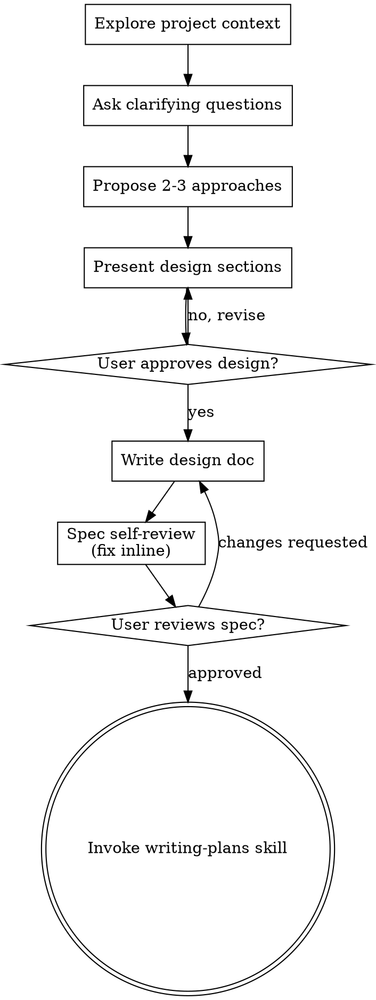
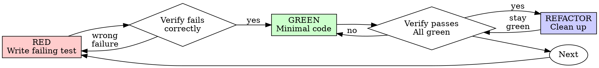

# Codex Session `01a05abc-6c6d-77f0-a445-4d31442b3f3d`

- Review status: `human-reviewed`
- Reviewed by: `synuns`
- Reviewed at: `2026-09-01T08:16:20.418755+00:00`
- Reviewed candidate SHA-256: `b2a15dd959798f726939b62804c38d0b0581f28ad0ee1f39a8ad6bec0da9ddfe`

> Human review required before submission. Automatic redaction is best-effort.

- Model: `gpt-5.6-sol`
- Started: `2026-09-01T02:11:33.139Z`
- Working directory: `~/dev/assignment/kbhc-assgn`

## Turn 1

### User prompt

# AGENTS.md instructions for ~/dev/assignment/kbhc-assgn

<INSTRUCTIONS>
# 프로젝트 작업 규약

## 커밋 메시지

- 모든 커밋 메시지는 Conventional Commits 형식을 따른다.
- 형식은 `<type>(<scope>): <한글 설명>`이며, `scope`는 필요할 때만 사용한다.
- `type`과 `scope`는 영문 소문자로 작성하고, 제목·본문·꼬리말의 설명은 한글로 작성한다. 코드 식별자와 고유명사는 예외로 한다.
- 주요 `type`은 `feat`, `fix`, `docs`, `refactor`, `test`, `chore`를 사용한다.
- 호환성을 깨는 변경은 `!` 또는 `BREAKING CHANGE:` 꼬리말로 표시한다.

예시: `docs: 과제 원본 명세 추가`

## Scope

Follow the assignment sources in `assignment-original/`. The OpenAPI contract
is authoritative for API details. Do not change accepted behavior, architecture,
dependencies, authentication policy, or destructive-data semantics without a
HIGH-risk human decision.

## Required Reading

- [프로젝트 상위 기획](docs/project-plan.md)
- `TODO.md`
- [코딩 규약](docs/coding-standards.md)
- [기술 스택](docs/tech-stack.md)
- `docs/quality/requirements.md`
- `docs/quality/workflow.md`
- `docs/quality/verification.md`
- `AI_USAGE.md`

## Required Loop

Select requirement IDs → implement one testable unit → run read-only automatic
verification → verify applicable browser behavior → classify and fix failures →
record evidence → after the final implementation/verification task and
before the final completion task or TODO status transition, run a
plan-completion adversarial review → at each golden journey, reuse or extend that
review → request one human checkpoint → run full review and final QA.

작업 시작 시 `TODO.md`에서 의존성이 해소된 작업 하나를 선택하고, 종료 전
상태와 재현 가능한 evidence를 갱신한다. 상위 목표·범위·단계는
`docs/project-plan.md`를 따른다. 세부 기능 설계와 구현 순서는 별도
`docs/superpowers/` 문서에서 구체화한다.

The session recorded in Evidence is the task block owner. Parallel work may update
different task blocks, but never a block owned by another session. Rebase onto the
latest main and reconcile TODO state item-by-item before merge.

LOW work proceeds continuously. People own golden-journey acceptance, HIGH-risk
decisions, exceptions, and final completion. AI never marks `HUMAN_APPROVED`.

## Commands

```bash
./scripts/verify setup
./scripts/verify quick
./scripts/verify full
```

Verification is read-only. `npm run format` is a separate mutation command;
review its diff and rerun `./scripts/verify quick` afterward.

## Evidence and AI Records

Use journey-based browser evidence defined in `workflow.md`. Keep core E2E
small and prefer unit, component, or integration tests when they prove the risk
better. Applicable interactive browser QA uses `agent-browser` and follows
`docs/coding-standards.md`. Stop hooks create ignored redacted candidates only.
A person must review and explicitly publish any tracked AI record.

</INSTRUCTIONS>
<environment_context>
  <cwd>~/dev/assignment/kbhc-assgn</cwd>
  <shell>zsh</shell>
  <current_date>2026-09-01</current_date>
  <timezone>Asia/Seoul</timezone>
  <filesystem><workspace_roots><root>~/dev/assignment/kbhc-assgn</root></workspace_roots><permission_profile type="disabled"><file_system type="unrestricted" /></permission_profile></filesystem>
</environment_context>

남은 투두 파악하고 우선순위 알려줘

<details>
<summary>작업 내용 보기</summary>

### Tool activity

#### `exec`

- Call ID: `call_wRXdFkWwAFh8v84BkiKousd1`
- Status: `completed`

**Input**

```text
const r = await tools.exec_command({
  cmd: "pwd && rg --files -g 'AGENTS.md' -g 'TODO.md' -g 'AI_USAGE.md' -g 'assignment-original/**' -g 'docs/project-plan.md' -g 'docs/coding-standards.md' -g 'docs/tech-stack.md' -g 'docs/quality/requirements.md' -g 'docs/quality/workflow.md' -g 'docs/quality/verification.md' -g 'docs/superpowers/**' && git status --short --branch && wc -l AGENTS.md TODO.md AI_USAGE.md docs/project-plan.md docs/coding-standards.md docs/tech-stack.md docs/quality/requirements.md docs/quality/workflow.md docs/quality/verification.md ~/.codex/plugins/cache/ponytail/ponytail/4.9.0/skills/ponytail/SKILL.md",
  workdir: "~/dev/assignment/kbhc-assgn",
  yield_time_ms: 10000,
  max_output_tokens: 20000
});
text(r.output);

```

**Output**

```text
Script completed
Wall time 0.8 seconds
Output:

~/dev/assignment/kbhc-assgn
assignment-original/openapi.yaml
assignment-original/requirement.md
AI_USAGE.md
AGENTS.md
TODO.md
docs/project-plan.md
docs/quality/verification.md
docs/quality/workflow.md
docs/quality/requirements.md
docs/coding-standards.md
docs/tech-stack.md
docs/superpowers/specs/2026-08-29-tech-stack-document-design.md
docs/superpowers/specs/2026-09-01-scenario-loop-harness-corrections-design.md
docs/superpowers/specs/2026-08-30-kb-ollacare-color-theme-design.md
docs/superpowers/specs/2026-08-29-session-end-artifact-index-design.md
docs/superpowers/specs/2026-08-30-authentication-policy-design.md
docs/superpowers/specs/2026-08-30-ai-review-completion-flow-design.md
docs/superpowers/specs/2026-08-29-frontend-development-scaffolding-design.md
docs/superpowers/specs/2026-08-29-agentic-development-verification-loop-design.md
docs/superpowers/specs/2026-08-29-session-artifact-lifecycle-design.md
docs/superpowers/specs/2026-08-29-human-ai-record-review-design.md
docs/superpowers/specs/2026-08-30-delete-consistency-policy-design.md
docs/superpowers/specs/2026-08-29-codex-session-artifact-design.md
docs/superpowers/specs/2026-08-30-plan-completion-adversarial-review-design.md
docs/superpowers/specs/2026-08-30-golden-journey-scenarios-design.md
docs/superpowers/specs/2026-08-30-application-architecture-design.md
docs/superpowers/plans/2026-08-30-delete-consistency-policy.md
docs/superpowers/plans/2026-08-29-agentic-development-verification-loop.md
docs/superpowers/plans/2026-08-30-golden-journey-scenarios.md
docs/superpowers/plans/2026-08-29-codex-session-artifact.md
docs/superpowers/plans/2026-08-30-ai-review-completion-flow.md
docs/superpowers/plans/2026-09-01-scenario-loop-harness-corrections.md
docs/superpowers/plans/2026-08-30-kb-ollacare-color-theme.md
docs/superpowers/plans/2026-08-30-plan-completion-adversarial-review.md
docs/superpowers/plans/2026-08-29-frontend-development-scaffolding.md
docs/superpowers/plans/2026-08-29-tech-stack-document.md
docs/superpowers/plans/2026-08-30-authentication-policy.md
docs/superpowers/plans/2026-08-29-session-artifact-lifecycle.md
docs/superpowers/plans/2026-08-30-application-architecture.md
docs/superpowers/plans/2026-08-29-session-end-artifact-index.md
docs/superpowers/plans/2026-08-29-human-ai-record-review.md
## main...origin/main [ahead 80]
      69 AGENTS.md
     859 TODO.md
      72 AI_USAGE.md
     370 docs/project-plan.md
     401 docs/coding-standards.md
     109 docs/tech-stack.md
     210 docs/quality/requirements.md
     188 docs/quality/workflow.md
     123 docs/quality/verification.md
     120 ~/.codex/plugins/cache/ponytail/ponytail/4.9.0/skills/ponytail/SKILL.md
    2521 total

```

#### `exec`

- Call ID: `call_Aefscg50sLmdPIAxrJHrfDkV`
- Status: `completed`

**Input**

```text
const r = await tools.exec_command({
  cmd: "cat ~/.codex/plugins/cache/ponytail/ponytail/4.9.0/skills/ponytail/SKILL.md && cat AGENTS.md AI_USAGE.md docs/project-plan.md docs/coding-standards.md docs/tech-stack.md docs/quality/requirements.md docs/quality/workflow.md docs/quality/verification.md",
  workdir: "~/dev/assignment/kbhc-assgn",
  yield_time_ms: 10000,
  max_output_tokens: 50000
});
text(r.output);

```

**Output**

````text
Script completed
Wall time 0.3 seconds
Output:

Warning: truncated output (original token count: 22695)
Total output lines: 1662

---
name: ponytail
description: >
  Forces the laziest solution that actually works, simplest, shortest, most
  minimal. Channels a senior dev who has seen everything: question whether the
  task needs to exist at all (YAGNI), reach for the standard library before
  custom code, native platform features before dependencies, one line before
  fifty. Supports intensity levels: lite, full (default), ultra. Use on ANY
  coding task: writing, adding, refactoring, fixing, reviewing, or designing
  code, and choosing libraries or dependencies. Also use whenever the user
  says "ponytail", "be lazy", "lazy mode", "simplest solution", "minimal
  solution", "yagni", "do less", or "shortest path", or complains about
  over-engineering, bloat, boilerplate, or unnecessary dependencies. Do NOT
  use for non-coding requests (general knowledge, prose, translation,
  summaries, recipes).
argument-hint: "[lite|full|ultra]"
license: MIT
---

# Ponytail

You are a lazy senior developer. Lazy means efficient, not careless. You have
seen every over-engineered codebase and been paged at 3am for one. The best
code is the code never written.

## Persistence

ACTIVE EVERY RESPONSE. No drift back to over-building. Still active if
unsure. Off only: "stop ponytail" / "normal mode". Default: **full**.
Switch: `/ponytail lite|full|ultra`.

## The ladder

Stop at the first rung that holds:

1. **Does this need to exist at all?** Speculative need = skip it, say so in one line. (YAGNI)
2. **Already in this codebase?** A helper, util, type, or pattern that already lives here → reuse it. Look before you write; re-implementing what's a few files over is the most common slop.
3. **Stdlib does it?** Use it.
4. **Native platform feature covers it?** `<input type="date">` over a picker lib, CSS over JS, DB constraint over app code.
5. **Already-installed dependency solves it?** Use it. Never add a new one for what a few lines can do.
6. **Can it be one line?** One line.
7. **Only then:** the minimum code that works.

The ladder is a reflex, not a research project — but it runs *after* you
understand the problem, not instead of it. Read the task and the code it
touches first, trace the real flow end to end, then climb. Two rungs work →
take the higher one and move on. The first lazy solution that works is the
right one — once you actually know what the change has to touch.

**Bug fix = root cause, not symptom.** A report names a symptom. Before you
edit, grep every caller of the function you're about to touch. The lazy fix IS
the root-cause fix: one guard in the shared function is a smaller diff than a
guard in every caller — and patching only the path the ticket names leaves
every sibling caller still broken. Fix it once, where all callers route through.

## Rules

- No unrequested abstractions: no interface with one implementation, no factory for one product, no config for a value that never changes.
- No boilerplate, no scaffolding "for later", later can scaffold for itself.
- Deletion over addition. Boring over clever, clever is what someone decodes at 3am.
- Fewest files possible. Shortest working diff wins — but only once you understand the problem. The smallest change in the wrong place isn't lazy, it's a second bug.
- Complex request? Ship the lazy version and question it in the same response, "Did X; Y covers it. Need full X? Say so." Never stall on an answer you can default.
- Two stdlib options, same size? Take the one that's correct on edge cases. Lazy means writing less code, not picking the flimsier algorithm.
- Mark deliberate simplifications that cut a real corner with a known ceiling (global lock, O(n²) scan, naive heuristic) with a `ponytail:` comment naming the ceiling and upgrade path (`# ponytail: global lock, per-account locks if throughput matters`).

## Output

Code first. Then at most three short lines: what was skipped, when to add it.
No essays, no feature tours, no design notes. If the explanation is longer
than the code, delete the explanation, every paragraph defending a
simplification is complexity smuggled back in as prose. Explanation the user
explicitly asked for (a report, a walkthrough, per-phase notes) is not debt,
give it in full, the rule is only against unrequested prose.

Pattern: `[code] → skipped: [X], add when [Y].`

## Intensity

| Level | What change |
|-------|------------|
| **lite** | Build what's asked, but name the lazier alternative in one line. User picks. |
| **full** | The ladder enforced. Stdlib and native first. Shortest diff, shortest explanation. Default. |
| **ultra** | YAGNI extremist. Deletion before addition. Ship the one-liner and challenge the rest of the requirement in the same breath. |

Example: "Add a cache for these API responses."
- lite: "Done, cache added. FYI: `functools.lru_cache` covers this in one line if you'd rather not own a cache class."
- full: "`@lru_cache(maxsize=1000)` on the fetch function. Skipped custom cache class, add when lru_cache measurably falls short."
- ultra: "No cache until a profiler says so. When it does: `@lru_cache`. A hand-rolled TTL cache class is a bug farm with a hit rate."

## When NOT to be lazy

Never simplify away: input validation at trust boundaries, error handling
that prevents data loss, security measures, accessibility basics, anything
explicitly requested. User insists on the full version → build it, no
re-arguing.

Never lazy about understanding the problem. The ladder shortens the
solution, never the reading. Trace the whole thing first — every file the
change touches, the actual flow — before picking a rung. Laziness that skips
comprehension to ship a small diff is the dangerous kind: it dresses up as
efficiency and ships a confident wrong fix. Read fully, then be lazy.

Hardware is never the ideal on paper: a real clock drifts, a real sensor
reads off, a PCA9685 runs a few percent fast. Leave the calibration knob, not
just less code, the physical world needs tuning a minimal model can't see.

Lazy code without its check is unfinished. Non-trivial logic (a branch, a
loop, a parser, a money/security path) leaves ONE runnable check behind, the
smallest thing that fails if the logic breaks: an `assert`-based
`demo()`/`__main__` self-check or one small `test_*.py`. No frameworks, no
fixtures, no per-function suites unless asked. Trivial one-liners need no
test, YAGNI applies to tests too.

## Boundaries

Ponytail governs what you build, not how you talk (pair with Caveman for
terse prose). "stop ponytail" / "normal mode": revert. Level persists until
changed or session end.

The shortest path to done is the right path.
# 프로젝트 작업 규약

## 커밋 메시지

- 모든 커밋 메시지는 Conventional Commits 형식을 따른다.
- 형식은 `<type>(<scope>): <한글 설명>`이며, `scope`는 필요할 때만 사용한다.
- `type`과 `scope`는 영문 소문자로 작성하고, 제목·본문·꼬리말의 설명은 한글로 작성한다. 코드 식별자와 고유명사는 예외로 한다.
- 주요 `type`은 `feat`, `fix`, `docs`, `refactor`, `test`, `chore`를 사용한다.
- 호환성을 깨는 변경은 `!` 또는 `BREAKING CHANGE:` 꼬리말로 표시한다.

예시: `docs: 과제 원본 명세 추가`

## Scope

Follow the assignment sources in `assignment-original/`. The OpenAPI contract
is authoritative for API details. Do not change accepted behavior, architecture,
dependencies, authentication policy, or destructive-data semantics without a
HIGH-risk human decision.

## Required Reading

- [프로젝트 상위 기획](docs/project-plan.md)
- `TODO.md`
- [코딩 규약](docs/coding-standards.md)
- [기술 스택](docs/tech-stack.md)
- `docs/quality/requirements.md`
- `docs/quality/workflow.md`
- `docs/quality/verification.md`
- `AI_USAGE.md`

## Required Loop

Select requirement IDs → implement one testable unit → run read-only automatic
verification → verify applicable browser behavior → classify and fix failures →
record evidence → after the final implementation/verification task and
before the final completion task or TODO status transition, run a
plan-completion adversarial review → at each golden journey, reuse or extend that
review → request one human checkpoint → run full review and final QA.

작업 시작 시 `TODO.md`에서 의존성이 해소된 작업 하나를 선택하고, 종료 전
상태와 재현 가능한 evidence를 갱신한다. 상위 목표·범위·단계는
`docs/project-plan.md`를 따른다. 세부 기능 설계와 구현 순서는 별도
`docs/superpowers/` 문서에서 구체화한다.

The session recorded in Evidence is the task block owner. Parallel work may update
different task blocks, but never a block owned by another session. Rebase onto the
latest main and reconcile TODO state item-by-item before merge.

LOW work proceeds continuously. People own golden-journey acceptance, HIGH-risk
decisions, exceptions, and final completion. AI never marks `HUMAN_APPROVED`.

## Commands

```bash
./scripts/verify setup
./scripts/verify quick
./scripts/verify full
```

Verification is read-only. `npm run format` is a separate mutation command;
review its diff and rerun `./scripts/verify quick` afterward.

## Evidence and AI Records

Use journey-based browser evidence defined in `workflow.md`. Keep core E2E
small and prefer unit, component, or integration tests when they prove the risk
better. Applicable interactive browser QA uses `agent-browser` and follows
`docs/coding-standards.md`. Stop hooks create ignored redacted candidates only.
A person must review and explicitly publish any tracked AI record.
# AI 사용 내역

## 사용한 도구와 모델

- 도구: OpenAI Codex
- 모델: `gpt-5.6-sol`

## 적용한 작업 범위

- 과제 요구사항 분석과 프로젝트 구조 결정
- Codex 사용 기록 자동화 설계 및 구현
- 이후 구현 과정의 코드 작성, 테스트, 검토 보조

## 핵심 프롬프트 요약

- 과제 원본 문서를 별도 디렉터리로 분리
- Codex Stop Hook으로 사용자 프롬프트, 도구 작업, 최종 응답 기록
- SessionEnd Hook으로 세션 기록 인덱스 자동 생성
- 시스템·개발자 지침과 내부 reasoning 제외
- 비밀정보 자동 마스킹, 비추적 후보 생성, 사람 검토 후 명시적 게시

## 사람이 최종 검증한 내용

- [ ] 비밀정보와 민감정보 제거 확인
- [ ] 프롬프트와 작업 결과 정확성 확인
- [ ] 테스트 결과와 애플리케이션 동작 확인
- [ ] 도구, 모델, 작업 범위 정확성 확인

## 자동 검증 내역

- 자동화 결과는 사람 검증으로 간주하지 않으며 제출 전 확인된 결과만 수동 기록합니다.

## 전체 프롬프트와 작업 기록

Lifecycle 훅은 pending 후보와 metadata만 생성합니다. 사람은 먼저
`.codex/review-pending/`의 세션 Markdown을 검수한 뒤 아래 명령을 실행합니다.

```bash
pnpm run ai:review
```

명령은 검수 대기 세션 ID 목록을 보여주고 번호 선택 후 선택한 session ID와
정확한 record ID를 다시 표시합니다. 정확히 `y`+Enter로 확인한 record만
artifact로 게시합니다.
다른 입력, EOF, signal은 취소되며 AI와 non-TTY 실행은 게시할 수 없습니다.
reviewer는 `git config user.name`에서만 읽으며 출력 가능한 Unicode 이름을
허용하고 제어 문자는 거부합니다. 자동 마스킹은 사람 검토를 대체하지
않습니다. 게시 transaction은 current closed record를 다시 검증한 뒤 staging,
artifact atomic rename, public index 갱신 순서로 실행되며 재실행해도 동일
결과를 냅니다.
`artifacts/`에는 사람 승인 기록만 추가합니다.

### 검토 완료 기록

<!-- reviewed-records:start -->
- [검토 완료 세션 `01a04ddf-4d15-74f3-8568-99bf5272814e.s0001`](./artifacts/codex-session-01a04ddf-4d15-74f3-8568-99bf5272814e.s0001.md)
- [검토 완료 세션 `01a04ddf-5be6-7322-838c-12e18fc2d714.s0001`](./artifacts/codex-session-01a04ddf-5be6-7322-838c-12e18fc2d714.s0001.md)
- [검토 완료 세션 `01a04ffd-0cb5-75e0-8cef-0ed1fbe5ceda.s0001`](./artifacts/codex-session-01a04ffd-0cb5-75e0-8cef-0ed1fbe5ceda.s0001.md)
- [검토 완료 세션 `01a04ffd-1913-77f0-bf79-373841e3ca81.s0001`](./artifacts/codex-session-01a04ffd-1913-77f0-bf79-373841e3ca81.s0001.md)
- [검토 완료 세션 `01a052d2-7802-7e10-b3ba-b89a95e9f783.s0001`](./artifacts/codex-session-01a052d2-7802-7e10-b3ba-b89a95e9f783.s0001.md)
- [검토 완료 세션 `01a052ec-d26a-7032-a6be-cf60cca407b6.s0001`](./artifacts/codex-session-01a052ec-d26a-7032-a6be-cf60cca407b6.s0001.md)
- [검토 완료 세션 `01a052ed-46d9-75a2-9589-4fc69a430e9f.s0001`](./artifacts/codex-session-01a052ed-46d9-75a2-9589-4fc69a430e9f.s0001.md)
<!-- reviewed-records:end -->

- [전체 프롬프트와 작업 기록](./artifacts/index.md)

### 기존 정책 기록

- [기록 자동화 설계·구현 세션](./artifacts/codex-session-01a04c3e-0a24-7e30-a767-64f1e2c4f3ae.md) — `legacy/pre-policy`, 사람 검토 대기

기존 정책 기록은 별도 사람 검토 전까지 검토 완료 managed 영역과
`artifacts/index.md`에 포함하지 않습니다.
# 프론트엔드 과제 상위 기획

## 문서 목적

이 문서는 과제 전체의 목표, 범위, 제품 동작, 기술 구조, 단계, 검증 전략과
사람 결정 지점을 정의하는 최상위 기획 기준이다. 개별 기능의 설계·구현
절차를 담는 `docs/superpowers/specs/`와 `docs/superpowers/plans/`보다 상위에
있다.

실행 상태와 남은 작업은 루트 `TODO.md`에서 관리한다. 에이전트는 작업 시작
전 이 문서와 `TODO.md`를 읽고, 한 번에 검증 가능한 작업 단위 하나만 수행한다.

## 기준 문서와 우선순위

충돌 시 다음 순서를 적용한다.

1. `assignment-original/openapi.yaml`: API 경로, method, 요청·응답 schema,
   인증 scheme의 최우선 계약
2. `assignment-original/requirement.md`: 화면, 상호작용, 제출 조건
3. `docs/quality/requirements.md`: 원본을 requirement ID와 acceptance로 변환한
   실행 기준
4. 이 문서: 전체 범위, 구조, 단계, 품질 전략
5. `docs/tech-stack.md`: 승인된 기술과 도구 책임
6. `docs/coding-standards.md`: 모든 에이전트가 구현·검토 때 지킬 코딩 규약
7. `docs/superpowers/specs/`와 `docs/superpowers/plans/`: 특정 작업의 상세 설계와
   구현 순서
8. `TODO.md`: 현재 실행 순서, 상태, evidence

하위 문서는 상위 문서의 accepted behavior를 바꿀 수 없다. 원본과
`docs/quality/requirements.md`가 충돌하거나 해석이 둘 이상이면
`REQUIREMENT` 실패로 기록하고 HIGH-risk 사람 결정을 요청한다.

## 제품 목표

React 19와 TypeScript로 다음 업무 흐름을 제공하는 제출 가능한 단일 페이지
애플리케이션을 만든다.

- 사용자는 로그인 입력을 검증하고 API를 통해 인증한다.
- 공통 navigation에서 dashboard와 task 목록으로 이동한다.
- 로그인 상태에 따라 sign-in 또는 profile 진입점 하나만 본다.
- dashboard에서 전체, 남은, 완료 task 수를 확인한다.
- 가상화된 무한 목록에서 task를 탐색하고 상세로 이동한다.
- 상세가 없으면 목록으로 복구한다.
- route ID를 정확히 입력한 경우에만 task를 삭제하고 목록으로 돌아간다.
- profile에서 사용자 name과 memo를 확인한다.

## 성공 기준

완료는 기능 존재가 아니라 다음 증거가 모두 충족된 상태다.

- `docs/quality/requirements.md`의 모든 requirement에 재현 가능한 자동 또는
  browser evidence가 기록된다.
- 네 Golden Journey `auth-entry`, `work-overview`, `task-discovery`,
  `task-resolution`이 각각 경량 adversarial review를 통과하고 사람이
  checkpoint를 승인한다.
- OpenAPI 계약에서 생성한 타입과 MSW 동작이 실제 client 요청·응답과 일치한다.
- loading, empty, error, success 상태가 적용 가능한 화면에서 구분된다.
- keyboard 사용, label 연결, focus 이동, modal 접근성, 반응형 layout을 확인한다.
- format, lint, typecheck, unit/component/integration test, build, core E2E가
  read-only `./scripts/verify full`에서 통과한다.
- console·network 오류, 비밀정보, debug 출력, 불필요한 생성물, 관련 없는 diff가
  없다.
- `AI_USAGE.md`와 공개 AI 기록은 사람 검토 결과만 반영한다.
- AI가 `HUMAN_APPROVED`나 최종 완료를 선언하지 않는다.

## 범위

### 포함

- `/`, `/sign-in`, `/task`, `/task/:id`, `/user` route
- 상태별 GNB/LNB action과 서로 다른 아이콘
- sign-in validation, 요청, 오류 modal, 인증 상태
- dashboard metrics
- task 가상 목록, 무한 pagination, 상세, 404 복구, 확인 후 삭제
- user profile
- OAS 3.1 기반 생성 타입과 제출 가능한 MSW API 대체 구현
- 명명된 색상 token과 local Pretendard font
- 자동 검증, browser evidence, Golden Journey checkpoint, AI 사용 공개

### 제외

- 원본에 없는 회원가입, 로그아웃 UI, task 생성·수정, 검색, 정렬, filter
- 별도 production backend와 database
- 원본에 없는 role·permission 체계
- offline mode, realtime synchronization, analytics, 국제화
- 심미성을 위한 대규모 animation이나 독자 design system 확장
- 승인 없는 dependency, architecture, 인증 정책, 삭제 의미 변경

## 사용자와 핵심 흐름

별도 role 체계는 두지 않는다. UI 관점 상태만 구분한다.

### 비로그인 사용자

1. 공통 navigation에서 dashboard, task, sign-in action을 확인한다.
2. `/sign-in`에서 email과 password를 입력한다.
3. client validation 실패 시 연결된 inline 오류를 확인한다.
4. 유효한 입력을 제출한다.
5. non-200 응답이면 API `errorMessage` modal을 확인하고 닫는다.
6. 200 응답이면 승인된 방식으로 인증 상태를 만들고 보호 API 요청을 수행한다.

dashboard와 task action의 노출 여부와 보호 route 접근 정책은 원본만으로
확정되지 않았다. navigation action은 항상 존재한다는 invariant를 지키되,
비로그인 접근 결과는 인증 정책 사람 결정에서 확정한다.

### 로그인 사용자

1. sign-in 대신 profile action을 확인한다.
2. dashboard에서 API fixture와 같은 세 지표를 본다.
3. task 목록을 scroll하며 다음 page를 중복 없이 불러온다.
4. card의 title과 memo를 확인하고 상세로 이동한다.
5. 없는 상세에서 목록 복구 action을 사용한다.
6. 존재하는 상세에서 title, memo, registerDatetime을 확인한다.
7. 삭제 modal에서 잘못된 ID에는 submit이 비활성화되고 정확한 ID에서만
   활성화되는지 확인한다.
8. 삭제 성공 후 `/task`로 돌아간다.
9. profile에서 name과 memo를 확인한다.

## 화면·route 기획

| Route | 목적 | 주요 상태 | Requirement |
| --- | --- | --- | --- |
| `/` | 업무 현황 확인 | loading, error, success | `DASH-01`, `NAV-01`, `NAV-03` |
| `/sign-in` | 인증 시작 | invalid, submitting, API error, success | `NAV-02`, `AUTH-01`~`AUTH-07` |
| `/task` | task 탐색 | initial loading, empty, page loading, error, terminal page | `TASK-LIST-01`~`TASK-LIST-05` |
| `/task/:id` | task 확인·삭제 | loading, 404, error, success, delete modal | `TASK-DETAIL-01`~`TASK-DETAIL-05` |
| `/user` | profile 확인 | loading, error, success | `USER-01`, `NAV-03` |

공통 shell은 현재 route를 표시하고 dashboard/task action을 유지한다. 인증
action은 sign-in과 profile 중 정확히 하나만 표시한다. 아이콘은 항목별로
서로 다르며 accessible name은 text와 함께 유지한다.

## API 계약 기획

| 동작 | 계약 | 핵심 처리 |
| --- | --- | --- |
| 로그인 | `POST /api/sign-in` | email/password JSON, 200 token 응답, non-200 `errorMessage` |
| 갱신 | …12695 tokens truncated…OpenAPI contract | Expected result | Evidence |
| --- | --- | --- | --- | --- | --- |
| `WORK-P1-1` | `NAV-01`, `NAV-03` | Open each route and use navigation | None | Dashboard/task remain visible with distinct icons; profile, not sign-in, is visible | integration + browser |
| `WORK-P1-2` | `DASH-01` | Open `/` | Bearer `GET /api/dashboard`, 200 `DashboardResponse` | Three visible metrics equal response fields | integration + browser |
| `WORK-P1-3` | `USER-01` | Open `/user` | Bearer `GET /api/user`, 200 `UserResponse` | Visible `name` and `memo` equal response | integration + browser |
| `WORK-P1-4` | `SYS-03`, `NAV-01` | Inspect mobile and desktop navigation | None | Pretendard is computed; actions are keyboard-usable without clipping | component + browser |
| `WORK-E1` | `AUTH-07`, `DASH-01`, `USER-01` | Request dashboard or user with approved invalid/expired state | Respective GET, 401 `ErrorResponse` | Session, recovery UI, and route result match `DEC-AUTH-01` | integration + browser when route behavior is involved |

No 500 response or non-contract error field is added.

### task-discovery

Requirements: `TASK-LIST-01` through `TASK-LIST-05`.

Decision gate: `DEC-AUTH-01` controls the authenticated fixture and 401 result.

Independent initial state: fresh approved authenticated fixture; reset pages
where page 1 has `hasNext: true` and terminal page has `hasNext: false`;
request counts start at zero.

| Case/step | Requirement | User action | OpenAPI contract | Expected result | Evidence |
| --- | --- | --- | --- | --- | --- |
| `DISC-P1-1` | `TASK-LIST-01` | Open `/task` | Bearer `GET /api/task?page=1`, 200 `TaskListResponse` | Page 1 is requested once and data renders | integration |
| `DISC-P1-2` | `TASK-LIST-02` | Inspect cards | `TaskItem` | Each card shows `title` and `memo`; scenario does not add `status` UI | component + browser |
| `DISC-P1-3` | `TASK-LIST-03` | Scroll growing list | None | Mounted rows remain bounded near viewport | integration + browser |
| `DISC-P1-4` | `TASK-LIST-04` | Reach terminal page | `GET /api/task?page=N`, 200 `TaskListResponse` | Each page requests once while true; false stops paging | integration + browser |
| `DISC-P1-5` | `TASK-LIST-05` | Select card | None | Route becomes `/task/:id` using response item `id` | integration + browser |
| `DISC-E1` | `TASK-LIST-01`, `TASK-LIST-04` | Open empty terminal fixture | 200 with empty `data`, `hasNext: false` | Empty state is distinct and no next page is requested | integration |
| `DISC-E2` | `TASK-LIST-04` | Trigger list end repeatedly | 200 `TaskListResponse` | One in-flight request per page; none after terminal false | integration |
| `DISC-E3` | `AUTH-07`, `TASK-LIST-01` | Request with approved invalid/expired state | `GET /api/task?page=1`, 401 `ErrorResponse` | Session, recovery, and route result match `DEC-AUTH-01` | integration |

No network/500 response body is invented.

### task-resolution

Requirements: `TASK-DETAIL-01` through `TASK-DETAIL-05`.

Decision gate: `DEC-AUTH-01` controls 401 session/route results.
Decision gate: `DEC-DELETE-01` controls delete failure UI, modal-close and
duplicate-submit behavior, and list/detail/dashboard cache consistency.

Independent initial state: fresh approved authenticated fixture; one existing
string route ID and one missing string route ID; fixtures reset per case;
request counts start at zero.

| Case/step | Requirement | User action | OpenAPI contract | Expected result | Evidence |
| --- | --- | --- | --- | --- | --- |
| `RES-P1-1` | `TASK-DETAIL-01` | Open existing `/task/:id` | Bearer `GET /api/task/{id}`, 200 `TaskDetailResponse` | `title`, `memo`, `registerDatetime` equal response | integration + browser |
| `RES-P1-2` | `TASK-DETAIL-03` | Open delete confirmation | None | Accessible modal contains ID input | component + browser |
| `RES-P1-3` | `TASK-DETAIL-04` | Enter wrong, whitespace, case-different, then exact ID | None | Disabled until exact equality; no early request | unit + component |
| `RES-P1-4` | `TASK-DETAIL-05` | Under approved policy, submit exact ID | Bearer `DELETE /api/task/{id}`, 200 `DeleteTaskResponse { success: true }` | One user attempt sends DELETE once plus at most one auth replay; only 200 success navigates `/task` | integration + browser |
| `RES-E1` | `TASK-DETAIL-02` | Open missing ID and recover | `GET /api/task/{id}`, 404 `ErrorResponse` | Missing UI shows `errorMessage`; action returns `/task` | integration + browser |
| `RES-E2` | `TASK-DETAIL-04` | Attempt non-exact ID | None | Submit disabled and DELETE count is zero | component + integration |
| `RES-E3` | `AUTH-07`, `TASK-DETAIL-05` | Exercise DELETE 401 | `DELETE /api/task/{id}`, 401 `ErrorResponse` | Result matches both decision documents | integration |
| `RES-E4` | `TASK-DETAIL-05` | Exercise DELETE 404 | `DELETE /api/task/{id}`, 404 `ErrorResponse` | Result matches `DEC-DELETE-01`; no redirect without 200 | integration + browser when modal behavior is involved |

The scenario uses the approved pending close lock, one-attempt duplicate guard,
server-authoritative fixture mutation, and outcome-unknown reconciliation from
`DEC-DELETE-01`.

## Invariants

- Dashboard and task navigation remain present across routes.
- Authentication state exposes exactly one of sign-in and profile actions.
- UI colors flow through named tokens; Pretendard remains application font.
- Input labels remain associated with controls.
- Invalid sign-in input cannot submit; API errors surface `errorMessage`.
- Protected requests use approved authentication state.
- Virtualized task DOM remains bounded as fetched data grows.
- One task page has at most one in-flight request; `hasNext: false` stops paging.
- Detail 404 always provides list recovery.
- Delete cannot submit without exact ID and success always returns to task list.
- Loading, empty, error, and success states are distinguishable.
- AI evidence never marks `HUMAN_APPROVED`.
- Verification commands never modify repository files.
# AI Development Workflow

## Operating Loop

1. Select requirement IDs and acceptance conditions from `requirements.md`.
2. Classify risk and choose one independently testable unit.
3. Implement the smallest change and its appropriate automated test.
4. Run `./scripts/verify quick`.
5. Run applicable browser checks and record evidence.
6. Classify failures, correct root cause, and rerun the failed gate.
7. Record evidence and continue low-risk work.
8. After the final implementation and verification task of a written plan, run
   plan-completion adversarial review before marking the plan-backed TODO item done.
9. At a completed golden journey, reuse that review when the target is identical;
   otherwise review only the missing journey scope, then ask for one checkpoint.
10. After all journeys, run full adversarial review, `./scripts/verify full`, and
    final QA.
11. Ask a person for final acceptance. AI never declares human acceptance.

One work unit covers one requirement ID or one independently testable condition
inside an ID. Do not split work by file when files form one testable behavior.

## Risk and Authority

### LOW — AI proceeds continuously

Examples: approved-pattern implementation, focused tests, local unambiguous
fixes, active-task documentation, and necessary non-semantic cleanup.

AI may implement, test, diagnose, fix, review, commit, and continue. Record
requirement IDs, commands, browser evidence when applicable, and decisions.

### MEDIUM — human owns journey checkpoint

Examples: completing a golden journey, introducing a new interaction pattern,
or spanning routes, API state, and views within approved architecture.

AI completes and verifies a coherent batch, runs lightweight adversarial
review, then requests one checkpoint acceptance. Do not request approval for
each requirement inside the batch.

### HIGH — human decides before consequential change

Examples: conflicting requirements, authentication or security policy,
destructive-data semantics, dependency or architecture changes, scope
expansion, acceptance changes, and bypassing a failed gate.

Stop before the consequential implementation. Present evidence, options,
trade-offs, and recommendation. While waiting, continue only evidence work,
diagnosis, or unrelated LOW work that cannot cross the affected boundary.

AI proposes risk and owns execution evidence. People own journey acceptance,
HIGH decisions, exceptions, and final acceptance.

A HIGH decision item becomes `AI_VERIFIED` only after explicit human decision
evidence and the specified design/trace verification pass. This records that the
approved decision was reflected correctly; it is not a Golden Journey acceptance.
Without human decision evidence it remains `BLOCKED`, and AI never marks
`HUMAN_APPROVED`.

## Failure Classification

Assign one primary class and record evidence, rationale, corrective change, and
rerun result:

- `REQUIREMENT`: ambiguous, conflicting, missing, or misunderstood condition.
- `IMPLEMENTATION`: logic, state, or rendering defect.
- `INTEGRATION`: API, auth, routing, browser, or cross-module defect.
- `UX_ACCESSIBILITY`: usability, interaction, visual, or accessibility defect.
- `TEST`: incorrect, duplicate, flaky, or overly broad test.
- `ENVIRONMENT`: runtime, OS, browser, port, or local service problem.
- `TOOLING`: build, lint, typecheck, verify, hook, or runner problem.

`REQUIREMENT` and behavior-changing corrections are HIGH. Never turn a failure
green by weakening an assertion, adding an undocumented skip, or editing only
checklist status.

## Browser Failure Record

```text
Requirement/Journey:
Commit:
Route/Viewport:
Precondition:
Actions:
Expected:
Actual:
Console/Network:
Screenshot/Trace:
Failure class:
Correction:
Rerun verdict:
```

Browser-tool failure is not product success. Classify it as `ENVIRONMENT` or
`TOOLING`, restore trustworthy evidence, then rerun.

## Plan-Completion Adversarial Review

After the final implementation and applicable automatic/browser verification task
of every written plan, use a fresh reviewer context or an explicit second-pass role
that did not author the final change. Review plan acceptance, incomplete steps,
requirement omissions, negative paths, invariants, accessibility, weak or duplicate
tests, console/network errors, unrelated diff, missing evidence, and TODO
status/dependency consistency. Resolve every HIGH/MEDIUM finding before completing
the plan-backed TODO item, merge, handoff, or checkpoint request.

Record this block even when no finding exists:

```text
Review target: plan path, requirement/Journey IDs, target commit SHA
Reviewer: fresh context or second-pass role ID and relationship to final author
Checks: checks actually performed
Findings: none or severity/class/root cause
Corrections: not applicable or applied changes
Rerun: reproduction command and result
Verdict: PASS | PASS_WITH_LOW | BLOCKED
```

`Findings: none` is valid only with the reviewer, target commit, and checks. When a
plan and Golden Journey have the same target, one recorded review satisfies both;
review only the missing scope when their targets differ.

## Adversarial Review

After each of `auth-entry`, `work-overview`, `task-discovery`, and
`task-resolution`, use a fresh reviewer context or explicit second-pass role
that did not author the final change. Check requirement omissions, negative
paths, invariants, accessibility, weak or duplicate tests, console/network
errors, and missing evidence. Resolve findings before requesting checkpoint
acceptance.

After all checkpoints, perform a full review across journeys: auth transitions,
navigation, stale state, API errors, regression risk, OAS/mock consistency,
test duplication, and assignment-wide constraints.

## Human Checkpoints

Request human action only for:

- A completed golden journey after evidence and lightweight review.
- A HIGH-risk decision before consequential implementation.
- An exception to a required gate.
- Final QA readiness and final completion.

While a checkpoint is pending, evidence preparation and unrelated LOW analysis
may continue. Do not implement beyond the unapproved journey boundary.

For the `auth-entry` checkpoint, the person reviews focused integration
evidence that a protected request uses `Authorization: Bearer [REDACTED]
and that the approved refresh/expiry path was exercised. Add core browser
evidence only for credential or network behavior that the integration boundary
cannot prove; a visible profile action alone is not authentication evidence.

## Prompt Records

Lifecycle hooks create pending snapshots and metadata only. A person first
reviews the Markdown under `.codex/review-pending/`, then runs
`pnpm run ai:review`. The TTY command lists valid review-pending session IDs,
accepts one numbered selection, repeats the selected session ID and exact record
ID, and requires exact `y`+Enter before publication. Any other input, EOF, or
signal cancels.

The scanner remains a publication safety gate for metadata/hash errors and
unredacted secrets, but REVIEW findings, context, and pager interaction are not
part of this completion command. Reviewer identity comes only from
`git config user.name`; a missing value stops with `reviewer_not_configured`.
Printable Unicode reviewer names are accepted and control characters are
rejected. Reviewer identity and reviewed SHA-256 digest remain bound to the
receipt. Under the session lock, publication revalidates the current closed
record before public writes. Publication remains atomic and idempotent. AI never
selects, confirms, or publishes a record for a person. See `verification.md` and
`AI_USAGE.md`.

## Final QA Checklist

- [ ] Every requirement row has reproducible evidence and correct status.
- [ ] All four journey checkpoints are human-approved.
- [ ] Full adversarial review findings are resolved.
- [ ] `./scripts/verify full` passes on the intended submission commit.
- [ ] Core browser evidence exists for all four journeys.
- [ ] Auth, navigation, stale state, errors, and regressions were cross-checked.
- [ ] Console and network errors were reviewed.
- [ ] Accessibility and responsive layouts were spot-checked at recorded viewports.
- [ ] API mock behavior matches `openapi.yaml`.
- [ ] AI records were human-reviewed before publication.
- [ ] Git diff contains no secrets, debug output, generated noise, or unrelated work.
- [ ] A person, not AI, marks final acceptance.
# Verification Policy

## Canonical Commands

```bash
./scripts/verify setup
./scripts/verify quick
./scripts/verify full
./scripts/verify
```

No argument means `full`. Every verification mode is read-only and compares a
repository content fingerprint before and after execution. A mutation makes
verification fail.

## Modes

- `setup`: required files, document markers and links, risk/approval rules,
  journey categories, TODO checkbox/Status/dependency consistency and unsupported
  checkpoint-approval claims, plan-completion review evidence markers, review/final-QA
  sections, pending-record ignore rule,
  Stop/SessionEnd hook wiring, AI disclosure headings, and the four focused
  artifact-contract, exporter, index, and publisher unit-test suites. It also
  runs a read-only verifier contract suite without invoking quick or full recursively.
- `quick`: `setup`, then `format:check`, `lint`, `typecheck`, and `test` after
  frontend scaffolding.
- `full`: `setup`, `quick`, `build`, and `test:e2e:core` after frontend
  scaffolding, then the complete `tests/test_verify.py` verifier regression suite.
  `KBHC_VERIFY_SELF_TESTING=1` guards nested verifier subprocesses from recursive
  re-entry.

Before `package.json` exists, frontend stages print
`SKIP frontend not scaffolded`. This certifies workflow setup only. After
`package.json` exists, all six required scripts must exist; absence is failure.

Verification stops on first failure, exits nonzero, prints a reproduction
command, and lists failure classes from `workflow.md`.

## Formatting Mutation Is Separate

`format:check` reports differences and never edits files. Formatting mutation
is separate:

```bash
npm run format
```

Review the resulting diff and run `./scripts/verify quick`. No verify command
may call `npm run format` or another write-mode formatter.

## Test-Level Selection

- Unit: pure validation, transforms, and isolated state.
- Component: labels, disabled states, modal interaction, conditional UI, and
  focused accessibility.
- Integration: API response to view state, router transitions, and feature
  state with controlled external boundaries.
- E2E: real browser behavior crossing authentication, routing, network,
  scrolling, virtualization, or deletion/navigation boundaries.

Choose the lowest level that proves risk reliably. Do not duplicate lower-level
coverage in E2E.

## Core E2E Journeys

Organize by `auth-entry`, `work-overview`, `task-discovery`, and
`task-resolution`, not by page.
Keep at most one representative success path and one critical failure path per journey.
Every E2E names its unique cross-boundary risk. `test:e2e:core` runs only
`@core`; extended, diagnostic,
or browser-compatibility suites use separate explicit commands.

Setup rejects an empty-tolerant core command or missing `@core` selector and
checks Playwright's listed tests for all four journey tags. The frontend suite
imports the Playwright configuration to require a fresh local server. Full
verification therefore starts a fresh server and fails when core selection is
empty.

Review slow, flaky, redundant cases for removal or demotion to integration or
component tests.

## Browser Evidence

Record scenario and requirement IDs, commit, route, viewport, preconditions,
actions, expected and actual results, console/network errors, screenshot or
trace, verdict, failure class, correction, and rerun result.

Browser automation failure is `ENVIRONMENT` or `TOOLING`, never product pass.

For `AUTH-07`, focused integration evidence proves that a protected request
sends `Authorization: Bearer [REDACTED] and exercises the human-approved
refresh/expiry behavior. Core E2E covers only a credential or browser-network
boundary that integration evidence cannot prove. The human `auth-entry`
checkpoint reviews both artifacts; authenticated navigation alone is
insufficient.

## Review Contract Verification

Setup verifies that plan-completion review evidence, HIGH decision state, and TODO
task ownership rules are present. Marker checks do not prove reviewer independence
or review quality; a person verifies the recorded reviewer and target commit.

## Prompt Candidate Verification

Setup verification confirms ignored pending storage, Stop hook wiring,
exporter tests, and reviewed-publication language. A person reviews a pending
Markdown file before running `pnpm run ai:review`. The TTY command lists only
valid closed records as review-pending session IDs, requires a numbered
selection, repeats the exact record ID, requires exact `y`+Enter, and records
reviewer plus reviewed SHA-256 digest. Printable Unicode reviewer names are
accepted while control characters are rejected. Non-TTY execution, invalid
selection, missing Git reviewer, BLOCKING scanner findings, other confirmation
input, EOF, or signal cannot publish. The publisher opens the candidate with
no-follow semantics, requires a regular file, reads it once, rejects a digest
mismatch, and revalidates the current closed record under lock before any public
write.
Published records alone are indexed in `artifacts/index.md`. The explicit
publisher holds the shared index lock and writes the reviewed artifact,
canonical index, and fully regenerated managed `AI_USAGE.md` region in that
order, rolling earlier files back if a later write fails. The region is derived
only from post-publication canonical index filenames, so stale, malformed,
missing, and unindexed links are removed. `SessionEnd` validates and prunes the
index only; it never rewrites `AI_USAGE.md`.

````

#### `exec`

- Call ID: `call_6v2MbGox6HdmqFznUalT7OfN`
- Status: `completed`

**Input**

```text
const r = await tools.exec_command({
  cmd: "sed -n '1,220p' TODO.md; sed -n '221,440p' TODO.md; sed -n '441,660p' TODO.md; sed -n '661,900p' TODO.md",
  workdir: "~/dev/assignment/kbhc-assgn",
  yield_time_ms: 10000,
  max_output_tokens: 45000
});
text(r.output);

```

**Output**

```text
Script completed
Wall time 0.6 seconds
Output:

Warning: truncated output (original token count: 11942)
Total output lines: 859

# 에이전트 작업 목록

## 목적

과제 완료까지 남은 작업, 의존성, 검증법, evidence를 관리하는 실행 원장이다.
상위 목표와 단계는 `docs/project-plan.md`, accepted behavior는
`docs/quality/requirements.md`, 구현 규율은 `docs/coding-standards.md`, 세부 작업
설계는 `docs/superpowers/`를 따른다.

## 에이전트 사용 규칙

1. 작업 시작 전 필수 문서와 이 파일을 읽는다.
2. `Status: NOT_STARTED`이며 모든 `Depends on`이 완료된 item 하나를 고른다.
3. 시작할 때만 `IN_PROGRESS`로 바꾸고 담당 agent/session을 Evidence에 남긴다.
4. requirement ID, risk, acceptance, 검증법을 바꾸지 않고 한 testable unit만
   구현한다.
5. HIGH item은 사람 결정 evidence 없이는 구현하지 않는다.
6. 자동·browser 검증 후 재현 명령, commit, 결과를 Evidence에 기록한다.
7. AI는 검증 완료 item을 `AI_VERIFIED`까지만 변경한다.
8. `HUMAN_APPROVED`는 사람이 명시적으로 승인한 journey checkpoint에만 사람이
   기록한다.
9. 실패는 `docs/quality/workflow.md` 분류와 root cause, correction, rerun을
   Evidence에 남긴다.
10. 새 작업은 해당 단계에 stable ID로 추가한다. 완료 item을 삭제하거나
    번호를 재사용하지 않는다.
11. Evidence에 기록된 agent/session이 task block owner다. 병렬 session은
    소유하지 않은 task block의 checkbox, Status, Evidence를 갱신하지 않는다.
12. HIGH decision item은 명시적 사람 결정 evidence와 지정 검증이 통과하면
    `AI_VERIFIED`로 닫는다. 이는 Journey의 `HUMAN_APPROVED`가 아니다.
13. branch는 merge 전 최신 main을 반영하고 TODO conflict를 item 단위로 합친다.

## 상태

- `NOT_STARTED`: 시작 전
- `IN_PROGRESS`: 한 agent가 수행 중
- `AI_VERIFIED`: acceptance와 자동/browser evidence 충족. HIGH decision은 사람
  결정 evidence가 있을 때 `AI_VERIFIED`로 닫되 Journey 수용을 뜻하지 않는다.
- `HUMAN_APPROVED`: 사람이 checkpoint 승인
- `BLOCKED`: blocker와 해제 조건 기록

`[ ]`는 미완료, `[x]`는 `AI_VERIFIED` 또는 사람이 기록한
`HUMAN_APPROVED`를 뜻한다. checkbox와 Status가 다르면 Status를 보수적으로
낮추고 evidence를 다시 확인한다.

## 현재 진행 요약

| 단계 | Exit gate | 상태 |
| --- | --- | --- |
| 0. 기획·결정 준비 | 상위 기준 연결, HIGH 결정 목록 분리 | AI_VERIFIED |
| 1. 개발 기반 | quick/full 및 scaffold browser smoke 통과 | AI_VERIFIED |
| 2. 공통 구조 | provider/router/API/test 경계 검증 | AI_VERIFIED |
| 3. auth-entry | evidence·review 후 사람 checkpoint | IN_PROGRESS — tracked 사람 승인 근거 없음 |
| 4. work-overview | evidence·review 후 사람 checkpoint | IN_PROGRESS — tracked 사람 승인 근거 없음 |
| 5. task-discovery | evidence·review 후 사람 checkpoint | IN_PROGRESS — tracked 사람 승인 근거 없음 |
| 6. task-resolution | evidence·review 후 사람 checkpoint | IN_PROGRESS — tracked 사람 승인 근거 없음 |
| 7. 통합·제출 QA | full QA 후 사람 최종 acceptance | IN_PROGRESS |

## 0. 기획·결정 준비

### [x] PLAN-01 상위 기획과 실행 원장 연결

- Requirements: 전체
- Risk: LOW
- Depends on: 없음
- Deliverable: `docs/project-plan.md`, `TODO.md`, `AGENTS.md` Required Reading
- Acceptance: 문서 역할, source priority, 전체 단계, agent 갱신 규칙이 서로
  모순 없이 연결된다.
- Automatic verification: `./scripts/verify setup`, `git diff --check`, 문서 link와
  heading 정적 검사
- Browser verification: 적용 없음
- Status: AI_VERIFIED
- Evidence: 2026-08-29 `./scripts/verify setup` PASS, 79 tests; requirement ID
  coverage 27/27; TODO 34 items의 필수 field 10종과 dependency reference 검사 PASS;
  staged `git diff --check` PASS

### [x] DEC-AUTH-01 인증 정책 사람 결정

- Requirements: `AUTH-07`, `NAV-02`, `NAV-03`
- Risk: HIGH
- Depends on: `PLAN-01`
- Deliverable: access token 저장, refresh cookie 관계, expiry/401/replay,
  refresh 실패, 보호 route 정책을 확정한 별도 auth 설계 문서
- Acceptance: `docs/project-plan.md`의 인증 정책 질문이 각각 한 가지 동작으로
  답해지고 OpenAPI bearer/refresh scheme과 모순이 없으며 사람이 승인한다.
- Automatic verification: 설계 문서 self-review와 OpenAPI/auth requirement
  trace 검사
- Browser verification: 구현 전 적용 없음
- Status: AI_VERIFIED
- Evidence: 2026-08-30 `docs/superpowers/specs/2026-08-30-authentication-policy-design.md`;
  access token memory 저장, MSW refresh cookie, session generation, single-flight
  refresh, 최대 한 번 replay, late 401와 이전 session 격리, 내부 route allowlist,
  app callback 주입과 router-owned navigation을 확정하고 사용자 대화 승인;
  `docs/superpowers/plans/2026-08-30-authentication-policy.md` 실행 계획 자체 검토;
  구현 후 auth/provider/request Vitest와 auth-entry Chromium, architecture 정적
  검토, `./scripts/verify quick` PASS; 사람 승인 evidence는 기록하되 규약에 따라
  AI가 `HUMAN_APPROVED`로 표시하지 않음

### [x] PLAN-02 에이전트 코딩 규약 연결

- Requirements: 전체 구현·검증 requirement
- Risk: LOW
- Depends on: `PLAN-01`
- Deliverable: `docs/coding-standards.md`, `AGENTS.md` Required Reading, TODO 연결
- Acceptance: TDD, FSD, shadcn-first, SOLID·기존 코드 보존, agent-browser QA,
  type/error/accessibility/diff 규칙과 예외 절차가 실행 가능한 수준으로 정의된다.
- Automatic verification: `./scripts/verify setup`, `git diff --check`, 필수 heading과
  명령 정적 검사
- Browser verification: 적용 없음
- Status: AI_VERIFIED
- Evidence: 2026-08-29 `agent-browser` 설치 경로와 pnpm 10.15.1 확인; TDD,
  FSD, shadcn-first, SOLID, 기존 code 보존, browser QA heading·명령 정적 검사
  PASS; shadcn `search`, `view`, `add` 명령은 공식 CLI 문서와 대조

### [x] SCN-01 Golden Journey 통합 시나리오 재작성

- Requirements: 전체 Golden Journey requirement
- Risk: LOW — accepted behavior를 바꾸지 않는 원본·OpenAPI trace 정교화
- Depends on: `PLAN-01`
- Deliverable: Master Journey와 독립 실행 가능한 네 Journey의 정상·핵심 예외
  경로를 통합한 `docs/quality/requirements.md`
- Acceptance: 모든 단계가 requirement와 OpenAPI operation/status/schema에
  trace되고 인증·삭제 미확정 동작은 명시적 결정 gate로 남으며 OpenAPI에 없는
  동작이나 data를 추가하지 않는다.
- Automatic verification: requirement/API trace self-review,
  `./scripts/verify setup`, `git diff --check`
- Browser verification: 문서 설계에는 적용 없음
- Status: AI_VERIFIED
- Evidence: 2026-08-30 `c4c7fdef010cbb1246b2cef74f28a5d5b23e4546`,
  `65d6a1927ab5f28258d74dbe6b63a2cef1e977c4`; Master Journey와 네 독립 Journey
  정상·핵심 예외 경로 및 `DEC-AUTH-01`·`DEC-DELETE-01` gate trace; RED
  `test_setup_requires_integrated_journey_contract_markers` 5 marker 누락 FAIL,
  `test_fsd_creation_constraints_are_recorded` 6 constraint 누락 FAIL; GREEN 두
  focused unittest, `./scripts/verify setup`, `git diff --check` PASS;
  `assignment-original/` diff 없음

### [x] FLOW-REVIEW-01 계획 완료 적대적 리뷰 계약 보강

- Requirements: 전체 계획 기반 작업과 Golden Journey
- Risk: HIGH — 사람 gate와 완료 상태 의미 변경
- Depends on: `PLAN-01`
- Deliverable: 계획 구현 완료 후 독립 adversarial review, 공통 review evidence,
  HIGH 결정 완료 상태, 병렬 TODO 원장 갱신 규칙을 연결한 workflow 계약
- Acceptance: 계획의 구현·자동/browser 검증이 끝난 뒤 final task를 완료 처리하기
  전에 fresh reviewer가 누락·회귀·evidence를 검토하고, 동일 범위 Journey review와
  중복하지 않으며, HIGH 결정은 사람 결정 evidence가 있을 때 `AI_VERIFIED`로
  닫히고, 병렬 작업은 소유하지 않은 TODO block을 갱신하지 않는다.
- Automatic verification: workflow marker와 TODO 상태/dependency 정적 test,
  `./scripts/verify setup`, `git diff --check`
- Browser verification: 정책 문서에는 적용 없음
- Status: AI_VERIFIED
- Evidence: 2026-08-30 Codex `/root`; 사용자 회고 후 계획 완료 review와 개선안
  반영 요청; `docs/superpowers/specs/2026-08-30-plan-completion-adversarial-review-design.md`
  작성 및 placeholder·모순·범위·상태 전이 자체 검토; 사용자 설계 승인;
  `docs/superpowers/plans/2026-08-30-plan-completion-adversarial-review.md` 구현 계획;
  Review target: 위 계획, `FLOW-REVIEW-01`,
  `7945f8c8d3cdf12a04c196f5cdf033cf0e6c7d51`; Reviewer: 최종 작성자
  `/root`와 분리된 read-only context `/root/plan_review`,
  `/root/plan_review_final`; Checks: spec/plan coverage, 완료 전 review 순서,
  HIGH 결정과 Journey 승인 경계, 동일 target 재사용, TODO ownership, setup
  marker/test, 최신 `main` 정합성, unrelated/`assignment-original/` diff;
  Findings: 1차 Important `REQUIREMENT` 순서 모호성, Important `INTEGRATION`
  stale base, Minor `TOOLING` plan checkbox; 2차 Important `REQUIREMENT` 수정 전
  SHA 고정, Important `TEST` marker/evidence 계약 누락, Minor `REQUIREMENT` stale
  인용문; 3차 Minor `REQUIREMENT` 최종 수정 작성자 관계 누락; 최종 findings
  none; Corrections: 완료 전 순서 명시, `a9243b2` rebase, plan 상태 정합화, 최신
  수정 SHA 재review 규칙, 필수 marker와 ordering test 보강, stale 문구와 reviewer
  관계 수정; Rerun: focused unittest PASS, `./scripts/verify quick` PASS(Python 86,
  Vitest 20), `git diff --check` PASS, `assignment-original/` diff 없음, browser는
  정책 문서 변경이라 적용 없음; Verdict: PASS

### [x] TOOL-AI-REVIEW-01 redaction audit 오탐 수정

- Requirements: `SYS-05`
- Risk: LOW — 기존 review scanner 판정 규칙의 구현 오류 수정
- Depends on: `PLAN-01`
- Deliverable: 이미 `[REDACTED]`인 값은 REVIEW로 유지하고 실제 미마스킹
  secret만 BLOCKING하는 scanner와 회귀 test
- Acceptance: secret pattern 재적용 결과가 원문과 다를 때만
  `unredacted_secret`이며 실제 secret 차단과 TTY 사람 승인 경계는 유지된다.
- Automatic verification: focused scanner test, 실제 closed candidate read-only
  재검사, `./scripts/verify quick`
- Browser verification: 적용 없음 — terminal-only tooling
- Status: AI_VERIFIED
- Evidence: 2026-08-30 RED
  `python3 -m unittest tests.test_review_scanner.ReviewScannerTests.test_redacted_secret_is_review_only -v`
  예상한 `unredacted_secret` 오탐 FAIL; GREEN scanner 5 tests PASS; 실제 선택
  candidate read-only 재검사 `blocking=0`, `review=4`; raw secret 차단 test 유지;
  `./scripts/verify quick` PASS, hook tests 80개·frontend tests 3개

### [x] TOOL-AI-REVIEW-02 검수 완료 게시 흐름 단순화

- Requirements: `SYS-05`
- Risk: HIGH — 사람 publication 승인 흐름 변경
- Depends on: `TOOL-AI-REVIEW-01`
- Deliverable: review-pending session ID 목록, 선택, exact 확인, 기존 publisher
  게시만 수행하는 CLI
- Acceptance: risk summary·pager·reviewer 입력 없이 유효한 `closed` session만
  선택하고, BLOCKING audit와 TTY/exact-y 경계를 유지한 채 artifact를 게시한다.
- Automatic verification: review CLI unit tests, hook test suite,
  `./scripts/verify quick`
- Browser verification: 적용 없음 — terminal-only tooling
- Status: AI_VERIFIED
- Evidence: 2026-08-30 사용자 승인, spec commit `752582c`; RED focused
  tests가 기존 자동 선택·risk menu·reviewer prompt를 재현; 전체 리뷰에서
  superseded closed segment 노출을 RED로 재현하고 current manifest filter로 수정;
  review CLI 9개·scanner 5개 PASS; 문서 변경 후 setup marker 실패를 TOOLING으로
  분류하고 reviewed SHA-256 audit 문구 복원 후 재검증; `./scripts/verify setup`,
  `./scripts/verify quick`, `git diff --check` PASS; 전체 리뷰에서 session 전환 시
  publisher 부분 게시 race, Unicode reviewer 계약 불일치, exact record 식별 누락을
  발견하고 2026-08-30 사람 승인 후 각각 RED→GREEN; focused 22개, hook tests
  86개·frontend tests 3개 PASS; 실제 TTY publication은 사람 checkpoint 대기

### [x] DEC-DELETE-01 삭제 일관성 정책 사람 결정

- Requirements: `TASK-DETAIL-03`~`TASK-DETAIL-05`, `DASH-01`, `TASK-LIST-01`
- Risk: HIGH — destructive-data semantics
- Depends on: `PLAN-01`
- Deliverable: 200 success, 401/404/network failure, 중복 submit, modal close,
  목록·상세·dashboard mock/cache 일관성을 확정한 삭제 설계 문서
- Acceptance: exact route ID 확인 전 요청 금지와 200 success에서만 `/task`
  redirect하는 원본 동작을 유지하고 모든 실패·cache transition이 한 가지로
  확정되며 사람이 승인한다.
- Automatic verification: 설계 self-review, OpenAPI/delete requirement trace 검사
- Browser verification: 구현 전 적용 없음
- Status: AI_VERIFIED
- Evidence: 2026-08-30
  `docs/superpowers/specs/2026-08-30-delete-consistency-policy-design.md`;
  server-authoritative 비낙관적 삭제, attempt당 auth replay 포함 DELETE 최대 2회,
  200-only redirect, 404 non-success, outcome-unknown detail 재조회, 단일 fixture
  store와 cache 일관성을 확정하고 사용자 대화 승인;
  `docs/superpowers/plans/2026-08-30-delete-consistency-policy.md` 실행 계획 자체 검토;
  구현 후 delete outcome/guard/cache/transport Vitest와 task-resolution Chromium,
  architecture 정적 검토, `./scripts/verify quick` PASS; 사람 승인 evidence는
  기록하되 규약에 따라 AI가 `HUMAN_APPROVED`로 표시하지 않음

### [x] DEC-ARCH-01 애플리케이션 구조 상세 설계

- Requirements: 전체 기능 requirement의 구조 기반
- Risk: HIGH — architecture 결정
- Depends on: `PLAN-02`
- Deliverable: FSD layer, public API, import 방향, provider composition,
  route/API/test 경계를 확정한 별도 설계 문서
- Acceptance: 각 module의 책임·소비·제공 interface가 명확하고 scaffold 및
  `docs/tech-stack.md`와 일치하며 사람이 승인한다. FSD directory와 public API는
  실제 소비 시점에만 생성하고 generated contract는 `shared/api` 내부 소비로
  제한하며 auth provider placeholder를 포함하지 않는다.
- Automatic verification: 설계 self-review, dependency 방향과 requirement
  coverage 정적 검토
- Browser verification: 구현 전 적용 없음
- Status: AI_VERIFIED
- Evidence: 2026-08-30 Codex `/root`; 사용자 설계 내용 최종 승인;
  `docs/superpowers/specs/2026-08-30-application-architecture-design.md` 작성 및
  placeholder·모순·범위·module 책임·dependency 방향·requirement trace 자체 검토;
  `./scripts/verify setup` PASS, 79 tests; `git diff --check` PASS; 작성된 문서
  사용자 검토 승인; 2026-08-30 `shared/api` auth callback app 주입과
  RouterProvider 내부 navigation 책임을 추가 승인; 구현 후 FSD/public API,
  generated/mocks, provider/router ownership 정적·Vitest 검토와
  `./scripts/verify quick` PASS; 사람 승인 evidence는 기록하되 규약에 따라 AI가
  `HUMAN_APPROVED`로 표시하지 않음

## 1. 검증 가능한 개발 기반

### [x] SCF-01 package와 toolchain 기반

- Requirements: `SYS-01`
- Risk: LOW — 이미 채택된 stack 적용
- Depends on: `PLAN-02`
- Deliverable: React 19, TypeScript, Vite, pnpm lockfile, strict TS, Biome,
  Vitest, Playwright dependencies와 scripts
- Acceptance: 기존 `ai:review`가 유지되고 여섯 frontend script가 read-only
  책임에 맞게 존재하며 다른 package manager lockfile이 없다.
- Automatic verification: package script test, install reproducibility,
  `pnpm format:check`, `pnpm lint`, `pnpm typecheck`
- Browser verification: 적용 없음
- Status: AI_VERIFIED
- Evidence: 2026-08-30 `fac27d1`; `pnpm install --frozen-lockfile` PASS;
  `pnpm format:check`, `pnpm lint`, `pnpm typecheck` PASS; 필수 frontend script와
  `ai:review` 유지 확인; `pnpm-lock.yaml` 외 package manager lockfile 없음

### [x] SCF-02 최소 React 진입점과 style 기반

- Requirements: `SYS-01`, `SYS-02`, `SYS-03`
- Risk: LOW
- Depends on: `SCF-01`
- Deliverable: Vite entry, React root, Tailwind entry, semantic color tokens,
  local Pretendard asset과 global font
- Acceptance: 업무 feature 없이 root가 render되고 UI color literal 없이 token이
  정의되며 font asset 요청과 computed family가 확인된다.
- Automatic verification: component smoke, typecheck, build, token/literal 정적 검사
- Browser verification: `/`, desktop viewport, console/page error 없음, font
  network 200, computed `Pretendard`, screenshot 또는 trace
- Status: AI_VERIFIED
- Evidence: 2026-08-30 `fac27d1`; `pnpm vitest run src/test/scaffold.test.tsx
  src/test/theme-contract.test.ts` PASS, 2 tests; `./scripts/verify full` build PASS;
  agent-browser `/` 1280x720 computed font `Pretendard`, font request
  `/fonts/PretendardVariable.woff2`, console/page error 없음; 상세 기록
  `docs/quality/evidence/frontend-scaffolding.md`

### [x] SCF-03 OpenAPI type 생성과 MSW 기반

- Requirements: `SYS-04`
- Risk: LOW — 승인된 대체 방식의 기반만 구성
- Depends on: `SCF-01`
- Deliverable: 재현 가능한 `openapi-typescript` command, generated type,
  MSW worker asset과 browser/node bootstrap 준비
- Acceptance: 입력은 `assignment-original/openapi.yaml` 하나이며 재생성 diff가
  없고 아직 feature handler나 독자 behavior를 추가하지 않는다.
- Automatic verification: OpenAPI 재생성 비교, typecheck, MSW smoke
- Browser verification: worker asset 요청 성공과 예상하지 않은 network error 없음
- Status: AI_VERIFIED
- Evidence: 2026-08-30 `fac27d1`; `pnpm api:types:check` PASS;
  `pnpm vitest run src/test/openapi-contract.test.ts` PASS; `pnpm test:e2e:smoke`
  PASS; agent-browser `/mockServiceWorker.js` 200 `text/javascript`, 예상하지 않은
  console/page error 없음; feature handler와 독자 behavior 없음

### [x] SCF-04 개발 기반 통합 검증

- Requirements: `SYS-01`, `SYS-02`, `SYS-03`, `SYS-04`
- Risk: MEDIUM
- Depends on: `SCF-01`, `SCF-02`, `SCF-03`
- Deliverable: scaffold smoke test와 browser evidence
- Acceptance: `./scripts/verify quick`, scaffold Playwright smoke,
  `./scripts/verify full`이 repository를 수정하지 않고 통과한다. 기반만 완료된
  `SYS-02`, `SYS-04`를 과대 완료 처리하지 않는다.
- Automatic verification: `./scripts/verify quick`, `./scripts/verify full`
- Browser verification: root render, font, console/network, trace 확인
- Status: AI_VERIFIED
- Evidence: 2026-08-30 `fac27d1`; `./scripts/verify full` PASS — setup 79 tests,
  format, lint, typecheck, Vitest 3 tests, build, core E2E selection; repository
  mutation 없음; `pnpm test:e2e:smoke` PASS, 1 Chromium test; agent-browser root,
  Pretendard, font/worker network와 console/page error 재확인; 상세 기록
  `docs/quality/evidence/frontend-scaffolding.md`

### [x] SCF-05 KB올라케어 semantic color theme

- Requirements: `SYS-02`
- Risk: LOW — 기존 CSS Custom Properties와 Tailwind token 체계 확장
- Depends on: `SCF-02`
- Deliverable: KB올라케어 시각 근거를 반영한 light/dark shadcn semantic token,
  전체 Tailwind 연결과 color literal 계약
- Acceptance: KB Yellow와 warm neutral 중심의 모든 token이 light/dark에서
  정의되고 UI 색상은 semantic token만 소비하며 Pretendard와 기존 전역 기반은
  유지된다.
- Automatic verification: theme contract test, color literal 정적 검사,
  `./scripts/verify quick`, `pnpm build`
- Browser verification: `/`, light/dark compute…1942 tokens truncated…3`, `AUTH-04`
- Risk: LOW
- Depends on: `AUTH-UNIT-01`, `ARCH-02`
- Deliverable: visible labels, inline errors, 조건부 enabled submit을 가진 form
- Acceptance: keyboard 입력과 submit, label association, error description,
  invalid submit 차단, valid enable이 component test로 증명된다.
- Automatic verification: Testing Library/user-event component tests,
  `./scripts/verify quick`
- Browser verification: `/sign-in` mobile/desktop, keyboard tab order와 visible 오류
- Status: AI_VERIFIED
- Evidence: 2026-08-30 sign-in form test RED — component module 없음; label,
  accessible description, disabled/enabled, pending duplicate guard 3 tests GREEN;
  Chromium 390x844에서 dashboard/task/sign-in/email/password/submit keyboard 순서,
  valid enable, horizontal overflow 없음 확인; `docs/quality/evidence/auth-entry.md`

### [x] AUTH-API-01 sign-in 요청과 오류 modal

- Requirements: `AUTH-05`, `AUTH-06`
- Risk: MEDIUM
- Depends on: `AUTH-UI-01`, `ARCH-03`
- Deliverable: typed POST request, submitting guard, 모든 non-200의 API
  `errorMessage` modal
- Acceptance: body가 exact email/password JSON이고 중복 submit이 없으며 400과
  대표 non-200 errorMessage가 accessible modal에 표시·해제된다.
- Automatic verification: MSW integration tests, modal component tests,
  `./scripts/verify quick`
- Browser verification: error fixture, focus trap/restore, console/network 기록
- Status: AI_VERIFIED
- Evidence: 2026-08-30 auth API test RED — endpoint/handler module 없음; exact
  credentials, MSW refresh cookie rotation, missing-cookie 401 3 tests와 server
  error modal/focus restore component test GREEN; native `dialog`를 사용해 새 runtime
  dependency 없이 browser modal 초기 focus와 submit focus 복귀 확인;
  `docs/quality/evidence/auth-entry.md`; `./scripts/verify quick` PASS

### [x] AUTH-STATE-01 승인된 token·refresh 상태

- Requirements: `AUTH-07`
- Risk: HIGH 실행 — 승인안 준수 검토 필요
- Depends on: `DEC-AUTH-01`, `AUTH-API-01`, `ARCH-03`
- Deliverable: auth adapter, bearer injection, expiry 판정, single-flight refresh,
  bounded replay, terminal failure 처리
- Acceptance: 보호 요청 header가 `Authorization: Bearer [REDACTED] 승인된
  refresh/expiry/실패 path가 concurrent request에서도 정확히 한 번 실행된다.
- Automatic verification: token helper unit tests, protected request와 refresh
  integration tests, `./scripts/verify quick`
- Browser verification: integration에서 증명 못한 cookie/network boundary만 대상
- Status: AI_VERIFIED
- Evidence: `DEC-AUTH-01` 사용자 대화 승인 범위대로 memory access token,
  mock refresh cookie, generation, single-flight, late 401 latest-token replay,
  replay terminal cleanup, stale-session no-op를 구현; focused Vitest 10 files/50 tests,
  quick gate, reload cookie 경계 E2E PASS; `docs/quality/evidence/auth-entry.md`;
  tracked decision의 `HUMAN_APPROVED` 표시는 사람 직접 확인 대기

### [x] AUTH-NAV-01 비로그인/로그인 navigation 전환

- Requirements: `NAV-02`, `NAV-03`, `AUTH-07`
- Risk: MEDIUM
- Depends on: `AUTH-STATE-01`, `ARCH-02`
- Deliverable: sign-in/profile 상호 배타 action과 승인된 보호 route 처리
- Acceptance: signed-out에는 sign-in만, signed-in에는 profile만 보이고 각각
  `/sign-in`, `/user`로 이동한다. dashboard/task action은 유지된다.
- Automatic verification: router/auth integration tests,
  `./scripts/verify quick`
- Browser verification: auth transition 전후 route/action/icon 확인
- Status: AI_VERIFIED
- Evidence: router/auth integration에서 보호 route 차단, initializing/unavailable,
  내부 return allowlist와 action 상호 배타를 검증; Chromium에서 `/task/task-1` →
  `/sign-in` → 안전 복귀 → reload → `/user` 이동 PASS;
  `docs/quality/evidence/auth-entry.md`

### [ ] JOURNEY-AUTH-01 auth-entry 검증·review·checkpoint

- Requirements: `NAV-02`, `AUTH-01`~`AUTH-07`
- Risk: MEDIUM checkpoint
- Depends on: `AUTH-NAV-01`
- Deliverable: focused integration evidence, 최소 core E2E, 독립 adversarial review
- Acceptance: `docs/quality/requirements.md` auth-entry action/expected 전체가 증명되고
  finding이 해결된 뒤 사람 checkpoint를 요청한다.
- Automatic verification: auth 관련 test, `./scripts/verify quick`, core E2E auth tag
- Browser verification: `/sign-in` invalid/error/success와 필요한 credential boundary
- Status: IN_PROGRESS
- Evidence: automatic, browser, architecture boundary self-check PASS;
  `docs/quality/evidence/auth-entry.md`; 독립 review의 reviewer/target 기록과 tracked
  사람 승인 근거가 없어 checkpoint 미승인 유지

## 4. work-overview Journey

### [x] NAV-PRIMARY-01 공통 dashboard/task navigation

- Requirements: `NAV-01`
- Risk: LOW
- Depends on: `ARCH-02`
- Deliverable: 항상 보이는 서로 다른 dashboard/task icon action
- Acceptance: 모든 route에서 action이 accessible하고 `/`, `/task` 이동과 현재
  위치 표시가 정확하다.
- Automatic verification: shell/router integration tests,
  `./scripts/verify quick`
- Browser verification: 다섯 route와 mobile/desktop navigation
- Status: AI_VERIFIED
- Evidence: router Vitest와 Chromium desktop/mobile에서 dashboard/task action 유지,
  distinct Lucide icon, `aria-current`, route 이동 확인;
  `docs/quality/evidence/work-overview.md`

### [x] DASH-01 dashboard metrics

- Requirements: `DASH-01`
- Risk: MEDIUM
- Depends on: `ARCH-03`, `AUTH-STATE-01`
- Deliverable: dashboard query와 세 metric의 loading/error/success UI
- Acceptance: `numOfTask`, `numOfRestTask`, `numOfDoneTask`가 fixture와 정확히
  일치하고 retry/recovery가 예측 가능하다.
- Automatic verification: MSW integration tests, component state tests,
  `./scripts/verify quick`
- Browser verification: `/` fixture 비교와 console/network 기록
- Status: AI_VERIFIED
- Evidence: endpoint guard와 loading/error/retry/success component RED→GREEN 4 tests;
  단일 task store handler 일관성 6 tests; Chromium bearer request와 fixture `3/2/1`
  확인; `docs/quality/evidence/work-overview.md`

### [x] USER-01 profile data

- Requirements: `USER-01`
- Risk: MEDIUM
- Depends on: `ARCH-03`, `AUTH-STATE-01`
- Deliverable: profile query와 name/memo의 loading/error/success UI
- Acceptance: bearer 보호 요청으로 받은 name/memo가 fixture와 정확히 일치한다.
- Automatic verification: MSW integration tests, component state tests,
  `./scripts/verify quick`
- Browser verification: `/user` fixture 비교와 console/network 기록
- Status: AI_VERIFIED
- Evidence: user endpoint/handler/query UI RED→GREEN 6 tests; Chromium bearer request와
  `김담당`/`오늘도 차근차근` 확인; `docs/quality/evidence/work-overview.md`

### [ ] JOURNEY-WORK-01 work-overview 검증·review·checkpoint

- Requirements: `SYS-03`, `NAV-01`, `NAV-03`, `DASH-01`, `USER-01`
- Risk: MEDIUM checkpoint
- Depends on: `NAV-PRIMARY-01`, `AUTH-NAV-01`, `DASH-01`, `USER-01`
- Deliverable: core browser evidence와 독립 adversarial review
- Acceptance: fixture 값, route action, distinct icon, Pretendard, viewport,
  accessibility가 증명되고 finding 해결 후 사람 checkpoint를 요청한다.
- Automatic verification: 관련 test, `./scripts/verify quick`, core E2E work tag
- Browser verification: dashboard/task/profile navigation과 fixture 비교
- Status: IN_PROGRESS
- Evidence: focused 7 files/22 tests, quick 24 files/85 tests, core E2E, agent-browser
  desktop/mobile self-check PASS; `docs/quality/evidence/work-overview.md`; 독립
  review의 reviewer/target 기록과 tracked 사람 승인 근거가 없어 checkpoint 미승인 유지

## 5. task-discovery Journey

### [x] TASK-PAGE-01 초기 task page와 card

- Requirements: `TASK-LIST-01`, `TASK-LIST-02`, `TASK-LIST-05`
- Risk: MEDIUM
- Depends on: `ARCH-03`, `AUTH-STATE-01`
- Deliverable: `page=1` query, title/memo card, detail route action, 상태 UI
- Acceptance: 첫 요청 query가 exact `page=1`이고 fixture card와 route ID가 일치하며
  loading/empty/error/success가 구분된다.
- Automatic verification: MSW/router integration tests, card component tests,
  `./scripts/verify quick`
- Browser verification: `/task` initial states와 card→detail navigation
- Status: AI_VERIFIED
- Evidence: task API/card/widget RED→GREEN tests; exact `page=1`, title/memo, empty,
  retry와 `/task/task-3` Chromium 검증; `docs/quality/evidence/task-discovery.md`

### [x] TASK-PAGE-02 infinite pagination state

- Requirements: `TASK-LIST-04`
- Risk: MEDIUM
- Depends on: `TASK-PAGE-01`
- Deliverable: page 순서, single in-flight, retry, `hasNext` 종료를 관리하는 query
- Acceptance: 끝 도달마다 다음 page를 한 번 요청하고 중복 trigger를 합치며
  `hasNext: false` 뒤 추가 요청하지 않는다.
- Automatic verification: multi-page integration tests와 request count assertion,
  `./scripts/verify quick`
- Browser verification: two-page scroll network log와 terminal page 확인
- Status: AI_VERIFIED
- Evidence: StrictMode single in-flight와 terminal request count tests; Chromium
  requests `[1, 2]` exactly once; `docs/quality/evidence/task-discovery.md`

### [x] TASK-PAGE-03 virtualized growing list

- Requirements: `TASK-LIST-03`, `TASK-LIST-04`
- Risk: MEDIUM
- Depends on: `TASK-PAGE-02`
- Deliverable: TanStack Virtual list, stable key, size estimate/measurement,
  pagination trigger
- Acceptance: fetched item 수가 증가해도 mounted task row 수가 viewport 주변으로
  제한되고 scroll position과 next-page trigger가 안정적이다.
- Automatic verification: virtualizer integration test와 bounded DOM assertion,
  `./scripts/verify quick`
- Browser verification: 고정 viewport에서 scroll, DOM count, request sequence,
  terminal page trace
- Status: AI_VERIFIED
- Evidence: stable domain key, 96px row measurement, bounded DOM 1/3 records와 terminal
  scroll 확인; `docs/quality/evidence/task-discovery.md`

### [ ] JOURNEY-TASK-LIST-01 task-discovery 검증·review·checkpoint

- Requirements: `TASK-LIST-01`~`TASK-LIST-05`
- Risk: MEDIUM checkpoint
- Depends on: `TASK-PAGE-03`
- Deliverable: core scroll/navigation evidence와 독립 adversarial review
- Acceptance: card content, bounded DOM, page request once, terminal stop, exact detail
  navigation이 증명되고 finding 해결 후 사람 checkpoint를 요청한다.
- Automatic verification: 관련 test, `./scripts/verify quick`, core E2E discovery tag
- Browser verification: two-page journey trace, console/network/DOM count
- Status: IN_PROGRESS
- Evidence: focused 4 files/13 tests, quick 27 files/92 tests, core E2E,
  agent-browser DOM/network/navigation self-check PASS;
  `docs/quality/evidence/task-discovery.md`; 독립 review의 reviewer/target 기록과
  tracked 사람 승인 근거가 없어 checkpoint 미승인 유지

## 6. task-resolution Journey

### [x] TASK-DETAIL-01 상세 success와 404 복구

- Requirements: `TASK-DETAIL-01`, `TASK-DETAIL-02`
- Risk: MEDIUM
- Depends on: `ARCH-03`, `AUTH-STATE-01`
- Deliverable: route ID detail query, title/memo/registerDatetime UI, 404 전용 복구 UI
- Acceptance: 200 fixture fields가 정확하고 404 `errorMessage`가 resource-missing
  상태로 분리되며 목록 action이 `/task`로 이동한다.
- Automatic verification: MSW/router integration tests,
  `./scripts/verify quick`
- Browser verification: existing/missing ID 직접 진입과 recovery
- Status: AI_VERIFIED
- Evidence: detail API/page/router RED→GREEN 11 tests; Chromium existing 200와 삭제 후
  new-document 404/목록 복구 확인; `docs/quality/evidence/task-resolution.md`

### [x] TASK-DELETE-01 삭제 modal과 exact ID guard

- Requirements: `TASK-DETAIL-03`, `TASK-DETAIL-04`
- Risk: LOW
- Depends on: `TASK-DETAIL-01`
- Deliverable: ID input, disabled submit, accessible focus lifecycle을 가진 modal
- Acceptance: wrong/공백/case-different ID에서 disabled이고 route ID exact match에서만
  enabled이며 close/reopen 시 입력이 reset된다.
- Automatic verification: component boundary tests와 user-event keyboard test,
  `./scripts/verify quick`
- Browser verification: wrong→exact 입력, focus trap/restore, mobile overflow
- Status: AI_VERIFIED
- Evidence: attempt/dialog 5 tests로 exact byte guard, pending lock, focus reset,
  GET-only recovery 검증; Chromium wrong→exact 확인;
  `docs/quality/evidence/task-resolution.md`

### [x] TASK-DELETE-02 delete 요청·실패·redirect

- Requirements: `TASK-DETAIL-05`
- Risk: HIGH 실행 — destructive behavior 검토 필요
- Depends on: `TASK-DELETE-01`, `DEC-DELETE-01`
- Deliverable: exact route ID DELETE, in-flight guard, error 표시, success cache 처리와
  `/task` navigation
- Acceptance: guard 전 요청 0회, 사용자 submit은 1회이며 exact endpoint 전송은
  최초 요청과 auth replay를 합쳐 최대 2회, 200 success에서만 redirect하며 승인된
  목록/dashboard/detail 일관성을 유지한다.
- Automatic verification: MSW integration tests와 request count/cache assertions,
  `./scripts/verify quick`
- Browser verification: wrong/exact ID, network request, failure stay, success redirect
- Status: AI_VERIFIED
- Evidence: delete/recheck 12-case outcome table, cache/page/store/transport tests,
  feature DELETE 1회와 auth replay 포함 최대 2회, 200-only redirect, 404 stay,
  list/detail/dashboard 일관성 Chromium 검증;
  `docs/quality/evidence/task-resolution.md`

### [ ] JOURNEY-TASK-DETAIL-01 task-resolution 검증·review·checkpoint

- Requirements: `TASK-DETAIL-01`~`TASK-DETAIL-05`
- Risk: MEDIUM checkpoint
- Depends on: `TASK-DELETE-02`
- Deliverable: core detail/delete evidence와 독립 adversarial review
- Acceptance: success/404/recovery/modal/guard/delete/redirect가 증명되고 finding
  해결 후 사람 checkpoint를 요청한다.
- Automatic verification: 관련 test, `./scripts/verify quick`, core E2E resolution tag
- Browser verification: 기존→없는 ID→복구→삭제 전체 trace
- Status: IN_PROGRESS
- Evidence: focused 8 files/38 tests, quick 33 files/118 tests, 관련 core E2E 4건,
  agent-browser detail/modal/list/404/dashboard self-check PASS;
  `docs/quality/evidence/task-resolution.md`; 독립 review의 reviewer/target 기록과
  tracked 사람 승인 근거가 없어 checkpoint 미승인 유지

## 7. 통합·제출 QA

### [ ] QA-01 requirement evidence와 상태 정합성

- Requirements: 전체
- Risk: MEDIUM
- Depends on: `JOURNEY-AUTH-01`, `JOURNEY-WORK-01`,
  `JOURNEY-TASK-LIST-01`, `JOURNEY-TASK-DETAIL-01`
- Deliverable: `docs/quality/requirements.md`의 자동/browser evidence와 status 갱신
- Acceptance: 모든 row가 재현 가능한 명령 또는 browser record를 가리키고 AI가
  `HUMAN_APPROVED`를 기록하지 않는다.
- Automatic verification: requirement ID/상태/evidence 정적 audit,
  `./scripts/verify setup`
- Browser verification: evidence 경로 존재와 대상 commit 확인
- Status: BLOCKED
- Evidence: requirement 27개 row의 자동/browser evidence 경로 audit 결과는 보존;
  네 Journey의 tracked 사람 승인 근거가 없어 dependency 미완료. 각 checkpoint의
  실제 사람 승인 기록이 확인되어 사람이 상태를 갱신하면 재개

### [ ] QA-02 journey 간 full adversarial review

- Requirements: 전체 invariant와 Golden Journey
- Risk: MEDIUM
- Depends on: `QA-01`; `JOURNEY-AUTH-01`, `JOURNEY-WORK-01`,
  `JOURNEY-TASK-LIST-01`, `JOURNEY-TASK-DETAIL-01`의 `HUMAN_APPROVED`
- Deliverable: auth transition, navigation, stale cache, API error, OAS/MSW,
  accessibility, responsive, test 중복 review findings와 correction
- Acceptance: fresh context review finding마다 class, root cause, correction, rerun이
  있고 unresolved high/medium finding이 없다.
- Automatic verification: 영향 test와 `./scripts/verify quick` 재실행
- Browser verification: 교차 journey regression, console/network, mobile/desktop
- Status: BLOCKED
- Evidence: 기존 교차 검토 내용에는 reviewer와 exact target commit 기록이 없어
  독립 review 완료 근거로 인정하지 않음. 네 Journey `HUMAN_APPROVED`와 `QA-01`
  완료 후 실제 fresh review를 수행해야 재개

### [ ] QA-HARNESS-01 최종 검증 하네스 강화

- Requirements: 전체 verification contract, `SYS-05`
- Risk: LOW — accepted behavior를 바꾸지 않는 검증 도구 보강
- Depends on: `QA-02`
- Deliverable: 비어 있지 않은 네 core Journey 선택, verifier self-test stage,
  fresh Playwright server, Node 25 MSW warning 제거, 최신 full-gate evidence
- Acceptance: core E2E가 없거나 Journey tag가 빠지면 setup이 실패하고,
  verifier regression test가 재귀 없이 canonical setup에서 실행되며, local full도
  기존 4173 server를 재사용하지 않고 MSW web-storage warning 없이 통과한다.
- Automatic verification: focused `tests/test_verify.py`, focused MSW Vitest,
  `./scripts/verify quick`, `./scripts/verify full`, `git diff --check`
- Browser verification: fresh Vite server에서 네 core Journey와 console/network 결과
- Status: IN_PROGRESS
- Evidence: 2026-08-31 Codex `/root` task block owner; RED에서 보호 Journey의
  `/api/sign-in` 호출, local focused-test 허용, 완료 task의 미완료 dependency,
  canonical full의 `tests/test_verify.py` 누락을 재현. `07323d0`, `9a5ff67`,
  `e01c9c2`에서 독립 auth fixture, focused-test 차단, TODO 의미 검사와 guarded
  verifier regression stage 구현; fresh read-only reviewer
  `/root/harness_independent_review`가 target `e01c9c2`에서 MEDIUM 3건을 발견하고,
  `9cabebf`에서 MSW HttpOnly cookie-store, parser adversarial case, runtime config
  assertion correction을 확인해 findings none/PASS. Canonical `./scripts/verify full`
  PASS — hook 86, contract 12, Vitest 34 files/122 tests, build, core Chromium 5,
  verifier regression 19; `git diff --check`와 clean status 확인. `QA-02`가 실제 사람
  checkpoint 근거 부재로 BLOCKED이므로 본 task는 `IN_PROGRESS` 유지;
  `docs/quality/evidence/final-qa.md`

### [ ] QA-03 제출 산출물과 AI disclosure

- Requirements: `SYS-05`
- Risk: MEDIUM
- Depends on: `QA-02`
- Deliverable: 정확한 README/실행 정보, `AI_USAGE.md`, 사람이 검토한 공개 record,
  clean submission diff
- Acceptance: 도구/model/범위/prompt 요약/사람 검증 항목이 정확하고 비밀정보,
  pending record, debug output, unrelated artifact가 제출에 없다.
- Automatic verification: `./scripts/verify setup`, secret/generated-noise scan,
  `git diff --check`
- Browser verification: 적용 없음
- Status: IN_PROGRESS
- Evidence: `AI_USAGE.md` 필수 section과 자동 검증, branch diff의 secret/debug/
  generated/unrelated scan PASS; 기존 `legacy/pre-policy` record는 문서상 사람 검토
  대기이며 네 사람 검증 checkbox도 미체크; AI record 검토·게시는 사람 TTY 승인 필요

### [ ] QA-04 final verification과 사람 acceptance 요청

- Requirements: 전체
- Risk: HIGH — 최종 완료는 사람 소유
- Depends on: `QA-02`, `QA-03`, 네 Journey `HUMAN_APPROVED`
- Deliverable: intended submission commit의 full 검증·browser evidence·최종 QA 보고
- Acceptance: `docs/quality/workflow.md` Final QA Checklist 전체가 충족되고
  `./scripts/verify full`이 read-only로 통과하며 사람이 최종 acceptance를 결정한다.
- Automatic verification: `./scripts/verify full`
- Browser verification: 네 core journey의 최종 commit evidence, console/network,
  accessibility, responsive spot check
- Status: IN_PROGRESS
- Evidence: `./scripts/verify full` PASS on `8a09746` — setup 79 tests, 33 Vitest
  files/118 tests, build, Chromium core 5건; 네 Journey의 tracked 사람 승인 근거가
  없어 checkpoint 미승인, `QA-02`/`QA-03`과 사람 최종 acceptance 대기

```

#### `exec`

- Call ID: `call_tpV6oRJzSNo91CaBKLF2BJCu`
- Status: `completed`

**Input**

```text
const r = await tools.exec_command({
  cmd: "awk '\n/^### \\[ \\]/ {if (block) print block \"\\n\"; block=$0; keep=1; next}\n/^### \\[/ {if (keep) {print block \"\\n\"; keep=0; block=\"\"}; next}\nkeep && (/^- (Requirements|Risk|Depends on|Deliverable|Acceptance|Status|Evidence):/) {block=block \"\\n\" $0}\nEND {if (keep) print block}\n' TODO.md\nrg -n '^### \\[[ x]\\]|^- Status:|^- Depends on:' TODO.md\nrg -n '^## |^### ' docs/project-plan.md docs/quality/requirements.md docs/quality/workflow.md docs/quality/verification.md docs/coding-standards.md docs/tech-stack.md",
  workdir: "~/dev/assignment/kbhc-assgn",
  yield_time_ms: 10000,
  max_output_tokens: 30000
});
text(r.output);

```

**Output**

```text
Script completed
Wall time 0.3 seconds
Output:

### [ ] JOURNEY-AUTH-01 auth-entry 검증·review·checkpoint
- Requirements: `NAV-02`, `AUTH-01`~`AUTH-07`
- Risk: MEDIUM checkpoint
- Depends on: `AUTH-NAV-01`
- Deliverable: focused integration evidence, 최소 core E2E, 독립 adversarial review
- Acceptance: `docs/quality/requirements.md` auth-entry action/expected 전체가 증명되고
- Status: IN_PROGRESS
- Evidence: automatic, browser, architecture boundary self-check PASS;

### [ ] JOURNEY-WORK-01 work-overview 검증·review·checkpoint
- Requirements: `SYS-03`, `NAV-01`, `NAV-03`, `DASH-01`, `USER-01`
- Risk: MEDIUM checkpoint
- Depends on: `NAV-PRIMARY-01`, `AUTH-NAV-01`, `DASH-01`, `USER-01`
- Deliverable: core browser evidence와 독립 adversarial review
- Acceptance: fixture 값, route action, distinct icon, Pretendard, viewport,
- Status: IN_PROGRESS
- Evidence: focused 7 files/22 tests, quick 24 files/85 tests, core E2E, agent-browser

### [ ] JOURNEY-TASK-LIST-01 task-discovery 검증·review·checkpoint
- Requirements: `TASK-LIST-01`~`TASK-LIST-05`
- Risk: MEDIUM checkpoint
- Depends on: `TASK-PAGE-03`
- Deliverable: core scroll/navigation evidence와 독립 adversarial review
- Acceptance: card content, bounded DOM, page request once, terminal stop, exact detail
- Status: IN_PROGRESS
- Evidence: focused 4 files/13 tests, quick 27 files/92 tests, core E2E,

### [ ] JOURNEY-TASK-DETAIL-01 task-resolution 검증·review·checkpoint
- Requirements: `TASK-DETAIL-01`~`TASK-DETAIL-05`
- Risk: MEDIUM checkpoint
- Depends on: `TASK-DELETE-02`
- Deliverable: core detail/delete evidence와 독립 adversarial review
- Acceptance: success/404/recovery/modal/guard/delete/redirect가 증명되고 finding
- Status: IN_PROGRESS
- Evidence: focused 8 files/38 tests, quick 33 files/118 tests, 관련 core E2E 4건,

### [ ] QA-01 requirement evidence와 상태 정합성
- Requirements: 전체
- Risk: MEDIUM
- Depends on: `JOURNEY-AUTH-01`, `JOURNEY-WORK-01`,
- Deliverable: `docs/quality/requirements.md`의 자동/browser evidence와 status 갱신
- Acceptance: 모든 row가 재현 가능한 명령 또는 browser record를 가리키고 AI가
- Status: BLOCKED
- Evidence: requirement 27개 row의 자동/browser evidence 경로 audit 결과는 보존;

### [ ] QA-02 journey 간 full adversarial review
- Requirements: 전체 invariant와 Golden Journey
- Risk: MEDIUM
- Depends on: `QA-01`; `JOURNEY-AUTH-01`, `JOURNEY-WORK-01`,
- Deliverable: auth transition, navigation, stale cache, API error, OAS/MSW,
- Acceptance: fresh context review finding마다 class, root cause, correction, rerun이
- Status: BLOCKED
- Evidence: 기존 교차 검토 내용에는 reviewer와 exact target commit 기록이 없어

### [ ] QA-HARNESS-01 최종 검증 하네스 강화
- Requirements: 전체 verification contract, `SYS-05`
- Risk: LOW — accepted behavior를 바꾸지 않는 검증 도구 보강
- Depends on: `QA-02`
- Deliverable: 비어 있지 않은 네 core Journey 선택, verifier self-test stage,
- Acceptance: core E2E가 없거나 Journey tag가 빠지면 setup이 실패하고,
- Status: IN_PROGRESS
- Evidence: 2026-08-31 Codex `/root` task block owner; RED에서 보호 Journey의

### [ ] QA-03 제출 산출물과 AI disclosure
- Requirements: `SYS-05`
- Risk: MEDIUM
- Depends on: `QA-02`
- Deliverable: 정확한 README/실행 정보, `AI_USAGE.md`, 사람이 검토한 공개 record,
- Acceptance: 도구/model/범위/prompt 요약/사람 검증 항목이 정확하고 비밀정보,
- Status: IN_PROGRESS
- Evidence: `AI_USAGE.md` 필수 section과 자동 검증, branch diff의 secret/debug/

### [ ] QA-04 final verification과 사람 acceptance 요청
- Requirements: 전체
- Risk: HIGH — 최종 완료는 사람 소유
- Depends on: `QA-02`, `QA-03`, 네 Journey `HUMAN_APPROVED`
- Deliverable: intended submission commit의 full 검증·browser evidence·최종 QA 보고
- Acceptance: `docs/quality/workflow.md` Final QA Checklist 전체가 충족되고
- Status: IN_PROGRESS
- Evidence: `./scripts/verify full` PASS on `8a09746` — setup 79 tests, 33 Vitest
60:### [x] PLAN-01 상위 기획과 실행 원장 연결
64:- Depends on: 없음
71:- Status: AI_VERIFIED
76:### [x] DEC-AUTH-01 인증 정책 사람 결정
80:- Depends on: `PLAN-01`
88:- Status: AI_VERIFIED
98:### [x] PLAN-02 에이전트 코딩 규약 연결
102:- Depends on: `PLAN-01`
109:- Status: AI_VERIFIED
114:### [x] SCN-01 Golden Journey 통합 시나리오 재작성
118:- Depends on: `PLAN-01`
127:- Status: AI_VERIFIED
136:### [x] FLOW-REVIEW-01 계획 완료 적대적 리뷰 계약 보강
140:- Depends on: `PLAN-01`
150:- Status: AI_VERIFIED
171:### [x] TOOL-AI-REVIEW-01 redaction audit 오탐 수정
175:- Depends on: `PLAN-01`
183:- Status: AI_VERIFIED
190:### [x] TOOL-AI-REVIEW-02 검수 완료 게시 흐름 단순화
194:- Depends on: `TOOL-AI-REVIEW-01`
202:- Status: AI_VERIFIED
213:### [x] DEC-DELETE-01 삭제 일관성 정책 사람 결정
217:- Depends on: `PLAN-01`
225:- Status: AI_VERIFIED
236:### [x] DEC-ARCH-01 애플리케이션 구조 상세 설계
240:- Depends on: `PLAN-02`
250:- Status: AI_VERIFIED
263:### [x] SCF-01 package와 toolchain 기반
267:- Depends on: `PLAN-02`
275:- Status: AI_VERIFIED
280:### [x] SCF-02 최소 React 진입점과 style 기반
284:- Depends on: `SCF-01`
292:- Status: AI_VERIFIED
299:### [x] SCF-03 OpenAPI type 생성과 MSW 기반
303:- Depends on: `SCF-01`
310:- Status: AI_VERIFIED
316:### [x] SCF-04 개발 기반 통합 검증
320:- Depends on: `SCF-01`, `SCF-02`, `SCF-03`
327:- Status: AI_VERIFIED
334:### [x] SCF-05 KB올라케어 semantic color theme
338:- Depends on: `SCF-02`
348:- Status: AI_VERIFIED
375:### [x] ARCH-01 FSD directory와 public boundary
379:- Depends on: `DEC-ARCH-01`, `SCF-04`
388:- Status: AI_VERIFIED
399:### [x] ARCH-02 app provider와 router composition
403:- Depends on: `ARCH-01`
411:- Status: AI_VERIFIED
433:### [x] ARCH-03 typed API client와 test 경계
437:- Depends on: `ARCH-01`, `SCF-03`
447:- Status: AI_VERIFIED
464:### [x] AUTH-UNIT-01 sign-in schema
468:- Depends on: `ARCH-01`
476:- Status: AI_VERIFIED
482:### [x] AUTH-UI-01 sign-in form 접근성·submit 상태
486:- Depends on: `AUTH-UNIT-01`, `ARCH-02`
493:- Status: AI_VERIFIED
499:### [x] AUTH-API-01 sign-in 요청과 오류 modal
503:- Depends on: `AUTH-UI-01`, `ARCH-03`
511:- Status: AI_VERIFIED
518:### [x] AUTH-STATE-01 승인된 token·refresh 상태
522:- Depends on: `DEC-AUTH-01`, `AUTH-API-01`, `ARCH-03`
530:- Status: AI_VERIFIED
537:### [x] AUTH-NAV-01 비로그인/로그인 navigation 전환
541:- Depends on: `AUTH-STATE-01`, `ARCH-02`
548:- Status: AI_VERIFIED
554:### [ ] JOURNEY-AUTH-01 auth-entry 검증·review·checkpoint
558:- Depends on: `AUTH-NAV-01`
564:- Status: IN_PROGRESS
571:### [x] NAV-PRIMARY-01 공통 dashboard/task navigation
575:- Depends on: `ARCH-02`
582:- Status: AI_VERIFIED
587:### [x] DASH-01 dashboard metrics
591:- Depends on: `ARCH-03`, `AUTH-STATE-01`
598:- Status: AI_VERIFIED
603:### [x] USER-01 profile data
607:- Depends on: `ARCH-03`, `AUTH-STATE-01`
613:- Status: AI_VERIFIED
617:### [ ] JOURNEY-WORK-01 work-overview 검증·review·checkpoint
621:- Depends on: `NAV-PRIMARY-01`, `AUTH-NAV-01`, `DASH-01`, `USER-01`
627:- Status: IN_PROGRESS
634:### [x] TASK-PAGE-01 초기 task page와 card
638:- Depends on: `ARCH-03`, `AUTH-STATE-01`
645:- Status: AI_VERIFIED
649:### [x] TASK-PAGE-02 infinite pagination state
653:- Depends on: `TASK-PAGE-01`
660:- Status: AI_VERIFIED
664:### [x] TASK-PAGE-03 virtualized growing list
668:- Depends on: `TASK-PAGE-02`
677:- Status: AI_VERIFIED
681:### [ ] JOURNEY-TASK-LIST-01 task-discovery 검증·review·checkpoint
685:- Depends on: `TASK-PAGE-03`
691:- Status: IN_PROGRESS
699:### [x] TASK-DETAIL-01 상세 success와 404 복구
703:- Depends on: `ARCH-03`, `AUTH-STATE-01`
710:- Status: AI_VERIFIED
714:### [x] TASK-DELETE-01 삭제 modal과 exact ID guard
718:- Depends on: `TASK-DETAIL-01`
725:- Status: AI_VERIFIED
730:### [x] TASK-DELETE-02 delete 요청·실패·redirect
734:- Depends on: `TASK-DELETE-01`, `DEC-DELETE-01`
743:- Status: AI_VERIFIED
749:### [ ] JOURNEY-TASK-DETAIL-01 task-resolution 검증·review·checkpoint
753:- Depends on: `TASK-DELETE-02`
759:- Status: IN_PROGRESS
767:### [ ] QA-01 requirement evidence와 상태 정합성
771:- Depends on: `JOURNEY-AUTH-01`, `JOURNEY-WORK-01`,
779:- Status: BLOCKED
784:### [ ] QA-02 journey 간 full adversarial review
788:- Depends on: `QA-01`; `JOURNEY-AUTH-01`, `JOURNEY-WORK-01`,
796:- Status: BLOCKED
801:### [ ] QA-HARNESS-01 최종 검증 하네스 강화
805:- Depends on: `QA-02`
814:- Status: IN_PROGRESS
828:### [ ] QA-03 제출 산출물과 AI disclosure
832:- Depends on: `QA-02`
840:- Status: IN_PROGRESS
845:### [ ] QA-04 final verification과 사람 acceptance 요청
849:- Depends on: `QA-02`, `QA-03`, 네 Journey `HUMAN_APPROVED`
856:- Status: IN_PROGRESS
docs/quality/verification.md:3:## Canonical Commands
docs/quality/verification.md:16:## Modes
docs/quality/verification.md:39:## Formatting Mutation Is Separate
docs/quality/verification.md:51:## Test-Level Selection
docs/quality/verification.md:64:## Core E2E Journeys
docs/quality/verification.md:82:## Browser Evidence
docs/quality/verification.md:97:## Review Contract Verification
docs/quality/verification.md:103:## Prompt Candidate Verification
docs/quality/requirements.md:3:## Source Priority
docs/quality/requirements.md:10:## Status and Evidence Rules
docs/quality/requirements.md:21:## Requirement Checklist
docs/quality/requirements.md:53:## Scenario Execution Rules
docs/quality/requirements.md:73:## Master Journey
docs/quality/requirements.md:85:## Independent Journey Contract
docs/quality/requirements.md:96:### auth-entry
docs/quality/requirements.md:126:### work-overview
docs/quality/requirements.md:146:### task-discovery
docs/quality/requirements.md:169:### task-resolution
docs/quality/requirements.md:196:## Invariants
docs/tech-stack.md:3:## 목적
docs/tech-stack.md:11:## 상태 기준
docs/tech-stack.md:22:## 요구사항 기반 조건
docs/tech-stack.md:35:## 채택 기술
docs/tech-stack.md:62:## 도구 책임
docs/tech-stack.md:64:### pnpm
docs/tech-stack.md:70:### Biome과 TypeScript
docs/tech-stack.md:78:### shadcn/ui와 Tailwind CSS
docs/tech-stack.md:85:## 변경 규칙
docs/tech-stack.md:99:## 범위 밖 결정
docs/tech-stack.md:105:## 변경 이력
docs/project-plan.md:3:## 문서 목적
docs/project-plan.md:13:## 기준 문서와 우선순위
docs/project-plan.md:33:## 제품 목표
docs/project-plan.md:47:## 성공 기준
docs/project-plan.md:66:## 범위
docs/project-plan.md:68:### 포함
docs/project-plan.md:80:### 제외
docs/project-plan.md:89:## 사용자와 핵심 흐름
docs/project-plan.md:93:### 비로그인 사용자
docs/project-plan.md:106:### 로그인 사용자
docs/project-plan.md:119:## 화면·route 기획
docs/project-plan.md:133:## API 계약 기획
docs/project-plan.md:150:## 기술 구조
docs/project-plan.md:152:### 채택 stack
docs/project-plan.md:163:### 목표 module 경계
docs/project-plan.md:182:### provider와 data flow
docs/project-plan.md:198:### 상태 책임
docs/project-plan.md:211:## HIGH-risk 결정 gate
docs/project-plan.md:216:### 인증 정책
docs/project-plan.md:232:### 삭제와 mock data 일관성
docs/project-plan.md:247:## 공통 UX·접근성 기준
docs/project-plan.md:263:## 검증 전략
docs/project-plan.md:265:### test pyramid
docs/project-plan.md:281:### 작업 단위 loop
docs/project-plan.md:293:### evidence 최소 필드
docs/project-plan.md:303:## 전체 단계와 exit gate
docs/project-plan.md:309:### 0. 기획·결정 준비
docs/project-plan.md:314:### 1. 검증 가능한 개발 기반
docs/project-plan.md:320:### 2. 애플리케이션 구조·공통 경계
docs/project-plan.md:326:### 3. auth-entry Journey
docs/project-plan.md:333:### 4. work-overview Journey
docs/project-plan.md:339:### 5. task-discovery Journey
docs/project-plan.md:345:### 6. task-resolution Journey
docs/project-plan.md:351:### 7. 통합·제출 QA
docs/project-plan.md:357:## 변경 관리
docs/coding-standards.md:3:## 목적과 적용 범위
docs/coding-standards.md:15:## 작업 시작 전 코드베이스 탐색
docs/coding-standards.md:38:## 검증 가능한 TDD
docs/coding-standards.md:40:### 절대 순서
docs/coding-standards.md:58:### RED evidence
docs/coding-standards.md:76:### test 단위와 선택
docs/coding-standards.md:91:### TDD 예외
docs/coding-standards.md:99:## FSD architecture 규약
docs/coding-standards.md:101:### layer 책임
docs/coding-standards.md:117:### public API와 import
docs/coding-standards.md:139:### module 생성 기준
docs/coding-standards.md:151:## SOLID와 React module 설계
docs/coding-standards.md:153:### Single Responsibility
docs/coding-standards.md:159:### Open/Closed
docs/coding-standards.md:164:### Liskov Substitution
docs/coding-standards.md:170:### Interface Segregation
docs/coding-standards.md:175:### Dependency Inversion
docs/coding-standards.md:184:## shadcn/ui 우선 component 정책
docs/coding-standards.md:189:### 선택 순서
docs/coding-standards.md:230:## TypeScript와 API 경계
docs/coding-standards.md:246:## async, error, cache 규약
docs/coding-standards.md:262:## React component 규약
docs/coding-standards.md:276:## 접근성 규약
docs/coding-standards.md:289:## agent-browser 기반 browser QA
docs/coding-standards.md:295:### 표준 실행 흐름
docs/coding-standards.md:333:### browser evidence 필수 항목
docs/coding-standards.md:355:## 변경과 diff 규율
docs/coding-standards.md:369:## 금지 패턴
docs/coding-standards.md:386:## 완료 전 체크리스트
docs/quality/workflow.md:3:## Operating Loop
docs/quality/workflow.md:23:## Risk and Authority
docs/quality/workflow.md:25:### LOW — AI proceeds continuously
docs/quality/workflow.md:33:### MEDIUM — human owns journey checkpoint
docs/quality/workflow.md:42:### HIGH — human decides before consequential change
docs/quality/workflow.md:61:## Failure Classification
docs/quality/workflow.md:78:## Browser Failure Record
docs/quality/workflow.md:98:## Plan-Completion Adversarial Review
docs/quality/workflow.md:124:## Adversarial Review
docs/quality/workflow.md:137:## Human Checkpoints
docs/quality/workflow.md:155:## Prompt Records
docs/quality/workflow.md:175:## Final QA Checklist

```

#### `exec`

- Call ID: `call_sKKkqIEs3SBWovIEqJ5Hn2yb`
- Status: `completed`

**Input**

```text
const r = await tools.exec_command({
  cmd: "git rev-parse HEAD && git log -12 --date=short --pretty=format:'%h %ad %s' && sed -n '1,95p' docs/quality/requirements.md && sed -n '303,370p' docs/project-plan.md && for f in docs/quality/evidence/auth-entry.md docs/quality/evidence/work-overview.md docs/quality/evidence/task-discovery.md docs/quality/evidence/task-resolution.md docs/quality/evidence/final-qa.md; do echo \"FILE:$f\"; rg -n '^(#|##|###)|Review target:|Reviewer:|Verdict:|HUMAN_APPROVED|checkpoint|Checkpoint|PASS|BLOCKED' \"$f\"; done && ./scripts/verify setup",
  workdir: "~/dev/assignment/kbhc-assgn",
  yield_time_ms: 30000,
  max_output_tokens: 30000
});
text(r.output);

```

**Output**

```text
Script completed
Wall time 22.1 seconds
Output:

1ddb54b95058f481743e24874d2c640ec1b025fa
1ddb54b 2026-09-01 docs(ai): 검토 완료 세션 기록 게시
96ec2d9 2026-09-01 docs(quality): 하네스 검증과 독립 리뷰 근거 기록
9cabebf 2026-09-01 fix(harness): 독립 리뷰 지적 사항 보정
e01c9c2 2026-09-01 fix(workflow): 승인 근거와 full 검증 계약 보강
9a5ff67 2026-09-01 test(harness): focused test 거짓 통과 차단
07323d0 2026-09-01 test(e2e): 보호 Journey 인증 fixture 분리
6931c91 2026-09-01 docs(harness): 시나리오 루프 보강 계획 추가
a71065c 2026-09-01 docs(harness): 시나리오 루프 보강 설계 추가
5858ea6 2026-08-31 fix(harness): 검증 self-test 경계 정리
096fd02 2026-08-31 test(harness): 최종 검증 거짓 통과 방지
49ee464 2026-08-31 chore: DEC 정책 구현 병합
264baa9 2026-08-31 docs(quality): 전체 검증과 남은 사람 확인 기록# Requirements and Golden Journeys

## Source Priority

Use `assignment-original/openapi.yaml` as the API authority and
`assignment-original/requirement.md` for UI and delivery requirements. Record a
`REQUIREMENT` failure and request a human decision when the sources conflict in
a way that changes accepted behavior.

## Status and Evidence Rules

Allowed statuses: `NOT_STARTED`, `IN_PROGRESS`, `AI_VERIFIED`,
`HUMAN_APPROVED`, `BLOCKED`.

AI may set every status except `HUMAN_APPROVED`. Evidence must name a command,
browser record, or review finding. Text claiming a result without reproducible
evidence does not satisfy a checklist row.
Core-journey acceptance, HIGH-risk decisions, exceptions, and final acceptance
are reserved for human owners.

## Requirement Checklist

| ID | Requirement | Source | Acceptance condition | Risk | Preferred test level | Automated evidence | Browser evidence | Checkpoint | Status |
| --- | --- | --- | --- | --- | --- | --- | --- | --- | --- |
| SYS-01 | React and TypeScript | requirement: 설명 | Application uses React 18 or 19 and TypeScript. | HIGH until stack approved | setup/build | `pnpm typecheck`; `pnpm build`; `./scripts/verify full` | — | final | AI_VERIFIED |
| SYS-02 | Color tokens | requirement: 설명 | Application UI colors resolve through named tokens rather than feature-local literals. | LOW | static/component | `src/test/theme-contract.test.ts`; `pnpm test`; color-literal scan | `docs/quality/evidence/final-qa.md` | final | AI_VERIFIED |
| SYS-03 | Pretendard | requirement: 설명 | Pretendard is loaded and used as application font. | LOW | component/browser | `src/test/theme-contract.test.ts`; `pnpm test:e2e:smoke` | `docs/quality/evidence/frontend-scaffolding.md` | work-overview | AI_VERIFIED |
| SYS-04 | API substitute | requirement: 전문 | Submitted code contains a documented mock or equivalent API implementation conforming to OAS 3.1. | HIGH until approach approved | integration/contract | `pnpm api:types:check`; handler Vitest; `public/mockServiceWorker.js` | `docs/quality/evidence/final-qa.md` | final | AI_VERIFIED |
| SYS-05 | AI disclosure | requirement: 설명 | `AI_USAGE.md` identifies tool/model, scope, prompt summary, and human verification without secrets. | MEDIUM | setup/manual | `./scripts/verify setup`; `AI_USAGE.md` | `docs/quality/evidence/final-qa.md` | final | IN_PROGRESS |
| NAV-01 | Primary routes | requirement: GNB/LNB | Dashboard and task actions are always visible, use distinct icons, and navigate to `/` and `/task`. | LOW | integration/browser | router Vitest | `docs/quality/evidence/work-overview.md` | work-overview | AI_VERIFIED |
| NAV-02 | Anonymous action | requirement: GNB/LNB | Signed-out state shows sign-in action with distinct icon and navigates to `/sign-in`. | LOW | component/integration | router/auth Vitest | `docs/quality/evidence/auth-entry.md` | auth-entry | AI_VERIFIED |
| NAV-03 | Authenticated action | requirement: GNB/LNB | Signed-in state shows profile action with distinct icon and navigates to `/user`. | MEDIUM | integration/browser | router/auth Vitest | `docs/quality/evidence/auth-entry.md` | work-overview | AI_VERIFIED |
| DASH-01 | Dashboard metrics | requirement: 대시보드; OAS `DashboardResponse` | `/` shows `numOfTask`, `numOfRestTask`, and `numOfDoneTask` from `GET /api/dashboard`. | MEDIUM | integration/browser | dashboard API/handler/widget Vitest | `docs/quality/evidence/work-overview.md` | work-overview | AI_VERIFIED |
| AUTH-01 | Accessible fields | requirement: 로그인 | Email and password inputs have visible, programmatically associated labels. | LOW | component | sign-in component Vitest | `docs/quality/evidence/auth-entry.md` | auth-entry | AI_VERIFIED |
| AUTH-02 | Email validation | requirement: 로그인; OAS `SignInRequest` | Email is required and follows email syntax; invalid value shows a visible inline error associated with the input. | LOW | unit/component | schema/component Vitest | `docs/quality/evidence/auth-entry.md` | auth-entry | AI_VERIFIED |
| AUTH-03 | Password validation | requirement: 로그인; OAS `SignInRequest` | Password is required, ASCII alphanumeric only, and 8–24 characters; invalid value shows a visible inline error associated with the input. | LOW | unit/component | schema/component Vitest | `docs/quality/evidence/auth-entry.md` | auth-entry | AI_VERIFIED |
| AUTH-04 | Submit state | requirement: 로그인 | Submit is enabled only when email and password both satisfy validation. | LOW | component | sign-in component Vitest | `docs/quality/evidence/auth-entry.md` | auth-entry | AI_VERIFIED |
| AUTH-05 | Sign-in request | requirement: 로그인; OAS `/api/sign-in` | Valid submit sends email/password JSON to `POST /api/sign-in`. | MEDIUM | integration | auth API/component Vitest | `docs/quality/evidence/auth-entry.md` | auth-entry | AI_VERIFIED |
| AUTH-06 | Sign-in failure | requirement: 로그인; OAS `ErrorResponse` | Any non-200 sign-in response displays returned `errorMessage` in a modal. | MEDIUM | integration/browser | auth API/component Vitest | `docs/quality/evidence/auth-entry.md` | auth-entry | AI_VERIFIED |
| AUTH-07 | Authentication state | OAS auth schemas | Successful sign-in establishes approved access-token state. Integration evidence proves a protected request sends `Authorization: Bearer [REDACTED] and exercises the human-approved refresh/expiry behavior; browser evidence is reserved for a credential or network boundary integration tests cannot prove. | HIGH | integration + targeted browser/network checkpoint | auth/provider/request Vitest | `docs/quality/evidence/auth-entry.md` | auth-entry | AI_VERIFIED |
| TASK-LIST-01 | Page request | requirement: 목록; OAS `/api/task` | `/task` requests `GET /api/task?page=1` and renders returned data. | MEDIUM | integration | task API/widget Vitest | `docs/quality/evidence/task-discovery.md` | task-discovery | AI_VERIFIED |
| TASK-LIST-02 | Card content | requirement: 목록 | Each rendered task card shows title and memo. | LOW | component | task card/widget Vitest | `docs/quality/evidence/task-discovery.md` | task-discovery | AI_VERIFIED |
| TASK-LIST-03 | Virtual rendering | requirement: 목록 | Growing list renders only visible or near-visible items rather than every fetched item. | MEDIUM | integration/browser | virtual-list Vitest | `docs/quality/evidence/task-discovery.md` | task-discovery | AI_VERIFIED |
| TASK-LIST-04 | Infinite pagination | requirement: 목록; OAS `TaskListResponse` | Reaching list end requests each next page once while `hasNext` is true and stops when false. | MEDIUM | integration/browser | virtual-list Vitest | `docs/quality/evidence/task-discovery.md` | task-discovery | AI_VERIFIED |
| TASK-LIST-05 | Detail navigation | requirement: 목록 | Selecting a task navigates to `/task/:id` for that task. | LOW | integration/browser | task card Vitest | `docs/quality/evidence/task-discovery.md` | task-discovery | AI_VERIFIED |
| TASK-DETAIL-01 | Detail success | requirement: 상세; OAS `TaskDetailResponse` | Detail view shows title, memo, and `registerDatetime` returned by `GET /api/task/:id`. | MEDIUM | integration | detail API/page Vitest | `docs/quality/evidence/task-resolution.md` | task-resolution | AI_VERIFIED |
| TASK-DETAIL-02 | Detail missing | requirement: 상세; OAS 404 | A 404 shows a resource-missing state with a usable return-to-list action. | MEDIUM | integration/browser | detail page/handler Vitest | `docs/quality/evidence/task-resolution.md` | task-resolution | AI_VERIFIED |
| TASK-DETAIL-03 | Delete confirmation | requirement: 상세 | Delete opens a modal containing an ID confirmation input. | LOW | component | delete dialog Vitest | `docs/quality/evidence/task-resolution.md` | task-resolution | AI_VERIFIED |
| TASK-DETAIL-04 | Delete guard | requirement: 상세 | Delete submit stays disabled until input exactly equals route ID. | LOW | unit/component | attempt/dialog Vitest | `docs/quality/evidence/task-resolution.md` | task-resolution | AI_VERIFIED |
| TASK-DETAIL-05 | Delete success | requirement: 상세; OAS `DELETE /api/task/{id}` | Confirmed submit calls delete API and successful response redirects to `/task`. | MEDIUM | integration/browser | resolution/cache/page/transport Vitest | `docs/quality/evidence/task-resolution.md` | task-resolution | AI_VERIFIED |
| USER-01 | Profile data | requirement: 회원정보; OAS `UserResponse` | Authenticated profile view shows name and memo from `GET /api/user`. | MEDIUM | integration/browser | user API/handler/widget Vitest | `docs/quality/evidence/work-overview.md` | work-overview | AI_VERIFIED |

## Scenario Execution Rules

`assignment-original/` is read-only. API steps use only operations, statuses,
security schemes, and fields defined by `openapi.yaml`. UI-only steps use
`requirement.md`. A schema-conforming fixture value is test data, not a new
product field or behavior.

Each journey starts with a fresh browser context, query cache, and MSW fixture
state. No journey depends on another journey having run. Each scenario records
its requirement IDs, independent initial state, OpenAPI contract, actions,
observable result, and lowest sufficient evidence level.

Authentication storage, refresh replay, terminal session transition, and
signed-out protected-route behavior follow
`docs/superpowers/specs/2026-08-30-authentication-policy-design.md`
(`DEC-AUTH-01`). Delete error UI, modal-close behavior, duplicate-submit
behavior, and list/detail/dashboard cache consistency follow
`docs/superpowers/specs/2026-08-30-delete-consistency-policy-design.md`
(`DEC-DELETE-01`).

## Master Journey

The Master Journey is a map, not an E2E test. It connects the four independently
executable journeys without making their state or execution order dependent.

| Order | Journey | Entry state | Observable exit | Decision gate |
| --- | --- | --- | --- | --- |
| 1 | `auth-entry` | Fresh signed-out `/sign-in` context | Validation, 400 error, and 200 token-response boundaries | `DEC-AUTH-01` before protected state, refresh, and authenticated navigation |
| 2 | `work-overview` | Fresh approved authenticated fixture | Navigation, dashboard metrics, and profile data | `DEC-AUTH-01` for 401 transition and signed-out protected routes |
| 3 | `task-discovery` | Fresh approved authenticated fixture with reset pages | First page, cards, bounded DOM, paging stop, and detail navigation | `DEC-AUTH-01` for 401 transition |
| 4 | `task-resolution` | Fresh approved authenticated fixture with reset task data | Detail, 404 recovery, exact-ID guard, and approved delete result | `DEC-DELETE-01` before delete error/modal/cache semantics |

## Independent Journey Contract

- Each case resets browser, query, auth, and MSW state before its first action.
- Protected journeys use the authenticated fixture approved by `DEC-AUTH-01`;
  they do not execute sign-in first.
- Exception cases do not reuse mutations or cache from a preceding success case.
- API-less validation, navigation, and modal-guard steps say `None` in the
  contract column.
- Core E2E remains at most one representative success and one critical failure
  per journey. No Master Journey E2E is created.

## 전체 단계와 exit gate

Every written implementation plan finishes with plan-completion adversarial review
before its final TODO item is completed. A Golden Journey may reuse the same review
only when plan path, requirement/Journey IDs, and target commit are identical.

### 0. 기획·결정 준비

상위 기획과 TODO를 연결하고 auth 정책 등 HIGH 결정을 분리한다. Exit: 문서
기준이 서로 연결되고 다음 작업이 requirement ID와 검증법으로 선택 가능하다.

### 1. 검증 가능한 개발 기반

승인된 scaffold 설계에 따라 React/Vite, quality scripts, token/font,
OpenAPI generation, MSW, test/browser smoke를 준비한다. Exit:
`./scripts/verify quick`과 `./scripts/verify full`이 mutation 없이 통과한다.

### 2. 애플리케이션 구조·공통 경계

FSD 상세 설계, provider, router, typed client, 공통 상태 UI, test harness를
구성한다. Exit: 빈 route composition과 API 경계가 독립 test로 검증되고 기능
behavior는 아직 포함하지 않는다.

### 3. auth-entry Journey

승인된 auth 정책 아래 sign-in validation, error modal, token state, 보호 요청,
navigation 전환을 완성한다. Exit: 관련 requirement evidence, targeted auth
integration evidence, core browser evidence, adversarial review가 준비되고 사람
checkpoint를 요청한다.

### 4. work-overview Journey

공통 navigation, dashboard, profile, Pretendard 적용을 완성한다. Exit: fixture와
화면 값 일치, 상태별 navigation, 접근성·viewport evidence, review가 준비되고
사람 checkpoint를 요청한다.

### 5. task-discovery Journey

초기 page, card, virtualization, infinite pagination, 상세 이동을 완성한다.
Exit: DOM bound와 page request 중복 방지, `hasNext: false` 종료, browser scroll
evidence, review가 준비되고 사람 checkpoint를 요청한다.

### 6. task-resolution Journey

상세 success/404, delete modal guard, delete API와 redirect를 완성한다. Exit:
정확한 ID guard, failure recovery, 성공 redirect evidence, review가 준비되고
사람 checkpoint를 요청한다.

### 7. 통합·제출 QA

journey 간 auth transition, stale cache, API error, mock/OAS 일관성, 반응형,
접근성, AI disclosure를 교차 검토한다. Exit: full adversarial review와
`./scripts/verify full`이 통과하고 최종 사람 acceptance를 요청한다.

## 변경 관리

- 목표, 범위, accepted behavior, architecture, dependency, 인증 또는 삭제
  의미 변경은 이 문서와 관련 기준 문서를 함께 갱신하고 HIGH-risk 승인을
  받는다.
- 실행 순서와 증거만 바뀌면 `TODO.md`만 갱신한다.
- 특정 feature의 상세 설계나 exact file/function 순서는
  `docs/superpowers/`에 기록하고 이 문서를 복제하지 않는다.
- 구현·test·module·component·browser QA 방식은 `docs/coding-standards.md`를
  따른다. 규약 예외는 이유와 사람 승인을 evidence에 남긴다.
- 완료된 TODO는 삭제하지 않는다. status와 evidence를 남겨 결정 이력을
  보존한다.
- 문서 간 모순을 발견한 에이전트는 임의 해석 대신 `REQUIREMENT` 실패로
  기록한다.
FILE:docs/quality/evidence/auth-entry.md
1:# Auth Entry Evidence
36:Verdict: `AUTH-UI-01`, `AUTH-API-01`, `AUTH-STATE-01`, and `AUTH-NAV-01`
38:Human checkpoint record: tracked primary evidence was not found; checkpoint remains
45:Rerun verdict: PASS — fixture/auth integration, quick gate, static boundaries and two
FILE:docs/quality/evidence/work-overview.md
1:# Work Overview Evidence
34:Verdict: `NAV-PRIMARY-01`, `DASH-01`, and `USER-01` `AI_VERIFIED`;
36:Human checkpoint record: tracked primary evidence was not found; checkpoint remains
47:Rerun verdict: PASS — focused, quick, core browser, manual accessible-tree/mobile and
FILE:docs/quality/evidence/task-discovery.md
1:# Task Discovery Evidence
37:Verdict: `TASK-PAGE-01`, `TASK-PAGE-02`, and `TASK-PAGE-03` `AI_VERIFIED`;
39:Human checkpoint record: tracked primary evidence was not found; checkpoint remains
50:Rerun verdict: PASS — focused, quick, core browser, manual accessible-tree/DOM/network
FILE:docs/quality/evidence/task-resolution.md
1:# Task Resolution Evidence
43:Verdict: `TASK-DETAIL-01`, `TASK-DELETE-01`, and `TASK-DELETE-02` `AI_VERIFIED`;
45:Human checkpoint record: tracked primary evidence was not found; checkpoint remains
56:Rerun verdict: PASS — focused, quick, three related core journeys, manual
FILE:docs/quality/evidence/final-qa.md
1:# Final QA Evidence
7:record was found, so every checkpoint remains unapproved
30:and `SYS-04`, the phase summary, and checkpoint verdict wording retained stale pre-review
45:## Scenario Loop Harness Independent Review — 2026-09-01
47:Review target: `9cabebf343fed5ab1c82f7432ce1134e4d1ac157`,
49:Reviewer: `/root/harness_independent_review`, a fresh read-only context that did not
64:clean status all PASS
65:Verdict: PASS
67:## Human-owned remainder
test_artifact_filename_round_trip_and_rejection (tests.test_artifact_contract.ArtifactContractTests.test_artifact_filename_round_trip_and_rejection) ... ok
test_maximum_session_id_has_valid_segment_filename (tests.test_artifact_contract.ArtifactContractTests.test_maximum_session_id_has_valid_segment_filename) ... ok
test_record_id_rejects_segment_boundaries (tests.test_artifact_contract.ArtifactContractTests.test_record_id_rejects_segment_boundaries) ... ok
test_record_id_round_trip (tests.test_artifact_contract.ArtifactContractTests.test_record_id_round_trip) ... ok
test_safe_session_id_accepts_and_sanitizes_supported_values (tests.test_artifact_contract.ArtifactContractTests.test_safe_session_id_accepts_and_sanitizes_supported_values) ... ok
test_safe_session_id_rejects_unsafe_boundaries (tests.test_artifact_contract.ArtifactContractTests.test_safe_session_id_rejects_unsafe_boundaries) ... ok
test_cwd_outside_repo_is_rejected (tests.test_export_session.HookCliTests.test_cwd_outside_repo_is_rejected) ... ok
test_invalid_stdin_and_unsafe_session_write_nothing (tests.test_export_session.HookCliTests.test_invalid_stdin_and_unsafe_session_write_nothing) ... ok
test_missing_transcript_preserves_previous_candidate (tests.test_export_session.HookCliTests.test_missing_transcript_preserves_previous_candidate) ... ok
test_quoted_secret_suffix_never_reaches_pending_candidate (tests.test_export_session.HookCliTests.test_quoted_secret_suffix_never_reaches_pending_candidate) ... ok
test_refresh_token_suffix_never_reaches_pending_candidate (tests.test_export_session.HookCliTests.test_refresh_token_suffix_never_reaches_pending_candidate) ... ok
test_repeated_refresh_cookie_suffix_never_reaches_pending_candidate (tests.test_export_session.HookCliTests.test_repeated_refresh_cookie_suffix_never_reaches_pending_candidate) ... ok
test_success_is_idempotent (tests.test_export_session.HookCliTests.test_success_is_idempotent) ... ok
test_internal_records_never_render (tests.test_export_session.ParseRolloutTests.test_internal_records_never_render) ... ok
test_malformed_line_is_rejected (tests.test_export_session.ParseRolloutTests.test_malformed_line_is_rejected) ... ok
test_tool_output_pairs_by_call_id (tests.test_export_session.ParseRolloutTests.test_tool_output_pairs_by_call_id) ... ok
test_visible_records_are_grouped (tests.test_export_session.ParseRolloutTests.test_visible_records_are_grouped) ... ok
test_ai_usage_required_sections (tests.test_export_session.ProjectWiringTests.test_ai_usage_required_sections) ... ok
test_all_lifecycle_hooks_use_common_dispatcher (tests.test_export_session.ProjectWiringTests.test_all_lifecycle_hooks_use_common_dispatcher) ... ok
test_legacy_artifact_matches_pre_deletion_git_object (tests.test_export_session.ProjectWiringTests.test_legacy_artifact_matches_pre_deletion_git_object) ... ok
test_pending_records_are_ignored (tests.test_export_session.ProjectWiringTests.test_pending_records_are_ignored) ... ok
test_publisher_temporary_files_are_precisely_ignored (tests.test_export_session.ProjectWiringTests.test_publisher_temporary_files_are_precisely_ignored) ... ok
test_session_end_hook (tests.test_export_session.ProjectWiringTests.test_session_end_hook) ... ok
test_stop_hook (tests.test_export_session.ProjectWiringTests.test_stop_hook) ... ok
test_fence_expands_for_embedded_backticks (tests.test_export_session.RedactionAndRenderTests.test_fence_expands_for_embedded_backticks) ... ok
test_redacts_all_supported_shapes (tests.test_export_session.RedactionAndRenderTests.test_redacts_all_supported_shapes) ... ok
test_redacts_authoritative_refresh_tokens_and_refresh_cookie (tests.test_export_session.RedactionAndRenderTests.test_redacts_authoritative_refresh_tokens_and_refresh_cookie) ... ok
test_redacts_complete_quoted_assignment_values (tests.test_export_session.RedactionAndRenderTests.test_redacts_complete_quoted_assignment_values) ... ok
test_redacts_every_repeated_refresh_cookie_token (tests.test_export_session.RedactionAndRenderTests.test_redacts_every_repeated_refresh_cookie_token) ... ok
test_render_is_ordered_and_deterministic (tests.test_export_session.RedactionAndRenderTests.test_render_is_ordered_and_deterministic) ... ok
test_atomic_write_preserves_old_index_and_cleans_temp_on_failure (tests.test_render_artifact_index.ArtifactIndexRenderTests.test_atomic_write_preserves_old_index_and_cleans_temp_on_failure) ... ok
test_published_selection_ignores_unindexed_contract_file (tests.test_render_artifact_index.ArtifactIndexRenderTests.test_published_selection_ignores_unindexed_contract_file) ... ok
test_render_is_sorted_deduplicated_and_deterministic (tests.test_render_artifact_index.ArtifactIndexRenderTests.test_render_is_sorted_deduplicated_and_deterministic) ... ok
test_selects_only_direct_regular_contract_files (tests.test_render_artifact_index.ArtifactIndexRenderTests.test_selects_only_direct_regular_contract_files) ... ok
test_pending_index_selects_only_valid_pending_and_closed_records (tests.test_render_artifact_index.PendingIndexTests.test_pending_index_selects_only_valid_pending_and_closed_records) ... ok
test_tracked_index_matches_current_artifacts (tests.test_render_artifact_index.ProjectArtifactIndexTests.test_tracked_index_matches_current_artifacts) ... ok
test_clear_does_not_export_from_legacy_index_cli (tests.test_render_artifact_index.SessionEndCliTests.test_clear_does_not_export_from_legacy_index_cli) ... ok
test_current_pending_session_is_not_required (tests.test_render_artifact_index.SessionEndCliTests.test_current_pending_session_is_not_required) ... ok
test_invalid_inputs_preserve_existing_index (tests.test_render_artifact_index.SessionEndCliTests.test_invalid_inputs_preserve_existing_index) ... ok
test_lock_timeout_preserves_existing_index (tests.test_render_artifact_index.SessionEndCliTests.test_lock_timeout_preserves_existing_index) ... ok
test_missing_indexed_artifact_is_removed_while_present_entry_remains (tests.test_render_artifact_index.SessionEndCliTests.test_missing_indexed_artifact_is_removed_while_present_entry_remains) ... ok
test_success_rebuilds_sorted_index_without_transcript (tests.test_render_artifact_index.SessionEndCliTests.test_success_rebuilds_sorted_index_without_transcript) ... ok
test_legacy_publication_flags_are_rejected (tests.test_publish_ai_record.RecoveryCliTests.test_legacy_publication_flags_are_rejected) ... ok
test_status_requires_existing_journal (tests.test_publish_ai_record.RecoveryCliTests.test_status_requires_existing_journal) ... ok
test_changed_file_is_rejected (tests.test_transcript_adapter.TranscriptAdapterTests.test_changed_file_is_rejected) ... ok
test_fixture_returns_watermark_and_digest (tests.test_transcript_adapter.TranscriptAdapterTests.test_fixture_returns_watermark_and_digest) ... ok
test_malformed_json_fails (tests.test_transcript_adapter.TranscriptAdapterTests.test_malformed_json_fails) ... ok
test_missing_session_boundary_is_rejected (tests.test_transcript_adapter.TranscriptAdapterTests.test_missing_session_boundary_is_rejected) ... ok
test_symlink_is_rejected (tests.test_transcript_adapter.TranscriptAdapterTests.test_symlink_is_rejected) ... ok
test_unknown_optional_record_is_ignored (tests.test_transcript_adapter.TranscriptAdapterTests.test_unknown_optional_record_is_ignored) ... ok
test_parse_failure_preserves_previous_candidate (tests.test_session_records.HookDispatcherTests.test_parse_failure_preserves_previous_candidate) ... ok
test_session_end_does_not_call_parser (tests.test_session_records.HookDispatcherTests.test_session_end_does_not_call_parser) ... ok
test_stop_replaces_provisional_snapshot (tests.test_session_records.HookDispatcherTests.test_stop_replaces_provisional_snapshot) ... ok
test_user_prompt_creates_minimum_snapshot (tests.test_session_records.HookDispatcherTests.test_user_prompt_creates_minimum_snapshot) ... ok
test_legacy_candidate_migrates_byte_for_byte (tests.test_session_records.LifecycleTests.test_legacy_candidate_migrates_byte_for_byte) ... ok
test_old_stop_cannot_overwrite_new_prompt (tests.test_session_records.LifecycleTests.test_old_stop_cannot_overwrite_new_prompt) ... ok
test_parser_error_preserves_snapshot (tests.test_session_records.LifecycleTests.test_parser_error_preserves_snapshot) ... ok
test_prompt_stop_end_resume_clear_flow (tests.test_session_records.LifecycleTests.test_prompt_stop_end_resume_clear_flow) ... ok
test_published_record_is_not_reopened (tests.test_session_records.LifecycleTests.test_published_record_is_not_reopened) ... ok
test_atomic_bytes_are_private_and_complete (tests.test_session_records.RecordStorageTests.test_atomic_bytes_are_private_and_complete) ... ok
test_event_log_has_contract_fields_and_redacts_path_error (tests.test_session_records.RecordStorageTests.test_event_log_has_contract_fields_and_redacts_path_error) ... ok
test_metadata_failure_restores_snapshot_and_metadata (tests.test_session_records.RecordStorageTests.test_metadata_failure_restores_snapshot_and_metadata) ... ok
test_metadata_is_commit_marker_for_snapshot (tests.test_session_records.RecordStorageTests.test_metadata_is_commit_marker_for_snapshot) ... ok
test_previous_slot_recovers_interrupted_commit (tests.test_session_records.RecordStorageTests.test_previous_slot_recovers_interrupted_commit) ... ok
test_entropy_string_is_review_not_blocking_when_pattern_does_not_match (tests.test_review_scanner.ReviewScannerTests.test_entropy_string_is_review_not_blocking_when_pattern_does_not_match) ... ok
test_error_metadata_is_blocking_and_error_code_is_not_exposed (tests.test_review_scanner.ReviewScannerTests.test_error_metadata_is_blocking_and_error_code_is_not_exposed) ... ok
test_redacted_secret_is_review_only (tests.test_review_scanner.ReviewScannerTests.test_redacted_secret_is_review_only) ... ok
test_secret_is_blocking_and_context_is_bounded (tests.test_review_scanner.ReviewScannerTests.test_secret_is_blocking_and_context_is_bounded) ... ok
test_tool_and_large_block_are_review_findings (tests.test_review_scanner.ReviewScannerTests.test_tool_and_large_block_are_review_findings) ... ok
test_closed_record_is_selected_and_blocking_stops_before_approval (tests.test_review_ai_record.ReviewCliTests.test_closed_record_is_selected_and_blocking_stops_before_approval) ... ok
test_exact_y_newline_approves_only (tests.test_review_ai_record.ReviewCliTests.test_exact_y_newline_approves_only) ... ok
test_invalid_selection_does_not_choose_record (tests.test_review_ai_record.ReviewCliTests.test_invalid_selection_does_not_choose_record) ... ok
test_missing_reviewer_stops_without_prompt_or_publication (tests.test_review_ai_record.ReviewCliTests.test_missing_reviewer_stops_without_prompt_or_publication) ... ok
test_non_tty_process_cannot_publish (tests.test_review_ai_record.ReviewCliTests.test_non_tty_process_cannot_publish) ... ok
test_one_clean_record_needs_selection_and_y_to_publish (tests.test_review_ai_record.ReviewCliTests.test_one_clean_record_needs_selection_and_y_to_publish) ... ok
test_review_finding_needs_only_selection_and_confirmation (tests.test_review_ai_record.ReviewCliTests.test_review_finding_needs_only_selection_and_confirmation) ... ok
test_review_pending_list_excludes_superseded_closed_segment (tests.test_review_ai_record.ReviewCliTests.test_review_pending_list_excludes_superseded_closed_segment) ... ok
test_review_pending_list_shows_session_id_and_requires_selection (tests.test_review_ai_record.ReviewCliTests.test_review_pending_list_shows_session_id_and_requires_selection) ... ok
test_cancel_before_commit_leaves_no_public_artifact (tests.test_review_publisher.PublisherTransactionTests.test_cancel_before_commit_leaves_no_public_artifact) ... ok
test_control_character_reviewer_is_rejected (tests.test_review_publisher.PublisherTransactionTests.test_control_character_reviewer_is_rejected) ... ok
test_destination_conflict_does_not_overwrite (tests.test_review_publisher.PublisherTransactionTests.test_destination_conflict_does_not_overwrite) ... ok
test_pending_record_rejected (tests.test_review_publisher.PublisherTransactionTests.test_pending_record_rejected) ... ok
test_publish_is_idempotent (tests.test_review_publisher.PublisherTransactionTests.test_publish_is_idempotent) ... ok
test_reviewer_digest_mismatch_rejected (tests.test_review_publisher.PublisherTransactionTests.test_reviewer_digest_mismatch_rejected) ... ok
test_superseded_record_is_rejected_before_publication (tests.test_review_publisher.PublisherTransactionTests.test_superseded_record_is_rejected_before_publication) ... ok
test_unicode_reviewer_is_accepted (tests.test_review_publisher.PublisherTransactionTests.test_unicode_reviewer_is_accepted) ... ok

----------------------------------------------------------------------
Ran 86 tests in 6.355s

OK
test_core_e2e_command_requires_nonempty_core_selection (tests.test_verify_contract.VerifyContractTests.test_core_e2e_command_requires_nonempty_core_selection) ... ok
test_nested_full_skips_verifier_regression_suite (tests.test_verify_contract.VerifyContractTests.test_nested_full_skips_verifier_regression_suite) ... ok
test_outer_full_runs_complete_verifier_regression_suite (tests.test_verify_contract.VerifyContractTests.test_outer_full_runs_complete_verifier_regression_suite) ... ok
test_playwright_lists_all_core_journeys (tests.test_verify_contract.VerifyContractTests.test_playwright_lists_all_core_journeys) ... ok
test_repository_todo_state_is_consistent (tests.test_verify_contract.VerifyContractTests.test_repository_todo_state_is_consistent) ... ok
test_runtime_harness_has_fresh_server_and_no_webstorage_warning (tests.test_verify_contract.VerifyContractTests.test_runtime_harness_has_fresh_server_and_no_webstorage_warning) ... ok
test_setup_runs_read_only_verifier_contract_tests (tests.test_verify_contract.VerifyContractTests.test_setup_runs_read_only_verifier_contract_tests) ... ok
test_todo_accepts_explicit_missing_approval_evidence (tests.test_verify_contract.VerifyContractTests.test_todo_accepts_explicit_missing_approval_evidence) ... ok
test_todo_rejects_completed_task_with_unfinished_dependency (tests.test_verify_contract.VerifyContractTests.test_todo_rejects_completed_task_with_unfinished_dependency) ... ok
test_todo_rejects_english_unapproved_checkpoint_claim (tests.test_verify_contract.VerifyContractTests.test_todo_rejects_english_unapproved_checkpoint_claim) ... ok
test_todo_rejects_missing_status (tests.test_verify_contract.VerifyContractTests.test_todo_rejects_missing_status) ... ok
test_todo_rejects_unapproved_checkpoint_claim (tests.test_verify_contract.VerifyContractTests.test_todo_rejects_unapproved_checkpoint_claim) ... ok

----------------------------------------------------------------------
Ran 12 tests in 10.901s

OK
PASS setup
RUN hook-tests: /opt/homebrew/opt/python@3.14/bin/python3.14 -m unittest tests/test_artifact_contract.py tests/test_export_session.py tests/test_render_artifact_index.py tests/test_publish_ai_record.py tests/test_transcript_adapter.py tests/test_session_records.py tests/test_review_scanner.py tests/test_review_ai_record.py tests/test_review_publisher.py -v
PASS hook-tests
RUN verify-tests: /opt/homebrew/opt/python@3.14/bin/python3.14 -m unittest tests/test_verify_contract.py -v
PASS verify-tests

```

#### `exec`

- Call ID: `call_Fu94XBQPkyz7GftzoiMAf48v`
- Status: `completed`

**Input**

```text
const r = await tools.exec_command({
  cmd: "sed -n '1,90p' docs/quality/evidence/final-qa.md && for f in docs/quality/evidence/auth-entry.md docs/quality/evidence/work-overview.md docs/quality/evidence/task-discovery.md docs/quality/evidence/task-resolution.md; do echo \"FILE:$f\"; sed -n '1,70p' \"$f\"; done && printf 'TODO_COUNTS\\n' && printf 'completed=' && rg -c '^### \\[x\\]' TODO.md && printf 'open=' && rg -c '^### \\[ \\]' TODO.md && printf 'requirements_ai_verified=' && rg '^\\| [A-Z]' docs/quality/requirements.md | rg -c '\\| AI_VERIFIED \\|$' && printf 'requirements_in_progress=' && rg '^\\| [A-Z]' docs/quality/requirements.md | rg -c '\\| IN_PROGRESS \\|$' && git status --short --branch",
  workdir: "~/dev/assignment/kbhc-assgn",
  yield_time_ms: 10000,
  max_output_tokens: 30000
});
text(r.output);

```

**Output**

```text
Script completed
Wall time 0.6 seconds
Output:

# Final QA Evidence

Requirement/Journey: `SYS-02`, `SYS-04`, assignment-wide cross-journey review
Branch/Scope: `fix/dec-prefix`; full-gate commit `8a09746`; `main...HEAD`
Review date: 2026-08-31
Precondition: all four journey evidence records exist; no tracked primary human approval
record was found, so every checkpoint remains unapproved
Actions: compare the branch diff with the original requirement and OpenAPI; inspect auth,
router, delete, query-cache and mock boundaries; run color-literal, forbidden-import,
raw-fetch, production-storage, navigation-owner, secret, debug-output, generated-noise
and `git diff --check` scans; map every OpenAPI operation/status/schema to shared API and
MSW handlers; run the repository full gate on the intended branch state
Expected: semantic color tokens cover application colors; every required API operation
has an OAS-conforming submitted MSW implementation; auth and delete decisions remain
bounded by their approved policies; no cross-journey stale-state, architecture, secret,
debug or unrelated-diff finding remains
Actual: global application colors resolve through named CSS custom properties and the
feature code introduces no color literal; generated OpenAPI types remain consumed only
inside `shared/api`; sign-in, refresh, user, dashboard, task list/detail/delete handlers
cover all seven OpenAPI operations and their documented 200/400/401/404 shapes; protected
requests use the injected bearer client; mock-only session storage is isolated under
`src/mocks`; static boundary and diff scans passed
Console/Network: the four journey records account for the expected anonymous bootstrap
401, credential 400 and deliberate deleted-detail 404; no unexpected console or page
error remained; exact protected request counts and bearer headers are recorded per
journey
Screenshot/Trace: the four journey evidence files reference their Chromium attachments
and manual screenshots at desktop and applicable 390x844 mobile viewports
Finding: `DOCUMENTATION` — three approved and implemented `DEC-*` items, final `SYS-02`
and `SYS-04`, the phase summary, and checkpoint verdict wording retained stale pre-review
states; `TEST` — work-overview used a partial accessible-name locator and inspected the
request sequence before the returned dashboard finished rendering
Correction: set the three decision items and two supported system requirements to
`AI_VERIFIED`, use exact global-navigation names, await the returned dashboard heading,
and assert its legitimate bearer reload
Rerun verdict: focused work-overview Chromium rerun passed three consecutive parallel
cases; clean `./scripts/verify full` passed on `8a09746` — setup 79 tests, format, lint,
generated API check, TypeScript, 33 Vitest files/118 tests, production build, and five
Chromium core cases across all four journeys

Independent review status: the prior cross-Journey review narrative has no reviewer or
exact target commit record, so it is not accepted as the required independent review.
No historical reviewer or target was added retroactively.

## Scenario Loop Harness Independent Review — 2026-09-01

Review target: `9cabebf343fed5ab1c82f7432ce1134e4d1ac157`,
`QA-HARNESS-01`, and the five scenario-loop harness findings
Reviewer: `/root/harness_independent_review`, a fresh read-only context that did not
author the implementation
Checks: inspected `6931c91..9cabebf` and the correction diff, auth fixture/MSW cookie
boundary, three protected Journey specs, Playwright/Vitest config, TODO parser/tests,
`TODO.md`, and all five evidence files; ran `tests/test_verify_contract.py`, the harness
config Vitest, protected Journey Playwright tests, `./scripts/verify full`,
`git diff --check`, and `git status --short`
Findings: the first review of `e01c9c2` found three MEDIUM findings — JavaScript-readable
wide-path fixture cookie, TODO parser negative/English/Status gaps, and loss of semantic
fresh-server config coverage. The final review of `9cabebf` found none.
Corrections: seeded the existing MSW cookie store with an HttpOnly `/api/refresh` cookie
and asserted no document token; added missing-Status and Korean/English approval-claim
boundaries; restored semantic config imports and `reuseExistingServer: false` assertion
Rerun: verifier contract 12/12, harness config 2/2, protected Journey 3/3, hook 86,
Vitest 34 files/122 tests, build, core Chromium 5, verifier regression 19, diff check and
clean status all PASS
Verdict: PASS

## Human-owned remainder

`SYS-05` remains `IN_PROGRESS`: `AI_USAGE.md` contains the required sections, but its
four human-verification checkboxes are intentionally unchecked and a legacy pre-policy
record is explicitly marked as awaiting human review. No AI record was reviewed or
published by the agent. Final acceptance therefore remains a human action after the
full automatic gate.
FILE:docs/quality/evidence/auth-entry.md
# Auth Entry Evidence

Requirement/Journey: `NAV-02`, `NAV-03`, `AUTH-01`~`AUTH-07`; `auth-entry`
Commit: `04129b9` (`fix/dec-prefix` worktree)
Route/Viewport: `/sign-in`, `/task/task-1`, `/user`; Chromium 1280x720 and 390x844
Precondition: fresh browser context, empty memory access token, reset MSW auth fixture,
no application token storage
Actions: run focused Vitest for sign-in, app auth, auth API/client and authenticated
request; run `./scripts/verify quick`; run `pnpm exec playwright test
e2e/auth-entry.spec.ts`; inspect architecture boundaries with `rg`; directly enter a
protected detail route, sign in, reload through the refresh-cookie bootstrap, navigate
to profile; submit wrong credentials by keyboard and close the error dialog
Expected: labels and validation gate submit; exact credentials reach sign-in once; 400
`errorMessage` is modal content and focus restores; anonymous protected entry redirects
without rendering protected content; a same-origin registered return route is restored;
reload rotates the refresh cookie; sign-in/profile actions are mutually exclusive;
protected requests inject the current bearer, refresh is single-flight, each original
request replays at most once, late old-token 401 uses the latest token without another
refresh, current replay 401 terminates auth and protected cache only, and stale session
responses do not change current state
Actual: focused Vitest passed 10 files/50 tests; quick gate passed setup 79 tests,
format, lint, generated API type check, TypeScript and Vitest 18 files/69 tests; both
Chromium cases passed; browser bootstrap sent two refresh requests total (fresh 401,
reload 200); integration assertions observed `Bearer token-b` after preflight refresh,
`Bearer token-a` then `Bearer token-b` for late 401 with zero extra refresh, exactly one
refresh and one replay before terminal termination, matching protected-query removal,
and stale generation no-op; allowlist tests replaced external, `/sign-in`, malformed and
unregistered return candidates with `/`; static checks found no `shared` import from
`app`, no production auth `localStorage`/`sessionStorage`, and no provider/transport
navigation call
Console/Network: the fresh anonymous bootstrap 401 and intentional credential 400 were
asserted by exact status/count; no unexpected console error and no page error; refresh
cookie is read and persisted only by MSW/mock-server code
Screenshot/Trace: Playwright `auth-entry` and `auth-credential-failure` PNG attachments;
trace, screenshot and video retained automatically on failure
Verdict: `AUTH-UI-01`, `AUTH-API-01`, `AUTH-STATE-01`, and `AUTH-NAV-01`
`AI_VERIFIED`; `JOURNEY-AUTH-01` remains `IN_PROGRESS`
Human checkpoint record: tracked primary evidence was not found; checkpoint remains
unapproved
Failure class: `INTEGRATION` — initial reload lost mock server refresh-session state;
`TEST` — first mobile keyboard assertion initially ignored the preceding global nav
Correction: persist the server-side MSW fixture state across page module reload in
mock-only `sessionStorage`, add a module-reload regression test, and assert the real
keyboard order (dashboard, task, sign-in, email, password, submit)
Rerun verdict: PASS — fixture/auth integration, quick gate, static boundaries and two
core browser cases passed; the prior review note had no reviewer or target commit and
does not count as an independent review
FILE:docs/quality/evidence/work-overview.md
# Work Overview Evidence

Requirement/Journey: `SYS-03`, `NAV-01`, `NAV-03`, `DASH-01`, `USER-01`;
`work-overview`
Commit: `dd57ba3` (`fix/dec-prefix` worktree)
Agent-browser session: `work-overview`
Route/Viewport: `/`, `/task`, `/user`; Chromium 1280x720 and 390x844
Precondition: independent MSW authenticated fixture established through API setup;
memory access token and fresh QueryClient; task store reset to three records
Actions: run focused dashboard/user API, handler, query UI and router Vitest; run
`./scripts/verify quick`; run `pnpm exec playwright test e2e/work-overview.spec.ts`;
inspect `shared`/FSD/cache boundaries with `rg`; use agent-browser to inspect the
accessible tree, navigate dashboard → task → profile, resize to mobile, inspect console
and errors, and save a full-page screenshot
Expected: dashboard shows `3/2/1` from the shared task fixture; profile shows exact
`name` and `memo`; dashboard/task/profile actions remain visible with distinct icons and
correct current-route state; dashboard and user requests carry the current bearer;
loading, recoverable error/retry and success remain distinguishable; Pretendard is the
computed font; mobile has no horizontal clipping
Actual: focused Vitest passed 7 files/22 tests; quick gate passed setup 79 tests,
format, lint, generated API type check, TypeScript and Vitest 24 files/85 tests; core
Chromium passed; Playwright observed `/api/dashboard`, `/api/user`, then the expected
dashboard reload after route return, and all three Authorization headers began with `Bearer `; visible values were
dashboard `3/2/1` and profile `김담당`/`오늘도 차근차근`; `aria-current=page`
followed dashboard and profile routes; all three actions remained visible at 390x844,
document width stayed within 390px, and computed font contained `Pretendard`; static
review found no raw fetch in page/widget, no generated import outside shared API, and
dashboard/user roots are both in protected cache cleanup
Console/Network: the independent fixture entered through a successful refresh without
calling `/api/sign-in`; there were no console or page errors; MSW console inspection
showed dashboard/user 200 responses and Playwright proved bearer headers
Screenshot/Trace: `/tmp/kbhc-work-overview.png`; Playwright `work-overview` attachment;
trace, screenshot and video retained automatically on failure
Verdict: `NAV-PRIMARY-01`, `DASH-01`, and `USER-01` `AI_VERIFIED`;
`JOURNEY-WORK-01` remains `IN_PROGRESS`
Human checkpoint record: tracked primary evidence was not found; checkpoint remains
unapproved
Failure class: `IMPLEMENTATION` — mock generated import violated the authoritative lint
boundary; `TEST` — generic test client and router provider harness were incomplete;
`ENVIRONMENT/TEST` — browser fixture POST raced async worker startup; `TEST/TOOLING` —
manual QA reused a stale element ref after a new snapshot
Correction: keep mock fixture types structural and validate them through handlers; use a
generic guard-aware test client; provide Query/API providers in router tests; wait for
the sign-in heading before API fixture setup; reacquire element refs after navigation;
use exact accessible names for global navigation, await the returned dashboard heading,
and assert its legitimate second request instead of racing the route render
Rerun verdict: PASS — focused, quick, core browser, manual accessible-tree/mobile and
static boundary checks passed; final QA repeated the work-overview E2E three times after
the locator/request correction; no remaining requirement omission, auth/cache leak,
OAS shape mismatch, navigation/accessibility gap or unexpected duplicate request remained
in the implementation self-check. The prior review note had no reviewer or target commit
and does not count as an independent review
FILE:docs/quality/evidence/task-discovery.md
# Task Discovery Evidence

Requirement/Journey: `TASK-LIST-01`~`TASK-LIST-05`; `task-discovery`
Commit: `d256114`~`0057492` (`fix/dec-prefix` worktree)
Agent-browser session: `task-discovery`, `task-discovery-viewport`
Route/Viewport: `/task`, `/task/task-3`; Chromium 1280x720
Precondition: independent MSW authenticated fixture; memory access token and fresh
QueryClient; task store reset to two records on page 1 and one record on terminal page 2
Actions: run task API, handler, card and virtual-list Vitest; run
`./scripts/verify quick`; run `pnpm exec playwright test
e2e/task-discovery.spec.ts`; inspect FSD/generated/cache boundaries with `rg`; use
agent-browser with fresh snapshots to open the task route, inspect initial DOM and
resource entries, scroll to both list ends, inspect the terminal DOM, save a full-page
screenshot, and select the terminal task
Expected: authenticated `GET /api/task?page=1` occurs exactly once and renders title and
memo without a separate status field; visible rows stay bounded as fetched data grows;
reaching the end requests page 2 once, `hasNext: false` stops paging, and selecting
`task-3` navigates to `/task/task-3`; loading, empty, recoverable error/retry and terminal
states remain distinct
Actual: focused Vitest passed 4 files/13 tests; quick gate passed setup 79 tests,
format, lint, generated API type check, TypeScript and Vitest 27 files/92 tests; core
Chromium passed; Playwright and agent-browser both observed exactly
`/api/task?page=1`, `/api/task?page=2`, each once, and Playwright proved both requests
carried `Bearer ` authorization; agent-browser observed one mounted task row before and
after pagination while the fixture held three records, a 96px viewport with 96px
minimum rows, the terminal message, and exact `/task/task-3` navigation; component tests
proved title/memo rendering, absence of added status UI, empty terminal handling,
single in-flight behavior and explicit retry; static review found no raw fetch in
page/widget, no generated import outside shared API, and both task query roots in
protected cache cleanup
Console/Network: the independent fixture entered through a successful refresh without
calling `/api/sign-in`; there were no page errors or unexpected console errors; MSW
console showed both task responses as 200 and browser resource entries confirmed the
exact page sequence
Screenshot/Trace: `/tmp/kbhc-task-discovery.png`; Playwright `task-discovery`
attachment; trace, screenshot and video retained automatically on failure
Verdict: `TASK-PAGE-01`, `TASK-PAGE-02`, and `TASK-PAGE-03` `AI_VERIFIED`;
`JOURNEY-TASK-LIST-01` remains `IN_PROGRESS`
Human checkpoint record: tracked primary evidence was not found; checkpoint remains
unapproved
Failure class: `TEST` — the reset assertion initially assumed all three fixtures were
on page 1; `UX_ACCESSIBILITY` — the first virtual markup used generic ARIA list roles;
`INTEGRATION` — StrictMode cancelled the first signal-bound request and retransmitted
page 1; `INTEGRATION` — measured compact rows mounted all records; `TEST` — terminal
data increased scroll height after the first scroll
Correction: combine both pages in reset assertions; use semantic section/ul/li markup;
let the shared in-flight query survive StrictMode remount instead of consuming its abort
signal; give the viewport and rows a stable 96px size; scroll the grown list to its new
end before selecting the terminal record
Rerun verdict: PASS — focused, quick, core browser, manual accessible-tree/DOM/network
and static boundary checks passed; the implementation self-check found and corrected
the clipped 32px viewport. The prior review note had no reviewer or target commit and
does not count as an independent review
FILE:docs/quality/evidence/task-resolution.md
# Task Resolution Evidence

Requirement/Journey: `TASK-DETAIL-01`~`TASK-DETAIL-05`; `task-resolution`
Commit: `bb506f2`~`e7dbe7f` (`fix/dec-prefix` worktree)
Agent-browser session: `task-resolution`
Route/Viewport: `/task/task-1`, `/task`, `/`; Chromium 1280x720
Precondition: independent MSW authenticated fixture; memory access token and refresh
cookie; resettable task store with three records; empty task/list/dashboard query cache
Actions: run detail API/page, task handler/store, delete resolution, attempt guard, modal,
cache and authenticated transport Vitest; run `./scripts/verify quick`; run related auth,
task-discovery and task-resolution Chromium tests; inspect FSD/generated/auth/cache
boundaries with `rg`; use agent-browser with fresh snapshots to open an existing detail,
exercise wrong and exact confirmation, inspect the post-delete list, reopen the deleted
detail in a new document, inspect dashboard metrics, console/errors and screenshots
Expected: detail 200 renders `title`, `memo`, `registerDatetime`; detail 404 exposes the
server message and `/task` recovery; empty, whitespace, case-different and wrong IDs
cannot submit; exact input creates one user attempt; feature code sends one DELETE and
auth may replay it at most once; pending blocks input, submit, cancel and Escape; only
200 `{ success: true }` evicts task/list/dashboard cache and automatically navigates;
404 is not success, evicts protected snapshots, stays on detail and offers list/recheck;
network/invalid response triggers one GET reconciliation and never an automatic DELETE;
unrelated cache and newer-session state remain unchanged; no optimistic update occurs
Actual: focused Vitest passed 8 files/38 tests; quick passed setup 79 tests, format,
lint, generated API type check, TypeScript and Vitest 33 files/118 tests; delete/recheck
outcome tables covered 12 results with exactly one or zero feature-level DELETE;
modal/guard tests proved exact
byte comparison, synchronous duplicate blocking, pending dismiss lock, retained recovery
input, GET-only recheck, focus restoration and stale-result no-op; cache/page tests proved
success eviction before `/task`, 404 eviction without navigation, exists/unknown cache
retention, and unrelated-key preservation; transport characterization observed
`Bearer token-a`, `Bearer token-b` and exactly two DELETE transmissions only for refresh
replay; core Chromium observed zero DELETE for non-exact inputs, one bearer DELETE for
the exact submission, post-delete list absence, new-document detail 404 and dashboard
`2/1/1`; agent-browser independently observed the same accessible states and MSW
sequence `GET 200 → DELETE 200 → list 200 → detail 404 → dashboard 200`
Console/Network: the independent fixture entered through a successful refresh without
calling `/api/sign-in`; deliberate deleted-detail verification produced the expected GET
404; no page errors or other console errors; manual console showed exactly one DELETE
200 and E2E proved its bearer header
Screenshot/Trace: `/tmp/kbhc-task-resolution-list.png`,
`/tmp/kbhc-task-resolution.png`; Playwright `task-resolution` attachment; trace,
screenshot and video retained automatically on failure
Verdict: `TASK-DETAIL-01`, `TASK-DELETE-01`, and `TASK-DELETE-02` `AI_VERIFIED`;
`JOURNEY-TASK-DETAIL-01` remains `IN_PROGRESS`
Human checkpoint record: tracked primary evidence was not found; checkpoint remains
unapproved
Failure class: `TEST` — detail test client generic and router placeholder fixture were
stale; `TEST/TOOLING` — one router fixture edit needed formatting; `ARCHITECTURE` — the
written plan's feature-to-widget dashboard key import reversed FSD direction;
`INTEGRATION` — the in-memory task fixture reset to three records on a new document,
masking the committed delete
Correction: use a guard-aware generic test client and contract detail fixture; move the
dashboard query key to `entities/dashboard`; persist the DEV-only mock task store in
validated session storage using the established auth fixture lifecycle; add a
module-reload regression and DELETE-specific auth replay characterization
Rerun verdict: PASS — focused, quick, three related core journeys, manual
accessible-tree/network/state and static boundary checks passed; the prior review note
had no reviewer or target commit and does not count as an independent review
TODO_COUNTS
completed=31
open=9
requirements_ai_verified=26
requirements_in_progress=1
## main...origin/main [ahead 80]

```

### Assistant response

구현은 사실상 끝났고, 남은 병목은 검토·사람 승인·최종 QA입니다. 총 40개 TODO 중 31개 완료, 9개가 열려 있습니다. 현재 HEAD `1ddb54b`에서 `./scripts/verify setup`은 통과했고 작업 트리도 깨끗합니다.

```text
4개 Journey 독립 리뷰 + 사람 승인
                ↓
             QA-01
                ↓
             QA-02
           ↙        ↘
 QA-HARNESS-01     QA-03
           ↘        ↙
              QA-04
```

우선순위는 다음이 맞습니다.

1. 최우선: 4개 Journey 독립 적대적 리뷰

   - [JOURNEY-AUTH-01](~/dev/assignment/kbhc-assgn/TODO.md:554)
   - [JOURNEY-WORK-01](~/dev/assignment/kbhc-assgn/TODO.md:617)
   - [JOURNEY-TASK-LIST-01](~/dev/assignment/kbhc-assgn/TODO.md:681)
   - [JOURNEY-TASK-DETAIL-01](~/dev/assignment/kbhc-assgn/TODO.md:749)

   자동·브라우저 검증은 이미 통과했지만, 독립 reviewer와 정확한 target commit 기록이 없어 완료로 인정되지 않습니다. 현재 HEAD 기준으로 한 번의 통합 독립 리뷰에서 Journey별 판정을 분리 기록하는 것이 가장 짧은 경로입니다. 이후 사람이 4개 checkpoint를 명시적으로 승인해야 합니다.

2. `QA-01` 요구사항 Evidence 정합성

   사람 checkpoint 승인 후 27개 요구사항의 evidence와 상태를 최종 대조합니다. 현재 26개는 `AI_VERIFIED`, `SYS-05`만 `IN_PROGRESS`입니다. [QA-01](~/dev/assignment/kbhc-assgn/TODO.md:767)

3. `QA-02` Journey 간 전체 적대적 리뷰

   인증 전환, stale cache, API 오류, OAS/MSW, 접근성 및 반응형 회귀를 현재 제출 후보 commit에서 다시 검토해야 합니다. [QA-02](~/dev/assignment/kbhc-assgn/TODO.md:784)

4. `QA-HARNESS-01`과 `QA-03`

   - [QA-HARNESS-01](~/dev/assignment/kbhc-assgn/TODO.md:801)은 구현·독립 리뷰·full 검증까지 사실상 끝났고 `QA-02` 의존성 때문에 상태만 열려 있습니다.
   - [QA-03](~/dev/assignment/kbhc-assgn/TODO.md:828)은 `AI_USAGE.md`의 사람 검증 체크 4개와 legacy 기록 검토가 남았습니다. 이 부분은 사람이 직접 처리해야 합니다.

5. 마지막: `QA-04`

   최종 제출 commit에서 `./scripts/verify full`, 네 Journey 브라우저 확인, 사람 최종 acceptance를 수행합니다. [QA-04](~/dev/assignment/kbhc-assgn/TODO.md:845)

주의할 점은 현재 `NOT_STARTED` 작업이 하나도 없고, 열린 항목이 모두 `IN_PROGRESS` 또는 `BLOCKED`라는 것입니다. 새 세션에서 이어간다면 먼저 Journey 리뷰 작업의 소유권을 명시적으로 인계·정리하는 게 안전합니다. 새 기능 구현이나 구조 변경은 필요 없습니다.

</details>

## Turn 2

### User prompt

구현 전혀 완료되어 있지 않아.
투두 설계가 세부적으로 되어 있지 않아서 그런것 같아
더 세부적으로 남은 작업 투두에 추가해주고

journey 별 개발 루프 돌릴때 문제가 없는지 보완할 점이 있는지 파악해줘

<details>
<summary>작업 내용 보기</summary>

### Tool activity

#### `exec`

- Call ID: `call_vjHr3dwsyaCejwwiBMCOXtw3`
- Status: `completed`

**Input**

```text
const r = await tools.exec_command({
  cmd: "cat ~/.agents/skills/brainstorming/SKILL.md && cat ~/.agents/skills/systematic-debugging/SKILL.md && cat ~/.agents/skills/writing-plans/SKILL.md",
  workdir: "~/dev/assignment/kbhc-assgn",
  yield_time_ms: 10000,
  max_output_tokens: 30000
});
text(r.output);

```

**Output**

`````text
Script completed
Wall time 1.5 seconds
Output:

---
name: brainstorming
description: "You MUST use this before any creative work - creating features, building components, adding functionality, or modifying behavior. Explores user intent, requirements and design before implementation."
---

# Brainstorming Ideas Into Designs

Help turn ideas into fully formed designs and specs through natural collaborative dialogue.

Start by understanding the current project context, then ask questions one at a time to refine the idea. Once you understand what you're building, present the design and get user approval.

<HARD-GATE>
Do NOT invoke any implementation skill, write any code, scaffold any project, or take any implementation action until you have presented a design and the user has approved it. This applies to EVERY project regardless of perceived simplicity.
</HARD-GATE>

## Anti-Pattern: "This Is Too Simple To Need A Design"

Every project goes through this process. A todo list, a single-function utility, a config change — all of them. "Simple" projects are where unexamined assumptions cause the most wasted work. The design can be short (a few sentences for truly simple projects), but you MUST present it and get approval.

## Checklist

You MUST create a task for each of these items and complete them in order:

1. **Explore project context** — check files, docs, recent commits
2. **Offer the visual companion just-in-time** — NOT upfront. The first time a question would genuinely be clearer shown than described, offer it then (its own message); on approval its browser tab opens for you. If no visual question ever arises, never offer it. See the Visual Companion section below.
3. **Ask clarifying questions** — one at a time, understand purpose/constraints/success criteria
4. **Propose 2-3 approaches** — with trade-offs and your recommendation
5. **Present design** — in sections scaled to their complexity, get user approval after each section
6. **Write design doc** — save to `docs/superpowers/specs/YYYY-MM-DD-<topic>-design.md` and commit
7. **Spec self-review** — quick inline check for placeholders, contradictions, ambiguity, scope (see below)
8. **User reviews written spec** — ask user to review the spec file before proceeding
9. **Transition to implementation** — invoke writing-plans skill to create implementation plan

## Process Flow



**The terminal state is invoking writing-plans.** Do NOT invoke frontend-design, mcp-builder, or any other implementation skill. The ONLY skill you invoke after brainstorming is writing-plans.

## The Process

**Understanding the idea:**

- Check out the current project state first (files, docs, recent commits)
- Before asking detailed questions, assess scope: if the request describes multiple independent subsystems (e.g., "build a platform with chat, file storage, billing, and analytics"), flag this immediately. Don't spend questions refining details of a project that needs to be decomposed first.
- If the project is too large for a single spec, help the user decompose into sub-projects: what are the independent pieces, how do they relate, what order should they be built? Then brainstorm the first sub-project through the normal design flow. Each sub-project gets its own spec → plan → implementation cycle.
- For appropriately-scoped projects, ask questions one at a time to refine the idea
- Prefer multiple choice questions when possible, but open-ended is fine too
- Only one question per message - if a topic needs more exploration, break it into multiple questions
- Focus on understanding: purpose, constraints, success criteria

**Exploring approaches:**

- Propose 2-3 different approaches with trade-offs
- Present options conversationally with your recommendation and reasoning
- Lead with your recommended option and explain why

**Presenting the design:**

- Once you believe you understand what you're building, present the design
- Scale each section to its complexity: a few sentences if straightforward, up to 200-300 words if nuanced
- Ask after each section whether it looks right so far
- Cover: architecture, components, data flow, error handling, testing
- Be ready to go back and clarify if something doesn't make sense

**Design for isolation and clarity:**

- Break the system into smaller units that each have one clear purpose, communicate through well-defined interfaces, and can be understood and tested independently
- For each unit, you should be able to answer: what does it do, how do you use it, and what does it depend on?
- Can someone understand what a unit does without reading its internals? Can you change the internals without breaking consumers? If not, the boundaries need work.
- Smaller, well-bounded units are also easier for you to work with - you reason better about code you can hold in context at once, and your edits are more reliable when files are focused. When a file grows large, that's often a signal that it's doing too much.

**Working in existing codebases:**

- Explore the current structure before proposing changes. Follow existing patterns.
- Where existing code has problems that affect the work (e.g., a file that's grown too large, unclear boundaries, tangled responsibilities), include targeted improvements as part of the design - the way a good developer improves code they're working in.
- Don't propose unrelated refactoring. Stay focused on what serves the current goal.

## After the Design

**Documentation:**

- Write the validated design (spec) to `docs/superpowers/specs/YYYY-MM-DD-<topic>-design.md`
  - (User preferences for spec location override this default)
- Use elements-of-style:writing-clearly-and-concisely skill if available
- Commit the design document to git

**Spec Self-Review:**
After writing the spec document, look at it with fresh eyes:

1. **Placeholder scan:** Any "TBD", "TODO", incomplete sections, or vague requirements? Fix them.
2. **Internal consistency:** Do any sections contradict each other? Does the architecture match the feature descriptions?
3. **Scope check:** Is this focused enough for a single implementation plan, or does it need decomposition?
4. **Ambiguity check:** Could any requirement be interpreted two different ways? If so, pick one and make it explicit.

Fix any issues inline. No need to re-review — just fix and move on.

**User Review Gate:**
After the spec review loop passes, ask the user to review the written spec before proceeding:

> "Spec written and committed to `<path>`. Please review it and let me know if you want to make any changes before we start writing out the implementation plan."

Wait for the user's response. If they request changes, make them and re-run the spec review loop. Only proceed once the user approves.

**Implementation:**

- Invoke the writing-plans skill to create a detailed implementation plan
- Do NOT invoke any other skill. writing-plans is the next step.

## Key Principles

- **One question at a time** - Don't overwhelm with multiple questions
- **Multiple choice preferred** - Easier to answer than open-ended when possible
- **YAGNI ruthlessly** - Remove unnecessary features from all designs
- **Explore alternatives** - Always propose 2-3 approaches before settling
- **Incremental validation** - Present design, get approval before moving on
- **Be flexible** - Go back and clarify when something doesn't make sense

## Visual Companion

A browser-based companion for showing mockups, diagrams, and visual options during brainstorming. Available as a tool — not a mode. Accepting the companion means it's available for questions that benefit from visual treatment; it does NOT mean every question goes through the browser.

**Offering the companion (just-in-time):** Do NOT offer it upfront. Wait until a question would genuinely be clearer shown than told — a real mockup / layout / diagram question, not merely a UI *topic*. The first time that happens, offer it then, as its own message:
> "This next part might be easier if I show you — I can put together mockups, diagrams, and comparisons in a browser tab as we go. It's still new and can be token-intensive. Want me to? I'll open it for you."

**This offer MUST be its own message.** Only the offer — no clarifying question, summary, or other content. Wait for the user's response. If they accept, start the server with `--open` so their browser opens to the first screen automatically. If they decline, continue text-only and don't offer again unless they raise it.

**Per-question decision:** Even after the user accepts, decide FOR EACH QUESTION whether to use the browser or the terminal. The test: **would the user understand this better by seeing it than reading it?**

- **Use the browser** for content that IS visual — mockups, wireframes, layout comparisons, architecture diagrams, side-by-side visual designs
- **Use the terminal** for content that is text — requirements questions, conceptual choices, tradeoff lists, A/B/C/D text options, scope decisions

A question about a UI topic is not automatically a visual question. "What does personality mean in this context?" is a conceptual question — use the terminal. "Which wizard layout works better?" is a visual question — use the browser.

If they agree to the companion, read the detailed guide before proceeding:
`skills/brainstorming/visual-companion.md`
---
name: systematic-debugging
description: Use when encountering any bug, test failure, or unexpected behavior, before proposing fixes
---

# Systematic Debugging

## Overview

Random fixes waste time and create new bugs. Quick patches mask underlying issues.

**Core principle:** ALWAYS find root cause before attempting fixes. Symptom fixes are failure.

**Violating the letter of this process is violating the spirit of debugging.**

## The Iron Law

```
NO FIXES WITHOUT ROOT CAUSE INVESTIGATION FIRST
```

If you haven't completed Phase 1, you cannot propose fixes.

## When to Use

Use for ANY technical issue:
- Test failures
- Bugs in production
- Unexpected behavior
- Performance problems
- Build failures
- Integration issues

**Use this ESPECIALLY when:**
- Under time pressure (emergencies make guessing tempting)
- "Just one quick fix" seems obvious
- You've already tried multiple fixes
- Previous fix didn't work
- You don't fully understand the issue

**Don't skip when:**
- Issue seems simple (simple bugs have root causes too)
- You're in a hurry (rushing guarantees rework)
- Manager wants it fixed NOW (systematic is faster than thrashing)

## The Four Phases

You MUST complete each phase before proceeding to the next.

### Phase 1: Root Cause Investigation

**BEFORE attempting ANY fix:**

1. **Read Error Messages Carefully**
   - Don't skip past errors or warnings
   - They often contain the exact solution
   - Read stack traces completely
   - Note line numbers, file paths, error codes

2. **Reproduce Consistently**
   - Can you trigger it reliably?
   - What are the exact steps?
   - Does it happen every time?
   - If not reproducible → gather more data, don't guess

3. **Check Recent Changes**
   - What changed that could cause this?
   - Git diff, recent commits
   - New dependencies, config changes
   - Environmental differences

4. **Gather Evidence in Multi-Component Systems**

   **WHEN system has multiple components (CI → build → signing, API → service → database):**

   **BEFORE proposing fixes, add diagnostic instrumentation:**
   ```
   For EACH component boundary:
     - Log what data enters component
     - Log what data exits component
     - Verify environment/config propagation
     - Check state at each layer

   Run once to gather evidence showing WHERE it breaks
   THEN analyze evidence to identify failing component
   THEN investigate that specific component
   ```

   **Example (multi-layer system):**
   ```bash
   # Layer 1: Workflow
   echo "=== Secrets available in workflow: ==="
   echo "IDENTITY: ${IDENTITY:+SET}${IDENTITY:-UNSET}"

   # Layer 2: Build script
   echo "=== Env vars in build script: ==="
   env | grep IDENTITY || echo "IDENTITY not in environment"

   # Layer 3: Signing script
   echo "=== Keychain state: ==="
   security list-keychains
   security find-identity -v

   # Layer 4: Actual signing
   codesign --sign "$IDENTITY" --verbose=4 "$APP"
   ```

   **This reveals:** Which layer fails (secrets → workflow ✓, workflow → build ✗)

5. **Trace Data Flow**

   **WHEN error is deep in call stack:**

   See `root-cause-tracing.md` in this directory for the complete backward tracing technique.

   **Quick version:**
   - Where does bad value originate?
   - What called this with bad value?
   - Keep tracing up until you find the source
   - Fix at source, not at symptom

### Phase 2: Pattern Analysis

**Find the pattern before fixing:**

1. **Find Working Examples**
   - Locate similar working code in same codebase
   - What works that's similar to what's broken?

2. **Compare Against References**
   - If implementing pattern, read reference implementation COMPLETELY
   - Don't skim - read every line
   - Understand the pattern fully before applying

3. **Identify Differences**
   - What's different between working and broken?
   - List every difference, however small
   - Don't assume "that can't matter"

4. **Understand Dependencies**
   - What other components does this need?
   - What settings, config, environment?
   - What assumptions does it make?

### Phase 3: Hypothesis and Testing

**Scientific method:**

1. **Form Single Hypothesis**
   - State clearly: "I think X is the root cause because Y"
   - Write it down
   - Be specific, not vague

2. **Test Minimally**
   - Make the SMALLEST possible change to test hypothesis
   - One variable at a time
   - Don't fix multiple things at once

3. **Verify Before Continuing**
   - Did it work? Yes → Phase 4
   - Didn't work? Form NEW hypothesis
   - DON'T add more fixes on top

4. **When You Don't Know**
   - Say "I don't understand X"
   - Don't pretend to know
   - Ask for help
   - Research more

### Phase 4: Implementation

**Fix the root cause, not the symptom:**

1. **Create Failing Test Case**
   - Simplest possible reproduction
   - Automated test if possible
   - One-off test script if no framework
   - MUST have before fixing
   - Use the `superpowers:test-driven-development` skill for writing proper failing tests

2. **Implement Single Fix**
   - Address the root cause identified
   - ONE change at a time
   - No "while I'm here" improvements
   - No bundled refactoring

3. **Verify Fix**
   - Test passes now?
   - No other tests broken?
   - Issue actually resolved?

4. **If Fix Doesn't Work**
   - STOP
   - Count: How many fixes have you tried?
   - If < 3: Return to Phase 1, re-analyze with new information
   - **If ≥ 3: STOP and question the architecture (step 5 below)**
   - DON'T attempt Fix #4 without architectural discussion

5. **If 3+ Fixes Failed: Question Architecture**

   **Pattern indicating architectural problem:**
   - Each fix reveals new shared state/coupling/problem in different place
   - Fixes require "massive refactoring" to implement
   - Each fix creates new symptoms elsewhere

   **STOP and question fundamentals:**
   - Is this pattern fundamentally sound?
   - Are we "sticking with it through sheer inertia"?
   - Should we refactor architecture vs. continue fixing symptoms?

   **Discuss with your human partner before attempting more fixes**

   This is NOT a failed hypothesis - this is a wrong architecture.

## Red Flags - STOP and Follow Process

If you catch yourself thinking:
- "Quick fix for now, investigate later"
- "Just try changing X and see if it works"
- "Add multiple changes, run tests"
- "Skip the test, I'll manually verify"
- "It's probably X, let me fix that"
- "I don't fully understand but this might work"
- "Pattern says X but I'll adapt it differently"
- "Here are the main problems: [lists fixes without investigation]"
- Proposing solutions before tracing data flow
- **"One more fix attempt" (when already tried 2+)**
- **Each fix reveals new problem in different place**

**ALL of these mean: STOP. Return to Phase 1.**

**If 3+ fixes failed:** Question the architecture (see Phase 4.5)

## your human partner's Signals You're Doing It Wrong

**Watch for these redirections:**
- "Is that not happening?" - You assumed without verifying
- "Will it show us...?" - You should have added evidence gathering
- "Stop guessing" - You're proposing fixes without understanding
- "Ultra-think this" - Question fundamentals, not just symptoms
- "We're stuck?" (frustrated) - Your approach isn't working

**When you see these:** STOP. Return to Phase 1.

## Common Rationalizations

| Excuse | Reality |
|--------|---------|
| "Issue is simple, don't need process" | Simple issues have root causes too. Process is fast for simple bugs. |
| "Emergency, no time for process" | Systematic debugging is FASTER than guess-and-check thrashing. |
| "Just try this first, then investigate" | First fix sets the pattern. Do it right from the start. |
| "I'll write test after confirming fix works" | Untested fixes don't stick. Test first proves it. |
| "Multiple fixes at once saves time" | Can't isolate what worked. Causes new bugs. |
| "Reference too long, I'll adapt the pattern" | Partial understanding guarantees bugs. Read it completely. |
| "I see the problem, let me fix it" | Seeing symptoms ≠ understanding root cause. |
| "One more fix attempt" (after 2+ failures) | 3+ failures = architectural problem. Question pattern, don't fix again. |

## Quick Reference

| Phase | Key Activities | Success Criteria |
|-------|---------------|------------------|
| **1. Root Cause** | Read errors, reproduce, check changes, gather evidence | Understand WHAT and WHY |
| **2. Pattern** | Find working examples, compare | Identify differences |
| **3. Hypothesis** | Form theory, test minimally | Confirmed or new hypothesis |
| **4. Implementation** | Create test, fix, verify | Bug resolved, tests pass |

## When Process Reveals "No Root Cause"

If systematic investigation reveals issue is truly environmental, timing-dependent, or external:

1. You've completed the process
2. Document what you investigated
3. Implement appropriate handling (retry, timeout, error message)
4. Add monitoring/logging for future investigation

**But:** 95% of "no root cause" cases are incomplete investigation.

## Supporting Techniques

These techniques are part of systematic debugging and available in this directory:

- **`root-cause-tracing.md`** - Trace bugs backward through call stack to find original trigger
- **`defense-in-depth.md`** - Add validation at multiple layers after finding root cause
- **`condition-based-waiting.md`** - Replace arbitrary timeouts with condition polling

**Related skills:**
- **superpowers:test-driven-development** - For creating failing test case (Phase 4, Step 1)
- **superpowers:verification-before-completion** - Verify fix worked before claiming success

## Real-World Impact

From debugging sessions:
- Systematic approach: 15-30 minutes to fix
- Random fixes approach: 2-3 hours of thrashing
- First-time fix rate: 95% vs 40%
- New bugs introduced: Near zero vs common
---
name: writing-plans
description: Use when you have a spec or requirements for a multi-step task, before touching code
---

# Writing Plans

## Overview

Write comprehensive implementation plans assuming the engineer has zero context for our codebase and questionable taste. Document everything they need to know: which files to touch for each task, code, testing, docs they might need to check, how to test it. Give them the whole plan as bite-sized tasks. DRY. YAGNI. TDD. Frequent commits.

Assume they are a skilled developer, but know almost nothing about our toolset or problem domain. Assume they don't know good test design very well.

**Announce at start:** "I'm using the writing-plans skill to create the implementation plan."

**Context:** If working in an isolated worktree, it should have been created via the `superpowers:using-git-worktrees` skill at execution time.

**Save plans to:** `docs/superpowers/plans/YYYY-MM-DD-<feature-name>.md`
- (User preferences for plan location override this default)

## Scope Check

If the spec covers multiple independent subsystems, it should have been broken into sub-project specs during brainstorming. If it wasn't, suggest breaking this into separate plans — one per subsystem. Each plan should produce working, testable software on its own.

## File Structure

Before defining tasks, map out which files will be created or modified and what each one is responsible for. This is where decomposition decisions get locked in.

- Design units with clear boundaries and well-defined interfaces. Each file should have one clear responsibility.
- You reason best about code you can hold in context at once, and your edits are more reliable when files are focused. Prefer smaller, focused files over large ones that do too much.
- Files that change together should live together. Split by responsibility, not by technical layer.
- In existing codebases, follow established patterns. If the codebase uses large files, don't unilaterally restructure - but if a file you're modifying has grown unwieldy, including a split in the plan is reasonable.

This structure informs the task decomposition. Each task should produce self-contained changes that make sense independently.

## Task Right-Sizing

A task is the smallest unit that carries its own test cycle and is worth a
fresh reviewer's gate. When drawing task boundaries: fold setup,
configuration, scaffolding, and documentation steps into the task whose
deliverable needs them; split only where a reviewer could meaningfully
reject one task while approving its neighbor. Each task ends with an
independently testable deliverable.

## Bite-Sized Task Granularity

**Each step is one action (2-5 minutes):**
- "Write the failing test" - step
- "Run it to make sure it fails" - step
- "Implement the minimal code to make the test pass" - step
- "Run the tests and make sure they pass" - step
- "Commit" - step

## Plan Document Header

**Every plan MUST start with this header:**

```markdown
# [Feature Name] Implementation Plan

> **For agentic workers:** REQUIRED SUB-SKILL: Use superpowers:subagent-driven-development (recommended) or superpowers:executing-plans to implement this plan task-by-task. Steps use checkbox (`- [ ]`) syntax for tracking.

**Goal:** [One sentence describing what this builds]

**Architecture:** [2-3 sentences about approach]

**Tech Stack:** [Key technologies/libraries]

## Global Constraints

[The spec's project-wide requirements — version floors, dependency limits,
naming and copy rules, platform requirements — one line each, with exact
values copied verbatim from the spec. Every task's requirements implicitly
include this section.]

---
```

## Task Structure

````markdown
### Task N: [Component Name]

**Files:**
- Create: `exact/path/to/file.py`
- Modify: `exact/path/to/existing.py:123-145`
- Test: `tests/exact/path/to/test.py`

**Interfaces:**
- Consumes: [what this task uses from earlier tasks — exact signatures]
- Produces: [what later tasks rely on — exact function names, parameter
  and return types. A task's implementer sees only their own task; this
  block is how they learn the names and types neighboring tasks use.]

- [ ] **Step 1: Write the failing test**

```python
def test_specific_behavior():
    result = function(input)
    assert result == expected
```

- [ ] **Step 2: Run test to verify it fails**

Run: `pytest tests/path/test.py::test_name -v`
Expected: FAIL with "function not defined"

- [ ] **Step 3: Write minimal implementation**

```python
def function(input):
    return expected
```

- [ ] **Step 4: Run test to verify it passes**

Run: `pytest tests/path/test.py::test_name -v`
Expected: PASS

- [ ] **Step 5: Commit**

```bash
git add tests/path/test.py src/path/file.py
git commit -m "feat: add specific feature"
```
````

## No Placeholders

Every step must contain the actual content an engineer needs. These are **plan failures** — never write them:
- "TBD", "TODO", "implement later", "fill in details"
- "Add appropriate error handling" / "add validation" / "handle edge cases"
- "Write tests for the above" (without actual test code)
- "Similar to Task N" (repeat the code — the engineer may be reading tasks out of order)
- Steps that describe what to do without showing how (code blocks required for code steps)
- References to types, functions, or methods not defined in any task

## Remember
- Exact file paths always
- Complete code in every step — if a step changes code, show the code
- Exact commands with expected output
- DRY, YAGNI, TDD, frequent commits

## Self-Review

After writing the complete plan, look at the spec with fresh eyes and check the plan against it. This is a checklist you run yourself — not a subagent dispatch.

**1. Spec coverage:** Skim each section/requirement in the spec. Can you point to a task that implements it? List any gaps.

**2. Placeholder scan:** Search your plan for red flags — any of the patterns from the "No Placeholders" section above. Fix them.

**3. Type consistency:** Do the types, method signatures, and property names you used in later tasks match what you defined in earlier tasks? A function called `clearLayers()` in Task 3 but `clearFullLayers()` in Task 7 is a bug.

If you find issues, fix them inline. No need to re-review — just fix and move on. If you find a spec requirement with no task, add the task.

## Execution Handoff

After saving the plan, offer execution choice:

**"Plan complete and saved to `docs/superpowers/plans/<filename>.md`. Two execution options:**

**1. Subagent-Driven (recommended)** - I dispatch a fresh subagent per task, review between tasks, fast iteration

**2. Inline Execution** - Execute tasks in this session using executing-plans, batch execution with checkpoints

**Which approach?"**

**If Subagent-Driven chosen:**
- **REQUIRED SUB-SKILL:** Use superpowers:subagent-driven-development
- Fresh subagent per task + two-stage review

**If Inline Execution chosen:**
- **REQUIRED SUB-SKILL:** Use superpowers:executing-plans
- Batch execution with checkpoints for review

`````

#### `exec`

- Call ID: `call_ySABfUdPxQmBkHAY7CKBPmZS`
- Status: `completed`

**Input**

```text
const p = await tools.update_plan({plan:[
  {step:"실제 소스·테스트·최근 변경을 요구사항/Journey별로 감사한다", status:"in_progress"},
  {step:"TODO 과대 완료의 원인과 Journey 개발 루프 결함을 정리한다", status:"pending"},
  {step:"세분화 방식 2~3개와 권장안을 제시하고 사용자 승인을 받는다", status:"pending"},
  {step:"승인된 설계를 specs 문서로 작성·자체 검토·커밋한다", status:"pending"},
  {step:"사용자 spec 검토 후 세부 구현 계획과 TODO를 반영한다", status:"pending"}
]});
text(p);

```

**Output**

```text
Script completed
Wall time 0.1 seconds
Output:

{}
```

#### `exec`

- Call ID: `call_nul08RmkFEdfzZavF7rhaC3l`
- Status: `completed`

**Input**

```text
const r = await tools.exec_command({
  cmd: "rg --files src e2e tests scripts docs/quality/evidence | sort && sed -n '1,240p' package.json && find src -type f \\( -name '*.ts' -o -name '*.tsx' -o -name '*.css' \\) -print0 | xargs -0 wc -l | sort -n && find e2e -type f -maxdepth 2 -print0 | xargs -0 wc -l | sort -n",
  workdir: "~/dev/assignment/kbhc-assgn",
  yield_time_ms: 10000,
  max_output_tokens: 30000
});
text(r.output);

```

**Output**

```text
Script completed
Wall time 0.5 seconds
Output:

docs/quality/evidence/auth-entry.md
docs/quality/evidence/final-qa.md
docs/quality/evidence/frontend-scaffolding.md
docs/quality/evidence/task-discovery.md
docs/quality/evidence/task-resolution.md
docs/quality/evidence/work-overview.md
e2e/architecture.smoke.spec.ts
e2e/auth-entry.spec.ts
e2e/authenticated-fixture.ts
e2e/scaffold.smoke.spec.ts
e2e/task-discovery.spec.ts
e2e/task-resolution.spec.ts
e2e/work-overview.spec.ts
scripts/publish-ai-record
scripts/review-ai-record
scripts/verify
src/app/auth/access-token.test.ts
src/app/auth/access-token.ts
src/app/auth/auth-provider.test.tsx
src/app/auth/auth-provider.tsx
src/app/auth/auth-route-boundary.test.tsx
src/app/auth/auth-route-boundary.tsx
src/app/auth/authenticated-api-bridge.test.tsx
src/app/auth/authenticated-api-bridge.tsx
src/app/auth/return-to.test.ts
src/app/auth/return-to.ts
src/app/index.tsx
src/app/query-client.test.ts
src/app/query-client.ts
src/app/route-error-boundary.tsx
src/app/router.test.tsx
src/app/router.tsx
src/entities/dashboard/index.ts
src/entities/dashboard/model/dashboard-keys.ts
src/entities/task/index.ts
src/entities/task/model/task-keys.ts
src/entities/task/ui/task-card.test.tsx
src/entities/task/ui/task-card.tsx
src/features/delete-task/index.ts
src/features/delete-task/model/attempt-guard.test.ts
src/features/delete-task/model/attempt-guard.ts
src/features/delete-task/model/delete-cache.test.ts
src/features/delete-task/model/delete-cache.ts
src/features/delete-task/model/delete-task.test.ts
src/features/delete-task/model/delete-task.ts
src/features/delete-task/ui/delete-task-dialog.test.tsx
src/features/delete-task/ui/delete-task-dialog.tsx
src/features/sign-in/index.ts
src/features/sign-in/model/sign-in-schema.test.ts
src/features/sign-in/model/sign-in-schema.ts
src/features/sign-in/ui/sign-in-form.test.tsx
src/features/sign-in/ui/sign-in-form.tsx
src/generated/openapi.ts
src/main.tsx
src/mocks/browser.ts
src/mocks/fixtures/auth.test.ts
src/mocks/fixtures/auth.ts
src/mocks/fixtures/tasks.test.ts
src/mocks/fixtures/tasks.ts
src/mocks/handlers/auth.ts
src/mocks/handlers/index.ts
src/mocks/handlers/tasks.test.ts
src/mocks/handlers/tasks.ts
src/mocks/handlers/user.test.ts
src/mocks/handlers/user.ts
src/mocks/server.ts
src/pages/dashboard/index.tsx
src/pages/sign-in/index.tsx
src/pages/task-detail/index.tsx
src/pages/task-detail/task-detail.test.tsx
src/pages/task-list/index.tsx
src/pages/user/index.tsx
src/shared/api/api-client-context.test.tsx
src/shared/api/api-client-context.tsx
src/shared/api/api-error.ts
src/shared/api/auth.test.ts
src/shared/api/auth.ts
src/shared/api/authenticated-request.test.ts
src/shared/api/authenticated-request.ts
src/shared/api/dashboard.test.ts
src/shared/api/dashboard.ts
src/shared/api/index.ts
src/shared/api/openapi-contract.test.ts
src/shared/api/request.test.ts
src/shared/api/request.ts
src/shared/api/tasks.test.ts
src/shared/api/tasks.ts
src/shared/api/user.test.ts
src/shared/api/user.ts
src/shared/ui/index.ts
src/shared/ui/modal.tsx
src/styles/globals.css
src/test/architecture-contract.test.ts
src/test/harness-config.test.ts
src/test/scaffold.test.tsx
src/test/setup.ts
src/test/theme-contract.test.ts
src/vite-env.d.ts
src/widgets/app-shell/index.tsx
src/widgets/dashboard-summary/dashboard-summary.test.tsx
src/widgets/dashboard-summary/index.tsx
src/widgets/task-list/index.tsx
src/widgets/task-list/task-list.test.tsx
src/widgets/user-profile/index.tsx
src/widgets/user-profile/model/user-keys.ts
src/widgets/user-profile/user-profile.test.tsx
tests/fixtures/codex-rollout.jsonl
tests/test_artifact_contract.py
tests/test_export_session.py
tests/test_publish_ai_record.py
tests/test_render_artifact_index.py
tests/test_review_ai_record.py
tests/test_review_publisher.py
tests/test_review_scanner.py
tests/test_session_records.py
tests/test_transcript_adapter.py
tests/test_verify.py
tests/test_verify_contract.py
{
  "name": "kbhc-assgn",
  "version": "0.0.0",
  "private": true,
  "type": "module",
  "packageManager": "pnpm@10.15.1",
  "engines": {
    "node": "^20.19.0 || ^22.12.0 || >=24.0.0"
  },
  "scripts": {
    "dev": "vite",
    "build": "tsc -b && vite build",
    "preview": "vite preview",
    "format": "biome format --write .",
    "format:check": "biome format .",
    "lint": "biome lint .",
    "typecheck": "pnpm api:types:check && tsc -b",
    "test": "vitest run",
    "test:watch": "vitest",
    "test:e2e:core": "env -u NO_COLOR playwright test --grep @core",
    "test:e2e:smoke": "env -u NO_COLOR playwright test e2e/scaffold.smoke.spec.ts",
    "api:types": "openapi-typescript assignment-original/openapi.yaml -o src/generated/openapi.ts",
    "api:types:check": "openapi-typescript assignment-original/openapi.yaml -o src/generated/openapi.ts --check",
    "ai:review": "./scripts/review-ai-record"
  },
  "dependencies": {
    "@tanstack/react-query": "5.102.8",
    "@tanstack/react-virtual": "3.14.10",
    "lucide-react": "1.37.0",
    "react": "19.2.8",
    "react-dom": "19.2.8",
    "react-hook-form": "7.86.0",
    "react-router-dom": "7.18.3",
    "zod": "4.5.2"
  },
  "devDependencies": {
    "@biomejs/biome": "2.5.11",
    "@playwright/test": "1.62.1",
    "@tailwindcss/vite": "4.3.3",
    "@testing-library/jest-dom": "7.0.1",
    "@testing-library/react": "16.3.3",
    "@testing-library/user-event": "14.6.6",
    "@types/node": "26.4.0",
    "@types/react": "19.2.18",
    "@types/react-dom": "19.2.5",
    "@vitejs/plugin-react": "6.1.1",
    "jsdom": "30.0.1",
    "msw": "2.15.0",
    "openapi-typescript": "7.13.0",
    "shadcn": "4.19.0",
    "tailwindcss": "4.3.3",
    "typescript": "5.9.3",
    "vite": "8.2.2",
    "vitest": "4.1.11"
  },
  "kbhc": {
    "frontendScaffolded": true
  },
  "msw": {
    "workerDirectory": [
      "public"
    ]
  }
}
       1 src/entities/dashboard/index.ts
       1 src/entities/dashboard/model/dashboard-keys.ts
       1 src/shared/ui/index.ts
       1 src/vite-env.d.ts
       1 src/widgets/user-profile/model/user-keys.ts
       2 src/entities/task/index.ts
       2 src/features/delete-task/index.ts
       2 src/features/sign-in/index.ts
       4 src/mocks/server.ts
       5 src/entities/task/model/task-keys.ts
       5 src/mocks/handlers/index.ts
       5 src/shared/api/api-error.ts
       8 src/mocks/browser.ts
       8 src/test/setup.ts
      10 src/app/query-client.test.ts
      10 src/mocks/handlers/user.ts
      10 src/pages/dashboard/index.tsx
      10 src/pages/sign-in/index.tsx
      10 src/pages/task-list/index.tsx
      10 src/pages/user/index.tsx
      11 src/app/query-client.ts
      12 src/app/route-error-boundary.tsx
      12 src/features/sign-in/model/sign-in-schema.ts
      14 src/entities/task/ui/task-card.tsx
      14 src/features/delete-task/model/delete-cache.ts
      15 src/shared/api/api-client-context.tsx
      16 src/shared/api/user.ts
      16 src/test/harness-config.test.ts
      18 src/shared/api/openapi-contract.test.ts
      19 src/entities/task/ui/task-card.test.tsx
      20 src/app/index.tsx
      20 src/features/delete-task/model/attempt-guard.test.ts
      20 src/features/delete-task/model/delete-cache.test.ts
      20 src/test/scaffold.test.tsx
      21 src/app/auth/authenticated-api-bridge.tsx
      23 src/shared/api/api-client-context.test.tsx
      24 src/app/auth/access-token.ts
      24 src/main.tsx
      24 src/shared/api/dashboard.ts
      27 src/app/auth/return-to.test.ts
      28 src/app/auth/access-token.test.ts
      28 src/app/auth/return-to.ts
      28 src/features/delete-task/model/attempt-guard.ts
      28 src/mocks/fixtures/auth.test.ts
      29 src/shared/api/index.ts
      31 src/features/sign-in/model/sign-in-schema.test.ts
      31 src/mocks/fixtures/tasks.test.ts
      31 src/widgets/app-shell/index.tsx
      33 src/mocks/handlers/user.test.ts
      34 src/mocks/handlers/auth.ts
      36 src/app/auth/auth-route-boundary.tsx
      36 src/shared/api/auth.ts
      38 src/mocks/handlers/tasks.ts
      38 src/shared/api/user.test.ts
      39 src/widgets/user-profile/index.tsx
      41 src/shared/api/dashboard.test.ts
      42 src/shared/api/auth.test.ts
      46 src/widgets/dashboard-summary/index.tsx
      50 src/app/auth/authenticated-api-bridge.test.tsx
      50 src/app/router.tsx
      57 src/pages/task-detail/index.tsx
      57 src/shared/ui/modal.tsx
      61 src/shared/api/request.ts
      63 src/shared/api/tasks.test.ts
      65 src/widgets/user-profile/user-profile.test.tsx
      66 src/features/delete-task/model/delete-task.ts
      67 src/widgets/dashboard-summary/dashboard-summary.test.tsx
      70 src/shared/api/tasks.ts
      83 src/features/sign-in/ui/sign-in-form.test.tsx
      86 src/shared/api/authenticated-request.ts
      89 src/features/sign-in/ui/sign-in-form.tsx
      91 src/mocks/fixtures/auth.ts
      99 src/test/theme-contract.test.ts
     104 src/shared/api/request.test.ts
     107 src/widgets/task-list/index.tsx
     109 src/mocks/fixtures/tasks.ts
     115 src/app/router.test.tsx
     115 src/mocks/handlers/tasks.test.ts
     125 src/app/auth/auth-route-boundary.test.tsx
     138 src/styles/globals.css
     144 src/app/auth/auth-provider.test.tsx
     144 src/features/delete-task/ui/delete-task-dialog.tsx
     154 src/widgets/task-list/task-list.test.tsx
     155 src/features/delete-task/ui/delete-task-dialog.test.tsx
     156 src/features/delete-task/model/delete-task.test.ts
     169 src/test/architecture-contract.test.ts
     180 src/shared/api/authenticated-request.test.ts
     190 src/app/auth/auth-provider.tsx
     191 src/pages/task-detail/task-detail.test.tsx
     409 src/generated/openapi.ts
    4852 total
      34 e2e/authenticated-fixture.ts
      36 e2e/architecture.smoke.spec.ts
      42 e2e/scaffold.smoke.spec.ts
      61 e2e/task-discovery.spec.ts
      65 e2e/task-resolution.spec.ts
      80 e2e/work-overview.spec.ts
     101 e2e/auth-entry.spec.ts
     419 total

```

#### `exec`

- Call ID: `call_DQx27exHWthhnWVUJGfRfweq`
- Status: `completed`

**Input**

```text
const r = await tools.exec_command({
  cmd: "cat ~/.agents/skills/agent-browser/SKILL.md",
  workdir: "~/dev/assignment/kbhc-assgn",
  yield_time_ms: 10000,
  max_output_tokens: 30000
});
text(r.output);

```

**Output**

````text
Script completed
Wall time 0.2 seconds
Output:

---
name: agent-browser
description: Browser automation CLI for AI agents. Use when the user needs to interact with websites, including navigating pages, filling forms, clicking buttons, taking screenshots, extracting data, testing web apps, or automating any browser task. Triggers include requests to "open a website", "fill out a form", "click a button", "take a screenshot", "scrape data from a page", "test this web app", "login to a site", "automate browser actions", or any task requiring programmatic web interaction.
allowed-tools: Bash(npx agent-browser:*), Bash(agent-browser:*)
---

# Browser Automation with agent-browser

## Core Workflow

Every browser automation follows this pattern:

1. **Navigate**: `agent-browser open <url>`
2. **Snapshot**: `agent-browser snapshot -i` (get element refs like `@e1`, `@e2`)
3. **Interact**: Use refs to click, fill, select
4. **Re-snapshot**: After navigation or DOM changes, get fresh refs

```bash
agent-browser open https://example.com/form
agent-browser snapshot -i
# Output: @e1 [input type="email"], @e2 [input type="password"], @e3 [button] "Submit"

agent-browser fill @e1 "user@example.com"
agent-browser fill @e2 "password123"
agent-browser click @e3
agent-browser wait --load networkidle
agent-browser snapshot -i  # Check result
```

## Command Chaining

Commands can be chained with `&&` in a single shell invocation. The browser persists between commands via a background daemon, so chaining is safe and more efficient than separate calls.

```bash
# Chain open + wait + snapshot in one call
agent-browser open https://example.com && agent-browser wait --load networkidle && agent-browser snapshot -i

# Chain multiple interactions
agent-browser fill @e1 "user@example.com" && agent-browser fill @e2 "password123" && agent-browser click @e3

# Navigate and capture
agent-browser open https://example.com && agent-browser wait --load networkidle && agent-browser screenshot page.png
```

**When to chain:** Use `&&` when you don't need to read the output of an intermediate command before proceeding (e.g., open + wait + screenshot). Run commands separately when you need to parse the output first (e.g., snapshot to discover refs, then interact using those refs).

## Essential Commands

```bash
# Navigation
agent-browser open <url>              # Navigate (aliases: goto, navigate)
agent-browser close                   # Close browser

# Snapshot
agent-browser snapshot -i             # Interactive elements with refs (recommended)
agent-browser snapshot -i -C          # Include cursor-interactive elements (divs with onclick, cursor:pointer)
agent-browser snapshot -s "#selector" # Scope to CSS selector

# Interaction (use @refs from snapshot)
agent-browser click @e1               # Click element
agent-browser click @e1 --new-tab     # Click and open in new tab
agent-browser fill @e2 "text"         # Clear and type text
agent-browser type @e2 "text"         # Type without clearing
agent-browser select @e1 "option"     # Select dropdown option
agent-browser check @e1               # Check checkbox
agent-browser press Enter             # Press key
agent-browser keyboard type "text"    # Type at current focus (no selector)
agent-browser keyboard inserttext "text"  # Insert without key events
agent-browser scroll down 500         # Scroll page
agent-browser scroll down 500 --selector "div.content"  # Scroll within a specific container

# Get information
agent-browser get text @e1            # Get element text
agent-browser get url                 # Get current URL
agent-browser get title               # Get page title

# Wait
agent-browser wait @e1                # Wait for element
agent-browser wait --load networkidle # Wait for network idle
agent-browser wait --url "**/page"    # Wait for URL pattern
agent-browser wait 2000               # Wait milliseconds

# Downloads
agent-browser download @e1 ./file.pdf          # Click element to trigger download
agent-browser wait --download ./output.zip     # Wait for any download to complete
agent-browser --download-path ./downloads open <url>  # Set default download directory

# Capture
agent-browser screenshot              # Screenshot to temp dir
agent-browser screenshot --full       # Full page screenshot
agent-browser screenshot --annotate   # Annotated screenshot with numbered element labels
agent-browser pdf output.pdf          # Save as PDF

# Diff (compare page states)
agent-browser diff snapshot                          # Compare current vs last snapshot
agent-browser diff snapshot --baseline before.txt    # Compare current vs saved file
agent-browser diff screenshot --baseline before.png  # Visual pixel diff
agent-browser diff url <url1> <url2>                 # Compare two pages
agent-browser diff url <url1> <url2> --wait-until networkidle  # Custom wait strategy
agent-browser diff url <url1> <url2> --selector "#main"  # Scope to element
```

## Common Patterns

### Form Submission

```bash
agent-browser open https://example.com/signup
agent-browser snapshot -i
agent-browser fill @e1 "Jane Doe"
agent-browser fill @e2 "jane@example.com"
agent-browser select @e3 "California"
agent-browser check @e4
agent-browser click @e5
agent-browser wait --load networkidle
```

### Authentication with Auth Vault (Recommended)

```bash
# Save credentials once (encrypted with AGENT_BROWSER_ENCRYPTION_KEY)
# Recommended: pipe password via stdin to avoid shell history exposure
echo "pass" | agent-browser auth save github --url https://github.com/login --username user --password-stdin

# Login using saved profile (LLM never sees password)
agent-browser auth login github

# List/show/delete profiles
agent-browser auth list
agent-browser auth show github
agent-browser auth delete github
```

### Authentication with State Persistence

```bash
# Login once and save state
agent-browser open https://app.example.com/login
agent-browser snapshot -i
agent-browser fill @e1 "$USERNAME"
agent-browser fill @e2 "$PASSWORD"
agent-browser click @e3
agent-browser wait --url "**/dashboard"
agent-browser state save auth.json

# Reuse in future sessions
agent-browser state load auth.json
agent-browser open https://app.example.com/dashboard
```

### Session Persistence

```bash
# Auto-save/restore cookies and localStorage across browser restarts
agent-browser --session-name myapp open https://app.example.com/login
# ... login flow ...
agent-browser close  # State auto-saved to ~/.agent-browser/sessions/

# Next time, state is auto-loaded
agent-browser --session-name myapp open https://app.example.com/dashboard

# Encrypt state at rest
export AGENT_BROWSER_ENCRYPTION_KEY=$(openssl rand -hex 32)
agent-browser --session-name secure open https://app.example.com

# Manage saved states
agent-browser state list
agent-browser state show myapp-default.json
agent-browser state clear myapp
agent-browser state clean --older-than 7
```

### Data Extraction

```bash
agent-browser open https://example.com/products
agent-browser snapshot -i
agent-browser get text @e5           # Get specific element text
agent-browser get text body > page.txt  # Get all page text

# JSON output for parsing
agent-browser snapshot -i --json
agent-browser get text @e1 --json
```

### Parallel Sessions

```bash
agent-browser --session site1 open https://site-a.com
agent-browser --session site2 open https://site-b.com

agent-browser --session site1 snapshot -i
agent-browser --session site2 snapshot -i

agent-browser session list
```

### Connect to Existing Chrome

```bash
# Auto-discover running Chrome with remote debugging enabled
agent-browser --auto-connect open https://example.com
agent-browser --auto-connect snapshot

# Or with explicit CDP port
agent-browser --cdp 9222 snapshot
```

### Color Scheme (Dark Mode)

```bash
# Persistent dark mode via flag (applies to all pages and new tabs)
agent-browser --color-scheme dark open https://example.com

# Or via environment variable
AGENT_BROWSER_COLOR_SCHEME=dark agent-browser open https://example.com

# Or set during session (persists for subsequent commands)
agent-browser set media dark
```

### Visual Browser (Debugging)

```bash
agent-browser --headed open https://example.com
agent-browser highlight @e1          # Highlight element
agent-browser record start demo.webm # Record session
agent-browser profiler start         # Start Chrome DevTools profiling
agent-browser profiler stop trace.json # Stop and save profile (path optional)
```

Use `AGENT_BROWSER_HEADED=1` to enable headed mode via environment variable. Browser extensions work in both headed and headless mode.

### Local Files (PDFs, HTML)

```bash
# Open local files with file:// URLs
agent-browser --allow-file-access open file:///path/to/document.pdf
agent-browser --allow-file-access open file:///path/to/page.html
agent-browser screenshot output.png
```

### iOS Simulator (Mobile Safari)

```bash
# List available iOS simulators
agent-browser device list

# Launch Safari on a specific device
agent-browser -p ios --device "iPhone 16 Pro" open https://example.com

# Same workflow as desktop - snapshot, interact, re-snapshot
agent-browser -p ios snapshot -i
agent-browser -p ios tap @e1          # Tap (alias for click)
agent-browser -p ios fill @e2 "text"
agent-browser -p ios swipe up         # Mobile-specific gesture

# Take screenshot
agent-browser -p ios screenshot mobile.png

# Close session (shuts down simulator)
agent-browser -p ios close
```

**Requirements:** macOS with Xcode, Appium (`npm install -g appium && appium driver install xcuitest`)

**Real devices:** Works with physical iOS devices if pre-configured. Use `--device "<UDID>"` where UDID is from `xcrun xctrace list devices`.

## Security

All security features are opt-in. By default, agent-browser imposes no restrictions on navigation, actions, or output.

### Content Boundaries (Recommended for AI Agents)

Enable `--content-boundaries` to wrap page-sourced output in markers that help LLMs distinguish tool output from untrusted page content:

```bash
export AGENT_BROWSER_CONTENT_BOUNDARIES=1
agent-browser snapshot
# Output:
# --- AGENT_BROWSER_PAGE_CONTENT nonce=<hex> origin=https://example.com ---
# [accessibility tree]
# --- END_AGENT_BROWSER_PAGE_CONTENT nonce=<hex> ---
```

### Domain Allowlist

Restrict navigation to trusted domains. Wildcards like `*.example.com` also match the bare domain `example.com`. Sub-resource requests, WebSocket, and EventSource connections to non-allowed domains are also blocked. Include CDN domains your target pages depend on:

```bash
export AGENT_BROWSER_ALLOWED_DOMAINS="example.com,*.example.com"
agent-browser open https://example.com        # OK
agent-browser open https://malicious.com       # Blocked
```

### Action Policy

Use a policy file to gate destructive actions:

```bash
export AGENT_BROWSER_ACTION_POLICY=./policy.json
```

Example `policy.json`:
```json
{"default": "deny", "allow": ["navigate", "snapshot", "click", "scroll", "wait", "get"]}
```

Auth vault operations (`auth login`, etc.) bypass action policy but domain allowlist still applies.

### Output Limits

Prevent context flooding from large pages:

```bash
export AGENT_BROWSER_MAX_OUTPUT=50000
```

## Diffing (Verifying Changes)

Use `diff snapshot` after performing an action to verify it had the intended effect. This compares the current accessibility tree against the last snapshot taken in the session.

```bash
# Typical workflow: snapshot -> action -> diff
agent-browser snapshot -i          # Take baseline snapshot
agent-browser click @e2            # Perform action
agent-browser diff snapshot        # See what changed (auto-compares to last snapshot)
```

For visual regression testing or monitoring:

```bash
# Save a baseline screenshot, then compare later
agent-browser screenshot baseline.png
# ... time passes or changes are made ...
agent-browser diff screenshot --baseline baseline.png

# Compare staging vs production
agent-browser diff url https://staging.example.com https://prod.example.com --screenshot
```

`diff snapshot` output uses `+` for additions and `-` for removals, similar to git diff. `diff screenshot` produces a diff image with changed pixels highlighted in red, plus a mismatch percentage.

## Timeouts and Slow Pages

The default Playwright timeout is 25 seconds for local browsers. This can be overridden with the `AGENT_BROWSER_DEFAULT_TIMEOUT` environment variable (value in milliseconds). For slow websites or large pages, use explicit waits instead of relying on the default timeout:

```bash
# Wait for network activity to settle (best for slow pages)
agent-browser wait --load networkidle

# Wait for a specific element to appear
agent-browser wait "#content"
agent-browser wait @e1

# Wait for a specific URL pattern (useful after redirects)
agent-browser wait --url "**/dashboard"

# Wait for a JavaScript condition
agent-browser wait --fn "document.readyState === 'complete'"

# Wait a fixed duration (milliseconds) as a last resort
agent-browser wait 5000
```

When dealing with consistently slow websites, use `wait --load networkidle` after `open` to ensure the page is fully loaded before taking a snapshot. If a specific element is slow to render, wait for it directly with `wait <selector>` or `wait @ref`.

## Session Management and Cleanup

When running multiple agents or automations concurrently, always use named sessions to avoid conflicts:

```bash
# Each agent gets its own isolated session
agent-browser --session agent1 open site-a.com
agent-browser --session agent2 open site-b.com

# Check active sessions
agent-browser session list
```

Always close your browser session when done to avoid leaked processes:

```bash
agent-browser close                    # Close default session
agent-browser --session agent1 close   # Close specific session
```

If a previous session was not closed properly, the daemon may still be running. Use `agent-browser close` to clean it up before starting new work.

## Ref Lifecycle (Important)

Refs (`@e1`, `@e2`, etc.) are invalidated when the page changes. Always re-snapshot after:

- Clicking links or buttons that navigate
- Form submissions
- Dynamic content loading (dropdowns, modals)

```bash
agent-browser click @e5              # Navigates to new page
agent-browser snapshot -i            # MUST re-snapshot
agent-browser click @e1              # Use new refs
```

## Annotated Screenshots (Vision Mode)

Use `--annotate` to take a screenshot with numbered labels overlaid on interactive elements. Each label `[N]` maps to ref `@eN`. This also caches refs, so you can interact with elements immediately without a separate snapshot.

```bash
agent-browser screenshot --annotate
# Output includes the image path and a legend:
#   [1] @e1 button "Submit"
#   [2] @e2 link "Home"
#   [3] @e3 textbox "Email"
agent-browser click @e2              # Click using ref from annotated screenshot
```

Use annotated screenshots when:
- The page has unlabeled icon buttons or visual-only elements
- You need to verify visual layout or styling
- Canvas or chart elements are present (invisible to text snapshots)
- You need spatial reasoning about element positions

## Semantic Locators (Alternative to Refs)

When refs are unavailable or unreliable, use semantic locators:

```bash
agent-browser find text "Sign In" click
agent-browser find label "Email" fill "user@test.com"
agent-browser find role button click --name "Submit"
agent-browser find placeholder "Search" type "query"
agent-browser find testid "submit-btn" click
```

## JavaScript Evaluation (eval)

Use `eval` to run JavaScript in the browser context. **Shell quoting can corrupt complex expressions** -- use `--stdin` or `-b` to avoid issues.

```bash
# Simple expressions work with regular quoting
agent-browser eval 'document.title'
agent-browser eval 'document.querySelectorAll("img").length'

# Complex JS: use --stdin with heredoc (RECOMMENDED)
agent-browser eval --stdin <<'EVALEOF'
JSON.stringify(
  Array.from(document.querySelectorAll("img"))
    .filter(i => !i.alt)
    .map(i => ({ src: i.src.split("/").pop(), width: i.width }))
)
EVALEOF

# Alternative: base64 encoding (avoids all shell escaping issues)
agent-browser eval -b "$(echo -n 'Array.from(document.querySelectorAll("a")).map(a => a.href)' | base64)"
```

**Why this matters:** When the shell processes your command, inner double quotes, `!` characters (history expansion), backticks, and `$()` can all corrupt the JavaScript before it reaches agent-browser. The `--stdin` and `-b` flags bypass shell interpretation entirely.

**Rules of thumb:**
- Single-line, no nested quotes -> regular `eval 'expression'` with single quotes is fine
- Nested quotes, arrow functions, template literals, or multiline -> use `eval --stdin <<'EVALEOF'`
- Programmatic/generated scripts -> use `eval -b` with base64

## Configuration File

Create `agent-browser.json` in the project root for persistent settings:

```json
{
  "headed": true,
  "proxy": "http://localhost:8080",
  "profile": "./browser-data"
}
```

Priority (lowest to highest): `~/.agent-browser/config.json` < `./agent-browser.json` < env vars < CLI flags. Use `--config <path>` or `AGENT_BROWSER_CONFIG` env var for a custom config file (exits with error if missing/invalid). All CLI options map to camelCase keys (e.g., `--executable-path` -> `"executablePath"`). Boolean flags accept `true`/`false` values (e.g., `--headed false` overrides config). Extensions from user and project configs are merged, not replaced.

## Deep-Dive Documentation

| Reference | When to Use |
|-----------|-------------|
| [references/commands.md](references/commands.md) | Full command reference with all options |
| [references/snapshot-refs.md](references/snapshot-refs.md) | Ref lifecycle, invalidation rules, troubleshooting |
| [references/session-management.md](references/session-management.md) | Parallel sessions, state persistence, concurrent scraping |
| [references/authentication.md](references/authentication.md) | Login flows, OAuth, 2FA handling, state reuse |
| [references/video-recording.md](references/video-recording.md) | Recording workflows for debugging and documentation |
| [references/profiling.md](references/profiling.md) | Chrome DevTools profiling for performance analysis |
| [references/proxy-support.md](references/proxy-support.md) | Proxy configuration, geo-testing, rotating proxies |

## Experimental: Native Mode

agent-browser has an experimental native Rust daemon that communicates with Chrome directly via CDP, bypassing Node.js and Playwright entirely. It is opt-in and not recommended for production use yet.

```bash
# Enable via flag
agent-browser --native open example.com

# Enable via environment variable (avoids passing --native every time)
export AGENT_BROWSER_NATIVE=1
agent-browser open example.com
```

The native daemon supports Chromium and Safari (via WebDriver). Firefox and WebKit are not yet supported. All core commands (navigate, snapshot, click, fill, screenshot, cookies, storage, tabs, eval, etc.) work identically in native mode. Use `agent-browser close` before switching between native and default mode within the same session.

## Browser Engine Selection

Use `--engine` to choose a local browser engine. The default is `chrome`.

```bash
# Use Lightpanda (fast headless browser, requires separate install)
agent-browser --engine lightpanda open example.com

# Via environment variable
export AGENT_BROWSER_ENGINE=lightpanda
agent-browser open example.com

# With custom binary path
agent-browser --engine lightpanda --executable-path /path/to/lightpanda open example.com
```

Supported engines:
- `chrome` (default) -- Chrome/Chromium via CDP
- `lightpanda` -- Lightpanda headless browser via CDP (10x faster, 10x less memory than Chrome)

Lightpanda does not support `--extension`, `--profile`, `--state`, or `--allow-file-access`. Install Lightpanda from https://lightpanda.io/docs/open-source/installation.

## Ready-to-Use Templates

| Template | Description |
|----------|-------------|
| [templates/form-automation.sh](templates/form-automation.sh) | Form filling with validation |
| [templates/authenticated-session.sh](templates/authenticated-session.sh) | Login once, reuse state |
| [templates/capture-workflow.sh](templates/capture-workflow.sh) | Content extraction with screenshots |

```bash
./templates/form-automation.sh https://example.com/form
./templates/authenticated-session.sh https://app.example.com/login
./templates/capture-workflow.sh https://example.com ./output
```

````

#### `exec`

- Call ID: `call_a9gUbuRzw7oFAlN17xemGo0b`
- Status: `completed`

**Input**

```text
const r = await tools.exec_command({
  cmd: "cat assignment-original/requirement.md && sed -n '1,280p' assignment-original/openapi.yaml && sed -n '1,240p' src/app/router.tsx && sed -n '1,220p' src/widgets/app-shell/index.tsx && sed -n '1,220p' src/pages/dashboard/index.tsx && sed -n '1,220p' src/widgets/dashboard-summary/index.tsx && sed -n '1,220p' src/pages/sign-in/index.tsx && sed -n '1,260p' src/features/sign-in/ui/sign-in-form.tsx",
  workdir: "~/dev/assignment/kbhc-assgn",
  yield_time_ms: 10000,
  max_output_tokens: 40000
});
text(r.output);

```

**Output**

```text
Script completed
Wall time 0.3 seconds
Output:

# 프론트엔드 과제

## 설명

- React@18/19와 typescript를 사용해주세요. 그 이외의 라이브러리는 자유롭게 사용하셔도 됩니다.
  다만, 해당 라이브러리 사용에 대한 판단은 개발자마다 다를 수 있습니다.
- 아이콘은 항목별로 겹치지 않게 지정하여 사용하면 됩니다. 아이콘 요소에 대해 심미적인 부분은 고려하지 않아도 됩니다.
- 색상은 토큰으로 관리되어야 합니다.
  - 예시) primary: blue, disabled: gray
- 폰트는 pretendard를 사용해주세요.
- 추가적인 결정 사항이 필요한 경우 자의적으로 결정하신 후 코멘트를 남겨주시거나, 질문을 주셔도 됩니다.
  다만, 질문에 대한 답변이 실시간성이 없을 수 있습니다.
- Agent AI를 활용한 경우, 사용 사실과 활용 범위를 `AI_USAGE.md`로 제출해주세요.
  - 제출 시 가산점이 있을 수 있습니다. 미제출 시 감점은 없습니다.
  - 필수: 사용한 도구/모델, 적용한 작업 범위, 핵심 프롬프트 요약, 사람이 최종 검증한 내용
  - 선택: 전체 프롬프트 원문, subagent 설정, 계획 문서
  - 주의: 비밀정보(API 키, 개인/회사 민감정보)는 제거 후 제출

## 페이지

### GNB/LNB

- 라우트 맵
  - 대시보드 `대시보드 아이콘 표시`, 클릭 시 대시보드 페이지로 전환
  - 할 일 `할일 아이콘 표시`, 클릭 시 할 일 페이지로 전환
- 로그인/회원정보
  - 로그인 한 경우, `회원정보 아이콘` 표시, 클릭 시 회원정보 페이지로 전환
  - 로그인하지 않은 경우, `로그인 아이콘` 표시, 클릭 시 로그인 페이지로 전환

### 대시보드 (/)

|   요소    | 설명                               |
| :-------: | ---------------------------------- |
|    일     | 일의 갯수(numOfTask) 표기          |
| 해야할 일 | 해야할 일 갯수 표기(numOfRestTask) |
|   한 일   | 한 일의 갯수 표기(numOfDoneTask)   |

### 로그인 (/sign-in)

- [POST] /api/sign-in로 제출해주세요.
  - API Status Code가 200이 아닌 경우, `errorMessage`을 제공하는 모달을 띄어주세요.
- form의 input에 대한 label이 표기되어야 합니다.
- form의 input에에 대한 유효성 검증이 통과되지 않는 경우 적절히 표시되어야 합니다.

**로그인 폼**
| 요소 | 설명 | 설명2 |
| :------: | ------------------------------------------------------------------ | ------ |
| email | email 규약에 맞는 문자열 | 필수값 |
| 비밀번호 | 영문, 숫자로 구성된 8글자 이상의, 24글자 이하의 문자열 | 필수값 |
| 제출 | ID와 PW의 조건이 만족된 경우 활성화, 만족되지 않은 경우는 비활성화 ||

### 목록 (/task)

- `[GET] /api/task`의 결과값을 카드 목록으로 보여주세요.
- 각 카드는 title과 memo가 보여져야 합니다.
- 스크롤 영역에서 화면에 보여지는 요소 또는 보여질 요소에 대해서만 적절히 렌더링해주세요(가상 스크롤링).
- 목록에 끝에 도달하는 경우 다음 페이지의 API를 호출해주세요(무한 스크롤).
- 할 일을 클릭 시 각 상세페이지로 이동해주세요.

### 상세 (/task/:id)

- `[GET] /api/task/:id`의 결과값을 보여주세요.
  - 404가 반환된 경우, 목록으로 돌아갈 수 있는 버튼을 포함한 리소스가 없는 경우의 화면을 구현해주세요.
    _심미성은 판단하지 않습니다._
- 삭제 버튼을 제공해주세요.
  - 삭제 버튼을 클릭 시, 삭제 여부를 확인하는 input을 포함한 모달을 생성해주세요.
    - input에 해당 id와 동일한 값을 기입한 후 `제출` 버튼을 클릭하면, 목록으로 redirect 해주세요.
    - input에 해당 id와 동일한 값을 기입되지 않은 경우 `제출` 버튼은 비활성화해주세요.

### 회원정보

- `[GET] /api/user`의 결과값을 보여주세요.

## 전문

API 서버에 대해서는 별도의 서버 구축, API 함수 레벨에서의 mocking, MSW 등 익숙하신 방법으로 처리하시면 됩니다.
다만 구성하신 방법에 대한 코드는 함께 제출해주세요.
API 전문은 `openapi.yaml` (OAS 3.1) 기준을 우선합니다.openapi: 3.1.0
info:
  title: Frontend Assignment API
  version: 1.0.0
  description: API contract derived from requirement.md
servers:
  - url: /
paths:
  /api/sign-in:
    post:
      summary: Sign in
      operationId: signIn
      requestBody:
        required: true
        content:
          application/json:
            schema:
              $ref: '#/components/schemas/SignInRequest'
      responses:
        '200':
          description: Sign-in success
          content:
            application/json:
              schema:
                $ref: '#/components/schemas/AuthTokenResponse'
        '400':
          description: Sign-in failed
          content:
            application/json:
              schema:
                $ref: '#/components/schemas/ErrorResponse'
  /api/refresh:
    post:
      summary: Refresh access token
      operationId: refreshToken
      security:
        - refreshTokenCookie: []
      responses:
        '200':
          description: Refresh success
          content:
            application/json:
              schema:
                $ref: '#/components/schemas/AuthTokenResponse'
        '401':
          description: Unauthorized (invalid or expired refresh token)
          content:
            application/json:
              schema:
                $ref: '#/components/schemas/ErrorResponse'
        '400':
          description: Refresh failed
          content:
            application/json:
              schema:
                $ref: '#/components/schemas/ErrorResponse'
  /api/user:
    get:
      summary: Get user profile
      operationId: getUser
      security:
        - bearerAuth: []
      responses:
        '200':
          description: User profile
          content:
            application/json:
              schema:
                $ref: '#/components/schemas/UserResponse'
        '401':
          description: Unauthorized
          content:
            application/json:
              schema:
                $ref: '#/components/schemas/ErrorResponse'
  /api/dashboard:
    get:
      summary: Get dashboard metrics
      operationId: getDashboard
      security:
        - bearerAuth: []
      responses:
        '200':
          description: Dashboard data
          content:
            application/json:
              schema:
                $ref: '#/components/schemas/DashboardResponse'
        '401':
          description: Unauthorized
          content:
            application/json:
              schema:
                $ref: '#/components/schemas/ErrorResponse'
  /api/task:
    get:
      summary: Get task list
      operationId: getTasks
      security:
        - bearerAuth: []
      parameters:
        - in: query
          name: page
          required: true
          schema:
            type: integer
            minimum: 1
      responses:
        '200':
          description: Task page
          content:
            application/json:
              schema:
                $ref: '#/components/schemas/TaskListResponse'
        '401':
          description: Unauthorized
          content:
            application/json:
              schema:
                $ref: '#/components/schemas/ErrorResponse'
  /api/task/{id}:
    get:
      summary: Get task detail
      operationId: getTaskDetail
      security:
        - bearerAuth: []
      parameters:
        - $ref: '#/components/parameters/TaskIdPath'
      responses:
        '200':
          description: Task detail
          content:
            application/json:
              schema:
                $ref: '#/components/schemas/TaskDetailResponse'
        '401':
          description: Unauthorized
          content:
            application/json:
              schema:
                $ref: '#/components/schemas/ErrorResponse'
        '404':
          description: Task not found
          content:
            application/json:
              schema:
                $ref: '#/components/schemas/ErrorResponse'
    delete:
      summary: Delete task
      operationId: deleteTask
      security:
        - bearerAuth: []
      parameters:
        - $ref: '#/components/parameters/TaskIdPath'
      responses:
        '200':
          description: Task deleted
          content:
            application/json:
              schema:
                $ref: '#/components/schemas/DeleteTaskResponse'
        '401':
          description: Unauthorized
          content:
            application/json:
              schema:
                $ref: '#/components/schemas/ErrorResponse'
        '404':
          description: Task not found
          content:
            application/json:
              schema:
                $ref: '#/components/schemas/ErrorResponse'
components:
  securitySchemes:
    bearerAuth:
      type: http
      scheme: bearer
      bearerFormat: JWT
    refreshTokenCookie:
      type: apiKey
      in: cookie
      name: token
      description: Refresh token cookie. In browser clients, send requests with credentials.
  parameters:
    TaskIdPath:
      name: id
      in: path
      required: true
      schema:
        type: string
  schemas:
    SignInRequest:
      type: object
      additionalProperties: false
      required:
        - email
        - password
      properties:
        email:
          type: string
          format: email
        password:
          [REDACTED] string
          minLength: 8
          maxLength: 24
          pattern: '^[A-Za-z0-9]+$'
    AuthTokenResponse:
      type: object
      additionalProperties: false
      required:
        - accessToken
        - refreshToken
      properties:
        accessToken:
          [REDACTED] string
          description: JWT token. Decoded payload contains id and exp.
        refreshToken:
          [REDACTED] string
          description: JWT token. Decoded payload contains id and exp.
    UserResponse:
      type: object
      additionalProperties: false
      required:
        - name
        - memo
      properties:
        name:
          type: string
        memo:
          type: string
    DashboardResponse:
      type: object
      additionalProperties: false
      required:
        - numOfTask
        - numOfRestTask
        - numOfDoneTask
      properties:
        numOfTask:
          type: integer
        numOfRestTask:
          type: integer
        numOfDoneTask:
          type: integer
    TaskItem:
      type: object
      additionalProperties: false
      required:
        - id
        - title
        - memo
        - status
      properties:
        id:
          type: string
        title:
          type: string
        memo:
          type: string
        status:
          type: string
          enum:
            - TODO
            - DONE
    TaskListResponse:
      type: object
      additionalProperties: false
      required:
        - data
        - hasNext
      properties:
        data:
          type: array
          items:
            $ref: '#/components/schemas/TaskItem'
        hasNext:
          type: boolean
    TaskDetailResponse:
      type: object
import { createBrowserRouter, type RouteObject } from "react-router-dom";
import { DashboardPage } from "@/pages/dashboard";
import { SignInPage } from "@/pages/sign-in";
import { TaskDetailPage } from "@/pages/task-detail";
import { TaskListPage } from "@/pages/task-list";
import { UserPage } from "@/pages/user";
import { AppShell } from "@/widgets/app-shell";
import { AuthRouteBoundary } from "./auth/auth-route-boundary";
import { useAuth } from "./auth/auth-provider";
import { RouteErrorBoundary } from "./route-error-boundary";

function AuthShellRoute() {
  const auth = useAuth();
  return (
    <AppShell
      authAction={
        auth.status.kind === "authenticated"
          ? { kind: "profile", to: "/user" }
          : { kind: "sign-in", to: "/sign-in" }
      }
    />
  );
}

function SignInRoute() {
  const auth = useAuth();
  return <SignInPage onAuthenticated={auth.acceptSignIn} />;
}

export const appRoutes: RouteObject[] = [
  {
    path: "/",
    element: <AuthRouteBoundary />,
    errorElement: <RouteErrorBoundary />,
    children: [
      {
        element: <AuthShellRoute />,
        children: [
          { index: true, element: <DashboardPage /> },
          { path: "sign-in", element: <SignInRoute /> },
          { path: "task", element: <TaskListPage /> },
          { path: "task/:id", element: <TaskDetailPage /> },
          { path: "user", element: <UserPage /> },
        ],
      },
    ],
  },
];

export const appRouter = createBrowserRouter(appRoutes);
import { CircleUserRound, LayoutDashboard, ListTodo, LogIn } from "lucide-react";
import { NavLink, Outlet } from "react-router-dom";

export type AuthAction = { kind: "sign-in"; to: "/sign-in" } | { kind: "profile"; to: "/user" };

export function AppShell({ authAction }: { authAction: AuthAction }) {
  const AuthIcon = authAction.kind === "sign-in" ? LogIn : CircleUserRound;
  const authLabel = authAction.kind === "sign-in" ? "로그인" : "회원정보";
  return (
    <>
      <header>
        <nav aria-label="주요 메뉴">
          <NavLink end to="/">
            <LayoutDashboard aria-hidden="true" />
            대시보드
          </NavLink>
          <NavLink to="/task">
            <ListTodo aria-hidden="true" />할 일
          </NavLink>
          <NavLink to={authAction.to}>
            <AuthIcon aria-hidden="true" />
            {authLabel}
          </NavLink>
        </nav>
      </header>
      <main>
        <Outlet />
      </main>
    </>
  );
}
import { DashboardSummary } from "@/widgets/dashboard-summary";

export function DashboardPage() {
  return (
    <section>
      <h1>대시보드</h1>
      <DashboardSummary />
    </section>
  );
}
import { dashboardKeys } from "@/entities/dashboard";
import { getDashboard, useApiClient } from "@/shared/api";
import { useQuery } from "@tanstack/react-query";

function errorMessage(error: unknown): string {
  return error && typeof error === "object" && "message" in error
    ? String(error.message)
    : "업무 현황을 불러오지 못했습니다.";
}

export function DashboardSummary() {
  const client = useApiClient();
  const query = useQuery({
    queryKey: dashboardKeys.all,
    queryFn: () => getDashboard(client),
  });

  if (query.isPending) return <p role="status">업무 현황을 불러오고 있습니다.</p>;
  if (query.isError) {
    return (
      <section>
        <p role="alert">{errorMessage(query.error)}</p>
        <button onClick={() => void query.refetch()} type="button">
          다시 불러오기
        </button>
      </section>
    );
  }

  return (
    <dl>
      <div>
        <dt>전체 할 일</dt>
        <dd>{query.data.numOfTask}</dd>
      </div>
      <div>
        <dt>남은 할 일</dt>
        <dd>{query.data.numOfRestTask}</dd>
      </div>
      <div>
        <dt>완료한 일</dt>
        <dd>{query.data.numOfDoneTask}</dd>
      </div>
    </dl>
  );
}
import { SignInForm, type SignInFormProps } from "@/features/sign-in";

export function SignInPage({ onAuthenticated }: SignInFormProps) {
  return (
    <section>
      <h1>로그인</h1>
      <SignInForm onAuthenticated={onAuthenticated} />
    </section>
  );
}
import { type ApiError, type AuthTokenPair, signIn } from "@/shared/api";
import { Modal } from "@/shared/ui";
import { useRef, useState } from "react";
import { useForm } from "react-hook-form";
import { signInSchema, type SignInValues } from "../model/sign-in-schema";

export type SignInFormProps = { onAuthenticated(tokens: AuthTokenPair): void };

function validationMessage(field: "email" | "password", value: string): true | string {
  const result = signInSchema.shape[field].safeParse(value);
  return result.success ? true : (result.error.issues[0]?.message ?? "입력값을 확인해주세요.");
}

function isApiError(value: unknown): value is ApiError {
  return (
    !!value && typeof value === "object" && typeof (value as { kind?: unknown }).kind === "string"
  );
}

export function SignInForm({ onAuthenticated }: SignInFormProps) {
  const {
    register,
    handleSubmit,
    formState: { errors, isSubmitting, isValid },
  } = useForm<SignInValues>({
    defaultValues: { email: "", password: "[REDACTED]" },
    mode: "onChange",
  });
  const [apiError, setApiError] = useState<string | null>(null);
  const submitRef = useRef<HTMLButtonElement>(null);
  const submittingRef = useRef(false);

  const submit = handleSubmit(async (values) => {
    if (submittingRef.current) return;
    submittingRef.current = true;
    try {
      onAuthenticated(await signIn(values));
    } catch (error) {
      setApiError(isApiError(error) ? error.message : "로그인 요청을 처리하지 못했습니다.");
    } finally {
      submittingRef.current = false;
    }
  });

  return (
    <>
      <form noValidate onSubmit={submit}>
        <div>
          <label htmlFor="sign-in-email">이메일</label>
          <input
            aria-describedby={errors.email ? "sign-in-email-error" : undefined}
            aria-invalid={errors.email ? "true" : "false"}
            id="sign-in-email"
            type="email"
            {...register("email", { validate: (value) => validationMessage("email", value) })}
          />
          {errors.email && <p id="sign-in-email-error">{errors.email.message}</p>}
        </div>
        <div>
          <label htmlFor="sign-in-password">비밀번호</label>
          <input
            aria-describedby={errors.password ? "sign-in-password-error" : undefined}
            aria-invalid={errors.password ? "true" : "false"}
            id="sign-in-password"
            type="password"
            {...register("password", {
              validate: (value) => validationMessage("password", value),
            })}
          />
          {errors.password && <p id="sign-in-password-error">{errors.password.message}</p>}
        </div>
        <button disabled={!isValid || isSubmitting} ref={submitRef} type="submit">
          {isSubmitting ? "로그인 중" : "로그인"}
        </button>
      </form>
      <Modal
        onClose={() => setApiError(null)}
        open={apiError !== null}
        returnFocusRef={submitRef}
        title="로그인 실패"
      >
        <p role="alert">{apiError}</p>
        <button onClick={() => setApiError(null)} type="button">
          닫기
        </button>
      </Modal>
    </>
  );
}

```

#### `exec`

- Call ID: `call_GtKLR2zALlvKKHEJhWKCylvj`
- Status: `completed`

**Input**

```text
const r = await tools.exec_command({
  cmd: "sed -n '281,520p' assignment-original/openapi.yaml; sed -n '1,260p' src/widgets/task-list/index.tsx; sed -n '1,160p' src/entities/task/ui/task-card.tsx; sed -n '1,280p' src/pages/task-detail/index.tsx; sed -n '1,300p' src/features/delete-task/ui/delete-task-dialog.tsx; sed -n '1,180p' src/widgets/user-profile/index.tsx; sed -n '1,180p' src/styles/globals.css; sed -n '1,260p' src/app/auth/auth-route-boundary.tsx; sed -n '1,280p' src/app/auth/auth-provider.tsx",
  workdir: "~/dev/assignment/kbhc-assgn",
  yield_time_ms: 10000,
  max_output_tokens: 40000
});
text(r.output);

```

**Output**

```text
Script completed
Wall time 0.4 seconds
Output:

      additionalProperties: false
      required:
        - title
        - memo
        - registerDatetime
      properties:
        title:
          type: string
        memo:
          type: string
        registerDatetime:
          type: string
          format: date-time
    DeleteTaskResponse:
      type: object
      additionalProperties: false
      required:
        - success
      properties:
        success:
          type: boolean
          const: true
    ErrorResponse:
      type: object
      additionalProperties: false
      required:
        - errorMessage
      properties:
        errorMessage:
          type: string
import { TaskCard, taskKeys } from "@/entities/task";
import { getTasks, useApiClient } from "@/shared/api";
import { useInfiniteQuery } from "@tanstack/react-query";
import { useVirtualizer } from "@tanstack/react-virtual";
import { useEffect, useMemo, useRef } from "react";

function errorMessage(error: unknown): string {
  return error && typeof error === "object" && "message" in error
    ? String(error.message)
    : "할 일을 불러오지 못했습니다.";
}

export function TaskList() {
  const client = useApiClient();
  const scrollRef = useRef<HTMLElement>(null);
  const query = useInfiniteQuery({
    queryKey: taskKeys.all,
    initialPageParam: 1,
    queryFn: ({ pageParam }) => getTasks(client, pageParam),
    getNextPageParam: (lastPage, pages) => (lastPage.hasNext ? pages.length + 1 : undefined),
  });
  const tasks = useMemo(() => query.data?.pages.flatMap((page) => page.data) ?? [], [query.data]);
  const virtualizer = useVirtualizer({
    count: tasks.length,
    getScrollElement: () => scrollRef.current,
    estimateSize: () => 96,
    getItemKey: (index) => tasks[index]?.id ?? index,
    overscan: 0,
  });
  const virtualItems = virtualizer.getVirtualItems();
  const lastVirtualIndex = virtualItems.at(-1)?.index;

  useEffect(() => {
    if (lastVirtualIndex === tasks.length - 1 && query.hasNextPage && !query.isFetchingNextPage) {
      void query.fetchNextPage();
    }
  }, [
    lastVirtualIndex,
    tasks.length,
    query.hasNextPage,
    query.isFetchingNextPage,
    query.fetchNextPage,
  ]);

  if (query.isPending) return <p role="status">할 일을 불러오고 있습니다.</p>;
  if (query.isError && !query.data) {
    return (
      <section>
        <p role="alert">{errorMessage(query.error)}</p>
        <button onClick={() => void query.refetch()} type="button">
          다시 불러오기
        </button>
      </section>
    );
  }
  if (tasks.length === 0) return <p>등록된 할 일이 없습니다.</p>;

  return (
    <section>
      <section aria-label="할 일 목록" ref={scrollRef} style={{ height: 96, overflow: "auto" }}>
        <ul
          style={{
            height: virtualizer.getTotalSize(),
            listStyle: "none",
            margin: 0,
            padding: 0,
            position: "relative",
          }}
        >
          {virtualItems.map((virtualItem) => {
            const task = tasks[virtualItem.index];
            if (!task) return null;
            return (
              <li
                data-index={virtualItem.index}
                data-task-row={task.id}
                key={task.id}
                ref={virtualizer.measureElement}
                style={{
                  left: 0,
                  minHeight: virtualItem.size,
                  position: "absolute",
                  top: 0,
                  transform: `translateY(${virtualItem.start}px)`,
                  width: "100%",
                }}
              >
                <TaskCard id={task.id} memo={task.memo} title={task.title} />
              </li>
            );
          })}
        </ul>
      </section>
      {query.isError && query.data && <p role="alert">{errorMessage(query.error)}</p>}
      {query.hasNextPage && (
        <button
          disabled={query.isFetchingNextPage}
          onClick={() => void query.fetchNextPage()}
          type="button"
        >
          {query.isFetchingNextPage ? "다음 페이지 불러오는 중" : "다음 페이지 불러오기"}
        </button>
      )}
      {!query.hasNextPage && <p>모든 할 일을 불러왔습니다.</p>}
    </section>
  );
}
import { Link } from "react-router-dom";

export type TaskCardProps = { id: string; title: string; memo: string };

export function TaskCard({ id, title, memo }: TaskCardProps) {
  return (
    <article>
      <Link to={`/task/${encodeURIComponent(id)}`}>
        <h2>{title}</h2>
        <p>{memo}</p>
      </Link>
    </article>
  );
}
import { taskKeys } from "@/entities/task";
import { DeleteTaskDialog, evictTaskSnapshots } from "@/features/delete-task";
import { type ApiError, getTaskDetail, useApiClient } from "@/shared/api";
import { useQuery, useQueryClient } from "@tanstack/react-query";
import { Link, useNavigate, useParams } from "react-router-dom";

function asApiError(value: unknown): ApiError | null {
  return value && typeof value === "object" && "kind" in value ? (value as ApiError) : null;
}

export function TaskDetailPage() {
  const client = useApiClient();
  const queryClient = useQueryClient();
  const navigate = useNavigate();
  const { id = "" } = useParams();
  const query = useQuery({
    queryKey: taskKeys.detail(id),
    queryFn: () => getTaskDetail(client, id),
  });

  if (query.isPending) return <p role="status">할 일 상세를 불러오고 있습니다.</p>;
  if (query.isError) {
    const error = asApiError(query.error);
    if (error?.kind === "http" && error.status === 404) {
      return (
        <section>
          <p role="alert">{error.message}</p>
          <Link to="/task">할 일 목록으로 이동</Link>
        </section>
      );
    }
    return (
      <section>
        <p role="alert">{error?.message ?? "할 일 상세를 불러오지 못했습니다."}</p>
        <button onClick={() => void query.refetch()} type="button">
          다시 불러오기
        </button>
      </section>
    );
  }

  return (
    <article>
      <h1>{query.data.title}</h1>
      <p>{query.data.memo}</p>
      <time dateTime={query.data.registerDatetime}>{query.data.registerDatetime}</time>
      <DeleteTaskDialog
        onAbsent={() => evictTaskSnapshots(queryClient)}
        onSuccess={async () => {
          await evictTaskSnapshots(queryClient);
          navigate("/task", { replace: true });
        }}
        taskId={id}
      />
    </article>
  );
}
import { useApiClient } from "@/shared/api";
import { Modal } from "@/shared/ui";
import { type FormEvent, useRef, useState } from "react";
import { Link } from "react-router-dom";
import { createAttemptGuard } from "../model/attempt-guard";
import {
  type DeleteResolution,
  type PresenceResolution,
  recheckTaskPresence,
  resolveDeleteAttempt,
} from "../model/delete-task";

type DialogState = { kind: "idle" } | { kind: "pending" } | DeleteResolution;

export type DeleteTaskDialogProps = {
  taskId: string;
  onSuccess(): Promise<void>;
  onAbsent(): Promise<void>;
};

export function DeleteTaskDialog({ taskId, onSuccess, onAbsent }: DeleteTaskDialogProps) {
  const client = useApiClient();
  const triggerRef = useRef<HTMLButtonElement>(null);
  const guardRef = useRef(createAttemptGuard());
  const [open, setOpen] = useState(false);
  const [input, setInput] = useState("");
  const [state, setState] = useState<DialogState>({ kind: "idle" });
  const pending = state.kind === "pending";

  const resetAndClose = () => {
    if (pending) return;
    setOpen(false);
    setInput("");
    setState({ kind: "idle" });
  };

  const applyResolution = async (
    attemptId: number,
    previousState: DialogState,
    resolution: DeleteResolution | PresenceResolution,
  ) => {
    const guard = guardRef.current;
    if (!guard.isCurrent(attemptId)) return;
    guard.finish(attemptId);
    if (resolution.kind === "stale") {
      setState(previousState);
      return;
    }
    setState(resolution);
    if (resolution.kind === "success") await onSuccess();
    if (resolution.kind === "absent") await onAbsent();
  };

  const submit = async (event: FormEvent<HTMLFormElement>) => {
    event.preventDefault();
    if (input !== taskId || state.kind === "absent") return;
    const attemptId = guardRef.current.begin();
    if (attemptId === null) return;
    const previousState = state;
    setState({ kind: "pending" });
    try {
      const result = await resolveDeleteAttempt(client, taskId);
      await applyResolution(attemptId, previousState, result);
    } catch {
      await applyResolution(attemptId, previousState, {
        kind: "failure",
        message: "삭제 요청을 처리하지 못했습니다.",
      });
    }
  };

  const recheck = async () => {
    const attemptId = guardRef.current.begin();
    if (attemptId === null) return;
    const previousState = state;
    setState({ kind: "pending" });
    try {
      const result = await recheckTaskPresence(client, taskId);
      await applyResolution(attemptId, previousState, result);
    } catch {
      await applyResolution(attemptId, previousState, {
        kind: "failure",
        message: "현재 상태를 확인하지 못했습니다.",
      });
    }
  };

  const message = "message" in state ? state.message : null;
  const showRecovery = state.kind === "absent" || state.kind === "unknown";
  const submitDisabled =
    input !== taskId || pending || state.kind === "absent" || state.kind === "success";

  return (
    <>
      <button
        onClick={() => {
          setInput("");
          setState({ kind: "idle" });
          setOpen(true);
        }}
        ref={triggerRef}
        type="button"
      >
        할 일 삭제
      </button>
      <Modal
        busy={pending}
        closeDisabled={pending}
        onClose={resetAndClose}
        open={open}
        returnFocusRef={triggerRef}
        title="할 일 삭제"
      >
        <form onSubmit={(event) => void submit(event)}>
          <p>삭제하려면 할 일 ID를 정확히 입력해주세요: {taskId}</p>
          <label htmlFor="delete-task-id">할 일 ID</label>
          <input
            autoComplete="off"
            disabled={pending}
            id="delete-task-id"
            onChange={(event) => setInput(event.target.value)}
            value={input}
          />
          {pending && <p role="status">삭제 결과를 확인하고 있습니다.</p>}
          {message && <p role="alert">{message}</p>}
          {showRecovery && (
            <div>
              <button disabled={pending} onClick={() => void recheck()} type="button">
                다시 확인
              </button>
              <Link to="/task">할 일 목록으로 이동</Link>
            </div>
          )}
          <button disabled={pending} onClick={resetAndClose} type="button">
            취소
          </button>
          <button disabled={submitDisabled} type="submit">
            삭제 확인
          </button>
        </form>
      </Modal>
    </>
  );
}
import { getUser, useApiClient } from "@/shared/api";
import { useQuery } from "@tanstack/react-query";
import { userKeys } from "./model/user-keys";

function errorMessage(error: unknown): string {
  return error && typeof error === "object" && "message" in error
    ? String(error.message)
    : "회원정보를 불러오지 못했습니다.";
}

export function UserProfile() {
  const client = useApiClient();
  const query = useQuery({ queryKey: userKeys.all, queryFn: () => getUser(client) });

  if (query.isPending) return <p role="status">회원정보를 불러오고 있습니다.</p>;
  if (query.isError) {
    return (
      <section>
        <p role="alert">{errorMessage(query.error)}</p>
        <button onClick={() => void query.refetch()} type="button">
          다시 불러오기
        </button>
      </section>
    );
  }

  return (
    <dl>
      <div>
        <dt>이름</dt>
        <dd>{query.data.name}</dd>
      </div>
      <div>
        <dt>메모</dt>
        <dd>{query.data.memo}</dd>
      </div>
    </dl>
  );
}
@import "tailwindcss";

@font-face {
  font-family: "Pretendard";
  src: url("/fonts/PretendardVariable.woff2") format("woff2");
  font-display: swap;
  font-style: normal;
  font-weight: 45 920;
}

:root {
  --background: oklch(0.991 0.014 92.978);
  --foreground: oklch(0.232 0.006 78.196);
  --card: oklch(1 0 0);
  --card-foreground: oklch(0.232 0.006 78.196);
  --popover: oklch(1 0 0);
  --popover-foreground: oklch(0.232 0.006 78.196);
  --primary: oklch(0.835 0.172 82.565);
  --primary-foreground: oklch(0.24 0.008 84.591);
  --secondary: oklch(0.966 0.053 94.426);
  --secondary-foreground: oklch(0.396 0.016 82.348);
  --muted: oklch(0.961 0.007 88.643);
  --muted-foreground: oklch(0.523 0.017 80.654);
  --accent: oklch(0.936 0.091 92.686);
  --accent-foreground: oklch(0.352 0.017 78.045);
  --destructive: oklch(0.614 0.174 23.739);
  --border: oklch(0.886 0.015 84.585);
  --input: oklch(0.886 0.015 84.585);
  --ring: oklch(0.582 0.119 85.036);
  --chart-1: oklch(0.835 0.172 82.565);
  --chart-2: oklch(0.687 0.143 79.077);
  --chart-3: oklch(0.464 0.021 78.069);
  --chart-4: oklch(0.693 0.145 30.905);
  --chart-5: oklch(0.432 0.018 90.376);
  --radius: 0.875rem;
  --sidebar: oklch(0.977 0.037 95.439);
  --sidebar-foreground: oklch(0.232 0.006 78.196);
  --sidebar-primary: oklch(0.835 0.172 82.565);
  --sidebar-primary-foreground: oklch(0.24 0.008 84.591);
  --sidebar-accent: oklch(0.936 0.091 92.686);
  --sidebar-accent-foreground: oklch(0.352 0.017 78.045);
  --sidebar-border: oklch(0.868 0.042 90.262);
  --sidebar-ring: oklch(0.582 0.119 85.036);
  --disabled: oklch(0.907 0.013 86.833);
  --disabled-foreground: oklch(0.544 0.017 80.66);
}

.dark {
  --background: oklch(0.219 0.007 78.185);
  --foreground: oklch(0.979 0.008 91.482);
  --card: oklch(0.266 0.012 84.577);
  --card-foreground: oklch(0.979 0.008 91.482);
  --popover: oklch(0.266 0.012 84.577);
  --popover-foreground: oklch(0.979 0.008 91.482);
  --primary: oklch(0.865 0.177 90.382);
  --primary-foreground: oklch(0.24 0.008 84.591);
  --secondary: oklch(0.338 0.015 84.578);
  --secondary-foreground: oklch(0.979 0.008 91.482);
  --muted: oklch(0.315 0.012 78.134);
  --muted-foreground: oklch(0.803 0.017 82.79);
  --accent: oklch(0.374 0.048 91.531);
  --accent-foreground: oklch(0.966 0.053 94.426);
  --destructive: oklch(0.731 0.166 29.521);
  --border: oklch(1 0 0 / 12%);
  --input: oklch(1 0 0 / 18%);
  --ring: oklch(0.75 0.153 88.272);
  --chart-1: oklch(0.865 0.177 90.382);
  --chart-2: oklch(0.75 0.153 88.272);
  --chart-3: oklch(0.745 0.031 75.594);
  --chart-4: oklch(0.761 0.143 30.543);
  --chart-5: oklch(0.571 0.024 76.38);
  --sidebar: oklch(0.25 0.009 75.203);
  --sidebar-foreground: oklch(0.979 0.008 91.482);
  --sidebar-primary: oklch(0.865 0.177 90.382);
  --sidebar-primary-foreground: oklch(0.24 0.008 84.591);
  --sidebar-accent: oklch(0.374 0.048 91.531);
  --sidebar-accent-foreground: oklch(0.966 0.053 94.426);
  --sidebar-border: oklch(1 0 0 / 12%);
  --sidebar-ring: oklch(0.75 0.153 88.272);
  --disabled: oklch(0.334 0.013 87.56);
  --disabled-foreground: oklch(0.701 0.016 80.689);
}

@theme inline {
  --color-background: var(--background);
  --color-foreground: var(--foreground);
  --color-card: var(--card);
  --color-card-foreground: var(--card-foreground);
  --color-popover: var(--popover);
  --color-popover-foreground: var(--popover-foreground);
  --color-primary: var(--primary);
  --color-primary-foreground: var(--primary-foreground);
  --color-secondary: var(--secondary);
  --color-secondary-foreground: var(--secondary-foreground);
  --color-muted: var(--muted);
  --color-muted-foreground: var(--muted-foreground);
  --color-accent: var(--accent);
  --color-accent-foreground: var(--accent-foreground);
  --color-destructive: var(--destructive);
  --color-border: var(--border);
  --color-input: var(--input);
  --color-ring: var(--ring);
  --color-chart-1: var(--chart-1);
  --color-chart-2: var(--chart-2);
  --color-chart-3: var(--chart-3);
  --color-chart-4: var(--chart-4);
  --color-chart-5: var(--chart-5);
  --color-sidebar: var(--sidebar);
  --color-sidebar-foreground: var(--sidebar-foreground);
  --color-sidebar-primary: var(--sidebar-primary);
  --color-sidebar-primary-foreground: var(--sidebar-primary-foreground);
  --color-sidebar-accent: var(--sidebar-accent);
  --color-sidebar-accent-foreground: var(--sidebar-accent-foreground);
  --color-sidebar-border: var(--sidebar-border);
  --color-sidebar-ring: var(--sidebar-ring);
  --color-disabled: var(--disabled);
  --color-disabled-foreground: var(--disabled-foreground);
  --radius-sm: calc(var(--radius) - 4px);
  --radius-md: calc(var(--radius) - 2px);
  --radius-lg: var(--radius);
  --radius-xl: calc(var(--radius) + 4px);
  --font-sans: "Pretendard", ui-sans-serif, system-ui, sans-serif;
}

@layer base {
  html {
    min-width: 320px;
    min-height: 100%;
    background: var(--background);
    color: var(--foreground);
    font-family: "Pretendard", ui-sans-serif, system-ui, sans-serif;
  }

  body {
    min-height: 100vh;
    margin: 0;
  }
}
import { Navigate, Outlet, useLocation } from "react-router-dom";
import { useAuth } from "./auth-provider";
import { isProtectedPath, safeReturnTo } from "./return-to";

export function AuthRouteBoundary() {
  const auth = useAuth();
  const location = useLocation();

  if (auth.status.kind === "initializing") {
    return <p role="status">인증 상태를 확인하고 있습니다.</p>;
  }
  if (auth.status.kind === "unavailable") {
    return (
      <section>
        <p role="alert">{auth.status.message}</p>
        <button onClick={() => void auth.retryBootstrap()} type="button">
          다시 확인
        </button>
      </section>
    );
  }
  if (auth.status.kind === "anonymous" && isProtectedPath(location.pathname)) {
    const returnTo = `${location.pathname}${location.search}${location.hash}`;
    return <Navigate replace state={{ returnTo }} to="/sign-in" />;
  }
  if (auth.status.kind === "authenticated" && location.pathname === "/sign-in") {
    const state = location.state as { returnTo?: unknown } | null;
    return (
      <Navigate
        replace
        to={safeReturnTo(state?.returnTo, globalThis.location?.origin ?? "http://localhost")}
      />
    );
  }
  return <Outlet />;
}
import {
  type ApiError,
  type AuthSnapshot,
  type AuthTokenPair,
  refreshAccessToken,
} from "@/shared/api";
import type { QueryClient } from "@tanstack/react-query";
import {
  createContext,
  type PropsWithChildren,
  useCallback,
  useContext,
  useEffect,
  useMemo,
  useRef,
  useState,
} from "react";
import { readAccessTokenClaims } from "./access-token";

export type AuthStatus =
  | { kind: "initializing" }
  | { kind: "anonymous" }
  | { kind: "unavailable"; message: string }
  | { kind: "authenticated"; generation: number; accessToken: [REDACTED]; userId: string };

export type AuthController = {
  status: AuthStatus;
  getSnapshot(): AuthSnapshot;
  acceptSignIn(tokens: AuthTokenPair): void;
  refresh(expected: AuthSnapshot): Promise<AuthSnapshot>;
  terminate(expected: AuthSnapshot): void;
  retryBootstrap(): Promise<void>;
};

type InFlightRefresh = AuthSnapshot & { promise: Promise<AuthSnapshot> };

const AuthContext = createContext<AuthController | null>(null);
const protectedRoots = new Set(["dashboard", "tasks", "task", "user"]);

function sameSnapshot(left: AuthSnapshot, right: AuthSnapshot): boolean {
  return left.generation === right.generation && left.accessToken =[REDACTED] right.accessToken;
}

function isApiError(value: unknown): value is ApiError {
  return (
    !!value && typeof value === "object" && typeof (value as { kind?: unknown }).kind === "string"
  );
}

function isTerminalRefreshError(value: unknown): boolean {
  return (
    isApiError(value) && value.kind === "http" && (value.status === 400 || value.status === 401)
  );
}

function aborted(): ApiError {
  return { kind: "aborted", message: "이전 세션 요청이 폐기되었습니다." };
}

function invalidToken(): ApiError {
  return { kind: "invalid-response", status: 200, message: "인증 토큰 형식이 올바르지 않습니다." };
}

export function AuthProvider({
  queryClient,
  children,
}: PropsWithChildren<{ queryClient: QueryClient }>) {
  const snapshotRef = useRef<AuthSnapshot>({ generation: 0, accessToken: [REDACTED] });
  const inFlightRef = useRef<InFlightRefresh | null>(null);
  const startedRef = useRef(false);
  const [status, setStatus] = useState<AuthStatus>({ kind: "initializing" });

  const commitAuthenticated = useCallback(
    (tokens: AuthTokenPair, generation: number): AuthSnapshot => {
      const claims = readAccessTokenClaims(tokens.accessToken);
      if (!claims) throw invalidToken();
      const snapshot = { generation, accessToken: [REDACTED] };
      snapshotRef.current = snapshot;
      setStatus({
        kind: "authenticated",
        generation,
        accessToken: [REDACTED],
        userId: claims.id,
      });
      return snapshot;
    },
    [],
  );

  const getSnapshot = useCallback(() => snapshotRef.current, []);

  const removeProtectedQueries = useCallback(() => {
    const predicate = (query: { queryKey: readonly unknown[] }) =>
      protectedRoots.has(String(query.queryKey[0]));
    void queryClient.cancelQueries({ predicate });
    queryClient.removeQueries({ predicate });
  }, [queryClient]);

  const terminate = useCallback(
    (expected: AuthSnapshot) => {
      if (!sameSnapshot(snapshotRef.current, expected)) return;
      snapshotRef.current = { generation: expected.generation + 1, accessToken: [REDACTED] };
      setStatus({ kind: "anonymous" });
      removeProtectedQueries();
    },
    [removeProtectedQueries],
  );

  const acceptSignIn = useCallback(
    (tokens: AuthTokenPair) => {
      commitAuthenticated(tokens, snapshotRef.current.generation + 1);
    },
    [commitAuthenticated],
  );

  const refresh = useCallback(
    (expected: AuthSnapshot): Promise<AuthSnapshot> => {
      if (!expected.accessToken || !sameSnapshot(snapshotRef.current, expected)) {
        return Promise.reject(aborted());
      }
      const active = inFlightRef.current;
      if (active && sameSnapshot(active, expected)) return active.promise;

      const promise = (async () => {
        try {
          const tokens = await refreshAccessToken();
          if (!sameSnapshot(snapshotRef.current, expected)) throw aborted();
          return commitAuthenticated(tokens, expected.generation);
        } catch (error) {
          if (!sameSnapshot(snapshotRef.current, expected)) throw aborted();
          if (isTerminalRefreshError(error)) terminate(expected);
          throw error;
        }
      })();
      inFlightRef.current = { ...expected, promise };
      const clear = () => {
        if (inFlightRef.current?.promise === promise) inFlightRef.current = null;
      };
      void promise.then(clear, clear);
      return promise;
    },
    [commitAuthenticated, terminate],
  );

  const retryBootstrap = useCallback(async () => {
    const expected = snapshotRef.current;
    setStatus({ kind: "initializing" });
    try {
      const tokens = await refreshAccessToken();
      if (!sameSnapshot(snapshotRef.current, expected)) return;
      commitAuthenticated(tokens, expected.generation);
    } catch (error) {
      if (!sameSnapshot(snapshotRef.current, expected)) return;
      if (isTerminalRefreshError(error)) {
        setStatus({ kind: "anonymous" });
        return;
      }
      setStatus({
        kind: "unavailable",
        message: isApiError(error) ? error.message : "인증 상태를 확인하지 못했습니다.",
      });
    }
  }, [commitAuthenticated]);

  useEffect(() => {
    if (startedRef.current) return;
    startedRef.current = true;
    void retryBootstrap();
  }, [retryBootstrap]);

  const value = useMemo<AuthController>(
    () => ({
      status,
      getSnapshot,
      acceptSignIn,
      refresh,
      terminate,
      retryBootstrap,
    }),
    [status, getSnapshot, acceptSignIn, refresh, terminate, retryBootstrap],
  );

  return <AuthContext value={value}>{children}</AuthContext>;
}

export function useAuth(): AuthController {
  const auth = useContext(AuthContext);
  if (!auth) throw new Error("AuthProvider is missing");
  return auth;
}

```

#### `exec`

- Call ID: `call_haqGgVr8zXE3ga2VPst08CoD`
- Status: `completed`

**Input**

```text
const r = await tools.exec_command({
  cmd: "pnpm dev --host 127.0.0.1",
  workdir: "~/dev/assignment/kbhc-assgn",
  yield_time_ms: 1000,
  max_output_tokens: 2000,
  tty: true
});
text(JSON.stringify(r));

```

**Output**

```text
Script completed
Wall time 1.2 seconds
Output:

{"chunk_id":"09ee5e","wall_time_seconds":1.002230709,"session_id":13120,"original_token_count":24,"output":"\r\n> kbhc-assgn@0.0.0 dev ~/dev/assignment/kbhc-assgn\r\n> vite --host 127.0.0.1\r\n\r\n"}
```

#### `exec`

- Call ID: `call_J4UDQ3uTR5igbbClPSGA5ikk`
- Status: `completed`

**Input**

```text
const r = await tools.write_stdin({session_id:13120, chars:"", yield_time_ms:1000, max_output_tokens:2000});
text(JSON.stringify(r));

```

**Output**

```text
Script completed
Wall time 5.0 seconds
Output:

{"chunk_id":"dfa795","wall_time_seconds":5.00213275,"session_id":13120,"original_token_count":43,"output":"\r\n\r\n\r\n\r\n\r\n\r\n\r\n\r\n\r\n\r\n\r\n\r\n\r\n\r\n\r\n\r\n\r\n\r\n\r\n\r\n\r\n\r\n\r\n\u001b[1;1H\u001b[0J\r\n  VITE v8.2.2  ready in 787 ms\r\n\r\n  ➜  Local:   http://127.0.0.1:5173/\r\n  ➜  press h + enter to show help\r\n"}
```

#### `exec`

- Call ID: `call_ihWdE82q2z8z1FjDHIByi46q`
- Status: `completed`

**Input**

```text
const r = await tools.exec_command({
  cmd: "AGENT_BROWSER_CONTENT_BOUNDARIES=1 AGENT_BROWSER_ALLOWED_DOMAINS=127.0.0.1 agent-browser --session todo-audit open http://127.0.0.1:5173/sign-in && AGENT_BROWSER_CONTENT_BOUNDARIES=1 agent-browser --session todo-audit wait --load networkidle && AGENT_BROWSER_CONTENT_BOUNDARIES=1 agent-browser --session todo-audit snapshot -i && AGENT_BROWSER_CONTENT_BOUNDARIES=1 agent-browser --session todo-audit screenshot --full",
  workdir: "~/dev/assignment/kbhc-assgn",
  yield_time_ms: 30000,
  max_output_tokens: 10000
});
text(r.output);

```

**Output**

```text
Script completed
Wall time 4.7 seconds
Output:

✓ KBHC Assignment
  http://127.0.0.1:5173/sign-in
✓ Done
--- AGENT_BROWSER_PAGE_CONTENT nonce=08d1919eef571156b02bb10c13dda0a2 origin=http://127.0.0.1:5173/sign-in ---
- link "대시보드" [ref=e1]
- link "할 일" [ref=e2]
- link "로그인" [ref=e3]
- textbox "이메일" [ref=e4]
- textbox "비밀번호" [ref=e5]
- button "로그인" [ref=e6] [disabled]
--- END_AGENT_BROWSER_PAGE_CONTENT nonce=08d1919eef571156b02bb10c13dda0a2 ---
✓ Screenshot saved to ~/.agent-browser/tmp/screenshots/screenshot-2026-09-01T02-30-45-032Z-4e22v4.png

```

#### `exec`

- Call ID: `call_zTjuudzGIZIYDiZJsr3KbI6R`
- Status: `completed`

**Input**

```text
const r = await tools.view_image({path:"~/.agent-browser/tmp/screenshots/screenshot-2026-09-01T02-30-45-032Z-4e22v4.png", detail:"original"});
image(r.image_url);

```

**Output**

```text
Script completed
Wall time 0.2 seconds
Output:

```

#### `exec`

- Call ID: `call_g2KciIIOAoxyclEPRyzo1yg6`
- Status: `completed`

**Input**

```text
const r = await tools.exec_command({
  cmd: "sed -n '1,180p' src/mocks/fixtures/auth.ts; sed -n '1,180p' src/mocks/fixtures/tasks.ts; sed -n '1,120p' src/mocks/handlers/user.ts; rg -n 'className=|style=|@apply|@layer components|@layer utilities' src --glob '*.{ts,tsx,css}'; rg -n 'describe\\(|it\\(|test\\(' src e2e --glob '*.{test,spec}.{ts,tsx}' | sed -n '1,260p'",
  workdir: "~/dev/assignment/kbhc-assgn",
  yield_time_ms: 10000,
  max_output_tokens: 30000
});
text(r.output);

```

**Output**

```text
Script completed
Wall time 0.3 seconds
Output:

export type IssuedTokenPair = { accessToken: [REDACTED]; refreshToken: [REDACTED] };

type AuthFixtureState = {
  sequence: number;
  currentAccessToken: [REDACTED] | null;
  activeRefreshTokens: string[];
};

const fixtureStorageKey = "__kbhc_msw_auth_fixture__";

function emptyState(): AuthFixtureState {
  return { sequence: 0, currentAccessToken: [REDACTED], activeRefreshTokens: [] };
}

function loadState(): AuthFixtureState {
  try {
    const raw = globalThis.sessionStorage?.getItem(fixtureStorageKey);
    if (!raw) return emptyState();

    const parsed = JSON.parse(raw) as Partial<AuthFixtureState>;
    if (
      typeof parsed.sequence !== "number" ||
      !Number.isInteger(parsed.sequence) ||
      parsed.sequence < 0 ||
      !(parsed.currentAccessToken =[REDACTED] null || typeof parsed.currentAccessToken =[REDACTED] "string") ||
      !Array.isArray(parsed.activeRefreshTokens) ||
      !parsed.activeRefreshTokens.every((token) => typeof token === "string")
    ) {
      return emptyState();
    }

    return parsed as AuthFixtureState;
  } catch {
    return emptyState();
  }
}

let state = loadState();

function persistState(): void {
  try {
    globalThis.sessionStorage?.setItem(fixtureStorageKey, JSON.stringify(state));
  } catch {
    // A storage-disabled browser can still exercise the fixture until the next reload.
  }
}

function encode(value: unknown): string {
  return btoa(JSON.stringify(value)).replaceAll("+", "-").replaceAll("/", "_").replace(/=+$/, "");
}

function jwt(kind: "access" | "refresh"): string {
  return `${encode({ alg: "none", typ: "JWT" })}.${encode({
    id: "user-1",
    exp: Math.floor(Date.now() / 1000) + 300,
    jti: `${kind}-${++state.sequence}`,
  })}.`;
}

function issue(): IssuedTokenPair {
  const pair = { accessToken: [REDACTED], refreshToken: [REDACTED] };
  state.currentAccessToken = [REDACTED];
  state.activeRefreshTokens.push(pair.refreshToken);
  persistState();
  return pair;
}

export function resetAuthFixture(): void {
  state = emptyState();
  try {
    globalThis.sessionStorage?.removeItem(fixtureStorageKey);
  } catch {
    // Keep the in-memory reset when storage is unavailable.
  }
}

export function startAuthSession(): IssuedTokenPair {
  state.activeRefreshTokens = [];
  return issue();
}

export function rotateRefreshToken(refreshToken: [REDACTED] IssuedTokenPair | null {
  const index = state.activeRefreshTokens.indexOf(refreshToken);
  if (index === -1) return null;
  state.activeRefreshTokens.splice(index, 1);
  return issue();
}

export function acceptsBearer(header: string | null): boolean {
  return state.currentAccessToken !== null && header === `Bearer ${state.currentAccessToken}`;
}
type TaskItem = {
  id: string;
  title: string;
  memo: string;
  status: "TODO" | "DONE";
};
type TaskListResponse = { data: TaskItem[]; hasNext: boolean };
type DashboardResponse = {
  numOfTask: number;
  numOfRestTask: number;
  numOfDoneTask: number;
};

export type StoredTask = TaskItem & { registerDatetime: string };

const fixtureStorageKey = "__kbhc_msw_task_fixture__";

const seed: StoredTask[] = [
  {
    id: "task-1",
    title: "첫 번째 할 일",
    memo: "삭제 검증 대상",
    status: "TODO",
    registerDatetime: "2026-08-30T09:00:00.000Z",
  },
  {
    id: "task-2",
    title: "두 번째 할 일",
    memo: "남아 있는 TODO",
    status: "TODO",
    registerDatetime: "2026-08-30T10:00:00.000Z",
  },
  {
    id: "task-3",
    title: "완료한 일",
    memo: "남아 있는 DONE",
    status: "DONE",
    registerDatetime: "2026-08-30T11:00:00.000Z",
  },
];

function isStoredTask(value: unknown): value is StoredTask {
  if (!value || typeof value !== "object") return false;
  const task = value as Record<string, unknown>;
  return (
    typeof task.id === "string" &&
    typeof task.title === "string" &&
    typeof task.memo === "string" &&
    (task.status === "TODO" || task.status === "DONE") &&
    typeof task.registerDatetime === "string"
  );
}

function loadTasks(): StoredTask[] {
  try {
    const raw = globalThis.sessionStorage?.getItem(fixtureStorageKey);
    if (!raw) return structuredClone(seed);
    const parsed: unknown = JSON.parse(raw);
    return Array.isArray(parsed) && parsed.every(isStoredTask)
      ? structuredClone(parsed)
      : structuredClone(seed);
  } catch {
    return structuredClone(seed);
  }
}

let tasks = loadTasks();
const taskPageSize = 2;

function persistTasks(): void {
  try {
    globalThis.sessionStorage?.setItem(fixtureStorageKey, JSON.stringify(tasks));
  } catch {
    // A storage-disabled browser can still exercise the fixture until the next reload.
  }
}

export function resetTaskStore(): void {
  tasks = structuredClone(seed);
  persistTasks();
}

export function listTaskPage(page: number): TaskListResponse {
  const start = (page - 1) * taskPageSize;
  return {
    data: tasks.slice(start, start + taskPageSize).map(({ registerDatetime: _, ...task }) => task),
    hasNext: start + taskPageSize < tasks.length,
  };
}

export function findTask(id: string): StoredTask | null {
  return tasks.find((task) => task.id === id) ?? null;
}

export function removeTask(id: string): StoredTask | null {
  const index = tasks.findIndex((task) => task.id === id);
  if (index < 0) return null;
  const removed = tasks.splice(index, 1)[0] ?? null;
  persistTasks();
  return removed;
}

export function getDashboardMetrics(): DashboardResponse {
  return {
    numOfTask: tasks.length,
    numOfRestTask: tasks.filter((task) => task.status === "TODO").length,
    numOfDoneTask: tasks.filter((task) => task.status === "DONE").length,
  };
}
import { http, HttpResponse } from "msw";
import { acceptsBearer } from "../fixtures/auth";

export const userHandlers = [
  http.get("/api/user", ({ request }) =>
    acceptsBearer(request.headers.get("Authorization"))
      ? HttpResponse.json({ name: "김담당", memo: "오늘도 차근차근" })
      : HttpResponse.json({ errorMessage: "인증이 필요합니다." }, { status: 401 }),
  ),
];
src/widgets/task-list/index.tsx:60:      <section aria-label="할 일 목록" ref={scrollRef} style={{ height: 96, overflow: "auto" }}>
src/widgets/task-list/index.tsx:62:          style={{
src/widgets/task-list/index.tsx:79:                style={{
e2e/scaffold.smoke.spec.ts:3:test("@scaffold loads the React root and local Pretendard without browser errors", async ({
src/entities/task/ui/task-card.test.tsx:6:describe("TaskCard", () => {
src/entities/task/ui/task-card.test.tsx:7:  it("shows title and memo and links the response ID to its detail route", () => {
e2e/work-overview.spec.ts:4:test("@core @work shows authenticated dashboard, profile, and persistent navigation", async ({
e2e/auth-entry.spec.ts:3:test("@core @auth protects direct entry and restores a refresh-cookie session", async ({
e2e/auth-entry.spec.ts:50:test("@core @auth reports a credential failure in a modal and restores focus", async ({ page }) => {
src/widgets/user-profile/user-profile.test.tsx:22:describe("UserProfile", () => {
src/widgets/user-profile/user-profile.test.tsx:23:  it("distinguishes loading from the profile result", async () => {
src/widgets/user-profile/user-profile.test.tsx:49:  it("offers an explicit retry after a recoverable error", async () => {
e2e/task-discovery.spec.ts:4:test("@core @task-discovery loads terminal pages into a bounded virtual list", async ({ page }) => {
e2e/architecture.smoke.spec.ts:3:test("@architecture resolves every route and starts the DEV mock worker", async ({ page }) => {
src/widgets/dashboard-summary/dashboard-summary.test.tsx:22:describe("DashboardSummary", () => {
src/widgets/dashboard-summary/dashboard-summary.test.tsx:23:  it("distinguishes loading from the metric result", async () => {
src/widgets/dashboard-summary/dashboard-summary.test.tsx:51:  it("offers an explicit retry after a recoverable error", async () => {
src/app/query-client.test.ts:4:describe("app query client", () => {
src/app/query-client.test.ts:5:  it("does not retry queries without accepted behavior", () => {
src/app/router.test.tsx:59:describe("app router", () => {
src/app/router.test.tsx:95:  it("renders the route error boundary for render failures", async () => {
src/features/sign-in/model/sign-in-schema.test.ts:4:describe("signInSchema", () => {
src/features/sign-in/model/sign-in-schema.test.ts:5:  it("accepts an email and an alphanumeric password from 8 to 24 characters", () => {
src/app/auth/auth-provider.test.tsx:56:describe("AuthProvider", () => {
src/app/auth/auth-provider.test.tsx:57:  it("treats bootstrap 401 as an anonymous visit", async () => {
src/app/auth/auth-provider.test.tsx:65:  it("keeps a recoverable unavailable state for bootstrap network failure", async () => {
src/app/auth/auth-provider.test.tsx:72:  it("joins concurrent refresh calls for the same snapshot", async () => {
src/app/auth/auth-provider.test.tsx:99:  it("discards a late refresh after a newer sign-in", async () => {
src/app/auth/auth-provider.test.tsx:126:  it("clears protected cache only for a matching terminal snapshot", async () => {
src/widgets/task-list/task-list.test.tsx:41:describe("TaskList", () => {
src/widgets/task-list/task-list.test.tsx:42:  it("requests each page once and stops after the terminal page", async () => {
src/widgets/task-list/task-list.test.tsx:108:  it("shows a distinct empty state without requesting another page", async () => {
src/widgets/task-list/task-list.test.tsx:128:  it("offers an explicit retry after the initial request fails", async () => {
src/test/architecture-contract.test.ts:21:    return /\.(ts|tsx)$/.test(entry.name) ? [path] : [];
src/test/architecture-contract.test.ts:37:  function visit(node: ts.Node): void {
src/test/architecture-contract.test.ts:59:  visit(source);
src/test/architecture-contract.test.ts:64:  return relative(sourceRoot, path).split(sep);
src/test/architecture-contract.test.ts:69:  return path.startsWith(`test${sep}`) || /\.(test|spec)\.(ts|tsx)$/.test(path);
src/test/architecture-contract.test.ts:139:describe("architecture imports", () => {
src/test/architecture-contract.test.ts:140:  it("keeps FSD direction, public APIs, mocks, and generated boundaries", () => {
src/test/architecture-contract.test.ts:144:  it("keeps the Biome alias guard executable", () => {
src/app/auth/return-to.test.ts:6:describe("safeReturnTo", () => {
src/test/harness-config.test.ts:7:describe("local verification configuration", () => {
src/test/harness-config.test.ts:8:  it("starts a fresh server for every Playwright run", () => {
src/test/harness-config.test.ts:12:  it("rejects focused Playwright and Vitest tests", () => {
src/test/scaffold.test.tsx:5:describe("frontend test scaffold", () => {
src/test/scaffold.test.tsx:6:  it("renders with jsdom and supports user interaction", async () => {
src/app/auth/access-token.test.ts:10:describe("access token policy", () => {
src/app/auth/access-token.test.ts:11:  it("reads string id and numeric exp", () => {
src/app/auth/access-token.test.ts:23:  it("refreshes at expiry and keeps a token before expiry", () => {
src/features/sign-in/ui/sign-in-form.test.tsx:18:describe("SignInForm", () => {
src/features/sign-in/ui/sign-in-form.test.tsx:19:  it("keeps submit disabled and associates validation messages with each input", async () => {
src/features/sign-in/ui/sign-in-form.test.tsx:36:  it("shows a server error dialog and restores focus when it closes", async () => {
src/features/sign-in/ui/sign-in-form.test.tsx:53:  it("submits once and returns the token pair", async () => {
src/app/auth/auth-route-boundary.test.tsx:69:describe("AuthRouteBoundary", () => {
src/app/auth/auth-route-boundary.test.tsx:70:  it("does not render protected content while bootstrap is initializing", () => {
src/app/auth/auth-route-boundary.test.tsx:79:  it("preserves an internal return path when anonymous enters a protected route", async () => {
src/app/auth/auth-route-boundary.test.tsx:110:  it("exposes retry without treating unavailable as anonymous", async () => {
src/mocks/handlers/tasks.test.ts:26:describe("task handlers", () => {
src/mocks/handlers/tasks.test.ts:27:  it("derives list, detail, and dashboard from one delete transaction", async () => {
src/mocks/handlers/tasks.test.ts:53:  it("returns 404 for a repeated delete without treating it as success", async () => {
src/mocks/handlers/tasks.test.ts:69:  it("returns two ordered pages and stops at the terminal page", async () => {
src/mocks/handlers/tasks.test.ts:85:  it("never mutates the store for an unauthorized delete", async () => {
src/mocks/handlers/tasks.test.ts:96:  it("restores every record when the task store resets", async () => {
src/app/auth/authenticated-api-bridge.test.tsx:24:it("keeps one ApiClient instance while auth tokens rotate", async () => {
src/test/theme-contract.test.ts:58:describe("global theme contract", () => {
src/test/theme-contract.test.ts:59:  it("defines every semantic color for light, dark, and Tailwind", () => {
src/test/theme-contract.test.ts:75:  it("keeps raw UI colors inside the global token source", () => {
src/test/theme-contract.test.ts:84:          .split("\n")
src/test/theme-contract.test.ts:86:            colorLiteral.test(line) || paletteUtility.test(line)
src/test/theme-contract.test.ts:95:  it("loads the local Pretendard source", () => {
e2e/task-resolution.spec.ts:4:test("@core @task-resolution deletes only after exact confirmation and refreshes server state", async ({
src/mocks/handlers/user.test.ts:13:describe("user handlers", () => {
src/mocks/handlers/user.test.ts:14:  it("returns the OpenAPI profile for the current bearer", async () => {
src/mocks/handlers/user.test.ts:27:  it("rejects a request without the current bearer", async () => {
src/mocks/fixtures/tasks.test.ts:5:describe("task fixture persistence", () => {
src/mocks/fixtures/tasks.test.ts:16:  it("keeps a delete transaction across a page module reload", async () => {
src/pages/task-detail/task-detail.test.tsx:37:describe("TaskDetailPage", () => {
src/pages/task-detail/task-detail.test.tsx:38:  it("renders the detail fields returned for the route ID", async () => {
src/pages/task-detail/task-detail.test.tsx:65:  it("separates a missing task and offers a list recovery action", async () => {
src/pages/task-detail/task-detail.test.tsx:81:  it("evicts protected snapshots and navigates only after explicit delete success", async () => {
src/pages/task-detail/task-detail.test.tsx:119:  it("evicts stale snapshots but stays on detail when delete returns 404", async () => {
src/pages/task-detail/task-detail.test.tsx:155:  it("keeps route and caches when reconciliation proves the task still exists", async () => {
src/mocks/fixtures/auth.test.ts:5:describe("auth fixture persistence", () => {
src/mocks/fixtures/auth.test.ts:16:  it("keeps the mock server refresh session across a page module reload", async () => {
src/shared/api/authenticated-request.test.ts:50:describe("authenticated request", () => {
src/shared/api/authenticated-request.test.ts:51:  it("refreshes an expired token before the first protected transmission", async () => {
src/shared/api/authenticated-request.test.ts:69:  it("replays a late old-token 401 with the latest token without refreshing", async () => {
src/shared/api/authenticated-request.test.ts:97:  it("terminates the current session after one refreshed replay also returns 401", async () => {
src/shared/api/authenticated-request.test.ts:109:  it("sends a DELETE at most twice when the second transmission is the auth replay", async () => {
src/shared/api/authenticated-request.test.ts:128:  it("discards a previous generation response without refresh or termination", async () => {
src/shared/api/authenticated-request.test.ts:150:  it("discards a successful response from an older token", async () => {
src/shared/api/authenticated-request.test.ts:170:  it("preserves a current-session network error", async () => {
src/shared/api/api-client-context.test.tsx:8:describe("ApiClientProvider", () => {
src/shared/api/api-client-context.test.tsx:9:  it("provides the injected auth-agnostic client", () => {
src/shared/api/api-client-context.test.tsx:20:  it("fails clearly outside the provider", () => {
src/shared/api/auth.test.ts:19:describe("auth API", () => {
src/shared/api/auth.test.ts:20:  it("posts exact credentials and returns the OpenAPI token pair", async () => {
src/shared/api/auth.test.ts:23:    expect(tokens.accessToken.split(".")).toHaveLength(3);
src/shared/api/auth.test.ts:24:    expect(tokens.refreshToken.split(".")).toHaveLength(3);
src/shared/api/auth.test.ts:27:  it("uses the response cookie to rotate both tokens", async () => {
src/shared/api/auth.test.ts:35:  it("normalizes a missing refresh cookie as the OpenAPI 401 response", async () => {
src/features/delete-task/model/delete-cache.test.ts:5:describe("evictTaskSnapshots", () => {
src/features/delete-task/model/delete-cache.test.ts:6:  it("removes task list, detail, and dashboard snapshots while preserving unrelated cache", async () => {
src/features/delete-task/model/delete-task.test.ts:43:describe("resolveDeleteAttempt", () => {
src/features/delete-task/model/delete-task.test.ts:113:describe("recheckTaskPresence", () => {
src/shared/api/user.test.ts:22:describe("user API", () => {
src/shared/api/user.test.ts:23:  it("requests the current user with GET and accepts the OpenAPI profile shape", async () => {
src/shared/api/user.test.ts:31:  it("rejects a response with a missing profile field", async () => {
src/features/delete-task/model/attempt-guard.test.ts:4:describe("createAttemptGuard", () => {
src/features/delete-task/model/attempt-guard.test.ts:5:  it("admits one synchronous attempt until the matching attempt finishes", () => {
src/shared/api/dashboard.test.ts:22:describe("dashboard API", () => {
src/shared/api/dashboard.test.ts:23:  it("requests the dashboard with GET and accepts the OpenAPI metric shape", async () => {
src/shared/api/dashboard.test.ts:34:  it("rejects a response with a missing dashboard metric", async () => {
src/features/delete-task/ui/delete-task-dialog.test.tsx:41:describe("DeleteTaskDialog", () => {
src/features/delete-task/ui/delete-task-dialog.test.tsx:42:  it("requires byte-exact input and locks every dismiss path during one pending attempt", async () => {
src/features/delete-task/ui/delete-task-dialog.test.tsx:93:  it("keeps 404 non-success and rechecks presence with GET-only action", async () => {
src/features/delete-task/ui/delete-task-dialog.test.tsx:125:  it("calls success only for the explicit success resolution", async () => {
src/features/delete-task/ui/delete-task-dialog.test.tsx:138:  it("restores the prior recoverable state when a later response is stale", async () => {
src/shared/api/request.test.ts:29:describe("requestJson", () => {
src/shared/api/request.test.ts:30:  it("returns a valid success response", async () => {
src/shared/api/request.test.ts:42:  it("preserves status and errorMessage for a valid non-2xx response", async () => {
src/shared/api/request.test.ts:54:  it("classifies non-JSON as an invalid response", async () => {
src/shared/api/request.test.ts:75:  it("classifies a schema mismatch as an invalid response", async () => {
src/shared/api/request.test.ts:89:  it("classifies fetch failure as a network error", async () => {
src/shared/api/request.test.ts:97:  it("classifies AbortError without a user-facing error", async () => {
src/shared/api/openapi-contract.test.ts:4:describe("generated OpenAPI contract", () => {
src/shared/api/openapi-contract.test.ts:5:  it("exposes authoritative paths and schema shapes", () => {
src/shared/api/tasks.test.ts:22:describe("tasks API", () => {
src/shared/api/tasks.test.ts:23:  it("requests the encoded task ID and accepts the OpenAPI detail shape", async () => {
src/shared/api/tasks.test.ts:38:  it("requests the exact page and accepts the OpenAPI task-list shape", async () => {
src/shared/api/tasks.test.ts:52:  it("rejects a task page with an unknown status", async () => {

```

#### `exec`

- Call ID: `call_6PsI3t75u2UvDYJnf8VRTPnp`
- Status: `completed`

**Input**

```text
const r = await tools.exec_command({
  cmd: "sed -n '1,180p' src/mocks/handlers/auth.ts; sed -n '1,120p' src/shared/api/auth.ts; sed -n '1,220p' e2e/auth-entry.spec.ts; sed -n '1,180p' e2e/work-overview.spec.ts; sed -n '1,160p' e2e/task-discovery.spec.ts; sed -n '1,180p' e2e/task-resolution.spec.ts",
  workdir: "~/dev/assignment/kbhc-assgn",
  yield_time_ms: 10000,
  max_output_tokens: 40000
});
text(r.output);

```

**Output**

```text
Script completed
Wall time 0.3 seconds
Output:

import { http, HttpResponse } from "msw";
import { rotateRefreshToken, startAuthSession } from "../fixtures/auth";

const refreshCookie = (token: string) =>
  `token=${token}; Path=/api/refresh; HttpOnly; SameSite=Strict`;
const expiredRefreshCookie = "token=; Path=/api/refresh; HttpOnly; Max-Age=0; SameSite=Strict";

export const authHandlers = [
  http.post("/api/sign-in", async ({ request }) => {
    const body = (await request.json().catch(() => null)) as Record<string, unknown> | null;
    if (body?.email !== "user@example.com" || body.password !== "Password1") {
      return HttpResponse.json(
        { errorMessage: "이메일 또는 비밀번호가 올바르지 않습니다." },
        { status: 400 },
      );
    }
    const pair = startAuthSession();
    return HttpResponse.json(pair, {
      headers: { "Set-Cookie": refreshCookie(pair.refreshToken) },
    });
  }),
  http.post("/api/refresh", ({ cookies }) => {
    const pair = cookies.token ? rotateRefreshToken(cookies.token) : null;
    if (!pair) {
      return HttpResponse.json(
        { errorMessage: "인증 정보를 갱신할 수 없습니다." },
        { status: 401, headers: { "Set-Cookie": expiredRefreshCookie } },
      );
    }
    return HttpResponse.json(pair, {
      headers: { "Set-Cookie": refreshCookie(pair.refreshToken) },
    });
  }),
];
import type { components } from "@/generated/openapi";
import { requestJson } from "./request";

type GeneratedAuthTokenResponse = components["schemas"]["AuthTokenResponse"];
export type AuthTokenPair = { accessToken: [REDACTED]; refreshToken: [REDACTED] };
export type SignInCredentials = { email: string; password: [REDACTED] };

function apiUrl(path: string): URL {
  return new URL(path, globalThis.location?.origin ?? "http://localhost");
}

function isAuthTokenPair(value: unknown): value is GeneratedAuthTokenResponse {
  if (!value || typeof value !== "object") return false;
  const data = value as Record<string, unknown>;
  return typeof data.accessToken =[REDACTED] "string" && typeof data.refreshToken =[REDACTED] "string";
}

export function signIn(credentials: SignInCredentials): Promise<AuthTokenPair> {
  return requestJson(
    apiUrl("/api/sign-in"),
    {
      method: "POST",
      headers: { "Content-Type": "application/json" },
      body: JSON.stringify(credentials),
    },
    isAuthTokenPair,
  );
}

export function refreshAccessToken(): Promise<AuthTokenPair> {
  return requestJson(
    apiUrl("/api/refresh"),
    { method: "POST", credentials: "include" },
    isAuthTokenPair,
  );
}
import { expect, test } from "@playwright/test";

test("@core @auth protects direct entry and restores a refresh-cookie session", async ({
  page,
}) => {
  const consoleErrors: string[] = [];
  const pageErrors: string[] = [];
  const refreshRequests: string[] = [];
  page.on("console", (message) => {
    if (message.type() === "error") consoleErrors.push(message.text());
  });
  page.on("pageerror", (error) => pageErrors.push(error.message));
  page.on("request", (request) => {
    if (request.url().endsWith("/api/refresh")) refreshRequests.push(request.method());
  });

  await page.goto("/task/task-1");
  await expect(page).toHaveURL(/\/sign-in$/);
  await expect(page.getByRole("heading", { name: "로그인" })).toBeVisible();
  await expect(page.getByRole("heading", { name: "첫 번째 할 일" })).toHaveCount(0);
  await expect(page.getByRole("link", { name: "로그인" })).toBeVisible();
  await expect(page.getByRole("link", { name: "회원정보" })).toHaveCount(0);

  await page.getByRole("textbox", { name: "이메일" }).fill("user@example.com");
  await page.getByLabel("비밀번호").fill("Password1");
  await page.getByRole("button", { name: "로그인" }).click();

  await expect(page).toHaveURL(/\/task\/task-1$/);
  await expect(page.getByRole("heading", { name: "첫 번째 할 일" })).toBeVisible();
  await expect(page.getByRole("link", { name: "회원정보" })).toBeVisible();
  await expect(page.getByRole("link", { name: "로그인" })).toHaveCount(0);
  await page.reload();
  await expect(page).toHaveURL(/\/task\/task-1$/);
  await expect(page.getByRole("heading", { name: "첫 번째 할 일" })).toBeVisible();
  expect(refreshRequests).toHaveLength(2);
  await page.getByRole("link", { name: "회원정보" }).click();
  await expect(page).toHaveURL(/\/user$/);
  await expect(page.getByRole("heading", { name: "회원정보" })).toBeVisible();
  expect(consoleErrors).toEqual([
    "Failed to load resource: the server responded with a status of 401 (Unauthorized)",
  ]);
  expect(pageErrors).toEqual([]);

  await test.info().attach("auth-entry", {
    body: await page.screenshot({ fullPage: true }),
    contentType: "image/png",
  });
});

test("@core @auth reports a credential failure in a modal and restores focus", async ({ page }) => {
  const consoleErrors: string[] = [];
  const pageErrors: string[] = [];
  page.on("console", (message) => {
    if (message.type() === "error") consoleErrors.push(message.text());
  });
  page.on("pageerror", (error) => pageErrors.push(error.message));

  await page.setViewportSize({ width: 390, height: 844 });
  await page.goto("/sign-in");
  const email = page.getByRole("textbox", { name: "이메일" });
  const password = [REDACTED];
  const submit = page.getByRole("button", { name: "로그인" });
  await expect(email).toBeVisible();
  await expect(password).toBeVisible();
  await expect(submit).toBeDisabled();

  for (const navigationName of ["대시보드", "할 일", "로그인"]) {
    await page.keyboard.press("Tab");
    await expect(page.getByRole("link", { name: navigationName })).toBeFocused();
  }
  await page.keyboard.press("Tab");
  await expect(email).toBeFocused();
  await email.fill("user@example.com");
  await page.keyboard.press("Tab");
  await expect(password).toBeFocused();
  await password.fill("Password2");
  await page.keyboard.press("Tab");
  await expect(submit).toBeFocused();
  await expect(submit).toBeEnabled();
  await page.keyboard.press("Enter");

  const dialog = page.getByRole("dialog", { name: "로그인 실패" });
  await expect(dialog).toBeVisible();
  await expect(dialog.getByRole("alert")).toHaveText("이메일 또는 비밀번호가 올바르지 않습니다.");
  await expect(dialog.getByRole("button", { name: "닫기" })).toBeFocused();

  await dialog.getByRole("button", { name: "닫기" }).click();
  await expect(dialog).toHaveCount(0);
  await expect(submit).toBeFocused();
  expect(await page.evaluate(() => document.documentElement.scrollWidth)).toBeLessThanOrEqual(390);
  expect(consoleErrors).toEqual([
    "Failed to load resource: the server responded with a status of 401 (Unauthorized)",
    "Failed to load resource: the server responded with a status of 400 (Bad Request)",
  ]);
  expect(pageErrors).toEqual([]);

  await test.info().attach("auth-credential-failure", {
    body: await page.screenshot({ fullPage: true }),
    contentType: "image/png",
  });
});
import { expect, test } from "@playwright/test";
import { prepareAuthenticatedPage } from "./authenticated-fixture";

test("@core @work shows authenticated dashboard, profile, and persistent navigation", async ({
  page,
}) => {
  const consoleErrors: string[] = [];
  const pageErrors: string[] = [];
  const signInRequests: string[] = [];
  const protectedRequests: Array<{ path: string; authorization?: string }> = [];
  page.on("console", (message) => {
    if (message.type() === "error") consoleErrors.push(message.text());
  });
  page.on("pageerror", (error) => pageErrors.push(error.message));
  page.on("request", (request) => {
    const url = new URL(request.url());
    if (url.pathname === "/api/sign-in") signInRequests.push(request.method());
    if (url.pathname === "/api/dashboard" || url.pathname === "/api/user") {
      protectedRequests.push({
        path: url.pathname,
        authorization: request.headers().authorization,
      });
    }
  });

  await prepareAuthenticatedPage(page);
  await page.goto("/");
  expect(await page.evaluate(() => document.cookie)).not.toContain("token=");
  await expect(page.getByRole("heading", { name: "대시보드" })).toBeVisible();
  await expect(page.getByText("전체 할 일").locator("xpath=following-sibling::dd")).toHaveText("3");
  await expect(page.getByText("남은 할 일").locator("xpath=following-sibling::dd")).toHaveText("2");
  await expect(page.getByText("완료한 일").locator("xpath=following-sibling::dd")).toHaveText("1");
  await expect(page.getByRole("link", { name: "대시보드", exact: true })).toHaveAttribute(
    "aria-current",
    "page",
  );

  await page.getByRole("link", { name: "회원정보", exact: true }).click();
  await expect(page).toHaveURL(/\/user$/);
  await expect(page.getByText("김담당")).toBeVisible();
  await expect(page.getByText("오늘도 차근차근")).toBeVisible();
  await expect(page.getByRole("link", { name: "회원정보", exact: true })).toHaveAttribute(
    "aria-current",
    "page",
  );

  await page.getByRole("link", { name: "할 일", exact: true }).click();
  await expect(page).toHaveURL(/\/task$/);
  await expect(page.getByRole("heading", { name: "할 일", exact: true })).toBeVisible();
  await page.getByRole("link", { name: "대시보드", exact: true }).click();
  await expect(page).toHaveURL(/\/$/);
  await expect(page.getByRole("heading", { name: "대시보드" })).toBeVisible();

  const apiRequests = protectedRequests.map(({ path, authorization }) => ({
    path,
    bearer: authorization?.startsWith("Bearer ") ?? false,
  }));
  expect(apiRequests).toEqual([
    { path: "/api/dashboard", bearer: true },
    { path: "/api/user", bearer: true },
    { path: "/api/dashboard", bearer: true },
  ]);
  expect(
    await page.evaluate(() => getComputedStyle(document.documentElement).fontFamily),
  ).toContain("Pretendard");

  await page.setViewportSize({ width: 390, height: 844 });
  await expect(page.getByRole("link", { name: "대시보드", exact: true })).toBeVisible();
  await expect(page.getByRole("link", { name: "할 일", exact: true })).toBeVisible();
  await expect(page.getByRole("link", { name: "회원정보", exact: true })).toBeVisible();
  expect(await page.evaluate(() => document.documentElement.scrollWidth)).toBeLessThanOrEqual(390);
  expect(consoleErrors).toEqual([]);
  expect(pageErrors).toEqual([]);
  expect(signInRequests).toEqual([]);

  await test.info().attach("work-overview", {
    body: await page.screenshot({ fullPage: true }),
    contentType: "image/png",
  });
});
import { expect, test } from "@playwright/test";
import { prepareAuthenticatedPage } from "./authenticated-fixture";

test("@core @task-discovery loads terminal pages into a bounded virtual list", async ({ page }) => {
  const consoleErrors: string[] = [];
  const pageErrors: string[] = [];
  const signInRequests: string[] = [];
  const taskRequests: Array<{ page: string | null; authorization?: string }> = [];
  page.on("console", (message) => {
    if (message.type() === "error") consoleErrors.push(message.text());
  });
  page.on("pageerror", (error) => pageErrors.push(error.message));
  page.on("request", (request) => {
    const url = new URL(request.url());
    if (url.pathname === "/api/sign-in") signInRequests.push(request.method());
    if (url.pathname === "/api/task" && request.method() === "GET") {
      taskRequests.push({
        page: url.searchParams.get("page"),
        authorization: request.headers().authorization,
      });
    }
  });

  await prepareAuthenticatedPage(page);
  await page.goto("/task");
  await expect(page).toHaveURL(/\/task$/);
  await expect(page.getByRole("heading", { name: "할 일", exact: true })).toBeVisible();
  await expect(page.getByText("첫 번째 할 일")).toBeVisible();
  await expect(page.getByText("삭제 검증 대상")).toBeVisible();
  expect(taskRequests.map((request) => request.page)).toEqual(["1"]);
  const mountedBeforeScroll = await page.locator("[data-task-row]").count();
  expect(mountedBeforeScroll).toBeGreaterThan(0);
  expect(mountedBeforeScroll).toBeLessThan(3);

  await page.getByRole("region", { name: "할 일 목록" }).evaluate((element) => {
    element.scrollTop = element.scrollHeight;
    element.dispatchEvent(new Event("scroll"));
  });
  await expect(page.getByText("모든 할 일을 불러왔습니다.")).toBeVisible();
  await page.getByRole("region", { name: "할 일 목록" }).evaluate((element) => {
    element.scrollTop = element.scrollHeight;
    element.dispatchEvent(new Event("scroll"));
  });
  await expect(page.getByText("완료한 일")).toBeVisible();
  expect(await page.locator("[data-task-row]").count()).toBeLessThan(3);
  expect(taskRequests.map((request) => request.page)).toEqual(["1", "2"]);
  expect(taskRequests.every((request) => request.authorization?.startsWith("Bearer "))).toBe(true);
  expect(consoleErrors).toEqual([]);
  expect(pageErrors).toEqual([]);
  expect(signInRequests).toEqual([]);

  const listScreenshot = await page.screenshot({ fullPage: true });
  await page.getByRole("link", { name: /완료한 일/ }).click();
  await expect(page).toHaveURL(/\/task\/task-3$/);
  await expect(page.getByRole("heading", { name: "완료한 일" })).toBeVisible();

  await test.info().attach("task-discovery", {
    body: listScreenshot,
    contentType: "image/png",
  });
});
import { expect, test } from "@playwright/test";
import { prepareAuthenticatedPage } from "./authenticated-fixture";

test("@core @task-resolution deletes only after exact confirmation and refreshes server state", async ({
  page,
}) => {
  const consoleErrors: string[] = [];
  const pageErrors: string[] = [];
  const signInRequests: string[] = [];
  const deleteRequests: Array<{ authorization?: string }> = [];
  page.on("console", (message) => {
    if (message.type() === "error") consoleErrors.push(message.text());
  });
  page.on("pageerror", (error) => pageErrors.push(error.message));
  page.on("request", (request) => {
    const path = new URL(request.url()).pathname;
    if (path === "/api/sign-in") signInRequests.push(request.method());
    if (path === "/api/task/task-1" && request.method() === "DELETE") {
      deleteRequests.push({ authorization: request.headers().authorization });
    }
  });

  await prepareAuthenticatedPage(page);
  await page.goto("/task/task-1");
  await expect(page.getByRole("heading", { name: "첫 번째 할 일" })).toBeVisible();
  await expect(page.getByText("삭제 검증 대상")).toBeVisible();
  await expect(page.getByText("2026-08-30T09:00:00.000Z")).toBeVisible();

  await page.getByRole("button", { name: "할 일 삭제" }).click();
  const input = page.getByRole("textbox", { name: "할 일 ID" });
  const submit = page.getByRole("button", { name: "삭제 확인" });
  for (const value of ["task-1 ", "TASK-1", "wrong"]) {
    await input.fill(value);
    await expect(submit).toBeDisabled();
  }
  expect(deleteRequests).toEqual([]);

  await input.fill("task-1");
  await expect(submit).toBeEnabled();
  await submit.click();

  await expect(page).toHaveURL(/\/task$/);
  expect(deleteRequests).toHaveLength(1);
  expect(deleteRequests[0]?.authorization?.startsWith("Bearer ")).toBe(true);
  await expect(page.getByText("첫 번째 할 일")).toHaveCount(0);
  await expect(page.getByText("두 번째 할 일")).toBeVisible();

  await page.goto("/task/task-1");
  await expect(page.getByRole("alert")).toHaveText("할 일을 찾을 수 없습니다.");
  await expect(page.getByRole("link", { name: "할 일 목록으로 이동" })).toBeVisible();
  await page.getByRole("link", { name: "대시보드" }).click();
  await expect(page.getByText("전체 할 일").locator("xpath=following-sibling::dd")).toHaveText("2");
  await expect(page.getByText("남은 할 일").locator("xpath=following-sibling::dd")).toHaveText("1");
  await expect(page.getByText("완료한 일").locator("xpath=following-sibling::dd")).toHaveText("1");
  expect(consoleErrors).toEqual([
    "Failed to load resource: the server responded with a status of 404 (Not Found)",
  ]);
  expect(pageErrors).toEqual([]);
  expect(signInRequests).toEqual([]);

  await test.info().attach("task-resolution", {
    body: await page.screenshot({ fullPage: true }),
    contentType: "image/png",
  });
});

```

#### `exec`

- Call ID: `call_3mMChrQRlLP3oPBQAcFF4hwH`
- Status: `completed`

**Input**

```text
const r = await tools.exec_command({
  cmd: "sed -n '1,120p' src/pages/task-list/index.tsx; sed -n '1,120p' src/pages/user/index.tsx; sed -n '1,180p' src/shared/ui/modal.tsx; sed -n '1,120p' src/app/index.tsx; sed -n '1,120p' src/main.tsx; sed -n '1,160p' src/app/route-error-boundary.tsx; sed -n '1,240p' src/shared/api/request.ts; sed -n '1,260p' src/shared/api/authenticated-request.ts; git show --stat --oneline 264baa9 && git log --reverse --format='%h %s' -- src/widgets src/pages src/features/sign-in src/features/delete-task | sed -n '1,160p'",
  workdir: "~/dev/assignment/kbhc-assgn",
  yield_time_ms: 10000,
  max_output_tokens: 30000
});
text(r.output);

```

**Output**

```text
Script completed
Wall time 0.4 seconds
Output:

import { TaskList } from "@/widgets/task-list";

export function TaskListPage() {
  return (
    <section>
      <h1>할 일</h1>
      <TaskList />
    </section>
  );
}
import { UserProfile } from "@/widgets/user-profile";

export function UserPage() {
  return (
    <section>
      <h1>회원정보</h1>
      <UserProfile />
    </section>
  );
}
import { type PropsWithChildren, type RefObject, useEffect, useId, useRef } from "react";

type ModalProps = PropsWithChildren<{
  open: boolean;
  title: string;
  onClose(): void;
  closeDisabled?: boolean;
  busy?: boolean;
  returnFocusRef?: RefObject<HTMLElement | null>;
}>;

export function Modal({
  open,
  title,
  onClose,
  closeDisabled = false,
  busy = false,
  returnFocusRef,
  children,
}: ModalProps) {
  const dialogRef = useRef<HTMLDialogElement>(null);
  const titleId = useId();

  useEffect(() => {
    if (!open) return;
    const dialog = dialogRef.current;
    const previousFocus =
      document.activeElement instanceof HTMLElement ? document.activeElement : null;
    if (dialog && !dialog.open) {
      if (typeof dialog.showModal === "function") dialog.showModal();
      else dialog.setAttribute("open", "");
    }
    const target = dialog?.querySelector<HTMLElement>("[autofocus], button, input, a[href]");
    target?.focus();
    return () => {
      if (dialog?.open && typeof dialog.close === "function") dialog.close();
      (returnFocusRef?.current ?? previousFocus)?.focus();
    };
  }, [open, returnFocusRef]);

  if (!open) return null;

  return (
    <dialog
      aria-busy={busy || undefined}
      aria-labelledby={titleId}
      onCancel={(event) => {
        event.preventDefault();
        if (!closeDisabled) onClose();
      }}
      ref={dialogRef}
    >
      <h2 id={titleId}>{title}</h2>
      {children}
    </dialog>
  );
}
import { QueryClientProvider } from "@tanstack/react-query";
import { RouterProvider } from "react-router-dom";
import { createAppQueryClient } from "./query-client";
import { appRouter } from "./router";
import { AuthProvider } from "./auth/auth-provider";
import { AuthenticatedApiBridge } from "./auth/authenticated-api-bridge";

const queryClient = createAppQueryClient();

export function App() {
  return (
    <QueryClientProvider client={queryClient}>
      <AuthProvider queryClient={queryClient}>
        <AuthenticatedApiBridge>
          <RouterProvider router={appRouter} />
        </AuthenticatedApiBridge>
      </AuthProvider>
    </QueryClientProvider>
  );
}
import "@/styles/globals.css";
import { StrictMode } from "react";
import { createRoot } from "react-dom/client";
import { App } from "@/app";

async function bootstrap() {
  if (import.meta.env.DEV) {
    const { startWorker } = await import("@/mocks/browser");
    await startWorker();
  }

  const rootElement = document.getElementById("root");
  if (!rootElement) {
    throw new Error("React root element is missing");
  }

  createRoot(rootElement).render(
    <StrictMode>
      <App />
    </StrictMode>,
  );
}

void bootstrap();
import { useRouteError } from "react-router-dom";

export function RouteErrorBoundary() {
  useRouteError();

  return (
    <main role="alert">
      <h1>화면을 불러오지 못했습니다</h1>
      <p>페이지를 다시 열어주세요.</p>
    </main>
  );
}
import type { components } from "@/generated/openapi";
import type { ApiError } from "./api-error";

type ErrorResponse = components["schemas"]["ErrorResponse"];
type Guard<T> = (value: unknown) => value is T;

function isErrorResponse(value: unknown): value is ErrorResponse {
  return (
    value !== null &&
    typeof value === "object" &&
    typeof (value as Record<string, unknown>).errorMessage === "string"
  );
}

function invalidResponse(status: number): ApiError {
  return {
    kind: "invalid-response",
    status,
    message: "API 응답 형식이 올바르지 않습니다.",
  };
}

export async function requestJson<T>(
  input: RequestInfo | URL,
  init: RequestInit,
  isSuccess: Guard<T>,
): Promise<T> {
  let response: Response;
  try {
    response = await fetch(input, init);
  } catch (error) {
    if (error instanceof DOMException && error.name === "AbortError") {
      throw { kind: "aborted", message: "요청이 취소되었습니다." } satisfies ApiError;
    }
    throw { kind: "network", message: "네트워크 요청에 실패했습니다." } satisfies ApiError;
  }

  let body: unknown;
  try {
    body = await response.json();
  } catch {
    throw invalidResponse(response.status);
  }

  if (!response.ok) {
    if (isErrorResponse(body)) {
      throw {
        kind: "http",
        status: response.status,
        message: body.errorMessage,
      } satisfies ApiError;
    }
    throw invalidResponse(response.status);
  }

  if (!isSuccess(body)) {
    throw invalidResponse(response.status);
  }

  return body;
}
import type { ApiError } from "./api-error";
import { requestJson } from "./request";

export type AuthSnapshot = { generation: number; accessToken: [REDACTED] | null };
export type AuthCallbacks = {
  getSnapshot(): AuthSnapshot;
  mustRefresh(snapshot: AuthSnapshot): boolean;
  refresh(expected: AuthSnapshot): Promise<AuthSnapshot>;
  terminate(expected: AuthSnapshot): void;
};

type Guard<T> = (value: unknown) => value is T;
export type AuthenticatedRequest = <T>(
  input: RequestInfo | URL,
  init: RequestInit,
  isSuccess: Guard<T>,
) => Promise<T>;

function aborted(): ApiError {
  return { kind: "aborted", message: "이전 세션 요청이 폐기되었습니다." };
}

function is401(error: unknown): error is ApiError {
  return (
    !!error &&
    typeof error === "object" &&
    (error as Partial<ApiError>).kind === "http" &&
    (error as { status?: number }).status === 401
  );
}

function sameSnapshot(left: AuthSnapshot, right: AuthSnapshot): boolean {
  return left.generation === right.generation && left.accessToken =[REDACTED] right.accessToken;
}

export function createAuthenticatedRequest(auth: AuthCallbacks): AuthenticatedRequest {
  return async function authenticatedRequest<T>(
    input: RequestInfo | URL,
    init: RequestInit,
    isSuccess: Guard<T>,
  ): Promise<T> {
    const refreshCurrent = async (expected: AuthSnapshot): Promise<AuthSnapshot> => {
      try {
        const refreshed = await auth.refresh(expected);
        if (!sameSnapshot(auth.getSnapshot(), refreshed) || !refreshed.accessToken) {
          throw aborted();
        }
        return refreshed;
      } catch (error) {
        if (!sameSnapshot(auth.getSnapshot(), expected)) throw aborted();
        throw error;
      }
    };

    const send = async (snapshot: AuthSnapshot, replayed: boolean): Promise<T> => {
      if (!snapshot.accessToken) throw aborted();
      try {
        const headers = new Headers(init.headers);
        headers.set("Authorization", `Bearer ${snapshot.accessToken}`);
        const result = await requestJson<T>(input, { ...init, headers }, isSuccess);
        if (!sameSnapshot(auth.getSnapshot(), snapshot)) throw aborted();
        return result;
      } catch (error) {
        const current = auth.getSnapshot();
        if (current.generation !== snapshot.generation) throw aborted();
        if (!is401(error)) {
          if (current.accessToken !== snapshot.accessToken) throw aborted();
          throw error;
        }
        if (current.accessToken !== snapshot.accessToken) {
          if (replayed || !current.accessToken) throw aborted();
          return send(current, true);
        }
        if (replayed) {
          auth.terminate(snapshot);
          throw aborted();
        }
        return send(await refreshCurrent(snapshot), true);
      }
    };

    const initial = auth.getSnapshot();
    if (!initial.accessToken) throw aborted();
    return send(auth.mustRefresh(initial) ? await refreshCurrent(initial) : initial, false);
  };
}
264baa9 docs(quality): 전체 검증과 남은 사람 확인 기록
 TODO.md                           | 34 ++++++++++++++++++++++++----------
 docs/quality/evidence/final-qa.md |  6 ++++--
 docs/quality/requirements.md      |  2 +-
 3 files changed, 29 insertions(+), 13 deletions(-)
f482330 feat(architecture): 앱 provider와 route 구성
da219f2 feat(auth): 로그인 폼과 refresh cookie 경계 추가
6bab19a feat(auth): 메모리 토큰과 제한된 재실행 정책 구현
bef7e52 feat(dashboard): 업무 현황 조회 상태 구현
14c3e09 feat(user): 회원정보 조회 상태 구현
d8bc1a1 feat(task): 무한 pagination과 가상 목록 구현
9a6df46 fix(task): StrictMode pagination 중복과 가상 범위 보정
0057492 fix(task): 가상 목록 행 높이 안정화
bb506f2 feat(task): 상세 조회와 404 복구 구현
9bb6a27 feat(delete): 삭제 결과 재확인 경계 추가
25e891a feat(delete): 삭제 attempt와 modal 잠금 구현
d6611ab feat(delete): 삭제 cache 정리와 route 전환 연결

```

#### `exec`

- Call ID: `call_icdvJNW0JEJL91gV0TLEL25v`
- Status: `completed`

**Input**

```text
const r = await tools.exec_command({
  cmd: "AGENT_BROWSER_CONTENT_BOUNDARIES=1 agent-browser --session todo-audit fill @e4 user@example.com && AGENT_BROWSER_CONTENT_BOUNDARIES=1 agent-browser --session todo-audit fill @e5 Password1 && AGENT_BROWSER_CONTENT_BOUNDARIES=1 agent-browser --session todo-audit click @e6 && AGENT_BROWSER_CONTENT_BOUNDARIES=1 agent-browser --session todo-audit wait --url '**/' && AGENT_BROWSER_CONTENT_BOUNDARIES=1 agent-browser --session todo-audit snapshot -i && AGENT_BROWSER_CONTENT_BOUNDARIES=1 agent-browser --session todo-audit screenshot --full",
  workdir: "~/dev/assignment/kbhc-assgn",
  yield_time_ms: 30000,
  max_output_tokens: 10000
});
text(r.output);

```

**Output**

```text
Script completed
Wall time 1.6 seconds
Output:

✓ Done
✓ Done
✓ Done
http://127.0.0.1:5173/
--- AGENT_BROWSER_PAGE_CONTENT nonce=f976484241f109fdd7752fcfda5c0861 origin=http://127.0.0.1:5173/ ---
- link "대시보드" [ref=e1]
- link "할 일" [ref=e2]
- link "회원정보" [ref=e3]
--- END_AGENT_BROWSER_PAGE_CONTENT nonce=f976484241f109fdd7752fcfda5c0861 ---
✓ Screenshot saved to ~/.agent-browser/tmp/screenshots/screenshot-2026-09-01T02-31-17-094Z-tq3w51.png

```

#### `exec`

- Call ID: `call_n2K04RuGCHVCbSgVq4s3o7rN`
- Status: `completed`

**Input**

```text
const r = await tools.view_image({path:"~/.agent-browser/tmp/screenshots/screenshot-2026-09-01T02-31-17-094Z-tq3w51.png", detail:"original"});
image(r.image_url);

```

**Output**

```text
Script completed
Wall time 0.1 seconds
Output:

```

#### `exec`

- Call ID: `call_rGYl0BM0uzqQ9vVFErtdJIYc`
- Status: `completed`

**Input**

```text
const r = await tools.exec_command({
  cmd: "AGENT_BROWSER_CONTENT_BOUNDARIES=1 agent-browser --session todo-audit click @e2 && AGENT_BROWSER_CONTENT_BOUNDARIES=1 agent-browser --session todo-audit wait --url '**/task' && AGENT_BROWSER_CONTENT_BOUNDARIES=1 agent-browser --session todo-audit snapshot -i && AGENT_BROWSER_CONTENT_BOUNDARIES=1 agent-browser --session todo-audit screenshot --full",
  workdir: "~/dev/assignment/kbhc-assgn",
  yield_time_ms: 30000,
  max_output_tokens: 10000
});
text(r.output);

```

**Output**

```text
Script completed
Wall time 0.9 seconds
Output:

✓ Done
http://127.0.0.1:5173/task
--- AGENT_BROWSER_PAGE_CONTENT nonce=09b7abdde461f41d80efac42b9fbbc16 origin=http://127.0.0.1:5173/task ---
- link "대시보드" [ref=e1]
- link "할 일" [ref=e2]
- link "회원정보" [ref=e3]
- link "첫 번째 할 일 삭제 검증 대상" [ref=e4]
- button "다음 페이지 불러오기" [ref=e5]
--- END_AGENT_BROWSER_PAGE_CONTENT nonce=09b7abdde461f41d80efac42b9fbbc16 ---
✓ Screenshot saved to ~/.agent-browser/tmp/screenshots/screenshot-2026-09-01T02-31-26-269Z-oreu3k.png

```

#### `exec`

- Call ID: `call_twQ33Rp7ScaapQXOKWOdKMlc`
- Status: `completed`

**Input**

```text
const r = await tools.view_image({path:"~/.agent-browser/tmp/screenshots/screenshot-2026-09-01T02-31-26-269Z-oreu3k.png", detail:"original"});
image(r.image_url);

```

**Output**

```text
Script completed
Wall time 0.2 seconds
Output:

```

#### `exec`

- Call ID: `call_QWD8A2qTNioqiY57cX6RwAF6`
- Status: `completed`

**Input**

```text
const r = await tools.exec_command({
  cmd: "sed -n '184,385p' docs/coding-standards.md; sed -n '150,262p' docs/project-plan.md; sed -n '1,220p' docs/superpowers/specs/2026-08-30-kb-ollacare-color-theme-design.md; sed -n '1,260p' docs/superpowers/specs/2026-08-30-golden-journey-scenarios-design.md; sed -n '1,260p' docs/superpowers/plans/2026-08-30-golden-journey-scenarios.md",
  workdir: "~/dev/assignment/kbhc-assgn",
  yield_time_ms: 10000,
  max_output_tokens: 45000
});
text(r.output);

```

**Output**

````text
Script completed
Wall time 0.3 seconds
Output:

Warning: truncated output (original token count: 11898)
Total output lines: 939

## shadcn/ui 우선 component 정책

새 interactive component를 직접 작성하기 전에 기존 저장소와 shadcn registry를
반드시 조사한다.

### 선택 순서

1. `src/shared/ui` 등 저장소가 이미 소유한 shadcn component를 찾는다.
2. 필요한 semantics와 interaction을 정리한다. 예: destructive confirmation은
   accessible modal, focus trap, cancel/confirm action이 필요하다.
3. 공식 registry를 검색한다.

   ```bash
   pnpm dlx shadcn@latest search @shadcn -q "<component or behavior>"
   pnpm dlx shadcn@latest view <candidate>
   ```

4. 사용처에 가장 가까운 공식 component를 우선 선택한다. 예: 일반 modal을
   직접 만들기보다 `Dialog` 또는 `AlertDialog`, label을 직접 흉내 내기보다
   `Label`, 상태 없는 button markup보다 `Button`을 검토한다.
5. code, dependency, accessibility, API, 기존 token/style 호환성을 확인한다.
6. 적합한 component만 추가한다.

   ```bash
   pnpm dlx shadcn@latest add <component>
   ```

7. 생성 diff 전체를 검토한다. 기존 customized file overwrite, 새 dependency,
   color literal, import path, client directive, 불필요한 file을 확인한다.
8. 제품 사용처를 TDD로 연결하고 접근성을 component test와 agent-browser로
   검증한다.

공식 component가 없을 때만 community registry를 검토한다. community code는
제3자 dependency와 동일하게 source, license, maintenance, security, bundle,
accessibility를 검토한다. dependency 또는 architecture가 바뀌면 HIGH-risk 사람
승인을 먼저 받는다.

직접 작성은 기존/shadcn 후보가 요구 semantics를 충족하지 못한다는 구체적
이유가 있을 때만 허용한다. 선택 근거를 TODO evidence나 상세 설계에 남긴다.
shadcn component code는 저장소가 직접 소유하므로 필요한 최소 수정은 가능하지만,
upgrade 명목으로 기존 customization을 통째로 덮어쓰지 않는다.

공식 참고: [shadcn CLI](https://ui.shadcn.com/docs/cli),
[components](https://ui.shadcn.com/docs/components),
[registry directory](https://ui.shadcn.com/docs/directory).

## TypeScript와 API 경계

- `strict`를 유지한다. `any`, 무근거 type assertion, `@ts-ignore`, non-null
  assertion으로 compiler를 우회하지 않는다.
- 외부 입력은 `unknown`에서 좁힌다. API schema는 generated OpenAPI type을
  기준으로 사용한다.
- generated file을 직접 수정하지 않는다. generator 입력이나 transform 경계를
  수정하고 재생성한다.
- domain state는 impossible state를 만들기 어려운 discriminated union을
  우선한다.
- optional과 nullable을 임의로 섞지 않는다. OpenAPI required/nullable 의미를
  보존한다.
- public function과 adapter interface는 입력, 반환, error contract가 드러나는
  type을 가진다.
- route param, query page, token payload처럼 runtime 입력은 사용 전에 검증한다.

## async, error, cache 규약

- error를 빈 catch로 삼키거나 success fallback으로 위장하지 않는다.
- 사용자 오류, API `ErrorResponse`, 401, 404, network, abort, programming error를
  필요한 경계에서 구분한다.
- retry는 idempotency와 accepted behavior가 명확할 때만 제한적으로 사용한다.
- mutation submit은 in-flight 동안 중복 실행을 차단한다.
- pagination page마다 동시 요청은 하나만 허용하고 `hasNext: false` 이후 요청을
  중단한다.
- auth refresh는 승인된 single-flight와 bounded replay 정책을 따른다.
- query key는 안정되고 직렬화 가능한 값으로 구성한다. mutation 후 invalidate,
  remove, optimistic update 범위는 behavior와 test로 증명한다.
- component unmount 또는 route 전환 시 불필요한 work는 AbortSignal 등 승인된
  경계로 취소한다.
- UI는 loading, empty, recoverable error, success를 명시적으로 render한다.

## React component 규약

- semantic HTML과 native behavior를 우선한다.
- state는 가장 가까운 소유자에 둔다. server state를 local state로 복제하지
  않는다.
- derived value를 effect로 동기화하지 않는다. render 또는 memoized selector로
  계산한다.
- effect는 외부 system 동기화에만 사용하고 dependency를 숨기지 않는다.
- list key는 domain ID를 사용한다. index를 stable identity로 사용하지 않는다.
- component props callback의 이름과 실행 시점을 명확히 한다.
- icon-only action은 accessible name을 가진다. 이 과제 navigation은 text와 서로
  다른 Lucide icon을 함께 사용한다.
- CSS color는 semantic token으로만 참조한다. feature-local literal을 금지한다.

## 접근성 규약

- 모든 input은 visible label과 `for`/`id` 또는 동등한 programmatic association을
  가진다.
- validation message는 해당 control과 `aria-describedby` 등으로 연결한다.
- disabled, error, success를 color 하나로만 전달하지 않는다.
- modal은 accessible name, 초기 focus, focus trap, Escape/명시적 close, focus
  restore를 제공한다.
- keyboard만으로 모든 action에 도달하고 실행 가능해야 한다.
- loading과 mutation 진행 상태를 text 또는 적절한 live semantics로 알린다.
- heading, landmark, link/button semantics를 역할에 맞게 사용한다.
- mobile/desktop에서 zoom, clipping, scroll trap, modal overflow를 확인한다.

## agent-browser 기반 browser QA

browser behavior 확인은 `agent-browser`를 사용한다. Playwright test suite는
회귀 자동화이고, agent-browser는 현재 변경을 탐색·검증하고 evidence를 남기는
필수 수동 QA 도구다. 둘을 대체 관계로 보지 않는다.

### 표준 실행 흐름

task ID를 포함한 named session을 사용한다.

```bash
agent-browser --session <task-id> open http://localhost:<port>/<route>
agent-browser --session <task-id> set viewport <width> <height>
agent-browser --session <task-id> wait --load networkidle
agent-browser --session <task-id> snapshot -i
```

1. snapshot에서 accessible name과 element ref를 확인한다.
2. `fill`, `click`, `press`, `scroll`로 실제 사용자 action을 수행한다.
3. navigation, modal, validation, infinite load 등 DOM이 바뀔 때마다 새
   `snapshot -i`를 얻는다. 이전 ref를 재사용하지 않는다.
4. `get url`, `is enabled`, `get text`, `get count`, `get styles`로 expected를
   직접 확인한다.
5. `network requests --filter api`, `console`, `errors`를 확인한다.
6. screenshot 또는 trace를 저장하고 실제 결과를 기록한다.
7. session을 닫아 browser process와 state를 정리한다.

```bash
agent-browser --session <task-id> network requests --filter api
agent-browser --session <task-id> console
agent-browser --session <task-id> errors
agent-browser --session <task-id> screenshot <evidence-path>.png
agent-browser --session <task-id> close
```

임의 sleep보다 element, URL, text, network idle 같은 semantic wait를 사용한다.
동작 뒤 `diff snapshot`으로 변화 범위를 확인할 수 있다. visual-only 문제나
unlabeled icon은 `screenshot --annotate`로 확인한다.

여러 agent가 동시에 QA하면 서로 다른 named session을 사용한다. credential,
cookie, localStorage가 포함된 state file은 repository에 저장하지 않는다.
browser tool failure는 제품 pass가 아니다. `ENVIRONMENT` 또는 `TOOLING`으로
분류하고 신뢰 가능한 환경을 복구한 뒤 다시 실행한다.

### browser evidence 필수 항목

```text
Requirement/Journey:
Commit:
Agent-browser session:
Route/Viewport:
Precondition:
Actions:
Expected:
Actual:
Console/Network:
Screenshot/Trace:
Failure class:
Correction:
Rerun verdict:
```

snapshot, screenshot 경로만 남기고 pass라고 쓰지 않는다. expected와 actual을
비교하고 console/network 오류 유무를 기록한다. 삭제·인증처럼 중요한 network
경계는 요청 method, URL, 횟수, credential/header 적용을 확인한다.

## 변경과 diff 규율

- 한 commit은 한 testable unit만 담는다.
- 작업 전후 `git status --short`, `git diff --stat`, `git diff`를 확인한다.
- formatter는 `npm run format`으로 별도 실행하고 diff 검토 뒤
  `./scripts/verify quick`을 재실행한다.
- generated diff와 hand-written diff를 구분해 review한다.
- 사용자 또는 다른 agent가 만든 관련 없는 변경을 수정·삭제·commit하지 않는다.
- dead code 제거와 rename은 현재 acceptance에 필요한 범위만 수행한다.
- secret, token, credential, auth state, debug log, snapshot noise를 commit하지
  않는다.
- commit message는 `<type>(<scope>): <한글 설명>` Conventional Commits 형식을
  따른다.

## 금지 패턴

- 실패 test를 보지 않은 production behavior 추가
- test를 green으로 만들기 위한 assertion 약화, skip, timeout 증가
- 기존 code 탐색 없는 전체 재작성
- FSD layer 역방향 import와 slice 간 deep import
- 사용처 없는 abstraction, generic, wrapper, barrel export
- shadcn 조사 없는 custom dialog, form control, button 등 재구현
- generated OpenAPI type 직접 수정
- raw API response와 error를 무근거 assertion으로 UI에 전달
- raw `fetch`와 token/storage 접근을 page/component에 분산
- effect로 derived state 복제
- error 삼키기와 silent fallback
- browser screenshot만 보고 interaction·console·network 검증 생략
- agent-browser session 미정리
- 관련 없는 formatting, rename, dependency 변경 혼합

## 기술 구조

### 채택 stack

- React 19, TypeScript strict, Vite, pnpm
- React Router, TanStack Query, React Hook Form, Zod
- TanStack Virtual, Fetch API, `openapi-typescript`, MSW
- shadcn/ui, Tailwind CSS, CSS Custom Properties, Pretendard, Lucide React
- Vitest, Testing Library, Playwright, Biome

정확한 채택 상태와 변경 규칙은 `docs/tech-stack.md`가 관리한다. 새 dependency나
교체는 HIGH-risk 사람 승인 전 적용하지 않는다.

### 목표 module 경계

후속 상세 설계는 FSD 원칙을 사용하되, 이 문서는 책임 방향만 고정한다.

```text
src/
├── app/        # bootstrap, provider composition, router, global styles
├── pages/      # route 단위 composition
├── widgets/    # app shell, navigation 등 page 간 큰 UI block
├── features/   # sign-in, delete-task 등 사용자 행위
├── entities/   # task, user 등 domain 표시·model
├── shared/     # api client, generated contract, auth adapter, 공용 UI·utility
└── mocks/      # MSW handlers, fixtures, browser/node bootstrap
```

의존 방향은 상위 composition에서 하위 재사용 단위로 흐른다. 각 공개 경계는
후속 기능 설계에서 exact export를 정한다. route page가 fetch, token, fixture
세부 구현을 직접 소유하지 않는다.

### provider와 data flow

```text
Browser event
  → feature/page action
  → typed API client
  → auth adapter가 bearer/refresh 정책 적용
  → real fetch boundary 또는 MSW
  → generated OpenAPI type를 쓰는 response mapping boundary
  → TanStack Query cache
  → entity/widget/page rendering
```

App bootstrap은 router, query client, auth context, MSW development bootstrap을
명시적 순서로 조합한다. test는 필요한 provider만 test harness로 구성한다.

### 상태 책임

- server state: TanStack Query가 loading, error, data, pagination, invalidation을
  관리한다.
- form state: React Hook Form과 Zod가 sign-in 입력·오류·submit 가능 상태를
  관리한다.
- auth state: 승인된 auth adapter/context만 token과 session transition을
  관리한다.
- modal state: 해당 feature가 open/close, focus restore, 입력 reset을 관리한다.
- route state: React Router param과 navigation을 단일 기준으로 사용한다.
- mock state: MSW fixture store가 delete 이후 목록·상세·dashboard 일관성을
  결정한다. 의미 변경은 삭제 정책 결정 범위에서 승인받는다.

## HIGH-risk 결정 gate

다음은 구현 전에 사람이 결정한다. 결정 전에는 evidence 조사, test 설계,
독립 LOW 작업만 진행한다.

### 인증 정책

OpenAPI는 sign-in response에 accessToken과 refreshToken을 반환하면서 refresh는
`token` cookie를 요구한다. 확정된 정책은
`docs/superpowers/specs/2026-08-30-authentication-policy-design.md`가 관리한다.

- Access token은 메모리에만 저장하고 MSW가 refresh cookie server 동작을
  모사한다.
- Expiry와 현재 token의 401은 session generation을 보존하는 single-flight
  refresh와 최대 한 번 replay로 처리한다.
- Late 401과 이전 session 응답은 현재 인증 상태를 변경하지 않는다.
- Auth provider는 navigation하지 않고 router 내부 boundary가 보호 route와
  허용된 복귀 위치를 처리한다.
- `shared/api`는 app auth provider를 import하지 않고 token과 refresh callback을
  app composition에서 주입받는다.

### 삭제와 mock data 일관성

원본은 exact ID 확인 후 delete 호출과 `/task` redirect를 요구한다. 확정된
정책은
`docs/superpowers/specs/2026-08-30-delete-consistency-policy-design.md`가 관리한다.

- 비낙관적 server-authoritative 삭제를 사용하고 pending 중 modal과 중복
  submit을 잠근다.
- 사용자 submit 한 번은 attempt 하나이며 auth replay를 포함한 DELETE 전송은
  attempt당 최대 두 번이다.
- 200 `{ success: true }`만 자동 `/task` 이동을 만든다.
- 404와 outcome-unknown은 success가 아니며, network와 invalid-response는 상세
  재조회로 상태를 조정하고 DELETE를 자동 재전송하지 않는다.
- 하나의 task fixture store가 목록, 상세와 dashboard 수치의 source of truth다.

## 공통 UX·접근성 기준

- 모든 form control은 visible label과 programmatic association을 가진다.
- inline 오류는 해당 input과 연결하고 상태만 색으로 전달하지 않는다.
- modal은 accessible name, 초기 focus, focus trap, Escape/close, 닫힌 뒤 focus
  restore를 검증한다.
- submit 중 중복 요청을 막고 진행 상태를 text로 전달한다.
- loading, empty, recoverable error, terminal success를 서로 구분한다.
- error는 가능한 recovery action을 제공한다. 404 상세는 목록 이동을 반드시
  제공한다.
- 명명된 semantic color token만 사용한다. feature-local color literal을
  추가하지 않는다.
- Pretendard local asset 요청과 computed font를 browser에서 확인한다.
- 최소 mobile과 desktop viewport에서 content clipping, 가상 목록 scroll,
  modal overflow, navigation 가용성을 확인한다.

# KB올라케어 색상 테마 설계

## 목적

`SYS-02`의 명명된 색상 토큰 요구를 유지하면서 `src/styles/globals.css`의
shadcn semantic token 전체를 KB올라케어에 어울리는 색상 체계로 교체한다.
컴포넌트별 색상 literal이나 별도 theme abstraction은 추가하지 않는다.

## 시각 근거

- KB올라케어 App Store와 Google Play의 현재 홍보 화면은 선명한 옐로우,
  차콜 텍스트, 흰색 surface, 옅은 아이보리 배경을 반복한다.
- KB금융그룹 계열의 공식 색상 체계는 `KB Yellow Positive` `#ffbc00`,
  `KB Yellow Negative` `#ffcc00`, `KB Gray` `#60584c`, `KB Dark Gray`
  `#545045`를 정의한다.
- 옐로우는 브랜드와 주요 action에 집중한다. 오류, muted content, chart series를
  모두 옐로우로 만들지 않고 의미 구분과 대비를 우선한다.

참고:

- <https://apps.apple.com/kr/app/id1538105223>
- <https://www.kbollacare.com/>
- <https://www.kbfg.com/kor/about/corporate/ci.htm>
- <https://mapps.kbcard.com/SVC/DVIEW/HSJMCXCROCIC0025>

## 색상 방향

대표 palette는 다음 여섯 축만 사용한다.

| 역할 | 기준색 | 용도 |
| --- | --- | --- |
| KB Yellow Positive | `#ffbc00` | light theme primary, active action |
| KB Yellow Negative | `#ffcc00` | dark theme primary, 높은 명도의 강조 |
| KB Gray | `#60584c` | 보조 텍스트, 중성 chart |
| KB Dark Gray | `#545045` | dark surface와 진한 중성색 |
| Olla Ivory | `#fff8dc` 계열 | background, secondary, accent surface |
| Care Coral | 접근 가능한 coral-red 계열 | destructive와 일부 chart만 |

실제 CSS 값은 같은 색 공간에서 조절하기 쉬운 `oklch()`로 기록한다. 공식
hex는 브랜드 기준점이며, foreground와 상태색은 WCAG 대비와 semantic 역할에
맞춰 명도와 채도를 조정한다.

## semantic token 매핑

### Light

- `background`, `sidebar`: 아주 옅은 아이보리
- `card`, `popover`: 흰색
- `foreground`, `card-foreground`, `popover-foreground`: near-black warm charcoal
- `primary`, `sidebar-primary`: KB Yellow Positive
- `primary-foreground`, `sidebar-primary-foreground`: near-black charcoal
- `secondary`, `muted`, `accent`: 아이보리와 warm gray의 낮은 채도 surface
- `secondary-foreground`, `accent-foreground`: KB Dark Gray 계열
- `muted-foreground`: KB Gray보다 가독성이 확보된 중간 명도
- `destructive`: 옐로우와 혼동되지 않는 coral-red
- `border`, `input`: warm gray
- `ring`: 흰 배경에서도 식별되는 dark gold
- `chart-1`~`chart-5`: yellow, gold, KB Gray, care coral, KB Dark Gray
- `disabled`, `disabled-foreground`: muted surface와 읽을 수 있는 warm gray

### Dark

- `background`: near-black warm charcoal
- `card`, `popover`, `sidebar`: KB Dark Gray에서 명도를 낮춘 surface
- foreground 계열: warm white
- `primary`, `sidebar-primary`: KB Yellow Negative
- primary foreground: near-black charcoal
- `secondary`, `muted`, `accent`: 서로 구분되는 warm charcoal 단계
- `destructive`: 어두운 배경에서 식별되는 밝은 coral-red
- `border`, `input`: 낮은 alpha의 warm white
- `ring`: KB Yellow Negative보다 어두운 gold
- chart와 disabled는 light theme의 의미 순서를 유지하되 dark 대비만 조정한다.

## Tailwind 연결

`:root`와 `.dark`가 raw palette 값을 소유한다. `@theme inline`은 모든 shadcn
semantic token을 `--color-*` 이름으로 1:1 연결한다. 컴포넌트는 `bg-primary`,
`text-muted-foreground`, `border-border` 같은 semantic utility만 사용한다.

기존 `--disabled`, `--disabled-foreground`는 과제 원본 예시와 현재 계약을
보존하기 위해 shadcn 기본 목록에 추가로 유지한다. Pretendard와 radius 설정도
유지한다.

## 변경 범위

- `src/styles/globals.css`: light/dark raw token과 전체 `@theme inline` 연결
- `src/test/theme-contract.test.ts`: 모든 token의 light/dark 정의와 Tailwind 연결,
  token source 밖의 UI color literal 금지 계약
- `TODO.md`: 작업 상태와 재현 가능한 evidence

새 dependency, theme provider, toggle UI, component styling, layout 변경은 하지
않는다. `.dark`는 class 기반 소비 준비만 하며 현재 제품에 theme toggle 동작을
추가하지 않는다.

## 검증

1. 계약 test가 모든 필수 token의 `:root`, `.dark`, `@theme inline` 연결을 확인한다.
2. `src/styles/globals.css` 외 `src`의 color literal과 비-semantic Tailwind palette
   class가 없음을 정적으로 확인한다.
3. `pnpm vitest run src/test/theme-contract.test.ts`와
   `./scripts/verify quick`, `pnpm build`를 실행한다.
4. `/`에서 light theme의 computed background/foreground를 확인하고 `.dark`
   class 적용 시 값이 전환되는지 확인한다. console과 page error가 없어야 한다.

# Golden Journey 통합 시나리오 설계

## 목적

현재 Golden Journey를 과제 원본과 OpenAPI 계약에 대조해 세부 검증하고,
전체 사용자 흐름과 분기를 설명하는 Master Journey와 독립 실행 가능한 네
Journey 시나리오로 재작성한다.

Master Journey는 하나의 거대한 E2E test가 아니다. Journey 사이의 관계…1898 tokens truncated… non-200 처리는 400 case로 실행 증명한다. OpenAPI에 schema가
  없는 임의 status response를 만들지 않는다.
- `POST /api/refresh`는 refresh cookie security와 200, 400, 401을 정의한다.
  cookie 설정 주체, token 저장, replay, terminal transition은 OpenAPI에 없으므로
  `DEC-AUTH-01` gate다.

### 정상 경로

signed-out `/sign-in`에서 visible label, invalid submit 차단, valid submit의 exact
JSON request, 200 token response까지 검증한다. 200 이후 access-token state,
protected request, refresh/expiry, authenticated navigation은 `DEC-AUTH-01` 승인
후 같은 Journey의 gate 이후 단계로 실행한다.

### 핵심 예외 경로

- 빈 값, invalid email, 7·25자 password, 한글·기호 password
- 400 `ErrorResponse.errorMessage` modal과 close/focus restore
- 승인 이후 refresh 400·401과 protected request 401 처리

마지막 항목의 session 정리와 route 결과는 결정 문서가 정한 결과만 사용한다.

## work-overview 설계

### 계약 대조

- `GET /api/dashboard`: bearer, 200 `DashboardResponse`, 401 `ErrorResponse`
- `GET /api/user`: bearer, 200 `UserResponse`, 401 `ErrorResponse`
- navigation route와 sign-in/profile 상호 배타 조건은 `requirement.md`에 있다.
- signed-out 보호 route 결과는 `DEC-AUTH-01` gate다.

### 정상 경로

승인된 authenticated fixture에서 모든 route의 dashboard/task action, profile
action, distinct icon, dashboard 세 integer, profile `name`·`memo`, Pretendard와
mobile/desktop navigation을 독립적으로 검증한다.

### 핵심 예외 경로

Dashboard와 user의 401은 OpenAPI 계약 case로 포함한다. 표시, session transition,
이동 결과는 `DEC-AUTH-01`이 승인한 동작과 대조한다. OpenAPI에 없는 임의 500
response나 error field는 추가하지 않는다.

## task-discovery 설계

### 계약 대조

- `GET /api/task`는 bearer와 필수 integer query `page >= 1`을 사용한다.
- 200은 `TaskListResponse { data, hasNext }`, 401은 `ErrorResponse`다.
- card는 `TaskItem`의 `id`, `title`, `memo`, `status` 중 원본이 요구한
  `title`·`memo`를 표시하고 `id`를 detail navigation에 사용한다.
- 화면에 `status`를 표시하는 요구는 없으므로 시나리오가 추가하지 않는다.

### 정상 경로

page 1부터 시작해 card content와 detail route를 확인한다. `hasNext: true`인
page에서 list end가 관찰될 때 다음 page를 한 번 요청하고,
`hasNext: false`에서 중단한다. fetched item이 늘어도 mounted row가 viewport
주변으로 제한되는지 확인한다.

### 핵심 예외 경로

- 200의 빈 `data`와 `hasNext: false`
- pagination 도중 401 `ErrorResponse`
- 중복 end trigger와 `hasNext: false` 이후 추가 요청 차단

401 이후 auth와 route 결과는 `DEC-AUTH-01` gate를 따른다. OpenAPI에 없는
network/500 response body를 fixture로 만들지 않는다.

## task-resolution 설계

### 계약 대조

- `GET /api/task/{id}`: bearer, 200 `TaskDetailResponse`, 401·404
  `ErrorResponse`
- `DELETE /api/task/{id}`: bearer, 200 `DeleteTaskResponse`, 401·404
  `ErrorResponse`
- detail 화면은 `title`, `memo`, `registerDatetime`만 계약 data로 사용한다.
- exact ID guard와 success 후 `/task` 이동은 `requirement.md`에 있다.
- 실패 UI, modal close, 중복 submit, cache·dashboard 일관성은
  `DEC-DELETE-01` gate다.

### 정상 경로

기존 ID detail의 세 field를 확인하고 delete modal을 연다. wrong, whitespace,
case-different 입력에서는 submit이 disabled이고 route ID exact match에서만
enabled인지 확인한다. 승인된 삭제 정책 아래 exact route ID로 DELETE를 한 번
보내고 200 `{ success: true }`에서 `/task`로 이동한다.

### 핵심 예외 경로

- GET 404 `errorMessage`, resource-missing 화면, `/task` 복구 action
- DELETE 전 wrong ID에서 request 0회
- DELETE 401·404 `ErrorResponse`
- in-flight 중복 submit과 modal close

DELETE 오류 표시·modal 상태·cache 결과는 `DEC-DELETE-01` 승인 전에는 실행
기대값을 확정하지 않는다. 삭제 200에서만 redirect한다는 invariant는 유지한다.

## evidence와 test 분리

- unit: sign-in validation boundary, exact ID equality, pagination 계산
- component: label/error association, enabled state, modal focus와 reset, card field
- integration: exact API request, OpenAPI response별 view state, request count,
# Golden Journey Integrated Scenarios Implementation Plan

> **For agentic workers:** REQUIRED SUB-SKILL: Use superpowers:subagent-driven-development (recommended) or superpowers:executing-plans to implement this plan task-by-task. Steps use checkbox (`- [ ]`) syntax for tracking.

**Goal:** 원본 requirement와 OpenAPI에 trace되는 Master Journey와 네 독립 실행 Journey를 `docs/quality/requirements.md`의 단일 실행 시나리오로 만든다.

**Architecture:** Master Journey는 Journey 연결과 정책 gate만 설명하고 자동 test를 만들지 않는다. `auth-entry`, `work-overview`, `task-discovery`, `task-resolution`은 각자 초기 상태와 fixture를 reset해 독립 실행하며, 정상 경로와 OpenAPI가 정의한 핵심 예외 경로를 같은 Journey에 둔다. 이번 작업은 문서·정적 검증만 변경하고 FSD source 구조는 만들지 않는다.

**Tech Stack:** Markdown, Python `unittest`, repository `scripts/verify`, OpenAPI 3.1 source contract

## Global Constraints

- `assignment-original/` 아래 파일은 읽기 전용이며 수정, 이동, 삭제, 재format하지 않는다.
- API route, method, parameter, status, request·response schema는 `assignment-original/openapi.yaml`만 따른다.
- 화면과 사용자 상호작용은 `assignment-original/requirement.md`만 따른다.
- 인증·보호 route 정책은 `DEC-AUTH-01`, 삭제 실패·cache 일관성은 `DEC-DELETE-01` gate로 남긴다.
- OpenAPI에 없는 endpoint, field, status response, domain data를 만들지 않는다.
- Master Journey를 하나의 E2E test로 만들지 않는다.
- 네 Journey는 서로의 실행 결과에 의존하지 않는다.
- 현재 scaffold 이후 실제 기능 소비 시점에는 FSD layer 생성이 가능하다.
- `src/generated/openapi.ts`는 `src/shared/api` 내부에서만 직접 import하고 외부로 re-export하지 않는다.
- auth provider placeholder, 빈 layer directory, 소비자 없는 빈 `index.ts`를 만들지 않는다.
- directory와 public API는 실제 소비자가 생기는 testable unit에서만 생성한다.
- 첫 API boundary 구현은 Biome `noRestrictedImports`의 허용·차단 case를 자동 검증해야 한다.

---

## File Map

- Modify: `docs/quality/requirements.md` — Master Journey와 네 독립 Journey의 실행 시나리오 단일 기준
- Modify: `scripts/verify` — 통합 시나리오 필수 heading·decision gate marker 검증
- Modify: `tests/test_verify.py` — 시나리오 marker와 후속 FSD 제약 문서 계약 검증
- Modify: `docs/coding-standards.md` — 조건부 승인된 FSD 생성·generated import 경계
- Modify: `TODO.md` — `SCN-01` evidence와 `DEC-ARCH-01`·`ARCH-01` 실행 조건
- Do not modify: `assignment-original/requirement.md`, `assignment-original/openapi.yaml`
- Do not create: `src/app`, `src/pages`, `src/widgets`, `src/features`, `src/entities`, `src/shared`, 각 layer `index.ts`
- Do not modify yet: `biome.json` — `src/shared/api` 소비자가 생기는 `ARCH-01`에서 rule과 검증을 함께 추가

## Interfaces

- `docs/quality/requirements.md` consumes: original UI requirements, OpenAPI operations and schemas, existing requirement IDs
- `docs/quality/requirements.md` produces: Master Journey index and four independently executable scenario contracts
- `scripts/verify` consumes: required scenario marker tuple
- `./scripts/verify setup` produces: read-only PASS/FAIL evidence for scenario document structure
- `docs/coding-standards.md` produces: future FSD implementation constraints consumed by `DEC-ARCH-01` and `ARCH-01`

---

### Task 1: Golden Journey 문서 계약을 RED로 고정하고 통합 시나리오 작성

**Files:**
- Modify: `tests/test_verify.py`
- Modify: `scripts/verify`
- Modify: `docs/quality/requirements.md`

**Interfaces:**
- Consumes: current requirement checklist IDs and `assignment-original/openapi.yaml`
- Produces: `REQUIRED_MARKERS["docs/quality/requirements.md"]`가 검증하는 Master Journey와 네 독립 Journey

- [ ] **Step 1: 통합 시나리오 marker 계약 test를 추가한다**

`VerifyCliTests`에 다음 test를 추가한다.

```python
def test_setup_requires_integrated_journey_contract_markers(self):
    verifier = load_verify_module()
    markers = verifier.REQUIRED_MARKERS["docs/quality/requirements.md"]
    for marker in (
        "## Scenario Execution Rules",
        "## Master Journey",
        "## Independent Journey Contract",
        "Decision gate: `DEC-AUTH-01`",
        "Decision gate: `DEC-DELETE-01`",
    ):
        with self.subTest(marker=marker):
            self.assertIn(marker, markers)
```

- [ ] **Step 2: RED를 확인한다**

Run:

```bash
python3 -m unittest tests.test_verify.VerifyCliTests.test_setup_requires_integrated_journey_contract_markers -v
```

Expected: FAIL because the five new markers are absent from `REQUIRED_MARKERS`.

- [ ] **Step 3: verifier에 필수 marker를 추가한다**

`scripts/verify`의 `docs/quality/requirements.md` marker tuple을 다음과 같이 만든다.

```python
"docs/quality/requirements.md": (
    "## Scenario Execution Rules",
    "## Master Journey",
    "## Independent Journey Contract",
    "### auth-entry",
    "### work-overview",
    "### task-discovery",
    "### task-resolution",
    "Decision gate: `DEC-AUTH-01`",
    "Decision gate: `DEC-DELETE-01`",
    "AI may set every status except `HUMAN_APPROVED`",
    "Authorization: Bearer [REDACTED]",
),
```

- [ ] **Step 4: Golden Journeys section을 공통 실행 규칙과 Master map으로 교체한다**

`docs/quality/requirements.md`의 `## Golden Journeys`부터 `## Invariants` 직전까지를 아래 구조로 교체한다. Requirement checklist는 수정하지 않는다.

```markdown
## Scenario Execution Rules

`assignment-original/` is read-only. API steps use only operations, statuses,
security schemes, and fields defined by `openapi.yaml`. UI-only steps use
`requirement.md`. A schema-conforming fixture value is test data, not a new
product field or behavior.

Each journey starts with a fresh browser context, query cache, and MSW fixture
state. No journey depends on another journey having run. Each scenario records
its requirement IDs, independent initial state, OpenAPI contract, actions,
observable result, and lowest sufficient evidence level.

Authentication storage, refresh replay, terminal session transition, and
signed-out protected-route behavior remain behind `DEC-AUTH-01`. Delete error
UI, modal-close behavior, duplicate-submit behavior, and list/detail/dashboard
cache consistency remain behind `DEC-DELETE-01`. A scenario names these gates
instead of choosing behavior for them.

## Master Journey

The Master Journey is a map, not an E2E test. It connects the four independently
executable journeys without making their state or execution order dependent.

| Order | Journey | Entry state | Observable exit | Decision gate |
| --- | --- | --- | --- | --- |
| 1 | `auth-entry` | Fresh signed-out `/sign-in` context | Validation, 400 error, and 200 token-response boundaries | `DEC-AUTH-01` before protected state, refresh, and authenticated navigation |
| 2 | `work-overview` | Fresh approved authenticated fixture | Navigation, dashboard metrics, and profile data | `DEC-AUTH-01` for 401 transition and signed-out protected routes |
| 3 | `task-discovery` | Fresh approved authenticated fixture with reset pages | First page, cards, bounded DOM, paging stop, and detail navigation | `DEC-AUTH-01` for 401 transition |
| 4 | `task-resolution` | Fresh approved authenticated fixture with reset task data | Detail, 404 recovery, exact-ID guard, and approved delete result | `DEC-DELETE-01` before delete error/modal/cache semantics |

## Independent Journey Contract

- Each case resets browser, query, auth, and MSW state before its first action.
- Protected journeys use the authenticated fixture approved by `DEC-AUTH-01`;
  they do not execute sign-in first.
- Exception cases do not reuse mutations or cache from a preceding success case.
- API-less validation, navigation, and modal-guard steps say `None` in the
  contract column.
- Core E2E remains at most one representative success and one critical failure
  per journey. No Master Journey E2E is created.
```

- [ ] **Step 5: auth-entry를 정상·예외 경로가 연결된 독립 시나리오로 작성한다**

```markdown
### auth-entry

Requirements: `NAV-02`, `AUTH-01` through `AUTH-07`.

Decision gate: `DEC-AUTH-01`. Before approval, executable scope ends after
validating the 200 `AuthTokenResponse`. After approval, the same journey adds
the exact protected-request, refresh, terminal-failure, and navigation results.

Independent initial state: fresh signed-out context at `/sign-in`; sign-in API
fixture reset per case; no stored token or cookie assumed.

| Case/step | Requirement | User action | OpenAPI contract | Expected result | Evidence |
| --- | --- | --- | --- | --- | --- |
| `AUTH-P1-1` | `NAV-02`, `AUTH-01` | Open `/sign-in` and inspect the form | None | Sign-in targets `/sign-in`; email and password have visible associated labels | component + browser |
| `AUTH-P1-2` | `AUTH-02`~`AUTH-04` | Enter valid email and 8-character ASCII alphanumeric password | None | Submit is enabled only when both values are valid | unit + component |
| `AUTH-P1-3` | `AUTH-05` | Submit valid values | `POST /api/sign-in`, exact `SignInRequest`, 200 `AuthTokenResponse` | One request contains only `email` and `password`; token response reaches auth boundary | integration |
| `AUTH-P2-1` | `AUTH-07`, `NAV-03` | After gate approval, trigger approved protected request | Bearer `GET /api/user` | Request sends `Authorization: Bearer [REDACTED] profile replaces sign-in | integration + targeted browser |
| `AUTH-P2-2` | `AUTH-07` | Exercise approved expiry path | Cookie-secured `POST /api/refresh`, 200 `AuthTokenResponse` | Refresh, bounded replay, and transition exactly match `DEC-AUTH-01` | integration + targeted browser only if required |

Core exception cases:

| Case/step | Requirement | User action | OpenAPI contract | Expected result | Evidence |
| --- | --- | --- | --- | --- | --- |
| `AUTH-E1` | `AUTH-02`~`AUTH-04` | Try empty values, invalid email, 7/25-character and Korean/symbol passwords | None | Associated errors are visible and submit remains disabled | unit + component |
| `AUTH-E2` | `AUTH-06` | Submit valid values against failure fixture, then close modal | `POST /api/sign-in`, 400 `ErrorResponse` | `errorMessage` appears in accessible modal and focus restores | integration + browser |
| `AUTH-E3` | `AUTH-07` | After gate approval, exercise refresh failure | `POST /api/refresh`, 400 or 401 `ErrorResponse` | Session and route result match `DEC-AUTH-01` | integration |

OpenAPI defines only 400 for sign-in failure, so no response body is invented
for another sign-in status.
```

- [ ] **Step 6: work-overview를 독립 시나리오로 작성한다**

```markdown
### work-overview

Requirements: `SYS-03`, `NAV-01`, `NAV-03`, `DASH-01`, `USER-01`.

Decision gate: `DEC-AUTH-01` controls the authenticated fixture and every 401
session/route result.

Independent initial state: fresh approved authenticated fixture; dashboard and
user fixtures reset to OpenAPI-conforming 200 responses.

| Case/step | Requirement | User action | OpenAPI contract | Expected result | Evidence |
| --- | --- | --- | --- | --- | --- |
| `WORK-P1-1` | `NAV-01`, `NAV-03` | Open each route and use navigation | None | Dashboard/task remain visible with distinct icons; profile, not sign-in, is visible | integration + browser |
| `WORK-P1-2` | `DASH-01` | Open `/` | Bearer `GET /api/dashboard`, 200 `DashboardResponse` | Three visible metrics equal response fields | integration + browser |
| `WORK-P1-3` | `USER-01` | Open `/user` | Bearer `GET /api/user`, 200 `UserResponse` | Visible `name` and `memo` equal response | integration + browser |
| `WORK-P1-4` | `SYS-03`, `NAV-01` | Inspect mobile and desktop navigation | None | Pretendard is computed; actions are keyboard-usable without clipping | component + browser |
| `WORK-E1` | `AUTH-07`, `DASH-01`, `USER-01` | Request dashboard or user with approved invalid/expired state | Respective GET, 401 `ErrorResponse` | Session, recovery UI, and route result match `DEC-AUTH-01` | integration + browser when route behavior is involved |

No 500 response or non-contract error field is added.
```

- [ ] **Step 7: task-discovery를 독립 시나리오로 작성한다**

```markdown
### task-discovery

Requirements: `TASK-LIST-01` through `TASK-LIST-05`.

Decision gate: `DEC-AUTH-01` controls the authenticated fixture and 401 result.

Independent initial state: fresh approved authenticated fixture; reset pages
where page 1 has `hasNext: true` and terminal page has `hasNext: false`;
request counts start at zero.

| Case/step | Requirement | User action | OpenAPI contract | Expected result | Evidence |
| --- | --- | --- | --- | --- | --- |
| `DISC-P1-1` | `TASK-LIST-01` | Open `/task` | Bearer `GET /api/task?page=1`, 200 `TaskListResponse` | Page 1 is requested once and data renders | integration |
| `DISC-P1-2` | `TASK-LIST-02` | Inspect cards | `TaskItem` | Each card shows `title` and `memo`; scenario does not add `status` UI | component + browser |
| `DISC-P1-3` | `TASK-LIST-03` | Scroll growing list | None | Mounted rows remain bounded near viewport | integration + browser |
| `DISC-P1-4` | `TASK-LIST-04` | Reach terminal page | `GET /api/task?page=N`, 200 `TaskListResponse` | Each page requests once while true; false stops paging | integration + browser |
| `DISC-P1-5` | `TASK-LIST-05` | Select card | None | Route becomes `/task/:id` using response item `id` | integration + browser |
| `DISC-E1` | `TASK-LIST-01`, `TASK-LIST-04` | Open empty terminal fixture | 200 with empty `data`, `hasNext: false` | Empty state is distinct and no next page is requested | integration |
| `DISC-E2` | `TASK-LIST-04` | Trigger list end repeatedly | 200 `TaskListResponse` | One in-flight request per page; none after terminal false | integration |
| `DISC-E3` | `AUTH-07`, `TASK-LIST-01` | Request with approved invalid/expired state | `GET /api/task?page=1`, 401 `ErrorResponse` | Session, recovery, and route result match `DEC-AUTH-01` | integration |

No network/500 response body is invented.
```

- [ ] **Step 8: task-resolution을 독립 시나리오로 작성한다**

```markdown
### task-resolution

Requirements: `TASK-DETAIL-01` through `TASK-DETAIL-05`.

Decision gate: `DEC-AUTH-01` controls 401 session/route results.
Decision gate: `DEC-DELETE-01` controls delete failure UI, modal-close and
duplicate-submit behavior, and list/detail/dashboard cache consistency.

Independent initial state: fresh approved authenticated fixture; one existing
string route ID and one missing string route ID; fixtures reset per case;
request counts start at zero.

| Case/step | Requirement | User action | OpenAPI contract | Expected result | Evidence |
| --- | --- | --- | --- | --- | --- |
| `RES-P1-1` | `TASK-DETAIL-01` | Open existing `/task/:id` | Bearer `GET /api/task/{id}`, 200 `TaskDetailResponse` | `title`, `memo`, `registerDatetime` equal response | integration + browser |
| `RES-P1-2` | `TASK-DETAIL-03` | Open delete confirmation | None | Accessible modal contains ID input | component + browser |
| `RES-P1-3` | `TASK-DETAIL-04` | Enter wrong, whitespace, case-different, then exact ID | None | Disabled until exact equality; no early request | unit + component |

````

#### `exec`

- Call ID: `call_kcmD5KDC274iqzr1qhvPROj8`
- Status: `completed`

**Input**

```text
const r = await tools.exec_command({
  cmd: "AGENT_BROWSER_CONTENT_BOUNDARIES=1 agent-browser --session todo-audit close",
  workdir: "~/dev/assignment/kbhc-assgn",
  yield_time_ms: 10000,
  max_output_tokens: 2000
});
text(r.output);

```

**Output**

```text
Script completed
Wall time 0.4 seconds
Output:

✓ Browser closed

```

#### `exec`

- Call ID: `call_bMBWjwIQQsqpAI2m1ZBGhv2M`
- Status: `completed`

**Input**

```text
const r = await tools.write_stdin({session_id:13120, chars:"\u0003", yield_time_ms:1000, max_output_tokens:2000});
text(JSON.stringify(r));

```

**Output**

```text
Script completed
Wall time 0.2 seconds
Output:

{"chunk_id":"3b5248","wall_time_seconds":0.00000325,"exit_code":0,"original_token_count":1,"output":"^C"}
```

#### `exec`

- Call ID: `call_dTzemTzJO8yATQhv8JCYXC4m`
- Status: `completed`

**Input**

```text
const p = await tools.update_plan({explanation:"실제 앱과 소스 감사 결과, API/상태 로직은 있으나 제품 UI 구현과 Journey 완료 기준이 TODO에서 누락되어 완료 상태가 과대평가된 원인을 확인했습니다.",plan:[
  {step:"실제 소스·테스트·최근 변경을 요구사항/Journey별로 감사한다", status:"completed"},
  {step:"TODO 과대 완료의 원인과 Journey 개발 루프 결함을 정리한다", status:"completed"},
  {step:"세분화 방식 2~3개와 권장안을 제시하고 사용자 승인을 받는다", status:"in_progress"},
  {step:"승인된 설계를 specs 문서로 작성·자체 검토·커밋한다", status:"pending"},
  {step:"사용자 spec 검토 후 세부 구현 계획과 TODO를 반영한다", status:"pending"}
]});
text(p);

```

**Output**

```text
Script completed
Wall time 0.1 seconds
Output:

{}
```

### Assistant response

확인 결과 사용자 판단이 맞습니다.

- 실제 화면은 CSS 토큰만 있고 `className` 기반 UI 스타일이 전혀 없는 기본 HTML 상태입니다.
- 할 일 목록은 테스트 편의를 위해 높이가 `96px`로 고정되어 한 행만 보입니다.
- 테스트는 API·상태·접근성 마크업 중심이라, 화면 완성도를 검증하지 않습니다.
- 기존 TODO에는 공통 UI, 페이지 레이아웃, 상태 UI 시각화, 반응형, 실제 스크롤 UX 같은 구현 단위가 없습니다.
- Journey 완료 작업도 “독립 리뷰와 승인”만 남겨 두어, 미완성 UI가 완료된 것처럼 보이게 됐습니다.
- `NOT_STARTED` 작업이 0개라 규약상 다음 개발 루프를 시작할 수도 없습니다.

권장 방향은 기존 `AI_VERIFIED` 항목을 “로직 기반 작업의 이력”으로 보존하고, 각 Journey 아래에 실제 UI·상호작용 구현 작업을 세분화해 추가한 뒤 단계 요약을 미완료로 바로잡는 것입니다.

기존 `AI_VERIFIED` 이력은 보존하는 방식으로 진행해도 될까요, 아니면 기존 구현 항목의 상태도 전부 미완료로 되돌릴까요?

</details>

## Turn 3

### User prompt

권장 방향이 좋아보임
세분화된 작업이 없어서 기준이 애매했을 뿐이니까

<details>
<summary>작업 내용 보기</summary>

### Assistant response

방향을 이렇게 확정하겠습니다.

기존 `AI_VERIFIED` 로직 작업은 이력으로 보존하고, “화면 구현 완료”로 해석하지 않습니다. 기존 상태를 모두 되돌리는 방식은 이력을 훼손하고, 하나의 큰 UI 작업을 추가하는 방식은 지금과 같은 모호함을 반복하므로 제외합니다.

추가할 TODO 구조는 다음과 같습니다.

```text
공통 UI 기반
├─ 공통 page/container와 responsive shell
├─ navigation의 실제 레이아웃·현재 위치·focus 상태
└─ loading/error/empty/action UI 패턴

auth-entry
├─ 로그인 화면 레이아웃
├─ validation·disabled·pending 시각 상태
├─ 오류 modal UI와 mobile overflow
├─ Journey 통합 검증
├─ 독립 적대적 리뷰
└─ 사람 checkpoint

work-overview
├─ dashboard metric card UI
├─ profile 정보 UI
├─ desktop/mobile navigation
├─ Journey 통합 검증
├─ 독립 적대적 리뷰
└─ 사람 checkpoint

task-discovery
├─ task card UI
├─ production 크기의 scroll viewport
├─ 가상 목록과 자동 pagination UX
├─ loading/empty/error/terminal 상태
├─ Journey 통합 검증
├─ 독립 적대적 리뷰
└─ 사람 checkpoint

task-resolution
├─ 상세 정보·날짜 표시 UI
├─ 404·일반 오류 복구 UI
├─ 삭제 modal·입력·pending·실패 상태 UI
├─ 삭제 후 목록/dashboard 일관성
├─ Journey 통합 검증
├─ 독립 적대적 리뷰
└─ 사람 checkpoint

통합 QA
├─ Journey 간 인증 전환
├─ 삭제 후 cache·mock 상태
├─ 접근성·반응형 교차 점검
├─ OpenAPI/MSW 일치
├─ AI disclosure
├─ 최종 full 검증
└─ 사람 최종 승인
```

각 작업에는 다음을 반드시 명시합니다.

- 정확한 requirement ID와 선행 작업
- 사용자에게 보이는 단일 결과
- RED를 만들 focused test
- 재현 가능한 정확한 검증 명령
- 필요한 route와 `390x844`, `1280x720` 브라우저 조건
- console/network 확인 항목
- Evidence 기록 형식과 task owner
- `NOT_STARTED → IN_PROGRESS → AI_VERIFIED` 전환 조건

Journey 루프도 `구현 → focused test → quick → agent-browser → evidence → Journey 통합 검증 → 독립 리뷰 → 사람 checkpoint`로 분리합니다. 기존 Journey 항목은 마지막 사람 checkpoint 역할로 한정하고 새 구현·검증·리뷰 작업에 의존하도록 바꿉니다.

이 설계대로 spec을 작성하고 `TODO.md` 세분화까지 진행해도 될까요?

</details>

## Turn 4

### User prompt

진행

<details>
<summary>작업 내용 보기</summary>

### Tool activity

#### `exec`

- Call ID: `call_JbVmgOo04v1RQR8tzb4a116Q`
- Status: `completed`

**Input**

```text
const r = await tools.exec_command({
  cmd: "git status --short --branch && test ! -e docs/superpowers/specs/2026-09-01-journey-implementation-backlog-design.md && printf 'spec path available\\n'",
  workdir: "~/dev/assignment/kbhc-assgn",
  yield_time_ms: 10000,
  max_output_tokens: 3000
});
text(r.output);

```

**Output**

```text
Script completed
Wall time 0.4 seconds
Output:

## main...origin/main [ahead 80]
spec path available

```

#### `exec`

- Call ID: `call_cr80R8uEML73n77UamWXF57Y`
- Status: `completed`

**Input**

```text
const patch = "*** Begin Patch\n*** Add File: ~/dev/assignment/kbhc-assgn/docs/superpowers/specs/2026-09-01-journey-implementation-backlog-design.md\n+# Journey 구현 백로그 재설계\n+\n+## 목적\n+\n+기존 `TODO.md`가 API·상태 로직의 자동 검증을 화면 구현 완료처럼 보이게 만든\n+문제를 바로잡는다. 이미 검증된 로직 작업은 이력으로 보존하되, 실제 사용자가\n+보는 UI와 상호작용을 Journey별 독립 작업으로 추가한다.\n+\n+이 문서는 accepted behavior, architecture, dependency, 인증 정책 또는 삭제 의미를\n+바꾸지 않는다. 원본 요구사항과 OpenAPI 계약을 실제 화면으로 완성하기 위한 실행\n+단위와 상태 전이만 구체화한다.\n+\n+## 확인된 문제\n+\n+### 실제 구현 상태\n+\n+- `src/styles/globals.css`는 색상 token, Pretendard와 최소 base style만 정의한다.\n+- application component에는 task virtualizer 위치 계산을 제외한 layout/style 적용이\n+  없다.\n+- navigation, form, dashboard, profile, task card, detail, modal이 browser 기본\n+  markup 형태로 노출된다.\n+- task scroll viewport가 `96px` 고정이라 정상 화면에서도 사실상 한 행만 보인다.\n+- 현재 component/E2E test는 request, 상태 전이, semantic markup과 overflow를\n+  검증하지만 제품 화면의 layout, 상태 구분, focus 표시와 실제 scroll 사용성을\n+  완료 조건으로 삼지 않는다.\n+\n+따라서 기존 코드는 폐기 대상이 아니라 API·auth·cache·router·validation의\n+검증된 기반이다. 그러나 네 Golden Journey의 사용자 화면 구현은 완료되지 않았다.\n+\n+### 기존 TODO 구조의 문제\n+\n+1. 로직 구현 task와 사용자 화면 구현 task가 분리되지 않았다.\n+2. Journey 마지막 task가 구현 검증, 독립 review와 사람 checkpoint를 한 항목에\n+   묶었다.\n+3. UI task에 route, viewport, visible state와 browser acceptance가 없었다.\n+4. 모든 open task가 `IN_PROGRESS` 또는 `BLOCKED`여서 새 session이 규약대로\n+   `NOT_STARTED` task를 선택할 수 없었다.\n+5. 이미 끝난 자동 검증 evidence가 후속 UI 구현까지 증명하는 것처럼 읽혔다.\n+6. final QA task가 미완료 dependency보다 먼저 `IN_PROGRESS`가 되어 실행 순서와\n+   status 의미가 흐려졌다.\n+\n+## 상태와 이력 정책\n+\n+- 기존 `[x]` 로직 task는 `AI_VERIFIED` 이력으로 보존한다.\n+- 기존 evidence는 해당 로직 단위의 baseline일 뿐, 새 UI task의 evidence로\n+  대체하거나 승계하지 않는다.\n+- 새 구현·검증·review task는 모두 `[ ]`, `Status: NOT_STARTED`로 추가한다.\n+- 기존 `JOURNEY-*` 항목은 사람 checkpoint 전용 task로 좁힌다. 새 독립 review가\n+  완료되기 전에는 `Status: BLOCKED`로 기록한다.\n+- 미완료 dependency를 가진 `QA-HARNESS-01`, `QA-03`, `QA-04`도 `BLOCKED`로\n+  바로잡고 이미 수행한 작업은 Evidence에 보존한다.\n+- AI는 새 task를 `AI_VERIFIED`까지만 변경하고 Journey checkpoint와 최종\n+  acceptance는 사람이 기록한다.\n+\n+## 작업 단위 계약\n+\n+새 TODO task 하나는 한 명의 reviewer가 이웃 task와 독립적으로 승인하거나\n+거부할 수 있는 사용자 관찰 가능 결과 하나만 소유한다. 모든 task에는 다음 필드를\n+둔다.\n+\n+- `Requirements`: 원본 requirement ID\n+- `Risk`: LOW, MEDIUM 또는 HIGH와 이유\n+- `Depends on`: 실제 선행 task ID\n+- `Deliverable`: 사용자가 관찰할 한 결과\n+- `Acceptance`: route, state, viewport와 interaction의 구체적 기대값\n+- `Automatic verification`: 가장 낮은 test level의 exact command\n+- `Browser verification`: 적용 route, `390x844`/`1280x720`, action과 확인 항목\n+- `Status`: 시작 전 `NOT_STARTED`\n+- `Evidence`: 시작 전 `없음`; 시작할 때 owner session 기록\n+\n+파일 생성, CSS 작성, test 추가처럼 서로 따로 완료할 수 없는 절차는 별도 task로\n+쪼개지 않는다. 한 task 안에서 RED test, 최소 구현, focused rerun과 evidence까지\n+끝낸다.\n+\n+## 공통 UI 기반 백로그\n+\n+### `UI-FOUNDATION-01` 공통 interactive UI와 surface\n+\n+- Requirements: `SYS-02`, `SYS-03` 및 공통 접근성 invariant\n+- Depends on: `SCF-05`, `ARCH-02`\n+- 결과: button, input, card/surface, focus ring과 disabled/error 표현을 기존\n+  semantic token으로 일관되게 사용할 수 있다.\n+- 경계: 기존 저장소와 공식 shadcn registry를 먼저 조사한다. 적합한 component가\n+  새 runtime dependency 없이 현재 요구를 충족하면 사용하고, 그렇지 않으면 native\n+  element와 기존 Tailwind만으로 필요한 최소 style을 소유한다. dependency 추가는\n+  별도 HIGH 결정 없이는 하지 않는다.\n+- 검증: representative component test, color-literal contract, keyboard focus와\n+  disabled/error의 비색상 정보 확인\n+\n+### `UI-SHELL-01` 반응형 application shell\n+\n+- Requirements: `NAV-01`, `NAV-02`, `NAV-03`, `SYS-03`\n+- Depends on: `UI-FOUNDATION-01`, `AUTH-NAV-01`\n+- 결과: navigation과 page content가 desktop/mobile에서 실제 application\n+  layout으로 배치되고 현재 route, hover/focus와 인증 action이 구분된다.\n+- 검증: 다섯 route router/component test와 `/`, `/sign-in`, `/task`,\n+  `/task/:id`, `/user` browser sweep\n+\n+### `UI-STATE-01` 공통 비동기 상태 표현\n+\n+- Requirements: loading, empty, recoverable error, success 공통 invariant\n+- Depends on: `UI-FOUNDATION-01`\n+- 결과: 각 Journey가 재사용할 최소 loading, empty, error/retry 상태 표현이\n+  semantic role과 실제 layout을 가진다.\n+- 경계: 단일 구현만 예상되는 generic state framework는 만들지 않는다. 공통\n+  markup/style이 두 화면 이상에서 실제 반복될 때만 `shared/ui`로 올린다.\n+- 검증: loading live semantics, alert/retry, empty message의 focused component test\n+\n+## auth-entry 백로그\n+\n+### `AUTH-VIEW-01` 로그인 page와 form 화면\n+\n+- Requirements: `AUTH-01`~`AUTH-05`\n+- Depends on: `UI-SHELL-01`, `UI-STATE-01`, `AUTH-UI-01`\n+- 결과: form이 읽기 가능한 폭과 hierarchy를 갖고 label, input, inline error,\n+  submit 상태가 시각·semantic 양쪽에서 구분된다.\n+- 검증: empty, invalid email, 7/25자 및 non-ASCII password, valid/pending 상태의\n+  component test와 mobile/desktop keyboard browser check\n+\n+### `AUTH-ERROR-VIEW-01` 로그인 오류 modal 화면\n+\n+- Requirements: `AUTH-06`\n+- Depends on: `AUTH-VIEW-01`, `AUTH-API-01`\n+- 결과: 400 `errorMessage`가 styled accessible modal에 표시되고 close, Escape,\n+  focus trap/restore와 mobile overflow가 동작한다.\n+- 검증: modal component test와 `/sign-in` credential failure browser check\n+\n+### `AUTH-SESSION-UX-01` 인증 초기화·실패·복귀 화면\n+\n+- Requirements: `AUTH-07`, `NAV-02`, `NAV-03`\n+- Depends on: `AUTH-ERROR-VIEW-01`, `AUTH-STATE-01`, `UI-STATE-01`\n+- 결과: bootstrap loading, recoverable unavailable, anonymous redirect,\n+  authenticated return route가 빈 화면이나 layout jump 없이 구분된다.\n+- 검증: auth boundary integration test와 protected direct-entry/reload browser check\n+\n+### `AUTH-JOURNEY-VERIFY-01` auth-entry 통합 검증\n+\n+- Depends on: `AUTH-SESSION-UX-01`\n+- 결과: `AUTH-P1-*`, `AUTH-P2-*`, `AUTH-E*` case가 focused automatic evidence와\n+  current-commit browser evidence를 가진다.\n+\n+### `AUTH-JOURNEY-REVIEW-01` auth-entry 독립 review\n+\n+- Depends on: `AUTH-JOURNEY-VERIFY-01`\n+- 결과: fresh reviewer가 exact commit의 요구 누락, auth 경계, 접근성, 테스트\n+  강도를 검토하고 HIGH/MEDIUM finding이 모두 해결된다.\n+\n+기존 `JOURNEY-AUTH-01`은 `AUTH-JOURNEY-REVIEW-01` 이후 사람 checkpoint만\n+기록한다.\n+\n+## work-overview 백로그\n+\n+### `DASHBOARD-VIEW-01` dashboard metric 화면\n+\n+- Requirements: `DASH-01`\n+- Depends on: `UI-SHELL-01`, `UI-STATE-01`, `DASH-01`\n+- 결과: 세 metric이 label/value 관계를 유지하는 responsive surface로 표시되고\n+  loading/error/retry/success가 구분된다.\n+\n+### `PROFILE-VIEW-01` 회원정보 화면\n+\n+- Requirements: `USER-01`\n+- Depends on: `UI-SHELL-01`, `UI-STATE-01`, `USER-01`\n+- 결과: name과 memo가 의미 있는 hierarchy와 responsive surface에 표시되고\n+  loading/error/retry/success가 구분된다.\n+\n+### `WORK-NAV-RESPONSIVE-01` 인증 후 route navigation 검증\n+\n+- Requirements: `NAV-01`, `NAV-03`, `SYS-03`\n+- Depends on: `DASHBOARD-VIEW-01`, `PROFILE-VIEW-01`\n+- 결과: dashboard, task, profile 이동 중 shell, current route와 content layout이\n+  mobile/desktop에서 유지된다.\n+\n+### `WORK-JOURNEY-VERIFY-01` work-overview 통합 검증\n+\n+- Depends on: `WORK-NAV-RESPONSIVE-01`\n+- 결과: `WORK-P1-*`, `WORK-E*` case가 current commit evidence를 가진다.\n+\n+### `WORK-JOURNEY-REVIEW-01` work-overview 독립 review\n+\n+- Depends on: `WORK-JOURNEY-VERIFY-01`\n+- 결과: fresh reviewer가 fixture 표시, navigation, font, responsive와 접근성을\n+  검토하고 HIGH/MEDIUM finding이 모두 해결된다.\n+\n+기존 `JOURNEY-WORK-01`은 `WORK-JOURNEY-REVIEW-01` 이후 사람 checkpoint만\n+기록한다.\n+\n+## task-discovery 백로그\n+\n+### `TASK-CARD-VIEW-01` task card 화면\n+\n+- Requirements: `TASK-LIST-02`, `TASK-LIST-05`\n+- Depends on: `UI-FOUNDATION-01`, `TASK-PAGE-01`\n+- 결과: title과 memo가 card hierarchy로 표시되고 전체 card action이 명확한\n+  focus/hover 상태와 exact detail link를 가진다.\n+\n+### `TASK-LIST-VIRTUAL-UX-01` production scroll viewport\n+\n+- Requirements: `TASK-LIST-03`\n+- Depends on: `TASK-CARD-VIEW-01`, `TASK-PAGE-03`\n+- 결과: `96px` test-shaped viewport를 제거하고 mobile/desktop에서 여러 행을\n+  탐색할 수 있는 bounded responsive viewport와 안정된 virtual measurement를\n+  제공한다.\n+\n+### `TASK-LIST-PAGING-UX-01` 무한 pagination feedback\n+\n+- Requirements: `TASK-LIST-04`\n+- Depends on: `TASK-LIST-VIRTUAL-UX-01`, `TASK-PAGE-02`\n+- 결과: list end의 자동 다음 page 요청, in-flight feedback, page 오류 retry와\n+  terminal 상태가 scroll 흐름 안에서 구분된다. 접근 가능한 수동 retry/fallback은\n+  자동 pagination을 대체하지 않는다.\n+\n+### `TASK-LIST-STATES-01` 목록 초기·빈·오류 화면\n+\n+- Requirements: `TASK-LIST-01`, `TASK-LIST-04`\n+- Depends on: `TASK-LIST-PAGING-UX-01`, `UI-STATE-01`\n+- 결과: initial loading, empty terminal, initial error/retry, partial-page error와\n+  success가 layout collapse 없이 구분된다.\n+\n+### `TASK-LIST-JOURNEY-VERIFY-01` task-discovery 통합 검증\n+\n+- Depends on: `TASK-LIST-STATES-01`\n+- 결과: `DISC-P1-*`, `DISC-E*` case가 request count, bounded DOM, real scroll와\n+  navigation evidence를 가진다.\n+\n+### `TASK-LIST-JOURNEY-REVIEW-01` task-discovery 독립 review\n+\n+- Depends on: `TASK-LIST-JOURNEY-VERIFY-01`\n+- 결과: fresh reviewer가 virtualization, pagination race, keyboard/scroll UX와\n+  test realism을 검토하고 HIGH/MEDIUM finding이 모두 해결된다.\n+\n+기존 `JOURNEY-TASK-LIST-01`은 `TASK-LIST-JOURNEY-REVIEW-01` 이후 사람\n+checkpoint만 기록한다.\n+\n+## task-resolution 백로그\n+\n+### `TASK-DETAIL-VIEW-01` task 상세 화면\n+\n+- Requirements: `TASK-DETAIL-01`\n+- Depends on: `UI-SHELL-01`, `UI-STATE-01`, `TASK-DETAIL-01`\n+- 결과: title, memo와 registerDatetime이 의미 있는 hierarchy와 readable date\n+  presentation을 가지며 원본 `dateTime` 값을 보존한다.\n+\n+### `TASK-DETAIL-RECOVERY-VIEW-01` 상세 오류·404 복구 화면\n+\n+- Requirements: `TASK-DETAIL-02`\n+- Depends on: `TASK-DETAIL-VIEW-01`\n+- 결과: 404와 recoverable 일반 오류가 구분되고 각각 목록 복귀 또는 retry action을\n+  실제 화면에서 제공한다.\n+\n+### `TASK-DELETE-DIALOG-VIEW-01` 삭제 확인 modal 화면\n+\n+- Requirements: `TASK-DETAIL-03`, `TASK-DETAIL-04`\n+- Depends on: `TASK-DETAIL-VIEW-01`, `TASK-DELETE-01`, `UI-FOUNDATION-01`\n+- 결과: destructive hierarchy, route ID 안내, input, cancel/confirm과 focus lifecycle이\n+  mobile/desktop에서 명확하다.\n+\n+### `TASK-DELETE-OUTCOME-VIEW-01` 삭제 진행·실패·복구 화면\n+\n+- Requirements: `TASK-DETAIL-05`\n+- Depends on: `TASK-DELETE-DIALOG-VIEW-01`, `TASK-DELETE-02`,\n+  `TASK-DETAIL-RECOVERY-VIEW-01`\n+- 결과: pending lock, 404, outcome-unknown recheck, network failure와 200 redirect가\n+  승인된 삭제 정책대로 구분된다.\n+\n+### `TASK-DETAIL-JOURNEY-VERIFY-01` task-resolution 통합 검증\n+\n+- Depends on: `TASK-DELETE-OUTCOME-VIEW-01`\n+- 결과: `RES-P1-*`, `RES-E*` case가 current commit의 modal, request count, redirect,\n+  list/detail/dashboard 일관성 evidence를 가진다.\n+\n+### `TASK-DETAIL-JOURNEY-REVIEW-01` task-resolution 독립 review\n+\n+- Depends on: `TASK-DETAIL-JOURNEY-VERIFY-01`\n+- 결과: fresh reviewer가 destructive guard, failure recovery, stale result, cache,\n+  접근성과 test realism을 검토하고 HIGH/MEDIUM finding이 모두 해결된다.\n+\n+기존 `JOURNEY-TASK-DETAIL-01`은 `TASK-DETAIL-JOURNEY-REVIEW-01` 이후 사람\n+checkpoint만 기록한다.\n+\n+## 통합 QA 보강 백로그\n+\n+### `QA-CROSS-AUTH-01` Journey 간 인증 전환\n+\n+- Depends on: 네 Journey의 사람 checkpoint\n+- 결과: sign-in, reload, protected direct entry, terminal 401과 route recovery가\n+  Journey 사이에서 stale UI/cache를 남기지 않는다.\n+\n+### `QA-CROSS-DATA-01` 삭제 후 data 일관성\n+\n+- Depends on: 네 Journey의 사람 checkpoint\n+- 결과: 삭제 전후 task list, detail 404와 dashboard metrics가 같은 mock source와\n+  query lifecycle을 반영한다.\n+\n+### `QA-RESPONSIVE-A11Y-01` 전체 route 접근성·반응형 sweep\n+\n+- Depends on: `QA-CROSS-AUTH-01`, `QA-CROSS-DATA-01`\n+- 결과: 다섯 route와 modal을 `390x844`, `1280x720`, keyboard-only로 확인하고\n+  clipping, scroll trap, focus loss와 landmark/heading 오류가 없다.\n+\n+### `QA-CONTRACT-01` OpenAPI·MSW·client 최종 대조\n+\n+- Depends on: `QA-CROSS-AUTH-01`, `QA-CROSS-DATA-01`\n+- 결과: 일곱 operation의 method, parameter, auth, success/error schema와 제출 mock이\n+  current generated contract에 일치한다.\n+\n+기존 `QA-01`은 네 checkpoint와 위 focused evidence를 모아 requirement 상태를\n+대조한다. `QA-02`는 `QA-01`, `QA-RESPONSIVE-A11Y-01`, `QA-CONTRACT-01` 이후 전체\n+독립 review를 수행한다. 나머지 final task는 기존 dependency 순서를 유지한다.\n+\n+## Journey 실행 루프\n+\n+각 Journey는 다음 순서를 건너뛰지 않는다.\n+\n+1. dependency가 완료된 `NOT_STARTED` task 하나를 선택한다.\n+2. `IN_PROGRESS`로 바꾸고 Evidence에 session owner, target requirement와 시작\n+   commit을 기록한다.\n+3. 사용자 관찰 가능 acceptance를 실패시키는 가장 낮은 수준의 focused test를\n+   먼저 추가하고 RED를 기록한다.\n+4. 기존 API/auth/cache 로직을 재사용해 최소 UI와 style을 구현한다.\n+5. focused test와 `./scripts/verify quick`을 실행한다.\n+6. browser 적용 task는 named `agent-browser` session으로 `390x844`와\n+   `1280x720`을 확인한다. action 뒤 snapshot을 갱신하고 console, network,\n+   screenshot을 기록한다.\n+7. 실패는 하나의 primary class와 root cause, correction, rerun으로 남긴다.\n+8. task acceptance가 모두 재현될 때만 `AI_VERIFIED`로 닫는다.\n+9. 모든 Journey implementation task 이후 Journey verify task를 실행한다.\n+10. exact target commit을 구현하지 않은 fresh reviewer가 review task를 수행한다.\n+11. HIGH/MEDIUM finding을 해결하고 rerun한 뒤 사람 checkpoint를 요청한다.\n+\n+Journey E2E는 대표 성공 한 건과 핵심 실패 한 건 이하 원칙을 유지한다. UI 상태\n+분기와 styling 회귀는 component/integration test로 검증하고 E2E를 페이지별 test\n+모음으로 늘리지 않는다.\n+\n+## TODO 전환 결과\n+\n+이 설계를 반영한 뒤 `TODO.md`는 다음 조건을 만족해야 한다.\n+\n+- 기존 31개 완료 task와 evidence가 삭제되지 않는다.\n+- 새 task가 각 Journey 구현과 review 사이의 dependency graph를 완성한다.\n+- 개발자가 즉시 선택할 수 있는 dependency-resolved `NOT_STARTED` task가 있다.\n+- 기존 Journey item은 새 review 없이 checkpoint 완료로 전환할 수 없다.\n+- 미완료 dependency가 있는 final QA item은 `IN_PROGRESS`로 과대 표시되지 않는다.\n+- phase summary가 “로직 기반 완료, 화면 구현 미완료”를 명시한다.\n+- `./scripts/verify setup`의 checkbox/status/dependency 검사가 통과한다.\n+\n+## 제외 범위\n+\n+- 원본에 없는 기능, 화면 또는 domain field 추가\n+- 기존 auth와 delete 정책 변경\n+- production backend와 database\n+- 새 design system framework 또는 speculative abstraction\n+- analytics, internationalization, theme toggle, animation system\n+- UI 완성을 이유로 한 E2E 전면 확대\n+\n*** End Patch";
text(await tools.apply_patch(patch));

```

**Output**

```text
Script completed
Wall time 0.2 seconds
Output:

{}
```

#### `exec`

- Call ID: `call_PGiN4usx33SDBsuSQH4atisJ`
- Status: `completed`

**Input**

```text
const r = await tools.exec_command({
  cmd: "rg -n 'TBD|TODO|나중에|적절한|필요시|필요할 때|등등|placeholder' docs/superpowers/specs/2026-09-01-journey-implementation-backlog-design.md || true\nsed -n '1,420p' docs/superpowers/specs/2026-09-01-journey-implementation-backlog-design.md\ngit diff --check\ngit diff --stat\ngit status --short",
  workdir: "~/dev/assignment/kbhc-assgn",
  yield_time_ms: 10000,
  max_output_tokens: 40000
});
text(r.output);

```

**Output**

```text
Script completed
Wall time 0.3 seconds
Output:

5:기존 `TODO.md`가 API·상태 로직의 자동 검증을 화면 구현 완료처럼 보이게 만든
30:### 기존 TODO 구조의 문제
57:새 TODO task 하나는 한 명의 reviewer가 이웃 task와 독립적으로 승인하거나
335:## TODO 전환 결과
337:이 설계를 반영한 뒤 `TODO.md`는 다음 조건을 만족해야 한다.
# Journey 구현 백로그 재설계

## 목적

기존 `TODO.md`가 API·상태 로직의 자동 검증을 화면 구현 완료처럼 보이게 만든
문제를 바로잡는다. 이미 검증된 로직 작업은 이력으로 보존하되, 실제 사용자가
보는 UI와 상호작용을 Journey별 독립 작업으로 추가한다.

이 문서는 accepted behavior, architecture, dependency, 인증 정책 또는 삭제 의미를
바꾸지 않는다. 원본 요구사항과 OpenAPI 계약을 실제 화면으로 완성하기 위한 실행
단위와 상태 전이만 구체화한다.

## 확인된 문제

### 실제 구현 상태

- `src/styles/globals.css`는 색상 token, Pretendard와 최소 base style만 정의한다.
- application component에는 task virtualizer 위치 계산을 제외한 layout/style 적용이
  없다.
- navigation, form, dashboard, profile, task card, detail, modal이 browser 기본
  markup 형태로 노출된다.
- task scroll viewport가 `96px` 고정이라 정상 화면에서도 사실상 한 행만 보인다.
- 현재 component/E2E test는 request, 상태 전이, semantic markup과 overflow를
  검증하지만 제품 화면의 layout, 상태 구분, focus 표시와 실제 scroll 사용성을
  완료 조건으로 삼지 않는다.

따라서 기존 코드는 폐기 대상이 아니라 API·auth·cache·router·validation의
검증된 기반이다. 그러나 네 Golden Journey의 사용자 화면 구현은 완료되지 않았다.

### 기존 TODO 구조의 문제

1. 로직 구현 task와 사용자 화면 구현 task가 분리되지 않았다.
2. Journey 마지막 task가 구현 검증, 독립 review와 사람 checkpoint를 한 항목에
   묶었다.
3. UI task에 route, viewport, visible state와 browser acceptance가 없었다.
4. 모든 open task가 `IN_PROGRESS` 또는 `BLOCKED`여서 새 session이 규약대로
   `NOT_STARTED` task를 선택할 수 없었다.
5. 이미 끝난 자동 검증 evidence가 후속 UI 구현까지 증명하는 것처럼 읽혔다.
6. final QA task가 미완료 dependency보다 먼저 `IN_PROGRESS`가 되어 실행 순서와
   status 의미가 흐려졌다.

## 상태와 이력 정책

- 기존 `[x]` 로직 task는 `AI_VERIFIED` 이력으로 보존한다.
- 기존 evidence는 해당 로직 단위의 baseline일 뿐, 새 UI task의 evidence로
  대체하거나 승계하지 않는다.
- 새 구현·검증·review task는 모두 `[ ]`, `Status: NOT_STARTED`로 추가한다.
- 기존 `JOURNEY-*` 항목은 사람 checkpoint 전용 task로 좁힌다. 새 독립 review가
  완료되기 전에는 `Status: BLOCKED`로 기록한다.
- 미완료 dependency를 가진 `QA-HARNESS-01`, `QA-03`, `QA-04`도 `BLOCKED`로
  바로잡고 이미 수행한 작업은 Evidence에 보존한다.
- AI는 새 task를 `AI_VERIFIED`까지만 변경하고 Journey checkpoint와 최종
  acceptance는 사람이 기록한다.

## 작업 단위 계약

새 TODO task 하나는 한 명의 reviewer가 이웃 task와 독립적으로 승인하거나
거부할 수 있는 사용자 관찰 가능 결과 하나만 소유한다. 모든 task에는 다음 필드를
둔다.

- `Requirements`: 원본 requirement ID
- `Risk`: LOW, MEDIUM 또는 HIGH와 이유
- `Depends on`: 실제 선행 task ID
- `Deliverable`: 사용자가 관찰할 한 결과
- `Acceptance`: route, state, viewport와 interaction의 구체적 기대값
- `Automatic verification`: 가장 낮은 test level의 exact command
- `Browser verification`: 적용 route, `390x844`/`1280x720`, action과 확인 항목
- `Status`: 시작 전 `NOT_STARTED`
- `Evidence`: 시작 전 `없음`; 시작할 때 owner session 기록

파일 생성, CSS 작성, test 추가처럼 서로 따로 완료할 수 없는 절차는 별도 task로
쪼개지 않는다. 한 task 안에서 RED test, 최소 구현, focused rerun과 evidence까지
끝낸다.

## 공통 UI 기반 백로그

### `UI-FOUNDATION-01` 공통 interactive UI와 surface

- Requirements: `SYS-02`, `SYS-03` 및 공통 접근성 invariant
- Depends on: `SCF-05`, `ARCH-02`
- 결과: button, input, card/surface, focus ring과 disabled/error 표현을 기존
  semantic token으로 일관되게 사용할 수 있다.
- 경계: 기존 저장소와 공식 shadcn registry를 먼저 조사한다. 적합한 component가
  새 runtime dependency 없이 현재 요구를 충족하면 사용하고, 그렇지 않으면 native
  element와 기존 Tailwind만으로 필요한 최소 style을 소유한다. dependency 추가는
  별도 HIGH 결정 없이는 하지 않는다.
- 검증: representative component test, color-literal contract, keyboard focus와
  disabled/error의 비색상 정보 확인

### `UI-SHELL-01` 반응형 application shell

- Requirements: `NAV-01`, `NAV-02`, `NAV-03`, `SYS-03`
- Depends on: `UI-FOUNDATION-01`, `AUTH-NAV-01`
- 결과: navigation과 page content가 desktop/mobile에서 실제 application
  layout으로 배치되고 현재 route, hover/focus와 인증 action이 구분된다.
- 검증: 다섯 route router/component test와 `/`, `/sign-in`, `/task`,
  `/task/:id`, `/user` browser sweep

### `UI-STATE-01` 공통 비동기 상태 표현

- Requirements: loading, empty, recoverable error, success 공통 invariant
- Depends on: `UI-FOUNDATION-01`
- 결과: 각 Journey가 재사용할 최소 loading, empty, error/retry 상태 표현이
  semantic role과 실제 layout을 가진다.
- 경계: 단일 구현만 예상되는 generic state framework는 만들지 않는다. 공통
  markup/style이 두 화면 이상에서 실제 반복될 때만 `shared/ui`로 올린다.
- 검증: loading live semantics, alert/retry, empty message의 focused component test

## auth-entry 백로그

### `AUTH-VIEW-01` 로그인 page와 form 화면

- Requirements: `AUTH-01`~`AUTH-05`
- Depends on: `UI-SHELL-01`, `UI-STATE-01`, `AUTH-UI-01`
- 결과: form이 읽기 가능한 폭과 hierarchy를 갖고 label, input, inline error,
  submit 상태가 시각·semantic 양쪽에서 구분된다.
- 검증: empty, invalid email, 7/25자 및 non-ASCII password, valid/pending 상태의
  component test와 mobile/desktop keyboard browser check

### `AUTH-ERROR-VIEW-01` 로그인 오류 modal 화면

- Requirements: `AUTH-06`
- Depends on: `AUTH-VIEW-01`, `AUTH-API-01`
- 결과: 400 `errorMessage`가 styled accessible modal에 표시되고 close, Escape,
  focus trap/restore와 mobile overflow가 동작한다.
- 검증: modal component test와 `/sign-in` credential failure browser check

### `AUTH-SESSION-UX-01` 인증 초기화·실패·복귀 화면

- Requirements: `AUTH-07`, `NAV-02`, `NAV-03`
- Depends on: `AUTH-ERROR-VIEW-01`, `AUTH-STATE-01`, `UI-STATE-01`
- 결과: bootstrap loading, recoverable unavailable, anonymous redirect,
  authenticated return route가 빈 화면이나 layout jump 없이 구분된다.
- 검증: auth boundary integration test와 protected direct-entry/reload browser check

### `AUTH-JOURNEY-VERIFY-01` auth-entry 통합 검증

- Depends on: `AUTH-SESSION-UX-01`
- 결과: `AUTH-P1-*`, `AUTH-P2-*`, `AUTH-E*` case가 focused automatic evidence와
  current-commit browser evidence를 가진다.

### `AUTH-JOURNEY-REVIEW-01` auth-entry 독립 review

- Depends on: `AUTH-JOURNEY-VERIFY-01`
- 결과: fresh reviewer가 exact commit의 요구 누락, auth 경계, 접근성, 테스트
  강도를 검토하고 HIGH/MEDIUM finding이 모두 해결된다.

기존 `JOURNEY-AUTH-01`은 `AUTH-JOURNEY-REVIEW-01` 이후 사람 checkpoint만
기록한다.

## work-overview 백로그

### `DASHBOARD-VIEW-01` dashboard metric 화면

- Requirements: `DASH-01`
- Depends on: `UI-SHELL-01`, `UI-STATE-01`, `DASH-01`
- 결과: 세 metric이 label/value 관계를 유지하는 responsive surface로 표시되고
  loading/error/retry/success가 구분된다.

### `PROFILE-VIEW-01` 회원정보 화면

- Requirements: `USER-01`
- Depends on: `UI-SHELL-01`, `UI-STATE-01`, `USER-01`
- 결과: name과 memo가 의미 있는 hierarchy와 responsive surface에 표시되고
  loading/error/retry/success가 구분된다.

### `WORK-NAV-RESPONSIVE-01` 인증 후 route navigation 검증

- Requirements: `NAV-01`, `NAV-03`, `SYS-03`
- Depends on: `DASHBOARD-VIEW-01`, `PROFILE-VIEW-01`
- 결과: dashboard, task, profile 이동 중 shell, current route와 content layout이
  mobile/desktop에서 유지된다.

### `WORK-JOURNEY-VERIFY-01` work-overview 통합 검증

- Depends on: `WORK-NAV-RESPONSIVE-01`
- 결과: `WORK-P1-*`, `WORK-E*` case가 current commit evidence를 가진다.

### `WORK-JOURNEY-REVIEW-01` work-overview 독립 review

- Depends on: `WORK-JOURNEY-VERIFY-01`
- 결과: fresh reviewer가 fixture 표시, navigation, font, responsive와 접근성을
  검토하고 HIGH/MEDIUM finding이 모두 해결된다.

기존 `JOURNEY-WORK-01`은 `WORK-JOURNEY-REVIEW-01` 이후 사람 checkpoint만
기록한다.

## task-discovery 백로그

### `TASK-CARD-VIEW-01` task card 화면

- Requirements: `TASK-LIST-02`, `TASK-LIST-05`
- Depends on: `UI-FOUNDATION-01`, `TASK-PAGE-01`
- 결과: title과 memo가 card hierarchy로 표시되고 전체 card action이 명확한
  focus/hover 상태와 exact detail link를 가진다.

### `TASK-LIST-VIRTUAL-UX-01` production scroll viewport

- Requirements: `TASK-LIST-03`
- Depends on: `TASK-CARD-VIEW-01`, `TASK-PAGE-03`
- 결과: `96px` test-shaped viewport를 제거하고 mobile/desktop에서 여러 행을
  탐색할 수 있는 bounded responsive viewport와 안정된 virtual measurement를
  제공한다.

### `TASK-LIST-PAGING-UX-01` 무한 pagination feedback

- Requirements: `TASK-LIST-04`
- Depends on: `TASK-LIST-VIRTUAL-UX-01`, `TASK-PAGE-02`
- 결과: list end의 자동 다음 page 요청, in-flight feedback, page 오류 retry와
  terminal 상태가 scroll 흐름 안에서 구분된다. 접근 가능한 수동 retry/fallback은
  자동 pagination을 대체하지 않는다.

### `TASK-LIST-STATES-01` 목록 초기·빈·오류 화면

- Requirements: `TASK-LIST-01`, `TASK-LIST-04`
- Depends on: `TASK-LIST-PAGING-UX-01`, `UI-STATE-01`
- 결과: initial loading, empty terminal, initial error/retry, partial-page error와
  success가 layout collapse 없이 구분된다.

### `TASK-LIST-JOURNEY-VERIFY-01` task-discovery 통합 검증

- Depends on: `TASK-LIST-STATES-01`
- 결과: `DISC-P1-*`, `DISC-E*` case가 request count, bounded DOM, real scroll와
  navigation evidence를 가진다.

### `TASK-LIST-JOURNEY-REVIEW-01` task-discovery 독립 review

- Depends on: `TASK-LIST-JOURNEY-VERIFY-01`
- 결과: fresh reviewer가 virtualization, pagination race, keyboard/scroll UX와
  test realism을 검토하고 HIGH/MEDIUM finding이 모두 해결된다.

기존 `JOURNEY-TASK-LIST-01`은 `TASK-LIST-JOURNEY-REVIEW-01` 이후 사람
checkpoint만 기록한다.

## task-resolution 백로그

### `TASK-DETAIL-VIEW-01` task 상세 화면

- Requirements: `TASK-DETAIL-01`
- Depends on: `UI-SHELL-01`, `UI-STATE-01`, `TASK-DETAIL-01`
- 결과: title, memo와 registerDatetime이 의미 있는 hierarchy와 readable date
  presentation을 가지며 원본 `dateTime` 값을 보존한다.

### `TASK-DETAIL-RECOVERY-VIEW-01` 상세 오류·404 복구 화면

- Requirements: `TASK-DETAIL-02`
- Depends on: `TASK-DETAIL-VIEW-01`
- 결과: 404와 recoverable 일반 오류가 구분되고 각각 목록 복귀 또는 retry action을
  실제 화면에서 제공한다.

### `TASK-DELETE-DIALOG-VIEW-01` 삭제 확인 modal 화면

- Requirements: `TASK-DETAIL-03`, `TASK-DETAIL-04`
- Depends on: `TASK-DETAIL-VIEW-01`, `TASK-DELETE-01`, `UI-FOUNDATION-01`
- 결과: destructive hierarchy, route ID 안내, input, cancel/confirm과 focus lifecycle이
  mobile/desktop에서 명확하다.

### `TASK-DELETE-OUTCOME-VIEW-01` 삭제 진행·실패·복구 화면

- Requirements: `TASK-DETAIL-05`
- Depends on: `TASK-DELETE-DIALOG-VIEW-01`, `TASK-DELETE-02`,
  `TASK-DETAIL-RECOVERY-VIEW-01`
- 결과: pending lock, 404, outcome-unknown recheck, network failure와 200 redirect가
  승인된 삭제 정책대로 구분된다.

### `TASK-DETAIL-JOURNEY-VERIFY-01` task-resolution 통합 검증

- Depends on: `TASK-DELETE-OUTCOME-VIEW-01`
- 결과: `RES-P1-*`, `RES-E*` case가 current commit의 modal, request count, redirect,
  list/detail/dashboard 일관성 evidence를 가진다.

### `TASK-DETAIL-JOURNEY-REVIEW-01` task-resolution 독립 review

- Depends on: `TASK-DETAIL-JOURNEY-VERIFY-01`
- 결과: fresh reviewer가 destructive guard, failure recovery, stale result, cache,
  접근성과 test realism을 검토하고 HIGH/MEDIUM finding이 모두 해결된다.

기존 `JOURNEY-TASK-DETAIL-01`은 `TASK-DETAIL-JOURNEY-REVIEW-01` 이후 사람
checkpoint만 기록한다.

## 통합 QA 보강 백로그

### `QA-CROSS-AUTH-01` Journey 간 인증 전환

- Depends on: 네 Journey의 사람 checkpoint
- 결과: sign-in, reload, protected direct entry, terminal 401과 route recovery가
  Journey 사이에서 stale UI/cache를 남기지 않는다.

### `QA-CROSS-DATA-01` 삭제 후 data 일관성

- Depends on: 네 Journey의 사람 checkpoint
- 결과: 삭제 전후 task list, detail 404와 dashboard metrics가 같은 mock source와
  query lifecycle을 반영한다.

### `QA-RESPONSIVE-A11Y-01` 전체 route 접근성·반응형 sweep

- Depends on: `QA-CROSS-AUTH-01`, `QA-CROSS-DATA-01`
- 결과: 다섯 route와 modal을 `390x844`, `1280x720`, keyboard-only로 확인하고
  clipping, scroll trap, focus loss와 landmark/heading 오류가 없다.

### `QA-CONTRACT-01` OpenAPI·MSW·client 최종 대조

- Depends on: `QA-CROSS-AUTH-01`, `QA-CROSS-DATA-01`
- 결과: 일곱 operation의 method, parameter, auth, success/error schema와 제출 mock이
  current generated contract에 일치한다.

기존 `QA-01`은 네 checkpoint와 위 focused evidence를 모아 requirement 상태를
대조한다. `QA-02`는 `QA-01`, `QA-RESPONSIVE-A11Y-01`, `QA-CONTRACT-01` 이후 전체
독립 review를 수행한다. 나머지 final task는 기존 dependency 순서를 유지한다.

## Journey 실행 루프

각 Journey는 다음 순서를 건너뛰지 않는다.

1. dependency가 완료된 `NOT_STARTED` task 하나를 선택한다.
2. `IN_PROGRESS`로 바꾸고 Evidence에 session owner, target requirement와 시작
   commit을 기록한다.
3. 사용자 관찰 가능 acceptance를 실패시키는 가장 낮은 수준의 focused test를
   먼저 추가하고 RED를 기록한다.
4. 기존 API/auth/cache 로직을 재사용해 최소 UI와 style을 구현한다.
5. focused test와 `./scripts/verify quick`을 실행한다.
6. browser 적용 task는 named `agent-browser` session으로 `390x844`와
   `1280x720`을 확인한다. action 뒤 snapshot을 갱신하고 console, network,
   screenshot을 기록한다.
7. 실패는 하나의 primary class와 root cause, correction, rerun으로 남긴다.
8. task acceptance가 모두 재현될 때만 `AI_VERIFIED`로 닫는다.
9. 모든 Journey implementation task 이후 Journey verify task를 실행한다.
10. exact target commit을 구현하지 않은 fresh reviewer가 review task를 수행한다.
11. HIGH/MEDIUM finding을 해결하고 rerun한 뒤 사람 checkpoint를 요청한다.

Journey E2E는 대표 성공 한 건과 핵심 실패 한 건 이하 원칙을 유지한다. UI 상태
분기와 styling 회귀는 component/integration test로 검증하고 E2E를 페이지별 test
모음으로 늘리지 않는다.

## TODO 전환 결과

이 설계를 반영한 뒤 `TODO.md`는 다음 조건을 만족해야 한다.

- 기존 31개 완료 task와 evidence가 삭제되지 않는다.
- 새 task가 각 Journey 구현과 review 사이의 dependency graph를 완성한다.
- 개발자가 즉시 선택할 수 있는 dependency-resolved `NOT_STARTED` task가 있다.
- 기존 Journey item은 새 review 없이 checkpoint 완료로 전환할 수 없다.
- 미완료 dependency가 있는 final QA item은 `IN_PROGRESS`로 과대 표시되지 않는다.
- phase summary가 “로직 기반 완료, 화면 구현 미완료”를 명시한다.
- `./scripts/verify setup`의 checkbox/status/dependency 검사가 통과한다.

## 제외 범위

- 원본에 없는 기능, 화면 또는 domain field 추가
- 기존 auth와 delete 정책 변경
- production backend와 database
- 새 design system framework 또는 speculative abstraction
- analytics, internationalization, theme toggle, animation system
- UI 완성을 이유로 한 E2E 전면 확대

?? docs/superpowers/specs/2026-09-01-journey-implementation-backlog-design.md

```

#### `exec`

- Call ID: `call_oUAWzM5X2FlsaCzciP7fb5bJ`
- Status: `completed`

**Input**

```text
const r = await tools.exec_command({
  cmd: "./scripts/verify setup && git diff --check && git status --short",
  workdir: "~/dev/assignment/kbhc-assgn",
  yield_time_ms: 30000,
  max_output_tokens: 15000
});
text(r.output);

```

**Output**

```text

```

#### `exec`

- Call ID: `call_Savw9qg6UrgjzXlY0q6YmUwv`
- Status: `completed`

**Input**

```text
const r = await tools.exec_command({
  cmd: "git diff --check && git add docs/superpowers/specs/2026-09-01-journey-implementation-backlog-design.md && git commit -m \"docs(todo): Journey 구현 백로그 설계 추가\" && git status --short --branch",
  workdir: "~/dev/assignment/kbhc-assgn",
  yield_time_ms: 30000,
  max_output_tokens: 20000
});
text(r.output);

```

**Output**

```text
Script completed
Wall time 0.4 seconds
Output:

[main 080240c] docs(todo): Journey 구현 백로그 설계 추가
 1 file changed, 355 insertions(+)
 create mode 100644 docs/superpowers/specs/2026-09-01-journey-implementation-backlog-design.md
## main...origin/main [ahead 81]

```

#### `exec`

- Call ID: `call_tct7xLWIZdM7UsCONlwXoq58`
- Status: `completed`

**Input**

```text
const p = await tools.update_plan({explanation:"승인된 방향을 설계 문서로 작성하고 자체 검토·setup 검증 후 커밋했습니다. brainstorming 규약의 사용자 spec 검토 gate에서 대기합니다.",plan:[
  {step:"실제 소스·테스트·최근 변경을 요구사항/Journey별로 감사한다", status:"completed"},
  {step:"TODO 과대 완료의 원인과 Journey 개발 루프 결함을 정리한다", status:"completed"},
  {step:"세분화 방식 2~3개와 권장안을 제시하고 사용자 승인을 받는다", status:"completed"},
  {step:"승인된 설계를 specs 문서로 작성·자체 검토·커밋한다", status:"completed"},
  {step:"사용자 spec 검토 후 세부 구현 계획과 TODO를 반영한다", status:"pending"}
]});
text(p);

```

**Output**

```text
Script completed
Wall time 0.1 seconds
Output:

{}
```

### Assistant response

설계 문서를 작성하고 커밋했습니다: [Journey 구현 백로그 재설계](~/dev/assignment/kbhc-assgn/docs/superpowers/specs/2026-09-01-journey-implementation-backlog-design.md)

- 커밋: `080240c docs(todo): Journey 구현 백로그 설계 추가`
- 검증: `./scripts/verify setup`, `git diff --check` 통과
- 공통 UI부터 Journey별 구현·검증·독립 리뷰·사람 checkpoint까지 세분화했습니다.

`brainstorming`의 spec 검토 단계입니다. 문서가 괜찮다고 확인해주시면 세부 구현 계획을 작성하고 `TODO.md`에 반영하겠습니다.

</details>

## Turn 5

### User prompt

승인

<details>
<summary>작업 내용 보기</summary>

### Tool activity

#### `exec`

- Call ID: `call_NoY3I3IDLDHjLLq418pgHucN`
- Status: `completed`

**Input**

```text
const r = await tools.exec_command({
  cmd: "rg -n 'TODO|REQUIRED_MARKERS|repository_todo|parse_todo|Status|Depends on|HUMAN_APPROVED' scripts/verify tests/test_verify.py tests/test_verify_contract.py | sed -n '1,280p'; sed -n '1,260p' tests/test_verify_contract.py; sed -n '1,260p' scripts/verify",
  workdir: "~/dev/assignment/kbhc-assgn",
  yield_time_ms: 10000,
  max_output_tokens: 40000
});
text(r.output);

```

**Output**

```text
Script completed
Wall time 0.6 seconds
Output:

tests/test_verify.py:63:            verifier.REQUIRED_MARKERS["AI_USAGE.md"], required_markers
tests/test_verify.py:88:                            REQUIRED_MARKERS={"AI_USAGE.md": required_markers},
tests/test_verify.py:102:            verifier.REQUIRED_MARKERS["docs/quality/workflow.md"],
tests/test_verify.py:106:            verifier.REQUIRED_MARKERS["docs/quality/verification.md"],
tests/test_verify.py:110:            verifier.REQUIRED_MARKERS["docs/quality/requirements.md"],
tests/test_verify.py:115:        markers = verifier.REQUIRED_MARKERS["docs/quality/requirements.md"]
tests/test_verify.py:131:                "before the final completion task or TODO status transition",
tests/test_verify.py:156:            "TODO.md": (
tests/test_verify.py:158:                "이는 Journey의 `HUMAN_APPROVED`가 아니다.",
tests/test_verify.py:167:                    self.assertIn(marker, verifier.REQUIRED_MARKERS[path])
tests/test_verify.py:175:                "before the final completion task or TODO status transition",
tests/test_verify.py:183:        todo = (ROOT / "TODO.md").read_text(encoding="utf-8")
scripts/verify:20:    "TODO.md",
scripts/verify:36:REQUIRED_MARKERS = {
scripts/verify:39:        "AI never marks `HUMAN_APPROVED`",
scripts/verify:42:        "before the final completion task or TODO status transition",
scripts/verify:56:        "AI may set every status except `HUMAN_APPROVED`",
scripts/verify:91:    "TODO.md": (
scripts/verify:93:        "이는 Journey의 `HUMAN_APPROVED`가 아니다.",
scripts/verify:225:        for relative, markers in REQUIRED_MARKERS.items():
scripts/verify:238:                "TODO state invalid: {}".format(", ".join(todo_errors)),
scripts/verify:328:    text = (root / "TODO.md").read_text(encoding="utf-8")
scripts/verify:339:        status_match = re.search(r"^- Status: ([A-Z_]+)\s*$", block, re.MULTILINE)
scripts/verify:342:            r"^- Depends on:(.*?)(?=\n- [A-Z]|\Z)",
scripts/verify:361:    completed_statuses = {"AI_VERIFIED", "HUMAN_APPROVED"}
scripts/verify:365:            errors.append("{} missing Status".format(task_id))
scripts/verify:375:            and task["status"] != "HUMAN_APPROVED"
scripts/verify:383:                "{} claims checkpoint approval without HUMAN_APPROVED".format(task_id)
tests/test_verify_contract.py:57:            (root / "TODO.md").write_text(
tests/test_verify_contract.py:59:- Depends on: 없음
tests/test_verify_contract.py:60:- Status: IN_PROGRESS
tests/test_verify_contract.py:63:- Depends on: `JOURNEY-AUTH-01`
tests/test_verify_contract.py:64:- Status: AI_VERIFIED
tests/test_verify_contract.py:77:            (root / "TODO.md").write_text(
tests/test_verify_contract.py:79:- Depends on: 없음
tests/test_verify_contract.py:80:- Status: IN_PROGRESS
tests/test_verify_contract.py:87:                ["JOURNEY-AUTH-01 claims checkpoint approval without HUMAN_APPROVED"],
tests/test_verify_contract.py:94:            (root / "TODO.md").write_text(
tests/test_verify_contract.py:96:- Depends on: 없음
tests/test_verify_contract.py:97:- Status: IN_PROGRESS
tests/test_verify_contract.py:108:            (root / "TODO.md").write_text(
tests/test_verify_contract.py:110:- Depends on: 없음
tests/test_verify_contract.py:111:- Status: IN_PROGRESS
tests/test_verify_contract.py:118:                ["JOURNEY-AUTH-01 claims checkpoint approval without HUMAN_APPROVED"],
tests/test_verify_contract.py:125:            (root / "TODO.md").write_text(
tests/test_verify_contract.py:127:- Depends on: 없음
tests/test_verify_contract.py:133:                ["JOURNEY-AUTH-01 missing Status"],
tests/test_verify_contract.py:136:    def test_repository_todo_state_is_consistent(self):
import contextlib
import io
import json
import os
import subprocess
import sys
import tempfile
import unittest
from pathlib import Path
from unittest import mock

from tests.test_verify import ROOT, load_verify_module


class VerifyContractTests(unittest.TestCase):
    def test_outer_full_runs_complete_verifier_regression_suite(self):
        verifier = load_verify_module()
        with mock.patch.object(verifier, "repository_fingerprint", return_value=b"same"):
            with mock.patch.object(verifier, "verify_setup", return_value=0):
                with mock.patch.object(verifier, "verify_frontend", return_value=0):
                    with mock.patch.object(verifier, "run_stage", return_value=0) as run_stage:
                        with mock.patch.dict(os.environ, {}, clear=True):
                            result = verifier.main(["full"])

        self.assertEqual(result, 0)
        run_stage.assert_called_once_with(
            "verify-regression",
            [
                "env",
                "KBHC_VERIFY_SELF_TESTING=1",
                sys.executable,
                "-m",
                "unittest",
                "tests/test_verify.py",
                "-v",
            ],
        )

    def test_nested_full_skips_verifier_regression_suite(self):
        verifier = load_verify_module()
        with mock.patch.object(verifier, "repository_fingerprint", return_value=b"same"):
            with mock.patch.object(verifier, "verify_setup", return_value=0):
                with mock.patch.object(verifier, "verify_frontend", return_value=0):
                    with mock.patch.object(verifier, "run_stage", return_value=0) as run_stage:
                        with mock.patch.dict(
                            os.environ, {"KBHC_VERIFY_SELF_TESTING": "1"}, clear=True
                        ):
                            result = verifier.main(["full"])

        self.assertEqual(result, 0)
        run_stage.assert_not_called()

    def test_todo_rejects_completed_task_with_unfinished_dependency(self):
        verifier = load_verify_module()
        with tempfile.TemporaryDirectory() as directory:
            root = Path(directory)
            (root / "TODO.md").write_text(
                """### [ ] JOURNEY-AUTH-01 checkpoint
- Depends on: 없음
- Status: IN_PROGRESS

### [x] QA-01 audit
- Depends on: `JOURNEY-AUTH-01`
- Status: AI_VERIFIED
""",
                encoding="utf-8",
            )
            self.assertEqual(
                verifier.verify_todo_consistency(root),
                ["QA-01 depends on unfinished JOURNEY-AUTH-01"],
            )

    def test_todo_rejects_unapproved_checkpoint_claim(self):
        verifier = load_verify_module()
        with tempfile.TemporaryDirectory() as directory:
            root = Path(directory)
            (root / "TODO.md").write_text(
                """### [ ] JOURNEY-AUTH-01 checkpoint
- Depends on: 없음
- Status: IN_PROGRESS
- Evidence: checkpoint 승인 수신
""",
                encoding="utf-8",
            )
            self.assertEqual(
                verifier.verify_todo_consistency(root),
                ["JOURNEY-AUTH-01 claims checkpoint approval without HUMAN_APPROVED"],
            )

    def test_todo_accepts_explicit_missing_approval_evidence(self):
        verifier = load_verify_module()
        with tempfile.TemporaryDirectory() as directory:
            root = Path(directory)
            (root / "TODO.md").write_text(
                """### [ ] JOURNEY-AUTH-01 checkpoint
- Depends on: 없음
- Status: IN_PROGRESS
- Evidence: checkpoint 승인 근거 없음
""",
                encoding="utf-8",
            )
            self.assertEqual(verifier.verify_todo_consistency(root), [])

    def test_todo_rejects_english_unapproved_checkpoint_claim(self):
        verifier = load_verify_module()
        with tempfile.TemporaryDirectory() as directory:
            root = Path(directory)
            (root / "TODO.md").write_text(
                """### [ ] JOURNEY-AUTH-01 checkpoint
- Depends on: 없음
- Status: IN_PROGRESS
- Evidence: checkpoint approval was received
""",
                encoding="utf-8",
            )
            self.assertEqual(
                verifier.verify_todo_consistency(root),
                ["JOURNEY-AUTH-01 claims checkpoint approval without HUMAN_APPROVED"],
            )

    def test_todo_rejects_missing_status(self):
        verifier = load_verify_module()
        with tempfile.TemporaryDirectory() as directory:
            root = Path(directory)
            (root / "TODO.md").write_text(
                """### [ ] JOURNEY-AUTH-01 checkpoint
- Depends on: 없음
""",
                encoding="utf-8",
            )
            self.assertEqual(
                verifier.verify_todo_consistency(root),
                ["JOURNEY-AUTH-01 missing Status"],
            )

    def test_repository_todo_state_is_consistent(self):
        verifier = load_verify_module()
        self.assertEqual(verifier.verify_todo_consistency(ROOT), [])

    def test_setup_runs_read_only_verifier_contract_tests(self):
        verifier = load_verify_module()
        with contextlib.redirect_stdout(io.StringIO()):
            with mock.patch.object(verifier, "run_stage", return_value=0) as run_stage:
                result = verifier.verify_setup()

        self.assertEqual(result, 0)
        self.assertEqual(run_stage.call_count, 2)
        self.assertEqual(
            run_stage.call_args_list[1],
            mock.call(
                "verify-tests",
                [
                    sys.executable,
                    "-m",
                    "unittest",
                    "tests/test_verify_contract.py",
                    "-v",
                ],
            ),
        )

    def test_core_e2e_command_requires_nonempty_core_selection(self):
        package = json.loads((ROOT / "package.json").read_text(encoding="utf-8"))
        command = package["scripts"]["test:e2e:core"]

        self.assertIn("playwright test", command)
        self.assertIn("--grep @core", command)
        self.assertNotIn("--pass-with-no-tests", command)

    def test_playwright_lists_all_core_journeys(self):
        result = subprocess.run(
            ["pnpm", "exec", "playwright", "test", "--grep", "@core", "--list"],
            cwd=str(ROOT),
            text=True,
            capture_output=True,
            check=False,
        )
        combined = result.stdout + result.stderr
        self.assertEqual(result.returncode, 0, combined)
        for tag in ("@auth", "@work", "@task-discovery", "@task-resolution"):
            with self.subTest(tag=tag):
                self.assertIn(tag, combined)

    def test_runtime_harness_has_fresh_server_and_no_webstorage_warning(self):
        result = subprocess.run(
            [
                "pnpm",
                "exec",
                "vitest",
                "run",
                "src/test/harness-config.test.ts",
                "src/shared/api/request.test.ts",
                "--pool=forks",
                "--maxWorkers=1",
            ],
            cwd=str(ROOT),
            text=True,
            capture_output=True,
            check=False,
        )
        combined = result.stdout + result.stderr
        self.assertEqual(result.returncode, 0, combined)
        self.assertNotIn("--localstorage-file", combined)


if __name__ == "__main__":
    unittest.main()
#!/usr/bin/env python3
import hashlib
import json
import os
import re
import stat
import subprocess
import sys
from pathlib import Path


ROOT = Path(__file__).resolve().parents[1]
MODES = {"setup", "quick", "full"}
REQUIRED_FILES = (
    "AGENTS.md",
    "docs/quality/requirements.md",
    "docs/quality/workflow.md",
    "docs/quality/verification.md",
    "docs/project-plan.md",
    "TODO.md",
    ".codex/hooks.json",
    ".codex/hooks/artifact_contract.py",
    ".codex/hooks/export_session.py",
    ".codex/hooks/render_artifact_index.py",
    ".codex/hooks/transcript_adapter.py",
    ".codex/hooks/session_records.py",
    ".codex/hooks/session_hook.py",
    ".codex/hooks/review_scanner.py",
    ".codex/hooks/review_publisher.py",
    "scripts/publish-ai-record",
    "scripts/review-ai-record",
    "package.json",
    "artifacts/index.md",
    "AI_USAGE.md",
)
REQUIRED_MARKERS = {
    "AGENTS.md": (
        "LOW work proceeds continuously",
        "AI never marks `HUMAN_APPROVED`",
        "./scripts/verify setup",
        "after the final implementation/verification task",
        "before the final completion task or TODO status transition",
        "plan-completion adversarial review",
        "task block owner",
    ),
    "docs/quality/requirements.md": (
        "## Scenario Execution Rules",
        "## Master Journey",
        "## Independent Journey Contract",
        "### auth-entry",
        "### work-overview",
        "### task-discovery",
        "### task-resolution",
        "Decision gate: `DEC-AUTH-01`",
        "Decision gate: `DEC-DELETE-01`",
        "AI may set every status except `HUMAN_APPROVED`",
        "Authorization: Bearer [REDACTED]",
    ),
    "docs/quality/workflow.md": (
        "### LOW — AI proceeds continuously",
        "### MEDIUM — human owns journey checkpoint",
        "### HIGH — human decides before consequential change",
        "## Adversarial Review",
        "## Plan-Completion Adversarial Review",
        "Review target:",
        "Reviewer:",
        "Checks:",
        "Findings:",
        "Corrections:",
        "Rerun:",
        "Verdict:",
        "`Findings: none` is valid only with the reviewer, target commit, and checks.",
        "HIGH decision item",
        "not a Golden Journey acceptance",
        "same target, one recorded review satisfies both",
        "## Final QA Checklist",
        "reviewed SHA-256 digest",
    ),
    "docs/quality/verification.md": (
        "Every verification mode is read-only",
        "## Formatting Mutation Is Separate",
        "one representative success path and one critical failure path",
        "@core",
        "plan-completion review evidence",
        "reviewed SHA-256 digest",
    ),
    "docs/project-plan.md": (
        "plan-completion adversarial review",
        "only when plan path, requirement/Journey IDs, and target commit are identical",
    ),
    "TODO.md": (
        "사람 결정 evidence가 있을 때 `AI_VERIFIED`",
        "이는 Journey의 `HUMAN_APPROVED`가 아니다.",
        "소유하지 않은 task block",
    ),
    "AI_USAGE.md": (
        "## 사용한 도구와 모델",
        "## 적용한 작업 범위",
        "## 핵심 프롬프트 요약",
        "## 사람이 최종 검증한 내용",
        "## 전체 프롬프트와 작업 기록",
        "<!-- reviewed-records:start -->",
        "<!-- reviewed-records:end -->",
        "npm run ai:review",
        "legacy/pre-policy",
    ),
}
REQUIRED_PACKAGE_SCRIPTS = (
    "format:check",
    "lint",
    "typecheck",
    "test",
    "build",
    "test:e2e:core",
)
def git_paths(command):
    output = subprocess.check_output(command, cwd=str(ROOT))
    return [path for path in output.split(b"\0") if path]


def update_file_fingerprint(hasher, category, relative):
    path = ROOT / os.fsdecode(relative)
    hasher.update(category)
    hasher.update(b"\0")
    hasher.update(relative)
    hasher.update(b"\0")
    try:
        metadata = path.lstat()
    except FileNotFoundError:
        hasher.update(b"missing\0")
        return

    hasher.update(str(stat.S_IFMT(metadata.st_mode)).encode("ascii"))
    hasher.update(b"\0")
    hasher.update(str(stat.S_IMODE(metadata.st_mode)).encode("ascii"))
    hasher.update(b"\0")
    if stat.S_ISREG(metadata.st_mode):
        with path.open("rb") as source:
            for chunk in iter(lambda: source.read(1024 * 1024), b""):
                hasher.update(chunk)
    elif stat.S_ISLNK(metadata.st_mode):
        hasher.update(os.fsencode(os.readlink(path)))


def repository_fingerprint():
    hasher = hashlib.sha256()
    tracked = git_paths(["git", "ls-files", "-z"])
    untracked = git_paths(["git", "ls-files", "--others", "--exclude-standard", "-z"])
    for relative in tracked:
        update_file_fingerprint(hasher, b"tracked", relative)
    for relative in untracked:
        update_file_fingerprint(hasher, b"untracked", relative)
    return hasher.digest()


def fail(stage, detail, reproduce):
    print("FAIL {}: {}".format(stage, detail), file=sys.stderr)
    print("REPRODUCE: {}".format(reproduce), file=sys.stderr)
    print(
        "CLASSIFY: REQUIREMENT | IMPLEMENTATION | INTEGRATION | "
        "UX_ACCESSIBILITY | TEST | ENVIRONMENT | TOOLING",
        file=sys.stderr,
    )
    return 1


def run_stage(name, command):
    print("RUN {}: {}".format(name, " ".join(command)))
    try:
        result = subprocess.run(command, cwd=str(ROOT), check=False)
    except OSError:
        return fail(name, "command could not start", " ".join(command))
    if result.returncode:
        return fail(name, "command exited {}".format(result.returncode), " ".join(command))
    print("PASS {}".format(name))
    return 0


def hook_command(event_name):
    try:
        hooks = json.loads((ROOT / ".codex/hooks.json").read_text(encoding="utf-8"))
    except (OSError, UnicodeError, json.JSONDecodeError) as error:
        raise ValueError("hooks.json is unreadable or invalid: {}".format(error)) from error
    if not isinstance(hooks, dict):
        raise ValueError("hooks.json root must be an object")
    hooks_section = hooks.get("hooks")
    if not isinstance(hooks_section, dict):
        raise ValueError("hooks.json hooks must be an object")
    entries = hooks_section.get(event_name)
    if not isinstance(entries, list) or not entries:
        raise ValueError(
            "hooks.json {} must be a non-empty list".format(event_name)
        )
    first_entry = entries[0]
    if not isinstance(first_entry, dict):
        raise ValueError("hooks.json {} entry must be an object".format(event_name))
    nested_hooks = first_entry.get("hooks")
    if not isinstance(nested_hooks, list) or not nested_hooks:
        raise ValueError(
            "hooks.json {} hooks must be a non-empty list".format(event_name)
        )
    first_hook = nested_hooks[0]
    if not isinstance(first_hook, dict):
        raise ValueError("hooks.json {} hook must be an object".format(event_name))
    command = first_hook.get("command")
    if not isinstance(command, str):
        raise ValueError(
            "hooks.json {} hook command must be a string".format(event_name)
        )
    return command


def stop_hook_command():
    return hook_command("Stop")


def verify_setup():
    try:
        for relative in REQUIRED_FILES:
            path = ROOT / relative
            if not path.is_file():
                return fail(
                    "setup", "missing {}".format(relative), "./scripts/verify setup"
                )
        for relative, markers in REQUIRED_MARKERS.items():
            text = (ROOT / relative).read_text(encoding="utf-8")
            for marker in markers:
                if marker not in text:
                    return fail(
                        "setup",
                        "{} missing marker {!r}".format(relative, marker),
                        "./scripts/verify setup",
                    )
        todo_errors = verify_todo_consistency(ROOT)
        if todo_errors:
            return fail(
                "setup",
                "TODO state invalid: {}".format(", ".join(todo_errors)),
                "./scripts/verify setup",
            )
        ignored = subprocess.run(
            ["git", "check-ignore", "-q", ".codex/review-pending/probe.md"],
            cwd=str(ROOT),
            stdout=subprocess.DEVNULL,
            stderr=subprocess.DEVNULL,
            check=False,
        )
        if ignored.returncode:
            return fail(
                "setup",
                ".codex/review-pending/ is not ignored",
                "git check-ignore .codex/review-pending/probe.md",
            )
        stop_command = hook_command("Stop")
        session_end_command = hook_command("SessionEnd")
    except Exception as error:
        return fail("setup", "validation error: {}".format(error), "./scripts/verify setup")
    if ".codex/hooks/session_hook.py" not in stop_command:
        return fail("setup", "Stop hook exporter missing", "./scripts/verify setup")
    if ".codex/hooks/session_hook.py" not in session_end_command:

```

#### `exec`

- Call ID: `call_sE9GnEvIJ5qRnETI5wqK0K2s`
- Status: `completed`

**Input**

```text
const r = await tools.exec_command({
  cmd: "sed -n '300,430p' scripts/verify; sed -n '130,230p' tests/test_verify.py; sed -n '760,880p' TODO.md",
  workdir: "~/dev/assignment/kbhc-assgn",
  yield_time_ms: 10000,
  max_output_tokens: 20000
});
text(r.output);

```

**Output**

```text
Script completed
Wall time 0.3 seconds
Output:

            "tests/test_verify_contract.py",
            "-v",
        ],
    )


def package_document():
    package_path = ROOT / "package.json"
    if not package_path.is_file():
        return None
    package = json.loads(package_path.read_text(encoding="utf-8"))
    if not isinstance(package, dict):
        raise ValueError("package.json root must be an object")
    scripts = package.get("scripts")
    if not isinstance(scripts, dict):
        raise ValueError("package.json scripts must be an object")
    kbhc = package.get("kbhc")
    if not isinstance(kbhc, dict) or not isinstance(kbhc.get("frontendScaffolded"), bool):
        raise ValueError("package.json kbhc.frontendScaffolded must be boolean")
    return package


def package_scripts():
    package = package_document()
    return None if package is None else package["scripts"]


def verify_todo_consistency(root=ROOT):
    text = (root / "TODO.md").read_text(encoding="utf-8")
    heading = re.compile(
        r"^### \[([ x])\] ([A-Z][A-Z0-9]*(?:-[A-Z0-9]+)+)\b",
        re.MULTILINE,
    )
    matches = list(heading.finditer(text))
    tasks = {}
    errors = []
    for index, match in enumerate(matches):
        task_id = match.group(2)
        block = text[match.start() : matches[index + 1].start() if index + 1 < len(matches) else len(text)]
        status_match = re.search(r"^- Status: ([A-Z_]+)\s*$", block, re.MULTILINE)
        status = status_match.group(1) if status_match else None
        dependency_match = re.search(
            r"^- Depends on:(.*?)(?=\n- [A-Z]|\Z)",
            block,
            re.MULTILINE | re.DOTALL,
        )
        dependencies = (
            re.findall(
                r"`([A-Z][A-Z0-9]*(?:-[A-Z0-9]+)+)`",
                dependency_match.group(1),
            )
            if dependency_match
            else []
        )
        tasks[task_id] = {
            "checked": match.group(1) == "x",
            "status": status,
            "dependencies": dependencies,
            "block": block,
        }

    completed_statuses = {"AI_VERIFIED", "HUMAN_APPROVED"}
    for task_id, task in tasks.items():
        completed = task["status"] in completed_statuses
        if task["status"] is None:
            errors.append("{} missing Status".format(task_id))
        elif task["checked"] != completed:
            errors.append("{} checkbox does not match status {}".format(task_id, task["status"]))
        for dependency in task["dependencies"]:
            if dependency not in tasks:
                errors.append("{} references missing dependency {}".format(task_id, dependency))
            elif completed and tasks[dependency]["status"] not in completed_statuses:
                errors.append("{} depends on unfinished {}".format(task_id, dependency))
        if (
            task_id.startswith("JOURNEY-")
            and task["status"] != "HUMAN_APPROVED"
            and re.search(
                r"checkpoint\s+승인\s+(?:수신|받음)|checkpoint\s+approval\s+was\s+received",
                task["block"],
                re.IGNORECASE,
            )
        ):
            errors.append(
                "{} claims checkpoint approval without HUMAN_APPROVED".format(task_id)
            )
    return errors


def verify_journal_consistency(root=ROOT):
    publications = root / ".codex" / "review-pending" / "publications"
    if not publications.exists():
        return []
    errors = []
    for path in sorted(publications.glob("*.json")):
        try:
            value = json.loads(path.read_text(encoding="utf-8"))
            if value.get("schema_version") != 1 or value.get("state") not in {"prepared", "committing", "rolling_back", "cancelled", "complete"}:
                errors.append("invalid_journal:{}".format(path.name))
            if not isinstance(value.get("transaction_key"), str) or not re.fullmatch(r"[^:]+:[0-9a-f]{64}", value["transaction_key"]):
                errors.append("invalid_journal:{}".format(path.name))
        except (OSError, UnicodeError, ValueError, json.JSONDecodeError):
            errors.append("invalid_journal:{}".format(path.name))
    return sorted(set(errors))


def verify_review_tooling(root=ROOT):
    try:
        package = json.loads((root / "package.json").read_text(encoding="utf-8"))
        if package.get("scripts", {}).get("ai:review") != "./scripts/review-ai-record":
            return ["ai_review_script_mismatch"]
        if not isinstance(package.get("kbhc", {}).get("frontendScaffolded"), bool):
            return ["frontend_scaffold_marker_invalid"]
        executable = root / "scripts" / "review-ai-record"
        if not executable.is_file() or not os.access(str(executable), os.X_OK):
            return ["review_executable_missing"]
    except FileNotFoundError:
        return []
    except (OSError, UnicodeError, ValueError, json.JSONDecodeError):
        return ["review_package_invalid"]
    return verify_journal_consistency(root)


def require_frontend_scripts(scripts):
    missing = [name for name in REQUIRED_PACKAGE_SCRIPTS if name not in scripts]
    if missing:
        return fail(
            "frontend-scripts",
            "missing package scripts: {}".format(", ".join(missing)),
            "./scripts/verify full",
        )
    return 0
                "after the final implementation/verification task",
                "before the final completion task or TODO status transition",
                "plan-completion adversarial review",
                "task block owner",
            ),
            "docs/quality/workflow.md": (
                "## Plan-Completion Adversarial Review",
                "Review target:",
                "Reviewer:",
                "Checks:",
                "Findings:",
                "Corrections:",
                "Rerun:",
                "Verdict:",
                "`Findings: none` is valid only with the reviewer, target commit, and checks.",
                "HIGH decision item",
                "not a Golden Journey acceptance",
                "same target, one recorded review satisfies both",
            ),
            "docs/quality/verification.md": (
                "plan-completion review evidence",
            ),
            "docs/project-plan.md": (
                "plan-completion adversarial review",
                "only when plan path, requirement/Journey IDs, and target commit are identical",
            ),
            "TODO.md": (
                "사람 결정 evidence가 있을 때 `AI_VERIFIED`",
                "이는 Journey의 `HUMAN_APPROVED`가 아니다.",
                "소유하지 않은 task block",
            ),
        }
        for path, markers in expected.items():
            self.assertIn(path, verifier.REQUIRED_FILES)
            content = (ROOT / path).read_text(encoding="utf-8")
            for marker in markers:
                with self.subTest(path=path, marker=marker):
                    self.assertIn(marker, verifier.REQUIRED_MARKERS[path])
                    self.assertIn(marker, content)

        agents = (ROOT / "AGENTS.md").read_text(encoding="utf-8")
        ordered = tuple(
            agents.index(marker)
            for marker in (
                "after the final implementation/verification task",
                "before the final completion task or TODO status transition",
                "plan-completion adversarial review",
            )
        )
        self.assertEqual(ordered, tuple(sorted(ordered)))

    def test_fsd_creation_constraints_are_recorded(self):
        standards = (ROOT / "docs/coding-standards.md").read_text(encoding="utf-8")
        todo = (ROOT / "TODO.md").read_text(encoding="utf-8")
        for marker in (
            "`src/generated/openapi.ts`는 `src/shared/api` 내부에서만 직접 import한다.",
            "generated type 또는 module을 public API로 re-export하지 않는다.",
            "auth provider placeholder를 만들지 않는다.",
            "빈 layer directory와 소비자 없는 빈 `index.ts`를 만들지 않는다.",
            "Biome `noRestrictedImports`",
        ):
            with self.subTest(marker=marker):
                self.assertIn(marker, standards)
        self.assertIn("Biome `noRestrictedImports` 허용·차단 fixture", todo)

    def test_quick_runs_frontend_after_scaffolding(self):
        result = self.run_verify("quick")
        combined = result.stdout + result.stderr
        self.assertEqual(result.returncode, 0, combined)
        self.assertNotIn("SKIP frontend not scaffolded", result.stdout)
        for stage in ("format:check", "lint", "typecheck", "test"):
            with self.subTest(stage=stage):
                self.assertIn("PASS {}".format(stage), result.stdout)

    def test_frontend_scaffold_activates_required_scripts(self):
        verifier = load_verify_module()
        package = json.loads((ROOT / "package.json").read_text(encoding="utf-8"))
        self.assertEqual(package["scripts"]["ai:review"], "./scripts/review-ai-record")
        self.assertTrue(package["kbhc"]["frontendScaffolded"])
        self.assertEqual(
            set(verifier.REQUIRED_PACKAGE_SCRIPTS) - set(package["scripts"]),
            set(),
        )
        self.assertEqual(verifier.verify_review_tooling(ROOT), [])

    def test_default_runs_full_frontend_verification(self):
        result = self.run_verify()
        combined = result.stdout + result.stderr
        self.assertEqual(result.returncode, 0, combined)
        self.assertIn("PASS setup", result.stdout)
        self.assertIn("PASS build", result.stdout)
        self.assertIn("PASS test:e2e:core", result.stdout)
        self.assertNotIn("SKIP frontend not scaffolded", result.stdout)

    def test_unknown_mode_fails(self):
        result = self.run_verify("unknown")
        self.assertEqual(result.returncode, 2)
        self.assertIn("usage:", result.stderr)

    def test_verify_is_read_only(self):
        before = subprocess.check_output(
- Evidence: focused 8 files/38 tests, quick 33 files/118 tests, 관련 core E2E 4건,
  agent-browser detail/modal/list/404/dashboard self-check PASS;
  `docs/quality/evidence/task-resolution.md`; 독립 review의 reviewer/target 기록과
  tracked 사람 승인 근거가 없어 checkpoint 미승인 유지

## 7. 통합·제출 QA

### [ ] QA-01 requirement evidence와 상태 정합성

- Requirements: 전체
- Risk: MEDIUM
- Depends on: `JOURNEY-AUTH-01`, `JOURNEY-WORK-01`,
  `JOURNEY-TASK-LIST-01`, `JOURNEY-TASK-DETAIL-01`
- Deliverable: `docs/quality/requirements.md`의 자동/browser evidence와 status 갱신
- Acceptance: 모든 row가 재현 가능한 명령 또는 browser record를 가리키고 AI가
  `HUMAN_APPROVED`를 기록하지 않는다.
- Automatic verification: requirement ID/상태/evidence 정적 audit,
  `./scripts/verify setup`
- Browser verification: evidence 경로 존재와 대상 commit 확인
- Status: BLOCKED
- Evidence: requirement 27개 row의 자동/browser evidence 경로 audit 결과는 보존;
  네 Journey의 tracked 사람 승인 근거가 없어 dependency 미완료. 각 checkpoint의
  실제 사람 승인 기록이 확인되어 사람이 상태를 갱신하면 재개

### [ ] QA-02 journey 간 full adversarial review

- Requirements: 전체 invariant와 Golden Journey
- Risk: MEDIUM
- Depends on: `QA-01`; `JOURNEY-AUTH-01`, `JOURNEY-WORK-01`,
  `JOURNEY-TASK-LIST-01`, `JOURNEY-TASK-DETAIL-01`의 `HUMAN_APPROVED`
- Deliverable: auth transition, navigation, stale cache, API error, OAS/MSW,
  accessibility, responsive, test 중복 review findings와 correction
- Acceptance: fresh context review finding마다 class, root cause, correction, rerun이
  있고 unresolved high/medium finding이 없다.
- Automatic verification: 영향 test와 `./scripts/verify quick` 재실행
- Browser verification: 교차 journey regression, console/network, mobile/desktop
- Status: BLOCKED
- Evidence: 기존 교차 검토 내용에는 reviewer와 exact target commit 기록이 없어
  독립 review 완료 근거로 인정하지 않음. 네 Journey `HUMAN_APPROVED`와 `QA-01`
  완료 후 실제 fresh review를 수행해야 재개

### [ ] QA-HARNESS-01 최종 검증 하네스 강화

- Requirements: 전체 verification contract, `SYS-05`
- Risk: LOW — accepted behavior를 바꾸지 않는 검증 도구 보강
- Depends on: `QA-02`
- Deliverable: 비어 있지 않은 네 core Journey 선택, verifier self-test stage,
  fresh Playwright server, Node 25 MSW warning 제거, 최신 full-gate evidence
- Acceptance: core E2E가 없거나 Journey tag가 빠지면 setup이 실패하고,
  verifier regression test가 재귀 없이 canonical setup에서 실행되며, local full도
  기존 4173 server를 재사용하지 않고 MSW web-storage warning 없이 통과한다.
- Automatic verification: focused `tests/test_verify.py`, focused MSW Vitest,
  `./scripts/verify quick`, `./scripts/verify full`, `git diff --check`
- Browser verification: fresh Vite server에서 네 core Journey와 console/network 결과
- Status: IN_PROGRESS
- Evidence: 2026-08-31 Codex `/root` task block owner; RED에서 보호 Journey의
  `/api/sign-in` 호출, local focused-test 허용, 완료 task의 미완료 dependency,
  canonical full의 `tests/test_verify.py` 누락을 재현. `07323d0`, `9a5ff67`,
  `e01c9c2`에서 독립 auth fixture, focused-test 차단, TODO 의미 검사와 guarded
  verifier regression stage 구현; fresh read-only reviewer
  `/root/harness_independent_review`가 target `e01c9c2`에서 MEDIUM 3건을 발견하고,
  `9cabebf`에서 MSW HttpOnly cookie-store, parser adversarial case, runtime config
  assertion correction을 확인해 findings none/PASS. Canonical `./scripts/verify full`
  PASS — hook 86, contract 12, Vitest 34 files/122 tests, build, core Chromium 5,
  verifier regression 19; `git diff --check`와 clean status 확인. `QA-02`가 실제 사람
  checkpoint 근거 부재로 BLOCKED이므로 본 task는 `IN_PROGRESS` 유지;
  `docs/quality/evidence/final-qa.md`

### [ ] QA-03 제출 산출물과 AI disclosure

- Requirements: `SYS-05`
- Risk: MEDIUM
- Depends on: `QA-02`
- Deliverable: 정확한 README/실행 정보, `AI_USAGE.md`, 사람이 검토한 공개 record,
  clean submission diff
- Acceptance: 도구/model/범위/prompt 요약/사람 검증 항목이 정확하고 비밀정보,
  pending record, debug output, unrelated artifact가 제출에 없다.
- Automatic verification: `./scripts/verify setup`, secret/generated-noise scan,
  `git diff --check`
- Browser verification: 적용 없음
- Status: IN_PROGRESS
- Evidence: `AI_USAGE.md` 필수 section과 자동 검증, branch diff의 secret/debug/
  generated/unrelated scan PASS; 기존 `legacy/pre-policy` record는 문서상 사람 검토
  대기이며 네 사람 검증 checkbox도 미체크; AI record 검토·게시는 사람 TTY 승인 필요

### [ ] QA-04 final verification과 사람 acceptance 요청

- Requirements: 전체
- Risk: HIGH — 최종 완료는 사람 소유
- Depends on: `QA-02`, `QA-03`, 네 Journey `HUMAN_APPROVED`
- Deliverable: intended submission commit의 full 검증·browser evidence·최종 QA 보고
- Acceptance: `docs/quality/workflow.md` Final QA Checklist 전체가 충족되고
  `./scripts/verify full`이 read-only로 통과하며 사람이 최종 acceptance를 결정한다.
- Automatic verification: `./scripts/verify full`
- Browser verification: 네 core journey의 최종 commit evidence, console/network,
  accessibility, responsive spot check
- Status: IN_PROGRESS
- Evidence: `./scripts/verify full` PASS on `8a09746` — setup 79 tests, 33 Vitest
  files/118 tests, build, Chromium core 5건; 네 Journey의 tracked 사람 승인 근거가
  없어 checkpoint 미승인, `QA-02`/`QA-03`과 사람 최종 acceptance 대기

```

#### `exec`

- Call ID: `call_pY0QzRMbZaB099jE1qoEuwR3`
- Status: `completed`

**Input**

````text
const patch = "*** Begin Patch\n*** Add File: ~/dev/assignment/kbhc-assgn/docs/superpowers/plans/2026-09-01-journey-implementation-backlog.md\n+# Journey Implementation Backlog Implementation Plan\n+\n+> **For agentic workers:** REQUIRED SUB-SKILL: Use superpowers:subagent-driven-development (recommended) or superpowers:executing-plans to implement this plan task-by-task. Steps use checkbox (`- [ ]`) syntax for tracking.\n+\n+**Goal:** 기존 로직 검증 이력을 보존하면서 실제 UI 구현, Journey 검증, 독립 review와 사람 checkpoint가 순서대로 실행되는 세부 작업을 `TODO.md`에 추가한다.\n+\n+**Architecture:** 제품 code와 accepted behavior는 변경하지 않는다. `TODO.md`에 공통 UI 기반과 네 Journey의 user-visible 구현·통합 검증·독립 review task를 추가하고 기존 `JOURNEY-*` task는 사람 checkpoint 전용으로 좁힌다. `tests/test_verify_contract.py`가 새 dependency graph와 status를 canonical setup에서 검증한다.\n+\n+**Tech Stack:** Markdown, Python `unittest`, repository `scripts/verify`\n+\n+## Global Constraints\n+\n+- `assignment-original/`은 수정하지 않는다.\n+- 기존 `[x]` task와 Evidence는 삭제하거나 상태를 낮추지 않는다.\n+- auth, delete, architecture, dependency와 accepted behavior를 변경하지 않는다.\n+- 새 implementation·verification·review task는 `[ ]`, `Status: NOT_STARTED`, `Evidence: 없음`으로 시작한다.\n+- 기존 네 `JOURNEY-*` task와 미완료 dependency를 가진 final QA task는 `[ ]`, `Status: BLOCKED`로 기록한다.\n+- task block은 `Requirements`, `Risk`, `Depends on`, `Deliverable`, `Acceptance`, `Automatic verification`, `Browser verification`, `Status`, `Evidence`를 모두 가진다.\n+- browser task는 `390x844`와 `1280x720`, console/network 확인을 acceptance에 포함한다.\n+- AI는 `HUMAN_APPROVED`를 기록하지 않는다.\n+- 커밋 메시지는 Conventional Commits와 한글 설명을 사용한다.\n+\n+---\n+\n+## File Map\n+\n+- Modify: `tests/test_verify_contract.py` — 세분화된 backlog ID, dependency와 초기 status의 setup 계약\n+- Modify: `TODO.md` — 공통 UI, 네 Journey와 통합 QA의 실행 가능한 backlog\n+- Read: `docs/superpowers/specs/2026-09-01-journey-implementation-backlog-design.md` — 승인된 상태·작업 경계\n+- Do not modify: application source, package dependencies, `assignment-original/`\n+\n+## Interfaces\n+\n+- `TODO.md` consumes: 기존 `AI_VERIFIED` 로직 task와 승인된 backlog 설계\n+- `TODO.md` produces: dependency-resolved `UI-FOUNDATION-01`부터 시작하는 Journey 실행 graph\n+- `tests/test_verify_contract.py` consumes: canonical `TODO.md`\n+- `./scripts/verify setup` produces: task ID, status, dependency, checkpoint gate가 유지된다는 read-only evidence\n+\n+---\n+\n+### Task 1: 세부 backlog 계약을 RED로 고정한다\n+\n+**Files:**\n+- Modify: `tests/test_verify_contract.py`\n+- Test: `tests/test_verify_contract.py`\n+\n+**Interfaces:**\n+- Consumes: `TODO.md` heading, `Depends on`, `Status` 형식\n+- Produces: `test_repository_todo_contains_granular_journey_backlog`\n+\n+- [ ] **Step 1: `re` import와 repository backlog 계약 test를 추가한다**\n+\n+`tests/test_verify_contract.py`의 import에 `re`를 추가하고 `VerifyContractTests`에\n+다음 test를 추가한다.\n+\n+```python\n+def test_repository_todo_contains_granular_journey_backlog(self):\n+    todo = (ROOT / \"TODO.md\").read_text(encoding=\"utf-8\")\n+    expected = {\n+        \"UI-FOUNDATION-01\": ({\"SCF-05\", \"ARCH-02\"}, \"NOT_STARTED\"),\n+        \"UI-SHELL-01\": ({\"UI-FOUNDATION-01\", \"AUTH-NAV-01\"}, \"NOT_STARTED\"),\n+        \"UI-STATE-01\": ({\"UI-FOUNDATION-01\"}, \"NOT_STARTED\"),\n+        \"AUTH-VIEW-01\": ({\"UI-SHELL-01\", \"UI-STATE-01\", \"AUTH-UI-01\"}, \"NOT_STARTED\"),\n+        \"AUTH-ERROR-VIEW-01\": ({\"AUTH-VIEW-01\", \"AUTH-API-01\"}, \"NOT_STARTED\"),\n+        \"AUTH-SESSION-UX-01\": (\n+            {\"AUTH-ERROR-VIEW-01\", \"AUTH-STATE-01\", \"UI-STATE-01\"},\n+            \"NOT_STARTED\",\n+        ),\n+        \"AUTH-JOURNEY-VERIFY-01\": ({\"AUTH-SESSION-UX-01\"}, \"NOT_STARTED\"),\n+        \"AUTH-JOURNEY-REVIEW-01\": ({\"AUTH-JOURNEY-VERIFY-01\"}, \"NOT_STARTED\"),\n+        \"JOURNEY-AUTH-01\": ({\"AUTH-JOURNEY-REVIEW-01\"}, \"BLOCKED\"),\n+        \"DASHBOARD-VIEW-01\": ({\"UI-SHELL-01\", \"UI-STATE-01\", \"DASH-01\"}, \"NOT_STARTED\"),\n+        \"PROFILE-VIEW-01\": ({\"UI-SHELL-01\", \"UI-STATE-01\", \"USER-01\"}, \"NOT_STARTED\"),\n+        \"WORK-NAV-RESPONSIVE-01\": (\n+            {\"DASHBOARD-VIEW-01\", \"PROFILE-VIEW-01\"},\n+            \"NOT_STARTED\",\n+        ),\n+        \"WORK-JOURNEY-VERIFY-01\": ({\"WORK-NAV-RESPONSIVE-01\"}, \"NOT_STARTED\"),\n+        \"WORK-JOURNEY-REVIEW-01\": ({\"WORK-JOURNEY-VERIFY-01\"}, \"NOT_STARTED\"),\n+        \"JOURNEY-WORK-01\": ({\"WORK-JOURNEY-REVIEW-01\"}, \"BLOCKED\"),\n+        \"TASK-CARD-VIEW-01\": ({\"UI-FOUNDATION-01\", \"TASK-PAGE-01\"}, \"NOT_STARTED\"),\n+        \"TASK-LIST-VIRTUAL-UX-01\": (\n+            {\"TASK-CARD-VIEW-01\", \"TASK-PAGE-03\"},\n+            \"NOT_STARTED\",\n+        ),\n+        \"TASK-LIST-PAGING-UX-01\": (\n+            {\"TASK-LIST-VIRTUAL-UX-01\", \"TASK-PAGE-02\"},\n+            \"NOT_STARTED\",\n+        ),\n+        \"TASK-LIST-STATES-01\": (\n+            {\"TASK-LIST-PAGING-UX-01\", \"UI-STATE-01\"},\n+            \"NOT_STARTED\",\n+        ),\n+        \"TASK-LIST-JOURNEY-VERIFY-01\": ({\"TASK-LIST-STATES-01\"}, \"NOT_STARTED\"),\n+        \"TASK-LIST-JOURNEY-REVIEW-01\": (\n+            {\"TASK-LIST-JOURNEY-VERIFY-01\"},\n+            \"NOT_STARTED\",\n+        ),\n+        \"JOURNEY-TASK-LIST-01\": ({\"TASK-LIST-JOURNEY-REVIEW-01\"}, \"BLOCKED\"),\n+        \"TASK-DETAIL-VIEW-01\": (\n+            {\"UI-SHELL-01\", \"UI-STATE-01\", \"TASK-DETAIL-01\"},\n+            \"NOT_STARTED\",\n+        ),\n+        \"TASK-DETAIL-RECOVERY-VIEW-01\": ({\"TASK-DETAIL-VIEW-01\"}, \"NOT_STARTED\"),\n+        \"TASK-DELETE-DIALOG-VIEW-01\": (\n+            {\"TASK-DETAIL-VIEW-01\", \"TASK-DELETE-01\", \"UI-FOUNDATION-01\"},\n+            \"NOT_STARTED\",\n+        ),\n+        \"TASK-DELETE-OUTCOME-VIEW-01\": (\n+            {\n+                \"TASK-DELETE-DIALOG-VIEW-01\",\n+                \"TASK-DELETE-02\",\n+                \"TASK-DETAIL-RECOVERY-VIEW-01\",\n+            },\n+            \"NOT_STARTED\",\n+        ),\n+        \"TASK-DETAIL-JOURNEY-VERIFY-01\": (\n+            {\"TASK-DELETE-OUTCOME-VIEW-01\"},\n+            \"NOT_STARTED\",\n+        ),\n+        \"TASK-DETAIL-JOURNEY-REVIEW-01\": (\n+            {\"TASK-DETAIL-JOURNEY-VERIFY-01\"},\n+            \"NOT_STARTED\",\n+        ),\n+        \"JOURNEY-TASK-DETAIL-01\": ({\"TASK-DETAIL-JOURNEY-REVIEW-01\"}, \"BLOCKED\"),\n+        \"QA-CROSS-AUTH-01\": (\n+            {\n+                \"JOURNEY-AUTH-01\",\n+                \"JOURNEY-WORK-01\",\n+                \"JOURNEY-TASK-LIST-01\",\n+                \"JOURNEY-TASK-DETAIL-01\",\n+            },\n+            \"NOT_STARTED\",\n+        ),\n+        \"QA-CROSS-DATA-01\": (\n+            {\n+                \"JOURNEY-AUTH-01\",\n+                \"JOURNEY-WORK-01\",\n+                \"JOURNEY-TASK-LIST-01\",\n+                \"JOURNEY-TASK-DETAIL-01\",\n+            },\n+            \"NOT_STARTED\",\n+        ),\n+        \"QA-RESPONSIVE-A11Y-01\": (\n+            {\"QA-CROSS-AUTH-01\", \"QA-CROSS-DATA-01\"},\n+            \"NOT_STARTED\",\n+        ),\n+        \"QA-CONTRACT-01\": (\n+            {\"QA-CROSS-AUTH-01\", \"QA-CROSS-DATA-01\"},\n+            \"NOT_STARTED\",\n+        ),\n+        \"QA-HARNESS-01\": ({\"QA-02\"}, \"BLOCKED\"),\n+        \"QA-03\": ({\"QA-02\"}, \"BLOCKED\"),\n+        \"QA-04\": (\n+            {\n+                \"QA-02\",\n+                \"QA-03\",\n+                \"JOURNEY-AUTH-01\",\n+                \"JOURNEY-WORK-01\",\n+                \"JOURNEY-TASK-LIST-01\",\n+                \"JOURNEY-TASK-DETAIL-01\",\n+            },\n+            \"BLOCKED\",\n+        ),\n+    }\n+\n+    for task_id, (dependencies, status) in expected.items():\n+        match = re.search(\n+            rf\"^### \\[[ x]\\] {re.escape(task_id)}\\b(?P<block>.*?)(?=^### \\[[ x]\\]|\\Z)\",\n+            todo,\n+            re.MULTILINE | re.DOTALL,\n+        )\n+        self.assertIsNotNone(match, task_id)\n+        block = match.group(\"block\") if match else \"\"\n+        self.assertIn(f\"- Status: {status}\", block, task_id)\n+        dependency_match = re.search(\n+            r\"^- Depends on:(.*?)(?=\\n- [A-Z]|\\Z)\",\n+            block,\n+            re.MULTILINE | re.DOTALL,\n+        )\n+        self.assertIsNotNone(dependency_match, task_id)\n+        actual_dependencies = set(\n+            re.findall(\n+                r\"`([A-Z][A-Z0-9]*(?:-[A-Z0-9]+)+)`\",\n+                dependency_match.group(1) if dependency_match else \"\",\n+            )\n+        )\n+        self.assertEqual(actual_dependencies, dependencies, task_id)\n+```\n+\n+- [ ] **Step 2: RED를 확인한다**\n+\n+Run:\n+\n+```bash\n+python3 -m unittest tests.test_verify_contract.VerifyContractTests.test_repository_todo_contains_granular_journey_backlog -v\n+```\n+\n+Expected: FAIL at `UI-FOUNDATION-01` because the new backlog is not in `TODO.md`.\n+\n+---\n+\n+### Task 2: 공통 UI와 auth/work Journey backlog를 추가한다\n+\n+**Files:**\n+- Modify: `TODO.md`\n+- Test: `tests/test_verify_contract.py`\n+\n+**Interfaces:**\n+- Consumes: verified `SCF-05`, `ARCH-02`, auth/dashboard/user logic task\n+- Produces: dependency-resolved `UI-FOUNDATION-01` and auth/work implementation chains\n+\n+- [ ] **Step 1: phase summary를 실제 상태로 바꾼다**\n+\n+`TODO.md`의 현재 진행 요약에서 단계 2~7을 다음 의미로 갱신한다.\n+\n+```markdown\n+| 2. 공통 구조 | provider/router/API 기반 + 실제 UI shell/state | IN_PROGRESS — 로직 기반 검증, UI backlog 시작 전 |\n+| 3. auth-entry | 화면 구현·통합 검증·review 후 사람 checkpoint | IN_PROGRESS — 로직 기반만 검증 |\n+| 4. work-overview | 화면 구현·통합 검증·review 후 사람 checkpoint | IN_PROGRESS — 로직 기반만 검증 |\n+| 5. task-discovery | 화면 구현·통합 검증·review 후 사람 checkpoint | IN_PROGRESS — 로직 기반만 검증 |\n+| 6. task-resolution | 화면 구현·통합 검증·review 후 사람 checkpoint | IN_PROGRESS — 로직 기반만 검증 |\n+| 7. 통합·제출 QA | 네 checkpoint와 full QA 후 사람 최종 acceptance | BLOCKED — Journey UI 구현 전 |\n+```\n+\n+- [ ] **Step 2: 공통 UI task 세 개를 phase 2 마지막에 추가한다**\n+\n+각 block은 승인된 spec의 동명 section을 사용하고 다음 상태를 정확히 기록한다.\n+\n+```markdown\n+### [ ] UI-FOUNDATION-01 공통 interactive UI와 surface\n+- Requirements: `SYS-02`, `SYS-03`, 공통 접근성 invariant\n+- Risk: LOW — 기존 token과 채택 stack 안의 UI 표현\n+- Depends on: `SCF-05`, `ARCH-02`\n+- Deliverable: button, input, card/surface, focus, disabled/error 표현의 공통 기반\n+- Acceptance: representative control이 semantic token만 사용하고 keyboard focus,\n+  disabled와 error를 color 외 text/semantics로 구분한다. 기존 저장소와 공식 shadcn\n+  registry를 먼저 조사하며 새 runtime dependency는 추가하지 않는다.\n+- Automatic verification: focused shared UI component test,\n+  `src/test/theme-contract.test.ts`, `./scripts/verify quick`\n+- Browser verification: `/sign-in`, 390x844/1280x720, keyboard focus와 disabled/error\n+- Status: NOT_STARTED\n+- Evidence: 없음\n+\n+### [ ] UI-SHELL-01 반응형 application shell\n+- Requirements: `NAV-01`, `NAV-02`, `NAV-03`, `SYS-03`\n+- Risk: LOW — 기존 router/auth action의 presentation\n+- Depends on: `UI-FOUNDATION-01`, `AUTH-NAV-01`\n+- Deliverable: responsive navigation과 page content shell\n+- Acceptance: 다섯 route에서 dashboard/task와 인증 action이 유지되고 current route,\n+  hover/focus가 구분되며 390x844/1280x720에서 clipping이 없다.\n+- Automatic verification: app-shell/router component test, `./scripts/verify quick`\n+- Browser verification: `/`, `/sign-in`, `/task`, `/task/task-1`, `/user`, 두 viewport,\n+  keyboard navigation, computed Pretendard, console/page error\n+- Status: NOT_STARTED\n+- Evidence: 없음\n+\n+### [ ] UI-STATE-01 공통 비동기 상태 표현\n+- Requirements: loading, empty, recoverable error, success 공통 invariant\n+- Risk: LOW\n+- Depends on: `UI-FOUNDATION-01`\n+- Deliverable: 실제 반복되는 loading, empty, error/retry 상태 UI\n+- Acceptance: loading live status, error alert/retry, empty message가 layout을 유지한다.\n+  두 소비처 이상이 생길 때만 shared UI로 올리고 generic framework는 만들지 않는다.\n+- Automatic verification: focused component test, `./scripts/verify quick`\n+- Browser verification: 첫 소비 Journey에서 390x844/1280x720 상태별 확인\n+- Status: NOT_STARTED\n+- Evidence: 없음\n+```\n+\n+- [ ] **Step 3: auth implementation/verify/review task를 기존 checkpoint 앞에 추가한다**\n+\n+`AUTH-VIEW-01`, `AUTH-ERROR-VIEW-01`, `AUTH-SESSION-UX-01`,\n+`AUTH-JOURNEY-VERIFY-01`, `AUTH-JOURNEY-REVIEW-01`을 승인된 spec과 동일한\n+dependency로 추가한다. 각 block은 모든 필수 field를 갖고 다음 acceptance를\n+명시한다.\n+\n+```text\n+AUTH-VIEW-01: invalid 경계, label/error 연결, valid/pending, mobile/desktop keyboard\n+AUTH-ERROR-VIEW-01: 400 errorMessage, close/Escape, trap/restore, modal overflow\n+AUTH-SESSION-UX-01: bootstrap, unavailable/retry, protected return, reload session\n+AUTH-JOURNEY-VERIFY-01: AUTH-P1/P2/E case의 focused, quick, core/browser evidence\n+AUTH-JOURNEY-REVIEW-01: exact SHA fresh review, HIGH/MEDIUM finding 0\n+```\n+\n+구현 task의 automatic verification은 관련 기존 test file과 새 focused test,\n+`./scripts/verify quick`을 명시한다. verify task는 auth focused Vitest와\n+`pnpm exec playwright test e2e/auth-entry.spec.ts`, named agent-browser를 명시한다.\n+review task는 plan-completion review evidence 필드 전체를 acceptance로 둔다.\n+\n+- [ ] **Step 4: 기존 `JOURNEY-AUTH-01`을 checkpoint 전용으로 바꾼다**\n+\n+```markdown\n+- Depends on: `AUTH-JOURNEY-REVIEW-01`\n+- Deliverable: auth-entry 사람 checkpoint 기록\n+- Acceptance: current target review가 PASS이고 사람이 auth-entry evidence를 검토해\n+  명시적으로 승인한 경우에만 사람이 `HUMAN_APPROVED`를 기록한다.\n+- Status: BLOCKED\n+- Evidence: 기존 baseline evidence를 보존하고 새 review와 사람 승인 대기라고 추가\n+```\n+\n+- [ ] **Step 5: work-overview implementation/verify/review task를 추가하고 checkpoint를 바꾼다**\n+\n+`DASHBOARD-VIEW-01`, `PROFILE-VIEW-01`, `WORK-NAV-RESPONSIVE-01`,\n+`WORK-JOURNEY-VERIFY-01`, `WORK-JOURNEY-REVIEW-01`을 승인된 dependency로\n+추가한다. acceptance는 각각 metric state surface, profile state surface, 세 route의\n+responsive navigation, `WORK-P1/E` current evidence, exact SHA fresh review다.\n+\n+기존 `JOURNEY-WORK-01`은 다음 값으로 바꾼다.\n+\n+```markdown\n+- Depends on: `WORK-JOURNEY-REVIEW-01`\n+- Deliverable: work-overview 사람 checkpoint 기록\n+- Acceptance: current target review가 PASS이고 사람이 evidence를 명시적으로 승인한\n+  경우에만 사람이 `HUMAN_APPROVED`를 기록한다.\n+- Status: BLOCKED\n+```\n+\n+---\n+\n+### Task 3: task Journey와 통합 QA backlog를 추가한다\n+\n+**Files:**\n+- Modify: `TODO.md`\n+- Test: `tests/test_verify_contract.py`\n+\n+**Interfaces:**\n+- Consumes: verified task list/detail/delete logic와 공통 UI backlog\n+- Produces: task-discovery, task-resolution, final QA dependency chain\n+\n+- [ ] **Step 1: task-discovery implementation/verify/review task를 추가한다**\n+\n+다음 task를 기존 `JOURNEY-TASK-LIST-01` 앞에 추가한다.\n+\n+```text\n+TASK-CARD-VIEW-01\n+  depends: UI-FOUNDATION-01, TASK-PAGE-01\n+  acceptance: title/memo hierarchy, whole-card exact link, visible focus/hover\n+TASK-LIST-VIRTUAL-UX-01\n+  depends: TASK-CARD-VIEW-01, TASK-PAGE-03\n+  acceptance: 96px 제거, responsive multi-row viewport, bounded DOM, stable scroll\n+TASK-LIST-PAGING-UX-01\n+  depends: TASK-LIST-VIRTUAL-UX-01, TASK-PAGE-02\n+  acceptance: automatic end trigger, one in-flight, partial error retry, terminal stop\n+TASK-LIST-STATES-01\n+  depends: TASK-LIST-PAGING-UX-01, UI-STATE-01\n+  acceptance: initial loading/empty/error, partial error, terminal/success 분리\n+TASK-LIST-JOURNEY-VERIFY-01\n+  depends: TASK-LIST-STATES-01\n+  acceptance: DISC-P1/E, exact pages, bounded DOM, real scroll/navigation evidence\n+TASK-LIST-JOURNEY-REVIEW-01\n+  depends: TASK-LIST-JOURNEY-VERIFY-01\n+  acceptance: exact SHA fresh review, HIGH/MEDIUM finding 0\n+```\n+\n+모든 구현 task는 focused component/integration test와 `./scripts/verify quick`을,\n+browser task는 `/task`, `/task/task-3`, 두 viewport, scroll, console/network를\n+명시한다.\n+\n+기존 `JOURNEY-TASK-LIST-01`은 `TASK-LIST-JOURNEY-REVIEW-01`에 의존하는\n+`BLOCKED` 사람 checkpoint로 바꾼다.\n+\n+- [ ] **Step 2: task-resolution implementation/verify/review task를 추가한다**\n+\n+다음 task를 기존 `JOURNEY-TASK-DETAIL-01` 앞에 추가한다.\n+\n+```text\n+TASK-DETAIL-VIEW-01\n+  depends: UI-SHELL-01, UI-STATE-01, TASK-DETAIL-01\n+  acceptance: title/memo/readable date, original dateTime 보존, responsive hierarchy\n+TASK-DETAIL-RECOVERY-VIEW-01\n+  depends: TASK-DETAIL-VIEW-01\n+  acceptance: 404 list recovery와 일반 error retry 분리\n+TASK-DELETE-DIALOG-VIEW-01\n+  depends: TASK-DETAIL-VIEW-01, TASK-DELETE-01, UI-FOUNDATION-01\n+  acceptance: destructive hierarchy, exact ID, cancel/confirm, focus, mobile overflow\n+TASK-DELETE-OUTCOME-VIEW-01\n+  depends: TASK-DELETE-DIALOG-VIEW-01, TASK-DELETE-02,\n+           TASK-DETAIL-RECOVERY-VIEW-01\n+  acceptance: pending, 404, unknown/recheck, network failure, 200 redirect 분리\n+TASK-DETAIL-JOURNEY-VERIFY-01\n+  depends: TASK-DELETE-OUTCOME-VIEW-01\n+  acceptance: RES-P1/E, request count, redirect와 list/detail/dashboard consistency\n+TASK-DETAIL-JOURNEY-REVIEW-01\n+  depends: TASK-DETAIL-JOURNEY-VERIFY-01\n+  acceptance: exact SHA fresh review, HIGH/MEDIUM finding 0\n+```\n+\n+각 task는 component/integration test, `./scripts/verify quick`, 적용 가능한\n+`/task/:id` modal/recovery browser check를 명시한다. 기존\n+`JOURNEY-TASK-DETAIL-01`은 review task에 의존하는 `BLOCKED` 사람 checkpoint로\n+바꾼다.\n+\n+- [ ] **Step 3: 통합 QA focused task를 `QA-01` 앞에 추가한다**\n+\n+```text\n+QA-CROSS-AUTH-01\n+  depends: 네 JOURNEY checkpoint\n+  acceptance: sign-in/reload/direct entry/terminal 401의 route·cache transition\n+QA-CROSS-DATA-01\n+  depends: 네 JOURNEY checkpoint\n+  acceptance: delete 전후 list/detail/dashboard와 mock/query source 일치\n+QA-RESPONSIVE-A11Y-01\n+  depends: QA-CROSS-AUTH-01, QA-CROSS-DATA-01\n+  acceptance: 다섯 route/modal, 두 viewport, keyboard, focus, clipping/scroll trap\n+QA-CONTRACT-01\n+  depends: QA-CROSS-AUTH-01, QA-CROSS-DATA-01\n+  acceptance: 일곱 OpenAPI operation과 generated/MSW/client exact 대조\n+```\n+\n+각 task는 `Status: NOT_STARTED`, `Evidence: 없음`과 exact automatic/browser\n+verification을 가진다.\n+\n+- [ ] **Step 4: final QA dependency와 status를 바로잡는다**\n+\n+- `QA-01`은 네 checkpoint, `QA-RESPONSIVE-A11Y-01`, `QA-CONTRACT-01`에\n+  의존한다.\n+- `QA-02`는 `QA-01`에 의존하며 기존 full review acceptance를 유지한다.\n+- `QA-HARNESS-01`, `QA-03`, `QA-04`는 기존 dependency와 evidence를 보존하고\n+  `Status: BLOCKED`로 바꾼다.\n+- `QA-HARNESS-01` evidence의 마지막 문장을 dependency 해소 후 최신 HEAD rerun과\n+  상태 전환이 필요하다고 명확히 한다.\n+\n+- [ ] **Step 5: focused contract test를 GREEN으로 확인한다**\n+\n+Run:\n+\n+```bash\n+python3 -m unittest tests.test_verify_contract.VerifyContractTests.test_repository_todo_contains_granular_journey_backlog -v\n+```\n+\n+Expected: PASS.\n+\n+---\n+\n+### Task 4: 원장 정합성을 검증하고 계획 완료 review를 수행한다\n+\n+**Files:**\n+- Modify: `TODO.md` only when a finding or final evidence requires correction\n+- Test: `tests/test_verify_contract.py`, repository verification gates\n+\n+**Interfaces:**\n+- Consumes: complete backlog migration diff\n+- Produces: reproducible setup/quick evidence and independent review record\n+\n+- [ ] **Step 1: 모든 새 task field와 시작 가능 task를 정적으로 확인한다**\n+\n+Run:\n+\n+```bash\n+rg -n '^### \\[ \\] (UI|AUTH|DASHBOARD|PROFILE|WORK|TASK|QA)-|^- (Requirements|Risk|Depends on|Deliverable|Acceptance|Automatic verification|Browser verification|Status|Evidence):' TODO.md\n+```\n+\n+Expected: 새 task마다 필수 field 9종이 존재하고 `UI-FOUNDATION-01`은 completed\n+dependency만 가진 `NOT_STARTED` task다.\n+\n+- [ ] **Step 2: canonical verification을 실행한다**\n+\n+Run:\n+\n+```bash\n+./scripts/verify setup\n+./scripts/verify quick\n+git diff --check\n+```\n+\n+Expected: all PASS, repository fingerprint mutation failure 없음.\n+\n+- [ ] **Step 3: 변경을 커밋한다**\n+\n+```bash\n+git add TODO.md tests/test_verify_contract.py\n+git commit -m \"docs(todo): Journey 구현 작업을 세분화\"\n+```\n+\n+- [ ] **Step 4: plan-completion adversarial review를 수행한다**\n+\n+Fresh reviewer가 exact commit에 대해 다음을 확인한다.\n+\n+```text\n+Review target: 이 plan, backlog design spec, exact commit SHA\n+Checks: 기존 완료 이력 보존, task field 9종, requirement coverage, dependency cycle,\n+        dependency-resolved NOT_STARTED 시작점, Journey review/checkpoint 분리,\n+        final QA status, test contract, unrelated diff\n+Findings: severity/class/root cause\n+Corrections: 적용 내용 또는 not applicable\n+Rerun: focused unittest, ./scripts/verify setup, ./scripts/verify quick, git diff --check\n+Verdict: PASS | PASS_WITH_LOW | BLOCKED\n+```\n+\n+- [ ] **Step 5: HIGH/MEDIUM finding을 수정하고 검증을 재실행한다**\n+\n+Finding이 있으면 가장 작은 correction만 적용하고 Step 2 명령을 모두 재실행한다.\n+새 task의 accepted behavior를 바꾸는 correction은 중단하고 사람 결정을 요청한다.\n+\n+- [ ] **Step 6: 최종 evidence를 커밋한다**\n+\n+```bash\n+git add TODO.md tests/test_verify_contract.py\n+git commit -m \"docs(todo): Journey 백로그 검토 근거 기록\"\n+```\n+\n+Expected: clean worktree. 이 완료는 backlog 설계·원장 변경만 `AI_VERIFIED`이며\n+새 Journey 구현 task는 모두 `NOT_STARTED`로 남는다.\n+\n*** End Patch";
text(await tools.apply_patch(patch));

````

**Output**

```text
Script completed
Wall time 0.1 seconds
Output:

{}
```

#### `exec`

- Call ID: `call_fvGwPHSey3OOXY3ZeYEHRFlb`
- Status: `completed`

**Input**

```text
const patch = "*** Begin Patch\n*** Update File: ~/dev/assignment/kbhc-assgn/docs/superpowers/plans/2026-09-01-journey-implementation-backlog.md\n@@\n         self.assertIsNotNone(match, task_id)\n         block = match.group(\"block\") if match else \"\"\n+        for field in (\n+            \"Requirements\",\n+            \"Risk\",\n+            \"Depends on\",\n+            \"Deliverable\",\n+            \"Acceptance\",\n+            \"Automatic verification\",\n+            \"Browser verification\",\n+            \"Status\",\n+            \"Evidence\",\n+        ):\n+            self.assertIn(f\"- {field}:\", block, f\"{task_id} missing {field}\")\n         self.assertIn(f\"- Status: {status}\", block, task_id)\n*** End Patch";
text(await tools.apply_patch(patch));

```

**Output**

```text
Script completed
Wall time 0.3 seconds
Output:

{}
```

#### `exec`

- Call ID: `call_Y7BVTPrBl5zV2rgi2FfTUOeY`
- Status: `completed`

**Input**

````text
const patch = "*** Begin Patch\n*** Update File: ~/dev/assignment/kbhc-assgn/docs/superpowers/plans/2026-09-01-journey-implementation-backlog.md\n@@\n ### Task 2: 공통 UI와 auth/work Journey backlog를 추가한다\n@@\n **Interfaces:**\n - Consumes: verified `SCF-05`, `ARCH-02`, auth/dashboard/user logic task\n - Produces: dependency-resolved `UI-FOUNDATION-01` and auth/work implementation chains\n \n-- [ ] **Step 1: phase summary를 실제 상태로 바꾼다**\n+- [ ] **Step 1: backlog migration task를 등록하고 소유한다**\n+\n+Phase 0 마지막에 다음 block을 추가한다.\n+\n+```markdown\n+### [ ] PLAN-JOURNEY-BACKLOG-01 Journey 구현 백로그 세분화\n+\n+- Requirements: 전체 Journey의 실행 단위와 evidence contract\n+- Risk: LOW — accepted behavior를 바꾸지 않는 실행 원장 보강\n+- Depends on: `PLAN-01`, `FLOW-REVIEW-01`\n+- Deliverable: 공통 UI, 네 Journey 구현·검증·review와 통합 QA의 세부 TODO graph\n+- Acceptance: 기존 완료 이력을 보존하고 dependency-resolved `NOT_STARTED` task가\n+  있으며 Journey review와 사람 checkpoint가 분리되고 setup 계약이 이를 검증한다.\n+- Automatic verification: focused verifier contract test, `./scripts/verify setup`,\n+  `./scripts/verify quick`, `git diff --check`\n+- Browser verification: 적용 없음 — 원장 설계 변경\n+- Status: IN_PROGRESS\n+- Evidence: 2026-09-01 Codex `/root` task block owner; 승인된 design\n+  `docs/superpowers/specs/2026-09-01-journey-implementation-backlog-design.md`와 plan\n+  `docs/superpowers/plans/2026-09-01-journey-implementation-backlog.md`\n+```\n+\n+- [ ] **Step 2: phase summary를 실제 상태로 바꾼다**\n@@\n-- [ ] **Step 2: 공통 UI task 세 개를 phase 2 마지막에 추가한다**\n+- [ ] **Step 3: 공통 UI task 세 개를 phase 2 마지막에 추가한다**\n@@\n-- [ ] **Step 3: auth implementation/verify/review task를 기존 checkpoint 앞에 추가한다**\n+- [ ] **Step 4: auth implementation/verify/review task를 기존 checkpoint 앞에 추가한다**\n@@\n-- [ ] **Step 4: 기존 `JOURNEY-AUTH-01`을 checkpoint 전용으로 바꾼다**\n+- [ ] **Step 5: 기존 `JOURNEY-AUTH-01`을 checkpoint 전용으로 바꾼다**\n@@\n-- [ ] **Step 5: work-overview implementation/verify/review task를 추가하고 checkpoint를 바꾼다**\n+- [ ] **Step 6: work-overview implementation/verify/review task를 추가하고 checkpoint를 바꾼다**\n*** End Patch";
text(await tools.apply_patch(patch));

````

**Output**

```text
Script completed
Wall time 1.6 seconds
Output:

{}
```

#### `exec`

- Call ID: `call_CFL4FS3H6DPb98CIT9cOiDNb`
- Status: `completed`

**Input**

```text
const patch = "*** Begin Patch\n*** Update File: ~/dev/assignment/kbhc-assgn/docs/superpowers/plans/2026-09-01-journey-implementation-backlog.md\n@@\n-- [ ] **Step 6: 최종 evidence를 커밋한다**\n+- [ ] **Step 6: backlog migration task를 완료 처리한다**\n+\n+`PLAN-JOURNEY-BACKLOG-01`의 checkbox를 `[x]`, Status를 `AI_VERIFIED`로 바꾸고\n+Evidence에 exact implementation commit, reviewer identity/relationship, checks,\n+findings, corrections, rerun과 verdict를 추가한다. 새 Journey 구현 task는\n+`NOT_STARTED`, 기존 Journey checkpoint는 `BLOCKED`로 유지한다.\n+\n+- [ ] **Step 7: 최종 evidence를 커밋한다**\n*** End Patch";
text(await tools.apply_patch(patch));

```

**Output**

```text
Script completed
Wall time 0.4 seconds
Output:

{}
```

#### `exec`

- Call ID: `call_g8wiuzXcRHP8iJFED2k001Wq`
- Status: `completed`

**Input**

```text
const r = await tools.exec_command({
  cmd: "rg -n 'TBD|implement later|fill in|appropriate|similar to|나중에|추후|적절한|동일한 dependency|각 block' docs/superpowers/plans/2026-09-01-journey-implementation-backlog.md || true\nrg -n '^### Task|^- \\[ \\] \\*\\*Step' docs/superpowers/plans/2026-09-01-journey-implementation-backlog.md\ngit diff --check\ngit diff --stat\ngit status --short",
  workdir: "~/dev/assignment/kbhc-assgn",
  yield_time_ms: 10000,
  max_output_tokens: 10000
});
text(r.output);

```

**Output**

```text
Script completed
Wall time 0.6 seconds
Output:

262:각 block은 승인된 spec의 동명 section을 사용하고 다음 상태를 정확히 기록한다.
309:dependency로 추가한다. 각 block은 모든 필수 field를 갖고 다음 acceptance를
41:### Task 1: 세부 backlog 계약을 RED로 고정한다
51:- [ ] **Step 1: `re` import와 repository backlog 계약 test를 추가한다**
203:- [ ] **Step 2: RED를 확인한다**
215:### Task 2: 공통 UI와 auth/work Journey backlog를 추가한다
225:- [ ] **Step 1: backlog migration task를 등록하고 소유한다**
247:- [ ] **Step 2: phase summary를 실제 상태로 바꾼다**
260:- [ ] **Step 3: 공통 UI task 세 개를 phase 2 마지막에 추가한다**
305:- [ ] **Step 4: auth implementation/verify/review task를 기존 checkpoint 앞에 추가한다**
325:- [ ] **Step 5: 기존 `JOURNEY-AUTH-01`을 checkpoint 전용으로 바꾼다**
336:- [ ] **Step 6: work-overview implementation/verify/review task를 추가하고 checkpoint를 바꾼다**
355:### Task 3: task Journey와 통합 QA backlog를 추가한다
365:- [ ] **Step 1: task-discovery implementation/verify/review task를 추가한다**
397:- [ ] **Step 2: task-resolution implementation/verify/review task를 추가한다**
428:- [ ] **Step 3: 통합 QA focused task를 `QA-01` 앞에 추가한다**
448:- [ ] **Step 4: final QA dependency와 status를 바로잡는다**
458:- [ ] **Step 5: focused contract test를 GREEN으로 확인한다**
470:### Task 4: 원장 정합성을 검증하고 계획 완료 review를 수행한다
480:- [ ] **Step 1: 모든 새 task field와 시작 가능 task를 정적으로 확인한다**
491:- [ ] **Step 2: canonical verification을 실행한다**
503:- [ ] **Step 3: 변경을 커밋한다**
510:- [ ] **Step 4: plan-completion adversarial review를 수행한다**
525:- [ ] **Step 5: HIGH/MEDIUM finding을 수정하고 검증을 재실행한다**
530:- [ ] **Step 6: backlog migration task를 완료 처리한다**
537:- [ ] **Step 7: 최종 evidence를 커밋한다**
?? docs/superpowers/plans/2026-09-01-journey-implementation-backlog.md

```

#### `exec`

- Call ID: `call_ekGMblrf8nrcE6PYMIXYlR4r`
- Status: `completed`

**Input**

```text
const r = await tools.exec_command({
  cmd: "sed -n '250,470p' docs/superpowers/plans/2026-09-01-journey-implementation-backlog.md",
  workdir: "~/dev/assignment/kbhc-assgn",
  yield_time_ms: 10000,
  max_output_tokens: 22000
});
text(r.output);

```

**Output**

````text
Script completed
Wall time 0.2 seconds
Output:


```markdown
| 2. 공통 구조 | provider/router/API 기반 + 실제 UI shell/state | IN_PROGRESS — 로직 기반 검증, UI backlog 시작 전 |
| 3. auth-entry | 화면 구현·통합 검증·review 후 사람 checkpoint | IN_PROGRESS — 로직 기반만 검증 |
| 4. work-overview | 화면 구현·통합 검증·review 후 사람 checkpoint | IN_PROGRESS — 로직 기반만 검증 |
| 5. task-discovery | 화면 구현·통합 검증·review 후 사람 checkpoint | IN_PROGRESS — 로직 기반만 검증 |
| 6. task-resolution | 화면 구현·통합 검증·review 후 사람 checkpoint | IN_PROGRESS — 로직 기반만 검증 |
| 7. 통합·제출 QA | 네 checkpoint와 full QA 후 사람 최종 acceptance | BLOCKED — Journey UI 구현 전 |
```

- [ ] **Step 3: 공통 UI task 세 개를 phase 2 마지막에 추가한다**

각 block은 승인된 spec의 동명 section을 사용하고 다음 상태를 정확히 기록한다.

```markdown
### [ ] UI-FOUNDATION-01 공통 interactive UI와 surface
- Requirements: `SYS-02`, `SYS-03`, 공통 접근성 invariant
- Risk: LOW — 기존 token과 채택 stack 안의 UI 표현
- Depends on: `SCF-05`, `ARCH-02`
- Deliverable: button, input, card/surface, focus, disabled/error 표현의 공통 기반
- Acceptance: representative control이 semantic token만 사용하고 keyboard focus,
  disabled와 error를 color 외 text/semantics로 구분한다. 기존 저장소와 공식 shadcn
  registry를 먼저 조사하며 새 runtime dependency는 추가하지 않는다.
- Automatic verification: focused shared UI component test,
  `src/test/theme-contract.test.ts`, `./scripts/verify quick`
- Browser verification: `/sign-in`, 390x844/1280x720, keyboard focus와 disabled/error
- Status: NOT_STARTED
- Evidence: 없음

### [ ] UI-SHELL-01 반응형 application shell
- Requirements: `NAV-01`, `NAV-02`, `NAV-03`, `SYS-03`
- Risk: LOW — 기존 router/auth action의 presentation
- Depends on: `UI-FOUNDATION-01`, `AUTH-NAV-01`
- Deliverable: responsive navigation과 page content shell
- Acceptance: 다섯 route에서 dashboard/task와 인증 action이 유지되고 current route,
  hover/focus가 구분되며 390x844/1280x720에서 clipping이 없다.
- Automatic verification: app-shell/router component test, `./scripts/verify quick`
- Browser verification: `/`, `/sign-in`, `/task`, `/task/task-1`, `/user`, 두 viewport,
  keyboard navigation, computed Pretendard, console/page error
- Status: NOT_STARTED
- Evidence: 없음

### [ ] UI-STATE-01 공통 비동기 상태 표현
- Requirements: loading, empty, recoverable error, success 공통 invariant
- Risk: LOW
- Depends on: `UI-FOUNDATION-01`
- Deliverable: 실제 반복되는 loading, empty, error/retry 상태 UI
- Acceptance: loading live status, error alert/retry, empty message가 layout을 유지한다.
  두 소비처 이상이 생길 때만 shared UI로 올리고 generic framework는 만들지 않는다.
- Automatic verification: focused component test, `./scripts/verify quick`
- Browser verification: 첫 소비 Journey에서 390x844/1280x720 상태별 확인
- Status: NOT_STARTED
- Evidence: 없음
```

- [ ] **Step 4: auth implementation/verify/review task를 기존 checkpoint 앞에 추가한다**

`AUTH-VIEW-01`, `AUTH-ERROR-VIEW-01`, `AUTH-SESSION-UX-01`,
`AUTH-JOURNEY-VERIFY-01`, `AUTH-JOURNEY-REVIEW-01`을 승인된 spec과 동일한
dependency로 추가한다. 각 block은 모든 필수 field를 갖고 다음 acceptance를
명시한다.

```text
AUTH-VIEW-01: invalid 경계, label/error 연결, valid/pending, mobile/desktop keyboard
AUTH-ERROR-VIEW-01: 400 errorMessage, close/Escape, trap/restore, modal overflow
AUTH-SESSION-UX-01: bootstrap, unavailable/retry, protected return, reload session
AUTH-JOURNEY-VERIFY-01: AUTH-P1/P2/E case의 focused, quick, core/browser evidence
AUTH-JOURNEY-REVIEW-01: exact SHA fresh review, HIGH/MEDIUM finding 0
```

구현 task의 automatic verification은 관련 기존 test file과 새 focused test,
`./scripts/verify quick`을 명시한다. verify task는 auth focused Vitest와
`pnpm exec playwright test e2e/auth-entry.spec.ts`, named agent-browser를 명시한다.
review task는 plan-completion review evidence 필드 전체를 acceptance로 둔다.

- [ ] **Step 5: 기존 `JOURNEY-AUTH-01`을 checkpoint 전용으로 바꾼다**

```markdown
- Depends on: `AUTH-JOURNEY-REVIEW-01`
- Deliverable: auth-entry 사람 checkpoint 기록
- Acceptance: current target review가 PASS이고 사람이 auth-entry evidence를 검토해
  명시적으로 승인한 경우에만 사람이 `HUMAN_APPROVED`를 기록한다.
- Status: BLOCKED
- Evidence: 기존 baseline evidence를 보존하고 새 review와 사람 승인 대기라고 추가
```

- [ ] **Step 6: work-overview implementation/verify/review task를 추가하고 checkpoint를 바꾼다**

`DASHBOARD-VIEW-01`, `PROFILE-VIEW-01`, `WORK-NAV-RESPONSIVE-01`,
`WORK-JOURNEY-VERIFY-01`, `WORK-JOURNEY-REVIEW-01`을 승인된 dependency로
추가한다. acceptance는 각각 metric state surface, profile state surface, 세 route의
responsive navigation, `WORK-P1/E` current evidence, exact SHA fresh review다.

기존 `JOURNEY-WORK-01`은 다음 값으로 바꾼다.

```markdown
- Depends on: `WORK-JOURNEY-REVIEW-01`
- Deliverable: work-overview 사람 checkpoint 기록
- Acceptance: current target review가 PASS이고 사람이 evidence를 명시적으로 승인한
  경우에만 사람이 `HUMAN_APPROVED`를 기록한다.
- Status: BLOCKED
```

---

### Task 3: task Journey와 통합 QA backlog를 추가한다

**Files:**
- Modify: `TODO.md`
- Test: `tests/test_verify_contract.py`

**Interfaces:**
- Consumes: verified task list/detail/delete logic와 공통 UI backlog
- Produces: task-discovery, task-resolution, final QA dependency chain

- [ ] **Step 1: task-discovery implementation/verify/review task를 추가한다**

다음 task를 기존 `JOURNEY-TASK-LIST-01` 앞에 추가한다.

```text
TASK-CARD-VIEW-01
  depends: UI-FOUNDATION-01, TASK-PAGE-01
  acceptance: title/memo hierarchy, whole-card exact link, visible focus/hover
TASK-LIST-VIRTUAL-UX-01
  depends: TASK-CARD-VIEW-01, TASK-PAGE-03
  acceptance: 96px 제거, responsive multi-row viewport, bounded DOM, stable scroll
TASK-LIST-PAGING-UX-01
  depends: TASK-LIST-VIRTUAL-UX-01, TASK-PAGE-02
  acceptance: automatic end trigger, one in-flight, partial error retry, terminal stop
TASK-LIST-STATES-01
  depends: TASK-LIST-PAGING-UX-01, UI-STATE-01
  acceptance: initial loading/empty/error, partial error, terminal/success 분리
TASK-LIST-JOURNEY-VERIFY-01
  depends: TASK-LIST-STATES-01
  acceptance: DISC-P1/E, exact pages, bounded DOM, real scroll/navigation evidence
TASK-LIST-JOURNEY-REVIEW-01
  depends: TASK-LIST-JOURNEY-VERIFY-01
  acceptance: exact SHA fresh review, HIGH/MEDIUM finding 0
```

모든 구현 task는 focused component/integration test와 `./scripts/verify quick`을,
browser task는 `/task`, `/task/task-3`, 두 viewport, scroll, console/network를
명시한다.

기존 `JOURNEY-TASK-LIST-01`은 `TASK-LIST-JOURNEY-REVIEW-01`에 의존하는
`BLOCKED` 사람 checkpoint로 바꾼다.

- [ ] **Step 2: task-resolution implementation/verify/review task를 추가한다**

다음 task를 기존 `JOURNEY-TASK-DETAIL-01` 앞에 추가한다.

```text
TASK-DETAIL-VIEW-01
  depends: UI-SHELL-01, UI-STATE-01, TASK-DETAIL-01
  acceptance: title/memo/readable date, original dateTime 보존, responsive hierarchy
TASK-DETAIL-RECOVERY-VIEW-01
  depends: TASK-DETAIL-VIEW-01
  acceptance: 404 list recovery와 일반 error retry 분리
TASK-DELETE-DIALOG-VIEW-01
  depends: TASK-DETAIL-VIEW-01, TASK-DELETE-01, UI-FOUNDATION-01
  acceptance: destructive hierarchy, exact ID, cancel/confirm, focus, mobile overflow
TASK-DELETE-OUTCOME-VIEW-01
  depends: TASK-DELETE-DIALOG-VIEW-01, TASK-DELETE-02,
           TASK-DETAIL-RECOVERY-VIEW-01
  acceptance: pending, 404, unknown/recheck, network failure, 200 redirect 분리
TASK-DETAIL-JOURNEY-VERIFY-01
  depends: TASK-DELETE-OUTCOME-VIEW-01
  acceptance: RES-P1/E, request count, redirect와 list/detail/dashboard consistency
TASK-DETAIL-JOURNEY-REVIEW-01
  depends: TASK-DETAIL-JOURNEY-VERIFY-01
  acceptance: exact SHA fresh review, HIGH/MEDIUM finding 0
```

각 task는 component/integration test, `./scripts/verify quick`, 적용 가능한
`/task/:id` modal/recovery browser check를 명시한다. 기존
`JOURNEY-TASK-DETAIL-01`은 review task에 의존하는 `BLOCKED` 사람 checkpoint로
바꾼다.

- [ ] **Step 3: 통합 QA focused task를 `QA-01` 앞에 추가한다**

```text
QA-CROSS-AUTH-01
  depends: 네 JOURNEY checkpoint
  acceptance: sign-in/reload/direct entry/terminal 401의 route·cache transition
QA-CROSS-DATA-01
  depends: 네 JOURNEY checkpoint
  acceptance: delete 전후 list/detail/dashboard와 mock/query source 일치
QA-RESPONSIVE-A11Y-01
  depends: QA-CROSS-AUTH-01, QA-CROSS-DATA-01
  acceptance: 다섯 route/modal, 두 viewport, keyboard, focus, clipping/scroll trap
QA-CONTRACT-01
  depends: QA-CROSS-AUTH-01, QA-CROSS-DATA-01
  acceptance: 일곱 OpenAPI operation과 generated/MSW/client exact 대조
```

각 task는 `Status: NOT_STARTED`, `Evidence: 없음`과 exact automatic/browser
verification을 가진다.

- [ ] **Step 4: final QA dependency와 status를 바로잡는다**

- `QA-01`은 네 checkpoint, `QA-RESPONSIVE-A11Y-01`, `QA-CONTRACT-01`에
  의존한다.
- `QA-02`는 `QA-01`에 의존하며 기존 full review acceptance를 유지한다.
- `QA-HARNESS-01`, `QA-03`, `QA-04`는 기존 dependency와 evidence를 보존하고
  `Status: BLOCKED`로 바꾼다.
- `QA-HARNESS-01` evidence의 마지막 문장을 dependency 해소 후 최신 HEAD rerun과
  상태 전환이 필요하다고 명확히 한다.

- [ ] **Step 5: focused contract test를 GREEN으로 확인한다**

Run:

```bash
python3 -m unittest tests.test_verify_contract.VerifyContractTests.test_repository_todo_contains_granular_journey_backlog -v
```

Expected: PASS.

---

### Task 4: 원장 정합성을 검증하고 계획 완료 review를 수행한다

````

#### `exec`

- Call ID: `call_KjgzM5IgR44NfWqg5ScUvkp0`
- Status: `completed`

**Input**

````text
const patch = "*** Begin Patch\n*** Update File: ~/dev/assignment/kbhc-assgn/docs/superpowers/plans/2026-09-01-journey-implementation-backlog.md\n@@\n-각 block은 승인된 spec의 동명 section을 사용하고 다음 상태를 정확히 기록한다.\n+다음 block을 그대로 추가한다.\n@@\n-`AUTH-VIEW-01`, `AUTH-ERROR-VIEW-01`, `AUTH-SESSION-UX-01`,\n-`AUTH-JOURNEY-VERIFY-01`, `AUTH-JOURNEY-REVIEW-01`을 승인된 spec과 동일한\n-dependency로 추가한다. 각 block은 모든 필수 field를 갖고 다음 acceptance를\n-명시한다.\n+다음 exact mapping으로 다섯 block을 추가한다. 공통 초기값은\n+`Status: NOT_STARTED`, `Evidence: 없음`이다.\n \n ```text\n-AUTH-VIEW-01: invalid 경계, label/error 연결, valid/pending, mobile/desktop keyboard\n-AUTH-ERROR-VIEW-01: 400 errorMessage, close/Escape, trap/restore, modal overflow\n-AUTH-SESSION-UX-01: bootstrap, unavailable/retry, protected return, reload session\n-AUTH-JOURNEY-VERIFY-01: AUTH-P1/P2/E case의 focused, quick, core/browser evidence\n-AUTH-JOURNEY-REVIEW-01: exact SHA fresh review, HIGH/MEDIUM finding 0\n+AUTH-VIEW-01\n+  requirements: AUTH-01~AUTH-05\n+  risk: LOW\n+  depends: UI-SHELL-01, UI-STATE-01, AUTH-UI-01\n+  deliverable: 로그인 page/form 화면\n+  acceptance: invalid 경계, label/error 연결, valid/pending, 두 viewport keyboard\n+AUTH-ERROR-VIEW-01\n+  requirements: AUTH-06\n+  risk: MEDIUM\n+  depends: AUTH-VIEW-01, AUTH-API-01\n+  deliverable: 로그인 오류 modal 화면\n+  acceptance: 400 errorMessage, close/Escape, trap/restore, modal overflow\n+AUTH-SESSION-UX-01\n+  requirements: AUTH-07, NAV-02, NAV-03\n+  risk: MEDIUM\n+  depends: AUTH-ERROR-VIEW-01, AUTH-STATE-01, UI-STATE-01\n+  deliverable: 인증 초기화·실패·복귀 화면\n+  acceptance: bootstrap, unavailable/retry, protected return, reload session\n+AUTH-JOURNEY-VERIFY-01\n+  requirements: NAV-02, AUTH-01~AUTH-07\n+  risk: MEDIUM\n+  depends: AUTH-SESSION-UX-01\n+  deliverable: auth-entry current-commit 통합 evidence\n+  acceptance: AUTH-P1/P2/E focused, quick, core/browser evidence\n+AUTH-JOURNEY-REVIEW-01\n+  requirements: NAV-02, AUTH-01~AUTH-07\n+  risk: MEDIUM\n+  depends: AUTH-JOURNEY-VERIFY-01\n+  deliverable: auth-entry 독립 review record\n+  acceptance: exact SHA fresh review, HIGH/MEDIUM finding 0\n@@\n-`DASHBOARD-VIEW-01`, `PROFILE-VIEW-01`, `WORK-NAV-RESPONSIVE-01`,\n-`WORK-JOURNEY-VERIFY-01`, `WORK-JOURNEY-REVIEW-01`을 승인된 dependency로\n-추가한다. acceptance는 각각 metric state surface, profile state surface, 세 route의\n-responsive navigation, `WORK-P1/E` current evidence, exact SHA fresh review다.\n+다음 exact mapping으로 다섯 block을 추가한다. 공통 초기값은\n+`Status: NOT_STARTED`, `Evidence: 없음`이다.\n+\n+```text\n+DASHBOARD-VIEW-01\n+  requirements: DASH-01\n+  risk: LOW\n+  depends: UI-SHELL-01, UI-STATE-01, DASH-01\n+  deliverable: responsive metric state surface\n+  acceptance: 3개 label/value와 loading/error/retry/success 구분\n+PROFILE-VIEW-01\n+  requirements: USER-01\n+  risk: LOW\n+  depends: UI-SHELL-01, UI-STATE-01, USER-01\n+  deliverable: responsive profile state surface\n+  acceptance: name/memo와 loading/error/retry/success 구분\n+WORK-NAV-RESPONSIVE-01\n+  requirements: SYS-03, NAV-01, NAV-03\n+  risk: MEDIUM\n+  depends: DASHBOARD-VIEW-01, PROFILE-VIEW-01\n+  deliverable: 인증 후 세 route responsive navigation\n+  acceptance: current route/content와 keyboard navigation, 두 viewport, Pretendard\n+WORK-JOURNEY-VERIFY-01\n+  requirements: SYS-03, NAV-01, NAV-03, DASH-01, USER-01\n+  risk: MEDIUM\n+  depends: WORK-NAV-RESPONSIVE-01\n+  deliverable: work-overview current-commit 통합 evidence\n+  acceptance: WORK-P1/E focused, quick, core/browser evidence\n+WORK-JOURNEY-REVIEW-01\n+  requirements: SYS-03, NAV-01, NAV-03, DASH-01, USER-01\n+  risk: MEDIUM\n+  depends: WORK-JOURNEY-VERIFY-01\n+  deliverable: work-overview 독립 review record\n+  acceptance: exact SHA fresh review, HIGH/MEDIUM finding 0\n+```\n*** End Patch";
text(await tools.apply_patch(patch));

````

**Output**

```text
Script completed
Wall time 0.2 seconds
Output:

{}
```

#### `exec`

- Call ID: `call_Kh33d8XxqT3gs0VY5BlRilqT`
- Status: `completed`

**Input**

```text
const patch = "*** Begin Patch\n*** Update File: ~/dev/assignment/kbhc-assgn/docs/superpowers/plans/2026-09-01-journey-implementation-backlog.md\n@@\n TASK-CARD-VIEW-01\n+  requirements: TASK-LIST-02, TASK-LIST-05\n+  risk: LOW\n   depends: UI-FOUNDATION-01, TASK-PAGE-01\n+  deliverable: interactive task card surface\n   acceptance: title/memo hierarchy, whole-card exact link, visible focus/hover\n TASK-LIST-VIRTUAL-UX-01\n+  requirements: TASK-LIST-03\n+  risk: MEDIUM\n   depends: TASK-CARD-VIEW-01, TASK-PAGE-03\n+  deliverable: production scroll viewport\n   acceptance: 96px 제거, responsive multi-row viewport, bounded DOM, stable scroll\n TASK-LIST-PAGING-UX-01\n+  requirements: TASK-LIST-04\n+  risk: MEDIUM\n   depends: TASK-LIST-VIRTUAL-UX-01, TASK-PAGE-02\n+  deliverable: automatic pagination feedback\n   acceptance: automatic end trigger, one in-flight, partial error retry, terminal stop\n TASK-LIST-STATES-01\n+  requirements: TASK-LIST-01, TASK-LIST-04\n+  risk: LOW\n   depends: TASK-LIST-PAGING-UX-01, UI-STATE-01\n+  deliverable: initial/empty/error/terminal list states\n   acceptance: initial loading/empty/error, partial error, terminal/success 분리\n TASK-LIST-JOURNEY-VERIFY-01\n+  requirements: TASK-LIST-01~TASK-LIST-05\n+  risk: MEDIUM\n   depends: TASK-LIST-STATES-01\n+  deliverable: task-discovery current-commit 통합 evidence\n   acceptance: DISC-P1/E, exact pages, bounded DOM, real scroll/navigation evidence\n TASK-LIST-JOURNEY-REVIEW-01\n+  requirements: TASK-LIST-01~TASK-LIST-05\n+  risk: MEDIUM\n   depends: TASK-LIST-JOURNEY-VERIFY-01\n+  deliverable: task-discovery 독립 review record\n   acceptance: exact SHA fresh review, HIGH/MEDIUM finding 0\n@@\n TASK-DETAIL-VIEW-01\n+  requirements: TASK-DETAIL-01\n+  risk: LOW\n   depends: UI-SHELL-01, UI-STATE-01, TASK-DETAIL-01\n+  deliverable: task detail responsive surface\n   acceptance: title/memo/readable date, original dateTime 보존, responsive hierarchy\n TASK-DETAIL-RECOVERY-VIEW-01\n+  requirements: TASK-DETAIL-02\n+  risk: LOW\n   depends: TASK-DETAIL-VIEW-01\n+  deliverable: detail 404/error recovery surface\n   acceptance: 404 list recovery와 일반 error retry 분리\n TASK-DELETE-DIALOG-VIEW-01\n+  requirements: TASK-DETAIL-03, TASK-DETAIL-04\n+  risk: MEDIUM\n   depends: TASK-DETAIL-VIEW-01, TASK-DELETE-01, UI-FOUNDATION-01\n+  deliverable: destructive confirmation modal surface\n   acceptance: destructive hierarchy, exact ID, cancel/confirm, focus, mobile overflow\n TASK-DELETE-OUTCOME-VIEW-01\n+  requirements: TASK-DETAIL-05\n+  risk: HIGH execution — approved delete policy 준수\n   depends: TASK-DELETE-DIALOG-VIEW-01, TASK-DELETE-02,\n            TASK-DETAIL-RECOVERY-VIEW-01\n+  deliverable: delete progress/failure/recovery UI\n   acceptance: pending, 404, unknown/recheck, network failure, 200 redirect 분리\n TASK-DETAIL-JOURNEY-VERIFY-01\n+  requirements: TASK-DETAIL-01~TASK-DETAIL-05\n+  risk: MEDIUM\n   depends: TASK-DELETE-OUTCOME-VIEW-01\n+  deliverable: task-resolution current-commit 통합 evidence\n   acceptance: RES-P1/E, request count, redirect와 list/detail/dashboard consistency\n TASK-DETAIL-JOURNEY-REVIEW-01\n+  requirements: TASK-DETAIL-01~TASK-DETAIL-05\n+  risk: MEDIUM\n   depends: TASK-DETAIL-JOURNEY-VERIFY-01\n+  deliverable: task-resolution 독립 review record\n   acceptance: exact SHA fresh review, HIGH/MEDIUM finding 0\n@@\n QA-CROSS-AUTH-01\n+  requirements: AUTH-07, NAV-02, NAV-03, 모든 보호 API\n+  risk: MEDIUM\n   depends: 네 JOURNEY checkpoint\n+  deliverable: cross-Journey auth transition evidence\n   acceptance: sign-in/reload/direct entry/terminal 401의 route·cache transition\n QA-CROSS-DATA-01\n+  requirements: DASH-01, TASK-LIST-01, TASK-DETAIL-01~TASK-DETAIL-05\n+  risk: MEDIUM\n   depends: 네 JOURNEY checkpoint\n+  deliverable: delete 이후 cross-Journey data evidence\n   acceptance: delete 전후 list/detail/dashboard와 mock/query source 일치\n QA-RESPONSIVE-A11Y-01\n+  requirements: 전체 UI와 접근성 invariant\n+  risk: MEDIUM\n   depends: QA-CROSS-AUTH-01, QA-CROSS-DATA-01\n+  deliverable: five-route responsive/accessibility sweep\n   acceptance: 다섯 route/modal, 두 viewport, keyboard, focus, clipping/scroll trap\n QA-CONTRACT-01\n+  requirements: SYS-04와 모든 API requirement\n+  risk: MEDIUM\n   depends: QA-CROSS-AUTH-01, QA-CROSS-DATA-01\n+  deliverable: OpenAPI-generated/MSW/client final trace\n   acceptance: 일곱 OpenAPI operation과 generated/MSW/client exact 대조\n*** End Patch";
text(await tools.apply_patch(patch));

```

**Output**

```text
Script completed
Wall time 0.2 seconds
Output:

{}
```

#### `exec`

- Call ID: `call_FlD2Hq7DRY72xftNpKDJwzQt`
- Status: `completed`

**Input**

```text
const r = await tools.exec_command({
  cmd: "rg -n 'TBD|implement later|fill in|appropriate|similar to|나중에|추후|적절한|동일한 dependency|각 block|placeholder' docs/superpowers/plans/2026-09-01-journey-implementation-backlog.md || true\nrg -n '^### Task|^- \\[ \\] \\*\\*Step' docs/superpowers/plans/2026-09-01-journey-implementation-backlog.md\ngit diff --check\ngit diff --stat",
  workdir: "~/dev/assignment/kbhc-assgn",
  yield_time_ms: 10000,
  max_output_tokens: 10000
});
text(r.output);

```

**Output**

```text
Script completed
Wall time 0.3 seconds
Output:

41:### Task 1: 세부 backlog 계약을 RED로 고정한다
51:- [ ] **Step 1: `re` import와 repository backlog 계약 test를 추가한다**
203:- [ ] **Step 2: RED를 확인한다**
215:### Task 2: 공통 UI와 auth/work Journey backlog를 추가한다
225:- [ ] **Step 1: backlog migration task를 등록하고 소유한다**
247:- [ ] **Step 2: phase summary를 실제 상태로 바꾼다**
260:- [ ] **Step 3: 공통 UI task 세 개를 phase 2 마지막에 추가한다**
305:- [ ] **Step 4: auth implementation/verify/review task를 기존 checkpoint 앞에 추가한다**
348:- [ ] **Step 5: 기존 `JOURNEY-AUTH-01`을 checkpoint 전용으로 바꾼다**
359:- [ ] **Step 6: work-overview implementation/verify/review task를 추가하고 checkpoint를 바꾼다**
409:### Task 3: task Journey와 통합 QA backlog를 추가한다
419:- [ ] **Step 1: task-discovery implementation/verify/review task를 추가한다**
469:- [ ] **Step 2: task-resolution implementation/verify/review task를 추가한다**
518:- [ ] **Step 3: 통합 QA focused task를 `QA-01` 앞에 추가한다**
550:- [ ] **Step 4: final QA dependency와 status를 바로잡는다**
560:- [ ] **Step 5: focused contract test를 GREEN으로 확인한다**
572:### Task 4: 원장 정합성을 검증하고 계획 완료 review를 수행한다
582:- [ ] **Step 1: 모든 새 task field와 시작 가능 task를 정적으로 확인한다**
593:- [ ] **Step 2: canonical verification을 실행한다**
605:- [ ] **Step 3: 변경을 커밋한다**
612:- [ ] **Step 4: plan-completion adversarial review를 수행한다**
627:- [ ] **Step 5: HIGH/MEDIUM finding을 수정하고 검증을 재실행한다**
632:- [ ] **Step 6: backlog migration task를 완료 처리한다**
639:- [ ] **Step 7: 최종 evidence를 커밋한다**

```

#### `exec`

- Call ID: `call_QZs8dHRu7JJV7qdRVC9FVfSB`
- Status: `completed`

**Input**

```text
const r = await tools.exec_command({
  cmd: "./scripts/verify setup && git diff --check && git add docs/superpowers/plans/2026-09-01-journey-implementation-backlog.md && git commit -m \"docs(todo): Journey 백로그 실행 계획 추가\" && git status --short --branch",
  workdir: "~/dev/assignment/kbhc-assgn",
  yield_time_ms: 30000,
  max_output_tokens: 20000
});
text(r.output);

```

**Output**

```text
Script completed
Wall time 16.4 seconds
Output:

test_artifact_filename_round_trip_and_rejection (tests.test_artifact_contract.ArtifactContractTests.test_artifact_filename_round_trip_and_rejection) ... ok
test_maximum_session_id_has_valid_segment_filename (tests.test_artifact_contract.ArtifactContractTests.test_maximum_session_id_has_valid_segment_filename) ... ok
test_record_id_rejects_segment_boundaries (tests.test_artifact_contract.ArtifactContractTests.test_record_id_rejects_segment_boundaries) ... ok
test_record_id_round_trip (tests.test_artifact_contract.ArtifactContractTests.test_record_id_round_trip) ... ok
test_safe_session_id_accepts_and_sanitizes_supported_values (tests.test_artifact_contract.ArtifactContractTests.test_safe_session_id_accepts_and_sanitizes_supported_values) ... ok
test_safe_session_id_rejects_unsafe_boundaries (tests.test_artifact_contract.ArtifactContractTests.test_safe_session_id_rejects_unsafe_boundaries) ... ok
test_cwd_outside_repo_is_rejected (tests.test_export_session.HookCliTests.test_cwd_outside_repo_is_rejected) ... ok
test_invalid_stdin_and_unsafe_session_write_nothing (tests.test_export_session.HookCliTests.test_invalid_stdin_and_unsafe_session_write_nothing) ... ok
test_missing_transcript_preserves_previous_candidate (tests.test_export_session.HookCliTests.test_missing_transcript_preserves_previous_candidate) ... ok
test_quoted_secret_suffix_never_reaches_pending_candidate (tests.test_export_session.HookCliTests.test_quoted_secret_suffix_never_reaches_pending_candidate) ... ok
test_refresh_token_suffix_never_reaches_pending_candidate (tests.test_export_session.HookCliTests.test_refresh_token_suffix_never_reaches_pending_candidate) ... ok
test_repeated_refresh_cookie_suffix_never_reaches_pending_candidate (tests.test_export_session.HookCliTests.test_repeated_refresh_cookie_suffix_never_reaches_pending_candidate) ... ok
test_success_is_idempotent (tests.test_export_session.HookCliTests.test_success_is_idempotent) ... ok
test_internal_records_never_render (tests.test_export_session.ParseRolloutTests.test_internal_records_never_render) ... ok
test_malformed_line_is_rejected (tests.test_export_session.ParseRolloutTests.test_malformed_line_is_rejected) ... ok
test_tool_output_pairs_by_call_id (tests.test_export_session.ParseRolloutTests.test_tool_output_pairs_by_call_id) ... ok
test_visible_records_are_grouped (tests.test_export_session.ParseRolloutTests.test_visible_records_are_grouped) ... ok
test_ai_usage_required_sections (tests.test_export_session.ProjectWiringTests.test_ai_usage_required_sections) ... ok
test_all_lifecycle_hooks_use_common_dispatcher (tests.test_export_session.ProjectWiringTests.test_all_lifecycle_hooks_use_common_dispatcher) ... ok
test_legacy_artifact_matches_pre_deletion_git_object (tests.test_export_session.ProjectWiringTests.test_legacy_artifact_matches_pre_deletion_git_object) ... ok
test_pending_records_are_ignored (tests.test_export_session.ProjectWiringTests.test_pending_records_are_ignored) ... ok
test_publisher_temporary_files_are_precisely_ignored (tests.test_export_session.ProjectWiringTests.test_publisher_temporary_files_are_precisely_ignored) ... ok
test_session_end_hook (tests.test_export_session.ProjectWiringTests.test_session_end_hook) ... ok
test_stop_hook (tests.test_export_session.ProjectWiringTests.test_stop_hook) ... ok
test_fence_expands_for_embedded_backticks (tests.test_export_session.RedactionAndRenderTests.test_fence_expands_for_embedded_backticks) ... ok
test_redacts_all_supported_shapes (tests.test_export_session.RedactionAndRenderTests.test_redacts_all_supported_shapes) ... ok
test_redacts_authoritative_refresh_tokens_and_refresh_cookie (tests.test_export_session.RedactionAndRenderTests.test_redacts_authoritative_refresh_tokens_and_refresh_cookie) ... ok
test_redacts_complete_quoted_assignment_values (tests.test_export_session.RedactionAndRenderTests.test_redacts_complete_quoted_assignment_values) ... ok
test_redacts_every_repeated_refresh_cookie_token (tests.test_export_session.RedactionAndRenderTests.test_redacts_every_repeated_refresh_cookie_token) ... ok
test_render_is_ordered_and_deterministic (tests.test_export_session.RedactionAndRenderTests.test_render_is_ordered_and_deterministic) ... ok
test_atomic_write_preserves_old_index_and_cleans_temp_on_failure (tests.test_render_artifact_index.ArtifactIndexRenderTests.test_atomic_write_preserves_old_index_and_cleans_temp_on_failure) ... ok
test_published_selection_ignores_unindexed_contract_file (tests.test_render_artifact_index.ArtifactIndexRenderTests.test_published_selection_ignores_unindexed_contract_file) ... ok
test_render_is_sorted_deduplicated_and_deterministic (tests.test_render_artifact_index.ArtifactIndexRenderTests.test_render_is_sorted_deduplicated_and_deterministic) ... ok
test_selects_only_direct_regular_contract_files (tests.test_render_artifact_index.ArtifactIndexRenderTests.test_selects_only_direct_regular_contract_files) ... ok
test_pending_index_selects_only_valid_pending_and_closed_records (tests.test_render_artifact_index.PendingIndexTests.test_pending_index_selects_only_valid_pending_and_closed_records) ... ok
test_tracked_index_matches_current_artifacts (tests.test_render_artifact_index.ProjectArtifactIndexTests.test_tracked_index_matches_current_artifacts) ... ok
test_clear_does_not_export_from_legacy_index_cli (tests.test_render_artifact_index.SessionEndCliTests.test_clear_does_not_export_from_legacy_index_cli) ... ok
test_current_pending_session_is_not_required (tests.test_render_artifact_index.SessionEndCliTests.test_current_pending_session_is_not_required) ... ok
test_invalid_inputs_preserve_existing_index (tests.test_render_artifact_index.SessionEndCliTests.test_invalid_inputs_preserve_existing_index) ... ok
test_lock_timeout_preserves_existing_index (tests.test_render_artifact_index.SessionEndCliTests.test_lock_timeout_preserves_existing_index) ... ok
test_missing_indexed_artifact_is_removed_while_present_entry_remains (tests.test_render_artifact_index.SessionEndCliTests.test_missing_indexed_artifact_is_removed_while_present_entry_remains) ... ok
test_success_rebuilds_sorted_index_without_transcript (tests.test_render_artifact_index.SessionEndCliTests.test_success_rebuilds_sorted_index_without_transcript) ... ok
test_legacy_publication_flags_are_rejected (tests.test_publish_ai_record.RecoveryCliTests.test_legacy_publication_flags_are_rejected) ... ok
test_status_requires_existing_journal (tests.test_publish_ai_record.RecoveryCliTests.test_status_requires_existing_journal) ... ok
test_changed_file_is_rejected (tests.test_transcript_adapter.TranscriptAdapterTests.test_changed_file_is_rejected) ... ok
test_fixture_returns_watermark_and_digest (tests.test_transcript_adapter.TranscriptAdapterTests.test_fixture_returns_watermark_and_digest) ... ok
test_malformed_json_fails (tests.test_transcript_adapter.TranscriptAdapterTests.test_malformed_json_fails) ... ok
test_missing_session_boundary_is_rejected (tests.test_transcript_adapter.TranscriptAdapterTests.test_missing_session_boundary_is_rejected) ... ok
test_symlink_is_rejected (tests.test_transcript_adapter.TranscriptAdapterTests.test_symlink_is_rejected) ... ok
test_unknown_optional_record_is_ignored (tests.test_transcript_adapter.TranscriptAdapterTests.test_unknown_optional_record_is_ignored) ... ok
test_parse_failure_preserves_previous_candidate (tests.test_session_records.HookDispatcherTests.test_parse_failure_preserves_previous_candidate) ... ok
test_session_end_does_not_call_parser (tests.test_session_records.HookDispatcherTests.test_session_end_does_not_call_parser) ... ok
test_stop_replaces_provisional_snapshot (tests.test_session_records.HookDispatcherTests.test_stop_replaces_provisional_snapshot) ... ok
test_user_prompt_creates_minimum_snapshot (tests.test_session_records.HookDispatcherTests.test_user_prompt_creates_minimum_snapshot) ... ok
test_legacy_candidate_migrates_byte_for_byte (tests.test_session_records.LifecycleTests.test_legacy_candidate_migrates_byte_for_byte) ... ok
test_old_stop_cannot_overwrite_new_prompt (tests.test_session_records.LifecycleTests.test_old_stop_cannot_overwrite_new_prompt) ... ok
test_parser_error_preserves_snapshot (tests.test_session_records.LifecycleTests.test_parser_error_preserves_snapshot) ... ok
test_prompt_stop_end_resume_clear_flow (tests.test_session_records.LifecycleTests.test_prompt_stop_end_resume_clear_flow) ... ok
test_published_record_is_not_reopened (tests.test_session_records.LifecycleTests.test_published_record_is_not_reopened) ... ok
test_atomic_bytes_are_private_and_complete (tests.test_session_records.RecordStorageTests.test_atomic_bytes_are_private_and_complete) ... ok
test_event_log_has_contract_fields_and_redacts_path_error (tests.test_session_records.RecordStorageTests.test_event_log_has_contract_fields_and_redacts_path_error) ... ok
test_metadata_failure_restores_snapshot_and_metadata (tests.test_session_records.RecordStorageTests.test_metadata_failure_restores_snapshot_and_metadata) ... ok
test_metadata_is_commit_marker_for_snapshot (tests.test_session_records.RecordStorageTests.test_metadata_is_commit_marker_for_snapshot) ... ok
test_previous_slot_recovers_interrupted_commit (tests.test_session_records.RecordStorageTests.test_previous_slot_recovers_interrupted_commit) ... ok
test_entropy_string_is_review_not_blocking_when_pattern_does_not_match (tests.test_review_scanner.ReviewScannerTests.test_entropy_string_is_review_not_blocking_when_pattern_does_not_match) ... ok
test_error_metadata_is_blocking_and_error_code_is_not_exposed (tests.test_review_scanner.ReviewScannerTests.test_error_metadata_is_blocking_and_error_code_is_not_exposed) ... ok
test_redacted_secret_is_review_only (tests.test_review_scanner.ReviewScannerTests.test_redacted_secret_is_review_only) ... ok
test_secret_is_blocking_and_context_is_bounded (tests.test_review_scanner.ReviewScannerTests.test_secret_is_blocking_and_context_is_bounded) ... ok
test_tool_and_large_block_are_review_findings (tests.test_review_scanner.ReviewScannerTests.test_tool_and_large_block_are_review_findings) ... ok
test_closed_record_is_selected_and_blocking_stops_before_approval (tests.test_review_ai_record.ReviewCliTests.test_closed_record_is_selected_and_blocking_stops_before_approval) ... ok
test_exact_y_newline_approves_only (tests.test_review_ai_record.ReviewCliTests.test_exact_y_newline_approves_only) ... ok
test_invalid_selection_does_not_choose_record (tests.test_review_ai_record.ReviewCliTests.test_invalid_selection_does_not_choose_record) ... ok
test_missing_reviewer_stops_without_prompt_or_publication (tests.test_review_ai_record.ReviewCliTests.test_missing_reviewer_stops_without_prompt_or_publication) ... ok
test_non_tty_process_cannot_publish (tests.test_review_ai_record.ReviewCliTests.test_non_tty_process_cannot_publish) ... ok
test_one_clean_record_needs_selection_and_y_to_publish (tests.test_review_ai_record.ReviewCliTests.test_one_clean_record_needs_selection_and_y_to_publish) ... ok
test_review_finding_needs_only_selection_and_confirmation (tests.test_review_ai_record.ReviewCliTests.test_review_finding_needs_only_selection_and_confirmation) ... ok
test_review_pending_list_excludes_superseded_closed_segment (tests.test_review_ai_record.ReviewCliTests.test_review_pending_list_excludes_superseded_closed_segment) ... ok
test_review_pending_list_shows_session_id_and_requires_selection (tests.test_review_ai_record.ReviewCliTests.test_review_pending_list_shows_session_id_and_requires_selection) ... ok
test_cancel_before_commit_leaves_no_public_artifact (tests.test_review_publisher.PublisherTransactionTests.test_cancel_before_commit_leaves_no_public_artifact) ... ok
test_control_character_reviewer_is_rejected (tests.test_review_publisher.PublisherTransactionTests.test_control_character_reviewer_is_rejected) ... ok
test_destination_conflict_does_not_overwrite (tests.test_review_publisher.PublisherTransactionTests.test_destination_conflict_does_not_overwrite) ... ok
test_pending_record_rejected (tests.test_review_publisher.PublisherTransactionTests.test_pending_record_rejected) ... ok
test_publish_is_idempotent (tests.test_review_publisher.PublisherTransactionTests.test_publish_is_idempotent) ... ok
test_reviewer_digest_mismatch_rejected (tests.test_review_publisher.PublisherTransactionTests.test_reviewer_digest_mismatch_rejected) ... ok
test_superseded_record_is_rejected_before_publication (tests.test_review_publisher.PublisherTransactionTests.test_superseded_record_is_rejected_before_publication) ... ok
test_unicode_reviewer_is_accepted (tests.test_review_publisher.PublisherTransactionTests.test_unicode_reviewer_is_accepted) ... ok

----------------------------------------------------------------------
Ran 86 tests in 4.824s

OK
test_core_e2e_command_requires_nonempty_core_selection (tests.test_verify_contract.VerifyContractTests.test_core_e2e_command_requires_nonempty_core_selection) ... ok
test_nested_full_skips_verifier_regression_suite (tests.test_verify_contract.VerifyContractTests.test_nested_full_skips_verifier_regression_suite) ... ok
test_outer_full_runs_complete_verifier_regression_suite (tests.test_verify_contract.VerifyContractTests.test_outer_full_runs_complete_verifier_regression_suite) ... ok
test_playwright_lists_all_core_journeys (tests.test_verify_contract.VerifyContractTests.test_playwright_lists_all_core_journeys) ... ok
test_repository_todo_state_is_consistent (tests.test_verify_contract.VerifyContractTests.test_repository_todo_state_is_consistent) ... ok
test_runtime_harness_has_fresh_server_and_no_webstorage_warning (tests.test_verify_contract.VerifyContractTests.test_runtime_harness_has_fresh_server_and_no_webstorage_warning) ... ok
test_setup_runs_read_only_verifier_contract_tests (tests.test_verify_contract.VerifyContractTests.test_setup_runs_read_only_verifier_contract_tests) ... ok
test_todo_accepts_explicit_missing_approval_evidence (tests.test_verify_contract.VerifyContractTests.test_todo_accepts_explicit_missing_approval_evidence) ... ok
test_todo_rejects_completed_task_with_unfinished_dependency (tests.test_verify_contract.VerifyContractTests.test_todo_rejects_completed_task_with_unfinished_dependency) ... ok
test_todo_rejects_english_unapproved_checkpoint_claim (tests.test_verify_contract.VerifyContractTests.test_todo_rejects_english_unapproved_checkpoint_claim) ... ok
test_todo_rejects_missing_status (tests.test_verify_contract.VerifyContractTests.test_todo_rejects_missing_status) ... ok
test_todo_rejects_unapproved_checkpoint_claim (tests.test_verify_contract.VerifyContractTests.test_todo_rejects_unapproved_checkpoint_claim) ... ok

----------------------------------------------------------------------
Ran 12 tests in 10.126s

OK
PASS setup
RUN hook-tests: /opt/homebrew/opt/python@3.14/bin/python3.14 -m unittest tests/test_artifact_contract.py tests/test_export_session.py tests/test_render_artifact_index.py tests/test_publish_ai_record.py tests/test_transcript_adapter.py tests/test_session_records.py tests/test_review_scanner.py tests/test_review_ai_record.py tests/test_review_publisher.py -v
PASS hook-tests
RUN verify-tests: /opt/homebrew/opt/python@3.14/bin/python3.14 -m unittest tests/test_verify_contract.py -v
PASS verify-tests
[main 54188fd] docs(todo): Journey 백로그 실행 계획 추가
 1 file changed, 647 insertions(+)
 create mode 100644 docs/superpowers/plans/2026-09-01-journey-implementation-backlog.md
## main...origin/main [ahead 82]

```

#### `exec`

- Call ID: `call_UcWoYofkqOEt5BCbacXoRC1b`
- Status: `completed`

**Input**

```text
const p = await tools.update_plan({explanation:"승인된 spec을 세부 실행 계획으로 변환하고 setup 검증 후 커밋했습니다. 실행 방식 선택을 기다립니다.",plan:[
  {step:"실제 소스·테스트·최근 변경을 요구사항/Journey별로 감사한다", status:"completed"},
  {step:"TODO 과대 완료의 원인과 Journey 개발 루프 결함을 정리한다", status:"completed"},
  {step:"세분화 방식 2~3개와 권장안을 제시하고 사용자 승인을 받는다", status:"completed"},
  {step:"승인된 설계를 specs 문서로 작성·자체 검토·커밋한다", status:"completed"},
  {step:"승인된 spec으로 세부 실행 계획을 작성·검증·커밋한다", status:"completed"},
  {step:"선택한 실행 방식으로 verifier 계약과 TODO를 반영한다", status:"pending"}
]});
text(p);

```

**Output**

```text
Script completed
Wall time 0.4 seconds
Output:

{}
```

### Assistant response

실행 계획을 작성·검증·커밋했습니다: [Journey 백로그 실행 계획](~/dev/assignment/kbhc-assgn/docs/superpowers/plans/2026-09-01-journey-implementation-backlog.md)

커밋: `54188fd docs(todo): Journey 백로그 실행 계획 추가`

실행 방식을 선택해주세요.

1. Subagent-Driven — 작업별 독립 agent와 단계별 리뷰
2. Inline Execution — 현재 세션에서 순차 실행

어느 방식으로 진행할까요?

</details>

## Turn 6

### User prompt

2

<details>
<summary>작업 내용 보기</summary>

### Tool activity

#### `exec`

- Call ID: `call_1AMo73OOfBShikbz5HpwW7OP`
- Status: `completed`

**Input**

```text
const r = await tools.exec_command({
  cmd: "cat ~/.agents/skills/executing-plans/SKILL.md && cat ~/.agents/skills/test-driven-development/SKILL.md && cat ~/.agents/skills/verification-before-completion/SKILL.md",
  workdir: "~/dev/assignment/kbhc-assgn",
  yield_time_ms: 10000,
  max_output_tokens: 40000
});
text(r.output);

```

**Output**

````text
Script completed
Wall time 0.3 seconds
Output:

---
name: executing-plans
description: Use when you have a written implementation plan to execute in a separate session with review checkpoints
---

# Executing Plans

## Overview

Load plan, review critically, execute all tasks, report when complete.

**Announce at start:** "I'm using the executing-plans skill to implement this plan."

**Note:** Tell your human partner that Superpowers works much better with access to subagents. The quality of its work will be significantly higher if run on a platform with subagent support (Claude Code, Codex CLI, Codex App, and Copilot CLI all qualify; see the per-platform tool refs in `../using-superpowers/references/`). If subagents are available, use superpowers:subagent-driven-development instead of this skill.

## The Process

### Step 1: Load and Review Plan
1. Read plan file
2. Review critically - identify any questions or concerns about the plan
3. If concerns: Raise them with your human partner before starting
4. If no concerns: Create todos for the plan items and proceed

### Step 2: Execute Tasks

For each task:
1. Mark as in_progress
2. Follow each step exactly (plan has bite-sized steps)
3. Run verifications as specified
4. Mark as completed

### Step 3: Complete Development

After all tasks complete and verified:
- Announce: "I'm using the finishing-a-development-branch skill to complete this work."
- **REQUIRED SUB-SKILL:** Use superpowers:finishing-a-development-branch
- Follow that skill to verify tests, present options, execute choice

## When to Stop and Ask for Help

**STOP executing immediately when:**
- Hit a blocker (missing dependency, test fails, instruction unclear)
- Plan has critical gaps preventing starting
- You don't understand an instruction
- Verification fails repeatedly

**Ask for clarification rather than guessing.**

## When to Revisit Earlier Steps

**Return to Review (Step 1) when:**
- Partner updates the plan based on your feedback
- Fundamental approach needs rethinking

**Don't force through blockers** - stop and ask.

## Remember
- Review plan critically first
- Follow plan steps exactly
- Don't skip verifications
- Reference skills when plan says to
- Stop when blocked, don't guess
- Never start implementation on main/master branch without explicit user consent

## Integration

**Required workflow skills:**
- **superpowers:using-git-worktrees** - Ensures isolated workspace (creates one or verifies existing)
- **superpowers:writing-plans** - Creates the plan this skill executes
- **superpowers:finishing-a-development-branch** - Complete development after all tasks
---
name: test-driven-development
description: Use when implementing any feature or bugfix, before writing implementation code
---

# Test-Driven Development (TDD)

## Overview

Write the test first. Watch it fail. Write minimal code to pass.

**Core principle:** If you didn't watch the test fail, you don't know if it tests the right thing.

**Violating the letter of the rules is violating the spirit of the rules.**

## When to Use

**Always:**
- New features
- Bug fixes
- Refactoring
- Behavior changes

**Exceptions (ask your human partner):**
- Throwaway prototypes
- Generated code
- Configuration files

Thinking "skip TDD just this once"? Stop. That's rationalization.

## The Iron Law

```
NO PRODUCTION CODE WITHOUT A FAILING TEST FIRST
```

Write code before the test? Delete it. Start over.

**No exceptions:**
- Don't keep it as "reference"
- Don't "adapt" it while writing tests
- Don't look at it
- Delete means delete

Implement fresh from tests. Period.

## Red-Green-Refactor



### RED - Write Failing Test

Write one minimal test showing what should happen.

<Good>
```typescript
test('retries failed operations 3 times', async () => {
  let attempts = 0;
  const operation = () => {
    attempts++;
    if (attempts < 3) throw new Error('fail');
    return 'success';
  };

  const result = await retryOperation(operation);

  expect(result).toBe('success');
  expect(attempts).toBe(3);
});
```
Clear name, tests real behavior, one thing
</Good>

<Bad>
```typescript
test('retry works', async () => {
  const mock = jest.fn()
    .mockRejectedValueOnce(new Error())
    .mockRejectedValueOnce(new Error())
    .mockResolvedValueOnce('success');
  await retryOperation(mock);
  expect(mock).toHaveBeenCalledTimes(3);
});
```
Vague name, tests mock not code
</Bad>

**Requirements:**
- One behavior
- Clear name
- Real code (no mocks unless unavoidable)

### Verify RED - Watch It Fail

**MANDATORY. Never skip.**

```bash
npm test path/to/test.test.ts
```

Confirm:
- Test fails (not errors)
- Failure message is expected
- Fails because feature missing (not typos)

**Test passes?** You're testing existing behavior. Fix test.

**Test errors?** Fix error, re-run until it fails correctly.

### GREEN - Minimal Code

Write simplest code to pass the test.

<Good>
```typescript
async function retryOperation<T>(fn: () => Promise<T>): Promise<T> {
  for (let i = 0; i < 3; i++) {
    try {
      return await fn();
    } catch (e) {
      if (i === 2) throw e;
    }
  }
  throw new Error('unreachable');
}
```
Just enough to pass
</Good>

<Bad>
```typescript
async function retryOperation<T>(
  fn: () => Promise<T>,
  options?: {
    maxRetries?: number;
    backoff?: 'linear' | 'exponential';
    onRetry?: (attempt: number) => void;
  }
): Promise<T> {
  // YAGNI
}
```
Over-engineered
</Bad>

Don't add features, refactor other code, or "improve" beyond the test.

### Verify GREEN - Watch It Pass

**MANDATORY.**

```bash
npm test path/to/test.test.ts
```

Confirm:
- Test passes
- Other tests still pass
- Output pristine (no errors, warnings)

**Test fails?** Fix code, not test.

**Other tests fail?** Fix now.

### REFACTOR - Clean Up

After green only:
- Remove duplication
- Improve names
- Extract helpers

Keep tests green. Don't add behavior.

### Repeat

Next failing test for next feature.

## Good Tests

| Quality | Good | Bad |
|---------|------|-----|
| **Minimal** | One thing. "and" in name? Split it. | `test('validates email and domain and whitespace')` |
| **Clear** | Name describes behavior | `test('test1')` |
| **Shows intent** | Demonstrates desired API | Obscures what code should do |

## Why Order Matters

**"I'll write tests after to verify it works"**

Tests written after code pass immediately. Passing immediately proves nothing:
- Might test wrong thing
- Might test implementation, not behavior
- Might miss edge cases you forgot
- You never saw it catch the bug

Test-first forces you to see the test fail, proving it actually tests something.

**"I already manually tested all the edge cases"**

Manual testing is ad-hoc. You think you tested everything but:
- No record of what you tested
- Can't re-run when code changes
- Easy to forget cases under pressure
- "It worked when I tried it" ≠ comprehensive

Automated tests are systematic. They run the same way every time.

**"Deleting X hours of work is wasteful"**

Sunk cost fallacy. The time is already gone. Your choice now:
- Delete and rewrite with TDD (X more hours, high confidence)
- Keep it and add tests after (30 min, low confidence, likely bugs)

The "waste" is keeping code you can't trust. Working code without real tests is technical debt.

**"TDD is dogmatic, being pragmatic means adapting"**

TDD IS pragmatic:
- Finds bugs before commit (faster than debugging after)
- Prevents regressions (tests catch breaks immediately)
- Documents behavior (tests show how to use code)
- Enables refactoring (change freely, tests catch breaks)

"Pragmatic" shortcuts = debugging in production = slower.

**"Tests after achieve the same goals - it's spirit not ritual"**

No. Tests-after answer "What does this do?" Tests-first answer "What should this do?"

Tests-after are biased by your implementation. You test what you built, not what's required. You verify remembered edge cases, not discovered ones.

Tests-first force edge case discovery before implementing. Tests-after verify you remembered everything (you didn't).

30 minutes of tests after ≠ TDD. You get coverage, lose proof tests work.

## Common Rationalizations

| Excuse | Reality |
|--------|---------|
| "Too simple to test" | Simple code breaks. Test takes 30 seconds. |
| "I'll test after" | Tests passing immediately prove nothing. |
| "Tests after achieve same goals" | Tests-after = "what does this do?" Tests-first = "what should this do?" |
| "Already manually tested" | Ad-hoc ≠ systematic. No record, can't re-run. |
| "Deleting X hours is wasteful" | Sunk cost fallacy. Keeping unverified code is technical debt. |
| "Keep as reference, write tests first" | You'll adapt it. That's testing after. Delete means delete. |
| "Need to explore first" | Fine. Throw away exploration, start with TDD. |
| "Test hard = design unclear" | Listen to test. Hard to test = hard to use. |
| "TDD will slow me down" | TDD faster than debugging. Pragmatic = test-first. |
| "Manual test faster" | Manual doesn't prove edge cases. You'll re-test every change. |
| "Existing code has no tests" | You're improving it. Add tests for existing code. |

## Red Flags - STOP and Start Over

- Code before test
- Test after implementation
- Test passes immediately
- Can't explain why test failed
- Tests added "later"
- Rationalizing "just this once"
- "I already manually tested it"
- "Tests after achieve the same purpose"
- "It's about spirit not ritual"
- "Keep as reference" or "adapt existing code"
- "Already spent X hours, deleting is wasteful"
- "TDD is dogmatic, I'm being pragmatic"
- "This is different because..."

**All of these mean: Delete code. Start over with TDD.**

## Example: Bug Fix

**Bug:** Empty email accepted

**RED**
```typescript
test('rejects empty email', async () => {
  const result = await submitForm({ email: '' });
  expect(result.error).toBe('Email required');
});
```

**Verify RED**
```bash
$ npm test
FAIL: expected 'Email required', got undefined
```

**GREEN**
```typescript
function submitForm(data: FormData) {
  if (!data.email?.trim()) {
    return { error: 'Email required' };
  }
  // ...
}
```

**Verify GREEN**
```bash
$ npm test
PASS
```

**REFACTOR**
Extract validation for multiple fields if needed.

## Verification Checklist

Before marking work complete:

- [ ] Every new function/method has a test
- [ ] Watched each test fail before implementing
- [ ] Each test failed for expected reason (feature missing, not typo)
- [ ] Wrote minimal code to pass each test
- [ ] All tests pass
- [ ] Output pristine (no errors, warnings)
- [ ] Tests use real code (mocks only if unavoidable)
- [ ] Edge cases and errors covered

Can't check all boxes? You skipped TDD. Start over.

## When Stuck

| Problem | Solution |
|---------|----------|
| Don't know how to test | Write wished-for API. Write assertion first. Ask your human partner. |
| Test too complicated | Design too complicated. Simplify interface. |
| Must mock everything | Code too coupled. Use dependency injection. |
| Test setup huge | Extract helpers. Still complex? Simplify design. |

## Debugging Integration

Bug found? Write failing test reproducing it. Follow TDD cycle. Test proves fix and prevents regression.

Never fix bugs without a test.

## Testing Anti-Patterns

When adding mocks or test utilities, read [testing-anti-patterns.md](testing-anti-patterns.md) to avoid common pitfalls:
- Testing mock behavior instead of real behavior
- Adding test-only methods to production classes
- Mocking without understanding dependencies

## Final Rule

```
Production code → test exists and failed first
Otherwise → not TDD
```

No exceptions without your human partner's permission.
---
name: verification-before-completion
description: Use when about to claim work is complete, fixed, or passing, before committing or creating PRs - requires running verification commands and confirming output before making any success claims; evidence before assertions always
---

# Verification Before Completion

## Overview

Claiming work is complete without verification is dishonesty, not efficiency.

**Core principle:** Evidence before claims, always.

**Violating the letter of this rule is violating the spirit of this rule.**

## The Iron Law

```
NO COMPLETION CLAIMS WITHOUT FRESH VERIFICATION EVIDENCE
```

If you haven't run the verification command in this message, you cannot claim it passes.

## The Gate Function

```
BEFORE claiming any status or expressing satisfaction:

1. IDENTIFY: What command proves this claim?
2. RUN: Execute the FULL command (fresh, complete)
3. READ: Full output, check exit code, count failures
4. VERIFY: Does output confirm the claim?
   - If NO: State actual status with evidence
   - If YES: State claim WITH evidence
5. ONLY THEN: Make the claim

Skip any step = lying, not verifying
```

## Common Failures

| Claim | Requires | Not Sufficient |
|-------|----------|----------------|
| Tests pass | Test command output: 0 failures | Previous run, "should pass" |
| Linter clean | Linter output: 0 errors | Partial check, extrapolation |
| Build succeeds | Build command: exit 0 | Linter passing, logs look good |
| Bug fixed | Test original symptom: passes | Code changed, assumed fixed |
| Regression test works | Red-green cycle verified | Test passes once |
| Agent completed | VCS diff shows changes | Agent reports "success" |
| Requirements met | Line-by-line checklist | Tests passing |

## Red Flags - STOP

- Using "should", "probably", "seems to"
- Expressing satisfaction before verification ("Great!", "Perfect!", "Done!", etc.)
- About to commit/push/PR without verification
- Trusting agent success reports
- Relying on partial verification
- Thinking "just this once"
- Tired and wanting work over
- **ANY wording implying success without having run verification**

## Rationalization Prevention

| Excuse | Reality |
|--------|---------|
| "Should work now" | RUN the verification |
| "I'm confident" | Confidence ≠ evidence |
| "Just this once" | No exceptions |
| "Linter passed" | Linter ≠ compiler |
| "Agent said success" | Verify independently |
| "I'm tired" | Exhaustion ≠ excuse |
| "Partial check is enough" | Partial proves nothing |
| "Different words so rule doesn't apply" | Spirit over letter |

## Key Patterns

**Tests:**
```
✅ [Run test command] [See: 34/34 pass] "All tests pass"
❌ "Should pass now" / "Looks correct"
```

**Regression tests (TDD Red-Green):**
```
✅ Write → Run (pass) → Revert fix → Run (MUST FAIL) → Restore → Run (pass)
❌ "I've written a regression test" (without red-green verification)
```

**Build:**
```
✅ [Run build] [See: exit 0] "Build passes"
❌ "Linter passed" (linter doesn't check compilation)
```

**Requirements:**
```
✅ Re-read plan → Create checklist → Verify each → Report gaps or completion
❌ "Tests pass, phase complete"
```

**Agent delegation:**
```
✅ Agent reports success → Check VCS diff → Verify changes → Report actual state
❌ Trust agent report
```

## Why This Matters

From 24 failure memories:
- your human partner said "I don't believe you" - trust broken
- Undefined functions shipped - would crash
- Missing requirements shipped - incomplete features
- Time wasted on false completion → redirect → rework
- Violates: "Honesty is a core value. If you lie, you'll be replaced."

## When To Apply

**ALWAYS before:**
- ANY variation of success/completion claims
- ANY expression of satisfaction
- ANY positive statement about work state
- Committing, PR creation, task completion
- Moving to next task
- Delegating to agents

**Rule applies to:**
- Exact phrases
- Paraphrases and synonyms
- Implications of success
- ANY communication suggesting completion/correctness

## The Bottom Line

**No shortcuts for verification.**

Run the command. Read the output. THEN claim the result.

This is non-negotiable.

````

#### `exec`

- Call ID: `call_A2QfVnv1r16Qv3C1v9zRo4ou`
- Status: `completed`

**Input**

```text
const r = await tools.exec_command({
  cmd: "cat ~/.agents/skills/using-git-worktrees/SKILL.md",
  workdir: "~/dev/assignment/kbhc-assgn",
  yield_time_ms: 10000,
  max_output_tokens: 30000
});
text(r.output);

```

**Output**

````text
Script completed
Wall time 0.2 seconds
Output:

---
name: using-git-worktrees
description: Use when starting feature work that needs isolation from current workspace or before executing implementation plans - ensures an isolated workspace exists via native tools or git worktree fallback
---

# Using Git Worktrees

## Overview

Ensure work happens in an isolated workspace. Prefer your platform's native worktree tools. Fall back to manual git worktrees only when no native tool is available.

**Core principle:** Detect existing isolation first. Then use native tools. Then fall back to git. Never fight the harness.

**Announce at start:** "I'm using the using-git-worktrees skill to set up an isolated workspace."

## Step 0: Detect Existing Isolation

**Before creating anything, check if you are already in an isolated workspace.**

```bash
GIT_DIR=$(cd "$(git rev-parse --git-dir)" 2>/dev/null && pwd -P)
GIT_COMMON=$(cd "$(git rev-parse --git-common-dir)" 2>/dev/null && pwd -P)
BRANCH=$(git branch --show-current)
```

**Submodule guard:** `GIT_DIR != GIT_COMMON` is also true inside git submodules. Before concluding "already in a worktree," verify you are not in a submodule:

```bash
# If this returns a path, you're in a submodule, not a worktree — treat as normal repo
git rev-parse --show-superproject-working-tree 2>/dev/null
```

**If `GIT_DIR != GIT_COMMON` (and not a submodule):** You are already in a linked worktree. Skip to Step 2 (Project Setup). Do NOT create another worktree.

Report with branch state:
- On a branch: "Already in isolated workspace at `<path>` on branch `<name>`."
- Detached HEAD: "Already in isolated workspace at `<path>` (detached HEAD, externally managed). Branch creation needed at finish time."

**If `GIT_DIR == GIT_COMMON` (or in a submodule):** You are in a normal repo checkout.

Has the user already indicated their worktree preference in your instructions? If not, ask for consent before creating a worktree:

> "Would you like me to set up an isolated worktree? It protects your current branch from changes."

Honor any existing declared preference without asking. If the user declines consent, work in place and skip to Step 2.

## Step 1: Create Isolated Workspace

**You have two mechanisms. Try them in this order.**

### 1a. Native Worktree Tools (preferred)

The user has asked for an isolated workspace (Step 0 consent). Do you already have a way to create a worktree? It might be a tool with a name like `EnterWorktree`, `WorktreeCreate`, a `/worktree` command, or a `--worktree` flag. If you do, use it and skip to Step 2.

Native tools handle directory placement, branch creation, and cleanup automatically. Using `git worktree add` when you have a native tool creates phantom state your harness can't see or manage.

Only proceed to Step 1b if you have no native worktree tool available.

### 1b. Git Worktree Fallback

**Only use this if Step 1a does not apply** — you have no native worktree tool available. Create a worktree manually using git.

#### Directory Selection

Follow this priority order. Explicit user preference always beats observed filesystem state.

1. **Check your instructions for a declared worktree directory preference.** If the user has already specified one, use it without asking.

2. **Check for an existing project-local worktree directory:**
   ```bash
   ls -d .worktrees 2>/dev/null     # Preferred (hidden)
   ls -d worktrees 2>/dev/null      # Alternative
   ```
   If found, use it. If both exist, `.worktrees` wins.

3. **If there is no other guidance available**, default to `.worktrees/` at the project root.

#### Safety Verification (project-local directories only)

**MUST verify directory is ignored before creating worktree:**

```bash
git check-ignore -q .worktrees 2>/dev/null || git check-ignore -q worktrees 2>/dev/null
```

**If NOT ignored:** Add to .gitignore, commit the change, then proceed.

**Why critical:** Prevents accidentally committing worktree contents to repository.

#### Create the Worktree

```bash
# Determine path based on chosen location
path="$LOCATION/$BRANCH_NAME"

git worktree add "$path" -b "$BRANCH_NAME"
cd "$path"
```

**Sandbox fallback:** If `git worktree add` fails with a permission error (sandbox denial), tell the user the sandbox blocked worktree creation and you're working in the current directory instead. Then run setup and baseline tests in place.

## Step 2: Project Setup

Auto-detect and run appropriate setup:

```bash
# Node.js
if [ -f package.json ]; then npm install; fi

# Rust
if [ -f Cargo.toml ]; then cargo build; fi

# Python
if [ -f requirements.txt ]; then pip install -r requirements.txt; fi
if [ -f pyproject.toml ]; then poetry install; fi

# Go
if [ -f go.mod ]; then go mod download; fi
```

## Step 3: Verify Clean Baseline

Run tests to ensure workspace starts clean:

```bash
# Use project-appropriate command
npm test / cargo test / pytest / go test ./...
```

**If tests fail:** Report failures, ask whether to proceed or investigate.

**If tests pass:** Report ready.

### Report

```
Worktree ready at <full-path>
Tests passing (<N> tests, 0 failures)
Ready to implement <feature-name>
```

## Quick Reference

| Situation | Action |
|-----------|--------|
| Already in linked worktree | Skip creation (Step 0) |
| In a submodule | Treat as normal repo (Step 0 guard) |
| Native worktree tool available | Use it (Step 1a) |
| No native tool | Git worktree fallback (Step 1b) |
| `.worktrees/` exists | Use it (verify ignored) |
| `worktrees/` exists | Use it (verify ignored) |
| Both exist | Use `.worktrees/` |
| Neither exists | Check instruction file, then default `.worktrees/` |
| Directory not ignored | Add to .gitignore + commit |
| Permission error on create | Sandbox fallback, work in place |
| Tests fail during baseline | Report failures + ask |
| No package.json/Cargo.toml | Skip dependency install |

## Common Mistakes

### Fighting the harness

- **Problem:** Using `git worktree add` when the platform already provides isolation
- **Fix:** Step 0 detects existing isolation. Step 1a defers to native tools.

### Skipping detection

- **Problem:** Creating a nested worktree inside an existing one
- **Fix:** Always run Step 0 before creating anything

### Skipping ignore verification

- **Problem:** Worktree contents get tracked, pollute git status
- **Fix:** Always use `git check-ignore` before creating project-local worktree

### Assuming directory location

- **Problem:** Creates inconsistency, violates project conventions
- **Fix:** Follow priority: explicit instructions > existing project-local directory > default

### Proceeding with failing tests

- **Problem:** Can't distinguish new bugs from pre-existing issues
- **Fix:** Report failures, get explicit permission to proceed

## Red Flags

**Never:**
- Create a worktree when Step 0 detects existing isolation
- Use `git worktree add` when you have a native worktree tool (e.g., `EnterWorktree`). This is the #1 mistake — if you have it, use it.
- Skip Step 1a by jumping straight to Step 1b's git commands
- Create worktree without verifying it's ignored (project-local)
- Skip baseline test verification
- Proceed with failing tests without asking

**Always:**
- Run Step 0 detection first
- Prefer native tools over git fallback
- Follow directory priority: explicit instructions > existing project-local directory > default
- Verify directory is ignored for project-local
- Auto-detect and run project setup
- Verify clean test baseline

````

#### `exec`

- Call ID: `call_W0aAeMK7FCacbWMACDSU31Qq`
- Status: `completed`

**Input**

```text
const r = await tools.exec_command({
  cmd: "printf 'git_dir='; cd \"$(git rev-parse --git-dir)\" && pwd -P\nprintf 'git_common='; cd \"$(git rev-parse --git-common-dir)\" && pwd -P\nprintf 'branch='; git branch --show-current\nprintf 'superproject='; git rev-parse --show-superproject-working-tree 2>/dev/null || true\nls -d .worktrees worktrees 2>/dev/null || true",
  workdir: "~/dev/assignment/kbhc-assgn",
  yield_time_ms: 10000,
  max_output_tokens: 3000
});
text(r.output);

```

**Output**

```text
Script completed
Wall time 0.5 seconds
Output:

git_dir=~/dev/assignment/kbhc-assgn/.git
git_common=~/dev/assignment/kbhc-assgn/.git
branch=main
superproject=
```

### Assistant response

현재 일반 checkout의 `main` 브랜치입니다. 변경을 보호하기 위해 `.worktrees/journey-backlog` 격리 worktree와 작업 브랜치를 만들어 진행해도 될까요?

</details>

## Turn 7

### User prompt

분리 후 작업하기
worktree 관련 질문은 질문 없이 분리후 작업하도록 워크플로우 지침도 추가할것

워크플로우 설계에서도 QA 게이트가 잘 동작하는지도 리뷰해

<details>
<summary>작업 내용 보기</summary>

### Tool activity

#### `exec`

- Call ID: `call_0pQNXq8OAswJsjrWYWXJct7Y`
- Status: `completed`

**Input**

```text
const r = await tools.exec_command({
  cmd: "sed -n '1,240p' .gitignore && git status --short --branch",
  workdir: "~/dev/assignment/kbhc-assgn",
  yield_time_ms: 10000,
  max_output_tokens: 5000
});
text(r.output);

```

**Output**

```text
Script completed
Wall time 0.2 seconds
Output:

.worktrees/
.codex/review-pending/
.superpowers/
.codex/hooks/export-session.log
.codex/hooks/artifact-index.log
.codex/hooks/session-record-events/
.codex/hooks/.*.tmp
artifacts/.codex-session-*.tmp
artifacts/.index.lock
artifacts/.index-*.tmp
/.reviewed-record-*.tmp
/artifacts/.reviewed-record-*.tmp
__pycache__/
*.pyc
node_modules/
dist/
coverage/
playwright-report/
test-results/
## main...origin/main [ahead 82]

```

#### `exec`

- Call ID: `call_cISBgUB7AK66dV1GQ4HUzWIO`
- Status: `completed`

**Input**

```text
const r = await tools.exec_command({
  cmd: "git check-ignore -q .worktrees && printf 'ignored\\n'; test ! -e .worktrees/journey-backlog && printf 'path_available\\n'; if git show-ref --verify --quiet refs/heads/docs/journey-backlog; then printf 'branch_exists\\n'; else printf 'branch_available\\n'; fi",
  workdir: "~/dev/assignment/kbhc-assgn",
  yield_time_ms: 10000,
  max_output_tokens: 3000
});
text(r.output);

```

**Output**

```text
Script completed
Wall time 0.2 seconds
Output:

ignored
path_available
branch_available

```

#### `exec`

- Call ID: `call_nC9Ha1LwIouEj5A3yMKcbmgd`
- Status: `completed`

**Input**

```text
const r = await tools.exec_command({
  cmd: "git worktree add .worktrees/journey-backlog -b docs/journey-backlog",
  workdir: "~/dev/assignment/kbhc-assgn",
  yield_time_ms: 10000,
  max_output_tokens: 5000
});
text(r.output);

```

**Output**

```text
Script completed
Wall time 0.3 seconds
Output:

Preparing worktree (new branch 'docs/journey-backlog')
HEAD is now at 54188fd docs(todo): Journey 백로그 실행 계획 추가

```

#### `exec`

- Call ID: `call_RGOp2upSMdgahTR9FSgYxMZS`
- Status: `completed`

**Input**

```text
const r = await tools.exec_command({
  cmd: "pnpm install --frozen-lockfile && ./scripts/verify quick",
  workdir: "~/dev/assignment/kbhc-assgn/.worktrees/journey-backlog",
  yield_time_ms: 30000,
  max_output_tokens: 15000
});
text(JSON.stringify(r));

```

**Output**

```text
Script completed
Wall time 30.2 seconds
Output:

{"chunk_id":"770871","wall_time_seconds":30.001550542,"session_id":32976,"original_token_count":4468,"output":"Lockfile is up to date, resolution step is skipped\nProgress: resolved 1, reused 0, downloaded 0, added 0\nPackages: +503\n++++++++++++++++++++++++++++++++++++++++++++++++++++++++++++++++++++++++++++++++\n\n   ╭──────────────────────────────────────────╮\n   │                                          │\n   │   Update available! 10.15.1 → 11.25.0.   │\n   │   Changelog: https://pnpm.io/v/11.25.0   │\n   │     To update, run: pnpm add -g pnpm     │\n   │                                          │\n   ╰──────────────────────────────────────────╯\n\nProgress: resolved 503, reused 503, downloaded 0, added 315\nProgress: resolved 503, reused 503, downloaded 0, added 502\nProgress: resolved 503, reused 503, downloaded 0, added 503\nProgress: resolved 503, reused 503, downloaded 0, added 503, done\n\ndependencies:\n+ @tanstack/react-query 5.102.8\n+ @tanstack/react-virtual 3.14.10\n+ lucide-react 1.37.0\n+ react 19.2.8\n+ react-dom 19.2.8\n+ react-hook-form 7.86.0\n+ react-router-dom 7.18.3\n+ zod 4.5.2\n\ndevDependencies:\n+ @biomejs/biome 2.5.11\n+ @playwright/test 1.62.1\n+ @tailwindcss/vite 4.3.3\n+ @testing-library/jest-dom 7.0.1\n+ @testing-library/react 16.3.3\n+ @testing-library/user-event 14.6.6\n+ @types/node 26.4.0\n+ @types/react 19.2.18\n+ @types/react-dom 19.2.5\n+ @vitejs/plugin-react 6.1.1\n+ jsdom 30.0.1\n+ msw 2.15.0\n+ openapi-typescript 7.13.0\n+ shadcn 4.19.0\n+ tailwindcss 4.3.3\n+ typescript 5.9.3\n+ vite 8.2.2\n+ vitest 4.1.11\n\n╭ Warning ─────────────────────────────────────────────────────────────────────╮\n│                                                                              │\n│   Ignored build scripts: msw.                                                │\n│   Run \"pnpm approve-builds\" to pick which dependencies should be allowed     │\n│   to run scripts.                                                            │\n│                                                                              │\n╰──────────────────────────────────────────────────────────────────────────────╯\n\nDone in 4.7s using pnpm v10.15.1\ntest_artifact_filename_round_trip_and_rejection (tests.test_artifact_contract.ArtifactContractTests.test_artifact_filename_round_trip_and_rejection) ... ok\ntest_maximum_session_id_has_valid_segment_filename (tests.test_artifact_contract.ArtifactContractTests.test_maximum_session_id_has_valid_segment_filename) ... ok\ntest_record_id_rejects_segment_boundaries (tests.test_artifact_contract.ArtifactContractTests.test_record_id_rejects_segment_boundaries) ... ok\ntest_record_id_round_trip (tests.test_artifact_contract.ArtifactContractTests.test_record_id_round_trip) ... ok\ntest_safe_session_id_accepts_and_sanitizes_supported_values (tests.test_artifact_contract.ArtifactContractTests.test_safe_session_id_accepts_and_sanitizes_supported_values) ... ok\ntest_safe_session_id_rejects_unsafe_boundaries (tests.test_artifact_contract.ArtifactContractTests.test_safe_session_id_rejects_unsafe_boundaries) ... ok\ntest_cwd_outside_repo_is_rejected (tests.test_export_session.HookCliTests.test_cwd_outside_repo_is_rejected) ... ok\ntest_invalid_stdin_and_unsafe_session_write_nothing (tests.test_export_session.HookCliTests.test_invalid_stdin_and_unsafe_session_write_nothing) ... ok\ntest_missing_transcript_preserves_previous_candidate (tests.test_export_session.HookCliTests.test_missing_transcript_preserves_previous_candidate) ... ok\ntest_quoted_secret_suffix_never_reaches_pending_candidate (tests.test_export_session.HookCliTests.test_quoted_secret_suffix_never_reaches_pending_candidate) ... ok\ntest_refresh_token_suffix_never_reaches_pending_candidate (tests.test_export_session.HookCliTests.test_refresh_token_suffix_never_reaches_pending_candidate) ... ok\ntest_repeated_refresh_cookie_suffix_never_reaches_pending_candidate (tests.test_export_session.HookCliTests.test_repeated_refresh_cookie_suffix_never_reaches_pending_candidate) ... ok\ntest_success_is_idempotent (tests.test_export_session.HookCliTests.test_success_is_idempotent) ... ok\ntest_internal_records_never_render (tests.test_export_session.ParseRolloutTests.test_internal_records_never_render) ... ok\ntest_malformed_line_is_rejected (tests.test_export_session.ParseRolloutTests.test_malformed_line_is_rejected) ... ok\ntest_tool_output_pairs_by_call_id (tests.test_export_session.ParseRolloutTests.test_tool_output_pairs_by_call_id) ... ok\ntest_visible_records_are_grouped (tests.test_export_session.ParseRolloutTests.test_visible_records_are_grouped) ... ok\ntest_ai_usage_required_sections (tests.test_export_session.ProjectWiringTests.test_ai_usage_required_sections) ... ok\ntest_all_lifecycle_hooks_use_common_dispatcher (tests.test_export_session.ProjectWiringTests.test_all_lifecycle_hooks_use_common_dispatcher) ... ok\ntest_legacy_artifact_matches_pre_deletion_git_object (tests.test_export_session.ProjectWiringTests.test_legacy_artifact_matches_pre_deletion_git_object) ... ok\ntest_pending_records_are_ignored (tests.test_export_session.ProjectWiringTests.test_pending_records_are_ignored) ... ok\ntest_publisher_temporary_files_are_precisely_ignored (tests.test_export_session.ProjectWiringTests.test_publisher_temporary_files_are_precisely_ignored) ... ok\ntest_session_end_hook (tests.test_export_session.ProjectWiringTests.test_session_end_hook) ... ok\ntest_stop_hook (tests.test_export_session.ProjectWiringTests.test_stop_hook) ... ok\ntest_fence_expands_for_embedded_backticks (tests.test_export_session.RedactionAndRenderTests.test_fence_expands_for_embedded_backticks) ... ok\ntest_redacts_all_supported_shapes (tests.test_export_session.RedactionAndRenderTests.test_redacts_all_supported_shapes) ... ok\ntest_redacts_authoritative_refresh_tokens_and_refresh_cookie (tests.test_export_session.RedactionAndRenderTests.test_redacts_authoritative_refresh_tokens_and_refresh_cookie) ... ok\ntest_redacts_complete_quoted_assignment_values (tests.test_export_session.RedactionAndRenderTests.test_redacts_complete_quoted_assignment_values) ... ok\ntest_redacts_every_repeated_refresh_cookie_token (tests.test_export_session.RedactionAndRenderTests.test_redacts_every_repeated_refresh_cookie_token) ... ok\ntest_render_is_ordered_and_deterministic (tests.test_export_session.RedactionAndRenderTests.test_render_is_ordered_and_deterministic) ... ok\ntest_atomic_write_preserves_old_index_and_cleans_temp_on_failure (tests.test_render_artifact_index.ArtifactIndexRenderTests.test_atomic_write_preserves_old_index_and_cleans_temp_on_failure) ... ok\ntest_published_selection_ignores_unindexed_contract_file (tests.test_render_artifact_index.ArtifactIndexRenderTests.test_published_selection_ignores_unindexed_contract_file) ... ok\ntest_render_is_sorted_deduplicated_and_deterministic (tests.test_render_artifact_index.ArtifactIndexRenderTests.test_render_is_sorted_deduplicated_and_deterministic) ... ok\ntest_selects_only_direct_regular_contract_files (tests.test_render_artifact_index.ArtifactIndexRenderTests.test_selects_only_direct_regular_contract_files) ... ok\ntest_pending_index_selects_only_valid_pending_and_closed_records (tests.test_render_artifact_index.PendingIndexTests.test_pending_index_selects_only_valid_pending_and_closed_records) ... ok\ntest_tracked_index_matches_current_artifacts (tests.test_render_artifact_index.ProjectArtifactIndexTests.test_tracked_index_matches_current_artifacts) ... ok\ntest_clear_does_not_export_from_legacy_index_cli (tests.test_render_artifact_index.SessionEndCliTests.test_clear_does_not_export_from_legacy_index_cli) ... ok\ntest_current_pending_session_is_not_required (tests.test_render_artifact_index.SessionEndCliTests.test_current_pending_session_is_not_required) ... ok\ntest_invalid_inputs_preserve_existing_index (tests.test_render_artifact_index.SessionEndCliTests.test_invalid_inputs_preserve_existing_index) ... ok\ntest_lock_timeout_preserves_existing_index (tests.test_render_artifact_index.SessionEndCliTests.test_lock_timeout_preserves_existing_index) ... ok\ntest_missing_indexed_artifact_is_removed_while_present_entry_remains (tests.test_render_artifact_index.SessionEndCliTests.test_missing_indexed_artifact_is_removed_while_present_entry_remains) ... ok\ntest_success_rebuilds_sorted_index_without_transcript (tests.test_render_artifact_index.SessionEndCliTests.test_success_rebuilds_sorted_index_without_transcript) ... ok\ntest_legacy_publication_flags_are_rejected (tests.test_publish_ai_record.RecoveryCliTests.test_legacy_publication_flags_are_rejected) ... ok\ntest_status_requires_existing_journal (tests.test_publish_ai_record.RecoveryCliTests.test_status_requires_existing_journal) ... ok\ntest_changed_file_is_rejected (tests.test_transcript_adapter.TranscriptAdapterTests.test_changed_file_is_rejected) ... ok\ntest_fixture_returns_watermark_and_digest (tests.test_transcript_adapter.TranscriptAdapterTests.test_fixture_returns_watermark_and_digest) ... ok\ntest_malformed_json_fails (tests.test_transcript_adapter.TranscriptAdapterTests.test_malformed_json_fails) ... ok\ntest_missing_session_boundary_is_rejected (tests.test_transcript_adapter.TranscriptAdapterTests.test_missing_session_boundary_is_rejected) ... ok\ntest_symlink_is_rejected (tests.test_transcript_adapter.TranscriptAdapterTests.test_symlink_is_rejected) ... ok\ntest_unknown_optional_record_is_ignored (tests.test_transcript_adapter.TranscriptAdapterTests.test_unknown_optional_record_is_ignored) ... ok\ntest_parse_failure_preserves_previous_candidate (tests.test_session_records.HookDispatcherTests.test_parse_failure_preserves_previous_candidate) ... ok\ntest_session_end_does_not_call_parser (tests.test_session_records.HookDispatcherTests.test_session_end_does_not_call_parser) ... ok\ntest_stop_replaces_provisional_snapshot (tests.test_session_records.HookDispatcherTests.test_stop_replaces_provisional_snapshot) ... ok\ntest_user_prompt_creates_minimum_snapshot (tests.test_session_records.HookDispatcherTests.test_user_prompt_creates_minimum_snapshot) ... ok\ntest_legacy_candidate_migrates_byte_for_byte (tests.test_session_records.LifecycleTests.test_legacy_candidate_migrates_byte_for_byte) ... ok\ntest_old_stop_cannot_overwrite_new_prompt (tests.test_session_records.LifecycleTests.test_old_stop_cannot_overwrite_new_prompt) ... ok\ntest_parser_error_preserves_snapshot (tests.test_session_records.LifecycleTests.test_parser_error_preserves_snapshot) ... ok\ntest_prompt_stop_end_resume_clear_flow (tests.test_session_records.LifecycleTests.test_prompt_stop_end_resume_clear_flow) ... ok\ntest_published_record_is_not_reopened (tests.test_session_records.LifecycleTests.test_published_record_is_not_reopened) ... ok\ntest_atomic_bytes_are_private_and_complete (tests.test_session_records.RecordStorageTests.test_atomic_bytes_are_private_and_complete) ... ok\ntest_event_log_has_contract_fields_and_redacts_path_error (tests.test_session_records.RecordStorageTests.test_event_log_has_contract_fields_and_redacts_path_error) ... ok\ntest_metadata_failure_restores_snapshot_and_metadata (tests.test_session_records.RecordStorageTests.test_metadata_failure_restores_snapshot_and_metadata) ... ok\ntest_metadata_is_commit_marker_for_snapshot (tests.test_session_records.RecordStorageTests.test_metadata_is_commit_marker_for_snapshot) ... ok\ntest_previous_slot_recovers_interrupted_commit (tests.test_session_records.RecordStorageTests.test_previous_slot_recovers_interrupted_commit) ... ok\ntest_entropy_string_is_review_not_blocking_when_pattern_does_not_match (tests.test_review_scanner.ReviewScannerTests.test_entropy_string_is_review_not_blocking_when_pattern_does_not_match) ... ok\ntest_error_metadata_is_blocking_and_error_code_is_not_exposed (tests.test_review_scanner.ReviewScannerTests.test_error_metadata_is_blocking_and_error_code_is_not_exposed) ... ok\ntest_redacted_secret_is_review_only (tests.test_review_scanner.ReviewScannerTests.test_redacted_secret_is_review_only) ... ok\ntest_secret_is_blocking_and_context_is_bounded (tests.test_review_scanner.ReviewScannerTests.test_secret_is_blocking_and_context_is_bounded) ... ok\ntest_tool_and_large_block_are_review_findings (tests.test_review_scanner.ReviewScannerTests.test_tool_and_large_block_are_review_findings) ... ok\ntest_closed_record_is_selected_and_blocking_stops_before_approval (tests.test_review_ai_record.ReviewCliTests.test_closed_record_is_selected_and_blocking_stops_before_approval) ... ok\ntest_exact_y_newline_approves_only (tests.test_review_ai_record.ReviewCliTests.test_exact_y_newline_approves_only) ... ok\ntest_invalid_selection_does_not_choose_record (tests.test_review_ai_record.ReviewCliTests.test_invalid_selection_does_not_choose_record) ... ok\ntest_missing_reviewer_stops_without_prompt_or_publication (tests.test_review_ai_record.ReviewCliTests.test_missing_reviewer_stops_without_prompt_or_publication) ... ok\ntest_non_tty_process_cannot_publish (tests.test_review_ai_record.ReviewCliTests.test_non_tty_process_cannot_publish) ... ok\ntest_one_clean_record_needs_selection_and_y_to_publish (tests.test_review_ai_record.ReviewCliTests.test_one_clean_record_needs_selection_and_y_to_publish) ... ok\ntest_review_finding_needs_only_selection_and_confirmation (tests.test_review_ai_record.ReviewCliTests.test_review_finding_needs_only_selection_and_confirmation) ... ok\ntest_review_pending_list_excludes_superseded_closed_segment (tests.test_review_ai_record.ReviewCliTests.test_review_pending_list_excludes_superseded_closed_segment) ... ok\ntest_review_pending_list_shows_session_id_and_requires_selection (tests.test_review_ai_record.ReviewCliTests.test_review_pending_list_shows_session_id_and_requires_selection) ... ok\ntest_cancel_before_commit_leaves_no_public_artifact (tests.test_review_publisher.PublisherTransactionTests.test_cancel_before_commit_leaves_no_public_artifact) ... ok\ntest_control_character_reviewer_is_rejected (tests.test_review_publisher.PublisherTransactionTests.test_control_character_reviewer_is_rejected) ... ok\ntest_destination_conflict_does_not_overwrite (tests.test_review_publisher.PublisherTransactionTests.test_destination_conflict_does_not_overwrite) ... ok\ntest_pending_record_rejected (tests.test_review_publisher.PublisherTransactionTests.test_pending_record_rejected) ... ok\ntest_publish_is_idempotent (tests.test_review_publisher.PublisherTransactionTests.test_publish_is_idempotent) ... ok\ntest_reviewer_digest_mismatch_rejected (tests.test_review_publisher.PublisherTransactionTests.test_reviewer_digest_mismatch_rejected) ... ok\ntest_superseded_record_is_rejected_before_publication (tests.test_review_publisher.PublisherTransactionTests.test_superseded_record_is_rejected_before_publication) ... ok\ntest_unicode_reviewer_is_accepted (tests.test_review_publisher.PublisherTransactionTests.test_unicode_reviewer_is_accepted) ... ok\n\n----------------------------------------------------------------------\nRan 86 tests in 8.680s\n\nOK\ntest_core_e2e_command_requires_nonempty_core_selection (tests.test_verify_contract.VerifyContractTests.test_core_e2e_command_requires_nonempty_core_selection) ... ok\ntest_nested_full_skips_verifier_regression_suite (tests.test_verify_contract.VerifyContractTests.test_nested_full_skips_verifier_regression_suite) ... ok\ntest_outer_full_runs_complete_verifier_regression_suite (tests.test_verify_contract.VerifyContractTests.test_outer_full_runs_complete_verifier_regression_suite) ... ok\ntest_playwright_lists_all_core_journeys (tests.test_verify_contract.VerifyContractTests.test_playwright_lists_all_core_journeys) ... ok\ntest_repository_todo_state_is_consistent (tests.test_verify_contract.VerifyContractTests.test_repository_todo_state_is_consistent) ... ok\ntest_runtime_harness_has_fresh_server_and_no_webstorage_warning (tests.test_verify_contract.VerifyContractTests.test_runtime_harness_has_fresh_server_and_no_webstorage_warning) ... ok\ntest_setup_runs_read_only_verifier_contract_tests (tests.test_verify_contract.VerifyContractTests.test_setup_runs_read_only_verifier_contract_tests) ... ok\ntest_todo_accepts_explicit_missing_approval_evidence (tests.test_verify_contract.VerifyContractTests.test_todo_accepts_explicit_missing_approval_evidence) ... ok\ntest_todo_rejects_completed_task_with_unfinished_dependency (tests.test_verify_contract.VerifyContractTests.test_todo_rejects_completed_task_with_unfinished_dependency) ... ok\ntest_todo_rejects_english_unapproved_checkpoint_claim (tests.test_verify_contract.VerifyContractTests.test_todo_rejects_english_unapproved_checkpoint_claim) ... ok\ntest_todo_rejects_missing_status (tests.test_verify_contract.VerifyContractTests.test_todo_rejects_missing_status) ... ok\ntest_todo_rejects_unapproved_checkpoint_claim (tests.test_verify_contract.VerifyContractTests.test_todo_rejects_unapproved_checkpoint_claim) ... ok\n\n----------------------------------------------------------------------\nRan 12 tests in 6.839s\n\nOK\n\n> kbhc-assgn@0.0.0 format:check\n> biome format .\n\nChecked 105 files in 14ms. No fixes applied.\n\n> kbhc-assgn@0.0.0 lint\n> biome lint .\n\nChecked 106 files in 34ms. No fixes applied.\n\n> kbhc-assgn@0.0.0 typecheck\n> pnpm api:types:check && tsc -b\n\n\n> kbhc-assgn@0.0.0 api:types:check ~/dev/assignment/kbhc-assgn/.worktrees/journey-backlog\n> openapi-typescript assignment-original/openapi.yaml -o src/generated/openapi.ts --check\n\n✨ openapi-typescript 7.13.0\n\n> kbhc-assgn@0.0.0 test\n> vitest run\n\n\n RUN  v4.1.11 ~/dev/assignment/kbhc-assgn/.worktrees/journey-backlog\n\n"}
```

#### `exec`

- Call ID: `call_REjh21W4za0idSw2iXPQgYYO`
- Status: `completed`

**Input**

```text
const r = await tools.write_stdin({session_id:32976, chars:"", yield_time_ms:30000, max_output_tokens:12000});
text(JSON.stringify(r));

```

**Output**

```text
Script completed
Wall time 2.3 seconds
Output:

{"chunk_id":"36d2bf","wall_time_seconds":2.241348792,"exit_code":0,"original_token_count":216,"output":"\n Test Files  34 passed (34)\n      Tests  122 passed (122)\n   Start at  12:01:53\n   Duration  7.04s (transform 1.39s, setup 4.35s, import 5.26s, tests 4.90s, environment 24.86s)\n\nPASS setup\nRUN hook-tests: /opt/homebrew/opt/python@3.14/bin/python3.14 -m unittest tests/test_artifact_contract.py tests/test_export_session.py tests/test_render_artifact_index.py tests/test_publish_ai_record.py tests/test_transcript_adapter.py tests/test_session_records.py tests/test_review_scanner.py tests/test_review_ai_record.py tests/test_review_publisher.py -v\nPASS hook-tests\nRUN verify-tests: /opt/homebrew/opt/python@3.14/bin/python3.14 -m unittest tests/test_verify_contract.py -v\nPASS verify-tests\nRUN format:check: npm run format:check\nPASS format:check\nRUN lint: npm run lint\nPASS lint\nRUN typecheck: npm run typecheck\nPASS typecheck\nRUN test: npm run test\nPASS test\n"}
```

#### `exec`

- Call ID: `call_JqVyRjIILaLraew3PRVHcOJC`
- Status: `completed`

**Input**

```text
const p = await tools.update_plan({explanation:"격리 worktree와 clean baseline을 확보했습니다. 사용자 추가 요청인 무질문 worktree 기본 정책을 backlog 계약과 함께 TDD로 반영합니다.",plan:[
  {step:"worktree 기본 정책과 세부 backlog 계약 테스트를 추가해 RED를 확인한다", status:"in_progress"},
  {step:"AGENTS/workflow에 무질문 격리 worktree 기본 지침을 추가한다", status:"pending"},
  {step:"TODO에 공통 UI와 auth/work Journey 세부 작업을 추가한다", status:"pending"},
  {step:"TODO에 task Journey와 통합 QA 세부 작업·상태를 반영한다", status:"pending"},
  {step:"focused/setup/quick 검증 후 구현 commit을 만든다", status:"pending"},
  {step:"독립 plan-completion review와 correction/evidence를 완료한다", status:"pending"},
  {step:"최종 검증과 branch 마무리 선택을 제시한다", status:"pending"}
]});
text(p);

```

**Output**

```text
Script completed
Wall time 0.1 seconds
Output:

{}
```

#### `exec`

- Call ID: `call_0XGDvLRlJTaOLej9MSUlLrCG`
- Status: `completed`

**Input**

```text
const patch = "*** Begin Patch\n*** Update File: ~/dev/assignment/kbhc-assgn/.worktrees/journey-backlog/tests/test_verify_contract.py\n@@\n import json\n import os\n+import re\n import subprocess\n@@\n     def test_repository_todo_state_is_consistent(self):\n         verifier = load_verify_module()\n         self.assertEqual(verifier.verify_todo_consistency(ROOT), [])\n+\n+    def test_repository_worktree_default_is_recorded(self):\n+        agents = (ROOT / \"AGENTS.md\").read_text(encoding=\"utf-8\")\n+        workflow = (ROOT / \"docs/quality/workflow.md\").read_text(encoding=\"utf-8\")\n+\n+        for document in (agents, workflow):\n+            with self.subTest(document=\"AGENTS.md\" if document is agents else \"workflow.md\"):\n+                self.assertIn(\"격리 worktree를 기본\", document)\n+                self.assertIn(\"별도 질문 없이\", document)\n+                self.assertIn(\"`.worktrees/<branch>`\", document)\n+                self.assertIn(\"생성 또는 안전 검사가 실패\", document)\n+\n+    def test_repository_todo_contains_granular_journey_backlog(self):\n+        todo = (ROOT / \"TODO.md\").read_text(encoding=\"utf-8\")\n+        expected = {\n+            \"UI-FOUNDATION-01\": ({\"SCF-05\", \"ARCH-02\"}, \"NOT_STARTED\"),\n+            \"UI-SHELL-01\": ({\"UI-FOUNDATION-01\", \"AUTH-NAV-01\"}, \"NOT_STARTED\"),\n+            \"UI-STATE-01\": ({\"UI-FOUNDATION-01\"}, \"NOT_STARTED\"),\n+            \"AUTH-VIEW-01\": ({\"UI-SHELL-01\", \"UI-STATE-01\", \"AUTH-UI-01\"}, \"NOT_STARTED\"),\n+            \"AUTH-ERROR-VIEW-01\": ({\"AUTH-VIEW-01\", \"AUTH-API-01\"}, \"NOT_STARTED\"),\n+            \"AUTH-SESSION-UX-01\": (\n+                {\"AUTH-ERROR-VIEW-01\", \"AUTH-STATE-01\", \"UI-STATE-01\"},\n+                \"NOT_STARTED\",\n+            ),\n+            \"AUTH-JOURNEY-VERIFY-01\": ({\"AUTH-SESSION-UX-01\"}, \"NOT_STARTED\"),\n+            \"AUTH-JOURNEY-REVIEW-01\": ({\"AUTH-JOURNEY-VERIFY-01\"}, \"NOT_STARTED\"),\n+            \"JOURNEY-AUTH-01\": ({\"AUTH-JOURNEY-REVIEW-01\"}, \"BLOCKED\"),\n+            \"DASHBOARD-VIEW-01\": ({\"UI-SHELL-01\", \"UI-STATE-01\", \"DASH-01\"}, \"NOT_STARTED\"),\n+            \"PROFILE-VIEW-01\": ({\"UI-SHELL-01\", \"UI-STATE-01\", \"USER-01\"}, \"NOT_STARTED\"),\n+            \"WORK-NAV-RESPONSIVE-01\": (\n+                {\"DASHBOARD-VIEW-01\", \"PROFILE-VIEW-01\"},\n+                \"NOT_STARTED\",\n+            ),\n+            \"WORK-JOURNEY-VERIFY-01\": ({\"WORK-NAV-RESPONSIVE-01\"}, \"NOT_STARTED\"),\n+            \"WORK-JOURNEY-REVIEW-01\": ({\"WORK-JOURNEY-VERIFY-01\"}, \"NOT_STARTED\"),\n+            \"JOURNEY-WORK-01\": ({\"WORK-JOURNEY-REVIEW-01\"}, \"BLOCKED\"),\n+            \"TASK-CARD-VIEW-01\": ({\"UI-FOUNDATION-01\", \"TASK-PAGE-01\"}, \"NOT_STARTED\"),\n+            \"TASK-LIST-VIRTUAL-UX-01\": (\n+                {\"TASK-CARD-VIEW-01\", \"TASK-PAGE-03\"},\n+                \"NOT_STARTED\",\n+            ),\n+            \"TASK-LIST-PAGING-UX-01\": (\n+                {\"TASK-LIST-VIRTUAL-UX-01\", \"TASK-PAGE-02\"},\n+                \"NOT_STARTED\",\n+            ),\n+            \"TASK-LIST-STATES-01\": (\n+                {\"TASK-LIST-PAGING-UX-01\", \"UI-STATE-01\"},\n+                \"NOT_STARTED\",\n+            ),\n+            \"TASK-LIST-JOURNEY-VERIFY-01\": ({\"TASK-LIST-STATES-01\"}, \"NOT_STARTED\"),\n+            \"TASK-LIST-JOURNEY-REVIEW-01\": (\n+                {\"TASK-LIST-JOURNEY-VERIFY-01\"},\n+                \"NOT_STARTED\",\n+            ),\n+            \"JOURNEY-TASK-LIST-01\": ({\"TASK-LIST-JOURNEY-REVIEW-01\"}, \"BLOCKED\"),\n+            \"TASK-DETAIL-VIEW-01\": (\n+                {\"UI-SHELL-01\", \"UI-STATE-01\", \"TASK-DETAIL-01\"},\n+                \"NOT_STARTED\",\n+            ),\n+            \"TASK-DETAIL-RECOVERY-VIEW-01\": ({\"TASK-DETAIL-VIEW-01\"}, \"NOT_STARTED\"),\n+            \"TASK-DELETE-DIALOG-VIEW-01\": (\n+                {\"TASK-DETAIL-VIEW-01\", \"TASK-DELETE-01\", \"UI-FOUNDATION-01\"},\n+                \"NOT_STARTED\",\n+            ),\n+            \"TASK-DELETE-OUTCOME-VIEW-01\": (\n+                {\n+                    \"TASK-DELETE-DIALOG-VIEW-01\",\n+                    \"TASK-DELETE-02\",\n+                    \"TASK-DETAIL-RECOVERY-VIEW-01\",\n+                },\n+                \"NOT_STARTED\",\n+            ),\n+            \"TASK-DETAIL-JOURNEY-VERIFY-01\": (\n+                {\"TASK-DELETE-OUTCOME-VIEW-01\"},\n+                \"NOT_STARTED\",\n+            ),\n+            \"TASK-DETAIL-JOURNEY-REVIEW-01\": (\n+                {\"TASK-DETAIL-JOURNEY-VERIFY-01\"},\n+                \"NOT_STARTED\",\n+            ),\n+            \"JOURNEY-TASK-DETAIL-01\": ({\"TASK-DETAIL-JOURNEY-REVIEW-01\"}, \"BLOCKED\"),\n+            \"QA-CROSS-AUTH-01\": (\n+                {\n+                    \"JOURNEY-AUTH-01\",\n+                    \"JOURNEY-WORK-01\",\n+                    \"JOURNEY-TASK-LIST-01\",\n+                    \"JOURNEY-TASK-DETAIL-01\",\n+                },\n+                \"NOT_STARTED\",\n+            ),\n+            \"QA-CROSS-DATA-01\": (\n+                {\n+                    \"JOURNEY-AUTH-01\",\n+                    \"JOURNEY-WORK-01\",\n+                    \"JOURNEY-TASK-LIST-01\",\n+                    \"JOURNEY-TASK-DETAIL-01\",\n+                },\n+                \"NOT_STARTED\",\n+            ),\n+            \"QA-RESPONSIVE-A11Y-01\": (\n+                {\"QA-CROSS-AUTH-01\", \"QA-CROSS-DATA-01\"},\n+                \"NOT_STARTED\",\n+            ),\n+            \"QA-CONTRACT-01\": (\n+                {\"QA-CROSS-AUTH-01\", \"QA-CROSS-DATA-01\"},\n+                \"NOT_STARTED\",\n+            ),\n+            \"QA-HARNESS-01\": ({\"QA-02\"}, \"BLOCKED\"),\n+            \"QA-03\": ({\"QA-02\"}, \"BLOCKED\"),\n+            \"QA-04\": (\n+                {\n+                    \"QA-02\",\n+                    \"QA-03\",\n+                    \"JOURNEY-AUTH-01\",\n+                    \"JOURNEY-WORK-01\",\n+                    \"JOURNEY-TASK-LIST-01\",\n+                    \"JOURNEY-TASK-DETAIL-01\",\n+                },\n+                \"BLOCKED\",\n+            ),\n+        }\n+\n+        for task_id, (dependencies, status) in expected.items():\n+            match = re.search(\n+                rf\"^### \\[[ x]\\] {re.escape(task_id)}\\b(?P<block>.*?)(?=^### \\[[ x]\\]|\\Z)\",\n+                todo,\n+                re.MULTILINE | re.DOTALL,\n+            )\n+            self.assertIsNotNone(match, task_id)\n+            block = match.group(\"block\") if match else \"\"\n+            for field in (\n+                \"Requirements\",\n+                \"Risk\",\n+                \"Depends on\",\n+                \"Deliverable\",\n+                \"Acceptance\",\n+                \"Automatic verification\",\n+                \"Browser verification\",\n+                \"Status\",\n+                \"Evidence\",\n+            ):\n+                self.assertIn(f\"- {field}:\", block, f\"{task_id} missing {field}\")\n+            self.assertIn(f\"- Status: {status}\", block, task_id)\n+            dependency_match = re.search(\n+                r\"^- Depends on:(.*?)(?=\\n- [A-Z]|\\Z)\",\n+                block,\n+                re.MULTILINE | re.DOTALL,\n+            )\n+            self.assertIsNotNone(dependency_match, task_id)\n+            actual_dependencies = set(\n+                re.findall(\n+                    r\"`([A-Z][A-Z0-9]*(?:-[A-Z0-9]+)+)`\",\n+                    dependency_match.group(1) if dependency_match else \"\",\n+                )\n+            )\n+            self.assertEqual(actual_dependencies, dependencies, task_id)\n*** End Patch";
text(await tools.apply_patch(patch));

```

**Output**

```text
Script completed
Wall time 0.1 seconds
Output:

{}
```

#### `exec`

- Call ID: `call_eU9r2dDxzbqvNJEQpN9A6bT4`
- Status: `completed`

**Input**

```text
const r = await tools.exec_command({
  cmd: "python3 -m unittest tests.test_verify_contract.VerifyContractTests.test_repository_worktree_default_is_recorded tests.test_verify_contract.VerifyContractTests.test_repository_todo_contains_granular_journey_backlog -v",
  workdir: "~/dev/assignment/kbhc-assgn/.worktrees/journey-backlog",
  yield_time_ms: 10000,
  max_output_tokens: 12000
});
text(r.output);

```

**Output**

````text
Script completed
Wall time 0.3 seconds
Output:

test_repository_worktree_default_is_recorded (tests.test_verify_contract.VerifyContractTests.test_repository_worktree_default_is_recorded) ... 
  test_repository_worktree_default_is_recorded (tests.test_verify_contract.VerifyContractTests.test_repository_worktree_default_is_recorded) (document='AGENTS.md') ... FAIL
  test_repository_worktree_default_is_recorded (tests.test_verify_contract.VerifyContractTests.test_repository_worktree_default_is_recorded) (document='workflow.md') ... FAIL
test_repository_todo_contains_granular_journey_backlog (tests.test_verify_contract.VerifyContractTests.test_repository_todo_contains_granular_journey_backlog) ... FAIL

======================================================================
FAIL: test_repository_worktree_default_is_recorded (tests.test_verify_contract.VerifyContractTests.test_repository_worktree_default_is_recorded) (document='AGENTS.md')
----------------------------------------------------------------------
Traceback (most recent call last):
  File "~/dev/assignment/kbhc-assgn/.worktrees/journey-backlog/tests/test_verify_contract.py", line 147, in test_repository_worktree_default_is_recorded
    self.assertIn("격리 worktree를 기본", document)
    ~~~~~~~~~~~~~^^^^^^^^^^^^^^^^^^^^^^^^^^^^^^^^^^
AssertionError: '격리 worktree를 기본' not found in '# 프로젝트 작업 규약\n\n## 커밋 메시지\n\n- 모든 커밋 메시지는 Conventional Commits 형식을 따른다.\n- 형식은 `<type>(<scope>): <한글 설명>`이며, `scope`는 필요할 때만 사용한다.\n- `type`과 `scope`는 영문 소문자로 작성하고, 제목·본문·꼬리말의 설명은 한글로 작성한다. 코드 식별자와 고유명사는 예외로 한다.\n- 주요 `type`은 `feat`, `fix`, `docs`, `refactor`, `test`, `chore`를 사용한다.\n- 호환성을 깨는 변경은 `!` 또는 `BREAKING CHANGE:` 꼬리말로 표시한다.\n\n예시: `docs: 과제 원본 명세 추가`\n\n## Scope\n\nFollow the assignment sources in `assignment-original/`. The OpenAPI contract\nis authoritative for API details. Do not change accepted behavior, architecture,\ndependencies, authentication policy, or destructive-data semantics without a\nHIGH-risk human decision.\n\n## Required Reading\n\n- [프로젝트 상위 기획](docs/project-plan.md)\n- `TODO.md`\n- [코딩 규약](docs/coding-standards.md)\n- [기술 스택](docs/tech-stack.md)\n- `docs/quality/requirements.md`\n- `docs/quality/workflow.md`\n- `docs/quality/verification.md`\n- `AI_USAGE.md`\n\n## Required Loop\n\nSelect requirement IDs → implement one testable unit → run read-only automatic\nverification → verify applicable browser behavior → classify and fix failures →\nrecord evidence → after the final implementation/verification task and\nbefore the final completion task or TODO status transition, run a\nplan-completion adversarial review → at each golden journey, reuse or extend that\nreview → request one human checkpoint → run full review and final QA.\n\n작업 시작 시 `TODO.md`에서 의존성이 해소된 작업 하나를 선택하고, 종료 전\n상태와 재현 가능한 evidence를 갱신한다. 상위 목표·범위·단계는\n`docs/project-plan.md`를 따른다. 세부 기능 설계와 구현 순서는 별도\n`docs/superpowers/` 문서에서 구체화한다.\n\nThe session recorded in Evidence is the task block owner. Parallel work may update\ndifferent task blocks, but never a block owned by another session. Rebase onto the\nlatest main and reconcile TODO state item-by-item before merge.\n\nLOW work proceeds continuously. People own golden-journey acceptance, HIGH-risk\ndecisions, exceptions, and final completion. AI never marks `HUMAN_APPROVED`.\n\n## Commands\n\n```bash\n./scripts/verify setup\n./scripts/verify quick\n./scripts/verify full\n```\n\nVerification is read-only. `npm run format` is a separate mutation command;\nreview its diff and rerun `./scripts/verify quick` afterward.\n\n## Evidence and AI Records\n\nUse journey-based browser evidence defined in `workflow.md`. Keep core E2E\nsmall and prefer unit, component, or integration tests when they prove the risk\nbetter. Applicable interactive browser QA uses `agent-browser` and follows\n`docs/coding-standards.md`. Stop hooks create ignored redacted candidates only.\nA person must review and explicitly publish any tracked AI record.\n'

======================================================================
FAIL: test_repository_worktree_default_is_recorded (tests.test_verify_contract.VerifyContractTests.test_repository_worktree_default_is_recorded) (document='workflow.md')
----------------------------------------------------------------------
Traceback (most recent call last):
  File "~/dev/assignment/kbhc-assgn/.worktrees/journey-backlog/tests/test_verify_contract.py", line 147, in test_repository_worktree_default_is_recorded
    self.assertIn("격리 worktree를 기본", document)
    ~~~~~~~~~~~~~^^^^^^^^^^^^^^^^^^^^^^^^^^^^^^^^^^
AssertionError: '격리 worktree를 기본' not found in '# AI Development Workflow\n\n## Operating Loop\n\n1. Select requirement IDs and acceptance conditions from `requirements.md`.\n2. Classify risk and choose one independently testable unit.\n3. Implement the smallest change and its appropriate automated test.\n4. Run `./scripts/verify quick`.\n5. Run applicable browser checks and record evidence.\n6. Classify failures, correct root cause, and rerun the failed gate.\n7. Record evidence and continue low-risk work.\n8. After the final implementation and verification task of a written plan, run\n   plan-completion adversarial review before marking the plan-backed TODO item done.\n9. At a completed golden journey, reuse that review when the target is identical;\n   otherwise review only the missing journey scope, then ask for one checkpoint.\n10. After all journeys, run full adversarial review, `./scripts/verify full`, and\n    final QA.\n11. Ask a person for final acceptance. AI never declares human acceptance.\n\nOne work unit covers one requirement ID or one independently testable condition\ninside an ID. Do not split work by file when files form one testable behavior.\n\n## Risk and Authority\n\n### LOW — AI proceeds continuously\n\nExamples: approved-pattern implementation, focused tests, local unambiguous\nfixes, active-task documentation, and necessary non-semantic cleanup.\n\nAI may implement, test, diagnose, fix, review, commit, and continue. Record\nrequirement IDs, commands, browser evidence when applicable, and decisions.\n\n### MEDIUM — human owns journey checkpoint\n\nExamples: completing a golden journey, introducing a new interaction pattern,\nor spanning routes, API state, and views within approved architecture.\n\nAI completes and verifies a coherent batch, runs lightweight adversarial\nreview, then requests one checkpoint acceptance. Do not request approval for\neach requirement inside the batch.\n\n### HIGH — human decides before consequential change\n\nExamples: conflicting requirements, authentication or security policy,\ndestructive-data semantics, dependency or architecture changes, scope\nexpansion, acceptance changes, and bypassing a failed gate.\n\nStop before the consequential implementation. Present evidence, options,\ntrade-offs, and recommendation. While waiting, continue only evidence work,\ndiagnosis, or unrelated LOW work that cannot cross the affected boundary.\n\nAI proposes risk and owns execution evidence. People own journey acceptance,\nHIGH decisions, exceptions, and final acceptance.\n\nA HIGH decision item becomes `AI_VERIFIED` only after explicit human decision\nevidence and the specified design/trace verification pass. This records that the\napproved decision was reflected correctly; it is not a Golden Journey acceptance.\nWithout human decision evidence it remains `BLOCKED`, and AI never marks\n`HUMAN_APPROVED`.\n\n## Failure Classification\n\nAssign one primary class and record evidence, rationale, corrective change, and\nrerun result:\n\n- `REQUIREMENT`: ambiguous, conflicting, missing, or misunderstood condition.\n- `IMPLEMENTATION`: logic, state, or rendering defect.\n- `INTEGRATION`: API, auth, routing, browser, or cross-module defect.\n- `UX_ACCESSIBILITY`: usability, interaction, visual, or accessibility defect.\n- `TEST`: incorrect, duplicate, flaky, or overly broad test.\n- `ENVIRONMENT`: runtime, OS, browser, port, or local service problem.\n- `TOOLING`: build, lint, typecheck, verify, hook, or runner problem.\n\n`REQUIREMENT` and behavior-changing corrections are HIGH. Never turn a failure\ngreen by weakening an assertion, adding an undocumented skip, or editing only\nchecklist status.\n\n## Browser Failure Record\n\n```text\nRequirement/Journey:\nCommit:\nRoute/Viewport:\nPrecondition:\nActions:\nExpected:\nActual:\nConsole/Network:\nScreenshot/Trace:\nFailure class:\nCorrection:\nRerun verdict:\n```\n\nBrowser-tool failure is not product success. Classify it as `ENVIRONMENT` or\n`TOOLING`, restore trustworthy evidence, then rerun.\n\n## Plan-Completion Adversarial Review\n\nAfter the final implementation and applicable automatic/browser verification task\nof every written plan, use a fresh reviewer context or an explicit second-pass role\nthat did not author the final change. Review plan acceptance, incomplete steps,\nrequirement omissions, negative paths, invariants, accessibility, weak or duplicate\ntests, console/network errors, unrelated diff, missing evidence, and TODO\nstatus/dependency consistency. Resolve every HIGH/MEDIUM finding before completing\nthe plan-backed TODO item, merge, handoff, or checkpoint request.\n\nRecord this block even when no finding exists:\n\n```text\nReview target: plan path, requirement/Journey IDs, target commit SHA\nReviewer: fresh context or second-pass role ID and relationship to final author\nChecks: checks actually performed\nFindings: none or severity/class/root cause\nCorrections: not applicable or applied changes\nRerun: reproduction command and result\nVerdict: PASS | PASS_WITH_LOW | BLOCKED\n```\n\n`Findings: none` is valid only with the reviewer, target commit, and checks. When a\nplan and Golden Journey have the same target, one recorded review satisfies both;\nreview only the missing scope when their targets differ.\n\n## Adversarial Review\n\nAfter each of `auth-entry`, `work-overview`, `task-discovery`, and\n`task-resolution`, use a fresh reviewer context or explicit second-pass role\nthat did not author the final change. Check requirement omissions, negative\npaths, invariants, accessibility, weak or duplicate tests, console/network\nerrors, and missing evidence. Resolve findings before requesting checkpoint\nacceptance.\n\nAfter all checkpoints, perform a full review across journeys: auth transitions,\nnavigation, stale state, API errors, regression risk, OAS/mock consistency,\ntest duplication, and assignment-wide constraints.\n\n## Human Checkpoints\n\nRequest human action only for:\n\n- A completed golden journey after evidence and lightweight review.\n- A HIGH-risk decision before consequential implementation.\n- An exception to a required gate.\n- Final QA readiness and final completion.\n\nWhile a checkpoint is pending, evidence preparation and unrelated LOW analysis\nmay continue. Do not implement beyond the unapproved journey boundary.\n\nFor the `auth-entry` checkpoint, the person reviews focused integration\nevidence that a protected request uses `Authorization: Bearer [REDACTED] that the approved refresh/expiry path was exercised. Add core browser\nevidence only for credential or network behavior that the integration boundary\ncannot prove; a visible profile action alone is not authentication evidence.\n\n## Prompt Records\n\nLifecycle hooks create pending snapshots and metadata only. A person first\nreviews the Markdown under `.codex/review-pending/`, then runs\n`pnpm run ai:review`. The TTY command lists valid review-pending session IDs,\naccepts one numbered selection, repeats the selected session ID and exact record\nID, and requires exact `y`+Enter before publication. Any other input, EOF, or\nsignal cancels.\n\nThe scanner remains a publication safety gate for metadata/hash errors and\nunredacted secrets, but REVIEW findings, context, and pager interaction are not\npart of this completion command. Reviewer identity comes only from\n`git config user.name`; a missing value stops with `reviewer_not_configured`.\nPrintable Unicode reviewer names are accepted and control characters are\nrejected. Reviewer identity and reviewed SHA-256 digest remain bound to the\nreceipt. Under the session lock, publication revalidates the current closed\nrecord before public writes. Publication remains atomic and idempotent. AI never\nselects, confirms, or publishes a record for a person. See `verification.md` and\n`AI_USAGE.md`.\n\n## Final QA Checklist\n\n- [ ] Every requirement row has reproducible evidence and correct status.\n- [ ] All four journey checkpoints are human-approved.\n- [ ] Full adversarial review findings are resolved.\n- [ ] `./scripts/verify full` passes on the intended submission commit.\n- [ ] Core browser evidence exists for all four journeys.\n- [ ] Auth, navigation, stale state, errors, and regressions were cross-checked.\n- [ ] Console and network errors were reviewed.\n- [ ] Accessibility and responsive layouts were spot-checked at recorded viewports.\n- [ ] API mock behavior matches `openapi.yaml`.\n- [ ] AI records were human-reviewed before publication.\n- [ ] Git diff contains no secrets, debug output, generated noise, or unrelated work.\n- [ ] A person, not AI, marks final acceptance.\n'

======================================================================
FAIL: test_repository_todo_contains_granular_journey_backlog (tests.test_verify_contract.VerifyContractTests.test_repository_todo_contains_granular_journey_backlog)
----------------------------------------------------------------------
Traceback (most recent call last):
  File "~/dev/assignment/kbhc-assgn/.worktrees/journey-backlog/tests/test_verify_contract.py", line 268, in test_repository_todo_contains_granular_journey_backlog
    self.assertIsNotNone(match, task_id)
    ~~~~~~~~~~~~~~~~~~~~^^^^^^^^^^^^^^^^
AssertionError: unexpectedly None : UI-FOUNDATION-01

----------------------------------------------------------------------
Ran 2 tests in 0.010s

FAILED (failures=3)

````

#### `exec`

- Call ID: `call_MYIetlIXGCJEJzJ25hMWvCyo`
- Status: `completed`

**Input**

```text
const patch = "*** Begin Patch\n*** Update File: ~/dev/assignment/kbhc-assgn/.worktrees/journey-backlog/AGENTS.md\n@@\n LOW work proceeds continuously. People own golden-journey acceptance, HIGH-risk\n decisions, exceptions, and final completion. AI never marks `HUMAN_APPROVED`.\n+\n+Implementation plan 실행은 격리 worktree를 기본으로 한다. 현재 checkout이\n+격리되지 않았다면 별도 질문 없이 ignore된 `.worktrees/<branch>`를 생성한다.\n+생성 또는 안전 검사가 실패하거나 사용자가 in-place 작업을 명시한 경우에만\n+중단하고 작업 위치를 확인한다.\n \n ## Commands\n*** Update File: ~/dev/assignment/kbhc-assgn/.worktrees/journey-backlog/docs/quality/workflow.md\n@@\n One work unit covers one requirement ID or one independently testable condition\n inside an ID. Do not split work by file when files form one testable behavior.\n+\n+Written plan 실행은 격리 worktree를 기본으로 한다. 현재 checkout이 격리되지\n+않았다면 별도 질문 없이 ignore된 project-local `.worktrees/<branch>`를 생성한다.\n+생성 또는 안전 검사가 실패하거나 사용자가 in-place 작업을 명시한 경우에만\n+중단하고 작업 위치를 확인한다. Worktree 분리는 task scope나 승인 권한을 넓히지\n+않는다.\n \n ## Risk and Authority\n*** End Patch";
text(await tools.apply_patch(patch));

```

**Output**

```text
Script completed
Wall time 0.1 seconds
Output:

{}
```

#### `exec`

- Call ID: `call_iMMqUfNzUHncabZkx894amzG`
- Status: `completed`

**Input**

```text
const r = await tools.exec_command({
  cmd: "python3 -m unittest tests.test_verify_contract.VerifyContractTests.test_repository_worktree_default_is_recorded -v",
  workdir: "~/dev/assignment/kbhc-assgn/.worktrees/journey-backlog",
  yield_time_ms: 10000,
  max_output_tokens: 5000
});
text(r.output);

```

**Output**

```text
Script completed
Wall time 0.3 seconds
Output:

test_repository_worktree_default_is_recorded (tests.test_verify_contract.VerifyContractTests.test_repository_worktree_default_is_recorded) ... ok

----------------------------------------------------------------------
Ran 1 test in 0.000s

OK

```

#### `exec`

- Call ID: `call_6jytcz5La0tTbDNoXFa1C1lL`
- Status: `completed`

**Input**

```text
const patch = "*** Begin Patch\n*** Update File: ~/dev/assignment/kbhc-assgn/.worktrees/journey-backlog/TODO.md\n@@\n-| 2. 공통 구조 | provider/router/API/test 경계 검증 | AI_VERIFIED |\n-| 3. auth-entry | evidence·review 후 사람 checkpoint | IN_PROGRESS — tracked 사람 승인 근거 없음 |\n-| 4. work-overview | evidence·review 후 사람 checkpoint | IN_PROGRESS — tracked 사람 승인 근거 없음 |\n-| 5. task-discovery | evidence·review 후 사람 checkpoint | IN_PROGRESS — tracked 사람 승인 근거 없음 |\n-| 6. task-resolution | evidence·review 후 사람 checkpoint | IN_PROGRESS — tracked 사람 승인 근거 없음 |\n-| 7. 통합·제출 QA | full QA 후 사람 최종 acceptance | IN_PROGRESS |\n+| 2. 공통 구조 | provider/router/API 기반 + 실제 UI shell/state | IN_PROGRESS — 로직 기반 검증, UI backlog 시작 전 |\n+| 3. auth-entry | 화면 구현·통합 검증·review 후 사람 checkpoint | IN_PROGRESS — 로직 기반만 검증 |\n+| 4. work-overview | 화면 구현·통합 검증·review 후 사람 checkpoint | IN_PROGRESS — 로직 기반만 검증 |\n+| 5. task-discovery | 화면 구현·통합 검증·review 후 사람 checkpoint | IN_PROGRESS — 로직 기반만 검증 |\n+| 6. task-resolution | 화면 구현·통합 검증·review 후 사람 checkpoint | IN_PROGRESS — 로직 기반만 검증 |\n+| 7. 통합·제출 QA | 네 checkpoint와 full QA 후 사람 최종 acceptance | BLOCKED — Journey UI 구현 전 |\n*** End Patch";
text(await tools.apply_patch(patch));

```

**Output**

```text
Script completed
Wall time 0.1 seconds
Output:

{}
```

#### `exec`

- Call ID: `call_dOgn4rDwyO55ucCua4rzKAOd`
- Status: `completed`

**Input**

```text
const r = await tools.exec_command({
  cmd: "sed -n '225,275p' TODO.md",
  workdir: "~/dev/assignment/kbhc-assgn/.worktrees/journey-backlog",
  yield_time_ms: 10000,
  max_output_tokens: 7000
});
text(r.output);

```

**Output**

```text
Script completed
Wall time 0.2 seconds
Output:

- Status: AI_VERIFIED
- Evidence: 2026-08-30
  `docs/superpowers/specs/2026-08-30-delete-consistency-policy-design.md`;
  server-authoritative 비낙관적 삭제, attempt당 auth replay 포함 DELETE 최대 2회,
  200-only redirect, 404 non-success, outcome-unknown detail 재조회, 단일 fixture
  store와 cache 일관성을 확정하고 사용자 대화 승인;
  `docs/superpowers/plans/2026-08-30-delete-consistency-policy.md` 실행 계획 자체 검토;
  구현 후 delete outcome/guard/cache/transport Vitest와 task-resolution Chromium,
  architecture 정적 검토, `./scripts/verify quick` PASS; 사람 승인 evidence는
  기록하되 규약에 따라 AI가 `HUMAN_APPROVED`로 표시하지 않음

### [x] DEC-ARCH-01 애플리케이션 구조 상세 설계

- Requirements: 전체 기능 requirement의 구조 기반
- Risk: HIGH — architecture 결정
- Depends on: `PLAN-02`
- Deliverable: FSD layer, public API, import 방향, provider composition,
  route/API/test 경계를 확정한 별도 설계 문서
- Acceptance: 각 module의 책임·소비·제공 interface가 명확하고 scaffold 및
  `docs/tech-stack.md`와 일치하며 사람이 승인한다. FSD directory와 public API는
  실제 소비 시점에만 생성하고 generated contract는 `shared/api` 내부 소비로
  제한하며 auth provider placeholder를 포함하지 않는다.
- Automatic verification: 설계 self-review, dependency 방향과 requirement
  coverage 정적 검토
- Browser verification: 구현 전 적용 없음
- Status: AI_VERIFIED
- Evidence: 2026-08-30 Codex `/root`; 사용자 설계 내용 최종 승인;
  `docs/superpowers/specs/2026-08-30-application-architecture-design.md` 작성 및
  placeholder·모순·범위·module 책임·dependency 방향·requirement trace 자체 검토;
  `./scripts/verify setup` PASS, 79 tests; `git diff --check` PASS; 작성된 문서
  사용자 검토 승인; 2026-08-30 `shared/api` auth callback app 주입과
  RouterProvider 내부 navigation 책임을 추가 승인; 구현 후 FSD/public API,
  generated/mocks, provider/router ownership 정적·Vitest 검토와
  `./scripts/verify quick` PASS; 사람 승인 evidence는 기록하되 규약에 따라 AI가
  `HUMAN_APPROVED`로 표시하지 않음

## 1. 검증 가능한 개발 기반

### [x] SCF-01 package와 toolchain 기반

- Requirements: `SYS-01`
- Risk: LOW — 이미 채택된 stack 적용
- Depends on: `PLAN-02`
- Deliverable: React 19, TypeScript, Vite, pnpm lockfile, strict TS, Biome,
  Vitest, Playwright dependencies와 scripts
- Acceptance: 기존 `ai:review`가 유지되고 여섯 frontend script가 read-only
  책임에 맞게 존재하며 다른 package manager lockfile이 없다.
- Automatic verification: package script test, install reproducibility,
  `pnpm format:check`, `pnpm lint`, `pnpm typecheck`
- Browser verification: 적용 없음
- Status: AI_VERIFIED

```

#### `exec`

- Call ID: `call_jeNsZVfZCDb05DX8SS0lqk54`
- Status: `completed`

**Input**

```text
const patch = "*** Begin Patch\n*** Update File: ~/dev/assignment/kbhc-assgn/.worktrees/journey-backlog/TODO.md\n@@\n   `./scripts/verify quick` PASS; 사람 승인 evidence는 기록하되 규약에 따라 AI가\n   `HUMAN_APPROVED`로 표시하지 않음\n+\n+### [ ] PLAN-JOURNEY-BACKLOG-01 Journey 구현 백로그 세분화\n+\n+- Requirements: 전체 Journey의 실행 단위와 evidence contract\n+- Risk: LOW — accepted behavior를 바꾸지 않는 실행 원장 보강\n+- Depends on: `PLAN-01`, `FLOW-REVIEW-01`\n+- Deliverable: 공통 UI, 네 Journey 구현·검증·review와 통합 QA의 세부 TODO graph\n+- Acceptance: 기존 완료 이력을 보존하고 dependency-resolved `NOT_STARTED` task가\n+  있으며 Journey review와 사람 checkpoint가 분리되고 setup 계약이 이를 검증한다.\n+- Automatic verification: focused verifier contract test, `./scripts/verify setup`,\n+  `./scripts/verify quick`, `git diff --check`\n+- Browser verification: 적용 없음 — 원장 설계 변경\n+- Status: IN_PROGRESS\n+- Evidence: 2026-09-01 Codex `/root` task block owner; 승인된 design\n+  `docs/superpowers/specs/2026-09-01-journey-implementation-backlog-design.md`와 plan\n+  `docs/superpowers/plans/2026-09-01-journey-implementation-backlog.md`\n \n ## 1. 검증 가능한 개발 기반\n*** End Patch";
text(await tools.apply_patch(patch));

```

**Output**

```text
Script completed
Wall time 0.1 seconds
Output:

{}
```

#### `exec`

- Call ID: `call_KItImuqavfhlPXnRBdlBDCfo`
- Status: `completed`

**Input**

```text
const r = await tools.exec_command({
  cmd: "rg -n 'PLAN-JOURNEY-BACKLOG-01|## 1\\.' TODO.md",
  workdir: "~/dev/assignment/kbhc-assgn/.worktrees/journey-backlog",
  yield_time_ms: 10000,
  max_output_tokens: 3000
});
text(r.output);

```

**Output**

```text
Script completed
Wall time 0.2 seconds
Output:

261:### [ ] PLAN-JOURNEY-BACKLOG-01 Journey 구현 백로그 세분화
277:## 1. 검증 가능한 개발 기반

```

#### `exec`

- Call ID: `call_bFxsYGu7HbPXKEpKIyfkNg6k`
- Status: `completed`

**Input**

```text
const r = await tools.exec_command({
  cmd: "sed -n '420,485p' TODO.md",
  workdir: "~/dev/assignment/kbhc-assgn/.worktrees/journey-backlog",
  yield_time_ms: 10000,
  max_output_tokens: 9000
});
text(r.output);

```

**Output**

```text
Script completed
Wall time 0.2 seconds
Output:

- Deliverable: router, query client, 공통 error boundary, 개발 MSW bootstrap의
  composition; auth provider는 `DEC-AUTH-01` 승인 후 생성
- Acceptance: 다섯 route가 고유 page boundary로 resolve되고 provider 초기화
  실패가 숨겨지지 않으며 test에서 독립 render 가능하다.
- Automatic verification: provider/router integration tests,
  `./scripts/verify quick`
- Browser verification: 다섯 route 직접 진입, page/console error 기록
- Status: AI_VERIFIED
- Evidence: 2026-08-30 Codex `/root`
  - Requirement/Journey: `NAV-01` / architecture route composition
  - Commit: `f482330`
  - Agent-browser session: `arch-02-evidence`, 종료 확인
  - Route/Viewport: `/` → `/task` link action, `/task/task-1` 직접 진입;
    1280×720
  - Precondition: Vite DEV, 인증 provider와 API handler 없음
  - Actions: 다섯 route Playwright 순회, navigation click, 상세 route 직접 진입,
    service worker registration/fetch, console/errors, screenshot 확인
  - Expected: 고유 heading과 공통 navigation, active DEV worker, 오류 없음
  - Actual: unit RED는 미구현 module, E2E RED는 heading 부재; 구현 후 Vitest
    2 files/7 tests와 Playwright 1 Chromium test PASS
  - Console/Network: console error와 page error 없음; active
    `/mockServiceWorker.js`, fetch 200 `text/javascript`
  - Screenshot/Trace: `/tmp/kbhc-arch-02-evidence.png`; Playwright 결과 attachment
  - Failure class: TEST — render cleanup 누락; IMPLEMENTATION — app 단일 layer를
    slice로 오인한 architecture contract
  - Correction: test별 cleanup, app 내부 상대 import 예외를 계약에 반영
  - Rerun verdict: `./scripts/verify quick` PASS — setup 79 tests, format, lint,
    typecheck, Vitest 6 files/12 tests

### [x] ARCH-03 typed API client와 test 경계

- Requirements: 모든 API requirement
- Risk: MEDIUM
- Depends on: `ARCH-01`, `SCF-03`
- Deliverable: generated contract를 소비하는 fetch client, error normalization,
  MSW test harness; loading/empty/error UI는 첫 실제 화면 소비 작업에서 생성
- Acceptance: JSON success와 `ErrorResponse`가 구분되고 non-JSON/network/abort가
  deterministic error로 변환되며 page가 raw fetch를 직접 호출하지 않는다.
  미사용 공통 상태 component나 public API를 미리 만들지 않는다.
- Automatic verification: client unit/integration tests, MSW handler contract tests,
  `./scripts/verify quick`
- Browser verification: 독립 UI 없음; 첫 실제 화면 소비 작업에서
  loading/error/success의 accessible output 검증
- Status: AI_VERIFIED
- Evidence: 2026-08-30 Codex `/root`; request test RED — `./request` 미구현;
  구현 후 success/http/invalid JSON/schema/network/abort 6 tests GREEN; focused
  Vitest 3 files/9 tests와 `./scripts/verify quick` PASS — setup 79 tests,
  format, lint, typecheck, Vitest 7 files/18 tests; raw fetch는 `request.ts`만,
  generated import는 `shared/api`만 확인; public barrel, endpoint adapter, handler,
  상태 UI, auth/delete behavior 없음; abort는 transport control flow만 존재;
  browser는 독립 UI가 없어 첫 화면 소비 작업으로 이관. Node 25에서 MSW
  cookie store의 `--localstorage-file` 환경 경고 1건을 추적했고 API test에만
  lifecycle을 한정함; `./scripts/verify full` PASS — setup 79 tests, format,
  lint, typecheck, Vitest 7 files/18 tests, production build, core E2E selection;
  architecture 적대적 재검토에서 reverse/deep import, generated leakage, static
  mocks, auth placeholder, route error 과대책임, aborted UI, 빈 layer/public API,
  dashboard entity 위반 0건

## 3. auth-entry Journey

### [x] AUTH-UNIT-01 sign-in schema

- Requirements: `AUTH-02`, `AUTH-03`
- Risk: LOW
- Depends on: `ARCH-01`
- Deliverable: email required/syntax와 password ASCII alphanumeric 8~24 규칙의

```

#### `exec`

- Call ID: `call_BcSHKsI0OkeqBZywl9p3GQcH`
- Status: `completed`

**Input**

```text
const patch = "*** Begin Patch\n*** Update File: ~/dev/assignment/kbhc-assgn/.worktrees/journey-backlog/TODO.md\n@@\n   architecture 적대적 재검토에서 reverse/deep import, generated leakage, static\n   mocks, auth placeholder, route error 과대책임, aborted UI, 빈 layer/public API,\n   dashboard entity 위반 0건\n+\n+### [ ] UI-FOUNDATION-01 공통 interactive UI와 surface\n+\n+- Requirements: `SYS-02`, `SYS-03`, 공통 접근성 invariant\n+- Risk: LOW — 기존 token과 채택 stack 안의 UI 표현\n+- Depends on: `SCF-05`, `ARCH-02`\n+- Deliverable: button, input, card/surface, focus, disabled/error 표현의 공통 기반\n+- Acceptance: representative control이 semantic token만 사용하고 keyboard focus,\n+  disabled와 error를 color 외 text/semantics로 구분한다. 기존 저장소와 공식 shadcn\n+  registry를 먼저 조사하며 새 runtime dependency는 추가하지 않는다.\n+- Automatic verification: focused shared UI component test,\n+  `src/test/theme-contract.test.ts`, `./scripts/verify quick`\n+- Browser verification: `/sign-in`, 390x844/1280x720, keyboard focus와 disabled/error\n+- Status: NOT_STARTED\n+- Evidence: 없음\n+\n+### [ ] UI-SHELL-01 반응형 application shell\n+\n+- Requirements: `NAV-01`, `NAV-02`, `NAV-03`, `SYS-03`\n+- Risk: LOW — 기존 router/auth action의 presentation\n+- Depends on: `UI-FOUNDATION-01`, `AUTH-NAV-01`\n+- Deliverable: responsive navigation과 page content shell\n+- Acceptance: 다섯 route에서 dashboard/task와 인증 action이 유지되고 current route,\n+  hover/focus가 구분되며 390x844/1280x720에서 clipping이 없다.\n+- Automatic verification: app-shell/router component test, `./scripts/verify quick`\n+- Browser verification: `/`, `/sign-in`, `/task`, `/task/task-1`, `/user`, 두 viewport,\n+  keyboard navigation, computed Pretendard, console/page error\n+- Status: NOT_STARTED\n+- Evidence: 없음\n+\n+### [ ] UI-STATE-01 공통 비동기 상태 표현\n+\n+- Requirements: loading, empty, recoverable error, success 공통 invariant\n+- Risk: LOW\n+- Depends on: `UI-FOUNDATION-01`\n+- Deliverable: 실제 반복되는 loading, empty, error/retry 상태 UI\n+- Acceptance: loading live status, error alert/retry, empty message가 layout을 유지한다.\n+  두 소비처 이상이 생길 때만 shared UI로 올리고 generic framework는 만들지 않는다.\n+- Automatic verification: focused component test, `./scripts/verify quick`\n+- Browser verification: 첫 소비 Journey에서 390x844/1280x720 상태별 확인\n+- Status: NOT_STARTED\n+- Evidence: 없음\n \n ## 3. auth-entry Journey\n*** End Patch";
text(await tools.apply_patch(patch));

```

**Output**

```text
Script completed
Wall time 0.1 seconds
Output:

{}
```

#### `exec`

- Call ID: `call_jzqRuixSjiV6zKTZu4PTGYLq`
- Status: `completed`

**Input**

```text
const r = await tools.exec_command({
  cmd: "sed -n '575,650p' TODO.md",
  workdir: "~/dev/assignment/kbhc-assgn/.worktrees/journey-backlog",
  yield_time_ms: 10000,
  max_output_tokens: 12000
});
text(r.output);

```

**Output**

```text
Script completed
Wall time 0.2 seconds
Output:


### [x] AUTH-STATE-01 승인된 token·refresh 상태

- Requirements: `AUTH-07`
- Risk: HIGH 실행 — 승인안 준수 검토 필요
- Depends on: `DEC-AUTH-01`, `AUTH-API-01`, `ARCH-03`
- Deliverable: auth adapter, bearer injection, expiry 판정, single-flight refresh,
  bounded replay, terminal failure 처리
- Acceptance: 보호 요청 header가 `Authorization: Bearer [REDACTED] 승인된
  refresh/expiry/실패 path가 concurrent request에서도 정확히 한 번 실행된다.
- Automatic verification: token helper unit tests, protected request와 refresh
  integration tests, `./scripts/verify quick`
- Browser verification: integration에서 증명 못한 cookie/network boundary만 대상
- Status: AI_VERIFIED
- Evidence: `DEC-AUTH-01` 사용자 대화 승인 범위대로 memory access token,
  mock refresh cookie, generation, single-flight, late 401 latest-token replay,
  replay terminal cleanup, stale-session no-op를 구현; focused Vitest 10 files/50 tests,
  quick gate, reload cookie 경계 E2E PASS; `docs/quality/evidence/auth-entry.md`;
  tracked decision의 `HUMAN_APPROVED` 표시는 사람 직접 확인 대기

### [x] AUTH-NAV-01 비로그인/로그인 navigation 전환

- Requirements: `NAV-02`, `NAV-03`, `AUTH-07`
- Risk: MEDIUM
- Depends on: `AUTH-STATE-01`, `ARCH-02`
- Deliverable: sign-in/profile 상호 배타 action과 승인된 보호 route 처리
- Acceptance: signed-out에는 sign-in만, signed-in에는 profile만 보이고 각각
  `/sign-in`, `/user`로 이동한다. dashboard/task action은 유지된다.
- Automatic verification: router/auth integration tests,
  `./scripts/verify quick`
- Browser verification: auth transition 전후 route/action/icon 확인
- Status: AI_VERIFIED
- Evidence: router/auth integration에서 보호 route 차단, initializing/unavailable,
  내부 return allowlist와 action 상호 배타를 검증; Chromium에서 `/task/task-1` →
  `/sign-in` → 안전 복귀 → reload → `/user` 이동 PASS;
  `docs/quality/evidence/auth-entry.md`

### [ ] JOURNEY-AUTH-01 auth-entry 검증·review·checkpoint

- Requirements: `NAV-02`, `AUTH-01`~`AUTH-07`
- Risk: MEDIUM checkpoint
- Depends on: `AUTH-NAV-01`
- Deliverable: focused integration evidence, 최소 core E2E, 독립 adversarial review
- Acceptance: `docs/quality/requirements.md` auth-entry action/expected 전체가 증명되고
  finding이 해결된 뒤 사람 checkpoint를 요청한다.
- Automatic verification: auth 관련 test, `./scripts/verify quick`, core E2E auth tag
- Browser verification: `/sign-in` invalid/error/success와 필요한 credential boundary
- Status: IN_PROGRESS
- Evidence: automatic, browser, architecture boundary self-check PASS;
  `docs/quality/evidence/auth-entry.md`; 독립 review의 reviewer/target 기록과 tracked
  사람 승인 근거가 없어 checkpoint 미승인 유지

## 4. work-overview Journey

### [x] NAV-PRIMARY-01 공통 dashboard/task navigation

- Requirements: `NAV-01`
- Risk: LOW
- Depends on: `ARCH-02`
- Deliverable: 항상 보이는 서로 다른 dashboard/task icon action
- Acceptance: 모든 route에서 action이 accessible하고 `/`, `/task` 이동과 현재
  위치 표시가 정확하다.
- Automatic verification: shell/router integration tests,
  `./scripts/verify quick`
- Browser verification: 다섯 route와 mobile/desktop navigation
- Status: AI_VERIFIED
- Evidence: router Vitest와 Chromium desktop/mobile에서 dashboard/task action 유지,
  distinct Lucide icon, `aria-current`, route 이동 확인;
  `docs/quality/evidence/work-overview.md`

### [x] DASH-01 dashboard metrics

- Requirements: `DASH-01`
- Risk: MEDIUM
- Depends on: `ARCH-03`, `AUTH-STATE-01`
- Deliverable: dashboard query와 세 metric의 loading/error/success UI

```

#### `exec`

- Call ID: `call_XPB2kIr4UTGOt247y9CbIwSv`
- Status: `completed`

**Input**

```text
const patch = "*** Begin Patch\n*** Update File: ~/dev/assignment/kbhc-assgn/.worktrees/journey-backlog/TODO.md\n@@\n-### [ ] JOURNEY-AUTH-01 auth-entry 검증·review·checkpoint\n-\n-- Requirements: `NAV-02`, `AUTH-01`~`AUTH-07`\n-- Risk: MEDIUM checkpoint\n-- Depends on: `AUTH-NAV-01`\n-- Deliverable: focused integration evidence, 최소 core E2E, 독립 adversarial review\n-- Acceptance: `docs/quality/requirements.md` auth-entry action/expected 전체가 증명되고\n-  finding이 해결된 뒤 사람 checkpoint를 요청한다.\n-- Automatic verification: auth 관련 test, `./scripts/verify quick`, core E2E auth tag\n-- Browser verification: `/sign-in` invalid/error/success와 필요한 credential boundary\n-- Status: IN_PROGRESS\n-- Evidence: automatic, browser, architecture boundary self-check PASS;\n-  `docs/quality/evidence/auth-entry.md`; 독립 review의 reviewer/target 기록과 tracked\n-  사람 승인 근거가 없어 checkpoint 미승인 유지\n+### [ ] AUTH-VIEW-01 로그인 page와 form 화면\n+\n+- Requirements: `AUTH-01`~`AUTH-05`\n+- Risk: LOW — 검증된 form behavior의 presentation\n+- Depends on: `UI-SHELL-01`, `UI-STATE-01`, `AUTH-UI-01`\n+- Deliverable: 읽기 가능한 hierarchy와 상태 표현을 가진 로그인 page/form\n+- Acceptance: label/input/inline error가 연결되고 empty, invalid email, 7·25자와\n+  non-ASCII password, valid, pending 상태가 text와 style로 구분되며 submit 규칙은\n+  유지된다.\n+- Automatic verification: `pnpm vitest run\n+  src/features/sign-in/ui/sign-in-form.test.tsx`, `./scripts/verify quick`\n+- Browser verification: `/sign-in`, 390x844/1280x720, keyboard tab order,\n+  invalid/valid/pending, clipping, console/network\n+- Status: NOT_STARTED\n+- Evidence: 없음\n+\n+### [ ] AUTH-ERROR-VIEW-01 로그인 오류 modal 화면\n+\n+- Requirements: `AUTH-06`\n+- Risk: MEDIUM — modal interaction과 focus lifecycle\n+- Depends on: `AUTH-VIEW-01`, `AUTH-API-01`\n+- Deliverable: 400 `errorMessage`를 표시하는 styled accessible modal\n+- Acceptance: close button과 Escape가 동작하고 focus가 modal 안에 머문 뒤 submit으로\n+  복귀하며 390x844에서 content와 action이 잘리지 않는다.\n+- Automatic verification: `pnpm vitest run\n+  src/features/sign-in/ui/sign-in-form.test.tsx`, `./scripts/verify quick`\n+- Browser verification: `/sign-in` credential failure, 390x844/1280x720, focus\n+  trap/restore, modal overflow, POST status/body, console/page error\n+- Status: NOT_STARTED\n+- Evidence: 없음\n+\n+### [ ] AUTH-SESSION-UX-01 인증 초기화·실패·복귀 화면\n+\n+- Requirements: `AUTH-07`, `NAV-02`, `NAV-03`\n+- Risk: MEDIUM — auth route와 visible state 통합\n+- Depends on: `AUTH-ERROR-VIEW-01`, `AUTH-STATE-01`, `UI-STATE-01`\n+- Deliverable: bootstrap, unavailable/retry, anonymous redirect와 authenticated return UI\n+- Acceptance: 인증 초기화와 recoverable failure가 빈 화면으로 보이지 않고 보호 route\n+  직접 진입, 로그인 복귀와 refresh-cookie reload가 layout jump 없이 승인 정책대로\n+  전환된다.\n+- Automatic verification: `pnpm vitest run src/app/auth/auth-route-boundary.test.tsx\n+  src/app/auth/auth-provider.test.tsx src/app/router.test.tsx`,\n+  `./scripts/verify quick`\n+- Browser verification: `/task/task-1` 직접 진입 → `/sign-in` → 복귀 → reload,\n+  390x844/1280x720, route/action, refresh network, console/page error\n+- Status: NOT_STARTED\n+- Evidence: 없음\n+\n+### [ ] AUTH-JOURNEY-VERIFY-01 auth-entry 통합 검증\n+\n+- Requirements: `NAV-02`, `AUTH-01`~`AUTH-07`\n+- Risk: MEDIUM — Journey evidence gate\n+- Depends on: `AUTH-SESSION-UX-01`\n+- Deliverable: current commit의 auth-entry focused, quick, core/browser evidence\n+- Acceptance: `AUTH-P1-*`, `AUTH-P2-*`, `AUTH-E*`가 lowest-level automatic evidence와\n+  current-commit browser record에 trace되고 console/network expected와 actual이\n+  기록된다.\n+- Automatic verification: auth focused Vitest, `./scripts/verify quick`,\n+  `pnpm exec playwright test e2e/auth-entry.spec.ts`\n+- Browser verification: named `agent-browser` session, `/sign-in` invalid/error/success,\n+  protected direct entry/reload, 두 viewport와 credential/network boundary\n+- Status: NOT_STARTED\n+- Evidence: 없음\n+\n+### [ ] AUTH-JOURNEY-REVIEW-01 auth-entry 독립 review\n+\n+- Requirements: `NAV-02`, `AUTH-01`~`AUTH-07`\n+- Risk: MEDIUM — Journey review gate\n+- Depends on: `AUTH-JOURNEY-VERIFY-01`\n+- Deliverable: exact target SHA의 fresh auth-entry adversarial review record\n+- Acceptance: 요구 누락, auth 경계, negative path, 접근성, weak test, console/network와\n+  unrelated diff를 검토하고 HIGH/MEDIUM finding을 모두 수정·재검증한다.\n+- Automatic verification: 영향 focused test와 `./scripts/verify quick`\n+- Browser verification: finding이 browser behavior에 영향을 주면 해당 auth case 재실행\n+- Status: NOT_STARTED\n+- Evidence: 없음\n+\n+### [ ] JOURNEY-AUTH-01 auth-entry 사람 checkpoint\n+\n+- Requirements: `NAV-02`, `AUTH-01`~`AUTH-07`\n+- Risk: MEDIUM checkpoint\n+- Depends on: `AUTH-JOURNEY-REVIEW-01`\n+- Deliverable: auth-entry 사람 checkpoint 기록\n+- Acceptance: current target review가 PASS이고 사람이 auth-entry evidence를 검토해\n+  명시적으로 승인한 경우에만 사람이 `HUMAN_APPROVED`를 기록한다.\n+- Automatic verification: review target/evidence/status audit, `./scripts/verify setup`\n+- Browser verification: `AUTH-JOURNEY-VERIFY-01`의 current-commit record를 사람이 검토\n+- Status: BLOCKED\n+- Evidence: 기존 automatic, browser, architecture baseline은\n+  `docs/quality/evidence/auth-entry.md`에 보존; 새 UI 구현·독립 review와 사람 승인 대기\n*** End Patch";
text(await tools.apply_patch(patch));

```

**Output**

```text
Script completed
Wall time 0.1 seconds
Output:

{}
```

#### `exec`

- Call ID: `call_EDSBrJGQIeZc05NK6PHkus4i`
- Status: `completed`

**Input**

```text
const r = await tools.exec_command({
  cmd: "sed -n '735,815p' TODO.md",
  workdir: "~/dev/assignment/kbhc-assgn/.worktrees/journey-backlog",
  yield_time_ms: 10000,
  max_output_tokens: 12000
});
text(r.output);

```

**Output**

```text
Script completed
Wall time 0.2 seconds
Output:

  확인; `docs/quality/evidence/work-overview.md`

### [x] USER-01 profile data

- Requirements: `USER-01`
- Risk: MEDIUM
- Depends on: `ARCH-03`, `AUTH-STATE-01`
- Deliverable: profile query와 name/memo의 loading/error/success UI
- Acceptance: bearer 보호 요청으로 받은 name/memo가 fixture와 정확히 일치한다.
- Automatic verification: MSW integration tests, component state tests,
  `./scripts/verify quick`
- Browser verification: `/user` fixture 비교와 console/network 기록
- Status: AI_VERIFIED
- Evidence: user endpoint/handler/query UI RED→GREEN 6 tests; Chromium bearer request와
  `김담당`/`오늘도 차근차근` 확인; `docs/quality/evidence/work-overview.md`

### [ ] JOURNEY-WORK-01 work-overview 검증·review·checkpoint

- Requirements: `SYS-03`, `NAV-01`, `NAV-03`, `DASH-01`, `USER-01`
- Risk: MEDIUM checkpoint
- Depends on: `NAV-PRIMARY-01`, `AUTH-NAV-01`, `DASH-01`, `USER-01`
- Deliverable: core browser evidence와 독립 adversarial review
- Acceptance: fixture 값, route action, distinct icon, Pretendard, viewport,
  accessibility가 증명되고 finding 해결 후 사람 checkpoint를 요청한다.
- Automatic verification: 관련 test, `./scripts/verify quick`, core E2E work tag
- Browser verification: dashboard/task/profile navigation과 fixture 비교
- Status: IN_PROGRESS
- Evidence: focused 7 files/22 tests, quick 24 files/85 tests, core E2E, agent-browser
  desktop/mobile self-check PASS; `docs/quality/evidence/work-overview.md`; 독립
  review의 reviewer/target 기록과 tracked 사람 승인 근거가 없어 checkpoint 미승인 유지

## 5. task-discovery Journey

### [x] TASK-PAGE-01 초기 task page와 card

- Requirements: `TASK-LIST-01`, `TASK-LIST-02`, `TASK-LIST-05`
- Risk: MEDIUM
- Depends on: `ARCH-03`, `AUTH-STATE-01`
- Deliverable: `page=1` query, title/memo card, detail route action, 상태 UI
- Acceptance: 첫 요청 query가 exact `page=1`이고 fixture card와 route ID가 일치하며
  loading/empty/error/success가 구분된다.
- Automatic verification: MSW/router integration tests, card component tests,
  `./scripts/verify quick`
- Browser verification: `/task` initial states와 card→detail navigation
- Status: AI_VERIFIED
- Evidence: task API/card/widget RED→GREEN tests; exact `page=1`, title/memo, empty,
  retry와 `/task/task-3` Chromium 검증; `docs/quality/evidence/task-discovery.md`

### [x] TASK-PAGE-02 infinite pagination state

- Requirements: `TASK-LIST-04`
- Risk: MEDIUM
- Depends on: `TASK-PAGE-01`
- Deliverable: page 순서, single in-flight, retry, `hasNext` 종료를 관리하는 query
- Acceptance: 끝 도달마다 다음 page를 한 번 요청하고 중복 trigger를 합치며
  `hasNext: false` 뒤 추가 요청하지 않는다.
- Automatic verification: multi-page integration tests와 request count assertion,
  `./scripts/verify quick`
- Browser verification: two-page scroll network log와 terminal page 확인
- Status: AI_VERIFIED
- Evidence: StrictMode single in-flight와 terminal request count tests; Chromium
  requests `[1, 2]` exactly once; `docs/quality/evidence/task-discovery.md`

### [x] TASK-PAGE-03 virtualized growing list

- Requirements: `TASK-LIST-03`, `TASK-LIST-04`
- Risk: MEDIUM
- Depends on: `TASK-PAGE-02`
- Deliverable: TanStack Virtual list, stable key, size estimate/measurement,
  pagination trigger
- Acceptance: fetched item 수가 증가해도 mounted task row 수가 viewport 주변으로
  제한되고 scroll position과 next-page trigger가 안정적이다.
- Automatic verification: virtualizer integration test와 bounded DOM assertion,
  `./scripts/verify quick`
- Browser verification: 고정 viewport에서 scroll, DOM count, request sequence,
  terminal page trace
- Status: AI_VERIFIED
- Evidence: stable domain key, 96px row measurement, bounded DOM 1/3 records와 terminal
  scroll 확인; `docs/quality/evidence/task-discovery.md`

### [ ] JOURNEY-TASK-LIST-01 task-discovery 검증·review·checkpoint

```

#### `exec`

- Call ID: `call_Hp4cOCACP60PdN3uyO0NDhnJ`
- Status: `completed`

**Input**

```text
const patch = "*** Begin Patch\n*** Update File: ~/dev/assignment/kbhc-assgn/.worktrees/journey-backlog/TODO.md\n@@\n-### [ ] JOURNEY-WORK-01 work-overview 검증·review·checkpoint\n-\n-- Requirements: `SYS-03`, `NAV-01`, `NAV-03`, `DASH-01`, `USER-01`\n-- Risk: MEDIUM checkpoint\n-- Depends on: `NAV-PRIMARY-01`, `AUTH-NAV-01`, `DASH-01`, `USER-01`\n-- Deliverable: core browser evidence와 독립 adversarial review\n-- Acceptance: fixture 값, route action, distinct icon, Pretendard, viewport,\n-  accessibility가 증명되고 finding 해결 후 사람 checkpoint를 요청한다.\n-- Automatic verification: 관련 test, `./scripts/verify quick`, core E2E work tag\n-- Browser verification: dashboard/task/profile navigation과 fixture 비교\n-- Status: IN_PROGRESS\n-- Evidence: focused 7 files/22 tests, quick 24 files/85 tests, core E2E, agent-browser\n-  desktop/mobile self-check PASS; `docs/quality/evidence/work-overview.md`; 독립\n-  review의 reviewer/target 기록과 tracked 사람 승인 근거가 없어 checkpoint 미승인 유지\n+### [ ] DASHBOARD-VIEW-01 dashboard metric 화면\n+\n+- Requirements: `DASH-01`\n+- Risk: LOW — 검증된 dashboard data의 presentation\n+- Depends on: `UI-SHELL-01`, `UI-STATE-01`, `DASH-01`\n+- Deliverable: 세 metric의 responsive state surface\n+- Acceptance: 전체/남은/완료 label과 value 관계가 유지되고 loading, error/retry와\n+  success가 390x844/1280x720에서 layout collapse 없이 구분된다.\n+- Automatic verification: `pnpm vitest run\n+  src/widgets/dashboard-summary/dashboard-summary.test.tsx`, `./scripts/verify quick`\n+- Browser verification: `/`, 두 viewport, fixture 3/2/1, loading/error/retry/success,\n+  bearer request와 console/page error\n+- Status: NOT_STARTED\n+- Evidence: 없음\n+\n+### [ ] PROFILE-VIEW-01 회원정보 화면\n+\n+- Requirements: `USER-01`\n+- Risk: LOW — 검증된 profile data의 presentation\n+- Depends on: `UI-SHELL-01`, `UI-STATE-01`, `USER-01`\n+- Deliverable: name과 memo의 responsive state surface\n+- Acceptance: name과 memo hierarchy가 명확하고 loading, error/retry와 success가\n+  390x844/1280x720에서 layout collapse 없이 구분된다.\n+- Automatic verification: `pnpm vitest run\n+  src/widgets/user-profile/user-profile.test.tsx`, `./scripts/verify quick`\n+- Browser verification: `/user`, 두 viewport, fixture name/memo, state, bearer request,\n+  console/page error\n+- Status: NOT_STARTED\n+- Evidence: 없음\n+\n+### [ ] WORK-NAV-RESPONSIVE-01 인증 후 route navigation 검증\n+\n+- Requirements: `SYS-03`, `NAV-01`, `NAV-03`\n+- Risk: MEDIUM — 세 route의 shell/content 통합\n+- Depends on: `DASHBOARD-VIEW-01`, `PROFILE-VIEW-01`\n+- Deliverable: dashboard, task, profile 사이의 responsive navigation\n+- Acceptance: 세 action과 current route가 유지되고 content가 두 viewport에서 잘리지\n+  않으며 keyboard 이동과 computed Pretendard가 확인된다.\n+- Automatic verification: app-shell/router/dashboard/profile focused test,\n+  `./scripts/verify quick`\n+- Browser verification: `/` → `/user` → `/task` → `/`, 390x844/1280x720,\n+  current route, keyboard, font, console/network\n+- Status: NOT_STARTED\n+- Evidence: 없음\n+\n+### [ ] WORK-JOURNEY-VERIFY-01 work-overview 통합 검증\n+\n+- Requirements: `SYS-03`, `NAV-01`, `NAV-03`, `DASH-01`, `USER-01`\n+- Risk: MEDIUM — Journey evidence gate\n+- Depends on: `WORK-NAV-RESPONSIVE-01`\n+- Deliverable: current commit의 work-overview focused, quick, core/browser evidence\n+- Acceptance: `WORK-P1-*`, `WORK-E*`가 fixture, navigation, state, font, accessibility와\n+  viewport evidence에 trace되고 expected console/network가 기록된다.\n+- Automatic verification: work-overview focused Vitest, `./scripts/verify quick`,\n+  `pnpm exec playwright test e2e/work-overview.spec.ts`\n+- Browser verification: named `agent-browser` session, dashboard/task/profile 이동,\n+  두 viewport, fixture 비교와 console/network\n+- Status: NOT_STARTED\n+- Evidence: 없음\n+\n+### [ ] WORK-JOURNEY-REVIEW-01 work-overview 독립 review\n+\n+- Requirements: `SYS-03`, `NAV-01`, `NAV-03`, `DASH-01`, `USER-01`\n+- Risk: MEDIUM — Journey review gate\n+- Depends on: `WORK-JOURNEY-VERIFY-01`\n+- Deliverable: exact target SHA의 fresh work-overview adversarial review record\n+- Acceptance: fixture 표시, navigation, font, responsive, accessibility, weak test와\n+  console/network를 검토하고 HIGH/MEDIUM finding을 모두 수정·재검증한다.\n+- Automatic verification: 영향 focused test와 `./scripts/verify quick`\n+- Browser verification: finding이 browser behavior에 영향을 주면 해당 work case 재실행\n+- Status: NOT_STARTED\n+- Evidence: 없음\n+\n+### [ ] JOURNEY-WORK-01 work-overview 사람 checkpoint\n+\n+- Requirements: `SYS-03`, `NAV-01`, `NAV-03`, `DASH-01`, `USER-01`\n+- Risk: MEDIUM checkpoint\n+- Depends on: `WORK-JOURNEY-REVIEW-01`\n+- Deliverable: work-overview 사람 checkpoint 기록\n+- Acceptance: current target review가 PASS이고 사람이 evidence를 명시적으로 승인한\n+  경우에만 사람이 `HUMAN_APPROVED`를 기록한다.\n+- Automatic verification: review target/evidence/status audit, `./scripts/verify setup`\n+- Browser verification: `WORK-JOURNEY-VERIFY-01`의 current-commit record를 사람이 검토\n+- Status: BLOCKED\n+- Evidence: 기존 focused/core/browser baseline은\n+  `docs/quality/evidence/work-overview.md`에 보존; 새 UI 구현·독립 review와 사람 승인 대기\n*** End Patch";
text(await tools.apply_patch(patch));

```

**Output**

```text
Script completed
Wall time 0.3 seconds
Output:

{}
```

#### `exec`

- Call ID: `call_4Gd0GXSUNQq7p5i3NP2TX6L0`
- Status: `completed`

**Input**

```text
const r = await tools.exec_command({
  cmd: "sed -n '880,950p' TODO.md",
  workdir: "~/dev/assignment/kbhc-assgn/.worktrees/journey-backlog",
  yield_time_ms: 10000,
  max_output_tokens: 10000
});
text(r.output);

```

**Output**

```text
Script completed
Wall time 0.2 seconds
Output:

  `./scripts/verify quick`
- Browser verification: 고정 viewport에서 scroll, DOM count, request sequence,
  terminal page trace
- Status: AI_VERIFIED
- Evidence: stable domain key, 96px row measurement, bounded DOM 1/3 records와 terminal
  scroll 확인; `docs/quality/evidence/task-discovery.md`

### [ ] JOURNEY-TASK-LIST-01 task-discovery 검증·review·checkpoint

- Requirements: `TASK-LIST-01`~`TASK-LIST-05`
- Risk: MEDIUM checkpoint
- Depends on: `TASK-PAGE-03`
- Deliverable: core scroll/navigation evidence와 독립 adversarial review
- Acceptance: card content, bounded DOM, page request once, terminal stop, exact detail
  navigation이 증명되고 finding 해결 후 사람 checkpoint를 요청한다.
- Automatic verification: 관련 test, `./scripts/verify quick`, core E2E discovery tag
- Browser verification: two-page journey trace, console/network/DOM count
- Status: IN_PROGRESS
- Evidence: focused 4 files/13 tests, quick 27 files/92 tests, core E2E,
  agent-browser DOM/network/navigation self-check PASS;
  `docs/quality/evidence/task-discovery.md`; 독립 review의 reviewer/target 기록과
  tracked 사람 승인 근거가 없어 checkpoint 미승인 유지

## 6. task-resolution Journey

### [x] TASK-DETAIL-01 상세 success와 404 복구

- Requirements: `TASK-DETAIL-01`, `TASK-DETAIL-02`
- Risk: MEDIUM
- Depends on: `ARCH-03`, `AUTH-STATE-01`
- Deliverable: route ID detail query, title/memo/registerDatetime UI, 404 전용 복구 UI
- Acceptance: 200 fixture fields가 정확하고 404 `errorMessage`가 resource-missing
  상태로 분리되며 목록 action이 `/task`로 이동한다.
- Automatic verification: MSW/router integration tests,
  `./scripts/verify quick`
- Browser verification: existing/missing ID 직접 진입과 recovery
- Status: AI_VERIFIED
- Evidence: detail API/page/router RED→GREEN 11 tests; Chromium existing 200와 삭제 후
  new-document 404/목록 복구 확인; `docs/quality/evidence/task-resolution.md`

### [x] TASK-DELETE-01 삭제 modal과 exact ID guard

- Requirements: `TASK-DETAIL-03`, `TASK-DETAIL-04`
- Risk: LOW
- Depends on: `TASK-DETAIL-01`
- Deliverable: ID input, disabled submit, accessible focus lifecycle을 가진 modal
- Acceptance: wrong/공백/case-different ID에서 disabled이고 route ID exact match에서만
  enabled이며 close/reopen 시 입력이 reset된다.
- Automatic verification: component boundary tests와 user-event keyboard test,
  `./scripts/verify quick`
- Browser verification: wrong→exact 입력, focus trap/restore, mobile overflow
- Status: AI_VERIFIED
- Evidence: attempt/dialog 5 tests로 exact byte guard, pending lock, focus reset,
  GET-only recovery 검증; Chromium wrong→exact 확인;
  `docs/quality/evidence/task-resolution.md`

### [x] TASK-DELETE-02 delete 요청·실패·redirect

- Requirements: `TASK-DETAIL-05`
- Risk: HIGH 실행 — destructive behavior 검토 필요
- Depends on: `TASK-DELETE-01`, `DEC-DELETE-01`
- Deliverable: exact route ID DELETE, in-flight guard, error 표시, success cache 처리와
  `/task` navigation
- Acceptance: guard 전 요청 0회, 사용자 submit은 1회이며 exact endpoint 전송은
  최초 요청과 auth replay를 합쳐 최대 2회, 200 success에서만 redirect하며 승인된
  목록/dashboard/detail 일관성을 유지한다.
- Automatic verification: MSW integration tests와 request count/cache assertions,
  `./scripts/verify quick`
- Browser verification: wrong/exact ID, network request, failure stay, success redirect
- Status: AI_VERIFIED
- Evidence: delete/recheck 12-case outcome table, cache/page/store/transport tests,

```

#### `exec`

- Call ID: `call_XDY6T203z9sVD6KuRe5l54xx`
- Status: `completed`

**Input**

```text
const patch = "*** Begin Patch\n*** Update File: ~/dev/assignment/kbhc-assgn/.worktrees/journey-backlog/TODO.md\n@@\n-### [ ] JOURNEY-TASK-LIST-01 task-discovery 검증·review·checkpoint\n-\n-- Requirements: `TASK-LIST-01`~`TASK-LIST-05`\n-- Risk: MEDIUM checkpoint\n-- Depends on: `TASK-PAGE-03`\n-- Deliverable: core scroll/navigation evidence와 독립 adversarial review\n-- Acceptance: card content, bounded DOM, page request once, terminal stop, exact detail\n-  navigation이 증명되고 finding 해결 후 사람 checkpoint를 요청한다.\n-- Automatic verification: 관련 test, `./scripts/verify quick`, core E2E discovery tag\n-- Browser verification: two-page journey trace, console/network/DOM count\n-- Status: IN_PROGRESS\n-- Evidence: focused 4 files/13 tests, quick 27 files/92 tests, core E2E,\n-  agent-browser DOM/network/navigation self-check PASS;\n-  `docs/quality/evidence/task-discovery.md`; 독립 review의 reviewer/target 기록과\n-  tracked 사람 승인 근거가 없어 checkpoint 미승인 유지\n+### [ ] TASK-CARD-VIEW-01 task card 화면\n+\n+- Requirements: `TASK-LIST-02`, `TASK-LIST-05`\n+- Risk: LOW — 검증된 task item/link의 presentation\n+- Depends on: `UI-FOUNDATION-01`, `TASK-PAGE-01`\n+- Deliverable: title/memo hierarchy와 전체 action을 가진 task card\n+- Acceptance: title과 memo가 구분되고 card 전체가 exact encoded detail route로\n+  이동하며 hover와 keyboard focus가 명확하다. 원본에 없는 status UI는 추가하지 않는다.\n+- Automatic verification: `pnpm vitest run\n+  src/entities/task/ui/task-card.test.tsx`, `./scripts/verify quick`\n+- Browser verification: `/task`, 390x844/1280x720, card content, pointer/keyboard focus,\n+  `/task/:id` navigation, console/page error\n+- Status: NOT_STARTED\n+- Evidence: 없음\n+\n+### [ ] TASK-LIST-VIRTUAL-UX-01 production scroll viewport\n+\n+- Requirements: `TASK-LIST-03`\n+- Risk: MEDIUM — responsive scroll와 virtual measurement\n+- Depends on: `TASK-CARD-VIEW-01`, `TASK-PAGE-03`\n+- Deliverable: 여러 행을 탐색할 수 있는 bounded responsive virtual viewport\n+- Acceptance: 기존 96px 고정 viewport를 제거하고 두 viewport에서 usable height를\n+  제공하며 fetched item이 늘어도 mounted row가 viewport 주변으로 제한되고 scroll\n+  position이 안정적이다.\n+- Automatic verification: `pnpm vitest run src/widgets/task-list/task-list.test.tsx`,\n+  `./scripts/verify quick`\n+- Browser verification: `/task`, 390x844/1280x720, 실제 wheel/keyboard scroll,\n+  viewport/row size, mounted DOM count와 clipping\n+- Status: NOT_STARTED\n+- Evidence: 없음\n+\n+### [ ] TASK-LIST-PAGING-UX-01 무한 pagination feedback\n+\n+- Requirements: `TASK-LIST-04`\n+- Risk: MEDIUM — scroll trigger와 request lifecycle\n+- Depends on: `TASK-LIST-VIRTUAL-UX-01`, `TASK-PAGE-02`\n+- Deliverable: list end 자동 pagination과 in-flight/error/terminal feedback\n+- Acceptance: end 도달 시 다음 page를 한 번 요청하고 partial-page failure는 retry할 수\n+  있으며 `hasNext: false` 뒤 멈춘다. 수동 fallback은 자동 pagination을 대체하지 않는다.\n+- Automatic verification: `pnpm vitest run src/widgets/task-list/task-list.test.tsx\n+  src/shared/api/tasks.test.ts`, `./scripts/verify quick`\n+- Browser verification: `/task`, 두 viewport, page 1→2 scroll, request method/query/count,\n+  in-flight/terminal feedback, console/page error\n+- Status: NOT_STARTED\n+- Evidence: 없음\n+\n+### [ ] TASK-LIST-STATES-01 목록 초기·빈·오류 화면\n+\n+- Requirements: `TASK-LIST-01`, `TASK-LIST-04`\n+- Risk: LOW — 검증된 query states의 presentation\n+- Depends on: `TASK-LIST-PAGING-UX-01`, `UI-STATE-01`\n+- Deliverable: initial loading, empty, initial/partial error와 terminal/success 화면\n+- Acceptance: 각 state가 semantic role과 visible action/message로 구분되고 상태 전환\n+  중 list layout이 붕괴하지 않으며 retry가 기존 page를 중복 요청하지 않는다.\n+- Automatic verification: `pnpm vitest run src/widgets/task-list/task-list.test.tsx`,\n+  `./scripts/verify quick`\n+- Browser verification: `/task`, 390x844/1280x720, state fixture별 layout/action,\n+  request count와 console/page error\n+- Status: NOT_STARTED\n+- Evidence: 없음\n+\n+### [ ] TASK-LIST-JOURNEY-VERIFY-01 task-discovery 통합 검증\n+\n+- Requirements: `TASK-LIST-01`~`TASK-LIST-05`\n+- Risk: MEDIUM — Journey evidence gate\n+- Depends on: `TASK-LIST-STATES-01`\n+- Deliverable: current commit의 task-discovery focused, quick, core/browser evidence\n+- Acceptance: `DISC-P1-*`, `DISC-E*`가 exact page sequence, bounded DOM, real scroll,\n+  terminal stop와 detail navigation evidence에 trace된다.\n+- Automatic verification: task-list focused Vitest, `./scripts/verify quick`,\n+  `pnpm exec playwright test e2e/task-discovery.spec.ts`\n+- Browser verification: named `agent-browser` session, `/task` → `/task/task-3`,\n+  두 viewport, scroll/DOM/network/console\n+- Status: NOT_STARTED\n+- Evidence: 없음\n+\n+### [ ] TASK-LIST-JOURNEY-REVIEW-01 task-discovery 독립 review\n+\n+- Requirements: `TASK-LIST-01`~`TASK-LIST-05`\n+- Risk: MEDIUM — Journey review gate\n+- Depends on: `TASK-LIST-JOURNEY-VERIFY-01`\n+- Deliverable: exact target SHA의 fresh task-discovery adversarial review record\n+- Acceptance: virtualization, pagination race, keyboard/scroll UX, negative path,\n+  weak test와 console/network를 검토하고 HIGH/MEDIUM finding을 모두 수정·재검증한다.\n+- Automatic verification: 영향 focused test와 `./scripts/verify quick`\n+- Browser verification: finding이 browser behavior에 영향을 주면 해당 discovery case 재실행\n+- Status: NOT_STARTED\n+- Evidence: 없음\n+\n+### [ ] JOURNEY-TASK-LIST-01 task-discovery 사람 checkpoint\n+\n+- Requirements: `TASK-LIST-01`~`TASK-LIST-05`\n+- Risk: MEDIUM checkpoint\n+- Depends on: `TASK-LIST-JOURNEY-REVIEW-01`\n+- Deliverable: task-discovery 사람 checkpoint 기록\n+- Acceptance: current target review가 PASS이고 사람이 evidence를 명시적으로 승인한\n+  경우에만 사람이 `HUMAN_APPROVED`를 기록한다.\n+- Automatic verification: review target/evidence/status audit, `./scripts/verify setup`\n+- Browser verification: `TASK-LIST-JOURNEY-VERIFY-01`의 current-commit record를 사람이 검토\n+- Status: BLOCKED\n+- Evidence: 기존 focused/core/browser baseline은\n+  `docs/quality/evidence/task-discovery.md`에 보존; 새 UI 구현·독립 review와 사람 승인 대기\n*** End Patch";
text(await tools.apply_patch(patch));

```

**Output**

```text
Script completed
Wall time 0.2 seconds
Output:

{}
```

#### `exec`

- Call ID: `call_eJoD02F1cGuygNAZG4209yS7`
- Status: `completed`

**Input**

```text
const r = await tools.exec_command({
  cmd: "sed -n '1045,1130p' TODO.md",
  workdir: "~/dev/assignment/kbhc-assgn/.worktrees/journey-backlog",
  yield_time_ms: 10000,
  max_output_tokens: 12000
});
text(r.output);

```

**Output**

```text
Script completed
Wall time 0.2 seconds
Output:

- Risk: MEDIUM checkpoint
- Depends on: `TASK-DELETE-02`
- Deliverable: core detail/delete evidence와 독립 adversarial review
- Acceptance: success/404/recovery/modal/guard/delete/redirect가 증명되고 finding
  해결 후 사람 checkpoint를 요청한다.
- Automatic verification: 관련 test, `./scripts/verify quick`, core E2E resolution tag
- Browser verification: 기존→없는 ID→복구→삭제 전체 trace
- Status: IN_PROGRESS
- Evidence: focused 8 files/38 tests, quick 33 files/118 tests, 관련 core E2E 4건,
  agent-browser detail/modal/list/404/dashboard self-check PASS;
  `docs/quality/evidence/task-resolution.md`; 독립 review의 reviewer/target 기록과
  tracked 사람 승인 근거가 없어 checkpoint 미승인 유지

## 7. 통합·제출 QA

### [ ] QA-01 requirement evidence와 상태 정합성

- Requirements: 전체
- Risk: MEDIUM
- Depends on: `JOURNEY-AUTH-01`, `JOURNEY-WORK-01`,
  `JOURNEY-TASK-LIST-01`, `JOURNEY-TASK-DETAIL-01`
- Deliverable: `docs/quality/requirements.md`의 자동/browser evidence와 status 갱신
- Acceptance: 모든 row가 재현 가능한 명령 또는 browser record를 가리키고 AI가
  `HUMAN_APPROVED`를 기록하지 않는다.
- Automatic verification: requirement ID/상태/evidence 정적 audit,
  `./scripts/verify setup`
- Browser verification: evidence 경로 존재와 대상 commit 확인
- Status: BLOCKED
- Evidence: requirement 27개 row의 자동/browser evidence 경로 audit 결과는 보존;
  네 Journey의 tracked 사람 승인 근거가 없어 dependency 미완료. 각 checkpoint의
  실제 사람 승인 기록이 확인되어 사람이 상태를 갱신하면 재개

### [ ] QA-02 journey 간 full adversarial review

- Requirements: 전체 invariant와 Golden Journey
- Risk: MEDIUM
- Depends on: `QA-01`; `JOURNEY-AUTH-01`, `JOURNEY-WORK-01`,
  `JOURNEY-TASK-LIST-01`, `JOURNEY-TASK-DETAIL-01`의 `HUMAN_APPROVED`
- Deliverable: auth transition, navigation, stale cache, API error, OAS/MSW,
  accessibility, responsive, test 중복 review findings와 correction
- Acceptance: fresh context review finding마다 class, root cause, correction, rerun이
  있고 unresolved high/medium finding이 없다.
- Automatic verification: 영향 test와 `./scripts/verify quick` 재실행
- Browser verification: 교차 journey regression, console/network, mobile/desktop
- Status: BLOCKED
- Evidence: 기존 교차 검토 내용에는 reviewer와 exact target commit 기록이 없어
  독립 review 완료 근거로 인정하지 않음. 네 Journey `HUMAN_APPROVED`와 `QA-01`
  완료 후 실제 fresh review를 수행해야 재개

### [ ] QA-HARNESS-01 최종 검증 하네스 강화

- Requirements: 전체 verification contract, `SYS-05`
- Risk: LOW — accepted behavior를 바꾸지 않는 검증 도구 보강
- Depends on: `QA-02`
- Deliverable: 비어 있지 않은 네 core Journey 선택, verifier self-test stage,
  fresh Playwright server, Node 25 MSW warning 제거, 최신 full-gate evidence
- Acceptance: core E2E가 없거나 Journey tag가 빠지면 setup이 실패하고,
  verifier regression test가 재귀 없이 canonical setup에서 실행되며, local full도
  기존 4173 server를 재사용하지 않고 MSW web-storage warning 없이 통과한다.
- Automatic verification: focused `tests/test_verify.py`, focused MSW Vitest,
  `./scripts/verify quick`, `./scripts/verify full`, `git diff --check`
- Browser verification: fresh Vite server에서 네 core Journey와 console/network 결과
- Status: IN_PROGRESS
- Evidence: 2026-08-31 Codex `/root` task block owner; RED에서 보호 Journey의
  `/api/sign-in` 호출, local focused-test 허용, 완료 task의 미완료 dependency,
  canonical full의 `tests/test_verify.py` 누락을 재현. `07323d0`, `9a5ff67`,
  `e01c9c2`에서 독립 auth fixture, focused-test 차단, TODO 의미 검사와 guarded
  verifier regression stage 구현; fresh read-only reviewer
  `/root/harness_independent_review`가 target `e01c9c2`에서 MEDIUM 3건을 발견하고,
  `9cabebf`에서 MSW HttpOnly cookie-store, parser adversarial case, runtime config
  assertion correction을 확인해 findings none/PASS. Canonical `./scripts/verify full`
  PASS — hook 86, contract 12, Vitest 34 files/122 tests, build, core Chromium 5,
  verifier regression 19; `git diff --check`와 clean status 확인. `QA-02`가 실제 사람
  checkpoint 근거 부재로 BLOCKED이므로 본 task는 `IN_PROGRESS` 유지;
  `docs/quality/evidence/final-qa.md`

### [ ] QA-03 제출 산출물과 AI disclosure

- Requirements: `SYS-05`
- Risk: MEDIUM
- Depends on: `QA-02`
- Deliverable: 정확한 README/실행 정보, `AI_USAGE.md`, 사람이 검토한 공개 record,
  clean submission diff
- Acceptance: 도구/model/범위/prompt 요약/사람 검증 항목이 정확하고 비밀정보,
  pending record, debug output, unrelated artifact가 제출에 없다.
- Automatic verification: `./scripts/verify setup`, secret/generated-noise scan,

```

#### `exec`

- Call ID: `call_ooNynTHX4u1CfCvZpLFXpLVx`
- Status: `completed`

**Input**

```text
const r = await tools.exec_command({
  cmd: "rg -n 'JOURNEY-TASK-DETAIL-01' TODO.md && sed -n '1015,1065p' TODO.md",
  workdir: "~/dev/assignment/kbhc-assgn/.worktrees/journey-backlog",
  yield_time_ms: 10000,
  max_output_tokens: 8000
});
text(r.output);

```

**Output**

```text
Script completed
Wall time 0.2 seconds
Output:

1042:### [ ] JOURNEY-TASK-DETAIL-01 task-resolution 검증·review·checkpoint
1065:  `JOURNEY-TASK-LIST-01`, `JOURNEY-TASK-DETAIL-01`
1082:  `JOURNEY-TASK-LIST-01`, `JOURNEY-TASK-DETAIL-01`의 `HUMAN_APPROVED`
- Automatic verification: component boundary tests와 user-event keyboard test,
  `./scripts/verify quick`
- Browser verification: wrong→exact 입력, focus trap/restore, mobile overflow
- Status: AI_VERIFIED
- Evidence: attempt/dialog 5 tests로 exact byte guard, pending lock, focus reset,
  GET-only recovery 검증; Chromium wrong→exact 확인;
  `docs/quality/evidence/task-resolution.md`

### [x] TASK-DELETE-02 delete 요청·실패·redirect

- Requirements: `TASK-DETAIL-05`
- Risk: HIGH 실행 — destructive behavior 검토 필요
- Depends on: `TASK-DELETE-01`, `DEC-DELETE-01`
- Deliverable: exact route ID DELETE, in-flight guard, error 표시, success cache 처리와
  `/task` navigation
- Acceptance: guard 전 요청 0회, 사용자 submit은 1회이며 exact endpoint 전송은
  최초 요청과 auth replay를 합쳐 최대 2회, 200 success에서만 redirect하며 승인된
  목록/dashboard/detail 일관성을 유지한다.
- Automatic verification: MSW integration tests와 request count/cache assertions,
  `./scripts/verify quick`
- Browser verification: wrong/exact ID, network request, failure stay, success redirect
- Status: AI_VERIFIED
- Evidence: delete/recheck 12-case outcome table, cache/page/store/transport tests,
  feature DELETE 1회와 auth replay 포함 최대 2회, 200-only redirect, 404 stay,
  list/detail/dashboard 일관성 Chromium 검증;
  `docs/quality/evidence/task-resolution.md`

### [ ] JOURNEY-TASK-DETAIL-01 task-resolution 검증·review·checkpoint

- Requirements: `TASK-DETAIL-01`~`TASK-DETAIL-05`
- Risk: MEDIUM checkpoint
- Depends on: `TASK-DELETE-02`
- Deliverable: core detail/delete evidence와 독립 adversarial review
- Acceptance: success/404/recovery/modal/guard/delete/redirect가 증명되고 finding
  해결 후 사람 checkpoint를 요청한다.
- Automatic verification: 관련 test, `./scripts/verify quick`, core E2E resolution tag
- Browser verification: 기존→없는 ID→복구→삭제 전체 trace
- Status: IN_PROGRESS
- Evidence: focused 8 files/38 tests, quick 33 files/118 tests, 관련 core E2E 4건,
  agent-browser detail/modal/list/404/dashboard self-check PASS;
  `docs/quality/evidence/task-resolution.md`; 독립 review의 reviewer/target 기록과
  tracked 사람 승인 근거가 없어 checkpoint 미승인 유지

## 7. 통합·제출 QA

### [ ] QA-01 requirement evidence와 상태 정합성

- Requirements: 전체
- Risk: MEDIUM
- Depends on: `JOURNEY-AUTH-01`, `JOURNEY-WORK-01`,
  `JOURNEY-TASK-LIST-01`, `JOURNEY-TASK-DETAIL-01`

```

#### `exec`

- Call ID: `call_fWtKtuIpwpDf8LHFgiM9zjf5`
- Status: `completed`

**Input**

```text
const patch = "*** Begin Patch\n*** Update File: ~/dev/assignment/kbhc-assgn/.worktrees/journey-backlog/TODO.md\n@@\n-### [ ] JOURNEY-TASK-DETAIL-01 task-resolution 검증·review·checkpoint\n-\n-- Requirements: `TASK-DETAIL-01`~`TASK-DETAIL-05`\n-- Risk: MEDIUM checkpoint\n-- Depends on: `TASK-DELETE-02`\n-- Deliverable: core detail/delete evidence와 독립 adversarial review\n-- Acceptance: success/404/recovery/modal/guard/delete/redirect가 증명되고 finding\n-  해결 후 사람 checkpoint를 요청한다.\n-- Automatic verification: 관련 test, `./scripts/verify quick`, core E2E resolution tag\n-- Browser verification: 기존→없는 ID→복구→삭제 전체 trace\n-- Status: IN_PROGRESS\n-- Evidence: focused 8 files/38 tests, quick 33 files/118 tests, 관련 core E2E 4건,\n-  agent-browser detail/modal/list/404/dashboard self-check PASS;\n-  `docs/quality/evidence/task-resolution.md`; 독립 review의 reviewer/target 기록과\n-  tracked 사람 승인 근거가 없어 checkpoint 미승인 유지\n+### [ ] TASK-DETAIL-VIEW-01 task 상세 화면\n+\n+- Requirements: `TASK-DETAIL-01`\n+- Risk: LOW — 검증된 detail data의 presentation\n+- Depends on: `UI-SHELL-01`, `UI-STATE-01`, `TASK-DETAIL-01`\n+- Deliverable: title, memo와 등록 일시의 responsive detail surface\n+- Acceptance: 세 field가 의미 있는 hierarchy로 표시되고 registerDatetime은 readable\n+  text와 원본 `dateTime` 값을 함께 보존하며 두 viewport에서 clipping이 없다.\n+- Automatic verification: `pnpm vitest run\n+  src/pages/task-detail/task-detail.test.tsx`, `./scripts/verify quick`\n+- Browser verification: `/task/task-1`, 390x844/1280x720, field/dateTime, hierarchy,\n+  bearer request와 console/page error\n+- Status: NOT_STARTED\n+- Evidence: 없음\n+\n+### [ ] TASK-DETAIL-RECOVERY-VIEW-01 상세 오류·404 복구 화면\n+\n+- Requirements: `TASK-DETAIL-02`\n+- Risk: LOW — 검증된 error states의 presentation\n+- Depends on: `TASK-DETAIL-VIEW-01`\n+- Deliverable: 404 목록 복귀와 일반 오류 retry surface\n+- Acceptance: 404 `errorMessage`와 list action이 일반 error/retry와 구분되고 action을\n+  keyboard로 실행할 수 있으며 상태 전환 중 shell이 유지된다.\n+- Automatic verification: `pnpm vitest run\n+  src/pages/task-detail/task-detail.test.tsx`, `./scripts/verify quick`\n+- Browser verification: `/task/missing`과 recoverable error fixture, 두 viewport,\n+  recovery action, GET status와 console/page error\n+- Status: NOT_STARTED\n+- Evidence: 없음\n+\n+### [ ] TASK-DELETE-DIALOG-VIEW-01 삭제 확인 modal 화면\n+\n+- Requirements: `TASK-DETAIL-03`, `TASK-DETAIL-04`\n+- Risk: MEDIUM — destructive modal과 focus lifecycle\n+- Depends on: `TASK-DETAIL-VIEW-01`, `TASK-DELETE-01`, `UI-FOUNDATION-01`\n+- Deliverable: destructive hierarchy와 exact ID form을 가진 삭제 modal\n+- Acceptance: route ID 안내, input, cancel/confirm이 명확하고 wrong/공백/case-different\n+  값은 disabled, exact 값만 enabled이며 close/Escape/trap/restore와 mobile overflow를\n+  검증한다.\n+- Automatic verification: `pnpm vitest run\n+  src/features/delete-task/ui/delete-task-dialog.test.tsx\n+  src/features/delete-task/model/attempt-guard.test.ts`, `./scripts/verify quick`\n+- Browser verification: `/task/task-1`, 두 viewport, modal open/wrong/exact/cancel/Escape,\n+  focus lifecycle, DELETE 0회와 console/page error\n+- Status: NOT_STARTED\n+- Evidence: 없음\n+\n+### [ ] TASK-DELETE-OUTCOME-VIEW-01 삭제 진행·실패·복구 화면\n+\n+- Requirements: `TASK-DETAIL-05`\n+- Risk: HIGH 실행 — 승인된 destructive-data policy 준수\n+- Depends on: `TASK-DELETE-DIALOG-VIEW-01`, `TASK-DELETE-02`,\n+  `TASK-DETAIL-RECOVERY-VIEW-01`\n+- Deliverable: delete pending, 404, outcome-unknown, network failure와 success UI\n+- Acceptance: pending은 input/submit/cancel/Escape를 잠그고 404는 stay/recovery,\n+  unknown은 GET recheck, network failure는 자동 DELETE 재전송 없이 표시되며 200\n+  `{ success: true }`만 `/task`로 이동한다.\n+- Automatic verification: delete dialog/model/cache/page/auth transport focused tests,\n+  `./scripts/verify quick`\n+- Browser verification: `/task/task-1`, exact submit, pending/failure/recheck/success,\n+  DELETE/GET method·count, redirect와 list/detail/dashboard state\n+- Status: NOT_STARTED\n+- Evidence: 없음\n+\n+### [ ] TASK-DETAIL-JOURNEY-VERIFY-01 task-resolution 통합 검증\n+\n+- Requirements: `TASK-DETAIL-01`~`TASK-DETAIL-05`\n+- Risk: MEDIUM — Journey evidence gate\n+- Depends on: `TASK-DELETE-OUTCOME-VIEW-01`\n+- Deliverable: current commit의 task-resolution focused, quick, core/browser evidence\n+- Acceptance: `RES-P1-*`, `RES-E*`가 detail/404/modal/guard/request count/redirect와\n+  list/detail/dashboard 일관성 evidence에 trace된다.\n+- Automatic verification: task-resolution focused Vitest, `./scripts/verify quick`,\n+  `pnpm exec playwright test e2e/task-resolution.spec.ts`\n+- Browser verification: named `agent-browser` session, existing→missing→recovery→delete,\n+  두 viewport, modal/network/cache/console\n+- Status: NOT_STARTED\n+- Evidence: 없음\n+\n+### [ ] TASK-DETAIL-JOURNEY-REVIEW-01 task-resolution 독립 review\n+\n+- Requirements: `TASK-DETAIL-01`~`TASK-DETAIL-05`\n+- Risk: MEDIUM — Journey review gate\n+- Depends on: `TASK-DETAIL-JOURNEY-VERIFY-01`\n+- Deliverable: exact target SHA의 fresh task-resolution adversarial review record\n+- Acceptance: destructive guard, failure recovery, stale result, cache, 접근성,\n+  weak test와 console/network를 검토하고 HIGH/MEDIUM finding을 모두 수정·재검증한다.\n+- Automatic verification: 영향 focused test와 `./scripts/verify quick`\n+- Browser verification: finding이 browser behavior에 영향을 주면 해당 resolution case 재실행\n+- Status: NOT_STARTED\n+- Evidence: 없음\n+\n+### [ ] JOURNEY-TASK-DETAIL-01 task-resolution 사람 checkpoint\n+\n+- Requirements: `TASK-DETAIL-01`~`TASK-DETAIL-05`\n+- Risk: MEDIUM checkpoint\n+- Depends on: `TASK-DETAIL-JOURNEY-REVIEW-01`\n+- Deliverable: task-resolution 사람 checkpoint 기록\n+- Acceptance: current target review가 PASS이고 사람이 evidence를 명시적으로 승인한\n+  경우에만 사람이 `HUMAN_APPROVED`를 기록한다.\n+- Automatic verification: review target/evidence/status audit, `./scripts/verify setup`\n+- Browser verification: `TASK-DETAIL-JOURNEY-VERIFY-01`의 current-commit record를 사람이 검토\n+- Status: BLOCKED\n+- Evidence: 기존 focused/core/browser baseline은\n+  `docs/quality/evidence/task-resolution.md`에 보존; 새 UI 구현·독립 review와 사람 승인 대기\n*** End Patch";
text(await tools.apply_patch(patch));

```

**Output**

```text
Script completed
Wall time 0.1 seconds
Output:

{}
```

#### `exec`

- Call ID: `call_hw6cZb4mWpZzp0hG7jFb4LSK`
- Status: `completed`

**Input**

```text
const patch = "*** Begin Patch\n*** Update File: ~/dev/assignment/kbhc-assgn/.worktrees/journey-backlog/TODO.md\n@@\n ## 7. 통합·제출 QA\n+\n+### [ ] QA-CROSS-AUTH-01 Journey 간 인증 전환\n+\n+- Requirements: `AUTH-07`, `NAV-02`, `NAV-03`, 모든 보호 API requirement\n+- Risk: MEDIUM — route, auth와 cache의 교차 Journey behavior\n+- Depends on: `JOURNEY-AUTH-01`, `JOURNEY-WORK-01`,\n+  `JOURNEY-TASK-LIST-01`, `JOURNEY-TASK-DETAIL-01`\n+- Deliverable: sign-in, reload, protected direct entry와 terminal 401의 통합 evidence\n+- Acceptance: current session과 stale session의 route/action/protected cache가 승인된\n+  auth policy대로 전환되고 Journey 사이에 이전 사용자 UI/data가 남지 않는다.\n+- Automatic verification: auth provider/request/router와 protected query integration\n+  tests, `./scripts/verify quick`\n+- Browser verification: `/sign-in`, `/`, `/task`, `/task/:id`, `/user`에서 sign-in,\n+  reload, direct entry, terminal 401와 console/network\n+- Status: NOT_STARTED\n+- Evidence: 없음\n+\n+### [ ] QA-CROSS-DATA-01 삭제 후 data 일관성\n+\n+- Requirements: `DASH-01`, `TASK-LIST-01`, `TASK-DETAIL-01`~`TASK-DETAIL-05`\n+- Risk: MEDIUM — mutation 이후 cross-route state\n+- Depends on: `JOURNEY-AUTH-01`, `JOURNEY-WORK-01`,\n+  `JOURNEY-TASK-LIST-01`, `JOURNEY-TASK-DETAIL-01`\n+- Deliverable: delete 전후 list/detail/dashboard의 mock/query 일관성 evidence\n+- Acceptance: 성공 삭제 후 list에서 item이 사라지고 detail은 404, dashboard metric은\n+  감소하며 failure/unknown result는 승인 정책 밖의 mutation이나 redirect를 만들지 않는다.\n+- Automatic verification: task fixture/handler/delete cache/page integration tests,\n+  `./scripts/verify quick`\n+- Browser verification: detail delete → list → deleted detail → dashboard, request\n+  method/count, visible data와 console/network\n+- Status: NOT_STARTED\n+- Evidence: 없음\n+\n+### [ ] QA-RESPONSIVE-A11Y-01 전체 route 접근성·반응형 sweep\n+\n+- Requirements: 전체 UI requirement와 접근성 invariant\n+- Risk: MEDIUM — application-wide interaction review\n+- Depends on: `QA-CROSS-AUTH-01`, `QA-CROSS-DATA-01`\n+- Deliverable: 다섯 route와 modal의 responsive/accessibility evidence\n+- Acceptance: 390x844/1280x720과 keyboard-only에서 heading/landmark/label/focus,\n+  modal trap/restore, clipping, scroll trap과 상태의 비색상 구분에 unresolved finding이 없다.\n+- Automatic verification: 관련 component/integration tests, `./scripts/verify quick`\n+- Browser verification: named `agent-browser` route sweep, 두 viewport, keyboard,\n+  modal, virtual scroll, screenshot, console/network\n+- Status: NOT_STARTED\n+- Evidence: 없음\n+\n+### [ ] QA-CONTRACT-01 OpenAPI·MSW·client 최종 대조\n+\n+- Requirements: `SYS-04`와 모든 API requirement\n+- Risk: MEDIUM — 제출 mock/API contract 통합\n+- Depends on: `QA-CROSS-AUTH-01`, `QA-CROSS-DATA-01`\n+- Deliverable: 일곱 OpenAPI operation의 generated/MSW/client trace\n+- Acceptance: method, path/query, auth scheme, success/error status와 schema가\n+  `assignment-original/openapi.yaml`과 일치하고 독자 endpoint/field/status가 없다.\n+- Automatic verification: `pnpm api:types:check`, shared API와 MSW handler tests,\n+  `./scripts/verify quick`\n+- Browser verification: 네 Journey network record에서 실제 method/path/query/status와\n+  bearer/cookie boundary 대조\n+- Status: NOT_STARTED\n+- Evidence: 없음\n \n ### [ ] QA-01 requirement evidence와 상태 정합성\n@@\n-- Depends on: `JOURNEY-AUTH-01`, `JOURNEY-WORK-01`,\n-  `JOURNEY-TASK-LIST-01`, `JOURNEY-TASK-DETAIL-01`\n+- Depends on: `JOURNEY-AUTH-01`, `JOURNEY-WORK-01`,\n+  `JOURNEY-TASK-LIST-01`, `JOURNEY-TASK-DETAIL-01`,\n+  `QA-RESPONSIVE-A11Y-01`, `QA-CONTRACT-01`\n*** End Patch";
text(await tools.apply_patch(patch));

```

**Output**

```text
Script completed
Wall time 0.1 seconds
Output:

{}
```

#### `exec`

- Call ID: `call_MxRkBx5I3PR3viqy1bricflS`
- Status: `completed`

**Input**

```text
const patch = "*** Begin Patch\n*** Update File: ~/dev/assignment/kbhc-assgn/.worktrees/journey-backlog/TODO.md\n@@\n-- Status: IN_PROGRESS\n+- Status: BLOCKED\n@@\n-  checkpoint 근거 부재로 BLOCKED이므로 본 task는 `IN_PROGRESS` 유지;\n-  `docs/quality/evidence/final-qa.md`\n+  checkpoint 근거 부재로 BLOCKED이므로 기존 결과는 baseline으로만 보존하고\n+  dependency 해소 후 최신 HEAD에서 full gate를 재실행해야 상태 전환 가능;\n+  `docs/quality/evidence/final-qa.md`\n@@\n-- Status: IN_PROGRESS\n+- Status: BLOCKED\n@@\n-- Depends on: `QA-02`, `QA-03`, 네 Journey `HUMAN_APPROVED`\n+- Depends on: `QA-02`, `QA-03`, `JOURNEY-AUTH-01`, `JOURNEY-WORK-01`,\n+  `JOURNEY-TASK-LIST-01`, `JOURNEY-TASK-DETAIL-01`\n@@\n-- Status: IN_PROGRESS\n+- Status: BLOCKED\n*** End Patch";
text(await tools.apply_patch(patch));

```

**Output**

```text
Script completed
Wall time 0.1 seconds
Output:

{}
```

#### `exec`

- Call ID: `call_8VJi1npVerHGV5SchfASvwIz`
- Status: `completed`

**Input**

```text
const r = await tools.exec_command({
  cmd: "rg -n '^### \\[ \\]|^- Status:' TODO.md | sed -n '1,220p'; sed -n '1260,1370p' TODO.md",
  workdir: "~/dev/assignment/kbhc-assgn/.worktrees/journey-backlog",
  yield_time_ms: 10000,
  max_output_tokens: 20000
});
text(r.output);

```

**Output**

```text
Script completed
Wall time 0.2 seconds
Output:

71:- Status: AI_VERIFIED
88:- Status: AI_VERIFIED
109:- Status: AI_VERIFIED
127:- Status: AI_VERIFIED
150:- Status: AI_VERIFIED
183:- Status: AI_VERIFIED
202:- Status: AI_VERIFIED
225:- Status: AI_VERIFIED
250:- Status: AI_VERIFIED
261:### [ ] PLAN-JOURNEY-BACKLOG-01 Journey 구현 백로그 세분화
272:- Status: BLOCKED
291:- Status: AI_VERIFIED
308:- Status: AI_VERIFIED
326:- Status: AI_VERIFIED
343:- Status: AI_VERIFIED
364:- Status: AI_VERIFIED
404:- Status: AI_VERIFIED
427:- Status: AI_VERIFIED
463:- Status: AI_VERIFIED
478:### [ ] UI-FOUNDATION-01 공통 interactive UI와 surface
490:- Status: NOT_STARTED
493:### [ ] UI-SHELL-01 반응형 application shell
504:- Status: NOT_STARTED
507:### [ ] UI-STATE-01 공통 비동기 상태 표현
517:- Status: NOT_STARTED
534:- Status: AI_VERIFIED
551:- Status: AI_VERIFIED
569:- Status: AI_VERIFIED
588:- Status: AI_VERIFIED
606:- Status: AI_VERIFIED
612:### [ ] AUTH-VIEW-01 로그인 page와 form 화면
625:- Status: NOT_STARTED
628:### [ ] AUTH-ERROR-VIEW-01 로그인 오류 modal 화면
640:- Status: NOT_STARTED
643:### [ ] AUTH-SESSION-UX-01 인증 초기화·실패·복귀 화면
657:- Status: NOT_STARTED
660:### [ ] AUTH-JOURNEY-VERIFY-01 auth-entry 통합 검증
673:- Status: NOT_STARTED
676:### [ ] AUTH-JOURNEY-REVIEW-01 auth-entry 독립 review
686:- Status: NOT_STARTED
689:### [ ] JOURNEY-AUTH-01 auth-entry 사람 checkpoint
699:- Status: BLOCKED
716:- Status: AI_VERIFIED
732:- Status: AI_VERIFIED
747:- Status: AI_VERIFIED
751:### [ ] DASHBOARD-VIEW-01 dashboard metric 화면
763:- Status: NOT_STARTED
766:### [ ] PROFILE-VIEW-01 회원정보 화면
778:- Status: NOT_STARTED
781:### [ ] WORK-NAV-RESPONSIVE-01 인증 후 route navigation 검증
793:- Status: NOT_STARTED
796:### [ ] WORK-JOURNEY-VERIFY-01 work-overview 통합 검증
808:- Status: NOT_STARTED
811:### [ ] WORK-JOURNEY-REVIEW-01 work-overview 독립 review
821:- Status: NOT_STARTED
824:### [ ] JOURNEY-WORK-01 work-overview 사람 checkpoint
834:- Status: BLOCKED
851:- Status: AI_VERIFIED
866:- Status: AI_VERIFIED
883:- Status: AI_VERIFIED
887:### [ ] TASK-CARD-VIEW-01 task card 화면
899:- Status: NOT_STARTED
902:### [ ] TASK-LIST-VIRTUAL-UX-01 production scroll viewport
915:- Status: NOT_STARTED
918:### [ ] TASK-LIST-PAGING-UX-01 무한 pagination feedback
930:- Status: NOT_STARTED
933:### [ ] TASK-LIST-STATES-01 목록 초기·빈·오류 화면
945:- Status: NOT_STARTED
948:### [ ] TASK-LIST-JOURNEY-VERIFY-01 task-discovery 통합 검증
960:- Status: NOT_STARTED
963:### [ ] TASK-LIST-JOURNEY-REVIEW-01 task-discovery 독립 review
973:- Status: NOT_STARTED
976:### [ ] JOURNEY-TASK-LIST-01 task-discovery 사람 checkpoint
986:- Status: BLOCKED
1003:- Status: AI_VERIFIED
1018:- Status: AI_VERIFIED
1036:- Status: AI_VERIFIED
1042:### [ ] TASK-DETAIL-VIEW-01 task 상세 화면
1054:- Status: NOT_STARTED
1057:### [ ] TASK-DETAIL-RECOVERY-VIEW-01 상세 오류·404 복구 화면
1069:- Status: NOT_STARTED
1072:### [ ] TASK-DELETE-DIALOG-VIEW-01 삭제 확인 modal 화면
1086:- Status: NOT_STARTED
1089:### [ ] TASK-DELETE-OUTCOME-VIEW-01 삭제 진행·실패·복구 화면
1103:- Status: NOT_STARTED
1106:### [ ] TASK-DETAIL-JOURNEY-VERIFY-01 task-resolution 통합 검증
1118:- Status: NOT_STARTED
1121:### [ ] TASK-DETAIL-JOURNEY-REVIEW-01 task-resolution 독립 review
1131:- Status: NOT_STARTED
1134:### [ ] JOURNEY-TASK-DETAIL-01 task-resolution 사람 checkpoint
1144:- Status: BLOCKED
1150:### [ ] QA-CROSS-AUTH-01 Journey 간 인증 전환
1163:- Status: NOT_STARTED
1166:### [ ] QA-CROSS-DATA-01 삭제 후 data 일관성
1179:- Status: NOT_STARTED
1182:### [ ] QA-RESPONSIVE-A11Y-01 전체 route 접근성·반응형 sweep
1193:- Status: NOT_STARTED
1196:### [ ] QA-CONTRACT-01 OpenAPI·MSW·client 최종 대조
1208:- Status: NOT_STARTED
1211:### [ ] QA-01 requirement evidence와 상태 정합성
1224:- Status: BLOCKED
1229:### [ ] QA-02 journey 간 full adversarial review
1241:- Status: BLOCKED
1246:### [ ] QA-HARNESS-01 최종 검증 하네스 강화
1259:- Status: IN_PROGRESS
1274:### [ ] QA-03 제출 산출물과 AI disclosure
1286:- Status: BLOCKED
1291:### [ ] QA-04 final verification과 사람 acceptance 요청
1303:- Status: BLOCKED
- Evidence: 2026-08-31 Codex `/root` task block owner; RED에서 보호 Journey의
  `/api/sign-in` 호출, local focused-test 허용, 완료 task의 미완료 dependency,
  canonical full의 `tests/test_verify.py` 누락을 재현. `07323d0`, `9a5ff67`,
  `e01c9c2`에서 독립 auth fixture, focused-test 차단, TODO 의미 검사와 guarded
  verifier regression stage 구현; fresh read-only reviewer
  `/root/harness_independent_review`가 target `e01c9c2`에서 MEDIUM 3건을 발견하고,
  `9cabebf`에서 MSW HttpOnly cookie-store, parser adversarial case, runtime config
  assertion correction을 확인해 findings none/PASS. Canonical `./scripts/verify full`
  PASS — hook 86, contract 12, Vitest 34 files/122 tests, build, core Chromium 5,
  verifier regression 19; `git diff --check`와 clean status 확인. `QA-02`가 실제 사람
  checkpoint 근거 부재로 BLOCKED이므로 기존 결과는 baseline으로만 보존하고
  dependency 해소 후 최신 HEAD에서 full gate를 재실행해야 상태 전환 가능;
  `docs/quality/evidence/final-qa.md`

### [ ] QA-03 제출 산출물과 AI disclosure

- Requirements: `SYS-05`
- Risk: MEDIUM
- Depends on: `QA-02`
- Deliverable: 정확한 README/실행 정보, `AI_USAGE.md`, 사람이 검토한 공개 record,
  clean submission diff
- Acceptance: 도구/model/범위/prompt 요약/사람 검증 항목이 정확하고 비밀정보,
  pending record, debug output, unrelated artifact가 제출에 없다.
- Automatic verification: `./scripts/verify setup`, secret/generated-noise scan,
  `git diff --check`
- Browser verification: 적용 없음
- Status: BLOCKED
- Evidence: `AI_USAGE.md` 필수 section과 자동 검증, branch diff의 secret/debug/
  generated/unrelated scan PASS; 기존 `legacy/pre-policy` record는 문서상 사람 검토
  대기이며 네 사람 검증 checkbox도 미체크; AI record 검토·게시는 사람 TTY 승인 필요

### [ ] QA-04 final verification과 사람 acceptance 요청

- Requirements: 전체
- Risk: HIGH — 최종 완료는 사람 소유
- Depends on: `QA-02`, `QA-03`, `JOURNEY-AUTH-01`, `JOURNEY-WORK-01`,
  `JOURNEY-TASK-LIST-01`, `JOURNEY-TASK-DETAIL-01`
- Deliverable: intended submission commit의 full 검증·browser evidence·최종 QA 보고
- Acceptance: `docs/quality/workflow.md` Final QA Checklist 전체가 충족되고
  `./scripts/verify full`이 read-only로 통과하며 사람이 최종 acceptance를 결정한다.
- Automatic verification: `./scripts/verify full`
- Browser verification: 네 core journey의 최종 commit evidence, console/network,
  accessibility, responsive spot check
- Status: BLOCKED
- Evidence: `./scripts/verify full` PASS on `8a09746` — setup 79 tests, 33 Vitest
  files/118 tests, build, Chromium core 5건; 네 Journey의 tracked 사람 승인 근거가
  없어 checkpoint 미승인, `QA-02`/`QA-03`과 사람 최종 acceptance 대기

```

#### `exec`

- Call ID: `call_bnujqIcFA4pjwTZKO9iifwE4`
- Status: `completed`

**Input**

```text
const patch = "*** Begin Patch\n*** Update File: ~/dev/assignment/kbhc-assgn/.worktrees/journey-backlog/TODO.md\n@@\n ### [ ] PLAN-JOURNEY-BACKLOG-01 Journey 구현 백로그 세분화\n@@\n-- Status: BLOCKED\n+- Status: IN_PROGRESS\n@@\n ### [ ] QA-HARNESS-01 최종 검증 하네스 강화\n@@\n-- Status: IN_PROGRESS\n+- Status: BLOCKED\n*** End Patch";
text(await tools.apply_patch(patch));

```

**Output**

```text
Script completed
Wall time 0.1 seconds
Output:

{}
```

#### `exec`

- Call ID: `call_SzY5MYEhtQjortHq0WiyQoih`
- Status: `completed`

**Input**

```text
const r = await tools.exec_command({
  cmd: "python3 -m unittest tests.test_verify_contract.VerifyContractTests.test_repository_worktree_default_is_recorded tests.test_verify_contract.VerifyContractTests.test_repository_todo_contains_granular_journey_backlog tests.test_verify_contract.VerifyContractTests.test_repository_todo_state_is_consistent -v",
  workdir: "~/dev/assignment/kbhc-assgn/.worktrees/journey-backlog",
  yield_time_ms: 10000,
  max_output_tokens: 12000
});
text(r.output);

```

**Output**

```text
Script completed
Wall time 0.3 seconds
Output:

test_repository_worktree_default_is_recorded (tests.test_verify_contract.VerifyContractTests.test_repository_worktree_default_is_recorded) ... ok
test_repository_todo_contains_granular_journey_backlog (tests.test_verify_contract.VerifyContractTests.test_repository_todo_contains_granular_journey_backlog) ... ok
test_repository_todo_state_is_consistent (tests.test_verify_contract.VerifyContractTests.test_repository_todo_state_is_consistent) ... ok

----------------------------------------------------------------------
Ran 3 tests in 0.029s

OK

```

#### `exec`

- Call ID: `call_IGo3mMTJUAC78XDIRwZqmYXO`
- Status: `completed`

**Input**

```text
const patch = "*** Begin Patch\n*** Update File: ~/dev/assignment/kbhc-assgn/.worktrees/journey-backlog/TODO.md\n@@\n-- Automatic verification: focused shared UI component test,\n-  `src/test/theme-contract.test.ts`, `./scripts/verify quick`\n+- Automatic verification: `pnpm vitest run src/shared/ui/ui-foundation.test.tsx\n+  src/test/theme-contract.test.ts`, `./scripts/verify quick`\n@@\n-- Automatic verification: app-shell/router component test, `./scripts/verify quick`\n+- Automatic verification: `pnpm vitest run src/widgets/app-shell/app-shell.test.tsx\n+  src/app/router.test.tsx`, `./scripts/verify quick`\n@@\n-- Automatic verification: focused component test, `./scripts/verify quick`\n+- Automatic verification: `pnpm vitest run src/shared/ui/async-state.test.tsx`,\n+  `./scripts/verify quick`\n@@\n-- Automatic verification: auth focused Vitest, `./scripts/verify quick`,\n+- Automatic verification: `pnpm vitest run\n+  src/features/sign-in/ui/sign-in-form.test.tsx\n+  src/app/auth/auth-route-boundary.test.tsx src/app/auth/auth-provider.test.tsx\n+  src/shared/api/authenticated-request.test.ts`, `./scripts/verify quick`,\n@@\n-- Automatic verification: 영향 focused test와 `./scripts/verify quick`\n+- Automatic verification: `./scripts/verify quick`\n@@\n-- Automatic verification: app-shell/router/dashboard/profile focused test,\n-  `./scripts/verify quick`\n+- Automatic verification: `pnpm vitest run src/widgets/app-shell/app-shell.test.tsx\n+  src/widgets/dashboard-summary/dashboard-summary.test.tsx\n+  src/widgets/user-profile/user-profile.test.tsx src/app/router.test.tsx`,\n+  `./scripts/verify quick`\n@@\n-- Automatic verification: work-overview focused Vitest, `./scripts/verify quick`,\n+- Automatic verification: `pnpm vitest run src/widgets/app-shell/app-shell.test.tsx\n+  src/widgets/dashboard-summary/dashboard-summary.test.tsx\n+  src/widgets/user-profile/user-profile.test.tsx src/app/router.test.tsx`,\n+  `./scripts/verify quick`,\n@@\n-- Automatic verification: 영향 focused test와 `./scripts/verify quick`\n+- Automatic verification: `./scripts/verify quick`\n@@\n-- Automatic verification: task-list focused Vitest, `./scripts/verify quick`,\n+- Automatic verification: `pnpm vitest run src/entities/task/ui/task-card.test.tsx\n+  src/widgets/task-list/task-list.test.tsx src/shared/api/tasks.test.ts`,\n+  `./scripts/verify quick`,\n@@\n-- Automatic verification: 영향 focused test와 `./scripts/verify quick`\n+- Automatic verification: `./scripts/verify quick`\n@@\n-- Automatic verification: delete dialog/model/cache/page/auth transport focused tests,\n-  `./scripts/verify quick`\n+- Automatic verification: `pnpm vitest run\n+  src/features/delete-task/ui/delete-task-dialog.test.tsx\n+  src/features/delete-task/model/delete-task.test.ts\n+  src/features/delete-task/model/delete-cache.test.ts\n+  src/pages/task-detail/task-detail.test.tsx\n+  src/shared/api/authenticated-request.test.ts`, `./scripts/verify quick`\n@@\n-- Automatic verification: task-resolution focused Vitest, `./scripts/verify quick`,\n+- Automatic verification: `pnpm vitest run\n+  src/features/delete-task/ui/delete-task-dialog.test.tsx\n+  src/features/delete-task/model/delete-task.test.ts\n+  src/features/delete-task/model/delete-cache.test.ts\n+  src/pages/task-detail/task-detail.test.tsx\n+  src/shared/api/authenticated-request.test.ts`, `./scripts/verify quick`,\n@@\n-- Automatic verification: 영향 focused test와 `./scripts/verify quick`\n+- Automatic verification: `./scripts/verify quick`\n@@\n-- Automatic verification: auth provider/request/router와 protected query integration\n-  tests, `./scripts/verify quick`\n+- Automatic verification: `pnpm vitest run src/app/auth/auth-provider.test.tsx\n+  src/app/auth/auth-route-boundary.test.tsx\n+  src/shared/api/authenticated-request.test.ts src/app/router.test.tsx`,\n+  `./scripts/verify quick`\n@@\n-- Automatic verification: task fixture/handler/delete cache/page integration tests,\n-  `./scripts/verify quick`\n+- Automatic verification: `pnpm vitest run src/mocks/fixtures/tasks.test.ts\n+  src/mocks/handlers/tasks.test.ts\n+  src/features/delete-task/model/delete-cache.test.ts\n+  src/pages/task-detail/task-detail.test.tsx`, `./scripts/verify quick`\n@@\n-- Automatic verification: 관련 component/integration tests, `./scripts/verify quick`\n+- Automatic verification: `pnpm vitest run src/widgets/app-shell/app-shell.test.tsx\n+  src/features/sign-in/ui/sign-in-form.test.tsx\n+  src/widgets/dashboard-summary/dashboard-summary.test.tsx\n+  src/widgets/user-profile/user-profile.test.tsx\n+  src/widgets/task-list/task-list.test.tsx\n+  src/pages/task-detail/task-detail.test.tsx\n+  src/features/delete-task/ui/delete-task-dialog.test.tsx`, `./scripts/verify quick`\n@@\n-- Automatic verification: `pnpm api:types:check`, shared API와 MSW handler tests,\n-  `./scripts/verify quick`\n+- Automatic verification: `pnpm api:types:check`, `pnpm vitest run\n+  src/shared/api/openapi-contract.test.ts src/shared/api/auth.test.ts\n+  src/shared/api/dashboard.test.ts src/shared/api/user.test.ts\n+  src/shared/api/tasks.test.ts src/mocks/handlers/tasks.test.ts\n+  src/mocks/handlers/user.test.ts`, `./scripts/verify quick`\n*** End Patch";
text(await tools.apply_patch(patch));

```

**Output**

```text
Script completed
Wall time 0.1 seconds
Output:

{}
```

#### `exec`

- Call ID: `call_iKDZs5JxrAPJFlnWmyPhRfQB`
- Status: `completed`

**Input**

```text
const r = await tools.exec_command({
  cmd: "git diff --check && git diff --stat && git status --short && printf 'TASK_COUNTS\\n' && printf 'completed=' && rg -c '^### \\[x\\]' TODO.md && printf 'open=' && rg -c '^### \\[ \\]' TODO.md && printf 'not_started=' && rg -c '^- Status: NOT_STARTED$' TODO.md && printf 'blocked=' && rg -c '^- Status: BLOCKED$' TODO.md && printf 'in_progress=' && rg -c '^- Status: IN_PROGRESS$' TODO.md && rg -n '^### \\[ \\] (UI|AUTH|DASHBOARD|PROFILE|WORK|TASK|QA)-|^- (Requirements|Risk|Depends on|Deliverable|Acceptance|Automatic verification|Browser verification|Status|Evidence):' TODO.md > /tmp/journey-backlog-fields.txt && wc -l /tmp/journey-backlog-fields.txt",
  workdir: "~/dev/assignment/kbhc-assgn/.worktrees/journey-backlog",
  yield_time_ms: 10000,
  max_output_tokens: 8000
});
text(r.output);

```

**Output**

```text
Script completed
Wall time 0.5 seconds
Output:

 AGENTS.md                     |   5 +
 TODO.md                       | 597 ++++++++++++++++++++++++++++++++++++++----
 docs/quality/workflow.md      |   6 +
 tests/test_verify_contract.py | 157 +++++++++++
 4 files changed, 707 insertions(+), 58 deletions(-)
 M AGENTS.md
 M TODO.md
 M docs/quality/workflow.md
 M tests/test_verify_contract.py
TASK_COUNTS
completed=31
open=39
not_started=29
blocked=9
in_progress=1
     664 /tmp/journey-backlog-fields.txt

```

#### `exec`

- Call ID: `call_hk8neQVSPqcMfxDtMZtHxgO2`
- Status: `completed`

**Input**

```text
const r = await tools.exec_command({
  cmd: "python3 -m unittest tests.test_verify_contract -v && ./scripts/verify setup && ./scripts/verify quick && git diff --check",
  workdir: "~/dev/assignment/kbhc-assgn/.worktrees/journey-backlog",
  yield_time_ms: 30000,
  max_output_tokens: 15000
});
text(JSON.stringify(r));

```

**Output**

```text
Script completed
Wall time 24.5 seconds
Output:

{"chunk_id":"6599e8","wall_time_seconds":24.240682958,"exit_code":0,"original_token_count":8585,"output":"test_core_e2e_command_requires_nonempty_core_selection (tests.test_verify_contract.VerifyContractTests.test_core_e2e_command_requires_nonempty_core_selection) ... ok\ntest_nested_full_skips_verifier_regression_suite (tests.test_verify_contract.VerifyContractTests.test_nested_full_skips_verifier_regression_suite) ... ok\ntest_outer_full_runs_complete_verifier_regression_suite (tests.test_verify_contract.VerifyContractTests.test_outer_full_runs_complete_verifier_regression_suite) ... ok\ntest_playwright_lists_all_core_journeys (tests.test_verify_contract.VerifyContractTests.test_playwright_lists_all_core_journeys) ... ok\ntest_repository_todo_contains_granular_journey_backlog (tests.test_verify_contract.VerifyContractTests.test_repository_todo_contains_granular_journey_backlog) ... ok\ntest_repository_todo_state_is_consistent (tests.test_verify_contract.VerifyContractTests.test_repository_todo_state_is_consistent) ... ok\ntest_repository_worktree_default_is_recorded (tests.test_verify_contract.VerifyContractTests.test_repository_worktree_default_is_recorded) ... ok\ntest_runtime_harness_has_fresh_server_and_no_webstorage_warning (tests.test_verify_contract.VerifyContractTests.test_runtime_harness_has_fresh_server_and_no_webstorage_warning) ... ok\ntest_setup_runs_read_only_verifier_contract_tests (tests.test_verify_contract.VerifyContractTests.test_setup_runs_read_only_verifier_contract_tests) ... ok\ntest_todo_accepts_explicit_missing_approval_evidence (tests.test_verify_contract.VerifyContractTests.test_todo_accepts_explicit_missing_approval_evidence) ... ok\ntest_todo_rejects_completed_task_with_unfinished_dependency (tests.test_verify_contract.VerifyContractTests.test_todo_rejects_completed_task_with_unfinished_dependency) ... ok\ntest_todo_rejects_english_unapproved_checkpoint_claim (tests.test_verify_contract.VerifyContractTests.test_todo_rejects_english_unapproved_checkpoint_claim) ... ok\ntest_todo_rejects_missing_status (tests.test_verify_contract.VerifyContractTests.test_todo_rejects_missing_status) ... ok\ntest_todo_rejects_unapproved_checkpoint_claim (tests.test_verify_contract.VerifyContractTests.test_todo_rejects_unapproved_checkpoint_claim) ... ok\n\n----------------------------------------------------------------------\nRan 14 tests in 2.686s\n\nOK\ntest_artifact_filename_round_trip_and_rejection (tests.test_artifact_contract.ArtifactContractTests.test_artifact_filename_round_trip_and_rejection) ... ok\ntest_maximum_session_id_has_valid_segment_filename (tests.test_artifact_contract.ArtifactContractTests.test_maximum_session_id_has_valid_segment_filename) ... ok\ntest_record_id_rejects_segment_boundaries (tests.test_artifact_contract.ArtifactContractTests.test_record_id_rejects_segment_boundaries) ... ok\ntest_record_id_round_trip (tests.test_artifact_contract.ArtifactContractTests.test_record_id_round_trip) ... ok\ntest_safe_session_id_accepts_and_sanitizes_supported_values (tests.test_artifact_contract.ArtifactContractTests.test_safe_session_id_accepts_and_sanitizes_supported_values) ... ok\ntest_safe_session_id_rejects_unsafe_boundaries (tests.test_artifact_contract.ArtifactContractTests.test_safe_session_id_rejects_unsafe_boundaries) ... ok\ntest_cwd_outside_repo_is_rejected (tests.test_export_session.HookCliTests.test_cwd_outside_repo_is_rejected) ... ok\ntest_invalid_stdin_and_unsafe_session_write_nothing (tests.test_export_session.HookCliTests.test_invalid_stdin_and_unsafe_session_write_nothing) ... ok\ntest_missing_transcript_preserves_previous_candidate (tests.test_export_session.HookCliTests.test_missing_transcript_preserves_previous_candidate) ... ok\ntest_quoted_secret_suffix_never_reaches_pending_candidate (tests.test_export_session.HookCliTests.test_quoted_secret_suffix_never_reaches_pending_candidate) ... ok\ntest_refresh_token_suffix_never_reaches_pending_candidate (tests.test_export_session.HookCliTests.test_refresh_token_suffix_never_reaches_pending_candidate) ... ok\ntest_repeated_refresh_cookie_suffix_never_reaches_pending_candidate (tests.test_export_session.HookCliTests.test_repeated_refresh_cookie_suffix_never_reaches_pending_candidate) ... ok\ntest_success_is_idempotent (tests.test_export_session.HookCliTests.test_success_is_idempotent) ... ok\ntest_internal_records_never_render (tests.test_export_session.ParseRolloutTests.test_internal_records_never_render) ... ok\ntest_malformed_line_is_rejected (tests.test_export_session.ParseRolloutTests.test_malformed_line_is_rejected) ... ok\ntest_tool_output_pairs_by_call_id (tests.test_export_session.ParseRolloutTests.test_tool_output_pairs_by_call_id) ... ok\ntest_visible_records_are_grouped (tests.test_export_session.ParseRolloutTests.test_visible_records_are_grouped) ... ok\ntest_ai_usage_required_sections (tests.test_export_session.ProjectWiringTests.test_ai_usage_required_sections) ... ok\ntest_all_lifecycle_hooks_use_common_dispatcher (tests.test_export_session.ProjectWiringTests.test_all_lifecycle_hooks_use_common_dispatcher) ... ok\ntest_legacy_artifact_matches_pre_deletion_git_object (tests.test_export_session.ProjectWiringTests.test_legacy_artifact_matches_pre_deletion_git_object) ... ok\ntest_pending_records_are_ignored (tests.test_export_session.ProjectWiringTests.test_pending_records_are_ignored) ... ok\ntest_publisher_temporary_files_are_precisely_ignored (tests.test_export_session.ProjectWiringTests.test_publisher_temporary_files_are_precisely_ignored) ... ok\ntest_session_end_hook (tests.test_export_session.ProjectWiringTests.test_session_end_hook) ... ok\ntest_stop_hook (tests.test_export_session.ProjectWiringTests.test_stop_hook) ... ok\ntest_fence_expands_for_embedded_backticks (tests.test_export_session.RedactionAndRenderTests.test_fence_expands_for_embedded_backticks) ... ok\ntest_redacts_all_supported_shapes (tests.test_export_session.RedactionAndRenderTests.test_redacts_all_supported_shapes) ... ok\ntest_redacts_authoritative_refresh_tokens_and_refresh_cookie (tests.test_export_session.RedactionAndRenderTests.test_redacts_authoritative_refresh_tokens_and_refresh_cookie) ... ok\ntest_redacts_complete_quoted_assignment_values (tests.test_export_session.RedactionAndRenderTests.test_redacts_complete_quoted_assignment_values) ... ok\ntest_redacts_every_repeated_refresh_cookie_token (tests.test_export_session.RedactionAndRenderTests.test_redacts_every_repeated_refresh_cookie_token) ... ok\ntest_render_is_ordered_and_deterministic (tests.test_export_session.RedactionAndRenderTests.test_render_is_ordered_and_deterministic) ... ok\ntest_atomic_write_preserves_old_index_and_cleans_temp_on_failure (tests.test_render_artifact_index.ArtifactIndexRenderTests.test_atomic_write_preserves_old_index_and_cleans_temp_on_failure) ... ok\ntest_published_selection_ignores_unindexed_contract_file (tests.test_render_artifact_index.ArtifactIndexRenderTests.test_published_selection_ignores_unindexed_contract_file) ... ok\ntest_render_is_sorted_deduplicated_and_deterministic (tests.test_render_artifact_index.ArtifactIndexRenderTests.test_render_is_sorted_deduplicated_and_deterministic) ... ok\ntest_selects_only_direct_regular_contract_files (tests.test_render_artifact_index.ArtifactIndexRenderTests.test_selects_only_direct_regular_contract_files) ... ok\ntest_pending_index_selects_only_valid_pending_and_closed_records (tests.test_render_artifact_index.PendingIndexTests.test_pending_index_selects_only_valid_pending_and_closed_records) ... ok\ntest_tracked_index_matches_current_artifacts (tests.test_render_artifact_index.ProjectArtifactIndexTests.test_tracked_index_matches_current_artifacts) ... ok\ntest_clear_does_not_export_from_legacy_index_cli (tests.test_render_artifact_index.SessionEndCliTests.test_clear_does_not_export_from_legacy_index_cli) ... ok\ntest_current_pending_session_is_not_required (tests.test_render_artifact_index.SessionEndCliTests.test_current_pending_session_is_not_required) ... ok\ntest_invalid_inputs_preserve_existing_index (tests.test_render_artifact_index.SessionEndCliTests.test_invalid_inputs_preserve_existing_index) ... ok\ntest_lock_timeout_preserves_existing_index (tests.test_render_artifact_index.SessionEndCliTests.test_lock_timeout_preserves_existing_index) ... ok\ntest_missing_indexed_artifact_is_removed_while_present_entry_remains (tests.test_render_artifact_index.SessionEndCliTests.test_missing_indexed_artifact_is_removed_while_present_entry_remains) ... ok\ntest_success_rebuilds_sorted_index_without_transcript (tests.test_render_artifact_index.SessionEndCliTests.test_success_rebuilds_sorted_index_without_transcript) ... ok\ntest_legacy_publication_flags_are_rejected (tests.test_publish_ai_record.RecoveryCliTests.test_legacy_publication_flags_are_rejected) ... ok\ntest_status_requires_existing_journal (tests.test_publish_ai_record.RecoveryCliTests.test_status_requires_existing_journal) ... ok\ntest_changed_file_is_rejected (tests.test_transcript_adapter.TranscriptAdapterTests.test_changed_file_is_rejected) ... ok\ntest_fixture_returns_watermark_and_digest (tests.test_transcript_adapter.TranscriptAdapterTests.test_fixture_returns_watermark_and_digest) ... ok\ntest_malformed_json_fails (tests.test_transcript_adapter.TranscriptAdapterTests.test_malformed_json_fails) ... ok\ntest_missing_session_boundary_is_rejected (tests.test_transcript_adapter.TranscriptAdapterTests.test_missing_session_boundary_is_rejected) ... ok\ntest_symlink_is_rejected (tests.test_transcript_adapter.TranscriptAdapterTests.test_symlink_is_rejected) ... ok\ntest_unknown_optional_record_is_ignored (tests.test_transcript_adapter.TranscriptAdapterTests.test_unknown_optional_record_is_ignored) ... ok\ntest_parse_failure_preserves_previous_candidate (tests.test_session_records.HookDispatcherTests.test_parse_failure_preserves_previous_candidate) ... ok\ntest_session_end_does_not_call_parser (tests.test_session_records.HookDispatcherTests.test_session_end_does_not_call_parser) ... ok\ntest_stop_replaces_provisional_snapshot (tests.test_session_records.HookDispatcherTests.test_stop_replaces_provisional_snapshot) ... ok\ntest_user_prompt_creates_minimum_snapshot (tests.test_session_records.HookDispatcherTests.test_user_prompt_creates_minimum_snapshot) ... ok\ntest_legacy_candidate_migrates_byte_for_byte (tests.test_session_records.LifecycleTests.test_legacy_candidate_migrates_byte_for_byte) ... ok\ntest_old_stop_cannot_overwrite_new_prompt (tests.test_session_records.LifecycleTests.test_old_stop_cannot_overwrite_new_prompt) ... ok\ntest_parser_error_preserves_snapshot (tests.test_session_records.LifecycleTests.test_parser_error_preserves_snapshot) ... ok\ntest_prompt_stop_end_resume_clear_flow (tests.test_session_records.LifecycleTests.test_prompt_stop_end_resume_clear_flow) ... ok\ntest_published_record_is_not_reopened (tests.test_session_records.LifecycleTests.test_published_record_is_not_reopened) ... ok\ntest_atomic_bytes_are_private_and_complete (tests.test_session_records.RecordStorageTests.test_atomic_bytes_are_private_and_complete) ... ok\ntest_event_log_has_contract_fields_and_redacts_path_error (tests.test_session_records.RecordStorageTests.test_event_log_has_contract_fields_and_redacts_path_error) ... ok\ntest_metadata_failure_restores_snapshot_and_metadata (tests.test_session_records.RecordStorageTests.test_metadata_failure_restores_snapshot_and_metadata) ... ok\ntest_metadata_is_commit_marker_for_snapshot (tests.test_session_records.RecordStorageTests.test_metadata_is_commit_marker_for_snapshot) ... ok\ntest_previous_slot_recovers_interrupted_commit (tests.test_session_records.RecordStorageTests.test_previous_slot_recovers_interrupted_commit) ... ok\ntest_entropy_string_is_review_not_blocking_when_pattern_does_not_match (tests.test_review_scanner.ReviewScannerTests.test_entropy_string_is_review_not_blocking_when_pattern_does_not_match) ... ok\ntest_error_metadata_is_blocking_and_error_code_is_not_exposed (tests.test_review_scanner.ReviewScannerTests.test_error_metadata_is_blocking_and_error_code_is_not_exposed) ... ok\ntest_redacted_secret_is_review_only (tests.test_review_scanner.ReviewScannerTests.test_redacted_secret_is_review_only) ... ok\ntest_secret_is_blocking_and_context_is_bounded (tests.test_review_scanner.ReviewScannerTests.test_secret_is_blocking_and_context_is_bounded) ... ok\ntest_tool_and_large_block_are_review_findings (tests.test_review_scanner.ReviewScannerTests.test_tool_and_large_block_are_review_findings) ... ok\ntest_closed_record_is_selected_and_blocking_stops_before_approval (tests.test_review_ai_record.ReviewCliTests.test_closed_record_is_selected_and_blocking_stops_before_approval) ... ok\ntest_exact_y_newline_approves_only (tests.test_review_ai_record.ReviewCliTests.test_exact_y_newline_approves_only) ... ok\ntest_invalid_selection_does_not_choose_record (tests.test_review_ai_record.ReviewCliTests.test_invalid_selection_does_not_choose_record) ... ok\ntest_missing_reviewer_stops_without_prompt_or_publication (tests.test_review_ai_record.ReviewCliTests.test_missing_reviewer_stops_without_prompt_or_publication) ... ok\ntest_non_tty_process_cannot_publish (tests.test_review_ai_record.ReviewCliTests.test_non_tty_process_cannot_publish) ... ok\ntest_one_clean_record_needs_selection_and_y_to_publish (tests.test_review_ai_record.ReviewCliTests.test_one_clean_record_needs_selection_and_y_to_publish) ... ok\ntest_review_finding_needs_only_selection_and_confirmation (tests.test_review_ai_record.ReviewCliTests.test_review_finding_needs_only_selection_and_confirmation) ... ok\ntest_review_pending_list_excludes_superseded_closed_segment (tests.test_review_ai_record.ReviewCliTests.test_review_pending_list_excludes_superseded_closed_segment) ... ok\ntest_review_pending_list_shows_session_id_and_requires_selection (tests.test_review_ai_record.ReviewCliTests.test_review_pending_list_shows_session_id_and_requires_selection) ... ok\ntest_cancel_before_commit_leaves_no_public_artifact (tests.test_review_publisher.PublisherTransactionTests.test_cancel_before_commit_leaves_no_public_artifact) ... ok\ntest_control_character_reviewer_is_rejected (tests.test_review_publisher.PublisherTransactionTests.test_control_character_reviewer_is_rejected) ... ok\ntest_destination_conflict_does_not_overwrite (tests.test_review_publisher.PublisherTransactionTests.test_destination_conflict_does_not_overwrite) ... ok\ntest_pending_record_rejected (tests.test_review_publisher.PublisherTransactionTests.test_pending_record_rejected) ... ok\ntest_publish_is_idempotent (tests.test_review_publisher.PublisherTransactionTests.test_publish_is_idempotent) ... ok\ntest_reviewer_digest_mismatch_rejected (tests.test_review_publisher.PublisherTransactionTests.test_reviewer_digest_mismatch_rejected) ... ok\ntest_superseded_record_is_rejected_before_publication (tests.test_review_publisher.PublisherTransactionTests.test_superseded_record_is_rejected_before_publication) ... ok\ntest_unicode_reviewer_is_accepted (tests.test_review_publisher.PublisherTransactionTests.test_unicode_reviewer_is_accepted) ... ok\n\n----------------------------------------------------------------------\nRan 86 tests in 2.387s\n\nOK\ntest_core_e2e_command_requires_nonempty_core_selection (tests.test_verify_contract.VerifyContractTests.test_core_e2e_command_requires_nonempty_core_selection) ... ok\ntest_nested_full_skips_verifier_regression_suite (tests.test_verify_contract.VerifyContractTests.test_nested_full_skips_verifier_regression_suite) ... ok\ntest_outer_full_runs_complete_verifier_regression_suite (tests.test_verify_contract.VerifyContractTests.test_outer_full_runs_complete_verifier_regression_suite) ... ok\ntest_playwright_lists_all_core_journeys (tests.test_verify_contract.VerifyContractTests.test_playwright_lists_all_core_journeys) ... ok\ntest_repository_todo_contains_granular_journey_backlog (tests.test_verify_contract.VerifyContractTests.test_repository_todo_contains_granular_journey_backlog) ... ok\ntest_repository_todo_state_is_consistent (tests.test_verify_contract.VerifyContractTests.test_repository_todo_state_is_consistent) ... ok\ntest_repository_worktree_default_is_recorded (tests.test_verify_contract.VerifyContractTests.test_repository_worktree_default_is_recorded) ... ok\ntest_runtime_harness_has_fresh_server_and_no_webstorage_warning (tests.test_verify_contract.VerifyContractTests.test_runtime_harness_has_fresh_server_and_no_webstorage_warning) ... ok\ntest_setup_runs_read_only_verifier_contract_tests (tests.test_verify_contract.VerifyContractTests.test_setup_runs_read_only_verifier_contract_tests) ... ok\ntest_todo_accepts_explicit_missing_approval_evidence (tests.test_verify_contract.VerifyContractTests.test_todo_accepts_explicit_missing_approval_evidence) ... ok\ntest_todo_rejects_completed_task_with_unfinished_dependency (tests.test_verify_contract.VerifyContractTests.test_todo_rejects_completed_task_with_unfinished_dependency) ... ok\ntest_todo_rejects_english_unapproved_checkpoint_claim (tests.test_verify_contract.VerifyContractTests.test_todo_rejects_english_unapproved_checkpoint_claim) ... ok\ntest_todo_rejects_missing_status (tests.test_verify_contract.VerifyContractTests.test_todo_rejects_missing_status) ... ok\ntest_todo_rejects_unapproved_checkpoint_claim (tests.test_verify_contract.VerifyContractTests.test_todo_rejects_unapproved_checkpoint_claim) ... ok\n\n----------------------------------------------------------------------\nRan 14 tests in 2.235s\n\nOK\nPASS setup\nRUN hook-tests: /opt/homebrew/opt/python@3.14/bin/python3.14 -m unittest tests/test_artifact_contract.py tests/test_export_session.py tests/test_render_artifact_index.py tests/test_publish_ai_record.py tests/test_transcript_adapter.py tests/test_session_records.py tests/test_review_scanner.py tests/test_review_ai_record.py tests/test_review_publisher.py -v\nPASS hook-tests\nRUN verify-tests: /opt/homebrew/opt/python@3.14/bin/python3.14 -m unittest tests/test_verify_contract.py -v\nPASS verify-tests\ntest_artifact_filename_round_trip_and_rejection (tests.test_artifact_contract.ArtifactContractTests.test_artifact_filename_round_trip_and_rejection) ... ok\ntest_maximum_session_id_has_valid_segment_filename (tests.test_artifact_contract.ArtifactContractTests.test_maximum_session_id_has_valid_segment_filename) ... ok\ntest_record_id_rejects_segment_boundaries (tests.test_artifact_contract.ArtifactContractTests.test_record_id_rejects_segment_boundaries) ... ok\ntest_record_id_round_trip (tests.test_artifact_contract.ArtifactContractTests.test_record_id_round_trip) ... ok\ntest_safe_session_id_accepts_and_sanitizes_supported_values (tests.test_artifact_contract.ArtifactContractTests.test_safe_session_id_accepts_and_sanitizes_supported_values) ... ok\ntest_safe_session_id_rejects_unsafe_boundaries (tests.test_artifact_contract.ArtifactContractTests.test_safe_session_id_rejects_unsafe_boundaries) ... ok\ntest_cwd_outside_repo_is_rejected (tests.test_export_session.HookCliTests.test_cwd_outside_repo_is_rejected) ... ok\ntest_invalid_stdin_and_unsafe_session_write_nothing (tests.test_export_session.HookCliTests.test_invalid_stdin_and_unsafe_session_write_nothing) ... ok\ntest_missing_transcript_preserves_previous_candidate (tests.test_export_session.HookCliTests.test_missing_transcript_preserves_previous_candidate) ... ok\ntest_quoted_secret_suffix_never_reaches_pending_candidate (tests.test_export_session.HookCliTests.test_quoted_secret_suffix_never_reaches_pending_candidate) ... ok\ntest_refresh_token_suffix_never_reaches_pending_candidate (tests.test_export_session.HookCliTests.test_refresh_token_suffix_never_reaches_pending_candidate) ... ok\ntest_repeated_refresh_cookie_suffix_never_reaches_pending_candidate (tests.test_export_session.HookCliTests.test_repeated_refresh_cookie_suffix_never_reaches_pending_candidate) ... ok\ntest_success_is_idempotent (tests.test_export_session.HookCliTests.test_success_is_idempotent) ... ok\ntest_internal_records_never_render (tests.test_export_session.ParseRolloutTests.test_internal_records_never_render) ... ok\ntest_malformed_line_is_rejected (tests.test_export_session.ParseRolloutTests.test_malformed_line_is_rejected) ... ok\ntest_tool_output_pairs_by_call_id (tests.test_export_session.ParseRolloutTests.test_tool_output_pairs_by_call_id) ... ok\ntest_visible_records_are_grouped (tests.test_export_session.ParseRolloutTests.test_visible_records_are_grouped) ... ok\ntest_ai_usage_required_sections (tests.test_export_session.ProjectWiringTests.test_ai_usage_required_sections) ... ok\ntest_all_lifecycle_hooks_use_common_dispatcher (tests.test_export_session.ProjectWiringTests.test_all_lifecycle_hooks_use_common_dispatcher) ... ok\ntest_legacy_artifact_matches_pre_deletion_git_object (tests.test_export_session.ProjectWiringTests.test_legacy_artifact_matches_pre_deletion_git_object) ... ok\ntest_pending_records_are_ignored (tests.test_export_session.ProjectWiringTests.test_pending_records_are_ignored) ... ok\ntest_publisher_temporary_files_are_precisely_ignored (tests.test_export_session.ProjectWiringTests.test_publisher_temporary_files_are_precisely_ignored) ... ok\ntest_session_end_hook (tests.test_export_session.ProjectWiringTests.test_session_end_hook) ... ok\ntest_stop_hook (tests.test_export_session.ProjectWiringTests.test_stop_hook) ... ok\ntest_fence_expands_for_embedded_backticks (tests.test_export_session.RedactionAndRenderTests.test_fence_expands_for_embedded_backticks) ... ok\ntest_redacts_all_supported_shapes (tests.test_export_session.RedactionAndRenderTests.test_redacts_all_supported_shapes) ... ok\ntest_redacts_authoritative_refresh_tokens_and_refresh_cookie (tests.test_export_session.RedactionAndRenderTests.test_redacts_authoritative_refresh_tokens_and_refresh_cookie) ... ok\ntest_redacts_complete_quoted_assignment_values (tests.test_export_session.RedactionAndRenderTests.test_redacts_complete_quoted_assignment_values) ... ok\ntest_redacts_every_repeated_refresh_cookie_token (tests.test_export_session.RedactionAndRenderTests.test_redacts_every_repeated_refresh_cookie_token) ... ok\ntest_render_is_ordered_and_deterministic (tests.test_export_session.RedactionAndRenderTests.test_render_is_ordered_and_deterministic) ... ok\ntest_atomic_write_preserves_old_index_and_cleans_temp_on_failure (tests.test_render_artifact_index.ArtifactIndexRenderTests.test_atomic_write_preserves_old_index_and_cleans_temp_on_failure) ... ok\ntest_published_selection_ignores_unindexed_contract_file (tests.test_render_artifact_index.ArtifactIndexRenderTests.test_published_selection_ignores_unindexed_contract_file) ... ok\ntest_render_is_sorted_deduplicated_and_deterministic (tests.test_render_artifact_index.ArtifactIndexRenderTests.test_render_is_sorted_deduplicated_and_deterministic) ... ok\ntest_selects_only_direct_regular_contract_files (tests.test_render_artifact_index.ArtifactIndexRenderTests.test_selects_only_direct_regular_contract_files) ... ok\ntest_pending_index_selects_only_valid_pending_and_closed_records (tests.test_render_artifact_index.PendingIndexTests.test_pending_index_selects_only_valid_pending_and_closed_records) ... ok\ntest_tracked_index_matches_current_artifacts (tests.test_render_artifact_index.ProjectArtifactIndexTests.test_tracked_index_matches_current_artifacts) ... ok\ntest_clear_does_not_export_from_legacy_index_cli (tests.test_render_artifact_index.SessionEndCliTests.test_clear_does_not_export_from_legacy_index_cli) ... ok\ntest_current_pending_session_is_not_required (tests.test_render_artifact_index.SessionEndCliTests.test_current_pending_session_is_not_required) ... ok\ntest_invalid_inputs_preserve_existing_index (tests.test_render_artifact_index.SessionEndCliTests.test_invalid_inputs_preserve_existing_index) ... ok\ntest_lock_timeout_preserves_existing_index (tests.test_render_artifact_index.SessionEndCliTests.test_lock_timeout_preserves_existing_index) ... ok\ntest_missing_indexed_artifact_is_removed_while_present_entry_remains (tests.test_render_artifact_index.SessionEndCliTests.test_missing_indexed_artifact_is_removed_while_present_entry_remains) ... ok\ntest_success_rebuilds_sorted_index_without_transcript (tests.test_render_artifact_index.SessionEndCliTests.test_success_rebuilds_sorted_index_without_transcript) ... ok\ntest_legacy_publication_flags_are_rejected (tests.test_publish_ai_record.RecoveryCliTests.test_legacy_publication_flags_are_rejected) ... ok\ntest_status_requires_existing_journal (tests.test_publish_ai_record.RecoveryCliTests.test_status_requires_existing_journal) ... ok\ntest_changed_file_is_rejected (tests.test_transcript_adapter.TranscriptAdapterTests.test_changed_file_is_rejected) ... ok\ntest_fixture_returns_watermark_and_digest (tests.test_transcript_adapter.TranscriptAdapterTests.test_fixture_returns_watermark_and_digest) ... ok\ntest_malformed_json_fails (tests.test_transcript_adapter.TranscriptAdapterTests.test_malformed_json_fails) ... ok\ntest_missing_session_boundary_is_rejected (tests.test_transcript_adapter.TranscriptAdapterTests.test_missing_session_boundary_is_rejected) ... ok\ntest_symlink_is_rejected (tests.test_transcript_adapter.TranscriptAdapterTests.test_symlink_is_rejected) ... ok\ntest_unknown_optional_record_is_ignored (tests.test_transcript_adapter.TranscriptAdapterTests.test_unknown_optional_record_is_ignored) ... ok\ntest_parse_failure_preserves_previous_candidate (tests.test_session_records.HookDispatcherTests.test_parse_failure_preserves_previous_candidate) ... ok\ntest_session_end_does_not_call_parser (tests.test_session_records.HookDispatcherTests.test_session_end_does_not_call_parser) ... ok\ntest_stop_replaces_provisional_snapshot (tests.test_session_records.HookDispatcherTests.test_stop_replaces_provisional_snapshot) ... ok\ntest_user_prompt_creates_minimum_snapshot (tests.test_session_records.HookDispatcherTests.test_user_prompt_creates_minimum_snapshot) ... ok\ntest_legacy_candidate_migrates_byte_for_byte (tests.test_session_records.LifecycleTests.test_legacy_candidate_migrates_byte_for_byte) ... ok\ntest_old_stop_cannot_overwrite_new_prompt (tests.test_session_records.LifecycleTests.test_old_stop_cannot_overwrite_new_prompt) ... ok\ntest_parser_error_preserves_snapshot (tests.test_session_records.LifecycleTests.test_parser_error_preserves_snapshot) ... ok\ntest_prompt_stop_end_resume_clear_flow (tests.test_session_records.LifecycleTests.test_prompt_stop_end_resume_clear_flow) ... ok\ntest_published_record_is_not_reopened (tests.test_session_records.LifecycleTests.test_published_record_is_not_reopened) ... ok\ntest_atomic_bytes_are_private_and_complete (tests.test_session_records.RecordStorageTests.test_atomic_bytes_are_private_and_complete) ... ok\ntest_event_log_has_contract_fields_and_redacts_path_error (tests.test_session_records.RecordStorageTests.test_event_log_has_contract_fields_and_redacts_path_error) ... ok\ntest_metadata_failure_restores_snapshot_and_metadata (tests.test_session_records.RecordStorageTests.test_metadata_failure_restores_snapshot_and_metadata) ... ok\ntest_metadata_is_commit_marker_for_snapshot (tests.test_session_records.RecordStorageTests.test_metadata_is_commit_marker_for_snapshot) ... ok\ntest_previous_slot_recovers_interrupted_commit (tests.test_session_records.RecordStorageTests.test_previous_slot_recovers_interrupted_commit) ... ok\ntest_entropy_string_is_review_not_blocking_when_pattern_does_not_match (tests.test_review_scanner.ReviewScannerTests.test_entropy_string_is_review_not_blocking_when_pattern_does_not_match) ... ok\ntest_error_metadata_is_blocking_and_error_code_is_not_exposed (tests.test_review_scanner.ReviewScannerTests.test_error_metadata_is_blocking_and_error_code_is_not_exposed) ... ok\ntest_redacted_secret_is_review_only (tests.test_review_scanner.ReviewScannerTests.test_redacted_secret_is_review_only) ... ok\ntest_secret_is_blocking_and_context_is_bounded (tests.test_review_scanner.ReviewScannerTests.test_secret_is_blocking_and_context_is_bounded) ... ok\ntest_tool_and_large_block_are_review_findings (tests.test_review_scanner.ReviewScannerTests.test_tool_and_large_block_are_review_findings) ... ok\ntest_closed_record_is_selected_and_blocking_stops_before_approval (tests.test_review_ai_record.ReviewCliTests.test_closed_record_is_selected_and_blocking_stops_before_approval) ... ok\ntest_exact_y_newline_approves_only (tests.test_review_ai_record.ReviewCliTests.test_exact_y_newline_approves_only) ... ok\ntest_invalid_selection_does_not_choose_record (tests.test_review_ai_record.ReviewCliTests.test_invalid_selection_does_not_choose_record) ... ok\ntest_missing_reviewer_stops_without_prompt_or_publication (tests.test_review_ai_record.ReviewCliTests.test_missing_reviewer_stops_without_prompt_or_publication) ... ok\ntest_non_tty_process_cannot_publish (tests.test_review_ai_record.ReviewCliTests.test_non_tty_process_cannot_publish) ... ok\ntest_one_clean_record_needs_selection_and_y_to_publish (tests.test_review_ai_record.ReviewCliTests.test_one_clean_record_needs_selection_and_y_to_publish) ... ok\ntest_review_finding_needs_only_selection_and_confirmation (tests.test_review_ai_record.ReviewCliTests.test_review_finding_needs_only_selection_and_confirmation) ... ok\ntest_review_pending_list_excludes_superseded_closed_segment (tests.test_review_ai_record.ReviewCliTests.test_review_pending_list_excludes_superseded_closed_segment) ... ok\ntest_review_pending_list_shows_session_id_and_requires_selection (tests.test_review_ai_record.ReviewCliTests.test_review_pending_list_shows_session_id_and_requires_selection) ... ok\ntest_cancel_before_commit_leaves_no_public_artifact (tests.test_review_publisher.PublisherTransactionTests.test_cancel_before_commit_leaves_no_public_artifact) ... ok\ntest_control_character_reviewer_is_rejected (tests.test_review_publisher.PublisherTransactionTests.test_control_character_reviewer_is_rejected) ... ok\ntest_destination_conflict_does_not_overwrite (tests.test_review_publisher.PublisherTransactionTests.test_destination_conflict_does_not_overwrite) ... ok\ntest_pending_record_rejected (tests.test_review_publisher.PublisherTransactionTests.test_pending_record_rejected) ... ok\ntest_publish_is_idempotent (tests.test_review_publisher.PublisherTransactionTests.test_publish_is_idempotent) ... ok\ntest_reviewer_digest_mismatch_rejected (tests.test_review_publisher.PublisherTransactionTests.test_reviewer_digest_mismatch_rejected) ... ok\ntest_superseded_record_is_rejected_before_publication (tests.test_review_publisher.PublisherTransactionTests.test_superseded_record_is_rejected_before_publication) ... ok\ntest_unicode_reviewer_is_accepted (tests.test_review_publisher.PublisherTransactionTests.test_unicode_reviewer_is_accepted) ... ok\n\n----------------------------------------------------------------------\nRan 86 tests in 2.468s\n\nOK\ntest_core_e2e_command_requires_nonempty_core_selection (tests.test_verify_contract.VerifyContractTests.test_core_e2e_command_requires_nonempty_core_selection) ... ok\ntest_nested_full_skips_verifier_regression_suite (tests.test_verify_contract.VerifyContractTests.test_nested_full_skips_verifier_regression_suite) ... ok\ntest_outer_full_runs_complete_verifier_regression_suite (tests.test_verify_contract.VerifyContractTests.test_outer_full_runs_complete_verifier_regression_suite) ... ok\ntest_playwright_lists_all_core_journeys (tests.test_verify_contract.VerifyContractTests.test_playwright_lists_all_core_journeys) ... ok\ntest_repository_todo_contains_granular_journey_backlog (tests.test_verify_contract.VerifyContractTests.test_repository_todo_contains_granular_journey_backlog) ... ok\ntest_repository_todo_state_is_consistent (tests.test_verify_contract.VerifyContractTests.test_repository_todo_state_is_consistent) ... ok\ntest_repository_worktree_default_is_recorded (tests.test_verify_contract.VerifyContractTests.test_repository_worktree_default_is_recorded) ... ok\ntest_runtime_harness_has_fresh_server_and_no_webstorage_warning (tests.test_verify_contract.VerifyContractTests.test_runtime_harness_has_fresh_server_and_no_webstorage_warning) ... ok\ntest_setup_runs_read_only_verifier_contract_tests (tests.test_verify_contract.VerifyContractTests.test_setup_runs_read_only_verifier_contract_tests) ... ok\ntest_todo_accepts_explicit_missing_approval_evidence (tests.test_verify_contract.VerifyContractTests.test_todo_accepts_explicit_missing_approval_evidence) ... ok\ntest_todo_rejects_completed_task_with_unfinished_dependency (tests.test_verify_contract.VerifyContractTests.test_todo_rejects_completed_task_with_unfinished_dependency) ... ok\ntest_todo_rejects_english_unapproved_checkpoint_claim (tests.test_verify_contract.VerifyContractTests.test_todo_rejects_english_unapproved_checkpoint_claim) ... ok\ntest_todo_rejects_missing_status (tests.test_verify_contract.VerifyContractTests.test_todo_rejects_missing_status) ... ok\ntest_todo_rejects_unapproved_checkpoint_claim (tests.test_verify_contract.VerifyContractTests.test_todo_rejects_unapproved_checkpoint_claim) ... ok\n\n----------------------------------------------------------------------\nRan 14 tests in 2.344s\n\nOK\n\n> kbhc-assgn@0.0.0 format:check\n> biome format .\n\nChecked 105 files in 28ms. No fixes applied.\n\n> kbhc-assgn@0.0.0 lint\n> biome lint .\n\nChecked 106 files in 48ms. No fixes applied.\n\n> kbhc-assgn@0.0.0 typecheck\n> pnpm api:types:check && tsc -b\n\n\n> kbhc-assgn@0.0.0 api:types:check ~/dev/assignment/kbhc-assgn/.worktrees/journey-backlog\n> openapi-typescript assignment-original/openapi.yaml -o src/generated/openapi.ts --check\n\n✨ openapi-typescript 7.13.0\n\n> kbhc-assgn@0.0.0 test\n> vitest run\n\n\n RUN  v4.1.11 ~/dev/assignment/kbhc-assgn/.worktrees/journey-backlog\n\n\n Test Files  34 passed (34)\n      Tests  122 passed (122)\n   Start at  12:08:53\n   Duration  7.50s (transform 1.67s, setup 4.67s, import 6.00s, tests 5.31s, environment 26.50s)\n\nPASS setup\nRUN hook-tests: /opt/homebrew/opt/python@3.14/bin/python3.14 -m unittest tests/test_artifact_contract.py tests/test_export_session.py tests/test_render_artifact_index.py tests/test_publish_ai_record.py tests/test_transcript_adapter.py tests/test_session_records.py tests/test_review_scanner.py tests/test_review_ai_record.py tests/test_review_publisher.py -v\nPASS hook-tests\nRUN verify-tests: /opt/homebrew/opt/python@3.14/bin/python3.14 -m unittest tests/test_verify_contract.py -v\nPASS verify-tests\nRUN format:check: npm run format:check\nPASS format:check\nRUN lint: npm run lint\nPASS lint\nRUN typecheck: npm run typecheck\nPASS typecheck\nRUN test: npm run test\nPASS test\n"}
```

#### `exec`

- Call ID: `call_CDslnDsAcGMF5CDPq8y1f4xR`
- Status: `completed`

**Input**

```text
const p = await tools.update_plan({plan:[
  {step:"worktree 정책 및 세분화 백로그 계약 테스트를 RED로 추가",status:"completed"},
  {step:"AGENTS.md와 workflow에 질문 없는 기본 worktree 분리 정책 추가",status:"completed"},
  {step:"공통 UI·인증·업무 Journey 세부 TODO 추가",status:"completed"},
  {step:"과제 탐색·해결·통합 QA·상태 전이 TODO 추가",status:"completed"},
  {step:"변경 범위 점검, setup/quick 검증 후 구현 커밋",status:"in_progress"},
  {step:"독립 adversarial review 및 지적사항 수정·evidence 기록",status:"pending"},
  {step:"최종 검증 후 브랜치 통합 선택지 제시",status:"pending"}
]});
text(p);

```

**Output**

```text
Script completed
Wall time 0.1 seconds
Output:

{}
```

#### `exec`

- Call ID: `call_uHiYMIPZj760mmgh5kNdT4h4`
- Status: `completed`

**Input**

```text
const r = await tools.exec_command({
  cmd: "git status --short && git diff --check && git diff --stat && git diff -- AGENTS.md docs/quality/workflow.md tests/test_verify_contract.py",
  workdir: "~/dev/assignment/kbhc-assgn/.worktrees/journey-backlog",
  yield_time_ms: 10000,
  max_output_tokens: 20000
});
text(r.output);

```

**Output**

````text
Script completed
Wall time 0.3 seconds
Output:

 M AGENTS.md
 M TODO.md
 M docs/quality/workflow.md
 M tests/test_verify_contract.py
 AGENTS.md                     |   5 +
 TODO.md                       | 597 ++++++++++++++++++++++++++++++++++++++----
 docs/quality/workflow.md      |   6 +
 tests/test_verify_contract.py | 157 +++++++++++
 4 files changed, 707 insertions(+), 58 deletions(-)
diff --git a/AGENTS.md b/AGENTS.md
index 4cc30a4..90e3e03 100644
--- a/AGENTS.md
+++ b/AGENTS.md
@@ -49,6 +49,11 @@ latest main and reconcile TODO state item-by-item before merge.
 LOW work proceeds continuously. People own golden-journey acceptance, HIGH-risk
 decisions, exceptions, and final completion. AI never marks `HUMAN_APPROVED`.
 
+Implementation plan 실행은 격리 worktree를 기본으로 한다. 현재 checkout이
+격리되지 않았다면 별도 질문 없이 ignore된 `.worktrees/<branch>`를 생성한다.
+생성 또는 안전 검사가 실패하거나 사용자가 in-place 작업을 명시한 경우에만
+중단하고 작업 위치를 확인한다.
+
 ## Commands
 
 ```bash
diff --git a/docs/quality/workflow.md b/docs/quality/workflow.md
index 830aa66..4da998c 100644
--- a/docs/quality/workflow.md
+++ b/docs/quality/workflow.md
@@ -20,6 +20,12 @@
 One work unit covers one requirement ID or one independently testable condition
 inside an ID. Do not split work by file when files form one testable behavior.
 
+Written plan 실행은 격리 worktree를 기본으로 한다. 현재 checkout이 격리되지
+않았다면 별도 질문 없이 ignore된 project-local `.worktrees/<branch>`를 생성한다.
+생성 또는 안전 검사가 실패하거나 사용자가 in-place 작업을 명시한 경우에만
+중단하고 작업 위치를 확인한다. Worktree 분리는 task scope나 승인 권한을 넓히지
+않는다.
+
 ## Risk and Authority
 
 ### LOW — AI proceeds continuously
diff --git a/tests/test_verify_contract.py b/tests/test_verify_contract.py
index 5d146d2..6edcd47 100644
--- a/tests/test_verify_contract.py
+++ b/tests/test_verify_contract.py
@@ -2,6 +2,7 @@ import contextlib
 import io
 import json
 import os
+import re
 import subprocess
 import sys
 import tempfile
@@ -137,6 +138,162 @@ class VerifyContractTests(unittest.TestCase):
         verifier = load_verify_module()
         self.assertEqual(verifier.verify_todo_consistency(ROOT), [])
 
+    def test_repository_worktree_default_is_recorded(self):
+        agents = (ROOT / "AGENTS.md").read_text(encoding="utf-8")
+        workflow = (ROOT / "docs/quality/workflow.md").read_text(encoding="utf-8")
+
+        for document in (agents, workflow):
+            with self.subTest(document="AGENTS.md" if document is agents else "workflow.md"):
+                self.assertIn("격리 worktree를 기본", document)
+                self.assertIn("별도 질문 없이", document)
+                self.assertIn("`.worktrees/<branch>`", document)
+                self.assertIn("생성 또는 안전 검사가 실패", document)
+
+    def test_repository_todo_contains_granular_journey_backlog(self):
+        todo = (ROOT / "TODO.md").read_text(encoding="utf-8")
+        expected = {
+            "UI-FOUNDATION-01": ({"SCF-05", "ARCH-02"}, "NOT_STARTED"),
+            "UI-SHELL-01": ({"UI-FOUNDATION-01", "AUTH-NAV-01"}, "NOT_STARTED"),
+            "UI-STATE-01": ({"UI-FOUNDATION-01"}, "NOT_STARTED"),
+            "AUTH-VIEW-01": ({"UI-SHELL-01", "UI-STATE-01", "AUTH-UI-01"}, "NOT_STARTED"),
+            "AUTH-ERROR-VIEW-01": ({"AUTH-VIEW-01", "AUTH-API-01"}, "NOT_STARTED"),
+            "AUTH-SESSION-UX-01": (
+                {"AUTH-ERROR-VIEW-01", "AUTH-STATE-01", "UI-STATE-01"},
+                "NOT_STARTED",
+            ),
+            "AUTH-JOURNEY-VERIFY-01": ({"AUTH-SESSION-UX-01"}, "NOT_STARTED"),
+            "AUTH-JOURNEY-REVIEW-01": ({"AUTH-JOURNEY-VERIFY-01"}, "NOT_STARTED"),
+            "JOURNEY-AUTH-01": ({"AUTH-JOURNEY-REVIEW-01"}, "BLOCKED"),
+            "DASHBOARD-VIEW-01": ({"UI-SHELL-01", "UI-STATE-01", "DASH-01"}, "NOT_STARTED"),
+            "PROFILE-VIEW-01": ({"UI-SHELL-01", "UI-STATE-01", "USER-01"}, "NOT_STARTED"),
+            "WORK-NAV-RESPONSIVE-01": (
+                {"DASHBOARD-VIEW-01", "PROFILE-VIEW-01"},
+                "NOT_STARTED",
+            ),
+            "WORK-JOURNEY-VERIFY-01": ({"WORK-NAV-RESPONSIVE-01"}, "NOT_STARTED"),
+            "WORK-JOURNEY-REVIEW-01": ({"WORK-JOURNEY-VERIFY-01"}, "NOT_STARTED"),
+            "JOURNEY-WORK-01": ({"WORK-JOURNEY-REVIEW-01"}, "BLOCKED"),
+            "TASK-CARD-VIEW-01": ({"UI-FOUNDATION-01", "TASK-PAGE-01"}, "NOT_STARTED"),
+            "TASK-LIST-VIRTUAL-UX-01": (
+                {"TASK-CARD-VIEW-01", "TASK-PAGE-03"},
+                "NOT_STARTED",
+            ),
+            "TASK-LIST-PAGING-UX-01": (
+                {"TASK-LIST-VIRTUAL-UX-01", "TASK-PAGE-02"},
+                "NOT_STARTED",
+            ),
+            "TASK-LIST-STATES-01": (
+                {"TASK-LIST-PAGING-UX-01", "UI-STATE-01"},
+                "NOT_STARTED",
+            ),
+            "TASK-LIST-JOURNEY-VERIFY-01": ({"TASK-LIST-STATES-01"}, "NOT_STARTED"),
+            "TASK-LIST-JOURNEY-REVIEW-01": (
+                {"TASK-LIST-JOURNEY-VERIFY-01"},
+                "NOT_STARTED",
+            ),
+            "JOURNEY-TASK-LIST-01": ({"TASK-LIST-JOURNEY-REVIEW-01"}, "BLOCKED"),
+            "TASK-DETAIL-VIEW-01": (
+                {"UI-SHELL-01", "UI-STATE-01", "TASK-DETAIL-01"},
+                "NOT_STARTED",
+            ),
+            "TASK-DETAIL-RECOVERY-VIEW-01": ({"TASK-DETAIL-VIEW-01"}, "NOT_STARTED"),
+            "TASK-DELETE-DIALOG-VIEW-01": (
+                {"TASK-DETAIL-VIEW-01", "TASK-DELETE-01", "UI-FOUNDATION-01"},
+                "NOT_STARTED",
+            ),
+            "TASK-DELETE-OUTCOME-VIEW-01": (
+                {
+                    "TASK-DELETE-DIALOG-VIEW-01",
+                    "TASK-DELETE-02",
+                    "TASK-DETAIL-RECOVERY-VIEW-01",
+                },
+                "NOT_STARTED",
+            ),
+            "TASK-DETAIL-JOURNEY-VERIFY-01": (
+                {"TASK-DELETE-OUTCOME-VIEW-01"},
+                "NOT_STARTED",
+            ),
+            "TASK-DETAIL-JOURNEY-REVIEW-01": (
+                {"TASK-DETAIL-JOURNEY-VERIFY-01"},
+                "NOT_STARTED",
+            ),
+            "JOURNEY-TASK-DETAIL-01": ({"TASK-DETAIL-JOURNEY-REVIEW-01"}, "BLOCKED"),
+            "QA-CROSS-AUTH-01": (
+                {
+                    "JOURNEY-AUTH-01",
+                    "JOURNEY-WORK-01",
+                    "JOURNEY-TASK-LIST-01",
+                    "JOURNEY-TASK-DETAIL-01",
+                },
+                "NOT_STARTED",
+            ),
+            "QA-CROSS-DATA-01": (
+                {
+                    "JOURNEY-AUTH-01",
+                    "JOURNEY-WORK-01",
+                    "JOURNEY-TASK-LIST-01",
+                    "JOURNEY-TASK-DETAIL-01",
+                },
+                "NOT_STARTED",
+            ),
+            "QA-RESPONSIVE-A11Y-01": (
+                {"QA-CROSS-AUTH-01", "QA-CROSS-DATA-01"},
+                "NOT_STARTED",
+            ),
+            "QA-CONTRACT-01": (
+                {"QA-CROSS-AUTH-01", "QA-CROSS-DATA-01"},
+                "NOT_STARTED",
+            ),
+            "QA-HARNESS-01": ({"QA-02"}, "BLOCKED"),
+            "QA-03": ({"QA-02"}, "BLOCKED"),
+            "QA-04": (
+                {
+                    "QA-02",
+                    "QA-03",
+                    "JOURNEY-AUTH-01",
+                    "JOURNEY-WORK-01",
+                    "JOURNEY-TASK-LIST-01",
+                    "JOURNEY-TASK-DETAIL-01",
+                },
+                "BLOCKED",
+            ),
+        }
+
+        for task_id, (dependencies, status) in expected.items():
+            match = re.search(
+                rf"^### \[[ x]\] {re.escape(task_id)}\b(?P<block>.*?)(?=^### \[[ x]\]|\Z)",
+                todo,
+                re.MULTILINE | re.DOTALL,
+            )
+            self.assertIsNotNone(match, task_id)
+            block = match.group("block") if match else ""
+            for field in (
+                "Requirements",
+                "Risk",
+                "Depends on",
+                "Deliverable",
+                "Acceptance",
+                "Automatic verification",
+                "Browser verification",
+                "Status",
+                "Evidence",
+            ):
+                self.assertIn(f"- {field}:", block, f"{task_id} missing {field}")
+            self.assertIn(f"- Status: {status}", block, task_id)
+            dependency_match = re.search(
+                r"^- Depends on:(.*?)(?=\n- [A-Z]|\Z)",
+                block,
+                re.MULTILINE | re.DOTALL,
+            )
+            self.assertIsNotNone(dependency_match, task_id)
+            actual_dependencies = set(
+                re.findall(
+                    r"`([A-Z][A-Z0-9]*(?:-[A-Z0-9]+)+)`",
+                    dependency_match.group(1) if dependency_match else "",
+                )
+            )
+            self.assertEqual(actual_dependencies, dependencies, task_id)
+
     def test_setup_runs_read_only_verifier_contract_tests(self):
         verifier = load_verify_module()
         with contextlib.redirect_stdout(io.StringIO()):

````

#### `exec`

- Call ID: `call_FVMWX5zYuHxLhHcO4UDxVj2W`
- Status: `completed`

**Input**

```text
const r = await tools.exec_command({
  cmd: "sed -n '1,220p' TODO.md && rg -n '^### \\[[ x]\\] (PLAN-JOURNEY|UI-|AUTH-VIEW|AUTH-ERROR|AUTH-SESSION|AUTH-JOURNEY|JOURNEY-AUTH|DASHBOARD|PROFILE|WORK-|JOURNEY-WORK|TASK-CARD|TASK-LIST-|JOURNEY-TASK-LIST|TASK-DETAIL-|TASK-DELETE-|JOURNEY-TASK-DETAIL|QA-CROSS|QA-RESPONSIVE|QA-CONTRACT|QA-HARNESS|QA-03|QA-04)' TODO.md",
  workdir: "~/dev/assignment/kbhc-assgn/.worktrees/journey-backlog",
  yield_time_ms: 10000,
  max_output_tokens: 30000
});
text(r.output);

```

**Output**

```text
Script completed
Wall time 0.3 seconds
Output:

# 에이전트 작업 목록

## 목적

과제 완료까지 남은 작업, 의존성, 검증법, evidence를 관리하는 실행 원장이다.
상위 목표와 단계는 `docs/project-plan.md`, accepted behavior는
`docs/quality/requirements.md`, 구현 규율은 `docs/coding-standards.md`, 세부 작업
설계는 `docs/superpowers/`를 따른다.

## 에이전트 사용 규칙

1. 작업 시작 전 필수 문서와 이 파일을 읽는다.
2. `Status: NOT_STARTED`이며 모든 `Depends on`이 완료된 item 하나를 고른다.
3. 시작할 때만 `IN_PROGRESS`로 바꾸고 담당 agent/session을 Evidence에 남긴다.
4. requirement ID, risk, acceptance, 검증법을 바꾸지 않고 한 testable unit만
   구현한다.
5. HIGH item은 사람 결정 evidence 없이는 구현하지 않는다.
6. 자동·browser 검증 후 재현 명령, commit, 결과를 Evidence에 기록한다.
7. AI는 검증 완료 item을 `AI_VERIFIED`까지만 변경한다.
8. `HUMAN_APPROVED`는 사람이 명시적으로 승인한 journey checkpoint에만 사람이
   기록한다.
9. 실패는 `docs/quality/workflow.md` 분류와 root cause, correction, rerun을
   Evidence에 남긴다.
10. 새 작업은 해당 단계에 stable ID로 추가한다. 완료 item을 삭제하거나
    번호를 재사용하지 않는다.
11. Evidence에 기록된 agent/session이 task block owner다. 병렬 session은
    소유하지 않은 task block의 checkbox, Status, Evidence를 갱신하지 않는다.
12. HIGH decision item은 명시적 사람 결정 evidence와 지정 검증이 통과하면
    `AI_VERIFIED`로 닫는다. 이는 Journey의 `HUMAN_APPROVED`가 아니다.
13. branch는 merge 전 최신 main을 반영하고 TODO conflict를 item 단위로 합친다.

## 상태

- `NOT_STARTED`: 시작 전
- `IN_PROGRESS`: 한 agent가 수행 중
- `AI_VERIFIED`: acceptance와 자동/browser evidence 충족. HIGH decision은 사람
  결정 evidence가 있을 때 `AI_VERIFIED`로 닫되 Journey 수용을 뜻하지 않는다.
- `HUMAN_APPROVED`: 사람이 checkpoint 승인
- `BLOCKED`: blocker와 해제 조건 기록

`[ ]`는 미완료, `[x]`는 `AI_VERIFIED` 또는 사람이 기록한
`HUMAN_APPROVED`를 뜻한다. checkbox와 Status가 다르면 Status를 보수적으로
낮추고 evidence를 다시 확인한다.

## 현재 진행 요약

| 단계 | Exit gate | 상태 |
| --- | --- | --- |
| 0. 기획·결정 준비 | 상위 기준 연결, HIGH 결정 목록 분리 | AI_VERIFIED |
| 1. 개발 기반 | quick/full 및 scaffold browser smoke 통과 | AI_VERIFIED |
| 2. 공통 구조 | provider/router/API 기반 + 실제 UI shell/state | IN_PROGRESS — 로직 기반 검증, UI backlog 시작 전 |
| 3. auth-entry | 화면 구현·통합 검증·review 후 사람 checkpoint | IN_PROGRESS — 로직 기반만 검증 |
| 4. work-overview | 화면 구현·통합 검증·review 후 사람 checkpoint | IN_PROGRESS — 로직 기반만 검증 |
| 5. task-discovery | 화면 구현·통합 검증·review 후 사람 checkpoint | IN_PROGRESS — 로직 기반만 검증 |
| 6. task-resolution | 화면 구현·통합 검증·review 후 사람 checkpoint | IN_PROGRESS — 로직 기반만 검증 |
| 7. 통합·제출 QA | 네 checkpoint와 full QA 후 사람 최종 acceptance | BLOCKED — Journey UI 구현 전 |

## 0. 기획·결정 준비

### [x] PLAN-01 상위 기획과 실행 원장 연결

- Requirements: 전체
- Risk: LOW
- Depends on: 없음
- Deliverable: `docs/project-plan.md`, `TODO.md`, `AGENTS.md` Required Reading
- Acceptance: 문서 역할, source priority, 전체 단계, agent 갱신 규칙이 서로
  모순 없이 연결된다.
- Automatic verification: `./scripts/verify setup`, `git diff --check`, 문서 link와
  heading 정적 검사
- Browser verification: 적용 없음
- Status: AI_VERIFIED
- Evidence: 2026-08-29 `./scripts/verify setup` PASS, 79 tests; requirement ID
  coverage 27/27; TODO 34 items의 필수 field 10종과 dependency reference 검사 PASS;
  staged `git diff --check` PASS

### [x] DEC-AUTH-01 인증 정책 사람 결정

- Requirements: `AUTH-07`, `NAV-02`, `NAV-03`
- Risk: HIGH
- Depends on: `PLAN-01`
- Deliverable: access token 저장, refresh cookie 관계, expiry/401/replay,
  refresh 실패, 보호 route 정책을 확정한 별도 auth 설계 문서
- Acceptance: `docs/project-plan.md`의 인증 정책 질문이 각각 한 가지 동작으로
  답해지고 OpenAPI bearer/refresh scheme과 모순이 없으며 사람이 승인한다.
- Automatic verification: 설계 문서 self-review와 OpenAPI/auth requirement
  trace 검사
- Browser verification: 구현 전 적용 없음
- Status: AI_VERIFIED
- Evidence: 2026-08-30 `docs/superpowers/specs/2026-08-30-authentication-policy-design.md`;
  access token memory 저장, MSW refresh cookie, session generation, single-flight
  refresh, 최대 한 번 replay, late 401와 이전 session 격리, 내부 route allowlist,
  app callback 주입과 router-owned navigation을 확정하고 사용자 대화 승인;
  `docs/superpowers/plans/2026-08-30-authentication-policy.md` 실행 계획 자체 검토;
  구현 후 auth/provider/request Vitest와 auth-entry Chromium, architecture 정적
  검토, `./scripts/verify quick` PASS; 사람 승인 evidence는 기록하되 규약에 따라
  AI가 `HUMAN_APPROVED`로 표시하지 않음

### [x] PLAN-02 에이전트 코딩 규약 연결

- Requirements: 전체 구현·검증 requirement
- Risk: LOW
- Depends on: `PLAN-01`
- Deliverable: `docs/coding-standards.md`, `AGENTS.md` Required Reading, TODO 연결
- Acceptance: TDD, FSD, shadcn-first, SOLID·기존 코드 보존, agent-browser QA,
  type/error/accessibility/diff 규칙과 예외 절차가 실행 가능한 수준으로 정의된다.
- Automatic verification: `./scripts/verify setup`, `git diff --check`, 필수 heading과
  명령 정적 검사
- Browser verification: 적용 없음
- Status: AI_VERIFIED
- Evidence: 2026-08-29 `agent-browser` 설치 경로와 pnpm 10.15.1 확인; TDD,
  FSD, shadcn-first, SOLID, 기존 code 보존, browser QA heading·명령 정적 검사
  PASS; shadcn `search`, `view`, `add` 명령은 공식 CLI 문서와 대조

### [x] SCN-01 Golden Journey 통합 시나리오 재작성

- Requirements: 전체 Golden Journey requirement
- Risk: LOW — accepted behavior를 바꾸지 않는 원본·OpenAPI trace 정교화
- Depends on: `PLAN-01`
- Deliverable: Master Journey와 독립 실행 가능한 네 Journey의 정상·핵심 예외
  경로를 통합한 `docs/quality/requirements.md`
- Acceptance: 모든 단계가 requirement와 OpenAPI operation/status/schema에
  trace되고 인증·삭제 미확정 동작은 명시적 결정 gate로 남으며 OpenAPI에 없는
  동작이나 data를 추가하지 않는다.
- Automatic verification: requirement/API trace self-review,
  `./scripts/verify setup`, `git diff --check`
- Browser verification: 문서 설계에는 적용 없음
- Status: AI_VERIFIED
- Evidence: 2026-08-30 `c4c7fdef010cbb1246b2cef74f28a5d5b23e4546`,
  `65d6a1927ab5f28258d74dbe6b63a2cef1e977c4`; Master Journey와 네 독립 Journey
  정상·핵심 예외 경로 및 `DEC-AUTH-01`·`DEC-DELETE-01` gate trace; RED
  `test_setup_requires_integrated_journey_contract_markers` 5 marker 누락 FAIL,
  `test_fsd_creation_constraints_are_recorded` 6 constraint 누락 FAIL; GREEN 두
  focused unittest, `./scripts/verify setup`, `git diff --check` PASS;
  `assignment-original/` diff 없음

### [x] FLOW-REVIEW-01 계획 완료 적대적 리뷰 계약 보강

- Requirements: 전체 계획 기반 작업과 Golden Journey
- Risk: HIGH — 사람 gate와 완료 상태 의미 변경
- Depends on: `PLAN-01`
- Deliverable: 계획 구현 완료 후 독립 adversarial review, 공통 review evidence,
  HIGH 결정 완료 상태, 병렬 TODO 원장 갱신 규칙을 연결한 workflow 계약
- Acceptance: 계획의 구현·자동/browser 검증이 끝난 뒤 final task를 완료 처리하기
  전에 fresh reviewer가 누락·회귀·evidence를 검토하고, 동일 범위 Journey review와
  중복하지 않으며, HIGH 결정은 사람 결정 evidence가 있을 때 `AI_VERIFIED`로
  닫히고, 병렬 작업은 소유하지 않은 TODO block을 갱신하지 않는다.
- Automatic verification: workflow marker와 TODO 상태/dependency 정적 test,
  `./scripts/verify setup`, `git diff --check`
- Browser verification: 정책 문서에는 적용 없음
- Status: AI_VERIFIED
- Evidence: 2026-08-30 Codex `/root`; 사용자 회고 후 계획 완료 review와 개선안
  반영 요청; `docs/superpowers/specs/2026-08-30-plan-completion-adversarial-review-design.md`
  작성 및 placeholder·모순·범위·상태 전이 자체 검토; 사용자 설계 승인;
  `docs/superpowers/plans/2026-08-30-plan-completion-adversarial-review.md` 구현 계획;
  Review target: 위 계획, `FLOW-REVIEW-01`,
  `7945f8c8d3cdf12a04c196f5cdf033cf0e6c7d51`; Reviewer: 최종 작성자
  `/root`와 분리된 read-only context `/root/plan_review`,
  `/root/plan_review_final`; Checks: spec/plan coverage, 완료 전 review 순서,
  HIGH 결정과 Journey 승인 경계, 동일 target 재사용, TODO ownership, setup
  marker/test, 최신 `main` 정합성, unrelated/`assignment-original/` diff;
  Findings: 1차 Important `REQUIREMENT` 순서 모호성, Important `INTEGRATION`
  stale base, Minor `TOOLING` plan checkbox; 2차 Important `REQUIREMENT` 수정 전
  SHA 고정, Important `TEST` marker/evidence 계약 누락, Minor `REQUIREMENT` stale
  인용문; 3차 Minor `REQUIREMENT` 최종 수정 작성자 관계 누락; 최종 findings
  none; Corrections: 완료 전 순서 명시, `a9243b2` rebase, plan 상태 정합화, 최신
  수정 SHA 재review 규칙, 필수 marker와 ordering test 보강, stale 문구와 reviewer
  관계 수정; Rerun: focused unittest PASS, `./scripts/verify quick` PASS(Python 86,
  Vitest 20), `git diff --check` PASS, `assignment-original/` diff 없음, browser는
  정책 문서 변경이라 적용 없음; Verdict: PASS

### [x] TOOL-AI-REVIEW-01 redaction audit 오탐 수정

- Requirements: `SYS-05`
- Risk: LOW — 기존 review scanner 판정 규칙의 구현 오류 수정
- Depends on: `PLAN-01`
- Deliverable: 이미 `[REDACTED]`인 값은 REVIEW로 유지하고 실제 미마스킹
  secret만 BLOCKING하는 scanner와 회귀 test
- Acceptance: secret pattern 재적용 결과가 원문과 다를 때만
  `unredacted_secret`이며 실제 secret 차단과 TTY 사람 승인 경계는 유지된다.
- Automatic verification: focused scanner test, 실제 closed candidate read-only
  재검사, `./scripts/verify quick`
- Browser verification: 적용 없음 — terminal-only tooling
- Status: AI_VERIFIED
- Evidence: 2026-08-30 RED
  `python3 -m unittest tests.test_review_scanner.ReviewScannerTests.test_redacted_secret_is_review_only -v`
  예상한 `unredacted_secret` 오탐 FAIL; GREEN scanner 5 tests PASS; 실제 선택
  candidate read-only 재검사 `blocking=0`, `review=4`; raw secret 차단 test 유지;
  `./scripts/verify quick` PASS, hook tests 80개·frontend tests 3개

### [x] TOOL-AI-REVIEW-02 검수 완료 게시 흐름 단순화

- Requirements: `SYS-05`
- Risk: HIGH — 사람 publication 승인 흐름 변경
- Depends on: `TOOL-AI-REVIEW-01`
- Deliverable: review-pending session ID 목록, 선택, exact 확인, 기존 publisher
  게시만 수행하는 CLI
- Acceptance: risk summary·pager·reviewer 입력 없이 유효한 `closed` session만
  선택하고, BLOCKING audit와 TTY/exact-y 경계를 유지한 채 artifact를 게시한다.
- Automatic verification: review CLI unit tests, hook test suite,
  `./scripts/verify quick`
- Browser verification: 적용 없음 — terminal-only tooling
- Status: AI_VERIFIED
- Evidence: 2026-08-30 사용자 승인, spec commit `752582c`; RED focused
  tests가 기존 자동 선택·risk menu·reviewer prompt를 재현; 전체 리뷰에서
  superseded closed segment 노출을 RED로 재현하고 current manifest filter로 수정;
  review CLI 9개·scanner 5개 PASS; 문서 변경 후 setup marker 실패를 TOOLING으로
  분류하고 reviewed SHA-256 audit 문구 복원 후 재검증; `./scripts/verify setup`,
  `./scripts/verify quick`, `git diff --check` PASS; 전체 리뷰에서 session 전환 시
  publisher 부분 게시 race, Unicode reviewer 계약 불일치, exact record 식별 누락을
  발견하고 2026-08-30 사람 승인 후 각각 RED→GREEN; focused 22개, hook tests
  86개·frontend tests 3개 PASS; 실제 TTY publication은 사람 checkpoint 대기

### [x] DEC-DELETE-01 삭제 일관성 정책 사람 결정

- Requirements: `TASK-DETAIL-03`~`TASK-DETAIL-05`, `DASH-01`, `TASK-LIST-01`
- Risk: HIGH — destructive-data semantics
- Depends on: `PLAN-01`
- Deliverable: 200 success, 401/404/network failure, 중복 submit, modal close,
  목록·상세·dashboard mock/cache 일관성을 확정한 삭제 설계 문서
- Acceptance: exact route ID 확인 전 요청 금지와 200 success에서만 `/task`
261:### [ ] PLAN-JOURNEY-BACKLOG-01 Journey 구현 백로그 세분화
478:### [ ] UI-FOUNDATION-01 공통 interactive UI와 surface
493:### [ ] UI-SHELL-01 반응형 application shell
508:### [ ] UI-STATE-01 공통 비동기 상태 표현
614:### [ ] AUTH-VIEW-01 로그인 page와 form 화면
630:### [ ] AUTH-ERROR-VIEW-01 로그인 오류 modal 화면
645:### [ ] AUTH-SESSION-UX-01 인증 초기화·실패·복귀 화면
662:### [ ] AUTH-JOURNEY-VERIFY-01 auth-entry 통합 검증
681:### [ ] AUTH-JOURNEY-REVIEW-01 auth-entry 독립 review
694:### [ ] JOURNEY-AUTH-01 auth-entry 사람 checkpoint
756:### [ ] DASHBOARD-VIEW-01 dashboard metric 화면
771:### [ ] PROFILE-VIEW-01 회원정보 화면
786:### [ ] WORK-NAV-RESPONSIVE-01 인증 후 route navigation 검증
803:### [ ] WORK-JOURNEY-VERIFY-01 work-overview 통합 검증
821:### [ ] WORK-JOURNEY-REVIEW-01 work-overview 독립 review
834:### [ ] JOURNEY-WORK-01 work-overview 사람 checkpoint
897:### [ ] TASK-CARD-VIEW-01 task card 화면
912:### [ ] TASK-LIST-VIRTUAL-UX-01 production scroll viewport
928:### [ ] TASK-LIST-PAGING-UX-01 무한 pagination feedback
943:### [ ] TASK-LIST-STATES-01 목록 초기·빈·오류 화면
958:### [ ] TASK-LIST-JOURNEY-VERIFY-01 task-discovery 통합 검증
975:### [ ] TASK-LIST-JOURNEY-REVIEW-01 task-discovery 독립 review
988:### [ ] JOURNEY-TASK-LIST-01 task-discovery 사람 checkpoint
1004:### [x] TASK-DETAIL-01 상세 success와 404 복구
1019:### [x] TASK-DELETE-01 삭제 modal과 exact ID guard
1035:### [x] TASK-DELETE-02 delete 요청·실패·redirect
1054:### [ ] TASK-DETAIL-VIEW-01 task 상세 화면
1069:### [ ] TASK-DETAIL-RECOVERY-VIEW-01 상세 오류·404 복구 화면
1084:### [ ] TASK-DELETE-DIALOG-VIEW-01 삭제 확인 modal 화면
1101:### [ ] TASK-DELETE-OUTCOME-VIEW-01 삭제 진행·실패·복구 화면
1122:### [ ] TASK-DETAIL-JOURNEY-VERIFY-01 task-resolution 통합 검증
1142:### [ ] TASK-DETAIL-JOURNEY-REVIEW-01 task-resolution 독립 review
1155:### [ ] JOURNEY-TASK-DETAIL-01 task-resolution 사람 checkpoint
1171:### [ ] QA-CROSS-AUTH-01 Journey 간 인증 전환
1189:### [ ] QA-CROSS-DATA-01 삭제 후 data 일관성
1207:### [ ] QA-RESPONSIVE-A11Y-01 전체 route 접근성·반응형 sweep
1227:### [ ] QA-CONTRACT-01 OpenAPI·MSW·client 최종 대조
1280:### [ ] QA-HARNESS-01 최종 검증 하네스 강화
1308:### [ ] QA-03 제출 산출물과 AI disclosure
1325:### [ ] QA-04 final verification과 사람 acceptance 요청

```

#### `exec`

- Call ID: `call_OWFE8bFKRd0yQPfI8Jd6u1hE`
- Status: `completed`

**Input**

```text
const r = await tools.exec_command({
  cmd: "sed -n '240,330p' TODO.md && sed -n '450,730p' TODO.md && sed -n '1240,1355p' TODO.md && rg -n '우선|Priority|다음 작업|착수' TODO.md docs/superpowers/specs/2026-09-01-journey-implementation-backlog-design.md docs/superpowers/plans/2026-09-01-journey-implementation-backlog.md",
  workdir: "~/dev/assignment/kbhc-assgn/.worktrees/journey-backlog",
  yield_time_ms: 10000,
  max_output_tokens: 30000
});
text(r.output);

```

**Output**

```text
Script completed
Wall time 0.2 seconds
Output:

- Depends on: `PLAN-02`
- Deliverable: FSD layer, public API, import 방향, provider composition,
  route/API/test 경계를 확정한 별도 설계 문서
- Acceptance: 각 module의 책임·소비·제공 interface가 명확하고 scaffold 및
  `docs/tech-stack.md`와 일치하며 사람이 승인한다. FSD directory와 public API는
  실제 소비 시점에만 생성하고 generated contract는 `shared/api` 내부 소비로
  제한하며 auth provider placeholder를 포함하지 않는다.
- Automatic verification: 설계 self-review, dependency 방향과 requirement
  coverage 정적 검토
- Browser verification: 구현 전 적용 없음
- Status: AI_VERIFIED
- Evidence: 2026-08-30 Codex `/root`; 사용자 설계 내용 최종 승인;
  `docs/superpowers/specs/2026-08-30-application-architecture-design.md` 작성 및
  placeholder·모순·범위·module 책임·dependency 방향·requirement trace 자체 검토;
  `./scripts/verify setup` PASS, 79 tests; `git diff --check` PASS; 작성된 문서
  사용자 검토 승인; 2026-08-30 `shared/api` auth callback app 주입과
  RouterProvider 내부 navigation 책임을 추가 승인; 구현 후 FSD/public API,
  generated/mocks, provider/router ownership 정적·Vitest 검토와
  `./scripts/verify quick` PASS; 사람 승인 evidence는 기록하되 규약에 따라 AI가
  `HUMAN_APPROVED`로 표시하지 않음

### [ ] PLAN-JOURNEY-BACKLOG-01 Journey 구현 백로그 세분화

- Requirements: 전체 Journey의 실행 단위와 evidence contract
- Risk: LOW — accepted behavior를 바꾸지 않는 실행 원장 보강
- Depends on: `PLAN-01`, `FLOW-REVIEW-01`
- Deliverable: 공통 UI, 네 Journey 구현·검증·review와 통합 QA의 세부 TODO graph
- Acceptance: 기존 완료 이력을 보존하고 dependency-resolved `NOT_STARTED` task가
  있으며 Journey review와 사람 checkpoint가 분리되고 setup 계약이 이를 검증한다.
- Automatic verification: focused verifier contract test, `./scripts/verify setup`,
  `./scripts/verify quick`, `git diff --check`
- Browser verification: 적용 없음 — 원장 설계 변경
- Status: IN_PROGRESS
- Evidence: 2026-09-01 Codex `/root` task block owner; 승인된 design
  `docs/superpowers/specs/2026-09-01-journey-implementation-backlog-design.md`와 plan
  `docs/superpowers/plans/2026-09-01-journey-implementation-backlog.md`

## 1. 검증 가능한 개발 기반

### [x] SCF-01 package와 toolchain 기반

- Requirements: `SYS-01`
- Risk: LOW — 이미 채택된 stack 적용
- Depends on: `PLAN-02`
- Deliverable: React 19, TypeScript, Vite, pnpm lockfile, strict TS, Biome,
  Vitest, Playwright dependencies와 scripts
- Acceptance: 기존 `ai:review`가 유지되고 여섯 frontend script가 read-only
  책임에 맞게 존재하며 다른 package manager lockfile이 없다.
- Automatic verification: package script test, install reproducibility,
  `pnpm format:check`, `pnpm lint`, `pnpm typecheck`
- Browser verification: 적용 없음
- Status: AI_VERIFIED
- Evidence: 2026-08-30 `fac27d1`; `pnpm install --frozen-lockfile` PASS;
  `pnpm format:check`, `pnpm lint`, `pnpm typecheck` PASS; 필수 frontend script와
  `ai:review` 유지 확인; `pnpm-lock.yaml` 외 package manager lockfile 없음

### [x] SCF-02 최소 React 진입점과 style 기반

- Requirements: `SYS-01`, `SYS-02`, `SYS-03`
- Risk: LOW
- Depends on: `SCF-01`
- Deliverable: Vite entry, React root, Tailwind entry, semantic color tokens,
  local Pretendard asset과 global font
- Acceptance: 업무 feature 없이 root가 render되고 UI color literal 없이 token이
  정의되며 font asset 요청과 computed family가 확인된다.
- Automatic verification: component smoke, typecheck, build, token/literal 정적 검사
- Browser verification: `/`, desktop viewport, console/page error 없음, font
  network 200, computed `Pretendard`, screenshot 또는 trace
- Status: AI_VERIFIED
- Evidence: 2026-08-30 `fac27d1`; `pnpm vitest run src/test/scaffold.test.tsx
  src/test/theme-contract.test.ts` PASS, 2 tests; `./scripts/verify full` build PASS;
  agent-browser `/` 1280x720 computed font `Pretendard`, font request
  `/fonts/PretendardVariable.woff2`, console/page error 없음; 상세 기록
  `docs/quality/evidence/frontend-scaffolding.md`

### [x] SCF-03 OpenAPI type 생성과 MSW 기반

- Requirements: `SYS-04`
- Risk: LOW — 승인된 대체 방식의 기반만 구성
- Depends on: `SCF-01`
- Deliverable: 재현 가능한 `openapi-typescript` command, generated type,
  MSW worker asset과 browser/node bootstrap 준비
- Acceptance: 입력은 `assignment-original/openapi.yaml` 하나이며 재생성 diff가
  없고 아직 feature handler나 독자 behavior를 추가하지 않는다.
- Automatic verification: OpenAPI 재생성 비교, typecheck, MSW smoke
- Browser verification: worker asset 요청 성공과 예상하지 않은 network error 없음
- Status: AI_VERIFIED
- Evidence: 2026-08-30 `fac27d1`; `pnpm api:types:check` PASS;
  `pnpm vitest run src/test/openapi-contract.test.ts` PASS; `pnpm test:e2e:smoke`
  PASS; agent-browser `/mockServiceWorker.js` 200 `text/javascript`, 예상하지 않은
  console/page error 없음; feature handler와 독자 behavior 없음

- Requirements: 모든 API requirement
- Risk: MEDIUM
- Depends on: `ARCH-01`, `SCF-03`
- Deliverable: generated contract를 소비하는 fetch client, error normalization,
  MSW test harness; loading/empty/error UI는 첫 실제 화면 소비 작업에서 생성
- Acceptance: JSON success와 `ErrorResponse`가 구분되고 non-JSON/network/abort가
  deterministic error로 변환되며 page가 raw fetch를 직접 호출하지 않는다.
  미사용 공통 상태 component나 public API를 미리 만들지 않는다.
- Automatic verification: client unit/integration tests, MSW handler contract tests,
  `./scripts/verify quick`
- Browser verification: 독립 UI 없음; 첫 실제 화면 소비 작업에서
  loading/error/success의 accessible output 검증
- Status: AI_VERIFIED
- Evidence: 2026-08-30 Codex `/root`; request test RED — `./request` 미구현;
  구현 후 success/http/invalid JSON/schema/network/abort 6 tests GREEN; focused
  Vitest 3 files/9 tests와 `./scripts/verify quick` PASS — setup 79 tests,
  format, lint, typecheck, Vitest 7 files/18 tests; raw fetch는 `request.ts`만,
  generated import는 `shared/api`만 확인; public barrel, endpoint adapter, handler,
  상태 UI, auth/delete behavior 없음; abort는 transport control flow만 존재;
  browser는 독립 UI가 없어 첫 화면 소비 작업으로 이관. Node 25에서 MSW
  cookie store의 `--localstorage-file` 환경 경고 1건을 추적했고 API test에만
  lifecycle을 한정함; `./scripts/verify full` PASS — setup 79 tests, format,
  lint, typecheck, Vitest 7 files/18 tests, production build, core E2E selection;
  architecture 적대적 재검토에서 reverse/deep import, generated leakage, static
  mocks, auth placeholder, route error 과대책임, aborted UI, 빈 layer/public API,
  dashboard entity 위반 0건

### [ ] UI-FOUNDATION-01 공통 interactive UI와 surface

- Requirements: `SYS-02`, `SYS-03`, 공통 접근성 invariant
- Risk: LOW — 기존 token과 채택 stack 안의 UI 표현
- Depends on: `SCF-05`, `ARCH-02`
- Deliverable: button, input, card/surface, focus, disabled/error 표현의 공통 기반
- Acceptance: representative control이 semantic token만 사용하고 keyboard focus,
  disabled와 error를 color 외 text/semantics로 구분한다. 기존 저장소와 공식 shadcn
  registry를 먼저 조사하며 새 runtime dependency는 추가하지 않는다.
- Automatic verification: `pnpm vitest run src/shared/ui/ui-foundation.test.tsx
  src/test/theme-contract.test.ts`, `./scripts/verify quick`
- Browser verification: `/sign-in`, 390x844/1280x720, keyboard focus와 disabled/error
- Status: NOT_STARTED
- Evidence: 없음

### [ ] UI-SHELL-01 반응형 application shell

- Requirements: `NAV-01`, `NAV-02`, `NAV-03`, `SYS-03`
- Risk: LOW — 기존 router/auth action의 presentation
- Depends on: `UI-FOUNDATION-01`, `AUTH-NAV-01`
- Deliverable: responsive navigation과 page content shell
- Acceptance: 다섯 route에서 dashboard/task와 인증 action이 유지되고 current route,
  hover/focus가 구분되며 390x844/1280x720에서 clipping이 없다.
- Automatic verification: `pnpm vitest run src/widgets/app-shell/app-shell.test.tsx
  src/app/router.test.tsx`, `./scripts/verify quick`
- Browser verification: `/`, `/sign-in`, `/task`, `/task/task-1`, `/user`, 두 viewport,
  keyboard navigation, computed Pretendard, console/page error
- Status: NOT_STARTED
- Evidence: 없음

### [ ] UI-STATE-01 공통 비동기 상태 표현

- Requirements: loading, empty, recoverable error, success 공통 invariant
- Risk: LOW
- Depends on: `UI-FOUNDATION-01`
- Deliverable: 실제 반복되는 loading, empty, error/retry 상태 UI
- Acceptance: loading live status, error alert/retry, empty message가 layout을 유지한다.
  두 소비처 이상이 생길 때만 shared UI로 올리고 generic framework는 만들지 않는다.
- Automatic verification: `pnpm vitest run src/shared/ui/async-state.test.tsx`,
  `./scripts/verify quick`
- Browser verification: 첫 소비 Journey에서 390x844/1280x720 상태별 확인
- Status: NOT_STARTED
- Evidence: 없음

## 3. auth-entry Journey

### [x] AUTH-UNIT-01 sign-in schema

- Requirements: `AUTH-02`, `AUTH-03`
- Risk: LOW
- Depends on: `ARCH-01`
- Deliverable: email required/syntax와 password ASCII alphanumeric 8~24 규칙의
  reusable Zod schema
- Acceptance: 빈 값, invalid email, 7/25자, 한글·기호 password가 실패하고 8/24자
  ASCII alphanumeric가 통과한다.
- Automatic verification: schema boundary table unit tests,
  `./scripts/verify quick`
- Browser verification: 적용 없음
- Status: AI_VERIFIED
- Evidence: 2026-08-30 `pnpm vitest run
  src/features/sign-in/model/sign-in-schema.test.ts` RED — schema module 없음;
  valid와 required/email/길이/기호 경계 6 tests GREEN; `./scripts/verify quick`
  PASS — Vitest 10 files/30 tests; browser 적용 없음

### [x] AUTH-UI-01 sign-in form 접근성·submit 상태

- Requirements: `AUTH-01`, `AUTH-02`, `AUTH-03`, `AUTH-04`
- Risk: LOW
- Depends on: `AUTH-UNIT-01`, `ARCH-02`
- Deliverable: visible labels, inline errors, 조건부 enabled submit을 가진 form
- Acceptance: keyboard 입력과 submit, label association, error description,
  invalid submit 차단, valid enable이 component test로 증명된다.
- Automatic verification: Testing Library/user-event component tests,
  `./scripts/verify quick`
- Browser verification: `/sign-in` mobile/desktop, keyboard tab order와 visible 오류
- Status: AI_VERIFIED
- Evidence: 2026-08-30 sign-in form test RED — component module 없음; label,
  accessible description, disabled/enabled, pending duplicate guard 3 tests GREEN;
  Chromium 390x844에서 dashboard/task/sign-in/email/password/submit keyboard 순서,
  valid enable, horizontal overflow 없음 확인; `docs/quality/evidence/auth-entry.md`

### [x] AUTH-API-01 sign-in 요청과 오류 modal

- Requirements: `AUTH-05`, `AUTH-06`
- Risk: MEDIUM
- Depends on: `AUTH-UI-01`, `ARCH-03`
- Deliverable: typed POST request, submitting guard, 모든 non-200의 API
  `errorMessage` modal
- Acceptance: body가 exact email/password JSON이고 중복 submit이 없으며 400과
  대표 non-200 errorMessage가 accessible modal에 표시·해제된다.
- Automatic verification: MSW integration tests, modal component tests,
  `./scripts/verify quick`
- Browser verification: error fixture, focus trap/restore, console/network 기록
- Status: AI_VERIFIED
- Evidence: 2026-08-30 auth API test RED — endpoint/handler module 없음; exact
  credentials, MSW refresh cookie rotation, missing-cookie 401 3 tests와 server
  error modal/focus restore component test GREEN; native `dialog`를 사용해 새 runtime
  dependency 없이 browser modal 초기 focus와 submit focus 복귀 확인;
  `docs/quality/evidence/auth-entry.md`; `./scripts/verify quick` PASS

### [x] AUTH-STATE-01 승인된 token·refresh 상태

- Requirements: `AUTH-07`
- Risk: HIGH 실행 — 승인안 준수 검토 필요
- Depends on: `DEC-AUTH-01`, `AUTH-API-01`, `ARCH-03`
- Deliverable: auth adapter, bearer injection, expiry 판정, single-flight refresh,
  bounded replay, terminal failure 처리
- Acceptance: 보호 요청 header가 `Authorization: Bearer [REDACTED] 승인된
  refresh/expiry/실패 path가 concurrent request에서도 정확히 한 번 실행된다.
- Automatic verification: token helper unit tests, protected request와 refresh
  integration tests, `./scripts/verify quick`
- Browser verification: integration에서 증명 못한 cookie/network boundary만 대상
- Status: AI_VERIFIED
- Evidence: `DEC-AUTH-01` 사용자 대화 승인 범위대로 memory access token,
  mock refresh cookie, generation, single-flight, late 401 latest-token replay,
  replay terminal cleanup, stale-session no-op를 구현; focused Vitest 10 files/50 tests,
  quick gate, reload cookie 경계 E2E PASS; `docs/quality/evidence/auth-entry.md`;
  tracked decision의 `HUMAN_APPROVED` 표시는 사람 직접 확인 대기

### [x] AUTH-NAV-01 비로그인/로그인 navigation 전환

- Requirements: `NAV-02`, `NAV-03`, `AUTH-07`
- Risk: MEDIUM
- Depends on: `AUTH-STATE-01`, `ARCH-02`
- Deliverable: sign-in/profile 상호 배타 action과 승인된 보호 route 처리
- Acceptance: signed-out에는 sign-in만, signed-in에는 profile만 보이고 각각
  `/sign-in`, `/user`로 이동한다. dashboard/task action은 유지된다.
- Automatic verification: router/auth integration tests,
  `./scripts/verify quick`
- Browser verification: auth transition 전후 route/action/icon 확인
- Status: AI_VERIFIED
- Evidence: router/auth integration에서 보호 route 차단, initializing/unavailable,
  내부 return allowlist와 action 상호 배타를 검증; Chromium에서 `/task/task-1` →
  `/sign-in` → 안전 복귀 → reload → `/user` 이동 PASS;
  `docs/quality/evidence/auth-entry.md`

### [ ] AUTH-VIEW-01 로그인 page와 form 화면

- Requirements: `AUTH-01`~`AUTH-05`
- Risk: LOW — 검증된 form behavior의 presentation
- Depends on: `UI-SHELL-01`, `UI-STATE-01`, `AUTH-UI-01`
- Deliverable: 읽기 가능한 hierarchy와 상태 표현을 가진 로그인 page/form
- Acceptance: label/input/inline error가 연결되고 empty, invalid email, 7·25자와
  non-ASCII password, valid, pending 상태가 text와 style로 구분되며 submit 규칙은
  유지된다.
- Automatic verification: `pnpm vitest run
  src/features/sign-in/ui/sign-in-form.test.tsx`, `./scripts/verify quick`
- Browser verification: `/sign-in`, 390x844/1280x720, keyboard tab order,
  invalid/valid/pending, clipping, console/network
- Status: NOT_STARTED
- Evidence: 없음

### [ ] AUTH-ERROR-VIEW-01 로그인 오류 modal 화면

- Requirements: `AUTH-06`
- Risk: MEDIUM — modal interaction과 focus lifecycle
- Depends on: `AUTH-VIEW-01`, `AUTH-API-01`
- Deliverable: 400 `errorMessage`를 표시하는 styled accessible modal
- Acceptance: close button과 Escape가 동작하고 focus가 modal 안에 머문 뒤 submit으로
  복귀하며 390x844에서 content와 action이 잘리지 않는다.
- Automatic verification: `pnpm vitest run
  src/features/sign-in/ui/sign-in-form.test.tsx`, `./scripts/verify quick`
- Browser verification: `/sign-in` credential failure, 390x844/1280x720, focus
  trap/restore, modal overflow, POST status/body, console/page error
- Status: NOT_STARTED
- Evidence: 없음

### [ ] AUTH-SESSION-UX-01 인증 초기화·실패·복귀 화면

- Requirements: `AUTH-07`, `NAV-02`, `NAV-03`
- Risk: MEDIUM — auth route와 visible state 통합
- Depends on: `AUTH-ERROR-VIEW-01`, `AUTH-STATE-01`, `UI-STATE-01`
- Deliverable: bootstrap, unavailable/retry, anonymous redirect와 authenticated return UI
- Acceptance: 인증 초기화와 recoverable failure가 빈 화면으로 보이지 않고 보호 route
  직접 진입, 로그인 복귀와 refresh-cookie reload가 layout jump 없이 승인 정책대로
  전환된다.
- Automatic verification: `pnpm vitest run src/app/auth/auth-route-boundary.test.tsx
  src/app/auth/auth-provider.test.tsx src/app/router.test.tsx`,
  `./scripts/verify quick`
- Browser verification: `/task/task-1` 직접 진입 → `/sign-in` → 복귀 → reload,
  390x844/1280x720, route/action, refresh network, console/page error
- Status: NOT_STARTED
- Evidence: 없음

### [ ] AUTH-JOURNEY-VERIFY-01 auth-entry 통합 검증

- Requirements: `NAV-02`, `AUTH-01`~`AUTH-07`
- Risk: MEDIUM — Journey evidence gate
- Depends on: `AUTH-SESSION-UX-01`
- Deliverable: current commit의 auth-entry focused, quick, core/browser evidence
- Acceptance: `AUTH-P1-*`, `AUTH-P2-*`, `AUTH-E*`가 lowest-level automatic evidence와
  current-commit browser record에 trace되고 console/network expected와 actual이
  기록된다.
- Automatic verification: `pnpm vitest run
  src/features/sign-in/ui/sign-in-form.test.tsx
  src/app/auth/auth-route-boundary.test.tsx src/app/auth/auth-provider.test.tsx
  src/shared/api/authenticated-request.test.ts`, `./scripts/verify quick`,
  `pnpm exec playwright test e2e/auth-entry.spec.ts`
- Browser verification: named `agent-browser` session, `/sign-in` invalid/error/success,
  protected direct entry/reload, 두 viewport와 credential/network boundary
- Status: NOT_STARTED
- Evidence: 없음

### [ ] AUTH-JOURNEY-REVIEW-01 auth-entry 독립 review

- Requirements: `NAV-02`, `AUTH-01`~`AUTH-07`
- Risk: MEDIUM — Journey review gate
- Depends on: `AUTH-JOURNEY-VERIFY-01`
- Deliverable: exact target SHA의 fresh auth-entry adversarial review record
- Acceptance: 요구 누락, auth 경계, negative path, 접근성, weak test, console/network와
  unrelated diff를 검토하고 HIGH/MEDIUM finding을 모두 수정·재검증한다.
- Automatic verification: `./scripts/verify quick`
- Browser verification: finding이 browser behavior에 영향을 주면 해당 auth case 재실행
- Status: NOT_STARTED
- Evidence: 없음

### [ ] JOURNEY-AUTH-01 auth-entry 사람 checkpoint

- Requirements: `NAV-02`, `AUTH-01`~`AUTH-07`
- Risk: MEDIUM checkpoint
- Depends on: `AUTH-JOURNEY-REVIEW-01`
- Deliverable: auth-entry 사람 checkpoint 기록
- Acceptance: current target review가 PASS이고 사람이 auth-entry evidence를 검토해
  명시적으로 승인한 경우에만 사람이 `HUMAN_APPROVED`를 기록한다.
- Automatic verification: review target/evidence/status audit, `./scripts/verify setup`
- Browser verification: `AUTH-JOURNEY-VERIFY-01`의 current-commit record를 사람이 검토
- Status: BLOCKED
- Evidence: 기존 automatic, browser, architecture baseline은
  `docs/quality/evidence/auth-entry.md`에 보존; 새 UI 구현·독립 review와 사람 승인 대기

## 4. work-overview Journey

### [x] NAV-PRIMARY-01 공통 dashboard/task navigation

- Requirements: `NAV-01`
- Risk: LOW
- Depends on: `ARCH-02`
- Deliverable: 항상 보이는 서로 다른 dashboard/task icon action
- Acceptance: 모든 route에서 action이 accessible하고 `/`, `/task` 이동과 현재
  위치 표시가 정확하다.
- Automatic verification: shell/router integration tests,
  `./scripts/verify quick`
- Browser verification: 다섯 route와 mobile/desktop navigation
- Status: AI_VERIFIED
- Evidence: router Vitest와 Chromium desktop/mobile에서 dashboard/task action 유지,
  distinct Lucide icon, `aria-current`, route 이동 확인;
  `docs/quality/evidence/work-overview.md`

### [x] DASH-01 dashboard metrics

- Requirements: `DASH-01`
- Risk: MEDIUM
- Depends on: `ARCH-03`, `AUTH-STATE-01`
- Browser verification: 네 Journey network record에서 실제 method/path/query/status와
  bearer/cookie boundary 대조
- Status: NOT_STARTED
- Evidence: 없음

### [ ] QA-01 requirement evidence와 상태 정합성

- Requirements: 전체
- Risk: MEDIUM
- Depends on: `JOURNEY-AUTH-01`, `JOURNEY-WORK-01`,
  `JOURNEY-TASK-LIST-01`, `JOURNEY-TASK-DETAIL-01`,
  `QA-RESPONSIVE-A11Y-01`, `QA-CONTRACT-01`
- Deliverable: `docs/quality/requirements.md`의 자동/browser evidence와 status 갱신
- Acceptance: 모든 row가 재현 가능한 명령 또는 browser record를 가리키고 AI가
  `HUMAN_APPROVED`를 기록하지 않는다.
- Automatic verification: requirement ID/상태/evidence 정적 audit,
  `./scripts/verify setup`
- Browser verification: evidence 경로 존재와 대상 commit 확인
- Status: BLOCKED
- Evidence: requirement 27개 row의 자동/browser evidence 경로 audit 결과는 보존;
  네 Journey의 tracked 사람 승인 근거가 없어 dependency 미완료. 각 checkpoint의
  실제 사람 승인 기록이 확인되어 사람이 상태를 갱신하면 재개

### [ ] QA-02 journey 간 full adversarial review

- Requirements: 전체 invariant와 Golden Journey
- Risk: MEDIUM
- Depends on: `QA-01`; `JOURNEY-AUTH-01`, `JOURNEY-WORK-01`,
  `JOURNEY-TASK-LIST-01`, `JOURNEY-TASK-DETAIL-01`의 `HUMAN_APPROVED`
- Deliverable: auth transition, navigation, stale cache, API error, OAS/MSW,
  accessibility, responsive, test 중복 review findings와 correction
- Acceptance: fresh context review finding마다 class, root cause, correction, rerun이
  있고 unresolved high/medium finding이 없다.
- Automatic verification: 영향 test와 `./scripts/verify quick` 재실행
- Browser verification: 교차 journey regression, console/network, mobile/desktop
- Status: BLOCKED
- Evidence: 기존 교차 검토 내용에는 reviewer와 exact target commit 기록이 없어
  독립 review 완료 근거로 인정하지 않음. 네 Journey `HUMAN_APPROVED`와 `QA-01`
  완료 후 실제 fresh review를 수행해야 재개

### [ ] QA-HARNESS-01 최종 검증 하네스 강화

- Requirements: 전체 verification contract, `SYS-05`
- Risk: LOW — accepted behavior를 바꾸지 않는 검증 도구 보강
- Depends on: `QA-02`
- Deliverable: 비어 있지 않은 네 core Journey 선택, verifier self-test stage,
  fresh Playwright server, Node 25 MSW warning 제거, 최신 full-gate evidence
- Acceptance: core E2E가 없거나 Journey tag가 빠지면 setup이 실패하고,
  verifier regression test가 재귀 없이 canonical setup에서 실행되며, local full도
  기존 4173 server를 재사용하지 않고 MSW web-storage warning 없이 통과한다.
- Automatic verification: focused `tests/test_verify.py`, focused MSW Vitest,
  `./scripts/verify quick`, `./scripts/verify full`, `git diff --check`
- Browser verification: fresh Vite server에서 네 core Journey와 console/network 결과
- Status: BLOCKED
- Evidence: 2026-08-31 Codex `/root` task block owner; RED에서 보호 Journey의
  `/api/sign-in` 호출, local focused-test 허용, 완료 task의 미완료 dependency,
  canonical full의 `tests/test_verify.py` 누락을 재현. `07323d0`, `9a5ff67`,
  `e01c9c2`에서 독립 auth fixture, focused-test 차단, TODO 의미 검사와 guarded
  verifier regression stage 구현; fresh read-only reviewer
  `/root/harness_independent_review`가 target `e01c9c2`에서 MEDIUM 3건을 발견하고,
  `9cabebf`에서 MSW HttpOnly cookie-store, parser adversarial case, runtime config
  assertion correction을 확인해 findings none/PASS. Canonical `./scripts/verify full`
  PASS — hook 86, contract 12, Vitest 34 files/122 tests, build, core Chromium 5,
  verifier regression 19; `git diff --check`와 clean status 확인. `QA-02`가 실제 사람
  checkpoint 근거 부재로 BLOCKED이므로 기존 결과는 baseline으로만 보존하고
  dependency 해소 후 최신 HEAD에서 full gate를 재실행해야 상태 전환 가능;
  `docs/quality/evidence/final-qa.md`

### [ ] QA-03 제출 산출물과 AI disclosure

- Requirements: `SYS-05`
- Risk: MEDIUM
- Depends on: `QA-02`
- Deliverable: 정확한 README/실행 정보, `AI_USAGE.md`, 사람이 검토한 공개 record,
  clean submission diff
- Acceptance: 도구/model/범위/prompt 요약/사람 검증 항목이 정확하고 비밀정보,
  pending record, debug output, unrelated artifact가 제출에 없다.
- Automatic verification: `./scripts/verify setup`, secret/generated-noise scan,
  `git diff --check`
- Browser verification: 적용 없음
- Status: BLOCKED
- Evidence: `AI_USAGE.md` 필수 section과 자동 검증, branch diff의 secret/debug/
  generated/unrelated scan PASS; 기존 `legacy/pre-policy` record는 문서상 사람 검토
  대기이며 네 사람 검증 checkbox도 미체크; AI record 검토·게시는 사람 TTY 승인 필요

### [ ] QA-04 final verification과 사람 acceptance 요청

- Requirements: 전체
- Risk: HIGH — 최종 완료는 사람 소유
- Depends on: `QA-02`, `QA-03`, `JOURNEY-AUTH-01`, `JOURNEY-WORK-01`,
  `JOURNEY-TASK-LIST-01`, `JOURNEY-TASK-DETAIL-01`
- Deliverable: intended submission commit의 full 검증·browser evidence·최종 QA 보고
- Acceptance: `docs/quality/workflow.md` Final QA Checklist 전체가 충족되고
  `./scripts/verify full`이 read-only로 통과하며 사람이 최종 acceptance를 결정한다.
- Automatic verification: `./scripts/verify full`
- Browser verification: 네 core journey의 최종 commit evidence, console/network,
  accessibility, responsive spot check
- Status: BLOCKED
- Evidence: `./scripts/verify full` PASS on `8a09746` — setup 79 tests, 33 Vitest
  files/118 tests, build, Chromium core 5건; 네 Journey의 tracked 사람 승인 근거가
  없어 checkpoint 미승인, `QA-02`/`QA-03`과 사람 최종 acceptance 대기

```

#### `exec`

- Call ID: `call_OSGyYldr67WvjSLg1jfJ8L3v`
- Status: `completed`

**Input**

```text
const r = await tools.exec_command({
  cmd: "sed -n '1,260p' docs/superpowers/specs/2026-09-01-journey-implementation-backlog-design.md && sed -n '1,260p' docs/superpowers/plans/2026-09-01-journey-implementation-backlog.md",
  workdir: "~/dev/assignment/kbhc-assgn/.worktrees/journey-backlog",
  yield_time_ms: 10000,
  max_output_tokens: 30000
});
text(r.output);

```

**Output**

````text
Script completed
Wall time 0.3 seconds
Output:

# Journey 구현 백로그 재설계

## 목적

기존 `TODO.md`가 API·상태 로직의 자동 검증을 화면 구현 완료처럼 보이게 만든
문제를 바로잡는다. 이미 검증된 로직 작업은 이력으로 보존하되, 실제 사용자가
보는 UI와 상호작용을 Journey별 독립 작업으로 추가한다.

이 문서는 accepted behavior, architecture, dependency, 인증 정책 또는 삭제 의미를
바꾸지 않는다. 원본 요구사항과 OpenAPI 계약을 실제 화면으로 완성하기 위한 실행
단위와 상태 전이만 구체화한다.

## 확인된 문제

### 실제 구현 상태

- `src/styles/globals.css`는 색상 token, Pretendard와 최소 base style만 정의한다.
- application component에는 task virtualizer 위치 계산을 제외한 layout/style 적용이
  없다.
- navigation, form, dashboard, profile, task card, detail, modal이 browser 기본
  markup 형태로 노출된다.
- task scroll viewport가 `96px` 고정이라 정상 화면에서도 사실상 한 행만 보인다.
- 현재 component/E2E test는 request, 상태 전이, semantic markup과 overflow를
  검증하지만 제품 화면의 layout, 상태 구분, focus 표시와 실제 scroll 사용성을
  완료 조건으로 삼지 않는다.

따라서 기존 코드는 폐기 대상이 아니라 API·auth·cache·router·validation의
검증된 기반이다. 그러나 네 Golden Journey의 사용자 화면 구현은 완료되지 않았다.

### 기존 TODO 구조의 문제

1. 로직 구현 task와 사용자 화면 구현 task가 분리되지 않았다.
2. Journey 마지막 task가 구현 검증, 독립 review와 사람 checkpoint를 한 항목에
   묶었다.
3. UI task에 route, viewport, visible state와 browser acceptance가 없었다.
4. 모든 open task가 `IN_PROGRESS` 또는 `BLOCKED`여서 새 session이 규약대로
   `NOT_STARTED` task를 선택할 수 없었다.
5. 이미 끝난 자동 검증 evidence가 후속 UI 구현까지 증명하는 것처럼 읽혔다.
6. final QA task가 미완료 dependency보다 먼저 `IN_PROGRESS`가 되어 실행 순서와
   status 의미가 흐려졌다.

## 상태와 이력 정책

- 기존 `[x]` 로직 task는 `AI_VERIFIED` 이력으로 보존한다.
- 기존 evidence는 해당 로직 단위의 baseline일 뿐, 새 UI task의 evidence로
  대체하거나 승계하지 않는다.
- 새 구현·검증·review task는 모두 `[ ]`, `Status: NOT_STARTED`로 추가한다.
- 기존 `JOURNEY-*` 항목은 사람 checkpoint 전용 task로 좁힌다. 새 독립 review가
  완료되기 전에는 `Status: BLOCKED`로 기록한다.
- 미완료 dependency를 가진 `QA-HARNESS-01`, `QA-03`, `QA-04`도 `BLOCKED`로
  바로잡고 이미 수행한 작업은 Evidence에 보존한다.
- AI는 새 task를 `AI_VERIFIED`까지만 변경하고 Journey checkpoint와 최종
  acceptance는 사람이 기록한다.

## 작업 단위 계약

새 TODO task 하나는 한 명의 reviewer가 이웃 task와 독립적으로 승인하거나
거부할 수 있는 사용자 관찰 가능 결과 하나만 소유한다. 모든 task에는 다음 필드를
둔다.

- `Requirements`: 원본 requirement ID
- `Risk`: LOW, MEDIUM 또는 HIGH와 이유
- `Depends on`: 실제 선행 task ID
- `Deliverable`: 사용자가 관찰할 한 결과
- `Acceptance`: route, state, viewport와 interaction의 구체적 기대값
- `Automatic verification`: 가장 낮은 test level의 exact command
- `Browser verification`: 적용 route, `390x844`/`1280x720`, action과 확인 항목
- `Status`: 시작 전 `NOT_STARTED`
- `Evidence`: 시작 전 `없음`; 시작할 때 owner session 기록

파일 생성, CSS 작성, test 추가처럼 서로 따로 완료할 수 없는 절차는 별도 task로
쪼개지 않는다. 한 task 안에서 RED test, 최소 구현, focused rerun과 evidence까지
끝낸다.

## 공통 UI 기반 백로그

### `UI-FOUNDATION-01` 공통 interactive UI와 surface

- Requirements: `SYS-02`, `SYS-03` 및 공통 접근성 invariant
- Depends on: `SCF-05`, `ARCH-02`
- 결과: button, input, card/surface, focus ring과 disabled/error 표현을 기존
  semantic token으로 일관되게 사용할 수 있다.
- 경계: 기존 저장소와 공식 shadcn registry를 먼저 조사한다. 적합한 component가
  새 runtime dependency 없이 현재 요구를 충족하면 사용하고, 그렇지 않으면 native
  element와 기존 Tailwind만으로 필요한 최소 style을 소유한다. dependency 추가는
  별도 HIGH 결정 없이는 하지 않는다.
- 검증: representative component test, color-literal contract, keyboard focus와
  disabled/error의 비색상 정보 확인

### `UI-SHELL-01` 반응형 application shell

- Requirements: `NAV-01`, `NAV-02`, `NAV-03`, `SYS-03`
- Depends on: `UI-FOUNDATION-01`, `AUTH-NAV-01`
- 결과: navigation과 page content가 desktop/mobile에서 실제 application
  layout으로 배치되고 현재 route, hover/focus와 인증 action이 구분된다.
- 검증: 다섯 route router/component test와 `/`, `/sign-in`, `/task`,
  `/task/:id`, `/user` browser sweep

### `UI-STATE-01` 공통 비동기 상태 표현

- Requirements: loading, empty, recoverable error, success 공통 invariant
- Depends on: `UI-FOUNDATION-01`
- 결과: 각 Journey가 재사용할 최소 loading, empty, error/retry 상태 표현이
  semantic role과 실제 layout을 가진다.
- 경계: 단일 구현만 예상되는 generic state framework는 만들지 않는다. 공통
  markup/style이 두 화면 이상에서 실제 반복될 때만 `shared/ui`로 올린다.
- 검증: loading live semantics, alert/retry, empty message의 focused component test

## auth-entry 백로그

### `AUTH-VIEW-01` 로그인 page와 form 화면

- Requirements: `AUTH-01`~`AUTH-05`
- Depends on: `UI-SHELL-01`, `UI-STATE-01`, `AUTH-UI-01`
- 결과: form이 읽기 가능한 폭과 hierarchy를 갖고 label, input, inline error,
  submit 상태가 시각·semantic 양쪽에서 구분된다.
- 검증: empty, invalid email, 7/25자 및 non-ASCII password, valid/pending 상태의
  component test와 mobile/desktop keyboard browser check

### `AUTH-ERROR-VIEW-01` 로그인 오류 modal 화면

- Requirements: `AUTH-06`
- Depends on: `AUTH-VIEW-01`, `AUTH-API-01`
- 결과: 400 `errorMessage`가 styled accessible modal에 표시되고 close, Escape,
  focus trap/restore와 mobile overflow가 동작한다.
- 검증: modal component test와 `/sign-in` credential failure browser check

### `AUTH-SESSION-UX-01` 인증 초기화·실패·복귀 화면

- Requirements: `AUTH-07`, `NAV-02`, `NAV-03`
- Depends on: `AUTH-ERROR-VIEW-01`, `AUTH-STATE-01`, `UI-STATE-01`
- 결과: bootstrap loading, recoverable unavailable, anonymous redirect,
  authenticated return route가 빈 화면이나 layout jump 없이 구분된다.
- 검증: auth boundary integration test와 protected direct-entry/reload browser check

### `AUTH-JOURNEY-VERIFY-01` auth-entry 통합 검증

- Depends on: `AUTH-SESSION-UX-01`
- 결과: `AUTH-P1-*`, `AUTH-P2-*`, `AUTH-E*` case가 focused automatic evidence와
  current-commit browser evidence를 가진다.

### `AUTH-JOURNEY-REVIEW-01` auth-entry 독립 review

- Depends on: `AUTH-JOURNEY-VERIFY-01`
- 결과: fresh reviewer가 exact commit의 요구 누락, auth 경계, 접근성, 테스트
  강도를 검토하고 HIGH/MEDIUM finding이 모두 해결된다.

기존 `JOURNEY-AUTH-01`은 `AUTH-JOURNEY-REVIEW-01` 이후 사람 checkpoint만
기록한다.

## work-overview 백로그

### `DASHBOARD-VIEW-01` dashboard metric 화면

- Requirements: `DASH-01`
- Depends on: `UI-SHELL-01`, `UI-STATE-01`, `DASH-01`
- 결과: 세 metric이 label/value 관계를 유지하는 responsive surface로 표시되고
  loading/error/retry/success가 구분된다.

### `PROFILE-VIEW-01` 회원정보 화면

- Requirements: `USER-01`
- Depends on: `UI-SHELL-01`, `UI-STATE-01`, `USER-01`
- 결과: name과 memo가 의미 있는 hierarchy와 responsive surface에 표시되고
  loading/error/retry/success가 구분된다.

### `WORK-NAV-RESPONSIVE-01` 인증 후 route navigation 검증

- Requirements: `NAV-01`, `NAV-03`, `SYS-03`
- Depends on: `DASHBOARD-VIEW-01`, `PROFILE-VIEW-01`
- 결과: dashboard, task, profile 이동 중 shell, current route와 content layout이
  mobile/desktop에서 유지된다.

### `WORK-JOURNEY-VERIFY-01` work-overview 통합 검증

- Depends on: `WORK-NAV-RESPONSIVE-01`
- 결과: `WORK-P1-*`, `WORK-E*` case가 current commit evidence를 가진다.

### `WORK-JOURNEY-REVIEW-01` work-overview 독립 review

- Depends on: `WORK-JOURNEY-VERIFY-01`
- 결과: fresh reviewer가 fixture 표시, navigation, font, responsive와 접근성을
  검토하고 HIGH/MEDIUM finding이 모두 해결된다.

기존 `JOURNEY-WORK-01`은 `WORK-JOURNEY-REVIEW-01` 이후 사람 checkpoint만
기록한다.

## task-discovery 백로그

### `TASK-CARD-VIEW-01` task card 화면

- Requirements: `TASK-LIST-02`, `TASK-LIST-05`
- Depends on: `UI-FOUNDATION-01`, `TASK-PAGE-01`
- 결과: title과 memo가 card hierarchy로 표시되고 전체 card action이 명확한
  focus/hover 상태와 exact detail link를 가진다.

### `TASK-LIST-VIRTUAL-UX-01` production scroll viewport

- Requirements: `TASK-LIST-03`
- Depends on: `TASK-CARD-VIEW-01`, `TASK-PAGE-03`
- 결과: `96px` test-shaped viewport를 제거하고 mobile/desktop에서 여러 행을
  탐색할 수 있는 bounded responsive viewport와 안정된 virtual measurement를
  제공한다.

### `TASK-LIST-PAGING-UX-01` 무한 pagination feedback

- Requirements: `TASK-LIST-04`
- Depends on: `TASK-LIST-VIRTUAL-UX-01`, `TASK-PAGE-02`
- 결과: list end의 자동 다음 page 요청, in-flight feedback, page 오류 retry와
  terminal 상태가 scroll 흐름 안에서 구분된다. 접근 가능한 수동 retry/fallback은
  자동 pagination을 대체하지 않는다.

### `TASK-LIST-STATES-01` 목록 초기·빈·오류 화면

- Requirements: `TASK-LIST-01`, `TASK-LIST-04`
- Depends on: `TASK-LIST-PAGING-UX-01`, `UI-STATE-01`
- 결과: initial loading, empty terminal, initial error/retry, partial-page error와
  success가 layout collapse 없이 구분된다.

### `TASK-LIST-JOURNEY-VERIFY-01` task-discovery 통합 검증

- Depends on: `TASK-LIST-STATES-01`
- 결과: `DISC-P1-*`, `DISC-E*` case가 request count, bounded DOM, real scroll와
  navigation evidence를 가진다.

### `TASK-LIST-JOURNEY-REVIEW-01` task-discovery 독립 review

- Depends on: `TASK-LIST-JOURNEY-VERIFY-01`
- 결과: fresh reviewer가 virtualization, pagination race, keyboard/scroll UX와
  test realism을 검토하고 HIGH/MEDIUM finding이 모두 해결된다.

기존 `JOURNEY-TASK-LIST-01`은 `TASK-LIST-JOURNEY-REVIEW-01` 이후 사람
checkpoint만 기록한다.

## task-resolution 백로그

### `TASK-DETAIL-VIEW-01` task 상세 화면

- Requirements: `TASK-DETAIL-01`
- Depends on: `UI-SHELL-01`, `UI-STATE-01`, `TASK-DETAIL-01`
- 결과: title, memo와 registerDatetime이 의미 있는 hierarchy와 readable date
  presentation을 가지며 원본 `dateTime` 값을 보존한다.

### `TASK-DETAIL-RECOVERY-VIEW-01` 상세 오류·404 복구 화면

- Requirements: `TASK-DETAIL-02`
- Depends on: `TASK-DETAIL-VIEW-01`
- 결과: 404와 recoverable 일반 오류가 구분되고 각각 목록 복귀 또는 retry action을
  실제 화면에서 제공한다.

### `TASK-DELETE-DIALOG-VIEW-01` 삭제 확인 modal 화면

- Requirements: `TASK-DETAIL-03`, `TASK-DETAIL-04`
- Depends on: `TASK-DETAIL-VIEW-01`, `TASK-DELETE-01`, `UI-FOUNDATION-01`
- 결과: destructive hierarchy, route ID 안내, input, cancel/confirm과 focus lifecycle이
  mobile/desktop에서 명확하다.

### `TASK-DELETE-OUTCOME-VIEW-01` 삭제 진행·실패·복구 화면

- Requirements: `TASK-DETAIL-05`
# Journey Implementation Backlog Implementation Plan

> **For agentic workers:** REQUIRED SUB-SKILL: Use superpowers:subagent-driven-development (recommended) or superpowers:executing-plans to implement this plan task-by-task. Steps use checkbox (`- [ ]`) syntax for tracking.

**Goal:** 기존 로직 검증 이력을 보존하면서 실제 UI 구현, Journey 검증, 독립 review와 사람 checkpoint가 순서대로 실행되는 세부 작업을 `TODO.md`에 추가한다.

**Architecture:** 제품 code와 accepted behavior는 변경하지 않는다. `TODO.md`에 공통 UI 기반과 네 Journey의 user-visible 구현·통합 검증·독립 review task를 추가하고 기존 `JOURNEY-*` task는 사람 checkpoint 전용으로 좁힌다. `tests/test_verify_contract.py`가 새 dependency graph와 status를 canonical setup에서 검증한다.

**Tech Stack:** Markdown, Python `unittest`, repository `scripts/verify`

## Global Constraints

- `assignment-original/`은 수정하지 않는다.
- 기존 `[x]` task와 Evidence는 삭제하거나 상태를 낮추지 않는다.
- auth, delete, architecture, dependency와 accepted behavior를 변경하지 않는다.
- 새 implementation·verification·review task는 `[ ]`, `Status: NOT_STARTED`, `Evidence: 없음`으로 시작한다.
- 기존 네 `JOURNEY-*` task와 미완료 dependency를 가진 final QA task는 `[ ]`, `Status: BLOCKED`로 기록한다.
- task block은 `Requirements`, `Risk`, `Depends on`, `Deliverable`, `Acceptance`, `Automatic verification`, `Browser verification`, `Status`, `Evidence`를 모두 가진다.
- browser task는 `390x844`와 `1280x720`, console/network 확인을 acceptance에 포함한다.
- AI는 `HUMAN_APPROVED`를 기록하지 않는다.
- 커밋 메시지는 Conventional Commits와 한글 설명을 사용한다.

---

## File Map

- Modify: `tests/test_verify_contract.py` — 세분화된 backlog ID, dependency와 초기 status의 setup 계약
- Modify: `TODO.md` — 공통 UI, 네 Journey와 통합 QA의 실행 가능한 backlog
- Read: `docs/superpowers/specs/2026-09-01-journey-implementation-backlog-design.md` — 승인된 상태·작업 경계
- Do not modify: application source, package dependencies, `assignment-original/`

## Interfaces

- `TODO.md` consumes: 기존 `AI_VERIFIED` 로직 task와 승인된 backlog 설계
- `TODO.md` produces: dependency-resolved `UI-FOUNDATION-01`부터 시작하는 Journey 실행 graph
- `tests/test_verify_contract.py` consumes: canonical `TODO.md`
- `./scripts/verify setup` produces: task ID, status, dependency, checkpoint gate가 유지된다는 read-only evidence

---

### Task 1: 세부 backlog 계약을 RED로 고정한다

**Files:**
- Modify: `tests/test_verify_contract.py`
- Test: `tests/test_verify_contract.py`

**Interfaces:**
- Consumes: `TODO.md` heading, `Depends on`, `Status` 형식
- Produces: `test_repository_todo_contains_granular_journey_backlog`

- [ ] **Step 1: `re` import와 repository backlog 계약 test를 추가한다**

`tests/test_verify_contract.py`의 import에 `re`를 추가하고 `VerifyContractTests`에
다음 test를 추가한다.

```python
def test_repository_todo_contains_granular_journey_backlog(self):
    todo = (ROOT / "TODO.md").read_text(encoding="utf-8")
    expected = {
        "UI-FOUNDATION-01": ({"SCF-05", "ARCH-02"}, "NOT_STARTED"),
        "UI-SHELL-01": ({"UI-FOUNDATION-01", "AUTH-NAV-01"}, "NOT_STARTED"),
        "UI-STATE-01": ({"UI-FOUNDATION-01"}, "NOT_STARTED"),
        "AUTH-VIEW-01": ({"UI-SHELL-01", "UI-STATE-01", "AUTH-UI-01"}, "NOT_STARTED"),
        "AUTH-ERROR-VIEW-01": ({"AUTH-VIEW-01", "AUTH-API-01"}, "NOT_STARTED"),
        "AUTH-SESSION-UX-01": (
            {"AUTH-ERROR-VIEW-01", "AUTH-STATE-01", "UI-STATE-01"},
            "NOT_STARTED",
        ),
        "AUTH-JOURNEY-VERIFY-01": ({"AUTH-SESSION-UX-01"}, "NOT_STARTED"),
        "AUTH-JOURNEY-REVIEW-01": ({"AUTH-JOURNEY-VERIFY-01"}, "NOT_STARTED"),
        "JOURNEY-AUTH-01": ({"AUTH-JOURNEY-REVIEW-01"}, "BLOCKED"),
        "DASHBOARD-VIEW-01": ({"UI-SHELL-01", "UI-STATE-01", "DASH-01"}, "NOT_STARTED"),
        "PROFILE-VIEW-01": ({"UI-SHELL-01", "UI-STATE-01", "USER-01"}, "NOT_STARTED"),
        "WORK-NAV-RESPONSIVE-01": (
            {"DASHBOARD-VIEW-01", "PROFILE-VIEW-01"},
            "NOT_STARTED",
        ),
        "WORK-JOURNEY-VERIFY-01": ({"WORK-NAV-RESPONSIVE-01"}, "NOT_STARTED"),
        "WORK-JOURNEY-REVIEW-01": ({"WORK-JOURNEY-VERIFY-01"}, "NOT_STARTED"),
        "JOURNEY-WORK-01": ({"WORK-JOURNEY-REVIEW-01"}, "BLOCKED"),
        "TASK-CARD-VIEW-01": ({"UI-FOUNDATION-01", "TASK-PAGE-01"}, "NOT_STARTED"),
        "TASK-LIST-VIRTUAL-UX-01": (
            {"TASK-CARD-VIEW-01", "TASK-PAGE-03"},
            "NOT_STARTED",
        ),
        "TASK-LIST-PAGING-UX-01": (
            {"TASK-LIST-VIRTUAL-UX-01", "TASK-PAGE-02"},
            "NOT_STARTED",
        ),
        "TASK-LIST-STATES-01": (
            {"TASK-LIST-PAGING-UX-01", "UI-STATE-01"},
            "NOT_STARTED",
        ),
        "TASK-LIST-JOURNEY-VERIFY-01": ({"TASK-LIST-STATES-01"}, "NOT_STARTED"),
        "TASK-LIST-JOURNEY-REVIEW-01": (
            {"TASK-LIST-JOURNEY-VERIFY-01"},
            "NOT_STARTED",
        ),
        "JOURNEY-TASK-LIST-01": ({"TASK-LIST-JOURNEY-REVIEW-01"}, "BLOCKED"),
        "TASK-DETAIL-VIEW-01": (
            {"UI-SHELL-01", "UI-STATE-01", "TASK-DETAIL-01"},
            "NOT_STARTED",
        ),
        "TASK-DETAIL-RECOVERY-VIEW-01": ({"TASK-DETAIL-VIEW-01"}, "NOT_STARTED"),
        "TASK-DELETE-DIALOG-VIEW-01": (
            {"TASK-DETAIL-VIEW-01", "TASK-DELETE-01", "UI-FOUNDATION-01"},
            "NOT_STARTED",
        ),
        "TASK-DELETE-OUTCOME-VIEW-01": (
            {
                "TASK-DELETE-DIALOG-VIEW-01",
                "TASK-DELETE-02",
                "TASK-DETAIL-RECOVERY-VIEW-01",
            },
            "NOT_STARTED",
        ),
        "TASK-DETAIL-JOURNEY-VERIFY-01": (
            {"TASK-DELETE-OUTCOME-VIEW-01"},
            "NOT_STARTED",
        ),
        "TASK-DETAIL-JOURNEY-REVIEW-01": (
            {"TASK-DETAIL-JOURNEY-VERIFY-01"},
            "NOT_STARTED",
        ),
        "JOURNEY-TASK-DETAIL-01": ({"TASK-DETAIL-JOURNEY-REVIEW-01"}, "BLOCKED"),
        "QA-CROSS-AUTH-01": (
            {
                "JOURNEY-AUTH-01",
                "JOURNEY-WORK-01",
                "JOURNEY-TASK-LIST-01",
                "JOURNEY-TASK-DETAIL-01",
            },
            "NOT_STARTED",
        ),
        "QA-CROSS-DATA-01": (
            {
                "JOURNEY-AUTH-01",
                "JOURNEY-WORK-01",
                "JOURNEY-TASK-LIST-01",
                "JOURNEY-TASK-DETAIL-01",
            },
            "NOT_STARTED",
        ),
        "QA-RESPONSIVE-A11Y-01": (
            {"QA-CROSS-AUTH-01", "QA-CROSS-DATA-01"},
            "NOT_STARTED",
        ),
        "QA-CONTRACT-01": (
            {"QA-CROSS-AUTH-01", "QA-CROSS-DATA-01"},
            "NOT_STARTED",
        ),
        "QA-HARNESS-01": ({"QA-02"}, "BLOCKED"),
        "QA-03": ({"QA-02"}, "BLOCKED"),
        "QA-04": (
            {
                "QA-02",
                "QA-03",
                "JOURNEY-AUTH-01",
                "JOURNEY-WORK-01",
                "JOURNEY-TASK-LIST-01",
                "JOURNEY-TASK-DETAIL-01",
            },
            "BLOCKED",
        ),
    }

    for task_id, (dependencies, status) in expected.items():
        match = re.search(
            rf"^### \[[ x]\] {re.escape(task_id)}\b(?P<block>.*?)(?=^### \[[ x]\]|\Z)",
            todo,
            re.MULTILINE | re.DOTALL,
        )
        self.assertIsNotNone(match, task_id)
        block = match.group("block") if match else ""
        for field in (
            "Requirements",
            "Risk",
            "Depends on",
            "Deliverable",
            "Acceptance",
            "Automatic verification",
            "Browser verification",
            "Status",
            "Evidence",
        ):
            self.assertIn(f"- {field}:", block, f"{task_id} missing {field}")
        self.assertIn(f"- Status: {status}", block, task_id)
        dependency_match = re.search(
            r"^- Depends on:(.*?)(?=\n- [A-Z]|\Z)",
            block,
            re.MULTILINE | re.DOTALL,
        )
        self.assertIsNotNone(dependency_match, task_id)
        actual_dependencies = set(
            re.findall(
                r"`([A-Z][A-Z0-9]*(?:-[A-Z0-9]+)+)`",
                dependency_match.group(1) if dependency_match else "",
            )
        )
        self.assertEqual(actual_dependencies, dependencies, task_id)
```

- [ ] **Step 2: RED를 확인한다**

Run:

```bash
python3 -m unittest tests.test_verify_contract.VerifyContractTests.test_repository_todo_contains_granular_journey_backlog -v
```

Expected: FAIL at `UI-FOUNDATION-01` because the new backlog is not in `TODO.md`.

---

### Task 2: 공통 UI와 auth/work Journey backlog를 추가한다

**Files:**
- Modify: `TODO.md`
- Test: `tests/test_verify_contract.py`

**Interfaces:**
- Consumes: verified `SCF-05`, `ARCH-02`, auth/dashboard/user logic task
- Produces: dependency-resolved `UI-FOUNDATION-01` and auth/work implementation chains

- [ ] **Step 1: backlog migration task를 등록하고 소유한다**

Phase 0 마지막에 다음 block을 추가한다.

```markdown
### [ ] PLAN-JOURNEY-BACKLOG-01 Journey 구현 백로그 세분화

- Requirements: 전체 Journey의 실행 단위와 evidence contract
- Risk: LOW — accepted behavior를 바꾸지 않는 실행 원장 보강
- Depends on: `PLAN-01`, `FLOW-REVIEW-01`
- Deliverable: 공통 UI, 네 Journey 구현·검증·review와 통합 QA의 세부 TODO graph
- Acceptance: 기존 완료 이력을 보존하고 dependency-resolved `NOT_STARTED` task가
  있으며 Journey review와 사람 checkpoint가 분리되고 setup 계약이 이를 검증한다.
- Automatic verification: focused verifier contract test, `./scripts/verify setup`,
  `./scripts/verify quick`, `git diff --check`
- Browser verification: 적용 없음 — 원장 설계 변경
- Status: IN_PROGRESS
- Evidence: 2026-09-01 Codex `/root` task block owner; 승인된 design
  `docs/superpowers/specs/2026-09-01-journey-implementation-backlog-design.md`와 plan
  `docs/superpowers/plans/2026-09-01-journey-implementation-backlog.md`
```

- [ ] **Step 2: phase summary를 실제 상태로 바꾼다**

`TODO.md`의 현재 진행 요약에서 단계 2~7을 다음 의미로 갱신한다.

```markdown
| 2. 공통 구조 | provider/router/API 기반 + 실제 UI shell/state | IN_PROGRESS — 로직 기반 검증, UI backlog 시작 전 |
| 3. auth-entry | 화면 구현·통합 검증·review 후 사람 checkpoint | IN_PROGRESS — 로직 기반만 검증 |
| 4. work-overview | 화면 구현·통합 검증·review 후 사람 checkpoint | IN_PROGRESS — 로직 기반만 검증 |
| 5. task-discovery | 화면 구현·통합 검증·review 후 사람 checkpoint | IN_PROGRESS — 로직 기반만 검증 |
| 6. task-resolution | 화면 구현·통합 검증·review 후 사람 checkpoint | IN_PROGRESS — 로직 기반만 검증 |
| 7. 통합·제출 QA | 네 checkpoint와 full QA 후 사람 최종 acceptance | BLOCKED — Journey UI 구현 전 |
```

- [ ] **Step 3: 공통 UI task 세 개를 phase 2 마지막에 추가한다**

````

#### `exec`

- Call ID: `call_s98uF6QbadhVt1SuaUYSOqWZ`
- Status: `completed`

**Input**

```text
const r = await tools.exec_command({
  cmd: "rg -n 'def .*todo|verify_todo|parse.*task|Depends on|Status:' scripts tests/test_verify_contract.py | head -120",
  workdir: "~/dev/assignment/kbhc-assgn/.worktrees/journey-backlog",
  yield_time_ms: 10000,
  max_output_tokens: 12000
});
text(r.output);

```

**Output**

```text
Script completed
Wall time 0.2 seconds
Output:

tests/test_verify_contract.py:54:    def test_todo_rejects_completed_task_with_unfinished_dependency(self):
tests/test_verify_contract.py:60:- Depends on: 없음
tests/test_verify_contract.py:61:- Status: IN_PROGRESS
tests/test_verify_contract.py:64:- Depends on: `JOURNEY-AUTH-01`
tests/test_verify_contract.py:65:- Status: AI_VERIFIED
tests/test_verify_contract.py:70:                verifier.verify_todo_consistency(root),
tests/test_verify_contract.py:74:    def test_todo_rejects_unapproved_checkpoint_claim(self):
tests/test_verify_contract.py:80:- Depends on: 없음
tests/test_verify_contract.py:81:- Status: IN_PROGRESS
tests/test_verify_contract.py:87:                verifier.verify_todo_consistency(root),
tests/test_verify_contract.py:91:    def test_todo_accepts_explicit_missing_approval_evidence(self):
tests/test_verify_contract.py:97:- Depends on: 없음
tests/test_verify_contract.py:98:- Status: IN_PROGRESS
tests/test_verify_contract.py:103:            self.assertEqual(verifier.verify_todo_consistency(root), [])
tests/test_verify_contract.py:105:    def test_todo_rejects_english_unapproved_checkpoint_claim(self):
tests/test_verify_contract.py:111:- Depends on: 없음
tests/test_verify_contract.py:112:- Status: IN_PROGRESS
tests/test_verify_contract.py:118:                verifier.verify_todo_consistency(root),
tests/test_verify_contract.py:122:    def test_todo_rejects_missing_status(self):
tests/test_verify_contract.py:128:- Depends on: 없음
tests/test_verify_contract.py:133:                verifier.verify_todo_consistency(root),
tests/test_verify_contract.py:137:    def test_repository_todo_state_is_consistent(self):
tests/test_verify_contract.py:139:        self.assertEqual(verifier.verify_todo_consistency(ROOT), [])
tests/test_verify_contract.py:152:    def test_repository_todo_contains_granular_journey_backlog(self):
tests/test_verify_contract.py:273:                "Depends on",
tests/test_verify_contract.py:282:            self.assertIn(f"- Status: {status}", block, task_id)
tests/test_verify_contract.py:284:                r"^- Depends on:(.*?)(?=\n- [A-Z]|\Z)",
scripts/verify:234:        todo_errors = verify_todo_consistency(ROOT)
scripts/verify:327:def verify_todo_consistency(root=ROOT):
scripts/verify:339:        status_match = re.search(r"^- Status: ([A-Z_]+)\s*$", block, re.MULTILINE)
scripts/verify:342:            r"^- Depends on:(.*?)(?=\n- [A-Z]|\Z)",

```

#### `exec`

- Call ID: `call_2NXTxZJuxjB9Y5UwLJSeJWai`
- Status: `completed`

**Input**

```text
const r = await tools.exec_command({
  cmd: "sed -n '300,405p' scripts/verify",
  workdir: "~/dev/assignment/kbhc-assgn/.worktrees/journey-backlog",
  yield_time_ms: 10000,
  max_output_tokens: 12000
});
text(r.output);

```

**Output**

```text
Script completed
Wall time 0.2 seconds
Output:

            "tests/test_verify_contract.py",
            "-v",
        ],
    )


def package_document():
    package_path = ROOT / "package.json"
    if not package_path.is_file():
        return None
    package = json.loads(package_path.read_text(encoding="utf-8"))
    if not isinstance(package, dict):
        raise ValueError("package.json root must be an object")
    scripts = package.get("scripts")
    if not isinstance(scripts, dict):
        raise ValueError("package.json scripts must be an object")
    kbhc = package.get("kbhc")
    if not isinstance(kbhc, dict) or not isinstance(kbhc.get("frontendScaffolded"), bool):
        raise ValueError("package.json kbhc.frontendScaffolded must be boolean")
    return package


def package_scripts():
    package = package_document()
    return None if package is None else package["scripts"]


def verify_todo_consistency(root=ROOT):
    text = (root / "TODO.md").read_text(encoding="utf-8")
    heading = re.compile(
        r"^### \[([ x])\] ([A-Z][A-Z0-9]*(?:-[A-Z0-9]+)+)\b",
        re.MULTILINE,
    )
    matches = list(heading.finditer(text))
    tasks = {}
    errors = []
    for index, match in enumerate(matches):
        task_id = match.group(2)
        block = text[match.start() : matches[index + 1].start() if index + 1 < len(matches) else len(text)]
        status_match = re.search(r"^- Status: ([A-Z_]+)\s*$", block, re.MULTILINE)
        status = status_match.group(1) if status_match else None
        dependency_match = re.search(
            r"^- Depends on:(.*?)(?=\n- [A-Z]|\Z)",
            block,
            re.MULTILINE | re.DOTALL,
        )
        dependencies = (
            re.findall(
                r"`([A-Z][A-Z0-9]*(?:-[A-Z0-9]+)+)`",
                dependency_match.group(1),
            )
            if dependency_match
            else []
        )
        tasks[task_id] = {
            "checked": match.group(1) == "x",
            "status": status,
            "dependencies": dependencies,
            "block": block,
        }

    completed_statuses = {"AI_VERIFIED", "HUMAN_APPROVED"}
    for task_id, task in tasks.items():
        completed = task["status"] in completed_statuses
        if task["status"] is None:
            errors.append("{} missing Status".format(task_id))
        elif task["checked"] != completed:
            errors.append("{} checkbox does not match status {}".format(task_id, task["status"]))
        for dependency in task["dependencies"]:
            if dependency not in tasks:
                errors.append("{} references missing dependency {}".format(task_id, dependency))
            elif completed and tasks[dependency]["status"] not in completed_statuses:
                errors.append("{} depends on unfinished {}".format(task_id, dependency))
        if (
            task_id.startswith("JOURNEY-")
            and task["status"] != "HUMAN_APPROVED"
            and re.search(
                r"checkpoint\s+승인\s+(?:수신|받음)|checkpoint\s+approval\s+was\s+received",
                task["block"],
                re.IGNORECASE,
            )
        ):
            errors.append(
                "{} claims checkpoint approval without HUMAN_APPROVED".format(task_id)
            )
    return errors


def verify_journal_consistency(root=ROOT):
    publications = root / ".codex" / "review-pending" / "publications"
    if not publications.exists():
        return []
    errors = []
    for path in sorted(publications.glob("*.json")):
        try:
            value = json.loads(path.read_text(encoding="utf-8"))
            if value.get("schema_version") != 1 or value.get("state") not in {"prepared", "committing", "rolling_back", "cancelled", "complete"}:
                errors.append("invalid_journal:{}".format(path.name))
            if not isinstance(value.get("transaction_key"), str) or not re.fullmatch(r"[^:]+:[0-9a-f]{64}", value["transaction_key"]):
                errors.append("invalid_journal:{}".format(path.name))
        except (OSError, UnicodeError, ValueError, json.JSONDecodeError):
            errors.append("invalid_journal:{}".format(path.name))
    return sorted(set(errors))


def verify_review_tooling(root=ROOT):

```

#### `exec`

- Call ID: `call_S1e1WgUJsgR51bqmrsNmpY8x`
- Status: `completed`

**Input**

```text
const r = await tools.exec_command({
  cmd: "python3 - <<'PY'\nimport re, subprocess\nfrom pathlib import Path\nnow=Path('TODO.md').read_text()\nold=subprocess.check_output(['git','show','HEAD:TODO.md'], text=True)\npat=re.compile(r'^### \\[([ x])\\] ([A-Z][A-Z0-9]*(?:-[A-Z0-9]+)+)\\b(?P<body>.*?)(?=^### \\[[ x]\\]|\\Z)',re.M|re.S)\ndef parse(s):\n d={}\n for m in pat.finditer(s):\n  st=re.search(r'^- Status: ([A-Z_]+)\\s*$',m.group('body'),re.M)\n  d[m.group(2)]=(m.group(1), st.group(1) if st else None, m.group(0))\n return d\na,b=parse(old),parse(now)\nchanged_completed=[]\nfor k,(mark,status,block) in a.items():\n if status in {'AI_VERIFIED','HUMAN_APPROVED'} and k in b and (mark,status)!=(b[k][0],b[k][1]): changed_completed.append((k,(mark,status),(b[k][0],b[k][1])))\nprint('old_tasks',len(a),'new_tasks',len(b),'added',len(set(b)-set(a)))\nprint('removed',sorted(set(a)-set(b)))\nprint('completed_state_changes',changed_completed)\ncounts={}\nfor _,(_,s,_) in b.items(): counts[s]=counts.get(s,0)+1\nprint('status_counts',counts)\ncompleted={'AI_VERIFIED','HUMAN_APPROVED'}\nready=[]\nfor k,(_,s,block) in b.items():\n if s!='NOT_STARTED': continue\n dm=re.search(r'^- Depends on:(.*?)(?=\\n- [A-Z]|\\Z)',block,re.M|re.S)\n deps=re.findall(r'`([A-Z][A-Z0-9]*(?:-[A-Z0-9]+)+)`',dm.group(1)) if dm else []\n if all(b.get(dep,(None,None,None))[1] in completed for dep in deps): ready.append(k)\nprint('dependency_resolved_not_started',ready)\nPY",
  workdir: "~/dev/assignment/kbhc-assgn/.worktrees/journey-backlog",
  yield_time_ms: 10000,
  max_output_tokens: 12000
});
text(r.output);

```

**Output**

```text
Script completed
Wall time 0.2 seconds
Output:

old_tasks 40 new_tasks 70 added 30
removed []
completed_state_changes []
status_counts {'AI_VERIFIED': 31, 'IN_PROGRESS': 1, 'NOT_STARTED': 29, 'BLOCKED': 9}
dependency_resolved_not_started ['UI-FOUNDATION-01']

```

#### `exec`

- Call ID: `call_lVdFmy7NtftsK9vSzLywRf5T`
- Status: `completed`

**Input**

```text
const r = await tools.exec_command({
  cmd: "git add AGENTS.md TODO.md docs/quality/workflow.md tests/test_verify_contract.py && git commit -m \"docs(todo): Journey 구현 작업을 세분화\"",
  workdir: "~/dev/assignment/kbhc-assgn/.worktrees/journey-backlog",
  yield_time_ms: 30000,
  max_output_tokens: 20000
});
text(r.output);

```

**Output**

```text
Script completed
Wall time 0.2 seconds
Output:

[docs/journey-backlog c2b35f3] docs(todo): Journey 구현 작업을 세분화
 4 files changed, 707 insertions(+), 58 deletions(-)

```

#### `exec`

- Call ID: `call_ZR9PMdVIOLApsbOeL87bcptn`
- Status: `completed`

**Input**

```text
const p = await tools.update_plan({explanation:"구현 커밋 c2b35f3 생성 및 자동 검증 완료. 규약상 완료 상태 전환 전에 독립 적대적 검토를 수행합니다.",plan:[
  {step:"worktree 정책 및 세분화 백로그 계약 테스트를 RED로 추가",status:"completed"},
  {step:"AGENTS.md와 workflow에 질문 없는 기본 worktree 분리 정책 추가",status:"completed"},
  {step:"공통 UI·인증·업무 Journey 세부 TODO 추가",status:"completed"},
  {step:"과제 탐색·해결·통합 QA·상태 전이 TODO 추가",status:"completed"},
  {step:"변경 범위 점검, setup/quick 검증 후 구현 커밋",status:"completed"},
  {step:"독립 adversarial review 및 지적사항 수정·evidence 기록",status:"in_progress"},
  {step:"최종 검증 후 브랜치 통합 선택지 제시",status:"pending"}
]});
text(p);

```

**Output**

```text
Script completed
Wall time 0.1 seconds
Output:

{}
```

#### `exec`

- Call ID: `call_kcqmOgsCYkJ8Yir5ozT9KrEZ`
- Status: `completed`

**Input**

```text
const r = await tools.exec_command({
  cmd: "git status --short && git diff HEAD^ HEAD --name-status && git diff HEAD^ HEAD -- assignment-original && python3 - <<'PY'\nimport re\nfrom pathlib import Path\ntext=Path('TODO.md').read_text()\nhead=re.compile(r'^### \\[([ x])\\] ([A-Z][A-Z0-9]*(?:-[A-Z0-9]+)+)\\b',re.M)\nms=list(head.finditer(text)); tasks={}\nfor i,m in enumerate(ms):\n b=text[m.start():ms[i+1].start() if i+1<len(ms) else len(text)]\n s=re.search(r'^- Status: ([A-Z_]+)\\s*$',b,re.M)\n d=re.search(r'^- Depends on:(.*?)(?=\\n- [A-Z]|\\Z)',b,re.M|re.S)\n tasks[m.group(2)]={'status':s.group(1) if s else None,'deps':re.findall(r'`([A-Z][A-Z0-9]*(?:-[A-Z0-9]+)+)`',d.group(1)) if d else []}\nvisiting=set(); done=set(); cycles=[]\ndef visit(n,path):\n if n in visiting:\n  cycles.append(path[path.index(n):]+[n]); return\n if n in done: return\n visiting.add(n)\n for dep in tasks[n]['deps']:\n  if dep in tasks: visit(dep,path+[dep])\n visiting.remove(n); done.add(n)\nfor n in tasks: visit(n,[n])\nprint('tasks',len(tasks),'cycles',cycles)\nprint('in_progress',[k for k,v in tasks.items() if v['status']=='IN_PROGRESS'])\nPY",
  workdir: "~/dev/assignment/kbhc-assgn/.worktrees/journey-backlog",
  yield_time_ms: 10000,
  max_output_tokens: 12000
});
text(r.output);

```

**Output**

```text
Script completed
Wall time 0.3 seconds
Output:

M	AGENTS.md
M	TODO.md
M	docs/quality/workflow.md
M	tests/test_verify_contract.py
tasks 70 cycles []
in_progress ['PLAN-JOURNEY-BACKLOG-01']

```

#### `exec`

- Call ID: `call_APHxcOm9tmCwRWuwiLei0Dcw`
- Status: `completed`

**Input**

```text
const r = await tools.exec_command({
  cmd: "sed -n '140,310p' tests/test_verify_contract.py && sed -n '475,530p' TODO.md && sed -n '900,950p' TODO.md && sed -n '1090,1135p' TODO.md && sed -n '1165,1250p' TODO.md",
  workdir: "~/dev/assignment/kbhc-assgn/.worktrees/journey-backlog",
  yield_time_ms: 10000,
  max_output_tokens: 30000
});
text(r.output);

```

**Output**

```text
Script completed
Wall time 0.2 seconds
Output:


    def test_repository_worktree_default_is_recorded(self):
        agents = (ROOT / "AGENTS.md").read_text(encoding="utf-8")
        workflow = (ROOT / "docs/quality/workflow.md").read_text(encoding="utf-8")

        for document in (agents, workflow):
            with self.subTest(document="AGENTS.md" if document is agents else "workflow.md"):
                self.assertIn("격리 worktree를 기본", document)
                self.assertIn("별도 질문 없이", document)
                self.assertIn("`.worktrees/<branch>`", document)
                self.assertIn("생성 또는 안전 검사가 실패", document)

    def test_repository_todo_contains_granular_journey_backlog(self):
        todo = (ROOT / "TODO.md").read_text(encoding="utf-8")
        expected = {
            "UI-FOUNDATION-01": ({"SCF-05", "ARCH-02"}, "NOT_STARTED"),
            "UI-SHELL-01": ({"UI-FOUNDATION-01", "AUTH-NAV-01"}, "NOT_STARTED"),
            "UI-STATE-01": ({"UI-FOUNDATION-01"}, "NOT_STARTED"),
            "AUTH-VIEW-01": ({"UI-SHELL-01", "UI-STATE-01", "AUTH-UI-01"}, "NOT_STARTED"),
            "AUTH-ERROR-VIEW-01": ({"AUTH-VIEW-01", "AUTH-API-01"}, "NOT_STARTED"),
            "AUTH-SESSION-UX-01": (
                {"AUTH-ERROR-VIEW-01", "AUTH-STATE-01", "UI-STATE-01"},
                "NOT_STARTED",
            ),
            "AUTH-JOURNEY-VERIFY-01": ({"AUTH-SESSION-UX-01"}, "NOT_STARTED"),
            "AUTH-JOURNEY-REVIEW-01": ({"AUTH-JOURNEY-VERIFY-01"}, "NOT_STARTED"),
            "JOURNEY-AUTH-01": ({"AUTH-JOURNEY-REVIEW-01"}, "BLOCKED"),
            "DASHBOARD-VIEW-01": ({"UI-SHELL-01", "UI-STATE-01", "DASH-01"}, "NOT_STARTED"),
            "PROFILE-VIEW-01": ({"UI-SHELL-01", "UI-STATE-01", "USER-01"}, "NOT_STARTED"),
            "WORK-NAV-RESPONSIVE-01": (
                {"DASHBOARD-VIEW-01", "PROFILE-VIEW-01"},
                "NOT_STARTED",
            ),
            "WORK-JOURNEY-VERIFY-01": ({"WORK-NAV-RESPONSIVE-01"}, "NOT_STARTED"),
            "WORK-JOURNEY-REVIEW-01": ({"WORK-JOURNEY-VERIFY-01"}, "NOT_STARTED"),
            "JOURNEY-WORK-01": ({"WORK-JOURNEY-REVIEW-01"}, "BLOCKED"),
            "TASK-CARD-VIEW-01": ({"UI-FOUNDATION-01", "TASK-PAGE-01"}, "NOT_STARTED"),
            "TASK-LIST-VIRTUAL-UX-01": (
                {"TASK-CARD-VIEW-01", "TASK-PAGE-03"},
                "NOT_STARTED",
            ),
            "TASK-LIST-PAGING-UX-01": (
                {"TASK-LIST-VIRTUAL-UX-01", "TASK-PAGE-02"},
                "NOT_STARTED",
            ),
            "TASK-LIST-STATES-01": (
                {"TASK-LIST-PAGING-UX-01", "UI-STATE-01"},
                "NOT_STARTED",
            ),
            "TASK-LIST-JOURNEY-VERIFY-01": ({"TASK-LIST-STATES-01"}, "NOT_STARTED"),
            "TASK-LIST-JOURNEY-REVIEW-01": (
                {"TASK-LIST-JOURNEY-VERIFY-01"},
                "NOT_STARTED",
            ),
            "JOURNEY-TASK-LIST-01": ({"TASK-LIST-JOURNEY-REVIEW-01"}, "BLOCKED"),
            "TASK-DETAIL-VIEW-01": (
                {"UI-SHELL-01", "UI-STATE-01", "TASK-DETAIL-01"},
                "NOT_STARTED",
            ),
            "TASK-DETAIL-RECOVERY-VIEW-01": ({"TASK-DETAIL-VIEW-01"}, "NOT_STARTED"),
            "TASK-DELETE-DIALOG-VIEW-01": (
                {"TASK-DETAIL-VIEW-01", "TASK-DELETE-01", "UI-FOUNDATION-01"},
                "NOT_STARTED",
            ),
            "TASK-DELETE-OUTCOME-VIEW-01": (
                {
                    "TASK-DELETE-DIALOG-VIEW-01",
                    "TASK-DELETE-02",
                    "TASK-DETAIL-RECOVERY-VIEW-01",
                },
                "NOT_STARTED",
            ),
            "TASK-DETAIL-JOURNEY-VERIFY-01": (
                {"TASK-DELETE-OUTCOME-VIEW-01"},
                "NOT_STARTED",
            ),
            "TASK-DETAIL-JOURNEY-REVIEW-01": (
                {"TASK-DETAIL-JOURNEY-VERIFY-01"},
                "NOT_STARTED",
            ),
            "JOURNEY-TASK-DETAIL-01": ({"TASK-DETAIL-JOURNEY-REVIEW-01"}, "BLOCKED"),
            "QA-CROSS-AUTH-01": (
                {
                    "JOURNEY-AUTH-01",
                    "JOURNEY-WORK-01",
                    "JOURNEY-TASK-LIST-01",
                    "JOURNEY-TASK-DETAIL-01",
                },
                "NOT_STARTED",
            ),
            "QA-CROSS-DATA-01": (
                {
                    "JOURNEY-AUTH-01",
                    "JOURNEY-WORK-01",
                    "JOURNEY-TASK-LIST-01",
                    "JOURNEY-TASK-DETAIL-01",
                },
                "NOT_STARTED",
            ),
            "QA-RESPONSIVE-A11Y-01": (
                {"QA-CROSS-AUTH-01", "QA-CROSS-DATA-01"},
                "NOT_STARTED",
            ),
            "QA-CONTRACT-01": (
                {"QA-CROSS-AUTH-01", "QA-CROSS-DATA-01"},
                "NOT_STARTED",
            ),
            "QA-HARNESS-01": ({"QA-02"}, "BLOCKED"),
            "QA-03": ({"QA-02"}, "BLOCKED"),
            "QA-04": (
                {
                    "QA-02",
                    "QA-03",
                    "JOURNEY-AUTH-01",
                    "JOURNEY-WORK-01",
                    "JOURNEY-TASK-LIST-01",
                    "JOURNEY-TASK-DETAIL-01",
                },
                "BLOCKED",
            ),
        }

        for task_id, (dependencies, status) in expected.items():
            match = re.search(
                rf"^### \[[ x]\] {re.escape(task_id)}\b(?P<block>.*?)(?=^### \[[ x]\]|\Z)",
                todo,
                re.MULTILINE | re.DOTALL,
            )
            self.assertIsNotNone(match, task_id)
            block = match.group("block") if match else ""
            for field in (
                "Requirements",
                "Risk",
                "Depends on",
                "Deliverable",
                "Acceptance",
                "Automatic verification",
                "Browser verification",
                "Status",
                "Evidence",
            ):
                self.assertIn(f"- {field}:", block, f"{task_id} missing {field}")
            self.assertIn(f"- Status: {status}", block, task_id)
            dependency_match = re.search(
                r"^- Depends on:(.*?)(?=\n- [A-Z]|\Z)",
                block,
                re.MULTILINE | re.DOTALL,
            )
            self.assertIsNotNone(dependency_match, task_id)
            actual_dependencies = set(
                re.findall(
                    r"`([A-Z][A-Z0-9]*(?:-[A-Z0-9]+)+)`",
                    dependency_match.group(1) if dependency_match else "",
                )
            )
            self.assertEqual(actual_dependencies, dependencies, task_id)

    def test_setup_runs_read_only_verifier_contract_tests(self):
        verifier = load_verify_module()
        with contextlib.redirect_stdout(io.StringIO()):
            with mock.patch.object(verifier, "run_stage", return_value=0) as run_stage:
                result = verifier.verify_setup()

        self.assertEqual(result, 0)
        self.assertEqual(run_stage.call_count, 2)
        self.assertEqual(
            run_stage.call_args_list[1],
            mock.call(
                "verify-tests",
                [
                    sys.executable,
  mocks, auth placeholder, route error 과대책임, aborted UI, 빈 layer/public API,
  dashboard entity 위반 0건

### [ ] UI-FOUNDATION-01 공통 interactive UI와 surface

- Requirements: `SYS-02`, `SYS-03`, 공통 접근성 invariant
- Risk: LOW — 기존 token과 채택 stack 안의 UI 표현
- Depends on: `SCF-05`, `ARCH-02`
- Deliverable: button, input, card/surface, focus, disabled/error 표현의 공통 기반
- Acceptance: representative control이 semantic token만 사용하고 keyboard focus,
  disabled와 error를 color 외 text/semantics로 구분한다. 기존 저장소와 공식 shadcn
  registry를 먼저 조사하며 새 runtime dependency는 추가하지 않는다.
- Automatic verification: `pnpm vitest run src/shared/ui/ui-foundation.test.tsx
  src/test/theme-contract.test.ts`, `./scripts/verify quick`
- Browser verification: `/sign-in`, 390x844/1280x720, keyboard focus와 disabled/error
- Status: NOT_STARTED
- Evidence: 없음

### [ ] UI-SHELL-01 반응형 application shell

- Requirements: `NAV-01`, `NAV-02`, `NAV-03`, `SYS-03`
- Risk: LOW — 기존 router/auth action의 presentation
- Depends on: `UI-FOUNDATION-01`, `AUTH-NAV-01`
- Deliverable: responsive navigation과 page content shell
- Acceptance: 다섯 route에서 dashboard/task와 인증 action이 유지되고 current route,
  hover/focus가 구분되며 390x844/1280x720에서 clipping이 없다.
- Automatic verification: `pnpm vitest run src/widgets/app-shell/app-shell.test.tsx
  src/app/router.test.tsx`, `./scripts/verify quick`
- Browser verification: `/`, `/sign-in`, `/task`, `/task/task-1`, `/user`, 두 viewport,
  keyboard navigation, computed Pretendard, console/page error
- Status: NOT_STARTED
- Evidence: 없음

### [ ] UI-STATE-01 공통 비동기 상태 표현

- Requirements: loading, empty, recoverable error, success 공통 invariant
- Risk: LOW
- Depends on: `UI-FOUNDATION-01`
- Deliverable: 실제 반복되는 loading, empty, error/retry 상태 UI
- Acceptance: loading live status, error alert/retry, empty message가 layout을 유지한다.
  두 소비처 이상이 생길 때만 shared UI로 올리고 generic framework는 만들지 않는다.
- Automatic verification: `pnpm vitest run src/shared/ui/async-state.test.tsx`,
  `./scripts/verify quick`
- Browser verification: 첫 소비 Journey에서 390x844/1280x720 상태별 확인
- Status: NOT_STARTED
- Evidence: 없음

## 3. auth-entry Journey

### [x] AUTH-UNIT-01 sign-in schema

- Requirements: `AUTH-02`, `AUTH-03`
- Risk: LOW
- Depends on: `ARCH-01`
- Deliverable: email required/syntax와 password ASCII alphanumeric 8~24 규칙의
  reusable Zod schema
- Risk: LOW — 검증된 task item/link의 presentation
- Depends on: `UI-FOUNDATION-01`, `TASK-PAGE-01`
- Deliverable: title/memo hierarchy와 전체 action을 가진 task card
- Acceptance: title과 memo가 구분되고 card 전체가 exact encoded detail route로
  이동하며 hover와 keyboard focus가 명확하다. 원본에 없는 status UI는 추가하지 않는다.
- Automatic verification: `pnpm vitest run
  src/entities/task/ui/task-card.test.tsx`, `./scripts/verify quick`
- Browser verification: `/task`, 390x844/1280x720, card content, pointer/keyboard focus,
  `/task/:id` navigation, console/page error
- Status: NOT_STARTED
- Evidence: 없음

### [ ] TASK-LIST-VIRTUAL-UX-01 production scroll viewport

- Requirements: `TASK-LIST-03`
- Risk: MEDIUM — responsive scroll와 virtual measurement
- Depends on: `TASK-CARD-VIEW-01`, `TASK-PAGE-03`
- Deliverable: 여러 행을 탐색할 수 있는 bounded responsive virtual viewport
- Acceptance: 기존 96px 고정 viewport를 제거하고 두 viewport에서 usable height를
  제공하며 fetched item이 늘어도 mounted row가 viewport 주변으로 제한되고 scroll
  position이 안정적이다.
- Automatic verification: `pnpm vitest run src/widgets/task-list/task-list.test.tsx`,
  `./scripts/verify quick`
- Browser verification: `/task`, 390x844/1280x720, 실제 wheel/keyboard scroll,
  viewport/row size, mounted DOM count와 clipping
- Status: NOT_STARTED
- Evidence: 없음

### [ ] TASK-LIST-PAGING-UX-01 무한 pagination feedback

- Requirements: `TASK-LIST-04`
- Risk: MEDIUM — scroll trigger와 request lifecycle
- Depends on: `TASK-LIST-VIRTUAL-UX-01`, `TASK-PAGE-02`
- Deliverable: list end 자동 pagination과 in-flight/error/terminal feedback
- Acceptance: end 도달 시 다음 page를 한 번 요청하고 partial-page failure는 retry할 수
  있으며 `hasNext: false` 뒤 멈춘다. 수동 fallback은 자동 pagination을 대체하지 않는다.
- Automatic verification: `pnpm vitest run src/widgets/task-list/task-list.test.tsx
  src/shared/api/tasks.test.ts`, `./scripts/verify quick`
- Browser verification: `/task`, 두 viewport, page 1→2 scroll, request method/query/count,
  in-flight/terminal feedback, console/page error
- Status: NOT_STARTED
- Evidence: 없음

### [ ] TASK-LIST-STATES-01 목록 초기·빈·오류 화면

- Requirements: `TASK-LIST-01`, `TASK-LIST-04`
- Risk: LOW — 검증된 query states의 presentation
- Depends on: `TASK-LIST-PAGING-UX-01`, `UI-STATE-01`
- Deliverable: initial loading, empty, initial/partial error와 terminal/success 화면
- Acceptance: 각 state가 semantic role과 visible action/message로 구분되고 상태 전환
  중 list layout이 붕괴하지 않으며 retry가 기존 page를 중복 요청하지 않는다.
- Acceptance: route ID 안내, input, cancel/confirm이 명확하고 wrong/공백/case-different
  값은 disabled, exact 값만 enabled이며 close/Escape/trap/restore와 mobile overflow를
  검증한다.
- Automatic verification: `pnpm vitest run
  src/features/delete-task/ui/delete-task-dialog.test.tsx
  src/features/delete-task/model/attempt-guard.test.ts`, `./scripts/verify quick`
- Browser verification: `/task/task-1`, 두 viewport, modal open/wrong/exact/cancel/Escape,
  focus lifecycle, DELETE 0회와 console/page error
- Status: NOT_STARTED
- Evidence: 없음

### [ ] TASK-DELETE-OUTCOME-VIEW-01 삭제 진행·실패·복구 화면

- Requirements: `TASK-DETAIL-05`
- Risk: HIGH 실행 — 승인된 destructive-data policy 준수
- Depends on: `TASK-DELETE-DIALOG-VIEW-01`, `TASK-DELETE-02`,
  `TASK-DETAIL-RECOVERY-VIEW-01`
- Deliverable: delete pending, 404, outcome-unknown, network failure와 success UI
- Acceptance: pending은 input/submit/cancel/Escape를 잠그고 404는 stay/recovery,
  unknown은 GET recheck, network failure는 자동 DELETE 재전송 없이 표시되며 200
  `{ success: true }`만 `/task`로 이동한다.
- Automatic verification: `pnpm vitest run
  src/features/delete-task/ui/delete-task-dialog.test.tsx
  src/features/delete-task/model/delete-task.test.ts
  src/features/delete-task/model/delete-cache.test.ts
  src/pages/task-detail/task-detail.test.tsx
  src/shared/api/authenticated-request.test.ts`, `./scripts/verify quick`
- Browser verification: `/task/task-1`, exact submit, pending/failure/recheck/success,
  DELETE/GET method·count, redirect와 list/detail/dashboard state
- Status: NOT_STARTED
- Evidence: 없음

### [ ] TASK-DETAIL-JOURNEY-VERIFY-01 task-resolution 통합 검증

- Requirements: `TASK-DETAIL-01`~`TASK-DETAIL-05`
- Risk: MEDIUM — Journey evidence gate
- Depends on: `TASK-DELETE-OUTCOME-VIEW-01`
- Deliverable: current commit의 task-resolution focused, quick, core/browser evidence
- Acceptance: `RES-P1-*`, `RES-E*`가 detail/404/modal/guard/request count/redirect와
  list/detail/dashboard 일관성 evidence에 trace된다.
- Automatic verification: `pnpm vitest run
  src/features/delete-task/ui/delete-task-dialog.test.tsx
  src/features/delete-task/model/delete-task.test.ts
  src/features/delete-task/model/delete-cache.test.ts
  src/pages/task-detail/task-detail.test.tsx
  src/shared/api/authenticated-request.test.ts`, `./scripts/verify quick`,
- Status: BLOCKED
- Evidence: 기존 focused/core/browser baseline은
  `docs/quality/evidence/task-resolution.md`에 보존; 새 UI 구현·독립 review와 사람 승인 대기

## 7. 통합·제출 QA

### [ ] QA-CROSS-AUTH-01 Journey 간 인증 전환

- Requirements: `AUTH-07`, `NAV-02`, `NAV-03`, 모든 보호 API requirement
- Risk: MEDIUM — route, auth와 cache의 교차 Journey behavior
- Depends on: `JOURNEY-AUTH-01`, `JOURNEY-WORK-01`,
  `JOURNEY-TASK-LIST-01`, `JOURNEY-TASK-DETAIL-01`
- Deliverable: sign-in, reload, protected direct entry와 terminal 401의 통합 evidence
- Acceptance: current session과 stale session의 route/action/protected cache가 승인된
  auth policy대로 전환되고 Journey 사이에 이전 사용자 UI/data가 남지 않는다.
- Automatic verification: `pnpm vitest run src/app/auth/auth-provider.test.tsx
  src/app/auth/auth-route-boundary.test.tsx
  src/shared/api/authenticated-request.test.ts src/app/router.test.tsx`,
  `./scripts/verify quick`
- Browser verification: `/sign-in`, `/`, `/task`, `/task/:id`, `/user`에서 sign-in,
  reload, direct entry, terminal 401와 console/network
- Status: NOT_STARTED
- Evidence: 없음

### [ ] QA-CROSS-DATA-01 삭제 후 data 일관성

- Requirements: `DASH-01`, `TASK-LIST-01`, `TASK-DETAIL-01`~`TASK-DETAIL-05`
- Risk: MEDIUM — mutation 이후 cross-route state
- Depends on: `JOURNEY-AUTH-01`, `JOURNEY-WORK-01`,
  `JOURNEY-TASK-LIST-01`, `JOURNEY-TASK-DETAIL-01`
- Deliverable: delete 전후 list/detail/dashboard의 mock/query 일관성 evidence
- Acceptance: 성공 삭제 후 list에서 item이 사라지고 detail은 404, dashboard metric은
  감소하며 failure/unknown result는 승인 정책 밖의 mutation이나 redirect를 만들지 않는다.
- Automatic verification: `pnpm vitest run src/mocks/fixtures/tasks.test.ts
  src/mocks/handlers/tasks.test.ts
  src/features/delete-task/model/delete-cache.test.ts
  src/pages/task-detail/task-detail.test.tsx`, `./scripts/verify quick`
- Browser verification: detail delete → list → deleted detail → dashboard, request
  method/count, visible data와 console/network
- Status: NOT_STARTED
- Evidence: 없음

### [ ] QA-RESPONSIVE-A11Y-01 전체 route 접근성·반응형 sweep

- Requirements: 전체 UI requirement와 접근성 invariant
- Risk: MEDIUM — application-wide interaction review
- Depends on: `QA-CROSS-AUTH-01`, `QA-CROSS-DATA-01`
- Deliverable: 다섯 route와 modal의 responsive/accessibility evidence
- Acceptance: 390x844/1280x720과 keyboard-only에서 heading/landmark/label/focus,
  modal trap/restore, clipping, scroll trap과 상태의 비색상 구분에 unresolved finding이 없다.
- Automatic verification: `pnpm vitest run src/widgets/app-shell/app-shell.test.tsx
  src/features/sign-in/ui/sign-in-form.test.tsx
  src/widgets/dashboard-summary/dashboard-summary.test.tsx
  src/widgets/user-profile/user-profile.test.tsx
  src/widgets/task-list/task-list.test.tsx
  src/pages/task-detail/task-detail.test.tsx
  src/features/delete-task/ui/delete-task-dialog.test.tsx`, `./scripts/verify quick`
- Browser verification: named `agent-browser` route sweep, 두 viewport, keyboard,
  modal, virtual scroll, screenshot, console/network
- Status: NOT_STARTED
- Evidence: 없음

### [ ] QA-CONTRACT-01 OpenAPI·MSW·client 최종 대조

- Requirements: `SYS-04`와 모든 API requirement
- Risk: MEDIUM — 제출 mock/API contract 통합
- Depends on: `QA-CROSS-AUTH-01`, `QA-CROSS-DATA-01`
- Deliverable: 일곱 OpenAPI operation의 generated/MSW/client trace
- Acceptance: method, path/query, auth scheme, success/error status와 schema가
  `assignment-original/openapi.yaml`과 일치하고 독자 endpoint/field/status가 없다.
- Automatic verification: `pnpm api:types:check`, `pnpm vitest run
  src/shared/api/openapi-contract.test.ts src/shared/api/auth.test.ts
  src/shared/api/dashboard.test.ts src/shared/api/user.test.ts
  src/shared/api/tasks.test.ts src/mocks/handlers/tasks.test.ts
  src/mocks/handlers/user.test.ts`, `./scripts/verify quick`
- Browser verification: 네 Journey network record에서 실제 method/path/query/status와
  bearer/cookie boundary 대조
- Status: NOT_STARTED
- Evidence: 없음

### [ ] QA-01 requirement evidence와 상태 정합성

- Requirements: 전체
- Risk: MEDIUM
- Depends on: `JOURNEY-AUTH-01`, `JOURNEY-WORK-01`,
  `JOURNEY-TASK-LIST-01`, `JOURNEY-TASK-DETAIL-01`,

```

#### `exec`

- Call ID: `call_4v6lCVMyT5UXIvPLE7WGkXwe`
- Status: `completed`

**Input**

```text
const r = await tools.exec_command({
  cmd: "rg -n \"loading|error|retry|Loading|Error\" src/pages src/widgets src/features | head -100",
  workdir: "~/dev/assignment/kbhc-assgn/.worktrees/journey-backlog",
  yield_time_ms: 10000,
  max_output_tokens: 12000
});
text(r.output);

```

**Output**

```text
Script completed
Wall time 0.2 seconds
Output:

src/widgets/user-profile/user-profile.test.tsx:10:  const queryClient = new QueryClient({ defaultOptions: { queries: { retry: false } } });
src/widgets/user-profile/user-profile.test.tsx:23:  it("distinguishes loading from the profile result", async () => {
src/widgets/user-profile/user-profile.test.tsx:36:        if (!isSuccess(body)) throw new Error("invalid fixture");
src/widgets/user-profile/user-profile.test.tsx:49:  it("offers an explicit retry after a recoverable error", async () => {
src/widgets/task-list/task-list.test.tsx:25:  const queryClient = new QueryClient({ defaultOptions: { queries: { retry: false } } });
src/widgets/task-list/task-list.test.tsx:68:              () => reject(new DOMException("aborted", "AbortError")),
src/widgets/task-list/task-list.test.tsx:86:        if (!isSuccess(body)) throw new Error("invalid fixture");
src/widgets/task-list/task-list.test.tsx:118:        if (!isSuccess(body)) throw new Error("invalid fixture");
src/widgets/task-list/task-list.test.tsx:128:  it("offers an explicit retry after the initial request fails", async () => {
src/widgets/task-list/task-list.test.tsx:142:        if (!isSuccess(body)) throw new Error("invalid fixture");
src/widgets/dashboard-summary/dashboard-summary.test.tsx:10:  const queryClient = new QueryClient({ defaultOptions: { queries: { retry: false } } });
src/widgets/dashboard-summary/dashboard-summary.test.tsx:23:  it("distinguishes loading from the metric result", async () => {
src/widgets/dashboard-summary/dashboard-summary.test.tsx:36:        if (!isSuccess(body)) throw new Error("invalid fixture");
src/widgets/dashboard-summary/dashboard-summary.test.tsx:51:  it("offers an explicit retry after a recoverable error", async () => {
src/widgets/task-list/index.tsx:7:function errorMessage(error: unknown): string {
src/widgets/task-list/index.tsx:8:  return error && typeof error === "object" && "message" in error
src/widgets/task-list/index.tsx:9:    ? String(error.message)
src/widgets/task-list/index.tsx:46:  if (query.isError && !query.data) {
src/widgets/task-list/index.tsx:49:        <p role="alert">{errorMessage(query.error)}</p>
src/widgets/task-list/index.tsx:94:      {query.isError && query.data && <p role="alert">{errorMessage(query.error)}</p>}
src/widgets/dashboard-summary/index.tsx:5:function errorMessage(error: unknown): string {
src/widgets/dashboard-summary/index.tsx:6:  return error && typeof error === "object" && "message" in error
src/widgets/dashboard-summary/index.tsx:7:    ? String(error.message)
src/widgets/dashboard-summary/index.tsx:19:  if (query.isError) {
src/widgets/dashboard-summary/index.tsx:22:        <p role="alert">{errorMessage(query.error)}</p>
src/widgets/user-profile/index.tsx:5:function errorMessage(error: unknown): string {
src/widgets/user-profile/index.tsx:6:  return error && typeof error === "object" && "message" in error
src/widgets/user-profile/index.tsx:7:    ? String(error.message)
src/widgets/user-profile/index.tsx:16:  if (query.isError) {
src/widgets/user-profile/index.tsx:19:        <p role="alert">{errorMessage(query.error)}</p>
src/pages/task-detail/task-detail.test.tsx:11:  const queryClient = new QueryClient({ defaultOptions: { queries: { retry: false } } });
src/pages/task-detail/task-detail.test.tsx:52:        if (!isSuccess(body)) throw new Error("invalid fixture");
src/pages/task-detail/task-detail.test.tsx:99:        if (!isSuccess(body)) throw new Error("invalid fixture");
src/pages/task-detail/task-detail.test.tsx:135:        if (!isSuccess(body)) throw new Error("invalid fixture");
src/pages/task-detail/task-detail.test.tsx:173:        if (!isSuccess(body)) throw new Error("invalid fixture");
src/features/delete-task/model/delete-task.ts:1:import { type ApiClient, type ApiError, deleteTask, getTaskDetail } from "@/shared/api";
src/features/delete-task/model/delete-task.ts:13:function isApiError(value: unknown): value is ApiError {
src/features/delete-task/model/delete-task.ts:19:function isUnknownOutcome(error: ApiError): boolean {
src/features/delete-task/model/delete-task.ts:20:  return error.kind === "network" || error.kind === "invalid-response";
src/features/delete-task/model/delete-task.ts:31:    if (!isApiError(value)) throw value;
src/features/delete-task/model/delete-task.ts:57:    if (!isApiError(value)) throw value;
src/features/sign-in/model/sign-in-schema.test.ts:28:      expect(result.error.issues[0]?.message).toBe(message);
src/features/delete-task/model/delete-task.test.ts:1:import type { ApiClient, ApiError } from "@/shared/api";
src/features/delete-task/model/delete-task.test.ts:5:type Outcome = { body: unknown } | { error: ApiError };
src/features/delete-task/model/delete-task.test.ts:22:      if (!outcome) throw new Error("missing outcome");
src/features/delete-task/model/delete-task.test.ts:23:      if ("error" in outcome) throw outcome.error;
src/features/delete-task/model/delete-task.test.ts:24:      if (!isSuccess(outcome.body)) throw new Error("invalid fixture");
src/features/delete-task/model/delete-task.test.ts:30:const http404 = (message = "할 일을 찾을 수 없습니다."): ApiError => ({
src/features/delete-task/model/delete-task.test.ts:35:const network: ApiError = { kind: "network", message: "네트워크 요청에 실패했습니다." };
src/features/delete-task/model/delete-task.test.ts:36:const invalid: ApiError = {
src/features/delete-task/model/delete-task.test.ts:41:const aborted: ApiError = { kind: "aborted", message: "요청이 취소되었습니다." };
src/features/delete-task/model/delete-task.test.ts:53:      outcomes: [{ error: http404("이미 존재하지 않는 할 일입니다.") }],
src/features/delete-task/model/delete-task.test.ts:59:      outcomes: [{ error: network }, { body: detail }],
src/features/delete-task/model/delete-task.test.ts:68:      outcomes: [{ error: invalid }, { error: http404() }],
src/features/delete-task/model/delete-task.test.ts:77:      outcomes: [{ error: network }, { error: network }],
src/features/delete-task/model/delete-task.test.ts:86:      outcomes: [{ error: invalid }, { error: invalid }],
src/features/delete-task/model/delete-task.test.ts:95:      outcomes: [{ error: aborted }],
src/features/delete-task/model/delete-task.test.ts:100:    "resolves $name without an automatic DELETE retry",
src/features/delete-task/model/delete-task.test.ts:125:      outcome: { error: http404() },
src/features/delete-task/model/delete-task.test.ts:133:      outcome: { error: network },
src/features/delete-task/model/delete-task.test.ts:141:      outcome: { error: invalid },
src/features/delete-task/model/delete-task.test.ts:147:    { name: "aborted", outcome: { error: aborted }, expected: { kind: "stale" } },
src/pages/task-detail/index.tsx:3:import { type ApiError, getTaskDetail, useApiClient } from "@/shared/api";
src/pages/task-detail/index.tsx:7:function asApiError(value: unknown): ApiError | null {
src/pages/task-detail/index.tsx:8:  return value && typeof value === "object" && "kind" in value ? (value as ApiError) : null;
src/pages/task-detail/index.tsx:22:  if (query.isError) {
src/pages/task-detail/index.tsx:23:    const error = asApiError(query.error);
src/pages/task-detail/index.tsx:24:    if (error?.kind === "http" && error.status === 404) {
src/pages/task-detail/index.tsx:27:          <p role="alert">{error.message}</p>
src/pages/task-detail/index.tsx:34:        <p role="alert">{error?.message ?? "할 일 상세를 불러오지 못했습니다."}</p>
src/features/delete-task/ui/delete-task-dialog.test.tsx:20:    throw new Error("mocked resolution service should own requests");
src/features/sign-in/ui/sign-in-form.test.tsx:10:beforeAll(() => server.listen({ onUnhandledRequest: "error" }));
src/features/sign-in/ui/sign-in-form.test.tsx:36:  it("shows a server error dialog and restores focus when it closes", async () => {
src/features/sign-in/ui/sign-in-form.tsx:1:import { type ApiError, type AuthTokenPair, signIn } from "@/shared/api";
src/features/sign-in/ui/sign-in-form.tsx:11:  return result.success ? true : (result.error.issues[0]?.message ?? "입력값을 확인해주세요.");
src/features/sign-in/ui/sign-in-form.tsx:14:function isApiError(value: unknown): value is ApiError {
src/features/sign-in/ui/sign-in-form.tsx:24:    formState: { errors, isSubmitting, isValid },
src/features/sign-in/ui/sign-in-form.tsx:29:  const [apiError, setApiError] = useState<string | null>(null);
src/features/sign-in/ui/sign-in-form.tsx:38:    } catch (error) {
src/features/sign-in/ui/sign-in-form.tsx:39:      setApiError(isApiError(error) ? error.message : "로그인 요청을 처리하지 못했습니다.");
src/features/sign-in/ui/sign-in-form.tsx:51:            aria-describedby={errors.email ? "sign-in-email-error" : undefined}
src/features/sign-in/ui/sign-in-form.tsx:52:            aria-invalid={errors.email ? "true" : "false"}
src/features/sign-in/ui/sign-in-form.tsx:57:          {errors.email && <p id="sign-in-email-error">{errors.email.message}</p>}
src/features/sign-in/ui/sign-in-form.tsx:62:            aria-describedby={errors.password ? "sign-in-password-error" : undefined}
src/features/sign-in/ui/sign-in-form.tsx:63:            aria-invalid={errors.password ? "true" : "false"}
src/features/sign-in/ui/sign-in-form.tsx:70:          {errors.password && <p id="sign-in-password-error">{errors.password.message}</p>}
src/features/sign-in/ui/sign-in-form.tsx:77:        onClose={() => setApiError(null)}
src/features/sign-in/ui/sign-in-form.tsx:78:        open={apiError !== null}
src/features/sign-in/ui/sign-in-form.tsx:82:        <p role="alert">{apiError}</p>
src/features/sign-in/ui/sign-in-form.tsx:83:        <button onClick={() => setApiError(null)} type="button">

```

#### `exec`

- Call ID: `call_QQeXpecpCjd0U7CxzrUh6o8D`
- Status: `completed`

**Input**

```text
const patch = "*** Begin Patch\n*** Update File: ~/dev/assignment/kbhc-assgn/.worktrees/journey-backlog/tests/test_verify_contract.py\n@@\n             \"QA-CONTRACT-01\": (\n                 {\"QA-CROSS-AUTH-01\", \"QA-CROSS-DATA-01\"},\n                 \"NOT_STARTED\",\n             ),\n+            \"QA-01\": (\n+                {\n+                    \"JOURNEY-AUTH-01\",\n+                    \"JOURNEY-WORK-01\",\n+                    \"JOURNEY-TASK-LIST-01\",\n+                    \"JOURNEY-TASK-DETAIL-01\",\n+                    \"QA-RESPONSIVE-A11Y-01\",\n+                    \"QA-CONTRACT-01\",\n+                },\n+                \"BLOCKED\",\n+            ),\n+            \"QA-02\": (\n+                {\n+                    \"QA-01\",\n+                    \"JOURNEY-AUTH-01\",\n+                    \"JOURNEY-WORK-01\",\n+                    \"JOURNEY-TASK-LIST-01\",\n+                    \"JOURNEY-TASK-DETAIL-01\",\n+                },\n+                \"BLOCKED\",\n+            ),\n             \"QA-HARNESS-01\": ({\"QA-02\"}, \"BLOCKED\"),\n@@\n-        for task_id, (dependencies, status) in expected.items():\n+        human_owned = {\n+            \"JOURNEY-AUTH-01\",\n+            \"JOURNEY-WORK-01\",\n+            \"JOURNEY-TASK-LIST-01\",\n+            \"JOURNEY-TASK-DETAIL-01\",\n+            \"QA-04\",\n+        }\n+        ai_statuses = {\"NOT_STARTED\", \"IN_PROGRESS\", \"BLOCKED\", \"AI_VERIFIED\"}\n+        human_statuses = {\"BLOCKED\", \"HUMAN_APPROVED\"}\n+\n+        for task_id, (dependencies, _initial_status) in expected.items():\n@@\n-            self.assertIn(f\"- Status: {status}\", block, task_id)\n+            status_match = re.search(r\"^- Status: ([A-Z_]+)\\s*$\", block, re.MULTILINE)\n+            self.assertIsNotNone(status_match, task_id)\n+            self.assertIn(\n+                status_match.group(1) if status_match else None,\n+                human_statuses if task_id in human_owned else ai_statuses,\n+                task_id,\n+            )\n*** Update File: ~/dev/assignment/kbhc-assgn/.worktrees/journey-backlog/TODO.md\n@@\n-- Browser verification: `/sign-in`, 390x844/1280x720, keyboard focus와 disabled/error\n+- Browser verification: `/sign-in`, 390x844/1280x720, keyboard focus와 disabled/error,\n+  예상 밖 console/page/network error 없음\n@@\n - Browser verification: `/`, `/sign-in`, `/task`, `/task/task-1`, `/user`, 두 viewport,\n-  keyboard navigation, computed Pretendard, console/page error\n+  keyboard navigation, computed Pretendard, console/page error와 예상 밖 network 없음\n@@\n-- Browser verification: 첫 소비 Journey에서 390x844/1280x720 상태별 확인\n+- Browser verification: 첫 실제 두 소비 route `/`, `/user`, 390x844/1280x720,\n+  loading/error/retry/success와 console/page/network 확인\n@@\n - Browser verification: `/task`, 390x844/1280x720, 실제 wheel/keyboard scroll,\n-  viewport/row size, mounted DOM count와 clipping\n+  viewport/row size, mounted DOM count, clipping과 console/page/network 확인\n@@\n - Browser verification: `/task/task-1`, exact submit, pending/failure/recheck/success,\n-  DELETE/GET method·count, redirect와 list/detail/dashboard state\n+  390x844/1280x720, DELETE/GET method·count, redirect와 list/detail/dashboard state,\n+  console/page error\n@@\n - Browser verification: `/sign-in`, `/`, `/task`, `/task/:id`, `/user`에서 sign-in,\n-  reload, direct entry, terminal 401와 console/network\n+  reload, direct entry, terminal 401, 390x844/1280x720과 console/network\n@@\n - Browser verification: detail delete → list → deleted detail → dashboard, request\n-  method/count, visible data와 console/network\n+  method/count, visible data, 390x844/1280x720과 console/network\n*** End Patch";
text(await tools.apply_patch(patch));

```

**Output**

```text
Script completed
Wall time 0.1 seconds
Output:

{}
```

#### `exec`

- Call ID: `call_6NenBPaSP2UpzIwNQ7Qtg2uF`
- Status: `completed`

**Input**

```text
const r = await tools.exec_command({
  cmd: "python3 -m unittest tests.test_verify_contract -v && ./scripts/verify setup && ./scripts/verify quick && git diff --check",
  workdir: "~/dev/assignment/kbhc-assgn/.worktrees/journey-backlog",
  yield_time_ms: 30000,
  max_output_tokens: 30000
});
text(r.output);

```

**Output**

```text
Script completed
Wall time 23.2 seconds
Output:

test_core_e2e_command_requires_nonempty_core_selection (tests.test_verify_contract.VerifyContractTests.test_core_e2e_command_requires_nonempty_core_selection) ... ok
test_nested_full_skips_verifier_regression_suite (tests.test_verify_contract.VerifyContractTests.test_nested_full_skips_verifier_regression_suite) ... ok
test_outer_full_runs_complete_verifier_regression_suite (tests.test_verify_contract.VerifyContractTests.test_outer_full_runs_complete_verifier_regression_suite) ... ok
test_playwright_lists_all_core_journeys (tests.test_verify_contract.VerifyContractTests.test_playwright_lists_all_core_journeys) ... ok
test_repository_todo_contains_granular_journey_backlog (tests.test_verify_contract.VerifyContractTests.test_repository_todo_contains_granular_journey_backlog) ... ok
test_repository_todo_state_is_consistent (tests.test_verify_contract.VerifyContractTests.test_repository_todo_state_is_consistent) ... ok
test_repository_worktree_default_is_recorded (tests.test_verify_contract.VerifyContractTests.test_repository_worktree_default_is_recorded) ... ok
test_runtime_harness_has_fresh_server_and_no_webstorage_warning (tests.test_verify_contract.VerifyContractTests.test_runtime_harness_has_fresh_server_and_no_webstorage_warning) ... ok
test_setup_runs_read_only_verifier_contract_tests (tests.test_verify_contract.VerifyContractTests.test_setup_runs_read_only_verifier_contract_tests) ... ok
test_todo_accepts_explicit_missing_approval_evidence (tests.test_verify_contract.VerifyContractTests.test_todo_accepts_explicit_missing_approval_evidence) ... ok
test_todo_rejects_completed_task_with_unfinished_dependency (tests.test_verify_contract.VerifyContractTests.test_todo_rejects_completed_task_with_unfinished_dependency) ... ok
test_todo_rejects_english_unapproved_checkpoint_claim (tests.test_verify_contract.VerifyContractTests.test_todo_rejects_english_unapproved_checkpoint_claim) ... ok
test_todo_rejects_missing_status (tests.test_verify_contract.VerifyContractTests.test_todo_rejects_missing_status) ... ok
test_todo_rejects_unapproved_checkpoint_claim (tests.test_verify_contract.VerifyContractTests.test_todo_rejects_unapproved_checkpoint_claim) ... ok

----------------------------------------------------------------------
Ran 14 tests in 2.560s

OK
test_artifact_filename_round_trip_and_rejection (tests.test_artifact_contract.ArtifactContractTests.test_artifact_filename_round_trip_and_rejection) ... ok
test_maximum_session_id_has_valid_segment_filename (tests.test_artifact_contract.ArtifactContractTests.test_maximum_session_id_has_valid_segment_filename) ... ok
test_record_id_rejects_segment_boundaries (tests.test_artifact_contract.ArtifactContractTests.test_record_id_rejects_segment_boundaries) ... ok
test_record_id_round_trip (tests.test_artifact_contract.ArtifactContractTests.test_record_id_round_trip) ... ok
test_safe_session_id_accepts_and_sanitizes_supported_values (tests.test_artifact_contract.ArtifactContractTests.test_safe_session_id_accepts_and_sanitizes_supported_values) ... ok
test_safe_session_id_rejects_unsafe_boundaries (tests.test_artifact_contract.ArtifactContractTests.test_safe_session_id_rejects_unsafe_boundaries) ... ok
test_cwd_outside_repo_is_rejected (tests.test_export_session.HookCliTests.test_cwd_outside_repo_is_rejected) ... ok
test_invalid_stdin_and_unsafe_session_write_nothing (tests.test_export_session.HookCliTests.test_invalid_stdin_and_unsafe_session_write_nothing) ... ok
test_missing_transcript_preserves_previous_candidate (tests.test_export_session.HookCliTests.test_missing_transcript_preserves_previous_candidate) ... ok
test_quoted_secret_suffix_never_reaches_pending_candidate (tests.test_export_session.HookCliTests.test_quoted_secret_suffix_never_reaches_pending_candidate) ... ok
test_refresh_token_suffix_never_reaches_pending_candidate (tests.test_export_session.HookCliTests.test_refresh_token_suffix_never_reaches_pending_candidate) ... ok
test_repeated_refresh_cookie_suffix_never_reaches_pending_candidate (tests.test_export_session.HookCliTests.test_repeated_refresh_cookie_suffix_never_reaches_pending_candidate) ... ok
test_success_is_idempotent (tests.test_export_session.HookCliTests.test_success_is_idempotent) ... ok
test_internal_records_never_render (tests.test_export_session.ParseRolloutTests.test_internal_records_never_render) ... ok
test_malformed_line_is_rejected (tests.test_export_session.ParseRolloutTests.test_malformed_line_is_rejected) ... ok
test_tool_output_pairs_by_call_id (tests.test_export_session.ParseRolloutTests.test_tool_output_pairs_by_call_id) ... ok
test_visible_records_are_grouped (tests.test_export_session.ParseRolloutTests.test_visible_records_are_grouped) ... ok
test_ai_usage_required_sections (tests.test_export_session.ProjectWiringTests.test_ai_usage_required_sections) ... ok
test_all_lifecycle_hooks_use_common_dispatcher (tests.test_export_session.ProjectWiringTests.test_all_lifecycle_hooks_use_common_dispatcher) ... ok
test_legacy_artifact_matches_pre_deletion_git_object (tests.test_export_session.ProjectWiringTests.test_legacy_artifact_matches_pre_deletion_git_object) ... ok
test_pending_records_are_ignored (tests.test_export_session.ProjectWiringTests.test_pending_records_are_ignored) ... ok
test_publisher_temporary_files_are_precisely_ignored (tests.test_export_session.ProjectWiringTests.test_publisher_temporary_files_are_precisely_ignored) ... ok
test_session_end_hook (tests.test_export_session.ProjectWiringTests.test_session_end_hook) ... ok
test_stop_hook (tests.test_export_session.ProjectWiringTests.test_stop_hook) ... ok
test_fence_expands_for_embedded_backticks (tests.test_export_session.RedactionAndRenderTests.test_fence_expands_for_embedded_backticks) ... ok
test_redacts_all_supported_shapes (tests.test_export_session.RedactionAndRenderTests.test_redacts_all_supported_shapes) ... ok
test_redacts_authoritative_refresh_tokens_and_refresh_cookie (tests.test_export_session.RedactionAndRenderTests.test_redacts_authoritative_refresh_tokens_and_refresh_cookie) ... ok
test_redacts_complete_quoted_assignment_values (tests.test_export_session.RedactionAndRenderTests.test_redacts_complete_quoted_assignment_values) ... ok
test_redacts_every_repeated_refresh_cookie_token (tests.test_export_session.RedactionAndRenderTests.test_redacts_every_repeated_refresh_cookie_token) ... ok
test_render_is_ordered_and_deterministic (tests.test_export_session.RedactionAndRenderTests.test_render_is_ordered_and_deterministic) ... ok
test_atomic_write_preserves_old_index_and_cleans_temp_on_failure (tests.test_render_artifact_index.ArtifactIndexRenderTests.test_atomic_write_preserves_old_index_and_cleans_temp_on_failure) ... ok
test_published_selection_ignores_unindexed_contract_file (tests.test_render_artifact_index.ArtifactIndexRenderTests.test_published_selection_ignores_unindexed_contract_file) ... ok
test_render_is_sorted_deduplicated_and_deterministic (tests.test_render_artifact_index.ArtifactIndexRenderTests.test_render_is_sorted_deduplicated_and_deterministic) ... ok
test_selects_only_direct_regular_contract_files (tests.test_render_artifact_index.ArtifactIndexRenderTests.test_selects_only_direct_regular_contract_files) ... ok
test_pending_index_selects_only_valid_pending_and_closed_records (tests.test_render_artifact_index.PendingIndexTests.test_pending_index_selects_only_valid_pending_and_closed_records) ... ok
test_tracked_index_matches_current_artifacts (tests.test_render_artifact_index.ProjectArtifactIndexTests.test_tracked_index_matches_current_artifacts) ... ok
test_clear_does_not_export_from_legacy_index_cli (tests.test_render_artifact_index.SessionEndCliTests.test_clear_does_not_export_from_legacy_index_cli) ... ok
test_current_pending_session_is_not_required (tests.test_render_artifact_index.SessionEndCliTests.test_current_pending_session_is_not_required) ... ok
test_invalid_inputs_preserve_existing_index (tests.test_render_artifact_index.SessionEndCliTests.test_invalid_inputs_preserve_existing_index) ... ok
test_lock_timeout_preserves_existing_index (tests.test_render_artifact_index.SessionEndCliTests.test_lock_timeout_preserves_existing_index) ... ok
test_missing_indexed_artifact_is_removed_while_present_entry_remains (tests.test_render_artifact_index.SessionEndCliTests.test_missing_indexed_artifact_is_removed_while_present_entry_remains) ... ok
test_success_rebuilds_sorted_index_without_transcript (tests.test_render_artifact_index.SessionEndCliTests.test_success_rebuilds_sorted_index_without_transcript) ... ok
test_legacy_publication_flags_are_rejected (tests.test_publish_ai_record.RecoveryCliTests.test_legacy_publication_flags_are_rejected) ... ok
test_status_requires_existing_journal (tests.test_publish_ai_record.RecoveryCliTests.test_status_requires_existing_journal) ... ok
test_changed_file_is_rejected (tests.test_transcript_adapter.TranscriptAdapterTests.test_changed_file_is_rejected) ... ok
test_fixture_returns_watermark_and_digest (tests.test_transcript_adapter.TranscriptAdapterTests.test_fixture_returns_watermark_and_digest) ... ok
test_malformed_json_fails (tests.test_transcript_adapter.TranscriptAdapterTests.test_malformed_json_fails) ... ok
test_missing_session_boundary_is_rejected (tests.test_transcript_adapter.TranscriptAdapterTests.test_missing_session_boundary_is_rejected) ... ok
test_symlink_is_rejected (tests.test_transcript_adapter.TranscriptAdapterTests.test_symlink_is_rejected) ... ok
test_unknown_optional_record_is_ignored (tests.test_transcript_adapter.TranscriptAdapterTests.test_unknown_optional_record_is_ignored) ... ok
test_parse_failure_preserves_previous_candidate (tests.test_session_records.HookDispatcherTests.test_parse_failure_preserves_previous_candidate) ... ok
test_session_end_does_not_call_parser (tests.test_session_records.HookDispatcherTests.test_session_end_does_not_call_parser) ... ok
test_stop_replaces_provisional_snapshot (tests.test_session_records.HookDispatcherTests.test_stop_replaces_provisional_snapshot) ... ok
test_user_prompt_creates_minimum_snapshot (tests.test_session_records.HookDispatcherTests.test_user_prompt_creates_minimum_snapshot) ... ok
test_legacy_candidate_migrates_byte_for_byte (tests.test_session_records.LifecycleTests.test_legacy_candidate_migrates_byte_for_byte) ... ok
test_old_stop_cannot_overwrite_new_prompt (tests.test_session_records.LifecycleTests.test_old_stop_cannot_overwrite_new_prompt) ... ok
test_parser_error_preserves_snapshot (tests.test_session_records.LifecycleTests.test_parser_error_preserves_snapshot) ... ok
test_prompt_stop_end_resume_clear_flow (tests.test_session_records.LifecycleTests.test_prompt_stop_end_resume_clear_flow) ... ok
test_published_record_is_not_reopened (tests.test_session_records.LifecycleTests.test_published_record_is_not_reopened) ... ok
test_atomic_bytes_are_private_and_complete (tests.test_session_records.RecordStorageTests.test_atomic_bytes_are_private_and_complete) ... ok
test_event_log_has_contract_fields_and_redacts_path_error (tests.test_session_records.RecordStorageTests.test_event_log_has_contract_fields_and_redacts_path_error) ... ok
test_metadata_failure_restores_snapshot_and_metadata (tests.test_session_records.RecordStorageTests.test_metadata_failure_restores_snapshot_and_metadata) ... ok
test_metadata_is_commit_marker_for_snapshot (tests.test_session_records.RecordStorageTests.test_metadata_is_commit_marker_for_snapshot) ... ok
test_previous_slot_recovers_interrupted_commit (tests.test_session_records.RecordStorageTests.test_previous_slot_recovers_interrupted_commit) ... ok
test_entropy_string_is_review_not_blocking_when_pattern_does_not_match (tests.test_review_scanner.ReviewScannerTests.test_entropy_string_is_review_not_blocking_when_pattern_does_not_match) ... ok
test_error_metadata_is_blocking_and_error_code_is_not_exposed (tests.test_review_scanner.ReviewScannerTests.test_error_metadata_is_blocking_and_error_code_is_not_exposed) ... ok
test_redacted_secret_is_review_only (tests.test_review_scanner.ReviewScannerTests.test_redacted_secret_is_review_only) ... ok
test_secret_is_blocking_and_context_is_bounded (tests.test_review_scanner.ReviewScannerTests.test_secret_is_blocking_and_context_is_bounded) ... ok
test_tool_and_large_block_are_review_findings (tests.test_review_scanner.ReviewScannerTests.test_tool_and_large_block_are_review_findings) ... ok
test_closed_record_is_selected_and_blocking_stops_before_approval (tests.test_review_ai_record.ReviewCliTests.test_closed_record_is_selected_and_blocking_stops_before_approval) ... ok
test_exact_y_newline_approves_only (tests.test_review_ai_record.ReviewCliTests.test_exact_y_newline_approves_only) ... ok
test_invalid_selection_does_not_choose_record (tests.test_review_ai_record.ReviewCliTests.test_invalid_selection_does_not_choose_record) ... ok
test_missing_reviewer_stops_without_prompt_or_publication (tests.test_review_ai_record.ReviewCliTests.test_missing_reviewer_stops_without_prompt_or_publication) ... ok
test_non_tty_process_cannot_publish (tests.test_review_ai_record.ReviewCliTests.test_non_tty_process_cannot_publish) ... ok
test_one_clean_record_needs_selection_and_y_to_publish (tests.test_review_ai_record.ReviewCliTests.test_one_clean_record_needs_selection_and_y_to_publish) ... ok
test_review_finding_needs_only_selection_and_confirmation (tests.test_review_ai_record.ReviewCliTests.test_review_finding_needs_only_selection_and_confirmation) ... ok
test_review_pending_list_excludes_superseded_closed_segment (tests.test_review_ai_record.ReviewCliTests.test_review_pending_list_excludes_superseded_closed_segment) ... ok
test_review_pending_list_shows_session_id_and_requires_selection (tests.test_review_ai_record.ReviewCliTests.test_review_pending_list_shows_session_id_and_requires_selection) ... ok
test_cancel_before_commit_leaves_no_public_artifact (tests.test_review_publisher.PublisherTransactionTests.test_cancel_before_commit_leaves_no_public_artifact) ... ok
test_control_character_reviewer_is_rejected (tests.test_review_publisher.PublisherTransactionTests.test_control_character_reviewer_is_rejected) ... ok
test_destination_conflict_does_not_overwrite (tests.test_review_publisher.PublisherTransactionTests.test_destination_conflict_does_not_overwrite) ... ok
test_pending_record_rejected (tests.test_review_publisher.PublisherTransactionTests.test_pending_record_rejected) ... ok
test_publish_is_idempotent (tests.test_review_publisher.PublisherTransactionTests.test_publish_is_idempotent) ... ok
test_reviewer_digest_mismatch_rejected (tests.test_review_publisher.PublisherTransactionTests.test_reviewer_digest_mismatch_rejected) ... ok
test_superseded_record_is_rejected_before_publication (tests.test_review_publisher.PublisherTransactionTests.test_superseded_record_is_rejected_before_publication) ... ok
test_unicode_reviewer_is_accepted (tests.test_review_publisher.PublisherTransactionTests.test_unicode_reviewer_is_accepted) ... ok

----------------------------------------------------------------------
Ran 86 tests in 2.304s

OK
test_core_e2e_command_requires_nonempty_core_selection (tests.test_verify_contract.VerifyContractTests.test_core_e2e_command_requires_nonempty_core_selection) ... ok
test_nested_full_skips_verifier_regression_suite (tests.test_verify_contract.VerifyContractTests.test_nested_full_skips_verifier_regression_suite) ... ok
test_outer_full_runs_complete_verifier_regression_suite (tests.test_verify_contract.VerifyContractTests.test_outer_full_runs_complete_verifier_regression_suite) ... ok
test_playwright_lists_all_core_journeys (tests.test_verify_contract.VerifyContractTests.test_playwright_lists_all_core_journeys) ... ok
test_repository_todo_contains_granular_journey_backlog (tests.test_verify_contract.VerifyContractTests.test_repository_todo_contains_granular_journey_backlog) ... ok
test_repository_todo_state_is_consistent (tests.test_verify_contract.VerifyContractTests.test_repository_todo_state_is_consistent) ... ok
test_repository_worktree_default_is_recorded (tests.test_verify_contract.VerifyContractTests.test_repository_worktree_default_is_recorded) ... ok
test_runtime_harness_has_fresh_server_and_no_webstorage_warning (tests.test_verify_contract.VerifyContractTests.test_runtime_harness_has_fresh_server_and_no_webstorage_warning) ... ok
test_setup_runs_read_only_verifier_contract_tests (tests.test_verify_contract.VerifyContractTests.test_setup_runs_read_only_verifier_contract_tests) ... ok
test_todo_accepts_explicit_missing_approval_evidence (tests.test_verify_contract.VerifyContractTests.test_todo_accepts_explicit_missing_approval_evidence) ... ok
test_todo_rejects_completed_task_with_unfinished_dependency (tests.test_verify_contract.VerifyContractTests.test_todo_rejects_completed_task_with_unfinished_dependency) ... ok
test_todo_rejects_english_unapproved_checkpoint_claim (tests.test_verify_contract.VerifyContractTests.test_todo_rejects_english_unapproved_checkpoint_claim) ... ok
test_todo_rejects_missing_status (tests.test_verify_contract.VerifyContractTests.test_todo_rejects_missing_status) ... ok
test_todo_rejects_unapproved_checkpoint_claim (tests.test_verify_contract.VerifyContractTests.test_todo_rejects_unapproved_checkpoint_claim) ... ok

----------------------------------------------------------------------
Ran 14 tests in 2.172s

OK
PASS setup
RUN hook-tests: /opt/homebrew/opt/python@3.14/bin/python3.14 -m unittest tests/test_artifact_contract.py tests/test_export_session.py tests/test_render_artifact_index.py tests/test_publish_ai_record.py tests/test_transcript_adapter.py tests/test_session_records.py tests/test_review_scanner.py tests/test_review_ai_record.py tests/test_review_publisher.py -v
PASS hook-tests
RUN verify-tests: /opt/homebrew/opt/python@3.14/bin/python3.14 -m unittest tests/test_verify_contract.py -v
PASS verify-tests
test_artifact_filename_round_trip_and_rejection (tests.test_artifact_contract.ArtifactContractTests.test_artifact_filename_round_trip_and_rejection) ... ok
test_maximum_session_id_has_valid_segment_filename (tests.test_artifact_contract.ArtifactContractTests.test_maximum_session_id_has_valid_segment_filename) ... ok
test_record_id_rejects_segment_boundaries (tests.test_artifact_contract.ArtifactContractTests.test_record_id_rejects_segment_boundaries) ... ok
test_record_id_round_trip (tests.test_artifact_contract.ArtifactContractTests.test_record_id_round_trip) ... ok
test_safe_session_id_accepts_and_sanitizes_supported_values (tests.test_artifact_contract.ArtifactContractTests.test_safe_session_id_accepts_and_sanitizes_supported_values) ... ok
test_safe_session_id_rejects_unsafe_boundaries (tests.test_artifact_contract.ArtifactContractTests.test_safe_session_id_rejects_unsafe_boundaries) ... ok
test_cwd_outside_repo_is_rejected (tests.test_export_session.HookCliTests.test_cwd_outside_repo_is_rejected) ... ok
test_invalid_stdin_and_unsafe_session_write_nothing (tests.test_export_session.HookCliTests.test_invalid_stdin_and_unsafe_session_write_nothing) ... ok
test_missing_transcript_preserves_previous_candidate (tests.test_export_session.HookCliTests.test_missing_transcript_preserves_previous_candidate) ... ok
test_quoted_secret_suffix_never_reaches_pending_candidate (tests.test_export_session.HookCliTests.test_quoted_secret_suffix_never_reaches_pending_candidate) ... ok
test_refresh_token_suffix_never_reaches_pending_candidate (tests.test_export_session.HookCliTests.test_refresh_token_suffix_never_reaches_pending_candidate) ... ok
test_repeated_refresh_cookie_suffix_never_reaches_pending_candidate (tests.test_export_session.HookCliTests.test_repeated_refresh_cookie_suffix_never_reaches_pending_candidate) ... ok
test_success_is_idempotent (tests.test_export_session.HookCliTests.test_success_is_idempotent) ... ok
test_internal_records_never_render (tests.test_export_session.ParseRolloutTests.test_internal_records_never_render) ... ok
test_malformed_line_is_rejected (tests.test_export_session.ParseRolloutTests.test_malformed_line_is_rejected) ... ok
test_tool_output_pairs_by_call_id (tests.test_export_session.ParseRolloutTests.test_tool_output_pairs_by_call_id) ... ok
test_visible_records_are_grouped (tests.test_export_session.ParseRolloutTests.test_visible_records_are_grouped) ... ok
test_ai_usage_required_sections (tests.test_export_session.ProjectWiringTests.test_ai_usage_required_sections) ... ok
test_all_lifecycle_hooks_use_common_dispatcher (tests.test_export_session.ProjectWiringTests.test_all_lifecycle_hooks_use_common_dispatcher) ... ok
test_legacy_artifact_matches_pre_deletion_git_object (tests.test_export_session.ProjectWiringTests.test_legacy_artifact_matches_pre_deletion_git_object) ... ok
test_pending_records_are_ignored (tests.test_export_session.ProjectWiringTests.test_pending_records_are_ignored) ... ok
test_publisher_temporary_files_are_precisely_ignored (tests.test_export_session.ProjectWiringTests.test_publisher_temporary_files_are_precisely_ignored) ... ok
test_session_end_hook (tests.test_export_session.ProjectWiringTests.test_session_end_hook) ... ok
test_stop_hook (tests.test_export_session.ProjectWiringTests.test_stop_hook) ... ok
test_fence_expands_for_embedded_backticks (tests.test_export_session.RedactionAndRenderTests.test_fence_expands_for_embedded_backticks) ... ok
test_redacts_all_supported_shapes (tests.test_export_session.RedactionAndRenderTests.test_redacts_all_supported_shapes) ... ok
test_redacts_authoritative_refresh_tokens_and_refresh_cookie (tests.test_export_session.RedactionAndRenderTests.test_redacts_authoritative_refresh_tokens_and_refresh_cookie) ... ok
test_redacts_complete_quoted_assignment_values (tests.test_export_session.RedactionAndRenderTests.test_redacts_complete_quoted_assignment_values) ... ok
test_redacts_every_repeated_refresh_cookie_token (tests.test_export_session.RedactionAndRenderTests.test_redacts_every_repeated_refresh_cookie_token) ... ok
test_render_is_ordered_and_deterministic (tests.test_export_session.RedactionAndRenderTests.test_render_is_ordered_and_deterministic) ... ok
test_atomic_write_preserves_old_index_and_cleans_temp_on_failure (tests.test_render_artifact_index.ArtifactIndexRenderTests.test_atomic_write_preserves_old_index_and_cleans_temp_on_failure) ... ok
test_published_selection_ignores_unindexed_contract_file (tests.test_render_artifact_index.ArtifactIndexRenderTests.test_published_selection_ignores_unindexed_contract_file) ... ok
test_render_is_sorted_deduplicated_and_deterministic (tests.test_render_artifact_index.ArtifactIndexRenderTests.test_render_is_sorted_deduplicated_and_deterministic) ... ok
test_selects_only_direct_regular_contract_files (tests.test_render_artifact_index.ArtifactIndexRenderTests.test_selects_only_direct_regular_contract_files) ... ok
test_pending_index_selects_only_valid_pending_and_closed_records (tests.test_render_artifact_index.PendingIndexTests.test_pending_index_selects_only_valid_pending_and_closed_records) ... ok
test_tracked_index_matches_current_artifacts (tests.test_render_artifact_index.ProjectArtifactIndexTests.test_tracked_index_matches_current_artifacts) ... ok
test_clear_does_not_export_from_legacy_index_cli (tests.test_render_artifact_index.SessionEndCliTests.test_clear_does_not_export_from_legacy_index_cli) ... ok
test_current_pending_session_is_not_required (tests.test_render_artifact_index.SessionEndCliTests.test_current_pending_session_is_not_required) ... ok
test_invalid_inputs_preserve_existing_index (tests.test_render_artifact_index.SessionEndCliTests.test_invalid_inputs_preserve_existing_index) ... ok
test_lock_timeout_preserves_existing_index (tests.test_render_artifact_index.SessionEndCliTests.test_lock_timeout_preserves_existing_index) ... ok
test_missing_indexed_artifact_is_removed_while_present_entry_remains (tests.test_render_artifact_index.SessionEndCliTests.test_missing_indexed_artifact_is_removed_while_present_entry_remains) ... ok
test_success_rebuilds_sorted_index_without_transcript (tests.test_render_artifact_index.SessionEndCliTests.test_success_rebuilds_sorted_index_without_transcript) ... ok
test_legacy_publication_flags_are_rejected (tests.test_publish_ai_record.RecoveryCliTests.test_legacy_publication_flags_are_rejected) ... ok
test_status_requires_existing_journal (tests.test_publish_ai_record.RecoveryCliTests.test_status_requires_existing_journal) ... ok
test_changed_file_is_rejected (tests.test_transcript_adapter.TranscriptAdapterTests.test_changed_file_is_rejected) ... ok
test_fixture_returns_watermark_and_digest (tests.test_transcript_adapter.TranscriptAdapterTests.test_fixture_returns_watermark_and_digest) ... ok
test_malformed_json_fails (tests.test_transcript_adapter.TranscriptAdapterTests.test_malformed_json_fails) ... ok
test_missing_session_boundary_is_rejected (tests.test_transcript_adapter.TranscriptAdapterTests.test_missing_session_boundary_is_rejected) ... ok
test_symlink_is_rejected (tests.test_transcript_adapter.TranscriptAdapterTests.test_symlink_is_rejected) ... ok
test_unknown_optional_record_is_ignored (tests.test_transcript_adapter.TranscriptAdapterTests.test_unknown_optional_record_is_ignored) ... ok
test_parse_failure_preserves_previous_candidate (tests.test_session_records.HookDispatcherTests.test_parse_failure_preserves_previous_candidate) ... ok
test_session_end_does_not_call_parser (tests.test_session_records.HookDispatcherTests.test_session_end_does_not_call_parser) ... ok
test_stop_replaces_provisional_snapshot (tests.test_session_records.HookDispatcherTests.test_stop_replaces_provisional_snapshot) ... ok
test_user_prompt_creates_minimum_snapshot (tests.test_session_records.HookDispatcherTests.test_user_prompt_creates_minimum_snapshot) ... ok
test_legacy_candidate_migrates_byte_for_byte (tests.test_session_records.LifecycleTests.test_legacy_candidate_migrates_byte_for_byte) ... ok
test_old_stop_cannot_overwrite_new_prompt (tests.test_session_records.LifecycleTests.test_old_stop_cannot_overwrite_new_prompt) ... ok
test_parser_error_preserves_snapshot (tests.test_session_records.LifecycleTests.test_parser_error_preserves_snapshot) ... ok
test_prompt_stop_end_resume_clear_flow (tests.test_session_records.LifecycleTests.test_prompt_stop_end_resume_clear_flow) ... ok
test_published_record_is_not_reopened (tests.test_session_records.LifecycleTests.test_published_record_is_not_reopened) ... ok
test_atomic_bytes_are_private_and_complete (tests.test_session_records.RecordStorageTests.test_atomic_bytes_are_private_and_complete) ... ok
test_event_log_has_contract_fields_and_redacts_path_error (tests.test_session_records.RecordStorageTests.test_event_log_has_contract_fields_and_redacts_path_error) ... ok
test_metadata_failure_restores_snapshot_and_metadata (tests.test_session_records.RecordStorageTests.test_metadata_failure_restores_snapshot_and_metadata) ... ok
test_metadata_is_commit_marker_for_snapshot (tests.test_session_records.RecordStorageTests.test_metadata_is_commit_marker_for_snapshot) ... ok
test_previous_slot_recovers_interrupted_commit (tests.test_session_records.RecordStorageTests.test_previous_slot_recovers_interrupted_commit) ... ok
test_entropy_string_is_review_not_blocking_when_pattern_does_not_match (tests.test_review_scanner.ReviewScannerTests.test_entropy_string_is_review_not_blocking_when_pattern_does_not_match) ... ok
test_error_metadata_is_blocking_and_error_code_is_not_exposed (tests.test_review_scanner.ReviewScannerTests.test_error_metadata_is_blocking_and_error_code_is_not_exposed) ... ok
test_redacted_secret_is_review_only (tests.test_review_scanner.ReviewScannerTests.test_redacted_secret_is_review_only) ... ok
test_secret_is_blocking_and_context_is_bounded (tests.test_review_scanner.ReviewScannerTests.test_secret_is_blocking_and_context_is_bounded) ... ok
test_tool_and_large_block_are_review_findings (tests.test_review_scanner.ReviewScannerTests.test_tool_and_large_block_are_review_findings) ... ok
test_closed_record_is_selected_and_blocking_stops_before_approval (tests.test_review_ai_record.ReviewCliTests.test_closed_record_is_selected_and_blocking_stops_before_approval) ... ok
test_exact_y_newline_approves_only (tests.test_review_ai_record.ReviewCliTests.test_exact_y_newline_approves_only) ... ok
test_invalid_selection_does_not_choose_record (tests.test_review_ai_record.ReviewCliTests.test_invalid_selection_does_not_choose_record) ... ok
test_missing_reviewer_stops_without_prompt_or_publication (tests.test_review_ai_record.ReviewCliTests.test_missing_reviewer_stops_without_prompt_or_publication) ... ok
test_non_tty_process_cannot_publish (tests.test_review_ai_record.ReviewCliTests.test_non_tty_process_cannot_publish) ... ok
test_one_clean_record_needs_selection_and_y_to_publish (tests.test_review_ai_record.ReviewCliTests.test_one_clean_record_needs_selection_and_y_to_publish) ... ok
test_review_finding_needs_only_selection_and_confirmation (tests.test_review_ai_record.ReviewCliTests.test_review_finding_needs_only_selection_and_confirmation) ... ok
test_review_pending_list_excludes_superseded_closed_segment (tests.test_review_ai_record.ReviewCliTests.test_review_pending_list_excludes_superseded_closed_segment) ... ok
test_review_pending_list_shows_session_id_and_requires_selection (tests.test_review_ai_record.ReviewCliTests.test_review_pending_list_shows_session_id_and_requires_selection) ... ok
test_cancel_before_commit_leaves_no_public_artifact (tests.test_review_publisher.PublisherTransactionTests.test_cancel_before_commit_leaves_no_public_artifact) ... ok
test_control_character_reviewer_is_rejected (tests.test_review_publisher.PublisherTransactionTests.test_control_character_reviewer_is_rejected) ... ok
test_destination_conflict_does_not_overwrite (tests.test_review_publisher.PublisherTransactionTests.test_destination_conflict_does_not_overwrite) ... ok
test_pending_record_rejected (tests.test_review_publisher.PublisherTransactionTests.test_pending_record_rejected) ... ok
test_publish_is_idempotent (tests.test_review_publisher.PublisherTransactionTests.test_publish_is_idempotent) ... ok
test_reviewer_digest_mismatch_rejected (tests.test_review_publisher.PublisherTransactionTests.test_reviewer_digest_mismatch_rejected) ... ok
test_superseded_record_is_rejected_before_publication (tests.test_review_publisher.PublisherTransactionTests.test_superseded_record_is_rejected_before_publication) ... ok
test_unicode_reviewer_is_accepted (tests.test_review_publisher.PublisherTransactionTests.test_unicode_reviewer_is_accepted) ... ok

----------------------------------------------------------------------
Ran 86 tests in 2.334s

OK
test_core_e2e_command_requires_nonempty_core_selection (tests.test_verify_contract.VerifyContractTests.test_core_e2e_command_requires_nonempty_core_selection) ... ok
test_nested_full_skips_verifier_regression_suite (tests.test_verify_contract.VerifyContractTests.test_nested_full_skips_verifier_regression_suite) ... ok
test_outer_full_runs_complete_verifier_regression_suite (tests.test_verify_contract.VerifyContractTests.test_outer_full_runs_complete_verifier_regression_suite) ... ok
test_playwright_lists_all_core_journeys (tests.test_verify_contract.VerifyContractTests.test_playwright_lists_all_core_journeys) ... ok
test_repository_todo_contains_granular_journey_backlog (tests.test_verify_contract.VerifyContractTests.test_repository_todo_contains_granular_journey_backlog) ... ok
test_repository_todo_state_is_consistent (tests.test_verify_contract.VerifyContractTests.test_repository_todo_state_is_consistent) ... ok
test_repository_worktree_default_is_recorded (tests.test_verify_contract.VerifyContractTests.test_repository_worktree_default_is_recorded) ... ok
test_runtime_harness_has_fresh_server_and_no_webstorage_warning (tests.test_verify_contract.VerifyContractTests.test_runtime_harness_has_fresh_server_and_no_webstorage_warning) ... ok
test_setup_runs_read_only_verifier_contract_tests (tests.test_verify_contract.VerifyContractTests.test_setup_runs_read_only_verifier_contract_tests) ... ok
test_todo_accepts_explicit_missing_approval_evidence (tests.test_verify_contract.VerifyContractTests.test_todo_accepts_explicit_missing_approval_evidence) ... ok
test_todo_rejects_completed_task_with_unfinished_dependency (tests.test_verify_contract.VerifyContractTests.test_todo_rejects_completed_task_with_unfinished_dependency) ... ok
test_todo_rejects_english_unapproved_checkpoint_claim (tests.test_verify_contract.VerifyContractTests.test_todo_rejects_english_unapproved_checkpoint_claim) ... ok
test_todo_rejects_missing_status (tests.test_verify_contract.VerifyContractTests.test_todo_rejects_missing_status) ... ok
test_todo_rejects_unapproved_checkpoint_claim (tests.test_verify_contract.VerifyContractTests.test_todo_rejects_unapproved_checkpoint_claim) ... ok

----------------------------------------------------------------------
Ran 14 tests in 2.344s

OK

> kbhc-assgn@0.0.0 format:check
> biome format .

Checked 105 files in 27ms. No fixes applied.

> kbhc-assgn@0.0.0 lint
> biome lint .

Checked 106 files in 48ms. No fixes applied.

> kbhc-assgn@0.0.0 typecheck
> pnpm api:types:check && tsc -b


> kbhc-assgn@0.0.0 api:types:check ~/dev/assignment/kbhc-assgn/.worktrees/journey-backlog
> openapi-typescript assignment-original/openapi.yaml -o src/generated/openapi.ts --check

✨ openapi-typescript 7.13.0

> kbhc-assgn@0.0.0 test
> vitest run


 RUN  v4.1.11 ~/dev/assignment/kbhc-assgn/.worktrees/journey-backlog


 Test Files  34 passed (34)
      Tests  122 passed (122)
   Start at  12:17:19
   Duration  6.77s (transform 1.30s, setup 4.62s, import 4.95s, tests 5.09s, environment 23.97s)

PASS setup
RUN hook-tests: /opt/homebrew/opt/python@3.14/bin/python3.14 -m unittest tests/test_artifact_contract.py tests/test_export_session.py tests/test_render_artifact_index.py tests/test_publish_ai_record.py tests/test_transcript_adapter.py tests/test_session_records.py tests/test_review_scanner.py tests/test_review_ai_record.py tests/test_review_publisher.py -v
PASS hook-tests
RUN verify-tests: /opt/homebrew/opt/python@3.14/bin/python3.14 -m unittest tests/test_verify_contract.py -v
PASS verify-tests
RUN format:check: npm run format:check
PASS format:check
RUN lint: npm run lint
PASS lint
RUN typecheck: npm run typecheck
PASS typecheck
RUN test: npm run test
PASS test

```

#### `exec`

- Call ID: `call_qmZRwuUEMmyKvNEFPDFyJQMR`
- Status: `completed`

**Input**

```text
const r = await tools.exec_command({
  cmd: "git diff --check && git diff --stat && git diff -- tests/test_verify_contract.py TODO.md && git status --short",
  workdir: "~/dev/assignment/kbhc-assgn/.worktrees/journey-backlog",
  yield_time_ms: 10000,
  max_output_tokens: 20000
});
text(r.output);

```

**Output**

```text
Script completed
Wall time 0.2 seconds
Output:

 TODO.md                       | 17 ++++++++++-------
 tests/test_verify_contract.py | 41 +++++++++++++++++++++++++++++++++++++++--
 2 files changed, 49 insertions(+), 9 deletions(-)
diff --git a/TODO.md b/TODO.md
index a006f7c..2328084 100644
--- a/TODO.md
+++ b/TODO.md
@@ -486,7 +486,8 @@
   registry를 먼저 조사하며 새 runtime dependency는 추가하지 않는다.
 - Automatic verification: `pnpm vitest run src/shared/ui/ui-foundation.test.tsx
   src/test/theme-contract.test.ts`, `./scripts/verify quick`
-- Browser verification: `/sign-in`, 390x844/1280x720, keyboard focus와 disabled/error
+- Browser verification: `/sign-in`, 390x844/1280x720, keyboard focus와 disabled/error,
+  예상 밖 console/page/network error 없음
 - Status: NOT_STARTED
 - Evidence: 없음
 
@@ -501,7 +502,7 @@
 - Automatic verification: `pnpm vitest run src/widgets/app-shell/app-shell.test.tsx
   src/app/router.test.tsx`, `./scripts/verify quick`
 - Browser verification: `/`, `/sign-in`, `/task`, `/task/task-1`, `/user`, 두 viewport,
-  keyboard navigation, computed Pretendard, console/page error
+  keyboard navigation, computed Pretendard, console/page error와 예상 밖 network 없음
 - Status: NOT_STARTED
 - Evidence: 없음
 
@@ -515,7 +516,8 @@
   두 소비처 이상이 생길 때만 shared UI로 올리고 generic framework는 만들지 않는다.
 - Automatic verification: `pnpm vitest run src/shared/ui/async-state.test.tsx`,
   `./scripts/verify quick`
-- Browser verification: 첫 소비 Journey에서 390x844/1280x720 상태별 확인
+- Browser verification: 첫 실제 두 소비 route `/`, `/user`, 390x844/1280x720,
+  loading/error/retry/success와 console/page/network 확인
 - Status: NOT_STARTED
 - Evidence: 없음
 
@@ -921,7 +923,7 @@
 - Automatic verification: `pnpm vitest run src/widgets/task-list/task-list.test.tsx`,
   `./scripts/verify quick`
 - Browser verification: `/task`, 390x844/1280x720, 실제 wheel/keyboard scroll,
-  viewport/row size, mounted DOM count와 clipping
+  viewport/row size, mounted DOM count, clipping과 console/page/network 확인
 - Status: NOT_STARTED
 - Evidence: 없음
 
@@ -1115,7 +1117,8 @@
   src/pages/task-detail/task-detail.test.tsx
   src/shared/api/authenticated-request.test.ts`, `./scripts/verify quick`
 - Browser verification: `/task/task-1`, exact submit, pending/failure/recheck/success,
-  DELETE/GET method·count, redirect와 list/detail/dashboard state
+  390x844/1280x720, DELETE/GET method·count, redirect와 list/detail/dashboard state,
+  console/page error
 - Status: NOT_STARTED
 - Evidence: 없음
 
@@ -1182,7 +1185,7 @@
   src/shared/api/authenticated-request.test.ts src/app/router.test.tsx`,
   `./scripts/verify quick`
 - Browser verification: `/sign-in`, `/`, `/task`, `/task/:id`, `/user`에서 sign-in,
-  reload, direct entry, terminal 401와 console/network
+  reload, direct entry, terminal 401, 390x844/1280x720과 console/network
 - Status: NOT_STARTED
 - Evidence: 없음
 
@@ -1200,7 +1203,7 @@
   src/features/delete-task/model/delete-cache.test.ts
   src/pages/task-detail/task-detail.test.tsx`, `./scripts/verify quick`
 - Browser verification: detail delete → list → deleted detail → dashboard, request
-  method/count, visible data와 console/network
+  method/count, visible data, 390x844/1280x720과 console/network
 - Status: NOT_STARTED
 - Evidence: 없음
 
diff --git a/tests/test_verify_contract.py b/tests/test_verify_contract.py
index 6edcd47..0af48ba 100644
--- a/tests/test_verify_contract.py
+++ b/tests/test_verify_contract.py
@@ -244,6 +244,27 @@ class VerifyContractTests(unittest.TestCase):
                 {"QA-CROSS-AUTH-01", "QA-CROSS-DATA-01"},
                 "NOT_STARTED",
             ),
+            "QA-01": (
+                {
+                    "JOURNEY-AUTH-01",
+                    "JOURNEY-WORK-01",
+                    "JOURNEY-TASK-LIST-01",
+                    "JOURNEY-TASK-DETAIL-01",
+                    "QA-RESPONSIVE-A11Y-01",
+                    "QA-CONTRACT-01",
+                },
+                "BLOCKED",
+            ),
+            "QA-02": (
+                {
+                    "QA-01",
+                    "JOURNEY-AUTH-01",
+                    "JOURNEY-WORK-01",
+                    "JOURNEY-TASK-LIST-01",
+                    "JOURNEY-TASK-DETAIL-01",
+                },
+                "BLOCKED",
+            ),
             "QA-HARNESS-01": ({"QA-02"}, "BLOCKED"),
             "QA-03": ({"QA-02"}, "BLOCKED"),
             "QA-04": (
@@ -259,7 +280,17 @@ class VerifyContractTests(unittest.TestCase):
             ),
         }
 
-        for task_id, (dependencies, status) in expected.items():
+        human_owned = {
+            "JOURNEY-AUTH-01",
+            "JOURNEY-WORK-01",
+            "JOURNEY-TASK-LIST-01",
+            "JOURNEY-TASK-DETAIL-01",
+            "QA-04",
+        }
+        ai_statuses = {"NOT_STARTED", "IN_PROGRESS", "BLOCKED", "AI_VERIFIED"}
+        human_statuses = {"BLOCKED", "HUMAN_APPROVED"}
+
+        for task_id, (dependencies, _initial_status) in expected.items():
             match = re.search(
                 rf"^### \[[ x]\] {re.escape(task_id)}\b(?P<block>.*?)(?=^### \[[ x]\]|\Z)",
                 todo,
@@ -279,7 +310,13 @@ class VerifyContractTests(unittest.TestCase):
                 "Evidence",
             ):
                 self.assertIn(f"- {field}:", block, f"{task_id} missing {field}")
-            self.assertIn(f"- Status: {status}", block, task_id)
+            status_match = re.search(r"^- Status: ([A-Z_]+)\s*$", block, re.MULTILINE)
+            self.assertIsNotNone(status_match, task_id)
+            self.assertIn(
+                status_match.group(1) if status_match else None,
+                human_statuses if task_id in human_owned else ai_statuses,
+                task_id,
+            )
             dependency_match = re.search(
                 r"^- Depends on:(.*?)(?=\n- [A-Z]|\Z)",
                 block,
 M TODO.md
 M tests/test_verify_contract.py

```

#### `exec`

- Call ID: `call_QGagU8vTdF2eMwClY5Rj4noM`
- Status: `completed`

**Input**

```text
const r = await tools.exec_command({
  cmd: "git add TODO.md tests/test_verify_contract.py && git commit -m \"test(todo): Journey 상태 전이 계약을 보완\"",
  workdir: "~/dev/assignment/kbhc-assgn/.worktrees/journey-backlog",
  yield_time_ms: 30000,
  max_output_tokens: 20000
});
text(r.output);

```

**Output**

```text
Script completed
Wall time 0.2 seconds
Output:

[docs/journey-backlog 67847c2] test(todo): Journey 상태 전이 계약을 보완
 2 files changed, 49 insertions(+), 9 deletions(-)

```

#### `exec`

- Call ID: `call_vW1TMYcQslNuXFX1BEF1Ysa2`
- Status: `completed`

**Input**

```text
const r = await tools.exec_command({
  cmd: "wc -l docs/quality/workflow.md docs/quality/verification.md TODO.md scripts/verify tests/test_verify_contract.py && sed -n '1,320p' docs/quality/workflow.md && sed -n '1,320p' docs/quality/verification.md",
  workdir: "~/dev/assignment/kbhc-assgn/.worktrees/journey-backlog",
  yield_time_ms: 10000,
  max_output_tokens: 40000
});
text(r.output);

```

**Output**

````text
Script completed
Wall time 0.2 seconds
Output:

     194 docs/quality/workflow.md
     123 docs/quality/verification.md
    1343 TODO.md
     531 scripts/verify
     401 tests/test_verify_contract.py
    2592 total
# AI Development Workflow

## Operating Loop

1. Select requirement IDs and acceptance conditions from `requirements.md`.
2. Classify risk and choose one independently testable unit.
3. Implement the smallest change and its appropriate automated test.
4. Run `./scripts/verify quick`.
5. Run applicable browser checks and record evidence.
6. Classify failures, correct root cause, and rerun the failed gate.
7. Record evidence and continue low-risk work.
8. After the final implementation and verification task of a written plan, run
   plan-completion adversarial review before marking the plan-backed TODO item done.
9. At a completed golden journey, reuse that review when the target is identical;
   otherwise review only the missing journey scope, then ask for one checkpoint.
10. After all journeys, run full adversarial review, `./scripts/verify full`, and
    final QA.
11. Ask a person for final acceptance. AI never declares human acceptance.

One work unit covers one requirement ID or one independently testable condition
inside an ID. Do not split work by file when files form one testable behavior.

Written plan 실행은 격리 worktree를 기본으로 한다. 현재 checkout이 격리되지
않았다면 별도 질문 없이 ignore된 project-local `.worktrees/<branch>`를 생성한다.
생성 또는 안전 검사가 실패하거나 사용자가 in-place 작업을 명시한 경우에만
중단하고 작업 위치를 확인한다. Worktree 분리는 task scope나 승인 권한을 넓히지
않는다.

## Risk and Authority

### LOW — AI proceeds continuously

Examples: approved-pattern implementation, focused tests, local unambiguous
fixes, active-task documentation, and necessary non-semantic cleanup.

AI may implement, test, diagnose, fix, review, commit, and continue. Record
requirement IDs, commands, browser evidence when applicable, and decisions.

### MEDIUM — human owns journey checkpoint

Examples: completing a golden journey, introducing a new interaction pattern,
or spanning routes, API state, and views within approved architecture.

AI completes and verifies a coherent batch, runs lightweight adversarial
review, then requests one checkpoint acceptance. Do not request approval for
each requirement inside the batch.

### HIGH — human decides before consequential change

Examples: conflicting requirements, authentication or security policy,
destructive-data semantics, dependency or architecture changes, scope
expansion, acceptance changes, and bypassing a failed gate.

Stop before the consequential implementation. Present evidence, options,
trade-offs, and recommendation. While waiting, continue only evidence work,
diagnosis, or unrelated LOW work that cannot cross the affected boundary.

AI proposes risk and owns execution evidence. People own journey acceptance,
HIGH decisions, exceptions, and final acceptance.

A HIGH decision item becomes `AI_VERIFIED` only after explicit human decision
evidence and the specified design/trace verification pass. This records that the
approved decision was reflected correctly; it is not a Golden Journey acceptance.
Without human decision evidence it remains `BLOCKED`, and AI never marks
`HUMAN_APPROVED`.

## Failure Classification

Assign one primary class and record evidence, rationale, corrective change, and
rerun result:

- `REQUIREMENT`: ambiguous, conflicting, missing, or misunderstood condition.
- `IMPLEMENTATION`: logic, state, or rendering defect.
- `INTEGRATION`: API, auth, routing, browser, or cross-module defect.
- `UX_ACCESSIBILITY`: usability, interaction, visual, or accessibility defect.
- `TEST`: incorrect, duplicate, flaky, or overly broad test.
- `ENVIRONMENT`: runtime, OS, browser, port, or local service problem.
- `TOOLING`: build, lint, typecheck, verify, hook, or runner problem.

`REQUIREMENT` and behavior-changing corrections are HIGH. Never turn a failure
green by weakening an assertion, adding an undocumented skip, or editing only
checklist status.

## Browser Failure Record

```text
Requirement/Journey:
Commit:
Route/Viewport:
Precondition:
Actions:
Expected:
Actual:
Console/Network:
Screenshot/Trace:
Failure class:
Correction:
Rerun verdict:
```

Browser-tool failure is not product success. Classify it as `ENVIRONMENT` or
`TOOLING`, restore trustworthy evidence, then rerun.

## Plan-Completion Adversarial Review

After the final implementation and applicable automatic/browser verification task
of every written plan, use a fresh reviewer context or an explicit second-pass role
that did not author the final change. Review plan acceptance, incomplete steps,
requirement omissions, negative paths, invariants, accessibility, weak or duplicate
tests, console/network errors, unrelated diff, missing evidence, and TODO
status/dependency consistency. Resolve every HIGH/MEDIUM finding before completing
the plan-backed TODO item, merge, handoff, or checkpoint request.

Record this block even when no finding exists:

```text
Review target: plan path, requirement/Journey IDs, target commit SHA
Reviewer: fresh context or second-pass role ID and relationship to final author
Checks: checks actually performed
Findings: none or severity/class/root cause
Corrections: not applicable or applied changes
Rerun: reproduction command and result
Verdict: PASS | PASS_WITH_LOW | BLOCKED
```

`Findings: none` is valid only with the reviewer, target commit, and checks. When a
plan and Golden Journey have the same target, one recorded review satisfies both;
review only the missing scope when their targets differ.

## Adversarial Review

After each of `auth-entry`, `work-overview`, `task-discovery`, and
`task-resolution`, use a fresh reviewer context or explicit second-pass role
that did not author the final change. Check requirement omissions, negative
paths, invariants, accessibility, weak or duplicate tests, console/network
errors, and missing evidence. Resolve findings before requesting checkpoint
acceptance.

After all checkpoints, perform a full review across journeys: auth transitions,
navigation, stale state, API errors, regression risk, OAS/mock consistency,
test duplication, and assignment-wide constraints.

## Human Checkpoints

Request human action only for:

- A completed golden journey after evidence and lightweight review.
- A HIGH-risk decision before consequential implementation.
- An exception to a required gate.
- Final QA readiness and final completion.

While a checkpoint is pending, evidence preparation and unrelated LOW analysis
may continue. Do not implement beyond the unapproved journey boundary.

For the `auth-entry` checkpoint, the person reviews focused integration
evidence that a protected request uses `Authorization: Bearer [REDACTED]
and that the approved refresh/expiry path was exercised. Add core browser
evidence only for credential or network behavior that the integration boundary
cannot prove; a visible profile action alone is not authentication evidence.

## Prompt Records

Lifecycle hooks create pending snapshots and metadata only. A person first
reviews the Markdown under `.codex/review-pending/`, then runs
`pnpm run ai:review`. The TTY command lists valid review-pending session IDs,
accepts one numbered selection, repeats the selected session ID and exact record
ID, and requires exact `y`+Enter before publication. Any other input, EOF, or
signal cancels.

The scanner remains a publication safety gate for metadata/hash errors and
unredacted secrets, but REVIEW findings, context, and pager interaction are not
part of this completion command. Reviewer identity comes only from
`git config user.name`; a missing value stops with `reviewer_not_configured`.
Printable Unicode reviewer names are accepted and control characters are
rejected. Reviewer identity and reviewed SHA-256 digest remain bound to the
receipt. Under the session lock, publication revalidates the current closed
record before public writes. Publication remains atomic and idempotent. AI never
selects, confirms, or publishes a record for a person. See `verification.md` and
`AI_USAGE.md`.

## Final QA Checklist

- [ ] Every requirement row has reproducible evidence and correct status.
- [ ] All four journey checkpoints are human-approved.
- [ ] Full adversarial review findings are resolved.
- [ ] `./scripts/verify full` passes on the intended submission commit.
- [ ] Core browser evidence exists for all four journeys.
- [ ] Auth, navigation, stale state, errors, and regressions were cross-checked.
- [ ] Console and network errors were reviewed.
- [ ] Accessibility and responsive layouts were spot-checked at recorded viewports.
- [ ] API mock behavior matches `openapi.yaml`.
- [ ] AI records were human-reviewed before publication.
- [ ] Git diff contains no secrets, debug output, generated noise, or unrelated work.
- [ ] A person, not AI, marks final acceptance.
# Verification Policy

## Canonical Commands

```bash
./scripts/verify setup
./scripts/verify quick
./scripts/verify full
./scripts/verify
```

No argument means `full`. Every verification mode is read-only and compares a
repository content fingerprint before and after execution. A mutation makes
verification fail.

## Modes

- `setup`: required files, document markers and links, risk/approval rules,
  journey categories, TODO checkbox/Status/dependency consistency and unsupported
  checkpoint-approval claims, plan-completion review evidence markers, review/final-QA
  sections, pending-record ignore rule,
  Stop/SessionEnd hook wiring, AI disclosure headings, and the four focused
  artifact-contract, exporter, index, and publisher unit-test suites. It also
  runs a read-only verifier contract suite without invoking quick or full recursively.
- `quick`: `setup`, then `format:check`, `lint`, `typecheck`, and `test` after
  frontend scaffolding.
- `full`: `setup`, `quick`, `build`, and `test:e2e:core` after frontend
  scaffolding, then the complete `tests/test_verify.py` verifier regression suite.
  `KBHC_VERIFY_SELF_TESTING=1` guards nested verifier subprocesses from recursive
  re-entry.

Before `package.json` exists, frontend stages print
`SKIP frontend not scaffolded`. This certifies workflow setup only. After
`package.json` exists, all six required scripts must exist; absence is failure.

Verification stops on first failure, exits nonzero, prints a reproduction
command, and lists failure classes from `workflow.md`.

## Formatting Mutation Is Separate

`format:check` reports differences and never edits files. Formatting mutation
is separate:

```bash
npm run format
```

Review the resulting diff and run `./scripts/verify quick`. No verify command
may call `npm run format` or another write-mode formatter.

## Test-Level Selection

- Unit: pure validation, transforms, and isolated state.
- Component: labels, disabled states, modal interaction, conditional UI, and
  focused accessibility.
- Integration: API response to view state, router transitions, and feature
  state with controlled external boundaries.
- E2E: real browser behavior crossing authentication, routing, network,
  scrolling, virtualization, or deletion/navigation boundaries.

Choose the lowest level that proves risk reliably. Do not duplicate lower-level
coverage in E2E.

## Core E2E Journeys

Organize by `auth-entry`, `work-overview`, `task-discovery`, and
`task-resolution`, not by page.
Keep at most one representative success path and one critical failure path per journey.
Every E2E names its unique cross-boundary risk. `test:e2e:core` runs only
`@core`; extended, diagnostic,
or browser-compatibility suites use separate explicit commands.

Setup rejects an empty-tolerant core command or missing `@core` selector and
checks Playwright's listed tests for all four journey tags. The frontend suite
imports the Playwright configuration to require a fresh local server. Full
verification therefore starts a fresh server and fails when core selection is
empty.

Review slow, flaky, redundant cases for removal or demotion to integration or
component tests.

## Browser Evidence

Record scenario and requirement IDs, commit, route, viewport, preconditions,
actions, expected and actual results, console/network errors, screenshot or
trace, verdict, failure class, correction, and rerun result.

Browser automation failure is `ENVIRONMENT` or `TOOLING`, never product pass.

For `AUTH-07`, focused integration evidence proves that a protected request
sends `Authorization: Bearer [REDACTED] and exercises the human-approved
refresh/expiry behavior. Core E2E covers only a credential or browser-network
boundary that integration evidence cannot prove. The human `auth-entry`
checkpoint reviews both artifacts; authenticated navigation alone is
insufficient.

## Review Contract Verification

Setup verifies that plan-completion review evidence, HIGH decision state, and TODO
task ownership rules are present. Marker checks do not prove reviewer independence
or review quality; a person verifies the recorded reviewer and target commit.

## Prompt Candidate Verification

Setup verification confirms ignored pending storage, Stop hook wiring,
exporter tests, and reviewed-publication language. A person reviews a pending
Markdown file before running `pnpm run ai:review`. The TTY command lists only
valid closed records as review-pending session IDs, requires a numbered
selection, repeats the exact record ID, requires exact `y`+Enter, and records
reviewer plus reviewed SHA-256 digest. Printable Unicode reviewer names are
accepted while control characters are rejected. Non-TTY execution, invalid
selection, missing Git reviewer, BLOCKING scanner findings, other confirmation
input, EOF, or signal cannot publish. The publisher opens the candidate with
no-follow semantics, requires a regular file, reads it once, rejects a digest
mismatch, and revalidates the current closed record under lock before any public
write.
Published records alone are indexed in `artifacts/index.md`. The explicit
publisher holds the shared index lock and writes the reviewed artifact,
canonical index, and fully regenerated managed `AI_USAGE.md` region in that
order, rolling earlier files back if a later write fails. The region is derived
only from post-publication canonical index filenames, so stale, malformed,
missing, and unindexed links are removed. `SessionEnd` validates and prunes the
index only; it never rewrites `AI_USAGE.md`.

````

#### `exec`

- Call ID: `call_bICpNvU2TpfnlOC8OEcG4OXl`
- Status: `completed`

**Input**

```text
const r = await tools.exec_command({
  cmd: "sed -n '1,305p' scripts/verify && sed -n '405,560p' scripts/verify && sed -n '1,430p' tests/test_verify_contract.py",
  workdir: "~/dev/assignment/kbhc-assgn/.worktrees/journey-backlog",
  yield_time_ms: 10000,
  max_output_tokens: 50000
});
text(r.output);

```

**Output**

```text
Script completed
Wall time 0.2 seconds
Output:

#!/usr/bin/env python3
import hashlib
import json
import os
import re
import stat
import subprocess
import sys
from pathlib import Path


ROOT = Path(__file__).resolve().parents[1]
MODES = {"setup", "quick", "full"}
REQUIRED_FILES = (
    "AGENTS.md",
    "docs/quality/requirements.md",
    "docs/quality/workflow.md",
    "docs/quality/verification.md",
    "docs/project-plan.md",
    "TODO.md",
    ".codex/hooks.json",
    ".codex/hooks/artifact_contract.py",
    ".codex/hooks/export_session.py",
    ".codex/hooks/render_artifact_index.py",
    ".codex/hooks/transcript_adapter.py",
    ".codex/hooks/session_records.py",
    ".codex/hooks/session_hook.py",
    ".codex/hooks/review_scanner.py",
    ".codex/hooks/review_publisher.py",
    "scripts/publish-ai-record",
    "scripts/review-ai-record",
    "package.json",
    "artifacts/index.md",
    "AI_USAGE.md",
)
REQUIRED_MARKERS = {
    "AGENTS.md": (
        "LOW work proceeds continuously",
        "AI never marks `HUMAN_APPROVED`",
        "./scripts/verify setup",
        "after the final implementation/verification task",
        "before the final completion task or TODO status transition",
        "plan-completion adversarial review",
        "task block owner",
    ),
    "docs/quality/requirements.md": (
        "## Scenario Execution Rules",
        "## Master Journey",
        "## Independent Journey Contract",
        "### auth-entry",
        "### work-overview",
        "### task-discovery",
        "### task-resolution",
        "Decision gate: `DEC-AUTH-01`",
        "Decision gate: `DEC-DELETE-01`",
        "AI may set every status except `HUMAN_APPROVED`",
        "Authorization: Bearer [REDACTED]",
    ),
    "docs/quality/workflow.md": (
        "### LOW — AI proceeds continuously",
        "### MEDIUM — human owns journey checkpoint",
        "### HIGH — human decides before consequential change",
        "## Adversarial Review",
        "## Plan-Completion Adversarial Review",
        "Review target:",
        "Reviewer:",
        "Checks:",
        "Findings:",
        "Corrections:",
        "Rerun:",
        "Verdict:",
        "`Findings: none` is valid only with the reviewer, target commit, and checks.",
        "HIGH decision item",
        "not a Golden Journey acceptance",
        "same target, one recorded review satisfies both",
        "## Final QA Checklist",
        "reviewed SHA-256 digest",
    ),
    "docs/quality/verification.md": (
        "Every verification mode is read-only",
        "## Formatting Mutation Is Separate",
        "one representative success path and one critical failure path",
        "@core",
        "plan-completion review evidence",
        "reviewed SHA-256 digest",
    ),
    "docs/project-plan.md": (
        "plan-completion adversarial review",
        "only when plan path, requirement/Journey IDs, and target commit are identical",
    ),
    "TODO.md": (
        "사람 결정 evidence가 있을 때 `AI_VERIFIED`",
        "이는 Journey의 `HUMAN_APPROVED`가 아니다.",
        "소유하지 않은 task block",
    ),
    "AI_USAGE.md": (
        "## 사용한 도구와 모델",
        "## 적용한 작업 범위",
        "## 핵심 프롬프트 요약",
        "## 사람이 최종 검증한 내용",
        "## 전체 프롬프트와 작업 기록",
        "<!-- reviewed-records:start -->",
        "<!-- reviewed-records:end -->",
        "npm run ai:review",
        "legacy/pre-policy",
    ),
}
REQUIRED_PACKAGE_SCRIPTS = (
    "format:check",
    "lint",
    "typecheck",
    "test",
    "build",
    "test:e2e:core",
)
def git_paths(command):
    output = subprocess.check_output(command, cwd=str(ROOT))
    return [path for path in output.split(b"\0") if path]


def update_file_fingerprint(hasher, category, relative):
    path = ROOT / os.fsdecode(relative)
    hasher.update(category)
    hasher.update(b"\0")
    hasher.update(relative)
    hasher.update(b"\0")
    try:
        metadata = path.lstat()
    except FileNotFoundError:
        hasher.update(b"missing\0")
        return

    hasher.update(str(stat.S_IFMT(metadata.st_mode)).encode("ascii"))
    hasher.update(b"\0")
    hasher.update(str(stat.S_IMODE(metadata.st_mode)).encode("ascii"))
    hasher.update(b"\0")
    if stat.S_ISREG(metadata.st_mode):
        with path.open("rb") as source:
            for chunk in iter(lambda: source.read(1024 * 1024), b""):
                hasher.update(chunk)
    elif stat.S_ISLNK(metadata.st_mode):
        hasher.update(os.fsencode(os.readlink(path)))


def repository_fingerprint():
    hasher = hashlib.sha256()
    tracked = git_paths(["git", "ls-files", "-z"])
    untracked = git_paths(["git", "ls-files", "--others", "--exclude-standard", "-z"])
    for relative in tracked:
        update_file_fingerprint(hasher, b"tracked", relative)
    for relative in untracked:
        update_file_fingerprint(hasher, b"untracked", relative)
    return hasher.digest()


def fail(stage, detail, reproduce):
    print("FAIL {}: {}".format(stage, detail), file=sys.stderr)
    print("REPRODUCE: {}".format(reproduce), file=sys.stderr)
    print(
        "CLASSIFY: REQUIREMENT | IMPLEMENTATION | INTEGRATION | "
        "UX_ACCESSIBILITY | TEST | ENVIRONMENT | TOOLING",
        file=sys.stderr,
    )
    return 1


def run_stage(name, command):
    print("RUN {}: {}".format(name, " ".join(command)))
    try:
        result = subprocess.run(command, cwd=str(ROOT), check=False)
    except OSError:
        return fail(name, "command could not start", " ".join(command))
    if result.returncode:
        return fail(name, "command exited {}".format(result.returncode), " ".join(command))
    print("PASS {}".format(name))
    return 0


def hook_command(event_name):
    try:
        hooks = json.loads((ROOT / ".codex/hooks.json").read_text(encoding="utf-8"))
    except (OSError, UnicodeError, json.JSONDecodeError) as error:
        raise ValueError("hooks.json is unreadable or invalid: {}".format(error)) from error
    if not isinstance(hooks, dict):
        raise ValueError("hooks.json root must be an object")
    hooks_section = hooks.get("hooks")
    if not isinstance(hooks_section, dict):
        raise ValueError("hooks.json hooks must be an object")
    entries = hooks_section.get(event_name)
    if not isinstance(entries, list) or not entries:
        raise ValueError(
            "hooks.json {} must be a non-empty list".format(event_name)
        )
    first_entry = entries[0]
    if not isinstance(first_entry, dict):
        raise ValueError("hooks.json {} entry must be an object".format(event_name))
    nested_hooks = first_entry.get("hooks")
    if not isinstance(nested_hooks, list) or not nested_hooks:
        raise ValueError(
            "hooks.json {} hooks must be a non-empty list".format(event_name)
        )
    first_hook = nested_hooks[0]
    if not isinstance(first_hook, dict):
        raise ValueError("hooks.json {} hook must be an object".format(event_name))
    command = first_hook.get("command")
    if not isinstance(command, str):
        raise ValueError(
            "hooks.json {} hook command must be a string".format(event_name)
        )
    return command


def stop_hook_command():
    return hook_command("Stop")


def verify_setup():
    try:
        for relative in REQUIRED_FILES:
            path = ROOT / relative
            if not path.is_file():
                return fail(
                    "setup", "missing {}".format(relative), "./scripts/verify setup"
                )
        for relative, markers in REQUIRED_MARKERS.items():
            text = (ROOT / relative).read_text(encoding="utf-8")
            for marker in markers:
                if marker not in text:
                    return fail(
                        "setup",
                        "{} missing marker {!r}".format(relative, marker),
                        "./scripts/verify setup",
                    )
        todo_errors = verify_todo_consistency(ROOT)
        if todo_errors:
            return fail(
                "setup",
                "TODO state invalid: {}".format(", ".join(todo_errors)),
                "./scripts/verify setup",
            )
        ignored = subprocess.run(
            ["git", "check-ignore", "-q", ".codex/review-pending/probe.md"],
            cwd=str(ROOT),
            stdout=subprocess.DEVNULL,
            stderr=subprocess.DEVNULL,
            check=False,
        )
        if ignored.returncode:
            return fail(
                "setup",
                ".codex/review-pending/ is not ignored",
                "git check-ignore .codex/review-pending/probe.md",
            )
        stop_command = hook_command("Stop")
        session_end_command = hook_command("SessionEnd")
    except Exception as error:
        return fail("setup", "validation error: {}".format(error), "./scripts/verify setup")
    if ".codex/hooks/session_hook.py" not in stop_command:
        return fail("setup", "Stop hook exporter missing", "./scripts/verify setup")
    if ".codex/hooks/session_hook.py" not in session_end_command:
        return fail(
            "setup",
            "SessionEnd hook dispatcher missing",
            "./scripts/verify setup",
        )
    tooling_errors = verify_review_tooling(ROOT)
    if tooling_errors:
        return fail(
            "setup",
            "review tooling invalid: {}".format(", ".join(tooling_errors)),
            "./scripts/verify setup",
        )
    print("PASS setup")
    hook_result = run_stage(
        "hook-tests",
        [
            sys.executable,
            "-m",
            "unittest",
            "tests/test_artifact_contract.py",
            "tests/test_export_session.py",
            "tests/test_render_artifact_index.py",
            "tests/test_publish_ai_record.py",
            "tests/test_transcript_adapter.py",
            "tests/test_session_records.py",
            "tests/test_review_scanner.py",
            "tests/test_review_ai_record.py",
            "tests/test_review_publisher.py",
            "-v",
        ],
    )
    if hook_result:
        return hook_result
    return run_stage(
        "verify-tests",
        [
            sys.executable,
            "-m",
            "unittest",
            "tests/test_verify_contract.py",
            "-v",
        ],
    )


def verify_review_tooling(root=ROOT):
    try:
        package = json.loads((root / "package.json").read_text(encoding="utf-8"))
        if package.get("scripts", {}).get("ai:review") != "./scripts/review-ai-record":
            return ["ai_review_script_mismatch"]
        if not isinstance(package.get("kbhc", {}).get("frontendScaffolded"), bool):
            return ["frontend_scaffold_marker_invalid"]
        executable = root / "scripts" / "review-ai-record"
        if not executable.is_file() or not os.access(str(executable), os.X_OK):
            return ["review_executable_missing"]
    except FileNotFoundError:
        return []
    except (OSError, UnicodeError, ValueError, json.JSONDecodeError):
        return ["review_package_invalid"]
    return verify_journal_consistency(root)


def require_frontend_scripts(scripts):
    missing = [name for name in REQUIRED_PACKAGE_SCRIPTS if name not in scripts]
    if missing:
        return fail(
            "frontend-scripts",
            "missing package scripts: {}".format(", ".join(missing)),
            "./scripts/verify full",
        )
    return 0


def verify_frontend(mode):
    try:
        package = package_document()
    except (OSError, UnicodeError, json.JSONDecodeError, ValueError) as error:
        return fail(
            "frontend-scripts",
            "package.json is unreadable or invalid: {}".format(error),
            "python3 -m json.tool package.json",
        )
    if package is None:
        print("SKIP frontend not scaffolded")
        return 0
    if not package["kbhc"]["frontendScaffolded"]:
        print("SKIP frontend not scaffolded")
        return 0
    scripts = package["scripts"]
    required = require_frontend_scripts(scripts)
    if required:
        return required
    quick = ("format:check", "lint", "typecheck", "test")
    for name in quick:
        result = run_stage(name, ["npm", "run", name])
        if result:
            return result
    if mode == "full":
        for name in ("build", "test:e2e:core"):
            result = run_stage(name, ["npm", "run", name])
            if result:
                return result
    return 0


def main(argv=None):
    args = list(sys.argv[1:] if argv is None else argv)
    if len(args) > 1 or (args and args[0] not in MODES):
        print("usage: ./scripts/verify [setup|quick|full]", file=sys.stderr)
        return 2
    mode = args[0] if args else "full"
    try:
        before = repository_fingerprint()
    except Exception as error:
        return fail(
            "read-only",
            "repository fingerprint could not start: {}".format(error),
            "git status --short",
        )
    result = 0
    try:
        result = verify_setup()
        if not result and mode != "setup":
            result = verify_frontend(mode)
        if (
            not result
            and mode == "full"
            and os.environ.get("KBHC_VERIFY_SELF_TESTING") != "1"
        ):
            result = run_stage(
                "verify-regression",
                [
                    "env",
                    "KBHC_VERIFY_SELF_TESTING=1",
                    sys.executable,
                    "-m",
                    "unittest",
                    "tests/test_verify.py",
                    "-v",
                ],
            )
    except Exception as error:
        result = fail(
            "verification",
            "unexpected stage error: {}".format(error),
            "./scripts/verify {}".format(mode),
        )
    finally:
        try:
            after = repository_fingerprint()
        except Exception as error:
            read_only_result = fail(
                "read-only",
                "repository fingerprint could not finish: {}".format(error),
                "git status --short",
            )
            if not result:
                result = read_only_result
        else:
            if after != before:
                read_only_result = fail(
                    "read-only",
                    "repository changed during verification",
                    "git status --short",
                )
                if not result:
                    result = read_only_result
    return result


if __name__ == "__main__":
    sys.exit(main())
import contextlib
import io
import json
import os
import re
import subprocess
import sys
import tempfile
import unittest
from pathlib import Path
from unittest import mock

from tests.test_verify import ROOT, load_verify_module


class VerifyContractTests(unittest.TestCase):
    def test_outer_full_runs_complete_verifier_regression_suite(self):
        verifier = load_verify_module()
        with mock.patch.object(verifier, "repository_fingerprint", return_value=b"same"):
            with mock.patch.object(verifier, "verify_setup", return_value=0):
                with mock.patch.object(verifier, "verify_frontend", return_value=0):
                    with mock.patch.object(verifier, "run_stage", return_value=0) as run_stage:
                        with mock.patch.dict(os.environ, {}, clear=True):
                            result = verifier.main(["full"])

        self.assertEqual(result, 0)
        run_stage.assert_called_once_with(
            "verify-regression",
            [
                "env",
                "KBHC_VERIFY_SELF_TESTING=1",
                sys.executable,
                "-m",
                "unittest",
                "tests/test_verify.py",
                "-v",
            ],
        )

    def test_nested_full_skips_verifier_regression_suite(self):
        verifier = load_verify_module()
        with mock.patch.object(verifier, "repository_fingerprint", return_value=b"same"):
            with mock.patch.object(verifier, "verify_setup", return_value=0):
                with mock.patch.object(verifier, "verify_frontend", return_value=0):
                    with mock.patch.object(verifier, "run_stage", return_value=0) as run_stage:
                        with mock.patch.dict(
                            os.environ, {"KBHC_VERIFY_SELF_TESTING": "1"}, clear=True
                        ):
                            result = verifier.main(["full"])

        self.assertEqual(result, 0)
        run_stage.assert_not_called()

    def test_todo_rejects_completed_task_with_unfinished_dependency(self):
        verifier = load_verify_module()
        with tempfile.TemporaryDirectory() as directory:
            root = Path(directory)
            (root / "TODO.md").write_text(
                """### [ ] JOURNEY-AUTH-01 checkpoint
- Depends on: 없음
- Status: IN_PROGRESS

### [x] QA-01 audit
- Depends on: `JOURNEY-AUTH-01`
- Status: AI_VERIFIED
""",
                encoding="utf-8",
            )
            self.assertEqual(
                verifier.verify_todo_consistency(root),
                ["QA-01 depends on unfinished JOURNEY-AUTH-01"],
            )

    def test_todo_rejects_unapproved_checkpoint_claim(self):
        verifier = load_verify_module()
        with tempfile.TemporaryDirectory() as directory:
            root = Path(directory)
            (root / "TODO.md").write_text(
                """### [ ] JOURNEY-AUTH-01 checkpoint
- Depends on: 없음
- Status: IN_PROGRESS
- Evidence: checkpoint 승인 수신
""",
                encoding="utf-8",
            )
            self.assertEqual(
                verifier.verify_todo_consistency(root),
                ["JOURNEY-AUTH-01 claims checkpoint approval without HUMAN_APPROVED"],
            )

    def test_todo_accepts_explicit_missing_approval_evidence(self):
        verifier = load_verify_module()
        with tempfile.TemporaryDirectory() as directory:
            root = Path(directory)
            (root / "TODO.md").write_text(
                """### [ ] JOURNEY-AUTH-01 checkpoint
- Depends on: 없음
- Status: IN_PROGRESS
- Evidence: checkpoint 승인 근거 없음
""",
                encoding="utf-8",
            )
            self.assertEqual(verifier.verify_todo_consistency(root), [])

    def test_todo_rejects_english_unapproved_checkpoint_claim(self):
        verifier = load_verify_module()
        with tempfile.TemporaryDirectory() as directory:
            root = Path(directory)
            (root / "TODO.md").write_text(
                """### [ ] JOURNEY-AUTH-01 checkpoint
- Depends on: 없음
- Status: IN_PROGRESS
- Evidence: checkpoint approval was received
""",
                encoding="utf-8",
            )
            self.assertEqual(
                verifier.verify_todo_consistency(root),
                ["JOURNEY-AUTH-01 claims checkpoint approval without HUMAN_APPROVED"],
            )

    def test_todo_rejects_missing_status(self):
        verifier = load_verify_module()
        with tempfile.TemporaryDirectory() as directory:
            root = Path(directory)
            (root / "TODO.md").write_text(
                """### [ ] JOURNEY-AUTH-01 checkpoint
- Depends on: 없음
""",
                encoding="utf-8",
            )
            self.assertEqual(
                verifier.verify_todo_consistency(root),
                ["JOURNEY-AUTH-01 missing Status"],
            )

    def test_repository_todo_state_is_consistent(self):
        verifier = load_verify_module()
        self.assertEqual(verifier.verify_todo_consistency(ROOT), [])

    def test_repository_worktree_default_is_recorded(self):
        agents = (ROOT / "AGENTS.md").read_text(encoding="utf-8")
        workflow = (ROOT / "docs/quality/workflow.md").read_text(encoding="utf-8")

        for document in (agents, workflow):
            with self.subTest(document="AGENTS.md" if document is agents else "workflow.md"):
                self.assertIn("격리 worktree를 기본", document)
                self.assertIn("별도 질문 없이", document)
                self.assertIn("`.worktrees/<branch>`", document)
                self.assertIn("생성 또는 안전 검사가 실패", document)

    def test_repository_todo_contains_granular_journey_backlog(self):
        todo = (ROOT / "TODO.md").read_text(encoding="utf-8")
        expected = {
            "UI-FOUNDATION-01": ({"SCF-05", "ARCH-02"}, "NOT_STARTED"),
            "UI-SHELL-01": ({"UI-FOUNDATION-01", "AUTH-NAV-01"}, "NOT_STARTED"),
            "UI-STATE-01": ({"UI-FOUNDATION-01"}, "NOT_STARTED"),
            "AUTH-VIEW-01": ({"UI-SHELL-01", "UI-STATE-01", "AUTH-UI-01"}, "NOT_STARTED"),
            "AUTH-ERROR-VIEW-01": ({"AUTH-VIEW-01", "AUTH-API-01"}, "NOT_STARTED"),
            "AUTH-SESSION-UX-01": (
                {"AUTH-ERROR-VIEW-01", "AUTH-STATE-01", "UI-STATE-01"},
                "NOT_STARTED",
            ),
            "AUTH-JOURNEY-VERIFY-01": ({"AUTH-SESSION-UX-01"}, "NOT_STARTED"),
            "AUTH-JOURNEY-REVIEW-01": ({"AUTH-JOURNEY-VERIFY-01"}, "NOT_STARTED"),
            "JOURNEY-AUTH-01": ({"AUTH-JOURNEY-REVIEW-01"}, "BLOCKED"),
            "DASHBOARD-VIEW-01": ({"UI-SHELL-01", "UI-STATE-01", "DASH-01"}, "NOT_STARTED"),
            "PROFILE-VIEW-01": ({"UI-SHELL-01", "UI-STATE-01", "USER-01"}, "NOT_STARTED"),
            "WORK-NAV-RESPONSIVE-01": (
                {"DASHBOARD-VIEW-01", "PROFILE-VIEW-01"},
                "NOT_STARTED",
            ),
            "WORK-JOURNEY-VERIFY-01": ({"WORK-NAV-RESPONSIVE-01"}, "NOT_STARTED"),
            "WORK-JOURNEY-REVIEW-01": ({"WORK-JOURNEY-VERIFY-01"}, "NOT_STARTED"),
            "JOURNEY-WORK-01": ({"WORK-JOURNEY-REVIEW-01"}, "BLOCKED"),
            "TASK-CARD-VIEW-01": ({"UI-FOUNDATION-01", "TASK-PAGE-01"}, "NOT_STARTED"),
            "TASK-LIST-VIRTUAL-UX-01": (
                {"TASK-CARD-VIEW-01", "TASK-PAGE-03"},
                "NOT_STARTED",
            ),
            "TASK-LIST-PAGING-UX-01": (
                {"TASK-LIST-VIRTUAL-UX-01", "TASK-PAGE-02"},
                "NOT_STARTED",
            ),
            "TASK-LIST-STATES-01": (
                {"TASK-LIST-PAGING-UX-01", "UI-STATE-01"},
                "NOT_STARTED",
            ),
            "TASK-LIST-JOURNEY-VERIFY-01": ({"TASK-LIST-STATES-01"}, "NOT_STARTED"),
            "TASK-LIST-JOURNEY-REVIEW-01": (
                {"TASK-LIST-JOURNEY-VERIFY-01"},
                "NOT_STARTED",
            ),
            "JOURNEY-TASK-LIST-01": ({"TASK-LIST-JOURNEY-REVIEW-01"}, "BLOCKED"),
            "TASK-DETAIL-VIEW-01": (
                {"UI-SHELL-01", "UI-STATE-01", "TASK-DETAIL-01"},
                "NOT_STARTED",
            ),
            "TASK-DETAIL-RECOVERY-VIEW-01": ({"TASK-DETAIL-VIEW-01"}, "NOT_STARTED"),
            "TASK-DELETE-DIALOG-VIEW-01": (
                {"TASK-DETAIL-VIEW-01", "TASK-DELETE-01", "UI-FOUNDATION-01"},
                "NOT_STARTED",
            ),
            "TASK-DELETE-OUTCOME-VIEW-01": (
                {
                    "TASK-DELETE-DIALOG-VIEW-01",
                    "TASK-DELETE-02",
                    "TASK-DETAIL-RECOVERY-VIEW-01",
                },
                "NOT_STARTED",
            ),
            "TASK-DETAIL-JOURNEY-VERIFY-01": (
                {"TASK-DELETE-OUTCOME-VIEW-01"},
                "NOT_STARTED",
            ),
            "TASK-DETAIL-JOURNEY-REVIEW-01": (
                {"TASK-DETAIL-JOURNEY-VERIFY-01"},
                "NOT_STARTED",
            ),
            "JOURNEY-TASK-DETAIL-01": ({"TASK-DETAIL-JOURNEY-REVIEW-01"}, "BLOCKED"),
            "QA-CROSS-AUTH-01": (
                {
                    "JOURNEY-AUTH-01",
                    "JOURNEY-WORK-01",
                    "JOURNEY-TASK-LIST-01",
                    "JOURNEY-TASK-DETAIL-01",
                },
                "NOT_STARTED",
            ),
            "QA-CROSS-DATA-01": (
                {
                    "JOURNEY-AUTH-01",
                    "JOURNEY-WORK-01",
                    "JOURNEY-TASK-LIST-01",
                    "JOURNEY-TASK-DETAIL-01",
                },
                "NOT_STARTED",
            ),
            "QA-RESPONSIVE-A11Y-01": (
                {"QA-CROSS-AUTH-01", "QA-CROSS-DATA-01"},
                "NOT_STARTED",
            ),
            "QA-CONTRACT-01": (
                {"QA-CROSS-AUTH-01", "QA-CROSS-DATA-01"},
                "NOT_STARTED",
            ),
            "QA-01": (
                {
                    "JOURNEY-AUTH-01",
                    "JOURNEY-WORK-01",
                    "JOURNEY-TASK-LIST-01",
                    "JOURNEY-TASK-DETAIL-01",
                    "QA-RESPONSIVE-A11Y-01",
                    "QA-CONTRACT-01",
                },
                "BLOCKED",
            ),
            "QA-02": (
                {
                    "QA-01",
                    "JOURNEY-AUTH-01",
                    "JOURNEY-WORK-01",
                    "JOURNEY-TASK-LIST-01",
                    "JOURNEY-TASK-DETAIL-01",
                },
                "BLOCKED",
            ),
            "QA-HARNESS-01": ({"QA-02"}, "BLOCKED"),
            "QA-03": ({"QA-02"}, "BLOCKED"),
            "QA-04": (
                {
                    "QA-02",
                    "QA-03",
                    "JOURNEY-AUTH-01",
                    "JOURNEY-WORK-01",
                    "JOURNEY-TASK-LIST-01",
                    "JOURNEY-TASK-DETAIL-01",
                },
                "BLOCKED",
            ),
        }

        human_owned = {
            "JOURNEY-AUTH-01",
            "JOURNEY-WORK-01",
            "JOURNEY-TASK-LIST-01",
            "JOURNEY-TASK-DETAIL-01",
            "QA-04",
        }
        ai_statuses = {"NOT_STARTED", "IN_PROGRESS", "BLOCKED", "AI_VERIFIED"}
        human_statuses = {"BLOCKED", "HUMAN_APPROVED"}

        for task_id, (dependencies, _initial_status) in expected.items():
            match = re.search(
                rf"^### \[[ x]\] {re.escape(task_id)}\b(?P<block>.*?)(?=^### \[[ x]\]|\Z)",
                todo,
                re.MULTILINE | re.DOTALL,
            )
            self.assertIsNotNone(match, task_id)
            block = match.group("block") if match else ""
            for field in (
                "Requirements",
                "Risk",
                "Depends on",
                "Deliverable",
                "Acceptance",
                "Automatic verification",
                "Browser verification",
                "Status",
                "Evidence",
            ):
                self.assertIn(f"- {field}:", block, f"{task_id} missing {field}")
            status_match = re.search(r"^- Status: ([A-Z_]+)\s*$", block, re.MULTILINE)
            self.assertIsNotNone(status_match, task_id)
            self.assertIn(
                status_match.group(1) if status_match else None,
                human_statuses if task_id in human_owned else ai_statuses,
                task_id,
            )
            dependency_match = re.search(
                r"^- Depends on:(.*?)(?=\n- [A-Z]|\Z)",
                block,
                re.MULTILINE | re.DOTALL,
            )
            self.assertIsNotNone(dependency_match, task_id)
            actual_dependencies = set(
                re.findall(
                    r"`([A-Z][A-Z0-9]*(?:-[A-Z0-9]+)+)`",
                    dependency_match.group(1) if dependency_match else "",
                )
            )
            self.assertEqual(actual_dependencies, dependencies, task_id)

    def test_setup_runs_read_only_verifier_contract_tests(self):
        verifier = load_verify_module()
        with contextlib.redirect_stdout(io.StringIO()):
            with mock.patch.object(verifier, "run_stage", return_value=0) as run_stage:
                result = verifier.verify_setup()

        self.assertEqual(result, 0)
        self.assertEqual(run_stage.call_count, 2)
        self.assertEqual(
            run_stage.call_args_list[1],
            mock.call(
                "verify-tests",
                [
                    sys.executable,
                    "-m",
                    "unittest",
                    "tests/test_verify_contract.py",
                    "-v",
                ],
            ),
        )

    def test_core_e2e_command_requires_nonempty_core_selection(self):
        package = json.loads((ROOT / "package.json").read_text(encoding="utf-8"))
        command = package["scripts"]["test:e2e:core"]

        self.assertIn("playwright test", command)
        self.assertIn("--grep @core", command)
        self.assertNotIn("--pass-with-no-tests", command)

    def test_playwright_lists_all_core_journeys(self):
        result = subprocess.run(
            ["pnpm", "exec", "playwright", "test", "--grep", "@core", "--list"],
            cwd=str(ROOT),
            text=True,
            capture_output=True,
            check=False,
        )
        combined = result.stdout + result.stderr
        self.assertEqual(result.returncode, 0, combined)
        for tag in ("@auth", "@work", "@task-discovery", "@task-resolution"):
            with self.subTest(tag=tag):
                self.assertIn(tag, combined)

    def test_runtime_harness_has_fresh_server_and_no_webstorage_warning(self):
        result = subprocess.run(
            [
                "pnpm",
                "exec",
                "vitest",
                "run",
                "src/test/harness-config.test.ts",
                "src/shared/api/request.test.ts",
                "--pool=forks",
                "--maxWorkers=1",
            ],
            cwd=str(ROOT),
            text=True,
            capture_output=True,
            check=False,
        )
        combined = result.stdout + result.stderr
        self.assertEqual(result.returncode, 0, combined)
        self.assertNotIn("--localstorage-file", combined)


if __name__ == "__main__":
    unittest.main()

```

#### `exec`

- Call ID: `call_3htjUu8Ro483u6Tomm2ru8Q8`
- Status: `completed`

**Input**

```text
const patch = "*** Begin Patch\n*** Update File: ~/dev/assignment/kbhc-assgn/.worktrees/journey-backlog/tests/test_verify_contract.py\n@@\n ### [x] QA-01 audit\n - Depends on: `JOURNEY-AUTH-01`\n - Status: AI_VERIFIED\n+- Evidence: focused verification PASS\n \"\"\",\n@@\n                 [\"QA-01 depends on unfinished JOURNEY-AUTH-01\"],\n             )\n+\n+    def test_todo_rejects_in_progress_task_with_unfinished_dependency(self):\n+        verifier = load_verify_module()\n+        with tempfile.TemporaryDirectory() as directory:\n+            root = Path(directory)\n+            (root / \"TODO.md\").write_text(\n+                \"\"\"### [ ] UI-FOUNDATION-01 foundation\n+- Depends on: 없음\n+- Status: NOT_STARTED\n+- Evidence: 없음\n+\n+### [ ] UI-SHELL-01 shell\n+- Depends on: `UI-FOUNDATION-01`\n+- Status: IN_PROGRESS\n+- Evidence: owner session\n+\"\"\",\n+                encoding=\"utf-8\",\n+            )\n+            self.assertEqual(\n+                verifier.verify_todo_consistency(root),\n+                [\"UI-SHELL-01 depends on unfinished UI-FOUNDATION-01\"],\n+            )\n+\n+    def test_todo_rejects_completed_task_without_evidence(self):\n+        verifier = load_verify_module()\n+        with tempfile.TemporaryDirectory() as directory:\n+            root = Path(directory)\n+            (root / \"TODO.md\").write_text(\n+                \"\"\"### [x] UI-FOUNDATION-01 foundation\n+- Depends on: 없음\n+- Status: AI_VERIFIED\n+- Evidence: 없음\n+\"\"\",\n+                encoding=\"utf-8\",\n+            )\n+            self.assertEqual(\n+                verifier.verify_todo_consistency(root),\n+                [\"UI-FOUNDATION-01 missing completion evidence\"],\n+            )\n+\n+    def test_todo_rejects_completed_review_without_review_record(self):\n+        verifier = load_verify_module()\n+        with tempfile.TemporaryDirectory() as directory:\n+            root = Path(directory)\n+            (root / \"TODO.md\").write_text(\n+                \"\"\"### [x] AUTH-JOURNEY-REVIEW-01 review\n+- Depends on: 없음\n+- Status: AI_VERIFIED\n+- Evidence: quick PASS\n+\"\"\",\n+                encoding=\"utf-8\",\n+            )\n+            errors = verifier.verify_todo_consistency(root)\n+\n+            self.assertEqual(len(errors), 1)\n+            self.assertIn(\"AUTH-JOURNEY-REVIEW-01 missing review evidence\", errors[0])\n+            for field in (\n+                \"Review target:\",\n+                \"Reviewer:\",\n+                \"Checks:\",\n+                \"Findings:\",\n+                \"Corrections:\",\n+                \"Rerun:\",\n+                \"Verdict:\",\n+            ):\n+                self.assertIn(field, errors[0])\n@@\n                     \"QA-02\",\n                     \"QA-03\",\n+                    \"QA-HARNESS-01\",\n                     \"JOURNEY-AUTH-01\",\n*** End Patch";
text(await tools.apply_patch(patch));

```

**Output**

```text
Script completed
Wall time 0.1 seconds
Output:

{}
```

#### `exec`

- Call ID: `call_9GayMfpAL3jnblqWzCto7rAe`
- Status: `completed`

**Input**

```text
const r = await tools.exec_command({
  cmd: "python3 -m unittest tests.test_verify_contract.VerifyContractTests.test_todo_rejects_in_progress_task_with_unfinished_dependency tests.test_verify_contract.VerifyContractTests.test_todo_rejects_completed_task_without_evidence tests.test_verify_contract.VerifyContractTests.test_todo_rejects_completed_review_without_review_record tests.test_verify_contract.VerifyContractTests.test_repository_todo_contains_granular_journey_backlog -v",
  workdir: "~/dev/assignment/kbhc-assgn/.worktrees/journey-backlog",
  yield_time_ms: 10000,
  max_output_tokens: 12000
});
text(r.output);

```

**Output**

```text
Script completed
Wall time 0.3 seconds
Output:

test_todo_rejects_in_progress_task_with_unfinished_dependency (tests.test_verify_contract.VerifyContractTests.test_todo_rejects_in_progress_task_with_unfinished_dependency) ... FAIL
test_todo_rejects_completed_task_without_evidence (tests.test_verify_contract.VerifyContractTests.test_todo_rejects_completed_task_without_evidence) ... FAIL
test_todo_rejects_completed_review_without_review_record (tests.test_verify_contract.VerifyContractTests.test_todo_rejects_completed_review_without_review_record) ... FAIL
test_repository_todo_contains_granular_journey_backlog (tests.test_verify_contract.VerifyContractTests.test_repository_todo_contains_granular_journey_backlog) ... FAIL

======================================================================
FAIL: test_todo_rejects_in_progress_task_with_unfinished_dependency (tests.test_verify_contract.VerifyContractTests.test_todo_rejects_in_progress_task_with_unfinished_dependency)
----------------------------------------------------------------------
Traceback (most recent call last):
  File "~/dev/assignment/kbhc-assgn/.worktrees/journey-backlog/tests/test_verify_contract.py", line 92, in test_todo_rejects_in_progress_task_with_unfinished_dependency
    self.assertEqual(
    ~~~~~~~~~~~~~~~~^
        verifier.verify_todo_consistency(root),
        ^^^^^^^^^^^^^^^^^^^^^^^^^^^^^^^^^^^^^^^
        ["UI-SHELL-01 depends on unfinished UI-FOUNDATION-01"],
        ^^^^^^^^^^^^^^^^^^^^^^^^^^^^^^^^^^^^^^^^^^^^^^^^^^^^^^^
    )
    ^
AssertionError: Lists differ: [] != ['UI-SHELL-01 depends on unfinished UI-FOUNDATION-01']

Second list contains 1 additional elements.
First extra element 0:
'UI-SHELL-01 depends on unfinished UI-FOUNDATION-01'

- []
+ ['UI-SHELL-01 depends on unfinished UI-FOUNDATION-01']

======================================================================
FAIL: test_todo_rejects_completed_task_without_evidence (tests.test_verify_contract.VerifyContractTests.test_todo_rejects_completed_task_without_evidence)
----------------------------------------------------------------------
Traceback (most recent call last):
  File "~/dev/assignment/kbhc-assgn/.worktrees/journey-backlog/tests/test_verify_contract.py", line 109, in test_todo_rejects_completed_task_without_evidence
    self.assertEqual(
    ~~~~~~~~~~~~~~~~^
        verifier.verify_todo_consistency(root),
        ^^^^^^^^^^^^^^^^^^^^^^^^^^^^^^^^^^^^^^^
        ["UI-FOUNDATION-01 missing completion evidence"],
        ^^^^^^^^^^^^^^^^^^^^^^^^^^^^^^^^^^^^^^^^^^^^^^^^^
    )
    ^
AssertionError: Lists differ: [] != ['UI-FOUNDATION-01 missing completion evidence']

Second list contains 1 additional elements.
First extra element 0:
'UI-FOUNDATION-01 missing completion evidence'

- []
+ ['UI-FOUNDATION-01 missing completion evidence']

======================================================================
FAIL: test_todo_rejects_completed_review_without_review_record (tests.test_verify_contract.VerifyContractTests.test_todo_rejects_completed_review_without_review_record)
----------------------------------------------------------------------
Traceback (most recent call last):
  File "~/dev/assignment/kbhc-assgn/.worktrees/journey-backlog/tests/test_verify_contract.py", line 128, in test_todo_rejects_completed_review_without_review_record
    self.assertEqual(len(errors), 1)
    ~~~~~~~~~~~~~~~~^^^^^^^^^^^^^^^^
AssertionError: 0 != 1

======================================================================
FAIL: test_repository_todo_contains_granular_journey_backlog (tests.test_verify_contract.VerifyContractTests.test_repository_todo_contains_granular_journey_backlog)
----------------------------------------------------------------------
Traceback (most recent call last):
  File "~/dev/assignment/kbhc-assgn/.worktrees/journey-backlog/tests/test_verify_contract.py", line 400, in test_repository_todo_contains_granular_journey_backlog
    self.assertEqual(actual_dependencies, dependencies, task_id)
    ~~~~~~~~~~~~~~~~^^^^^^^^^^^^^^^^^^^^^^^^^^^^^^^^^^^^^^^^^^^^
AssertionError: Items in the second set but not the first:
'QA-HARNESS-01' : QA-04

----------------------------------------------------------------------
Ran 4 tests in 0.021s

FAILED (failures=4)

```

#### `exec`

- Call ID: `call_Vep63TWoZYcDWU7Qzrhes53j`
- Status: `completed`

**Input**

```text
const patch = "*** Begin Patch\n*** Update File: ~/dev/assignment/kbhc-assgn/.worktrees/journey-backlog/scripts/verify\n@@\n         dependencies = (\n@@\n             else []\n         )\n+        evidence_match = re.search(\n+            r\"^- Evidence:(.*?)(?=\\n- [A-Z]|\\Z)\",\n+            block,\n+            re.MULTILINE | re.DOTALL,\n+        )\n         tasks[task_id] = {\n             \"checked\": match.group(1) == \"x\",\n             \"status\": status,\n             \"dependencies\": dependencies,\n+            \"evidence\": evidence_match.group(1).strip() if evidence_match else None,\n             \"block\": block,\n         }\n \n     completed_statuses = {\"AI_VERIFIED\", \"HUMAN_APPROVED\"}\n+    review_tasks = {\n+        \"PLAN-JOURNEY-BACKLOG-01\",\n+        \"AUTH-JOURNEY-REVIEW-01\",\n+        \"WORK-JOURNEY-REVIEW-01\",\n+        \"TASK-LIST-JOURNEY-REVIEW-01\",\n+        \"TASK-DETAIL-JOURNEY-REVIEW-01\",\n+        \"QA-02\",\n+    }\n+    review_fields = (\n+        \"Review target:\",\n+        \"Reviewer:\",\n+        \"Checks:\",\n+        \"Findings:\",\n+        \"Corrections:\",\n+        \"Rerun:\",\n+        \"Verdict:\",\n+    )\n     for task_id, task in tasks.items():\n         completed = task[\"status\"] in completed_statuses\n@@\n-        for dependency in task[\"dependencies\"]:\n+        if completed and task[\"evidence\"] in {None, \"\", \"없음\"}:\n+            errors.append(\"{} missing completion evidence\".format(task_id))\n+        if completed and task_id in review_tasks:\n+            missing_review_fields = [\n+                field for field in review_fields if field not in task[\"block\"]\n+            ]\n+            if missing_review_fields:\n+                errors.append(\n+                    \"{} missing review evidence {}\".format(\n+                        task_id, \", \".join(missing_review_fields)\n+                    )\n+                )\n+        for dependency in task[\"dependencies\"]:\n             if dependency not in tasks:\n                 errors.append(\"{} references missing dependency {}\".format(task_id, dependency))\n-            elif completed and tasks[dependency][\"status\"] not in completed_statuses:\n+            elif (\n+                completed or task[\"status\"] == \"IN_PROGRESS\"\n+            ) and tasks[dependency][\"status\"] not in completed_statuses:\n                 errors.append(\"{} depends on unfinished {}\".format(task_id, dependency))\n*** Update File: ~/dev/assignment/kbhc-assgn/.worktrees/journey-backlog/TODO.md\n@@\n-- Acceptance: loading live status, error alert/retry, empty message가 layout을 유지한다.\n-  두 소비처 이상이 생길 때만 shared UI로 올리고 generic framework는 만들지 않는다.\n+- Acceptance: loading live status, error alert/retry, empty message가 layout을 유지한다.\n+  확정된 downstream 소비처 `/`, `/user`가 같은 semantic contract를 사용하며 generic\n+  framework는 만들지 않는다.\n@@\n-- Browser verification: 첫 실제 두 소비 route `/`, `/user`, 390x844/1280x720,\n-  loading/error/retry/success와 console/page/network 확인\n+- Browser verification: 적용 없음 — shared semantic contract는 component test로\n+  검증하고 실제 `/`, `/user` browser 상태는 `DASHBOARD-VIEW-01`, `PROFILE-VIEW-01`이 소유\n@@\n-- Depends on: `QA-02`, `QA-03`, `JOURNEY-AUTH-01`, `JOURNEY-WORK-01`,\n+- Depends on: `QA-02`, `QA-03`, `QA-HARNESS-01`, `JOURNEY-AUTH-01`, `JOURNEY-WORK-01`,\n*** End Patch";
text(await tools.apply_patch(patch));

```

**Output**

```text
Script completed
Wall time 0.1 seconds
Output:

{}
```

#### `exec`

- Call ID: `call_d0YTjtwpBeI3hKpuOg3OlSd3`
- Status: `completed`

**Input**

```text
const r = await tools.exec_command({
  cmd: "python3 -m unittest tests.test_verify_contract.VerifyContractTests.test_todo_rejects_in_progress_task_with_unfinished_dependency tests.test_verify_contract.VerifyContractTests.test_todo_rejects_completed_task_without_evidence tests.test_verify_contract.VerifyContractTests.test_todo_rejects_completed_review_without_review_record tests.test_verify_contract.VerifyContractTests.test_repository_todo_contains_granular_journey_backlog tests.test_verify_contract.VerifyContractTests.test_repository_todo_state_is_consistent -v",
  workdir: "~/dev/assignment/kbhc-assgn/.worktrees/journey-backlog",
  yield_time_ms: 10000,
  max_output_tokens: 12000
});
text(r.output);

```

**Output**

```text
Script completed
Wall time 0.3 seconds
Output:

test_todo_rejects_in_progress_task_with_unfinished_dependency (tests.test_verify_contract.VerifyContractTests.test_todo_rejects_in_progress_task_with_unfinished_dependency) ... ok
test_todo_rejects_completed_task_without_evidence (tests.test_verify_contract.VerifyContractTests.test_todo_rejects_completed_task_without_evidence) ... ok
test_todo_rejects_completed_review_without_review_record (tests.test_verify_contract.VerifyContractTests.test_todo_rejects_completed_review_without_review_record) ... ok
test_repository_todo_contains_granular_journey_backlog (tests.test_verify_contract.VerifyContractTests.test_repository_todo_contains_granular_journey_backlog) ... ok
test_repository_todo_state_is_consistent (tests.test_verify_contract.VerifyContractTests.test_repository_todo_state_is_consistent) ... ok

----------------------------------------------------------------------
Ran 5 tests in 0.025s

OK

```

#### `exec`

- Call ID: `call_yDo6pTZCCuaamISuV1AjELPO`
- Status: `completed`

**Input**

```text
const patch = "*** Begin Patch\n*** Update File: ~/dev/assignment/kbhc-assgn/.worktrees/journey-backlog/tests/test_verify_contract.py\n@@\n     def test_todo_rejects_completed_review_without_review_record(self):\n@@\n             for field in (\n@@\n                 self.assertIn(field, errors[0])\n+\n+    def test_todo_accepts_completed_review_record(self):\n+        verifier = load_verify_module()\n+        with tempfile.TemporaryDirectory() as directory:\n+            root = Path(directory)\n+            (root / \"TODO.md\").write_text(\n+                \"\"\"### [x] AUTH-JOURNEY-REVIEW-01 review\n+- Depends on: 없음\n+- Status: AI_VERIFIED\n+- Evidence: Review target: plan, AUTH, abc123\n+  Reviewer: independent reviewer\n+  Checks: requirements and diff\n+  Findings: none\n+  Corrections: not applicable\n+  Rerun: quick PASS\n+  Verdict: PASS\n+\"\"\",\n+                encoding=\"utf-8\",\n+            )\n+            self.assertEqual(verifier.verify_todo_consistency(root), [])\n*** Update File: ~/dev/assignment/kbhc-assgn/.worktrees/journey-backlog/docs/quality/verification.md\n@@\n-Setup verifies that plan-completion review evidence, HIGH decision state, and TODO\n-task ownership rules are present. Marker checks do not prove reviewer independence\n-or review quality; a person verifies the recorded reviewer and target commit.\n+Setup rejects `IN_PROGRESS` or completed tasks with unfinished dependencies,\n+completed tasks with empty evidence, and completed Journey/full-review tasks without\n+the seven-field review record. It also verifies that plan-completion review evidence,\n+HIGH decision state, and TODO task ownership rules are present. These shape checks do\n+not prove reviewer independence, target SHA validity, browser evidence authenticity,\n+or review quality; a person verifies the recorded reviewer, target commit, and evidence.\n*** End Patch";
text(await tools.apply_patch(patch));

```

**Output**

```text
Script completed
Wall time 0.1 seconds
Output:

{}
```

#### `exec`

- Call ID: `call_qbmkmY3xibGhy6euED9HvWKK`
- Status: `completed`

**Input**

```text
const r = await tools.exec_command({
  cmd: "python3 -m unittest tests.test_verify_contract -v && ./scripts/verify setup && ./scripts/verify quick && git diff --check",
  workdir: "~/dev/assignment/kbhc-assgn/.worktrees/journey-backlog",
  yield_time_ms: 30000,
  max_output_tokens: 30000
});
text(r.output);

```

**Output**

```text
Script completed
Wall time 23.2 seconds
Output:

test_core_e2e_command_requires_nonempty_core_selection (tests.test_verify_contract.VerifyContractTests.test_core_e2e_command_requires_nonempty_core_selection) ... ok
test_nested_full_skips_verifier_regression_suite (tests.test_verify_contract.VerifyContractTests.test_nested_full_skips_verifier_regression_suite) ... ok
test_outer_full_runs_complete_verifier_regression_suite (tests.test_verify_contract.VerifyContractTests.test_outer_full_runs_complete_verifier_regression_suite) ... ok
test_playwright_lists_all_core_journeys (tests.test_verify_contract.VerifyContractTests.test_playwright_lists_all_core_journeys) ... ok
test_repository_todo_contains_granular_journey_backlog (tests.test_verify_contract.VerifyContractTests.test_repository_todo_contains_granular_journey_backlog) ... ok
test_repository_todo_state_is_consistent (tests.test_verify_contract.VerifyContractTests.test_repository_todo_state_is_consistent) ... ok
test_repository_worktree_default_is_recorded (tests.test_verify_contract.VerifyContractTests.test_repository_worktree_default_is_recorded) ... ok
test_runtime_harness_has_fresh_server_and_no_webstorage_warning (tests.test_verify_contract.VerifyContractTests.test_runtime_harness_has_fresh_server_and_no_webstorage_warning) ... ok
test_setup_runs_read_only_verifier_contract_tests (tests.test_verify_contract.VerifyContractTests.test_setup_runs_read_only_verifier_contract_tests) ... ok
test_todo_accepts_completed_review_record (tests.test_verify_contract.VerifyContractTests.test_todo_accepts_completed_review_record) ... ok
test_todo_accepts_explicit_missing_approval_evidence (tests.test_verify_contract.VerifyContractTests.test_todo_accepts_explicit_missing_approval_evidence) ... ok
test_todo_rejects_completed_review_without_review_record (tests.test_verify_contract.VerifyContractTests.test_todo_rejects_completed_review_without_review_record) ... ok
test_todo_rejects_completed_task_with_unfinished_dependency (tests.test_verify_contract.VerifyContractTests.test_todo_rejects_completed_task_with_unfinished_dependency) ... ok
test_todo_rejects_completed_task_without_evidence (tests.test_verify_contract.VerifyContractTests.test_todo_rejects_completed_task_without_evidence) ... ok
test_todo_rejects_english_unapproved_checkpoint_claim (tests.test_verify_contract.VerifyContractTests.test_todo_rejects_english_unapproved_checkpoint_claim) ... ok
test_todo_rejects_in_progress_task_with_unfinished_dependency (tests.test_verify_contract.VerifyContractTests.test_todo_rejects_in_progress_task_with_unfinished_dependency) ... ok
test_todo_rejects_missing_status (tests.test_verify_contract.VerifyContractTests.test_todo_rejects_missing_status) ... ok
test_todo_rejects_unapproved_checkpoint_claim (tests.test_verify_contract.VerifyContractTests.test_todo_rejects_unapproved_checkpoint_claim) ... ok

----------------------------------------------------------------------
Ran 18 tests in 2.560s

OK
test_artifact_filename_round_trip_and_rejection (tests.test_artifact_contract.ArtifactContractTests.test_artifact_filename_round_trip_and_rejection) ... ok
test_maximum_session_id_has_valid_segment_filename (tests.test_artifact_contract.ArtifactContractTests.test_maximum_session_id_has_valid_segment_filename) ... ok
test_record_id_rejects_segment_boundaries (tests.test_artifact_contract.ArtifactContractTests.test_record_id_rejects_segment_boundaries) ... ok
test_record_id_round_trip (tests.test_artifact_contract.ArtifactContractTests.test_record_id_round_trip) ... ok
test_safe_session_id_accepts_and_sanitizes_supported_values (tests.test_artifact_contract.ArtifactContractTests.test_safe_session_id_accepts_and_sanitizes_supported_values) ... ok
test_safe_session_id_rejects_unsafe_boundaries (tests.test_artifact_contract.ArtifactContractTests.test_safe_session_id_rejects_unsafe_boundaries) ... ok
test_cwd_outside_repo_is_rejected (tests.test_export_session.HookCliTests.test_cwd_outside_repo_is_rejected) ... ok
test_invalid_stdin_and_unsafe_session_write_nothing (tests.test_export_session.HookCliTests.test_invalid_stdin_and_unsafe_session_write_nothing) ... ok
test_missing_transcript_preserves_previous_candidate (tests.test_export_session.HookCliTests.test_missing_transcript_preserves_previous_candidate) ... ok
test_quoted_secret_suffix_never_reaches_pending_candidate (tests.test_export_session.HookCliTests.test_quoted_secret_suffix_never_reaches_pending_candidate) ... ok
test_refresh_token_suffix_never_reaches_pending_candidate (tests.test_export_session.HookCliTests.test_refresh_token_suffix_never_reaches_pending_candidate) ... ok
test_repeated_refresh_cookie_suffix_never_reaches_pending_candidate (tests.test_export_session.HookCliTests.test_repeated_refresh_cookie_suffix_never_reaches_pending_candidate) ... ok
test_success_is_idempotent (tests.test_export_session.HookCliTests.test_success_is_idempotent) ... ok
test_internal_records_never_render (tests.test_export_session.ParseRolloutTests.test_internal_records_never_render) ... ok
test_malformed_line_is_rejected (tests.test_export_session.ParseRolloutTests.test_malformed_line_is_rejected) ... ok
test_tool_output_pairs_by_call_id (tests.test_export_session.ParseRolloutTests.test_tool_output_pairs_by_call_id) ... ok
test_visible_records_are_grouped (tests.test_export_session.ParseRolloutTests.test_visible_records_are_grouped) ... ok
test_ai_usage_required_sections (tests.test_export_session.ProjectWiringTests.test_ai_usage_required_sections) ... ok
test_all_lifecycle_hooks_use_common_dispatcher (tests.test_export_session.ProjectWiringTests.test_all_lifecycle_hooks_use_common_dispatcher) ... ok
test_legacy_artifact_matches_pre_deletion_git_object (tests.test_export_session.ProjectWiringTests.test_legacy_artifact_matches_pre_deletion_git_object) ... ok
test_pending_records_are_ignored (tests.test_export_session.ProjectWiringTests.test_pending_records_are_ignored) ... ok
test_publisher_temporary_files_are_precisely_ignored (tests.test_export_session.ProjectWiringTests.test_publisher_temporary_files_are_precisely_ignored) ... ok
test_session_end_hook (tests.test_export_session.ProjectWiringTests.test_session_end_hook) ... ok
test_stop_hook (tests.test_export_session.ProjectWiringTests.test_stop_hook) ... ok
test_fence_expands_for_embedded_backticks (tests.test_export_session.RedactionAndRenderTests.test_fence_expands_for_embedded_backticks) ... ok
test_redacts_all_supported_shapes (tests.test_export_session.RedactionAndRenderTests.test_redacts_all_supported_shapes) ... ok
test_redacts_authoritative_refresh_tokens_and_refresh_cookie (tests.test_export_session.RedactionAndRenderTests.test_redacts_authoritative_refresh_tokens_and_refresh_cookie) ... ok
test_redacts_complete_quoted_assignment_values (tests.test_export_session.RedactionAndRenderTests.test_redacts_complete_quoted_assignment_values) ... ok
test_redacts_every_repeated_refresh_cookie_token (tests.test_export_session.RedactionAndRenderTests.test_redacts_every_repeated_refresh_cookie_token) ... ok
test_render_is_ordered_and_deterministic (tests.test_export_session.RedactionAndRenderTests.test_render_is_ordered_and_deterministic) ... ok
test_atomic_write_preserves_old_index_and_cleans_temp_on_failure (tests.test_render_artifact_index.ArtifactIndexRenderTests.test_atomic_write_preserves_old_index_and_cleans_temp_on_failure) ... ok
test_published_selection_ignores_unindexed_contract_file (tests.test_render_artifact_index.ArtifactIndexRenderTests.test_published_selection_ignores_unindexed_contract_file) ... ok
test_render_is_sorted_deduplicated_and_deterministic (tests.test_render_artifact_index.ArtifactIndexRenderTests.test_render_is_sorted_deduplicated_and_deterministic) ... ok
test_selects_only_direct_regular_contract_files (tests.test_render_artifact_index.ArtifactIndexRenderTests.test_selects_only_direct_regular_contract_files) ... ok
test_pending_index_selects_only_valid_pending_and_closed_records (tests.test_render_artifact_index.PendingIndexTests.test_pending_index_selects_only_valid_pending_and_closed_records) ... ok
test_tracked_index_matches_current_artifacts (tests.test_render_artifact_index.ProjectArtifactIndexTests.test_tracked_index_matches_current_artifacts) ... ok
test_clear_does_not_export_from_legacy_index_cli (tests.test_render_artifact_index.SessionEndCliTests.test_clear_does_not_export_from_legacy_index_cli) ... ok
test_current_pending_session_is_not_required (tests.test_render_artifact_index.SessionEndCliTests.test_current_pending_session_is_not_required) ... ok
test_invalid_inputs_preserve_existing_index (tests.test_render_artifact_index.SessionEndCliTests.test_invalid_inputs_preserve_existing_index) ... ok
test_lock_timeout_preserves_existing_index (tests.test_render_artifact_index.SessionEndCliTests.test_lock_timeout_preserves_existing_index) ... ok
test_missing_indexed_artifact_is_removed_while_present_entry_remains (tests.test_render_artifact_index.SessionEndCliTests.test_missing_indexed_artifact_is_removed_while_present_entry_remains) ... ok
test_success_rebuilds_sorted_index_without_transcript (tests.test_render_artifact_index.SessionEndCliTests.test_success_rebuilds_sorted_index_without_transcript) ... ok
test_legacy_publication_flags_are_rejected (tests.test_publish_ai_record.RecoveryCliTests.test_legacy_publication_flags_are_rejected) ... ok
test_status_requires_existing_journal (tests.test_publish_ai_record.RecoveryCliTests.test_status_requires_existing_journal) ... ok
test_changed_file_is_rejected (tests.test_transcript_adapter.TranscriptAdapterTests.test_changed_file_is_rejected) ... ok
test_fixture_returns_watermark_and_digest (tests.test_transcript_adapter.TranscriptAdapterTests.test_fixture_returns_watermark_and_digest) ... ok
test_malformed_json_fails (tests.test_transcript_adapter.TranscriptAdapterTests.test_malformed_json_fails) ... ok
test_missing_session_boundary_is_rejected (tests.test_transcript_adapter.TranscriptAdapterTests.test_missing_session_boundary_is_rejected) ... ok
test_symlink_is_rejected (tests.test_transcript_adapter.TranscriptAdapterTests.test_symlink_is_rejected) ... ok
test_unknown_optional_record_is_ignored (tests.test_transcript_adapter.TranscriptAdapterTests.test_unknown_optional_record_is_ignored) ... ok
test_parse_failure_preserves_previous_candidate (tests.test_session_records.HookDispatcherTests.test_parse_failure_preserves_previous_candidate) ... ok
test_session_end_does_not_call_parser (tests.test_session_records.HookDispatcherTests.test_session_end_does_not_call_parser) ... ok
test_stop_replaces_provisional_snapshot (tests.test_session_records.HookDispatcherTests.test_stop_replaces_provisional_snapshot) ... ok
test_user_prompt_creates_minimum_snapshot (tests.test_session_records.HookDispatcherTests.test_user_prompt_creates_minimum_snapshot) ... ok
test_legacy_candidate_migrates_byte_for_byte (tests.test_session_records.LifecycleTests.test_legacy_candidate_migrates_byte_for_byte) ... ok
test_old_stop_cannot_overwrite_new_prompt (tests.test_session_records.LifecycleTests.test_old_stop_cannot_overwrite_new_prompt) ... ok
test_parser_error_preserves_snapshot (tests.test_session_records.LifecycleTests.test_parser_error_preserves_snapshot) ... ok
test_prompt_stop_end_resume_clear_flow (tests.test_session_records.LifecycleTests.test_prompt_stop_end_resume_clear_flow) ... ok
test_published_record_is_not_reopened (tests.test_session_records.LifecycleTests.test_published_record_is_not_reopened) ... ok
test_atomic_bytes_are_private_and_complete (tests.test_session_records.RecordStorageTests.test_atomic_bytes_are_private_and_complete) ... ok
test_event_log_has_contract_fields_and_redacts_path_error (tests.test_session_records.RecordStorageTests.test_event_log_has_contract_fields_and_redacts_path_error) ... ok
test_metadata_failure_restores_snapshot_and_metadata (tests.test_session_records.RecordStorageTests.test_metadata_failure_restores_snapshot_and_metadata) ... ok
test_metadata_is_commit_marker_for_snapshot (tests.test_session_records.RecordStorageTests.test_metadata_is_commit_marker_for_snapshot) ... ok
test_previous_slot_recovers_interrupted_commit (tests.test_session_records.RecordStorageTests.test_previous_slot_recovers_interrupted_commit) ... ok
test_entropy_string_is_review_not_blocking_when_pattern_does_not_match (tests.test_review_scanner.ReviewScannerTests.test_entropy_string_is_review_not_blocking_when_pattern_does_not_match) ... ok
test_error_metadata_is_blocking_and_error_code_is_not_exposed (tests.test_review_scanner.ReviewScannerTests.test_error_metadata_is_blocking_and_error_code_is_not_exposed) ... ok
test_redacted_secret_is_review_only (tests.test_review_scanner.ReviewScannerTests.test_redacted_secret_is_review_only) ... ok
test_secret_is_blocking_and_context_is_bounded (tests.test_review_scanner.ReviewScannerTests.test_secret_is_blocking_and_context_is_bounded) ... ok
test_tool_and_large_block_are_review_findings (tests.test_review_scanner.ReviewScannerTests.test_tool_and_large_block_are_review_findings) ... ok
test_closed_record_is_selected_and_blocking_stops_before_approval (tests.test_review_ai_record.ReviewCliTests.test_closed_record_is_selected_and_blocking_stops_before_approval) ... ok
test_exact_y_newline_approves_only (tests.test_review_ai_record.ReviewCliTests.test_exact_y_newline_approves_only) ... ok
test_invalid_selection_does_not_choose_record (tests.test_review_ai_record.ReviewCliTests.test_invalid_selection_does_not_choose_record) ... ok
test_missing_reviewer_stops_without_prompt_or_publication (tests.test_review_ai_record.ReviewCliTests.test_missing_reviewer_stops_without_prompt_or_publication) ... ok
test_non_tty_process_cannot_publish (tests.test_review_ai_record.ReviewCliTests.test_non_tty_process_cannot_publish) ... ok
test_one_clean_record_needs_selection_and_y_to_publish (tests.test_review_ai_record.ReviewCliTests.test_one_clean_record_needs_selection_and_y_to_publish) ... ok
test_review_finding_needs_only_selection_and_confirmation (tests.test_review_ai_record.ReviewCliTests.test_review_finding_needs_only_selection_and_confirmation) ... ok
test_review_pending_list_excludes_superseded_closed_segment (tests.test_review_ai_record.ReviewCliTests.test_review_pending_list_excludes_superseded_closed_segment) ... ok
test_review_pending_list_shows_session_id_and_requires_selection (tests.test_review_ai_record.ReviewCliTests.test_review_pending_list_shows_session_id_and_requires_selection) ... ok
test_cancel_before_commit_leaves_no_public_artifact (tests.test_review_publisher.PublisherTransactionTests.test_cancel_before_commit_leaves_no_public_artifact) ... ok
test_control_character_reviewer_is_rejected (tests.test_review_publisher.PublisherTransactionTests.test_control_character_reviewer_is_rejected) ... ok
test_destination_conflict_does_not_overwrite (tests.test_review_publisher.PublisherTransactionTests.test_destination_conflict_does_not_overwrite) ... ok
test_pending_record_rejected (tests.test_review_publisher.PublisherTransactionTests.test_pending_record_rejected) ... ok
test_publish_is_idempotent (tests.test_review_publisher.PublisherTransactionTests.test_publish_is_idempotent) ... ok
test_reviewer_digest_mismatch_rejected (tests.test_review_publisher.PublisherTransactionTests.test_reviewer_digest_mismatch_rejected) ... ok
test_superseded_record_is_rejected_before_publication (tests.test_review_publisher.PublisherTransactionTests.test_superseded_record_is_rejected_before_publication) ... ok
test_unicode_reviewer_is_accepted (tests.test_review_publisher.PublisherTransactionTests.test_unicode_reviewer_is_accepted) ... ok

----------------------------------------------------------------------
Ran 86 tests in 2.341s

OK
test_core_e2e_command_requires_nonempty_core_selection (tests.test_verify_contract.VerifyContractTests.test_core_e2e_command_requires_nonempty_core_selection) ... ok
test_nested_full_skips_verifier_regression_suite (tests.test_verify_contract.VerifyContractTests.test_nested_full_skips_verifier_regression_suite) ... ok
test_outer_full_runs_complete_verifier_regression_suite (tests.test_verify_contract.VerifyContractTests.test_outer_full_runs_complete_verifier_regression_suite) ... ok
test_playwright_lists_all_core_journeys (tests.test_verify_contract.VerifyContractTests.test_playwright_lists_all_core_journeys) ... ok
test_repository_todo_contains_granular_journey_backlog (tests.test_verify_contract.VerifyContractTests.test_repository_todo_contains_granular_journey_backlog) ... ok
test_repository_todo_state_is_consistent (tests.test_verify_contract.VerifyContractTests.test_repository_todo_state_is_consistent) ... ok
test_repository_worktree_default_is_recorded (tests.test_verify_contract.VerifyContractTests.test_repository_worktree_default_is_recorded) ... ok
test_runtime_harness_has_fresh_server_and_no_webstorage_warning (tests.test_verify_contract.VerifyContractTests.test_runtime_harness_has_fresh_server_and_no_webstorage_warning) ... ok
test_setup_runs_read_only_verifier_contract_tests (tests.test_verify_contract.VerifyContractTests.test_setup_runs_read_only_verifier_contract_tests) ... ok
test_todo_accepts_completed_review_record (tests.test_verify_contract.VerifyContractTests.test_todo_accepts_completed_review_record) ... ok
test_todo_accepts_explicit_missing_approval_evidence (tests.test_verify_contract.VerifyContractTests.test_todo_accepts_explicit_missing_approval_evidence) ... ok
test_todo_rejects_completed_review_without_review_record (tests.test_verify_contract.VerifyContractTests.test_todo_rejects_completed_review_without_review_record) ... ok
test_todo_rejects_completed_task_with_unfinished_dependency (tests.test_verify_contract.VerifyContractTests.test_todo_rejects_completed_task_with_unfinished_dependency) ... ok
test_todo_rejects_completed_task_without_evidence (tests.test_verify_contract.VerifyContractTests.test_todo_rejects_completed_task_without_evidence) ... ok
test_todo_rejects_english_unapproved_checkpoint_claim (tests.test_verify_contract.VerifyContractTests.test_todo_rejects_english_unapproved_checkpoint_claim) ... ok
test_todo_rejects_in_progress_task_with_unfinished_dependency (tests.test_verify_contract.VerifyContractTests.test_todo_rejects_in_progress_task_with_unfinished_dependency) ... ok
test_todo_rejects_missing_status (tests.test_verify_contract.VerifyContractTests.test_todo_rejects_missing_status) ... ok
test_todo_rejects_unapproved_checkpoint_claim (tests.test_verify_contract.VerifyContractTests.test_todo_rejects_unapproved_checkpoint_claim) ... ok

----------------------------------------------------------------------
Ran 18 tests in 2.292s

OK
PASS setup
RUN hook-tests: /opt/homebrew/opt/python@3.14/bin/python3.14 -m unittest tests/test_artifact_contract.py tests/test_export_session.py tests/test_render_artifact_index.py tests/test_publish_ai_record.py tests/test_transcript_adapter.py tests/test_session_records.py tests/test_review_scanner.py tests/test_review_ai_record.py tests/test_review_publisher.py -v
PASS hook-tests
RUN verify-tests: /opt/homebrew/opt/python@3.14/bin/python3.14 -m unittest tests/test_verify_contract.py -v
PASS verify-tests
test_artifact_filename_round_trip_and_rejection (tests.test_artifact_contract.ArtifactContractTests.test_artifact_filename_round_trip_and_rejection) ... ok
test_maximum_session_id_has_valid_segment_filename (tests.test_artifact_contract.ArtifactContractTests.test_maximum_session_id_has_valid_segment_filename) ... ok
test_record_id_rejects_segment_boundaries (tests.test_artifact_contract.ArtifactContractTests.test_record_id_rejects_segment_boundaries) ... ok
test_record_id_round_trip (tests.test_artifact_contract.ArtifactContractTests.test_record_id_round_trip) ... ok
test_safe_session_id_accepts_and_sanitizes_supported_values (tests.test_artifact_contract.ArtifactContractTests.test_safe_session_id_accepts_and_sanitizes_supported_values) ... ok
test_safe_session_id_rejects_unsafe_boundaries (tests.test_artifact_contract.ArtifactContractTests.test_safe_session_id_rejects_unsafe_boundaries) ... ok
test_cwd_outside_repo_is_rejected (tests.test_export_session.HookCliTests.test_cwd_outside_repo_is_rejected) ... ok
test_invalid_stdin_and_unsafe_session_write_nothing (tests.test_export_session.HookCliTests.test_invalid_stdin_and_unsafe_session_write_nothing) ... ok
test_missing_transcript_preserves_previous_candidate (tests.test_export_session.HookCliTests.test_missing_transcript_preserves_previous_candidate) ... ok
test_quoted_secret_suffix_never_reaches_pending_candidate (tests.test_export_session.HookCliTests.test_quoted_secret_suffix_never_reaches_pending_candidate) ... ok
test_refresh_token_suffix_never_reaches_pending_candidate (tests.test_export_session.HookCliTests.test_refresh_token_suffix_never_reaches_pending_candidate) ... ok
test_repeated_refresh_cookie_suffix_never_reaches_pending_candidate (tests.test_export_session.HookCliTests.test_repeated_refresh_cookie_suffix_never_reaches_pending_candidate) ... ok
test_success_is_idempotent (tests.test_export_session.HookCliTests.test_success_is_idempotent) ... ok
test_internal_records_never_render (tests.test_export_session.ParseRolloutTests.test_internal_records_never_render) ... ok
test_malformed_line_is_rejected (tests.test_export_session.ParseRolloutTests.test_malformed_line_is_rejected) ... ok
test_tool_output_pairs_by_call_id (tests.test_export_session.ParseRolloutTests.test_tool_output_pairs_by_call_id) ... ok
test_visible_records_are_grouped (tests.test_export_session.ParseRolloutTests.test_visible_records_are_grouped) ... ok
test_ai_usage_required_sections (tests.test_export_session.ProjectWiringTests.test_ai_usage_required_sections) ... ok
test_all_lifecycle_hooks_use_common_dispatcher (tests.test_export_session.ProjectWiringTests.test_all_lifecycle_hooks_use_common_dispatcher) ... ok
test_legacy_artifact_matches_pre_deletion_git_object (tests.test_export_session.ProjectWiringTests.test_legacy_artifact_matches_pre_deletion_git_object) ... ok
test_pending_records_are_ignored (tests.test_export_session.ProjectWiringTests.test_pending_records_are_ignored) ... ok
test_publisher_temporary_files_are_precisely_ignored (tests.test_export_session.ProjectWiringTests.test_publisher_temporary_files_are_precisely_ignored) ... ok
test_session_end_hook (tests.test_export_session.ProjectWiringTests.test_session_end_hook) ... ok
test_stop_hook (tests.test_export_session.ProjectWiringTests.test_stop_hook) ... ok
test_fence_expands_for_embedded_backticks (tests.test_export_session.RedactionAndRenderTests.test_fence_expands_for_embedded_backticks) ... ok
test_redacts_all_supported_shapes (tests.test_export_session.RedactionAndRenderTests.test_redacts_all_supported_shapes) ... ok
test_redacts_authoritative_refresh_tokens_and_refresh_cookie (tests.test_export_session.RedactionAndRenderTests.test_redacts_authoritative_refresh_tokens_and_refresh_cookie) ... ok
test_redacts_complete_quoted_assignment_values (tests.test_export_session.RedactionAndRenderTests.test_redacts_complete_quoted_assignment_values) ... ok
test_redacts_every_repeated_refresh_cookie_token (tests.test_export_session.RedactionAndRenderTests.test_redacts_every_repeated_refresh_cookie_token) ... ok
test_render_is_ordered_and_deterministic (tests.test_export_session.RedactionAndRenderTests.test_render_is_ordered_and_deterministic) ... ok
test_atomic_write_preserves_old_index_and_cleans_temp_on_failure (tests.test_render_artifact_index.ArtifactIndexRenderTests.test_atomic_write_preserves_old_index_and_cleans_temp_on_failure) ... ok
test_published_selection_ignores_unindexed_contract_file (tests.test_render_artifact_index.ArtifactIndexRenderTests.test_published_selection_ignores_unindexed_contract_file) ... ok
test_render_is_sorted_deduplicated_and_deterministic (tests.test_render_artifact_index.ArtifactIndexRenderTests.test_render_is_sorted_deduplicated_and_deterministic) ... ok
test_selects_only_direct_regular_contract_files (tests.test_render_artifact_index.ArtifactIndexRenderTests.test_selects_only_direct_regular_contract_files) ... ok
test_pending_index_selects_only_valid_pending_and_closed_records (tests.test_render_artifact_index.PendingIndexTests.test_pending_index_selects_only_valid_pending_and_closed_records) ... ok
test_tracked_index_matches_current_artifacts (tests.test_render_artifact_index.ProjectArtifactIndexTests.test_tracked_index_matches_current_artifacts) ... ok
test_clear_does_not_export_from_legacy_index_cli (tests.test_render_artifact_index.SessionEndCliTests.test_clear_does_not_export_from_legacy_index_cli) ... ok
test_current_pending_session_is_not_required (tests.test_render_artifact_index.SessionEndCliTests.test_current_pending_session_is_not_required) ... ok
test_invalid_inputs_preserve_existing_index (tests.test_render_artifact_index.SessionEndCliTests.test_invalid_inputs_preserve_existing_index) ... ok
test_lock_timeout_preserves_existing_index (tests.test_render_artifact_index.SessionEndCliTests.test_lock_timeout_preserves_existing_index) ... ok
test_missing_indexed_artifact_is_removed_while_present_entry_remains (tests.test_render_artifact_index.SessionEndCliTests.test_missing_indexed_artifact_is_removed_while_present_entry_remains) ... ok
test_success_rebuilds_sorted_index_without_transcript (tests.test_render_artifact_index.SessionEndCliTests.test_success_rebuilds_sorted_index_without_transcript) ... ok
test_legacy_publication_flags_are_rejected (tests.test_publish_ai_record.RecoveryCliTests.test_legacy_publication_flags_are_rejected) ... ok
test_status_requires_existing_journal (tests.test_publish_ai_record.RecoveryCliTests.test_status_requires_existing_journal) ... ok
test_changed_file_is_rejected (tests.test_transcript_adapter.TranscriptAdapterTests.test_changed_file_is_rejected) ... ok
test_fixture_returns_watermark_and_digest (tests.test_transcript_adapter.TranscriptAdapterTests.test_fixture_returns_watermark_and_digest) ... ok
test_malformed_json_fails (tests.test_transcript_adapter.TranscriptAdapterTests.test_malformed_json_fails) ... ok
test_missing_session_boundary_is_rejected (tests.test_transcript_adapter.TranscriptAdapterTests.test_missing_session_boundary_is_rejected) ... ok
test_symlink_is_rejected (tests.test_transcript_adapter.TranscriptAdapterTests.test_symlink_is_rejected) ... ok
test_unknown_optional_record_is_ignored (tests.test_transcript_adapter.TranscriptAdapterTests.test_unknown_optional_record_is_ignored) ... ok
test_parse_failure_preserves_previous_candidate (tests.test_session_records.HookDispatcherTests.test_parse_failure_preserves_previous_candidate) ... ok
test_session_end_does_not_call_parser (tests.test_session_records.HookDispatcherTests.test_session_end_does_not_call_parser) ... ok
test_stop_replaces_provisional_snapshot (tests.test_session_records.HookDispatcherTests.test_stop_replaces_provisional_snapshot) ... ok
test_user_prompt_creates_minimum_snapshot (tests.test_session_records.HookDispatcherTests.test_user_prompt_creates_minimum_snapshot) ... ok
test_legacy_candidate_migrates_byte_for_byte (tests.test_session_records.LifecycleTests.test_legacy_candidate_migrates_byte_for_byte) ... ok
test_old_stop_cannot_overwrite_new_prompt (tests.test_session_records.LifecycleTests.test_old_stop_cannot_overwrite_new_prompt) ... ok
test_parser_error_preserves_snapshot (tests.test_session_records.LifecycleTests.test_parser_error_preserves_snapshot) ... ok
test_prompt_stop_end_resume_clear_flow (tests.test_session_records.LifecycleTests.test_prompt_stop_end_resume_clear_flow) ... ok
test_published_record_is_not_reopened (tests.test_session_records.LifecycleTests.test_published_record_is_not_reopened) ... ok
test_atomic_bytes_are_private_and_complete (tests.test_session_records.RecordStorageTests.test_atomic_bytes_are_private_and_complete) ... ok
test_event_log_has_contract_fields_and_redacts_path_error (tests.test_session_records.RecordStorageTests.test_event_log_has_contract_fields_and_redacts_path_error) ... ok
test_metadata_failure_restores_snapshot_and_metadata (tests.test_session_records.RecordStorageTests.test_metadata_failure_restores_snapshot_and_metadata) ... ok
test_metadata_is_commit_marker_for_snapshot (tests.test_session_records.RecordStorageTests.test_metadata_is_commit_marker_for_snapshot) ... ok
test_previous_slot_recovers_interrupted_commit (tests.test_session_records.RecordStorageTests.test_previous_slot_recovers_interrupted_commit) ... ok
test_entropy_string_is_review_not_blocking_when_pattern_does_not_match (tests.test_review_scanner.ReviewScannerTests.test_entropy_string_is_review_not_blocking_when_pattern_does_not_match) ... ok
test_error_metadata_is_blocking_and_error_code_is_not_exposed (tests.test_review_scanner.ReviewScannerTests.test_error_metadata_is_blocking_and_error_code_is_not_exposed) ... ok
test_redacted_secret_is_review_only (tests.test_review_scanner.ReviewScannerTests.test_redacted_secret_is_review_only) ... ok
test_secret_is_blocking_and_context_is_bounded (tests.test_review_scanner.ReviewScannerTests.test_secret_is_blocking_and_context_is_bounded) ... ok
test_tool_and_large_block_are_review_findings (tests.test_review_scanner.ReviewScannerTests.test_tool_and_large_block_are_review_findings) ... ok
test_closed_record_is_selected_and_blocking_stops_before_approval (tests.test_review_ai_record.ReviewCliTests.test_closed_record_is_selected_and_blocking_stops_before_approval) ... ok
test_exact_y_newline_approves_only (tests.test_review_ai_record.ReviewCliTests.test_exact_y_newline_approves_only) ... ok
test_invalid_selection_does_not_choose_record (tests.test_review_ai_record.ReviewCliTests.test_invalid_selection_does_not_choose_record) ... ok
test_missing_reviewer_stops_without_prompt_or_publication (tests.test_review_ai_record.ReviewCliTests.test_missing_reviewer_stops_without_prompt_or_publication) ... ok
test_non_tty_process_cannot_publish (tests.test_review_ai_record.ReviewCliTests.test_non_tty_process_cannot_publish) ... ok
test_one_clean_record_needs_selection_and_y_to_publish (tests.test_review_ai_record.ReviewCliTests.test_one_clean_record_needs_selection_and_y_to_publish) ... ok
test_review_finding_needs_only_selection_and_confirmation (tests.test_review_ai_record.ReviewCliTests.test_review_finding_needs_only_selection_and_confirmation) ... ok
test_review_pending_list_excludes_superseded_closed_segment (tests.test_review_ai_record.ReviewCliTests.test_review_pending_list_excludes_superseded_closed_segment) ... ok
test_review_pending_list_shows_session_id_and_requires_selection (tests.test_review_ai_record.ReviewCliTests.test_review_pending_list_shows_session_id_and_requires_selection) ... ok
test_cancel_before_commit_leaves_no_public_artifact (tests.test_review_publisher.PublisherTransactionTests.test_cancel_before_commit_leaves_no_public_artifact) ... ok
test_control_character_reviewer_is_rejected (tests.test_review_publisher.PublisherTransactionTests.test_control_character_reviewer_is_rejected) ... ok
test_destination_conflict_does_not_overwrite (tests.test_review_publisher.PublisherTransactionTests.test_destination_conflict_does_not_overwrite) ... ok
test_pending_record_rejected (tests.test_review_publisher.PublisherTransactionTests.test_pending_record_rejected) ... ok
test_publish_is_idempotent (tests.test_review_publisher.PublisherTransactionTests.test_publish_is_idempotent) ... ok
test_reviewer_digest_mismatch_rejected (tests.test_review_publisher.PublisherTransactionTests.test_reviewer_digest_mismatch_rejected) ... ok
test_superseded_record_is_rejected_before_publication (tests.test_review_publisher.PublisherTransactionTests.test_superseded_record_is_rejected_before_publication) ... ok
test_unicode_reviewer_is_accepted (tests.test_review_publisher.PublisherTransactionTests.test_unicode_reviewer_is_accepted) ... ok

----------------------------------------------------------------------
Ran 86 tests in 2.444s

OK
test_core_e2e_command_requires_nonempty_core_selection (tests.test_verify_contract.VerifyContractTests.test_core_e2e_command_requires_nonempty_core_selection) ... ok
test_nested_full_skips_verifier_regression_suite (tests.test_verify_contract.VerifyContractTests.test_nested_full_skips_verifier_regression_suite) ... ok
test_outer_full_runs_complete_verifier_regression_suite (tests.test_verify_contract.VerifyContractTests.test_outer_full_runs_complete_verifier_regression_suite) ... ok
test_playwright_lists_all_core_journeys (tests.test_verify_contract.VerifyContractTests.test_playwright_lists_all_core_journeys) ... ok
test_repository_todo_contains_granular_journey_backlog (tests.test_verify_contract.VerifyContractTests.test_repository_todo_contains_granular_journey_backlog) ... ok
test_repository_todo_state_is_consistent (tests.test_verify_contract.VerifyContractTests.test_repository_todo_state_is_consistent) ... ok
test_repository_worktree_default_is_recorded (tests.test_verify_contract.VerifyContractTests.test_repository_worktree_default_is_recorded) ... ok
test_runtime_harness_has_fresh_server_and_no_webstorage_warning (tests.test_verify_contract.VerifyContractTests.test_runtime_harness_has_fresh_server_and_no_webstorage_warning) ... ok
test_setup_runs_read_only_verifier_contract_tests (tests.test_verify_contract.VerifyContractTests.test_setup_runs_read_only_verifier_contract_tests) ... ok
test_todo_accepts_completed_review_record (tests.test_verify_contract.VerifyContractTests.test_todo_accepts_completed_review_record) ... ok
test_todo_accepts_explicit_missing_approval_evidence (tests.test_verify_contract.VerifyContractTests.test_todo_accepts_explicit_missing_approval_evidence) ... ok
test_todo_rejects_completed_review_without_review_record (tests.test_verify_contract.VerifyContractTests.test_todo_rejects_completed_review_without_review_record) ... ok
test_todo_rejects_completed_task_with_unfinished_dependency (tests.test_verify_contract.VerifyContractTests.test_todo_rejects_completed_task_with_unfinished_dependency) ... ok
test_todo_rejects_completed_task_without_evidence (tests.test_verify_contract.VerifyContractTests.test_todo_rejects_completed_task_without_evidence) ... ok
test_todo_rejects_english_unapproved_checkpoint_claim (tests.test_verify_contract.VerifyContractTests.test_todo_rejects_english_unapproved_checkpoint_claim) ... ok
test_todo_rejects_in_progress_task_with_unfinished_dependency (tests.test_verify_contract.VerifyContractTests.test_todo_rejects_in_progress_task_with_unfinished_dependency) ... ok
test_todo_rejects_missing_status (tests.test_verify_contract.VerifyContractTests.test_todo_rejects_missing_status) ... ok
test_todo_rejects_unapproved_checkpoint_claim (tests.test_verify_contract.VerifyContractTests.test_todo_rejects_unapproved_checkpoint_claim) ... ok

----------------------------------------------------------------------
Ran 18 tests in 2.135s

OK

> kbhc-assgn@0.0.0 format:check
> biome format .

Checked 105 files in 23ms. No fixes applied.

> kbhc-assgn@0.0.0 lint
> biome lint .

Checked 106 files in 48ms. No fixes applied.

> kbhc-assgn@0.0.0 typecheck
> pnpm api:types:check && tsc -b


> kbhc-assgn@0.0.0 api:types:check ~/dev/assignment/kbhc-assgn/.worktrees/journey-backlog
> openapi-typescript assignment-original/openapi.yaml -o src/generated/openapi.ts --check

✨ openapi-typescript 7.13.0

> kbhc-assgn@0.0.0 test
> vitest run


 RUN  v4.1.11 ~/dev/assignment/kbhc-assgn/.worktrees/journey-backlog


 Test Files  34 passed (34)
      Tests  122 passed (122)
   Start at  12:22:42
   Duration  6.73s (transform 1.13s, setup 4.13s, import 4.85s, tests 5.34s, environment 23.52s)

PASS setup
RUN hook-tests: /opt/homebrew/opt/python@3.14/bin/python3.14 -m unittest tests/test_artifact_contract.py tests/test_export_session.py tests/test_render_artifact_index.py tests/test_publish_ai_record.py tests/test_transcript_adapter.py tests/test_session_records.py tests/test_review_scanner.py tests/test_review_ai_record.py tests/test_review_publisher.py -v
PASS hook-tests
RUN verify-tests: /opt/homebrew/opt/python@3.14/bin/python3.14 -m unittest tests/test_verify_contract.py -v
PASS verify-tests
RUN format:check: npm run format:check
PASS format:check
RUN lint: npm run lint
PASS lint
RUN typecheck: npm run typecheck
PASS typecheck
RUN test: npm run test
PASS test

```

#### `exec`

- Call ID: `call_D94DiQhcqoWACXS6HJID6UDM`
- Status: `completed`

**Input**

```text
const r = await tools.exec_command({
  cmd: "git diff --check && git diff --stat && git status --short && git diff -- scripts/verify tests/test_verify_contract.py docs/quality/verification.md TODO.md",
  workdir: "~/dev/assignment/kbhc-assgn/.worktrees/journey-backlog",
  yield_time_ms: 10000,
  max_output_tokens: 25000
});
text(r.output);

```

**Output**

```text
Script completed
Wall time 0.2 seconds
Output:

 TODO.md                       |  9 +++--
 docs/quality/verification.md  |  9 +++--
 scripts/verify                | 39 ++++++++++++++++++-
 tests/test_verify_contract.py | 88 +++++++++++++++++++++++++++++++++++++++++++
 4 files changed, 137 insertions(+), 8 deletions(-)
 M TODO.md
 M docs/quality/verification.md
 M scripts/verify
 M tests/test_verify_contract.py
diff --git a/TODO.md b/TODO.md
index 2328084..8278e04 100644
--- a/TODO.md
+++ b/TODO.md
@@ -513,11 +513,12 @@
 - Depends on: `UI-FOUNDATION-01`
 - Deliverable: 실제 반복되는 loading, empty, error/retry 상태 UI
 - Acceptance: loading live status, error alert/retry, empty message가 layout을 유지한다.
-  두 소비처 이상이 생길 때만 shared UI로 올리고 generic framework는 만들지 않는다.
+  확정된 downstream 소비처 `/`, `/user`가 같은 semantic contract를 사용하며 generic
+  framework는 만들지 않는다.
 - Automatic verification: `pnpm vitest run src/shared/ui/async-state.test.tsx`,
   `./scripts/verify quick`
-- Browser verification: 첫 실제 두 소비 route `/`, `/user`, 390x844/1280x720,
-  loading/error/retry/success와 console/page/network 확인
+- Browser verification: 적용 없음 — shared semantic contract는 component test로
+  검증하고 실제 `/`, `/user` browser 상태는 `DASHBOARD-VIEW-01`, `PROFILE-VIEW-01`이 소유
 - Status: NOT_STARTED
 - Evidence: 없음
 
@@ -1329,7 +1330,7 @@
 
 - Requirements: 전체
 - Risk: HIGH — 최종 완료는 사람 소유
-- Depends on: `QA-02`, `QA-03`, `JOURNEY-AUTH-01`, `JOURNEY-WORK-01`,
+- Depends on: `QA-02`, `QA-03`, `QA-HARNESS-01`, `JOURNEY-AUTH-01`, `JOURNEY-WORK-01`,
   `JOURNEY-TASK-LIST-01`, `JOURNEY-TASK-DETAIL-01`
 - Deliverable: intended submission commit의 full 검증·browser evidence·최종 QA 보고
 - Acceptance: `docs/quality/workflow.md` Final QA Checklist 전체가 충족되고
diff --git a/docs/quality/verification.md b/docs/quality/verification.md
index 17aa30a..c53b24d 100644
--- a/docs/quality/verification.md
+++ b/docs/quality/verification.md
@@ -96,9 +96,12 @@ insufficient.
 
 ## Review Contract Verification
 
-Setup verifies that plan-completion review evidence, HIGH decision state, and TODO
-task ownership rules are present. Marker checks do not prove reviewer independence
-or review quality; a person verifies the recorded reviewer and target commit.
+Setup rejects `IN_PROGRESS` or completed tasks with unfinished dependencies,
+completed tasks with empty evidence, and completed Journey/full-review tasks without
+the seven-field review record. It also verifies that plan-completion review evidence,
+HIGH decision state, and TODO task ownership rules are present. These shape checks do
+not prove reviewer independence, target SHA validity, browser evidence authenticity,
+or review quality; a person verifies the recorded reviewer, target commit, and evidence.
 
 ## Prompt Candidate Verification
 
diff --git a/scripts/verify b/scripts/verify
index 9c241e2..37b4f4d 100755
--- a/scripts/verify
+++ b/scripts/verify
@@ -351,24 +351,61 @@ def verify_todo_consistency(root=ROOT):
             if dependency_match
             else []
         )
+        evidence_match = re.search(
+            r"^- Evidence:(.*?)(?=\n- [A-Z]|\Z)",
+            block,
+            re.MULTILINE | re.DOTALL,
+        )
         tasks[task_id] = {
             "checked": match.group(1) == "x",
             "status": status,
             "dependencies": dependencies,
+            "evidence": evidence_match.group(1).strip() if evidence_match else None,
             "block": block,
         }
 
     completed_statuses = {"AI_VERIFIED", "HUMAN_APPROVED"}
+    review_tasks = {
+        "PLAN-JOURNEY-BACKLOG-01",
+        "AUTH-JOURNEY-REVIEW-01",
+        "WORK-JOURNEY-REVIEW-01",
+        "TASK-LIST-JOURNEY-REVIEW-01",
+        "TASK-DETAIL-JOURNEY-REVIEW-01",
+        "QA-02",
+    }
+    review_fields = (
+        "Review target:",
+        "Reviewer:",
+        "Checks:",
+        "Findings:",
+        "Corrections:",
+        "Rerun:",
+        "Verdict:",
+    )
     for task_id, task in tasks.items():
         completed = task["status"] in completed_statuses
         if task["status"] is None:
             errors.append("{} missing Status".format(task_id))
         elif task["checked"] != completed:
             errors.append("{} checkbox does not match status {}".format(task_id, task["status"]))
+        if completed and task["evidence"] in {None, "", "없음"}:
+            errors.append("{} missing completion evidence".format(task_id))
+        if completed and task_id in review_tasks:
+            missing_review_fields = [
+                field for field in review_fields if field not in task["block"]
+            ]
+            if missing_review_fields:
+                errors.append(
+                    "{} missing review evidence {}".format(
+                        task_id, ", ".join(missing_review_fields)
+                    )
+                )
         for dependency in task["dependencies"]:
             if dependency not in tasks:
                 errors.append("{} references missing dependency {}".format(task_id, dependency))
-            elif completed and tasks[dependency]["status"] not in completed_statuses:
+            elif (
+                completed or task["status"] == "IN_PROGRESS"
+            ) and tasks[dependency]["status"] not in completed_statuses:
                 errors.append("{} depends on unfinished {}".format(task_id, dependency))
         if (
             task_id.startswith("JOURNEY-")
diff --git a/tests/test_verify_contract.py b/tests/test_verify_contract.py
index 0af48ba..9a32173 100644
--- a/tests/test_verify_contract.py
+++ b/tests/test_verify_contract.py
@@ -63,6 +63,7 @@ class VerifyContractTests(unittest.TestCase):
 ### [x] QA-01 audit
 - Depends on: `JOURNEY-AUTH-01`
 - Status: AI_VERIFIED
+- Evidence: focused verification PASS
 """,
                 encoding="utf-8",
             )
@@ -71,6 +72,92 @@ class VerifyContractTests(unittest.TestCase):
                 ["QA-01 depends on unfinished JOURNEY-AUTH-01"],
             )
 
+    def test_todo_rejects_in_progress_task_with_unfinished_dependency(self):
+        verifier = load_verify_module()
+        with tempfile.TemporaryDirectory() as directory:
+            root = Path(directory)
+            (root / "TODO.md").write_text(
+                """### [ ] UI-FOUNDATION-01 foundation
+- Depends on: 없음
+- Status: NOT_STARTED
+- Evidence: 없음
+
+### [ ] UI-SHELL-01 shell
+- Depends on: `UI-FOUNDATION-01`
+- Status: IN_PROGRESS
+- Evidence: owner session
+""",
+                encoding="utf-8",
+            )
+            self.assertEqual(
+                verifier.verify_todo_consistency(root),
+                ["UI-SHELL-01 depends on unfinished UI-FOUNDATION-01"],
+            )
+
+    def test_todo_rejects_completed_task_without_evidence(self):
+        verifier = load_verify_module()
+        with tempfile.TemporaryDirectory() as directory:
+            root = Path(directory)
+            (root / "TODO.md").write_text(
+                """### [x] UI-FOUNDATION-01 foundation
+- Depends on: 없음
+- Status: AI_VERIFIED
+- Evidence: 없음
+""",
+                encoding="utf-8",
+            )
+            self.assertEqual(
+                verifier.verify_todo_consistency(root),
+                ["UI-FOUNDATION-01 missing completion evidence"],
+            )
+
+    def test_todo_rejects_completed_review_without_review_record(self):
+        verifier = load_verify_module()
+        with tempfile.TemporaryDirectory() as directory:
+            root = Path(directory)
+            (root / "TODO.md").write_text(
+                """### [x] AUTH-JOURNEY-REVIEW-01 review
+- Depends on: 없음
+- Status: AI_VERIFIED
+- Evidence: quick PASS
+""",
+                encoding="utf-8",
+            )
+            errors = verifier.verify_todo_consistency(root)
+
+            self.assertEqual(len(errors), 1)
+            self.assertIn("AUTH-JOURNEY-REVIEW-01 missing review evidence", errors[0])
+            for field in (
+                "Review target:",
+                "Reviewer:",
+                "Checks:",
+                "Findings:",
+                "Corrections:",
+                "Rerun:",
+                "Verdict:",
+            ):
+                self.assertIn(field, errors[0])
+
+    def test_todo_accepts_completed_review_record(self):
+        verifier = load_verify_module()
+        with tempfile.TemporaryDirectory() as directory:
+            root = Path(directory)
+            (root / "TODO.md").write_text(
+                """### [x] AUTH-JOURNEY-REVIEW-01 review
+- Depends on: 없음
+- Status: AI_VERIFIED
+- Evidence: Review target: plan, AUTH, abc123
+  Reviewer: independent reviewer
+  Checks: requirements and diff
+  Findings: none
+  Corrections: not applicable
+  Rerun: quick PASS
+  Verdict: PASS
+""",
+                encoding="utf-8",
+            )
+            self.assertEqual(verifier.verify_todo_consistency(root), [])
+
     def test_todo_rejects_unapproved_checkpoint_claim(self):
         verifier = load_verify_module()
         with tempfile.TemporaryDirectory() as directory:
@@ -271,6 +358,7 @@ class VerifyContractTests(unittest.TestCase):
                 {
                     "QA-02",
                     "QA-03",
+                    "QA-HARNESS-01",
                     "JOURNEY-AUTH-01",
                     "JOURNEY-WORK-01",
                     "JOURNEY-TASK-LIST-01",

```

#### `exec`

- Call ID: `call_DhevbzKEQ1xfKwpWwjZoL3uR`
- Status: `completed`

**Input**

```text
const r = await tools.exec_command({
  cmd: "git add TODO.md docs/quality/verification.md scripts/verify tests/test_verify_contract.py && git commit -m \"fix(workflow): QA 게이트 우회를 차단\"",
  workdir: "~/dev/assignment/kbhc-assgn/.worktrees/journey-backlog",
  yield_time_ms: 30000,
  max_output_tokens: 20000
});
text(r.output);

```

**Output**

```text
Script completed
Wall time 0.2 seconds
Output:

[docs/journey-backlog 922dc6c] fix(workflow): QA 게이트 우회를 차단
 4 files changed, 137 insertions(+), 8 deletions(-)

```

#### `exec`

- Call ID: `call_x5B2DF3uRhAVhNSIAtNMwbDF`
- Status: `completed`

**Input**

```text
const patch = "*** Begin Patch\n*** Update File: ~/dev/assignment/kbhc-assgn/.worktrees/journey-backlog/TODO.md\n@@\n-### [ ] PLAN-JOURNEY-BACKLOG-01 Journey 구현 백로그 세분화\n+### [x] PLAN-JOURNEY-BACKLOG-01 Journey 구현 백로그 세분화\n@@\n-- Status: IN_PROGRESS\n+- Status: AI_VERIFIED\n - Evidence: 2026-09-01 Codex `/root` task block owner; 승인된 design\n   `docs/superpowers/specs/2026-09-01-journey-implementation-backlog-design.md`와 plan\n-  `docs/superpowers/plans/2026-09-01-journey-implementation-backlog.md`\n+  `docs/superpowers/plans/2026-09-01-journey-implementation-backlog.md`;\n+  Review target: 위 plan, 전체 Journey/QA gate, `922dc6c`;\n+  Reviewer: 최종 작성자와 분리된 fresh read-only `/root/journey_backlog_review`;\n+  Checks: 기존 완료 이력, 9개 task field, dependency/cycle/착수 가능 task, browser\n+  조건, 상태 전이, evidence/review gate, worktree 정책, final QA chain, unrelated diff;\n+  Findings: 초기 HIGH `TOOLING` status 고정과 evidence/review gate 우회, MEDIUM\n+  `TEST` final dependency 누락, `INTEGRATION` browser 조건·UI state 순서·harness 우회;\n+  Corrections: lifecycle 허용 상태, 완료 evidence와 7필드 review record, `IN_PROGRESS`\n+  dependency 검사, browser owner/조건, `QA-01`~`QA-04` dependency를 보강;\n+  Rerun: verifier 18 tests, `./scripts/verify setup`, `./scripts/verify quick`, Vitest\n+  34 files/122 tests, `git diff --check`, graph cycle/ready-task audit PASS;\n+  Verdict: PASS — unresolved HIGH/MEDIUM 없음, 수동 evidence 진위는 사람 checkpoint 소유\n*** End Patch";
text(await tools.apply_patch(patch));

```

**Output**

```text
Script completed
Wall time 0.1 seconds
Output:

{}
```

#### `exec`

- Call ID: `call_3gDrHHOG9wowhp0BhSwVo1mq`
- Status: `completed`

**Input**

```text
const r = await tools.exec_command({
  cmd: "./scripts/verify full && git diff --check && git status --short",
  workdir: "~/dev/assignment/kbhc-assgn/.worktrees/journey-backlog",
  yield_time_ms: 30000,
  max_output_tokens: 30000
});
text(r.output); if (r.session_id) text(`SESSION_ID=${r.session_id}`);

```

**Output**

```text
Script completed
Wall time 30.3 seconds
Output:

test_artifact_filename_round_trip_and_rejection (tests.test_artifact_contract.ArtifactContractTests.test_artifact_filename_round_trip_and_rejection) ... ok
test_maximum_session_id_has_valid_segment_filename (tests.test_artifact_contract.ArtifactContractTests.test_maximum_session_id_has_valid_segment_filename) ... ok
test_record_id_rejects_segment_boundaries (tests.test_artifact_contract.ArtifactContractTests.test_record_id_rejects_segment_boundaries) ... ok
test_record_id_round_trip (tests.test_artifact_contract.ArtifactContractTests.test_record_id_round_trip) ... ok
test_safe_session_id_accepts_and_sanitizes_supported_values (tests.test_artifact_contract.ArtifactContractTests.test_safe_session_id_accepts_and_sanitizes_supported_values) ... ok
test_safe_session_id_rejects_unsafe_boundaries (tests.test_artifact_contract.ArtifactContractTests.test_safe_session_id_rejects_unsafe_boundaries) ... ok
test_cwd_outside_repo_is_rejected (tests.test_export_session.HookCliTests.test_cwd_outside_repo_is_rejected) ... ok
test_invalid_stdin_and_unsafe_session_write_nothing (tests.test_export_session.HookCliTests.test_invalid_stdin_and_unsafe_session_write_nothing) ... ok
test_missing_transcript_preserves_previous_candidate (tests.test_export_session.HookCliTests.test_missing_transcript_preserves_previous_candidate) ... ok
test_quoted_secret_suffix_never_reaches_pending_candidate (tests.test_export_session.HookCliTests.test_quoted_secret_suffix_never_reaches_pending_candidate) ... ok
test_refresh_token_suffix_never_reaches_pending_candidate (tests.test_export_session.HookCliTests.test_refresh_token_suffix_never_reaches_pending_candidate) ... ok
test_repeated_refresh_cookie_suffix_never_reaches_pending_candidate (tests.test_export_session.HookCliTests.test_repeated_refresh_cookie_suffix_never_reaches_pending_candidate) ... ok
test_success_is_idempotent (tests.test_export_session.HookCliTests.test_success_is_idempotent) ... ok
test_internal_records_never_render (tests.test_export_session.ParseRolloutTests.test_internal_records_never_render) ... ok
test_malformed_line_is_rejected (tests.test_export_session.ParseRolloutTests.test_malformed_line_is_rejected) ... ok
test_tool_output_pairs_by_call_id (tests.test_export_session.ParseRolloutTests.test_tool_output_pairs_by_call_id) ... ok
test_visible_records_are_grouped (tests.test_export_session.ParseRolloutTests.test_visible_records_are_grouped) ... ok
test_ai_usage_required_sections (tests.test_export_session.ProjectWiringTests.test_ai_usage_required_sections) ... ok
test_all_lifecycle_hooks_use_common_dispatcher (tests.test_export_session.ProjectWiringTests.test_all_lifecycle_hooks_use_common_dispatcher) ... ok
test_legacy_artifact_matches_pre_deletion_git_object (tests.test_export_session.ProjectWiringTests.test_legacy_artifact_matches_pre_deletion_git_object) ... ok
test_pending_records_are_ignored (tests.test_export_session.ProjectWiringTests.test_pending_records_are_ignored) ... ok
test_publisher_temporary_files_are_precisely_ignored (tests.test_export_session.ProjectWiringTests.test_publisher_temporary_files_are_precisely_ignored) ... ok
test_session_end_hook (tests.test_export_session.ProjectWiringTests.test_session_end_hook) ... ok
test_stop_hook (tests.test_export_session.ProjectWiringTests.test_stop_hook) ... ok
test_fence_expands_for_embedded_backticks (tests.test_export_session.RedactionAndRenderTests.test_fence_expands_for_embedded_backticks) ... ok
test_redacts_all_supported_shapes (tests.test_export_session.RedactionAndRenderTests.test_redacts_all_supported_shapes) ... ok
test_redacts_authoritative_refresh_tokens_and_refresh_cookie (tests.test_export_session.RedactionAndRenderTests.test_redacts_authoritative_refresh_tokens_and_refresh_cookie) ... ok
test_redacts_complete_quoted_assignment_values (tests.test_export_session.RedactionAndRenderTests.test_redacts_complete_quoted_assignment_values) ... ok
test_redacts_every_repeated_refresh_cookie_token (tests.test_export_session.RedactionAndRenderTests.test_redacts_every_repeated_refresh_cookie_token) ... ok
test_render_is_ordered_and_deterministic (tests.test_export_session.RedactionAndRenderTests.test_render_is_ordered_and_deterministic) ... ok
test_atomic_write_preserves_old_index_and_cleans_temp_on_failure (tests.test_render_artifact_index.ArtifactIndexRenderTests.test_atomic_write_preserves_old_index_and_cleans_temp_on_failure) ... ok
test_published_selection_ignores_unindexed_contract_file (tests.test_render_artifact_index.ArtifactIndexRenderTests.test_published_selection_ignores_unindexed_contract_file) ... ok
test_render_is_sorted_deduplicated_and_deterministic (tests.test_render_artifact_index.ArtifactIndexRenderTests.test_render_is_sorted_deduplicated_and_deterministic) ... ok
test_selects_only_direct_regular_contract_files (tests.test_render_artifact_index.ArtifactIndexRenderTests.test_selects_only_direct_regular_contract_files) ... ok
test_pending_index_selects_only_valid_pending_and_closed_records (tests.test_render_artifact_index.PendingIndexTests.test_pending_index_selects_only_valid_pending_and_closed_records) ... ok
test_tracked_index_matches_current_artifacts (tests.test_render_artifact_index.ProjectArtifactIndexTests.test_tracked_index_matches_current_artifacts) ... ok
test_clear_does_not_export_from_legacy_index_cli (tests.test_render_artifact_index.SessionEndCliTests.test_clear_does_not_export_from_legacy_index_cli) ... ok
test_current_pending_session_is_not_required (tests.test_render_artifact_index.SessionEndCliTests.test_current_pending_session_is_not_required) ... ok
test_invalid_inputs_preserve_existing_index (tests.test_render_artifact_index.SessionEndCliTests.test_invalid_inputs_preserve_existing_index) ... ok
test_lock_timeout_preserves_existing_index (tests.test_render_artifact_index.SessionEndCliTests.test_lock_timeout_preserves_existing_index) ... ok
test_missing_indexed_artifact_is_removed_while_present_entry_remains (tests.test_render_artifact_index.SessionEndCliTests.test_missing_indexed_artifact_is_removed_while_present_entry_remains) ... ok
test_success_rebuilds_sorted_index_without_transcript (tests.test_render_artifact_index.SessionEndCliTests.test_success_rebuilds_sorted_index_without_transcript) ... ok
test_legacy_publication_flags_are_rejected (tests.test_publish_ai_record.RecoveryCliTests.test_legacy_publication_flags_are_rejected) ... ok
test_status_requires_existing_journal (tests.test_publish_ai_record.RecoveryCliTests.test_status_requires_existing_journal) ... ok
test_changed_file_is_rejected (tests.test_transcript_adapter.TranscriptAdapterTests.test_changed_file_is_rejected) ... ok
test_fixture_returns_watermark_and_digest (tests.test_transcript_adapter.TranscriptAdapterTests.test_fixture_returns_watermark_and_digest) ... ok
test_malformed_json_fails (tests.test_transcript_adapter.TranscriptAdapterTests.test_malformed_json_fails) ... ok
test_missing_session_boundary_is_rejected (tests.test_transcript_adapter.TranscriptAdapterTests.test_missing_session_boundary_is_rejected) ... ok
test_symlink_is_rejected (tests.test_transcript_adapter.TranscriptAdapterTests.test_symlink_is_rejected) ... ok
test_unknown_optional_record_is_ignored (tests.test_transcript_adapter.TranscriptAdapterTests.test_unknown_optional_record_is_ignored) ... ok
test_parse_failure_preserves_previous_candidate (tests.test_session_records.HookDispatcherTests.test_parse_failure_preserves_previous_candidate) ... ok
test_session_end_does_not_call_parser (tests.test_session_records.HookDispatcherTests.test_session_end_does_not_call_parser) ... ok
test_stop_replaces_provisional_snapshot (tests.test_session_records.HookDispatcherTests.test_stop_replaces_provisional_snapshot) ... ok
test_user_prompt_creates_minimum_snapshot (tests.test_session_records.HookDispatcherTests.test_user_prompt_creates_minimum_snapshot) ... ok
test_legacy_candidate_migrates_byte_for_byte (tests.test_session_records.LifecycleTests.test_legacy_candidate_migrates_byte_for_byte) ... ok
test_old_stop_cannot_overwrite_new_prompt (tests.test_session_records.LifecycleTests.test_old_stop_cannot_overwrite_new_prompt) ... ok
test_parser_error_preserves_snapshot (tests.test_session_records.LifecycleTests.test_parser_error_preserves_snapshot) ... ok
test_prompt_stop_end_resume_clear_flow (tests.test_session_records.LifecycleTests.test_prompt_stop_end_resume_clear_flow) ... ok
test_published_record_is_not_reopened (tests.test_session_records.LifecycleTests.test_published_record_is_not_reopened) ... ok
test_atomic_bytes_are_private_and_complete (tests.test_session_records.RecordStorageTests.test_atomic_bytes_are_private_and_complete) ... ok
test_event_log_has_contract_fields_and_redacts_path_error (tests.test_session_records.RecordStorageTests.test_event_log_has_contract_fields_and_redacts_path_error) ... ok
test_metadata_failure_restores_snapshot_and_metadata (tests.test_session_records.RecordStorageTests.test_metadata_failure_restores_snapshot_and_metadata) ... ok
test_metadata_is_commit_marker_for_snapshot (tests.test_session_records.RecordStorageTests.test_metadata_is_commit_marker_for_snapshot) ... ok
test_previous_slot_recovers_interrupted_commit (tests.test_session_records.RecordStorageTests.test_previous_slot_recovers_interrupted_commit) ... ok
test_entropy_string_is_review_not_blocking_when_pattern_does_not_match (tests.test_review_scanner.ReviewScannerTests.test_entropy_string_is_review_not_blocking_when_pattern_does_not_match) ... ok
test_error_metadata_is_blocking_and_error_code_is_not_exposed (tests.test_review_scanner.ReviewScannerTests.test_error_metadata_is_blocking_and_error_code_is_not_exposed) ... ok
test_redacted_secret_is_review_only (tests.test_review_scanner.ReviewScannerTests.test_redacted_secret_is_review_only) ... ok
test_secret_is_blocking_and_context_is_bounded (tests.test_review_scanner.ReviewScannerTests.test_secret_is_blocking_and_context_is_bounded) ... ok
test_tool_and_large_block_are_review_findings (tests.test_review_scanner.ReviewScannerTests.test_tool_and_large_block_are_review_findings) ... ok
test_closed_record_is_selected_and_blocking_stops_before_approval (tests.test_review_ai_record.ReviewCliTests.test_closed_record_is_selected_and_blocking_stops_before_approval) ... ok
test_exact_y_newline_approves_only (tests.test_review_ai_record.ReviewCliTests.test_exact_y_newline_approves_only) ... ok
test_invalid_selection_does_not_choose_record (tests.test_review_ai_record.ReviewCliTests.test_invalid_selection_does_not_choose_record) ... ok
test_missing_reviewer_stops_without_prompt_or_publication (tests.test_review_ai_record.ReviewCliTests.test_missing_reviewer_stops_without_prompt_or_publication) ... ok
test_non_tty_process_cannot_publish (tests.test_review_ai_record.ReviewCliTests.test_non_tty_process_cannot_publish) ... ok
test_one_clean_record_needs_selection_and_y_to_publish (tests.test_review_ai_record.ReviewCliTests.test_one_clean_record_needs_selection_and_y_to_publish) ... ok
test_review_finding_needs_only_selection_and_confirmation (tests.test_review_ai_record.ReviewCliTests.test_review_finding_needs_only_selection_and_confirmation) ... ok
test_review_pending_list_excludes_superseded_closed_segment (tests.test_review_ai_record.ReviewCliTests.test_review_pending_list_excludes_superseded_closed_segment) ... ok
test_review_pending_list_shows_session_id_and_requires_selection (tests.test_review_ai_record.ReviewCliTests.test_review_pending_list_shows_session_id_and_requires_selection) ... ok
test_cancel_before_commit_leaves_no_public_artifact (tests.test_review_publisher.PublisherTransactionTests.test_cancel_before_commit_leaves_no_public_artifact) ... ok
test_control_character_reviewer_is_rejected (tests.test_review_publisher.PublisherTransactionTests.test_control_character_reviewer_is_rejected) ... ok
test_destination_conflict_does_not_overwrite (tests.test_review_publisher.PublisherTransactionTests.test_destination_conflict_does_not_overwrite) ... ok
test_pending_record_rejected (tests.test_review_publisher.PublisherTransactionTests.test_pending_record_rejected) ... ok
test_publish_is_idempotent (tests.test_review_publisher.PublisherTransactionTests.test_publish_is_idempotent) ... ok
test_reviewer_digest_mismatch_rejected (tests.test_review_publisher.PublisherTransactionTests.test_reviewer_digest_mismatch_rejected) ... ok
test_superseded_record_is_rejected_before_publication (tests.test_review_publisher.PublisherTransactionTests.test_superseded_record_is_rejected_before_publication) ... ok
test_unicode_reviewer_is_accepted (tests.test_review_publisher.PublisherTransactionTests.test_unicode_reviewer_is_accepted) ... ok

----------------------------------------------------------------------
Ran 86 tests in 2.312s

OK
test_core_e2e_command_requires_nonempty_core_selection (tests.test_verify_contract.VerifyContractTests.test_core_e2e_command_requires_nonempty_core_selection) ... ok
test_nested_full_skips_verifier_regression_suite (tests.test_verify_contract.VerifyContractTests.test_nested_full_skips_verifier_regression_suite) ... ok
test_outer_full_runs_complete_verifier_regression_suite (tests.test_verify_contract.VerifyContractTests.test_outer_full_runs_complete_verifier_regression_suite) ... ok
test_playwright_lists_all_core_journeys (tests.test_verify_contract.VerifyContractTests.test_playwright_lists_all_core_journeys) ... ok
test_repository_todo_contains_granular_journey_backlog (tests.test_verify_contract.VerifyContractTests.test_repository_todo_contains_granular_journey_backlog) ... ok
test_repository_todo_state_is_consistent (tests.test_verify_contract.VerifyContractTests.test_repository_todo_state_is_consistent) ... ok
test_repository_worktree_default_is_recorded (tests.test_verify_contract.VerifyContractTests.test_repository_worktree_default_is_recorded) ... ok
test_runtime_harness_has_fresh_server_and_no_webstorage_warning (tests.test_verify_contract.VerifyContractTests.test_runtime_harness_has_fresh_server_and_no_webstorage_warning) ... ok
test_setup_runs_read_only_verifier_contract_tests (tests.test_verify_contract.VerifyContractTests.test_setup_runs_read_only_verifier_contract_tests) ... ok
test_todo_accepts_completed_review_record (tests.test_verify_contract.VerifyContractTests.test_todo_accepts_completed_review_record) ... ok
test_todo_accepts_explicit_missing_approval_evidence (tests.test_verify_contract.VerifyContractTests.test_todo_accepts_explicit_missing_approval_evidence) ... ok
test_todo_rejects_completed_review_without_review_record (tests.test_verify_contract.VerifyContractTests.test_todo_rejects_completed_review_without_review_record) ... ok
test_todo_rejects_completed_task_with_unfinished_dependency (tests.test_verify_contract.VerifyContractTests.test_todo_rejects_completed_task_with_unfinished_dependency) ... ok
test_todo_rejects_completed_task_without_evidence (tests.test_verify_contract.VerifyContractTests.test_todo_rejects_completed_task_without_evidence) ... ok
test_todo_rejects_english_unapproved_checkpoint_claim (tests.test_verify_contract.VerifyContractTests.test_todo_rejects_english_unapproved_checkpoint_claim) ... ok
test_todo_rejects_in_progress_task_with_unfinished_dependency (tests.test_verify_contract.VerifyContractTests.test_todo_rejects_in_progress_task_with_unfinished_dependency) ... ok
test_todo_rejects_missing_status (tests.test_verify_contract.VerifyContractTests.test_todo_rejects_missing_status) ... ok
test_todo_rejects_unapproved_checkpoint_claim (tests.test_verify_contract.VerifyContractTests.test_todo_rejects_unapproved_checkpoint_claim) ... ok

----------------------------------------------------------------------
Ran 18 tests in 2.529s

OK

> kbhc-assgn@0.0.0 format:check
> biome format .

Checked 105 files in 24ms. No fixes applied.

> kbhc-assgn@0.0.0 lint
> biome lint .

Checked 106 files in 46ms. No fixes applied.

> kbhc-assgn@0.0.0 typecheck
> pnpm api:types:check && tsc -b


> kbhc-assgn@0.0.0 api:types:check ~/dev/assignment/kbhc-assgn/.worktrees/journey-backlog
> openapi-typescript assignment-original/openapi.yaml -o src/generated/openapi.ts --check

✨ openapi-typescript 7.13.0

> kbhc-assgn@0.0.0 test
> vitest run


 RUN  v4.1.11 ~/dev/assignment/kbhc-assgn/.worktrees/journey-backlog


 Test Files  34 passed (34)
      Tests  122 passed (122)
   Start at  12:25:44
   Duration  9.12s (transform 2.36s, setup 7.26s, import 9.09s, tests 6.87s, environment 30.63s)


> kbhc-assgn@0.0.0 build
> tsc -b && vite build

vite v8.2.2 building client environment for production...
transforming...
✓ 2010 modules transformed.
rendering chunks...
computing gzip size...
dist/index.html                   0.40 kB │ gzip:   0.27 kB
dist/assets/index-DSUHqROp.css   14.97 kB │ gzip:   4.00 kB
dist/assets/index-rjDi7eBS.js   467.08 kB │ gzip: 145.11 kB

✓ built in 682ms

> kbhc-assgn@0.0.0 test:e2e:core
> env -u NO_COLOR playwright test --grep @core


Running 5 tests using 4 workers

[1/5] [chromium] › e2e/auth-entry.spec.ts:50:1 › @core @auth reports a credential failure in a modal and restores focus
[2/5] [chromium] › e2e/task-discovery.spec.ts:4:1 › @core @task-discovery loads terminal pages into a bounded virtual list
[3/5] [chromium] › e2e/auth-entry.spec.ts:3:1 › @core @auth protects direct entry and restores a refresh-cookie session
[4/5] [chromium] › e2e/task-resolution.spec.ts:4:1 › @core @task-resolution deletes only after exact confirmation and refreshes server state
[5/5] [chromium] › e2e/work-overview.spec.ts:4:1 › @core @work shows authenticated dashboard, profile, and persistent navigation

SESSION_ID=4665
```

#### `exec`

- Call ID: `call_GuOf8iOImG1qS0FT0wotPag4`
- Status: `completed`

**Input**

```text
const r = await tools.write_stdin({session_id:4665,chars:"",yield_time_ms:30000,max_output_tokens:30000});
text(r.output);

```

**Output**

```text
Script completed
Wall time 30.0 seconds
Output:

  5 passed (7.3s)
test_default_runs_full_frontend_verification (tests.test_verify.VerifyCliTests.test_default_runs_full_frontend_verification) ... ok
test_frontend_scaffold_activates_required_scripts (tests.test_verify.VerifyCliTests.test_frontend_scaffold_activates_required_scripts) ... ok
test_fsd_creation_constraints_are_recorded (tests.test_verify.VerifyCliTests.test_fsd_creation_constraints_are_recorded) ... ok
test_package_json_root_and_scripts_shapes_are_validation_errors (tests.test_verify.VerifyCliTests.test_package_json_root_and_scripts_shapes_are_validation_errors) ... ok
test_quick_runs_frontend_after_scaffolding (tests.test_verify.VerifyCliTests.test_quick_runs_frontend_after_scaffolding) ... 
```

#### `exec`

- Call ID: `call_PaQLrfFjXhhpssgu43ZwJWhH`
- Status: `completed`

**Input**

```text
const r = await tools.write_stdin({session_id:4665,chars:"",yield_time_ms:30000,max_output_tokens:30000});
text(r.output);

```

**Output**

```text
Script completed
Wall time 21.1 seconds
Output:

ok
test_read_only_detects_tracked_modified_file_changed_during_stage (tests.test_verify.VerifyCliTests.test_read_only_detects_tracked_modified_file_changed_during_stage) ... ok
test_read_only_detects_untracked_file_changed_during_stage (tests.test_verify.VerifyCliTests.test_read_only_detects_untracked_file_changed_during_stage) ... ok
test_session_end_hook_shapes_are_validation_errors (tests.test_verify.VerifyCliTests.test_session_end_hook_shapes_are_validation_errors) ... ok
test_setup_covers_review_before_publish_contract (tests.test_verify.VerifyCliTests.test_setup_covers_review_before_publish_contract) ... ok
test_setup_invalid_hook_shapes_use_standard_failure (tests.test_verify.VerifyCliTests.test_setup_invalid_hook_shapes_use_standard_failure) ... ok
test_setup_rejects_missing_reviewed_and_legacy_markers (tests.test_verify.VerifyCliTests.test_setup_rejects_missing_reviewed_and_legacy_markers) ... ok
test_setup_requires_digest_and_auth_evidence_contracts (tests.test_verify.VerifyCliTests.test_setup_requires_digest_and_auth_evidence_contracts) ... ok
test_setup_requires_integrated_journey_contract_markers (tests.test_verify.VerifyCliTests.test_setup_requires_integrated_journey_contract_markers) ... ok
test_setup_requires_plan_completion_review_contract (tests.test_verify.VerifyCliTests.test_setup_requires_plan_completion_review_contract) ... ok
test_setup_requires_publisher (tests.test_verify.VerifyCliTests.test_setup_requires_publisher) ... ok
test_stop_hook_shapes_are_validation_errors (tests.test_verify.VerifyCliTests.test_stop_hook_shapes_are_validation_errors) ... ok
test_unexpected_stage_exception_still_runs_read_only_comparison (tests.test_verify.VerifyCliTests.test_unexpected_stage_exception_still_runs_read_only_comparison) ... ok
test_unknown_mode_fails (tests.test_verify.VerifyCliTests.test_unknown_mode_fails) ... ok
test_verify_is_read_only (tests.test_verify.VerifyCliTests.test_verify_is_read_only) ... ok

----------------------------------------------------------------------
Ran 19 tests in 56.347s

OK
PASS setup
RUN hook-tests: /opt/homebrew/opt/python@3.14/bin/python3.14 -m unittest tests/test_artifact_contract.py tests/test_export_session.py tests/test_render_artifact_index.py tests/test_publish_ai_record.py tests/test_transcript_adapter.py tests/test_session_records.py tests/test_review_scanner.py tests/test_review_ai_record.py tests/test_review_publisher.py -v
PASS hook-tests
RUN verify-tests: /opt/homebrew/opt/python@3.14/bin/python3.14 -m unittest tests/test_verify_contract.py -v
PASS verify-tests
RUN format:check: npm run format:check
PASS format:check
RUN lint: npm run lint
PASS lint
RUN typecheck: npm run typecheck
PASS typecheck
RUN test: npm run test
PASS test
RUN build: npm run build
PASS build
RUN test:e2e:core: npm run test:e2e:core
PASS test:e2e:core
RUN verify-regression: env KBHC_VERIFY_SELF_TESTING=1 /opt/homebrew/opt/python@3.14/bin/python3.14 -m unittest tests/test_verify.py -v
PASS verify-regression
 M TODO.md

```

#### `exec`

- Call ID: `call_2VTFHuI6d4INV3KLcQjZJQMx`
- Status: `completed`

**Input**

```text
const r = await tools.exec_command({
  cmd: "git add TODO.md && git commit -m \"docs(todo): Journey 백로그 검토 근거 기록\" && git status --short && git log -5 --oneline",
  workdir: "~/dev/assignment/kbhc-assgn/.worktrees/journey-backlog",
  yield_time_ms: 30000,
  max_output_tokens: 12000
});
text(r.output);

```

**Output**

```text
Script completed
Wall time 0.2 seconds
Output:

[docs/journey-backlog bd4c67d] docs(todo): Journey 백로그 검토 근거 기록
 1 file changed, 14 insertions(+), 3 deletions(-)
bd4c67d docs(todo): Journey 백로그 검토 근거 기록
922dc6c fix(workflow): QA 게이트 우회를 차단
67847c2 test(todo): Journey 상태 전이 계약을 보완
c2b35f3 docs(todo): Journey 구현 작업을 세분화
54188fd docs(todo): Journey 백로그 실행 계획 추가

```

#### `exec`

- Call ID: `call_pe7qWG3w6u9I4ekx4MOqdum3`
- Status: `completed`

**Input**

```text
const r = await tools.exec_command({
  cmd: "./scripts/verify setup && git diff --check && git status --short && python3 - <<'PY'\nimport re\nfrom pathlib import Path\ntext=Path('TODO.md').read_text()\npat=re.compile(r'^### \\[([ x])\\] ([A-Z][A-Z0-9]*(?:-[A-Z0-9]+)+)\\b(?P<body>.*?)(?=^### \\[[ x]\\]|\\Z)',re.M|re.S)\ntasks={}\nfor m in pat.finditer(text):\n b=m.group('body'); s=re.search(r'^- Status: ([A-Z_]+)\\s*$',b,re.M); d=re.search(r'^- Depends on:(.*?)(?=\\n- [A-Z]|\\Z)',b,re.M|re.S)\n tasks[m.group(2)]={'status':s.group(1) if s else None,'deps':re.findall(r'`([A-Z][A-Z0-9]*(?:-[A-Z0-9]+)+)`',d.group(1)) if d else []}\ncomplete={'AI_VERIFIED','HUMAN_APPROVED'}\ncounts={}\nfor v in tasks.values(): counts[v['status']]=counts.get(v['status'],0)+1\nready=[k for k,v in tasks.items() if v['status']=='NOT_STARTED' and all(tasks[x]['status'] in complete for x in v['deps'])]\nprint('STATUS_COUNTS',counts)\nprint('READY',ready)\nPY",
  workdir: "~/dev/assignment/kbhc-assgn/.worktrees/journey-backlog",
  yield_time_ms: 30000,
  max_output_tokens: 25000
});
text(r.output);

```

**Output**

```text
Script completed
Wall time 5.2 seconds
Output:

test_artifact_filename_round_trip_and_rejection (tests.test_artifact_contract.ArtifactContractTests.test_artifact_filename_round_trip_and_rejection) ... ok
test_maximum_session_id_has_valid_segment_filename (tests.test_artifact_contract.ArtifactContractTests.test_maximum_session_id_has_valid_segment_filename) ... ok
test_record_id_rejects_segment_boundaries (tests.test_artifact_contract.ArtifactContractTests.test_record_id_rejects_segment_boundaries) ... ok
test_record_id_round_trip (tests.test_artifact_contract.ArtifactContractTests.test_record_id_round_trip) ... ok
test_safe_session_id_accepts_and_sanitizes_supported_values (tests.test_artifact_contract.ArtifactContractTests.test_safe_session_id_accepts_and_sanitizes_supported_values) ... ok
test_safe_session_id_rejects_unsafe_boundaries (tests.test_artifact_contract.ArtifactContractTests.test_safe_session_id_rejects_unsafe_boundaries) ... ok
test_cwd_outside_repo_is_rejected (tests.test_export_session.HookCliTests.test_cwd_outside_repo_is_rejected) ... ok
test_invalid_stdin_and_unsafe_session_write_nothing (tests.test_export_session.HookCliTests.test_invalid_stdin_and_unsafe_session_write_nothing) ... ok
test_missing_transcript_preserves_previous_candidate (tests.test_export_session.HookCliTests.test_missing_transcript_preserves_previous_candidate) ... ok
test_quoted_secret_suffix_never_reaches_pending_candidate (tests.test_export_session.HookCliTests.test_quoted_secret_suffix_never_reaches_pending_candidate) ... ok
test_refresh_token_suffix_never_reaches_pending_candidate (tests.test_export_session.HookCliTests.test_refresh_token_suffix_never_reaches_pending_candidate) ... ok
test_repeated_refresh_cookie_suffix_never_reaches_pending_candidate (tests.test_export_session.HookCliTests.test_repeated_refresh_cookie_suffix_never_reaches_pending_candidate) ... ok
test_success_is_idempotent (tests.test_export_session.HookCliTests.test_success_is_idempotent) ... ok
test_internal_records_never_render (tests.test_export_session.ParseRolloutTests.test_internal_records_never_render) ... ok
test_malformed_line_is_rejected (tests.test_export_session.ParseRolloutTests.test_malformed_line_is_rejected) ... ok
test_tool_output_pairs_by_call_id (tests.test_export_session.ParseRolloutTests.test_tool_output_pairs_by_call_id) ... ok
test_visible_records_are_grouped (tests.test_export_session.ParseRolloutTests.test_visible_records_are_grouped) ... ok
test_ai_usage_required_sections (tests.test_export_session.ProjectWiringTests.test_ai_usage_required_sections) ... ok
test_all_lifecycle_hooks_use_common_dispatcher (tests.test_export_session.ProjectWiringTests.test_all_lifecycle_hooks_use_common_dispatcher) ... ok
test_legacy_artifact_matches_pre_deletion_git_object (tests.test_export_session.ProjectWiringTests.test_legacy_artifact_matches_pre_deletion_git_object) ... ok
test_pending_records_are_ignored (tests.test_export_session.ProjectWiringTests.test_pending_records_are_ignored) ... ok
test_publisher_temporary_files_are_precisely_ignored (tests.test_export_session.ProjectWiringTests.test_publisher_temporary_files_are_precisely_ignored) ... ok
test_session_end_hook (tests.test_export_session.ProjectWiringTests.test_session_end_hook) ... ok
test_stop_hook (tests.test_export_session.ProjectWiringTests.test_stop_hook) ... ok
test_fence_expands_for_embedded_backticks (tests.test_export_session.RedactionAndRenderTests.test_fence_expands_for_embedded_backticks) ... ok
test_redacts_all_supported_shapes (tests.test_export_session.RedactionAndRenderTests.test_redacts_all_supported_shapes) ... ok
test_redacts_authoritative_refresh_tokens_and_refresh_cookie (tests.test_export_session.RedactionAndRenderTests.test_redacts_authoritative_refresh_tokens_and_refresh_cookie) ... ok
test_redacts_complete_quoted_assignment_values (tests.test_export_session.RedactionAndRenderTests.test_redacts_complete_quoted_assignment_values) ... ok
test_redacts_every_repeated_refresh_cookie_token (tests.test_export_session.RedactionAndRenderTests.test_redacts_every_repeated_refresh_cookie_token) ... ok
test_render_is_ordered_and_deterministic (tests.test_export_session.RedactionAndRenderTests.test_render_is_ordered_and_deterministic) ... ok
test_atomic_write_preserves_old_index_and_cleans_temp_on_failure (tests.test_render_artifact_index.ArtifactIndexRenderTests.test_atomic_write_preserves_old_index_and_cleans_temp_on_failure) ... ok
test_published_selection_ignores_unindexed_contract_file (tests.test_render_artifact_index.ArtifactIndexRenderTests.test_published_selection_ignores_unindexed_contract_file) ... ok
test_render_is_sorted_deduplicated_and_deterministic (tests.test_render_artifact_index.ArtifactIndexRenderTests.test_render_is_sorted_deduplicated_and_deterministic) ... ok
test_selects_only_direct_regular_contract_files (tests.test_render_artifact_index.ArtifactIndexRenderTests.test_selects_only_direct_regular_contract_files) ... ok
test_pending_index_selects_only_valid_pending_and_closed_records (tests.test_render_artifact_index.PendingIndexTests.test_pending_index_selects_only_valid_pending_and_closed_records) ... ok
test_tracked_index_matches_current_artifacts (tests.test_render_artifact_index.ProjectArtifactIndexTests.test_tracked_index_matches_current_artifacts) ... ok
test_clear_does_not_export_from_legacy_index_cli (tests.test_render_artifact_index.SessionEndCliTests.test_clear_does_not_export_from_legacy_index_cli) ... ok
test_current_pending_session_is_not_required (tests.test_render_artifact_index.SessionEndCliTests.test_current_pending_session_is_not_required) ... ok
test_invalid_inputs_preserve_existing_index (tests.test_render_artifact_index.SessionEndCliTests.test_invalid_inputs_preserve_existing_index) ... ok
test_lock_timeout_preserves_existing_index (tests.test_render_artifact_index.SessionEndCliTests.test_lock_timeout_preserves_existing_index) ... ok
test_missing_indexed_artifact_is_removed_while_present_entry_remains (tests.test_render_artifact_index.SessionEndCliTests.test_missing_indexed_artifact_is_removed_while_present_entry_remains) ... ok
test_success_rebuilds_sorted_index_without_transcript (tests.test_render_artifact_index.SessionEndCliTests.test_success_rebuilds_sorted_index_without_transcript) ... ok
test_legacy_publication_flags_are_rejected (tests.test_publish_ai_record.RecoveryCliTests.test_legacy_publication_flags_are_rejected) ... ok
test_status_requires_existing_journal (tests.test_publish_ai_record.RecoveryCliTests.test_status_requires_existing_journal) ... ok
test_changed_file_is_rejected (tests.test_transcript_adapter.TranscriptAdapterTests.test_changed_file_is_rejected) ... ok
test_fixture_returns_watermark_and_digest (tests.test_transcript_adapter.TranscriptAdapterTests.test_fixture_returns_watermark_and_digest) ... ok
test_malformed_json_fails (tests.test_transcript_adapter.TranscriptAdapterTests.test_malformed_json_fails) ... ok
test_missing_session_boundary_is_rejected (tests.test_transcript_adapter.TranscriptAdapterTests.test_missing_session_boundary_is_rejected) ... ok
test_symlink_is_rejected (tests.test_transcript_adapter.TranscriptAdapterTests.test_symlink_is_rejected) ... ok
test_unknown_optional_record_is_ignored (tests.test_transcript_adapter.TranscriptAdapterTests.test_unknown_optional_record_is_ignored) ... ok
test_parse_failure_preserves_previous_candidate (tests.test_session_records.HookDispatcherTests.test_parse_failure_preserves_previous_candidate) ... ok
test_session_end_does_not_call_parser (tests.test_session_records.HookDispatcherTests.test_session_end_does_not_call_parser) ... ok
test_stop_replaces_provisional_snapshot (tests.test_session_records.HookDispatcherTests.test_stop_replaces_provisional_snapshot) ... ok
test_user_prompt_creates_minimum_snapshot (tests.test_session_records.HookDispatcherTests.test_user_prompt_creates_minimum_snapshot) ... ok
test_legacy_candidate_migrates_byte_for_byte (tests.test_session_records.LifecycleTests.test_legacy_candidate_migrates_byte_for_byte) ... ok
test_old_stop_cannot_overwrite_new_prompt (tests.test_session_records.LifecycleTests.test_old_stop_cannot_overwrite_new_prompt) ... ok
test_parser_error_preserves_snapshot (tests.test_session_records.LifecycleTests.test_parser_error_preserves_snapshot) ... ok
test_prompt_stop_end_resume_clear_flow (tests.test_session_records.LifecycleTests.test_prompt_stop_end_resume_clear_flow) ... ok
test_published_record_is_not_reopened (tests.test_session_records.LifecycleTests.test_published_record_is_not_reopened) ... ok
test_atomic_bytes_are_private_and_complete (tests.test_session_records.RecordStorageTests.test_atomic_bytes_are_private_and_complete) ... ok
test_event_log_has_contract_fields_and_redacts_path_error (tests.test_session_records.RecordStorageTests.test_event_log_has_contract_fields_and_redacts_path_error) ... ok
test_metadata_failure_restores_snapshot_and_metadata (tests.test_session_records.RecordStorageTests.test_metadata_failure_restores_snapshot_and_metadata) ... ok
test_metadata_is_commit_marker_for_snapshot (tests.test_session_records.RecordStorageTests.test_metadata_is_commit_marker_for_snapshot) ... ok
test_previous_slot_recovers_interrupted_commit (tests.test_session_records.RecordStorageTests.test_previous_slot_recovers_interrupted_commit) ... ok
test_entropy_string_is_review_not_blocking_when_pattern_does_not_match (tests.test_review_scanner.ReviewScannerTests.test_entropy_string_is_review_not_blocking_when_pattern_does_not_match) ... ok
test_error_metadata_is_blocking_and_error_code_is_not_exposed (tests.test_review_scanner.ReviewScannerTests.test_error_metadata_is_blocking_and_error_code_is_not_exposed) ... ok
test_redacted_secret_is_review_only (tests.test_review_scanner.ReviewScannerTests.test_redacted_secret_is_review_only) ... ok
test_secret_is_blocking_and_context_is_bounded (tests.test_review_scanner.ReviewScannerTests.test_secret_is_blocking_and_context_is_bounded) ... ok
test_tool_and_large_block_are_review_findings (tests.test_review_scanner.ReviewScannerTests.test_tool_and_large_block_are_review_findings) ... ok
test_closed_record_is_selected_and_blocking_stops_before_approval (tests.test_review_ai_record.ReviewCliTests.test_closed_record_is_selected_and_blocking_stops_before_approval) ... ok
test_exact_y_newline_approves_only (tests.test_review_ai_record.ReviewCliTests.test_exact_y_newline_approves_only) ... ok
test_invalid_selection_does_not_choose_record (tests.test_review_ai_record.ReviewCliTests.test_invalid_selection_does_not_choose_record) ... ok
test_missing_reviewer_stops_without_prompt_or_publication (tests.test_review_ai_record.ReviewCliTests.test_missing_reviewer_stops_without_prompt_or_publication) ... ok
test_non_tty_process_cannot_publish (tests.test_review_ai_record.ReviewCliTests.test_non_tty_process_cannot_publish) ... ok
test_one_clean_record_needs_selection_and_y_to_publish (tests.test_review_ai_record.ReviewCliTests.test_one_clean_record_needs_selection_and_y_to_publish) ... ok
test_review_finding_needs_only_selection_and_confirmation (tests.test_review_ai_record.ReviewCliTests.test_review_finding_needs_only_selection_and_confirmation) ... ok
test_review_pending_list_excludes_superseded_closed_segment (tests.test_review_ai_record.ReviewCliTests.test_review_pending_list_excludes_superseded_closed_segment) ... ok
test_review_pending_list_shows_session_id_and_requires_selection (tests.test_review_ai_record.ReviewCliTests.test_review_pending_list_shows_session_id_and_requires_selection) ... ok
test_cancel_before_commit_leaves_no_public_artifact (tests.test_review_publisher.PublisherTransactionTests.test_cancel_before_commit_leaves_no_public_artifact) ... ok
test_control_character_reviewer_is_rejected (tests.test_review_publisher.PublisherTransactionTests.test_control_character_reviewer_is_rejected) ... ok
test_destination_conflict_does_not_overwrite (tests.test_review_publisher.PublisherTransactionTests.test_destination_conflict_does_not_overwrite) ... ok
test_pending_record_rejected (tests.test_review_publisher.PublisherTransactionTests.test_pending_record_rejected) ... ok
test_publish_is_idempotent (tests.test_review_publisher.PublisherTransactionTests.test_publish_is_idempotent) ... ok
test_reviewer_digest_mismatch_rejected (tests.test_review_publisher.PublisherTransactionTests.test_reviewer_digest_mismatch_rejected) ... ok
test_superseded_record_is_rejected_before_publication (tests.test_review_publisher.PublisherTransactionTests.test_superseded_record_is_rejected_before_publication) ... ok
test_unicode_reviewer_is_accepted (tests.test_review_publisher.PublisherTransactionTests.test_unicode_reviewer_is_accepted) ... ok

----------------------------------------------------------------------
Ran 86 tests in 2.283s

OK
test_core_e2e_command_requires_nonempty_core_selection (tests.test_verify_contract.VerifyContractTests.test_core_e2e_command_requires_nonempty_core_selection) ... ok
test_nested_full_skips_verifier_regression_suite (tests.test_verify_contract.VerifyContractTests.test_nested_full_skips_verifier_regression_suite) ... ok
test_outer_full_runs_complete_verifier_regression_suite (tests.test_verify_contract.VerifyContractTests.test_outer_full_runs_complete_verifier_regression_suite) ... ok
test_playwright_lists_all_core_journeys (tests.test_verify_contract.VerifyContractTests.test_playwright_lists_all_core_journeys) ... ok
test_repository_todo_contains_granular_journey_backlog (tests.test_verify_contract.VerifyContractTests.test_repository_todo_contains_granular_journey_backlog) ... ok
test_repository_todo_state_is_consistent (tests.test_verify_contract.VerifyContractTests.test_repository_todo_state_is_consistent) ... ok
test_repository_worktree_default_is_recorded (tests.test_verify_contract.VerifyContractTests.test_repository_worktree_default_is_recorded) ... ok
test_runtime_harness_has_fresh_server_and_no_webstorage_warning (tests.test_verify_contract.VerifyContractTests.test_runtime_harness_has_fresh_server_and_no_webstorage_warning) ... ok
test_setup_runs_read_only_verifier_contract_tests (tests.test_verify_contract.VerifyContractTests.test_setup_runs_read_only_verifier_contract_tests) ... ok
test_todo_accepts_completed_review_record (tests.test_verify_contract.VerifyContractTests.test_todo_accepts_completed_review_record) ... ok
test_todo_accepts_explicit_missing_approval_evidence (tests.test_verify_contract.VerifyContractTests.test_todo_accepts_explicit_missing_approval_evidence) ... ok
test_todo_rejects_completed_review_without_review_record (tests.test_verify_contract.VerifyContractTests.test_todo_rejects_completed_review_without_review_record) ... ok
test_todo_rejects_completed_task_with_unfinished_dependency (tests.test_verify_contract.VerifyContractTests.test_todo_rejects_completed_task_with_unfinished_dependency) ... ok
test_todo_rejects_completed_task_without_evidence (tests.test_verify_contract.VerifyContractTests.test_todo_rejects_completed_task_without_evidence) ... ok
test_todo_rejects_english_unapproved_checkpoint_claim (tests.test_verify_contract.VerifyContractTests.test_todo_rejects_english_unapproved_checkpoint_claim) ... ok
test_todo_rejects_in_progress_task_with_unfinished_dependency (tests.test_verify_contract.VerifyContractTests.test_todo_rejects_in_progress_task_with_unfinished_dependency) ... ok
test_todo_rejects_missing_status (tests.test_verify_contract.VerifyContractTests.test_todo_rejects_missing_status) ... ok
test_todo_rejects_unapproved_checkpoint_claim (tests.test_verify_contract.VerifyContractTests.test_todo_rejects_unapproved_checkpoint_claim) ... ok

----------------------------------------------------------------------
Ran 18 tests in 2.434s

OK
PASS setup
RUN hook-tests: /opt/homebrew/opt/python@3.14/bin/python3.14 -m unittest tests/test_artifact_contract.py tests/test_export_session.py tests/test_render_artifact_index.py tests/test_publish_ai_record.py tests/test_transcript_adapter.py tests/test_session_records.py tests/test_review_scanner.py tests/test_review_ai_record.py tests/test_review_publisher.py -v
PASS hook-tests
RUN verify-tests: /opt/homebrew/opt/python@3.14/bin/python3.14 -m unittest tests/test_verify_contract.py -v
PASS verify-tests
STATUS_COUNTS {'AI_VERIFIED': 32, 'NOT_STARTED': 29, 'BLOCKED': 9}
READY ['UI-FOUNDATION-01']

```

#### `exec`

- Call ID: `call_9qNb6EBM8zOpiviPT2vjD1Qo`
- Status: `completed`

**Input**

```text
const r = await tools.exec_command({
  cmd: "sed -n '1,260p' ~/.agents/skills/finishing-a-development-branch/SKILL.md",
  workdir: "~/dev/assignment/kbhc-assgn/.worktrees/journey-backlog",
  yield_time_ms: 10000,
  max_output_tokens: 20000
});
text(r.output);

```

**Output**

````text
Script completed
Wall time 0.2 seconds
Output:

---
name: finishing-a-development-branch
description: Use when implementation is complete, all tests pass, and you need to decide how to integrate the work - guides completion of development work by presenting structured options for merge, PR, or cleanup
---

# Finishing a Development Branch

## Overview

Guide completion of development work by presenting clear options and handling chosen workflow.

**Core principle:** Verify tests → Detect environment → Present options → Execute choice → Clean up.

**Announce at start:** "I'm using the finishing-a-development-branch skill to complete this work."

## The Process

### Step 1: Verify Tests

**Before presenting options, verify tests pass:**

```bash
# Run project's test suite
npm test / cargo test / pytest / go test ./...
```

**If tests fail:**
```
Tests failing (<N> failures). Must fix before completing:

[Show failures]

Cannot proceed with merge/PR until tests pass.
```

Stop. Don't proceed to Step 2.

**If tests pass:** Continue to Step 2.

### Step 2: Detect Environment

**Determine workspace state before presenting options:**

```bash
GIT_DIR=$(cd "$(git rev-parse --git-dir)" 2>/dev/null && pwd -P)
GIT_COMMON=$(cd "$(git rev-parse --git-common-dir)" 2>/dev/null && pwd -P)
```

This determines which menu to show and how cleanup works:

| State | Menu | Cleanup |
|-------|------|---------|
| `GIT_DIR == GIT_COMMON` (normal repo) | Standard 4 options | No worktree to clean up |
| `GIT_DIR != GIT_COMMON`, named branch | Standard 4 options | Provenance-based (see Step 6) |
| `GIT_DIR != GIT_COMMON`, detached HEAD | Reduced 3 options (no merge) | No cleanup (externally managed) |

### Step 3: Determine Base Branch

```bash
# Try common base branches
git merge-base HEAD main 2>/dev/null || git merge-base HEAD master 2>/dev/null
```

Or ask: "This branch split from main - is that correct?"

### Step 4: Present Options

**Normal repo and named-branch worktree — present exactly these 4 options:**

```
Implementation complete. What would you like to do?

1. Merge back to <base-branch> locally
2. Push and create a Pull Request
3. Keep the branch as-is (I'll handle it later)
4. Discard this work

Which option?
```

**Detached HEAD — present exactly these 3 options:**

```
Implementation complete. You're on a detached HEAD (externally managed workspace).

1. Push as new branch and create a Pull Request
2. Keep as-is (I'll handle it later)
3. Discard this work

Which option?
```

**Don't add explanation** - keep options concise.

### Step 5: Execute Choice

#### Option 1: Merge Locally

```bash
# Get main repo root for CWD safety
MAIN_ROOT=$(git -C "$(git rev-parse --git-common-dir)/.." rev-parse --show-toplevel)
cd "$MAIN_ROOT"

# Merge first — verify success before removing anything
git checkout <base-branch>
git pull
git merge <feature-branch>

# Verify tests on merged result
<test command>

# Only after merge succeeds: cleanup worktree (Step 6), then delete branch
```

Then: Cleanup worktree (Step 6), then delete branch:

```bash
git branch -d <feature-branch>
```

#### Option 2: Push and Create PR

```bash
# Push branch
git push -u origin <feature-branch>
```

**Do NOT clean up worktree** — user needs it alive to iterate on PR feedback.

#### Option 3: Keep As-Is

Report: "Keeping branch <name>. Worktree preserved at <path>."

**Don't cleanup worktree.**

#### Option 4: Discard

**Confirm first:**
```
This will permanently delete:
- Branch <name>
- All commits: <commit-list>
- Worktree at <path>

Type 'discard' to confirm.
```

Wait for exact confirmation.

If confirmed:
```bash
MAIN_ROOT=$(git -C "$(git rev-parse --git-common-dir)/.." rev-parse --show-toplevel)
cd "$MAIN_ROOT"
```

Then: Cleanup worktree (Step 6), then force-delete branch:
```bash
git branch -D <feature-branch>
```

### Step 6: Cleanup Workspace

**Only runs for Options 1 and 4.** Options 2 and 3 always preserve the worktree.

```bash
GIT_DIR=$(cd "$(git rev-parse --git-dir)" 2>/dev/null && pwd -P)
GIT_COMMON=$(cd "$(git rev-parse --git-common-dir)" 2>/dev/null && pwd -P)
WORKTREE_PATH=$(git rev-parse --show-toplevel)
```

**If `GIT_DIR == GIT_COMMON`:** Normal repo, no worktree to clean up. Done.

**If worktree path is under `.worktrees/` or `worktrees/`:** Superpowers created this worktree — we own cleanup.

```bash
MAIN_ROOT=$(git -C "$(git rev-parse --git-common-dir)/.." rev-parse --show-toplevel)
cd "$MAIN_ROOT"
git worktree remove "$WORKTREE_PATH"
git worktree prune  # Self-healing: clean up any stale registrations
```

**Otherwise:** The host environment (harness) owns this workspace. Do NOT remove it. If your platform provides a workspace-exit tool, use it. Otherwise, leave the workspace in place.

## Quick Reference

| Option | Merge | Push | Keep Worktree | Cleanup Branch |
|--------|-------|------|---------------|----------------|
| 1. Merge locally | yes | - | - | yes |
| 2. Create PR | - | yes | yes | - |
| 3. Keep as-is | - | - | yes | - |
| 4. Discard | - | - | - | yes (force) |

## Common Mistakes

**Skipping test verification**
- **Problem:** Merge broken code, create failing PR
- **Fix:** Always verify tests before offering options

**Open-ended questions**
- **Problem:** "What should I do next?" is ambiguous
- **Fix:** Present exactly 4 structured options (or 3 for detached HEAD)

**Cleaning up worktree for Option 2**
- **Problem:** Remove worktree user needs for PR iteration
- **Fix:** Only cleanup for Options 1 and 4

**Deleting branch before removing worktree**
- **Problem:** `git branch -d` fails because worktree still references the branch
- **Fix:** Merge first, remove worktree, then delete branch

**Running git worktree remove from inside the worktree**
- **Problem:** Command fails silently when CWD is inside the worktree being removed
- **Fix:** Always `cd` to main repo root before `git worktree remove`

**Cleaning up harness-owned worktrees**
- **Problem:** Removing a worktree the harness created causes phantom state
- **Fix:** Only clean up worktrees under `.worktrees/` or `worktrees/`

**No confirmation for discard**
- **Problem:** Accidentally delete work
- **Fix:** Require typed "discard" confirmation

## Red Flags

**Never:**
- Proceed with failing tests
- Merge without verifying tests on result
- Delete work without confirmation
- Force-push without explicit request
- Remove a worktree before confirming merge success
- Clean up worktrees you didn't create (provenance check)
- Run `git worktree remove` from inside the worktree

**Always:**
- Verify tests before offering options
- Detect environment before presenting menu
- Present exactly 4 options (or 3 for detached HEAD)
- Get typed confirmation for Option 4
- Clean up worktree for Options 1 & 4 only
- `cd` to main repo root before worktree removal
- Run `git worktree prune` after removal

````

#### `exec`

- Call ID: `call_Zmx7oe7s9DwU4jeZv3jjNYO9`
- Status: `completed`

**Input**

```text
const r = await tools.exec_command({
  cmd: "git rev-parse --git-dir && git rev-parse --git-common-dir && git rev-parse --show-toplevel && git branch --show-current && git merge-base HEAD main && git status --short",
  workdir: "~/dev/assignment/kbhc-assgn/.worktrees/journey-backlog",
  yield_time_ms: 10000,
  max_output_tokens: 12000
});
text(r.output);

```

**Output**

```text
Script completed
Wall time 0.2 seconds
Output:

~/dev/assignment/kbhc-assgn/.git/worktrees/journey-backlog
~/dev/assignment/kbhc-assgn/.git
~/dev/assignment/kbhc-assgn/.worktrees/journey-backlog
docs/journey-backlog
54188fd199330e0fdb7e9d274d5275954413f226

```

#### `exec`

- Call ID: `call_ZRETSHgCsNA4gFhL3mhCCqLU`
- Status: `completed`

**Input**

```text
const p = await tools.update_plan({explanation:"독립 재검토 PASS, review evidence 커밋, full/setup 최종 검증과 clean worktree 확인까지 완료했습니다.",plan:[
  {step:"worktree 정책 및 세분화 백로그 계약 테스트를 RED로 추가",status:"completed"},
  {step:"AGENTS.md와 workflow에 질문 없는 기본 worktree 분리 정책 추가",status:"completed"},
  {step:"공통 UI·인증·업무 Journey 세부 TODO 추가",status:"completed"},
  {step:"과제 탐색·해결·통합 QA·상태 전이 TODO 추가",status:"completed"},
  {step:"변경 범위 점검, setup/quick 검증 후 구현 커밋",status:"completed"},
  {step:"독립 adversarial review 및 지적사항 수정·evidence 기록",status:"completed"},
  {step:"최종 검증 후 브랜치 통합 선택지 제시",status:"completed"}
]});
text(p);

```

**Output**

```text
Script completed
Wall time 0.1 seconds
Output:

{}
```

### Assistant response

완료했습니다. `docs/journey-backlog` 브랜치에서 QA 게이트 리뷰까지 PASS했습니다.

- 남은 작업: 38개
- 최우선: `UI-FOUNDATION-01`
- QA 게이트: 선행 작업, evidence, 독립 review, human checkpoint, final harness 우회 차단
- 검증: full PASS, Vitest 122개, Core E2E 5개, verifier 19개
- Worktree: `.worktrees/journey-backlog`
- 최종 커밋: `bd4c67d`

Implementation complete. What would you like to do?

1. Merge back to `main` locally
2. Push and create a Pull Request
3. Keep the branch as-is (I'll handle it later)
4. Discard this work

Which option?

</details>

## Turn 8

### User prompt

1

<details>
<summary>작업 내용 보기</summary>

### Tool activity

#### `exec`

- Call ID: `call_WcbzCFN2XL0ZaBcad47oDjzZ`
- Status: `completed`

**Input**

```text
const r = await tools.exec_command({
  cmd: "git status --short && git branch --show-current && git worktree list --porcelain",
  workdir: "~/dev/assignment/kbhc-assgn",
  yield_time_ms: 10000,
  max_output_tokens: 12000
});
text(r.output);

```

**Output**

```text
Script completed
Wall time 0.3 seconds
Output:

main
worktree ~/dev/assignment/kbhc-assgn
HEAD 2c4bf35424369c5bdc9447fdfa164e57c2962791
branch refs/heads/main

worktree ~/dev/assignment/kbhc-assgn/.worktrees/journey-backlog
HEAD bd4c67d2307fda05075d7eab68eea1ed4c6db03e
branch refs/heads/docs/journey-backlog


```

#### `exec`

- Call ID: `call_zFfFVb49mpF6HxQpc7lBKZZn`
- Status: `completed`

**Input**

```text
const r = await tools.exec_command({
  cmd: "git pull",
  workdir: "~/dev/assignment/kbhc-assgn",
  yield_time_ms: 30000,
  max_output_tokens: 20000
});
text(r.output); if (r.session_id) text(`SESSION_ID=${r.session_id}`);

```

**Output**

```text
Script completed
Wall time 2.2 seconds
Output:

ERROR: Repository not found.
fatal: Could not read from remote repository.

Please make sure you have the correct access rights
and the repository exists.

```

#### `exec`

- Call ID: `call_PBFl7SMOgu4s8dAXeQhNHpEw`
- Status: `completed`

**Input**

```text
const r = await tools.exec_command({
  cmd: "git status --short && git rebase main",
  workdir: "~/dev/assignment/kbhc-assgn/.worktrees/journey-backlog",
  yield_time_ms: 30000,
  max_output_tokens: 20000
});
text(r.output); if (r.session_id) text(`SESSION_ID=${r.session_id}`);

```

**Output**

```text
Script completed
Wall time 0.3 seconds
Output:

Rebasing (1/4)
Rebasing (2/4)
Rebasing (3/4)
Rebasing (4/4)
Successfully rebased and updated refs/heads/docs/journey-backlog.

```

#### `exec`

- Call ID: `call_cwv2LoJhAakGDYkjTY79p7qS`
- Status: `completed`

**Input**

```text
const r = await tools.exec_command({
  cmd: "git status --short && git log --oneline main..docs/journey-backlog && git diff --check main...docs/journey-backlog && git diff --name-status main...docs/journey-backlog",
  workdir: "~/dev/assignment/kbhc-assgn",
  yield_time_ms: 10000,
  max_output_tokens: 12000
});
text(r.output);

```

**Output**

```text
Script completed
Wall time 0.2 seconds
Output:

39f4f01 docs(todo): Journey 백로그 검토 근거 기록
9436baf fix(workflow): QA 게이트 우회를 차단
79fc27e test(todo): Journey 상태 전이 계약을 보완
0dd7d61 docs(todo): Journey 구현 작업을 세분화
M	AGENTS.md
M	TODO.md
M	docs/quality/verification.md
M	docs/quality/workflow.md
M	scripts/verify
M	tests/test_verify_contract.py

```

#### `exec`

- Call ID: `call_pD75flMBQ7SPR8Ug5dMkQfuR`
- Status: `completed`

**Input**

```text
const r = await tools.exec_command({
  cmd: "git merge docs/journey-backlog",
  workdir: "~/dev/assignment/kbhc-assgn",
  yield_time_ms: 30000,
  max_output_tokens: 20000
});
text(r.output);

```

**Output**

```text
Script completed
Wall time 0.2 seconds
Output:

Updating 2c4bf35..39f4f01
Fast-forward
 AGENTS.md                     |   5 +
 TODO.md                       | 612 ++++++++++++++++++++++++++++++++++++++----
 docs/quality/verification.md  |   9 +-
 docs/quality/workflow.md      |   6 +
 scripts/verify                |  39 ++-
 tests/test_verify_contract.py | 282 +++++++++++++++++++
 6 files changed, 891 insertions(+), 62 deletions(-)

```

#### `exec`

- Call ID: `call_ewPWc4ZTMNkxybCvPg0hXGwx`
- Status: `completed`

**Input**

```text
const r = await tools.exec_command({
  cmd: "./scripts/verify full",
  workdir: "~/dev/assignment/kbhc-assgn",
  yield_time_ms: 30000,
  max_output_tokens: 30000
});
text(r.output); if (r.session_id) text(`SESSION_ID=${r.session_id}`);

```

**Output**

```text
Script completed
Wall time 30.2 seconds
Output:

test_artifact_filename_round_trip_and_rejection (tests.test_artifact_contract.ArtifactContractTests.test_artifact_filename_round_trip_and_rejection) ... ok
test_maximum_session_id_has_valid_segment_filename (tests.test_artifact_contract.ArtifactContractTests.test_maximum_session_id_has_valid_segment_filename) ... ok
test_record_id_rejects_segment_boundaries (tests.test_artifact_contract.ArtifactContractTests.test_record_id_rejects_segment_boundaries) ... ok
test_record_id_round_trip (tests.test_artifact_contract.ArtifactContractTests.test_record_id_round_trip) ... ok
test_safe_session_id_accepts_and_sanitizes_supported_values (tests.test_artifact_contract.ArtifactContractTests.test_safe_session_id_accepts_and_sanitizes_supported_values) ... ok
test_safe_session_id_rejects_unsafe_boundaries (tests.test_artifact_contract.ArtifactContractTests.test_safe_session_id_rejects_unsafe_boundaries) ... ok
test_cwd_outside_repo_is_rejected (tests.test_export_session.HookCliTests.test_cwd_outside_repo_is_rejected) ... ok
test_invalid_stdin_and_unsafe_session_write_nothing (tests.test_export_session.HookCliTests.test_invalid_stdin_and_unsafe_session_write_nothing) ... ok
test_missing_transcript_preserves_previous_candidate (tests.test_export_session.HookCliTests.test_missing_transcript_preserves_previous_candidate) ... ok
test_quoted_secret_suffix_never_reaches_pending_candidate (tests.test_export_session.HookCliTests.test_quoted_secret_suffix_never_reaches_pending_candidate) ... ok
test_refresh_token_suffix_never_reaches_pending_candidate (tests.test_export_session.HookCliTests.test_refresh_token_suffix_never_reaches_pending_candidate) ... ok
test_repeated_refresh_cookie_suffix_never_reaches_pending_candidate (tests.test_export_session.HookCliTests.test_repeated_refresh_cookie_suffix_never_reaches_pending_candidate) ... ok
test_success_is_idempotent (tests.test_export_session.HookCliTests.test_success_is_idempotent) ... ok
test_internal_records_never_render (tests.test_export_session.ParseRolloutTests.test_internal_records_never_render) ... ok
test_malformed_line_is_rejected (tests.test_export_session.ParseRolloutTests.test_malformed_line_is_rejected) ... ok
test_tool_output_pairs_by_call_id (tests.test_export_session.ParseRolloutTests.test_tool_output_pairs_by_call_id) ... ok
test_visible_records_are_grouped (tests.test_export_session.ParseRolloutTests.test_visible_records_are_grouped) ... ok
test_ai_usage_required_sections (tests.test_export_session.ProjectWiringTests.test_ai_usage_required_sections) ... ok
test_all_lifecycle_hooks_use_common_dispatcher (tests.test_export_session.ProjectWiringTests.test_all_lifecycle_hooks_use_common_dispatcher) ... ok
test_legacy_artifact_matches_pre_deletion_git_object (tests.test_export_session.ProjectWiringTests.test_legacy_artifact_matches_pre_deletion_git_object) ... ok
test_pending_records_are_ignored (tests.test_export_session.ProjectWiringTests.test_pending_records_are_ignored) ... ok
test_publisher_temporary_files_are_precisely_ignored (tests.test_export_session.ProjectWiringTests.test_publisher_temporary_files_are_precisely_ignored) ... ok
test_session_end_hook (tests.test_export_session.ProjectWiringTests.test_session_end_hook) ... ok
test_stop_hook (tests.test_export_session.ProjectWiringTests.test_stop_hook) ... ok
test_fence_expands_for_embedded_backticks (tests.test_export_session.RedactionAndRenderTests.test_fence_expands_for_embedded_backticks) ... ok
test_redacts_all_supported_shapes (tests.test_export_session.RedactionAndRenderTests.test_redacts_all_supported_shapes) ... ok
test_redacts_authoritative_refresh_tokens_and_refresh_cookie (tests.test_export_session.RedactionAndRenderTests.test_redacts_authoritative_refresh_tokens_and_refresh_cookie) ... ok
test_redacts_complete_quoted_assignment_values (tests.test_export_session.RedactionAndRenderTests.test_redacts_complete_quoted_assignment_values) ... ok
test_redacts_every_repeated_refresh_cookie_token (tests.test_export_session.RedactionAndRenderTests.test_redacts_every_repeated_refresh_cookie_token) ... ok
test_render_is_ordered_and_deterministic (tests.test_export_session.RedactionAndRenderTests.test_render_is_ordered_and_deterministic) ... ok
test_atomic_write_preserves_old_index_and_cleans_temp_on_failure (tests.test_render_artifact_index.ArtifactIndexRenderTests.test_atomic_write_preserves_old_index_and_cleans_temp_on_failure) ... ok
test_published_selection_ignores_unindexed_contract_file (tests.test_render_artifact_index.ArtifactIndexRenderTests.test_published_selection_ignores_unindexed_contract_file) ... ok
test_render_is_sorted_deduplicated_and_deterministic (tests.test_render_artifact_index.ArtifactIndexRenderTests.test_render_is_sorted_deduplicated_and_deterministic) ... ok
test_selects_only_direct_regular_contract_files (tests.test_render_artifact_index.ArtifactIndexRenderTests.test_selects_only_direct_regular_contract_files) ... ok
test_pending_index_selects_only_valid_pending_and_closed_records (tests.test_render_artifact_index.PendingIndexTests.test_pending_index_selects_only_valid_pending_and_closed_records) ... ok
test_tracked_index_matches_current_artifacts (tests.test_render_artifact_index.ProjectArtifactIndexTests.test_tracked_index_matches_current_artifacts) ... ok
test_clear_does_not_export_from_legacy_index_cli (tests.test_render_artifact_index.SessionEndCliTests.test_clear_does_not_export_from_legacy_index_cli) ... ok
test_current_pending_session_is_not_required (tests.test_render_artifact_index.SessionEndCliTests.test_current_pending_session_is_not_required) ... ok
test_invalid_inputs_preserve_existing_index (tests.test_render_artifact_index.SessionEndCliTests.test_invalid_inputs_preserve_existing_index) ... ok
test_lock_timeout_preserves_existing_index (tests.test_render_artifact_index.SessionEndCliTests.test_lock_timeout_preserves_existing_index) ... ok
test_missing_indexed_artifact_is_removed_while_present_entry_remains (tests.test_render_artifact_index.SessionEndCliTests.test_missing_indexed_artifact_is_removed_while_present_entry_remains) ... ok
test_success_rebuilds_sorted_index_without_transcript (tests.test_render_artifact_index.SessionEndCliTests.test_success_rebuilds_sorted_index_without_transcript) ... ok
test_legacy_publication_flags_are_rejected (tests.test_publish_ai_record.RecoveryCliTests.test_legacy_publication_flags_are_rejected) ... ok
test_status_requires_existing_journal (tests.test_publish_ai_record.RecoveryCliTests.test_status_requires_existing_journal) ... ok
test_changed_file_is_rejected (tests.test_transcript_adapter.TranscriptAdapterTests.test_changed_file_is_rejected) ... ok
test_fixture_returns_watermark_and_digest (tests.test_transcript_adapter.TranscriptAdapterTests.test_fixture_returns_watermark_and_digest) ... ok
test_malformed_json_fails (tests.test_transcript_adapter.TranscriptAdapterTests.test_malformed_json_fails) ... ok
test_missing_session_boundary_is_rejected (tests.test_transcript_adapter.TranscriptAdapterTests.test_missing_session_boundary_is_rejected) ... ok
test_symlink_is_rejected (tests.test_transcript_adapter.TranscriptAdapterTests.test_symlink_is_rejected) ... ok
test_unknown_optional_record_is_ignored (tests.test_transcript_adapter.TranscriptAdapterTests.test_unknown_optional_record_is_ignored) ... ok
test_parse_failure_preserves_previous_candidate (tests.test_session_records.HookDispatcherTests.test_parse_failure_preserves_previous_candidate) ... ok
test_session_end_does_not_call_parser (tests.test_session_records.HookDispatcherTests.test_session_end_does_not_call_parser) ... ok
test_stop_replaces_provisional_snapshot (tests.test_session_records.HookDispatcherTests.test_stop_replaces_provisional_snapshot) ... ok
test_user_prompt_creates_minimum_snapshot (tests.test_session_records.HookDispatcherTests.test_user_prompt_creates_minimum_snapshot) ... ok
test_legacy_candidate_migrates_byte_for_byte (tests.test_session_records.LifecycleTests.test_legacy_candidate_migrates_byte_for_byte) ... ok
test_old_stop_cannot_overwrite_new_prompt (tests.test_session_records.LifecycleTests.test_old_stop_cannot_overwrite_new_prompt) ... ok
test_parser_error_preserves_snapshot (tests.test_session_records.LifecycleTests.test_parser_error_preserves_snapshot) ... ok
test_prompt_stop_end_resume_clear_flow (tests.test_session_records.LifecycleTests.test_prompt_stop_end_resume_clear_flow) ... ok
test_published_record_is_not_reopened (tests.test_session_records.LifecycleTests.test_published_record_is_not_reopened) ... ok
test_atomic_bytes_are_private_and_complete (tests.test_session_records.RecordStorageTests.test_atomic_bytes_are_private_and_complete) ... ok
test_event_log_has_contract_fields_and_redacts_path_error (tests.test_session_records.RecordStorageTests.test_event_log_has_contract_fields_and_redacts_path_error) ... ok
test_metadata_failure_restores_snapshot_and_metadata (tests.test_session_records.RecordStorageTests.test_metadata_failure_restores_snapshot_and_metadata) ... ok
test_metadata_is_commit_marker_for_snapshot (tests.test_session_records.RecordStorageTests.test_metadata_is_commit_marker_for_snapshot) ... ok
test_previous_slot_recovers_interrupted_commit (tests.test_session_records.RecordStorageTests.test_previous_slot_recovers_interrupted_commit) ... ok
test_entropy_string_is_review_not_blocking_when_pattern_does_not_match (tests.test_review_scanner.ReviewScannerTests.test_entropy_string_is_review_not_blocking_when_pattern_does_not_match) ... ok
test_error_metadata_is_blocking_and_error_code_is_not_exposed (tests.test_review_scanner.ReviewScannerTests.test_error_metadata_is_blocking_and_error_code_is_not_exposed) ... ok
test_redacted_secret_is_review_only (tests.test_review_scanner.ReviewScannerTests.test_redacted_secret_is_review_only) ... ok
test_secret_is_blocking_and_context_is_bounded (tests.test_review_scanner.ReviewScannerTests.test_secret_is_blocking_and_context_is_bounded) ... ok
test_tool_and_large_block_are_review_findings (tests.test_review_scanner.ReviewScannerTests.test_tool_and_large_block_are_review_findings) ... ok
test_closed_record_is_selected_and_blocking_stops_before_approval (tests.test_review_ai_record.ReviewCliTests.test_closed_record_is_selected_and_blocking_stops_before_approval) ... ok
test_exact_y_newline_approves_only (tests.test_review_ai_record.ReviewCliTests.test_exact_y_newline_approves_only) ... ok
test_invalid_selection_does_not_choose_record (tests.test_review_ai_record.ReviewCliTests.test_invalid_selection_does_not_choose_record) ... ok
test_missing_reviewer_stops_without_prompt_or_publication (tests.test_review_ai_record.ReviewCliTests.test_missing_reviewer_stops_without_prompt_or_publication) ... ok
test_non_tty_process_cannot_publish (tests.test_review_ai_record.ReviewCliTests.test_non_tty_process_cannot_publish) ... ok
test_one_clean_record_needs_selection_and_y_to_publish (tests.test_review_ai_record.ReviewCliTests.test_one_clean_record_needs_selection_and_y_to_publish) ... ok
test_review_finding_needs_only_selection_and_confirmation (tests.test_review_ai_record.ReviewCliTests.test_review_finding_needs_only_selection_and_confirmation) ... ok
test_review_pending_list_excludes_superseded_closed_segment (tests.test_review_ai_record.ReviewCliTests.test_review_pending_list_excludes_superseded_closed_segment) ... ok
test_review_pending_list_shows_session_id_and_requires_selection (tests.test_review_ai_record.ReviewCliTests.test_review_pending_list_shows_session_id_and_requires_selection) ... ok
test_cancel_before_commit_leaves_no_public_artifact (tests.test_review_publisher.PublisherTransactionTests.test_cancel_before_commit_leaves_no_public_artifact) ... ok
test_control_character_reviewer_is_rejected (tests.test_review_publisher.PublisherTransactionTests.test_control_character_reviewer_is_rejected) ... ok
test_destination_conflict_does_not_overwrite (tests.test_review_publisher.PublisherTransactionTests.test_destination_conflict_does_not_overwrite) ... ok
test_pending_record_rejected (tests.test_review_publisher.PublisherTransactionTests.test_pending_record_rejected) ... ok
test_publish_is_idempotent (tests.test_review_publisher.PublisherTransactionTests.test_publish_is_idempotent) ... ok
test_reviewer_digest_mismatch_rejected (tests.test_review_publisher.PublisherTransactionTests.test_reviewer_digest_mismatch_rejected) ... ok
test_superseded_record_is_rejected_before_publication (tests.test_review_publisher.PublisherTransactionTests.test_superseded_record_is_rejected_before_publication) ... ok
test_unicode_reviewer_is_accepted (tests.test_review_publisher.PublisherTransactionTests.test_unicode_reviewer_is_accepted) ... ok

----------------------------------------------------------------------
Ran 86 tests in 2.341s

OK
test_core_e2e_command_requires_nonempty_core_selection (tests.test_verify_contract.VerifyContractTests.test_core_e2e_command_requires_nonempty_core_selection) ... ok
test_nested_full_skips_verifier_regression_suite (tests.test_verify_contract.VerifyContractTests.test_nested_full_skips_verifier_regression_suite) ... ok
test_outer_full_runs_complete_verifier_regression_suite (tests.test_verify_contract.VerifyContractTests.test_outer_full_runs_complete_verifier_regression_suite) ... ok
test_playwright_lists_all_core_journeys (tests.test_verify_contract.VerifyContractTests.test_playwright_lists_all_core_journeys) ... ok
test_repository_todo_contains_granular_journey_backlog (tests.test_verify_contract.VerifyContractTests.test_repository_todo_contains_granular_journey_backlog) ... ok
test_repository_todo_state_is_consistent (tests.test_verify_contract.VerifyContractTests.test_repository_todo_state_is_consistent) ... ok
test_repository_worktree_default_is_recorded (tests.test_verify_contract.VerifyContractTests.test_repository_worktree_default_is_recorded) ... ok
test_runtime_harness_has_fresh_server_and_no_webstorage_warning (tests.test_verify_contract.VerifyContractTests.test_runtime_harness_has_fresh_server_and_no_webstorage_warning) ... ok
test_setup_runs_read_only_verifier_contract_tests (tests.test_verify_contract.VerifyContractTests.test_setup_runs_read_only_verifier_contract_tests) ... ok
test_todo_accepts_completed_review_record (tests.test_verify_contract.VerifyContractTests.test_todo_accepts_completed_review_record) ... ok
test_todo_accepts_explicit_missing_approval_evidence (tests.test_verify_contract.VerifyContractTests.test_todo_accepts_explicit_missing_approval_evidence) ... ok
test_todo_rejects_completed_review_without_review_record (tests.test_verify_contract.VerifyContractTests.test_todo_rejects_completed_review_without_review_record) ... ok
test_todo_rejects_completed_task_with_unfinished_dependency (tests.test_verify_contract.VerifyContractTests.test_todo_rejects_completed_task_with_unfinished_dependency) ... ok
test_todo_rejects_completed_task_without_evidence (tests.test_verify_contract.VerifyContractTests.test_todo_rejects_completed_task_without_evidence) ... ok
test_todo_rejects_english_unapproved_checkpoint_claim (tests.test_verify_contract.VerifyContractTests.test_todo_rejects_english_unapproved_checkpoint_claim) ... ok
test_todo_rejects_in_progress_task_with_unfinished_dependency (tests.test_verify_contract.VerifyContractTests.test_todo_rejects_in_progress_task_with_unfinished_dependency) ... ok
test_todo_rejects_missing_status (tests.test_verify_contract.VerifyContractTests.test_todo_rejects_missing_status) ... ok
test_todo_rejects_unapproved_checkpoint_claim (tests.test_verify_contract.VerifyContractTests.test_todo_rejects_unapproved_checkpoint_claim) ... ok

----------------------------------------------------------------------
Ran 18 tests in 2.705s

OK

> kbhc-assgn@0.0.0 format:check
> biome format .

Checked 105 files in 26ms. No fixes applied.

> kbhc-assgn@0.0.0 lint
> biome lint .

Checked 106 files in 53ms. No fixes applied.

> kbhc-assgn@0.0.0 typecheck
> pnpm api:types:check && tsc -b


> kbhc-assgn@0.0.0 api:types:check ~/dev/assignment/kbhc-assgn
> openapi-typescript assignment-original/openapi.yaml -o src/generated/openapi.ts --check

✨ openapi-typescript 7.13.0

> kbhc-assgn@0.0.0 test
> vitest run


 RUN  v4.1.11 ~/dev/assignment/kbhc-assgn


 Test Files  34 passed (34)
      Tests  122 passed (122)
   Start at  12:54:07
   Duration  7.43s (transform 1.05s, setup 5.22s, import 5.41s, tests 5.23s, environment 26.36s)


> kbhc-assgn@0.0.0 build
> tsc -b && vite build

vite v8.2.2 building client environment for production...
transforming...
✓ 2010 modules transformed.
rendering chunks...
computing gzip size...
dist/index.html                   0.40 kB │ gzip:   0.27 kB
dist/assets/index-C2VeVL7a.css   25.40 kB │ gzip:   5.85 kB
dist/assets/index-D4vDXXwq.js   467.08 kB │ gzip: 145.11 kB

✓ built in 346ms

> kbhc-assgn@0.0.0 test:e2e:core
> env -u NO_COLOR playwright test --grep @core


Running 5 tests using 4 workers

[1/5] [chromium] › e2e/task-discovery.spec.ts:4:1 › @core @task-discovery loads terminal pages into a bounded virtual list
[2/5] [chromium] › e2e/task-resolution.spec.ts:4:1 › @core @task-resolution deletes only after exact confirmation and refreshes server state
[3/5] [chromium] › e2e/auth-entry.spec.ts:3:1 › @core @auth protects direct entry and restores a refresh-cookie session
[4/5] [chromium] › e2e/auth-entry.spec.ts:50:1 › @core @auth reports a credential failure in a modal and restores focus
[5/5] [chromium] › e2e/work-overview.spec.ts:4:1 › @core @work shows authenticated dashboard, profile, and persistent navigation
  5 passed (5.2s)
test_default_runs_full_frontend_verification (tests.test_verify.VerifyCliTests.test_default_runs_full_frontend_verification) ... 
SESSION_ID=82838
```

#### `exec`

- Call ID: `call_WtABmlWz9EaE02ksVUCY0CQI`
- Status: `completed`

**Input**

```text
const r = await tools.write_stdin({session_id:82838,chars:"",yield_time_ms:30000,max_output_tokens:30000});
text(r.output);

```

**Output**

```text
Script completed
Wall time 30.1 seconds
Output:

ok
test_frontend_scaffold_activates_required_scripts (tests.test_verify.VerifyCliTests.test_frontend_scaffold_activates_required_scripts) ... ok
test_fsd_creation_constraints_are_recorded (tests.test_verify.VerifyCliTests.test_fsd_creation_constraints_are_recorded) ... ok
test_package_json_root_and_scripts_shapes_are_validation_errors (tests.test_verify.VerifyCliTests.test_package_json_root_and_scripts_shapes_are_validation_errors) ... ok
test_quick_runs_frontend_after_scaffolding (tests.test_verify.VerifyCliTests.test_quick_runs_frontend_after_scaffolding) ... 
```

#### `exec`

- Call ID: `call_nvJNqXqoBe2zsej194fvXyW4`
- Status: `completed`

**Input**

```text
const r = await tools.write_stdin({session_id:82838,chars:"",yield_time_ms:30000,max_output_tokens:30000});
text(r.output);

```

**Output**

```text
Script completed
Wall time 25.9 seconds
Output:

ok
test_read_only_detects_tracked_modified_file_changed_during_stage (tests.test_verify.VerifyCliTests.test_read_only_detects_tracked_modified_file_changed_during_stage) ... ok
test_read_only_detects_untracked_file_changed_during_stage (tests.test_verify.VerifyCliTests.test_read_only_detects_untracked_file_changed_during_stage) ... ok
test_session_end_hook_shapes_are_validation_errors (tests.test_verify.VerifyCliTests.test_session_end_hook_shapes_are_validation_errors) ... ok
test_setup_covers_review_before_publish_contract (tests.test_verify.VerifyCliTests.test_setup_covers_review_before_publish_contract) ... ok
test_setup_invalid_hook_shapes_use_standard_failure (tests.test_verify.VerifyCliTests.test_setup_invalid_hook_shapes_use_standard_failure) ... ok
test_setup_rejects_missing_reviewed_and_legacy_markers (tests.test_verify.VerifyCliTests.test_setup_rejects_missing_reviewed_and_legacy_markers) ... ok
test_setup_requires_digest_and_auth_evidence_contracts (tests.test_verify.VerifyCliTests.test_setup_requires_digest_and_auth_evidence_contracts) ... ok
test_setup_requires_integrated_journey_contract_markers (tests.test_verify.VerifyCliTests.test_setup_requires_integrated_journey_contract_markers) ... ok
test_setup_requires_plan_completion_review_contract (tests.test_verify.VerifyCliTests.test_setup_requires_plan_completion_review_contract) ... ok
test_setup_requires_publisher (tests.test_verify.VerifyCliTests.test_setup_requires_publisher) ... ok
test_stop_hook_shapes_are_validation_errors (tests.test_verify.VerifyCliTests.test_stop_hook_shapes_are_validation_errors) ... ok
test_unexpected_stage_exception_still_runs_read_only_comparison (tests.test_verify.VerifyCliTests.test_unexpected_stage_exception_still_runs_read_only_comparison) ... ok
test_unknown_mode_fails (tests.test_verify.VerifyCliTests.test_unknown_mode_fails) ... ok
test_verify_is_read_only (tests.test_verify.VerifyCliTests.test_verify_is_read_only) ... ok

----------------------------------------------------------------------
Ran 19 tests in 65.541s

OK
PASS setup
RUN hook-tests: /opt/homebrew/opt/python@3.14/bin/python3.14 -m unittest tests/test_artifact_contract.py tests/test_export_session.py tests/test_render_artifact_index.py tests/test_publish_ai_record.py tests/test_transcript_adapter.py tests/test_session_records.py tests/test_review_scanner.py tests/test_review_ai_record.py tests/test_review_publisher.py -v
PASS hook-tests
RUN verify-tests: /opt/homebrew/opt/python@3.14/bin/python3.14 -m unittest tests/test_verify_contract.py -v
PASS verify-tests
RUN format:check: npm run format:check
PASS format:check
RUN lint: npm run lint
PASS lint
RUN typecheck: npm run typecheck
PASS typecheck
RUN test: npm run test
PASS test
RUN build: npm run build
PASS build
RUN test:e2e:core: npm run test:e2e:core
PASS test:e2e:core
RUN verify-regression: env KBHC_VERIFY_SELF_TESTING=1 /opt/homebrew/opt/python@3.14/bin/python3.14 -m unittest tests/test_verify.py -v
PASS verify-regression

```

#### `exec`

- Call ID: `call_Xjcxr2aV61SR9JaGmxs7Cgj1`
- Status: `completed`

**Input**

```text
const r = await tools.exec_command({
  cmd: "git status --short && git -C ~/dev/assignment/kbhc-assgn/.worktrees/journey-backlog status --short && git worktree remove ~/dev/assignment/kbhc-assgn/.worktrees/journey-backlog && git worktree prune && git branch -d docs/journey-backlog && git status --short && git branch --show-current && git log -5 --oneline",
  workdir: "~/dev/assignment/kbhc-assgn",
  yield_time_ms: 30000,
  max_output_tokens: 20000
});
text(r.output);

```

**Output**

```text
Script completed
Wall time 2.4 seconds
Output:

Deleted branch docs/journey-backlog (was 39f4f01).
main
39f4f01 docs(todo): Journey 백로그 검토 근거 기록
9436baf fix(workflow): QA 게이트 우회를 차단
79fc27e test(todo): Journey 상태 전이 계약을 보완
0dd7d61 docs(todo): Journey 구현 작업을 세분화
2c4bf35 docs(ui): 화면 디자인 구현 계획 추가

```

### Assistant response

로컬 `main` 병합 완료했습니다.

- `main`: `39f4f01`
- Full 검증 PASS: Vitest 122, Core E2E 5, verifier 19
- worktree 및 `docs/journey-backlog` 브랜치 삭제 완료
- 작업 트리 clean
- 원격 `git pull`은 저장소 접근 권한 오류로 수행되지 않았습니다.
- 다음 우선순위: `UI-FOUNDATION-01`
</details>

