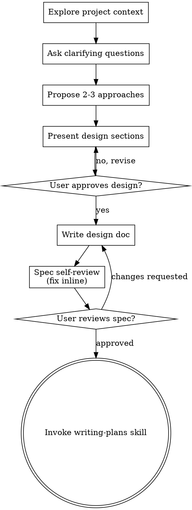

# Codex Session `01a05bac-7de2-7b10-9cad-2854a37dccb5`

- Review status: `human-reviewed`
- Reviewed by: `synuns`
- Reviewed at: `2026-09-01T08:16:16.099197+00:00`
- Reviewed candidate SHA-256: `dad104263caa5d040905551c50fbf76700d2d6303822c3459d32b2a3556776fa`

> Human review required before submission. Automatic redaction is best-effort.

- Model: `gpt-5.6-sol`
- Started: `2026-09-01T06:33:46.249Z`
- Working directory: `~/dev/assignment/kbhc-assgn`

## Turn 1

### User prompt

# AGENTS.md instructions for ~/dev/assignment/kbhc-assgn

<INSTRUCTIONS>
# 프로젝트 작업 규약

## 커밋 메시지

- 모든 커밋 메시지는 Conventional Commits 형식을 따른다.
- 형식은 `<type>(<scope>): <한글 설명>`이며, `scope`는 필요할 때만 사용한다.
- `type`과 `scope`는 영문 소문자로 작성하고, 제목·본문·꼬리말의 설명은 한글로 작성한다. 코드 식별자와 고유명사는 예외로 한다.
- 주요 `type`은 `feat`, `fix`, `docs`, `refactor`, `test`, `chore`를 사용한다.
- 호환성을 깨는 변경은 `!` 또는 `BREAKING CHANGE:` 꼬리말로 표시한다.

예시: `docs: 과제 원본 명세 추가`

## Scope

Follow the assignment sources in `assignment-original/`. The OpenAPI contract
is authoritative for API details. Do not change accepted behavior, architecture,
dependencies, authentication policy, or destructive-data semantics without a
HIGH-risk human decision.

## Required Reading

- [프로젝트 상위 기획](docs/project-plan.md)
- `TODO.md`
- [코딩 규약](docs/coding-standards.md)
- [기술 스택](docs/tech-stack.md)
- `docs/quality/requirements.md`
- `docs/quality/workflow.md`
- `docs/quality/verification.md`
- `AI_USAGE.md`

## Required Loop

Select requirement IDs → implement one testable unit → run read-only automatic
verification → verify applicable browser behavior → classify and fix failures →
record evidence → after the final implementation/verification task and
before the final completion task or TODO status transition, run a
plan-completion adversarial review → at each golden journey, reuse or extend that
review → request one human checkpoint → run full review and final QA.

작업 시작 시 `TODO.md`에서 의존성이 해소된 작업 하나를 선택하고, 종료 전
상태와 재현 가능한 evidence를 갱신한다. 상위 목표·범위·단계는
`docs/project-plan.md`를 따른다. 세부 기능 설계와 구현 순서는 별도
`docs/superpowers/` 문서에서 구체화한다.

The session recorded in Evidence is the task block owner. Parallel work may update
different task blocks, but never a block owned by another session. Rebase onto the
latest main and reconcile TODO state item-by-item before merge.

LOW work proceeds continuously. People own golden-journey acceptance, HIGH-risk
decisions, exceptions, and final completion. AI never marks `HUMAN_APPROVED`.

Implementation plan 실행은 격리 worktree를 기본으로 한다. 현재 checkout이
격리되지 않았다면 별도 질문 없이 ignore된 `.worktrees/<branch>`를 생성한다.
생성 또는 안전 검사가 실패하거나 사용자가 in-place 작업을 명시한 경우에만
중단하고 작업 위치를 확인한다.

## Commands

```bash
./scripts/verify setup
./scripts/verify quick
./scripts/verify full
```

Verification is read-only. `npm run format` is a separate mutation command;
review its diff and rerun `./scripts/verify quick` afterward.

## Evidence and AI Records

Use journey-based browser evidence defined in `workflow.md`. Keep core E2E
small and prefer unit, component, or integration tests when they prove the risk
better. Applicable interactive browser QA uses `agent-browser` and follows
`docs/coding-standards.md`. Stop hooks create ignored redacted candidates only.
A person must review and explicitly publish any tracked AI record.

</INSTRUCTIONS>
<environment_context>
  <cwd>~/dev/assignment/kbhc-assgn</cwd>
  <shell>zsh</shell>
  <current_date>2026-09-01</current_date>
  <timezone>Asia/Seoul</timezone>
  <filesystem><workspace_roots><root>~/dev/assignment/kbhc-assgn</root></workspace_roots><permission_profile type="disabled"><file_system type="unrestricted" /></permission_profile></filesystem>
</environment_context>

journey 기획 구현 이전 ui-foundation을 먼저 작업하고 넘어가자

<details>
<summary>작업 내용 보기</summary>

### Tool activity

#### `exec`

- Call ID: `call_SCtfcyea8KbjAGNlo3gAgVjy`
- Status: `completed`

**Input**

```text
const r = await tools.exec_command({
  cmd: "pwd && git status --short --branch && printf '\\nSKILL\\n' && sed -n '1,240p' ~/.agents/skills/brainstorming/SKILL.md && printf '\\nFILES\\n' && rg --files -g 'AGENTS.md' -g 'TODO.md' -g 'docs/project-plan.md' -g 'docs/coding-standards.md' -g 'docs/tech-stack.md' -g 'docs/quality/requirements.md' -g 'docs/quality/workflow.md' -g 'docs/quality/verification.md' -g 'AI_USAGE.md' -g 'assignment-original/**' | sort",
  workdir: "~/dev/assignment/kbhc-assgn",
  yield_time_ms: 10000,
  max_output_tokens: 30000
});
text(r.output);

```

**Output**

````text
Script completed
Wall time 0.6 seconds
Output:

~/dev/assignment/kbhc-assgn
## main...origin/main [ahead 100]

SKILL
---
name: brainstorming
description: "You MUST use this before any creative work - creating features, building components, adding functionality, or modifying behavior. Explores user intent, requirements and design before implementation."
---

# Brainstorming Ideas Into Designs

Help turn ideas into fully formed designs and specs through natural collaborative dialogue.

Start by understanding the current project context, then ask questions one at a time to refine the idea. Once you understand what you're building, present the design and get user approval.

<HARD-GATE>
Do NOT invoke any implementation skill, write any code, scaffold any project, or take any implementation action until you have presented a design and the user has approved it. This applies to EVERY project regardless of perceived simplicity.
</HARD-GATE>

## Anti-Pattern: "This Is Too Simple To Need A Design"

Every project goes through this process. A todo list, a single-function utility, a config change — all of them. "Simple" projects are where unexamined assumptions cause the most wasted work. The design can be short (a few sentences for truly simple projects), but you MUST present it and get approval.

## Checklist

You MUST create a task for each of these items and complete them in order:

1. **Explore project context** — check files, docs, recent commits
2. **Offer the visual companion just-in-time** — NOT upfront. The first time a question would genuinely be clearer shown than described, offer it then (its own message); on approval its browser tab opens for you. If no visual question ever arises, never offer it. See the Visual Companion section below.
3. **Ask clarifying questions** — one at a time, understand purpose/constraints/success criteria
4. **Propose 2-3 approaches** — with trade-offs and your recommendation
5. **Present design** — in sections scaled to their complexity, get user approval after each section
6. **Write design doc** — save to `docs/superpowers/specs/YYYY-MM-DD-<topic>-design.md` and commit
7. **Spec self-review** — quick inline check for placeholders, contradictions, ambiguity, scope (see below)
8. **User reviews written spec** — ask user to review the spec file before proceeding
9. **Transition to implementation** — invoke writing-plans skill to create implementation plan

## Process Flow



**The terminal state is invoking writing-plans.** Do NOT invoke frontend-design, mcp-builder, or any other implementation skill. The ONLY skill you invoke after brainstorming is writing-plans.

## The Process

**Understanding the idea:**

- Check out the current project state first (files, docs, recent commits)
- Before asking detailed questions, assess scope: if the request describes multiple independent subsystems (e.g., "build a platform with chat, file storage, billing, and analytics"), flag this immediately. Don't spend questions refining details of a project that needs to be decomposed first.
- If the project is too large for a single spec, help the user decompose into sub-projects: what are the independent pieces, how do they relate, what order should they be built? Then brainstorm the first sub-project through the normal design flow. Each sub-project gets its own spec → plan → implementation cycle.
- For appropriately-scoped projects, ask questions one at a time to refine the idea
- Prefer multiple choice questions when possible, but open-ended is fine too
- Only one question per message - if a topic needs more exploration, break it into multiple questions
- Focus on understanding: purpose, constraints, success criteria

**Exploring approaches:**

- Propose 2-3 different approaches with trade-offs
- Present options conversationally with your recommendation and reasoning
- Lead with your recommended option and explain why

**Presenting the design:**

- Once you believe you understand what you're building, present the design
- Scale each section to its complexity: a few sentences if straightforward, up to 200-300 words if nuanced
- Ask after each section whether it looks right so far
- Cover: architecture, components, data flow, error handling, testing
- Be ready to go back and clarify if something doesn't make sense

**Design for isolation and clarity:**

- Break the system into smaller units that each have one clear purpose, communicate through well-defined interfaces, and can be understood and tested independently
- For each unit, you should be able to answer: what does it do, how do you use it, and what does it depend on?
- Can someone understand what a unit does without reading its internals? Can you change the internals without breaking consumers? If not, the boundaries need work.
- Smaller, well-bounded units are also easier for you to work with - you reason better about code you can hold in context at once, and your edits are more reliable when files are focused. When a file grows large, that's often a signal that it's doing too much.

**Working in existing codebases:**

- Explore the current structure before proposing changes. Follow existing patterns.
- Where existing code has problems that affect the work (e.g., a file that's grown too large, unclear boundaries, tangled responsibilities), include targeted improvements as part of the design - the way a good developer improves code they're working in.
- Don't propose unrelated refactoring. Stay focused on what serves the current goal.

## After the Design

**Documentation:**

- Write the validated design (spec) to `docs/superpowers/specs/YYYY-MM-DD-<topic>-design.md`
  - (User preferences for spec location override this default)
- Use elements-of-style:writing-clearly-and-concisely skill if available
- Commit the design document to git

**Spec Self-Review:**
After writing the spec document, look at it with fresh eyes:

1. **Placeholder scan:** Any "TBD", "TODO", incomplete sections, or vague requirements? Fix them.
2. **Internal consistency:** Do any sections contradict each other? Does the architecture match the feature descriptions?
3. **Scope check:** Is this focused enough for a single implementation plan, or does it need decomposition?
4. **Ambiguity check:** Could any requirement be interpreted two different ways? If so, pick one and make it explicit.

Fix any issues inline. No need to re-review — just fix and move on.

**User Review Gate:**
After the spec review loop passes, ask the user to review the written spec before proceeding:

> "Spec written and committed to `<path>`. Please review it and let me know if you want to make any changes before we start writing out the implementation plan."

Wait for the user's response. If they request changes, make them and re-run the spec review loop. Only proceed once the user approves.

**Implementation:**

- Invoke the writing-plans skill to create a detailed implementation plan
- Do NOT invoke any other skill. writing-plans is the next step.

## Key Principles

- **One question at a time** - Don't overwhelm with multiple questions
- **Multiple choice preferred** - Easier to answer than open-ended when possible
- **YAGNI ruthlessly** - Remove unnecessary features from all designs
- **Explore alternatives** - Always propose 2-3 approaches before settling
- **Incremental validation** - Present design, get approval before moving on
- **Be flexible** - Go back and clarify when something doesn't make sense

## Visual Companion

A browser-based companion for showing mockups, diagrams, and visual options during brainstorming. Available as a tool — not a mode. Accepting the companion means it's available for questions that benefit from visual treatment; it does NOT mean every question goes through the browser.

**Offering the companion (just-in-time):** Do NOT offer it upfront. Wait until a question would genuinely be clearer shown than told — a real mockup / layout / diagram question, not merely a UI *topic*. The first time that happens, offer it then, as its own message:
> "This next part might be easier if I show you — I can put together mockups, diagrams, and comparisons in a browser tab as we go. It's still new and can be token-intensive. Want me to? I'll open it for you."

**This offer MUST be its own message.** Only the offer — no clarifying question, summary, or other content. Wait for the user's response. If they accept, start the server with `--open` so their browser opens to the first screen automatically. If they decline, continue text-only and don't offer again unless they raise it.

**Per-question decision:** Even after the user accepts, decide FOR EACH QUESTION whether to use the browser or the terminal. The test: **would the user understand this better by seeing it than reading it?**

- **Use the browser** for content that IS visual — mockups, wireframes, layout comparisons, architecture diagrams, side-by-side visual designs
- **Use the terminal** for content that is text — requirements questions, conceptual choices, tradeoff lists, A/B/C/D text options, scope decisions

A question about a UI topic is not automatically a visual question. "What does personality mean in this context?" is a conceptual question — use the terminal. "Which wizard layout works better?" is a visual question — use the browser.

If they agree to the companion, read the detailed guide before proceeding:
`skills/brainstorming/visual-companion.md`

FILES
AGENTS.md
AI_USAGE.md
TODO.md
assignment-original/openapi.yaml
assignment-original/requirement.md
docs/coding-standards.md
docs/project-plan.md
docs/quality/requirements.md
docs/quality/verification.md
docs/quality/workflow.md
docs/tech-stack.md

````

#### `exec`

- Call ID: `call_Dqs2OKb6YoN7NzPaCmNiE92E`
- Status: `completed`

**Input**

```text
const p = await tools.update_plan({plan:[
  {step:"프로젝트 문서·현재 코드·최근 변경에서 ui-foundation 범위를 파악한다",status:"in_progress"},
  {step:"목적·제약·성공 기준을 질문으로 확정한다",status:"pending"},
  {step:"2~3개 접근법과 권장안을 제시한다",status:"pending"},
  {step:"설계를 섹션별로 제시하고 승인을 받는다",status:"pending"},
  {step:"설계 문서를 작성·자체 검토·커밋하고 사용자 검토를 받는다",status:"pending"},
  {step:"승인된 설계를 implementation plan으로 전환한다",status:"pending"}
]});
text(p);

```

**Output**

```text
Script completed
Wall time 0.2 seconds
Output:

{}
```

#### `exec`

- Call ID: `call_UGNGiovKcxHL2wfQcP8XjD25`
- Status: `completed`

**Input**

```text
const r = await tools.exec_command({
  cmd: "for f in AGENTS.md docs/project-plan.md TODO.md docs/coding-standards.md docs/tech-stack.md docs/quality/requirements.md docs/quality/workflow.md docs/quality/verification.md AI_USAGE.md assignment-original/requirement.md assignment-original/openapi.yaml; do wc -l \"$f\"; done && printf '\\nRECENT COMMITS\\n' && git log -8 --oneline --decorate && printf '\\nTOP FILES\\n' && find . -maxdepth 3 -type f -not -path './.git/*' -not -path './node_modules/*' | sort | sed -n '1,240p'",
  workdir: "~/dev/assignment/kbhc-assgn",
  yield_time_ms: 10000,
  max_output_tokens: 30000
});
text(r.output);

```

**Output**

```text
Script completed
Wall time 0.3 seconds
Output:

      74 AGENTS.md
     370 docs/project-plan.md
    1447 TODO.md
     401 docs/coding-standards.md
     109 docs/tech-stack.md
     210 docs/quality/requirements.md
     194 docs/quality/workflow.md
     126 docs/quality/verification.md
      74 AI_USAGE.md
      77 assignment-original/requirement.md
     310 assignment-original/openapi.yaml

RECENT COMMITS
76c1ee6 (HEAD -> main) docs(ai): 검토 완료 세션 기록 추가
8725b42 docs(ui): 반응형 화면 검증 근거 기록
3011147 fix(ui): 비동기 상태의 화면 일관성 보완
52170ed fix(ui): 승인된 집중형 화면 구성을 정확히 반영
a4651cf fix(ui): 브라우저 탐색 밀도와 검증 보강
de63bf9 feat(tasks): 할 일 상세와 삭제 확인 화면 정리
4722af9 feat(tasks): 할 일 탐색 카드 화면 적용
2ce3d55 feat(overview): 업무 현황과 회원정보 카드 구성

TOP FILES
./.codex/hooks.json
./.codex/hooks/artifact_contract.py
./.codex/hooks/export-session.log
./.codex/hooks/export_session.py
./.codex/hooks/render_artifact_index.py
./.codex/hooks/review_publisher.py
./.codex/hooks/review_scanner.py
./.codex/hooks/session_hook.py
./.codex/hooks/session_records.py
./.codex/hooks/transcript_adapter.py
./.codex/review-pending/.index.lock
./.codex/review-pending/codex-session-01a04cd4-c09b-7582-9129-ab4540e01cbd.md
./.codex/review-pending/codex-session-01a04d34-4114-7db3-ae5c-224f46596fd2.md
./.codex/review-pending/codex-session-01a04d98-3b50-7731-9baa-4171a675dce1.md
./.codex/review-pending/codex-session-01a04ddf-4d15-74f3-8568-99bf5272814e.s0001.json
./.codex/review-pending/codex-session-01a04ddf-4d15-74f3-8568-99bf5272814e.s0001.md
./.codex/review-pending/codex-session-01a04ddf-5be6-7322-838c-12e18fc2d714.s0001.json
./.codex/review-pending/codex-session-01a04ddf-5be6-7322-838c-12e18fc2d714.s0001.md
./.codex/review-pending/codex-session-01a04df0-328b-70a0-928b-40b2ef266083.s0001.json
./.codex/review-pending/codex-session-01a04df0-328b-70a0-928b-40b2ef266083.s0001.md
./.codex/review-pending/codex-session-01a04ffd-0cb5-75e0-8cef-0ed1fbe5ceda.s0001.json
./.codex/review-pending/codex-session-01a04ffd-0cb5-75e0-8cef-0ed1fbe5ceda.s0001.md
./.codex/review-pending/codex-session-01a04ffd-1913-77f0-bf79-373841e3ca81.s0001.json
./.codex/review-pending/codex-session-01a04ffd-1913-77f0-bf79-373841e3ca81.s0001.md
./.codex/review-pending/codex-session-01a052d2-7802-7e10-b3ba-b89a95e9f783.s0001.json
./.codex/review-pending/codex-session-01a052d2-7802-7e10-b3ba-b89a95e9f783.s0001.md
./.codex/review-pending/codex-session-01a052ec-d26a-7032-a6be-cf60cca407b6.s0001.json
./.codex/review-pending/codex-session-01a052ec-d26a-7032-a6be-cf60cca407b6.s0001.md
./.codex/review-pending/codex-session-01a052ed-46d9-75a2-9589-4fc69a430e9f.s0001.json
./.codex/review-pending/codex-session-01a052ed-46d9-75a2-9589-4fc69a430e9f.s0001.md
./.codex/review-pending/codex-session-01a05781-2b84-7b93-9e99-2721e36e348f.s0001.json
./.codex/review-pending/codex-session-01a05781-2b84-7b93-9e99-2721e36e348f.s0001.md
./.codex/review-pending/codex-session-01a057f9-7839-71a1-9a27-3f6f88641df9.s0001.json
./.codex/review-pending/codex-session-01a057f9-7839-71a1-9a27-3f6f88641df9.s0001.md
./.codex/review-pending/codex-session-01a05814-fa00-7891-b4d6-fd563f5ecf3e.s0001.json
./.codex/review-pending/codex-session-01a05814-fa00-7891-b4d6-fd563f5ecf3e.s0001.md
./.codex/review-pending/codex-session-01a05ab5-6373-7620-a6db-87ff765586a4.s0001.json
./.codex/review-pending/codex-session-01a05ab5-6373-7620-a6db-87ff765586a4.s0001.md
./.codex/review-pending/codex-session-01a05abc-6c6d-77f0-a445-4d31442b3f3d.s0001.json
./.codex/review-pending/codex-session-01a05abc-6c6d-77f0-a445-4d31442b3f3d.s0001.md
./.codex/review-pending/codex-session-01a05acd-15c6-7f63-a78d-12d641fe269a.s0001.json
./.codex/review-pending/codex-session-01a05acd-15c6-7f63-a78d-12d641fe269a.s0001.md
./.codex/review-pending/codex-session-01a05b8b-0a5b-74b0-8176-835ce81e007d.s0001.json
./.codex/review-pending/codex-session-01a05b8b-0a5b-74b0-8176-835ce81e007d.s0001.md
./.codex/review-pending/codex-session-01a05bac-7de2-7b10-9cad-2854a37dccb5.s0001.json
./.codex/review-pending/codex-session-01a05bac-7de2-7b10-9cad-2854a37dccb5.s0001.md
./.codex/review-pending/index.md
./.gitattributes
./.gitignore
./.superpowers/brainstorm/.last-port
./.superpowers/brainstorm/.last-token
./.superpowers/sdd/.gitignore
./.superpowers/sdd/final-fix-report.md
./.superpowers/sdd/progress.md
./.superpowers/sdd/review-001e731..34dab6a.diff
./.superpowers/sdd/review-001e731..7553415.diff
./.superpowers/sdd/review-001e731..9a19193.diff
./.superpowers/sdd/review-001e731..a716cbe.diff
./.superpowers/sdd/review-34dab6a..3806f34.diff
./.superpowers/sdd/review-4d233c2..3806f34.diff
./.superpowers/sdd/review-4d233c2..69a1c4e.diff
./.superpowers/sdd/review-4d233c2..7551b58.diff
./.superpowers/sdd/review-4d233c2..96a31ea.diff
./.superpowers/sdd/review-4d233c2..9748cfc.diff
./.superpowers/sdd/review-56d7cdf..001e731.diff
./.superpowers/sdd/review-56d7cdf..067888f.diff
./.superpowers/sdd/review-56d7cdf..e9f4fd3.diff
./.superpowers/sdd/review-9748cfc..56d7cdf.diff
./.superpowers/sdd/task-1-brief.md
./.superpowers/sdd/task-1-report.md
./.superpowers/sdd/task-2-brief.md
./.superpowers/sdd/task-2-report.md
./.superpowers/sdd/task-3-brief.md
./.superpowers/sdd/task-3-report.md
./.superpowers/sdd/task-4-brief.md
./.superpowers/sdd/task-4-report.md
./.superpowers/sdd/task-5-brief.md
./.superpowers/sdd/task-5-report.md
./AGENTS.md
./AI_USAGE.md
./TODO.md
./artifacts/.index.lock
./artifacts/codex-session-01a04c3e-0a24-7e30-a767-64f1e2c4f3ae.md
./artifacts/codex-session-01a04c77-2685-7013-ad38-d81feba1b2a4.md
./artifacts/codex-session-01a04ddf-4d15-74f3-8568-99bf5272814e.s0001.md
./artifacts/codex-session-01a04ddf-5be6-7322-838c-12e18fc2d714.s0001.md
./artifacts/codex-session-01a04ffd-0cb5-75e0-8cef-0ed1fbe5ceda.s0001.md
./artifacts/codex-session-01a04ffd-1913-77f0-bf79-373841e3ca81.s0001.md
./artifacts/codex-session-01a052d2-7802-7e10-b3ba-b89a95e9f783.s0001.md
./artifacts/codex-session-01a052ec-d26a-7032-a6be-cf60cca407b6.s0001.md
./artifacts/codex-session-01a052ed-46d9-75a2-9589-4fc69a430e9f.s0001.md
./artifacts/codex-session-01a05814-fa00-7891-b4d6-fd563f5ecf3e.s0001.md
./artifacts/codex-session-01a05ab5-6373-7620-a6db-87ff765586a4.s0001.md
./artifacts/index.md
./assignment-original/openapi.yaml
./assignment-original/requirement.md
./biome.json
./components.json
./dist/assets/index-CkGn0wKO.css
./dist/assets/index-Clpyutc4.js
./dist/fonts/LICENSE-Pretendard.txt
./dist/fonts/PretendardVariable.woff2
./dist/index.html
./dist/mockServiceWorker.js
./docs/coding-standards.md
./docs/project-plan.md
./docs/quality/requirements.md
./docs/quality/verification.md
./docs/quality/workflow.md
./docs/tech-stack.md
./e2e/architecture.smoke.spec.ts
./e2e/auth-entry.spec.ts
./e2e/authenticated-fixture.ts
./e2e/scaffold.smoke.spec.ts
./e2e/task-discovery.spec.ts
./e2e/task-resolution.spec.ts
./e2e/work-overview.spec.ts
./index.html
./package.json
./playwright-report/index.html
./playwright.config.ts
./pnpm-lock.yaml
./public/fonts/LICENSE-Pretendard.txt
./public/fonts/PretendardVariable.woff2
./public/mockServiceWorker.js
./scripts/__pycache__/publish-ai-recordcpython-314.pyc
./scripts/__pycache__/review-ai-recordcpython-314.pyc
./scripts/__pycache__/verifycpython-314.pyc
./scripts/publish-ai-record
./scripts/review-ai-record
./scripts/verify
./src/app/index.tsx
./src/app/query-client.test.ts
./src/app/query-client.ts
./src/app/route-error-boundary.tsx
./src/app/router.test.tsx
./src/app/router.tsx
./src/generated/openapi.ts
./src/main.tsx
./src/mocks/browser.ts
./src/mocks/server.ts
./src/styles/globals.css
./src/test/architecture-contract.test.ts
./src/test/harness-config.test.ts
./src/test/scaffold.test.tsx
./src/test/setup.ts
./src/test/theme-contract.test.ts
./src/vite-env.d.ts
./test-results/.last-run.json
./tests/__pycache__/test_artifact_contract.cpython-314.pyc
./tests/__pycache__/test_export_session.cpython-314.pyc
./tests/__pycache__/test_publish_ai_record.cpython-314.pyc
./tests/__pycache__/test_render_artifact_index.cpython-314.pyc
./tests/__pycache__/test_review_ai_record.cpython-314.pyc
./tests/__pycache__/test_review_publisher.cpython-314.pyc
./tests/__pycache__/test_review_scanner.cpython-314.pyc
./tests/__pycache__/test_session_records.cpython-314.pyc
./tests/__pycache__/test_transcript_adapter.cpython-314.pyc
./tests/__pycache__/test_verify.cpython-314.pyc
./tests/__pycache__/test_verify_contract.cpython-314.pyc
./tests/fixtures/codex-rollout.jsonl
./tests/test_artifact_contract.py
./tests/test_export_session.py
./tests/test_publish_ai_record.py
./tests/test_render_artifact_index.py
./tests/test_review_ai_record.py
./tests/test_review_publisher.py
./tests/test_review_scanner.py
./tests/test_session_records.py
./tests/test_transcript_adapter.py
./tests/test_verify.py
./tests/test_verify_contract.py
./tsconfig.app.json
./tsconfig.json
./tsconfig.node.json
./vite.config.ts
./vitest.config.ts

```

#### `exec`

- Call ID: `call_K9aax6985yosYWPFuup0Wa7s`
- Status: `completed`

**Input**

```text
const r = await tools.exec_command({
  cmd: "sed -n '1,420p' docs/project-plan.md && printf '\\nTODO UI/JOURNEY INDEX\\n' && rg -n -i 'ui|foundation|journey|기반|디자인|토큰|컴포넌트|화면' TODO.md",
  workdir: "~/dev/assignment/kbhc-assgn",
  yield_time_ms: 10000,
  max_output_tokens: 40000
});
text(r.output);

```

**Output**

````text
Script completed
Wall time 0.3 seconds
Output:

Warning: truncated output (original token count: 10700)
Total output lines: 735

# 프론트엔드 과제 상위 기획

## 문서 목적

이 문서는 과제 전체의 목표, 범위, 제품 동작, 기술 구조, 단계, 검증 전략과
사람 결정 지점을 정의하는 최상위 기획 기준이다. 개별 기능의 설계·구현
절차를 담는 `docs/superpowers/specs/`와 `docs/superpowers/plans/`보다 상위에
있다.

실행 상태와 남은 작업은 루트 `TODO.md`에서 관리한다. 에이전트는 작업 시작
전 이 문서와 `TODO.md`를 읽고, 한 번에 검증 가능한 작업 단위 하나만 수행한다.

## 기준 문서와 우선순위

충돌 시 다음 순서를 적용한다.

1. `assignment-original/openapi.yaml`: API 경로, method, 요청·응답 schema,
   인증 scheme의 최우선 계약
2. `assignment-original/requirement.md`: 화면, 상호작용, 제출 조건
3. `docs/quality/requirements.md`: 원본을 requirement ID와 acceptance로 변환한
   실행 기준
4. 이 문서: 전체 범위, 구조, 단계, 품질 전략
5. `docs/tech-stack.md`: 승인된 기술과 도구 책임
6. `docs/coding-standards.md`: 모든 에이전트가 구현·검토 때 지킬 코딩 규약
7. `docs/superpowers/specs/`와 `docs/superpowers/plans/`: 특정 작업의 상세 설계와
   구현 순서
8. `TODO.md`: 현재 실행 순서, 상태, evidence

하위 문서는 상위 문서의 accepted behavior를 바꿀 수 없다. 원본과
`docs/quality/requirements.md`가 충돌하거나 해석이 둘 이상이면
`REQUIREMENT` 실패로 기록하고 HIGH-risk 사람 결정을 요청한다.

## 제품 목표

React 19와 TypeScript로 다음 업무 흐름을 제공하는 제출 가능한 단일 페이지
애플리케이션을 만든다.

- 사용자는 로그인 입력을 검증하고 API를 통해 인증한다.
- 공통 navigation에서 dashboard와 task 목록으로 이동한다.
- 로그인 상태에 따라 sign-in 또는 profile 진입점 하나만 본다.
- dashboard에서 전체, 남은, 완료 task 수를 확인한다.
- 가상화된 무한 목록에서 task를 탐색하고 상세로 이동한다.
- 상세가 없으면 목록으로 복구한다.
- route ID를 정확히 입력한 경우에만 task를 삭제하고 목록으로 돌아간다.
- profile에서 사용자 name과 memo를 확인한다.

## 성공 기준

완료는 기능 존재가 아니라 다음 증거가 모두 충족된 상태다.

- `docs/quality/requirements.md`의 모든 requirement에 재현 가능한 자동 또는
  browser evidence가 기록된다.
- 네 Golden Journey `auth-entry`, `work-overview`, `task-discovery`,
  `task-resolution`이 각각 경량 adversarial review를 통과하고 사람이
  checkpoint를 승인한다.
- OpenAPI 계약에서 생성한 타입과 MSW 동작이 실제 client 요청·응답과 일치한다.
- loading, empty, error, success 상태가 적용 가능한 화면에서 구분된다.
- keyboard 사용, label 연결, focus 이동, modal 접근성, 반응형 layout을 확인한다.
- format, lint, typecheck, unit/component/integration test, build, core E2E가
  read-only `./scripts/verify full`에서 통과한다.
- console·network 오류, 비밀정보, debug 출력, 불필요한 생성물, 관련 없는 diff가
  없다.
- `AI_USAGE.md`와 공개 AI 기록은 사람 검토 결과만 반영한다.
- AI가 `HUMAN_APPROVED`나 최종 완료를 선언하지 않는다.

## 범위

### 포함

- `/`, `/sign-in`, `/task`, `/task/:id`, `/user` route
- 상태별 GNB/LNB action과 서로 다른 아이콘
- sign-in validation, 요청, 오류 modal, 인증 상태
- dashboard metrics
- task 가상 목록, 무한 pagination, 상세, 404 복구, 확인 후 삭제
- user profile
- OAS 3.1 기반 생성 타입과 제출 가능한 MSW API 대체 구현
- 명명된 색상 token과 local Pretendard font
- 자동 검증, browser evidence, Golden Journey checkpoint, AI 사용 공개

### 제외

- 원본에 없는 회원가입, 로그아웃 UI, task 생성·수정, 검색, 정렬, filter
- 별도 production backend와 database
- 원본에 없는 role·permission 체계
- offline mode, realtime synchronization, analytics, 국제화
- 심미성을 위한 대규모 animation이나 독자 design system 확장
- 승인 없는 dependency, architecture, 인증 정책, 삭제 의미 변경

## 사용자와 핵심 흐름

별도 role 체계는 두지 않는다. UI 관점 상태만 구분한다.

### 비로그인 사용자

1. 공통 navigation에서 dashboard, task, sign-in action을 확인한다.
2. `/sign-in`에서 email과 password를 입력한다.
3. client validation 실패 시 연결된 inline 오류를 확인한다.
4. 유효한 입력을 제출한다.
5. non-200 응답이면 API `errorMessage` modal을 확인하고 닫는다.
6. 200 응답이면 승인된 방식으로 인증 상태를 만들고 보호 API 요청을 수행한다.

dashboard와 task action의 노출 여부와 보호 route 접근 정책은 원본만으로
확정되지 않았다. navigation action은 항상 존재한다는 invariant를 지키되,
비로그인 접근 결과는 인증 정책 사람 결정에서 확정한다.

### 로그인 사용자

1. sign-in 대신 profile action을 확인한다.
2. dashboard에서 API fixture와 같은 세 지표를 본다.
3. task 목록을 scroll하며 다음 page를 중복 없이 불러온다.
4. card의 title과 memo를 확인하고 상세로 이동한다.
5. 없는 상세에서 목록 복구 action을 사용한다.
6. 존재하는 상세에서 title, memo, registerDatetime을 확인한다.
7. 삭제 modal에서 잘못된 ID에는 submit이 비활성화되고 정확한 ID에서만
   활성화되는지 확인한다.
8. 삭제 성공 후 `/task`로 돌아간다.
9. profile에서 name과 memo를 확인한다.

## 화면·route 기획

| Route | 목적 | 주요 상태 | Requirement |
| --- | --- | --- | --- |
| `/` | 업무 현황 확인 | loading, error, success | `DASH-01`, `NAV-01`, `NAV-03` |
| `/sign-in` | 인증 시작 | invalid, submitting, API error, success | `NAV-02`, `AUTH-01`~`AUTH-07` |
| `/task` | task 탐색 | initial loading, empty, page loading, error, terminal page | `TASK-LIST-01`~`TASK-LIST-05` |
| `/task/:id` | task 확인·삭제 | loading, 404, error, success, delete modal | `TASK-DETAIL-01`~`TASK-DETAIL-05` |
| `/user` | profile 확인 | loading, error, success | `USER-01`, `NAV-03` |

공통 shell은 현재 route를 표시하고 dashboard/task action을 유지한다. 인증
action은 sign-in과 profile 중 정확히 하나만 표시한다. 아이콘은 항목별로
서로 다르며 accessible name은 text와 함께 유지한다.

## API 계약 기획

| 동작 | 계약 | 핵심 처리 |
| --- | --- | --- |
| 로그인 | `POST /api/sign-in` | email/password JSON, 200 token 응답, non-200 `errorMessage` |
| 갱신 | `POST /api/refresh` | refresh cookie credential, 200 token, 400/401 error |
| profile | `GET /api/user` | bearer token, name/memo |
| dashboard | `GET /api/dashboard` | bearer token, 세 integer metric |
| task 목록 | `GET /api/task?page=N` | 1부터 시작, data/hasNext |
| task 상세 | `GET /api/task/{id}` | bearer token, 200 detail, 404 error |
| task 삭제 | `DELETE /api/task/{id}` | bearer token, 200 `{ success: true }`, 404 error |

Client는 generated OpenAPI type을 경계에서 사용한다. UI model 변환이 필요하면
순수 함수로 분리하고 원본 response 필드를 조용히 바꾸지 않는다. 모든 보호
요청은 승인된 auth adapter를 통과한다. MSW browser handler와 test server
handler는 같은 fixture와 contract behavior를 공유한다.

## 기술 구조

### 채택 stack

- React 19, TypeScript strict, Vite, pnpm
- React Router, TanStack Query, React Hook Form, Zod
- TanStack Virtual, Fetch API, `openapi-typescript`, MSW
- shadcn/ui, Tailwind CSS, CSS Custom Properties, Pretendard, Lucide React
- Vitest, Testing Library, Playwright, Biome

정확한 채택 상태와 변경 규칙은 `docs/tech-stack.md`가 관리한다. 새 dependency나
교체는 HIGH-risk 사람 승인 전 적용하지 않는다.

### 목표 module 경계

후속 상세 설계는 FSD 원칙을 사용하되, 이 문서는 책임 방향만 고정한다.

```text
src/
├── app/        # bootstrap, provider composition, router, global styles
├── pages/      # route 단위 composition
├── widgets/    # app shell, navigation 등 page 간 큰 UI block
├── features/   # sign-in, delete-task 등 사용자 행위
├── entities/   # task, user 등 domain 표시·model
├── shared/     # api client, generated contract, auth adapter, 공용 UI·utility
└── mocks/      # MSW handlers, fixtures, browser/node bootstrap
```

의존 방향은 상위 composition에서 하위 재사용 단위로 흐른다. 각 공개 경계는
후속 기능 설계에서 exact export를 정한다. route page가 fetch, token, fixture
세부 구현을 직접 소유하지 않는다.

### provider와 data flow

```text
Browser event
  → feature/page action
  → typed API client
  → auth adapter가 bearer/refresh 정책 적용
  → real fetch boundary 또는 MSW
  → generated OpenAPI type를 쓰는 response mapping boundary
  → TanStack Query cache
  → entity/widget/page rendering
```

App bootstrap은 router, query client, auth context, MSW development bootstrap을
명시적 순서로 조합한다. test는 필요한 provider만 test harness로 구성한다.

### 상태 책임

- server state: TanStack Query가 loading, error, data, pagination, invalidation을
  관리한다.
- form state: React Hook Form과 Zod가 sign-in 입력·오류·submit 가능 상태를
  관리한다.
- auth state: 승인된 auth adapter/context만 token과 session transition을
  관리한다.
- modal state: 해당 feature가 open/close, focus restore, 입력 reset을 관리한다.
- route state: React Router param과 navigation을 단일 기준으로 사용한다.
- mock state: MSW fixture store가 delete 이후 목록·상세·dashboard 일관성을
  결정한다. 의미 변경은 삭제 정책 결정 범위에서 승인받는다.

## HIGH-risk 결정 gate

다음은 구현 전에 사람이 결정한다. 결정 전에는 evidence 조사, test 설계,
독립 LOW 작업만 진행한다.

### 인증 정책

OpenAPI는 sign-in response에 accessToken과 refreshToken을 반환하면서 refresh는
`token` cookie를 요구한다. 확정된 정책은
`docs/superpowers/specs/2026-08-30-authentication-policy-design.md`가 관리한다.

- Access token은 메모리에만 저장하고 MSW가 refresh cookie server 동작을
  모사한다.
- Expiry와 현재 token의 401은 session generation을 보존하는 single-flight
  refresh와 최대 한 번 replay로 처리한다.
- Late 401과 이전 session 응답은 현재 인증 상태를 변경하지 않는다.
- Auth provider는 navigation하지 않고 router 내부 boundary가 보호 route와
  허용된 복귀 위치를 처리한다.
- `shared/api`는 app auth provider를 import하지 않고 token과 refresh callback을
  app composition에서 주입받는다.

### 삭제와 mock data 일관성

원본은 exact ID 확인 후 delete 호출과 `/task` redirect를 요구한다. 확정된
정책은
`docs/superpowers/specs/2026-08-30-delete-consistency-policy-design.md`가 관리한다.

- 비낙관적 server-authoritative 삭제를 사용하고 pending 중 modal과 중복
  submit을 잠근다.
- 사용자 submit 한 번은 attempt 하나이며 auth replay를 포함한 DELETE 전송은
  attempt당 최대 두 번이다.
- 200 `{ success: true }`만 자동 `/task` 이동을 만든다.
- 404와 outcome-unknown은 success가 아니며, network와 invalid-response는 상세
  재조회로 상태를 조정하고 DELETE를 자동 재전송하지 않는다.
- 하나의 task fixture store가 목록, 상세와 dashboard 수치의 source of truth다.

## 공통 UX·접근성 기준

- 모든 form control은 visible label과 programmatic association을 가진다.
- inline 오류는 해당 input과 연결하고 상태만 색으로 전달하지 않는다.
- modal은 accessible name, 초기 focus, focus trap, Escape/close, 닫힌 뒤 focus
  restore를 검증한다.
- submit 중 중복 요청을 막고 진행 상태를 text로 전달한다.
- loading, empty, recoverable error, terminal success를 서로 구분한다.
- error는 가능한 recovery action을 제공한다. 404 상세는 목록 이동을 반드시
  제공한다.
- 명명된 semantic color token만 사용한다. feature-local color literal을
  추가하지 않는다.
- Pretendard local asset 요청과 computed font를 browser에서 확인한다.
- 최소 mobile과 desktop viewport에서 content clipping, 가상 목록 scroll,
  modal overflow, navigation 가용성을 확인한다.

## 검증 전략

### test pyramid

- unit: Zod validation, token expiry helper, pagination 계산, ID equality, model
  transform
- component: label/error/disabled 상태, conditional navigation, modal focus와
  interaction, card rendering
- integration: MSW request/response, auth header와 refresh path, query cache,
  route transition, delete 이후 상태
- E2E: 인증·routing·network·scroll virtualization·삭제 redirect를 가로지르는
  Golden Journey 핵심 경계

낮은 수준 test가 위험을 충분히 증명하면 E2E에 중복하지 않는다. core E2E는
journey별 대표 success 하나와 critical failure 하나 이하로 유지한다.
대화형 browser QA와 evidence 수집은 `agent-browser`를 사용하고 exact 절차는
`docs/coding-standards.md`를 따른다.

### 작업 단위 loop

1. `TODO.md`에서 dependency가 해소된 item 하나를 선택한다.
2. `docs/coding-standards.md`와 requirement ID, acceptance를 다시 확인한다.
3. 위험을 분류하고 HIGH면 구현 전에 사람 결정을 요청한다.
4. 가장 낮은 적합 test level에서 실패 test를 만든다.
5. 최소 구현 후 대상 test와 `./scripts/verify quick`을 실행한다.
6. 적용 가능한 browser behavior를 확인하고 evidence를 기록한다.
7. 실패를 분류하고 root cause를 수정한 뒤 같은 gate를 재실행한다.
8. TODO 상태와 requirement evidence를 갱신한다.
9. Golden Journey 완료 시 독립 adversarial review 후 사람 checkpoint를 요청한다.

### evidence 최소 필드

- requirement 또는 journey ID
- commit SHA
- 실행 명령과 결과
- browser route, viewport, precondition, action, expected/actual
- console/network 오류와 screenshot/trace 경로
- failure class, correction, rerun verdict
- AI 상태와 별도 사람 checkpoint 상태

## 전체 단계와 exit gate

Every written implementation plan finishes with plan-completion adversarial review
before its final TODO item is completed. A Golden Journey may reuse the same review
only when plan path, requirement/Journey IDs, and target commit are identical.

### 0. 기획·결정 준비

상위 기획과 TODO를 연결하고 auth 정책 등 HIGH 결정을 분리한다. Exit: 문서
기준이 서로 연결되고 다음 작업이 requirement ID와 검증법으로 선택 가능하다.

### 1. 검증 가능한 개발 기반

승인된 scaffold 설계에 따라 React/Vite, quality scripts, token/font,
OpenAPI generation, MSW, test/browser smoke를 준비한다. Exit:
`./scripts/verify quick`과 `./scripts/verify full`이 mutation 없이 통과한다.

### 2. 애플리케이션 구조·공통 경계

FSD 상세 설계, provider, router, typed client, 공통 상태 UI, test harness를
구성한다. Exit: 빈 route composition과 API 경계가 독립 test로 검증되고 기능
behavior는 아직 포함하지 않는다.

### 3. auth-entry Journey

승인된 auth 정책 아래 sign-in validation, error modal, token state, 보호 요청,
navigation 전환을 완성한다. Exit: 관련 requirement evidence, targeted auth
integration evidence, core browser evidence, adversarial review가 준비되고 사람
checkpoint를 요청한다.

### 4. work-overview Journey

공통 navigation, dashboard, profile, Pretendard 적용을 완성한다. Exit: fixture와
화면 값 일치, 상태별 navigation, 접근성·viewport evidence, review가 준비되고
사람 checkpoint를 요청한다.

### 5. task-discovery Journey

초기 page, card, virtualization, infinite pagination, 상세 이동을 완성한다.
Exit: DOM bound와 page request 중복 방지, `hasNext: false` 종료, browser scroll
evidence, review가 준비되고 사람 checkpoint를 요청한다.

### 6. task-resolution Journey

상세 success/404, delete modal guard, delete API와 redirect를 완성한다. Exit:
정확한 ID guard, failure recovery, 성공 redirect evidence, review가 준비되고
사람 checkpoint를 요청한다.

### 7. 통합·제출 QA

journey 간 auth transition, stale cache, API error, mock/OAS 일관성, 반응형,
접근성, AI disclosure를 교차 검토한다. Exit: full adversarial review와
`./scripts/verify full`이 통과하고 최종 사람 acceptance를 요청한다.

## 변경 관리

- 목표, 범위, accepted behavior, architecture, dependency, 인증 또는 삭제
  의미 변경은 이 문서와 관련 기준 문서를 함께 갱신하고 HIGH-risk 승인을
  받는다.
- 실행 순서와 증거만 바뀌면 `TODO.md`만 갱신한다.
- 특정 feature의 상세 설계나 exact file/function 순서는
  `docs/superpowers/`에 기록하고 이 문서를 복제하지 않는다.
- 구현·test·module·component·browser QA 방식은 `docs/coding-standards.md`를
  따른다. 규약 예외는 이유와 사람 승인을 evidence에 남긴다.
- 완료된 TODO는 삭제하지 않는다. status와 evidence를 남겨 결정 이력을
  보존한다.
- 문서 간 모순을 발견한 에이전트는 임의 해석 대신 `REQUIREMENT` 실패로
  기록한다.

TODO UI/JOURNEY INDEX
7:`docs/quality/requirements.md`, 구현 규율은 `docs/coding-standards.md`, 세부 작업
15:4. requirement ID, risk, acceptance, 검증법을 바꾸지 않고 한 testable unit만
20:8. `HUMAN_APPROVED`는 사람이 명시적으로 승인한 journey checkpoint에만 사람이
29:    `AI_VERIFIED`로 닫는다. 이는 Journey의 `HUMAN_APPROVED`가 아니다.
37:  결정 evidence가 있을 때 `AI_VERIFIED`로 닫되 Journey 수용을 뜻하지 않는다.
50:| 1. 개발 기반 | quick/full 및 scaffold browser smoke 통과 | AI_VERIFIED |
51:| 2. 공통 구조 | provider/router/API 기반 + 실제 UI shell/state | IN_PROGRESS — 로직 기반 검증, UI backlog 시작 전 |
52:| 3. auth-entry | 화면 구현·통합 검증·review 후 사람 checkpoint | IN_PROGRESS — 로직 기반만 검증 |
53:| 4. work-overview | 화면 구현·통합 검증·review 후 사람 checkpoint | IN_PROGRESS — 로직 기반만 검증 |
54:| 5. task-discovery | 화면 구현·통합 검증·review 후 사람 checkpoint | IN_PROGRESS — 로직 기반만 검증 |
55:| 6. task-resolution | 화면 구현·통합 검증·review 후 사람 checkpoint | IN_PROGRESS — 로직 기반만 검증 |
56:| 7. 통합·제출 QA | 네 checkpoint와 full QA 후 사람 최종 acceptance | BLOCKED — Journey UI 구현 전 |
62:- Requirements: 전체
65:- Deliverable: `docs/project-plan.md`, `TODO.md`, `AGENTS.md` Required Reading
72:- Evidence: 2026-08-29 `./scripts/verify setup` PASS, 79 tests; requirement ID
78:- Requirements: `AUTH-07`, `NAV-02`, `NAV-03`
85:- Automatic verification: 설계 문서 self-review와 OpenAPI/auth requirement
95:  검토, `./scripts/verify quick` PASS; 사람 승인 evidence는 기록하되 규약에 따라
100:- Requirements: 전체 구현·검증 requirement
103:- Deliverable: `docs/coding-standards.md`, `AGENTS.md` Required Reading, TODO 연결
114:### [x] SCN-01 Golden Journey 통합 시나리오 재작성
116:- Requirements: 전체 Golden Journey requirement
119:- Deliverable: Master Journey와 독립 실행 가능한 네 Journey의 정상·핵심 예외
120:  경로를 통합한 `docs/quality/requirements.md`
121:- Acceptance: …700 tokens truncated…·UI state 순서·harness 우회;
284:  Rerun: verifier 18 tests, `./scripts/verify setup`, `./scripts/verify quick`, Vitest
288:## 1. 검증 가능한 개발 기반
290:### [x] SCF-01 package와 toolchain 기반
292:- Requirements: `SYS-01`
307:### [x] SCF-02 최소 React 진입점과 style 기반
309:- Requirements: `SYS-01`, `SYS-02`, `SYS-03`
314:- Acceptance: 업무 feature 없이 root가 render되고 UI color literal 없이 token이
316:- Automatic verification: component smoke, typecheck, build, token/literal 정적 검사
321:  src/test/theme-contract.test.ts` PASS, 2 tests; `./scripts/verify full` build PASS;
326:### [x] SCF-03 OpenAPI type 생성과 MSW 기반
328:- Requirements: `SYS-04`
329:- Risk: LOW — 승인된 대체 방식의 기반만 구성
343:### [x] SCF-04 개발 기반 통합 검증
345:- Requirements: `SYS-01`, `SYS-02`, `SYS-03`, `SYS-04`
349:- Acceptance: `./scripts/verify quick`, scaffold Playwright smoke,
350:  `./scripts/verify full`이 repository를 수정하지 않고 통과한다. 기반만 완료된
352:- Automatic verification: `./scripts/verify quick`, `./scripts/verify full`
356:  format, lint, typecheck, Vitest 3 tests, build, core E2E selection; repository
363:- Requirements: `SYS-02`
369:  정의되고 UI 색상은 semantic token만 소비하며 Pretendard와 기존 전역 기반은
372:  `./scripts/verify quick`, `pnpm build`
377:  - Requirement/Journey: `SYS-02` / `SCF-05`
382:    literal scan no matches; `./scripts/verify quick` PASS — setup 79 tests,
383:    format, lint, typecheck, Vitest 7 files/20 tests; `pnpm build` PASS
398:  - Correction/Rerun: 요구 format으로 한 줄 교정 후 같은 quick gate PASS
400:### [x] UI-DESIGN-01 화면 구성과 Journey UX 설계
402:- Requirements: `NAV-01`~`NAV-03`, `DASH-01`, `AUTH-01`~`AUTH-06`,
408:- Deliverable: 필요한 화면·상태, Focus workspace layout, 오케어 Yellow palette,
409:  shadcn/ui component mapping, desktop/mobile navigation과 Journey별 UX를 확정한
410:  화면 디자인 설계 문서
411:- Acceptance: 원본·OpenAPI·Golden Journey의 accepted behavior를 바꾸지 않고 다섯
412:  route와 공통 상태가 trace되며, desktop sidebar와 icon·label 기반 mobile bottom
415:- Automatic verification: 설계 문서 placeholder·모순·범위·requirement trace 자체
418:  desktop/mobile layout과 상태 화면을 사용자와 검토
421:  `docs/superpowers/specs/2026-09-01-frontend-screen-design.md`가 required 문서,
422:  OpenAPI, 다섯 route와 네 Golden Journey를 trace하고 Focus workspace, 오케어 Yellow
423:  palette, desktop sidebar, distinct icon·visible label 기반 mobile bottom navigation,
424:  공통 상태와 shadcn/ui mapping을 확정함; 사용자가 2026-09-01 대화에서 작성된 설계
427:  placeholder scan no matches, requirement trace 자체 검토 PASS, `git diff --check`
428:  PASS, `./scripts/verify setup` PASS. 이 승인은 dependency 변경이나 Golden Journey의
431:### [x] DEC-UI-01 shadcn/ui runtime dependency 결정
433:- Requirements: `SYS-02`, `NAV-01`~`NAV-03`, `AUTH-01`~`AUTH-06`,
436:- Depends on: `UI-DESIGN-01`
448:  `.worktrees/ui-focus` 격리 worktree와 `radix-ui`, `class-variance-authority`, `clsx`,
450:  registry `view`에서 9개 component source와 `radix-ui`,
452:  `src/shared/ui` file과 자동 dependency `radix-ui`만 보고했으며, `shadcn init` 없이
455:  package 없음; baseline `./scripts/verify quick` PASS — format, lint, typecheck,
456:  Vitest 34 files/122 tests; 이 결정은 Golden Journey `HUMAN_APPROVED`가 아님
458:### [x] UI-IMPLEMENT-01 Focus workspace 반응형 화면 구현
460:- Requirements: `NAV-01`~`NAV-03`, `DASH-01`, `AUTH-01`~`AUTH-06`,
463:- Risk: MEDIUM — 다섯 route와 네 Golden Journey의 공통 시각·responsive pattern 구현
464:- Depends on: `UI-DESIGN-01`, `DEC-UI-01`
465:- Deliverable: approved Focus workspace, Ocare Yellow semantic palette, shadcn/ui 상태
467:- Acceptance: `docs/superpowers/specs/2026-09-01-frontend-screen-design.md`의 화면·상태와
470:  Journey의 접근성·responsive·상태 전환 evidence가 통과한다.
472:  `./scripts/verify quick`, plan-completion adversarial review, `./scripts/verify full`
473:- Browser verification: agent-browser desktop/mobile evidence와 기존 네 `@core` Journey
475:- Evidence: 2026-09-01 Codex `/root` task block owner; branch `feat/ui-focus`, target
476:  `3011147e340c05efcbc2940ea2905dd0e2028125`; approved 9개 shadcn/ui primitive와
480:  tests, build, Chromium core 5/5, verifier regression 19. Agent-browser 1280×800와
484:  `/root/ui_plan_review`; Checks: 승인 spec/plan, dependency/API/auth/cache/delete 범위,
485:  다섯 route, 네 Journey, desktop/mobile와 E2E bounded virtualization; Findings: 최종
487:  loading/error/shadow LOW findings 교정; Rerun: focused tests, quick, core 5/5, full,
489:  `docs/quality/evidence/ui-focus.md`; Golden Journey `HUMAN_APPROVED`와 최종 사람
496:- Requirements: 전체 기능 requirement의 구조 기반
501:- Acceptance: placeholder 업무 UI, auth provider placeholder, 빈 layer, 소비자 없는
505:  Biome `noRestrictedImports` 허용·차단 fixture, `./scripts/verify quick`
512:  차단 확인; `./scripts/verify quick` PASS — setup 79 tests, format, lint, typecheck,
516:  architecture 2 tests와 `./scripts/verify quick` 재통과
520:- Requirements: `NAV-01`, route 기반 전체 requirement
528:  `./scripts/verify quick`
532:  - Requirement/Journey: `NAV-01` / architecture route composition
549:  - Rerun verdict: `./scripts/verify quick` PASS — setup 79 tests, format, lint,
554:- Requirements: 모든 API requirement
558:  MSW test harness; loading/empty/error UI는 첫 실제 화면 소비 작업에서 생성
563:  `./scripts/verify quick`
564:- Browser verification: 독립 UI 없음; 첫 실제 화면 소비 작업에서
569:  Vitest 3 files/9 tests와 `./scripts/verify quick` PASS — setup 79 tests,
572:  상태 UI, auth/delete behavior 없음; abort는 transport control flow만 존재;
573:  browser는 독립 UI가 없어 첫 화면 소비 작업으로 이관. Node 25에서 MSW
576:  lint, typecheck, Vitest 7 files/18 tests, production build, core E2E selection;
578:  mocks, auth placeholder, route error 과대책임, aborted UI, 빈 layer/public API,
581:### [ ] UI-FOUNDATION-01 공통 interactive UI와 surface
583:- Requirements: `SYS-02`, `SYS-03`, 공통 접근성 invariant
584:- Risk: LOW — 기존 token과 채택 stack 안의 UI 표현
586:- Deliverable: button, input, card/surface, focus, disabled/error 표현의 공통 기반
590:- Automatic verification: `pnpm vitest run src/shared/ui/ui-foundation.test.tsx
591:  src/test/theme-contract.test.ts`, `./scripts/verify quick`
597:### [ ] UI-SHELL-01 반응형 application shell
599:- Requirements: `NAV-01`, `NAV-02`, `NAV-03`, `SYS-03`
601:- Depends on: `UI-FOUNDATION-01`, `AUTH-NAV-01`
606:  src/app/router.test.tsx`, `./scripts/verify quick`
612:### [ ] UI-STATE-01 공통 비동기 상태 표현
614:- Requirements: loading, empty, recoverable error, success 공통 invariant
616:- Depends on: `UI-FOUNDATION-01`
617:- Deliverable: 실제 반복되는 loading, empty, error/retry 상태 UI
621:- Automatic verification: `pnpm vitest run src/shared/ui/async-state.test.tsx`,
622:  `./scripts/verify quick`
628:## 3. auth-entry Journey
632:- Requirements: `AUTH-02`, `AUTH-03`
635:- Deliverable: email required/syntax와 password ASCII alphanumeric 8~24 규칙의
640:  `./scripts/verify quick`
645:  valid와 required/email/길이/기호 경계 6 tests GREEN; `./scripts/verify quick`
648:### [x] AUTH-UI-01 sign-in form 접근성·submit 상태
650:- Requirements: `AUTH-01`, `AUTH-02`, `AUTH-03`, `AUTH-04`
657:  `./scripts/verify quick`
667:- Requirements: `AUTH-05`, `AUTH-06`
669:- Depends on: `AUTH-UI-01`, `ARCH-03`
675:  `./scripts/verify quick`
682:  `docs/quality/evidence/auth-entry.md`; `./scripts/verify quick` PASS
686:- Requirements: `AUTH-07`
694:  integration tests, `./scripts/verify quick`
700:  quick gate, reload cookie 경계 E2E PASS; `docs/quality/evidence/auth-entry.md`;
705:- Requirements: `NAV-02`, `NAV-03`, `AUTH-07`
712:  `./scripts/verify quick`
720:### [ ] AUTH-VIEW-01 로그인 page와 form 화면
722:- Requirements: `AUTH-01`~`AUTH-05`
724:- Depends on: `UI-SHELL-01`, `UI-STATE-01`, `AUTH-UI-01`
730:  src/features/sign-in/ui/sign-in-form.test.tsx`, `./scripts/verify quick`
736:### [ ] AUTH-ERROR-VIEW-01 로그인 오류 modal 화면
738:- Requirements: `AUTH-06`
745:  src/features/sign-in/ui/sign-in-form.test.tsx`, `./scripts/verify quick`
751:### [ ] AUTH-SESSION-UX-01 인증 초기화·실패·복귀 화면
753:- Requirements: `AUTH-07`, `NAV-02`, `NAV-03`
755:- Depends on: `AUTH-ERROR-VIEW-01`, `AUTH-STATE-01`, `UI-STATE-01`
756:- Deliverable: bootstrap, unavailable/retry, anonymous redirect와 authenticated return UI
757:- Acceptance: 인증 초기화와 recoverable failure가 빈 화면으로 보이지 않고 보호 route
762:  `./scripts/verify quick`
768:### [ ] AUTH-JOURNEY-VERIFY-01 auth-entry 통합 검증
770:- Requirements: `NAV-02`, `AUTH-01`~`AUTH-07`
771:- Risk: MEDIUM — Journey evidence gate
773:- Deliverable: current commit의 auth-entry focused, quick, core/browser evidence
778:  src/features/sign-in/ui/sign-in-form.test.tsx
780:  src/shared/api/authenticated-request.test.ts`, `./scripts/verify quick`,
787:### [ ] AUTH-JOURNEY-REVIEW-01 auth-entry 독립 review
789:- Requirements: `NAV-02`, `AUTH-01`~`AUTH-07`
790:- Risk: MEDIUM — Journey review gate
791:- Depends on: `AUTH-JOURNEY-VERIFY-01`
795:- Automatic verification: `./scripts/verify quick`
800:### [ ] JOURNEY-AUTH-01 auth-entry 사람 checkpoint
802:- Requirements: `NAV-02`, `AUTH-01`~`AUTH-07`
804:- Depends on: `AUTH-JOURNEY-REVIEW-01`
809:- Browser verification: `AUTH-JOURNEY-VERIFY-01`의 current-commit record를 사람이 검토
812:  `docs/quality/evidence/auth-entry.md`에 보존; 새 UI 구현·독립 review와 사람 승인 대기
814:## 4. work-overview Journey
818:- Requirements: `NAV-01`
825:  `./scripts/verify quick`
834:- Requirements: `DASH-01`
837:- Deliverable: dashboard query와 세 metric의 loading/error/success UI
841:  `./scripts/verify quick`
850:- Requirements: `USER-01`
853:- Deliverable: profile query와 name/memo의 loading/error/success UI
856:  `./scripts/verify quick`
859:- Evidence: user endpoint/handler/query UI RED→GREEN 6 tests; Chromium bearer request와
862:### [ ] DASHBOARD-VIEW-01 dashboard metric 화면
864:- Requirements: `DASH-01`
866:- Depends on: `UI-SHELL-01`, `UI-STATE-01`, `DASH-01`
871:  src/widgets/dashboard-summary/dashboard-summary.test.tsx`, `./scripts/verify quick`
877:### [ ] PROFILE-VIEW-01 회원정보 화면
879:- Requirements: `USER-01`
881:- Depends on: `UI-SHELL-01`, `UI-STATE-01`, `USER-01`
886:  src/widgets/user-profile/user-profile.test.tsx`, `./scripts/verify quick`
894:- Requirements: `SYS-03`, `NAV-01`, `NAV-03`
903:  `./scripts/verify quick`
909:### [ ] WORK-JOURNEY-VERIFY-01 work-overview 통합 검증
911:- Requirements: `SYS-03`, `NAV-01`, `NAV-03`, `DASH-01`, `USER-01`
912:- Risk: MEDIUM — Journey evidence gate
914:- Deliverable: current commit의 work-overview focused, quick, core/browser evidence
920:  `./scripts/verify quick`,
927:### [ ] WORK-JOURNEY-REVIEW-01 work-overview 독립 review
929:- Requirements: `SYS-03`, `NAV-01`, `NAV-03`, `DASH-01`, `USER-01`
930:- Risk: MEDIUM — Journey review gate
931:- Depends on: `WORK-JOURNEY-VERIFY-01`
935:- Automatic verification: `./scripts/verify quick`
940:### [ ] JOURNEY-WORK-01 work-overview 사람 checkpoint
942:- Requirements: `SYS-03`, `NAV-01`, `NAV-03`, `DASH-01`, `USER-01`
944:- Depends on: `WORK-JOURNEY-REVIEW-01`
949:- Browser verification: `WORK-JOURNEY-VERIFY-01`의 current-commit record를 사람이 검토
952:  `docs/quality/evidence/work-overview.md`에 보존; 새 UI 구현·독립 review와 사람 승인 대기
954:## 5. task-discovery Journey
958:- Requirements: `TASK-LIST-01`, `TASK-LIST-02`, `TASK-LIST-05`
961:- Deliverable: `page=1` query, title/memo card, detail route action, 상태 UI
965:  `./scripts/verify quick`
973:- Requirements: `TASK-LIST-04`
980:  `./scripts/verify quick`
988:- Requirements: `TASK-LIST-03`, `TASK-LIST-04`
996:  `./scripts/verify quick`
1003:### [ ] TASK-CARD-VIEW-01 task card 화면
1005:- Requirements: `TASK-LIST-02`, `TASK-LIST-05`
1007:- Depends on: `UI-FOUNDATION-01`, `TASK-PAGE-01`
1010:  이동하며 hover와 keyboard focus가 명확하다. 원본에 없는 status UI는 추가하지 않는다.
1012:  src/entities/task/ui/task-card.test.tsx`, `./scripts/verify quick`
1020:- Requirements: `TASK-LIST-03`
1028:  `./scripts/verify quick`
1036:- Requirements: `TASK-LIST-04`
1043:  src/shared/api/tasks.test.ts`, `./scripts/verify quick`
1049:### [ ] TASK-LIST-STATES-01 목록 초기·빈·오류 화면
1051:- Requirements: `TASK-LIST-01`, `TASK-LIST-04`
1053:- Depends on: `TASK-LIST-PAGING-UX-01`, `UI-STATE-01`
1054:- Deliverable: initial loading, empty, initial/partial error와 terminal/success 화면
1058:  `./scripts/verify quick`
1064:### [ ] TASK-LIST-JOURNEY-VERIFY-01 task-discovery 통합 검증
1066:- Requirements: `TASK-LIST-01`~`TASK-LIST-05`
1067:- Risk: MEDIUM — Journey evidence gate
1069:- Deliverable: current commit의 task-discovery focused, quick, core/browser evidence
1072:- Automatic verification: `pnpm vitest run src/entities/task/ui/task-card.test.tsx
1074:  `./scripts/verify quick`,
1081:### [ ] TASK-LIST-JOURNEY-REVIEW-01 task-discovery 독립 review
1083:- Requirements: `TASK-LIST-01`~`TASK-LIST-05`
1084:- Risk: MEDIUM — Journey review gate
1085:- Depends on: `TASK-LIST-JOURNEY-VERIFY-01`
1089:- Automatic verification: `./scripts/verify quick`
1094:### [ ] JOURNEY-TASK-LIST-01 task-discovery 사람 checkpoint
1096:- Requirements: `TASK-LIST-01`~`TASK-LIST-05`
1098:- Depends on: `TASK-LIST-JOURNEY-REVIEW-01`
1103:- Browser verification: `TASK-LIST-JOURNEY-VERIFY-01`의 current-commit record를 사람이 검토
1106:  `docs/quality/evidence/task-discovery.md`에 보존; 새 UI 구현·독립 review와 사람 승인 대기
1108:## 6. task-resolution Journey
1112:- Requirements: `TASK-DETAIL-01`, `TASK-DETAIL-02`
1115:- Deliverable: route ID detail query, title/memo/registerDatetime UI, 404 전용 복구 UI
1119:  `./scripts/verify quick`
1127:- Requirements: `TASK-DETAIL-03`, `TASK-DETAIL-04`
1134:  `./scripts/verify quick`
1143:- Requirements: `TASK-DETAIL-05`
1152:  `./scripts/verify quick`
1160:### [ ] TASK-DETAIL-VIEW-01 task 상세 화면
1162:- Requirements: `TASK-DETAIL-01`
1164:- Depends on: `UI-SHELL-01`, `UI-STATE-01`, `TASK-DETAIL-01`
1169:  src/pages/task-detail/task-detail.test.tsx`, `./scripts/verify quick`
1175:### [ ] TASK-DETAIL-RECOVERY-VIEW-01 상세 오류·404 복구 화면
1177:- Requirements: `TASK-DETAIL-02`
1184:  src/pages/task-detail/task-detail.test.tsx`, `./scripts/verify quick`
1190:### [ ] TASK-DELETE-DIALOG-VIEW-01 삭제 확인 modal 화면
1192:- Requirements: `TASK-DETAIL-03`, `TASK-DETAIL-04`
1194:- Depends on: `TASK-DETAIL-VIEW-01`, `TASK-DELETE-01`, `UI-FOUNDATION-01`
1200:  src/features/delete-task/ui/delete-task-dialog.test.tsx
1201:  src/features/delete-task/model/attempt-guard.test.ts`, `./scripts/verify quick`
1207:### [ ] TASK-DELETE-OUTCOME-VIEW-01 삭제 진행·실패·복구 화면
1209:- Requirements: `TASK-DETAIL-05`
1213:- Deliverable: delete pending, 404, outcome-unknown, network failure와 success UI
1218:  src/features/delete-task/ui/delete-task-dialog.test.tsx
1222:  src/shared/api/authenticated-request.test.ts`, `./scripts/verify quick`
1229:### [ ] TASK-DETAIL-JOURNEY-VERIFY-01 task-resolution 통합 검증
1231:- Requirements: `TASK-DETAIL-01`~`TASK-DETAIL-05`
1232:- Risk: MEDIUM — Journey evidence gate
1234:- Deliverable: current commit의 task-resolution focused, quick, core/browser evidence
1238:  src/features/delete-task/ui/delete-task-dialog.test.tsx
1242:  src/shared/api/authenticated-request.test.ts`, `./scripts/verify quick`,
1249:### [ ] TASK-DETAIL-JOURNEY-REVIEW-01 task-resolution 독립 review
1251:- Requirements: `TASK-DETAIL-01`~`TASK-DETAIL-05`
1252:- Risk: MEDIUM — Journey review gate
1253:- Depends on: `TASK-DETAIL-JOURNEY-VERIFY-01`
1257:- Automatic verification: `./scripts/verify quick`
1262:### [ ] JOURNEY-TASK-DETAIL-01 task-resolution 사람 checkpoint
1264:- Requirements: `TASK-DETAIL-01`~`TASK-DETAIL-05`
1266:- Depends on: `TASK-DETAIL-JOURNEY-REVIEW-01`
1271:- Browser verification: `TASK-DETAIL-JOURNEY-VERIFY-01`의 current-commit record를 사람이 검토
1274:  `docs/quality/evidence/task-resolution.md`에 보존; 새 UI 구현·독립 review와 사람 승인 대기
1278:### [ ] QA-CROSS-AUTH-01 Journey 간 인증 전환
1280:- Requirements: `AUTH-07`, `NAV-02`, `NAV-03`, 모든 보호 API requirement
1281:- Risk: MEDIUM — route, auth와 cache의 교차 Journey behavior
1282:- Depends on: `JOURNEY-AUTH-01`, `JOURNEY-WORK-01`,
1283:  `JOURNEY-TASK-LIST-01`, `JOURNEY-TASK-DETAIL-01`
1286:  auth policy대로 전환되고 Journey 사이에 이전 사용자 UI/data가 남지 않는다.
1290:  `./scripts/verify quick`
1298:- Requirements: `DASH-01`, `TASK-LIST-01`, `TASK-DETAIL-01`~`TASK-DETAIL-05`
1300:- Depends on: `JOURNEY-AUTH-01`, `JOURNEY-WORK-01`,
1301:  `JOURNEY-TASK-LIST-01`, `JOURNEY-TASK-DETAIL-01`
1308:  src/pages/task-detail/task-detail.test.tsx`, `./scripts/verify quick`
1316:- Requirements: 전체 UI requirement와 접근성 invariant
1323:  src/features/sign-in/ui/sign-in-form.test.tsx
1328:  src/features/delete-task/ui/delete-task-dialog.test.tsx`, `./scripts/verify quick`
1336:- Requirements: `SYS-04`와 모든 API requirement
1346:  src/mocks/handlers/user.test.ts`, `./scripts/verify quick`
1347:- Browser verification: 네 Journey network record에서 실제 method/path/query/status와
1352:### [ ] QA-01 requirement evidence와 상태 정합성
1354:- Requirements: 전체
1356:- Depends on: `JOURNEY-AUTH-01`, `JOURNEY-WORK-01`,
1357:  `JOURNEY-TASK-LIST-01`, `JOURNEY-TASK-DETAIL-01`,
1359:- Deliverable: `docs/quality/requirements.md`의 자동/browser evidence와 status 갱신
1362:- Automatic verification: requirement ID/상태/evidence 정적 audit,
1366:- Evidence: requirement 27개 row의 자동/browser evidence 경로 audit 결과는 보존;
1367:  네 Journey의 tracked 사람 승인 근거가 없어 dependency 미완료. 각 checkpoint의
1370:### [ ] QA-02 journey 간 full adversarial review
1372:- Requirements: 전체 invariant와 Golden Journey
1374:- Depends on: `QA-01`; `JOURNEY-AUTH-01`, `JOURNEY-WORK-01`,
1375:  `JOURNEY-TASK-LIST-01`, `JOURNEY-TASK-DETAIL-01`의 `HUMAN_APPROVED`
1380:- Automatic verification: 영향 test와 `./scripts/verify quick` 재실행
1381:- Browser verification: 교차 journey regression, console/network, mobile/desktop
1384:  독립 review 완료 근거로 인정하지 않음. 네 Journey `HUMAN_APPROVED`와 `QA-01`
1389:- Requirements: 전체 verification contract, `SYS-05`
1392:- Deliverable: 비어 있지 않은 네 core Journey 선택, verifier self-test stage,
1394:- Acceptance: core E2E가 없거나 Journey tag가 빠지면 setup이 실패하고,
1398:  `./scripts/verify quick`, `./scripts/verify full`, `git diff --check`
1399:- Browser verification: fresh Vite server에서 네 core Journey와 console/network 결과
1401:- Evidence: 2026-08-31 Codex `/root` task block owner; RED에서 보호 Journey의
1409:  PASS — hook 86, contract 12, Vitest 34 files/122 tests, build, core Chromium 5,
1417:- Requirements: `SYS-05`
1434:- Requirements: 전체
1436:- Depends on: `QA-02`, `QA-03`, `QA-HARNESS-01`, `JOURNEY-AUTH-01`, `JOURNEY-WORK-01`,
1437:  `JOURNEY-TASK-LIST-01`, `JOURNEY-TASK-DETAIL-01`
1442:- Browser verification: 네 core journey의 최종 commit evidence, console/network,
1446:  files/118 tests, build, Chromium core 5건; 네 Journey의 tracked 사람 승인 근거가

````

#### `exec`

- Call ID: `call_ZG2gp7N8M37oC3NnY7ZXcJ1A`
- Status: `completed`

**Input**

```text
const r = await tools.exec_command({
  cmd: "sed -n '1,180p' TODO.md && sed -n '180,650p' TODO.md && printf '\\nSOURCE FILES\\n' && rg --files src | sort && printf '\\nPACKAGE\\n' && sed -n '1,220p' package.json && printf '\\nUI SPEC/PLAN FILES\\n' && find docs/superpowers -maxdepth 3 -type f | sort",
  workdir: "~/dev/assignment/kbhc-assgn",
  yield_time_ms: 10000,
  max_output_tokens: 50000
});
text(r.output);

```

**Output**

```text
Script completed
Wall time 0.3 seconds
Output:

Warning: truncated output (original token count: 11659)
Total output lines: 860

# 에이전트 작업 목록

## 목적

과제 완료까지 남은 작업, 의존성, 검증법, evidence를 관리하는 실행 원장이다.
상위 목표와 단계는 `docs/project-plan.md`, accepted behavior는
`docs/quality/requirements.md`, 구현 규율은 `docs/coding-standards.md`, 세부 작업
설계는 `docs/superpowers/`를 따른다.

## 에이전트 사용 규칙

1. 작업 시작 전 필수 문서와 이 파일을 읽는다.
2. `Status: NOT_STARTED`이며 모든 `Depends on`이 완료된 item 하나를 고른다.
3. 시작할 때만 `IN_PROGRESS`로 바꾸고 담당 agent/session을 Evidence에 남긴다.
4. requirement ID, risk, acceptance, 검증법을 바꾸지 않고 한 testable unit만
   구현한다.
5. HIGH item은 사람 결정 evidence 없이는 구현하지 않는다.
6. 자동·browser 검증 후 재현 명령, commit, 결과를 Evidence에 기록한다.
7. AI는 검증 완료 item을 `AI_VERIFIED`까지만 변경한다.
8. `HUMAN_APPROVED`는 사람이 명시적으로 승인한 journey checkpoint에만 사람이
   기록한다.
9. 실패는 `docs/quality/workflow.md` 분류와 root cause, correction, rerun을
   Evidence에 남긴다.
10. 새 작업은 해당 단계에 stable ID로 추가한다. 완료 item을 삭제하거나
    번호를 재사용하지 않는다.
11. Evidence에 기록된 agent/session이 task block owner다. 병렬 session은
    소유하지 않은 task block의 checkbox, Status, Evidence를 갱신하지 않는다.
12. HIGH decision item은 명시적 사람 결정 evidence와 지정 검증이 통과하면
    `AI_VERIFIED`로 닫는다. 이는 Journey의 `HUMAN_APPROVED`가 아니다.
13. branch는 merge 전 최신 main을 반영하고 TODO conflict를 item 단위로 합친다.

## 상태

- `NOT_STARTED`: 시작 전
- `IN_PROGRESS`: 한 agent가 수행 중
- `AI_VERIFIED`: acceptance와 자동/browser evidence 충족. HIGH decision은 사람
  결정 evidence가 있을 때 `AI_VERIFIED`로 닫되 Journey 수용을 뜻하지 않는다.
- `HUMAN_APPROVED`: 사람이 checkpoint 승인
- `BLOCKED`: blocker와 해제 조건 기록

`[ ]`는 미완료, `[x]`는 `AI_VERIFIED` 또는 사람이 기록한
`HUMAN_APPROVED`를 뜻한다. checkbox와 Status가 다르면 Status를 보수적으로
낮추고 evidence를 다시 확인한다.

## 현재 진행 요약

| 단계 | Exit gate | 상태 |
| --- | --- | --- |
| 0. 기획·결정 준비 | 상위 기준 연결, HIGH 결정 목록 분리 | AI_VERIFIED |
| 1. 개발 기반 | quick/full 및 scaffold browser smoke 통과 | AI_VERIFIED |
| 2. 공통 구조 | provider/router/API 기반 + 실제 UI shell/state | IN_PROGRESS — 로직 기반 검증, UI backlog 시작 전 |
| 3. auth-entry | 화면 구현·통합 검증·review 후 사람 checkpoint | IN_PROGRESS — 로직 기반만 검증 |
| 4. work-overview | 화면 구현·통합 검증·review 후 사람 checkpoint | IN_PROGRESS — 로직 기반만 검증 |
| 5. task-discovery | 화면 구현·통합 검증·review 후 사람 checkpoint | IN_PROGRESS — 로직 기반만 검증 |
| 6. task-resolution | 화면 구현·통합 검증·review 후 사람 checkpoint | IN_PROGRESS — 로직 기반만 검증 |
| 7. 통합·제출 QA | 네 checkpoint와 full QA 후 사람 최종 acceptance | BLOCKED — Journey UI 구현 전 |

## 0. 기획·결정 준비

### [x] PLAN-01 상위 기획과 실행 원장 연결

- Requirements: 전체
- Risk: LOW
- Depends on: 없음
- Deliverable: `docs/project-plan.md`, `TODO.md`, `AGENTS.md` Required Reading
- Acceptance: 문서 역할, source priority, 전체 단계, agent 갱신 규칙이 서로
  모순 없이 연결된다.
- Automatic verification: `./scripts/verify setup`, `git diff --check`, 문서 link와
  heading 정적 검사
- Browser verification: 적용 없음
- Status: AI_VERIFIED
- Evidence: 2026-08-29 `./scripts/verify setup` PASS, 79 tests; requirement ID
  coverage 27/27; TODO 34 items의 필수 field 10종과 dependency reference 검사 PASS;
  staged `git diff --check` PASS

### [x] DEC-AUTH-01 인증 정책 사람 결정

- Requirements: `AUTH-07`, `NAV-02`, `NAV-03`
- Risk: HIGH
- Depends on: `PLAN-01`
- Deliverable: access token 저장, refresh cookie 관계, expiry/401/replay,
  refresh 실패, 보호 route 정책을 확정한 별도 auth 설계 문서
- Acceptance: `docs/project-plan.md`의 인증 정책 질문이 각각 한 가지 동작으로
  답해지고 OpenAPI bearer/refresh scheme과 모순이 없으며 사람이 승인한다.
- Automatic verification: 설계 문서 self-review와 OpenAPI/auth requirement
  trace 검사
- Browser verification: 구현 전 적용 없음
- Status: AI_VERIFIED
- Evidence: 2026-08-30 `docs/superpowers/specs/2026-08-30-authentication-policy-design.md`;
  access token memory 저장, MSW refresh cookie, session generation, single-flight
  refresh, 최대 한 번 replay, late 401와 이전 session 격리, 내부 route allowlist,
  app callback 주입과 router-owned navigation을 확정하고 사용자 대화 승인;
  `docs/superpowers/plans/2026-08-30-authentication-policy.md` 실행 계획 자체 검토;
  구현 후 auth/provider/request Vitest와 auth-entry Chromium, architecture 정적
  검토, `./scripts/verify quick` PASS; 사람 승인 evidence는 기록하되 규약에 따라
  AI가 `HUMAN_APPROVED`로 표시하지 않음

### [x] PLAN-02 에이전트 코딩 규약 연결

- Requirements: 전체 구현·검증 requirement
- Risk: LOW
- Depends on: `PLAN-01`
- Deliverable: `docs/coding-standards.md`, `AGENTS.md` Required Reading, TODO 연결
- Acceptance: TDD, FSD, shadcn-first, SOLID·기존 코드 보존, agent-browser QA,
  type/error/accessibility/diff 규칙과 예외 절차가 실행 가능한 수준으로 정의된다.
- Automatic verification: `./scripts/verify setup`, `git diff --check`, 필수 heading과
  명령 정적 검사
- Browser verification: 적용 없음
- Status: AI_VERIFIED
- Evidence: 2026-08-29 `agent-browser` 설치 경로와 pnpm 10.15.1 확인; TDD,
  FSD, shadcn-first, SOLID, 기존 code 보존, browser QA heading·명령 정적 검사
  PASS; shadcn `search`, `view`, `add` 명령은 공식 CLI 문서와 대조

### [x] SCN-01 Golden Journey 통합 시나리오 재작성

- Requirements: 전체 Golden Journey requirement
- Risk: LOW — accepted behavior를 바꾸지 않는 원본·OpenAPI trace 정교화
- Depends on: `PLAN-01`
- Deliverable: Master Journey와 독립 실행 가능한 네 Journey의 정상·핵심 예외
  경로를 통합한 `docs/quality/requirements.md`
- Acceptance: 모든 단계가 requirement와 OpenAPI operation/status/schema에
  trace되고 인증·삭제 미확정 동작은 명시적 결정 gate로 남으며 OpenAPI에 없는
  동작이나 data를 추가하지 않는다.
- Automatic verification: requirement/API trace self-review,
  `./scripts/verify setup`, `git diff --check`
- Browser verification: 문서 설계에는 적용 없음
- Status: AI_VERIFIED
- Evidence: 2026-08-30 `c4c7fdef010cbb1246b2cef74f28a5d5b23e4546`,
  `65d6a1927ab5f28258d74dbe6b63a2cef1e977c4`; Master Journey와 네 독립 Journey
  정상·핵심 예외 경로 및 `DEC-AUTH-01`·`DEC-DELETE-01` gate trace; RED
  `test_setup_requires_integrated_journey_contract_markers` 5 marker 누락 FAIL,
  `test_fsd_creation_constraints_are_recorded` 6 constraint 누락 FAIL; GREEN 두
  focused unittest, `./scripts/verify setup`, `git diff --check` PASS;
  `assignment-original/` diff 없음

### [x] FLOW-REVIEW-01 계획 완료 적대적 리뷰 계약 보강

- Requirements: 전체 계획 기반 작업과 Golden Journey
- Risk: HIGH — 사람 gate와 완료 상태 의미 변경
- Depends on: `PLAN-01`
- Deliverable: 계획 구현 완료 후 독립 adversarial review, 공통 review evidence,
  HIGH 결정 완료 상태, 병렬 TODO 원장 갱신 규칙을 연결한 workflow 계약
- Acceptance: 계획의 구현·자동/browser 검증이 끝난 뒤 final task를 완료 처리하기
  전에 fresh reviewer가 누락·회귀·evidence를 검토하고, 동일 범위 Journey review와
  중복하지 않으며, HIGH 결정은 사람 결정 evidence가 있을 때 `AI_VERIFIED`로
  닫히고, 병렬 작업은 소유하지 않은 TODO block을 갱신하지 않는다.
- Automatic verification: workflow marker와 TODO 상태/dependency 정적 test,
  `./scripts/verify setup`, `git diff --check`
- Browser verification: 정책 문서에는 적용 없음
- Status: AI_VERIFIED
- Evidence: 2026-08-30 Codex `/root`; 사용자 회고 후 계획 완료 review와 개선안
  반영 요청; `docs/superpowers/specs/2026-08-30-plan-completion-adversarial-review-design.md`
  작성 및 placeholder·모순·범위·상태 전이 자체 검토; 사용자 설계 승인;
  `docs/superpowers/plans/2026-08-30-plan-completion-adversarial-review.md` 구현 계획;
  Review target: 위 계획, `FLOW-REVIEW-01`,
  `7945f8c8d3cdf12a04c196f5cdf033cf0e6c7d51`; Reviewer: 최종 작성자
  `/root`와 분리된 read-only context `/root/plan_review`,
  `/root/plan_review_final`; Checks: spec/plan coverage, 완료 전 review 순서,
  HIGH 결정과 Journey 승인 경계, 동일 target 재사용, TODO ownership, setup
  marker/test, 최신 `main` 정합성, unrelated/`assignment-original/` diff;
  Findings: 1차 Important `REQUIREMENT` 순서 모호성, Important `INTEGRATION`
  stale base, Minor `TOOLING` plan checkbox; 2차 Important `REQUIREMENT` 수정 전
  SHA 고정, Important `TEST` marker/evidence 계약 누락, Minor `REQUIREMENT` stale
  인용문; 3차 Minor `REQUIREMENT` 최종 수정 작성자 관계 누락; 최종 findings
  none; Corrections: 완료 전 순서 명시, `a9243b2` rebase, plan 상태 정합화, 최신
  수정 SHA 재review 규칙, 필수 marker와 ordering test 보강, stale 문구와 reviewer
  관계 수정; Rerun: focused unittest PASS, `./scripts/verify quick` PASS(Python 86,
  Vitest 20), `git diff --check` PASS, `assignment-original/` diff 없음, browser는
  정책 문서 변경이라 적용 없음; Verdict: PASS

### [x] TOOL-AI-REVIEW-01 redaction audit 오탐 수정

- Requirements: `SYS-05`
- Risk: LOW — 기존 review scanner 판정 규칙의 구현 오류 수정
- Depends on: `PLAN-01`
- Deliverable: 이미 `[REDACTED]`인 값은 REVIEW로 유지하고 실제 미마스킹
  secret만 BLOCKING하는 scanner와 회귀 test
- Acceptance: secret pattern 재적용 결과가 원문과 다를 때만
  `unredacted_secret`이며 실제 secret 차단과 TTY 사람 승인 경계는 유지된다.
- Automatic verification: focused scanner test, 실제 closed candidate read-only
- Automatic verification: focused scanner test, 실제 closed candidate read-only
  재검사, `./scripts/verify quick`
- Browser verification: 적용 없음 — terminal-only tooling
- Status: AI_VERIFIED
- Evidence: 2026-08-30 RED
  `python3 -m unittest tests.test_review_scanner.ReviewScannerTests.test_redacted_secret_is_review_only -v`
  예상한 `unredacted_secret` 오탐 FAIL; GREEN scanner 5 tests PASS; 실제 선택
  candidate read-only 재검사 `blocking=0`, `review=4`; raw secret 차단 test 유지;
  `./scripts/verify quick` PASS, hook tests 80개·frontend tests 3개

### [x] TOOL-AI-REVIEW-02 검수 완료 게시 흐름 단순화

- Requirements: `SYS-05`
- Risk: HIGH — 사람 publication 승인 흐름 변경
- Depends on: `TOOL-AI-REVIEW-01`
- Deliverable: review-pending session ID 목록, 선택, exact 확인, 기존 publisher
  게시만 수행하는 CLI
- Acceptance: risk summary·pager·reviewer 입력 없이 유효한 `closed` session만
  선택하고, BLOCKING audit와 TTY/exact-y 경계를 유지한 채 artifact를 게시한다.
- Automatic verification: review CLI unit tests, hook test suite,
  `./scripts/verify quick`
- Browser verification: 적용 없음 — terminal-only tooling
- Status: AI_VERIFIED
- Evidence: 2026-08-30 사용자 승인, spec commit `752582c`; RED focused
  tests가 기존 자동 선택·risk menu·reviewer prompt를 재현; 전체 리뷰에서
  superseded closed segment 노출을 RED로 재현하고 current manifest filter로 수정;
  review CLI 9개·scanner 5개 PASS; 문서 변경 후 setup marker 실패를 TOOLING으로
  분류하고 reviewed SHA-256 audit 문구 복원 후 재검증; `./scripts/verify setup`,
  `./scripts/verify quick`, `git diff --check` PASS; 전체 리뷰에서 session 전환 시
  publisher 부분 게시 race, Unicode reviewer 계약 불일치, exact record 식별 누락을
  발견하고 2026-08-30 사람 승인 후 각각 RED→GREEN; focused 22개, hook tests
  86개·frontend tests 3개 PASS; 실제 TTY publication은 사람 checkpoint 대기

### [x] DEC-DELETE-01 삭제 일관성 정책 사람 결정

- Requirements: `TASK-DETAIL-03`~`TASK-DETAIL-05`, `DASH-01`, `TASK-LIST-01`
- Risk: HIGH — destructive-data semantics
- Depends on: `PLAN-01`
- Deliverable: 200 success, 401/404/network failure, 중복 submit, modal close,
  목록·상세·dashboard mock/cache 일관성을 확정한 삭제 설계 문서
- Acceptance: exact route ID 확인 전 요청 금지와 200 success에서만 `/task`
  redirect하는 원본 동작을 유지하고 모든 실패·cache transition이 한 가지로
  확정되며 사람이 승인한다.
- Automatic verification: 설계 self-review, OpenAPI/delete requirement trace 검사
- Browser verification: 구현 전 적용 없음
- Status: AI_VERIFIED
- Evidence: 2026-08-30
  `docs/superpowers/specs/2026-08-30-delete-consistency-policy-design.md`;
  server-authoritative 비낙관적 삭제, attempt당 auth replay 포함 DELETE 최대 2회,
  200-only redirect, 404 non-success, outcome-unknown detail 재조회, 단일 fixture
  store와 cache 일관성을 확정하고 사용자 대화 승인;
  `docs/superpowers/plans/2026-08-30-delete-consistency-policy.md` 실행 계획 자체 검토;
  구현 후 delete outcome/guard/cache/transport Vitest와 task-resolution Chromium,
  architecture 정적 검토, `./scripts/verify quick` PASS; 사람 승인 evidence는
  기록하되 규약에 따라 AI가 `HUMAN_APPROVED`로 표시하지 않음

### [x] DEC-ARCH-01 애플리케이션 구조 상세 설계

- Requirements: 전체 기능 requirement의 구조 기반
- Risk: HIGH — architecture 결정
- Depends on: `PLAN-02`
- Deliverable: FSD layer, public API, import 방향, provider composition,
  route/API/test 경계를 확정한 별도 설계 문서
- Acceptance: 각 module의 책임·소비·제공 interface가 명확하고 scaffold 및
  `docs/tech-stack.md`와 일치하며 사람이 승인한다. FSD directory와 public API는
  실제 소비 시점에만 생성하고 generated contract는 `shared/api` 내부 소비로
  제한하며 auth provider placeholder를 포함하지 않는다.
- Automatic verification: 설계 self-review, dependency 방향과 requirement
  coverage 정적 검토
- Browser verification: 구현 전 적용 없음
- Status: AI_VERIFIED
- Evidence: 2026-08-30 Codex `/root`; 사용자 설계 내용 최종 승인;
  `docs/superpowers/specs/2026-08-30-application-architecture-design.md` 작성 및
  placeholder·모순·범위·module 책임·dependency 방향·requirement trace 자체 검토;
  `./scripts/verify setup` PASS, 79 tests; `git diff --check` PASS; 작성된 문서
  사용자 검토 승인; 2026-08-30 `shared/api` auth callback app 주입과
  RouterProvider 내부 navigation 책임을 추가 승인; 구현 후 FSD/public API,
  generated/mocks, provider/router ownership 정적·Vitest 검토와
  `./scripts/verify quick` PASS; 사람 승인 evidence는 기록하되 규약에 따라 AI가
  `HUMAN_APPROVED`로 표시하지 않음

### [x] PLAN-JOURNEY-BACKLOG-01 Journey 구현 백로그 세분화

- Requirements: 전체 Journey의 실행 단위와 evidence contract
- Risk: LOW — accepted behavior를 바꾸지 않는 실행 원장 보강
- Depends on: `PLAN-01`, `FLOW-REVIEW-01`
- Deliverable: 공통 UI, 네 Journey 구현·검증·review와 통합 QA의 세부 TODO graph
- Acceptance: 기존 완료 이력을 보존하고 dependency-resolved `NOT_STARTED` task가
  있으며 Journey review와 사람 checkpoint가 분리되고 setup 계약이 이를 검증한다.
- Automatic verification: focused verifier contract test, `./scripts/verify setup`,
  `./scripts/verify quick`, `git diff --check`
- Browser verification: 적용 없음 — 원장 설계 변경
- Status: AI_VERIFIED
- Evidence: 2026-09-01 Codex `/root` task block owner; 승인된 design
  `docs/superpowers/specs/2026-09-01-journey-implementation-backlog-design.md`와 plan
  `docs/superpowers/plans/2026-09-01-journey-implementation-backlog.md`;
  Review target: 위 plan, 전체 Journey/QA gate, `922dc6c`;
  Reviewer: 최종 작성자와 분리된 fresh read-only `/root/journey_backlog_review`;
  Checks: 기존 완료 이력, 9개 task field, dependency/cycle/착수 가능 task, browser
  조건, 상태 전이, evidence/review gate, worktree 정책, final QA chain, unrelated diff;
  Findings: 초기 HIGH `TOOLING` status 고정과 evidence/review gate 우회, MEDIUM
  `TEST` final dependency 누락, `INTEGRATION` browser 조건·UI state 순서·harness 우회;
  Corrections: lifecycle 허용 상태, 완료 evidence와 7필드 review record, `IN_PROGRESS`
  dependency 검사, browser owner/조건, `QA-01`~`QA-04` dependency를 보강;
  Rerun: verifier 18 tests, `./scripts/verify setup`, `./scripts/verify quick`, Vitest
  34 files/122 tests, `git diff --check`, graph cycle/ready-task audit PASS;
  Verdict: PASS — unresolved HIGH/MEDIUM 없음, 수동 evidence 진위는 사람 checkpoint 소유

## 1. 검증 가능한 개발 기반

### [x] SCF-01 package와 toolchain 기반

- Requirements: `SYS-01`
- Risk: LOW — 이미 채택된 stack 적용
- Depends on: `PLAN-02`
- Deliverable: React 19, TypeScript, Vite, pnpm lockfile, strict TS, Biome,
  Vitest, Playwright dependencies와 scripts
- Acceptance: 기존 `ai:review`가 유지되고 여섯 frontend script가 read-only
  책임에 맞게 존재하며 다른 package manager lockfile이 없다.
- Automatic verification: package script test, install reproducibility,
  `pnpm format:check`, `pnpm lint`, `pnpm typecheck`
- Browser verification: 적용 없음
- Status: AI_VERIFIED
- Evidence: 2026-08-30 `fac27d1`; `pnpm install --frozen-lockfile` PASS;
  `pnpm format:check`, `pnpm lint`, `pnpm typecheck` PASS; 필수 frontend script와
  `ai:review` 유지 확인; `pnpm-lock.yaml` 외 package manager lockfile 없음

### [x] SCF-02 최소 React 진입점과 style 기반

- Requirements: `SYS-01`, `SYS-02`, `SYS-03`
- Risk: LOW
- Depends on: `SCF-01`
- Deliverable: Vite entry, React root, Tailwind entry, semantic color tokens,
  local Pretendard asset과 global font
- Acceptance: 업무 feature 없이 root가 render되고 UI color literal 없이 token이
  정의되며 font asset 요청과 computed family가 확인된다.
- Automatic verification: component smoke, typecheck, build, token/literal 정적 검사
- Browser verification: `/`, desktop viewport, console/page error 없음, font
  network 200, computed `Pretendard`, screenshot 또는 trace
- Status: AI_VERIFIED
- Evidence: 2026-08-30 `fac27d1`; `pnpm vitest run src/test/scaffold.test.tsx
  src/test/theme-contract.test.ts` PASS, 2 tests; `./scripts/verify full` build PASS;
  agent-browser `/` 1280x720 computed font `Pretendard`, font request
  `/fonts/PretendardVariable.woff2`, console/page error 없음; 상세 기록
  `docs/quality/evidence/frontend-scaffolding.md`

### [x] SCF-03 OpenAPI type 생성과 MSW 기반

- Requirements: `SYS-04`
- Risk: LOW — 승인된 대체 방식의 기반만 구성
- Depends on: `SCF-01`
- Deliverable: 재현 가능한 `openapi-typescript` command, generated type,
  MSW worker asset과 browser/node bootstrap 준비
- Acceptance: 입력은 `assignment-original/openapi.yaml` 하나이며 재생성 diff가
  없고 아직 feature handler나 독자 behavior를 추가하…1659 tokens truncated…는 적용 없음
- Status: AI_VERIFIED
- Evidence: 2026-09-01 Codex `/root` task block owner; 사용자가 inline execution,
  `.worktrees/ui-focus` 격리 worktree와 `radix-ui`, `class-variance-authority`, `clsx`,
  `tailwind-merge`, `tw-animate-css` runtime dependency를 명시적으로 승인함; official
  registry `view`에서 9개 component source와 `radix-ui`,
  `class-variance-authority` import를 확인함; `shadcn add --dry-run`은 정확히 9개
  `src/shared/ui` file과 자동 dependency `radix-ui`만 보고했으며, `shadcn init` 없이
  기존 theme을 보존하므로 registry-local `cn`의 `clsx`·`tailwind-merge`와 dialog
  animation의 `tw-animate-css`를 승인된 수동 추가 대상으로 확정함; 승인 목록 밖
  package 없음; baseline `./scripts/verify quick` PASS — format, lint, typecheck,
  Vitest 34 files/122 tests; 이 결정은 Golden Journey `HUMAN_APPROVED`가 아님

### [x] UI-IMPLEMENT-01 Focus workspace 반응형 화면 구현

- Requirements: `NAV-01`~`NAV-03`, `DASH-01`, `AUTH-01`~`AUTH-06`,
  `TASK-LIST-01`~`TASK-LIST-05`, `TASK-DETAIL-01`~`TASK-DETAIL-05`, `USER-01`,
  `SYS-02`, `SYS-03`
- Risk: MEDIUM — 다섯 route와 네 Golden Journey의 공통 시각·responsive pattern 구현
- Depends on: `UI-DESIGN-01`, `DEC-UI-01`
- Deliverable: approved Focus workspace, Ocare Yellow semantic palette, shadcn/ui 상태
  component, desktop sidebar와 distinct icon·visible label mobile bottom navigation
- Acceptance: `docs/superpowers/specs/2026-09-01-frontend-screen-design.md`의 화면·상태와
  `docs/superpowers/plans/2026-09-01-frontend-screen-design.md`의 단위를 구현하고 기존
  auth/API/delete/cache behavior를 보존하며 desktop 1280×800, mobile 390×844에서 네
  Journey의 접근성·responsive·상태 전환 evidence가 통과한다.
- Automatic verification: focused unit/component/integration tests,
  `./scripts/verify quick`, plan-completion adversarial review, `./scripts/verify full`
- Browser verification: agent-browser desktop/mobile evidence와 기존 네 `@core` Journey
- Status: AI_VERIFIED
- Evidence: 2026-09-01 Codex `/root` task block owner; branch `feat/ui-focus`, target
  `3011147e340c05efcbc2940ea2905dd0e2028125`; approved 9개 shadcn/ui primitive와
  Ocare Yellow semantic palette, single-summary dashboard, 224px desktop sidebar,
  icon·label mobile navigation, responsive virtual task list, sign-in/profile/detail/delete
  상태 구현. `./scripts/verify full` PASS — hook 86, contract 18, 35 Vitest files/126
  tests, build, Chromium core 5/5, verifier regression 19. Agent-browser 1280×800와
  390×844에서 content 960px, 48px mobile target, dark-gold active indicator,
  reduced-motion, dialog clipping/exact-ID/focus 복원을 확인하고 session 종료.
  Review target: `3011147e340c05efcbc2940ea2905dd0e2028125`; Reviewer: 구현과 분리된 read-only
  `/root/ui_plan_review`; Checks: 승인 spec/plan, dependency/API/auth/cache/delete 범위,
  다섯 route, 네 Journey, desktop/mobile와 E2E bounded virtualization; Findings: 최종
  target Critical/Important/Minor 없음; Corrections: 초기 dashboard/list/shell drift와
  loading/error/shadow LOW findings 교정; Rerun: focused tests, quick, core 5/5, full,
  `git diff --check` PASS; Verdict: PASS — unresolved HIGH/MEDIUM 없음. 상세 재현 기록은
  `docs/quality/evidence/ui-focus.md`; Golden Journey `HUMAN_APPROVED`와 최종 사람
  acceptance는 별도임

## 2. 애플리케이션 구조·공통 경계

### [x] ARCH-01 FSD directory와 public boundary

- Requirements: 전체 기능 requirement의 구조 기반
- Risk: LOW — `DEC-ARCH-01` 승인안 실행
- Depends on: `DEC-ARCH-01`, `SCF-04`
- Deliverable: 승인된 app/pages/widgets/features/entities/shared/mocks 경계 중
  실제 소비자가 있는 directory와 public API, Biome import restriction
- Acceptance: placeholder 업무 UI, auth provider placeholder, 빈 layer, 소비자 없는
  빈 `index.ts` 없이 layer import 방향이 정적 검사된다. generated contract는
  `shared/api`만 직접 import하고 public API로 노출하지 않는다.
- Automatic verification: architecture lint/type test,
  Biome `noRestrictedImports` 허용·차단 fixture, `./scripts/verify quick`
- Browser verification: 적용 없음
- Status: AI_VERIFIED
- Evidence: 2026-08-30 Codex `/root`; `pnpm vitest run
  src/test/architecture-contract.test.ts` RED — `test/openapi-contract.test.ts`의
  generated 직접 import 1건 탐지; 계약 test를 `shared/api`로 이동 후 focused
  Vitest 2 files/3 tests GREEN; Biome fixture는 public API import 허용·deep import
  차단 확인; `./scripts/verify quick` PASS — setup 79 tests, format, lint, typecheck,
  Vitest 4 files/5 tests; browser 적용 없음; 2026-08-30 mock handler 첫 소비에서
  기존 contract가 `mocks` 내부 import까지 차단하는 INTEGRATION failure를 재현,
  production→mocks 금지는 유지하고 mocks 내부 composition만 허용한 뒤 focused
  architecture 2 tests와 `./scripts/verify quick` 재통과

### [x] ARCH-02 app provider와 router composition

- Requirements: `NAV-01`, route 기반 전체 requirement
- Risk: MEDIUM
- Depends on: `ARCH-01`
- Deliverable: router, query client, 공통 error boundary, 개발 MSW bootstrap의
  composition; auth provider는 `DEC-AUTH-01` 승인 후 생성
- Acceptance: 다섯 route가 고유 page boundary로 resolve되고 provider 초기화
  실패가 숨겨지지 않으며 test에서 독립 render 가능하다.
- Automatic verification: provider/router integration tests,
  `./scripts/verify quick`
- Browser verification: 다섯 route 직접 진입, page/console error 기록
- Status: AI_VERIFIED
- Evidence: 2026-08-30 Codex `/root`
  - Requirement/Journey: `NAV-01` / architecture route composition
  - Commit: `f482330`
  - Agent-browser session: `arch-02-evidence`, 종료 확인
  - Route/Viewport: `/` → `/task` link action, `/task/task-1` 직접 진입;
    1280×720
  - Precondition: Vite DEV, 인증 provider와 API handler 없음
  - Actions: 다섯 route Playwright 순회, navigation click, 상세 route 직접 진입,
    service worker registration/fetch, console/errors, screenshot 확인
  - Expected: 고유 heading과 공통 navigation, active DEV worker, 오류 없음
  - Actual: unit RED는 미구현 module, E2E RED는 heading 부재; 구현 후 Vitest
    2 files/7 tests와 Playwright 1 Chromium test PASS
  - Console/Network: console error와 page error 없음; active
    `/mockServiceWorker.js`, fetch 200 `text/javascript`
  - Screenshot/Trace: `/tmp/kbhc-arch-02-evidence.png`; Playwright 결과 attachment
  - Failure class: TEST — render cleanup 누락; IMPLEMENTATION — app 단일 layer를
    slice로 오인한 architecture contract
  - Correction: test별 cleanup, app 내부 상대 import 예외를 계약에 반영
  - Rerun verdict: `./scripts/verify quick` PASS — setup 79 tests, format, lint,
    typecheck, Vitest 6 files/12 tests

### [x] ARCH-03 typed API client와 test 경계

- Requirements: 모든 API requirement
- Risk: MEDIUM
- Depends on: `ARCH-01`, `SCF-03`
- Deliverable: generated contract를 소비하는 fetch client, error normalization,
  MSW test harness; loading/empty/error UI는 첫 실제 화면 소비 작업에서 생성
- Acceptance: JSON success와 `ErrorResponse`가 구분되고 non-JSON/network/abort가
  deterministic error로 변환되며 page가 raw fetch를 직접 호출하지 않는다.
  미사용 공통 상태 component나 public API를 미리 만들지 않는다.
- Automatic verification: client unit/integration tests, MSW handler contract tests,
  `./scripts/verify quick`
- Browser verification: 독립 UI 없음; 첫 실제 화면 소비 작업에서
  loading/error/success의 accessible output 검증
- Status: AI_VERIFIED
- Evidence: 2026-08-30 Codex `/root`; request test RED — `./request` 미구현;
  구현 후 success/http/invalid JSON/schema/network/abort 6 tests GREEN; focused
  Vitest 3 files/9 tests와 `./scripts/verify quick` PASS — setup 79 tests,
  format, lint, typecheck, Vitest 7 files/18 tests; raw fetch는 `request.ts`만,
  generated import는 `shared/api`만 확인; public barrel, endpoint adapter, handler,
  상태 UI, auth/delete behavior 없음; abort는 transport control flow만 존재;
  browser는 독립 UI가 없어 첫 화면 소비 작업으로 이관. Node 25에서 MSW
  cookie store의 `--localstorage-file` 환경 경고 1건을 추적했고 API test에만
  lifecycle을 한정함; `./scripts/verify full` PASS — setup 79 tests, format,
  lint, typecheck, Vitest 7 files/18 tests, production build, core E2E selection;
  architecture 적대적 재검토에서 reverse/deep import, generated leakage, static
  mocks, auth placeholder, route error 과대책임, aborted UI, 빈 layer/public API,
  dashboard entity 위반 0건

### [ ] UI-FOUNDATION-01 공통 interactive UI와 surface

- Requirements: `SYS-02`, `SYS-03`, 공통 접근성 invariant
- Risk: LOW — 기존 token과 채택 stack 안의 UI 표현
- Depends on: `SCF-05`, `ARCH-02`
- Deliverable: button, input, card/surface, focus, disabled/error 표현의 공통 기반
- Acceptance: representative control이 semantic token만 사용하고 keyboard focus,
  disabled와 error를 color 외 text/semantics로 구분한다. 기존 저장소와 공식 shadcn
  registry를 먼저 조사하며 새 runtime dependency는 추가하지 않는다.
- Automatic verification: `pnpm vitest run src/shared/ui/ui-foundation.test.tsx
  src/test/theme-contract.test.ts`, `./scripts/verify quick`
- Browser verification: `/sign-in`, 390x844/1280x720, keyboard focus와 disabled/error,
  예상 밖 console/page/network error 없음
- Status: NOT_STARTED
- Evidence: 없음

### [ ] UI-SHELL-01 반응형 application shell

- Requirements: `NAV-01`, `NAV-02`, `NAV-03`, `SYS-03`
- Risk: LOW — 기존 router/auth action의 presentation
- Depends on: `UI-FOUNDATION-01`, `AUTH-NAV-01`
- Deliverable: responsive navigation과 page content shell
- Acceptance: 다섯 route에서 dashboard/task와 인증 action이 유지되고 current route,
  hover/focus가 구분되며 390x844/1280x720에서 clipping이 없다.
- Automatic verification: `pnpm vitest run src/widgets/app-shell/app-shell.test.tsx
  src/app/router.test.tsx`, `./scripts/verify quick`
- Browser verification: `/`, `/sign-in`, `/task`, `/task/task-1`, `/user`, 두 viewport,
  keyboard navigation, computed Pretendard, console/page error와 예상 밖 network 없음
- Status: NOT_STARTED
- Evidence: 없음

### [ ] UI-STATE-01 공통 비동기 상태 표현

- Requirements: loading, empty, recoverable error, success 공통 invariant
- Risk: LOW
- Depends on: `UI-FOUNDATION-01`
- Deliverable: 실제 반복되는 loading, empty, error/retry 상태 UI
- Acceptance: loading live status, error alert/retry, empty message가 layout을 유지한다.
  확정된 downstream 소비처 `/`, `/user`가 같은 semantic contract를 사용하며 generic
  framework는 만들지 않는다.
- Automatic verification: `pnpm vitest run src/shared/ui/async-state.test.tsx`,
  `./scripts/verify quick`
- Browser verification: 적용 없음 — shared semantic contract는 component test로
  검증하고 실제 `/`, `/user` browser 상태는 `DASHBOARD-VIEW-01`, `PROFILE-VIEW-01`이 소유
- Status: NOT_STARTED
- Evidence: 없음

## 3. auth-entry Journey

### [x] AUTH-UNIT-01 sign-in schema

- Requirements: `AUTH-02`, `AUTH-03`
- Risk: LOW
- Depends on: `ARCH-01`
- Deliverable: email required/syntax와 password ASCII alphanumeric 8~24 규칙의
  reusable Zod schema
- Acceptance: 빈 값, invalid email, 7/25자, 한글·기호 password가 실패하고 8/24자
  ASCII alphanumeric가 통과한다.
- Automatic verification: schema boundary table unit tests,
  `./scripts/verify quick`
- Browser verification: 적용 없음
- Status: AI_VERIFIED
- Evidence: 2026-08-30 `pnpm vitest run
  src/features/sign-in/model/sign-in-schema.test.ts` RED — schema module 없음;
  valid와 required/email/길이/기호 경계 6 tests GREEN; `./scripts/verify quick`
  PASS — Vitest 10 files/30 tests; browser 적용 없음

### [x] AUTH-UI-01 sign-in form 접근성·submit 상태

- Requirements: `AUTH-01`, `AUTH-02`, `AUTH-03`, `AUTH-04`

SOURCE FILES
src/app/auth/access-token.test.ts
src/app/auth/access-token.ts
src/app/auth/auth-provider.test.tsx
src/app/auth/auth-provider.tsx
src/app/auth/auth-route-boundary.test.tsx
src/app/auth/auth-route-boundary.tsx
src/app/auth/authenticated-api-bridge.test.tsx
src/app/auth/authenticated-api-bridge.tsx
src/app/auth/return-to.test.ts
src/app/auth/return-to.ts
src/app/index.tsx
src/app/query-client.test.ts
src/app/query-client.ts
src/app/route-error-boundary.tsx
src/app/router.test.tsx
src/app/router.tsx
src/entities/dashboard/index.ts
src/entities/dashboard/model/dashboard-keys.ts
src/entities/task/index.ts
src/entities/task/model/task-keys.ts
src/entities/task/ui/task-card.test.tsx
src/entities/task/ui/task-card.tsx
src/features/delete-task/index.ts
src/features/delete-task/model/attempt-guard.test.ts
src/features/delete-task/model/attempt-guard.ts
src/features/delete-task/model/delete-cache.test.ts
src/features/delete-task/model/delete-cache.ts
src/features/delete-task/model/delete-task.test.ts
src/features/delete-task/model/delete-task.ts
src/features/delete-task/ui/delete-task-dialog.test.tsx
src/features/delete-task/ui/delete-task-dialog.tsx
src/features/sign-in/index.ts
src/features/sign-in/model/sign-in-schema.test.ts
src/features/sign-in/model/sign-in-schema.ts
src/features/sign-in/ui/sign-in-form.test.tsx
src/features/sign-in/ui/sign-in-form.tsx
src/generated/openapi.ts
src/main.tsx
src/mocks/browser.ts
src/mocks/fixtures/auth.test.ts
src/mocks/fixtures/auth.ts
src/mocks/fixtures/tasks.test.ts
src/mocks/fixtures/tasks.ts
src/mocks/handlers/auth.ts
src/mocks/handlers/index.ts
src/mocks/handlers/tasks.test.ts
src/mocks/handlers/tasks.ts
src/mocks/handlers/user.test.ts
src/mocks/handlers/user.ts
src/mocks/server.ts
src/pages/dashboard/index.tsx
src/pages/sign-in/index.tsx
src/pages/task-detail/index.tsx
src/pages/task-detail/task-detail.test.tsx
src/pages/task-list/index.tsx
src/pages/user/index.tsx
src/shared/api/api-client-context.test.tsx
src/shared/api/api-client-context.tsx
src/shared/api/api-error.ts
src/shared/api/auth.test.ts
src/shared/api/auth.ts
src/shared/api/authenticated-request.test.ts
src/shared/api/authenticated-request.ts
src/shared/api/dashboard.test.ts
src/shared/api/dashboard.ts
src/shared/api/index.ts
src/shared/api/openapi-contract.test.ts
src/shared/api/request.test.ts
src/shared/api/request.ts
src/shared/api/tasks.test.ts
src/shared/api/tasks.ts
src/shared/api/user.test.ts
src/shared/api/user.ts
src/shared/ui/alert-dialog.tsx
src/shared/ui/alert.tsx
src/shared/ui/button.tsx
src/shared/ui/card.tsx
src/shared/ui/dialog.tsx
src/shared/ui/index.ts
src/shared/ui/input.tsx
src/shared/ui/label.tsx
src/shared/ui/progress.tsx
src/shared/ui/shadcn-primitives.test.tsx
src/shared/ui/skeleton.tsx
src/shared/ui/utils.ts
src/styles/globals.css
src/test/architecture-contract.test.ts
src/test/harness-config.test.ts
src/test/scaffold.test.tsx
src/test/setup.ts
src/test/theme-contract.test.ts
src/vite-env.d.ts
src/widgets/app-shell/index.tsx
src/widgets/dashboard-summary/dashboard-summary.test.tsx
src/widgets/dashboard-summary/index.tsx
src/widgets/task-list/index.tsx
src/widgets/task-list/task-list.test.tsx
src/widgets/user-profile/index.tsx
src/widgets/user-profile/model/user-keys.ts
src/widgets/user-profile/user-profile.test.tsx

PACKAGE
{
  "name": "kbhc-assgn",
  "version": "0.0.0",
  "private": true,
  "type": "module",
  "packageManager": "pnpm@10.15.1",
  "engines": {
    "node": "^20.19.0 || ^22.12.0 || >=24.0.0"
  },
  "scripts": {
    "dev": "vite",
    "build": "tsc -b && vite build",
    "preview": "vite preview",
    "format": "biome format --write .",
    "format:check": "biome format .",
    "lint": "biome lint .",
    "typecheck": "pnpm api:types:check && tsc -b",
    "test": "vitest run",
    "test:watch": "vitest",
    "test:e2e:core": "env -u NO_COLOR playwright test --grep @core",
    "test:e2e:smoke": "env -u NO_COLOR playwright test e2e/scaffold.smoke.spec.ts",
    "api:types": "openapi-typescript assignment-original/openapi.yaml -o src/generated/openapi.ts",
    "api:types:check": "openapi-typescript assignment-original/openapi.yaml -o src/generated/openapi.ts --check",
    "ai:review": "./scripts/review-ai-record"
  },
  "dependencies": {
    "@tanstack/react-query": "5.102.8",
    "@tanstack/react-virtual": "3.14.10",
    "class-variance-authority": "^0.7.1",
    "clsx": "^2.1.1",
    "lucide-react": "1.37.0",
    "radix-ui": "^1.6.7",
    "react": "19.2.8",
    "react-dom": "19.2.8",
    "react-hook-form": "7.86.0",
    "react-router-dom": "7.18.3",
    "tailwind-merge": "^3.6.0",
    "tw-animate-css": "^1.4.0",
    "zod": "4.5.2"
  },
  "devDependencies": {
    "@biomejs/biome": "2.5.11",
    "@playwright/test": "1.62.1",
    "@tailwindcss/vite": "4.3.3",
    "@testing-library/jest-dom": "7.0.1",
    "@testing-library/react": "16.3.3",
    "@testing-library/user-event": "14.6.6",
    "@types/node": "26.4.0",
    "@types/react": "19.2.18",
    "@types/react-dom": "19.2.5",
    "@vitejs/plugin-react": "6.1.1",
    "jsdom": "30.0.1",
    "msw": "2.15.0",
    "openapi-typescript": "7.13.0",
    "shadcn": "4.19.0",
    "tailwindcss": "4.3.3",
    "typescript": "5.9.3",
    "vite": "8.2.2",
    "vitest": "4.1.11"
  },
  "kbhc": {
    "frontendScaffolded": true
  },
  "msw": {
    "workerDirectory": [
      "public"
    ]
  }
}

UI SPEC/PLAN FILES
docs/superpowers/plans/2026-08-29-agentic-development-verification-loop.md
docs/superpowers/plans/2026-08-29-codex-session-artifact.md
docs/superpowers/plans/2026-08-29-frontend-development-scaffolding.md
docs/superpowers/plans/2026-08-29-human-ai-record-review.md
docs/superpowers/plans/2026-08-29-session-artifact-lifecycle.md
docs/superpowers/plans/2026-08-29-session-end-artifact-index.md
docs/superpowers/plans/2026-08-29-tech-stack-document.md
docs/superpowers/plans/2026-08-30-ai-review-completion-flow.md
docs/superpowers/plans/2026-08-30-application-architecture.md
docs/superpowers/plans/2026-08-30-authentication-policy.md
docs/superpowers/plans/2026-08-30-delete-consistency-policy.md
docs/superpowers/plans/2026-08-30-golden-journey-scenarios.md
docs/superpowers/plans/2026-08-30-kb-ollacare-color-theme.md
docs/superpowers/plans/2026-08-30-plan-completion-adversarial-review.md
docs/superpowers/plans/2026-09-01-frontend-screen-design.md
docs/superpowers/plans/2026-09-01-journey-implementation-backlog.md
docs/superpowers/plans/2026-09-01-scenario-loop-harness-corrections.md
docs/superpowers/specs/2026-08-29-agentic-development-verification-loop-design.md
docs/superpowers/specs/2026-08-29-codex-session-artifact-design.md
docs/superpowers/specs/2026-08-29-frontend-development-scaffolding-design.md
docs/superpowers/specs/2026-08-29-human-ai-record-review-design.md
docs/superpowers/specs/2026-08-29-session-artifact-lifecycle-design.md
docs/superpowers/specs/2026-08-29-session-end-artifact-index-design.md
docs/superpowers/specs/2026-08-29-tech-stack-document-design.md
docs/superpowers/specs/2026-08-30-ai-review-completion-flow-design.md
docs/superpowers/specs/2026-08-30-application-architecture-design.md
docs/superpowers/specs/2026-08-30-authentication-policy-design.md
docs/superpowers/specs/2026-08-30-delete-consistency-policy-design.md
docs/superpowers/specs/2026-08-30-golden-journey-scenarios-design.md
docs/superpowers/specs/2026-08-30-kb-ollacare-color-theme-design.md
docs/superpowers/specs/2026-08-30-plan-completion-adversarial-review-design.md
docs/superpowers/specs/2026-09-01-frontend-screen-design.md
docs/superpowers/specs/2026-09-01-journey-implementation-backlog-design.md
docs/superpowers/specs/2026-09-01-scenario-loop-harness-corrections-design.md

```

#### `exec`

- Call ID: `call_YCYifMP21ir4vnTX4g5YzRgU`
- Status: `completed`

**Input**

```text
const r = await tools.exec_command({
  cmd: "sed -n '1,460p' docs/coding-standards.md && printf '\\nTECH STACK\\n' && sed -n '1,180p' docs/tech-stack.md && printf '\\nAI USAGE\\n' && sed -n '1,140p' AI_USAGE.md",
  workdir: "~/dev/assignment/kbhc-assgn",
  yield_time_ms: 10000,
  max_output_tokens: 40000
});
text(r.output);

```

**Output**

````text
Script completed
Wall time 0.3 seconds
Output:

# 에이전트 코딩 규약

## 목적과 적용 범위

모든 구현·bugfix·refactor·test·review 작업에서 에이전트가 지킬 필수 규약이다.
제품 범위와 accepted behavior는 `docs/project-plan.md`와
`docs/quality/requirements.md`, 기술 선택은 `docs/tech-stack.md`, 작업 상태는
`TODO.md`가 관리한다.

규약의 목표는 코드 양이 아니라 작은 diff, 명확한 module 경계, test-first
증거, 재현 가능한 browser behavior다. 상세 기능 계획이 이 규약과 충돌하면
규약을 우선한다. 원본 behavior, architecture, dependency, 인증, 삭제 의미를
바꾸는 예외는 HIGH-risk 사람 승인 없이는 적용하지 않는다.

## 작업 시작 전 코드베이스 탐색

코드 작성 전 기존 구현, 인접 test, public API, 현재 diff를 확인한다.

```bash
git status --short
rg --files src tests e2e 2>/dev/null | sort
rg -n "<변경할 symbol|route|API|component>" src tests e2e 2>/dev/null
```

에이전트는 다음 질문에 답한 뒤 RED test를 작성한다.

- 같은 책임을 이미 가진 module, hook, component, schema, fixture가 있는가?
- 인접 code가 따르는 naming, export, error, test pattern은 무엇인가?
- 현재 public interface를 유지하면서 변경할 수 있는가?
- 사용자 또는 다른 agent의 미완료 diff와 겹치는가?
- 변경하지 않아도 되는 file은 무엇인가?

기존 code를 새 구조로 통째로 다시 쓰지 않는다. 현재 behavior를 이해하지 못한
상태에서 대체 implementation을 만들지 않는다. 관련 없는 rename, formatting,
file 이동, 추상화, dependency 교체를 같은 diff에 섞지 않는다. 겹치는 사용자
변경을 발견하면 보존하고, 안전하게 분리할 수 없을 때만 사람에게 알린다.

## 검증 가능한 TDD

### 절대 순서

production behavior 변경은 다음 RED–GREEN–REFACTOR 순서를 따른다.

1. requirement acceptance 하나를 표현하는 가장 작은 test를 작성한다.
2. 대상 test를 실행해 예상한 이유로 실패하는지 직접 확인한다.
3. typo, import, setup error가 아닌 미구현 behavior 때문에 실패할 때만 RED
   evidence로 인정한다.
4. 그 test를 통과시키는 최소 production code만 작성한다.
5. 대상 test와 인접 suite를 실행해 GREEN을 확인한다.
6. 모든 test가 green인 상태에서만 중복 제거, naming 개선, 작은 module 추출을
   수행한다.
7. refactor 뒤 대상 suite와 `./scripts/verify quick`을 다시 실행한다.

production code를 먼저 작성했으면 해당 변경을 유지한 채 test를 맞추지 않는다.
변경을 되돌리고 실패 test부터 다시 시작한다. bugfix는 반드시 재현 test가
먼저 실패해야 한다.

### RED evidence

TODO 또는 작업 evidence에 다음을 남긴다.

```text
Requirement:
Test command:
Expected failure:
Actual failure:
Why this proves RED:
GREEN command/result:
Refactor rerun:
```

test가 처음부터 통과하면 기존 behavior를 검사한 것이다. acceptance를 증명하는
다른 test로 수정한다. test가 error면 test harness를 고친 뒤 의도한 assertion
failure를 다시 확인한다.

### test 단위와 선택

- 한 test는 한 behavior만 검증한다. 이름에 서로 독립적인 `and`가 있으면
  분리한다.
- pure rule은 unit, DOM state는 component, API/router/cache 경계는 integration,
  browser cross-boundary risk만 E2E로 검증한다.
- 가장 낮은 수준에서 충분히 증명한 behavior를 E2E에 반복하지 않는다.
- 구현 detail, class name, hook call count보다 사용자가 보는 결과와 공개
  interface를 검사한다.
- mock은 network, clock, browser API 같은 외부 경계에만 사용한다. mock 자체의
  호출을 검증하는 test로 실제 behavior 검증을 대체하지 않는다.
- test용 method를 production component나 class에 추가하지 않는다.
- flaky wait, 임의 timeout, 실행 순서 의존, shared mutable fixture를 금지한다.
- 모든 failure·edge case는 deterministic fixture로 재현한다.

### TDD 예외

throwaway exploration은 결과를 버린 뒤 TDD로 다시 구현한다. generated OpenAPI
file과 shadcn 원본 import, 순수 configuration은 사람에게 예외 범위를 알리고
승인받을 수 있다. 단, generated code를 직접 수정하지 않고 generation
reproducibility 또는 configuration contract test를 먼저 둔다. shadcn code에
제품 behavior를 추가하거나 수정하는 순간 정상 TDD 순서를 적용한다.

## FSD architecture 규약

### layer 책임

```text
app      → bootstrap, provider, router, global style
pages    → route 단위 composition
widgets  → 여러 feature/entity를 조합한 큰 UI block
features → 사용자가 수행하는 행위와 해당 상태
entities → domain model과 domain 표시
shared   → domain 비의존 API, auth adapter, UI primitive, utility
mocks    → MSW handler, fixture, browser/node mock bootstrap
```

기본 dependency 방향은 `app → pages → widgets → features → entities → shared`다.
`mocks`는 runtime production graph에 포함하지 않는다. 같은 layer의 서로 다른
slice가 서로 직접 의존하지 않게 composition을 위 layer로 올린다.

### public API와 import

- slice 외부 import는 승인된 `index.ts` public API를 통한다.
- internal file deep import를 금지한다.
- barrel export가 순환 dependency나 불필요한 bundle 결합을 만들면 더 좁은
  public entry를 사용한다.
- page는 route composition만 담당한다. raw fetch, token 저장, fixture mutation을
  직접 수행하지 않는다.
- `shared`에 business rule을 숨기지 않는다. domain 의미가 있으면 entity 또는
  feature에 둔다.
- 한 file에 route, network, state, presentation 책임을 함께 두지 않는다.
- 아직 실제 소비자가 없는 slice, helper, generic abstraction을 미리 만들지
  않는다.
- Frontend scaffold 이후에도 실제 소비자가 생기는 testable unit에서만 layer
  directory와 public API를 함께 만든다.
- `src/generated/openapi.ts`는 `src/shared/api` 내부에서만 직접 import한다.
  generated type 또는 module을 public API로 re-export하지 않는다.
- 실제 인증 기능 전에는 auth provider placeholder를 만들지 않는다.
- 빈 layer directory와 소비자 없는 빈 `index.ts`를 만들지 않는다.
- 첫 API boundary 구현은 Biome `noRestrictedImports`로 `src/generated/**` 직접
  import를 `src/shared/api/**`에만 허용하고 허용·차단 fixture를 자동 검증한다.

### module 생성 기준

새 module은 다음 중 하나를 만족해야 한다.

- 독립 test가 필요한 rule 또는 state transition을 소유한다.
- 여러 소비자가 사용하는 안정된 public interface를 제공한다.
- 외부 dependency나 side effect 경계를 격리한다.
- 현재 file의 서로 다른 변경 이유를 분리한다.

line 수만으로 분리하지 않는다. 함께 바뀌는 code는 가까이 두되, 책임과
dependency가 다른 code는 interface를 정의해 분리한다.

## SOLID와 React module 설계

### Single Responsibility

component, hook, function, module은 한 변경 이유만 가진다. route orchestration,
data fetch, form validation, domain transform, presentation을 각각 명시된 경계에
둔다.

### Open/Closed

조건 분기 복제를 늘리기보다 composition, props, 작은 strategy로 확장한다.
아직 두 번째 사용처가 없는 범용 plugin 구조는 만들지 않는다.

### Liskov Substitution

같은 public interface를 구현하는 component와 adapter는 loading, error,
disabled, callback semantics를 바꾸지 않는다. React에서는 inheritance보다
composition을 사용한다.

### Interface Segregation

component props와 service interface는 소비자가 필요한 값만 받는다. 거대한
page model이나 query result 전체를 leaf component에 전달하지 않는다.

### Dependency Inversion

feature와 entity는 raw `fetch`, storage, clock, JWT decoder, MSW에 직접 결합하지
않는다. typed adapter 또는 좁은 function interface에 의존하고 app/test가 실제
구현을 조합한다.

SOLID는 abstraction 수를 늘리기 위한 구호가 아니다. 한 구현과 한 소비자만
있고 변경 축이 없는 경우 plain function/component를 유지한다.

## shadcn/ui 우선 component 정책

새 interactive component를 직접 작성하기 전에 기존 저장소와 shadcn registry를
반드시 조사한다.

### 선택 순서

1. `src/shared/ui` 등 저장소가 이미 소유한 shadcn component를 찾는다.
2. 필요한 semantics와 interaction을 정리한다. 예: destructive confirmation은
   accessible modal, focus trap, cancel/confirm action이 필요하다.
3. 공식 registry를 검색한다.

   ```bash
   pnpm dlx shadcn@latest search @shadcn -q "<component or behavior>"
   pnpm dlx shadcn@latest view <candidate>
   ```

4. 사용처에 가장 가까운 공식 component를 우선 선택한다. 예: 일반 modal을
   직접 만들기보다 `Dialog` 또는 `AlertDialog`, label을 직접 흉내 내기보다
   `Label`, 상태 없는 button markup보다 `Button`을 검토한다.
5. code, dependency, accessibility, API, 기존 token/style 호환성을 확인한다.
6. 적합한 component만 추가한다.

   ```bash
   pnpm dlx shadcn@latest add <component>
   ```

7. 생성 diff 전체를 검토한다. 기존 customized file overwrite, 새 dependency,
   color literal, import path, client directive, 불필요한 file을 확인한다.
8. 제품 사용처를 TDD로 연결하고 접근성을 component test와 agent-browser로
   검증한다.

공식 component가 없을 때만 community registry를 검토한다. community code는
제3자 dependency와 동일하게 source, license, maintenance, security, bundle,
accessibility를 검토한다. dependency 또는 architecture가 바뀌면 HIGH-risk 사람
승인을 먼저 받는다.

직접 작성은 기존/shadcn 후보가 요구 semantics를 충족하지 못한다는 구체적
이유가 있을 때만 허용한다. 선택 근거를 TODO evidence나 상세 설계에 남긴다.
shadcn component code는 저장소가 직접 소유하므로 필요한 최소 수정은 가능하지만,
upgrade 명목으로 기존 customization을 통째로 덮어쓰지 않는다.

공식 참고: [shadcn CLI](https://ui.shadcn.com/docs/cli),
[components](https://ui.shadcn.com/docs/components),
[registry directory](https://ui.shadcn.com/docs/directory).

## TypeScript와 API 경계

- `strict`를 유지한다. `any`, 무근거 type assertion, `@ts-ignore`, non-null
  assertion으로 compiler를 우회하지 않는다.
- 외부 입력은 `unknown`에서 좁힌다. API schema는 generated OpenAPI type을
  기준으로 사용한다.
- generated file을 직접 수정하지 않는다. generator 입력이나 transform 경계를
  수정하고 재생성한다.
- domain state는 impossible state를 만들기 어려운 discriminated union을
  우선한다.
- optional과 nullable을 임의로 섞지 않는다. OpenAPI required/nullable 의미를
  보존한다.
- public function과 adapter interface는 입력, 반환, error contract가 드러나는
  type을 가진다.
- route param, query page, token payload처럼 runtime 입력은 사용 전에 검증한다.

## async, error, cache 규약

- error를 빈 catch로 삼키거나 success fallback으로 위장하지 않는다.
- 사용자 오류, API `ErrorResponse`, 401, 404, network, abort, programming error를
  필요한 경계에서 구분한다.
- retry는 idempotency와 accepted behavior가 명확할 때만 제한적으로 사용한다.
- mutation submit은 in-flight 동안 중복 실행을 차단한다.
- pagination page마다 동시 요청은 하나만 허용하고 `hasNext: false` 이후 요청을
  중단한다.
- auth refresh는 승인된 single-flight와 bounded replay 정책을 따른다.
- query key는 안정되고 직렬화 가능한 값으로 구성한다. mutation 후 invalidate,
  remove, optimistic update 범위는 behavior와 test로 증명한다.
- component unmount 또는 route 전환 시 불필요한 work는 AbortSignal 등 승인된
  경계로 취소한다.
- UI는 loading, empty, recoverable error, success를 명시적으로 render한다.

## React component 규약

- semantic HTML과 native behavior를 우선한다.
- state는 가장 가까운 소유자에 둔다. server state를 local state로 복제하지
  않는다.
- derived value를 effect로 동기화하지 않는다. render 또는 memoized selector로
  계산한다.
- effect는 외부 system 동기화에만 사용하고 dependency를 숨기지 않는다.
- list key는 domain ID를 사용한다. index를 stable identity로 사용하지 않는다.
- component props callback의 이름과 실행 시점을 명확히 한다.
- icon-only action은 accessible name을 가진다. 이 과제 navigation은 text와 서로
  다른 Lucide icon을 함께 사용한다.
- CSS color는 semantic token으로만 참조한다. feature-local literal을 금지한다.

## 접근성 규약

- 모든 input은 visible label과 `for`/`id` 또는 동등한 programmatic association을
  가진다.
- validation message는 해당 control과 `aria-describedby` 등으로 연결한다.
- disabled, error, success를 color 하나로만 전달하지 않는다.
- modal은 accessible name, 초기 focus, focus trap, Escape/명시적 close, focus
  restore를 제공한다.
- keyboard만으로 모든 action에 도달하고 실행 가능해야 한다.
- loading과 mutation 진행 상태를 text 또는 적절한 live semantics로 알린다.
- heading, landmark, link/button semantics를 역할에 맞게 사용한다.
- mobile/desktop에서 zoom, clipping, scroll trap, modal overflow를 확인한다.

## agent-browser 기반 browser QA

browser behavior 확인은 `agent-browser`를 사용한다. Playwright test suite는
회귀 자동화이고, agent-browser는 현재 변경을 탐색·검증하고 evidence를 남기는
필수 수동 QA 도구다. 둘을 대체 관계로 보지 않는다.

### 표준 실행 흐름

task ID를 포함한 named session을 사용한다.

```bash
agent-browser --session <task-id> open http://localhost:<port>/<route>
agent-browser --session <task-id> set viewport <width> <height>
agent-browser --session <task-id> wait --load networkidle
agent-browser --session <task-id> snapshot -i
```

1. snapshot에서 accessible name과 element ref를 확인한다.
2. `fill`, `click`, `press`, `scroll`로 실제 사용자 action을 수행한다.
3. navigation, modal, validation, infinite load 등 DOM이 바뀔 때마다 새
   `snapshot -i`를 얻는다. 이전 ref를 재사용하지 않는다.
4. `get url`, `is enabled`, `get text`, `get count`, `get styles`로 expected를
   직접 확인한다.
5. `network requests --filter api`, `console`, `errors`를 확인한다.
6. screenshot 또는 trace를 저장하고 실제 결과를 기록한다.
7. session을 닫아 browser process와 state를 정리한다.

```bash
agent-browser --session <task-id> network requests --filter api
agent-browser --session <task-id> console
agent-browser --session <task-id> errors
agent-browser --session <task-id> screenshot <evidence-path>.png
agent-browser --session <task-id> close
```

임의 sleep보다 element, URL, text, network idle 같은 semantic wait를 사용한다.
동작 뒤 `diff snapshot`으로 변화 범위를 확인할 수 있다. visual-only 문제나
unlabeled icon은 `screenshot --annotate`로 확인한다.

여러 agent가 동시에 QA하면 서로 다른 named session을 사용한다. credential,
cookie, localStorage가 포함된 state file은 repository에 저장하지 않는다.
browser tool failure는 제품 pass가 아니다. `ENVIRONMENT` 또는 `TOOLING`으로
분류하고 신뢰 가능한 환경을 복구한 뒤 다시 실행한다.

### browser evidence 필수 항목

```text
Requirement/Journey:
Commit:
Agent-browser session:
Route/Viewport:
Precondition:
Actions:
Expected:
Actual:
Console/Network:
Screenshot/Trace:
Failure class:
Correction:
Rerun verdict:
```

snapshot, screenshot 경로만 남기고 pass라고 쓰지 않는다. expected와 actual을
비교하고 console/network 오류 유무를 기록한다. 삭제·인증처럼 중요한 network
경계는 요청 method, URL, 횟수, credential/header 적용을 확인한다.

## 변경과 diff 규율

- 한 commit은 한 testable unit만 담는다.
- 작업 전후 `git status --short`, `git diff --stat`, `git diff`를 확인한다.
- formatter는 `npm run format`으로 별도 실행하고 diff 검토 뒤
  `./scripts/verify quick`을 재실행한다.
- generated diff와 hand-written diff를 구분해 review한다.
- 사용자 또는 다른 agent가 만든 관련 없는 변경을 수정·삭제·commit하지 않는다.
- dead code 제거와 rename은 현재 acceptance에 필요한 범위만 수행한다.
- secret, token, credential, auth state, debug log, snapshot noise를 commit하지
  않는다.
- commit message는 `<type>(<scope>): <한글 설명>` Conventional Commits 형식을
  따른다.

## 금지 패턴

- 실패 test를 보지 않은 production behavior 추가
- test를 green으로 만들기 위한 assertion 약화, skip, timeout 증가
- 기존 code 탐색 없는 전체 재작성
- FSD layer 역방향 import와 slice 간 deep import
- 사용처 없는 abstraction, generic, wrapper, barrel export
- shadcn 조사 없는 custom dialog, form control, button 등 재구현
- generated OpenAPI type 직접 수정
- raw API response와 error를 무근거 assertion으로 UI에 전달
- raw `fetch`와 token/storage 접근을 page/component에 분산
- effect로 derived state 복제
- error 삼키기와 silent fallback
- browser screenshot만 보고 interaction·console·network 검증 생략
- agent-browser session 미정리
- 관련 없는 formatting, rename, dependency 변경 혼합

## 완료 전 체크리스트

- [ ] 기존 code와 인접 test를 먼저 조사했다.
- [ ] requirement 하나와 TODO item 하나에만 변경을 집중했다.
- [ ] test가 예상한 이유로 실패하는 RED를 직접 확인했다.
- [ ] 최소 code로 GREEN 후 refactor하고 다시 검증했다.
- [ ] FSD dependency와 public API 경계를 지켰다.
- [ ] 새 component 전 기존 component와 shadcn 공식 registry를 조사했다.
- [ ] SOLID를 책임 분리에 사용했고 불필요한 추상화는 만들지 않았다.
- [ ] TypeScript/OpenAPI/error/cache 규약을 지켰다.
- [ ] 적용 가능한 접근성과 responsive 상태를 검증했다.
- [ ] agent-browser로 action, snapshot, console, network, screenshot/trace를
      기록하고 session을 닫았다.
- [ ] 대상 test와 `./scripts/verify quick`이 read-only로 통과했다.
- [ ] diff에 사용자 변경, secret, debug, 생성 noise, 관련 없는 수정이 없다.
- [ ] TODO와 requirement evidence를 갱신했다.

TECH STACK
# 기술 스택

## 목적

과제 구현에 사용하는 기술, 역할, 선정 근거, 채택 상태를 관리한다. 작업 중
기술을 추가·교체·제거할 때 이 문서를 함께 갱신한다.

API 동작은 `assignment-original/openapi.yaml`을 최우선으로 따르고, UI와
제출 조건은 `assignment-original/requirement.md`를 따른다.

## 상태 기준

- `필수`: 과제 원본이 직접 요구한 기술 또는 특성
- `제안`: 구현 전 검토 중인 기술
- `채택`: 사람 승인을 받아 구현 대상으로 확정된 기술
- `보류`: 후보로 유지하지만 현재 구현에는 사용하지 않는 기술
- `제거`: 사용을 중단한 기술

`채택`은 설치 완료를 뜻하지 않는다. 실제 설치 여부와 정확한 버전은
`package.json`과 `pnpm-lock.yaml`을 기준으로 확인한다.

## 요구사항 기반 조건

| 조건 | 상태 | 근거 |
| --- | --- | --- |
| React 18 또는 19 | 필수 | `assignment-original/requirement.md` 설명 |
| TypeScript | 필수 | `assignment-original/requirement.md` 설명 |
| 명명된 색상 토큰 | 필수 | `assignment-original/requirement.md` 설명 |
| Pretendard | 필수 | `assignment-original/requirement.md` 설명 |
| OAS 3.1에 맞는 API 대체 구현 | 필수 | `assignment-original/requirement.md` 전문과 `assignment-original/openapi.yaml` |

React 필수 조건에서 major version은 19를 채택한다. API 대체 구현 방식은
MSW를 채택한다.

## 채택 기술

| 영역 | 기술 | 상태 | 역할과 선정 근거 |
| --- | --- | --- | --- |
| 애플리케이션 | React 19 | 채택 | 과제 허용 범위에서 선택한 React major로 UI를 구성한다. |
| 언어 | TypeScript | 필수 | 컴포넌트, API 데이터, 상태 경계를 정적 타입으로 검증한다. |
| 개발·빌드 | Vite | 채택 | React·TypeScript 개발 서버와 production build를 단순한 구성으로 제공한다. |
| 패키지 관리 | pnpm | 채택 | 의존성과 실행 스크립트를 관리하고 `pnpm-lock.yaml`로 설치 결과를 고정한다. |
| 라우팅 | React Router (`react-router-dom`) | 채택 | `/`, `/sign-in`, `/task`, `/task/:id`, `/user` 이동을 관리한다. |
| 서버 상태 | TanStack Query (`@tanstack/react-query`) | 채택 | API 로딩·오류·캐시와 task 무한 페이지 요청을 관리한다. |
| 폼 | React Hook Form (`react-hook-form`) | 채택 | 로그인 입력, 오류, 제출 가능 상태를 관리한다. |
| 스키마 검증 | Zod (`zod`) | 채택 | 이메일과 비밀번호 규칙을 재사용 가능한 스키마로 정의한다. |
| 가상 목록 | TanStack Virtual (`@tanstack/react-virtual`) | 채택 | task 목록에서 화면에 보이거나 곧 보일 항목만 렌더링한다. |
| HTTP | Fetch API | 채택 | 브라우저 표준 API로 JSON 요청과 응답을 처리해 별도 HTTP 클라이언트를 줄인다. |
| API 타입 | `openapi-typescript` | 채택 | OAS 3.1 계약에서 TypeScript 타입을 생성해 계약 불일치를 줄인다. |
| API 대체 | MSW (`msw`) | 채택 | 같은 mock handler를 개발 브라우저와 자동 테스트 경계에서 재사용한다. |
| UI 컴포넌트 | shadcn/ui | 채택 | 접근 가능한 컴포넌트 코드를 저장소에 생성하고 요구사항에 맞게 직접 수정한다. |
| 스타일 | Tailwind CSS (`tailwindcss`) | 채택 | utility class로 UI 스타일을 구성하고 shadcn/ui와 같은 스타일 체계를 사용한다. |
| 색상 토큰 | CSS Custom Properties | 필수 | 의미 기반 변수로 색상을 정의하고 Tailwind CSS에서 해당 토큰을 참조한다. |
| 폰트 | Pretendard 자체 호스팅 | 필수 | 외부 폰트 응답에 의존하지 않고 과제 지정 글꼴을 일관되게 적용한다. |
| 아이콘 | Lucide React (`lucide-react`) | 채택 | 내비게이션 항목마다 서로 다른 아이콘을 제공하고 shadcn/ui와 조합한다. |
| 단위·통합 테스트 | Vitest (`vitest`) | 채택 | TypeScript 로직과 컴포넌트·통합 테스트를 Vite 환경에서 실행한다. |
| UI 테스트 | Testing Library (`@testing-library/react`), user-event (`@testing-library/user-event`) | 채택 | 구현 세부사항보다 사용자가 보는 요소와 상호작용을 검증한다. |
| E2E 테스트 | Playwright (`@playwright/test`) | 채택 | 실제 브라우저에서 네 가지 Golden Journey의 경계 동작을 검증한다. |
| lint·format | Biome (`@biomejs/biome`) | 채택 | lint와 format 검사 및 format 변경을 전담한다. |
| 타입 검사 | TypeScript | 필수 | `tsc` 기반 타입 검사를 전담하며 lint·format 책임을 갖지 않는다. |

## 도구 책임

### pnpm

- 의존성 추가·제거와 package script 실행은 pnpm으로 통일한다.
- `pnpm-lock.yaml`을 커밋해 재현 가능한 설치 결과를 유지한다.
- npm, Yarn 등 다른 package manager의 lockfile을 함께 두지 않는다.

### Biome과 TypeScript

- Biome은 lint와 format을 전담한다.
- 읽기 전용 검증은 Biome check 명령을 사용한다.
- format 변경은 별도 Biome write 명령으로 실행하고 diff를 검토한다.
- TypeScript는 `tsc` 기반 타입 검사를 전담한다.
- ESLint와 Prettier는 Biome과 책임이 겹치므로 도입하지 않는다.

### shadcn/ui와 Tailwind CSS

- shadcn/ui가 생성한 컴포넌트 코드는 저장소가 직접 소유한다.
- 생성된 코드는 과제 요구사항과 접근성 조건에 맞게 수정할 수 있다.
- Tailwind CSS가 UI 스타일을 담당한다.
- 색상은 기능별 literal 대신 CSS Custom Properties로 정의한 의미 기반 토큰을 참조한다.

## 변경 규칙

새 기술을 도입할 때 다음 항목을 함께 기록한다.

1. 기술이 속한 영역과 정확한 이름
2. 해결할 문제와 적용 범위
3. 기존 기술로 해결하지 못하는 이유
4. `제안`, `채택`, `보류`, `제거` 중 현재 상태
5. 교체하거나 제거하는 기술과 변경 사유

기술을 설치·제거한 변경은 이 문서와 `package.json`, `pnpm-lock.yaml`이
서로 모순되지 않는지 확인한다. 기존 항목은 조용히 삭제하지 않고 상태와
사유를 갱신한다.

## 범위 밖 결정

인증 토큰 저장 위치, access token 갱신, refresh 실패 처리, 보호 경로 정책은
이 문서에서 결정하지 않는다. 인증 정책은 별도 HIGH-risk 설계 문서와 사람
승인을 통해 관리한다.

## 변경 이력

| 날짜 | 변경 | 사유 |
| --- | --- | --- |
| 2026-08-29 | 초기 기술 스택 채택 | 과제 요구사항과 구현 예정 기술을 단일 문서로 관리하기 위해 추가 |

AI USAGE
# AI 사용 내역

## 사용한 도구와 모델

- 도구: OpenAI Codex
- 모델: `gpt-5.6-sol`

## 적용한 작업 범위

- 과제 요구사항 분석과 프로젝트 구조 결정
- Codex 사용 기록 자동화 설계 및 구현
- 이후 구현 과정의 코드 작성, 테스트, 검토 보조

## 핵심 프롬프트 요약

- 과제 원본 문서를 별도 디렉터리로 분리
- Codex Stop Hook으로 사용자 프롬프트, 도구 작업, 최종 응답 기록
- SessionEnd Hook으로 세션 기록 인덱스 자동 생성
- 시스템·개발자 지침과 내부 reasoning 제외
- 비밀정보 자동 마스킹, 비추적 후보 생성, 사람 검토 후 명시적 게시

## 사람이 최종 검증한 내용

- [ ] 비밀정보와 민감정보 제거 확인
- [ ] 프롬프트와 작업 결과 정확성 확인
- [ ] 테스트 결과와 애플리케이션 동작 확인
- [ ] 도구, 모델, 작업 범위 정확성 확인

## 자동 검증 내역

- 자동화 결과는 사람 검증으로 간주하지 않으며 제출 전 확인된 결과만 수동 기록합니다.

## 전체 프롬프트와 작업 기록

Lifecycle 훅은 pending 후보와 metadata만 생성합니다. 사람은 먼저
`.codex/review-pending/`의 세션 Markdown을 검수한 뒤 아래 명령을 실행합니다.

```bash
pnpm run ai:review
```

명령은 검수 대기 세션 ID 목록을 보여주고 번호 선택 후 선택한 session ID와
정확한 record ID를 다시 표시합니다. 정확히 `y`+Enter로 확인한 record만
artifact로 게시합니다.
다른 입력, EOF, signal은 취소되며 AI와 non-TTY 실행은 게시할 수 없습니다.
reviewer는 `git config user.name`에서만 읽으며 출력 가능한 Unicode 이름을
허용하고 제어 문자는 거부합니다. 자동 마스킹은 사람 검토를 대체하지
않습니다. 게시 transaction은 current closed record를 다시 검증한 뒤 staging,
artifact atomic rename, public index 갱신 순서로 실행되며 재실행해도 동일
결과를 냅니다.
`artifacts/`에는 사람 승인 기록만 추가합니다.

### 검토 완료 기록

<!-- reviewed-records:start -->
- [검토 완료 세션 `01a04ddf-4d15-74f3-8568-99bf5272814e.s0001`](./artifacts/codex-session-01a04ddf-4d15-74f3-8568-99bf5272814e.s0001.md)
- [검토 완료 세션 `01a04ddf-5be6-7322-838c-12e18fc2d714.s0001`](./artifacts/codex-session-01a04ddf-5be6-7322-838c-12e18fc2d714.s0001.md)
- [검토 완료 세션 `01a04ffd-0cb5-75e0-8cef-0ed1fbe5ceda.s0001`](./artifacts/codex-session-01a04ffd-0cb5-75e0-8cef-0ed1fbe5ceda.s0001.md)
- [검토 완료 세션 `01a04ffd-1913-77f0-bf79-373841e3ca81.s0001`](./artifacts/codex-session-01a04ffd-1913-77f0-bf79-373841e3ca81.s0001.md)
- [검토 완료 세션 `01a052d2-7802-7e10-b3ba-b89a95e9f783.s0001`](./artifacts/codex-session-01a052d2-7802-7e10-b3ba-b89a95e9f783.s0001.md)
- [검토 완료 세션 `01a052ec-d26a-7032-a6be-cf60cca407b6.s0001`](./artifacts/codex-session-01a052ec-d26a-7032-a6be-cf60cca407b6.s0001.md)
- [검토 완료 세션 `01a052ed-46d9-75a2-9589-4fc69a430e9f.s0001`](./artifacts/codex-session-01a052ed-46d9-75a2-9589-4fc69a430e9f.s0001.md)
- [검토 완료 세션 `01a05814-fa00-7891-b4d6-fd563f5ecf3e.s0001`](./artifacts/codex-session-01a05814-fa00-7891-b4d6-fd563f5ecf3e.s0001.md)
- [검토 완료 세션 `01a05ab5-6373-7620-a6db-87ff765586a4.s0001`](./artifacts/codex-session-01a05ab5-6373-7620-a6db-87ff765586a4.s0001.md)
<!-- reviewed-records:end -->

- [전체 프롬프트와 작업 기록](./artifacts/index.md)

### 기존 정책 기록

- [기록 자동화 설계·구현 세션](./artifacts/codex-session-01a04c3e-0a24-7e30-a767-64f1e2c4f3ae.md) — `legacy/pre-policy`, 사람 검토 대기

기존 정책 기록은 별도 사람 검토 전까지 검토 완료 managed 영역과
`artifacts/index.md`에 포함하지 않습니다.

````

#### `exec`

- Call ID: `call_FyGhthMSvALa95dnGIt9tAiP`
- Status: `completed`

**Input**

```text
const r = await tools.exec_command({
  cmd: "sed -n '1,260p' docs/quality/requirements.md && printf '\\nWORKFLOW\\n' && sed -n '1,260p' docs/quality/workflow.md && printf '\\nVERIFICATION\\n' && sed -n '1,200p' docs/quality/verification.md && printf '\\nORIGINAL REQUIREMENT\\n' && sed -n '1,140p' assignment-original/requirement.md && printf '\\nOPENAPI\\n' && sed -n '1,360p' assignment-original/openapi.yaml",
  workdir: "~/dev/assignment/kbhc-assgn",
  yield_time_ms: 10000,
  max_output_tokens: 50000
});
text(r.output);

```

**Output**

````text
Script completed
Wall time 0.3 seconds
Output:

Warning: truncated output (original token count: 11697)
Total output lines: 925

# Requirements and Golden Journeys

## Source Priority

Use `assignment-original/openapi.yaml` as the API authority and
`assignment-original/requirement.md` for UI and delivery requirements. Record a
`REQUIREMENT` failure and request a human decision when the sources conflict in
a way that changes accepted behavior.

## Status and Evidence Rules

Allowed statuses: `NOT_STARTED`, `IN_PROGRESS`, `AI_VERIFIED`,
`HUMAN_APPROVED`, `BLOCKED`.

AI may set every status except `HUMAN_APPROVED`. Evidence must name a command,
browser record, or review finding. Text claiming a result without reproducible
evidence does not satisfy a checklist row.
Core-journey acceptance, HIGH-risk decisions, exceptions, and final acceptance
are reserved for human owners.

## Requirement Checklist

| ID | Requirement | Source | Acceptance condition | Risk | Preferred test level | Automated evidence | Browser evidence | Checkpoint | Status |
| --- | --- | --- | --- | --- | --- | --- | --- | --- | --- |
| SYS-01 | React and TypeScript | requirement: 설명 | Application uses React 18 or 19 and TypeScript. | HIGH until stack approved | setup/build | `pnpm typecheck`; `pnpm build`; `./scripts/verify full` | — | final | AI_VERIFIED |
| SYS-02 | Color tokens | requirement: 설명 | Application UI colors resolve through named tokens rather than feature-local literals. | LOW | static/component | `src/test/theme-contract.test.ts`; `pnpm test`; color-literal scan | `docs/quality/evidence/final-qa.md` | final | AI_VERIFIED |
| SYS-03 | Pretendard | requirement: 설명 | Pretendard is loaded and used as application font. | LOW | component/browser | `src/test/theme-contract.test.ts`; `pnpm test:e2e:smoke` | `docs/quality/evidence/frontend-scaffolding.md` | work-overview | AI_VERIFIED |
| SYS-04 | API substitute | requirement: 전문 | Submitted code contains a documented mock or equivalent API implementation conforming to OAS 3.1. | HIGH until approach approved | integration/contract | `pnpm api:types:check`; handler Vitest; `public/mockServiceWorker.js` | `docs/quality/evidence/final-qa.md` | final | AI_VERIFIED |
| SYS-05 | AI disclosure | requirement: 설명 | `AI_USAGE.md` identifies tool/model, scope, prompt summary, and human verification without secrets. | MEDIUM | setup/manual | `./scripts/verify setup`; `AI_USAGE.md` | `docs/quality/evidence/final-qa.md` | final | IN_PROGRESS |
| NAV-01 | Primary routes | requirement: GNB/LNB | Dashboard and task actions are always visible, use distinct icons, and navigate to `/` and `/task`. | LOW | integration/browser | router Vitest | `docs/quality/evidence/work-overview.md` | work-overview | AI_VERIFIED |
| NAV-02 | Anonymous action | requirement: GNB/LNB | Signed-out state shows sign-in action with distinct icon and navigates to `/sign-in`. | LOW | component/integration | router/auth Vitest | `docs/quality/evidence/auth-entry.md` | auth-entry | AI_VERIFIED |
| NAV-03 | Authenticated action | requirement: GNB/LNB | Signed-in state shows profile action with distinct icon and navigates to `/user`. | MEDIUM | integration/browser | router/auth Vitest | `docs/quality/evidence/auth-entry.md` | work-overview | AI_VERIFIED |
| DASH-01 | Dashboard metrics | requirement: 대시보드; OAS `DashboardResponse` | `/` shows `numOfTask`, `numOfRestTask`, and `numOfDoneTask` from `GET /api/dashboard`. | MEDIUM | integration/browser | dashboard API/handler/widget Vitest | `docs/quality/evidence/work-overview.md` | work-overview | AI_VERIFIED |
| AUTH-01 | Accessible fields | requirement: 로그인 | Email and password inputs have visible, programmatically associated labels. | LOW | component | sign-in component Vitest | `docs/quality/evidence/auth-entry.md` | auth-entry | AI_VERIFIED |
| AUTH-02 | Email validation | requirement: 로그인; OAS `SignInRequest` | Email is required and follows email syntax; invalid value shows a visible inline error associated with the input. | LOW | unit/component | schema/component Vitest | `docs/quality/evidence/auth-entry.md` | auth-entry | AI_VERIFIED |
| AUTH-03 | Password validation | requirement: 로그인; OAS `SignInRequest` | Password is required, ASCII alphanumeric only, and 8–24 characters; invalid value shows a visible inline error associated with the input. | LOW | unit/component | schema/component Vitest | `docs/quality/evidence/auth-entry.md` | auth-entry | AI_VERIFIED |
| AUTH-04 | Submit state | requirement: 로그인 | Submit is enabled only when email and password both satisfy validation. | LOW | component | sign-in component Vitest | `docs/quality/evidence/auth-entry.md` | auth-entry | AI_VERIFIED |
| AUTH-05 | Sign-in request | requirement: 로그인; OAS `/api/sign-in` | Valid submit sends email/password JSON to `POST /api/sign-in`. | MEDIUM | integration | auth API/component Vitest | `docs/quality/evidence/auth-entry.md` | auth-entry | AI_VERIFIED |
| AUTH-06 | Sign-in failure | requirement: 로그인; OAS `ErrorResponse` | Any non-200 sign-in response displays returned `errorMessage` in a modal. | MEDIUM | integration/browser | auth API/component Vitest | `docs/quality/evidence/auth-entry.md` | auth-entry | AI_VERIFIED |
| AUTH-07 | Authentication state | OAS auth schemas | Successful sign-in establishes approved access-token state. Integration evidence proves a protected request sends `Authorization: Bearer [REDACTED] and exercises the human-approved refresh/expiry behavior; browser evidence is reserved for a credential or network boundary integration tests cannot prove. | HIGH | integration + targeted browser/network checkpoint | auth/provider/request Vitest | `docs/quality/evidence/auth-entry.md` | auth-entry | AI_VERIFIED |
| TASK-LIST-01 | Page request | requirement: 목록; OAS `/api/task` | `/task` requests `GET /api/task?page=1` and renders returned data. | MEDIUM | integration | task API/widget Vitest | `docs/quality/evidence/task-discovery.md` | task-discovery | AI_VERIFIED |
| TASK-LIST-02 | Card content | requirement: 목록 | Each rendered task card shows title and memo. | LOW | component | task card/widget Vitest | `docs/quality/evidence/task-discovery.md` | task-discovery | AI_VERIFIED |
| TASK-LIST-03 | Virtual rendering | requirement: 목록 | Growing list renders only visible or near-visible items rather than every fetched item. | MEDIUM | integration/browser | virtual-list Vitest | `docs/quality/evidence/task-discovery.md` | task-discovery | AI_VERIFIED |
| TASK-LIST-04 | Infinite pagination | requirement: 목록; OAS `TaskListResponse` | Reaching list end requests each next page once while `hasNext` is true and stops when false. | MEDIUM | integration/browser | virtual-list Vitest | `docs/quality/evidence/task-discovery.md` | task-discovery | AI_VERIFIED |
| TASK-LIST-05 | Detail navigation | requirement: 목록 | Selecting a task navigates to `/task/:id` for that task. | LOW | integration/browser | task card Vitest | `docs/quality/evidence/task-discovery.md` | task-discovery | AI_VERIFIED |
| TASK-DETAIL-01 | Detail success | requirement: 상세; OAS `TaskDetailResponse` | Detail view shows title, memo, and `registerDatetime` returned by `GET /api/task/:id`. | MEDIUM | integration | detail API/page Vitest | `docs/quality/evidence/task-resolution.md` | task-resolution | AI_VERIFIED |
| TASK-DETAIL-02 | Detail missing | requirement: 상세; OAS 404 | A 404 shows a resource-missing state with a usable return-to-list action. | MEDIUM | integration/browser | detail page/handler Vitest | `docs/quality/evidence/task-resolution.md` | task-resolution | AI_VERIFIED |
| TASK-DETAIL-03 | Delete confirmation | requirement: 상세 | Delete opens a modal containing an ID confirmation input. | LOW | component | delete dialog Vitest | `docs/quality/evidence/task-resolution.md` | task-resolution | AI_VERIFIED |
| TASK-DETAIL-04 | Delete guard | requirement: 상세 | Delete submit stays disabled until input exactly equals route ID. | LOW | unit/component | attempt/dialog Vitest | `docs/quality/evidence/task-resolution.md` | task-resolution | AI_VERIFIED |
| TASK-DETAIL-05 | Delete success | requirement: 상세; OAS `DELETE /api/task/{id}` | Confirmed submit calls delete API and successful response redirects to `/task`. | MEDIUM | integration/browser | resolution/cache/page/transport Vitest | `docs/quality/evidence/task-resolution.md` | task-resolution | AI_VERIFIED |
| USER-01 | Profile data | requirement: 회원정보; OAS `UserResponse` | Authenticated profile view shows name and memo from `GET /api/user`. | MEDIUM | integration/browser | user API/handler/widget Vitest | `docs/quality/evidence/work-overview.md` | work-overview | AI_VERIFIED |

## Scenario Execution Rules

`assignment-original/` is read-only. API steps use only operations, statuses,
security schemes, and fields defined by `openapi.yaml`. UI-only steps use
`requirement.md`. A schema-conforming fixture value is test data, not a new
product field or behavior.

Each journey starts with a fresh browser context, query cache, and MSW fixture
state. No journey depends on another journey having run. Each scenario records
its requirement IDs, independent initial state, OpenAPI contract, actions,
observable result, and lowest sufficient evidence level.

Authentication storage, refresh replay, terminal session transition, and
signed-out protected-route behavior follow
`docs/superpowers/specs/2026-08-30-authentication-policy-design.md`
(`DEC-AUTH-01`). Delete error UI, modal-close behavior, duplicate-submit
behavior, and list/detail/dashboard cache consistency follow
`docs/superpowers/specs/2026-08-30-delete-consistency-policy-design.md`
(`DEC-DELETE-01`).

## Master Journey

The Master Journey is a map, not an E2E test. It connects the four independently
executable journeys without making their state or execution order dependent.

| Order | Journey | Entry state | Observable exit | Decision gate |
| --- | --- | --- | --- | --- |
| 1 | `auth-entry` | Fresh signed-out `/sign-in` context | Validation, 400 error, and 200 token-response boundaries | `DEC-AUTH-01` before protected state, refresh, and authenticated navigation |
| 2 | `work-overview` | Fresh approved authenticated fixture | Navigation, dashboard metrics, and profile data | `DEC-AUTH-01` for 401 transition and signed-out protected routes |
| 3 | `task-discovery` | Fresh approved authenticated fixture with reset pages | First page, cards, bounded DOM, paging stop, and detail navigation | `DEC-AUTH-01` for 401 transition |
| 4 | `task-resolution` | Fresh approved authenticated fixture with reset task data | Detail, 404 recovery, exact-ID guard, and approved delete result | `DEC-DELETE-01` before delete error/modal/cache semantics |

## Independent Journey Contract

- Each case resets browser, query, auth, and MSW state before its first action.
- Protected journeys use the authenticated fixture approved by `DEC-AUTH-01`;
  they do not execute sign-in first.
- Exception cases do not reuse mutations or cache from a preceding success case.
- API-less validation, navigation, and modal-guard steps say `None` in the
  contract column.
- Core E2E remains at most one representative success and one critical failure
  per journey. No Master Journey E2E is created.

### auth-entry

Requirements: `NAV-02`, `AUTH-01` through `AUTH-07`.

Decision gate: `DEC-AUTH-01`. The journey uses the approved protected-request,
refresh, terminal-failure, stale-session isolation, and navigation results from
the authentication policy design.

Independent initial state: fresh signed-out context at `/sign-in`; sign-in API
fixture reset per case; no stored token or cookie assumed.

| Case/step | Requirement | User action | OpenAPI contract | Expected result | Evidence |
| --- | --- | --- | --- | --- | --- |
| `AUTH-P1-1` | `NAV-02`, `AUTH-01` | Open `/sign-in` and inspect the form | None | Sign-in targets `/sign-in`; email and password have visible associated labels | component + browser |
| `AUTH-P1-2` | `AUTH-02`~`AUTH-04` | Enter valid email and 8-character ASCII alphanumeric password | None | Submit is enabled only when both values are valid | unit + component |
| `AUTH-P1-3` | `AUTH-05` | Submit valid values | `POST /api/sign-in`, exact `SignInRequest`, 200 `AuthTokenResponse` | One request contains only `email` and `password`; token response reaches auth boundary | integration |
| `AUTH-P2-1` | `AUTH-07`, `NAV-03` | After gate approval, trigger approved protected request | Bearer `GET /api/user` | Request sends `Authorization: Bearer [REDACTED] profile replaces sign-in | integration + targeted browser |
| `AUTH-P2-2` | `AUTH-07` | Exercise approved expiry path | Cookie-secured `POST /api/refresh`, 200 `AuthTokenResponse` | Refresh, bounded replay, and transition exactly match `DEC-AUTH-01` | integration + targeted browser only if required |

Core exception cases:

| Case/step | Requirement | User action | OpenAPI contract | Expected result | Evidence |
| --- | --- | --- | --- | --- | --- |
| `AUTH-E1` | `AUTH-02`~`AUTH-04` | Try empty values, invalid email, 7/25-character and Korean/symbol passwords | None | Associated errors are visible and submit remains disabled | unit + component |
| `AUTH-E2` | `AUTH-06` | Submit valid values against failure fixture, then close modal | `POST /api/sign-in`, 400 `ErrorResponse` | `errorMessage` appears in accessible modal and focus restores | integration + browser |
| `AUTH-E3` | `AUTH-07` | After gate approval, exercise refresh failure | `POST /api/refresh`, 400 or 401 `ErrorResponse` | Session and route result match `DEC-AUTH-01` | integration |

OpenAPI defines only 400 for sign-in failure, so no response body is invented
for another sign-in status.

### work-overview

Requirements: `SYS-03`, `NAV-01`, `NAV-03`, `DASH-01`, `USER-01`.

Decision gate: `DEC-AUTH-01` controls the authenticated fixture and every 401
session/route result.

Independent initial state: fresh approved authenticated fixture; dashboard and
user fixtures reset to OpenAPI-conforming 200 responses.

| Case/step | Requirement | User action | OpenAPI contract | Expected result | Evidence |
| --- | --- | --- | --- | --- | --- |
| `WORK-P1-1` | `NAV-01`, `NAV-03` | Open each route and use navigation | None | Dashboard/task remain visible with distinct icons; profile, not sign-in, is visible | integration + browser |
| `WORK-P1-2` | `DASH-01` | Open `/` | Bearer `GET /api/dashboard`, 200 `DashboardResponse` | Three visible metrics equal response fields | integration + browser |
| `WORK-P1-3` | `USER-01` | Open `/user` | Bearer `GET /api/user`, 200 `UserResponse` | Visible `name` and `memo` equal response | integration + browser |
| `WORK-P1-4` | `SYS-03`, `NAV-01` | Inspect mobile and desktop navigation | None | Pretendard is computed; actions are keyboard-usable without clipping | component + browser |
| `WORK-E1` | `AUTH-07`, `DASH-01`, `USER-01` | Request dashboard or user with approved invalid/expired state | Respective GET, 401 `ErrorResponse` | Session, recovery UI, and route result match `DEC-AUTH-01` | integration + browser when route behavior is involved |

No 500 response or non-contract error field is added.

### task-discovery

Requirements: `TASK-LIST-01` through `TASK-LIST-05`.

Decision gate: `DEC-AUTH-01` controls the authenticated fixture and 401 result.

Independent initial state: fresh approved authenticated fixture; reset pages
where page 1 has `hasNext: true` and terminal page has `hasNext: false`;
request counts start at zero.

| Case/step | Requirement | User action | OpenAPI contract | Expected result | Evidence |
| --- | --- | --- | --- | --- | --- |
| `DISC-P1-1` | `TASK-LIST-01` | Open `/task` | Bearer `GET /api/task?page=1`, 200 `TaskListResponse` | Page 1 is requested once and data renders | integration |
| `DISC-P1-2` | `TASK-LIST-02` | Inspect cards | `TaskItem` | Each card shows `title` and `memo`; scenario does not add `status` UI | component + browser |
| `DISC-P1-3` | `TASK-LIST-03` | Scroll growing list | None | Mounted rows remain bounded near viewport | integration + browser |
| `DISC-P1-4` | `TASK-LIST-04` | Reach terminal page | `GET /api/task?page=N`, 200 `TaskListResponse` | Each page requests once while true; false stops paging | integration + browser |
| `DISC-P1-5` | `TASK-LIST-05` | Select card | None | Route becomes `/task/:id` using response item `id` | integration + browser |
| `DISC-E1` | `TASK-LIST-01`, `TASK-LIST-04` | Open empty terminal fixture | 200 with empty `data`, `hasNext: false` | Empty state is distinct and no next page is requested | integration |
| `DISC-E2` | `TASK-LIST-04` | Trigger list end repeatedly | 200 `TaskListResponse` | One in-flight request per page; none after terminal false | integration |
| `DISC-E3` | `AUTH-07`, `TASK-LIST-01` | Request with approved invalid/expired state | `GET /api/task?page=1`, 401 `ErrorResponse` | Session, recovery, and route result match `DEC-AUTH-01` | integration |

No network/500 response body is invented.

### task-resolution

Requirements: `TASK-DETAIL-01` through `TASK-DETAIL-05`.

Decision gate: `DEC-AUTH-01` controls 401 session/route results.
Decision gate: `DEC-DELETE-01` controls delete failure UI, modal-close and
duplicate-submit behavior, and list/detail/dashboard cache consistency.

Independent initial state: fresh approved authenticated fixture; one existing
string route ID and one missing string route ID; fixtures reset per case;
request counts start at zero.

| Case/step | Requirement | User action | OpenAPI contract | Expected result | Evidence |
| --- | --- | --- | --- | --- | --- |
| `RES-P1-1` | `TASK-DETAIL-01` | Open existing `/task/:id` | Bearer `GET /api/task/{id}`, 200 `TaskDetailResponse` | `title`, `memo`, `registerDatetime` equal response | integration + browser |
| `RES-P1-2` | `TASK-DETAIL-03` | Open delete confirmation | None | Accessible modal contains ID input | component + browser |
| `RES-P1-3` | `TASK-DETAIL-04` | Enter wrong, whitespace, case-different, then exact ID | None | Disabled until exact equality; no early request | unit + component |
| `RES-P1-4` | `TASK-DETAIL-05` | Under approved policy, submit exact ID | Bearer `DELETE /api/task/{id}`, 200 `DeleteTaskResponse { success: true }` | One user attempt sends DELETE once plus at most one auth replay; only 200 success navigates `/task` | integration + browser |
| `RES-E1` | `TASK-DETAIL-02` | Open missing ID and recover | `GET /api/task/{id}`, 404 `ErrorResponse` | Missing UI shows `errorMessage`; action returns `/task` | integration + browser |
| `RES-E2` | `TASK-DETAIL-04` | Attempt non-exact ID | None | Submit disabled and DELETE count is zero | component + integration |
| `RES-E3` | `AUTH-07`, `TASK-DETAIL-05` | Exercise DELETE 401 | `DELETE /api/task/{id}`, 401 `ErrorResponse` | Result matches both decision documents | integration |
| `RES-E4` | `TASK-DETAIL-05` | Exercise DELETE 404 | `DELETE /api/task/{id}`, 404 `ErrorResponse` | Result matches `DEC-DELETE-01`; no redirect without 200 | integration + browser when modal behavior is involved |

The scenario uses the approved pending close lock, one-attempt duplicate guard,
server-authoritative fixture mutation, and outcome-unknown reconciliation from
`DEC-DELETE-01`.

## Invariants

- Dashboard and task navigation remain present across routes.
- Authentication state exposes exactly one of sign-in and profile actions.
- UI colors flow through named tokens; Pretendard remains application font.
- Input labels remain associated with controls.
- Invalid sign-in input cannot submit; API errors surface `errorMessage`.
- Protected requests use approved authentication state.
- Virtualized task DOM remains bounded as fetched data grows.
- One task page has at most one in-flight request; `hasNext: false` stops paging.
- Detail 404 always provides list recovery.
- Delete cannot submit without exact ID and success always returns to task list.
- Loading, empty, error, and success states are distinguishable.
- AI evidence never marks…1697 tokens truncated…rization: Bearer <accessToken>`
and that the approved refresh/expiry path was exercised. Add core browser
evidence only for credential or network behavior that the integration boundary
cannot prove; a visible profile action alone is not authentication evidence.

## Prompt Records

Lifecycle hooks create pending snapshots and metadata only. A person first
reviews the Markdown under `.codex/review-pending/`, then runs
`pnpm run ai:review`. The TTY command lists valid review-pending session IDs,
accepts one numbered selection, repeats the selected session ID and exact record
ID, and requires exact `y`+Enter before publication. Any other input, EOF, or
signal cancels.

The scanner remains a publication safety gate for metadata/hash errors and
unredacted secrets, but REVIEW findings, context, and pager interaction are not
part of this completion command. Reviewer identity comes only from
`git config user.name`; a missing value stops with `reviewer_not_configured`.
Printable Unicode reviewer names are accepted and control characters are
rejected. Reviewer identity and reviewed SHA-256 digest remain bound to the
receipt. Under the session lock, publication revalidates the current closed
record before public writes. Publication remains atomic and idempotent. AI never
selects, confirms, or publishes a record for a person. See `verification.md` and
`AI_USAGE.md`.

## Final QA Checklist

- [ ] Every requirement row has reproducible evidence and correct status.
- [ ] All four journey checkpoints are human-approved.
- [ ] Full adversarial review findings are resolved.
- [ ] `./scripts/verify full` passes on the intended submission commit.
- [ ] Core browser evidence exists for all four journeys.
- [ ] Auth, navigation, stale state, errors, and regressions were cross-checked.
- [ ] Console and network errors were reviewed.
- [ ] Accessibility and responsive layouts were spot-checked at recorded viewports.
- [ ] API mock behavior matches `openapi.yaml`.
- [ ] AI records were human-reviewed before publication.
- [ ] Git diff contains no secrets, debug output, generated noise, or unrelated work.
- [ ] A person, not AI, marks final acceptance.

VERIFICATION
# Verification Policy

## Canonical Commands

```bash
./scripts/verify setup
./scripts/verify quick
./scripts/verify full
./scripts/verify
```

No argument means `full`. Every verification mode is read-only and compares a
repository content fingerprint before and after execution. A mutation makes
verification fail.

## Modes

- `setup`: required files, document markers and links, risk/approval rules,
  journey categories, TODO checkbox/Status/dependency consistency and unsupported
  checkpoint-approval claims, plan-completion review evidence markers, review/final-QA
  sections, pending-record ignore rule,
  Stop/SessionEnd hook wiring, AI disclosure headings, and the four focused
  artifact-contract, exporter, index, and publisher unit-test suites. It also
  runs a read-only verifier contract suite without invoking quick or full recursively.
- `quick`: `setup`, then `format:check`, `lint`, `typecheck`, and `test` after
  frontend scaffolding.
- `full`: `setup`, `quick`, `build`, and `test:e2e:core` after frontend
  scaffolding, then the complete `tests/test_verify.py` verifier regression suite.
  `KBHC_VERIFY_SELF_TESTING=1` guards nested verifier subprocesses from recursive
  re-entry.

Before `package.json` exists, frontend stages print
`SKIP frontend not scaffolded`. This certifies workflow setup only. After
`package.json` exists, all six required scripts must exist; absence is failure.

Verification stops on first failure, exits nonzero, prints a reproduction
command, and lists failure classes from `workflow.md`.

## Formatting Mutation Is Separate

`format:check` reports differences and never edits files. Formatting mutation
is separate:

```bash
npm run format
```

Review the resulting diff and run `./scripts/verify quick`. No verify command
may call `npm run format` or another write-mode formatter.

## Test-Level Selection

- Unit: pure validation, transforms, and isolated state.
- Component: labels, disabled states, modal interaction, conditional UI, and
  focused accessibility.
- Integration: API response to view state, router transitions, and feature
  state with controlled external boundaries.
- E2E: real browser behavior crossing authentication, routing, network,
  scrolling, virtualization, or deletion/navigation boundaries.

Choose the lowest level that proves risk reliably. Do not duplicate lower-level
coverage in E2E.

## Core E2E Journeys

Organize by `auth-entry`, `work-overview`, `task-discovery`, and
`task-resolution`, not by page.
Keep at most one representative success path and one critical failure path per journey.
Every E2E names its unique cross-boundary risk. `test:e2e:core` runs only
`@core`; extended, diagnostic,
or browser-compatibility suites use separate explicit commands.

Setup rejects an empty-tolerant core command or missing `@core` selector and
checks Playwright's listed tests for all four journey tags. The frontend suite
imports the Playwright configuration to require a fresh local server. Full
verification therefore starts a fresh server and fails when core selection is
empty.

Review slow, flaky, redundant cases for removal or demotion to integration or
component tests.

## Browser Evidence

Record scenario and requirement IDs, commit, route, viewport, preconditions,
actions, expected and actual results, console/network errors, screenshot or
trace, verdict, failure class, correction, and rerun result.

Browser automation failure is `ENVIRONMENT` or `TOOLING`, never product pass.

For `AUTH-07`, focused integration evidence proves that a protected request
sends `Authorization: Bearer [REDACTED] and exercises the human-approved
refresh/expiry behavior. Core E2E covers only a credential or browser-network
boundary that integration evidence cannot prove. The human `auth-entry`
checkpoint reviews both artifacts; authenticated navigation alone is
insufficient.

## Review Contract Verification

Setup rejects `IN_PROGRESS` or completed tasks with unfinished dependencies,
completed tasks with empty evidence, and completed Journey/full-review tasks without
the seven-field review record. It also verifies that plan-completion review evidence,
HIGH decision state, and TODO task ownership rules are present. These shape checks do
not prove reviewer independence, target SHA validity, browser evidence authenticity,
or review quality; a person verifies the recorded reviewer, target commit, and evidence.

## Prompt Candidate Verification

Setup verification confirms ignored pending storage, Stop hook wiring,
exporter tests, and reviewed-publication language. A person reviews a pending
Markdown file before running `pnpm run ai:review`. The TTY command lists only
valid closed records as review-pending session IDs, requires a numbered
selection, repeats the exact record ID, requires exact `y`+Enter, and records
reviewer plus reviewed SHA-256 digest. Printable Unicode reviewer names are
accepted while control characters are rejected. Non-TTY execution, invalid
selection, missing Git reviewer, BLOCKING scanner findings, other confirmation
input, EOF, or signal cannot publish. The publisher opens the candidate with
no-follow semantics, requires a regular file, reads it once, rejects a digest
mismatch, and revalidates the current closed record under lock before any public
write.
Published records alone are indexed in `artifacts/index.md`. The explicit
publisher holds the shared index lock and writes the reviewed artifact,
canonical index, and fully regenerated managed `AI_USAGE.md` region in that
order, rolling earlier files back if a later write fails. The region is derived
only from post-publication canonical index filenames, so stale, malformed,
missing, and unindexed links are removed. `SessionEnd` validates and prunes the
index only; it never rewrites `AI_USAGE.md`.

ORIGINAL REQUIREMENT
# 프론트엔드 과제

## 설명

- React@18/19와 typescript를 사용해주세요. 그 이외의 라이브러리는 자유롭게 사용하셔도 됩니다.
  다만, 해당 라이브러리 사용에 대한 판단은 개발자마다 다를 수 있습니다.
- 아이콘은 항목별로 겹치지 않게 지정하여 사용하면 됩니다. 아이콘 요소에 대해 심미적인 부분은 고려하지 않아도 됩니다.
- 색상은 토큰으로 관리되어야 합니다.
  - 예시) primary: blue, disabled: gray
- 폰트는 pretendard를 사용해주세요.
- 추가적인 결정 사항이 필요한 경우 자의적으로 결정하신 후 코멘트를 남겨주시거나, 질문을 주셔도 됩니다.
  다만, 질문에 대한 답변이 실시간성이 없을 수 있습니다.
- Agent AI를 활용한 경우, 사용 사실과 활용 범위를 `AI_USAGE.md`로 제출해주세요.
  - 제출 시 가산점이 있을 수 있습니다. 미제출 시 감점은 없습니다.
  - 필수: 사용한 도구/모델, 적용한 작업 범위, 핵심 프롬프트 요약, 사람이 최종 검증한 내용
  - 선택: 전체 프롬프트 원문, subagent 설정, 계획 문서
  - 주의: 비밀정보(API 키, 개인/회사 민감정보)는 제거 후 제출

## 페이지

### GNB/LNB

- 라우트 맵
  - 대시보드 `대시보드 아이콘 표시`, 클릭 시 대시보드 페이지로 전환
  - 할 일 `할일 아이콘 표시`, 클릭 시 할 일 페이지로 전환
- 로그인/회원정보
  - 로그인 한 경우, `회원정보 아이콘` 표시, 클릭 시 회원정보 페이지로 전환
  - 로그인하지 않은 경우, `로그인 아이콘` 표시, 클릭 시 로그인 페이지로 전환

### 대시보드 (/)

|   요소    | 설명                               |
| :-------: | ---------------------------------- |
|    일     | 일의 갯수(numOfTask) 표기          |
| 해야할 일 | 해야할 일 갯수 표기(numOfRestTask) |
|   한 일   | 한 일의 갯수 표기(numOfDoneTask)   |

### 로그인 (/sign-in)

- [POST] /api/sign-in로 제출해주세요.
  - API Status Code가 200이 아닌 경우, `errorMessage`을 제공하는 모달을 띄어주세요.
- form의 input에 대한 label이 표기되어야 합니다.
- form의 input에에 대한 유효성 검증이 통과되지 않는 경우 적절히 표시되어야 합니다.

**로그인 폼**
| 요소 | 설명 | 설명2 |
| :------: | ------------------------------------------------------------------ | ------ |
| email | email 규약에 맞는 문자열 | 필수값 |
| 비밀번호 | 영문, 숫자로 구성된 8글자 이상의, 24글자 이하의 문자열 | 필수값 |
| 제출 | ID와 PW의 조건이 만족된 경우 활성화, 만족되지 않은 경우는 비활성화 ||

### 목록 (/task)

- `[GET] /api/task`의 결과값을 카드 목록으로 보여주세요.
- 각 카드는 title과 memo가 보여져야 합니다.
- 스크롤 영역에서 화면에 보여지는 요소 또는 보여질 요소에 대해서만 적절히 렌더링해주세요(가상 스크롤링).
- 목록에 끝에 도달하는 경우 다음 페이지의 API를 호출해주세요(무한 스크롤).
- 할 일을 클릭 시 각 상세페이지로 이동해주세요.

### 상세 (/task/:id)

- `[GET] /api/task/:id`의 결과값을 보여주세요.
  - 404가 반환된 경우, 목록으로 돌아갈 수 있는 버튼을 포함한 리소스가 없는 경우의 화면을 구현해주세요.
    _심미성은 판단하지 않습니다._
- 삭제 버튼을 제공해주세요.
  - 삭제 버튼을 클릭 시, 삭제 여부를 확인하는 input을 포함한 모달을 생성해주세요.
    - input에 해당 id와 동일한 값을 기입한 후 `제출` 버튼을 클릭하면, 목록으로 redirect 해주세요.
    - input에 해당 id와 동일한 값을 기입되지 않은 경우 `제출` 버튼은 비활성화해주세요.

### 회원정보

- `[GET] /api/user`의 결과값을 보여주세요.

## 전문

API 서버에 대해서는 별도의 서버 구축, API 함수 레벨에서의 mocking, MSW 등 익숙하신 방법으로 처리하시면 됩니다.
다만 구성하신 방법에 대한 코드는 함께 제출해주세요.
API 전문은 `openapi.yaml` (OAS 3.1) 기준을 우선합니다.
OPENAPI
openapi: 3.1.0
info:
  title: Frontend Assignment API
  version: 1.0.0
  description: API contract derived from requirement.md
servers:
  - url: /
paths:
  /api/sign-in:
    post:
      summary: Sign in
      operationId: signIn
      requestBody:
        required: true
        content:
          application/json:
            schema:
              $ref: '#/components/schemas/SignInRequest'
      responses:
        '200':
          description: Sign-in success
          content:
            application/json:
              schema:
                $ref: '#/components/schemas/AuthTokenResponse'
        '400':
          description: Sign-in failed
          content:
            application/json:
              schema:
                $ref: '#/components/schemas/ErrorResponse'
  /api/refresh:
    post:
      summary: Refresh access token
      operationId: refreshToken
      security:
        - refreshTokenCookie: []
      responses:
        '200':
          description: Refresh success
          content:
            application/json:
              schema:
                $ref: '#/components/schemas/AuthTokenResponse'
        '401':
          description: Unauthorized (invalid or expired refresh token)
          content:
            application/json:
              schema:
                $ref: '#/components/schemas/ErrorResponse'
        '400':
          description: Refresh failed
          content:
            application/json:
              schema:
                $ref: '#/components/schemas/ErrorResponse'
  /api/user:
    get:
      summary: Get user profile
      operationId: getUser
      security:
        - bearerAuth: []
      responses:
        '200':
          description: User profile
          content:
            application/json:
              schema:
                $ref: '#/components/schemas/UserResponse'
        '401':
          description: Unauthorized
          content:
            application/json:
              schema:
                $ref: '#/components/schemas/ErrorResponse'
  /api/dashboard:
    get:
      summary: Get dashboard metrics
      operationId: getDashboard
      security:
        - bearerAuth: []
      responses:
        '200':
          description: Dashboard data
          content:
            application/json:
              schema:
                $ref: '#/components/schemas/DashboardResponse'
        '401':
          description: Unauthorized
          content:
            application/json:
              schema:
                $ref: '#/components/schemas/ErrorResponse'
  /api/task:
    get:
      summary: Get task list
      operationId: getTasks
      security:
        - bearerAuth: []
      parameters:
        - in: query
          name: page
          required: true
          schema:
            type: integer
            minimum: 1
      responses:
        '200':
          description: Task page
          content:
            application/json:
              schema:
                $ref: '#/components/schemas/TaskListResponse'
        '401':
          description: Unauthorized
          content:
            application/json:
              schema:
                $ref: '#/components/schemas/ErrorResponse'
  /api/task/{id}:
    get:
      summary: Get task detail
      operationId: getTaskDetail
      security:
        - bearerAuth: []
      parameters:
        - $ref: '#/components/parameters/TaskIdPath'
      responses:
        '200':
          description: Task detail
          content:
            application/json:
              schema:
                $ref: '#/components/schemas/TaskDetailResponse'
        '401':
          description: Unauthorized
          content:
            application/json:
              schema:
                $ref: '#/components/schemas/ErrorResponse'
        '404':
          description: Task not found
          content:
            application/json:
              schema:
                $ref: '#/components/schemas/ErrorResponse'
    delete:
      summary: Delete task
      operationId: deleteTask
      security:
        - bearerAuth: []
      parameters:
        - $ref: '#/components/parameters/TaskIdPath'
      responses:
        '200':
          description: Task deleted
          content:
            application/json:
              schema:
                $ref: '#/components/schemas/DeleteTaskResponse'
        '401':
          description: Unauthorized
          content:
            application/json:
              schema:
                $ref: '#/components/schemas/ErrorResponse'
        '404':
          description: Task not found
          content:
            application/json:
              schema:
                $ref: '#/components/schemas/ErrorResponse'
components:
  securitySchemes:
    bearerAuth:
      type: http
      scheme: bearer
      bearerFormat: JWT
    refreshTokenCookie:
      type: apiKey
      in: cookie
      name: token
      description: Refresh token cookie. In browser clients, send requests with credentials.
  parameters:
    TaskIdPath:
      name: id
      in: path
      required: true
      schema:
        type: string
  schemas:
    SignInRequest:
      type: object
      additionalProperties: false
      required:
        - email
        - password
      properties:
        email:
          type: string
          format: email
        password:
          [REDACTED] string
          minLength: 8
          maxLength: 24
          pattern: '^[A-Za-z0-9]+$'
    AuthTokenResponse:
      type: object
      additionalProperties: false
      required:
        - accessToken
        - refreshToken
      properties:
        accessToken:
          [REDACTED] string
          description: JWT token. Decoded payload contains id and exp.
        refreshToken:
          [REDACTED] string
          description: JWT token. Decoded payload contains id and exp.
    UserResponse:
      type: object
      additionalProperties: false
      required:
        - name
        - memo
      properties:
        name:
          type: string
        memo:
          type: string
    DashboardResponse:
      type: object
      additionalProperties: false
      required:
        - numOfTask
        - numOfRestTask
        - numOfDoneTask
      properties:
        numOfTask:
          type: integer
        numOfRestTask:
          type: integer
        numOfDoneTask:
          type: integer
    TaskItem:
      type: object
      additionalProperties: false
      required:
        - id
        - title
        - memo
        - status
      properties:
        id:
          type: string
        title:
          type: string
        memo:
          type: string
        status:
          type: string
          enum:
            - TODO
            - DONE
    TaskListResponse:
      type: object
      additionalProperties: false
      required:
        - data
        - hasNext
      properties:
        data:
          type: array
          items:
            $ref: '#/components/schemas/TaskItem'
        hasNext:
          type: boolean
    TaskDetailResponse:
      type: object
      additionalProperties: false
      required:
        - title
        - memo
        - registerDatetime
      properties:
        title:
          type: string
        memo:
          type: string
        registerDatetime:
          type: string
          format: date-time
    DeleteTaskResponse:
      type: object
      additionalProperties: false
      required:
        - success
      properties:
        success:
          type: boolean
          const: true
    ErrorResponse:
      type: object
      additionalProperties: false
      required:
        - errorMessage
      properties:
        errorMessage:
          type: string

````

#### `exec`

- Call ID: `call_ECaqu0cspnn834vJnDoV9n7k`
- Status: `completed`

**Input**

```text
const r = await tools.exec_command({
  cmd: "sed -n '1,260p' docs/quality/workflow.md",
  workdir: "~/dev/assignment/kbhc-assgn",
  yield_time_ms: 10000,
  max_output_tokens: 30000
});
text(r.output);

```

**Output**

````text
Script completed
Wall time 0.2 seconds
Output:

# AI Development Workflow

## Operating Loop

1. Select requirement IDs and acceptance conditions from `requirements.md`.
2. Classify risk and choose one independently testable unit.
3. Implement the smallest change and its appropriate automated test.
4. Run `./scripts/verify quick`.
5. Run applicable browser checks and record evidence.
6. Classify failures, correct root cause, and rerun the failed gate.
7. Record evidence and continue low-risk work.
8. After the final implementation and verification task of a written plan, run
   plan-completion adversarial review before marking the plan-backed TODO item done.
9. At a completed golden journey, reuse that review when the target is identical;
   otherwise review only the missing journey scope, then ask for one checkpoint.
10. After all journeys, run full adversarial review, `./scripts/verify full`, and
    final QA.
11. Ask a person for final acceptance. AI never declares human acceptance.

One work unit covers one requirement ID or one independently testable condition
inside an ID. Do not split work by file when files form one testable behavior.

Written plan 실행은 격리 worktree를 기본으로 한다. 현재 checkout이 격리되지
않았다면 별도 질문 없이 ignore된 project-local `.worktrees/<branch>`를 생성한다.
생성 또는 안전 검사가 실패하거나 사용자가 in-place 작업을 명시한 경우에만
중단하고 작업 위치를 확인한다. Worktree 분리는 task scope나 승인 권한을 넓히지
않는다.

## Risk and Authority

### LOW — AI proceeds continuously

Examples: approved-pattern implementation, focused tests, local unambiguous
fixes, active-task documentation, and necessary non-semantic cleanup.

AI may implement, test, diagnose, fix, review, commit, and continue. Record
requirement IDs, commands, browser evidence when applicable, and decisions.

### MEDIUM — human owns journey checkpoint

Examples: completing a golden journey, introducing a new interaction pattern,
or spanning routes, API state, and views within approved architecture.

AI completes and verifies a coherent batch, runs lightweight adversarial
review, then requests one checkpoint acceptance. Do not request approval for
each requirement inside the batch.

### HIGH — human decides before consequential change

Examples: conflicting requirements, authentication or security policy,
destructive-data semantics, dependency or architecture changes, scope
expansion, acceptance changes, and bypassing a failed gate.

Stop before the consequential implementation. Present evidence, options,
trade-offs, and recommendation. While waiting, continue only evidence work,
diagnosis, or unrelated LOW work that cannot cross the affected boundary.

AI proposes risk and owns execution evidence. People own journey acceptance,
HIGH decisions, exceptions, and final acceptance.

A HIGH decision item becomes `AI_VERIFIED` only after explicit human decision
evidence and the specified design/trace verification pass. This records that the
approved decision was reflected correctly; it is not a Golden Journey acceptance.
Without human decision evidence it remains `BLOCKED`, and AI never marks
`HUMAN_APPROVED`.

## Failure Classification

Assign one primary class and record evidence, rationale, corrective change, and
rerun result:

- `REQUIREMENT`: ambiguous, conflicting, missing, or misunderstood condition.
- `IMPLEMENTATION`: logic, state, or rendering defect.
- `INTEGRATION`: API, auth, routing, browser, or cross-module defect.
- `UX_ACCESSIBILITY`: usability, interaction, visual, or accessibility defect.
- `TEST`: incorrect, duplicate, flaky, or overly broad test.
- `ENVIRONMENT`: runtime, OS, browser, port, or local service problem.
- `TOOLING`: build, lint, typecheck, verify, hook, or runner problem.

`REQUIREMENT` and behavior-changing corrections are HIGH. Never turn a failure
green by weakening an assertion, adding an undocumented skip, or editing only
checklist status.

## Browser Failure Record

```text
Requirement/Journey:
Commit:
Route/Viewport:
Precondition:
Actions:
Expected:
Actual:
Console/Network:
Screenshot/Trace:
Failure class:
Correction:
Rerun verdict:
```

Browser-tool failure is not product success. Classify it as `ENVIRONMENT` or
`TOOLING`, restore trustworthy evidence, then rerun.

## Plan-Completion Adversarial Review

After the final implementation and applicable automatic/browser verification task
of every written plan, use a fresh reviewer context or an explicit second-pass role
that did not author the final change. Review plan acceptance, incomplete steps,
requirement omissions, negative paths, invariants, accessibility, weak or duplicate
tests, console/network errors, unrelated diff, missing evidence, and TODO
status/dependency consistency. Resolve every HIGH/MEDIUM finding before completing
the plan-backed TODO item, merge, handoff, or checkpoint request.

Record this block even when no finding exists:

```text
Review target: plan path, requirement/Journey IDs, target commit SHA
Reviewer: fresh context or second-pass role ID and relationship to final author
Checks: checks actually performed
Findings: none or severity/class/root cause
Corrections: not applicable or applied changes
Rerun: reproduction command and result
Verdict: PASS | PASS_WITH_LOW | BLOCKED
```

`Findings: none` is valid only with the reviewer, target commit, and checks. When a
plan and Golden Journey have the same target, one recorded review satisfies both;
review only the missing scope when their targets differ.

## Adversarial Review

After each of `auth-entry`, `work-overview`, `task-discovery`, and
`task-resolution`, use a fresh reviewer context or explicit second-pass role
that did not author the final change. Check requirement omissions, negative
paths, invariants, accessibility, weak or duplicate tests, console/network
errors, and missing evidence. Resolve findings before requesting checkpoint
acceptance.

After all checkpoints, perform a full review across journeys: auth transitions,
navigation, stale state, API errors, regression risk, OAS/mock consistency,
test duplication, and assignment-wide constraints.

## Human Checkpoints

Request human action only for:

- A completed golden journey after evidence and lightweight review.
- A HIGH-risk decision before consequential implementation.
- An exception to a required gate.
- Final QA readiness and final completion.

While a checkpoint is pending, evidence preparation and unrelated LOW analysis
may continue. Do not implement beyond the unapproved journey boundary.

For the `auth-entry` checkpoint, the person reviews focused integration
evidence that a protected request uses `Authorization: Bearer [REDACTED]
and that the approved refresh/expiry path was exercised. Add core browser
evidence only for credential or network behavior that the integration boundary
cannot prove; a visible profile action alone is not authentication evidence.

## Prompt Records

Lifecycle hooks create pending snapshots and metadata only. A person first
reviews the Markdown under `.codex/review-pending/`, then runs
`pnpm run ai:review`. The TTY command lists valid review-pending session IDs,
accepts one numbered selection, repeats the selected session ID and exact record
ID, and requires exact `y`+Enter before publication. Any other input, EOF, or
signal cancels.

The scanner remains a publication safety gate for metadata/hash errors and
unredacted secrets, but REVIEW findings, context, and pager interaction are not
part of this completion command. Reviewer identity comes only from
`git config user.name`; a missing value stops with `reviewer_not_configured`.
Printable Unicode reviewer names are accepted and control characters are
rejected. Reviewer identity and reviewed SHA-256 digest remain bound to the
receipt. Under the session lock, publication revalidates the current closed
record before public writes. Publication remains atomic and idempotent. AI never
selects, confirms, or publishes a record for a person. See `verification.md` and
`AI_USAGE.md`.

## Final QA Checklist

- [ ] Every requirement row has reproducible evidence and correct status.
- [ ] All four journey checkpoints are human-approved.
- [ ] Full adversarial review findings are resolved.
- [ ] `./scripts/verify full` passes on the intended submission commit.
- [ ] Core browser evidence exists for all four journeys.
- [ ] Auth, navigation, stale state, errors, and regressions were cross-checked.
- [ ] Console and network errors were reviewed.
- [ ] Accessibility and responsive layouts were spot-checked at recorded viewports.
- [ ] API mock behavior matches `openapi.yaml`.
- [ ] AI records were human-reviewed before publication.
- [ ] Git diff contains no secrets, debug output, generated noise, or unrelated work.
- [ ] A person, not AI, marks final acceptance.

````

#### `exec`

- Call ID: `call_TCGbL7xdZO0lEFHeRLhrcFOe`
- Status: `completed`

**Input**

```text
const r = await tools.exec_command({
  cmd: "sed -n '1,300p' docs/superpowers/specs/2026-09-01-frontend-screen-design.md && printf '\\nPLAN\\n' && sed -n '1,360p' docs/superpowers/plans/2026-09-01-frontend-screen-design.md && printf '\\nFOUNDATION FILES\\n' && for f in src/styles/globals.css src/shared/ui/button.tsx src/shared/ui/input.tsx src/shared/ui/card.tsx src/shared/ui/label.tsx src/shared/ui/alert.tsx src/shared/ui/dialog.tsx src/shared/ui/alert-dialog.tsx src/shared/ui/index.ts src/shared/ui/shadcn-primitives.test.tsx src/features/sign-in/ui/sign-in-form.tsx; do printf '\\nFILE %s\\n' \"$f\"; sed -n '1,280p' \"$f\"; done",
  workdir: "~/dev/assignment/kbhc-assgn",
  yield_time_ms: 10000,
  max_output_tokens: 50000
});
text(r.output);

```

**Output**

```text
Script completed
Wall time 0.3 seconds
Output:

Warning: truncated output (original token count: 14805)
Total output lines: 1595

# 화면 구성과 Journey UX 설계

## 목적

기능과 API 동작이 구현된 현재 애플리케이션에 일관된 화면 위계와 responsive
layout을 적용한다. 디자인은 사용자가 현재 상태를 빠르게 읽고 다음 행동 하나에
집중하도록 하며, 과제 원본·OpenAPI·Golden Journey의 accepted behavior는 바꾸지
않는다.

구체적인 subject는 **개인 업무를 확인하고 정리하는 중립적인 task workspace**다.
대상은 로그인 후 자신의 업무 현황과 할 일을 확인하는 단일 사용자이며, 제품의
한 가지 핵심 job은 **현재 남은 업무를 파악하고 확인·해결할 task로 이동하는 것**이다.

## 기준과 범위

충돌 시 다음 순서를 따른다.

1. `assignment-original/openapi.yaml`: API route, schema, status, security
2. `assignment-original/requirement.md`: 화면과 interaction
3. `docs/quality/requirements.md`: requirement ID와 Journey acceptance
4. `docs/project-plan.md`: 전체 구조와 승인된 정책
5. 이 문서: 시각 위계, responsive layout, component와 상태 표현

대상 requirement는 `NAV-01`~`NAV-03`, `DASH-01`, `AUTH-01`~`AUTH-06`,
`TASK-LIST-01`~`TASK-LIST-05`, `TASK-DETAIL-01`~`TASK-DETAIL-05`, `USER-01`,
`SYS-02`, `SYS-03`이다. `AUTH-07`의 token·refresh·route 결과와 삭제 의미는 각각
승인된 인증·삭제 정책을 그대로 사용한다.

### 포함

- 다섯 route와 공통 application shell
- desktop sidebar와 mobile bottom navigation
- dashboard, sign-in, task 목록, task 상세·삭제, profile의 시각 위계
- loading, empty, recoverable error, 404, success, submitting/pending 상태
- 오케어 Yellow 기반 semantic color와 Pretendard type scale
- shadcn/ui 기반 interactive primitive와 접근성·responsive 검증 기준

### 제외

- 검색, 정렬, filter, task 생성·수정, logout, theme toggle
- API field, status, endpoint 또는 fixture behavior 추가
- 건강관리 문구나 오케어 앱 기능을 과제 domain에 이식하는 변경
- 새 logo, illustration, image asset, 대규모 animation
- 인증·삭제 정책, FSD 경계, query/cache 의미 변경

## 조사 결과와 선택

현재 구현은 semantic HTML과 Journey 동작을 제공하지만 layout과 component style은
거의 적용되지 않았다. 다섯 route와 desktop/mobile browser 화면을 확인한 결과,
navigation·heading·form·목록이 browser 기본 flow로 왼쪽 위에 밀집되어 있었다.

다음 세 layout을 비교했다.

- **Focus workspace:** sidebar와 문장형 현황을 사용해 다음 업무에 집중한다.
- **Calm console:** 상단 navigation과 세 metric card를 사용하는 익숙한 dashboard다.
- **Operator rail:** icon rail과 상시 queue를 사용하는 고밀도 운영 화면이다.

사용자는 Focus workspace를 선택했다. Calm console은 과제형 dashboard 인상이
강하고, Operator rail은 현재 세 navigation action과 작은 data 규모에 비해 무겁다.

초기 Focus workspace의 task 개수별 분할 막대는 task가 많을 때 확장되지 않으므로
제거했다. KPI card도 사용하지 않는다. 이 제품의 signature는 dashboard의
**현황 문장 + 하나의 연속 completion rail**에만 둔다.

## 필요한 화면과 상태

| 화면 | Route | 핵심 job | 필수 상태 | Journey |
| --- | --- | --- | --- | --- |
| 공통 shell | 모든 route | 현재 위치와 primary route 이동 | signed-out, signed-in, mobile, desktop | 전체 |
| Dashboard | `/` | 전체·남은·완료 업무 파악 | loading, error, zero-data success, success | work-overview |
| Sign-in | `/sign-in` | 유효한 credential 제출 | pristine, invalid, valid, submitting, API error, success | auth-entry |
| Task 목록 | `/task` | 가상 목록 탐색과 상세 이동 | initial loading, empty, success, page loading, page error, terminal | task-discovery |
| Task 상세 | `/task/:id` | 내용 확인과 삭제 진입 | loading, error, 404, success | task-resolution |
| 삭제 확인 | 상세 modal | exact ID 확인 후 삭제 | idle, invalid, valid, pending, failure, absent, unknown | task-resolution |
| Profile | `/user` | name과 memo 확인 | loading, error, success | work-overview |

별도 route가 아닌 modal과 상태도 화면 설계 대상으로 취급한다. 다만 같은 의미를
가진 상태는 공통 문법과 shadcn/ui primitive를 재사용한다.

### Requirement trace

| Requirement | 설계 위치 |
| --- | --- |
| `SYS-02`, `SYS-03` | 기준 palette, semantic token, Pretendard typography |
| `NAV-01`, `NAV-02`, `NAV-03` | desktop sidebar, mobile icon+label bottom navigation, 상호 배타 auth action |
| `DASH-01` | 현황 문장, completion rail, 세 값 description list |
| `AUTH-01`, `AUTH-02`, `AUTH-03`, `AUTH-04` | visible Label, Input, inline error, valid-only Button |
| `AUTH-05`, `AUTH-06` | submitting state와 API `errorMessage` Dialog |
| `TASK-LIST-01`, `TASK-LIST-02` | page 1 data를 title·memo flat Card로 표시 |
| `TASK-LIST-03`, `TASK-LIST-04` | 남은 viewport scroll region, 가상화, next-page·terminal state |
| `TASK-LIST-05` | Card 전체의 detail Link |
| `TASK-DETAIL-01`, `TASK-DETAIL-02` | success document layout과 404 목록 복구 state |
| `TASK-DETAIL-03`, `TASK-DETAIL-04` | exact-ID Input을 가진 AlertDialog와 disabled guard |
| `TASK-DETAIL-05` | pending·failure·success 표현과 승인된 `/task` redirect |
| `USER-01` | name·memo description layout |

## 시각 언어

### Color 근거

[KB오케어 App Store](https://apps.apple.com/kr/app/kb%EC%98%A4%EC%BC%80%EC%96%B4/id1597675315)의
현재 screenshot을 조사했다. 주요 CTA와 핵심 card에는 선명한 yellow가 반복되고,
넓은 promo background에는 pale blue, 실제 content surface에는 white, text에는
charcoal이 사용된다. screenshot pixel 기준 대표값은 Ocare Yellow `#FFD700`,
Ocare Sky `#E0E8F1`이다.

[Adobe Color 색상환](https://color.adobe.com/kr/create/color-wheel)의 base color와
harmony 원칙을 참고한다. Yellow를 dominant hue로 유지하고 반대편 blue는 채도를
크게 낮춘 Sky surface로만 사용한다. Screenshot의 pink, green, vivid blue는 특정
content illustration에 한정되므로 전역 token으로 확대하지 않는다.

### 기준 palette

| 이름 | Hex | 역할 |
| --- | --- | --- |
| Ocare Yellow | `#FFD700` | primary action, progress, 선택 강조 surface |
| Ocare Sky | `#E0E8F1` | sidebar, secondary와 skeleton surface |
| Surface | `#FFFFFF` | card, input, dialog, main content |
| Ink | `#1F242B` | foreground, Yellow 위 text, active icon |
| Muted | `#616A75` | 보조 text와 metadata |
| Destructive | `#B33A32` | delete와 critical error |

Border와 soft accent는 기준색을 새 literal로 복제하지 않고 `color-mix()`로 만든다.
Focus ring은 white에서 4.92:1인 dark gold `#8A6D00`을 사용한다. 대표 text contrast는
Ink/Yellow 11.13:1, Ink/Sky 12.62:1, Ink/Surface 15.61:1,
Muted/Surface 5.49:1, Surface/Destructive 5.89:1이다.

구현은 shadcn semantic token 이름을 유지한다.

- `primary`: Ocare Yellow, `primary-foreground`: Ink
- `background`: Ocare Sky와 Surface 사이의 매우 옅은 canvas
- `card`, `popover`: Surface
- `foreground`: Ink
- `secondary`, `muted`, `sidebar`: Ocare Sky의 명도 변형
- `muted-foreground`: Muted
- `destructive`: Destructive
- `ring`: dark gold

`.dark` token은 기존 계약 호환을 유지하되 새 toggle을 만들지 않는다. Dark에서는
charcoal surface 위 Ocare Yellow를 primary로 유지하고 text contrast를 보정한다.
이번 화면 acceptance의 기준 appearance는 light다.

### Typography

- Display: local Pretendard Variable, weight 700~720, tight tracking. Page title과
  dashboard 현황 문장에만 사용한다.
- Body/control: Pretendard Variable, weight 400~600. Label, paragraph, navigation,
  button에 사용한다.
- Utility: system monospace. 삭제 확인의 route ID처럼 exact character 비교가
  필요한 값에만 사용한다. 일반 datetime과 수치에는 Pretendard tabular numeral을
  사용한다.

표준 본문은 16px를 유지한다. 보조 text도 12px 아래로 내려가지 않으며 mobile input은
zoom을 막기 위해 16px 이상을 유지한다.

### Spacing과 shape

- 4px base grid를 사용하고 page spacing은 주로 8, 12, 16, 24, 32, 48px을 쓴다.
- Main content는 desktop에서 최대 960px이며 넓은 화면 중앙에 둔다.
- Sidebar는 224px, desktop navigation target은 최소 44px다.
- Card와 dialog radius는 12px, input과 button은 8px를 기본으로 한다.
- Shadow는 modal과 떠 있는 mobile navigation 경계에만 약하게 사용한다.
- 반복 task card에는 shadow를 사용하지 않고 border와 spacing으로 구분한다.

## Responsive application shell

### Desktop과 tablet: 768px 이상

- 왼쪽 224px sidebar와 main content의 두 열 구조를 사용한다.
- Sidebar 위에는 중립적인 product label `업무 관리`만 표시한다. 새 logo는 만들지
  않는다.
- Dashboard, task action은 항상 보인다. 인증 action은 sign-in과 profile 중 정확히
  하나만 보인다.
- Profile 또는 sign-in action은 sidebar 아래에 두어 primary 업무 이동과 분리한다.
- 현재 route는 soft Yellow surface, dark-gold left indicator, `aria-current="page"`로
  표시한다.

### Mobile: 767px 이하

- Sidebar를 숨기고 같은 세 action을 viewport 아래 bottom navigation으로 옮긴다.
- Action마다 기존 Lucide의 서로 다른 icon과 visible text label을 함께 사용한다.
  - Dashboard: `LayoutDashboard`
  - Task: `ListTodo`
  - Signed-out: `LogIn`
  - Signed-in: `CircleUserRound`
- Icon은 20px를 기준으로 하고 text보다 먼저 인지되도록 하되 icon-only control로
  만들지 않는다.
- 각 tab은 최소 48px touch target을 가지며 bottom safe-area inset을 포함한다.
- 현재 tab은 soft Yellow surface와 dark-gold top indicator, icon/text의 Ink 색으로
  전달한다. 상태를 Yellow 하나에만 의존하지 않는다.
- Main content는 bottom navigation 높이만큼 padding을 확보해 마지막 task와 action이
  가려지지 않게 한다.

Breakpoint는 두 단계만 둔다. 별도 tablet rail은 현재 navigation 수에 필요하지 않다.

## Journey별 UX

### Auth entry

`/sign-in`에서도 공통 navigation을 유지한다. Main content 안에는 너비 420px 이하의
단일 form을 두고 다음 순서로 읽히게 한다.

1. `로그인` page title
2. `업무 목록을 확인하려면 로그인하세요.` 설명
3. Email visible label과 input, 연결된 inline error
4. Password visible label, 규칙 도움말, input, 연결된 inline error
5. `로그인` primary Button

Button은 두 입력이 유효할 때만 Yellow로 활성화한다. Submitting 중 label은
`로그인 중`으로 바뀌고 중복 submit을 막는다. Non-200 `errorMessage`는 shadcn
`Dialog`에 표시하며 `닫기` 후 submit button으로 focus를 복구한다. 별도 hero,
illustration, 회원가입 link는 만들지 않는다.

### Work overview

Dashboard는 metric card 세 개를 만들지 않는다.

1. `오늘의 업무 현황` eyebrow
2. `{numOfTask}개 중 {numOfRestTask}개가 남았습니다` 현황 문장
3. `numOfDoneTask / numOfTask 완료` text와 completion rail
4. 전체·남은·완료 값을 모두 담은 horizontal description list

Total이 0이면 문장은 `등록된 할 일이 없습니다`로 바꾸되 세 metric `0`은 그대로
보인다. Completion rail은 0으로 표시한다. 성공 data가 변할 때 rail만 180ms로
연결하며 `prefers-reduced-motion: reduce`에서는 즉시 반영한다.

Profile은 avatar나 추가 field를 만들지 않는다. `회원정보` title 아래 name과 memo를
한 개의 조용한 description card에 표시한다.

### Task discovery

Page title과 짧은 설명 뒤 가상화 scroll region을 둔다. 각 item은 shadcn `Card`를
기반으로 한 flat row이며 title, memo, detail 방향 indicator를 한 개의 link 안에
배치한다. OpenAPI의 `status`는 화면에 표시하지 않는다.

Page는 flex column, scroll region은 `min-height: 0; flex: 1`을 사용해 남은 viewport를
차지한다. Virtualizer의 stable domain key와 measurement behavior는 유지한다.
Mobile에서는 card height와 text wrapping을 허용하고 horizontal clipping을 만들지
않는다.

- Initial loading: 최종 row와 같은 geometry의 `Skeleton`
- Empty: `등록된 할 일이 없습니다.`만 표시. 생성 CTA는 추가하지 않는다.
- Page loading: 목록 아래 text status와 Skeleton row
- Page error: 기존 item을 유지하고 `Alert`와 `다시 불러오기` Button 제공
- Has next: 자동 infinite trigger를 primary로 유지하고 현재 manual next Button은
  low-emphasis fallback으로 보존
- Terminal: `모든 할 일을 불러왔습니다.`라는 짧은 종료 문구

### Task resolution

Success detail은 문서처럼 읽히는 한 열 layout이다.

1. `할 일 목록` back link
2. Task title
3. Memo
4. 사람이 읽기 쉬운 `registerDatetime`과 원본 `dateTime` attribute
5. 분리된 destructive 영역의 `할 일 삭제` Button

404는 API `errorMessage`, resource-missing 설명, `할 일 목록으로 이동` Button 하나만
보인다. 다른 query error는 `다시 불러오기`를 제공한다.

삭제는 shadcn `AlertDialog`를 사용한다. Task ID는 monospace로 보여주고 visible
`할 일 ID` Label과 Input을 제공한다. Exact route ID가 아니면 `삭제 확인`은
disabled다. Pending 중 dialog close와 중복 submit을 막고 진행 text를 표시한다.
Failure, absent, unknown과 success route 결과는 승인된 삭제 정책을 그대로 따른다.

### Profile

`회원정보` page title 아래 name과 memo를 `dl` 기반 description layout으로
표시한다. Loading은 같은 geometry의 Skeleton, error는 Alert와 retry Button을 쓴다.
Edit action, avatar, 연락처, logout은 만들지 않는다.

## 공통 상태 문법

- Loading: 최종 content와 같은 공간을 예약하는 Skeleton을 사용한다.
- Empty: 현재 사용자가 할 수 있는 scope 안의 행동만 제안한다. 행동이 없으면
  설명만 표시한다.
- Recoverable error: 구체적인 message와 retry action을 한 Alert에 둔다.
- 404: resource가 없음을 설명하고 목록 복구 action을 가장 높은 강조로 둔다.
- Success: route의 핵심 정보와 다음 행동 하나를 먼저 보인다.
- Pending: 중복 요청을 막고 진행 상태를 text와 `aria-busy`로 전달한다.
- Modal: login error는 Dialog, destructive confirmation은 AlertDialog로 구분한다.

Error, disabled, active, progress 상태는 color만으로 전달하지 않는다.

## shadcn/ui component 결정

Interactive primitive는 저장소의 기존 component를 먼저 찾고, 없으면 공식 shadcn
registry의 다음 component만 검토한다.

- `Button`: primary, secondary, ghost, destructive action
- `Input`, `Label`: sign-in과 delete exact-ID form
- `Card`: dashboard description surface, task row, profile description
- `Alert`: recoverable query error와 inline delete outcome
- `Dialog`: sign-in API error
- `AlertDialog`: destructive delete confirmation
- `Skeleton`: loading geometry
- `Progress`: dashboard completion rail

Native `nav`, `dl`, `time`, `form`, React Router `NavLink`와 Lucide icon은 그대로 쓴다.

PLAN
# Focus Workspace Frontend Implementation Plan

> **For agentic workers:** REQUIRED SUB-SKILL: Use superpowers:subagent-driven-development (recommended) or superpowers:executing-plans to implement this plan task-by-task. Steps use checkbox (`- [ ]`) syntax for tracking.

**Goal:** 승인된 Focus workspace 설계를 shadcn/ui primitive, 오케어 Yellow palette, desktop sidebar와 icon·label mobile bottom navigation으로 구현하면서 기존 다섯 route와 네 Golden Journey의 동작을 보존한다.

**Architecture:** 기존 FSD와 data flow는 유지한다. 공식 shadcn registry 파일은 `src/shared/ui`에만 두고 각 page/widget/feature는 public barrel인 `@/shared/ui`만 소비한다. Layout과 상태 표현만 교체하며 TanStack Query, React Hook Form, 인증 route boundary, task virtualizer와 삭제 resolution은 그대로 둔다.

**Tech Stack:** React 19, TypeScript 5.9, React Router 7, Tailwind CSS 4, shadcn/ui 4.19 official registry, Radix UI, Lucide React, Vitest, Testing Library, Playwright, agent-browser

## Global Constraints

- Source authority는 `assignment-original/openapi.yaml` → `assignment-original/requirement.md` → `docs/quality/requirements.md` 순서다.
- 구현 기준은 `docs/superpowers/specs/2026-09-01-frontend-screen-design.md`다.
- 인증 정책, destructive-data semantics, API schema, query/cache 의미와 FSD 방향은 변경하지 않는다.
- 새 검색·정렬·filter·create/edit/logout/theme-toggle 기능이나 새 image asset을 만들지 않는다.
- Ocare Yellow `#FFD700`, Ocare Sky `#E0E8F1`, Surface `#FFFFFF`, Ink `#1F242B`, Muted `#616A75`, Destructive `#B33A32`, focus ring `#8A6D00`을 `src/styles/globals.css`에서만 정의한다.
- Mobile navigation은 서로 다른 Lucide icon과 visible label을 함께 쓰고 각 target을 48px 이상으로 유지한다.
- Native `nav`, `dl`, `time`, `form`, React Router `NavLink`는 shadcn component로 감싸지 않는다.
- 세 navigation action에 shadcn `Sidebar`를 추가하지 않는다.
- Registry component의 domain-neutral source 외에 새 shared abstraction을 만들지 않는다.
- Dependency와 registry source 추가는 HIGH-risk다. 아래의 정확한 package·file diff를 사용자에게 제시하고 명시적 승인을 받은 뒤에만 Task 1의 mutation을 진행한다.
- 실행 session은 먼저 `DEC-UI-01`을 소유하고 결정이 닫힌 뒤 `UI-IMPLEMENT-01`을 소유한다. 기존 session이 소유한 Journey task block은 수정하지 않는다.
- 각 task는 focused test → `./scripts/verify quick` → evidence → Conventional Commit 순서로 닫는다.
- AI는 Journey나 최종 수용을 `HUMAN_APPROVED`로 표시하지 않는다.

---

## File Structure

- Create: `components.json` — shadcn Vite/Tailwind v4, Lucide, `src/shared/ui` registry target
- Create: `src/shared/ui/utils.ts` — registry-local `cn` helper
- Create: `src/shared/ui/button.tsx`
- Create: `src/shared/ui/input.tsx`
- Create: `src/shared/ui/label.tsx`
- Create: `src/shared/ui/card.tsx`
- Create: `src/shared/ui/alert.tsx`
- Create: `src/shared/ui/dialog.tsx`
- Create: `src/shared/ui/alert-dialog.tsx`
- Create: `src/shared/ui/skeleton.tsx`
- Create: `src/shared/ui/progress.tsx`
- Create: `src/shared/ui/shadcn-primitives.test.tsx` — registry export와 dialog accessibility integration
- Modify: `src/shared/ui/index.ts` — primitive public exports
- Delete after both consumers migrate: `src/shared/ui/modal.tsx`
- Modify: `package.json`, `pnpm-lock.yaml` — approved registry runtime dependencies only
- Modify: `src/styles/globals.css` — Ocare palette, shadcn token, layout base, reduced motion
- Modify: `src/test/theme-contract.test.ts` — exact palette and semantic-token contract
- Modify: `src/widgets/app-shell/index.tsx` — responsive sidebar/bottom navigation
- Modify: `src/app/router.test.tsx` — navigation labels, icons, current route
- Modify: `src/pages/dashboard/index.tsx`
- Modify: `src/widgets/dashboard-summary/index.tsx`
- Modify: `src/widgets/dashboard-summary/dashboard-summary.test.tsx`
- Modify: `src/pages/sign-in/index.tsx`
- Modify: `src/features/sign-in/ui/sign-in-form.tsx`
- Modify: `src/features/sign-in/ui/sign-in-form.test.tsx`
- Modify: `src/pages/task-list/index.tsx`
- Modify: `src/widgets/task-list/index.tsx`
- Modify: `src/widgets/task-list/task-list.test.tsx`
- Modify: `src/entities/task/ui/task-card.tsx`
- Modify: `src/entities/task/ui/task-card.test.tsx`
- Modify: `src/pages/task-detail/index.tsx`
- Modify:…4805 tokens truncated…[auto_auto] items-start gap-2 px-6 has-data-[slot=card-action]:grid-cols-[1fr_auto] [.border-b]:pb-6",
        className,
      )}
      {...props}
    />
  );
}

function CardTitle({ className, ...props }: React.ComponentProps<"div">) {
  return (
    <div
      data-slot="card-title"
      className={cn("leading-none font-semibold", className)}
      {...props}
    />
  );
}

function CardDescription({ className, ...props }: React.ComponentProps<"div">) {
  return (
    <div
      data-slot="card-description"
      className={cn("text-sm text-muted-foreground", className)}
      {...props}
    />
  );
}

function CardAction({ className, ...props }: React.ComponentProps<"div">) {
  return (
    <div
      data-slot="card-action"
      className={cn("col-start-2 row-span-2 row-start-1 self-start justify-self-end", className)}
      {...props}
    />
  );
}

function CardContent({ className, ...props }: React.ComponentProps<"div">) {
  return <div data-slot="card-content" className={cn("px-6", className)} {...props} />;
}

function CardFooter({ className, ...props }: React.ComponentProps<"div">) {
  return (
    <div
      data-slot="card-footer"
      className={cn("flex items-center px-6 [.border-t]:pt-6", className)}
      {...props}
    />
  );
}

export { Card, CardHeader, CardFooter, CardTitle, CardAction, CardDescription, CardContent };

FILE src/shared/ui/label.tsx
import type * as React from "react";
import { Label as LabelPrimitive } from "radix-ui";

import { cn } from "./utils";

function Label({ className, ...props }: React.ComponentProps<typeof LabelPrimitive.Root>) {
  return (
    <LabelPrimitive.Root
      data-slot="label"
      className={cn(
        "flex items-center gap-2 text-sm leading-none font-medium select-none group-data-[disabled=true]:pointer-events-none group-data-[disabled=true]:opacity-50 peer-disabled:cursor-not-allowed peer-disabled:opacity-50",
        className,
      )}
      {...props}
    />
  );
}

export { Label };

FILE src/shared/ui/alert.tsx
import type * as React from "react";
import { cva, type VariantProps } from "class-variance-authority";

import { cn } from "./utils";

const alertVariants = cva(
  "relative grid w-full grid-cols-[0_1fr] items-start gap-y-0.5 rounded-lg border px-4 py-3 text-sm has-[>svg]:grid-cols-[calc(var(--spacing)*4)_1fr] has-[>svg]:gap-x-3 [&>svg]:size-4 [&>svg]:translate-y-0.5 [&>svg]:text-current",
  {
    variants: {
      variant: {
        default: "bg-card text-card-foreground",
        destructive:
          "bg-card text-destructive *:data-[slot=alert-description]:text-destructive/90 [&>svg]:text-current",
      },
    },
    defaultVariants: {
      variant: "default",
    },
  },
);

function Alert({
  className,
  variant,
  ...props
}: React.ComponentProps<"div"> & VariantProps<typeof alertVariants>) {
  return (
    <div
      data-slot="alert"
      role="alert"
      className={cn(alertVariants({ variant }), className)}
      {...props}
    />
  );
}

function AlertTitle({ className, ...props }: React.ComponentProps<"div">) {
  return (
    <div
      data-slot="alert-title"
      className={cn("col-start-2 line-clamp-1 min-h-4 font-medium tracking-tight", className)}
      {...props}
    />
  );
}

function AlertDescription({ className, ...props }: React.ComponentProps<"div">) {
  return (
    <div
      data-slot="alert-description"
      className={cn(
        "col-start-2 grid justify-items-start gap-1 text-sm text-muted-foreground [&_p]:leading-relaxed",
        className,
      )}
      {...props}
    />
  );
}

export { Alert, AlertTitle, AlertDescription };

FILE src/shared/ui/dialog.tsx
"use client";

import type * as React from "react";
import { XIcon } from "lucide-react";
import { Dialog as DialogPrimitive } from "radix-ui";

import { Button } from "./button";
import { cn } from "./utils";

function Dialog({ ...props }: React.ComponentProps<typeof DialogPrimitive.Root>) {
  return <DialogPrimitive.Root data-slot="dialog" {...props} />;
}

function DialogTrigger({ ...props }: React.ComponentProps<typeof DialogPrimitive.Trigger>) {
  return <DialogPrimitive.Trigger data-slot="dialog-trigger" {...props} />;
}

function DialogPortal({ ...props }: React.ComponentProps<typeof DialogPrimitive.Portal>) {
  return <DialogPrimitive.Portal data-slot="dialog-portal" {...props} />;
}

function DialogClose({ ...props }: React.ComponentProps<typeof DialogPrimitive.Close>) {
  return <DialogPrimitive.Close data-slot="dialog-close" {...props} />;
}

function DialogOverlay({
  className,
  ...props
}: React.ComponentProps<typeof DialogPrimitive.Overlay>) {
  return (
    <DialogPrimitive.Overlay
      data-slot="dialog-overlay"
      className={cn(
        "fixed inset-0 z-50 bg-foreground/50 data-[state=closed]:animate-out data-[state=closed]:fade-out-0 data-[state=open]:animate-in data-[state=open]:fade-in-0",
        className,
      )}
      {...props}
    />
  );
}

function DialogContent({
  className,
  children,
  showCloseButton = true,
  ...props
}: React.ComponentProps<typeof DialogPrimitive.Content> & {
  showCloseButton?: boolean;
}) {
  return (
    <DialogPortal data-slot="dialog-portal">
      <DialogOverlay />
      <DialogPrimitive.Content
        data-slot="dialog-content"
        className={cn(
          "fixed top-[50%] left-[50%] z-50 grid w-full max-w-[calc(100%-2rem)] translate-x-[-50%] translate-y-[-50%] gap-4 rounded-lg border bg-background p-6 shadow-lg duration-200 outline-none data-[state=closed]:animate-out data-[state=closed]:fade-out-0 data-[state=closed]:zoom-out-95 data-[state=open]:animate-in data-[state=open]:fade-in-0 data-[state=open]:zoom-in-95 sm:max-w-lg",
          className,
        )}
        {...props}
      >
        {children}
        {showCloseButton && (
          <DialogPrimitive.Close
            data-slot="dialog-close"
            className="absolute top-4 right-4 rounded-xs opacity-70 ring-offset-background transition-opacity hover:opacity-100 focus:ring-2 focus:ring-ring focus:ring-offset-2 focus:outline-hidden disabled:pointer-events-none data-[state=open]:bg-accent data-[state=open]:text-muted-foreground [&_svg]:pointer-events-none [&_svg]:shrink-0 [&_svg:not([class*='size-'])]:size-4"
          >
            <XIcon />
            <span className="sr-only">Close</span>
          </DialogPrimitive.Close>
        )}
      </DialogPrimitive.Content>
    </DialogPortal>
  );
}

function DialogHeader({ className, ...props }: React.ComponentProps<"div">) {
  return (
    <div
      data-slot="dialog-header"
      className={cn("flex flex-col gap-2 text-center sm:text-left", className)}
      {...props}
    />
  );
}

function DialogFooter({
  className,
  showCloseButton = false,
  children,
  ...props
}: React.ComponentProps<"div"> & {
  showCloseButton?: boolean;
}) {
  return (
    <div
      data-slot="dialog-footer"
      className={cn("flex flex-col-reverse gap-2 sm:flex-row sm:justify-end", className)}
      {...props}
    >
      {children}
      {showCloseButton && (
        <DialogPrimitive.Close asChild>
          <Button variant="outline">Close</Button>
        </DialogPrimitive.Close>
      )}
    </div>
  );
}

function DialogTitle({ className, ...props }: React.ComponentProps<typeof DialogPrimitive.Title>) {
  return (
    <DialogPrimitive.Title
      data-slot="dialog-title"
      className={cn("text-lg leading-none font-semibold", className)}
      {...props}
    />
  );
}

function DialogDescription({
  className,
  ...props
}: React.ComponentProps<typeof DialogPrimitive.Description>) {
  return (
    <DialogPrimitive.Description
      data-slot="dialog-description"
      className={cn("text-sm text-muted-foreground", className)}
      {...props}
    />
  );
}

export {
  Dialog,
  DialogClose,
  DialogContent,
  DialogDescription,
  DialogFooter,
  DialogHeader,
  DialogOverlay,
  DialogPortal,
  DialogTitle,
  DialogTrigger,
};

FILE src/shared/ui/alert-dialog.tsx
"use client";

import type * as React from "react";
import { AlertDialog as AlertDialogPrimitive } from "radix-ui";

import { Button } from "./button";
import { cn } from "./utils";

function AlertDialog({ ...props }: React.ComponentProps<typeof AlertDialogPrimitive.Root>) {
  return <AlertDialogPrimitive.Root data-slot="alert-dialog" {...props} />;
}

function AlertDialogTrigger({
  ...props
}: React.ComponentProps<typeof AlertDialogPrimitive.Trigger>) {
  return <AlertDialogPrimitive.Trigger data-slot="alert-dialog-trigger" {...props} />;
}

function AlertDialogPortal({ ...props }: React.ComponentProps<typeof AlertDialogPrimitive.Portal>) {
  return <AlertDialogPrimitive.Portal data-slot="alert-dialog-portal" {...props} />;
}

function AlertDialogOverlay({
  className,
  ...props
}: React.ComponentProps<typeof AlertDialogPrimitive.Overlay>) {
  return (
    <AlertDialogPrimitive.Overlay
      data-slot="alert-dialog-overlay"
      className={cn(
        "fixed inset-0 z-50 bg-foreground/50 data-[state=closed]:animate-out data-[state=closed]:fade-out-0 data-[state=open]:animate-in data-[state=open]:fade-in-0",
        className,
      )}
      {...props}
    />
  );
}

function AlertDialogContent({
  className,
  size = "default",
  ...props
}: React.ComponentProps<typeof AlertDialogPrimitive.Content> & {
  size?: "default" | "sm";
}) {
  return (
    <AlertDialogPortal>
      <AlertDialogOverlay />
      <AlertDialogPrimitive.Content
        data-slot="alert-dialog-content"
        data-size={size}
        className={cn(
          "group/alert-dialog-content fixed top-[50%] left-[50%] z-50 grid w-full max-w-[calc(100%-2rem)] translate-x-[-50%] translate-y-[-50%] gap-4 rounded-lg border bg-background p-6 shadow-lg duration-200 data-[size=sm]:max-w-xs data-[state=closed]:animate-out data-[state=closed]:fade-out-0 data-[state=closed]:zoom-out-95 data-[state=open]:animate-in data-[state=open]:fade-in-0 data-[state=open]:zoom-in-95 data-[size=default]:sm:max-w-lg",
          className,
        )}
        {...props}
      />
    </AlertDialogPortal>
  );
}

function AlertDialogHeader({ className, ...props }: React.ComponentProps<"div">) {
  return (
    <div
      data-slot="alert-dialog-header"
      className={cn(
        "grid grid-rows-[auto_1fr] place-items-center gap-1.5 text-center has-data-[slot=alert-dialog-media]:grid-rows-[auto_auto_1fr] has-data-[slot=alert-dialog-media]:gap-x-6 sm:group-data-[size=default]/alert-dialog-content:place-items-start sm:group-data-[size=default]/alert-dialog-content:text-left sm:group-data-[size=default]/alert-dialog-content:has-data-[slot=alert-dialog-media]:grid-rows-[auto_1fr]",
        className,
      )}
      {...props}
    />
  );
}

function AlertDialogFooter({ className, ...props }: React.ComponentProps<"div">) {
  return (
    <div
      data-slot="alert-dialog-footer"
      className={cn(
        "flex flex-col-reverse gap-2 group-data-[size=sm]/alert-dialog-content:grid group-data-[size=sm]/alert-dialog-content:grid-cols-2 sm:flex-row sm:justify-end",
        className,
      )}
      {...props}
    />
  );
}

function AlertDialogTitle({
  className,
  ...props
}: React.ComponentProps<typeof AlertDialogPrimitive.Title>) {
  return (
    <AlertDialogPrimitive.Title
      data-slot="alert-dialog-title"
      className={cn(
        "text-lg font-semibold sm:group-data-[size=default]/alert-dialog-content:group-has-data-[slot=alert-dialog-media]/alert-dialog-content:col-start-2",
        className,
      )}
      {...props}
    />
  );
}

function AlertDialogDescription({
  className,
  ...props
}: React.ComponentProps<typeof AlertDialogPrimitive.Description>) {
  return (
    <AlertDialogPrimitive.Description
      data-slot="alert-dialog-description"
      className={cn("text-sm text-muted-foreground", className)}
      {...props}
    />
  );
}

function AlertDialogMedia({ className, ...props }: React.ComponentProps<"div">) {
  return (
    <div
      data-slot="alert-dialog-media"
      className={cn(
        "mb-2 inline-flex size-16 items-center justify-center rounded-md bg-muted sm:group-data-[size=default]/alert-dialog-content:row-span-2 *:[svg:not([class*='size-'])]:size-8",
        className,
      )}
      {...props}
    />
  );
}

function AlertDialogAction({
  className,
  variant = "default",
  size = "default",
  ...props
}: React.ComponentProps<typeof AlertDialogPrimitive.Action> &
  Pick<React.ComponentProps<typeof Button>, "variant" | "size">) {
  return (
    <Button variant={variant} size={size} asChild>
      <AlertDialogPrimitive.Action
        data-slot="alert-dialog-action"
        className={cn(className)}
        {...props}
      />
    </Button>
  );
}

function AlertDialogCancel({
  className,
  variant = "outline",
  size = "default",
  ...props
}: React.ComponentProps<typeof AlertDialogPrimitive.Cancel> &
  Pick<React.ComponentProps<typeof Button>, "variant" | "size">) {
  return (
    <Button variant={variant} size={size} asChild>
      <AlertDialogPrimitive.Cancel
        data-slot="alert-dialog-cancel"
        className={cn(className)}
        {...props}
      />
    </Button>
  );
}

export {
  AlertDialog,
  AlertDialogAction,
  AlertDialogCancel,
  AlertDialogContent,
  AlertDialogDescription,
  AlertDialogFooter,
  AlertDialogHeader,
  AlertDialogMedia,
  AlertDialogOverlay,
  AlertDialogPortal,
  AlertDialogTitle,
  AlertDialogTrigger,
};

FILE src/shared/ui/index.ts
export * from "./alert";
export * from "./alert-dialog";
export * from "./button";
export * from "./card";
export * from "./dialog";
export * from "./input";
export * from "./label";
export * from "./progress";
export * from "./skeleton";

FILE src/shared/ui/shadcn-primitives.test.tsx
import { render, screen } from "@testing-library/react";
import type { ComponentType, PropsWithChildren } from "react";
import { describe, expect, it } from "vitest";

type Primitive = ComponentType<PropsWithChildren<Record<string, unknown>>>;

describe("shadcn primitive integration", () => {
  it("exports a semantic button and an accessible controlled dialog", async () => {
    const primitives = (await import(".")) as Record<string, unknown>;

    expect(primitives).toHaveProperty("Button");
    expect(primitives).toHaveProperty("Dialog");
    expect(primitives).toHaveProperty("DialogContent");
    expect(primitives).toHaveProperty("DialogDescription");
    expect(primitives).toHaveProperty("DialogTitle");

    const Button = primitives.Button as Primitive;
    const Dialog = primitives.Dialog as Primitive;
    const DialogContent = primitives.DialogContent as Primitive;
    const DialogDescription = primitives.DialogDescription as Primitive;
    const DialogTitle = primitives.DialogTitle as Primitive;

    render(
      <Dialog open>
        <DialogContent>
          <DialogTitle>확인</DialogTitle>
          <DialogDescription>계속 진행합니다.</DialogDescription>
          <Button>닫기</Button>
        </DialogContent>
      </Dialog>,
    );

    expect(screen.getByRole("button", { name: "닫기" })).toHaveAttribute("data-slot", "button");
    expect(screen.getByRole("dialog", { name: "확인" })).toHaveAccessibleDescription(
      "계속 진행합니다.",
    );
  });
});

FILE src/features/sign-in/ui/sign-in-form.tsx
import { type ApiError, type AuthTokenPair, signIn } from "@/shared/api";
import {
  Button,
  Card,
  CardContent,
  Dialog,
  DialogClose,
  DialogContent,
  DialogDescription,
  DialogFooter,
  DialogHeader,
  DialogTitle,
  Input,
  Label,
} from "@/shared/ui";
import { useRef, useState } from "react";
import { useForm } from "react-hook-form";
import { signInSchema, type SignInValues } from "../model/sign-in-schema";

export type SignInFormProps = { onAuthenticated(tokens: AuthTokenPair): void };

function validationMessage(field: "email" | "password", value: string): true | string {
  const result = signInSchema.shape[field].safeParse(value);
  return result.success ? true : (result.error.issues[0]?.message ?? "입력값을 확인해주세요.");
}

function isApiError(value: unknown): value is ApiError {
  return (
    !!value && typeof value === "object" && typeof (value as { kind?: unknown }).kind === "string"
  );
}

export function SignInForm({ onAuthenticated }: SignInFormProps) {
  const {
    register,
    handleSubmit,
    formState: { errors, isSubmitting, isValid },
  } = useForm<SignInValues>({
    defaultValues: { email: "", password: "[REDACTED]" },
    mode: "onChange",
  });
  const [apiError, setApiError] = useState<string | null>(null);
  const submitRef = useRef<HTMLButtonElement>(null);
  const submittingRef = useRef(false);

  const submit = handleSubmit(async (values) => {
    if (submittingRef.current) return;
    submittingRef.current = true;
    try {
      onAuthenticated(await signIn(values));
    } catch (error) {
      setApiError(isApiError(error) ? error.message : "로그인 요청을 처리하지 못했습니다.");
    } finally {
      submittingRef.current = false;
    }
  });

  return (
    <>
      <Card>
        <CardContent>
          <form className="grid gap-5" noValidate onSubmit={submit}>
            <div className="grid gap-2">
              <Label htmlFor="sign-in-email">이메일</Label>
              <Input
                aria-describedby={errors.email ? "sign-in-email-error" : undefined}
                aria-invalid={errors.email ? "true" : "false"}
                autoComplete="email"
                className="h-11"
                id="sign-in-email"
                type="email"
                {...register("email", {
                  validate: (value) => validationMessage("email", value),
                })}
              />
              {errors.email && (
                <p className="text-destructive text-sm" id="sign-in-email-error">
                  {errors.email.message}
                </p>
              )}
            </div>
            <div className="grid gap-2">
              <Label htmlFor="sign-in-password">비밀번호</Label>
              <Input
                aria-describedby={
                  errors.password
                    ? "sign-in-password-help sign-in-password-error"
                    : "sign-in-password-help"
                }
                aria-invalid={errors.password ? "true" : "false"}
                autoComplete="current-password"
                className="h-11"
                id="sign-in-password"
                type="password"
                {...register("password", {
                  validate: (value) => validationMessage("password", value),
                })}
              />
              <p className="text-muted-foreground text-sm" id="sign-in-password-help">
                8~24자의 영문과 숫자를 입력하세요.
              </p>
              {errors.password && (
                <p className="text-destructive text-sm" id="sign-in-password-error">
                  {errors.password.message}
                </p>
              )}
            </div>
            <Button
              className="h-11 w-full"
              disabled={!isValid || isSubmitting}
              ref={submitRef}
              type="submit"
            >
              {isSubmitting ? "로그인 중" : "로그인"}
            </Button>
          </form>
        </CardContent>
      </Card>
      <Dialog open={apiError !== null} onOpenChange={(open) => !open && setApiError(null)}>
        <DialogContent
          onCloseAutoFocus={(event) => {
            event.preventDefault();
            submitRef.current?.focus();
          }}
          showCloseButton={false}
        >
          <DialogHeader>
            <DialogTitle>로그인 실패</DialogTitle>
            <DialogDescription role="alert">{apiError}</DialogDescription>
          </DialogHeader>
          <DialogFooter>
            <DialogClose asChild>
              <Button type="button">닫기</Button>
            </DialogClose>
          </DialogFooter>
        </DialogContent>
      </Dialog>
    </>
  );
}

```

#### `exec`

- Call ID: `call_WdPLXZrFYjin3Shyh6y2uuHP`
- Status: `completed`

**Input**

```text
const r = await tools.exec_command({
  cmd: "for f in src/shared/ui/button.tsx src/shared/ui/input.tsx src/shared/ui/card.tsx src/styles/globals.css src/test/theme-contract.test.ts src/shared/ui/shadcn-primitives.test.tsx; do printf '\\nFILE %s\\n' \"$f\"; sed -n '1,320p' \"$f\"; done && printf '\\nCONSUMERS\\n' && rg -n 'className=.*(focus|disabled|destructive|border|bg-card|Card|Button|Input)|aria-invalid|disabled=' src --glob '!src/shared/ui/*' | sed -n '1,260p' && printf '\\nHISTORY\\n' && git log --oneline --follow -- src/shared/ui/button.tsx && git blame -L 1,220 src/shared/ui/button.tsx",
  workdir: "~/dev/assignment/kbhc-assgn",
  yield_time_ms: 10000,
  max_output_tokens: 40000
});
text(r.output);

```

**Output**

```text
Script completed
Wall time 0.5 seconds
Output:


FILE src/shared/ui/button.tsx
import type * as React from "react";
import { cva, type VariantProps } from "class-variance-authority";
import { Slot } from "radix-ui";

import { cn } from "./utils";

const buttonVariants = cva(
  "inline-flex shrink-0 items-center justify-center gap-2 rounded-md text-sm font-medium whitespace-nowrap transition-all outline-none focus-visible:border-ring focus-visible:ring-2 focus-visible:ring-ring/50 disabled:pointer-events-none disabled:opacity-50 aria-invalid:border-destructive aria-invalid:ring-destructive/20 dark:aria-invalid:ring-destructive/40 [&_svg]:pointer-events-none [&_svg]:shrink-0 [&_svg:not([class*='size-'])]:size-4",
  {
    variants: {
      variant: {
        default: "bg-primary text-primary-foreground hover:bg-primary/90",
        destructive:
          "bg-destructive text-destructive-foreground hover:bg-destructive/90 focus-visible:ring-destructive/20 dark:bg-destructive/60 dark:focus-visible:ring-destructive/40",
        outline:
          "border bg-background shadow-xs hover:bg-accent hover:text-accent-foreground dark:border-input dark:bg-input/30 dark:hover:bg-input/50",
        secondary: "bg-secondary text-secondary-foreground hover:bg-secondary/80",
        ghost: "hover:bg-accent hover:text-accent-foreground dark:hover:bg-accent/50",
        link: "text-primary underline-offset-4 hover:underline",
      },
      size: {
        default: "h-9 px-4 py-2 has-[>svg]:px-3",
        xs: "h-6 gap-1 rounded-md px-2 text-xs has-[>svg]:px-1.5 [&_svg:not([class*='size-'])]:size-3",
        sm: "h-8 gap-1.5 rounded-md px-3 has-[>svg]:px-2.5",
        lg: "h-10 rounded-md px-6 has-[>svg]:px-4",
        icon: "size-9",
        "icon-xs": "size-6 rounded-md [&_svg:not([class*='size-'])]:size-3",
        "icon-sm": "size-8",
        "icon-lg": "size-10",
      },
    },
    defaultVariants: {
      variant: "default",
      size: "default",
    },
  },
);

function Button({
  className,
  variant = "default",
  size = "default",
  asChild = false,
  ...props
}: React.ComponentProps<"button"> &
  VariantProps<typeof buttonVariants> & {
    asChild?: boolean;
  }) {
  const Comp = asChild ? Slot.Root : "button";

  return (
    <Comp
      data-slot="button"
      data-variant={variant}
      data-size={size}
      className={cn(buttonVariants({ variant, size, className }))}
      {...props}
    />
  );
}

export { Button, buttonVariants };

FILE src/shared/ui/input.tsx
import type * as React from "react";

import { cn } from "./utils";

function Input({ className, type, ...props }: React.ComponentProps<"input">) {
  return (
    <input
      type={type}
      data-slot="input"
      className={cn(
        "h-9 w-full min-w-0 rounded-md border border-input bg-transparent px-3 py-1 text-base shadow-xs transition-[color,box-shadow] outline-none selection:bg-primary selection:text-primary-foreground file:inline-flex file:h-7 file:border-0 file:bg-transparent file:text-sm file:font-medium file:text-foreground placeholder:text-muted-foreground disabled:pointer-events-none disabled:cursor-not-allowed disabled:opacity-50 md:text-sm dark:bg-input/30",
        "focus-visible:border-ring focus-visible:ring-2 focus-visible:ring-ring/50",
        "aria-invalid:border-destructive aria-invalid:ring-destructive/20 dark:aria-invalid:ring-destructive/40",
        className,
      )}
      {...props}
    />
  );
}

export { Input };

FILE src/shared/ui/card.tsx
import type * as React from "react";

import { cn } from "./utils";

function Card({ className, ...props }: React.ComponentProps<"div">) {
  return (
    <div
      data-slot="card"
      className={cn(
        "flex flex-col gap-6 rounded-xl border bg-card py-6 text-card-foreground",
        className,
      )}
      {...props}
    />
  );
}

function CardHeader({ className, ...props }: React.ComponentProps<"div">) {
  return (
    <div
      data-slot="card-header"
      className={cn(
        "@container/card-header grid auto-rows-min grid-rows-[auto_auto] items-start gap-2 px-6 has-data-[slot=card-action]:grid-cols-[1fr_auto] [.border-b]:pb-6",
        className,
      )}
      {...props}
    />
  );
}

function CardTitle({ className, ...props }: React.ComponentProps<"div">) {
  return (
    <div
      data-slot="card-title"
      className={cn("leading-none font-semibold", className)}
      {...props}
    />
  );
}

function CardDescription({ className, ...props }: React.ComponentProps<"div">) {
  return (
    <div
      data-slot="card-description"
      className={cn("text-sm text-muted-foreground", className)}
      {...props}
    />
  );
}

function CardAction({ className, ...props }: React.ComponentProps<"div">) {
  return (
    <div
      data-slot="card-action"
      className={cn("col-start-2 row-span-2 row-start-1 self-start justify-self-end", className)}
      {...props}
    />
  );
}

function CardContent({ className, ...props }: React.ComponentProps<"div">) {
  return <div data-slot="card-content" className={cn("px-6", className)} {...props} />;
}

function CardFooter({ className, ...props }: React.ComponentProps<"div">) {
  return (
    <div
      data-slot="card-footer"
      className={cn("flex items-center px-6 [.border-t]:pt-6", className)}
      {...props}
    />
  );
}

export { Card, CardHeader, CardFooter, CardTitle, CardAction, CardDescription, CardContent };

FILE src/styles/globals.css
@import "tailwindcss";
@import "tw-animate-css";

@font-face {
  font-family: "Pretendard";
  src: url("/fonts/PretendardVariable.woff2") format("woff2");
  font-display: swap;
  font-style: normal;
  font-weight: 45 920;
}

:root {
  --background: color-mix(in oklab, #e0e8f1 18%, #ffffff);
  --foreground: #1f242b;
  --card: #ffffff;
  --card-foreground: #1f242b;
  --popover: #ffffff;
  --popover-foreground: #1f242b;
  --primary: #ffd700;
  --primary-foreground: #1f242b;
  --secondary: #e0e8f1;
  --secondary-foreground: #1f242b;
  --muted: color-mix(in oklab, #e0e8f1 58%, #ffffff);
  --muted-foreground: #616a75;
  --accent: color-mix(in oklab, #ffd700 26%, #ffffff);
  --accent-foreground: #1f242b;
  --destructive: #b33a32;
  --destructive-foreground: #ffffff;
  --border: color-mix(in oklab, #616a75 24%, #ffffff);
  --input: color-mix(in oklab, #616a75 30%, #ffffff);
  --ring: #8a6d00;
  --chart-1: oklch(0.835 0.172 82.565);
  --chart-2: oklch(0.687 0.143 79.077);
  --chart-3: oklch(0.464 0.021 78.069);
  --chart-4: oklch(0.693 0.145 30.905);
  --chart-5: oklch(0.432 0.018 90.376);
  --radius: 0.875rem;
  --sidebar: #e0e8f1;
  --sidebar-foreground: #1f242b;
  --sidebar-primary: #ffd700;
  --sidebar-primary-foreground: #1f242b;
  --sidebar-accent: color-mix(in oklab, #ffd700 28%, #ffffff);
  --sidebar-accent-foreground: #1f242b;
  --sidebar-border: color-mix(in oklab, #616a75 24%, #ffffff);
  --sidebar-ring: #8a6d00;
  --disabled: oklch(0.907 0.013 86.833);
  --disabled-foreground: oklch(0.544 0.017 80.66);
}

.dark {
  --background: oklch(0.219 0.007 78.185);
  --foreground: oklch(0.979 0.008 91.482);
  --card: oklch(0.266 0.012 84.577);
  --card-foreground: oklch(0.979 0.008 91.482);
  --popover: oklch(0.266 0.012 84.577);
  --popover-foreground: oklch(0.979 0.008 91.482);
  --primary: #ffd700;
  --primary-foreground: #1f242b;
  --secondary: oklch(0.338 0.015 84.578);
  --secondary-foreground: oklch(0.979 0.008 91.482);
  --muted: oklch(0.315 0.012 78.134);
  --muted-foreground: oklch(0.803 0.017 82.79);
  --accent: oklch(0.374 0.048 91.531);
  --accent-foreground: oklch(0.966 0.053 94.426);
  --destructive: oklch(0.731 0.166 29.521);
  --destructive-foreground: oklch(0.979 0.008 91.482);
  --border: oklch(1 0 0 / 12%);
  --input: oklch(1 0 0 / 18%);
  --ring: oklch(0.75 0.153 88.272);
  --chart-1: oklch(0.865 0.177 90.382);
  --chart-2: oklch(0.75 0.153 88.272);
  --chart-3: oklch(0.745 0.031 75.594);
  --chart-4: oklch(0.761 0.143 30.543);
  --chart-5: oklch(0.571 0.024 76.38);
  --sidebar: oklch(0.25 0.009 75.203);
  --sidebar-foreground: oklch(0.979 0.008 91.482);
  --sidebar-primary: #ffd700;
  --sidebar-primary-foreground: #1f242b;
  --sidebar-accent: oklch(0.374 0.048 91.531);
  --sidebar-accent-foreground: oklch(0.966 0.053 94.426);
  --sidebar-border: oklch(1 0 0 / 12%);
  --sidebar-ring: oklch(0.75 0.153 88.272);
  --disabled: oklch(0.334 0.013 87.56);
  --disabled-foreground: oklch(0.701 0.016 80.689);
}

@theme inline {
  --color-background: var(--background);
  --color-foreground: var(--foreground);
  --color-card: var(--card);
  --color-card-foreground: var(--card-foreground);
  --color-popover: var(--popover);
  --color-popover-foreground: var(--popover-foreground);
  --color-primary: var(--primary);
  --color-primary-foreground: var(--primary-foreground);
  --color-secondary: var(--secondary);
  --color-secondary-foreground: var(--secondary-foreground);
  --color-muted: var(--muted);
  --color-muted-foreground: var(--muted-foreground);
  --color-accent: var(--accent);
  --color-accent-foreground: var(--accent-foreground);
  --color-destructive: var(--destructive);
  --color-destructive-foreground: var(--destructive-foreground);
  --color-border: var(--border);
  --color-input: var(--input);
  --color-ring: var(--ring);
  --color-chart-1: var(--chart-1);
  --color-chart-2: var(--chart-2);
  --color-chart-3: var(--chart-3);
  --color-chart-4: var(--chart-4);
  --color-chart-5: var(--chart-5);
  --color-sidebar: var(--sidebar);
  --color-sidebar-foreground: var(--sidebar-foreground);
  --color-sidebar-primary: var(--sidebar-primary);
  --color-sidebar-primary-foreground: var(--sidebar-primary-foreground);
  --color-sidebar-accent: var(--sidebar-accent);
  --color-sidebar-accent-foreground: var(--sidebar-accent-foreground);
  --color-sidebar-border: var(--sidebar-border);
  --color-sidebar-ring: var(--sidebar-ring);
  --color-disabled: var(--disabled);
  --color-disabled-foreground: var(--disabled-foreground);
  --radius-sm: calc(var(--radius) - 4px);
  --radius-md: calc(var(--radius) - 2px);
  --radius-lg: var(--radius);
  --radius-xl: calc(var(--radius) + 4px);
  --font-sans: "Pretendard", ui-sans-serif, system-ui, sans-serif;
}

@layer base {
  * {
    border-color: var(--border);
  }

  :focus-visible {
    outline: 2px solid var(--ring);
    outline-offset: 2px;
  }

  html {
    min-width: 320px;
    min-height: 100%;
    background: var(--background);
    color: var(--foreground);
    font-family: "Pretendard", ui-sans-serif, system-ui, sans-serif;
  }

  body {
    min-height: 100vh;
    margin: 0;
  }
}

@media (prefers-reduced-motion: reduce) {
  *,
  *::before,
  *::after {
    scroll-behavior: auto;
    transition-duration: 0.01ms;
    animation-duration: 0.01ms;
    animation-iteration-count: 1;
  }
}

FILE src/test/theme-contract.test.ts
import { readdirSync, readFileSync } from "node:fs";
import { extname, join, relative } from "node:path";
import stylesheet from "@/styles/globals.css?raw";
import { describe, expect, it } from "vitest";

const colorTokens = [
  "background",
  "foreground",
  "card",
  "card-foreground",
  "popover",
  "popover-foreground",
  "primary",
  "primary-foreground",
  "secondary",
  "secondary-foreground",
  "muted",
  "muted-foreground",
  "accent",
  "accent-foreground",
  "destructive",
  "destructive-foreground",
  "border",
  "input",
  "ring",
  "chart-1",
  "chart-2",
  "chart-3",
  "chart-4",
  "chart-5",
  "sidebar",
  "sidebar-foreground",
  "sidebar-primary",
  "sidebar-primary-foreground",
  "sidebar-accent",
  "sidebar-accent-foreground",
  "sidebar-border",
  "sidebar-ring",
  "disabled",
  "disabled-foreground",
] as const;

function cssBlock(pattern: RegExp, label: string) {
  const block = stylesheet.match(pattern)?.[1];
  expect(block, `${label} block`).toBeDefined();
  return block ?? "";
}

function hex(value: string) {
  return `#${value}`;
}

function sourceFiles(directory: string): string[] {
  return readdirSync(directory, { withFileTypes: true }).flatMap((entry) => {
    const path = join(directory, entry.name);
    if (entry.isDirectory()) {
      return entry.name === "generated" ? [] : sourceFiles(path);
    }
    return [".css", ".ts", ".tsx"].includes(extname(entry.name)) ? [path] : [];
  });
}

describe("global theme contract", () => {
  it("defines every semantic color for light, dark, and Tailwind", () => {
    const root = cssBlock(/:root\s*{([\s\S]*?)}/, ":root");
    const dark = cssBlock(/\.dark\s*{([\s\S]*?)}/, ".dark");
    const theme = cssBlock(/@theme inline\s*{([\s\S]*?)}/, "@theme inline");

    for (const token of colorTokens) {
      expect(root).toMatch(new RegExp(`--${token}\\s*:`));
      expect(dark).toMatch(new RegExp(`--${token}\\s*:`));
      expect(theme).toContain(`--color-${token}: var(--${token});`);
    }

    expect(root).toContain("--radius: 0.875rem;");
    expect(root).toContain(`--primary: ${hex("ffd700")};`);
    expect(root).toContain(`--secondary: ${hex("e0e8f1")};`);
    expect(root).toContain(`--card: ${hex("ffffff")};`);
    expect(root).toContain(`--foreground: ${hex("1f242b")};`);
    expect(root).toContain(`--muted-foreground: ${hex("616a75")};`);
    expect(root).toContain(`--destructive: ${hex("b33a32")};`);
    expect(root).toContain(`--destructive-foreground: ${hex("ffffff")};`);
    expect(root).toContain(`--ring: ${hex("8a6d00")};`);
    expect(theme).toContain("--radius-lg: var(--radius);");
    expect(theme).toContain('--font-sans: "Pretendard"');
  });

  it("keeps raw UI colors inside the global token source", () => {
    const sourceRoot = join(process.cwd(), "src");
    const colorLiteral = /#[\da-f]{3,8}\b|(?:rgba?|hsla?|oklab|oklch|lab|lch|color)\s*\(/i;
    const paletteUtility =
      /(?:bg|text|border|ring|outline|fill|stroke)-(?:white|black|slate-\d{2,3}|gray-\d{2,3}|zinc-\d{2,3}|neutral-\d{2,3}|stone-\d{2,3}|red-\d{2,3}|orange-\d{2,3}|amber-\d{2,3}|yellow-\d{2,3}|lime-\d{2,3}|green-\d{2,3}|emerald-\d{2,3}|teal-\d{2,3}|cyan-\d{2,3}|sky-\d{2,3}|blue-\d{2,3}|indigo-\d{2,3}|violet-\d{2,3}|purple-\d{2,3}|fuchsia-\d{2,3}|pink-\d{2,3}|rose-\d{2,3}|\[[^\]]+\])/;
    const violations = sourceFiles(sourceRoot)
      .filter((path) => !path.endsWith("/styles/globals.css"))
      .flatMap((path) =>
        readFileSync(path, "utf8")
          .split("\n")
          .flatMap((line, index) =>
            colorLiteral.test(line) || paletteUtility.test(line)
              ? [`${relative(process.cwd(), path)}:${index + 1}`]
              : [],
          ),
      );

    expect(violations).toEqual([]);
  });

  it("loads the local Pretendard source", () => {
    expect(stylesheet).toContain('url("/fonts/PretendardVariable.woff2")');
    expect(stylesheet).toContain('font-family: "Pretendard"');
  });
});

FILE src/shared/ui/shadcn-primitives.test.tsx
import { render, screen } from "@testing-library/react";
import type { ComponentType, PropsWithChildren } from "react";
import { describe, expect, it } from "vitest";

type Primitive = ComponentType<PropsWithChildren<Record<string, unknown>>>;

describe("shadcn primitive integration", () => {
  it("exports a semantic button and an accessible controlled dialog", async () => {
    const primitives = (await import(".")) as Record<string, unknown>;

    expect(primitives).toHaveProperty("Button");
    expect(primitives).toHaveProperty("Dialog");
    expect(primitives).toHaveProperty("DialogContent");
    expect(primitives).toHaveProperty("DialogDescription");
    expect(primitives).toHaveProperty("DialogTitle");

    const Button = primitives.Button as Primitive;
    const Dialog = primitives.Dialog as Primitive;
    const DialogContent = primitives.DialogContent as Primitive;
    const DialogDescription = primitives.DialogDescription as Primitive;
    const DialogTitle = primitives.DialogTitle as Primitive;

    render(
      <Dialog open>
        <DialogContent>
          <DialogTitle>확인</DialogTitle>
          <DialogDescription>계속 진행합니다.</DialogDescription>
          <Button>닫기</Button>
        </DialogContent>
      </Dialog>,
    );

    expect(screen.getByRole("button", { name: "닫기" })).toHaveAttribute("data-slot", "button");
    expect(screen.getByRole("dialog", { name: "확인" })).toHaveAccessibleDescription(
      "계속 진행합니다.",
    );
  });
});

CONSUMERS
src/widgets/app-shell/index.tsx:18:      <header className="fixed inset-x-0 bottom-0 z-50 border-t bg-card/95 backdrop-blur md:sticky md:top-0 md:flex md:h-svh md:w-auto md:flex-col md:border-t-0 md:border-r md:bg-card md:p-5">
src/entities/task/ui/task-card.tsx:11:        <Card className="h-full gap-2 py-3 transition-colors hover:border-ring hover:bg-accent/40">
src/widgets/task-list/index.tsx:150:          disabled={query.isFetchingNextPage}
src/features/sign-in/ui/sign-in-form.tsx:67:                aria-invalid={errors.email ? "true" : "false"}
src/features/sign-in/ui/sign-in-form.tsx:77:                <p className="text-destructive text-sm" id="sign-in-email-error">
src/features/sign-in/ui/sign-in-form.tsx:90:                aria-invalid={errors.password ? "true" : "false"}
src/features/sign-in/ui/sign-in-form.tsx:103:                <p className="text-destructive text-sm" id="sign-in-password-error">
src/features/sign-in/ui/sign-in-form.tsx:110:              disabled={!isValid || isSubmitting}
src/widgets/user-profile/index.tsx:34:      <Alert className="max-w-2xl" variant="destructive">
src/pages/task-detail/index.tsx:82:          <dl className="border-t pt-5">
src/pages/task-detail/index.tsx:96:          <div className="flex justify-end border-t pt-5">
src/features/delete-task/ui/delete-task-dialog.tsx:145:              disabled={pending}
src/features/delete-task/ui/delete-task-dialog.tsx:164:                disabled={pending}
src/features/delete-task/ui/delete-task-dialog.tsx:177:            <AlertDialogCancel disabled={pending} type="button">
src/features/delete-task/ui/delete-task-dialog.tsx:180:            <Button disabled={submitDisabled} type="submit" variant="destructive">

HISTORY
ecf8653 feat(ui): shadcn 공통 컴포넌트 추가
ecf86536 (synuns 2026-09-01 13:06:07 +0900  1) import type * as React from "react";
ecf86536 (synuns 2026-09-01 13:06:07 +0900  2) import { cva, type VariantProps } from "class-variance-authority";
ecf86536 (synuns 2026-09-01 13:06:07 +0900  3) import { Slot } from "radix-ui";
ecf86536 (synuns 2026-09-01 13:06:07 +0900  4) 
ecf86536 (synuns 2026-09-01 13:06:07 +0900  5) import { cn } from "./utils";
ecf86536 (synuns 2026-09-01 13:06:07 +0900  6) 
ecf86536 (synuns 2026-09-01 13:06:07 +0900  7) const buttonVariants = cva(
ecf86536 (synuns 2026-09-01 13:06:07 +0900  8)   "inline-flex shrink-0 items-center justify-center gap-2 rounded-md text-sm font-medium whitespace-nowrap transition-all outline-none focus-visible:border-ring focus-visible:ring-2 focus-visible:ring-ring/50 disabled:pointer-events-none disabled:opacity-50 aria-invalid:border-destructive aria-invalid:ring-destructive/20 dark:aria-invalid:ring-destructive/40 [&_svg]:pointer-events-none [&_svg]:shrink-0 [&_svg:not([class*='size-'])]:size-4",
ecf86536 (synuns 2026-09-01 13:06:07 +0900  9)   {
ecf86536 (synuns 2026-09-01 13:06:07 +0900 10)     variants: {
ecf86536 (synuns 2026-09-01 13:06:07 +0900 11)       variant: {
ecf86536 (synuns 2026-09-01 13:06:07 +0900 12)         default: "bg-primary text-primary-foreground hover:bg-primary/90",
ecf86536 (synuns 2026-09-01 13:06:07 +0900 13)         destructive:
ecf86536 (synuns 2026-09-01 13:06:07 +0900 14)           "bg-destructive text-destructive-foreground hover:bg-destructive/90 focus-visible:ring-destructive/20 dark:bg-destructive/60 dark:focus-visible:ring-destructive/40",
ecf86536 (synuns 2026-09-01 13:06:07 +0900 15)         outline:
ecf86536 (synuns 2026-09-01 13:06:07 +0900 16)           "border bg-background shadow-xs hover:bg-accent hover:text-accent-foreground dark:border-input dark:bg-input/30 dark:hover:bg-input/50",
ecf86536 (synuns 2026-09-01 13:06:07 +0900 17)         secondary: "bg-secondary text-secondary-foreground hover:bg-secondary/80",
ecf86536 (synuns 2026-09-01 13:06:07 +0900 18)         ghost: "hover:bg-accent hover:text-accent-foreground dark:hover:bg-accent/50",
ecf86536 (synuns 2026-09-01 13:06:07 +0900 19)         link: "text-primary underline-offset-4 hover:underline",
ecf86536 (synuns 2026-09-01 13:06:07 +0900 20)       },
ecf86536 (synuns 2026-09-01 13:06:07 +0900 21)       size: {
ecf86536 (synuns 2026-09-01 13:06:07 +0900 22)         default: "h-9 px-4 py-2 has-[>svg]:px-3",
ecf86536 (synuns 2026-09-01 13:06:07 +0900 23)         xs: "h-6 gap-1 rounded-md px-2 text-xs has-[>svg]:px-1.5 [&_svg:not([class*='size-'])]:size-3",
ecf86536 (synuns 2026-09-01 13:06:07 +0900 24)         sm: "h-8 gap-1.5 rounded-md px-3 has-[>svg]:px-2.5",
ecf86536 (synuns 2026-09-01 13:06:07 +0900 25)         lg: "h-10 rounded-md px-6 has-[>svg]:px-4",
ecf86536 (synuns 2026-09-01 13:06:07 +0900 26)         icon: "size-9",
ecf86536 (synuns 2026-09-01 13:06:07 +0900 27)         "icon-xs": "size-6 rounded-md [&_svg:not([class*='size-'])]:size-3",
ecf86536 (synuns 2026-09-01 13:06:07 +0900 28)         "icon-sm": "size-8",
ecf86536 (synuns 2026-09-01 13:06:07 +0900 29)         "icon-lg": "size-10",
ecf86536 (synuns 2026-09-01 13:06:07 +0900 30)       },
ecf86536 (synuns 2026-09-01 13:06:07 +0900 31)     },
ecf86536 (synuns 2026-09-01 13:06:07 +0900 32)     defaultVariants: {
ecf86536 (synuns 2026-09-01 13:06:07 +0900 33)       variant: "default",
ecf86536 (synuns 2026-09-01 13:06:07 +0900 34)       size: "default",
ecf86536 (synuns 2026-09-01 13:06:07 +0900 35)     },
ecf86536 (synuns 2026-09-01 13:06:07 +0900 36)   },
ecf86536 (synuns 2026-09-01 13:06:07 +0900 37) );
ecf86536 (synuns 2026-09-01 13:06:07 +0900 38) 
ecf86536 (synuns 2026-09-01 13:06:07 +0900 39) function Button({
ecf86536 (synuns 2026-09-01 13:06:07 +0900 40)   className,
ecf86536 (synuns 2026-09-01 13:06:07 +0900 41)   variant = "default",
ecf86536 (synuns 2026-09-01 13:06:07 +0900 42)   size = "default",
ecf86536 (synuns 2026-09-01 13:06:07 +0900 43)   asChild = false,
ecf86536 (synuns 2026-09-01 13:06:07 +0900 44)   ...props
ecf86536 (synuns 2026-09-01 13:06:07 +0900 45) }: React.ComponentProps<"button"> &
ecf86536 (synuns 2026-09-01 13:06:07 +0900 46)   VariantProps<typeof buttonVariants> & {
ecf86536 (synuns 2026-09-01 13:06:07 +0900 47)     asChild?: boolean;
ecf86536 (synuns 2026-09-01 13:06:07 +0900 48)   }) {
ecf86536 (synuns 2026-09-01 13:06:07 +0900 49)   const Comp = asChild ? Slot.Root : "button";
ecf86536 (synuns 2026-09-01 13:06:07 +0900 50) 
ecf86536 (synuns 2026-09-01 13:06:07 +0900 51)   return (
ecf86536 (synuns 2026-09-01 13:06:07 +0900 52)     <Comp
ecf86536 (synuns 2026-09-01 13:06:07 +0900 53)       data-slot="button"
ecf86536 (synuns 2026-09-01 13:06:07 +0900 54)       data-variant={variant}
ecf86536 (synuns 2026-09-01 13:06:07 +0900 55)       data-size={size}
ecf86536 (synuns 2026-09-01 13:06:07 +0900 56)       className={cn(buttonVariants({ variant, size, className }))}
ecf86536 (synuns 2026-09-01 13:06:07 +0900 57)       {...props}
ecf86536 (synuns 2026-09-01 13:06:07 +0900 58)     />
ecf86536 (synuns 2026-09-01 13:06:07 +0900 59)   );
ecf86536 (synuns 2026-09-01 13:06:07 +0900 60) }
ecf86536 (synuns 2026-09-01 13:06:07 +0900 61) 
ecf86536 (synuns 2026-09-01 13:06:07 +0900 62) export { Button, buttonVariants };

```

#### `exec`

- Call ID: `call_ZRq0OUZUbCahC1Ruzbs56JmL`
- Status: `completed`

**Input**

```text
const p = await tools.update_plan({explanation:"필수 문서와 현재 구현을 대조했다. UI foundation primitive는 이미 UI 화면 구현 커밋에서 생성됐지만, 전용 계약 테스트와 TODO evidence가 빠져 UI-FOUNDATION-01만 NOT_STARTED로 남아 있다.",plan:[
  {step:"프로젝트 문서·현재 코드·최근 변경에서 ui-foundation 범위를 파악한다",status:"completed"},
  {step:"목적·제약·성공 기준을 질문으로 확정한다",status:"in_progress"},
  {step:"2~3개 접근법과 권장안을 제시한다",status:"pending"},
  {step:"설계를 섹션별로 제시하고 승인을 받는다",status:"pending"},
  {step:"설계 문서를 작성·자체 검토·커밋하고 사용자 검토를 받는다",status:"pending"},
  {step:"승인된 설계를 implementation plan으로 전환한다",status:"pending"}
]});
text(p);

```

**Output**

```text
Script completed
Wall time 0.2 seconds
Output:

{}
```

### Assistant response

현재 `Button`, `Input`, `Card`, focus/error/disabled 스타일은 이미 존재하지만 `UI-FOUNDATION-01` 전용 계약 테스트와 evidence가 없습니다.

이번 작업은 **기존 primitive를 검증·필요 최소 보완해 foundation을 먼저 닫는 범위**로 진행할까요, 아니면 기존 디자인까지 다시 조정할까요? 제 권장은 전자입니다.

</details>

## Turn 2

### User prompt

전자로 진행할것

<details>
<summary>작업 내용 보기</summary>

### Tool activity

#### `exec`

- Call ID: `call_WWohU2m4X6aj9G29qEqirA9K`
- Status: `completed`

**Input**

```text
const p = await tools.update_plan({explanation:"사용자가 기존 primitive 검증·최소 보완 범위를 승인했다. 새 디자인 시스템이나 showcase 화면 없이 계약 테스트 중심 접근을 채택한다.",plan:[
  {step:"프로젝트 문서·현재 코드·최근 변경에서 ui-foundation 범위를 파악한다",status:"completed"},
  {step:"목적·제약·성공 기준을 질문으로 확정한다",status:"completed"},
  {step:"2~3개 접근법과 권장안을 제시한다",status:"completed"},
  {step:"설계를 섹션별로 제시하고 승인을 받는다",status:"in_progress"},
  {step:"설계 문서를 작성·자체 검토·커밋하고 사용자 검토를 받는다",status:"pending"},
  {step:"승인된 설계를 implementation plan으로 전환한다",status:"pending"}
]});
text(p);

```

**Output**

```text
Script completed
Wall time 0.4 seconds
Output:

{}
```

### Assistant response

선택한 접근은 다음과 같습니다.

- 채택: 기존 primitive를 특성화 테스트로 고정하고, 실패가 확인될 때만 수정
- 제외: primitive 전면 리팩터링 — 현재 결함 근거 없음
- 제외: showcase/storybook route — 과제 범위 밖

설계 1 — 구조와 컴포넌트:

`src/shared/ui`의 기존 `Button`, `Input`, `Label`, `Card`와 semantic token을 그대로 유지합니다. `ui-foundation.test.tsx`에서 대표 조합을 렌더링해 label 연결, error 설명 연결, native disabled semantics, focus/error/token class 계약을 검증합니다. 기존 계약이 이미 충족되면 production 코드는 변경하지 않습니다.

이 구조로 확정할까요?

</details>

## Turn 3

### User prompt

확정

<details>
<summary>작업 내용 보기</summary>

### Assistant response

설계 2 — 검증과 evidence:

- 자동 검증: `ui-foundation.test.tsx`, 기존 `theme-contract.test.ts`, `./scripts/verify quick`
- 브라우저 검증: `/sign-in`에서 390×844와 1280×720, Tab focus, disabled 로그인 버튼, validation error와 연결된 설명, console/page/network 오류 확인
- 실패 시에만 해당 shared primitive의 root cause를 최소 수정
- `UI-FOUNDATION-01`만 상태와 재현 명령·결과로 갱신
- 새 dependency, component wrapper, 비동기 상태 UI, shell 변경은 제외

이 검증 설계까지 확정할까요?

</details>

## Turn 4

### User prompt

기능 확장은 모두 덜어내고 foundation 계약 검증 및 최소 교정

<details>
<summary>작업 내용 보기</summary>

### Tool activity

#### `exec`

- Call ID: `call_bzD35KgdvKtcFVpKQIpajSSH`
- Status: `completed`

**Input**

```text
const p = await tools.update_plan({explanation:"사용자가 기능 확장을 모두 제외하고 foundation 계약 검증 및 최소 교정으로 최종 승인했다.",plan:[
  {step:"프로젝트 문서·현재 코드·최근 변경에서 ui-foundation 범위를 파악한다",status:"completed"},
  {step:"목적·제약·성공 기준을 질문으로 확정한다",status:"completed"},
  {step:"2~3개 접근법과 권장안을 제시한다",status:"completed"},
  {step:"설계를 섹션별로 제시하고 승인을 받는다",status:"completed"},
  {step:"설계 문서를 작성·자체 검토·커밋하고 사용자 검토를 받는다",status:"in_progress"},
  {step:"승인된 설계를 implementation plan으로 전환한다",status:"pending"}
]});
text(p);

```

**Output**

```text
Script completed
Wall time 0.4 seconds
Output:

{}
```

#### `exec`

- Call ID: `call_qplH7DPPzRZPJ6NAUh0NePLK`
- Status: `completed`

**Input**

```text
const r = await tools.exec_command({
  cmd: "git status --short --branch && git check-ignore -v .worktrees 2>/dev/null || true && git config user.name && git config user.email",
  workdir: "~/dev/assignment/kbhc-assgn",
  yield_time_ms: 10000,
  max_output_tokens: 10000
});
text(r.output);

```

**Output**

```text
Script completed
Wall time 1.3 seconds
Output:

## main...origin/main [ahead 100]
.gitignore:1:.worktrees/	.worktrees
synuns
identityjang@gmail.com

```

#### `exec`

- Call ID: `call_raq3xKK2QdCgLUhpO1HPHlog`
- Status: `completed`

**Input**

```text
const r = await tools.exec_command({
  cmd: "rg --files docs/quality/evidence | sort && rg -n 'Status: IN_PROGRESS|task block owner' TODO.md | tail -20",
  workdir: "~/dev/assignment/kbhc-assgn",
  yield_time_ms: 10000,
  max_output_tokens: 10000
});
text(r.output);

```

**Output**

```text
Script completed
Wall time 1.1 seconds
Output:

docs/quality/evidence/auth-entry.md
docs/quality/evidence/final-qa.md
docs/quality/evidence/frontend-scaffolding.md
docs/quality/evidence/task-discovery.md
docs/quality/evidence/task-resolution.md
docs/quality/evidence/ui-focus.md
docs/quality/evidence/work-overview.md
26:11. Evidence에 기록된 agent/session이 task block owner다. 병렬 session은
273:- Evidence: 2026-09-01 Codex `/root` task block owner; 승인된 design
420:- Evidence: 2026-09-01 Codex `/root` task block owner; design commit `6aadef9`;
447:- Evidence: 2026-09-01 Codex `/root` task block owner; 사용자가 inline execution,
475:- Evidence: 2026-09-01 Codex `/root` task block owner; branch `feat/ui-focus`, target
1401:- Evidence: 2026-08-31 Codex `/root` task block owner; RED에서 보호 Journey의

```

#### `exec`

- Call ID: `call_YkO4RjMCTJssKmjt9eBiynAC`
- Status: `completed`

**Input**

````text
const patch = "*** Begin Patch\n*** Add File: ~/dev/assignment/kbhc-assgn/docs/superpowers/specs/2026-09-01-ui-foundation-contract-design.md\n+# UI Foundation 계약 검증 설계\n+\n+## 목적\n+\n+Journey 화면을 더 구현하기 전에 이미 존재하는 공통 UI primitive의 계약을\n+검증하고 `UI-FOUNDATION-01`을 닫는다. 새 기능이나 디자인 체계를 만들지 않고,\n+검증에서 확인된 계약 위반만 공통 primitive에서 최소 교정한다.\n+\n+## 기준과 범위\n+\n+- Requirements: `SYS-02`, `SYS-03`, 공통 접근성 invariant\n+- Source priority: `assignment-original/openapi.yaml` →\n+  `assignment-original/requirement.md` → `docs/quality/requirements.md`\n+- Existing source: `src/shared/ui`, `src/styles/globals.css`\n+- Risk: LOW — 승인된 token과 shadcn/ui 구현을 검증하는 작업\n+\n+### 포함\n+\n+- `Button`, `Input`, `Label`, `Card`의 대표 조합 계약\n+- semantic color token 사용\n+- keyboard focus, native disabled, input error의 text·semantic 표현\n+- `/sign-in`의 mobile·desktop browser 확인\n+- 실패가 확인된 shared primitive의 최소 교정\n+\n+### 제외\n+\n+- 새 기능, route, showcase, component catalog\n+- 새 wrapper, generic form field, design-system abstraction\n+- application shell과 비동기 상태 UI\n+- Journey 화면·상태·API·auth·cache·삭제 동작\n+- dependency와 public API 확장\n+- 근거 없는 primitive refactor 또는 시각 재설계\n+\n+## 현재 상태\n+\n+기존 Focus workspace 구현에서 공식 shadcn/ui 기반 `Button`, `Input`, `Label`,\n+`Card`와 semantic theme token이 이미 추가됐다. 화면 소비처도 이 public API를\n+사용한다. 그러나 `UI-FOUNDATION-01`이 요구하는 대표 control 조합의 전용 계약\n+test와 해당 작업 evidence가 없어 TODO는 `NOT_STARTED` 상태다.\n+\n+따라서 이 작업은 기존 production behavior를 새로 구현하는 작업이 아니라 현재\n+계약을 특성화하고 회귀를 막는 작업이다. 특성화 test가 모두 통과하면 production\n+code를 변경하지 않는다.\n+\n+## Foundation 계약\n+\n+### Button\n+\n+- native `button`의 `disabled` attribute로 실행과 keyboard focus를 차단한다.\n+- disabled 상태는 native semantics와 visible label을 유지하고 opacity 표현을\n+  함께 사용한다.\n+- keyboard focus는 semantic `ring` token을 사용하는 visible focus style을 가진다.\n+\n+### Input과 Label\n+\n+- visible `Label`은 `htmlFor`/`id`로 `Input`과 연결된다.\n+- invalid input은 `aria-invalid`를 사용한다.\n+- 오류 text는 `aria-describedby`로 input과 연결되어 색상 없이도 관계가 전달된다.\n+- invalid style은 semantic `destructive` token을 사용하고 keyboard focus style을\n+  유지한다.\n+\n+Label과 오류 text의 조합은 사용처 책임이다. 두 번째 안정된 사용 패턴 없이 새\n+form-field wrapper를 만들지 않는다.\n+\n+### Card surface\n+\n+- `Card`는 native content composition을 방해하지 않는 중립 surface다.\n+- background, foreground와 border는 semantic token만 사용한다.\n+- domain 상태나 interactive behavior를 `Card`에 추가하지 않는다.\n+\n+## 자동 검증\n+\n+`src/shared/ui/ui-foundation.test.tsx`에 한 개의 대표 fixture를 구성한다. fixture는\n+Card 안에서 Label·invalid Input·연결된 오류 text·disabled Button을 사용한다.\n+test는 다음 observable contract를 검증한다.\n+\n+- label과 input의 accessible association\n+- invalid state와 오류 설명의 association\n+- button의 native disabled semantics\n+- primitive의 focus, disabled, error, surface style이 semantic token class를 사용함\n+\n+기존 `src/test/theme-contract.test.ts`는 token 정의와 feature-local color literal\n+금지를 계속 검증한다. 실행 명령은 다음과 같다.\n+\n+```bash\n+pnpm vitest run src/shared/ui/ui-foundation.test.tsx src/test/theme-contract.test.ts\n+./scripts/verify quick\n+```\n+\n+이 작업은 production behavior 변경이 전제되지 않으므로 characterization test가\n+처음부터 통과할 수 있다. 실패하면 failure class와 root cause를 기록하고, assertion을\n+약화하지 않은 채 해당 shared primitive만 최소 교정한 뒤 같은 명령을 재실행한다.\n+\n+## Browser 검증\n+\n+`/sign-in`을 390×844와 1280×720에서 확인한다.\n+\n+1. 빈 form에서 로그인 button의 disabled 상태를 확인한다.\n+2. Tab으로 input에 이동해 visible focus를 확인한다.\n+3. invalid 값을 입력해 visible error text와 input association을 확인한다.\n+4. console, page error와 예상 밖 network request가 없는지 확인한다.\n+5. screenshot을 저장하고 named agent-browser session을 닫는다.\n+\n+Browser evidence는 `docs/quality/evidence/ui-foundation.md`에 requirement, commit,\n+route·viewport, precondition, actions, expected/actual, console/network,\n+screenshot, failure·correction·rerun을 기록한다.\n+\n+## 완료 조건\n+\n+- 전용 foundation test와 theme contract가 통과한다.\n+- `./scripts/verify quick`이 repository를 수정하지 않고 통과한다.\n+- 두 viewport의 browser evidence가 재현 가능하게 기록된다.\n+- 확인된 위반만 최소 교정되고 기능 확장이나 관련 없는 diff가 없다.\n+- plan-completion adversarial review가 완료된다.\n+- `UI-FOUNDATION-01`은 AI가 `AI_VERIFIED`까지만 갱신한다.\n*** Update File: ~/dev/assignment/kbhc-assgn/TODO.md\n@@\n ### [ ] UI-FOUNDATION-01 공통 interactive UI와 surface\n@@\n-- Status: NOT_STARTED\n-- Evidence: 없음\n+- Status: IN_PROGRESS\n+- Evidence: 2026-09-01 Codex `/root` task block owner; 사용자가 기존 primitive의\n+  foundation 계약 검증과 실제 실패의 최소 교정만 승인함;\n+  `docs/superpowers/specs/2026-09-01-ui-foundation-contract-design.md`에 Button,\n+  Input·Label, Card surface, semantic token, focus, disabled와 error 계약 및\n+  automatic/browser 검증 범위를 확정함; 기능·route·showcase·wrapper·비동기 상태\n+  UI·shell·dependency·public API 확장은 제외함; implementation plan과 실행 대기\n*** End Patch";
text(await tools.apply_patch(patch));

````

**Output**

```text
Script completed
Wall time 1.8 seconds
Output:

{}
```

#### `exec`

- Call ID: `call_25YHAXbeVQzELQLNvr6k8Joa`
- Status: `completed`

**Input**

```text
const r = await tools.exec_command({
  cmd: "rg -n 'TBD|TODO|FIXME|\\[placeholder\\]|작성 예정|미정' docs/superpowers/specs/2026-09-01-ui-foundation-contract-design.md || true && git diff --check && git diff -- docs/superpowers/specs/2026-09-01-ui-foundation-contract-design.md TODO.md && ./scripts/verify setup",
  workdir: "~/dev/assignment/kbhc-assgn",
  yield_time_ms: 30000,
  max_output_tokens: 40000
});
text(r.output);
if (r.session_id) text(`SESSION_ID=${r.session_id}`);

```

**Output**

```text
Script completed
Wall time 14.5 seconds
Output:

39:test와 해당 작업 evidence가 없어 TODO는 `NOT_STARTED` 상태다.
diff --git a/TODO.md b/TODO.md
index 3dc480e..b774184 100644
--- a/TODO.md
+++ b/TODO.md
@@ -591,8 +591,13 @@
   src/test/theme-contract.test.ts`, `./scripts/verify quick`
 - Browser verification: `/sign-in`, 390x844/1280x720, keyboard focus와 disabled/error,
   예상 밖 console/page/network error 없음
-- Status: NOT_STARTED
-- Evidence: 없음
+- Status: IN_PROGRESS
+- Evidence: 2026-09-01 Codex `/root` task block owner; 사용자가 기존 primitive의
+  foundation 계약 검증과 실제 실패의 최소 교정만 승인함;
+  `docs/superpowers/specs/2026-09-01-ui-foundation-contract-design.md`에 Button,
+  Input·Label, Card surface, semantic token, focus, disabled와 error 계약 및
+  automatic/browser 검증 범위를 확정함; 기능·route·showcase·wrapper·비동기 상태
+  UI·shell·dependency·public API 확장은 제외함; implementation plan과 실행 대기
 
 ### [ ] UI-SHELL-01 반응형 application shell
 
test_artifact_filename_round_trip_and_rejection (tests.test_artifact_contract.ArtifactContractTests.test_artifact_filename_round_trip_and_rejection) ... ok
test_maximum_session_id_has_valid_segment_filename (tests.test_artifact_contract.ArtifactContractTests.test_maximum_session_id_has_valid_segment_filename) ... ok
test_record_id_rejects_segment_boundaries (tests.test_artifact_contract.ArtifactContractTests.test_record_id_rejects_segment_boundaries) ... ok
test_record_id_round_trip (tests.test_artifact_contract.ArtifactContractTests.test_record_id_round_trip) ... ok
test_safe_session_id_accepts_and_sanitizes_supported_values (tests.test_artifact_contract.ArtifactContractTests.test_safe_session_id_accepts_and_sanitizes_supported_values) ... ok
test_safe_session_id_rejects_unsafe_boundaries (tests.test_artifact_contract.ArtifactContractTests.test_safe_session_id_rejects_unsafe_boundaries) ... ok
test_cwd_outside_repo_is_rejected (tests.test_export_session.HookCliTests.test_cwd_outside_repo_is_rejected) ... ok
test_invalid_stdin_and_unsafe_session_write_nothing (tests.test_export_session.HookCliTests.test_invalid_stdin_and_unsafe_session_write_nothing) ... ok
test_missing_transcript_preserves_previous_candidate (tests.test_export_session.HookCliTests.test_missing_transcript_preserves_previous_candidate) ... ok
test_quoted_secret_suffix_never_reaches_pending_candidate (tests.test_export_session.HookCliTests.test_quoted_secret_suffix_never_reaches_pending_candidate) ... ok
test_refresh_token_suffix_never_reaches_pending_candidate (tests.test_export_session.HookCliTests.test_refresh_token_suffix_never_reaches_pending_candidate) ... ok
test_repeated_refresh_cookie_suffix_never_reaches_pending_candidate (tests.test_export_session.HookCliTests.test_repeated_refresh_cookie_suffix_never_reaches_pending_candidate) ... ok
test_success_is_idempotent (tests.test_export_session.HookCliTests.test_success_is_idempotent) ... ok
test_internal_records_never_render (tests.test_export_session.ParseRolloutTests.test_internal_records_never_render) ... ok
test_malformed_line_is_rejected (tests.test_export_session.ParseRolloutTests.test_malformed_line_is_rejected) ... ok
test_tool_output_pairs_by_call_id (tests.test_export_session.ParseRolloutTests.test_tool_output_pairs_by_call_id) ... ok
test_visible_records_are_grouped (tests.test_export_session.ParseRolloutTests.test_visible_records_are_grouped) ... ok
test_ai_usage_required_sections (tests.test_export_session.ProjectWiringTests.test_ai_usage_required_sections) ... ok
test_all_lifecycle_hooks_use_common_dispatcher (tests.test_export_session.ProjectWiringTests.test_all_lifecycle_hooks_use_common_dispatcher) ... ok
test_legacy_artifact_matches_pre_deletion_git_object (tests.test_export_session.ProjectWiringTests.test_legacy_artifact_matches_pre_deletion_git_object) ... ok
test_pending_records_are_ignored (tests.test_export_session.ProjectWiringTests.test_pending_records_are_ignored) ... ok
test_publisher_temporary_files_are_precisely_ignored (tests.test_export_session.ProjectWiringTests.test_publisher_temporary_files_are_precisely_ignored) ... ok
test_session_end_hook (tests.test_export_session.ProjectWiringTests.test_session_end_hook) ... ok
test_stop_hook (tests.test_export_session.ProjectWiringTests.test_stop_hook) ... ok
test_fence_expands_for_embedded_backticks (tests.test_export_session.RedactionAndRenderTests.test_fence_expands_for_embedded_backticks) ... ok
test_redacts_all_supported_shapes (tests.test_export_session.RedactionAndRenderTests.test_redacts_all_supported_shapes) ... ok
test_redacts_authoritative_refresh_tokens_and_refresh_cookie (tests.test_export_session.RedactionAndRenderTests.test_redacts_authoritative_refresh_tokens_and_refresh_cookie) ... ok
test_redacts_complete_quoted_assignment_values (tests.test_export_session.RedactionAndRenderTests.test_redacts_complete_quoted_assignment_values) ... ok
test_redacts_every_repeated_refresh_cookie_token (tests.test_export_session.RedactionAndRenderTests.test_redacts_every_repeated_refresh_cookie_token) ... ok
test_render_is_ordered_and_deterministic (tests.test_export_session.RedactionAndRenderTests.test_render_is_ordered_and_deterministic) ... ok
test_atomic_write_preserves_old_index_and_cleans_temp_on_failure (tests.test_render_artifact_index.ArtifactIndexRenderTests.test_atomic_write_preserves_old_index_and_cleans_temp_on_failure) ... ok
test_published_selection_ignores_unindexed_contract_file (tests.test_render_artifact_index.ArtifactIndexRenderTests.test_published_selection_ignores_unindexed_contract_file) ... ok
test_render_is_sorted_deduplicated_and_deterministic (tests.test_render_artifact_index.ArtifactIndexRenderTests.test_render_is_sorted_deduplicated_and_deterministic) ... ok
test_selects_only_direct_regular_contract_files (tests.test_render_artifact_index.ArtifactIndexRenderTests.test_selects_only_direct_regular_contract_files) ... ok
test_pending_index_selects_only_valid_pending_and_closed_records (tests.test_render_artifact_index.PendingIndexTests.test_pending_index_selects_only_valid_pending_and_closed_records) ... ok
test_tracked_index_matches_current_artifacts (tests.test_render_artifact_index.ProjectArtifactIndexTests.test_tracked_index_matches_current_artifacts) ... ok
test_clear_does_not_export_from_legacy_index_cli (tests.test_render_artifact_index.SessionEndCliTests.test_clear_does_not_export_from_legacy_index_cli) ... ok
test_current_pending_session_is_not_required (tests.test_render_artifact_index.SessionEndCliTests.test_current_pending_session_is_not_required) ... ok
test_invalid_inputs_preserve_existing_index (tests.test_render_artifact_index.SessionEndCliTests.test_invalid_inputs_preserve_existing_index) ... ok
test_lock_timeout_preserves_existing_index (tests.test_render_artifact_index.SessionEndCliTests.test_lock_timeout_preserves_existing_index) ... ok
test_missing_indexed_artifact_is_removed_while_present_entry_remains (tests.test_render_artifact_index.SessionEndCliTests.test_missing_indexed_artifact_is_removed_while_present_entry_remains) ... ok
test_success_rebuilds_sorted_index_without_transcript (tests.test_render_artifact_index.SessionEndCliTests.test_success_rebuilds_sorted_index_without_transcript) ... ok
test_legacy_publication_flags_are_rejected (tests.test_publish_ai_record.RecoveryCliTests.test_legacy_publication_flags_are_rejected) ... ok
test_status_requires_existing_journal (tests.test_publish_ai_record.RecoveryCliTests.test_status_requires_existing_journal) ... ok
test_changed_file_is_rejected (tests.test_transcript_adapter.TranscriptAdapterTests.test_changed_file_is_rejected) ... ok
test_fixture_returns_watermark_and_digest (tests.test_transcript_adapter.TranscriptAdapterTests.test_fixture_returns_watermark_and_digest) ... ok
test_malformed_json_fails (tests.test_transcript_adapter.TranscriptAdapterTests.test_malformed_json_fails) ... ok
test_missing_session_boundary_is_rejected (tests.test_transcript_adapter.TranscriptAdapterTests.test_missing_session_boundary_is_rejected) ... ok
test_symlink_is_rejected (tests.test_transcript_adapter.TranscriptAdapterTests.test_symlink_is_rejected) ... ok
test_unknown_optional_record_is_ignored (tests.test_transcript_adapter.TranscriptAdapterTests.test_unknown_optional_record_is_ignored) ... ok
test_parse_failure_preserves_previous_candidate (tests.test_session_records.HookDispatcherTests.test_parse_failure_preserves_previous_candidate) ... ok
test_session_end_does_not_call_parser (tests.test_session_records.HookDispatcherTests.test_session_end_does_not_call_parser) ... ok
test_stop_replaces_provisional_snapshot (tests.test_session_records.HookDispatcherTests.test_stop_replaces_provisional_snapshot) ... ok
test_user_prompt_creates_minimum_snapshot (tests.test_session_records.HookDispatcherTests.test_user_prompt_creates_minimum_snapshot) ... ok
test_legacy_candidate_migrates_byte_for_byte (tests.test_session_records.LifecycleTests.test_legacy_candidate_migrates_byte_for_byte) ... ok
test_old_stop_cannot_overwrite_new_prompt (tests.test_session_records.LifecycleTests.test_old_stop_cannot_overwrite_new_prompt) ... ok
test_parser_error_preserves_snapshot (tests.test_session_records.LifecycleTests.test_parser_error_preserves_snapshot) ... ok
test_prompt_stop_end_resume_clear_flow (tests.test_session_records.LifecycleTests.test_prompt_stop_end_resume_clear_flow) ... ok
test_published_record_is_not_reopened (tests.test_session_records.LifecycleTests.test_published_record_is_not_reopened) ... ok
test_atomic_bytes_are_private_and_complete (tests.test_session_records.RecordStorageTests.test_atomic_bytes_are_private_and_complete) ... ok
test_event_log_has_contract_fields_and_redacts_path_error (tests.test_session_records.RecordStorageTests.test_event_log_has_contract_fields_and_redacts_path_error) ... ok
test_metadata_failure_restores_snapshot_and_metadata (tests.test_session_records.RecordStorageTests.test_metadata_failure_restores_snapshot_and_metadata) ... ok
test_metadata_is_commit_marker_for_snapshot (tests.test_session_records.RecordStorageTests.test_metadata_is_commit_marker_for_snapshot) ... ok
test_previous_slot_recovers_interrupted_commit (tests.test_session_records.RecordStorageTests.test_previous_slot_recovers_interrupted_commit) ... ok
test_entropy_string_is_review_not_blocking_when_pattern_does_not_match (tests.test_review_scanner.ReviewScannerTests.test_entropy_string_is_review_not_blocking_when_pattern_does_not_match) ... ok
test_error_metadata_is_blocking_and_error_code_is_not_exposed (tests.test_review_scanner.ReviewScannerTests.test_error_metadata_is_blocking_and_error_code_is_not_exposed) ... ok
test_redacted_secret_is_review_only (tests.test_review_scanner.ReviewScannerTests.test_redacted_secret_is_review_only) ... ok
test_secret_is_blocking_and_context_is_bounded (tests.test_review_scanner.ReviewScannerTests.test_secret_is_blocking_and_context_is_bounded) ... ok
test_tool_and_large_block_are_review_findings (tests.test_review_scanner.ReviewScannerTests.test_tool_and_large_block_are_review_findings) ... ok
test_closed_record_is_selected_and_blocking_stops_before_approval (tests.test_review_ai_record.ReviewCliTests.test_closed_record_is_selected_and_blocking_stops_before_approval) ... ok
test_exact_y_newline_approves_only (tests.test_review_ai_record.ReviewCliTests.test_exact_y_newline_approves_only) ... ok
test_invalid_selection_does_not_choose_record (tests.test_review_ai_record.ReviewCliTests.test_invalid_selection_does_not_choose_record) ... ok
test_missing_reviewer_stops_without_prompt_or_publication (tests.test_review_ai_record.ReviewCliTests.test_missing_reviewer_stops_without_prompt_or_publication) ... ok
test_non_tty_process_cannot_publish (tests.test_review_ai_record.ReviewCliTests.test_non_tty_process_cannot_publish) ... ok
test_one_clean_record_needs_selection_and_y_to_publish (tests.test_review_ai_record.ReviewCliTests.test_one_clean_record_needs_selection_and_y_to_publish) ... ok
test_review_finding_needs_only_selection_and_confirmation (tests.test_review_ai_record.ReviewCliTests.test_review_finding_needs_only_selection_and_confirmation) ... ok
test_review_pending_list_excludes_superseded_closed_segment (tests.test_review_ai_record.ReviewCliTests.test_review_pending_list_excludes_superseded_closed_segment) ... ok
test_review_pending_list_shows_session_id_and_requires_selection (tests.test_review_ai_record.ReviewCliTests.test_review_pending_list_shows_session_id_and_requires_selection) ... ok
test_cancel_before_commit_leaves_no_public_artifact (tests.test_review_publisher.PublisherTransactionTests.test_cancel_before_commit_leaves_no_public_artifact) ... ok
test_control_character_reviewer_is_rejected (tests.test_review_publisher.PublisherTransactionTests.test_control_character_reviewer_is_rejected) ... ok
test_destination_conflict_does_not_overwrite (tests.test_review_publisher.PublisherTransactionTests.test_destination_conflict_does_not_overwrite) ... ok
test_pending_record_rejected (tests.test_review_publisher.PublisherTransactionTests.test_pending_record_rejected) ... ok
test_publish_is_idempotent (tests.test_review_publisher.PublisherTransactionTests.test_publish_is_idempotent) ... ok
test_reviewer_digest_mismatch_rejected (tests.test_review_publisher.PublisherTransactionTests.test_reviewer_digest_mismatch_rejected) ... ok
test_superseded_record_is_rejected_before_publication (tests.test_review_publisher.PublisherTransactionTests.test_superseded_record_is_rejected_before_publication) ... ok
test_unicode_reviewer_is_accepted (tests.test_review_publisher.PublisherTransactionTests.test_unicode_reviewer_is_accepted) ... ok

----------------------------------------------------------------------
Ran 86 tests in 6.277s

OK
test_core_e2e_command_requires_nonempty_core_selection (tests.test_verify_contract.VerifyContractTests.test_core_e2e_command_requires_nonempty_core_selection) ... ok
test_nested_full_skips_verifier_regression_suite (tests.test_verify_contract.VerifyContractTests.test_nested_full_skips_verifier_regression_suite) ... ok
test_outer_full_runs_complete_verifier_regression_suite (tests.test_verify_contract.VerifyContractTests.test_outer_full_runs_complete_verifier_regression_suite) ... ok
test_playwright_lists_all_core_journeys (tests.test_verify_contract.VerifyContractTests.test_playwright_lists_all_core_journeys) ... ok
test_repository_todo_contains_granular_journey_backlog (tests.test_verify_contract.VerifyContractTests.test_repository_todo_contains_granular_journey_backlog) ... ok
test_repository_todo_state_is_consistent (tests.test_verify_contract.VerifyContractTests.test_repository_todo_state_is_consistent) ... ok
test_repository_worktree_default_is_recorded (tests.test_verify_contract.VerifyContractTests.test_repository_worktree_default_is_recorded) ... ok
test_runtime_harness_has_fresh_server_and_no_webstorage_warning (tests.test_verify_contract.VerifyContractTests.test_runtime_harness_has_fresh_server_and_no_webstorage_warning) ... ok
test_setup_runs_read_only_verifier_contract_tests (tests.test_verify_contract.VerifyContractTests.test_setup_runs_read_only_verifier_contract_tests) ... ok
test_todo_accepts_completed_review_record (tests.test_verify_contract.VerifyContractTests.test_todo_accepts_completed_review_record) ... ok
test_todo_accepts_explicit_missing_approval_evidence (tests.test_verify_contract.VerifyContractTests.test_todo_accepts_explicit_missing_approval_evidence) ... ok
test_todo_rejects_completed_review_without_review_record (tests.test_verify_contract.VerifyContractTests.test_todo_rejects_completed_review_without_review_record) ... ok
test_todo_rejects_completed_task_with_unfinished_dependency (tests.test_verify_contract.VerifyContractTests.test_todo_rejects_completed_task_with_unfinished_dependency) ... ok
test_todo_rejects_completed_task_without_evidence (tests.test_verify_contract.VerifyContractTests.test_todo_rejects_completed_task_without_evidence) ... ok
test_todo_rejects_english_unapproved_checkpoint_claim (tests.test_verify_contract.VerifyContractTests.test_todo_rejects_english_unapproved_checkpoint_claim) ... ok
test_todo_rejects_in_progress_task_with_unfinished_dependency (tests.test_verify_contract.VerifyContractTests.test_todo_rejects_in_progress_task_with_unfinished_dependency) ... ok
test_todo_rejects_missing_status (tests.test_verify_contract.VerifyContractTests.test_todo_rejects_missing_status) ... ok
test_todo_rejects_unapproved_checkpoint_claim (tests.test_verify_contract.VerifyContractTests.test_todo_rejects_unapproved_checkpoint_claim) ... ok

----------------------------------------------------------------------
Ran 18 tests in 5.059s

OK
PASS setup
RUN hook-tests: /opt/homebrew/opt/python@3.14/bin/python3.14 -m unittest tests/test_artifact_contract.py tests/test_export_session.py tests/test_render_artifact_index.py tests/test_publish_ai_record.py tests/test_transcript_adapter.py tests/test_session_records.py tests/test_review_scanner.py tests/test_review_ai_record.py tests/test_review_publisher.py -v
PASS hook-tests
RUN verify-tests: /opt/homebrew/opt/python@3.14/bin/python3.14 -m unittest tests/test_verify_contract.py -v
PASS verify-tests

```

#### `exec`

- Call ID: `call_fl1TzUBYRNdfv4A8goALfeOx`
- Status: `completed`

**Input**

```text
const patch = "*** Begin Patch\n*** Update File: ~/dev/assignment/kbhc-assgn/docs/superpowers/specs/2026-09-01-ui-foundation-contract-design.md\n@@\n-test와 해당 작업 evidence가 없어 TODO는 `NOT_STARTED` 상태다.\n+test와 해당 작업 evidence가 없어 작업 원장은 `NOT_STARTED` 상태다.\n*** End Patch";
text(await tools.apply_patch(patch));

```

**Output**

```text
Script completed
Wall time 0.6 seconds
Output:

{}
```

#### `exec`

- Call ID: `call_8XhulkRwkGY6RL8dFXQYae0N`
- Status: `completed`

**Input**

```text
const r = await tools.exec_command({
  cmd: "rg -n 'TBD|TODO|FIXME|\\[placeholder\\]|작성 예정|미정' docs/superpowers/specs/2026-09-01-ui-foundation-contract-design.md || true && git diff --check && git status --short && git diff --stat && git diff --name-only -- assignment-original && git diff -- docs/superpowers/specs/2026-09-01-ui-foundation-contract-design.md TODO.md",
  workdir: "~/dev/assignment/kbhc-assgn",
  yield_time_ms: 10000,
  max_output_tokens: 30000
});
text(r.output);

```

**Output**

```text
Script completed
Wall time 0.7 seconds
Output:

 M TODO.md
?? docs/superpowers/specs/2026-09-01-ui-foundation-contract-design.md
 TODO.md | 9 +++++++--
 1 file changed, 7 insertions(+), 2 deletions(-)
diff --git a/TODO.md b/TODO.md
index 3dc480e..b774184 100644
--- a/TODO.md
+++ b/TODO.md
@@ -591,8 +591,13 @@
   src/test/theme-contract.test.ts`, `./scripts/verify quick`
 - Browser verification: `/sign-in`, 390x844/1280x720, keyboard focus와 disabled/error,
   예상 밖 console/page/network error 없음
-- Status: NOT_STARTED
-- Evidence: 없음
+- Status: IN_PROGRESS
+- Evidence: 2026-09-01 Codex `/root` task block owner; 사용자가 기존 primitive의
+  foundation 계약 검증과 실제 실패의 최소 교정만 승인함;
+  `docs/superpowers/specs/2026-09-01-ui-foundation-contract-design.md`에 Button,
+  Input·Label, Card surface, semantic token, focus, disabled와 error 계약 및
+  automatic/browser 검증 범위를 확정함; 기능·route·showcase·wrapper·비동기 상태
+  UI·shell·dependency·public API 확장은 제외함; implementation plan과 실행 대기
 
 ### [ ] UI-SHELL-01 반응형 application shell
 

```

#### `exec`

- Call ID: `call_YDqOC1rCULugFIwliX0Snhg5`
- Status: `completed`

**Input**

```text
const r = await tools.exec_command({
  cmd: "git add TODO.md docs/superpowers/specs/2026-09-01-ui-foundation-contract-design.md && git commit -m \"docs(ui): UI foundation 계약 검증 설계 추가\" && git status --short --branch && git log -1 --oneline",
  workdir: "~/dev/assignment/kbhc-assgn",
  yield_time_ms: 30000,
  max_output_tokens: 30000
});
text(r.output);

```

**Output**

```text
Script completed
Wall time 1.7 seconds
Output:

[main fe505cd] docs(ui): UI foundation 계약 검증 설계 추가
 2 files changed, 122 insertions(+), 2 deletions(-)
 create mode 100644 docs/superpowers/specs/2026-09-01-ui-foundation-contract-design.md
## main...origin/main [ahead 101]
fe505cd docs(ui): UI foundation 계약 검증 설계 추가

```

#### `exec`

- Call ID: `call_cyBPtmsvdky2lZOylGnpxBwe`
- Status: `completed`

**Input**

```text
const p = await tools.update_plan({explanation:"승인된 설계를 문서화하고 자체 검토·setup 검증 후 커밋했다. 사용자 문서 검토 승인만 남았다.",plan:[
  {step:"프로젝트 문서·현재 코드·최근 변경에서 ui-foundation 범위를 파악한다",status:"completed"},
  {step:"목적·제약·성공 기준을 질문으로 확정한다",status:"completed"},
  {step:"2~3개 접근법과 권장안을 제시한다",status:"completed"},
  {step:"설계를 섹션별로 제시하고 승인을 받는다",status:"completed"},
  {step:"설계 문서를 작성·자체 검토·커밋하고 사용자 검토를 받는다",status:"in_progress"},
  {step:"승인된 설계를 implementation plan으로 전환한다",status:"pending"}
]});
text(p);

```

**Output**

```text
Script completed
Wall time 2.4 seconds
Output:

{}
```

### Assistant response

설계 문서를 작성하고 `fe505cd`로 커밋했습니다.

[UI Foundation 계약 검증 설계](~/dev/assignment/kbhc-assgn/docs/superpowers/specs/2026-09-01-ui-foundation-contract-design.md)

`./scripts/verify setup`도 통과했습니다. 구현 계획 작성 전에 문서를 검토하고 승인해주세요.

</details>

## Turn 5

### User prompt

승인

<details>
<summary>작업 내용 보기</summary>

### Tool activity

#### `exec`

- Call ID: `call_fhXuXC2YiUL8fyiNQUe6XHYi`
- Status: `completed`

**Input**

```text
const r = await tools.exec_command({
  cmd: "sed -n '1,320p' ~/.agents/skills/writing-plans/SKILL.md",
  workdir: "~/dev/assignment/kbhc-assgn",
  yield_time_ms: 10000,
  max_output_tokens: 30000
});
text(r.output);

```

**Output**

`````text
Script completed
Wall time 1.0 seconds
Output:

---
name: writing-plans
description: Use when you have a spec or requirements for a multi-step task, before touching code
---

# Writing Plans

## Overview

Write comprehensive implementation plans assuming the engineer has zero context for our codebase and questionable taste. Document everything they need to know: which files to touch for each task, code, testing, docs they might need to check, how to test it. Give them the whole plan as bite-sized tasks. DRY. YAGNI. TDD. Frequent commits.

Assume they are a skilled developer, but know almost nothing about our toolset or problem domain. Assume they don't know good test design very well.

**Announce at start:** "I'm using the writing-plans skill to create the implementation plan."

**Context:** If working in an isolated worktree, it should have been created via the `superpowers:using-git-worktrees` skill at execution time.

**Save plans to:** `docs/superpowers/plans/YYYY-MM-DD-<feature-name>.md`
- (User preferences for plan location override this default)

## Scope Check

If the spec covers multiple independent subsystems, it should have been broken into sub-project specs during brainstorming. If it wasn't, suggest breaking this into separate plans — one per subsystem. Each plan should produce working, testable software on its own.

## File Structure

Before defining tasks, map out which files will be created or modified and what each one is responsible for. This is where decomposition decisions get locked in.

- Design units with clear boundaries and well-defined interfaces. Each file should have one clear responsibility.
- You reason best about code you can hold in context at once, and your edits are more reliable when files are focused. Prefer smaller, focused files over large ones that do too much.
- Files that change together should live together. Split by responsibility, not by technical layer.
- In existing codebases, follow established patterns. If the codebase uses large files, don't unilaterally restructure - but if a file you're modifying has grown unwieldy, including a split in the plan is reasonable.

This structure informs the task decomposition. Each task should produce self-contained changes that make sense independently.

## Task Right-Sizing

A task is the smallest unit that carries its own test cycle and is worth a
fresh reviewer's gate. When drawing task boundaries: fold setup,
configuration, scaffolding, and documentation steps into the task whose
deliverable needs them; split only where a reviewer could meaningfully
reject one task while approving its neighbor. Each task ends with an
independently testable deliverable.

## Bite-Sized Task Granularity

**Each step is one action (2-5 minutes):**
- "Write the failing test" - step
- "Run it to make sure it fails" - step
- "Implement the minimal code to make the test pass" - step
- "Run the tests and make sure they pass" - step
- "Commit" - step

## Plan Document Header

**Every plan MUST start with this header:**

```markdown
# [Feature Name] Implementation Plan

> **For agentic workers:** REQUIRED SUB-SKILL: Use superpowers:subagent-driven-development (recommended) or superpowers:executing-plans to implement this plan task-by-task. Steps use checkbox (`- [ ]`) syntax for tracking.

**Goal:** [One sentence describing what this builds]

**Architecture:** [2-3 sentences about approach]

**Tech Stack:** [Key technologies/libraries]

## Global Constraints

[The spec's project-wide requirements — version floors, dependency limits,
naming and copy rules, platform requirements — one line each, with exact
values copied verbatim from the spec. Every task's requirements implicitly
include this section.]

---
```

## Task Structure

````markdown
### Task N: [Component Name]

**Files:**
- Create: `exact/path/to/file.py`
- Modify: `exact/path/to/existing.py:123-145`
- Test: `tests/exact/path/to/test.py`

**Interfaces:**
- Consumes: [what this task uses from earlier tasks — exact signatures]
- Produces: [what later tasks rely on — exact function names, parameter
  and return types. A task's implementer sees only their own task; this
  block is how they learn the names and types neighboring tasks use.]

- [ ] **Step 1: Write the failing test**

```python
def test_specific_behavior():
    result = function(input)
    assert result == expected
```

- [ ] **Step 2: Run test to verify it fails**

Run: `pytest tests/path/test.py::test_name -v`
Expected: FAIL with "function not defined"

- [ ] **Step 3: Write minimal implementation**

```python
def function(input):
    return expected
```

- [ ] **Step 4: Run test to verify it passes**

Run: `pytest tests/path/test.py::test_name -v`
Expected: PASS

- [ ] **Step 5: Commit**

```bash
git add tests/path/test.py src/path/file.py
git commit -m "feat: add specific feature"
```
````

## No Placeholders

Every step must contain the actual content an engineer needs. These are **plan failures** — never write them:
- "TBD", "TODO", "implement later", "fill in details"
- "Add appropriate error handling" / "add validation" / "handle edge cases"
- "Write tests for the above" (without actual test code)
- "Similar to Task N" (repeat the code — the engineer may be reading tasks out of order)
- Steps that describe what to do without showing how (code blocks required for code steps)
- References to types, functions, or methods not defined in any task

## Remember
- Exact file paths always
- Complete code in every step — if a step changes code, show the code
- Exact commands with expected output
- DRY, YAGNI, TDD, frequent commits

## Self-Review

After writing the complete plan, look at the spec with fresh eyes and check the plan against it. This is a checklist you run yourself — not a subagent dispatch.

**1. Spec coverage:** Skim each section/requirement in the spec. Can you point to a task that implements it? List any gaps.

**2. Placeholder scan:** Search your plan for red flags — any of the patterns from the "No Placeholders" section above. Fix them.

**3. Type consistency:** Do the types, method signatures, and property names you used in later tasks match what you defined in earlier tasks? A function called `clearLayers()` in Task 3 but `clearFullLayers()` in Task 7 is a bug.

If you find issues, fix them inline. No need to re-review — just fix and move on. If you find a spec requirement with no task, add the task.

## Execution Handoff

After saving the plan, offer execution choice:

**"Plan complete and saved to `docs/superpowers/plans/<filename>.md`. Two execution options:**

**1. Subagent-Driven (recommended)** - I dispatch a fresh subagent per task, review between tasks, fast iteration

**2. Inline Execution** - Execute tasks in this session using executing-plans, batch execution with checkpoints

**Which approach?"**

**If Subagent-Driven chosen:**
- **REQUIRED SUB-SKILL:** Use superpowers:subagent-driven-development
- Fresh subagent per task + two-stage review

**If Inline Execution chosen:**
- **REQUIRED SUB-SKILL:** Use superpowers:executing-plans
- Batch execution with checkpoints for review

`````

#### `exec`

- Call ID: `call_YYhCN8UHMiiudTWH5OU7yoNa`
- Status: `completed`

**Input**

```text
const r = await tools.exec_command({
  cmd: "rg -n 'agent-browser.*(find|fill|press|snapshot|set viewport|screenshot)' docs/superpowers/plans docs/quality/evidence | sed -n '1,240p' && nl -ba src/shared/ui/button.tsx | sed -n '1,120p' && nl -ba src/shared/ui/input.tsx | sed -n '1,100p' && nl -ba src/shared/ui/card.tsx | sed -n '1,100p' && nl -ba TODO.md | sed -n '575,610p'",
  workdir: "~/dev/assignment/kbhc-assgn",
  yield_time_ms: 10000,
  max_output_tokens: 30000
});
text(r.output);

```

**Output**

```text
Script completed
Wall time 0.4 seconds
Output:

docs/quality/evidence/task-discovery.md:12:agent-browser with fresh snapshots to open the task route, inspect initial DOM and
docs/superpowers/plans/2026-08-30-kb-ollacare-color-theme.md:360:agent-browser --session scf-05 set viewport 1280 720
docs/superpowers/plans/2026-08-30-kb-ollacare-color-theme.md:363:agent-browser --session scf-05 screenshot /tmp/kbhc-scf-05-light.png
docs/superpowers/plans/2026-08-30-kb-ollacare-color-theme.md:366:agent-browser --session scf-05 screenshot /tmp/kbhc-scf-05-dark.png
docs/quality/evidence/task-resolution.md:12:boundaries with `rg`; use agent-browser with fresh snapshots to open an existing detail,
docs/superpowers/plans/2026-09-01-frontend-screen-design.md:1005:agent-browser --session ui-focus set viewport 1280 800
docs/superpowers/plans/2026-09-01-frontend-screen-design.md:1008:agent-browser --session ui-focus find label "이메일" fill "user@example.com"
docs/superpowers/plans/2026-09-01-frontend-screen-design.md:1009:agent-browser --session ui-focus find label "비밀번호" fill "Password1"
docs/superpowers/plans/2026-09-01-frontend-screen-design.md:1010:agent-browser --session ui-focus find role button click --name "로그인"
docs/superpowers/plans/2026-09-01-frontend-screen-design.md:1012:agent-browser --session ui-focus screenshot /tmp/kbhc-ui-dashboard-desktop.png
docs/superpowers/plans/2026-09-01-frontend-screen-design.md:1014:agent-browser --session ui-focus screenshot /tmp/kbhc-ui-task-desktop.png
docs/superpowers/plans/2026-09-01-frontend-screen-design.md:1016:agent-browser --session ui-focus screenshot /tmp/kbhc-ui-detail-desktop.png
docs/superpowers/plans/2026-09-01-frontend-screen-design.md:1027:agent-browser --session ui-focus-mobile set viewport 390 844
docs/superpowers/plans/2026-09-01-frontend-screen-design.md:1029:agent-browser --session ui-focus-mobile screenshot /tmp/kbhc-ui-sign-in-mobile.png
docs/superpowers/plans/2026-09-01-frontend-screen-design.md:1030:agent-browser --session ui-focus-mobile find label "이메일" fill "user@example.com"
docs/superpowers/plans/2026-09-01-frontend-screen-design.md:1031:agent-browser --session ui-focus-mobile find label "비밀번호" fill "Password1"
docs/superpowers/plans/2026-09-01-frontend-screen-design.md:1032:agent-browser --session ui-focus-mobile find role button click --name "로그인"
docs/superpowers/plans/2026-09-01-frontend-screen-design.md:1034:agent-browser --session ui-focus-mobile screenshot /tmp/kbhc-ui-task-mobile.png
docs/superpowers/plans/2026-08-30-application-architecture.md:877:agent-browser --session arch-02 snapshot -i
docs/superpowers/plans/2026-08-30-application-architecture.md:880:agent-browser --session arch-02 snapshot -i
docs/superpowers/plans/2026-08-30-application-architecture.md:884:agent-browser --session arch-02 screenshot /tmp/kbhc-arch-02-routes.png
     1	import type * as React from "react";
     2	import { cva, type VariantProps } from "class-variance-authority";
     3	import { Slot } from "radix-ui";
     4	
     5	import { cn } from "./utils";
     6	
     7	const buttonVariants = cva(
     8	  "inline-flex shrink-0 items-center justify-center gap-2 rounded-md text-sm font-medium whitespace-nowrap transition-all outline-none focus-visible:border-ring focus-visible:ring-2 focus-visible:ring-ring/50 disabled:pointer-events-none disabled:opacity-50 aria-invalid:border-destructive aria-invalid:ring-destructive/20 dark:aria-invalid:ring-destructive/40 [&_svg]:pointer-events-none [&_svg]:shrink-0 [&_svg:not([class*='size-'])]:size-4",
     9	  {
    10	    variants: {
    11	      variant: {
    12	        default: "bg-primary text-primary-foreground hover:bg-primary/90",
    13	        destructive:
    14	          "bg-destructive text-destructive-foreground hover:bg-destructive/90 focus-visible:ring-destructive/20 dark:bg-destructive/60 dark:focus-visible:ring-destructive/40",
    15	        outline:
    16	          "border bg-background shadow-xs hover:bg-accent hover:text-accent-foreground dark:border-input dark:bg-input/30 dark:hover:bg-input/50",
    17	        secondary: "bg-secondary text-secondary-foreground hover:bg-secondary/80",
    18	        ghost: "hover:bg-accent hover:text-accent-foreground dark:hover:bg-accent/50",
    19	        link: "text-primary underline-offset-4 hover:underline",
    20	      },
    21	      size: {
    22	        default: "h-9 px-4 py-2 has-[>svg]:px-3",
    23	        xs: "h-6 gap-1 rounded-md px-2 text-xs has-[>svg]:px-1.5 [&_svg:not([class*='size-'])]:size-3",
    24	        sm: "h-8 gap-1.5 rounded-md px-3 has-[>svg]:px-2.5",
    25	        lg: "h-10 rounded-md px-6 has-[>svg]:px-4",
    26	        icon: "size-9",
    27	        "icon-xs": "size-6 rounded-md [&_svg:not([class*='size-'])]:size-3",
    28	        "icon-sm": "size-8",
    29	        "icon-lg": "size-10",
    30	      },
    31	    },
    32	    defaultVariants: {
    33	      variant: "default",
    34	      size: "default",
    35	    },
    36	  },
    37	);
    38	
    39	function Button({
    40	  className,
    41	  variant = "default",
    42	  size = "default",
    43	  asChild = false,
    44	  ...props
    45	}: React.ComponentProps<"button"> &
    46	  VariantProps<typeof buttonVariants> & {
    47	    asChild?: boolean;
    48	  }) {
    49	  const Comp = asChild ? Slot.Root : "button";
    50	
    51	  return (
    52	    <Comp
    53	      data-slot="button"
    54	      data-variant={variant}
    55	      data-size={size}
    56	      className={cn(buttonVariants({ variant, size, className }))}
    57	      {...props}
    58	    />
    59	  );
    60	}
    61	
    62	export { Button, buttonVariants };
     1	import type * as React from "react";
     2	
     3	import { cn } from "./utils";
     4	
     5	function Input({ className, type, ...props }: React.ComponentProps<"input">) {
     6	  return (
     7	    <input
     8	      type={type}
     9	      data-slot="input"
    10	      className={cn(
    11	        "h-9 w-full min-w-0 rounded-md border border-input bg-transparent px-3 py-1 text-base shadow-xs transition-[color,box-shadow] outline-none selection:bg-primary selection:text-primary-foreground file:inline-flex file:h-7 file:border-0 file:bg-transparent file:text-sm file:font-medium file:text-foreground placeholder:text-muted-foreground disabled:pointer-events-none disabled:cursor-not-allowed disabled:opacity-50 md:text-sm dark:bg-input/30",
    12	        "focus-visible:border-ring focus-visible:ring-2 focus-visible:ring-ring/50",
    13	        "aria-invalid:border-destructive aria-invalid:ring-destructive/20 dark:aria-invalid:ring-destructive/40",
    14	        className,
    15	      )}
    16	      {...props}
    17	    />
    18	  );
    19	}
    20	
    21	export { Input };
     1	import type * as React from "react";
     2	
     3	import { cn } from "./utils";
     4	
     5	function Card({ className, ...props }: React.ComponentProps<"div">) {
     6	  return (
     7	    <div
     8	      data-slot="card"
     9	      className={cn(
    10	        "flex flex-col gap-6 rounded-xl border bg-card py-6 text-card-foreground",
    11	        className,
    12	      )}
    13	      {...props}
    14	    />
    15	  );
    16	}
    17	
    18	function CardHeader({ className, ...props }: React.ComponentProps<"div">) {
    19	  return (
    20	    <div
    21	      data-slot="card-header"
    22	      className={cn(
    23	        "@container/card-header grid auto-rows-min grid-rows-[auto_auto] items-start gap-2 px-6 has-data-[slot=card-action]:grid-cols-[1fr_auto] [.border-b]:pb-6",
    24	        className,
    25	      )}
    26	      {...props}
    27	    />
    28	  );
    29	}
    30	
    31	function CardTitle({ className, ...props }: React.ComponentProps<"div">) {
    32	  return (
    33	    <div
    34	      data-slot="card-title"
    35	      className={cn("leading-none font-semibold", className)}
    36	      {...props}
    37	    />
    38	  );
    39	}
    40	
    41	function CardDescription({ className, ...props }: React.ComponentProps<"div">) {
    42	  return (
    43	    <div
    44	      data-slot="card-description"
    45	      className={cn("text-sm text-muted-foreground", className)}
    46	      {...props}
    47	    />
    48	  );
    49	}
    50	
    51	function CardAction({ className, ...props }: React.ComponentProps<"div">) {
    52	  return (
    53	    <div
    54	      data-slot="card-action"
    55	      className={cn("col-start-2 row-span-2 row-start-1 self-start justify-self-end", className)}
    56	      {...props}
    57	    />
    58	  );
    59	}
    60	
    61	function CardContent({ className, ...props }: React.ComponentProps<"div">) {
    62	  return <div data-slot="card-content" className={cn("px-6", className)} {...props} />;
    63	}
    64	
    65	function CardFooter({ className, ...props }: React.ComponentProps<"div">) {
    66	  return (
    67	    <div
    68	      data-slot="card-footer"
    69	      className={cn("flex items-center px-6 [.border-t]:pt-6", className)}
    70	      {...props}
    71	    />
    72	  );
    73	}
    74	
    75	export { Card, CardHeader, CardFooter, CardTitle, CardAction, CardDescription, CardContent };
   575	  lifecycle을 한정함; `./scripts/verify full` PASS — setup 79 tests, format,
   576	  lint, typecheck, Vitest 7 files/18 tests, production build, core E2E selection;
   577	  architecture 적대적 재검토에서 reverse/deep import, generated leakage, static
   578	  mocks, auth placeholder, route error 과대책임, aborted UI, 빈 layer/public API,
   579	  dashboard entity 위반 0건
   580	
   581	### [ ] UI-FOUNDATION-01 공통 interactive UI와 surface
   582	
   583	- Requirements: `SYS-02`, `SYS-03`, 공통 접근성 invariant
   584	- Risk: LOW — 기존 token과 채택 stack 안의 UI 표현
   585	- Depends on: `SCF-05`, `ARCH-02`
   586	- Deliverable: button, input, card/surface, focus, disabled/error 표현의 공통 기반
   587	- Acceptance: representative control이 semantic token만 사용하고 keyboard focus,
   588	  disabled와 error를 color 외 text/semantics로 구분한다. 기존 저장소와 공식 shadcn
   589	  registry를 먼저 조사하며 새 runtime dependency는 추가하지 않는다.
   590	- Automatic verification: `pnpm vitest run src/shared/ui/ui-foundation.test.tsx
   591	  src/test/theme-contract.test.ts`, `./scripts/verify quick`
   592	- Browser verification: `/sign-in`, 390x844/1280x720, keyboard focus와 disabled/error,
   593	  예상 밖 console/page/network error 없음
   594	- Status: IN_PROGRESS
   595	- Evidence: 2026-09-01 Codex `/root` task block owner; 사용자가 기존 primitive의
   596	  foundation 계약 검증과 실제 실패의 최소 교정만 승인함;
   597	  `docs/superpowers/specs/2026-09-01-ui-foundation-contract-design.md`에 Button,
   598	  Input·Label, Card surface, semantic token, focus, disabled와 error 계약 및
   599	  automatic/browser 검증 범위를 확정함; 기능·route·showcase·wrapper·비동기 상태
   600	  UI·shell·dependency·public API 확장은 제외함; implementation plan과 실행 대기
   601	
   602	### [ ] UI-SHELL-01 반응형 application shell
   603	
   604	- Requirements: `NAV-01`, `NAV-02`, `NAV-03`, `SYS-03`
   605	- Risk: LOW — 기존 router/auth action의 presentation
   606	- Depends on: `UI-FOUNDATION-01`, `AUTH-NAV-01`
   607	- Deliverable: responsive navigation과 page content shell
   608	- Acceptance: 다섯 route에서 dashboard/task와 인증 action이 유지되고 current route,
   609	  hover/focus가 구분되며 390x844/1280x720에서 clipping이 없다.
   610	- Automatic verification: `pnpm vitest run src/widgets/app-shell/app-shell.test.tsx

```

#### `exec`

- Call ID: `call_Lo75Nu7ei9xZtW3pR24NVAjE`
- Status: `completed`

**Input**

```text
const r = await tools.exec_command({
  cmd: "sed -n '970,1065p' docs/superpowers/plans/2026-09-01-frontend-screen-design.md && sed -n '330,390p' docs/superpowers/plans/2026-08-30-kb-ollacare-color-theme.md && sed -n '1,240p' docs/quality/evidence/ui-focus.md",
  workdir: "~/dev/assignment/kbhc-assgn",
  yield_time_ms: 10000,
  max_output_tokens: 30000
});
text(r.output);

```

**Output**

````text
Script completed
Wall time 0.2 seconds
Output:

- Consumes: completed Tasks 1–7 on one intended commit
- Produces: reproducible desktop/mobile evidence, plan-completion review, full verification and human checkpoint requests

- [ ] **Step 1: add only material E2E visual-contract assertions**

Extend existing Journey tests without duplicating component coverage:

```ts
await expect(page.getByRole("navigation", { name: "주요 메뉴" })).toBeVisible();
await expect(page.getByRole("link", { name: "할 일", exact: true }).locator("svg")).toBeVisible();
await expect(page.getByRole("link", { name: "할 일", exact: true })).toHaveCSS(
  "min-height",
  "48px",
);
```

Use mobile-only checks for bottom-navigation fixed position/content overlap and desktop-only checks for 224px sidebar. Keep accessible names and route/network expectations as the primary assertions; do not assert exact decorative pixels.

- [ ] **Step 2: targeted Journey suite와 quick gate 실행**

```bash
pnpm test
pnpm test:e2e:core
./scripts/verify quick
git diff --check
```

Expected: all unit/component/integration tests, all four `@core` Journey categories and quick gate PASS; no whitespace errors.

- [ ] **Step 3: agent-browser desktop evidence 수집**

Start a clean local server, then use a dedicated session:

```bash
pnpm dev --host 127.0.0.1 --port 4173
agent-browser --session ui-focus set viewport 1280 800
agent-browser --session ui-focus open http://127.0.0.1:4173/sign-in
agent-browser --session ui-focus wait --load networkidle
agent-browser --session ui-focus find label "이메일" fill "user@example.com"
agent-browser --session ui-focus find label "비밀번호" fill "Password1"
agent-browser --session ui-focus find role button click --name "로그인"
agent-browser --session ui-focus wait --load networkidle
agent-browser --session ui-focus screenshot /tmp/kbhc-ui-dashboard-desktop.png
agent-browser --session ui-focus open http://127.0.0.1:4173/task
agent-browser --session ui-focus screenshot /tmp/kbhc-ui-task-desktop.png
agent-browser --session ui-focus open http://127.0.0.1:4173/task/task-1
agent-browser --session ui-focus screenshot /tmp/kbhc-ui-detail-desktop.png
agent-browser --session ui-focus console
agent-browser --session ui-focus errors
agent-browser --session ui-focus close
```

Verify sidebar width/current indicator, max content width, sentence/progress hierarchy, virtual scrolling, detail/back link, dialog focus and no horizontal overflow.

- [ ] **Step 4: agent-browser mobile evidence 수집**

```bash
agent-browser --session ui-focus-mobile set viewport 390 844
agent-browser --session ui-focus-mobile open http://127.0.0.1:4173/sign-in
agent-browser --session ui-focus-mobile screenshot /tmp/kbhc-ui-sign-in-mobile.png
agent-browser --session ui-focus-mobile find label "이메일" fill "user@example.com"
agent-browser --session ui-focus-mobile find label "비밀번호" fill "Password1"
agent-browser --session ui-focus-mobile find role button click --name "로그인"
agent-browser --session ui-focus-mobile open http://127.0.0.1:4173/task
agent-browser --session ui-focus-mobile screenshot /tmp/kbhc-ui-task-mobile.png
agent-browser --session ui-focus-mobile eval 'JSON.stringify({ width: document.documentElement.scrollWidth, viewport: innerWidth, navBottom: getComputedStyle(document.querySelector("header")).bottom })'
agent-browser --session ui-focus-mobile console
agent-browser --session ui-focus-mobile errors
agent-browser --session ui-focus-mobile close
```

Expected: width `<= 390`, header bottom `0px`, three distinct icon+label tabs, each target at least 48px, safe-area padding, last content/action unobscured, inputs at least 16px, dialog within viewport, unexpected console/page errors empty. Record expected mock 401/404 network messages separately rather than classifying them as UI failures.

- [ ] **Step 5: reduced-motion and focus spot-check**

Run a fresh agent-browser session with reduced motion if supported; otherwise use Playwright emulation. Verify `Progress` transition duration resolves effectively to zero, keyboard Tab order follows Dashboard → Task → auth action → page controls, and dark-gold focus outline is visible on white, Sky and Yellow surfaces.

- [ ] **Step 6: plan-completion adversarial review**

Review the final implementation commit against every requirement row and the written design. The reviewer must specifically challenge:

```text
- dependency diff matches the explicit HIGH decision
- no accepted auth/delete/API/cache behavior changed
- mobile nav uses distinct icon + visible label, 48px target and no content overlap
- Ocare Yellow/Sky exact source tokens and no feature-local color literal
- all loading/empty/error/404/pending states keep accessible names and recovery
- virtual list remains bounded and auto-pagination remains intact
- Dialog focus restore and AlertDialog pending close lock remain intact
- no shadcn Sidebar, speculative feature, asset or abstraction was added
```

Record reviewer, target SHA, findings by severity, corrections and rerun evidence in `UI-IMPLEMENT-01`. Resolve every HIGH/MEDIUM finding before continuing. Reuse this review for a Journey only when its reviewed target and scope are identical.

- [ ] **Step 7: full verification and final evidence**

Run:

```bash
pnpm build
```

Expected: exit 0 and Vite production assets emitted under ignored `dist/`.

- [ ] **Step 6: implementation commit 생성**

```bash
git add src/styles/globals.css src/test/theme-contract.test.ts
git commit -m "feat(theme): KB올라케어 색상 토큰 적용"
git rev-parse --short HEAD
```

Expected: Conventional Commit succeeds; keep the returned SHA for browser and TODO evidence.

- [ ] **Step 7: light/dark computed color를 agent-browser로 검증**

Start Vite on an available local terminal/session:

```bash
pnpm dev --host 127.0.0.1 --port 4173
```

In a second terminal:

```bash
agent-browser --session scf-05 open http://127.0.0.1:4173/
agent-browser --session scf-05 set viewport 1280 720
agent-browser --session scf-05 wait --load networkidle
agent-browser --session scf-05 eval 'JSON.stringify({ background: getComputedStyle(document.documentElement).backgroundColor, foreground: getComputedStyle(document.documentElement).color, primary: getComputedStyle(document.documentElement).getPropertyValue("--primary").trim() })'
agent-browser --session scf-05 screenshot /tmp/kbhc-scf-05-light.png
agent-browser --session scf-05 eval 'document.documentElement.classList.add("dark")'
agent-browser --session scf-05 eval 'JSON.stringify({ background: getComputedStyle(document.documentElement).backgroundColor, foreground: getComputedStyle(document.documentElement).color, primary: getComputedStyle(document.documentElement).getPropertyValue("--primary").trim() })'
agent-browser --session scf-05 screenshot /tmp/kbhc-scf-05-dark.png
agent-browser --session scf-05 console
agent-browser --session scf-05 errors
agent-browser --session scf-05 close
```

Expected: light and dark background/foreground values differ; light primary resolves from KB Yellow Positive and dark primary from KB Yellow Negative; console/page errors are empty; both screenshots exist; session closes.

- [ ] **Step 8: TODO evidence와 상태 갱신**

In `TODO.md`, change `SCF-05` to `[x]`, set `Status: AI_VERIFIED`, and replace its evidence with the exact implementation SHA and these results:

```text
Evidence: 2026-08-30 <implementation SHA>; theme contract RED — `--card`와
`.dark` 미정의로 FAIL; GREEN `pnpm vitest run src/test/theme-contract.test.ts`
1 file/3 tests PASS; color literal scan no matches; `./scripts/verify quick` PASS;
`pnpm build` PASS; agent-browser `scf-05` `/` 1280x720에서 light/dark computed
background·foreground·primary 전환, console/page error 없음; screenshots
`/tmp/kbhc-scf-05-light.png`, `/tmp/kbhc-scf-05-dark.png`; session 종료 확인
```

Keep `docs/quality/requirements.md` `SYS-02` as `IN_PROGRESS` because feature UI is not implemented yet.

- [ ] **Step 9: evidence commit과 최종 read-only 재검증**

# Focus Workspace UI Evidence

Requirement/Journey: `NAV-01`~`NAV-03`, `DASH-01`, `AUTH-01`~`AUTH-06`,
`TASK-LIST-01`~`TASK-LIST-05`, `TASK-DETAIL-01`~`TASK-DETAIL-05`, `USER-01`,
`SYS-02`, `SYS-03`; auth-entry, work-overview, task-discovery, task-resolution

Branch/Commit: `feat/ui-focus`, `3011147e340c05efcbc2940ea2905dd0e2028125`

Session/Date: Codex `/root`, 2026-09-01

Precondition/Actions: approved Focus workspace spec and Ocare Yellow palette; Vite DEV with
MSW; sign in as the mock user, navigate `/sign-in` → `/` → `/task` → `/task/task-1`, open
the exact-ID delete dialog, inspect desktop and mobile layout, keyboard focus, reduced
motion, console and MSW responses

Expected: one 224px desktop sidebar and one three-action mobile bottom navigation; distinct
icon and visible label per action; soft Yellow active state with dark-gold indicator; 960px
maximum content; single dashboard summary Card; remaining-viewport virtual task list;
readable task detail; exact-ID destructive confirmation without clipping; no accepted API,
auth, cache or delete semantic change

Actual: at 1280×800 the content measured 960px, every ordinary Card had no shadow, the
dashboard used one summary sentence/rail/three-value `dl`, and the task region occupied the
remaining 580px of its 704px page. At 390×844 every navigation target measured 48px and
contained one icon, main bottom padding was 112px, no horizontal overflow occurred, the
active indicator resolved to `rgb(138, 109, 0)`, and reduced-motion shortened the progress
transition. The delete dialog measured x=16..374 and y=259..585, focused Cancel first,
enabled confirmation only for the exact task ID, and restored focus after Escape.

Automatic verification: `./scripts/verify quick` PASS; `./scripts/verify full` PASS on
`3011147` — setup hook 86 and contract 18, format, lint, generated API check, TypeScript,
35 Vitest files/126 tests, production build, five Chromium core cases across all four
Journeys, verifier regression 19; `git diff --check` PASS

Console/Network: the fresh anonymous bootstrap produced the expected refresh 401; sign-in,
dashboard, task pages and task detail returned MSW 200 responses; protected requests used
the existing bearer flow; no unexpected console or page error remained

Screenshot/Trace: `/tmp/kbhc-ui-final2-dashboard-desktop.png`,
`/tmp/kbhc-ui-final2-dashboard-mobile.png`, `/tmp/kbhc-ui-3011147-task-mobile.png`,
`/tmp/kbhc-ui-3011147-delete-mobile.png`; the full gate produced the five Playwright
journey attachments

Failure/Correction/Rerun: the first independent review found Important dashboard, task-list
and shell composition drift plus four minor state details. Commit `52170ed` corrected the
approved composition; review then returned `PASS_WITH_LOW`. Commit `3011147` corrected the
remaining loading skeleton, page-error action duplication and redundant shadow class.
Focused tests, core E2E and full verification all passed after correction.

Review target: `3011147e340c05efcbc2940ea2905dd0e2028125`

Reviewer: implementation author와 분리된 read-only `/root/ui_plan_review`

Checks: approved spec/plan, dependency scope, dashboard, responsive shell, virtual task
list, sign-in help/error dialog, task detail/delete/404, desktop/mobile evidence, changed
E2E viewport and `52170ed..3011147` correction diff

Findings: final target에서 Critical, Important, Minor 모두 없음

Corrections: single dashboard Card와 skeleton, flex remaining-viewport list, approved shell
label/active indicator/max width, unique 404 message, password help, page loading/error
state와 flat task Card를 적용

Rerun: focused component tests PASS, `./scripts/verify quick` PASS, Chromium core 5/5,
`./scripts/verify full` PASS, `git diff --check` PASS

Verdict: PASS — unresolved HIGH/MEDIUM finding 없음. 이 결과는 Golden Journey의
`HUMAN_APPROVED` 또는 최종 사람 acceptance를 뜻하지 않는다.

````

#### `exec`

- Call ID: `call_59C9MgTYJZp1SgqGqUZt9QCU`
- Status: `completed`

**Input**

````text
const patch = "*** Begin Patch\n*** Add File: ~/dev/assignment/kbhc-assgn/docs/superpowers/plans/2026-09-01-ui-foundation-contract.md\n+# UI Foundation Contract Implementation Plan\n+\n+> **For agentic workers:** REQUIRED SUB-SKILL: Use superpowers:subagent-driven-development (recommended) or superpowers:executing-plans to implement this plan task-by-task. Steps use checkbox (`- [ ]`) syntax for tracking.\n+\n+**Goal:** 기존 공통 UI primitive의 접근성·semantic token 계약을 전용 test와 browser evidence로 고정하고 실제 계약 위반만 최소 교정한다.\n+\n+**Architecture:** `src/shared/ui`의 기존 shadcn/ui primitive와 public API를 그대로 사용한다. 대표 fixture test가 `Button`, `Input`, `Label`, `Card`의 계약을 검증하며, 새 wrapper나 runtime behavior를 추가하지 않는다. 자동 검증 뒤 `/sign-in`에서 실제 keyboard focus와 disabled/error 표현을 확인하고 완료 전 독립 review를 거친다.\n+\n+**Tech Stack:** React 19, TypeScript 5.9, Tailwind CSS 4, shadcn/ui, Testing Library, Vitest, agent-browser\n+\n+## Global Constraints\n+\n+- 기준 설계는 `docs/superpowers/specs/2026-09-01-ui-foundation-contract-design.md`다.\n+- 대상은 `SYS-02`, `SYS-03`과 공통 접근성 invariant다.\n+- 기존 `Button`, `Input`, `Label`, `Card`, `src/styles/globals.css` token을 먼저 재사용한다.\n+- 새 기능, route, showcase, component catalog, wrapper, generic abstraction을 만들지 않는다.\n+- application shell, 비동기 상태 UI, Journey behavior, API, auth, cache와 삭제 의미를 변경하지 않는다.\n+- dependency와 `src/shared/ui/index.ts` public API를 변경하지 않는다.\n+- characterization test가 기존 계약을 통과하면 production code를 수정하지 않는다.\n+- 실제 assertion failure가 있을 때만 root cause를 해당 shared primitive에서 최소 교정한다.\n+- `assignment-original/`은 수정하지 않는다.\n+- AI는 `UI-FOUNDATION-01`을 `AI_VERIFIED`까지만 갱신한다.\n+- 실행은 현재 checkout이 격리 worktree가 아니므로 `using-git-worktrees` 지침에 따라 ignored `.worktrees/ui-foundation-contract`에서 수행한다.\n+\n+---\n+\n+## File Structure\n+\n+- Create: `src/shared/ui/ui-foundation.test.tsx` — 대표 foundation 조합의 접근성·style 계약\n+- Create: `docs/quality/evidence/ui-foundation.md` — desktop/mobile browser와 자동 검증 근거\n+- Modify only after a reproduced assertion failure: `src/shared/ui/button.tsx`, `src/shared/ui/input.tsx`, or `src/shared/ui/card.tsx` — 실패한 기존 계약의 최소 교정\n+- Modify: `TODO.md` — `UI-FOUNDATION-01` evidence, review record와 `AI_VERIFIED` 상태\n+\n+### Task 1: Foundation 계약 특성화 test\n+\n+**Files:**\n+- Create: `src/shared/ui/ui-foundation.test.tsx`\n+- Read: `src/shared/ui/button.tsx`\n+- Read: `src/shared/ui/input.tsx`\n+- Read: `src/shared/ui/label.tsx`\n+- Read: `src/shared/ui/card.tsx`\n+- Read: `src/test/theme-contract.test.ts`\n+\n+**Interfaces:**\n+- Consumes: `Button`, `Card`, `CardContent`, `Input`, `Label` from the existing `src/shared/ui/index.ts`\n+- Produces: two Vitest cases that lock the representative accessibility and semantic-token contract\n+\n+- [ ] **Step 1: 격리 worktree와 baseline 확인**\n+\n+Create `.worktrees/ui-foundation-contract` from the plan commit using the required worktree skill, then run:\n+\n+```bash\n+git status --short --branch\n+pnpm vitest run src/shared/ui/shadcn-primitives.test.tsx src/test/theme-contract.test.ts\n+```\n+\n+Expected: clean worktree; 2 files and 4 tests PASS. Do not continue from a dirty or stale branch.\n+\n+- [ ] **Step 2: 대표 foundation 계약 test 작성**\n+\n+Create `src/shared/ui/ui-foundation.test.tsx` with exactly this content:\n+\n+```tsx\n+import { render, screen } from \"@testing-library/react\";\n+import { describe, expect, it } from \"vitest\";\n+import { Button, Card, CardContent, Input, Label } from \".\";\n+\n+function renderFoundation() {\n+  render(\n+    <Card data-testid=\"foundation-surface\">\n+      <CardContent>\n+        <Label htmlFor=\"foundation-email\">이메일</Label>\n+        <Input\n+          aria-describedby=\"foundation-email-error\"\n+          aria-invalid=\"true\"\n+          id=\"foundation-email\"\n+          type=\"email\"\n+        />\n+        <p id=\"foundation-email-error\">이메일 형식을 확인해주세요.</p>\n+        <Button disabled type=\"button\">\n+          저장\n+        </Button>\n+      </CardContent>\n+    </Card>,\n+  );\n+}\n+\n+describe(\"UI foundation contract\", () => {\n+  it(\"preserves label, error description, and disabled semantics\", () => {\n+    renderFoundation();\n+\n+    const input = screen.getByRole(\"textbox\", { name: \"이메일\" });\n+    expect(input).toHaveAttribute(\"aria-invalid\", \"true\");\n+    expect(input).toHaveAccessibleDescription(\"이메일 형식을 확인해주세요.\");\n+    expect(screen.getByRole(\"button\", { name: \"저장\" })).toBeDisabled();\n+  });\n+\n+  it(\"uses semantic tokens for surface, focus, disabled, and error styles\", () => {\n+    renderFoundation();\n+\n+    expect(screen.getByTestId(\"foundation-surface\")).toHaveClass(\n+      \"bg-card\",\n+      \"text-card-foreground\",\n+    );\n+    expect(screen.getByRole(\"textbox\", { name: \"이메일\" })).toHaveClass(\n+      \"border-input\",\n+      \"focus-visible:ring-ring/50\",\n+      \"aria-invalid:border-destructive\",\n+    );\n+    expect(screen.getByRole(\"button\", { name: \"저장\" })).toHaveClass(\n+      \"focus-visible:ring-ring/50\",\n+      \"disabled:opacity-50\",\n+    );\n+  });\n+});\n+```\n+\n+This is a characterization test for existing behavior, so no artificial product failure is expected or required.\n+\n+- [ ] **Step 3: foundation과 theme 계약 실행**\n+\n+```bash\n+pnpm vitest run src/shared/ui/ui-foundation.test.tsx src/test/theme-contract.test.ts\n+```\n+\n+Expected: 2 files and 5 tests PASS. If an assertion fails, record the actual output and inspect every consumer with:\n+\n+```bash\n+rg -n 'Button|Input|Card|aria-invalid|disabled=' src --glob '!src/shared/ui/ui-foundation.test.tsx'\n+```\n+\n+Correct only the failing shared primitive. Do not change the test expectation, add a wrapper, or change consumers merely to make the test green. Rerun the same focused command after correction.\n+\n+- [ ] **Step 4: quick gate와 diff 범위 확인**\n+\n+```bash\n+./scripts/verify quick\n+git diff --check\n+git diff --stat\n+git diff --name-only -- assignment-original\n+```\n+\n+Expected: quick PASS, whitespace check PASS, only the new test and a reproduced minimal primitive correction if one was necessary, and no `assignment-original/` output.\n+\n+- [ ] **Step 5: 계약 test commit**\n+\n+```bash\n+git add src/shared/ui/ui-foundation.test.tsx\n+git add src/shared/ui/button.tsx src/shared/ui/input.tsx src/shared/ui/card.tsx 2>/dev/null || true\n+git diff --cached --check\n+git commit -m \"test(ui): UI foundation 계약 고정\"\n+```\n+\n+Before committing, unstage any primitive without a reproduced correction. Expected: Conventional Commit succeeds with the test and only necessary correction files.\n+\n+### Task 2: Browser와 자동 검증 evidence\n+\n+**Files:**\n+- Create: `docs/quality/evidence/ui-foundation.md`\n+- Test: `src/shared/ui/ui-foundation.test.tsx`\n+- Test: `src/test/theme-contract.test.ts`\n+\n+**Interfaces:**\n+- Consumes: Task 1 foundation contract and existing `/sign-in` composition\n+- Produces: reproducible 390×844 and 1280×720 browser evidence plus final quick-gate result\n+\n+- [ ] **Step 1: fresh development server 시작**\n+\n+Start Vite in a persistent terminal session:\n+\n+```bash\n+pnpm dev --host 127.0.0.1 --port 4173\n+```\n+\n+Expected: Vite serves `http://127.0.0.1:4173`; keep the process until both browser sessions close.\n+\n+- [ ] **Step 2: desktop keyboard·disabled·error 계약 확인**\n+\n+```bash\n+agent-browser --session ui-foundation-desktop set viewport 1280 720\n+agent-browser --session ui-foundation-desktop open http://127.0.0.1:4173/sign-in\n+agent-browser --session ui-foundation-desktop wait --load networkidle\n+agent-browser --session ui-foundation-desktop snapshot -i\n+agent-browser --session ui-foundation-desktop find label \"이메일\" fill \"invalid\"\n+agent-browser --session ui-foundation-desktop find label \"이메일\" click\n+agent-browser --session ui-foundation-desktop press Tab\n+agent-browser --session ui-foundation-desktop eval 'JSON.stringify({activeId: document.activeElement?.id, focusVisible: getComputedStyle(document.activeElement).boxShadow !== \"none\" || getComputedStyle(document.activeElement).outlineStyle !== \"none\", emailInvalid: document.querySelector(\"#sign-in-email\")?.getAttribute(\"aria-invalid\"), emailDescription: document.querySelector(\"#sign-in-email\")?.getAttribute(\"aria-describedby\"), errorText: document.querySelector(\"#sign-in-email-error\")?.textContent, submitDisabled: document.querySelector(\"button[type=submit]\")?.disabled})'\n+agent-browser --session ui-foundation-desktop network requests --filter api\n+agent-browser --session ui-foundation-desktop console\n+agent-browser --session ui-foundation-desktop errors\n+agent-browser --session ui-foundation-desktop screenshot /tmp/kbhc-ui-foundation-desktop.png\n+agent-browser --session ui-foundation-desktop close\n+```\n+\n+Expected: active element is `sign-in-password`; focus is visibly styled; email has `aria-invalid=\"true\"` and describes `sign-in-email-error`; visible error text is present; submit is disabled. The anonymous bootstrap may make the approved `POST /api/refresh` 401 request; no other unexpected failed request, console error, or page error appears.\n+\n+- [ ] **Step 3: mobile keyboard·disabled·error 계약 확인**\n+\n+Repeat the same observable checks at the required mobile viewport:\n+\n+```bash\n+agent-browser --session ui-foundation-mobile set viewport 390 844\n+agent-browser --session ui-foundation-mobile open http://127.0.0.1:4173/sign-in\n+agent-browser --session ui-foundation-mobile wait --load networkidle\n+agent-browser --session ui-foundation-mobile snapshot -i\n+agent-browser --session ui-foundation-mobile find label \"이메일\" fill \"invalid\"\n+agent-browser --session ui-foundation-mobile find label \"이메일\" click\n+agent-browser --session ui-foundation-mobile press Tab\n+agent-browser --session ui-foundation-mobile eval 'JSON.stringify({activeId: document.activeElement?.id, focusVisible: getComputedStyle(document.activeElement).boxShadow !== \"none\" || getComputedStyle(document.activeElement).outlineStyle !== \"none\", emailInvalid: document.querySelector(\"#sign-in-email\")?.getAttribute(\"aria-invalid\"), emailDescription: document.querySelector(\"#sign-in-email\")?.getAttribute(\"aria-describedby\"), errorText: document.querySelector(\"#sign-in-email-error\")?.textContent, submitDisabled: document.querySelector(\"button[type=submit]\")?.disabled, documentWidth: document.documentElement.scrollWidth, viewportWidth: innerWidth})'\n+agent-browser --session ui-foundation-mobile network requests --filter api\n+agent-browser --session ui-foundation-mobile console\n+agent-browser --session ui-foundation-mobile errors\n+agent-browser --session ui-foundation-mobile screenshot /tmp/kbhc-ui-foundation-mobile.png\n+agent-browser --session ui-foundation-mobile close\n+```\n+\n+Expected: the same accessibility results as desktop, `documentWidth <= viewportWidth`, and no unexpected console/page/network error.\n+\n+- [ ] **Step 4: evidence 문서 작성**\n+\n+Create `docs/quality/evidence/ui-foundation.md` with these headings and record the exact outputs observed in Steps 2–3:\n+\n+```markdown\n+# UI Foundation Evidence\n+\n+Requirement: `SYS-02`, `SYS-03`, 공통 접근성 invariant\n+\n+Commit and session\n+\n+Automatic verification\n+\n+Desktop browser verification\n+\n+Mobile browser verification\n+\n+Console and network\n+\n+Failure, correction, and rerun\n+```\n+\n+Include the full Task 1 commit SHA from `git rev-parse HEAD`, both routes and viewports, precondition, actions, expected/actual values, screenshot paths, expected refresh 401 classification, any correction and rerun verdict. Do not record a screenshot path without the observed values.\n+\n+- [ ] **Step 5: final automatic verification과 evidence commit**\n+\n+```bash\n+pnpm vitest run src/shared/ui/ui-foundation.test.tsx src/test/theme-contract.test.ts\n+./scripts/verify quick\n+git diff --check\n+git add docs/quality/evidence/ui-foundation.md\n+git commit -m \"docs(ui): UI foundation 검증 근거 기록\"\n+```\n+\n+Expected: focused 2 files/5 tests PASS, quick PASS, and a documentation-only evidence commit.\n+\n+### Task 3: Plan-completion adversarial review와 상태 전이\n+\n+**Files:**\n+- Modify: `TODO.md:581-600`\n+- Read: `docs/superpowers/specs/2026-09-01-ui-foundation-contract-design.md`\n+- Read: `docs/superpowers/plans/2026-09-01-ui-foundation-contract.md`\n+- Read: `docs/quality/evidence/ui-foundation.md`\n+\n+**Interfaces:**\n+- Consumes: Task 1 implementation commit and Task 2 evidence commit\n+- Produces: seven-field plan-completion review record and `UI-FOUNDATION-01` `AI_VERIFIED` state\n+\n+- [ ] **Step 1: 독립 plan-completion review 실행**\n+\n+Use a fresh reviewer context that did not author Tasks 1–2. Give it this exact review brief:\n+\n+```text\n+Review UI-FOUNDATION-01 against:\n+- docs/superpowers/specs/2026-09-01-ui-foundation-contract-design.md\n+- docs/superpowers/plans/2026-09-01-ui-foundation-contract.md\n+- current branch diff from the plan commit through HEAD\n+\n+Check spec coverage; label/error/disabled semantics; focus and semantic-token contract;\n+characterization-test quality; desktop/mobile evidence; console/network classification;\n+no feature, wrapper, shell, async-state, public API, dependency, Journey behavior, or\n+assignment-original expansion; TODO dependency/status consistency. Report severity,\nfailure class, root cause, exact correction, and verdict. Do not modify files.\n+```\n+\n+Expected: reviewer returns `PASS`, `PASS_WITH_LOW`, or actionable findings. Resolve every HIGH/MEDIUM finding with a focused reproduction and rerun before continuing. Record LOW findings explicitly rather than silently expanding scope.\n+\n+- [ ] **Step 2: UI-FOUNDATION-01 evidence와 상태 갱신**\n+\n+In `TODO.md`, change the task checkbox to `[x]`, set `Status: AI_VERIFIED`, and replace the in-progress evidence with exact results from Tasks 1–3. The evidence must include:\n+\n+- `/root` task ownership, design and plan paths\n+- full target commit SHA\n+- focused test and quick command counts/results\n+- both agent-browser sessions, viewports, observed semantics, screenshots and closure\n+- expected refresh 401 and absence of unexpected console/page/network errors\n+- failure classification, correction and rerun, or explicit no-correction result\n+- `Review target`, `Reviewer`, `Checks`, `Findings`, `Corrections`, `Rerun`, `Verdict`\n+- a statement that this is not Journey `HUMAN_APPROVED` or final acceptance\n+\n+Do not alter `UI-SHELL-01`, `UI-STATE-01`, Journey blocks, or requirement statuses.\n+\n+- [ ] **Step 3: final read-only gate와 completion commit**\n+\n+```bash\n+pnpm vitest run src/shared/ui/ui-foundation.test.tsx src/test/theme-contract.test.ts\n+./scripts/verify quick\n+git diff --check\n+git diff --name-only -- assignment-original\n+git status --short\n+```\n+\n+Expected: focused 2 files/5 tests PASS, quick PASS, no whitespace failure, no `assignment-original/` diff, and only `TODO.md` pending.\n+\n+```bash\n+git add TODO.md\n+git commit -m \"docs(ui): UI foundation 검증 완료\"\n+./scripts/verify setup\n+git status --short --branch\n+```\n+\n+Expected: setup PASS and a clean `feat/ui-foundation-contract` worktree. Stop before `UI-SHELL-01`, `UI-STATE-01`, or any Journey implementation.\n*** End Patch";
text(await tools.apply_patch(patch));

````

**Output**

```text
Script failed
Wall time 0.0 seconds
Output:

Script error:
apply_patch verification failed: invalid hunk at line 283, 'failure class, root cause, exact correction, and verdict. Do not modify files.' is not a valid hunk header. Valid hunk headers: '*** Add File: {path}', '*** Delete File: {path}', '*** Update File: {path}'
```

#### `exec`

- Call ID: `call_GWEXuQ58GFFRHnsIeWiYgB5C`
- Status: `completed`

**Input**

````text
const patch = "*** Begin Patch\n*** Add File: ~/dev/assignment/kbhc-assgn/docs/superpowers/plans/2026-09-01-ui-foundation-contract.md\n+# UI Foundation Contract Implementation Plan\n+\n+> **For agentic workers:** REQUIRED SUB-SKILL: Use superpowers:subagent-driven-development (recommended) or superpowers:executing-plans to implement this plan task-by-task. Steps use checkbox (`- [ ]`) syntax for tracking.\n+\n+**Goal:** 기존 공통 UI primitive의 접근성·semantic token 계약을 전용 test와 browser evidence로 고정하고 실제 계약 위반만 최소 교정한다.\n+\n+**Architecture:** `src/shared/ui`의 기존 shadcn/ui primitive와 public API를 그대로 사용한다. 대표 fixture test가 `Button`, `Input`, `Label`, `Card`의 계약을 검증하며, 새 wrapper나 runtime behavior를 추가하지 않는다. 자동 검증 뒤 `/sign-in`에서 실제 keyboard focus와 disabled/error 표현을 확인하고 완료 전 독립 review를 거친다.\n+\n+**Tech Stack:** React 19, TypeScript 5.9, Tailwind CSS 4, shadcn/ui, Testing Library, Vitest, agent-browser\n+\n+## Global Constraints\n+\n+- 기준 설계는 `docs/superpowers/specs/2026-09-01-ui-foundation-contract-design.md`다.\n+- 대상은 `SYS-02`, `SYS-03`과 공통 접근성 invariant다.\n+- 기존 `Button`, `Input`, `Label`, `Card`, `src/styles/globals.css` token을 먼저 재사용한다.\n+- 새 기능, route, showcase, component catalog, wrapper, generic abstraction을 만들지 않는다.\n+- application shell, 비동기 상태 UI, Journey behavior, API, auth, cache와 삭제 의미를 변경하지 않는다.\n+- dependency와 `src/shared/ui/index.ts` public API를 변경하지 않는다.\n+- characterization test가 기존 계약을 통과하면 production code를 수정하지 않는다.\n+- 실제 assertion failure가 있을 때만 root cause를 해당 shared primitive에서 최소 교정한다.\n+- `assignment-original/`은 수정하지 않는다.\n+- AI는 `UI-FOUNDATION-01`을 `AI_VERIFIED`까지만 갱신한다.\n+- 실행은 현재 checkout이 격리 worktree가 아니므로 `using-git-worktrees` 지침에 따라 ignored `.worktrees/ui-foundation-contract`에서 수행한다.\n+\n+---\n+\n+## File Structure\n+\n+- Create: `src/shared/ui/ui-foundation.test.tsx` — 대표 foundation 조합의 접근성·style 계약\n+- Create: `docs/quality/evidence/ui-foundation.md` — desktop/mobile browser와 자동 검증 근거\n+- Modify only after a reproduced assertion failure: `src/shared/ui/button.tsx`, `src/shared/ui/input.tsx`, or `src/shared/ui/card.tsx` — 실패한 기존 계약의 최소 교정\n+- Modify: `TODO.md` — `UI-FOUNDATION-01` evidence, review record와 `AI_VERIFIED` 상태\n+\n+### Task 1: Foundation 계약 특성화 test\n+\n+**Files:**\n+- Create: `src/shared/ui/ui-foundation.test.tsx`\n+- Read: `src/shared/ui/button.tsx`\n+- Read: `src/shared/ui/input.tsx`\n+- Read: `src/shared/ui/label.tsx`\n+- Read: `src/shared/ui/card.tsx`\n+- Read: `src/test/theme-contract.test.ts`\n+\n+**Interfaces:**\n+- Consumes: `Button`, `Card`, `CardContent`, `Input`, `Label` from the existing `src/shared/ui/index.ts`\n+- Produces: two Vitest cases that lock the representative accessibility and semantic-token contract\n+\n+- [ ] **Step 1: 격리 worktree와 baseline 확인**\n+\n+Create `.worktrees/ui-foundation-contract` from the plan commit using the required worktree skill, then run:\n+\n+```bash\n+git status --short --branch\n+pnpm vitest run src/shared/ui/shadcn-primitives.test.tsx src/test/theme-contract.test.ts\n+```\n+\n+Expected: clean worktree; 2 files and 4 tests PASS. Do not continue from a dirty or stale branch.\n+\n+- [ ] **Step 2: 대표 foundation 계약 test 작성**\n+\n+Create `src/shared/ui/ui-foundation.test.tsx` with exactly this content:\n+\n+```tsx\n+import { render, screen } from \"@testing-library/react\";\n+import { describe, expect, it } from \"vitest\";\n+import { Button, Card, CardContent, Input, Label } from \".\";\n+\n+function renderFoundation() {\n+  render(\n+    <Card data-testid=\"foundation-surface\">\n+      <CardContent>\n+        <Label htmlFor=\"foundation-email\">이메일</Label>\n+        <Input\n+          aria-describedby=\"foundation-email-error\"\n+          aria-invalid=\"true\"\n+          id=\"foundation-email\"\n+          type=\"email\"\n+        />\n+        <p id=\"foundation-email-error\">이메일 형식을 확인해주세요.</p>\n+        <Button disabled type=\"button\">\n+          저장\n+        </Button>\n+      </CardContent>\n+    </Card>,\n+  );\n+}\n+\n+describe(\"UI foundation contract\", () => {\n+  it(\"preserves label, error description, and disabled semantics\", () => {\n+    renderFoundation();\n+\n+    const input = screen.getByRole(\"textbox\", { name: \"이메일\" });\n+    expect(input).toHaveAttribute(\"aria-invalid\", \"true\");\n+    expect(input).toHaveAccessibleDescription(\"이메일 형식을 확인해주세요.\");\n+    expect(screen.getByRole(\"button\", { name: \"저장\" })).toBeDisabled();\n+  });\n+\n+  it(\"uses semantic tokens for surface, focus, disabled, and error styles\", () => {\n+    renderFoundation();\n+\n+    expect(screen.getByTestId(\"foundation-surface\")).toHaveClass(\n+      \"bg-card\",\n+      \"text-card-foreground\",\n+    );\n+    expect(screen.getByRole(\"textbox\", { name: \"이메일\" })).toHaveClass(\n+      \"border-input\",\n+      \"focus-visible:ring-ring/50\",\n+      \"aria-invalid:border-destructive\",\n+    );\n+    expect(screen.getByRole(\"button\", { name: \"저장\" })).toHaveClass(\n+      \"focus-visible:ring-ring/50\",\n+      \"disabled:opacity-50\",\n+    );\n+  });\n+});\n+```\n+\n+This is a characterization test for existing behavior, so no artificial product failure is expected or required.\n+\n+- [ ] **Step 3: foundation과 theme 계약 실행**\n+\n+```bash\n+pnpm vitest run src/shared/ui/ui-foundation.test.tsx src/test/theme-contract.test.ts\n+```\n+\n+Expected: 2 files and 5 tests PASS. If an assertion fails, record the actual output and inspect every consumer with:\n+\n+```bash\n+rg -n 'Button|Input|Card|aria-invalid|disabled=' src --glob '!src/shared/ui/ui-foundation.test.tsx'\n+```\n+\n+Correct only the failing shared primitive. Do not change the test expectation, add a wrapper, or change consumers merely to make the test green. Rerun the same focused command after correction.\n+\n+- [ ] **Step 4: quick gate와 diff 범위 확인**\n+\n+```bash\n+./scripts/verify quick\n+git diff --check\n+git diff --stat\n+git diff --name-only -- assignment-original\n+```\n+\n+Expected: quick PASS, whitespace check PASS, only the new test and a reproduced minimal primitive correction if one was necessary, and no `assignment-original/` output.\n+\n+- [ ] **Step 5: 계약 test commit**\n+\n+```bash\n+git add src/shared/ui/ui-foundation.test.tsx src/shared/ui/button.tsx src/shared/ui/input.tsx src/shared/ui/card.tsx\n+git diff --cached --check\n+git commit -m \"test(ui): UI foundation 계약 고정\"\n+```\n+\n+Before committing, unstage any primitive without a reproduced correction. Expected: Conventional Commit succeeds with the test and only necessary correction files.\n+\n+### Task 2: Browser와 자동 검증 evidence\n+\n+**Files:**\n+- Create: `docs/quality/evidence/ui-foundation.md`\n+- Test: `src/shared/ui/ui-foundation.test.tsx`\n+- Test: `src/test/theme-contract.test.ts`\n+\n+**Interfaces:**\n+- Consumes: Task 1 foundation contract and existing `/sign-in` composition\n+- Produces: reproducible 390×844 and 1280×720 browser evidence plus final quick-gate result\n+\n+- [ ] **Step 1: fresh development server 시작**\n+\n+Start Vite in a persistent terminal session:\n+\n+```bash\n+pnpm dev --host 127.0.0.1 --port 4173\n+```\n+\n+Expected: Vite serves `http://127.0.0.1:4173`; keep the process until both browser sessions close.\n+\n+- [ ] **Step 2: desktop keyboard·disabled·error 계약 확인**\n+\n+```bash\n+agent-browser --session ui-foundation-desktop set viewport 1280 720\n+agent-browser --session ui-foundation-desktop open http://127.0.0.1:4173/sign-in\n+agent-browser --session ui-foundation-desktop wait --load networkidle\n+agent-browser --session ui-foundation-desktop snapshot -i\n+agent-browser --session ui-foundation-desktop find label \"이메일\" fill \"invalid\"\n+agent-browser --session ui-foundation-desktop find label \"이메일\" click\n+agent-browser --session ui-foundation-desktop press Tab\n+agent-browser --session ui-foundation-desktop eval 'JSON.stringify({activeId: document.activeElement?.id, focusVisible: getComputedStyle(document.activeElement).boxShadow !== \"none\" || getComputedStyle(document.activeElement).outlineStyle !== \"none\", emailInvalid: document.querySelector(\"#sign-in-email\")?.getAttribute(\"aria-invalid\"), emailDescription: document.querySelector(\"#sign-in-email\")?.getAttribute(\"aria-describedby\"), errorText: document.querySelector(\"#sign-in-email-error\")?.textContent, submitDisabled: document.querySelector(\"button[type=submit]\")?.disabled})'\n+agent-browser --session ui-foundation-desktop network requests --filter api\n+agent-browser --session ui-foundation-desktop console\n+agent-browser --session ui-foundation-desktop errors\n+agent-browser --session ui-foundation-desktop screenshot /tmp/kbhc-ui-foundation-desktop.png\n+agent-browser --session ui-foundation-desktop close\n+```\n+\n+Expected: active element is `sign-in-password`; focus is visibly styled; email has `aria-invalid=\"true\"` and describes `sign-in-email-error`; visible error text is present; submit is disabled. The anonymous bootstrap may make the approved `POST /api/refresh` 401 request; no other unexpected failed request, console error, or page error appears.\n+\n+- [ ] **Step 3: mobile keyboard·disabled·error 계약 확인**\n+\n+Repeat the same observable checks at the required mobile viewport:\n+\n+```bash\n+agent-browser --session ui-foundation-mobile set viewport 390 844\n+agent-browser --session ui-foundation-mobile open http://127.0.0.1:4173/sign-in\n+agent-browser --session ui-foundation-mobile wait --load networkidle\n+agent-browser --session ui-foundation-mobile snapshot -i\n+agent-browser --session ui-foundation-mobile find label \"이메일\" fill \"invalid\"\n+agent-browser --session ui-foundation-mobile find label \"이메일\" click\n+agent-browser --session ui-foundation-mobile press Tab\n+agent-browser --session ui-foundation-mobile eval 'JSON.stringify({activeId: document.activeElement?.id, focusVisible: getComputedStyle(document.activeElement).boxShadow !== \"none\" || getComputedStyle(document.activeElement).outlineStyle !== \"none\", emailInvalid: document.querySelector(\"#sign-in-email\")?.getAttribute(\"aria-invalid\"), emailDescription: document.querySelector(\"#sign-in-email\")?.getAttribute(\"aria-describedby\"), errorText: document.querySelector(\"#sign-in-email-error\")?.textContent, submitDisabled: document.querySelector(\"button[type=submit]\")?.disabled, documentWidth: document.documentElement.scrollWidth, viewportWidth: innerWidth})'\n+agent-browser --session ui-foundation-mobile network requests --filter api\n+agent-browser --session ui-foundation-mobile console\n+agent-browser --session ui-foundation-mobile errors\n+agent-browser --session ui-foundation-mobile screenshot /tmp/kbhc-ui-foundation-mobile.png\n+agent-browser --session ui-foundation-mobile close\n+```\n+\n+Expected: the same accessibility results as desktop, `documentWidth <= viewportWidth`, and no unexpected console/page/network error.\n+\n+- [ ] **Step 4: evidence 문서 작성**\n+\n+Create `docs/quality/evidence/ui-foundation.md` with these headings and record the exact outputs observed in Steps 2–3:\n+\n+```markdown\n+# UI Foundation Evidence\n+\n+Requirement: `SYS-02`, `SYS-03`, 공통 접근성 invariant\n+\n+Commit and session\n+\n+Automatic verification\n+\n+Desktop browser verification\n+\n+Mobile browser verification\n+\n+Console and network\n+\n+Failure, correction, and rerun\n+```\n+\n+Include the full Task 1 commit SHA from `git rev-parse HEAD`, both routes and viewports, precondition, actions, expected/actual values, screenshot paths, expected refresh 401 classification, any correction and rerun verdict. Do not record a screenshot path without the observed values.\n+\n+- [ ] **Step 5: final automatic verification과 evidence commit**\n+\n+```bash\n+pnpm vitest run src/shared/ui/ui-foundation.test.tsx src/test/theme-contract.test.ts\n+./scripts/verify quick\n+git diff --check\n+git add docs/quality/evidence/ui-foundation.md\n+git commit -m \"docs(ui): UI foundation 검증 근거 기록\"\n+```\n+\n+Expected: focused 2 files/5 tests PASS, quick PASS, and a documentation-only evidence commit.\n+\n+### Task 3: Plan-completion adversarial review와 상태 전이\n+\n+**Files:**\n+- Modify: `TODO.md:581-600`\n+- Read: `docs/superpowers/specs/2026-09-01-ui-foundation-contract-design.md`\n+- Read: `docs/superpowers/plans/2026-09-01-ui-foundation-contract.md`\n+- Read: `docs/quality/evidence/ui-foundation.md`\n+\n+**Interfaces:**\n+- Consumes: Task 1 implementation commit and Task 2 evidence commit\n+- Produces: seven-field plan-completion review record and `UI-FOUNDATION-01` `AI_VERIFIED` state\n+\n+- [ ] **Step 1: 독립 plan-completion review 실행**\n+\n+Use a fresh reviewer context that did not author Tasks 1–2. Give it this exact review brief:\n+\n+```text\n+Review UI-FOUNDATION-01 against:\n+- docs/superpowers/specs/2026-09-01-ui-foundation-contract-design.md\n+- docs/superpowers/plans/2026-09-01-ui-foundation-contract.md\n+- current branch diff from the plan commit through HEAD\n+\n+Check spec coverage; label/error/disabled semantics; focus and semantic-token contract;\n+characterization-test quality; desktop/mobile evidence; console/network classification;\n+no feature, wrapper, shell, async-state, public API, dependency, Journey behavior, or\n+assignment-original expansion; TODO dependency/status consistency. Report severity,\n+failure class, root cause, exact correction, and verdict. Do not modify files.\n+```\n+\n+Expected: reviewer returns `PASS`, `PASS_WITH_LOW`, or actionable findings. Resolve every HIGH/MEDIUM finding with a focused reproduction and rerun before continuing. Record LOW findings explicitly rather than silently expanding scope.\n+\n+- [ ] **Step 2: UI-FOUNDATION-01 evidence와 상태 갱신**\n+\n+In `TODO.md`, change the task checkbox to `[x]`, set `Status: AI_VERIFIED`, and replace the in-progress evidence with exact results from Tasks 1–3. The evidence must include:\n+\n+- `/root` task ownership, design and plan paths\n+- full target commit SHA\n+- focused test and quick command counts/results\n+- both agent-browser sessions, viewports, observed semantics, screenshots and closure\n+- expected refresh 401 and absence of unexpected console/page/network errors\n+- failure classification, correction and rerun, or explicit no-correction result\n+- `Review target`, `Reviewer`, `Checks`, `Findings`, `Corrections`, `Rerun`, `Verdict`\n+- a statement that this is not Journey `HUMAN_APPROVED` or final acceptance\n+\n+Do not alter `UI-SHELL-01`, `UI-STATE-01`, Journey blocks, or requirement statuses.\n+\n+- [ ] **Step 3: final read-only gate와 completion commit**\n+\n+```bash\n+pnpm vitest run src/shared/ui/ui-foundation.test.tsx src/test/theme-contract.test.ts\n+./scripts/verify quick\n+git diff --check\n+git diff --name-only -- assignment-original\n+git status --short\n+```\n+\n+Expected: focused 2 files/5 tests PASS, quick PASS, no whitespace failure, no `assignment-original/` diff, and only `TODO.md` pending.\n+\n+```bash\n+git add TODO.md\n+git commit -m \"docs(ui): UI foundation 검증 완료\"\n+./scripts/verify setup\n+git status --short --branch\n+```\n+\n+Expected: setup PASS and a clean `feat/ui-foundation-contract` worktree. Stop before `UI-SHELL-01`, `UI-STATE-01`, or any Journey implementation.\n*** End Patch";
text(await tools.apply_patch(patch));

````

**Output**

```text
Script completed
Wall time 0.9 seconds
Output:

{}
```

#### `exec`

- Call ID: `call_LfyYXdNJs5oKqEC7QAUCyu4Y`
- Status: `completed`

**Input**

````text
const patch = "*** Begin Patch\n*** Update File: ~/dev/assignment/kbhc-assgn/docs/superpowers/plans/2026-09-01-ui-foundation-contract.md\n@@\n ```bash\n-git add src/shared/ui/ui-foundation.test.tsx src/shared/ui/button.tsx src/shared/ui/input.tsx src/shared/ui/card.tsx\n+git add src/shared/ui/ui-foundation.test.tsx\n+git add -u src/shared/ui/button.tsx src/shared/ui/input.tsx src/shared/ui/card.tsx\n git diff --cached --check\n git commit -m \"test(ui): UI foundation 계약 고정\"\n ```\n \n-Before committing, unstage any primitive without a reproduced correction. Expected: Conventional Commit succeeds with the test and only necessary correction files.\n+Expected: Conventional Commit succeeds with the test and only reproduced correction files; unchanged primitives are not staged.\n*** End Patch";
text(await tools.apply_patch(patch));

````

**Output**

```text
Script completed
Wall time 1.0 seconds
Output:

{}
```

#### `exec`

- Call ID: `call_2KhwfdJ3bmkduyN6ngLY5aZq`
- Status: `completed`

**Input**

```text
const r = await tools.exec_command({
  cmd: "rg -n '\\b(TBD|FIXME)\\b|implement later|fill in details|Add appropriate|Write tests for the above|Similar to Task' docs/superpowers/plans/2026-09-01-ui-foundation-contract.md || true && rg -n '^# |^## |^### Task|^- \\[ \\]' docs/superpowers/plans/2026-09-01-ui-foundation-contract.md && git diff --check && git diff --stat && git status --short && ./scripts/verify setup",
  workdir: "~/dev/assignment/kbhc-assgn",
  yield_time_ms: 30000,
  max_output_tokens: 30000
});
text(r.output);
if (r.session_id) text(`SESSION_ID=${r.session_id}`);

```

**Output**

```text
Script completed
Wall time 12.6 seconds
Output:

1:# UI Foundation Contract Implementation Plan
11:## Global Constraints
27:## File Structure
34:### Task 1: Foundation 계약 특성화 test
48:- [ ] **Step 1: 격리 worktree와 baseline 확인**
59:- [ ] **Step 2: 대표 foundation 계약 test 작성**
120:- [ ] **Step 3: foundation과 theme 계약 실행**
134:- [ ] **Step 4: quick gate와 diff 범위 확인**
145:- [ ] **Step 5: 계약 test commit**
156:### Task 2: Browser와 자동 검증 evidence
167:- [ ] **Step 1: fresh development server 시작**
177:- [ ] **Step 2: desktop keyboard·disabled·error 계약 확인**
197:- [ ] **Step 3: mobile keyboard·disabled·error 계약 확인**
219:- [ ] **Step 4: evidence 문서 작성**
224:# UI Foundation Evidence
243:- [ ] **Step 5: final automatic verification과 evidence commit**
255:### Task 3: Plan-completion adversarial review와 상태 전이
267:- [ ] **Step 1: 독립 plan-completion review 실행**
286:- [ ] **Step 2: UI-FOUNDATION-01 evidence와 상태 갱신**
301:- [ ] **Step 3: final read-only gate와 completion commit**
?? docs/superpowers/plans/2026-09-01-ui-foundation-contract.md
test_artifact_filename_round_trip_and_rejection (tests.test_artifact_contract.ArtifactContractTests.test_artifact_filename_round_trip_and_rejection) ... ok
test_maximum_session_id_has_valid_segment_filename (tests.test_artifact_contract.ArtifactContractTests.test_maximum_session_id_has_valid_segment_filename) ... ok
test_record_id_rejects_segment_boundaries (tests.test_artifact_contract.ArtifactContractTests.test_record_id_rejects_segment_boundaries) ... ok
test_record_id_round_trip (tests.test_artifact_contract.ArtifactContractTests.test_record_id_round_trip) ... ok
test_safe_session_id_accepts_and_sanitizes_supported_values (tests.test_artifact_contract.ArtifactContractTests.test_safe_session_id_accepts_and_sanitizes_supported_values) ... ok
test_safe_session_id_rejects_unsafe_boundaries (tests.test_artifact_contract.ArtifactContractTests.test_safe_session_id_rejects_unsafe_boundaries) ... ok
test_cwd_outside_repo_is_rejected (tests.test_export_session.HookCliTests.test_cwd_outside_repo_is_rejected) ... ok
test_invalid_stdin_and_unsafe_session_write_nothing (tests.test_export_session.HookCliTests.test_invalid_stdin_and_unsafe_session_write_nothing) ... ok
test_missing_transcript_preserves_previous_candidate (tests.test_export_session.HookCliTests.test_missing_transcript_preserves_previous_candidate) ... ok
test_quoted_secret_suffix_never_reaches_pending_candidate (tests.test_export_session.HookCliTests.test_quoted_secret_suffix_never_reaches_pending_candidate) ... ok
test_refresh_token_suffix_never_reaches_pending_candidate (tests.test_export_session.HookCliTests.test_refresh_token_suffix_never_reaches_pending_candidate) ... ok
test_repeated_refresh_cookie_suffix_never_reaches_pending_candidate (tests.test_export_session.HookCliTests.test_repeated_refresh_cookie_suffix_never_reaches_pending_candidate) ... ok
test_success_is_idempotent (tests.test_export_session.HookCliTests.test_success_is_idempotent) ... ok
test_internal_records_never_render (tests.test_export_session.ParseRolloutTests.test_internal_records_never_render) ... ok
test_malformed_line_is_rejected (tests.test_export_session.ParseRolloutTests.test_malformed_line_is_rejected) ... ok
test_tool_output_pairs_by_call_id (tests.test_export_session.ParseRolloutTests.test_tool_output_pairs_by_call_id) ... ok
test_visible_records_are_grouped (tests.test_export_session.ParseRolloutTests.test_visible_records_are_grouped) ... ok
test_ai_usage_required_sections (tests.test_export_session.ProjectWiringTests.test_ai_usage_required_sections) ... ok
test_all_lifecycle_hooks_use_common_dispatcher (tests.test_export_session.ProjectWiringTests.test_all_lifecycle_hooks_use_common_dispatcher) ... ok
test_legacy_artifact_matches_pre_deletion_git_object (tests.test_export_session.ProjectWiringTests.test_legacy_artifact_matches_pre_deletion_git_object) ... ok
test_pending_records_are_ignored (tests.test_export_session.ProjectWiringTests.test_pending_records_are_ignored) ... ok
test_publisher_temporary_files_are_precisely_ignored (tests.test_export_session.ProjectWiringTests.test_publisher_temporary_files_are_precisely_ignored) ... ok
test_session_end_hook (tests.test_export_session.ProjectWiringTests.test_session_end_hook) ... ok
test_stop_hook (tests.test_export_session.ProjectWiringTests.test_stop_hook) ... ok
test_fence_expands_for_embedded_backticks (tests.test_export_session.RedactionAndRenderTests.test_fence_expands_for_embedded_backticks) ... ok
test_redacts_all_supported_shapes (tests.test_export_session.RedactionAndRenderTests.test_redacts_all_supported_shapes) ... ok
test_redacts_authoritative_refresh_tokens_and_refresh_cookie (tests.test_export_session.RedactionAndRenderTests.test_redacts_authoritative_refresh_tokens_and_refresh_cookie) ... ok
test_redacts_complete_quoted_assignment_values (tests.test_export_session.RedactionAndRenderTests.test_redacts_complete_quoted_assignment_values) ... ok
test_redacts_every_repeated_refresh_cookie_token (tests.test_export_session.RedactionAndRenderTests.test_redacts_every_repeated_refresh_cookie_token) ... ok
test_render_is_ordered_and_deterministic (tests.test_export_session.RedactionAndRenderTests.test_render_is_ordered_and_deterministic) ... ok
test_atomic_write_preserves_old_index_and_cleans_temp_on_failure (tests.test_render_artifact_index.ArtifactIndexRenderTests.test_atomic_write_preserves_old_index_and_cleans_temp_on_failure) ... ok
test_published_selection_ignores_unindexed_contract_file (tests.test_render_artifact_index.ArtifactIndexRenderTests.test_published_selection_ignores_unindexed_contract_file) ... ok
test_render_is_sorted_deduplicated_and_deterministic (tests.test_render_artifact_index.ArtifactIndexRenderTests.test_render_is_sorted_deduplicated_and_deterministic) ... ok
test_selects_only_direct_regular_contract_files (tests.test_render_artifact_index.ArtifactIndexRenderTests.test_selects_only_direct_regular_contract_files) ... ok
test_pending_index_selects_only_valid_pending_and_closed_records (tests.test_render_artifact_index.PendingIndexTests.test_pending_index_selects_only_valid_pending_and_closed_records) ... ok
test_tracked_index_matches_current_artifacts (tests.test_render_artifact_index.ProjectArtifactIndexTests.test_tracked_index_matches_current_artifacts) ... ok
test_clear_does_not_export_from_legacy_index_cli (tests.test_render_artifact_index.SessionEndCliTests.test_clear_does_not_export_from_legacy_index_cli) ... ok
test_current_pending_session_is_not_required (tests.test_render_artifact_index.SessionEndCliTests.test_current_pending_session_is_not_required) ... ok
test_invalid_inputs_preserve_existing_index (tests.test_render_artifact_index.SessionEndCliTests.test_invalid_inputs_preserve_existing_index) ... ok
test_lock_timeout_preserves_existing_index (tests.test_render_artifact_index.SessionEndCliTests.test_lock_timeout_preserves_existing_index) ... ok
test_missing_indexed_artifact_is_removed_while_present_entry_remains (tests.test_render_artifact_index.SessionEndCliTests.test_missing_indexed_artifact_is_removed_while_present_entry_remains) ... ok
test_success_rebuilds_sorted_index_without_transcript (tests.test_render_artifact_index.SessionEndCliTests.test_success_rebuilds_sorted_index_without_transcript) ... ok
test_legacy_publication_flags_are_rejected (tests.test_publish_ai_record.RecoveryCliTests.test_legacy_publication_flags_are_rejected) ... ok
test_status_requires_existing_journal (tests.test_publish_ai_record.RecoveryCliTests.test_status_requires_existing_journal) ... ok
test_changed_file_is_rejected (tests.test_transcript_adapter.TranscriptAdapterTests.test_changed_file_is_rejected) ... ok
test_fixture_returns_watermark_and_digest (tests.test_transcript_adapter.TranscriptAdapterTests.test_fixture_returns_watermark_and_digest) ... ok
test_malformed_json_fails (tests.test_transcript_adapter.TranscriptAdapterTests.test_malformed_json_fails) ... ok
test_missing_session_boundary_is_rejected (tests.test_transcript_adapter.TranscriptAdapterTests.test_missing_session_boundary_is_rejected) ... ok
test_symlink_is_rejected (tests.test_transcript_adapter.TranscriptAdapterTests.test_symlink_is_rejected) ... ok
test_unknown_optional_record_is_ignored (tests.test_transcript_adapter.TranscriptAdapterTests.test_unknown_optional_record_is_ignored) ... ok
test_parse_failure_preserves_previous_candidate (tests.test_session_records.HookDispatcherTests.test_parse_failure_preserves_previous_candidate) ... ok
test_session_end_does_not_call_parser (tests.test_session_records.HookDispatcherTests.test_session_end_does_not_call_parser) ... ok
test_stop_replaces_provisional_snapshot (tests.test_session_records.HookDispatcherTests.test_stop_replaces_provisional_snapshot) ... ok
test_user_prompt_creates_minimum_snapshot (tests.test_session_records.HookDispatcherTests.test_user_prompt_creates_minimum_snapshot) ... ok
test_legacy_candidate_migrates_byte_for_byte (tests.test_session_records.LifecycleTests.test_legacy_candidate_migrates_byte_for_byte) ... ok
test_old_stop_cannot_overwrite_new_prompt (tests.test_session_records.LifecycleTests.test_old_stop_cannot_overwrite_new_prompt) ... ok
test_parser_error_preserves_snapshot (tests.test_session_records.LifecycleTests.test_parser_error_preserves_snapshot) ... ok
test_prompt_stop_end_resume_clear_flow (tests.test_session_records.LifecycleTests.test_prompt_stop_end_resume_clear_flow) ... ok
test_published_record_is_not_reopened (tests.test_session_records.LifecycleTests.test_published_record_is_not_reopened) ... ok
test_atomic_bytes_are_private_and_complete (tests.test_session_records.RecordStorageTests.test_atomic_bytes_are_private_and_complete) ... ok
test_event_log_has_contract_fields_and_redacts_path_error (tests.test_session_records.RecordStorageTests.test_event_log_has_contract_fields_and_redacts_path_error) ... ok
test_metadata_failure_restores_snapshot_and_metadata (tests.test_session_records.RecordStorageTests.test_metadata_failure_restores_snapshot_and_metadata) ... ok
test_metadata_is_commit_marker_for_snapshot (tests.test_session_records.RecordStorageTests.test_metadata_is_commit_marker_for_snapshot) ... ok
test_previous_slot_recovers_interrupted_commit (tests.test_session_records.RecordStorageTests.test_previous_slot_recovers_interrupted_commit) ... ok
test_entropy_string_is_review_not_blocking_when_pattern_does_not_match (tests.test_review_scanner.ReviewScannerTests.test_entropy_string_is_review_not_blocking_when_pattern_does_not_match) ... ok
test_error_metadata_is_blocking_and_error_code_is_not_exposed (tests.test_review_scanner.ReviewScannerTests.test_error_metadata_is_blocking_and_error_code_is_not_exposed) ... ok
test_redacted_secret_is_review_only (tests.test_review_scanner.ReviewScannerTests.test_redacted_secret_is_review_only) ... ok
test_secret_is_blocking_and_context_is_bounded (tests.test_review_scanner.ReviewScannerTests.test_secret_is_blocking_and_context_is_bounded) ... ok
test_tool_and_large_block_are_review_findings (tests.test_review_scanner.ReviewScannerTests.test_tool_and_large_block_are_review_findings) ... ok
test_closed_record_is_selected_and_blocking_stops_before_approval (tests.test_review_ai_record.ReviewCliTests.test_closed_record_is_selected_and_blocking_stops_before_approval) ... ok
test_exact_y_newline_approves_only (tests.test_review_ai_record.ReviewCliTests.test_exact_y_newline_approves_only) ... ok
test_invalid_selection_does_not_choose_record (tests.test_review_ai_record.ReviewCliTests.test_invalid_selection_does_not_choose_record) ... ok
test_missing_reviewer_stops_without_prompt_or_publication (tests.test_review_ai_record.ReviewCliTests.test_missing_reviewer_stops_without_prompt_or_publication) ... ok
test_non_tty_process_cannot_publish (tests.test_review_ai_record.ReviewCliTests.test_non_tty_process_cannot_publish) ... ok
test_one_clean_record_needs_selection_and_y_to_publish (tests.test_review_ai_record.ReviewCliTests.test_one_clean_record_needs_selection_and_y_to_publish) ... ok
test_review_finding_needs_only_selection_and_confirmation (tests.test_review_ai_record.ReviewCliTests.test_review_finding_needs_only_selection_and_confirmation) ... ok
test_review_pending_list_excludes_superseded_closed_segment (tests.test_review_ai_record.ReviewCliTests.test_review_pending_list_excludes_superseded_closed_segment) ... ok
test_review_pending_list_shows_session_id_and_requires_selection (tests.test_review_ai_record.ReviewCliTests.test_review_pending_list_shows_session_id_and_requires_selection) ... ok
test_cancel_before_commit_leaves_no_public_artifact (tests.test_review_publisher.PublisherTransactionTests.test_cancel_before_commit_leaves_no_public_artifact) ... ok
test_control_character_reviewer_is_rejected (tests.test_review_publisher.PublisherTransactionTests.test_control_character_reviewer_is_rejected) ... ok
test_destination_conflict_does_not_overwrite (tests.test_review_publisher.PublisherTransactionTests.test_destination_conflict_does_not_overwrite) ... ok
test_pending_record_rejected (tests.test_review_publisher.PublisherTransactionTests.test_pending_record_rejected) ... ok
test_publish_is_idempotent (tests.test_review_publisher.PublisherTransactionTests.test_publish_is_idempotent) ... ok
test_reviewer_digest_mismatch_rejected (tests.test_review_publisher.PublisherTransactionTests.test_reviewer_digest_mismatch_rejected) ... ok
test_superseded_record_is_rejected_before_publication (tests.test_review_publisher.PublisherTransactionTests.test_superseded_record_is_rejected_before_publication) ... ok
test_unicode_reviewer_is_accepted (tests.test_review_publisher.PublisherTransactionTests.test_unicode_reviewer_is_accepted) ... ok

----------------------------------------------------------------------
Ran 86 tests in 3.385s

OK
test_core_e2e_command_requires_nonempty_core_selection (tests.test_verify_contract.VerifyContractTests.test_core_e2e_command_requires_nonempty_core_selection) ... ok
test_nested_full_skips_verifier_regression_suite (tests.test_verify_contract.VerifyContractTests.test_nested_full_skips_verifier_regression_suite) ... ok
test_outer_full_runs_complete_verifier_regression_suite (tests.test_verify_contract.VerifyContractTests.test_outer_full_runs_complete_verifier_regression_suite) ... ok
test_playwright_lists_all_core_journeys (tests.test_verify_contract.VerifyContractTests.test_playwright_lists_all_core_journeys) ... ok
test_repository_todo_contains_granular_journey_backlog (tests.test_verify_contract.VerifyContractTests.test_repository_todo_contains_granular_journey_backlog) ... ok
test_repository_todo_state_is_consistent (tests.test_verify_contract.VerifyContractTests.test_repository_todo_state_is_consistent) ... ok
test_repository_worktree_default_is_recorded (tests.test_verify_contract.VerifyContractTests.test_repository_worktree_default_is_recorded) ... ok
test_runtime_harness_has_fresh_server_and_no_webstorage_warning (tests.test_verify_contract.VerifyContractTests.test_runtime_harness_has_fresh_server_and_no_webstorage_warning) ... ok
test_setup_runs_read_only_verifier_contract_tests (tests.test_verify_contract.VerifyContractTests.test_setup_runs_read_only_verifier_contract_tests) ... ok
test_todo_accepts_completed_review_record (tests.test_verify_contract.VerifyContractTests.test_todo_accepts_completed_review_record) ... ok
test_todo_accepts_explicit_missing_approval_evidence (tests.test_verify_contract.VerifyContractTests.test_todo_accepts_explicit_missing_approval_evidence) ... ok
test_todo_rejects_completed_review_without_review_record (tests.test_verify_contract.VerifyContractTests.test_todo_rejects_completed_review_without_review_record) ... ok
test_todo_rejects_completed_task_with_unfinished_dependency (tests.test_verify_contract.VerifyContractTests.test_todo_rejects_completed_task_with_unfinished_dependency) ... ok
test_todo_rejects_completed_task_without_evidence (tests.test_verify_contract.VerifyContractTests.test_todo_rejects_completed_task_without_evidence) ... ok
test_todo_rejects_english_unapproved_checkpoint_claim (tests.test_verify_contract.VerifyContractTests.test_todo_rejects_english_unapproved_checkpoint_claim) ... ok
test_todo_rejects_in_progress_task_with_unfinished_dependency (tests.test_verify_contract.VerifyContractTests.test_todo_rejects_in_progress_task_with_unfinished_dependency) ... ok
test_todo_rejects_missing_status (tests.test_verify_contract.VerifyContractTests.test_todo_rejects_missing_status) ... ok
test_todo_rejects_unapproved_checkpoint_claim (tests.test_verify_contract.VerifyContractTests.test_todo_rejects_unapproved_checkpoint_claim) ... ok

----------------------------------------------------------------------
Ran 18 tests in 8.159s

OK
PASS setup
RUN hook-tests: /opt/homebrew/opt/python@3.14/bin/python3.14 -m unittest tests/test_artifact_contract.py tests/test_export_session.py tests/test_render_artifact_index.py tests/test_publish_ai_record.py tests/test_transcript_adapter.py tests/test_session_records.py tests/test_review_scanner.py tests/test_review_ai_record.py tests/test_review_publisher.py -v
PASS hook-tests
RUN verify-tests: /opt/homebrew/opt/python@3.14/bin/python3.14 -m unittest tests/test_verify_contract.py -v
PASS verify-tests

```

#### `exec`

- Call ID: `call_SCLC3cKSY9trXcOAdrwi9nlF`
- Status: `completed`

**Input**

```text
const patch = "*** Begin Patch\n*** Update File: ~/dev/assignment/kbhc-assgn/TODO.md\n@@\n   `docs/superpowers/specs/2026-09-01-ui-foundation-contract-design.md`에 Button,\n   Input·Label, Card surface, semantic token, focus, disabled와 error 계약 및\n   automatic/browser 검증 범위를 확정함; 기능·route·showcase·wrapper·비동기 상태\n-  UI·shell·dependency·public API 확장은 제외함; implementation plan과 실행 대기\n+  UI·shell·dependency·public API 확장은 제외함;\n+  `docs/superpowers/plans/2026-09-01-ui-foundation-contract.md`에 characterization\n+  test, 두 viewport browser evidence, plan-completion review와 상태 전이를 분리함;\n+  plan 실행 대기\n*** End Patch";
text(await tools.apply_patch(patch));

```

**Output**

```text
Script completed
Wall time 2.2 seconds
Output:

{}
```

#### `exec`

- Call ID: `call_OicKmlhmQ9q7XW8mTdNszmRz`
- Status: `completed`

**Input**

```text
const r = await tools.exec_command({
  cmd: "git diff --check && git diff -- docs/superpowers/plans/2026-09-01-ui-foundation-contract.md TODO.md && git diff --name-only -- assignment-original && git add docs/superpowers/plans/2026-09-01-ui-foundation-contract.md TODO.md && git commit -m \"docs(ui): UI foundation 구현 계획 추가\" && git status --short --branch && git log -2 --oneline",
  workdir: "~/dev/assignment/kbhc-assgn",
  yield_time_ms: 30000,
  max_output_tokens: 40000
});
text(r.output);

```

**Output**

```text
Script completed
Wall time 0.9 seconds
Output:

diff --git a/TODO.md b/TODO.md
index b774184..73aacb6 100644
--- a/TODO.md
+++ b/TODO.md
@@ -597,7 +597,10 @@
   `docs/superpowers/specs/2026-09-01-ui-foundation-contract-design.md`에 Button,
   Input·Label, Card surface, semantic token, focus, disabled와 error 계약 및
   automatic/browser 검증 범위를 확정함; 기능·route·showcase·wrapper·비동기 상태
-  UI·shell·dependency·public API 확장은 제외함; implementation plan과 실행 대기
+  UI·shell·dependency·public API 확장은 제외함;
+  `docs/superpowers/plans/2026-09-01-ui-foundation-contract.md`에 characterization
+  test, 두 viewport browser evidence, plan-completion review와 상태 전이를 분리함;
+  plan 실행 대기
 
 ### [ ] UI-SHELL-01 반응형 application shell
 
[main b5ae18d] docs(ui): UI foundation 구현 계획 추가
 2 files changed, 324 insertions(+), 1 deletion(-)
 create mode 100644 docs/superpowers/plans/2026-09-01-ui-foundation-contract.md
## main...origin/main [ahead 102]
b5ae18d docs(ui): UI foundation 구현 계획 추가
fe505cd docs(ui): UI foundation 계약 검증 설계 추가

```

#### `exec`

- Call ID: `call_nzqdZfpvPdxbu5n6j7z7EWmv`
- Status: `completed`

**Input**

```text
const p = await tools.update_plan({explanation:"승인된 설계를 implementation plan으로 전환하고 자체 검토·setup 검증 후 커밋했다.",plan:[
  {step:"프로젝트 문서·현재 코드·최근 변경에서 ui-foundation 범위를 파악한다",status:"completed"},
  {step:"목적·제약·성공 기준을 질문으로 확정한다",status:"completed"},
  {step:"2~3개 접근법과 권장안을 제시한다",status:"completed"},
  {step:"설계를 섹션별로 제시하고 승인을 받는다",status:"completed"},
  {step:"설계 문서를 작성·자체 검토·커밋하고 사용자 검토를 받는다",status:"completed"},
  {step:"승인된 설계를 implementation plan으로 전환한다",status:"completed"}
]});
text(p);

```

**Output**

```text
Script completed
Wall time 0.2 seconds
Output:

{}
```

### Assistant response

계획을 작성하고 `b5ae18d`로 커밋했습니다.

[UI Foundation 구현 계획](~/dev/assignment/kbhc-assgn/docs/superpowers/plans/2026-09-01-ui-foundation-contract.md)

실행 방식은 두 가지입니다.

1. Subagent-Driven — 작업별 독립 agent와 단계별 검토
2. Inline Execution — 현재 세션에서 직접 실행

어느 방식으로 진행할까요?

</details>

## Turn 6

### User prompt

2

<details>
<summary>작업 내용 보기</summary>

### Tool activity

#### `exec`

- Call ID: `call_1nJi0QRb0TTIhAvUHmVcBGQh`
- Status: `completed`

**Input**

```text
const r = await tools.exec_command({
  cmd: "sed -n '1,360p' ~/.agents/skills/executing-plans/SKILL.md && printf '\\nWORKTREES SKILL\\n' && sed -n '1,360p' ~/.agents/skills/using-git-worktrees/SKILL.md",
  workdir: "~/dev/assignment/kbhc-assgn",
  yield_time_ms: 10000,
  max_output_tokens: 40000
});
text(r.output);

```

**Output**

````text
Script completed
Wall time 0.2 seconds
Output:

---
name: executing-plans
description: Use when you have a written implementation plan to execute in a separate session with review checkpoints
---

# Executing Plans

## Overview

Load plan, review critically, execute all tasks, report when complete.

**Announce at start:** "I'm using the executing-plans skill to implement this plan."

**Note:** Tell your human partner that Superpowers works much better with access to subagents. The quality of its work will be significantly higher if run on a platform with subagent support (Claude Code, Codex CLI, Codex App, and Copilot CLI all qualify; see the per-platform tool refs in `../using-superpowers/references/`). If subagents are available, use superpowers:subagent-driven-development instead of this skill.

## The Process

### Step 1: Load and Review Plan
1. Read plan file
2. Review critically - identify any questions or concerns about the plan
3. If concerns: Raise them with your human partner before starting
4. If no concerns: Create todos for the plan items and proceed

### Step 2: Execute Tasks

For each task:
1. Mark as in_progress
2. Follow each step exactly (plan has bite-sized steps)
3. Run verifications as specified
4. Mark as completed

### Step 3: Complete Development

After all tasks complete and verified:
- Announce: "I'm using the finishing-a-development-branch skill to complete this work."
- **REQUIRED SUB-SKILL:** Use superpowers:finishing-a-development-branch
- Follow that skill to verify tests, present options, execute choice

## When to Stop and Ask for Help

**STOP executing immediately when:**
- Hit a blocker (missing dependency, test fails, instruction unclear)
- Plan has critical gaps preventing starting
- You don't understand an instruction
- Verification fails repeatedly

**Ask for clarification rather than guessing.**

## When to Revisit Earlier Steps

**Return to Review (Step 1) when:**
- Partner updates the plan based on your feedback
- Fundamental approach needs rethinking

**Don't force through blockers** - stop and ask.

## Remember
- Review plan critically first
- Follow plan steps exactly
- Don't skip verifications
- Reference skills when plan says to
- Stop when blocked, don't guess
- Never start implementation on main/master branch without explicit user consent

## Integration

**Required workflow skills:**
- **superpowers:using-git-worktrees** - Ensures isolated workspace (creates one or verifies existing)
- **superpowers:writing-plans** - Creates the plan this skill executes
- **superpowers:finishing-a-development-branch** - Complete development after all tasks

WORKTREES SKILL
---
name: using-git-worktrees
description: Use when starting feature work that needs isolation from current workspace or before executing implementation plans - ensures an isolated workspace exists via native tools or git worktree fallback
---

# Using Git Worktrees

## Overview

Ensure work happens in an isolated workspace. Prefer your platform's native worktree tools. Fall back to manual git worktrees only when no native tool is available.

**Core principle:** Detect existing isolation first. Then use native tools. Then fall back to git. Never fight the harness.

**Announce at start:** "I'm using the using-git-worktrees skill to set up an isolated workspace."

## Step 0: Detect Existing Isolation

**Before creating anything, check if you are already in an isolated workspace.**

```bash
GIT_DIR=$(cd "$(git rev-parse --git-dir)" 2>/dev/null && pwd -P)
GIT_COMMON=$(cd "$(git rev-parse --git-common-dir)" 2>/dev/null && pwd -P)
BRANCH=$(git branch --show-current)
```

**Submodule guard:** `GIT_DIR != GIT_COMMON` is also true inside git submodules. Before concluding "already in a worktree," verify you are not in a submodule:

```bash
# If this returns a path, you're in a submodule, not a worktree — treat as normal repo
git rev-parse --show-superproject-working-tree 2>/dev/null
```

**If `GIT_DIR != GIT_COMMON` (and not a submodule):** You are already in a linked worktree. Skip to Step 2 (Project Setup). Do NOT create another worktree.

Report with branch state:
- On a branch: "Already in isolated workspace at `<path>` on branch `<name>`."
- Detached HEAD: "Already in isolated workspace at `<path>` (detached HEAD, externally managed). Branch creation needed at finish time."

**If `GIT_DIR == GIT_COMMON` (or in a submodule):** You are in a normal repo checkout.

Has the user already indicated their worktree preference in your instructions? If not, ask for consent before creating a worktree:

> "Would you like me to set up an isolated worktree? It protects your current branch from changes."

Honor any existing declared preference without asking. If the user declines consent, work in place and skip to Step 2.

## Step 1: Create Isolated Workspace

**You have two mechanisms. Try them in this order.**

### 1a. Native Worktree Tools (preferred)

The user has asked for an isolated workspace (Step 0 consent). Do you already have a way to create a worktree? It might be a tool with a name like `EnterWorktree`, `WorktreeCreate`, a `/worktree` command, or a `--worktree` flag. If you do, use it and skip to Step 2.

Native tools handle directory placement, branch creation, and cleanup automatically. Using `git worktree add` when you have a native tool creates phantom state your harness can't see or manage.

Only proceed to Step 1b if you have no native worktree tool available.

### 1b. Git Worktree Fallback

**Only use this if Step 1a does not apply** — you have no native worktree tool available. Create a worktree manually using git.

#### Directory Selection

Follow this priority order. Explicit user preference always beats observed filesystem state.

1. **Check your instructions for a declared worktree directory preference.** If the user has already specified one, use it without asking.

2. **Check for an existing project-local worktree directory:**
   ```bash
   ls -d .worktrees 2>/dev/null     # Preferred (hidden)
   ls -d worktrees 2>/dev/null      # Alternative
   ```
   If found, use it. If both exist, `.worktrees` wins.

3. **If there is no other guidance available**, default to `.worktrees/` at the project root.

#### Safety Verification (project-local directories only)

**MUST verify directory is ignored before creating worktree:**

```bash
git check-ignore -q .worktrees 2>/dev/null || git check-ignore -q worktrees 2>/dev/null
```

**If NOT ignored:** Add to .gitignore, commit the change, then proceed.

**Why critical:** Prevents accidentally committing worktree contents to repository.

#### Create the Worktree

```bash
# Determine path based on chosen location
path="$LOCATION/$BRANCH_NAME"

git worktree add "$path" -b "$BRANCH_NAME"
cd "$path"
```

**Sandbox fallback:** If `git worktree add` fails with a permission error (sandbox denial), tell the user the sandbox blocked worktree creation and you're working in the current directory instead. Then run setup and baseline tests in place.

## Step 2: Project Setup

Auto-detect and run appropriate setup:

```bash
# Node.js
if [ -f package.json ]; then npm install; fi

# Rust
if [ -f Cargo.toml ]; then cargo build; fi

# Python
if [ -f requirements.txt ]; then pip install -r requirements.txt; fi
if [ -f pyproject.toml ]; then poetry install; fi

# Go
if [ -f go.mod ]; then go mod download; fi
```

## Step 3: Verify Clean Baseline

Run tests to ensure workspace starts clean:

```bash
# Use project-appropriate command
npm test / cargo test / pytest / go test ./...
```

**If tests fail:** Report failures, ask whether to proceed or investigate.

**If tests pass:** Report ready.

### Report

```
Worktree ready at <full-path>
Tests passing (<N> tests, 0 failures)
Ready to implement <feature-name>
```

## Quick Reference

| Situation | Action |
|-----------|--------|
| Already in linked worktree | Skip creation (Step 0) |
| In a submodule | Treat as normal repo (Step 0 guard) |
| Native worktree tool available | Use it (Step 1a) |
| No native tool | Git worktree fallback (Step 1b) |
| `.worktrees/` exists | Use it (verify ignored) |
| `worktrees/` exists | Use it (verify ignored) |
| Both exist | Use `.worktrees/` |
| Neither exists | Check instruction file, then default `.worktrees/` |
| Directory not ignored | Add to .gitignore + commit |
| Permission error on create | Sandbox fallback, work in place |
| Tests fail during baseline | Report failures + ask |
| No package.json/Cargo.toml | Skip dependency install |

## Common Mistakes

### Fighting the harness

- **Problem:** Using `git worktree add` when the platform already provides isolation
- **Fix:** Step 0 detects existing isolation. Step 1a defers to native tools.

### Skipping detection

- **Problem:** Creating a nested worktree inside an existing one
- **Fix:** Always run Step 0 before creating anything

### Skipping ignore verification

- **Problem:** Worktree contents get tracked, pollute git status
- **Fix:** Always use `git check-ignore` before creating project-local worktree

### Assuming directory location

- **Problem:** Creates inconsistency, violates project conventions
- **Fix:** Follow priority: explicit instructions > existing project-local directory > default

### Proceeding with failing tests

- **Problem:** Can't distinguish new bugs from pre-existing issues
- **Fix:** Report failures, get explicit permission to proceed

## Red Flags

**Never:**
- Create a worktree when Step 0 detects existing isolation
- Use `git worktree add` when you have a native worktree tool (e.g., `EnterWorktree`). This is the #1 mistake — if you have it, use it.
- Skip Step 1a by jumping straight to Step 1b's git commands
- Create worktree without verifying it's ignored (project-local)
- Skip baseline test verification
- Proceed with failing tests without asking

**Always:**
- Run Step 0 detection first
- Prefer native tools over git fallback
- Follow directory priority: explicit instructions > existing project-local directory > default
- Verify directory is ignored for project-local
- Auto-detect and run project setup
- Verify clean test baseline

````

#### `exec`

- Call ID: `call_lIssPwtxam0OrZSfxpkHAffT`
- Status: `completed`

**Input**

```text
const p = await tools.update_plan({explanation:"승인된 UI foundation plan을 inline으로 실행한다. characterization test → browser/automatic evidence → independent review/TODO 전이 순서다.",plan:[
  {step:"격리 worktree를 만들고 baseline foundation/theme 검증을 통과시킨다",status:"in_progress"},
  {step:"foundation 계약 특성화 test를 추가하고 quick gate 후 커밋한다",status:"pending"},
  {step:"desktop/mobile browser evidence와 자동 검증 근거를 기록·커밋한다",status:"pending"},
  {step:"plan-completion adversarial review를 거쳐 TODO를 AI_VERIFIED로 전이한다",status:"pending"},
  {step:"최종 검증 후 development branch 완료 절차를 수행한다",status:"pending"}
]});
text(p);

```

**Output**

```text
Script completed
Wall time 0.2 seconds
Output:

{}
```

#### `exec`

- Call ID: `call_sxk5u8eZFOz3QQK01onivs8t`
- Status: `completed`

**Input**

```text
const r = await tools.exec_command({
  cmd: "git rev-parse --git-dir && git rev-parse --git-common-dir && git rev-parse --show-superproject-working-tree 2>/dev/null || true\ngit branch --show-current\nls -ld .worktrees worktrees 2>/dev/null || true\ngit check-ignore -v .worktrees\ngit worktree list --porcelain\ngit show-ref --verify --quiet refs/heads/feat/ui-foundation-contract; printf 'branch_exists=%s\\n' \"$?\"\ntest -e .worktrees/ui-foundation-contract; printf 'path_exists=%s\\n' \"$?\"",
  workdir: "~/dev/assignment/kbhc-assgn",
  yield_time_ms: 10000,
  max_output_tokens: 20000
});
text(r.output);

```

**Output**

```text
Script completed
Wall time 0.3 seconds
Output:

.git
.git
main
drwxr-xr-x@ 2 identity  staff  64 Sep  1 14:56 .worktrees
.gitignore:1:.worktrees/	.worktrees
worktree ~/dev/assignment/kbhc-assgn
HEAD b5ae18d0efdab6bd82b81757121deec56c231166
branch refs/heads/main

branch_exists=1
path_exists=1

```

#### `exec`

- Call ID: `call_SMPCZqAvucz6fEeVMLPWGCYn`
- Status: `completed`

**Input**

```text
const r = await tools.exec_command({
  cmd: "git worktree add .worktrees/ui-foundation-contract -b feat/ui-foundation-contract && pnpm install --frozen-lockfile && git status --short --branch && pnpm vitest run src/shared/ui/shadcn-primitives.test.tsx src/test/theme-contract.test.ts",
  workdir: "~/dev/assignment/kbhc-assgn/.worktrees/ui-foundation-contract",
  yield_time_ms: 30000,
  max_output_tokens: 30000
});
text(r.output);
if (r.session_id) text(`SESSION_ID=${r.session_id}`);

```

**Output**

```text
Script failed
Wall time 0.0 seconds
Output:

Script error:
exec_command failed for `/bin/zsh -lc 'git worktree add .worktrees/ui-foundation-contract -b feat/ui-foundation-contract && pnpm install --frozen-lockfile && git status --short --branch && pnpm vitest run src/shared/ui/shadcn-primitives.test.tsx src/test/theme-contract.test.ts'`: CreateProcess { message: "Rejected(\"Failed to create unified exec process: No such file or directory (os error 2)\")" }
```

#### `exec`

- Call ID: `call_6sZQwLZq4SACvnCrWnMW2WYn`
- Status: `completed`

**Input**

```text
const r = await tools.exec_command({
  cmd: "git worktree add .worktrees/ui-foundation-contract -b feat/ui-foundation-contract",
  workdir: "~/dev/assignment/kbhc-assgn",
  yield_time_ms: 10000,
  max_output_tokens: 20000
});
text(r.output);

```

**Output**

```text
Script completed
Wall time 0.7 seconds
Output:

Preparing worktree (new branch 'feat/ui-foundation-contract')
HEAD is now at b5ae18d docs(ui): UI foundation 구현 계획 추가

```

#### `exec`

- Call ID: `call_fW9mAhuQAbnUtAZtfzlfQA12`
- Status: `completed`

**Input**

```text
const r = await tools.exec_command({
  cmd: "pnpm install --frozen-lockfile && git status --short --branch && pnpm vitest run src/shared/ui/shadcn-primitives.test.tsx src/test/theme-contract.test.ts",
  workdir: "~/dev/assignment/kbhc-assgn/.worktrees/ui-foundation-contract",
  yield_time_ms: 30000,
  max_output_tokens: 30000
});
text(r.output);
if (r.session_id) text(`SESSION_ID=${r.session_id}`);

```

**Output**

```text
Script completed
Wall time 30.4 seconds
Output:

Lockfile is up to date, resolution step is skipped
Progress: resolved 1, reused 0, downloaded 0, added 0
Packages: +579
++++++++++++++++++++++++++++++++++++++++++++++++++++++++++++++++++++++++++++++++

   ╭──────────────────────────────────────────╮
   │                                          │
   │   Update available! 10.15.1 → 11.25.0.   │
   │   Changelog: https://pnpm.io/v/11.25.0   │
   │     To update, run: pnpm add -g pnpm     │
   │                                          │
   ╰──────────────────────────────────────────╯

Progress: resolved 579, reused 579, downloaded 0, added 93
Progress: resolved 579, reused 579, downloaded 0, added 197
Progress: resolved 579, reused 579, downloaded 0, added 208
Progress: resolved 579, reused 579, downloaded 0, added 259
Progress: resolved 579, reused 579, downloaded 0, added 285
Progress: resolved 579, reused 579, downloaded 0, added 303
Progress: resolved 579, reused 579, downloaded 0, added 334
Progress: resolved 579, reused 579, downloaded 0, added 414
Progress: resolved 579, reused 579, downloaded 0, added 450
Progress: resolved 579, reused 579, downloaded 0, added 453
Progress: resolved 579, reused 579, downloaded 0, added 486
Progress: resolved 579, reused 579, downloaded 0, added 554
Progress: resolved 579, reused 579, downloaded 0, added 579, done

dependencies:
+ @tanstack/react-query 5.102.8
+ @tanstack/react-virtual 3.14.10
+ class-variance-authority 0.7.1
+ clsx 2.1.1
+ lucide-react 1.37.0
+ radix-ui 1.6.7
+ react 19.2.8
+ react-dom 19.2.8
+ react-hook-form 7.86.0
+ react-router-dom 7.18.3
+ tailwind-merge 3.6.0
+ tw-animate-css 1.4.0
+ zod 4.5.2

devDependencies:
+ @biomejs/biome 2.5.11
+ @playwright/test 1.62.1
+ @tailwindcss/vite 4.3.3
+ @testing-library/jest-dom 7.0.1
+ @testing-library/react 16.3.3
+ @testing-library/user-event 14.6.6
+ @types/node 26.4.0
+ @types/react 19.2.18
+ @types/react-dom 19.2.5
+ @vitejs/plugin-react 6.1.1
+ jsdom 30.0.1
+ msw 2.15.0
+ openapi-typescript 7.13.0
+ shadcn 4.19.0
+ tailwindcss 4.3.3
+ typescript 5.9.3
+ vite 8.2.2
+ vitest 4.1.11

╭ Warning ─────────────────────────────────────────────────────────────────────╮
│                                                                              │
│   Ignored build scripts: msw.                                                │
│   Run "pnpm approve-builds" to pick which dependencies should be allowed     │
│   to run scripts.                                                            │
│                                                                              │
╰──────────────────────────────────────────────────────────────────────────────╯

Done in 15.3s using pnpm v10.15.1
## feat/ui-foundation-contract

 RUN  v4.1.11 ~/dev/assignment/kbhc-assgn/.worktrees/ui-foundation-contract


SESSION_ID=7031
```

#### `exec`

- Call ID: `call_dHBA8iB2BTq80aVv9WU3UTYJ`
- Status: `completed`

**Input**

```text
const r = await tools.write_stdin({session_id:7031,chars:"",yield_time_ms:30000,max_output_tokens:30000});
text(r.output);

```

**Output**

```text
Script completed
Wall time 16.7 seconds
Output:


 Test Files  2 passed (2)
      Tests  4 passed (4)
   Start at  15:54:35
   Duration  27.14s (transform 2.65s, setup 8.56s, import 1.08s, tests 4.12s, environment 29.47s)


```

#### `exec`

- Call ID: `call_QxnI1YVdNK32cVQ8p0hBUnya`
- Status: `completed`

**Input**

```text
const p = await tools.update_plan({explanation:"ignored 격리 worktree를 생성하고 lockfile 고정 설치 후 baseline 2 files/4 tests가 통과했다.",plan:[
  {step:"격리 worktree를 만들고 baseline foundation/theme 검증을 통과시킨다",status:"completed"},
  {step:"foundation 계약 특성화 test를 추가하고 quick gate 후 커밋한다",status:"in_progress"},
  {step:"desktop/mobile browser evidence와 자동 검증 근거를 기록·커밋한다",status:"pending"},
  {step:"plan-completion adversarial review를 거쳐 TODO를 AI_VERIFIED로 전이한다",status:"pending"},
  {step:"최종 검증 후 development branch 완료 절차를 수행한다",status:"pending"}
]});
text(p);

```

**Output**

```text
Script completed
Wall time 1.2 seconds
Output:

{}
```

#### `exec`

- Call ID: `call_xp8Sx6gP3ilZBbcMnAuFsa4v`
- Status: `completed`

**Input**

```text
const patch = "*** Begin Patch\n*** Add File: ~/dev/assignment/kbhc-assgn/.worktrees/ui-foundation-contract/src/shared/ui/ui-foundation.test.tsx\n+import { render, screen } from \"@testing-library/react\";\n+import { describe, expect, it } from \"vitest\";\n+import { Button, Card, CardContent, Input, Label } from \".\";\n+\n+function renderFoundation() {\n+  render(\n+    <Card data-testid=\"foundation-surface\">\n+      <CardContent>\n+        <Label htmlFor=\"foundation-email\">이메일</Label>\n+        <Input\n+          aria-describedby=\"foundation-email-error\"\n+          aria-invalid=\"true\"\n+          id=\"foundation-email\"\n+          type=\"email\"\n+        />\n+        <p id=\"foundation-email-error\">이메일 형식을 확인해주세요.</p>\n+        <Button disabled type=\"button\">\n+          저장\n+        </Button>\n+      </CardContent>\n+    </Card>,\n+  );\n+}\n+\n+describe(\"UI foundation contract\", () => {\n+  it(\"preserves label, error description, and disabled semantics\", () => {\n+    renderFoundation();\n+\n+    const input = screen.getByRole(\"textbox\", { name: \"이메일\" });\n+    expect(input).toHaveAttribute(\"aria-invalid\", \"true\");\n+    expect(input).toHaveAccessibleDescription(\"이메일 형식을 확인해주세요.\");\n+    expect(screen.getByRole(\"button\", { name: \"저장\" })).toBeDisabled();\n+  });\n+\n+  it(\"uses semantic tokens for surface, focus, disabled, and error styles\", () => {\n+    renderFoundation();\n+\n+    expect(screen.getByTestId(\"foundation-surface\")).toHaveClass(\n+      \"bg-card\",\n+      \"text-card-foreground\",\n+    );\n+    expect(screen.getByRole(\"textbox\", { name: \"이메일\" })).toHaveClass(\n+      \"border-input\",\n+      \"focus-visible:ring-ring/50\",\n+      \"aria-invalid:border-destructive\",\n+    );\n+    expect(screen.getByRole(\"button\", { name: \"저장\" })).toHaveClass(\n+      \"focus-visible:ring-ring/50\",\n+      \"disabled:opacity-50\",\n+    );\n+  });\n+});\n*** End Patch";
text(await tools.apply_patch(patch));

```

**Output**

```text
Script completed
Wall time 1.5 seconds
Output:

{}
```

#### `exec`

- Call ID: `call_nWPpCBm4o7wafGQZ8XslYTTG`
- Status: `completed`

**Input**

```text
const r = await tools.exec_command({
  cmd: "pnpm vitest run src/shared/ui/ui-foundation.test.tsx src/test/theme-contract.test.ts",
  workdir: "~/dev/assignment/kbhc-assgn/.worktrees/ui-foundation-contract",
  yield_time_ms: 30000,
  max_output_tokens: 30000
});
text(r.output);
if (r.session_id) text(`SESSION_ID=${r.session_id}`);

```

**Output**

```text
Script completed
Wall time 10.4 seconds
Output:


 RUN  v4.1.11 ~/dev/assignment/kbhc-assgn/.worktrees/ui-foundation-contract

 ❯ src/shared/ui/ui-foundation.test.tsx (2 tests | 1 failed) 376ms
     × uses semantic tokens for surface, focus, disabled, and error styles 28ms

⎯⎯⎯⎯⎯⎯⎯ Failed Tests 1 ⎯⎯⎯⎯⎯⎯⎯

 FAIL  src/shared/ui/ui-foundation.test.tsx > UI foundation contract > uses semantic tokens for surface, focus, disabled, and error styles
TestingLibraryElementError: Found multiple elements by: [data-testid="foundation-surface"]

Here are the matching elements:

Ignored nodes: comments, script, style
<div
  class="flex flex-col gap-6 rounded-xl border bg-card py-6 text-card-foreground"
  data-slot="card"
  data-testid="foundation-surface"
>
  <div
    class="px-6"
    data-slot="card-content"
  >
    <label
      class="flex items-center gap-2 text-sm leading-none font-medium select-none group-data-[disabled=true]:pointer-events-none group-data-[disabled=true]:opacity-50 peer-disabled:cursor-not-allowed peer-disabled:opacity-50"
      data-slot="label"
      for="foundation-email"
    >
      이메일
    </label>
    <input
      aria-describedby="foundation-email-error"
      aria-invalid="true"
      class="h-9 w-full min-w-0 rounded-md border border-input bg-transparent px-3 py-1 text-base shadow-xs transition-[color,box-shadow] outline-none selection:bg-primary selection:text-primary-foreground file:inline-flex file:h-7 file:border-0 file:bg-transparent file:text-sm file:font-medium file:text-foreground placeholder:text-muted-foreground disabled:pointer-events-none disabled:cursor-not-allowed disabled:opacity-50 md:text-sm dark:bg-input/30 focus-visible:border-ring focus-visible:ring-2 focus-visible:ring-ring/50 aria-invalid:border-destructive aria-invalid:ring-destructive/20 dark:aria-invalid:ring-destructive/40"
      data-slot="input"
      id="foundation-email"
      type="email"
    />
    <p
      id="foundation-email-error"
    >
      이메일 형식을 확인해주세요.
    </p>
    <button
      class="inline-flex shrink-0 items-center justify-center gap-2 rounded-md text-sm font-medium whitespace-nowrap transition-all outline-none focus-visible:border-ring focus-visible:ring-2 focus-visible:ring-ring/50 disabled:pointer-events-none disabled:opacity-50 aria-invalid:border-destructive aria-invalid:ring-destructive/20 dark:aria-invalid:ring-destructive/40 [&_svg]:pointer-events-none [&_svg]:shrink-0 [&_svg:not([class*='size-'])]:size-4 bg-primary text-primary-foreground hover:bg-primary/90 h-9 px-4 py-2 has-[>svg]:px-3"
      data-size="default"
      data-slot="button"
      data-variant="default"
      disabled=""
      type="button"
    >
      저장
    </button>
  </div>
</div>

Ignored nodes: comments, script, style
<div
  class="flex flex-col gap-6 rounded-xl border bg-card py-6 text-card-foreground"
  data-slot="card"
  data-testid="foundation-surface"
>
  <div
    class="px-6"
    data-slot="card-content"
  >
    <label
      class="flex items-center gap-2 text-sm leading-none font-medium select-none group-data-[disabled=true]:pointer-events-none group-data-[disabled=true]:opacity-50 peer-disabled:cursor-not-allowed peer-disabled:opacity-50"
      data-slot="label"
      for="foundation-email"
    >
      이메일
    </label>
    <input
      aria-describedby="foundation-email-error"
      aria-invalid="true"
      class="h-9 w-full min-w-0 rounded-md border border-input bg-transparent px-3 py-1 text-base shadow-xs transition-[color,box-shadow] outline-none selection:bg-primary selection:text-primary-foreground file:inline-flex file:h-7 file:border-0 file:bg-transparent file:text-sm file:font-medium file:text-foreground placeholder:text-muted-foreground disabled:pointer-events-none disabled:cursor-not-allowed disabled:opacity-50 md:text-sm dark:bg-input/30 focus-visible:border-ring focus-visible:ring-2 focus-visible:ring-ring/50 aria-invalid:border-destructive aria-invalid:ring-destructive/20 dark:aria-invalid:ring-destructive/40"
      data-slot="input"
      id="foundation-email"
      type="email"
    />
    <p
      id="foundation-email-error"
    >
      이메일 형식을 확인해주세요.
    </p>
    <button
      class="inline-flex shrink-0 items-center justify-center gap-2 rounded-md text-sm font-medium whitespace-nowrap transition-all outline-none focus-visible:border-ring focus-visible:ring-2 focus-visible:ring-ring/50 disabled:pointer-events-none disabled:opacity-50 aria-invalid:border-destructive aria-invalid:ring-destructive/20 dark:aria-invalid:ring-destructive/40 [&_svg]:pointer-events-none [&_svg]:shrink-0 [&_svg:not([class*='size-'])]:size-4 bg-primary text-primary-foreground hover:bg-primary/90 h-9 px-4 py-2 has-[>svg]:px-3"
      data-size="default"
      data-slot="button"
      data-variant="default"
      disabled=""
      type="button"
    >
      저장
    </button>
  </div>
</div>

(If this is intentional, then use the `*AllBy*` variant of the query (like `queryAllByText`, `getAllByText`, or `findAllByText`)).

Ignored nodes: comments, script, style
<body>
  <div>
    <div
      class="flex flex-col gap-6 rounded-xl border bg-card py-6 text-card-foreground"
      data-slot="card"
      data-testid="foundation-surface"
    >
      <div
        class="px-6"
        data-slot="card-content"
      >
        <label
          class="flex items-center gap-2 text-sm leading-none font-medium select-none group-data-[disabled=true]:pointer-events-none group-data-[disabled=true]:opacity-50 peer-disabled:cursor-not-allowed peer-disabled:opacity-50"
          data-slot="label"
          for="foundation-email"
        >
          이메일
        </label>
        <input
          aria-describedby="foundation-email-error"
          aria-invalid="true"
          class="h-9 w-full min-w-0 rounded-md border border-input bg-transparent px-3 py-1 text-base shadow-xs transition-[color,box-shadow] outline-none selection:bg-primary selection:text-primary-foreground file:inline-flex file:h-7 file:border-0 file:bg-transparent file:text-sm file:font-medium file:text-foreground placeholder:text-muted-foreground disabled:pointer-events-none disabled:cursor-not-allowed disabled:opacity-50 md:text-sm dark:bg-input/30 focus-visible:border-ring focus-visible:ring-2 focus-visible:ring-ring/50 aria-invalid:border-destructive aria-invalid:ring-destructive/20 dark:aria-invalid:ring-destructive/40"
          data-slot="input"
          id="foundation-email"
          type="email"
        />
        <p
          id="foundation-email-error"
        >
          이메일 형식을 확인해주세요.
        </p>
        <button
          class="inline-flex shrink-0 items-center justify-center gap-2 rounded-md text-sm font-medium whitespace-nowrap transition-all outline-none focus-visible:border-ring focus-visible:ring-2 focus-visible:ring-ring/50 disabled:pointer-events-none disabled:opacity-50 aria-invalid:border-destructive aria-invalid:ring-destructive/20 dark:aria-invalid:ring-destructive/40 [&_svg]:pointer-events-none [&_svg]:shrink-0 [&_svg:not([class*='size-'])]:size-4 bg-primary text-primary-foreground hover:bg-primary/90 h-9 px-4 py-2 has-[>svg]:px-3"
          data-size="default"
          data-slot="button"
          data-variant="default"
          disabled=""
          type="button"
        >
          저장
        </button>
      </div>
    </div>
  </div>
  <div>
    <div
      class="flex flex-col gap-6 rounded-xl border bg-card py-6 text-card-foreground"
      data-slot="card"
      data-testid="foundation-surface"
    >
      <div
        class="px-6"
        data-slot="card-content"
      >
        <label
          class="flex items-center gap-2 text-sm leading-none font-medium select-none group-data-[disabled=true]:pointer-events-none group-data-[disabled=true]:opacity-50 peer-disabled:cursor-not-allowed peer-disabled:opacity-50"
          data-slot="label"
          for="foundation-email"
        >
          이메일
        </label>
        <input
          aria-describedby="foundation-email-error"
          aria-invalid="true"
          class="h-9 w-full min-w-0 rounded-md border border-input bg-transparent px-3 py-1 text-base shadow-xs transition-[color,box-shadow] outline-none selection:bg-primary selection:text-primary-foreground file:inline-flex file:h-7 file:border-0 file:bg-transparent file:text-sm file:font-medium file:text-foreground placeholder:text-muted-foreground disabled:pointer-events-none disabled:cursor-not-allowed disabled:opacity-50 md:text-sm dark:bg-input/30 focus-visible:border-ring focus-visible:ring-2 focus-visible:ring-ring/50 aria-invalid:border-destructive aria-invalid:ring-destructive/20 dark:aria-invalid:ring-destructive/40"
          data-slot="input"
          id="foundation-email"
          type="email"
        />
        <p
          id="foundation-email-error"
        >
          이메일 형식을 확인해주세요.
        </p>
        <button
          class="inline-flex shrink-0 items-center justify-center gap-2 rounded-md text-sm font-medium whitespace-nowrap transition-all outline-none focus-visible:border-ring focus-visible:ring-2 focus-visible:ring-ring/50 disabled:pointer-events-none disabled:opacity-50 aria-invalid:border-destructive aria-invalid:ring-destructive/20 dark:aria-invalid:ring-destructive/40 [&_svg]:pointer-events-none [&_svg]:shrink-0 [&_svg:not([class*='size-'])]:size-4 bg-primary text-primary-foreground hover:bg-primary/90 h-9 px-4 py-2 has-[>svg]:px-3"
          data-size="default"
          data-slot="button"
          data-variant="default"
          disabled=""
          type="button"
        >
          저장
        </button>
      </div>
    </div>
  </div>
</body>
 ❯ Object.getElementError node_modules/.pnpm/@testing-library+dom@10.4.1/node_modules/@testing-library/dom/dist/config.js:37:19
 ❯ getElementError node_modules/.pnpm/@testing-library+dom@10.4.1/node_modules/@testing-library/dom/dist/query-helpers.js:20:35
 ❯ getMultipleElementsFoundError node_modules/.pnpm/@testing-library+dom@10.4.1/node_modules/@testing-library/dom/dist/query-helpers.js:23:10
 ❯ node_modules/.pnpm/@testing-library+dom@10.4.1/node_modules/@testing-library/dom/dist/query-helpers.js:55:13
 ❯ node_modules/.pnpm/@testing-library+dom@10.4.1/node_modules/@testing-library/dom/dist/query-helpers.js:95:19
 ❯ src/shared/ui/ui-foundation.test.tsx:38:19
     36|     renderFoundation();
     37|
     38|     expect(screen.getByTestId("foundation-surface")).toHaveClass(
       |                   ^
     39|       "bg-card",
     40|       "text-card-foreground",

⎯⎯⎯⎯⎯⎯⎯⎯⎯⎯⎯⎯⎯⎯⎯⎯⎯⎯⎯⎯⎯⎯⎯⎯[1/1]⎯


 Test Files  1 failed | 1 passed (2)
      Tests  1 failed | 4 passed (5)
   Start at  15:55:33
   Duration  5.95s (transform 416ms, setup 931ms, import 1.01s, tests 421ms, environment 6.79s)


```

#### `exec`

- Call ID: `call_0KbJkqMkw6D8PSi1wt5WUf1X`
- Status: `completed`

**Input**

```text
const r = await tools.exec_command({
  cmd: "sed -n '1,180p' src/test/setup.ts && rg -n 'cleanup\\(' src/**/*.test.ts src/**/*.test.tsx | sed -n '1,120p'",
  workdir: "~/dev/assignment/kbhc-assgn/.worktrees/ui-foundation-contract",
  yield_time_ms: 10000,
  max_output_tokens: 10000
});
text(r.output);

```

**Output**

```text
Script completed
Wall time 2.2 seconds
Output:

import "@testing-library/jest-dom/vitest";

// Node 25 exposes an unconfigured experimental accessor that MSW probes on import.
const nodeMajor = Number(process.versions.node.split(".")[0]);
const localStorageDescriptor = Object.getOwnPropertyDescriptor(globalThis, "localStorage");
if (nodeMajor >= 25 && localStorageDescriptor?.configurable && localStorageDescriptor.get) {
  Object.defineProperty(globalThis, "localStorage", { configurable: true, value: undefined });
}
src/app/auth/auth-provider.test.tsx:52:  cleanup();
src/features/delete-task/ui/delete-task-dialog.test.tsx:36:  cleanup();
src/app/auth/auth-route-boundary.test.tsx:65:  cleanup();
src/app/router.test.tsx:54:  cleanup();

```

#### `exec`

- Call ID: `call_UKM3CmZl1IxkSjh3SIZdy22F`
- Status: `completed`

**Input**

```text
const patch = "*** Begin Patch\n*** Update File: ~/dev/assignment/kbhc-assgn/.worktrees/ui-foundation-contract/src/shared/ui/ui-foundation.test.tsx\n@@\n-import { render, screen } from \"@testing-library/react\";\n-import { describe, expect, it } from \"vitest\";\n+import { cleanup, render, screen } from \"@testing-library/react\";\n+import { afterEach, describe, expect, it } from \"vitest\";\n import { Button, Card, CardContent, Input, Label } from \".\";\n+\n+afterEach(cleanup);\n*** End Patch";
text(await tools.apply_patch(patch));

```

**Output**

```text
Script completed
Wall time 0.4 seconds
Output:

{}
```

#### `exec`

- Call ID: `call_d86L4VC5zexQfX96PnmBn9bj`
- Status: `completed`

**Input**

```text
const r = await tools.exec_command({
  cmd: "pnpm vitest run src/shared/ui/ui-foundation.test.tsx src/test/theme-contract.test.ts && ./scripts/verify quick && git diff --check && git diff --stat && git diff --name-only -- assignment-original && git status --short",
  workdir: "~/dev/assignment/kbhc-assgn/.worktrees/ui-foundation-contract",
  yield_time_ms: 30000,
  max_output_tokens: 40000
});
text(r.output);
if (r.session_id) text(`SESSION_ID=${r.session_id}`);

```

**Output**

```text
Script completed
Wall time 30.3 seconds
Output:


 RUN  v4.1.11 ~/dev/assignment/kbhc-assgn/.worktrees/ui-foundation-contract


 Test Files  2 passed (2)
      Tests  5 passed (5)
   Start at  15:56:12
   Duration  4.16s (transform 315ms, setup 802ms, import 908ms, tests 393ms, environment 4.18s)

test_artifact_filename_round_trip_and_rejection (tests.test_artifact_contract.ArtifactContractTests.test_artifact_filename_round_trip_and_rejection) ... ok
test_maximum_session_id_has_valid_segment_filename (tests.test_artifact_contract.ArtifactContractTests.test_maximum_session_id_has_valid_segment_filename) ... ok
test_record_id_rejects_segment_boundaries (tests.test_artifact_contract.ArtifactContractTests.test_record_id_rejects_segment_boundaries) ... ok
test_record_id_round_trip (tests.test_artifact_contract.ArtifactContractTests.test_record_id_round_trip) ... ok
test_safe_session_id_accepts_and_sanitizes_supported_values (tests.test_artifact_contract.ArtifactContractTests.test_safe_session_id_accepts_and_sanitizes_supported_values) ... ok
test_safe_session_id_rejects_unsafe_boundaries (tests.test_artifact_contract.ArtifactContractTests.test_safe_session_id_rejects_unsafe_boundaries) ... ok
test_cwd_outside_repo_is_rejected (tests.test_export_session.HookCliTests.test_cwd_outside_repo_is_rejected) ... ok
test_invalid_stdin_and_unsafe_session_write_nothing (tests.test_export_session.HookCliTests.test_invalid_stdin_and_unsafe_session_write_nothing) ... ok
test_missing_transcript_preserves_previous_candidate (tests.test_export_session.HookCliTests.test_missing_transcript_preserves_previous_candidate) ... ok
test_quoted_secret_suffix_never_reaches_pending_candidate (tests.test_export_session.HookCliTests.test_quoted_secret_suffix_never_reaches_pending_candidate) ... ok
test_refresh_token_suffix_never_reaches_pending_candidate (tests.test_export_session.HookCliTests.test_refresh_token_suffix_never_reaches_pending_candidate) ... ok
test_repeated_refresh_cookie_suffix_never_reaches_pending_candidate (tests.test_export_session.HookCliTests.test_repeated_refresh_cookie_suffix_never_reaches_pending_candidate) ... ok
test_success_is_idempotent (tests.test_export_session.HookCliTests.test_success_is_idempotent) ... ok
test_internal_records_never_render (tests.test_export_session.ParseRolloutTests.test_internal_records_never_render) ... ok
test_malformed_line_is_rejected (tests.test_export_session.ParseRolloutTests.test_malformed_line_is_rejected) ... ok
test_tool_output_pairs_by_call_id (tests.test_export_session.ParseRolloutTests.test_tool_output_pairs_by_call_id) ... ok
test_visible_records_are_grouped (tests.test_export_session.ParseRolloutTests.test_visible_records_are_grouped) ... ok
test_ai_usage_required_sections (tests.test_export_session.ProjectWiringTests.test_ai_usage_required_sections) ... ok
test_all_lifecycle_hooks_use_common_dispatcher (tests.test_export_session.ProjectWiringTests.test_all_lifecycle_hooks_use_common_dispatcher) ... ok
test_legacy_artifact_matches_pre_deletion_git_object (tests.test_export_session.ProjectWiringTests.test_legacy_artifact_matches_pre_deletion_git_object) ... ok
test_pending_records_are_ignored (tests.test_export_session.ProjectWiringTests.test_pending_records_are_ignored) ... ok
test_publisher_temporary_files_are_precisely_ignored (tests.test_export_session.ProjectWiringTests.test_publisher_temporary_files_are_precisely_ignored) ... ok
test_session_end_hook (tests.test_export_session.ProjectWiringTests.test_session_end_hook) ... ok
test_stop_hook (tests.test_export_session.ProjectWiringTests.test_stop_hook) ... ok
test_fence_expands_for_embedded_backticks (tests.test_export_session.RedactionAndRenderTests.test_fence_expands_for_embedded_backticks) ... ok
test_redacts_all_supported_shapes (tests.test_export_session.RedactionAndRenderTests.test_redacts_all_supported_shapes) ... ok
test_redacts_authoritative_refresh_tokens_and_refresh_cookie (tests.test_export_session.RedactionAndRenderTests.test_redacts_authoritative_refresh_tokens_and_refresh_cookie) ... ok
test_redacts_complete_quoted_assignment_values (tests.test_export_session.RedactionAndRenderTests.test_redacts_complete_quoted_assignment_values) ... ok
test_redacts_every_repeated_refresh_cookie_token (tests.test_export_session.RedactionAndRenderTests.test_redacts_every_repeated_refresh_cookie_token) ... ok
test_render_is_ordered_and_deterministic (tests.test_export_session.RedactionAndRenderTests.test_render_is_ordered_and_deterministic) ... ok
test_atomic_write_preserves_old_index_and_cleans_temp_on_failure (tests.test_render_artifact_index.ArtifactIndexRenderTests.test_atomic_write_preserves_old_index_and_cleans_temp_on_failure) ... ok
test_published_selection_ignores_unindexed_contract_file (tests.test_render_artifact_index.ArtifactIndexRenderTests.test_published_selection_ignores_unindexed_contract_file) ... ok
test_render_is_sorted_deduplicated_and_deterministic (tests.test_render_artifact_index.ArtifactIndexRenderTests.test_render_is_sorted_deduplicated_and_deterministic) ... ok
test_selects_only_direct_regular_contract_files (tests.test_render_artifact_index.ArtifactIndexRenderTests.test_selects_only_direct_regular_contract_files) ... ok
test_pending_index_selects_only_valid_pending_and_closed_records (tests.test_render_artifact_index.PendingIndexTests.test_pending_index_selects_only_valid_pending_and_closed_records) ... ok
test_tracked_index_matches_current_artifacts (tests.test_render_artifact_index.ProjectArtifactIndexTests.test_tracked_index_matches_current_artifacts) ... ok
test_clear_does_not_export_from_legacy_index_cli (tests.test_render_artifact_index.SessionEndCliTests.test_clear_does_not_export_from_legacy_index_cli) ... ok
test_current_pending_session_is_not_required (tests.test_render_artifact_index.SessionEndCliTests.test_current_pending_session_is_not_required) ... ok
test_invalid_inputs_preserve_existing_index (tests.test_render_artifact_index.SessionEndCliTests.test_invalid_inputs_preserve_existing_index) ... ok
test_lock_timeout_preserves_existing_index (tests.test_render_artifact_index.SessionEndCliTests.test_lock_timeout_preserves_existing_index) ... ok
test_missing_indexed_artifact_is_removed_while_present_entry_remains (tests.test_render_artifact_index.SessionEndCliTests.test_missing_indexed_artifact_is_removed_while_present_entry_remains) ... ok
test_success_rebuilds_sorted_index_without_transcript (tests.test_render_artifact_index.SessionEndCliTests.test_success_rebuilds_sorted_index_without_transcript) ... ok
test_legacy_publication_flags_are_rejected (tests.test_publish_ai_record.RecoveryCliTests.test_legacy_publication_flags_are_rejected) ... ok
test_status_requires_existing_journal (tests.test_publish_ai_record.RecoveryCliTests.test_status_requires_existing_journal) ... ok
test_changed_file_is_rejected (tests.test_transcript_adapter.TranscriptAdapterTests.test_changed_file_is_rejected) ... ok
test_fixture_returns_watermark_and_digest (tests.test_transcript_adapter.TranscriptAdapterTests.test_fixture_returns_watermark_and_digest) ... ok
test_malformed_json_fails (tests.test_transcript_adapter.TranscriptAdapterTests.test_malformed_json_fails) ... ok
test_missing_session_boundary_is_rejected (tests.test_transcript_adapter.TranscriptAdapterTests.test_missing_session_boundary_is_rejected) ... ok
test_symlink_is_rejected (tests.test_transcript_adapter.TranscriptAdapterTests.test_symlink_is_rejected) ... ok
test_unknown_optional_record_is_ignored (tests.test_transcript_adapter.TranscriptAdapterTests.test_unknown_optional_record_is_ignored) ... ok
test_parse_failure_preserves_previous_candidate (tests.test_session_records.HookDispatcherTests.test_parse_failure_preserves_previous_candidate) ... ok
test_session_end_does_not_call_parser (tests.test_session_records.HookDispatcherTests.test_session_end_does_not_call_parser) ... ok
test_stop_replaces_provisional_snapshot (tests.test_session_records.HookDispatcherTests.test_stop_replaces_provisional_snapshot) ... ok
test_user_prompt_creates_minimum_snapshot (tests.test_session_records.HookDispatcherTests.test_user_prompt_creates_minimum_snapshot) ... ok
test_legacy_candidate_migrates_byte_for_byte (tests.test_session_records.LifecycleTests.test_legacy_candidate_migrates_byte_for_byte) ... ok
test_old_stop_cannot_overwrite_new_prompt (tests.test_session_records.LifecycleTests.test_old_stop_cannot_overwrite_new_prompt) ... ok
test_parser_error_preserves_snapshot (tests.test_session_records.LifecycleTests.test_parser_error_preserves_snapshot) ... ok
test_prompt_stop_end_resume_clear_flow (tests.test_session_records.LifecycleTests.test_prompt_stop_end_resume_clear_flow) ... ok
test_published_record_is_not_reopened (tests.test_session_records.LifecycleTests.test_published_record_is_not_reopened) ... ok
test_atomic_bytes_are_private_and_complete (tests.test_session_records.RecordStorageTests.test_atomic_bytes_are_private_and_complete) ... ok
test_event_log_has_contract_fields_and_redacts_path_error (tests.test_session_records.RecordStorageTests.test_event_log_has_contract_fields_and_redacts_path_error) ... ok
test_metadata_failure_restores_snapshot_and_metadata (tests.test_session_records.RecordStorageTests.test_metadata_failure_restores_snapshot_and_metadata) ... ok
test_metadata_is_commit_marker_for_snapshot (tests.test_session_records.RecordStorageTests.test_metadata_is_commit_marker_for_snapshot) ... ok
test_previous_slot_recovers_interrupted_commit (tests.test_session_records.RecordStorageTests.test_previous_slot_recovers_interrupted_commit) ... ok
test_entropy_string_is_review_not_blocking_when_pattern_does_not_match (tests.test_review_scanner.ReviewScannerTests.test_entropy_string_is_review_not_blocking_when_pattern_does_not_match) ... ok
test_error_metadata_is_blocking_and_error_code_is_not_exposed (tests.test_review_scanner.ReviewScannerTests.test_error_metadata_is_blocking_and_error_code_is_not_exposed) ... ok
test_redacted_secret_is_review_only (tests.test_review_scanner.ReviewScannerTests.test_redacted_secret_is_review_only) ... ok
test_secret_is_blocking_and_context_is_bounded (tests.test_review_scanner.ReviewScannerTests.test_secret_is_blocking_and_context_is_bounded) ... ok
test_tool_and_large_block_are_review_findings (tests.test_review_scanner.ReviewScannerTests.test_tool_and_large_block_are_review_findings) ... ok
test_closed_record_is_selected_and_blocking_stops_before_approval (tests.test_review_ai_record.ReviewCliTests.test_closed_record_is_selected_and_blocking_stops_before_approval) ... ok
test_exact_y_newline_approves_only (tests.test_review_ai_record.ReviewCliTests.test_exact_y_newline_approves_only) ... ok
test_invalid_selection_does_not_choose_record (tests.test_review_ai_record.ReviewCliTests.test_invalid_selection_does_not_choose_record) ... ok
test_missing_reviewer_stops_without_prompt_or_publication (tests.test_review_ai_record.ReviewCliTests.test_missing_reviewer_stops_without_prompt_or_publication) ... ok
test_non_tty_process_cannot_publish (tests.test_review_ai_record.ReviewCliTests.test_non_tty_process_cannot_publish) ... ok
test_one_clean_record_needs_selection_and_y_to_publish (tests.test_review_ai_record.ReviewCliTests.test_one_clean_record_needs_selection_and_y_to_publish) ... ok
test_review_finding_needs_only_selection_and_confirmation (tests.test_review_ai_record.ReviewCliTests.test_review_finding_needs_only_selection_and_confirmation) ... ok
test_review_pending_list_excludes_superseded_closed_segment (tests.test_review_ai_record.ReviewCliTests.test_review_pending_list_excludes_superseded_closed_segment) ... ok
test_review_pending_list_shows_session_id_and_requires_selection (tests.test_review_ai_record.ReviewCliTests.test_review_pending_list_shows_session_id_and_requires_selection) ... ok
test_cancel_before_commit_leaves_no_public_artifact (tests.test_review_publisher.PublisherTransactionTests.test_cancel_before_commit_leaves_no_public_artifact) ... ok
test_control_character_reviewer_is_rejected (tests.test_review_publisher.PublisherTransactionTests.test_control_character_reviewer_is_rejected) ... ok
test_destination_conflict_does_not_overwrite (tests.test_review_publisher.PublisherTransactionTests.test_destination_conflict_does_not_overwrite) ... ok
test_pending_record_rejected (tests.test_review_publisher.PublisherTransactionTests.test_pending_record_rejected) ... ok
test_publish_is_idempotent (tests.test_review_publisher.PublisherTransactionTests.test_publish_is_idempotent) ... ok
test_reviewer_digest_mismatch_rejected (tests.test_review_publisher.PublisherTransactionTests.test_reviewer_digest_mismatch_rejected) ... ok
test_superseded_record_is_rejected_before_publication (tests.test_review_publisher.PublisherTransactionTests.test_superseded_record_is_rejected_before_publication) ... ok
test_unicode_reviewer_is_accepted (tests.test_review_publisher.PublisherTransactionTests.test_unicode_reviewer_is_accepted) ... ok

----------------------------------------------------------------------
Ran 86 tests in 5.988s

OK
test_core_e2e_command_requires_nonempty_core_selection (tests.test_verify_contract.VerifyContractTests.test_core_e2e_command_requires_nonempty_core_selection) ... ok
test_nested_full_skips_verifier_regression_suite (tests.test_verify_contract.VerifyContractTests.test_nested_full_skips_verifier_regression_suite) ... ok
test_outer_full_runs_complete_verifier_regression_suite (tests.test_verify_contract.VerifyContractTests.test_outer_full_runs_complete_verifier_regression_suite) ... ok
test_playwright_lists_all_core_journeys (tests.test_verify_contract.VerifyContractTests.test_playwright_lists_all_core_journeys) ... ok
test_repository_todo_contains_granular_journey_backlog (tests.test_verify_contract.VerifyContractTests.test_repository_todo_contains_granular_journey_backlog) ... ok
test_repository_todo_state_is_consistent (tests.test_verify_contract.VerifyContractTests.test_repository_todo_state_is_consistent) ... ok
test_repository_worktree_default_is_recorded (tests.test_verify_contract.VerifyContractTests.test_repository_worktree_default_is_recorded) ... ok
test_runtime_harness_has_fresh_server_and_no_webstorage_warning (tests.test_verify_contract.VerifyContractTests.test_runtime_harness_has_fresh_server_and_no_webstorage_warning) ... ok
test_setup_runs_read_only_verifier_contract_tests (tests.test_verify_contract.VerifyContractTests.test_setup_runs_read_only_verifier_contract_tests) ... ok
test_todo_accepts_completed_review_record (tests.test_verify_contract.VerifyContractTests.test_todo_accepts_completed_review_record) ... ok
test_todo_accepts_explicit_missing_approval_evidence (tests.test_verify_contract.VerifyContractTests.test_todo_accepts_explicit_missing_approval_evidence) ... ok
test_todo_rejects_completed_review_without_review_record (tests.test_verify_contract.VerifyContractTests.test_todo_rejects_completed_review_without_review_record) ... ok
test_todo_rejects_completed_task_with_unfinished_dependency (tests.test_verify_contract.VerifyContractTests.test_todo_rejects_completed_task_with_unfinished_dependency) ... ok
test_todo_rejects_completed_task_without_evidence (tests.test_verify_contract.VerifyContractTests.test_todo_rejects_completed_task_without_evidence) ... ok
test_todo_rejects_english_unapproved_checkpoint_claim (tests.test_verify_contract.VerifyContractTests.test_todo_rejects_english_unapproved_checkpoint_claim) ... ok
test_todo_rejects_in_progress_task_with_unfinished_dependency (tests.test_verify_contract.VerifyContractTests.test_todo_rejects_in_progress_task_with_unfinished_dependency) ... ok
test_todo_rejects_missing_status (tests.test_verify_contract.VerifyContractTests.test_todo_rejects_missing_status) ... ok
test_todo_rejects_unapproved_checkpoint_claim (tests.test_verify_contract.VerifyContractTests.test_todo_rejects_unapproved_checkpoint_claim) ... ok

----------------------------------------------------------------------
Ran 18 tests in 14.399s

OK

> kbhc-assgn@0.0.0 format:check
> biome format .


SESSION_ID=71519
```

#### `exec`

- Call ID: `call_zwVqhol4HUJdTQ6r6IxHZDSC`
- Status: `completed`

**Input**

```text
const r = await tools.write_stdin({session_id:71519,chars:"",yield_time_ms:30000,max_output_tokens:40000});
text(r.output);

```

**Output**

```text
Script completed
Wall time 0.1 seconds
Output:

src/shared/ui/ui-foundation.test.tsx format ━━━━━━━━━━━━━━━━━━━━━━━━━━━━━━━━━━━━━━━━━━━━━━━━━━━━━━━━

  × Formatter would have printed the following content:
  
    38 38 │       renderFoundation();
    39 39 │   
    40    │ - ····expect(screen.getByTestId("foundation-surface")).toHaveClass(
    41    │ - ······"bg-card",
    42    │ - ······"text-card-foreground",
    43    │ - ····);
       40 │ + ····expect(screen.getByTestId("foundation-surface")).toHaveClass("bg-card",·"text-card-foreground");
    44 41 │       expect(screen.getByRole("textbox", { name: "이메일" })).toHaveClass(
    45 42 │         "border-input",
  

Checked 117 files in 21ms. No fixes applied.
Found 1 error.
format ━━━━━━━━━━━━━━━━━━━━━━━━━━━━━━━━━━━━━━━━━━━━━━━━━━━━━━━━━━━━━━━━━━━━━━━━━━━━━━━━━━━━━━━━━━━━━

  × Some errors were emitted while running checks.
  

FAIL format:check: command exited 1
REPRODUCE: npm run format:check
CLASSIFY: REQUIREMENT | IMPLEMENTATION | INTEGRATION | UX_ACCESSIBILITY | TEST | ENVIRONMENT | TOOLING
PASS setup
RUN hook-tests: /opt/homebrew/opt/python@3.14/bin/python3.14 -m unittest tests/test_artifact_contract.py tests/test_export_session.py tests/test_render_artifact_index.py tests/test_publish_ai_record.py tests/test_transcript_adapter.py tests/test_session_records.py tests/test_review_scanner.py tests/test_review_ai_record.py tests/test_review_publisher.py -v
PASS hook-tests
RUN verify-tests: /opt/homebrew/opt/python@3.14/bin/python3.14 -m unittest tests/test_verify_contract.py -v
PASS verify-tests
RUN format:check: npm run format:check

```

#### `exec`

- Call ID: `call_S7fcZ9n943dWLojD8GPYx8nf`
- Status: `completed`

**Input**

```text
const r = await tools.exec_command({
  cmd: "npm run format && git diff -- src/shared/ui/ui-foundation.test.tsx && pnpm vitest run src/shared/ui/ui-foundation.test.tsx src/test/theme-contract.test.ts && ./scripts/verify quick",
  workdir: "~/dev/assignment/kbhc-assgn/.worktrees/ui-foundation-contract",
  yield_time_ms: 30000,
  max_output_tokens: 40000
});
text(r.output);
if (r.session_id) text(`SESSION_ID=${r.session_id}`);

```

**Output**

```text
Script completed
Wall time 30.2 seconds
Output:


> kbhc-assgn@0.0.0 format
> biome format --write .

Formatted 117 files in 26ms. Fixed 1 file.

 RUN  v4.1.11 ~/dev/assignment/kbhc-assgn/.worktrees/ui-foundation-contract


 Test Files  2 passed (2)
      Tests  5 passed (5)
   Start at  15:56:52
   Duration  1.52s (transform 117ms, setup 341ms, import 316ms, tests 140ms, environment 1.45s)

test_artifact_filename_round_trip_and_rejection (tests.test_artifact_contract.ArtifactContractTests.test_artifact_filename_round_trip_and_rejection) ... ok
test_maximum_session_id_has_valid_segment_filename (tests.test_artifact_contract.ArtifactContractTests.test_maximum_session_id_has_valid_segment_filename) ... ok
test_record_id_rejects_segment_boundaries (tests.test_artifact_contract.ArtifactContractTests.test_record_id_rejects_segment_boundaries) ... ok
test_record_id_round_trip (tests.test_artifact_contract.ArtifactContractTests.test_record_id_round_trip) ... ok
test_safe_session_id_accepts_and_sanitizes_supported_values (tests.test_artifact_contract.ArtifactContractTests.test_safe_session_id_accepts_and_sanitizes_supported_values) ... ok
test_safe_session_id_rejects_unsafe_boundaries (tests.test_artifact_contract.ArtifactContractTests.test_safe_session_id_rejects_unsafe_boundaries) ... ok
test_cwd_outside_repo_is_rejected (tests.test_export_session.HookCliTests.test_cwd_outside_repo_is_rejected) ... ok
test_invalid_stdin_and_unsafe_session_write_nothing (tests.test_export_session.HookCliTests.test_invalid_stdin_and_unsafe_session_write_nothing) ... ok
test_missing_transcript_preserves_previous_candidate (tests.test_export_session.HookCliTests.test_missing_transcript_preserves_previous_candidate) ... ok
test_quoted_secret_suffix_never_reaches_pending_candidate (tests.test_export_session.HookCliTests.test_quoted_secret_suffix_never_reaches_pending_candidate) ... ok
test_refresh_token_suffix_never_reaches_pending_candidate (tests.test_export_session.HookCliTests.test_refresh_token_suffix_never_reaches_pending_candidate) ... ok
test_repeated_refresh_cookie_suffix_never_reaches_pending_candidate (tests.test_export_session.HookCliTests.test_repeated_refresh_cookie_suffix_never_reaches_pending_candidate) ... ok
test_success_is_idempotent (tests.test_export_session.HookCliTests.test_success_is_idempotent) ... ok
test_internal_records_never_render (tests.test_export_session.ParseRolloutTests.test_internal_records_never_render) ... ok
test_malformed_line_is_rejected (tests.test_export_session.ParseRolloutTests.test_malformed_line_is_rejected) ... ok
test_tool_output_pairs_by_call_id (tests.test_export_session.ParseRolloutTests.test_tool_output_pairs_by_call_id) ... ok
test_visible_records_are_grouped (tests.test_export_session.ParseRolloutTests.test_visible_records_are_grouped) ... ok
test_ai_usage_required_sections (tests.test_export_session.ProjectWiringTests.test_ai_usage_required_sections) ... ok
test_all_lifecycle_hooks_use_common_dispatcher (tests.test_export_session.ProjectWiringTests.test_all_lifecycle_hooks_use_common_dispatcher) ... ok
test_legacy_artifact_matches_pre_deletion_git_object (tests.test_export_session.ProjectWiringTests.test_legacy_artifact_matches_pre_deletion_git_object) ... ok
test_pending_records_are_ignored (tests.test_export_session.ProjectWiringTests.test_pending_records_are_ignored) ... ok
test_publisher_temporary_files_are_precisely_ignored (tests.test_export_session.ProjectWiringTests.test_publisher_temporary_files_are_precisely_ignored) ... ok
test_session_end_hook (tests.test_export_session.ProjectWiringTests.test_session_end_hook) ... ok
test_stop_hook (tests.test_export_session.ProjectWiringTests.test_stop_hook) ... ok
test_fence_expands_for_embedded_backticks (tests.test_export_session.RedactionAndRenderTests.test_fence_expands_for_embedded_backticks) ... ok
test_redacts_all_supported_shapes (tests.test_export_session.RedactionAndRenderTests.test_redacts_all_supported_shapes) ... ok
test_redacts_authoritative_refresh_tokens_and_refresh_cookie (tests.test_export_session.RedactionAndRenderTests.test_redacts_authoritative_refresh_tokens_and_refresh_cookie) ... ok
test_redacts_complete_quoted_assignment_values (tests.test_export_session.RedactionAndRenderTests.test_redacts_complete_quoted_assignment_values) ... ok
test_redacts_every_repeated_refresh_cookie_token (tests.test_export_session.RedactionAndRenderTests.test_redacts_every_repeated_refresh_cookie_token) ... ok
test_render_is_ordered_and_deterministic (tests.test_export_session.RedactionAndRenderTests.test_render_is_ordered_and_deterministic) ... ok
test_atomic_write_preserves_old_index_and_cleans_temp_on_failure (tests.test_render_artifact_index.ArtifactIndexRenderTests.test_atomic_write_preserves_old_index_and_cleans_temp_on_failure) ... ok
test_published_selection_ignores_unindexed_contract_file (tests.test_render_artifact_index.ArtifactIndexRenderTests.test_published_selection_ignores_unindexed_contract_file) ... ok
test_render_is_sorted_deduplicated_and_deterministic (tests.test_render_artifact_index.ArtifactIndexRenderTests.test_render_is_sorted_deduplicated_and_deterministic) ... ok
test_selects_only_direct_regular_contract_files (tests.test_render_artifact_index.ArtifactIndexRenderTests.test_selects_only_direct_regular_contract_files) ... ok
test_pending_index_selects_only_valid_pending_and_closed_records (tests.test_render_artifact_index.PendingIndexTests.test_pending_index_selects_only_valid_pending_and_closed_records) ... ok
test_tracked_index_matches_current_artifacts (tests.test_render_artifact_index.ProjectArtifactIndexTests.test_tracked_index_matches_current_artifacts) ... ok
test_clear_does_not_export_from_legacy_index_cli (tests.test_render_artifact_index.SessionEndCliTests.test_clear_does_not_export_from_legacy_index_cli) ... ok
test_current_pending_session_is_not_required (tests.test_render_artifact_index.SessionEndCliTests.test_current_pending_session_is_not_required) ... ok
test_invalid_inputs_preserve_existing_index (tests.test_render_artifact_index.SessionEndCliTests.test_invalid_inputs_preserve_existing_index) ... ok
test_lock_timeout_preserves_existing_index (tests.test_render_artifact_index.SessionEndCliTests.test_lock_timeout_preserves_existing_index) ... ok
test_missing_indexed_artifact_is_removed_while_present_entry_remains (tests.test_render_artifact_index.SessionEndCliTests.test_missing_indexed_artifact_is_removed_while_present_entry_remains) ... ok
test_success_rebuilds_sorted_index_without_transcript (tests.test_render_artifact_index.SessionEndCliTests.test_success_rebuilds_sorted_index_without_transcript) ... ok
test_legacy_publication_flags_are_rejected (tests.test_publish_ai_record.RecoveryCliTests.test_legacy_publication_flags_are_rejected) ... ok
test_status_requires_existing_journal (tests.test_publish_ai_record.RecoveryCliTests.test_status_requires_existing_journal) ... ok
test_changed_file_is_rejected (tests.test_transcript_adapter.TranscriptAdapterTests.test_changed_file_is_rejected) ... ok
test_fixture_returns_watermark_and_digest (tests.test_transcript_adapter.TranscriptAdapterTests.test_fixture_returns_watermark_and_digest) ... ok
test_malformed_json_fails (tests.test_transcript_adapter.TranscriptAdapterTests.test_malformed_json_fails) ... ok
test_missing_session_boundary_is_rejected (tests.test_transcript_adapter.TranscriptAdapterTests.test_missing_session_boundary_is_rejected) ... ok
test_symlink_is_rejected (tests.test_transcript_adapter.TranscriptAdapterTests.test_symlink_is_rejected) ... ok
test_unknown_optional_record_is_ignored (tests.test_transcript_adapter.TranscriptAdapterTests.test_unknown_optional_record_is_ignored) ... ok
test_parse_failure_preserves_previous_candidate (tests.test_session_records.HookDispatcherTests.test_parse_failure_preserves_previous_candidate) ... ok
test_session_end_does_not_call_parser (tests.test_session_records.HookDispatcherTests.test_session_end_does_not_call_parser) ... ok
test_stop_replaces_provisional_snapshot (tests.test_session_records.HookDispatcherTests.test_stop_replaces_provisional_snapshot) ... ok
test_user_prompt_creates_minimum_snapshot (tests.test_session_records.HookDispatcherTests.test_user_prompt_creates_minimum_snapshot) ... ok
test_legacy_candidate_migrates_byte_for_byte (tests.test_session_records.LifecycleTests.test_legacy_candidate_migrates_byte_for_byte) ... ok
test_old_stop_cannot_overwrite_new_prompt (tests.test_session_records.LifecycleTests.test_old_stop_cannot_overwrite_new_prompt) ... ok
test_parser_error_preserves_snapshot (tests.test_session_records.LifecycleTests.test_parser_error_preserves_snapshot) ... ok
test_prompt_stop_end_resume_clear_flow (tests.test_session_records.LifecycleTests.test_prompt_stop_end_resume_clear_flow) ... ok
test_published_record_is_not_reopened (tests.test_session_records.LifecycleTests.test_published_record_is_not_reopened) ... ok
test_atomic_bytes_are_private_and_complete (tests.test_session_records.RecordStorageTests.test_atomic_bytes_are_private_and_complete) ... ok
test_event_log_has_contract_fields_and_redacts_path_error (tests.test_session_records.RecordStorageTests.test_event_log_has_contract_fields_and_redacts_path_error) ... ok
test_metadata_failure_restores_snapshot_and_metadata (tests.test_session_records.RecordStorageTests.test_metadata_failure_restores_snapshot_and_metadata) ... ok
test_metadata_is_commit_marker_for_snapshot (tests.test_session_records.RecordStorageTests.test_metadata_is_commit_marker_for_snapshot) ... ok
test_previous_slot_recovers_interrupted_commit (tests.test_session_records.RecordStorageTests.test_previous_slot_recovers_interrupted_commit) ... ok
test_entropy_string_is_review_not_blocking_when_pattern_does_not_match (tests.test_review_scanner.ReviewScannerTests.test_entropy_string_is_review_not_blocking_when_pattern_does_not_match) ... ok
test_error_metadata_is_blocking_and_error_code_is_not_exposed (tests.test_review_scanner.ReviewScannerTests.test_error_metadata_is_blocking_and_error_code_is_not_exposed) ... ok
test_redacted_secret_is_review_only (tests.test_review_scanner.ReviewScannerTests.test_redacted_secret_is_review_only) ... ok
test_secret_is_blocking_and_context_is_bounded (tests.test_review_scanner.ReviewScannerTests.test_secret_is_blocking_and_context_is_bounded) ... ok
test_tool_and_large_block_are_review_findings (tests.test_review_scanner.ReviewScannerTests.test_tool_and_large_block_are_review_findings) ... ok
test_closed_record_is_selected_and_blocking_stops_before_approval (tests.test_review_ai_record.ReviewCliTests.test_closed_record_is_selected_and_blocking_stops_before_approval) ... ok
test_exact_y_newline_approves_only (tests.test_review_ai_record.ReviewCliTests.test_exact_y_newline_approves_only) ... ok
test_invalid_selection_does_not_choose_record (tests.test_review_ai_record.ReviewCliTests.test_invalid_selection_does_not_choose_record) ... ok
test_missing_reviewer_stops_without_prompt_or_publication (tests.test_review_ai_record.ReviewCliTests.test_missing_reviewer_stops_without_prompt_or_publication) ... ok
test_non_tty_process_cannot_publish (tests.test_review_ai_record.ReviewCliTests.test_non_tty_process_cannot_publish) ... ok
test_one_clean_record_needs_selection_and_y_to_publish (tests.test_review_ai_record.ReviewCliTests.test_one_clean_record_needs_selection_and_y_to_publish) ... ok
test_review_finding_needs_only_selection_and_confirmation (tests.test_review_ai_record.ReviewCliTests.test_review_finding_needs_only_selection_and_confirmation) ... ok
test_review_pending_list_excludes_superseded_closed_segment (tests.test_review_ai_record.ReviewCliTests.test_review_pending_list_excludes_superseded_closed_segment) ... ok
test_review_pending_list_shows_session_id_and_requires_selection (tests.test_review_ai_record.ReviewCliTests.test_review_pending_list_shows_session_id_and_requires_selection) ... ok
test_cancel_before_commit_leaves_no_public_artifact (tests.test_review_publisher.PublisherTransactionTests.test_cancel_before_commit_leaves_no_public_artifact) ... ok
test_control_character_reviewer_is_rejected (tests.test_review_publisher.PublisherTransactionTests.test_control_character_reviewer_is_rejected) ... ok
test_destination_conflict_does_not_overwrite (tests.test_review_publisher.PublisherTransactionTests.test_destination_conflict_does_not_overwrite) ... ok
test_pending_record_rejected (tests.test_review_publisher.PublisherTransactionTests.test_pending_record_rejected) ... ok
test_publish_is_idempotent (tests.test_review_publisher.PublisherTransactionTests.test_publish_is_idempotent) ... ok
test_reviewer_digest_mismatch_rejected (tests.test_review_publisher.PublisherTransactionTests.test_reviewer_digest_mismatch_rejected) ... ok
test_superseded_record_is_rejected_before_publication (tests.test_review_publisher.PublisherTransactionTests.test_superseded_record_is_rejected_before_publication) ... ok
test_unicode_reviewer_is_accepted (tests.test_review_publisher.PublisherTransactionTests.test_unicode_reviewer_is_accepted) ... ok

----------------------------------------------------------------------
Ran 86 tests in 3.057s

OK
test_core_e2e_command_requires_nonempty_core_selection (tests.test_verify_contract.VerifyContractTests.test_core_e2e_command_requires_nonempty_core_selection) ... ok
test_nested_full_skips_verifier_regression_suite (tests.test_verify_contract.VerifyContractTests.test_nested_full_skips_verifier_regression_suite) ... ok
test_outer_full_runs_complete_verifier_regression_suite (tests.test_verify_contract.VerifyContractTests.test_outer_full_runs_complete_verifier_regression_suite) ... ok
test_playwright_lists_all_core_journeys (tests.test_verify_contract.VerifyContractTests.test_playwright_lists_all_core_journeys) ... ok
test_repository_todo_contains_granular_journey_backlog (tests.test_verify_contract.VerifyContractTests.test_repository_todo_contains_granular_journey_backlog) ... ok
test_repository_todo_state_is_consistent (tests.test_verify_contract.VerifyContractTests.test_repository_todo_state_is_consistent) ... ok
test_repository_worktree_default_is_recorded (tests.test_verify_contract.VerifyContractTests.test_repository_worktree_default_is_recorded) ... ok
test_runtime_harness_has_fresh_server_and_no_webstorage_warning (tests.test_verify_contract.VerifyContractTests.test_runtime_harness_has_fresh_server_and_no_webstorage_warning) ... ok
test_setup_runs_read_only_verifier_contract_tests (tests.test_verify_contract.VerifyContractTests.test_setup_runs_read_only_verifier_contract_tests) ... ok
test_todo_accepts_completed_review_record (tests.test_verify_contract.VerifyContractTests.test_todo_accepts_completed_review_record) ... ok
test_todo_accepts_explicit_missing_approval_evidence (tests.test_verify_contract.VerifyContractTests.test_todo_accepts_explicit_missing_approval_evidence) ... ok
test_todo_rejects_completed_review_without_review_record (tests.test_verify_contract.VerifyContractTests.test_todo_rejects_completed_review_without_review_record) ... ok
test_todo_rejects_completed_task_with_unfinished_dependency (tests.test_verify_contract.VerifyContractTests.test_todo_rejects_completed_task_with_unfinished_dependency) ... ok
test_todo_rejects_completed_task_without_evidence (tests.test_verify_contract.VerifyContractTests.test_todo_rejects_completed_task_without_evidence) ... ok
test_todo_rejects_english_unapproved_checkpoint_claim (tests.test_verify_contract.VerifyContractTests.test_todo_rejects_english_unapproved_checkpoint_claim) ... ok
test_todo_rejects_in_progress_task_with_unfinished_dependency (tests.test_verify_contract.VerifyContractTests.test_todo_rejects_in_progress_task_with_unfinished_dependency) ... ok
test_todo_rejects_missing_status (tests.test_verify_contract.VerifyContractTests.test_todo_rejects_missing_status) ... ok
test_todo_rejects_unapproved_checkpoint_claim (tests.test_verify_contract.VerifyContractTests.test_todo_rejects_unapproved_checkpoint_claim) ... ok

----------------------------------------------------------------------
Ran 18 tests in 3.469s

OK

> kbhc-assgn@0.0.0 format:check
> biome format .

Checked 117 files in 17ms. No fixes applied.

> kbhc-assgn@0.0.0 lint
> biome lint .

Checked 118 files in 230ms. No fixes applied.

> kbhc-assgn@0.0.0 typecheck
> pnpm api:types:check && tsc -b


> kbhc-assgn@0.0.0 api:types:check ~/dev/assignment/kbhc-assgn/.worktrees/ui-foundation-contract
> openapi-typescript assignment-original/openapi.yaml -o src/generated/openapi.ts --check

✨ openapi-typescript 7.13.0

> kbhc-assgn@0.0.0 test
> vitest run


 RUN  v4.1.11 ~/dev/assignment/kbhc-assgn/.worktrees/ui-foundation-contract


SESSION_ID=90625
```

#### `exec`

- Call ID: `call_1zXRsqWQjaCXNTrryYHN5WfT`
- Status: `completed`

**Input**

```text
const r = await tools.write_stdin({session_id:90625,chars:"",yield_time_ms:30000,max_output_tokens:40000});
text(r.output);

```

**Output**

```text
Script completed
Wall time 11.3 seconds
Output:


 Test Files  36 passed (36)
      Tests  128 passed (128)
   Start at  15:57:10
   Duration  25.20s (transform 5.16s, setup 14.73s, import 26.72s, tests 19.64s, environment 83.14s)

PASS setup
RUN hook-tests: /opt/homebrew/opt/python@3.14/bin/python3.14 -m unittest tests/test_artifact_contract.py tests/test_export_session.py tests/test_render_artifact_index.py tests/test_publish_ai_record.py tests/test_transcript_adapter.py tests/test_session_records.py tests/test_review_scanner.py tests/test_review_ai_record.py tests/test_review_publisher.py -v
PASS hook-tests
RUN verify-tests: /opt/homebrew/opt/python@3.14/bin/python3.14 -m unittest tests/test_verify_contract.py -v
PASS verify-tests
RUN format:check: npm run format:check
PASS format:check
RUN lint: npm run lint
PASS lint
RUN typecheck: npm run typecheck
PASS typecheck
RUN test: npm run test
PASS test

```

#### `exec`

- Call ID: `call_nMy46FvPZFNgcgfrPNIP0uUe`
- Status: `completed`

**Input**

```text
const r = await tools.exec_command({
  cmd: "git diff --check && git diff --stat && git diff --name-only -- assignment-original && git status --short && git diff -- src/shared/ui/ui-foundation.test.tsx && git add src/shared/ui/ui-foundation.test.tsx && git diff --cached --check && git commit -m \"test(ui): UI foundation 계약 고정\" && git rev-parse HEAD",
  workdir: "~/dev/assignment/kbhc-assgn/.worktrees/ui-foundation-contract",
  yield_time_ms: 30000,
  max_output_tokens: 30000
});
text(r.output);

```

**Output**

```text
Script completed
Wall time 0.5 seconds
Output:

?? src/shared/ui/ui-foundation.test.tsx
[feat/ui-foundation-contract b375d13] test(ui): UI foundation 계약 고정
 1 file changed, 51 insertions(+)
 create mode 100644 src/shared/ui/ui-foundation.test.tsx
b375d138297042d369d6bbbd5db0ad0feb2e197b

```

#### `exec`

- Call ID: `call_mqk5bhOhxpJG2EGlbaA9v5RH`
- Status: `completed`

**Input**

```text
const p = await tools.update_plan({explanation:"foundation test를 추가했다. 초기 TEST failure는 DOM cleanup 누락이었고 afterEach(cleanup)으로 교정했으며 production 변경 없이 focused/quick가 통과해 커밋했다.",plan:[
  {step:"격리 worktree를 만들고 baseline foundation/theme 검증을 통과시킨다",status:"completed"},
  {step:"foundation 계약 특성화 test를 추가하고 quick gate 후 커밋한다",status:"completed"},
  {step:"desktop/mobile browser evidence와 자동 검증 근거를 기록·커밋한다",status:"in_progress"},
  {step:"plan-completion adversarial review를 거쳐 TODO를 AI_VERIFIED로 전이한다",status:"pending"},
  {step:"최종 검증 후 development branch 완료 절차를 수행한다",status:"pending"}
]});
text(p);

```

**Output**

```text
Script completed
Wall time 0.2 seconds
Output:

{}
```

#### `exec`

- Call ID: `call_ZT3IvwjdNV1lZwlYIJTXTA7z`
- Status: `completed`

**Input**

```text
const r = await tools.exec_command({
  cmd: "sed -n '1,400p' ~/.agents/skills/agent-browser/SKILL.md",
  workdir: "~/dev/assignment/kbhc-assgn/.worktrees/ui-foundation-contract",
  yield_time_ms: 10000,
  max_output_tokens: 40000
});
text(r.output);

```

**Output**

````text
Script completed
Wall time 0.2 seconds
Output:

---
name: agent-browser
description: Browser automation CLI for AI agents. Use when the user needs to interact with websites, including navigating pages, filling forms, clicking buttons, taking screenshots, extracting data, testing web apps, or automating any browser task. Triggers include requests to "open a website", "fill out a form", "click a button", "take a screenshot", "scrape data from a page", "test this web app", "login to a site", "automate browser actions", or any task requiring programmatic web interaction.
allowed-tools: Bash(npx agent-browser:*), Bash(agent-browser:*)
---

# Browser Automation with agent-browser

## Core Workflow

Every browser automation follows this pattern:

1. **Navigate**: `agent-browser open <url>`
2. **Snapshot**: `agent-browser snapshot -i` (get element refs like `@e1`, `@e2`)
3. **Interact**: Use refs to click, fill, select
4. **Re-snapshot**: After navigation or DOM changes, get fresh refs

```bash
agent-browser open https://example.com/form
agent-browser snapshot -i
# Output: @e1 [input type="email"], @e2 [input type="password"], @e3 [button] "Submit"

agent-browser fill @e1 "user@example.com"
agent-browser fill @e2 "password123"
agent-browser click @e3
agent-browser wait --load networkidle
agent-browser snapshot -i  # Check result
```

## Command Chaining

Commands can be chained with `&&` in a single shell invocation. The browser persists between commands via a background daemon, so chaining is safe and more efficient than separate calls.

```bash
# Chain open + wait + snapshot in one call
agent-browser open https://example.com && agent-browser wait --load networkidle && agent-browser snapshot -i

# Chain multiple interactions
agent-browser fill @e1 "user@example.com" && agent-browser fill @e2 "password123" && agent-browser click @e3

# Navigate and capture
agent-browser open https://example.com && agent-browser wait --load networkidle && agent-browser screenshot page.png
```

**When to chain:** Use `&&` when you don't need to read the output of an intermediate command before proceeding (e.g., open + wait + screenshot). Run commands separately when you need to parse the output first (e.g., snapshot to discover refs, then interact using those refs).

## Essential Commands

```bash
# Navigation
agent-browser open <url>              # Navigate (aliases: goto, navigate)
agent-browser close                   # Close browser

# Snapshot
agent-browser snapshot -i             # Interactive elements with refs (recommended)
agent-browser snapshot -i -C          # Include cursor-interactive elements (divs with onclick, cursor:pointer)
agent-browser snapshot -s "#selector" # Scope to CSS selector

# Interaction (use @refs from snapshot)
agent-browser click @e1               # Click element
agent-browser click @e1 --new-tab     # Click and open in new tab
agent-browser fill @e2 "text"         # Clear and type text
agent-browser type @e2 "text"         # Type without clearing
agent-browser select @e1 "option"     # Select dropdown option
agent-browser check @e1               # Check checkbox
agent-browser press Enter             # Press key
agent-browser keyboard type "text"    # Type at current focus (no selector)
agent-browser keyboard inserttext "text"  # Insert without key events
agent-browser scroll down 500         # Scroll page
agent-browser scroll down 500 --selector "div.content"  # Scroll within a specific container

# Get information
agent-browser get text @e1            # Get element text
agent-browser get url                 # Get current URL
agent-browser get title               # Get page title

# Wait
agent-browser wait @e1                # Wait for element
agent-browser wait --load networkidle # Wait for network idle
agent-browser wait --url "**/page"    # Wait for URL pattern
agent-browser wait 2000               # Wait milliseconds

# Downloads
agent-browser download @e1 ./file.pdf          # Click element to trigger download
agent-browser wait --download ./output.zip     # Wait for any download to complete
agent-browser --download-path ./downloads open <url>  # Set default download directory

# Capture
agent-browser screenshot              # Screenshot to temp dir
agent-browser screenshot --full       # Full page screenshot
agent-browser screenshot --annotate   # Annotated screenshot with numbered element labels
agent-browser pdf output.pdf          # Save as PDF

# Diff (compare page states)
agent-browser diff snapshot                          # Compare current vs last snapshot
agent-browser diff snapshot --baseline before.txt    # Compare current vs saved file
agent-browser diff screenshot --baseline before.png  # Visual pixel diff
agent-browser diff url <url1> <url2>                 # Compare two pages
agent-browser diff url <url1> <url2> --wait-until networkidle  # Custom wait strategy
agent-browser diff url <url1> <url2> --selector "#main"  # Scope to element
```

## Common Patterns

### Form Submission

```bash
agent-browser open https://example.com/signup
agent-browser snapshot -i
agent-browser fill @e1 "Jane Doe"
agent-browser fill @e2 "jane@example.com"
agent-browser select @e3 "California"
agent-browser check @e4
agent-browser click @e5
agent-browser wait --load networkidle
```

### Authentication with Auth Vault (Recommended)

```bash
# Save credentials once (encrypted with AGENT_BROWSER_ENCRYPTION_KEY)
# Recommended: pipe password via stdin to avoid shell history exposure
echo "pass" | agent-browser auth save github --url https://github.com/login --username user --password-stdin

# Login using saved profile (LLM never sees password)
agent-browser auth login github

# List/show/delete profiles
agent-browser auth list
agent-browser auth show github
agent-browser auth delete github
```

### Authentication with State Persistence

```bash
# Login once and save state
agent-browser open https://app.example.com/login
agent-browser snapshot -i
agent-browser fill @e1 "$USERNAME"
agent-browser fill @e2 "$PASSWORD"
agent-browser click @e3
agent-browser wait --url "**/dashboard"
agent-browser state save auth.json

# Reuse in future sessions
agent-browser state load auth.json
agent-browser open https://app.example.com/dashboard
```

### Session Persistence

```bash
# Auto-save/restore cookies and localStorage across browser restarts
agent-browser --session-name myapp open https://app.example.com/login
# ... login flow ...
agent-browser close  # State auto-saved to ~/.agent-browser/sessions/

# Next time, state is auto-loaded
agent-browser --session-name myapp open https://app.example.com/dashboard

# Encrypt state at rest
export AGENT_BROWSER_ENCRYPTION_KEY=$(openssl rand -hex 32)
agent-browser --session-name secure open https://app.example.com

# Manage saved states
agent-browser state list
agent-browser state show myapp-default.json
agent-browser state clear myapp
agent-browser state clean --older-than 7
```

### Data Extraction

```bash
agent-browser open https://example.com/products
agent-browser snapshot -i
agent-browser get text @e5           # Get specific element text
agent-browser get text body > page.txt  # Get all page text

# JSON output for parsing
agent-browser snapshot -i --json
agent-browser get text @e1 --json
```

### Parallel Sessions

```bash
agent-browser --session site1 open https://site-a.com
agent-browser --session site2 open https://site-b.com

agent-browser --session site1 snapshot -i
agent-browser --session site2 snapshot -i

agent-browser session list
```

### Connect to Existing Chrome

```bash
# Auto-discover running Chrome with remote debugging enabled
agent-browser --auto-connect open https://example.com
agent-browser --auto-connect snapshot

# Or with explicit CDP port
agent-browser --cdp 9222 snapshot
```

### Color Scheme (Dark Mode)

```bash
# Persistent dark mode via flag (applies to all pages and new tabs)
agent-browser --color-scheme dark open https://example.com

# Or via environment variable
AGENT_BROWSER_COLOR_SCHEME=dark agent-browser open https://example.com

# Or set during session (persists for subsequent commands)
agent-browser set media dark
```

### Visual Browser (Debugging)

```bash
agent-browser --headed open https://example.com
agent-browser highlight @e1          # Highlight element
agent-browser record start demo.webm # Record session
agent-browser profiler start         # Start Chrome DevTools profiling
agent-browser profiler stop trace.json # Stop and save profile (path optional)
```

Use `AGENT_BROWSER_HEADED=1` to enable headed mode via environment variable. Browser extensions work in both headed and headless mode.

### Local Files (PDFs, HTML)

```bash
# Open local files with file:// URLs
agent-browser --allow-file-access open file:///path/to/document.pdf
agent-browser --allow-file-access open file:///path/to/page.html
agent-browser screenshot output.png
```

### iOS Simulator (Mobile Safari)

```bash
# List available iOS simulators
agent-browser device list

# Launch Safari on a specific device
agent-browser -p ios --device "iPhone 16 Pro" open https://example.com

# Same workflow as desktop - snapshot, interact, re-snapshot
agent-browser -p ios snapshot -i
agent-browser -p ios tap @e1          # Tap (alias for click)
agent-browser -p ios fill @e2 "text"
agent-browser -p ios swipe up         # Mobile-specific gesture

# Take screenshot
agent-browser -p ios screenshot mobile.png

# Close session (shuts down simulator)
agent-browser -p ios close
```

**Requirements:** macOS with Xcode, Appium (`npm install -g appium && appium driver install xcuitest`)

**Real devices:** Works with physical iOS devices if pre-configured. Use `--device "<UDID>"` where UDID is from `xcrun xctrace list devices`.

## Security

All security features are opt-in. By default, agent-browser imposes no restrictions on navigation, actions, or output.

### Content Boundaries (Recommended for AI Agents)

Enable `--content-boundaries` to wrap page-sourced output in markers that help LLMs distinguish tool output from untrusted page content:

```bash
export AGENT_BROWSER_CONTENT_BOUNDARIES=1
agent-browser snapshot
# Output:
# --- AGENT_BROWSER_PAGE_CONTENT nonce=<hex> origin=https://example.com ---
# [accessibility tree]
# --- END_AGENT_BROWSER_PAGE_CONTENT nonce=<hex> ---
```

### Domain Allowlist

Restrict navigation to trusted domains. Wildcards like `*.example.com` also match the bare domain `example.com`. Sub-resource requests, WebSocket, and EventSource connections to non-allowed domains are also blocked. Include CDN domains your target pages depend on:

```bash
export AGENT_BROWSER_ALLOWED_DOMAINS="example.com,*.example.com"
agent-browser open https://example.com        # OK
agent-browser open https://malicious.com       # Blocked
```

### Action Policy

Use a policy file to gate destructive actions:

```bash
export AGENT_BROWSER_ACTION_POLICY=./policy.json
```

Example `policy.json`:
```json
{"default": "deny", "allow": ["navigate", "snapshot", "click", "scroll", "wait", "get"]}
```

Auth vault operations (`auth login`, etc.) bypass action policy but domain allowlist still applies.

### Output Limits

Prevent context flooding from large pages:

```bash
export AGENT_BROWSER_MAX_OUTPUT=50000
```

## Diffing (Verifying Changes)

Use `diff snapshot` after performing an action to verify it had the intended effect. This compares the current accessibility tree against the last snapshot taken in the session.

```bash
# Typical workflow: snapshot -> action -> diff
agent-browser snapshot -i          # Take baseline snapshot
agent-browser click @e2            # Perform action
agent-browser diff snapshot        # See what changed (auto-compares to last snapshot)
```

For visual regression testing or monitoring:

```bash
# Save a baseline screenshot, then compare later
agent-browser screenshot baseline.png
# ... time passes or changes are made ...
agent-browser diff screenshot --baseline baseline.png

# Compare staging vs production
agent-browser diff url https://staging.example.com https://prod.example.com --screenshot
```

`diff snapshot` output uses `+` for additions and `-` for removals, similar to git diff. `diff screenshot` produces a diff image with changed pixels highlighted in red, plus a mismatch percentage.

## Timeouts and Slow Pages

The default Playwright timeout is 25 seconds for local browsers. This can be overridden with the `AGENT_BROWSER_DEFAULT_TIMEOUT` environment variable (value in milliseconds). For slow websites or large pages, use explicit waits instead of relying on the default timeout:

```bash
# Wait for network activity to settle (best for slow pages)
agent-browser wait --load networkidle

# Wait for a specific element to appear
agent-browser wait "#content"
agent-browser wait @e1

# Wait for a specific URL pattern (useful after redirects)
agent-browser wait --url "**/dashboard"

# Wait for a JavaScript condition
agent-browser wait --fn "document.readyState === 'complete'"

# Wait a fixed duration (milliseconds) as a last resort
agent-browser wait 5000
```

When dealing with consistently slow websites, use `wait --load networkidle` after `open` to ensure the page is fully loaded before taking a snapshot. If a specific element is slow to render, wait for it directly with `wait <selector>` or `wait @ref`.

## Session Management and Cleanup

When running multiple agents or automations concurrently, always use named sessions to avoid conflicts:

```bash
# Each agent gets its own isolated session
agent-browser --session agent1 open site-a.com
agent-browser --session agent2 open site-b.com

# Check active sessions
agent-browser session list
```

Always close your browser session when done to avoid leaked processes:

```bash
agent-browser close                    # Close default session
agent-browser --session agent1 close   # Close specific session
```

If a previous session was not closed properly, the daemon may still be running. Use `agent-browser close` to clean it up before starting new work.

## Ref Lifecycle (Important)

Refs (`@e1`, `@e2`, etc.) are invalidated when the page changes. Always re-snapshot after:

- Clicking links or buttons that navigate
- Form submissions
- Dynamic content loading (dropdowns, modals)

```bash
agent-browser click @e5              # Navigates to new page
agent-browser snapshot -i            # MUST re-snapshot

````

#### `exec`

- Call ID: `call_gKkVjazPwXxeg3r2lN8bM5wa`
- Status: `completed`

**Input**

```text
const r = await tools.exec_command({
  cmd: "wc -l ~/.agents/skills/agent-browser/SKILL.md && sed -n '401,800p' ~/.agents/skills/agent-browser/SKILL.md",
  workdir: "~/dev/assignment/kbhc-assgn/.worktrees/ui-foundation-contract",
  yield_time_ms: 10000,
  max_output_tokens: 20000
});
text(r.output);

```

**Output**

````text
Script completed
Wall time 0.2 seconds
Output:

     539 ~/.agents/skills/agent-browser/SKILL.md
agent-browser click @e1              # Use new refs
```

## Annotated Screenshots (Vision Mode)

Use `--annotate` to take a screenshot with numbered labels overlaid on interactive elements. Each label `[N]` maps to ref `@eN`. This also caches refs, so you can interact with elements immediately without a separate snapshot.

```bash
agent-browser screenshot --annotate
# Output includes the image path and a legend:
#   [1] @e1 button "Submit"
#   [2] @e2 link "Home"
#   [3] @e3 textbox "Email"
agent-browser click @e2              # Click using ref from annotated screenshot
```

Use annotated screenshots when:
- The page has unlabeled icon buttons or visual-only elements
- You need to verify visual layout or styling
- Canvas or chart elements are present (invisible to text snapshots)
- You need spatial reasoning about element positions

## Semantic Locators (Alternative to Refs)

When refs are unavailable or unreliable, use semantic locators:

```bash
agent-browser find text "Sign In" click
agent-browser find label "Email" fill "user@test.com"
agent-browser find role button click --name "Submit"
agent-browser find placeholder "Search" type "query"
agent-browser find testid "submit-btn" click
```

## JavaScript Evaluation (eval)

Use `eval` to run JavaScript in the browser context. **Shell quoting can corrupt complex expressions** -- use `--stdin` or `-b` to avoid issues.

```bash
# Simple expressions work with regular quoting
agent-browser eval 'document.title'
agent-browser eval 'document.querySelectorAll("img").length'

# Complex JS: use --stdin with heredoc (RECOMMENDED)
agent-browser eval --stdin <<'EVALEOF'
JSON.stringify(
  Array.from(document.querySelectorAll("img"))
    .filter(i => !i.alt)
    .map(i => ({ src: i.src.split("/").pop(), width: i.width }))
)
EVALEOF

# Alternative: base64 encoding (avoids all shell escaping issues)
agent-browser eval -b "$(echo -n 'Array.from(document.querySelectorAll("a")).map(a => a.href)' | base64)"
```

**Why this matters:** When the shell processes your command, inner double quotes, `!` characters (history expansion), backticks, and `$()` can all corrupt the JavaScript before it reaches agent-browser. The `--stdin` and `-b` flags bypass shell interpretation entirely.

**Rules of thumb:**
- Single-line, no nested quotes -> regular `eval 'expression'` with single quotes is fine
- Nested quotes, arrow functions, template literals, or multiline -> use `eval --stdin <<'EVALEOF'`
- Programmatic/generated scripts -> use `eval -b` with base64

## Configuration File

Create `agent-browser.json` in the project root for persistent settings:

```json
{
  "headed": true,
  "proxy": "http://localhost:8080",
  "profile": "./browser-data"
}
```

Priority (lowest to highest): `~/.agent-browser/config.json` < `./agent-browser.json` < env vars < CLI flags. Use `--config <path>` or `AGENT_BROWSER_CONFIG` env var for a custom config file (exits with error if missing/invalid). All CLI options map to camelCase keys (e.g., `--executable-path` -> `"executablePath"`). Boolean flags accept `true`/`false` values (e.g., `--headed false` overrides config). Extensions from user and project configs are merged, not replaced.

## Deep-Dive Documentation

| Reference | When to Use |
|-----------|-------------|
| [references/commands.md](references/commands.md) | Full command reference with all options |
| [references/snapshot-refs.md](references/snapshot-refs.md) | Ref lifecycle, invalidation rules, troubleshooting |
| [references/session-management.md](references/session-management.md) | Parallel sessions, state persistence, concurrent scraping |
| [references/authentication.md](references/authentication.md) | Login flows, OAuth, 2FA handling, state reuse |
| [references/video-recording.md](references/video-recording.md) | Recording workflows for debugging and documentation |
| [references/profiling.md](references/profiling.md) | Chrome DevTools profiling for performance analysis |
| [references/proxy-support.md](references/proxy-support.md) | Proxy configuration, geo-testing, rotating proxies |

## Experimental: Native Mode

agent-browser has an experimental native Rust daemon that communicates with Chrome directly via CDP, bypassing Node.js and Playwright entirely. It is opt-in and not recommended for production use yet.

```bash
# Enable via flag
agent-browser --native open example.com

# Enable via environment variable (avoids passing --native every time)
export AGENT_BROWSER_NATIVE=1
agent-browser open example.com
```

The native daemon supports Chromium and Safari (via WebDriver). Firefox and WebKit are not yet supported. All core commands (navigate, snapshot, click, fill, screenshot, cookies, storage, tabs, eval, etc.) work identically in native mode. Use `agent-browser close` before switching between native and default mode within the same session.

## Browser Engine Selection

Use `--engine` to choose a local browser engine. The default is `chrome`.

```bash
# Use Lightpanda (fast headless browser, requires separate install)
agent-browser --engine lightpanda open example.com

# Via environment variable
export AGENT_BROWSER_ENGINE=lightpanda
agent-browser open example.com

# With custom binary path
agent-browser --engine lightpanda --executable-path /path/to/lightpanda open example.com
```

Supported engines:
- `chrome` (default) -- Chrome/Chromium via CDP
- `lightpanda` -- Lightpanda headless browser via CDP (10x faster, 10x less memory than Chrome)

Lightpanda does not support `--extension`, `--profile`, `--state`, or `--allow-file-access`. Install Lightpanda from https://lightpanda.io/docs/open-source/installation.

## Ready-to-Use Templates

| Template | Description |
|----------|-------------|
| [templates/form-automation.sh](templates/form-automation.sh) | Form filling with validation |
| [templates/authenticated-session.sh](templates/authenticated-session.sh) | Login once, reuse state |
| [templates/capture-workflow.sh](templates/capture-workflow.sh) | Content extraction with screenshots |

```bash
./templates/form-automation.sh https://example.com/form
./templates/authenticated-session.sh https://app.example.com/login
./templates/capture-workflow.sh https://example.com ./output
```

````

#### `exec`

- Call ID: `call_rA7wqt3FWAMmV9ZNJ4Cv3yqB`
- Status: `completed`

**Input**

```text
const r = await tools.exec_command({
  cmd: "pnpm dev --host 127.0.0.1 --port 4173",
  workdir: "~/dev/assignment/kbhc-assgn/.worktrees/ui-foundation-contract",
  yield_time_ms: 1000,
  max_output_tokens: 10000,
  tty: true
});
text(r.output);
if (r.session_id) text(`SESSION_ID=${r.session_id}`);

```

**Output**

```text
Script completed
Wall time 1.2 seconds
Output:


> kbhc-assgn@0.0.0 dev ~/dev/assignment/kbhc-assgn/.worktrees/ui-foundation-contract
> vite --host 127.0.0.1 --port 4173


SESSION_ID=47372
```

#### `exec`

- Call ID: `call_Zb2XHpggJm5WBe0WU3Qpkiff`
- Status: `completed`

**Input**

```text
const r = await tools.write_stdin({session_id:47372,chars:"",yield_time_ms:1000,max_output_tokens:10000});
text(r.output);

```

**Output**

```text
Script completed
Wall time 5.0 seconds
Output:



  VITE v8.2.2  ready in 1069 ms

  ➜  Local:   http://127.0.0.1:4173/
  ➜  press h + enter to show help

```

#### `exec`

- Call ID: `call_6XeVDH2a8jv2O0qUcHacN8b8`
- Status: `completed`

**Input**

```text
const r = await tools.exec_command({
  cmd: "agent-browser --session ui-foundation-desktop set viewport 1280 720 && agent-browser --session ui-foundation-desktop open http://127.0.0.1:4173/sign-in && agent-browser --session ui-foundation-desktop wait --load networkidle && agent-browser --session ui-foundation-desktop snapshot -i",
  workdir: "~/dev/assignment/kbhc-assgn/.worktrees/ui-foundation-contract",
  yield_time_ms: 30000,
  max_output_tokens: 20000
});
text(r.output);

```

**Output**

```text
Script completed
Wall time 4.3 seconds
Output:

✓ Done
✓ KBHC Assignment
  http://127.0.0.1:4173/sign-in
✓ Done
- link "대시보드" [ref=e1]
- link "할 일" [ref=e2]
- link "로그인" [ref=e3]
- textbox "이메일" [ref=e4]
- textbox "비밀번호" [ref=e5]
- button "로그인" [ref=e6] [disabled]

```

#### `exec`

- Call ID: `call_d1cM0prxXKlg9LJZDgxijjlH`
- Status: `completed`

**Input**

```text
const r = await tools.exec_command({
  cmd: "agent-browser --session ui-foundation-desktop fill @e4 \"invalid\" && agent-browser --session ui-foundation-desktop click @e4 && agent-browser --session ui-foundation-desktop press Tab && agent-browser --session ui-foundation-desktop snapshot -i && agent-browser --session ui-foundation-desktop eval 'JSON.stringify({activeId: document.activeElement?.id, focusVisible: getComputedStyle(document.activeElement).boxShadow !== \"none\" || getComputedStyle(document.activeElement).outlineStyle !== \"none\", outline: getComputedStyle(document.activeElement).outline, boxShadow: getComputedStyle(document.activeElement).boxShadow, emailInvalid: document.querySelector(\"#sign-in-email\")?.getAttribute(\"aria-invalid\"), emailDescription: document.querySelector(\"#sign-in-email\")?.getAttribute(\"aria-describedby\"), errorText: document.querySelector(\"#sign-in-email-error\")?.textContent, submitDisabled: document.querySelector(\"button[type=submit]\")?.disabled})'",
  workdir: "~/dev/assignment/kbhc-assgn/.worktrees/ui-foundation-contract",
  yield_time_ms: 30000,
  max_output_tokens: 20000
});
text(r.output);

```

**Output**

```text
Script completed
Wall time 1.3 seconds
Output:

✓ Done
✓ Done
✓ Done
- link "대시보드" [ref=e1]
- link "할 일" [ref=e2]
- link "로그인" [ref=e3]
- textbox "이메일" [ref=e4]
- textbox "비밀번호" [ref=e5]
- button "로그인" [ref=e6] [disabled]
"{\"activeId\":\"sign-in-password\",\"focusVisible\":true,\"outline\":\"rgb(138, 109, 0) none 0px\",\"boxShadow\":\"rgba(0, 0, 0, 0) 0px 0px 0px 0px, rgba(0, 0, 0, 0) 0px 0px 0px 0px, rgba(0, 0, 0, 0) 0px 0px 0px 0px, oklab(0.547658 -0.000427559 0.111928 / 0.5) 0px 0px 0px 2px, rgba(0, 0, 0, 0.05) 0px 1px 2px 0px\",\"emailInvalid\":\"true\",\"emailDescription\":\"sign-in-email-error\",\"errorText\":\"올바른 이메일을 입력해주세요.\",\"submitDisabled\":true}"

```

#### `exec`

- Call ID: `call_T7LArhLXwkWCQGBw25YnYnhX`
- Status: `completed`

**Input**

```text
const r = await tools.exec_command({
  cmd: "agent-browser --session ui-foundation-desktop network requests --filter api && agent-browser --session ui-foundation-desktop console && agent-browser --session ui-foundation-desktop errors && agent-browser --session ui-foundation-desktop screenshot /tmp/kbhc-ui-foundation-desktop.png && agent-browser --session ui-foundation-desktop close",
  workdir: "~/dev/assignment/kbhc-assgn/.worktrees/ui-foundation-contract",
  yield_time_ms: 30000,
  max_output_tokens: 20000
});
text(r.output);

```

**Output**

```text
Script completed
Wall time 1.1 seconds
Output:

No requests captured
[debug] [vite] connecting...
[debug] [vite] connected.
[info] %cDownload the React DevTools for a better development experience: https://react.dev/link/react-devtools font-weight:bold
[startGroupCollapsed] %c[MSW] Mocking enabled. color:orangered;font-weight:bold;
[log] %cDocumentation: %chttps://mswjs.io/docs font-weight:bold font-weight:normal
[log] Found an issue? https://github.com/mswjs/msw/issues
[log] Worker script URL: http://127.0.0.1:4173/mockServiceWorker.js
[log] Worker scope: http://127.0.0.1:4173/
[log] Client ID: %s (%s) 6bb9ef30-0672-4a76-9130-5a66ba3d7f9c top-level
[endGroup] console.groupEnd
[startGroupCollapsed] [MSW] 15:58:31 POST /api/refresh (%c401 Unauthorized%c) color:#E95F5D color:inherit
[log] Request {url: URL, method: POST, headers: Object, body: }
[log] Handler: HttpHandler
[log] Response {status: 401, statusText: Unauthorized, headers: Object, body: {"errorMessage":"인증 정보를 갱신할 수 없습니다."}}
[endGroup] console.groupEnd
[error] Failed to load resource: the server responded with a status of 401 (Unauthorized)
✓ Screenshot saved to /tmp/kbhc-ui-foundation-desktop.png
✓ Browser closed

```

#### `exec`

- Call ID: `call_DtTMOxnPzw5sdLUoUFCPq7Kl`
- Status: `completed`

**Input**

```text
const r = await tools.exec_command({
  cmd: "agent-browser --session ui-foundation-mobile set viewport 390 844 && agent-browser --session ui-foundation-mobile open http://127.0.0.1:4173/sign-in && agent-browser --session ui-foundation-mobile wait --load networkidle && agent-browser --session ui-foundation-mobile snapshot -i",
  workdir: "~/dev/assignment/kbhc-assgn/.worktrees/ui-foundation-contract",
  yield_time_ms: 30000,
  max_output_tokens: 20000
});
text(r.output);

```

**Output**

```text
Script completed
Wall time 3.1 seconds
Output:

✓ Done
✓ KBHC Assignment
  http://127.0.0.1:4173/sign-in
✓ Done
- link "대시보드" [ref=e1]
- link "할 일" [ref=e2]
- link "로그인" [ref=e3]
- textbox "이메일" [ref=e4]
- textbox "비밀번호" [ref=e5]
- button "로그인" [ref=e6] [disabled]

```

#### `exec`

- Call ID: `call_vZyZgegh910subB5J17VPEML`
- Status: `completed`

**Input**

```text
const r = await tools.exec_command({
  cmd: "agent-browser --session ui-foundation-mobile fill @e4 \"invalid\" && agent-browser --session ui-foundation-mobile click @e4 && agent-browser --session ui-foundation-mobile press Tab && agent-browser --session ui-foundation-mobile snapshot -i && agent-browser --session ui-foundation-mobile eval 'JSON.stringify({activeId: document.activeElement?.id, focusVisible: getComputedStyle(document.activeElement).boxShadow !== \"none\" || getComputedStyle(document.activeElement).outlineStyle !== \"none\", outline: getComputedStyle(document.activeElement).outline, boxShadow: getComputedStyle(document.activeElement).boxShadow, emailInvalid: document.querySelector(\"#sign-in-email\")?.getAttribute(\"aria-invalid\"), emailDescription: document.querySelector(\"#sign-in-email\")?.getAttribute(\"aria-describedby\"), errorText: document.querySelector(\"#sign-in-email-error\")?.textContent, submitDisabled: document.querySelector(\"button[type=submit]\")?.disabled, documentWidth: document.documentElement.scrollWidth, viewportWidth: innerWidth})'",
  workdir: "~/dev/assignment/kbhc-assgn/.worktrees/ui-foundation-contract",
  yield_time_ms: 30000,
  max_output_tokens: 20000
});
text(r.output);

```

**Output**

```text
Script completed
Wall time 1.2 seconds
Output:

✓ Done
✓ Done
✓ Done
- link "대시보드" [ref=e1]
- link "할 일" [ref=e2]
- link "로그인" [ref=e3]
- textbox "이메일" [ref=e4]
- textbox "비밀번호" [ref=e5]
- button "로그인" [ref=e6] [disabled]
"{\"activeId\":\"sign-in-password\",\"focusVisible\":true,\"outline\":\"rgb(138, 109, 0) none 0px\",\"boxShadow\":\"rgba(0, 0, 0, 0) 0px 0px 0px 0px, rgba(0, 0, 0, 0) 0px 0px 0px 0px, rgba(0, 0, 0, 0) 0px 0px 0px 0px, oklab(0.547658 -0.000427559 0.111928 / 0.5) 0px 0px 0px 2px, rgba(0, 0, 0, 0.05) 0px 1px 2px 0px\",\"emailInvalid\":\"true\",\"emailDescription\":\"sign-in-email-error\",\"errorText\":\"올바른 이메일을 입력해주세요.\",\"submitDisabled\":true,\"documentWidth\":390,\"viewportWidth\":390}"

```

#### `exec`

- Call ID: `call_692aGRgGZHYuvuJiLTaaMM8P`
- Status: `completed`

**Input**

```text
const r = await tools.exec_command({
  cmd: "agent-browser --session ui-foundation-mobile network requests --filter api && agent-browser --session ui-foundation-mobile console && agent-browser --session ui-foundation-mobile errors && agent-browser --session ui-foundation-mobile screenshot /tmp/kbhc-ui-foundation-mobile.png && agent-browser --session ui-foundation-mobile close",
  workdir: "~/dev/assignment/kbhc-assgn/.worktrees/ui-foundation-contract",
  yield_time_ms: 30000,
  max_output_tokens: 20000
});
text(r.output);

```

**Output**

```text
Script completed
Wall time 1.1 seconds
Output:

No requests captured
[debug] [vite] connecting...
[debug] [vite] connected.
[info] %cDownload the React DevTools for a better development experience: https://react.dev/link/react-devtools font-weight:bold
[startGroupCollapsed] %c[MSW] Mocking enabled. color:orangered;font-weight:bold;
[log] %cDocumentation: %chttps://mswjs.io/docs font-weight:bold font-weight:normal
[log] Found an issue? https://github.com/mswjs/msw/issues
[log] Worker script URL: http://127.0.0.1:4173/mockServiceWorker.js
[log] Worker scope: http://127.0.0.1:4173/
[log] Client ID: %s (%s) 56819680-6ced-4a01-be1d-e0346b973536 top-level
[endGroup] console.groupEnd
[error] Failed to load resource: the server responded with a status of 401 (Unauthorized)
[startGroupCollapsed] [MSW] 15:58:58 POST /api/refresh (%c401 Unauthorized%c) color:#E95F5D color:inherit
[log] Request {url: URL, method: POST, headers: Object, body: }
[log] Handler: HttpHandler
[log] Response {status: 401, statusText: Unauthorized, headers: Object, body: {"errorMessage":"인증 정보를 갱신할 수 없습니다."}}
[endGroup] console.groupEnd
✓ Screenshot saved to /tmp/kbhc-ui-foundation-mobile.png
✓ Browser closed

```

#### `exec`

- Call ID: `call_QUlyVFelO205cSWmcRrC6tQ5`
- Status: `completed`

**Input**

```text
const r = await tools.write_stdin({session_id:47372,chars:"\u0003",yield_time_ms:1000,max_output_tokens:10000});
text(r.output);

```

**Output**

```text
Script completed
Wall time 0.2 seconds
Output:

^C
```

#### `exec`

- Call ID: `call_FBHFsA8ek8ORMOmUAUszWyly`
- Status: `completed`

**Input**

```text
const patch = "*** Begin Patch\n*** Add File: ~/dev/assignment/kbhc-assgn/.worktrees/ui-foundation-contract/docs/quality/evidence/ui-foundation.md\n+# UI Foundation Evidence\n+\n+Requirement: `SYS-02`, `SYS-03`, 공통 접근성 invariant\n+\n+## Commit and session\n+\n+- Branch: `feat/ui-foundation-contract`\n+- Contract commit: `b375d138297042d369d6bbbd5db0ad0feb2e197b`\n+- Task owner: Codex `/root`, 2026-09-01\n+- Browser sessions: `ui-foundation-desktop`, `ui-foundation-mobile`; 두 session 모두\n+  검증 뒤 종료\n+- Precondition: fresh Vite DEV `http://127.0.0.1:4173`, development MSW,\n+  anonymous auth bootstrap\n+\n+## Automatic verification\n+\n+- Baseline:\n+  `pnpm vitest run src/shared/ui/shadcn-primitives.test.tsx src/test/theme-contract.test.ts`\n+  — 2 files, 4 tests PASS\n+- Focused:\n+  `pnpm vitest run src/shared/ui/ui-foundation.test.tsx src/test/theme-contract.test.ts`\n+  — 2 files, 5 tests PASS\n+- Quick: `./scripts/verify quick` — setup hook 86 tests, verifier contract 18 tests,\n+  format, lint, OpenAPI type check, TypeScript, Vitest 36 files/128 tests PASS\n+- Scope: `git diff --check` PASS, `assignment-original/` diff 없음, production\n+  primitive 변경 없음\n+\n+## Desktop browser verification\n+\n+- Route/viewport: `/sign-in`, 1280×720\n+- Actions: interactive snapshot에서 disabled `로그인` button을 확인하고, 이메일에\n+  `invalid`를 입력한 뒤 keyboard Tab으로 비밀번호 input에 이동\n+- Expected: keyboard focus가 보이고 이메일 오류가 text·semantics로 연결되며\n+  submit이 disabled\n+- Actual: active element `sign-in-password`; focus `boxShadow`에 semantic ring의\n+  2px 표시가 계산됨; email `aria-invalid=\"true\"`,\n+  `aria-describedby=\"sign-in-email-error\"`, visible error\n+  `올바른 이메일을 입력해주세요.`; submit `disabled=true`\n+- Screenshot: `/tmp/kbhc-ui-foundation-desktop.png`\n+\n+## Mobile browser verification\n+\n+- Route/viewport: `/sign-in`, 390×844\n+- Actions: desktop과 같은 invalid input·Tab·computed style·semantic association 확인\n+- Expected: desktop 계약을 유지하고 horizontal clipping이 없음\n+- Actual: active element `sign-in-password`; semantic ring 2px 표시;\n+  `aria-invalid=\"true\"`, `aria-describedby=\"sign-in-email-error\"`, visible error,\n+  submit `disabled=true`; document width 390px와 viewport width 390px 일치\n+- Screenshot: `/tmp/kbhc-ui-foundation-mobile.png`\n+\n+## Console and network\n+\n+- 두 session의 `network requests --filter api`는 service worker가 가로챈 request를\n+  별도 목록으로 표시하지 않았다.\n+- MSW console record에서 승인된 anonymous bootstrap\n+  `POST /api/refresh` 401과 `ErrorResponse`를 확인했다. 이 응답에 대응하는 browser\n+  resource 401 console line 외 예상 밖 console 오류는 없었다.\n+- `agent-browser errors`에는 별도 page error가 없었고, form 검증 중 API 요청은\n+  발생하지 않았다.\n+\n+## Failure, correction, and rerun\n+\n+- `TEST`: 첫 focused run에서 test 간 DOM cleanup이 없어 두 번째 fixture query가\n+  중복 element로 실패했다. `afterEach(cleanup)`을 test에 추가한 뒤 focused\n+  2 files/5 tests PASS. production 교정은 필요하지 않았다.\n+- `TOOLING`: 첫 quick run에서 Biome이 한 assertion의 format 차이를 보고했다.\n+  별도 `npm run format`으로 test 한 파일만 교정하고 diff를 검토한 뒤 focused와\n+  quick을 재실행해 모두 PASS했다.\n+- Rerun verdict: automatic과 desktop/mobile browser 계약 PASS; 기능·wrapper·shell·\n+  async-state·dependency·public API 확장 없음.\n*** End Patch";
text(await tools.apply_patch(patch));

```

**Output**

```text
Script completed
Wall time 0.1 seconds
Output:

{}
```

#### `exec`

- Call ID: `call_uSlJGAAmuM737iUp0vrHBNlp`
- Status: `completed`

**Input**

```text
const r = await tools.exec_command({
  cmd: "pnpm vitest run src/shared/ui/ui-foundation.test.tsx src/test/theme-contract.test.ts && ./scripts/verify quick && git diff --check && git status --short",
  workdir: "~/dev/assignment/kbhc-assgn/.worktrees/ui-foundation-contract",
  yield_time_ms: 30000,
  max_output_tokens: 35000
});
text(r.output);
if (r.session_id) text(`SESSION_ID=${r.session_id}`);

```

**Output**

```text
Script completed
Wall time 30.2 seconds
Output:


 RUN  v4.1.11 ~/dev/assignment/kbhc-assgn/.worktrees/ui-foundation-contract


 Test Files  2 passed (2)
      Tests  5 passed (5)
   Start at  15:59:49
   Duration  1.52s (transform 113ms, setup 321ms, import 329ms, tests 145ms, environment 1.45s)

test_artifact_filename_round_trip_and_rejection (tests.test_artifact_contract.ArtifactContractTests.test_artifact_filename_round_trip_and_rejection) ... ok
test_maximum_session_id_has_valid_segment_filename (tests.test_artifact_contract.ArtifactContractTests.test_maximum_session_id_has_valid_segment_filename) ... ok
test_record_id_rejects_segment_boundaries (tests.test_artifact_contract.ArtifactContractTests.test_record_id_rejects_segment_boundaries) ... ok
test_record_id_round_trip (tests.test_artifact_contract.ArtifactContractTests.test_record_id_round_trip) ... ok
test_safe_session_id_accepts_and_sanitizes_supported_values (tests.test_artifact_contract.ArtifactContractTests.test_safe_session_id_accepts_and_sanitizes_supported_values) ... ok
test_safe_session_id_rejects_unsafe_boundaries (tests.test_artifact_contract.ArtifactContractTests.test_safe_session_id_rejects_unsafe_boundaries) ... ok
test_cwd_outside_repo_is_rejected (tests.test_export_session.HookCliTests.test_cwd_outside_repo_is_rejected) ... ok
test_invalid_stdin_and_unsafe_session_write_nothing (tests.test_export_session.HookCliTests.test_invalid_stdin_and_unsafe_session_write_nothing) ... ok
test_missing_transcript_preserves_previous_candidate (tests.test_export_session.HookCliTests.test_missing_transcript_preserves_previous_candidate) ... ok
test_quoted_secret_suffix_never_reaches_pending_candidate (tests.test_export_session.HookCliTests.test_quoted_secret_suffix_never_reaches_pending_candidate) ... ok
test_refresh_token_suffix_never_reaches_pending_candidate (tests.test_export_session.HookCliTests.test_refresh_token_suffix_never_reaches_pending_candidate) ... ok
test_repeated_refresh_cookie_suffix_never_reaches_pending_candidate (tests.test_export_session.HookCliTests.test_repeated_refresh_cookie_suffix_never_reaches_pending_candidate) ... ok
test_success_is_idempotent (tests.test_export_session.HookCliTests.test_success_is_idempotent) ... ok
test_internal_records_never_render (tests.test_export_session.ParseRolloutTests.test_internal_records_never_render) ... ok
test_malformed_line_is_rejected (tests.test_export_session.ParseRolloutTests.test_malformed_line_is_rejected) ... ok
test_tool_output_pairs_by_call_id (tests.test_export_session.ParseRolloutTests.test_tool_output_pairs_by_call_id) ... ok
test_visible_records_are_grouped (tests.test_export_session.ParseRolloutTests.test_visible_records_are_grouped) ... ok
test_ai_usage_required_sections (tests.test_export_session.ProjectWiringTests.test_ai_usage_required_sections) ... ok
test_all_lifecycle_hooks_use_common_dispatcher (tests.test_export_session.ProjectWiringTests.test_all_lifecycle_hooks_use_common_dispatcher) ... ok
test_legacy_artifact_matches_pre_deletion_git_object (tests.test_export_session.ProjectWiringTests.test_legacy_artifact_matches_pre_deletion_git_object) ... ok
test_pending_records_are_ignored (tests.test_export_session.ProjectWiringTests.test_pending_records_are_ignored) ... ok
test_publisher_temporary_files_are_precisely_ignored (tests.test_export_session.ProjectWiringTests.test_publisher_temporary_files_are_precisely_ignored) ... ok
test_session_end_hook (tests.test_export_session.ProjectWiringTests.test_session_end_hook) ... ok
test_stop_hook (tests.test_export_session.ProjectWiringTests.test_stop_hook) ... ok
test_fence_expands_for_embedded_backticks (tests.test_export_session.RedactionAndRenderTests.test_fence_expands_for_embedded_backticks) ... ok
test_redacts_all_supported_shapes (tests.test_export_session.RedactionAndRenderTests.test_redacts_all_supported_shapes) ... ok
test_redacts_authoritative_refresh_tokens_and_refresh_cookie (tests.test_export_session.RedactionAndRenderTests.test_redacts_authoritative_refresh_tokens_and_refresh_cookie) ... ok
test_redacts_complete_quoted_assignment_values (tests.test_export_session.RedactionAndRenderTests.test_redacts_complete_quoted_assignment_values) ... ok
test_redacts_every_repeated_refresh_cookie_token (tests.test_export_session.RedactionAndRenderTests.test_redacts_every_repeated_refresh_cookie_token) ... ok
test_render_is_ordered_and_deterministic (tests.test_export_session.RedactionAndRenderTests.test_render_is_ordered_and_deterministic) ... ok
test_atomic_write_preserves_old_index_and_cleans_temp_on_failure (tests.test_render_artifact_index.ArtifactIndexRenderTests.test_atomic_write_preserves_old_index_and_cleans_temp_on_failure) ... ok
test_published_selection_ignores_unindexed_contract_file (tests.test_render_artifact_index.ArtifactIndexRenderTests.test_published_selection_ignores_unindexed_contract_file) ... ok
test_render_is_sorted_deduplicated_and_deterministic (tests.test_render_artifact_index.ArtifactIndexRenderTests.test_render_is_sorted_deduplicated_and_deterministic) ... ok
test_selects_only_direct_regular_contract_files (tests.test_render_artifact_index.ArtifactIndexRenderTests.test_selects_only_direct_regular_contract_files) ... ok
test_pending_index_selects_only_valid_pending_and_closed_records (tests.test_render_artifact_index.PendingIndexTests.test_pending_index_selects_only_valid_pending_and_closed_records) ... ok
test_tracked_index_matches_current_artifacts (tests.test_render_artifact_index.ProjectArtifactIndexTests.test_tracked_index_matches_current_artifacts) ... ok
test_clear_does_not_export_from_legacy_index_cli (tests.test_render_artifact_index.SessionEndCliTests.test_clear_does_not_export_from_legacy_index_cli) ... ok
test_current_pending_session_is_not_required (tests.test_render_artifact_index.SessionEndCliTests.test_current_pending_session_is_not_required) ... ok
test_invalid_inputs_preserve_existing_index (tests.test_render_artifact_index.SessionEndCliTests.test_invalid_inputs_preserve_existing_index) ... ok
test_lock_timeout_preserves_existing_index (tests.test_render_artifact_index.SessionEndCliTests.test_lock_timeout_preserves_existing_index) ... ok
test_missing_indexed_artifact_is_removed_while_present_entry_remains (tests.test_render_artifact_index.SessionEndCliTests.test_missing_indexed_artifact_is_removed_while_present_entry_remains) ... ok
test_success_rebuilds_sorted_index_without_transcript (tests.test_render_artifact_index.SessionEndCliTests.test_success_rebuilds_sorted_index_without_transcript) ... ok
test_legacy_publication_flags_are_rejected (tests.test_publish_ai_record.RecoveryCliTests.test_legacy_publication_flags_are_rejected) ... ok
test_status_requires_existing_journal (tests.test_publish_ai_record.RecoveryCliTests.test_status_requires_existing_journal) ... ok
test_changed_file_is_rejected (tests.test_transcript_adapter.TranscriptAdapterTests.test_changed_file_is_rejected) ... ok
test_fixture_returns_watermark_and_digest (tests.test_transcript_adapter.TranscriptAdapterTests.test_fixture_returns_watermark_and_digest) ... ok
test_malformed_json_fails (tests.test_transcript_adapter.TranscriptAdapterTests.test_malformed_json_fails) ... ok
test_missing_session_boundary_is_rejected (tests.test_transcript_adapter.TranscriptAdapterTests.test_missing_session_boundary_is_rejected) ... ok
test_symlink_is_rejected (tests.test_transcript_adapter.TranscriptAdapterTests.test_symlink_is_rejected) ... ok
test_unknown_optional_record_is_ignored (tests.test_transcript_adapter.TranscriptAdapterTests.test_unknown_optional_record_is_ignored) ... ok
test_parse_failure_preserves_previous_candidate (tests.test_session_records.HookDispatcherTests.test_parse_failure_preserves_previous_candidate) ... ok
test_session_end_does_not_call_parser (tests.test_session_records.HookDispatcherTests.test_session_end_does_not_call_parser) ... ok
test_stop_replaces_provisional_snapshot (tests.test_session_records.HookDispatcherTests.test_stop_replaces_provisional_snapshot) ... ok
test_user_prompt_creates_minimum_snapshot (tests.test_session_records.HookDispatcherTests.test_user_prompt_creates_minimum_snapshot) ... ok
test_legacy_candidate_migrates_byte_for_byte (tests.test_session_records.LifecycleTests.test_legacy_candidate_migrates_byte_for_byte) ... ok
test_old_stop_cannot_overwrite_new_prompt (tests.test_session_records.LifecycleTests.test_old_stop_cannot_overwrite_new_prompt) ... ok
test_parser_error_preserves_snapshot (tests.test_session_records.LifecycleTests.test_parser_error_preserves_snapshot) ... ok
test_prompt_stop_end_resume_clear_flow (tests.test_session_records.LifecycleTests.test_prompt_stop_end_resume_clear_flow) ... ok
test_published_record_is_not_reopened (tests.test_session_records.LifecycleTests.test_published_record_is_not_reopened) ... ok
test_atomic_bytes_are_private_and_complete (tests.test_session_records.RecordStorageTests.test_atomic_bytes_are_private_and_complete) ... ok
test_event_log_has_contract_fields_and_redacts_path_error (tests.test_session_records.RecordStorageTests.test_event_log_has_contract_fields_and_redacts_path_error) ... ok
test_metadata_failure_restores_snapshot_and_metadata (tests.test_session_records.RecordStorageTests.test_metadata_failure_restores_snapshot_and_metadata) ... ok
test_metadata_is_commit_marker_for_snapshot (tests.test_session_records.RecordStorageTests.test_metadata_is_commit_marker_for_snapshot) ... ok
test_previous_slot_recovers_interrupted_commit (tests.test_session_records.RecordStorageTests.test_previous_slot_recovers_interrupted_commit) ... ok
test_entropy_string_is_review_not_blocking_when_pattern_does_not_match (tests.test_review_scanner.ReviewScannerTests.test_entropy_string_is_review_not_blocking_when_pattern_does_not_match) ... ok
test_error_metadata_is_blocking_and_error_code_is_not_exposed (tests.test_review_scanner.ReviewScannerTests.test_error_metadata_is_blocking_and_error_code_is_not_exposed) ... ok
test_redacted_secret_is_review_only (tests.test_review_scanner.ReviewScannerTests.test_redacted_secret_is_review_only) ... ok
test_secret_is_blocking_and_context_is_bounded (tests.test_review_scanner.ReviewScannerTests.test_secret_is_blocking_and_context_is_bounded) ... ok
test_tool_and_large_block_are_review_findings (tests.test_review_scanner.ReviewScannerTests.test_tool_and_large_block_are_review_findings) ... ok
test_closed_record_is_selected_and_blocking_stops_before_approval (tests.test_review_ai_record.ReviewCliTests.test_closed_record_is_selected_and_blocking_stops_before_approval) ... ok
test_exact_y_newline_approves_only (tests.test_review_ai_record.ReviewCliTests.test_exact_y_newline_approves_only) ... ok
test_invalid_selection_does_not_choose_record (tests.test_review_ai_record.ReviewCliTests.test_invalid_selection_does_not_choose_record) ... ok
test_missing_reviewer_stops_without_prompt_or_publication (tests.test_review_ai_record.ReviewCliTests.test_missing_reviewer_stops_without_prompt_or_publication) ... ok
test_non_tty_process_cannot_publish (tests.test_review_ai_record.ReviewCliTests.test_non_tty_process_cannot_publish) ... ok
test_one_clean_record_needs_selection_and_y_to_publish (tests.test_review_ai_record.ReviewCliTests.test_one_clean_record_needs_selection_and_y_to_publish) ... ok
test_review_finding_needs_only_selection_and_confirmation (tests.test_review_ai_record.ReviewCliTests.test_review_finding_needs_only_selection_and_confirmation) ... ok
test_review_pending_list_excludes_superseded_closed_segment (tests.test_review_ai_record.ReviewCliTests.test_review_pending_list_excludes_superseded_closed_segment) ... ok
test_review_pending_list_shows_session_id_and_requires_selection (tests.test_review_ai_record.ReviewCliTests.test_review_pending_list_shows_session_id_and_requires_selection) ... ok
test_cancel_before_commit_leaves_no_public_artifact (tests.test_review_publisher.PublisherTransactionTests.test_cancel_before_commit_leaves_no_public_artifact) ... ok
test_control_character_reviewer_is_rejected (tests.test_review_publisher.PublisherTransactionTests.test_control_character_reviewer_is_rejected) ... ok
test_destination_conflict_does_not_overwrite (tests.test_review_publisher.PublisherTransactionTests.test_destination_conflict_does_not_overwrite) ... ok
test_pending_record_rejected (tests.test_review_publisher.PublisherTransactionTests.test_pending_record_rejected) ... ok
test_publish_is_idempotent (tests.test_review_publisher.PublisherTransactionTests.test_publish_is_idempotent) ... ok
test_reviewer_digest_mismatch_rejected (tests.test_review_publisher.PublisherTransactionTests.test_reviewer_digest_mismatch_rejected) ... ok
test_superseded_record_is_rejected_before_publication (tests.test_review_publisher.PublisherTransactionTests.test_superseded_record_is_rejected_before_publication) ... ok
test_unicode_reviewer_is_accepted (tests.test_review_publisher.PublisherTransactionTests.test_unicode_reviewer_is_accepted) ... ok

----------------------------------------------------------------------
Ran 86 tests in 3.040s

OK
test_core_e2e_command_requires_nonempty_core_selection (tests.test_verify_contract.VerifyContractTests.test_core_e2e_command_requires_nonempty_core_selection) ... ok
test_nested_full_skips_verifier_regression_suite (tests.test_verify_contract.VerifyContractTests.test_nested_full_skips_verifier_regression_suite) ... ok
test_outer_full_runs_complete_verifier_regression_suite (tests.test_verify_contract.VerifyContractTests.test_outer_full_runs_complete_verifier_regression_suite) ... ok
test_playwright_lists_all_core_journeys (tests.test_verify_contract.VerifyContractTests.test_playwright_lists_all_core_journeys) ... ok
test_repository_todo_contains_granular_journey_backlog (tests.test_verify_contract.VerifyContractTests.test_repository_todo_contains_granular_journey_backlog) ... ok
test_repository_todo_state_is_consistent (tests.test_verify_contract.VerifyContractTests.test_repository_todo_state_is_consistent) ... ok
test_repository_worktree_default_is_recorded (tests.test_verify_contract.VerifyContractTests.test_repository_worktree_default_is_recorded) ... ok
test_runtime_harness_has_fresh_server_and_no_webstorage_warning (tests.test_verify_contract.VerifyContractTests.test_runtime_harness_has_fresh_server_and_no_webstorage_warning) ... ok
test_setup_runs_read_only_verifier_contract_tests (tests.test_verify_contract.VerifyContractTests.test_setup_runs_read_only_verifier_contract_tests) ... ok
test_todo_accepts_completed_review_record (tests.test_verify_contract.VerifyContractTests.test_todo_accepts_completed_review_record) ... ok
test_todo_accepts_explicit_missing_approval_evidence (tests.test_verify_contract.VerifyContractTests.test_todo_accepts_explicit_missing_approval_evidence) ... ok
test_todo_rejects_completed_review_without_review_record (tests.test_verify_contract.VerifyContractTests.test_todo_rejects_completed_review_without_review_record) ... ok
test_todo_rejects_completed_task_with_unfinished_dependency (tests.test_verify_contract.VerifyContractTests.test_todo_rejects_completed_task_with_unfinished_dependency) ... ok
test_todo_rejects_completed_task_without_evidence (tests.test_verify_contract.VerifyContractTests.test_todo_rejects_completed_task_without_evidence) ... ok
test_todo_rejects_english_unapproved_checkpoint_claim (tests.test_verify_contract.VerifyContractTests.test_todo_rejects_english_unapproved_checkpoint_claim) ... ok
test_todo_rejects_in_progress_task_with_unfinished_dependency (tests.test_verify_contract.VerifyContractTests.test_todo_rejects_in_progress_task_with_unfinished_dependency) ... ok
test_todo_rejects_missing_status (tests.test_verify_contract.VerifyContractTests.test_todo_rejects_missing_status) ... ok
test_todo_rejects_unapproved_checkpoint_claim (tests.test_verify_contract.VerifyContractTests.test_todo_rejects_unapproved_checkpoint_claim) ... ok

----------------------------------------------------------------------
Ran 18 tests in 3.535s

OK

> kbhc-assgn@0.0.0 format:check
> biome format .

Checked 117 files in 35ms. No fixes applied.

> kbhc-assgn@0.0.0 lint
> biome lint .

Checked 118 files in 88ms. No fixes applied.

> kbhc-assgn@0.0.0 typecheck
> pnpm api:types:check && tsc -b


> kbhc-assgn@0.0.0 api:types:check ~/dev/assignment/kbhc-assgn/.worktrees/ui-foundation-contract
> openapi-typescript assignment-original/openapi.yaml -o src/generated/openapi.ts --check

✨ openapi-typescript 7.13.0

> kbhc-assgn@0.0.0 test
> vitest run


 RUN  v4.1.11 ~/dev/assignment/kbhc-assgn/.worktrees/ui-foundation-contract


SESSION_ID=58149
```

#### `exec`

- Call ID: `call_ZkDy6oqM1CQ3XpzxhGsLJ5k2`
- Status: `completed`

**Input**

```text
const r = await tools.write_stdin({session_id:58149,chars:"",yield_time_ms:30000,max_output_tokens:30000});
text(r.output);

```

**Output**

```text
Script completed
Wall time 2.7 seconds
Output:


 Test Files  36 passed (36)
      Tests  128 passed (128)
   Start at  16:00:03
   Duration  20.53s (transform 3.04s, setup 11.92s, import 19.13s, tests 17.32s, environment 69.29s)

PASS setup
RUN hook-tests: /opt/homebrew/opt/python@3.14/bin/python3.14 -m unittest tests/test_artifact_contract.py tests/test_export_session.py tests/test_render_artifact_index.py tests/test_publish_ai_record.py tests/test_transcript_adapter.py tests/test_session_records.py tests/test_review_scanner.py tests/test_review_ai_record.py tests/test_review_publisher.py -v
PASS hook-tests
RUN verify-tests: /opt/homebrew/opt/python@3.14/bin/python3.14 -m unittest tests/test_verify_contract.py -v
PASS verify-tests
RUN format:check: npm run format:check
PASS format:check
RUN lint: npm run lint
PASS lint
RUN typecheck: npm run typecheck
PASS typecheck
RUN test: npm run test
PASS test
?? docs/quality/evidence/ui-foundation.md

```

#### `exec`

- Call ID: `call_N4PSMCp6RJBzo0JVnjL1DnVg`
- Status: `completed`

**Input**

```text
const r = await tools.exec_command({
  cmd: "git diff --check && git add docs/quality/evidence/ui-foundation.md && git commit -m \"docs(ui): UI foundation 검증 근거 기록\" && git rev-parse HEAD && git status --short --branch",
  workdir: "~/dev/assignment/kbhc-assgn/.worktrees/ui-foundation-contract",
  yield_time_ms: 30000,
  max_output_tokens: 20000
});
text(r.output);

```

**Output**

```text
Script completed
Wall time 0.3 seconds
Output:

[feat/ui-foundation-contract 07cc47f] docs(ui): UI foundation 검증 근거 기록
 1 file changed, 70 insertions(+)
 create mode 100644 docs/quality/evidence/ui-foundation.md
07cc47f15d84c069ef4da37bff3822740a8ad5e9
## feat/ui-foundation-contract

```

#### `exec`

- Call ID: `call_hvhtWVaCusIzEYNuE6StpEK3`
- Status: `completed`

**Input**

```text
const p = await tools.update_plan({explanation:"desktop/mobile agent-browser evidence와 최종 quick gate를 기록하고 evidence commit을 만들었다.",plan:[
  {step:"격리 worktree를 만들고 baseline foundation/theme 검증을 통과시킨다",status:"completed"},
  {step:"foundation 계약 특성화 test를 추가하고 quick gate 후 커밋한다",status:"completed"},
  {step:"desktop/mobile browser evidence와 자동 검증 근거를 기록·커밋한다",status:"completed"},
  {step:"plan-completion adversarial review를 거쳐 TODO를 AI_VERIFIED로 전이한다",status:"in_progress"},
  {step:"최종 검증 후 development branch 완료 절차를 수행한다",status:"pending"}
]});
text(p);

```

**Output**

```text
Script completed
Wall time 0.1 seconds
Output:

{}
```

#### `exec`

- Call ID: `call_H1W2v39K9xcNUvUu7tSDaWze`
- Status: `completed`

**Input**

```text
const r = await tools.exec_command({
  cmd: "sed -n '1,360p' ~/.agents/skills/requesting-code-review/SKILL.md",
  workdir: "~/dev/assignment/kbhc-assgn/.worktrees/ui-foundation-contract",
  yield_time_ms: 10000,
  max_output_tokens: 30000
});
text(r.output);

```

**Output**

````text
Script completed
Wall time 0.3 seconds
Output:

---
name: requesting-code-review
description: Use when completing tasks, implementing major features, or before merging to verify work meets requirements
---

# Requesting Code Review

Dispatch a code reviewer subagent to catch issues before they cascade. The reviewer gets precisely crafted context for evaluation — never your session's history. This keeps the reviewer focused on the work product, not your thought process, and preserves your own context for continued work.

**Core principle:** Review early, review often.

## When to Request Review

**Mandatory:**
- After each task in subagent-driven development
- After completing major feature
- Before merge to main

**Optional but valuable:**
- When stuck (fresh perspective)
- Before refactoring (baseline check)
- After fixing complex bug

## How to Request

**1. Get git SHAs:**
```bash
BASE_SHA=$(git rev-parse HEAD~1)  # or origin/main
HEAD_SHA=$(git rev-parse HEAD)
```

**2. Dispatch code reviewer subagent:**

Dispatch a `general-purpose` subagent, filling the template at [code-reviewer.md](code-reviewer.md)

**Placeholders:**
- `{DESCRIPTION}` - Brief summary of what you built
- `{PLAN_OR_REQUIREMENTS}` - What it should do
- `{BASE_SHA}` - Starting commit
- `{HEAD_SHA}` - Ending commit

**3. Act on feedback:**
- Fix Critical issues immediately
- Fix Important issues before proceeding
- Note Minor issues for later
- Push back if reviewer is wrong (with reasoning)

## Example

```
[Just completed Task 2: Add verification function]

You: Let me request code review before proceeding.

BASE_SHA=$(git log --oneline | grep "Task 1" | head -1 | awk '{print $1}')
HEAD_SHA=$(git rev-parse HEAD)

[Dispatch code reviewer subagent]
  DESCRIPTION: Added verifyIndex() and repairIndex() with 4 issue types
  PLAN_OR_REQUIREMENTS: Task 2 from docs/superpowers/plans/deployment-plan.md
  BASE_SHA: a7981ec
  HEAD_SHA: 3df7661

[Subagent returns]:
  Strengths: Clean architecture, real tests
  Issues:
    Important: Missing progress indicators
    Minor: Magic number (100) for reporting interval
  Assessment: Ready to proceed

You: [Fix progress indicators]
[Continue to Task 3]
```

## Integration with Workflows

**Subagent-Driven Development:**
- Review after EACH task
- Catch issues before they compound
- Fix before moving to next task

**Executing Plans:**
- Review after each task or at natural checkpoints
- Get feedback, apply, continue

**Ad-Hoc Development:**
- Review before merge
- Review when stuck

## Red Flags

**Never:**
- Skip review because "it's simple"
- Ignore Critical issues
- Proceed with unfixed Important issues
- Argue with valid technical feedback

**If reviewer wrong:**
- Push back with technical reasoning
- Show code/tests that prove it works
- Request clarification

See template at: [code-reviewer.md](code-reviewer.md)

````

#### `exec`

- Call ID: `call_hyfW6oPcVWhQYs9xJdZFQKbB`
- Status: `completed`

**Input**

```text
const r = await tools.exec_command({
  cmd: "sed -n '1,320p' ~/.agents/skills/requesting-code-review/code-reviewer.md && git rev-parse b5ae18d && git rev-parse HEAD && git diff --stat b5ae18d..HEAD && git log --oneline b5ae18d..HEAD",
  workdir: "~/dev/assignment/kbhc-assgn/.worktrees/ui-foundation-contract",
  yield_time_ms: 10000,
  max_output_tokens: 20000
});
text(r.output);

```

**Output**

````text
Script completed
Wall time 0.3 seconds
Output:

# Code Reviewer Prompt Template

Use this template when dispatching a code reviewer subagent.

**Purpose:** Review completed work against requirements and code quality standards before it cascades into more work.

```
Subagent (general-purpose):
  description: "Review code changes"
  prompt: |
    You are a Senior Code Reviewer with expertise in software architecture,
    design patterns, and best practices. Your job is to review completed work
    against its plan or requirements and identify issues before they cascade.

    ## What Was Implemented

    [DESCRIPTION]

    ## Requirements / Plan

    [PLAN_OR_REQUIREMENTS]

    ## Git Range to Review

    **Base:** [BASE_SHA]
    **Head:** [HEAD_SHA]

    ```bash
    git diff --stat [BASE_SHA]..[HEAD_SHA]
    git diff [BASE_SHA]..[HEAD_SHA]
    ```

    ## Read-Only Review

    Your review is read-only on this checkout. Do not mutate the working tree, the index, HEAD, or branch state in any way. Use tools like `git show`, `git diff`, and `git log` to inspect history. If you need a working copy of a different revision, check it out into a separate temporary directory (e.g. `git worktree add /tmp/review-[SHA] [SHA]`) — never move HEAD on this checkout.

    ## What to Check

    **Plan alignment:**
    - Does the implementation match the plan / requirements?
    - Are deviations justified improvements, or problematic departures?
    - Is all planned functionality present?

    **Code quality:**
    - Clean separation of concerns?
    - Proper error handling?
    - Type safety where applicable?
    - DRY without premature abstraction?
    - Edge cases handled?

    **Architecture:**
    - Sound design decisions?
    - Reasonable scalability and performance?
    - Security concerns?
    - Integrates cleanly with surrounding code?

    **Testing:**
    - Tests verify real behavior, not mocks?
    - Edge cases covered?
    - Integration tests where they matter?
    - All tests passing?

    **Production readiness:**
    - Migration strategy if schema changed?
    - Backward compatibility considered?
    - Documentation complete?
    - No obvious bugs?

    ## Calibration

    Categorize issues by actual severity. Not everything is Critical.
    Acknowledge what was done well before listing issues — accurate praise
    helps the implementer trust the rest of the feedback.

    If you find significant deviations from the plan, flag them specifically
    so the implementer can confirm whether the deviation was intentional.
    If you find issues with the plan itself rather than the implementation,
    say so.

    ## Output Format

    ### Strengths
    [What's well done? Be specific.]

    ### Issues

    #### Critical (Must Fix)
    [Bugs, security issues, data loss risks, broken functionality]

    #### Important (Should Fix)
    [Architecture problems, missing features, poor error handling, test gaps]

    #### Minor (Nice to Have)
    [Code style, optimization opportunities, documentation polish]

    For each issue:
    - File:line reference
    - What's wrong
    - Why it matters
    - How to fix (if not obvious)

    ### Recommendations
    [Improvements for code quality, architecture, or process]

    ### Assessment

    **Ready to merge?** [Yes | No | With fixes]

    **Reasoning:** [1-2 sentence technical assessment]

    ## Critical Rules

    **DO:**
    - Categorize by actual severity
    - Be specific (file:line, not vague)
    - Explain WHY each issue matters
    - Acknowledge strengths
    - Give a clear verdict

    **DON'T:**
    - Say "looks good" without checking
    - Mark nitpicks as Critical
    - Give feedback on code you didn't actually read
    - Be vague ("improve error handling")
    - Avoid giving a clear verdict
```

**Placeholders:**
- `[DESCRIPTION]` — brief summary of what was built
- `[PLAN_OR_REQUIREMENTS]` — what it should do (plan file path, task text, or requirements)
- `[BASE_SHA]` — starting commit
- `[HEAD_SHA]` — ending commit

**Reviewer returns:** Strengths, Issues (Critical / Important / Minor), Recommendations, Assessment

## Example Output

```
### Strengths
- Clean database schema with proper migrations (db.ts:15-42)
- Comprehensive test coverage (18 tests, all edge cases)
- Good error handling with fallbacks (summarizer.ts:85-92)

### Issues

#### Important
1. **Missing help text in CLI wrapper**
   - File: index-conversations:1-31
   - Issue: No --help flag, users won't discover --concurrency
   - Fix: Add --help case with usage examples

2. **Date validation missing**
   - File: search.ts:25-27
   - Issue: Invalid dates silently return no results
   - Fix: Validate ISO format, throw error with example

#### Minor
1. **Progress indicators**
   - File: indexer.ts:130
   - Issue: No "X of Y" counter for long operations
   - Impact: Users don't know how long to wait

### Recommendations
- Add progress reporting for user experience
- Consider config file for excluded projects (portability)

### Assessment

**Ready to merge: With fixes**

**Reasoning:** Core implementation is solid with good architecture and tests. Important issues (help text, date validation) are easily fixed and don't affect core functionality.
```
b5ae18d0efdab6bd82b81757121deec56c231166
07cc47f15d84c069ef4da37bff3822740a8ad5e9
 docs/quality/evidence/ui-foundation.md | 70 ++++++++++++++++++++++++++++++++++
 src/shared/ui/ui-foundation.test.tsx   | 51 +++++++++++++++++++++++++
 2 files changed, 121 insertions(+)
07cc47f docs(ui): UI foundation 검증 근거 기록
b375d13 test(ui): UI foundation 계약 고정

````

#### `exec`

- Call ID: `call_K1IRkMpV1aqmKiJWTzitNeN3`
- Status: `completed`

**Input**

```text
const patch = "*** Begin Patch\n*** Update File: ~/dev/assignment/kbhc-assgn/.worktrees/ui-foundation-contract/src/shared/ui/ui-foundation.test.tsx\n@@\n     renderFoundation();\n \n-    expect(screen.getByTestId(\"foundation-surface\")).toHaveClass(\"bg-card\", \"text-card-foreground\");\n+    expect(screen.getByTestId(\"foundation-surface\")).toHaveClass(\n+      \"border\",\n+      \"bg-card\",\n+      \"text-card-foreground\",\n+    );\n*** End Patch";
text(await tools.apply_patch(patch));

```

**Output**

```text
Script completed
Wall time 0.2 seconds
Output:

{}
```

#### `exec`

- Call ID: `call_B5ox8Bj7tWwL3FiCT1WN7WIW`
- Status: `completed`

**Input**

```text
const r = await tools.exec_command({
  cmd: "pnpm vitest run src/shared/ui/ui-foundation.test.tsx src/test/theme-contract.test.ts && ./scripts/verify quick && git diff --check && git diff --name-only -- assignment-original",
  workdir: "~/dev/assignment/kbhc-assgn/.worktrees/ui-foundation-contract",
  yield_time_ms: 30000,
  max_output_tokens: 30000
});
text(r.output);
if (r.session_id) text(`SESSION_ID=${r.session_id}`);

```

**Output**

```text
Script completed
Wall time 30.2 seconds
Output:


 RUN  v4.1.11 ~/dev/assignment/kbhc-assgn/.worktrees/ui-foundation-contract


 Test Files  2 passed (2)
      Tests  5 passed (5)
   Start at  16:06:38
   Duration  1.55s (transform 120ms, setup 336ms, import 334ms, tests 149ms, environment 1.50s)

test_artifact_filename_round_trip_and_rejection (tests.test_artifact_contract.ArtifactContractTests.test_artifact_filename_round_trip_and_rejection) ... ok
test_maximum_session_id_has_valid_segment_filename (tests.test_artifact_contract.ArtifactContractTests.test_maximum_session_id_has_valid_segment_filename) ... ok
test_record_id_rejects_segment_boundaries (tests.test_artifact_contract.ArtifactContractTests.test_record_id_rejects_segment_boundaries) ... ok
test_record_id_round_trip (tests.test_artifact_contract.ArtifactContractTests.test_record_id_round_trip) ... ok
test_safe_session_id_accepts_and_sanitizes_supported_values (tests.test_artifact_contract.ArtifactContractTests.test_safe_session_id_accepts_and_sanitizes_supported_values) ... ok
test_safe_session_id_rejects_unsafe_boundaries (tests.test_artifact_contract.ArtifactContractTests.test_safe_session_id_rejects_unsafe_boundaries) ... ok
test_cwd_outside_repo_is_rejected (tests.test_export_session.HookCliTests.test_cwd_outside_repo_is_rejected) ... ok
test_invalid_stdin_and_unsafe_session_write_nothing (tests.test_export_session.HookCliTests.test_invalid_stdin_and_unsafe_session_write_nothing) ... ok
test_missing_transcript_preserves_previous_candidate (tests.test_export_session.HookCliTests.test_missing_transcript_preserves_previous_candidate) ... ok
test_quoted_secret_suffix_never_reaches_pending_candidate (tests.test_export_session.HookCliTests.test_quoted_secret_suffix_never_reaches_pending_candidate) ... ok
test_refresh_token_suffix_never_reaches_pending_candidate (tests.test_export_session.HookCliTests.test_refresh_token_suffix_never_reaches_pending_candidate) ... ok
test_repeated_refresh_cookie_suffix_never_reaches_pending_candidate (tests.test_export_session.HookCliTests.test_repeated_refresh_cookie_suffix_never_reaches_pending_candidate) ... ok
test_success_is_idempotent (tests.test_export_session.HookCliTests.test_success_is_idempotent) ... ok
test_internal_records_never_render (tests.test_export_session.ParseRolloutTests.test_internal_records_never_render) ... ok
test_malformed_line_is_rejected (tests.test_export_session.ParseRolloutTests.test_malformed_line_is_rejected) ... ok
test_tool_output_pairs_by_call_id (tests.test_export_session.ParseRolloutTests.test_tool_output_pairs_by_call_id) ... ok
test_visible_records_are_grouped (tests.test_export_session.ParseRolloutTests.test_visible_records_are_grouped) ... ok
test_ai_usage_required_sections (tests.test_export_session.ProjectWiringTests.test_ai_usage_required_sections) ... ok
test_all_lifecycle_hooks_use_common_dispatcher (tests.test_export_session.ProjectWiringTests.test_all_lifecycle_hooks_use_common_dispatcher) ... ok
test_legacy_artifact_matches_pre_deletion_git_object (tests.test_export_session.ProjectWiringTests.test_legacy_artifact_matches_pre_deletion_git_object) ... ok
test_pending_records_are_ignored (tests.test_export_session.ProjectWiringTests.test_pending_records_are_ignored) ... ok
test_publisher_temporary_files_are_precisely_ignored (tests.test_export_session.ProjectWiringTests.test_publisher_temporary_files_are_precisely_ignored) ... ok
test_session_end_hook (tests.test_export_session.ProjectWiringTests.test_session_end_hook) ... ok
test_stop_hook (tests.test_export_session.ProjectWiringTests.test_stop_hook) ... ok
test_fence_expands_for_embedded_backticks (tests.test_export_session.RedactionAndRenderTests.test_fence_expands_for_embedded_backticks) ... ok
test_redacts_all_supported_shapes (tests.test_export_session.RedactionAndRenderTests.test_redacts_all_supported_shapes) ... ok
test_redacts_authoritative_refresh_tokens_and_refresh_cookie (tests.test_export_session.RedactionAndRenderTests.test_redacts_authoritative_refresh_tokens_and_refresh_cookie) ... ok
test_redacts_complete_quoted_assignment_values (tests.test_export_session.RedactionAndRenderTests.test_redacts_complete_quoted_assignment_values) ... ok
test_redacts_every_repeated_refresh_cookie_token (tests.test_export_session.RedactionAndRenderTests.test_redacts_every_repeated_refresh_cookie_token) ... ok
test_render_is_ordered_and_deterministic (tests.test_export_session.RedactionAndRenderTests.test_render_is_ordered_and_deterministic) ... ok
test_atomic_write_preserves_old_index_and_cleans_temp_on_failure (tests.test_render_artifact_index.ArtifactIndexRenderTests.test_atomic_write_preserves_old_index_and_cleans_temp_on_failure) ... ok
test_published_selection_ignores_unindexed_contract_file (tests.test_render_artifact_index.ArtifactIndexRenderTests.test_published_selection_ignores_unindexed_contract_file) ... ok
test_render_is_sorted_deduplicated_and_deterministic (tests.test_render_artifact_index.ArtifactIndexRenderTests.test_render_is_sorted_deduplicated_and_deterministic) ... ok
test_selects_only_direct_regular_contract_files (tests.test_render_artifact_index.ArtifactIndexRenderTests.test_selects_only_direct_regular_contract_files) ... ok
test_pending_index_selects_only_valid_pending_and_closed_records (tests.test_render_artifact_index.PendingIndexTests.test_pending_index_selects_only_valid_pending_and_closed_records) ... ok
test_tracked_index_matches_current_artifacts (tests.test_render_artifact_index.ProjectArtifactIndexTests.test_tracked_index_matches_current_artifacts) ... ok
test_clear_does_not_export_from_legacy_index_cli (tests.test_render_artifact_index.SessionEndCliTests.test_clear_does_not_export_from_legacy_index_cli) ... ok
test_current_pending_session_is_not_required (tests.test_render_artifact_index.SessionEndCliTests.test_current_pending_session_is_not_required) ... ok
test_invalid_inputs_preserve_existing_index (tests.test_render_artifact_index.SessionEndCliTests.test_invalid_inputs_preserve_existing_index) ... ok
test_lock_timeout_preserves_existing_index (tests.test_render_artifact_index.SessionEndCliTests.test_lock_timeout_preserves_existing_index) ... ok
test_missing_indexed_artifact_is_removed_while_present_entry_remains (tests.test_render_artifact_index.SessionEndCliTests.test_missing_indexed_artifact_is_removed_while_present_entry_remains) ... ok
test_success_rebuilds_sorted_index_without_transcript (tests.test_render_artifact_index.SessionEndCliTests.test_success_rebuilds_sorted_index_without_transcript) ... ok
test_legacy_publication_flags_are_rejected (tests.test_publish_ai_record.RecoveryCliTests.test_legacy_publication_flags_are_rejected) ... ok
test_status_requires_existing_journal (tests.test_publish_ai_record.RecoveryCliTests.test_status_requires_existing_journal) ... ok
test_changed_file_is_rejected (tests.test_transcript_adapter.TranscriptAdapterTests.test_changed_file_is_rejected) ... ok
test_fixture_returns_watermark_and_digest (tests.test_transcript_adapter.TranscriptAdapterTests.test_fixture_returns_watermark_and_digest) ... ok
test_malformed_json_fails (tests.test_transcript_adapter.TranscriptAdapterTests.test_malformed_json_fails) ... ok
test_missing_session_boundary_is_rejected (tests.test_transcript_adapter.TranscriptAdapterTests.test_missing_session_boundary_is_rejected) ... ok
test_symlink_is_rejected (tests.test_transcript_adapter.TranscriptAdapterTests.test_symlink_is_rejected) ... ok
test_unknown_optional_record_is_ignored (tests.test_transcript_adapter.TranscriptAdapterTests.test_unknown_optional_record_is_ignored) ... ok
test_parse_failure_preserves_previous_candidate (tests.test_session_records.HookDispatcherTests.test_parse_failure_preserves_previous_candidate) ... ok
test_session_end_does_not_call_parser (tests.test_session_records.HookDispatcherTests.test_session_end_does_not_call_parser) ... ok
test_stop_replaces_provisional_snapshot (tests.test_session_records.HookDispatcherTests.test_stop_replaces_provisional_snapshot) ... ok
test_user_prompt_creates_minimum_snapshot (tests.test_session_records.HookDispatcherTests.test_user_prompt_creates_minimum_snapshot) ... ok
test_legacy_candidate_migrates_byte_for_byte (tests.test_session_records.LifecycleTests.test_legacy_candidate_migrates_byte_for_byte) ... ok
test_old_stop_cannot_overwrite_new_prompt (tests.test_session_records.LifecycleTests.test_old_stop_cannot_overwrite_new_prompt) ... ok
test_parser_error_preserves_snapshot (tests.test_session_records.LifecycleTests.test_parser_error_preserves_snapshot) ... ok
test_prompt_stop_end_resume_clear_flow (tests.test_session_records.LifecycleTests.test_prompt_stop_end_resume_clear_flow) ... ok
test_published_record_is_not_reopened (tests.test_session_records.LifecycleTests.test_published_record_is_not_reopened) ... ok
test_atomic_bytes_are_private_and_complete (tests.test_session_records.RecordStorageTests.test_atomic_bytes_are_private_and_complete) ... ok
test_event_log_has_contract_fields_and_redacts_path_error (tests.test_session_records.RecordStorageTests.test_event_log_has_contract_fields_and_redacts_path_error) ... ok
test_metadata_failure_restores_snapshot_and_metadata (tests.test_session_records.RecordStorageTests.test_metadata_failure_restores_snapshot_and_metadata) ... ok
test_metadata_is_commit_marker_for_snapshot (tests.test_session_records.RecordStorageTests.test_metadata_is_commit_marker_for_snapshot) ... ok
test_previous_slot_recovers_interrupted_commit (tests.test_session_records.RecordStorageTests.test_previous_slot_recovers_interrupted_commit) ... ok
test_entropy_string_is_review_not_blocking_when_pattern_does_not_match (tests.test_review_scanner.ReviewScannerTests.test_entropy_string_is_review_not_blocking_when_pattern_does_not_match) ... ok
test_error_metadata_is_blocking_and_error_code_is_not_exposed (tests.test_review_scanner.ReviewScannerTests.test_error_metadata_is_blocking_and_error_code_is_not_exposed) ... ok
test_redacted_secret_is_review_only (tests.test_review_scanner.ReviewScannerTests.test_redacted_secret_is_review_only) ... ok
test_secret_is_blocking_and_context_is_bounded (tests.test_review_scanner.ReviewScannerTests.test_secret_is_blocking_and_context_is_bounded) ... ok
test_tool_and_large_block_are_review_findings (tests.test_review_scanner.ReviewScannerTests.test_tool_and_large_block_are_review_findings) ... ok
test_closed_record_is_selected_and_blocking_stops_before_approval (tests.test_review_ai_record.ReviewCliTests.test_closed_record_is_selected_and_blocking_stops_before_approval) ... ok
test_exact_y_newline_approves_only (tests.test_review_ai_record.ReviewCliTests.test_exact_y_newline_approves_only) ... ok
test_invalid_selection_does_not_choose_record (tests.test_review_ai_record.ReviewCliTests.test_invalid_selection_does_not_choose_record) ... ok
test_missing_reviewer_stops_without_prompt_or_publication (tests.test_review_ai_record.ReviewCliTests.test_missing_reviewer_stops_without_prompt_or_publication) ... ok
test_non_tty_process_cannot_publish (tests.test_review_ai_record.ReviewCliTests.test_non_tty_process_cannot_publish) ... ok
test_one_clean_record_needs_selection_and_y_to_publish (tests.test_review_ai_record.ReviewCliTests.test_one_clean_record_needs_selection_and_y_to_publish) ... ok
test_review_finding_needs_only_selection_and_confirmation (tests.test_review_ai_record.ReviewCliTests.test_review_finding_needs_only_selection_and_confirmation) ... ok
test_review_pending_list_excludes_superseded_closed_segment (tests.test_review_ai_record.ReviewCliTests.test_review_pending_list_excludes_superseded_closed_segment) ... ok
test_review_pending_list_shows_session_id_and_requires_selection (tests.test_review_ai_record.ReviewCliTests.test_review_pending_list_shows_session_id_and_requires_selection) ... ok
test_cancel_before_commit_leaves_no_public_artifact (tests.test_review_publisher.PublisherTransactionTests.test_cancel_before_commit_leaves_no_public_artifact) ... ok
test_control_character_reviewer_is_rejected (tests.test_review_publisher.PublisherTransactionTests.test_control_character_reviewer_is_rejected) ... ok
test_destination_conflict_does_not_overwrite (tests.test_review_publisher.PublisherTransactionTests.test_destination_conflict_does_not_overwrite) ... ok
test_pending_record_rejected (tests.test_review_publisher.PublisherTransactionTests.test_pending_record_rejected) ... ok
test_publish_is_idempotent (tests.test_review_publisher.PublisherTransactionTests.test_publish_is_idempotent) ... ok
test_reviewer_digest_mismatch_rejected (tests.test_review_publisher.PublisherTransactionTests.test_reviewer_digest_mismatch_rejected) ... ok
test_superseded_record_is_rejected_before_publication (tests.test_review_publisher.PublisherTransactionTests.test_superseded_record_is_rejected_before_publication) ... ok
test_unicode_reviewer_is_accepted (tests.test_review_publisher.PublisherTransactionTests.test_unicode_reviewer_is_accepted) ... ok

----------------------------------------------------------------------
Ran 86 tests in 3.071s

OK
test_core_e2e_command_requires_nonempty_core_selection (tests.test_verify_contract.VerifyContractTests.test_core_e2e_command_requires_nonempty_core_selection) ... ok
test_nested_full_skips_verifier_regression_suite (tests.test_verify_contract.VerifyContractTests.test_nested_full_skips_verifier_regression_suite) ... ok
test_outer_full_runs_complete_verifier_regression_suite (tests.test_verify_contract.VerifyContractTests.test_outer_full_runs_complete_verifier_regression_suite) ... ok
test_playwright_lists_all_core_journeys (tests.test_verify_contract.VerifyContractTests.test_playwright_lists_all_core_journeys) ... ok
test_repository_todo_contains_granular_journey_backlog (tests.test_verify_contract.VerifyContractTests.test_repository_todo_contains_granular_journey_backlog) ... ok
test_repository_todo_state_is_consistent (tests.test_verify_contract.VerifyContractTests.test_repository_todo_state_is_consistent) ... ok
test_repository_worktree_default_is_recorded (tests.test_verify_contract.VerifyContractTests.test_repository_worktree_default_is_recorded) ... ok
test_runtime_harness_has_fresh_server_and_no_webstorage_warning (tests.test_verify_contract.VerifyContractTests.test_runtime_harness_has_fresh_server_and_no_webstorage_warning) ... ok
test_setup_runs_read_only_verifier_contract_tests (tests.test_verify_contract.VerifyContractTests.test_setup_runs_read_only_verifier_contract_tests) ... ok
test_todo_accepts_completed_review_record (tests.test_verify_contract.VerifyContractTests.test_todo_accepts_completed_review_record) ... ok
test_todo_accepts_explicit_missing_approval_evidence (tests.test_verify_contract.VerifyContractTests.test_todo_accepts_explicit_missing_approval_evidence) ... ok
test_todo_rejects_completed_review_without_review_record (tests.test_verify_contract.VerifyContractTests.test_todo_rejects_completed_review_without_review_record) ... ok
test_todo_rejects_completed_task_with_unfinished_dependency (tests.test_verify_contract.VerifyContractTests.test_todo_rejects_completed_task_with_unfinished_dependency) ... ok
test_todo_rejects_completed_task_without_evidence (tests.test_verify_contract.VerifyContractTests.test_todo_rejects_completed_task_without_evidence) ... ok
test_todo_rejects_english_unapproved_checkpoint_claim (tests.test_verify_contract.VerifyContractTests.test_todo_rejects_english_unapproved_checkpoint_claim) ... ok
test_todo_rejects_in_progress_task_with_unfinished_dependency (tests.test_verify_contract.VerifyContractTests.test_todo_rejects_in_progress_task_with_unfinished_dependency) ... ok
test_todo_rejects_missing_status (tests.test_verify_contract.VerifyContractTests.test_todo_rejects_missing_status) ... ok
test_todo_rejects_unapproved_checkpoint_claim (tests.test_verify_contract.VerifyContractTests.test_todo_rejects_unapproved_checkpoint_claim) ... ok

----------------------------------------------------------------------
Ran 18 tests in 3.480s

OK

> kbhc-assgn@0.0.0 format:check
> biome format .

Checked 117 files in 33ms. No fixes applied.

> kbhc-assgn@0.0.0 lint
> biome lint .

Checked 118 files in 70ms. No fixes applied.

> kbhc-assgn@0.0.0 typecheck
> pnpm api:types:check && tsc -b


> kbhc-assgn@0.0.0 api:types:check ~/dev/assignment/kbhc-assgn/.worktrees/ui-foundation-contract
> openapi-typescript assignment-original/openapi.yaml -o src/generated/openapi.ts --check

✨ openapi-typescript 7.13.0

> kbhc-assgn@0.0.0 test
> vitest run


 RUN  v4.1.11 ~/dev/assignment/kbhc-assgn/.worktrees/ui-foundation-contract


SESSION_ID=62703
```

#### `exec`

- Call ID: `call_WYN5st0iPC9BeqBsnSbVW1yR`
- Status: `completed`

**Input**

```text
const r = await tools.write_stdin({session_id:62703,chars:"",yield_time_ms:30000,max_output_tokens:30000});
text(r.output);

```

**Output**

```text
Script completed
Wall time 4.9 seconds
Output:


 Test Files  36 passed (36)
      Tests  128 passed (128)
   Start at  16:06:53
   Duration  22.44s (transform 3.77s, setup 14.13s, import 21.44s, tests 18.11s, environment 75.82s)

PASS setup
RUN hook-tests: /opt/homebrew/opt/python@3.14/bin/python3.14 -m unittest tests/test_artifact_contract.py tests/test_export_session.py tests/test_render_artifact_index.py tests/test_publish_ai_record.py tests/test_transcript_adapter.py tests/test_session_records.py tests/test_review_scanner.py tests/test_review_ai_record.py tests/test_review_publisher.py -v
PASS hook-tests
RUN verify-tests: /opt/homebrew/opt/python@3.14/bin/python3.14 -m unittest tests/test_verify_contract.py -v
PASS verify-tests
RUN format:check: npm run format:check
PASS format:check
RUN lint: npm run lint
PASS lint
RUN typecheck: npm run typecheck
PASS typecheck
RUN test: npm run test
PASS test

```

#### `exec`

- Call ID: `call_76dMBrfZWaH9HoK5HGH0Mef9`
- Status: `completed`

**Input**

```text
const r = await tools.exec_command({
  cmd: "git add src/shared/ui/ui-foundation.test.tsx && git diff --cached --check && git commit -m \"test(ui): Card surface border 계약 보강\" && git rev-parse HEAD",
  workdir: "~/dev/assignment/kbhc-assgn/.worktrees/ui-foundation-contract",
  yield_time_ms: 30000,
  max_output_tokens: 10000
});
text(r.output);

```

**Output**

```text
Script completed
Wall time 0.3 seconds
Output:

[feat/ui-foundation-contract 78e46cc] test(ui): Card surface border 계약 보강
 1 file changed, 5 insertions(+), 1 deletion(-)
78e46cc73d41cb9f5e681bc46975c4daee2ac2e5

```

#### `exec`

- Call ID: `call_46hLAIKm5Rqdf2HRgEaL2NIw`
- Status: `completed`

**Input**

```text
const patch = "*** Begin Patch\n*** Update File: ~/dev/assignment/kbhc-assgn/.worktrees/ui-foundation-contract/TODO.md\n@@\n-### [ ] UI-FOUNDATION-01 공통 interactive UI와 surface\n+### [x] UI-FOUNDATION-01 공통 interactive UI와 surface\n@@\n-- Status: IN_PROGRESS\n-- Evidence: 2026-09-01 Codex `/root` task block owner; 사용자가 기존 primitive의\n-  foundation 계약 검증과 실제 실패의 최소 교정만 승인함;\n-  `docs/superpowers/specs/2026-09-01-ui-foundation-contract-design.md`에 Button,\n-  Input·Label, Card surface, semantic token, focus, disabled와 error 계약 및\n-  automatic/browser 검증 범위를 확정함; 기능·route·showcase·wrapper·비동기 상태\n-  UI·shell·dependency·public API 확장은 제외함;\n-  `docs/superpowers/plans/2026-09-01-ui-foundation-contract.md`에 characterization\n-  test, 두 viewport browser evidence, plan-completion review와 상태 전이를 분리함;\n-  plan 실행 대기\n+- Status: AI_VERIFIED\n+- Evidence: 2026-09-01 Codex `/root` task block owner; branch\n+  `feat/ui-foundation-contract`, target\n+  `78e46cc73d41cb9f5e681bc46975c4daee2ac2e5`; 승인된 design\n+  `docs/superpowers/specs/2026-09-01-ui-foundation-contract-design.md`와 plan\n+  `docs/superpowers/plans/2026-09-01-ui-foundation-contract.md`에 따라 기존 Button,\n+  Input·Label, Card surface의 label/error/disabled/focus/semantic token 계약만\n+  characterization함. Baseline 2 files/4 tests, focused 2 files/5 tests,\n+  `./scripts/verify quick` setup hook 86·verifier 18·Vitest 36 files/128 tests PASS;\n+  production primitive, dependency, public API와 `assignment-original/` 변경 없음.\n+  Agent-browser `ui-foundation-desktop` `/sign-in` 1280×720과\n+  `ui-foundation-mobile` 390×844에서 active password focus ring, email\n+  `aria-invalid`·연결된 visible error, disabled submit, mobile width 390=390을\n+  확인하고 screenshots `/tmp/kbhc-ui-foundation-desktop.png`,\n+  `/tmp/kbhc-ui-foundation-mobile.png` 저장 후 두 session 종료; MSW의 승인된\n+  anonymous bootstrap `POST /api/refresh` 401과 대응 resource line 외 예상 밖\n+  console/page/network 오류 없음; 상세 기록 `docs/quality/evidence/ui-foundation.md`.\n+  Failure/Correction: 초기 `TEST` DOM cleanup 누락은 `afterEach(cleanup)`, 초기\n+  `TOOLING` format 차이는 test 한 파일 format으로 교정 후 같은 focused/quick\n+  gate PASS; review의 Minor `TEST` Card border coverage는 `78e46cc`에서 semantic\n+  `border` assertion으로 교정. Review target: 위 plan, `UI-FOUNDATION-01`,\n+  `SYS-02`, `SYS-03`, base `b5ae18d`, target `78e46cc`; Reviewer: 구현 작성자와\n+  분리된 fresh read-only `/root/ui_foundation_review`; Checks: spec/plan coverage,\n+  label/error/disabled/focus/token contract, test isolation, desktop/mobile evidence,\n+  console/network 분류, dependency/public API/production/Journey/shell/wrapper/\n+  async-state/`assignment-original` 비확장, TODO dependency와 상태; Findings: 최종\n+  target Critical/Important/Minor 없음, 이전 Minor `TEST` 해결; Corrections:\n+  `78e46cc` Card surface border 계약 추가; Rerun: reviewer focused 2 files/5 tests,\n+  task owner quick 36 files/128 tests, `git diff --check` PASS,\n+  `assignment-original/` diff 없음; Verdict: PASS. Journey `HUMAN_APPROVED`나 최종\n+  사람 acceptance를 뜻하지 않음\n*** End Patch";
text(await tools.apply_patch(patch));

```

**Output**

```text
Script completed
Wall time 0.2 seconds
Output:

{}
```

#### `exec`

- Call ID: `call_XqThqdMbM52HoCOrnbU00Lm0`
- Status: `completed`

**Input**

```text
const r = await tools.exec_command({
  cmd: "pnpm vitest run src/shared/ui/ui-foundation.test.tsx src/test/theme-contract.test.ts && ./scripts/verify quick && git diff --check && git diff --name-only -- assignment-original && git status --short",
  workdir: "~/dev/assignment/kbhc-assgn/.worktrees/ui-foundation-contract",
  yield_time_ms: 30000,
  max_output_tokens: 35000
});
text(r.output);
if (r.session_id) text(`SESSION_ID=${r.session_id}`);

```

**Output**

```text
Script completed
Wall time 30.2 seconds
Output:


 RUN  v4.1.11 ~/dev/assignment/kbhc-assgn/.worktrees/ui-foundation-contract


 Test Files  2 passed (2)
      Tests  5 passed (5)
   Start at  16:09:01
   Duration  1.56s (transform 123ms, setup 333ms, import 333ms, tests 147ms, environment 1.48s)

test_artifact_filename_round_trip_and_rejection (tests.test_artifact_contract.ArtifactContractTests.test_artifact_filename_round_trip_and_rejection) ... ok
test_maximum_session_id_has_valid_segment_filename (tests.test_artifact_contract.ArtifactContractTests.test_maximum_session_id_has_valid_segment_filename) ... ok
test_record_id_rejects_segment_boundaries (tests.test_artifact_contract.ArtifactContractTests.test_record_id_rejects_segment_boundaries) ... ok
test_record_id_round_trip (tests.test_artifact_contract.ArtifactContractTests.test_record_id_round_trip) ... ok
test_safe_session_id_accepts_and_sanitizes_supported_values (tests.test_artifact_contract.ArtifactContractTests.test_safe_session_id_accepts_and_sanitizes_supported_values) ... ok
test_safe_session_id_rejects_unsafe_boundaries (tests.test_artifact_contract.ArtifactContractTests.test_safe_session_id_rejects_unsafe_boundaries) ... ok
test_cwd_outside_repo_is_rejected (tests.test_export_session.HookCliTests.test_cwd_outside_repo_is_rejected) ... ok
test_invalid_stdin_and_unsafe_session_write_nothing (tests.test_export_session.HookCliTests.test_invalid_stdin_and_unsafe_session_write_nothing) ... ok
test_missing_transcript_preserves_previous_candidate (tests.test_export_session.HookCliTests.test_missing_transcript_preserves_previous_candidate) ... ok
test_quoted_secret_suffix_never_reaches_pending_candidate (tests.test_export_session.HookCliTests.test_quoted_secret_suffix_never_reaches_pending_candidate) ... ok
test_refresh_token_suffix_never_reaches_pending_candidate (tests.test_export_session.HookCliTests.test_refresh_token_suffix_never_reaches_pending_candidate) ... ok
test_repeated_refresh_cookie_suffix_never_reaches_pending_candidate (tests.test_export_session.HookCliTests.test_repeated_refresh_cookie_suffix_never_reaches_pending_candidate) ... ok
test_success_is_idempotent (tests.test_export_session.HookCliTests.test_success_is_idempotent) ... ok
test_internal_records_never_render (tests.test_export_session.ParseRolloutTests.test_internal_records_never_render) ... ok
test_malformed_line_is_rejected (tests.test_export_session.ParseRolloutTests.test_malformed_line_is_rejected) ... ok
test_tool_output_pairs_by_call_id (tests.test_export_session.ParseRolloutTests.test_tool_output_pairs_by_call_id) ... ok
test_visible_records_are_grouped (tests.test_export_session.ParseRolloutTests.test_visible_records_are_grouped) ... ok
test_ai_usage_required_sections (tests.test_export_session.ProjectWiringTests.test_ai_usage_required_sections) ... ok
test_all_lifecycle_hooks_use_common_dispatcher (tests.test_export_session.ProjectWiringTests.test_all_lifecycle_hooks_use_common_dispatcher) ... ok
test_legacy_artifact_matches_pre_deletion_git_object (tests.test_export_session.ProjectWiringTests.test_legacy_artifact_matches_pre_deletion_git_object) ... ok
test_pending_records_are_ignored (tests.test_export_session.ProjectWiringTests.test_pending_records_are_ignored) ... ok
test_publisher_temporary_files_are_precisely_ignored (tests.test_export_session.ProjectWiringTests.test_publisher_temporary_files_are_precisely_ignored) ... ok
test_session_end_hook (tests.test_export_session.ProjectWiringTests.test_session_end_hook) ... ok
test_stop_hook (tests.test_export_session.ProjectWiringTests.test_stop_hook) ... ok
test_fence_expands_for_embedded_backticks (tests.test_export_session.RedactionAndRenderTests.test_fence_expands_for_embedded_backticks) ... ok
test_redacts_all_supported_shapes (tests.test_export_session.RedactionAndRenderTests.test_redacts_all_supported_shapes) ... ok
test_redacts_authoritative_refresh_tokens_and_refresh_cookie (tests.test_export_session.RedactionAndRenderTests.test_redacts_authoritative_refresh_tokens_and_refresh_cookie) ... ok
test_redacts_complete_quoted_assignment_values (tests.test_export_session.RedactionAndRenderTests.test_redacts_complete_quoted_assignment_values) ... ok
test_redacts_every_repeated_refresh_cookie_token (tests.test_export_session.RedactionAndRenderTests.test_redacts_every_repeated_refresh_cookie_token) ... ok
test_render_is_ordered_and_deterministic (tests.test_export_session.RedactionAndRenderTests.test_render_is_ordered_and_deterministic) ... ok
test_atomic_write_preserves_old_index_and_cleans_temp_on_failure (tests.test_render_artifact_index.ArtifactIndexRenderTests.test_atomic_write_preserves_old_index_and_cleans_temp_on_failure) ... ok
test_published_selection_ignores_unindexed_contract_file (tests.test_render_artifact_index.ArtifactIndexRenderTests.test_published_selection_ignores_unindexed_contract_file) ... ok
test_render_is_sorted_deduplicated_and_deterministic (tests.test_render_artifact_index.ArtifactIndexRenderTests.test_render_is_sorted_deduplicated_and_deterministic) ... ok
test_selects_only_direct_regular_contract_files (tests.test_render_artifact_index.ArtifactIndexRenderTests.test_selects_only_direct_regular_contract_files) ... ok
test_pending_index_selects_only_valid_pending_and_closed_records (tests.test_render_artifact_index.PendingIndexTests.test_pending_index_selects_only_valid_pending_and_closed_records) ... ok
test_tracked_index_matches_current_artifacts (tests.test_render_artifact_index.ProjectArtifactIndexTests.test_tracked_index_matches_current_artifacts) ... ok
test_clear_does_not_export_from_legacy_index_cli (tests.test_render_artifact_index.SessionEndCliTests.test_clear_does_not_export_from_legacy_index_cli) ... ok
test_current_pending_session_is_not_required (tests.test_render_artifact_index.SessionEndCliTests.test_current_pending_session_is_not_required) ... ok
test_invalid_inputs_preserve_existing_index (tests.test_render_artifact_index.SessionEndCliTests.test_invalid_inputs_preserve_existing_index) ... ok
test_lock_timeout_preserves_existing_index (tests.test_render_artifact_index.SessionEndCliTests.test_lock_timeout_preserves_existing_index) ... ok
test_missing_indexed_artifact_is_removed_while_present_entry_remains (tests.test_render_artifact_index.SessionEndCliTests.test_missing_indexed_artifact_is_removed_while_present_entry_remains) ... ok
test_success_rebuilds_sorted_index_without_transcript (tests.test_render_artifact_index.SessionEndCliTests.test_success_rebuilds_sorted_index_without_transcript) ... ok
test_legacy_publication_flags_are_rejected (tests.test_publish_ai_record.RecoveryCliTests.test_legacy_publication_flags_are_rejected) ... ok
test_status_requires_existing_journal (tests.test_publish_ai_record.RecoveryCliTests.test_status_requires_existing_journal) ... ok
test_changed_file_is_rejected (tests.test_transcript_adapter.TranscriptAdapterTests.test_changed_file_is_rejected) ... ok
test_fixture_returns_watermark_and_digest (tests.test_transcript_adapter.TranscriptAdapterTests.test_fixture_returns_watermark_and_digest) ... ok
test_malformed_json_fails (tests.test_transcript_adapter.TranscriptAdapterTests.test_malformed_json_fails) ... ok
test_missing_session_boundary_is_rejected (tests.test_transcript_adapter.TranscriptAdapterTests.test_missing_session_boundary_is_rejected) ... ok
test_symlink_is_rejected (tests.test_transcript_adapter.TranscriptAdapterTests.test_symlink_is_rejected) ... ok
test_unknown_optional_record_is_ignored (tests.test_transcript_adapter.TranscriptAdapterTests.test_unknown_optional_record_is_ignored) ... ok
test_parse_failure_preserves_previous_candidate (tests.test_session_records.HookDispatcherTests.test_parse_failure_preserves_previous_candidate) ... ok
test_session_end_does_not_call_parser (tests.test_session_records.HookDispatcherTests.test_session_end_does_not_call_parser) ... ok
test_stop_replaces_provisional_snapshot (tests.test_session_records.HookDispatcherTests.test_stop_replaces_provisional_snapshot) ... ok
test_user_prompt_creates_minimum_snapshot (tests.test_session_records.HookDispatcherTests.test_user_prompt_creates_minimum_snapshot) ... ok
test_legacy_candidate_migrates_byte_for_byte (tests.test_session_records.LifecycleTests.test_legacy_candidate_migrates_byte_for_byte) ... ok
test_old_stop_cannot_overwrite_new_prompt (tests.test_session_records.LifecycleTests.test_old_stop_cannot_overwrite_new_prompt) ... ok
test_parser_error_preserves_snapshot (tests.test_session_records.LifecycleTests.test_parser_error_preserves_snapshot) ... ok
test_prompt_stop_end_resume_clear_flow (tests.test_session_records.LifecycleTests.test_prompt_stop_end_resume_clear_flow) ... ok
test_published_record_is_not_reopened (tests.test_session_records.LifecycleTests.test_published_record_is_not_reopened) ... ok
test_atomic_bytes_are_private_and_complete (tests.test_session_records.RecordStorageTests.test_atomic_bytes_are_private_and_complete) ... ok
test_event_log_has_contract_fields_and_redacts_path_error (tests.test_session_records.RecordStorageTests.test_event_log_has_contract_fields_and_redacts_path_error) ... ok
test_metadata_failure_restores_snapshot_and_metadata (tests.test_session_records.RecordStorageTests.test_metadata_failure_restores_snapshot_and_metadata) ... ok
test_metadata_is_commit_marker_for_snapshot (tests.test_session_records.RecordStorageTests.test_metadata_is_commit_marker_for_snapshot) ... ok
test_previous_slot_recovers_interrupted_commit (tests.test_session_records.RecordStorageTests.test_previous_slot_recovers_interrupted_commit) ... ok
test_entropy_string_is_review_not_blocking_when_pattern_does_not_match (tests.test_review_scanner.ReviewScannerTests.test_entropy_string_is_review_not_blocking_when_pattern_does_not_match) ... ok
test_error_metadata_is_blocking_and_error_code_is_not_exposed (tests.test_review_scanner.ReviewScannerTests.test_error_metadata_is_blocking_and_error_code_is_not_exposed) ... ok
test_redacted_secret_is_review_only (tests.test_review_scanner.ReviewScannerTests.test_redacted_secret_is_review_only) ... ok
test_secret_is_blocking_and_context_is_bounded (tests.test_review_scanner.ReviewScannerTests.test_secret_is_blocking_and_context_is_bounded) ... ok
test_tool_and_large_block_are_review_findings (tests.test_review_scanner.ReviewScannerTests.test_tool_and_large_block_are_review_findings) ... ok
test_closed_record_is_selected_and_blocking_stops_before_approval (tests.test_review_ai_record.ReviewCliTests.test_closed_record_is_selected_and_blocking_stops_before_approval) ... ok
test_exact_y_newline_approves_only (tests.test_review_ai_record.ReviewCliTests.test_exact_y_newline_approves_only) ... ok
test_invalid_selection_does_not_choose_record (tests.test_review_ai_record.ReviewCliTests.test_invalid_selection_does_not_choose_record) ... ok
test_missing_reviewer_stops_without_prompt_or_publication (tests.test_review_ai_record.ReviewCliTests.test_missing_reviewer_stops_without_prompt_or_publication) ... ok
test_non_tty_process_cannot_publish (tests.test_review_ai_record.ReviewCliTests.test_non_tty_process_cannot_publish) ... ok
test_one_clean_record_needs_selection_and_y_to_publish (tests.test_review_ai_record.ReviewCliTests.test_one_clean_record_needs_selection_and_y_to_publish) ... ok
test_review_finding_needs_only_selection_and_confirmation (tests.test_review_ai_record.ReviewCliTests.test_review_finding_needs_only_selection_and_confirmation) ... ok
test_review_pending_list_excludes_superseded_closed_segment (tests.test_review_ai_record.ReviewCliTests.test_review_pending_list_excludes_superseded_closed_segment) ... ok
test_review_pending_list_shows_session_id_and_requires_selection (tests.test_review_ai_record.ReviewCliTests.test_review_pending_list_shows_session_id_and_requires_selection) ... ok
test_cancel_before_commit_leaves_no_public_artifact (tests.test_review_publisher.PublisherTransactionTests.test_cancel_before_commit_leaves_no_public_artifact) ... ok
test_control_character_reviewer_is_rejected (tests.test_review_publisher.PublisherTransactionTests.test_control_character_reviewer_is_rejected) ... ok
test_destination_conflict_does_not_overwrite (tests.test_review_publisher.PublisherTransactionTests.test_destination_conflict_does_not_overwrite) ... ok
test_pending_record_rejected (tests.test_review_publisher.PublisherTransactionTests.test_pending_record_rejected) ... ok
test_publish_is_idempotent (tests.test_review_publisher.PublisherTransactionTests.test_publish_is_idempotent) ... ok
test_reviewer_digest_mismatch_rejected (tests.test_review_publisher.PublisherTransactionTests.test_reviewer_digest_mismatch_rejected) ... ok
test_superseded_record_is_rejected_before_publication (tests.test_review_publisher.PublisherTransactionTests.test_superseded_record_is_rejected_before_publication) ... ok
test_unicode_reviewer_is_accepted (tests.test_review_publisher.PublisherTransactionTests.test_unicode_reviewer_is_accepted) ... ok

----------------------------------------------------------------------
Ran 86 tests in 3.066s

OK
test_core_e2e_command_requires_nonempty_core_selection (tests.test_verify_contract.VerifyContractTests.test_core_e2e_command_requires_nonempty_core_selection) ... ok
test_nested_full_skips_verifier_regression_suite (tests.test_verify_contract.VerifyContractTests.test_nested_full_skips_verifier_regression_suite) ... ok
test_outer_full_runs_complete_verifier_regression_suite (tests.test_verify_contract.VerifyContractTests.test_outer_full_runs_complete_verifier_regression_suite) ... ok
test_playwright_lists_all_core_journeys (tests.test_verify_contract.VerifyContractTests.test_playwright_lists_all_core_journeys) ... ok
test_repository_todo_contains_granular_journey_backlog (tests.test_verify_contract.VerifyContractTests.test_repository_todo_contains_granular_journey_backlog) ... ok
test_repository_todo_state_is_consistent (tests.test_verify_contract.VerifyContractTests.test_repository_todo_state_is_consistent) ... ok
test_repository_worktree_default_is_recorded (tests.test_verify_contract.VerifyContractTests.test_repository_worktree_default_is_recorded) ... ok
test_runtime_harness_has_fresh_server_and_no_webstorage_warning (tests.test_verify_contract.VerifyContractTests.test_runtime_harness_has_fresh_server_and_no_webstorage_warning) ... ok
test_setup_runs_read_only_verifier_contract_tests (tests.test_verify_contract.VerifyContractTests.test_setup_runs_read_only_verifier_contract_tests) ... ok
test_todo_accepts_completed_review_record (tests.test_verify_contract.VerifyContractTests.test_todo_accepts_completed_review_record) ... ok
test_todo_accepts_explicit_missing_approval_evidence (tests.test_verify_contract.VerifyContractTests.test_todo_accepts_explicit_missing_approval_evidence) ... ok
test_todo_rejects_completed_review_without_review_record (tests.test_verify_contract.VerifyContractTests.test_todo_rejects_completed_review_without_review_record) ... ok
test_todo_rejects_completed_task_with_unfinished_dependency (tests.test_verify_contract.VerifyContractTests.test_todo_rejects_completed_task_with_unfinished_dependency) ... ok
test_todo_rejects_completed_task_without_evidence (tests.test_verify_contract.VerifyContractTests.test_todo_rejects_completed_task_without_evidence) ... ok
test_todo_rejects_english_unapproved_checkpoint_claim (tests.test_verify_contract.VerifyContractTests.test_todo_rejects_english_unapproved_checkpoint_claim) ... ok
test_todo_rejects_in_progress_task_with_unfinished_dependency (tests.test_verify_contract.VerifyContractTests.test_todo_rejects_in_progress_task_with_unfinished_dependency) ... ok
test_todo_rejects_missing_status (tests.test_verify_contract.VerifyContractTests.test_todo_rejects_missing_status) ... ok
test_todo_rejects_unapproved_checkpoint_claim (tests.test_verify_contract.VerifyContractTests.test_todo_rejects_unapproved_checkpoint_claim) ... ok

----------------------------------------------------------------------
Ran 18 tests in 3.585s

OK

> kbhc-assgn@0.0.0 format:check
> biome format .

Checked 117 files in 34ms. No fixes applied.

> kbhc-assgn@0.0.0 lint
> biome lint .

Checked 118 files in 75ms. No fixes applied.

> kbhc-assgn@0.0.0 typecheck
> pnpm api:types:check && tsc -b


> kbhc-assgn@0.0.0 api:types:check ~/dev/assignment/kbhc-assgn/.worktrees/ui-foundation-contract
> openapi-typescript assignment-original/openapi.yaml -o src/generated/openapi.ts --check

✨ openapi-typescript 7.13.0

> kbhc-assgn@0.0.0 test
> vitest run


 RUN  v4.1.11 ~/dev/assignment/kbhc-assgn/.worktrees/ui-foundation-contract


SESSION_ID=90648
```

#### `exec`

- Call ID: `call_xAcd6VcrhC4fPybUpUIJy2zP`
- Status: `completed`

**Input**

```text
const r = await tools.write_stdin({session_id:90648,chars:"",yield_time_ms:30000,max_output_tokens:30000});
text(r.output);

```

**Output**

```text
Script completed
Wall time 2.6 seconds
Output:


 Test Files  36 passed (36)
      Tests  128 passed (128)
   Start at  16:09:17
   Duration  21.95s (transform 3.17s, setup 13.58s, import 20.61s, tests 17.42s, environment 73.12s)

PASS setup
RUN hook-tests: /opt/homebrew/opt/python@3.14/bin/python3.14 -m unittest tests/test_artifact_contract.py tests/test_export_session.py tests/test_render_artifact_index.py tests/test_publish_ai_record.py tests/test_transcript_adapter.py tests/test_session_records.py tests/test_review_scanner.py tests/test_review_ai_record.py tests/test_review_publisher.py -v
PASS hook-tests
RUN verify-tests: /opt/homebrew/opt/python@3.14/bin/python3.14 -m unittest tests/test_verify_contract.py -v
PASS verify-tests
RUN format:check: npm run format:check
PASS format:check
RUN lint: npm run lint
PASS lint
RUN typecheck: npm run typecheck
PASS typecheck
RUN test: npm run test
PASS test
 M TODO.md

```

#### `exec`

- Call ID: `call_FcNa8W008JSBPk2dsnETIBJE`
- Status: `completed`

**Input**

```text
const r = await tools.exec_command({
  cmd: "git add TODO.md && git diff --cached --check && git commit -m \"docs(ui): UI foundation 검증 완료\" && ./scripts/verify setup && git status --short --branch && git log -4 --oneline",
  workdir: "~/dev/assignment/kbhc-assgn/.worktrees/ui-foundation-contract",
  yield_time_ms: 30000,
  max_output_tokens: 30000
});
text(r.output);
if (r.session_id) text(`SESSION_ID=${r.session_id}`);

```

**Output**

```text
Script completed
Wall time 7.5 seconds
Output:

[feat/ui-foundation-contract 52d200f] docs(ui): UI foundation 검증 완료
 1 file changed, 32 insertions(+), 11 deletions(-)
test_artifact_filename_round_trip_and_rejection (tests.test_artifact_contract.ArtifactContractTests.test_artifact_filename_round_trip_and_rejection) ... ok
test_maximum_session_id_has_valid_segment_filename (tests.test_artifact_contract.ArtifactContractTests.test_maximum_session_id_has_valid_segment_filename) ... ok
test_record_id_rejects_segment_boundaries (tests.test_artifact_contract.ArtifactContractTests.test_record_id_rejects_segment_boundaries) ... ok
test_record_id_round_trip (tests.test_artifact_contract.ArtifactContractTests.test_record_id_round_trip) ... ok
test_safe_session_id_accepts_and_sanitizes_supported_values (tests.test_artifact_contract.ArtifactContractTests.test_safe_session_id_accepts_and_sanitizes_supported_values) ... ok
test_safe_session_id_rejects_unsafe_boundaries (tests.test_artifact_contract.ArtifactContractTests.test_safe_session_id_rejects_unsafe_boundaries) ... ok
test_cwd_outside_repo_is_rejected (tests.test_export_session.HookCliTests.test_cwd_outside_repo_is_rejected) ... ok
test_invalid_stdin_and_unsafe_session_write_nothing (tests.test_export_session.HookCliTests.test_invalid_stdin_and_unsafe_session_write_nothing) ... ok
test_missing_transcript_preserves_previous_candidate (tests.test_export_session.HookCliTests.test_missing_transcript_preserves_previous_candidate) ... ok
test_quoted_secret_suffix_never_reaches_pending_candidate (tests.test_export_session.HookCliTests.test_quoted_secret_suffix_never_reaches_pending_candidate) ... ok
test_refresh_token_suffix_never_reaches_pending_candidate (tests.test_export_session.HookCliTests.test_refresh_token_suffix_never_reaches_pending_candidate) ... ok
test_repeated_refresh_cookie_suffix_never_reaches_pending_candidate (tests.test_export_session.HookCliTests.test_repeated_refresh_cookie_suffix_never_reaches_pending_candidate) ... ok
test_success_is_idempotent (tests.test_export_session.HookCliTests.test_success_is_idempotent) ... ok
test_internal_records_never_render (tests.test_export_session.ParseRolloutTests.test_internal_records_never_render) ... ok
test_malformed_line_is_rejected (tests.test_export_session.ParseRolloutTests.test_malformed_line_is_rejected) ... ok
test_tool_output_pairs_by_call_id (tests.test_export_session.ParseRolloutTests.test_tool_output_pairs_by_call_id) ... ok
test_visible_records_are_grouped (tests.test_export_session.ParseRolloutTests.test_visible_records_are_grouped) ... ok
test_ai_usage_required_sections (tests.test_export_session.ProjectWiringTests.test_ai_usage_required_sections) ... ok
test_all_lifecycle_hooks_use_common_dispatcher (tests.test_export_session.ProjectWiringTests.test_all_lifecycle_hooks_use_common_dispatcher) ... ok
test_legacy_artifact_matches_pre_deletion_git_object (tests.test_export_session.ProjectWiringTests.test_legacy_artifact_matches_pre_deletion_git_object) ... ok
test_pending_records_are_ignored (tests.test_export_session.ProjectWiringTests.test_pending_records_are_ignored) ... ok
test_publisher_temporary_files_are_precisely_ignored (tests.test_export_session.ProjectWiringTests.test_publisher_temporary_files_are_precisely_ignored) ... ok
test_session_end_hook (tests.test_export_session.ProjectWiringTests.test_session_end_hook) ... ok
test_stop_hook (tests.test_export_session.ProjectWiringTests.test_stop_hook) ... ok
test_fence_expands_for_embedded_backticks (tests.test_export_session.RedactionAndRenderTests.test_fence_expands_for_embedded_backticks) ... ok
test_redacts_all_supported_shapes (tests.test_export_session.RedactionAndRenderTests.test_redacts_all_supported_shapes) ... ok
test_redacts_authoritative_refresh_tokens_and_refresh_cookie (tests.test_export_session.RedactionAndRenderTests.test_redacts_authoritative_refresh_tokens_and_refresh_cookie) ... ok
test_redacts_complete_quoted_assignment_values (tests.test_export_session.RedactionAndRenderTests.test_redacts_complete_quoted_assignment_values) ... ok
test_redacts_every_repeated_refresh_cookie_token (tests.test_export_session.RedactionAndRenderTests.test_redacts_every_repeated_refresh_cookie_token) ... ok
test_render_is_ordered_and_deterministic (tests.test_export_session.RedactionAndRenderTests.test_render_is_ordered_and_deterministic) ... ok
test_atomic_write_preserves_old_index_and_cleans_temp_on_failure (tests.test_render_artifact_index.ArtifactIndexRenderTests.test_atomic_write_preserves_old_index_and_cleans_temp_on_failure) ... ok
test_published_selection_ignores_unindexed_contract_file (tests.test_render_artifact_index.ArtifactIndexRenderTests.test_published_selection_ignores_unindexed_contract_file) ... ok
test_render_is_sorted_deduplicated_and_deterministic (tests.test_render_artifact_index.ArtifactIndexRenderTests.test_render_is_sorted_deduplicated_and_deterministic) ... ok
test_selects_only_direct_regular_contract_files (tests.test_render_artifact_index.ArtifactIndexRenderTests.test_selects_only_direct_regular_contract_files) ... ok
test_pending_index_selects_only_valid_pending_and_closed_records (tests.test_render_artifact_index.PendingIndexTests.test_pending_index_selects_only_valid_pending_and_closed_records) ... ok
test_tracked_index_matches_current_artifacts (tests.test_render_artifact_index.ProjectArtifactIndexTests.test_tracked_index_matches_current_artifacts) ... ok
test_clear_does_not_export_from_legacy_index_cli (tests.test_render_artifact_index.SessionEndCliTests.test_clear_does_not_export_from_legacy_index_cli) ... ok
test_current_pending_session_is_not_required (tests.test_render_artifact_index.SessionEndCliTests.test_current_pending_session_is_not_required) ... ok
test_invalid_inputs_preserve_existing_index (tests.test_render_artifact_index.SessionEndCliTests.test_invalid_inputs_preserve_existing_index) ... ok
test_lock_timeout_preserves_existing_index (tests.test_render_artifact_index.SessionEndCliTests.test_lock_timeout_preserves_existing_index) ... ok
test_missing_indexed_artifact_is_removed_while_present_entry_remains (tests.test_render_artifact_index.SessionEndCliTests.test_missing_indexed_artifact_is_removed_while_present_entry_remains) ... ok
test_success_rebuilds_sorted_index_without_transcript (tests.test_render_artifact_index.SessionEndCliTests.test_success_rebuilds_sorted_index_without_transcript) ... ok
test_legacy_publication_flags_are_rejected (tests.test_publish_ai_record.RecoveryCliTests.test_legacy_publication_flags_are_rejected) ... ok
test_status_requires_existing_journal (tests.test_publish_ai_record.RecoveryCliTests.test_status_requires_existing_journal) ... ok
test_changed_file_is_rejected (tests.test_transcript_adapter.TranscriptAdapterTests.test_changed_file_is_rejected) ... ok
test_fixture_returns_watermark_and_digest (tests.test_transcript_adapter.TranscriptAdapterTests.test_fixture_returns_watermark_and_digest) ... ok
test_malformed_json_fails (tests.test_transcript_adapter.TranscriptAdapterTests.test_malformed_json_fails) ... ok
test_missing_session_boundary_is_rejected (tests.test_transcript_adapter.TranscriptAdapterTests.test_missing_session_boundary_is_rejected) ... ok
test_symlink_is_rejected (tests.test_transcript_adapter.TranscriptAdapterTests.test_symlink_is_rejected) ... ok
test_unknown_optional_record_is_ignored (tests.test_transcript_adapter.TranscriptAdapterTests.test_unknown_optional_record_is_ignored) ... ok
test_parse_failure_preserves_previous_candidate (tests.test_session_records.HookDispatcherTests.test_parse_failure_preserves_previous_candidate) ... ok
test_session_end_does_not_call_parser (tests.test_session_records.HookDispatcherTests.test_session_end_does_not_call_parser) ... ok
test_stop_replaces_provisional_snapshot (tests.test_session_records.HookDispatcherTests.test_stop_replaces_provisional_snapshot) ... ok
test_user_prompt_creates_minimum_snapshot (tests.test_session_records.HookDispatcherTests.test_user_prompt_creates_minimum_snapshot) ... ok
test_legacy_candidate_migrates_byte_for_byte (tests.test_session_records.LifecycleTests.test_legacy_candidate_migrates_byte_for_byte) ... ok
test_old_stop_cannot_overwrite_new_prompt (tests.test_session_records.LifecycleTests.test_old_stop_cannot_overwrite_new_prompt) ... ok
test_parser_error_preserves_snapshot (tests.test_session_records.LifecycleTests.test_parser_error_preserves_snapshot) ... ok
test_prompt_stop_end_resume_clear_flow (tests.test_session_records.LifecycleTests.test_prompt_stop_end_resume_clear_flow) ... ok
test_published_record_is_not_reopened (tests.test_session_records.LifecycleTests.test_published_record_is_not_reopened) ... ok
test_atomic_bytes_are_private_and_complete (tests.test_session_records.RecordStorageTests.test_atomic_bytes_are_private_and_complete) ... ok
test_event_log_has_contract_fields_and_redacts_path_error (tests.test_session_records.RecordStorageTests.test_event_log_has_contract_fields_and_redacts_path_error) ... ok
test_metadata_failure_restores_snapshot_and_metadata (tests.test_session_records.RecordStorageTests.test_metadata_failure_restores_snapshot_and_metadata) ... ok
test_metadata_is_commit_marker_for_snapshot (tests.test_session_records.RecordStorageTests.test_metadata_is_commit_marker_for_snapshot) ... ok
test_previous_slot_recovers_interrupted_commit (tests.test_session_records.RecordStorageTests.test_previous_slot_recovers_interrupted_commit) ... ok
test_entropy_string_is_review_not_blocking_when_pattern_does_not_match (tests.test_review_scanner.ReviewScannerTests.test_entropy_string_is_review_not_blocking_when_pattern_does_not_match) ... ok
test_error_metadata_is_blocking_and_error_code_is_not_exposed (tests.test_review_scanner.ReviewScannerTests.test_error_metadata_is_blocking_and_error_code_is_not_exposed) ... ok
test_redacted_secret_is_review_only (tests.test_review_scanner.ReviewScannerTests.test_redacted_secret_is_review_only) ... ok
test_secret_is_blocking_and_context_is_bounded (tests.test_review_scanner.ReviewScannerTests.test_secret_is_blocking_and_context_is_bounded) ... ok
test_tool_and_large_block_are_review_findings (tests.test_review_scanner.ReviewScannerTests.test_tool_and_large_block_are_review_findings) ... ok
test_closed_record_is_selected_and_blocking_stops_before_approval (tests.test_review_ai_record.ReviewCliTests.test_closed_record_is_selected_and_blocking_stops_before_approval) ... ok
test_exact_y_newline_approves_only (tests.test_review_ai_record.ReviewCliTests.test_exact_y_newline_approves_only) ... ok
test_invalid_selection_does_not_choose_record (tests.test_review_ai_record.ReviewCliTests.test_invalid_selection_does_not_choose_record) ... ok
test_missing_reviewer_stops_without_prompt_or_publication (tests.test_review_ai_record.ReviewCliTests.test_missing_reviewer_stops_without_prompt_or_publication) ... ok
test_non_tty_process_cannot_publish (tests.test_review_ai_record.ReviewCliTests.test_non_tty_process_cannot_publish) ... ok
test_one_clean_record_needs_selection_and_y_to_publish (tests.test_review_ai_record.ReviewCliTests.test_one_clean_record_needs_selection_and_y_to_publish) ... ok
test_review_finding_needs_only_selection_and_confirmation (tests.test_review_ai_record.ReviewCliTests.test_review_finding_needs_only_selection_and_confirmation) ... ok
test_review_pending_list_excludes_superseded_closed_segment (tests.test_review_ai_record.ReviewCliTests.test_review_pending_list_excludes_superseded_closed_segment) ... ok
test_review_pending_list_shows_session_id_and_requires_selection (tests.test_review_ai_record.ReviewCliTests.test_review_pending_list_shows_session_id_and_requires_selection) ... ok
test_cancel_before_commit_leaves_no_public_artifact (tests.test_review_publisher.PublisherTransactionTests.test_cancel_before_commit_leaves_no_public_artifact) ... ok
test_control_character_reviewer_is_rejected (tests.test_review_publisher.PublisherTransactionTests.test_control_character_reviewer_is_rejected) ... ok
test_destination_conflict_does_not_overwrite (tests.test_review_publisher.PublisherTransactionTests.test_destination_conflict_does_not_overwrite) ... ok
test_pending_record_rejected (tests.test_review_publisher.PublisherTransactionTests.test_pending_record_rejected) ... ok
test_publish_is_idempotent (tests.test_review_publisher.PublisherTransactionTests.test_publish_is_idempotent) ... ok
test_reviewer_digest_mismatch_rejected (tests.test_review_publisher.PublisherTransactionTests.test_reviewer_digest_mismatch_rejected) ... ok
test_superseded_record_is_rejected_before_publication (tests.test_review_publisher.PublisherTransactionTests.test_superseded_record_is_rejected_before_publication) ... ok
test_unicode_reviewer_is_accepted (tests.test_review_publisher.PublisherTransactionTests.test_unicode_reviewer_is_accepted) ... ok

----------------------------------------------------------------------
Ran 86 tests in 3.070s

OK
test_core_e2e_command_requires_nonempty_core_selection (tests.test_verify_contract.VerifyContractTests.test_core_e2e_command_requires_nonempty_core_selection) ... ok
test_nested_full_skips_verifier_regression_suite (tests.test_verify_contract.VerifyContractTests.test_nested_full_skips_verifier_regression_suite) ... ok
test_outer_full_runs_complete_verifier_regression_suite (tests.test_verify_contract.VerifyContractTests.test_outer_full_runs_complete_verifier_regression_suite) ... ok
test_playwright_lists_all_core_journeys (tests.test_verify_contract.VerifyContractTests.test_playwright_lists_all_core_journeys) ... ok
test_repository_todo_contains_granular_journey_backlog (tests.test_verify_contract.VerifyContractTests.test_repository_todo_contains_granular_journey_backlog) ... ok
test_repository_todo_state_is_consistent (tests.test_verify_contract.VerifyContractTests.test_repository_todo_state_is_consistent) ... ok
test_repository_worktree_default_is_recorded (tests.test_verify_contract.VerifyContractTests.test_repository_worktree_default_is_recorded) ... ok
test_runtime_harness_has_fresh_server_and_no_webstorage_warning (tests.test_verify_contract.VerifyContractTests.test_runtime_harness_has_fresh_server_and_no_webstorage_warning) ... ok
test_setup_runs_read_only_verifier_contract_tests (tests.test_verify_contract.VerifyContractTests.test_setup_runs_read_only_verifier_contract_tests) ... ok
test_todo_accepts_completed_review_record (tests.test_verify_contract.VerifyContractTests.test_todo_accepts_completed_review_record) ... ok
test_todo_accepts_explicit_missing_approval_evidence (tests.test_verify_contract.VerifyContractTests.test_todo_accepts_explicit_missing_approval_evidence) ... ok
test_todo_rejects_completed_review_without_review_record (tests.test_verify_contract.VerifyContractTests.test_todo_rejects_completed_review_without_review_record) ... ok
test_todo_rejects_completed_task_with_unfinished_dependency (tests.test_verify_contract.VerifyContractTests.test_todo_rejects_completed_task_with_unfinished_dependency) ... ok
test_todo_rejects_completed_task_without_evidence (tests.test_verify_contract.VerifyContractTests.test_todo_rejects_completed_task_without_evidence) ... ok
test_todo_rejects_english_unapproved_checkpoint_claim (tests.test_verify_contract.VerifyContractTests.test_todo_rejects_english_unapproved_checkpoint_claim) ... ok
test_todo_rejects_in_progress_task_with_unfinished_dependency (tests.test_verify_contract.VerifyContractTests.test_todo_rejects_in_progress_task_with_unfinished_dependency) ... ok
test_todo_rejects_missing_status (tests.test_verify_contract.VerifyContractTests.test_todo_rejects_missing_status) ... ok
test_todo_rejects_unapproved_checkpoint_claim (tests.test_verify_contract.VerifyContractTests.test_todo_rejects_unapproved_checkpoint_claim) ... ok

----------------------------------------------------------------------
Ran 18 tests in 3.654s

OK
PASS setup
RUN hook-tests: /opt/homebrew/opt/python@3.14/bin/python3.14 -m unittest tests/test_artifact_contract.py tests/test_export_session.py tests/test_render_artifact_index.py tests/test_publish_ai_record.py tests/test_transcript_adapter.py tests/test_session_records.py tests/test_review_scanner.py tests/test_review_ai_record.py tests/test_review_publisher.py -v
PASS hook-tests
RUN verify-tests: /opt/homebrew/opt/python@3.14/bin/python3.14 -m unittest tests/test_verify_contract.py -v
PASS verify-tests
## feat/ui-foundation-contract
52d200f docs(ui): UI foundation 검증 완료
78e46cc test(ui): Card surface border 계약 보강
07cc47f docs(ui): UI foundation 검증 근거 기록
b375d13 test(ui): UI foundation 계약 고정

```

#### `exec`

- Call ID: `call_nnVZ6nKSYpgKwzW0yuigcy15`
- Status: `completed`

**Input**

```text
const p = await tools.update_plan({explanation:"독립 review의 유일한 Minor TEST finding을 교정·재검토해 PASS를 받았고 TODO를 AI_VERIFIED로 전이했다.",plan:[
  {step:"격리 worktree를 만들고 baseline foundation/theme 검증을 통과시킨다",status:"completed"},
  {step:"foundation 계약 특성화 test를 추가하고 quick gate 후 커밋한다",status:"completed"},
  {step:"desktop/mobile browser evidence와 자동 검증 근거를 기록·커밋한다",status:"completed"},
  {step:"plan-completion adversarial review를 거쳐 TODO를 AI_VERIFIED로 전이한다",status:"completed"},
  {step:"최종 검증 후 development branch 완료 절차를 수행한다",status:"in_progress"}
]});
text(p);

```

**Output**

```text
Script completed
Wall time 0.1 seconds
Output:

{}
```

#### `exec`

- Call ID: `call_oKTvWS2y9S0S35erz2gxZO8Q`
- Status: `completed`

**Input**

```text
const r = await tools.exec_command({
  cmd: "sed -n '1,360p' ~/.agents/skills/verification-before-completion/SKILL.md && printf '\\nFINISHING BRANCH\\n' && sed -n '1,420p' ~/.agents/skills/finishing-a-development-branch/SKILL.md",
  workdir: "~/dev/assignment/kbhc-assgn/.worktrees/ui-foundation-contract",
  yield_time_ms: 10000,
  max_output_tokens: 40000
});
text(r.output);

```

**Output**

````text
Script completed
Wall time 0.3 seconds
Output:

---
name: verification-before-completion
description: Use when about to claim work is complete, fixed, or passing, before committing or creating PRs - requires running verification commands and confirming output before making any success claims; evidence before assertions always
---

# Verification Before Completion

## Overview

Claiming work is complete without verification is dishonesty, not efficiency.

**Core principle:** Evidence before claims, always.

**Violating the letter of this rule is violating the spirit of this rule.**

## The Iron Law

```
NO COMPLETION CLAIMS WITHOUT FRESH VERIFICATION EVIDENCE
```

If you haven't run the verification command in this message, you cannot claim it passes.

## The Gate Function

```
BEFORE claiming any status or expressing satisfaction:

1. IDENTIFY: What command proves this claim?
2. RUN: Execute the FULL command (fresh, complete)
3. READ: Full output, check exit code, count failures
4. VERIFY: Does output confirm the claim?
   - If NO: State actual status with evidence
   - If YES: State claim WITH evidence
5. ONLY THEN: Make the claim

Skip any step = lying, not verifying
```

## Common Failures

| Claim | Requires | Not Sufficient |
|-------|----------|----------------|
| Tests pass | Test command output: 0 failures | Previous run, "should pass" |
| Linter clean | Linter output: 0 errors | Partial check, extrapolation |
| Build succeeds | Build command: exit 0 | Linter passing, logs look good |
| Bug fixed | Test original symptom: passes | Code changed, assumed fixed |
| Regression test works | Red-green cycle verified | Test passes once |
| Agent completed | VCS diff shows changes | Agent reports "success" |
| Requirements met | Line-by-line checklist | Tests passing |

## Red Flags - STOP

- Using "should", "probably", "seems to"
- Expressing satisfaction before verification ("Great!", "Perfect!", "Done!", etc.)
- About to commit/push/PR without verification
- Trusting agent success reports
- Relying on partial verification
- Thinking "just this once"
- Tired and wanting work over
- **ANY wording implying success without having run verification**

## Rationalization Prevention

| Excuse | Reality |
|--------|---------|
| "Should work now" | RUN the verification |
| "I'm confident" | Confidence ≠ evidence |
| "Just this once" | No exceptions |
| "Linter passed" | Linter ≠ compiler |
| "Agent said success" | Verify independently |
| "I'm tired" | Exhaustion ≠ excuse |
| "Partial check is enough" | Partial proves nothing |
| "Different words so rule doesn't apply" | Spirit over letter |

## Key Patterns

**Tests:**
```
✅ [Run test command] [See: 34/34 pass] "All tests pass"
❌ "Should pass now" / "Looks correct"
```

**Regression tests (TDD Red-Green):**
```
✅ Write → Run (pass) → Revert fix → Run (MUST FAIL) → Restore → Run (pass)
❌ "I've written a regression test" (without red-green verification)
```

**Build:**
```
✅ [Run build] [See: exit 0] "Build passes"
❌ "Linter passed" (linter doesn't check compilation)
```

**Requirements:**
```
✅ Re-read plan → Create checklist → Verify each → Report gaps or completion
❌ "Tests pass, phase complete"
```

**Agent delegation:**
```
✅ Agent reports success → Check VCS diff → Verify changes → Report actual state
❌ Trust agent report
```

## Why This Matters

From 24 failure memories:
- your human partner said "I don't believe you" - trust broken
- Undefined functions shipped - would crash
- Missing requirements shipped - incomplete features
- Time wasted on false completion → redirect → rework
- Violates: "Honesty is a core value. If you lie, you'll be replaced."

## When To Apply

**ALWAYS before:**
- ANY variation of success/completion claims
- ANY expression of satisfaction
- ANY positive statement about work state
- Committing, PR creation, task completion
- Moving to next task
- Delegating to agents

**Rule applies to:**
- Exact phrases
- Paraphrases and synonyms
- Implications of success
- ANY communication suggesting completion/correctness

## The Bottom Line

**No shortcuts for verification.**

Run the command. Read the output. THEN claim the result.

This is non-negotiable.

FINISHING BRANCH
---
name: finishing-a-development-branch
description: Use when implementation is complete, all tests pass, and you need to decide how to integrate the work - guides completion of development work by presenting structured options for merge, PR, or cleanup
---

# Finishing a Development Branch

## Overview

Guide completion of development work by presenting clear options and handling chosen workflow.

**Core principle:** Verify tests → Detect environment → Present options → Execute choice → Clean up.

**Announce at start:** "I'm using the finishing-a-development-branch skill to complete this work."

## The Process

### Step 1: Verify Tests

**Before presenting options, verify tests pass:**

```bash
# Run project's test suite
npm test / cargo test / pytest / go test ./...
```

**If tests fail:**
```
Tests failing (<N> failures). Must fix before completing:

[Show failures]

Cannot proceed with merge/PR until tests pass.
```

Stop. Don't proceed to Step 2.

**If tests pass:** Continue to Step 2.

### Step 2: Detect Environment

**Determine workspace state before presenting options:**

```bash
GIT_DIR=$(cd "$(git rev-parse --git-dir)" 2>/dev/null && pwd -P)
GIT_COMMON=$(cd "$(git rev-parse --git-common-dir)" 2>/dev/null && pwd -P)
```

This determines which menu to show and how cleanup works:

| State | Menu | Cleanup |
|-------|------|---------|
| `GIT_DIR == GIT_COMMON` (normal repo) | Standard 4 options | No worktree to clean up |
| `GIT_DIR != GIT_COMMON`, named branch | Standard 4 options | Provenance-based (see Step 6) |
| `GIT_DIR != GIT_COMMON`, detached HEAD | Reduced 3 options (no merge) | No cleanup (externally managed) |

### Step 3: Determine Base Branch

```bash
# Try common base branches
git merge-base HEAD main 2>/dev/null || git merge-base HEAD master 2>/dev/null
```

Or ask: "This branch split from main - is that correct?"

### Step 4: Present Options

**Normal repo and named-branch worktree — present exactly these 4 options:**

```
Implementation complete. What would you like to do?

1. Merge back to <base-branch> locally
2. Push and create a Pull Request
3. Keep the branch as-is (I'll handle it later)
4. Discard this work

Which option?
```

**Detached HEAD — present exactly these 3 options:**

```
Implementation complete. You're on a detached HEAD (externally managed workspace).

1. Push as new branch and create a Pull Request
2. Keep as-is (I'll handle it later)
3. Discard this work

Which option?
```

**Don't add explanation** - keep options concise.

### Step 5: Execute Choice

#### Option 1: Merge Locally

```bash
# Get main repo root for CWD safety
MAIN_ROOT=$(git -C "$(git rev-parse --git-common-dir)/.." rev-parse --show-toplevel)
cd "$MAIN_ROOT"

# Merge first — verify success before removing anything
git checkout <base-branch>
git pull
git merge <feature-branch>

# Verify tests on merged result
<test command>

# Only after merge succeeds: cleanup worktree (Step 6), then delete branch
```

Then: Cleanup worktree (Step 6), then delete branch:

```bash
git branch -d <feature-branch>
```

#### Option 2: Push and Create PR

```bash
# Push branch
git push -u origin <feature-branch>
```

**Do NOT clean up worktree** — user needs it alive to iterate on PR feedback.

#### Option 3: Keep As-Is

Report: "Keeping branch <name>. Worktree preserved at <path>."

**Don't cleanup worktree.**

#### Option 4: Discard

**Confirm first:**
```
This will permanently delete:
- Branch <name>
- All commits: <commit-list>
- Worktree at <path>

Type 'discard' to confirm.
```

Wait for exact confirmation.

If confirmed:
```bash
MAIN_ROOT=$(git -C "$(git rev-parse --git-common-dir)/.." rev-parse --show-toplevel)
cd "$MAIN_ROOT"
```

Then: Cleanup worktree (Step 6), then force-delete branch:
```bash
git branch -D <feature-branch>
```

### Step 6: Cleanup Workspace

**Only runs for Options 1 and 4.** Options 2 and 3 always preserve the worktree.

```bash
GIT_DIR=$(cd "$(git rev-parse --git-dir)" 2>/dev/null && pwd -P)
GIT_COMMON=$(cd "$(git rev-parse --git-common-dir)" 2>/dev/null && pwd -P)
WORKTREE_PATH=$(git rev-parse --show-toplevel)
```

**If `GIT_DIR == GIT_COMMON`:** Normal repo, no worktree to clean up. Done.

**If worktree path is under `.worktrees/` or `worktrees/`:** Superpowers created this worktree — we own cleanup.

```bash
MAIN_ROOT=$(git -C "$(git rev-parse --git-common-dir)/.." rev-parse --show-toplevel)
cd "$MAIN_ROOT"
git worktree remove "$WORKTREE_PATH"
git worktree prune  # Self-healing: clean up any stale registrations
```

**Otherwise:** The host environment (harness) owns this workspace. Do NOT remove it. If your platform provides a workspace-exit tool, use it. Otherwise, leave the workspace in place.

## Quick Reference

| Option | Merge | Push | Keep Worktree | Cleanup Branch |
|--------|-------|------|---------------|----------------|
| 1. Merge locally | yes | - | - | yes |
| 2. Create PR | - | yes | yes | - |
| 3. Keep as-is | - | - | yes | - |
| 4. Discard | - | - | - | yes (force) |

## Common Mistakes

**Skipping test verification**
- **Problem:** Merge broken code, create failing PR
- **Fix:** Always verify tests before offering options

**Open-ended questions**
- **Problem:** "What should I do next?" is ambiguous
- **Fix:** Present exactly 4 structured options (or 3 for detached HEAD)

**Cleaning up worktree for Option 2**
- **Problem:** Remove worktree user needs for PR iteration
- **Fix:** Only cleanup for Options 1 and 4

**Deleting branch before removing worktree**
- **Problem:** `git branch -d` fails because worktree still references the branch
- **Fix:** Merge first, remove worktree, then delete branch

**Running git worktree remove from inside the worktree**
- **Problem:** Command fails silently when CWD is inside the worktree being removed
- **Fix:** Always `cd` to main repo root before `git worktree remove`

**Cleaning up harness-owned worktrees**
- **Problem:** Removing a worktree the harness created causes phantom state
- **Fix:** Only clean up worktrees under `.worktrees/` or `worktrees/`

**No confirmation for discard**
- **Problem:** Accidentally delete work
- **Fix:** Require typed "discard" confirmation

## Red Flags

**Never:**
- Proceed with failing tests
- Merge without verifying tests on result
- Delete work without confirmation
- Force-push without explicit request
- Remove a worktree before confirming merge success
- Clean up worktrees you didn't create (provenance check)
- Run `git worktree remove` from inside the worktree

**Always:**
- Verify tests before offering options
- Detect environment before presenting menu
- Present exactly 4 options (or 3 for detached HEAD)
- Get typed confirmation for Option 4
- Clean up worktree for Options 1 & 4 only
- `cd` to main repo root before worktree removal
- Run `git worktree prune` after removal

````

#### `exec`

- Call ID: `call_TmTELkc1IbxQnpqMTjbwrjK9`
- Status: `completed`

**Input**

```text
const r = await tools.exec_command({
  cmd: "./scripts/verify quick && git diff --check && git status --short --branch && git rev-parse --git-dir && git rev-parse --git-common-dir && git branch --show-current && git merge-base HEAD main && git log --oneline main..HEAD",
  workdir: "~/dev/assignment/kbhc-assgn/.worktrees/ui-foundation-contract",
  yield_time_ms: 30000,
  max_output_tokens: 35000
});
text(r.output);
if (r.session_id) text(`SESSION_ID=${r.session_id}`);

```

**Output**

```text
Script completed
Wall time 30.2 seconds
Output:

test_artifact_filename_round_trip_and_rejection (tests.test_artifact_contract.ArtifactContractTests.test_artifact_filename_round_trip_and_rejection) ... ok
test_maximum_session_id_has_valid_segment_filename (tests.test_artifact_contract.ArtifactContractTests.test_maximum_session_id_has_valid_segment_filename) ... ok
test_record_id_rejects_segment_boundaries (tests.test_artifact_contract.ArtifactContractTests.test_record_id_rejects_segment_boundaries) ... ok
test_record_id_round_trip (tests.test_artifact_contract.ArtifactContractTests.test_record_id_round_trip) ... ok
test_safe_session_id_accepts_and_sanitizes_supported_values (tests.test_artifact_contract.ArtifactContractTests.test_safe_session_id_accepts_and_sanitizes_supported_values) ... ok
test_safe_session_id_rejects_unsafe_boundaries (tests.test_artifact_contract.ArtifactContractTests.test_safe_session_id_rejects_unsafe_boundaries) ... ok
test_cwd_outside_repo_is_rejected (tests.test_export_session.HookCliTests.test_cwd_outside_repo_is_rejected) ... ok
test_invalid_stdin_and_unsafe_session_write_nothing (tests.test_export_session.HookCliTests.test_invalid_stdin_and_unsafe_session_write_nothing) ... ok
test_missing_transcript_preserves_previous_candidate (tests.test_export_session.HookCliTests.test_missing_transcript_preserves_previous_candidate) ... ok
test_quoted_secret_suffix_never_reaches_pending_candidate (tests.test_export_session.HookCliTests.test_quoted_secret_suffix_never_reaches_pending_candidate) ... ok
test_refresh_token_suffix_never_reaches_pending_candidate (tests.test_export_session.HookCliTests.test_refresh_token_suffix_never_reaches_pending_candidate) ... ok
test_repeated_refresh_cookie_suffix_never_reaches_pending_candidate (tests.test_export_session.HookCliTests.test_repeated_refresh_cookie_suffix_never_reaches_pending_candidate) ... ok
test_success_is_idempotent (tests.test_export_session.HookCliTests.test_success_is_idempotent) ... ok
test_internal_records_never_render (tests.test_export_session.ParseRolloutTests.test_internal_records_never_render) ... ok
test_malformed_line_is_rejected (tests.test_export_session.ParseRolloutTests.test_malformed_line_is_rejected) ... ok
test_tool_output_pairs_by_call_id (tests.test_export_session.ParseRolloutTests.test_tool_output_pairs_by_call_id) ... ok
test_visible_records_are_grouped (tests.test_export_session.ParseRolloutTests.test_visible_records_are_grouped) ... ok
test_ai_usage_required_sections (tests.test_export_session.ProjectWiringTests.test_ai_usage_required_sections) ... ok
test_all_lifecycle_hooks_use_common_dispatcher (tests.test_export_session.ProjectWiringTests.test_all_lifecycle_hooks_use_common_dispatcher) ... ok
test_legacy_artifact_matches_pre_deletion_git_object (tests.test_export_session.ProjectWiringTests.test_legacy_artifact_matches_pre_deletion_git_object) ... ok
test_pending_records_are_ignored (tests.test_export_session.ProjectWiringTests.test_pending_records_are_ignored) ... ok
test_publisher_temporary_files_are_precisely_ignored (tests.test_export_session.ProjectWiringTests.test_publisher_temporary_files_are_precisely_ignored) ... ok
test_session_end_hook (tests.test_export_session.ProjectWiringTests.test_session_end_hook) ... ok
test_stop_hook (tests.test_export_session.ProjectWiringTests.test_stop_hook) ... ok
test_fence_expands_for_embedded_backticks (tests.test_export_session.RedactionAndRenderTests.test_fence_expands_for_embedded_backticks) ... ok
test_redacts_all_supported_shapes (tests.test_export_session.RedactionAndRenderTests.test_redacts_all_supported_shapes) ... ok
test_redacts_authoritative_refresh_tokens_and_refresh_cookie (tests.test_export_session.RedactionAndRenderTests.test_redacts_authoritative_refresh_tokens_and_refresh_cookie) ... ok
test_redacts_complete_quoted_assignment_values (tests.test_export_session.RedactionAndRenderTests.test_redacts_complete_quoted_assignment_values) ... ok
test_redacts_every_repeated_refresh_cookie_token (tests.test_export_session.RedactionAndRenderTests.test_redacts_every_repeated_refresh_cookie_token) ... ok
test_render_is_ordered_and_deterministic (tests.test_export_session.RedactionAndRenderTests.test_render_is_ordered_and_deterministic) ... ok
test_atomic_write_preserves_old_index_and_cleans_temp_on_failure (tests.test_render_artifact_index.ArtifactIndexRenderTests.test_atomic_write_preserves_old_index_and_cleans_temp_on_failure) ... ok
test_published_selection_ignores_unindexed_contract_file (tests.test_render_artifact_index.ArtifactIndexRenderTests.test_published_selection_ignores_unindexed_contract_file) ... ok
test_render_is_sorted_deduplicated_and_deterministic (tests.test_render_artifact_index.ArtifactIndexRenderTests.test_render_is_sorted_deduplicated_and_deterministic) ... ok
test_selects_only_direct_regular_contract_files (tests.test_render_artifact_index.ArtifactIndexRenderTests.test_selects_only_direct_regular_contract_files) ... ok
test_pending_index_selects_only_valid_pending_and_closed_records (tests.test_render_artifact_index.PendingIndexTests.test_pending_index_selects_only_valid_pending_and_closed_records) ... ok
test_tracked_index_matches_current_artifacts (tests.test_render_artifact_index.ProjectArtifactIndexTests.test_tracked_index_matches_current_artifacts) ... ok
test_clear_does_not_export_from_legacy_index_cli (tests.test_render_artifact_index.SessionEndCliTests.test_clear_does_not_export_from_legacy_index_cli) ... ok
test_current_pending_session_is_not_required (tests.test_render_artifact_index.SessionEndCliTests.test_current_pending_session_is_not_required) ... ok
test_invalid_inputs_preserve_existing_index (tests.test_render_artifact_index.SessionEndCliTests.test_invalid_inputs_preserve_existing_index) ... ok
test_lock_timeout_preserves_existing_index (tests.test_render_artifact_index.SessionEndCliTests.test_lock_timeout_preserves_existing_index) ... ok
test_missing_indexed_artifact_is_removed_while_present_entry_remains (tests.test_render_artifact_index.SessionEndCliTests.test_missing_indexed_artifact_is_removed_while_present_entry_remains) ... ok
test_success_rebuilds_sorted_index_without_transcript (tests.test_render_artifact_index.SessionEndCliTests.test_success_rebuilds_sorted_index_without_transcript) ... ok
test_legacy_publication_flags_are_rejected (tests.test_publish_ai_record.RecoveryCliTests.test_legacy_publication_flags_are_rejected) ... ok
test_status_requires_existing_journal (tests.test_publish_ai_record.RecoveryCliTests.test_status_requires_existing_journal) ... ok
test_changed_file_is_rejected (tests.test_transcript_adapter.TranscriptAdapterTests.test_changed_file_is_rejected) ... ok
test_fixture_returns_watermark_and_digest (tests.test_transcript_adapter.TranscriptAdapterTests.test_fixture_returns_watermark_and_digest) ... ok
test_malformed_json_fails (tests.test_transcript_adapter.TranscriptAdapterTests.test_malformed_json_fails) ... ok
test_missing_session_boundary_is_rejected (tests.test_transcript_adapter.TranscriptAdapterTests.test_missing_session_boundary_is_rejected) ... ok
test_symlink_is_rejected (tests.test_transcript_adapter.TranscriptAdapterTests.test_symlink_is_rejected) ... ok
test_unknown_optional_record_is_ignored (tests.test_transcript_adapter.TranscriptAdapterTests.test_unknown_optional_record_is_ignored) ... ok
test_parse_failure_preserves_previous_candidate (tests.test_session_records.HookDispatcherTests.test_parse_failure_preserves_previous_candidate) ... ok
test_session_end_does_not_call_parser (tests.test_session_records.HookDispatcherTests.test_session_end_does_not_call_parser) ... ok
test_stop_replaces_provisional_snapshot (tests.test_session_records.HookDispatcherTests.test_stop_replaces_provisional_snapshot) ... ok
test_user_prompt_creates_minimum_snapshot (tests.test_session_records.HookDispatcherTests.test_user_prompt_creates_minimum_snapshot) ... ok
test_legacy_candidate_migrates_byte_for_byte (tests.test_session_records.LifecycleTests.test_legacy_candidate_migrates_byte_for_byte) ... ok
test_old_stop_cannot_overwrite_new_prompt (tests.test_session_records.LifecycleTests.test_old_stop_cannot_overwrite_new_prompt) ... ok
test_parser_error_preserves_snapshot (tests.test_session_records.LifecycleTests.test_parser_error_preserves_snapshot) ... ok
test_prompt_stop_end_resume_clear_flow (tests.test_session_records.LifecycleTests.test_prompt_stop_end_resume_clear_flow) ... ok
test_published_record_is_not_reopened (tests.test_session_records.LifecycleTests.test_published_record_is_not_reopened) ... ok
test_atomic_bytes_are_private_and_complete (tests.test_session_records.RecordStorageTests.test_atomic_bytes_are_private_and_complete) ... ok
test_event_log_has_contract_fields_and_redacts_path_error (tests.test_session_records.RecordStorageTests.test_event_log_has_contract_fields_and_redacts_path_error) ... ok
test_metadata_failure_restores_snapshot_and_metadata (tests.test_session_records.RecordStorageTests.test_metadata_failure_restores_snapshot_and_metadata) ... ok
test_metadata_is_commit_marker_for_snapshot (tests.test_session_records.RecordStorageTests.test_metadata_is_commit_marker_for_snapshot) ... ok
test_previous_slot_recovers_interrupted_commit (tests.test_session_records.RecordStorageTests.test_previous_slot_recovers_interrupted_commit) ... ok
test_entropy_string_is_review_not_blocking_when_pattern_does_not_match (tests.test_review_scanner.ReviewScannerTests.test_entropy_string_is_review_not_blocking_when_pattern_does_not_match) ... ok
test_error_metadata_is_blocking_and_error_code_is_not_exposed (tests.test_review_scanner.ReviewScannerTests.test_error_metadata_is_blocking_and_error_code_is_not_exposed) ... ok
test_redacted_secret_is_review_only (tests.test_review_scanner.ReviewScannerTests.test_redacted_secret_is_review_only) ... ok
test_secret_is_blocking_and_context_is_bounded (tests.test_review_scanner.ReviewScannerTests.test_secret_is_blocking_and_context_is_bounded) ... ok
test_tool_and_large_block_are_review_findings (tests.test_review_scanner.ReviewScannerTests.test_tool_and_large_block_are_review_findings) ... ok
test_closed_record_is_selected_and_blocking_stops_before_approval (tests.test_review_ai_record.ReviewCliTests.test_closed_record_is_selected_and_blocking_stops_before_approval) ... ok
test_exact_y_newline_approves_only (tests.test_review_ai_record.ReviewCliTests.test_exact_y_newline_approves_only) ... ok
test_invalid_selection_does_not_choose_record (tests.test_review_ai_record.ReviewCliTests.test_invalid_selection_does_not_choose_record) ... ok
test_missing_reviewer_stops_without_prompt_or_publication (tests.test_review_ai_record.ReviewCliTests.test_missing_reviewer_stops_without_prompt_or_publication) ... ok
test_non_tty_process_cannot_publish (tests.test_review_ai_record.ReviewCliTests.test_non_tty_process_cannot_publish) ... ok
test_one_clean_record_needs_selection_and_y_to_publish (tests.test_review_ai_record.ReviewCliTests.test_one_clean_record_needs_selection_and_y_to_publish) ... ok
test_review_finding_needs_only_selection_and_confirmation (tests.test_review_ai_record.ReviewCliTests.test_review_finding_needs_only_selection_and_confirmation) ... ok
test_review_pending_list_excludes_superseded_closed_segment (tests.test_review_ai_record.ReviewCliTests.test_review_pending_list_excludes_superseded_closed_segment) ... ok
test_review_pending_list_shows_session_id_and_requires_selection (tests.test_review_ai_record.ReviewCliTests.test_review_pending_list_shows_session_id_and_requires_selection) ... ok
test_cancel_before_commit_leaves_no_public_artifact (tests.test_review_publisher.PublisherTransactionTests.test_cancel_before_commit_leaves_no_public_artifact) ... ok
test_control_character_reviewer_is_rejected (tests.test_review_publisher.PublisherTransactionTests.test_control_character_reviewer_is_rejected) ... ok
test_destination_conflict_does_not_overwrite (tests.test_review_publisher.PublisherTransactionTests.test_destination_conflict_does_not_overwrite) ... ok
test_pending_record_rejected (tests.test_review_publisher.PublisherTransactionTests.test_pending_record_rejected) ... ok
test_publish_is_idempotent (tests.test_review_publisher.PublisherTransactionTests.test_publish_is_idempotent) ... ok
test_reviewer_digest_mismatch_rejected (tests.test_review_publisher.PublisherTransactionTests.test_reviewer_digest_mismatch_rejected) ... ok
test_superseded_record_is_rejected_before_publication (tests.test_review_publisher.PublisherTransactionTests.test_superseded_record_is_rejected_before_publication) ... ok
test_unicode_reviewer_is_accepted (tests.test_review_publisher.PublisherTransactionTests.test_unicode_reviewer_is_accepted) ... ok

----------------------------------------------------------------------
Ran 86 tests in 3.046s

OK
test_core_e2e_command_requires_nonempty_core_selection (tests.test_verify_contract.VerifyContractTests.test_core_e2e_command_requires_nonempty_core_selection) ... ok
test_nested_full_skips_verifier_regression_suite (tests.test_verify_contract.VerifyContractTests.test_nested_full_skips_verifier_regression_suite) ... ok
test_outer_full_runs_complete_verifier_regression_suite (tests.test_verify_contract.VerifyContractTests.test_outer_full_runs_complete_verifier_regression_suite) ... ok
test_playwright_lists_all_core_journeys (tests.test_verify_contract.VerifyContractTests.test_playwright_lists_all_core_journeys) ... ok
test_repository_todo_contains_granular_journey_backlog (tests.test_verify_contract.VerifyContractTests.test_repository_todo_contains_granular_journey_backlog) ... ok
test_repository_todo_state_is_consistent (tests.test_verify_contract.VerifyContractTests.test_repository_todo_state_is_consistent) ... ok
test_repository_worktree_default_is_recorded (tests.test_verify_contract.VerifyContractTests.test_repository_worktree_default_is_recorded) ... ok
test_runtime_harness_has_fresh_server_and_no_webstorage_warning (tests.test_verify_contract.VerifyContractTests.test_runtime_harness_has_fresh_server_and_no_webstorage_warning) ... ok
test_setup_runs_read_only_verifier_contract_tests (tests.test_verify_contract.VerifyContractTests.test_setup_runs_read_only_verifier_contract_tests) ... ok
test_todo_accepts_completed_review_record (tests.test_verify_contract.VerifyContractTests.test_todo_accepts_completed_review_record) ... ok
test_todo_accepts_explicit_missing_approval_evidence (tests.test_verify_contract.VerifyContractTests.test_todo_accepts_explicit_missing_approval_evidence) ... ok
test_todo_rejects_completed_review_without_review_record (tests.test_verify_contract.VerifyContractTests.test_todo_rejects_completed_review_without_review_record) ... ok
test_todo_rejects_completed_task_with_unfinished_dependency (tests.test_verify_contract.VerifyContractTests.test_todo_rejects_completed_task_with_unfinished_dependency) ... ok
test_todo_rejects_completed_task_without_evidence (tests.test_verify_contract.VerifyContractTests.test_todo_rejects_completed_task_without_evidence) ... ok
test_todo_rejects_english_unapproved_checkpoint_claim (tests.test_verify_contract.VerifyContractTests.test_todo_rejects_english_unapproved_checkpoint_claim) ... ok
test_todo_rejects_in_progress_task_with_unfinished_dependency (tests.test_verify_contract.VerifyContractTests.test_todo_rejects_in_progress_task_with_unfinished_dependency) ... ok
test_todo_rejects_missing_status (tests.test_verify_contract.VerifyContractTests.test_todo_rejects_missing_status) ... ok
test_todo_rejects_unapproved_checkpoint_claim (tests.test_verify_contract.VerifyContractTests.test_todo_rejects_unapproved_checkpoint_claim) ... ok

----------------------------------------------------------------------
Ran 18 tests in 3.445s

OK

> kbhc-assgn@0.0.0 format:check
> biome format .

Checked 117 files in 29ms. No fixes applied.

> kbhc-assgn@0.0.0 lint
> biome lint .

Checked 118 files in 63ms. No fixes applied.

> kbhc-assgn@0.0.0 typecheck
> pnpm api:types:check && tsc -b


> kbhc-assgn@0.0.0 api:types:check ~/dev/assignment/kbhc-assgn/.worktrees/ui-foundation-contract
> openapi-typescript assignment-original/openapi.yaml -o src/generated/openapi.ts --check

✨ openapi-typescript 7.13.0

> kbhc-assgn@0.0.0 test
> vitest run


 RUN  v4.1.11 ~/dev/assignment/kbhc-assgn/.worktrees/ui-foundation-contract


SESSION_ID=22890
```

#### `exec`

- Call ID: `call_VMiSqesObfUs5RERHUHeFsQj`
- Status: `completed`

**Input**

```text
const r = await tools.write_stdin({session_id:22890,chars:"",yield_time_ms:30000,max_output_tokens:30000});
text(r.output);

```

**Output**

```text
Script completed
Wall time 1.1 seconds
Output:


 Test Files  36 passed (36)
      Tests  128 passed (128)
   Start at  16:10:25
   Duration  23.14s (transform 2.71s, setup 13.40s, import 23.42s, tests 20.84s, environment 76.67s)

PASS setup
RUN hook-tests: /opt/homebrew/opt/python@3.14/bin/python3.14 -m unittest tests/test_artifact_contract.py tests/test_export_session.py tests/test_render_artifact_index.py tests/test_publish_ai_record.py tests/test_transcript_adapter.py tests/test_session_records.py tests/test_review_scanner.py tests/test_review_ai_record.py tests/test_review_publisher.py -v
PASS hook-tests
RUN verify-tests: /opt/homebrew/opt/python@3.14/bin/python3.14 -m unittest tests/test_verify_contract.py -v
PASS verify-tests
RUN format:check: npm run format:check
PASS format:check
RUN lint: npm run lint
PASS lint
RUN typecheck: npm run typecheck
PASS typecheck
RUN test: npm run test
PASS test
## feat/ui-foundation-contract
~/dev/assignment/kbhc-assgn/.git/worktrees/ui-foundation-contract
~/dev/assignment/kbhc-assgn/.git
feat/ui-foundation-contract
b5ae18d0efdab6bd82b81757121deec56c231166
52d200f docs(ui): UI foundation 검증 완료
78e46cc test(ui): Card surface border 계약 보강
07cc47f docs(ui): UI foundation 검증 근거 기록
b375d13 test(ui): UI foundation 계약 고정

```

#### `exec`

- Call ID: `call_FfjPDJJTF21HlCs0YSWFsZXO`
- Status: `completed`

**Input**

```text
const p = await tools.update_plan({explanation:"최종 commit에서 ./scripts/verify quick가 setup 86+18, format/lint/typecheck, Vitest 36 files/128 tests PASS했고 worktree가 clean임을 확인했다. base는 main이다.",plan:[
  {step:"격리 worktree를 만들고 baseline foundation/theme 검증을 통과시킨다",status:"completed"},
  {step:"foundation 계약 특성화 test를 추가하고 quick gate 후 커밋한다",status:"completed"},
  {step:"desktop/mobile browser evidence와 자동 검증 근거를 기록·커밋한다",status:"completed"},
  {step:"plan-completion adversarial review를 거쳐 TODO를 AI_VERIFIED로 전이한다",status:"completed"},
  {step:"최종 검증 후 development branch 완료 절차를 수행한다",status:"in_progress"}
]});
text(p);

```

**Output**

```text
Script completed
Wall time 0.1 seconds
Output:

{}
```

### Assistant response

Implementation complete. What would you like to do?

1. Merge back to `main` locally
2. Push and create a Pull Request
3. Keep the branch as-is (I'll handle it later)
4. Discard this work

Which option?

</details>

## Turn 7

### User prompt

1

<details>
<summary>작업 내용 보기</summary>

### Tool activity

#### `exec`

- Call ID: `call_HIAhHaWUmp1oCvRYnKEBrZcT`
- Status: `completed`

**Input**

```text
const r = await tools.exec_command({
  cmd: "git status --short --branch && git branch --show-current && git worktree list --porcelain && git log --oneline main..feat/ui-foundation-contract",
  workdir: "~/dev/assignment/kbhc-assgn",
  yield_time_ms: 10000,
  max_output_tokens: 15000
});
text(r.output);

```

**Output**

```text
Script completed
Wall time 0.3 seconds
Output:

## main...origin/main [ahead 102]
main
worktree ~/dev/assignment/kbhc-assgn
HEAD b5ae18d0efdab6bd82b81757121deec56c231166
branch refs/heads/main

worktree ~/dev/assignment/kbhc-assgn/.worktrees/ui-foundation-contract
HEAD 52d200f3f9103394cbbdc491c1c13c31185910fc
branch refs/heads/feat/ui-foundation-contract

52d200f docs(ui): UI foundation 검증 완료
78e46cc test(ui): Card surface border 계약 보강
07cc47f docs(ui): UI foundation 검증 근거 기록
b375d13 test(ui): UI foundation 계약 고정

```

#### `exec`

- Call ID: `call_YfsiO6A8PPumyoYPqteIARsi`
- Status: `completed`

**Input**

```text
const r = await tools.exec_command({
  cmd: "git pull --ff-only && git merge --ff-only feat/ui-foundation-contract && git status --short --branch && git log -5 --oneline",
  workdir: "~/dev/assignment/kbhc-assgn",
  yield_time_ms: 30000,
  max_output_tokens: 20000
});
text(r.output);

```

**Output**

```text
Script completed
Wall time 2.8 seconds
Output:

Already up to date.
Updating b5ae18d..52d200f
Fast-forward
 TODO.md                                | 43 +++++++++++++++------
 docs/quality/evidence/ui-foundation.md | 70 ++++++++++++++++++++++++++++++++++
 src/shared/ui/ui-foundation.test.tsx   | 55 ++++++++++++++++++++++++++
 3 files changed, 157 insertions(+), 11 deletions(-)
 create mode 100644 docs/quality/evidence/ui-foundation.md
 create mode 100644 src/shared/ui/ui-foundation.test.tsx
## main...origin/main [ahead 106]
52d200f docs(ui): UI foundation 검증 완료
78e46cc test(ui): Card surface border 계약 보강
07cc47f docs(ui): UI foundation 검증 근거 기록
b375d13 test(ui): UI foundation 계약 고정
b5ae18d docs(ui): UI foundation 구현 계획 추가

```

#### `exec`

- Call ID: `call_tXNmOCWEqxU8irX8oJn9CFfy`
- Status: `completed`

**Input**

```text
const r = await tools.exec_command({
  cmd: "./scripts/verify quick",
  workdir: "~/dev/assignment/kbhc-assgn",
  yield_time_ms: 30000,
  max_output_tokens: 35000
});
text(r.output);
if (r.session_id) text(`SESSION_ID=${r.session_id}`);

```

**Output**

```text
Script completed
Wall time 30.3 seconds
Output:

test_artifact_filename_round_trip_and_rejection (tests.test_artifact_contract.ArtifactContractTests.test_artifact_filename_round_trip_and_rejection) ... ok
test_maximum_session_id_has_valid_segment_filename (tests.test_artifact_contract.ArtifactContractTests.test_maximum_session_id_has_valid_segment_filename) ... ok
test_record_id_rejects_segment_boundaries (tests.test_artifact_contract.ArtifactContractTests.test_record_id_rejects_segment_boundaries) ... ok
test_record_id_round_trip (tests.test_artifact_contract.ArtifactContractTests.test_record_id_round_trip) ... ok
test_safe_session_id_accepts_and_sanitizes_supported_values (tests.test_artifact_contract.ArtifactContractTests.test_safe_session_id_accepts_and_sanitizes_supported_values) ... ok
test_safe_session_id_rejects_unsafe_boundaries (tests.test_artifact_contract.ArtifactContractTests.test_safe_session_id_rejects_unsafe_boundaries) ... ok
test_cwd_outside_repo_is_rejected (tests.test_export_session.HookCliTests.test_cwd_outside_repo_is_rejected) ... ok
test_invalid_stdin_and_unsafe_session_write_nothing (tests.test_export_session.HookCliTests.test_invalid_stdin_and_unsafe_session_write_nothing) ... ok
test_missing_transcript_preserves_previous_candidate (tests.test_export_session.HookCliTests.test_missing_transcript_preserves_previous_candidate) ... ok
test_quoted_secret_suffix_never_reaches_pending_candidate (tests.test_export_session.HookCliTests.test_quoted_secret_suffix_never_reaches_pending_candidate) ... ok
test_refresh_token_suffix_never_reaches_pending_candidate (tests.test_export_session.HookCliTests.test_refresh_token_suffix_never_reaches_pending_candidate) ... ok
test_repeated_refresh_cookie_suffix_never_reaches_pending_candidate (tests.test_export_session.HookCliTests.test_repeated_refresh_cookie_suffix_never_reaches_pending_candidate) ... ok
test_success_is_idempotent (tests.test_export_session.HookCliTests.test_success_is_idempotent) ... ok
test_internal_records_never_render (tests.test_export_session.ParseRolloutTests.test_internal_records_never_render) ... ok
test_malformed_line_is_rejected (tests.test_export_session.ParseRolloutTests.test_malformed_line_is_rejected) ... ok
test_tool_output_pairs_by_call_id (tests.test_export_session.ParseRolloutTests.test_tool_output_pairs_by_call_id) ... ok
test_visible_records_are_grouped (tests.test_export_session.ParseRolloutTests.test_visible_records_are_grouped) ... ok
test_ai_usage_required_sections (tests.test_export_session.ProjectWiringTests.test_ai_usage_required_sections) ... ok
test_all_lifecycle_hooks_use_common_dispatcher (tests.test_export_session.ProjectWiringTests.test_all_lifecycle_hooks_use_common_dispatcher) ... ok
test_legacy_artifact_matches_pre_deletion_git_object (tests.test_export_session.ProjectWiringTests.test_legacy_artifact_matches_pre_deletion_git_object) ... ok
test_pending_records_are_ignored (tests.test_export_session.ProjectWiringTests.test_pending_records_are_ignored) ... ok
test_publisher_temporary_files_are_precisely_ignored (tests.test_export_session.ProjectWiringTests.test_publisher_temporary_files_are_precisely_ignored) ... ok
test_session_end_hook (tests.test_export_session.ProjectWiringTests.test_session_end_hook) ... ok
test_stop_hook (tests.test_export_session.ProjectWiringTests.test_stop_hook) ... ok
test_fence_expands_for_embedded_backticks (tests.test_export_session.RedactionAndRenderTests.test_fence_expands_for_embedded_backticks) ... ok
test_redacts_all_supported_shapes (tests.test_export_session.RedactionAndRenderTests.test_redacts_all_supported_shapes) ... ok
test_redacts_authoritative_refresh_tokens_and_refresh_cookie (tests.test_export_session.RedactionAndRenderTests.test_redacts_authoritative_refresh_tokens_and_refresh_cookie) ... ok
test_redacts_complete_quoted_assignment_values (tests.test_export_session.RedactionAndRenderTests.test_redacts_complete_quoted_assignment_values) ... ok
test_redacts_every_repeated_refresh_cookie_token (tests.test_export_session.RedactionAndRenderTests.test_redacts_every_repeated_refresh_cookie_token) ... ok
test_render_is_ordered_and_deterministic (tests.test_export_session.RedactionAndRenderTests.test_render_is_ordered_and_deterministic) ... ok
test_atomic_write_preserves_old_index_and_cleans_temp_on_failure (tests.test_render_artifact_index.ArtifactIndexRenderTests.test_atomic_write_preserves_old_index_and_cleans_temp_on_failure) ... ok
test_published_selection_ignores_unindexed_contract_file (tests.test_render_artifact_index.ArtifactIndexRenderTests.test_published_selection_ignores_unindexed_contract_file) ... ok
test_render_is_sorted_deduplicated_and_deterministic (tests.test_render_artifact_index.ArtifactIndexRenderTests.test_render_is_sorted_deduplicated_and_deterministic) ... ok
test_selects_only_direct_regular_contract_files (tests.test_render_artifact_index.ArtifactIndexRenderTests.test_selects_only_direct_regular_contract_files) ... ok
test_pending_index_selects_only_valid_pending_and_closed_records (tests.test_render_artifact_index.PendingIndexTests.test_pending_index_selects_only_valid_pending_and_closed_records) ... ok
test_tracked_index_matches_current_artifacts (tests.test_render_artifact_index.ProjectArtifactIndexTests.test_tracked_index_matches_current_artifacts) ... ok
test_clear_does_not_export_from_legacy_index_cli (tests.test_render_artifact_index.SessionEndCliTests.test_clear_does_not_export_from_legacy_index_cli) ... ok
test_current_pending_session_is_not_required (tests.test_render_artifact_index.SessionEndCliTests.test_current_pending_session_is_not_required) ... ok
test_invalid_inputs_preserve_existing_index (tests.test_render_artifact_index.SessionEndCliTests.test_invalid_inputs_preserve_existing_index) ... ok
test_lock_timeout_preserves_existing_index (tests.test_render_artifact_index.SessionEndCliTests.test_lock_timeout_preserves_existing_index) ... ok
test_missing_indexed_artifact_is_removed_while_present_entry_remains (tests.test_render_artifact_index.SessionEndCliTests.test_missing_indexed_artifact_is_removed_while_present_entry_remains) ... ok
test_success_rebuilds_sorted_index_without_transcript (tests.test_render_artifact_index.SessionEndCliTests.test_success_rebuilds_sorted_index_without_transcript) ... ok
test_legacy_publication_flags_are_rejected (tests.test_publish_ai_record.RecoveryCliTests.test_legacy_publication_flags_are_rejected) ... ok
test_status_requires_existing_journal (tests.test_publish_ai_record.RecoveryCliTests.test_status_requires_existing_journal) ... ok
test_changed_file_is_rejected (tests.test_transcript_adapter.TranscriptAdapterTests.test_changed_file_is_rejected) ... ok
test_fixture_returns_watermark_and_digest (tests.test_transcript_adapter.TranscriptAdapterTests.test_fixture_returns_watermark_and_digest) ... ok
test_malformed_json_fails (tests.test_transcript_adapter.TranscriptAdapterTests.test_malformed_json_fails) ... ok
test_missing_session_boundary_is_rejected (tests.test_transcript_adapter.TranscriptAdapterTests.test_missing_session_boundary_is_rejected) ... ok
test_symlink_is_rejected (tests.test_transcript_adapter.TranscriptAdapterTests.test_symlink_is_rejected) ... ok
test_unknown_optional_record_is_ignored (tests.test_transcript_adapter.TranscriptAdapterTests.test_unknown_optional_record_is_ignored) ... ok
test_parse_failure_preserves_previous_candidate (tests.test_session_records.HookDispatcherTests.test_parse_failure_preserves_previous_candidate) ... ok
test_session_end_does_not_call_parser (tests.test_session_records.HookDispatcherTests.test_session_end_does_not_call_parser) ... ok
test_stop_replaces_provisional_snapshot (tests.test_session_records.HookDispatcherTests.test_stop_replaces_provisional_snapshot) ... ok
test_user_prompt_creates_minimum_snapshot (tests.test_session_records.HookDispatcherTests.test_user_prompt_creates_minimum_snapshot) ... ok
test_legacy_candidate_migrates_byte_for_byte (tests.test_session_records.LifecycleTests.test_legacy_candidate_migrates_byte_for_byte) ... ok
test_old_stop_cannot_overwrite_new_prompt (tests.test_session_records.LifecycleTests.test_old_stop_cannot_overwrite_new_prompt) ... ok
test_parser_error_preserves_snapshot (tests.test_session_records.LifecycleTests.test_parser_error_preserves_snapshot) ... ok
test_prompt_stop_end_resume_clear_flow (tests.test_session_records.LifecycleTests.test_prompt_stop_end_resume_clear_flow) ... ok
test_published_record_is_not_reopened (tests.test_session_records.LifecycleTests.test_published_record_is_not_reopened) ... ok
test_atomic_bytes_are_private_and_complete (tests.test_session_records.RecordStorageTests.test_atomic_bytes_are_private_and_complete) ... ok
test_event_log_has_contract_fields_and_redacts_path_error (tests.test_session_records.RecordStorageTests.test_event_log_has_contract_fields_and_redacts_path_error) ... ok
test_metadata_failure_restores_snapshot_and_metadata (tests.test_session_records.RecordStorageTests.test_metadata_failure_restores_snapshot_and_metadata) ... ok
test_metadata_is_commit_marker_for_snapshot (tests.test_session_records.RecordStorageTests.test_metadata_is_commit_marker_for_snapshot) ... ok
test_previous_slot_recovers_interrupted_commit (tests.test_session_records.RecordStorageTests.test_previous_slot_recovers_interrupted_commit) ... ok
test_entropy_string_is_review_not_blocking_when_pattern_does_not_match (tests.test_review_scanner.ReviewScannerTests.test_entropy_string_is_review_not_blocking_when_pattern_does_not_match) ... ok
test_error_metadata_is_blocking_and_error_code_is_not_exposed (tests.test_review_scanner.ReviewScannerTests.test_error_metadata_is_blocking_and_error_code_is_not_exposed) ... ok
test_redacted_secret_is_review_only (tests.test_review_scanner.ReviewScannerTests.test_redacted_secret_is_review_only) ... ok
test_secret_is_blocking_and_context_is_bounded (tests.test_review_scanner.ReviewScannerTests.test_secret_is_blocking_and_context_is_bounded) ... ok
test_tool_and_large_block_are_review_findings (tests.test_review_scanner.ReviewScannerTests.test_tool_and_large_block_are_review_findings) ... ok
test_closed_record_is_selected_and_blocking_stops_before_approval (tests.test_review_ai_record.ReviewCliTests.test_closed_record_is_selected_and_blocking_stops_before_approval) ... ok
test_exact_y_newline_approves_only (tests.test_review_ai_record.ReviewCliTests.test_exact_y_newline_approves_only) ... ok
test_invalid_selection_does_not_choose_record (tests.test_review_ai_record.ReviewCliTests.test_invalid_selection_does_not_choose_record) ... ok
test_missing_reviewer_stops_without_prompt_or_publication (tests.test_review_ai_record.ReviewCliTests.test_missing_reviewer_stops_without_prompt_or_publication) ... ok
test_non_tty_process_cannot_publish (tests.test_review_ai_record.ReviewCliTests.test_non_tty_process_cannot_publish) ... ok
test_one_clean_record_needs_selection_and_y_to_publish (tests.test_review_ai_record.ReviewCliTests.test_one_clean_record_needs_selection_and_y_to_publish) ... ok
test_review_finding_needs_only_selection_and_confirmation (tests.test_review_ai_record.ReviewCliTests.test_review_finding_needs_only_selection_and_confirmation) ... ok
test_review_pending_list_excludes_superseded_closed_segment (tests.test_review_ai_record.ReviewCliTests.test_review_pending_list_excludes_superseded_closed_segment) ... ok
test_review_pending_list_shows_session_id_and_requires_selection (tests.test_review_ai_record.ReviewCliTests.test_review_pending_list_shows_session_id_and_requires_selection) ... ok
test_cancel_before_commit_leaves_no_public_artifact (tests.test_review_publisher.PublisherTransactionTests.test_cancel_before_commit_leaves_no_public_artifact) ... ok
test_control_character_reviewer_is_rejected (tests.test_review_publisher.PublisherTransactionTests.test_control_character_reviewer_is_rejected) ... ok
test_destination_conflict_does_not_overwrite (tests.test_review_publisher.PublisherTransactionTests.test_destination_conflict_does_not_overwrite) ... ok
test_pending_record_rejected (tests.test_review_publisher.PublisherTransactionTests.test_pending_record_rejected) ... ok
test_publish_is_idempotent (tests.test_review_publisher.PublisherTransactionTests.test_publish_is_idempotent) ... ok
test_reviewer_digest_mismatch_rejected (tests.test_review_publisher.PublisherTransactionTests.test_reviewer_digest_mismatch_rejected) ... ok
test_superseded_record_is_rejected_before_publication (tests.test_review_publisher.PublisherTransactionTests.test_superseded_record_is_rejected_before_publication) ... ok
test_unicode_reviewer_is_accepted (tests.test_review_publisher.PublisherTransactionTests.test_unicode_reviewer_is_accepted) ... ok

----------------------------------------------------------------------
Ran 86 tests in 3.629s

OK
test_core_e2e_command_requires_nonempty_core_selection (tests.test_verify_contract.VerifyContractTests.test_core_e2e_command_requires_nonempty_core_selection) ... ok
test_nested_full_skips_verifier_regression_suite (tests.test_verify_contract.VerifyContractTests.test_nested_full_skips_verifier_regression_suite) ... ok
test_outer_full_runs_complete_verifier_regression_suite (tests.test_verify_contract.VerifyContractTests.test_outer_full_runs_complete_verifier_regression_suite) ... ok
test_playwright_lists_all_core_journeys (tests.test_verify_contract.VerifyContractTests.test_playwright_lists_all_core_journeys) ... ok
test_repository_todo_contains_granular_journey_backlog (tests.test_verify_contract.VerifyContractTests.test_repository_todo_contains_granular_journey_backlog) ... ok
test_repository_todo_state_is_consistent (tests.test_verify_contract.VerifyContractTests.test_repository_todo_state_is_consistent) ... ok
test_repository_worktree_default_is_recorded (tests.test_verify_contract.VerifyContractTests.test_repository_worktree_default_is_recorded) ... ok
test_runtime_harness_has_fresh_server_and_no_webstorage_warning (tests.test_verify_contract.VerifyContractTests.test_runtime_harness_has_fresh_server_and_no_webstorage_warning) ... ok
test_setup_runs_read_only_verifier_contract_tests (tests.test_verify_contract.VerifyContractTests.test_setup_runs_read_only_verifier_contract_tests) ... ok
test_todo_accepts_completed_review_record (tests.test_verify_contract.VerifyContractTests.test_todo_accepts_completed_review_record) ... ok
test_todo_accepts_explicit_missing_approval_evidence (tests.test_verify_contract.VerifyContractTests.test_todo_accepts_explicit_missing_approval_evidence) ... ok
test_todo_rejects_completed_review_without_review_record (tests.test_verify_contract.VerifyContractTests.test_todo_rejects_completed_review_without_review_record) ... ok
test_todo_rejects_completed_task_with_unfinished_dependency (tests.test_verify_contract.VerifyContractTests.test_todo_rejects_completed_task_with_unfinished_dependency) ... ok
test_todo_rejects_completed_task_without_evidence (tests.test_verify_contract.VerifyContractTests.test_todo_rejects_completed_task_without_evidence) ... ok
test_todo_rejects_english_unapproved_checkpoint_claim (tests.test_verify_contract.VerifyContractTests.test_todo_rejects_english_unapproved_checkpoint_claim) ... ok
test_todo_rejects_in_progress_task_with_unfinished_dependency (tests.test_verify_contract.VerifyContractTests.test_todo_rejects_in_progress_task_with_unfinished_dependency) ... ok
test_todo_rejects_missing_status (tests.test_verify_contract.VerifyContractTests.test_todo_rejects_missing_status) ... ok
test_todo_rejects_unapproved_checkpoint_claim (tests.test_verify_contract.VerifyContractTests.test_todo_rejects_unapproved_checkpoint_claim) ... ok

----------------------------------------------------------------------
Ran 18 tests in 6.912s

OK

> kbhc-assgn@0.0.0 format:check
> biome format .

Checked 117 files in 116ms. No fixes applied.

> kbhc-assgn@0.0.0 lint
> biome lint .

Checked 118 files in 425ms. No fixes applied.

> kbhc-assgn@0.0.0 typecheck
> pnpm api:types:check && tsc -b


> kbhc-assgn@0.0.0 api:types:check ~/dev/assignment/kbhc-assgn
> openapi-typescript assignment-original/openapi.yaml -o src/generated/openapi.ts --check


SESSION_ID=80571
```

#### `exec`

- Call ID: `call_N3kjaO0q24otRCZfwOkDZpAc`
- Status: `completed`

**Input**

```text
const r = await tools.write_stdin({session_id:80571,chars:"",yield_time_ms:30000,max_output_tokens:30000});
text(r.output);

```

**Output**

```text
Script completed
Wall time 30.0 seconds
Output:

✨ openapi-typescript 7.13.0

```

#### `exec`

- Call ID: `call_6ORUT9qhh3f2ypFiSxn2Qd4y`
- Status: `completed`

**Input**

```text
const r = await tools.write_stdin({session_id:80571,chars:"",yield_time_ms:30000,max_output_tokens:30000});
text(r.output);

```

**Output**

```text
Script completed
Wall time 30.1 seconds
Output:


> kbhc-assgn@0.0.0 test
> vitest run


 RUN  v4.1.11 ~/dev/assignment/kbhc-assgn


```

#### `exec`

- Call ID: `call_QMjCtAlYweREkqlxEEK7tCt5`
- Status: `completed`

**Input**

```text
const r = await tools.write_stdin({session_id:80571,chars:"",yield_time_ms:30000,max_output_tokens:30000});
text(r.output);

```

**Output**

```text
Script completed
Wall time 8.0 seconds
Output:


 Test Files  36 passed (36)
      Tests  128 passed (128)
   Start at  16:12:49
   Duration  35.00s (transform 7.70s, setup 24.29s, import 37.58s, tests 29.00s, environment 116.45s)

PASS setup
RUN hook-tests: /opt/homebrew/opt/python@3.14/bin/python3.14 -m unittest tests/test_artifact_contract.py tests/test_export_session.py tests/test_render_artifact_index.py tests/test_publish_ai_record.py tests/test_transcript_adapter.py tests/test_session_records.py tests/test_review_scanner.py tests/test_review_ai_record.py tests/test_review_publisher.py -v
PASS hook-tests
RUN verify-tests: /opt/homebrew/opt/python@3.14/bin/python3.14 -m unittest tests/test_verify_contract.py -v
PASS verify-tests
RUN format:check: npm run format:check
PASS format:check
RUN lint: npm run lint
PASS lint
RUN typecheck: npm run typecheck
PASS typecheck
RUN test: npm run test
PASS test

```

#### `exec`

- Call ID: `call_S0mkwefiPoAJEJW8tmkPp8lk`
- Status: `completed`

**Input**

```text
const r = await tools.exec_command({
  cmd: "git -C ~/dev/assignment/kbhc-assgn/.worktrees/ui-foundation-contract status --short --branch && git branch --merged main --list feat/ui-foundation-contract && git worktree remove ~/dev/assignment/kbhc-assgn/.worktrees/ui-foundation-contract && git worktree prune && git branch -d feat/ui-foundation-contract && git status --short --branch && git worktree list && git log -1 --oneline",
  workdir: "~/dev/assignment/kbhc-assgn",
  yield_time_ms: 30000,
  max_output_tokens: 20000
});
text(r.output);

```

**Output**

```text
Script completed
Wall time 13.5 seconds
Output:

## feat/ui-foundation-contract
+ feat/ui-foundation-contract
Deleted branch feat/ui-foundation-contract (was 52d200f).
## main...origin/main [ahead 106]
~/dev/assignment/kbhc-assgn                                  52d200f [main]
~/dev/assignment/kbhc-assgn/.worktrees/agent-loop-readiness  52d200f [docs/agent-loop-readiness]
52d200f docs(ui): UI foundation 검증 완료

```

#### `exec`

- Call ID: `call_y4pk3f41d7CmPmqbf8bsT41a`
- Status: `completed`

**Input**

```text
const p = await tools.update_plan({explanation:"feature branch를 main에 fast-forward merge하고 merged main에서 quick gate를 재검증한 뒤 소유한 worktree와 branch를 정리했다.",plan:[
  {step:"격리 worktree를 만들고 baseline foundation/theme 검증을 통과시킨다",status:"completed"},
  {step:"foundation 계약 특성화 test를 추가하고 quick gate 후 커밋한다",status:"completed"},
  {step:"desktop/mobile browser evidence와 자동 검증 근거를 기록·커밋한다",status:"completed"},
  {step:"plan-completion adversarial review를 거쳐 TODO를 AI_VERIFIED로 전이한다",status:"completed"},
  {step:"최종 검증 후 development branch 완료 절차를 수행한다",status:"completed"}
]});
text(p);

```

**Output**

```text
Script completed
Wall time 0.5 seconds
Output:

{}
```

### Assistant response

- `main`에 fast-forward 병합 완료: `52d200f`
- 최종 `./scripts/verify quick` PASS — 36 files, 128 tests
- [계약 테스트](~/dev/assignment/kbhc-assgn/src/shared/ui/ui-foundation.test.tsx)와 [검증 근거](~/dev/assignment/kbhc-assgn/docs/quality/evidence/ui-foundation.md) 추가. Production 변경·기능 확장 없음.
</details>

