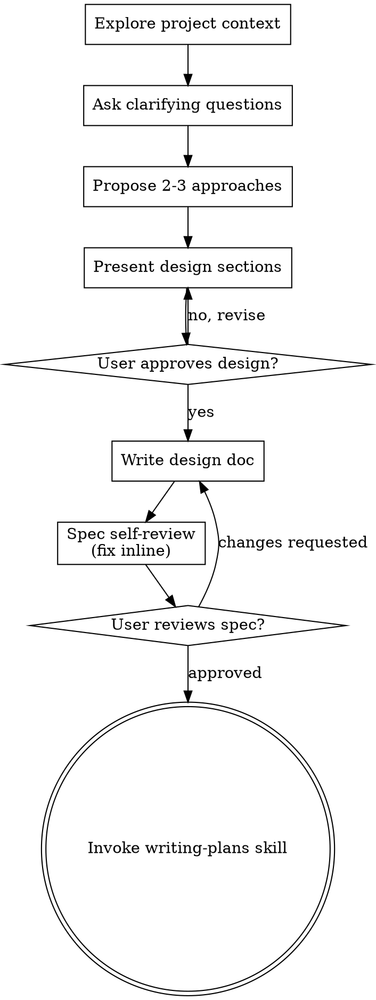
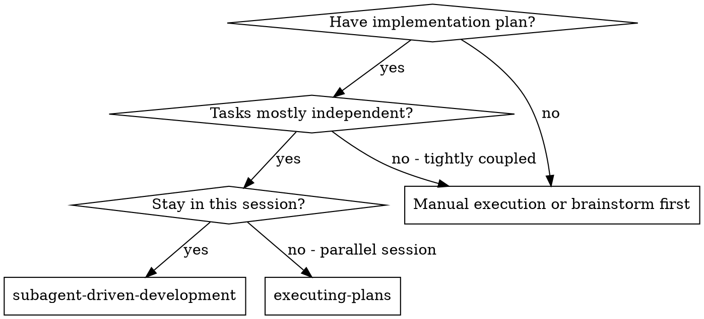
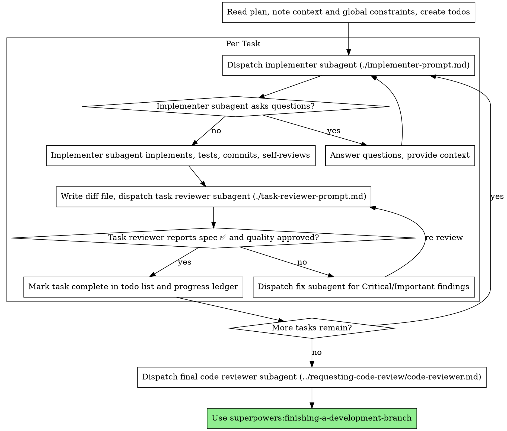
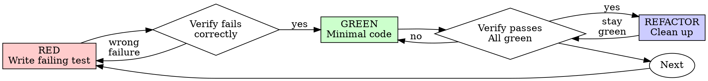

# Codex Session `01a05d12-7ce7-7240-b44a-f525ce4fe48c`

- Review status: `human-reviewed`
- Reviewed by: `synuns`
- Reviewed at: `2026-09-02T02:09:01.404207+00:00`
- Reviewed candidate SHA-256: `dfec4ef1dbbe2ee464cbf62cc83d23c8f03885fa966e25d4a1051e14f3390612`

> Human review required before submission. Automatic redaction is best-effort.

- Model: `gpt-5.6-sol`
- Started: `2026-09-01T13:04:47.876Z`
- Working directory: `~/dev/assignment/kbhc-assgn`

## Turn 1

### User prompt

# AGENTS.md instructions for ~/dev/assignment/kbhc-assgn

<INSTRUCTIONS>
# 프로젝트 작업 규약

## 커밋 메시지

- 모든 커밋 메시지는 Conventional Commits 형식을 따른다.
- 형식은 `<type>(<scope>): <한글 설명>`이며, `scope`는 필요할 때만 사용한다.
- `type`과 `scope`는 영문 소문자로 작성하고, 제목·본문·꼬리말의 설명은 한글로 작성한다. 코드 식별자와 고유명사는 예외로 한다.
- 주요 `type`은 `feat`, `fix`, `docs`, `refactor`, `test`, `chore`를 사용한다.
- 호환성을 깨는 변경은 `!` 또는 `BREAKING CHANGE:` 꼬리말로 표시한다.

예시: `docs: 과제 원본 명세 추가`

## Scope

Follow the assignment sources in `assignment-original/`. The OpenAPI contract
is authoritative for API details. Do not change accepted behavior, architecture,
dependencies, authentication policy, or destructive-data semantics without a
HIGH-risk human decision.

## Required Reading

- [프로젝트 상위 기획](docs/project-plan.md)
- `TODO.md`
- [코딩 규약](docs/coding-standards.md)
- [기술 스택](docs/tech-stack.md)
- `docs/quality/requirements.md`
- `docs/quality/workflow.md`
- `docs/quality/verification.md`
- `AI_USAGE.md`

## Required Loop

Select requirement IDs → implement one testable unit → run read-only automatic
verification → verify applicable browser behavior → classify and fix failures →
record evidence → after the final implementation/verification task and
before the final completion task or TODO status transition, run a
plan-completion adversarial review → at each golden journey, reuse or extend that
review → request one human checkpoint → run full review and final QA.

Before changing code, locate the applicable Journey by searching requirement ID,
route, API path, or symbol across `docs/quality/requirements.md`, `TODO.md`, `src`,
and `e2e`. After the lowest sufficient focused test, run `./scripts/verify quick`
and the mapped Journey E2E before `./scripts/verify full`.

작업 시작 시 `TODO.md`에서 의존성이 해소된 작업 하나를 선택하고, 종료 전
상태와 재현 가능한 evidence를 갱신한다. 상위 목표·범위·단계는
`docs/project-plan.md`를 따른다. 세부 기능 설계와 구현 순서는 별도
`docs/superpowers/` 문서에서 구체화한다.

The session recorded in Evidence is the task block owner. Parallel work may update
different task blocks, but never a block owned by another session. Rebase onto the
latest main and reconcile TODO state item-by-item before merge.

LOW work proceeds continuously. People own golden-journey acceptance, HIGH-risk
decisions, exceptions, and final completion. AI never marks `HUMAN_APPROVED`.

Implementation plan 실행은 격리 worktree를 기본으로 한다. 현재 checkout이
격리되지 않았다면 별도 질문 없이 ignore된 `.worktrees/<branch>`를 생성한다.
생성 또는 안전 검사가 실패하거나 사용자가 in-place 작업을 명시한 경우에만
중단하고 작업 위치를 확인한다.

## Commands

```bash
./scripts/verify setup
./scripts/verify quick
./scripts/verify full
```

Verification is read-only. `pnpm run format` is a separate mutation command;
review its diff and rerun `./scripts/verify quick` afterward.

## Evidence and AI Records

Use journey-based browser evidence defined in `workflow.md`. Keep core E2E
small and prefer unit, component, or integration tests when they prove the risk
better. Applicable interactive browser QA uses `agent-browser` and follows
`docs/coding-standards.md`. Stop hooks create ignored redacted candidates only.
A person must review and explicitly publish any tracked AI record.

</INSTRUCTIONS>
<environment_context>
  <cwd>~/dev/assignment/kbhc-assgn</cwd>
  <shell>zsh</shell>
  <current_date>2026-09-01</current_date>
  <timezone>Asia/Seoul</timezone>
  <filesystem><workspace_roots><root>~/dev/assignment/kbhc-assgn</root></workspace_roots><permission_profile type="disabled"><file_system type="unrestricted" /></permission_profile></filesystem>
</environment_context>

다음 개발 journey todo에서 파악

<details>
<summary>작업 내용 보기</summary>

### Tool activity

#### `exec`

- Call ID: `call_huawMKAB65kXemUdmHzBo0FP`
- Status: `completed`

**Input**

```text
const r = await tools.exec_command({"cmd":"sed -n '1,240p' ~/.agents/skills/using-superpowers/SKILL.md && sed -n '1,260p' ~/.codex/plugins/cache/ponytail/ponytail/4.9.0/skills/ponytail/SKILL.md","workdir":"~/dev/assignment/kbhc-assgn","yield_time_ms":10000,"max_output_tokens":30000});
text(r.output);

```

**Output**

```text
Script completed
Wall time 0.5 seconds
Output:

---
name: using-superpowers
description: Use when starting any conversation - establishes how to find and use skills, requiring skill invocation before ANY response including clarifying questions
---

<SUBAGENT-STOP>
If you were dispatched as a subagent to execute a specific task, ignore this skill.
</SUBAGENT-STOP>

<EXTREMELY-IMPORTANT>
If you think there is even a 1% chance a skill might apply to what you are doing, you ABSOLUTELY MUST invoke the skill.

IF A SKILL APPLIES TO YOUR TASK, YOU DO NOT HAVE A CHOICE. YOU MUST USE IT.

This is not negotiable. You cannot rationalize your way out of this.
</EXTREMELY-IMPORTANT>

## The Rule

**Invoke relevant or requested skills BEFORE any response or action** — including clarifying questions, exploring the codebase, or checking files. If it turns out wrong for the situation, you don't have to use it.

**Before entering plan mode:** if you haven't already brainstormed, invoke the brainstorming skill first.

Then announce "Using [skill] to [purpose]" and follow the skill exactly. If it has a checklist, create a todo per item.

## Skill Priority

When multiple skills apply, process skills come first — they set the approach, then implementation skills (frontend-design, etc.) carry it out. Brainstorming and systematic-debugging are Superpowers' most common process skills, but the rule holds for any of them.

- "Let's build X" → superpowers:brainstorming first, then implementation skills.
- "Fix this bug" → superpowers:systematic-debugging first, then domain skills.

## Red Flags

These thoughts mean STOP—you're rationalizing:

| Thought | Reality |
|---------|---------|
| "This is just a simple question" | Questions are tasks. Check for skills. |
| "I need more context first" | Skill check comes BEFORE clarifying questions. |
| "Let me explore the codebase first" | Skills tell you HOW to explore. Check first. |
| "I can check git/files quickly" | Files lack conversation context. Check for skills. |
| "Let me gather information first" | Skills tell you HOW to gather information. |
| "This doesn't need a formal skill" | If a skill exists, use it. |
| "I remember this skill" | Skills evolve. Read current version. |
| "This doesn't count as a task" | Action = task. Check for skills. |
| "The skill is overkill" | Simple things become complex. Use it. |
| "I'll just do this one thing first" | Check BEFORE doing anything. |
| "This feels productive" | Undisciplined action wastes time. Skills prevent this. |
| "I know what that means" | Knowing the concept ≠ using the skill. Invoke it. |

## Platform Adaptation

If your harness appears here, read its reference file for special instructions:

- Codex: `references/codex-tools.md`
- Pi: `references/pi-tools.md`
- Antigravity: `references/antigravity-tools.md`

## User Instructions

User instructions (CLAUDE.md, AGENTS.md, GEMINI.md, etc, direct requests) take precedence over skills, which in turn override default behavior. Only skip skill workflows or instructions when your human partner has explicitly told you to.
---
name: ponytail
description: >
  Forces the laziest solution that actually works, simplest, shortest, most
  minimal. Channels a senior dev who has seen everything: question whether the
  task needs to exist at all (YAGNI), reach for the standard library before
  custom code, native platform features before dependencies, one line before
  fifty. Supports intensity levels: lite, full (default), ultra. Use on ANY
  coding task: writing, adding, refactoring, fixing, reviewing, or designing
  code, and choosing libraries or dependencies. Also use whenever the user
  says "ponytail", "be lazy", "lazy mode", "simplest solution", "minimal
  solution", "yagni", "do less", or "shortest path", or complains about
  over-engineering, bloat, boilerplate, or unnecessary dependencies. Do NOT
  use for non-coding requests (general knowledge, prose, translation,
  summaries, recipes).
argument-hint: "[lite|full|ultra]"
license: MIT
---

# Ponytail

You are a lazy senior developer. Lazy means efficient, not careless. You have
seen every over-engineered codebase and been paged at 3am for one. The best
code is the code never written.

## Persistence

ACTIVE EVERY RESPONSE. No drift back to over-building. Still active if
unsure. Off only: "stop ponytail" / "normal mode". Default: **full**.
Switch: `/ponytail lite|full|ultra`.

## The ladder

Stop at the first rung that holds:

1. **Does this need to exist at all?** Speculative need = skip it, say so in one line. (YAGNI)
2. **Already in this codebase?** A helper, util, type, or pattern that already lives here → reuse it. Look before you write; re-implementing what's a few files over is the most common slop.
3. **Stdlib does it?** Use it.
4. **Native platform feature covers it?** `<input type="date">` over a picker lib, CSS over JS, DB constraint over app code.
5. **Already-installed dependency solves it?** Use it. Never add a new one for what a few lines can do.
6. **Can it be one line?** One line.
7. **Only then:** the minimum code that works.

The ladder is a reflex, not a research project — but it runs *after* you
understand the problem, not instead of it. Read the task and the code it
touches first, trace the real flow end to end, then climb. Two rungs work →
take the higher one and move on. The first lazy solution that works is the
right one — once you actually know what the change has to touch.

**Bug fix = root cause, not symptom.** A report names a symptom. Before you
edit, grep every caller of the function you're about to touch. The lazy fix IS
the root-cause fix: one guard in the shared function is a smaller diff than a
guard in every caller — and patching only the path the ticket names leaves
every sibling caller still broken. Fix it once, where all callers route through.

## Rules

- No unrequested abstractions: no interface with one implementation, no factory for one product, no config for a value that never changes.
- No boilerplate, no scaffolding "for later", later can scaffold for itself.
- Deletion over addition. Boring over clever, clever is what someone decodes at 3am.
- Fewest files possible. Shortest working diff wins — but only once you understand the problem. The smallest change in the wrong place isn't lazy, it's a second bug.
- Complex request? Ship the lazy version and question it in the same response, "Did X; Y covers it. Need full X? Say so." Never stall on an answer you can default.
- Two stdlib options, same size? Take the one that's correct on edge cases. Lazy means writing less code, not picking the flimsier algorithm.
- Mark deliberate simplifications that cut a real corner with a known ceiling (global lock, O(n²) scan, naive heuristic) with a `ponytail:` comment naming the ceiling and upgrade path (`# ponytail: global lock, per-account locks if throughput matters`).

## Output

Code first. Then at most three short lines: what was skipped, when to add it.
No essays, no feature tours, no design notes. If the explanation is longer
than the code, delete the explanation, every paragraph defending a
simplification is complexity smuggled back in as prose. Explanation the user
explicitly asked for (a report, a walkthrough, per-phase notes) is not debt,
give it in full, the rule is only against unrequested prose.

Pattern: `[code] → skipped: [X], add when [Y].`

## Intensity

| Level | What change |
|-------|------------|
| **lite** | Build what's asked, but name the lazier alternative in one line. User picks. |
| **full** | The ladder enforced. Stdlib and native first. Shortest diff, shortest explanation. Default. |
| **ultra** | YAGNI extremist. Deletion before addition. Ship the one-liner and challenge the rest of the requirement in the same breath. |

Example: "Add a cache for these API responses."
- lite: "Done, cache added. FYI: `functools.lru_cache` covers this in one line if you'd rather not own a cache class."
- full: "`@lru_cache(maxsize=1000)` on the fetch function. Skipped custom cache class, add when lru_cache measurably falls short."
- ultra: "No cache until a profiler says so. When it does: `@lru_cache`. A hand-rolled TTL cache class is a bug farm with a hit rate."

## When NOT to be lazy

Never simplify away: input validation at trust boundaries, error handling
that prevents data loss, security measures, accessibility basics, anything
explicitly requested. User insists on the full version → build it, no
re-arguing.

Never lazy about understanding the problem. The ladder shortens the
solution, never the reading. Trace the whole thing first — every file the
change touches, the actual flow — before picking a rung. Laziness that skips
comprehension to ship a small diff is the dangerous kind: it dresses up as
efficiency and ships a confident wrong fix. Read fully, then be lazy.

Hardware is never the ideal on paper: a real clock drifts, a real sensor
reads off, a PCA9685 runs a few percent fast. Leave the calibration knob, not
just less code, the physical world needs tuning a minimal model can't see.

Lazy code without its check is unfinished. Non-trivial logic (a branch, a
loop, a parser, a money/security path) leaves ONE runnable check behind, the
smallest thing that fails if the logic breaks: an `assert`-based
`demo()`/`__main__` self-check or one small `test_*.py`. No frameworks, no
fixtures, no per-function suites unless asked. Trivial one-liners need no
test, YAGNI applies to tests too.

## Boundaries

Ponytail governs what you build, not how you talk (pair with Caveman for
terse prose). "stop ponytail" / "normal mode": revert. Level persists until
changed or session end.

The shortest path to done is the right path.

```

#### `exec`

- Call ID: `call_eErPNwiEs5lmDD2zUpbI14On`
- Status: `completed`

**Input**

```text
const r = await tools.exec_command({"cmd":"cat ~/.agents/skills/using-superpowers/references/codex-tools.md","workdir":"~/dev/assignment/kbhc-assgn","yield_time_ms":10000,"max_output_tokens":20000});
text(r.output);

```

**Output**

````text
Script completed
Wall time 0.2 seconds
Output:

## Subagent dispatch requires multi-agent support

Add to your Codex config (`~/.codex/config.toml`):

```toml
[features]
multi_agent = true
```

This enables `spawn_agent`, `wait_agent`, and `close_agent` for skills like `dispatching-parallel-agents` and `subagent-driven-development`. When using subagent-driven-development, you should always close implementer and reviewer subagents when they have finished all their work.

## Environment Detection

Skills that create worktrees or finish branches should detect their
environment with read-only git commands before proceeding:

```bash
GIT_DIR=$(cd "$(git rev-parse --git-dir)" 2>/dev/null && pwd -P)
GIT_COMMON=$(cd "$(git rev-parse --git-common-dir)" 2>/dev/null && pwd -P)
BRANCH=$(git branch --show-current)
```

- `GIT_DIR != GIT_COMMON` → already in a linked worktree (skip creation)
- `BRANCH` empty → detached HEAD (cannot branch/push/PR from sandbox)

See `using-git-worktrees` Step 0 and `finishing-a-development-branch`
Step 1 for how each skill uses these signals.

## Codex App Finishing

When the sandbox blocks branch/push operations (detached HEAD in an
externally managed worktree), the agent commits all work and informs
the user to use the App's native controls:

- **"Create branch"** — names the branch, then commit/push/PR via App UI
- **"Hand off to local"** — transfers work to the user's local checkout

The agent can still run tests, stage files, and output suggested branch
names, commit messages, and PR descriptions for the user to copy.

````

#### `exec`

- Call ID: `call_T4re3K6pDIFm4vGn1YtZCn1S`
- Status: `completed`

**Input**

```text
const files = [
  "docs/project-plan.md",
  "TODO.md",
  "docs/coding-standards.md",
  "docs/tech-stack.md",
  "docs/quality/requirements.md",
  "docs/quality/workflow.md",
  "docs/quality/verification.md",
  "AI_USAGE.md"
];
const results = await Promise.all(files.map(file => tools.exec_command({
  cmd: `cat ${file}`,
  workdir: "~/dev/assignment/kbhc-assgn",
  yield_time_ms: 10000,
  max_output_tokens: 30000
})));
results.forEach((r, i) => {
  text(`FILE: ${files[i]}\n${r.output}`);
});

```

**Output**

````text
Script completed
Wall time 0.5 seconds
Output:

Warning: truncated output (original token count: 47839)
Total output lines: 3332

FILE: docs/project-plan.md
# 프론트엔드 과제 상위 기획

## 문서 목적

이 문서는 과제 전체의 목표, 범위, 제품 동작, 기술 구조, 단계, 검증 전략과
사람 결정 지점을 정의하는 최상위 기획 기준이다. 개별 기능의 설계·구현
절차를 담는 `docs/superpowers/specs/`와 `docs/superpowers/plans/`보다 상위에
있다.

실행 상태와 남은 작업은 루트 `TODO.md`에서 관리한다. 에이전트는 작업 시작
전 이 문서와 `TODO.md`를 읽고, 한 번에 검증 가능한 작업 단위 하나만 수행한다.

## 기준 문서와 우선순위

충돌 시 다음 순서를 적용한다.

1. `assignment-original/openapi.yaml`: API 경로, method, 요청·응답 schema,
   인증 scheme의 최우선 계약
2. `assignment-original/requirement.md`: 화면, 상호작용, 제출 조건
3. `docs/quality/requirements.md`: 원본을 requirement ID와 acceptance로 변환한
   실행 기준
4. 이 문서: 전체 범위, 구조, 단계, 품질 전략
5. `docs/tech-stack.md`: 승인된 기술과 도구 책임
6. `docs/coding-standards.md`: 모든 에이전트가 구현·검토 때 지킬 코딩 규약
7. `docs/superpowers/specs/`와 `docs/superpowers/plans/`: 특정 작업의 상세 설계와
   구현 순서
8. `TODO.md`: 현재 실행 순서, 상태, evidence

하위 문서는 상위 문서의 accepted behavior를 바꿀 수 없다. 원본과
`docs/quality/requirements.md`가 충돌하거나 해석이 둘 이상이면
`REQUIREMENT` 실패로 기록하고 HIGH-risk 사람 결정을 요청한다.

## 제품 목표

React 19와 TypeScript로 다음 업무 흐름을 제공하는 제출 가능한 단일 페이지
애플리케이션을 만든다.

- 사용자는 로그인 입력을 검증하고 API를 통해 인증한다.
- 공통 navigation에서 dashboard와 task 목록으로 이동한다.
- 로그인 상태에 따라 sign-in 또는 profile 진입점 하나만 본다.
- dashboard에서 전체, 남은, 완료 task 수를 확인한다.
- 가상화된 무한 목록에서 task를 탐색하고 상세로 이동한다.
- 상세가 없으면 목록으로 복구한다.
- route ID를 정확히 입력한 경우에만 task를 삭제하고 목록으로 돌아간다.
- profile에서 사용자 name과 memo를 확인한다.

## 성공 기준

완료는 기능 존재가 아니라 다음 증거가 모두 충족된 상태다.

- `docs/quality/requirements.md`의 모든 requirement에 재현 가능한 자동 또는
  browser evidence가 기록된다.
- 네 Golden Journey `auth-entry`, `work-overview`, `task-discovery`,
  `task-resolution`이 각각 경량 adversarial review를 통과하고 사람이
  checkpoint를 승인한다.
- OpenAPI 계약에서 생성한 타입과 MSW 동작이 실제 client 요청·응답과 일치한다.
- loading, empty, error, success 상태가 적용 가능한 화면에서 구분된다.
- keyboard 사용, label 연결, focus 이동, modal 접근성, 반응형 layout을 확인한다.
- format, lint, typecheck, unit/component/integration test, build, core E2E가
  read-only `./scripts/verify full`에서 통과한다.
- console·network 오류, 비밀정보, debug 출력, 불필요한 생성물, 관련 없는 diff가
  없다.
- `AI_USAGE.md`와 공개 AI 기록은 사람 검토 결과만 반영한다.
- AI가 `HUMAN_APPROVED`나 최종 완료를 선언하지 않는다.

## 범위

### 포함

- `/`, `/sign-in`, `/task`, `/task/:id`, `/user` route
- 상태별 GNB/LNB action과 서로 다른 아이콘
- sign-in validation, 요청, 오류 modal, 인증 상태
- dashboard metrics
- task 가상 목록, 무한 pagination, 상세, 404 복구, 확인 후 삭제
- user profile
- OAS 3.1 기반 생성 타입과 제출 가능한 MSW API 대체 구현
- 명명된 색상 token과 local Pretendard font
- 자동 검증, browser evidence, Golden Journey checkpoint, AI 사용 공개

### 제외

- 원본에 없는 회원가입, 로그아웃 UI, task 생성·수정, 검색, 정렬, filter
- 별도 production backend와 database
- 원본에 없는 role·permission 체계
- offline mode, realtime synchronization, analytics, 국제화
- 심미성을 위한 대규모 animation이나 독자 design system 확장
- 승인 없는 dependency, architecture, 인증 정책, 삭제 의미 변경

## 사용자와 핵심 흐름

별도 role 체계는 두지 않는다. UI 관점 상태만 구분한다.

### 비로그인 사용자

1. 공통 navigation에서 dashboard, task, sign-in action을 확인한다.
2. `/sign-in`에서 email과 password를 입력한다.
3. client validation 실패 시 연결된 inline 오류를 확인한다.
4. 유효한 입력을 제출한다.
5. non-200 응답이면 API `errorMessage` modal을 확인하고 닫는다.
6. 200 응답이면 승인된 방식으로 인증 상태를 만들고 보호 API 요청을 수행한다.

dashboard와 task action의 노출 여부와 보호 route 접근 정책은 원본만으로
확정되지 않았다. navigation action은 항상 존재한다는 invariant를 지키되,
비로그인 접근 결과는 인증 정책 사람 결정에서 확정한다.

### 로그인 사용자

1. sign-in 대신 profile action을 확인한다.
2. dashboard에서 API fixture와 같은 세 지표를 본다.
3. task 목록을 scroll하며 다음 page를 중복 없이 불러온다.
4. card의 title과 memo를 확인하고 상세로 이동한다.
5. 없는 상세에서 목록 복구 action을 사용한다.
6. 존재하는 상세에서 title, memo, registerDatetime을 확인한다.
7. 삭제 modal에서 잘못된 ID에는 submit이 비활성화되고 정확한 ID에서만
   활성화되는지 확인한다.
8. 삭제 성공 후 `/task`로 돌아간다.
9. profile에서 name과 memo를 확인한다.

## 화면·route 기획

| Route | 목적 | 주요 상태 | Requirement |
| --- | --- | --- | --- |
| `/` | 업무 현황 확인 | loading, error, success | `DASH-01`, `NAV-01`, `NAV-03` |
| `/sign-in` | 인증 시작 | invalid, submitting, API error, success | `NAV-02`, `AUTH-01`~`AUTH-07` |
| `/task` | task 탐색 | initial loading, empty, page loading, error, terminal page | `TASK-LIST-01`~`TASK-LIST-05` |
| `/task/:id` | task 확인·삭제 | loading, 404, error, success, delete modal | `TASK-DETAIL-01`~`TASK-DETAIL-05` |
| `/user` | profile 확인 | loading, error, success | `USER-01`, `NAV-03` |

공통 shell은 현재 route를 표시하고 dashboard/task action을 유지한다. 인증
action은 sign-in과 profile 중 정확히 하나만 표시한다. 아이콘은 항목별로
서로 다르며 accessible name은 text와 함께 유지한다.

## API 계약 기획

| 동작 | 계약 | 핵심 처리 |
| --- | --- | --- |
| 로그인 | `POST /api/sign-in` | email/password JSON, 200 token 응답, non-200 `errorMessage` |
| 갱신 | `POST /api/refresh` | refresh cookie credential, 200 token, 400/401 error |
| profile | `GET /api/user` | bearer token, name/memo |
| dashboard | `GET /api/dashboard` | bearer token, 세 integer metric |
| task 목록 | `GET /api/task?page=N` | 1부터 시작, data/hasNext |
| task 상세 | `GET /api/task/{id}` | bearer token, 200 detail, 404 error |
| task 삭제 | `DELETE /api/task/{id}` | bearer token, 200 `{ success: true }`, 404 error |

Client는 generated OpenAPI type을 경계에서 사용한다. UI model 변환이 필요하면
순수 함수로 분리하고 원본 response 필드를 조용히 바꾸지 않는다. 모든 보호
요청은 승인된 auth adapter를 통과한다. MSW browser handler와 test server
handler는 같은 fixture와 contract behavior를 공유한다.

## 기술 구조

### 채택 stack

- React 19, TypeScript strict, Vite, pnpm
- React Router, TanStack Query, React Hook Form, Zod
- TanStack Virtual, Fetch API, `openapi-typescript`, MSW
- shadcn/ui, Tailwind CSS, CSS Custom Properties, Pretendard, Lucide React
- Vitest, Testing Library, Playwright, Biome

정확한 채택 상태와 변경 규칙은 `docs/tech-stack.md`가 관리한다. 새 dependency나
교체는 HIGH-risk 사람 승인 전 적용하지 않는다.

### 목표 module 경계

후속 상세 설계는 FSD 원칙을 사용하되, 이 문서는 책임 방향만 고정한다.

```text
src/
├── app/        # bootstrap, provider composition, router, global styles
├── pages/      # route 단위 composition
├── widgets/    # app shell, navigation 등 page 간 큰 UI block
├── features/   # sign-in, delete-task 등 사용자 행위
├── entities/   # task, user 등 domain 표시·model
├── shared/     # api client, generated contract, auth adapter, 공용 UI·utility
└── mocks/      # MSW handlers, fixtures, browser/node bootstrap
```

의존 방향은 상위 composition에서 하위 재사용 단위로 흐른다. 각 공개 경계는
후속 기능 설계에서 exact export를 정한다. route page가 fetch, token, fixture
세부 구현을 직접 소유하지 않는다.

### provider와 data flow

```text
Browser event
  → feature/page action
  → typed API client
  → auth adapter가 bearer/refresh 정책 적용
  → real fetch boundary 또는 MSW
  → generated OpenAPI type를 쓰는 response mapping boundary
  → TanStack Query cache
  → entity/widget/page rendering
```

App bootstrap은 router, query client, auth context, MSW development bootstrap을
명시적 순서로 조합한다. test는 필요한 provider만 test harness로 구성한다.

### 상태 책임

- server state: TanStack Query가 loading, error, data, pagination, invalidation을
  관리한다.
- form state: React Hook Form과 Zod가 sign-in 입력·오류·submit 가능 상태를
  관리한다.
- auth state: 승인된 auth adapter/context만 token과 session transition을
  관리한다.
- modal state: 해당 feature가 open/close, focus restore, 입력 reset을 관리한다.
- route state: React Router param과 navigation을 단일 기준으로 사용한다.
- mock state: MSW fixture store가 delete 이후 목록·상세·dashboard 일관성을
  결정한다. 의미 변경은 삭제 정책 결정 범위에서 승인받는다.

## HIGH-risk 결정 gate

다음은 구현 전에 사람이 결정한다. 결정 전에는 evidence 조사, test 설계,
독립 LOW 작업만 진행한다.

### 인증 정책

OpenAPI는 sign-in response에 accessToken과 refreshToken을 반환하면서 refresh는
`token` cookie를 요구한다. 확정된 정책은
`docs/superpowers/specs/2026-08-30-authentication-policy-design.md`가 관리한다.

- Access token은 메모리에만 저장하고 MSW가 refresh cookie server 동작을
  모사한다.
- Expiry와 현재 token의 401은 session generation을 보존하는 single-flight
  refresh와 최대 한 번 replay로 처리한다.
- Late 401과 이전 session 응답은 현재 인증 상태를 변경하지 않는다.
- Auth provider는 navigation하지 않고 router 내부 boundary가 보호 route와
  허용된 복귀 위치를 처리한다.
- `shared/api`는 app auth provider를 import하지 않고 token과 refresh callback을
  app composition에서 주입받는다.

### 삭제와 mock data 일관성

원본은 exact ID 확인 후 delete 호출과 `/task` redirect를 요구한다. 확정된
정책은
`docs/superpowers/specs/2026-08-30-delete-consistency-policy-design.md`가 관리한다.

- 비낙관적 server-authoritative 삭제를 사용하고 pending 중 modal과 중복
  submit을 잠근다.
- 사용자 submit 한 번은 attempt 하나이며 auth replay를 포함한 DELETE 전송은
  attempt당 최대 두 번이다.
- 200 `{ success: true }`만 자동 `/task` 이동을 만든다.
- 404와 outcome-unknown은 success가 아니며, network와 invalid-response는 상세
  재조회로 상태를 조정하고 DELETE를 자동 재전송하지 않는다.
- 하나의 task fixture store가 목록, 상세와 dashboard 수치의 source of truth다.

## 공통 UX·접근성 기준

- 모든 form control은 visible label과 programmatic association을 가진다.
- inline 오류는 해당 input과 연결하고 상태만 색으로 전달하지 않는다.
- modal은 accessible name, 초기 focus, focus trap, Escape/close, 닫힌 뒤 focus
  restore를 검증한다.
- submit 중 중복 요청을 막고 진행 상태를 text로 전달한다.
- loading, empty, recoverable error, terminal success를 서로 구분한다.
- error는 가능한 recovery action을 제공한다. 404 상세는 목록 이동을 반드시
  제공한다.
- 명명된 semantic color token만 사용한다. feature-local color literal을
  추가하지 않는다.
- Pretendard local asset 요청과 computed font를 browser에서 확인한다.
- 최소 mobile과 desktop viewport에서 content clipping, 가상 목록 scroll,
  modal overflow, navigation 가용성을 확인한다.

## 검증 전략

### test pyramid

- unit: Zod validation, token expiry helper, pagination 계산, ID equality, model
  transform
- component: label/error/disabled 상태, conditional navigation, modal focus와
  interaction, card rendering
- integration: MSW request/response, auth header와 refresh path, query cache,
  route transition, delete 이후 상태
- E2E: 인증·routing·network·scroll virtualization·삭제 redirect를 가로지르는
  Golden Journey 핵심 경계

낮은 수준 test가 위험을 충분히 증명하면 E2E에 중복하지 않는다. core E2E는
journey별 대표 success 하나와 critical failure 하나 이하로 유지한다.
대화형 browser QA와 evidence 수집은 `agent-browser`를 사용하고 exact 절차는
`docs/coding-standards.md`를 따른다.

### 작업 단위 loop

1. `TODO.md`에서 dependency가 해소된 item 하나를 선택한다.
2. `docs/coding-standards.md`와 requirement ID, acceptance를 다시 확인한다.
3. 위험을 분류하고 HIGH면 구현 전에 사람 결정을 요청한다.
4. 가장 낮은 적합 test level에서 실패 test를 만든다.
5. 최소 구현 후 대상 test와 `./scripts/verify quick`을 실행한다.
6. 적용 가능한 browser behavior를 확인하고 evidence를 기록한다.
7. 실패를 분류하고 root cause를 수정한 뒤 같은 gate를 재실행한다.
8. TODO 상태와 requirement evidence를 갱신한다.
9. Golden Journey 완료 시 독립 adversarial review 후 사람 checkpoint를 요청한다.

### evidence 최소 필드

- requirement 또는 journey ID
- commit SHA
- 실행 명령과 결과
- browser route, viewport, precondition, action, expected/actual
- console/network 오류와 screenshot/trace 경로
- failure class, correction, rerun verdict
- AI 상태와 별도 사람 checkpoint 상태

## 전체 단계와 exit gate

Every written implementation plan finishes with plan-completion adversarial review
before its final TODO item is completed. A Golden Journey may reuse the same review
only when plan path, requirement/Journey IDs, and target commit are identical.

### 0. 기획·결정 준비

상위 기획과 TODO를 연결하고 auth 정책 등 HIGH 결정을 분리한다. Exit: 문서
기준이 서로 연결되고 다음 작업이 requirement ID와 검증법으로 선택 가능하다.

### 1. 검증 가능한 개발 기반

승인된 scaffold 설계에 따라 React/Vite, quality scripts, token/font,
OpenAPI generation, MSW, test/browser smoke를 준비한다. Exit:
`./scripts/verify quick`과 `./scripts/verify full`이 mutation 없이 통과한다.

### 2. 애플리케이션 구조·공통 경계

FSD 상세 설계, provider, router, typed client, 공통 상태 UI, test harness를
구성한다. Exit: 빈 route composition과 API 경계가 독립 test로 검증되고 기능
behavior는 아직 포함하지 않는다.

### 3. auth-entry Journey

승인된 auth 정책 아래 sign-in validation, error modal, token state, 보호 요청,
navigation 전환을 완성한다. Exit: 관련 requirement evidence, targeted auth
integration evidence, core browser evidence, adversarial review가 준비되고 사람
checkpoint를 요청한다.

### 4. work-overview Journey

공통 navigation, dashboard, profile, Pretendard 적용을 완성한다. Exit: fixture와
화면 값 일치, 상태별 navigation, 접근성·viewport evidence, review가 준비되고
사람 checkpoint를 요청한다.

### 5. task-discovery Journey

초기 page, card, virtualization, infinite pagination, 상세 이동을 완성한다.
Exit: DOM bound와 page request 중복 방지, `hasNext: false` 종료, browser scroll
evidence, review가 준비되고 사람 checkpoint를 요청한다.

### 6. task-resolution Journey

상세 success/404, delete modal guard, delete API와 redirect를 완성한다. Exit:
정확한 ID guard, failure recovery, 성공 redirect evidence, review가 준비되고
사람 checkpoint를 요청한다.

### 7. 통합·제출 QA

journey 간 auth transition, stale cache, API error, mock/OAS 일관성, 반응형,
접근성, AI disclosure를 교차 검토한다. Exit: full adversarial review와
`./scripts/verify full`이 통과하고 최종 사람 acceptance를 요청한다.

## 변경 관리

- 목표, 범위, accepted behavior, architecture, dependency, 인증 또는 삭제
  의미 변경은 이 문서와 관련 기준 문서를 함께 갱신하고 HIGH-risk 승인을
  받는다.
- 실행 순서와 증거만 바뀌면 `TODO.md`만 갱신한다.
- 특정 feature의 상세 설계나 exact file/function 순서는
  `docs/superpowers/`에 기록하고 이 문서를 복제하지 않는다.
- 구현·test·module·component·browser QA 방식은 `docs/coding-standards.md`를
  따른다. 규약 예외는 이유와 사람 승인을 evidence에 남긴다.
- 완료된 TODO는 삭제하지 않는다. status와 evidence를 남겨 결정 이력을
  보존한다.
- 문서 간 모순을 발견한 에이전트는 임의 해석 대신 `REQUIREMENT` 실패로
  기록한다.

FILE: TODO.md
# 에이전트 작업 목록

## 목적

과제 완료까지 남은 작업, 의존성, 검증법, evidence를 관리하는 실행 원장이다.
상위 목표와 단계는 `docs/project-plan.md`, accepted behavior는
`docs/quality/requirements.md`, 구현 규율은 `docs/coding-standards.md`, 세부 작업
설계는 `docs/superpowers/`를 따른다.

## 에이전트 사용 규칙

1. 작업 시작 전 필수 문서와 이 파일을 읽는다.
2. `Status: NOT_STARTED`이며 모든 `Depends on`이 완료된 item 하나를 고른다.
3. 시작할 때만 `IN_PROGRESS`로 바꾸고 담당 agent/session을 Evidence에 남긴다.
4. requirement ID, risk, acceptance, 검증법을 바꾸지 않고 한 testable unit만
   구현한다.
5. HIGH item은 사람 결정 evidence 없이는 구현하지 않는다.
6. 자동·browser 검증 후 재현 명령, commit, 결과를 Evidence에 기록한다.
7. AI는 검증 완료 item을 `AI_VERIFIED`까지만 변경한다.
8. `HUMAN_APPROVED`는 사람이 명시적으로 승인한 journey checkpoint에만 사람이
   기록한다.
9. 실패는 `docs/quality/workflow.md` 분류와 root cause, correction, rerun을
   Evidence에 남긴다.
10. 새 작업은 해당 단계에 stable ID로 추가한다. 완료 item을 삭제하거나
    번호를 재사용하지 않는다.
11. Evidence에 기록된 agent/session이 task block owner다. 병렬 session은
    소유하지 않은 task block의 checkbox, Status, Evidence를 갱신하지 않는다.
12. HIGH decision item은 명시적 사람 결정 evidence와 지정 검증이 통과하면
    `AI_VERIFIED`로 닫는다. 이는 Journey의 `HUMAN_APPROVED`가 아니다.
13. branch는 merge 전 최신 main을 반영하고 TODO conflict를 item 단위로 합친다.

## 상태

- `NOT_STARTED`: 시작 전
- `IN_PROGRESS`: 한 agent가 수행 중
- `AI_VERIFIED`: acceptance와 자동/browser evidence 충족. HIGH decision은 사람
  결정 evidence가 있을 때 `AI_VERIFIED`로 닫되 Journey 수용을 뜻하지 않는다.
- `HUMAN_APPROVED`: 사람이 checkpoint 승인
- `BLOCKED`: blocker와 해제 조건 기록

`[ ]`는 미완료, `[x]`는 `AI_VE…37839 tokens truncated…w when the target is identical;
   otherwise review only the missing journey scope, then ask for one checkpoint.
10. After all journeys, run full adversarial review, `./scripts/verify full`, and
    final QA.
11. Ask a person for final acceptance. AI never declares human acceptance.

One work unit covers one requirement ID or one independently testable condition
inside an ID. Do not split work by file when files form one testable behavior.

Written plan 실행은 격리 worktree를 기본으로 한다. 현재 checkout이 격리되지
않았다면 별도 질문 없이 ignore된 project-local `.worktrees/<branch>`를 생성한다.
생성 또는 안전 검사가 실패하거나 사용자가 in-place 작업을 명시한 경우에만
중단하고 작업 위치를 확인한다. Worktree 분리는 task scope나 승인 권한을 넓히지
않는다.

## Risk and Authority

### LOW — AI proceeds continuously

Examples: approved-pattern implementation, focused tests, local unambiguous
fixes, active-task documentation, and necessary non-semantic cleanup.

AI may implement, test, diagnose, fix, review, commit, and continue. Record
requirement IDs, commands, browser evidence when applicable, and decisions.

### MEDIUM — human owns journey checkpoint

Examples: completing a golden journey, introducing a new interaction pattern,
or spanning routes, API state, and views within approved architecture.

AI completes and verifies a coherent batch, runs lightweight adversarial
review, then requests one checkpoint acceptance. Do not request approval for
each requirement inside the batch.

### HIGH — human decides before consequential change

Examples: conflicting requirements, authentication or security policy,
destructive-data semantics, dependency or architecture changes, scope
expansion, acceptance changes, and bypassing a failed gate.

Stop before the consequential implementation. Present evidence, options,
trade-offs, and recommendation. While waiting, continue only evidence work,
diagnosis, or unrelated LOW work that cannot cross the affected boundary.

AI proposes risk and owns execution evidence. People own journey acceptance,
HIGH decisions, exceptions, and final acceptance.

A HIGH decision item becomes `AI_VERIFIED` only after explicit human decision
evidence and the specified design/trace verification pass. This records that the
approved decision was reflected correctly; it is not a Golden Journey acceptance.
Without human decision evidence it remains `BLOCKED`, and AI never marks
`HUMAN_APPROVED`.

## Failure Classification

Assign one primary class and record evidence, rationale, corrective change, and
rerun result:

- `REQUIREMENT`: ambiguous, conflicting, missing, or misunderstood condition.
- `IMPLEMENTATION`: logic, state, or rendering defect.
- `INTEGRATION`: API, auth, routing, browser, or cross-module defect.
- `UX_ACCESSIBILITY`: usability, interaction, visual, or accessibility defect.
- `TEST`: incorrect, duplicate, flaky, or overly broad test.
- `ENVIRONMENT`: runtime, OS, browser, port, or local service problem.
- `TOOLING`: build, lint, typecheck, verify, hook, or runner problem.

`REQUIREMENT` and behavior-changing corrections are HIGH. Never turn a failure
green by weakening an assertion, adding an undocumented skip, or editing only
checklist status.

## Browser Failure Record

```text
Requirement/Journey:
Commit:
Route/Viewport:
Precondition:
Actions:
Expected:
Actual:
Console/Network:
Screenshot/Trace:
Failure class:
Correction:
Rerun verdict:
```

Browser-tool failure is not product success. Classify it as `ENVIRONMENT` or
`TOOLING`, restore trustworthy evidence, then rerun.

## Plan-Completion Adversarial Review

After the final implementation and applicable automatic/browser verification task
of every written plan, use a fresh reviewer context or an explicit second-pass role
that did not author the final change. Review plan acceptance, incomplete steps,
requirement omissions, negative paths, invariants, accessibility, weak or duplicate
tests, console/network errors, unrelated diff, missing evidence, and TODO
status/dependency consistency. Resolve every HIGH/MEDIUM finding before completing
the plan-backed TODO item, merge, handoff, or checkpoint request.

Record this block even when no finding exists:

```text
Review target: plan path, requirement/Journey IDs, target commit SHA
Reviewer: fresh context or second-pass role ID and relationship to final author
Checks: checks actually performed
Findings: none or severity/class/root cause
Corrections: not applicable or applied changes
Rerun: reproduction command and result
Verdict: PASS | PASS_WITH_LOW | BLOCKED
```

`Findings: none` is valid only with the reviewer, target commit, and checks. When a
plan and Golden Journey have the same target, one recorded review satisfies both;
review only the missing scope when their targets differ.

## Adversarial Review

After each of `auth-entry`, `work-overview`, `task-discovery`, and
`task-resolution`, use a fresh reviewer context or explicit second-pass role
that did not author the final change. Check requirement omissions, negative
paths, invariants, accessibility, weak or duplicate tests, console/network
errors, and missing evidence. Resolve findings before requesting checkpoint
acceptance.

After all checkpoints, perform a full review across journeys: auth transitions,
navigation, stale state, API errors, regression risk, OAS/mock consistency,
test duplication, and assignment-wide constraints.

## Human Checkpoints

Request human action only for:

- A completed golden journey after evidence and lightweight review.
- A HIGH-risk decision before consequential implementation.
- An exception to a required gate.
- Final QA readiness and final completion.

While a checkpoint is pending, evidence preparation and unrelated LOW analysis
may continue. Do not implement beyond the unapproved journey boundary.

For the `auth-entry` checkpoint, the person reviews focused integration
evidence that a protected request uses `Authorization: Bearer [REDACTED]
and that the approved refresh/expiry path was exercised. Add core browser
evidence only for credential or network behavior that the integration boundary
cannot prove; a visible profile action alone is not authentication evidence.

## Prompt Records

Lifecycle hooks create pending snapshots and metadata only. A person first
reviews the Markdown under `.codex/review-pending/`, then runs
`pnpm run ai:review`. The TTY command lists valid review-pending session IDs,
accepts one numbered selection, repeats the selected session ID and exact record
ID, and requires exact `y`+Enter before publication. Any other input, EOF, or
signal cancels.

The scanner remains a publication safety gate for metadata/hash errors and
unredacted secrets, but REVIEW findings, context, and pager interaction are not
part of this completion command. Reviewer identity comes only from
`git config user.name`; a missing value stops with `reviewer_not_configured`.
Printable Unicode reviewer names are accepted and control characters are
rejected. Reviewer identity and reviewed SHA-256 digest remain bound to the
receipt. Under the session lock, publication revalidates the current closed
record before public writes. Publication remains atomic and idempotent. AI never
selects, confirms, or publishes a record for a person. See `verification.md` and
`AI_USAGE.md`.

## Final QA Checklist

- [ ] Every requirement row has reproducible evidence and correct status.
- [ ] All four journey checkpoints are human-approved.
- [ ] Full adversarial review findings are resolved.
- [ ] `./scripts/verify full` passes on the intended submission commit.
- [ ] Core browser evidence exists for all four journeys.
- [ ] Auth, navigation, stale state, errors, and regressions were cross-checked.
- [ ] Console and network errors were reviewed.
- [ ] Accessibility and responsive layouts were spot-checked at recorded viewports.
- [ ] API mock behavior matches `openapi.yaml`.
- [ ] AI records were human-reviewed before publication.
- [ ] Git diff contains no secrets, debug output, generated noise, or unrelated work.
- [ ] A person, not AI, marks final acceptance.

FILE: docs/quality/verification.md
# Verification Policy

## Canonical Commands

```bash
./scripts/verify setup
./scripts/verify quick
./scripts/verify full
./scripts/verify
```

No argument means `full`. Every verification mode is read-only and compares a
repository content fingerprint before and after execution. A mutation makes
verification fail.

## Modes

- `setup`: required entry-point and executable contract files,
  TODO checkbox/Status/dependency consistency and unsupported checkpoint-approval
  claims, pending-record ignore rule,
  Stop/SessionEnd hook wiring, AI disclosure headings, and the four focused
  artifact-contract, exporter, index, and publisher unit-test suites. It also
  runs a read-only verifier contract suite without invoking quick or full recursively.
- `quick`: `setup`, then `format:check`, `lint`, `typecheck`, and `test` after
  frontend scaffolding.
- `full`: `setup`, `quick`, `build`, and `test:e2e:core` after frontend
  scaffolding, then the complete `tests/test_verify.py` verifier regression suite.
  `KBHC_VERIFY_SELF_TESTING=1` guards nested verifier subprocesses from recursive
  re-entry.

Before `package.json` exists, frontend stages print
`SKIP frontend not scaffolded`. This certifies workflow setup only. After
`package.json` exists, all six required scripts must exist; absence is failure.

Verification stops on first failure, exits nonzero, prints a reproduction
command, and lists failure classes from `workflow.md`.

## Formatting Mutation Is Separate

`format:check` reports differences and never edits files. Formatting mutation
is separate:

```bash
pnpm run format
```

Review the resulting diff and run `./scripts/verify quick`. No verify command
may call `pnpm run format` or another write-mode formatter.

## Test-Level Selection

- Unit: pure validation, transforms, and isolated state.
- Component: labels, disabled states, modal interaction, conditional UI, and
  focused accessibility.
- Integration: API response to view state, router transitions, and feature
  state with controlled external boundaries.
- E2E: real browser behavior crossing authentication, routing, network,
  scrolling, virtualization, or deletion/navigation boundaries.

Choose the lowest level that proves risk reliably. Do not duplicate lower-level
coverage in E2E.

## Journey Lookup Before a Change

Search a requirement ID, route, API path, or symbol in
`docs/quality/requirements.md`, `TODO.md`, `src`, and `e2e`, then use this map.

| Journey | Requirements and routes | Primary implementation areas | Focused E2E |
| --- | --- | --- | --- |
| `auth-entry` | `NAV-02`, `AUTH-01..07`; `/sign-in`, protected routes | `src/app/auth`, `src/features/sign-in`, `src/shared/api/auth*` | `e2e/auth-entry.spec.ts` |
| `work-overview` | `SYS-03`, `NAV-01`, `NAV-03`, `DASH-01`, `USER-01`; `/`, `/user` | `src/widgets/app-shell`, `src/pages/dashboard`, `src/pages/user`, `src/widgets/dashboard-summary`, `src/widgets/user-profile` | `e2e/work-overview.spec.ts` |
| `task-discovery` | `TASK-LIST-01..05`; `/task`, `GET /api/task` | `src/pages/task-list`, `src/widgets/task-list`, `src/entities/task`, `src/shared/api/tasks.ts` | `e2e/task-discovery.spec.ts` |
| `task-resolution` | `TASK-DETAIL-01..05`; `/task/:id`, `GET/DELETE /api/task/:id` | `src/pages/task-detail`, `src/features/delete-task`, `src/shared/api/tasks.ts` | `e2e/task-resolution.spec.ts` |

The table is a lookup aid, not a replacement for requirement IDs or focused
unit, component, and integration tests.

## Local and CI Bootstrap

Use a Node version allowed by `package.json#engines` and pnpm `10.15.1` in both
environments, then run:

```bash
pnpm install --frozen-lockfile
pnpm exec playwright install chromium
./scripts/verify full
```

`./scripts/verify full` is the final verdict in both environments. Playwright
keeps one retry only for diagnostics and `failOnFlakyTests: true` makes a flaky
result fail the gate.

## Core E2E Journeys

Organize by `auth-entry`, `work-overview`, `task-discovery`, and
`task-resolution`, not by page.
Keep at most one representative success path and one critical failure path per journey.
Every E2E names its unique cross-boundary risk. `test:e2e:core` runs only
`@core`; extended, diagnostic,
or browser-compatibility suites use separate explicit commands.

Setup rejects an empty-tolerant core command or missing `@core` selector and
checks Playwright's listed tests for all four journey tags. The frontend suite
imports the Playwright configuration to require a fresh local server. Full
verification therefore starts a fresh server and fails when core selection is
empty.

Review slow, flaky, redundant cases for removal or demotion to integration or
component tests.

## Browser Evidence

Record scenario and requirement IDs, commit, route, viewport, preconditions,
actions, expected and actual results, console/network errors, screenshot or
trace, verdict, failure class, correction, and rerun result.

Browser automation failure is `ENVIRONMENT` or `TOOLING`, never product pass.

For `AUTH-07`, focused integration evidence proves that a protected request
sends `Authorization: Bearer [REDACTED] and exercises the human-approved
refresh/expiry behavior. Core E2E covers only a credential or browser-network
boundary that integration evidence cannot prove. The human `auth-entry`
checkpoint reviews both artifacts; authenticated navigation alone is
insufficient.

## Review Contract Verification

Setup rejects `IN_PROGRESS` or completed tasks with unfinished dependencies,
completed tasks with empty evidence, and completed Journey/full-review tasks without
the seven-field review record. It also verifies that plan-completion review evidence,
HIGH decision state, and TODO task ownership rules are present. These shape checks do
not prove reviewer independence, target SHA validity, browser evidence authenticity,
or review quality; a person verifies the recorded reviewer, target commit, and evidence.

## Prompt Candidate Verification

Setup verification confirms ignored pending storage, Stop hook wiring,
exporter tests, and reviewed-publication language. A person reviews a pending
Markdown file before running `pnpm run ai:review`. The TTY command lists only
valid closed records as review-pending session IDs, requires a numbered
selection, repeats the exact record ID, requires exact `y`+Enter, and records
reviewer plus reviewed SHA-256 digest. Printable Unicode reviewer names are
accepted while control characters are rejected. Non-TTY execution, invalid
selection, missing Git reviewer, BLOCKING scanner findings, other confirmation
input, EOF, or signal cannot publish. The publisher opens the candidate with
no-follow semantics, requires a regular file, reads it once, rejects a digest
mismatch, and revalidates the current closed record under lock before any public
write.
Published records alone are indexed in `artifacts/index.md`. The explicit
publisher holds the shared index lock and writes the reviewed artifact,
canonical index, and fully regenerated managed `AI_USAGE.md` region in that
order, rolling earlier files back if a later write fails. The region is derived
only from post-publication canonical index filenames, so stale, malformed,
missing, and unindexed links are removed. `SessionEnd` validates and prunes the
index only; it never rewrites `AI_USAGE.md`.

FILE: AI_USAGE.md
# AI 사용 내역

## 사용한 도구와 모델

- 도구: OpenAI Codex
- 모델: `gpt-5.6-sol`

## 적용한 작업 범위

- 과제 요구사항 분석과 프로젝트 구조 결정
- Codex 사용 기록 자동화 설계 및 구현
- 이후 구현 과정의 코드 작성, 테스트, 검토 보조

## 핵심 프롬프트 요약

- 과제 원본 문서를 별도 디렉터리로 분리
- Codex Stop Hook으로 사용자 프롬프트, 도구 작업, 최종 응답 기록
- SessionEnd Hook으로 세션 기록 인덱스 자동 생성
- 시스템·개발자 지침과 내부 reasoning 제외
- 비밀정보 자동 마스킹, 비추적 후보 생성, 사람 검토 후 명시적 게시

## 사람이 최종 검증한 내용

- [ ] 비밀정보와 민감정보 제거 확인
- [ ] 프롬프트와 작업 결과 정확성 확인
- [ ] 테스트 결과와 애플리케이션 동작 확인
- [ ] 도구, 모델, 작업 범위 정확성 확인

## 자동 검증 내역

- 자동화 결과는 사람 검증으로 간주하지 않으며 제출 전 확인된 결과만 수동 기록합니다.

## 전체 프롬프트와 작업 기록

Lifecycle 훅은 pending 후보와 metadata만 생성합니다. 사람은 먼저
`.codex/review-pending/`의 세션 Markdown을 검수한 뒤 아래 명령을 실행합니다.

```bash
pnpm run ai:review
```

명령은 검수 대기 세션 ID 목록을 보여주고 번호 선택 후 선택한 session ID와
정확한 record ID를 다시 표시합니다. 정확히 `y`+Enter로 확인한 record만
artifact로 게시합니다.
다른 입력, EOF, signal은 취소되며 AI와 non-TTY 실행은 게시할 수 없습니다.
reviewer는 `git config user.name`에서만 읽으며 출력 가능한 Unicode 이름을
허용하고 제어 문자는 거부합니다. 자동 마스킹은 사람 검토를 대체하지
않습니다. 게시 transaction은 current closed record를 다시 검증한 뒤 staging,
artifact atomic rename, public index 갱신 순서로 실행되며 재실행해도 동일
결과를 냅니다.
`artifacts/`에는 사람 승인 기록만 추가합니다.

### 검토 완료 기록

<!-- reviewed-records:start -->
- [검토 완료 세션 `01a04ddf-4d15-74f3-8568-99bf5272814e.s0001`](./artifacts/codex-session-01a04ddf-4d15-74f3-8568-99bf5272814e.s0001.md)
- [검토 완료 세션 `01a04ddf-5be6-7322-838c-12e18fc2d714.s0001`](./artifacts/codex-session-01a04ddf-5be6-7322-838c-12e18fc2d714.s0001.md)
- [검토 완료 세션 `01a04ffd-0cb5-75e0-8cef-0ed1fbe5ceda.s0001`](./artifacts/codex-session-01a04ffd-0cb5-75e0-8cef-0ed1fbe5ceda.s0001.md)
- [검토 완료 세션 `01a04ffd-1913-77f0-bf79-373841e3ca81.s0001`](./artifacts/codex-session-01a04ffd-1913-77f0-bf79-373841e3ca81.s0001.md)
- [검토 완료 세션 `01a052d2-7802-7e10-b3ba-b89a95e9f783.s0001`](./artifacts/codex-session-01a052d2-7802-7e10-b3ba-b89a95e9f783.s0001.md)
- [검토 완료 세션 `01a052ec-d26a-7032-a6be-cf60cca407b6.s0001`](./artifacts/codex-session-01a052ec-d26a-7032-a6be-cf60cca407b6.s0001.md)
- [검토 완료 세션 `01a052ed-46d9-75a2-9589-4fc69a430e9f.s0001`](./artifacts/codex-session-01a052ed-46d9-75a2-9589-4fc69a430e9f.s0001.md)
- [검토 완료 세션 `01a05814-fa00-7891-b4d6-fd563f5ecf3e.s0001`](./artifacts/codex-session-01a05814-fa00-7891-b4d6-fd563f5ecf3e.s0001.md)
- [검토 완료 세션 `01a05ab5-6373-7620-a6db-87ff765586a4.s0001`](./artifacts/codex-session-01a05ab5-6373-7620-a6db-87ff765586a4.s0001.md)
- [검토 완료 세션 `01a05abc-6c6d-77f0-a445-4d31442b3f3d.s0001`](./artifacts/codex-session-01a05abc-6c6d-77f0-a445-4d31442b3f3d.s0001.md)
- [검토 완료 세션 `01a05acd-15c6-7f63-a78d-12d641fe269a.s0001`](./artifacts/codex-session-01a05acd-15c6-7f63-a78d-12d641fe269a.s0001.md)
- [검토 완료 세션 `01a05b8b-0a5b-74b0-8176-835ce81e007d.s0001`](./artifacts/codex-session-01a05b8b-0a5b-74b0-8176-835ce81e007d.s0001.md)
- [검토 완료 세션 `01a05bac-7de2-7b10-9cad-2854a37dccb5.s0001`](./artifacts/codex-session-01a05bac-7de2-7b10-9cad-2854a37dccb5.s0001.md)
<!-- reviewed-records:end -->

- [전체 프롬프트와 작업 기록](./artifacts/index.md)

### 기존 정책 기록

- [기록 자동화 설계·구현 세션](./artifacts/codex-session-01a04c3e-0a24-7e30-a767-64f1e2c4f3ae.md) — `legacy/pre-policy`, 사람 검토 대기

기존 정책 기록은 별도 사람 검토 전까지 검토 완료 managed 영역과
`artifacts/index.md`에 포함하지 않습니다.

````

#### `exec`

- Call ID: `call_b5fSclHOQNOuPVy0Tla8BMkz`
- Status: `completed`

**Input**

```text
const r = await tools.exec_command({"cmd":"wc -l docs/project-plan.md TODO.md docs/coding-standards.md docs/tech-stack.md docs/quality/requirements.md docs/quality/workflow.md docs/quality/verification.md AI_USAGE.md","workdir":"~/dev/assignment/kbhc-assgn","yield_time_ms":10000,"max_output_tokens":20000});
text(r.output);

```

**Output**

```text
Script completed
Wall time 0.2 seconds
Output:

     370 docs/project-plan.md
    1800 TODO.md
     401 docs/coding-standards.md
     109 docs/tech-stack.md
     210 docs/quality/requirements.md
     194 docs/quality/workflow.md
     155 docs/quality/verification.md
      78 AI_USAGE.md
    3317 total

```

#### `exec`

- Call ID: `call_dgCp3qfP15A88Jjevj0VylxJ`
- Status: `completed`

**Input**

```text
const files = [
  "docs/coding-standards.md",
  "docs/tech-stack.md",
  "docs/quality/requirements.md",
  "docs/quality/workflow.md"
];
const results = await Promise.all(files.map(file => tools.exec_command({
  cmd: `cat ${file}`,
  workdir: "~/dev/assignment/kbhc-assgn",
  yield_time_ms: 10000,
  max_output_tokens: 30000
})));
results.forEach((r, i) => text(`FILE: ${files[i]}\n${r.output}`));

```

**Output**

````text
Script completed
Wall time 0.3 seconds
Output:

Warning: truncated output (original token count: 13692)
Total output lines: 921

FILE: docs/coding-standards.md
# 에이전트 코딩 규약

## 목적과 적용 범위

모든 구현·bugfix·refactor·test·review 작업에서 에이전트가 지킬 필수 규약이다.
제품 범위와 accepted behavior는 `docs/project-plan.md`와
`docs/quality/requirements.md`, 기술 선택은 `docs/tech-stack.md`, 작업 상태는
`TODO.md`가 관리한다.

규약의 목표는 코드 양이 아니라 작은 diff, 명확한 module 경계, test-first
증거, 재현 가능한 browser behavior다. 상세 기능 계획이 이 규약과 충돌하면
규약을 우선한다. 원본 behavior, architecture, dependency, 인증, 삭제 의미를
바꾸는 예외는 HIGH-risk 사람 승인 없이는 적용하지 않는다.

## 작업 시작 전 코드베이스 탐색

코드 작성 전 기존 구현, 인접 test, public API, 현재 diff를 확인한다.

```bash
git status --short
rg --files src tests e2e 2>/dev/null | sort
rg -n "<변경할 symbol|route|API|component>" src tests e2e 2>/dev/null
```

에이전트는 다음 질문에 답한 뒤 RED test를 작성한다.

- 같은 책임을 이미 가진 module, hook, component, schema, fixture가 있는가?
- 인접 code가 따르는 naming, export, error, test pattern은 무엇인가?
- 현재 public interface를 유지하면서 변경할 수 있는가?
- 사용자 또는 다른 agent의 미완료 diff와 겹치는가?
- 변경하지 않아도 되는 file은 무엇인가?

기존 code를 새 구조로 통째로 다시 쓰지 않는다. 현재 behavior를 이해하지 못한
상태에서 대체 implementation을 만들지 않는다. 관련 없는 rename, formatting,
file 이동, 추상화, dependency 교체를 같은 diff에 섞지 않는다. 겹치는 사용자
변경을 발견하면 보존하고, 안전하게 분리할 수 없을 때만 사람에게 알린다.

## 검증 가능한 TDD

### 절대 순서

production behavior 변경은 다음 RED–GREEN–REFACTOR 순서를 따른다.

1. requirement acceptance 하나를 표현하는 가장 작은 test를 작성한다.
2. 대상 test를 실행해 예상한 이유로 실패하는지 직접 확인한다.
3. typo, import, setup error가 아닌 미구현 behavior 때문에 실패할 때만 RED
   evidence로 인정한다.
4. 그 test를 통과시키는 최소 production code만 작성한다.
5. 대상 test와 인접 suite를 실행해 GREEN을 확인한다.
6. 모든 test가 green인 상태에서만 중복 제거, naming 개선, 작은 module 추출을
   수행한다.
7. refactor 뒤 대상 suite와 `./scripts/verify quick`을 다시 실행한다.

production code를 먼저 작성했으면 해당 변경을 유지한 채 test를 맞추지 않는다.
변경을 되돌리고 실패 test부터 다시 시작한다. bugfix는 반드시 재현 test가
먼저 실패해야 한다.

### RED evidence

TODO 또는 작업 evidence에 다음을 남긴다.

```text
Requirement:
Test command:
Expected failure:
Actual failure:
Why this proves RED:
GREEN command/result:
Refactor rerun:
```

test가 처음부터 통과하면 기존 behavior를 검사한 것이다. acceptance를 증명하는
다른 test로 수정한다. test가 error면 test harness를 고친 뒤 의도한 assertion
failure를 다시 확인한다.

### test 단위와 선택

- 한 test는 한 behavior만 검증한다. 이름에 서로 독립적인 `and`가 있으면
  분리한다.
- pure rule은 unit, DOM state는 component, API/router/cache 경계는 integration,
  browser cross-boundary risk만 E2E로 검증한다.
- 가장 낮은 수준에서 충분히 증명한 behavior를 E2E에 반복하지 않는다.
- 구현 detail, class name, hook call count보다 사용자가 보는 결과와 공개
  interface를 검사한다.
- mock은 network, clock, browser API 같은 외부 경계에만 사용한다. mock 자체의
  호출을 검증하는 test로 실제 behavior 검증을 대체하지 않는다.
- test용 method를 production component나 class에 추가하지 않는다.
- flaky wait, 임의 timeout, 실행 순서 의존, shared mutable fixture를 금지한다.
- 모든 failure·edge case는 deterministic fixture로 재현한다.

### TDD 예외

throwaway exploration은 결과를 버린 뒤 TDD로 다시 구현한다. generated OpenAPI
file과 shadcn 원본 import, 순수 configuration은 사람에게 예외 범위를 알리고
승인받을 수 있다. 단, generated code를 직접 수정하지 않고 generation
reproducibility 또는 configuration contract test를 먼저 둔다. shadcn code에
제품 behavior를 추가하거나 수정하는 순간 정상 TDD 순서를 적용한다.

## FSD architecture 규약

### layer 책임

```text
app      → bootstrap, provider, router, global style
pages    → route 단위 composition
widgets  → 여러 feature/entity를 조합한 큰 UI block
features → 사용자가 수행하는 행위와 해당 상태
entities → domain model과 domain 표시
shared   → domain 비의존 API, auth adapter, UI primitive, utility
mocks    → MSW handler, fixture, browser/node mock bootstrap
```

기본 dependency 방향은 `app → pages → widgets → features → entities → shared`다.
`mocks`는 runtime production graph에 포함하지 않는다. 같은 layer의 서로 다른
slice가 서로 직접 의존하지 않게 composition을 위 layer로 올린다.

### public API와 import

- slice 외부 import는 승인된 `index.ts` public API를 통한다.
- internal file deep import를 금지한다.
- barrel export가 순환 dependency나 불필요한 bundle 결합을 만들면 더 좁은
  public entry를 사용한다.
- page는 route composition만 담당한다. raw fetch, token 저장, fixture mutation을
  직접 수행하지 않는다.
- `shared`에 business rule을 숨기지 않는다. domain 의미가 있으면 entity 또는
  feature에 둔다.
- 한 file에 route, network, state, presentation 책임을 함께 두지 않는다.
- 아직 실제 소비자가 없는 slice, helper, generic abstraction을 미리 만들지
  않는다.
- Frontend scaffold 이후에도 실제 소비자가 생기는 testable unit에서만 layer
  directory와 public API를 함께 만든다.
- `src/generated/openapi.ts`는 `src/shared/api` 내부에서만 직접 import한다.
  generated type 또는 module을 public API로 re-export하지 않는다.
- 실제 인증 기능 전에는 auth provider placeholder를 만들지 않는다.
- 빈 layer directory와 소비자 없는 빈 `index.ts`를 만들지 않는다.
- 첫 API boundary 구현은 Biome `noRestrictedImports`로 `src/generated/**` 직접
  import를 `src/shared/api/**`에만 허용하고 허용·차단 fixture를 자동 검증한다.

### module 생성 기준

새 module은 다음 중 하나를 만족해야 한다.

- 독립 test가 필요한 rule 또는 state transition을 소유한다.
- 여러 소비자가 사용하는 안정된 public interface를 제공한다.
- 외부 dependency나 side effect 경계를 격리한다.
- 현재 file의 서로 다른 변경 이유를 분리한다.

line 수만으로 분리하지 않는다. 함께 바뀌는 code는 가까이 두되, 책임과
dependency가 다른 code는 interface를 정의해 분리한다.

## SOLID와 React module 설계

### Single Responsibility

component, hook, function, module은 한 변경 이유만 가진다. route orchestration,
data fetch, form validation, domain transform, presentation을 각각 명시된 경계에
둔다.

### Open/Closed

조건 분기 복제를 늘리기보다 composition, props, 작은 strategy로 확장한다.
아직 두 번째 사용처가 없는 범용 plugin 구조는 만들지 않는다.

### Liskov Substitution

같은 public interface를 구현하는 component와 adapter는 loading, error,
disabled, callback semantics를 바꾸지 않는다. React에서는 inheritance보다
composition을 사용한다.

### Interface Segregation

component props와 service interface는 소비자가 필요한 값만 받는다. 거대한
page model이나 query result 전체를 leaf component에 전달하지 않는다.

### Dependency Inversion

feature와 entity는 raw `fetch`, storage, clock, JWT decoder, MSW에 직접 결합하지
않는다. typed adapter 또는 좁은 function interface에 의존하고 app/test가 실제
구현을 조합한다.

SOLID는 abstraction 수를 늘리기 위한 구호가 아니다. 한 구현과 한 소비자만
있고 변경 축이 없는 경우 plain function/component를 유지한다.

## shadcn/ui 우선 component 정책

새 interactive component를 직접 작성하기 전에 기존 저장소와 shadcn registry를
반드시 조사한다.

### 선택 순서

1. `src/shared/ui` 등 저장소가 이미 소유한 shadcn component를 찾는다.
2. 필요한 semantics와 interaction을 정리한다. 예: destructive confirmation은
   accessible modal, focus trap, cancel/confirm action이 필요하다.
3. 공식 registry를 검색한다.

   ```bash
   pnpm dlx shadcn@latest search @shadcn -q "<component or behavior>"
   pnpm dlx shadcn@latest view <candidate>
   ```

4. 사용처에 가장 가까운 공식 component를 우선 선택한다. 예: 일반 modal을
   직접 만들기보다 `Dialog` 또는 `AlertDialog`, label을 직접 흉내 내기보다
   `Label`, 상태 없는 button markup보다 `Button`을 검토한다.
5. code, dependency, accessibility, API, 기존 token/style 호환성을 확인한다.
6. 적합한 component만 추가한다.

   ```bash
   pnpm dlx shadcn@latest add <component>
   ```

7. 생성 diff 전체를 검토한다. 기존 customized file overwrite, 새 dependency,
   color literal, import path, client directive, 불필요한 file을 확인한다.
8. 제품 사용처를 TDD로 연결하고 접근성을 component test와 agent-browser로
   검증한다.

공식 component가 없을 때만 community registry를 검토한다. community code는
제3자 dependency와 동일하게 source, license, maintenance, security, bundle,
accessibility를 검토한다. dependency 또는 architecture가 바뀌면 HIGH-risk 사람
승인을 먼저 받는다.

직접 작성은 기존/shadcn 후보가 요구 semantics를 충족하지 못한다는 구체적
이유가 있을 때만 허용한다. 선택 근거를 TODO evidence나 상세 설계에 남긴다.
shadcn component code는 저장소가 직접 소유하므로 필요한 최소 수정은 가능하지만,
upgrade 명목으로 기존 customization을 통째로 덮어쓰지 않는다.

공식 참고: [shadcn CLI](https://ui.shadcn.com/docs/cli),
[components](https://ui.shadcn.com/docs/components),
[registry directory](https://ui.shadcn.com/docs/directory).

## TypeScript와 API 경계

- `strict`를 유지한다. `any`, 무근거 type assertion, `@ts-ignore`, non-null
  assertion으로 compiler를 우회하지 않는다.
- 외부 입력은 `unknown`에서 좁힌다. API schema는 generated OpenAPI type을
  기준으로 사용한다.
- generated file을 직접 수정하지 않는다. generator 입력이나 transform 경계를
  수정하고 재생성한다.
- domain state는 impossible state를 만들기 어려운 discriminated union을
  우선한다.
- optional과 nullable을 임의로 섞지 않는다. OpenAPI required/nullable 의미를
  보존한다.
- public function과 adapter interface는 입력, 반환, error contract가 드러나는
  type을 가진다.
- route param, query page, token payload처럼 runtime 입력은 사용 전에 검증한다.

## async, error, cache 규약

- error를 빈 catch로 삼키거나 success fallback으로 위장하지 않는다.
- 사용자 오류, API `ErrorResponse`, 401, 404, network, abort, programming error를
  필요한 경계에서 구분한다.
- retry는 idempotency와 accepted behavior가 명확할 때만 제한적으로 사용한다.
- mutation submit은 in-flight 동안 중복 실행을 차단한다.
- pagination page마다 동시 요청은 하나만 허용하고 `hasNext: false` 이후 요청을
  중단한다.
- auth refresh는 승인된 single-flight와 bounded replay 정책을 따른다.
- query key는 안정되고 직렬화 가능한 값으로 구성한다. mutation 후 invalidate,
  remove, optimistic update 범위는 behavior와 test로 증명한다.
- component unmount 또는 route 전환 시 불필요한 work는 AbortSignal 등 승인된
  경계로 취소한다.
- UI는 loading, empty, recoverable error, success를 명시적으로 render한다.

## React component 규약

- semantic HTML과 native behavior를 우선한다.
- state는 가장 가까운 소유자에 둔다. server state를 local state로 복제하지
  않는다.
- derived value를 effect로 동기화하지 않는다. render 또는 memoized selector로
  계산한다.
- effect는 외부 system 동기화에만 사용하고 dependency를 숨기지 않는다.
- list key는 domain ID를 사용한다. index를 stable identity로 사용하지 않는다.
- component props callback의 이름과 실행 시점을 명확히 한다.
- icon-only action은 accessible name을 가진다. 이 과제 navigation은 text와 서로
  다른 Lucide icon을 함께 사용한다.
- CSS color는 semantic token으로만 참조한다. feature-local literal을 금지한다.

## 접근성 규약

- 모든 input은 visible label과 `for`/`id` 또는 동등한 programmatic association을
  가진다.
- validation message는 해당 control과 `aria-describedby` 등으로 연결한다.
- disabled, error, success를 color 하나로만 전달하지 않는다.
- modal은 accessible name, 초기 focus, focus trap, Escape/명시적 close, focus
  restore를 제공한다.
- keyboard만으로 모든 action에 도달하고 실행 가능해야 한다.
- loading과 mutation 진행 상태를 text 또는 적절한 live semantics로 알린다.
- heading, landmark, link/button semantics를 역할에 맞게 사용한다.
- mobile/desktop에서 zoom, clipping, scroll trap, modal overflow를 확인한다.

## agent-browser 기반 browser QA

browser behavior 확인은 `agent-browser`를 사용한다. Playwright test suite는
회귀 자동화이고, agent-browser는 현재 변경을 탐색·검증하고 evidence를 남기는
필수 수동 QA 도구다. 둘을 대체 관계로 보지 않는다.

### 표준 실행 흐름

task ID를 포함한 named session을 사용한다.

```bash
agent-browser --session <task-id> open http://localhost:<port>/<route>
agent-browser --session <task-id> set viewport <width> <height>
agent-browser --session <task-id> wait --load networkidle
agent-browser --session <task-id> snapshot -i
```

1. snapshot에서 accessible name과 element ref를 확인한다.
2. `fill`, `click`, `press`, `scroll`로 실제 사용자 action을 수행한다.
3. navigation, modal, validation, infinite load 등 DOM이 바뀔 때마다 새
   `snapshot -i`를 얻는다. 이전 ref를 재사용하지 않는다.
4. `get url`, `is enabled`, `get text`, `get count`, `get styles`로 expected를
   직접 확인한다.
5. `network requests --filter api`, `console`, `errors`를 확인한다.
6. screenshot 또는 trace를 저장하고 실제 결과를 기록한다.
7. session을 닫아 browser process와 state를 정리한다.

```bash
agent-browser --session <task-id> network requests --filter api
agent-browser --session <task-id> console
agent-browser --session <task-id> errors
agent-browser --session <task-id> screenshot <evidence-path>.png
agent-browser --session <task-id> close
```

임의 sleep보다 element, URL, text, network idle 같은 semantic wait를 사용한다.
동작 뒤 `diff snapshot`으로 변화 범위를 확인할 수 있다. visual-only 문제나
unlabeled icon은 `screenshot --annotate`로 확인한다.

여러 agent가 동시에 QA하면 서로 다른 named session을 사용한다. credential,
cookie, localStorage가 포함된 state file은 repository에 저장하지 않는다.
browser tool failure는 제품 pass가 아니다. `ENVIRONMENT` 또는 `TOOLING`으로
분류하고 신뢰 가능한 환경을 복구한 뒤 다시 실행한다.

### browser evidence 필수 항목

```text
Requirement/Journey:
Commit:
Agent-browser session:
Route/Viewport:
Precondition:
Actions:
Expected:
Actual:
Console/Network:
Screenshot/Trace:
Failure class:
Correction:
Rerun verdict:
```

snapshot, screenshot 경로만 남기고 pass라고 쓰지 않는다. expected와 actual을
비교하고 console/network 오류 유무를 기록한다. 삭제·인증처럼 중요한 network
경계는 요청 method, URL, 횟수, credential/header 적용을 확인한다.

## 변경과 diff 규율

- 한 commit은 한 testable unit만 담는다.
- 작업 전후 `git status --short`, `git diff --stat`, `git diff`를 확인한다.
- formatter는 `npm run format`으로 별도 실행하고 diff 검토 뒤
  `./scripts/verify quick`을 재실행한다.
- generated diff와 hand-written diff를 구분해 review한다.
- 사용자 또는 다른 agent가 만든 관련 없는 변경을 수정·삭제·commit하지 않는다.
- dead code 제거와 rename은 현재 acceptance에 필요한 범위만 수행한다.
- secret, token, credential, auth state, debug log, snapshot noise를 commit하지
  않는다.
- commit message는 `<type>(<scope>): <한글 설명>` Conventional Commits 형식을
  따른다.

## 금지 패턴

- 실패 test를 보지 않은 production behavior 추가
- test를 green으로 만들기 위한 assertion 약화, skip, timeout 증가
- 기존 code 탐색 없는 전체 재작성
- FSD layer 역방향 import와 slice 간 deep import
- 사용처 없는 abstraction, generic, wrapper, barrel export
- shadcn 조사 없는 custom dialog, form control, button 등 재구현
- generated OpenAPI type 직접 수정
- raw API response와 error를 무근거 assertion으로 UI에 전달
- raw `fetch`와 token/storage 접근을 page/component에 분산
- effect로 derived state 복제
- error 삼키기와 silent fallback
- browser screenshot만 보고 interaction·console·network 검증 생략
- agent-browser session 미정리
- 관련 없는 formatting, rename, dependency 변경 혼합

## 완료 전 체크리스트

- [ ] 기존 code와 인접 test를 먼저 조사했다.
- [ ] requirement 하나와 TODO item 하나에만 변경을 집중했다.
- [ ] test가 예상한 이유로 실패하는 RED를 직접 확인했다.
- [ ] 최소 code로 GREEN 후 refactor하고 다시 검증했다.
- [ ] FSD dependency와 public API 경계를 지켰다.
- [ ] 새 component 전 기존 component와 shadcn 공식 registry를 조사했다.
- [ ] SOLID를 책임 분리에 사용했고 불필요한 추상화는 만들지 않았다.
- [ ] TypeScript/OpenAPI/error/cache 규약을 지켰다.
- [ ] 적용 가능한 접근성과 responsive 상태를 검증했다.
- [ ] agent-browser로 action, snapshot, console, network, screenshot/trace를
      기록하고 session을 닫았다.
- [ ] 대상 test와 `./scripts/verify quick`이 read-only로 통과했다.
- [ ] diff에 사용자 변경, secret, debug, 생성 noise, 관련 없는 수정이 없다.
- [ ] TODO와 requirement evidence를 갱신했다.

FILE: docs/tech-stack.md
# 기술 스택

## 목적

과제 구현에 사용하는 기술, 역할, 선정 근거, 채택 상태를 관리한다. 작업 중
기술을 추가·교체·제거할 때 이 문서를 함께 갱신한다.

API 동작은 `assignment-original/openapi.yaml`을 최우선으로 따르고, UI와
제출 조건은 `assignment-original/requirement.md`를 따른다.

## 상태 기준

- `필수`: 과제 원본이 직접 요구한 기술 또는 특성
- `제안`: 구현 전 검토 중인 기술
- `채택`: 사람 승인을 받아 구현 대상으로 확정된 기술
- `보류`: 후보로 유지하지만 현재 구현에는 사용하지 않는 기술
- `제거`: 사용을 중단한 기술

`채택`은 설치 완료를 뜻하지 않는다. 실제 설치 여부와 정확한 버전은
`package.json`과 `pnpm-lock.yaml`을 기준으로 확인한다.

## 요구사항 기반 조건

| 조건 | 상태 …3692 tokens truncated…h a fresh browser context, query cache, and MSW fixture
state. No journey depends on another journey having run. Each scenario records
its requirement IDs, independent initial state, OpenAPI contract, actions,
observable result, and lowest sufficient evidence level.

Authentication storage, refresh replay, terminal session transition, and
signed-out protected-route behavior follow
`docs/superpowers/specs/2026-08-30-authentication-policy-design.md`
(`DEC-AUTH-01`). Delete error UI, modal-close behavior, duplicate-submit
behavior, and list/detail/dashboard cache consistency follow
`docs/superpowers/specs/2026-08-30-delete-consistency-policy-design.md`
(`DEC-DELETE-01`).

## Master Journey

The Master Journey is a map, not an E2E test. It connects the four independently
executable journeys without making their state or execution order dependent.

| Order | Journey | Entry state | Observable exit | Decision gate |
| --- | --- | --- | --- | --- |
| 1 | `auth-entry` | Fresh signed-out `/sign-in` context | Validation, 400 error, and 200 token-response boundaries | `DEC-AUTH-01` before protected state, refresh, and authenticated navigation |
| 2 | `work-overview` | Fresh approved authenticated fixture | Navigation, dashboard metrics, and profile data | `DEC-AUTH-01` for 401 transition and signed-out protected routes |
| 3 | `task-discovery` | Fresh approved authenticated fixture with reset pages | First page, cards, bounded DOM, paging stop, and detail navigation | `DEC-AUTH-01` for 401 transition |
| 4 | `task-resolution` | Fresh approved authenticated fixture with reset task data | Detail, 404 recovery, exact-ID guard, and approved delete result | `DEC-DELETE-01` before delete error/modal/cache semantics |

## Independent Journey Contract

- Each case resets browser, query, auth, and MSW state before its first action.
- Protected journeys use the authenticated fixture approved by `DEC-AUTH-01`;
  they do not execute sign-in first.
- Exception cases do not reuse mutations or cache from a preceding success case.
- API-less validation, navigation, and modal-guard steps say `None` in the
  contract column.
- Core E2E remains at most one representative success and one critical failure
  per journey. No Master Journey E2E is created.

### auth-entry

Requirements: `NAV-02`, `AUTH-01` through `AUTH-07`.

Decision gate: `DEC-AUTH-01`. The journey uses the approved protected-request,
refresh, terminal-failure, stale-session isolation, and navigation results from
the authentication policy design.

Independent initial state: fresh signed-out context at `/sign-in`; sign-in API
fixture reset per case; no stored token or cookie assumed.

| Case/step | Requirement | User action | OpenAPI contract | Expected result | Evidence |
| --- | --- | --- | --- | --- | --- |
| `AUTH-P1-1` | `NAV-02`, `AUTH-01` | Open `/sign-in` and inspect the form | None | Sign-in targets `/sign-in`; email and password have visible associated labels | component + browser |
| `AUTH-P1-2` | `AUTH-02`~`AUTH-04` | Enter valid email and 8-character ASCII alphanumeric password | None | Submit is enabled only when both values are valid | unit + component |
| `AUTH-P1-3` | `AUTH-05` | Submit valid values | `POST /api/sign-in`, exact `SignInRequest`, 200 `AuthTokenResponse` | One request contains only `email` and `password`; token response reaches auth boundary | integration |
| `AUTH-P2-1` | `AUTH-07`, `NAV-03` | After gate approval, trigger approved protected request | Bearer `GET /api/user` | Request sends `Authorization: Bearer [REDACTED] profile replaces sign-in | integration + targeted browser |
| `AUTH-P2-2` | `AUTH-07` | Exercise approved expiry path | Cookie-secured `POST /api/refresh`, 200 `AuthTokenResponse` | Refresh, bounded replay, and transition exactly match `DEC-AUTH-01` | integration + targeted browser only if required |

Core exception cases:

| Case/step | Requirement | User action | OpenAPI contract | Expected result | Evidence |
| --- | --- | --- | --- | --- | --- |
| `AUTH-E1` | `AUTH-02`~`AUTH-04` | Try empty values, invalid email, 7/25-character and Korean/symbol passwords | None | Associated errors are visible and submit remains disabled | unit + component |
| `AUTH-E2` | `AUTH-06` | Submit valid values against failure fixture, then close modal | `POST /api/sign-in`, 400 `ErrorResponse` | `errorMessage` appears in accessible modal and focus restores | integration + browser |
| `AUTH-E3` | `AUTH-07` | After gate approval, exercise refresh failure | `POST /api/refresh`, 400 or 401 `ErrorResponse` | Session and route result match `DEC-AUTH-01` | integration |

OpenAPI defines only 400 for sign-in failure, so no response body is invented
for another sign-in status.

### work-overview

Requirements: `SYS-03`, `NAV-01`, `NAV-03`, `DASH-01`, `USER-01`.

Decision gate: `DEC-AUTH-01` controls the authenticated fixture and every 401
session/route result.

Independent initial state: fresh approved authenticated fixture; dashboard and
user fixtures reset to OpenAPI-conforming 200 responses.

| Case/step | Requirement | User action | OpenAPI contract | Expected result | Evidence |
| --- | --- | --- | --- | --- | --- |
| `WORK-P1-1` | `NAV-01`, `NAV-03` | Open each route and use navigation | None | Dashboard/task remain visible with distinct icons; profile, not sign-in, is visible | integration + browser |
| `WORK-P1-2` | `DASH-01` | Open `/` | Bearer `GET /api/dashboard`, 200 `DashboardResponse` | Three visible metrics equal response fields | integration + browser |
| `WORK-P1-3` | `USER-01` | Open `/user` | Bearer `GET /api/user`, 200 `UserResponse` | Visible `name` and `memo` equal response | integration + browser |
| `WORK-P1-4` | `SYS-03`, `NAV-01` | Inspect mobile and desktop navigation | None | Pretendard is computed; actions are keyboard-usable without clipping | component + browser |
| `WORK-E1` | `AUTH-07`, `DASH-01`, `USER-01` | Request dashboard or user with approved invalid/expired state | Respective GET, 401 `ErrorResponse` | Session, recovery UI, and route result match `DEC-AUTH-01` | integration + browser when route behavior is involved |

No 500 response or non-contract error field is added.

### task-discovery

Requirements: `TASK-LIST-01` through `TASK-LIST-05`.

Decision gate: `DEC-AUTH-01` controls the authenticated fixture and 401 result.

Independent initial state: fresh approved authenticated fixture; reset pages
where page 1 has `hasNext: true` and terminal page has `hasNext: false`;
request counts start at zero.

| Case/step | Requirement | User action | OpenAPI contract | Expected result | Evidence |
| --- | --- | --- | --- | --- | --- |
| `DISC-P1-1` | `TASK-LIST-01` | Open `/task` | Bearer `GET /api/task?page=1`, 200 `TaskListResponse` | Page 1 is requested once and data renders | integration |
| `DISC-P1-2` | `TASK-LIST-02` | Inspect cards | `TaskItem` | Each card shows `title` and `memo`; scenario does not add `status` UI | component + browser |
| `DISC-P1-3` | `TASK-LIST-03` | Scroll growing list | None | Mounted rows remain bounded near viewport | integration + browser |
| `DISC-P1-4` | `TASK-LIST-04` | Reach terminal page | `GET /api/task?page=N`, 200 `TaskListResponse` | Each page requests once while true; false stops paging | integration + browser |
| `DISC-P1-5` | `TASK-LIST-05` | Select card | None | Route becomes `/task/:id` using response item `id` | integration + browser |
| `DISC-E1` | `TASK-LIST-01`, `TASK-LIST-04` | Open empty terminal fixture | 200 with empty `data`, `hasNext: false` | Empty state is distinct and no next page is requested | integration |
| `DISC-E2` | `TASK-LIST-04` | Trigger list end repeatedly | 200 `TaskListResponse` | One in-flight request per page; none after terminal false | integration |
| `DISC-E3` | `AUTH-07`, `TASK-LIST-01` | Request with approved invalid/expired state | `GET /api/task?page=1`, 401 `ErrorResponse` | Session, recovery, and route result match `DEC-AUTH-01` | integration |

No network/500 response body is invented.

### task-resolution

Requirements: `TASK-DETAIL-01` through `TASK-DETAIL-05`.

Decision gate: `DEC-AUTH-01` controls 401 session/route results.
Decision gate: `DEC-DELETE-01` controls delete failure UI, modal-close and
duplicate-submit behavior, and list/detail/dashboard cache consistency.

Independent initial state: fresh approved authenticated fixture; one existing
string route ID and one missing string route ID; fixtures reset per case;
request counts start at zero.

| Case/step | Requirement | User action | OpenAPI contract | Expected result | Evidence |
| --- | --- | --- | --- | --- | --- |
| `RES-P1-1` | `TASK-DETAIL-01` | Open existing `/task/:id` | Bearer `GET /api/task/{id}`, 200 `TaskDetailResponse` | `title`, `memo`, `registerDatetime` equal response | integration + browser |
| `RES-P1-2` | `TASK-DETAIL-03` | Open delete confirmation | None | Accessible modal contains ID input | component + browser |
| `RES-P1-3` | `TASK-DETAIL-04` | Enter wrong, whitespace, case-different, then exact ID | None | Disabled until exact equality; no early request | unit + component |
| `RES-P1-4` | `TASK-DETAIL-05` | Under approved policy, submit exact ID | Bearer `DELETE /api/task/{id}`, 200 `DeleteTaskResponse { success: true }` | One user attempt sends DELETE once plus at most one auth replay; only 200 success navigates `/task` | integration + browser |
| `RES-E1` | `TASK-DETAIL-02` | Open missing ID and recover | `GET /api/task/{id}`, 404 `ErrorResponse` | Missing UI shows `errorMessage`; action returns `/task` | integration + browser |
| `RES-E2` | `TASK-DETAIL-04` | Attempt non-exact ID | None | Submit disabled and DELETE count is zero | component + integration |
| `RES-E3` | `AUTH-07`, `TASK-DETAIL-05` | Exercise DELETE 401 | `DELETE /api/task/{id}`, 401 `ErrorResponse` | Result matches both decision documents | integration |
| `RES-E4` | `TASK-DETAIL-05` | Exercise DELETE 404 | `DELETE /api/task/{id}`, 404 `ErrorResponse` | Result matches `DEC-DELETE-01`; no redirect without 200 | integration + browser when modal behavior is involved |

The scenario uses the approved pending close lock, one-attempt duplicate guard,
server-authoritative fixture mutation, and outcome-unknown reconciliation from
`DEC-DELETE-01`.

## Invariants

- Dashboard and task navigation remain present across routes.
- Authentication state exposes exactly one of sign-in and profile actions.
- UI colors flow through named tokens; Pretendard remains application font.
- Input labels remain associated with controls.
- Invalid sign-in input cannot submit; API errors surface `errorMessage`.
- Protected requests use approved authentication state.
- Virtualized task DOM remains bounded as fetched data grows.
- One task page has at most one in-flight request; `hasNext: false` stops paging.
- Detail 404 always provides list recovery.
- Delete cannot submit without exact ID and success always returns to task list.
- Loading, empty, error, and success states are distinguishable.
- AI evidence never marks `HUMAN_APPROVED`.
- Verification commands never modify repository files.

FILE: docs/quality/workflow.md
# AI Development Workflow

## Operating Loop

1. Select requirement IDs and acceptance conditions from `requirements.md`.
2. Classify risk and choose one independently testable unit.
3. Implement the smallest change and its appropriate automated test.
4. Run `./scripts/verify quick`.
5. Run applicable browser checks and record evidence.
6. Classify failures, correct root cause, and rerun the failed gate.
7. Record evidence and continue low-risk work.
8. After the final implementation and verification task of a written plan, run
   plan-completion adversarial review before marking the plan-backed TODO item done.
9. At a completed golden journey, reuse that review when the target is identical;
   otherwise review only the missing journey scope, then ask for one checkpoint.
10. After all journeys, run full adversarial review, `./scripts/verify full`, and
    final QA.
11. Ask a person for final acceptance. AI never declares human acceptance.

One work unit covers one requirement ID or one independently testable condition
inside an ID. Do not split work by file when files form one testable behavior.

Written plan 실행은 격리 worktree를 기본으로 한다. 현재 checkout이 격리되지
않았다면 별도 질문 없이 ignore된 project-local `.worktrees/<branch>`를 생성한다.
생성 또는 안전 검사가 실패하거나 사용자가 in-place 작업을 명시한 경우에만
중단하고 작업 위치를 확인한다. Worktree 분리는 task scope나 승인 권한을 넓히지
않는다.

## Risk and Authority

### LOW — AI proceeds continuously

Examples: approved-pattern implementation, focused tests, local unambiguous
fixes, active-task documentation, and necessary non-semantic cleanup.

AI may implement, test, diagnose, fix, review, commit, and continue. Record
requirement IDs, commands, browser evidence when applicable, and decisions.

### MEDIUM — human owns journey checkpoint

Examples: completing a golden journey, introducing a new interaction pattern,
or spanning routes, API state, and views within approved architecture.

AI completes and verifies a coherent batch, runs lightweight adversarial
review, then requests one checkpoint acceptance. Do not request approval for
each requirement inside the batch.

### HIGH — human decides before consequential change

Examples: conflicting requirements, authentication or security policy,
destructive-data semantics, dependency or architecture changes, scope
expansion, acceptance changes, and bypassing a failed gate.

Stop before the consequential implementation. Present evidence, options,
trade-offs, and recommendation. While waiting, continue only evidence work,
diagnosis, or unrelated LOW work that cannot cross the affected boundary.

AI proposes risk and owns execution evidence. People own journey acceptance,
HIGH decisions, exceptions, and final acceptance.

A HIGH decision item becomes `AI_VERIFIED` only after explicit human decision
evidence and the specified design/trace verification pass. This records that the
approved decision was reflected correctly; it is not a Golden Journey acceptance.
Without human decision evidence it remains `BLOCKED`, and AI never marks
`HUMAN_APPROVED`.

## Failure Classification

Assign one primary class and record evidence, rationale, corrective change, and
rerun result:

- `REQUIREMENT`: ambiguous, conflicting, missing, or misunderstood condition.
- `IMPLEMENTATION`: logic, state, or rendering defect.
- `INTEGRATION`: API, auth, routing, browser, or cross-module defect.
- `UX_ACCESSIBILITY`: usability, interaction, visual, or accessibility defect.
- `TEST`: incorrect, duplicate, flaky, or overly broad test.
- `ENVIRONMENT`: runtime, OS, browser, port, or local service problem.
- `TOOLING`: build, lint, typecheck, verify, hook, or runner problem.

`REQUIREMENT` and behavior-changing corrections are HIGH. Never turn a failure
green by weakening an assertion, adding an undocumented skip, or editing only
checklist status.

## Browser Failure Record

```text
Requirement/Journey:
Commit:
Route/Viewport:
Precondition:
Actions:
Expected:
Actual:
Console/Network:
Screenshot/Trace:
Failure class:
Correction:
Rerun verdict:
```

Browser-tool failure is not product success. Classify it as `ENVIRONMENT` or
`TOOLING`, restore trustworthy evidence, then rerun.

## Plan-Completion Adversarial Review

After the final implementation and applicable automatic/browser verification task
of every written plan, use a fresh reviewer context or an explicit second-pass role
that did not author the final change. Review plan acceptance, incomplete steps,
requirement omissions, negative paths, invariants, accessibility, weak or duplicate
tests, console/network errors, unrelated diff, missing evidence, and TODO
status/dependency consistency. Resolve every HIGH/MEDIUM finding before completing
the plan-backed TODO item, merge, handoff, or checkpoint request.

Record this block even when no finding exists:

```text
Review target: plan path, requirement/Journey IDs, target commit SHA
Reviewer: fresh context or second-pass role ID and relationship to final author
Checks: checks actually performed
Findings: none or severity/class/root cause
Corrections: not applicable or applied changes
Rerun: reproduction command and result
Verdict: PASS | PASS_WITH_LOW | BLOCKED
```

`Findings: none` is valid only with the reviewer, target commit, and checks. When a
plan and Golden Journey have the same target, one recorded review satisfies both;
review only the missing scope when their targets differ.

## Adversarial Review

After each of `auth-entry`, `work-overview`, `task-discovery`, and
`task-resolution`, use a fresh reviewer context or explicit second-pass role
that did not author the final change. Check requirement omissions, negative
paths, invariants, accessibility, weak or duplicate tests, console/network
errors, and missing evidence. Resolve findings before requesting checkpoint
acceptance.

After all checkpoints, perform a full review across journeys: auth transitions,
navigation, stale state, API errors, regression risk, OAS/mock consistency,
test duplication, and assignment-wide constraints.

## Human Checkpoints

Request human action only for:

- A completed golden journey after evidence and lightweight review.
- A HIGH-risk decision before consequential implementation.
- An exception to a required gate.
- Final QA readiness and final completion.

While a checkpoint is pending, evidence preparation and unrelated LOW analysis
may continue. Do not implement beyond the unapproved journey boundary.

For the `auth-entry` checkpoint, the person reviews focused integration
evidence that a protected request uses `Authorization: Bearer [REDACTED]
and that the approved refresh/expiry path was exercised. Add core browser
evidence only for credential or network behavior that the integration boundary
cannot prove; a visible profile action alone is not authentication evidence.

## Prompt Records

Lifecycle hooks create pending snapshots and metadata only. A person first
reviews the Markdown under `.codex/review-pending/`, then runs
`pnpm run ai:review`. The TTY command lists valid review-pending session IDs,
accepts one numbered selection, repeats the selected session ID and exact record
ID, and requires exact `y`+Enter before publication. Any other input, EOF, or
signal cancels.

The scanner remains a publication safety gate for metadata/hash errors and
unredacted secrets, but REVIEW findings, context, and pager interaction are not
part of this completion command. Reviewer identity comes only from
`git config user.name`; a missing value stops with `reviewer_not_configured`.
Printable Unicode reviewer names are accepted and control characters are
rejected. Reviewer identity and reviewed SHA-256 digest remain bound to the
receipt. Under the session lock, publication revalidates the current closed
record before public writes. Publication remains atomic and idempotent. AI never
selects, confirms, or publishes a record for a person. See `verification.md` and
`AI_USAGE.md`.

## Final QA Checklist

- [ ] Every requirement row has reproducible evidence and correct status.
- [ ] All four journey checkpoints are human-approved.
- [ ] Full adversarial review findings are resolved.
- [ ] `./scripts/verify full` passes on the intended submission commit.
- [ ] Core browser evidence exists for all four journeys.
- [ ] Auth, navigation, stale state, errors, and regressions were cross-checked.
- [ ] Console and network errors were reviewed.
- [ ] Accessibility and responsive layouts were spot-checked at recorded viewports.
- [ ] API mock behavior matches `openapi.yaml`.
- [ ] AI records were human-reviewed before publication.
- [ ] Git diff contains no secrets, debug output, generated noise, or unrelated work.
- [ ] A person, not AI, marks final acceptance.

````

#### `exec`

- Call ID: `call_zYsaWkNTEK9KqSDQzGf2LP3E`
- Status: `completed`

**Input**

```text
const r = await tools.exec_command({"cmd":"rg -n '^(## |### |#### |- \\[[ x]\\] |  - Status:|Status:|  - Depends on:|Depends on:|  - Requirement|Requirement)' TODO.md","workdir":"~/dev/assignment/kbhc-assgn","yield_time_ms":10000,"max_output_tokens":30000});
text(r.output);

```

**Output**

```text
Script completed
Wall time 0.2 seconds
Output:

3:## 목적
10:## 에이전트 사용 규칙
32:## 상태
45:## 현재 진행 요약
58:## 0. 기획·결정 준비
60:### [x] PLAN-01 상위 기획과 실행 원장 연결
76:### [x] DEC-AUTH-01 인증 정책 사람 결정
98:### [x] PLAN-02 에이전트 코딩 규약 연결
114:### [x] SCN-01 Golden Journey 통합 시나리오 재작성
136:### [x] FLOW-REVIEW-01 계획 완료 적대적 리뷰 계약 보강
171:### [x] TOOL-AI-REVIEW-01 redaction audit 오탐 수정
190:### [x] TOOL-AI-REVIEW-02 검수 완료 게시 흐름 단순화
213:### [x] DEC-DELETE-01 삭제 일관성 정책 사람 결정
236:### [x] DEC-ARCH-01 애플리케이션 구조 상세 설계
261:### [x] PLAN-JOURNEY-BACKLOG-01 Journey 구현 백로그 세분화
288:### [x] LOOP-READINESS-01 에이전트 작업 루프 준비 상태 보강
338:## 1. 검증 가능한 개발 기반
340:### [x] SCF-01 package와 toolchain 기반
357:### [x] SCF-02 최소 React 진입점과 style 기반
376:### [x] SCF-03 OpenAPI type 생성과 MSW 기반
393:### [x] SCF-04 개발 기반 통합 검증
411:### [x] SCF-RUNTIME-01 제출 preview mock 실행
430:### [x] E2E-SMOKE-01 전체 smoke 현재 계약 정합화
446:### [x] TASK-PAGE-EMPTY-01 빈 중간 page pagination 복구
461:### [x] API-CANCEL-01 query AbortSignal 전파
477:### [x] MOCK-PAGE-VALIDATION-01 task page query 검증
493:### [x] REVIEW-CORRECTIONS-01 리뷰 교정 계획 완료 적대적 review
516:### [x] SCF-05 KB올라케어 semantic color theme
532:  - Requirement/Journey: `SYS-02` / `SCF-05`
555:### [x] UI-DESIGN-01 화면 구성과 Journey UX 설계
586:### [x] DEC-UI-01 shadcn/ui runtime dependency 결정
613:### [x] UI-IMPLEMENT-01 Focus workspace 반응형 화면 구현
647:## 2. 애플리케이션 구조·공통 경계
649:### [x] ARCH-01 FSD directory와 public boundary
673:### [x] ARCH-02 app provider와 router composition
687:  - Requirement/Journey: `NAV-01` / architecture route composition
707:### [x] ARCH-03 typed API client와 test 경계
736:### [x] UI-FOUNDATION-01 공통 interactive UI와 surface
781:### [x] UI-SHELL-01 반응형 application shell
819:### [x] UI-STATE-01 공통 비동기 상태 표현
847:## 3. auth-entry Journey
849:### [x] AUTH-UNIT-01 sign-in schema
867:### [x] AUTH-UI-01 sign-in form 접근성·submit 상태
884:### [x] AUTH-API-01 sign-in 요청과 오류 modal
903:### [x] AUTH-STATE-01 승인된 token·refresh 상태
922:### [x] AUTH-NAV-01 비로그인/로그인 navigation 전환
939:### [x] AUTH-VIEW-01 로그인 page와 form 화면
988:### [x] AUTH-ERROR-VIEW-01 로그인 오류 modal 화면
1022:### [x] AUTH-SESSION-UX-01 인증 초기화·실패·복귀 화면
1062:### [x] AUTH-JOURNEY-VERIFY-01 auth-entry 통합 검증
1106:### [x] AUTH-JOURNEY-REVIEW-01 auth-entry 독립 review
1147:### [x] JOURNEY-AUTH-01 auth-entry 사람 checkpoint
1167:## 4. work-overview Journey
1169:### [x] NAV-PRIMARY-01 공통 dashboard/task navigation
1185:### [x] DASH-01 dashboard metrics
1201:### [x] USER-01 profile data
1215:### [ ] DASHBOARD-VIEW-01 dashboard metric 화면
1230:### [ ] PROFILE-VIEW-01 회원정보 화면
1245:### [ ] WORK-NAV-RESPONSIVE-01 인증 후 route navigation 검증
1262:### [ ] WORK-JOURNEY-VERIFY-01 work-overview 통합 검증
1280:### [ ] WORK-JOURNEY-REVIEW-01 work-overview 독립 review
1293:### [ ] JOURNEY-WORK-01 work-overview 사람 checkpoint
1307:## 5. task-discovery Journey
1309:### [x] TASK-PAGE-01 초기 task page와 card
1324:### [x] TASK-PAGE-02 infinite pagination state
1339:### [x] TASK-PAGE-03 virtualized growing list
1356:### [ ] TASK-CARD-VIEW-01 task card 화면
1371:### [ ] TASK-LIST-VIRTUAL-UX-01 production scroll viewport
1387:### [ ] TASK-LIST-PAGING-UX-01 무한 pagination feedback
1402:### [ ] TASK-LIST-STATES-01 목록 초기·빈·오류 화면
1417:### [ ] TASK-LIST-JOURNEY-VERIFY-01 task-discovery 통합 검증
1434:### [ ] TASK-LIST-JOURNEY-REVIEW-01 task-discovery 독립 review
1447:### [ ] JOURNEY-TASK-LIST-01 task-discovery 사람 checkpoint
1461:## 6. task-resolution Journey
1463:### [x] TASK-DETAIL-01 상세 success와 404 복구
1478:### [x] TASK-DELETE-01 삭제 modal과 exact ID guard
1494:### [x] TASK-DELETE-02 delete 요청·실패·redirect
1513:### [ ] TASK-DETAIL-VIEW-01 task 상세 화면
1528:### [ ] TASK-DETAIL-RECOVERY-VIEW-01 상세 오류·404 복구 화면
1543:### [ ] TASK-DELETE-DIALOG-VIEW-01 삭제 확인 modal 화면
1560:### [ ] TASK-DELETE-OUTCOME-VIEW-01 삭제 진행·실패·복구 화면
1582:### [ ] TASK-DETAIL-JOURNEY-VERIFY-01 task-resolution 통합 검증
1602:### [ ] TASK-DETAIL-JOURNEY-REVIEW-01 task-resolution 독립 review
1615:### [ ] JOURNEY-TASK-DETAIL-01 task-resolution 사람 checkpoint
1629:## 7. 통합·제출 QA
1631:### [ ] QA-CROSS-AUTH-01 Journey 간 인증 전환
1649:### [ ] QA-CROSS-DATA-01 삭제 후 data 일관성
1667:### [ ] QA-RESPONSIVE-A11Y-01 전체 route 접근성·반응형 sweep
1687:### [ ] QA-CONTRACT-01 OpenAPI·MSW·client 최종 대조
1705:### [ ] QA-01 requirement evidence와 상태 정합성
1723:### [ ] QA-02 journey 간 full adversarial review
1740:### [ ] QA-HARNESS-01 최종 검증 하네스 강화
1768:### [ ] QA-03 제출 산출물과 AI disclosure
1785:### [ ] QA-04 final verification과 사람 acceptance 요청

```

#### `exec`

- Call ID: `call_IyUlRLvgiVUVm9r6eBBZ10L4`
- Status: `completed`

**Input**

```text
const r = await tools.exec_command({"cmd":"sed -n '40,58p;1160,1306p' TODO.md","workdir":"~/dev/assignment/kbhc-assgn","yield_time_ms":10000,"max_output_tokens":30000});
text(r.output);

```

**Output**

```text
Script completed
Wall time 1.1 seconds
Output:


`[ ]`는 미완료, `[x]`는 `AI_VERIFIED` 또는 사람이 기록한
`HUMAN_APPROVED`를 뜻한다. checkbox와 Status가 다르면 Status를 보수적으로
낮추고 evidence를 다시 확인한다.

## 현재 진행 요약

| 단계               | Exit gate                                       | 상태                                             |
| ------------------ | ----------------------------------------------- | ------------------------------------------------ |
| 0. 기획·결정 준비  | 상위 기준 연결, HIGH 결정 목록 분리             | AI_VERIFIED                                      |
| 1. 개발 기반       | quick/full 및 scaffold browser smoke 통과       | AI_VERIFIED                                      |
| 2. 공통 구조       | provider/router/API 기반 + 실제 UI shell/state  | IN_PROGRESS — 로직 기반 검증, UI backlog 시작 전 |
| 3. auth-entry      | 화면 구현·통합 검증·review 후 사람 checkpoint   | IN_PROGRESS — 로직 기반만 검증                   |
| 4. work-overview   | 화면 구현·통합 검증·review 후 사람 checkpoint   | IN_PROGRESS — 로직 기반만 검증                   |
| 5. task-discovery  | 화면 구현·통합 검증·review 후 사람 checkpoint   | IN_PROGRESS — 로직 기반만 검증                   |
| 6. task-resolution | 화면 구현·통합 검증·review 후 사람 checkpoint   | IN_PROGRESS — 로직 기반만 검증                   |
| 7. 통합·제출 QA    | 네 checkpoint와 full QA 후 사람 최종 acceptance | BLOCKED — Journey UI 구현 전                     |

## 0. 기획·결정 준비
  2/2, mobile/desktop named browser session PASS. Independent review target
  `a284d90dbb6e51868557eeb3d8824b0e8e64f30b`은 correction 뒤 Critical/Important/
  Minor와 unresolved HIGH/MEDIUM 없이 PASS. Final QA target
  `91f5f6991d88ed7164335771266fe86a14e8ffbe`에서 `./scripts/verify full` build,
  core E2E 5/5, verifier regression 19 PASS. 2026-09-01 사람이 최종 evidence를
  확인하고 checkbox와 `HUMAN_APPROVED` 상태를 직접 기록함

## 4. work-overview Journey

### [x] NAV-PRIMARY-01 공통 dashboard/task navigation

- Requirements: `NAV-01`
- Risk: LOW
- Depends on: `ARCH-02`
- Deliverable: 항상 보이는 서로 다른 dashboard/task icon action
- Acceptance: 모든 route에서 action이 accessible하고 `/`, `/task` 이동과 현재
  위치 표시가 정확하다.
- Automatic verification: shell/router integration tests,
  `./scripts/verify quick`
- Browser verification: 다섯 route와 mobile/desktop navigation
- Status: AI_VERIFIED
- Evidence: router Vitest와 Chromium desktop/mobile에서 dashboard/task action 유지,
  distinct Lucide icon, `aria-current`, route 이동 확인;
  `docs/quality/evidence/work-overview.md`

### [x] DASH-01 dashboard metrics

- Requirements: `DASH-01`
- Risk: MEDIUM
- Depends on: `ARCH-03`, `AUTH-STATE-01`
- Deliverable: dashboard query와 세 metric의 loading/error/success UI
- Acceptance: `numOfTask`, `numOfRestTask`, `numOfDoneTask`가 fixture와 정확히
  일치하고 retry/recovery가 예측 가능하다.
- Automatic verification: MSW integration tests, component state tests,
  `./scripts/verify quick`
- Browser verification: `/` fixture 비교와 console/network 기록
- Status: AI_VERIFIED
- Evidence: endpoint guard와 loading/error/retry/success component RED→GREEN 4 tests;
  단일 task store handler 일관성 6 tests; Chromium bearer request와 fixture `3/2/1`
  확인; `docs/quality/evidence/work-overview.md`

### [x] USER-01 profile data

- Requirements: `USER-01`
- Risk: MEDIUM
- Depends on: `ARCH-03`, `AUTH-STATE-01`
- Deliverable: profile query와 name/memo의 loading/error/success UI
- Acceptance: bearer 보호 요청으로 받은 name/memo가 fixture와 정확히 일치한다.
- Automatic verification: MSW integration tests, component state tests,
  `./scripts/verify quick`
- Browser verification: `/user` fixture 비교와 console/network 기록
- Status: AI_VERIFIED
- Evidence: user endpoint/handler/query UI RED→GREEN 6 tests; Chromium bearer request와
  `김담당`/`오늘도 차근차근` 확인; `docs/quality/evidence/work-overview.md`

### [ ] DASHBOARD-VIEW-01 dashboard metric 화면

- Requirements: `DASH-01`
- Risk: LOW — 검증된 dashboard data의 presentation
- Depends on: `UI-SHELL-01`, `UI-STATE-01`, `DASH-01`
- Deliverable: 세 metric의 responsive state surface
- Acceptance: 전체/남은/완료 label과 value 관계가 유지되고 loading, error/retry와
  success가 390x844/1280x720에서 layout collapse 없이 구분된다.
- Automatic verification: `pnpm vitest run
src/widgets/dashboard-summary/dashboard-summary.test.tsx`, `./scripts/verify quick`
- Browser verification: `/`, 두 viewport, fixture 3/2/1, loading/error/retry/success,
  bearer request와 console/page error
- Status: NOT_STARTED
- Evidence: 없음

### [ ] PROFILE-VIEW-01 회원정보 화면

- Requirements: `USER-01`
- Risk: LOW — 검증된 profile data의 presentation
- Depends on: `UI-SHELL-01`, `UI-STATE-01`, `USER-01`
- Deliverable: name과 memo의 responsive state surface
- Acceptance: name과 memo hierarchy가 명확하고 loading, error/retry와 success가
  390x844/1280x720에서 layout collapse 없이 구분된다.
- Automatic verification: `pnpm vitest run
src/widgets/user-profile/user-profile.test.tsx`, `./scripts/verify quick`
- Browser verification: `/user`, 두 viewport, fixture name/memo, state, bearer request,
  console/page error
- Status: NOT_STARTED
- Evidence: 없음

### [ ] WORK-NAV-RESPONSIVE-01 인증 후 route navigation 검증

- Requirements: `SYS-03`, `NAV-01`, `NAV-03`
- Risk: MEDIUM — 세 route의 shell/content 통합
- Depends on: `DASHBOARD-VIEW-01`, `PROFILE-VIEW-01`
- Deliverable: dashboard, task, profile 사이의 responsive navigation
- Acceptance: 세 action과 current route가 유지되고 content가 두 viewport에서 잘리지
  않으며 keyboard 이동과 computed Pretendard가 확인된다.
- Automatic verification: `pnpm vitest run src/widgets/app-shell/app-shell.test.tsx
src/widgets/dashboard-summary/dashboard-summary.test.tsx
src/widgets/user-profile/user-profile.test.tsx src/app/router.test.tsx`,
  `./scripts/verify quick`
- Browser verification: `/` → `/user` → `/task` → `/`, 390x844/1280x720,
  current route, keyboard, font, console/network
- Status: NOT_STARTED
- Evidence: 없음

### [ ] WORK-JOURNEY-VERIFY-01 work-overview 통합 검증

- Requirements: `SYS-03`, `NAV-01`, `NAV-03`, `DASH-01`, `USER-01`
- Risk: MEDIUM — Journey evidence gate
- Depends on: `WORK-NAV-RESPONSIVE-01`
- Deliverable: current commit의 work-overview focused, quick, core/browser evidence
- Acceptance: `WORK-P1-*`, `WORK-E*`가 fixture, navigation, state, font, accessibility와
  viewport evidence에 trace되고 expected console/network가 기록된다.
- Automatic verification: `pnpm vitest run src/widgets/app-shell/app-shell.test.tsx
src/widgets/dashboard-summary/dashboard-summary.test.tsx
src/widgets/user-profile/user-profile.test.tsx src/app/router.test.tsx`,
  `./scripts/verify quick`,
  `pnpm exec playwright test e2e/work-overview.spec.ts`
- Browser verification: named `agent-browser` session, dashboard/task/profile 이동,
  두 viewport, fixture 비교와 console/network
- Status: NOT_STARTED
- Evidence: 없음

### [ ] WORK-JOURNEY-REVIEW-01 work-overview 독립 review

- Requirements: `SYS-03`, `NAV-01`, `NAV-03`, `DASH-01`, `USER-01`
- Risk: MEDIUM — Journey review gate
- Depends on: `WORK-JOURNEY-VERIFY-01`
- Deliverable: exact target SHA의 fresh work-overview adversarial review record
- Acceptance: fixture 표시, navigation, font, responsive, accessibility, weak test와
  console/network를 검토하고 HIGH/MEDIUM finding을 모두 수정·재검증한다.
- Automatic verification: `./scripts/verify quick`
- Browser verification: finding이 browser behavior에 영향을 주면 해당 work case 재실행
- Status: NOT_STARTED
- Evidence: 없음

### [ ] JOURNEY-WORK-01 work-overview 사람 checkpoint

- Requirements: `SYS-03`, `NAV-01`, `NAV-03`, `DASH-01`, `USER-01`
- Risk: MEDIUM checkpoint
- Depends on: `WORK-JOURNEY-REVIEW-01`
- Deliverable: work-overview 사람 checkpoint 기록
- Acceptance: current target review가 PASS이고 사람이 evidence를 명시적으로 승인한
  경우에만 사람이 `HUMAN_APPROVED`를 기록한다.
- Automatic verification: review target/evidence/status audit, `./scripts/verify setup`
- Browser verification: `WORK-JOURNEY-VERIFY-01`의 current-commit record를 사람이 검토
- Status: BLOCKED
- Evidence: 기존 focused/core/browser baseline은
  `docs/quality/evidence/work-overview.md`에 보존; 새 UI 구현·독립 review와 사람 승인 대기


```

#### `exec`

- Call ID: `call_W49GFhNzvcuDfGuQWVjUxyMV`
- Status: `completed`

**Input**

```text
const results = await Promise.all([
  tools.exec_command({cmd:"cat docs/tech-stack.md",workdir:"~/dev/assignment/kbhc-assgn",yield_time_ms:10000,max_output_tokens:20000}),
  tools.exec_command({cmd:"cat docs/quality/requirements.md",workdir:"~/dev/assignment/kbhc-assgn",yield_time_ms:10000,max_output_tokens:30000}),
  tools.exec_command({cmd:"git status --short --branch",workdir:"~/dev/assignment/kbhc-assgn",yield_time_ms:10000,max_output_tokens:20000})
]);
text(`TECH STACK\n${results[0].output}`);
text(`REQUIREMENTS\n${results[1].output}`);
text(`GIT STATUS\n${results[2].output}`);

```

**Output**

```text
Script completed
Wall time 0.3 seconds
Output:

TECH STACK
# 기술 스택

## 목적

과제 구현에 사용하는 기술, 역할, 선정 근거, 채택 상태를 관리한다. 작업 중
기술을 추가·교체·제거할 때 이 문서를 함께 갱신한다.

API 동작은 `assignment-original/openapi.yaml`을 최우선으로 따르고, UI와
제출 조건은 `assignment-original/requirement.md`를 따른다.

## 상태 기준

- `필수`: 과제 원본이 직접 요구한 기술 또는 특성
- `제안`: 구현 전 검토 중인 기술
- `채택`: 사람 승인을 받아 구현 대상으로 확정된 기술
- `보류`: 후보로 유지하지만 현재 구현에는 사용하지 않는 기술
- `제거`: 사용을 중단한 기술

`채택`은 설치 완료를 뜻하지 않는다. 실제 설치 여부와 정확한 버전은
`package.json`과 `pnpm-lock.yaml`을 기준으로 확인한다.

## 요구사항 기반 조건

| 조건 | 상태 | 근거 |
| --- | --- | --- |
| React 18 또는 19 | 필수 | `assignment-original/requirement.md` 설명 |
| TypeScript | 필수 | `assignment-original/requirement.md` 설명 |
| 명명된 색상 토큰 | 필수 | `assignment-original/requirement.md` 설명 |
| Pretendard | 필수 | `assignment-original/requirement.md` 설명 |
| OAS 3.1에 맞는 API 대체 구현 | 필수 | `assignment-original/requirement.md` 전문과 `assignment-original/openapi.yaml` |

React 필수 조건에서 major version은 19를 채택한다. API 대체 구현 방식은
MSW를 채택한다.

## 채택 기술

| 영역 | 기술 | 상태 | 역할과 선정 근거 |
| --- | --- | --- | --- |
| 애플리케이션 | React 19 | 채택 | 과제 허용 범위에서 선택한 React major로 UI를 구성한다. |
| 언어 | TypeScript | 필수 | 컴포넌트, API 데이터, 상태 경계를 정적 타입으로 검증한다. |
| 개발·빌드 | Vite | 채택 | React·TypeScript 개발 서버와 production build를 단순한 구성으로 제공한다. |
| 패키지 관리 | pnpm | 채택 | 의존성과 실행 스크립트를 관리하고 `pnpm-lock.yaml`로 설치 결과를 고정한다. |
| 라우팅 | React Router (`react-router-dom`) | 채택 | `/`, `/sign-in`, `/task`, `/task/:id`, `/user` 이동을 관리한다. |
| 서버 상태 | TanStack Query (`@tanstack/react-query`) | 채택 | API 로딩·오류·캐시와 task 무한 페이지 요청을 관리한다. |
| 폼 | React Hook Form (`react-hook-form`) | 채택 | 로그인 입력, 오류, 제출 가능 상태를 관리한다. |
| 스키마 검증 | Zod (`zod`) | 채택 | 이메일과 비밀번호 규칙을 재사용 가능한 스키마로 정의한다. |
| 가상 목록 | TanStack Virtual (`@tanstack/react-virtual`) | 채택 | task 목록에서 화면에 보이거나 곧 보일 항목만 렌더링한다. |
| HTTP | Fetch API | 채택 | 브라우저 표준 API로 JSON 요청과 응답을 처리해 별도 HTTP 클라이언트를 줄인다. |
| API 타입 | `openapi-typescript` | 채택 | OAS 3.1 계약에서 TypeScript 타입을 생성해 계약 불일치를 줄인다. |
| API 대체 | MSW (`msw`) | 채택 | 같은 mock handler를 개발 브라우저와 자동 테스트 경계에서 재사용한다. |
| UI 컴포넌트 | shadcn/ui | 채택 | 접근 가능한 컴포넌트 코드를 저장소에 생성하고 요구사항에 맞게 직접 수정한다. |
| 스타일 | Tailwind CSS (`tailwindcss`) | 채택 | utility class로 UI 스타일을 구성하고 shadcn/ui와 같은 스타일 체계를 사용한다. |
| 색상 토큰 | CSS Custom Properties | 필수 | 의미 기반 변수로 색상을 정의하고 Tailwind CSS에서 해당 토큰을 참조한다. |
| 폰트 | Pretendard 자체 호스팅 | 필수 | 외부 폰트 응답에 의존하지 않고 과제 지정 글꼴을 일관되게 적용한다. |
| 아이콘 | Lucide React (`lucide-react`) | 채택 | 내비게이션 항목마다 서로 다른 아이콘을 제공하고 shadcn/ui와 조합한다. |
| 단위·통합 테스트 | Vitest (`vitest`) | 채택 | TypeScript 로직과 컴포넌트·통합 테스트를 Vite 환경에서 실행한다. |
| UI 테스트 | Testing Library (`@testing-library/react`), user-event (`@testing-library/user-event`) | 채택 | 구현 세부사항보다 사용자가 보는 요소와 상호작용을 검증한다. |
| E2E 테스트 | Playwright (`@playwright/test`) | 채택 | 실제 브라우저에서 네 가지 Golden Journey의 경계 동작을 검증한다. |
| lint·format | Biome (`@biomejs/biome`) | 채택 | lint와 format 검사 및 format 변경을 전담한다. |
| 타입 검사 | TypeScript | 필수 | `tsc` 기반 타입 검사를 전담하며 lint·format 책임을 갖지 않는다. |

## 도구 책임

### pnpm

- 의존성 추가·제거와 package script 실행은 pnpm으로 통일한다.
- `pnpm-lock.yaml`을 커밋해 재현 가능한 설치 결과를 유지한다.
- npm, Yarn 등 다른 package manager의 lockfile을 함께 두지 않는다.

### Biome과 TypeScript

- Biome은 lint와 format을 전담한다.
- 읽기 전용 검증은 Biome check 명령을 사용한다.
- format 변경은 별도 Biome write 명령으로 실행하고 diff를 검토한다.
- TypeScript는 `tsc` 기반 타입 검사를 전담한다.
- ESLint와 Prettier는 Biome과 책임이 겹치므로 도입하지 않는다.

### shadcn/ui와 Tailwind CSS

- shadcn/ui가 생성한 컴포넌트 코드는 저장소가 직접 소유한다.
- 생성된 코드는 과제 요구사항과 접근성 조건에 맞게 수정할 수 있다.
- Tailwind CSS가 UI 스타일을 담당한다.
- 색상은 기능별 literal 대신 CSS Custom Properties로 정의한 의미 기반 토큰을 참조한다.

## 변경 규칙

새 기술을 도입할 때 다음 항목을 함께 기록한다.

1. 기술이 속한 영역과 정확한 이름
2. 해결할 문제와 적용 범위
3. 기존 기술로 해결하지 못하는 이유
4. `제안`, `채택`, `보류`, `제거` 중 현재 상태
5. 교체하거나 제거하는 기술과 변경 사유

기술을 설치·제거한 변경은 이 문서와 `package.json`, `pnpm-lock.yaml`이
서로 모순되지 않는지 확인한다. 기존 항목은 조용히 삭제하지 않고 상태와
사유를 갱신한다.

## 범위 밖 결정

인증 토큰 저장 위치, access token 갱신, refresh 실패 처리, 보호 경로 정책은
이 문서에서 결정하지 않는다. 인증 정책은 별도 HIGH-risk 설계 문서와 사람
승인을 통해 관리한다.

## 변경 이력

| 날짜 | 변경 | 사유 |
| --- | --- | --- |
| 2026-08-29 | 초기 기술 스택 채택 | 과제 요구사항과 구현 예정 기술을 단일 문서로 관리하기 위해 추가 |

REQUIREMENTS
# Requirements and Golden Journeys

## Source Priority

Use `assignment-original/openapi.yaml` as the API authority and
`assignment-original/requirement.md` for UI and delivery requirements. Record a
`REQUIREMENT` failure and request a human decision when the sources conflict in
a way that changes accepted behavior.

## Status and Evidence Rules

Allowed statuses: `NOT_STARTED`, `IN_PROGRESS`, `AI_VERIFIED`,
`HUMAN_APPROVED`, `BLOCKED`.

AI may set every status except `HUMAN_APPROVED`. Evidence must name a command,
browser record, or review finding. Text claiming a result without reproducible
evidence does not satisfy a checklist row.
Core-journey acceptance, HIGH-risk decisions, exceptions, and final acceptance
are reserved for human owners.

## Requirement Checklist

| ID | Requirement | Source | Acceptance condition | Risk | Preferred test level | Automated evidence | Browser evidence | Checkpoint | Status |
| --- | --- | --- | --- | --- | --- | --- | --- | --- | --- |
| SYS-01 | React and TypeScript | requirement: 설명 | Application uses React 18 or 19 and TypeScript. | HIGH until stack approved | setup/build | `pnpm typecheck`; `pnpm build`; `./scripts/verify full` | — | final | AI_VERIFIED |
| SYS-02 | Color tokens | requirement: 설명 | Application UI colors resolve through named tokens rather than feature-local literals. | LOW | static/component | `src/test/theme-contract.test.ts`; `pnpm test`; color-literal scan | `docs/quality/evidence/final-qa.md` | final | AI_VERIFIED |
| SYS-03 | Pretendard | requirement: 설명 | Pretendard is loaded and used as application font. | LOW | component/browser | `src/test/theme-contract.test.ts`; `pnpm test:e2e:smoke` | `docs/quality/evidence/frontend-scaffolding.md` | work-overview | AI_VERIFIED |
| SYS-04 | API substitute | requirement: 전문 | Submitted code contains a documented mock or equivalent API implementation conforming to OAS 3.1. | HIGH until approach approved | integration/contract | `pnpm api:types:check`; handler Vitest; `public/mockServiceWorker.js` | `docs/quality/evidence/final-qa.md` | final | AI_VERIFIED |
| SYS-05 | AI disclosure | requirement: 설명 | `AI_USAGE.md` identifies tool/model, scope, prompt summary, and human verification without secrets. | MEDIUM | setup/manual | `./scripts/verify setup`; `AI_USAGE.md` | `docs/quality/evidence/final-qa.md` | final | IN_PROGRESS |
| NAV-01 | Primary routes | requirement: GNB/LNB | Dashboard and task actions are always visible, use distinct icons, and navigate to `/` and `/task`. | LOW | integration/browser | router Vitest | `docs/quality/evidence/work-overview.md` | work-overview | AI_VERIFIED |
| NAV-02 | Anonymous action | requirement: GNB/LNB | Signed-out state shows sign-in action with distinct icon and navigates to `/sign-in`. | LOW | component/integration | router/auth Vitest | `docs/quality/evidence/auth-entry.md` | auth-entry | AI_VERIFIED |
| NAV-03 | Authenticated action | requirement: GNB/LNB | Signed-in state shows profile action with distinct icon and navigates to `/user`. | MEDIUM | integration/browser | router/auth Vitest | `docs/quality/evidence/auth-entry.md` | work-overview | AI_VERIFIED |
| DASH-01 | Dashboard metrics | requirement: 대시보드; OAS `DashboardResponse` | `/` shows `numOfTask`, `numOfRestTask`, and `numOfDoneTask` from `GET /api/dashboard`. | MEDIUM | integration/browser | dashboard API/handler/widget Vitest | `docs/quality/evidence/work-overview.md` | work-overview | AI_VERIFIED |
| AUTH-01 | Accessible fields | requirement: 로그인 | Email and password inputs have visible, programmatically associated labels. | LOW | component | sign-in component Vitest | `docs/quality/evidence/auth-entry.md` | auth-entry | AI_VERIFIED |
| AUTH-02 | Email validation | requirement: 로그인; OAS `SignInRequest` | Email is required and follows email syntax; invalid value shows a visible inline error associated with the input. | LOW | unit/component | schema/component Vitest | `docs/quality/evidence/auth-entry.md` | auth-entry | AI_VERIFIED |
| AUTH-03 | Password validation | requirement: 로그인; OAS `SignInRequest` | Password is required, ASCII alphanumeric only, and 8–24 characters; invalid value shows a visible inline error associated with the input. | LOW | unit/component | schema/component Vitest | `docs/quality/evidence/auth-entry.md` | auth-entry | AI_VERIFIED |
| AUTH-04 | Submit state | requirement: 로그인 | Submit is enabled only when email and password both satisfy validation. | LOW | component | sign-in component Vitest | `docs/quality/evidence/auth-entry.md` | auth-entry | AI_VERIFIED |
| AUTH-05 | Sign-in request | requirement: 로그인; OAS `/api/sign-in` | Valid submit sends email/password JSON to `POST /api/sign-in`. | MEDIUM | integration | auth API/component Vitest | `docs/quality/evidence/auth-entry.md` | auth-entry | AI_VERIFIED |
| AUTH-06 | Sign-in failure | requirement: 로그인; OAS `ErrorResponse` | Any non-200 sign-in response displays returned `errorMessage` in a modal. | MEDIUM | integration/browser | auth API/component Vitest | `docs/quality/evidence/auth-entry.md` | auth-entry | AI_VERIFIED |
| AUTH-07 | Authentication state | OAS auth schemas | Successful sign-in establishes approved access-token state. Integration evidence proves a protected request sends `Authorization: Bearer [REDACTED] and exercises the human-approved refresh/expiry behavior; browser evidence is reserved for a credential or network boundary integration tests cannot prove. | HIGH | integration + targeted browser/network checkpoint | auth/provider/request Vitest | `docs/quality/evidence/auth-entry.md` | auth-entry | AI_VERIFIED |
| TASK-LIST-01 | Page request | requirement: 목록; OAS `/api/task` | `/task` requests `GET /api/task?page=1` and renders returned data. | MEDIUM | integration | task API/widget Vitest | `docs/quality/evidence/task-discovery.md` | task-discovery | AI_VERIFIED |
| TASK-LIST-02 | Card content | requirement: 목록 | Each rendered task card shows title and memo. | LOW | component | task card/widget Vitest | `docs/quality/evidence/task-discovery.md` | task-discovery | AI_VERIFIED |
| TASK-LIST-03 | Virtual rendering | requirement: 목록 | Growing list renders only visible or near-visible items rather than every fetched item. | MEDIUM | integration/browser | virtual-list Vitest | `docs/quality/evidence/task-discovery.md` | task-discovery | AI_VERIFIED |
| TASK-LIST-04 | Infinite pagination | requirement: 목록; OAS `TaskListResponse` | Reaching list end requests each next page once while `hasNext` is true and stops when false. | MEDIUM | integration/browser | virtual-list Vitest | `docs/quality/evidence/task-discovery.md` | task-discovery | AI_VERIFIED |
| TASK-LIST-05 | Detail navigation | requirement: 목록 | Selecting a task navigates to `/task/:id` for that task. | LOW | integration/browser | task card Vitest | `docs/quality/evidence/task-discovery.md` | task-discovery | AI_VERIFIED |
| TASK-DETAIL-01 | Detail success | requirement: 상세; OAS `TaskDetailResponse` | Detail view shows title, memo, and `registerDatetime` returned by `GET /api/task/:id`. | MEDIUM | integration | detail API/page Vitest | `docs/quality/evidence/task-resolution.md` | task-resolution | AI_VERIFIED |
| TASK-DETAIL-02 | Detail missing | requirement: 상세; OAS 404 | A 404 shows a resource-missing state with a usable return-to-list action. | MEDIUM | integration/browser | detail page/handler Vitest | `docs/quality/evidence/task-resolution.md` | task-resolution | AI_VERIFIED |
| TASK-DETAIL-03 | Delete confirmation | requirement: 상세 | Delete opens a modal containing an ID confirmation input. | LOW | component | delete dialog Vitest | `docs/quality/evidence/task-resolution.md` | task-resolution | AI_VERIFIED |
| TASK-DETAIL-04 | Delete guard | requirement: 상세 | Delete submit stays disabled until input exactly equals route ID. | LOW | unit/component | attempt/dialog Vitest | `docs/quality/evidence/task-resolution.md` | task-resolution | AI_VERIFIED |
| TASK-DETAIL-05 | Delete success | requirement: 상세; OAS `DELETE /api/task/{id}` | Confirmed submit calls delete API and successful response redirects to `/task`. | MEDIUM | integration/browser | resolution/cache/page/transport Vitest | `docs/quality/evidence/task-resolution.md` | task-resolution | AI_VERIFIED |
| USER-01 | Profile data | requirement: 회원정보; OAS `UserResponse` | Authenticated profile view shows name and memo from `GET /api/user`. | MEDIUM | integration/browser | user API/handler/widget Vitest | `docs/quality/evidence/work-overview.md` | work-overview | AI_VERIFIED |

## Scenario Execution Rules

`assignment-original/` is read-only. API steps use only operations, statuses,
security schemes, and fields defined by `openapi.yaml`. UI-only steps use
`requirement.md`. A schema-conforming fixture value is test data, not a new
product field or behavior.

Each journey starts with a fresh browser context, query cache, and MSW fixture
state. No journey depends on another journey having run. Each scenario records
its requirement IDs, independent initial state, OpenAPI contract, actions,
observable result, and lowest sufficient evidence level.

Authentication storage, refresh replay, terminal session transition, and
signed-out protected-route behavior follow
`docs/superpowers/specs/2026-08-30-authentication-policy-design.md`
(`DEC-AUTH-01`). Delete error UI, modal-close behavior, duplicate-submit
behavior, and list/detail/dashboard cache consistency follow
`docs/superpowers/specs/2026-08-30-delete-consistency-policy-design.md`
(`DEC-DELETE-01`).

## Master Journey

The Master Journey is a map, not an E2E test. It connects the four independently
executable journeys without making their state or execution order dependent.

| Order | Journey | Entry state | Observable exit | Decision gate |
| --- | --- | --- | --- | --- |
| 1 | `auth-entry` | Fresh signed-out `/sign-in` context | Validation, 400 error, and 200 token-response boundaries | `DEC-AUTH-01` before protected state, refresh, and authenticated navigation |
| 2 | `work-overview` | Fresh approved authenticated fixture | Navigation, dashboard metrics, and profile data | `DEC-AUTH-01` for 401 transition and signed-out protected routes |
| 3 | `task-discovery` | Fresh approved authenticated fixture with reset pages | First page, cards, bounded DOM, paging stop, and detail navigation | `DEC-AUTH-01` for 401 transition |
| 4 | `task-resolution` | Fresh approved authenticated fixture with reset task data | Detail, 404 recovery, exact-ID guard, and approved delete result | `DEC-DELETE-01` before delete error/modal/cache semantics |

## Independent Journey Contract

- Each case resets browser, query, auth, and MSW state before its first action.
- Protected journeys use the authenticated fixture approved by `DEC-AUTH-01`;
  they do not execute sign-in first.
- Exception cases do not reuse mutations or cache from a preceding success case.
- API-less validation, navigation, and modal-guard steps say `None` in the
  contract column.
- Core E2E remains at most one representative success and one critical failure
  per journey. No Master Journey E2E is created.

### auth-entry

Requirements: `NAV-02`, `AUTH-01` through `AUTH-07`.

Decision gate: `DEC-AUTH-01`. The journey uses the approved protected-request,
refresh, terminal-failure, stale-session isolation, and navigation results from
the authentication policy design.

Independent initial state: fresh signed-out context at `/sign-in`; sign-in API
fixture reset per case; no stored token or cookie assumed.

| Case/step | Requirement | User action | OpenAPI contract | Expected result | Evidence |
| --- | --- | --- | --- | --- | --- |
| `AUTH-P1-1` | `NAV-02`, `AUTH-01` | Open `/sign-in` and inspect the form | None | Sign-in targets `/sign-in`; email and password have visible associated labels | component + browser |
| `AUTH-P1-2` | `AUTH-02`~`AUTH-04` | Enter valid email and 8-character ASCII alphanumeric password | None | Submit is enabled only when both values are valid | unit + component |
| `AUTH-P1-3` | `AUTH-05` | Submit valid values | `POST /api/sign-in`, exact `SignInRequest`, 200 `AuthTokenResponse` | One request contains only `email` and `password`; token response reaches auth boundary | integration |
| `AUTH-P2-1` | `AUTH-07`, `NAV-03` | After gate approval, trigger approved protected request | Bearer `GET /api/user` | Request sends `Authorization: Bearer [REDACTED] profile replaces sign-in | integration + targeted browser |
| `AUTH-P2-2` | `AUTH-07` | Exercise approved expiry path | Cookie-secured `POST /api/refresh`, 200 `AuthTokenResponse` | Refresh, bounded replay, and transition exactly match `DEC-AUTH-01` | integration + targeted browser only if required |

Core exception cases:

| Case/step | Requirement | User action | OpenAPI contract | Expected result | Evidence |
| --- | --- | --- | --- | --- | --- |
| `AUTH-E1` | `AUTH-02`~`AUTH-04` | Try empty values, invalid email, 7/25-character and Korean/symbol passwords | None | Associated errors are visible and submit remains disabled | unit + component |
| `AUTH-E2` | `AUTH-06` | Submit valid values against failure fixture, then close modal | `POST /api/sign-in`, 400 `ErrorResponse` | `errorMessage` appears in accessible modal and focus restores | integration + browser |
| `AUTH-E3` | `AUTH-07` | After gate approval, exercise refresh failure | `POST /api/refresh`, 400 or 401 `ErrorResponse` | Session and route result match `DEC-AUTH-01` | integration |

OpenAPI defines only 400 for sign-in failure, so no response body is invented
for another sign-in status.

### work-overview

Requirements: `SYS-03`, `NAV-01`, `NAV-03`, `DASH-01`, `USER-01`.

Decision gate: `DEC-AUTH-01` controls the authenticated fixture and every 401
session/route result.

Independent initial state: fresh approved authenticated fixture; dashboard and
user fixtures reset to OpenAPI-conforming 200 responses.

| Case/step | Requirement | User action | OpenAPI contract | Expected result | Evidence |
| --- | --- | --- | --- | --- | --- |
| `WORK-P1-1` | `NAV-01`, `NAV-03` | Open each route and use navigation | None | Dashboard/task remain visible with distinct icons; profile, not sign-in, is visible | integration + browser |
| `WORK-P1-2` | `DASH-01` | Open `/` | Bearer `GET /api/dashboard`, 200 `DashboardResponse` | Three visible metrics equal response fields | integration + browser |
| `WORK-P1-3` | `USER-01` | Open `/user` | Bearer `GET /api/user`, 200 `UserResponse` | Visible `name` and `memo` equal response | integration + browser |
| `WORK-P1-4` | `SYS-03`, `NAV-01` | Inspect mobile and desktop navigation | None | Pretendard is computed; actions are keyboard-usable without clipping | component + browser |
| `WORK-E1` | `AUTH-07`, `DASH-01`, `USER-01` | Request dashboard or user with approved invalid/expired state | Respective GET, 401 `ErrorResponse` | Session, recovery UI, and route result match `DEC-AUTH-01` | integration + browser when route behavior is involved |

No 500 response or non-contract error field is added.

### task-discovery

Requirements: `TASK-LIST-01` through `TASK-LIST-05`.

Decision gate: `DEC-AUTH-01` controls the authenticated fixture and 401 result.

Independent initial state: fresh approved authenticated fixture; reset pages
where page 1 has `hasNext: true` and terminal page has `hasNext: false`;
request counts start at zero.

| Case/step | Requirement | User action | OpenAPI contract | Expected result | Evidence |
| --- | --- | --- | --- | --- | --- |
| `DISC-P1-1` | `TASK-LIST-01` | Open `/task` | Bearer `GET /api/task?page=1`, 200 `TaskListResponse` | Page 1 is requested once and data renders | integration |
| `DISC-P1-2` | `TASK-LIST-02` | Inspect cards | `TaskItem` | Each card shows `title` and `memo`; scenario does not add `status` UI | component + browser |
| `DISC-P1-3` | `TASK-LIST-03` | Scroll growing list | None | Mounted rows remain bounded near viewport | integration + browser |
| `DISC-P1-4` | `TASK-LIST-04` | Reach terminal page | `GET /api/task?page=N`, 200 `TaskListResponse` | Each page requests once while true; false stops paging | integration + browser |
| `DISC-P1-5` | `TASK-LIST-05` | Select card | None | Route becomes `/task/:id` using response item `id` | integration + browser |
| `DISC-E1` | `TASK-LIST-01`, `TASK-LIST-04` | Open empty terminal fixture | 200 with empty `data`, `hasNext: false` | Empty state is distinct and no next page is requested | integration |
| `DISC-E2` | `TASK-LIST-04` | Trigger list end repeatedly | 200 `TaskListResponse` | One in-flight request per page; none after terminal false | integration |
| `DISC-E3` | `AUTH-07`, `TASK-LIST-01` | Request with approved invalid/expired state | `GET /api/task?page=1`, 401 `ErrorResponse` | Session, recovery, and route result match `DEC-AUTH-01` | integration |

No network/500 response body is invented.

### task-resolution

Requirements: `TASK-DETAIL-01` through `TASK-DETAIL-05`.

Decision gate: `DEC-AUTH-01` controls 401 session/route results.
Decision gate: `DEC-DELETE-01` controls delete failure UI, modal-close and
duplicate-submit behavior, and list/detail/dashboard cache consistency.

Independent initial state: fresh approved authenticated fixture; one existing
string route ID and one missing string route ID; fixtures reset per case;
request counts start at zero.

| Case/step | Requirement | User action | OpenAPI contract | Expected result | Evidence |
| --- | --- | --- | --- | --- | --- |
| `RES-P1-1` | `TASK-DETAIL-01` | Open existing `/task/:id` | Bearer `GET /api/task/{id}`, 200 `TaskDetailResponse` | `title`, `memo`, `registerDatetime` equal response | integration + browser |
| `RES-P1-2` | `TASK-DETAIL-03` | Open delete confirmation | None | Accessible modal contains ID input | component + browser |
| `RES-P1-3` | `TASK-DETAIL-04` | Enter wrong, whitespace, case-different, then exact ID | None | Disabled until exact equality; no early request | unit + component |
| `RES-P1-4` | `TASK-DETAIL-05` | Under approved policy, submit exact ID | Bearer `DELETE /api/task/{id}`, 200 `DeleteTaskResponse { success: true }` | One user attempt sends DELETE once plus at most one auth replay; only 200 success navigates `/task` | integration + browser |
| `RES-E1` | `TASK-DETAIL-02` | Open missing ID and recover | `GET /api/task/{id}`, 404 `ErrorResponse` | Missing UI shows `errorMessage`; action returns `/task` | integration + browser |
| `RES-E2` | `TASK-DETAIL-04` | Attempt non-exact ID | None | Submit disabled and DELETE count is zero | component + integration |
| `RES-E3` | `AUTH-07`, `TASK-DETAIL-05` | Exercise DELETE 401 | `DELETE /api/task/{id}`, 401 `ErrorResponse` | Result matches both decision documents | integration |
| `RES-E4` | `TASK-DETAIL-05` | Exercise DELETE 404 | `DELETE /api/task/{id}`, 404 `ErrorResponse` | Result matches `DEC-DELETE-01`; no redirect without 200 | integration + browser when modal behavior is involved |

The scenario uses the approved pending close lock, one-attempt duplicate guard,
server-authoritative fixture mutation, and outcome-unknown reconciliation from
`DEC-DELETE-01`.

## Invariants

- Dashboard and task navigation remain present across routes.
- Authentication state exposes exactly one of sign-in and profile actions.
- UI colors flow through named tokens; Pretendard remains application font.
- Input labels remain associated with controls.
- Invalid sign-in input cannot submit; API errors surface `errorMessage`.
- Protected requests use approved authentication state.
- Virtualized task DOM remains bounded as fetched data grows.
- One task page has at most one in-flight request; `hasNext: false` stops paging.
- Detail 404 always provides list recovery.
- Delete cannot submit without exact ID and success always returns to task list.
- Loading, empty, error, and success states are distinguishable.
- AI evidence never marks `HUMAN_APPROVED`.
- Verification commands never modify repository files.

GIT STATUS
## main...origin/main [ahead 155]

```

#### `exec`

- Call ID: `call_b3EKzRZNCLQhIEJBZBdXOU81`
- Status: `completed`

**Input**

```text
const r = await tools.exec_command({"cmd":"sed -n '1138,1170p' TODO.md && rg -n 'Status: (NOT_STARTED|IN_PROGRESS|BLOCKED)' TODO.md","workdir":"~/dev/assignment/kbhc-assgn","yield_time_ms":10000,"max_output_tokens":20000});
text(r.output);

```

**Output**

```text
Script completed
Wall time 0.2 seconds
Output:

  Corrections: provider authenticated refresh 401 terminal regression test와 full-SHA
  evidence/ownership/totals 교정; production/browser code 변경 없음.
  Rerun: focused auth 4 files/29 tests, quick hook 86·verifier 19·Vitest 38 files/149
  tests, mapped Playwright 2/2, `git diff --check`, clean worktree PASS; browser-tested
  production target `be22ce004a974251f4579469fc01c03df263d433` 불변으로 기존 두 viewport
  evidence 적용.
  Verdict: PASS; plan-completion adversarial review와 Journey review에 동일 record 재사용;
  사람 `HUMAN_APPROVED`나 `JOURNEY-AUTH-01` acceptance가 아님

### [x] JOURNEY-AUTH-01 auth-entry 사람 checkpoint

- Requirements: `NAV-02`, `AUTH-01`~`AUTH-07`
- Risk: MEDIUM checkpoint
- Depends on: `AUTH-JOURNEY-REVIEW-01`
- Deliverable: auth-entry 사람 checkpoint 기록
- Acceptance: current target review가 PASS이고 사람이 auth-entry evidence를 검토해
  명시적으로 승인한 경우에만 사람이 `HUMAN_APPROVED`를 기록한다.
- Automatic verification: review target/evidence/status audit, `./scripts/verify setup`
- Browser verification: `AUTH-JOURNEY-VERIFY-01`의 current-commit record를 사람이 검토
- Status: HUMAN_APPROVED
- Evidence: automatic/browser evidence는 `docs/quality/evidence/auth-entry.md`에 보존;
  focused auth 4 files/29 tests, quick 38 files/149 tests, mapped auth Playwright
  2/2, mobile/desktop named browser session PASS. Independent review target
  `a284d90dbb6e51868557eeb3d8824b0e8e64f30b`은 correction 뒤 Critical/Important/
  Minor와 unresolved HIGH/MEDIUM 없이 PASS. Final QA target
  `91f5f6991d88ed7164335771266fe86a14e8ffbe`에서 `./scripts/verify full` build,
  core E2E 5/5, verifier regression 19 PASS. 2026-09-01 사람이 최종 evidence를
  확인하고 checkbox와 `HUMAN_APPROVED` 상태를 직접 기록함

## 4. work-overview Journey

### [x] NAV-PRIMARY-01 공통 dashboard/task navigation

13:2. `Status: NOT_STARTED`이며 모든 `Depends on`이 완료된 item 하나를 고른다.
1227:- Status: NOT_STARTED
1242:- Status: NOT_STARTED
1259:- Status: NOT_STARTED
1277:- Status: NOT_STARTED
1290:- Status: NOT_STARTED
1303:- Status: BLOCKED
1368:- Status: NOT_STARTED
1384:- Status: NOT_STARTED
1399:- Status: NOT_STARTED
1414:- Status: NOT_STARTED
1431:- Status: NOT_STARTED
1444:- Status: NOT_STARTED
1457:- Status: BLOCKED
1525:- Status: NOT_STARTED
1540:- Status: NOT_STARTED
1557:- Status: NOT_STARTED
1579:- Status: NOT_STARTED
1599:- Status: NOT_STARTED
1612:- Status: NOT_STARTED
1625:- Status: BLOCKED
1646:- Status: NOT_STARTED
1664:- Status: NOT_STARTED
1684:- Status: NOT_STARTED
1702:- Status: NOT_STARTED
1718:- Status: BLOCKED
1735:- Status: BLOCKED
1753:- Status: BLOCKED
1780:- Status: BLOCKED
1797:- Status: BLOCKED

```

#### `exec`

- Call ID: `call_DUwZSWwctuWjyX7thpOQzR1T`
- Status: `completed`

**Input**

```text
const r = await tools.exec_command({"cmd":"rg -n 'DASHBOARD-VIEW-01|DASH-01|dashboard-summary|/api/dashboard|WORK-P1-2' docs/quality/requirements.md TODO.md src e2e","workdir":"~/dev/assignment/kbhc-assgn","yield_time_ms":10000,"max_output_tokens":30000});
text(r.output);

```

**Output**

```text
Script completed
Wall time 0.2 seconds
Output:

docs/quality/requirements.md:33:| DASH-01 | Dashboard metrics | requirement: 대시보드; OAS `DashboardResponse` | `/` shows `numOfTask`, `numOfRestTask`, and `numOfDoneTask` from `GET /api/dashboard`. | MEDIUM | integration/browser | dashboard API/handler/widget Vitest | `docs/quality/evidence/work-overview.md` | work-overview | AI_VERIFIED |
docs/quality/requirements.md:128:Requirements: `SYS-03`, `NAV-01`, `NAV-03`, `DASH-01`, `USER-01`.
docs/quality/requirements.md:139:| `WORK-P1-2` | `DASH-01` | Open `/` | Bearer `GET /api/dashboard`, 200 `DashboardResponse` | Three visible metrics equal response fields | integration + browser |
docs/quality/requirements.md:142:| `WORK-E1` | `AUTH-07`, `DASH-01`, `USER-01` | Request dashboard or user with approved invalid/expired state | Respective GET, 401 `ErrorResponse` | Session, recovery UI, and route result match `DEC-AUTH-01` | integration + browser when route behavior is involved |
TODO.md:215:- Requirements: `TASK-DETAIL-03`~`TASK-DETAIL-05`, `DASH-01`, `TASK-LIST-01`
TODO.md:463:- Requirements: `DASH-01`, `USER-01`, `TASK-LIST-01`, `TASK-DETAIL-01`
TODO.md:557:- Requirements: `NAV-01`~`NAV-03`, `DASH-01`, `AUTH-01`~`AUTH-06`,
TODO.md:561:- Depends on: `SCF-05`, `AUTH-NAV-01`, `DASH-01`, `USER-01`, `TASK-PAGE-03`,
TODO.md:615:- Requirements: `NAV-01`~`NAV-03`, `DASH-01`, `AUTH-01`~`AUTH-06`,
TODO.md:831:  검증하고 실제 `/`, `/user` browser 상태는 `DASHBOARD-VIEW-01`, `PROFILE-VIEW-01`이 소유
TODO.md:1185:### [x] DASH-01 dashboard metrics
TODO.md:1187:- Requirements: `DASH-01`
TODO.md:1215:### [ ] DASHBOARD-VIEW-01 dashboard metric 화면
TODO.md:1217:- Requirements: `DASH-01`
TODO.md:1219:- Depends on: `UI-SHELL-01`, `UI-STATE-01`, `DASH-01`
TODO.md:1224:src/widgets/dashboard-summary/dashboard-summary.test.tsx`, `./scripts/verify quick`
TODO.md:1249:- Depends on: `DASHBOARD-VIEW-01`, `PROFILE-VIEW-01`
TODO.md:1254:src/widgets/dashboard-summary/dashboard-summary.test.tsx
TODO.md:1264:- Requirements: `SYS-03`, `NAV-01`, `NAV-03`, `DASH-01`, `USER-01`
TODO.md:1271:src/widgets/dashboard-summary/dashboard-summary.test.tsx
TODO.md:1282:- Requirements: `SYS-03`, `NAV-01`, `NAV-03`, `DASH-01`, `USER-01`
TODO.md:1295:- Requirements: `SYS-03`, `NAV-01`, `NAV-03`, `DASH-01`, `USER-01`
TODO.md:1651:- Requirements: `DASH-01`, `TASK-LIST-01`, `TASK-DETAIL-01`~`TASK-DETAIL-05`
TODO.md:1677:src/widgets/dashboard-summary/dashboard-summary.test.tsx
TODO.md:1697:src/shared/api/dashboard.test.ts src/shared/api/user.test.ts
e2e/work-overview.spec.ts:18:    if (url.pathname === "/api/dashboard" || url.pathname === "/api/user") {
e2e/work-overview.spec.ts:63:    { path: "/api/dashboard", bearer: true },
e2e/work-overview.spec.ts:65:    { path: "/api/dashboard", bearer: true },
src/generated/openapi.ts:58:    "/api/dashboard": {
src/mocks/handlers/tasks.ts:37:  http.get("/api/dashboard", ({ request }) =>
src/shared/api/request.test.ts:32:      http.get("http://localhost/api/dashboard", () =>
src/shared/api/request.test.ts:38:      requestJson("http://localhost/api/dashboard", { method: "GET" }, isDashboardResponse),
src/shared/api/request.test.ts:44:      http.get("http://localhost/api/dashboard", () =>
src/shared/api/request.test.ts:50:      requestJson("http://localhost/api/dashboard", { method: "GET" }, isDashboardResponse),
src/shared/api/request.test.ts:57:        "http://localhost/api/dashboard",
src/shared/api/request.test.ts:67:      requestJson("http://localhost/api/dashboard", { method: "GET" }, isDashboardResponse),
src/shared/api/request.test.ts:77:      http.get("http://localhost/api/dashboard", () => HttpResponse.json({ numOfTask: "3" })),
src/shared/api/request.test.ts:81:      requestJson("http://localhost/api/dashboard", { method: "GET" }, isDashboardResponse),
src/shared/api/request.test.ts:90:    server.use(http.get("http://localhost/api/dashboard", () => HttpResponse.error()));
src/shared/api/request.test.ts:93:      requestJson("http://localhost/api/dashboard", { method: "GET" }, isDashboardResponse),
src/shared/api/request.test.ts:101:      requestJson("http://localhost/api/dashboard", { method: "GET" }, isDashboardResponse),
src/mocks/handlers/tasks.test.ts:29:    const beforeDashboard = await apiRequest("/api/dashboard");
src/mocks/handlers/tasks.test.ts:33:    const afterDashboard = await apiRequest("/api/dashboard");
src/mocks/handlers/tasks.test.ts:119:    expect((await apiRequest("/api/dashboard")).body).toEqual({
src/shared/api/dashboard.test.ts:29:      url: `${globalThis.location.origin}/api/dashboard`,
src/pages/dashboard/index.tsx:1:import { DashboardSummary } from "@/widgets/dashboard-summary";
src/app/router.test.tsx:37:      pathname === "/api/dashboard"
src/shared/api/dashboard.ts:22:  const url = new URL("/api/dashboard", globalThis.location?.origin ?? "http://localhost");

```

#### `exec`

- Call ID: `call_bf8DJ54GwUHT7KIKEyyNpwdM`
- Status: `completed`

**Input**

```text
const r = await tools.exec_command({"cmd":"rg --files src/widgets/dashboard-summary src/pages/dashboard src/shared/ui src/widgets/app-shell | sort","workdir":"~/dev/assignment/kbhc-assgn","yield_time_ms":10000,"max_output_tokens":20000});
text(r.output);

```

**Output**

```text
Script completed
Wall time 0.2 seconds
Output:

src/pages/dashboard/index.tsx
src/shared/ui/alert-dialog.tsx
src/shared/ui/alert.tsx
src/shared/ui/async-state.test.tsx
src/shared/ui/async-state.tsx
src/shared/ui/button.tsx
src/shared/ui/card.tsx
src/shared/ui/dialog.tsx
src/shared/ui/index.ts
src/shared/ui/input.tsx
src/shared/ui/label.tsx
src/shared/ui/progress.tsx
src/shared/ui/shadcn-primitives.test.tsx
src/shared/ui/skeleton.tsx
src/shared/ui/ui-foundation.test.tsx
src/shared/ui/utils.ts
src/widgets/app-shell/app-shell.test.tsx
src/widgets/app-shell/index.tsx
src/widgets/dashboard-summary/dashboard-summary.test.tsx
src/widgets/dashboard-summary/index.tsx

```

#### `exec`

- Call ID: `call_9Dfhmv7hq1L0zNvXe3183eh5`
- Status: `completed`

**Input**

```text
const files = [
  "src/widgets/dashboard-summary/index.tsx",
  "src/widgets/dashboard-summary/dashboard-summary.test.tsx",
  "src/pages/dashboard/index.tsx",
  "src/shared/ui/async-state.tsx",
  "src/widgets/app-shell/index.tsx"
];
const results = await Promise.all(files.map(file => tools.exec_command({
  cmd: `cat ${file}`,
  workdir: "~/dev/assignment/kbhc-assgn",
  yield_time_ms: 10000,
  max_output_tokens: 20000
})));
results.forEach((r,i)=>text(`FILE ${files[i]}\n${r.output}`));

```

**Output**

```text
Script completed
Wall time 0.3 seconds
Output:

FILE src/widgets/dashboard-summary/index.tsx
import { dashboardKeys } from "@/entities/dashboard";
import { getDashboard, useApiClient } from "@/shared/api";
import {
  AsyncError,
  AsyncLoading,
  Card,
  CardContent,
  CardDescription,
  CardHeader,
  CardTitle,
  Progress,
  Skeleton,
} from "@/shared/ui";
import { useQuery } from "@tanstack/react-query";

function errorMessage(error: unknown): string {
  return error && typeof error === "object" && "message" in error
    ? String(error.message)
    : "업무 현황을 불러오지 못했습니다.";
}

export function DashboardSummary() {
  const client = useApiClient();
  const query = useQuery({
    queryKey: dashboardKeys.all,
    queryFn: ({ signal }) => getDashboard(client, signal),
  });

  if (query.isPending) {
    return (
      <AsyncLoading message="업무 현황을 불러오고 있습니다.">
        <Skeleton className="h-64 rounded-xl" />
      </AsyncLoading>
    );
  }
  if (query.isError) {
    return (
      <AsyncError
        message={errorMessage(query.error)}
        onRetry={() => void query.refetch()}
        title="업무 현황을 불러오지 못했습니다."
      />
    );
  }

  const { numOfDoneTask: done, numOfRestTask: rest, numOfTask: total } = query.data;
  const completion = total ? (done / total) * 100 : 0;
  const summary = total ? `${total}개 중 ${rest}개가 남았습니다` : "등록된 할 일이 없습니다";

  return (
    <Card>
      <CardHeader>
        <CardDescription>오늘의 업무 현황</CardDescription>
        <CardTitle>
          <h2 className="text-2xl tracking-tight">{summary}</h2>
        </CardTitle>
      </CardHeader>
      <CardContent className="grid gap-5">
        <div className="grid gap-2">
          <div className="flex items-center justify-between gap-4 text-sm">
            <span className="font-medium tabular-nums">
              {done} / {total} 완료
            </span>
            <span className="text-muted-foreground tabular-nums">{Math.round(completion)}%</span>
          </div>
          <Progress aria-label="업무 완료율" value={completion} />
        </div>
        <dl className="grid grid-cols-3 divide-x rounded-lg bg-accent/50 py-3 text-center">
          <div>
            <dt className="text-muted-foreground text-xs">전체 할 일</dt>
            <dd className="mt-1 font-semibold tabular-nums">{total}</dd>
          </div>
          <div>
            <dt className="text-muted-foreground text-xs">남은 할 일</dt>
            <dd className="mt-1 font-semibold tabular-nums">{rest}</dd>
          </div>
          <div>
            <dt className="text-muted-foreground text-xs">완료한 일</dt>
            <dd className="mt-1 font-semibold tabular-nums">{done}</dd>
          </div>
        </dl>
      </CardContent>
    </Card>
  );
}

FILE src/widgets/dashboard-summary/dashboard-summary.test.tsx
import { ApiClientProvider, type ApiClient } from "@/shared/api";
import { QueryClient, QueryClientProvider } from "@tanstack/react-query";
import { cleanup, render, screen } from "@testing-library/react";
import userEvent from "@testing-library/user-event";
import type { PropsWithChildren } from "react";
import { afterEach, describe, expect, it, vi } from "vitest";
import { DashboardSummary } from ".";

function wrapper(client: ApiClient) {
  const queryClient = new QueryClient({ defaultOptions: { queries: { retry: false } } });
  return function Providers({ children }: PropsWithChildren) {
    return (
      <QueryClientProvider client={queryClient}>
        <ApiClientProvider client={client}>{children}</ApiClientProvider>
      </QueryClientProvider>
    );
  };
}

afterEach(cleanup);

describe("DashboardSummary", () => {
  it("distinguishes loading from the metric result", async () => {
    let requestSignal: AbortSignal | null | undefined;
    let release: () => void = () => undefined;
    const pending = new Promise<void>((resolve) => {
      release = resolve;
    });
    const body: unknown = { numOfTask: 3, numOfRestTask: 2, numOfDoneTask: 1 };
    const client: ApiClient = {
      request: async <T,>(
        _input: RequestInfo | URL,
        init: RequestInit,
        isSuccess: (value: unknown) => value is T,
      ) => {
        requestSignal = init.signal;
        await pending;
        if (!isSuccess(body)) throw new Error("invalid fixture");
        return body;
      },
    };
    const { container } = render(<DashboardSummary />, { wrapper: wrapper(client) });

    expect(screen.getByRole("status")).toHaveTextContent("업무 현황을 불러오고 있습니다.");
    expect(container.querySelectorAll('[data-slot="skeleton"]')).toHaveLength(1);
    release();

    expect(await screen.findByText("오늘의 업무 현황")).toBeInTheDocument();
    expect(screen.getByRole("heading", { name: "3개 중 2개가 남았습니다" })).toBeInTheDocument();
    expect(screen.getByText("1 / 3 완료")).toBeInTheDocument();
    expect(screen.getByText("전체 할 일").nextElementSibling).toHaveTextContent("3");
    expect(screen.getByText("남은 할 일").nextElementSibling).toHaveTextContent("2");
    expect(screen.getByText("완료한 일").nextElementSibling).toHaveTextContent("1");
    expect(screen.getByRole("progressbar", { name: "업무 완료율" })).toHaveAttribute(
      "aria-valuenow",
      "33.33333333333333",
    );
    expect(requestSignal).toBeInstanceOf(AbortSignal);
  });

  it("explains the zero-task state without dividing by zero", async () => {
    const body: unknown = { numOfTask: 0, numOfRestTask: 0, numOfDoneTask: 0 };
    const client: ApiClient = {
      request: async <T,>(
        _input: RequestInfo | URL,
        _init: RequestInit,
        isSuccess: (value: unknown) => value is T,
      ) => {
        if (!isSuccess(body)) throw new Error("invalid fixture");
        return body;
      },
    };
    render(<DashboardSummary />, { wrapper: wrapper(client) });

    const emptyMessage = await screen.findByText("등록된 할 일이 없습니다");
    expect(emptyMessage).toBeInTheDocument();
    expect(emptyMessage.closest('[data-slot="card"]')).toBeInTheDocument();
    expect(screen.getByRole("progressbar", { name: "업무 완료율" })).toHaveAttribute(
      "aria-valuenow",
      "0",
    );
  });

  it("offers an explicit retry after a recoverable error", async () => {
    const user = userEvent.setup();
    const request = vi
      .fn()
      .mockRejectedValueOnce({ kind: "network", message: "네트워크 요청에 실패했습니다." })
      .mockResolvedValueOnce({ numOfTask: 3, numOfRestTask: 2, numOfDoneTask: 1 });
    render(<DashboardSummary />, {
      wrapper: wrapper({ request: request as ApiClient["request"] }),
    });

    expect(await screen.findByRole("alert")).toHaveTextContent("네트워크 요청에 실패했습니다.");
    await user.click(screen.getByRole("button", { name: "다시 불러오기" }));

    expect(await screen.findByText("오늘의 업무 현황")).toBeInTheDocument();
    expect(request).toHaveBeenCalledTimes(2);
  });
});

FILE src/pages/dashboard/index.tsx
import { DashboardSummary } from "@/widgets/dashboard-summary";

export function DashboardPage() {
  return (
    <section>
      <div className="mb-6">
        <h1 className="font-semibold text-3xl tracking-tight">대시보드</h1>
        <p className="mt-2 text-muted-foreground">오늘의 업무 현황을 한눈에 확인하세요.</p>
      </div>
      <DashboardSummary />
    </section>
  );
}

FILE src/shared/ui/async-state.tsx
import type * as React from "react";
import { Alert, AlertDescription, AlertTitle } from "./alert";
import { Button } from "./button";

type AsyncLoadingProps = React.ComponentProps<"div"> & {
  message: string;
};

function AsyncLoading({ children, className, message, ...props }: AsyncLoadingProps) {
  return (
    <div className={className} {...props} role="status">
      <span className="sr-only">{message}</span>
      {children}
    </div>
  );
}

type AsyncErrorProps = {
  className?: string;
  message: string;
  onRetry: () => void;
  title: string;
};

function AsyncError({ className, message, onRetry, title }: AsyncErrorProps) {
  return (
    <Alert className={className} variant="destructive">
      <AlertTitle>{title}</AlertTitle>
      <AlertDescription>
        <p>{message}</p>
        <Button onClick={onRetry} size="sm" type="button" variant="outline">
          다시 불러오기
        </Button>
      </AlertDescription>
    </Alert>
  );
}

export { AsyncError, AsyncLoading };

FILE src/widgets/app-shell/index.tsx
import { CircleUserRound, LayoutDashboard, ListTodo, LogIn } from "lucide-react";
import { NavLink, Outlet } from "react-router-dom";

export type AuthAction = { kind: "sign-in"; to: "/sign-in" } | { kind: "profile"; to: "/user" };

const itemClass = ({ isActive }: { isActive: boolean }) =>
  `relative flex min-h-12 items-center justify-center gap-1 rounded-lg px-3 py-2 font-medium text-xs transition-colors md:justify-start md:gap-3 md:text-sm ${
    isActive
      ? "bg-primary/35 text-foreground before:absolute before:inset-x-4 before:-top-px before:h-0.5 before:bg-ring md:before:inset-y-2 md:before:left-0 md:before:right-auto md:before:h-auto md:before:w-0.5"
      : "text-muted-foreground hover:bg-accent hover:text-accent-foreground"
  }`;

export function AppShell({ authAction }: { authAction: AuthAction }) {
  const AuthIcon = authAction.kind === "sign-in" ? LogIn : CircleUserRound;
  const authLabel = authAction.kind === "sign-in" ? "로그인" : "회원정보";
  return (
    <div className="min-h-svh bg-background md:grid md:grid-cols-[14rem_minmax(0,1fr)]">
      <header className="fixed inset-x-0 bottom-0 z-50 border-t bg-card/95 backdrop-blur md:sticky md:top-0 md:flex md:h-svh md:w-auto md:flex-col md:border-t-0 md:border-r md:bg-card md:p-5">
        <div className="hidden px-3 py-2 md:block">
          <p className="font-semibold text-lg">업무 관리</p>
        </div>
        <nav
          aria-label="주요 메뉴"
          className="grid grid-cols-3 gap-1 p-2 pb-[max(0.5rem,env(safe-area-inset-bottom))] md:flex md:h-[calc(100%-5rem)] md:flex-col md:p-0 md:pt-4"
        >
          <NavLink className={itemClass} end to="/">
            <LayoutDashboard aria-hidden="true" size={20} />
            <span>대시보드</span>
          </NavLink>
          <NavLink className={itemClass} to="/task">
            <ListTodo aria-hidden="true" size={20} />
            <span>할 일</span>
          </NavLink>
          <NavLink
            className={({ isActive }) => `${itemClass({ isActive })} md:mt-auto`}
            to={authAction.to}
          >
            <AuthIcon aria-hidden="true" size={20} />
            <span>{authLabel}</span>
          </NavLink>
        </nav>
      </header>
      <main className="min-w-0 px-4 py-8 pb-28 md:px-10 md:py-12 md:pb-12">
        <div className="mx-auto w-full max-w-[60rem]">
          <Outlet />
        </div>
      </main>
    </div>
  );
}

```

#### `exec`

- Call ID: `call_inVd6sjzv8oIe9yKsc1QDAjb`
- Status: `completed`

**Input**

```text
const r = await tools.exec_command({"cmd":"sed -n '555,646p' TODO.md && rg -n 'DASHBOARD-VIEW-01|PROFILE-VIEW-01|work-overview' docs/superpowers","workdir":"~/dev/assignment/kbhc-assgn","yield_time_ms":10000,"max_output_tokens":30000});
text(r.output);

```

**Output**

```text
Script completed
Wall time 0.2 seconds
Output:

### [x] UI-DESIGN-01 화면 구성과 Journey UX 설계

- Requirements: `NAV-01`~`NAV-03`, `DASH-01`, `AUTH-01`~`AUTH-06`,
  `TASK-LIST-01`~`TASK-LIST-05`, `TASK-DETAIL-01`~`TASK-DETAIL-05`, `USER-01`,
  `SYS-02`, `SYS-03`
- Risk: MEDIUM — 여러 route의 시각 위계와 responsive interaction pattern 확정
- Depends on: `SCF-05`, `AUTH-NAV-01`, `DASH-01`, `USER-01`, `TASK-PAGE-03`,
  `TASK-DELETE-02`
- Deliverable: 필요한 화면·상태, Focus workspace layout, 오케어 Yellow palette,
  shadcn/ui component mapping, desktop/mobile navigation과 Journey별 UX를 확정한
  화면 디자인 설계 문서
- Acceptance: 원본·OpenAPI·Golden Journey의 accepted behavior를 바꾸지 않고 다섯
  route와 공통 상태가 trace되며, desktop sidebar와 icon·label 기반 mobile bottom
  navigation, loading·empty·error·404·modal, 접근성·responsive·검증 기준이 한 가지
  동작으로 정해지고 사용자가 설계를 승인한다.
- Automatic verification: 설계 문서 placeholder·모순·범위·requirement trace 자체
  검토, `./scripts/verify setup`, `git diff --check`
- Browser verification: 구현 전 제품 QA는 적용 없음 — visual companion 시안의
  desktop/mobile layout과 상태 화면을 사용자와 검토
- Status: AI_VERIFIED
- Evidence: 2026-09-01 Codex `/root` task block owner; design commit `6aadef9`;
  `docs/superpowers/specs/2026-09-01-frontend-screen-design.md`가 required 문서,
  OpenAPI, 다섯 route와 네 Golden Journey를 trace하고 Focus workspace, 오케어 Yellow
  palette, desktop sidebar, distinct icon·visible label 기반 mobile bottom navigation,
  공통 상태와 shadcn/ui mapping을 확정함; 사용자가 2026-09-01 대화에서 작성된 설계
  문서를 명시적으로 승인함; 구현 계획
  `docs/superpowers/plans/2026-09-01-frontend-screen-design.md` 작성; plan/spec
  placeholder scan no matches, requirement trace 자체 검토 PASS, `git diff --check`
  PASS, `./scripts/verify setup` PASS. 이 승인은 dependency 변경이나 Golden Journey의
  `HUMAN_APPROVED`를 뜻하지 않음

### [x] DEC-UI-01 shadcn/ui runtime dependency 결정

- Requirements: `SYS-02`, `NAV-01`~`NAV-03`, `AUTH-01`~`AUTH-06`,
  `TASK-DETAIL-03`~`TASK-DETAIL-05`
- Risk: HIGH — 공식 registry component 추가에 따른 runtime dependency 변경
- Depends on: `UI-DESIGN-01`
- Deliverable: shadcn official registry dry-run의 component/file/package diff와 package별
  필요성을 제시하고 사람이 허용한 dependency 집합을 확정
- Acceptance: `button`, `input`, `label`, `card`, `alert`, `dialog`, `alert-dialog`,
  `skeleton`, `progress`에 필요한 package만 열거되고 기존 dependency로 충분한 항목과
  새 runtime dependency가 구분되며, mutation 전에 사람이 정확한 diff를 명시적으로
  결정한다.
- Automatic verification: `pnpm dlx shadcn@latest view ...`, `shadcn add --dry-run`,
  `git diff --check`
- Browser verification: dependency 결정에는 적용 없음
- Status: AI_VERIFIED
- Evidence: 2026-09-01 Codex `/root` task block owner; 사용자가 inline execution,
  `.worktrees/ui-focus` 격리 worktree와 `radix-ui`, `class-variance-authority`, `clsx`,
  `tailwind-merge`, `tw-animate-css` runtime dependency를 명시적으로 승인함; official
  registry `view`에서 9개 component source와 `radix-ui`,
  `class-variance-authority` import를 확인함; `shadcn add --dry-run`은 정확히 9개
  `src/shared/ui` file과 자동 dependency `radix-ui`만 보고했으며, `shadcn init` 없이
  기존 theme을 보존하므로 registry-local `cn`의 `clsx`·`tailwind-merge`와 dialog
  animation의 `tw-animate-css`를 승인된 수동 추가 대상으로 확정함; 승인 목록 밖
  package 없음; baseline `./scripts/verify quick` PASS — format, lint, typecheck,
  Vitest 34 files/122 tests; 이 결정은 Golden Journey `HUMAN_APPROVED`가 아님

### [x] UI-IMPLEMENT-01 Focus workspace 반응형 화면 구현

- Requirements: `NAV-01`~`NAV-03`, `DASH-01`, `AUTH-01`~`AUTH-06`,
  `TASK-LIST-01`~`TASK-LIST-05`, `TASK-DETAIL-01`~`TASK-DETAIL-05`, `USER-01`,
  `SYS-02`, `SYS-03`
- Risk: MEDIUM — 다섯 route와 네 Golden Journey의 공통 시각·responsive pattern 구현
- Depends on: `UI-DESIGN-01`, `DEC-UI-01`
- Deliverable: approved Focus workspace, Ocare Yellow semantic palette, shadcn/ui 상태
  component, desktop sidebar와 distinct icon·visible label mobile bottom navigation
- Acceptance: `docs/superpowers/specs/2026-09-01-frontend-screen-design.md`의 화면·상태와
  `docs/superpowers/plans/2026-09-01-frontend-screen-design.md`의 단위를 구현하고 기존
  auth/API/delete/cache behavior를 보존하며 desktop 1280×800, mobile 390×844에서 네
  Journey의 접근성·responsive·상태 전환 evidence가 통과한다.
- Automatic verification: focused unit/component/integration tests,
  `./scripts/verify quick`, plan-completion adversarial review, `./scripts/verify full`
- Browser verification: agent-browser desktop/mobile evidence와 기존 네 `@core` Journey
- Status: AI_VERIFIED
- Evidence: 2026-09-01 Codex `/root` task block owner; branch `feat/ui-focus`, target
  `3011147e340c05efcbc2940ea2905dd0e2028125`; approved 9개 shadcn/ui primitive와
  Ocare Yellow semantic palette, single-summary dashboard, 224px desktop sidebar,
  icon·label mobile navigation, responsive virtual task list, sign-in/profile/detail/delete
  상태 구현. `./scripts/verify full` PASS — hook 86, contract 18, 35 Vitest files/126
  tests, build, Chromium core 5/5, verifier regression 19. Agent-browser 1280×800와
  390×844에서 content 960px, 48px mobile target, dark-gold active indicator,
  reduced-motion, dialog clipping/exact-ID/focus 복원을 확인하고 session 종료.
  Review target: `3011147e340c05efcbc2940ea2905dd0e2028125`; Reviewer: 구현과 분리된 read-only
  `/root/ui_plan_review`; Checks: 승인 spec/plan, dependency/API/auth/cache/delete 범위,
  다섯 route, 네 Journey, desktop/mobile와 E2E bounded virtualization; Findings: 최종
  target Critical/Important/Minor 없음; Corrections: 초기 dashboard/list/shell drift와
  loading/error/shadow LOW findings 교정; Rerun: focused tests, quick, core 5/5, full,
  `git diff --check` PASS; Verdict: PASS — unresolved HIGH/MEDIUM 없음. 상세 재현 기록은
  `docs/quality/evidence/ui-focus.md`; Golden Journey `HUMAN_APPROVED`와 최종 사람
  acceptance는 별도임

docs/superpowers/specs/2026-08-29-agentic-development-verification-loop-design.md:189:2. `work-overview`: global/local navigation, dashboard metrics, and profile
docs/superpowers/specs/2026-08-29-agentic-development-verification-loop-design.md:473:- core E2E는 `auth-entry`, `work-overview`, `task-discovery`,
docs/superpowers/specs/2026-09-01-scenario-loop-harness-corrections-design.md:36:`work-overview`, `task-discovery`, `task-resolution`은 `/api/sign-in`을 호출해 인증
docs/superpowers/specs/2026-09-01-frontend-screen-design.md:70:| Dashboard | `/` | 전체·남은·완료 업무 파악 | loading, error, zero-data success, success | work-overview |
docs/superpowers/specs/2026-09-01-frontend-screen-design.md:75:| Profile | `/user` | name과 memo 확인 | loading, error, success | work-overview |
docs/superpowers/specs/2026-09-01-journey-implementation-backlog-design.md:151:## work-overview 백로그
docs/superpowers/specs/2026-09-01-journey-implementation-backlog-design.md:153:### `DASHBOARD-VIEW-01` dashboard metric 화면
docs/superpowers/specs/2026-09-01-journey-implementation-backlog-design.md:160:### `PROFILE-VIEW-01` 회원정보 화면
docs/superpowers/specs/2026-09-01-journey-implementation-backlog-design.md:170:- Depends on: `DASHBOARD-VIEW-01`, `PROFILE-VIEW-01`
docs/superpowers/specs/2026-09-01-journey-implementation-backlog-design.md:174:### `WORK-JOURNEY-VERIFY-01` work-overview 통합 검증
docs/superpowers/specs/2026-09-01-journey-implementation-backlog-design.md:179:### `WORK-JOURNEY-REVIEW-01` work-overview 독립 review
docs/superpowers/specs/2026-08-30-golden-journey-scenarios-design.md:48:없다. `work-overview`, `task-discovery`, `task-resolution`은 signed-in을
docs/superpowers/specs/2026-08-30-golden-journey-scenarios-design.md:64:5. `work-overview`
docs/superpowers/specs/2026-08-30-golden-journey-scenarios-design.md:126:4. 독립 `work-overview`에서 dashboard와 profile data를 확인한다.
docs/superpowers/specs/2026-08-30-golden-journey-scenarios-design.md:141:- `work-overview`, `task-discovery`, `task-resolution`은 `auth-entry`를 먼저
docs/superpowers/specs/2026-08-30-golden-journey-scenarios-design.md:179:## work-overview 설계
docs/superpowers/plans/2026-09-01-frontend-screen-design.md:68:- Modify only where a cross-boundary visual assertion is needed: `e2e/auth-entry.spec.ts`, `e2e/work-overview.spec.ts`, `e2e/task-discovery.spec.ts`, `e2e/task-resolution.spec.ts`
docs/superpowers/plans/2026-09-01-frontend-screen-design.md:694:pnpm playwright test e2e/work-overview.spec.ts
docs/superpowers/plans/2026-08-29-frontend-development-scaffolding.md:983:| SYS-03 | Pretendard | requirement: 설명 | Pretendard is loaded and used as application font. | LOW | component/browser | `src/test/theme-contract.test.ts`; `pnpm test:e2e:smoke` | `docs/quality/evidence/frontend-scaffolding.md` | work-overview | AI_VERIFIED |
docs/superpowers/plans/2026-09-01-journey-implementation-backlog.md:72:        "DASHBOARD-VIEW-01": ({"UI-SHELL-01", "UI-STATE-01", "DASH-01"}, "NOT_STARTED"),
docs/superpowers/plans/2026-09-01-journey-implementation-backlog.md:73:        "PROFILE-VIEW-01": ({"UI-SHELL-01", "UI-STATE-01", "USER-01"}, "NOT_STARTED"),
docs/superpowers/plans/2026-09-01-journey-implementation-backlog.md:75:            {"DASHBOARD-VIEW-01", "PROFILE-VIEW-01"},
docs/superpowers/plans/2026-09-01-journey-implementation-backlog.md:254:| 4. work-overview | 화면 구현·통합 검증·review 후 사람 checkpoint | IN_PROGRESS — 로직 기반만 검증 |
docs/superpowers/plans/2026-09-01-journey-implementation-backlog.md:359:- [ ] **Step 6: work-overview implementation/verify/review task를 추가하고 checkpoint를 바꾼다**
docs/superpowers/plans/2026-09-01-journey-implementation-backlog.md:365:DASHBOARD-VIEW-01
docs/superpowers/plans/2026-09-01-journey-implementation-backlog.md:371:PROFILE-VIEW-01
docs/superpowers/plans/2026-09-01-journey-implementation-backlog.md:380:  depends: DASHBOARD-VIEW-01, PROFILE-VIEW-01
docs/superpowers/plans/2026-09-01-journey-implementation-backlog.md:387:  deliverable: work-overview current-commit 통합 evidence
docs/superpowers/plans/2026-09-01-journey-implementation-backlog.md:393:  deliverable: work-overview 독립 review record
docs/superpowers/plans/2026-09-01-journey-implementation-backlog.md:401:- Deliverable: work-overview 사람 checkpoint 기록
docs/superpowers/plans/2026-09-01-auth-entry-remaining-loop.md:848:Expected: the loop waits for the person's explicit response. Do not start `work-overview`, do not mark `JOURNEY-AUTH-01`, and do not claim the Journey complete before that response.
docs/superpowers/plans/2026-09-01-scenario-loop-harness-corrections.md:23:- Modify `e2e/work-overview.spec.ts`, `e2e/task-discovery.spec.ts`, `e2e/task-resolution.spec.ts`: consume the authenticated fixture and prove zero sign-in requests.
docs/superpowers/plans/2026-09-01-scenario-loop-harness-corrections.md:35:- Modify: `e2e/work-overview.spec.ts`
docs/superpowers/plans/2026-09-01-scenario-loop-harness-corrections.md:43:- [ ] **Step 1: Write the failing work-overview assertion**
docs/superpowers/plans/2026-09-01-scenario-loop-harness-corrections.md:62:pnpm exec playwright test e2e/work-overview.spec.ts
docs/superpowers/plans/2026-09-01-scenario-loop-harness-corrections.md:107:Then import the helper in `work-overview.spec.ts`, add `context` to the test arguments,
docs/superpowers/plans/2026-09-01-scenario-loop-harness-corrections.md:123:pnpm exec playwright test e2e/work-overview.spec.ts e2e/task-discovery.spec.ts e2e/task-resolution.spec.ts
docs/superpowers/plans/2026-09-01-scenario-loop-harness-corrections.md:132:git add e2e/authenticated-fixture.ts e2e/work-overview.spec.ts \
docs/superpowers/plans/2026-09-01-scenario-loop-harness-corrections.md:212:- Modify: `docs/quality/evidence/work-overview.md`
docs/superpowers/plans/2026-09-01-scenario-loop-harness-corrections.md:345:  docs/quality/evidence/work-overview.md docs/quality/evidence/task-discovery.md \
docs/superpowers/plans/2026-08-30-golden-journey-scenarios.md:7:**Architecture:** Master Journey는 Journey 연결과 정책 gate만 설명하고 자동 test를 만들지 않는다. `auth-entry`, `work-overview`, `task-discovery`, `task-resolution`은 각자 초기 상태와 fixture를 reset해 독립 실행하며, 정상 경로와 OpenAPI가 정의한 핵심 예외 경로를 같은 Journey에 둔다. 이번 작업은 문서·정적 검증만 변경하고 FSD source 구조는 만들지 않는다.
docs/superpowers/plans/2026-08-30-golden-journey-scenarios.md:99:    "### work-overview",
docs/superpowers/plans/2026-08-30-golden-journey-scenarios.md:140:| 2 | `work-overview` | Fresh approved authenticated fixture | Navigation, dashboard metrics, and profile data | `DEC-AUTH-01` for 401 transition and signed-out protected routes |
docs/superpowers/plans/2026-08-30-golden-journey-scenarios.md:190:- [ ] **Step 6: work-overview를 독립 시나리오로 작성한다**
docs/superpowers/plans/2026-08-30-golden-journey-scenarios.md:193:### work-overview
docs/superpowers/plans/2026-08-30-golden-journey-scenarios.md:410:rg -n '^### (auth-entry|work-overview|task-discovery|task-resolution)$|`(AUTH|NAV|DASH|TASK|USER|SYS)-' docs/quality/requirements.md
docs/superpowers/plans/2026-08-29-agentic-development-verification-loop.md:80:| SYS-03 | Pretendard | requirement: 설명 | Pretendard is loaded and used as application font. | LOW | component/browser | — | — | work-overview | NOT_STARTED |
docs/superpowers/plans/2026-08-29-agentic-development-verification-loop.md:83:| NAV-01 | Primary routes | requirement: GNB/LNB | Dashboard and task actions are always visible, use distinct icons, and navigate to `/` and `/task`. | LOW | integration/browser | — | — | work-overview | NOT_STARTED |
docs/superpowers/plans/2026-08-29-agentic-development-verification-loop.md:85:| NAV-03 | Authenticated action | requirement: GNB/LNB | Signed-in state shows profile action with distinct icon and navigates to `/user`. | MEDIUM | integration/browser | — | — | work-overview | NOT_STARTED |
docs/superpowers/plans/2026-08-29-agentic-development-verification-loop.md:86:| DASH-01 | Dashboard metrics | requirement: 대시보드; OAS `DashboardResponse` | `/` shows `numOfTask`, `numOfRestTask`, and `numOfDoneTask` from `GET /api/dashboard`. | MEDIUM | integration/browser | — | — | work-overview | NOT_STARTED |
docs/superpowers/plans/2026-08-29-agentic-development-verification-loop.md:104:| USER-01 | Profile data | requirement: 회원정보; OAS `UserResponse` | Authenticated profile view shows name and memo from `GET /api/user`. | MEDIUM | integration/browser | — | — | work-overview | NOT_STARTED |
docs/superpowers/plans/2026-08-29-agentic-development-verification-loop.md:121:### work-overview
docs/superpowers/plans/2026-08-29-agentic-development-verification-loop.md:178:rg -n '^### (auth-entry|work-overview|task-discovery|task-resolution)$' docs/quality/requirements.md
docs/superpowers/plans/2026-08-29-agentic-development-verification-loop.md:299:After each of `auth-entry`, `work-overview`, `task-discovery`, and
docs/superpowers/plans/2026-08-29-agentic-development-verification-loop.md:549:        "### work-overview",
docs/superpowers/plans/2026-08-29-agentic-development-verification-loop.md:791:Organize by `auth-entry`, `work-overview`, `task-discovery`, and
docs/superpowers/plans/2026-08-29-agentic-development-verification-loop.md:1625:            "e2e/work-overview.spec.ts",
docs/superpowers/plans/2026-08-29-agentic-development-verification-loop.md:1637:            "e2e/work-overview.spec.ts",
docs/superpowers/plans/2026-08-29-agentic-development-verification-loop.md:1653:            "work-overview.spec.ts",
docs/superpowers/plans/2026-08-29-agentic-development-verification-loop.md:1720:    "e2e/work-overview.spec.ts",
docs/superpowers/plans/2026-08-29-agentic-development-verification-loop.md:1809:| `work-overview` | `SYS-03`, `NAV-01`, `NAV-03`, `DASH-01`, `USER-01`; `/`, `/user` | `src/widgets/app-shell`, `src/pages/dashboard`, `src/pages/user`, `src/widgets/dashboard-summary`, `src/widgets/user-profile` | `e2e/work-overview.spec.ts` |
docs/superpowers/plans/2026-08-29-agentic-development-verification-loop.md:1841:for candidate in docs/quality/requirements.md TODO.md src e2e e2e/auth-entry.spec.ts e2e/work-overview.spec.ts e2e/task-discovery.spec.ts e2e/task-resolution.spec.ts; do test -e "$candidate"; done

```

#### `exec`

- Call ID: `call_oZvIxUWb0eiB6veOpEi2cUi2`
- Status: `completed`

**Input**

```text
const r = await tools.exec_command({"cmd":"git rev-parse HEAD && git log -1 --format='%h %s' && rg -n 'Dashboard|dashboard|390|1280|loading|error|retry' docs/quality/evidence/ui-focus.md docs/quality/evidence/work-overview.md","workdir":"~/dev/assignment/kbhc-assgn","yield_time_ms":10000,"max_output_tokens":30000});
text(r.output);

```

**Output**

```text
Script completed
Wall time 0.2 seconds
Output:

edc8142215a9662fe89db3b45453050ab800f4ab
edc8142 docs(auth): 사람 최종 승인 기록 반영
docs/quality/evidence/ui-focus.md:18:maximum content; single dashboard summary Card; remaining-viewport virtual task list;
docs/quality/evidence/ui-focus.md:22:Actual: at 1280×800 the content measured 960px, every ordinary Card had no shadow, the
docs/quality/evidence/ui-focus.md:23:dashboard used one summary sentence/rail/three-value `dl`, and the task region occupied the
docs/quality/evidence/ui-focus.md:24:remaining 580px of its 704px page. At 390×844 every navigation target measured 48px and
docs/quality/evidence/ui-focus.md:36:dashboard, task pages and task detail returned MSW 200 responses; protected requests used
docs/quality/evidence/ui-focus.md:37:the existing bearer flow; no unexpected console or page error remained
docs/quality/evidence/ui-focus.md:39:Screenshot/Trace: `/tmp/kbhc-ui-final2-dashboard-desktop.png`,
docs/quality/evidence/ui-focus.md:40:`/tmp/kbhc-ui-final2-dashboard-mobile.png`, `/tmp/kbhc-ui-3011147-task-mobile.png`,
docs/quality/evidence/ui-focus.md:44:Failure/Correction/Rerun: the first independent review found Important dashboard, task-list
docs/quality/evidence/ui-focus.md:47:remaining loading skeleton, page-error action duplication and redundant shadow class.
docs/quality/evidence/ui-focus.md:54:Checks: approved spec/plan, dependency scope, dashboard, responsive shell, virtual task
docs/quality/evidence/ui-focus.md:55:list, sign-in help/error dialog, task detail/delete/404, desktop/mobile evidence, changed
docs/quality/evidence/ui-focus.md:60:Corrections: single dashboard Card와 skeleton, flex remaining-viewport list, approved shell
docs/quality/evidence/ui-focus.md:61:label/active indicator/max width, unique 404 message, password help, page loading/error
docs/quality/evidence/work-overview.md:7:Route/Viewport: `/`, `/task`, `/user`; Chromium 1280x720 and 390x844
docs/quality/evidence/work-overview.md:10:Actions: run focused dashboard/user API, handler, query UI and router Vitest; run
docs/quality/evidence/work-overview.md:13:accessible tree, navigate dashboard → task → profile, resize to mobile, inspect console
docs/quality/evidence/work-overview.md:14:and errors, and save a full-page screenshot
docs/quality/evidence/work-overview.md:15:Expected: dashboard shows `3/2/1` from the shared task fixture; profile shows exact
docs/quality/evidence/work-overview.md:16:`name` and `memo`; dashboard/task/profile actions remain visible with distinct icons and
docs/quality/evidence/work-overview.md:17:correct current-route state; dashboard and user requests carry the current bearer;
docs/quality/evidence/work-overview.md:18:loading, recoverable error/retry and success remain distinguishable; Pretendard is the
docs/quality/evidence/work-overview.md:22:Chromium passed; Playwright observed `/api/dashboard`, `/api/user`, then the expected
docs/quality/evidence/work-overview.md:23:dashboard reload after route return, and all three Authorization headers began with `Bearer `; visible values were
docs/quality/evidence/work-overview.md:24:dashboard `3/2/1` and profile `김담당`/`오늘도 차근차근`; `aria-current=page`
docs/quality/evidence/work-overview.md:25:followed dashboard and profile routes; all three actions remained visible at 390x844,
docs/quality/evidence/work-overview.md:26:document width stayed within 390px, and computed font contained `Pretendard`; static
docs/quality/evidence/work-overview.md:28:dashboard/user roots are both in protected cache cleanup
docs/quality/evidence/work-overview.md:30:calling `/api/sign-in`; there were no console or page errors; MSW console inspection
docs/quality/evidence/work-overview.md:31:showed dashboard/user 200 responses and Playwright proved bearer headers
docs/quality/evidence/work-overview.md:45:use exact accessible names for global navigation, await the returned dashboard heading,

```

#### `exec`

- Call ID: `call_Sf2puJ3kpKlmIVfpDSeWr0SI`
- Status: `completed`

**Input**

```text
const r = await tools.exec_command({"cmd":"sed -n '1,75p' docs/quality/evidence/work-overview.md && sed -n '145,185p' docs/superpowers/specs/2026-09-01-journey-implementation-backlog-design.md","workdir":"~/dev/assignment/kbhc-assgn","yield_time_ms":10000,"max_output_tokens":20000});
text(r.output);

```

**Output**

```text
Script completed
Wall time 0.2 seconds
Output:

# Work Overview Evidence

Requirement/Journey: `SYS-03`, `NAV-01`, `NAV-03`, `DASH-01`, `USER-01`;
`work-overview`
Commit: `dd57ba3` (`fix/dec-prefix` worktree)
Agent-browser session: `work-overview`
Route/Viewport: `/`, `/task`, `/user`; Chromium 1280x720 and 390x844
Precondition: independent MSW authenticated fixture established through API setup;
memory access token and fresh QueryClient; task store reset to three records
Actions: run focused dashboard/user API, handler, query UI and router Vitest; run
`./scripts/verify quick`; run `pnpm exec playwright test e2e/work-overview.spec.ts`;
inspect `shared`/FSD/cache boundaries with `rg`; use agent-browser to inspect the
accessible tree, navigate dashboard → task → profile, resize to mobile, inspect console
and errors, and save a full-page screenshot
Expected: dashboard shows `3/2/1` from the shared task fixture; profile shows exact
`name` and `memo`; dashboard/task/profile actions remain visible with distinct icons and
correct current-route state; dashboard and user requests carry the current bearer;
loading, recoverable error/retry and success remain distinguishable; Pretendard is the
computed font; mobile has no horizontal clipping
Actual: focused Vitest passed 7 files/22 tests; quick gate passed setup 79 tests,
format, lint, generated API type check, TypeScript and Vitest 24 files/85 tests; core
Chromium passed; Playwright observed `/api/dashboard`, `/api/user`, then the expected
dashboard reload after route return, and all three Authorization headers began with `Bearer `; visible values were
dashboard `3/2/1` and profile `김담당`/`오늘도 차근차근`; `aria-current=page`
followed dashboard and profile routes; all three actions remained visible at 390x844,
document width stayed within 390px, and computed font contained `Pretendard`; static
review found no raw fetch in page/widget, no generated import outside shared API, and
dashboard/user roots are both in protected cache cleanup
Console/Network: the independent fixture entered through a successful refresh without
calling `/api/sign-in`; there were no console or page errors; MSW console inspection
showed dashboard/user 200 responses and Playwright proved bearer headers
Screenshot/Trace: `/tmp/kbhc-work-overview.png`; Playwright `work-overview` attachment;
trace, screenshot and video retained automatically on failure
Verdict: `NAV-PRIMARY-01`, `DASH-01`, and `USER-01` `AI_VERIFIED`;
`JOURNEY-WORK-01` remains `IN_PROGRESS`
Human checkpoint record: tracked primary evidence was not found; checkpoint remains
unapproved
Failure class: `IMPLEMENTATION` — mock generated import violated the authoritative lint
boundary; `TEST` — generic test client and router provider harness were incomplete;
`ENVIRONMENT/TEST` — browser fixture POST raced async worker startup; `TEST/TOOLING` —
manual QA reused a stale element ref after a new snapshot
Correction: keep mock fixture types structural and validate them through handlers; use a
generic guard-aware test client; provide Query/API providers in router tests; wait for
the sign-in heading before API fixture setup; reacquire element refs after navigation;
use exact accessible names for global navigation, await the returned dashboard heading,
and assert its legitimate second request instead of racing the route render
Rerun verdict: PASS — focused, quick, core browser, manual accessible-tree/mobile and
static boundary checks passed; final QA repeated the work-overview E2E three times after
the locator/request correction; no remaining requirement omission, auth/cache leak,
OAS shape mismatch, navigation/accessibility gap or unexpected duplicate request remained
in the implementation self-check. The prior review note had no reviewer or target commit
and does not count as an independent review
- 결과: fresh reviewer가 exact commit의 요구 누락, auth 경계, 접근성, 테스트
  강도를 검토하고 HIGH/MEDIUM finding이 모두 해결된다.

기존 `JOURNEY-AUTH-01`은 `AUTH-JOURNEY-REVIEW-01` 이후 사람 checkpoint만
기록한다.

## work-overview 백로그

### `DASHBOARD-VIEW-01` dashboard metric 화면

- Requirements: `DASH-01`
- Depends on: `UI-SHELL-01`, `UI-STATE-01`, `DASH-01`
- 결과: 세 metric이 label/value 관계를 유지하는 responsive surface로 표시되고
  loading/error/retry/success가 구분된다.

### `PROFILE-VIEW-01` 회원정보 화면

- Requirements: `USER-01`
- Depends on: `UI-SHELL-01`, `UI-STATE-01`, `USER-01`
- 결과: name과 memo가 의미 있는 hierarchy와 responsive surface에 표시되고
  loading/error/retry/success가 구분된다.

### `WORK-NAV-RESPONSIVE-01` 인증 후 route navigation 검증

- Requirements: `NAV-01`, `NAV-03`, `SYS-03`
- Depends on: `DASHBOARD-VIEW-01`, `PROFILE-VIEW-01`
- 결과: dashboard, task, profile 이동 중 shell, current route와 content layout이
  mobile/desktop에서 유지된다.

### `WORK-JOURNEY-VERIFY-01` work-overview 통합 검증

- Depends on: `WORK-NAV-RESPONSIVE-01`
- 결과: `WORK-P1-*`, `WORK-E*` case가 current commit evidence를 가진다.

### `WORK-JOURNEY-REVIEW-01` work-overview 독립 review

- Depends on: `WORK-JOURNEY-VERIFY-01`
- 결과: fresh reviewer가 fixture 표시, navigation, font, responsive와 접근성을
  검토하고 HIGH/MEDIUM finding이 모두 해결된다.

기존 `JOURNEY-WORK-01`은 `WORK-JOURNEY-REVIEW-01` 이후 사람 checkpoint만

```

### Assistant response

다음 개발 Journey는 **`work-overview`**이고, 첫 작업 단위는 **`DASHBOARD-VIEW-01`**입니다.

- `auth-entry`는 이미 `HUMAN_APPROVED`입니다: [TODO.md](~/dev/assignment/kbhc-assgn/TODO.md:1147)
- `DASHBOARD-VIEW-01`의 선행 작업은 모두 완료됐습니다: [TODO.md](~/dev/assignment/kbhc-assgn/TODO.md:1215)
- `PROFILE-VIEW-01`도 실행 가능하지만, 한 번에 하나 규칙에 따라 그다음입니다.
- 이후 순서: `PROFILE-VIEW-01` → `WORK-NAV-RESPONSIVE-01` → Journey 검증 → 독립 review → 사람 checkpoint.

대시보드 UI와 테스트는 이미 상당 부분 구현되어 있습니다: [구현](~/dev/assignment/kbhc-assgn/src/widgets/dashboard-summary/index.tsx:1), [테스트](~/dev/assignment/kbhc-assgn/src/widgets/dashboard-summary/dashboard-summary.test.tsx:1). 따라서 재구현하지 않고 현재 커밋 기준 focused test·quick·390/1280 브라우저 evidence를 보강하는 것이 최소 작업입니다.

참고로 `TODO.md`의 현재 진행 요약은 아직 auth-entry를 `IN_PROGRESS`로 표시해 실제 checkpoint 상태와 어긋납니다: [TODO.md](~/dev/assignment/kbhc-assgn/TODO.md:45). 파일 변경은 하지 않았습니다.

</details>

## Turn 2

### User prompt

work-overview journey 대상으로 루프 작업 시작
먼저 관련 기획문서, api 명세, 화면 기획 context에 추가
journey 전체 루프 설계 시작

<details>
<summary>작업 내용 보기</summary>

### Tool activity

#### `exec`

- Call ID: `call_f0NS1BMKHuFNkv6RCNHuKKmX`
- Status: `completed`

**Input**

```text
const files = [
  "~/.agents/skills/brainstorming/SKILL.md",
  "~/.agents/skills/writing-plans/SKILL.md"
];
const results = await Promise.all(files.map(file => tools.exec_command({
  cmd: `cat ${file}`,
  workdir: "~/dev/assignment/kbhc-assgn",
  yield_time_ms: 10000,
  max_output_tokens: 30000
})));
results.forEach((r,i)=>text(`FILE ${files[i]}\n${r.output}`));

```

**Output**

`````text
Script completed
Wall time 0.2 seconds
Output:

FILE ~/.agents/skills/brainstorming/SKILL.md
---
name: brainstorming
description: "You MUST use this before any creative work - creating features, building components, adding functionality, or modifying behavior. Explores user intent, requirements and design before implementation."
---

# Brainstorming Ideas Into Designs

Help turn ideas into fully formed designs and specs through natural collaborative dialogue.

Start by understanding the current project context, then ask questions one at a time to refine the idea. Once you understand what you're building, present the design and get user approval.

<HARD-GATE>
Do NOT invoke any implementation skill, write any code, scaffold any project, or take any implementation action until you have presented a design and the user has approved it. This applies to EVERY project regardless of perceived simplicity.
</HARD-GATE>

## Anti-Pattern: "This Is Too Simple To Need A Design"

Every project goes through this process. A todo list, a single-function utility, a config change — all of them. "Simple" projects are where unexamined assumptions cause the most wasted work. The design can be short (a few sentences for truly simple projects), but you MUST present it and get approval.

## Checklist

You MUST create a task for each of these items and complete them in order:

1. **Explore project context** — check files, docs, recent commits
2. **Offer the visual companion just-in-time** — NOT upfront. The first time a question would genuinely be clearer shown than described, offer it then (its own message); on approval its browser tab opens for you. If no visual question ever arises, never offer it. See the Visual Companion section below.
3. **Ask clarifying questions** — one at a time, understand purpose/constraints/success criteria
4. **Propose 2-3 approaches** — with trade-offs and your recommendation
5. **Present design** — in sections scaled to their complexity, get user approval after each section
6. **Write design doc** — save to `docs/superpowers/specs/YYYY-MM-DD-<topic>-design.md` and commit
7. **Spec self-review** — quick inline check for placeholders, contradictions, ambiguity, scope (see below)
8. **User reviews written spec** — ask user to review the spec file before proceeding
9. **Transition to implementation** — invoke writing-plans skill to create implementation plan

## Process Flow



**The terminal state is invoking writing-plans.** Do NOT invoke frontend-design, mcp-builder, or any other implementation skill. The ONLY skill you invoke after brainstorming is writing-plans.

## The Process

**Understanding the idea:**

- Check out the current project state first (files, docs, recent commits)
- Before asking detailed questions, assess scope: if the request describes multiple independent subsystems (e.g., "build a platform with chat, file storage, billing, and analytics"), flag this immediately. Don't spend questions refining details of a project that needs to be decomposed first.
- If the project is too large for a single spec, help the user decompose into sub-projects: what are the independent pieces, how do they relate, what order should they be built? Then brainstorm the first sub-project through the normal design flow. Each sub-project gets its own spec → plan → implementation cycle.
- For appropriately-scoped projects, ask questions one at a time to refine the idea
- Prefer multiple choice questions when possible, but open-ended is fine too
- Only one question per message - if a topic needs more exploration, break it into multiple questions
- Focus on understanding: purpose, constraints, success criteria

**Exploring approaches:**

- Propose 2-3 different approaches with trade-offs
- Present options conversationally with your recommendation and reasoning
- Lead with your recommended option and explain why

**Presenting the design:**

- Once you believe you understand what you're building, present the design
- Scale each section to its complexity: a few sentences if straightforward, up to 200-300 words if nuanced
- Ask after each section whether it looks right so far
- Cover: architecture, components, data flow, error handling, testing
- Be ready to go back and clarify if something doesn't make sense

**Design for isolation and clarity:**

- Break the system into smaller units that each have one clear purpose, communicate through well-defined interfaces, and can be understood and tested independently
- For each unit, you should be able to answer: what does it do, how do you use it, and what does it depend on?
- Can someone understand what a unit does without reading its internals? Can you change the internals without breaking consumers? If not, the boundaries need work.
- Smaller, well-bounded units are also easier for you to work with - you reason better about code you can hold in context at once, and your edits are more reliable when files are focused. When a file grows large, that's often a signal that it's doing too much.

**Working in existing codebases:**

- Explore the current structure before proposing changes. Follow existing patterns.
- Where existing code has problems that affect the work (e.g., a file that's grown too large, unclear boundaries, tangled responsibilities), include targeted improvements as part of the design - the way a good developer improves code they're working in.
- Don't propose unrelated refactoring. Stay focused on what serves the current goal.

## After the Design

**Documentation:**

- Write the validated design (spec) to `docs/superpowers/specs/YYYY-MM-DD-<topic>-design.md`
  - (User preferences for spec location override this default)
- Use elements-of-style:writing-clearly-and-concisely skill if available
- Commit the design document to git

**Spec Self-Review:**
After writing the spec document, look at it with fresh eyes:

1. **Placeholder scan:** Any "TBD", "TODO", incomplete sections, or vague requirements? Fix them.
2. **Internal consistency:** Do any sections contradict each other? Does the architecture match the feature descriptions?
3. **Scope check:** Is this focused enough for a single implementation plan, or does it need decomposition?
4. **Ambiguity check:** Could any requirement be interpreted two different ways? If so, pick one and make it explicit.

Fix any issues inline. No need to re-review — just fix and move on.

**User Review Gate:**
After the spec review loop passes, ask the user to review the written spec before proceeding:

> "Spec written and committed to `<path>`. Please review it and let me know if you want to make any changes before we start writing out the implementation plan."

Wait for the user's response. If they request changes, make them and re-run the spec review loop. Only proceed once the user approves.

**Implementation:**

- Invoke the writing-plans skill to create a detailed implementation plan
- Do NOT invoke any other skill. writing-plans is the next step.

## Key Principles

- **One question at a time** - Don't overwhelm with multiple questions
- **Multiple choice preferred** - Easier to answer than open-ended when possible
- **YAGNI ruthlessly** - Remove unnecessary features from all designs
- **Explore alternatives** - Always propose 2-3 approaches before settling
- **Incremental validation** - Present design, get approval before moving on
- **Be flexible** - Go back and clarify when something doesn't make sense

## Visual Companion

A browser-based companion for showing mockups, diagrams, and visual options during brainstorming. Available as a tool — not a mode. Accepting the companion means it's available for questions that benefit from visual treatment; it does NOT mean every question goes through the browser.

**Offering the companion (just-in-time):** Do NOT offer it upfront. Wait until a question would genuinely be clearer shown than told — a real mockup / layout / diagram question, not merely a UI *topic*. The first time that happens, offer it then, as its own message:
> "This next part might be easier if I show you — I can put together mockups, diagrams, and comparisons in a browser tab as we go. It's still new and can be token-intensive. Want me to? I'll open it for you."

**This offer MUST be its own message.** Only the offer — no clarifying question, summary, or other content. Wait for the user's response. If they accept, start the server with `--open` so their browser opens to the first screen automatically. If they decline, continue text-only and don't offer again unless they raise it.

**Per-question decision:** Even after the user accepts, decide FOR EACH QUESTION whether to use the browser or the terminal. The test: **would the user understand this better by seeing it than reading it?**

- **Use the browser** for content that IS visual — mockups, wireframes, layout comparisons, architecture diagrams, side-by-side visual designs
- **Use the terminal** for content that is text — requirements questions, conceptual choices, tradeoff lists, A/B/C/D text options, scope decisions

A question about a UI topic is not automatically a visual question. "What does personality mean in this context?" is a conceptual question — use the terminal. "Which wizard layout works better?" is a visual question — use the browser.

If they agree to the companion, read the detailed guide before proceeding:
`skills/brainstorming/visual-companion.md`

FILE ~/.agents/skills/writing-plans/SKILL.md
---
name: writing-plans
description: Use when you have a spec or requirements for a multi-step task, before touching code
---

# Writing Plans

## Overview

Write comprehensive implementation plans assuming the engineer has zero context for our codebase and questionable taste. Document everything they need to know: which files to touch for each task, code, testing, docs they might need to check, how to test it. Give them the whole plan as bite-sized tasks. DRY. YAGNI. TDD. Frequent commits.

Assume they are a skilled developer, but know almost nothing about our toolset or problem domain. Assume they don't know good test design very well.

**Announce at start:** "I'm using the writing-plans skill to create the implementation plan."

**Context:** If working in an isolated worktree, it should have been created via the `superpowers:using-git-worktrees` skill at execution time.

**Save plans to:** `docs/superpowers/plans/YYYY-MM-DD-<feature-name>.md`
- (User preferences for plan location override this default)

## Scope Check

If the spec covers multiple independent subsystems, it should have been broken into sub-project specs during brainstorming. If it wasn't, suggest breaking this into separate plans — one per subsystem. Each plan should produce working, testable software on its own.

## File Structure

Before defining tasks, map out which files will be created or modified and what each one is responsible for. This is where decomposition decisions get locked in.

- Design units with clear boundaries and well-defined interfaces. Each file should have one clear responsibility.
- You reason best about code you can hold in context at once, and your edits are more reliable when files are focused. Prefer smaller, focused files over large ones that do too much.
- Files that change together should live together. Split by responsibility, not by technical layer.
- In existing codebases, follow established patterns. If the codebase uses large files, don't unilaterally restructure - but if a file you're modifying has grown unwieldy, including a split in the plan is reasonable.

This structure informs the task decomposition. Each task should produce self-contained changes that make sense independently.

## Task Right-Sizing

A task is the smallest unit that carries its own test cycle and is worth a
fresh reviewer's gate. When drawing task boundaries: fold setup,
configuration, scaffolding, and documentation steps into the task whose
deliverable needs them; split only where a reviewer could meaningfully
reject one task while approving its neighbor. Each task ends with an
independently testable deliverable.

## Bite-Sized Task Granularity

**Each step is one action (2-5 minutes):**
- "Write the failing test" - step
- "Run it to make sure it fails" - step
- "Implement the minimal code to make the test pass" - step
- "Run the tests and make sure they pass" - step
- "Commit" - step

## Plan Document Header

**Every plan MUST start with this header:**

```markdown
# [Feature Name] Implementation Plan

> **For agentic workers:** REQUIRED SUB-SKILL: Use superpowers:subagent-driven-development (recommended) or superpowers:executing-plans to implement this plan task-by-task. Steps use checkbox (`- [ ]`) syntax for tracking.

**Goal:** [One sentence describing what this builds]

**Architecture:** [2-3 sentences about approach]

**Tech Stack:** [Key technologies/libraries]

## Global Constraints

[The spec's project-wide requirements — version floors, dependency limits,
naming and copy rules, platform requirements — one line each, with exact
values copied verbatim from the spec. Every task's requirements implicitly
include this section.]

---
```

## Task Structure

````markdown
### Task N: [Component Name]

**Files:**
- Create: `exact/path/to/file.py`
- Modify: `exact/path/to/existing.py:123-145`
- Test: `tests/exact/path/to/test.py`

**Interfaces:**
- Consumes: [what this task uses from earlier tasks — exact signatures]
- Produces: [what later tasks rely on — exact function names, parameter
  and return types. A task's implementer sees only their own task; this
  block is how they learn the names and types neighboring tasks use.]

- [ ] **Step 1: Write the failing test**

```python
def test_specific_behavior():
    result = function(input)
    assert result == expected
```

- [ ] **Step 2: Run test to verify it fails**

Run: `pytest tests/path/test.py::test_name -v`
Expected: FAIL with "function not defined"

- [ ] **Step 3: Write minimal implementation**

```python
def function(input):
    return expected
```

- [ ] **Step 4: Run test to verify it passes**

Run: `pytest tests/path/test.py::test_name -v`
Expected: PASS

- [ ] **Step 5: Commit**

```bash
git add tests/path/test.py src/path/file.py
git commit -m "feat: add specific feature"
```
````

## No Placeholders

Every step must contain the actual content an engineer needs. These are **plan failures** — never write them:
- "TBD", "TODO", "implement later", "fill in details"
- "Add appropriate error handling" / "add validation" / "handle edge cases"
- "Write tests for the above" (without actual test code)
- "Similar to Task N" (repeat the code — the engineer may be reading tasks out of order)
- Steps that describe what to do without showing how (code blocks required for code steps)
- References to types, functions, or methods not defined in any task

## Remember
- Exact file paths always
- Complete code in every step — if a step changes code, show the code
- Exact commands with expected output
- DRY, YAGNI, TDD, frequent commits

## Self-Review

After writing the complete plan, look at the spec with fresh eyes and check the plan against it. This is a checklist you run yourself — not a subagent dispatch.

**1. Spec coverage:** Skim each section/requirement in the spec. Can you point to a task that implements it? List any gaps.

**2. Placeholder scan:** Search your plan for red flags — any of the patterns from the "No Placeholders" section above. Fix them.

**3. Type consistency:** Do the types, method signatures, and property names you used in later tasks match what you defined in earlier tasks? A function called `clearLayers()` in Task 3 but `clearFullLayers()` in Task 7 is a bug.

If you find issues, fix them inline. No need to re-review — just fix and move on. If you find a spec requirement with no task, add the task.

## Execution Handoff

After saving the plan, offer execution choice:

**"Plan complete and saved to `docs/superpowers/plans/<filename>.md`. Two execution options:**

**1. Subagent-Driven (recommended)** - I dispatch a fresh subagent per task, review between tasks, fast iteration

**2. Inline Execution** - Execute tasks in this session using executing-plans, batch execution with checkpoints

**Which approach?"**

**If Subagent-Driven chosen:**
- **REQUIRED SUB-SKILL:** Use superpowers:subagent-driven-development
- Fresh subagent per task + two-stage review

**If Inline Execution chosen:**
- **REQUIRED SUB-SKILL:** Use superpowers:executing-plans
- Batch execution with checkpoints for review

`````

#### `exec`

- Call ID: `call_ClFXJasEyB1mUODfP3y5KxHE`
- Status: `completed`

**Input**

```text
const r = await tools.update_plan({plan:[
  {step:"프로젝트·work-overview 관련 문서, API, 화면 설계, 코드와 최근 변경 탐색","status":"in_progress"},
  {step:"Journey 루프 설계 범위와 성공 기준을 한 질문씩 확정","status":"pending"},
  {step:"2~3개 설계 접근과 권장안 제시","status":"pending"},
  {step:"Journey 전체 루프 설계를 섹션별 제시하고 사용자 승인 확보","status":"pending"},
  {step:"승인된 설계를 specs 문서와 TODO context에 기록·커밋","status":"pending"},
  {step:"spec 자체 검토 후 사용자 문서 승인 확보","status":"pending"},
  {step:"writing-plans로 실행 계획 작성","status":"pending"}
]});
text(r);

```

**Output**

```text
Script completed
Wall time 0.1 seconds
Output:

{}
```

#### `exec`

- Call ID: `call_H6ngAoS6kv0ndDoQMn7rsh9S`
- Status: `completed`

**Input**

```text
const results = await Promise.all([
  tools.exec_command({cmd:"git log -8 --oneline --decorate",workdir:"~/dev/assignment/kbhc-assgn",yield_time_ms:10000,max_output_tokens:20000}),
  tools.exec_command({cmd:"cat assignment-original/requirement.md",workdir:"~/dev/assignment/kbhc-assgn",yield_time_ms:10000,max_output_tokens:30000}),
  tools.exec_command({cmd:"rg -n '^  /api/(dashboard|user)|DashboardResponse|UserResponse|ErrorResponse|bearerAuth|security:' assignment-original/openapi.yaml",workdir:"~/dev/assignment/kbhc-assgn",yield_time_ms:10000,max_output_tokens:20000}),
  tools.exec_command({cmd:"rg -n '^#|^##|^###|work-overview|Dashboard|Profile|dashboard|profile|대시보드|회원정보|loading|error|responsive|390|1280' docs/superpowers/specs/2026-09-01-frontend-screen-design.md",workdir:"~/dev/assignment/kbhc-assgn",yield_time_ms:10000,max_output_tokens:30000}),
  tools.exec_command({cmd:"rg -n '^#|^##|^###|work-overview|DASHBOARD-VIEW-01|PROFILE-VIEW-01|WORK-NAV-RESPONSIVE-01|WORK-JOURNEY' docs/superpowers/specs/2026-09-01-journey-implementation-backlog-design.md docs/superpowers/plans/2026-09-01-journey-implementation-backlog.md",workdir:"~/dev/assignment/kbhc-assgn",yield_time_ms:10000,max_output_tokens:30000})
]);
text(`RECENT COMMITS\n${results[0].output}`);
text(`ORIGINAL REQUIREMENT\n${results[1].output}`);
text(`OPENAPI INDEX\n${results[2].output}`);
text(`SCREEN DESIGN INDEX\n${results[3].output}`);
text(`BACKLOG CONTEXT\n${results[4].output}`);

```

**Output**

```text
Script completed
Wall time 0.3 seconds
Output:

RECENT COMMITS
edc8142 (HEAD -> main) docs(auth): 사람 최종 승인 기록 반영
dbc1891 docs(auth): 사람 checkpoint 대기 근거 갱신
91f5f69 docs(auth): 인증 여정 독립 review 근거 기록
a284d90 docs(auth): review finding 검증 근거 교정
cbff6b5 test(auth): refresh 실패 session 종료 경계 보강
7d01a93 chore(auth): 인증 여정 독립 review 소유권 기록
1c1f2eb docs(auth): 인증 여정 통합 검증 근거 기록
0e38ee6 test(auth): 인증 여정 경계 검증 보강

ORIGINAL REQUIREMENT
# 프론트엔드 과제

## 설명

- React@18/19와 typescript를 사용해주세요. 그 이외의 라이브러리는 자유롭게 사용하셔도 됩니다.
  다만, 해당 라이브러리 사용에 대한 판단은 개발자마다 다를 수 있습니다.
- 아이콘은 항목별로 겹치지 않게 지정하여 사용하면 됩니다. 아이콘 요소에 대해 심미적인 부분은 고려하지 않아도 됩니다.
- 색상은 토큰으로 관리되어야 합니다.
  - 예시) primary: blue, disabled: gray
- 폰트는 pretendard를 사용해주세요.
- 추가적인 결정 사항이 필요한 경우 자의적으로 결정하신 후 코멘트를 남겨주시거나, 질문을 주셔도 됩니다.
  다만, 질문에 대한 답변이 실시간성이 없을 수 있습니다.
- Agent AI를 활용한 경우, 사용 사실과 활용 범위를 `AI_USAGE.md`로 제출해주세요.
  - 제출 시 가산점이 있을 수 있습니다. 미제출 시 감점은 없습니다.
  - 필수: 사용한 도구/모델, 적용한 작업 범위, 핵심 프롬프트 요약, 사람이 최종 검증한 내용
  - 선택: 전체 프롬프트 원문, subagent 설정, 계획 문서
  - 주의: 비밀정보(API 키, 개인/회사 민감정보)는 제거 후 제출

## 페이지

### GNB/LNB

- 라우트 맵
  - 대시보드 `대시보드 아이콘 표시`, 클릭 시 대시보드 페이지로 전환
  - 할 일 `할일 아이콘 표시`, 클릭 시 할 일 페이지로 전환
- 로그인/회원정보
  - 로그인 한 경우, `회원정보 아이콘` 표시, 클릭 시 회원정보 페이지로 전환
  - 로그인하지 않은 경우, `로그인 아이콘` 표시, 클릭 시 로그인 페이지로 전환

### 대시보드 (/)

|   요소    | 설명                               |
| :-------: | ---------------------------------- |
|    일     | 일의 갯수(numOfTask) 표기          |
| 해야할 일 | 해야할 일 갯수 표기(numOfRestTask) |
|   한 일   | 한 일의 갯수 표기(numOfDoneTask)   |

### 로그인 (/sign-in)

- [POST] /api/sign-in로 제출해주세요.
  - API Status Code가 200이 아닌 경우, `errorMessage`을 제공하는 모달을 띄어주세요.
- form의 input에 대한 label이 표기되어야 합니다.
- form의 input에에 대한 유효성 검증이 통과되지 않는 경우 적절히 표시되어야 합니다.

**로그인 폼**
| 요소 | 설명 | 설명2 |
| :------: | ------------------------------------------------------------------ | ------ |
| email | email 규약에 맞는 문자열 | 필수값 |
| 비밀번호 | 영문, 숫자로 구성된 8글자 이상의, 24글자 이하의 문자열 | 필수값 |
| 제출 | ID와 PW의 조건이 만족된 경우 활성화, 만족되지 않은 경우는 비활성화 ||

### 목록 (/task)

- `[GET] /api/task`의 결과값을 카드 목록으로 보여주세요.
- 각 카드는 title과 memo가 보여져야 합니다.
- 스크롤 영역에서 화면에 보여지는 요소 또는 보여질 요소에 대해서만 적절히 렌더링해주세요(가상 스크롤링).
- 목록에 끝에 도달하는 경우 다음 페이지의 API를 호출해주세요(무한 스크롤).
- 할 일을 클릭 시 각 상세페이지로 이동해주세요.

### 상세 (/task/:id)

- `[GET] /api/task/:id`의 결과값을 보여주세요.
  - 404가 반환된 경우, 목록으로 돌아갈 수 있는 버튼을 포함한 리소스가 없는 경우의 화면을 구현해주세요.
    _심미성은 판단하지 않습니다._
- 삭제 버튼을 제공해주세요.
  - 삭제 버튼을 클릭 시, 삭제 여부를 확인하는 input을 포함한 모달을 생성해주세요.
    - input에 해당 id와 동일한 값을 기입한 후 `제출` 버튼을 클릭하면, 목록으로 redirect 해주세요.
    - input에 해당 id와 동일한 값을 기입되지 않은 경우 `제출` 버튼은 비활성화해주세요.

### 회원정보

- `[GET] /api/user`의 결과값을 보여주세요.

## 전문

API 서버에 대해서는 별도의 서버 구축, API 함수 레벨에서의 mocking, MSW 등 익숙하신 방법으로 처리하시면 됩니다.
다만 구성하신 방법에 대한 코드는 함께 제출해주세요.
API 전문은 `openapi.yaml` (OAS 3.1) 기준을 우선합니다.
OPENAPI INDEX
31:                $ref: '#/components/schemas/ErrorResponse'
36:      security:
50:                $ref: '#/components/schemas/ErrorResponse'
56:                $ref: '#/components/schemas/ErrorResponse'
57:  /api/user:
61:      security:
62:        - bearerAuth: []
69:                $ref: '#/components/schemas/UserResponse'
75:                $ref: '#/components/schemas/ErrorResponse'
76:  /api/dashboard:
80:      security:
81:        - bearerAuth: []
88:                $ref: '#/components/schemas/DashboardResponse'
94:                $ref: '#/components/schemas/ErrorResponse'
99:      security:
100:        - bearerAuth: []
120:                $ref: '#/components/schemas/ErrorResponse'
125:      security:
126:        - bearerAuth: []
141:                $ref: '#/components/schemas/ErrorResponse'
147:                $ref: '#/components/schemas/ErrorResponse'
151:      security:
152:        - bearerAuth: []
167:                $ref: '#/components/schemas/ErrorResponse'
173:                $ref: '#/components/schemas/ErrorResponse'
176:    bearerAuth:
221:    UserResponse:
232:    DashboardResponse:
303:    ErrorResponse:

SCREEN DESIGN INDEX
1:# 화면 구성과 Journey UX 설계
3:## 목적
5:기능과 API 동작이 구현된 현재 애플리케이션에 일관된 화면 위계와 responsive
14:## 기준과 범위
22:5. 이 문서: 시각 위계, responsive layout, component와 상태 표현
29:### 포함
33:- dashboard, sign-in, task 목록, task 상세·삭제, profile의 시각 위계
34:- loading, empty, recoverable error, 404, success, submitting/pending 상태
36:- shadcn/ui 기반 interactive primitive와 접근성·responsive 검증 기준
38:### 제외
46:## 조사 결과와 선택
55:- **Calm console:** 상단 navigation과 세 metric card를 사용하는 익숙한 dashboard다.
58:사용자는 Focus workspace를 선택했다. Calm console은 과제형 dashboard 인상이
62:제거했다. KPI card도 사용하지 않는다. 이 제품의 signature는 dashboard의
65:## 필요한 화면과 상태
70:| Dashboard | `/` | 전체·남은·완료 업무 파악 | loading, error, zero-data success, success | work-overview |
71:| Sign-in | `/sign-in` | 유효한 credential 제출 | pristine, invalid, valid, submitting, API error, success | auth-entry |
72:| Task 목록 | `/task` | 가상 목록 탐색과 상세 이동 | initial loading, empty, success, page loading, page error, terminal | task-discovery |
73:| Task 상세 | `/task/:id` | 내용 확인과 삭제 진입 | loading, error, 404, success | task-resolution |
75:| Profile | `/user` | name과 memo 확인 | loading, error, success | work-overview |
80:### Requirement trace
87:| `AUTH-01`, `AUTH-02`, `AUTH-03`, `AUTH-04` | visible Label, Input, inline error, valid-only Button |
88:| `AUTH-05`, `AUTH-06` | submitting state와 API `errorMessage` Dialog |
97:## 시각 언어
99:### Color 근거
112:### 기준 palette
121:| Destructive | `#B33A32` | delete와 critical error |
143:### Typography
146:  dashboard 현황 문장에만 사용한다.
156:### Spacing과 shape
165:## Responsive application shell
167:### Desktop과 tablet: 768px 이상
172:- Dashboard, task action은 항상 보인다. 인증 action은 sign-in과 profile 중 정확히
174:- Profile 또는 sign-in action은 sidebar 아래에 두어 primary 업무 이동과 분리한다.
178:### Mobile: 767px 이하
182:  - Dashboard: `LayoutDashboard`
196:## Journey별 UX
198:### Auth entry
205:3. Email visible label과 input, 연결된 inline error
206:4. Password visible label, 규칙 도움말, input, 연결된 inline error
210:`로그인 중`으로 바뀌고 중복 submit을 막는다. Non-200 `errorMessage`는 shadcn
214:### Work overview
216:Dashboard는 metric card 세 개를 만들지 않는다.
227:Profile은 avatar나 추가 field를 만들지 않는다. `회원정보` title 아래 name과 memo를
230:### Task discovery
241:- Initial loading: 최종 row와 같은 geometry의 `Skeleton`
243:- Page loading: 목록 아래 text status와 Skeleton row
244:- Page error: 기존 item을 유지하고 `Alert`와 `다시 불러오기` Button 제공
249:### Task resolution
259:404는 API `errorMessage`, resource-missing 설명, `할 일 목록으로 이동` Button 하나만
260:보인다. 다른 query error는 `다시 불러오기`를 제공한다.
267:### Profile
269:`회원정보` page title 아래 name과 memo를 `dl` 기반 description layout으로
270:표시한다. Loading은 같은 geometry의 Skeleton, error는 Alert와 retry Button을 쓴다.
273:## 공통 상태 문법
278:- Recoverable error: 구체적인 message와 retry action을 한 Alert에 둔다.
282:- Modal: login error는 Dialog, destructive confirmation은 AlertDialog로 구분한다.
286:## shadcn/ui component 결정
293:- `Card`: dashboard description surface, task row, profile description
294:- `Alert`: recoverable query error와 inline delete outcome
295:- `Dialog`: sign-in API error
297:- `Skeleton`: loading geometry
298:- `Progress`: dashboard completion rail
310:## Data와 module 경계
324:- Dashboard/user/task widget은 기존 query와 state 분기를 유지한다.
329:## Accessibility
334:- Label association과 inline error description을 유지한다.
342:## 검증 설계
344:### 자동 검증
348:- App shell test는 desktop/mobile에 상관없이 dashboard/task와 상호 배타 auth
352:- Dashboard completion 계산을 순수 함수로 분리할 필요가 생기면 total 0과 정상
354:- Dialog/AlertDialog 전환은 error message, exact ID guard, pending lock, focus
359:### Browser 검증
361:- Desktop: 1280×800에서 다섯 route의 sidebar, current route, content width,
363:- Mobile: 390×844에서 icon+label bottom navigation, 48px target, safe-area와
365:- Auth 전후 sign-in/profile action의 icon과 label이 정확히 하나만 존재하는지
367:- Loading, empty, error, 404, success와 pending 상태를 applicable route에서
371:- Console/page error와 예상하지 않은 network request가 없어야 한다.
376:## 구현 제약과 완료 조건
387:## 승인 기록

BACKLOG CONTEXT
docs/superpowers/specs/2026-09-01-journey-implementation-backlog-design.md:1:# Journey 구현 백로그 재설계
docs/superpowers/specs/2026-09-01-journey-implementation-backlog-design.md:3:## 목적
docs/superpowers/specs/2026-09-01-journey-implementation-backlog-design.md:13:## 확인된 문제
docs/superpowers/specs/2026-09-01-journey-implementation-backlog-design.md:15:### 실제 구현 상태
docs/superpowers/specs/2026-09-01-journey-implementation-backlog-design.md:30:### 기존 TODO 구조의 문제
docs/superpowers/specs/2026-09-01-journey-implementation-backlog-design.md:42:## 상태와 이력 정책
docs/superpowers/specs/2026-09-01-journey-implementation-backlog-design.md:55:## 작업 단위 계약
docs/superpowers/specs/2026-09-01-journey-implementation-backlog-design.md:75:## 공통 UI 기반 백로그
docs/superpowers/specs/2026-09-01-journey-implementation-backlog-design.md:77:### `UI-FOUNDATION-01` 공통 interactive UI와 surface
docs/superpowers/specs/2026-09-01-journey-implementation-backlog-design.md:90:### `UI-SHELL-01` 반응형 application shell
docs/superpowers/specs/2026-09-01-journey-implementation-backlog-design.md:99:### `UI-STATE-01` 공통 비동기 상태 표현
docs/superpowers/specs/2026-09-01-journey-implementation-backlog-design.md:109:## auth-entry 백로그
docs/superpowers/specs/2026-09-01-journey-implementation-backlog-design.md:111:### `AUTH-VIEW-01` 로그인 page와 form 화면
docs/superpowers/specs/2026-09-01-journey-implementation-backlog-design.md:120:### `AUTH-ERROR-VIEW-01` 로그인 오류 modal 화면
docs/superpowers/specs/2026-09-01-journey-implementation-backlog-design.md:128:### `AUTH-SESSION-UX-01` 인증 초기화·실패·복귀 화면
docs/superpowers/specs/2026-09-01-journey-implementation-backlog-design.md:136:### `AUTH-JOURNEY-VERIFY-01` auth-entry 통합 검증
docs/superpowers/specs/2026-09-01-journey-implementation-backlog-design.md:142:### `AUTH-JOURNEY-REVIEW-01` auth-entry 독립 review
docs/superpowers/specs/2026-09-01-journey-implementation-backlog-design.md:151:## work-overview 백로그
docs/superpowers/specs/2026-09-01-journey-implementation-backlog-design.md:153:### `DASHBOARD-VIEW-01` dashboard metric 화면
docs/superpowers/specs/2026-09-01-journey-implementation-backlog-design.md:160:### `PROFILE-VIEW-01` 회원정보 화면
docs/superpowers/specs/2026-09-01-journey-implementation-backlog-design.md:167:### `WORK-NAV-RESPONSIVE-01` 인증 후 route navigation 검증
docs/superpowers/specs/2026-09-01-journey-implementation-backlog-design.md:170:- Depends on: `DASHBOARD-VIEW-01`, `PROFILE-VIEW-01`
docs/superpowers/specs/2026-09-01-journey-implementation-backlog-design.md:174:### `WORK-JOURNEY-VERIFY-01` work-overview 통합 검증
docs/superpowers/specs/2026-09-01-journey-implementation-backlog-design.md:176:- Depends on: `WORK-NAV-RESPONSIVE-01`
docs/superpowers/specs/2026-09-01-journey-implementation-backlog-design.md:179:### `WORK-JOURNEY-REVIEW-01` work-overview 독립 review
docs/superpowers/specs/2026-09-01-journey-implementation-backlog-design.md:181:- Depends on: `WORK-JOURNEY-VERIFY-01`
docs/superpowers/specs/2026-09-01-journey-implementation-backlog-design.md:185:기존 `JOURNEY-WORK-01`은 `WORK-JOURNEY-REVIEW-01` 이후 사람 checkpoint만
docs/superpowers/specs/2026-09-01-journey-implementation-backlog-design.md:188:## task-discovery 백로그
docs/superpowers/specs/2026-09-01-journey-implementation-backlog-design.md:190:### `TASK-CARD-VIEW-01` task card 화면
docs/superpowers/specs/2026-09-01-journey-implementation-backlog-design.md:197:### `TASK-LIST-VIRTUAL-UX-01` production scroll viewport
docs/superpowers/specs/2026-09-01-journey-implementation-backlog-design.md:205:### `TASK-LIST-PAGING-UX-01` 무한 pagination feedback
docs/superpowers/specs/2026-09-01-journey-implementation-backlog-design.md:213:### `TASK-LIST-STATES-01` 목록 초기·빈·오류 화면
docs/superpowers/specs/2026-09-01-journey-implementation-backlog-design.md:220:### `TASK-LIST-JOURNEY-VERIFY-01` task-discovery 통합 검증
docs/superpowers/specs/2026-09-01-journey-implementation-backlog-design.md:226:### `TASK-LIST-JOURNEY-REVIEW-01` task-discovery 독립 review
docs/superpowers/specs/2026-09-01-journey-implementation-backlog-design.md:235:## task-resolution 백로그
docs/superpowers/specs/2026-09-01-journey-implementation-backlog-design.md:237:### `TASK-DETAIL-VIEW-01` task 상세 화면
docs/superpowers/specs/2026-09-01-journey-implementation-backlog-design.md:244:### `TASK-DETAIL-RECOVERY-VIEW-01` 상세 오류·404 복구 화면
docs/superpowers/specs/2026-09-01-journey-implementation-backlog-design.md:251:### `TASK-DELETE-DIALOG-VIEW-01` 삭제 확인 modal 화면
docs/superpowers/specs/2026-09-01-journey-implementation-backlog-design.md:258:### `TASK-DELETE-OUTCOME-VIEW-01` 삭제 진행·실패·복구 화면
docs/superpowers/specs/2026-09-01-journey-implementation-backlog-design.md:266:### `TASK-DETAIL-JOURNEY-VERIFY-01` task-resolution 통합 검증
docs/superpowers/specs/2026-09-01-journey-implementation-backlog-design.md:272:### `TASK-DETAIL-JOURNEY-REVIEW-01` task-resolution 독립 review
docs/superpowers/specs/2026-09-01-journey-implementation-backlog-design.md:281:## 통합 QA 보강 백로그
docs/superpowers/specs/2026-09-01-journey-implementation-backlog-design.md:283:### `QA-CROSS-AUTH-01` Journey 간 인증 전환
docs/superpowers/specs/2026-09-01-journey-implementation-backlog-design.md:289:### `QA-CROSS-DATA-01` 삭제 후 data 일관성
docs/superpowers/specs/2026-09-01-journey-implementation-backlog-design.md:295:### `QA-RESPONSIVE-A11Y-01` 전체 route 접근성·반응형 sweep
docs/superpowers/specs/2026-09-01-journey-implementation-backlog-design.md:301:### `QA-CONTRACT-01` OpenAPI·MSW·client 최종 대조
docs/superpowers/specs/2026-09-01-journey-implementation-backlog-design.md:311:## Journey 실행 루프
docs/superpowers/specs/2026-09-01-journey-implementation-backlog-design.md:335:## TODO 전환 결과
docs/superpowers/specs/2026-09-01-journey-implementation-backlog-design.md:347:## 제외 범위
docs/superpowers/plans/2026-09-01-journey-implementation-backlog.md:1:# Journey Implementation Backlog Implementation Plan
docs/superpowers/plans/2026-09-01-journey-implementation-backlog.md:11:## Global Constraints
docs/superpowers/plans/2026-09-01-journey-implementation-backlog.md:25:## File Map
docs/superpowers/plans/2026-09-01-journey-implementation-backlog.md:32:## Interfaces
docs/superpowers/plans/2026-09-01-journey-implementation-backlog.md:41:### Task 1: 세부 backlog 계약을 RED로 고정한다
docs/superpowers/plans/2026-09-01-journey-implementation-backlog.md:72:        "DASHBOARD-VIEW-01": ({"UI-SHELL-01", "UI-STATE-01", "DASH-01"}, "NOT_STARTED"),
docs/superpowers/plans/2026-09-01-journey-implementation-backlog.md:73:        "PROFILE-VIEW-01": ({"UI-SHELL-01", "UI-STATE-01", "USER-01"}, "NOT_STARTED"),
docs/superpowers/plans/2026-09-01-journey-implementation-backlog.md:74:        "WORK-NAV-RESPONSIVE-01": (
docs/superpowers/plans/2026-09-01-journey-implementation-backlog.md:75:            {"DASHBOARD-VIEW-01", "PROFILE-VIEW-01"},
docs/superpowers/plans/2026-09-01-journey-implementation-backlog.md:78:        "WORK-JOURNEY-VERIFY-01": ({"WORK-NAV-RESPONSIVE-01"}, "NOT_STARTED"),
docs/superpowers/plans/2026-09-01-journey-implementation-backlog.md:79:        "WORK-JOURNEY-REVIEW-01": ({"WORK-JOURNEY-VERIFY-01"}, "NOT_STARTED"),
docs/superpowers/plans/2026-09-01-journey-implementation-backlog.md:80:        "JOURNEY-WORK-01": ({"WORK-JOURNEY-REVIEW-01"}, "BLOCKED"),
docs/superpowers/plans/2026-09-01-journey-implementation-backlog.md:215:### Task 2: 공통 UI와 auth/work Journey backlog를 추가한다
docs/superpowers/plans/2026-09-01-journey-implementation-backlog.md:230:### [ ] PLAN-JOURNEY-BACKLOG-01 Journey 구현 백로그 세분화
docs/superpowers/plans/2026-09-01-journey-implementation-backlog.md:254:| 4. work-overview | 화면 구현·통합 검증·review 후 사람 checkpoint | IN_PROGRESS — 로직 기반만 검증 |
docs/superpowers/plans/2026-09-01-journey-implementation-backlog.md:265:### [ ] UI-FOUNDATION-01 공통 interactive UI와 surface
docs/superpowers/plans/2026-09-01-journey-implementation-backlog.md:279:### [ ] UI-SHELL-01 반응형 application shell
docs/superpowers/plans/2026-09-01-journey-implementation-backlog.md:292:### [ ] UI-STATE-01 공통 비동기 상태 표현
docs/superpowers/plans/2026-09-01-journey-implementation-backlog.md:359:- [ ] **Step 6: work-overview implementation/verify/review task를 추가하고 checkpoint를 바꾼다**
docs/superpowers/plans/2026-09-01-journey-implementation-backlog.md:365:DASHBOARD-VIEW-01
docs/superpowers/plans/2026-09-01-journey-implementation-backlog.md:371:PROFILE-VIEW-01
docs/superpowers/plans/2026-09-01-journey-implementation-backlog.md:377:WORK-NAV-RESPONSIVE-01
docs/superpowers/plans/2026-09-01-journey-implementation-backlog.md:380:  depends: DASHBOARD-VIEW-01, PROFILE-VIEW-01
docs/superpowers/plans/2026-09-01-journey-implementation-backlog.md:383:WORK-JOURNEY-VERIFY-01
docs/superpowers/plans/2026-09-01-journey-implementation-backlog.md:386:  depends: WORK-NAV-RESPONSIVE-01
docs/superpowers/plans/2026-09-01-journey-implementation-backlog.md:387:  deliverable: work-overview current-commit 통합 evidence
docs/superpowers/plans/2026-09-01-journey-implementation-backlog.md:389:WORK-JOURNEY-REVIEW-01
docs/superpowers/plans/2026-09-01-journey-implementation-backlog.md:392:  depends: WORK-JOURNEY-VERIFY-01
docs/superpowers/plans/2026-09-01-journey-implementation-backlog.md:393:  deliverable: work-overview 독립 review record
docs/superpowers/plans/2026-09-01-journey-implementation-backlog.md:400:- Depends on: `WORK-JOURNEY-REVIEW-01`
docs/superpowers/plans/2026-09-01-journey-implementation-backlog.md:401:- Deliverable: work-overview 사람 checkpoint 기록
docs/superpowers/plans/2026-09-01-journey-implementation-backlog.md:409:### Task 3: task Journey와 통합 QA backlog를 추가한다
docs/superpowers/plans/2026-09-01-journey-implementation-backlog.md:572:### Task 4: 원장 정합성을 검증하고 계획 완료 review를 수행한다

```

#### `exec`

- Call ID: `call_wESlps3e4Mn1855okuf1TQIr`
- Status: `completed`

**Input**

```text
const results = await Promise.all([
  tools.exec_command({cmd:"sed -n '1,110p;210,250p;215,245p;300,380p' assignment-original/openapi.yaml",workdir:"~/dev/assignment/kbhc-assgn",yield_time_ms:10000,max_output_tokens:30000}),
  tools.exec_command({cmd:"sed -n '1,96p;165,230p;267,380p' docs/superpowers/specs/2026-09-01-frontend-screen-design.md",workdir:"~/dev/assignment/kbhc-assgn",yield_time_ms:10000,max_output_tokens:30000}),
  tools.exec_command({cmd:"sed -n '1,80p;145,190p;305,355p' docs/superpowers/specs/2026-09-01-journey-implementation-backlog-design.md",workdir:"~/dev/assignment/kbhc-assgn",yield_time_ms:10000,max_output_tokens:30000}),
  tools.exec_command({cmd:"sed -n '1,220p' e2e/work-overview.spec.ts",workdir:"~/dev/assignment/kbhc-assgn",yield_time_ms:10000,max_output_tokens:30000})
]);
text(`OPENAPI DETAIL\n${results[0].output}`);
text(`SCREEN SPEC DETAIL\n${results[1].output}`);
text(`BACKLOG SPEC DETAIL\n${results[2].output}`);
text(`E2E\n${results[3].output}`);

```

**Output**

````text
Script completed
Wall time 0.2 seconds
Output:

OPENAPI DETAIL
openapi: 3.1.0
info:
  title: Frontend Assignment API
  version: 1.0.0
  description: API contract derived from requirement.md
servers:
  - url: /
paths:
  /api/sign-in:
    post:
      summary: Sign in
      operationId: signIn
      requestBody:
        required: true
        content:
          application/json:
            schema:
              $ref: '#/components/schemas/SignInRequest'
      responses:
        '200':
          description: Sign-in success
          content:
            application/json:
              schema:
                $ref: '#/components/schemas/AuthTokenResponse'
        '400':
          description: Sign-in failed
          content:
            application/json:
              schema:
                $ref: '#/components/schemas/ErrorResponse'
  /api/refresh:
    post:
      summary: Refresh access token
      operationId: refreshToken
      security:
        - refreshTokenCookie: []
      responses:
        '200':
          description: Refresh success
          content:
            application/json:
              schema:
                $ref: '#/components/schemas/AuthTokenResponse'
        '401':
          description: Unauthorized (invalid or expired refresh token)
          content:
            application/json:
              schema:
                $ref: '#/components/schemas/ErrorResponse'
        '400':
          description: Refresh failed
          content:
            application/json:
              schema:
                $ref: '#/components/schemas/ErrorResponse'
  /api/user:
    get:
      summary: Get user profile
      operationId: getUser
      security:
        - bearerAuth: []
      responses:
        '200':
          description: User profile
          content:
            application/json:
              schema:
                $ref: '#/components/schemas/UserResponse'
        '401':
          description: Unauthorized
          content:
            application/json:
              schema:
                $ref: '#/components/schemas/ErrorResponse'
  /api/dashboard:
    get:
      summary: Get dashboard metrics
      operationId: getDashboard
      security:
        - bearerAuth: []
      responses:
        '200':
          description: Dashboard data
          content:
            application/json:
              schema:
                $ref: '#/components/schemas/DashboardResponse'
        '401':
          description: Unauthorized
          content:
            application/json:
              schema:
                $ref: '#/components/schemas/ErrorResponse'
  /api/task:
    get:
      summary: Get task list
      operationId: getTasks
      security:
        - bearerAuth: []
      parameters:
        - in: query
          name: page
          required: true
          schema:
            type: integer
            minimum: 1
      responses:
        '200':
          description: Task page
      additionalProperties: false
      required:
        - accessToken
        - refreshToken
      properties:
        accessToken:
        [REDACTED]
          type: string
          type: string
          description: JWT token. Decoded payload contains id and exp.
          description: JWT token. Decoded payload contains id and exp.
        refreshToken:
        [REDACTED]
          type: string
          type: string
          description: JWT token. Decoded payload contains id and exp.
          description: JWT token. Decoded payload contains id and exp.
    UserResponse:
    UserResponse:
      type: object
      type: object
      additionalProperties: false
      additionalProperties: false
      required:
      required:
        - name
        - name
        - memo
        - memo
      properties:
      properties:
        name:
        name:
          type: string
          type: string
        memo:
        memo:
          type: string
          type: string
    DashboardResponse:
    DashboardResponse:
      type: object
      type: object
      additionalProperties: false
      additionalProperties: false
      required:
      required:
        - numOfTask
        - numOfTask
        - numOfRestTask
        - numOfRestTask
        - numOfDoneTask
        - numOfDoneTask
      properties:
      properties:
        numOfTask:
        numOfTask:
          type: integer
          type: integer
        numOfRestTask:
        numOfRestTask:
          type: integer
          type: integer
        numOfDoneTask:
        numOfDoneTask:
          type: integer
          type: integer
    TaskItem:
      type: object
      additionalProperties: false
      required:
        - id
        success:
          type: boolean
          const: true
    ErrorResponse:
      type: object
      additionalProperties: false
      required:
        - errorMessage
      properties:
        errorMessage:
          type: string

SCREEN SPEC DETAIL
# 화면 구성과 Journey UX 설계

## 목적

기능과 API 동작이 구현된 현재 애플리케이션에 일관된 화면 위계와 responsive
layout을 적용한다. 디자인은 사용자가 현재 상태를 빠르게 읽고 다음 행동 하나에
집중하도록 하며, 과제 원본·OpenAPI·Golden Journey의 accepted behavior는 바꾸지
않는다.

구체적인 subject는 **개인 업무를 확인하고 정리하는 중립적인 task workspace**다.
대상은 로그인 후 자신의 업무 현황과 할 일을 확인하는 단일 사용자이며, 제품의
한 가지 핵심 job은 **현재 남은 업무를 파악하고 확인·해결할 task로 이동하는 것**이다.

## 기준과 범위

충돌 시 다음 순서를 따른다.

1. `assignment-original/openapi.yaml`: API route, schema, status, security
2. `assignment-original/requirement.md`: 화면과 interaction
3. `docs/quality/requirements.md`: requirement ID와 Journey acceptance
4. `docs/project-plan.md`: 전체 구조와 승인된 정책
5. 이 문서: 시각 위계, responsive layout, component와 상태 표현

대상 requirement는 `NAV-01`~`NAV-03`, `DASH-01`, `AUTH-01`~`AUTH-06`,
`TASK-LIST-01`~`TASK-LIST-05`, `TASK-DETAIL-01`~`TASK-DETAIL-05`, `USER-01`,
`SYS-02`, `SYS-03`이다. `AUTH-07`의 token·refresh·route 결과와 삭제 의미는 각각
승인된 인증·삭제 정책을 그대로 사용한다.

### 포함

- 다섯 route와 공통 application shell
- desktop sidebar와 mobile bottom navigation
- dashboard, sign-in, task 목록, task 상세·삭제, profile의 시각 위계
- loading, empty, recoverable error, 404, success, submitting/pending 상태
- 오케어 Yellow 기반 semantic color와 Pretendard type scale
- shadcn/ui 기반 interactive primitive와 접근성·responsive 검증 기준

### 제외

- 검색, 정렬, filter, task 생성·수정, logout, theme toggle
- API field, status, endpoint 또는 fixture behavior 추가
- 건강관리 문구나 오케어 앱 기능을 과제 domain에 이식하는 변경
- 새 logo, illustration, image asset, 대규모 animation
- 인증·삭제 정책, FSD 경계, query/cache 의미 변경

## 조사 결과와 선택

현재 구현은 semantic HTML과 Journey 동작을 제공하지만 layout과 component style은
거의 적용되지 않았다. 다섯 route와 desktop/mobile browser 화면을 확인한 결과,
navigation·heading·form·목록이 browser 기본 flow로 왼쪽 위에 밀집되어 있었다.

다음 세 layout을 비교했다.

- **Focus workspace:** sidebar와 문장형 현황을 사용해 다음 업무에 집중한다.
- **Calm console:** 상단 navigation과 세 metric card를 사용하는 익숙한 dashboard다.
- **Operator rail:** icon rail과 상시 queue를 사용하는 고밀도 운영 화면이다.

사용자는 Focus workspace를 선택했다. Calm console은 과제형 dashboard 인상이
강하고, Operator rail은 현재 세 navigation action과 작은 data 규모에 비해 무겁다.

초기 Focus workspace의 task 개수별 분할 막대는 task가 많을 때 확장되지 않으므로
제거했다. KPI card도 사용하지 않는다. 이 제품의 signature는 dashboard의
**현황 문장 + 하나의 연속 completion rail**에만 둔다.

## 필요한 화면과 상태

| 화면 | Route | 핵심 job | 필수 상태 | Journey |
| --- | --- | --- | --- | --- |
| 공통 shell | 모든 route | 현재 위치와 primary route 이동 | signed-out, signed-in, mobile, desktop | 전체 |
| Dashboard | `/` | 전체·남은·완료 업무 파악 | loading, error, zero-data success, success | work-overview |
| Sign-in | `/sign-in` | 유효한 credential 제출 | pristine, invalid, valid, submitting, API error, success | auth-entry |
| Task 목록 | `/task` | 가상 목록 탐색과 상세 이동 | initial loading, empty, success, page loading, page error, terminal | task-discovery |
| Task 상세 | `/task/:id` | 내용 확인과 삭제 진입 | loading, error, 404, success | task-resolution |
| 삭제 확인 | 상세 modal | exact ID 확인 후 삭제 | idle, invalid, valid, pending, failure, absent, unknown | task-resolution |
| Profile | `/user` | name과 memo 확인 | loading, error, success | work-overview |

별도 route가 아닌 modal과 상태도 화면 설계 대상으로 취급한다. 다만 같은 의미를
가진 상태는 공통 문법과 shadcn/ui primitive를 재사용한다.

### Requirement trace

| Requirement | 설계 위치 |
| --- | --- |
| `SYS-02`, `SYS-03` | 기준 palette, semantic token, Pretendard typography |
| `NAV-01`, `NAV-02`, `NAV-03` | desktop sidebar, mobile icon+label bottom navigation, 상호 배타 auth action |
| `DASH-01` | 현황 문장, completion rail, 세 값 description list |
| `AUTH-01`, `AUTH-02`, `AUTH-03`, `AUTH-04` | visible Label, Input, inline error, valid-only Button |
| `AUTH-05`, `AUTH-06` | submitting state와 API `errorMessage` Dialog |
| `TASK-LIST-01`, `TASK-LIST-02` | page 1 data를 title·memo flat Card로 표시 |
| `TASK-LIST-03`, `TASK-LIST-04` | 남은 viewport scroll region, 가상화, next-page·terminal state |
| `TASK-LIST-05` | Card 전체의 detail Link |
| `TASK-DETAIL-01`, `TASK-DETAIL-02` | success document layout과 404 목록 복구 state |
| `TASK-DETAIL-03`, `TASK-DETAIL-04` | exact-ID Input을 가진 AlertDialog와 disabled guard |
| `TASK-DETAIL-05` | pending·failure·success 표현과 승인된 `/task` redirect |
| `USER-01` | name·memo description layout |

## Responsive application shell

### Desktop과 tablet: 768px 이상

- 왼쪽 224px sidebar와 main content의 두 열 구조를 사용한다.
- Sidebar 위에는 중립적인 product label `업무 관리`만 표시한다. 새 logo는 만들지
  않는다.
- Dashboard, task action은 항상 보인다. 인증 action은 sign-in과 profile 중 정확히
  하나만 보인다.
- Profile 또는 sign-in action은 sidebar 아래에 두어 primary 업무 이동과 분리한다.
- 현재 route는 soft Yellow surface, dark-gold left indicator, `aria-current="page"`로
  표시한다.

### Mobile: 767px 이하

- Sidebar를 숨기고 같은 세 action을 viewport 아래 bottom navigation으로 옮긴다.
- Action마다 기존 Lucide의 서로 다른 icon과 visible text label을 함께 사용한다.
  - Dashboard: `LayoutDashboard`
  - Task: `ListTodo`
  - Signed-out: `LogIn`
  - Signed-in: `CircleUserRound`
- Icon은 20px를 기준으로 하고 text보다 먼저 인지되도록 하되 icon-only control로
  만들지 않는다.
- 각 tab은 최소 48px touch target을 가지며 bottom safe-area inset을 포함한다.
- 현재 tab은 soft Yellow surface와 dark-gold top indicator, icon/text의 Ink 색으로
  전달한다. 상태를 Yellow 하나에만 의존하지 않는다.
- Main content는 bottom navigation 높이만큼 padding을 확보해 마지막 task와 action이
  가려지지 않게 한다.

Breakpoint는 두 단계만 둔다. 별도 tablet rail은 현재 navigation 수에 필요하지 않다.

## Journey별 UX

### Auth entry

`/sign-in`에서도 공통 navigation을 유지한다. Main content 안에는 너비 420px 이하의
단일 form을 두고 다음 순서로 읽히게 한다.

1. `로그인` page title
2. `업무 목록을 확인하려면 로그인하세요.` 설명
3. Email visible label과 input, 연결된 inline error
4. Password visible label, 규칙 도움말, input, 연결된 inline error
5. `로그인` primary Button

Button은 두 입력이 유효할 때만 Yellow로 활성화한다. Submitting 중 label은
`로그인 중`으로 바뀌고 중복 submit을 막는다. Non-200 `errorMessage`는 shadcn
`Dialog`에 표시하며 `닫기` 후 submit button으로 focus를 복구한다. 별도 hero,
illustration, 회원가입 link는 만들지 않는다.

### Work overview

Dashboard는 metric card 세 개를 만들지 않는다.

1. `오늘의 업무 현황` eyebrow
2. `{numOfTask}개 중 {numOfRestTask}개가 남았습니다` 현황 문장
3. `numOfDoneTask / numOfTask 완료` text와 completion rail
4. 전체·남은·완료 값을 모두 담은 horizontal description list

Total이 0이면 문장은 `등록된 할 일이 없습니다`로 바꾸되 세 metric `0`은 그대로
보인다. Completion rail은 0으로 표시한다. 성공 data가 변할 때 rail만 180ms로
연결하며 `prefers-reduced-motion: reduce`에서는 즉시 반영한다.

Profile은 avatar나 추가 field를 만들지 않는다. `회원정보` title 아래 name과 memo를
한 개의 조용한 description card에 표시한다.

### Task discovery
### Profile

`회원정보` page title 아래 name과 memo를 `dl` 기반 description layout으로
표시한다. Loading은 같은 geometry의 Skeleton, error는 Alert와 retry Button을 쓴다.
Edit action, avatar, 연락처, logout은 만들지 않는다.

## 공통 상태 문법

- Loading: 최종 content와 같은 공간을 예약하는 Skeleton을 사용한다.
- Empty: 현재 사용자가 할 수 있는 scope 안의 행동만 제안한다. 행동이 없으면
  설명만 표시한다.
- Recoverable error: 구체적인 message와 retry action을 한 Alert에 둔다.
- 404: resource가 없음을 설명하고 목록 복구 action을 가장 높은 강조로 둔다.
- Success: route의 핵심 정보와 다음 행동 하나를 먼저 보인다.
- Pending: 중복 요청을 막고 진행 상태를 text와 `aria-busy`로 전달한다.
- Modal: login error는 Dialog, destructive confirmation은 AlertDialog로 구분한다.

Error, disabled, active, progress 상태는 color만으로 전달하지 않는다.

## shadcn/ui component 결정

Interactive primitive는 저장소의 기존 component를 먼저 찾고, 없으면 공식 shadcn
registry의 다음 component만 검토한다.

- `Button`: primary, secondary, ghost, destructive action
- `Input`, `Label`: sign-in과 delete exact-ID form
- `Card`: dashboard description surface, task row, profile description
- `Alert`: recoverable query error와 inline delete outcome
- `Dialog`: sign-in API error
- `AlertDialog`: destructive delete confirmation
- `Skeleton`: loading geometry
- `Progress`: dashboard completion rail

Native `nav`, `dl`, `time`, `form`, React Router `NavLink`와 Lucide icon은 그대로 쓴다.
세 action뿐인 shell에 shadcn `Sidebar` 전체를 추가하지 않는다. Layout을 위해
interactive abstraction을 늘릴 이유가 없기 때문이다.

현재 repository의 `shared/ui`에는 shadcn primitive가 없고 custom `Modal`만 있다.
구현 계획은 official registry source와 생성 diff를 확인하고 custom Modal 사용처를
Dialog/AlertDialog로 교체한다. Registry 추가가 새 runtime dependency를 요구하면
정확한 package와 이유를 계획에 적고, 프로젝트 규약의 HIGH-risk dependency 결정
승인을 받은 뒤 설치한다.

## Data와 module 경계

UI 변경은 기존 data flow를 바꾸지 않는다.

```text
Route page
  → existing widget/feature
  → existing TanStack Query 또는 React Hook Form state
  → shadcn primitive에 좁은 props 전달
  → semantic token으로 rendering
```

- Page는 route composition만 담당한다.
- App shell은 navigation layout과 auth action 표시만 소유한다.
- Dashboard/user/task widget은 기존 query와 state 분기를 유지한다.
- Sign-in과 delete feature는 기존 validation, pending guard, API transition을 유지한다.
- `shared/ui`는 domain behavior를 갖지 않는 shadcn primitive만 제공한다.
- API client, generated OpenAPI type, MSW fixture와 cache policy는 변경하지 않는다.

## Accessibility

- 모든 navigation item은 distinct icon과 visible label, accessible name을 가진다.
- 현재 route는 `aria-current="page"`로 표시한다.
- Keyboard focus ring은 2px dark gold와 충분한 offset을 사용한다.
- Label association과 inline error description을 유지한다.
- Heading과 landmark 순서를 route마다 일관되게 유지한다.
- Dialog/AlertDialog의 accessible name, initial focus, focus trap, Escape/close,
  focus restore를 검증한다. Pending delete는 승인된 close lock을 따른다.
- Virtual list scroll region에는 visible 또는 accessible label을 제공한다.
- Mobile bottom navigation은 zoom, safe area, touch target, content overlap을
  browser에서 확인한다.

## 검증 설계

### 자동 검증

- 기존 Journey component/integration test는 class나 pixel이 아니라 accessible
  name, visible content, enabled state와 route 결과를 계속 검증한다.
- App shell test는 desktop/mobile에 상관없이 dashboard/task와 상호 배타 auth
  action, distinct icon, `aria-current`를 확인한다.
- Theme contract는 여섯 기준색의 semantic token 연결과 component-local color
  literal 금지를 확인한다.
- Dashboard completion 계산을 순수 함수로 분리할 필요가 생기면 total 0과 정상
  비율을 증명하는 최소 unit test 하나만 추가한다.
- Dialog/AlertDialog 전환은 error message, exact ID guard, pending lock, focus
  restore 기존 acceptance를 유지한다.
- Targeted test 뒤 `./scripts/verify quick`, 최종 implementation 뒤
  `./scripts/verify full`을 실행한다.

### Browser 검증

- Desktop: 1280×800에서 다섯 route의 sidebar, current route, content width,
  virtual scroll와 modal을 확인한다.
- Mobile: 390×844에서 icon+label bottom navigation, 48px target, safe-area와
  content overlap, form zoom/clipping, modal overflow를 확인한다.
- Auth 전후 sign-in/profile action의 icon과 label이 정확히 하나만 존재하는지
  확인한다.
- Loading, empty, error, 404, success와 pending 상태를 applicable route에서
  확인한다.
- Ocare Yellow/Sky token, Pretendard computed font, focus visibility,
  reduced-motion을 확인한다.
- Console/page error와 예상하지 않은 network request가 없어야 한다.

Browser evidence는 기존 네 Golden Journey record를 재사용하거나 같은 format으로
확장한다. 이 설계 승인 자체는 Golden Journey의 `HUMAN_APPROVED`를 뜻하지 않는다.

## 구현 제약과 완료 조건

- 기존 기능 behavior, authentication, destructive-data semantics를 보존한다.
- 새 dependency는 exact registry diff와 사람 승인 전 추가하지 않는다.
- CSS color는 semantic token만 소비하고 feature-local literal을 만들지 않는다.

BACKLOG SPEC DETAIL
# Journey 구현 백로그 재설계

## 목적

기존 `TODO.md`가 API·상태 로직의 자동 검증을 화면 구현 완료처럼 보이게 만든
문제를 바로잡는다. 이미 검증된 로직 작업은 이력으로 보존하되, 실제 사용자가
보는 UI와 상호작용을 Journey별 독립 작업으로 추가한다.

이 문서는 accepted behavior, architecture, dependency, 인증 정책 또는 삭제 의미를
바꾸지 않는다. 원본 요구사항과 OpenAPI 계약을 실제 화면으로 완성하기 위한 실행
단위와 상태 전이만 구체화한다.

## 확인된 문제

### 실제 구현 상태

- `src/styles/globals.css`는 색상 token, Pretendard와 최소 base style만 정의한다.
- application component에는 task virtualizer 위치 계산을 제외한 layout/style 적용이
  없다.
- navigation, form, dashboard, profile, task card, detail, modal이 browser 기본
  markup 형태로 노출된다.
- task scroll viewport가 `96px` 고정이라 정상 화면에서도 사실상 한 행만 보인다.
- 현재 component/E2E test는 request, 상태 전이, semantic markup과 overflow를
  검증하지만 제품 화면의 layout, 상태 구분, focus 표시와 실제 scroll 사용성을
  완료 조건으로 삼지 않는다.

따라서 기존 코드는 폐기 대상이 아니라 API·auth·cache·router·validation의
검증된 기반이다. 그러나 네 Golden Journey의 사용자 화면 구현은 완료되지 않았다.

### 기존 TODO 구조의 문제

1. 로직 구현 task와 사용자 화면 구현 task가 분리되지 않았다.
2. Journey 마지막 task가 구현 검증, 독립 review와 사람 checkpoint를 한 항목에
   묶었다.
3. UI task에 route, viewport, visible state와 browser acceptance가 없었다.
4. 모든 open task가 `IN_PROGRESS` 또는 `BLOCKED`여서 새 session이 규약대로
   `NOT_STARTED` task를 선택할 수 없었다.
5. 이미 끝난 자동 검증 evidence가 후속 UI 구현까지 증명하는 것처럼 읽혔다.
6. final QA task가 미완료 dependency보다 먼저 `IN_PROGRESS`가 되어 실행 순서와
   status 의미가 흐려졌다.

## 상태와 이력 정책

- 기존 `[x]` 로직 task는 `AI_VERIFIED` 이력으로 보존한다.
- 기존 evidence는 해당 로직 단위의 baseline일 뿐, 새 UI task의 evidence로
  대체하거나 승계하지 않는다.
- 새 구현·검증·review task는 모두 `[ ]`, `Status: NOT_STARTED`로 추가한다.
- 기존 `JOURNEY-*` 항목은 사람 checkpoint 전용 task로 좁힌다. 새 독립 review가
  완료되기 전에는 `Status: BLOCKED`로 기록한다.
- 미완료 dependency를 가진 `QA-HARNESS-01`, `QA-03`, `QA-04`도 `BLOCKED`로
  바로잡고 이미 수행한 작업은 Evidence에 보존한다.
- AI는 새 task를 `AI_VERIFIED`까지만 변경하고 Journey checkpoint와 최종
  acceptance는 사람이 기록한다.

## 작업 단위 계약

새 TODO task 하나는 한 명의 reviewer가 이웃 task와 독립적으로 승인하거나
거부할 수 있는 사용자 관찰 가능 결과 하나만 소유한다. 모든 task에는 다음 필드를
둔다.

- `Requirements`: 원본 requirement ID
- `Risk`: LOW, MEDIUM 또는 HIGH와 이유
- `Depends on`: 실제 선행 task ID
- `Deliverable`: 사용자가 관찰할 한 결과
- `Acceptance`: route, state, viewport와 interaction의 구체적 기대값
- `Automatic verification`: 가장 낮은 test level의 exact command
- `Browser verification`: 적용 route, `390x844`/`1280x720`, action과 확인 항목
- `Status`: 시작 전 `NOT_STARTED`
- `Evidence`: 시작 전 `없음`; 시작할 때 owner session 기록

파일 생성, CSS 작성, test 추가처럼 서로 따로 완료할 수 없는 절차는 별도 task로
쪼개지 않는다. 한 task 안에서 RED test, 최소 구현, focused rerun과 evidence까지
끝낸다.

## 공통 UI 기반 백로그

### `UI-FOUNDATION-01` 공통 interactive UI와 surface

- Requirements: `SYS-02`, `SYS-03` 및 공통 접근성 invariant
- Depends on: `SCF-05`, `ARCH-02`
- 결과: fresh reviewer가 exact commit의 요구 누락, auth 경계, 접근성, 테스트
  강도를 검토하고 HIGH/MEDIUM finding이 모두 해결된다.

기존 `JOURNEY-AUTH-01`은 `AUTH-JOURNEY-REVIEW-01` 이후 사람 checkpoint만
기록한다.

## work-overview 백로그

### `DASHBOARD-VIEW-01` dashboard metric 화면

- Requirements: `DASH-01`
- Depends on: `UI-SHELL-01`, `UI-STATE-01`, `DASH-01`
- 결과: 세 metric이 label/value 관계를 유지하는 responsive surface로 표시되고
  loading/error/retry/success가 구분된다.

### `PROFILE-VIEW-01` 회원정보 화면

- Requirements: `USER-01`
- Depends on: `UI-SHELL-01`, `UI-STATE-01`, `USER-01`
- 결과: name과 memo가 의미 있는 hierarchy와 responsive surface에 표시되고
  loading/error/retry/success가 구분된다.

### `WORK-NAV-RESPONSIVE-01` 인증 후 route navigation 검증

- Requirements: `NAV-01`, `NAV-03`, `SYS-03`
- Depends on: `DASHBOARD-VIEW-01`, `PROFILE-VIEW-01`
- 결과: dashboard, task, profile 이동 중 shell, current route와 content layout이
  mobile/desktop에서 유지된다.

### `WORK-JOURNEY-VERIFY-01` work-overview 통합 검증

- Depends on: `WORK-NAV-RESPONSIVE-01`
- 결과: `WORK-P1-*`, `WORK-E*` case가 current commit evidence를 가진다.

### `WORK-JOURNEY-REVIEW-01` work-overview 독립 review

- Depends on: `WORK-JOURNEY-VERIFY-01`
- 결과: fresh reviewer가 fixture 표시, navigation, font, responsive와 접근성을
  검토하고 HIGH/MEDIUM finding이 모두 해결된다.

기존 `JOURNEY-WORK-01`은 `WORK-JOURNEY-REVIEW-01` 이후 사람 checkpoint만
기록한다.

## task-discovery 백로그

### `TASK-CARD-VIEW-01` task card 화면
  current generated contract에 일치한다.

기존 `QA-01`은 네 checkpoint와 위 focused evidence를 모아 requirement 상태를
대조한다. `QA-02`는 `QA-01`, `QA-RESPONSIVE-A11Y-01`, `QA-CONTRACT-01` 이후 전체
독립 review를 수행한다. 나머지 final task는 기존 dependency 순서를 유지한다.

## Journey 실행 루프

각 Journey는 다음 순서를 건너뛰지 않는다.

1. dependency가 완료된 `NOT_STARTED` task 하나를 선택한다.
2. `IN_PROGRESS`로 바꾸고 Evidence에 session owner, target requirement와 시작
   commit을 기록한다.
3. 사용자 관찰 가능 acceptance를 실패시키는 가장 낮은 수준의 focused test를
   먼저 추가하고 RED를 기록한다.
4. 기존 API/auth/cache 로직을 재사용해 최소 UI와 style을 구현한다.
5. focused test와 `./scripts/verify quick`을 실행한다.
6. browser 적용 task는 named `agent-browser` session으로 `390x844`와
   `1280x720`을 확인한다. action 뒤 snapshot을 갱신하고 console, network,
   screenshot을 기록한다.
7. 실패는 하나의 primary class와 root cause, correction, rerun으로 남긴다.
8. task acceptance가 모두 재현될 때만 `AI_VERIFIED`로 닫는다.
9. 모든 Journey implementation task 이후 Journey verify task를 실행한다.
10. exact target commit을 구현하지 않은 fresh reviewer가 review task를 수행한다.
11. HIGH/MEDIUM finding을 해결하고 rerun한 뒤 사람 checkpoint를 요청한다.

Journey E2E는 대표 성공 한 건과 핵심 실패 한 건 이하 원칙을 유지한다. UI 상태
분기와 styling 회귀는 component/integration test로 검증하고 E2E를 페이지별 test
모음으로 늘리지 않는다.

## TODO 전환 결과

이 설계를 반영한 뒤 `TODO.md`는 다음 조건을 만족해야 한다.

- 기존 31개 완료 task와 evidence가 삭제되지 않는다.
- 새 task가 각 Journey 구현과 review 사이의 dependency graph를 완성한다.
- 개발자가 즉시 선택할 수 있는 dependency-resolved `NOT_STARTED` task가 있다.
- 기존 Journey item은 새 review 없이 checkpoint 완료로 전환할 수 없다.
- 미완료 dependency가 있는 final QA item은 `IN_PROGRESS`로 과대 표시되지 않는다.
- phase summary가 “로직 기반 완료, 화면 구현 미완료”를 명시한다.
- `./scripts/verify setup`의 checkbox/status/dependency 검사가 통과한다.

## 제외 범위

- 원본에 없는 기능, 화면 또는 domain field 추가
- 기존 auth와 delete 정책 변경
- production backend와 database
- 새 design system framework 또는 speculative abstraction
- analytics, internationalization, theme toggle, animation system
- UI 완성을 이유로 한 E2E 전면 확대


E2E
import { expect, test } from "@playwright/test";
import { prepareAuthenticatedPage } from "./authenticated-fixture";

test("@core @work shows authenticated dashboard, profile, and persistent navigation", async ({
  page,
}) => {
  const consoleErrors: string[] = [];
  const pageErrors: string[] = [];
  const signInRequests: string[] = [];
  const protectedRequests: Array<{ path: string; authorization?: string }> = [];
  page.on("console", (message) => {
    if (message.type() === "error") consoleErrors.push(message.text());
  });
  page.on("pageerror", (error) => pageErrors.push(error.message));
  page.on("request", (request) => {
    const url = new URL(request.url());
    if (url.pathname === "/api/sign-in") signInRequests.push(request.method());
    if (url.pathname === "/api/dashboard" || url.pathname === "/api/user") {
      protectedRequests.push({
        path: url.pathname,
        authorization: request.headers().authorization,
      });
    }
  });

  await prepareAuthenticatedPage(page);
  await page.goto("/");
  expect(await page.evaluate(() => document.cookie)).not.toContain("token=");
  await expect(page.getByRole("heading", { name: "대시보드" })).toBeVisible();
  await expect(page.getByText("전체 할 일").locator("xpath=following-sibling::dd")).toHaveText("3");
  await expect(page.getByText("남은 할 일").locator("xpath=following-sibling::dd")).toHaveText("2");
  await expect(page.getByText("완료한 일").locator("xpath=following-sibling::dd")).toHaveText("1");
  await expect(page.getByRole("link", { name: "대시보드", exact: true })).toHaveAttribute(
    "aria-current",
    "page",
  );
  const navigation = page.getByRole("navigation", { name: "주요 메뉴" });
  await expect(navigation).toBeVisible();
  await expect(navigation.locator("svg")).toHaveCount(3);
  await expect(page.locator("header")).toHaveCSS("width", "224px");

  await page.getByRole("link", { name: "회원정보", exact: true }).click();
  await expect(page).toHaveURL(/\/user$/);
  await expect(page.getByText("김담당")).toBeVisible();
  await expect(page.getByText("오늘도 차근차근")).toBeVisible();
  await expect(page.getByRole("link", { name: "회원정보", exact: true })).toHaveAttribute(
    "aria-current",
    "page",
  );

  await page.getByRole("link", { name: "할 일", exact: true }).click();
  await expect(page).toHaveURL(/\/task$/);
  await expect(page.getByRole("heading", { name: "할 일", exact: true })).toBeVisible();
  await page.getByRole("link", { name: "대시보드", exact: true }).click();
  await expect(page).toHaveURL(/\/$/);
  await expect(page.getByRole("heading", { name: "대시보드" })).toBeVisible();

  const apiRequests = protectedRequests.map(({ path, authorization }) => ({
    path,
    bearer: authorization?.startsWith("Bearer ") ?? false,
  }));
  expect(apiRequests).toEqual([
    { path: "/api/dashboard", bearer: true },
    { path: "/api/user", bearer: true },
    { path: "/api/dashboard", bearer: true },
  ]);
  expect(
    await page.evaluate(() => getComputedStyle(document.documentElement).fontFamily),
  ).toContain("Pretendard");

  await page.setViewportSize({ width: 390, height: 844 });
  await expect(page.getByRole("link", { name: "대시보드", exact: true })).toBeVisible();
  await expect(page.getByRole("link", { name: "할 일", exact: true })).toBeVisible();
  await expect(page.getByRole("link", { name: "회원정보", exact: true })).toBeVisible();
  await expect(page.locator("header")).toHaveCSS("position", "fixed");
  await expect(page.locator("header")).toHaveCSS("bottom", "0px");
  for (const navigationName of ["대시보드", "할 일", "회원정보"]) {
    const link = page.getByRole("link", { name: navigationName, exact: true });
    await expect(link).toHaveCSS("min-height", "48px");
    await expect(link.locator("svg")).toBeVisible();
  }
  expect(await page.evaluate(() => document.documentElement.scrollWidth)).toBeLessThanOrEqual(390);
  expect(consoleErrors).toEqual([]);
  expect(pageErrors).toEqual([]);
  expect(signInRequests).toEqual([]);

  await test.info().attach("work-overview", {
    body: await page.screenshot({ fullPage: true }),
    contentType: "image/png",
  });
});

````

#### `exec`

- Call ID: `call_AUfeAhRfCqBavYBTfooNxetK`
- Status: `completed`

**Input**

```text
const r = await tools.update_plan({explanation:"원본 요구사항, OpenAPI의 dashboard/user bearer 계약, 승인된 Focus workspace 화면 설계, 기존 Journey backlog, 현재 E2E와 최근 auth checkpoint까지 대조했습니다. 구현 기준을 확정하기 위한 질문 단계입니다.",plan:[
  {step:"프로젝트·work-overview 관련 문서, API, 화면 설계, 코드와 최근 변경 탐색","status":"completed"},
  {step:"Journey 루프 설계 범위와 성공 기준을 한 질문씩 확정","status":"in_progress"},
  {step:"2~3개 설계 접근과 권장안 제시","status":"pending"},
  {step:"Journey 전체 루프 설계를 섹션별 제시하고 사용자 승인 확보","status":"pending"},
  {step:"승인된 설계를 specs 문서와 TODO context에 기록·커밋","status":"pending"},
  {step:"spec 자체 검토 후 사용자 문서 승인 확보","status":"pending"},
  {step:"writing-plans로 실행 계획 작성","status":"pending"}
]});
text(r);

```

**Output**

```text
Script completed
Wall time 0.1 seconds
Output:

{}
```

### Assistant response

관련 기획, OpenAPI의 `/api/dashboard`·`/api/user` bearer 계약, Focus workspace 화면 설계, 기존 E2E와 TODO 의존성까지 context에 반영했습니다.

확인할 것은 하나입니다. 이미 구현된 `DashboardSummary`·`UserProfile`·`AppShell`을 기준으로 **부족한 부분만 수정하고 현재 커밋 evidence를 새로 만드는 루프**로 설계할까요? 이 방식을 권장합니다.

</details>

## Turn 3

### User prompt

진행

<details>
<summary>작업 내용 보기</summary>

### Tool activity

#### `exec`

- Call ID: `call_ikc5dQj7zqfN2sZ413burtk1`
- Status: `completed`

**Input**

```text
const r = await tools.update_plan({explanation:"사용자가 현재 구현을 baseline으로 재사용하는 권장 방향의 진행을 승인했습니다.",plan:[
  {step:"프로젝트·work-overview 관련 문서, API, 화면 설계, 코드와 최근 변경 탐색","status":"completed"},
  {step:"Journey 루프 설계 범위와 성공 기준을 한 질문씩 확정","status":"completed"},
  {step:"2~3개 설계 접근과 권장안 제시","status":"in_progress"},
  {step:"Journey 전체 루프 설계를 섹션별 제시하고 사용자 승인 확보","status":"pending"},
  {step:"승인된 설계를 specs 문서와 TODO context에 기록·커밋","status":"pending"},
  {step:"spec 자체 검토 후 사용자 문서 승인 확보","status":"pending"},
  {step:"writing-plans로 실행 계획 작성","status":"pending"}
]});
text(r);

```

**Output**

```text
Script completed
Wall time 0.2 seconds
Output:

{}
```

### Assistant response

설계 접근은 세 가지입니다.

1. **기존 구현 gap-first 루프 — 권장**
   - 현재 UI·테스트를 재사용합니다.
   - acceptance gap이 있을 때만 RED test와 최소 수정을 수행합니다.
   - gap이 없으면 코드를 건드리지 않고 현재 커밋 evidence만 새로 확보합니다.

2. Evidence-only 일괄 종료
   - 가장 빠르지만 상태·접근성 누락을 놓칠 수 있어 부적합합니다.

3. Journey 전체 재구현
   - 기존 검증 코드를 중복하며 TODO 단위도 무너뜨리므로 제외합니다.

첫 번째 설계 섹션은 다음과 같습니다.

- 범위: `SYS-03`, `NAV-01`, `NAV-03`, `DASH-01`, `USER-01`
- 화면: `/`, `/user`, navigation 확인을 위한 `/task`
- API: bearer 기반 `GET /api/dashboard`, `GET /api/user`의 계약상 `200`·`401`만 사용
- 순서:
  `DASHBOARD-VIEW-01` → `PROFILE-VIEW-01` → `WORK-NAV-RESPONSIVE-01` → `WORK-JOURNEY-VERIFY-01` → `WORK-JOURNEY-REVIEW-01` → 사람 checkpoint
- 구현 원칙: API/auth/query 구조와 Focus workspace 화면을 유지하고, acceptance gap만 수정
- 검증 원칙: focused test → quick → 해당 Journey E2E → 두 viewport의 agent-browser → exact SHA 독립 review
- 기존 구현이 acceptance를 이미 만족하면 억지 RED나 코드 변경을 만들지 않고 검증 evidence만 기록

이 범위와 루프 구조로 설계를 확정해도 될까요?

</details>

## Turn 4

### User prompt

1 설계로 진행
범위 승인

<details>
<summary>작업 내용 보기</summary>

### Tool activity

#### `exec`

- Call ID: `call_QtqF59jnclI4Qp6OwWC5n6BD`
- Status: `completed`

**Input**

```text
const r = await tools.update_plan({explanation:"gap-first 접근과 Journey 범위를 사용자가 승인했습니다. 이제 task 경계·data flow·상태 처리를 구체화합니다.",plan:[
  {step:"프로젝트·work-overview 관련 문서, API, 화면 설계, 코드와 최근 변경 탐색","status":"completed"},
  {step:"Journey 루프 설계 범위와 성공 기준을 한 질문씩 확정","status":"completed"},
  {step:"2~3개 설계 접근과 권장안 제시","status":"completed"},
  {step:"Journey 전체 루프 설계를 섹션별 제시하고 사용자 승인 확보","status":"in_progress"},
  {step:"승인된 설계를 specs 문서와 TODO context에 기록·커밋","status":"pending"},
  {step:"spec 자체 검토 후 사용자 문서 승인 확보","status":"pending"},
  {step:"writing-plans로 실행 계획 작성","status":"pending"}
]});
text(r);

```

**Output**

```text
Script completed
Wall time 0.1 seconds
Output:

{}
```

#### `exec`

- Call ID: `call_cUHnnzzSvGpOhdeWNWR7li9L`
- Status: `completed`

**Input**

```text
const files = [
  "src/widgets/user-profile/index.tsx",
  "src/widgets/user-profile/user-profile.test.tsx",
  "src/pages/user/index.tsx",
  "src/app/router.tsx",
  "src/app/router.test.tsx",
  "src/shared/api/dashboard.ts",
  "src/shared/api/user.ts",
  "src/app/auth/auth-provider.tsx"
];
const results = await Promise.all(files.map(file => tools.exec_command({
  cmd: `cat ${file}`,
  workdir: "~/dev/assignment/kbhc-assgn",
  yield_time_ms: 10000,
  max_output_tokens: 20000
})));
results.forEach((r,i)=>text(`FILE ${files[i]}\n${r.output}`));

```

**Output**

```text
Script completed
Wall time 0.5 seconds
Output:

FILE src/widgets/user-profile/index.tsx
import { getUser, useApiClient } from "@/shared/api";
import { AsyncError, AsyncLoading, Card, CardContent, Skeleton } from "@/shared/ui";
import { useQuery } from "@tanstack/react-query";
import { userKeys } from "./model/user-keys";

function errorMessage(error: unknown): string {
  return error && typeof error === "object" && "message" in error
    ? String(error.message)
    : "회원정보를 불러오지 못했습니다.";
}

export function UserProfile() {
  const client = useApiClient();
  const query = useQuery({
    queryKey: userKeys.all,
    queryFn: ({ signal }) => getUser(client, signal),
  });

  if (query.isPending) {
    return (
      <AsyncLoading className="max-w-2xl" message="회원정보를 불러오고 있습니다.">
        <Skeleton className="h-40" />
      </AsyncLoading>
    );
  }
  if (query.isError) {
    return (
      <AsyncError
        className="max-w-2xl"
        message={errorMessage(query.error)}
        onRetry={() => void query.refetch()}
        title="회원정보를 불러오지 못했습니다."
      />
    );
  }

  return (
    <Card className="max-w-2xl">
      <CardContent>
        <dl className="divide-y">
          <div className="grid gap-1 py-4 first:pt-0 sm:grid-cols-[8rem_1fr] sm:gap-4">
            <dt className="font-medium text-muted-foreground text-sm">이름</dt>
            <dd className="font-medium">{query.data.name}</dd>
          </div>
          <div className="grid gap-1 py-4 last:pb-0 sm:grid-cols-[8rem_1fr] sm:gap-4">
            <dt className="font-medium text-muted-foreground text-sm">메모</dt>
            <dd className="whitespace-pre-wrap">{query.data.memo}</dd>
          </div>
        </dl>
      </CardContent>
    </Card>
  );
}

FILE src/widgets/user-profile/user-profile.test.tsx
import { ApiClientProvider, type ApiClient } from "@/shared/api";
import { QueryClient, QueryClientProvider } from "@tanstack/react-query";
import { cleanup, render, screen } from "@testing-library/react";
import userEvent from "@testing-library/user-event";
import type { PropsWithChildren } from "react";
import { afterEach, describe, expect, it, vi } from "vitest";
import { UserProfile } from ".";

function wrapper(client: ApiClient) {
  const queryClient = new QueryClient({ defaultOptions: { queries: { retry: false } } });
  return function Providers({ children }: PropsWithChildren) {
    return (
      <QueryClientProvider client={queryClient}>
        <ApiClientProvider client={client}>{children}</ApiClientProvider>
      </QueryClientProvider>
    );
  };
}

afterEach(cleanup);

describe("UserProfile", () => {
  it("distinguishes loading from the profile result", async () => {
    let requestSignal: AbortSignal | null | undefined;
    let release: () => void = () => undefined;
    const pending = new Promise<void>((resolve) => {
      release = resolve;
    });
    const body: unknown = { name: "김담당", memo: "오늘도 차근차근" };
    const client: ApiClient = {
      request: async <T,>(
        _input: RequestInfo | URL,
        init: RequestInit,
        isSuccess: (value: unknown) => value is T,
      ) => {
        requestSignal = init.signal;
        await pending;
        if (!isSuccess(body)) throw new Error("invalid fixture");
        return body;
      },
    };
    render(<UserProfile />, { wrapper: wrapper(client) });

    expect(screen.getByRole("status")).toHaveTextContent("회원정보를 불러오고 있습니다.");
    release();

    const name = await screen.findByText("김담당");
    expect(name.closest('[data-slot="card"]')).toBeInTheDocument();
    expect(screen.getByText("오늘도 차근차근")).toBeInTheDocument();
    expect(requestSignal).toBeInstanceOf(AbortSignal);
  });

  it("offers an explicit retry after a recoverable error", async () => {
    const user = userEvent.setup();
    const request = vi
      .fn()
      .mockRejectedValueOnce({ kind: "network", message: "네트워크 요청에 실패했습니다." })
      .mockResolvedValueOnce({ name: "김담당", memo: "오늘도 차근차근" });
    render(<UserProfile />, {
      wrapper: wrapper({ request: request as ApiClient["request"] }),
    });

    expect(await screen.findByRole("alert")).toHaveTextContent("네트워크 요청에 실패했습니다.");
    await user.click(screen.getByRole("button", { name: "다시 불러오기" }));

    expect(await screen.findByText("김담당")).toBeInTheDocument();
    expect(request).toHaveBeenCalledTimes(2);
  });
});

FILE src/pages/user/index.tsx
import { UserProfile } from "@/widgets/user-profile";

export function UserPage() {
  return (
    <section>
      <div className="mb-6">
        <h1 className="font-semibold text-3xl tracking-tight">회원정보</h1>
        <p className="mt-2 text-muted-foreground">내 계정 정보를 확인하세요.</p>
      </div>
      <UserProfile />
    </section>
  );
}

FILE src/app/router.tsx
import { createBrowserRouter, type RouteObject } from "react-router-dom";
import { DashboardPage } from "@/pages/dashboard";
import { SignInPage } from "@/pages/sign-in";
import { TaskDetailPage } from "@/pages/task-detail";
import { TaskListPage } from "@/pages/task-list";
import { UserPage } from "@/pages/user";
import { AppShell } from "@/widgets/app-shell";
import { AuthRouteBoundary } from "./auth/auth-route-boundary";
import { useAuth } from "./auth/auth-provider";
import { RouteErrorBoundary } from "./route-error-boundary";

function AuthShellRoute() {
  const auth = useAuth();
  return (
    <AppShell
      authAction={
        auth.status.kind === "authenticated"
          ? { kind: "profile", to: "/user" }
          : { kind: "sign-in", to: "/sign-in" }
      }
    />
  );
}

function SignInRoute() {
  const auth = useAuth();
  return <SignInPage onAuthenticated={auth.acceptSignIn} />;
}

export const appRoutes: RouteObject[] = [
  {
    path: "/",
    element: <AuthShellRoute />,
    errorElement: <RouteErrorBoundary />,
    children: [
      {
        element: <AuthRouteBoundary />,
        children: [
          { index: true, element: <DashboardPage /> },
          { path: "sign-in", element: <SignInRoute /> },
          { path: "task", element: <TaskListPage /> },
          { path: "task/:id", element: <TaskDetailPage /> },
          { path: "user", element: <UserPage /> },
        ],
      },
    ],
  },
];

export const appRouter = createBrowserRouter(appRoutes);

FILE src/app/router.test.tsx
import { ApiClientProvider, type ApiClient } from "@/shared/api";
import { QueryClient, QueryClientProvider } from "@tanstack/react-query";
import { cleanup, render, screen } from "@testing-library/react";
import { createMemoryRouter, RouterProvider } from "react-router-dom";
import { afterEach, describe, expect, it, vi } from "vitest";
import type { AuthController, AuthStatus } from "./auth/auth-provider";
import { RouteErrorBoundary } from "./route-error-boundary";
import { appRoutes } from "./router";

const auth = vi.hoisted(() => ({ controller: null as AuthController | null }));
vi.mock("./auth/auth-provider", () => ({
  useAuth: () => {
    if (!auth.controller) throw new Error("test auth controller is missing");
    return auth.controller;
  },
}));

function controller(status: AuthStatus): AuthController {
  return {
    status,
    getSnapshot: vi.fn(() => ({ generation: 1, accessToken: [REDACTED] })),
    acceptSignIn: vi.fn(),
    refresh: vi.fn(),
    terminate: vi.fn(),
    retryBootstrap: vi.fn(),
  };
}

const apiClient: ApiClient = {
  request: async <T,>(
    input: RequestInfo | URL,
    _init: RequestInit,
    isSuccess: (value: unknown) => value is T,
  ) => {
    const pathname = new URL(String(input)).pathname;
    const body: unknown =
      pathname === "/api/dashboard"
        ? { numOfTask: 3, numOfRestTask: 2, numOfDoneTask: 1 }
        : pathname === "/api/user"
          ? { name: "김담당", memo: "오늘도 차근차근" }
          : pathname === "/api/task/task-1"
            ? {
                title: "첫 번째 할 일",
                memo: "삭제 검증 대상",
                registerDatetime: "2026-08-30T09:00:00.000Z",
              }
            : {};
    if (!isSuccess(body)) throw new Error("router test API fixture is missing");
    return body;
  },
};

afterEach(() => {
  cleanup();
  vi.restoreAllMocks();
  auth.controller = null;
});

describe("app router", () => {
  it.each([
    ["/", "대시보드", "authenticated"],
    ["/sign-in", "로그인", "anonymous"],
    ["/task", "할 일", "authenticated"],
    ["/task/task-1", "첫 번째 할 일", "authenticated"],
    ["/user", "회원정보", "authenticated"],
  ])("resolves %s to its auth-aware page boundary", async (path, heading, kind) => {
    auth.controller = controller(
      kind === "authenticated"
        ? { kind, generation: 1, accessToken: "[REDACTED]", userId: "user-1" }
        : { kind: "anonymous" },
    );
    const router = createMemoryRouter(appRoutes, { initialEntries: [path] });

    render(
      <QueryClientProvider client={new QueryClient()}>
        <ApiClientProvider client={apiClient}>
          <RouterProvider router={router} />
        </ApiClientProvider>
      </QueryClientProvider>,
    );

    expect(await screen.findByRole("heading", { name: heading })).toBeInTheDocument();
    const navigation = screen.getByRole("navigation", { name: "주요 메뉴" });
    expect(screen.getAllByRole("navigation")).toHaveLength(1);
    expect(navigation.querySelectorAll('svg[aria-hidden="true"]')).toHaveLength(3);
    expect(screen.getByText("업무 관리")).toBeInTheDocument();
    expect(screen.queryByText("오늘의 목표에 집중하세요.")).not.toBeInTheDocument();
    expect(screen.getByRole("link", { name: "대시보드" })).toHaveAttribute("href", "/");
    expect(screen.getByRole("link", { name: "할 일" })).toHaveAttribute("href", "/task");
    if (kind === "authenticated") {
      expect(screen.getByRole("link", { name: "회원정보" })).toHaveAttribute("href", "/user");
      expect(screen.queryByRole("link", { name: "로그인" })).not.toBeInTheDocument();
    } else {
      expect(screen.getByRole("link", { name: "로그인" })).toHaveAttribute("href", "/sign-in");
      expect(screen.queryByRole("link", { name: "회원정보" })).not.toBeInTheDocument();
      expect(screen.getByRole("textbox", { name: "이메일" })).toBeInTheDocument();
    }

    const currentLabel = path.startsWith("/task") ? "할 일" : heading;
    const currentLink = screen.getByRole("link", { name: currentLabel });
    expect(currentLink).toHaveAttribute("aria-current", "page");
    expect(currentLink).toHaveClass("bg-primary/35", "before:bg-ring");
  });

  it("keeps the application shell while bootstrap blocks protected content", () => {
    auth.controller = controller({ kind: "initializing" });
    const router = createMemoryRouter(appRoutes, { initialEntries: ["/task"] });

    render(
      <QueryClientProvider client={new QueryClient()}>
        <ApiClientProvider client={apiClient}>
          <RouterProvider router={router} />
        </ApiClientProvider>
      </QueryClientProvider>,
    );

    expect(screen.getByRole("navigation", { name: "주요 메뉴" })).toBeInTheDocument();
    expect(screen.getByRole("link", { name: "로그인" })).toBeInTheDocument();
    expect(screen.getByRole("status")).toHaveTextContent("인증 상태를 확인하고 있습니다.");
    expect(screen.queryByRole("heading", { name: "할 일" })).not.toBeInTheDocument();
  });

  it("renders the route error boundary for render failures", async () => {
    vi.spyOn(console, "error").mockImplementation(() => undefined);
    function BrokenPage(): never {
      throw new Error("render failure");
    }
    const router = createMemoryRouter(
      [
        {
          path: "/",
          element: <BrokenPage />,
          errorElement: <RouteErrorBoundary />,
        },
      ],
      { initialEntries: ["/"] },
    );

    render(<RouterProvider router={router} />);

    expect(await screen.findByRole("alert")).toHaveTextContent("화면을 불러오지 못했습니다");
  });
});

FILE src/shared/api/dashboard.ts
import type { components } from "@/generated/openapi";
import type { ApiClient } from "./api-client-context";

type GeneratedDashboardResponse = components["schemas"]["DashboardResponse"];
export type DashboardMetrics = {
  numOfTask: number;
  numOfRestTask: number;
  numOfDoneTask: number;
};

function isDashboardMetrics(value: unknown): value is GeneratedDashboardResponse {
  if (!value || typeof value !== "object") return false;
  const data = value as Record<string, unknown>;
  return (
    Number.isInteger(data.numOfTask) &&
    Number.isInteger(data.numOfRestTask) &&
    Number.isInteger(data.numOfDoneTask)
  );
}

export function getDashboard(client: ApiClient, signal?: AbortSignal): Promise<DashboardMetrics> {
  const url = new URL("/api/dashboard", globalThis.location?.origin ?? "http://localhost");
  return client.request(url, { method: "GET", signal }, isDashboardMetrics);
}

FILE src/shared/api/user.ts
import type { components } from "@/generated/openapi";
import type { ApiClient } from "./api-client-context";

type GeneratedUserResponse = components["schemas"]["UserResponse"];
export type UserProfileData = { name: string; memo: string };

function isUserProfile(value: unknown): value is GeneratedUserResponse {
  if (!value || typeof value !== "object") return false;
  const data = value as Record<string, unknown>;
  return typeof data.name === "string" && typeof data.memo === "string";
}

export function getUser(client: ApiClient, signal?: AbortSignal): Promise<UserProfileData> {
  const url = new URL("/api/user", globalThis.location?.origin ?? "http://localhost");
  return client.request(url, { method: "GET", signal }, isUserProfile);
}

FILE src/app/auth/auth-provider.tsx
import {
  type ApiError,
  type AuthSnapshot,
  type AuthTokenPair,
  refreshAccessToken,
} from "@/shared/api";
import type { QueryClient } from "@tanstack/react-query";
import {
  createContext,
  type PropsWithChildren,
  useCallback,
  useContext,
  useEffect,
  useMemo,
  useRef,
  useState,
} from "react";
import { readAccessTokenClaims } from "./access-token";

export type AuthStatus =
  | { kind: "initializing" }
  | { kind: "anonymous" }
  | { kind: "unavailable"; message: string }
  | { kind: "authenticated"; generation: number; accessToken: [REDACTED]; userId: string };

export type AuthController = {
  status: AuthStatus;
  getSnapshot(): AuthSnapshot;
  acceptSignIn(tokens: AuthTokenPair): void;
  refresh(expected: AuthSnapshot): Promise<AuthSnapshot>;
  terminate(expected: AuthSnapshot): void;
  retryBootstrap(): Promise<void>;
};

type InFlightRefresh = AuthSnapshot & { promise: Promise<AuthSnapshot> };

const AuthContext = createContext<AuthController | null>(null);
const protectedRoots = new Set(["dashboard", "tasks", "task", "user"]);

function sameSnapshot(left: AuthSnapshot, right: AuthSnapshot): boolean {
  return left.generation === right.generation && left.accessToken =[REDACTED] right.accessToken;
}

function isApiError(value: unknown): value is ApiError {
  return (
    !!value && typeof value === "object" && typeof (value as { kind?: unknown }).kind === "string"
  );
}

function isTerminalRefreshError(value: unknown): boolean {
  return (
    isApiError(value) && value.kind === "http" && (value.status === 400 || value.status === 401)
  );
}

function aborted(): ApiError {
  return { kind: "aborted", message: "이전 세션 요청이 폐기되었습니다." };
}

function invalidToken(): ApiError {
  return { kind: "invalid-response", status: 200, message: "인증 토큰 형식이 올바르지 않습니다." };
}

export function AuthProvider({
  queryClient,
  children,
}: PropsWithChildren<{ queryClient: QueryClient }>) {
  const snapshotRef = useRef<AuthSnapshot>({ generation: 0, accessToken: [REDACTED] });
  const inFlightRef = useRef<InFlightRefresh | null>(null);
  const startedRef = useRef(false);
  const [status, setStatus] = useState<AuthStatus>({ kind: "initializing" });

  const commitAuthenticated = useCallback(
    (tokens: AuthTokenPair, generation: number): AuthSnapshot => {
      const claims = readAccessTokenClaims(tokens.accessToken);
      if (!claims) throw invalidToken();
      const snapshot = { generation, accessToken: [REDACTED] };
      snapshotRef.current = snapshot;
      setStatus({
        kind: "authenticated",
        generation,
        accessToken: [REDACTED],
        userId: claims.id,
      });
      return snapshot;
    },
    [],
  );

  const getSnapshot = useCallback(() => snapshotRef.current, []);

  const removeProtectedQueries = useCallback(() => {
    const predicate = (query: { queryKey: readonly unknown[] }) =>
      protectedRoots.has(String(query.queryKey[0]));
    void queryClient.cancelQueries({ predicate });
    queryClient.removeQueries({ predicate });
  }, [queryClient]);

  const terminate = useCallback(
    (expected: AuthSnapshot) => {
      if (!sameSnapshot(snapshotRef.current, expected)) return;
      snapshotRef.current = { generation: expected.generation + 1, accessToken: [REDACTED] };
      setStatus({ kind: "anonymous" });
      removeProtectedQueries();
    },
    [removeProtectedQueries],
  );

  const acceptSignIn = useCallback(
    (tokens: AuthTokenPair) => {
      commitAuthenticated(tokens, snapshotRef.current.generation + 1);
    },
    [commitAuthenticated],
  );

  const refresh = useCallback(
    (expected: AuthSnapshot): Promise<AuthSnapshot> => {
      if (!expected.accessToken || !sameSnapshot(snapshotRef.current, expected)) {
        return Promise.reject(aborted());
      }
      const active = inFlightRef.current;
      if (active && sameSnapshot(active, expected)) return active.promise;

      const promise = (async () => {
        try {
          const tokens = await refreshAccessToken();
          if (!sameSnapshot(snapshotRef.current, expected)) throw aborted();
          return commitAuthenticated(tokens, expected.generation);
        } catch (error) {
          if (!sameSnapshot(snapshotRef.current, expected)) throw aborted();
          if (isTerminalRefreshError(error)) terminate(expected);
          throw error;
        }
      })();
      inFlightRef.current = { ...expected, promise };
      const clear = () => {
        if (inFlightRef.current?.promise === promise) inFlightRef.current = null;
      };
      void promise.then(clear, clear);
      return promise;
    },
    [commitAuthenticated, terminate],
  );

  const retryBootstrap = useCallback(async () => {
    const expected = snapshotRef.current;
    setStatus({ kind: "initializing" });
    try {
      const tokens = await refreshAccessToken();
      if (!sameSnapshot(snapshotRef.current, expected)) return;
      commitAuthenticated(tokens, expected.generation);
    } catch (error) {
      if (!sameSnapshot(snapshotRef.current, expected)) return;
      if (isTerminalRefreshError(error)) {
        setStatus({ kind: "anonymous" });
        return;
      }
      setStatus({
        kind: "unavailable",
        message: isApiError(error) ? error.message : "인증 상태를 확인하지 못했습니다.",
      });
    }
  }, [commitAuthenticated]);

  useEffect(() => {
    if (startedRef.current) return;
    startedRef.current = true;
    void retryBootstrap();
  }, [retryBootstrap]);

  const value = useMemo<AuthController>(
    () => ({
      status,
      getSnapshot,
      acceptSignIn,
      refresh,
      terminate,
      retryBootstrap,
    }),
    [status, getSnapshot, acceptSignIn, refresh, terminate, retryBootstrap],
  );

  return <AuthContext value={value}>{children}</AuthContext>;
}

export function useAuth(): AuthController {
  const auth = useContext(AuthContext);
  if (!auth) throw new Error("AuthProvider is missing");
  return auth;
}

```

### Assistant response

### 설계 2: 작업 경계와 데이터 흐름

기존 module을 그대로 유지합니다.

```text
AuthRouteBoundary
  → AppShell + route Outlet
  → DashboardSummary / UserProfile
  → TanStack Query
  → 기존 ApiClient
  → GET /api/dashboard 또는 GET /api/user
```

작업별 소유 범위:

- `DASHBOARD-VIEW-01`
  - `DashboardSummary`의 loading/error/retry/zero/success와 metric `dl`만 소유
  - API client, auth, fixture는 변경하지 않음

- `PROFILE-VIEW-01`
  - `UserProfile`의 loading/error/retry/success와 name/memo `dl`만 소유
  - avatar, 편집, logout 등은 추가하지 않음

- `WORK-NAV-RESPONSIVE-01`
  - `/` → `/user` → `/task` → `/` 이동, `aria-current`, 세 navigation action, Pretendard, mobile/desktop clipping만 소유
  - 각 화면의 domain rendering은 수정하지 않음

- `WORK-JOURNEY-VERIFY-01`
  - 현재 commit의 focused tests, quick, `e2e/work-overview.spec.ts`, agent-browser evidence를 묶음
  - 실패하면 원인 소유 task를 다시 열어 root cause만 수정

- `WORK-JOURNEY-REVIEW-01`
  - exact SHA를 구현하지 않은 fresh reviewer가 requirement 누락, 200/401 경계, 접근성, viewport, test 강도, console/network를 검토

- `JOURNEY-WORK-01`
  - 사람이 review와 evidence를 확인해 `HUMAN_APPROVED`를 기록하는 checkpoint만 담당

401은 기존 auth adapter의 refresh·1회 replay·terminal session 전환을 그대로 사용합니다. 화면에서 별도 인증 상태나 token을 만들지 않습니다. OpenAPI에 없는 500 응답이나 필드도 추가하지 않습니다.

이 작업 경계와 데이터 흐름을 승인해 주세요.

</details>

## Turn 5

### User prompt

승인

<details>
<summary>작업 내용 보기</summary>

### Tool activity

#### `exec`

- Call ID: `call_GVq7hOBGUbI6vehRZx5TbkZ8`
- Status: `completed`

**Input**

```text
const r = await tools.exec_command({"cmd":"rg -n 'scenario|fixture|reset|dashboard|user|error|401|__' src/mocks e2e src/test | head -n 240","workdir":"~/dev/assignment/kbhc-assgn","yield_time_ms":10000,"max_output_tokens":30000});
text(r.output);

```

**Output**

```text
Script completed
Wall time 0.2 seconds
Output:

src/test/scaffold.test.tsx:2:import userEvent from "@testing-library/user-event";
src/test/scaffold.test.tsx:6:  it("renders with jsdom and supports user interaction", async () => {
src/test/scaffold.test.tsx:7:    const user = userEvent.setup();
src/test/scaffold.test.tsx:16:    await user.click(screen.getByRole("button", { name: "scaffold" }));
src/mocks/handlers/auth.ts:2:import { rotateRefreshToken, startAuthSession } from "../fixtures/auth";
src/mocks/handlers/auth.ts:11:    if (body?.email !== "user@example.com" || body.password !== "Password1") {
src/mocks/handlers/auth.ts:13:        { errorMessage: "이메일 또는 비밀번호가 올바르지 않습니다." },
src/mocks/handlers/auth.ts:26:        { errorMessage: "인증 정보를 갱신할 수 없습니다." },
src/mocks/handlers/auth.ts:27:        { status: 401, headers: { "Set-Cookie": expiredRefreshCookie } },
e2e/authenticated-fixture.ts:10:        "__msw-cookie-store__",
e2e/authenticated-fixture.ts:32:    { storageKey: "__kbhc_msw_auth_fixture__", token: refreshToken },
src/test/architecture-contract.test.ts:145:    const fixtureDirectory = resolve(sourceRoot, "pages/.biome-boundary-fixture");
src/test/architecture-contract.test.ts:147:      const path = resolve(fixtureDirectory, name);
src/test/architecture-contract.test.ts:157:    mkdirSync(fixtureDirectory, { recursive: true });
src/test/architecture-contract.test.ts:166:      rmSync(fixtureDirectory, { recursive: true, force: true });
e2e/architecture.smoke.spec.ts:2:import { prepareAuthenticatedPage } from "./authenticated-fixture";
e2e/architecture.smoke.spec.ts:10:    if (message.type() === "error") consoleErrors.push(message.text());
e2e/architecture.smoke.spec.ts:12:  page.on("pageerror", (error) => pageErrors.push(error.message));
e2e/architecture.smoke.spec.ts:24:    ["/user", "회원정보"],
src/test/harness-config.test.ts:50:      vi.resetModules();
src/test/harness-config.test.ts:53:      vi.resetModules();
src/test/harness-config.test.ts:65:      vi.resetModules();
e2e/task-resolution.spec.ts:2:import { prepareAuthenticatedPage } from "./authenticated-fixture";
e2e/task-resolution.spec.ts:12:    if (message.type() === "error") consoleErrors.push(message.text());
e2e/task-resolution.spec.ts:14:  page.on("pageerror", (error) => pageErrors.push(error.message));
e2e/work-overview.spec.ts:2:import { prepareAuthenticatedPage } from "./authenticated-fixture";
e2e/work-overview.spec.ts:4:test("@core @work shows authenticated dashboard, profile, and persistent navigation", async ({
e2e/work-overview.spec.ts:12:    if (message.type() === "error") consoleErrors.push(message.text());
e2e/work-overview.spec.ts:14:  page.on("pageerror", (error) => pageErrors.push(error.message));
e2e/work-overview.spec.ts:18:    if (url.pathname === "/api/dashboard" || url.pathname === "/api/user") {
e2e/work-overview.spec.ts:43:  await expect(page).toHaveURL(/\/user$/);
e2e/work-overview.spec.ts:63:    { path: "/api/dashboard", bearer: true },
e2e/work-overview.spec.ts:64:    { path: "/api/user", bearer: true },
e2e/work-overview.spec.ts:65:    { path: "/api/dashboard", bearer: true },
src/mocks/handlers/user.ts:2:import { acceptsBearer } from "../fixtures/auth";
src/mocks/handlers/user.ts:4:export const userHandlers = [
src/mocks/handlers/user.ts:5:  http.get("/api/user", ({ request }) =>
src/mocks/handlers/user.ts:8:      : HttpResponse.json({ errorMessage: "인증이 필요합니다." }, { status: 401 }),
e2e/scaffold.smoke.spec.ts:2:import { prepareAuthenticatedPage } from "./authenticated-fixture";
e2e/scaffold.smoke.spec.ts:4:test("@scaffold loads the React root and local Pretendard without browser errors", async ({
e2e/scaffold.smoke.spec.ts:11:    if (message.type() === "error") {
e2e/scaffold.smoke.spec.ts:15:  page.on("pageerror", (error) => pageErrors.push(error.message));
e2e/auth-entry.spec.ts:10:    if (message.type() === "error") consoleErrors.push(message.text());
e2e/auth-entry.spec.ts:12:  page.on("pageerror", (error) => pageErrors.push(error.message));
e2e/auth-entry.spec.ts:24:  await page.getByRole("textbox", { name: "이메일" }).fill("user@example.com");
e2e/auth-entry.spec.ts:37:  await expect(page).toHaveURL(/\/user$/);
e2e/auth-entry.spec.ts:40:    "Failed to load resource: the server responded with a status of 401 (Unauthorized)",
e2e/auth-entry.spec.ts:56:    if (message.type() === "error") consoleErrors.push(message.text());
e2e/auth-entry.spec.ts:58:  page.on("pageerror", (error) => pageErrors.push(error.message));
e2e/auth-entry.spec.ts:85:  await email.fill("user@example.com");
e2e/auth-entry.spec.ts:109:      body: { email: "user@example.com", password: "[REDACTED]" },
e2e/auth-entry.spec.ts:115:    "Failed to load resource: the server responded with a status of 401 (Unauthorized)",
src/mocks/handlers/user.test.ts:1:import { resetAuthFixture, startAuthSession } from "@/mocks/fixtures/auth";
src/mocks/handlers/user.test.ts:4:import { userHandlers } from "./user";
src/mocks/handlers/user.test.ts:6:beforeAll(() => server.listen({ onUnhandledRequest: "error" }));
src/mocks/handlers/user.test.ts:8:  server.resetHandlers(...userHandlers);
src/mocks/handlers/user.test.ts:9:  resetAuthFixture();
src/mocks/handlers/user.test.ts:13:describe("user handlers", () => {
src/mocks/handlers/user.test.ts:16:    const response = await fetch(new URL("/api/user", globalThis.location.origin), {
src/mocks/handlers/user.test.ts:28:    const response = await fetch(new URL("/api/user", globalThis.location.origin));
src/mocks/handlers/user.test.ts:30:    expect(response.status).toBe(401);
src/mocks/handlers/user.test.ts:31:    await expect(response.json()).resolves.toEqual({ errorMessage: "인증이 필요합니다." });
src/mocks/handlers/index.ts:3:import { userHandlers } from "./user";
src/mocks/handlers/index.ts:5:export const handlers = [...authHandlers, ...taskHandlers, ...userHandlers];
e2e/task-discovery.spec.ts:2:import { prepareAuthenticatedPage } from "./authenticated-fixture";
e2e/task-discovery.spec.ts:11:    if (message.type() === "error") consoleErrors.push(message.text());
e2e/task-discovery.spec.ts:13:  page.on("pageerror", (error) => pageErrors.push(error.message));
src/mocks/fixtures/tasks.test.ts:3:const fixtureStorageKey = "__kbhc_msw_task_fixture__";
src/mocks/fixtures/tasks.test.ts:5:describe("task fixture persistence", () => {
src/mocks/fixtures/tasks.test.ts:7:    sessionStorage.removeItem(fixtureStorageKey);
src/mocks/fixtures/tasks.test.ts:8:    vi.resetModules();
src/mocks/fixtures/tasks.test.ts:12:    const fixture = await import("./tasks");
src/mocks/fixtures/tasks.test.ts:13:    fixture.resetTaskStore();
src/mocks/fixtures/tasks.test.ts:18:    firstModule.resetTaskStore();
src/mocks/fixtures/tasks.test.ts:21:    vi.resetModules();
src/mocks/fixtures/auth.ts:9:const fixtureStorageKey = "__kbhc_msw_auth_fixture__";
src/mocks/fixtures/auth.ts:17:    const raw = globalThis.sessionStorage?.getItem(fixtureStorageKey);
src/mocks/fixtures/auth.ts:42:    globalThis.sessionStorage?.setItem(fixtureStorageKey, JSON.stringify(state));
src/mocks/fixtures/auth.ts:44:    // A storage-disabled browser can still exercise the fixture until the next reload.
src/mocks/fixtures/auth.ts:54:    id: "user-1",
src/mocks/fixtures/auth.ts:68:export function resetAuthFixture(): void {
src/mocks/fixtures/auth.ts:71:    globalThis.sessionStorage?.removeItem(fixtureStorageKey);
src/mocks/fixtures/auth.ts:73:    // Keep the in-memory reset when storage is unavailable.
src/mocks/fixtures/tasks.ts:16:const fixtureStorageKey = "__kbhc_msw_task_fixture__";
src/mocks/fixtures/tasks.ts:56:    const raw = globalThis.sessionStorage?.getItem(fixtureStorageKey);
src/mocks/fixtures/tasks.ts:72:    globalThis.sessionStorage?.setItem(fixtureStorageKey, JSON.stringify(tasks));
src/mocks/fixtures/tasks.ts:74:    // A storage-disabled browser can still exercise the fixture until the next reload.
src/mocks/fixtures/tasks.ts:78:export function resetTaskStore(): void {
src/mocks/handlers/tasks.ts:2:import { acceptsBearer } from "../fixtures/auth";
src/mocks/handlers/tasks.ts:3:import { findTask, getDashboardMetrics, listTaskPage, removeTask } from "../fixtures/tasks";
src/mocks/handlers/tasks.ts:6:  HttpResponse.json({ errorMessage: "인증이 필요합니다." }, { status: 401 });
src/mocks/handlers/tasks.ts:8:  HttpResponse.json({ errorMessage: "할 일을 찾을 수 없습니다." }, { status: 404 });
src/mocks/handlers/tasks.ts:10:  HttpResponse.json({ errorMessage: "page는 1 이상의 정수여야 합니다." }, { status: 400 });
src/mocks/handlers/tasks.ts:37:  http.get("/api/dashboard", ({ request }) =>
src/mocks/handlers/tasks.test.ts:1:import { resetAuthFixture, startAuthSession } from "@/mocks/fixtures/auth";
src/mocks/handlers/tasks.test.ts:2:import { resetTaskStore } from "@/mocks/fixtures/tasks";
src/mocks/handlers/tasks.test.ts:17:beforeAll(() => server.listen({ onUnhandledRequest: "error" }));
src/mocks/handlers/tasks.test.ts:19:  server.resetHandlers(...taskHandlers);
src/mocks/handlers/tasks.test.ts:20:  resetAuthFixture();
src/mocks/handlers/tasks.test.ts:21:  resetTaskStore();
src/mocks/handlers/tasks.test.ts:27:  it("derives list, detail, and dashboard from one delete transaction", async () => {
src/mocks/handlers/tasks.test.ts:29:    const beforeDashboard = await apiRequest("/api/dashboard");
src/mocks/handlers/tasks.test.ts:33:    const afterDashboard = await apiRequest("/api/dashboard");
src/mocks/handlers/tasks.test.ts:58:      body: { errorMessage: "할 일을 찾을 수 없습니다." },
src/mocks/handlers/tasks.test.ts:74:        body: { errorMessage: "page는 1 이상의 정수여야 합니다." },
src/mocks/handlers/tasks.test.ts:97:      status: 401,
src/mocks/handlers/tasks.test.ts:98:      body: { errorMessage: "인증이 필요합니다." },
src/mocks/handlers/tasks.test.ts:106:  it("restores every record when the task store resets", async () => {
src/mocks/handlers/tasks.test.ts:108:    resetTaskStore();
src/mocks/handlers/tasks.test.ts:119:    expect((await apiRequest("/api/dashboard")).body).toEqual({
src/mocks/fixtures/auth.test.ts:3:const fixtureStorageKey = "__kbhc_msw_auth_fixture__";
src/mocks/fixtures/auth.test.ts:5:describe("auth fixture persistence", () => {
src/mocks/fixtures/auth.test.ts:7:    sessionStorage.removeItem(fixtureStorageKey);
src/mocks/fixtures/auth.test.ts:8:    vi.resetModules();
src/mocks/fixtures/auth.test.ts:12:    const fixture = await import("./auth");
src/mocks/fixtures/auth.test.ts:13:    fixture.resetAuthFixture();
src/mocks/fixtures/auth.test.ts:20:    vi.resetModules();

```

### Assistant response

### 설계 3: acceptance와 evidence

`DASHBOARD-VIEW-01`

- Component: loading, recoverable error/retry, zero-data, `3/2/1` success
- Browser: `/`, `1280×720`·`390×844`, label/value 관계, completion rail, clipping
- Network: `GET /api/dashboard` 한 건과 bearer header 확인

`PROFILE-VIEW-01`

- Component: loading, recoverable error/retry, name/memo success
- Browser: `/user`, 두 viewport, `dl` hierarchy와 multiline memo 확인
- Network: `GET /api/user` 한 건과 bearer header 확인

`WORK-NAV-RESPONSIVE-01`

- `/` → `/user` → `/task` → `/`
- dashboard/task/profile action 유지, 서로 다른 icon, `aria-current`
- keyboard 이동, mobile 48px target, bottom navigation overlap 없음
- computed Pretendard와 horizontal clipping 없음

검증 정책:

- 먼저 현재 구현과 acceptance를 대조합니다.
- gap이 있으면 가장 낮은 수준의 RED test → 최소 수정 → focused GREEN을 수행합니다.
- gap이 없으면 억지 실패 테스트나 production 변경 없이 현재 commit evidence를 기록합니다.
- 상태 분기는 component/integration test가 주로 증명하고, 실제 routing·bearer·viewport만 browser/E2E가 증명합니다.
- `WORK-E1`의 401 전환은 기존 auth integration evidence를 재사용합니다. route 결과가 부족할 때만 integration test를 보강하며 E2E를 중복 추가하지 않습니다.
- 각 단위 뒤 `./scripts/verify quick`, 전체 구현 뒤 mapped Playwright와 named agent-browser를 실행합니다.
- 모든 evidence에는 commit, route/viewport, precondition, action, expected/actual, console/network, screenshot/trace, failure class와 rerun을 기록합니다.
- Journey 마지막 exact SHA를 fresh reviewer가 검토한 뒤에만 사람 checkpoint를 요청합니다.

이 마지막 섹션까지 승인하면 설계 문서 작성과 TODO context 반영을 시작하겠습니다.

</details>

## Turn 6

### User prompt

승인

<details>
<summary>작업 내용 보기</summary>

### Tool activity

#### `exec`

- Call ID: `call_w4mb8XQeJfnqgbHFWVx9uOmo`
- Status: `completed`

**Input**

````text
const patch = "*** Begin Patch\n*** Update File: ~/dev/assignment/kbhc-assgn/TODO.md\n@@\n-| 2. 공통 구조       | provider/router/API 기반 + 실제 UI shell/state  | IN_PROGRESS — 로직 기반 검증, UI backlog 시작 전 |\n-| 3. auth-entry      | 화면 구현·통합 검증·review 후 사람 checkpoint   | IN_PROGRESS — 로직 기반만 검증                   |\n-| 4. work-overview   | 화면 구현·통합 검증·review 후 사람 checkpoint   | IN_PROGRESS — 로직 기반만 검증                   |\n+| 2. 공통 구조       | provider/router/API 기반 + 실제 UI shell/state  | AI_VERIFIED                                      |\n+| 3. auth-entry      | 화면 구현·통합 검증·review 후 사람 checkpoint   | HUMAN_APPROVED                                   |\n+| 4. work-overview   | 화면 구현·통합 검증·review 후 사람 checkpoint   | IN_PROGRESS — Journey 루프 설계 중               |\n@@\n ## 4. work-overview Journey\n+\n+### [ ] WORK-LOOP-DESIGN-01 work-overview Journey 전체 루프 설계\n+\n+- Requirements: `SYS-03`, `NAV-01`, `NAV-03`, `DASH-01`, `USER-01`\n+- Risk: LOW — 승인된 API·화면·인증 계약을 구현 가능한 Journey 순서로 연결\n+- Depends on: `JOURNEY-AUTH-01`\n+- Deliverable: 기존 구현을 baseline으로 재사용하는 gap-first Journey 설계 문서와\n+  TODO dependency 연결\n+- Acceptance: 원본 기획, OpenAPI의 dashboard/user bearer 계약, Focus workspace 화면\n+  설계, 현재 code/test/evidence가 trace되고 구현·검증·독립 review·사람 checkpoint의\n+  입력과 exit가 모순 없이 정의된다.\n+- Automatic verification: spec placeholder·contradiction·requirement/API/TODO trace\n+  자체 검토, `./scripts/verify setup`, `git diff --check`\n+- Browser verification: 설계 task에는 적용 없음 — 실행 plan이 두 viewport와\n+  named agent-browser evidence를 소유\n+- Status: IN_PROGRESS\n+- Evidence: 2026-09-01 Codex `/root` task block owner; start commit\n+  `edc8142215a9662fe89db3b45453050ab800f4ab`; 사용자와 gap-first 범위, task/data\n+  경계, acceptance/evidence 설계를 섹션별 승인; 설계 문서 작성·검증·검토 대기\n \n ### [x] NAV-PRIMARY-01 공통 dashboard/task navigation\n@@\n-- Depends on: `UI-SHELL-01`, `UI-STATE-01`, `DASH-01`\n+- Depends on: `WORK-LOOP-DESIGN-01`, `UI-SHELL-01`, `UI-STATE-01`, `DASH-01`\n@@\n-- Depends on: `UI-SHELL-01`, `UI-STATE-01`, `USER-01`\n+- Depends on: `WORK-LOOP-DESIGN-01`, `UI-SHELL-01`, `UI-STATE-01`, `USER-01`\n*** Add File: ~/dev/assignment/kbhc-assgn/docs/superpowers/specs/2026-09-01-work-overview-journey-design.md\n+# Work Overview Journey 전체 루프 설계\n+\n+## 목적\n+\n+`work-overview` Journey를 현재 구현을 폐기하거나 다시 만드는 작업이 아니라,\n+승인된 화면과 API 계약에 대한 gap을 찾고 필요한 부분만 교정한 뒤 current commit의\n+evidence, 독립 review와 사람 checkpoint까지 연결하는 실행 루프로 정의한다.\n+\n+이 문서는 accepted behavior, 인증 정책, API schema, architecture, dependency를\n+바꾸지 않는다. 기존 `DashboardSummary`, `UserProfile`, `AppShell`, API client,\n+TanStack Query와 auth boundary를 baseline으로 재사용한다.\n+\n+## 기준 문서와 우선순위\n+\n+충돌 시 다음 순서를 적용한다.\n+\n+1. `assignment-original/openapi.yaml`: endpoint, method, security, status와 schema\n+2. `assignment-original/requirement.md`: dashboard, 회원정보와 navigation 화면 동작\n+3. `docs/quality/requirements.md`: requirement ID와 Golden Journey acceptance\n+4. `docs/project-plan.md`: 범위, architecture, 인증 정책과 검증 전략\n+5. `docs/superpowers/specs/2026-09-01-frontend-screen-design.md`: 승인된 Focus\n+   workspace 화면과 responsive 상태\n+6. 이 문서: `work-overview`의 gap-first 구현·검증·review 순서\n+7. `TODO.md`: task 상태, dependency, owner와 evidence\n+\n+하위 문서는 상위 계약을 확장하거나 완화하지 않는다. 충돌이 발견되면\n+`REQUIREMENT` 실패로 기록하고 동작을 임의로 선택하지 않는다.\n+\n+## 승인된 방향\n+\n+사용자는 2026-09-01 다음 방향을 섹션별로 승인했다.\n+\n+- 현재 UI와 test를 baseline으로 사용하는 gap-first 접근\n+- `SYS-03`, `NAV-01`, `NAV-03`, `DASH-01`, `USER-01` 범위\n+- `/`, `/user`와 navigation 확인을 위한 `/task` route\n+- 기존 module과 auth/query/API data flow 유지\n+- 상태 분기는 낮은 수준 test, routing·bearer·viewport는 browser evidence로 증명\n+- exact target SHA 독립 review 뒤 사람 checkpoint 요청\n+\n+## 요구사항과 Journey 경계\n+\n+| Requirement | 관찰 가능한 결과 | 주 evidence |\n+| --- | --- | --- |\n+| `SYS-03` | application computed font가 Pretendard다. | contract + browser |\n+| `NAV-01` | dashboard/task action이 항상 보이고 서로 다른 icon으로 `/`, `/task`에 이동한다. | integration + browser |\n+| `NAV-03` | authenticated 상태에서는 sign-in 대신 profile action 하나가 `/user`로 이동한다. | auth/router integration + browser |\n+| `DASH-01` | `/`가 dashboard response의 전체·남은·완료 수를 정확히 표시한다. | component/integration + browser |\n+| `USER-01` | `/user`가 user response의 name과 memo를 정확히 표시한다. | component/integration + browser |\n+\n+독립 초기 상태는 승인된 authenticated fixture, fresh QueryClient와 reset task store다.\n+`work-overview`는 sign-in Journey를 선행 실행하지 않으며 `/api/sign-in` 요청을 만들지\n+않는다.\n+\n+## OpenAPI 계약\n+\n+### Dashboard\n+\n+- Request: bearer가 필요한 `GET /api/dashboard`\n+- `200`: additional property 없는 `DashboardResponse`\n+  - required integer `numOfTask`\n+  - required integer `numOfRestTask`\n+  - required integer `numOfDoneTask`\n+- `401`: required string `errorMessage`를 가진 `ErrorResponse`\n+\n+화면은 세 원본 필드를 label/value 관계로 모두 표시한다. completion 문장과 rail은\n+표현일 뿐 response field나 새로운 domain 상태가 아니다.\n+\n+### User\n+\n+- Request: bearer가 필요한 `GET /api/user`\n+- `200`: additional property 없는 `UserResponse`\n+  - required string `name`\n+  - required string `memo`\n+- `401`: required string `errorMessage`를 가진 `ErrorResponse`\n+\n+avatar, email, role, 연락처, edit와 logout field 또는 action을 추가하지 않는다.\n+OpenAPI에 없는 500 response body나 error field도 만들지 않는다.\n+\n+## 화면 기획 계약\n+\n+### Application shell\n+\n+- 768px 이상은 224px sidebar, 767px 이하는 bottom navigation을 사용한다.\n+- dashboard, task action은 항상 보인다.\n+- authenticated 상태에서는 profile action만 보이고 sign-in action은 보이지 않는다.\n+- 세 action은 서로 다른 Lucide icon과 visible label을 가진다.\n+- current route는 `aria-current=\"page\"`와 color 이외의 indicator로도 전달한다.\n+- mobile action은 최소 48px이고 content를 가리지 않는다.\n+\n+### Dashboard\n+\n+- metric card 세 개가 아니라 하나의 summary Card를 유지한다.\n+- eyebrow, 현황 문장, 완료 text와 rail, 세 metric `dl` 순서로 표시한다.\n+- total이 0이면 `등록된 할 일이 없습니다`를 표시하고 세 값과 rail은 0을 유지한다.\n+- loading은 final geometry를 예약하는 Skeleton, recoverable error는 message와 retry를\n+  같은 Alert에 둔다.\n+\n+### Profile\n+\n+- `회원정보` heading 아래 하나의 조용한 description Card를 유지한다.\n+- name과 memo는 `dl`의 label/value 관계로 표시한다.\n+- multiline memo를 보존한다.\n+- loading은 같은 geometry의 Skeleton, recoverable error는 Alert와 retry를 사용한다.\n+\n+## 현재 baseline\n+\n+다음 구현은 교체 대상이 아니다.\n+\n+- `src/widgets/dashboard-summary/index.tsx`: dashboard query와 상태별 summary rendering\n+- `src/widgets/user-profile/index.tsx`: user query와 상태별 description rendering\n+- `src/widgets/app-shell/index.tsx`: auth-aware desktop/mobile navigation\n+- `src/pages/dashboard/index.tsx`, `src/pages/user/index.tsx`: route composition\n+- `src/shared/api/dashboard.ts`, `src/shared/api/user.ts`: generated type 기반 runtime guard\n+- `src/app/router.tsx`, `src/app/auth/*`: 보호 route와 승인된 auth transition\n+- `e2e/work-overview.spec.ts`: authenticated success, bearer, navigation와 viewport 경계\n+\n+기존 `docs/quality/evidence/work-overview.md`는 과거 commit의 baseline이다. 새 Journey\n+verify는 그 결론을 current target의 증거로 승계하지 않고 재현 가능한 명령과 browser\n+record를 새로 기록한다.\n+\n+## Architecture와 data flow\n+\n+```text\n+approved authenticated fixture\n+  → AuthRouteBoundary\n+  → AppShell + route Outlet\n+  → DashboardSummary 또는 UserProfile\n+  → TanStack Query\n+  → injected ApiClient\n+  → bearer GET /api/dashboard 또는 GET /api/user\n+  → generated contract runtime guard\n+  → loading | recoverable error | success rendering\n+```\n+\n+- Page는 route composition만 담당한다.\n+- Widget은 query와 사용자 관찰 상태를 소유한다.\n+- AppShell은 navigation layout과 auth action 표시만 소유한다.\n+- server state를 local state로 복제하지 않는다.\n+- token, refresh와 protected cache 제거는 기존 auth/API adapter만 수행한다.\n+- 401은 승인된 single-flight refresh, 최대 한 번 replay와 terminal session 전환을\n+  그대로 사용한다.\n+\n+## Task 경계와 dependency\n+\n+### `DASHBOARD-VIEW-01`\n+\n+- 입력: 기존 dashboard API/query/widget와 공통 shell/state UI\n+- 소유: loading, error/retry, zero-data, success metric presentation\n+- 출력: dashboard view acceptance와 current commit evidence\n+- 비소유: API, auth, task fixture 의미와 navigation layout\n+\n+### `PROFILE-VIEW-01`\n+\n+- 입력: 기존 user API/query/widget와 공통 shell/state UI\n+- 소유: loading, error/retry, name/memo success presentation\n+- 출력: profile view acceptance와 current commit evidence\n+- 비소유: API, auth와 navigation layout\n+\n+두 view task는 서로 독립적이다. 작업 원장은 한 session이 한 task만 소유하게 하며\n+각각 완료된 뒤 `WORK-NAV-RESPONSIVE-01`로 합류한다.\n+\n+### `WORK-NAV-RESPONSIVE-01`\n+\n+- 입력: 완료된 dashboard/profile view\n+- 소유: `/` → `/user` → `/task` → `/` route 이동, current route, keyboard,\n+  Pretendard와 두 viewport layout\n+- 비소유: 각 화면의 domain rendering과 API payload\n+\n+### `WORK-JOURNEY-VERIFY-01`\n+\n+- 입력: 세 implementation task의 current target\n+- 소유: focused tests, quick, mapped Playwright와 named agent-browser evidence 통합\n+- 출력: `WORK-P1-*`, `WORK-E1` trace와 exact target SHA\n+- production 변경은 소유하지 않는다. 실패하면 root cause를 소유한 task를 다시 연다.\n+\n+### `WORK-JOURNEY-REVIEW-01`\n+\n+- 입력: verify target과 evidence\n+- 소유: final author와 분리된 fresh reviewer의 adversarial review\n+- 출력: HIGH/MEDIUM finding이 해결된 PASS 또는 BLOCKED record\n+\n+### `JOURNEY-WORK-01`\n+\n+- 입력: PASS review와 current evidence\n+- 소유: 사람 checkpoint 기록만 담당한다.\n+- AI는 `HUMAN_APPROVED`를 기록하지 않는다.\n+\n+## Acceptance와 test 수준\n+\n+### Dashboard matrix\n+\n+| State | Expected | Lowest sufficient evidence |\n+| --- | --- | --- |\n+| loading | text status와 final geometry를 예약하는 Skeleton | component |\n+| recoverable error | 구체적 message, retry Button, retry 후 success | component/integration |\n+| zero success | empty 설명, 세 값 0, rail 0 | component |\n+| success | fixture `3/2/1`, label/value, completion text와 rail | component + browser |\n+| request boundary | bearer `GET /api/dashboard`, response guard | integration + browser network |\n+\n+### Profile matrix\n+\n+| State | Expected | Lowest sufficient evidence |\n+| --- | --- | --- |\n+| loading | text status와 description geometry Skeleton | component |\n+| recoverable error | 구체적 message, retry Button, retry 후 success | component/integration |\n+| success | fixture name/memo, `dl` 관계와 multiline memo | component + browser |\n+| request boundary | bearer `GET /api/user`, response guard | integration + browser network |\n+\n+### Navigation matrix\n+\n+| Boundary | Expected | Evidence |\n+| --- | --- | --- |\n+| route | `/` → `/user` → `/task` → `/`와 정확한 `aria-current` | integration + browser |\n+| auth action | profile만 하나 존재하고 sign-in은 없음 | integration + browser |\n+| desktop | 1280×720 sidebar, content clipping 없음 | browser |\n+| mobile | 390×844 bottom navigation, 48px target, overlap·horizontal overflow 없음 | browser |\n+| keyboard/font | 모든 action 실행 가능, computed Pretendard | component + browser |\n+\n+`WORK-E1`의 401 refresh·terminal transition은 기존 auth integration evidence를 같은\n+target에서 재실행한다. 실제 route 결과가 증명되지 않는 gap이 있을 때만 app boundary\n+integration test를 추가한다. 페이지별 401 E2E를 중복 만들지 않는다.\n+\n+## Gap-first 실행 규칙\n+\n+각 implementation task는 다음 순서를 따른다.\n+\n+1. dependency가 완료된 `NOT_STARTED` task 하나를 선택한다.\n+2. `IN_PROGRESS`로 바꾸고 owner, requirement와 start commit을 기록한다.\n+3. requirement, route, API path와 symbol을 requirements, TODO, source, test, E2E에서\n+   검색한다.\n+4. current behavior와 acceptance matrix를 대조한다.\n+5. 실제 gap이 있으면 가장 낮은 test를 작성해 예상한 이유의 RED를 확인한다.\n+6. gap을 통과시키는 최소 production 변경만 하고 focused GREEN을 확인한다.\n+7. gap이 없으면 억지 RED, duplicate test와 production 변경을 만들지 않는다.\n+8. focused suite와 `./scripts/verify quick`을 실행한다.\n+9. 적용 가능한 browser behavior와 evidence를 기록한다.\n+10. 실패를 분류하고 root cause를 교정한 뒤 같은 gate를 재실행한다.\n+11. acceptance가 current commit에서 재현될 때만 `AI_VERIFIED`로 닫는다.\n+\n+RED는 production behavior를 변경할 때 필수다. 이미 존재하고 현재 test로 충분히\n+증명되는 behavior를 다시 깨거나 assertion을 복제해 RED를 조작하지 않는다.\n+\n+## Browser와 Journey evidence\n+\n+Named agent-browser session은 task ID를 사용하고 다음을 기록한다.\n+\n+- route와 `1280×720`, `390×844` viewport\n+- authenticated fixture, fresh query와 reset task state\n+- navigation action과 매 DOM 변화 뒤 새 snapshot\n+- visible fixture 값, current route, keyboard, font와 clipping\n+- `/api/dashboard`, `/api/user` method·횟수·bearer 적용\n+- console과 page error\n+- screenshot 또는 trace 경로\n+- expected/actual, failure class, correction과 rerun verdict\n+\n+Loading과 recoverable error 분기는 component/integration test가 우선한다. browser에서\n+상태를 강제할 때 production debug route나 비계약 API를 추가하지 않는다. 기존 browser\n+또는 test network interception으로 결정적으로 재현할 수 없으면 제품 pass로 기록하지\n+않고 `TOOLING` 또는 `ENVIRONMENT` 실패로 남긴다.\n+\n+Mapped `e2e/work-overview.spec.ts`는 대표 success 한 건을 유지한다. 새 E2E는 integration\n+경계로 증명할 수 없는 browser-only critical failure가 확인될 때만 한 건까지 추가한다.\n+\n+## 실패 처리\n+\n+- payload, status 또는 security 불일치: `REQUIREMENT` 또는 `INTEGRATION`\n+- component state, value 또는 retry 결함: `IMPLEMENTATION`\n+- navigation, bearer, cache 또는 route transition 결함: `INTEGRATION`\n+- keyboard, focus, clipping, touch target 또는 상태 전달 결함: `UX_ACCESSIBILITY`\n+- weak, duplicate 또는 flaky assertion: `TEST`\n+- browser/server/runtime 문제: `ENVIRONMENT`\n+- verify, formatter 또는 runner 문제: `TOOLING`\n+\n+동작 변경이나 requirement 충돌은 HIGH-risk 사람 결정 전 구현하지 않는다. 그 외\n+failure는 한 primary class, root cause, correction과 rerun을 evidence에 남긴다.\n+\n+## Review와 exit gate\n+\n+Journey verify 뒤 exact target SHA를 구현하지 않은 fresh reviewer가 다음을 확인한다.\n+\n+- 다섯 requirement와 `WORK-P1-1`~`WORK-P1-4`, `WORK-E1` 누락\n+- OpenAPI 200/401, bearer와 field 정합성\n+- auth action 상호 배타성과 protected cache/session transition\n+- loading/error/retry/zero/success 상태 구분\n+- semantic HTML, keyboard, current route, font와 responsive layout\n+- weak·duplicate test, console/network 오류, unrelated diff와 evidence 완전성\n+- TODO checkbox/status/dependency와 target SHA 일치\n+\n+HIGH/MEDIUM finding을 수정하고 관련 gate를 재실행한다. Verdict가 PASS 또는\n+PASS_WITH_LOW이고 current evidence가 완전할 때만 사람에게 `JOURNEY-WORK-01`\n+checkpoint를 요청한다.\n+\n+## 제외 범위\n+\n+- dashboard/profile 재작성 또는 새로운 view abstraction\n+- API endpoint, response field, status와 fixture behavior 추가\n+- auth storage, refresh, replay, route 정책 변경\n+- 새 dependency, design system, analytics와 production backend\n+- avatar, edit, logout, search, filter와 원본에 없는 action\n+- browser 상태 제어를 위한 production debug surface\n+- E2E를 상태별 페이지 test 모음으로 확대\n+\n+## 완료 조건\n+\n+- `DASHBOARD-VIEW-01`, `PROFILE-VIEW-01`, `WORK-NAV-RESPONSIVE-01`이 current commit\n+  automatic/browser evidence와 함께 `AI_VERIFIED`다.\n+- `WORK-JOURNEY-VERIFY-01`이 focused, quick, mapped E2E와 named browser record를 가진다.\n+- `WORK-JOURNEY-REVIEW-01`이 exact target의 독립 PASS record를 가진다.\n+- unresolved HIGH/MEDIUM finding, 예상하지 않은 console/network 오류와 관련 없는\n+  diff가 없다.\n+- 사람이 evidence를 검토할 수 있는 checkpoint 요청 상태다.\n+\n+이 완료 조건은 `JOURNEY-WORK-01`의 사람 `HUMAN_APPROVED`를 대신하지 않는다.\n*** End Patch";
const result = await tools.apply_patch(patch);
text(result);

````

**Output**

```text
Script completed
Wall time 0.1 seconds
Output:

{}
```

#### `exec`

- Call ID: `call_Y36dYsSRue8JuWK9g5PRDndb`
- Status: `completed`

**Input**

```text
const results = await Promise.all([
  tools.exec_command({cmd:"rg -n 'TBD|TODO|FIXME|placeholder|implement later|추후 결정|미정' docs/superpowers/specs/2026-09-01-work-overview-journey-design.md",workdir:"~/dev/assignment/kbhc-assgn",yield_time_ms:10000,max_output_tokens:20000}),
  tools.exec_command({cmd:"rg -n 'SYS-03|NAV-01|NAV-03|DASH-01|USER-01|GET /api/dashboard|GET /api/user|DASHBOARD-VIEW-01|PROFILE-VIEW-01|WORK-NAV-RESPONSIVE-01|WORK-JOURNEY-VERIFY-01|WORK-JOURNEY-REVIEW-01|JOURNEY-WORK-01' docs/superpowers/specs/2026-09-01-work-overview-journey-design.md",workdir:"~/dev/assignment/kbhc-assgn",yield_time_ms:10000,max_output_tokens:30000}),
  tools.exec_command({cmd:"git diff --check",workdir:"~/dev/assignment/kbhc-assgn",yield_time_ms:10000,max_output_tokens:20000}),
  tools.exec_command({cmd:"git diff --stat && git diff -- TODO.md docs/superpowers/specs/2026-09-01-work-overview-journey-design.md",workdir:"~/dev/assignment/kbhc-assgn",yield_time_ms:10000,max_output_tokens:40000})
]);
text(`PLACEHOLDER SCAN\n${results[0].output || "(none)"}`);
text(`TRACE SCAN\n${results[1].output}`);
text(`DIFF CHECK\n${results[2].output || "PASS"}`);
text(`DIFF\n${results[3].output}`);

```

**Output**

```text
Script completed
Wall time 0.3 seconds
Output:

PLACEHOLDER SCAN
24:7. `TODO.md`: task 상태, dependency, owner와 evidence
229:3. requirement, route, API path와 symbol을 requirements, TODO, source, test, E2E에서
287:- TODO checkbox/status/dependency와 target SHA 일치

TRACE SCAN
34:- `SYS-03`, `NAV-01`, `NAV-03`, `DASH-01`, `USER-01` 범위
44:| `SYS-03` | application computed font가 Pretendard다. | contract + browser |
45:| `NAV-01` | dashboard/task action이 항상 보이고 서로 다른 icon으로 `/`, `/task`에 이동한다. | integration + browser |
46:| `NAV-03` | authenticated 상태에서는 sign-in 대신 profile action 하나가 `/user`로 이동한다. | auth/router integration + browser |
47:| `DASH-01` | `/`가 dashboard response의 전체·남은·완료 수를 정확히 표시한다. | component/integration + browser |
48:| `USER-01` | `/user`가 user response의 name과 memo를 정확히 표시한다. | component/integration + browser |
58:- Request: bearer가 필요한 `GET /api/dashboard`
70:- Request: bearer가 필요한 `GET /api/user`
130:  → bearer GET /api/dashboard 또는 GET /api/user
145:### `DASHBOARD-VIEW-01`
152:### `PROFILE-VIEW-01`
160:각각 완료된 뒤 `WORK-NAV-RESPONSIVE-01`로 합류한다.
162:### `WORK-NAV-RESPONSIVE-01`
169:### `WORK-JOURNEY-VERIFY-01`
176:### `WORK-JOURNEY-REVIEW-01`
182:### `JOURNEY-WORK-01`
198:| request boundary | bearer `GET /api/dashboard`, response guard | integration + browser network |
207:| request boundary | bearer `GET /api/user`, response guard | integration + browser network |
290:PASS_WITH_LOW이고 current evidence가 완전할 때만 사람에게 `JOURNEY-WORK-01`
305:- `DASHBOARD-VIEW-01`, `PROFILE-VIEW-01`, `WORK-NAV-RESPONSIVE-01`이 current commit
307:- `WORK-JOURNEY-VERIFY-01`이 focused, quick, mapped E2E와 named browser record를 가진다.
308:- `WORK-JOURNEY-REVIEW-01`이 exact target의 독립 PASS record를 가진다.
313:이 완료 조건은 `JOURNEY-WORK-01`의 사람 `HUMAN_APPROVED`를 대신하지 않는다.

DIFF CHECK
PASS
DIFF
 AI_USAGE.md        |  3 +++
 TODO.md            | 29 ++++++++++++++++++++++++-----
 artifacts/index.md |  3 +++
 3 files changed, 30 insertions(+), 5 deletions(-)
diff --git a/TODO.md b/TODO.md
index c8e820d..75c508f 100644
--- a/TODO.md
+++ b/TODO.md
@@ -48,9 +48,9 @@
 | ------------------ | ----------------------------------------------- | ------------------------------------------------ |
 | 0. 기획·결정 준비  | 상위 기준 연결, HIGH 결정 목록 분리             | AI_VERIFIED                                      |
 | 1. 개발 기반       | quick/full 및 scaffold browser smoke 통과       | AI_VERIFIED                                      |
-| 2. 공통 구조       | provider/router/API 기반 + 실제 UI shell/state  | IN_PROGRESS — 로직 기반 검증, UI backlog 시작 전 |
-| 3. auth-entry      | 화면 구현·통합 검증·review 후 사람 checkpoint   | IN_PROGRESS — 로직 기반만 검증                   |
-| 4. work-overview   | 화면 구현·통합 검증·review 후 사람 checkpoint   | IN_PROGRESS — 로직 기반만 검증                   |
+| 2. 공통 구조       | provider/router/API 기반 + 실제 UI shell/state  | AI_VERIFIED                                      |
+| 3. auth-entry      | 화면 구현·통합 검증·review 후 사람 checkpoint   | HUMAN_APPROVED                                   |
+| 4. work-overview   | 화면 구현·통합 검증·review 후 사람 checkpoint   | IN_PROGRESS — Journey 루프 설계 중               |
 | 5. task-discovery  | 화면 구현·통합 검증·review 후 사람 checkpoint   | IN_PROGRESS — 로직 기반만 검증                   |
 | 6. task-resolution | 화면 구현·통합 검증·review 후 사람 checkpoint   | IN_PROGRESS — 로직 기반만 검증                   |
 | 7. 통합·제출 QA    | 네 checkpoint와 full QA 후 사람 최종 acceptance | BLOCKED — Journey UI 구현 전                     |
@@ -1166,6 +1166,25 @@ src/shared/api/authenticated-request.test.ts`, `./scripts/verify quick`,
 
 ## 4. work-overview Journey
 
+### [ ] WORK-LOOP-DESIGN-01 work-overview Journey 전체 루프 설계
+
+- Requirements: `SYS-03`, `NAV-01`, `NAV-03`, `DASH-01`, `USER-01`
+- Risk: LOW — 승인된 API·화면·인증 계약을 구현 가능한 Journey 순서로 연결
+- Depends on: `JOURNEY-AUTH-01`
+- Deliverable: 기존 구현을 baseline으로 재사용하는 gap-first Journey 설계 문서와
+  TODO dependency 연결
+- Acceptance: 원본 기획, OpenAPI의 dashboard/user bearer 계약, Focus workspace 화면
+  설계, 현재 code/test/evidence가 trace되고 구현·검증·독립 review·사람 checkpoint의
+  입력과 exit가 모순 없이 정의된다.
+- Automatic verification: spec placeholder·contradiction·requirement/API/TODO trace
+  자체 검토, `./scripts/verify setup`, `git diff --check`
+- Browser verification: 설계 task에는 적용 없음 — 실행 plan이 두 viewport와
+  named agent-browser evidence를 소유
+- Status: IN_PROGRESS
+- Evidence: 2026-09-01 Codex `/root` task block owner; start commit
+  `edc8142215a9662fe89db3b45453050ab800f4ab`; 사용자와 gap-first 범위, task/data
+  경계, acceptance/evidence 설계를 섹션별 승인; 설계 문서 작성·검증·검토 대기
+
 ### [x] NAV-PRIMARY-01 공통 dashboard/task navigation
 
 - Requirements: `NAV-01`
@@ -1216,7 +1235,7 @@ src/shared/api/authenticated-request.test.ts`, `./scripts/verify quick`,
 
 - Requirements: `DASH-01`
 - Risk: LOW — 검증된 dashboard data의 presentation
-- Depends on: `UI-SHELL-01`, `UI-STATE-01`, `DASH-01`
+- Depends on: `WORK-LOOP-DESIGN-01`, `UI-SHELL-01`, `UI-STATE-01`, `DASH-01`
 - Deliverable: 세 metric의 responsive state surface
 - Acceptance: 전체/남은/완료 label과 value 관계가 유지되고 loading, error/retry와
   success가 390x844/1280x720에서 layout collapse 없이 구분된다.
@@ -1231,7 +1250,7 @@ src/widgets/dashboard-summary/dashboard-summary.test.tsx`, `./scripts/verify qui
 
 - Requirements: `USER-01`
 - Risk: LOW — 검증된 profile data의 presentation
-- Depends on: `UI-SHELL-01`, `UI-STATE-01`, `USER-01`
+- Depends on: `WORK-LOOP-DESIGN-01`, `UI-SHELL-01`, `UI-STATE-01`, `USER-01`
 - Deliverable: name과 memo의 responsive state surface
 - Acceptance: name과 memo hierarchy가 명확하고 loading, error/retry와 success가
   390x844/1280x720에서 layout collapse 없이 구분된다.

```

#### `exec`

- Call ID: `call_FxchkZKsidAQbLexjJVOZVS0`
- Status: `completed`

**Input**

```text
const r = await tools.exec_command({"cmd":"git status --short && git diff -- AI_USAGE.md artifacts/index.md && ./scripts/verify setup","workdir":"~/dev/assignment/kbhc-assgn","yield_time_ms":30000,"max_output_tokens":40000});
text(r.output);

```

**Output**

```text
Script completed
Wall time 5.9 seconds
Output:

 M AI_USAGE.md
 M TODO.md
 M artifacts/index.md
?? artifacts/codex-session-01a05bd4-00d9-7450-a803-7f09064e3ef5.s0001.md
?? artifacts/codex-session-01a05c2e-ff40-76d1-9487-2fb88087e317.s0001.md
?? artifacts/codex-session-01a05c41-55fe-7e62-913b-287359671160.s0001.md
?? docs/superpowers/specs/2026-09-01-work-overview-journey-design.md
diff --git a/AI_USAGE.md b/AI_USAGE.md
index e5b591c..4d85eba 100644
--- a/AI_USAGE.md
+++ b/AI_USAGE.md
@@ -66,6 +66,9 @@ artifact atomic rename, public index 갱신 순서로 실행되며 재실행해
 - [검토 완료 세션 `01a05acd-15c6-7f63-a78d-12d641fe269a.s0001`](./artifacts/codex-session-01a05acd-15c6-7f63-a78d-12d641fe269a.s0001.md)
 - [검토 완료 세션 `01a05b8b-0a5b-74b0-8176-835ce81e007d.s0001`](./artifacts/codex-session-01a05b8b-0a5b-74b0-8176-835ce81e007d.s0001.md)
 - [검토 완료 세션 `01a05bac-7de2-7b10-9cad-2854a37dccb5.s0001`](./artifacts/codex-session-01a05bac-7de2-7b10-9cad-2854a37dccb5.s0001.md)
+- [검토 완료 세션 `01a05bd4-00d9-7450-a803-7f09064e3ef5.s0001`](./artifacts/codex-session-01a05bd4-00d9-7450-a803-7f09064e3ef5.s0001.md)
+- [검토 완료 세션 `01a05c2e-ff40-76d1-9487-2fb88087e317.s0001`](./artifacts/codex-session-01a05c2e-ff40-76d1-9487-2fb88087e317.s0001.md)
+- [검토 완료 세션 `01a05c41-55fe-7e62-913b-287359671160.s0001`](./artifacts/codex-session-01a05c41-55fe-7e62-913b-287359671160.s0001.md)
 <!-- reviewed-records:end -->
 
 - [전체 프롬프트와 작업 기록](./artifacts/index.md)
diff --git a/artifacts/index.md b/artifacts/index.md
index 68d299d..bc36c8a 100644
--- a/artifacts/index.md
+++ b/artifacts/index.md
@@ -15,3 +15,6 @@
 - [Codex 세션 `01a05acd-15c6-7f63-a78d-12d641fe269a.s0001`](./codex-session-01a05acd-15c6-7f63-a78d-12d641fe269a.s0001.md)
 - [Codex 세션 `01a05b8b-0a5b-74b0-8176-835ce81e007d.s0001`](./codex-session-01a05b8b-0a5b-74b0-8176-835ce81e007d.s0001.md)
 - [Codex 세션 `01a05bac-7de2-7b10-9cad-2854a37dccb5.s0001`](./codex-session-01a05bac-7de2-7b10-9cad-2854a37dccb5.s0001.md)
+- [Codex 세션 `01a05bd4-00d9-7450-a803-7f09064e3ef5.s0001`](./codex-session-01a05bd4-00d9-7450-a803-7f09064e3ef5.s0001.md)
+- [Codex 세션 `01a05c2e-ff40-76d1-9487-2fb88087e317.s0001`](./codex-session-01a05c2e-ff40-76d1-9487-2fb88087e317.s0001.md)
+- [Codex 세션 `01a05c41-55fe-7e62-913b-287359671160.s0001`](./codex-session-01a05c41-55fe-7e62-913b-287359671160.s0001.md)
test_artifact_filename_round_trip_and_rejection (tests.test_artifact_contract.ArtifactContractTests.test_artifact_filename_round_trip_and_rejection) ... ok
test_maximum_session_id_has_valid_segment_filename (tests.test_artifact_contract.ArtifactContractTests.test_maximum_session_id_has_valid_segment_filename) ... ok
test_record_id_rejects_segment_boundaries (tests.test_artifact_contract.ArtifactContractTests.test_record_id_rejects_segment_boundaries) ... ok
test_record_id_round_trip (tests.test_artifact_contract.ArtifactContractTests.test_record_id_round_trip) ... ok
test_safe_session_id_accepts_and_sanitizes_supported_values (tests.test_artifact_contract.ArtifactContractTests.test_safe_session_id_accepts_and_sanitizes_supported_values) ... ok
test_safe_session_id_rejects_unsafe_boundaries (tests.test_artifact_contract.ArtifactContractTests.test_safe_session_id_rejects_unsafe_boundaries) ... ok
test_cwd_outside_repo_is_rejected (tests.test_export_session.HookCliTests.test_cwd_outside_repo_is_rejected) ... ok
test_invalid_stdin_and_unsafe_session_write_nothing (tests.test_export_session.HookCliTests.test_invalid_stdin_and_unsafe_session_write_nothing) ... ok
test_missing_transcript_preserves_previous_candidate (tests.test_export_session.HookCliTests.test_missing_transcript_preserves_previous_candidate) ... ok
test_quoted_secret_suffix_never_reaches_pending_candidate (tests.test_export_session.HookCliTests.test_quoted_secret_suffix_never_reaches_pending_candidate) ... ok
test_refresh_token_suffix_never_reaches_pending_candidate (tests.test_export_session.HookCliTests.test_refresh_token_suffix_never_reaches_pending_candidate) ... ok
test_repeated_refresh_cookie_suffix_never_reaches_pending_candidate (tests.test_export_session.HookCliTests.test_repeated_refresh_cookie_suffix_never_reaches_pending_candidate) ... ok
test_success_is_idempotent (tests.test_export_session.HookCliTests.test_success_is_idempotent) ... ok
test_internal_records_never_render (tests.test_export_session.ParseRolloutTests.test_internal_records_never_render) ... ok
test_malformed_line_is_rejected (tests.test_export_session.ParseRolloutTests.test_malformed_line_is_rejected) ... ok
test_tool_output_pairs_by_call_id (tests.test_export_session.ParseRolloutTests.test_tool_output_pairs_by_call_id) ... ok
test_visible_records_are_grouped (tests.test_export_session.ParseRolloutTests.test_visible_records_are_grouped) ... ok
test_ai_usage_required_sections (tests.test_export_session.ProjectWiringTests.test_ai_usage_required_sections) ... ok
test_all_lifecycle_hooks_use_common_dispatcher (tests.test_export_session.ProjectWiringTests.test_all_lifecycle_hooks_use_common_dispatcher) ... ok
test_legacy_artifact_matches_pre_deletion_git_object (tests.test_export_session.ProjectWiringTests.test_legacy_artifact_matches_pre_deletion_git_object) ... ok
test_pending_records_are_ignored (tests.test_export_session.ProjectWiringTests.test_pending_records_are_ignored) ... ok
test_publisher_temporary_files_are_precisely_ignored (tests.test_export_session.ProjectWiringTests.test_publisher_temporary_files_are_precisely_ignored) ... ok
test_session_end_hook (tests.test_export_session.ProjectWiringTests.test_session_end_hook) ... ok
test_stop_hook (tests.test_export_session.ProjectWiringTests.test_stop_hook) ... ok
test_fence_expands_for_embedded_backticks (tests.test_export_session.RedactionAndRenderTests.test_fence_expands_for_embedded_backticks) ... ok
test_redacts_all_supported_shapes (tests.test_export_session.RedactionAndRenderTests.test_redacts_all_supported_shapes) ... ok
test_redacts_authoritative_refresh_tokens_and_refresh_cookie (tests.test_export_session.RedactionAndRenderTests.test_redacts_authoritative_refresh_tokens_and_refresh_cookie) ... ok
test_redacts_complete_quoted_assignment_values (tests.test_export_session.RedactionAndRenderTests.test_redacts_complete_quoted_assignment_values) ... ok
test_redacts_every_repeated_refresh_cookie_token (tests.test_export_session.RedactionAndRenderTests.test_redacts_every_repeated_refresh_cookie_token) ... ok
test_render_is_ordered_and_deterministic (tests.test_export_session.RedactionAndRenderTests.test_render_is_ordered_and_deterministic) ... ok
test_atomic_write_preserves_old_index_and_cleans_temp_on_failure (tests.test_render_artifact_index.ArtifactIndexRenderTests.test_atomic_write_preserves_old_index_and_cleans_temp_on_failure) ... ok
test_published_selection_ignores_unindexed_contract_file (tests.test_render_artifact_index.ArtifactIndexRenderTests.test_published_selection_ignores_unindexed_contract_file) ... ok
test_render_is_sorted_deduplicated_and_deterministic (tests.test_render_artifact_index.ArtifactIndexRenderTests.test_render_is_sorted_deduplicated_and_deterministic) ... ok
test_selects_only_direct_regular_contract_files (tests.test_render_artifact_index.ArtifactIndexRenderTests.test_selects_only_direct_regular_contract_files) ... ok
test_pending_index_selects_only_valid_pending_and_closed_records (tests.test_render_artifact_index.PendingIndexTests.test_pending_index_selects_only_valid_pending_and_closed_records) ... ok
test_tracked_index_matches_current_artifacts (tests.test_render_artifact_index.ProjectArtifactIndexTests.test_tracked_index_matches_current_artifacts) ... ok
test_clear_does_not_export_from_legacy_index_cli (tests.test_render_artifact_index.SessionEndCliTests.test_clear_does_not_export_from_legacy_index_cli) ... ok
test_current_pending_session_is_not_required (tests.test_render_artifact_index.SessionEndCliTests.test_current_pending_session_is_not_required) ... ok
test_invalid_inputs_preserve_existing_index (tests.test_render_artifact_index.SessionEndCliTests.test_invalid_inputs_preserve_existing_index) ... ok
test_lock_timeout_preserves_existing_index (tests.test_render_artifact_index.SessionEndCliTests.test_lock_timeout_preserves_existing_index) ... ok
test_missing_indexed_artifact_is_removed_while_present_entry_remains (tests.test_render_artifact_index.SessionEndCliTests.test_missing_indexed_artifact_is_removed_while_present_entry_remains) ... ok
test_success_rebuilds_sorted_index_without_transcript (tests.test_render_artifact_index.SessionEndCliTests.test_success_rebuilds_sorted_index_without_transcript) ... ok
test_legacy_publication_flags_are_rejected (tests.test_publish_ai_record.RecoveryCliTests.test_legacy_publication_flags_are_rejected) ... ok
test_status_requires_existing_journal (tests.test_publish_ai_record.RecoveryCliTests.test_status_requires_existing_journal) ... ok
test_changed_file_is_rejected (tests.test_transcript_adapter.TranscriptAdapterTests.test_changed_file_is_rejected) ... ok
test_fixture_returns_watermark_and_digest (tests.test_transcript_adapter.TranscriptAdapterTests.test_fixture_returns_watermark_and_digest) ... ok
test_malformed_json_fails (tests.test_transcript_adapter.TranscriptAdapterTests.test_malformed_json_fails) ... ok
test_missing_session_boundary_is_rejected (tests.test_transcript_adapter.TranscriptAdapterTests.test_missing_session_boundary_is_rejected) ... ok
test_symlink_is_rejected (tests.test_transcript_adapter.TranscriptAdapterTests.test_symlink_is_rejected) ... ok
test_unknown_optional_record_is_ignored (tests.test_transcript_adapter.TranscriptAdapterTests.test_unknown_optional_record_is_ignored) ... ok
test_parse_failure_preserves_previous_candidate (tests.test_session_records.HookDispatcherTests.test_parse_failure_preserves_previous_candidate) ... ok
test_session_end_does_not_call_parser (tests.test_session_records.HookDispatcherTests.test_session_end_does_not_call_parser) ... ok
test_stop_replaces_provisional_snapshot (tests.test_session_records.HookDispatcherTests.test_stop_replaces_provisional_snapshot) ... ok
test_user_prompt_creates_minimum_snapshot (tests.test_session_records.HookDispatcherTests.test_user_prompt_creates_minimum_snapshot) ... ok
test_legacy_candidate_migrates_byte_for_byte (tests.test_session_records.LifecycleTests.test_legacy_candidate_migrates_byte_for_byte) ... ok
test_old_stop_cannot_overwrite_new_prompt (tests.test_session_records.LifecycleTests.test_old_stop_cannot_overwrite_new_prompt) ... ok
test_parser_error_preserves_snapshot (tests.test_session_records.LifecycleTests.test_parser_error_preserves_snapshot) ... ok
test_prompt_stop_end_resume_clear_flow (tests.test_session_records.LifecycleTests.test_prompt_stop_end_resume_clear_flow) ... ok
test_published_record_is_not_reopened (tests.test_session_records.LifecycleTests.test_published_record_is_not_reopened) ... ok
test_atomic_bytes_are_private_and_complete (tests.test_session_records.RecordStorageTests.test_atomic_bytes_are_private_and_complete) ... ok
test_event_log_has_contract_fields_and_redacts_path_error (tests.test_session_records.RecordStorageTests.test_event_log_has_contract_fields_and_redacts_path_error) ... ok
test_metadata_failure_restores_snapshot_and_metadata (tests.test_session_records.RecordStorageTests.test_metadata_failure_restores_snapshot_and_metadata) ... ok
test_metadata_is_commit_marker_for_snapshot (tests.test_session_records.RecordStorageTests.test_metadata_is_commit_marker_for_snapshot) ... ok
test_previous_slot_recovers_interrupted_commit (tests.test_session_records.RecordStorageTests.test_previous_slot_recovers_interrupted_commit) ... ok
test_entropy_string_is_review_not_blocking_when_pattern_does_not_match (tests.test_review_scanner.ReviewScannerTests.test_entropy_string_is_review_not_blocking_when_pattern_does_not_match) ... ok
test_error_metadata_is_blocking_and_error_code_is_not_exposed (tests.test_review_scanner.ReviewScannerTests.test_error_metadata_is_blocking_and_error_code_is_not_exposed) ... ok
test_redacted_secret_is_review_only (tests.test_review_scanner.ReviewScannerTests.test_redacted_secret_is_review_only) ... ok
test_secret_is_blocking_and_context_is_bounded (tests.test_review_scanner.ReviewScannerTests.test_secret_is_blocking_and_context_is_bounded) ... ok
test_tool_and_large_block_are_review_findings (tests.test_review_scanner.ReviewScannerTests.test_tool_and_large_block_are_review_findings) ... ok
test_closed_record_is_selected_and_blocking_stops_before_approval (tests.test_review_ai_record.ReviewCliTests.test_closed_record_is_selected_and_blocking_stops_before_approval) ... ok
test_exact_y_newline_approves_only (tests.test_review_ai_record.ReviewCliTests.test_exact_y_newline_approves_only) ... ok
test_invalid_selection_does_not_choose_record (tests.test_review_ai_record.ReviewCliTests.test_invalid_selection_does_not_choose_record) ... ok
test_missing_reviewer_stops_without_prompt_or_publication (tests.test_review_ai_record.ReviewCliTests.test_missing_reviewer_stops_without_prompt_or_publication) ... ok
test_non_tty_process_cannot_publish (tests.test_review_ai_record.ReviewCliTests.test_non_tty_process_cannot_publish) ... ok
test_one_clean_record_needs_selection_and_y_to_publish (tests.test_review_ai_record.ReviewCliTests.test_one_clean_record_needs_selection_and_y_to_publish) ... ok
test_review_finding_needs_only_selection_and_confirmation (tests.test_review_ai_record.ReviewCliTests.test_review_finding_needs_only_selection_and_confirmation) ... ok
test_review_pending_list_excludes_superseded_closed_segment (tests.test_review_ai_record.ReviewCliTests.test_review_pending_list_excludes_superseded_closed_segment) ... ok
test_review_pending_list_shows_session_id_and_requires_selection (tests.test_review_ai_record.ReviewCliTests.test_review_pending_list_shows_session_id_and_requires_selection) ... ok
test_cancel_before_commit_leaves_no_public_artifact (tests.test_review_publisher.PublisherTransactionTests.test_cancel_before_commit_leaves_no_public_artifact) ... ok
test_control_character_reviewer_is_rejected (tests.test_review_publisher.PublisherTransactionTests.test_control_character_reviewer_is_rejected) ... ok
test_destination_conflict_does_not_overwrite (tests.test_review_publisher.PublisherTransactionTests.test_destination_conflict_does_not_overwrite) ... ok
test_pending_record_rejected (tests.test_review_publisher.PublisherTransactionTests.test_pending_record_rejected) ... ok
test_publish_is_idempotent (tests.test_review_publisher.PublisherTransactionTests.test_publish_is_idempotent) ... ok
test_reviewer_digest_mismatch_rejected (tests.test_review_publisher.PublisherTransactionTests.test_reviewer_digest_mismatch_rejected) ... ok
test_superseded_record_is_rejected_before_publication (tests.test_review_publisher.PublisherTransactionTests.test_superseded_record_is_rejected_before_publication) ... ok
test_unicode_reviewer_is_accepted (tests.test_review_publisher.PublisherTransactionTests.test_unicode_reviewer_is_accepted) ... ok

----------------------------------------------------------------------
Ran 86 tests in 2.527s

OK
test_core_e2e_command_requires_nonempty_core_selection (tests.test_verify_contract.VerifyContractTests.test_core_e2e_command_requires_nonempty_core_selection) ... ok
test_nested_full_skips_verifier_regression_suite (tests.test_verify_contract.VerifyContractTests.test_nested_full_skips_verifier_regression_suite) ... ok
test_outer_full_runs_complete_verifier_regression_suite (tests.test_verify_contract.VerifyContractTests.test_outer_full_runs_complete_verifier_regression_suite) ... ok
test_playwright_lists_all_core_journeys (tests.test_verify_contract.VerifyContractTests.test_playwright_lists_all_core_journeys) ... ok
test_protected_core_journeys_use_authenticated_fixture (tests.test_verify_contract.VerifyContractTests.test_protected_core_journeys_use_authenticated_fixture) ... ok
test_repository_todo_contains_granular_journey_backlog (tests.test_verify_contract.VerifyContractTests.test_repository_todo_contains_granular_journey_backlog) ... FAIL
test_repository_todo_state_is_consistent (tests.test_verify_contract.VerifyContractTests.test_repository_todo_state_is_consistent) ... ok
test_repository_uses_pinned_pnpm_and_required_core_files (tests.test_verify_contract.VerifyContractTests.test_repository_uses_pinned_pnpm_and_required_core_files) ... ok
test_runtime_harness_has_fresh_server_and_no_webstorage_warning (tests.test_verify_contract.VerifyContractTests.test_runtime_harness_has_fresh_server_and_no_webstorage_warning) ... ok
test_setup_runs_read_only_verifier_contract_tests (tests.test_verify_contract.VerifyContractTests.test_setup_runs_read_only_verifier_contract_tests) ... ok
test_todo_accepts_completed_review_record (tests.test_verify_contract.VerifyContractTests.test_todo_accepts_completed_review_record) ... ok
test_todo_accepts_explicit_missing_approval_evidence (tests.test_verify_contract.VerifyContractTests.test_todo_accepts_explicit_missing_approval_evidence) ... ok
test_todo_rejects_completed_review_without_review_record (tests.test_verify_contract.VerifyContractTests.test_todo_rejects_completed_review_without_review_record) ... ok
test_todo_rejects_completed_task_with_unfinished_dependency (tests.test_verify_contract.VerifyContractTests.test_todo_rejects_completed_task_with_unfinished_dependency) ... ok
test_todo_rejects_completed_task_without_evidence (tests.test_verify_contract.VerifyContractTests.test_todo_rejects_completed_task_without_evidence) ... ok
test_todo_rejects_english_unapproved_checkpoint_claim (tests.test_verify_contract.VerifyContractTests.test_todo_rejects_english_unapproved_checkpoint_claim) ... ok
test_todo_rejects_in_progress_task_with_unfinished_dependency (tests.test_verify_contract.VerifyContractTests.test_todo_rejects_in_progress_task_with_unfinished_dependency) ... ok
test_todo_rejects_missing_status (tests.test_verify_contract.VerifyContractTests.test_todo_rejects_missing_status) ... ok
test_todo_rejects_unapproved_checkpoint_claim (tests.test_verify_contract.VerifyContractTests.test_todo_rejects_unapproved_checkpoint_claim) ... ok

======================================================================
FAIL: test_repository_todo_contains_granular_journey_backlog (tests.test_verify_contract.VerifyContractTests.test_repository_todo_contains_granular_journey_backlog)
----------------------------------------------------------------------
Traceback (most recent call last):
  File "~/dev/assignment/kbhc-assgn/tests/test_verify_contract.py", line 409, in test_repository_todo_contains_granular_journey_backlog
    self.assertEqual(actual_dependencies, dependencies, task_id)
    ~~~~~~~~~~~~~~~~^^^^^^^^^^^^^^^^^^^^^^^^^^^^^^^^^^^^^^^^^^^^
AssertionError: Items in the first set but not the second:
'WORK-LOOP-DESIGN-01' : DASHBOARD-VIEW-01

----------------------------------------------------------------------
Ran 19 tests in 2.685s

FAILED (failures=1)
FAIL verify-tests: command exited 1
REPRODUCE: /opt/homebrew/opt/python@3.14/bin/python3.14 -m unittest tests/test_verify_contract.py -v
CLASSIFY: REQUIREMENT | IMPLEMENTATION | INTEGRATION | UX_ACCESSIBILITY | TEST | ENVIRONMENT | TOOLING
PASS setup
RUN hook-tests: /opt/homebrew/opt/python@3.14/bin/python3.14 -m unittest tests/test_artifact_contract.py tests/test_export_session.py tests/test_render_artifact_index.py tests/test_publish_ai_record.py tests/test_transcript_adapter.py tests/test_session_records.py tests/test_review_scanner.py tests/test_review_ai_record.py tests/test_review_publisher.py -v
PASS hook-tests
RUN verify-tests: /opt/homebrew/opt/python@3.14/bin/python3.14 -m unittest tests/test_verify_contract.py -v

```

#### `exec`

- Call ID: `call_QfSs7zlHuwCR4YfReoufjKkr`
- Status: `completed`

**Input**

```text
const r = await tools.exec_command({"cmd":"sed -n '360,425p' tests/test_verify_contract.py","workdir":"~/dev/assignment/kbhc-assgn","yield_time_ms":10000,"max_output_tokens":20000});
text(r.output);

```

**Output**

```text
Script completed
Wall time 0.2 seconds
Output:

        human_owned = {
            "JOURNEY-AUTH-01",
            "JOURNEY-WORK-01",
            "JOURNEY-TASK-LIST-01",
            "JOURNEY-TASK-DETAIL-01",
            "QA-04",
        }
        ai_statuses = {"NOT_STARTED", "IN_PROGRESS", "BLOCKED", "AI_VERIFIED"}
        human_statuses = {"BLOCKED", "HUMAN_APPROVED"}

        for task_id, (dependencies, _initial_status) in expected.items():
            match = re.search(
                rf"^### \[[ x]\] {re.escape(task_id)}\b(?P<block>.*?)(?=^### \[[ x]\]|\Z)",
                todo,
                re.MULTILINE | re.DOTALL,
            )
            self.assertIsNotNone(match, task_id)
            block = match.group("block") if match else ""
            for field in (
                "Requirements",
                "Risk",
                "Depends on",
                "Deliverable",
                "Acceptance",
                "Automatic verification",
                "Browser verification",
                "Status",
                "Evidence",
            ):
                self.assertIn(f"- {field}:", block, f"{task_id} missing {field}")
            status_match = re.search(r"^- Status: ([A-Z_]+)\s*$", block, re.MULTILINE)
            self.assertIsNotNone(status_match, task_id)
            self.assertIn(
                status_match.group(1) if status_match else None,
                human_statuses if task_id in human_owned else ai_statuses,
                task_id,
            )
            dependency_match = re.search(
                r"^- Depends on:(.*?)(?=\n- [A-Z]|\Z)",
                block,
                re.MULTILINE | re.DOTALL,
            )
            self.assertIsNotNone(dependency_match, task_id)
            actual_dependencies = set(
                re.findall(
                    r"`([A-Z][A-Z0-9]*(?:-[A-Z0-9]+)+)`",
                    dependency_match.group(1) if dependency_match else "",
                )
            )
            self.assertEqual(actual_dependencies, dependencies, task_id)

    def test_setup_runs_read_only_verifier_contract_tests(self):
        verifier = load_verify_module()
        with contextlib.redirect_stdout(io.StringIO()):
            with mock.patch.object(verifier, "run_stage", return_value=0) as run_stage:
                result = verifier.verify_setup()

        self.assertEqual(result, 0)
        self.assertEqual(run_stage.call_count, 2)
        self.assertEqual(
            run_stage.call_args_list[1],
            mock.call(
                "verify-tests",
                [
                    sys.executable,
                    "-m",

```

#### `exec`

- Call ID: `call_nFvDCe384MhdOSDHQHLV3Q3d`
- Status: `completed`

**Input**

```text
const r = await tools.exec_command({"cmd":"sed -n '300,365p' tests/test_verify_contract.py","workdir":"~/dev/assignment/kbhc-assgn","yield_time_ms":10000,"max_output_tokens":20000});
text(r.output);

```

**Output**

```text
Script completed
Wall time 0.2 seconds
Output:

                    "JOURNEY-WORK-01",
                    "JOURNEY-TASK-LIST-01",
                    "JOURNEY-TASK-DETAIL-01",
                },
                "NOT_STARTED",
            ),
            "QA-CROSS-DATA-01": (
                {
                    "JOURNEY-AUTH-01",
                    "JOURNEY-WORK-01",
                    "JOURNEY-TASK-LIST-01",
                    "JOURNEY-TASK-DETAIL-01",
                },
                "NOT_STARTED",
            ),
            "QA-RESPONSIVE-A11Y-01": (
                {"QA-CROSS-AUTH-01", "QA-CROSS-DATA-01"},
                "NOT_STARTED",
            ),
            "QA-CONTRACT-01": (
                {"QA-CROSS-AUTH-01", "QA-CROSS-DATA-01"},
                "NOT_STARTED",
            ),
            "QA-01": (
                {
                    "JOURNEY-AUTH-01",
                    "JOURNEY-WORK-01",
                    "JOURNEY-TASK-LIST-01",
                    "JOURNEY-TASK-DETAIL-01",
                    "QA-RESPONSIVE-A11Y-01",
                    "QA-CONTRACT-01",
                },
                "BLOCKED",
            ),
            "QA-02": (
                {
                    "QA-01",
                    "JOURNEY-AUTH-01",
                    "JOURNEY-WORK-01",
                    "JOURNEY-TASK-LIST-01",
                    "JOURNEY-TASK-DETAIL-01",
                },
                "BLOCKED",
            ),
            "QA-HARNESS-01": ({"QA-02"}, "BLOCKED"),
            "QA-03": ({"QA-02"}, "BLOCKED"),
            "QA-04": (
                {
                    "QA-02",
                    "QA-03",
                    "QA-HARNESS-01",
                    "JOURNEY-AUTH-01",
                    "JOURNEY-WORK-01",
                    "JOURNEY-TASK-LIST-01",
                    "JOURNEY-TASK-DETAIL-01",
                },
                "BLOCKED",
            ),
        }

        human_owned = {
            "JOURNEY-AUTH-01",
            "JOURNEY-WORK-01",
            "JOURNEY-TASK-LIST-01",
            "JOURNEY-TASK-DETAIL-01",
            "QA-04",

```

#### `exec`

- Call ID: `call_ZSp910f5ZlG1tDAP6vFRk8zi`
- Status: `completed`

**Input**

```text
const r = await tools.exec_command({"cmd":"sed -n '200,305p' tests/test_verify_contract.py","workdir":"~/dev/assignment/kbhc-assgn","yield_time_ms":10000,"max_output_tokens":20000});
text(r.output);

```

**Output**

```text
Script completed
Wall time 0.2 seconds
Output:

- Evidence: checkpoint approval was received
""",
                encoding="utf-8",
            )
            self.assertEqual(
                verifier.verify_todo_consistency(root),
                ["JOURNEY-AUTH-01 claims checkpoint approval without HUMAN_APPROVED"],
            )

    def test_todo_rejects_missing_status(self):
        verifier = load_verify_module()
        with tempfile.TemporaryDirectory() as directory:
            root = Path(directory)
            (root / "TODO.md").write_text(
                """### [ ] JOURNEY-AUTH-01 checkpoint
- Depends on: 없음
""",
                encoding="utf-8",
            )
            self.assertEqual(
                verifier.verify_todo_consistency(root),
                ["JOURNEY-AUTH-01 missing Status"],
            )

    def test_repository_todo_state_is_consistent(self):
        verifier = load_verify_module()
        self.assertEqual(verifier.verify_todo_consistency(ROOT), [])

    def test_repository_todo_contains_granular_journey_backlog(self):
        todo = (ROOT / "TODO.md").read_text(encoding="utf-8")
        expected = {
            "UI-FOUNDATION-01": ({"SCF-05", "ARCH-02"}, "NOT_STARTED"),
            "UI-SHELL-01": ({"UI-FOUNDATION-01", "AUTH-NAV-01"}, "NOT_STARTED"),
            "UI-STATE-01": ({"UI-FOUNDATION-01"}, "NOT_STARTED"),
            "AUTH-VIEW-01": ({"UI-SHELL-01", "UI-STATE-01", "AUTH-UI-01"}, "NOT_STARTED"),
            "AUTH-ERROR-VIEW-01": ({"AUTH-VIEW-01", "AUTH-API-01"}, "NOT_STARTED"),
            "AUTH-SESSION-UX-01": (
                {"AUTH-ERROR-VIEW-01", "AUTH-STATE-01", "UI-STATE-01"},
                "NOT_STARTED",
            ),
            "AUTH-JOURNEY-VERIFY-01": ({"AUTH-SESSION-UX-01"}, "NOT_STARTED"),
            "AUTH-JOURNEY-REVIEW-01": ({"AUTH-JOURNEY-VERIFY-01"}, "NOT_STARTED"),
            "JOURNEY-AUTH-01": ({"AUTH-JOURNEY-REVIEW-01"}, "BLOCKED"),
            "DASHBOARD-VIEW-01": ({"UI-SHELL-01", "UI-STATE-01", "DASH-01"}, "NOT_STARTED"),
            "PROFILE-VIEW-01": ({"UI-SHELL-01", "UI-STATE-01", "USER-01"}, "NOT_STARTED"),
            "WORK-NAV-RESPONSIVE-01": (
                {"DASHBOARD-VIEW-01", "PROFILE-VIEW-01"},
                "NOT_STARTED",
            ),
            "WORK-JOURNEY-VERIFY-01": ({"WORK-NAV-RESPONSIVE-01"}, "NOT_STARTED"),
            "WORK-JOURNEY-REVIEW-01": ({"WORK-JOURNEY-VERIFY-01"}, "NOT_STARTED"),
            "JOURNEY-WORK-01": ({"WORK-JOURNEY-REVIEW-01"}, "BLOCKED"),
            "TASK-CARD-VIEW-01": ({"UI-FOUNDATION-01", "TASK-PAGE-01"}, "NOT_STARTED"),
            "TASK-LIST-VIRTUAL-UX-01": (
                {"TASK-CARD-VIEW-01", "TASK-PAGE-03"},
                "NOT_STARTED",
            ),
            "TASK-LIST-PAGING-UX-01": (
                {"TASK-LIST-VIRTUAL-UX-01", "TASK-PAGE-02"},
                "NOT_STARTED",
            ),
            "TASK-LIST-STATES-01": (
                {"TASK-LIST-PAGING-UX-01", "UI-STATE-01"},
                "NOT_STARTED",
            ),
            "TASK-LIST-JOURNEY-VERIFY-01": ({"TASK-LIST-STATES-01"}, "NOT_STARTED"),
            "TASK-LIST-JOURNEY-REVIEW-01": (
                {"TASK-LIST-JOURNEY-VERIFY-01"},
                "NOT_STARTED",
            ),
            "JOURNEY-TASK-LIST-01": ({"TASK-LIST-JOURNEY-REVIEW-01"}, "BLOCKED"),
            "TASK-DETAIL-VIEW-01": (
                {"UI-SHELL-01", "UI-STATE-01", "TASK-DETAIL-01"},
                "NOT_STARTED",
            ),
            "TASK-DETAIL-RECOVERY-VIEW-01": ({"TASK-DETAIL-VIEW-01"}, "NOT_STARTED"),
            "TASK-DELETE-DIALOG-VIEW-01": (
                {"TASK-DETAIL-VIEW-01", "TASK-DELETE-01", "UI-FOUNDATION-01"},
                "NOT_STARTED",
            ),
            "TASK-DELETE-OUTCOME-VIEW-01": (
                {
                    "TASK-DELETE-DIALOG-VIEW-01",
                    "TASK-DELETE-02",
                    "TASK-DETAIL-RECOVERY-VIEW-01",
                },
                "NOT_STARTED",
            ),
            "TASK-DETAIL-JOURNEY-VERIFY-01": (
                {"TASK-DELETE-OUTCOME-VIEW-01"},
                "NOT_STARTED",
            ),
            "TASK-DETAIL-JOURNEY-REVIEW-01": (
                {"TASK-DETAIL-JOURNEY-VERIFY-01"},
                "NOT_STARTED",
            ),
            "JOURNEY-TASK-DETAIL-01": ({"TASK-DETAIL-JOURNEY-REVIEW-01"}, "BLOCKED"),
            "QA-CROSS-AUTH-01": (
                {
                    "JOURNEY-AUTH-01",
                    "JOURNEY-WORK-01",
                    "JOURNEY-TASK-LIST-01",
                    "JOURNEY-TASK-DETAIL-01",
                },
                "NOT_STARTED",
            ),

```

#### `exec`

- Call ID: `call_vin0OhR0xzSyEqVvFvMx9h8Q`
- Status: `completed`

**Input**

```text
const patch = "*** Begin Patch\n*** Update File: ~/dev/assignment/kbhc-assgn/tests/test_verify_contract.py\n@@\n             \"AUTH-JOURNEY-REVIEW-01\": ({\"AUTH-JOURNEY-VERIFY-01\"}, \"NOT_STARTED\"),\n             \"JOURNEY-AUTH-01\": ({\"AUTH-JOURNEY-REVIEW-01\"}, \"BLOCKED\"),\n-            \"DASHBOARD-VIEW-01\": ({\"UI-SHELL-01\", \"UI-STATE-01\", \"DASH-01\"}, \"NOT_STARTED\"),\n-            \"PROFILE-VIEW-01\": ({\"UI-SHELL-01\", \"UI-STATE-01\", \"USER-01\"}, \"NOT_STARTED\"),\n+            \"WORK-LOOP-DESIGN-01\": ({\"JOURNEY-AUTH-01\"}, \"NOT_STARTED\"),\n+            \"DASHBOARD-VIEW-01\": (\n+                {\"WORK-LOOP-DESIGN-01\", \"UI-SHELL-01\", \"UI-STATE-01\", \"DASH-01\"},\n+                \"NOT_STARTED\",\n+            ),\n+            \"PROFILE-VIEW-01\": (\n+                {\"WORK-LOOP-DESIGN-01\", \"UI-SHELL-01\", \"UI-STATE-01\", \"USER-01\"},\n+                \"NOT_STARTED\",\n+            ),\n*** End Patch";
const result = await tools.apply_patch(patch);
text(result);

```

**Output**

```text
Script completed
Wall time 0.1 seconds
Output:

{}
```

#### `exec`

- Call ID: `call_N7RytgpT0d5kyUkEiVvVKqR4`
- Status: `completed`

**Input**

```text
const results = await Promise.all([
  tools.exec_command({cmd:"python3 -m unittest tests.test_verify_contract.VerifyContractTests.test_repository_todo_contains_granular_journey_backlog -v",workdir:"~/dev/assignment/kbhc-assgn",yield_time_ms:10000,max_output_tokens:20000}),
  tools.exec_command({cmd:"git diff --check",workdir:"~/dev/assignment/kbhc-assgn",yield_time_ms:10000,max_output_tokens:20000})
]);
text(`FOCUSED TEST\n${results[0].output}`);
text(`DIFF CHECK\n${results[1].output || "PASS"}`);

```

**Output**

```text
Script completed
Wall time 0.6 seconds
Output:

FOCUSED TEST
test_repository_todo_contains_granular_journey_backlog (tests.test_verify_contract.VerifyContractTests.test_repository_todo_contains_granular_journey_backlog) ... ok

----------------------------------------------------------------------
Ran 1 test in 0.046s

OK

DIFF CHECK
PASS
```

#### `exec`

- Call ID: `call_Qoc3veK85aa2iDcQum5TwFXX`
- Status: `completed`

**Input**

```text
const r = await tools.exec_command({"cmd":"./scripts/verify setup","workdir":"~/dev/assignment/kbhc-assgn","yield_time_ms":30000,"max_output_tokens":40000});
text(r.output);

```

**Output**

```text
Script completed
Wall time 5.4 seconds
Output:

test_artifact_filename_round_trip_and_rejection (tests.test_artifact_contract.ArtifactContractTests.test_artifact_filename_round_trip_and_rejection) ... ok
test_maximum_session_id_has_valid_segment_filename (tests.test_artifact_contract.ArtifactContractTests.test_maximum_session_id_has_valid_segment_filename) ... ok
test_record_id_rejects_segment_boundaries (tests.test_artifact_contract.ArtifactContractTests.test_record_id_rejects_segment_boundaries) ... ok
test_record_id_round_trip (tests.test_artifact_contract.ArtifactContractTests.test_record_id_round_trip) ... ok
test_safe_session_id_accepts_and_sanitizes_supported_values (tests.test_artifact_contract.ArtifactContractTests.test_safe_session_id_accepts_and_sanitizes_supported_values) ... ok
test_safe_session_id_rejects_unsafe_boundaries (tests.test_artifact_contract.ArtifactContractTests.test_safe_session_id_rejects_unsafe_boundaries) ... ok
test_cwd_outside_repo_is_rejected (tests.test_export_session.HookCliTests.test_cwd_outside_repo_is_rejected) ... ok
test_invalid_stdin_and_unsafe_session_write_nothing (tests.test_export_session.HookCliTests.test_invalid_stdin_and_unsafe_session_write_nothing) ... ok
test_missing_transcript_preserves_previous_candidate (tests.test_export_session.HookCliTests.test_missing_transcript_preserves_previous_candidate) ... ok
test_quoted_secret_suffix_never_reaches_pending_candidate (tests.test_export_session.HookCliTests.test_quoted_secret_suffix_never_reaches_pending_candidate) ... ok
test_refresh_token_suffix_never_reaches_pending_candidate (tests.test_export_session.HookCliTests.test_refresh_token_suffix_never_reaches_pending_candidate) ... ok
test_repeated_refresh_cookie_suffix_never_reaches_pending_candidate (tests.test_export_session.HookCliTests.test_repeated_refresh_cookie_suffix_never_reaches_pending_candidate) ... ok
test_success_is_idempotent (tests.test_export_session.HookCliTests.test_success_is_idempotent) ... ok
test_internal_records_never_render (tests.test_export_session.ParseRolloutTests.test_internal_records_never_render) ... ok
test_malformed_line_is_rejected (tests.test_export_session.ParseRolloutTests.test_malformed_line_is_rejected) ... ok
test_tool_output_pairs_by_call_id (tests.test_export_session.ParseRolloutTests.test_tool_output_pairs_by_call_id) ... ok
test_visible_records_are_grouped (tests.test_export_session.ParseRolloutTests.test_visible_records_are_grouped) ... ok
test_ai_usage_required_sections (tests.test_export_session.ProjectWiringTests.test_ai_usage_required_sections) ... ok
test_all_lifecycle_hooks_use_common_dispatcher (tests.test_export_session.ProjectWiringTests.test_all_lifecycle_hooks_use_common_dispatcher) ... ok
test_legacy_artifact_matches_pre_deletion_git_object (tests.test_export_session.ProjectWiringTests.test_legacy_artifact_matches_pre_deletion_git_object) ... ok
test_pending_records_are_ignored (tests.test_export_session.ProjectWiringTests.test_pending_records_are_ignored) ... ok
test_publisher_temporary_files_are_precisely_ignored (tests.test_export_session.ProjectWiringTests.test_publisher_temporary_files_are_precisely_ignored) ... ok
test_session_end_hook (tests.test_export_session.ProjectWiringTests.test_session_end_hook) ... ok
test_stop_hook (tests.test_export_session.ProjectWiringTests.test_stop_hook) ... ok
test_fence_expands_for_embedded_backticks (tests.test_export_session.RedactionAndRenderTests.test_fence_expands_for_embedded_backticks) ... ok
test_redacts_all_supported_shapes (tests.test_export_session.RedactionAndRenderTests.test_redacts_all_supported_shapes) ... ok
test_redacts_authoritative_refresh_tokens_and_refresh_cookie (tests.test_export_session.RedactionAndRenderTests.test_redacts_authoritative_refresh_tokens_and_refresh_cookie) ... ok
test_redacts_complete_quoted_assignment_values (tests.test_export_session.RedactionAndRenderTests.test_redacts_complete_quoted_assignment_values) ... ok
test_redacts_every_repeated_refresh_cookie_token (tests.test_export_session.RedactionAndRenderTests.test_redacts_every_repeated_refresh_cookie_token) ... ok
test_render_is_ordered_and_deterministic (tests.test_export_session.RedactionAndRenderTests.test_render_is_ordered_and_deterministic) ... ok
test_atomic_write_preserves_old_index_and_cleans_temp_on_failure (tests.test_render_artifact_index.ArtifactIndexRenderTests.test_atomic_write_preserves_old_index_and_cleans_temp_on_failure) ... ok
test_published_selection_ignores_unindexed_contract_file (tests.test_render_artifact_index.ArtifactIndexRenderTests.test_published_selection_ignores_unindexed_contract_file) ... ok
test_render_is_sorted_deduplicated_and_deterministic (tests.test_render_artifact_index.ArtifactIndexRenderTests.test_render_is_sorted_deduplicated_and_deterministic) ... ok
test_selects_only_direct_regular_contract_files (tests.test_render_artifact_index.ArtifactIndexRenderTests.test_selects_only_direct_regular_contract_files) ... ok
test_pending_index_selects_only_valid_pending_and_closed_records (tests.test_render_artifact_index.PendingIndexTests.test_pending_index_selects_only_valid_pending_and_closed_records) ... ok
test_tracked_index_matches_current_artifacts (tests.test_render_artifact_index.ProjectArtifactIndexTests.test_tracked_index_matches_current_artifacts) ... ok
test_clear_does_not_export_from_legacy_index_cli (tests.test_render_artifact_index.SessionEndCliTests.test_clear_does_not_export_from_legacy_index_cli) ... ok
test_current_pending_session_is_not_required (tests.test_render_artifact_index.SessionEndCliTests.test_current_pending_session_is_not_required) ... ok
test_invalid_inputs_preserve_existing_index (tests.test_render_artifact_index.SessionEndCliTests.test_invalid_inputs_preserve_existing_index) ... ok
test_lock_timeout_preserves_existing_index (tests.test_render_artifact_index.SessionEndCliTests.test_lock_timeout_preserves_existing_index) ... ok
test_missing_indexed_artifact_is_removed_while_present_entry_remains (tests.test_render_artifact_index.SessionEndCliTests.test_missing_indexed_artifact_is_removed_while_present_entry_remains) ... ok
test_success_rebuilds_sorted_index_without_transcript (tests.test_render_artifact_index.SessionEndCliTests.test_success_rebuilds_sorted_index_without_transcript) ... ok
test_legacy_publication_flags_are_rejected (tests.test_publish_ai_record.RecoveryCliTests.test_legacy_publication_flags_are_rejected) ... ok
test_status_requires_existing_journal (tests.test_publish_ai_record.RecoveryCliTests.test_status_requires_existing_journal) ... ok
test_changed_file_is_rejected (tests.test_transcript_adapter.TranscriptAdapterTests.test_changed_file_is_rejected) ... ok
test_fixture_returns_watermark_and_digest (tests.test_transcript_adapter.TranscriptAdapterTests.test_fixture_returns_watermark_and_digest) ... ok
test_malformed_json_fails (tests.test_transcript_adapter.TranscriptAdapterTests.test_malformed_json_fails) ... ok
test_missing_session_boundary_is_rejected (tests.test_transcript_adapter.TranscriptAdapterTests.test_missing_session_boundary_is_rejected) ... ok
test_symlink_is_rejected (tests.test_transcript_adapter.TranscriptAdapterTests.test_symlink_is_rejected) ... ok
test_unknown_optional_record_is_ignored (tests.test_transcript_adapter.TranscriptAdapterTests.test_unknown_optional_record_is_ignored) ... ok
test_parse_failure_preserves_previous_candidate (tests.test_session_records.HookDispatcherTests.test_parse_failure_preserves_previous_candidate) ... ok
test_session_end_does_not_call_parser (tests.test_session_records.HookDispatcherTests.test_session_end_does_not_call_parser) ... ok
test_stop_replaces_provisional_snapshot (tests.test_session_records.HookDispatcherTests.test_stop_replaces_provisional_snapshot) ... ok
test_user_prompt_creates_minimum_snapshot (tests.test_session_records.HookDispatcherTests.test_user_prompt_creates_minimum_snapshot) ... ok
test_legacy_candidate_migrates_byte_for_byte (tests.test_session_records.LifecycleTests.test_legacy_candidate_migrates_byte_for_byte) ... ok
test_old_stop_cannot_overwrite_new_prompt (tests.test_session_records.LifecycleTests.test_old_stop_cannot_overwrite_new_prompt) ... ok
test_parser_error_preserves_snapshot (tests.test_session_records.LifecycleTests.test_parser_error_preserves_snapshot) ... ok
test_prompt_stop_end_resume_clear_flow (tests.test_session_records.LifecycleTests.test_prompt_stop_end_resume_clear_flow) ... ok
test_published_record_is_not_reopened (tests.test_session_records.LifecycleTests.test_published_record_is_not_reopened) ... ok
test_atomic_bytes_are_private_and_complete (tests.test_session_records.RecordStorageTests.test_atomic_bytes_are_private_and_complete) ... ok
test_event_log_has_contract_fields_and_redacts_path_error (tests.test_session_records.RecordStorageTests.test_event_log_has_contract_fields_and_redacts_path_error) ... ok
test_metadata_failure_restores_snapshot_and_metadata (tests.test_session_records.RecordStorageTests.test_metadata_failure_restores_snapshot_and_metadata) ... ok
test_metadata_is_commit_marker_for_snapshot (tests.test_session_records.RecordStorageTests.test_metadata_is_commit_marker_for_snapshot) ... ok
test_previous_slot_recovers_interrupted_commit (tests.test_session_records.RecordStorageTests.test_previous_slot_recovers_interrupted_commit) ... ok
test_entropy_string_is_review_not_blocking_when_pattern_does_not_match (tests.test_review_scanner.ReviewScannerTests.test_entropy_string_is_review_not_blocking_when_pattern_does_not_match) ... ok
test_error_metadata_is_blocking_and_error_code_is_not_exposed (tests.test_review_scanner.ReviewScannerTests.test_error_metadata_is_blocking_and_error_code_is_not_exposed) ... ok
test_redacted_secret_is_review_only (tests.test_review_scanner.ReviewScannerTests.test_redacted_secret_is_review_only) ... ok
test_secret_is_blocking_and_context_is_bounded (tests.test_review_scanner.ReviewScannerTests.test_secret_is_blocking_and_context_is_bounded) ... ok
test_tool_and_large_block_are_review_findings (tests.test_review_scanner.ReviewScannerTests.test_tool_and_large_block_are_review_findings) ... ok
test_closed_record_is_selected_and_blocking_stops_before_approval (tests.test_review_ai_record.ReviewCliTests.test_closed_record_is_selected_and_blocking_stops_before_approval) ... ok
test_exact_y_newline_approves_only (tests.test_review_ai_record.ReviewCliTests.test_exact_y_newline_approves_only) ... ok
test_invalid_selection_does_not_choose_record (tests.test_review_ai_record.ReviewCliTests.test_invalid_selection_does_not_choose_record) ... ok
test_missing_reviewer_stops_without_prompt_or_publication (tests.test_review_ai_record.ReviewCliTests.test_missing_reviewer_stops_without_prompt_or_publication) ... ok
test_non_tty_process_cannot_publish (tests.test_review_ai_record.ReviewCliTests.test_non_tty_process_cannot_publish) ... ok
test_one_clean_record_needs_selection_and_y_to_publish (tests.test_review_ai_record.ReviewCliTests.test_one_clean_record_needs_selection_and_y_to_publish) ... ok
test_review_finding_needs_only_selection_and_confirmation (tests.test_review_ai_record.ReviewCliTests.test_review_finding_needs_only_selection_and_confirmation) ... ok
test_review_pending_list_excludes_superseded_closed_segment (tests.test_review_ai_record.ReviewCliTests.test_review_pending_list_excludes_superseded_closed_segment) ... ok
test_review_pending_list_shows_session_id_and_requires_selection (tests.test_review_ai_record.ReviewCliTests.test_review_pending_list_shows_session_id_and_requires_selection) ... ok
test_cancel_before_commit_leaves_no_public_artifact (tests.test_review_publisher.PublisherTransactionTests.test_cancel_before_commit_leaves_no_public_artifact) ... ok
test_control_character_reviewer_is_rejected (tests.test_review_publisher.PublisherTransactionTests.test_control_character_reviewer_is_rejected) ... ok
test_destination_conflict_does_not_overwrite (tests.test_review_publisher.PublisherTransactionTests.test_destination_conflict_does_not_overwrite) ... ok
test_pending_record_rejected (tests.test_review_publisher.PublisherTransactionTests.test_pending_record_rejected) ... ok
test_publish_is_idempotent (tests.test_review_publisher.PublisherTransactionTests.test_publish_is_idempotent) ... ok
test_reviewer_digest_mismatch_rejected (tests.test_review_publisher.PublisherTransactionTests.test_reviewer_digest_mismatch_rejected) ... ok
test_superseded_record_is_rejected_before_publication (tests.test_review_publisher.PublisherTransactionTests.test_superseded_record_is_rejected_before_publication) ... ok
test_unicode_reviewer_is_accepted (tests.test_review_publisher.PublisherTransactionTests.test_unicode_reviewer_is_accepted) ... ok

----------------------------------------------------------------------
Ran 86 tests in 2.486s

OK
test_core_e2e_command_requires_nonempty_core_selection (tests.test_verify_contract.VerifyContractTests.test_core_e2e_command_requires_nonempty_core_selection) ... ok
test_nested_full_skips_verifier_regression_suite (tests.test_verify_contract.VerifyContractTests.test_nested_full_skips_verifier_regression_suite) ... ok
test_outer_full_runs_complete_verifier_regression_suite (tests.test_verify_contract.VerifyContractTests.test_outer_full_runs_complete_verifier_regression_suite) ... ok
test_playwright_lists_all_core_journeys (tests.test_verify_contract.VerifyContractTests.test_playwright_lists_all_core_journeys) ... ok
test_protected_core_journeys_use_authenticated_fixture (tests.test_verify_contract.VerifyContractTests.test_protected_core_journeys_use_authenticated_fixture) ... ok
test_repository_todo_contains_granular_journey_backlog (tests.test_verify_contract.VerifyContractTests.test_repository_todo_contains_granular_journey_backlog) ... ok
test_repository_todo_state_is_consistent (tests.test_verify_contract.VerifyContractTests.test_repository_todo_state_is_consistent) ... ok
test_repository_uses_pinned_pnpm_and_required_core_files (tests.test_verify_contract.VerifyContractTests.test_repository_uses_pinned_pnpm_and_required_core_files) ... ok
test_runtime_harness_has_fresh_server_and_no_webstorage_warning (tests.test_verify_contract.VerifyContractTests.test_runtime_harness_has_fresh_server_and_no_webstorage_warning) ... ok
test_setup_runs_read_only_verifier_contract_tests (tests.test_verify_contract.VerifyContractTests.test_setup_runs_read_only_verifier_contract_tests) ... ok
test_todo_accepts_completed_review_record (tests.test_verify_contract.VerifyContractTests.test_todo_accepts_completed_review_record) ... ok
test_todo_accepts_explicit_missing_approval_evidence (tests.test_verify_contract.VerifyContractTests.test_todo_accepts_explicit_missing_approval_evidence) ... ok
test_todo_rejects_completed_review_without_review_record (tests.test_verify_contract.VerifyContractTests.test_todo_rejects_completed_review_without_review_record) ... ok
test_todo_rejects_completed_task_with_unfinished_dependency (tests.test_verify_contract.VerifyContractTests.test_todo_rejects_completed_task_with_unfinished_dependency) ... ok
test_todo_rejects_completed_task_without_evidence (tests.test_verify_contract.VerifyContractTests.test_todo_rejects_completed_task_without_evidence) ... ok
test_todo_rejects_english_unapproved_checkpoint_claim (tests.test_verify_contract.VerifyContractTests.test_todo_rejects_english_unapproved_checkpoint_claim) ... ok
test_todo_rejects_in_progress_task_with_unfinished_dependency (tests.test_verify_contract.VerifyContractTests.test_todo_rejects_in_progress_task_with_unfinished_dependency) ... ok
test_todo_rejects_missing_status (tests.test_verify_contract.VerifyContractTests.test_todo_rejects_missing_status) ... ok
test_todo_rejects_unapproved_checkpoint_claim (tests.test_verify_contract.VerifyContractTests.test_todo_rejects_unapproved_checkpoint_claim) ... ok

----------------------------------------------------------------------
Ran 19 tests in 2.337s

OK
PASS setup
RUN hook-tests: /opt/homebrew/opt/python@3.14/bin/python3.14 -m unittest tests/test_artifact_contract.py tests/test_export_session.py tests/test_render_artifact_index.py tests/test_publish_ai_record.py tests/test_transcript_adapter.py tests/test_session_records.py tests/test_review_scanner.py tests/test_review_ai_record.py tests/test_review_publisher.py -v
PASS hook-tests
RUN verify-tests: /opt/homebrew/opt/python@3.14/bin/python3.14 -m unittest tests/test_verify_contract.py -v
PASS verify-tests

```

#### `exec`

- Call ID: `call_Oztnl3PCN9XNafodYFRcC3sd`
- Status: `completed`

**Input**

```text
const patch = "*** Begin Patch\n*** Update File: ~/dev/assignment/kbhc-assgn/TODO.md\n@@\n - Evidence: 2026-09-01 Codex `/root` task block owner; start commit\n   `edc8142215a9662fe89db3b45453050ab800f4ab`; 사용자와 gap-first 범위, task/data\n-  경계, acceptance/evidence 설계를 섹션별 승인; 설계 문서 작성·검증·검토 대기\n+  경계, acceptance/evidence 설계를 섹션별 승인;\n+  `docs/superpowers/specs/2026-09-01-work-overview-journey-design.md`에 원본 기획,\n+  OpenAPI 200/401 bearer 계약, Focus workspace, baseline module, task/data flow,\n+  acceptance matrix, gap-first TDD, browser evidence, review/exit를 trace함. Placeholder,\n+  contradiction, ambiguity와 scope 자체 검토 및 `git diff --check` PASS. 첫\n+  `./scripts/verify setup`은 기존 fixed dependency fixture가 새 prerequisite를 몰라\n+  `TEST` 실패; `tests/test_verify_contract.py` mapping을 최소 교정하고 focused 1 test,\n+  setup hook 86 tests·verify contract 19 tests PASS. 작성된 spec 사용자 검토 대기\n*** End Patch";
const result = await tools.apply_patch(patch);
text(result);

```

**Output**

```text
Script completed
Wall time 0.1 seconds
Output:

{}
```

#### `exec`

- Call ID: `call_RNT5NuWgK2eHNJ7nJiVY8wXp`
- Status: `completed`

**Input**

```text
const results = await Promise.all([
  tools.exec_command({cmd:"rg -n 'TBD|FIXME|implement later|추후 결정|미정|\\[placeholder\\]' docs/superpowers/specs/2026-09-01-work-overview-journey-design.md",workdir:"~/dev/assignment/kbhc-assgn",yield_time_ms:10000,max_output_tokens:20000}),
  tools.exec_command({cmd:"git diff --check",workdir:"~/dev/assignment/kbhc-assgn",yield_time_ms:10000,max_output_tokens:20000}),
  tools.exec_command({cmd:"git diff -- TODO.md tests/test_verify_contract.py && git diff --no-index /dev/null docs/superpowers/specs/2026-09-01-work-overview-journey-design.md",workdir:"~/dev/assignment/kbhc-assgn",yield_time_ms:10000,max_output_tokens:50000})
]);
text(`PLACEHOLDER\n${results[0].output || "PASS"}`);
text(`DIFF CHECK\n${results[1].output || "PASS"}`);
text(`OWNED DIFF\n${results[2].output}`);

```

**Output**

````text
Script completed
Wall time 0.2 seconds
Output:

PLACEHOLDER
PASS
DIFF CHECK
PASS
OWNED DIFF
diff --git a/TODO.md b/TODO.md
index c8e820d..422a53d 100644
--- a/TODO.md
+++ b/TODO.md
@@ -48,9 +48,9 @@
 | ------------------ | ----------------------------------------------- | ------------------------------------------------ |
 | 0. 기획·결정 준비  | 상위 기준 연결, HIGH 결정 목록 분리             | AI_VERIFIED                                      |
 | 1. 개발 기반       | quick/full 및 scaffold browser smoke 통과       | AI_VERIFIED                                      |
-| 2. 공통 구조       | provider/router/API 기반 + 실제 UI shell/state  | IN_PROGRESS — 로직 기반 검증, UI backlog 시작 전 |
-| 3. auth-entry      | 화면 구현·통합 검증·review 후 사람 checkpoint   | IN_PROGRESS — 로직 기반만 검증                   |
-| 4. work-overview   | 화면 구현·통합 검증·review 후 사람 checkpoint   | IN_PROGRESS — 로직 기반만 검증                   |
+| 2. 공통 구조       | provider/router/API 기반 + 실제 UI shell/state  | AI_VERIFIED                                      |
+| 3. auth-entry      | 화면 구현·통합 검증·review 후 사람 checkpoint   | HUMAN_APPROVED                                   |
+| 4. work-overview   | 화면 구현·통합 검증·review 후 사람 checkpoint   | IN_PROGRESS — Journey 루프 설계 중               |
 | 5. task-discovery  | 화면 구현·통합 검증·review 후 사람 checkpoint   | IN_PROGRESS — 로직 기반만 검증                   |
 | 6. task-resolution | 화면 구현·통합 검증·review 후 사람 checkpoint   | IN_PROGRESS — 로직 기반만 검증                   |
 | 7. 통합·제출 QA    | 네 checkpoint와 full QA 후 사람 최종 acceptance | BLOCKED — Journey UI 구현 전                     |
@@ -1166,6 +1166,32 @@ src/shared/api/authenticated-request.test.ts`, `./scripts/verify quick`,
 
 ## 4. work-overview Journey
 
+### [ ] WORK-LOOP-DESIGN-01 work-overview Journey 전체 루프 설계
+
+- Requirements: `SYS-03`, `NAV-01`, `NAV-03`, `DASH-01`, `USER-01`
+- Risk: LOW — 승인된 API·화면·인증 계약을 구현 가능한 Journey 순서로 연결
+- Depends on: `JOURNEY-AUTH-01`
+- Deliverable: 기존 구현을 baseline으로 재사용하는 gap-first Journey 설계 문서와
+  TODO dependency 연결
+- Acceptance: 원본 기획, OpenAPI의 dashboard/user bearer 계약, Focus workspace 화면
+  설계, 현재 code/test/evidence가 trace되고 구현·검증·독립 review·사람 checkpoint의
+  입력과 exit가 모순 없이 정의된다.
+- Automatic verification: spec placeholder·contradiction·requirement/API/TODO trace
+  자체 검토, `./scripts/verify setup`, `git diff --check`
+- Browser verification: 설계 task에는 적용 없음 — 실행 plan이 두 viewport와
+  named agent-browser evidence를 소유
+- Status: IN_PROGRESS
+- Evidence: 2026-09-01 Codex `/root` task block owner; start commit
+  `edc8142215a9662fe89db3b45453050ab800f4ab`; 사용자와 gap-first 범위, task/data
+  경계, acceptance/evidence 설계를 섹션별 승인;
+  `docs/superpowers/specs/2026-09-01-work-overview-journey-design.md`에 원본 기획,
+  OpenAPI 200/401 bearer 계약, Focus workspace, baseline module, task/data flow,
+  acceptance matrix, gap-first TDD, browser evidence, review/exit를 trace함. Placeholder,
+  contradiction, ambiguity와 scope 자체 검토 및 `git diff --check` PASS. 첫
+  `./scripts/verify setup`은 기존 fixed dependency fixture가 새 prerequisite를 몰라
+  `TEST` 실패; `tests/test_verify_contract.py` mapping을 최소 교정하고 focused 1 test,
+  setup hook 86 tests·verify contract 19 tests PASS. 작성된 spec 사용자 검토 대기
+
 ### [x] NAV-PRIMARY-01 공통 dashboard/task navigation
 
 - Requirements: `NAV-01`
@@ -1216,7 +1242,7 @@ src/shared/api/authenticated-request.test.ts`, `./scripts/verify quick`,
 
 - Requirements: `DASH-01`
 - Risk: LOW — 검증된 dashboard data의 presentation
-- Depends on: `UI-SHELL-01`, `UI-STATE-01`, `DASH-01`
+- Depends on: `WORK-LOOP-DESIGN-01`, `UI-SHELL-01`, `UI-STATE-01`, `DASH-01`
 - Deliverable: 세 metric의 responsive state surface
 - Acceptance: 전체/남은/완료 label과 value 관계가 유지되고 loading, error/retry와
   success가 390x844/1280x720에서 layout collapse 없이 구분된다.
@@ -1231,7 +1257,7 @@ src/widgets/dashboard-summary/dashboard-summary.test.tsx`, `./scripts/verify qui
 
 - Requirements: `USER-01`
 - Risk: LOW — 검증된 profile data의 presentation
-- Depends on: `UI-SHELL-01`, `UI-STATE-01`, `USER-01`
+- Depends on: `WORK-LOOP-DESIGN-01`, `UI-SHELL-01`, `UI-STATE-01`, `USER-01`
 - Deliverable: name과 memo의 responsive state surface
 - Acceptance: name과 memo hierarchy가 명확하고 loading, error/retry와 success가
   390x844/1280x720에서 layout collapse 없이 구분된다.
diff --git a/tests/test_verify_contract.py b/tests/test_verify_contract.py
index 2226cdc..d8c3194 100644
--- a/tests/test_verify_contract.py
+++ b/tests/test_verify_contract.py
@@ -240,8 +240,15 @@ class VerifyContractTests(unittest.TestCase):
             "AUTH-JOURNEY-VERIFY-01": ({"AUTH-SESSION-UX-01"}, "NOT_STARTED"),
             "AUTH-JOURNEY-REVIEW-01": ({"AUTH-JOURNEY-VERIFY-01"}, "NOT_STARTED"),
             "JOURNEY-AUTH-01": ({"AUTH-JOURNEY-REVIEW-01"}, "BLOCKED"),
-            "DASHBOARD-VIEW-01": ({"UI-SHELL-01", "UI-STATE-01", "DASH-01"}, "NOT_STARTED"),
-            "PROFILE-VIEW-01": ({"UI-SHELL-01", "UI-STATE-01", "USER-01"}, "NOT_STARTED"),
+            "WORK-LOOP-DESIGN-01": ({"JOURNEY-AUTH-01"}, "NOT_STARTED"),
+            "DASHBOARD-VIEW-01": (
+                {"WORK-LOOP-DESIGN-01", "UI-SHELL-01", "UI-STATE-01", "DASH-01"},
+                "NOT_STARTED",
+            ),
+            "PROFILE-VIEW-01": (
+                {"WORK-LOOP-DESIGN-01", "UI-SHELL-01", "UI-STATE-01", "USER-01"},
+                "NOT_STARTED",
+            ),
             "WORK-NAV-RESPONSIVE-01": (
                 {"DASHBOARD-VIEW-01", "PROFILE-VIEW-01"},
                 "NOT_STARTED",
diff --git a/docs/superpowers/specs/2026-09-01-work-overview-journey-design.md b/docs/superpowers/specs/2026-09-01-work-overview-journey-design.md
new file mode 100644
index 0000000..6a4b42e
--- /dev/null
+++ b/docs/superpowers/specs/2026-09-01-work-overview-journey-design.md
@@ -0,0 +1,313 @@
+# Work Overview Journey 전체 루프 설계
+
+## 목적
+
+`work-overview` Journey를 현재 구현을 폐기하거나 다시 만드는 작업이 아니라,
+승인된 화면과 API 계약에 대한 gap을 찾고 필요한 부분만 교정한 뒤 current commit의
+evidence, 독립 review와 사람 checkpoint까지 연결하는 실행 루프로 정의한다.
+
+이 문서는 accepted behavior, 인증 정책, API schema, architecture, dependency를
+바꾸지 않는다. 기존 `DashboardSummary`, `UserProfile`, `AppShell`, API client,
+TanStack Query와 auth boundary를 baseline으로 재사용한다.
+
+## 기준 문서와 우선순위
+
+충돌 시 다음 순서를 적용한다.
+
+1. `assignment-original/openapi.yaml`: endpoint, method, security, status와 schema
+2. `assignment-original/requirement.md`: dashboard, 회원정보와 navigation 화면 동작
+3. `docs/quality/requirements.md`: requirement ID와 Golden Journey acceptance
+4. `docs/project-plan.md`: 범위, architecture, 인증 정책과 검증 전략
+5. `docs/superpowers/specs/2026-09-01-frontend-screen-design.md`: 승인된 Focus
+   workspace 화면과 responsive 상태
+6. 이 문서: `work-overview`의 gap-first 구현·검증·review 순서
+7. `TODO.md`: task 상태, dependency, owner와 evidence
+
+하위 문서는 상위 계약을 확장하거나 완화하지 않는다. 충돌이 발견되면
+`REQUIREMENT` 실패로 기록하고 동작을 임의로 선택하지 않는다.
+
+## 승인된 방향
+
+사용자는 2026-09-01 다음 방향을 섹션별로 승인했다.
+
+- 현재 UI와 test를 baseline으로 사용하는 gap-first 접근
+- `SYS-03`, `NAV-01`, `NAV-03`, `DASH-01`, `USER-01` 범위
+- `/`, `/user`와 navigation 확인을 위한 `/task` route
+- 기존 module과 auth/query/API data flow 유지
+- 상태 분기는 낮은 수준 test, routing·bearer·viewport는 browser evidence로 증명
+- exact target SHA 독립 review 뒤 사람 checkpoint 요청
+
+## 요구사항과 Journey 경계
+
+| Requirement | 관찰 가능한 결과 | 주 evidence |
+| --- | --- | --- |
+| `SYS-03` | application computed font가 Pretendard다. | contract + browser |
+| `NAV-01` | dashboard/task action이 항상 보이고 서로 다른 icon으로 `/`, `/task`에 이동한다. | integration + browser |
+| `NAV-03` | authenticated 상태에서는 sign-in 대신 profile action 하나가 `/user`로 이동한다. | auth/router integration + browser |
+| `DASH-01` | `/`가 dashboard response의 전체·남은·완료 수를 정확히 표시한다. | component/integration + browser |
+| `USER-01` | `/user`가 user response의 name과 memo를 정확히 표시한다. | component/integration + browser |
+
+독립 초기 상태는 승인된 authenticated fixture, fresh QueryClient와 reset task store다.
+`work-overview`는 sign-in Journey를 선행 실행하지 않으며 `/api/sign-in` 요청을 만들지
+않는다.
+
+## OpenAPI 계약
+
+### Dashboard
+
+- Request: bearer가 필요한 `GET /api/dashboard`
+- `200`: additional property 없는 `DashboardResponse`
+  - required integer `numOfTask`
+  - required integer `numOfRestTask`
+  - required integer `numOfDoneTask`
+- `401`: required string `errorMessage`를 가진 `ErrorResponse`
+
+화면은 세 원본 필드를 label/value 관계로 모두 표시한다. completion 문장과 rail은
+표현일 뿐 response field나 새로운 domain 상태가 아니다.
+
+### User
+
+- Request: bearer가 필요한 `GET /api/user`
+- `200`: additional property 없는 `UserResponse`
+  - required string `name`
+  - required string `memo`
+- `401`: required string `errorMessage`를 가진 `ErrorResponse`
+
+avatar, email, role, 연락처, edit와 logout field 또는 action을 추가하지 않는다.
+OpenAPI에 없는 500 response body나 error field도 만들지 않는다.
+
+## 화면 기획 계약
+
+### Application shell
+
+- 768px 이상은 224px sidebar, 767px 이하는 bottom navigation을 사용한다.
+- dashboard, task action은 항상 보인다.
+- authenticated 상태에서는 profile action만 보이고 sign-in action은 보이지 않는다.
+- 세 action은 서로 다른 Lucide icon과 visible label을 가진다.
+- current route는 `aria-current="page"`와 color 이외의 indicator로도 전달한다.
+- mobile action은 최소 48px이고 content를 가리지 않는다.
+
+### Dashboard
+
+- metric card 세 개가 아니라 하나의 summary Card를 유지한다.
+- eyebrow, 현황 문장, 완료 text와 rail, 세 metric `dl` 순서로 표시한다.
+- total이 0이면 `등록된 할 일이 없습니다`를 표시하고 세 값과 rail은 0을 유지한다.
+- loading은 final geometry를 예약하는 Skeleton, recoverable error는 message와 retry를
+  같은 Alert에 둔다.
+
+### Profile
+
+- `회원정보` heading 아래 하나의 조용한 description Card를 유지한다.
+- name과 memo는 `dl`의 label/value 관계로 표시한다.
+- multiline memo를 보존한다.
+- loading은 같은 geometry의 Skeleton, recoverable error는 Alert와 retry를 사용한다.
+
+## 현재 baseline
+
+다음 구현은 교체 대상이 아니다.
+
+- `src/widgets/dashboard-summary/index.tsx`: dashboard query와 상태별 summary rendering
+- `src/widgets/user-profile/index.tsx`: user query와 상태별 description rendering
+- `src/widgets/app-shell/index.tsx`: auth-aware desktop/mobile navigation
+- `src/pages/dashboard/index.tsx`, `src/pages/user/index.tsx`: route composition
+- `src/shared/api/dashboard.ts`, `src/shared/api/user.ts`: generated type 기반 runtime guard
+- `src/app/router.tsx`, `src/app/auth/*`: 보호 route와 승인된 auth transition
+- `e2e/work-overview.spec.ts`: authenticated success, bearer, navigation와 viewport 경계
+
+기존 `docs/quality/evidence/work-overview.md`는 과거 commit의 baseline이다. 새 Journey
+verify는 그 결론을 current target의 증거로 승계하지 않고 재현 가능한 명령과 browser
+record를 새로 기록한다.
+
+## Architecture와 data flow
+
+```text
+approved authenticated fixture
+  → AuthRouteBoundary
+  → AppShell + route Outlet
+  → DashboardSummary 또는 UserProfile
+  → TanStack Query
+  → injected ApiClient
+  → bearer GET /api/dashboard 또는 GET /api/user
+  → generated contract runtime guard
+  → loading | recoverable error | success rendering
+```
+
+- Page는 route composition만 담당한다.
+- Widget은 query와 사용자 관찰 상태를 소유한다.
+- AppShell은 navigation layout과 auth action 표시만 소유한다.
+- server state를 local state로 복제하지 않는다.
+- token, refresh와 protected cache 제거는 기존 auth/API adapter만 수행한다.
+- 401은 승인된 single-flight refresh, 최대 한 번 replay와 terminal session 전환을
+  그대로 사용한다.
+
+## Task 경계와 dependency
+
+### `DASHBOARD-VIEW-01`
+
+- 입력: 기존 dashboard API/query/widget와 공통 shell/state UI
+- 소유: loading, error/retry, zero-data, success metric presentation
+- 출력: dashboard view acceptance와 current commit evidence
+- 비소유: API, auth, task fixture 의미와 navigation layout
+
+### `PROFILE-VIEW-01`
+
+- 입력: 기존 user API/query/widget와 공통 shell/state UI
+- 소유: loading, error/retry, name/memo success presentation
+- 출력: profile view acceptance와 current commit evidence
+- 비소유: API, auth와 navigation layout
+
+두 view task는 서로 독립적이다. 작업 원장은 한 session이 한 task만 소유하게 하며
+각각 완료된 뒤 `WORK-NAV-RESPONSIVE-01`로 합류한다.
+
+### `WORK-NAV-RESPONSIVE-01`
+
+- 입력: 완료된 dashboard/profile view
+- 소유: `/` → `/user` → `/task` → `/` route 이동, current route, keyboard,
+  Pretendard와 두 viewport layout
+- 비소유: 각 화면의 domain rendering과 API payload
+
+### `WORK-JOURNEY-VERIFY-01`
+
+- 입력: 세 implementation task의 current target
+- 소유: focused tests, quick, mapped Playwright와 named agent-browser evidence 통합
+- 출력: `WORK-P1-*`, `WORK-E1` trace와 exact target SHA
+- production 변경은 소유하지 않는다. 실패하면 root cause를 소유한 task를 다시 연다.
+
+### `WORK-JOURNEY-REVIEW-01`
+
+- 입력: verify target과 evidence
+- 소유: final author와 분리된 fresh reviewer의 adversarial review
+- 출력: HIGH/MEDIUM finding이 해결된 PASS 또는 BLOCKED record
+
+### `JOURNEY-WORK-01`
+
+- 입력: PASS review와 current evidence
+- 소유: 사람 checkpoint 기록만 담당한다.
+- AI는 `HUMAN_APPROVED`를 기록하지 않는다.
+
+## Acceptance와 test 수준
+
+### Dashboard matrix
+
+| State | Expected | Lowest sufficient evidence |
+| --- | --- | --- |
+| loading | text status와 final geometry를 예약하는 Skeleton | component |
+| recoverable error | 구체적 message, retry Button, retry 후 success | component/integration |
+| zero success | empty 설명, 세 값 0, rail 0 | component |
+| success | fixture `3/2/1`, label/value, completion text와 rail | component + browser |
+| request boundary | bearer `GET /api/dashboard`, response guard | integration + browser network |
+
+### Profile matrix
+
+| State | Expected | Lowest sufficient evidence |
+| --- | --- | --- |
+| loading | text status와 description geometry Skeleton | component |
+| recoverable error | 구체적 message, retry Button, retry 후 success | component/integration |
+| success | fixture name/memo, `dl` 관계와 multiline memo | component + browser |
+| request boundary | bearer `GET /api/user`, response guard | integration + browser network |
+
+### Navigation matrix
+
+| Boundary | Expected | Evidence |
+| --- | --- | --- |
+| route | `/` → `/user` → `/task` → `/`와 정확한 `aria-current` | integration + browser |
+| auth action | profile만 하나 존재하고 sign-in은 없음 | integration + browser |
+| desktop | 1280×720 sidebar, content clipping 없음 | browser |
+| mobile | 390×844 bottom navigation, 48px target, overlap·horizontal overflow 없음 | browser |
+| keyboard/font | 모든 action 실행 가능, computed Pretendard | component + browser |
+
+`WORK-E1`의 401 refresh·terminal transition은 기존 auth integration evidence를 같은
+target에서 재실행한다. 실제 route 결과가 증명되지 않는 gap이 있을 때만 app boundary
+integration test를 추가한다. 페이지별 401 E2E를 중복 만들지 않는다.
+
+## Gap-first 실행 규칙
+
+각 implementation task는 다음 순서를 따른다.
+
+1. dependency가 완료된 `NOT_STARTED` task 하나를 선택한다.
+2. `IN_PROGRESS`로 바꾸고 owner, requirement와 start commit을 기록한다.
+3. requirement, route, API path와 symbol을 requirements, TODO, source, test, E2E에서
+   검색한다.
+4. current behavior와 acceptance matrix를 대조한다.
+5. 실제 gap이 있으면 가장 낮은 test를 작성해 예상한 이유의 RED를 확인한다.
+6. gap을 통과시키는 최소 production 변경만 하고 focused GREEN을 확인한다.
+7. gap이 없으면 억지 RED, duplicate test와 production 변경을 만들지 않는다.
+8. focused suite와 `./scripts/verify quick`을 실행한다.
+9. 적용 가능한 browser behavior와 evidence를 기록한다.
+10. 실패를 분류하고 root cause를 교정한 뒤 같은 gate를 재실행한다.
+11. acceptance가 current commit에서 재현될 때만 `AI_VERIFIED`로 닫는다.
+
+RED는 production behavior를 변경할 때 필수다. 이미 존재하고 현재 test로 충분히
+증명되는 behavior를 다시 깨거나 assertion을 복제해 RED를 조작하지 않는다.
+
+## Browser와 Journey evidence
+
+Named agent-browser session은 task ID를 사용하고 다음을 기록한다.
+
+- route와 `1280×720`, `390×844` viewport
+- authenticated fixture, fresh query와 reset task state
+- navigation action과 매 DOM 변화 뒤 새 snapshot
+- visible fixture 값, current route, keyboard, font와 clipping
+- `/api/dashboard`, `/api/user` method·횟수·bearer 적용
+- console과 page error
+- screenshot 또는 trace 경로
+- expected/actual, failure class, correction과 rerun verdict
+
+Loading과 recoverable error 분기는 component/integration test가 우선한다. browser에서
+상태를 강제할 때 production debug route나 비계약 API를 추가하지 않는다. 기존 browser
+또는 test network interception으로 결정적으로 재현할 수 없으면 제품 pass로 기록하지
+않고 `TOOLING` 또는 `ENVIRONMENT` 실패로 남긴다.
+
+Mapped `e2e/work-overview.spec.ts`는 대표 success 한 건을 유지한다. 새 E2E는 integration
+경계로 증명할 수 없는 browser-only critical failure가 확인될 때만 한 건까지 추가한다.
+
+## 실패 처리
+
+- payload, status 또는 security 불일치: `REQUIREMENT` 또는 `INTEGRATION`
+- component state, value 또는 retry 결함: `IMPLEMENTATION`
+- navigation, bearer, cache 또는 route transition 결함: `INTEGRATION`
+- keyboard, focus, clipping, touch target 또는 상태 전달 결함: `UX_ACCESSIBILITY`
+- weak, duplicate 또는 flaky assertion: `TEST`
+- browser/server/runtime 문제: `ENVIRONMENT`
+- verify, formatter 또는 runner 문제: `TOOLING`
+
+동작 변경이나 requirement 충돌은 HIGH-risk 사람 결정 전 구현하지 않는다. 그 외
+failure는 한 primary class, root cause, correction과 rerun을 evidence에 남긴다.
+
+## Review와 exit gate
+
+Journey verify 뒤 exact target SHA를 구현하지 않은 fresh reviewer가 다음을 확인한다.
+
+- 다섯 requirement와 `WORK-P1-1`~`WORK-P1-4`, `WORK-E1` 누락
+- OpenAPI 200/401, bearer와 field 정합성
+- auth action 상호 배타성과 protected cache/session transition
+- loading/error/retry/zero/success 상태 구분
+- semantic HTML, keyboard, current route, font와 responsive layout
+- weak·duplicate test, console/network 오류, unrelated diff와 evidence 완전성
+- TODO checkbox/status/dependency와 target SHA 일치
+
+HIGH/MEDIUM finding을 수정하고 관련 gate를 재실행한다. Verdict가 PASS 또는
+PASS_WITH_LOW이고 current evidence가 완전할 때만 사람에게 `JOURNEY-WORK-01`
+checkpoint를 요청한다.
+
+## 제외 범위
+
+- dashboard/profile 재작성 또는 새로운 view abstraction
+- API endpoint, response field, status와 fixture behavior 추가
+- auth storage, refresh, replay, route 정책 변경
+- 새 dependency, design system, analytics와 production backend
+- avatar, edit, logout, search, filter와 원본에 없는 action
+- browser 상태 제어를 위한 production debug surface
+- E2E를 상태별 페이지 test 모음으로 확대
+
+## 완료 조건
+
+- `DASHBOARD-VIEW-01`, `PROFILE-VIEW-01`, `WORK-NAV-RESPONSIVE-01`이 current commit
+  automatic/browser evidence와 함께 `AI_VERIFIED`다.
+- `WORK-JOURNEY-VERIFY-01`이 focused, quick, mapped E2E와 named browser record를 가진다.
+- `WORK-JOURNEY-REVIEW-01`이 exact target의 독립 PASS record를 가진다.
+- unresolved HIGH/MEDIUM finding, 예상하지 않은 console/network 오류와 관련 없는
+  diff가 없다.
+- 사람이 evidence를 검토할 수 있는 checkpoint 요청 상태다.
+
+이 완료 조건은 `JOURNEY-WORK-01`의 사람 `HUMAN_APPROVED`를 대신하지 않는다.

````

#### `exec`

- Call ID: `call_sPrpXEUtaGZH4GbgI7ttYp4R`
- Status: `completed`

**Input**

```text
const r = await tools.exec_command({"cmd":"git add TODO.md tests/test_verify_contract.py docs/superpowers/specs/2026-09-01-work-overview-journey-design.md","workdir":"~/dev/assignment/kbhc-assgn","yield_time_ms":10000,"max_output_tokens":20000});
text(r.output);

```

**Output**

```text
Script completed
Wall time 0.2 seconds
Output:

```

#### `exec`

- Call ID: `call_Rpvh6SVvOUXoN0u3SVxp4gNH`
- Status: `completed`

**Input**

```text
const r = await tools.exec_command({"cmd":"git status --short","workdir":"~/dev/assignment/kbhc-assgn","yield_time_ms":10000,"max_output_tokens":20000});
text(r.output);

```

**Output**

```text
Script completed
Wall time 0.2 seconds
Output:

 M AI_USAGE.md
M  TODO.md
 M artifacts/index.md
A  docs/superpowers/specs/2026-09-01-work-overview-journey-design.md
M  tests/test_verify_contract.py
?? artifacts/codex-session-01a05bd4-00d9-7450-a803-7f09064e3ef5.s0001.md
?? artifacts/codex-session-01a05c2e-ff40-76d1-9487-2fb88087e317.s0001.md
?? artifacts/codex-session-01a05c41-55fe-7e62-913b-287359671160.s0001.md

```

#### `exec`

- Call ID: `call_moEgNgKoypC5le2QOJ7OX56u`
- Status: `completed`

**Input**

```text
const r = await tools.exec_command({"cmd":"git commit -m \"docs(work): work-overview 여정 루프 설계 추가\"","workdir":"~/dev/assignment/kbhc-assgn","yield_time_ms":30000,"max_output_tokens":40000});
text(r.output);

```

**Output**

```text
Script completed
Wall time 0.2 seconds
Output:

[main fc108dd] docs(work): work-overview 여정 루프 설계 추가
 3 files changed, 353 insertions(+), 7 deletions(-)
 create mode 100644 docs/superpowers/specs/2026-09-01-work-overview-journey-design.md

```

#### `exec`

- Call ID: `call_IwQOFYQ8UXkYj6o8E0yPRRE0`
- Status: `completed`

**Input**

```text
const r = await tools.update_plan({explanation:"승인된 설계를 spec과 TODO dependency context에 기록하고 커밋했습니다. Placeholder/trace/diff 자체 검토와 setup gate를 통과했으며, written spec 사용자 검토 gate에서 대기합니다.",plan:[
  {step:"프로젝트·work-overview 관련 문서, API, 화면 설계, 코드와 최근 변경 탐색","status":"completed"},
  {step:"Journey 루프 설계 범위와 성공 기준을 한 질문씩 확정","status":"completed"},
  {step:"2~3개 설계 접근과 권장안 제시","status":"completed"},
  {step:"Journey 전체 루프 설계를 섹션별 제시하고 사용자 승인 확보","status":"completed"},
  {step:"승인된 설계를 specs 문서와 TODO context에 기록·커밋","status":"completed"},
  {step:"spec 자체 검토 후 사용자 문서 승인 확보","status":"in_progress"},
  {step:"writing-plans로 실행 계획 작성","status":"pending"}
]});
text(r);

```

**Output**

```text
Script completed
Wall time 0.1 seconds
Output:

{}
```

### Assistant response

설계 문서와 TODO context를 커밋했습니다: [work-overview Journey 설계](~/dev/assignment/kbhc-assgn/docs/superpowers/specs/2026-09-01-work-overview-journey-design.md:1), commit `fc108dd`.

`./scripts/verify setup` 통과: hook 86개, contract 19개. lifecycle 관련 기존 변경은 커밋하지 않고 보존했습니다.

작성된 spec을 검토해 승인해 주세요. 승인 후 실행 계획을 작성하겠습니다.

</details>

## Turn 7

### User prompt

설계 승인하고 루프 시작

<details>
<summary>작업 내용 보기</summary>

### Tool activity

#### `exec`

- Call ID: `call_ZjqZIGksZkebQYcGyGFJwoVV`
- Status: `completed`

**Input**

```text
const r = await tools.update_plan({explanation:"사용자가 written spec을 승인하고 루프 시작을 요청했습니다. writing-plans 단계로 전환합니다.",plan:[
  {step:"프로젝트·work-overview 관련 문서, API, 화면 설계, 코드와 최근 변경 탐색","status":"completed"},
  {step:"Journey 루프 설계 범위와 성공 기준을 한 질문씩 확정","status":"completed"},
  {step:"2~3개 설계 접근과 권장안 제시","status":"completed"},
  {step:"Journey 전체 루프 설계를 섹션별 제시하고 사용자 승인 확보","status":"completed"},
  {step:"승인된 설계를 specs 문서와 TODO context에 기록·커밋","status":"completed"},
  {step:"spec 자체 검토 후 사용자 문서 승인 확보","status":"completed"},
  {step:"writing-plans로 실행 계획 작성","status":"in_progress"}
]});
text(r);

```

**Output**

```text
Script completed
Wall time 0.1 seconds
Output:

{}
```

#### `exec`

- Call ID: `call_9L1txRlXKI5az1dbOUDbu7MS`
- Status: `completed`

**Input**

```text
const files = [
  "src/widgets/app-shell/app-shell.test.tsx",
  "src/test/theme-contract.test.ts",
  "src/app/auth/authenticated-request.test.ts",
  "src/app/auth/auth-route-boundary.test.tsx",
  "src/shared/api/dashboard.test.ts",
  "src/shared/api/user.test.ts",
  "package.json",
  "playwright.config.ts",
  "docs/quality/evidence/work-overview.md"
];
const results = await Promise.all(files.map(file => tools.exec_command({
  cmd:`cat ${file}`,
  workdir:"~/dev/assignment/kbhc-assgn",
  yield_time_ms:10000,
  max_output_tokens:30000
})));
results.forEach((r,i)=>text(`FILE ${files[i]}\n${r.output}`));

```

**Output**

```text
Script completed
Wall time 0.6 seconds
Output:

FILE src/widgets/app-shell/app-shell.test.tsx
import userEvent from "@testing-library/user-event";
import { cleanup, render, screen } from "@testing-library/react";
import { createMemoryRouter, RouterProvider } from "react-router-dom";
import { afterEach, describe, expect, it } from "vitest";
import { AppShell } from "./index";

describe("AppShell", () => {
  afterEach(cleanup);

  it("keeps primary navigation and its keyboard tab order", async () => {
    const router = createMemoryRouter(
      [
        {
          element: <AppShell authAction={{ kind: "sign-in", to: "/sign-in" }} />,
          children: [{ path: "/task", element: <h1>할 일</h1> }],
        },
      ],
      { initialEntries: ["/task"] },
    );

    render(<RouterProvider router={router} />);

    const user = userEvent.setup();
    expect(await screen.findByRole("heading", { name: "할 일" })).toBeInTheDocument();
    for (const [label, icon] of [
      ["대시보드", "lucide-layout-dashboard"],
      ["할 일", "lucide-list-todo"],
      ["로그인", "lucide-log-in"],
    ]) {
      const iconElement = screen.getByRole("link", { name: label }).querySelector(`.${icon}`);
      expect(iconElement).toBeInTheDocument();
      expect(iconElement).toHaveAttribute("height", "20");
      expect(iconElement).toHaveAttribute("width", "20");
    }
    expect(screen.getByRole("link", { name: "대시보드" })).toHaveAttribute("href", "/");
    expect(screen.getByRole("link", { name: "할 일" })).toHaveAttribute("aria-current", "page");
    expect(screen.getByRole("link", { name: "로그인" })).toHaveAttribute("href", "/sign-in");
    await user.tab();
    expect(screen.getByRole("link", { name: "대시보드" })).toHaveFocus();
    await user.tab();
    expect(screen.getByRole("link", { name: "할 일" })).toHaveFocus();
    await user.tab();
    expect(screen.getByRole("link", { name: "로그인" })).toHaveFocus();
  });

  it("shows exactly the supplied authenticated action", async () => {
    const router = createMemoryRouter(
      [
        {
          element: <AppShell authAction={{ kind: "profile", to: "/user" }} />,
          children: [{ path: "/user", element: <h1>회원정보</h1> }],
        },
      ],
      { initialEntries: ["/user"] },
    );

    render(<RouterProvider router={router} />);

    expect(await screen.findByRole("heading", { name: "회원정보" })).toBeInTheDocument();
    const profileLink = screen.getByRole("link", { name: "회원정보" });
    expect(profileLink).toHaveAttribute("href", "/user");
    const profileIcon = profileLink.querySelector(".lucide-circle-user-round");
    expect(profileIcon).toBeInTheDocument();
    expect(profileIcon).toHaveAttribute("height", "20");
    expect(profileIcon).toHaveAttribute("width", "20");
    expect(screen.queryByRole("link", { name: "로그인" })).not.toBeInTheDocument();
  });
});

FILE src/test/theme-contract.test.ts
import { readdirSync, readFileSync } from "node:fs";
import { extname, join, relative } from "node:path";
import stylesheet from "@/styles/globals.css?raw";
import { describe, expect, it } from "vitest";

const colorTokens = [
  "background",
  "foreground",
  "card",
  "card-foreground",
  "popover",
  "popover-foreground",
  "primary",
  "primary-foreground",
  "secondary",
  "secondary-foreground",
  "muted",
  "muted-foreground",
  "accent",
  "accent-foreground",
  "destructive",
  "destructive-foreground",
  "border",
  "input",
  "ring",
  "chart-1",
  "chart-2",
  "chart-3",
  "chart-4",
  "chart-5",
  "sidebar",
  "sidebar-foreground",
  "sidebar-primary",
  "sidebar-primary-foreground",
  "sidebar-accent",
  "sidebar-accent-foreground",
  "sidebar-border",
  "sidebar-ring",
  "disabled",
  "disabled-foreground",
] as const;

function cssBlock(pattern: RegExp, label: string) {
  const block = stylesheet.match(pattern)?.[1];
  expect(block, `${label} block`).toBeDefined();
  return block ?? "";
}

function hex(value: string) {
  return `#${value}`;
}

function sourceFiles(directory: string): string[] {
  return readdirSync(directory, { withFileTypes: true }).flatMap((entry) => {
    const path = join(directory, entry.name);
    if (entry.isDirectory()) {
      return entry.name === "generated" ? [] : sourceFiles(path);
    }
    return [".css", ".ts", ".tsx"].includes(extname(entry.name)) ? [path] : [];
  });
}

describe("global theme contract", () => {
  it("defines every semantic color for light, dark, and Tailwind", () => {
    const root = cssBlock(/:root\s*{([\s\S]*?)}/, ":root");
    const dark = cssBlock(/\.dark\s*{([\s\S]*?)}/, ".dark");
    const theme = cssBlock(/@theme inline\s*{([\s\S]*?)}/, "@theme inline");

    for (const token of colorTokens) {
      expect(root).toMatch(new RegExp(`--${token}\\s*:`));
      expect(dark).toMatch(new RegExp(`--${token}\\s*:`));
      expect(theme).toContain(`--color-${token}: var(--${token});`);
    }

    expect(root).toContain("--radius: 0.875rem;");
    expect(root).toContain(`--primary: ${hex("ffd700")};`);
    expect(root).toContain(`--secondary: ${hex("e0e8f1")};`);
    expect(root).toContain(`--card: ${hex("ffffff")};`);
    expect(root).toContain(`--foreground: ${hex("1f242b")};`);
    expect(root).toContain(`--muted-foreground: ${hex("616a75")};`);
    expect(root).toContain(`--destructive: ${hex("b33a32")};`);
    expect(root).toContain(`--destructive-foreground: ${hex("ffffff")};`);
    expect(root).toContain(`--ring: ${hex("8a6d00")};`);
    expect(theme).toContain("--radius-lg: var(--radius);");
    expect(theme).toContain('--font-sans: "Pretendard"');
  });

  it("keeps raw UI colors inside the global token source", () => {
    const sourceRoot = join(process.cwd(), "src");
    const colorLiteral = /#[\da-f]{3,8}\b|(?:rgba?|hsla?|oklab|oklch|lab|lch|color)\s*\(/i;
    const paletteUtility =
      /(?:bg|text|border|ring|outline|fill|stroke)-(?:white|black|slate-\d{2,3}|gray-\d{2,3}|zinc-\d{2,3}|neutral-\d{2,3}|stone-\d{2,3}|red-\d{2,3}|orange-\d{2,3}|amber-\d{2,3}|yellow-\d{2,3}|lime-\d{2,3}|green-\d{2,3}|emerald-\d{2,3}|teal-\d{2,3}|cyan-\d{2,3}|sky-\d{2,3}|blue-\d{2,3}|indigo-\d{2,3}|violet-\d{2,3}|purple-\d{2,3}|fuchsia-\d{2,3}|pink-\d{2,3}|rose-\d{2,3}|\[[^\]]+\])/;
    const violations = sourceFiles(sourceRoot)
      .filter((path) => !path.endsWith("/styles/globals.css"))
      .flatMap((path) =>
        readFileSync(path, "utf8")
          .split("\n")
          .flatMap((line, index) =>
            colorLiteral.test(line) || paletteUtility.test(line)
              ? [`${relative(process.cwd(), path)}:${index + 1}`]
              : [],
          ),
      );

    expect(violations).toEqual([]);
  });

  it("loads the local Pretendard source", () => {
    expect(stylesheet).toContain('url("/fonts/PretendardVariable.woff2")');
    expect(stylesheet).toContain('font-family: "Pretendard"');
  });
});

FILE src/app/auth/authenticated-request.test.ts
cat: src/app/auth/authenticated-request.test.ts: No such file or directory

FILE src/app/auth/auth-route-boundary.test.tsx
import { cleanup, render, screen } from "@testing-library/react";
import userEvent from "@testing-library/user-event";
import {
  createMemoryRouter,
  Outlet,
  RouterProvider,
  useLocation,
  type RouteObject,
} from "react-router-dom";
import { afterEach, describe, expect, it, vi } from "vitest";
import { AuthRouteBoundary } from "./auth-route-boundary";
import type { AuthController, AuthStatus } from "./auth-provider";

const auth = vi.hoisted(() => ({ controller: null as AuthController | null }));
vi.mock("./auth-provider", () => ({
  useAuth: () => {
    if (!auth.controller) throw new Error("test auth controller is missing");
    return auth.controller;
  },
}));

function controller(status: AuthStatus): AuthController {
  return {
    status,
    getSnapshot: vi.fn(() => ({ generation: 1, accessToken: [REDACTED] })),
    acceptSignIn: vi.fn(),
    refresh: vi.fn(),
    terminate: vi.fn(),
    retryBootstrap: vi.fn(async () => undefined),
  };
}

function LocationProbe() {
  const location = useLocation();
  return (
    <>
      <p data-testid="location">{`${location.pathname}${location.search}${location.hash}`}</p>
      <p data-testid="return-to">
        {(location.state as { returnTo?: string } | null)?.returnTo ?? "none"}
      </p>
      <Outlet />
    </>
  );
}

const routes: RouteObject[] = [
  {
    element: <AuthRouteBoundary />,
    children: [
      {
        element: <LocationProbe />,
        children: [
          { path: "/sign-in", element: <h1>로그인</h1> },
          { path: "/", element: <h1>대시보드</h1> },
          { path: "/task", element: <h1>할 일</h1> },
          { path: "/task/:id", element: <h1>할 일 상세</h1> },
          { path: "/user", element: <h1>회원정보</h1> },
        ],
      },
    ],
  },
];

afterEach(() => {
  cleanup();
  auth.controller = null;
});

describe("AuthRouteBoundary", () => {
  it("does not render protected content while bootstrap is initializing", () => {
    auth.controller = controller({ kind: "initializing" });
    const router = createMemoryRouter(routes, { initialEntries: ["/task"] });
    render(<RouterProvider router={router} />);

    expect(screen.getByRole("status")).toHaveTextContent("인증 상태를 확인하고 있습니다.");
    expect(screen.getByRole("status").querySelector('[data-slot="skeleton"]')).toBeInTheDocument();
    expect(screen.queryByRole("heading", { name: "할 일" })).not.toBeInTheDocument();
  });

  it("preserves an internal return path when anonymous enters a protected route", async () => {
    auth.controller = controller({ kind: "anonymous" });
    const router = createMemoryRouter(routes, {
      initialEntries: ["/task/task-1?tab=memo#content"],
    });
    render(<RouterProvider router={router} />);

    expect(await screen.findByTestId("location")).toHaveTextContent("/sign-in");
    expect(screen.getByTestId("return-to")).toHaveTextContent("/task/task-1?tab=memo#content");
  });

  it.each([
    ["https://evil.test/task", "/"],
    ["/sign-in", "/"],
    ["/unknown", "/"],
    ["/task/task-1?from=login", "/task/task-1?from=login"],
  ])("validates an authenticated sign-in return target %s", async (returnTo, expected) => {
    auth.controller = controller({
      kind: "authenticated",
      generation: 1,
      accessToken: "[REDACTED]",
      userId: "user-1",
    });
    const router = createMemoryRouter(routes, {
      initialEntries: [{ pathname: "/sign-in", state: { returnTo } }],
    });
    render(<RouterProvider router={router} />);

    expect(await screen.findByTestId("location")).toHaveTextContent(expected);
  });

  it("exposes retry without treating unavailable as anonymous", async () => {
    const user = userEvent.setup();
    const retryBootstrap = vi.fn(async () => undefined);
    auth.controller = {
      ...controller({ kind: "unavailable", message: "offline" }),
      retryBootstrap,
    };
    const router = createMemoryRouter(routes, { initialEntries: ["/task"] });
    render(<RouterProvider router={router} />);

    const alert = screen.getByRole("alert");
    expect(alert).toHaveAttribute("data-slot", "alert");
    expect(alert).toHaveTextContent("인증 상태를 확인하지 못했습니다.");
    expect(alert).toHaveTextContent("offline");
    await user.click(screen.getByRole("button", { name: "다시 불러오기" }));
    expect(retryBootstrap).toHaveBeenCalledTimes(1);
    expect(screen.queryByRole("heading", { name: "로그인" })).not.toBeInTheDocument();
  });
});

FILE src/shared/api/dashboard.test.ts
import { describe, expect, it } from "vitest";
import type { ApiClient } from "./api-client-context";
import { getDashboard } from "./dashboard";

function clientFor(body: unknown, capture: { url?: string; method?: string }): ApiClient {
  return {
    request: async <T>(
      input: RequestInfo | URL,
      init: RequestInit,
      isSuccess: (value: unknown) => value is T,
    ) => {
      capture.url = String(input);
      capture.method = init.method;
      if (!isSuccess(body)) {
        throw { kind: "invalid-response", status: 200, message: "invalid" };
      }
      return body;
    },
  };
}

describe("dashboard API", () => {
  it("requests the dashboard with GET and accepts the OpenAPI metric shape", async () => {
    const capture: { url?: string; method?: string } = {};
    const body = { numOfTask: 3, numOfRestTask: 2, numOfDoneTask: 1 };

    await expect(getDashboard(clientFor(body, capture))).resolves.toEqual(body);
    expect(capture).toEqual({
      url: `${globalThis.location.origin}/api/dashboard`,
      method: "GET",
    });
  });

  it("rejects a response with a missing dashboard metric", async () => {
    const capture: { url?: string; method?: string } = {};

    await expect(
      getDashboard(clientFor({ numOfTask: 3, numOfRestTask: 2 }, capture)),
    ).rejects.toMatchObject({ kind: "invalid-response" });
  });
});

FILE src/shared/api/user.test.ts
import { describe, expect, it } from "vitest";
import type { ApiClient } from "./api-client-context";
import { getUser } from "./user";

function clientFor(body: unknown, capture: { url?: string; method?: string }): ApiClient {
  return {
    request: async <T>(
      input: RequestInfo | URL,
      init: RequestInit,
      isSuccess: (value: unknown) => value is T,
    ) => {
      capture.url = String(input);
      capture.method = init.method;
      if (!isSuccess(body)) {
        throw { kind: "invalid-response", status: 200, message: "invalid" };
      }
      return body;
    },
  };
}

describe("user API", () => {
  it("requests the current user with GET and accepts the OpenAPI profile shape", async () => {
    const capture: { url?: string; method?: string } = {};
    const body = { name: "김담당", memo: "오늘도 차근차근" };

    await expect(getUser(clientFor(body, capture))).resolves.toEqual(body);
    expect(capture).toEqual({ url: `${globalThis.location.origin}/api/user`, method: "GET" });
  });

  it("rejects a response with a missing profile field", async () => {
    const capture: { url?: string; method?: string } = {};

    await expect(getUser(clientFor({ name: "김담당" }, capture))).rejects.toMatchObject({
      kind: "invalid-response",
    });
  });
});

FILE package.json
{
  "name": "kbhc-assgn",
  "version": "0.0.0",
  "private": true,
  "type": "module",
  "packageManager": "pnpm@10.15.1",
  "engines": {
    "node": "^20.19.0 || ^22.12.0 || >=24.0.0"
  },
  "scripts": {
    "dev": "vite",
    "build": "tsc -b && vite build",
    "preview": "vite preview",
    "format": "biome format --write .",
    "format:check": "biome format .",
    "lint": "biome lint .",
    "typecheck": "pnpm api:types:check && tsc -b",
    "test": "vitest run",
    "test:watch": "vitest",
    "test:e2e:core": "env -u NO_COLOR playwright test --grep @core",
    "test:e2e:smoke": "env -u NO_COLOR playwright test e2e/scaffold.smoke.spec.ts",
    "api:types": "openapi-typescript assignment-original/openapi.yaml -o src/generated/openapi.ts",
    "api:types:check": "openapi-typescript assignment-original/openapi.yaml -o src/generated/openapi.ts --check",
    "ai:review": "./scripts/review-ai-record"
  },
  "dependencies": {
    "@tanstack/react-query": "5.102.8",
    "@tanstack/react-virtual": "3.14.10",
    "class-variance-authority": "^0.7.1",
    "clsx": "^2.1.1",
    "lucide-react": "1.37.0",
    "radix-ui": "^1.6.7",
    "react": "19.2.8",
    "react-dom": "19.2.8",
    "react-hook-form": "7.86.0",
    "react-router-dom": "7.18.3",
    "tailwind-merge": "^3.6.0",
    "tw-animate-css": "^1.4.0",
    "zod": "4.5.2"
  },
  "devDependencies": {
    "@biomejs/biome": "2.5.11",
    "@playwright/test": "1.62.1",
    "@tailwindcss/vite": "4.3.3",
    "@testing-library/jest-dom": "7.0.1",
    "@testing-library/react": "16.3.3",
    "@testing-library/user-event": "14.6.6",
    "@types/node": "26.4.0",
    "@types/react": "19.2.18",
    "@types/react-dom": "19.2.5",
    "@vitejs/plugin-react": "6.1.1",
    "jsdom": "30.0.1",
    "msw": "2.15.0",
    "openapi-typescript": "7.13.0",
    "shadcn": "4.19.0",
    "tailwindcss": "4.3.3",
    "typescript": "5.9.3",
    "vite": "8.2.2",
    "vitest": "4.1.11"
  },
  "kbhc": {
    "frontendScaffolded": true
  },
  "msw": {
    "workerDirectory": [
      "public"
    ]
  }
}

FILE playwright.config.ts
import { defineConfig, devices } from "@playwright/test";

export default defineConfig({
  testDir: "./e2e",
  fullyParallel: true,
  forbidOnly: true,
  retries: 1,
  failOnFlakyTests: true,
  reporter: "html",
  use: {
    baseURL: "http://127.0.0.1:4173",
    viewport: { width: 1280, height: 720 },
    trace: "retain-on-failure",
    screenshot: "only-on-failure",
    video: "retain-on-failure",
  },
  projects: [
    {
      name: "chromium",
      use: { ...devices["Desktop Chrome"] },
    },
  ],
  webServer: {
    command: "pnpm build && pnpm preview --host 127.0.0.1 --port 4173",
    url: "http://127.0.0.1:4173",
    reuseExistingServer: false,
  },
});

FILE docs/quality/evidence/work-overview.md
# Work Overview Evidence

Requirement/Journey: `SYS-03`, `NAV-01`, `NAV-03`, `DASH-01`, `USER-01`;
`work-overview`
Commit: `dd57ba3` (`fix/dec-prefix` worktree)
Agent-browser session: `work-overview`
Route/Viewport: `/`, `/task`, `/user`; Chromium 1280x720 and 390x844
Precondition: independent MSW authenticated fixture established through API setup;
memory access token and fresh QueryClient; task store reset to three records
Actions: run focused dashboard/user API, handler, query UI and router Vitest; run
`./scripts/verify quick`; run `pnpm exec playwright test e2e/work-overview.spec.ts`;
inspect `shared`/FSD/cache boundaries with `rg`; use agent-browser to inspect the
accessible tree, navigate dashboard → task → profile, resize to mobile, inspect console
and errors, and save a full-page screenshot
Expected: dashboard shows `3/2/1` from the shared task fixture; profile shows exact
`name` and `memo`; dashboard/task/profile actions remain visible with distinct icons and
correct current-route state; dashboard and user requests carry the current bearer;
loading, recoverable error/retry and success remain distinguishable; Pretendard is the
computed font; mobile has no horizontal clipping
Actual: focused Vitest passed 7 files/22 tests; quick gate passed setup 79 tests,
format, lint, generated API type check, TypeScript and Vitest 24 files/85 tests; core
Chromium passed; Playwright observed `/api/dashboard`, `/api/user`, then the expected
dashboard reload after route return, and all three Authorization headers began with `Bearer `; visible values were
dashboard `3/2/1` and profile `김담당`/`오늘도 차근차근`; `aria-current=page`
followed dashboard and profile routes; all three actions remained visible at 390x844,
document width stayed within 390px, and computed font contained `Pretendard`; static
review found no raw fetch in page/widget, no generated import outside shared API, and
dashboard/user roots are both in protected cache cleanup
Console/Network: the independent fixture entered through a successful refresh without
calling `/api/sign-in`; there were no console or page errors; MSW console inspection
showed dashboard/user 200 responses and Playwright proved bearer headers
Screenshot/Trace: `/tmp/kbhc-work-overview.png`; Playwright `work-overview` attachment;
trace, screenshot and video retained automatically on failure
Verdict: `NAV-PRIMARY-01`, `DASH-01`, and `USER-01` `AI_VERIFIED`;
`JOURNEY-WORK-01` remains `IN_PROGRESS`
Human checkpoint record: tracked primary evidence was not found; checkpoint remains
unapproved
Failure class: `IMPLEMENTATION` — mock generated import violated the authoritative lint
boundary; `TEST` — generic test client and router provider harness were incomplete;
`ENVIRONMENT/TEST` — browser fixture POST raced async worker startup; `TEST/TOOLING` —
manual QA reused a stale element ref after a new snapshot
Correction: keep mock fixture types structural and validate them through handlers; use a
generic guard-aware test client; provide Query/API providers in router tests; wait for
the sign-in heading before API fixture setup; reacquire element refs after navigation;
use exact accessible names for global navigation, await the returned dashboard heading,
and assert its legitimate second request instead of racing the route render
Rerun verdict: PASS — focused, quick, core browser, manual accessible-tree/mobile and
static boundary checks passed; final QA repeated the work-overview E2E three times after
the locator/request correction; no remaining requirement omission, auth/cache leak,
OAS shape mismatch, navigation/accessibility gap or unexpected duplicate request remained
in the implementation self-check. The prior review note had no reviewer or target commit
and does not count as an independent review

```

#### `exec`

- Call ID: `call_iGBC23q05L0rpthnGaGvyBNm`
- Status: `completed`

**Input**

```text
const r = await tools.exec_command({"cmd":"rg --files src | rg 'authenticated-request|auth-provider\\.test|request\\.test'","workdir":"~/dev/assignment/kbhc-assgn","yield_time_ms":10000,"max_output_tokens":20000});
text(r.output);

```

**Output**

```text
Script completed
Wall time 0.2 seconds
Output:

src/shared/api/authenticated-request.test.ts
src/shared/api/authenticated-request.ts
src/shared/api/request.test.ts
src/app/auth/auth-provider.test.tsx

```

#### `exec`

- Call ID: `call_jkiu0tw1nonBbTMbT4LC0Rxg`
- Status: `completed`

**Input**

```text
const files = [
  "src/shared/api/authenticated-request.test.ts",
  "src/app/auth/auth-provider.test.tsx",
  "src/app/auth/auth-route-boundary.tsx",
  "src/shared/api/api-client-context.tsx",
  "src/shared/api/authenticated-request.ts"
];
const results = await Promise.all(files.map(file=>tools.exec_command({cmd:`cat ${file}`,workdir:"~/dev/assignment/kbhc-assgn",yield_time_ms:10000,max_output_tokens:30000})));
results.forEach((r,i)=>text(`FILE ${files[i]}\n${r.output}`));

```

**Output**

```text
Script completed
Wall time 0.3 seconds
Output:

FILE src/shared/api/authenticated-request.test.ts
import { server } from "@/mocks/server";
import { http, HttpResponse } from "msw";
import { afterAll, afterEach, beforeAll, describe, expect, it, vi } from "vitest";
import {
  type AuthCallbacks,
  type AuthSnapshot,
  createAuthenticatedRequest,
} from "./authenticated-request";

const url = new URL("/api/protected", globalThis.location.origin);
const isData = (value: unknown): value is { ok: true } =>
  !!value && typeof value === "object" && (value as { ok?: unknown }).ok === true;
const unauthorized = () =>
  HttpResponse.json({ errorMessage: "인증이 필요합니다." }, { status: 401 });

function harness(initial: AuthSnapshot, expired = false) {
  let snapshot = initial;
  const refresh = vi.fn(async (expected: AuthSnapshot) => {
    snapshot = { generation: expected.generation, accessToken: "[REDACTED]" };
    return snapshot;
  });
  const terminate = vi.fn((expected: AuthSnapshot) => {
    if (
      expected.generation === snapshot.generation &&
      expected.accessToken =[REDACTED] snapshot.accessToken
    ) {
      snapshot = { generation: snapshot.generation + 1, accessToken: [REDACTED] };
    }
  });
  const callbacks: AuthCallbacks = {
    getSnapshot: () => snapshot,
    mustRefresh: () => expired,
    refresh,
    terminate,
  };
  return {
    callbacks,
    refresh,
    terminate,
    setSnapshot: (next: AuthSnapshot) => {
      snapshot = next;
    },
  };
}

beforeAll(() => server.listen({ onUnhandledRequest: "error" }));
afterEach(() => server.resetHandlers());
afterAll(() => server.close());

describe("authenticated request", () => {
  it("refreshes an expired token before the first protected transmission", async () => {
    const auth = harness({ generation: 1, accessToken: "[REDACTED]" }, true);
    const headers: Array<string | null> = [];
    server.use(
      http.get("/api/protected", ({ request }) => {
        headers.push(request.headers.get("Authorization"));
        return HttpResponse.json({ ok: true });
      }),
    );

    await expect(
      createAuthenticatedRequest(auth.callbacks)(url, { method: "GET" }, isData),
    ).resolves.toEqual({ ok: true });

    expect(headers).toEqual(["Bearer token-b"]);
    expect(auth.refresh).toHaveBeenCalledTimes(1);
  });

  it("replays a late old-token 401 with the latest token without refreshing", async () => {
    const auth = harness({ generation: 1, accessToken: "[REDACTED]" });
    let release: () => void = () => undefined;
    const pending = new Promise<void>((resolve) => {
      release = resolve;
    });
    const headers: Array<string | null> = [];
    server.use(
      http.get("/api/protected", async ({ request }) => {
        const header = request.headers.get("Authorization");
        headers.push(header);
        if (header === "Bearer token-a") {
          await pending;
          return unauthorized();
        }
        return HttpResponse.json({ ok: true });
      }),
    );

    const request = createAuthenticatedRequest(auth.callbacks)(url, { method: "GET" }, isData);
    auth.setSnapshot({ generation: 1, accessToken: "[REDACTED]" });
    release();

    await expect(request).resolves.toEqual({ ok: true });
    expect(headers).toEqual(["Bearer token-a", "Bearer token-b"]);
    expect(auth.refresh).not.toHaveBeenCalled();
  });

  it("terminates the current session after one refreshed replay also returns 401", async () => {
    const auth = harness({ generation: 1, accessToken: "[REDACTED]" });
    server.use(http.get("/api/protected", () => unauthorized()));

    await expect(
      createAuthenticatedRequest(auth.callbacks)(url, { method: "GET" }, isData),
    ).rejects.toMatchObject({ kind: "aborted" });

    expect(auth.refresh).toHaveBeenCalledTimes(1);
    expect(auth.terminate).toHaveBeenCalledWith({ generation: 1, accessToken: "[REDACTED]" });
  });

  it("sends a DELETE at most twice when the second transmission is the auth replay", async () => {
    const auth = harness({ generation: 1, accessToken: "[REDACTED]" });
    const headers: Array<string | null> = [];
    server.use(
      http.delete("/api/protected", ({ request }) => {
        const header = request.headers.get("Authorization");
        headers.push(header);
        return header === "Bearer token-a" ? unauthorized() : HttpResponse.json({ ok: true });
      }),
    );

    await expect(
      createAuthenticatedRequest(auth.callbacks)(url, { method: "DELETE" }, isData),
    ).resolves.toEqual({ ok: true });

    expect(headers).toEqual(["Bearer token-a", "Bearer token-b"]);
    expect(auth.refresh).toHaveBeenCalledTimes(1);
  });

  it("discards a previous generation response without refresh or termination", async () => {
    const auth = harness({ generation: 1, accessToken: "[REDACTED]" });
    let release: () => void = () => undefined;
    const pending = new Promise<void>((resolve) => {
      release = resolve;
    });
    server.use(
      http.get("/api/protected", async () => {
        await pending;
        return unauthorized();
      }),
    );

    const request = createAuthenticatedRequest(auth.callbacks)(url, { method: "GET" }, isData);
    auth.setSnapshot({ generation: 2, accessToken: "[REDACTED]" });
    release();

    await expect(request).rejects.toMatchObject({ kind: "aborted" });
    expect(auth.refresh).not.toHaveBeenCalled();
    expect(auth.terminate).not.toHaveBeenCalled();
  });

  it("discards a successful response from an older token", async () => {
    const auth = harness({ generation: 1, accessToken: "[REDACTED]" });
    let release: () => void = () => undefined;
    const pending = new Promise<void>((resolve) => {
      release = resolve;
    });
    server.use(
      http.get("/api/protected", async () => {
        await pending;
        return HttpResponse.json({ ok: true });
      }),
    );

    const request = createAuthenticatedRequest(auth.callbacks)(url, { method: "GET" }, isData);
    auth.setSnapshot({ generation: 1, accessToken: "[REDACTED]" });
    release();

    await expect(request).rejects.toMatchObject({ kind: "aborted" });
  });

  it("preserves a current-session network error", async () => {
    const auth = harness({ generation: 1, accessToken: "[REDACTED]" });
    server.use(http.get("/api/protected", () => HttpResponse.error()));

    await expect(
      createAuthenticatedRequest(auth.callbacks)(url, { method: "GET" }, isData),
    ).rejects.toMatchObject({ kind: "network" });
    expect(auth.refresh).not.toHaveBeenCalled();
    expect(auth.terminate).not.toHaveBeenCalled();
  });
});

FILE src/app/auth/auth-provider.test.tsx
import { refreshAccessToken, type AuthTokenPair } from "@/shared/api";
import { QueryClient } from "@tanstack/react-query";
import { cleanup, render, screen, waitFor } from "@testing-library/react";
import { afterEach, describe, expect, it, vi } from "vitest";
import { type AuthController, AuthProvider, useAuth } from "./auth-provider";

vi.mock("@/shared/api", async (importOriginal) => ({
  ...(await importOriginal<typeof import("@/shared/api")>()),
  refreshAccessToken: [REDACTED],
}));

const refreshMock = vi.mocked(refreshAccessToken);

function tokens(id: string, sequence: number): AuthTokenPair {
  const encode = (value: unknown) =>
    btoa(JSON.stringify(value)).replaceAll("+", "-").replaceAll("/", "_").replace(/=+$/, "");
  return {
    accessToken: [REDACTED] alg: "none" })}.${encode({
      id,
      exp: Math.floor(Date.now() / 1000) + 300,
      jti: `access-${sequence}`,
    })}.`,
    refreshToken: [REDACTED] alg: "none" })}.${encode({
      id,
      exp: Math.floor(Date.now() / 1000) + 600,
      jti: `refresh-${sequence}`,
    })}.`,
  };
}

function renderProvider(queryClient = new QueryClient()) {
  let controller: AuthController | null = null;
  function Probe() {
    controller = useAuth();
    return <p>{controller.status.kind}</p>;
  }
  render(
    <AuthProvider queryClient={queryClient}>
      <Probe />
    </AuthProvider>,
  );
  return {
    queryClient,
    controller: () => {
      if (!controller) throw new Error("auth controller is not ready");
      return controller;
    },
  };
}

afterEach(() => {
  cleanup();
  vi.resetAllMocks();
});

describe("AuthProvider", () => {
  it("treats bootstrap 401 as an anonymous visit", async () => {
    refreshMock.mockRejectedValue({ kind: "http", status: 401, message: "unauthorized" });
    renderProvider();

    expect(await screen.findByText("anonymous")).toBeInTheDocument();
    expect(refreshMock).toHaveBeenCalledTimes(1);
  });

  it("keeps a recoverable unavailable state for bootstrap network failure", async () => {
    refreshMock.mockRejectedValue({ kind: "network", message: "offline" });
    renderProvider();

    expect(await screen.findByText("unavailable")).toBeInTheDocument();
  });

  it("joins concurrent refresh calls for the same snapshot", async () => {
    refreshMock.mockRejectedValueOnce({ kind: "http", status: 401, message: "missing" });
    const view = renderProvider();
    await screen.findByText("anonymous");
    view.controller().acceptSignIn(tokens("user-1", 1));
    await screen.findByText("authenticated");
    const expected = view.controller().getSnapshot();
    let release: (value: AuthTokenPair) => void = () => undefined;
    refreshMock.mockImplementationOnce(
      () =>
        new Promise<AuthTokenPair>((resolve) => {
          release = resolve;
        }),
    );

    const first = view.controller().refresh(expected);
    const second = view.controller().refresh(expected);
    release(tokens("user-1", 2));

    await expect(Promise.all([first, second])).resolves.toEqual([
      expect.objectContaining({ generation: expected.generation }),
      expect.objectContaining({ generation: expected.generation }),
    ]);
    expect(refreshMock).toHaveBeenCalledTimes(2);
    expect(await first).toEqual(await second);
  });

  it("discards a late refresh after a newer sign-in", async () => {
    refreshMock.mockRejectedValueOnce({ kind: "http", status: 401, message: "missing" });
    const view = renderProvider();
    await screen.findByText("anonymous");
    view.controller().acceptSignIn(tokens("user-1", 1));
    await screen.findByText("authenticated");
    const expected = view.controller().getSnapshot();
    let release: (value: AuthTokenPair) => void = () => undefined;
    refreshMock.mockImplementationOnce(
      () =>
        new Promise<AuthTokenPair>((resolve) => {
          release = resolve;
        }),
    );
    const pending = view.controller().refresh(expected);

    view.controller().acceptSignIn(tokens("user-2", 3));
    const newest = view.controller().getSnapshot();
    release(tokens("user-1", 2));

    await expect(pending).rejects.toMatchObject({ kind: "aborted" });
    expect(view.controller().getSnapshot()).toEqual(newest);
    await waitFor(() =>
      expect(view.controller().status).toMatchObject({ kind: "authenticated", userId: "user-2" }),
    );
  });

  it("clears protected cache only for a matching terminal snapshot", async () => {
    refreshMock.mockRejectedValueOnce({ kind: "http", status: 401, message: "missing" });
    const view = renderProvider();
    await screen.findByText("anonymous");
    view.controller().acceptSignIn(tokens("user-1", 1));
    await screen.findByText("authenticated");
    view.queryClient.setQueryData(["tasks", 1], { data: [] });
    view.queryClient.setQueryData(["unrelated"], { keep: true });
    const current = view.controller().getSnapshot();

    view.controller().terminate({ ...current, generation: current.generation - 1 });
    expect(view.queryClient.getQueryData(["tasks", 1])).toEqual({ data: [] });
    view.controller().terminate(current);

    await waitFor(() => expect(view.controller().status.kind).toBe("anonymous"));
    expect(view.queryClient.getQueryData(["tasks", 1])).toBeUndefined();
    expect(view.queryClient.getQueryData(["unrelated"])).toEqual({ keep: true });
  });

  it("terminates an authenticated session when refresh returns 401", async () => {
    refreshMock.mockRejectedValueOnce({ kind: "http", status: 401, message: "missing" });
    const view = renderProvider();
    await screen.findByText("anonymous");
    view.controller().acceptSignIn(tokens("user-1", 1));
    await screen.findByText("authenticated");
    view.queryClient.setQueryData(["tasks", 1], { data: [] });
    view.queryClient.setQueryData(["unrelated"], { keep: true });
    const current = view.controller().getSnapshot();
    refreshMock.mockRejectedValueOnce({ kind: "http", status: 401, message: "expired" });

    await expect(view.controller().refresh(current)).rejects.toMatchObject({
      kind: "http",
      status: 401,
    });

    await waitFor(() => expect(view.controller().status.kind).toBe("anonymous"));
    expect(view.controller().getSnapshot()).toEqual({
      generation: current.generation + 1,
      accessToken: [REDACTED],
    });
    expect(view.queryClient.getQueryData(["tasks", 1])).toBeUndefined();
    expect(view.queryClient.getQueryData(["unrelated"])).toEqual({ keep: true });
  });
});

FILE src/app/auth/auth-route-boundary.tsx
import { Navigate, Outlet, useLocation } from "react-router-dom";
import { AsyncError, AsyncLoading, Skeleton } from "@/shared/ui";
import { useAuth } from "./auth-provider";
import { isProtectedPath, safeReturnTo } from "./return-to";

export function AuthRouteBoundary() {
  const auth = useAuth();
  const location = useLocation();

  if (auth.status.kind === "initializing") {
    return (
      <AsyncLoading
        className="mx-auto grid max-w-md gap-4"
        message="인증 상태를 확인하고 있습니다."
      >
        <Skeleton className="h-28 w-full" />
      </AsyncLoading>
    );
  }
  if (auth.status.kind === "unavailable") {
    return (
      <AsyncError
        className="mx-auto max-w-md"
        message={auth.status.message}
        onRetry={() => void auth.retryBootstrap()}
        title="인증 상태를 확인하지 못했습니다."
      />
    );
  }
  if (auth.status.kind === "anonymous" && isProtectedPath(location.pathname)) {
    const returnTo = `${location.pathname}${location.search}${location.hash}`;
    return <Navigate replace state={{ returnTo }} to="/sign-in" />;
  }
  if (auth.status.kind === "authenticated" && location.pathname === "/sign-in") {
    const state = location.state as { returnTo?: unknown } | null;
    return (
      <Navigate
        replace
        to={safeReturnTo(state?.returnTo, globalThis.location?.origin ?? "http://localhost")}
      />
    );
  }
  return <Outlet />;
}

FILE src/shared/api/api-client-context.tsx
import { createContext, type PropsWithChildren, useContext } from "react";
import type { AuthenticatedRequest } from "./authenticated-request";

export type ApiClient = { request: AuthenticatedRequest };
const ApiClientContext = createContext<ApiClient | null>(null);

export function ApiClientProvider({ client, children }: PropsWithChildren<{ client: ApiClient }>) {
  return <ApiClientContext value={client}>{children}</ApiClientContext>;
}

export function useApiClient(): ApiClient {
  const client = useContext(ApiClientContext);
  if (!client) throw new Error("ApiClientProvider is missing");
  return client;
}

FILE src/shared/api/authenticated-request.ts
import type { ApiError } from "./api-error";
import { requestJson } from "./request";

export type AuthSnapshot = { generation: number; accessToken: [REDACTED] | null };
export type AuthCallbacks = {
  getSnapshot(): AuthSnapshot;
  mustRefresh(snapshot: AuthSnapshot): boolean;
  refresh(expected: AuthSnapshot): Promise<AuthSnapshot>;
  terminate(expected: AuthSnapshot): void;
};

type Guard<T> = (value: unknown) => value is T;
export type AuthenticatedRequest = <T>(
  input: RequestInfo | URL,
  init: RequestInit,
  isSuccess: Guard<T>,
) => Promise<T>;

function aborted(): ApiError {
  return { kind: "aborted", message: "이전 세션 요청이 폐기되었습니다." };
}

function is401(error: unknown): error is ApiError {
  return (
    !!error &&
    typeof error === "object" &&
    (error as Partial<ApiError>).kind === "http" &&
    (error as { status?: number }).status === 401
  );
}

function sameSnapshot(left: AuthSnapshot, right: AuthSnapshot): boolean {
  return left.generation === right.generation && left.accessToken =[REDACTED] right.accessToken;
}

export function createAuthenticatedRequest(auth: AuthCallbacks): AuthenticatedRequest {
  return async function authenticatedRequest<T>(
    input: RequestInfo | URL,
    init: RequestInit,
    isSuccess: Guard<T>,
  ): Promise<T> {
    const refreshCurrent = async (expected: AuthSnapshot): Promise<AuthSnapshot> => {
      try {
        const refreshed = await auth.refresh(expected);
        if (!sameSnapshot(auth.getSnapshot(), refreshed) || !refreshed.accessToken) {
          throw aborted();
        }
        return refreshed;
      } catch (error) {
        if (!sameSnapshot(auth.getSnapshot(), expected)) throw aborted();
        throw error;
      }
    };

    const send = async (snapshot: AuthSnapshot, replayed: boolean): Promise<T> => {
      if (!snapshot.accessToken) throw aborted();
      try {
        const headers = new Headers(init.headers);
        headers.set("Authorization", `Bearer ${snapshot.accessToken}`);
        const result = await requestJson<T>(input, { ...init, headers }, isSuccess);
        if (!sameSnapshot(auth.getSnapshot(), snapshot)) throw aborted();
        return result;
      } catch (error) {
        const current = auth.getSnapshot();
        if (current.generation !== snapshot.generation) throw aborted();
        if (!is401(error)) {
          if (current.accessToken !== snapshot.accessToken) throw aborted();
          throw error;
        }
        if (current.accessToken !== snapshot.accessToken) {
          if (replayed || !current.accessToken) throw aborted();
          return send(current, true);
        }
        if (replayed) {
          auth.terminate(snapshot);
          throw aborted();
        }
        return send(await refreshCurrent(snapshot), true);
      }
    };

    const initial = auth.getSnapshot();
    if (!initial.accessToken) throw aborted();
    return send(auth.mustRefresh(initial) ? await refreshCurrent(initial) : initial, false);
  };
}

```

#### `exec`

- Call ID: `call_3QiJwMwtTEjlNVRYIhxtvWGF`
- Status: `completed`

**Input**

```text
const r = await tools.exec_command({"cmd":"cat e2e/authenticated-fixture.ts && cat src/mocks/fixtures/auth.ts && rg -n 'agent-browser|work-overview' docs/quality/evidence/ui-focus.md docs/superpowers/plans/2026-09-01-auth-entry-remaining-loop.md | head -n 160","workdir":"~/dev/assignment/kbhc-assgn","yield_time_ms":10000,"max_output_tokens":30000});
text(r.output);

```

**Output**

```text
Script completed
Wall time 0.2 seconds
Output:

import type { Page } from "@playwright/test";

const refreshToken = "[REDACTED]";

export async function prepareAuthenticatedPage(page: Page): Promise<void> {
  await page.addInitScript(
    ({ storageKey, token }) => {
      if (sessionStorage.getItem(storageKey) !== null) return;
      localStorage.setItem(
        "__msw-cookie-store__",
        JSON.stringify([
          {
            key: "token",
            value: token,
            domain: "127.0.0.1",
            path: "/api/refresh",
            httpOnly: true,
            hostOnly: true,
            sameSite: "strict",
          },
        ]),
      );
      sessionStorage.setItem(
        storageKey,
        JSON.stringify({
          sequence: 0,
          currentAccessToken: [REDACTED],
          activeRefreshTokens: [token],
        }),
      );
    },
    { storageKey: "__kbhc_msw_auth_fixture__", token: refreshToken },
  );
}
export type IssuedTokenPair = { accessToken: [REDACTED]; refreshToken: [REDACTED] };

type AuthFixtureState = {
  sequence: number;
  currentAccessToken: [REDACTED] | null;
  activeRefreshTokens: string[];
};

const fixtureStorageKey = "__kbhc_msw_auth_fixture__";

function emptyState(): AuthFixtureState {
  return { sequence: 0, currentAccessToken: [REDACTED], activeRefreshTokens: [] };
}

function loadState(): AuthFixtureState {
  try {
    const raw = globalThis.sessionStorage?.getItem(fixtureStorageKey);
    if (!raw) return emptyState();

    const parsed = JSON.parse(raw) as Partial<AuthFixtureState>;
    if (
      typeof parsed.sequence !== "number" ||
      !Number.isInteger(parsed.sequence) ||
      parsed.sequence < 0 ||
      !(parsed.currentAccessToken =[REDACTED] null || typeof parsed.currentAccessToken =[REDACTED] "string") ||
      !Array.isArray(parsed.activeRefreshTokens) ||
      !parsed.activeRefreshTokens.every((token) => typeof token === "string")
    ) {
      return emptyState();
    }

    return parsed as AuthFixtureState;
  } catch {
    return emptyState();
  }
}

let state = loadState();

function persistState(): void {
  try {
    globalThis.sessionStorage?.setItem(fixtureStorageKey, JSON.stringify(state));
  } catch {
    // A storage-disabled browser can still exercise the fixture until the next reload.
  }
}

function encode(value: unknown): string {
  return btoa(JSON.stringify(value)).replaceAll("+", "-").replaceAll("/", "_").replace(/=+$/, "");
}

function jwt(kind: "access" | "refresh"): string {
  return `${encode({ alg: "none", typ: "JWT" })}.${encode({
    id: "user-1",
    exp: Math.floor(Date.now() / 1000) + 300,
    jti: `${kind}-${++state.sequence}`,
  })}.`;
}

function issue(): IssuedTokenPair {
  const pair = { accessToken: [REDACTED], refreshToken: [REDACTED] };
  state.currentAccessToken = [REDACTED];
  state.activeRefreshTokens.push(pair.refreshToken);
  persistState();
  return pair;
}

export function resetAuthFixture(): void {
  state = emptyState();
  try {
    globalThis.sessionStorage?.removeItem(fixtureStorageKey);
  } catch {
    // Keep the in-memory reset when storage is unavailable.
  }
}

export function startAuthSession(): IssuedTokenPair {
  state.activeRefreshTokens = [];
  return issue();
}

export function rotateRefreshToken(refreshToken: [REDACTED] IssuedTokenPair | null {
  const index = state.activeRefreshTokens.indexOf(refreshToken);
  if (index === -1) return null;
  state.activeRefreshTokens.splice(index, 1);
  return issue();
}

export function acceptsBearer(header: string | null): boolean {
  return state.currentAccessToken !== null && header === `Bearer ${state.currentAccessToken}`;
}
docs/quality/evidence/ui-focus.md:5:`SYS-02`, `SYS-03`; auth-entry, work-overview, task-discovery, task-resolution
docs/superpowers/plans/2026-09-01-auth-entry-remaining-loop.md:9:**Tech Stack:** React 19.2.8, TypeScript 5.9.3 strict, React Router 7.18.3, React Hook Form 7.86.0, Radix UI 1.6.7, TanStack Query 5.102.8, MSW 2.15.0, Vitest 4.1.11, Testing Library 16.3.3, Playwright 1.62.1, agent-browser
docs/superpowers/plans/2026-09-01-auth-entry-remaining-loop.md:21:- Browser QA는 task ID를 포함한 named `agent-browser` session, `390x844`와 `1280x720`, fresh snapshot, console/network/error, screenshot과 session close를 사용한다.
docs/superpowers/plans/2026-09-01-auth-entry-remaining-loop.md:38:- Modify `docs/quality/evidence/auth-entry.md`: current target의 focused, quick, Playwright, agent-browser와 review evidence로 갱신한다.
docs/superpowers/plans/2026-09-01-auth-entry-remaining-loop.md:203:- [ ] **Step 6: Verify mobile Dialog behavior with agent-browser**
docs/superpowers/plans/2026-09-01-auth-entry-remaining-loop.md:214:agent-browser --session auth-error-view-01-mobile open http://127.0.0.1:4173/sign-in
docs/superpowers/plans/2026-09-01-auth-entry-remaining-loop.md:215:agent-browser --session auth-error-view-01-mobile set viewport 390 844
docs/superpowers/plans/2026-09-01-auth-entry-remaining-loop.md:216:agent-browser --session auth-error-view-01-mobile wait --load networkidle
docs/superpowers/plans/2026-09-01-auth-entry-remaining-loop.md:217:agent-browser --session auth-error-view-01-mobile snapshot -i
docs/superpowers/plans/2026-09-01-auth-entry-remaining-loop.md:218:agent-browser --session auth-error-view-01-mobile find label "이메일" fill "user@example.com"
docs/superpowers/plans/2026-09-01-auth-entry-remaining-loop.md:219:agent-browser --session auth-error-view-01-mobile find label "비밀번호" fill "Password2"
docs/superpowers/plans/2026-09-01-auth-entry-remaining-loop.md:220:agent-browser --session auth-error-view-01-mobile find role button click --name "로그인"
docs/superpowers/plans/2026-09-01-auth-entry-remaining-loop.md:221:agent-browser --session auth-error-view-01-mobile snapshot -i
docs/superpowers/plans/2026-09-01-auth-entry-remaining-loop.md:222:agent-browser --session auth-error-view-01-mobile eval 'document.activeElement?.textContent?.trim()'
docs/superpowers/plans/2026-09-01-auth-entry-remaining-loop.md:223:agent-browser --session auth-error-view-01-mobile press Tab
docs/superpowers/plans/2026-09-01-auth-entry-remaining-loop.md:224:agent-browser --session auth-error-view-01-mobile eval 'document.activeElement?.textContent?.trim()'
docs/superpowers/plans/2026-09-01-auth-entry-remaining-loop.md:225:agent-browser --session auth-error-view-01-mobile press Shift+Tab
docs/superpowers/plans/2026-09-01-auth-entry-remaining-loop.md:226:agent-browser --session auth-error-view-01-mobile press Escape
docs/superpowers/plans/2026-09-01-auth-entry-remaining-loop.md:227:agent-browser --session auth-error-view-01-mobile snapshot -i
docs/superpowers/plans/2026-09-01-auth-entry-remaining-loop.md:228:agent-browser --session auth-error-view-01-mobile eval 'document.activeElement?.textContent?.trim()'
docs/superpowers/plans/2026-09-01-auth-entry-remaining-loop.md:229:agent-browser --session auth-error-view-01-mobile eval 'document.documentElement.scrollWidth'
docs/superpowers/plans/2026-09-01-auth-entry-remaining-loop.md:230:agent-browser --session auth-error-view-01-mobile network requests --filter api
docs/superpowers/plans/2026-09-01-auth-entry-remaining-loop.md:231:agent-browser --session auth-error-view-01-mobile console
docs/superpowers/plans/2026-09-01-auth-entry-remaining-loop.md:232:agent-browser --session auth-error-view-01-mobile errors
docs/superpowers/plans/2026-09-01-auth-entry-remaining-loop.md:233:agent-browser --session auth-error-view-01-mobile screenshot /tmp/kbhc-auth-error-view-01-mobile.png
docs/superpowers/plans/2026-09-01-auth-entry-remaining-loop.md:234:agent-browser --session auth-error-view-01-mobile close
docs/superpowers/plans/2026-09-01-auth-entry-remaining-loop.md:242:agent-browser --session auth-error-view-01-desktop open http://127.0.0.1:4173/sign-in
docs/superpowers/plans/2026-09-01-auth-entry-remaining-loop.md:243:agent-browser --session auth-error-view-01-desktop set viewport 1280 720
docs/superpowers/plans/2026-09-01-auth-entry-remaining-loop.md:244:agent-browser --session auth-error-view-01-desktop wait --load networkidle
docs/superpowers/plans/2026-09-01-auth-entry-remaining-loop.md:245:agent-browser --session auth-error-view-01-desktop find label "이메일" fill "user@example.com"
docs/superpowers/plans/2026-09-01-auth-entry-remaining-loop.md:246:agent-browser --session auth-error-view-01-desktop find label "비밀번호" fill "Password2"
docs/superpowers/plans/2026-09-01-auth-entry-remaining-loop.md:247:agent-browser --session auth-error-view-01-desktop find role button click --name "로그인"
docs/superpowers/plans/2026-09-01-auth-entry-remaining-loop.md:248:agent-browser --session auth-error-view-01-desktop snapshot -i
docs/superpowers/plans/2026-09-01-auth-entry-remaining-loop.md:249:agent-browser --session auth-error-view-01-desktop find role button click --name "닫기"
docs/superpowers/plans/2026-09-01-auth-entry-remaining-loop.md:250:agent-browser --session auth-error-view-01-desktop snapshot -i
docs/superpowers/plans/2026-09-01-auth-entry-remaining-loop.md:251:agent-browser --session auth-error-view-01-desktop network requests --filter api
docs/superpowers/plans/2026-09-01-auth-entry-remaining-loop.md:252:agent-browser --session auth-error-view-01-desktop console
docs/superpowers/plans/2026-09-01-auth-entry-remaining-loop.md:253:agent-browser --session auth-error-view-01-desktop errors
docs/superpowers/plans/2026-09-01-auth-entry-remaining-loop.md:254:agent-browser --session auth-error-view-01-desktop screenshot /tmp/kbhc-auth-error-view-01-desktop.png
docs/superpowers/plans/2026-09-01-auth-entry-remaining-loop.md:255:agent-browser --session auth-error-view-01-desktop close
docs/superpowers/plans/2026-09-01-auth-entry-remaining-loop.md:460:agent-browser --session auth-session-ux-01-mobile open about:blank
docs/superpowers/plans/2026-09-01-auth-entry-remaining-loop.md:461:agent-browser --session auth-session-ux-01-mobile set viewport 390 844
docs/superpowers/plans/2026-09-01-auth-entry-remaining-loop.md:462:agent-browser --session auth-session-ux-01-mobile network route "**/api/refresh" --abort
docs/superpowers/plans/2026-09-01-auth-entry-remaining-loop.md:463:agent-browser --session auth-session-ux-01-mobile open http://127.0.0.1:4173/task/task-1
docs/superpowers/plans/2026-09-01-auth-entry-remaining-loop.md:464:agent-browser --session auth-session-ux-01-mobile snapshot -i
docs/superpowers/plans/2026-09-01-auth-entry-remaining-loop.md:465:agent-browser --session auth-session-ux-01-mobile network requests --filter api
docs/superpowers/plans/2026-09-01-auth-entry-remaining-loop.md:466:agent-browser --session auth-session-ux-01-mobile console
docs/superpowers/plans/2026-09-01-auth-entry-remaining-loop.md:467:agent-browser --session auth-session-ux-01-mobile errors
docs/superpowers/plans/2026-09-01-auth-entry-remaining-loop.md:468:agent-browser --session auth-session-ux-01-mobile screenshot /tmp/kbhc-auth-session-ux-01-mobile-error.png
docs/superpowers/plans/2026-09-01-auth-entry-remaining-loop.md:469:agent-browser --session auth-session-ux-01-mobile network unroute "**/api/refresh"
docs/superpowers/plans/2026-09-01-auth-entry-remaining-loop.md:470:agent-browser --session auth-session-ux-01-mobile find role button click --name "다시 불러오기"
docs/superpowers/plans/2026-09-01-auth-entry-remaining-loop.md:471:agent-browser --session auth-session-ux-01-mobile wait --url "**/sign-in"
docs/superpowers/plans/2026-09-01-auth-entry-remaining-loop.md:472:agent-browser --session auth-session-ux-01-mobile snapshot -i
docs/superpowers/plans/2026-09-01-auth-entry-remaining-loop.md:473:agent-browser --session auth-session-ux-01-mobile close
docs/superpowers/plans/2026-09-01-auth-entry-remaining-loop.md:481:agent-browser --session auth-session-ux-01-desktop open http://127.0.0.1:4173/task/task-1
docs/superpowers/plans/2026-09-01-auth-entry-remaining-loop.md:482:agent-browser --session auth-session-ux-01-desktop set viewport 1280 720
docs/superpowers/plans/2026-09-01-auth-entry-remaining-loop.md:483:agent-browser --session auth-session-ux-01-desktop wait --url "**/sign-in"
docs/superpowers/plans/2026-09-01-auth-entry-remaining-loop.md:484:agent-browser --session auth-session-ux-01-desktop snapshot -i
docs/superpowers/plans/2026-09-01-auth-entry-remaining-loop.md:485:agent-browser --session auth-session-ux-01-desktop find label "이메일" fill "user@example.com"
docs/superpowers/plans/2026-09-01-auth-entry-remaining-loop.md:486:agent-browser --session auth-session-ux-01-desktop find label "비밀번호" fill "Password1"
docs/superpowers/plans/2026-09-01-auth-entry-remaining-loop.md:487:agent-browser --session auth-session-ux-01-desktop find role button click --name "로그인"
docs/superpowers/plans/2026-09-01-auth-entry-remaining-loop.md:488:agent-browser --session auth-session-ux-01-desktop wait --url "**/task/task-1"
docs/superpowers/plans/2026-09-01-auth-entry-remaining-loop.md:489:agent-browser --session auth-session-ux-01-desktop snapshot -i
docs/superpowers/plans/2026-09-01-auth-entry-remaining-loop.md:490:agent-browser --session auth-session-ux-01-desktop reload
docs/superpowers/plans/2026-09-01-auth-entry-remaining-loop.md:491:agent-browser --session auth-session-ux-01-desktop wait --url "**/task/task-1"
docs/superpowers/plans/2026-09-01-auth-entry-remaining-loop.md:492:agent-browser --session auth-session-ux-01-desktop snapshot -i
docs/superpowers/plans/2026-09-01-auth-entry-remaining-loop.md:493:agent-browser --session auth-session-ux-01-desktop network requests --filter api
docs/superpowers/plans/2026-09-01-auth-entry-remaining-loop.md:494:agent-browser --session auth-session-ux-01-desktop console
docs/superpowers/plans/2026-09-01-auth-entry-remaining-loop.md:495:agent-browser --session auth-session-ux-01-desktop errors
docs/superpowers/plans/2026-09-01-auth-entry-remaining-loop.md:496:agent-browser --session auth-session-ux-01-desktop screenshot /tmp/kbhc-auth-session-ux-01-desktop.png
docs/superpowers/plans/2026-09-01-auth-entry-remaining-loop.md:497:agent-browser --session auth-session-ux-01-desktop close
docs/superpowers/plans/2026-09-01-auth-entry-remaining-loop.md:613:- [ ] **Step 5: Run current-target agent-browser Journey sweep**
docs/superpowers/plans/2026-09-01-auth-entry-remaining-loop.md:618:agent-browser --session auth-journey-verify-01-mobile open http://127.0.0.1:4173/task/task-1
docs/superpowers/plans/2026-09-01-auth-entry-remaining-loop.md:619:agent-browser --session auth-journey-verify-01-mobile set viewport 390 844
docs/superpowers/plans/2026-09-01-auth-entry-remaining-loop.md:620:agent-browser --session auth-journey-verify-01-mobile wait --url "**/sign-in"
docs/superpowers/plans/2026-09-01-auth-entry-remaining-loop.md:621:agent-browser --session auth-journey-verify-01-mobile snapshot -i
docs/superpowers/plans/2026-09-01-auth-entry-remaining-loop.md:622:agent-browser --session auth-journey-verify-01-mobile find label "이메일" fill "invalid"
docs/superpowers/plans/2026-09-01-auth-entry-remaining-loop.md:623:agent-browser --session auth-journey-verify-01-mobile find label "비밀번호" fill "Pass123"
docs/superpowers/plans/2026-09-01-auth-entry-remaining-loop.md:624:agent-browser --session auth-journey-verify-01-mobile snapshot -i
docs/superpowers/plans/2026-09-01-auth-entry-remaining-loop.md:625:agent-browser --session auth-journey-verify-01-mobile find label "이메일" fill "user@example.com"
docs/superpowers/plans/2026-09-01-auth-entry-remaining-loop.md:626:agent-browser --session auth-journey-verify-01-mobile find label "비밀번호" fill "Password2"
docs/superpowers/plans/2026-09-01-auth-entry-remaining-loop.md:627:agent-browser --session auth-journey-verify-01-mobile find role button click --name "로그인"
docs/superpowers/plans/2026-09-01-auth-entry-remaining-loop.md:628:agent-browser --session auth-journey-verify-01-mobile snapshot -i
docs/superpowers/plans/2026-09-01-auth-entry-remaining-loop.md:629:agent-browser --session auth-journey-verify-01-mobile press Tab
docs/superpowers/plans/2026-09-01-auth-entry-remaining-loop.md:630:agent-browser --session auth-journey-verify-01-mobile press Shift+Tab
docs/superpowers/plans/2026-09-01-auth-entry-remaining-loop.md:631:agent-browser --session auth-journey-verify-01-mobile press Escape
docs/superpowers/plans/2026-09-01-auth-entry-remaining-loop.md:632:agent-browser --session auth-journey-verify-01-mobile snapshot -i
docs/superpowers/plans/2026-09-01-auth-entry-remaining-loop.md:633:agent-browser --session auth-journey-verify-01-mobile find label "비밀번호" fill "Password1"
docs/superpowers/plans/2026-09-01-auth-entry-remaining-loop.md:634:agent-browser --session auth-journey-verify-01-mobile find role button click --name "로그인"
docs/superpowers/plans/2026-09-01-auth-entry-remaining-loop.md:635:agent-browser --session auth-journey-verify-01-mobile wait --url "**/task/task-1"
docs/superpowers/plans/2026-09-01-auth-entry-remaining-loop.md:636:agent-browser --session auth-journey-verify-01-mobile snapshot -i
docs/superpowers/plans/2026-09-01-auth-entry-remaining-loop.md:637:agent-browser --session auth-journey-verify-01-mobile reload
docs/superpowers/plans/2026-09-01-auth-entry-remaining-loop.md:638:agent-browser --session auth-journey-verify-01-mobile wait --url "**/task/task-1"
docs/superpowers/plans/2026-09-01-auth-entry-remaining-loop.md:639:agent-browser --session auth-journey-verify-01-mobile snapshot -i
docs/superpowers/plans/2026-09-01-auth-entry-remaining-loop.md:640:agent-browser --session auth-journey-verify-01-mobile eval 'document.documentElement.scrollWidth'
docs/superpowers/plans/2026-09-01-auth-entry-remaining-loop.md:641:agent-browser --session auth-journey-verify-01-mobile network requests --filter api
docs/superpowers/plans/2026-09-01-auth-entry-remaining-loop.md:642:agent-browser --session auth-journey-verify-01-mobile console
docs/superpowers/plans/2026-09-01-auth-entry-remaining-loop.md:643:agent-browser --session auth-journey-verify-01-mobile errors
docs/superpowers/plans/2026-09-01-auth-entry-remaining-loop.md:644:agent-browser --session auth-journey-verify-01-mobile screenshot /tmp/kbhc-auth-journey-verify-01-mobile.png
docs/superpowers/plans/2026-09-01-auth-entry-remaining-loop.md:645:agent-browser --session auth-journey-verify-01-mobile close
docs/superpowers/plans/2026-09-01-auth-entry-remaining-loop.md:653:agent-browser --session auth-journey-verify-01-desktop open http://127.0.0.1:4173/task/task-1
docs/superpowers/plans/2026-09-01-auth-entry-remaining-loop.md:654:agent-browser --session auth-journey-verify-01-desktop set viewport 1280 720
docs/superpowers/plans/2026-09-01-auth-entry-remaining-loop.md:655:agent-browser --session auth-journey-verify-01-desktop wait --url "**/sign-in"
docs/superpowers/plans/2026-09-01-auth-entry-remaining-loop.md:656:agent-browser --session auth-journey-verify-01-desktop snapshot -i
docs/superpowers/plans/2026-09-01-auth-entry-remaining-loop.md:657:agent-browser --session auth-journey-verify-01-desktop find label "이메일" fill "user@example.com"
docs/superpowers/plans/2026-09-01-auth-entry-remaining-loop.md:658:agent-browser --session auth-journey-verify-01-desktop find label "비밀번호" fill "Password2"
docs/superpowers/plans/2026-09-01-auth-entry-remaining-loop.md:659:agent-browser --session auth-journey-verify-01-desktop find role button click --name "로그인"
docs/superpowers/plans/2026-09-01-auth-entry-remaining-loop.md:660:agent-browser --session auth-journey-verify-01-desktop snapshot -i
docs/superpowers/plans/2026-09-01-auth-entry-remaining-loop.md:661:agent-browser --session auth-journey-verify-01-desktop press Escape
docs/superpowers/plans/2026-09-01-auth-entry-remaining-loop.md:662:agent-browser --session auth-journey-verify-01-desktop snapshot -i
docs/superpowers/plans/2026-09-01-auth-entry-remaining-loop.md:663:agent-browser --session auth-journey-verify-01-desktop find label "비밀번호" fill "Password1"
docs/superpowers/plans/2026-09-01-auth-entry-remaining-loop.md:664:agent-browser --session auth-journey-verify-01-desktop find role button click --name "로그인"
docs/superpowers/plans/2026-09-01-auth-entry-remaining-loop.md:665:agent-browser --session auth-journey-verify-01-desktop wait --url "**/task/task-1"
docs/superpowers/plans/2026-09-01-auth-entry-remaining-loop.md:666:agent-browser --session auth-journey-verify-01-desktop snapshot -i
docs/superpowers/plans/2026-09-01-auth-entry-remaining-loop.md:667:agent-browser --session auth-journey-verify-01-desktop reload
docs/superpowers/plans/2026-09-01-auth-entry-remaining-loop.md:668:agent-browser --session auth-journey-verify-01-desktop wait --url "**/task/task-1"
docs/superpowers/plans/2026-09-01-auth-entry-remaining-loop.md:669:agent-browser --session auth-journey-verify-01-desktop snapshot -i
docs/superpowers/plans/2026-09-01-auth-entry-remaining-loop.md:670:agent-browser --session auth-journey-verify-01-desktop network requests --filter api
docs/superpowers/plans/2026-09-01-auth-entry-remaining-loop.md:671:agent-browser --session auth-journey-verify-01-desktop console
docs/superpowers/plans/2026-09-01-auth-entry-remaining-loop.md:672:agent-browser --session auth-journey-verify-01-desktop errors
docs/superpowers/plans/2026-09-01-auth-entry-remaining-loop.md:673:agent-browser --session auth-journey-verify-01-desktop screenshot /tmp/kbhc-auth-journey-verify-01-desktop.png
docs/superpowers/plans/2026-09-01-auth-entry-remaining-loop.md:674:agent-browser --session auth-journey-verify-01-desktop close
docs/superpowers/plans/2026-09-01-auth-entry-remaining-loop.md:848:Expected: the loop waits for the person's explicit response. Do not start `work-overview`, do not mark `JOURNEY-AUTH-01`, and do not claim the Journey complete before that response.

```

#### `exec`

- Call ID: `call_ewd1bAdMsfa8ZknoQPwqujMN`
- Status: `completed`

**Input**

```text
const patch = "*** Begin Patch\n*** Update File: ~/dev/assignment/kbhc-assgn/TODO.md\n@@\n-### [ ] WORK-LOOP-DESIGN-01 work-overview Journey 전체 루프 설계\n+### [x] WORK-LOOP-DESIGN-01 work-overview Journey 전체 루프 설계\n@@\n-- Status: IN_PROGRESS\n+- Status: AI_VERIFIED\n@@\n   `./scripts/verify setup`은 기존 fixed dependency fixture가 새 prerequisite를 몰라\n   `TEST` 실패; `tests/test_verify_contract.py` mapping을 최소 교정하고 focused 1 test,\n-  setup hook 86 tests·verify contract 19 tests PASS. 작성된 spec 사용자 검토 대기\n+  setup hook 86 tests·verify contract 19 tests PASS. 설계 commit `fc108dd`; 사용자가\n+  2026-09-01 작성된 spec을 명시적으로 승인하고 gap-first Journey 루프 시작을 요청함\n*** End Patch";
const result = await tools.apply_patch(patch);
text(result);

```

**Output**

```text
Script completed
Wall time 0.1 seconds
Output:

{}
```

#### `exec`

- Call ID: `call_r13Ke3QjqQhYY0dtrb6R7iuY`
- Status: `completed`

**Input**

```text
const results = await Promise.all([
  tools.exec_command({cmd:"./scripts/verify setup",workdir:"~/dev/assignment/kbhc-assgn",yield_time_ms:30000,max_output_tokens:30000}),
  tools.exec_command({cmd:"git diff --check",workdir:"~/dev/assignment/kbhc-assgn",yield_time_ms:10000,max_output_tokens:20000})
]);
text(`SETUP\n${results[0].output}`);
text(`DIFF CHECK\n${results[1].output || "PASS"}`);

```

**Output**

```text
Script completed
Wall time 5.5 seconds
Output:

SETUP
test_artifact_filename_round_trip_and_rejection (tests.test_artifact_contract.ArtifactContractTests.test_artifact_filename_round_trip_and_rejection) ... ok
test_maximum_session_id_has_valid_segment_filename (tests.test_artifact_contract.ArtifactContractTests.test_maximum_session_id_has_valid_segment_filename) ... ok
test_record_id_rejects_segment_boundaries (tests.test_artifact_contract.ArtifactContractTests.test_record_id_rejects_segment_boundaries) ... ok
test_record_id_round_trip (tests.test_artifact_contract.ArtifactContractTests.test_record_id_round_trip) ... ok
test_safe_session_id_accepts_and_sanitizes_supported_values (tests.test_artifact_contract.ArtifactContractTests.test_safe_session_id_accepts_and_sanitizes_supported_values) ... ok
test_safe_session_id_rejects_unsafe_boundaries (tests.test_artifact_contract.ArtifactContractTests.test_safe_session_id_rejects_unsafe_boundaries) ... ok
test_cwd_outside_repo_is_rejected (tests.test_export_session.HookCliTests.test_cwd_outside_repo_is_rejected) ... ok
test_invalid_stdin_and_unsafe_session_write_nothing (tests.test_export_session.HookCliTests.test_invalid_stdin_and_unsafe_session_write_nothing) ... ok
test_missing_transcript_preserves_previous_candidate (tests.test_export_session.HookCliTests.test_missing_transcript_preserves_previous_candidate) ... ok
test_quoted_secret_suffix_never_reaches_pending_candidate (tests.test_export_session.HookCliTests.test_quoted_secret_suffix_never_reaches_pending_candidate) ... ok
test_refresh_token_suffix_never_reaches_pending_candidate (tests.test_export_session.HookCliTests.test_refresh_token_suffix_never_reaches_pending_candidate) ... ok
test_repeated_refresh_cookie_suffix_never_reaches_pending_candidate (tests.test_export_session.HookCliTests.test_repeated_refresh_cookie_suffix_never_reaches_pending_candidate) ... ok
test_success_is_idempotent (tests.test_export_session.HookCliTests.test_success_is_idempotent) ... ok
test_internal_records_never_render (tests.test_export_session.ParseRolloutTests.test_internal_records_never_render) ... ok
test_malformed_line_is_rejected (tests.test_export_session.ParseRolloutTests.test_malformed_line_is_rejected) ... ok
test_tool_output_pairs_by_call_id (tests.test_export_session.ParseRolloutTests.test_tool_output_pairs_by_call_id) ... ok
test_visible_records_are_grouped (tests.test_export_session.ParseRolloutTests.test_visible_records_are_grouped) ... ok
test_ai_usage_required_sections (tests.test_export_session.ProjectWiringTests.test_ai_usage_required_sections) ... ok
test_all_lifecycle_hooks_use_common_dispatcher (tests.test_export_session.ProjectWiringTests.test_all_lifecycle_hooks_use_common_dispatcher) ... ok
test_legacy_artifact_matches_pre_deletion_git_object (tests.test_export_session.ProjectWiringTests.test_legacy_artifact_matches_pre_deletion_git_object) ... ok
test_pending_records_are_ignored (tests.test_export_session.ProjectWiringTests.test_pending_records_are_ignored) ... ok
test_publisher_temporary_files_are_precisely_ignored (tests.test_export_session.ProjectWiringTests.test_publisher_temporary_files_are_precisely_ignored) ... ok
test_session_end_hook (tests.test_export_session.ProjectWiringTests.test_session_end_hook) ... ok
test_stop_hook (tests.test_export_session.ProjectWiringTests.test_stop_hook) ... ok
test_fence_expands_for_embedded_backticks (tests.test_export_session.RedactionAndRenderTests.test_fence_expands_for_embedded_backticks) ... ok
test_redacts_all_supported_shapes (tests.test_export_session.RedactionAndRenderTests.test_redacts_all_supported_shapes) ... ok
test_redacts_authoritative_refresh_tokens_and_refresh_cookie (tests.test_export_session.RedactionAndRenderTests.test_redacts_authoritative_refresh_tokens_and_refresh_cookie) ... ok
test_redacts_complete_quoted_assignment_values (tests.test_export_session.RedactionAndRenderTests.test_redacts_complete_quoted_assignment_values) ... ok
test_redacts_every_repeated_refresh_cookie_token (tests.test_export_session.RedactionAndRenderTests.test_redacts_every_repeated_refresh_cookie_token) ... ok
test_render_is_ordered_and_deterministic (tests.test_export_session.RedactionAndRenderTests.test_render_is_ordered_and_deterministic) ... ok
test_atomic_write_preserves_old_index_and_cleans_temp_on_failure (tests.test_render_artifact_index.ArtifactIndexRenderTests.test_atomic_write_preserves_old_index_and_cleans_temp_on_failure) ... ok
test_published_selection_ignores_unindexed_contract_file (tests.test_render_artifact_index.ArtifactIndexRenderTests.test_published_selection_ignores_unindexed_contract_file) ... ok
test_render_is_sorted_deduplicated_and_deterministic (tests.test_render_artifact_index.ArtifactIndexRenderTests.test_render_is_sorted_deduplicated_and_deterministic) ... ok
test_selects_only_direct_regular_contract_files (tests.test_render_artifact_index.ArtifactIndexRenderTests.test_selects_only_direct_regular_contract_files) ... ok
test_pending_index_selects_only_valid_pending_and_closed_records (tests.test_render_artifact_index.PendingIndexTests.test_pending_index_selects_only_valid_pending_and_closed_records) ... ok
test_tracked_index_matches_current_artifacts (tests.test_render_artifact_index.ProjectArtifactIndexTests.test_tracked_index_matches_current_artifacts) ... ok
test_clear_does_not_export_from_legacy_index_cli (tests.test_render_artifact_index.SessionEndCliTests.test_clear_does_not_export_from_legacy_index_cli) ... ok
test_current_pending_session_is_not_required (tests.test_render_artifact_index.SessionEndCliTests.test_current_pending_session_is_not_required) ... ok
test_invalid_inputs_preserve_existing_index (tests.test_render_artifact_index.SessionEndCliTests.test_invalid_inputs_preserve_existing_index) ... ok
test_lock_timeout_preserves_existing_index (tests.test_render_artifact_index.SessionEndCliTests.test_lock_timeout_preserves_existing_index) ... ok
test_missing_indexed_artifact_is_removed_while_present_entry_remains (tests.test_render_artifact_index.SessionEndCliTests.test_missing_indexed_artifact_is_removed_while_present_entry_remains) ... ok
test_success_rebuilds_sorted_index_without_transcript (tests.test_render_artifact_index.SessionEndCliTests.test_success_rebuilds_sorted_index_without_transcript) ... ok
test_legacy_publication_flags_are_rejected (tests.test_publish_ai_record.RecoveryCliTests.test_legacy_publication_flags_are_rejected) ... ok
test_status_requires_existing_journal (tests.test_publish_ai_record.RecoveryCliTests.test_status_requires_existing_journal) ... ok
test_changed_file_is_rejected (tests.test_transcript_adapter.TranscriptAdapterTests.test_changed_file_is_rejected) ... ok
test_fixture_returns_watermark_and_digest (tests.test_transcript_adapter.TranscriptAdapterTests.test_fixture_returns_watermark_and_digest) ... ok
test_malformed_json_fails (tests.test_transcript_adapter.TranscriptAdapterTests.test_malformed_json_fails) ... ok
test_missing_session_boundary_is_rejected (tests.test_transcript_adapter.TranscriptAdapterTests.test_missing_session_boundary_is_rejected) ... ok
test_symlink_is_rejected (tests.test_transcript_adapter.TranscriptAdapterTests.test_symlink_is_rejected) ... ok
test_unknown_optional_record_is_ignored (tests.test_transcript_adapter.TranscriptAdapterTests.test_unknown_optional_record_is_ignored) ... ok
test_parse_failure_preserves_previous_candidate (tests.test_session_records.HookDispatcherTests.test_parse_failure_preserves_previous_candidate) ... ok
test_session_end_does_not_call_parser (tests.test_session_records.HookDispatcherTests.test_session_end_does_not_call_parser) ... ok
test_stop_replaces_provisional_snapshot (tests.test_session_records.HookDispatcherTests.test_stop_replaces_provisional_snapshot) ... ok
test_user_prompt_creates_minimum_snapshot (tests.test_session_records.HookDispatcherTests.test_user_prompt_creates_minimum_snapshot) ... ok
test_legacy_candidate_migrates_byte_for_byte (tests.test_session_records.LifecycleTests.test_legacy_candidate_migrates_byte_for_byte) ... ok
test_old_stop_cannot_overwrite_new_prompt (tests.test_session_records.LifecycleTests.test_old_stop_cannot_overwrite_new_prompt) ... ok
test_parser_error_preserves_snapshot (tests.test_session_records.LifecycleTests.test_parser_error_preserves_snapshot) ... ok
test_prompt_stop_end_resume_clear_flow (tests.test_session_records.LifecycleTests.test_prompt_stop_end_resume_clear_flow) ... ok
test_published_record_is_not_reopened (tests.test_session_records.LifecycleTests.test_published_record_is_not_reopened) ... ok
test_atomic_bytes_are_private_and_complete (tests.test_session_records.RecordStorageTests.test_atomic_bytes_are_private_and_complete) ... ok
test_event_log_has_contract_fields_and_redacts_path_error (tests.test_session_records.RecordStorageTests.test_event_log_has_contract_fields_and_redacts_path_error) ... ok
test_metadata_failure_restores_snapshot_and_metadata (tests.test_session_records.RecordStorageTests.test_metadata_failure_restores_snapshot_and_metadata) ... ok
test_metadata_is_commit_marker_for_snapshot (tests.test_session_records.RecordStorageTests.test_metadata_is_commit_marker_for_snapshot) ... ok
test_previous_slot_recovers_interrupted_commit (tests.test_session_records.RecordStorageTests.test_previous_slot_recovers_interrupted_commit) ... ok
test_entropy_string_is_review_not_blocking_when_pattern_does_not_match (tests.test_review_scanner.ReviewScannerTests.test_entropy_string_is_review_not_blocking_when_pattern_does_not_match) ... ok
test_error_metadata_is_blocking_and_error_code_is_not_exposed (tests.test_review_scanner.ReviewScannerTests.test_error_metadata_is_blocking_and_error_code_is_not_exposed) ... ok
test_redacted_secret_is_review_only (tests.test_review_scanner.ReviewScannerTests.test_redacted_secret_is_review_only) ... ok
test_secret_is_blocking_and_context_is_bounded (tests.test_review_scanner.ReviewScannerTests.test_secret_is_blocking_and_context_is_bounded) ... ok
test_tool_and_large_block_are_review_findings (tests.test_review_scanner.ReviewScannerTests.test_tool_and_large_block_are_review_findings) ... ok
test_closed_record_is_selected_and_blocking_stops_before_approval (tests.test_review_ai_record.ReviewCliTests.test_closed_record_is_selected_and_blocking_stops_before_approval) ... ok
test_exact_y_newline_approves_only (tests.test_review_ai_record.ReviewCliTests.test_exact_y_newline_approves_only) ... ok
test_invalid_selection_does_not_choose_record (tests.test_review_ai_record.ReviewCliTests.test_invalid_selection_does_not_choose_record) ... ok
test_missing_reviewer_stops_without_prompt_or_publication (tests.test_review_ai_record.ReviewCliTests.test_missing_reviewer_stops_without_prompt_or_publication) ... ok
test_non_tty_process_cannot_publish (tests.test_review_ai_record.ReviewCliTests.test_non_tty_process_cannot_publish) ... ok
test_one_clean_record_needs_selection_and_y_to_publish (tests.test_review_ai_record.ReviewCliTests.test_one_clean_record_needs_selection_and_y_to_publish) ... ok
test_review_finding_needs_only_selection_and_confirmation (tests.test_review_ai_record.ReviewCliTests.test_review_finding_needs_only_selection_and_confirmation) ... ok
test_review_pending_list_excludes_superseded_closed_segment (tests.test_review_ai_record.ReviewCliTests.test_review_pending_list_excludes_superseded_closed_segment) ... ok
test_review_pending_list_shows_session_id_and_requires_selection (tests.test_review_ai_record.ReviewCliTests.test_review_pending_list_shows_session_id_and_requires_selection) ... ok
test_cancel_before_commit_leaves_no_public_artifact (tests.test_review_publisher.PublisherTransactionTests.test_cancel_before_commit_leaves_no_public_artifact) ... ok
test_control_character_reviewer_is_rejected (tests.test_review_publisher.PublisherTransactionTests.test_control_character_reviewer_is_rejected) ... ok
test_destination_conflict_does_not_overwrite (tests.test_review_publisher.PublisherTransactionTests.test_destination_conflict_does_not_overwrite) ... ok
test_pending_record_rejected (tests.test_review_publisher.PublisherTransactionTests.test_pending_record_rejected) ... ok
test_publish_is_idempotent (tests.test_review_publisher.PublisherTransactionTests.test_publish_is_idempotent) ... ok
test_reviewer_digest_mismatch_rejected (tests.test_review_publisher.PublisherTransactionTests.test_reviewer_digest_mismatch_rejected) ... ok
test_superseded_record_is_rejected_before_publication (tests.test_review_publisher.PublisherTransactionTests.test_superseded_record_is_rejected_before_publication) ... ok
test_unicode_reviewer_is_accepted (tests.test_review_publisher.PublisherTransactionTests.test_unicode_reviewer_is_accepted) ... ok

----------------------------------------------------------------------
Ran 86 tests in 2.455s

OK
test_core_e2e_command_requires_nonempty_core_selection (tests.test_verify_contract.VerifyContractTests.test_core_e2e_command_requires_nonempty_core_selection) ... ok
test_nested_full_skips_verifier_regression_suite (tests.test_verify_contract.VerifyContractTests.test_nested_full_skips_verifier_regression_suite) ... ok
test_outer_full_runs_complete_verifier_regression_suite (tests.test_verify_contract.VerifyContractTests.test_outer_full_runs_complete_verifier_regression_suite) ... ok
test_playwright_lists_all_core_journeys (tests.test_verify_contract.VerifyContractTests.test_playwright_lists_all_core_journeys) ... ok
test_protected_core_journeys_use_authenticated_fixture (tests.test_verify_contract.VerifyContractTests.test_protected_core_journeys_use_authenticated_fixture) ... ok
test_repository_todo_contains_granular_journey_backlog (tests.test_verify_contract.VerifyContractTests.test_repository_todo_contains_granular_journey_backlog) ... ok
test_repository_todo_state_is_consistent (tests.test_verify_contract.VerifyContractTests.test_repository_todo_state_is_consistent) ... ok
test_repository_uses_pinned_pnpm_and_required_core_files (tests.test_verify_contract.VerifyContractTests.test_repository_uses_pinned_pnpm_and_required_core_files) ... ok
test_runtime_harness_has_fresh_server_and_no_webstorage_warning (tests.test_verify_contract.VerifyContractTests.test_runtime_harness_has_fresh_server_and_no_webstorage_warning) ... ok
test_setup_runs_read_only_verifier_contract_tests (tests.test_verify_contract.VerifyContractTests.test_setup_runs_read_only_verifier_contract_tests) ... ok
test_todo_accepts_completed_review_record (tests.test_verify_contract.VerifyContractTests.test_todo_accepts_completed_review_record) ... ok
test_todo_accepts_explicit_missing_approval_evidence (tests.test_verify_contract.VerifyContractTests.test_todo_accepts_explicit_missing_approval_evidence) ... ok
test_todo_rejects_completed_review_without_review_record (tests.test_verify_contract.VerifyContractTests.test_todo_rejects_completed_review_without_review_record) ... ok
test_todo_rejects_completed_task_with_unfinished_dependency (tests.test_verify_contract.VerifyContractTests.test_todo_rejects_completed_task_with_unfinished_dependency) ... ok
test_todo_rejects_completed_task_without_evidence (tests.test_verify_contract.VerifyContractTests.test_todo_rejects_completed_task_without_evidence) ... ok
test_todo_rejects_english_unapproved_checkpoint_claim (tests.test_verify_contract.VerifyContractTests.test_todo_rejects_english_unapproved_checkpoint_claim) ... ok
test_todo_rejects_in_progress_task_with_unfinished_dependency (tests.test_verify_contract.VerifyContractTests.test_todo_rejects_in_progress_task_with_unfinished_dependency) ... ok
test_todo_rejects_missing_status (tests.test_verify_contract.VerifyContractTests.test_todo_rejects_missing_status) ... ok
test_todo_rejects_unapproved_checkpoint_claim (tests.test_verify_contract.VerifyContractTests.test_todo_rejects_unapproved_checkpoint_claim) ... ok

----------------------------------------------------------------------
Ran 19 tests in 2.448s

OK
PASS setup
RUN hook-tests: /opt/homebrew/opt/python@3.14/bin/python3.14 -m unittest tests/test_artifact_contract.py tests/test_export_session.py tests/test_render_artifact_index.py tests/test_publish_ai_record.py tests/test_transcript_adapter.py tests/test_session_records.py tests/test_review_scanner.py tests/test_review_ai_record.py tests/test_review_publisher.py -v
PASS hook-tests
RUN verify-tests: /opt/homebrew/opt/python@3.14/bin/python3.14 -m unittest tests/test_verify_contract.py -v
PASS verify-tests

DIFF CHECK
PASS
```

#### `exec`

- Call ID: `call_Pm73pkkprmpMVsianl6sHpHx`
- Status: `completed`

**Input**

```text
const r = await tools.exec_command({"cmd":"git add TODO.md","workdir":"~/dev/assignment/kbhc-assgn","yield_time_ms":10000,"max_output_tokens":20000});
text(r.output);

```

**Output**

```text
Script completed
Wall time 0.2 seconds
Output:

```

#### `exec`

- Call ID: `call_iOjhEqUFMvH3ytWBcuqamFo4`
- Status: `completed`

**Input**

```text
const r = await tools.exec_command({"cmd":"git commit -m \"docs(work): 여정 루프 설계 승인 반영\"","workdir":"~/dev/assignment/kbhc-assgn","yield_time_ms":30000,"max_output_tokens":30000});
text(r.output);

```

**Output**

```text
Script completed
Wall time 0.2 seconds
Output:

[main fe4bab6] docs(work): 여정 루프 설계 승인 반영
 1 file changed, 4 insertions(+), 3 deletions(-)

```

#### `exec`

- Call ID: `call_vFAIREVkqfnphwDNKxUY6V5I`
- Status: `completed`

**Input**

````text
const patch = "*** Begin Patch\n*** Add File: ~/dev/assignment/kbhc-assgn/docs/superpowers/plans/2026-09-01-work-overview-journey.md\n+# Work Overview Journey Implementation Plan\n+\n+> **For agentic workers:** REQUIRED SUB-SKILL: Use superpowers:subagent-driven-development (recommended) or superpowers:executing-plans to implement this plan task-by-task. Steps use checkbox (`- [ ]`) syntax for tracking.\n+\n+**Goal:** 현재 구현을 baseline으로 재사용해 `work-overview`의 dashboard, profile, authenticated navigation을 current commit에서 검증하고 독립 review 뒤 사람 checkpoint를 요청한다.\n+\n+**Architecture:** `AuthRouteBoundary → AppShell → DashboardSummary/UserProfile → TanStack Query → injected ApiClient` 흐름을 유지한다. 각 view task는 gap audit 뒤 실제 누락이 있을 때만 가장 낮은 test의 RED와 최소 production 수정으로 교정하며, gap이 없으면 code를 늘리지 않고 focused·browser evidence로 닫는다.\n+\n+**Tech Stack:** React 19.2.8, TypeScript 5.9.3 strict, React Router 7.18.3, TanStack Query 5.102.8, MSW 2.15.0, shadcn/ui owned primitives, Tailwind CSS 4.3.3, Vitest 4.1.11, Testing Library 16.3.3, Playwright 1.62.1, agent-browser\n+\n+## Global Constraints\n+\n+- API authority는 `assignment-original/openapi.yaml`이며 dashboard/user는 bearer `GET`, `200` response와 `401 ErrorResponse`만 사용한다.\n+- 범위는 `SYS-03`, `NAV-01`, `NAV-03`, `DASH-01`, `USER-01`; route는 `/`, `/user`, navigation 확인용 `/task`다.\n+- `docs/superpowers/specs/2026-09-01-work-overview-journey-design.md`의 gap-first 계약과 승인된 Focus workspace 화면을 유지한다.\n+- auth storage, refresh/replay, protected-route 결과, API schema, dependency와 architecture를 변경하지 않는다.\n+- avatar, edit, logout, 새 field, production debug route와 페이지별 E2E 증식을 추가하지 않는다.\n+- production behavior 변경은 RED를 먼저 확인한다. acceptance가 이미 충족되면 억지 RED, duplicate assertion과 production diff를 만들지 않는다.\n+- 한 번에 dependency가 완료된 TODO task 하나만 `IN_PROGRESS`로 만들고 task block owner만 그 block을 갱신한다.\n+- 각 task는 focused test 뒤 `./scripts/verify quick`과 적용 가능한 browser QA를 통과한 뒤에만 `AI_VERIFIED`로 닫는다.\n+- Browser QA는 task ID를 포함한 named agent-browser session, `390x844`와 `1280x720`, fresh snapshot, console/network/error, screenshot과 session close를 사용한다.\n+- 구현 plan의 마지막 automatic/browser verification 뒤 plan-completion adversarial review를 실행하며, 동일 target이면 `WORK-JOURNEY-REVIEW-01`과 한 review record를 공유한다.\n+- AI는 `JOURNEY-WORK-01`을 `HUMAN_APPROVED`로 바꾸지 않는다.\n+\n+## Execution Entry\n+\n+Plan 실행 전에 `superpowers:using-git-worktrees`를 사용한다. 현재 checkout이 linked worktree가 아니므로 ignored project-local `.worktrees/work-overview-loop`와 branch `feat/work-overview-loop`를 만들고, 다음 read-only safety check를 통과해야 한다.\n+\n+```bash\n+git rev-parse --git-dir\n+git rev-parse --git-common-dir\n+git branch --show-current\n+git check-ignore -q .worktrees\n+git status --short\n+```\n+\n+Worktree 기준 commit은 이 plan commit이어야 한다. 원 checkout의 `AI_USAGE.md`, `artifacts/index.md`, `artifacts/codex-session-*.md` 변경은 가져오거나 commit하지 않는다.\n+\n+## File Map\n+\n+- Preserve unless a proven gap requires the exact local correction: `src/widgets/dashboard-summary/index.tsx`\n+- Preserve unless a proven gap requires the exact local correction: `src/widgets/user-profile/index.tsx`\n+- Preserve unless a proven gap requires the exact local correction: `src/widgets/app-shell/index.tsx`\n+- Preserve route composition: `src/pages/dashboard/index.tsx`, `src/pages/user/index.tsx`, `src/app/router.tsx`\n+- Preserve API/auth boundaries: `src/shared/api/dashboard.ts`, `src/shared/api/user.ts`, `src/shared/api/authenticated-request.ts`, `src/app/auth/*`\n+- Verify dashboard states: `src/widgets/dashboard-summary/dashboard-summary.test.tsx`\n+- Verify profile states: `src/widgets/user-profile/user-profile.test.tsx`\n+- Verify navigation: `src/widgets/app-shell/app-shell.test.tsx`, `src/app/router.test.tsx`, `src/test/theme-contract.test.ts`\n+- Verify API/auth: `src/shared/api/dashboard.test.ts`, `src/shared/api/user.test.ts`, `src/shared/api/authenticated-request.test.ts`, `src/app/auth/auth-provider.test.tsx`\n+- Preserve and only strengthen a proven cross-boundary assertion: `e2e/work-overview.spec.ts`\n+- Replace stale baseline with sectioned current-target records: `docs/quality/evidence/work-overview.md`\n+- Update only the active task block: `TODO.md`\n+\n+## Interfaces\n+\n+- `getDashboard(client: ApiClient, signal?: AbortSignal): Promise<DashboardMetrics>` returns `numOfTask`, `numOfRestTask`, `numOfDoneTask` after the generated-contract guard.\n+- `getUser(client: ApiClient, signal?: AbortSignal): Promise<UserProfileData>` returns `name`, `memo` after the generated-contract guard.\n+- `DashboardSummary(): JSX.Element` owns loading, recoverable error/retry, zero and success presentation.\n+- `UserProfile(): JSX.Element` owns loading, recoverable error/retry and success presentation.\n+- `AppShell({ authAction }: { authAction: AuthAction }): JSX.Element` owns the three visible navigation actions and responsive shell.\n+- `createAuthenticatedRequest(auth: AuthCallbacks): AuthenticatedRequest` owns bearer injection, refresh and bounded replay.\n+- `e2e/work-overview.spec.ts` proves the representative authenticated success path without calling `/api/sign-in`.\n+\n+---\n+\n+### Task 1: `DASHBOARD-VIEW-01` current-target acceptance를 검증한다\n+\n+**Files:**\n+- Inspect: `src/widgets/dashboard-summary/index.tsx`\n+- Test: `src/widgets/dashboard-summary/dashboard-summary.test.tsx`\n+- Inspect: `src/shared/api/dashboard.ts`\n+- Test: `src/shared/api/dashboard.test.ts`\n+- Modify: `docs/quality/evidence/work-overview.md`\n+- Modify: `TODO.md`\n+\n+**Interfaces:**\n+- Consumes: `getDashboard`, `dashboardKeys.all`, `AsyncLoading`, `AsyncError`, `Card`, `Progress`\n+- Produces: loading/error/retry/zero/success와 bearer dashboard request의 current-target evidence\n+\n+- [ ] **Step 1: Claim only `DASHBOARD-VIEW-01`**\n+\n+Change its checkbox remains `[ ]`, `Status: IN_PROGRESS`, and replace `Evidence: 없음` with the executing session ID, branch `feat/work-overview-loop`, `git rev-parse HEAD`, requirement `DASH-01`, and the plan path. Do not modify another open task block.\n+\n+- [ ] **Step 2: Re-run the required lookup before any production edit**\n+\n+```bash\n+rg -n 'DASHBOARD-VIEW-01|DASH-01|WORK-P1-2|/api/dashboard|DashboardSummary|numOfTask|numOfRestTask|numOfDoneTask' docs/quality/requirements.md TODO.md src e2e\n+git status --short\n+```\n+\n+Expected: the flow resolves through `DashboardPage → DashboardSummary → getDashboard`; the existing component suite covers loading, recoverable retry, zero and `3/2/1` success.\n+\n+- [ ] **Step 3: Run the lowest sufficient focused tests**\n+\n+```bash\n+pnpm vitest run src/widgets/dashboard-summary/dashboard-summary.test.tsx src/shared/api/dashboard.test.ts\n+```\n+\n+Expected baseline: 2 files and 5 tests PASS. If this exact baseline passes, do not edit production or duplicate the assertions. If an acceptance assertion fails, record its expected and actual failure in the active TODO evidence before editing, then change only `src/widgets/dashboard-summary/index.tsx` or its existing test to correct that observed gap.\n+\n+- [ ] **Step 4: Run quick verification**\n+\n+```bash\n+./scripts/verify quick\n+```\n+\n+Expected: setup, format check, lint, typecheck and all Vitest tests PASS without repository mutation.\n+\n+- [ ] **Step 5: Start the existing app for browser QA**\n+\n+Run this in a dedicated terminal session from the worktree and keep the session alive only through the browser steps:\n+\n+```bash\n+pnpm dev --host 127.0.0.1 --port 4173\n+```\n+\n+Expected: Vite serves `http://127.0.0.1:4173`.\n+\n+- [ ] **Step 6: Establish the approved authenticated fixture without sign-in**\n+\n+```bash\n+agent-browser --session dashboard-view-01 open http://127.0.0.1:4173/sign-in\n+agent-browser --session dashboard-view-01 eval 'localStorage.setItem(\"__msw-cookie-store__\",JSON.stringify([{key:\"token\",value:\"e2e-approved-refresh-token\",domain:\"127.0.0.1\",path:\"/api/refresh\",httpOnly:true,hostOnly:true,sameSite:\"strict\"}]));sessionStorage.setItem(\"__kbhc_msw_auth_fixture__\",JSON.stringify({sequence:0,currentAccessToken:[REDACTED],activeRefreshTokens:[\"e2e-approved-refresh-token\"]}));location.assign(\"/\")'\n+agent-browser --session dashboard-view-01 wait --url '**/'\n+agent-browser --session dashboard-view-01 wait --load networkidle\n+```\n+\n+Expected: the app bootstraps through `/api/refresh`, then `/api/dashboard` succeeds without a `/api/sign-in` request.\n+\n+- [ ] **Step 7: Verify dashboard success and responsive layout**\n+\n+```bash\n+agent-browser --session dashboard-view-01 set viewport 1280 720\n+agent-browser --session dashboard-view-01 snapshot -i\n+agent-browser --session dashboard-view-01 eval 'Array.from(document.querySelectorAll(\"dl > div\")).map((row)=>[row.querySelector(\"dt\")?.textContent?.trim(),row.querySelector(\"dd\")?.textContent?.trim()])'\n+agent-browser --session dashboard-view-01 eval '({width:document.documentElement.scrollWidth,font:getComputedStyle(document.documentElement).fontFamily,progress:document.querySelector(\"[role=progressbar]\")?.getAttribute(\"aria-valuenow\")})'\n+agent-browser --session dashboard-view-01 screenshot /tmp/kbhc-dashboard-view-01-desktop.png\n+agent-browser --session dashboard-view-01 set viewport 390 844\n+agent-browser --session dashboard-view-01 snapshot -i\n+agent-browser --session dashboard-view-01 eval '({width:document.documentElement.scrollWidth,viewport:innerWidth})'\n+agent-browser --session dashboard-view-01 screenshot /tmp/kbhc-dashboard-view-01-mobile.png\n+```\n+\n+Expected: the pairs are `전체 할 일/3`, `남은 할 일/2`, `완료한 일/1`; progress is about one third; computed font contains `Pretendard`; document width does not exceed the viewport.\n+\n+- [ ] **Step 8: Verify recoverable dashboard failure and retry without adding a debug API**\n+\n+```bash\n+agent-browser --session dashboard-view-01 network route '**/api/dashboard' --abort\n+agent-browser --session dashboard-view-01 reload\n+agent-browser --session dashboard-view-01 snapshot -i\n+agent-browser --session dashboard-view-01 network unroute '**/api/dashboard'\n+agent-browser --session dashboard-view-01 find role button click --name '다시 불러오기'\n+agent-browser --session dashboard-view-01 wait --load networkidle\n+agent-browser --session dashboard-view-01 snapshot -i\n+agent-browser --session dashboard-view-01 network requests --filter api\n+agent-browser --session dashboard-view-01 console\n+agent-browser --session dashboard-view-01 errors\n+agent-browser --session dashboard-view-01 close\n+```\n+\n+Expected: aborted request produces the recoverable Alert and retry restores `3/2/1`; no unexpected console or page error remains after recovery. The expected failed request is recorded, not hidden.\n+\n+- [ ] **Step 9: Record current-target evidence and close the task**\n+\n+Add a `## DASHBOARD-VIEW-01` section to `docs/quality/evidence/work-overview.md` with requirement, full commit SHA, commands/results, both viewport records, API request/header observation, screenshot paths, expected/actual, failure class/correction/rerun. Then set the task checkbox to `[x]`, `Status: AI_VERIFIED`, and summarize the same reproducible evidence in its owned TODO block.\n+\n+- [ ] **Step 10: Commit the independently testable dashboard result**\n+\n+```bash\n+git add TODO.md docs/quality/evidence/work-overview.md\n+git diff --cached --check\n+git commit -m \"docs(work): 대시보드 화면 검증 근거 기록\"\n+```\n+\n+If a proven gap required source or test changes, add only those exact files and use `fix(work): 대시보드 화면 결함 수정` instead.\n+\n+---\n+\n+### Task 2: `PROFILE-VIEW-01` current-target acceptance를 검증한다\n+\n+**Files:**\n+- Inspect: `src/widgets/user-profile/index.tsx`\n+- Test: `src/widgets/user-profile/user-profile.test.tsx`\n+- Inspect: `src/shared/api/user.ts`\n+- Test: `src/shared/api/user.test.ts`\n+- Modify: `docs/quality/evidence/work-overview.md`\n+- Modify: `TODO.md`\n+\n+**Interfaces:**\n+- Consumes: `getUser`, `userKeys.all`, `AsyncLoading`, `AsyncError`, `Card`\n+- Produces: loading/error/retry와 name/memo success의 current-target evidence\n+\n+- [ ] **Step 1: Claim only `PROFILE-VIEW-01`**\n+\n+Change its checkbox remains `[ ]`, set `Status: IN_PROGRESS`, and record the executing session, branch, start SHA, requirement `USER-01`, and plan path. `DASHBOARD-VIEW-01` must already be `AI_VERIFIED` even though it is not a direct dependency; this preserves the repository's one-task execution order.\n+\n+- [ ] **Step 2: Locate the profile Journey flow**\n+\n+```bash\n+rg -n 'PROFILE-VIEW-01|USER-01|WORK-P1-3|/api/user|UserProfile|name|memo' docs/quality/requirements.md TODO.md src e2e\n+git status --short\n+```\n+\n+Expected: `UserPage → UserProfile → getUser`, with loading, retry and name/memo rendering already present.\n+\n+- [ ] **Step 3: Run the lowest sufficient focused tests**\n+\n+```bash\n+pnpm vitest run src/widgets/user-profile/user-profile.test.tsx src/shared/api/user.test.ts\n+```\n+\n+Expected baseline: 2 files and 4 tests PASS. A passing baseline means no production/test edit. A real failure is recorded as RED and corrected only in the owning profile widget or existing focused test.\n+\n+- [ ] **Step 4: Run quick verification**\n+\n+```bash\n+./scripts/verify quick\n+```\n+\n+Expected: PASS without mutation.\n+\n+- [ ] **Step 5: Establish the independent authenticated profile fixture**\n+\n+Start `pnpm dev --host 127.0.0.1 --port 4173` in a dedicated terminal if Task 1's server is no longer running, then execute:\n+\n+```bash\n+agent-browser --session profile-view-01 open http://127.0.0.1:4173/sign-in\n+agent-browser --session profile-view-01 eval 'localStorage.setItem(\"__msw-cookie-store__\",JSON.stringify([{key:\"token\",value:\"e2e-approved-refresh-token\",domain:\"127.0.0.1\",path:\"/api/refresh\",httpOnly:true,hostOnly:true,sameSite:\"strict\"}]));sessionStorage.setItem(\"__kbhc_msw_auth_fixture__\",JSON.stringify({sequence:0,currentAccessToken:[REDACTED],activeRefreshTokens:[\"e2e-approved-refresh-token\"]}));location.assign(\"/user\")'\n+agent-browser --session profile-view-01 wait --url '**/user'\n+agent-browser --session profile-view-01 wait --load networkidle\n+```\n+\n+Expected: refresh then bearer `/api/user`, no `/api/sign-in`.\n+\n+- [ ] **Step 6: Verify profile success at both viewports**\n+\n+```bash\n+agent-browser --session profile-view-01 set viewport 1280 720\n+agent-browser --session profile-view-01 snapshot -i\n+agent-browser --session profile-view-01 eval 'Array.from(document.querySelectorAll(\"dl > div\")).map((row)=>[row.querySelector(\"dt\")?.textContent?.trim(),row.querySelector(\"dd\")?.textContent])'\n+agent-browser --session profile-view-01 screenshot /tmp/kbhc-profile-view-01-desktop.png\n+agent-browser --session profile-view-01 set viewport 390 844\n+agent-browser --session profile-view-01 snapshot -i\n+agent-browser --session profile-view-01 eval '({width:document.documentElement.scrollWidth,viewport:innerWidth})'\n+agent-browser --session profile-view-01 screenshot /tmp/kbhc-profile-view-01-mobile.png\n+```\n+\n+Expected: `이름/김담당`, `메모/오늘도 차근차근`, no horizontal overflow, one description Card.\n+\n+- [ ] **Step 7: Verify recoverable profile failure and retry**\n+\n+```bash\n+agent-browser --session profile-view-01 network route '**/api/user' --abort\n+agent-browser --session profile-view-01 reload\n+agent-browser --session profile-view-01 snapshot -i\n+agent-browser --session profile-view-01 network unroute '**/api/user'\n+agent-browser --session profile-view-01 find role button click --name '다시 불러오기'\n+agent-browser --session profile-view-01 wait --load networkidle\n+agent-browser --session profile-view-01 snapshot -i\n+agent-browser --session profile-view-01 network requests --filter api\n+agent-browser --session profile-view-01 console\n+agent-browser --session profile-view-01 errors\n+agent-browser --session profile-view-01 close\n+```\n+\n+Expected: Alert then successful name/memo recovery with the expected aborted request documented.\n+\n+- [ ] **Step 8: Record evidence and close the task**\n+\n+Add `## PROFILE-VIEW-01` to the evidence file, including exact SHA, focused/quick results, both viewport records, API bearer observation, screenshots and failure/retry record. Set only the profile task `[x]` and `AI_VERIFIED`.\n+\n+- [ ] **Step 9: Commit the profile result**\n+\n+```bash\n+git add TODO.md docs/quality/evidence/work-overview.md\n+git diff --cached --check\n+git commit -m \"docs(work): 회원정보 화면 검증 근거 기록\"\n+```\n+\n+If a gap required source/test changes, stage only those owners and use `fix(work): 회원정보 화면 결함 수정`.\n+\n+---\n+\n+### Task 3: `WORK-NAV-RESPONSIVE-01` authenticated route navigation을 검증한다\n+\n+**Files:**\n+- Inspect: `src/widgets/app-shell/index.tsx`\n+- Test: `src/widgets/app-shell/app-shell.test.tsx`\n+- Test: `src/app/router.test.tsx`\n+- Test: `src/test/theme-contract.test.ts`\n+- Modify only for a proven cross-boundary gap: `e2e/work-overview.spec.ts`\n+- Modify: `docs/quality/evidence/work-overview.md`\n+- Modify: `TODO.md`\n+\n+**Interfaces:**\n+- Consumes: completed dashboard/profile views, authenticated `AuthAction`, router route table\n+- Produces: `/ → /user → /task → /`, distinct icons, current route, keyboard, Pretendard and responsive layout evidence\n+\n+- [ ] **Step 1: Claim only `WORK-NAV-RESPONSIVE-01`**\n+\n+Set `IN_PROGRESS` and record owner/start SHA after confirming both view dependencies are `AI_VERIFIED`.\n+\n+- [ ] **Step 2: Locate the route and shell acceptance**\n+\n+```bash\n+rg -n 'WORK-NAV-RESPONSIVE-01|SYS-03|NAV-01|NAV-03|AppShell|aria-current|Pretendard|/user|/task' docs/quality/requirements.md TODO.md src e2e\n+git status --short\n+```\n+\n+Expected: existing AppShell tests prove icon identity and keyboard order; router tests prove auth action and current route; theme contract proves local Pretendard source.\n+\n+- [ ] **Step 3: Run focused shell/router/theme tests**\n+\n+```bash\n+pnpm vitest run src/widgets/app-shell/app-shell.test.tsx src/app/router.test.tsx src/test/theme-contract.test.ts\n+```\n+\n+Expected baseline: 3 files and 11 tests PASS. Do not add class/pixel assertions already proven by these tests and browser evidence.\n+\n+- [ ] **Step 4: Run quick verification**\n+\n+```bash\n+./scripts/verify quick\n+```\n+\n+Expected: PASS without mutation.\n+\n+- [ ] **Step 5: Run the responsive navigation browser sequence**\n+\n+Establish the authenticated fixture with the same storage script used in Task 1, assigning `location.assign(\"/\")`, then run:\n+\n+```bash\n+agent-browser --session work-nav-responsive-01 set viewport 1280 720\n+agent-browser --session work-nav-responsive-01 wait --load networkidle\n+agent-browser --session work-nav-responsive-01 snapshot -i\n+agent-browser --session work-nav-responsive-01 find role link click --name '회원정보'\n+agent-browser --session work-nav-responsive-01 wait --url '**/user'\n+agent-browser --session work-nav-responsive-01 snapshot -i\n+agent-browser --session work-nav-responsive-01 find role link click --name '할 일'\n+agent-browser --session work-nav-responsive-01 wait --url '**/task'\n+agent-browser --session work-nav-responsive-01 snapshot -i\n+agent-browser --session work-nav-responsive-01 find role link click --name '대시보드'\n+agent-browser --session work-nav-responsive-01 wait --url '**/'\n+agent-browser --session work-nav-responsive-01 snapshot -i\n+agent-browser --session work-nav-responsive-01 eval '({font:getComputedStyle(document.documentElement).fontFamily,header:getComputedStyle(document.querySelector(\"header\")).width,current:document.querySelector(\"a[aria-current=page]\")?.textContent?.trim()})'\n+```\n+\n+Expected desktop: route order is exact, current label follows each route, font contains Pretendard, sidebar width is `224px`.\n+\n+- [ ] **Step 6: Verify mobile action size, keyboard order and overlap**\n+\n+```bash\n+agent-browser --session work-nav-responsive-01 set viewport 390 844\n+agent-browser --session work-nav-responsive-01 snapshot -i\n+agent-browser --session work-nav-responsive-01 press Tab\n+agent-browser --session work-nav-responsive-01 eval 'document.activeElement?.textContent?.trim()'\n+agent-browser --session work-nav-responsive-01 press Tab\n+agent-browser --session work-nav-responsive-01 eval 'document.activeElement?.textContent?.trim()'\n+agent-browser --session work-nav-responsive-01 press Tab\n+agent-browser --session work-nav-responsive-01 eval 'document.activeElement?.textContent?.trim()'\n+agent-browser --session work-nav-responsive-01 eval '({width:document.documentElement.scrollWidth,viewport:innerWidth,targets:Array.from(document.querySelectorAll(\"nav a\")).map((link)=>({label:link.textContent?.trim(),height:link.getBoundingClientRect().height,icon:link.querySelector(\"svg\")?.getAttribute(\"class\")})),headerPosition:getComputedStyle(document.querySelector(\"header\")).position,headerBottom:getComputedStyle(document.querySelector(\"header\")).bottom})'\n+agent-browser --session work-nav-responsive-01 network requests --filter api\n+agent-browser --session work-nav-responsive-01 console\n+agent-browser --session work-nav-responsive-01 errors\n+agent-browser --session work-nav-responsive-01 screenshot /tmp/kbhc-work-nav-responsive-01-mobile.png\n+agent-browser --session work-nav-responsive-01 close\n+```\n+\n+Expected: focus order dashboard/task/profile, three distinct Lucide classes, each target at least 48px, fixed bottom header, no horizontal overflow, no unexpected console/page error.\n+\n+- [ ] **Step 7: Record evidence and close the task**\n+\n+Add `## WORK-NAV-RESPONSIVE-01` with exact routes, both viewport results, keyboard order, icons, font, console/network and screenshot. Set only this task `[x]` and `AI_VERIFIED`.\n+\n+- [ ] **Step 8: Commit the navigation result**\n+\n+```bash\n+git add TODO.md docs/quality/evidence/work-overview.md\n+git diff --cached --check\n+git commit -m \"docs(work): 반응형 탐색 검증 근거 기록\"\n+```\n+\n+Use `fix(work): 반응형 탐색 결함 수정` only if a recorded RED required source/test changes.\n+\n+---\n+\n+### Task 4: `WORK-JOURNEY-VERIFY-01` current commit 통합 evidence를 만든다\n+\n+**Files:**\n+- Test: `src/widgets/dashboard-summary/dashboard-summary.test.tsx`\n+- Test: `src/widgets/user-profile/user-profile.test.tsx`\n+- Test: `src/widgets/app-shell/app-shell.test.tsx`\n+- Test: `src/app/router.test.tsx`\n+- Test: `src/test/theme-contract.test.ts`\n+- Test: `src/shared/api/dashboard.test.ts`\n+- Test: `src/shared/api/user.test.ts`\n+- Test: `src/shared/api/authenticated-request.test.ts`\n+- Test: `src/app/auth/auth-provider.test.tsx`\n+- Test: `e2e/work-overview.spec.ts`\n+- Modify: `docs/quality/evidence/work-overview.md`\n+- Modify: `TODO.md`\n+\n+**Interfaces:**\n+- Consumes: all three completed implementation task records\n+- Produces: exact target SHA의 `WORK-P1-1`~`WORK-P1-4`, `WORK-E1` 통합 record\n+\n+- [ ] **Step 1: Claim `WORK-JOURNEY-VERIFY-01`**\n+\n+Set `IN_PROGRESS`, owner, start SHA and plan path only after `WORK-NAV-RESPONSIVE-01` is `AI_VERIFIED`.\n+\n+- [ ] **Step 2: Trace every Journey case to evidence**\n+\n+```bash\n+rg -n 'WORK-P1-1|WORK-P1-2|WORK-P1-3|WORK-P1-4|WORK-E1|SYS-03|NAV-01|NAV-03|DASH-01|USER-01' docs/quality/requirements.md docs/quality/evidence/work-overview.md TODO.md src e2e\n+```\n+\n+Expected mapping:\n+\n+- `WORK-P1-1`: AppShell/router tests plus navigation browser record\n+- `WORK-P1-2`: dashboard component/API tests plus `/` browser record\n+- `WORK-P1-3`: profile component/API tests plus `/user` browser record\n+- `WORK-P1-4`: AppShell/theme tests plus desktop/mobile browser record\n+- `WORK-E1`: authenticated request terminal 401, auth provider termination/cache tests and route-boundary anonymous redirect contract\n+\n+- [ ] **Step 3: Run the complete focused Journey suite**\n+\n+```bash\n+pnpm vitest run src/widgets/app-shell/app-shell.test.tsx src/widgets/dashboard-summary/dashboard-summary.test.tsx src/widgets/user-profile/user-profile.test.tsx src/app/router.test.tsx src/test/theme-contract.test.ts src/shared/api/dashboard.test.ts src/shared/api/user.test.ts src/shared/api/authenticated-request.test.ts src/app/auth/auth-provider.test.tsx src/app/auth/auth-route-boundary.test.tsx\n+```\n+\n+Expected: all listed files PASS. Record the exact file/test totals printed by Vitest.\n+\n+- [ ] **Step 4: Run quick verification**\n+\n+```bash\n+./scripts/verify quick\n+```\n+\n+Expected: PASS without mutation.\n+\n+- [ ] **Step 5: Run the mapped Journey E2E**\n+\n+```bash\n+pnpm exec playwright test e2e/work-overview.spec.ts\n+```\n+\n+Expected: Chromium representative success PASS; dashboard `3/2/1`, profile fixture, route sequence, bearer headers, zero `/api/sign-in`, Pretendard and 390px layout are observed.\n+\n+- [ ] **Step 6: Run one current-target named browser sweep**\n+\n+Use `work-journey-verify-01` and the authenticated storage precondition from Task 1. At desktop and mobile, repeat `/ → /user → /task → /`, reacquire snapshots after every route, inspect API requests, console and errors, save:\n+\n+```bash\n+/tmp/kbhc-work-journey-verify-01-desktop.png\n+/tmp/kbhc-work-journey-verify-01-mobile.png\n+```\n+\n+Close the session. Expected: all `WORK-P1-*` observable boundaries pass; no unexpected console/page error or sign-in request.\n+\n+- [ ] **Step 7: Update the consolidated evidence record**\n+\n+At the top of `docs/quality/evidence/work-overview.md`, replace the stale commit-level summary with the full output of `git rev-parse HEAD`, exact commands/totals and the current browser record. Keep earlier failure history only when it still explains a current correction; label older `dd57ba3` evidence as historical baseline rather than current acceptance.\n+\n+Set `WORK-JOURNEY-VERIFY-01` `[x]`, `Status: AI_VERIFIED`, with the same requirement/case trace. Do not change `WORK-JOURNEY-REVIEW-01` or `JOURNEY-WORK-01`.\n+\n+- [ ] **Step 8: Commit the Journey verification target**\n+\n+```bash\n+git add TODO.md docs/quality/evidence/work-overview.md\n+git diff --cached --check\n+git commit -m \"docs(work): 여정 통합 검증 근거 기록\"\n+git rev-parse HEAD\n+```\n+\n+The printed full SHA is the mandatory target for Task 5.\n+\n+---\n+\n+### Task 5: Plan-completion과 `WORK-JOURNEY-REVIEW-01` 독립 review를 결합한다\n+\n+**Files:**\n+- Inspect: `docs/superpowers/specs/2026-09-01-work-overview-journey-design.md`\n+- Inspect: `docs/superpowers/plans/2026-09-01-work-overview-journey.md`\n+- Inspect: `assignment-original/requirement.md`, `assignment-original/openapi.yaml`\n+- Inspect: `docs/quality/requirements.md`, `docs/quality/evidence/work-overview.md`\n+- Inspect: all source/test/E2E files named in Task 4\n+- Modify: `TODO.md`\n+- Modify if review correction changes evidence: `docs/quality/evidence/work-overview.md`\n+\n+**Interfaces:**\n+- Consumes: exact Task 4 target SHA and complete Journey evidence\n+- Produces: seven-field plan-completion/Journey review record with no unresolved HIGH/MEDIUM finding\n+\n+- [ ] **Step 1: Claim `WORK-JOURNEY-REVIEW-01` in a fresh reviewer context**\n+\n+The reviewer must not have authored Task 4's final changes. Record reviewer context ID, relationship to final author and exact target SHA when setting the task `IN_PROGRESS`.\n+\n+- [ ] **Step 2: Review the immutable target**\n+\n+Review:\n+\n+- spec and plan acceptance coverage\n+- `WORK-P1-1`~`WORK-P1-4`, `WORK-E1` and all five requirement IDs\n+- OpenAPI dashboard/user bearer, 200/401 and exact fields\n+- authenticated fixture independence and zero sign-in requests\n+- loading/error/retry/zero/success, label/value semantics\n+- current route, icon identity, keyboard, font, 48px target and clipping\n+- refresh/terminal session and protected cache cleanup evidence\n+- weak/duplicate/flaky tests, E2E bloat, console/network errors\n+- unrelated diff, secrets, generated noise and TODO dependency/status consistency\n+\n+Use read-only commands:\n+\n+```bash\n+git show --stat --oneline HEAD\n+git diff HEAD^ HEAD --check\n+./scripts/verify quick\n+pnpm exec playwright test e2e/work-overview.spec.ts\n+```\n+\n+- [ ] **Step 3: Correct every HIGH/MEDIUM finding before verdict**\n+\n+For a finding, record severity, class and root cause before correction. Return code changes to the task owner responsible for the affected boundary, add a RED reproduction where production behavior changes, rerun focused/quick/browser gates, and create a new exact target SHA. The reviewer then reviews the new target; never retain a PASS against the superseded SHA.\n+\n+- [ ] **Step 4: Record the combined review**\n+\n+The `WORK-JOURNEY-REVIEW-01` Evidence must contain all seven fields with actual values:\n+\n+```text\n+Review target: plan path, requirement/Journey IDs, exact target commit SHA\n+Reviewer: fresh context ID and relationship to final author\n+Checks: source, tests, browser/network, evidence and TODO checks actually performed\n+Findings: none or severity/class/root cause\n+Corrections: not applicable or applied changes\n+Rerun: exact reproduction commands and results\n+Verdict: PASS | PASS_WITH_LOW | BLOCKED\n+```\n+\n+If the plan path, IDs and target are identical, state that this record satisfies both plan-completion adversarial review and `work-overview` Journey review.\n+\n+- [ ] **Step 5: Close only the review task when eligible**\n+\n+With PASS or PASS_WITH_LOW and no unresolved HIGH/MEDIUM finding, set `WORK-JOURNEY-REVIEW-01` `[x]`, `Status: AI_VERIFIED`. Leave `JOURNEY-WORK-01` `[ ]`, `Status: BLOCKED`.\n+\n+- [ ] **Step 6: Commit the review record**\n+\n+```bash\n+git add TODO.md docs/quality/evidence/work-overview.md\n+git diff --cached --check\n+git commit -m \"docs(work): 여정 독립 검토 근거 기록\"\n+```\n+\n+Do not commit the evidence file if the review did not change it.\n+\n+---\n+\n+### Task 6: `JOURNEY-WORK-01` 사람 checkpoint를 요청한다\n+\n+**Files:**\n+- Read: `TODO.md`\n+- Read: `docs/quality/evidence/work-overview.md`\n+\n+**Interfaces:**\n+- Consumes: current target evidence and completed independent review\n+- Produces: 사람의 명시적 승인 요청; code 또는 status mutation 없음\n+\n+- [ ] **Step 1: Run checkpoint readiness verification**\n+\n+```bash\n+./scripts/verify setup\n+git status --short\n+git log -1 --format='%H %s'\n+```\n+\n+Expected: setup PASS; worktree has no owned uncommitted change; latest commit is the independent review record.\n+\n+- [ ] **Step 2: Present one checkpoint request**\n+\n+Report the exact target SHA, requirement IDs, focused/quick/E2E totals, both browser viewport evidence, console/network verdict, review target/reviewer/findings/corrections/verdict, and links to the evidence/spec/plan.\n+\n+- [ ] **Step 3: Stop at the human boundary**\n+\n+Do not start `task-discovery`, do not change `JOURNEY-WORK-01`, and do not claim `work-overview` complete. Only a person may change the checkbox and `Status: HUMAN_APPROVED` after reviewing the current evidence.\n*** End Patch";
const result = await tools.apply_patch(patch);
text(result);

````

**Output**

```text
Script completed
Wall time 0.1 seconds
Output:

{}
```

#### `exec`

- Call ID: `call_3eglZ5O0sP3iRQSGNOuIAx9L`
- Status: `completed`

**Input**

```text
const results = await Promise.all([
  tools.exec_command({cmd:"pnpm vitest run src/widgets/dashboard-summary/dashboard-summary.test.tsx src/shared/api/dashboard.test.ts",workdir:"~/dev/assignment/kbhc-assgn",yield_time_ms:30000,max_output_tokens:20000}),
  tools.exec_command({cmd:"pnpm vitest run src/widgets/user-profile/user-profile.test.tsx src/shared/api/user.test.ts",workdir:"~/dev/assignment/kbhc-assgn",yield_time_ms:30000,max_output_tokens:20000}),
  tools.exec_command({cmd:"pnpm vitest run src/widgets/app-shell/app-shell.test.tsx src/app/router.test.tsx src/test/theme-contract.test.ts",workdir:"~/dev/assignment/kbhc-assgn",yield_time_ms:30000,max_output_tokens:20000}),
  tools.exec_command({cmd:"rg -n 'TBD|FIXME|implement later|fill in|placeholder|추후 결정|미정|similar to|appropriate error' docs/superpowers/plans/2026-09-01-work-overview-journey.md",workdir:"~/dev/assignment/kbhc-assgn",yield_time_ms:10000,max_output_tokens:20000})
]);
text(`DASHBOARD\n${results[0].output}`);
text(`PROFILE\n${results[1].output}`);
text(`NAV\n${results[2].output}`);
text(`PLACEHOLDER SCAN\n${results[3].output || "PASS"}`);

```

**Output**

```text
Script completed
Wall time 3.1 seconds
Output:

DASHBOARD

 RUN  v4.1.11 ~/dev/assignment/kbhc-assgn


 Test Files  2 passed (2)
      Tests  5 passed (5)
   Start at  22:41:30
   Duration  2.07s (transform 215ms, setup 503ms, import 495ms, tests 160ms, environment 1.99s)


PROFILE

 RUN  v4.1.11 ~/dev/assignment/kbhc-assgn


 Test Files  2 passed (2)
      Tests  4 passed (4)
   Start at  22:41:30
   Duration  2.05s (transform 230ms, setup 340ms, import 452ms, tests 146ms, environment 2.21s)


NAV

 RUN  v4.1.11 ~/dev/assignment/kbhc-assgn


 Test Files  3 passed (3)
      Tests  12 passed (12)
   Start at  22:41:30
   Duration  2.33s (transform 461ms, setup 819ms, import 894ms, tests 537ms, environment 2.96s)


PLACEHOLDER SCAN
PASS
```

#### `exec`

- Call ID: `call_JtUtC9XKa4S5vOe2u3DKGQ9S`
- Status: `completed`

**Input**

````text
const patch = "*** Begin Patch\n*** Update File: ~/dev/assignment/kbhc-assgn/docs/superpowers/plans/2026-09-01-work-overview-journey.md\n@@\n-Expected baseline: 3 files and 11 tests PASS. Do not add class/pixel assertions already proven by these tests and browser evidence.\n+Expected baseline: 3 files and 12 tests PASS. Do not add class/pixel assertions already proven by these tests and browser evidence.\n@@\n-Establish the authenticated fixture with the same storage script used in Task 1, assigning `location.assign(\"/\")`, then run:\n+Start `pnpm dev --host 127.0.0.1 --port 4173` in a dedicated terminal, then establish the authenticated fixture and run the route sequence:\n \n ```bash\n+agent-browser --session work-nav-responsive-01 open http://127.0.0.1:4173/sign-in\n+agent-browser --session work-nav-responsive-01 eval 'localStorage.setItem(\"__msw-cookie-store__\",JSON.stringify([{key:\"token\",value:\"e2e-approved-refresh-token\",domain:\"127.0.0.1\",path:\"/api/refresh\",httpOnly:true,hostOnly:true,sameSite:\"strict\"}]));sessionStorage.setItem(\"__kbhc_msw_auth_fixture__\",JSON.stringify({sequence:0,currentAccessToken:[REDACTED],activeRefreshTokens:[\"e2e-approved-refresh-token\"]}));location.assign(\"/\")'\n+agent-browser --session work-nav-responsive-01 wait --url '**/'\n agent-browser --session work-nav-responsive-01 set viewport 1280 720\n agent-browser --session work-nav-responsive-01 wait --load networkidle\n@@\n-Use `work-journey-verify-01` and the authenticated storage precondition from Task 1. At desktop and mobile, repeat `/ → /user → /task → /`, reacquire snapshots after every route, inspect API requests, console and errors, save:\n+Start `pnpm dev --host 127.0.0.1 --port 4173` in a dedicated terminal, then execute the current-target sweep:\n \n ```bash\n-/tmp/kbhc-work-journey-verify-01-desktop.png\n-/tmp/kbhc-work-journey-verify-01-mobile.png\n+agent-browser --session work-journey-verify-01 open http://127.0.0.1:4173/sign-in\n+agent-browser --session work-journey-verify-01 eval 'localStorage.setItem(\"__msw-cookie-store__\",JSON.stringify([{key:\"token\",value:\"e2e-approved-refresh-token\",domain:\"127.0.0.1\",path:\"/api/refresh\",httpOnly:true,hostOnly:true,sameSite:\"strict\"}]));sessionStorage.setItem(\"__kbhc_msw_auth_fixture__\",JSON.stringify({sequence:0,currentAccessToken:[REDACTED],activeRefreshTokens:[\"e2e-approved-refresh-token\"]}));location.assign(\"/\")'\n+agent-browser --session work-journey-verify-01 wait --url '**/'\n+agent-browser --session work-journey-verify-01 set viewport 1280 720\n+agent-browser --session work-journey-verify-01 wait --load networkidle\n+agent-browser --session work-journey-verify-01 snapshot -i\n+agent-browser --session work-journey-verify-01 find role link click --name '회원정보'\n+agent-browser --session work-journey-verify-01 wait --url '**/user'\n+agent-browser --session work-journey-verify-01 snapshot -i\n+agent-browser --session work-journey-verify-01 find role link click --name '할 일'\n+agent-browser --session work-journey-verify-01 wait --url '**/task'\n+agent-browser --session work-journey-verify-01 snapshot -i\n+agent-browser --session work-journey-verify-01 find role link click --name '대시보드'\n+agent-browser --session work-journey-verify-01 wait --url '**/'\n+agent-browser --session work-journey-verify-01 snapshot -i\n+agent-browser --session work-journey-verify-01 screenshot /tmp/kbhc-work-journey-verify-01-desktop.png\n+agent-browser --session work-journey-verify-01 set viewport 390 844\n+agent-browser --session work-journey-verify-01 snapshot -i\n+agent-browser --session work-journey-verify-01 find role link click --name '회원정보'\n+agent-browser --session work-journey-verify-01 wait --url '**/user'\n+agent-browser --session work-journey-verify-01 snapshot -i\n+agent-browser --session work-journey-verify-01 find role link click --name '할 일'\n+agent-browser --session work-journey-verify-01 wait --url '**/task'\n+agent-browser --session work-journey-verify-01 snapshot -i\n+agent-browser --session work-journey-verify-01 find role link click --name '대시보드'\n+agent-browser --session work-journey-verify-01 wait --url '**/'\n+agent-browser --session work-journey-verify-01 snapshot -i\n+agent-browser --session work-journey-verify-01 eval '({width:document.documentElement.scrollWidth,viewport:innerWidth,font:getComputedStyle(document.documentElement).fontFamily,current:document.querySelector(\"a[aria-current=page]\")?.textContent?.trim()})'\n+agent-browser --session work-journey-verify-01 network requests --filter api\n+agent-browser --session work-journey-verify-01 console\n+agent-browser --session work-journey-verify-01 errors\n+agent-browser --session work-journey-verify-01 screenshot /tmp/kbhc-work-journey-verify-01-mobile.png\n+agent-browser --session work-journey-verify-01 close\n ```\n \n-Close the session. Expected: all `WORK-P1-*` observable boundaries pass; no unexpected console/page error or sign-in request.\n+Expected: all `WORK-P1-*` observable boundaries pass; no unexpected console/page error or sign-in request.\n*** End Patch";
const result = await tools.apply_patch(patch);
text(result);

````

**Output**

```text
Script completed
Wall time 0.1 seconds
Output:

{}
```

#### `exec`

- Call ID: `call_KkJCOBTqlImSiSrzZQzv1HZ8`
- Status: `completed`

**Input**

```text
const results = await Promise.all([
  tools.exec_command({cmd:"rg -n 'same|Similar|similar|Task [1-6].*(script|command)|from Task|used in Task|repeat|위와 동일|동일하게' docs/superpowers/plans/2026-09-01-work-overview-journey.md",workdir:"~/dev/assignment/kbhc-assgn",yield_time_ms:10000,max_output_tokens:20000}),
  tools.exec_command({cmd:"rg -n '^### Task|^\\*\\*Files:\\*\\*|^\\*\\*Interfaces:\\*\\*|^- \\[ \\] \\*\\*Step' docs/superpowers/plans/2026-09-01-work-overview-journey.md",workdir:"~/dev/assignment/kbhc-assgn",yield_time_ms:10000,max_output_tokens:30000}),
  tools.exec_command({cmd:"git diff --check",workdir:"~/dev/assignment/kbhc-assgn",yield_time_ms:10000,max_output_tokens:20000}),
  tools.exec_command({cmd:"rg -n 'SYS-03|NAV-01|NAV-03|DASH-01|USER-01|WORK-P1-1|WORK-P1-2|WORK-P1-3|WORK-P1-4|WORK-E1|DASHBOARD-VIEW-01|PROFILE-VIEW-01|WORK-NAV-RESPONSIVE-01|WORK-JOURNEY-VERIFY-01|WORK-JOURNEY-REVIEW-01|JOURNEY-WORK-01' docs/superpowers/plans/2026-09-01-work-overview-journey.md",workdir:"~/dev/assignment/kbhc-assgn",yield_time_ms:10000,max_output_tokens:30000})
]);
text(`CROSS REF SCAN\n${results[0].output || "PASS"}`);
text(`STRUCTURE\n${results[1].output}`);
text(`DIFF CHECK\n${results[2].output || "PASS"}`);
text(`COVERAGE\n${results[3].output}`);

```

**Output**

```text
Script completed
Wall time 0.3 seconds
Output:

CROSS REF SCAN
123:agent-browser --session dashboard-view-01 eval 'localStorage.setItem("__msw-cookie-store__",JSON.stringify([{key:"token",value:"e2e-approved-refresh-token",domain:"127.0.0.1",path:"/api/refresh",httpOnly:true,hostOnly:true,sameSite:"strict"}]));sessionStorage.setItem("__kbhc_msw_auth_fixture__",JSON.stringify({sequence:0,currentAccessToken:[REDACTED],activeRefreshTokens:["e2e-approved-refresh-token"]}));location.assign("/")'
166:Add a `## DASHBOARD-VIEW-01` section to `docs/quality/evidence/work-overview.md` with requirement, full commit SHA, commands/results, both viewport records, API request/header observation, screenshot paths, expected/actual, failure class/correction/rerun. Then set the task checkbox to `[x]`, `Status: AI_VERIFIED`, and summarize the same reproducible evidence in its owned TODO block.
229:agent-browser --session profile-view-01 eval 'localStorage.setItem("__msw-cookie-store__",JSON.stringify([{key:"token",value:"e2e-approved-refresh-token",domain:"127.0.0.1",path:"/api/refresh",httpOnly:true,hostOnly:true,sameSite:"strict"}]));sessionStorage.setItem("__kbhc_msw_auth_fixture__",JSON.stringify({sequence:0,currentAccessToken:[REDACTED],activeRefreshTokens:["e2e-approved-refresh-token"]}));location.assign("/user")'
335:agent-browser --session work-nav-responsive-01 eval 'localStorage.setItem("__msw-cookie-store__",JSON.stringify([{key:"token",value:"e2e-approved-refresh-token",domain:"127.0.0.1",path:"/api/refresh",httpOnly:true,hostOnly:true,sameSite:"strict"}]));sessionStorage.setItem("__kbhc_msw_auth_fixture__",JSON.stringify({sequence:0,currentAccessToken:[REDACTED],activeRefreshTokens:["e2e-approved-refresh-token"]}));location.assign("/")'
459:agent-browser --session work-journey-verify-01 eval 'localStorage.setItem("__msw-cookie-store__",JSON.stringify([{key:"token",value:"e2e-approved-refresh-token",domain:"127.0.0.1",path:"/api/refresh",httpOnly:true,hostOnly:true,sameSite:"strict"}]));sessionStorage.setItem("__kbhc_msw_auth_fixture__",JSON.stringify({sequence:0,currentAccessToken:[REDACTED],activeRefreshTokens:["e2e-approved-refresh-token"]}));location.assign("/")'
499:Set `WORK-JOURNEY-VERIFY-01` `[x]`, `Status: AI_VERIFIED`, with the same requirement/case trace. Do not change `WORK-JOURNEY-REVIEW-01` or `JOURNEY-WORK-01`.

STRUCTURE
66:### Task 1: `DASHBOARD-VIEW-01` current-target acceptance를 검증한다
68:**Files:**
76:**Interfaces:**
80:- [ ] **Step 1: Claim only `DASHBOARD-VIEW-01`**
84:- [ ] **Step 2: Re-run the required lookup before any production edit**
93:- [ ] **Step 3: Run the lowest sufficient focused tests**
101:- [ ] **Step 4: Run quick verification**
109:- [ ] **Step 5: Start the existing app for browser QA**
119:- [ ] **Step 6: Establish the approved authenticated fixture without sign-in**
130:- [ ] **Step 7: Verify dashboard success and responsive layout**
146:- [ ] **Step 8: Verify recoverable dashboard failure and retry without adding a debug API**
164:- [ ] **Step 9: Record current-target evidence and close the task**
168:- [ ] **Step 10: Commit the independently testable dashboard result**
180:### Task 2: `PROFILE-VIEW-01` current-target acceptance를 검증한다
182:**Files:**
190:**Interfaces:**
194:- [ ] **Step 1: Claim only `PROFILE-VIEW-01`**
198:- [ ] **Step 2: Locate the profile Journey flow**
207:- [ ] **Step 3: Run the lowest sufficient focused tests**
215:- [ ] **Step 4: Run quick verification**
223:- [ ] **Step 5: Establish the independent authenticated profile fixture**
236:- [ ] **Step 6: Verify profile success at both viewports**
251:- [ ] **Step 7: Verify recoverable profile failure and retry**
269:- [ ] **Step 8: Record evidence and close the task**
273:- [ ] **Step 9: Commit the profile result**
285:### Task 3: `WORK-NAV-RESPONSIVE-01` authenticated route navigation을 검증한다
287:**Files:**
296:**Interfaces:**
300:- [ ] **Step 1: Claim only `WORK-NAV-RESPONSIVE-01`**
304:- [ ] **Step 2: Locate the route and shell acceptance**
313:- [ ] **Step 3: Run focused shell/router/theme tests**
321:- [ ] **Step 4: Run quick verification**
329:- [ ] **Step 5: Run the responsive navigation browser sequence**
354:- [ ] **Step 6: Verify mobile action size, keyboard order and overlap**
375:- [ ] **Step 7: Record evidence and close the task**
379:- [ ] **Step 8: Commit the navigation result**
391:### Task 4: `WORK-JOURNEY-VERIFY-01` current commit 통합 evidence를 만든다
393:**Files:**
407:**Interfaces:**
411:- [ ] **Step 1: Claim `WORK-JOURNEY-VERIFY-01`**
415:- [ ] **Step 2: Trace every Journey case to evidence**
429:- [ ] **Step 3: Run the complete focused Journey suite**
437:- [ ] **Step 4: Run quick verification**
445:- [ ] **Step 5: Run the mapped Journey E2E**
453:- [ ] **Step 6: Run one current-target named browser sweep**
495:- [ ] **Step 7: Update the consolidated evidence record**
501:- [ ] **Step 8: Commit the Journey verification target**
514:### Task 5: Plan-completion과 `WORK-JOURNEY-REVIEW-01` 독립 review를 결합한다
516:**Files:**
525:**Interfaces:**
529:- [ ] **Step 1: Claim `WORK-JOURNEY-REVIEW-01` in a fresh reviewer context**
533:- [ ] **Step 2: Review the immutable target**
556:- [ ] **Step 3: Correct every HIGH/MEDIUM finding before verdict**
560:- [ ] **Step 4: Record the combined review**
576:- [ ] **Step 5: Close only the review task when eligible**
580:- [ ] **Step 6: Commit the review record**
592:### Task 6: `JOURNEY-WORK-01` 사람 checkpoint를 요청한다
594:**Files:**
598:**Interfaces:**
602:- [ ] **Step 1: Run checkpoint readiness verification**
612:- [ ] **Step 2: Present one checkpoint request**
616:- [ ] **Step 3: Stop at the human boundary**

DIFF CHECK
PASS
COVERAGE
14:- 범위는 `SYS-03`, `NAV-01`, `NAV-03`, `DASH-01`, `USER-01`; route는 `/`, `/user`, navigation 확인용 `/task`다.
22:- 구현 plan의 마지막 automatic/browser verification 뒤 plan-completion adversarial review를 실행하며, 동일 target이면 `WORK-JOURNEY-REVIEW-01`과 한 review record를 공유한다.
23:- AI는 `JOURNEY-WORK-01`을 `HUMAN_APPROVED`로 바꾸지 않는다.
66:### Task 1: `DASHBOARD-VIEW-01` current-target acceptance를 검증한다
80:- [ ] **Step 1: Claim only `DASHBOARD-VIEW-01`**
82:Change its checkbox remains `[ ]`, `Status: IN_PROGRESS`, and replace `Evidence: 없음` with the executing session ID, branch `feat/work-overview-loop`, `git rev-parse HEAD`, requirement `DASH-01`, and the plan path. Do not modify another open task block.
87:rg -n 'DASHBOARD-VIEW-01|DASH-01|WORK-P1-2|/api/dashboard|DashboardSummary|numOfTask|numOfRestTask|numOfDoneTask' docs/quality/requirements.md TODO.md src e2e
166:Add a `## DASHBOARD-VIEW-01` section to `docs/quality/evidence/work-overview.md` with requirement, full commit SHA, commands/results, both viewport records, API request/header observation, screenshot paths, expected/actual, failure class/correction/rerun. Then set the task checkbox to `[x]`, `Status: AI_VERIFIED`, and summarize the same reproducible evidence in its owned TODO block.
180:### Task 2: `PROFILE-VIEW-01` current-target acceptance를 검증한다
194:- [ ] **Step 1: Claim only `PROFILE-VIEW-01`**
196:Change its checkbox remains `[ ]`, set `Status: IN_PROGRESS`, and record the executing session, branch, start SHA, requirement `USER-01`, and plan path. `DASHBOARD-VIEW-01` must already be `AI_VERIFIED` even though it is not a direct dependency; this preserves the repository's one-task execution order.
201:rg -n 'PROFILE-VIEW-01|USER-01|WORK-P1-3|/api/user|UserProfile|name|memo' docs/quality/requirements.md TODO.md src e2e
271:Add `## PROFILE-VIEW-01` to the evidence file, including exact SHA, focused/quick results, both viewport records, API bearer observation, screenshots and failure/retry record. Set only the profile task `[x]` and `AI_VERIFIED`.
285:### Task 3: `WORK-NAV-RESPONSIVE-01` authenticated route navigation을 검증한다
300:- [ ] **Step 1: Claim only `WORK-NAV-RESPONSIVE-01`**
307:rg -n 'WORK-NAV-RESPONSIVE-01|SYS-03|NAV-01|NAV-03|AppShell|aria-current|Pretendard|/user|/task' docs/quality/requirements.md TODO.md src e2e
377:Add `## WORK-NAV-RESPONSIVE-01` with exact routes, both viewport results, keyboard order, icons, font, console/network and screenshot. Set only this task `[x]` and `AI_VERIFIED`.
391:### Task 4: `WORK-JOURNEY-VERIFY-01` current commit 통합 evidence를 만든다
409:- Produces: exact target SHA의 `WORK-P1-1`~`WORK-P1-4`, `WORK-E1` 통합 record
411:- [ ] **Step 1: Claim `WORK-JOURNEY-VERIFY-01`**
413:Set `IN_PROGRESS`, owner, start SHA and plan path only after `WORK-NAV-RESPONSIVE-01` is `AI_VERIFIED`.
418:rg -n 'WORK-P1-1|WORK-P1-2|WORK-P1-3|WORK-P1-4|WORK-E1|SYS-03|NAV-01|NAV-03|DASH-01|USER-01' docs/quality/requirements.md docs/quality/evidence/work-overview.md TODO.md src e2e
423:- `WORK-P1-1`: AppShell/router tests plus navigation browser record
424:- `WORK-P1-2`: dashboard component/API tests plus `/` browser record
425:- `WORK-P1-3`: profile component/API tests plus `/user` browser record
426:- `WORK-P1-4`: AppShell/theme tests plus desktop/mobile browser record
427:- `WORK-E1`: authenticated request terminal 401, auth provider termination/cache tests and route-boundary anonymous redirect contract
499:Set `WORK-JOURNEY-VERIFY-01` `[x]`, `Status: AI_VERIFIED`, with the same requirement/case trace. Do not change `WORK-JOURNEY-REVIEW-01` or `JOURNEY-WORK-01`.
514:### Task 5: Plan-completion과 `WORK-JOURNEY-REVIEW-01` 독립 review를 결합한다
529:- [ ] **Step 1: Claim `WORK-JOURNEY-REVIEW-01` in a fresh reviewer context**
538:- `WORK-P1-1`~`WORK-P1-4`, `WORK-E1` and all five requirement IDs
562:The `WORK-JOURNEY-REVIEW-01` Evidence must contain all seven fields with actual values:
578:With PASS or PASS_WITH_LOW and no unresolved HIGH/MEDIUM finding, set `WORK-JOURNEY-REVIEW-01` `[x]`, `Status: AI_VERIFIED`. Leave `JOURNEY-WORK-01` `[ ]`, `Status: BLOCKED`.
592:### Task 6: `JOURNEY-WORK-01` 사람 checkpoint를 요청한다
618:Do not start `task-discovery`, do not change `JOURNEY-WORK-01`, and do not claim `work-overview` complete. Only a person may change the checkbox and `Status: HUMAN_APPROVED` after reviewing the current evidence.

```

#### `exec`

- Call ID: `call_JDagRJpHihPCAvfzEylMWdv3`
- Status: `completed`

**Input**

```text
const r = await tools.exec_command({"cmd":"git add docs/superpowers/plans/2026-09-01-work-overview-journey.md","workdir":"~/dev/assignment/kbhc-assgn","yield_time_ms":10000,"max_output_tokens":20000});
text(r.output);

```

**Output**

```text
Script completed
Wall time 0.2 seconds
Output:

```

#### `exec`

- Call ID: `call_Np5rnPNBHK5KhMQhBIqJPKts`
- Status: `completed`

**Input**

```text
const r = await tools.exec_command({"cmd":"git status --short","workdir":"~/dev/assignment/kbhc-assgn","yield_time_ms":10000,"max_output_tokens":20000});
text(r.output);

```

**Output**

```text
Script completed
Wall time 0.2 seconds
Output:

 M AI_USAGE.md
 M artifacts/index.md
A  docs/superpowers/plans/2026-09-01-work-overview-journey.md
?? artifacts/codex-session-01a05bd4-00d9-7450-a803-7f09064e3ef5.s0001.md
?? artifacts/codex-session-01a05c2e-ff40-76d1-9487-2fb88087e317.s0001.md
?? artifacts/codex-session-01a05c41-55fe-7e62-913b-287359671160.s0001.md

```

#### `exec`

- Call ID: `call_S0V0csctVeMpNbJ263YZ4BgO`
- Status: `completed`

**Input**

```text
const r = await tools.exec_command({"cmd":"git commit -m \"docs(work): work-overview 실행 계획 추가\"","workdir":"~/dev/assignment/kbhc-assgn","yield_time_ms":30000,"max_output_tokens":30000});
text(r.output);

```

**Output**

```text
Script completed
Wall time 0.2 seconds
Output:

[main 8342aa0] docs(work): work-overview 실행 계획 추가
 1 file changed, 618 insertions(+)
 create mode 100644 docs/superpowers/plans/2026-09-01-work-overview-journey.md

```

#### `exec`

- Call ID: `call_bivggSC3T6KZmvqCr9XlJSwQ`
- Status: `completed`

**Input**

```text
const r = await tools.update_plan({explanation:"written spec 승인 후 implementation plan을 작성·자체 검토·커밋했습니다. 다음은 실행 방식 선택입니다.",plan:[
  {step:"프로젝트·work-overview 관련 문서, API, 화면 설계, 코드와 최근 변경 탐색","status":"completed"},
  {step:"Journey 루프 설계 범위와 성공 기준을 한 질문씩 확정","status":"completed"},
  {step:"2~3개 설계 접근과 권장안 제시","status":"completed"},
  {step:"Journey 전체 루프 설계를 섹션별 제시하고 사용자 승인 확보","status":"completed"},
  {step:"승인된 설계를 specs 문서와 TODO context에 기록·커밋","status":"completed"},
  {step:"spec 자체 검토 후 사용자 문서 승인 확보","status":"completed"},
  {step:"writing-plans로 실행 계획 작성","status":"completed"}
]});
text(r);

```

**Output**

```text
Script completed
Wall time 0.1 seconds
Output:

{}
```

### Assistant response

설계 승인과 실행 계획 작성을 완료했습니다.

- 설계 승인 반영: `fe4bab6`
- [실행 계획](~/dev/assignment/kbhc-assgn/docs/superpowers/plans/2026-09-01-work-overview-journey.md:1): `8342aa0`
- Baseline focused tests: dashboard 5개, profile 4개, navigation 12개 PASS

실행 방식을 선택해 주세요.

1. **Subagent-Driven (권장)** — task별 fresh agent와 단계별 review
2. **Inline Execution** — 현재 세션에서 순차 실행

</details>

## Turn 8

### User prompt

1

<details>
<summary>작업 내용 보기</summary>

### Tool activity

#### `exec`

- Call ID: `call_Ce96F1RaXsZg7rmdvscJ8Sk3`
- Status: `completed`

**Input**

```text
const files=[
"~/.agents/skills/subagent-driven-development/SKILL.md",
"~/.agents/skills/using-git-worktrees/SKILL.md"
];
const results=await Promise.all(files.map(file=>tools.exec_command({cmd:`cat ${file}`,workdir:"~/dev/assignment/kbhc-assgn",yield_time_ms:10000,max_output_tokens:40000})));
results.forEach((r,i)=>text(`FILE ${files[i]}\n${r.output}`));

```

**Output**

````text
Script completed
Wall time 0.2 seconds
Output:

FILE ~/.agents/skills/subagent-driven-development/SKILL.md
---
name: subagent-driven-development
description: Use when executing implementation plans with independent tasks in the current session
---

# Subagent-Driven Development

Execute plan by dispatching a fresh implementer subagent per task, a task review (spec compliance + code quality) after each, and a broad whole-branch review at the end.

**Why subagents:** You delegate tasks to specialized agents with isolated context. By precisely crafting their instructions and context, you ensure they stay focused and succeed at their task. They should never inherit your session's context or history — you construct exactly what they need. This also preserves your own context for coordination work.

**Core principle:** Fresh subagent per task + task review (spec + quality) + broad final review = high quality, fast iteration

**Narration:** between tool calls, narrate at most one short line — the
ledger and the tool results carry the record.

**Continuous execution:** Do not pause to check in with your human partner between tasks. Execute all tasks from the plan without stopping. The only reasons to stop are: BLOCKED status you cannot resolve, ambiguity that genuinely prevents progress, or all tasks complete. "Should I continue?" prompts and progress summaries waste their time — they asked you to execute the plan, so execute it.

## When to Use



**vs. Executing Plans (parallel session):**
- Same session (no context switch)
- Fresh subagent per task (no context pollution)
- Review after each task (spec compliance + code quality), broad review at the end
- Faster iteration (no human-in-loop between tasks)

## The Process



## Pre-Flight Plan Review

Before dispatching Task 1, scan the plan once for conflicts:

- tasks that contradict each other or the plan's Global Constraints
- anything the plan explicitly mandates that the review rubric treats as a
  defect (a test that asserts nothing, verbatim duplication of a logic block)

Present everything you find to your human partner as one batched question —
each finding beside the plan text that mandates it, asking which governs —
before execution begins, not one interrupt per discovery mid-plan. If the
scan is clean, proceed without comment. The review loop remains the net for
conflicts that only emerge from implementation.

## Model Selection

Use the least powerful model that can handle each role to conserve cost and increase speed.

**Mechanical implementation tasks** (isolated functions, clear specs, 1-2 files): use a fast, cheap model. Most implementation tasks are mechanical when the plan is well-specified.

**Integration and judgment tasks** (multi-file coordination, pattern matching, debugging): use a standard model.

**Architecture and design tasks**: use the most capable available model.
The final whole-branch review is one of these — dispatch it on the most
capable available model, not the session default.

**Review tasks**: choose the model with the same judgment, scaled to the
diff's size, complexity, and risk. A small mechanical diff does not need the
most capable model; a subtle concurrency change does.

**Always specify the model explicitly when dispatching a subagent.** An
omitted model inherits your session's model — often the most capable and
most expensive — which silently defeats this section.

**Turn count beats token price.** Wall-clock and context cost scale with how
many turns a subagent takes, and the cheapest models routinely take 2-3× the
turns on multi-step work — costing more overall. Use a mid-tier model as the
floor for reviewers and for implementers working from prose descriptions.
When the task's plan text contains the complete code to write, the
implementation is transcription plus testing: use the cheapest tier for
that implementer. Single-file mechanical fixes also take the cheapest tier.

**Task complexity signals (implementation tasks):**
- Touches 1-2 files with a complete spec → cheap model
- Touches multiple files with integration concerns → standard model
- Requires design judgment or broad codebase understanding → most capable model

## Handling Implementer Status

Implementer subagents report one of four statuses. Handle each appropriately:

**DONE:** Generate the review package (`scripts/review-package BASE HEAD`, from this skill's directory — it prints the unique file path it wrote; BASE is the commit you recorded before dispatching the implementer — never `HEAD~1`, which silently drops all but the last commit of a multi-commit task), then dispatch the task reviewer with the printed path.

**DONE_WITH_CONCERNS:** The implementer completed the work but flagged doubts. Read the concerns before proceeding. If the concerns are about correctness or scope, address them before review. If they're observations (e.g., "this file is getting large"), note them and proceed to review.

**NEEDS_CONTEXT:** The implementer needs information that wasn't provided. Provide the missing context and re-dispatch.

**BLOCKED:** The implementer cannot complete the task. Assess the blocker:
1. If it's a context problem, provide more context and re-dispatch with the same model
2. If the task requires more reasoning, re-dispatch with a more capable model
3. If the task is too large, break it into smaller pieces
4. If the plan itself is wrong, escalate to the human

**Never** ignore an escalation or force the same model to retry without changes. If the implementer said it's stuck, something needs to change.

## Handling Reviewer ⚠️ Items

The task reviewer may report "⚠️ Cannot verify from diff" items — requirements
that live in unchanged code or span tasks. These do not block the rest of the
review, but you must resolve each one yourself before marking the task
complete: you hold the plan and cross-task context the reviewer
lacks. If you confirm an item is a real gap, treat it as a failed spec
review — send it back to the implementer and re-review.

## Constructing Reviewer Prompts

Per-task reviews are task-scoped gates. The broad review happens once, at the
final whole-branch review. When you fill a reviewer template:

- Do not add open-ended directives like "check all uses" or "run race tests
  if useful" without a concrete, task-specific reason
- Do not ask a reviewer to re-run tests the implementer already ran on the
  same code — the implementer's report carries the test evidence
- Do not pre-judge findings for the reviewer — never instruct a reviewer to
  ignore or not flag a specific issue. If you believe a finding would be a
  false positive, let the reviewer raise it and adjudicate it in the review
  loop. If the prompt you are writing contains "do not flag," "don't treat X
  as a defect," "at most Minor," or "the plan chose" — stop: you are
  pre-judging, usually to spare yourself a review loop.
- The global-constraints block you hand the reviewer is its attention
  lens. Copy the binding requirements verbatim from the plan's Global
  Constraints section or the spec: exact values, exact formats, and the
  stated relationships between components ("same layout as X", "matches
  Y"). The reviewer's template already carries the process rules (YAGNI,
  test hygiene, review method) — the constraints block is for what THIS
  project's spec demands.
- Hand the reviewer its diff as a file: run this skill's
  `scripts/review-package BASE HEAD` and pass the reviewer the file path
  it prints (or, without bash: `git log --oneline`, `git diff --stat`,
  and `git diff -U10` for the range, redirected to one uniquely named
  file). The output never enters your own context, and the reviewer sees
  the commit list, stat summary, and full diff with context in one Read
  call. Use the BASE you recorded before dispatching the implementer —
  never `HEAD~1`, which silently truncates multi-commit tasks.
- A dispatch prompt describes one task, not the session's history. Do not
  paste accumulated prior-task summaries ("state after Tasks 1-3") into
  later dispatches — a real session's dispatch hit 42k chars of which 99%
  was pasted history. A fresh subagent needs its task, the interfaces it
  touches, and the global constraints. Nothing else.
- Dispatch fix subagents for Critical and Important findings. Record Minor
  findings in the progress ledger as you go, and point the final
  whole-branch review at that list so it can triage which must be fixed
  before merge. A roll-up nobody reads is a silent discard.
- A finding labeled plan-mandated — or any finding that conflicts with
  what the plan's text requires — is the human's decision, like any plan
  contradiction: present the finding and the plan text, ask which governs.
  Do not dismiss the finding because the plan mandates it, and do not
  dispatch a fix that contradicts the plan without asking.
- The final whole-branch review gets a package too: run
  `scripts/review-package MERGE_BASE HEAD` (MERGE_BASE = the commit the
  branch started from, e.g. `git merge-base main HEAD`) and include the
  printed path in the final review dispatch, so the final reviewer reads
  one file instead of re-deriving the branch diff with git commands.
- Every fix dispatch carries the implementer contract: the fix subagent
  re-runs the tests covering its change and reports the results. Name the
  covering test files in the dispatch — a one-line fix does not need the
  whole suite. Before re-dispatching the reviewer, confirm the fix report
  contains the covering tests, the command run, and the output; dispatch
  the re-review once all three are present.
- If the final whole-branch review returns findings, dispatch ONE fix
  subagent with the complete findings list — not one fixer per finding.
  Per-finding fixers each rebuild context and re-run suites; a real
  session's final-review fix wave cost more than all its tasks combined.

## File Handoffs

Everything you paste into a dispatch prompt — and everything a subagent
prints back — stays resident in your context for the rest of the session
and is re-read on every later turn. Hand artifacts over as files:

- **Task brief:** before dispatching an implementer, run this skill's
  `scripts/task-brief PLAN_FILE N` — it extracts the task's full text to a
  uniquely named file and prints the path. Compose the dispatch so the
  brief stays the single source of requirements. Your dispatch should
  contain: (1) one line on where this task fits in the project; (2) the
  brief path, introduced as "read this first — it is your requirements,
  with the exact values to use verbatim"; (3) interfaces and decisions
  from earlier tasks that the brief cannot know; (4) your resolution of
  any ambiguity you noticed in the brief; (5) the report-file path and
  report contract. Exact values (numbers, magic strings, signatures, test
  cases) appear only in the brief.
- **Report file:** name the implementer's report file after the brief
  (brief `…/task-N-brief.md` → report `…/task-N-report.md`) and put it in
  the dispatch prompt. The implementer writes the full report there and
  returns only status, commits, a one-line test summary, and concerns.
- **Reviewer inputs:** the task reviewer gets three paths — the same brief
  file, the report file, and the review package — plus the global
  constraints that bind the task.
- Fix dispatches append their fix report (with test results) to the same
  report file and return a short summary; re-reviews read the updated file.

## Durable Progress

Conversation memory does not survive compaction. In real sessions,
controllers that lost their place have re-dispatched entire completed task
sequences — the single most expensive failure observed. Track progress in
a ledger file, not only in todos.

- At skill start, check for a ledger:
  `cat "$(git rev-parse --show-toplevel)/.superpowers/sdd/progress.md"`. Tasks listed there
  as complete are DONE — do not re-dispatch them; resume at the first task
  not marked complete.
- When a task's review comes back clean, append one line to the ledger in
  the same message as your other bookkeeping:
  `Task N: complete (commits <base7>..<head7>, review clean)`.
- The ledger is your recovery map: the commits it names exist in git even
  when your context no longer remembers creating them. After compaction,
  trust the ledger and `git log` over your own recollection.
- `git clean -fdx` will destroy the ledger (it's git-ignored scratch); if
  that happens, recover from `git log`.

## Prompt Templates

- [implementer-prompt.md](implementer-prompt.md) - Dispatch implementer subagent
- [task-reviewer-prompt.md](task-reviewer-prompt.md) - Dispatch task reviewer subagent (spec compliance + code quality)
- Final whole-branch review: use superpowers:requesting-code-review's [code-reviewer.md](../requesting-code-review/code-reviewer.md)

## Example Workflow

```
You: I'm using Subagent-Driven Development to execute this plan.

[Read plan file once: docs/superpowers/plans/feature-plan.md]
[Create todos for all tasks]

Task 1: Hook installation script

[Run task-brief for Task 1; dispatch implementer with brief + report paths + context]

Implementer: "Before I begin - should the hook be installed at user or system level?"

You: "User level (~/.config/superpowers/hooks/)"

Implementer: "Got it. Implementing now..."
[Later] Implementer:
  - Implemented install-hook command
  - Added tests, 5/5 passing
  - Self-review: Found I missed --force flag, added it
  - Committed

[Run review-package, dispatch task reviewer with the printed path]
Task reviewer: Spec ✅ - all requirements met, nothing extra.
  Strengths: Good test coverage, clean. Issues: None. Task quality: Approved.

[Mark Task 1 complete]

Task 2: Recovery modes

[Run task-brief for Task 2; dispatch implementer with brief + report paths + context]

Implementer: [No questions, proceeds]
Implementer:
  - Added verify/repair modes
  - 8/8 tests passing
  - Self-review: All good
  - Committed

[Run review-package, dispatch task reviewer with the printed path]
Task reviewer: Spec ❌:
  - Missing: Progress reporting (spec says "report every 100 items")
  - Extra: Added --json flag (not requested)
  Issues (Important): Magic number (100)

[Dispatch fix subagent with all findings]
Fixer: Removed --json flag, added progress reporting, extracted PROGRESS_INTERVAL constant

[Task reviewer reviews again]
Task reviewer: Spec ✅. Task quality: Approved.

[Mark Task 2 complete]

...

[After all tasks]
[Dispatch final code-reviewer]
Final reviewer: All requirements met, ready to merge

Done!
```

## Advantages

**vs. Manual execution:**
- Subagents follow TDD naturally
- Fresh context per task (no confusion)
- Parallel-safe (subagents don't interfere)
- Subagent can ask questions (before AND during work)

**vs. Executing Plans:**
- Same session (no handoff)
- Continuous progress (no waiting)
- Review checkpoints automatic

**Efficiency gains:**
- Controller curates exactly what context is needed; bulk artifacts move
  as files, not pasted text
- Subagent gets complete information upfront
- Questions surfaced before work begins (not after)

**Quality gates:**
- Self-review catches issues before handoff
- Task review carries two verdicts: spec compliance and code quality
- Review loops ensure fixes actually work
- Spec compliance prevents over/under-building
- Code quality ensures implementation is well-built

**Cost:**
- More subagent invocations (implementer + reviewer per task)
- Controller does more prep work (extracting all tasks upfront)
- Review loops add iterations
- But catches issues early (cheaper than debugging later)

## Red Flags

**Never:**
- Start implementation on main/master branch without explicit user consent
- Skip task review, or accept a report missing either verdict (spec compliance AND task quality are both required)
- Proceed with unfixed issues
- Dispatch multiple implementation subagents in parallel (conflicts)
- Make a subagent read the whole plan file (hand it its task brief —
  `scripts/task-brief` — instead)
- Skip scene-setting context (subagent needs to understand where task fits)
- Ignore subagent questions (answer before letting them proceed)
- Accept "close enough" on spec compliance (reviewer found spec issues = not done)
- Skip review loops (reviewer found issues = implementer fixes = review again)
- Let implementer self-review replace actual review (both are needed)
- Tell a reviewer what not to flag, or pre-rate a finding's severity in the
  dispatch prompt ("treat it as Minor at most") — the plan's example code is
  a starting point, not evidence that its weaknesses were chosen
- Dispatch a task reviewer without a diff file — generate it first
  (`scripts/review-package BASE HEAD`) and name the printed path in the
  prompt
- Move to next task while the review has open Critical/Important issues
- Re-dispatch a task the progress ledger already marks complete — check
  the ledger (and `git log`) after any compaction or resume

**If subagent asks questions:**
- Answer clearly and completely
- Provide additional context if needed
- Don't rush them into implementation

**If reviewer finds issues:**
- Implementer (same subagent) fixes them
- Reviewer reviews again
- Repeat until approved
- Don't skip the re-review

**If subagent fails task:**
- Dispatch fix subagent with specific instructions
- Don't try to fix manually (context pollution)

## Integration

**Required workflow skills:**
- **superpowers:using-git-worktrees** - Ensures isolated workspace (creates one or verifies existing)
- **superpowers:writing-plans** - Creates the plan this skill executes
- **superpowers:requesting-code-review** - Code review template for the final whole-branch review
- **superpowers:finishing-a-development-branch** - Complete development after all tasks

**Subagents should use:**
- **superpowers:test-driven-development** - Subagents follow TDD for each task

**Alternative workflow:**
- **superpowers:executing-plans** - Use for parallel session instead of same-session execution

FILE ~/.agents/skills/using-git-worktrees/SKILL.md
---
name: using-git-worktrees
description: Use when starting feature work that needs isolation from current workspace or before executing implementation plans - ensures an isolated workspace exists via native tools or git worktree fallback
---

# Using Git Worktrees

## Overview

Ensure work happens in an isolated workspace. Prefer your platform's native worktree tools. Fall back to manual git worktrees only when no native tool is available.

**Core principle:** Detect existing isolation first. Then use native tools. Then fall back to git. Never fight the harness.

**Announce at start:** "I'm using the using-git-worktrees skill to set up an isolated workspace."

## Step 0: Detect Existing Isolation

**Before creating anything, check if you are already in an isolated workspace.**

```bash
GIT_DIR=$(cd "$(git rev-parse --git-dir)" 2>/dev/null && pwd -P)
GIT_COMMON=$(cd "$(git rev-parse --git-common-dir)" 2>/dev/null && pwd -P)
BRANCH=$(git branch --show-current)
```

**Submodule guard:** `GIT_DIR != GIT_COMMON` is also true inside git submodules. Before concluding "already in a worktree," verify you are not in a submodule:

```bash
# If this returns a path, you're in a submodule, not a worktree — treat as normal repo
git rev-parse --show-superproject-working-tree 2>/dev/null
```

**If `GIT_DIR != GIT_COMMON` (and not a submodule):** You are already in a linked worktree. Skip to Step 2 (Project Setup). Do NOT create another worktree.

Report with branch state:
- On a branch: "Already in isolated workspace at `<path>` on branch `<name>`."
- Detached HEAD: "Already in isolated workspace at `<path>` (detached HEAD, externally managed). Branch creation needed at finish time."

**If `GIT_DIR == GIT_COMMON` (or in a submodule):** You are in a normal repo checkout.

Has the user already indicated their worktree preference in your instructions? If not, ask for consent before creating a worktree:

> "Would you like me to set up an isolated worktree? It protects your current branch from changes."

Honor any existing declared preference without asking. If the user declines consent, work in place and skip to Step 2.

## Step 1: Create Isolated Workspace

**You have two mechanisms. Try them in this order.**

### 1a. Native Worktree Tools (preferred)

The user has asked for an isolated workspace (Step 0 consent). Do you already have a way to create a worktree? It might be a tool with a name like `EnterWorktree`, `WorktreeCreate`, a `/worktree` command, or a `--worktree` flag. If you do, use it and skip to Step 2.

Native tools handle directory placement, branch creation, and cleanup automatically. Using `git worktree add` when you have a native tool creates phantom state your harness can't see or manage.

Only proceed to Step 1b if you have no native worktree tool available.

### 1b. Git Worktree Fallback

**Only use this if Step 1a does not apply** — you have no native worktree tool available. Create a worktree manually using git.

#### Directory Selection

Follow this priority order. Explicit user preference always beats observed filesystem state.

1. **Check your instructions for a declared worktree directory preference.** If the user has already specified one, use it without asking.

2. **Check for an existing project-local worktree directory:**
   ```bash
   ls -d .worktrees 2>/dev/null     # Preferred (hidden)
   ls -d worktrees 2>/dev/null      # Alternative
   ```
   If found, use it. If both exist, `.worktrees` wins.

3. **If there is no other guidance available**, default to `.worktrees/` at the project root.

#### Safety Verification (project-local directories only)

**MUST verify directory is ignored before creating worktree:**

```bash
git check-ignore -q .worktrees 2>/dev/null || git check-ignore -q worktrees 2>/dev/null
```

**If NOT ignored:** Add to .gitignore, commit the change, then proceed.

**Why critical:** Prevents accidentally committing worktree contents to repository.

#### Create the Worktree

```bash
# Determine path based on chosen location
path="$LOCATION/$BRANCH_NAME"

git worktree add "$path" -b "$BRANCH_NAME"
cd "$path"
```

**Sandbox fallback:** If `git worktree add` fails with a permission error (sandbox denial), tell the user the sandbox blocked worktree creation and you're working in the current directory instead. Then run setup and baseline tests in place.

## Step 2: Project Setup

Auto-detect and run appropriate setup:

```bash
# Node.js
if [ -f package.json ]; then npm install; fi

# Rust
if [ -f Cargo.toml ]; then cargo build; fi

# Python
if [ -f requirements.txt ]; then pip install -r requirements.txt; fi
if [ -f pyproject.toml ]; then poetry install; fi

# Go
if [ -f go.mod ]; then go mod download; fi
```

## Step 3: Verify Clean Baseline

Run tests to ensure workspace starts clean:

```bash
# Use project-appropriate command
npm test / cargo test / pytest / go test ./...
```

**If tests fail:** Report failures, ask whether to proceed or investigate.

**If tests pass:** Report ready.

### Report

```
Worktree ready at <full-path>
Tests passing (<N> tests, 0 failures)
Ready to implement <feature-name>
```

## Quick Reference

| Situation | Action |
|-----------|--------|
| Already in linked worktree | Skip creation (Step 0) |
| In a submodule | Treat as normal repo (Step 0 guard) |
| Native worktree tool available | Use it (Step 1a) |
| No native tool | Git worktree fallback (Step 1b) |
| `.worktrees/` exists | Use it (verify ignored) |
| `worktrees/` exists | Use it (verify ignored) |
| Both exist | Use `.worktrees/` |
| Neither exists | Check instruction file, then default `.worktrees/` |
| Directory not ignored | Add to .gitignore + commit |
| Permission error on create | Sandbox fallback, work in place |
| Tests fail during baseline | Report failures + ask |
| No package.json/Cargo.toml | Skip dependency install |

## Common Mistakes

### Fighting the harness

- **Problem:** Using `git worktree add` when the platform already provides isolation
- **Fix:** Step 0 detects existing isolation. Step 1a defers to native tools.

### Skipping detection

- **Problem:** Creating a nested worktree inside an existing one
- **Fix:** Always run Step 0 before creating anything

### Skipping ignore verification

- **Problem:** Worktree contents get tracked, pollute git status
- **Fix:** Always use `git check-ignore` before creating project-local worktree

### Assuming directory location

- **Problem:** Creates inconsistency, violates project conventions
- **Fix:** Follow priority: explicit instructions > existing project-local directory > default

### Proceeding with failing tests

- **Problem:** Can't distinguish new bugs from pre-existing issues
- **Fix:** Report failures, get explicit permission to proceed

## Red Flags

**Never:**
- Create a worktree when Step 0 detects existing isolation
- Use `git worktree add` when you have a native worktree tool (e.g., `EnterWorktree`). This is the #1 mistake — if you have it, use it.
- Skip Step 1a by jumping straight to Step 1b's git commands
- Create worktree without verifying it's ignored (project-local)
- Skip baseline test verification
- Proceed with failing tests without asking

**Always:**
- Run Step 0 detection first
- Prefer native tools over git fallback
- Follow directory priority: explicit instructions > existing project-local directory > default
- Verify directory is ignored for project-local
- Auto-detect and run project setup
- Verify clean test baseline

````

#### `exec`

- Call ID: `call_t0LSeFTLgMUir9JXFCOYC0Lm`
- Status: `completed`

**Input**

```text
const files=[
"~/.agents/skills/subagent-driven-development/implementer-prompt.md",
"~/.agents/skills/subagent-driven-development/task-reviewer-prompt.md"
];
const results=await Promise.all(files.map(file=>tools.exec_command({cmd:`cat ${file}`,workdir:"~/dev/assignment/kbhc-assgn",yield_time_ms:10000,max_output_tokens:40000})));
results.forEach((r,i)=>text(`FILE ${files[i]}\n${r.output}`));

```

**Output**

````text
Script completed
Wall time 0.2 seconds
Output:

FILE ~/.agents/skills/subagent-driven-development/implementer-prompt.md
# Implementer Subagent Prompt Template

Use this template when dispatching an implementer subagent.

```
Subagent (general-purpose):
  description: "Implement Task N: [task name]"
  model: [MODEL — REQUIRED: choose per SKILL.md Model Selection; an omitted
         model silently inherits the session's most expensive one]
  prompt: |
    You are implementing Task N: [task name]

    ## Task Description

    Read your task brief first: [BRIEF_FILE]
    It contains the full task text from the plan.

    ## Context

    [Scene-setting: where this fits, dependencies, architectural context]

    ## Before You Begin

    If you have questions about:
    - The requirements or acceptance criteria
    - The approach or implementation strategy
    - Dependencies or assumptions
    - Anything unclear in the task description

    **Ask them now.** Raise any concerns before starting work.

    ## Your Job

    Once you're clear on requirements:
    1. Implement exactly what the task specifies
    2. Write tests (following TDD if task says to)
    3. Verify implementation works
    4. Commit your work
    5. Self-review (see below)
    6. Report back

    Work from: [directory]

    **While you work:** If you encounter something unexpected or unclear, **ask questions**.
    It's always OK to pause and clarify. Don't guess or make assumptions.

    While iterating, run the focused test for what you're changing; run the
    full suite once before committing, not after every edit.

    ## Code Organization

    You reason best about code you can hold in context at once, and your edits are more
    reliable when files are focused. Keep this in mind:
    - Follow the file structure defined in the plan
    - Each file should have one clear responsibility with a well-defined interface
    - If a file you're creating is growing beyond the plan's intent, stop and report
      it as DONE_WITH_CONCERNS — don't split files on your own without plan guidance
    - If an existing file you're modifying is already large or tangled, work carefully
      and note it as a concern in your report
    - In existing codebases, follow established patterns. Improve code you're touching
      the way a good developer would, but don't restructure things outside your task.

    ## When You're in Over Your Head

    It is always OK to stop and say "this is too hard for me." Bad work is worse than
    no work. You will not be penalized for escalating.

    **STOP and escalate when:**
    - The task requires architectural decisions with multiple valid approaches
    - You need to understand code beyond what was provided and can't find clarity
    - You feel uncertain about whether your approach is correct
    - The task involves restructuring existing code in ways the plan didn't anticipate
    - You've been reading file after file trying to understand the system without progress

    **How to escalate:** Report back with status BLOCKED or NEEDS_CONTEXT. Describe
    specifically what you're stuck on, what you've tried, and what kind of help you need.
    The controller can provide more context, re-dispatch with a more capable model,
    or break the task into smaller pieces.

    ## Before Reporting Back: Self-Review

    Review your work with fresh eyes. Ask yourself:

    **Completeness:**
    - Did I fully implement everything in the spec?
    - Did I miss any requirements?
    - Are there edge cases I didn't handle?

    **Quality:**
    - Is this my best work?
    - Are names clear and accurate (match what things do, not how they work)?
    - Is the code clean and maintainable?

    **Discipline:**
    - Did I avoid overbuilding (YAGNI)?
    - Did I only build what was requested?
    - Did I follow existing patterns in the codebase?

    **Testing:**
    - Do tests actually verify behavior (not just mock behavior)?
    - Did I follow TDD if required?
    - Are tests comprehensive?
    - Is the test output pristine (no stray warnings or noise)?

    If you find issues during self-review, fix them now before reporting.

    ## After Review Findings

    If a reviewer finds issues and you fix them, re-run the tests that cover
    the amended code and append the results to your report file. Reviewers
    will not re-run tests for you — your report is the test evidence.

    ## Report Format

    Write your full report to [REPORT_FILE]:
    - What you implemented (or what you attempted, if blocked)
    - What you tested and test results
    - **TDD Evidence** (if TDD was required for this task):
      - RED: command run, relevant failing output before implementation, and why the failure was expected
      - GREEN: command run and relevant passing output after implementation
    - Files changed
    - Self-review findings (if any)
    - Any issues or concerns

    Then report back with ONLY (under 15 lines — the detail lives in the
    report file):
    - **Status:** DONE | DONE_WITH_CONCERNS | BLOCKED | NEEDS_CONTEXT
    - Commits created (short SHA + subject)
    - One-line test summary (e.g. "14/14 passing, output pristine")
    - Your concerns, if any
    - The report file path

    If BLOCKED or NEEDS_CONTEXT, put the specifics in the final message
    itself — the controller acts on it directly.

    Use DONE_WITH_CONCERNS if you completed the work but have doubts about correctness.
    Use BLOCKED if you cannot complete the task. Use NEEDS_CONTEXT if you need
    information that wasn't provided. Never silently produce work you're unsure about.
```

FILE ~/.agents/skills/subagent-driven-development/task-reviewer-prompt.md
# Task Reviewer Prompt Template

Use this template when dispatching a task reviewer subagent. The reviewer
reads the task's diff once and returns two verdicts: spec compliance and
code quality.

**Purpose:** Verify one task's implementation matches its requirements (nothing
more, nothing less) and is well-built (clean, tested, maintainable)

```
Subagent (general-purpose):
  description: "Review Task N (spec + quality)"
  model: [MODEL — REQUIRED: choose per SKILL.md Model Selection; an omitted
         model silently inherits the session's most expensive one]
  prompt: |
    You are reviewing one task's implementation: first whether it matches its
    requirements, then whether it is well-built. This is a task-scoped gate,
    not a merge review — a broad whole-branch review happens separately after
    all tasks are complete.

    ## What Was Requested

    Read the task brief: [BRIEF_FILE]

    Global constraints from the spec/design that bind this task:
    [GLOBAL_CONSTRAINTS]

    ## What the Implementer Claims They Built

    Read the implementer's report: [REPORT_FILE]

    ## Diff Under Review

    **Base:** [BASE_SHA]
    **Head:** [HEAD_SHA]
    **Diff file:** [DIFF_FILE]

    Read the diff file once — it contains the commit list, a stat summary,
    and the full diff with surrounding context, and it is your view of the
    change. The diff's context lines ARE the changed files: do not Read a
    changed file separately unless a hunk you must judge is cut off
    mid-function — and say so in your report. Do not re-run git commands.
    If the diff file is missing, fetch the diff yourself:
    `git diff --stat [BASE_SHA]..[HEAD_SHA]` and `git diff [BASE_SHA]..[HEAD_SHA]`.
    Do not crawl the broader codebase. Inspect code outside the diff only
    to evaluate a concrete risk you can name — one focused check per named
    risk, and name both the risk and what you checked in your report.
    Cross-cutting changes are legitimate named risks: if the diff changes
    lock ordering, a function or API contract, or shared mutable state,
    checking the call sites is the right method.

    Your review is read-only on this checkout. Do not mutate the working
    tree, the index, HEAD, or branch state in any way.

    ## Do Not Trust the Report

    Treat the implementer's report as unverified claims about the code. It
    may be incomplete, inaccurate, or optimistic. Verify the claims against
    the diff. Design rationales in the report are claims too: "left it per
    YAGNI," "kept it simple deliberately," or any other justification is the
    implementer grading their own work. Judge the code on its merits — a
    stated rationale never downgrades a finding's severity.

    ## Tests

    The implementer already ran the tests and reported results with TDD
    evidence for exactly this code. Do not re-run the suite to confirm their
    report. Run a test only when reading the code raises a specific doubt
    that no existing run answers — and then a focused test, never a
    package-wide suite, race detector run, or repeated/high-count loop. If
    heavy validation seems warranted, recommend it in your report instead of
    running it. If you cannot run commands in this environment, name the
    test you would run.

    Warnings or other noise in the implementer's reported test output are
    findings — test output should be pristine.

    ## Part 1: Spec Compliance

    Compare the diff against What Was Requested:

    - **Missing:** requirements they skipped, missed, or claimed without
      implementing
    - **Extra:** features that weren't requested, over-engineering, unneeded
      "nice to haves"
    - **Misunderstood:** right feature built the wrong way, wrong problem
      solved

    If a requirement cannot be verified from this diff alone (it lives in
    unchanged code or spans tasks), report it as a ⚠️ item instead of
    broadening your search.

    ## Part 2: Code Quality

    **Code quality:**
    - Clean separation of concerns?
    - Proper error handling?
    - DRY without premature abstraction?
    - Edge cases handled?

    **Tests:**
    - Do the new and changed tests verify real behavior, not mocks?
    - Are the task's edge cases covered?

    **Structure:**
    - Does each file have one clear responsibility with a well-defined interface?
    - Are units decomposed so they can be understood and tested independently?
    - Is the implementation following the file structure from the plan?
    - Did this change create new files that are already large, or
      significantly grow existing files? (Don't flag pre-existing file
      sizes — focus on what this change contributed.)

    Your report should point at evidence: file:line references for every
    finding and for any check you would otherwise answer with a bare
    "yes." A tight report that cites lines gives the controller everything
    it needs.

    Your final message is the report itself: begin directly with the
    spec-compliance verdict. Every line is a verdict, a finding with
    file:line, or a check you ran — no preamble, no process narration,
    no closing summary.

    ## Calibration

    Categorize issues by actual severity. Not everything is Critical.
    Important means this task cannot be trusted until it is fixed: incorrect
    or fragile behavior, a missed requirement, or maintainability damage you
    would block a merge over — verbatim duplication of a logic block,
    swallowed errors, tests that assert nothing. "Coverage could be broader"
    and polish suggestions are Minor.
    If the plan or brief explicitly mandates something this rubric calls a
    defect (a test that asserts nothing, verbatim duplication of a logic
    block), that IS a finding — report it as Important, labeled
    plan-mandated. The plan's authorship does not grade its own work; the
    human decides.
    Acknowledge what was done well before listing issues — accurate praise
    helps the implementer trust the rest of the feedback.

    ## Output Format

    ### Spec Compliance

    - ✅ Spec compliant | ❌ Issues found: [what's missing/extra/misunderstood,
      with file:line references]
    - ⚠️ Cannot verify from diff: [requirements you could not verify from the
      diff alone, and what the controller should check — report alongside the
      ✅/❌ verdict for everything you could verify]

    ### Strengths
    [What's well done? Be specific.]

    ### Issues

    #### Critical (Must Fix)
    #### Important (Should Fix)
    #### Minor (Nice to Have)

    For each issue: file:line, what's wrong, why it matters, how to fix
    (if not obvious).

    ### Assessment

    **Task quality:** [Approved | Needs fixes]

    **Reasoning:** [1-2 sentence technical assessment]
```

**Placeholders:**
- `[MODEL]` — REQUIRED: reviewer model per SKILL.md Model Selection
- `[BRIEF_FILE]` — REQUIRED: the task brief file (`scripts/task-brief PLAN N`
  prints the path; same file the implementer worked from)
- `[GLOBAL_CONSTRAINTS]` — the binding requirements copied verbatim from
  the plan's Global Constraints section or the spec: exact values, formats,
  and stated relationships between components (not process rules — those
  are already in this template)
- `[REPORT_FILE]` — REQUIRED: the file the implementer wrote its detailed
  report to
- `[BASE_SHA]` — commit before this task
- `[HEAD_SHA]` — current commit
- `[DIFF_FILE]` — REQUIRED: the path the controller wrote the review
  package to (`scripts/review-package BASE HEAD` prints the unique path it
  wrote; the package never enters the controller's context)

**Reviewer returns:** Spec Compliance verdict (✅/❌/⚠️), Strengths, Issues
(Critical/Important/Minor), Task quality verdict

A fix dispatch can address spec gaps and quality findings together;
re-review after fixes covers both verdicts.

````

#### `exec`

- Call ID: `call_f1v6IscZqCEo8aBWIOMo72GA`
- Status: `completed`

**Input**

```text
const r = await tools.exec_command({"cmd":"git rev-parse --git-dir\ngit rev-parse --git-common-dir\ngit rev-parse --show-superproject-working-tree\ngit branch --show-current\ngit worktree list --porcelain\nls -d .worktrees\ngit check-ignore -v .worktrees\ngit show-ref --verify refs/heads/feat/work-overview-loop","workdir":"~/dev/assignment/kbhc-assgn","yield_time_ms":10000,"max_output_tokens":30000});
text(r.output);

```

**Output**

```text
Script completed
Wall time 0.2 seconds
Output:

.git
.git
main
worktree ~/dev/assignment/kbhc-assgn
HEAD 8342aa09fe07ab6f4c7938ef59405bd20490e54e
branch refs/heads/main

worktree ~/dev/assignment/kbhc-assgn/.worktrees/ui-shell
HEAD 2be6779be2f0e1b1e8763b41f64a9b8d3b364747
branch refs/heads/feat/ui-shell

worktree ~/dev/assignment/kbhc-assgn/.worktrees/ui-state
HEAD 94d5ae546322142d275897dbf60366cdbb07d42c
branch refs/heads/feat/ui-state

.worktrees
.gitignore:1:.worktrees/	.worktrees
fatal: 'refs/heads/feat/work-overview-loop' - not a valid ref

```

#### `exec`

- Call ID: `call_ThPjaHsD4qKLwQ9PTdQ5LpNc`
- Status: `completed`

**Input**

```text
const r = await tools.exec_command({"cmd":"git worktree add .worktrees/work-overview-loop -b feat/work-overview-loop","workdir":"~/dev/assignment/kbhc-assgn","yield_time_ms":30000,"max_output_tokens":30000});
text(r.output);

```

**Output**

```text
Script completed
Wall time 0.3 seconds
Output:

Preparing worktree (new branch 'feat/work-overview-loop')
HEAD is now at 8342aa0 docs(work): work-overview 실행 계획 추가

```

#### `exec`

- Call ID: `call_6GK4vbTQo46Lwkd14s3M86R1`
- Status: `completed`

**Input**

```text
const r = await tools.exec_command({"cmd":"git status --short --branch\ngit check-ignore -v .superpowers/sdd/progress.md\nls .superpowers/sdd\ncat .superpowers/sdd/progress.md","workdir":"~/dev/assignment/kbhc-assgn/.worktrees/work-overview-loop","yield_time_ms":10000,"max_output_tokens":20000});
text(r.output);

```

**Output**

```text
Script completed
Wall time 0.3 seconds
Output:

## feat/work-overview-loop
.gitignore:3:.superpowers/	.superpowers/sdd/progress.md
ls: .superpowers/sdd: No such file or directory
cat: .superpowers/sdd/progress.md: No such file or directory

```

#### `exec`

- Call ID: `call_hUrYsUMidNNl1AE0bDIu48if`
- Status: `completed`

**Input**

```text
const patch = "*** Begin Patch\n*** Add File: ~/dev/assignment/kbhc-assgn/.worktrees/work-overview-loop/.superpowers/sdd/progress.md\n+# Work Overview SDD Progress\n+\n+Plan: `docs/superpowers/plans/2026-09-01-work-overview-journey.md`\n+Branch base: `8342aa09fe07ab6f4c7938ef59405bd20490e54e`\n+\n+- Task 1: pending\n+- Task 2: pending\n+- Task 3: pending\n+- Task 4: pending\n+- Task 5: pending\n+- Task 6: pending\n*** End Patch";
const result = await tools.apply_patch(patch);
text(result);

```

**Output**

```text
Script completed
Wall time 0.1 seconds
Output:

{}
```

#### `exec`

- Call ID: `call_K24nV3md42ELOKJVsCeLpfVF`
- Status: `completed`

**Input**

```text
const r = await tools.exec_command({"cmd":"pnpm install --frozen-lockfile","workdir":"~/dev/assignment/kbhc-assgn/.worktrees/work-overview-loop","yield_time_ms":30000,"max_output_tokens":30000});
text(r.output);
if (r.session_id) text(`SESSION_ID=${r.session_id}`);

```

**Output**

```text
Script completed
Wall time 9.2 seconds
Output:

Lockfile is up to date, resolution step is skipped
Progress: resolved 1, reused 0, downloaded 0, added 0
Packages: +579
++++++++++++++++++++++++++++++++++++++++++++++++++++++++++++++++++++++++++++++++

   ╭──────────────────────────────────────────╮
   │                                          │
   │   Update available! 10.15.1 → 11.25.0.   │
   │   Changelog: https://pnpm.io/v/11.25.0   │
   │     To update, run: pnpm add -g pnpm     │
   │                                          │
   ╰──────────────────────────────────────────╯

Progress: resolved 579, reused 579, downloaded 0, added 236
Progress: resolved 579, reused 579, downloaded 0, added 301
Progress: resolved 579, reused 579, downloaded 0, added 385
Progress: resolved 579, reused 579, downloaded 0, added 463
Progress: resolved 579, reused 579, downloaded 0, added 572
Progress: resolved 579, reused 579, downloaded 0, added 579, done

dependencies:
+ @tanstack/react-query 5.102.8
+ @tanstack/react-virtual 3.14.10
+ class-variance-authority 0.7.1
+ clsx 2.1.1
+ lucide-react 1.37.0
+ radix-ui 1.6.7
+ react 19.2.8
+ react-dom 19.2.8
+ react-hook-form 7.86.0
+ react-router-dom 7.18.3
+ tailwind-merge 3.6.0
+ tw-animate-css 1.4.0
+ zod 4.5.2

devDependencies:
+ @biomejs/biome 2.5.11
+ @playwright/test 1.62.1
+ @tailwindcss/vite 4.3.3
+ @testing-library/jest-dom 7.0.1
+ @testing-library/react 16.3.3
+ @testing-library/user-event 14.6.6
+ @types/node 26.4.0
+ @types/react 19.2.18
+ @types/react-dom 19.2.5
+ @vitejs/plugin-react 6.1.1
+ jsdom 30.0.1
+ msw 2.15.0
+ openapi-typescript 7.13.0
+ shadcn 4.19.0
+ tailwindcss 4.3.3
+ typescript 5.9.3
+ vite 8.2.2
+ vitest 4.1.11

╭ Warning ─────────────────────────────────────────────────────────────────────╮
│                                                                              │
│   Ignored build scripts: msw.                                                │
│   Run "pnpm approve-builds" to pick which dependencies should be allowed     │
│   to run scripts.                                                            │
│                                                                              │
╰──────────────────────────────────────────────────────────────────────────────╯

Done in 6.2s using pnpm v10.15.1

```

#### `exec`

- Call ID: `call_YPsFjEjtq52pPcMyugnIPXPI`
- Status: `completed`

**Input**

```text
const r = await tools.exec_command({"cmd":"./scripts/verify quick","workdir":"~/dev/assignment/kbhc-assgn/.worktrees/work-overview-loop","yield_time_ms":30000,"max_output_tokens":40000});
text(r.output);
if (r.session_id) text(`SESSION_ID=${r.session_id}`);

```

**Output**

```text
Script completed
Wall time 30.5 seconds
Output:

test_artifact_filename_round_trip_and_rejection (tests.test_artifact_contract.ArtifactContractTests.test_artifact_filename_round_trip_and_rejection) ... ok
test_maximum_session_id_has_valid_segment_filename (tests.test_artifact_contract.ArtifactContractTests.test_maximum_session_id_has_valid_segment_filename) ... ok
test_record_id_rejects_segment_boundaries (tests.test_artifact_contract.ArtifactContractTests.test_record_id_rejects_segment_boundaries) ... ok
test_record_id_round_trip (tests.test_artifact_contract.ArtifactContractTests.test_record_id_round_trip) ... ok
test_safe_session_id_accepts_and_sanitizes_supported_values (tests.test_artifact_contract.ArtifactContractTests.test_safe_session_id_accepts_and_sanitizes_supported_values) ... ok
test_safe_session_id_rejects_unsafe_boundaries (tests.test_artifact_contract.ArtifactContractTests.test_safe_session_id_rejects_unsafe_boundaries) ... ok
test_cwd_outside_repo_is_rejected (tests.test_export_session.HookCliTests.test_cwd_outside_repo_is_rejected) ... ok
test_invalid_stdin_and_unsafe_session_write_nothing (tests.test_export_session.HookCliTests.test_invalid_stdin_and_unsafe_session_write_nothing) ... ok
test_missing_transcript_preserves_previous_candidate (tests.test_export_session.HookCliTests.test_missing_transcript_preserves_previous_candidate) ... ok
test_quoted_secret_suffix_never_reaches_pending_candidate (tests.test_export_session.HookCliTests.test_quoted_secret_suffix_never_reaches_pending_candidate) ... ok
test_refresh_token_suffix_never_reaches_pending_candidate (tests.test_export_session.HookCliTests.test_refresh_token_suffix_never_reaches_pending_candidate) ... ok
test_repeated_refresh_cookie_suffix_never_reaches_pending_candidate (tests.test_export_session.HookCliTests.test_repeated_refresh_cookie_suffix_never_reaches_pending_candidate) ... ok
test_success_is_idempotent (tests.test_export_session.HookCliTests.test_success_is_idempotent) ... ok
test_internal_records_never_render (tests.test_export_session.ParseRolloutTests.test_internal_records_never_render) ... ok
test_malformed_line_is_rejected (tests.test_export_session.ParseRolloutTests.test_malformed_line_is_rejected) ... ok
test_tool_output_pairs_by_call_id (tests.test_export_session.ParseRolloutTests.test_tool_output_pairs_by_call_id) ... ok
test_visible_records_are_grouped (tests.test_export_session.ParseRolloutTests.test_visible_records_are_grouped) ... ok
test_ai_usage_required_sections (tests.test_export_session.ProjectWiringTests.test_ai_usage_required_sections) ... ok
test_all_lifecycle_hooks_use_common_dispatcher (tests.test_export_session.ProjectWiringTests.test_all_lifecycle_hooks_use_common_dispatcher) ... ok
test_legacy_artifact_matches_pre_deletion_git_object (tests.test_export_session.ProjectWiringTests.test_legacy_artifact_matches_pre_deletion_git_object) ... ok
test_pending_records_are_ignored (tests.test_export_session.ProjectWiringTests.test_pending_records_are_ignored) ... ok
test_publisher_temporary_files_are_precisely_ignored (tests.test_export_session.ProjectWiringTests.test_publisher_temporary_files_are_precisely_ignored) ... ok
test_session_end_hook (tests.test_export_session.ProjectWiringTests.test_session_end_hook) ... ok
test_stop_hook (tests.test_export_session.ProjectWiringTests.test_stop_hook) ... ok
test_fence_expands_for_embedded_backticks (tests.test_export_session.RedactionAndRenderTests.test_fence_expands_for_embedded_backticks) ... ok
test_redacts_all_supported_shapes (tests.test_export_session.RedactionAndRenderTests.test_redacts_all_supported_shapes) ... ok
test_redacts_authoritative_refresh_tokens_and_refresh_cookie (tests.test_export_session.RedactionAndRenderTests.test_redacts_authoritative_refresh_tokens_and_refresh_cookie) ... ok
test_redacts_complete_quoted_assignment_values (tests.test_export_session.RedactionAndRenderTests.test_redacts_complete_quoted_assignment_values) ... ok
test_redacts_every_repeated_refresh_cookie_token (tests.test_export_session.RedactionAndRenderTests.test_redacts_every_repeated_refresh_cookie_token) ... ok
test_render_is_ordered_and_deterministic (tests.test_export_session.RedactionAndRenderTests.test_render_is_ordered_and_deterministic) ... ok
test_atomic_write_preserves_old_index_and_cleans_temp_on_failure (tests.test_render_artifact_index.ArtifactIndexRenderTests.test_atomic_write_preserves_old_index_and_cleans_temp_on_failure) ... ok
test_published_selection_ignores_unindexed_contract_file (tests.test_render_artifact_index.ArtifactIndexRenderTests.test_published_selection_ignores_unindexed_contract_file) ... ok
test_render_is_sorted_deduplicated_and_deterministic (tests.test_render_artifact_index.ArtifactIndexRenderTests.test_render_is_sorted_deduplicated_and_deterministic) ... ok
test_selects_only_direct_regular_contract_files (tests.test_render_artifact_index.ArtifactIndexRenderTests.test_selects_only_direct_regular_contract_files) ... ok
test_pending_index_selects_only_valid_pending_and_closed_records (tests.test_render_artifact_index.PendingIndexTests.test_pending_index_selects_only_valid_pending_and_closed_records) ... ok
test_tracked_index_matches_current_artifacts (tests.test_render_artifact_index.ProjectArtifactIndexTests.test_tracked_index_matches_current_artifacts) ... ok
test_clear_does_not_export_from_legacy_index_cli (tests.test_render_artifact_index.SessionEndCliTests.test_clear_does_not_export_from_legacy_index_cli) ... ok
test_current_pending_session_is_not_required (tests.test_render_artifact_index.SessionEndCliTests.test_current_pending_session_is_not_required) ... ok
test_invalid_inputs_preserve_existing_index (tests.test_render_artifact_index.SessionEndCliTests.test_invalid_inputs_preserve_existing_index) ... ok
test_lock_timeout_preserves_existing_index (tests.test_render_artifact_index.SessionEndCliTests.test_lock_timeout_preserves_existing_index) ... ok
test_missing_indexed_artifact_is_removed_while_present_entry_remains (tests.test_render_artifact_index.SessionEndCliTests.test_missing_indexed_artifact_is_removed_while_present_entry_remains) ... ok
test_success_rebuilds_sorted_index_without_transcript (tests.test_render_artifact_index.SessionEndCliTests.test_success_rebuilds_sorted_index_without_transcript) ... ok
test_legacy_publication_flags_are_rejected (tests.test_publish_ai_record.RecoveryCliTests.test_legacy_publication_flags_are_rejected) ... ok
test_status_requires_existing_journal (tests.test_publish_ai_record.RecoveryCliTests.test_status_requires_existing_journal) ... ok
test_changed_file_is_rejected (tests.test_transcript_adapter.TranscriptAdapterTests.test_changed_file_is_rejected) ... ok
test_fixture_returns_watermark_and_digest (tests.test_transcript_adapter.TranscriptAdapterTests.test_fixture_returns_watermark_and_digest) ... ok
test_malformed_json_fails (tests.test_transcript_adapter.TranscriptAdapterTests.test_malformed_json_fails) ... ok
test_missing_session_boundary_is_rejected (tests.test_transcript_adapter.TranscriptAdapterTests.test_missing_session_boundary_is_rejected) ... ok
test_symlink_is_rejected (tests.test_transcript_adapter.TranscriptAdapterTests.test_symlink_is_rejected) ... ok
test_unknown_optional_record_is_ignored (tests.test_transcript_adapter.TranscriptAdapterTests.test_unknown_optional_record_is_ignored) ... ok
test_parse_failure_preserves_previous_candidate (tests.test_session_records.HookDispatcherTests.test_parse_failure_preserves_previous_candidate) ... ok
test_session_end_does_not_call_parser (tests.test_session_records.HookDispatcherTests.test_session_end_does_not_call_parser) ... ok
test_stop_replaces_provisional_snapshot (tests.test_session_records.HookDispatcherTests.test_stop_replaces_provisional_snapshot) ... ok
test_user_prompt_creates_minimum_snapshot (tests.test_session_records.HookDispatcherTests.test_user_prompt_creates_minimum_snapshot) ... ok
test_legacy_candidate_migrates_byte_for_byte (tests.test_session_records.LifecycleTests.test_legacy_candidate_migrates_byte_for_byte) ... ok
test_old_stop_cannot_overwrite_new_prompt (tests.test_session_records.LifecycleTests.test_old_stop_cannot_overwrite_new_prompt) ... ok
test_parser_error_preserves_snapshot (tests.test_session_records.LifecycleTests.test_parser_error_preserves_snapshot) ... ok
test_prompt_stop_end_resume_clear_flow (tests.test_session_records.LifecycleTests.test_prompt_stop_end_resume_clear_flow) ... ok
test_published_record_is_not_reopened (tests.test_session_records.LifecycleTests.test_published_record_is_not_reopened) ... ok
test_atomic_bytes_are_private_and_complete (tests.test_session_records.RecordStorageTests.test_atomic_bytes_are_private_and_complete) ... ok
test_event_log_has_contract_fields_and_redacts_path_error (tests.test_session_records.RecordStorageTests.test_event_log_has_contract_fields_and_redacts_path_error) ... ok
test_metadata_failure_restores_snapshot_and_metadata (tests.test_session_records.RecordStorageTests.test_metadata_failure_restores_snapshot_and_metadata) ... ok
test_metadata_is_commit_marker_for_snapshot (tests.test_session_records.RecordStorageTests.test_metadata_is_commit_marker_for_snapshot) ... ok
test_previous_slot_recovers_interrupted_commit (tests.test_session_records.RecordStorageTests.test_previous_slot_recovers_interrupted_commit) ... ok
test_entropy_string_is_review_not_blocking_when_pattern_does_not_match (tests.test_review_scanner.ReviewScannerTests.test_entropy_string_is_review_not_blocking_when_pattern_does_not_match) ... ok
test_error_metadata_is_blocking_and_error_code_is_not_exposed (tests.test_review_scanner.ReviewScannerTests.test_error_metadata_is_blocking_and_error_code_is_not_exposed) ... ok
test_redacted_secret_is_review_only (tests.test_review_scanner.ReviewScannerTests.test_redacted_secret_is_review_only) ... ok
test_secret_is_blocking_and_context_is_bounded (tests.test_review_scanner.ReviewScannerTests.test_secret_is_blocking_and_context_is_bounded) ... ok
test_tool_and_large_block_are_review_findings (tests.test_review_scanner.ReviewScannerTests.test_tool_and_large_block_are_review_findings) ... ok
test_closed_record_is_selected_and_blocking_stops_before_approval (tests.test_review_ai_record.ReviewCliTests.test_closed_record_is_selected_and_blocking_stops_before_approval) ... ok
test_exact_y_newline_approves_only (tests.test_review_ai_record.ReviewCliTests.test_exact_y_newline_approves_only) ... ok
test_invalid_selection_does_not_choose_record (tests.test_review_ai_record.ReviewCliTests.test_invalid_selection_does_not_choose_record) ... ok
test_missing_reviewer_stops_without_prompt_or_publication (tests.test_review_ai_record.ReviewCliTests.test_missing_reviewer_stops_without_prompt_or_publication) ... ok
test_non_tty_process_cannot_publish (tests.test_review_ai_record.ReviewCliTests.test_non_tty_process_cannot_publish) ... ok
test_one_clean_record_needs_selection_and_y_to_publish (tests.test_review_ai_record.ReviewCliTests.test_one_clean_record_needs_selection_and_y_to_publish) ... ok
test_review_finding_needs_only_selection_and_confirmation (tests.test_review_ai_record.ReviewCliTests.test_review_finding_needs_only_selection_and_confirmation) ... ok
test_review_pending_list_excludes_superseded_closed_segment (tests.test_review_ai_record.ReviewCliTests.test_review_pending_list_excludes_superseded_closed_segment) ... ok
test_review_pending_list_shows_session_id_and_requires_selection (tests.test_review_ai_record.ReviewCliTests.test_review_pending_list_shows_session_id_and_requires_selection) ... ok
test_cancel_before_commit_leaves_no_public_artifact (tests.test_review_publisher.PublisherTransactionTests.test_cancel_before_commit_leaves_no_public_artifact) ... ok
test_control_character_reviewer_is_rejected (tests.test_review_publisher.PublisherTransactionTests.test_control_character_reviewer_is_rejected) ... ok
test_destination_conflict_does_not_overwrite (tests.test_review_publisher.PublisherTransactionTests.test_destination_conflict_does_not_overwrite) ... ok
test_pending_record_rejected (tests.test_review_publisher.PublisherTransactionTests.test_pending_record_rejected) ... ok
test_publish_is_idempotent (tests.test_review_publisher.PublisherTransactionTests.test_publish_is_idempotent) ... ok
test_reviewer_digest_mismatch_rejected (tests.test_review_publisher.PublisherTransactionTests.test_reviewer_digest_mismatch_rejected) ... ok
test_superseded_record_is_rejected_before_publication (tests.test_review_publisher.PublisherTransactionTests.test_superseded_record_is_rejected_before_publication) ... ok
test_unicode_reviewer_is_accepted (tests.test_review_publisher.PublisherTransactionTests.test_unicode_reviewer_is_accepted) ... ok

----------------------------------------------------------------------
Ran 86 tests in 4.473s

OK
test_core_e2e_command_requires_nonempty_core_selection (tests.test_verify_contract.VerifyContractTests.test_core_e2e_command_requires_nonempty_core_selection) ... ok
test_nested_full_skips_verifier_regression_suite (tests.test_verify_contract.VerifyContractTests.test_nested_full_skips_verifier_regression_suite) ... ok
test_outer_full_runs_complete_verifier_regression_suite (tests.test_verify_contract.VerifyContractTests.test_outer_full_runs_complete_verifier_regression_suite) ... ok
test_playwright_lists_all_core_journeys (tests.test_verify_contract.VerifyContractTests.test_playwright_lists_all_core_journeys) ... ok
test_protected_core_journeys_use_authenticated_fixture (tests.test_verify_contract.VerifyContractTests.test_protected_core_journeys_use_authenticated_fixture) ... ok
test_repository_todo_contains_granular_journey_backlog (tests.test_verify_contract.VerifyContractTests.test_repository_todo_contains_granular_journey_backlog) ... ok
test_repository_todo_state_is_consistent (tests.test_verify_contract.VerifyContractTests.test_repository_todo_state_is_consistent) ... ok
test_repository_uses_pinned_pnpm_and_required_core_files (tests.test_verify_contract.VerifyContractTests.test_repository_uses_pinned_pnpm_and_required_core_files) ... ok
test_runtime_harness_has_fresh_server_and_no_webstorage_warning (tests.test_verify_contract.VerifyContractTests.test_runtime_harness_has_fresh_server_and_no_webstorage_warning) ... ok
test_setup_runs_read_only_verifier_contract_tests (tests.test_verify_contract.VerifyContractTests.test_setup_runs_read_only_verifier_contract_tests) ... ok
test_todo_accepts_completed_review_record (tests.test_verify_contract.VerifyContractTests.test_todo_accepts_completed_review_record) ... ok
test_todo_accepts_explicit_missing_approval_evidence (tests.test_verify_contract.VerifyContractTests.test_todo_accepts_explicit_missing_approval_evidence) ... ok
test_todo_rejects_completed_review_without_review_record (tests.test_verify_contract.VerifyContractTests.test_todo_rejects_completed_review_without_review_record) ... ok
test_todo_rejects_completed_task_with_unfinished_dependency (tests.test_verify_contract.VerifyContractTests.test_todo_rejects_completed_task_with_unfinished_dependency) ... ok
test_todo_rejects_completed_task_without_evidence (tests.test_verify_contract.VerifyContractTests.test_todo_rejects_completed_task_without_evidence) ... ok
test_todo_rejects_english_unapproved_checkpoint_claim (tests.test_verify_contract.VerifyContractTests.test_todo_rejects_english_unapproved_checkpoint_claim) ... ok
test_todo_rejects_in_progress_task_with_unfinished_dependency (tests.test_verify_contract.VerifyContractTests.test_todo_rejects_in_progress_task_with_unfinished_dependency) ... ok
test_todo_rejects_missing_status (tests.test_verify_contract.VerifyContractTests.test_todo_rejects_missing_status) ... ok
test_todo_rejects_unapproved_checkpoint_claim (tests.test_verify_contract.VerifyContractTests.test_todo_rejects_unapproved_checkpoint_claim) ... ok

----------------------------------------------------------------------
Ran 19 tests in 5.519s

OK

> kbhc-assgn@0.0.0 format:check ~/dev/assignment/kbhc-assgn/.worktrees/work-overview-loop
> biome format .

Checked 120 files in 23ms. No fixes applied.

> kbhc-assgn@0.0.0 lint ~/dev/assignment/kbhc-assgn/.worktrees/work-overview-loop
> biome lint .

Checked 121 files in 90ms. No fixes applied.

> kbhc-assgn@0.0.0 typecheck ~/dev/assignment/kbhc-assgn/.worktrees/work-overview-loop
> pnpm api:types:check && tsc -b


> kbhc-assgn@0.0.0 api:types:check ~/dev/assignment/kbhc-assgn/.worktrees/work-overview-loop
> openapi-typescript assignment-original/openapi.yaml -o src/generated/openapi.ts --check

✨ openapi-typescript 7.13.0

> kbhc-assgn@0.0.0 test ~/dev/assignment/kbhc-assgn/.worktrees/work-overview-loop
> vitest run


 RUN  v4.1.11 ~/dev/assignment/kbhc-assgn/.worktrees/work-overview-loop


SESSION_ID=89478
```

#### `exec`

- Call ID: `call_lgHTSyUNtsCtPoEwjHspQIyM`
- Status: `completed`

**Input**

```text
const r = await tools.write_stdin({"session_id":89478,"chars":"","yield_time_ms":30000,"max_output_tokens":30000});
text(r.output);

```

**Output**

```text
Script completed
Wall time 2.4 seconds
Output:


 Test Files  38 passed (38)
      Tests  149 passed (149)
   Start at  22:44:21
   Duration  14.37s (transform 2.12s, setup 9.36s, import 13.69s, tests 12.95s, environment 48.36s)

PASS setup
RUN hook-tests: /opt/homebrew/opt/python@3.14/bin/python3.14 -m unittest tests/test_artifact_contract.py tests/test_export_session.py tests/test_render_artifact_index.py tests/test_publish_ai_record.py tests/test_transcript_adapter.py tests/test_session_records.py tests/test_review_scanner.py tests/test_review_ai_record.py tests/test_review_publisher.py -v
PASS hook-tests
RUN verify-tests: /opt/homebrew/opt/python@3.14/bin/python3.14 -m unittest tests/test_verify_contract.py -v
PASS verify-tests
RUN format:check: pnpm run format:check
PASS format:check
RUN lint: pnpm run lint
PASS lint
RUN typecheck: pnpm run typecheck
PASS typecheck
RUN test: pnpm run test
PASS test

```

#### `exec`

- Call ID: `call_St4a7ZV6ZbFJAHp4mmcq6xso`
- Status: `completed`

**Input**

```text
const r = await tools.exec_command({"cmd":"~/.agents/skills/subagent-driven-development/scripts/task-brief docs/superpowers/plans/2026-09-01-work-overview-journey.md 1","workdir":"~/dev/assignment/kbhc-assgn/.worktrees/work-overview-loop","yield_time_ms":10000,"max_output_tokens":20000});
text(r.output);

```

**Output**

```text
Script completed
Wall time 0.3 seconds
Output:

wrote ~/dev/assignment/kbhc-assgn/.worktrees/work-overview-loop/.superpowers/sdd/task-1-brief.md: 114 lines

```

#### `exec`

- Call ID: `call_eMojWLzl35ajAl5h6WYeLGOR`
- Status: `completed`

**Input**

```text
const r = await tools.exec_command({"cmd":"cat .superpowers/sdd/task-1-report.md\ngit status --short --branch\ngit log -3 --oneline --decorate","workdir":"~/dev/assignment/kbhc-assgn/.worktrees/work-overview-loop","yield_time_ms":10000,"max_output_tokens":30000});
text(r.output);

```

**Output**

```text
Script completed
Wall time 0.2 seconds
Output:

# Task 1 Report — DASHBOARD-VIEW-01

Status: DONE_WITH_CONCERNS
Commit: `54ad9db4ad7d0e74d35460c8beca312afb24b25c` (`docs(work): 대시보드 화면 검증 근거 기록`)

## Scope and target

- Requirement: `DASH-01` (`work-overview`)
- Target commit: `8342aa09fe07ab6f4c7938ef59405bd20490e54e`
- Session/branch: `01a05d12-7ce7-7240-b44a-f525ce4fe48c`; `feat/work-overview-loop`
- Modified tracked files: `TODO.md`, `docs/quality/evidence/work-overview.md`
- Production/test changes: none; existing coverage satisfied the current target.

## Evidence

- Lookup resolved `DashboardPage → DashboardSummary → getDashboard` and the required dashboard API path/metric fields.
- Focused Vitest: `pnpm vitest run src/widgets/dashboard-summary/dashboard-summary.test.tsx src/shared/api/dashboard.test.ts` — PASS, 2 files/5 tests.
- Quick gate: `./scripts/verify quick` — PASS: Python setup 86 + verifier 19, format, lint, typecheck, Vitest 38 files/149 tests.
- Mapped journey E2E: `pnpm exec playwright test e2e/work-overview.spec.ts` — PASS, 1 Chromium test.
- Browser fixture: approved refresh cookie/session fixture bootstrapped `/` through `/api/refresh`, then dashboard; no `/api/sign-in` request.
- Desktop 1280x720: rows `전체 할 일/3`, `남은 할 일/2`, `완료한 일/1`; progress `33.33333333333333`; Pretendard font; width 1280.
- Mobile 390x844: same content; width 390, viewport 390; no horizontal overflow.
- Dashboard request initialization contained `Authorization: Bearer [REDACTED] MSW logged successful dashboard responses.
- Browser failure/retry: recoverable alert showed `네트워크 요청에 실패했습니다.`, retry restored 3/2/1, and page-error output was empty after recovery.
- Screenshots: `/tmp/kbhc-dashboard-view-01-desktop.png`, `/tmp/kbhc-dashboard-view-01-mobile.png`.

## Concern and classification

`agent-browser network route '**/api/dashboard' --abort` cannot intercept the request once MSW's service worker handles it, so the requested route-abort produced normal success. Classified `TOOLING`; no product defect. For the browser-only failure/retry proof, a temporary page-local fetch wrapper rejected the dashboard call before transmission, then was removed before retry. The failed request is recorded explicitly in the evidence.

## Self-review

- Acceptance: existing component/API coverage proves loading, zero, error/retry, and 3/2/1 success; browser proof covers success, two viewports, bearer initialization, failure/retry, and no page errors after recovery.
- Scope: no production/test changes; only Task 1 TODO block and journey evidence changed.
- Diff/commit checks: `git diff --check` and `git diff --cached --check` passed; the staged diff contained only `TODO.md` and `docs/quality/evidence/work-overview.md`; committed with the requested Conventional Commit message. Final `git status --short` was empty.
## feat/work-overview-loop
54ad9db (HEAD -> feat/work-overview-loop) docs(work): 대시보드 화면 검증 근거 기록
8342aa0 (main) docs(work): work-overview 실행 계획 추가
fe4bab6 docs(work): 여정 루프 설계 승인 반영

```

#### `exec`

- Call ID: `call_H36y3rPHXz1oN4opu5T7KWLs`
- Status: `completed`

**Input**

```text
const r = await tools.exec_command({"cmd":"~/.agents/skills/subagent-driven-development/scripts/review-package 8342aa09fe07ab6f4c7938ef59405bd20490e54e 54ad9db4ad7d0e74d35460c8beca312afb24b25c","workdir":"~/dev/assignment/kbhc-assgn/.worktrees/work-overview-loop","yield_time_ms":10000,"max_output_tokens":20000});
text(r.output);

```

**Output**

```text
Script completed
Wall time 0.3 seconds
Output:

wrote ~/dev/assignment/kbhc-assgn/.worktrees/work-overview-loop/.superpowers/sdd/review-8342aa0..54ad9db.diff: 1 commit(s), 6727 bytes

```

#### `exec`

- Call ID: `call_vvsdepnn97e0sY9Jr7Y6EGI5`
- Status: `completed`

**Input**

```text
const r = await tools.exec_command({"cmd":"tail -n 100 .superpowers/sdd/task-1-report.md\ngit status --short --branch\ngit log -3 --oneline","workdir":"~/dev/assignment/kbhc-assgn/.worktrees/work-overview-loop","yield_time_ms":10000,"max_output_tokens":30000});
text(r.output);

```

**Output**

```text
Script completed
Wall time 0.2 seconds
Output:

# Task 1 Report — DASHBOARD-VIEW-01

Status: DONE_WITH_CONCERNS
Commit: `54ad9db4ad7d0e74d35460c8beca312afb24b25c` (`docs(work): 대시보드 화면 검증 근거 기록`)

## Scope and target

- Requirement: `DASH-01` (`work-overview`)
- Target commit: `8342aa09fe07ab6f4c7938ef59405bd20490e54e`
- Session/branch: `01a05d12-7ce7-7240-b44a-f525ce4fe48c`; `feat/work-overview-loop`
- Modified tracked files: `TODO.md`, `docs/quality/evidence/work-overview.md`
- Production/test changes: none; existing coverage satisfied the current target.

## Evidence

- Lookup resolved `DashboardPage → DashboardSummary → getDashboard` and the required dashboard API path/metric fields.
- Focused Vitest: `pnpm vitest run src/widgets/dashboard-summary/dashboard-summary.test.tsx src/shared/api/dashboard.test.ts` — PASS, 2 files/5 tests.
- Quick gate: `./scripts/verify quick` — PASS: Python setup 86 + verifier 19, format, lint, typecheck, Vitest 38 files/149 tests.
- Mapped journey E2E: `pnpm exec playwright test e2e/work-overview.spec.ts` — PASS, 1 Chromium test.
- Browser fixture: approved refresh cookie/session fixture bootstrapped `/` through `/api/refresh`, then dashboard; no `/api/sign-in` request.
- Desktop 1280x720: rows `전체 할 일/3`, `남은 할 일/2`, `완료한 일/1`; progress `33.33333333333333`; Pretendard font; width 1280.
- Mobile 390x844: same content; width 390, viewport 390; no horizontal overflow.
- Dashboard request initialization contained `Authorization: Bearer [REDACTED] MSW logged successful dashboard responses.
- Browser failure/retry: recoverable alert showed `네트워크 요청에 실패했습니다.`, retry restored 3/2/1, and page-error output was empty after recovery.
- Screenshots: `/tmp/kbhc-dashboard-view-01-desktop.png`, `/tmp/kbhc-dashboard-view-01-mobile.png`.

## Concern and classification

`agent-browser network route '**/api/dashboard' --abort` cannot intercept the request once MSW's service worker handles it, so the requested route-abort produced normal success. Classified `TOOLING`; no product defect. For the browser-only failure/retry proof, a temporary page-local fetch wrapper rejected the dashboard call before transmission, then was removed before retry. The failed request is recorded explicitly in the evidence.

## Self-review

- Acceptance: existing component/API coverage proves loading, zero, error/retry, and 3/2/1 success; browser proof covers success, two viewports, bearer initialization, failure/retry, and no page errors after recovery.
- Scope: no production/test changes; only Task 1 TODO block and journey evidence changed.
- Diff/commit checks: `git diff --check` and `git diff --cached --check` passed; the staged diff contained only `TODO.md` and `docs/quality/evidence/work-overview.md`; committed with the requested Conventional Commit message. Final `git status --short` was empty.

## Review-fix rerun

- Evidence-only fix commit: `86adb3b3daf506b9a5d54fb89448d1d2e3875f41` (`docs(work): 대시보드 브라우저 증적 보강`).
- Current target: `54ad9db4ad7d0e74d35460c8beca312afb24b25c`.
- Covering checks: focused Vitest rerun — PASS, 2 files/5 tests; `pnpm exec playwright test e2e/work-overview.spec.ts` rerun — PASS, 1 Chromium test.
- Fresh `dashboard-view-01-rerun` snapshots were captured after sign-in fixture navigation, desktop, mobile, route-abort/reload, task navigation, injected dashboard failure, and retry. They show sign-in labels/actions, desktop/mobile dashboard 3/2/1, no alert after route-abort, task links, recoverable alert/retry, and restored 3/2/1 respectively.
- Fresh network output initially said `No requests captured`; after reload it listed `POST /api/refresh` and two `GET /api/dashboard` fetches. The local rejected fetch had no network entry because it failed before transmission; post-retry output listed dashboard fetches. Console showed MSW worker startup, the initial pre-fixture refresh 401 race, then refresh/dashboard 200 responses and no sign-in request. `agent-browser errors` emitted no output after recovery; `agent-browser close` printed `✓ Browser closed`.
- The ineffective route-abort remains `TOOLING` because MSW's service worker owns the request. The temporary page-local fetch rejection was restored before retry; no production or test source changed.
## feat/work-overview-loop
86adb3b docs(work): 대시보드 브라우저 증적 보강
54ad9db docs(work): 대시보드 화면 검증 근거 기록
8342aa0 docs(work): work-overview 실행 계획 추가

```

#### `exec`

- Call ID: `call_y604xIgAkcGoWbuMxQwjMDME`
- Status: `completed`

**Input**

```text
const r = await tools.exec_command({"cmd":"~/.agents/skills/subagent-driven-development/scripts/review-package 8342aa09fe07ab6f4c7938ef59405bd20490e54e 86adb3b3daf506b9a5d54fb89448d1d2e3875f41","workdir":"~/dev/assignment/kbhc-assgn/.worktrees/work-overview-loop","yield_time_ms":10000,"max_output_tokens":20000});
text(r.output);

```

**Output**

```text
Script completed
Wall time 0.3 seconds
Output:

wrote ~/dev/assignment/kbhc-assgn/.worktrees/work-overview-loop/.superpowers/sdd/review-8342aa0..86adb3b.diff: 2 commit(s), 9565 bytes

```

#### `exec`

- Call ID: `call_vhpIT4kuu5yjhbQyn0P5f2TF`
- Status: `completed`

**Input**

```text
const results=await Promise.all([
  tools.exec_command({cmd:"pnpm vitest run src/widgets/dashboard-summary/dashboard-summary.test.tsx src/shared/api/dashboard.test.ts",workdir:"~/dev/assignment/kbhc-assgn/.worktrees/work-overview-loop",yield_time_ms:30000,max_output_tokens:20000}),
  tools.exec_command({cmd:"pnpm exec playwright test e2e/work-overview.spec.ts",workdir:"~/dev/assignment/kbhc-assgn/.worktrees/work-overview-loop",yield_time_ms:30000,max_output_tokens:30000})
]);
text(`FOCUSED\n${results[0].output}`);
text(`E2E\n${results[1].output}`);
if(results[1].session_id) text(`E2E_SESSION_ID=${results[1].session_id}`);

```

**Output**

```text
Script completed
Wall time 6.0 seconds
Output:

FOCUSED

 RUN  v4.1.11 ~/dev/assignment/kbhc-assgn/.worktrees/work-overview-loop


 Test Files  2 passed (2)
      Tests  5 passed (5)
   Start at  22:56:32
   Duration  1.34s (transform 130ms, setup 301ms, import 326ms, tests 159ms, environment 1.20s)


E2E
[WebServer] (node:9501) Warning: The 'NO_COLOR' env is ignored due to the 'FORCE_COLOR' env being set.
[WebServer] (Use `node --trace-warnings ...` to show where the warning was created)

[WebServer] (node:9632) Warning: The 'NO_COLOR' env is ignored due to the 'FORCE_COLOR' env being set.
[WebServer] (Use `node --trace-warnings ...` to show where the warning was created)


[WebServer] [plugin builtin:vite-reporter] 
[WebServer] (!) Some chunks are larger than 500 kB after minification. Consider:
[WebServer] - Using dynamic import() to code-split the application
[WebServer] - Use build.rolldownOptions.output.codeSplitting to improve chunking: https://rolldown.rs/reference/OutputOptions.codeSplitting
[WebServer] - Adjust chunk size limit for this warning via build.chunkSizeWarningLimit.

[WebServer] (node:9646) Warning: The 'NO_COLOR' env is ignored due to the 'FORCE_COLOR' env being set.
[WebServer] (Use `node --trace-warnings ...` to show where the warning was created)

[WebServer] (node:9655) Warning: The 'NO_COLOR' env is ignored due to the 'FORCE_COLOR' env being set.
[WebServer] (Use `node --trace-warnings ...` to show where the warning was created)

Running 1 test using 1 worker


(node:9667) Warning: The 'NO_COLOR' env is ignored due to the 'FORCE_COLOR' env being set.
(Use `node --trace-warnings ...` to show where the warning was created)
[1/1] [chromium] › e2e/work-overview.spec.ts:4:1 › @core @work shows authenticated dashboard, profile, and persistent navigation
  1 passed (5.2s)

```

#### `exec`

- Call ID: `call_9nZPRYfsE5lGvoNuYpxzrWmL`
- Status: `completed`

**Input**

```text
const patch = "*** Begin Patch\n*** Update File: ~/dev/assignment/kbhc-assgn/.worktrees/work-overview-loop/.superpowers/sdd/progress.md\n@@\n-- Task 1: pending\n+- Task 1: complete (commits 8342aa0..86adb3b, review clean; controller focused 5/5 and E2E 1/1 confirmed)\n*** End Patch";
const result = await tools.apply_patch(patch);
text(result);

```

**Output**

```text
Script completed
Wall time 0.1 seconds
Output:

{}
```

#### `exec`

- Call ID: `call_1WxKwZVUa4kMxgdSyH7QFtwE`
- Status: `completed`

**Input**

```text
const r = await tools.exec_command({"cmd":"~/.agents/skills/subagent-driven-development/scripts/task-brief docs/superpowers/plans/2026-09-01-work-overview-journey.md 2","workdir":"~/dev/assignment/kbhc-assgn/.worktrees/work-overview-loop","yield_time_ms":10000,"max_output_tokens":20000});
text(r.output);

```

**Output**

```text
Script completed
Wall time 0.2 seconds
Output:

wrote ~/dev/assignment/kbhc-assgn/.worktrees/work-overview-loop/.superpowers/sdd/task-2-brief.md: 105 lines

```

#### `exec`

- Call ID: `call_tr8oNfMnyhJ04UgP9TWJv5Cg`
- Status: `completed`

**Input**

```text
const r = await tools.exec_command({"cmd":"cat .superpowers/sdd/task-2-report.md\ngit status --short --branch\ngit log -3 --oneline","workdir":"~/dev/assignment/kbhc-assgn/.worktrees/work-overview-loop","yield_time_ms":10000,"max_output_tokens":30000});
text(r.output);

```

**Output**

```text
Script completed
Wall time 0.2 seconds
Output:

# Task 2 Report — PROFILE-VIEW-01

## Status

PASS. The existing profile implementation met `USER-01`; no production or focused-test edit was required.

## Target and ownership

- Code target: `86adb3b3daf506b9a5d54fb89448d1d2e3875f41`
- Evidence commit: `73b5050f8aa317574e63fe2ddcc4b6dd9f4de972` (`docs(work): 회원정보 화면 검증 근거 기록`)
- Branch/session: `feat/work-overview-loop`; `/root/work_task2_profile`
- Owned tracked changes: `TODO.md`, `docs/quality/evidence/work-overview.md`

## Automatic evidence

- `pnpm vitest run src/widgets/user-profile/user-profile.test.tsx src/shared/api/user.test.ts`: PASS, 2 files/4 tests.
- `./scripts/verify quick`: PASS, setup Python 86 + verifier 19, format, lint, typecheck, Vitest 38 files/149 tests.
- `pnpm exec playwright test e2e/work-overview.spec.ts`: PASS, 1 Chromium test. The first invocation found this task's Vite server on port 4173; closing that owned server let Playwright start a fresh server and pass.

## Browser evidence

- Named session `profile-view-01` seeded the approved refresh-cookie/session fixture at `/sign-in`, then reached `/user` with refresh followed by bearer-guarded user access and no `/api/sign-in` request.
- Desktop 1280x720: `이름/김담당`, `메모/오늘도 차근차근`, one Card, width 1280. Screenshot: `/tmp/kbhc-profile-view-01-desktop.png`.
- Mobile 390x844: one Card, width 390/viewport 390, no horizontal overflow. Screenshot: `/tmp/kbhc-profile-view-01-mobile.png`.
- MSW logged user 200 with exact fixture data; the handler only returns 200 for a bearer header. The mapped Playwright case independently asserted `/api/user` starts with `Authorization: Bearer [REDACTED]
- `network route '**/api/user' --abort` was bypassed by MSW and left success UI with no alert: `TOOLING`.
- After removing that route, a temporary browser-only query-function rejection produced the recoverable alert and `다시 불러오기`; the original query function was restored before retry, which returned the exact profile rows. Console after recovery had only MSW user 200, page errors were empty, and session close returned `✓ Browser closed`.

## Self-review

- Reviewed owned diff and evidence claims against command output.
- No source/test changes; no new dependency, API, authentication, or destructive-data behavior.
- `git diff --check` and staged `git diff --cached --check` passed before commit.

## Concern

MSW service-worker requests bypass agent-browser route interception. The evidence preserves that TOOLING limitation and the deterministic browser-only replacement; it is not a product defect.
## feat/work-overview-loop
73b5050 docs(work): 회원정보 화면 검증 근거 기록
86adb3b docs(work): 대시보드 브라우저 증적 보강
54ad9db docs(work): 대시보드 화면 검증 근거 기록

```

#### `exec`

- Call ID: `call_ccpzWGNfxc65lAewinhsVWs4`
- Status: `completed`

**Input**

```text
const r = await tools.exec_command({"cmd":"~/.agents/skills/subagent-driven-development/scripts/review-package 86adb3b3daf506b9a5d54fb89448d1d2e3875f41 73b5050f8aa317574e63fe2ddcc4b6dd9f4de972","workdir":"~/dev/assignment/kbhc-assgn/.worktrees/work-overview-loop","yield_time_ms":10000,"max_output_tokens":20000});
text(r.output);

```

**Output**

```text
Script completed
Wall time 0.3 seconds
Output:

wrote ~/dev/assignment/kbhc-assgn/.worktrees/work-overview-loop/.superpowers/sdd/review-86adb3b..73b5050.diff: 1 commit(s), 7341 bytes

```

#### `exec`

- Call ID: `call_iRz5XejkmEUxhgMAoHPN1ikb`
- Status: `completed`

**Input**

```text
const results=await Promise.all([
  tools.exec_command({cmd:"pnpm vitest run src/widgets/user-profile/user-profile.test.tsx src/shared/api/user.test.ts src/app/router.test.tsx",workdir:"~/dev/assignment/kbhc-assgn/.worktrees/work-overview-loop",yield_time_ms:30000,max_output_tokens:20000}),
  tools.exec_command({cmd:"git diff --quiet 86adb3b3daf506b9a5d54fb89448d1d2e3875f41..73b5050f8aa317574e63fe2ddcc4b6dd9f4de972 -- src e2e package.json pnpm-lock.yaml",workdir:"~/dev/assignment/kbhc-assgn/.worktrees/work-overview-loop",yield_time_ms:10000,max_output_tokens:20000})
]);
text(`CONTROLLER TEST\n${results[0].output}`);
text(`BOUNDARY DIFF EXIT=${results[1].exit_code}\n${results[1].output || "no source/e2e/dependency changes"}`);

```

**Output**

```text
Script completed
Wall time 2.2 seconds
Output:

CONTROLLER TEST

 RUN  v4.1.11 ~/dev/assignment/kbhc-assgn/.worktrees/work-overview-loop


 Test Files  3 passed (3)
      Tests  11 passed (11)
   Start at  23:05:49
   Duration  1.48s (transform 261ms, setup 412ms, import 679ms, tests 329ms, environment 1.76s)


BOUNDARY DIFF EXIT=0
no source/e2e/dependency changes
```

#### `exec`

- Call ID: `call_au7urDLtJbxrjnyTR9a82SYn`
- Status: `completed`

**Input**

```text
const patch = "*** Begin Patch\n*** Update File: ~/dev/assignment/kbhc-assgn/.worktrees/work-overview-loop/.superpowers/sdd/progress.md\n@@\n-- Task 2: pending\n+- Task 2: complete (commits 86adb3b..73b5050, review clean; controller profile/router 11/11 and unchanged boundaries confirmed)\n*** End Patch";
const result = await tools.apply_patch(patch);
text(result);

```

**Output**

```text
Script completed
Wall time 0.1 seconds
Output:

{}
```

#### `exec`

- Call ID: `call_T9Jl0Tj65Zg9x22BuH20vjf6`
- Status: `completed`

**Input**

```text
const r = await tools.exec_command({"cmd":"~/.agents/skills/subagent-driven-development/scripts/task-brief docs/superpowers/plans/2026-09-01-work-overview-journey.md 3","workdir":"~/dev/assignment/kbhc-assgn/.worktrees/work-overview-loop","yield_time_ms":10000,"max_output_tokens":20000});
text(r.output);

```

**Output**

```text
Script completed
Wall time 0.2 seconds
Output:

wrote ~/dev/assignment/kbhc-assgn/.worktrees/work-overview-loop/.superpowers/sdd/task-3-brief.md: 106 lines

```

#### `exec`

- Call ID: `call_U4x30gVccK860TcDBwwfQtIA`
- Status: `completed`

**Input**

```text
const r = await tools.exec_command({"cmd":"cat .superpowers/sdd/task-3-report.md\ngit status --short --branch\ngit log -3 --oneline","workdir":"~/dev/assignment/kbhc-assgn/.worktrees/work-overview-loop","yield_time_ms":10000,"max_output_tokens":30000});
text(r.output);

```

**Output**

```text
Script completed
Wall time 0.2 seconds
Output:

# Task 3 Report — WORK-NAV-RESPONSIVE-01

## Status

PASS. Existing AppShell, router, and theme behavior met `SYS-03`, `NAV-01`, and `NAV-03`; no production or focused-test edit was required.

## Target and ownership

- Code target: `73b5050f8aa317574e63fe2ddcc4b6dd9f4de972`
- Evidence commit: `9eedef4` (`docs(work): 반응형 탐색 검증 근거 기록`)
- Branch/session: `feat/work-overview-loop`; `/root/work_task3_nav`
- Owned tracked changes: `TODO.md`, `docs/quality/evidence/work-overview.md`

## Automatic evidence

- `pnpm vitest run src/widgets/app-shell/app-shell.test.tsx src/app/router.test.tsx src/test/theme-contract.test.ts`: PASS, 3 files/12 tests.
- `./scripts/verify quick`: PASS, setup Python 86 + verifier 19, format, lint, typecheck, Vitest 38 files/149 tests.
- `pnpm exec playwright test e2e/work-overview.spec.ts`: PASS, 1 Chromium test.

## Browser evidence

- Named session `work-nav-responsive-01` established the approved fixture then verified `/` → `/user` → `/task` → `/` with a fresh interactive snapshot per route and `aria-current` matching dashboard, profile, task, dashboard.
- Desktop 1280x720: computed `Pretendard, ui-sans-serif, system-ui, sans-serif`; header width `224px`.
- Mobile 390x844: fresh-document Tab order `대시보드` → `할 일` → `회원정보`; all navigation targets `48px`; distinct Dashboard/ListTodo/CircleUserRound Lucide classes; fixed bottom header; width 390/viewport 390.
- Final cleared buffers: `network requests --filter api` returned `No requests captured` under MSW service-worker interception; `console` and `errors` were empty. Screenshot: `/tmp/kbhc-work-nav-responsive-01-mobile.png`; session close succeeded.

## Self-review

- Reviewed only the owned two-file diff; no source, test, dependency, authentication, API, or destructive-data behavior changed.
- `git diff --check` and staged `git diff --cached --check` passed before commit.
- One inherited-focus observation began at `할 일` after clicking dashboard; reloading the authenticated route restored `BODY` focus and reproduced the required three-link order. Classified as `TEST`, with no product correction required.

## Concern

`agent-browser` request monitoring does not capture MSW service-worker traffic. The mapped Playwright case independently passed its authenticated route/network assertions; browser evidence records the monitor limitation explicitly.
## feat/work-overview-loop
9eedef4 docs(work): 반응형 탐색 검증 근거 기록
73b5050 docs(work): 회원정보 화면 검증 근거 기록
86adb3b docs(work): 대시보드 브라우저 증적 보강

```

#### `exec`

- Call ID: `call_nERbEXDQyNdhZmL4JItUsimR`
- Status: `completed`

**Input**

```text
const r = await tools.exec_command({"cmd":"~/.agents/skills/subagent-driven-development/scripts/review-package 73b5050f8aa317574e63fe2ddcc4b6dd9f4de972 9eedef4d25be84f7b39e30bb9cbc9ac38d32b738","workdir":"~/dev/assignment/kbhc-assgn/.worktrees/work-overview-loop","yield_time_ms":10000,"max_output_tokens":20000});
text(r.output);

```

**Output**

```text
Script completed
Wall time 0.3 seconds
Output:

wrote ~/dev/assignment/kbhc-assgn/.worktrees/work-overview-loop/.superpowers/sdd/review-73b5050..9eedef4.diff: 1 commit(s), 8145 bytes

```

#### `exec`

- Call ID: `call_srB8ZsN37Ks6kaioSMEymTS0`
- Status: `completed`

**Input**

```text
const results=await Promise.all([
  tools.exec_command({cmd:"pnpm vitest run src/widgets/app-shell/app-shell.test.tsx src/app/router.test.tsx src/test/theme-contract.test.ts",workdir:"~/dev/assignment/kbhc-assgn/.worktrees/work-overview-loop",yield_time_ms:30000,max_output_tokens:20000}),
  tools.exec_command({cmd:"git diff --quiet 73b5050f8aa317574e63fe2ddcc4b6dd9f4de972..9eedef4d25be84f7b39e30bb9cbc9ac38d32b738 -- src e2e package.json pnpm-lock.yaml",workdir:"~/dev/assignment/kbhc-assgn/.worktrees/work-overview-loop",yield_time_ms:10000,max_output_tokens:20000})
]);
text(`CONTROLLER TEST\n${results[0].output}`);
text(`BOUNDARY DIFF EXIT=${results[1].exit_code}\n${results[1].output || "no source/e2e/dependency changes"}`);

```

**Output**

```text
Script completed
Wall time 2.3 seconds
Output:

CONTROLLER TEST

 RUN  v4.1.11 ~/dev/assignment/kbhc-assgn/.worktrees/work-overview-loop


 Test Files  3 passed (3)
      Tests  12 passed (12)
   Start at  23:13:39
   Duration  1.58s (transform 227ms, setup 451ms, import 573ms, tests 384ms, environment 1.95s)


BOUNDARY DIFF EXIT=0
no source/e2e/dependency changes
```

#### `exec`

- Call ID: `call_Fwa5AyjsHm4bPbZdpInsiavf`
- Status: `completed`

**Input**

```text
const patch = "*** Begin Patch\n*** Update File: ~/dev/assignment/kbhc-assgn/.worktrees/work-overview-loop/.superpowers/sdd/progress.md\n@@\n-- Task 3: pending\n+- Task 3: complete (commits 73b5050..9eedef4, review clean; controller nav/router/theme 12/12 and unchanged boundaries confirmed)\n*** End Patch";
const result = await tools.apply_patch(patch);
text(result);

```

**Output**

```text
Script completed
Wall time 0.1 seconds
Output:

{}
```

#### `exec`

- Call ID: `call_PVtbDc0vxwsmIUMEnKRiPtHw`
- Status: `completed`

**Input**

```text
const r = await tools.exec_command({"cmd":"~/.agents/skills/subagent-driven-development/scripts/task-brief docs/superpowers/plans/2026-09-01-work-overview-journey.md 4","workdir":"~/dev/assignment/kbhc-assgn/.worktrees/work-overview-loop","yield_time_ms":10000,"max_output_tokens":20000});
text(r.output);

```

**Output**

```text
Script completed
Wall time 0.2 seconds
Output:

wrote ~/dev/assignment/kbhc-assgn/.worktrees/work-overview-loop/.superpowers/sdd/task-4-brief.md: 123 lines

```

#### `exec`

- Call ID: `call_asboc5tOII5tDsG2b3w3pvu3`
- Status: `completed`

**Input**

```text
const r = await tools.exec_command({"cmd":"cat .superpowers/sdd/task-4-report.md\ngit status --short --branch\ngit log -3 --oneline","workdir":"~/dev/assignment/kbhc-assgn/.worktrees/work-overview-loop","yield_time_ms":10000,"max_output_tokens":35000});
text(r.output);

```

**Output**

```text
Script completed
Wall time 0.2 seconds
Output:

# Task 4 Report — WORK-JOURNEY-VERIFY-01

## Status

PASS. `WORK-P1-1`~`WORK-P1-4` and `WORK-E1` have current-target integration evidence; no production or test change was needed.

## Target and ownership

- Verified source target: `9eedef4d25be84f7b39e30bb9cbc9ac38d32b738`
- Evidence commit: `03266781e4b6c237440c478de9c32829d657cb46` (`docs(work): 여정 통합 검증 근거 기록`)
- Branch/session: `feat/work-overview-loop`; `/root/work_task4_verify`
- Owned tracked changes: `TODO.md`, `docs/quality/evidence/work-overview.md`

## Automatic evidence

- Focused Journey suite: PASS, 10 files/41 tests.
- `./scripts/verify quick`: PASS, setup Python 86 + verifier 19, format, lint, typecheck, Vitest 38 files/149 tests.
- `pnpm exec playwright test e2e/work-overview.spec.ts`: PASS, 1 Chromium test; dashboard/profile fixture, route sequence, bearer headers, zero sign-in, Pretendard, and 390px layout.

## Browser evidence

- Named session `work-journey-verify-01` used the approved refresh-cookie/session fixture and captured a fresh snapshot at every desktop and mobile route in `/` → `/user` → `/task` → `/`.
- Snapshots showed profile rather than sign-in, dashboard `3/2/1`, profile `김담당`/`오늘도 차근차근`, three task links, computed Pretendard, and 390px width with no overflow.
- Screenshots: `/tmp/kbhc-work-journey-verify-01-desktop.png`, `/tmp/kbhc-work-journey-verify-01-mobile.png`; final `errors` was empty and session close succeeded.

## Self-review and concern

- Post-commit `git diff HEAD^ HEAD --check` passed; the commit changes only the owned evidence and TODO block. Review/checkpoint and lifecycle blocks remain untouched.
- `agent-browser`'s API monitor returned `No requests captured` under MSW service-worker interception. Playwright independently asserted bearer requests and zero `/api/sign-in`; the limitation and rerun after a pre-fixture persisted-session 401 are recorded in the evidence.
## feat/work-overview-loop
0326678 docs(work): 여정 통합 검증 근거 기록
9eedef4 docs(work): 반응형 탐색 검증 근거 기록
73b5050 docs(work): 회원정보 화면 검증 근거 기록

```

#### `exec`

- Call ID: `call_DCdVxHbis75PiDpPwW4WCXDy`
- Status: `completed`

**Input**

```text
const r = await tools.exec_command({
  cmd: "~/.agents/skills/subagent-driven-development/scripts/review-package 9eedef4d25be84f7b39e30bb9cbc9ac38d32b738 03266781e4b6c237440c478de9c32829d657cb46",
  workdir: "~/dev/assignment/kbhc-assgn/.worktrees/work-overview-loop",
  yield_time_ms: 10000,
  max_output_tokens: 20000
});
text(r.output);

```

**Output**

```text
Script completed
Wall time 0.3 seconds
Output:

wrote ~/dev/assignment/kbhc-assgn/.worktrees/work-overview-loop/.superpowers/sdd/review-9eedef4..0326678.diff: 1 commit(s), 15405 bytes

```

#### `exec`

- Call ID: `call_soErvvgKb0skraoVHCzatqug`
- Status: `completed`

**Input**

```text
const r = await tools.exec_command({
  cmd: "git status --short --branch && git show --stat --oneline --decorate HEAD && sed -n '1,240p' .superpowers/sdd/task-4-report.md && rg -n -A40 -B6 'WORK-JOURNEY-VERIFY-01' TODO.md",
  workdir: "~/dev/assignment/kbhc-assgn/.worktrees/work-overview-loop",
  yield_time_ms: 10000,
  max_output_tokens: 30000
});
text(r.output);

```

**Output**

```text
Script completed
Wall time 0.2 seconds
Output:

## feat/work-overview-loop
0326678 (HEAD -> feat/work-overview-loop) docs(work): 여정 통합 검증 근거 기록
 TODO.md                                |  6 +++---
 docs/quality/evidence/work-overview.md | 19 +++++++++++++++++++
 2 files changed, 22 insertions(+), 3 deletions(-)
# Task 4 Report — WORK-JOURNEY-VERIFY-01

## Status

PASS. `WORK-P1-1`~`WORK-P1-4` and `WORK-E1` have current-target integration evidence; no production or test change was needed.

## Target and ownership

- Verified source target: `9eedef4d25be84f7b39e30bb9cbc9ac38d32b738`
- Evidence commit: `03266781e4b6c237440c478de9c32829d657cb46` (`docs(work): 여정 통합 검증 근거 기록`)
- Branch/session: `feat/work-overview-loop`; `/root/work_task4_verify`
- Owned tracked changes: `TODO.md`, `docs/quality/evidence/work-overview.md`

## Automatic evidence

- Focused Journey suite: PASS, 10 files/41 tests.
- `./scripts/verify quick`: PASS, setup Python 86 + verifier 19, format, lint, typecheck, Vitest 38 files/149 tests.
- `pnpm exec playwright test e2e/work-overview.spec.ts`: PASS, 1 Chromium test; dashboard/profile fixture, route sequence, bearer headers, zero sign-in, Pretendard, and 390px layout.

## Browser evidence

- Named session `work-journey-verify-01` used the approved refresh-cookie/session fixture and captured a fresh snapshot at every desktop and mobile route in `/` → `/user` → `/task` → `/`.
- Snapshots showed profile rather than sign-in, dashboard `3/2/1`, profile `김담당`/`오늘도 차근차근`, three task links, computed Pretendard, and 390px width with no overflow.
- Screenshots: `/tmp/kbhc-work-journey-verify-01-desktop.png`, `/tmp/kbhc-work-journey-verify-01-mobile.png`; final `errors` was empty and session close succeeded.

## Self-review and concern

- Post-commit `git diff HEAD^ HEAD --check` passed; the commit changes only the owned evidence and TODO block. Review/checkpoint and lifecycle blocks remain untouched.
- `agent-browser`'s API monitor returned `No requests captured` under MSW service-worker interception. Playwright independently asserted bearer requests and zero `/api/sign-in`; the limitation and rerun after a pre-fixture persisted-session 401 are recorded in the evidence.
1300-  `./scripts/verify quick`
1301-- Browser verification: `/` → `/user` → `/task` → `/`, 390x844/1280x720,
1302-  current route, keyboard, font, console/network
1303-- Status: AI_VERIFIED
1304-- Evidence: session `/root/work_task3_nav`; start SHA `73b5050f8aa317574e63fe2ddcc4b6dd9f4de972`; focused shell/router/theme 3 files/12 tests, quick 38 files/149 tests, mapped Chromium 1 test PASS. Authenticated `/` → `/user` → `/task` → `/` desktop snapshots verified each `aria-current`, Pretendard, and 224px header; fresh mobile document verified 48px distinct-icon actions, fixed bottom header, 390px no-overflow, and Tab `대시보드` → `할 일` → `회원정보`. Final console/page-error buffers were empty, network monitor emitted `No requests captured` under MSW, screenshot and close succeeded. Full evidence: `docs/quality/evidence/work-overview.md#work-nav-responsive-01`.
1305-
1306:### [x] WORK-JOURNEY-VERIFY-01 work-overview 통합 검증
1307-
1308-- Requirements: `SYS-03`, `NAV-01`, `NAV-03`, `DASH-01`, `USER-01`
1309-- Risk: MEDIUM — Journey evidence gate
1310-- Depends on: `WORK-NAV-RESPONSIVE-01`
1311-- Deliverable: current commit의 work-overview focused, quick, core/browser evidence
1312-- Acceptance: `WORK-P1-*`, `WORK-E*`가 fixture, navigation, state, font, accessibility와
1313-  viewport evidence에 trace되고 expected console/network가 기록된다.
1314-- Automatic verification: `pnpm vitest run src/widgets/app-shell/app-shell.test.tsx
1315-src/widgets/dashboard-summary/dashboard-summary.test.tsx
1316-src/widgets/user-profile/user-profile.test.tsx src/app/router.test.tsx`,
1317-  `./scripts/verify quick`,
1318-  `pnpm exec playwright test e2e/work-overview.spec.ts`
1319-- Browser verification: named `agent-browser` session, dashboard/task/profile 이동,
1320-  두 viewport, fixture 비교와 console/network
1321-- Status: AI_VERIFIED
1322-- Evidence: session `/root/work_task4_verify`; verified source target `9eedef4d25be84f7b39e30bb9cbc9ac38d32b738`; focused 10 files/41 tests, quick Python 86 + verifier 19 + Vitest 38 files/149 tests, mapped Chromium 1 test PASS. `WORK-P1-1`~`WORK-P1-4` and `WORK-E1` trace AppShell/router, dashboard/profile API, theme, terminal-401/provider/cache and route-boundary contracts. Authenticated desktop/mobile `/` → `/user` → `/task` → `/` snapshots saw profile (not sign-in), dashboard `3/2/1`, profile `김담당`/`오늘도 차근차근`, Pretendard and 390px no-overflow; Playwright proves bearer/zero sign-in. MSW browser monitor returned `No requests captured`; final console had MSW 200 only, page errors empty, both screenshots and session close succeeded. Full evidence: `docs/quality/evidence/work-overview.md#work-journey-verify-01`.
1323-
1324-### [ ] WORK-JOURNEY-REVIEW-01 work-overview 독립 review
1325-
1326-- Requirements: `SYS-03`, `NAV-01`, `NAV-03`, `DASH-01`, `USER-01`
1327-- Risk: MEDIUM — Journey review gate
1328:- Depends on: `WORK-JOURNEY-VERIFY-01`
1329-- Deliverable: exact target SHA의 fresh work-overview adversarial review record
1330-- Acceptance: fixture 표시, navigation, font, responsive, accessibility, weak test와
1331-  console/network를 검토하고 HIGH/MEDIUM finding을 모두 수정·재검증한다.
1332-- Automatic verification: `./scripts/verify quick`
1333-- Browser verification: finding이 browser behavior에 영향을 주면 해당 work case 재실행
1334-- Status: NOT_STARTED
1335-- Evidence: 없음
1336-
1337-### [ ] JOURNEY-WORK-01 work-overview 사람 checkpoint
1338-
1339-- Requirements: `SYS-03`, `NAV-01`, `NAV-03`, `DASH-01`, `USER-01`
1340-- Risk: MEDIUM checkpoint
1341-- Depends on: `WORK-JOURNEY-REVIEW-01`
1342-- Deliverable: work-overview 사람 checkpoint 기록
1343-- Acceptance: current target review가 PASS이고 사람이 evidence를 명시적으로 승인한
1344-  경우에만 사람이 `HUMAN_APPROVED`를 기록한다.
1345-- Automatic verification: review target/evidence/status audit, `./scripts/verify setup`
1346:- Browser verification: `WORK-JOURNEY-VERIFY-01`의 current-commit record를 사람이 검토
1347-- Status: BLOCKED
1348-- Evidence: 기존 focused/core/browser baseline은
1349-  `docs/quality/evidence/work-overview.md`에 보존; 새 UI 구현·독립 review와 사람 승인 대기
1350-
1351-## 5. task-discovery Journey
1352-
1353-### [x] TASK-PAGE-01 초기 task page와 card
1354-
1355-- Requirements: `TASK-LIST-01`, `TASK-LIST-02`, `TASK-LIST-05`
1356-- Risk: MEDIUM
1357-- Depends on: `ARCH-03`, `AUTH-STATE-01`
1358-- Deliverable: `page=1` query, title/memo card, detail route action, 상태 UI
1359-- Acceptance: 첫 요청 query가 exact `page=1`이고 fixture card와 route ID가 일치하며
1360-  loading/empty/error/success가 구분된다.
1361-- Automatic verification: MSW/router integration tests, card component tests,
1362-  `./scripts/verify quick`
1363-- Browser verification: `/task` initial states와 card→detail navigation
1364-- Status: AI_VERIFIED
1365-- Evidence: task API/card/widget RED→GREEN tests; exact `page=1`, title/memo, empty,
1366-  retry와 `/task/task-3` Chromium 검증; `docs/quality/evidence/task-discovery.md`
1367-
1368-### [x] TASK-PAGE-02 infinite pagination state
1369-
1370-- Requirements: `TASK-LIST-04`
1371-- Risk: MEDIUM
1372-- Depends on: `TASK-PAGE-01`
1373-- Deliverable: page 순서, single in-flight, retry, `hasNext` 종료를 관리하는 query
1374-- Acceptance: 끝 도달마다 다음 page를 한 번 요청하고 중복 trigger를 합치며
1375-  `hasNext: false` 뒤 추가 요청하지 않는다.
1376-- Automatic verification: multi-page integration tests와 request count assertion,
1377-  `./scripts/verify quick`
1378-- Browser verification: two-page scroll network log와 terminal page 확인
1379-- Status: AI_VERIFIED
1380-- Evidence: StrictMode single in-flight와 terminal request count tests; Chromium
1381-  requests `[1, 2]` exactly once; `docs/quality/evidence/task-discovery.md`
1382-
1383-### [x] TASK-PAGE-03 virtualized growing list
1384-
1385-- Requirements: `TASK-LIST-03`, `TASK-LIST-04`
1386-- Risk: MEDIUM

```

#### `exec`

- Call ID: `call_tk9NlAAeCNib4yVZQD7nZN7f`
- Status: `completed`

**Input**

```text
const r = await tools.exec_command({
  cmd: "~/.agents/skills/subagent-driven-development/scripts/review-package 03266781e4b6c237440c478de9c32829d657cb46 4295954bc8ba60b10cc7cf797cedd362c5885832 && git show --check --stat --oneline 4295954bc8ba60b10cc7cf797cedd362c5885832 && git status --short --branch",
  workdir: "~/dev/assignment/kbhc-assgn/.worktrees/work-overview-loop",
  yield_time_ms: 10000,
  max_output_tokens: 12000
});
text(r.output);

```

**Output**

```text
Script completed
Wall time 0.3 seconds
Output:

wrote ~/dev/assignment/kbhc-assgn/.worktrees/work-overview-loop/.superpowers/sdd/review-0326678..4295954.diff: 1 commit(s), 4767 bytes
4295954 docs(work): 브라우저 기대 결과 보완
## feat/work-overview-loop

```

#### `exec`

- Call ID: `call_EMDhQ4MnzPs6GkqFfDRLmL73`
- Status: `completed`

**Input**

```text
const r = await tools.exec_command({
  cmd: "sed -n '1,240p' .superpowers/sdd/progress.md",
  workdir: "~/dev/assignment/kbhc-assgn/.worktrees/work-overview-loop",
  yield_time_ms: 10000,
  max_output_tokens: 20000
});
text(r.output);

```

**Output**

```text
Script completed
Wall time 0.2 seconds
Output:

# Work Overview SDD Progress

Plan: `docs/superpowers/plans/2026-09-01-work-overview-journey.md`
Branch base: `8342aa09fe07ab6f4c7938ef59405bd20490e54e`

- Task 1: complete (commits 8342aa0..86adb3b, review clean; controller focused 5/5 and E2E 1/1 confirmed)
- Task 2: complete (commits 86adb3b..73b5050, review clean; controller profile/router 11/11 and unchanged boundaries confirmed)
- Task 3: complete (commits 73b5050..9eedef4, review clean; controller nav/router/theme 12/12 and unchanged boundaries confirmed)
- Task 4: pending
- Task 5: pending
- Task 6: pending

```

#### `exec`

- Call ID: `call_LdB0pZanx8RbfS5bQjUPGLdo`
- Status: `completed`

**Input**

```text
const patch = "*** Begin Patch\n*** Update File: ~/dev/assignment/kbhc-assgn/.worktrees/work-overview-loop/.superpowers/sdd/progress.md\n@@\n-- Task 4: pending\n+- Task 4: complete (commits 9eedef4..4295954, review finding fixed and approved; focused 41/41, quick 149/149, mapped E2E 1/1 confirmed)\n*** End Patch";
text(await tools.apply_patch(patch));

```

**Output**

```text
Script completed
Wall time 0.1 seconds
Output:

{}
```

#### `exec`

- Call ID: `call_oj5cJNlQjaREy24Q92KAduuc`
- Status: `completed`

**Input**

```text
const r = await tools.exec_command({
  cmd: "sed -n '1,260p' ~/.agents/skills/requesting-code-review/SKILL.md && find ~/.agents/skills/requesting-code-review -maxdepth 2 -type f -print",
  workdir: "~/dev/assignment/kbhc-assgn/.worktrees/work-overview-loop",
  yield_time_ms: 10000,
  max_output_tokens: 30000
});
text(r.output);

```

**Output**

````text
Script completed
Wall time 0.2 seconds
Output:

---
name: requesting-code-review
description: Use when completing tasks, implementing major features, or before merging to verify work meets requirements
---

# Requesting Code Review

Dispatch a code reviewer subagent to catch issues before they cascade. The reviewer gets precisely crafted context for evaluation — never your session's history. This keeps the reviewer focused on the work product, not your thought process, and preserves your own context for continued work.

**Core principle:** Review early, review often.

## When to Request Review

**Mandatory:**
- After each task in subagent-driven development
- After completing major feature
- Before merge to main

**Optional but valuable:**
- When stuck (fresh perspective)
- Before refactoring (baseline check)
- After fixing complex bug

## How to Request

**1. Get git SHAs:**
```bash
BASE_SHA=$(git rev-parse HEAD~1)  # or origin/main
HEAD_SHA=$(git rev-parse HEAD)
```

**2. Dispatch code reviewer subagent:**

Dispatch a `general-purpose` subagent, filling the template at [code-reviewer.md](code-reviewer.md)

**Placeholders:**
- `{DESCRIPTION}` - Brief summary of what you built
- `{PLAN_OR_REQUIREMENTS}` - What it should do
- `{BASE_SHA}` - Starting commit
- `{HEAD_SHA}` - Ending commit

**3. Act on feedback:**
- Fix Critical issues immediately
- Fix Important issues before proceeding
- Note Minor issues for later
- Push back if reviewer is wrong (with reasoning)

## Example

```
[Just completed Task 2: Add verification function]

You: Let me request code review before proceeding.

BASE_SHA=$(git log --oneline | grep "Task 1" | head -1 | awk '{print $1}')
HEAD_SHA=$(git rev-parse HEAD)

[Dispatch code reviewer subagent]
  DESCRIPTION: Added verifyIndex() and repairIndex() with 4 issue types
  PLAN_OR_REQUIREMENTS: Task 2 from docs/superpowers/plans/deployment-plan.md
  BASE_SHA: a7981ec
  HEAD_SHA: 3df7661

[Subagent returns]:
  Strengths: Clean architecture, real tests
  Issues:
    Important: Missing progress indicators
    Minor: Magic number (100) for reporting interval
  Assessment: Ready to proceed

You: [Fix progress indicators]
[Continue to Task 3]
```

## Integration with Workflows

**Subagent-Driven Development:**
- Review after EACH task
- Catch issues before they compound
- Fix before moving to next task

**Executing Plans:**
- Review after each task or at natural checkpoints
- Get feedback, apply, continue

**Ad-Hoc Development:**
- Review before merge
- Review when stuck

## Red Flags

**Never:**
- Skip review because "it's simple"
- Ignore Critical issues
- Proceed with unfixed Important issues
- Argue with valid technical feedback

**If reviewer wrong:**
- Push back with technical reasoning
- Show code/tests that prove it works
- Request clarification

See template at: [code-reviewer.md](code-reviewer.md)
~/.agents/skills/requesting-code-review/code-reviewer.md
~/.agents/skills/requesting-code-review/SKILL.md

````

#### `exec`

- Call ID: `call_UtP4lzuca5iY9pDWBKlOraDC`
- Status: `completed`

**Input**

```text
const r = await tools.exec_command({
  cmd: "sed -n '1,320p' ~/.agents/skills/requesting-code-review/code-reviewer.md && ~/.agents/skills/subagent-driven-development/scripts/review-package 8342aa09fe07ab6f4c7938ef59405bd20490e54e 4295954bc8ba60b10cc7cf797cedd362c5885832",
  workdir: "~/dev/assignment/kbhc-assgn/.worktrees/work-overview-loop",
  yield_time_ms: 10000,
  max_output_tokens: 30000
});
text(r.output);

```

**Output**

````text
Script completed
Wall time 0.3 seconds
Output:

# Code Reviewer Prompt Template

Use this template when dispatching a code reviewer subagent.

**Purpose:** Review completed work against requirements and code quality standards before it cascades into more work.

```
Subagent (general-purpose):
  description: "Review code changes"
  prompt: |
    You are a Senior Code Reviewer with expertise in software architecture,
    design patterns, and best practices. Your job is to review completed work
    against its plan or requirements and identify issues before they cascade.

    ## What Was Implemented

    [DESCRIPTION]

    ## Requirements / Plan

    [PLAN_OR_REQUIREMENTS]

    ## Git Range to Review

    **Base:** [BASE_SHA]
    **Head:** [HEAD_SHA]

    ```bash
    git diff --stat [BASE_SHA]..[HEAD_SHA]
    git diff [BASE_SHA]..[HEAD_SHA]
    ```

    ## Read-Only Review

    Your review is read-only on this checkout. Do not mutate the working tree, the index, HEAD, or branch state in any way. Use tools like `git show`, `git diff`, and `git log` to inspect history. If you need a working copy of a different revision, check it out into a separate temporary directory (e.g. `git worktree add /tmp/review-[SHA] [SHA]`) — never move HEAD on this checkout.

    ## What to Check

    **Plan alignment:**
    - Does the implementation match the plan / requirements?
    - Are deviations justified improvements, or problematic departures?
    - Is all planned functionality present?

    **Code quality:**
    - Clean separation of concerns?
    - Proper error handling?
    - Type safety where applicable?
    - DRY without premature abstraction?
    - Edge cases handled?

    **Architecture:**
    - Sound design decisions?
    - Reasonable scalability and performance?
    - Security concerns?
    - Integrates cleanly with surrounding code?

    **Testing:**
    - Tests verify real behavior, not mocks?
    - Edge cases covered?
    - Integration tests where they matter?
    - All tests passing?

    **Production readiness:**
    - Migration strategy if schema changed?
    - Backward compatibility considered?
    - Documentation complete?
    - No obvious bugs?

    ## Calibration

    Categorize issues by actual severity. Not everything is Critical.
    Acknowledge what was done well before listing issues — accurate praise
    helps the implementer trust the rest of the feedback.

    If you find significant deviations from the plan, flag them specifically
    so the implementer can confirm whether the deviation was intentional.
    If you find issues with the plan itself rather than the implementation,
    say so.

    ## Output Format

    ### Strengths
    [What's well done? Be specific.]

    ### Issues

    #### Critical (Must Fix)
    [Bugs, security issues, data loss risks, broken functionality]

    #### Important (Should Fix)
    [Architecture problems, missing features, poor error handling, test gaps]

    #### Minor (Nice to Have)
    [Code style, optimization opportunities, documentation polish]

    For each issue:
    - File:line reference
    - What's wrong
    - Why it matters
    - How to fix (if not obvious)

    ### Recommendations
    [Improvements for code quality, architecture, or process]

    ### Assessment

    **Ready to merge?** [Yes | No | With fixes]

    **Reasoning:** [1-2 sentence technical assessment]

    ## Critical Rules

    **DO:**
    - Categorize by actual severity
    - Be specific (file:line, not vague)
    - Explain WHY each issue matters
    - Acknowledge strengths
    - Give a clear verdict

    **DON'T:**
    - Say "looks good" without checking
    - Mark nitpicks as Critical
    - Give feedback on code you didn't actually read
    - Be vague ("improve error handling")
    - Avoid giving a clear verdict
```

**Placeholders:**
- `[DESCRIPTION]` — brief summary of what was built
- `[PLAN_OR_REQUIREMENTS]` — what it should do (plan file path, task text, or requirements)
- `[BASE_SHA]` — starting commit
- `[HEAD_SHA]` — ending commit

**Reviewer returns:** Strengths, Issues (Critical / Important / Minor), Recommendations, Assessment

## Example Output

```
### Strengths
- Clean database schema with proper migrations (db.ts:15-42)
- Comprehensive test coverage (18 tests, all edge cases)
- Good error handling with fallbacks (summarizer.ts:85-92)

### Issues

#### Important
1. **Missing help text in CLI wrapper**
   - File: index-conversations:1-31
   - Issue: No --help flag, users won't discover --concurrency
   - Fix: Add --help case with usage examples

2. **Date validation missing**
   - File: search.ts:25-27
   - Issue: Invalid dates silently return no results
   - Fix: Validate ISO format, throw error with example

#### Minor
1. **Progress indicators**
   - File: indexer.ts:130
   - Issue: No "X of Y" counter for long operations
   - Impact: Users don't know how long to wait

### Recommendations
- Add progress reporting for user experience
- Consider config file for excluded projects (portability)

### Assessment

**Ready to merge: With fixes**

**Reasoning:** Core implementation is solid with good architecture and tests. Important issues (help text, date validation) are easily fixed and don't affect core functionality.
```
wrote ~/dev/assignment/kbhc-assgn/.worktrees/work-overview-loop/.superpowers/sdd/review-8342aa0..4295954.diff: 6 commit(s), 25592 bytes

````

#### `exec`

- Call ID: `call_Z7Om3yb8iKj1AcfYpzk9x72W`
- Status: `completed`

**Input**

```text
const r = await tools.exec_command({
  cmd: "rg -n -A90 -B10 '^## Task 5|^### Task 5|WORK-JOURNEY-REVIEW-01' docs/superpowers/plans/2026-09-01-work-overview-journey.md && rg -n 'seven|7|검토 기록|Review' docs/quality/workflow.md docs/quality/requirements.md TODO.md | head -80",
  workdir: "~/dev/assignment/kbhc-assgn/.worktrees/work-overview-loop",
  yield_time_ms: 10000,
  max_output_tokens: 20000
});
text(r.output);

```

**Output**

````text
Script completed
Wall time 0.2 seconds
Output:

12-
13-- API authority는 `assignment-original/openapi.yaml`이며 dashboard/user는 bearer `GET`, `200` response와 `401 ErrorResponse`만 사용한다.
14-- 범위는 `SYS-03`, `NAV-01`, `NAV-03`, `DASH-01`, `USER-01`; route는 `/`, `/user`, navigation 확인용 `/task`다.
15-- `docs/superpowers/specs/2026-09-01-work-overview-journey-design.md`의 gap-first 계약과 승인된 Focus workspace 화면을 유지한다.
16-- auth storage, refresh/replay, protected-route 결과, API schema, dependency와 architecture를 변경하지 않는다.
17-- avatar, edit, logout, 새 field, production debug route와 페이지별 E2E 증식을 추가하지 않는다.
18-- production behavior 변경은 RED를 먼저 확인한다. acceptance가 이미 충족되면 억지 RED, duplicate assertion과 production diff를 만들지 않는다.
19-- 한 번에 dependency가 완료된 TODO task 하나만 `IN_PROGRESS`로 만들고 task block owner만 그 block을 갱신한다.
20-- 각 task는 focused test 뒤 `./scripts/verify quick`과 적용 가능한 browser QA를 통과한 뒤에만 `AI_VERIFIED`로 닫는다.
21-- Browser QA는 task ID를 포함한 named agent-browser session, `390x844`와 `1280x720`, fresh snapshot, console/network/error, screenshot과 session close를 사용한다.
22:- 구현 plan의 마지막 automatic/browser verification 뒤 plan-completion adversarial review를 실행하며, 동일 target이면 `WORK-JOURNEY-REVIEW-01`과 한 review record를 공유한다.
23-- AI는 `JOURNEY-WORK-01`을 `HUMAN_APPROVED`로 바꾸지 않는다.
24-
25-## Execution Entry
26-
27-Plan 실행 전에 `superpowers:using-git-worktrees`를 사용한다. 현재 checkout이 linked worktree가 아니므로 ignored project-local `.worktrees/work-overview-loop`와 branch `feat/work-overview-loop`를 만들고, 다음 read-only safety check를 통과해야 한다.
28-
29-```bash
30-git rev-parse --git-dir
31-git rev-parse --git-common-dir
32-git branch --show-current
33-git check-ignore -q .worktrees
34-git status --short
35-```
36-
37-Worktree 기준 commit은 이 plan commit이어야 한다. 원 checkout의 `AI_USAGE.md`, `artifacts/index.md`, `artifacts/codex-session-*.md` 변경은 가져오거나 commit하지 않는다.
38-
39-## File Map
40-
41-- Preserve unless a proven gap requires the exact local correction: `src/widgets/dashboard-summary/index.tsx`
42-- Preserve unless a proven gap requires the exact local correction: `src/widgets/user-profile/index.tsx`
43-- Preserve unless a proven gap requires the exact local correction: `src/widgets/app-shell/index.tsx`
44-- Preserve route composition: `src/pages/dashboard/index.tsx`, `src/pages/user/index.tsx`, `src/app/router.tsx`
45-- Preserve API/auth boundaries: `src/shared/api/dashboard.ts`, `src/shared/api/user.ts`, `src/shared/api/authenticated-request.ts`, `src/app/auth/*`
46-- Verify dashboard states: `src/widgets/dashboard-summary/dashboard-summary.test.tsx`
47-- Verify profile states: `src/widgets/user-profile/user-profile.test.tsx`
48-- Verify navigation: `src/widgets/app-shell/app-shell.test.tsx`, `src/app/router.test.tsx`, `src/test/theme-contract.test.ts`
49-- Verify API/auth: `src/shared/api/dashboard.test.ts`, `src/shared/api/user.test.ts`, `src/shared/api/authenticated-request.test.ts`, `src/app/auth/auth-provider.test.tsx`
50-- Preserve and only strengthen a proven cross-boundary assertion: `e2e/work-overview.spec.ts`
51-- Replace stale baseline with sectioned current-target records: `docs/quality/evidence/work-overview.md`
52-- Update only the active task block: `TODO.md`
53-
54-## Interfaces
55-
56-- `getDashboard(client: ApiClient, signal?: AbortSignal): Promise<DashboardMetrics>` returns `numOfTask`, `numOfRestTask`, `numOfDoneTask` after the generated-contract guard.
57-- `getUser(client: ApiClient, signal?: AbortSignal): Promise<UserProfileData>` returns `name`, `memo` after the generated-contract guard.
58-- `DashboardSummary(): JSX.Element` owns loading, recoverable error/retry, zero and success presentation.
59-- `UserProfile(): JSX.Element` owns loading, recoverable error/retry and success presentation.
60-- `AppShell({ authAction }: { authAction: AuthAction }): JSX.Element` owns the three visible navigation actions and responsive shell.
61-- `createAuthenticatedRequest(auth: AuthCallbacks): AuthenticatedRequest` owns bearer injection, refresh and bounded replay.
62-- `e2e/work-overview.spec.ts` proves the representative authenticated success path without calling `/api/sign-in`.
63-
64----
65-
66-### Task 1: `DASHBOARD-VIEW-01` current-target acceptance를 검증한다
67-
68-**Files:**
69-- Inspect: `src/widgets/dashboard-summary/index.tsx`
70-- Test: `src/widgets/dashboard-summary/dashboard-summary.test.tsx`
71-- Inspect: `src/shared/api/dashboard.ts`
72-- Test: `src/shared/api/dashboard.test.ts`
73-- Modify: `docs/quality/evidence/work-overview.md`
74-- Modify: `TODO.md`
75-
76-**Interfaces:**
77-- Consumes: `getDashboard`, `dashboardKeys.all`, `AsyncLoading`, `AsyncError`, `Card`, `Progress`
78-- Produces: loading/error/retry/zero/success와 bearer dashboard request의 current-target evidence
79-
80-- [ ] **Step 1: Claim only `DASHBOARD-VIEW-01`**
81-
82-Change its checkbox remains `[ ]`, `Status: IN_PROGRESS`, and replace `Evidence: 없음` with the executing session ID, branch `feat/work-overview-loop`, `git rev-parse HEAD`, requirement `DASH-01`, and the plan path. Do not modify another open task block.
83-
84-- [ ] **Step 2: Re-run the required lookup before any production edit**
85-
86-```bash
87-rg -n 'DASHBOARD-VIEW-01|DASH-01|WORK-P1-2|/api/dashboard|DashboardSummary|numOfTask|numOfRestTask|numOfDoneTask' docs/quality/requirements.md TODO.md src e2e
88-git status --short
89-```
90-
91-Expected: the flow resolves through `DashboardPage → DashboardSummary → getDashboard`; the existing component suite covers loading, recoverable retry, zero and `3/2/1` success.
92-
93-- [ ] **Step 3: Run the lowest sufficient focused tests**
94-
95-```bash
96-pnpm vitest run src/widgets/dashboard-summary/dashboard-summary.test.tsx src/shared/api/dashboard.test.ts
97-```
98-
99-Expected baseline: 2 files and 5 tests PASS. If this exact baseline passes, do not edit production or duplicate the assertions. If an acceptance assertion fails, record its expected and actual failure in the active TODO evidence before editing, then change only `src/widgets/dashboard-summary/index.tsx` or its existing test to correct that observed gap.
100-
101-- [ ] **Step 4: Run quick verification**
102-
103-```bash
104-./scripts/verify quick
105-```
106-
107-Expected: setup, format check, lint, typecheck and all Vitest tests PASS without repository mutation.
108-
109-- [ ] **Step 5: Start the existing app for browser QA**
110-
111-Run this in a dedicated terminal session from the worktree and keep the session alive only through the browser steps:
112-
--
489-agent-browser --session work-journey-verify-01 screenshot /tmp/kbhc-work-journey-verify-01-mobile.png
490-agent-browser --session work-journey-verify-01 close
491-```
492-
493-Expected: all `WORK-P1-*` observable boundaries pass; no unexpected console/page error or sign-in request.
494-
495-- [ ] **Step 7: Update the consolidated evidence record**
496-
497-At the top of `docs/quality/evidence/work-overview.md`, replace the stale commit-level summary with the full output of `git rev-parse HEAD`, exact commands/totals and the current browser record. Keep earlier failure history only when it still explains a current correction; label older `dd57ba3` evidence as historical baseline rather than current acceptance.
498-
499:Set `WORK-JOURNEY-VERIFY-01` `[x]`, `Status: AI_VERIFIED`, with the same requirement/case trace. Do not change `WORK-JOURNEY-REVIEW-01` or `JOURNEY-WORK-01`.
500-
501-- [ ] **Step 8: Commit the Journey verification target**
502-
503-```bash
504-git add TODO.md docs/quality/evidence/work-overview.md
505-git diff --cached --check
506-git commit -m "docs(work): 여정 통합 검증 근거 기록"
507-git rev-parse HEAD
508-```
509-
510-The printed full SHA is the mandatory target for Task 5.
511-
512----
513-
514:### Task 5: Plan-completion과 `WORK-JOURNEY-REVIEW-01` 독립 review를 결합한다
515-
516-**Files:**
517-- Inspect: `docs/superpowers/specs/2026-09-01-work-overview-journey-design.md`
518-- Inspect: `docs/superpowers/plans/2026-09-01-work-overview-journey.md`
519-- Inspect: `assignment-original/requirement.md`, `assignment-original/openapi.yaml`
520-- Inspect: `docs/quality/requirements.md`, `docs/quality/evidence/work-overview.md`
521-- Inspect: all source/test/E2E files named in Task 4
522-- Modify: `TODO.md`
523-- Modify if review correction changes evidence: `docs/quality/evidence/work-overview.md`
524-
525-**Interfaces:**
526-- Consumes: exact Task 4 target SHA and complete Journey evidence
527-- Produces: seven-field plan-completion/Journey review record with no unresolved HIGH/MEDIUM finding
528-
529:- [ ] **Step 1: Claim `WORK-JOURNEY-REVIEW-01` in a fresh reviewer context**
530-
531-The reviewer must not have authored Task 4's final changes. Record reviewer context ID, relationship to final author and exact target SHA when setting the task `IN_PROGRESS`.
532-
533-- [ ] **Step 2: Review the immutable target**
534-
535-Review:
536-
537-- spec and plan acceptance coverage
538-- `WORK-P1-1`~`WORK-P1-4`, `WORK-E1` and all five requirement IDs
539-- OpenAPI dashboard/user bearer, 200/401 and exact fields
540-- authenticated fixture independence and zero sign-in requests
541-- loading/error/retry/zero/success, label/value semantics
542-- current route, icon identity, keyboard, font, 48px target and clipping
543-- refresh/terminal session and protected cache cleanup evidence
544-- weak/duplicate/flaky tests, E2E bloat, console/network errors
545-- unrelated diff, secrets, generated noise and TODO dependency/status consistency
546-
547-Use read-only commands:
548-
549-```bash
550-git show --stat --oneline HEAD
551-git diff HEAD^ HEAD --check
552-./scripts/verify quick
553-pnpm exec playwright test e2e/work-overview.spec.ts
554-```
555-
556-- [ ] **Step 3: Correct every HIGH/MEDIUM finding before verdict**
557-
558-For a finding, record severity, class and root cause before correction. Return code changes to the task owner responsible for the affected boundary, add a RED reproduction where production behavior changes, rerun focused/quick/browser gates, and create a new exact target SHA. The reviewer then reviews the new target; never retain a PASS against the superseded SHA.
559-
560-- [ ] **Step 4: Record the combined review**
561-
562:The `WORK-JOURNEY-REVIEW-01` Evidence must contain all seven fields with actual values:
563-
564-```text
565-Review target: plan path, requirement/Journey IDs, exact target commit SHA
566-Reviewer: fresh context ID and relationship to final author
567-Checks: source, tests, browser/network, evidence and TODO checks actually performed
568-Findings: none or severity/class/root cause
569-Corrections: not applicable or applied changes
570-Rerun: exact reproduction commands and results
571-Verdict: PASS | PASS_WITH_LOW | BLOCKED
572-```
573-
574-If the plan path, IDs and target are identical, state that this record satisfies both plan-completion adversarial review and `work-overview` Journey review.
575-
576-- [ ] **Step 5: Close only the review task when eligible**
577-
578:With PASS or PASS_WITH_LOW and no unresolved HIGH/MEDIUM finding, set `WORK-JOURNEY-REVIEW-01` `[x]`, `Status: AI_VERIFIED`. Leave `JOURNEY-WORK-01` `[ ]`, `Status: BLOCKED`.
579-
580-- [ ] **Step 6: Commit the review record**
581-
582-```bash
583-git add TODO.md docs/quality/evidence/work-overview.md
584-git diff --cached --check
585-git commit -m "docs(work): 여정 독립 검토 근거 기록"
586-```
587-
588-Do not commit the evidence file if the review did not change it.
589-
590----
591-
592-### Task 6: `JOURNEY-WORK-01` 사람 checkpoint를 요청한다
593-
594-**Files:**
595-- Read: `TODO.md`
596-- Read: `docs/quality/evidence/work-overview.md`
597-
598-**Interfaces:**
599-- Consumes: current target evidence and completed independent review
600-- Produces: 사람의 명시적 승인 요청; code 또는 status mutation 없음
601-
602-- [ ] **Step 1: Run checkpoint readiness verification**
603-
604-```bash
605-./scripts/verify setup
606-git status --short
607-git log -1 --format='%H %s'
608-```
609-
610-Expected: setup PASS; worktree has no owned uncommitted change; latest commit is the independent review record.
611-
612-- [ ] **Step 2: Present one checkpoint request**
613-
614-Report the exact target SHA, requirement IDs, focused/quick/E2E totals, both browser viewport evidence, console/network verdict, review target/reviewer/findings/corrections/verdict, and links to the evidence/spec/plan.
615-
616-- [ ] **Step 3: Stop at the human boundary**
617-
618-Do not start `task-discovery`, do not change `JOURNEY-WORK-01`, and do not claim `work-overview` complete. Only a person may change the checkbox and `Status: HUMAN_APPROVED` after reviewing the current evidence.
docs/quality/requirements.md:40:| AUTH-07 | Authentication state | OAS auth schemas | Successful sign-in establishes approved access-token state. Integration evidence proves a protected request sends `Authorization: Bearer [REDACTED] and exercises the human-approved refresh/expiry behavior; browser evidence is reserved for a credential or network boundary integration tests cannot prove. | HIGH | integration + targeted browser/network checkpoint | auth/provider/request Vitest | `docs/quality/evidence/auth-entry.md` | auth-entry | AI_VERIFIED |
docs/quality/requirements.md:98:Requirements: `NAV-02`, `AUTH-01` through `AUTH-07`.
docs/quality/requirements.md:112:| `AUTH-P2-1` | `AUTH-07`, `NAV-03` | After gate approval, trigger approved protected request | Bearer `GET /api/user` | Request sends `Authorization: Bearer [REDACTED] profile replaces sign-in | integration + targeted browser |
docs/quality/requirements.md:113:| `AUTH-P2-2` | `AUTH-07` | Exercise approved expiry path | Cookie-secured `POST /api/refresh`, 200 `AuthTokenResponse` | Refresh, bounded replay, and transition exactly match `DEC-AUTH-01` | integration + targeted browser only if required |
docs/quality/requirements.md:119:| `AUTH-E1` | `AUTH-02`~`AUTH-04` | Try empty values, invalid email, 7/25-character and Korean/symbol passwords | None | Associated errors are visible and submit remains disabled | unit + component |
docs/quality/requirements.md:121:| `AUTH-E3` | `AUTH-07` | After gate approval, exercise refresh failure | `POST /api/refresh`, 400 or 401 `ErrorResponse` | Session and route result match `DEC-AUTH-01` | integration |
docs/quality/requirements.md:142:| `WORK-E1` | `AUTH-07`, `DASH-01`, `USER-01` | Request dashboard or user with approved invalid/expired state | Respective GET, 401 `ErrorResponse` | Session, recovery UI, and route result match `DEC-AUTH-01` | integration + browser when route behavior is involved |
docs/quality/requirements.md:165:| `DISC-E3` | `AUTH-07`, `TASK-LIST-01` | Request with approved invalid/expired state | `GET /api/task?page=1`, 401 `ErrorResponse` | Session, recovery, and route result match `DEC-AUTH-01` | integration |
docs/quality/requirements.md:189:| `RES-E3` | `AUTH-07`, `TASK-DETAIL-05` | Exercise DELETE 401 | `DELETE /api/task/{id}`, 401 `ErrorResponse` | Result matches both decision documents | integration |
docs/quality/workflow.md:11:7. Record evidence and continue low-risk work.
docs/quality/workflow.md:104:## Plan-Completion Adversarial Review
docs/quality/workflow.md:108:that did not author the final change. Review plan acceptance, incomplete steps,
docs/quality/workflow.md:117:Review target: plan path, requirement/Journey IDs, target commit SHA
docs/quality/workflow.md:118:Reviewer: fresh context or second-pass role ID and relationship to final author
docs/quality/workflow.md:130:## Adversarial Review
docs/quality/workflow.md:172:part of this completion command. Reviewer identity comes only from
docs/quality/workflow.md:175:rejected. Reviewer identity and reviewed SHA-256 digest remain bound to the
TODO.md:19:7. AI는 검증 완료 item을 `AI_VERIFIED`까지만 변경한다.
TODO.md:56:| 7. 통합·제출 QA    | 네 checkpoint와 full QA 후 사람 최종 acceptance | BLOCKED — Journey UI 구현 전                     |
TODO.md:72:- Evidence: 2026-08-29 `./scripts/verify setup` PASS, 79 tests; requirement ID
TODO.md:73:  coverage 27/27; TODO 34 items의 필수 field 10종과 dependency reference 검사 PASS;
TODO.md:78:- Requirements: `AUTH-07`, `NAV-02`, `NAV-03`
TODO.md:128:- Evidence: 2026-08-30 `c4c7fdef010cbb1246b2cef74f28a5d5b23e4546`,
TODO.md:129:  `65d6a1927ab5f28258d74dbe6b63a2cef1e977c4`; Master Journey와 네 독립 Journey
TODO.md:155:  Review target: 위 계획, `FLOW-REVIEW-01`,
TODO.md:156:  `7945f8c8d3cdf12a04c196f5cdf033cf0e6c7d51`; Reviewer: 최종 작성자
TODO.md:185:  `python3 -m unittest tests.test_review_scanner.ReviewScannerTests.test_redacted_secret_is_review_only -v`
TODO.md:203:- Evidence: 2026-08-30 사용자 승인, spec commit `752582c`; RED focused
TODO.md:254:  `./scripts/verify setup` PASS, 79 tests; `git diff --check` PASS; 작성된 문서
TODO.md:276:  Review target: 위 plan, 전체 Journey/QA gate, `922dc6c`;
TODO.md:277:  Reviewer: 최종 작성자와 분리된 fresh read-only `/root/journey_backlog_review`;
TODO.md:282:  Corrections: lifecycle 허용 상태, 완료 evidence와 7필드 review record, `IN_PROGRESS`
TODO.md:320:  read-only fingerprint PASS. 첫 full에서 nested subprocess가 port 4173 해제와
TODO.md:324:  Review target: readiness design/plan addenda, 전체 Journey trace와
TODO.md:326:  Reviewer: fresh read-only `/root/plan_completion_review`;
TODO.md:353:- Evidence: 2026-08-30 `fac27d1`; `pnpm install --frozen-lockfile` PASS;
TODO.md:370:- Evidence: 2026-08-30 `fac27d1`; `pnpm vitest run src/test/scaffold.test.tsx
TODO.md:372:  agent-browser `/` 1280x720 computed font `Pretendard`, font request
TODO.md:388:- Evidence: 2026-08-30 `fac27d1`; `pnpm api:types:check` PASS;
TODO.md:405:- Evidence: 2026-08-30 `fac27d1`; `./scripts/verify full` PASS — setup 79 tests,
TODO.md:425:  RED harness가 dev server command를 재현; GREEN `cb7f34d`에서 production
TODO.md:444:  교정; production preview 전체 Playwright 7/7 PASS, core 5/5 PASS
TODO.md:474:  기존 API adapter와 client request에 전달; 관련 focused 7 files/22 tests, quick와
TODO.md:506:- Evidence: 2026-09-01 Codex `/root`; Review target: implementation commit `cb7f34d`;
TODO.md:507:  Reviewer: 구현 완료·commit 후 새 read-only second-pass의 `/root`; Checks: 사용자
TODO.md:512:  전체 Playwright 7/7, `./scripts/verify full` PASS(core 5/5, verifier regression 19),
TODO.md:533:  - Commit: `7b08a42`
TODO.md:537:    literal scan no matches; `./scripts/verify quick` PASS — setup 79 tests,
TODO.md:538:    format, lint, typecheck, Vitest 7 files/20 tests; `pnpm build` PASS
TODO.md:540:  - Route/Viewport: `/`, 1280×720
TODO.md:544:  - Actual: light `background oklch(0.991 0.014 92.978)`, `foreground
TODO.md:545:oklch(0.232 0.006 78.196)`, `primary oklch(0.835 0.172 82.565)`;
TODO.md:546:    dark `background oklch(0.219 0.007 78.185)`, `foreground
TODO.md:547:oklch(0.979 0.008 91.482)`, `primary oklch(0.865 0.177 90.382)`
TODO.md:631:  `3011147e340c05efcbc2940ea2905dd0e2028125`; approved 9개 shadcn/ui primitive와
TODO.md:638:  Review target: `3011147e340c05efcbc2940ea2905dd0e2028125`; Reviewer: 구현과 분리된 read-only
TODO.md:667:  차단 확인; `./scripts/verify quick` PASS — setup 79 tests, format, lint, typecheck,
TODO.md:691:    1280×720
TODO.md:697:    2 files/7 tests와 Playwright 1 Chromium test PASS
TODO.md:704:  - Rerun verdict: `./scripts/verify quick` PASS — setup 79 tests, format, lint,
TODO.md:724:  Vitest 3 files/9 tests와 `./scripts/verify quick` PASS — setup 79 tests,
TODO.md:725:  format, lint, typecheck, Vitest 7 files/18 tests; raw fetch는 `request.ts`만,
TODO.md:730:  lifecycle을 한정함; `./scripts/verify full` PASS — setup 79 tests, format,
TODO.md:731:  lint, typecheck, Vitest 7 files/18 tests, production build, core E2E selection;
TODO.md:747:- Browser verification: `/sign-in`, 390x844/1280x720, keyboard focus와 disabled/error,
TODO.md:752:  `78e46cc73d41cb9f5e681bc46975c4daee2ac2e5`; 승인된 design
TODO.md:759:  Agent-browser `ui-foundation-desktop` `/sign-in` 1280×720과
TODO.md:768:  gate PASS; review의 Minor `TEST` Card border coverage는 `78e46cc`에서 semantic
TODO.md:769:  `border` assertion으로 교정. Review target: 위 plan, `UI-FOUNDATION-01`,
TODO.md:770:  `SYS-02`, `SYS-03`, base `b5ae18d`, target `78e46cc`; Reviewer: 구현 작성자와
TODO.md:776:  `78e46cc` Card surface border 계약 추가; Rerun: reviewer focused 2 files/5 tests,
TODO.md:788:  hover/focus가 구분되며 390x844/1280x720에서 clipping이 없다.
TODO.md:795:  final correction code target `970d7df`, full-verification target `29c927f`; 기존 shell
TODO.md:800:  agent-browser `ui-shell-desktop` 1280x720와 `ui-shell-mobile` 390x844에서 다섯 route,
TODO.md:803:  `docs/quality/evidence/ui-shell-state.md`. Review target: `52d200f..e52890f`;
TODO.md:804:  Reviewer: 구현·이전 task review와 분리된 fresh read-only `/root/final_ui_review`;
TODO.md:813:  width 390, errors `[]` 확인. Review target: `5cd937f..53d1a16`; Reviewer: correction을
TODO.md:838:  tests PASS; 상세 기록 `docs/quality/evidence/ui-shell-state.md`. Review target:
TODO.md:839:  `52d200f..e52890f`; Reviewer: 구현·이전 task review와 분리된 fresh read-only
TODO.md:856:- Acceptance: 빈 값, invalid email, 7/25자, 한글·기호 password가 실패하고 8/24자

````

#### `exec`

- Call ID: `call_CLdcYVjcuzjgFI2HQ5OmHal8`
- Status: `completed`

**Input**

```text
const r = await tools.exec_command({
  cmd: "sed -n '1,320p' ~/.agents/skills/test-driven-development/SKILL.md",
  workdir: "~/dev/assignment/kbhc-assgn/.worktrees/work-overview-loop",
  yield_time_ms: 10000,
  max_output_tokens: 30000
});
text(r.output);

```

**Output**

````text
Script completed
Wall time 0.2 seconds
Output:

---
name: test-driven-development
description: Use when implementing any feature or bugfix, before writing implementation code
---

# Test-Driven Development (TDD)

## Overview

Write the test first. Watch it fail. Write minimal code to pass.

**Core principle:** If you didn't watch the test fail, you don't know if it tests the right thing.

**Violating the letter of the rules is violating the spirit of the rules.**

## When to Use

**Always:**
- New features
- Bug fixes
- Refactoring
- Behavior changes

**Exceptions (ask your human partner):**
- Throwaway prototypes
- Generated code
- Configuration files

Thinking "skip TDD just this once"? Stop. That's rationalization.

## The Iron Law

```
NO PRODUCTION CODE WITHOUT A FAILING TEST FIRST
```

Write code before the test? Delete it. Start over.

**No exceptions:**
- Don't keep it as "reference"
- Don't "adapt" it while writing tests
- Don't look at it
- Delete means delete

Implement fresh from tests. Period.

## Red-Green-Refactor



### RED - Write Failing Test

Write one minimal test showing what should happen.

<Good>
```typescript
test('retries failed operations 3 times', async () => {
  let attempts = 0;
  const operation = () => {
    attempts++;
    if (attempts < 3) throw new Error('fail');
    return 'success';
  };

  const result = await retryOperation(operation);

  expect(result).toBe('success');
  expect(attempts).toBe(3);
});
```
Clear name, tests real behavior, one thing
</Good>

<Bad>
```typescript
test('retry works', async () => {
  const mock = jest.fn()
    .mockRejectedValueOnce(new Error())
    .mockRejectedValueOnce(new Error())
    .mockResolvedValueOnce('success');
  await retryOperation(mock);
  expect(mock).toHaveBeenCalledTimes(3);
});
```
Vague name, tests mock not code
</Bad>

**Requirements:**
- One behavior
- Clear name
- Real code (no mocks unless unavoidable)

### Verify RED - Watch It Fail

**MANDATORY. Never skip.**

```bash
npm test path/to/test.test.ts
```

Confirm:
- Test fails (not errors)
- Failure message is expected
- Fails because feature missing (not typos)

**Test passes?** You're testing existing behavior. Fix test.

**Test errors?** Fix error, re-run until it fails correctly.

### GREEN - Minimal Code

Write simplest code to pass the test.

<Good>
```typescript
async function retryOperation<T>(fn: () => Promise<T>): Promise<T> {
  for (let i = 0; i < 3; i++) {
    try {
      return await fn();
    } catch (e) {
      if (i === 2) throw e;
    }
  }
  throw new Error('unreachable');
}
```
Just enough to pass
</Good>

<Bad>
```typescript
async function retryOperation<T>(
  fn: () => Promise<T>,
  options?: {
    maxRetries?: number;
    backoff?: 'linear' | 'exponential';
    onRetry?: (attempt: number) => void;
  }
): Promise<T> {
  // YAGNI
}
```
Over-engineered
</Bad>

Don't add features, refactor other code, or "improve" beyond the test.

### Verify GREEN - Watch It Pass

**MANDATORY.**

```bash
npm test path/to/test.test.ts
```

Confirm:
- Test passes
- Other tests still pass
- Output pristine (no errors, warnings)

**Test fails?** Fix code, not test.

**Other tests fail?** Fix now.

### REFACTOR - Clean Up

After green only:
- Remove duplication
- Improve names
- Extract helpers

Keep tests green. Don't add behavior.

### Repeat

Next failing test for next feature.

## Good Tests

| Quality | Good | Bad |
|---------|------|-----|
| **Minimal** | One thing. "and" in name? Split it. | `test('validates email and domain and whitespace')` |
| **Clear** | Name describes behavior | `test('test1')` |
| **Shows intent** | Demonstrates desired API | Obscures what code should do |

## Why Order Matters

**"I'll write tests after to verify it works"**

Tests written after code pass immediately. Passing immediately proves nothing:
- Might test wrong thing
- Might test implementation, not behavior
- Might miss edge cases you forgot
- You never saw it catch the bug

Test-first forces you to see the test fail, proving it actually tests something.

**"I already manually tested all the edge cases"**

Manual testing is ad-hoc. You think you tested everything but:
- No record of what you tested
- Can't re-run when code changes
- Easy to forget cases under pressure
- "It worked when I tried it" ≠ comprehensive

Automated tests are systematic. They run the same way every time.

**"Deleting X hours of work is wasteful"**

Sunk cost fallacy. The time is already gone. Your choice now:
- Delete and rewrite with TDD (X more hours, high confidence)
- Keep it and add tests after (30 min, low confidence, likely bugs)

The "waste" is keeping code you can't trust. Working code without real tests is technical debt.

**"TDD is dogmatic, being pragmatic means adapting"**

TDD IS pragmatic:
- Finds bugs before commit (faster than debugging after)
- Prevents regressions (tests catch breaks immediately)
- Documents behavior (tests show how to use code)
- Enables refactoring (change freely, tests catch breaks)

"Pragmatic" shortcuts = debugging in production = slower.

**"Tests after achieve the same goals - it's spirit not ritual"**

No. Tests-after answer "What does this do?" Tests-first answer "What should this do?"

Tests-after are biased by your implementation. You test what you built, not what's required. You verify remembered edge cases, not discovered ones.

Tests-first force edge case discovery before implementing. Tests-after verify you remembered everything (you didn't).

30 minutes of tests after ≠ TDD. You get coverage, lose proof tests work.

## Common Rationalizations

| Excuse | Reality |
|--------|---------|
| "Too simple to test" | Simple code breaks. Test takes 30 seconds. |
| "I'll test after" | Tests passing immediately prove nothing. |
| "Tests after achieve same goals" | Tests-after = "what does this do?" Tests-first = "what should this do?" |
| "Already manually tested" | Ad-hoc ≠ systematic. No record, can't re-run. |
| "Deleting X hours is wasteful" | Sunk cost fallacy. Keeping unverified code is technical debt. |
| "Keep as reference, write tests first" | You'll adapt it. That's testing after. Delete means delete. |
| "Need to explore first" | Fine. Throw away exploration, start with TDD. |
| "Test hard = design unclear" | Listen to test. Hard to test = hard to use. |
| "TDD will slow me down" | TDD faster than debugging. Pragmatic = test-first. |
| "Manual test faster" | Manual doesn't prove edge cases. You'll re-test every change. |
| "Existing code has no tests" | You're improving it. Add tests for existing code. |

## Red Flags - STOP and Start Over

- Code before test
- Test after implementation
- Test passes immediately
- Can't explain why test failed
- Tests added "later"
- Rationalizing "just this once"
- "I already manually tested it"
- "Tests after achieve the same purpose"
- "It's about spirit not ritual"
- "Keep as reference" or "adapt existing code"
- "Already spent X hours, deleting is wasteful"
- "TDD is dogmatic, I'm being pragmatic"
- "This is different because..."

**All of these mean: Delete code. Start over with TDD.**

## Example: Bug Fix

**Bug:** Empty email accepted

**RED**
```typescript
test('rejects empty email', async () => {
  const result = await submitForm({ email: '' });
  expect(result.error).toBe('Email required');
});
```

**Verify RED**
```bash
$ npm test
FAIL: expected 'Email required', got undefined
```

**GREEN**
```typescript
function submitForm(data: FormData) {
  if (!data.email?.trim()) {
    return { error: 'Email required' };
  }
  // ...
}
```

**Verify GREEN**
```bash
$ npm test

````

#### `exec`

- Call ID: `call_axeK7aNHiTobW2FfzSLudLcH`
- Status: `completed`

**Input**

```text
const r = await tools.exec_command({
  cmd: "~/.agents/skills/subagent-driven-development/scripts/review-package 4295954bc8ba60b10cc7cf797cedd362c5885832 660977268fe1b3082acbbe13ff95c4a95d8b12af && ~/.agents/skills/subagent-driven-development/scripts/review-package 8342aa09fe07ab6f4c7938ef59405bd20490e54e 660977268fe1b3082acbbe13ff95c4a95d8b12af && git show --check --stat --oneline 660977268fe1b3082acbbe13ff95c4a95d8b12af && git status --short --branch && sed -n '1,240p' .superpowers/sdd/task-5-fix-report.md",
  workdir: "~/dev/assignment/kbhc-assgn/.worktrees/work-overview-loop",
  yield_time_ms: 10000,
  max_output_tokens: 24000
});
text(r.output);

```

**Output**

```text
Script completed
Wall time 0.4 seconds
Output:

wrote ~/dev/assignment/kbhc-assgn/.worktrees/work-overview-loop/.superpowers/sdd/review-4295954..6609772.diff: 1 commit(s), 6808 bytes
wrote ~/dev/assignment/kbhc-assgn/.worktrees/work-overview-loop/.superpowers/sdd/review-8342aa0..6609772.diff: 7 commit(s), 32067 bytes
6609772 test(auth): 보호 캐시 정리 회귀 범위 보강
## feat/work-overview-loop
# Task 5 final-review correction report

## Scope

- Commit: `660977268fe1b3082acbbe13ff95c4a95d8b12af`
- Tracked changes: `src/app/auth/auth-provider.test.tsx`, `TODO.md` stage summary only.
- Production, dependencies, generated files: unchanged.

## RED: mutation sensitivity

- Test command: `pnpm vitest run src/app/auth/auth-provider.test.tsx`
- Temporary local mutation: removed `dashboard` and `user` from `protectedRoots` in `src/app/auth/auth-provider.tsx`.
- Result: 1 file failed; 2 failed / 4 passed tests (6 total).
- Expected assertion failure: both terminal snapshot and refresh-401 tests received `{ protected: true }` where protected query data had to be `undefined`.
- Restoration: restored `protectedRoots` exactly to `dashboard`, `tasks`, `task`, `user`; no production diff remained.

## GREEN

- Focused provider: 1 file, 6 passed tests.
- Complete focused Journey: 10 files, 41 passed tests.
- `./scripts/verify quick`: Python hook tests 86 passed; verifier contract tests 19 passed; Vitest 38 files / 149 passed tests; format, lint, typecheck passed.
- `pnpm exec playwright test e2e/work-overview.spec.ts`: Chromium 1 passed.
- Informational existing warnings: `NO_COLOR` with `FORCE_COLOR`, and Vite chunk-size warning; no test failure.

## Correction

- Both terminal cleanup paths now seed/assert all protected roots: `dashboard`, `tasks`, `task`, `user`; `unrelated` stays cached.
- TODO stage summary now reflects independent review correction/re-review and pending human checkpoint. No Journey task block or status changed.

```

#### `exec`

- Call ID: `call_LDSHvYdnLdFwhSoowfEhvwZ9`
- Status: `completed`

**Input**

```text
const patch = "*** Begin Patch\n*** Update File: ~/dev/assignment/kbhc-assgn/.worktrees/work-overview-loop/.superpowers/sdd/progress.md\n@@\n-- Task 5: pending\n+- Task 5: complete (target 6609772 reviewed PASS by /root/work_final_review; review record commit 823317f; no unresolved HIGH/MEDIUM findings)\n*** End Patch";
text(await tools.apply_patch(patch));

```

**Output**

```text
Script completed
Wall time 0.1 seconds
Output:

{}
```

#### `exec`

- Call ID: `call_reT5dgcSZLVXdZE7j643vhkJ`
- Status: `completed`

**Input**

```text
const r = await tools.exec_command({
  cmd: "sed -n '1,320p' ~/.agents/skills/verification-before-completion/SKILL.md && sed -n '1,360p' ~/.agents/skills/finishing-a-development-branch/SKILL.md",
  workdir: "~/dev/assignment/kbhc-assgn/.worktrees/work-overview-loop",
  yield_time_ms: 10000,
  max_output_tokens: 40000
});
text(r.output);

```

**Output**

````text
Script completed
Wall time 0.2 seconds
Output:

---
name: verification-before-completion
description: Use when about to claim work is complete, fixed, or passing, before committing or creating PRs - requires running verification commands and confirming output before making any success claims; evidence before assertions always
---

# Verification Before Completion

## Overview

Claiming work is complete without verification is dishonesty, not efficiency.

**Core principle:** Evidence before claims, always.

**Violating the letter of this rule is violating the spirit of this rule.**

## The Iron Law

```
NO COMPLETION CLAIMS WITHOUT FRESH VERIFICATION EVIDENCE
```

If you haven't run the verification command in this message, you cannot claim it passes.

## The Gate Function

```
BEFORE claiming any status or expressing satisfaction:

1. IDENTIFY: What command proves this claim?
2. RUN: Execute the FULL command (fresh, complete)
3. READ: Full output, check exit code, count failures
4. VERIFY: Does output confirm the claim?
   - If NO: State actual status with evidence
   - If YES: State claim WITH evidence
5. ONLY THEN: Make the claim

Skip any step = lying, not verifying
```

## Common Failures

| Claim | Requires | Not Sufficient |
|-------|----------|----------------|
| Tests pass | Test command output: 0 failures | Previous run, "should pass" |
| Linter clean | Linter output: 0 errors | Partial check, extrapolation |
| Build succeeds | Build command: exit 0 | Linter passing, logs look good |
| Bug fixed | Test original symptom: passes | Code changed, assumed fixed |
| Regression test works | Red-green cycle verified | Test passes once |
| Agent completed | VCS diff shows changes | Agent reports "success" |
| Requirements met | Line-by-line checklist | Tests passing |

## Red Flags - STOP

- Using "should", "probably", "seems to"
- Expressing satisfaction before verification ("Great!", "Perfect!", "Done!", etc.)
- About to commit/push/PR without verification
- Trusting agent success reports
- Relying on partial verification
- Thinking "just this once"
- Tired and wanting work over
- **ANY wording implying success without having run verification**

## Rationalization Prevention

| Excuse | Reality |
|--------|---------|
| "Should work now" | RUN the verification |
| "I'm confident" | Confidence ≠ evidence |
| "Just this once" | No exceptions |
| "Linter passed" | Linter ≠ compiler |
| "Agent said success" | Verify independently |
| "I'm tired" | Exhaustion ≠ excuse |
| "Partial check is enough" | Partial proves nothing |
| "Different words so rule doesn't apply" | Spirit over letter |

## Key Patterns

**Tests:**
```
✅ [Run test command] [See: 34/34 pass] "All tests pass"
❌ "Should pass now" / "Looks correct"
```

**Regression tests (TDD Red-Green):**
```
✅ Write → Run (pass) → Revert fix → Run (MUST FAIL) → Restore → Run (pass)
❌ "I've written a regression test" (without red-green verification)
```

**Build:**
```
✅ [Run build] [See: exit 0] "Build passes"
❌ "Linter passed" (linter doesn't check compilation)
```

**Requirements:**
```
✅ Re-read plan → Create checklist → Verify each → Report gaps or completion
❌ "Tests pass, phase complete"
```

**Agent delegation:**
```
✅ Agent reports success → Check VCS diff → Verify changes → Report actual state
❌ Trust agent report
```

## Why This Matters

From 24 failure memories:
- your human partner said "I don't believe you" - trust broken
- Undefined functions shipped - would crash
- Missing requirements shipped - incomplete features
- Time wasted on false completion → redirect → rework
- Violates: "Honesty is a core value. If you lie, you'll be replaced."

## When To Apply

**ALWAYS before:**
- ANY variation of success/completion claims
- ANY expression of satisfaction
- ANY positive statement about work state
- Committing, PR creation, task completion
- Moving to next task
- Delegating to agents

**Rule applies to:**
- Exact phrases
- Paraphrases and synonyms
- Implications of success
- ANY communication suggesting completion/correctness

## The Bottom Line

**No shortcuts for verification.**

Run the command. Read the output. THEN claim the result.

This is non-negotiable.
---
name: finishing-a-development-branch
description: Use when implementation is complete, all tests pass, and you need to decide how to integrate the work - guides completion of development work by presenting structured options for merge, PR, or cleanup
---

# Finishing a Development Branch

## Overview

Guide completion of development work by presenting clear options and handling chosen workflow.

**Core principle:** Verify tests → Detect environment → Present options → Execute choice → Clean up.

**Announce at start:** "I'm using the finishing-a-development-branch skill to complete this work."

## The Process

### Step 1: Verify Tests

**Before presenting options, verify tests pass:**

```bash
# Run project's test suite
npm test / cargo test / pytest / go test ./...
```

**If tests fail:**
```
Tests failing (<N> failures). Must fix before completing:

[Show failures]

Cannot proceed with merge/PR until tests pass.
```

Stop. Don't proceed to Step 2.

**If tests pass:** Continue to Step 2.

### Step 2: Detect Environment

**Determine workspace state before presenting options:**

```bash
GIT_DIR=$(cd "$(git rev-parse --git-dir)" 2>/dev/null && pwd -P)
GIT_COMMON=$(cd "$(git rev-parse --git-common-dir)" 2>/dev/null && pwd -P)
```

This determines which menu to show and how cleanup works:

| State | Menu | Cleanup |
|-------|------|---------|
| `GIT_DIR == GIT_COMMON` (normal repo) | Standard 4 options | No worktree to clean up |
| `GIT_DIR != GIT_COMMON`, named branch | Standard 4 options | Provenance-based (see Step 6) |
| `GIT_DIR != GIT_COMMON`, detached HEAD | Reduced 3 options (no merge) | No cleanup (externally managed) |

### Step 3: Determine Base Branch

```bash
# Try common base branches
git merge-base HEAD main 2>/dev/null || git merge-base HEAD master 2>/dev/null
```

Or ask: "This branch split from main - is that correct?"

### Step 4: Present Options

**Normal repo and named-branch worktree — present exactly these 4 options:**

```
Implementation complete. What would you like to do?

1. Merge back to <base-branch> locally
2. Push and create a Pull Request
3. Keep the branch as-is (I'll handle it later)
4. Discard this work

Which option?
```

**Detached HEAD — present exactly these 3 options:**

```
Implementation complete. You're on a detached HEAD (externally managed workspace).

1. Push as new branch and create a Pull Request
2. Keep as-is (I'll handle it later)
3. Discard this work

Which option?
```

**Don't add explanation** - keep options concise.

### Step 5: Execute Choice

#### Option 1: Merge Locally

```bash
# Get main repo root for CWD safety
MAIN_ROOT=$(git -C "$(git rev-parse --git-common-dir)/.." rev-parse --show-toplevel)
cd "$MAIN_ROOT"

# Merge first — verify success before removing anything
git checkout <base-branch>
git pull
git merge <feature-branch>

# Verify tests on merged result
<test command>

# Only after merge succeeds: cleanup worktree (Step 6), then delete branch
```

Then: Cleanup worktree (Step 6), then delete branch:

```bash
git branch -d <feature-branch>
```

#### Option 2: Push and Create PR

```bash
# Push branch
git push -u origin <feature-branch>
```

**Do NOT clean up worktree** — user needs it alive to iterate on PR feedback.

#### Option 3: Keep As-Is

Report: "Keeping branch <name>. Worktree preserved at <path>."

**Don't cleanup worktree.**

#### Option 4: Discard

**Confirm first:**
```
This will permanently delete:
- Branch <name>
- All commits: <commit-list>
- Worktree at <path>

Type 'discard' to confirm.
```

Wait for exact confirmation.

If confirmed:
```bash
MAIN_ROOT=$(git -C "$(git rev-parse --git-common-dir)/.." rev-parse --show-toplevel)
cd "$MAIN_ROOT"
```

Then: Cleanup worktree (Step 6), then force-delete branch:
```bash
git branch -D <feature-branch>
```

### Step 6: Cleanup Workspace

**Only runs for Options 1 and 4.** Options 2 and 3 always preserve the worktree.

```bash
GIT_DIR=$(cd "$(git rev-parse --git-dir)" 2>/dev/null && pwd -P)
GIT_COMMON=$(cd "$(git rev-parse --git-common-dir)" 2>/dev/null && pwd -P)
WORKTREE_PATH=$(git rev-parse --show-toplevel)
```

**If `GIT_DIR == GIT_COMMON`:** Normal repo, no worktree to clean up. Done.

**If worktree path is under `.worktrees/` or `worktrees/`:** Superpowers created this worktree — we own cleanup.

```bash
MAIN_ROOT=$(git -C "$(git rev-parse --git-common-dir)/.." rev-parse --show-toplevel)
cd "$MAIN_ROOT"
git worktree remove "$WORKTREE_PATH"
git worktree prune  # Self-healing: clean up any stale registrations
```

**Otherwise:** The host environment (harness) owns this workspace. Do NOT remove it. If your platform provides a workspace-exit tool, use it. Otherwise, leave the workspace in place.

## Quick Reference

| Option | Merge | Push | Keep Worktree | Cleanup Branch |
|--------|-------|------|---------------|----------------|
| 1. Merge locally | yes | - | - | yes |
| 2. Create PR | - | yes | yes | - |
| 3. Keep as-is | - | - | yes | - |
| 4. Discard | - | - | - | yes (force) |

## Common Mistakes

**Skipping test verification**
- **Problem:** Merge broken code, create failing PR
- **Fix:** Always verify tests before offering options

**Open-ended questions**
- **Problem:** "What should I do next?" is ambiguous
- **Fix:** Present exactly 4 structured options (or 3 for detached HEAD)

**Cleaning up worktree for Option 2**
- **Problem:** Remove worktree user needs for PR iteration
- **Fix:** Only cleanup for Options 1 and 4

**Deleting branch before removing worktree**
- **Problem:** `git branch -d` fails because worktree still references the branch
- **Fix:** Merge first, remove worktree, then delete branch

**Running git worktree remove from inside the worktree**
- **Problem:** Command fails silently when CWD is inside the worktree being removed
- **Fix:** Always `cd` to main repo root before `git worktree remove`

**Cleaning up harness-owned worktrees**
- **Problem:** Removing a worktree the harness created causes phantom state
- **Fix:** Only clean up worktrees under `.worktrees/` or `worktrees/`

**No confirmation for discard**
- **Problem:** Accidentally delete work
- **Fix:** Require typed "discard" confirmation

## Red Flags

**Never:**
- Proceed with failing tests
- Merge without verifying tests on result
- Delete work without confirmation
- Force-push without explicit request
- Remove a worktree before confirming merge success
- Clean up worktrees you didn't create (provenance check)
- Run `git worktree remove` from inside the worktree

**Always:**
- Verify tests before offering options
- Detect environment before presenting menu
- Present exactly 4 options (or 3 for detached HEAD)
- Get typed confirmation for Option 4
- Clean up worktree for Options 1 & 4 only
- `cd` to main repo root before worktree removal
- Run `git worktree prune` after removal

````

#### `exec`

- Call ID: `call_PAoHAexRXZJkpzDFSBXewVPo`
- Status: `completed`

**Input**

```text
const r = await tools.exec_command({
  cmd: "./scripts/verify setup && git status --short && git log -1 --format='%H %s' && git rev-parse --git-dir && git rev-parse --git-common-dir && git branch --show-current && rg -n -A35 -B3 'WORK-JOURNEY-REVIEW-01|JOURNEY-WORK-01' TODO.md",
  workdir: "~/dev/assignment/kbhc-assgn/.worktrees/work-overview-loop",
  yield_time_ms: 30000,
  max_output_tokens: 30000
});
text(r.output);

```

**Output**

```text
Script completed
Wall time 5.6 seconds
Output:

test_artifact_filename_round_trip_and_rejection (tests.test_artifact_contract.ArtifactContractTests.test_artifact_filename_round_trip_and_rejection) ... ok
test_maximum_session_id_has_valid_segment_filename (tests.test_artifact_contract.ArtifactContractTests.test_maximum_session_id_has_valid_segment_filename) ... ok
test_record_id_rejects_segment_boundaries (tests.test_artifact_contract.ArtifactContractTests.test_record_id_rejects_segment_boundaries) ... ok
test_record_id_round_trip (tests.test_artifact_contract.ArtifactContractTests.test_record_id_round_trip) ... ok
test_safe_session_id_accepts_and_sanitizes_supported_values (tests.test_artifact_contract.ArtifactContractTests.test_safe_session_id_accepts_and_sanitizes_supported_values) ... ok
test_safe_session_id_rejects_unsafe_boundaries (tests.test_artifact_contract.ArtifactContractTests.test_safe_session_id_rejects_unsafe_boundaries) ... ok
test_cwd_outside_repo_is_rejected (tests.test_export_session.HookCliTests.test_cwd_outside_repo_is_rejected) ... ok
test_invalid_stdin_and_unsafe_session_write_nothing (tests.test_export_session.HookCliTests.test_invalid_stdin_and_unsafe_session_write_nothing) ... ok
test_missing_transcript_preserves_previous_candidate (tests.test_export_session.HookCliTests.test_missing_transcript_preserves_previous_candidate) ... ok
test_quoted_secret_suffix_never_reaches_pending_candidate (tests.test_export_session.HookCliTests.test_quoted_secret_suffix_never_reaches_pending_candidate) ... ok
test_refresh_token_suffix_never_reaches_pending_candidate (tests.test_export_session.HookCliTests.test_refresh_token_suffix_never_reaches_pending_candidate) ... ok
test_repeated_refresh_cookie_suffix_never_reaches_pending_candidate (tests.test_export_session.HookCliTests.test_repeated_refresh_cookie_suffix_never_reaches_pending_candidate) ... ok
test_success_is_idempotent (tests.test_export_session.HookCliTests.test_success_is_idempotent) ... ok
test_internal_records_never_render (tests.test_export_session.ParseRolloutTests.test_internal_records_never_render) ... ok
test_malformed_line_is_rejected (tests.test_export_session.ParseRolloutTests.test_malformed_line_is_rejected) ... ok
test_tool_output_pairs_by_call_id (tests.test_export_session.ParseRolloutTests.test_tool_output_pairs_by_call_id) ... ok
test_visible_records_are_grouped (tests.test_export_session.ParseRolloutTests.test_visible_records_are_grouped) ... ok
test_ai_usage_required_sections (tests.test_export_session.ProjectWiringTests.test_ai_usage_required_sections) ... ok
test_all_lifecycle_hooks_use_common_dispatcher (tests.test_export_session.ProjectWiringTests.test_all_lifecycle_hooks_use_common_dispatcher) ... ok
test_legacy_artifact_matches_pre_deletion_git_object (tests.test_export_session.ProjectWiringTests.test_legacy_artifact_matches_pre_deletion_git_object) ... ok
test_pending_records_are_ignored (tests.test_export_session.ProjectWiringTests.test_pending_records_are_ignored) ... ok
test_publisher_temporary_files_are_precisely_ignored (tests.test_export_session.ProjectWiringTests.test_publisher_temporary_files_are_precisely_ignored) ... ok
test_session_end_hook (tests.test_export_session.ProjectWiringTests.test_session_end_hook) ... ok
test_stop_hook (tests.test_export_session.ProjectWiringTests.test_stop_hook) ... ok
test_fence_expands_for_embedded_backticks (tests.test_export_session.RedactionAndRenderTests.test_fence_expands_for_embedded_backticks) ... ok
test_redacts_all_supported_shapes (tests.test_export_session.RedactionAndRenderTests.test_redacts_all_supported_shapes) ... ok
test_redacts_authoritative_refresh_tokens_and_refresh_cookie (tests.test_export_session.RedactionAndRenderTests.test_redacts_authoritative_refresh_tokens_and_refresh_cookie) ... ok
test_redacts_complete_quoted_assignment_values (tests.test_export_session.RedactionAndRenderTests.test_redacts_complete_quoted_assignment_values) ... ok
test_redacts_every_repeated_refresh_cookie_token (tests.test_export_session.RedactionAndRenderTests.test_redacts_every_repeated_refresh_cookie_token) ... ok
test_render_is_ordered_and_deterministic (tests.test_export_session.RedactionAndRenderTests.test_render_is_ordered_and_deterministic) ... ok
test_atomic_write_preserves_old_index_and_cleans_temp_on_failure (tests.test_render_artifact_index.ArtifactIndexRenderTests.test_atomic_write_preserves_old_index_and_cleans_temp_on_failure) ... ok
test_published_selection_ignores_unindexed_contract_file (tests.test_render_artifact_index.ArtifactIndexRenderTests.test_published_selection_ignores_unindexed_contract_file) ... ok
test_render_is_sorted_deduplicated_and_deterministic (tests.test_render_artifact_index.ArtifactIndexRenderTests.test_render_is_sorted_deduplicated_and_deterministic) ... ok
test_selects_only_direct_regular_contract_files (tests.test_render_artifact_index.ArtifactIndexRenderTests.test_selects_only_direct_regular_contract_files) ... ok
test_pending_index_selects_only_valid_pending_and_closed_records (tests.test_render_artifact_index.PendingIndexTests.test_pending_index_selects_only_valid_pending_and_closed_records) ... ok
test_tracked_index_matches_current_artifacts (tests.test_render_artifact_index.ProjectArtifactIndexTests.test_tracked_index_matches_current_artifacts) ... ok
test_clear_does_not_export_from_legacy_index_cli (tests.test_render_artifact_index.SessionEndCliTests.test_clear_does_not_export_from_legacy_index_cli) ... ok
test_current_pending_session_is_not_required (tests.test_render_artifact_index.SessionEndCliTests.test_current_pending_session_is_not_required) ... ok
test_invalid_inputs_preserve_existing_index (tests.test_render_artifact_index.SessionEndCliTests.test_invalid_inputs_preserve_existing_index) ... ok
test_lock_timeout_preserves_existing_index (tests.test_render_artifact_index.SessionEndCliTests.test_lock_timeout_preserves_existing_index) ... ok
test_missing_indexed_artifact_is_removed_while_present_entry_remains (tests.test_render_artifact_index.SessionEndCliTests.test_missing_indexed_artifact_is_removed_while_present_entry_remains) ... ok
test_success_rebuilds_sorted_index_without_transcript (tests.test_render_artifact_index.SessionEndCliTests.test_success_rebuilds_sorted_index_without_transcript) ... ok
test_legacy_publication_flags_are_rejected (tests.test_publish_ai_record.RecoveryCliTests.test_legacy_publication_flags_are_rejected) ... ok
test_status_requires_existing_journal (tests.test_publish_ai_record.RecoveryCliTests.test_status_requires_existing_journal) ... ok
test_changed_file_is_rejected (tests.test_transcript_adapter.TranscriptAdapterTests.test_changed_file_is_rejected) ... ok
test_fixture_returns_watermark_and_digest (tests.test_transcript_adapter.TranscriptAdapterTests.test_fixture_returns_watermark_and_digest) ... ok
test_malformed_json_fails (tests.test_transcript_adapter.TranscriptAdapterTests.test_malformed_json_fails) ... ok
test_missing_session_boundary_is_rejected (tests.test_transcript_adapter.TranscriptAdapterTests.test_missing_session_boundary_is_rejected) ... ok
test_symlink_is_rejected (tests.test_transcript_adapter.TranscriptAdapterTests.test_symlink_is_rejected) ... ok
test_unknown_optional_record_is_ignored (tests.test_transcript_adapter.TranscriptAdapterTests.test_unknown_optional_record_is_ignored) ... ok
test_parse_failure_preserves_previous_candidate (tests.test_session_records.HookDispatcherTests.test_parse_failure_preserves_previous_candidate) ... ok
test_session_end_does_not_call_parser (tests.test_session_records.HookDispatcherTests.test_session_end_does_not_call_parser) ... ok
test_stop_replaces_provisional_snapshot (tests.test_session_records.HookDispatcherTests.test_stop_replaces_provisional_snapshot) ... ok
test_user_prompt_creates_minimum_snapshot (tests.test_session_records.HookDispatcherTests.test_user_prompt_creates_minimum_snapshot) ... ok
test_legacy_candidate_migrates_byte_for_byte (tests.test_session_records.LifecycleTests.test_legacy_candidate_migrates_byte_for_byte) ... ok
test_old_stop_cannot_overwrite_new_prompt (tests.test_session_records.LifecycleTests.test_old_stop_cannot_overwrite_new_prompt) ... ok
test_parser_error_preserves_snapshot (tests.test_session_records.LifecycleTests.test_parser_error_preserves_snapshot) ... ok
test_prompt_stop_end_resume_clear_flow (tests.test_session_records.LifecycleTests.test_prompt_stop_end_resume_clear_flow) ... ok
test_published_record_is_not_reopened (tests.test_session_records.LifecycleTests.test_published_record_is_not_reopened) ... ok
test_atomic_bytes_are_private_and_complete (tests.test_session_records.RecordStorageTests.test_atomic_bytes_are_private_and_complete) ... ok
test_event_log_has_contract_fields_and_redacts_path_error (tests.test_session_records.RecordStorageTests.test_event_log_has_contract_fields_and_redacts_path_error) ... ok
test_metadata_failure_restores_snapshot_and_metadata (tests.test_session_records.RecordStorageTests.test_metadata_failure_restores_snapshot_and_metadata) ... ok
test_metadata_is_commit_marker_for_snapshot (tests.test_session_records.RecordStorageTests.test_metadata_is_commit_marker_for_snapshot) ... ok
test_previous_slot_recovers_interrupted_commit (tests.test_session_records.RecordStorageTests.test_previous_slot_recovers_interrupted_commit) ... ok
test_entropy_string_is_review_not_blocking_when_pattern_does_not_match (tests.test_review_scanner.ReviewScannerTests.test_entropy_string_is_review_not_blocking_when_pattern_does_not_match) ... ok
test_error_metadata_is_blocking_and_error_code_is_not_exposed (tests.test_review_scanner.ReviewScannerTests.test_error_metadata_is_blocking_and_error_code_is_not_exposed) ... ok
test_redacted_secret_is_review_only (tests.test_review_scanner.ReviewScannerTests.test_redacted_secret_is_review_only) ... ok
test_secret_is_blocking_and_context_is_bounded (tests.test_review_scanner.ReviewScannerTests.test_secret_is_blocking_and_context_is_bounded) ... ok
test_tool_and_large_block_are_review_findings (tests.test_review_scanner.ReviewScannerTests.test_tool_and_large_block_are_review_findings) ... ok
test_closed_record_is_selected_and_blocking_stops_before_approval (tests.test_review_ai_record.ReviewCliTests.test_closed_record_is_selected_and_blocking_stops_before_approval) ... ok
test_exact_y_newline_approves_only (tests.test_review_ai_record.ReviewCliTests.test_exact_y_newline_approves_only) ... ok
test_invalid_selection_does_not_choose_record (tests.test_review_ai_record.ReviewCliTests.test_invalid_selection_does_not_choose_record) ... ok
test_missing_reviewer_stops_without_prompt_or_publication (tests.test_review_ai_record.ReviewCliTests.test_missing_reviewer_stops_without_prompt_or_publication) ... ok
test_non_tty_process_cannot_publish (tests.test_review_ai_record.ReviewCliTests.test_non_tty_process_cannot_publish) ... ok
test_one_clean_record_needs_selection_and_y_to_publish (tests.test_review_ai_record.ReviewCliTests.test_one_clean_record_needs_selection_and_y_to_publish) ... ok
test_review_finding_needs_only_selection_and_confirmation (tests.test_review_ai_record.ReviewCliTests.test_review_finding_needs_only_selection_and_confirmation) ... ok
test_review_pending_list_excludes_superseded_closed_segment (tests.test_review_ai_record.ReviewCliTests.test_review_pending_list_excludes_superseded_closed_segment) ... ok
test_review_pending_list_shows_session_id_and_requires_selection (tests.test_review_ai_record.ReviewCliTests.test_review_pending_list_shows_session_id_and_requires_selection) ... ok
test_cancel_before_commit_leaves_no_public_artifact (tests.test_review_publisher.PublisherTransactionTests.test_cancel_before_commit_leaves_no_public_artifact) ... ok
test_control_character_reviewer_is_rejected (tests.test_review_publisher.PublisherTransactionTests.test_control_character_reviewer_is_rejected) ... ok
test_destination_conflict_does_not_overwrite (tests.test_review_publisher.PublisherTransactionTests.test_destination_conflict_does_not_overwrite) ... ok
test_pending_record_rejected (tests.test_review_publisher.PublisherTransactionTests.test_pending_record_rejected) ... ok
test_publish_is_idempotent (tests.test_review_publisher.PublisherTransactionTests.test_publish_is_idempotent) ... ok
test_reviewer_digest_mismatch_rejected (tests.test_review_publisher.PublisherTransactionTests.test_reviewer_digest_mismatch_rejected) ... ok
test_superseded_record_is_rejected_before_publication (tests.test_review_publisher.PublisherTransactionTests.test_superseded_record_is_rejected_before_publication) ... ok
test_unicode_reviewer_is_accepted (tests.test_review_publisher.PublisherTransactionTests.test_unicode_reviewer_is_accepted) ... ok

----------------------------------------------------------------------
Ran 86 tests in 2.341s

OK
test_core_e2e_command_requires_nonempty_core_selection (tests.test_verify_contract.VerifyContractTests.test_core_e2e_command_requires_nonempty_core_selection) ... ok
test_nested_full_skips_verifier_regression_suite (tests.test_verify_contract.VerifyContractTests.test_nested_full_skips_verifier_regression_suite) ... ok
test_outer_full_runs_complete_verifier_regression_suite (tests.test_verify_contract.VerifyContractTests.test_outer_full_runs_complete_verifier_regression_suite) ... ok
test_playwright_lists_all_core_journeys (tests.test_verify_contract.VerifyContractTests.test_playwright_lists_all_core_journeys) ... ok
test_protected_core_journeys_use_authenticated_fixture (tests.test_verify_contract.VerifyContractTests.test_protected_core_journeys_use_authenticated_fixture) ... ok
test_repository_todo_contains_granular_journey_backlog (tests.test_verify_contract.VerifyContractTests.test_repository_todo_contains_granular_journey_backlog) ... ok
test_repository_todo_state_is_consistent (tests.test_verify_contract.VerifyContractTests.test_repository_todo_state_is_consistent) ... ok
test_repository_uses_pinned_pnpm_and_required_core_files (tests.test_verify_contract.VerifyContractTests.test_repository_uses_pinned_pnpm_and_required_core_files) ... ok
test_runtime_harness_has_fresh_server_and_no_webstorage_warning (tests.test_verify_contract.VerifyContractTests.test_runtime_harness_has_fresh_server_and_no_webstorage_warning) ... ok
test_setup_runs_read_only_verifier_contract_tests (tests.test_verify_contract.VerifyContractTests.test_setup_runs_read_only_verifier_contract_tests) ... ok
test_todo_accepts_completed_review_record (tests.test_verify_contract.VerifyContractTests.test_todo_accepts_completed_review_record) ... ok
test_todo_accepts_explicit_missing_approval_evidence (tests.test_verify_contract.VerifyContractTests.test_todo_accepts_explicit_missing_approval_evidence) ... ok
test_todo_rejects_completed_review_without_review_record (tests.test_verify_contract.VerifyContractTests.test_todo_rejects_completed_review_without_review_record) ... ok
test_todo_rejects_completed_task_with_unfinished_dependency (tests.test_verify_contract.VerifyContractTests.test_todo_rejects_completed_task_with_unfinished_dependency) ... ok
test_todo_rejects_completed_task_without_evidence (tests.test_verify_contract.VerifyContractTests.test_todo_rejects_completed_task_without_evidence) ... ok
test_todo_rejects_english_unapproved_checkpoint_claim (tests.test_verify_contract.VerifyContractTests.test_todo_rejects_english_unapproved_checkpoint_claim) ... ok
test_todo_rejects_in_progress_task_with_unfinished_dependency (tests.test_verify_contract.VerifyContractTests.test_todo_rejects_in_progress_task_with_unfinished_dependency) ... ok
test_todo_rejects_missing_status (tests.test_verify_contract.VerifyContractTests.test_todo_rejects_missing_status) ... ok
test_todo_rejects_unapproved_checkpoint_claim (tests.test_verify_contract.VerifyContractTests.test_todo_rejects_unapproved_checkpoint_claim) ... ok

----------------------------------------------------------------------
Ran 19 tests in 2.668s

OK
PASS setup
RUN hook-tests: /opt/homebrew/opt/python@3.14/bin/python3.14 -m unittest tests/test_artifact_contract.py tests/test_export_session.py tests/test_render_artifact_index.py tests/test_publish_ai_record.py tests/test_transcript_adapter.py tests/test_session_records.py tests/test_review_scanner.py tests/test_review_ai_record.py tests/test_review_publisher.py -v
PASS hook-tests
RUN verify-tests: /opt/homebrew/opt/python@3.14/bin/python3.14 -m unittest tests/test_verify_contract.py -v
PASS verify-tests
823317fbf4d08e59059f63ea993b6e46c8b9c806 docs(work): 여정 독립 검토 근거 기록
~/dev/assignment/kbhc-assgn/.git/worktrees/work-overview-loop
~/dev/assignment/kbhc-assgn/.git
feat/work-overview-loop
1321-- Status: AI_VERIFIED
1322-- Evidence: session `/root/work_task4_verify`; verified source target `9eedef4d25be84f7b39e30bb9cbc9ac38d32b738`; focused 10 files/41 tests, quick Python 86 + verifier 19 + Vitest 38 files/149 tests, mapped Chromium 1 test PASS. `WORK-P1-1`~`WORK-P1-4` and `WORK-E1` trace AppShell/router, dashboard/profile API, theme, terminal-401/provider/cache and route-boundary contracts. Authenticated desktop/mobile `/` → `/user` → `/task` → `/` snapshots saw profile (not sign-in), dashboard `3/2/1`, profile `김담당`/`오늘도 차근차근`, Pretendard and 390px no-overflow; Playwright proves bearer/zero sign-in. MSW browser monitor returned `No requests captured`; final console had MSW 200 only, page errors empty, both screenshots and session close succeeded. Full evidence: `docs/quality/evidence/work-overview.md#work-journey-verify-01`.
1323-
1324:### [x] WORK-JOURNEY-REVIEW-01 work-overview 독립 review
1325-
1326-- Requirements: `SYS-03`, `NAV-01`, `NAV-03`, `DASH-01`, `USER-01`
1327-- Risk: MEDIUM — Journey review gate
1328-- Depends on: `WORK-JOURNEY-VERIFY-01`
1329-- Deliverable: exact target SHA의 fresh work-overview adversarial review record
1330-- Acceptance: fixture 표시, navigation, font, responsive, accessibility, weak test와
1331-  console/network를 검토하고 HIGH/MEDIUM finding을 모두 수정·재검증한다.
1332-- Automatic verification: `./scripts/verify quick`
1333-- Browser verification: finding이 browser behavior에 영향을 주면 해당 work case 재실행
1334-- Status: AI_VERIFIED
1335-- Evidence: Review target:
1336-  `docs/superpowers/plans/2026-09-01-work-overview-journey.md`의 `SYS-03`, `NAV-01`,
1337-  `NAV-03`, `DASH-01`, `USER-01` / `work-overview` / `WORK-P1-1`~`WORK-P1-4`,
1338-  `WORK-E1`; corrected source target
1339-  `660977268fe1b3082acbbe13ff95c4a95d8b12af`.
1340-  Reviewer: Task 4 final author `/root/work_task4_verify` 및 correction author
1341-  `/root/work_final_fix`와 분리되어 target을 작성·수정하지 않은 fresh reviewer
1342-  `/root/work_final_review`.
1343-  Checks: plan/spec와 원본 requirement/OpenAPI, 다섯 requirement·다섯 case,
1344-  dashboard/user bearer·200/401 exact field, 독립 fixture·sign-in 0회, 화면 state와
1345-  label/value, navigation current/icon/keyboard/font/48px/clipping, refresh·terminal
1346-  session·protected cache, weak/duplicate/flaky test와 E2E 규모, console/network,
1347-  두 immutable review package, 변경 test/TODO, production root 복원, unrelated
1348-  diff·secret·generated noise·TODO dependency/status를 검토함.
1349-  Findings: 최초 Important `TEST`는 terminal cleanup test가 task cache만 검증해
1350-  dashboard/user root 회귀를 놓치는 것이 root cause였고, Minor documentation은
1351-  work-overview 진행 요약이 설계 중으로 남은 것이 root cause였음. Corrected
1352-  target에서 두 finding 모두 해결되었으며 final Critical/Important/Minor와
1353-  unresolved HIGH/MEDIUM 없음.
1354-  Corrections: 두 terminal path가 `dashboard`, `tasks`, `task`, `user`를 모두
1355-  seed/assert하고 unrelated cache 보존을 확인하도록 test를 보강했으며 진행 요약을
1356-  독립 review 보정·재검증 및 사람 checkpoint 대기로 갱신함. Production, E2E,
1357-  dependency, generated file과 Journey behavior 변경 없음. Mutation RED는 production
1358-  `protectedRoots`에서 `dashboard`와 `user`를 임시 제거한 뒤 provider 1 file에서
1359-  2 failed/4 passed를 확인했고, 네 root를 정확히 복원해 production diff를 제거함.
--
1363-  `pnpm exec playwright test e2e/work-overview.spec.ts` Chromium 1/1 PASS;
1364-  두 target range와 `HEAD^..HEAD` `git diff --check`, exact target/clean worktree PASS.
1365-  Verdict: PASS; plan path, requirement/Journey IDs와 exact target이 동일하므로 이
1366:  record가 plan-completion adversarial review와 `WORK-JOURNEY-REVIEW-01`을 모두
1367:  충족함. 사람 `HUMAN_APPROVED` 또는 `JOURNEY-WORK-01` acceptance가 아님
1368-
1369:### [ ] JOURNEY-WORK-01 work-overview 사람 checkpoint
1370-
1371-- Requirements: `SYS-03`, `NAV-01`, `NAV-03`, `DASH-01`, `USER-01`
1372-- Risk: MEDIUM checkpoint
1373:- Depends on: `WORK-JOURNEY-REVIEW-01`
1374-- Deliverable: work-overview 사람 checkpoint 기록
1375-- Acceptance: current target review가 PASS이고 사람이 evidence를 명시적으로 승인한
1376-  경우에만 사람이 `HUMAN_APPROVED`를 기록한다.
1377-- Automatic verification: review target/evidence/status audit, `./scripts/verify setup`
1378-- Browser verification: `WORK-JOURNEY-VERIFY-01`의 current-commit record를 사람이 검토
1379-- Status: BLOCKED
1380-- Evidence: 기존 focused/core/browser baseline은
1381-  `docs/quality/evidence/work-overview.md`에 보존; 새 UI 구현·독립 review와 사람 승인 대기
1382-
1383-## 5. task-discovery Journey
1384-
1385-### [x] TASK-PAGE-01 초기 task page와 card
1386-
1387-- Requirements: `TASK-LIST-01`, `TASK-LIST-02`, `TASK-LIST-05`
1388-- Risk: MEDIUM
1389-- Depends on: `ARCH-03`, `AUTH-STATE-01`
1390-- Deliverable: `page=1` query, title/memo card, detail route action, 상태 UI
1391-- Acceptance: 첫 요청 query가 exact `page=1`이고 fixture card와 route ID가 일치하며
1392-  loading/empty/error/success가 구분된다.
1393-- Automatic verification: MSW/router integration tests, card component tests,
1394-  `./scripts/verify quick`
1395-- Browser verification: `/task` initial states와 card→detail navigation
1396-- Status: AI_VERIFIED
1397-- Evidence: task API/card/widget RED→GREEN tests; exact `page=1`, title/memo, empty,
1398-  retry와 `/task/task-3` Chromium 검증; `docs/quality/evidence/task-discovery.md`
1399-
1400-### [x] TASK-PAGE-02 infinite pagination state
1401-
1402-- Requirements: `TASK-LIST-04`
1403-- Risk: MEDIUM
1404-- Depends on: `TASK-PAGE-01`
1405-- Deliverable: page 순서, single in-flight, retry, `hasNext` 종료를 관리하는 query
1406-- Acceptance: 끝 도달마다 다음 page를 한 번 요청하고 중복 trigger를 합치며
1407-  `hasNext: false` 뒤 추가 요청하지 않는다.
1408-- Automatic verification: multi-page integration tests와 request count assertion,
--
1708-
1709-- Requirements: `AUTH-07`, `NAV-02`, `NAV-03`, 모든 보호 API requirement
1710-- Risk: MEDIUM — route, auth와 cache의 교차 Journey behavior
1711:- Depends on: `JOURNEY-AUTH-01`, `JOURNEY-WORK-01`,
1712-  `JOURNEY-TASK-LIST-01`, `JOURNEY-TASK-DETAIL-01`
1713-- Deliverable: sign-in, reload, protected direct entry와 terminal 401의 통합 evidence
1714-- Acceptance: current session과 stale session의 route/action/protected cache가 승인된
1715-  auth policy대로 전환되고 Journey 사이에 이전 사용자 UI/data가 남지 않는다.
1716-- Automatic verification: `pnpm vitest run src/app/auth/auth-provider.test.tsx
1717-src/app/auth/auth-route-boundary.test.tsx
1718-src/shared/api/authenticated-request.test.ts src/app/router.test.tsx`,
1719-  `./scripts/verify quick`
1720-- Browser verification: `/sign-in`, `/`, `/task`, `/task/:id`, `/user`에서 sign-in,
1721-  reload, direct entry, terminal 401, 390x844/1280x720과 console/network
1722-- Status: NOT_STARTED
1723-- Evidence: 없음
1724-
1725-### [ ] QA-CROSS-DATA-01 삭제 후 data 일관성
1726-
1727-- Requirements: `DASH-01`, `TASK-LIST-01`, `TASK-DETAIL-01`~`TASK-DETAIL-05`
1728-- Risk: MEDIUM — mutation 이후 cross-route state
1729:- Depends on: `JOURNEY-AUTH-01`, `JOURNEY-WORK-01`,
1730-  `JOURNEY-TASK-LIST-01`, `JOURNEY-TASK-DETAIL-01`
1731-- Deliverable: delete 전후 list/detail/dashboard의 mock/query 일관성 evidence
1732-- Acceptance: 성공 삭제 후 list에서 item이 사라지고 detail은 404, dashboard metric은
1733-  감소하며 failure/unknown result는 승인 정책 밖의 mutation이나 redirect를 만들지 않는다.
1734-- Automatic verification: `pnpm vitest run src/mocks/fixtures/tasks.test.ts
1735-src/mocks/handlers/tasks.test.ts
1736-src/features/delete-task/model/delete-cache.test.ts
1737-src/pages/task-detail/task-detail.test.tsx`, `./scripts/verify quick`
1738-- Browser verification: detail delete → list → deleted detail → dashboard, request
1739-  method/count, visible data, 390x844/1280x720과 console/network
1740-- Status: NOT_STARTED
1741-- Evidence: 없음
1742-
1743-### [ ] QA-RESPONSIVE-A11Y-01 전체 route 접근성·반응형 sweep
1744-
1745-- Requirements: 전체 UI requirement와 접근성 invariant
1746-- Risk: MEDIUM — application-wide interaction review
1747-- Depends on: `QA-CROSS-AUTH-01`, `QA-CROSS-DATA-01`
1748-- Deliverable: 다섯 route와 modal의 responsive/accessibility evidence
1749-- Acceptance: 390x844/1280x720과 keyboard-only에서 heading/landmark/label/focus,
1750-  modal trap/restore, clipping, scroll trap과 상태의 비색상 구분에 unresolved finding이 없다.
1751-- Automatic verification: `pnpm vitest run src/widgets/app-shell/app-shell.test.tsx
1752-src/features/sign-in/ui/sign-in-form.test.tsx
1753-src/widgets/dashboard-summary/dashboard-summary.test.tsx
1754-src/widgets/user-profile/user-profile.test.tsx
1755-src/widgets/task-list/task-list.test.tsx
1756-src/pages/task-detail/task-detail.test.tsx
1757-src/features/delete-task/ui/delete-task-dialog.test.tsx`, `./scripts/verify quick`
1758-- Browser verification: named `agent-browser` route sweep, 두 viewport, keyboard,
1759-  modal, virtual scroll, screenshot, console/network
1760-- Status: NOT_STARTED
1761-- Evidence: 없음
1762-
1763-### [ ] QA-CONTRACT-01 OpenAPI·MSW·client 최종 대조
1764-
--
1782-
1783-- Requirements: 전체
1784-- Risk: MEDIUM
1785:- Depends on: `JOURNEY-AUTH-01`, `JOURNEY-WORK-01`,
1786-  `JOURNEY-TASK-LIST-01`, `JOURNEY-TASK-DETAIL-01`,
1787-  `QA-RESPONSIVE-A11Y-01`, `QA-CONTRACT-01`
1788-- Deliverable: `docs/quality/requirements.md`의 자동/browser evidence와 status 갱신
1789-- Acceptance: 모든 row가 재현 가능한 명령 또는 browser record를 가리키고 AI가
1790-  `HUMAN_APPROVED`를 기록하지 않는다.
1791-- Automatic verification: requirement ID/상태/evidence 정적 audit,
1792-  `./scripts/verify setup`
1793-- Browser verification: evidence 경로 존재와 대상 commit 확인
1794-- Status: BLOCKED
1795-- Evidence: requirement 27개 row의 자동/browser evidence 경로 audit 결과는 보존;
1796-  네 Journey의 tracked 사람 승인 근거가 없어 dependency 미완료. 각 checkpoint의
1797-  실제 사람 승인 기록이 확인되어 사람이 상태를 갱신하면 재개
1798-
1799-### [ ] QA-02 journey 간 full adversarial review
1800-
1801-- Requirements: 전체 invariant와 Golden Journey
1802-- Risk: MEDIUM
1803:- Depends on: `QA-01`; `JOURNEY-AUTH-01`, `JOURNEY-WORK-01`,
1804-  `JOURNEY-TASK-LIST-01`, `JOURNEY-TASK-DETAIL-01`의 `HUMAN_APPROVED`
1805-- Deliverable: auth transition, navigation, stale cache, API error, OAS/MSW,
1806-  accessibility, responsive, test 중복 review findings와 correction
1807-- Acceptance: fresh context review finding마다 class, root cause, correction, rerun이
1808-  있고 unresolved high/medium finding이 없다.
1809-- Automatic verification: 영향 test와 `./scripts/verify quick` 재실행
1810-- Browser verification: 교차 journey regression, console/network, mobile/desktop
1811-- Status: BLOCKED
1812-- Evidence: 기존 교차 검토 내용에는 reviewer와 exact target commit 기록이 없어
1813-  독립 review 완료 근거로 인정하지 않음. 네 Journey `HUMAN_APPROVED`와 `QA-01`
1814-  완료 후 실제 fresh review를 수행해야 재개
1815-
1816-### [ ] QA-HARNESS-01 최종 검증 하네스 강화
1817-
1818-- Requirements: 전체 verification contract, `SYS-05`
1819-- Risk: LOW — accepted behavior를 바꾸지 않는 검증 도구 보강
1820-- Depends on: `QA-02`
1821-- Deliverable: 비어 있지 않은 네 core Journey 선택, verifier self-test stage,
1822-  fresh Playwright server, Node 25 MSW warning 제거, 최신 full-gate evidence
1823-- Acceptance: core E2E가 없거나 Journey tag가 빠지면 setup이 실패하고,
1824-  verifier regression test가 재귀 없이 canonical setup에서 실행되며, local full도
1825-  기존 4173 server를 재사용하지 않고 MSW web-storage warning 없이 통과한다.
1826-- Automatic verification: focused `tests/test_verify.py`, focused MSW Vitest,
1827-  `./scripts/verify quick`, `./scripts/verify full`, `git diff --check`
1828-- Browser verification: fresh Vite server에서 네 core Journey와 console/network 결과
1829-- Status: BLOCKED
1830-- Evidence: 2026-08-31 Codex `/root` task block owner; RED에서 보호 Journey의
1831-  `/api/sign-in` 호출, local focused-test 허용, 완료 task의 미완료 dependency,
1832-  canonical full의 `tests/test_verify.py` 누락을 재현. `07323d0`, `9a5ff67`,
1833-  `e01c9c2`에서 독립 auth fixture, focused-test 차단, TODO 의미 검사와 guarded
1834-  verifier regression stage 구현; fresh read-only reviewer
1835-  `/root/harness_independent_review`가 target `e01c9c2`에서 MEDIUM 3건을 발견하고,
1836-  `9cabebf`에서 MSW HttpOnly cookie-store, parser adversarial case, runtime config
1837-  assertion correction을 확인해 findings none/PASS. Canonical `./scripts/verify full`
1838-  PASS — hook 86, contract 12, Vitest 34 files/122 tests, build, core Chromium 5,
--
1862-
1863-- Requirements: 전체
1864-- Risk: HIGH — 최종 완료는 사람 소유
1865:- Depends on: `QA-02`, `QA-03`, `QA-HARNESS-01`, `JOURNEY-AUTH-01`, `JOURNEY-WORK-01`,
1866-  `JOURNEY-TASK-LIST-01`, `JOURNEY-TASK-DETAIL-01`
1867-- Deliverable: intended submission commit의 full 검증·browser evidence·최종 QA 보고
1868-- Acceptance: `docs/quality/workflow.md` Final QA Checklist 전체가 충족되고
1869-  `./scripts/verify full`이 read-only로 통과하며 사람이 최종 acceptance를 결정한다.
1870-- Automatic verification: `./scripts/verify full`
1871-- Browser verification: 네 core journey의 최종 commit evidence, console/network,
1872-  accessibility, responsive spot check
1873-- Status: BLOCKED
1874-- Evidence: `./scripts/verify full` PASS on `8a09746` — setup 79 tests, 33 Vitest
1875-  files/118 tests, build, Chromium core 5건; 네 Journey의 tracked 사람 승인 근거가
1876-  없어 checkpoint 미승인, `QA-02`/`QA-03`과 사람 최종 acceptance 대기

```

#### `exec`

- Call ID: `call_8HrijaJXXnCd6wSjvIDY7t88`
- Status: `completed`

**Input**

```text
const patch = "*** Begin Patch\n*** Update File: ~/dev/assignment/kbhc-assgn/.worktrees/work-overview-loop/.superpowers/sdd/progress.md\n@@\n-- Task 6: pending\n+- Task 6: checkpoint ready (setup 86+19 PASS; clean review-record HEAD 823317f; awaiting explicit human acceptance)\n*** End Patch";
text(await tools.apply_patch(patch));

```

**Output**

```text
Script completed
Wall time 0.1 seconds
Output:

{}
```

### Assistant response

`work-overview` 자동 루프가 사람 checkpoint까지 도달했습니다.

- 검토 대상: `660977268fe1b3082acbbe13ff95c4a95d8b12af`
- 검토 기록: `823317fbf4d08e59059f63ea993b6e46c8b9c806`
- 요구사항: `SYS-03`, `NAV-01`, `NAV-03`, `DASH-01`, `USER-01`
- 검증: focused 41/41, quick 149/149, E2E 1/1 PASS
- 브라우저: 1280×720·390×844 PASS, page error 없음
- 네트워크: Playwright에서 bearer 및 `/api/sign-in` 0회 확인
- 독립 검토: `/root/work_final_review`, 최종 `PASS`, 미해결 HIGH/MEDIUM 없음
- 최신 checkpoint setup: 86+19 PASS, worktree clean

근거: [work-overview.md](~/dev/assignment/kbhc-assgn/.worktrees/work-overview-loop/docs/quality/evidence/work-overview.md), [설계](~/dev/assignment/kbhc-assgn/.worktrees/work-overview-loop/docs/superpowers/specs/2026-09-01-work-overview-journey-design.md), [실행 계획](~/dev/assignment/kbhc-assgn/.worktrees/work-overview-loop/docs/superpowers/plans/2026-09-01-work-overview-journey.md)

현재 evidence를 기준으로 `JOURNEY-WORK-01` 사람 checkpoint 승인을 요청합니다. 승인하시면 `승인`이라고 답해주세요. AI는 아직 `HUMAN_APPROVED`를 기록하지 않았습니다.

</details>

## Turn 9

### User prompt

확인해야하는 동작 리스트 보여줘

<details>
<summary>작업 내용 보기</summary>

### Tool activity

#### `exec`

- Call ID: `call_k2UjKrzFwayhk0hcVyM4d7Wb`
- Status: `completed`

**Input**

```text
const r = await tools.exec_command({
  cmd: "sed -n '1,180p' docs/quality/evidence/work-overview.md && sed -n '1,260p' docs/superpowers/specs/2026-09-01-work-overview-journey-design.md && sed -n '1300,1385p' TODO.md",
  workdir: "~/dev/assignment/kbhc-assgn/.worktrees/work-overview-loop",
  yield_time_ms: 10000,
  max_output_tokens: 30000
});
text(r.output);

```

**Output**

````text
Script completed
Wall time 0.2 seconds
Output:

# Work Overview Evidence

## WORK-JOURNEY-VERIFY-01

Requirement/Journey/case trace: `SYS-03`, `NAV-01`, `NAV-03`, `DASH-01`, `USER-01`; `work-overview`; `WORK-P1-1` AppShell/router plus navigation browser record, `WORK-P1-2` dashboard widget/API plus `/`, `WORK-P1-3` profile widget/API plus `/user`, `WORK-P1-4` AppShell/theme plus both viewports, `WORK-E1` terminal-401 request/provider/cache and anonymous route-boundary contracts.
Verification target (`git rev-parse HEAD`):

```text
9eedef4d25be84f7b39e30bb9cbc9ac38d32b738
```

Session/branch: `/root/work_task4_verify`; `feat/work-overview-loop`. No production, test, API, auth, dependency, or architecture file changed.
Automatic checks: `pnpm vitest run src/widgets/app-shell/app-shell.test.tsx src/widgets/dashboard-summary/dashboard-summary.test.tsx src/widgets/user-profile/user-profile.test.tsx src/app/router.test.tsx src/test/theme-contract.test.ts src/shared/api/dashboard.test.ts src/shared/api/user.test.ts src/shared/api/authenticated-request.test.ts src/app/auth/auth-provider.test.tsx src/app/auth/auth-route-boundary.test.tsx` — PASS, 10 files/41 tests. `./scripts/verify quick` — PASS: setup Python 86 tests, verifier 19 tests, format, lint, typecheck, Vitest 38 files/149 tests. `pnpm exec playwright test e2e/work-overview.spec.ts` — PASS, 1 Chromium test; it asserted dashboard `3/2/1`, profile `김담당`/`오늘도 차근차근`, `/` → `/user` → `/task` → `/`, the three bearer protected requests, zero `/api/sign-in`, Pretendard, and 390px layout.
Browser precondition/actions: Vite `pnpm dev --host 127.0.0.1 --port 4173`; named `agent-browser` session `work-journey-verify-01`; seeded the approved refresh-cookie/session fixture at `/sign-in`, then assigned `/`. After authenticated bootstrap the console, page-error, and request-monitor buffers were cleared, and fresh interactive snapshots were taken at every desktop route `/` → `/user` → `/task` → `/`, then every mobile route `/` → `/user` → `/task` → `/`.
Expected: all `WORK-P1-*` observable boundaries pass; no unexpected console/page error or `/api/sign-in` request. MSW service-worker traffic may remain absent from the agent-browser request monitor and is classified separately as `TOOLING` rather than product success.
Desktop actual (1280x720): every snapshot exposed exactly `대시보드`, `할 일`, `회원정보` and no sign-in action; `/task` additionally exposed its three task links. Route waits completed at `/user`, `/task`, and `/`; the returned dashboard screenshot visibly showed `전체 할 일/3`, `남은 할 일/2`, `완료한 일/1` without clipping. Screenshot: `/tmp/kbhc-work-journey-verify-01-desktop.png`.
Mobile actual (390x844): the same four fresh snapshots exposed the three navigation actions (and the three task links on `/task`); the final DOM result was `current=대시보드`, `font=Pretendard, ui-sans-serif, system-ui, sans-serif`, `width=390`, `viewport=390`, so there was no horizontal overflow. Screenshot: `/tmp/kbhc-work-journey-verify-01-mobile.png`.
Bearer/no-sign-in/network/console/errors: the final named-browser record showed MSW 200 logs for dashboard/user/task only and no error-level console entry; `agent-browser errors` produced no output. `network requests --filter api` returned `No requests captured`, a known monitor limitation for MSW service-worker traffic. The mapped Playwright case independently captured the bearer headers and exact zero sign-in requests. `agent-browser --session work-journey-verify-01 close` returned `✓ Browser closed`.
Failure classification/correction/rerun: the first named-session open restored an old browser-state token and recorded a pre-fixture `/api/refresh` 401. This was expected signed-out bootstrap state from persistent browser tooling, not a product gap. The approved fixture was then restored, final buffers were cleared, and the prescribed route sweep was rerun with only MSW 200 logs, empty page-error output, both screenshots, and successful close. Class: `TOOLING`; no source change. Rerun verdict: PASS.

## WORK-NAV-RESPONSIVE-01

Requirement/Journey: `SYS-03`, `NAV-01`, `NAV-03`; `work-overview`
Target commit: `73b5050f8aa317574e63fe2ddcc4b6dd9f4de972`
Session/branch: `/root/work_task3_nav`; `feat/work-overview-loop`
Automatic checks: `pnpm vitest run src/widgets/app-shell/app-shell.test.tsx src/app/router.test.tsx src/test/theme-contract.test.ts` — PASS, 3 files/12 tests; `./scripts/verify quick` — PASS, setup Python 86 + verifier 19, format, lint, typecheck, Vitest 38 files/149 tests; mapped `pnpm exec playwright test e2e/work-overview.spec.ts` — PASS, 1 Chromium test.
Browser precondition/actions: Vite `pnpm dev --host 127.0.0.1 --port 4173`; named agent-browser session `work-nav-responsive-01`; seeded the approved refresh-cookie/session fixture at `/sign-in`, then navigated to `/`. Fresh interactive snapshots were taken at desktop `/`, `/user`, `/task`, and return `/`, then at mobile `/`.
Desktop actual (1280x720): exact route sequence `/` → `/user` → `/task` → `/`; each snapshot exposed `대시보드`, `할 일`, and `회원정보` (the task snapshot also exposed the three task links). `a[aria-current=page]` returned, in order, `대시보드`, `회원정보`, `할 일`, `대시보드`; computed font was `Pretendard, ui-sans-serif, system-ui, sans-serif`; desktop header width was `224px`.
Mobile actual (390x844): a fresh document had `BODY` focus; Tab order was `대시보드` → `할 일` → `회원정보`. `scrollWidth=390`, `innerWidth=390`; header was `position: fixed`, `bottom: 0px`; each navigation link measured `48px` high. Icon classes were respectively `lucide lucide-layout-dashboard`, `lucide lucide-list-todo`, and `lucide lucide-circle-user-round`, proving three distinct Lucide icons. Screenshot: `/tmp/kbhc-work-nav-responsive-01-mobile.png`.
Console/network/errors: after the authenticated bootstrap, cleared final browser buffers produced `No requests captured` for `network requests --filter api` (MSW service-worker traffic is not captured by that monitor), and both `console` and `errors` produced no output. `agent-browser --session work-nav-responsive-01 close` returned `✓ Browser closed`.
Failure/retry: a first mobile Tab sequence inherited focus from the preceding dashboard-link click and therefore began at `할 일`. This was a test-state observation, not a product failure. Reloading the same authenticated route established `BODY` focus and reran the prescribed order as `대시보드` → `할 일` → `회원정보`.
Failure class/correction: `TEST` — browser focus was not reset after navigation. No product or test source changed; fresh-document keyboard evidence replaced the inherited-focus observation. Rerun verdict: PASS.

## DASHBOARD-VIEW-01

Requirement/Journey: `DASH-01`; `work-overview`
Target commit: `8342aa09fe07ab6f4c7938ef59405bd20490e54e`
Session/branch: `01a05d12-7ce7-7240-b44a-f525ce4fe48c`; `feat/work-overview-loop`
Automatic checks: `pnpm vitest run src/widgets/dashboard-summary/dashboard-summary.test.tsx src/shared/api/dashboard.test.ts` — PASS, 2 files/5 tests; `./scripts/verify quick` — PASS, setup Python 86 + verifier 19, format, lint, typecheck, Vitest 38 files/149 tests; `pnpm exec playwright test e2e/work-overview.spec.ts` — PASS, 1 test.
Browser precondition/actions: Vite `pnpm dev --host 127.0.0.1 --port 4173`; agent-browser session `dashboard-view-01`; seeded the approved refresh-cookie/session fixture at `/sign-in`, then navigated to `/` without a sign-in request; inspected the accessible tree, metric rows, computed style and request initialization.
Desktop actual (1280x720): `전체 할 일/3`, `남은 할 일/2`, `완료한 일/1`; `role=progressbar` `aria-valuenow=33.33333333333333`; `document.documentElement.scrollWidth=1280`; computed font `Pretendard, ui-sans-serif, system-ui, sans-serif`.
Mobile actual (390x844): the same accessible navigation and metrics; `scrollWidth=390`, `innerWidth=390`, no horizontal overflow.
API observation: initial fixture bootstrap succeeded through `POST /api/refresh` and `GET /api/dashboard`; no `/api/sign-in` request was made. A temporary browser wrapper observed dashboard request initialization with a non-empty `Authorization: Bearer [REDACTED] header; MSW logged dashboard 200 responses. Screenshot paths: `/tmp/kbhc-dashboard-view-01-desktop.png`, `/tmp/kbhc-dashboard-view-01-mobile.png`.
Failure/retry: expected dashboard transport failure was reproduced as `네트워크 요청에 실패했습니다.` in the recoverable `alert`, with the `다시 불러오기` button. Restoring transport and clicking retry restored the 3/2/1 metric rows; page-error output was empty after recovery. The failed request is recorded as a deliberately rejected dashboard fetch before transmission.
Failure class: `TOOLING` — `agent-browser network route '**/api/dashboard' --abort` did not intercept a request already handled by the MSW service worker, so it returned the normal 3/2/1 success state.
Correction/rerun: no product change. Removed the ineffective route, used a temporary in-page `fetch` wrapper solely to reject the dashboard request, restored the original fetch before retry, and reran the browser failure/retry scenario plus the focused, quick, and mapped Playwright checks. Verdict: PASS.

Fresh review rerun (current HEAD `54ad9db4ad7d0e74d35460c8beca312afb24b25c`, agent-browser session `dashboard-view-01-rerun`): focused Vitest rerun PASS, 2 files/5 tests; mapped `pnpm exec playwright test e2e/work-overview.spec.ts` rerun PASS, 1 Chromium test. Fresh snapshots were taken after every navigation/state change: (1) `/sign-in` exposed `대시보드`, `할 일`, `로그인`, labelled email/password textboxes, and disabled `로그인`; (2) after the approved fixture and location change, desktop `/` exposed `대시보드`, `할 일`, `회원정보`, while the DOM query returned `전체 할 일/3`, `남은 할 일/2`, `완료한 일/1`, width 1280, Pretendard font and `aria-valuenow=33.33333333333333`; (3) after mobile resize the fresh snapshot retained the three links and the same rows, width 390/viewport 390; (4) after prescribed route-abort/reload, the fresh snapshot still had the three links, metric rows 3/2/1 and `alert: null`; (5) after task navigation, its fresh snapshot showed the three navigation links and three task links; (6) after return with the temporary rejected fetch, the fresh snapshot showed the three navigation links plus `다시 불러오기`, and the alert query returned `업무 현황을 불러오지 못했습니다.네트워크 요청에 실패했습니다.다시 불러오기`; (7) after original fetch restoration and retry, the fresh snapshot returned to the three navigation links, rows 3/2/1 and `alert: null`.

Fresh network/console/errors/close output: initial `agent-browser network requests --filter api` emitted `No requests captured`; after reload it emitted `POST http://127.0.0.1:4173/api/refresh (fetch)` and two `GET http://127.0.0.1:4173/api/dashboard (fetch)` entries, proving the route-abort did not reach the MSW-owned transmission. During task navigation it emitted repeated `GET /api/task?page=1` and `GET /api/task?page=2`; after retry it additionally emitted three `GET /api/dashboard (fetch)` entries. The local rejected-fetch failure intentionally added no dashboard network entry because it failed before transmission. Console output reported Vite connect, MSW enabled/worker URL/scope, an initial `POST /api/refresh` 401 that raced before the prescribed fixture eval, then fixture `POST /api/refresh` 200 and `GET /api/dashboard` 200 responses (and 200 task/dashboard responses on later navigation/retry); it contained no `/api/sign-in` request. `agent-browser errors` emitted no output after recovery. `agent-browser close` completed with `✓ Browser closed`. The route-abort result remains `TOOLING` (MSW service-worker interception); the page-local rejection is deterministic browser test interception only, restored before retry, and no product/test source changed. Rerun verdict: PASS.

## Historical baseline (`dd57ba3`) — not current acceptance

Requirement/Journey: `SYS-03`, `NAV-01`, `NAV-03`, `DASH-01`, `USER-01`;
`work-overview`
Commit: `dd57ba3` (`fix/dec-prefix` worktree)
Agent-browser session: `work-overview`
Route/Viewport: `/`, `/task`, `/user`; Chromium 1280x720 and 390x844
Precondition: independent MSW authenticated fixture established through API setup;
memory access token and fresh QueryClient; task store reset to three records
Actions: run focused dashboard/user API, handler, query UI and router Vitest; run
`./scripts/verify quick`; run `pnpm exec playwright test e2e/work-overview.spec.ts`;
inspect `shared`/FSD/cache boundaries with `rg`; use agent-browser to inspect the
accessible tree, navigate dashboard → task → profile, resize to mobile, inspect console
and errors, and save a full-page screenshot
Expected: dashboard shows `3/2/1` from the shared task fixture; profile shows exact
`name` and `memo`; dashboard/task/profile actions remain visible with distinct icons and
correct current-route state; dashboard and user requests carry the current bearer;
loading, recoverable error/retry and success remain distinguishable; Pretendard is the
computed font; mobile has no horizontal clipping
Actual: focused Vitest passed 7 files/22 tests; quick gate passed setup 79 tests,
format, lint, generated API type check, TypeScript and Vitest 24 files/85 tests; core
Chromium passed; Playwright observed `/api/dashboard`, `/api/user`, then the expected
dashboard reload after route return, and all three Authorization headers began with `Bearer `; visible values were
dashboard `3/2/1` and profile `김담당`/`오늘도 차근차근`; `aria-current=page`
followed dashboard and profile routes; all three actions remained visible at 390x844,
document width stayed within 390px, and computed font contained `Pretendard`; static
review found no raw fetch in page/widget, no generated import outside shared API, and
dashboard/user roots are both in protected cache cleanup
Console/Network: the independent fixture entered through a successful refresh without
calling `/api/sign-in`; there were no console or page errors; MSW console inspection
showed dashboard/user 200 responses and Playwright proved bearer headers
Screenshot/Trace: `/tmp/kbhc-work-overview.png`; Playwright `work-overview` attachment;
trace, screenshot and video retained automatically on failure
Verdict: `NAV-PRIMARY-01`, `DASH-01`, and `USER-01` `AI_VERIFIED`;
`JOURNEY-WORK-01` remains `IN_PROGRESS`
Human checkpoint record: tracked primary evidence was not found; checkpoint remains
unapproved
Failure class: `IMPLEMENTATION` — mock generated import violated the authoritative lint
boundary; `TEST` — generic test client and router provider harness were incomplete;
`ENVIRONMENT/TEST` — browser fixture POST raced async worker startup; `TEST/TOOLING` —
manual QA reused a stale element ref after a new snapshot
Correction: keep mock fixture types structural and validate them through handlers; use a
generic guard-aware test client; provide Query/API providers in router tests; wait for
the sign-in heading before API fixture setup; reacquire element refs after navigation;
use exact accessible names for global navigation, await the returned dashboard heading,
and assert its legitimate second request instead of racing the route render
Rerun verdict: PASS — focused, quick, core browser, manual accessible-tree/mobile and
static boundary checks passed; final QA repeated the work-overview E2E three times after
the locator/request correction; no remaining requirement omission, auth/cache leak,
OAS shape mismatch, navigation/accessibility gap or unexpected duplicate request remained
in the implementation self-check. The prior review note had no reviewer or target commit
and does not count as an independent review

## PROFILE-VIEW-01

Requirement/Journey: `USER-01`; `work-overview`
Code target: `86adb3b3daf506b9a5d54fb89448d1d2e3875f41`
Session/branch: `/root/work_task2_profile`; `feat/work-overview-loop`
Automatic checks: `pnpm vitest run src/widgets/user-profile/user-profile.test.tsx src/shared/api/user.test.ts` — PASS, 2 files/4 tests; `./scripts/verify quick` — PASS, setup Python 86 + verifier 19, format, lint, typecheck, Vitest 38 files/149 tests; `pnpm exec playwright test e2e/work-overview.spec.ts` — PASS, 1 Chromium test. The first mapped-E2E invocation found this task's Vite server using port 4173; after closing that owned server, the fresh Playwright server passed without product changes.
Browser precondition/actions: started Vite with `pnpm dev --host 127.0.0.1 --port 4173`; named agent-browser session `profile-view-01` opened `/sign-in`, installed the approved refresh-cookie/session fixture, and navigated to `/user`. Fixture bootstrap issued refresh then user access and made no `/api/sign-in` request.
Desktop actual (1280x720): fresh interactive snapshot exposed `대시보드`, `할 일`, `회원정보`; DOM rows were `이름/김담당` and `메모/오늘도 차근차근`; one `[data-slot=card]`; `scrollWidth=1280`, `innerWidth=1280`. Screenshot: `/tmp/kbhc-profile-view-01-desktop.png`.
Mobile actual (390x844): fresh snapshot retained the three navigation links; one Card; `scrollWidth=390`, `innerWidth=390`, so no horizontal overflow. Screenshot: `/tmp/kbhc-profile-view-01-mobile.png`.
API observation: browser request log after recovery recorded repeated `GET http://127.0.0.1:4173/api/user (fetch)` entries. MSW console recorded `GET /api/user` 200 with the exact fixture body; its handler accepts 200 only when `Authorization` is bearer. The mapped Playwright run explicitly asserted the `/api/user` request header starts with `Bearer `.
Failure/retry: prescribed `agent-browser network route '**/api/user' --abort` followed by reload still rendered profile success and no alert because the MSW service worker handled the request first. The route was removed. A temporary browser-only TanStack Query query-function rejection then produced the recoverable alert `회원정보를 불러오지 못했습니다.네트워크 요청에 실패했습니다.다시 불러오기` and its `다시 불러오기` button. The original query function was restored before clicking retry; retry returned the exact two rows and `alert: null`.
Failure class/correction: `TOOLING` — agent-browser route interception cannot abort MSW service-worker-owned traffic. No product or test source changed. The temporary browser-only interception was removed before retry. Post-recovery console contained only MSW's user 200 log, `agent-browser errors` was empty, and `agent-browser --session profile-view-01 close` returned `✓ Browser closed`. Verdict: PASS.
# Work Overview Journey 전체 루프 설계

## 목적

`work-overview` Journey를 현재 구현을 폐기하거나 다시 만드는 작업이 아니라,
승인된 화면과 API 계약에 대한 gap을 찾고 필요한 부분만 교정한 뒤 current commit의
evidence, 독립 review와 사람 checkpoint까지 연결하는 실행 루프로 정의한다.

이 문서는 accepted behavior, 인증 정책, API schema, architecture, dependency를
바꾸지 않는다. 기존 `DashboardSummary`, `UserProfile`, `AppShell`, API client,
TanStack Query와 auth boundary를 baseline으로 재사용한다.

## 기준 문서와 우선순위

충돌 시 다음 순서를 적용한다.

1. `assignment-original/openapi.yaml`: endpoint, method, security, status와 schema
2. `assignment-original/requirement.md`: dashboard, 회원정보와 navigation 화면 동작
3. `docs/quality/requirements.md`: requirement ID와 Golden Journey acceptance
4. `docs/project-plan.md`: 범위, architecture, 인증 정책과 검증 전략
5. `docs/superpowers/specs/2026-09-01-frontend-screen-design.md`: 승인된 Focus
   workspace 화면과 responsive 상태
6. 이 문서: `work-overview`의 gap-first 구현·검증·review 순서
7. `TODO.md`: task 상태, dependency, owner와 evidence

하위 문서는 상위 계약을 확장하거나 완화하지 않는다. 충돌이 발견되면
`REQUIREMENT` 실패로 기록하고 동작을 임의로 선택하지 않는다.

## 승인된 방향

사용자는 2026-09-01 다음 방향을 섹션별로 승인했다.

- 현재 UI와 test를 baseline으로 사용하는 gap-first 접근
- `SYS-03`, `NAV-01`, `NAV-03`, `DASH-01`, `USER-01` 범위
- `/`, `/user`와 navigation 확인을 위한 `/task` route
- 기존 module과 auth/query/API data flow 유지
- 상태 분기는 낮은 수준 test, routing·bearer·viewport는 browser evidence로 증명
- exact target SHA 독립 review 뒤 사람 checkpoint 요청

## 요구사항과 Journey 경계

| Requirement | 관찰 가능한 결과 | 주 evidence |
| --- | --- | --- |
| `SYS-03` | application computed font가 Pretendard다. | contract + browser |
| `NAV-01` | dashboard/task action이 항상 보이고 서로 다른 icon으로 `/`, `/task`에 이동한다. | integration + browser |
| `NAV-03` | authenticated 상태에서는 sign-in 대신 profile action 하나가 `/user`로 이동한다. | auth/router integration + browser |
| `DASH-01` | `/`가 dashboard response의 전체·남은·완료 수를 정확히 표시한다. | component/integration + browser |
| `USER-01` | `/user`가 user response의 name과 memo를 정확히 표시한다. | component/integration + browser |

독립 초기 상태는 승인된 authenticated fixture, fresh QueryClient와 reset task store다.
`work-overview`는 sign-in Journey를 선행 실행하지 않으며 `/api/sign-in` 요청을 만들지
않는다.

## OpenAPI 계약

### Dashboard

- Request: bearer가 필요한 `GET /api/dashboard`
- `200`: additional property 없는 `DashboardResponse`
  - required integer `numOfTask`
  - required integer `numOfRestTask`
  - required integer `numOfDoneTask`
- `401`: required string `errorMessage`를 가진 `ErrorResponse`

화면은 세 원본 필드를 label/value 관계로 모두 표시한다. completion 문장과 rail은
표현일 뿐 response field나 새로운 domain 상태가 아니다.

### User

- Request: bearer가 필요한 `GET /api/user`
- `200`: additional property 없는 `UserResponse`
  - required string `name`
  - required string `memo`
- `401`: required string `errorMessage`를 가진 `ErrorResponse`

avatar, email, role, 연락처, edit와 logout field 또는 action을 추가하지 않는다.
OpenAPI에 없는 500 response body나 error field도 만들지 않는다.

## 화면 기획 계약

### Application shell

- 768px 이상은 224px sidebar, 767px 이하는 bottom navigation을 사용한다.
- dashboard, task action은 항상 보인다.
- authenticated 상태에서는 profile action만 보이고 sign-in action은 보이지 않는다.
- 세 action은 서로 다른 Lucide icon과 visible label을 가진다.
- current route는 `aria-current="page"`와 color 이외의 indicator로도 전달한다.
- mobile action은 최소 48px이고 content를 가리지 않는다.

### Dashboard

- metric card 세 개가 아니라 하나의 summary Card를 유지한다.
- eyebrow, 현황 문장, 완료 text와 rail, 세 metric `dl` 순서로 표시한다.
- total이 0이면 `등록된 할 일이 없습니다`를 표시하고 세 값과 rail은 0을 유지한다.
- loading은 final geometry를 예약하는 Skeleton, recoverable error는 message와 retry를
  같은 Alert에 둔다.

### Profile

- `회원정보` heading 아래 하나의 조용한 description Card를 유지한다.
- name과 memo는 `dl`의 label/value 관계로 표시한다.
- multiline memo를 보존한다.
- loading은 같은 geometry의 Skeleton, recoverable error는 Alert와 retry를 사용한다.

## 현재 baseline

다음 구현은 교체 대상이 아니다.

- `src/widgets/dashboard-summary/index.tsx`: dashboard query와 상태별 summary rendering
- `src/widgets/user-profile/index.tsx`: user query와 상태별 description rendering
- `src/widgets/app-shell/index.tsx`: auth-aware desktop/mobile navigation
- `src/pages/dashboard/index.tsx`, `src/pages/user/index.tsx`: route composition
- `src/shared/api/dashboard.ts`, `src/shared/api/user.ts`: generated type 기반 runtime guard
- `src/app/router.tsx`, `src/app/auth/*`: 보호 route와 승인된 auth transition
- `e2e/work-overview.spec.ts`: authenticated success, bearer, navigation와 viewport 경계

기존 `docs/quality/evidence/work-overview.md`는 과거 commit의 baseline이다. 새 Journey
verify는 그 결론을 current target의 증거로 승계하지 않고 재현 가능한 명령과 browser
record를 새로 기록한다.

## Architecture와 data flow

```text
approved authenticated fixture
  → AuthRouteBoundary
  → AppShell + route Outlet
  → DashboardSummary 또는 UserProfile
  → TanStack Query
  → injected ApiClient
  → bearer GET /api/dashboard 또는 GET /api/user
  → generated contract runtime guard
  → loading | recoverable error | success rendering
```

- Page는 route composition만 담당한다.
- Widget은 query와 사용자 관찰 상태를 소유한다.
- AppShell은 navigation layout과 auth action 표시만 소유한다.
- server state를 local state로 복제하지 않는다.
- token, refresh와 protected cache 제거는 기존 auth/API adapter만 수행한다.
- 401은 승인된 single-flight refresh, 최대 한 번 replay와 terminal session 전환을
  그대로 사용한다.

## Task 경계와 dependency

### `DASHBOARD-VIEW-01`

- 입력: 기존 dashboard API/query/widget와 공통 shell/state UI
- 소유: loading, error/retry, zero-data, success metric presentation
- 출력: dashboard view acceptance와 current commit evidence
- 비소유: API, auth, task fixture 의미와 navigation layout

### `PROFILE-VIEW-01`

- 입력: 기존 user API/query/widget와 공통 shell/state UI
- 소유: loading, error/retry, name/memo success presentation
- 출력: profile view acceptance와 current commit evidence
- 비소유: API, auth와 navigation layout

두 view task는 서로 독립적이다. 작업 원장은 한 session이 한 task만 소유하게 하며
각각 완료된 뒤 `WORK-NAV-RESPONSIVE-01`로 합류한다.

### `WORK-NAV-RESPONSIVE-01`

- 입력: 완료된 dashboard/profile view
- 소유: `/` → `/user` → `/task` → `/` route 이동, current route, keyboard,
  Pretendard와 두 viewport layout
- 비소유: 각 화면의 domain rendering과 API payload

### `WORK-JOURNEY-VERIFY-01`

- 입력: 세 implementation task의 current target
- 소유: focused tests, quick, mapped Playwright와 named agent-browser evidence 통합
- 출력: `WORK-P1-*`, `WORK-E1` trace와 exact target SHA
- production 변경은 소유하지 않는다. 실패하면 root cause를 소유한 task를 다시 연다.

### `WORK-JOURNEY-REVIEW-01`

- 입력: verify target과 evidence
- 소유: final author와 분리된 fresh reviewer의 adversarial review
- 출력: HIGH/MEDIUM finding이 해결된 PASS 또는 BLOCKED record

### `JOURNEY-WORK-01`

- 입력: PASS review와 current evidence
- 소유: 사람 checkpoint 기록만 담당한다.
- AI는 `HUMAN_APPROVED`를 기록하지 않는다.

## Acceptance와 test 수준

### Dashboard matrix

| State | Expected | Lowest sufficient evidence |
| --- | --- | --- |
| loading | text status와 final geometry를 예약하는 Skeleton | component |
| recoverable error | 구체적 message, retry Button, retry 후 success | component/integration |
| zero success | empty 설명, 세 값 0, rail 0 | component |
| success | fixture `3/2/1`, label/value, completion text와 rail | component + browser |
| request boundary | bearer `GET /api/dashboard`, response guard | integration + browser network |

### Profile matrix

| State | Expected | Lowest sufficient evidence |
| --- | --- | --- |
| loading | text status와 description geometry Skeleton | component |
| recoverable error | 구체적 message, retry Button, retry 후 success | component/integration |
| success | fixture name/memo, `dl` 관계와 multiline memo | component + browser |
| request boundary | bearer `GET /api/user`, response guard | integration + browser network |

### Navigation matrix

| Boundary | Expected | Evidence |
| --- | --- | --- |
| route | `/` → `/user` → `/task` → `/`와 정확한 `aria-current` | integration + browser |
| auth action | profile만 하나 존재하고 sign-in은 없음 | integration + browser |
| desktop | 1280×720 sidebar, content clipping 없음 | browser |
| mobile | 390×844 bottom navigation, 48px target, overlap·horizontal overflow 없음 | browser |
| keyboard/font | 모든 action 실행 가능, computed Pretendard | component + browser |

`WORK-E1`의 401 refresh·terminal transition은 기존 auth integration evidence를 같은
target에서 재실행한다. 실제 route 결과가 증명되지 않는 gap이 있을 때만 app boundary
integration test를 추가한다. 페이지별 401 E2E를 중복 만들지 않는다.

## Gap-first 실행 규칙

각 implementation task는 다음 순서를 따른다.

1. dependency가 완료된 `NOT_STARTED` task 하나를 선택한다.
2. `IN_PROGRESS`로 바꾸고 owner, requirement와 start commit을 기록한다.
3. requirement, route, API path와 symbol을 requirements, TODO, source, test, E2E에서
   검색한다.
4. current behavior와 acceptance matrix를 대조한다.
5. 실제 gap이 있으면 가장 낮은 test를 작성해 예상한 이유의 RED를 확인한다.
6. gap을 통과시키는 최소 production 변경만 하고 focused GREEN을 확인한다.
7. gap이 없으면 억지 RED, duplicate test와 production 변경을 만들지 않는다.
8. focused suite와 `./scripts/verify quick`을 실행한다.
9. 적용 가능한 browser behavior와 evidence를 기록한다.
10. 실패를 분류하고 root cause를 교정한 뒤 같은 gate를 재실행한다.
11. acceptance가 current commit에서 재현될 때만 `AI_VERIFIED`로 닫는다.

RED는 production behavior를 변경할 때 필수다. 이미 존재하고 현재 test로 충분히
증명되는 behavior를 다시 깨거나 assertion을 복제해 RED를 조작하지 않는다.

## Browser와 Journey evidence

Named agent-browser session은 task ID를 사용하고 다음을 기록한다.

- route와 `1280×720`, `390×844` viewport
- authenticated fixture, fresh query와 reset task state
- navigation action과 매 DOM 변화 뒤 새 snapshot
- visible fixture 값, current route, keyboard, font와 clipping
- `/api/dashboard`, `/api/user` method·횟수·bearer 적용
- console과 page error
- screenshot 또는 trace 경로
- expected/actual, failure class, correction과 rerun verdict

Loading과 recoverable error 분기는 component/integration test가 우선한다. browser에서
상태를 강제할 때 production debug route나 비계약 API를 추가하지 않는다. 기존 browser
또는 test network interception으로 결정적으로 재현할 수 없으면 제품 pass로 기록하지
않고 `TOOLING` 또는 `ENVIRONMENT` 실패로 남긴다.

  `./scripts/verify quick`
- Browser verification: `/` → `/user` → `/task` → `/`, 390x844/1280x720,
  current route, keyboard, font, console/network
- Status: AI_VERIFIED
- Evidence: session `/root/work_task3_nav`; start SHA `73b5050f8aa317574e63fe2ddcc4b6dd9f4de972`; focused shell/router/theme 3 files/12 tests, quick 38 files/149 tests, mapped Chromium 1 test PASS. Authenticated `/` → `/user` → `/task` → `/` desktop snapshots verified each `aria-current`, Pretendard, and 224px header; fresh mobile document verified 48px distinct-icon actions, fixed bottom header, 390px no-overflow, and Tab `대시보드` → `할 일` → `회원정보`. Final console/page-error buffers were empty, network monitor emitted `No requests captured` under MSW, screenshot and close succeeded. Full evidence: `docs/quality/evidence/work-overview.md#work-nav-responsive-01`.

### [x] WORK-JOURNEY-VERIFY-01 work-overview 통합 검증

- Requirements: `SYS-03`, `NAV-01`, `NAV-03`, `DASH-01`, `USER-01`
- Risk: MEDIUM — Journey evidence gate
- Depends on: `WORK-NAV-RESPONSIVE-01`
- Deliverable: current commit의 work-overview focused, quick, core/browser evidence
- Acceptance: `WORK-P1-*`, `WORK-E*`가 fixture, navigation, state, font, accessibility와
  viewport evidence에 trace되고 expected console/network가 기록된다.
- Automatic verification: `pnpm vitest run src/widgets/app-shell/app-shell.test.tsx
src/widgets/dashboard-summary/dashboard-summary.test.tsx
src/widgets/user-profile/user-profile.test.tsx src/app/router.test.tsx`,
  `./scripts/verify quick`,
  `pnpm exec playwright test e2e/work-overview.spec.ts`
- Browser verification: named `agent-browser` session, dashboard/task/profile 이동,
  두 viewport, fixture 비교와 console/network
- Status: AI_VERIFIED
- Evidence: session `/root/work_task4_verify`; verified source target `9eedef4d25be84f7b39e30bb9cbc9ac38d32b738`; focused 10 files/41 tests, quick Python 86 + verifier 19 + Vitest 38 files/149 tests, mapped Chromium 1 test PASS. `WORK-P1-1`~`WORK-P1-4` and `WORK-E1` trace AppShell/router, dashboard/profile API, theme, terminal-401/provider/cache and route-boundary contracts. Authenticated desktop/mobile `/` → `/user` → `/task` → `/` snapshots saw profile (not sign-in), dashboard `3/2/1`, profile `김담당`/`오늘도 차근차근`, Pretendard and 390px no-overflow; Playwright proves bearer/zero sign-in. MSW browser monitor returned `No requests captured`; final console had MSW 200 only, page errors empty, both screenshots and session close succeeded. Full evidence: `docs/quality/evidence/work-overview.md#work-journey-verify-01`.

### [x] WORK-JOURNEY-REVIEW-01 work-overview 독립 review

- Requirements: `SYS-03`, `NAV-01`, `NAV-03`, `DASH-01`, `USER-01`
- Risk: MEDIUM — Journey review gate
- Depends on: `WORK-JOURNEY-VERIFY-01`
- Deliverable: exact target SHA의 fresh work-overview adversarial review record
- Acceptance: fixture 표시, navigation, font, responsive, accessibility, weak test와
  console/network를 검토하고 HIGH/MEDIUM finding을 모두 수정·재검증한다.
- Automatic verification: `./scripts/verify quick`
- Browser verification: finding이 browser behavior에 영향을 주면 해당 work case 재실행
- Status: AI_VERIFIED
- Evidence: Review target:
  `docs/superpowers/plans/2026-09-01-work-overview-journey.md`의 `SYS-03`, `NAV-01`,
  `NAV-03`, `DASH-01`, `USER-01` / `work-overview` / `WORK-P1-1`~`WORK-P1-4`,
  `WORK-E1`; corrected source target
  `660977268fe1b3082acbbe13ff95c4a95d8b12af`.
  Reviewer: Task 4 final author `/root/work_task4_verify` 및 correction author
  `/root/work_final_fix`와 분리되어 target을 작성·수정하지 않은 fresh reviewer
  `/root/work_final_review`.
  Checks: plan/spec와 원본 requirement/OpenAPI, 다섯 requirement·다섯 case,
  dashboard/user bearer·200/401 exact field, 독립 fixture·sign-in 0회, 화면 state와
  label/value, navigation current/icon/keyboard/font/48px/clipping, refresh·terminal
  session·protected cache, weak/duplicate/flaky test와 E2E 규모, console/network,
  두 immutable review package, 변경 test/TODO, production root 복원, unrelated
  diff·secret·generated noise·TODO dependency/status를 검토함.
  Findings: 최초 Important `TEST`는 terminal cleanup test가 task cache만 검증해
  dashboard/user root 회귀를 놓치는 것이 root cause였고, Minor documentation은
  work-overview 진행 요약이 설계 중으로 남은 것이 root cause였음. Corrected
  target에서 두 finding 모두 해결되었으며 final Critical/Important/Minor와
  unresolved HIGH/MEDIUM 없음.
  Corrections: 두 terminal path가 `dashboard`, `tasks`, `task`, `user`를 모두
  seed/assert하고 unrelated cache 보존을 확인하도록 test를 보강했으며 진행 요약을
  독립 review 보정·재검증 및 사람 checkpoint 대기로 갱신함. Production, E2E,
  dependency, generated file과 Journey behavior 변경 없음. Mutation RED는 production
  `protectedRoots`에서 `dashboard`와 `user`를 임시 제거한 뒤 provider 1 file에서
  2 failed/4 passed를 확인했고, 네 root를 정확히 복원해 production diff를 제거함.
  Rerun: `pnpm vitest run src/app/auth/auth-provider.test.tsx` 1 file/6 tests PASS;
  complete Journey focused 10 files/41 tests PASS; `./scripts/verify quick` hook 86,
  verifier 19, format/lint/typecheck, Vitest 38 files/149 tests PASS;
  `pnpm exec playwright test e2e/work-overview.spec.ts` Chromium 1/1 PASS;
  두 target range와 `HEAD^..HEAD` `git diff --check`, exact target/clean worktree PASS.
  Verdict: PASS; plan path, requirement/Journey IDs와 exact target이 동일하므로 이
  record가 plan-completion adversarial review와 `WORK-JOURNEY-REVIEW-01`을 모두
  충족함. 사람 `HUMAN_APPROVED` 또는 `JOURNEY-WORK-01` acceptance가 아님

### [ ] JOURNEY-WORK-01 work-overview 사람 checkpoint

- Requirements: `SYS-03`, `NAV-01`, `NAV-03`, `DASH-01`, `USER-01`
- Risk: MEDIUM checkpoint
- Depends on: `WORK-JOURNEY-REVIEW-01`
- Deliverable: work-overview 사람 checkpoint 기록
- Acceptance: current target review가 PASS이고 사람이 evidence를 명시적으로 승인한
  경우에만 사람이 `HUMAN_APPROVED`를 기록한다.
- Automatic verification: review target/evidence/status audit, `./scripts/verify setup`
- Browser verification: `WORK-JOURNEY-VERIFY-01`의 current-commit record를 사람이 검토
- Status: BLOCKED
- Evidence: 기존 focused/core/browser baseline은
  `docs/quality/evidence/work-overview.md`에 보존; 새 UI 구현·독립 review와 사람 승인 대기

## 5. task-discovery Journey

### [x] TASK-PAGE-01 초기 task page와 card

````

### Assistant response

아래 항목을 확인하면 됩니다.

### 직접 화면 확인

데스크톱 `1280×720`:

- [ ] `/`에서 로그인 화면이 아닌 대시보드가 열린다.
- [ ] `전체 할 일 3 / 남은 할 일 2 / 완료한 일 1`이 표시된다.
- [ ] `대시보드`, `할 일`, `회원정보` 메뉴가 모두 보인다.
- [ ] 메뉴별 아이콘이 서로 다르다.
- [ ] 현재 메뉴가 색상 외 표시와 `aria-current`로 구분된다.
- [ ] `/ → /user → /task → /` 순서로 정상 이동한다.
- [ ] `/user`에 `이름: 김담당`, `메모: 오늘도 차근차근`이 표시된다.
- [ ] `/task`에서 할 일 목록과 상세 링크가 표시된다.
- [ ] 글꼴이 Pretendard이며 잘림이나 겹침이 없다.

모바일 `390×844`:

- [ ] 하단에 `대시보드 / 할 일 / 회원정보` 내비게이션이 고정된다.
- [ ] 각 메뉴 터치 영역이 충분하고 콘텐츠를 가리지 않는다.
- [ ] 가로 스크롤이나 화면 잘림이 없다.
- [ ] `/`, `/user`, `/task` 모두 정상 이동한다.
- [ ] 키보드 Tab 순서가 `대시보드 → 할 일 → 회원정보`다.
- [ ] 대시보드 `3/2/1`과 회원정보가 데스크톱과 동일하다.

### 자동화 근거로 확인된 항목

- [ ] Dashboard와 User 요청에 Bearer 인증이 적용된다.
- [ ] Journey 도중 `/api/sign-in` 요청이 발생하지 않는다.
- [ ] Dashboard의 loading, 오류, 재시도, 0건, 성공 상태가 구분된다.
- [ ] Profile의 loading, 오류, 재시도, 성공 상태가 구분된다.
- [ ] 인증 종료 및 refresh 401에서 dashboard/user/task 보호 캐시가 제거된다.
- [ ] 관계없는 캐시는 유지된다.
- [ ] 예상하지 않은 console/page error가 없다.

전체 근거는 [work-overview evidence](~/dev/assignment/kbhc-assgn/.worktrees/work-overview-loop/docs/quality/evidence/work-overview.md)에 있습니다. 위 항목이 만족되면 `승인`이라고 답해 주세요.

</details>

## Turn 10

### User prompt

개발 환경 열기

<details>
<summary>작업 내용 보기</summary>

### Tool activity

#### `exec`

- Call ID: `call_YkXVkpxS15nFDtgxgsPHa7c8`
- Status: `completed`

**Input**

```text
const r = await tools.exec_command({
  cmd: "sed -n '1,360p' ~/.agents/skills/agent-browser/SKILL.md",
  workdir: "~/dev/assignment/kbhc-assgn/.worktrees/work-overview-loop",
  yield_time_ms: 10000,
  max_output_tokens: 40000
});
text(r.output);

```

**Output**

````text
Script completed
Wall time 0.2 seconds
Output:

---
name: agent-browser
description: Browser automation CLI for AI agents. Use when the user needs to interact with websites, including navigating pages, filling forms, clicking buttons, taking screenshots, extracting data, testing web apps, or automating any browser task. Triggers include requests to "open a website", "fill out a form", "click a button", "take a screenshot", "scrape data from a page", "test this web app", "login to a site", "automate browser actions", or any task requiring programmatic web interaction.
allowed-tools: Bash(npx agent-browser:*), Bash(agent-browser:*)
---

# Browser Automation with agent-browser

## Core Workflow

Every browser automation follows this pattern:

1. **Navigate**: `agent-browser open <url>`
2. **Snapshot**: `agent-browser snapshot -i` (get element refs like `@e1`, `@e2`)
3. **Interact**: Use refs to click, fill, select
4. **Re-snapshot**: After navigation or DOM changes, get fresh refs

```bash
agent-browser open https://example.com/form
agent-browser snapshot -i
# Output: @e1 [input type="email"], @e2 [input type="password"], @e3 [button] "Submit"

agent-browser fill @e1 "user@example.com"
agent-browser fill @e2 "password123"
agent-browser click @e3
agent-browser wait --load networkidle
agent-browser snapshot -i  # Check result
```

## Command Chaining

Commands can be chained with `&&` in a single shell invocation. The browser persists between commands via a background daemon, so chaining is safe and more efficient than separate calls.

```bash
# Chain open + wait + snapshot in one call
agent-browser open https://example.com && agent-browser wait --load networkidle && agent-browser snapshot -i

# Chain multiple interactions
agent-browser fill @e1 "user@example.com" && agent-browser fill @e2 "password123" && agent-browser click @e3

# Navigate and capture
agent-browser open https://example.com && agent-browser wait --load networkidle && agent-browser screenshot page.png
```

**When to chain:** Use `&&` when you don't need to read the output of an intermediate command before proceeding (e.g., open + wait + screenshot). Run commands separately when you need to parse the output first (e.g., snapshot to discover refs, then interact using those refs).

## Essential Commands

```bash
# Navigation
agent-browser open <url>              # Navigate (aliases: goto, navigate)
agent-browser close                   # Close browser

# Snapshot
agent-browser snapshot -i             # Interactive elements with refs (recommended)
agent-browser snapshot -i -C          # Include cursor-interactive elements (divs with onclick, cursor:pointer)
agent-browser snapshot -s "#selector" # Scope to CSS selector

# Interaction (use @refs from snapshot)
agent-browser click @e1               # Click element
agent-browser click @e1 --new-tab     # Click and open in new tab
agent-browser fill @e2 "text"         # Clear and type text
agent-browser type @e2 "text"         # Type without clearing
agent-browser select @e1 "option"     # Select dropdown option
agent-browser check @e1               # Check checkbox
agent-browser press Enter             # Press key
agent-browser keyboard type "text"    # Type at current focus (no selector)
agent-browser keyboard inserttext "text"  # Insert without key events
agent-browser scroll down 500         # Scroll page
agent-browser scroll down 500 --selector "div.content"  # Scroll within a specific container

# Get information
agent-browser get text @e1            # Get element text
agent-browser get url                 # Get current URL
agent-browser get title               # Get page title

# Wait
agent-browser wait @e1                # Wait for element
agent-browser wait --load networkidle # Wait for network idle
agent-browser wait --url "**/page"    # Wait for URL pattern
agent-browser wait 2000               # Wait milliseconds

# Downloads
agent-browser download @e1 ./file.pdf          # Click element to trigger download
agent-browser wait --download ./output.zip     # Wait for any download to complete
agent-browser --download-path ./downloads open <url>  # Set default download directory

# Capture
agent-browser screenshot              # Screenshot to temp dir
agent-browser screenshot --full       # Full page screenshot
agent-browser screenshot --annotate   # Annotated screenshot with numbered element labels
agent-browser pdf output.pdf          # Save as PDF

# Diff (compare page states)
agent-browser diff snapshot                          # Compare current vs last snapshot
agent-browser diff snapshot --baseline before.txt    # Compare current vs saved file
agent-browser diff screenshot --baseline before.png  # Visual pixel diff
agent-browser diff url <url1> <url2>                 # Compare two pages
agent-browser diff url <url1> <url2> --wait-until networkidle  # Custom wait strategy
agent-browser diff url <url1> <url2> --selector "#main"  # Scope to element
```

## Common Patterns

### Form Submission

```bash
agent-browser open https://example.com/signup
agent-browser snapshot -i
agent-browser fill @e1 "Jane Doe"
agent-browser fill @e2 "jane@example.com"
agent-browser select @e3 "California"
agent-browser check @e4
agent-browser click @e5
agent-browser wait --load networkidle
```

### Authentication with Auth Vault (Recommended)

```bash
# Save credentials once (encrypted with AGENT_BROWSER_ENCRYPTION_KEY)
# Recommended: pipe password via stdin to avoid shell history exposure
echo "pass" | agent-browser auth save github --url https://github.com/login --username user --password-stdin

# Login using saved profile (LLM never sees password)
agent-browser auth login github

# List/show/delete profiles
agent-browser auth list
agent-browser auth show github
agent-browser auth delete github
```

### Authentication with State Persistence

```bash
# Login once and save state
agent-browser open https://app.example.com/login
agent-browser snapshot -i
agent-browser fill @e1 "$USERNAME"
agent-browser fill @e2 "$PASSWORD"
agent-browser click @e3
agent-browser wait --url "**/dashboard"
agent-browser state save auth.json

# Reuse in future sessions
agent-browser state load auth.json
agent-browser open https://app.example.com/dashboard
```

### Session Persistence

```bash
# Auto-save/restore cookies and localStorage across browser restarts
agent-browser --session-name myapp open https://app.example.com/login
# ... login flow ...
agent-browser close  # State auto-saved to ~/.agent-browser/sessions/

# Next time, state is auto-loaded
agent-browser --session-name myapp open https://app.example.com/dashboard

# Encrypt state at rest
export AGENT_BROWSER_ENCRYPTION_KEY=$(openssl rand -hex 32)
agent-browser --session-name secure open https://app.example.com

# Manage saved states
agent-browser state list
agent-browser state show myapp-default.json
agent-browser state clear myapp
agent-browser state clean --older-than 7
```

### Data Extraction

```bash
agent-browser open https://example.com/products
agent-browser snapshot -i
agent-browser get text @e5           # Get specific element text
agent-browser get text body > page.txt  # Get all page text

# JSON output for parsing
agent-browser snapshot -i --json
agent-browser get text @e1 --json
```

### Parallel Sessions

```bash
agent-browser --session site1 open https://site-a.com
agent-browser --session site2 open https://site-b.com

agent-browser --session site1 snapshot -i
agent-browser --session site2 snapshot -i

agent-browser session list
```

### Connect to Existing Chrome

```bash
# Auto-discover running Chrome with remote debugging enabled
agent-browser --auto-connect open https://example.com
agent-browser --auto-connect snapshot

# Or with explicit CDP port
agent-browser --cdp 9222 snapshot
```

### Color Scheme (Dark Mode)

```bash
# Persistent dark mode via flag (applies to all pages and new tabs)
agent-browser --color-scheme dark open https://example.com

# Or via environment variable
AGENT_BROWSER_COLOR_SCHEME=dark agent-browser open https://example.com

# Or set during session (persists for subsequent commands)
agent-browser set media dark
```

### Visual Browser (Debugging)

```bash
agent-browser --headed open https://example.com
agent-browser highlight @e1          # Highlight element
agent-browser record start demo.webm # Record session
agent-browser profiler start         # Start Chrome DevTools profiling
agent-browser profiler stop trace.json # Stop and save profile (path optional)
```

Use `AGENT_BROWSER_HEADED=1` to enable headed mode via environment variable. Browser extensions work in both headed and headless mode.

### Local Files (PDFs, HTML)

```bash
# Open local files with file:// URLs
agent-browser --allow-file-access open file:///path/to/document.pdf
agent-browser --allow-file-access open file:///path/to/page.html
agent-browser screenshot output.png
```

### iOS Simulator (Mobile Safari)

```bash
# List available iOS simulators
agent-browser device list

# Launch Safari on a specific device
agent-browser -p ios --device "iPhone 16 Pro" open https://example.com

# Same workflow as desktop - snapshot, interact, re-snapshot
agent-browser -p ios snapshot -i
agent-browser -p ios tap @e1          # Tap (alias for click)
agent-browser -p ios fill @e2 "text"
agent-browser -p ios swipe up         # Mobile-specific gesture

# Take screenshot
agent-browser -p ios screenshot mobile.png

# Close session (shuts down simulator)
agent-browser -p ios close
```

**Requirements:** macOS with Xcode, Appium (`npm install -g appium && appium driver install xcuitest`)

**Real devices:** Works with physical iOS devices if pre-configured. Use `--device "<UDID>"` where UDID is from `xcrun xctrace list devices`.

## Security

All security features are opt-in. By default, agent-browser imposes no restrictions on navigation, actions, or output.

### Content Boundaries (Recommended for AI Agents)

Enable `--content-boundaries` to wrap page-sourced output in markers that help LLMs distinguish tool output from untrusted page content:

```bash
export AGENT_BROWSER_CONTENT_BOUNDARIES=1
agent-browser snapshot
# Output:
# --- AGENT_BROWSER_PAGE_CONTENT nonce=<hex> origin=https://example.com ---
# [accessibility tree]
# --- END_AGENT_BROWSER_PAGE_CONTENT nonce=<hex> ---
```

### Domain Allowlist

Restrict navigation to trusted domains. Wildcards like `*.example.com` also match the bare domain `example.com`. Sub-resource requests, WebSocket, and EventSource connections to non-allowed domains are also blocked. Include CDN domains your target pages depend on:

```bash
export AGENT_BROWSER_ALLOWED_DOMAINS="example.com,*.example.com"
agent-browser open https://example.com        # OK
agent-browser open https://malicious.com       # Blocked
```

### Action Policy

Use a policy file to gate destructive actions:

```bash
export AGENT_BROWSER_ACTION_POLICY=./policy.json
```

Example `policy.json`:
```json
{"default": "deny", "allow": ["navigate", "snapshot", "click", "scroll", "wait", "get"]}
```

Auth vault operations (`auth login`, etc.) bypass action policy but domain allowlist still applies.

### Output Limits

Prevent context flooding from large pages:

```bash
export AGENT_BROWSER_MAX_OUTPUT=50000
```

## Diffing (Verifying Changes)

Use `diff snapshot` after performing an action to verify it had the intended effect. This compares the current accessibility tree against the last snapshot taken in the session.

```bash
# Typical workflow: snapshot -> action -> diff
agent-browser snapshot -i          # Take baseline snapshot
agent-browser click @e2            # Perform action
agent-browser diff snapshot        # See what changed (auto-compares to last snapshot)
```

For visual regression testing or monitoring:

```bash
# Save a baseline screenshot, then compare later
agent-browser screenshot baseline.png
# ... time passes or changes are made ...
agent-browser diff screenshot --baseline baseline.png

# Compare staging vs production
agent-browser diff url https://staging.example.com https://prod.example.com --screenshot
```

`diff snapshot` output uses `+` for additions and `-` for removals, similar to git diff. `diff screenshot` produces a diff image with changed pixels highlighted in red, plus a mismatch percentage.

## Timeouts and Slow Pages

The default Playwright timeout is 25 seconds for local browsers. This can be overridden with the `AGENT_BROWSER_DEFAULT_TIMEOUT` environment variable (value in milliseconds). For slow websites or large pages, use explicit waits instead of relying on the default timeout:

```bash
# Wait for network activity to settle (best for slow pages)
agent-browser wait --load networkidle

# Wait for a specific element to appear
agent-browser wait "#content"
agent-browser wait @e1

# Wait for a specific URL pattern (useful after redirects)
agent-browser wait --url "**/dashboard"

# Wait for a JavaScript condition
agent-browser wait --fn "document.readyState === 'complete'"

````

#### `exec`

- Call ID: `call_ofLUHm0F3ImoGIVNhr7kE7wm`
- Status: `completed`

**Input**

```text
const r = await tools.exec_command({
  cmd: "lsof -nP -iTCP:4173 -sTCP:LISTEN || true",
  workdir: "~/dev/assignment/kbhc-assgn/.worktrees/work-overview-loop",
  yield_time_ms: 10000,
  max_output_tokens: 5000
});
text(r.output);

```

**Output**

```text
Script completed
Wall time 0.2 seconds
Output:

```

#### `exec`

- Call ID: `call_7WBXzRwbEf22LvvkVvNWLurd`
- Status: `completed`

**Input**

```text
const r = await tools.exec_command({
  cmd: "pnpm dev --host 127.0.0.1 --port 4173",
  workdir: "~/dev/assignment/kbhc-assgn/.worktrees/work-overview-loop",
  yield_time_ms: 1000,
  max_output_tokens: 8000,
  tty: true
});
text(JSON.stringify(r));

```

**Output**

```text
Script completed
Wall time 1.2 seconds
Output:

{"chunk_id":"086209","wall_time_seconds":1.00252775,"session_id":53619,"original_token_count":77,"output":"\r\n> kbhc-assgn@0.0.0 dev ~/dev/assignment/kbhc-assgn/.worktrees/work-overview-loop\r\n> vite --host 127.0.0.1 --port 4173\r\n\r\n\r\n\r\n\r\n\r\n\r\n\r\n\r\n\r\n\r\n\r\n\r\n\r\n\r\n\r\n\r\n\r\n\r\n\r\n\r\n\r\n\r\n\r\n\r\n\u001b[1;1H\u001b[0J\r\n  VITE v8.2.2  ready in 292 ms\r\n\r\n  ➜  Local:   http://127.0.0.1:4173/\r\n  ➜  press h + enter to show help\r\n"}
```

#### `exec`

- Call ID: `call_NKJsAi2n3oXK5miXDNZ07lYa`
- Status: `completed`

**Input**

```text
const r = await tools.exec_command({
  cmd: "sed -n '108,190p' docs/superpowers/plans/2026-09-01-work-overview-journey.md && sed -n '1,180p' e2e/fixtures/authenticated-page.ts 2>/dev/null || true && rg -n 'refresh-cookie|refreshToken|document.cookie|authenticated' e2e src/mocks docs/superpowers/plans/2026-09-01-work-overview-journey.md | head -120",
  workdir: "~/dev/assignment/kbhc-assgn/.worktrees/work-overview-loop",
  yield_time_ms: 10000,
  max_output_tokens: 20000
});
text(r.output);

```

**Output**

````text
Script completed
Wall time 0.2 seconds
Output:


- [ ] **Step 5: Start the existing app for browser QA**

Run this in a dedicated terminal session from the worktree and keep the session alive only through the browser steps:

```bash
pnpm dev --host 127.0.0.1 --port 4173
```

Expected: Vite serves `http://127.0.0.1:4173`.

- [ ] **Step 6: Establish the approved authenticated fixture without sign-in**

```bash
agent-browser --session dashboard-view-01 open http://127.0.0.1:4173/sign-in
agent-browser --session dashboard-view-01 eval 'localStorage.setItem("__msw-cookie-store__",JSON.stringify([{key:"token",value:"e2e-approved-refresh-token",domain:"127.0.0.1",path:"/api/refresh",httpOnly:true,hostOnly:true,sameSite:"strict"}]));sessionStorage.setItem("__kbhc_msw_auth_fixture__",JSON.stringify({sequence:0,currentAccessToken:[REDACTED],activeRefreshTokens:["e2e-approved-refresh-token"]}));location.assign("/")'
agent-browser --session dashboard-view-01 wait --url '**/'
agent-browser --session dashboard-view-01 wait --load networkidle
```

Expected: the app bootstraps through `/api/refresh`, then `/api/dashboard` succeeds without a `/api/sign-in` request.

- [ ] **Step 7: Verify dashboard success and responsive layout**

```bash
agent-browser --session dashboard-view-01 set viewport 1280 720
agent-browser --session dashboard-view-01 snapshot -i
agent-browser --session dashboard-view-01 eval 'Array.from(document.querySelectorAll("dl > div")).map((row)=>[row.querySelector("dt")?.textContent?.trim(),row.querySelector("dd")?.textContent?.trim()])'
agent-browser --session dashboard-view-01 eval '({width:document.documentElement.scrollWidth,font:getComputedStyle(document.documentElement).fontFamily,progress:document.querySelector("[role=progressbar]")?.getAttribute("aria-valuenow")})'
agent-browser --session dashboard-view-01 screenshot /tmp/kbhc-dashboard-view-01-desktop.png
agent-browser --session dashboard-view-01 set viewport 390 844
agent-browser --session dashboard-view-01 snapshot -i
agent-browser --session dashboard-view-01 eval '({width:document.documentElement.scrollWidth,viewport:innerWidth})'
agent-browser --session dashboard-view-01 screenshot /tmp/kbhc-dashboard-view-01-mobile.png
```

Expected: the pairs are `전체 할 일/3`, `남은 할 일/2`, `완료한 일/1`; progress is about one third; computed font contains `Pretendard`; document width does not exceed the viewport.

- [ ] **Step 8: Verify recoverable dashboard failure and retry without adding a debug API**

```bash
agent-browser --session dashboard-view-01 network route '**/api/dashboard' --abort
agent-browser --session dashboard-view-01 reload
agent-browser --session dashboard-view-01 snapshot -i
agent-browser --session dashboard-view-01 network unroute '**/api/dashboard'
agent-browser --session dashboard-view-01 find role button click --name '다시 불러오기'
agent-browser --session dashboard-view-01 wait --load networkidle
agent-browser --session dashboard-view-01 snapshot -i
agent-browser --session dashboard-view-01 network requests --filter api
agent-browser --session dashboard-view-01 console
agent-browser --session dashboard-view-01 errors
agent-browser --session dashboard-view-01 close
```

Expected: aborted request produces the recoverable Alert and retry restores `3/2/1`; no unexpected console or page error remains after recovery. The expected failed request is recorded, not hidden.

- [ ] **Step 9: Record current-target evidence and close the task**

Add a `## DASHBOARD-VIEW-01` section to `docs/quality/evidence/work-overview.md` with requirement, full commit SHA, commands/results, both viewport records, API request/header observation, screenshot paths, expected/actual, failure class/correction/rerun. Then set the task checkbox to `[x]`, `Status: AI_VERIFIED`, and summarize the same reproducible evidence in its owned TODO block.

- [ ] **Step 10: Commit the independently testable dashboard result**

```bash
git add TODO.md docs/quality/evidence/work-overview.md
git diff --cached --check
git commit -m "docs(work): 대시보드 화면 검증 근거 기록"
```

If a proven gap required source or test changes, add only those exact files and use `fix(work): 대시보드 화면 결함 수정` instead.

---

### Task 2: `PROFILE-VIEW-01` current-target acceptance를 검증한다

**Files:**
- Inspect: `src/widgets/user-profile/index.tsx`
- Test: `src/widgets/user-profile/user-profile.test.tsx`
- Inspect: `src/shared/api/user.ts`
- Test: `src/shared/api/user.test.ts`
- Modify: `docs/quality/evidence/work-overview.md`
- Modify: `TODO.md`

**Interfaces:**
docs/superpowers/plans/2026-09-01-work-overview-journey.md:5:**Goal:** 현재 구현을 baseline으로 재사용해 `work-overview`의 dashboard, profile, authenticated navigation을 current commit에서 검증하고 독립 review 뒤 사람 checkpoint를 요청한다.
docs/superpowers/plans/2026-09-01-work-overview-journey.md:45:- Preserve API/auth boundaries: `src/shared/api/dashboard.ts`, `src/shared/api/user.ts`, `src/shared/api/authenticated-request.ts`, `src/app/auth/*`
docs/superpowers/plans/2026-09-01-work-overview-journey.md:49:- Verify API/auth: `src/shared/api/dashboard.test.ts`, `src/shared/api/user.test.ts`, `src/shared/api/authenticated-request.test.ts`, `src/app/auth/auth-provider.test.tsx`
docs/superpowers/plans/2026-09-01-work-overview-journey.md:62:- `e2e/work-overview.spec.ts` proves the representative authenticated success path without calling `/api/sign-in`.
docs/superpowers/plans/2026-09-01-work-overview-journey.md:119:- [ ] **Step 6: Establish the approved authenticated fixture without sign-in**
docs/superpowers/plans/2026-09-01-work-overview-journey.md:223:- [ ] **Step 5: Establish the independent authenticated profile fixture**
docs/superpowers/plans/2026-09-01-work-overview-journey.md:285:### Task 3: `WORK-NAV-RESPONSIVE-01` authenticated route navigation을 검증한다
docs/superpowers/plans/2026-09-01-work-overview-journey.md:297:- Consumes: completed dashboard/profile views, authenticated `AuthAction`, router route table
docs/superpowers/plans/2026-09-01-work-overview-journey.md:331:Start `pnpm dev --host 127.0.0.1 --port 4173` in a dedicated terminal, then establish the authenticated fixture and run the route sequence:
docs/superpowers/plans/2026-09-01-work-overview-journey.md:401:- Test: `src/shared/api/authenticated-request.test.ts`
docs/superpowers/plans/2026-09-01-work-overview-journey.md:427:- `WORK-E1`: authenticated request terminal 401, auth provider termination/cache tests and route-boundary anonymous redirect contract
docs/superpowers/plans/2026-09-01-work-overview-journey.md:432:pnpm vitest run src/widgets/app-shell/app-shell.test.tsx src/widgets/dashboard-summary/dashboard-summary.test.tsx src/widgets/user-profile/user-profile.test.tsx src/app/router.test.tsx src/test/theme-contract.test.ts src/shared/api/dashboard.test.ts src/shared/api/user.test.ts src/shared/api/authenticated-request.test.ts src/app/auth/auth-provider.test.tsx src/app/auth/auth-route-boundary.test.tsx
docs/superpowers/plans/2026-09-01-work-overview-journey.md:540:- authenticated fixture independence and zero sign-in requests
e2e/authenticated-fixture.ts:3:const refreshToken = "[REDACTED]";
e2e/authenticated-fixture.ts:32:    { storageKey: "__kbhc_msw_auth_fixture__", token: refreshToken },
src/mocks/handlers/auth.ts:19:      headers: { "Set-Cookie": refreshCookie(pair.refreshToken) },
src/mocks/handlers/auth.ts:31:      headers: { "Set-Cookie": refreshCookie(pair.refreshToken) },
e2e/scaffold.smoke.spec.ts:2:import { prepareAuthenticatedPage } from "./authenticated-fixture";
e2e/work-overview.spec.ts:2:import { prepareAuthenticatedPage } from "./authenticated-fixture";
e2e/work-overview.spec.ts:4:test("@core @work shows authenticated dashboard, profile, and persistent navigation", async ({
e2e/work-overview.spec.ts:28:  expect(await page.evaluate(() => document.cookie)).not.toContain("token=");
e2e/task-discovery.spec.ts:2:import { prepareAuthenticatedPage } from "./authenticated-fixture";
e2e/task-resolution.spec.ts:2:import { prepareAuthenticatedPage } from "./authenticated-fixture";
src/mocks/fixtures/auth.test.ts:22:    const rotated = reloadedModule.rotateRefreshToken(first.refreshToken);
src/mocks/fixtures/auth.test.ts:26:    expect(rotated?.refreshToken).not.toBe(first.refreshToken);
src/mocks/fixtures/auth.ts:1:export type IssuedTokenPair = { accessToken: [REDACTED]; refreshToken: [REDACTED] };
src/mocks/fixtures/auth.ts:61:  const pair = { accessToken: [REDACTED], refreshToken: [REDACTED] };
src/mocks/fixtures/auth.ts:63:  state.activeRefreshTokens.push(pair.refreshToken);
src/mocks/fixtures/auth.ts:82:export function rotateRefreshToken(refreshToken: [REDACTED] IssuedTokenPair | null {
src/mocks/fixtures/auth.ts:83:  const index = state.activeRefreshTokens.indexOf(refreshToken);
e2e/architecture.smoke.spec.ts:2:import { prepareAuthenticatedPage } from "./authenticated-fixture";
e2e/auth-entry.spec.ts:3:test("@core @auth protects direct entry and restores a refresh-cookie session", async ({

````

#### `exec`

- Call ID: `call_82G9n3YX4EtDsyVLSfKF1pfU`
- Status: `completed`

**Input**

```text
const r = await tools.exec_command({
  cmd: "AGENT_BROWSER_HEADED=1 AGENT_BROWSER_CONTENT_BOUNDARIES=1 agent-browser --session human-work-overview open http://127.0.0.1:4173/sign-in && AGENT_BROWSER_HEADED=1 agent-browser --session human-work-overview eval 'localStorage.setItem(\"__msw-cookie-store__\",JSON.stringify([{key:\"token\",value:\"e2e-approved-refresh-token\",domain:\"127.0.0.1\",path:\"/api/refresh\",httpOnly:true,hostOnly:true,sameSite:\"strict\"}]));sessionStorage.setItem(\"__kbhc_msw_auth_fixture__\",JSON.stringify({sequence:0,currentAccessToken:[REDACTED],activeRefreshTokens:[\"e2e-approved-refresh-token\"]}));location.assign(\"/\")' && AGENT_BROWSER_HEADED=1 agent-browser --session human-work-overview wait --url '**/' && AGENT_BROWSER_HEADED=1 agent-browser --session human-work-overview wait --load networkidle && AGENT_BROWSER_HEADED=1 agent-browser --session human-work-overview set viewport 1280 720 && AGENT_BROWSER_HEADED=1 AGENT_BROWSER_CONTENT_BOUNDARIES=1 agent-browser --session human-work-overview snapshot -i",
  workdir: "~/dev/assignment/kbhc-assgn/.worktrees/work-overview-loop",
  yield_time_ms: 30000,
  max_output_tokens: 12000
});
text(r.output);

```

**Output**

```text
Script completed
Wall time 5.7 seconds
Output:

✓ KBHC Assignment
  http://127.0.0.1:4173/sign-in
✓ Done
http://127.0.0.1:4173/
✓ Done
✓ Done
--- AGENT_BROWSER_PAGE_CONTENT nonce=cd4cf1a11daa043e6522fdc6af34bf0b origin=http://127.0.0.1:4173/ ---
- link "대시보드" [ref=e1]
- link "할 일" [ref=e2]
- link "회원정보" [ref=e3]
--- END_AGENT_BROWSER_PAGE_CONTENT nonce=cd4cf1a11daa043e6522fdc6af34bf0b ---

```

### Assistant response

개발 환경을 열었습니다.

- URL: http://127.0.0.1:4173/
- 화면: 인증 fixture가 적용된 대시보드
- 크기: 1280×720
- 개발 서버와 브라우저 세션은 실행 상태로 유지 중입니다.

</details>

## Turn 11

### User prompt

승인. 최종 승인도 반영 완료

<details>
<summary>작업 내용 보기</summary>

### Tool activity

#### `exec`

- Call ID: `call_syfcvCt969PQtUsfVDuekqXJ`
- Status: `completed`

**Input**

```text
const r = await tools.exec_command({
  cmd: "git status --short --branch && git log -2 --format='%H %s' && sed -n '1364,1385p' TODO.md && git -C ~/dev/assignment/kbhc-assgn status --short --branch && git -C ~/dev/assignment/kbhc-assgn log -2 --format='%H %s' && sed -n '1364,1385p' ~/dev/assignment/kbhc-assgn/TODO.md",
  workdir: "~/dev/assignment/kbhc-assgn/.worktrees/work-overview-loop",
  yield_time_ms: 10000,
  max_output_tokens: 12000
});
text(r.output);

```

**Output**

```text
Script completed
Wall time 0.4 seconds
Output:

## feat/work-overview-loop
 M TODO.md
823317fbf4d08e59059f63ea993b6e46c8b9c806 docs(work): 여정 독립 검토 근거 기록
660977268fe1b3082acbbe13ff95c4a95d8b12af test(auth): 보호 캐시 정리 회귀 범위 보강
  두 target range와 `HEAD^..HEAD` `git diff --check`, exact target/clean worktree PASS.
  Verdict: PASS; plan path, requirement/Journey IDs와 exact target이 동일하므로 이
  record가 plan-completion adversarial review와 `WORK-JOURNEY-REVIEW-01`을 모두
  충족함. 사람 `HUMAN_APPROVED` 또는 `JOURNEY-WORK-01` acceptance가 아님

### [x] JOURNEY-WORK-01 work-overview 사람 checkpoint

- Requirements: `SYS-03`, `NAV-01`, `NAV-03`, `DASH-01`, `USER-01`
- Risk: MEDIUM checkpoint
- Depends on: `WORK-JOURNEY-REVIEW-01`
- Deliverable: work-overview 사람 checkpoint 기록
- Acceptance: current target review가 PASS이고 사람이 evidence를 명시적으로 승인한
  경우에만 사람이 `HUMAN_APPROVED`를 기록한다.
- Automatic verification: review target/evidence/status audit, `./scripts/verify setup`
- Browser verification: `WORK-JOURNEY-VERIFY-01`의 current-commit record를 사람이 검토
- Status: HUMAN_APPROVED
- Evidence: 기존 focused/core/browser baseline은
  `docs/quality/evidence/work-overview.md`에 보존; 새 UI 구현·독립 review와 사람 승인 대기

## 5. task-discovery Journey

### [x] TASK-PAGE-01 초기 task page와 card
## main...origin/main [ahead 158]
 M AI_USAGE.md
 M artifacts/index.md
?? artifacts/codex-session-01a05bd4-00d9-7450-a803-7f09064e3ef5.s0001.md
?? artifacts/codex-session-01a05c2e-ff40-76d1-9487-2fb88087e317.s0001.md
?? artifacts/codex-session-01a05c41-55fe-7e62-913b-287359671160.s0001.md
8342aa09fe07ab6f4c7938ef59405bd20490e54e docs(work): work-overview 실행 계획 추가
fe4bab6608311458beb2a2f68d99fee3d93a77f3 docs(work): 여정 루프 설계 승인 반영
  requests `[1, 2]` exactly once; `docs/quality/evidence/task-discovery.md`

### [x] TASK-PAGE-03 virtualized growing list

- Requirements: `TASK-LIST-03`, `TASK-LIST-04`
- Risk: MEDIUM
- Depends on: `TASK-PAGE-02`
- Deliverable: TanStack Virtual list, stable key, size estimate/measurement,
  pagination trigger
- Acceptance: fetched item 수가 증가해도 mounted task row 수가 viewport 주변으로
  제한되고 scroll position과 next-page trigger가 안정적이다.
- Automatic verification: virtualizer integration test와 bounded DOM assertion,
  `./scripts/verify quick`
- Browser verification: 고정 viewport에서 scroll, DOM count, request sequence,
  terminal page trace
- Status: AI_VERIFIED
- Evidence: stable domain key, 96px row measurement, bounded DOM 1/3 records와 terminal
  scroll 확인; `docs/quality/evidence/task-discovery.md`

### [ ] TASK-CARD-VIEW-01 task card 화면

- Requirements: `TASK-LIST-02`, `TASK-LIST-05`

```

#### `exec`

- Call ID: `call_9LMEiDsMpXv8JgJucRDTwbw1`
- Status: `completed`

**Input**

```text
const r = await tools.exec_command({
  cmd: "git diff -- TODO.md && ./scripts/verify setup",
  workdir: "~/dev/assignment/kbhc-assgn/.worktrees/work-overview-loop",
  yield_time_ms: 30000,
  max_output_tokens: 22000
});
text(r.output);

```

**Output**

```text
Script completed
Wall time 5.9 seconds
Output:

diff --git a/TODO.md b/TODO.md
index d7b98fc..16d61d4 100644
--- a/TODO.md
+++ b/TODO.md
@@ -44,16 +44,16 @@
 
 ## 현재 진행 요약
 
-| 단계               | Exit gate                                       | 상태                                             |
-| ------------------ | ----------------------------------------------- | ------------------------------------------------ |
-| 0. 기획·결정 준비  | 상위 기준 연결, HIGH 결정 목록 분리             | AI_VERIFIED                                      |
-| 1. 개발 기반       | quick/full 및 scaffold browser smoke 통과       | AI_VERIFIED                                      |
-| 2. 공통 구조       | provider/router/API 기반 + 실제 UI shell/state  | AI_VERIFIED                                      |
-| 3. auth-entry      | 화면 구현·통합 검증·review 후 사람 checkpoint   | HUMAN_APPROVED                                   |
+| 단계               | Exit gate                                       | 상태                                                          |
+| ------------------ | ----------------------------------------------- | ------------------------------------------------------------- |
+| 0. 기획·결정 준비  | 상위 기준 연결, HIGH 결정 목록 분리             | AI_VERIFIED                                                   |
+| 1. 개발 기반       | quick/full 및 scaffold browser smoke 통과       | AI_VERIFIED                                                   |
+| 2. 공통 구조       | provider/router/API 기반 + 실제 UI shell/state  | AI_VERIFIED                                                   |
+| 3. auth-entry      | 화면 구현·통합 검증·review 후 사람 checkpoint   | HUMAN_APPROVED                                                |
 | 4. work-overview   | 화면 구현·통합 검증·review 후 사람 checkpoint   | IN_PROGRESS — 독립 review 보정·재검증 및 사람 checkpoint 대기 |
-| 5. task-discovery  | 화면 구현·통합 검증·review 후 사람 checkpoint   | IN_PROGRESS — 로직 기반만 검증                   |
-| 6. task-resolution | 화면 구현·통합 검증·review 후 사람 checkpoint   | IN_PROGRESS — 로직 기반만 검증                   |
-| 7. 통합·제출 QA    | 네 checkpoint와 full QA 후 사람 최종 acceptance | BLOCKED — Journey UI 구현 전                     |
+| 5. task-discovery  | 화면 구현·통합 검증·review 후 사람 checkpoint   | IN_PROGRESS — 로직 기반만 검증                                |
+| 6. task-resolution | 화면 구현·통합 검증·review 후 사람 checkpoint   | IN_PROGRESS — 로직 기반만 검증                                |
+| 7. 통합·제출 QA    | 네 checkpoint와 full QA 후 사람 최종 acceptance | BLOCKED — Journey UI 구현 전                                  |
 
 ## 0. 기획·결정 준비
 
@@ -1366,7 +1366,7 @@ src/widgets/user-profile/user-profile.test.tsx src/app/router.test.tsx`,
   record가 plan-completion adversarial review와 `WORK-JOURNEY-REVIEW-01`을 모두
   충족함. 사람 `HUMAN_APPROVED` 또는 `JOURNEY-WORK-01` acceptance가 아님
 
-### [ ] JOURNEY-WORK-01 work-overview 사람 checkpoint
+### [x] JOURNEY-WORK-01 work-overview 사람 checkpoint
 
 - Requirements: `SYS-03`, `NAV-01`, `NAV-03`, `DASH-01`, `USER-01`
 - Risk: MEDIUM checkpoint
@@ -1376,7 +1376,7 @@ src/widgets/user-profile/user-profile.test.tsx src/app/router.test.tsx`,
   경우에만 사람이 `HUMAN_APPROVED`를 기록한다.
 - Automatic verification: review target/evidence/status audit, `./scripts/verify setup`
 - Browser verification: `WORK-JOURNEY-VERIFY-01`의 current-commit record를 사람이 검토
-- Status: BLOCKED
+- Status: HUMAN_APPROVED
 - Evidence: 기존 focused/core/browser baseline은
   `docs/quality/evidence/work-overview.md`에 보존; 새 UI 구현·독립 review와 사람 승인 대기
 
test_artifact_filename_round_trip_and_rejection (tests.test_artifact_contract.ArtifactContractTests.test_artifact_filename_round_trip_and_rejection) ... ok
test_maximum_session_id_has_valid_segment_filename (tests.test_artifact_contract.ArtifactContractTests.test_maximum_session_id_has_valid_segment_filename) ... ok
test_record_id_rejects_segment_boundaries (tests.test_artifact_contract.ArtifactContractTests.test_record_id_rejects_segment_boundaries) ... ok
test_record_id_round_trip (tests.test_artifact_contract.ArtifactContractTests.test_record_id_round_trip) ... ok
test_safe_session_id_accepts_and_sanitizes_supported_values (tests.test_artifact_contract.ArtifactContractTests.test_safe_session_id_accepts_and_sanitizes_supported_values) ... ok
test_safe_session_id_rejects_unsafe_boundaries (tests.test_artifact_contract.ArtifactContractTests.test_safe_session_id_rejects_unsafe_boundaries) ... ok
test_cwd_outside_repo_is_rejected (tests.test_export_session.HookCliTests.test_cwd_outside_repo_is_rejected) ... ok
test_invalid_stdin_and_unsafe_session_write_nothing (tests.test_export_session.HookCliTests.test_invalid_stdin_and_unsafe_session_write_nothing) ... ok
test_missing_transcript_preserves_previous_candidate (tests.test_export_session.HookCliTests.test_missing_transcript_preserves_previous_candidate) ... ok
test_quoted_secret_suffix_never_reaches_pending_candidate (tests.test_export_session.HookCliTests.test_quoted_secret_suffix_never_reaches_pending_candidate) ... ok
test_refresh_token_suffix_never_reaches_pending_candidate (tests.test_export_session.HookCliTests.test_refresh_token_suffix_never_reaches_pending_candidate) ... ok
test_repeated_refresh_cookie_suffix_never_reaches_pending_candidate (tests.test_export_session.HookCliTests.test_repeated_refresh_cookie_suffix_never_reaches_pending_candidate) ... ok
test_success_is_idempotent (tests.test_export_session.HookCliTests.test_success_is_idempotent) ... ok
test_internal_records_never_render (tests.test_export_session.ParseRolloutTests.test_internal_records_never_render) ... ok
test_malformed_line_is_rejected (tests.test_export_session.ParseRolloutTests.test_malformed_line_is_rejected) ... ok
test_tool_output_pairs_by_call_id (tests.test_export_session.ParseRolloutTests.test_tool_output_pairs_by_call_id) ... ok
test_visible_records_are_grouped (tests.test_export_session.ParseRolloutTests.test_visible_records_are_grouped) ... ok
test_ai_usage_required_sections (tests.test_export_session.ProjectWiringTests.test_ai_usage_required_sections) ... ok
test_all_lifecycle_hooks_use_common_dispatcher (tests.test_export_session.ProjectWiringTests.test_all_lifecycle_hooks_use_common_dispatcher) ... ok
test_legacy_artifact_matches_pre_deletion_git_object (tests.test_export_session.ProjectWiringTests.test_legacy_artifact_matches_pre_deletion_git_object) ... ok
test_pending_records_are_ignored (tests.test_export_session.ProjectWiringTests.test_pending_records_are_ignored) ... ok
test_publisher_temporary_files_are_precisely_ignored (tests.test_export_session.ProjectWiringTests.test_publisher_temporary_files_are_precisely_ignored) ... ok
test_session_end_hook (tests.test_export_session.ProjectWiringTests.test_session_end_hook) ... ok
test_stop_hook (tests.test_export_session.ProjectWiringTests.test_stop_hook) ... ok
test_fence_expands_for_embedded_backticks (tests.test_export_session.RedactionAndRenderTests.test_fence_expands_for_embedded_backticks) ... ok
test_redacts_all_supported_shapes (tests.test_export_session.RedactionAndRenderTests.test_redacts_all_supported_shapes) ... ok
test_redacts_authoritative_refresh_tokens_and_refresh_cookie (tests.test_export_session.RedactionAndRenderTests.test_redacts_authoritative_refresh_tokens_and_refresh_cookie) ... ok
test_redacts_complete_quoted_assignment_values (tests.test_export_session.RedactionAndRenderTests.test_redacts_complete_quoted_assignment_values) ... ok
test_redacts_every_repeated_refresh_cookie_token (tests.test_export_session.RedactionAndRenderTests.test_redacts_every_repeated_refresh_cookie_token) ... ok
test_render_is_ordered_and_deterministic (tests.test_export_session.RedactionAndRenderTests.test_render_is_ordered_and_deterministic) ... ok
test_atomic_write_preserves_old_index_and_cleans_temp_on_failure (tests.test_render_artifact_index.ArtifactIndexRenderTests.test_atomic_write_preserves_old_index_and_cleans_temp_on_failure) ... ok
test_published_selection_ignores_unindexed_contract_file (tests.test_render_artifact_index.ArtifactIndexRenderTests.test_published_selection_ignores_unindexed_contract_file) ... ok
test_render_is_sorted_deduplicated_and_deterministic (tests.test_render_artifact_index.ArtifactIndexRenderTests.test_render_is_sorted_deduplicated_and_deterministic) ... ok
test_selects_only_direct_regular_contract_files (tests.test_render_artifact_index.ArtifactIndexRenderTests.test_selects_only_direct_regular_contract_files) ... ok
test_pending_index_selects_only_valid_pending_and_closed_records (tests.test_render_artifact_index.PendingIndexTests.test_pending_index_selects_only_valid_pending_and_closed_records) ... ok
test_tracked_index_matches_current_artifacts (tests.test_render_artifact_index.ProjectArtifactIndexTests.test_tracked_index_matches_current_artifacts) ... ok
test_clear_does_not_export_from_legacy_index_cli (tests.test_render_artifact_index.SessionEndCliTests.test_clear_does_not_export_from_legacy_index_cli) ... ok
test_current_pending_session_is_not_required (tests.test_render_artifact_index.SessionEndCliTests.test_current_pending_session_is_not_required) ... ok
test_invalid_inputs_preserve_existing_index (tests.test_render_artifact_index.SessionEndCliTests.test_invalid_inputs_preserve_existing_index) ... ok
test_lock_timeout_preserves_existing_index (tests.test_render_artifact_index.SessionEndCliTests.test_lock_timeout_preserves_existing_index) ... ok
test_missing_indexed_artifact_is_removed_while_present_entry_remains (tests.test_render_artifact_index.SessionEndCliTests.test_missing_indexed_artifact_is_removed_while_present_entry_remains) ... ok
test_success_rebuilds_sorted_index_without_transcript (tests.test_render_artifact_index.SessionEndCliTests.test_success_rebuilds_sorted_index_without_transcript) ... ok
test_legacy_publication_flags_are_rejected (tests.test_publish_ai_record.RecoveryCliTests.test_legacy_publication_flags_are_rejected) ... ok
test_status_requires_existing_journal (tests.test_publish_ai_record.RecoveryCliTests.test_status_requires_existing_journal) ... ok
test_changed_file_is_rejected (tests.test_transcript_adapter.TranscriptAdapterTests.test_changed_file_is_rejected) ... ok
test_fixture_returns_watermark_and_digest (tests.test_transcript_adapter.TranscriptAdapterTests.test_fixture_returns_watermark_and_digest) ... ok
test_malformed_json_fails (tests.test_transcript_adapter.TranscriptAdapterTests.test_malformed_json_fails) ... ok
test_missing_session_boundary_is_rejected (tests.test_transcript_adapter.TranscriptAdapterTests.test_missing_session_boundary_is_rejected) ... ok
test_symlink_is_rejected (tests.test_transcript_adapter.TranscriptAdapterTests.test_symlink_is_rejected) ... ok
test_unknown_optional_record_is_ignored (tests.test_transcript_adapter.TranscriptAdapterTests.test_unknown_optional_record_is_ignored) ... ok
test_parse_failure_preserves_previous_candidate (tests.test_session_records.HookDispatcherTests.test_parse_failure_preserves_previous_candidate) ... ok
test_session_end_does_not_call_parser (tests.test_session_records.HookDispatcherTests.test_session_end_does_not_call_parser) ... ok
test_stop_replaces_provisional_snapshot (tests.test_session_records.HookDispatcherTests.test_stop_replaces_provisional_snapshot) ... ok
test_user_prompt_creates_minimum_snapshot (tests.test_session_records.HookDispatcherTests.test_user_prompt_creates_minimum_snapshot) ... ok
test_legacy_candidate_migrates_byte_for_byte (tests.test_session_records.LifecycleTests.test_legacy_candidate_migrates_byte_for_byte) ... ok
test_old_stop_cannot_overwrite_new_prompt (tests.test_session_records.LifecycleTests.test_old_stop_cannot_overwrite_new_prompt) ... ok
test_parser_error_preserves_snapshot (tests.test_session_records.LifecycleTests.test_parser_error_preserves_snapshot) ... ok
test_prompt_stop_end_resume_clear_flow (tests.test_session_records.LifecycleTests.test_prompt_stop_end_resume_clear_flow) ... ok
test_published_record_is_not_reopened (tests.test_session_records.LifecycleTests.test_published_record_is_not_reopened) ... ok
test_atomic_bytes_are_private_and_complete (tests.test_session_records.RecordStorageTests.test_atomic_bytes_are_private_and_complete) ... ok
test_event_log_has_contract_fields_and_redacts_path_error (tests.test_session_records.RecordStorageTests.test_event_log_has_contract_fields_and_redacts_path_error) ... ok
test_metadata_failure_restores_snapshot_and_metadata (tests.test_session_records.RecordStorageTests.test_metadata_failure_restores_snapshot_and_metadata) ... ok
test_metadata_is_commit_marker_for_snapshot (tests.test_session_records.RecordStorageTests.test_metadata_is_commit_marker_for_snapshot) ... ok
test_previous_slot_recovers_interrupted_commit (tests.test_session_records.RecordStorageTests.test_previous_slot_recovers_interrupted_commit) ... ok
test_entropy_string_is_review_not_blocking_when_pattern_does_not_match (tests.test_review_scanner.ReviewScannerTests.test_entropy_string_is_review_not_blocking_when_pattern_does_not_match) ... ok
test_error_metadata_is_blocking_and_error_code_is_not_exposed (tests.test_review_scanner.ReviewScannerTests.test_error_metadata_is_blocking_and_error_code_is_not_exposed) ... ok
test_redacted_secret_is_review_only (tests.test_review_scanner.ReviewScannerTests.test_redacted_secret_is_review_only) ... ok
test_secret_is_blocking_and_context_is_bounded (tests.test_review_scanner.ReviewScannerTests.test_secret_is_blocking_and_context_is_bounded) ... ok
test_tool_and_large_block_are_review_findings (tests.test_review_scanner.ReviewScannerTests.test_tool_and_large_block_are_review_findings) ... ok
test_closed_record_is_selected_and_blocking_stops_before_approval (tests.test_review_ai_record.ReviewCliTests.test_closed_record_is_selected_and_blocking_stops_before_approval) ... ok
test_exact_y_newline_approves_only (tests.test_review_ai_record.ReviewCliTests.test_exact_y_newline_approves_only) ... ok
test_invalid_selection_does_not_choose_record (tests.test_review_ai_record.ReviewCliTests.test_invalid_selection_does_not_choose_record) ... ok
test_missing_reviewer_stops_without_prompt_or_publication (tests.test_review_ai_record.ReviewCliTests.test_missing_reviewer_stops_without_prompt_or_publication) ... ok
test_non_tty_process_cannot_publish (tests.test_review_ai_record.ReviewCliTests.test_non_tty_process_cannot_publish) ... ok
test_one_clean_record_needs_selection_and_y_to_publish (tests.test_review_ai_record.ReviewCliTests.test_one_clean_record_needs_selection_and_y_to_publish) ... ok
test_review_finding_needs_only_selection_and_confirmation (tests.test_review_ai_record.ReviewCliTests.test_review_finding_needs_only_selection_and_confirmation) ... ok
test_review_pending_list_excludes_superseded_closed_segment (tests.test_review_ai_record.ReviewCliTests.test_review_pending_list_excludes_superseded_closed_segment) ... ok
test_review_pending_list_shows_session_id_and_requires_selection (tests.test_review_ai_record.ReviewCliTests.test_review_pending_list_shows_session_id_and_requires_selection) ... ok
test_cancel_before_commit_leaves_no_public_artifact (tests.test_review_publisher.PublisherTransactionTests.test_cancel_before_commit_leaves_no_public_artifact) ... ok
test_control_character_reviewer_is_rejected (tests.test_review_publisher.PublisherTransactionTests.test_control_character_reviewer_is_rejected) ... ok
test_destination_conflict_does_not_overwrite (tests.test_review_publisher.PublisherTransactionTests.test_destination_conflict_does_not_overwrite) ... ok
test_pending_record_rejected (tests.test_review_publisher.PublisherTransactionTests.test_pending_record_rejected) ... ok
test_publish_is_idempotent (tests.test_review_publisher.PublisherTransactionTests.test_publish_is_idempotent) ... ok
test_reviewer_digest_mismatch_rejected (tests.test_review_publisher.PublisherTransactionTests.test_reviewer_digest_mismatch_rejected) ... ok
test_superseded_record_is_rejected_before_publication (tests.test_review_publisher.PublisherTransactionTests.test_superseded_record_is_rejected_before_publication) ... ok
test_unicode_reviewer_is_accepted (tests.test_review_publisher.PublisherTransactionTests.test_unicode_reviewer_is_accepted) ... ok

----------------------------------------------------------------------
Ran 86 tests in 2.488s

OK
test_core_e2e_command_requires_nonempty_core_selection (tests.test_verify_contract.VerifyContractTests.test_core_e2e_command_requires_nonempty_core_selection) ... ok
test_nested_full_skips_verifier_regression_suite (tests.test_verify_contract.VerifyContractTests.test_nested_full_skips_verifier_regression_suite) ... ok
test_outer_full_runs_complete_verifier_regression_suite (tests.test_verify_contract.VerifyContractTests.test_outer_full_runs_complete_verifier_regression_suite) ... ok
test_playwright_lists_all_core_journeys (tests.test_verify_contract.VerifyContractTests.test_playwright_lists_all_core_journeys) ... ok
test_protected_core_journeys_use_authenticated_fixture (tests.test_verify_contract.VerifyContractTests.test_protected_core_journeys_use_authenticated_fixture) ... ok
test_repository_todo_contains_granular_journey_backlog (tests.test_verify_contract.VerifyContractTests.test_repository_todo_contains_granular_journey_backlog) ... ok
test_repository_todo_state_is_consistent (tests.test_verify_contract.VerifyContractTests.test_repository_todo_state_is_consistent) ... ok
test_repository_uses_pinned_pnpm_and_required_core_files (tests.test_verify_contract.VerifyContractTests.test_repository_uses_pinned_pnpm_and_required_core_files) ... ok
test_runtime_harness_has_fresh_server_and_no_webstorage_warning (tests.test_verify_contract.VerifyContractTests.test_runtime_harness_has_fresh_server_and_no_webstorage_warning) ... ok
test_setup_runs_read_only_verifier_contract_tests (tests.test_verify_contract.VerifyContractTests.test_setup_runs_read_only_verifier_contract_tests) ... ok
test_todo_accepts_completed_review_record (tests.test_verify_contract.VerifyContractTests.test_todo_accepts_completed_review_record) ... ok
test_todo_accepts_explicit_missing_approval_evidence (tests.test_verify_contract.VerifyContractTests.test_todo_accepts_explicit_missing_approval_evidence) ... ok
test_todo_rejects_completed_review_without_review_record (tests.test_verify_contract.VerifyContractTests.test_todo_rejects_completed_review_without_review_record) ... ok
test_todo_rejects_completed_task_with_unfinished_dependency (tests.test_verify_contract.VerifyContractTests.test_todo_rejects_completed_task_with_unfinished_dependency) ... ok
test_todo_rejects_completed_task_without_evidence (tests.test_verify_contract.VerifyContractTests.test_todo_rejects_completed_task_without_evidence) ... ok
test_todo_rejects_english_unapproved_checkpoint_claim (tests.test_verify_contract.VerifyContractTests.test_todo_rejects_english_unapproved_checkpoint_claim) ... ok
test_todo_rejects_in_progress_task_with_unfinished_dependency (tests.test_verify_contract.VerifyContractTests.test_todo_rejects_in_progress_task_with_unfinished_dependency) ... ok
test_todo_rejects_missing_status (tests.test_verify_contract.VerifyContractTests.test_todo_rejects_missing_status) ... ok
test_todo_rejects_unapproved_checkpoint_claim (tests.test_verify_contract.VerifyContractTests.test_todo_rejects_unapproved_checkpoint_claim) ... ok

----------------------------------------------------------------------
Ran 19 tests in 2.853s

OK
PASS setup
RUN hook-tests: /opt/homebrew/opt/python@3.14/bin/python3.14 -m unittest tests/test_artifact_contract.py tests/test_export_session.py tests/test_render_artifact_index.py tests/test_publish_ai_record.py tests/test_transcript_adapter.py tests/test_session_records.py tests/test_review_scanner.py tests/test_review_ai_record.py tests/test_review_publisher.py -v
PASS hook-tests
RUN verify-tests: /opt/homebrew/opt/python@3.14/bin/python3.14 -m unittest tests/test_verify_contract.py -v
PASS verify-tests

```

### Assistant response

사람이 직접 반영한 변경을 확인했습니다.

- `JOURNEY-WORK-01`: `[x]`
- 상태: `HUMAN_APPROVED`
- `./scripts/verify setup`: 86+19 tests PASS

다만 TODO의 단계 요약은 아직 `IN_PROGRESS`, Evidence는 “사람 승인 대기”로 남아 있습니다. 이 두 문구도 사람 승인 기록에서 정정해야 완전히 일치합니다. 프로젝트 전체 최종 승인은 다른 Journey와 통합 QA가 남아 있어 아직 대상이 아닙니다.

</details>

## Turn 12

### User prompt

프로젝트 전체 최종 승인은 아직이 맞음
남은 사람 승인이 뭔지 알려줄래?

<details>
<summary>작업 내용 보기</summary>

### Tool activity

#### `exec`

- Call ID: `call_EIbKbfBZC43yhx9TF3vmRzPf`
- Status: `completed`

**Input**

```text
const r = await tools.exec_command({
  cmd: "rg -n -B8 -A14 'HUMAN_APPROVED|사람 checkpoint|최종 acceptance|사람 승인' TODO.md docs/quality/requirements.md | sed -n '1,420p'",
  workdir: "~/dev/assignment/kbhc-assgn/.worktrees/work-overview-loop",
  yield_time_ms: 10000,
  max_output_tokens: 30000
});
text(r.output);

```

**Output**

```text
Script completed
Wall time 0.2 seconds
Output:

docs/quality/requirements.md-5-Use `assignment-original/openapi.yaml` as the API authority and
docs/quality/requirements.md-6-`assignment-original/requirement.md` for UI and delivery requirements. Record a
docs/quality/requirements.md-7-`REQUIREMENT` failure and request a human decision when the sources conflict in
docs/quality/requirements.md-8-a way that changes accepted behavior.
docs/quality/requirements.md-9-
docs/quality/requirements.md-10-## Status and Evidence Rules
docs/quality/requirements.md-11-
docs/quality/requirements.md-12-Allowed statuses: `NOT_STARTED`, `IN_PROGRESS`, `AI_VERIFIED`,
docs/quality/requirements.md:13:`HUMAN_APPROVED`, `BLOCKED`.
docs/quality/requirements.md-14-
docs/quality/requirements.md:15:AI may set every status except `HUMAN_APPROVED`. Evidence must name a command,
docs/quality/requirements.md-16-browser record, or review finding. Text claiming a result without reproducible
docs/quality/requirements.md-17-evidence does not satisfy a checklist row.
docs/quality/requirements.md-18-Core-journey acceptance, HIGH-risk decisions, exceptions, and final acceptance
docs/quality/requirements.md-19-are reserved for human owners.
docs/quality/requirements.md-20-
docs/quality/requirements.md-21-## Requirement Checklist
docs/quality/requirements.md-22-
docs/quality/requirements.md-23-| ID | Requirement | Source | Acceptance condition | Risk | Preferred test level | Automated evidence | Browser evidence | Checkpoint | Status |
docs/quality/requirements.md-24-| --- | --- | --- | --- | --- | --- | --- | --- | --- | --- |
docs/quality/requirements.md-25-| SYS-01 | React and TypeScript | requirement: 설명 | Application uses React 18 or 19 and TypeScript. | HIGH until stack approved | setup/build | `pnpm typecheck`; `pnpm build`; `./scripts/verify full` | — | final | AI_VERIFIED |
docs/quality/requirements.md-26-| SYS-02 | Color tokens | requirement: 설명 | Application UI colors resolve through named tokens rather than feature-local literals. | LOW | static/component | `src/test/theme-contract.test.ts`; `pnpm test`; color-literal scan | `docs/quality/evidence/final-qa.md` | final | AI_VERIFIED |
docs/quality/requirements.md-27-| SYS-03 | Pretendard | requirement: 설명 | Pretendard is loaded and used as application font. | LOW | component/browser | `src/test/theme-contract.test.ts`; `pnpm test:e2e:smoke` | `docs/quality/evidence/frontend-scaffolding.md` | work-overview | AI_VERIFIED |
docs/quality/requirements.md-28-| SYS-04 | API substitute | requirement: 전문 | Submitted code contains a documented mock or equivalent API implementation conforming to OAS 3.1. | HIGH until approach approved | integration/contract | `pnpm api:types:check`; handler Vitest; `public/mockServiceWorker.js` | `docs/quality/evidence/final-qa.md` | final | AI_VERIFIED |
docs/quality/requirements.md-29-| SYS-05 | AI disclosure | requirement: 설명 | `AI_USAGE.md` identifies tool/model, scope, prompt summary, and human verification without secrets. | MEDIUM | setup/manual | `./scripts/verify setup`; `AI_USAGE.md` | `docs/quality/evidence/final-qa.md` | final | IN_PROGRESS |
--
docs/quality/requirements.md-201-- Input labels remain associated with controls.
docs/quality/requirements.md-202-- Invalid sign-in input cannot submit; API errors surface `errorMessage`.
docs/quality/requirements.md-203-- Protected requests use approved authentication state.
docs/quality/requirements.md-204-- Virtualized task DOM remains bounded as fetched data grows.
docs/quality/requirements.md-205-- One task page has at most one in-flight request; `hasNext: false` stops paging.
docs/quality/requirements.md-206-- Detail 404 always provides list recovery.
docs/quality/requirements.md-207-- Delete cannot submit without exact ID and success always returns to task list.
docs/quality/requirements.md-208-- Loading, empty, error, and success states are distinguishable.
docs/quality/requirements.md:209:- AI evidence never marks `HUMAN_APPROVED`.
docs/quality/requirements.md-210-- Verification commands never modify repository files.
--
TODO.md-12-1. 작업 시작 전 필수 문서와 이 파일을 읽는다.
TODO.md-13-2. `Status: NOT_STARTED`이며 모든 `Depends on`이 완료된 item 하나를 고른다.
TODO.md-14-3. 시작할 때만 `IN_PROGRESS`로 바꾸고 담당 agent/session을 Evidence에 남긴다.
TODO.md-15-4. requirement ID, risk, acceptance, 검증법을 바꾸지 않고 한 testable unit만
TODO.md-16-   구현한다.
TODO.md-17-5. HIGH item은 사람 결정 evidence 없이는 구현하지 않는다.
TODO.md-18-6. 자동·browser 검증 후 재현 명령, commit, 결과를 Evidence에 기록한다.
TODO.md-19-7. AI는 검증 완료 item을 `AI_VERIFIED`까지만 변경한다.
TODO.md:20:8. `HUMAN_APPROVED`는 사람이 명시적으로 승인한 journey checkpoint에만 사람이
TODO.md-21-   기록한다.
TODO.md-22-9. 실패는 `docs/quality/workflow.md` 분류와 root cause, correction, rerun을
TODO.md-23-   Evidence에 남긴다.
TODO.md-24-10. 새 작업은 해당 단계에 stable ID로 추가한다. 완료 item을 삭제하거나
TODO.md-25-    번호를 재사용하지 않는다.
TODO.md-26-11. Evidence에 기록된 agent/session이 task block owner다. 병렬 session은
TODO.md-27-    소유하지 않은 task block의 checkbox, Status, Evidence를 갱신하지 않는다.
TODO.md-28-12. HIGH decision item은 명시적 사람 결정 evidence와 지정 검증이 통과하면
TODO.md:29:    `AI_VERIFIED`로 닫는다. 이는 Journey의 `HUMAN_APPROVED`가 아니다.
TODO.md-30-13. branch는 merge 전 최신 main을 반영하고 TODO conflict를 item 단위로 합친다.
TODO.md-31-
TODO.md-32-## 상태
TODO.md-33-
TODO.md-34-- `NOT_STARTED`: 시작 전
TODO.md-35-- `IN_PROGRESS`: 한 agent가 수행 중
TODO.md-36-- `AI_VERIFIED`: acceptance와 자동/browser evidence 충족. HIGH decision은 사람
TODO.md-37-  결정 evidence가 있을 때 `AI_VERIFIED`로 닫되 Journey 수용을 뜻하지 않는다.
TODO.md:38:- `HUMAN_APPROVED`: 사람이 checkpoint 승인
TODO.md-39-- `BLOCKED`: blocker와 해제 조건 기록
TODO.md-40-
TODO.md-41-`[ ]`는 미완료, `[x]`는 `AI_VERIFIED` 또는 사람이 기록한
TODO.md:42:`HUMAN_APPROVED`를 뜻한다. checkbox와 Status가 다르면 Status를 보수적으로
TODO.md-43-낮추고 evidence를 다시 확인한다.
TODO.md-44-
TODO.md-45-## 현재 진행 요약
TODO.md-46-
TODO.md-47-| 단계               | Exit gate                                       | 상태                                                          |
TODO.md-48-| ------------------ | ----------------------------------------------- | ------------------------------------------------------------- |
TODO.md-49-| 0. 기획·결정 준비  | 상위 기준 연결, HIGH 결정 목록 분리             | AI_VERIFIED                                                   |
TODO.md-50-| 1. 개발 기반       | quick/full 및 scaffold browser smoke 통과       | AI_VERIFIED                                                   |
TODO.md-51-| 2. 공통 구조       | provider/router/API 기반 + 실제 UI shell/state  | AI_VERIFIED                                                   |
TODO.md:52:| 3. auth-entry      | 화면 구현·통합 검증·review 후 사람 checkpoint   | HUMAN_APPROVED                                                |
TODO.md:53:| 4. work-overview   | 화면 구현·통합 검증·review 후 사람 checkpoint   | IN_PROGRESS — 독립 review 보정·재검증 및 사람 checkpoint 대기 |
TODO.md:54:| 5. task-discovery  | 화면 구현·통합 검증·review 후 사람 checkpoint   | IN_PROGRESS — 로직 기반만 검증                                |
TODO.md:55:| 6. task-resolution | 화면 구현·통합 검증·review 후 사람 checkpoint   | IN_PROGRESS — 로직 기반만 검증                                |
TODO.md:56:| 7. 통합·제출 QA    | 네 checkpoint와 full QA 후 사람 최종 acceptance | BLOCKED — Journey UI 구현 전                                  |
TODO.md-57-
TODO.md-58-## 0. 기획·결정 준비
TODO.md-59-
TODO.md-60-### [x] PLAN-01 상위 기획과 실행 원장 연결
TODO.md-61-
TODO.md-62-- Requirements: 전체
TODO.md-63-- Risk: LOW
TODO.md-64-- Depends on: 없음
TODO.md-65-- Deliverable: `docs/project-plan.md`, `TODO.md`, `AGENTS.md` Required Reading
TODO.md-66-- Acceptance: 문서 역할, source priority, 전체 단계, agent 갱신 규칙이 서로
TODO.md-67-  모순 없이 연결된다.
TODO.md-68-- Automatic verification: `./scripts/verify setup`, `git diff --check`, 문서 link와
TODO.md-69-  heading 정적 검사
TODO.md-70-- Browser verification: 적용 없음
--
TODO.md-87-- Browser verification: 구현 전 적용 없음
TODO.md-88-- Status: AI_VERIFIED
TODO.md-89-- Evidence: 2026-08-30 `docs/superpowers/specs/2026-08-30-authentication-policy-design.md`;
TODO.md-90-  access token memory 저장, MSW refresh cookie, session generation, single-flight
TODO.md-91-  refresh, 최대 한 번 replay, late 401와 이전 session 격리, 내부 route allowlist,
TODO.md-92-  app callback 주입과 router-owned navigation을 확정하고 사용자 대화 승인;
TODO.md-93-  `docs/superpowers/plans/2026-08-30-authentication-policy.md` 실행 계획 자체 검토;
TODO.md-94-  구현 후 auth/provider/request Vitest와 auth-entry Chromium, architecture 정적
TODO.md:95:  검토, `./scripts/verify quick` PASS; 사람 승인 evidence는 기록하되 규약에 따라
TODO.md:96:  AI가 `HUMAN_APPROVED`로 표시하지 않음
TODO.md-97-
TODO.md-98-### [x] PLAN-02 에이전트 코딩 규약 연결
TODO.md-99-
TODO.md-100-- Requirements: 전체 구현·검증 requirement
TODO.md-101-- Risk: LOW
TODO.md-102-- Depends on: `PLAN-01`
TODO.md-103-- Deliverable: `docs/coding-standards.md`, `AGENTS.md` Required Reading, TODO 연결
TODO.md-104-- Acceptance: TDD, FSD, shadcn-first, SOLID·기존 코드 보존, agent-browser QA,
TODO.md-105-  type/error/accessibility/diff 규칙과 예외 절차가 실행 가능한 수준으로 정의된다.
TODO.md-106-- Automatic verification: `./scripts/verify setup`, `git diff --check`, 필수 heading과
TODO.md-107-  명령 정적 검사
TODO.md-108-- Browser verification: 적용 없음
TODO.md-109-- Status: AI_VERIFIED
TODO.md-110-- Evidence: 2026-08-29 `agent-browser` 설치 경로와 pnpm 10.15.1 확인; TDD,
--
TODO.md-171-### [x] TOOL-AI-REVIEW-01 redaction audit 오탐 수정
TODO.md-172-
TODO.md-173-- Requirements: `SYS-05`
TODO.md-174-- Risk: LOW — 기존 review scanner 판정 규칙의 구현 오류 수정
TODO.md-175-- Depends on: `PLAN-01`
TODO.md-176-- Deliverable: 이미 `[REDACTED]`인 값은 REVIEW로 유지하고 실제 미마스킹
TODO.md-177-  secret만 BLOCKING하는 scanner와 회귀 test
TODO.md-178-- Acceptance: secret pattern 재적용 결과가 원문과 다를 때만
TODO.md:179:  `unredacted_secret`이며 실제 secret 차단과 TTY 사람 승인 경계는 유지된다.
TODO.md-180-- Automatic verification: focused scanner test, 실제 closed candidate read-only
TODO.md-181-  재검사, `./scripts/verify quick`
TODO.md-182-- Browser verification: 적용 없음 — terminal-only tooling
TODO.md-183-- Status: AI_VERIFIED
TODO.md-184-- Evidence: 2026-08-30 RED
TODO.md-185-  `python3 -m unittest tests.test_review_scanner.ReviewScannerTests.test_redacted_secret_is_review_only -v`
TODO.md-186-  예상한 `unredacted_secret` 오탐 FAIL; GREEN scanner 5 tests PASS; 실제 선택
TODO.md-187-  candidate read-only 재검사 `blocking=0`, `review=4`; raw secret 차단 test 유지;
TODO.md-188-  `./scripts/verify quick` PASS, hook tests 80개·frontend tests 3개
TODO.md-189-
TODO.md-190-### [x] TOOL-AI-REVIEW-02 검수 완료 게시 흐름 단순화
TODO.md-191-
TODO.md-192-- Requirements: `SYS-05`
TODO.md-193-- Risk: HIGH — 사람 publication 승인 흐름 변경
--
TODO.md-202-- Status: AI_VERIFIED
TODO.md-203-- Evidence: 2026-08-30 사용자 승인, spec commit `752582c`; RED focused
TODO.md-204-  tests가 기존 자동 선택·risk menu·reviewer prompt를 재현; 전체 리뷰에서
TODO.md-205-  superseded closed segment 노출을 RED로 재현하고 current manifest filter로 수정;
TODO.md-206-  review CLI 9개·scanner 5개 PASS; 문서 변경 후 setup marker 실패를 TOOLING으로
TODO.md-207-  분류하고 reviewed SHA-256 audit 문구 복원 후 재검증; `./scripts/verify setup`,
TODO.md-208-  `./scripts/verify quick`, `git diff --check` PASS; 전체 리뷰에서 session 전환 시
TODO.md-209-  publisher 부분 게시 race, Unicode reviewer 계약 불일치, exact record 식별 누락을
TODO.md:210:  발견하고 2026-08-30 사람 승인 후 각각 RED→GREEN; focused 22개, hook tests
TODO.md:211:  86개·frontend tests 3개 PASS; 실제 TTY publication은 사람 checkpoint 대기
TODO.md-212-
TODO.md-213-### [x] DEC-DELETE-01 삭제 일관성 정책 사람 결정
TODO.md-214-
TODO.md-215-- Requirements: `TASK-DETAIL-03`~`TASK-DETAIL-05`, `DASH-01`, `TASK-LIST-01`
TODO.md-216-- Risk: HIGH — destructive-data semantics
TODO.md-217-- Depends on: `PLAN-01`
TODO.md-218-- Deliverable: 200 success, 401/404/network failure, 중복 submit, modal close,
TODO.md-219-  목록·상세·dashboard mock/cache 일관성을 확정한 삭제 설계 문서
TODO.md-220-- Acceptance: exact route ID 확인 전 요청 금지와 200 success에서만 `/task`
TODO.md-221-  redirect하는 원본 동작을 유지하고 모든 실패·cache transition이 한 가지로
TODO.md-222-  확정되며 사람이 승인한다.
TODO.md-223-- Automatic verification: 설계 self-review, OpenAPI/delete requirement trace 검사
TODO.md-224-- Browser verification: 구현 전 적용 없음
TODO.md-225-- Status: AI_VERIFIED
TODO.md-226-- Evidence: 2026-08-30
TODO.md-227-  `docs/superpowers/specs/2026-08-30-delete-consistency-policy-design.md`;
TODO.md-228-  server-authoritative 비낙관적 삭제, attempt당 auth replay 포함 DELETE 최대 2회,
TODO.md-229-  200-only redirect, 404 non-success, outcome-unknown detail 재조회, 단일 fixture
TODO.md-230-  store와 cache 일관성을 확정하고 사용자 대화 승인;
TODO.md-231-  `docs/superpowers/plans/2026-08-30-delete-consistency-policy.md` 실행 계획 자체 검토;
TODO.md-232-  구현 후 delete outcome/guard/cache/transport Vitest와 task-resolution Chromium,
TODO.md:233:  architecture 정적 검토, `./scripts/verify quick` PASS; 사람 승인 evidence는
TODO.md:234:  기록하되 규약에 따라 AI가 `HUMAN_APPROVED`로 표시하지 않음
TODO.md-235-
TODO.md-236-### [x] DEC-ARCH-01 애플리케이션 구조 상세 설계
TODO.md-237-
TODO.md-238-- Requirements: 전체 기능 requirement의 구조 기반
TODO.md-239-- Risk: HIGH — architecture 결정
TODO.md-240-- Depends on: `PLAN-02`
TODO.md-241-- Deliverable: FSD layer, public API, import 방향, provider composition,
TODO.md-242-  route/API/test 경계를 확정한 별도 설계 문서
TODO.md-243-- Acceptance: 각 module의 책임·소비·제공 interface가 명확하고 scaffold 및
TODO.md-244-  `docs/tech-stack.md`와 일치하며 사람이 승인한다. FSD directory와 public API는
TODO.md-245-  실제 소비 시점에만 생성하고 generated contract는 `shared/api` 내부 소비로
TODO.md-246-  제한하며 auth provider placeholder를 포함하지 않는다.
TODO.md-247-- Automatic verification: 설계 self-review, dependency 방향과 requirement
TODO.md-248-  coverage 정적 검토
--
TODO.md-250-- Status: AI_VERIFIED
TODO.md-251-- Evidence: 2026-08-30 Codex `/root`; 사용자 설계 내용 최종 승인;
TODO.md-252-  `docs/superpowers/specs/2026-08-30-application-architecture-design.md` 작성 및
TODO.md-253-  placeholder·모순·범위·module 책임·dependency 방향·requirement trace 자체 검토;
TODO.md-254-  `./scripts/verify setup` PASS, 79 tests; `git diff --check` PASS; 작성된 문서
TODO.md-255-  사용자 검토 승인; 2026-08-30 `shared/api` auth callback app 주입과
TODO.md-256-  RouterProvider 내부 navigation 책임을 추가 승인; 구현 후 FSD/public API,
TODO.md-257-  generated/mocks, provider/router ownership 정적·Vitest 검토와
TODO.md:258:  `./scripts/verify quick` PASS; 사람 승인 evidence는 기록하되 규약에 따라 AI가
TODO.md:259:  `HUMAN_APPROVED`로 표시하지 않음
TODO.md-260-
TODO.md-261-### [x] PLAN-JOURNEY-BACKLOG-01 Journey 구현 백로그 세분화
TODO.md-262-
TODO.md-263-- Requirements: 전체 Journey의 실행 단위와 evidence contract
TODO.md-264-- Risk: LOW — accepted behavior를 바꾸지 않는 실행 원장 보강
TODO.md-265-- Depends on: `PLAN-01`, `FLOW-REVIEW-01`
TODO.md-266-- Deliverable: 공통 UI, 네 Journey 구현·검증·review와 통합 QA의 세부 TODO graph
TODO.md-267-- Acceptance: 기존 완료 이력을 보존하고 dependency-resolved `NOT_STARTED` task가
TODO.md:268:  있으며 Journey review와 사람 checkpoint가 분리되고 setup 계약이 이를 검증한다.
TODO.md-269-- Automatic verification: focused verifier contract test, `./scripts/verify setup`,
TODO.md-270-  `./scripts/verify quick`, `git diff --check`
TODO.md-271-- Browser verification: 적용 없음 — 원장 설계 변경
TODO.md-272-- Status: AI_VERIFIED
TODO.md-273-- Evidence: 2026-09-01 Codex `/root` task block owner; 승인된 design
TODO.md-274-  `docs/superpowers/specs/2026-09-01-journey-implementation-backlog-design.md`와 plan
TODO.md-275-  `docs/superpowers/plans/2026-09-01-journey-implementation-backlog.md`;
TODO.md-276-  Review target: 위 plan, 전체 Journey/QA gate, `922dc6c`;
TODO.md-277-  Reviewer: 최종 작성자와 분리된 fresh read-only `/root/journey_backlog_review`;
TODO.md-278-  Checks: 기존 완료 이력, 9개 task field, dependency/cycle/착수 가능 task, browser
TODO.md-279-  조건, 상태 전이, evidence/review gate, worktree 정책, final QA chain, unrelated diff;
TODO.md-280-  Findings: 초기 HIGH `TOOLING` status 고정과 evidence/review gate 우회, MEDIUM
TODO.md-281-  `TEST` final dependency 누락, `INTEGRATION` browser 조건·UI state 순서·harness 우회;
TODO.md-282-  Corrections: lifecycle 허용 상태, 완료 evidence와 7필드 review record, `IN_PROGRESS`
TODO.md-283-  dependency 검사, browser owner/조건, `QA-01`~`QA-04` dependency를 보강;
TODO.md-284-  Rerun: verifier 18 tests, `./scripts/verify setup`, `./scripts/verify quick`, Vitest
TODO.md-285-  34 files/122 tests, `git diff --check`, graph cycle/ready-task audit PASS;
TODO.md:286:  Verdict: PASS — unresolved HIGH/MEDIUM 없음, 수동 evidence 진위는 사람 checkpoint 소유
TODO.md-287-
TODO.md-288-### [x] LOOP-READINESS-01 에이전트 작업 루프 준비 상태 보강
TODO.md-289-
TODO.md-290-- Requirements: 전체 변경의 Journey trace와 verification contract
TODO.md-291-- Risk: LOW — accepted behavior를 바꾸지 않는 문서·검증 하네스 보강
TODO.md-292-- Depends on: `PLAN-JOURNEY-BACKLOG-01`
TODO.md-293-- Deliverable: 변경 전 Journey lookup, local/CI 공통 bootstrap과 동일 flaky 판정,
TODO.md-294-  pnpm·fixture·core test·종료 코드의 executable contract
TODO.md-295-- Acceptance: 문서는 진입점과 정책만 제공하고 특정 문구가 setup을 결정하지 않으며,
TODO.md-296-  Playwright version에 맞는 retry/flaky 설정, pnpm runner, 고정 fixture, 네 core test
TODO.md-297-  file, read-only full gate와 nonzero failure가 contract test와 실제 실행으로 강제된다.
TODO.md-298-- Automatic verification: focused Python/TypeScript contract tests,
TODO.md-299-  repeated core E2E, `./scripts/verify quick`, `./scripts/verify full`, `git diff --check`
TODO.md-300-- Browser verification: 제품 behavior 변경 없음; 기존 네 core Playwright Journey를
--
TODO.md-576-  `docs/superpowers/specs/2026-09-01-frontend-screen-design.md`가 required 문서,
TODO.md-577-  OpenAPI, 다섯 route와 네 Golden Journey를 trace하고 Focus workspace, 오케어 Yellow
TODO.md-578-  palette, desktop sidebar, distinct icon·visible label 기반 mobile bottom navigation,
TODO.md-579-  공통 상태와 shadcn/ui mapping을 확정함; 사용자가 2026-09-01 대화에서 작성된 설계
TODO.md-580-  문서를 명시적으로 승인함; 구현 계획
TODO.md-581-  `docs/superpowers/plans/2026-09-01-frontend-screen-design.md` 작성; plan/spec
TODO.md-582-  placeholder scan no matches, requirement trace 자체 검토 PASS, `git diff --check`
TODO.md-583-  PASS, `./scripts/verify setup` PASS. 이 승인은 dependency 변경이나 Golden Journey의
TODO.md:584:  `HUMAN_APPROVED`를 뜻하지 않음
TODO.md-585-
TODO.md-586-### [x] DEC-UI-01 shadcn/ui runtime dependency 결정
TODO.md-587-
TODO.md-588-- Requirements: `SYS-02`, `NAV-01`~`NAV-03`, `AUTH-01`~`AUTH-06`,
TODO.md-589-  `TASK-DETAIL-03`~`TASK-DETAIL-05`
TODO.md-590-- Risk: HIGH — 공식 registry component 추가에 따른 runtime dependency 변경
TODO.md-591-- Depends on: `UI-DESIGN-01`
TODO.md-592-- Deliverable: shadcn official registry dry-run의 component/file/package diff와 package별
TODO.md-593-  필요성을 제시하고 사람이 허용한 dependency 집합을 확정
TODO.md-594-- Acceptance: `button`, `input`, `label`, `card`, `alert`, `dialog`, `alert-dialog`,
TODO.md-595-  `skeleton`, `progress`에 필요한 package만 열거되고 기존 dependency로 충분한 항목과
TODO.md-596-  새 runtime dependency가 구분되며, mutation 전에 사람이 정확한 diff를 명시적으로
TODO.md-597-  결정한다.
TODO.md-598-- Automatic verification: `pnpm dlx shadcn@latest view ...`, `shadcn add --dry-run`,
--
TODO.md-603-  `.worktrees/ui-focus` 격리 worktree와 `radix-ui`, `class-variance-authority`, `clsx`,
TODO.md-604-  `tailwind-merge`, `tw-animate-css` runtime dependency를 명시적으로 승인함; official
TODO.md-605-  registry `view`에서 9개 component source와 `radix-ui`,
TODO.md-606-  `class-variance-authority` import를 확인함; `shadcn add --dry-run`은 정확히 9개
TODO.md-607-  `src/shared/ui` file과 자동 dependency `radix-ui`만 보고했으며, `shadcn init` 없이
TODO.md-608-  기존 theme을 보존하므로 registry-local `cn`의 `clsx`·`tailwind-merge`와 dialog
TODO.md-609-  animation의 `tw-animate-css`를 승인된 수동 추가 대상으로 확정함; 승인 목록 밖
TODO.md-610-  package 없음; baseline `./scripts/verify quick` PASS — format, lint, typecheck,
TODO.md:611:  Vitest 34 files/122 tests; 이 결정은 Golden Journey `HUMAN_APPROVED`가 아님
TODO.md-612-
TODO.md-613-### [x] UI-IMPLEMENT-01 Focus workspace 반응형 화면 구현
TODO.md-614-
TODO.md-615-- Requirements: `NAV-01`~`NAV-03`, `DASH-01`, `AUTH-01`~`AUTH-06`,
TODO.md-616-  `TASK-LIST-01`~`TASK-LIST-05`, `TASK-DETAIL-01`~`TASK-DETAIL-05`, `USER-01`,
TODO.md-617-  `SYS-02`, `SYS-03`
TODO.md-618-- Risk: MEDIUM — 다섯 route와 네 Golden Journey의 공통 시각·responsive pattern 구현
TODO.md-619-- Depends on: `UI-DESIGN-01`, `DEC-UI-01`
TODO.md-620-- Deliverable: approved Focus workspace, Ocare Yellow semantic palette, shadcn/ui 상태
TODO.md-621-  component, desktop sidebar와 distinct icon·visible label mobile bottom navigation
TODO.md-622-- Acceptance: `docs/superpowers/specs/2026-09-01-frontend-screen-design.md`의 화면·상태와
TODO.md-623-  `docs/superpowers/plans/2026-09-01-frontend-screen-design.md`의 단위를 구현하고 기존
TODO.md-624-  auth/API/delete/cache behavior를 보존하며 desktop 1280×800, mobile 390×844에서 네
TODO.md-625-  Journey의 접근성·responsive·상태 전환 evidence가 통과한다.
--
TODO.md-636-  390×844에서 content 960px, 48px mobile target, dark-gold active indicator,
TODO.md-637-  reduced-motion, dialog clipping/exact-ID/focus 복원을 확인하고 session 종료.
TODO.md-638-  Review target: `3011147e340c05efcbc2940ea2905dd0e2028125`; Reviewer: 구현과 분리된 read-only
TODO.md-639-  `/root/ui_plan_review`; Checks: 승인 spec/plan, dependency/API/auth/cache/delete 범위,
TODO.md-640-  다섯 route, 네 Journey, desktop/mobile와 E2E bounded virtualization; Findings: 최종
TODO.md-641-  target Critical/Important/Minor 없음; Corrections: 초기 dashboard/list/shell drift와
TODO.md-642-  loading/error/shadow LOW findings 교정; Rerun: focused tests, quick, core 5/5, full,
TODO.md-643-  `git diff --check` PASS; Verdict: PASS — unresolved HIGH/MEDIUM 없음. 상세 재현 기록은
TODO.md:644:  `docs/quality/evidence/ui-focus.md`; Golden Journey `HUMAN_APPROVED`와 최종 사람
TODO.md-645-  acceptance는 별도임
TODO.md-646-
TODO.md-647-## 2. 애플리케이션 구조·공통 경계
TODO.md-648-
TODO.md-649-### [x] ARCH-01 FSD directory와 public boundary
TODO.md-650-
TODO.md-651-- Requirements: 전체 기능 requirement의 구조 기반
TODO.md-652-- Risk: LOW — `DEC-ARCH-01` 승인안 실행
TODO.md-653-- Depends on: `DEC-ARCH-01`, `SCF-04`
TODO.md-654-- Deliverable: 승인된 app/pages/widgets/features/entities/shared/mocks 경계 중
TODO.md-655-  실제 소비자가 있는 directory와 public API, Biome import restriction
TODO.md-656-- Acceptance: placeholder 업무 UI, auth provider placeholder, 빈 layer, 소비자 없는
TODO.md-657-  빈 `index.ts` 없이 layer import 방향이 정적 검사된다. generated contract는
TODO.md-658-  `shared/api`만 직접 import하고 public API로 노출하지 않는다.
--
TODO.md-770-  `SYS-02`, `SYS-03`, base `b5ae18d`, target `78e46cc`; Reviewer: 구현 작성자와
TODO.md-771-  분리된 fresh read-only `/root/ui_foundation_review`; Checks: spec/plan coverage,
TODO.md-772-  label/error/disabled/focus/token contract, test isolation, desktop/mobile evidence,
TODO.md-773-  console/network 분류, dependency/public API/production/Journey/shell/wrapper/
TODO.md-774-  async-state/`assignment-original` 비확장, TODO dependency와 상태; Findings: 최종
TODO.md-775-  target Critical/Important/Minor 없음, 이전 Minor `TEST` 해결; Corrections:
TODO.md-776-  `78e46cc` Card surface border 계약 추가; Rerun: reviewer focused 2 files/5 tests,
TODO.md-777-  task owner quick 36 files/128 tests, `git diff --check` PASS,
TODO.md:778:  `assignment-original/` diff 없음; Verdict: PASS. Journey `HUMAN_APPROVED`나 최종
TODO.md-779-  사람 acceptance를 뜻하지 않음
TODO.md-780-
TODO.md-781-### [x] UI-SHELL-01 반응형 application shell
TODO.md-782-
TODO.md-783-- Requirements: `NAV-01`, `NAV-02`, `NAV-03`, `SYS-03`
TODO.md-784-- Risk: LOW — 기존 router/auth action의 presentation
TODO.md-785-- Depends on: `UI-FOUNDATION-01`, `AUTH-NAV-01`
TODO.md-786-- Deliverable: responsive navigation과 page content shell
TODO.md-787-- Acceptance: 다섯 route에서 dashboard/task와 인증 action이 유지되고 current route,
TODO.md-788-  hover/focus가 구분되며 390x844/1280x720에서 clipping이 없다.
TODO.md-789-- Automatic verification: `pnpm vitest run src/widgets/app-shell/app-shell.test.tsx
TODO.md-790-src/app/router.test.tsx`, `./scripts/verify quick`
TODO.md-791-- Browser verification: `/`, `/sign-in`, `/task`, `/task/task-1`, `/user`, 두 viewport,
TODO.md-792-  keyboard navigation, computed Pretendard, console/page error와 예상 밖 network 없음
--
TODO.md-802-  current/auth action과 distinct icon 확인, errors `[]`, session 종료; 상세 기록
TODO.md-803-  `docs/quality/evidence/ui-shell-state.md`. Review target: `52d200f..e52890f`;
TODO.md-804-  Reviewer: 구현·이전 task review와 분리된 fresh read-only `/root/final_ui_review`;
TODO.md-805-  Checks: plan acceptance, navigation/auth/current-route, responsive/keyboard/icon,
TODO.md-806-  test·browser·console/network·scope·TODO consistency; Findings: final Critical/Important/Minor
TODO.md-807-  없음; Corrections: reviewer의 초기 redundant focus style, icon mapping coverage findings를
TODO.md-808-  production 확장 없이 교정; Rerun: shell/router 2 files/8 tests와 quick 38 files/132 tests
TODO.md-809-  및 final full build/core 5/5/verifier regression PASS; Verdict: PASS. Golden Journey
TODO.md:810:  `HUMAN_APPROVED`나 최종 acceptance가 아님. Final design correction RED는 Lucide
TODO.md-811-  24px를 재현했고 `size={20}` GREEN 후 shell/router 2 files/8 tests, quick 38 files/132
TODO.md-812-  tests PASS; agent-browser 390x844에서 anonymous/authenticated 네 icon 20x20, target 48px,
TODO.md-813-  width 390, errors `[]` 확인. Review target: `5cd937f..53d1a16`; Reviewer: correction을
TODO.md-814-  작성하지 않은 read-only second-pass `/root/final_adversarial_review_2`; Checks: 20px
TODO.md-815-  named icon mapping, RED/GREEN, mobile computed size/target/overflow/errors, 48px oracle와
TODO.md-816-  target provenance; Findings: Critical/Important/Minor 없음; Corrections: 추가 없음;
TODO.md-817-  Rerun: reviewer가 owner focused/quick와 browser evidence 검사; Verdict: PASS
TODO.md-818-
TODO.md-819-### [x] UI-STATE-01 공통 비동기 상태 표현
TODO.md-820-
TODO.md-821-- Requirements: loading, empty, recoverable error, success 공통 invariant
TODO.md-822-- Risk: LOW
TODO.md-823-- Depends on: `UI-FOUNDATION-01`
TODO.md-824-- Deliverable: 실제 반복되는 loading, empty, error/retry 상태 UI
--
TODO.md-837-  상태로 characterization함. Integrated focused 5 files/15 tests, final quick 38 files/132
TODO.md-838-  tests PASS; 상세 기록 `docs/quality/evidence/ui-shell-state.md`. Review target:
TODO.md-839-  `52d200f..e52890f`; Reviewer: 구현·이전 task review와 분리된 fresh read-only
TODO.md-840-  `/root/final_ui_review`; Checks: plan acceptance, shared consumer/YAGNI, state semantics,
TODO.md-841-  tests·scope·dependency·API/auth/cache·evidence·TODO consistency; Findings: final
TODO.md-842-  Critical/Important/Minor 없음; Corrections: reviewer의 unused empty abstraction finding과
TODO.md-843-  보고 wording 교정; Rerun: focused shell/router 2 files/8 tests, quick 38 files/132 tests와
TODO.md-844-  final full build/core 5/5/verifier regression PASS; Verdict: PASS. Golden Journey
TODO.md:845:  `HUMAN_APPROVED`나 최종 acceptance가 아님
TODO.md-846-
TODO.md-847-## 3. auth-entry Journey
TODO.md-848-
TODO.md-849-### [x] AUTH-UNIT-01 sign-in schema
TODO.md-850-
TODO.md-851-- Requirements: `AUTH-02`, `AUTH-03`
TODO.md-852-- Risk: LOW
TODO.md-853-- Depends on: `ARCH-01`
TODO.md-854-- Deliverable: email required/syntax와 password ASCII alphanumeric 8~24 규칙의
TODO.md-855-  reusable Zod schema
TODO.md-856-- Acceptance: 빈 값, invalid email, 7/25자, 한글·기호 password가 실패하고 8/24자
TODO.md-857-  ASCII alphanumeric가 통과한다.
TODO.md-858-- Automatic verification: schema boundary table unit tests,
TODO.md-859-  `./scripts/verify quick`
--
TODO.md-912-- Automatic verification: token helper unit tests, protected request와 refresh
TODO.md-913-  integration tests, `./scripts/verify quick`
TODO.md-914-- Browser verification: integration에서 증명 못한 cookie/network boundary만 대상
TODO.md-915-- Status: AI_VERIFIED
TODO.md-916-- Evidence: `DEC-AUTH-01` 사용자 대화 승인 범위대로 memory access token,
TODO.md-917-  mock refresh cookie, generation, single-flight, late 401 latest-token replay,
TODO.md-918-  replay terminal cleanup, stale-session no-op를 구현; focused Vitest 10 files/50 tests,
TODO.md-919-  quick gate, reload cookie 경계 E2E PASS; `docs/quality/evidence/auth-entry.md`;
TODO.md:920:  tracked decision의 `HUMAN_APPROVED` 표시는 사람 직접 확인 대기
TODO.md-921-
TODO.md-922-### [x] AUTH-NAV-01 비로그인/로그인 navigation 전환
TODO.md-923-
TODO.md-924-- Requirements: `NAV-02`, `NAV-03`, `AUTH-07`
TODO.md-925-- Risk: MEDIUM
TODO.md-926-- Depends on: `AUTH-STATE-01`, `ARCH-02`
TODO.md-927-- Deliverable: sign-in/profile 상호 배타 action과 승인된 보호 route 처리
TODO.md-928-- Acceptance: signed-out에는 sign-in만, signed-in에는 profile만 보이고 각각
TODO.md-929-  `/sign-in`, `/user`로 이동한다. dashboard/task action은 유지된다.
TODO.md-930-- Automatic verification: router/auth integration tests,
TODO.md-931-  `./scripts/verify quick`
TODO.md-932-- Browser verification: auth transition 전후 route/action/icon 확인
TODO.md-933-- Status: AI_VERIFIED
TODO.md-934-- Evidence: router/auth integration에서 보호 route 차단, initializing/unavailable,
--
TODO.md-1093-  unexpected console error 없음. Screenshots:
TODO.md-1094-  `/tmp/kbhc-auth-journey-verify-01-mobile.png`,
TODO.md-1095-  `/tmp/kbhc-auth-journey-verify-01-desktop.png`.
TODO.md-1096-  Failure/Correction: `TOOLING` — agent-browser request log가 MSW service-worker
TODO.md-1097-  요청을 포착하지 않아 Playwright request/response listener, MSW console과 component
TODO.md-1098-  exact-count assertion을 current evidence로 사용함. Verify-task adversarial check:

```

#### `exec`

- Call ID: `call_fVMseNwqBTS41V1aMjh3gKpW`
- Status: `completed`

**Input**

```text
const r = await tools.exec_command({
  cmd: "rg -n '^### \\[[ x]\\] (JOURNEY-[A-Z-]+|FINAL-[A-Z0-9-]+|QA-[0-9]+).*|^- Status: (HUMAN_APPROVED|BLOCKED)' TODO.md | tail -100 && rg -n -A14 '^### \\[[ x]\\] JOURNEY-' TODO.md",
  workdir: "~/dev/assignment/kbhc-assgn/.worktrees/work-overview-loop",
  yield_time_ms: 10000,
  max_output_tokens: 20000
});
text(r.output);

```

**Output**

```text
Script completed
Wall time 0.2 seconds
Output:

1147:### [x] JOURNEY-AUTH-01 auth-entry 사람 checkpoint
1157:- Status: HUMAN_APPROVED
1369:### [x] JOURNEY-WORK-01 work-overview 사람 checkpoint
1379:- Status: HUMAN_APPROVED
1523:### [ ] JOURNEY-TASK-LIST-01 task-discovery 사람 checkpoint
1533:- Status: BLOCKED
1691:### [ ] JOURNEY-TASK-DETAIL-01 task-resolution 사람 checkpoint
1701:- Status: BLOCKED
1781:### [ ] QA-01 requirement evidence와 상태 정합성
1794:- Status: BLOCKED
1799:### [ ] QA-02 journey 간 full adversarial review
1811:- Status: BLOCKED
1829:- Status: BLOCKED
1844:### [ ] QA-03 제출 산출물과 AI disclosure
1856:- Status: BLOCKED
1861:### [ ] QA-04 final verification과 사람 acceptance 요청
1873:- Status: BLOCKED
1147:### [x] JOURNEY-AUTH-01 auth-entry 사람 checkpoint
1148-
1149-- Requirements: `NAV-02`, `AUTH-01`~`AUTH-07`
1150-- Risk: MEDIUM checkpoint
1151-- Depends on: `AUTH-JOURNEY-REVIEW-01`
1152-- Deliverable: auth-entry 사람 checkpoint 기록
1153-- Acceptance: current target review가 PASS이고 사람이 auth-entry evidence를 검토해
1154-  명시적으로 승인한 경우에만 사람이 `HUMAN_APPROVED`를 기록한다.
1155-- Automatic verification: review target/evidence/status audit, `./scripts/verify setup`
1156-- Browser verification: `AUTH-JOURNEY-VERIFY-01`의 current-commit record를 사람이 검토
1157-- Status: HUMAN_APPROVED
1158-- Evidence: automatic/browser evidence는 `docs/quality/evidence/auth-entry.md`에 보존;
1159-  focused auth 4 files/29 tests, quick 38 files/149 tests, mapped auth Playwright
1160-  2/2, mobile/desktop named browser session PASS. Independent review target
1161-  `a284d90dbb6e51868557eeb3d8824b0e8e64f30b`은 correction 뒤 Critical/Important/
--
1369:### [x] JOURNEY-WORK-01 work-overview 사람 checkpoint
1370-
1371-- Requirements: `SYS-03`, `NAV-01`, `NAV-03`, `DASH-01`, `USER-01`
1372-- Risk: MEDIUM checkpoint
1373-- Depends on: `WORK-JOURNEY-REVIEW-01`
1374-- Deliverable: work-overview 사람 checkpoint 기록
1375-- Acceptance: current target review가 PASS이고 사람이 evidence를 명시적으로 승인한
1376-  경우에만 사람이 `HUMAN_APPROVED`를 기록한다.
1377-- Automatic verification: review target/evidence/status audit, `./scripts/verify setup`
1378-- Browser verification: `WORK-JOURNEY-VERIFY-01`의 current-commit record를 사람이 검토
1379-- Status: HUMAN_APPROVED
1380-- Evidence: 기존 focused/core/browser baseline은
1381-  `docs/quality/evidence/work-overview.md`에 보존; 새 UI 구현·독립 review와 사람 승인 대기
1382-
1383-## 5. task-discovery Journey
--
1523:### [ ] JOURNEY-TASK-LIST-01 task-discovery 사람 checkpoint
1524-
1525-- Requirements: `TASK-LIST-01`~`TASK-LIST-05`
1526-- Risk: MEDIUM checkpoint
1527-- Depends on: `TASK-LIST-JOURNEY-REVIEW-01`
1528-- Deliverable: task-discovery 사람 checkpoint 기록
1529-- Acceptance: current target review가 PASS이고 사람이 evidence를 명시적으로 승인한
1530-  경우에만 사람이 `HUMAN_APPROVED`를 기록한다.
1531-- Automatic verification: review target/evidence/status audit, `./scripts/verify setup`
1532-- Browser verification: `TASK-LIST-JOURNEY-VERIFY-01`의 current-commit record를 사람이 검토
1533-- Status: BLOCKED
1534-- Evidence: 기존 focused/core/browser baseline은
1535-  `docs/quality/evidence/task-discovery.md`에 보존; 새 UI 구현·독립 review와 사람 승인 대기
1536-
1537-## 6. task-resolution Journey
--
1691:### [ ] JOURNEY-TASK-DETAIL-01 task-resolution 사람 checkpoint
1692-
1693-- Requirements: `TASK-DETAIL-01`~`TASK-DETAIL-05`
1694-- Risk: MEDIUM checkpoint
1695-- Depends on: `TASK-DETAIL-JOURNEY-REVIEW-01`
1696-- Deliverable: task-resolution 사람 checkpoint 기록
1697-- Acceptance: current target review가 PASS이고 사람이 evidence를 명시적으로 승인한
1698-  경우에만 사람이 `HUMAN_APPROVED`를 기록한다.
1699-- Automatic verification: review target/evidence/status audit, `./scripts/verify setup`
1700-- Browser verification: `TASK-DETAIL-JOURNEY-VERIFY-01`의 current-commit record를 사람이 검토
1701-- Status: BLOCKED
1702-- Evidence: 기존 focused/core/browser baseline은
1703-  `docs/quality/evidence/task-resolution.md`에 보존; 새 UI 구현·독립 review와 사람 승인 대기
1704-
1705-## 7. 통합·제출 QA

```

#### `exec`

- Call ID: `call_07BmetAirMx544cU3g8oNB4J`
- Status: `completed`

**Input**

```text
const r = await tools.exec_command({
  cmd: "sed -n '1705,1895p' TODO.md && sed -n '23,62p' docs/quality/requirements.md",
  workdir: "~/dev/assignment/kbhc-assgn/.worktrees/work-overview-loop",
  yield_time_ms: 10000,
  max_output_tokens: 24000
});
text(r.output);

```

**Output**

```text
Script completed
Wall time 0.2 seconds
Output:

## 7. 통합·제출 QA

### [ ] QA-CROSS-AUTH-01 Journey 간 인증 전환

- Requirements: `AUTH-07`, `NAV-02`, `NAV-03`, 모든 보호 API requirement
- Risk: MEDIUM — route, auth와 cache의 교차 Journey behavior
- Depends on: `JOURNEY-AUTH-01`, `JOURNEY-WORK-01`,
  `JOURNEY-TASK-LIST-01`, `JOURNEY-TASK-DETAIL-01`
- Deliverable: sign-in, reload, protected direct entry와 terminal 401의 통합 evidence
- Acceptance: current session과 stale session의 route/action/protected cache가 승인된
  auth policy대로 전환되고 Journey 사이에 이전 사용자 UI/data가 남지 않는다.
- Automatic verification: `pnpm vitest run src/app/auth/auth-provider.test.tsx
src/app/auth/auth-route-boundary.test.tsx
src/shared/api/authenticated-request.test.ts src/app/router.test.tsx`,
  `./scripts/verify quick`
- Browser verification: `/sign-in`, `/`, `/task`, `/task/:id`, `/user`에서 sign-in,
  reload, direct entry, terminal 401, 390x844/1280x720과 console/network
- Status: NOT_STARTED
- Evidence: 없음

### [ ] QA-CROSS-DATA-01 삭제 후 data 일관성

- Requirements: `DASH-01`, `TASK-LIST-01`, `TASK-DETAIL-01`~`TASK-DETAIL-05`
- Risk: MEDIUM — mutation 이후 cross-route state
- Depends on: `JOURNEY-AUTH-01`, `JOURNEY-WORK-01`,
  `JOURNEY-TASK-LIST-01`, `JOURNEY-TASK-DETAIL-01`
- Deliverable: delete 전후 list/detail/dashboard의 mock/query 일관성 evidence
- Acceptance: 성공 삭제 후 list에서 item이 사라지고 detail은 404, dashboard metric은
  감소하며 failure/unknown result는 승인 정책 밖의 mutation이나 redirect를 만들지 않는다.
- Automatic verification: `pnpm vitest run src/mocks/fixtures/tasks.test.ts
src/mocks/handlers/tasks.test.ts
src/features/delete-task/model/delete-cache.test.ts
src/pages/task-detail/task-detail.test.tsx`, `./scripts/verify quick`
- Browser verification: detail delete → list → deleted detail → dashboard, request
  method/count, visible data, 390x844/1280x720과 console/network
- Status: NOT_STARTED
- Evidence: 없음

### [ ] QA-RESPONSIVE-A11Y-01 전체 route 접근성·반응형 sweep

- Requirements: 전체 UI requirement와 접근성 invariant
- Risk: MEDIUM — application-wide interaction review
- Depends on: `QA-CROSS-AUTH-01`, `QA-CROSS-DATA-01`
- Deliverable: 다섯 route와 modal의 responsive/accessibility evidence
- Acceptance: 390x844/1280x720과 keyboard-only에서 heading/landmark/label/focus,
  modal trap/restore, clipping, scroll trap과 상태의 비색상 구분에 unresolved finding이 없다.
- Automatic verification: `pnpm vitest run src/widgets/app-shell/app-shell.test.tsx
src/features/sign-in/ui/sign-in-form.test.tsx
src/widgets/dashboard-summary/dashboard-summary.test.tsx
src/widgets/user-profile/user-profile.test.tsx
src/widgets/task-list/task-list.test.tsx
src/pages/task-detail/task-detail.test.tsx
src/features/delete-task/ui/delete-task-dialog.test.tsx`, `./scripts/verify quick`
- Browser verification: named `agent-browser` route sweep, 두 viewport, keyboard,
  modal, virtual scroll, screenshot, console/network
- Status: NOT_STARTED
- Evidence: 없음

### [ ] QA-CONTRACT-01 OpenAPI·MSW·client 최종 대조

- Requirements: `SYS-04`와 모든 API requirement
- Risk: MEDIUM — 제출 mock/API contract 통합
- Depends on: `QA-CROSS-AUTH-01`, `QA-CROSS-DATA-01`
- Deliverable: 일곱 OpenAPI operation의 generated/MSW/client trace
- Acceptance: method, path/query, auth scheme, success/error status와 schema가
  `assignment-original/openapi.yaml`과 일치하고 독자 endpoint/field/status가 없다.
- Automatic verification: `pnpm api:types:check`, `pnpm vitest run
src/shared/api/openapi-contract.test.ts src/shared/api/auth.test.ts
src/shared/api/dashboard.test.ts src/shared/api/user.test.ts
src/shared/api/tasks.test.ts src/mocks/handlers/tasks.test.ts
src/mocks/handlers/user.test.ts`, `./scripts/verify quick`
- Browser verification: 네 Journey network record에서 실제 method/path/query/status와
  bearer/cookie boundary 대조
- Status: NOT_STARTED
- Evidence: 없음

### [ ] QA-01 requirement evidence와 상태 정합성

- Requirements: 전체
- Risk: MEDIUM
- Depends on: `JOURNEY-AUTH-01`, `JOURNEY-WORK-01`,
  `JOURNEY-TASK-LIST-01`, `JOURNEY-TASK-DETAIL-01`,
  `QA-RESPONSIVE-A11Y-01`, `QA-CONTRACT-01`
- Deliverable: `docs/quality/requirements.md`의 자동/browser evidence와 status 갱신
- Acceptance: 모든 row가 재현 가능한 명령 또는 browser record를 가리키고 AI가
  `HUMAN_APPROVED`를 기록하지 않는다.
- Automatic verification: requirement ID/상태/evidence 정적 audit,
  `./scripts/verify setup`
- Browser verification: evidence 경로 존재와 대상 commit 확인
- Status: BLOCKED
- Evidence: requirement 27개 row의 자동/browser evidence 경로 audit 결과는 보존;
  네 Journey의 tracked 사람 승인 근거가 없어 dependency 미완료. 각 checkpoint의
  실제 사람 승인 기록이 확인되어 사람이 상태를 갱신하면 재개

### [ ] QA-02 journey 간 full adversarial review

- Requirements: 전체 invariant와 Golden Journey
- Risk: MEDIUM
- Depends on: `QA-01`; `JOURNEY-AUTH-01`, `JOURNEY-WORK-01`,
  `JOURNEY-TASK-LIST-01`, `JOURNEY-TASK-DETAIL-01`의 `HUMAN_APPROVED`
- Deliverable: auth transition, navigation, stale cache, API error, OAS/MSW,
  accessibility, responsive, test 중복 review findings와 correction
- Acceptance: fresh context review finding마다 class, root cause, correction, rerun이
  있고 unresolved high/medium finding이 없다.
- Automatic verification: 영향 test와 `./scripts/verify quick` 재실행
- Browser verification: 교차 journey regression, console/network, mobile/desktop
- Status: BLOCKED
- Evidence: 기존 교차 검토 내용에는 reviewer와 exact target commit 기록이 없어
  독립 review 완료 근거로 인정하지 않음. 네 Journey `HUMAN_APPROVED`와 `QA-01`
  완료 후 실제 fresh review를 수행해야 재개

### [ ] QA-HARNESS-01 최종 검증 하네스 강화

- Requirements: 전체 verification contract, `SYS-05`
- Risk: LOW — accepted behavior를 바꾸지 않는 검증 도구 보강
- Depends on: `QA-02`
- Deliverable: 비어 있지 않은 네 core Journey 선택, verifier self-test stage,
  fresh Playwright server, Node 25 MSW warning 제거, 최신 full-gate evidence
- Acceptance: core E2E가 없거나 Journey tag가 빠지면 setup이 실패하고,
  verifier regression test가 재귀 없이 canonical setup에서 실행되며, local full도
  기존 4173 server를 재사용하지 않고 MSW web-storage warning 없이 통과한다.
- Automatic verification: focused `tests/test_verify.py`, focused MSW Vitest,
  `./scripts/verify quick`, `./scripts/verify full`, `git diff --check`
- Browser verification: fresh Vite server에서 네 core Journey와 console/network 결과
- Status: BLOCKED
- Evidence: 2026-08-31 Codex `/root` task block owner; RED에서 보호 Journey의
  `/api/sign-in` 호출, local focused-test 허용, 완료 task의 미완료 dependency,
  canonical full의 `tests/test_verify.py` 누락을 재현. `07323d0`, `9a5ff67`,
  `e01c9c2`에서 독립 auth fixture, focused-test 차단, TODO 의미 검사와 guarded
  verifier regression stage 구현; fresh read-only reviewer
  `/root/harness_independent_review`가 target `e01c9c2`에서 MEDIUM 3건을 발견하고,
  `9cabebf`에서 MSW HttpOnly cookie-store, parser adversarial case, runtime config
  assertion correction을 확인해 findings none/PASS. Canonical `./scripts/verify full`
  PASS — hook 86, contract 12, Vitest 34 files/122 tests, build, core Chromium 5,
  verifier regression 19; `git diff --check`와 clean status 확인. `QA-02`가 실제 사람
  checkpoint 근거 부재로 BLOCKED이므로 기존 결과는 baseline으로만 보존하고
  dependency 해소 후 최신 HEAD에서 full gate를 재실행해야 상태 전환 가능;
  `docs/quality/evidence/final-qa.md`

### [ ] QA-03 제출 산출물과 AI disclosure

- Requirements: `SYS-05`
- Risk: MEDIUM
- Depends on: `QA-02`
- Deliverable: 정확한 README/실행 정보, `AI_USAGE.md`, 사람이 검토한 공개 record,
  clean submission diff
- Acceptance: 도구/model/범위/prompt 요약/사람 검증 항목이 정확하고 비밀정보,
  pending record, debug output, unrelated artifact가 제출에 없다.
- Automatic verification: `./scripts/verify setup`, secret/generated-noise scan,
  `git diff --check`
- Browser verification: 적용 없음
- Status: BLOCKED
- Evidence: `AI_USAGE.md` 필수 section과 자동 검증, branch diff의 secret/debug/
  generated/unrelated scan PASS; 기존 `legacy/pre-policy` record는 문서상 사람 검토
  대기이며 네 사람 검증 checkbox도 미체크; AI record 검토·게시는 사람 TTY 승인 필요

### [ ] QA-04 final verification과 사람 acceptance 요청

- Requirements: 전체
- Risk: HIGH — 최종 완료는 사람 소유
- Depends on: `QA-02`, `QA-03`, `QA-HARNESS-01`, `JOURNEY-AUTH-01`, `JOURNEY-WORK-01`,
  `JOURNEY-TASK-LIST-01`, `JOURNEY-TASK-DETAIL-01`
- Deliverable: intended submission commit의 full 검증·browser evidence·최종 QA 보고
- Acceptance: `docs/quality/workflow.md` Final QA Checklist 전체가 충족되고
  `./scripts/verify full`이 read-only로 통과하며 사람이 최종 acceptance를 결정한다.
- Automatic verification: `./scripts/verify full`
- Browser verification: 네 core journey의 최종 commit evidence, console/network,
  accessibility, responsive spot check
- Status: BLOCKED
- Evidence: `./scripts/verify full` PASS on `8a09746` — setup 79 tests, 33 Vitest
  files/118 tests, build, Chromium core 5건; 네 Journey의 tracked 사람 승인 근거가
  없어 checkpoint 미승인, `QA-02`/`QA-03`과 사람 최종 acceptance 대기
| ID | Requirement | Source | Acceptance condition | Risk | Preferred test level | Automated evidence | Browser evidence | Checkpoint | Status |
| --- | --- | --- | --- | --- | --- | --- | --- | --- | --- |
| SYS-01 | React and TypeScript | requirement: 설명 | Application uses React 18 or 19 and TypeScript. | HIGH until stack approved | setup/build | `pnpm typecheck`; `pnpm build`; `./scripts/verify full` | — | final | AI_VERIFIED |
| SYS-02 | Color tokens | requirement: 설명 | Application UI colors resolve through named tokens rather than feature-local literals. | LOW | static/component | `src/test/theme-contract.test.ts`; `pnpm test`; color-literal scan | `docs/quality/evidence/final-qa.md` | final | AI_VERIFIED |
| SYS-03 | Pretendard | requirement: 설명 | Pretendard is loaded and used as application font. | LOW | component/browser | `src/test/theme-contract.test.ts`; `pnpm test:e2e:smoke` | `docs/quality/evidence/frontend-scaffolding.md` | work-overview | AI_VERIFIED |
| SYS-04 | API substitute | requirement: 전문 | Submitted code contains a documented mock or equivalent API implementation conforming to OAS 3.1. | HIGH until approach approved | integration/contract | `pnpm api:types:check`; handler Vitest; `public/mockServiceWorker.js` | `docs/quality/evidence/final-qa.md` | final | AI_VERIFIED |
| SYS-05 | AI disclosure | requirement: 설명 | `AI_USAGE.md` identifies tool/model, scope, prompt summary, and human verification without secrets. | MEDIUM | setup/manual | `./scripts/verify setup`; `AI_USAGE.md` | `docs/quality/evidence/final-qa.md` | final | IN_PROGRESS |
| NAV-01 | Primary routes | requirement: GNB/LNB | Dashboard and task actions are always visible, use distinct icons, and navigate to `/` and `/task`. | LOW | integration/browser | router Vitest | `docs/quality/evidence/work-overview.md` | work-overview | AI_VERIFIED |
| NAV-02 | Anonymous action | requirement: GNB/LNB | Signed-out state shows sign-in action with distinct icon and navigates to `/sign-in`. | LOW | component/integration | router/auth Vitest | `docs/quality/evidence/auth-entry.md` | auth-entry | AI_VERIFIED |
| NAV-03 | Authenticated action | requirement: GNB/LNB | Signed-in state shows profile action with distinct icon and navigates to `/user`. | MEDIUM | integration/browser | router/auth Vitest | `docs/quality/evidence/auth-entry.md` | work-overview | AI_VERIFIED |
| DASH-01 | Dashboard metrics | requirement: 대시보드; OAS `DashboardResponse` | `/` shows `numOfTask`, `numOfRestTask`, and `numOfDoneTask` from `GET /api/dashboard`. | MEDIUM | integration/browser | dashboard API/handler/widget Vitest | `docs/quality/evidence/work-overview.md` | work-overview | AI_VERIFIED |
| AUTH-01 | Accessible fields | requirement: 로그인 | Email and password inputs have visible, programmatically associated labels. | LOW | component | sign-in component Vitest | `docs/quality/evidence/auth-entry.md` | auth-entry | AI_VERIFIED |
| AUTH-02 | Email validation | requirement: 로그인; OAS `SignInRequest` | Email is required and follows email syntax; invalid value shows a visible inline error associated with the input. | LOW | unit/component | schema/component Vitest | `docs/quality/evidence/auth-entry.md` | auth-entry | AI_VERIFIED |
| AUTH-03 | Password validation | requirement: 로그인; OAS `SignInRequest` | Password is required, ASCII alphanumeric only, and 8–24 characters; invalid value shows a visible inline error associated with the input. | LOW | unit/component | schema/component Vitest | `docs/quality/evidence/auth-entry.md` | auth-entry | AI_VERIFIED |
| AUTH-04 | Submit state | requirement: 로그인 | Submit is enabled only when email and password both satisfy validation. | LOW | component | sign-in component Vitest | `docs/quality/evidence/auth-entry.md` | auth-entry | AI_VERIFIED |
| AUTH-05 | Sign-in request | requirement: 로그인; OAS `/api/sign-in` | Valid submit sends email/password JSON to `POST /api/sign-in`. | MEDIUM | integration | auth API/component Vitest | `docs/quality/evidence/auth-entry.md` | auth-entry | AI_VERIFIED |
| AUTH-06 | Sign-in failure | requirement: 로그인; OAS `ErrorResponse` | Any non-200 sign-in response displays returned `errorMessage` in a modal. | MEDIUM | integration/browser | auth API/component Vitest | `docs/quality/evidence/auth-entry.md` | auth-entry | AI_VERIFIED |
| AUTH-07 | Authentication state | OAS auth schemas | Successful sign-in establishes approved access-token state. Integration evidence proves a protected request sends `Authorization: Bearer [REDACTED] and exercises the human-approved refresh/expiry behavior; browser evidence is reserved for a credential or network boundary integration tests cannot prove. | HIGH | integration + targeted browser/network checkpoint | auth/provider/request Vitest | `docs/quality/evidence/auth-entry.md` | auth-entry | AI_VERIFIED |
| TASK-LIST-01 | Page request | requirement: 목록; OAS `/api/task` | `/task` requests `GET /api/task?page=1` and renders returned data. | MEDIUM | integration | task API/widget Vitest | `docs/quality/evidence/task-discovery.md` | task-discovery | AI_VERIFIED |
| TASK-LIST-02 | Card content | requirement: 목록 | Each rendered task card shows title and memo. | LOW | component | task card/widget Vitest | `docs/quality/evidence/task-discovery.md` | task-discovery | AI_VERIFIED |
| TASK-LIST-03 | Virtual rendering | requirement: 목록 | Growing list renders only visible or near-visible items rather than every fetched item. | MEDIUM | integration/browser | virtual-list Vitest | `docs/quality/evidence/task-discovery.md` | task-discovery | AI_VERIFIED |
| TASK-LIST-04 | Infinite pagination | requirement: 목록; OAS `TaskListResponse` | Reaching list end requests each next page once while `hasNext` is true and stops when false. | MEDIUM | integration/browser | virtual-list Vitest | `docs/quality/evidence/task-discovery.md` | task-discovery | AI_VERIFIED |
| TASK-LIST-05 | Detail navigation | requirement: 목록 | Selecting a task navigates to `/task/:id` for that task. | LOW | integration/browser | task card Vitest | `docs/quality/evidence/task-discovery.md` | task-discovery | AI_VERIFIED |
| TASK-DETAIL-01 | Detail success | requirement: 상세; OAS `TaskDetailResponse` | Detail view shows title, memo, and `registerDatetime` returned by `GET /api/task/:id`. | MEDIUM | integration | detail API/page Vitest | `docs/quality/evidence/task-resolution.md` | task-resolution | AI_VERIFIED |
| TASK-DETAIL-02 | Detail missing | requirement: 상세; OAS 404 | A 404 shows a resource-missing state with a usable return-to-list action. | MEDIUM | integration/browser | detail page/handler Vitest | `docs/quality/evidence/task-resolution.md` | task-resolution | AI_VERIFIED |
| TASK-DETAIL-03 | Delete confirmation | requirement: 상세 | Delete opens a modal containing an ID confirmation input. | LOW | component | delete dialog Vitest | `docs/quality/evidence/task-resolution.md` | task-resolution | AI_VERIFIED |
| TASK-DETAIL-04 | Delete guard | requirement: 상세 | Delete submit stays disabled until input exactly equals route ID. | LOW | unit/component | attempt/dialog Vitest | `docs/quality/evidence/task-resolution.md` | task-resolution | AI_VERIFIED |
| TASK-DETAIL-05 | Delete success | requirement: 상세; OAS `DELETE /api/task/{id}` | Confirmed submit calls delete API and successful response redirects to `/task`. | MEDIUM | integration/browser | resolution/cache/page/transport Vitest | `docs/quality/evidence/task-resolution.md` | task-resolution | AI_VERIFIED |
| USER-01 | Profile data | requirement: 회원정보; OAS `UserResponse` | Authenticated profile view shows name and memo from `GET /api/user`. | MEDIUM | integration/browser | user API/handler/widget Vitest | `docs/quality/evidence/work-overview.md` | work-overview | AI_VERIFIED |

## Scenario Execution Rules

`assignment-original/` is read-only. API steps use only operations, statuses,
security schemes, and fields defined by `openapi.yaml`. UI-only steps use
`requirement.md`. A schema-conforming fixture value is test data, not a new
product field or behavior.

Each journey starts with a fresh browser context, query cache, and MSW fixture
state. No journey depends on another journey having run. Each scenario records
its requirement IDs, independent initial state, OpenAPI contract, actions,

```

### Assistant response

현재 Golden Journey 사람 승인은 2/4 완료입니다.

완료:

- `JOURNEY-AUTH-01` — auth-entry 승인
- `JOURNEY-WORK-01` — work-overview 승인

남은 사람 승인:

1. `JOURNEY-TASK-LIST-01` — task-discovery

   할 일 목록, 카드, 무한 페이지네이션, 가상화, 상세 이동 확인 후 승인합니다. 현재 통합 검증과 독립 review가 선행되어야 합니다.

2. `JOURNEY-TASK-DETAIL-01` — task-resolution

   상세 표시, 404 복구, ID 확인 삭제, 성공 후 목록 이동과 데이터 정합성을 확인한 뒤 승인합니다. 역시 통합 검증과 독립 review가 먼저 필요합니다.

3. 프로젝트 최종 acceptance

   네 Journey 승인 후 교차 인증·데이터 정합성·접근성·OpenAPI 검증, 독립 전체 review, `AI_USAGE.md` 및 공개 AI 기록의 사람 검토, `./scripts/verify full`을 거친 뒤 최종 승인합니다.

즉, 앞으로 필요한 핵심 승인은 `task-discovery → task-resolution → 프로젝트 최종 승인` 순서입니다.

</details>

## Turn 13

### User prompt

현재 작업에서 대상 journey는 work야
나머지는 아직 작업 시작하지 않은 부분이잖아

<details>
<summary>작업 내용 보기</summary>

### Assistant response

맞습니다. 제가 프로젝트 전체 기준으로 답해 범위를 넓혔습니다.

현재 `work-overview` Journey에서 남은 사람 승인은 없습니다.

- 독립 review: `PASS`
- `JOURNEY-WORK-01`: `HUMAN_APPROVED`
- 현재 범위의 사람 checkpoint: 완료

남은 것은 승인 작업이 아니라, 사람이 반영한 TODO 기록의 문구 정합성 보완과 브랜치 마감뿐입니다. `task-discovery`와 `task-resolution`은 이번 범위 밖입니다.

</details>

## Turn 14

### User prompt

현재 브랜치 대상 작업 내용에 대해 최종 리뷰 진행

<environment_context>
  <current_date>2026-09-02</current_date>
  <timezone>Asia/Seoul</timezone>
  <filesystem><workspace_roots><root>~/dev/assignment/kbhc-assgn</root></workspace_roots><permission_profile type="disabled"><file_system type="unrestricted" /></permission_profile></filesystem>
  <subagents>
    - work_branch_final_review: Turing
    - work_final_fix: Mill
    - work_final_review: Franklin
    - work_task1_dashboard: Harvey
    - work_task1_review: Mencius
    - work_task2_profile: Heisenberg
    - work_task2_review: Kierkegaard
    - work_task3_nav: Ramanujan
    - work_task3_review: Gibbs
    - work_task4_review: Dalton
    - work_task4_verify: Pauli
  </subagents>
</environment_context>

<details>
<summary>작업 내용 보기</summary>

### Tool activity

#### `exec`

- Call ID: `call_18j6lc3fel2XOk5UwSOTuRyx`
- Status: `completed`

**Input**

```text
const r = await tools.exec_command({
  cmd: "git status --short --branch && git log --oneline --decorate 8342aa09fe07ab6f4c7938ef59405bd20490e54e..HEAD && git diff --stat 8342aa09fe07ab6f4c7938ef59405bd20490e54e..HEAD && git diff --stat && ~/.agents/skills/subagent-driven-development/scripts/review-package 8342aa09fe07ab6f4c7938ef59405bd20490e54e HEAD",
  workdir: "~/dev/assignment/kbhc-assgn/.worktrees/work-overview-loop",
  yield_time_ms: 10000,
  max_output_tokens: 16000
});
text(r.output);

```

**Output**

```text
Script completed
Wall time 0.4 seconds
Output:

## feat/work-overview-loop
 M TODO.md
823317f (HEAD -> feat/work-overview-loop) docs(work): 여정 독립 검토 근거 기록
6609772 test(auth): 보호 캐시 정리 회귀 범위 보강
4295954 docs(work): 브라우저 기대 결과 보완
0326678 docs(work): 여정 통합 검증 근거 기록
9eedef4 docs(work): 반응형 탐색 검증 근거 기록
73b5050 docs(work): 회원정보 화면 검증 근거 기록
86adb3b docs(work): 대시보드 브라우저 증적 보강
54ad9db docs(work): 대시보드 화면 검증 근거 기록
 TODO.md                                | 85 +++++++++++++++++++++++++++-------
 docs/quality/evidence/work-overview.md | 64 +++++++++++++++++++++++++
 src/app/auth/auth-provider.test.tsx    | 27 ++++++++---
 3 files changed, 151 insertions(+), 25 deletions(-)
 TODO.md | 22 +++++++++++-----------
 1 file changed, 11 insertions(+), 11 deletions(-)
wrote ~/dev/assignment/kbhc-assgn/.worktrees/work-overview-loop/.superpowers/sdd/review-8342aa0..823317f.diff: 8 commit(s), 35436 bytes

```

#### `exec`

- Call ID: `call_eU5abXArDnsMO1sVzZ0ijFGz`
- Status: `completed`

**Input**

```text
const outputs = await Promise.all([
  tools.write_stdin({session_id: 53619, chars: "\u0003", yield_time_ms: 1000, max_output_tokens: 4000}),
  tools.exec_command({
    cmd: "agent-browser --session human-work-overview close",
    workdir: "~/dev/assignment/kbhc-assgn/.worktrees/work-overview-loop",
    yield_time_ms: 10000,
    max_output_tokens: 4000
  })
]);
for (const o of outputs) text(o.output ?? JSON.stringify(o));

```

**Output**

```text
Script completed
Wall time 0.7 seconds
Output:


11:50:32 PM [vite] (client) page reload playwright-report/index.html
^C
✓ Browser closed

```

#### `exec`

- Call ID: `call_E69Rx83Cn0rph87SICVdstXD`
- Status: `completed`

**Input**

```text
const r = await tools.exec_command({
  cmd: "git status --short --branch && git diff --check && git diff -- TODO.md && git log -1 --format='%H %s'",
  workdir: "~/dev/assignment/kbhc-assgn/.worktrees/work-overview-loop",
  yield_time_ms: 10000,
  max_output_tokens: 10000
});
text(r.output);

```

**Output**

```text
Script completed
Wall time 0.2 seconds
Output:

## feat/work-overview-loop
 M TODO.md
diff --git a/TODO.md b/TODO.md
index d7b98fc..16d61d4 100644
--- a/TODO.md
+++ b/TODO.md
@@ -44,16 +44,16 @@
 
 ## 현재 진행 요약
 
-| 단계               | Exit gate                                       | 상태                                             |
-| ------------------ | ----------------------------------------------- | ------------------------------------------------ |
-| 0. 기획·결정 준비  | 상위 기준 연결, HIGH 결정 목록 분리             | AI_VERIFIED                                      |
-| 1. 개발 기반       | quick/full 및 scaffold browser smoke 통과       | AI_VERIFIED                                      |
-| 2. 공통 구조       | provider/router/API 기반 + 실제 UI shell/state  | AI_VERIFIED                                      |
-| 3. auth-entry      | 화면 구현·통합 검증·review 후 사람 checkpoint   | HUMAN_APPROVED                                   |
+| 단계               | Exit gate                                       | 상태                                                          |
+| ------------------ | ----------------------------------------------- | ------------------------------------------------------------- |
+| 0. 기획·결정 준비  | 상위 기준 연결, HIGH 결정 목록 분리             | AI_VERIFIED                                                   |
+| 1. 개발 기반       | quick/full 및 scaffold browser smoke 통과       | AI_VERIFIED                                                   |
+| 2. 공통 구조       | provider/router/API 기반 + 실제 UI shell/state  | AI_VERIFIED                                                   |
+| 3. auth-entry      | 화면 구현·통합 검증·review 후 사람 checkpoint   | HUMAN_APPROVED                                                |
 | 4. work-overview   | 화면 구현·통합 검증·review 후 사람 checkpoint   | IN_PROGRESS — 독립 review 보정·재검증 및 사람 checkpoint 대기 |
-| 5. task-discovery  | 화면 구현·통합 검증·review 후 사람 checkpoint   | IN_PROGRESS — 로직 기반만 검증                   |
-| 6. task-resolution | 화면 구현·통합 검증·review 후 사람 checkpoint   | IN_PROGRESS — 로직 기반만 검증                   |
-| 7. 통합·제출 QA    | 네 checkpoint와 full QA 후 사람 최종 acceptance | BLOCKED — Journey UI 구현 전                     |
+| 5. task-discovery  | 화면 구현·통합 검증·review 후 사람 checkpoint   | IN_PROGRESS — 로직 기반만 검증                                |
+| 6. task-resolution | 화면 구현·통합 검증·review 후 사람 checkpoint   | IN_PROGRESS — 로직 기반만 검증                                |
+| 7. 통합·제출 QA    | 네 checkpoint와 full QA 후 사람 최종 acceptance | BLOCKED — Journey UI 구현 전                                  |
 
 ## 0. 기획·결정 준비
 
@@ -1366,7 +1366,7 @@ src/widgets/user-profile/user-profile.test.tsx src/app/router.test.tsx`,
   record가 plan-completion adversarial review와 `WORK-JOURNEY-REVIEW-01`을 모두
   충족함. 사람 `HUMAN_APPROVED` 또는 `JOURNEY-WORK-01` acceptance가 아님
 
-### [ ] JOURNEY-WORK-01 work-overview 사람 checkpoint
+### [x] JOURNEY-WORK-01 work-overview 사람 checkpoint
 
 - Requirements: `SYS-03`, `NAV-01`, `NAV-03`, `DASH-01`, `USER-01`
 - Risk: MEDIUM checkpoint
@@ -1376,7 +1376,7 @@ src/widgets/user-profile/user-profile.test.tsx src/app/router.test.tsx`,
   경우에만 사람이 `HUMAN_APPROVED`를 기록한다.
 - Automatic verification: review target/evidence/status audit, `./scripts/verify setup`
 - Browser verification: `WORK-JOURNEY-VERIFY-01`의 current-commit record를 사람이 검토
-- Status: BLOCKED
+- Status: HUMAN_APPROVED
 - Evidence: 기존 focused/core/browser baseline은
   `docs/quality/evidence/work-overview.md`에 보존; 새 UI 구현·독립 review와 사람 승인 대기
 
823317fbf4d08e59059f63ea993b6e46c8b9c806 docs(work): 여정 독립 검토 근거 기록

```

### Assistant response

최종 리뷰 결과: **Changes required**

중요 1건:

- [TODO.md](~/dev/assignment/kbhc-assgn/.worktrees/work-overview-loop/TODO.md:53)의 요약은 아직 `IN_PROGRESS — 사람 checkpoint 대기`입니다.
- [TODO.md](~/dev/assignment/kbhc-assgn/.worktrees/work-overview-loop/TODO.md:1380)의 Evidence도 `사람 승인 대기`로 남아 있습니다.
- 그러나 해당 task는 이미 `[x] / HUMAN_APPROVED`입니다.

사람 승인 기록에서 다음 두 문구를 직접 정정해야 합니다.

- 단계 요약: `HUMAN_APPROVED`
- Evidence: 승인일, 승인한 evidence, review commit `823317f`, corrected target `6609772` 기록

검증 결과:

- focused: 10 files / 41 tests PASS
- quick: Vitest 38 files / 149 tests PASS
- work-overview E2E: 1/1 PASS
- full: hook 86, contract 19, Vitest 149, build, core E2E 5/5, verifier 19 PASS
- 코드·제품 동작·API·인증·의존성 관련 finding 없음

승인 기록의 문구 정합성을 보완하고 `TODO.md`를 커밋하면 브랜치를 닫을 수 있습니다. 코드나 테스트 작업은 남아 있지 않습니다.

</details>

## Turn 15

### User prompt

나머지 정합성 맞추고 main merge

<details>
<summary>작업 내용 보기</summary>

### Tool activity

#### `exec`

- Call ID: `call_qAknjgCxeTEzJHC7vxWr2PBl`
- Status: `completed`

**Input**

```text
const r = await tools.exec_command({
  cmd: "sed -n '1,360p' ~/.agents/skills/receiving-code-review/SKILL.md",
  workdir: "~/dev/assignment/kbhc-assgn/.worktrees/work-overview-loop",
  yield_time_ms: 10000,
  max_output_tokens: 40000
});
text(r.output);

```

**Output**

````text
Script completed
Wall time 0.3 seconds
Output:

---
name: receiving-code-review
description: Use when receiving code review feedback, before implementing suggestions, especially if feedback seems unclear or technically questionable - requires technical rigor and verification, not performative agreement or blind implementation
---

# Code Review Reception

## Overview

Code review requires technical evaluation, not emotional performance.

**Core principle:** Verify before implementing. Ask before assuming. Technical correctness over social comfort.

## The Response Pattern

```
WHEN receiving code review feedback:

1. READ: Complete feedback without reacting
2. UNDERSTAND: Restate requirement in own words (or ask)
3. VERIFY: Check against codebase reality
4. EVALUATE: Technically sound for THIS codebase?
5. RESPOND: Technical acknowledgment or reasoned pushback
6. IMPLEMENT: One item at a time, test each
```

## Forbidden Responses

**NEVER:**
- "You're absolutely right!" (explicit instruction-file violation)
- "Great point!" / "Excellent feedback!" (performative)
- "Let me implement that now" (before verification)

**INSTEAD:**
- Restate the technical requirement
- Ask clarifying questions
- Push back with technical reasoning if wrong
- Just start working (actions > words)

## Handling Unclear Feedback

```
IF any item is unclear:
  STOP - do not implement anything yet
  ASK for clarification on unclear items

WHY: Items may be related. Partial understanding = wrong implementation.
```

**Example:**
```
your human partner: "Fix 1-6"
You understand 1,2,3,6. Unclear on 4,5.

❌ WRONG: Implement 1,2,3,6 now, ask about 4,5 later
✅ RIGHT: "I understand items 1,2,3,6. Need clarification on 4 and 5 before proceeding."
```

## Source-Specific Handling

### From your human partner
- **Trusted** - implement after understanding
- **Still ask** if scope unclear
- **No performative agreement**
- **Skip to action** or technical acknowledgment

### From External Reviewers
```
BEFORE implementing:
  1. Check: Technically correct for THIS codebase?
  2. Check: Breaks existing functionality?
  3. Check: Reason for current implementation?
  4. Check: Works on all platforms/versions?
  5. Check: Does reviewer understand full context?

IF suggestion seems wrong:
  Push back with technical reasoning

IF can't easily verify:
  Say so: "I can't verify this without [X]. Should I [investigate/ask/proceed]?"

IF conflicts with your human partner's prior decisions:
  Stop and discuss with your human partner first
```

**your human partner's rule:** "External feedback - be skeptical, but check carefully"

## YAGNI Check for "Professional" Features

```
IF reviewer suggests "implementing properly":
  grep codebase for actual usage

  IF unused: "This endpoint isn't called. Remove it (YAGNI)?"
  IF used: Then implement properly
```

**your human partner's rule:** "You and reviewer both report to me. If we don't need this feature, don't add it."

## Implementation Order

```
FOR multi-item feedback:
  1. Clarify anything unclear FIRST
  2. Then implement in this order:
     - Blocking issues (breaks, security)
     - Simple fixes (typos, imports)
     - Complex fixes (refactoring, logic)
  3. Test each fix individually
  4. Verify no regressions
```

## When To Push Back

Push back when:
- Suggestion breaks existing functionality
- Reviewer lacks full context
- Violates YAGNI (unused feature)
- Technically incorrect for this stack
- Legacy/compatibility reasons exist
- Conflicts with your human partner's architectural decisions

**How to push back:**
- Use technical reasoning, not defensiveness
- Ask specific questions
- Reference working tests/code
- Involve your human partner if architectural

**If you're uncomfortable pushing back out loud:** Name that tension, then tell your partner about the issue you've seen. They'll appreciate your honesty.

## Acknowledging Correct Feedback

When feedback IS correct:
```
✅ "Fixed. [Brief description of what changed]"
✅ "Good catch - [specific issue]. Fixed in [location]."
✅ [Just fix it and show in the code]

❌ "You're absolutely right!"
❌ "Great point!"
❌ "Thanks for catching that!"
❌ "Thanks for [anything]"
❌ ANY gratitude expression
```

**Why no thanks:** Actions speak. Just fix it. The code itself shows you heard the feedback.

**If you catch yourself about to write "Thanks":** DELETE IT. State the fix instead.

## Gracefully Correcting Your Pushback

If you pushed back and were wrong:
```
✅ "You were right - I checked [X] and it does [Y]. Implementing now."
✅ "Verified this and you're correct. My initial understanding was wrong because [reason]. Fixing."

❌ Long apology
❌ Defending why you pushed back
❌ Over-explaining
```

State the correction factually and move on.

## Common Mistakes

| Mistake | Fix |
|---------|-----|
| Performative agreement | State requirement or just act |
| Blind implementation | Verify against codebase first |
| Batch without testing | One at a time, test each |
| Assuming reviewer is right | Check if breaks things |
| Avoiding pushback | Technical correctness > comfort |
| Partial implementation | Clarify all items first |
| Can't verify, proceed anyway | State limitation, ask for direction |

## Real Examples

**Performative Agreement (Bad):**
```
Reviewer: "Remove legacy code"
❌ "You're absolutely right! Let me remove that..."
```

**Technical Verification (Good):**
```
Reviewer: "Remove legacy code"
✅ "Checking... build target is 10.15+, this API needs 13+. Need legacy for backward compat. Current impl has wrong bundle ID - fix it or drop pre-13 support?"
```

**YAGNI (Good):**
```
Reviewer: "Implement proper metrics tracking with database, date filters, CSV export"
✅ "Grepped codebase - nothing calls this endpoint. Remove it (YAGNI)? Or is there usage I'm missing?"
```

**Unclear Item (Good):**
```
your human partner: "Fix items 1-6"
You understand 1,2,3,6. Unclear on 4,5.
✅ "Understand 1,2,3,6. Need clarification on 4 and 5 before implementing."
```

## GitHub Thread Replies

When replying to inline review comments on GitHub, reply in the comment thread (`gh api repos/{owner}/{repo}/pulls/{pr}/comments/{id}/replies`), not as a top-level PR comment.

## The Bottom Line

**External feedback = suggestions to evaluate, not orders to follow.**

Verify. Question. Then implement.

No performative agreement. Technical rigor always.

````

#### `exec`

- Call ID: `call_idyKVS97OaxGY4wtDIufqJne`
- Status: `completed`

**Input**

```text
const patch = "*** Begin Patch\n*** Update File: ~/dev/assignment/kbhc-assgn/.worktrees/work-overview-loop/TODO.md\n@@\n-| 4. work-overview   | 화면 구현·통합 검증·review 후 사람 checkpoint   | IN_PROGRESS — 독립 review 보정·재검증 및 사람 checkpoint 대기 |\n+| 4. work-overview   | 화면 구현·통합 검증·review 후 사람 checkpoint   | HUMAN_APPROVED                                                |\n@@\n-- Evidence: 기존 focused/core/browser baseline은\n-  `docs/quality/evidence/work-overview.md`에 보존; 새 UI 구현·독립 review와 사람 승인 대기\n+- Evidence: 2026-09-02 사용자가 `docs/quality/evidence/work-overview.md`의 화면 동작과\n+  검증 결과를 직접 확인하고 이 checkpoint를 명시적으로 승인함. 승인 대상은 corrected\n+  source target `660977268fe1b3082acbbe13ff95c4a95d8b12af`와 independent review record\n+  `823317fbf4d08e59059f63ea993b6e46c8b9c806`; post-approval fresh review에서 focused\n+  10 files/41 tests, quick 38 files/149 tests, mapped Chromium 1/1, full hook 86 +\n+  contract 19 + Vitest 38 files/149 tests + build + core Chromium 5/5 + verifier\n+  regression 19/19 PASS, 코드·테스트 finding 없음\n*** End Patch";
text(await tools.apply_patch(patch));

```

**Output**

```text
Script completed
Wall time 0.1 seconds
Output:

{}
```

#### `exec`

- Call ID: `call_yt95zrukoYyCOGqvRvMAtaAX`
- Status: `completed`

**Input**

```text
const r = await tools.exec_command({
  cmd: "git diff --check && ./scripts/verify setup && git diff -- TODO.md && git status --short",
  workdir: "~/dev/assignment/kbhc-assgn/.worktrees/work-overview-loop",
  yield_time_ms: 30000,
  max_output_tokens: 24000
});
text(r.output);

```

**Output**

```text
Script completed
Wall time 5.5 seconds
Output:

test_artifact_filename_round_trip_and_rejection (tests.test_artifact_contract.ArtifactContractTests.test_artifact_filename_round_trip_and_rejection) ... ok
test_maximum_session_id_has_valid_segment_filename (tests.test_artifact_contract.ArtifactContractTests.test_maximum_session_id_has_valid_segment_filename) ... ok
test_record_id_rejects_segment_boundaries (tests.test_artifact_contract.ArtifactContractTests.test_record_id_rejects_segment_boundaries) ... ok
test_record_id_round_trip (tests.test_artifact_contract.ArtifactContractTests.test_record_id_round_trip) ... ok
test_safe_session_id_accepts_and_sanitizes_supported_values (tests.test_artifact_contract.ArtifactContractTests.test_safe_session_id_accepts_and_sanitizes_supported_values) ... ok
test_safe_session_id_rejects_unsafe_boundaries (tests.test_artifact_contract.ArtifactContractTests.test_safe_session_id_rejects_unsafe_boundaries) ... ok
test_cwd_outside_repo_is_rejected (tests.test_export_session.HookCliTests.test_cwd_outside_repo_is_rejected) ... ok
test_invalid_stdin_and_unsafe_session_write_nothing (tests.test_export_session.HookCliTests.test_invalid_stdin_and_unsafe_session_write_nothing) ... ok
test_missing_transcript_preserves_previous_candidate (tests.test_export_session.HookCliTests.test_missing_transcript_preserves_previous_candidate) ... ok
test_quoted_secret_suffix_never_reaches_pending_candidate (tests.test_export_session.HookCliTests.test_quoted_secret_suffix_never_reaches_pending_candidate) ... ok
test_refresh_token_suffix_never_reaches_pending_candidate (tests.test_export_session.HookCliTests.test_refresh_token_suffix_never_reaches_pending_candidate) ... ok
test_repeated_refresh_cookie_suffix_never_reaches_pending_candidate (tests.test_export_session.HookCliTests.test_repeated_refresh_cookie_suffix_never_reaches_pending_candidate) ... ok
test_success_is_idempotent (tests.test_export_session.HookCliTests.test_success_is_idempotent) ... ok
test_internal_records_never_render (tests.test_export_session.ParseRolloutTests.test_internal_records_never_render) ... ok
test_malformed_line_is_rejected (tests.test_export_session.ParseRolloutTests.test_malformed_line_is_rejected) ... ok
test_tool_output_pairs_by_call_id (tests.test_export_session.ParseRolloutTests.test_tool_output_pairs_by_call_id) ... ok
test_visible_records_are_grouped (tests.test_export_session.ParseRolloutTests.test_visible_records_are_grouped) ... ok
test_ai_usage_required_sections (tests.test_export_session.ProjectWiringTests.test_ai_usage_required_sections) ... ok
test_all_lifecycle_hooks_use_common_dispatcher (tests.test_export_session.ProjectWiringTests.test_all_lifecycle_hooks_use_common_dispatcher) ... ok
test_legacy_artifact_matches_pre_deletion_git_object (tests.test_export_session.ProjectWiringTests.test_legacy_artifact_matches_pre_deletion_git_object) ... ok
test_pending_records_are_ignored (tests.test_export_session.ProjectWiringTests.test_pending_records_are_ignored) ... ok
test_publisher_temporary_files_are_precisely_ignored (tests.test_export_session.ProjectWiringTests.test_publisher_temporary_files_are_precisely_ignored) ... ok
test_session_end_hook (tests.test_export_session.ProjectWiringTests.test_session_end_hook) ... ok
test_stop_hook (tests.test_export_session.ProjectWiringTests.test_stop_hook) ... ok
test_fence_expands_for_embedded_backticks (tests.test_export_session.RedactionAndRenderTests.test_fence_expands_for_embedded_backticks) ... ok
test_redacts_all_supported_shapes (tests.test_export_session.RedactionAndRenderTests.test_redacts_all_supported_shapes) ... ok
test_redacts_authoritative_refresh_tokens_and_refresh_cookie (tests.test_export_session.RedactionAndRenderTests.test_redacts_authoritative_refresh_tokens_and_refresh_cookie) ... ok
test_redacts_complete_quoted_assignment_values (tests.test_export_session.RedactionAndRenderTests.test_redacts_complete_quoted_assignment_values) ... ok
test_redacts_every_repeated_refresh_cookie_token (tests.test_export_session.RedactionAndRenderTests.test_redacts_every_repeated_refresh_cookie_token) ... ok
test_render_is_ordered_and_deterministic (tests.test_export_session.RedactionAndRenderTests.test_render_is_ordered_and_deterministic) ... ok
test_atomic_write_preserves_old_index_and_cleans_temp_on_failure (tests.test_render_artifact_index.ArtifactIndexRenderTests.test_atomic_write_preserves_old_index_and_cleans_temp_on_failure) ... ok
test_published_selection_ignores_unindexed_contract_file (tests.test_render_artifact_index.ArtifactIndexRenderTests.test_published_selection_ignores_unindexed_contract_file) ... ok
test_render_is_sorted_deduplicated_and_deterministic (tests.test_render_artifact_index.ArtifactIndexRenderTests.test_render_is_sorted_deduplicated_and_deterministic) ... ok
test_selects_only_direct_regular_contract_files (tests.test_render_artifact_index.ArtifactIndexRenderTests.test_selects_only_direct_regular_contract_files) ... ok
test_pending_index_selects_only_valid_pending_and_closed_records (tests.test_render_artifact_index.PendingIndexTests.test_pending_index_selects_only_valid_pending_and_closed_records) ... ok
test_tracked_index_matches_current_artifacts (tests.test_render_artifact_index.ProjectArtifactIndexTests.test_tracked_index_matches_current_artifacts) ... ok
test_clear_does_not_export_from_legacy_index_cli (tests.test_render_artifact_index.SessionEndCliTests.test_clear_does_not_export_from_legacy_index_cli) ... ok
test_current_pending_session_is_not_required (tests.test_render_artifact_index.SessionEndCliTests.test_current_pending_session_is_not_required) ... ok
test_invalid_inputs_preserve_existing_index (tests.test_render_artifact_index.SessionEndCliTests.test_invalid_inputs_preserve_existing_index) ... ok
test_lock_timeout_preserves_existing_index (tests.test_render_artifact_index.SessionEndCliTests.test_lock_timeout_preserves_existing_index) ... ok
test_missing_indexed_artifact_is_removed_while_present_entry_remains (tests.test_render_artifact_index.SessionEndCliTests.test_missing_indexed_artifact_is_removed_while_present_entry_remains) ... ok
test_success_rebuilds_sorted_index_without_transcript (tests.test_render_artifact_index.SessionEndCliTests.test_success_rebuilds_sorted_index_without_transcript) ... ok
test_legacy_publication_flags_are_rejected (tests.test_publish_ai_record.RecoveryCliTests.test_legacy_publication_flags_are_rejected) ... ok
test_status_requires_existing_journal (tests.test_publish_ai_record.RecoveryCliTests.test_status_requires_existing_journal) ... ok
test_changed_file_is_rejected (tests.test_transcript_adapter.TranscriptAdapterTests.test_changed_file_is_rejected) ... ok
test_fixture_returns_watermark_and_digest (tests.test_transcript_adapter.TranscriptAdapterTests.test_fixture_returns_watermark_and_digest) ... ok
test_malformed_json_fails (tests.test_transcript_adapter.TranscriptAdapterTests.test_malformed_json_fails) ... ok
test_missing_session_boundary_is_rejected (tests.test_transcript_adapter.TranscriptAdapterTests.test_missing_session_boundary_is_rejected) ... ok
test_symlink_is_rejected (tests.test_transcript_adapter.TranscriptAdapterTests.test_symlink_is_rejected) ... ok
test_unknown_optional_record_is_ignored (tests.test_transcript_adapter.TranscriptAdapterTests.test_unknown_optional_record_is_ignored) ... ok
test_parse_failure_preserves_previous_candidate (tests.test_session_records.HookDispatcherTests.test_parse_failure_preserves_previous_candidate) ... ok
test_session_end_does_not_call_parser (tests.test_session_records.HookDispatcherTests.test_session_end_does_not_call_parser) ... ok
test_stop_replaces_provisional_snapshot (tests.test_session_records.HookDispatcherTests.test_stop_replaces_provisional_snapshot) ... ok
test_user_prompt_creates_minimum_snapshot (tests.test_session_records.HookDispatcherTests.test_user_prompt_creates_minimum_snapshot) ... ok
test_legacy_candidate_migrates_byte_for_byte (tests.test_session_records.LifecycleTests.test_legacy_candidate_migrates_byte_for_byte) ... ok
test_old_stop_cannot_overwrite_new_prompt (tests.test_session_records.LifecycleTests.test_old_stop_cannot_overwrite_new_prompt) ... ok
test_parser_error_preserves_snapshot (tests.test_session_records.LifecycleTests.test_parser_error_preserves_snapshot) ... ok
test_prompt_stop_end_resume_clear_flow (tests.test_session_records.LifecycleTests.test_prompt_stop_end_resume_clear_flow) ... ok
test_published_record_is_not_reopened (tests.test_session_records.LifecycleTests.test_published_record_is_not_reopened) ... ok
test_atomic_bytes_are_private_and_complete (tests.test_session_records.RecordStorageTests.test_atomic_bytes_are_private_and_complete) ... ok
test_event_log_has_contract_fields_and_redacts_path_error (tests.test_session_records.RecordStorageTests.test_event_log_has_contract_fields_and_redacts_path_error) ... ok
test_metadata_failure_restores_snapshot_and_metadata (tests.test_session_records.RecordStorageTests.test_metadata_failure_restores_snapshot_and_metadata) ... ok
test_metadata_is_commit_marker_for_snapshot (tests.test_session_records.RecordStorageTests.test_metadata_is_commit_marker_for_snapshot) ... ok
test_previous_slot_recovers_interrupted_commit (tests.test_session_records.RecordStorageTests.test_previous_slot_recovers_interrupted_commit) ... ok
test_entropy_string_is_review_not_blocking_when_pattern_does_not_match (tests.test_review_scanner.ReviewScannerTests.test_entropy_string_is_review_not_blocking_when_pattern_does_not_match) ... ok
test_error_metadata_is_blocking_and_error_code_is_not_exposed (tests.test_review_scanner.ReviewScannerTests.test_error_metadata_is_blocking_and_error_code_is_not_exposed) ... ok
test_redacted_secret_is_review_only (tests.test_review_scanner.ReviewScannerTests.test_redacted_secret_is_review_only) ... ok
test_secret_is_blocking_and_context_is_bounded (tests.test_review_scanner.ReviewScannerTests.test_secret_is_blocking_and_context_is_bounded) ... ok
test_tool_and_large_block_are_review_findings (tests.test_review_scanner.ReviewScannerTests.test_tool_and_large_block_are_review_findings) ... ok
test_closed_record_is_selected_and_blocking_stops_before_approval (tests.test_review_ai_record.ReviewCliTests.test_closed_record_is_selected_and_blocking_stops_before_approval) ... ok
test_exact_y_newline_approves_only (tests.test_review_ai_record.ReviewCliTests.test_exact_y_newline_approves_only) ... ok
test_invalid_selection_does_not_choose_record (tests.test_review_ai_record.ReviewCliTests.test_invalid_selection_does_not_choose_record) ... ok
test_missing_reviewer_stops_without_prompt_or_publication (tests.test_review_ai_record.ReviewCliTests.test_missing_reviewer_stops_without_prompt_or_publication) ... ok
test_non_tty_process_cannot_publish (tests.test_review_ai_record.ReviewCliTests.test_non_tty_process_cannot_publish) ... ok
test_one_clean_record_needs_selection_and_y_to_publish (tests.test_review_ai_record.ReviewCliTests.test_one_clean_record_needs_selection_and_y_to_publish) ... ok
test_review_finding_needs_only_selection_and_confirmation (tests.test_review_ai_record.ReviewCliTests.test_review_finding_needs_only_selection_and_confirmation) ... ok
test_review_pending_list_excludes_superseded_closed_segment (tests.test_review_ai_record.ReviewCliTests.test_review_pending_list_excludes_superseded_closed_segment) ... ok
test_review_pending_list_shows_session_id_and_requires_selection (tests.test_review_ai_record.ReviewCliTests.test_review_pending_list_shows_session_id_and_requires_selection) ... ok
test_cancel_before_commit_leaves_no_public_artifact (tests.test_review_publisher.PublisherTransactionTests.test_cancel_before_commit_leaves_no_public_artifact) ... ok
test_control_character_reviewer_is_rejected (tests.test_review_publisher.PublisherTransactionTests.test_control_character_reviewer_is_rejected) ... ok
test_destination_conflict_does_not_overwrite (tests.test_review_publisher.PublisherTransactionTests.test_destination_conflict_does_not_overwrite) ... ok
test_pending_record_rejected (tests.test_review_publisher.PublisherTransactionTests.test_pending_record_rejected) ... ok
test_publish_is_idempotent (tests.test_review_publisher.PublisherTransactionTests.test_publish_is_idempotent) ... ok
test_reviewer_digest_mismatch_rejected (tests.test_review_publisher.PublisherTransactionTests.test_reviewer_digest_mismatch_rejected) ... ok
test_superseded_record_is_rejected_before_publication (tests.test_review_publisher.PublisherTransactionTests.test_superseded_record_is_rejected_before_publication) ... ok
test_unicode_reviewer_is_accepted (tests.test_review_publisher.PublisherTransactionTests.test_unicode_reviewer_is_accepted) ... ok

----------------------------------------------------------------------
Ran 86 tests in 2.364s

OK
test_core_e2e_command_requires_nonempty_core_selection (tests.test_verify_contract.VerifyContractTests.test_core_e2e_command_requires_nonempty_core_selection) ... ok
test_nested_full_skips_verifier_regression_suite (tests.test_verify_contract.VerifyContractTests.test_nested_full_skips_verifier_regression_suite) ... ok
test_outer_full_runs_complete_verifier_regression_suite (tests.test_verify_contract.VerifyContractTests.test_outer_full_runs_complete_verifier_regression_suite) ... ok
test_playwright_lists_all_core_journeys (tests.test_verify_contract.VerifyContractTests.test_playwright_lists_all_core_journeys) ... ok
test_protected_core_journeys_use_authenticated_fixture (tests.test_verify_contract.VerifyContractTests.test_protected_core_journeys_use_authenticated_fixture) ... ok
test_repository_todo_contains_granular_journey_backlog (tests.test_verify_contract.VerifyContractTests.test_repository_todo_contains_granular_journey_backlog) ... ok
test_repository_todo_state_is_consistent (tests.test_verify_contract.VerifyContractTests.test_repository_todo_state_is_consistent) ... ok
test_repository_uses_pinned_pnpm_and_required_core_files (tests.test_verify_contract.VerifyContractTests.test_repository_uses_pinned_pnpm_and_required_core_files) ... ok
test_runtime_harness_has_fresh_server_and_no_webstorage_warning (tests.test_verify_contract.VerifyContractTests.test_runtime_harness_has_fresh_server_and_no_webstorage_warning) ... ok
test_setup_runs_read_only_verifier_contract_tests (tests.test_verify_contract.VerifyContractTests.test_setup_runs_read_only_verifier_contract_tests) ... ok
test_todo_accepts_completed_review_record (tests.test_verify_contract.VerifyContractTests.test_todo_accepts_completed_review_record) ... ok
test_todo_accepts_explicit_missing_approval_evidence (tests.test_verify_contract.VerifyContractTests.test_todo_accepts_explicit_missing_approval_evidence) ... ok
test_todo_rejects_completed_review_without_review_record (tests.test_verify_contract.VerifyContractTests.test_todo_rejects_completed_review_without_review_record) ... ok
test_todo_rejects_completed_task_with_unfinished_dependency (tests.test_verify_contract.VerifyContractTests.test_todo_rejects_completed_task_with_unfinished_dependency) ... ok
test_todo_rejects_completed_task_without_evidence (tests.test_verify_contract.VerifyContractTests.test_todo_rejects_completed_task_without_evidence) ... ok
test_todo_rejects_english_unapproved_checkpoint_claim (tests.test_verify_contract.VerifyContractTests.test_todo_rejects_english_unapproved_checkpoint_claim) ... ok
test_todo_rejects_in_progress_task_with_unfinished_dependency (tests.test_verify_contract.VerifyContractTests.test_todo_rejects_in_progress_task_with_unfinished_dependency) ... ok
test_todo_rejects_missing_status (tests.test_verify_contract.VerifyContractTests.test_todo_rejects_missing_status) ... ok
test_todo_rejects_unapproved_checkpoint_claim (tests.test_verify_contract.VerifyContractTests.test_todo_rejects_unapproved_checkpoint_claim) ... ok

----------------------------------------------------------------------
Ran 19 tests in 2.566s

OK
PASS setup
RUN hook-tests: /opt/homebrew/opt/python@3.14/bin/python3.14 -m unittest tests/test_artifact_contract.py tests/test_export_session.py tests/test_render_artifact_index.py tests/test_publish_ai_record.py tests/test_transcript_adapter.py tests/test_session_records.py tests/test_review_scanner.py tests/test_review_ai_record.py tests/test_review_publisher.py -v
PASS hook-tests
RUN verify-tests: /opt/homebrew/opt/python@3.14/bin/python3.14 -m unittest tests/test_verify_contract.py -v
PASS verify-tests
diff --git a/TODO.md b/TODO.md
index d7b98fc..1862796 100644
--- a/TODO.md
+++ b/TODO.md
@@ -44,16 +44,16 @@
 
 ## 현재 진행 요약
 
-| 단계               | Exit gate                                       | 상태                                             |
-| ------------------ | ----------------------------------------------- | ------------------------------------------------ |
-| 0. 기획·결정 준비  | 상위 기준 연결, HIGH 결정 목록 분리             | AI_VERIFIED                                      |
-| 1. 개발 기반       | quick/full 및 scaffold browser smoke 통과       | AI_VERIFIED                                      |
-| 2. 공통 구조       | provider/router/API 기반 + 실제 UI shell/state  | AI_VERIFIED                                      |
-| 3. auth-entry      | 화면 구현·통합 검증·review 후 사람 checkpoint   | HUMAN_APPROVED                                   |
-| 4. work-overview   | 화면 구현·통합 검증·review 후 사람 checkpoint   | IN_PROGRESS — 독립 review 보정·재검증 및 사람 checkpoint 대기 |
-| 5. task-discovery  | 화면 구현·통합 검증·review 후 사람 checkpoint   | IN_PROGRESS — 로직 기반만 검증                   |
-| 6. task-resolution | 화면 구현·통합 검증·review 후 사람 checkpoint   | IN_PROGRESS — 로직 기반만 검증                   |
-| 7. 통합·제출 QA    | 네 checkpoint와 full QA 후 사람 최종 acceptance | BLOCKED — Journey UI 구현 전                     |
+| 단계               | Exit gate                                       | 상태                                                          |
+| ------------------ | ----------------------------------------------- | ------------------------------------------------------------- |
+| 0. 기획·결정 준비  | 상위 기준 연결, HIGH 결정 목록 분리             | AI_VERIFIED                                                   |
+| 1. 개발 기반       | quick/full 및 scaffold browser smoke 통과       | AI_VERIFIED                                                   |
+| 2. 공통 구조       | provider/router/API 기반 + 실제 UI shell/state  | AI_VERIFIED                                                   |
+| 3. auth-entry      | 화면 구현·통합 검증·review 후 사람 checkpoint   | HUMAN_APPROVED                                                |
+| 4. work-overview   | 화면 구현·통합 검증·review 후 사람 checkpoint   | HUMAN_APPROVED                                                |
+| 5. task-discovery  | 화면 구현·통합 검증·review 후 사람 checkpoint   | IN_PROGRESS — 로직 기반만 검증                                |
+| 6. task-resolution | 화면 구현·통합 검증·review 후 사람 checkpoint   | IN_PROGRESS — 로직 기반만 검증                                |
+| 7. 통합·제출 QA    | 네 checkpoint와 full QA 후 사람 최종 acceptance | BLOCKED — Journey UI 구현 전                                  |
 
 ## 0. 기획·결정 준비
 
@@ -1366,7 +1366,7 @@ src/widgets/user-profile/user-profile.test.tsx src/app/router.test.tsx`,
   record가 plan-completion adversarial review와 `WORK-JOURNEY-REVIEW-01`을 모두
   충족함. 사람 `HUMAN_APPROVED` 또는 `JOURNEY-WORK-01` acceptance가 아님
 
-### [ ] JOURNEY-WORK-01 work-overview 사람 checkpoint
+### [x] JOURNEY-WORK-01 work-overview 사람 checkpoint
 
 - Requirements: `SYS-03`, `NAV-01`, `NAV-03`, `DASH-01`, `USER-01`
 - Risk: MEDIUM checkpoint
@@ -1376,9 +1376,14 @@ src/widgets/user-profile/user-profile.test.tsx src/app/router.test.tsx`,
   경우에만 사람이 `HUMAN_APPROVED`를 기록한다.
 - Automatic verification: review target/evidence/status audit, `./scripts/verify setup`
 - Browser verification: `WORK-JOURNEY-VERIFY-01`의 current-commit record를 사람이 검토
-- Status: BLOCKED
-- Evidence: 기존 focused/core/browser baseline은
-  `docs/quality/evidence/work-overview.md`에 보존; 새 UI 구현·독립 review와 사람 승인 대기
+- Status: HUMAN_APPROVED
+- Evidence: 2026-09-02 사용자가 `docs/quality/evidence/work-overview.md`의 화면 동작과
+  검증 결과를 직접 확인하고 이 checkpoint를 명시적으로 승인함. 승인 대상은 corrected
+  source target `660977268fe1b3082acbbe13ff95c4a95d8b12af`와 independent review record
+  `823317fbf4d08e59059f63ea993b6e46c8b9c806`; post-approval fresh review에서 focused
+  10 files/41 tests, quick 38 files/149 tests, mapped Chromium 1/1, full hook 86 +
+  contract 19 + Vitest 38 files/149 tests + build + core Chromium 5/5 + verifier
+  regression 19/19 PASS, 코드·테스트 finding 없음
 
 ## 5. task-discovery Journey
 
 M TODO.md

```

#### `exec`

- Call ID: `call_UmeIfPWsrAhImR9UYcwfA7fT`
- Status: `completed`

**Input**

```text
const r = await tools.exec_command({
  cmd: "git add TODO.md && git diff --cached --check && git diff --cached --stat && git commit -m \"docs(work): 사람 승인 기록 정합성 반영\" && git rev-parse HEAD && git status --short",
  workdir: "~/dev/assignment/kbhc-assgn/.worktrees/work-overview-loop",
  yield_time_ms: 30000,
  max_output_tokens: 12000
});
text(r.output);

```

**Output**

```text
Script completed
Wall time 0.3 seconds
Output:

 TODO.md | 33 +++++++++++++++++++--------------
 1 file changed, 19 insertions(+), 14 deletions(-)
[feat/work-overview-loop 5b5d60c] docs(work): 사람 승인 기록 정합성 반영
 1 file changed, 19 insertions(+), 14 deletions(-)
5b5d60c093099218387ac0f2b6fffb02189c9f13

```

#### `exec`

- Call ID: `call_8jiIaEAFGprvU3UzKtcozkRR`
- Status: `completed`

**Input**

```text
const r = await tools.exec_command({
  cmd: "git status --short --branch && git rev-parse HEAD && git merge-base HEAD feat/work-overview-loop && git log --oneline --left-right HEAD...feat/work-overview-loop",
  workdir: "~/dev/assignment/kbhc-assgn",
  yield_time_ms: 10000,
  max_output_tokens: 12000
});
text(r.output);

```

**Output**

```text
Script completed
Wall time 0.3 seconds
Output:

## main...origin/main [ahead 158]
 M AI_USAGE.md
 M artifacts/index.md
?? artifacts/codex-session-01a05bd4-00d9-7450-a803-7f09064e3ef5.s0001.md
?? artifacts/codex-session-01a05c2e-ff40-76d1-9487-2fb88087e317.s0001.md
?? artifacts/codex-session-01a05c41-55fe-7e62-913b-287359671160.s0001.md
8342aa09fe07ab6f4c7938ef59405bd20490e54e
8342aa09fe07ab6f4c7938ef59405bd20490e54e
> 5b5d60c docs(work): 사람 승인 기록 정합성 반영
> 823317f docs(work): 여정 독립 검토 근거 기록
> 6609772 test(auth): 보호 캐시 정리 회귀 범위 보강
> 4295954 docs(work): 브라우저 기대 결과 보완
> 0326678 docs(work): 여정 통합 검증 근거 기록
> 9eedef4 docs(work): 반응형 탐색 검증 근거 기록
> 73b5050 docs(work): 회원정보 화면 검증 근거 기록
> 86adb3b docs(work): 대시보드 브라우저 증적 보강
> 54ad9db docs(work): 대시보드 화면 검증 근거 기록

```

#### `exec`

- Call ID: `call_do9yonPh2RsQ1g30ctw3BKrQ`
- Status: `completed`

**Input**

```text
const r = await tools.exec_command({
  cmd: "git merge --ff-only feat/work-overview-loop && git log -1 --format='%H %s' && git status --short --branch",
  workdir: "~/dev/assignment/kbhc-assgn",
  yield_time_ms: 30000,
  max_output_tokens: 20000
});
text(r.output);

```

**Output**

```text
Script completed
Wall time 0.3 seconds
Output:

Updating 8342aa0..5b5d60c
Fast-forward
 TODO.md                                | 118 ++++++++++++++++++++++++---------
 docs/quality/evidence/work-overview.md |  64 ++++++++++++++++++
 src/app/auth/auth-provider.test.tsx    |  27 ++++++--
 3 files changed, 170 insertions(+), 39 deletions(-)
5b5d60c093099218387ac0f2b6fffb02189c9f13 docs(work): 사람 승인 기록 정합성 반영
## main...origin/main [ahead 167]
 M AI_USAGE.md
 M artifacts/index.md
?? artifacts/codex-session-01a05bd4-00d9-7450-a803-7f09064e3ef5.s0001.md
?? artifacts/codex-session-01a05c2e-ff40-76d1-9487-2fb88087e317.s0001.md
?? artifacts/codex-session-01a05c41-55fe-7e62-913b-287359671160.s0001.md

```

#### `exec`

- Call ID: `call_spvy2aLsvQs2GcsZNCS5LjAi`
- Status: `completed`

**Input**

```text
const r = await tools.exec_command({
  cmd: "./scripts/verify full",
  workdir: "~/dev/assignment/kbhc-assgn",
  yield_time_ms: 30000,
  max_output_tokens: 50000
});
text(JSON.stringify(r));

```

**Output**

```text
Script completed
Wall time 30.2 seconds
Output:

{"chunk_id":"61c0cf","wall_time_seconds":30.001728791,"session_id":90766,"original_token_count":4685,"output":"test_artifact_filename_round_trip_and_rejection (tests.test_artifact_contract.ArtifactContractTests.test_artifact_filename_round_trip_and_rejection) ... ok\ntest_maximum_session_id_has_valid_segment_filename (tests.test_artifact_contract.ArtifactContractTests.test_maximum_session_id_has_valid_segment_filename) ... ok\ntest_record_id_rejects_segment_boundaries (tests.test_artifact_contract.ArtifactContractTests.test_record_id_rejects_segment_boundaries) ... ok\ntest_record_id_round_trip (tests.test_artifact_contract.ArtifactContractTests.test_record_id_round_trip) ... ok\ntest_safe_session_id_accepts_and_sanitizes_supported_values (tests.test_artifact_contract.ArtifactContractTests.test_safe_session_id_accepts_and_sanitizes_supported_values) ... ok\ntest_safe_session_id_rejects_unsafe_boundaries (tests.test_artifact_contract.ArtifactContractTests.test_safe_session_id_rejects_unsafe_boundaries) ... ok\ntest_cwd_outside_repo_is_rejected (tests.test_export_session.HookCliTests.test_cwd_outside_repo_is_rejected) ... ok\ntest_invalid_stdin_and_unsafe_session_write_nothing (tests.test_export_session.HookCliTests.test_invalid_stdin_and_unsafe_session_write_nothing) ... ok\ntest_missing_transcript_preserves_previous_candidate (tests.test_export_session.HookCliTests.test_missing_transcript_preserves_previous_candidate) ... ok\ntest_quoted_secret_suffix_never_reaches_pending_candidate (tests.test_export_session.HookCliTests.test_quoted_secret_suffix_never_reaches_pending_candidate) ... ok\ntest_refresh_token_suffix_never_reaches_pending_candidate (tests.test_export_session.HookCliTests.test_refresh_token_suffix_never_reaches_pending_candidate) ... ok\ntest_repeated_refresh_cookie_suffix_never_reaches_pending_candidate (tests.test_export_session.HookCliTests.test_repeated_refresh_cookie_suffix_never_reaches_pending_candidate) ... ok\ntest_success_is_idempotent (tests.test_export_session.HookCliTests.test_success_is_idempotent) ... ok\ntest_internal_records_never_render (tests.test_export_session.ParseRolloutTests.test_internal_records_never_render) ... ok\ntest_malformed_line_is_rejected (tests.test_export_session.ParseRolloutTests.test_malformed_line_is_rejected) ... ok\ntest_tool_output_pairs_by_call_id (tests.test_export_session.ParseRolloutTests.test_tool_output_pairs_by_call_id) ... ok\ntest_visible_records_are_grouped (tests.test_export_session.ParseRolloutTests.test_visible_records_are_grouped) ... ok\ntest_ai_usage_required_sections (tests.test_export_session.ProjectWiringTests.test_ai_usage_required_sections) ... ok\ntest_all_lifecycle_hooks_use_common_dispatcher (tests.test_export_session.ProjectWiringTests.test_all_lifecycle_hooks_use_common_dispatcher) ... ok\ntest_legacy_artifact_matches_pre_deletion_git_object (tests.test_export_session.ProjectWiringTests.test_legacy_artifact_matches_pre_deletion_git_object) ... ok\ntest_pending_records_are_ignored (tests.test_export_session.ProjectWiringTests.test_pending_records_are_ignored) ... ok\ntest_publisher_temporary_files_are_precisely_ignored (tests.test_export_session.ProjectWiringTests.test_publisher_temporary_files_are_precisely_ignored) ... ok\ntest_session_end_hook (tests.test_export_session.ProjectWiringTests.test_session_end_hook) ... ok\ntest_stop_hook (tests.test_export_session.ProjectWiringTests.test_stop_hook) ... ok\ntest_fence_expands_for_embedded_backticks (tests.test_export_session.RedactionAndRenderTests.test_fence_expands_for_embedded_backticks) ... ok\ntest_redacts_all_supported_shapes (tests.test_export_session.RedactionAndRenderTests.test_redacts_all_supported_shapes) ... ok\ntest_redacts_authoritative_refresh_tokens_and_refresh_cookie (tests.test_export_session.RedactionAndRenderTests.test_redacts_authoritative_refresh_tokens_and_refresh_cookie) ... ok\ntest_redacts_complete_quoted_assignment_values (tests.test_export_session.RedactionAndRenderTests.test_redacts_complete_quoted_assignment_values) ... ok\ntest_redacts_every_repeated_refresh_cookie_token (tests.test_export_session.RedactionAndRenderTests.test_redacts_every_repeated_refresh_cookie_token) ... ok\ntest_render_is_ordered_and_deterministic (tests.test_export_session.RedactionAndRenderTests.test_render_is_ordered_and_deterministic) ... ok\ntest_atomic_write_preserves_old_index_and_cleans_temp_on_failure (tests.test_render_artifact_index.ArtifactIndexRenderTests.test_atomic_write_preserves_old_index_and_cleans_temp_on_failure) ... ok\ntest_published_selection_ignores_unindexed_contract_file (tests.test_render_artifact_index.ArtifactIndexRenderTests.test_published_selection_ignores_unindexed_contract_file) ... ok\ntest_render_is_sorted_deduplicated_and_deterministic (tests.test_render_artifact_index.ArtifactIndexRenderTests.test_render_is_sorted_deduplicated_and_deterministic) ... ok\ntest_selects_only_direct_regular_contract_files (tests.test_render_artifact_index.ArtifactIndexRenderTests.test_selects_only_direct_regular_contract_files) ... ok\ntest_pending_index_selects_only_valid_pending_and_closed_records (tests.test_render_artifact_index.PendingIndexTests.test_pending_index_selects_only_valid_pending_and_closed_records) ... ok\ntest_tracked_index_matches_current_artifacts (tests.test_render_artifact_index.ProjectArtifactIndexTests.test_tracked_index_matches_current_artifacts) ... ok\ntest_clear_does_not_export_from_legacy_index_cli (tests.test_render_artifact_index.SessionEndCliTests.test_clear_does_not_export_from_legacy_index_cli) ... ok\ntest_current_pending_session_is_not_required (tests.test_render_artifact_index.SessionEndCliTests.test_current_pending_session_is_not_required) ... ok\ntest_invalid_inputs_preserve_existing_index (tests.test_render_artifact_index.SessionEndCliTests.test_invalid_inputs_preserve_existing_index) ... ok\ntest_lock_timeout_preserves_existing_index (tests.test_render_artifact_index.SessionEndCliTests.test_lock_timeout_preserves_existing_index) ... ok\ntest_missing_indexed_artifact_is_removed_while_present_entry_remains (tests.test_render_artifact_index.SessionEndCliTests.test_missing_indexed_artifact_is_removed_while_present_entry_remains) ... ok\ntest_success_rebuilds_sorted_index_without_transcript (tests.test_render_artifact_index.SessionEndCliTests.test_success_rebuilds_sorted_index_without_transcript) ... ok\ntest_legacy_publication_flags_are_rejected (tests.test_publish_ai_record.RecoveryCliTests.test_legacy_publication_flags_are_rejected) ... ok\ntest_status_requires_existing_journal (tests.test_publish_ai_record.RecoveryCliTests.test_status_requires_existing_journal) ... ok\ntest_changed_file_is_rejected (tests.test_transcript_adapter.TranscriptAdapterTests.test_changed_file_is_rejected) ... ok\ntest_fixture_returns_watermark_and_digest (tests.test_transcript_adapter.TranscriptAdapterTests.test_fixture_returns_watermark_and_digest) ... ok\ntest_malformed_json_fails (tests.test_transcript_adapter.TranscriptAdapterTests.test_malformed_json_fails) ... ok\ntest_missing_session_boundary_is_rejected (tests.test_transcript_adapter.TranscriptAdapterTests.test_missing_session_boundary_is_rejected) ... ok\ntest_symlink_is_rejected (tests.test_transcript_adapter.TranscriptAdapterTests.test_symlink_is_rejected) ... ok\ntest_unknown_optional_record_is_ignored (tests.test_transcript_adapter.TranscriptAdapterTests.test_unknown_optional_record_is_ignored) ... ok\ntest_parse_failure_preserves_previous_candidate (tests.test_session_records.HookDispatcherTests.test_parse_failure_preserves_previous_candidate) ... ok\ntest_session_end_does_not_call_parser (tests.test_session_records.HookDispatcherTests.test_session_end_does_not_call_parser) ... ok\ntest_stop_replaces_provisional_snapshot (tests.test_session_records.HookDispatcherTests.test_stop_replaces_provisional_snapshot) ... ok\ntest_user_prompt_creates_minimum_snapshot (tests.test_session_records.HookDispatcherTests.test_user_prompt_creates_minimum_snapshot) ... ok\ntest_legacy_candidate_migrates_byte_for_byte (tests.test_session_records.LifecycleTests.test_legacy_candidate_migrates_byte_for_byte) ... ok\ntest_old_stop_cannot_overwrite_new_prompt (tests.test_session_records.LifecycleTests.test_old_stop_cannot_overwrite_new_prompt) ... ok\ntest_parser_error_preserves_snapshot (tests.test_session_records.LifecycleTests.test_parser_error_preserves_snapshot) ... ok\ntest_prompt_stop_end_resume_clear_flow (tests.test_session_records.LifecycleTests.test_prompt_stop_end_resume_clear_flow) ... ok\ntest_published_record_is_not_reopened (tests.test_session_records.LifecycleTests.test_published_record_is_not_reopened) ... ok\ntest_atomic_bytes_are_private_and_complete (tests.test_session_records.RecordStorageTests.test_atomic_bytes_are_private_and_complete) ... ok\ntest_event_log_has_contract_fields_and_redacts_path_error (tests.test_session_records.RecordStorageTests.test_event_log_has_contract_fields_and_redacts_path_error) ... ok\ntest_metadata_failure_restores_snapshot_and_metadata (tests.test_session_records.RecordStorageTests.test_metadata_failure_restores_snapshot_and_metadata) ... ok\ntest_metadata_is_commit_marker_for_snapshot (tests.test_session_records.RecordStorageTests.test_metadata_is_commit_marker_for_snapshot) ... ok\ntest_previous_slot_recovers_interrupted_commit (tests.test_session_records.RecordStorageTests.test_previous_slot_recovers_interrupted_commit) ... ok\ntest_entropy_string_is_review_not_blocking_when_pattern_does_not_match (tests.test_review_scanner.ReviewScannerTests.test_entropy_string_is_review_not_blocking_when_pattern_does_not_match) ... ok\ntest_error_metadata_is_blocking_and_error_code_is_not_exposed (tests.test_review_scanner.ReviewScannerTests.test_error_metadata_is_blocking_and_error_code_is_not_exposed) ... ok\ntest_redacted_secret_is_review_only (tests.test_review_scanner.ReviewScannerTests.test_redacted_secret_is_review_only) ... ok\ntest_secret_is_blocking_and_context_is_bounded (tests.test_review_scanner.ReviewScannerTests.test_secret_is_blocking_and_context_is_bounded) ... ok\ntest_tool_and_large_block_are_review_findings (tests.test_review_scanner.ReviewScannerTests.test_tool_and_large_block_are_review_findings) ... ok\ntest_closed_record_is_selected_and_blocking_stops_before_approval (tests.test_review_ai_record.ReviewCliTests.test_closed_record_is_selected_and_blocking_stops_before_approval) ... ok\ntest_exact_y_newline_approves_only (tests.test_review_ai_record.ReviewCliTests.test_exact_y_newline_approves_only) ... ok\ntest_invalid_selection_does_not_choose_record (tests.test_review_ai_record.ReviewCliTests.test_invalid_selection_does_not_choose_record) ... ok\ntest_missing_reviewer_stops_without_prompt_or_publication (tests.test_review_ai_record.ReviewCliTests.test_missing_reviewer_stops_without_prompt_or_publication) ... ok\ntest_non_tty_process_cannot_publish (tests.test_review_ai_record.ReviewCliTests.test_non_tty_process_cannot_publish) ... ok\ntest_one_clean_record_needs_selection_and_y_to_publish (tests.test_review_ai_record.ReviewCliTests.test_one_clean_record_needs_selection_and_y_to_publish) ... ok\ntest_review_finding_needs_only_selection_and_confirmation (tests.test_review_ai_record.ReviewCliTests.test_review_finding_needs_only_selection_and_confirmation) ... ok\ntest_review_pending_list_excludes_superseded_closed_segment (tests.test_review_ai_record.ReviewCliTests.test_review_pending_list_excludes_superseded_closed_segment) ... ok\ntest_review_pending_list_shows_session_id_and_requires_selection (tests.test_review_ai_record.ReviewCliTests.test_review_pending_list_shows_session_id_and_requires_selection) ... ok\ntest_cancel_before_commit_leaves_no_public_artifact (tests.test_review_publisher.PublisherTransactionTests.test_cancel_before_commit_leaves_no_public_artifact) ... ok\ntest_control_character_reviewer_is_rejected (tests.test_review_publisher.PublisherTransactionTests.test_control_character_reviewer_is_rejected) ... ok\ntest_destination_conflict_does_not_overwrite (tests.test_review_publisher.PublisherTransactionTests.test_destination_conflict_does_not_overwrite) ... ok\ntest_pending_record_rejected (tests.test_review_publisher.PublisherTransactionTests.test_pending_record_rejected) ... ok\ntest_publish_is_idempotent (tests.test_review_publisher.PublisherTransactionTests.test_publish_is_idempotent) ... ok\ntest_reviewer_digest_mismatch_rejected (tests.test_review_publisher.PublisherTransactionTests.test_reviewer_digest_mismatch_rejected) ... ok\ntest_superseded_record_is_rejected_before_publication (tests.test_review_publisher.PublisherTransactionTests.test_superseded_record_is_rejected_before_publication) ... ok\ntest_unicode_reviewer_is_accepted (tests.test_review_publisher.PublisherTransactionTests.test_unicode_reviewer_is_accepted) ... ok\n\n----------------------------------------------------------------------\nRan 86 tests in 2.407s\n\nOK\ntest_core_e2e_command_requires_nonempty_core_selection (tests.test_verify_contract.VerifyContractTests.test_core_e2e_command_requires_nonempty_core_selection) ... ok\ntest_nested_full_skips_verifier_regression_suite (tests.test_verify_contract.VerifyContractTests.test_nested_full_skips_verifier_regression_suite) ... ok\ntest_outer_full_runs_complete_verifier_regression_suite (tests.test_verify_contract.VerifyContractTests.test_outer_full_runs_complete_verifier_regression_suite) ... ok\ntest_playwright_lists_all_core_journeys (tests.test_verify_contract.VerifyContractTests.test_playwright_lists_all_core_journeys) ... ok\ntest_protected_core_journeys_use_authenticated_fixture (tests.test_verify_contract.VerifyContractTests.test_protected_core_journeys_use_authenticated_fixture) ... ok\ntest_repository_todo_contains_granular_journey_backlog (tests.test_verify_contract.VerifyContractTests.test_repository_todo_contains_granular_journey_backlog) ... ok\ntest_repository_todo_state_is_consistent (tests.test_verify_contract.VerifyContractTests.test_repository_todo_state_is_consistent) ... ok\ntest_repository_uses_pinned_pnpm_and_required_core_files (tests.test_verify_contract.VerifyContractTests.test_repository_uses_pinned_pnpm_and_required_core_files) ... ok\ntest_runtime_harness_has_fresh_server_and_no_webstorage_warning (tests.test_verify_contract.VerifyContractTests.test_runtime_harness_has_fresh_server_and_no_webstorage_warning) ... ok\ntest_setup_runs_read_only_verifier_contract_tests (tests.test_verify_contract.VerifyContractTests.test_setup_runs_read_only_verifier_contract_tests) ... ok\ntest_todo_accepts_completed_review_record (tests.test_verify_contract.VerifyContractTests.test_todo_accepts_completed_review_record) ... ok\ntest_todo_accepts_explicit_missing_approval_evidence (tests.test_verify_contract.VerifyContractTests.test_todo_accepts_explicit_missing_approval_evidence) ... ok\ntest_todo_rejects_completed_review_without_review_record (tests.test_verify_contract.VerifyContractTests.test_todo_rejects_completed_review_without_review_record) ... ok\ntest_todo_rejects_completed_task_with_unfinished_dependency (tests.test_verify_contract.VerifyContractTests.test_todo_rejects_completed_task_with_unfinished_dependency) ... ok\ntest_todo_rejects_completed_task_without_evidence (tests.test_verify_contract.VerifyContractTests.test_todo_rejects_completed_task_without_evidence) ... ok\ntest_todo_rejects_english_unapproved_checkpoint_claim (tests.test_verify_contract.VerifyContractTests.test_todo_rejects_english_unapproved_checkpoint_claim) ... ok\ntest_todo_rejects_in_progress_task_with_unfinished_dependency (tests.test_verify_contract.VerifyContractTests.test_todo_rejects_in_progress_task_with_unfinished_dependency) ... ok\ntest_todo_rejects_missing_status (tests.test_verify_contract.VerifyContractTests.test_todo_rejects_missing_status) ... ok\ntest_todo_rejects_unapproved_checkpoint_claim (tests.test_verify_contract.VerifyContractTests.test_todo_rejects_unapproved_checkpoint_claim) ... ok\n\n----------------------------------------------------------------------\nRan 19 tests in 2.740s\n\nOK\n\n> kbhc-assgn@0.0.0 format:check ~/dev/assignment/kbhc-assgn\n> biome format .\n\nChecked 120 files in 27ms. No fixes applied.\n\n> kbhc-assgn@0.0.0 lint ~/dev/assignment/kbhc-assgn\n> biome lint .\n\nChecked 121 files in 61ms. No fixes applied.\n\n> kbhc-assgn@0.0.0 typecheck ~/dev/assignment/kbhc-assgn\n> pnpm api:types:check && tsc -b\n\n\n> kbhc-assgn@0.0.0 api:types:check ~/dev/assignment/kbhc-assgn\n> openapi-typescript assignment-original/openapi.yaml -o src/generated/openapi.ts --check\n\n✨ openapi-typescript 7.13.0\n\n> kbhc-assgn@0.0.0 test ~/dev/assignment/kbhc-assgn\n> vitest run\n\n\n RUN  v4.1.11 ~/dev/assignment/kbhc-assgn\n\n\n Test Files  38 passed (38)\n      Tests  149 passed (149)\n   Start at  00:10:27\n   Duration  9.90s (transform 1.76s, setup 6.73s, import 12.12s, tests 11.65s, environment 31.08s)\n\n\n> kbhc-assgn@0.0.0 build ~/dev/assignment/kbhc-assgn\n> tsc -b && vite build\n\nvite v8.2.2 building client environment for production...\ntransforming...\n✓ 2362 modules transformed.\nrendering chunks...\ncomputing gzip size...\ndist/index.html                    0.40 kB │ gzip:   0.27 kB\ndist/assets/index-C7QO8-y4.css    49.21 kB │ gzip:   9.56 kB\ndist/assets/browser-12W-rmvJ.js  421.29 kB │ gzip: 158.41 kB\ndist/assets/index-D1l6opCj.js    555.57 kB │ gzip: 172.66 kB\n\n✓ built in 622ms\n[plugin builtin:vite-reporter] \n(!) Some chunks are larger than 500 kB after minification. Consider:\n- Using dynamic import() to code-split the application\n- Use build.rolldownOptions.output.codeSplitting to improve chunking: https://rolldown.rs/reference/OutputOptions.codeSplitting\n- Adjust chunk size limit for this warning via build.chunkSizeWarningLimit.\n\n> kbhc-assgn@0.0.0 test:e2e:core ~/dev/assignment/kbhc-assgn\n> env -u NO_COLOR playwright test --grep @core\n\n[WebServer] [plugin builtin:vite-reporter] \n[WebServer] (!) Some chunks are larger than 500 kB after minification. Consider:\n[WebServer] - Using dynamic import() to code-split the application\n[WebServer] - Use build.rolldownOptions.output.codeSplitting to improve chunking: https://rolldown.rs/reference/OutputOptions.codeSplitting\n[WebServer] - Adjust chunk size limit for this warning via build.chunkSizeWarningLimit.\n\n\nRunning 5 tests using 4 workers\n\n[1/5] [chromium] › e2e/auth-entry.spec.ts:3:1 › @core @auth protects direct entry and restores a refresh-cookie session\n[2/5] [chromium] › e2e/task-discovery.spec.ts:4:1 › @core @task-discovery loads terminal pages into a bounded virtual list\n[3/5] [chromium] › e2e/auth-entry.spec.ts:50:1 › @core @auth reports a credential failure in a modal and restores focus\n[4/5] [chromium] › e2e/task-resolution.spec.ts:4:1 › @core @task-resolution deletes only after exact confirmation and refreshes server state\n"}
```

#### `exec`

- Call ID: `call_kvuORB5Cj1xRd12WqTeIL1Q0`
- Status: `completed`

**Input**

```text
const r = await tools.write_stdin({session_id: 90766, chars: "", yield_time_ms: 30000, max_output_tokens: 30000});
text(JSON.stringify(r));

```

**Output**

```text
Script completed
Wall time 28.5 seconds
Output:

{"chunk_id":"f2d087","wall_time_seconds":28.393277334,"exit_code":0,"original_token_count":966,"output":"[5/5] [chromium] › e2e/work-overview.spec.ts:4:1 › @core @work shows authenticated dashboard, profile, and persistent navigation\n  5 passed (7.4s)\ntest_default_selects_full_without_nested_subprocess (tests.test_verify.VerifyCliTests.test_default_selects_full_without_nested_subprocess) ... ok\ntest_frontend_scaffold_activates_required_scripts (tests.test_verify.VerifyCliTests.test_frontend_scaffold_activates_required_scripts) ... ok\ntest_frontend_stages_use_pnpm (tests.test_verify.VerifyCliTests.test_frontend_stages_use_pnpm) ... ok\ntest_frontend_stops_and_returns_nonzero_on_child_failure (tests.test_verify.VerifyCliTests.test_frontend_stops_and_returns_nonzero_on_child_failure) ... ok\ntest_package_document_rejects_non_pnpm_manager (tests.test_verify.VerifyCliTests.test_package_document_rejects_non_pnpm_manager) ... ok\ntest_package_json_root_and_scripts_shapes_are_validation_errors (tests.test_verify.VerifyCliTests.test_package_json_root_and_scripts_shapes_are_validation_errors) ... ok\ntest_quick_runs_frontend_after_scaffolding (tests.test_verify.VerifyCliTests.test_quick_runs_frontend_after_scaffolding) ... ok\ntest_read_only_detects_tracked_modified_file_changed_during_stage (tests.test_verify.VerifyCliTests.test_read_only_detects_tracked_modified_file_changed_during_stage) ... ok\ntest_read_only_detects_untracked_file_changed_during_stage (tests.test_verify.VerifyCliTests.test_read_only_detects_untracked_file_changed_during_stage) ... ok\ntest_run_stage_returns_nonzero_for_child_failure (tests.test_verify.VerifyCliTests.test_run_stage_returns_nonzero_for_child_failure) ... ok\ntest_self_testing_full_keeps_core_e2e (tests.test_verify.VerifyCliTests.test_self_testing_full_keeps_core_e2e) ... ok\ntest_session_end_hook_shapes_are_validation_errors (tests.test_verify.VerifyCliTests.test_session_end_hook_shapes_are_validation_errors) ... ok\ntest_setup_covers_review_before_publish_contract (tests.test_verify.VerifyCliTests.test_setup_covers_review_before_publish_contract) ... ok\ntest_setup_invalid_hook_shapes_use_standard_failure (tests.test_verify.VerifyCliTests.test_setup_invalid_hook_shapes_use_standard_failure) ... ok\ntest_setup_requires_publisher (tests.test_verify.VerifyCliTests.test_setup_requires_publisher) ... ok\ntest_stop_hook_shapes_are_validation_errors (tests.test_verify.VerifyCliTests.test_stop_hook_shapes_are_validation_errors) ... ok\ntest_unexpected_stage_exception_still_runs_read_only_comparison (tests.test_verify.VerifyCliTests.test_unexpected_stage_exception_still_runs_read_only_comparison) ... ok\ntest_unknown_mode_fails (tests.test_verify.VerifyCliTests.test_unknown_mode_fails) ... ok\ntest_verify_is_read_only (tests.test_verify.VerifyCliTests.test_verify_is_read_only) ... ok\n\n----------------------------------------------------------------------\nRan 19 tests in 30.121s\n\nOK\nRUN probe: /opt/homebrew/opt/python@3.14/bin/python3.14 -c import sys; sys.exit(7)\nPASS setup\nRUN hook-tests: /opt/homebrew/opt/python@3.14/bin/python3.14 -m unittest tests/test_artifact_contract.py tests/test_export_session.py tests/test_render_artifact_index.py tests/test_publish_ai_record.py tests/test_transcript_adapter.py tests/test_session_records.py tests/test_review_scanner.py tests/test_review_ai_record.py tests/test_review_publisher.py -v\nPASS hook-tests\nRUN verify-tests: /opt/homebrew/opt/python@3.14/bin/python3.14 -m unittest tests/test_verify_contract.py -v\nPASS verify-tests\nRUN format:check: pnpm run format:check\nPASS format:check\nRUN lint: pnpm run lint\nPASS lint\nRUN typecheck: pnpm run typecheck\nPASS typecheck\nRUN test: pnpm run test\nPASS test\nRUN build: pnpm run build\nPASS build\nRUN test:e2e:core: pnpm run test:e2e:core\nPASS test:e2e:core\nRUN verify-regression: env KBHC_VERIFY_SELF_TESTING=1 /opt/homebrew/opt/python@3.14/bin/python3.14 -m unittest tests/test_verify.py -v\nPASS verify-regression\n"}
```

#### `exec`

- Call ID: `call_AGZ8A7RsTbsJIRUOojL3wXbz`
- Status: `completed`

**Input**

```text
const r = await tools.exec_command({
  cmd: "git -C ~/dev/assignment/kbhc-assgn/.worktrees/work-overview-loop status --short --branch && git -C ~/dev/assignment/kbhc-assgn/.worktrees/work-overview-loop rev-parse HEAD && git rev-parse HEAD && git worktree list --porcelain && git status --short --branch",
  workdir: "~/dev/assignment/kbhc-assgn",
  yield_time_ms: 10000,
  max_output_tokens: 12000
});
text(r.output);

```

**Output**

```text
Script completed
Wall time 0.3 seconds
Output:

## feat/work-overview-loop
5b5d60c093099218387ac0f2b6fffb02189c9f13
5b5d60c093099218387ac0f2b6fffb02189c9f13
worktree ~/dev/assignment/kbhc-assgn
HEAD 5b5d60c093099218387ac0f2b6fffb02189c9f13
branch refs/heads/main

worktree ~/dev/assignment/kbhc-assgn/.worktrees/ui-shell
HEAD 2be6779be2f0e1b1e8763b41f64a9b8d3b364747
branch refs/heads/feat/ui-shell

worktree ~/dev/assignment/kbhc-assgn/.worktrees/ui-state
HEAD 94d5ae546322142d275897dbf60366cdbb07d42c
branch refs/heads/feat/ui-state

worktree ~/dev/assignment/kbhc-assgn/.worktrees/work-overview-loop
HEAD 5b5d60c093099218387ac0f2b6fffb02189c9f13
branch refs/heads/feat/work-overview-loop

## main...origin/main [ahead 167]
 M AI_USAGE.md
 M artifacts/index.md
?? artifacts/codex-session-01a05bd4-00d9-7450-a803-7f09064e3ef5.s0001.md
?? artifacts/codex-session-01a05c2e-ff40-76d1-9487-2fb88087e317.s0001.md
?? artifacts/codex-session-01a05c41-55fe-7e62-913b-287359671160.s0001.md

```

#### `exec`

- Call ID: `call_GDaLQ3W0OhAoSDJInhU6kLzz`
- Status: `completed`

**Input**

```text
const r = await tools.exec_command({
  cmd: "git worktree remove ~/dev/assignment/kbhc-assgn/.worktrees/work-overview-loop && git worktree prune && git branch -d feat/work-overview-loop && git worktree list --porcelain && git status --short --branch && git log -1 --format='%H %s'",
  workdir: "~/dev/assignment/kbhc-assgn",
  yield_time_ms: 30000,
  max_output_tokens: 16000
});
text(r.output);

```

**Output**

```text
Script completed
Wall time 2.8 seconds
Output:

Deleted branch feat/work-overview-loop (was 5b5d60c).
worktree ~/dev/assignment/kbhc-assgn
HEAD 5b5d60c093099218387ac0f2b6fffb02189c9f13
branch refs/heads/main

worktree ~/dev/assignment/kbhc-assgn/.worktrees/ui-shell
HEAD 2be6779be2f0e1b1e8763b41f64a9b8d3b364747
branch refs/heads/feat/ui-shell

worktree ~/dev/assignment/kbhc-assgn/.worktrees/ui-state
HEAD 94d5ae546322142d275897dbf60366cdbb07d42c
branch refs/heads/feat/ui-state

## main...origin/main [ahead 167]
 M AI_USAGE.md
 M artifacts/index.md
?? artifacts/codex-session-01a05bd4-00d9-7450-a803-7f09064e3ef5.s0001.md
?? artifacts/codex-session-01a05c2e-ff40-76d1-9487-2fb88087e317.s0001.md
?? artifacts/codex-session-01a05c41-55fe-7e62-913b-287359671160.s0001.md
5b5d60c093099218387ac0f2b6fffb02189c9f13 docs(work): 사람 승인 기록 정합성 반영

```

### Assistant response

main 병합 완료했습니다.

- 최종 SHA: `5b5d60c093099218387ac0f2b6fffb02189c9f13`
- `./scripts/verify full`: 전체 PASS — Vitest 149, build, core E2E 5/5
- `feat/work-overview-loop` 브랜치와 worktree 정리 완료
- 기존 `AI_USAGE.md`·artifact 미커밋 변경은 그대로 보존
- 원격 저장소에는 push하지 않았습니다.
</details>

