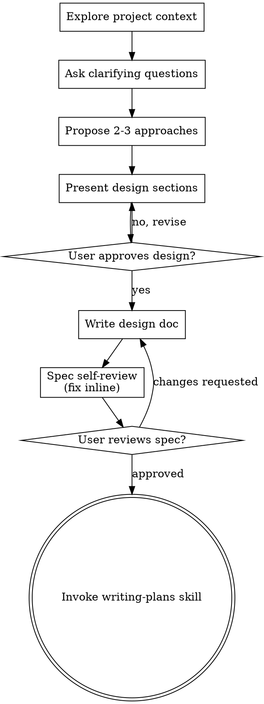
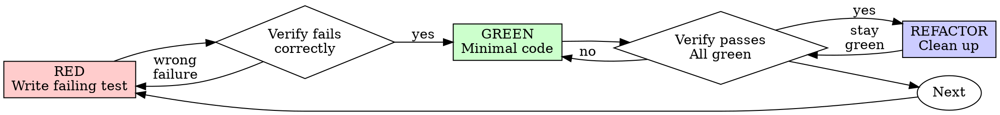

# Codex Session `01a06569-91c4-7db2-98de-06e3911ec38c`

- Review status: `human-reviewed`
- Reviewed by: `synuns`
- Reviewed at: `2026-09-03T06:42:09.796824+00:00`
- Reviewed candidate SHA-256: `f7f47c4b167ae7752d64970e53ec093ea550ec876df61dea099fb88e3d17d4ae`

> Human review required before submission. Automatic redaction is best-effort.

- Model: `gpt-5.6-sol`
- Started: `2026-09-03T03:56:52.578Z`
- Working directory: `~/dev/assignment/kbhc-assgn`

## Turn 1

### User prompt

# AGENTS.md instructions for ~/dev/assignment/kbhc-assgn

<INSTRUCTIONS>
# 프로젝트 작업 규약

## 커밋 메시지

- 모든 커밋 메시지는 Conventional Commits 형식을 따른다.
- 형식은 `<type>(<scope>): <한글 설명>`이며, `scope`는 필요할 때만 사용한다.
- `type`과 `scope`는 영문 소문자로 작성하고, 제목·본문·꼬리말의 설명은 한글로 작성한다. 코드 식별자와 고유명사는 예외로 한다.
- 주요 `type`은 `feat`, `fix`, `docs`, `refactor`, `test`, `chore`를 사용한다.
- 호환성을 깨는 변경은 `!` 또는 `BREAKING CHANGE:` 꼬리말로 표시한다.

예시: `docs: 과제 원본 명세 추가`

## Scope

Follow the assignment sources in `assignment-original/`. The OpenAPI contract
is authoritative for API details. Do not change accepted behavior, architecture,
dependencies, authentication policy, or destructive-data semantics without a
HIGH-risk human decision.

## Required Reading

- [프로젝트 상위 기획](docs/project-plan.md)
- `TODO.md`
- [코딩 규약](docs/coding-standards.md)
- [기술 스택](docs/tech-stack.md)
- `docs/quality/requirements.md`
- `docs/quality/workflow.md`
- `docs/quality/verification.md`
- `AI_USAGE.md`

## Required Loop

Select requirement IDs → implement one testable unit → run read-only automatic
verification → verify applicable browser behavior → classify and fix failures →
record evidence → after the final implementation/verification task and
before the final completion task or TODO status transition, run a
plan-completion adversarial review → at each golden journey, reuse or extend that
review → request one human checkpoint → run full review and final QA.

Before changing code, locate the applicable Journey by searching requirement ID,
route, API path, or symbol across `docs/quality/requirements.md`, `TODO.md`, `src`,
and `e2e`. After the lowest sufficient focused test, run `./scripts/verify quick`
and the mapped Journey E2E before `./scripts/verify full`.

작업 시작 시 `TODO.md`에서 의존성이 해소된 작업 하나를 선택하고, 종료 전
상태와 재현 가능한 evidence를 갱신한다. 상위 목표·범위·단계는
`docs/project-plan.md`를 따른다. 세부 기능 설계와 구현 순서는 별도
`docs/superpowers/` 문서에서 구체화한다.

The session recorded in Evidence is the task block owner. Parallel work may update
different task blocks, but never a block owned by another session. Rebase onto the
latest main and reconcile TODO state item-by-item before merge.

LOW work proceeds continuously. People own golden-journey acceptance, HIGH-risk
decisions, exceptions, and final completion. AI never marks `HUMAN_APPROVED`.

Implementation plan 실행은 격리 worktree를 기본으로 한다. 현재 checkout이
격리되지 않았다면 별도 질문 없이 ignore된 `.worktrees/<branch>`를 생성한다.
생성 또는 안전 검사가 실패하거나 사용자가 in-place 작업을 명시한 경우에만
중단하고 작업 위치를 확인한다.

## Commands

```bash
./scripts/verify setup
./scripts/verify quick
./scripts/verify full
```

Verification is read-only. `pnpm run format` is a separate mutation command;
review its diff and rerun `./scripts/verify quick` afterward.

## Evidence and AI Records

Use journey-based browser evidence defined in `workflow.md`. Keep core E2E
small and prefer unit, component, or integration tests when they prove the risk
better. Applicable interactive browser QA uses `agent-browser` and follows
`docs/coding-standards.md`. Stop hooks create ignored redacted candidates only.
A person must review and explicitly publish any tracked AI record.

</INSTRUCTIONS>
<environment_context>
  <cwd>~/dev/assignment/kbhc-assgn</cwd>
  <shell>zsh</shell>
  <current_date>2026-09-03</current_date>
  <timezone>Asia/Seoul</timezone>
  <filesystem><workspace_roots><root>~/dev/assignment/kbhc-assgn</root></workspace_roots><permission_profile type="disabled"><file_system type="unrestricted" /></permission_profile></filesystem>
</environment_context>

세부 디자인 변경

네비게이션의 버튼에서 selected에 PC 기준 좌측 라인, 모바일 기준 상단 라인이 잡히는 css 제거

<details>
<summary>작업 내용 보기</summary>

### Tool activity

#### `exec`

- Call ID: `call_2qtvBTaLzmcbe1TpPIRbdzvq`
- Status: `completed`

**Input**

```text
const r = await tools.exec_command({"cmd":"sed -n '1,240p' ~/.agents/skills/using-superpowers/SKILL.md && sed -n '1,260p' ~/.agents/skills/brainstorming/SKILL.md","workdir":"~/dev/assignment/kbhc-assgn","yield_time_ms":10000,"max_output_tokens":20000}); text(r.output);

```

**Output**

````text
Script completed
Wall time 0.2 seconds
Output:

---
name: using-superpowers
description: Use when starting any conversation - establishes how to find and use skills, requiring skill invocation before ANY response including clarifying questions
---

<SUBAGENT-STOP>
If you were dispatched as a subagent to execute a specific task, ignore this skill.
</SUBAGENT-STOP>

<EXTREMELY-IMPORTANT>
If you think there is even a 1% chance a skill might apply to what you are doing, you ABSOLUTELY MUST invoke the skill.

IF A SKILL APPLIES TO YOUR TASK, YOU DO NOT HAVE A CHOICE. YOU MUST USE IT.

This is not negotiable. You cannot rationalize your way out of this.
</EXTREMELY-IMPORTANT>

## The Rule

**Invoke relevant or requested skills BEFORE any response or action** — including clarifying questions, exploring the codebase, or checking files. If it turns out wrong for the situation, you don't have to use it.

**Before entering plan mode:** if you haven't already brainstormed, invoke the brainstorming skill first.

Then announce "Using [skill] to [purpose]" and follow the skill exactly. If it has a checklist, create a todo per item.

## Skill Priority

When multiple skills apply, process skills come first — they set the approach, then implementation skills (frontend-design, etc.) carry it out. Brainstorming and systematic-debugging are Superpowers' most common process skills, but the rule holds for any of them.

- "Let's build X" → superpowers:brainstorming first, then implementation skills.
- "Fix this bug" → superpowers:systematic-debugging first, then domain skills.

## Red Flags

These thoughts mean STOP—you're rationalizing:

| Thought | Reality |
|---------|---------|
| "This is just a simple question" | Questions are tasks. Check for skills. |
| "I need more context first" | Skill check comes BEFORE clarifying questions. |
| "Let me explore the codebase first" | Skills tell you HOW to explore. Check first. |
| "I can check git/files quickly" | Files lack conversation context. Check for skills. |
| "Let me gather information first" | Skills tell you HOW to gather information. |
| "This doesn't need a formal skill" | If a skill exists, use it. |
| "I remember this skill" | Skills evolve. Read current version. |
| "This doesn't count as a task" | Action = task. Check for skills. |
| "The skill is overkill" | Simple things become complex. Use it. |
| "I'll just do this one thing first" | Check BEFORE doing anything. |
| "This feels productive" | Undisciplined action wastes time. Skills prevent this. |
| "I know what that means" | Knowing the concept ≠ using the skill. Invoke it. |

## Platform Adaptation

If your harness appears here, read its reference file for special instructions:

- Codex: `references/codex-tools.md`
- Pi: `references/pi-tools.md`
- Antigravity: `references/antigravity-tools.md`

## User Instructions

User instructions (CLAUDE.md, AGENTS.md, GEMINI.md, etc, direct requests) take precedence over skills, which in turn override default behavior. Only skip skill workflows or instructions when your human partner has explicitly told you to.
---
name: brainstorming
description: "You MUST use this before any creative work - creating features, building components, adding functionality, or modifying behavior. Explores user intent, requirements and design before implementation."
---

# Brainstorming Ideas Into Designs

Help turn ideas into fully formed designs and specs through natural collaborative dialogue.

Start by understanding the current project context, then ask questions one at a time to refine the idea. Once you understand what you're building, present the design and get user approval.

<HARD-GATE>
Do NOT invoke any implementation skill, write any code, scaffold any project, or take any implementation action until you have presented a design and the user has approved it. This applies to EVERY project regardless of perceived simplicity.
</HARD-GATE>

## Anti-Pattern: "This Is Too Simple To Need A Design"

Every project goes through this process. A todo list, a single-function utility, a config change — all of them. "Simple" projects are where unexamined assumptions cause the most wasted work. The design can be short (a few sentences for truly simple projects), but you MUST present it and get approval.

## Checklist

You MUST create a task for each of these items and complete them in order:

1. **Explore project context** — check files, docs, recent commits
2. **Offer the visual companion just-in-time** — NOT upfront. The first time a question would genuinely be clearer shown than described, offer it then (its own message); on approval its browser tab opens for you. If no visual question ever arises, never offer it. See the Visual Companion section below.
3. **Ask clarifying questions** — one at a time, understand purpose/constraints/success criteria
4. **Propose 2-3 approaches** — with trade-offs and your recommendation
5. **Present design** — in sections scaled to their complexity, get user approval after each section
6. **Write design doc** — save to `docs/superpowers/specs/YYYY-MM-DD-<topic>-design.md` and commit
7. **Spec self-review** — quick inline check for placeholders, contradictions, ambiguity, scope (see below)
8. **User reviews written spec** — ask user to review the spec file before proceeding
9. **Transition to implementation** — invoke writing-plans skill to create implementation plan

## Process Flow



**The terminal state is invoking writing-plans.** Do NOT invoke frontend-design, mcp-builder, or any other implementation skill. The ONLY skill you invoke after brainstorming is writing-plans.

## The Process

**Understanding the idea:**

- Check out the current project state first (files, docs, recent commits)
- Before asking detailed questions, assess scope: if the request describes multiple independent subsystems (e.g., "build a platform with chat, file storage, billing, and analytics"), flag this immediately. Don't spend questions refining details of a project that needs to be decomposed first.
- If the project is too large for a single spec, help the user decompose into sub-projects: what are the independent pieces, how do they relate, what order should they be built? Then brainstorm the first sub-project through the normal design flow. Each sub-project gets its own spec → plan → implementation cycle.
- For appropriately-scoped projects, ask questions one at a time to refine the idea
- Prefer multiple choice questions when possible, but open-ended is fine too
- Only one question per message - if a topic needs more exploration, break it into multiple questions
- Focus on understanding: purpose, constraints, success criteria

**Exploring approaches:**

- Propose 2-3 different approaches with trade-offs
- Present options conversationally with your recommendation and reasoning
- Lead with your recommended option and explain why

**Presenting the design:**

- Once you believe you understand what you're building, present the design
- Scale each section to its complexity: a few sentences if straightforward, up to 200-300 words if nuanced
- Ask after each section whether it looks right so far
- Cover: architecture, components, data flow, error handling, testing
- Be ready to go back and clarify if something doesn't make sense

**Design for isolation and clarity:**

- Break the system into smaller units that each have one clear purpose, communicate through well-defined interfaces, and can be understood and tested independently
- For each unit, you should be able to answer: what does it do, how do you use it, and what does it depend on?
- Can someone understand what a unit does without reading its internals? Can you change the internals without breaking consumers? If not, the boundaries need work.
- Smaller, well-bounded units are also easier for you to work with - you reason better about code you can hold in context at once, and your edits are more reliable when files are focused. When a file grows large, that's often a signal that it's doing too much.

**Working in existing codebases:**

- Explore the current structure before proposing changes. Follow existing patterns.
- Where existing code has problems that affect the work (e.g., a file that's grown too large, unclear boundaries, tangled responsibilities), include targeted improvements as part of the design - the way a good developer improves code they're working in.
- Don't propose unrelated refactoring. Stay focused on what serves the current goal.

## After the Design

**Documentation:**

- Write the validated design (spec) to `docs/superpowers/specs/YYYY-MM-DD-<topic>-design.md`
  - (User preferences for spec location override this default)
- Use elements-of-style:writing-clearly-and-concisely skill if available
- Commit the design document to git

**Spec Self-Review:**
After writing the spec document, look at it with fresh eyes:

1. **Placeholder scan:** Any "TBD", "TODO", incomplete sections, or vague requirements? Fix them.
2. **Internal consistency:** Do any sections contradict each other? Does the architecture match the feature descriptions?
3. **Scope check:** Is this focused enough for a single implementation plan, or does it need decomposition?
4. **Ambiguity check:** Could any requirement be interpreted two different ways? If so, pick one and make it explicit.

Fix any issues inline. No need to re-review — just fix and move on.

**User Review Gate:**
After the spec review loop passes, ask the user to review the written spec before proceeding:

> "Spec written and committed to `<path>`. Please review it and let me know if you want to make any changes before we start writing out the implementation plan."

Wait for the user's response. If they request changes, make them and re-run the spec review loop. Only proceed once the user approves.

**Implementation:**

- Invoke the writing-plans skill to create a detailed implementation plan
- Do NOT invoke any other skill. writing-plans is the next step.

## Key Principles

- **One question at a time** - Don't overwhelm with multiple questions
- **Multiple choice preferred** - Easier to answer than open-ended when possible
- **YAGNI ruthlessly** - Remove unnecessary features from all designs
- **Explore alternatives** - Always propose 2-3 approaches before settling
- **Incremental validation** - Present design, get approval before moving on
- **Be flexible** - Go back and clarify when something doesn't make sense

## Visual Companion

A browser-based companion for showing mockups, diagrams, and visual options during brainstorming. Available as a tool — not a mode. Accepting the companion means it's available for questions that benefit from visual treatment; it does NOT mean every question goes through the browser.

**Offering the companion (just-in-time):** Do NOT offer it upfront. Wait until a question would genuinely be clearer shown than told — a real mockup / layout / diagram question, not merely a UI *topic*. The first time that happens, offer it then, as its own message:
> "This next part might be easier if I show you — I can put together mockups, diagrams, and comparisons in a browser tab as we go. It's still new and can be token-intensive. Want me to? I'll open it for you."

**This offer MUST be its own message.** Only the offer — no clarifying question, summary, or other content. Wait for the user's response. If they accept, start the server with `--open` so their browser opens to the first screen automatically. If they decline, continue text-only and don't offer again unless they raise it.

**Per-question decision:** Even after the user accepts, decide FOR EACH QUESTION whether to use the browser or the terminal. The test: **would the user understand this better by seeing it than reading it?**

- **Use the browser** for content that IS visual — mockups, wireframes, layout comparisons, architecture diagrams, side-by-side visual designs
- **Use the terminal** for content that is text — requirements questions, conceptual choices, tradeoff lists, A/B/C/D text options, scope decisions

A question about a UI topic is not automatically a visual question. "What does personality mean in this context?" is a conceptual question — use the terminal. "Which wizard layout works better?" is a visual question — use the browser.

If they agree to the companion, read the detailed guide before proceeding:
`skills/brainstorming/visual-companion.md`

````

#### `exec`

- Call ID: `call_gfF778ttaFQI7yRNV0XKj9W7`
- Status: `completed`

**Input**

```text
const r = await tools.exec_command({"cmd":"sed -n '1,260p' ~/.agents/skills/using-superpowers/references/codex-tools.md && git status --short --branch && git log -5 --oneline && sed -n '1,260p' docs/project-plan.md && sed -n '1,320p' TODO.md && sed -n '1,320p' docs/coding-standards.md && sed -n '1,260p' docs/tech-stack.md && sed -n '1,320p' docs/quality/requirements.md && sed -n '1,320p' docs/quality/workflow.md && sed -n '1,320p' docs/quality/verification.md && sed -n '1,260p' AI_USAGE.md","workdir":"~/dev/assignment/kbhc-assgn","yield_time_ms":10000,"max_output_tokens":60000}); text(r.output);

```

**Output**

````text
Script completed
Wall time 0.3 seconds
Output:

Warning: truncated output (original token count: 24499)
Total output lines: 1692

## Subagent dispatch requires multi-agent support

Add to your Codex config (`~/.codex/config.toml`):

```toml
[features]
multi_agent = true
```

This enables `spawn_agent`, `wait_agent`, and `close_agent` for skills like `dispatching-parallel-agents` and `subagent-driven-development`. When using subagent-driven-development, you should always close implementer and reviewer subagents when they have finished all their work.

## Environment Detection

Skills that create worktrees or finish branches should detect their
environment with read-only git commands before proceeding:

```bash
GIT_DIR=$(cd "$(git rev-parse --git-dir)" 2>/dev/null && pwd -P)
GIT_COMMON=$(cd "$(git rev-parse --git-common-dir)" 2>/dev/null && pwd -P)
BRANCH=$(git branch --show-current)
```

- `GIT_DIR != GIT_COMMON` → already in a linked worktree (skip creation)
- `BRANCH` empty → detached HEAD (cannot branch/push/PR from sandbox)

See `using-git-worktrees` Step 0 and `finishing-a-development-branch`
Step 1 for how each skill uses these signals.

## Codex App Finishing

When the sandbox blocks branch/push operations (detached HEAD in an
externally managed worktree), the agent commits all work and informs
the user to use the App's native controls:

- **"Create branch"** — names the branch, then commit/push/PR via App UI
- **"Hand off to local"** — transfers work to the user's local checkout

The agent can still run tests, stage files, and output suggested branch
names, commit messages, and PR descriptions for the user to copy.
## main...origin/main [ahead 254]
 M AI_USAGE.md
 M artifacts/index.md
?? artifacts/codex-session-01a05d86-f1bc-7293-aab2-857e54d4f227.s0001.md
be409b0 docs(qa): 사람 최종 승인 기록
7bbfaf2 docs(qa): 최종 적대적 검토 근거 기록
383f834 docs(qa): 최종 검증 근거 기록
6519667 docs(qa): 최종 검증 작업 소유권 기록
ca3d603 docs(qa): 제출 산출물 검증 완료
# 프론트엔드 과제 상위 기획

## 문서 목적

이 문서는 과제 전체의 목표, 범위, 제품 동작, 기술 구조, 단계, 검증 전략과
사람 결정 지점을 정의하는 최상위 기획 기준이다. 개별 기능의 설계·구현
절차를 담는 `docs/superpowers/specs/`와 `docs/superpowers/plans/`보다 상위에
있다.

실행 상태와 남은 작업은 루트 `TODO.md`에서 관리한다. 에이전트는 작업 시작
전 이 문서와 `TODO.md`를 읽고, 한 번에 검증 가능한 작업 단위 하나만 수행한다.

## 기준 문서와 우선순위

충돌 시 다음 순서를 적용한다.

1. `assignment-original/openapi.yaml`: API 경로, method, 요청·응답 schema,
   인증 scheme의 최우선 계약
2. `assignment-original/requirement.md`: 화면, 상호작용, 제출 조건
3. `docs/quality/requirements.md`: 원본을 requirement ID와 acceptance로 변환한
   실행 기준
4. 이 문서: 전체 범위, 구조, 단계, 품질 전략
5. `docs/tech-stack.md`: 승인된 기술과 도구 책임
6. `docs/coding-standards.md`: 모든 에이전트가 구현·검토 때 지킬 코딩 규약
7. `docs/superpowers/specs/`와 `docs/superpowers/plans/`: 특정 작업의 상세 설계와
   구현 순서
8. `TODO.md`: 현재 실행 순서, 상태, evidence

하위 문서는 상위 문서의 accepted behavior를 바꿀 수 없다. 원본과
`docs/quality/requirements.md`가 충돌하거나 해석이 둘 이상이면
`REQUIREMENT` 실패로 기록하고 HIGH-risk 사람 결정을 요청한다.

## 제품 목표

React 19와 TypeScript로 다음 업무 흐름을 제공하는 제출 가능한 단일 페이지
애플리케이션을 만든다.

- 사용자는 로그인 입력을 검증하고 API를 통해 인증한다.
- 공통 navigation에서 dashboard와 task 목록으로 이동한다.
- 로그인 상태에 따라 sign-in 또는 profile 진입점 하나만 본다.
- dashboard에서 전체, 남은, 완료 task 수를 확인한다.
- 가상화된 무한 목록에서 task를 탐색하고 상세로 이동한다.
- 상세가 없으면 목록으로 복구한다.
- route ID를 정확히 입력한 경우에만 task를 삭제하고 목록으로 돌아간다.
- profile에서 사용자 name과 memo를 확인한다.

## 성공 기준

완료는 기능 존재가 아니라 다음 증거가 모두 충족된 상태다.

- `docs/quality/requirements.md`의 모든 requirement에 재현 가능한 자동 또는
  browser evidence가 기록된다.
- 네 Golden Journey `auth-entry`, `work-overview`, `task-discovery`,
  `task-resolution`이 각각 경량 adversarial review를 통과하고 사람이
  checkpoint를 승인한다.
- OpenAPI 계약에서 생성한 타입과 MSW 동작이 실제 client 요청·응답과 일치한다.
- loading, empty, error, success 상태가 적용 가능한 화면에서 구분된다.
- keyboard 사용, label 연결, focus 이동, modal 접근성, 반응형 layout을 확인한다.
- format, lint, typecheck, unit/component/integration test, build, core E2E가
  read-only `./scripts/verify full`에서 통과한다.
- console·network 오류, 비밀정보, debug 출력, 불필요한 생성물, 관련 없는 diff가
  없다.
- `AI_USAGE.md`와 공개 AI 기록은 사람 검토 결과만 반영한다.
- AI가 `HUMAN_APPROVED`나 최종 완료를 선언하지 않는다.

## 범위

### 포함

- `/`, `/sign-in`, `/task`, `/task/:id`, `/user` route
- 상태별 GNB/LNB action과 서로 다른 아이콘
- sign-in validation, 요청, 오류 modal, 인증 상태
- dashboard metrics
- task 가상 목록, 무한 pagination, 상세, 404 복구, 확인 후 삭제
- user profile
- OAS 3.1 기반 생성 타입과 제출 가능한 MSW API 대체 구현
- 명명된 색상 token과 local Pretendard font
- 자동 검증, browser evidence, Golden Journey checkpoint, AI 사용 공개

### 제외

- 원본에 없는 회원가입, 로그아웃 UI, task 생성·수정, 검색, 정렬, filter
- 별도 production backend와 database
- 원본에 없는 role·permission 체계
- offline mode, realtime synchronization, analytics, 국제화
- 심미성을 위한 대규모 animation이나 독자 design system 확장
- 승인 없는 dependency, architecture, 인증 정책, 삭제 의미 변경

## 사용자와 핵심 흐름

별도 role 체계는 두지 않는다. UI 관점 상태만 구분한다.

### 비로그인 사용자

1. 공통 navigation에서 dashboard, task, sign-in action을 확인한다.
2. `/sign-in`에서 email과 password를 입력한다.
3. client validation 실패 시 연결된 inline 오류를 확인한다.
4. 유효한 입력을 제출한다.
5. non-200 응답이면 API `errorMessage` modal을 확인하고 닫는다.
6. 200 응답이면 승인된 방식으로 인증 상태를 만들고 보호 API 요청을 수행한다.

dashboard와 task action의 노출 여부와 보호 route 접근 정책은 원본만으로
확정되지 않았다. navigation action은 항상 존재한다는 invariant를 지키되,
비로그인 접근 결과는 인증 정책 사람 결정에서 확정한다.

### 로그인 사용자

1. sign-in 대신 profile action을 확인한다.
2. dashboard에서 API fixture와 같은 세 지표를 본다.
3. task 목록을 scroll하며 다음 page를 중복 없이 불러온다.
4. card의 title과 memo를 확인하고 상세로 이동한다.
5. 없는 상세에서 목록 복구 action을 사용한다.
6. 존재하는 상세에서 title, memo, registerDatetime을 확인한다.
7. 삭제 modal에서 잘못된 ID에는 submit이 비활성화되고 정확한 ID에서만
   활성화되는지 확인한다.
8. 삭제 성공 후 `/task`로 돌아간다.
9. profile에서 name과 memo를 확인한다.

## 화면·route 기획

| Route | 목적 | 주요 상태 | Requirement |
| --- | --- | --- | --- |
| `/` | 업무 현황 확인 | loading, error, success | `DASH-01`, `NAV-01`, `NAV-03` |
| `/sign-in` | 인증 시작 | invalid, submitting, API error, success | `NAV-02`, `AUTH-01`~`AUTH-07` |
| `/task` | task 탐색 | initial loading, empty, page loading, error, terminal page | `TASK-LIST-01`~`TASK-LIST-05` |
| `/task/:id` | task 확인·삭제 | loading, 404, error, success, delete modal | `TASK-DETAIL-01`~`TASK-DETAIL-05` |
| `/user` | profile 확인 | loading, error, success | `USER-01`, `NAV-03` |

공통 shell은 현재 route를 표시하고 dashboard/task action을 유지한다. 인증
action은 sign-in과 profile 중 정확히 하나만 표시한다. 아이콘은 항목별로
서로 다르며 accessible name은 text와 함께 유지한다.

## API 계약 기획

| 동작 | 계약 | 핵심 처리 |
| --- | --- | --- |
| 로그인 | `POST /api/sign-in` | email/password JSON, 200 token 응답, non-200 `errorMessage` |
| 갱신 | `POST /api/refresh` | refresh cookie credential, 200 token, 400/401 error |
| profile | `GET /api/user` | bearer token, name/memo |
| dashboard | `GET /api/dashboard` | bearer token, 세 integer metric |
| task 목록 | `GET /api/task?page=N` | 1부터 시작, data/hasNext |
| task 상세 | `GET /api/task/{id}` | bearer token, 200 detail, 404 error |
| task 삭제 | `DELETE /api/task/{id}` | bearer token, 200 `{ success: true }`, 404 error |

Client는 generated OpenAPI type을 경계에서 사용한다. UI model 변환이 필요하면
순수 함수로 분리하고 원본 response 필드를 조용히 바꾸지 않는다. 모든 보호
요청은 승인된 auth adapter를 통과한다. MSW browser handler와 test server
handler는 같은 fixture와 contract behavior를 공유한다.

## 기술 구조

### 채택 stack

- React 19, TypeScript strict, Vite, pnpm
- React Router, TanStack Query, React Hook Form, Zod
- TanStack Virtual, Fetch API, `openapi-typescript`, MSW
- shadcn/ui, Tailwind CSS, CSS Custom Properties, Pretendard, Lucide React
- Vitest, Testing Library, Playwright, Biome

정확한 채택 상태와 변경 규칙은 `docs/tech-stack.md`가 관리한다. 새 dependency나
교체는 HIGH-risk 사람 승인 전 적용하지 않는다.

### 목표 module 경계

후속 상세 설계는 FSD 원칙을 사용하되, 이 문서는 책임 방향만 고정한다.

```text
src/
├── app/        # bootstrap, provider composition, router, global styles
├── pages/      # route 단위 composition
├── widgets/    # app shell, navigation 등 page 간 큰 UI block
├── features/   # sign-in, delete-task 등 사용자 행위
├── entities/   # task, user 등 domain 표시·model
├── shared/     # api client, generated contract, auth adapter, 공용 UI·utility
└── mocks/      # MSW handlers, fixtures, browser/node bootstrap
```

의존 방향은 상위 composition에서 하위 재사용 단위로 흐른다. 각 공개 경계는
후속 기능 설계에서 exact export를 정한다. route page가 fetch, token, fixture
세부 구현을 직접 소유하지 않는다.

### provider와 data flow

```text
Browser event
  → feature/page action
  → typed API client
  → auth adapter가 bearer/refresh 정책 적용
  → real fetch boundary 또는 MSW
  → generated OpenAPI type를 쓰는 response mapping boundary
  → TanStack Query cache
  → entity/widget/page rendering
```

App bootstrap은 router, query client, auth context, MSW development bootstrap을
명시적 순서로 조합한다. test는 필요한 provider만 test harness로 구성한다.

### 상태 책임

- server state: TanStack Query가 loading, error, data, pagination, invalidation을
  관리한다.
- form state: React Hook Form과 Zod가 sign-in 입력·오류·submit 가능 상태를
  관리한다.
- auth state: 승인된 auth adapter/context만 token과 session transition을
  관리한다.
- modal state: 해당 feature가 open/close, focus restore, 입력 reset을 관리한다.
- route state: React Router param과 navigation을 단일 기준으로 사용한다.
- mock state: MSW fixture store가 delete 이후 목록·상세·dashboard 일관성을
  결정한다. 의미 변경은 삭제 정책 결정 범위에서 승인받는다.

## HIGH-risk 결정 gate

다음은 구현 전에 사람이 결정한다. 결정 전에는 evidence 조사, test 설계,
독립 LOW 작업만 진행한다.

### 인증 정책

OpenAPI는 sign-in response에 accessToken과 refreshToken을 반환하면서 refresh는
`token` cookie를 요구한다. 확정된 정책은
`docs/superpowers/specs/2026-08-30-authentication-policy-design.md`가 관리한다.

- Access token은 메모리에만 저장하고 MSW가 refresh cookie server 동작을
  모사한다.
- Expiry와 현재 token의 401은 session generation을 보존하는 single-flight
  refresh와 최대 한 번 replay로 처리한다.
- Late 401과 이전 session 응답은 현재 인증 상태를 변경하지 않는다.
- Auth provider는 navigation하지 않고 router 내부 boundary가 보호 route와
  허용된 복귀 위치를 처리한다.
- `shared/api`는 app auth provider를 import하지 않고 token과 refresh callback을
  app composition에서 주입받는다.

### 삭제와 mock data 일관성

원본은 exact ID 확인 후 delete 호출과 `/task` redirect를 요구한다. 확정된
정책은
`docs/superpowers/specs/2026-08-30-delete-consistency-policy-design.md`가 관리한다.

- 비낙관적 server-authoritative 삭제를 사용하고 pending 중 modal과 중복
  submit을 잠근다.
- 사용자 submit 한 번은 attempt 하나이며 auth replay를 포함한 DELETE 전송은
  attempt당 최대 두 번이다.
- 200 `{ success: true }`만 자동 `/task` 이동을 만든다.
- 404와 outcome-unknown은 success가 아니며, network와 invalid-response는 상세
  재조회로 상태를 조정하고 DELETE를 자동 재전송하지 않는다.
- 하나의 task fixture store가 목록, 상세와 dashboard 수치의 source of truth다.

## 공통 UX·접근성 기준

- 모든 form control은 visible label과 programmatic association을 가진다.
- inline 오류는 해당 input과 연결하고 상태만 색으로 전달하지 않는다.
- modal은 accessible name, 초기 focus, focus trap, Escape/close, 닫힌 뒤 focus
  restore를 검증한다.
- submit 중 중복 요청을 막고 진행 상태를 text로 전달한다.
- loading, empty, recoverable error, terminal success를 서로 구분한다.
- error는 가능한 recovery action을 제공한다. 404 상세는 목록 이동을 반드시
  제공한다.
- 명명된 semantic color token만 사용한다. feature-local color literal을
  추가하지 않는다.
- Pretendard local asset 요청과 computed font를 browser에서 확인한다.
- 최소 mobile과 desktop viewport에서 content clipping, 가상 목록 scroll,
# 에이전트 작업 목록

## 목적

과제 완료까지 남은 작업, 의존성, 검증법, evidence를 관리하는 실행 원장이다.
상위 목표와 단계는 `docs/project-plan.md`, accepted behavior는
`docs/quality/requirements.md`, 구현 규율은 `docs/coding-standards.md`, 세부 작업
설계는 `docs/superpowers/`를 따른다.

## 에이전트 사용 규칙

1. 작업 시작 전 필수 문서와 이 파일을 읽는다.
2. `Status: NOT_STARTED`이며 모든 `Depends on`이 완료된 item 하나를 고른다.
3. 시작할 때만 `IN_PROGRESS`로 바꾸고 담당 agent/session을 Evidence에 남긴다.
4. requirement ID, risk, acceptance, 검증법을 바꾸지 않고 한 testable unit만
   구현한다.
5. HIGH item은 사람 결정 evidence 없이는 구현하지 않는다.
6. 자동·browser 검증 후 재현 명령, commit, 결과를 Evidence에 기록한다.
7. AI는 검증 완료 item을 `AI_VERIFIED`까지만 변경한다.
8. `HUMAN_APPROVED`는 사람이 명시적으로 승인한 journey checkpoint에만 사람이
   기록한다.
9. 실패는 `docs/quality/workflow.md` 분류와 root cause, correction, rerun을
   Evidence에 남긴다.
10. 새 작업은 해당 단계에 stable ID로 추가한다. 완료 item을 삭제하거나
    번호를 재사용하지 않는다.
11. Evidence에 기록된 agent/session이 task block owner다. 병렬 session은
    소유하지 않은 task block의 checkbox, Status, Evidence를 갱신하지 않는다.
12. HIGH decision item은 명시적 사람 결정 evidence와 지정 검증이 통과하면
    `AI_VERIFIED`로 닫는다. 이는 Journey의 `HUMAN_APPROVED`가 아니다.
13. branch는 merge 전 최신 main을 반영하고 TODO conflict를 item 단위로 합친다.

## 상태

- `NOT_STARTED`: 시작 전
- `IN_PROGRESS`: 한 agent가 수행 중
- `AI_VERIFIED`: acceptance와 자동/browser evidence 충족. HIGH decision은 사람
  결정 evidence가 있을 때 `AI_VERIFIED`로 닫되 Journey 수용을 뜻하지 않는다.
- `HUMAN_APPROVED`: 사람이 checkpoint 승인
- `BLOCKED`: blocker와 해제 조건 기록

`[ ]`는 미완료, `[x]`는 `AI_VERIFIED` 또는 사람이 기록한
`HUMAN_APPROVED`를 뜻한다. checkbox와 Status가 다르면 Status를 보수적으로
낮추고 evidence를 다시 확인한다.

## 현재 진행 요약

| 단계               | Exit gate                                       | 상태                           |
| ------------------ | ----------------------------------------------- | ------------------------------ |
| 0. 기획·결정 준비  | 상위 기준 연결, HIGH 결정 목록 분리             | AI_VERIFIED                    |
| 1. 개발 기반       | quick/full 및 scaffold browser smoke 통과       | AI_VERIFIED                    |
| 2. 공통 구조       | provider/router/API 기반 + 실제 UI shell/state  | AI_VERIFIED                    |
| 3. auth-entry      | 화면 구현·통합 검증·review 후 사람 checkpoint   | HUMAN_APPROVED                 |
| 4. work-overview   | 화면 구현·통합 검증·review 후 사람 checkpoint   | HUMAN_APPROVED                 |
| 5. task-discovery  | 화면 구현·통합 검증·review 후 사람 checkpoint   | HUMAN_APPROVED                 |
| 6. task-resolution | 화면 구현·통합 검증·review 후 사람 checkpoint   | HUMAN_APPROVED                 |
| 7. 통합·제출 QA    | 네 checkpoint와 full QA 후 사람 최종 acceptance | IN_PROGRESS                    |

## 0. 기획·결정 준비

### [x] PLAN-01 상위 기획과 실행 원장 연결

- Requirements: 전체
- Risk: LOW
- Depends on: 없음
- Deliverable: `docs/project-plan.md`, `TODO.md`, `AGENTS.md` Required Reading
- Acceptance: 문서 역할, source priority, 전체 단계, agent 갱신 규칙이 서로
  모순 없이 연결된다.
- Automatic verification: `./scripts/verify setup`, `git diff --check`, 문서 link와
  heading 정적 검사
- Browser verification: 적용 없음
- Status: AI_VERIFIED
- Evidence: 2026-08-29 `./scripts/verify setup` PASS, 79 tests; requirement ID
  coverage 27/27; TODO 34 items의 필수 field 10종과 dependency reference 검사 PASS;
  staged `git diff --check` PASS

### [x] DEC-AUTH-01 인증 정책 사람 결정

- Requirements: `AUTH-07`, `NAV-02`, `NAV-03`
- Risk: HIGH
- Depends on: `PLAN-01`
- Deliverable: access token 저장, refresh cookie 관계, expiry/401/replay,
  refresh 실패, 보호 route 정책을 확정한 별도 auth 설계 문서
- Acceptance: `docs/project-plan.md`의 인증 정책 질문이 각각 한 가지 동작으로
  답해지고 OpenAPI bearer/refresh scheme과 모순이 없으며 사람이 승인한다.
- Automatic verification: 설계 문서 self-review와 OpenAPI/auth requirement
  trace 검사
- Browser verification: 구현 전 적용 없음
- Status: AI_VERIFIED
- Evidence: 2026-08-30 `docs/superpowers/specs/2026-08-30-authentication-policy-design.md`;
  access token memory 저장, MSW refresh cookie, session generation, single-flight
  refresh, 최대 한 번 replay, late 401와 이전 session 격리, 내부 route allowlist,
  app callback 주입과 router-owned navigation을 확정하고 사용자 대화 승인;
  `docs/superpowers/plans/2026-08-30-authentication-policy.md` 실행 계획 자체 검토;
  구현 후 auth/provider/request Vitest와 aut…14499 tokens truncated…ndently testable condition
inside an ID. Do not split work by file when files form one testable behavior.

Written plan 실행은 격리 worktree를 기본으로 한다. 현재 checkout이 격리되지
않았다면 별도 질문 없이 ignore된 project-local `.worktrees/<branch>`를 생성한다.
생성 또는 안전 검사가 실패하거나 사용자가 in-place 작업을 명시한 경우에만
중단하고 작업 위치를 확인한다. Worktree 분리는 task scope나 승인 권한을 넓히지
않는다.

## Risk and Authority

### LOW — AI proceeds continuously

Examples: approved-pattern implementation, focused tests, local unambiguous
fixes, active-task documentation, and necessary non-semantic cleanup.

AI may implement, test, diagnose, fix, review, commit, and continue. Record
requirement IDs, commands, browser evidence when applicable, and decisions.

### MEDIUM — human owns journey checkpoint

Examples: completing a golden journey, introducing a new interaction pattern,
or spanning routes, API state, and views within approved architecture.

AI completes and verifies a coherent batch, runs lightweight adversarial
review, then requests one checkpoint acceptance. Do not request approval for
each requirement inside the batch.

### HIGH — human decides before consequential change

Examples: conflicting requirements, authentication or security policy,
destructive-data semantics, dependency or architecture changes, scope
expansion, acceptance changes, and bypassing a failed gate.

Stop before the consequential implementation. Present evidence, options,
trade-offs, and recommendation. While waiting, continue only evidence work,
diagnosis, or unrelated LOW work that cannot cross the affected boundary.

AI proposes risk and owns execution evidence. People own journey acceptance,
HIGH decisions, exceptions, and final acceptance.

A HIGH decision item becomes `AI_VERIFIED` only after explicit human decision
evidence and the specified design/trace verification pass. This records that the
approved decision was reflected correctly; it is not a Golden Journey acceptance.
Without human decision evidence it remains `BLOCKED`, and AI never marks
`HUMAN_APPROVED`.

## Failure Classification

Assign one primary class and record evidence, rationale, corrective change, and
rerun result:

- `REQUIREMENT`: ambiguous, conflicting, missing, or misunderstood condition.
- `IMPLEMENTATION`: logic, state, or rendering defect.
- `INTEGRATION`: API, auth, routing, browser, or cross-module defect.
- `UX_ACCESSIBILITY`: usability, interaction, visual, or accessibility defect.
- `TEST`: incorrect, duplicate, flaky, or overly broad test.
- `ENVIRONMENT`: runtime, OS, browser, port, or local service problem.
- `TOOLING`: build, lint, typecheck, verify, hook, or runner problem.

`REQUIREMENT` and behavior-changing corrections are HIGH. Never turn a failure
green by weakening an assertion, adding an undocumented skip, or editing only
checklist status.

## Browser Failure Record

```text
Requirement/Journey:
Commit:
Route/Viewport:
Precondition:
Actions:
Expected:
Actual:
Console/Network:
Screenshot/Trace:
Failure class:
Correction:
Rerun verdict:
```

Browser-tool failure is not product success. Classify it as `ENVIRONMENT` or
`TOOLING`, restore trustworthy evidence, then rerun.

## Plan-Completion Adversarial Review

After the final implementation and applicable automatic/browser verification task
of every written plan, use a fresh reviewer context or an explicit second-pass role
that did not author the final change. Review plan acceptance, incomplete steps,
requirement omissions, negative paths, invariants, accessibility, weak or duplicate
tests, console/network errors, unrelated diff, missing evidence, and TODO
status/dependency consistency. Resolve every HIGH/MEDIUM finding before completing
the plan-backed TODO item, merge, handoff, or checkpoint request.

Record this block even when no finding exists:

```text
Review target: plan path, requirement/Journey IDs, target commit SHA
Reviewer: fresh context or second-pass role ID and relationship to final author
Checks: checks actually performed
Findings: none or severity/class/root cause
Corrections: not applicable or applied changes
Rerun: reproduction command and result
Verdict: PASS | PASS_WITH_LOW | BLOCKED
```

`Findings: none` is valid only with the reviewer, target commit, and checks. When a
plan and Golden Journey have the same target, one recorded review satisfies both;
review only the missing scope when their targets differ.

## Adversarial Review

After each of `auth-entry`, `work-overview`, `task-discovery`, and
`task-resolution`, use a fresh reviewer context or explicit second-pass role
that did not author the final change. Check requirement omissions, negative
paths, invariants, accessibility, weak or duplicate tests, console/network
errors, and missing evidence. Resolve findings before requesting checkpoint
acceptance.

After all checkpoints, perform a full review across journeys: auth transitions,
navigation, stale state, API errors, regression risk, OAS/mock consistency,
test duplication, and assignment-wide constraints.

## Human Checkpoints

Request human action only for:

- A completed golden journey after evidence and lightweight review.
- A HIGH-risk decision before consequential implementation.
- An exception to a required gate.
- Final QA readiness and final completion.

While a checkpoint is pending, evidence preparation and unrelated LOW analysis
may continue. Do not implement beyond the unapproved journey boundary.

For the `auth-entry` checkpoint, the person reviews focused integration
evidence that a protected request uses `Authorization: Bearer [REDACTED]
and that the approved refresh/expiry path was exercised. Add core browser
evidence only for credential or network behavior that the integration boundary
cannot prove; a visible profile action alone is not authentication evidence.

## Prompt Records

Lifecycle hooks create pending snapshots and metadata only. A person first
reviews the Markdown under `.codex/review-pending/`, then runs
`pnpm run ai:review`. The TTY command lists valid review-pending session IDs,
accepts one numbered selection, repeats the selected session ID and exact record
ID, and requires exact `y`+Enter before publication. Any other input, EOF, or
signal cancels.

The scanner remains a publication safety gate for metadata/hash errors and
unredacted secrets, but REVIEW findings, context, and pager interaction are not
part of this completion command. Reviewer identity comes only from
`git config user.name`; a missing value stops with `reviewer_not_configured`.
Printable Unicode reviewer names are accepted and control characters are
rejected. Reviewer identity and reviewed SHA-256 digest remain bound to the
receipt. Under the session lock, publication revalidates the current closed
record before public writes. Publication remains atomic and idempotent. AI never
selects, confirms, or publishes a record for a person. See `verification.md` and
`AI_USAGE.md`.

## Final QA Checklist

- [ ] Every requirement row has reproducible evidence and correct status.
- [ ] All four journey checkpoints are human-approved.
- [ ] Full adversarial review findings are resolved.
- [ ] `./scripts/verify full` passes on the intended submission commit.
- [ ] Core browser evidence exists for all four journeys.
- [ ] Auth, navigation, stale state, errors, and regressions were cross-checked.
- [ ] Console and network errors were reviewed.
- [ ] Accessibility and responsive layouts were spot-checked at recorded viewports.
- [ ] API mock behavior matches `openapi.yaml`.
- [ ] AI records were human-reviewed before publication.
- [ ] Git diff contains no secrets, debug output, generated noise, or unrelated work.
- [ ] A person, not AI, marks final acceptance.
# Verification Policy

## Canonical Commands

```bash
./scripts/verify setup
./scripts/verify quick
./scripts/verify full
./scripts/verify
```

No argument means `full`. Every verification mode is read-only and compares a
repository content fingerprint before and after execution. A mutation makes
verification fail.

## Modes

- `setup`: required entry-point and executable contract files,
  TODO checkbox/Status/dependency consistency and unsupported checkpoint-approval
  claims, pending-record ignore rule,
  Stop/SessionEnd hook wiring, AI disclosure headings, and the four focused
  artifact-contract, exporter, index, and publisher unit-test suites. It also
  runs a read-only verifier contract suite without invoking quick or full recursively.
- `quick`: `setup`, then `format:check`, `lint`, `typecheck`, and `test` after
  frontend scaffolding.
- `full`: `setup`, `quick`, `build`, and `test:e2e:core` after frontend
  scaffolding, then the complete `tests/test_verify.py` verifier regression suite.
  `KBHC_VERIFY_SELF_TESTING=1` guards nested verifier subprocesses from recursive
  re-entry.

Before `package.json` exists, frontend stages print
`SKIP frontend not scaffolded`. This certifies workflow setup only. After
`package.json` exists, all six required scripts must exist; absence is failure.

Verification stops on first failure, exits nonzero, prints a reproduction
command, and lists failure classes from `workflow.md`.

## Formatting Mutation Is Separate

`format:check` reports differences and never edits files. Formatting mutation
is separate:

```bash
pnpm run format
```

Review the resulting diff and run `./scripts/verify quick`. No verify command
may call `pnpm run format` or another write-mode formatter.

## Test-Level Selection

- Unit: pure validation, transforms, and isolated state.
- Component: labels, disabled states, modal interaction, conditional UI, and
  focused accessibility.
- Integration: API response to view state, router transitions, and feature
  state with controlled external boundaries.
- E2E: real browser behavior crossing authentication, routing, network,
  scrolling, virtualization, or deletion/navigation boundaries.

Choose the lowest level that proves risk reliably. Do not duplicate lower-level
coverage in E2E.

## Journey Lookup Before a Change

Search a requirement ID, route, API path, or symbol in
`docs/quality/requirements.md`, `TODO.md`, `src`, and `e2e`, then use this map.

| Journey | Requirements and routes | Primary implementation areas | Focused E2E |
| --- | --- | --- | --- |
| `auth-entry` | `NAV-02`, `AUTH-01..07`; `/sign-in`, protected routes | `src/app/auth`, `src/features/sign-in`, `src/shared/api/auth*` | `e2e/auth-entry.spec.ts` |
| `work-overview` | `SYS-03`, `NAV-01`, `NAV-03`, `DASH-01`, `USER-01`; `/`, `/user` | `src/widgets/app-shell`, `src/pages/dashboard`, `src/pages/user`, `src/widgets/dashboard-summary`, `src/widgets/user-profile` | `e2e/work-overview.spec.ts` |
| `task-discovery` | `TASK-LIST-01..05`; `/task`, `GET /api/task` | `src/pages/task-list`, `src/widgets/task-list`, `src/entities/task`, `src/shared/api/tasks.ts` | `e2e/task-discovery.spec.ts` |
| `task-resolution` | `TASK-DETAIL-01..05`; `/task/:id`, `GET/DELETE /api/task/:id` | `src/pages/task-detail`, `src/features/delete-task`, `src/shared/api/tasks.ts` | `e2e/task-resolution.spec.ts` |

The table is a lookup aid, not a replacement for requirement IDs or focused
unit, component, and integration tests.

## Local and CI Bootstrap

Use a Node version allowed by `package.json#engines` and pnpm `10.15.1` in both
environments, then run:

```bash
pnpm install --frozen-lockfile
pnpm exec playwright install chromium
./scripts/verify full
```

`./scripts/verify full` is the final verdict in both environments. Playwright
keeps one retry only for diagnostics and `failOnFlakyTests: true` makes a flaky
result fail the gate.

## Core E2E Journeys

Organize by `auth-entry`, `work-overview`, `task-discovery`, and
`task-resolution`, not by page.
Keep at most one representative success path and one critical failure path per journey.
Every E2E names its unique cross-boundary risk. `test:e2e:core` runs only
`@core`; extended, diagnostic,
or browser-compatibility suites use separate explicit commands.

Setup rejects an empty-tolerant core command or missing `@core` selector and
checks Playwright's listed tests for all four journey tags. The frontend suite
imports the Playwright configuration to require a fresh local server. Full
verification therefore starts a fresh server and fails when core selection is
empty.

Review slow, flaky, redundant cases for removal or demotion to integration or
component tests.

## Browser Evidence

Record scenario and requirement IDs, commit, route, viewport, preconditions,
actions, expected and actual results, console/network errors, screenshot or
trace, verdict, failure class, correction, and rerun result.

Browser automation failure is `ENVIRONMENT` or `TOOLING`, never product pass.

For `AUTH-07`, focused integration evidence proves that a protected request
sends `Authorization: Bearer [REDACTED] and exercises the human-approved
refresh/expiry behavior. Core E2E covers only a credential or browser-network
boundary that integration evidence cannot prove. The human `auth-entry`
checkpoint reviews both artifacts; authenticated navigation alone is
insufficient.

## Review Contract Verification

Setup rejects `IN_PROGRESS` or completed tasks with unfinished dependencies,
completed tasks with empty evidence, and completed Journey/full-review tasks without
the seven-field review record. It also verifies that plan-completion review evidence,
HIGH decision state, and TODO task ownership rules are present. These shape checks do
not prove reviewer independence, target SHA validity, browser evidence authenticity,
or review quality; a person verifies the recorded reviewer, target commit, and evidence.

## Prompt Candidate Verification

Setup verification confirms ignored pending storage, Stop hook wiring,
exporter tests, and reviewed-publication language. A person reviews a pending
Markdown file before running `pnpm run ai:review`. The TTY command lists only
valid closed records as review-pending session IDs, requires a numbered
selection, repeats the exact record ID, requires exact `y`+Enter, and records
reviewer plus reviewed SHA-256 digest. Printable Unicode reviewer names are
accepted while control characters are rejected. Non-TTY execution, invalid
selection, missing Git reviewer, BLOCKING scanner findings, other confirmation
input, EOF, or signal cannot publish. The publisher opens the candidate with
no-follow semantics, requires a regular file, reads it once, rejects a digest
mismatch, and revalidates the current closed record under lock before any public
write.
Published records alone are indexed in `artifacts/index.md`. The explicit
publisher holds the shared index lock and writes the reviewed artifact,
canonical index, and fully regenerated managed `AI_USAGE.md` region in that
order, rolling earlier files back if a later write fails. The region is derived
only from post-publication canonical index filenames, so stale, malformed,
missing, and unindexed links are removed. `SessionEnd` validates and prunes the
index only; it never rewrites `AI_USAGE.md`.
# AI 사용 내역

## 사용한 도구와 모델

- 도구: OpenAI Codex
- 모델: `gpt-5.6-sol`

## 적용한 작업 범위

- 과제 요구사항 분석과 프로젝트 구조 결정
- Codex 사용 기록 자동화 설계 및 구현
- 이후 구현 과정의 코드 작성, 테스트, 검토 보조

## 핵심 프롬프트 요약

- 과제 원본 문서를 별도 디렉터리로 분리
- Codex Stop Hook으로 사용자 프롬프트, 도구 작업, 최종 응답 기록
- SessionEnd Hook으로 세션 기록 인덱스 자동 생성
- 시스템·개발자 지침과 내부 reasoning 제외
- 비밀정보 자동 마스킹, 비추적 후보 생성, 사람 검토 후 명시적 게시

## 사람이 최종 검증한 내용

- [x] 비밀정보와 민감정보 제거 확인
- [x] 프롬프트와 작업 결과 정확성 확인
- [x] 테스트 결과와 애플리케이션 동작 확인
- [x] 도구, 모델, 작업 범위 정확성 확인

## 자동 검증 내역

- 자동화 결과는 사람 검증으로 간주하지 않으며 제출 전 확인된 결과만 수동 기록합니다.

## 전체 프롬프트와 작업 기록

Lifecycle 훅은 pending 후보와 metadata만 생성합니다. 사람은 먼저
`.codex/review-pending/`의 세션 Markdown을 검수한 뒤 아래 명령을 실행합니다.

```bash
pnpm run ai:review
```

명령은 검수 대기 세션 ID 목록을 보여주고 번호 선택 후 선택한 session ID와
정확한 record ID를 다시 표시합니다. 정확히 `y`+Enter로 확인한 record만
artifact로 게시합니다.
다른 입력, EOF, signal은 취소되며 AI와 non-TTY 실행은 게시할 수 없습니다.
reviewer는 `git config user.name`에서만 읽으며 출력 가능한 Unicode 이름을
허용하고 제어 문자는 거부합니다. 자동 마스킹은 사람 검토를 대체하지
않습니다. 게시 transaction은 current closed record를 다시 검증한 뒤 staging,
artifact atomic rename, public index 갱신 순서로 실행되며 재실행해도 동일
결과를 냅니다.
`artifacts/`에는 사람 승인 기록만 추가합니다.

### 검토 완료 기록

<!-- reviewed-records:start -->
- [검토 완료 세션 `01a04ddf-4d15-74f3-8568-99bf5272814e.s0001`](./artifacts/codex-session-01a04ddf-4d15-74f3-8568-99bf5272814e.s0001.md)
- [검토 완료 세션 `01a04ddf-5be6-7322-838c-12e18fc2d714.s0001`](./artifacts/codex-session-01a04ddf-5be6-7322-838c-12e18fc2d714.s0001.md)
- [검토 완료 세션 `01a04ffd-0cb5-75e0-8cef-0ed1fbe5ceda.s0001`](./artifacts/codex-session-01a04ffd-0cb5-75e0-8cef-0ed1fbe5ceda.s0001.md)
- [검토 완료 세션 `01a04ffd-1913-77f0-bf79-373841e3ca81.s0001`](./artifacts/codex-session-01a04ffd-1913-77f0-bf79-373841e3ca81.s0001.md)
- [검토 완료 세션 `01a052d2-7802-7e10-b3ba-b89a95e9f783.s0001`](./artifacts/codex-session-01a052d2-7802-7e10-b3ba-b89a95e9f783.s0001.md)
- [검토 완료 세션 `01a052ec-d26a-7032-a6be-cf60cca407b6.s0001`](./artifacts/codex-session-01a052ec-d26a-7032-a6be-cf60cca407b6.s0001.md)
- [검토 완료 세션 `01a052ed-46d9-75a2-9589-4fc69a430e9f.s0001`](./artifacts/codex-session-01a052ed-46d9-75a2-9589-4fc69a430e9f.s0001.md)
- [검토 완료 세션 `01a05814-fa00-7891-b4d6-fd563f5ecf3e.s0001`](./artifacts/codex-session-01a05814-fa00-7891-b4d6-fd563f5ecf3e.s0001.md)
- [검토 완료 세션 `01a05ab5-6373-7620-a6db-87ff765586a4.s0001`](./artifacts/codex-session-01a05ab5-6373-7620-a6db-87ff765586a4.s0001.md)
- [검토 완료 세션 `01a05abc-6c6d-77f0-a445-4d31442b3f3d.s0001`](./artifacts/codex-session-01a05abc-6c6d-77f0-a445-4d31442b3f3d.s0001.md)
- [검토 완료 세션 `01a05acd-15c6-7f63-a78d-12d641fe269a.s0001`](./artifacts/codex-session-01a05acd-15c6-7f63-a78d-12d641fe269a.s0001.md)
- [검토 완료 세션 `01a05b8b-0a5b-74b0-8176-835ce81e007d.s0001`](./artifacts/codex-session-01a05b8b-0a5b-74b0-8176-835ce81e007d.s0001.md)
- [검토 완료 세션 `01a05bac-7de2-7b10-9cad-2854a37dccb5.s0001`](./artifacts/codex-session-01a05bac-7de2-7b10-9cad-2854a37dccb5.s0001.md)
- [검토 완료 세션 `01a05bd4-00d9-7450-a803-7f09064e3ef5.s0001`](./artifacts/codex-session-01a05bd4-00d9-7450-a803-7f09064e3ef5.s0001.md)
- [검토 완료 세션 `01a05c2e-ff40-76d1-9487-2fb88087e317.s0001`](./artifacts/codex-session-01a05c2e-ff40-76d1-9487-2fb88087e317.s0001.md)
- [검토 완료 세션 `01a05c41-55fe-7e62-913b-287359671160.s0001`](./artifacts/codex-session-01a05c41-55fe-7e62-913b-287359671160.s0001.md)
- [검토 완료 세션 `01a05d12-7ce7-7240-b44a-f525ce4fe48c.s0001`](./artifacts/codex-session-01a05d12-7ce7-7240-b44a-f525ce4fe48c.s0001.md)
- [검토 완료 세션 `01a05d86-f1bc-7293-aab2-857e54d4f227.s0001`](./artifacts/codex-session-01a05d86-f1bc-7293-aab2-857e54d4f227.s0001.md)
<!-- reviewed-records:end -->

- [전체 프롬프트와 작업 기록](./artifacts/index.md)

````

#### `exec`

- Call ID: `call_gdHOiExfWWZojQ6EuhndUKSk`
- Status: `completed`

**Input**

```text
const r = await tools.exec_command({"cmd":"rg -n \"NAV-01|NAV-03|navigation|selected|active|aria-current|border-(left|top)|before:|after:\" docs/quality/requirements.md TODO.md src e2e && rg --files src/widgets/app-shell src | rg '(nav|shell|css|test)' && git diff -- AI_USAGE.md artifacts/index.md && git diff --stat","workdir":"~/dev/assignment/kbhc-assgn","yield_time_ms":10000,"max_output_tokens":30000}); text(r.output);

```

**Output**

```text
Script completed
Wall time 0.3 seconds
Output:

docs/quality/requirements.md:30:| NAV-01 | Primary routes | requirement: GNB/LNB | Dashboard and task actions are always visible, use distinct icons, and navigate to `/` and `/task`. | LOW | integration/browser | router Vitest | `docs/quality/evidence/work-overview.md` | work-overview | AI_VERIFIED |
docs/quality/requirements.md:32:| NAV-03 | Authenticated action | requirement: GNB/LNB | Signed-in state shows profile action with distinct icon and navigates to `/user`. | MEDIUM | integration/browser | router/auth Vitest | `docs/quality/evidence/auth-entry.md` | work-overview | AI_VERIFIED |
docs/quality/requirements.md:45:| TASK-LIST-05 | Detail navigation | requirement: 목록 | Selecting a task navigates to `/task/:id` for that task. | LOW | integration/browser | task card Vitest | `docs/quality/evidence/task-discovery.md` | task-discovery | AI_VERIFIED |
docs/quality/requirements.md:80:| 1 | `auth-entry` | Fresh signed-out `/sign-in` context | Validation, 400 error, and 200 token-response boundaries | `DEC-AUTH-01` before protected state, refresh, and authenticated navigation |
docs/quality/requirements.md:82:| 3 | `task-discovery` | Fresh approved authenticated fixture with reset pages | First page, cards, bounded DOM, paging stop, and detail navigation | `DEC-AUTH-01` for 401 transition |
docs/quality/requirements.md:91:- API-less validation, navigation, and modal-guard steps say `None` in the
docs/quality/requirements.md:101:refresh, terminal-failure, stale-session isolation, and navigation results from
docs/quality/requirements.md:112:| `AUTH-P2-1` | `AUTH-07`, `NAV-03` | After gate approval, trigger approved protected request | Bearer `GET /api/user` | Request sends `Authorization: Bearer [REDACTED] profile replaces sign-in | integration + targeted browser |
docs/quality/requirements.md:128:Requirements: `SYS-03`, `NAV-01`, `NAV-03`, `DASH-01`, `USER-01`.
docs/quality/requirements.md:138:| `WORK-P1-1` | `NAV-01`, `NAV-03` | Open each route and use navigation | None | Dashboard/task remain visible with distinct icons; profile, not sign-in, is visible | integration + browser |
docs/quality/requirements.md:141:| `WORK-P1-4` | `SYS-03`, `NAV-01` | Inspect mobile and desktop navigation | None | Pretendard is computed; actions are keyboard-usable without clipping | component + browser |
docs/quality/requirements.md:198:- Dashboard and task navigation remain present across routes.
TODO.md:78:- Requirements: `AUTH-07`, `NAV-02`, `NAV-03`
TODO.md:92:  app callback 주입과 router-owned navigation을 확정하고 사용자 대화 승인;
TODO.md:256:  RouterProvider 내부 navigation 책임을 추가 승인; 구현 후 FSD/public API,
TODO.md:557:- Requirements: `NAV-01`~`NAV-03`, `DASH-01`, `AUTH-01`~`AUTH-06`,
TODO.md:561:- Depends on: `SCF-05`, `AUTH-NAV-01`, `DASH-01`, `USER-01`, `TASK-PAGE-03`,
TODO.md:564:  shadcn/ui component mapping, desktop/mobile navigation과 Journey별 UX를 확정한
TODO.md:568:  navigation, loading·empty·error·404·modal, 접근성·responsive·검증 기준이 한 가지
TODO.md:578:  palette, desktop sidebar, distinct icon·visible label 기반 mobile bottom navigation,
TODO.md:588:- Requirements: `SYS-02`, `NAV-01`~`NAV-03`, `AUTH-01`~`AUTH-06`,
TODO.md:615:- Requirements: `NAV-01`~`NAV-03`, `DASH-01`, `AUTH-01`~`AUTH-06`,
TODO.md:621:  component, desktop sidebar와 distinct icon·visible label mobile bottom navigation
TODO.md:633:  icon·label mobile navigation, responsive virtual task list, sign-in/profile/detail/delete
TODO.md:636:  390×844에서 content 960px, 48px mobile target, dark-gold active indicator,
TODO.md:675:- Requirements: `NAV-01`, route 기반 전체 requirement
TODO.md:687:  - Requirement/Journey: `NAV-01` / architecture route composition
TODO.md:693:  - Actions: 다섯 route Playwright 순회, navigation click, 상세 route 직접 진입,
TODO.md:695:  - Expected: 고유 heading과 공통 navigation, active DEV worker, 오류 없음
TODO.md:698:  - Console/Network: console error와 page error 없음; active
TODO.md:736:### [x] UI-FOUNDATION-01 공통 interactive UI와 surface
TODO.md:760:  `ui-foundation-mobile` 390×844에서 active password focus ring, email
TODO.md:783:- Requirements: `NAV-01`, `NAV-02`, `NAV-03`, `SYS-03`
TODO.md:785:- Depends on: `UI-FOUNDATION-01`, `AUTH-NAV-01`
TODO.md:786:- Deliverable: responsive navigation과 page content shell
TODO.md:792:  keyboard navigation, computed Pretendard, console/page error와 예상 밖 network 없음
TODO.md:805:  Checks: plan acceptance, navigation/auth/current-route, responsive/keyboard/icon,
TODO.md:922:### [x] AUTH-NAV-01 비로그인/로그인 navigation 전환
TODO.md:924:- Requirements: `NAV-02`, `NAV-03`, `AUTH-07`
TODO.md:972:  Failure/Correction: `TOOLING` unsupported `is focused`를 activeElement eval로 교체,
TODO.md:1024:- Requirements: `AUTH-07`, `NAV-02`, `NAV-03`
TODO.md:1039:  `AUTH-07`, `NAV-02`, `NAV-03`; implementation `be22ce0`. Router RED 1 test는
TODO.md:1046:  Agent-browser `auth-session-ux-01-mobile` 390x844에서 styled alert와 shell navigation이
TODO.md:1126:  Review target: 위 plan, `NAV-02`, `NAV-03`, `AUTH-01`~`AUTH-07`, `auth-entry`,
TODO.md:1171:- Requirements: `SYS-03`, `NAV-01`, `NAV-03`, `DASH-01`, `USER-01`
TODO.md:1196:### [x] NAV-PRIMARY-01 공통 dashboard/task navigation
TODO.md:1198:- Requirements: `NAV-01`
TODO.md:1206:- Browser verification: 다섯 route와 mobile/desktop navigation
TODO.md:1209:  distinct Lucide icon, `aria-current`, route 이동 확인;
TODO.md:1289:### [x] WORK-NAV-RESPONSIVE-01 인증 후 route navigation 검증
TODO.md:1291:- Requirements: `SYS-03`, `NAV-01`, `NAV-03`
TODO.md:1294:- Deliverable: dashboard, task, profile 사이의 responsive navigation
TODO.md:1304:- Evidence: session `/root/work_task3_nav`; start SHA `73b5050f8aa317574e63fe2ddcc4b6dd9f4de972`; focused shell/router/theme 3 files/12 tests, quick 38 files/149 tests, mapped Chromium 1 test PASS. Authenticated `/` → `/user` → `/task` → `/` desktop snapshots verified each `aria-current`, Pretendard, and 224px header; fresh mobile document verified 48px distinct-icon actions, fixed bottom header, 390px no-overflow, and Tab `대시보드` → `할 일` → `회원정보`. Final console/page-error buffers were empty, network monitor emitted `No requests captured` under MSW, screenshot and close succeeded. Full evidence: `docs/quality/evidence/work-overview.md#work-nav-responsive-01`.
TODO.md:1308:- Requirements: `SYS-03`, `NAV-01`, `NAV-03`, `DASH-01`, `USER-01`
TODO.md:1312:- Acceptance: `WORK-P1-*`, `WORK-E*`가 fixture, navigation, state, font, accessibility와
TODO.md:1326:- Requirements: `SYS-03`, `NAV-01`, `NAV-03`, `DASH-01`, `USER-01`
TODO.md:1330:- Acceptance: fixture 표시, navigation, font, responsive, accessibility, weak test와
TODO.md:1336:  `docs/superpowers/plans/2026-09-01-work-overview-journey.md`의 `SYS-03`, `NAV-01`,
TODO.md:1337:  `NAV-03`, `DASH-01`, `USER-01` / `work-overview` / `WORK-P1-1`~`WORK-P1-4`,
TODO.md:1345:  label/value, navigation current/icon/keyboard/font/48px/clipping, refresh·terminal
TODO.md:1371:- Requirements: `SYS-03`, `NAV-01`, `NAV-03`, `DASH-01`, `USER-01`
TODO.md:1429:- Browser verification: `/task` initial states와 card→detail navigation
TODO.md:1477:  `/task/:id` navigation, console/page error
TODO.md:1584:  terminal stop와 detail navigation evidence에 trace된다.
TODO.md:1709:  `/task` navigation
TODO.md:1960:- Requirements: `AUTH-07`, `NAV-02`, `NAV-03`, 모든 보호 API requirement
TODO.md:2053:  `aria-current`, keyboard-visible focus, Card Enter route, exact-ID disabled guard,
TODO.md:2100:  추가 key가 있는 `{ success: true }`의 destructive success navigation/cache 전환,
TODO.md:2178:- Deliverable: auth transition, navigation, stale cache, API error, OAS/MSW,
TODO.md:2264:  unmount된 뒤 active element는 visible 2px-ring named region을 유지했고, 한 key의
e2e/authenticated-fixture.ts:28:          activeRefreshTokens: [token],
e2e/work-overview.spec.ts:4:test("@core @work shows authenticated dashboard, profile, and persistent navigation", async ({
e2e/work-overview.spec.ts:34:    "aria-current",
e2e/work-overview.spec.ts:37:  const navigation = page.getByRole("navigation", { name: "주요 메뉴" });
e2e/work-overview.spec.ts:38:  await expect(navigation).toBeVisible();
e2e/work-overview.spec.ts:39:  await expect(navigation.locator("svg")).toHaveCount(3);
e2e/work-overview.spec.ts:47:    "aria-current",
e2e/work-overview.spec.ts:77:  for (const navigationName of ["대시보드", "할 일", "회원정보"]) {
e2e/work-overview.spec.ts:78:    const link = page.getByRole("link", { name: navigationName, exact: true });
e2e/auth-entry.spec.ts:79:  for (const navigationName of ["대시보드", "할 일", "로그인"]) {
e2e/auth-entry.spec.ts:81:    await expect(page.getByRole("link", { name: navigationName })).toBeFocused();
e2e/architecture.smoke.spec.ts:34:    return registration.active?.scriptURL ?? "";
src/widgets/app-shell/app-shell.test.tsx:10:  it("keeps primary navigation and its keyboard tab order", async () => {
src/widgets/app-shell/app-shell.test.tsx:36:    expect(screen.getByRole("link", { name: "할 일" })).toHaveAttribute("aria-current", "page");
src/widgets/app-shell/index.tsx:9:      ? "bg-primary/35 text-foreground before:absolute before:inset-x-4 before:-top-px before:h-0.5 before:bg-ring md:before:inset-y-2 md:before:left-0 md:before:right-auto md:before:h-auto md:before:w-0.5"
src/widgets/task-list/index.tsx:105:        // biome-ignore lint/a11y/noNoninteractiveTabindex: This named scroll region is the stable keyboard target while virtual rows unmount.
src/app/router.test.tsx:83:    const navigation = screen.getByRole("navigation", { name: "주요 메뉴" });
src/app/router.test.tsx:84:    expect(screen.getAllByRole("navigation")).toHaveLength(1);
src/app/router.test.tsx:85:    expect(navigation.querySelectorAll('svg[aria-hidden="true"]')).toHaveLength(3);
src/app/router.test.tsx:101:    expect(currentLink).toHaveAttribute("aria-current", "page");
src/app/router.test.tsx:102:    expect(currentLink).toHaveClass("bg-primary/35", "before:bg-ring");
src/app/router.test.tsx:117:    expect(screen.getByRole("navigation", { name: "주요 메뉴" })).toBeInTheDocument();
src/app/auth/auth-provider.tsx:121:      const active = inFlightRef.current;
src/app/auth/auth-provider.tsx:122:      if (active && sameSnapshot(active, expected)) return active.promise;
src/mocks/fixtures/auth.ts:6:  activeRefreshTokens: string[];
src/mocks/fixtures/auth.ts:12:  return { sequence: 0, currentAccessToken: [REDACTED], activeRefreshTokens: [] };
src/mocks/fixtures/auth.ts:26:      !Array.isArray(parsed.activeRefreshTokens) ||
src/mocks/fixtures/auth.ts:27:      !parsed.activeRefreshTokens.every((token) => typeof token === "string")
src/mocks/fixtures/auth.ts:63:  state.activeRefreshTokens.push(pair.refreshToken);
src/mocks/fixtures/auth.ts:78:  state.activeRefreshTokens = [];
src/mocks/fixtures/auth.ts:83:  const index = state.activeRefreshTokens.indexOf(refreshToken);
src/mocks/fixtures/auth.ts:85:  state.activeRefreshTokens.splice(index, 1);
src/app/auth/authenticated-api-bridge.test.tsx:108:  const activeController = observed.auth;
src/app/auth/authenticated-api-bridge.test.tsx:110:  act(() => activeController.acceptSignIn(startAuthSession()));
src/widgets/app-shell/app-shell.test.tsx
src/widgets/app-shell/index.tsx
src/features/sign-in/model/sign-in-schema.test.ts
src/entities/task/ui/task-card.test.tsx
src/features/sign-in/ui/sign-in-form.test.tsx
src/features/delete-task/model/delete-cache.test.ts
src/features/delete-task/model/delete-task.test.ts
src/features/delete-task/model/attempt-guard.test.ts
src/features/delete-task/ui/delete-task-dialog.test.tsx
src/widgets/app-shell/app-shell.test.tsx
src/widgets/app-shell/index.tsx
src/test/harness-config.test.ts
src/widgets/user-profile/user-profile.test.tsx
src/test/theme-contract.test.ts
src/test/architecture-contract.test.ts
src/test/setup.ts
src/test/scaffold.test.tsx
src/app/query-client.test.ts
src/app/router.test.tsx
src/widgets/dashboard-summary/dashboard-summary.test.tsx
src/widgets/task-list/task-list.test.tsx
src/app/auth/auth-provider.test.tsx
src/app/auth/return-to.test.ts
src/app/auth/auth-route-boundary.test.tsx
src/app/auth/access-token.test.ts
src/app/auth/authenticated-api-bridge.test.tsx
src/pages/task-detail/task-detail.test.tsx
src/styles/globals.css
src/mocks/handlers/tasks.test.ts
src/mocks/handlers/user.test.ts
src/mocks/fixtures/tasks.test.ts
src/mocks/fixtures/auth.test.ts
src/shared/api/request.test.ts
src/shared/api/api-client-context.test.tsx
src/shared/api/auth.test.ts
src/shared/api/authenticated-request.test.ts
src/shared/api/user.test.ts
src/shared/api/dashboard.test.ts
src/shared/api/openapi-contract.test.ts
src/shared/api/tasks.test.ts
src/shared/ui/async-state.test.tsx
src/shared/ui/shadcn-primitives.test.tsx
src/shared/ui/ui-foundation.test.tsx
diff --git a/AI_USAGE.md b/AI_USAGE.md
index 42f90e5..d85565f 100644
--- a/AI_USAGE.md
+++ b/AI_USAGE.md
@@ -70,6 +70,7 @@ artifact atomic rename, public index 갱신 순서로 실행되며 재실행해
 - [검토 완료 세션 `01a05c2e-ff40-76d1-9487-2fb88087e317.s0001`](./artifacts/codex-session-01a05c2e-ff40-76d1-9487-2fb88087e317.s0001.md)
 - [검토 완료 세션 `01a05c41-55fe-7e62-913b-287359671160.s0001`](./artifacts/codex-session-01a05c41-55fe-7e62-913b-287359671160.s0001.md)
 - [검토 완료 세션 `01a05d12-7ce7-7240-b44a-f525ce4fe48c.s0001`](./artifacts/codex-session-01a05d12-7ce7-7240-b44a-f525ce4fe48c.s0001.md)
+- [검토 완료 세션 `01a05d86-f1bc-7293-aab2-857e54d4f227.s0001`](./artifacts/codex-session-01a05d86-f1bc-7293-aab2-857e54d4f227.s0001.md)
 <!-- reviewed-records:end -->
 
 - [전체 프롬프트와 작업 기록](./artifacts/index.md)
diff --git a/artifacts/index.md b/artifacts/index.md
index 2f92ab4..7159071 100644
--- a/artifacts/index.md
+++ b/artifacts/index.md
@@ -19,3 +19,4 @@
 - [Codex 세션 `01a05c2e-ff40-76d1-9487-2fb88087e317.s0001`](./codex-session-01a05c2e-ff40-76d1-9487-2fb88087e317.s0001.md)
 - [Codex 세션 `01a05c41-55fe-7e62-913b-287359671160.s0001`](./codex-session-01a05c41-55fe-7e62-913b-287359671160.s0001.md)
 - [Codex 세션 `01a05d12-7ce7-7240-b44a-f525ce4fe48c.s0001`](./codex-session-01a05d12-7ce7-7240-b44a-f525ce4fe48c.s0001.md)
+- [Codex 세션 `01a05d86-f1bc-7293-aab2-857e54d4f227.s0001`](./codex-session-01a05d86-f1bc-7293-aab2-857e54d4f227.s0001.md)
 AI_USAGE.md        | 1 +
 artifacts/index.md | 1 +
 2 files changed, 2 insertions(+)

```

#### `exec`

- Call ID: `call_lfelhFcz9kndiNPoz3FaWNtN`
- Status: `completed`

**Input**

```text
const r = await tools.exec_command({"cmd":"sed -n '1,220p' src/widgets/app-shell/index.tsx && sed -n '1,220p' src/widgets/app-shell/app-shell.test.tsx && sed -n '60,135p' src/app/router.test.tsx && sed -n '1180,1225p' TODO.md && sed -n '1280,1310p' TODO.md && sed -n '1,220p' docs/quality/evidence/work-overview.md && rg -n \"before:bg-ring|active indicator|dark-gold|상단|좌측|indicator\" docs/superpowers docs src e2e TODO.md","workdir":"~/dev/assignment/kbhc-assgn","yield_time_ms":10000,"max_output_tokens":30000}); text(r.output);

```

**Output**

````text
Script completed
Wall time 0.2 seconds
Output:

import { CircleUserRound, LayoutDashboard, ListTodo, LogIn } from "lucide-react";
import { NavLink, Outlet } from "react-router-dom";

export type AuthAction = { kind: "sign-in"; to: "/sign-in" } | { kind: "profile"; to: "/user" };

const itemClass = ({ isActive }: { isActive: boolean }) =>
  `relative flex min-h-12 items-center justify-center gap-1 rounded-lg px-3 py-2 font-medium text-xs transition-colors md:justify-start md:gap-3 md:text-sm ${
    isActive
      ? "bg-primary/35 text-foreground before:absolute before:inset-x-4 before:-top-px before:h-0.5 before:bg-ring md:before:inset-y-2 md:before:left-0 md:before:right-auto md:before:h-auto md:before:w-0.5"
      : "text-muted-foreground hover:bg-accent hover:text-accent-foreground"
  }`;

export function AppShell({ authAction }: { authAction: AuthAction }) {
  const AuthIcon = authAction.kind === "sign-in" ? LogIn : CircleUserRound;
  const authLabel = authAction.kind === "sign-in" ? "로그인" : "회원정보";
  return (
    <div className="min-h-svh bg-background md:grid md:grid-cols-[14rem_minmax(0,1fr)]">
      <header className="fixed inset-x-0 bottom-0 z-50 border-t bg-card/95 backdrop-blur md:sticky md:top-0 md:flex md:h-svh md:w-auto md:flex-col md:border-t-0 md:border-r md:bg-card md:p-5">
        <div className="hidden px-3 py-2 md:block">
          <p className="font-semibold text-lg">업무 관리</p>
        </div>
        <nav
          aria-label="주요 메뉴"
          className="grid grid-cols-3 gap-1 p-2 pb-[max(0.5rem,env(safe-area-inset-bottom))] md:flex md:h-[calc(100%-5rem)] md:flex-col md:p-0 md:pt-4"
        >
          <NavLink className={itemClass} end to="/">
            <LayoutDashboard aria-hidden="true" size={20} />
            <span>대시보드</span>
          </NavLink>
          <NavLink className={itemClass} to="/task">
            <ListTodo aria-hidden="true" size={20} />
            <span>할 일</span>
          </NavLink>
          <NavLink
            className={({ isActive }) => `${itemClass({ isActive })} md:mt-auto`}
            to={authAction.to}
          >
            <AuthIcon aria-hidden="true" size={20} />
            <span>{authLabel}</span>
          </NavLink>
        </nav>
      </header>
      <main className="min-w-0 px-4 py-8 pb-28 md:px-10 md:py-12 md:pb-12">
        <div className="mx-auto w-full max-w-[60rem]">
          <Outlet />
        </div>
      </main>
    </div>
  );
}
import userEvent from "@testing-library/user-event";
import { cleanup, render, screen } from "@testing-library/react";
import { createMemoryRouter, RouterProvider } from "react-router-dom";
import { afterEach, describe, expect, it } from "vitest";
import { AppShell } from "./index";

describe("AppShell", () => {
  afterEach(cleanup);

  it("keeps primary navigation and its keyboard tab order", async () => {
    const router = createMemoryRouter(
      [
        {
          element: <AppShell authAction={{ kind: "sign-in", to: "/sign-in" }} />,
          children: [{ path: "/task", element: <h1>할 일</h1> }],
        },
      ],
      { initialEntries: ["/task"] },
    );

    render(<RouterProvider router={router} />);

    const user = userEvent.setup();
    expect(await screen.findByRole("heading", { name: "할 일" })).toBeInTheDocument();
    for (const [label, icon] of [
      ["대시보드", "lucide-layout-dashboard"],
      ["할 일", "lucide-list-todo"],
      ["로그인", "lucide-log-in"],
    ]) {
      const iconElement = screen.getByRole("link", { name: label }).querySelector(`.${icon}`);
      expect(iconElement).toBeInTheDocument();
      expect(iconElement).toHaveAttribute("height", "20");
      expect(iconElement).toHaveAttribute("width", "20");
    }
    expect(screen.getByRole("link", { name: "대시보드" })).toHaveAttribute("href", "/");
    expect(screen.getByRole("link", { name: "할 일" })).toHaveAttribute("aria-current", "page");
    expect(screen.getByRole("link", { name: "로그인" })).toHaveAttribute("href", "/sign-in");
    await user.tab();
    expect(screen.getByRole("link", { name: "대시보드" })).toHaveFocus();
    await user.tab();
    expect(screen.getByRole("link", { name: "할 일" })).toHaveFocus();
    await user.tab();
    expect(screen.getByRole("link", { name: "로그인" })).toHaveFocus();
  });

  it("shows exactly the supplied authenticated action", async () => {
    const router = createMemoryRouter(
      [
        {
          element: <AppShell authAction={{ kind: "profile", to: "/user" }} />,
          children: [{ path: "/user", element: <h1>회원정보</h1> }],
        },
      ],
      { initialEntries: ["/user"] },
    );

    render(<RouterProvider router={router} />);

    expect(await screen.findByRole("heading", { name: "회원정보" })).toBeInTheDocument();
    const profileLink = screen.getByRole("link", { name: "회원정보" });
    expect(profileLink).toHaveAttribute("href", "/user");
    const profileIcon = profileLink.querySelector(".lucide-circle-user-round");
    expect(profileIcon).toBeInTheDocument();
    expect(profileIcon).toHaveAttribute("height", "20");
    expect(profileIcon).toHaveAttribute("width", "20");
    expect(screen.queryByRole("link", { name: "로그인" })).not.toBeInTheDocument();
  });
});
  it.each([
    ["/", "대시보드", "authenticated"],
    ["/sign-in", "로그인", "anonymous"],
    ["/task", "할 일", "authenticated"],
    ["/task/task-1", "첫 번째 할 일", "authenticated"],
    ["/user", "회원정보", "authenticated"],
  ])("resolves %s to its auth-aware page boundary", async (path, heading, kind) => {
    auth.controller = controller(
      kind === "authenticated"
        ? { kind, generation: 1, accessToken: "[REDACTED]", userId: "user-1" }
        : { kind: "anonymous" },
    );
    const router = createMemoryRouter(appRoutes, { initialEntries: [path] });

    render(
      <QueryClientProvider client={new QueryClient()}>
        <ApiClientProvider client={apiClient}>
          <RouterProvider router={router} />
        </ApiClientProvider>
      </QueryClientProvider>,
    );

    expect(await screen.findByRole("heading", { name: heading })).toBeInTheDocument();
    const navigation = screen.getByRole("navigation", { name: "주요 메뉴" });
    expect(screen.getAllByRole("navigation")).toHaveLength(1);
    expect(navigation.querySelectorAll('svg[aria-hidden="true"]')).toHaveLength(3);
    expect(screen.getByText("업무 관리")).toBeInTheDocument();
    expect(screen.queryByText("오늘의 목표에 집중하세요.")).not.toBeInTheDocument();
    expect(screen.getByRole("link", { name: "대시보드" })).toHaveAttribute("href", "/");
    expect(screen.getByRole("link", { name: "할 일" })).toHaveAttribute("href", "/task");
    if (kind === "authenticated") {
      expect(screen.getByRole("link", { name: "회원정보" })).toHaveAttribute("href", "/user");
      expect(screen.queryByRole("link", { name: "로그인" })).not.toBeInTheDocument();
    } else {
      expect(screen.getByRole("link", { name: "로그인" })).toHaveAttribute("href", "/sign-in");
      expect(screen.queryByRole("link", { name: "회원정보" })).not.toBeInTheDocument();
      expect(screen.getByRole("textbox", { name: "이메일" })).toBeInTheDocument();
    }

    const currentLabel = path.startsWith("/task") ? "할 일" : heading;
    const currentLink = screen.getByRole("link", { name: currentLabel });
    expect(currentLink).toHaveAttribute("aria-current", "page");
    expect(currentLink).toHaveClass("bg-primary/35", "before:bg-ring");
  });

  it("keeps the application shell while bootstrap blocks protected content", () => {
    auth.controller = controller({ kind: "initializing" });
    const router = createMemoryRouter(appRoutes, { initialEntries: ["/task"] });

    render(
      <QueryClientProvider client={new QueryClient()}>
        <ApiClientProvider client={apiClient}>
          <RouterProvider router={router} />
        </ApiClientProvider>
      </QueryClientProvider>,
    );

    expect(screen.getByRole("navigation", { name: "주요 메뉴" })).toBeInTheDocument();
    expect(screen.getByRole("link", { name: "로그인" })).toBeInTheDocument();
    expect(screen.getByRole("status")).toHaveTextContent("인증 상태를 확인하고 있습니다.");
    expect(screen.queryByRole("heading", { name: "할 일" })).not.toBeInTheDocument();
  });

  it("renders the route error boundary for render failures", async () => {
    vi.spyOn(console, "error").mockImplementation(() => undefined);
    function BrokenPage(): never {
      throw new Error("render failure");
    }
    const router = createMemoryRouter(
      [
        {
          path: "/",
          element: <BrokenPage />,
          errorElement: <RouteErrorBoundary />,
        },
      ],
  자체 검토, `./scripts/verify setup`, `git diff --check`
- Browser verification: 설계 task에는 적용 없음 — 실행 plan이 두 viewport와
  named agent-browser evidence를 소유
- Status: AI_VERIFIED
- Evidence: 2026-09-01 Codex `/root` task block owner; start commit
  `edc8142215a9662fe89db3b45453050ab800f4ab`; 사용자와 gap-first 범위, task/data
  경계, acceptance/evidence 설계를 섹션별 승인;
  `docs/superpowers/specs/2026-09-01-work-overview-journey-design.md`에 원본 기획,
  OpenAPI 200/401 bearer 계약, Focus workspace, baseline module, task/data flow,
  acceptance matrix, gap-first TDD, browser evidence, review/exit를 trace함. Placeholder,
  contradiction, ambiguity와 scope 자체 검토 및 `git diff --check` PASS. 첫
  `./scripts/verify setup`은 기존 fixed dependency fixture가 새 prerequisite를 몰라
  `TEST` 실패; `tests/test_verify_contract.py` mapping을 최소 교정하고 focused 1 test,
  setup hook 86 tests·verify contract 19 tests PASS. 설계 commit `fc108dd`; 사용자가
  2026-09-01 작성된 spec을 명시적으로 승인하고 gap-first Journey 루프 시작을 요청함

### [x] NAV-PRIMARY-01 공통 dashboard/task navigation

- Requirements: `NAV-01`
- Risk: LOW
- Depends on: `ARCH-02`
- Deliverable: 항상 보이는 서로 다른 dashboard/task icon action
- Acceptance: 모든 route에서 action이 accessible하고 `/`, `/task` 이동과 현재
  위치 표시가 정확하다.
- Automatic verification: shell/router integration tests,
  `./scripts/verify quick`
- Browser verification: 다섯 route와 mobile/desktop navigation
- Status: AI_VERIFIED
- Evidence: router Vitest와 Chromium desktop/mobile에서 dashboard/task action 유지,
  distinct Lucide icon, `aria-current`, route 이동 확인;
  `docs/quality/evidence/work-overview.md`

### [x] DASH-01 dashboard metrics

- Requirements: `DASH-01`
- Risk: MEDIUM
- Depends on: `ARCH-03`, `AUTH-STATE-01`
- Deliverable: dashboard query와 세 metric의 loading/error/success UI
- Acceptance: `numOfTask`, `numOfRestTask`, `numOfDoneTask`가 fixture와 정확히
  일치하고 retry/recovery가 예측 가능하다.
- Automatic verification: MSW integration tests, component state tests,
  `./scripts/verify quick`
- Browser verification: `/` fixture 비교와 console/network 기록
- Status: AI_VERIFIED
- Evidence: endpoint guard와 loading/error/retry/success component RED→GREEN 4 tests;
  단일 task store handler 일관성 6 tests; Chromium bearer request와 fixture `3/2/1`
  `86adb3b3daf506b9a5d54fb89448d1d2e3875f41`; focused profile/API 2 files/4 tests,
  quick 38 files/149 tests, mapped Playwright 1 Chromium test PASS. Independent
  authenticated browser fixture at 1280x720/390x844 recorded exact
  `이름/김담당`, `메모/오늘도 차근차근`, one Card, no overflow, bearer-only MSW 200,
  alert/retry recovery, empty post-recovery page errors, and successful named-session
  close. MSW route-abort bypass was TOOLING; temporary browser-only query interception
  was removed before retry, with no product/test source change. Full evidence:
  `docs/quality/evidence/work-overview.md#profile-view-01`.

### [x] WORK-NAV-RESPONSIVE-01 인증 후 route navigation 검증

- Requirements: `SYS-03`, `NAV-01`, `NAV-03`
- Risk: MEDIUM — 세 route의 shell/content 통합
- Depends on: `DASHBOARD-VIEW-01`, `PROFILE-VIEW-01`
- Deliverable: dashboard, task, profile 사이의 responsive navigation
- Acceptance: 세 action과 current route가 유지되고 content가 두 viewport에서 잘리지
  않으며 keyboard 이동과 computed Pretendard가 확인된다.
- Automatic verification: `pnpm vitest run src/widgets/app-shell/app-shell.test.tsx
src/widgets/dashboard-summary/dashboard-summary.test.tsx
src/widgets/user-profile/user-profile.test.tsx src/app/router.test.tsx`,
  `./scripts/verify quick`
- Browser verification: `/` → `/user` → `/task` → `/`, 390x844/1280x720,
  current route, keyboard, font, console/network
- Status: AI_VERIFIED
- Evidence: session `/root/work_task3_nav`; start SHA `73b5050f8aa317574e63fe2ddcc4b6dd9f4de972`; focused shell/router/theme 3 files/12 tests, quick 38 files/149 tests, mapped Chromium 1 test PASS. Authenticated `/` → `/user` → `/task` → `/` desktop snapshots verified each `aria-current`, Pretendard, and 224px header; fresh mobile document verified 48px distinct-icon actions, fixed bottom header, 390px no-overflow, and Tab `대시보드` → `할 일` → `회원정보`. Final console/page-error buffers were empty, network monitor emitted `No requests captured` under MSW, screenshot and close succeeded. Full evidence: `docs/quality/evidence/work-overview.md#work-nav-responsive-01`.

### [x] WORK-JOURNEY-VERIFY-01 work-overview 통합 검증

- Requirements: `SYS-03`, `NAV-01`, `NAV-03`, `DASH-01`, `USER-01`
- Risk: MEDIUM — Journey evidence gate
- Depends on: `WORK-NAV-RESPONSIVE-01`
# Work Overview Evidence

## WORK-JOURNEY-VERIFY-01

Requirement/Journey/case trace: `SYS-03`, `NAV-01`, `NAV-03`, `DASH-01`, `USER-01`; `work-overview`; `WORK-P1-1` AppShell/router plus navigation browser record, `WORK-P1-2` dashboard widget/API plus `/`, `WORK-P1-3` profile widget/API plus `/user`, `WORK-P1-4` AppShell/theme plus both viewports, `WORK-E1` terminal-401 request/provider/cache and anonymous route-boundary contracts.
Verification target (`git rev-parse HEAD`):

```text
9eedef4d25be84f7b39e30bb9cbc9ac38d32b738
```

Session/branch: `/root/work_task4_verify`; `feat/work-overview-loop`. No production, test, API, auth, dependency, or architecture file changed.
Automatic checks: `pnpm vitest run src/widgets/app-shell/app-shell.test.tsx src/widgets/dashboard-summary/dashboard-summary.test.tsx src/widgets/user-profile/user-profile.test.tsx src/app/router.test.tsx src/test/theme-contract.test.ts src/shared/api/dashboard.test.ts src/shared/api/user.test.ts src/shared/api/authenticated-request.test.ts src/app/auth/auth-provider.test.tsx src/app/auth/auth-route-boundary.test.tsx` — PASS, 10 files/41 tests. `./scripts/verify quick` — PASS: setup Python 86 tests, verifier 19 tests, format, lint, typecheck, Vitest 38 files/149 tests. `pnpm exec playwright test e2e/work-overview.spec.ts` — PASS, 1 Chromium test; it asserted dashboard `3/2/1`, profile `김담당`/`오늘도 차근차근`, `/` → `/user` → `/task` → `/`, the three bearer protected requests, zero `/api/sign-in`, Pretendard, and 390px layout.
Browser precondition/actions: Vite `pnpm dev --host 127.0.0.1 --port 4173`; named `agent-browser` session `work-journey-verify-01`; seeded the approved refresh-cookie/session fixture at `/sign-in`, then assigned `/`. After authenticated bootstrap the console, page-error, and request-monitor buffers were cleared, and fresh interactive snapshots were taken at every desktop route `/` → `/user` → `/task` → `/`, then every mobile route `/` → `/user` → `/task` → `/`.
Expected: all `WORK-P1-*` observable boundaries pass; no unexpected console/page error or `/api/sign-in` request. MSW service-worker traffic may remain absent from the agent-browser request monitor and is classified separately as `TOOLING` rather than product success.
Desktop actual (1280x720): every snapshot exposed exactly `대시보드`, `할 일`, `회원정보` and no sign-in action; `/task` additionally exposed its three task links. Route waits completed at `/user`, `/task`, and `/`; the returned dashboard screenshot visibly showed `전체 할 일/3`, `남은 할 일/2`, `완료한 일/1` without clipping. Screenshot: `/tmp/kbhc-work-journey-verify-01-desktop.png`.
Mobile actual (390x844): the same four fresh snapshots exposed the three navigation actions (and the three task links on `/task`); the final DOM result was `current=대시보드`, `font=Pretendard, ui-sans-serif, system-ui, sans-serif`, `width=390`, `viewport=390`, so there was no horizontal overflow. Screenshot: `/tmp/kbhc-work-journey-verify-01-mobile.png`.
Bearer/no-sign-in/network/console/errors: the final named-browser record showed MSW 200 logs for dashboard/user/task only and no error-level console entry; `agent-browser errors` produced no output. `network requests --filter api` returned `No requests captured`, a known monitor limitation for MSW service-worker traffic. The mapped Playwright case independently captured the bearer headers and exact zero sign-in requests. `agent-browser --session work-journey-verify-01 close` returned `✓ Browser closed`.
Failure classification/correction/rerun: the first named-session open restored an old browser-state token and recorded a pre-fixture `/api/refresh` 401. This was expected signed-out bootstrap state from persistent browser tooling, not a product gap. The approved fixture was then restored, final buffers were cleared, and the prescribed route sweep was rerun with only MSW 200 logs, empty page-error output, both screenshots, and successful close. Class: `TOOLING`; no source change. Rerun verdict: PASS.

## WORK-NAV-RESPONSIVE-01

Requirement/Journey: `SYS-03`, `NAV-01`, `NAV-03`; `work-overview`
Target commit: `73b5050f8aa317574e63fe2ddcc4b6dd9f4de972`
Session/branch: `/root/work_task3_nav`; `feat/work-overview-loop`
Automatic checks: `pnpm vitest run src/widgets/app-shell/app-shell.test.tsx src/app/router.test.tsx src/test/theme-contract.test.ts` — PASS, 3 files/12 tests; `./scripts/verify quick` — PASS, setup Python 86 + verifier 19, format, lint, typecheck, Vitest 38 files/149 tests; mapped `pnpm exec playwright test e2e/work-overview.spec.ts` — PASS, 1 Chromium test.
Browser precondition/actions: Vite `pnpm dev --host 127.0.0.1 --port 4173`; named agent-browser session `work-nav-responsive-01`; seeded the approved refresh-cookie/session fixture at `/sign-in`, then navigated to `/`. Fresh interactive snapshots were taken at desktop `/`, `/user`, `/task`, and return `/`, then at mobile `/`.
Desktop actual (1280x720): exact route sequence `/` → `/user` → `/task` → `/`; each snapshot exposed `대시보드`, `할 일`, and `회원정보` (the task snapshot also exposed the three task links). `a[aria-current=page]` returned, in order, `대시보드`, `회원정보`, `할 일`, `대시보드`; computed font was `Pretendard, ui-sans-serif, system-ui, sans-serif`; desktop header width was `224px`.
Mobile actual (390x844): a fresh document had `BODY` focus; Tab order was `대시보드` → `할 일` → `회원정보`. `scrollWidth=390`, `innerWidth=390`; header was `position: fixed`, `bottom: 0px`; each navigation link measured `48px` high. Icon classes were respectively `lucide lucide-layout-dashboard`, `lucide lucide-list-todo`, and `lucide lucide-circle-user-round`, proving three distinct Lucide icons. Screenshot: `/tmp/kbhc-work-nav-responsive-01-mobile.png`.
Console/network/errors: after the authenticated bootstrap, cleared final browser buffers produced `No requests captured` for `network requests --filter api` (MSW service-worker traffic is not captured by that monitor), and both `console` and `errors` produced no output. `agent-browser --session work-nav-responsive-01 close` returned `✓ Browser closed`.
Failure/retry: a first mobile Tab sequence inherited focus from the preceding dashboard-link click and therefore began at `할 일`. This was a test-state observation, not a product failure. Reloading the same authenticated route established `BODY` focus and reran the prescribed order as `대시보드` → `할 일` → `회원정보`.
Failure class/correction: `TEST` — browser focus was not reset after navigation. No product or test source changed; fresh-document keyboard evidence replaced the inherited-focus observation. Rerun verdict: PASS.

## DASHBOARD-VIEW-01

Requirement/Journey: `DASH-01`; `work-overview`
Target commit: `8342aa09fe07ab6f4c7938ef59405bd20490e54e`
Session/branch: `01a05d12-7ce7-7240-b44a-f525ce4fe48c`; `feat/work-overview-loop`
Automatic checks: `pnpm vitest run src/widgets/dashboard-summary/dashboard-summary.test.tsx src/shared/api/dashboard.test.ts` — PASS, 2 files/5 tests; `./scripts/verify quick` — PASS, setup Python 86 + verifier 19, format, lint, typecheck, Vitest 38 files/149 tests; `pnpm exec playwright test e2e/work-overview.spec.ts` — PASS, 1 test.
Browser precondition/actions: Vite `pnpm dev --host 127.0.0.1 --port 4173`; agent-browser session `dashboard-view-01`; seeded the approved refresh-cookie/session fixture at `/sign-in`, then navigated to `/` without a sign-in request; inspected the accessible tree, metric rows, computed style and request initialization.
Desktop actual (1280x720): `전체 할 일/3`, `남은 할 일/2`, `완료한 일/1`; `role=progressbar` `aria-valuenow=33.33333333333333`; `document.documentElement.scrollWidth=1280`; computed font `Pretendard, ui-sans-serif, system-ui, sans-serif`.
Mobile actual (390x844): the same accessible navigation and metrics; `scrollWidth=390`, `innerWidth=390`, no horizontal overflow.
API observation: initial fixture bootstrap succeeded through `POST /api/refresh` and `GET /api/dashboard`; no `/api/sign-in` request was made. A temporary browser wrapper observed dashboard request initialization with a non-empty `Authorization: Bearer [REDACTED] header; MSW logged dashboard 200 responses. Screenshot paths: `/tmp/kbhc-dashboard-view-01-desktop.png`, `/tmp/kbhc-dashboard-view-01-mobile.png`.
Failure/retry: expected dashboard transport failure was reproduced as `네트워크 요청에 실패했습니다.` in the recoverable `alert`, with the `다시 불러오기` button. Restoring transport and clicking retry restored the 3/2/1 metric rows; page-error output was empty after recovery. The failed request is recorded as a deliberately rejected dashboard fetch before transmission.
Failure class: `TOOLING` — `agent-browser network route '**/api/dashboard' --abort` did not intercept a request already handled by the MSW service worker, so it returned the normal 3/2/1 success state.
Correction/rerun: no product change. Removed the ineffective route, used a temporary in-page `fetch` wrapper solely to reject the dashboard request, restored the original fetch before retry, and reran the browser failure/retry scenario plus the focused, quick, and mapped Playwright checks. Verdict: PASS.

Fresh review rerun (current HEAD `54ad9db4ad7d0e74d35460c8beca312afb24b25c`, agent-browser session `dashboard-view-01-rerun`): focused Vitest rerun PASS, 2 files/5 tests; mapped `pnpm exec playwright test e2e/work-overview.spec.ts` rerun PASS, 1 Chromium test. Fresh snapshots were taken after every navigation/state change: (1) `/sign-in` exposed `대시보드`, `할 일`, `로그인`, labelled email/password textboxes, and disabled `로그인`; (2) after the approved fixture and location change, desktop `/` exposed `대시보드`, `할 일`, `회원정보`, while the DOM query returned `전체 할 일/3`, `남은 할 일/2`, `완료한 일/1`, width 1280, Pretendard font and `aria-valuenow=33.33333333333333`; (3) after mobile resize the fresh snapshot retained the three links and the same rows, width 390/viewport 390; (4) after prescribed route-abort/reload, the fresh snapshot still had the three links, metric rows 3/2/1 and `alert: null`; (5) after task navigation, its fresh snapshot showed the three navigation links and three task links; (6) after return with the temporary rejected fetch, the fresh snapshot showed the three navigation links plus `다시 불러오기`, and the alert query returned `업무 현황을 불러오지 못했습니다.네트워크 요청에 실패했습니다.다시 불러오기`; (7) after original fetch restoration and retry, the fresh snapshot returned to the three navigation links, rows 3/2/1 and `alert: null`.

Fresh network/console/errors/close output: initial `agent-browser network requests --filter api` emitted `No requests captured`; after reload it emitted `POST http://127.0.0.1:4173/api/refresh (fetch)` and two `GET http://127.0.0.1:4173/api/dashboard (fetch)` entries, proving the route-abort did not reach the MSW-owned transmission. During task navigation it emitted repeated `GET /api/task?page=1` and `GET /api/task?page=2`; after retry it additionally emitted three `GET /api/dashboard (fetch)` entries. The local rejected-fetch failure intentionally added no dashboard network entry because it failed before transmission. Console output reported Vite connect, MSW enabled/worker URL/scope, an initial `POST /api/refresh` 401 that raced before the prescribed fixture eval, then fixture `POST /api/refresh` 200 and `GET /api/dashboard` 200 responses (and 200 task/dashboard responses on later navigation/retry); it contained no `/api/sign-in` request. `agent-browser errors` emitted no output after recovery. `agent-browser close` completed with `✓ Browser closed`. The route-abort result remains `TOOLING` (MSW service-worker interception); the page-local rejection is deterministic browser test interception only, restored before retry, and no product/test source changed. Rerun verdict: PASS.

## Historical baseline (`dd57ba3`) — not current acceptance

Requirement/Journey: `SYS-03`, `NAV-01`, `NAV-03`, `DASH-01`, `USER-01`;
`work-overview`
Commit: `dd57ba3` (`fix/dec-prefix` worktree)
Agent-browser session: `work-overview`
Route/Viewport: `/`, `/task`, `/user`; Chromium 1280x720 and 390x844
Precondition: independent MSW authenticated fixture established through API setup;
memory access token and fresh QueryClient; task store reset to three records
Actions: run focused dashboard/user API, handler, query UI and router Vitest; run
`./scripts/verify quick`; run `pnpm exec playwright test e2e/work-overview.spec.ts`;
inspect `shared`/FSD/cache boundaries with `rg`; use agent-browser to inspect the
accessible tree, navigate dashboard → task → profile, resize to mobile, inspect console
and errors, and save a full-page screenshot
Expected: dashboard shows `3/2/1` from the shared task fixture; profile shows exact
`name` and `memo`; dashboard/task/profile actions remain visible with distinct icons and
correct current-route state; dashboard and user requests carry the current bearer;
loading, recoverable error/retry and success remain distinguishable; Pretendard is the
computed font; mobile has no horizontal clipping
Actual: focused Vitest passed 7 files/22 tests; quick gate passed setup 79 tests,
format, lint, generated API type check, TypeScript and Vitest 24 files/85 tests; core
Chromium passed; Playwright observed `/api/dashboard`, `/api/user`, then the expected
dashboard reload after route return, and all three Authorization headers began with `Bearer `; visible values were
dashboard `3/2/1` and profile `김담당`/`오늘도 차근차근`; `aria-current=page`
followed dashboard and profile routes; all three actions remained visible at 390x844,
document width stayed within 390px, and computed font contained `Pretendard`; static
review found no raw fetch in page/widget, no generated import outside shared API, and
dashboard/user roots are both in protected cache cleanup
Console/Network: the independent fixture entered through a successful refresh without
calling `/api/sign-in`; there were no console or page errors; MSW console inspection
showed dashboard/user 200 responses and Playwright proved bearer headers
Screenshot/Trace: `/tmp/kbhc-work-overview.png`; Playwright `work-overview` attachment;
trace, screenshot and video retained automatically on failure
Verdict: `NAV-PRIMARY-01`, `DASH-01`, and `USER-01` `AI_VERIFIED`;
`JOURNEY-WORK-01` remains `IN_PROGRESS`
Human checkpoint record: tracked primary evidence was not found; checkpoint remains
unapproved
Failure class: `IMPLEMENTATION` — mock generated import violated the authoritative lint
boundary; `TEST` — generic test client and router provider harness were incomplete;
`ENVIRONMENT/TEST` — browser fixture POST raced async worker startup; `TEST/TOOLING` —
manual QA reused a stale element ref after a new snapshot
Correction: keep mock fixture types structural and validate them through handlers; use a
generic guard-aware test client; provide Query/API providers in router tests; wait for
the sign-in heading before API fixture setup; reacquire element refs after navigation;
use exact accessible names for global navigation, await the returned dashboard heading,
and assert its legitimate second request instead of racing the route render
Rerun verdict: PASS — focused, quick, core browser, manual accessible-tree/mobile and
static boundary checks passed; final QA repeated the work-overview E2E three times after
the locator/request correction; no remaining requirement omission, auth/cache leak,
OAS shape mismatch, navigation/accessibility gap or unexpected duplicate request remained
in the implementation self-check. The prior review note had no reviewer or target commit
and does not count as an independent review

## PROFILE-VIEW-01

Requirement/Journey: `USER-01`; `work-overview`
Code target: `86adb3b3daf506b9a5d54fb89448d1d2e3875f41`
Session/branch: `/root/work_task2_profile`; `feat/work-overview-loop`
Automatic checks: `pnpm vitest run src/widgets/user-profile/user-profile.test.tsx src/shared/api/user.test.ts` — PASS, 2 files/4 tests; `./scripts/verify quick` — PASS, setup Python 86 + verifier 19, format, lint, typecheck, Vitest 38 files/149 tests; `pnpm exec playwright test e2e/work-overview.spec.ts` — PASS, 1 Chromium test. The first mapped-E2E invocation found this task's Vite server using port 4173; after closing that owned server, the fresh Playwright server passed without product changes.
Browser precondition/actions: started Vite with `pnpm dev --host 127.0.0.1 --port 4173`; named agent-browser session `profile-view-01` opened `/sign-in`, installed the approved refresh-cookie/session fixture, and navigated to `/user`. Fixture bootstrap issued refresh then user access and made no `/api/sign-in` request.
Desktop actual (1280x720): fresh interactive snapshot exposed `대시보드`, `할 일`, `회원정보`; DOM rows were `이름/김담당` and `메모/오늘도 차근차근`; one `[data-slot=card]`; `scrollWidth=1280`, `innerWidth=1280`. Screenshot: `/tmp/kbhc-profile-view-01-desktop.png`.
Mobile actual (390x844): fresh snapshot retained the three navigation links; one Card; `scrollWidth=390`, `innerWidth=390`, so no horizontal overflow. Screenshot: `/tmp/kbhc-profile-view-01-mobile.png`.
API observation: browser request log after recovery recorded repeated `GET http://127.0.0.1:4173/api/user (fetch)` entries. MSW console recorded `GET /api/user` 200 with the exact fixture body; its handler accepts 200 only when `Authorization` is bearer. The mapped Playwright run explicitly asserted the `/api/user` request header starts with `Bearer `.
Failure/retry: prescribed `agent-browser network route '**/api/user' --abort` followed by reload still rendered profile success and no alert because the MSW service worker handled the request first. The route was removed. A temporary browser-only TanStack Query query-function rejection then produced the recoverable alert `회원정보를 불러오지 못했습니다.네트워크 요청에 실패했습니다.다시 불러오기` and its `다시 불러오기` button. The original query function was restored before clicking retry; retry returned the exact two rows and `alert: null`.
Failure class/correction: `TOOLING` — agent-browser route interception cannot abort MSW service-worker-owned traffic. No product or test source changed. The temporary browser-only interception was removed before retry. Post-recovery console contained only MSW's user 200 log, `agent-browser errors` was empty, and `agent-browser --session profile-view-01 close` returned `✓ Browser closed`. Verdict: PASS.
TODO.md:636:  390×844에서 content 960px, 48px mobile target, dark-gold active indicator,
TODO.md:1486:  검증해 title/memo, status UI 부재, `/task/task-1`, dark-gold 2px focus outline,
src/widgets/app-shell/index.tsx:9:      ? "bg-primary/35 text-foreground before:absolute before:inset-x-4 before:-top-px before:h-0.5 before:bg-ring md:before:inset-y-2 md:before:left-0 md:before:right-auto md:before:h-auto md:before:w-0.5"
docs/superpowers/specs/2026-08-29-session-end-artifact-index-design.md:85:않는다. 파일 상단에는 자동 생성 파일이라는 경고를 표시하고, 아래에
docs/superpowers/specs/2026-08-29-session-end-artifact-index-design.md:85:않는다. 파일 상단에는 자동 생성 파일이라는 경고를 표시하고, 아래에
src/app/router.test.tsx:102:    expect(currentLink).toHaveClass("bg-primary/35", "before:bg-ring");
docs/superpowers/specs/2026-09-02-task-discovery-journey-design.md:98:- 공통 dark-gold focus outline과 hover surface로 pointer·keyboard 상태를 전달한다.
src/shared/ui/progress.tsx:19:        data-slot="progress-indicator"
docs/superpowers/specs/2026-09-02-task-discovery-journey-design.md:98:- 공통 dark-gold focus outline과 hover surface로 pointer·keyboard 상태를 전달한다.
docs/superpowers/specs/2026-09-01-work-overview-journey-design.md:87:- current route는 `aria-current="page"`와 color 이외의 indicator로도 전달한다.
docs/superpowers/specs/2026-09-01-work-overview-journey-design.md:87:- current route는 `aria-current="page"`와 color 이외의 indicator로도 전달한다.
docs/superpowers/specs/2026-09-01-frontend-screen-design.md:55:- **Calm console:** 상단 navigation과 세 metric card를 사용하는 익숙한 dashboard다.
docs/superpowers/specs/2026-09-01-frontend-screen-design.md:175:- 현재 route는 soft Yellow surface, dark-gold left indicator, `aria-current="page"`로
docs/superpowers/specs/2026-09-01-frontend-screen-design.md:189:- 현재 tab은 soft Yellow surface와 dark-gold top indicator, icon/text의 Ink 색으로
docs/superpowers/specs/2026-09-01-frontend-screen-design.md:233:기반으로 한 flat row이며 title, memo, detail 방향 indicator를 한 개의 link 안에
docs/superpowers/specs/2026-09-01-frontend-screen-design.md:55:- **Calm console:** 상단 navigation과 세 metric card를 사용하는 익숙한 dashboard다.
docs/superpowers/specs/2026-09-01-frontend-screen-design.md:175:- 현재 route는 soft Yellow surface, dark-gold left indicator, `aria-current="page"`로
docs/superpowers/specs/2026-09-01-frontend-screen-design.md:189:- 현재 tab은 soft Yellow surface와 dark-gold top indicator, icon/text의 Ink 색으로
docs/superpowers/specs/2026-09-01-frontend-screen-design.md:233:기반으로 한 flat row이며 title, memo, detail 방향 indicator를 한 개의 link 안에
docs/quality/evidence/ui-focus.md:17:icon and visible label per action; soft Yellow active state with dark-gold indicator; 960px
docs/quality/evidence/ui-focus.md:26:active indicator resolved to `rgb(138, 109, 0)`, and reduced-motion shortened the progress
docs/quality/evidence/ui-focus.md:61:label/active indicator/max width, unique 404 message, password help, page loading/error
docs/quality/evidence/ui-shell-state.md:67:  actions matched each route; keyboard focus retained the 2px dark-gold ring and Pretendard;
docs/superpowers/plans/2026-09-01-frontend-screen-design.md:436:      ? "bg-primary/35 text-foreground before:absolute before:inset-x-4 before:-top-px before:h-0.5 before:bg-ring md:before:inset-y-2 md:before:left-0 md:before:right-auto md:before:h-auto md:before:w-0.5"
docs/superpowers/plans/2026-09-01-frontend-screen-design.md:722:- [ ] **Step 1: Card slot, direction indicator and state primitive assertions 추가**
docs/superpowers/plans/2026-09-01-frontend-screen-design.md:1022:Verify sidebar width/current indicator, max content width, sentence/progress hierarchy, virtual scrolling, detail/back link, dialog focus and no horizontal overflow.
docs/superpowers/plans/2026-09-01-frontend-screen-design.md:1045:Run a fresh agent-browser session with reduced motion if supported; otherwise use Playwright emulation. Verify `Progress` transition duration resolves effectively to zero, keyboard Tab order follows Dashboard → Task → auth action → page controls, and dark-gold focus outline is visible on white, Sky and Yellow surfaces.
docs/superpowers/plans/2026-09-01-frontend-screen-design.md:436:      ? "bg-primary/35 text-foreground before:absolute before:inset-x-4 before:-top-px before:h-0.5 before:bg-ring md:before:inset-y-2 md:before:left-0 md:before:right-auto md:before:h-auto md:before:w-0.5"
docs/superpowers/plans/2026-09-01-frontend-screen-design.md:722:- [ ] **Step 1: Card slot, direction indicator and state primitive assertions 추가**
docs/superpowers/plans/2026-09-01-frontend-screen-design.md:1022:Verify sidebar width/current indicator, max content width, sentence/progress hierarchy, virtual scrolling, detail/back link, dialog focus and no horizontal overflow.
docs/superpowers/plans/2026-09-01-frontend-screen-design.md:1045:Run a fresh agent-browser session with reduced motion if supported; otherwise use Playwright emulation. Verify `Progress` transition duration resolves effectively to zero, keyboard Tab order follows Dashboard → Task → auth action → page controls, and dark-gold focus outline is visible on white, Sky and Yellow surfaces.

````

#### `exec`

- Call ID: `call_66IjbVfrXvxL9TBXEj8kzUXs`
- Status: `completed`

**Input**

```text
const r = await tools.exec_command({"cmd":"cat docs/project-plan.md && cat docs/coding-standards.md && cat docs/tech-stack.md","workdir":"~/dev/assignment/kbhc-assgn","yield_time_ms":10000,"max_output_tokens":40000}); text(r.output);

```

**Output**

````text
Script completed
Wall time 0.4 seconds
Output:

Warning: truncated output (original token count: 10877)
Total output lines: 880

# 프론트엔드 과제 상위 기획

## 문서 목적

이 문서는 과제 전체의 목표, 범위, 제품 동작, 기술 구조, 단계, 검증 전략과
사람 결정 지점을 정의하는 최상위 기획 기준이다. 개별 기능의 설계·구현
절차를 담는 `docs/superpowers/specs/`와 `docs/superpowers/plans/`보다 상위에
있다.

실행 상태와 남은 작업은 루트 `TODO.md`에서 관리한다. 에이전트는 작업 시작
전 이 문서와 `TODO.md`를 읽고, 한 번에 검증 가능한 작업 단위 하나만 수행한다.

## 기준 문서와 우선순위

충돌 시 다음 순서를 적용한다.

1. `assignment-original/openapi.yaml`: API 경로, method, 요청·응답 schema,
   인증 scheme의 최우선 계약
2. `assignment-original/requirement.md`: 화면, 상호작용, 제출 조건
3. `docs/quality/requirements.md`: 원본을 requirement ID와 acceptance로 변환한
   실행 기준
4. 이 문서: 전체 범위, 구조, 단계, 품질 전략
5. `docs/tech-stack.md`: 승인된 기술과 도구 책임
6. `docs/coding-standards.md`: 모든 에이전트가 구현·검토 때 지킬 코딩 규약
7. `docs/superpowers/specs/`와 `docs/superpowers/plans/`: 특정 작업의 상세 설계와
   구현 순서
8. `TODO.md`: 현재 실행 순서, 상태, evidence

하위 문서는 상위 문서의 accepted behavior를 바꿀 수 없다. 원본과
`docs/quality/requirements.md`가 충돌하거나 해석이 둘 이상이면
`REQUIREMENT` 실패로 기록하고 HIGH-risk 사람 결정을 요청한다.

## 제품 목표

React 19와 TypeScript로 다음 업무 흐름을 제공하는 제출 가능한 단일 페이지
애플리케이션을 만든다.

- 사용자는 로그인 입력을 검증하고 API를 통해 인증한다.
- 공통 navigation에서 dashboard와 task 목록으로 이동한다.
- 로그인 상태에 따라 sign-in 또는 profile 진입점 하나만 본다.
- dashboard에서 전체, 남은, 완료 task 수를 확인한다.
- 가상화된 무한 목록에서 task를 탐색하고 상세로 이동한다.
- 상세가 없으면 목록으로 복구한다.
- route ID를 정확히 입력한 경우에만 task를 삭제하고 목록으로 돌아간다.
- profile에서 사용자 name과 memo를 확인한다.

## 성공 기준

완료는 기능 존재가 아니라 다음 증거가 모두 충족된 상태다.

- `docs/quality/requirements.md`의 모든 requirement에 재현 가능한 자동 또는
  browser evidence가 기록된다.
- 네 Golden Journey `auth-entry`, `work-overview`, `task-discovery`,
  `task-resolution`이 각각 경량 adversarial review를 통과하고 사람이
  checkpoint를 승인한다.
- OpenAPI 계약에서 생성한 타입과 MSW 동작이 실제 client 요청·응답과 일치한다.
- loading, empty, error, success 상태가 적용 가능한 화면에서 구분된다.
- keyboard 사용, label 연결, focus 이동, modal 접근성, 반응형 layout을 확인한다.
- format, lint, typecheck, unit/component/integration test, build, core E2E가
  read-only `./scripts/verify full`에서 통과한다.
- console·network 오류, 비밀정보, debug 출력, 불필요한 생성물, 관련 없는 diff가
  없다.
- `AI_USAGE.md`와 공개 AI 기록은 사람 검토 결과만 반영한다.
- AI가 `HUMAN_APPROVED`나 최종 완료를 선언하지 않는다.

## 범위

### 포함

- `/`, `/sign-in`, `/task`, `/task/:id`, `/user` route
- 상태별 GNB/LNB action과 서로 다른 아이콘
- sign-in validation, 요청, 오류 modal, 인증 상태
- dashboard metrics
- task 가상 목록, 무한 pagination, 상세, 404 복구, 확인 후 삭제
- user profile
- OAS 3.1 기반 생성 타입과 제출 가능한 MSW API 대체 구현
- 명명된 색상 token과 local Pretendard font
- 자동 검증, browser evidence, Golden Journey checkpoint, AI 사용 공개

### 제외

- 원본에 없는 회원가입, 로그아웃 UI, task 생성·수정, 검색, 정렬, filter
- 별도 production backend와 database
- 원본에 없는 role·permission 체계
- offline mode, realtime synchronization, analytics, 국제화
- 심미성을 위한 대규모 animation이나 독자 design system 확장
- 승인 없는 dependency, architecture, 인증 정책, 삭제 의미 변경

## 사용자와 핵심 흐름

별도 role 체계는 두지 않는다. UI 관점 상태만 구분한다.

### 비로그인 사용자

1. 공통 navigation에서 dashboard, task, sign-in action을 확인한다.
2. `/sign-in`에서 email과 password를 입력한다.
3. client validation 실패 시 연결된 inline 오류를 확인한다.
4. 유효한 입력을 제출한다.
5. non-200 응답이면 API `errorMessage` modal을 확인하고 닫는다.
6. 200 응답이면 승인된 방식으로 인증 상태를 만들고 보호 API 요청을 수행한다.

dashboard와 task action의 노출 여부와 보호 route 접근 정책은 원본만으로
확정되지 않았다. navigation action은 항상 존재한다는 invariant를 지키되,
비로그인 접근 결과는 인증 정책 사람 결정에서 확정한다.

### 로그인 사용자

1. sign-in 대신 profile action을 확인한다.
2. dashboard에서 API fixture와 같은 세 지표를 본다.
3. task 목록을 scroll하며 다음 page를 중복 없이 불러온다.
4. card의 title과 memo를 확인하고 상세로 이동한다.
5. 없는 상세에서 목록 복구 action을 사용한다.
6. 존재하는 상세에서 title, memo, registerDatetime을 확인한다.
7. 삭제 modal에서 잘못된 ID에는 submit이 비활성화되고 정확한 ID에서만
   활성화되는지 확인한다.
8. 삭제 성공 후 `/task`로 돌아간다.
9. profile에서 name과 memo를 확인한다.

## 화면·route 기획

| Route | 목적 | 주요 상태 | Requirement |
| --- | --- | --- | --- |
| `/` | 업무 현황 확인 | loading, error, success | `DASH-01`, `NAV-01`, `NAV-03` |
| `/sign-in` | 인증 시작 | invalid, submitting, API error, success | `NAV-02`, `AUTH-01`~`AUTH-07` |
| `/task` | task 탐색 | initial loading, empty, page loading, error, terminal page | `TASK-LIST-01`~`TASK-LIST-05` |
| `/task/:id` | task 확인·삭제 | loading, 404, error, success, delete modal | `TASK-DETAIL-01`~`TASK-DETAIL-05` |
| `/user` | profile 확인 | loading, error, success | `USER-01`, `NAV-03` |

공통 shell은 현재 route를 표시하고 dashboard/task action을 유지한다. 인증
action은 sign-in과 profile 중 정확히 하나만 표시한다. 아이콘은 항목별로
서로 다르며 accessible name은 text와 함께 유지한다.

## API 계약 기획

| 동작 | 계약 | 핵심 처리 |
| --- | --- | --- |
| 로그인 | `POST /api/sign-in` | email/password JSON, 200 token 응답, non-200 `errorMessage` |
| 갱신 | `POST /api/refresh` | refresh cookie credential, 200 token, 400/401 error |
| profile | `GET /api/user` | bearer token, name/memo |
| dashboard | `GET /api/dashboard` | bearer token, 세 integer metric |
| task 목록 | `GET /api/task?page=N` | 1부터 시작, data/hasNext |
| task 상세 | `GET /api/task/{id}` | bearer token, 200 detail, 404 error |
| task 삭제 | `DELETE /api/task/{id}` | bearer token, 200 `{ success: true }`, 404 error |

Client는 generated OpenAPI type을 경계에서 사용한다. UI model 변환이 필요하면
순수 함수로 분리하고 원본 response 필드를 조용히 바꾸지 않는다. 모든 보호
요청은 승인된 auth adapter를 통과한다. MSW browser handler와 test server
handler는 같은 fixture와 contract behavior를 공유한다.

## 기술 구조

### 채택 stack

- React 19, TypeScript strict, Vite, pnpm
- React Router, TanStack Query, React Hook Form, Zod
- TanStack Virtual, Fetch API, `openapi-typescript`, MSW
- shadcn/ui, Tailwind CSS, CSS Custom Properties, Pretendard, Lucide React
- Vitest, Testing Library, Playwright, Biome

정확한 채택 상태와 변경 규칙은 `docs/tech-stack.md`가 관리한다. 새 dependency나
교체는 HIGH-risk 사람 승인 전 적용하지 않는다.

### 목표 module 경계

후속 상세 설계는 FSD 원칙을 사용하되, 이 문서는 책임 방향만 고정한다.

```text
src/
├── app/        # bootstrap, provider composition, router, global styles
├── pages/      # route 단위 composition
├── widgets/    # app shell, navigation 등 page 간 큰 UI block
├── features/   # sign-in, delete-task 등 사용자 행위
├── entities/   # task, user 등 domain 표시·model
├── shared/     # api client, generated contract, auth adapter, 공용 UI·utility
└── mocks/      # MSW handlers, fixtures, browser/node bootstrap
```

의존 방향은 상위 composition에서 하위 재사용 단위로 흐른다. 각 공개 경계는
후속 기능 설계에서 exact export를 정한다. route page가 fetch, token, fixture
세부 구현을 직접 소유하지 않는다.

### provider와 data flow

```text
Browser event
  → feature/page action
  → typed API client
  → auth adapter가 bearer/refresh 정책 적용
  → real fetch boundary 또는 MSW
  → generated OpenAPI type를 쓰는 response mapping boundary
  → TanStack Query cache
  → entity/widget/page rendering
```

App bootstrap은 router, query client, auth context, MSW development bootstrap을
명시적 순서로 조합한다. test는 필요한 provider만 test harness로 구성한다.

### 상태 책임

- server state: TanStack Query가 loading, error, data, pagination, invalidation을
  관리한다.
- form state: React Hook Form과 Zod가 sign-in 입력·오류·submit 가능 상태를
  관리한다.
- auth state: 승인된 auth adapter/context만 token과 session transition을
  관리한다.
- modal state: 해당 feature가 open/close, focus restore, 입력 reset을 관리한다.
- route state: React Router param과 navigation을 단일 기준으로 사용한다.
- mock state: MSW fixture store가 delete 이후 목록·상세·dashboard 일관성을
  결정한다. 의미 변경은 삭제 정책 결정 범위에서 승인받는다.

## HIGH-risk 결정 gate

다음은 구현 전에 사람이 결정한다. 결정 전에는 evidence 조사, test 설계,
독립 LOW 작업만 진행한다.

### 인증 정책

OpenAPI는 sign-in response에 accessToken과 refreshToken을 반환하면서 refresh는
`token` cookie를 요구한다. 확정된 정책은
`docs/superpowers/specs/2026-08-30-authentication-policy-design.md`가 관리한다.

- Access token은 메모리에만 저장하고 MSW가 refresh cookie server 동작을
  모사한다.
- Expiry와 현재 token의 401은 session generation을 보존하는 single-flight
  refresh와 최대 한 번 replay로 처리한다.
- Late 401과 이전 session 응답은 현재 인증 상태를 변경하지 않는다.
- Auth provider는 navigation하지 않고 router 내부 boundary가 보호 route와
  허용된 복귀 위치를 처리한다.
- `shared/api`는 app auth provider를 import하지 않고 token과 refresh callback을
  app composition에서 주입받는다.

### 삭제와 mock data 일관성

원본은 exact ID 확인 후 delete 호출과 `/task` redirect를 요구한다. 확정된
정책은
`docs/superpowers/specs/2026-08-30-delete-consistency-policy-design.md`가 관리한다.

- 비낙관적 server-authoritative 삭제를 사용하고 pending 중 modal과 중복
  submit을 잠근다.
- 사용자 submit 한 번은 attempt 하나이며 auth replay를 포함한 DELETE 전송은
  attempt당 최대 두 번이다.
- 200 `{ success: true }`만 자동 `/task` 이동을 만든다.
- 404와 outcome-unknown은 success가 아니며, network와 invalid-response는 상세
  재조회로 상태를 조정하고 DELETE를 자동 재전송하지 않는다.
- 하나의 task fixture store가 목록, 상세와 dashboard 수치의 source of truth다.

## 공통 UX·접근성 기준

- 모든 form control은 visible label과 programmatic association을 가진다.
- inline 오류는 해당 input과 연결하고 상태만 색으로 전달하지 않는다.
- modal은 accessible name, 초기 focus, focus trap, Escape/close, 닫힌 뒤 focus
  restore를 검증한다.
- submit 중 중복 요청을 막고 진행 상태를 text로 전달한다.
- loading, empty, recoverable error, terminal success를 서로 구분한다.
- error는 가능한 recovery action을 제공한다. 404 상세는 목록 이동을 반드시
  제공한다.
- 명명된 semantic color token만 사용한다. feature-local color literal을
  추가하지 않는다.
- Pretendard local asset 요청과 computed font를 browser에서 확인한다.
- 최소 mobile과 desktop viewport에서 content clipping, 가상 목록 scroll,
  modal overflow, navigation 가용성을 확인한다.

## 검증 전략

### test pyramid

- unit: Zod validation, token expiry helper, pagination 계산, ID equality, model
  transform
- component: label/error/disabled 상태, conditional navigation, modal focus와
  interaction, card rendering
- integration: MSW request/response, auth header와 refresh path, query cache,
  route transition, delete 이후 상태
- E2E: 인증·routing·network·scroll virtualization·삭제 redirect를 가로지르는
  Golden Journey 핵심 경계

낮은 수준 test가 위험을 충분히 증명하면 E2E에 중복하지 않는다. core E2E는
journey별 대표 success 하나와 critical failure 하나 이하로 유지한다.
대화형 browser QA와 evidence 수집은 `agent-browser`를 사용하고 exact 절차는
`docs/coding-standards.md`를 따른다.

### 작업 단위 loop

1. `TODO.md`에서 dependency가 해소된 item 하나를 선택한다.
2. `docs/coding-standards.md`와 requirement ID, acceptance를 다시 확인한다.
3. 위험을 분류하고 HIGH면 구현 전에 사람 결정을 요청한다.
4. 가장 낮은 적합 test level에서 실패 test를 만든다.
5. 최소 구현 후 대상 test와 `./scripts/verify quick`을 실행한다.
6. 적용 가능한 browser behavior를 확인하고 evidence를 기록한다.
7. 실패를 분류하고 root cause를 수정한 뒤 같은 gate를 재실행한다.
8. TODO 상태와 requirement evidence를 갱신한다.
9. Golden Journey 완료 시 독립 adversarial review 후 사람 checkpoint를 요청한다.

### evidence 최소 필드

- requirement 또는 journey ID
- commit SHA
- 실행 명령과 결과
- browser route, viewport, precondition, action, expected/actual
- console/network 오류와 screenshot/trace 경로
- failure class, correction, rerun verdict
- AI 상태와 별도 사람 checkpoint 상태

## 전체 단계와 exit gate

Every written implementation plan finishes with plan-completion adversarial review
before its final TODO item is completed. A Golden Journey may reuse the same review
only when plan path, requirement/Journey IDs, and target commit are identical.

### 0. 기획·결정 준비

상위 기획과 TODO를 연결하고 auth 정책 등 HIGH 결정을 분리한다. Exit: 문서
기준이 서로 연결되고 다음 작업이 requirement ID와 검증법으로 선택 가능하다.

### 1. 검증 가능한 개발 기반

승인된 scaffold 설계에 따라 React/Vite, quality scripts, token/font,
OpenAPI generation, MSW, test/browser smoke를 준비한다. Exit:
`./scripts/verify quick`과 `./scripts/verify full`이 mutation 없이 통과한다.

### 2. 애플리케이션 구조·공통 경계

FSD 상세 설계, provider, router, typed client, 공통 상태 UI, test harness를
구성한다. Exit: 빈 route composition과 API 경계가 독립 test로 검증되고 기능
behavior는 아직 포함하지 않는다.

### 3. auth-entry Journey

승인된 auth 정책 아래 sign-in validation, error modal, token state, 보호 요청,
navigation 전환을 완성한다. Exit: 관련 requirement evidence, targeted auth
integration evidence, core browser evidence, adversarial review가 준비되고 사람
checkpoint를 요청한다.

### 4. work-overview Journey

공통 navigation, dashboard, profile, Pretendard 적용을 완성한다. Exit: fixture와
화면 값 일치, 상태별 navigation, 접근성·viewport evidence, review가 준비되고
사람 checkpoint를 요청한다.

### 5. task-discovery Journey

초기 page, card, virtualization, infinite pagination, 상세 이동을 완성한다.
Exit: DOM bound와 page request 중복 방지, `hasNext: false` 종료, browser scroll
evidence, review가 준비되고 사람 checkpoint를 요청한다.

### 6. task-resolution Journey

상세 success/404, delete modal guard, delete API와 redirect를 완성한다. Exit:
정확한 ID guard, failure recovery, 성공 redirect evidence, review가 준비되고
사람 checkpoint를 요청한다.

### 7. 통합·제출 QA

journey 간 auth transition, stale cache, API error, mock/OAS 일관성, 반응형,
접근성, AI disclosure를 교차 검토한다. Exit: full adversarial review와
`./scripts/verify full`이 통과하고 최종 사람 acceptance를 요청한다.

## 변경 관리

- 목표, 범위, accepted behavior, architecture, dependency, 인증 또는 삭제
  의미 변경은 이 문서와 관련 기준 문서를 함께 갱신하고 HIGH-risk 승인을
  받는다.
- 실행 순서와 증거만 바뀌면 `TODO.md`만 갱신한다.
- 특정 feature의 상세 설계나 exact file/function 순서는
  `docs/superpowers/`에 기록하고 이 문서를 복제하지 않는다.
- 구현·test·module·component·browser QA 방식은 `docs/coding-standards.md`를
  따른다. 규약 예외는 이유와 사람 승인을 evidence에 남긴다.
- 완료된 TODO는 삭제하지 않는다. status와 evidence를 남겨 결정 이력을
  보존한다.
- 문서 간 모순을 발견한 에이전트는 임의 해석 대신 `REQUIREMENT` 실패로
  기록한다.
# 에이전트 코딩 규약

## 목적과 적용 범위

모든 구현·bugfix·refactor·test·review 작업에서 에이전트가 지킬 필수 규약이다.
제품 범위와 accepted behavior는 `docs/project-plan.md`와
`docs/quality/requirements.md`, 기술 선택은 `docs/tech-stack.md`, 작업 상태는
`TODO.md`가 관리한다.

규약의 목표는 코드 양이 아니라 작은 diff, 명확한 module 경계, test-first
증거, 재현 가능한 browser behavior다. 상세 기능 계획이 이 규약과 충돌하면
규약을 우선한다. 원본 behavior, architecture, dependency, 인증, 삭제 의미를
바꾸는 예외는 HIGH-risk 사람 승인 없이는 적용하지 않는다.

## 작업 시작 전 코드베이스 탐색

코드 작성 전 기존 구현, 인접 test, public API, 현재 diff를 확인한다.

```bash
git status --short
rg --files src tests e2e 2>/dev/null | sort
rg -n "<변경할 symbol|route|API|component>" src tests e2e 2>/dev/null
```

에이전트는 다음 질문에 답한 뒤 RED test를 작성한다.

- 같은 책임을 이미 가진 module, hook, component, schema, fixture가 있는가?
- 인접 code가 따르는 naming, export, error, test pattern은 무엇인가?
- 현재 public interface를 유지하면서 변경할 수 있는가?
- 사용자 또는 다른 agent의 미완료 diff와 겹치는가?
- 변경하지 않아도 되는 file은 무엇인가?

기존 code를 새 구조로 통째로 다시 쓰지 않는다. 현재 behavior를 이해하지 못한
상태에서 대체 implementation을 만들지 않는다. 관련 없는 rename, formatting,
file 이동, 추상화, dependency 교체를 같은 diff에 섞지 않는다. 겹치는 사용자
변경을 발견하면 보존하고, 안전하게 분리할 수 없을 때만 사람에게 알린다.

## 검증 가능한 TDD

### 절대 순서

production behavior 변경은 다음 RED–GREEN–REFACTOR 순서를 따른다.

1. requirement acceptance 하나를 표현하는 가장 작은 test를 작성한다.
2. 대상 test를 실행해 예상한 이유로 실패하는지 직접 확인한다.
3. typo, import, setup error가 아닌 미구현 behavior 때문에 실패할 때만 RE…877 tokens truncated…shared`에 business rule을 숨기지 않는다. domain 의미가 있으면 entity 또는
  feature에 둔다.
- 한 file에 route, network, state, presentation 책임을 함께 두지 않는다.
- 아직 실제 소비자가 없는 slice, helper, generic abstraction을 미리 만들지
  않는다.
- Frontend scaffold 이후에도 실제 소비자가 생기는 testable unit에서만 layer
  directory와 public API를 함께 만든다.
- `src/generated/openapi.ts`는 `src/shared/api` 내부에서만 직접 import한다.
  generated type 또는 module을 public API로 re-export하지 않는다.
- 실제 인증 기능 전에는 auth provider placeholder를 만들지 않는다.
- 빈 layer directory와 소비자 없는 빈 `index.ts`를 만들지 않는다.
- 첫 API boundary 구현은 Biome `noRestrictedImports`로 `src/generated/**` 직접
  import를 `src/shared/api/**`에만 허용하고 허용·차단 fixture를 자동 검증한다.

### module 생성 기준

새 module은 다음 중 하나를 만족해야 한다.

- 독립 test가 필요한 rule 또는 state transition을 소유한다.
- 여러 소비자가 사용하는 안정된 public interface를 제공한다.
- 외부 dependency나 side effect 경계를 격리한다.
- 현재 file의 서로 다른 변경 이유를 분리한다.

line 수만으로 분리하지 않는다. 함께 바뀌는 code는 가까이 두되, 책임과
dependency가 다른 code는 interface를 정의해 분리한다.

## SOLID와 React module 설계

### Single Responsibility

component, hook, function, module은 한 변경 이유만 가진다. route orchestration,
data fetch, form validation, domain transform, presentation을 각각 명시된 경계에
둔다.

### Open/Closed

조건 분기 복제를 늘리기보다 composition, props, 작은 strategy로 확장한다.
아직 두 번째 사용처가 없는 범용 plugin 구조는 만들지 않는다.

### Liskov Substitution

같은 public interface를 구현하는 component와 adapter는 loading, error,
disabled, callback semantics를 바꾸지 않는다. React에서는 inheritance보다
composition을 사용한다.

### Interface Segregation

component props와 service interface는 소비자가 필요한 값만 받는다. 거대한
page model이나 query result 전체를 leaf component에 전달하지 않는다.

### Dependency Inversion

feature와 entity는 raw `fetch`, storage, clock, JWT decoder, MSW에 직접 결합하지
않는다. typed adapter 또는 좁은 function interface에 의존하고 app/test가 실제
구현을 조합한다.

SOLID는 abstraction 수를 늘리기 위한 구호가 아니다. 한 구현과 한 소비자만
있고 변경 축이 없는 경우 plain function/component를 유지한다.

## shadcn/ui 우선 component 정책

새 interactive component를 직접 작성하기 전에 기존 저장소와 shadcn registry를
반드시 조사한다.

### 선택 순서

1. `src/shared/ui` 등 저장소가 이미 소유한 shadcn component를 찾는다.
2. 필요한 semantics와 interaction을 정리한다. 예: destructive confirmation은
   accessible modal, focus trap, cancel/confirm action이 필요하다.
3. 공식 registry를 검색한다.

   ```bash
   pnpm dlx shadcn@latest search @shadcn -q "<component or behavior>"
   pnpm dlx shadcn@latest view <candidate>
   ```

4. 사용처에 가장 가까운 공식 component를 우선 선택한다. 예: 일반 modal을
   직접 만들기보다 `Dialog` 또는 `AlertDialog`, label을 직접 흉내 내기보다
   `Label`, 상태 없는 button markup보다 `Button`을 검토한다.
5. code, dependency, accessibility, API, 기존 token/style 호환성을 확인한다.
6. 적합한 component만 추가한다.

   ```bash
   pnpm dlx shadcn@latest add <component>
   ```

7. 생성 diff 전체를 검토한다. 기존 customized file overwrite, 새 dependency,
   color literal, import path, client directive, 불필요한 file을 확인한다.
8. 제품 사용처를 TDD로 연결하고 접근성을 component test와 agent-browser로
   검증한다.

공식 component가 없을 때만 community registry를 검토한다. community code는
제3자 dependency와 동일하게 source, license, maintenance, security, bundle,
accessibility를 검토한다. dependency 또는 architecture가 바뀌면 HIGH-risk 사람
승인을 먼저 받는다.

직접 작성은 기존/shadcn 후보가 요구 semantics를 충족하지 못한다는 구체적
이유가 있을 때만 허용한다. 선택 근거를 TODO evidence나 상세 설계에 남긴다.
shadcn component code는 저장소가 직접 소유하므로 필요한 최소 수정은 가능하지만,
upgrade 명목으로 기존 customization을 통째로 덮어쓰지 않는다.

공식 참고: [shadcn CLI](https://ui.shadcn.com/docs/cli),
[components](https://ui.shadcn.com/docs/components),
[registry directory](https://ui.shadcn.com/docs/directory).

## TypeScript와 API 경계

- `strict`를 유지한다. `any`, 무근거 type assertion, `@ts-ignore`, non-null
  assertion으로 compiler를 우회하지 않는다.
- 외부 입력은 `unknown`에서 좁힌다. API schema는 generated OpenAPI type을
  기준으로 사용한다.
- generated file을 직접 수정하지 않는다. generator 입력이나 transform 경계를
  수정하고 재생성한다.
- domain state는 impossible state를 만들기 어려운 discriminated union을
  우선한다.
- optional과 nullable을 임의로 섞지 않는다. OpenAPI required/nullable 의미를
  보존한다.
- public function과 adapter interface는 입력, 반환, error contract가 드러나는
  type을 가진다.
- route param, query page, token payload처럼 runtime 입력은 사용 전에 검증한다.

## async, error, cache 규약

- error를 빈 catch로 삼키거나 success fallback으로 위장하지 않는다.
- 사용자 오류, API `ErrorResponse`, 401, 404, network, abort, programming error를
  필요한 경계에서 구분한다.
- retry는 idempotency와 accepted behavior가 명확할 때만 제한적으로 사용한다.
- mutation submit은 in-flight 동안 중복 실행을 차단한다.
- pagination page마다 동시 요청은 하나만 허용하고 `hasNext: false` 이후 요청을
  중단한다.
- auth refresh는 승인된 single-flight와 bounded replay 정책을 따른다.
- query key는 안정되고 직렬화 가능한 값으로 구성한다. mutation 후 invalidate,
  remove, optimistic update 범위는 behavior와 test로 증명한다.
- component unmount 또는 route 전환 시 불필요한 work는 AbortSignal 등 승인된
  경계로 취소한다.
- UI는 loading, empty, recoverable error, success를 명시적으로 render한다.

## React component 규약

- semantic HTML과 native behavior를 우선한다.
- state는 가장 가까운 소유자에 둔다. server state를 local state로 복제하지
  않는다.
- derived value를 effect로 동기화하지 않는다. render 또는 memoized selector로
  계산한다.
- effect는 외부 system 동기화에만 사용하고 dependency를 숨기지 않는다.
- list key는 domain ID를 사용한다. index를 stable identity로 사용하지 않는다.
- component props callback의 이름과 실행 시점을 명확히 한다.
- icon-only action은 accessible name을 가진다. 이 과제 navigation은 text와 서로
  다른 Lucide icon을 함께 사용한다.
- CSS color는 semantic token으로만 참조한다. feature-local literal을 금지한다.

## 접근성 규약

- 모든 input은 visible label과 `for`/`id` 또는 동등한 programmatic association을
  가진다.
- validation message는 해당 control과 `aria-describedby` 등으로 연결한다.
- disabled, error, success를 color 하나로만 전달하지 않는다.
- modal은 accessible name, 초기 focus, focus trap, Escape/명시적 close, focus
  restore를 제공한다.
- keyboard만으로 모든 action에 도달하고 실행 가능해야 한다.
- loading과 mutation 진행 상태를 text 또는 적절한 live semantics로 알린다.
- heading, landmark, link/button semantics를 역할에 맞게 사용한다.
- mobile/desktop에서 zoom, clipping, scroll trap, modal overflow를 확인한다.

## agent-browser 기반 browser QA

browser behavior 확인은 `agent-browser`를 사용한다. Playwright test suite는
회귀 자동화이고, agent-browser는 현재 변경을 탐색·검증하고 evidence를 남기는
필수 수동 QA 도구다. 둘을 대체 관계로 보지 않는다.

### 표준 실행 흐름

task ID를 포함한 named session을 사용한다.

```bash
agent-browser --session <task-id> open http://localhost:<port>/<route>
agent-browser --session <task-id> set viewport <width> <height>
agent-browser --session <task-id> wait --load networkidle
agent-browser --session <task-id> snapshot -i
```

1. snapshot에서 accessible name과 element ref를 확인한다.
2. `fill`, `click`, `press`, `scroll`로 실제 사용자 action을 수행한다.
3. navigation, modal, validation, infinite load 등 DOM이 바뀔 때마다 새
   `snapshot -i`를 얻는다. 이전 ref를 재사용하지 않는다.
4. `get url`, `is enabled`, `get text`, `get count`, `get styles`로 expected를
   직접 확인한다.
5. `network requests --filter api`, `console`, `errors`를 확인한다.
6. screenshot 또는 trace를 저장하고 실제 결과를 기록한다.
7. session을 닫아 browser process와 state를 정리한다.

```bash
agent-browser --session <task-id> network requests --filter api
agent-browser --session <task-id> console
agent-browser --session <task-id> errors
agent-browser --session <task-id> screenshot <evidence-path>.png
agent-browser --session <task-id> close
```

임의 sleep보다 element, URL, text, network idle 같은 semantic wait를 사용한다.
동작 뒤 `diff snapshot`으로 변화 범위를 확인할 수 있다. visual-only 문제나
unlabeled icon은 `screenshot --annotate`로 확인한다.

여러 agent가 동시에 QA하면 서로 다른 named session을 사용한다. credential,
cookie, localStorage가 포함된 state file은 repository에 저장하지 않는다.
browser tool failure는 제품 pass가 아니다. `ENVIRONMENT` 또는 `TOOLING`으로
분류하고 신뢰 가능한 환경을 복구한 뒤 다시 실행한다.

### browser evidence 필수 항목

```text
Requirement/Journey:
Commit:
Agent-browser session:
Route/Viewport:
Precondition:
Actions:
Expected:
Actual:
Console/Network:
Screenshot/Trace:
Failure class:
Correction:
Rerun verdict:
```

snapshot, screenshot 경로만 남기고 pass라고 쓰지 않는다. expected와 actual을
비교하고 console/network 오류 유무를 기록한다. 삭제·인증처럼 중요한 network
경계는 요청 method, URL, 횟수, credential/header 적용을 확인한다.

## 변경과 diff 규율

- 한 commit은 한 testable unit만 담는다.
- 작업 전후 `git status --short`, `git diff --stat`, `git diff`를 확인한다.
- formatter는 `npm run format`으로 별도 실행하고 diff 검토 뒤
  `./scripts/verify quick`을 재실행한다.
- generated diff와 hand-written diff를 구분해 review한다.
- 사용자 또는 다른 agent가 만든 관련 없는 변경을 수정·삭제·commit하지 않는다.
- dead code 제거와 rename은 현재 acceptance에 필요한 범위만 수행한다.
- secret, token, credential, auth state, debug log, snapshot noise를 commit하지
  않는다.
- commit message는 `<type>(<scope>): <한글 설명>` Conventional Commits 형식을
  따른다.

## 금지 패턴

- 실패 test를 보지 않은 production behavior 추가
- test를 green으로 만들기 위한 assertion 약화, skip, timeout 증가
- 기존 code 탐색 없는 전체 재작성
- FSD layer 역방향 import와 slice 간 deep import
- 사용처 없는 abstraction, generic, wrapper, barrel export
- shadcn 조사 없는 custom dialog, form control, button 등 재구현
- generated OpenAPI type 직접 수정
- raw API response와 error를 무근거 assertion으로 UI에 전달
- raw `fetch`와 token/storage 접근을 page/component에 분산
- effect로 derived state 복제
- error 삼키기와 silent fallback
- browser screenshot만 보고 interaction·console·network 검증 생략
- agent-browser session 미정리
- 관련 없는 formatting, rename, dependency 변경 혼합

## 완료 전 체크리스트

- [ ] 기존 code와 인접 test를 먼저 조사했다.
- [ ] requirement 하나와 TODO item 하나에만 변경을 집중했다.
- [ ] test가 예상한 이유로 실패하는 RED를 직접 확인했다.
- [ ] 최소 code로 GREEN 후 refactor하고 다시 검증했다.
- [ ] FSD dependency와 public API 경계를 지켰다.
- [ ] 새 component 전 기존 component와 shadcn 공식 registry를 조사했다.
- [ ] SOLID를 책임 분리에 사용했고 불필요한 추상화는 만들지 않았다.
- [ ] TypeScript/OpenAPI/error/cache 규약을 지켰다.
- [ ] 적용 가능한 접근성과 responsive 상태를 검증했다.
- [ ] agent-browser로 action, snapshot, console, network, screenshot/trace를
      기록하고 session을 닫았다.
- [ ] 대상 test와 `./scripts/verify quick`이 read-only로 통과했다.
- [ ] diff에 사용자 변경, secret, debug, 생성 noise, 관련 없는 수정이 없다.
- [ ] TODO와 requirement evidence를 갱신했다.
# 기술 스택

## 목적

과제 구현에 사용하는 기술, 역할, 선정 근거, 채택 상태를 관리한다. 작업 중
기술을 추가·교체·제거할 때 이 문서를 함께 갱신한다.

API 동작은 `assignment-original/openapi.yaml`을 최우선으로 따르고, UI와
제출 조건은 `assignment-original/requirement.md`를 따른다.

## 상태 기준

- `필수`: 과제 원본이 직접 요구한 기술 또는 특성
- `제안`: 구현 전 검토 중인 기술
- `채택`: 사람 승인을 받아 구현 대상으로 확정된 기술
- `보류`: 후보로 유지하지만 현재 구현에는 사용하지 않는 기술
- `제거`: 사용을 중단한 기술

`채택`은 설치 완료를 뜻하지 않는다. 실제 설치 여부와 정확한 버전은
`package.json`과 `pnpm-lock.yaml`을 기준으로 확인한다.

## 요구사항 기반 조건

| 조건 | 상태 | 근거 |
| --- | --- | --- |
| React 18 또는 19 | 필수 | `assignment-original/requirement.md` 설명 |
| TypeScript | 필수 | `assignment-original/requirement.md` 설명 |
| 명명된 색상 토큰 | 필수 | `assignment-original/requirement.md` 설명 |
| Pretendard | 필수 | `assignment-original/requirement.md` 설명 |
| OAS 3.1에 맞는 API 대체 구현 | 필수 | `assignment-original/requirement.md` 전문과 `assignment-original/openapi.yaml` |

React 필수 조건에서 major version은 19를 채택한다. API 대체 구현 방식은
MSW를 채택한다.

## 채택 기술

| 영역 | 기술 | 상태 | 역할과 선정 근거 |
| --- | --- | --- | --- |
| 애플리케이션 | React 19 | 채택 | 과제 허용 범위에서 선택한 React major로 UI를 구성한다. |
| 언어 | TypeScript | 필수 | 컴포넌트, API 데이터, 상태 경계를 정적 타입으로 검증한다. |
| 개발·빌드 | Vite | 채택 | React·TypeScript 개발 서버와 production build를 단순한 구성으로 제공한다. |
| 패키지 관리 | pnpm | 채택 | 의존성과 실행 스크립트를 관리하고 `pnpm-lock.yaml`로 설치 결과를 고정한다. |
| 라우팅 | React Router (`react-router-dom`) | 채택 | `/`, `/sign-in`, `/task`, `/task/:id`, `/user` 이동을 관리한다. |
| 서버 상태 | TanStack Query (`@tanstack/react-query`) | 채택 | API 로딩·오류·캐시와 task 무한 페이지 요청을 관리한다. |
| 폼 | React Hook Form (`react-hook-form`) | 채택 | 로그인 입력, 오류, 제출 가능 상태를 관리한다. |
| 스키마 검증 | Zod (`zod`) | 채택 | 이메일과 비밀번호 규칙을 재사용 가능한 스키마로 정의한다. |
| 가상 목록 | TanStack Virtual (`@tanstack/react-virtual`) | 채택 | task 목록에서 화면에 보이거나 곧 보일 항목만 렌더링한다. |
| HTTP | Fetch API | 채택 | 브라우저 표준 API로 JSON 요청과 응답을 처리해 별도 HTTP 클라이언트를 줄인다. |
| API 타입 | `openapi-typescript` | 채택 | OAS 3.1 계약에서 TypeScript 타입을 생성해 계약 불일치를 줄인다. |
| API 대체 | MSW (`msw`) | 채택 | 같은 mock handler를 개발 브라우저와 자동 테스트 경계에서 재사용한다. |
| UI 컴포넌트 | shadcn/ui | 채택 | 접근 가능한 컴포넌트 코드를 저장소에 생성하고 요구사항에 맞게 직접 수정한다. |
| 스타일 | Tailwind CSS (`tailwindcss`) | 채택 | utility class로 UI 스타일을 구성하고 shadcn/ui와 같은 스타일 체계를 사용한다. |
| 색상 토큰 | CSS Custom Properties | 필수 | 의미 기반 변수로 색상을 정의하고 Tailwind CSS에서 해당 토큰을 참조한다. |
| 폰트 | Pretendard 자체 호스팅 | 필수 | 외부 폰트 응답에 의존하지 않고 과제 지정 글꼴을 일관되게 적용한다. |
| 아이콘 | Lucide React (`lucide-react`) | 채택 | 내비게이션 항목마다 서로 다른 아이콘을 제공하고 shadcn/ui와 조합한다. |
| 단위·통합 테스트 | Vitest (`vitest`) | 채택 | TypeScript 로직과 컴포넌트·통합 테스트를 Vite 환경에서 실행한다. |
| UI 테스트 | Testing Library (`@testing-library/react`), user-event (`@testing-library/user-event`) | 채택 | 구현 세부사항보다 사용자가 보는 요소와 상호작용을 검증한다. |
| E2E 테스트 | Playwright (`@playwright/test`) | 채택 | 실제 브라우저에서 네 가지 Golden Journey의 경계 동작을 검증한다. |
| lint·format | Biome (`@biomejs/biome`) | 채택 | lint와 format 검사 및 format 변경을 전담한다. |
| 타입 검사 | TypeScript | 필수 | `tsc` 기반 타입 검사를 전담하며 lint·format 책임을 갖지 않는다. |

## 도구 책임

### pnpm

- 의존성 추가·제거와 package script 실행은 pnpm으로 통일한다.
- `pnpm-lock.yaml`을 커밋해 재현 가능한 설치 결과를 유지한다.
- npm, Yarn 등 다른 package manager의 lockfile을 함께 두지 않는다.

### Biome과 TypeScript

- Biome은 lint와 format을 전담한다.
- 읽기 전용 검증은 Biome check 명령을 사용한다.
- format 변경은 별도 Biome write 명령으로 실행하고 diff를 검토한다.
- TypeScript는 `tsc` 기반 타입 검사를 전담한다.
- ESLint와 Prettier는 Biome과 책임이 겹치므로 도입하지 않는다.

### shadcn/ui와 Tailwind CSS

- shadcn/ui가 생성한 컴포넌트 코드는 저장소가 직접 소유한다.
- 생성된 코드는 과제 요구사항과 접근성 조건에 맞게 수정할 수 있다.
- Tailwind CSS가 UI 스타일을 담당한다.
- 색상은 기능별 literal 대신 CSS Custom Properties로 정의한 의미 기반 토큰을 참조한다.

## 변경 규칙

새 기술을 도입할 때 다음 항목을 함께 기록한다.

1. 기술이 속한 영역과 정확한 이름
2. 해결할 문제와 적용 범위
3. 기존 기술로 해결하지 못하는 이유
4. `제안`, `채택`, `보류`, `제거` 중 현재 상태
5. 교체하거나 제거하는 기술과 변경 사유

기술을 설치·제거한 변경은 이 문서와 `package.json`, `pnpm-lock.yaml`이
서로 모순되지 않는지 확인한다. 기존 항목은 조용히 삭제하지 않고 상태와
사유를 갱신한다.

## 범위 밖 결정

인증 토큰 저장 위치, access token 갱신, refresh 실패 처리, 보호 경로 정책은
이 문서에서 결정하지 않는다. 인증 정책은 별도 HIGH-risk 설계 문서와 사람
승인을 통해 관리한다.

## 변경 이력

| 날짜 | 변경 | 사유 |
| --- | --- | --- |
| 2026-08-29 | 초기 기술 스택 채택 | 과제 요구사항과 구현 예정 기술을 단일 문서로 관리하기 위해 추가 |

````

#### `exec`

- Call ID: `call_Woo4QYZ7lMZi8KVDtyOqouba`
- Status: `completed`

**Input**

```text
const r = await tools.exec_command({"cmd":"wc -l docs/project-plan.md docs/coding-standards.md docs/tech-stack.md docs/quality/requirements.md docs/quality/workflow.md docs/quality/verification.md AI_USAGE.md TODO.md && sed -n '1,180p' docs/coding-standards.md && sed -n '181,380p' docs/coding-standards.md && cat docs/quality/requirements.md && cat docs/quality/workflow.md && cat docs/quality/verification.md","workdir":"~/dev/assignment/kbhc-assgn","yield_time_ms":10000,"max_output_tokens":50000}); text(r.output);

```

**Output**

````text
Script completed
Wall time 0.2 seconds
Output:

Warning: truncated output (original token count: 13586)
Total output lines: 948

     370 docs/project-plan.md
     401 docs/coding-standards.md
     109 docs/tech-stack.md
     210 docs/quality/requirements.md
     194 docs/quality/workflow.md
     155 docs/quality/verification.md
      76 AI_USAGE.md
    2433 TODO.md
    3948 total
# 에이전트 코딩 규약

## 목적과 적용 범위

모든 구현·bugfix·refactor·test·review 작업에서 에이전트가 지킬 필수 규약이다.
제품 범위와 accepted behavior는 `docs/project-plan.md`와
`docs/quality/requirements.md`, 기술 선택은 `docs/tech-stack.md`, 작업 상태는
`TODO.md`가 관리한다.

규약의 목표는 코드 양이 아니라 작은 diff, 명확한 module 경계, test-first
증거, 재현 가능한 browser behavior다. 상세 기능 계획이 이 규약과 충돌하면
규약을 우선한다. 원본 behavior, architecture, dependency, 인증, 삭제 의미를
바꾸는 예외는 HIGH-risk 사람 승인 없이는 적용하지 않는다.

## 작업 시작 전 코드베이스 탐색

코드 작성 전 기존 구현, 인접 test, public API, 현재 diff를 확인한다.

```bash
git status --short
rg --files src tests e2e 2>/dev/null | sort
rg -n "<변경할 symbol|route|API|component>" src tests e2e 2>/dev/null
```

에이전트는 다음 질문에 답한 뒤 RED test를 작성한다.

- 같은 책임을 이미 가진 module, hook, component, schema, fixture가 있는가?
- 인접 code가 따르는 naming, export, error, test pattern은 무엇인가?
- 현재 public interface를 유지하면서 변경할 수 있는가?
- 사용자 또는 다른 agent의 미완료 diff와 겹치는가?
- 변경하지 않아도 되는 file은 무엇인가?

기존 code를 새 구조로 통째로 다시 쓰지 않는다. 현재 behavior를 이해하지 못한
상태에서 대체 implementation을 만들지 않는다. 관련 없는 rename, formatting,
file 이동, 추상화, dependency 교체를 같은 diff에 섞지 않는다. 겹치는 사용자
변경을 발견하면 보존하고, 안전하게 분리할 수 없을 때만 사람에게 알린다.

## 검증 가능한 TDD

### 절대 순서

production behavior 변경은 다음 RED–GREEN–REFACTOR 순서를 따른다.

1. requirement acceptance 하나를 표현하는 가장 작은 test를 작성한다.
2. 대상 test를 실행해 예상한 이유로 실패하는지 직접 확인한다.
3. typo, import, setup error가 아닌 미구현 behavior 때문에 실패할 때만 RED
   evidence로 인정한다.
4. 그 test를 통과시키는 최소 production code만 작성한다.
5. 대상 test와 인접 suite를 실행해 GREEN을 확인한다.
6. 모든 test가 green인 상태에서만 중복 제거, naming 개선, 작은 module 추출을
   수행한다.
7. refactor 뒤 대상 suite와 `./scripts/verify quick`을 다시 실행한다.

production code를 먼저 작성했으면 해당 변경을 유지한 채 test를 맞추지 않는다.
변경을 되돌리고 실패 test부터 다시 시작한다. bugfix는 반드시 재현 test가
먼저 실패해야 한다.

### RED evidence

TODO 또는 작업 evidence에 다음을 남긴다.

```text
Requirement:
Test command:
Expected failure:
Actual failure:
Why this proves RED:
GREEN command/result:
Refactor rerun:
```

test가 처음부터 통과하면 기존 behavior를 검사한 것이다. acceptance를 증명하는
다른 test로 수정한다. test가 error면 test harness를 고친 뒤 의도한 assertion
failure를 다시 확인한다.

### test 단위와 선택

- 한 test는 한 behavior만 검증한다. 이름에 서로 독립적인 `and`가 있으면
  분리한다.
- pure rule은 unit, DOM state는 component, API/router/cache 경계는 integration,
  browser cross-boundary risk만 E2E로 검증한다.
- 가장 낮은 수준에서 충분히 증명한 behavior를 E2E에 반복하지 않는다.
- 구현 detail, class name, hook call count보다 사용자가 보는 결과와 공개
  interface를 검사한다.
- mock은 network, clock, browser API 같은 외부 경계에만 사용한다. mock 자체의
  호출을 검증하는 test로 실제 behavior 검증을 대체하지 않는다.
- test용 method를 production component나 class에 추가하지 않는다.
- flaky wait, 임의 timeout, 실행 순서 의존, shared mutable fixture를 금지한다.
- 모든 failure·edge case는 deterministic fixture로 재현한다.

### TDD 예외

throwaway exploration은 결과를 버린 뒤 TDD로 다시 구현한다. generated OpenAPI
file과 shadcn 원본 import, 순수 configuration은 사람에게 예외 범위를 알리고
승인받을 수 있다. 단, generated code를 직접 수정하지 않고 generation
reproducibility 또는 configuration contract test를 먼저 둔다. shadcn code에
제품 behavior를 추가하거나 수정하는 순간 정상 TDD 순서를 적용한다.

## FSD architecture 규약

### layer 책임

```text
app      → bootstrap, provider, router, global style
pages    → route 단위 composition
widgets  → 여러 feature/entity를 조합한 큰 UI block
features → 사용자가 수행하는 행위와 해당 상태
entities → domain model과 domain 표시
shared   → domain 비의존 API, auth adapter, UI primitive, utility
mocks    → MSW handler, fixture, browser/node mock bootstrap
```

기본 dependency 방향은 `app → pages → widgets → features → entities → shared`다.
`mocks`는 runtime production graph에 포함하지 않는다. 같은 layer의 서로 다른
slice가 서로 직접 의존하지 않게 composition을 위 layer로 올린다.

### public API와 import

- slice 외부 import는 승인된 `index.ts` public API를 통한다.
- internal file deep import를 금지한다.
- barrel export가 순환 dependency나 불필요한 bundle 결합을 만들면 더 좁은
  public entry를 사용한다.
- page는 route composition만 담당한다. raw fetch, token 저장, fixture mutation을
  직접 수행하지 않는다.
- `shared`에 business rule을 숨기지 않는다. domain 의미가 있으면 entity 또는
  feature에 둔다.
- 한 file에 route, network, state, presentation 책임을 함께 두지 않는다.
- 아직 실제 소비자가 없는 slice, helper, generic abstraction을 미리 만들지
  않는다.
- Frontend scaffold 이후에도 실제 소비자가 생기는 testable unit에서만 layer
  directory와 public API를 함께 만든다.
- `src/generated/openapi.ts`는 `src/shared/api` 내부에서만 직접 import한다.
  generated type 또는 module을 public API로 re-export하지 않는다.
- 실제 인증 기능 전에는 auth provider placeholder를 만들지 않는다.
- 빈 layer directory와 소비자 없는 빈 `index.ts`를 만들지 않는다.
- 첫 API boundary 구현은 Biome `noRestrictedImports`로 `src/generated/**` 직접
  import를 `src/shared/api/**`에만 허용하고 허용·차단 fixture를 자동 검증한다.

### module 생성 기준

새 module은 다음 중 하나를 만족해야 한다.

- 독립 test가 필요한 rule 또는 state transition을 소유한다.
- 여러 소비자가 사용하는 안정된 public interface를 제공한다.
- 외부 dependency나 side effect 경계를 격리한다.
- 현재 file의 서로 다른 변경 이유를 분리한다.

line 수만으로 분리하지 않는다. 함께 바뀌는 code는 가까이 두되, 책임과
dependency가 다른 code는 interface를 정의해 분리한다.

## SOLID와 React module 설계

### Single Responsibility

component, hook, function, module은 한 변경 이유만 가진다. route orchestration,
data fetch, form validation, domain transform, presentation을 각각 명시된 경계에
둔다.

### Open/Closed

조건 분기 복제를 늘리기보다 composition, props, 작은 strategy로 확장한다.
아직 두 번째 사용처가 없는 범용 plugin 구조는 만들지 않는다.

### Liskov Substitution

같은 public interface를 구현하는 component와 adapter는 loading, error,
disabled, callback semantics를 바꾸지 않는다. React에서는 inheritance보다
composition을 사용한다.

### Interface Segregation

component props와 service interface는 소비자가 필요한 값만 받는다. 거대한
page model이나 query result 전체를 leaf component에 전달하지 않는다.

### Dependency Inversion

feature와 entity는 raw `fetch`, storage, clock, JWT decoder, MSW에 직접 결합하지
않는다. typed adapter 또는 좁은 function interface에 의존하고 app/test가 실제
구현을 조합한다.

SOLID는 abstraction 수를 늘리기 위한 구호가 아니다. 한 구현과 한 소비자만
있고 변경 축이 없는 경우 plain function/component를 유지한다.

## shadcn/ui 우선 component 정책

새 interactive component를 직접 작성하기 전에 기존 저장소와 shadcn registry를
반드시 조사한다.

### 선택 순서

1. `src/shared/ui` 등 저장소가 이미 소유한 shadcn component를 찾는다.
2. 필요한 semantics와 interaction을 정리한다. 예: destructive confirmation은
   accessible modal, focus trap, cancel/confirm action이 필요하다.
3. 공식 registry를 검색한다.

   ```bash
   pnpm dlx shadcn@latest search @shadcn -q "<component or behavior>"
   pnpm dlx shadcn@latest view <candidate>
   ```

4. 사용처에 가장 가까운 공식 component를 우선 선택한다. 예: 일반 modal을
   직접 만들기보다 `Dialog` 또는 `AlertDialog`, label을 직접 흉내 내기보다
   `Label`, 상태 없는 button markup보다 `Button`을 검토한다.
5. code, dependency, accessibility, API, 기존 token/style 호환성을 확인한다.
6. 적합한 component만 추가한다.

   ```bash
   pnpm dlx shadcn@latest add <component>
   ```

7. 생성 diff 전체를 검토한다. 기존 customized file overwrite, 새 dependency,
   color literal, import path, client directive, 불필요한 file을 확인한다.
8. 제품 사용처를 TDD로 연결하고 접근성을 component test와 agent-browser로
   검증한다.

공식 component가 없을 때만 community registry를 검토한다. community code는
제3자 dependency와 동일하게 source, license, maintenance, security, bundle,
accessibility를 검토한다. dependency 또는 architecture가 바뀌면 HIGH-risk 사람
승인을 먼저 받는다.

직접 작성은 기존/shadcn 후보가 요구 semantics를 충족하지 못한다는 구체적
이유가 있을 때만 허용한다. 선택 근거를 TODO evidence나 상세 설계에 남긴다.
shadcn component code는 저장소가 직접 소유하므로 필요한 최소 수정은 가능하지만,
upgrade 명목으로 기존 customization을 통째로 덮어쓰지 않는다.

공식 참고: [shadcn CLI](https://ui.shadcn.com/docs/cli),
[components](https://ui.shadcn.com/docs/components),
[registry directory](https://ui.shadcn.com/docs/directory).

## TypeScript와 API 경계

- `strict`를 유지한다. `any`, 무근거 type assertion, `@ts-ignore`, non-null
  assertion으로 compiler를 우회하지 않는다.
- 외부 입력은 `unknown`에서 좁힌다. API schema는 generated OpenAPI type을
  기준으로 사용한다.
- generated file을 직접 수정하지 않는다. generator 입력이나 transform 경계를
  수정하고 재생성한다.
- domain state는 impossible state를 만들기 어려운 discriminated union을
  우선한다.
- optional과 nullable을 임의로 섞지 않는다. OpenAPI required/nullable 의미를
  보존한다.
- public function과 adapter interface는 입력, 반환, error contract가 드러나는
  type을 가진다.
- route param, query page, token payload처럼 runtime 입력은 사용 전에 검증한다.

## async, error, cache 규약

- error를 빈 catch로 삼키거나 success fallback으로 위장하지 않는다.
- 사용자 오류, API `ErrorResponse`, 401, 404, network, abort, programming error를
  필요한 경계에서 구분한다.
- retry는 idempotency와 accepted behavior가 명확할 때만 제한적으로 사용한다.
- mutation submit은 in-flight 동안 중복 실행을 차단한다.
- pagination page마다 동시 요청은 하나만 허용하고 `hasNext: false` 이후 요청을
  중단한다.
- auth refresh는 승인된 single-flight와 bounded replay 정책을 따른다.
- query key는 안정되고 직렬화 가능한 값으로 구성한다. mutation 후 invalidate,
  remove, optimistic update 범위는 behavior와 test로 증명한다.
- component unmount 또는 route 전환 시 불필요한 work는 AbortSignal 등 승인된
  경계로 취소한다.
- UI는 loading, empty, recoverable error, success를 명시적으로 render한다.

## React component 규약

- semantic HTML과 native behavior를 우선한다.
- state는 가장 가까운 소유자에 둔다. server state를 local state로 복제하지
  않는다.
- derived value를 effect로 동기화하지 않는다. render 또는 memoized selector로
  계산한다.
- effect는 외부 system 동기화에만 사용하고 dependency를 숨기지 않는다.
- list key는 domain ID를 사용한다. index를 stable identity로 사용하지 않는다.
- component props callback의 이름과 실행 시점을 명확히 한다.
- icon-only action은 accessible name을 가진다. 이 과제 navigation은 text와 서로
  다른 Lucide icon을 함께 사용한다.
- CSS color는 semantic token으로만 참조한다. feature-local literal을 금지한다.

## 접근성 규약

- 모든 input은 visible label과 `for`/`id` 또는 동등한 programmatic association을
  가진다.
- validation message는 해당 control과 `aria-describedby` 등으로 연결한다.
- disabled, error, success를 color 하나로만 전달하지 않는다.
- modal은 accessible name, 초기 focus, focus trap, Escape/명시적 close, focus
  restore를 제공한다.
- keyboard만으로 모든 action에 도달하고 실행 가능해야 한다.
- loading과 mutation 진행 상태를 text 또는 적절한 live semantics로 알린다.
- heading, landmark, link/button semantics를 역할에 맞게 사용한다.
- mobile/desktop에서 zoom, clipping, scroll trap, modal overflow를 확인한다.

## agent-browser 기반 browser QA

browser behavior 확인은 `agent-browser`를 사용한다. Playwright test suite는
회귀 자동화이고, agent-browser는 현재 변경을 탐색·검증하고 evidence를 남기는
필수 수동 QA 도구다. 둘을 대체 관계로 보지 않는다.

### 표준 실행 흐름

task ID를 포함한 named session을 사용한다.

```bash
agent-browser --session <task-id> open http://localhost:<port>/<route>
agent-browser --session <task-id> set viewport <width> <height>
agent-browser --session <task-id> wait --load networkidle
agent-browser --session <task-id> snapshot -i
```

1. snapshot에서 accessible name과 element ref를 확인한다.
2. `fill`, `click`, `press`, `scroll`로 실제 사용자 action을 수행한다.
3. navigation, modal, validation, infinite load 등 DOM이 바뀔 때마다 새
   `snapshot -i`를 얻는다. 이전 ref를 재사용하지 않는다.
4. `get url`, `is enabled`, `get text`, `get count`, `get styles`로 expected를
   직접 확인한다.
5. `network requests --filter api`, `console`, `errors`를 확인한다.
6. screenshot 또는 trace를 저장하고 실제 결과를 기록한다.
7. session을 닫아 browser process와 state를 정리한다.

```bash
agent-browser --session <task-id> network requests --filter api
agent-browser --session <task-id> console
agent-browser --session <task-id> errors
agent-browser --session <task-id> screenshot <evidence-path>.png
agent-browser --session <task-id> close
```

임의 sleep보다 element, URL, text, network idle 같은 semantic wait를 사용한다.
동작 뒤 `diff snapshot`으로 변화 범위를 확인할 수 있다. visual-only 문제나
unlabeled icon은 `screenshot --annotate`로 확인한다.

여러 agent가 동시에 QA하면 서로 다른 named session을 사용한다. credential,
cookie, localStorage가 포함된 state file은 repository에 저장하지 않는다.
browser tool failure는 제품 pass가 아니다. `ENVIRONMENT` 또는 `TOOLING`으로
분류하고 신뢰 가능한 환경을 복구한 뒤 다시 실행한다.

### browser evidence 필수 항목

```text
Requirement/Journey:
Commit:
Agent-browser session:
Route/Viewport:
Precondition:
Actions:
Expected:
Actual:
Console/Network:
Screenshot/Trace:
Failure class:
Correction:
Rerun verdict:
```

snapshot, screenshot 경로만 남기고 pass라고 쓰지 않는다. expected와 actual을
비교하고 console/network 오류 유무를 기록한다. 삭제·인증처럼 중요한 network
경계는 요청 method, URL, 횟수, credential/header 적용을 확인한다.

## 변경과 diff 규율

- 한 commit은 한 testable unit만 담는다.
- 작업 전후 `git status --short`, `git diff --stat`, `git diff`를 확인한다.
- formatter는 `npm run format`으로 별도 실행하고 diff 검토 뒤
  `./scripts/verify quick`을 재실행한다.
- generated diff와 hand-written diff를 구분해 review한다.
- 사용자 또는 다른 agent가 만든 관련 없는 변경을 수정·삭제·commit하지 않는다.
- dead code 제거와 rename은 현재 acceptance에 필요한 범위만 수행한다.
- secret, token, credential, auth state, debug log, snapshot noise를 commit하지
  않는다.
- commit message는 `<type>(<scope>): <한글 설명>` Conventional Commits 형식을
  따른다.

## 금지 패턴

- 실패 test를 보지 않은 production behavior 추가
- test를 green으로 만들기 위한 assertion 약화, skip, timeout 증가
- 기존 code 탐색 없는 전체 재작성
- FSD layer 역방향 import와 slice 간 deep import
- 사용처 없는 abstraction, generic, wrapper, barrel export
- shadcn 조사 없는 custom dialog, form control, button 등 재구현
- generated OpenAPI type 직접 수정
- raw API response와 error를 무근거 assertion으로 UI에 전달
- raw `fetch`와 token/storage 접근을 page/component에 분산
- effect로 derived state 복제
# Requirements and Golden Journeys

## Source Priority

Use `assignment-original/openapi.yaml` as the API authority and
`assignment-original/requirement.md` for UI and delivery requirements. Record a
`REQUIREMENT` failure and request a human decision when the sources conflict in
a way that changes accepted behavior.

## Status and Evidence Rules

Allowed statuses: `NOT_STARTED`, `IN_PROGRESS`, `AI_VERIFIED`,
`HUMAN_APPROVED`, `BLOCKED`.

AI may set every status except `HUMAN_APPROVED`. Evidence must name a command,
browser record, or review finding. Text claiming a result without reproducible
evidence does not satisfy a checklist row.
Core-journey acceptance, HIGH-risk decisions, exceptions, and final acceptance
are reserved for human owners.

## Requirement Checklist

| ID | Requirement | Source | Acceptance condition | Risk | Preferred test level | Automated evidence | Browser evidence | Checkpoint | Status |
| --- | --- | --- | --- | --- | --- | --- | --- | --- | --- |
| SYS-01 | React and TypeScript | requirement: 설명 | Application uses React 18 or 19 and TypeScript. | HIGH until stack approved | setup/build | `pnpm typecheck`; `pnpm build`; `./scripts/verify full` | — | final | AI_VERIFIED |
| SYS-02 | Color tokens | requirement: 설명 | Application UI colors resolve through named tokens rather than feature-local literals. | LOW | static/component | `src/test/theme-contract.test.ts`; `pnpm test`; color-literal scan | `docs/quality/evidence/final-qa.md` | final | AI_VERIFIED |
| SYS-03 | Pretendard | requirement: 설명 | Pretendard is loaded and used as application font. | LOW | component/browser | `src/test/theme-contract.test.ts`; `pnpm test:e2e:smoke` | `docs/quality/evidence/frontend-scaffolding.md` | work-overview | AI_VERIFIED |
| SYS-04 | API substitute | requirement: 전문 | Submitted code contains a documented mock or equivalent API implementation conforming to…3586 tokens truncated… `DISC-P1-5` | `TASK-LIST-05` | Select card | None | Route becomes `/task/:id` using response item `id` | integration + browser |
| `DISC-E1` | `TASK-LIST-01`, `TASK-LIST-04` | Open empty terminal fixture | 200 with empty `data`, `hasNext: false` | Empty state is distinct and no next page is requested | integration |
| `DISC-E2` | `TASK-LIST-04` | Trigger list end repeatedly | 200 `TaskListResponse` | One in-flight request per page; none after terminal false | integration |
| `DISC-E3` | `AUTH-07`, `TASK-LIST-01` | Request with approved invalid/expired state | `GET /api/task?page=1`, 401 `ErrorResponse` | Session, recovery, and route result match `DEC-AUTH-01` | integration |

No network/500 response body is invented.

### task-resolution

Requirements: `TASK-DETAIL-01` through `TASK-DETAIL-05`.

Decision gate: `DEC-AUTH-01` controls 401 session/route results.
Decision gate: `DEC-DELETE-01` controls delete failure UI, modal-close and
duplicate-submit behavior, and list/detail/dashboard cache consistency.

Independent initial state: fresh approved authenticated fixture; one existing
string route ID and one missing string route ID; fixtures reset per case;
request counts start at zero.

| Case/step | Requirement | User action | OpenAPI contract | Expected result | Evidence |
| --- | --- | --- | --- | --- | --- |
| `RES-P1-1` | `TASK-DETAIL-01` | Open existing `/task/:id` | Bearer `GET /api/task/{id}`, 200 `TaskDetailResponse` | `title`, `memo`, `registerDatetime` equal response | integration + browser |
| `RES-P1-2` | `TASK-DETAIL-03` | Open delete confirmation | None | Accessible modal contains ID input | component + browser |
| `RES-P1-3` | `TASK-DETAIL-04` | Enter wrong, whitespace, case-different, then exact ID | None | Disabled until exact equality; no early request | unit + component |
| `RES-P1-4` | `TASK-DETAIL-05` | Under approved policy, submit exact ID | Bearer `DELETE /api/task/{id}`, 200 `DeleteTaskResponse { success: true }` | One user attempt sends DELETE once plus at most one auth replay; only 200 success navigates `/task` | integration + browser |
| `RES-E1` | `TASK-DETAIL-02` | Open missing ID and recover | `GET /api/task/{id}`, 404 `ErrorResponse` | Missing UI shows `errorMessage`; action returns `/task` | integration + browser |
| `RES-E2` | `TASK-DETAIL-04` | Attempt non-exact ID | None | Submit disabled and DELETE count is zero | component + integration |
| `RES-E3` | `AUTH-07`, `TASK-DETAIL-05` | Exercise DELETE 401 | `DELETE /api/task/{id}`, 401 `ErrorResponse` | Result matches both decision documents | integration |
| `RES-E4` | `TASK-DETAIL-05` | Exercise DELETE 404 | `DELETE /api/task/{id}`, 404 `ErrorResponse` | Result matches `DEC-DELETE-01`; no redirect without 200 | integration + browser when modal behavior is involved |

The scenario uses the approved pending close lock, one-attempt duplicate guard,
server-authoritative fixture mutation, and outcome-unknown reconciliation from
`DEC-DELETE-01`.

## Invariants

- Dashboard and task navigation remain present across routes.
- Authentication state exposes exactly one of sign-in and profile actions.
- UI colors flow through named tokens; Pretendard remains application font.
- Input labels remain associated with controls.
- Invalid sign-in input cannot submit; API errors surface `errorMessage`.
- Protected requests use approved authentication state.
- Virtualized task DOM remains bounded as fetched data grows.
- One task page has at most one in-flight request; `hasNext: false` stops paging.
- Detail 404 always provides list recovery.
- Delete cannot submit without exact ID and success always returns to task list.
- Loading, empty, error, and success states are distinguishable.
- AI evidence never marks `HUMAN_APPROVED`.
- Verification commands never modify repository files.
# AI Development Workflow

## Operating Loop

1. Select requirement IDs and acceptance conditions from `requirements.md`.
2. Classify risk and choose one independently testable unit.
3. Implement the smallest change and its appropriate automated test.
4. Run `./scripts/verify quick`.
5. Run applicable browser checks and record evidence.
6. Classify failures, correct root cause, and rerun the failed gate.
7. Record evidence and continue low-risk work.
8. After the final implementation and verification task of a written plan, run
   plan-completion adversarial review before marking the plan-backed TODO item done.
9. At a completed golden journey, reuse that review when the target is identical;
   otherwise review only the missing journey scope, then ask for one checkpoint.
10. After all journeys, run full adversarial review, `./scripts/verify full`, and
    final QA.
11. Ask a person for final acceptance. AI never declares human acceptance.

One work unit covers one requirement ID or one independently testable condition
inside an ID. Do not split work by file when files form one testable behavior.

Written plan 실행은 격리 worktree를 기본으로 한다. 현재 checkout이 격리되지
않았다면 별도 질문 없이 ignore된 project-local `.worktrees/<branch>`를 생성한다.
생성 또는 안전 검사가 실패하거나 사용자가 in-place 작업을 명시한 경우에만
중단하고 작업 위치를 확인한다. Worktree 분리는 task scope나 승인 권한을 넓히지
않는다.

## Risk and Authority

### LOW — AI proceeds continuously

Examples: approved-pattern implementation, focused tests, local unambiguous
fixes, active-task documentation, and necessary non-semantic cleanup.

AI may implement, test, diagnose, fix, review, commit, and continue. Record
requirement IDs, commands, browser evidence when applicable, and decisions.

### MEDIUM — human owns journey checkpoint

Examples: completing a golden journey, introducing a new interaction pattern,
or spanning routes, API state, and views within approved architecture.

AI completes and verifies a coherent batch, runs lightweight adversarial
review, then requests one checkpoint acceptance. Do not request approval for
each requirement inside the batch.

### HIGH — human decides before consequential change

Examples: conflicting requirements, authentication or security policy,
destructive-data semantics, dependency or architecture changes, scope
expansion, acceptance changes, and bypassing a failed gate.

Stop before the consequential implementation. Present evidence, options,
trade-offs, and recommendation. While waiting, continue only evidence work,
diagnosis, or unrelated LOW work that cannot cross the affected boundary.

AI proposes risk and owns execution evidence. People own journey acceptance,
HIGH decisions, exceptions, and final acceptance.

A HIGH decision item becomes `AI_VERIFIED` only after explicit human decision
evidence and the specified design/trace verification pass. This records that the
approved decision was reflected correctly; it is not a Golden Journey acceptance.
Without human decision evidence it remains `BLOCKED`, and AI never marks
`HUMAN_APPROVED`.

## Failure Classification

Assign one primary class and record evidence, rationale, corrective change, and
rerun result:

- `REQUIREMENT`: ambiguous, conflicting, missing, or misunderstood condition.
- `IMPLEMENTATION`: logic, state, or rendering defect.
- `INTEGRATION`: API, auth, routing, browser, or cross-module defect.
- `UX_ACCESSIBILITY`: usability, interaction, visual, or accessibility defect.
- `TEST`: incorrect, duplicate, flaky, or overly broad test.
- `ENVIRONMENT`: runtime, OS, browser, port, or local service problem.
- `TOOLING`: build, lint, typecheck, verify, hook, or runner problem.

`REQUIREMENT` and behavior-changing corrections are HIGH. Never turn a failure
green by weakening an assertion, adding an undocumented skip, or editing only
checklist status.

## Browser Failure Record

```text
Requirement/Journey:
Commit:
Route/Viewport:
Precondition:
Actions:
Expected:
Actual:
Console/Network:
Screenshot/Trace:
Failure class:
Correction:
Rerun verdict:
```

Browser-tool failure is not product success. Classify it as `ENVIRONMENT` or
`TOOLING`, restore trustworthy evidence, then rerun.

## Plan-Completion Adversarial Review

After the final implementation and applicable automatic/browser verification task
of every written plan, use a fresh reviewer context or an explicit second-pass role
that did not author the final change. Review plan acceptance, incomplete steps,
requirement omissions, negative paths, invariants, accessibility, weak or duplicate
tests, console/network errors, unrelated diff, missing evidence, and TODO
status/dependency consistency. Resolve every HIGH/MEDIUM finding before completing
the plan-backed TODO item, merge, handoff, or checkpoint request.

Record this block even when no finding exists:

```text
Review target: plan path, requirement/Journey IDs, target commit SHA
Reviewer: fresh context or second-pass role ID and relationship to final author
Checks: checks actually performed
Findings: none or severity/class/root cause
Corrections: not applicable or applied changes
Rerun: reproduction command and result
Verdict: PASS | PASS_WITH_LOW | BLOCKED
```

`Findings: none` is valid only with the reviewer, target commit, and checks. When a
plan and Golden Journey have the same target, one recorded review satisfies both;
review only the missing scope when their targets differ.

## Adversarial Review

After each of `auth-entry`, `work-overview`, `task-discovery`, and
`task-resolution`, use a fresh reviewer context or explicit second-pass role
that did not author the final change. Check requirement omissions, negative
paths, invariants, accessibility, weak or duplicate tests, console/network
errors, and missing evidence. Resolve findings before requesting checkpoint
acceptance.

After all checkpoints, perform a full review across journeys: auth transitions,
navigation, stale state, API errors, regression risk, OAS/mock consistency,
test duplication, and assignment-wide constraints.

## Human Checkpoints

Request human action only for:

- A completed golden journey after evidence and lightweight review.
- A HIGH-risk decision before consequential implementation.
- An exception to a required gate.
- Final QA readiness and final completion.

While a checkpoint is pending, evidence preparation and unrelated LOW analysis
may continue. Do not implement beyond the unapproved journey boundary.

For the `auth-entry` checkpoint, the person reviews focused integration
evidence that a protected request uses `Authorization: Bearer [REDACTED]
and that the approved refresh/expiry path was exercised. Add core browser
evidence only for credential or network behavior that the integration boundary
cannot prove; a visible profile action alone is not authentication evidence.

## Prompt Records

Lifecycle hooks create pending snapshots and metadata only. A person first
reviews the Markdown under `.codex/review-pending/`, then runs
`pnpm run ai:review`. The TTY command lists valid review-pending session IDs,
accepts one numbered selection, repeats the selected session ID and exact record
ID, and requires exact `y`+Enter before publication. Any other input, EOF, or
signal cancels.

The scanner remains a publication safety gate for metadata/hash errors and
unredacted secrets, but REVIEW findings, context, and pager interaction are not
part of this completion command. Reviewer identity comes only from
`git config user.name`; a missing value stops with `reviewer_not_configured`.
Printable Unicode reviewer names are accepted and control characters are
rejected. Reviewer identity and reviewed SHA-256 digest remain bound to the
receipt. Under the session lock, publication revalidates the current closed
record before public writes. Publication remains atomic and idempotent. AI never
selects, confirms, or publishes a record for a person. See `verification.md` and
`AI_USAGE.md`.

## Final QA Checklist

- [ ] Every requirement row has reproducible evidence and correct status.
- [ ] All four journey checkpoints are human-approved.
- [ ] Full adversarial review findings are resolved.
- [ ] `./scripts/verify full` passes on the intended submission commit.
- [ ] Core browser evidence exists for all four journeys.
- [ ] Auth, navigation, stale state, errors, and regressions were cross-checked.
- [ ] Console and network errors were reviewed.
- [ ] Accessibility and responsive layouts were spot-checked at recorded viewports.
- [ ] API mock behavior matches `openapi.yaml`.
- [ ] AI records were human-reviewed before publication.
- [ ] Git diff contains no secrets, debug output, generated noise, or unrelated work.
- [ ] A person, not AI, marks final acceptance.
# Verification Policy

## Canonical Commands

```bash
./scripts/verify setup
./scripts/verify quick
./scripts/verify full
./scripts/verify
```

No argument means `full`. Every verification mode is read-only and compares a
repository content fingerprint before and after execution. A mutation makes
verification fail.

## Modes

- `setup`: required entry-point and executable contract files,
  TODO checkbox/Status/dependency consistency and unsupported checkpoint-approval
  claims, pending-record ignore rule,
  Stop/SessionEnd hook wiring, AI disclosure headings, and the four focused
  artifact-contract, exporter, index, and publisher unit-test suites. It also
  runs a read-only verifier contract suite without invoking quick or full recursively.
- `quick`: `setup`, then `format:check`, `lint`, `typecheck`, and `test` after
  frontend scaffolding.
- `full`: `setup`, `quick`, `build`, and `test:e2e:core` after frontend
  scaffolding, then the complete `tests/test_verify.py` verifier regression suite.
  `KBHC_VERIFY_SELF_TESTING=1` guards nested verifier subprocesses from recursive
  re-entry.

Before `package.json` exists, frontend stages print
`SKIP frontend not scaffolded`. This certifies workflow setup only. After
`package.json` exists, all six required scripts must exist; absence is failure.

Verification stops on first failure, exits nonzero, prints a reproduction
command, and lists failure classes from `workflow.md`.

## Formatting Mutation Is Separate

`format:check` reports differences and never edits files. Formatting mutation
is separate:

```bash
pnpm run format
```

Review the resulting diff and run `./scripts/verify quick`. No verify command
may call `pnpm run format` or another write-mode formatter.

## Test-Level Selection

- Unit: pure validation, transforms, and isolated state.
- Component: labels, disabled states, modal interaction, conditional UI, and
  focused accessibility.
- Integration: API response to view state, router transitions, and feature
  state with controlled external boundaries.
- E2E: real browser behavior crossing authentication, routing, network,
  scrolling, virtualization, or deletion/navigation boundaries.

Choose the lowest level that proves risk reliably. Do not duplicate lower-level
coverage in E2E.

## Journey Lookup Before a Change

Search a requirement ID, route, API path, or symbol in
`docs/quality/requirements.md`, `TODO.md`, `src`, and `e2e`, then use this map.

| Journey | Requirements and routes | Primary implementation areas | Focused E2E |
| --- | --- | --- | --- |
| `auth-entry` | `NAV-02`, `AUTH-01..07`; `/sign-in`, protected routes | `src/app/auth`, `src/features/sign-in`, `src/shared/api/auth*` | `e2e/auth-entry.spec.ts` |
| `work-overview` | `SYS-03`, `NAV-01`, `NAV-03`, `DASH-01`, `USER-01`; `/`, `/user` | `src/widgets/app-shell`, `src/pages/dashboard`, `src/pages/user`, `src/widgets/dashboard-summary`, `src/widgets/user-profile` | `e2e/work-overview.spec.ts` |
| `task-discovery` | `TASK-LIST-01..05`; `/task`, `GET /api/task` | `src/pages/task-list`, `src/widgets/task-list`, `src/entities/task`, `src/shared/api/tasks.ts` | `e2e/task-discovery.spec.ts` |
| `task-resolution` | `TASK-DETAIL-01..05`; `/task/:id`, `GET/DELETE /api/task/:id` | `src/pages/task-detail`, `src/features/delete-task`, `src/shared/api/tasks.ts` | `e2e/task-resolution.spec.ts` |

The table is a lookup aid, not a replacement for requirement IDs or focused
unit, component, and integration tests.

## Local and CI Bootstrap

Use a Node version allowed by `package.json#engines` and pnpm `10.15.1` in both
environments, then run:

```bash
pnpm install --frozen-lockfile
pnpm exec playwright install chromium
./scripts/verify full
```

`./scripts/verify full` is the final verdict in both environments. Playwright
keeps one retry only for diagnostics and `failOnFlakyTests: true` makes a flaky
result fail the gate.

## Core E2E Journeys

Organize by `auth-entry`, `work-overview`, `task-discovery`, and
`task-resolution`, not by page.
Keep at most one representative success path and one critical failure path per journey.
Every E2E names its unique cross-boundary risk. `test:e2e:core` runs only
`@core`; extended, diagnostic,
or browser-compatibility suites use separate explicit commands.

Setup rejects an empty-tolerant core command or missing `@core` selector and
checks Playwright's listed tests for all four journey tags. The frontend suite
imports the Playwright configuration to require a fresh local server. Full
verification therefore starts a fresh server and fails when core selection is
empty.

Review slow, flaky, redundant cases for removal or demotion to integration or
component tests.

## Browser Evidence

Record scenario and requirement IDs, commit, route, viewport, preconditions,
actions, expected and actual results, console/network errors, screenshot or
trace, verdict, failure class, correction, and rerun result.

Browser automation failure is `ENVIRONMENT` or `TOOLING`, never product pass.

For `AUTH-07`, focused integration evidence proves that a protected request
sends `Authorization: Bearer [REDACTED] and exercises the human-approved
refresh/expiry behavior. Core E2E covers only a credential or browser-network
boundary that integration evidence cannot prove. The human `auth-entry`
checkpoint reviews both artifacts; authenticated navigation alone is
insufficient.

## Review Contract Verification

Setup rejects `IN_PROGRESS` or completed tasks with unfinished dependencies,
completed tasks with empty evidence, and completed Journey/full-review tasks without
the seven-field review record. It also verifies that plan-completion review evidence,
HIGH decision state, and TODO task ownership rules are present. These shape checks do
not prove reviewer independence, target SHA validity, browser evidence authenticity,
or review quality; a person verifies the recorded reviewer, target commit, and evidence.

## Prompt Candidate Verification

Setup verification confirms ignored pending storage, Stop hook wiring,
exporter tests, and reviewed-publication language. A person reviews a pending
Markdown file before running `pnpm run ai:review`. The TTY command lists only
valid closed records as review-pending session IDs, requires a numbered
selection, repeats the exact record ID, requires exact `y`+Enter, and records
reviewer plus reviewed SHA-256 digest. Printable Unicode reviewer names are
accepted while control characters are rejected. Non-TTY execution, invalid
selection, missing Git reviewer, BLOCKING scanner findings, other confirmation
input, EOF, or signal cannot publish. The publisher opens the candidate with
no-follow semantics, requires a regular file, reads it once, rejects a digest
mismatch, and revalidates the current closed record under lock before any public
write.
Published records alone are indexed in `artifacts/index.md`. The explicit
publisher holds the shared index lock and writes the reviewed artifact,
canonical index, and fully regenerated managed `AI_USAGE.md` region in that
order, rolling earlier files back if a later write fails. The region is derived
only from post-publication canonical index filenames, so stale, malformed,
missing, and unindexed links are removed. `SessionEnd` validates and prunes the
index only; it never rewrites `AI_USAGE.md`.

````

### Assistant response

확인 하나만 할게요. selected의 배경색·텍스트색·`aria-current="page"`는 유지하고, 선을 만드는 `before:*` CSS만 PC·모바일 모두 제거하면 될까요?

</details>

## Turn 2

### User prompt

승인

<details>
<summary>작업 내용 보기</summary>

### Assistant response

추천안은 `itemClass`에서 선을 만드는 `before:*` 클래스만 삭제하고, 해당 클래스 의존 테스트를 “선 없음 + 배경/`aria-current` 유지”로 바꾸는 것입니다.

다른 방법은 전역 CSS로 숨기거나 투명 처리하는 방식이지만 불필요한 스타일을 남기므로 제외합니다. 기능·레이아웃·포커스 스타일은 변경하지 않고 모바일/PC에서 선택선이 사라지는지만 검증하겠습니다. 이 설계로 진행할까요?

</details>

## Turn 3

### User prompt

클래스 제거하고 테스트를 선 없음을 추가할 필요는 없음
selected는 배경색 표시로도 시각적으로 충분

<details>
<summary>작업 내용 보기</summary>

### Tool activity

#### `exec`

- Call ID: `call_IXef7L6hgORIhSRHqq3ErDKl`
- Status: `completed`

**Input**

```text
const r = await tools.exec_command({"cmd":"rg -n '^## |^### \\[[ x]\\]|^- Status: (NOT_STARTED|IN_PROGRESS|BLOCKED)' TODO.md | tail -120 && sed -n '2140,2433p' TODO.md && git rev-parse --git-dir && git rev-parse --git-common-dir && git branch --show-current && git check-ignore -v .worktrees || true","workdir":"~/dev/assignment/kbhc-assgn","yield_time_ms":10000,"max_output_tokens":30000}); text(r.output);

```

**Output**

```text
Script completed
Wall time 0.2 seconds
Output:

3:## 목적
10:## 에이전트 사용 규칙
32:## 상태
45:## 현재 진행 요약
58:## 0. 기획·결정 준비
60:### [x] PLAN-01 상위 기획과 실행 원장 연결
76:### [x] DEC-AUTH-01 인증 정책 사람 결정
98:### [x] PLAN-02 에이전트 코딩 규약 연결
114:### [x] SCN-01 Golden Journey 통합 시나리오 재작성
136:### [x] FLOW-REVIEW-01 계획 완료 적대적 리뷰 계약 보강
171:### [x] TOOL-AI-REVIEW-01 redaction audit 오탐 수정
190:### [x] TOOL-AI-REVIEW-02 검수 완료 게시 흐름 단순화
213:### [x] DEC-DELETE-01 삭제 일관성 정책 사람 결정
236:### [x] DEC-ARCH-01 애플리케이션 구조 상세 설계
261:### [x] PLAN-JOURNEY-BACKLOG-01 Journey 구현 백로그 세분화
288:### [x] LOOP-READINESS-01 에이전트 작업 루프 준비 상태 보강
338:## 1. 검증 가능한 개발 기반
340:### [x] SCF-01 package와 toolchain 기반
357:### [x] SCF-02 최소 React 진입점과 style 기반
376:### [x] SCF-03 OpenAPI type 생성과 MSW 기반
393:### [x] SCF-04 개발 기반 통합 검증
411:### [x] SCF-RUNTIME-01 제출 preview mock 실행
430:### [x] E2E-SMOKE-01 전체 smoke 현재 계약 정합화
446:### [x] TASK-PAGE-EMPTY-01 빈 중간 page pagination 복구
461:### [x] API-CANCEL-01 query AbortSignal 전파
477:### [x] MOCK-PAGE-VALIDATION-01 task page query 검증
493:### [x] REVIEW-CORRECTIONS-01 리뷰 교정 계획 완료 적대적 review
516:### [x] SCF-05 KB올라케어 semantic color theme
555:### [x] UI-DESIGN-01 화면 구성과 Journey UX 설계
586:### [x] DEC-UI-01 shadcn/ui runtime dependency 결정
613:### [x] UI-IMPLEMENT-01 Focus workspace 반응형 화면 구현
647:## 2. 애플리케이션 구조·공통 경계
649:### [x] ARCH-01 FSD directory와 public boundary
673:### [x] ARCH-02 app provider와 router composition
707:### [x] ARCH-03 typed API client와 test 경계
736:### [x] UI-FOUNDATION-01 공통 interactive UI와 surface
781:### [x] UI-SHELL-01 반응형 application shell
819:### [x] UI-STATE-01 공통 비동기 상태 표현
847:## 3. auth-entry Journey
849:### [x] AUTH-UNIT-01 sign-in schema
867:### [x] AUTH-UI-01 sign-in form 접근성·submit 상태
884:### [x] AUTH-API-01 sign-in 요청과 오류 modal
903:### [x] AUTH-STATE-01 승인된 token·refresh 상태
922:### [x] AUTH-NAV-01 비로그인/로그인 navigation 전환
939:### [x] AUTH-VIEW-01 로그인 page와 form 화면
988:### [x] AUTH-ERROR-VIEW-01 로그인 오류 modal 화면
1022:### [x] AUTH-SESSION-UX-01 인증 초기화·실패·복귀 화면
1062:### [x] AUTH-JOURNEY-VERIFY-01 auth-entry 통합 검증
1106:### [x] AUTH-JOURNEY-REVIEW-01 auth-entry 독립 review
1147:### [x] JOURNEY-AUTH-01 auth-entry 사람 checkpoint
1167:## 4. work-overview Journey
1169:### [x] WORK-LOOP-DESIGN-01 work-overview Journey 전체 루프 설계
1196:### [x] NAV-PRIMARY-01 공통 dashboard/task navigation
1212:### [x] DASH-01 dashboard metrics
1228:### [x] USER-01 profile data
1242:### [x] DASHBOARD-VIEW-01 dashboard metric 화면
1266:### [x] PROFILE-VIEW-01 회원정보 화면
1289:### [x] WORK-NAV-RESPONSIVE-01 인증 후 route navigation 검증
1306:### [x] WORK-JOURNEY-VERIFY-01 work-overview 통합 검증
1324:### [x] WORK-JOURNEY-REVIEW-01 work-overview 독립 review
1369:### [x] JOURNEY-WORK-01 work-overview 사람 checkpoint
1388:## 5. task-discovery Journey
1390:### [x] TASK-DISCOVERY-LOOP-DESIGN-01 task-discovery Journey 전체 루프 설계
1419:### [x] TASK-PAGE-01 초기 task page와 card
1434:### [x] TASK-PAGE-02 infinite pagination state
1449:### [x] TASK-PAGE-03 virtualized growing list
1466:### [x] TASK-CARD-VIEW-01 task card 화면
1494:### [x] TASK-LIST-VIRTUAL-UX-01 production scroll viewport
1521:### [x] TASK-LIST-PAGING-UX-01 무한 pagination feedback
1549:### [x] TASK-LIST-STATES-01 목록 초기·빈·오류 화면
1577:### [x] TASK-LIST-JOURNEY-VERIFY-01 task-discovery 통합 검증
1607:### [x] TASK-LIST-JOURNEY-REVIEW-01 task-discovery 독립 review
1649:### [x] JOURNEY-TASK-LIST-01 task-discovery 사람 checkpoint
1670:## 6. task-resolution Journey
1672:### [x] TASK-DETAIL-01 상세 success와 404 복구
1687:### [x] TASK-DELETE-01 삭제 modal과 exact ID guard
1703:### [x] TASK-DELETE-02 delete 요청·실패·redirect
1722:### [x] TASK-DETAIL-VIEW-01 task 상세 화면
1737:### [x] TASK-DETAIL-RECOVERY-VIEW-01 상세 오류·404 복구 화면
1752:### [x] TASK-DELETE-DIALOG-VIEW-01 삭제 확인 modal 화면
1769:### [x] TASK-DELETE-OUTCOME-VIEW-01 삭제 진행·실패·복구 화면
1818:### [x] TASK-DETAIL-JOURNEY-VERIFY-01 task-resolution 통합 검증
1856:### [x] TASK-DETAIL-JOURNEY-REVIEW-01 task-resolution 독립 review
1905:### [x] JOURNEY-TASK-DETAIL-01 task-resolution 사람 checkpoint
1956:## 7. 통합·제출 QA
1958:### [x] QA-CROSS-AUTH-01 Journey 간 인증 전환
1994:### [x] QA-CROSS-DATA-01 삭제 후 data 일관성
2027:### [x] QA-RESPONSIVE-A11Y-01 전체 route 접근성·반응형 sweep
2076:### [x] QA-CONTRACT-01 OpenAPI·MSW·client 최종 대조
2134:### [x] QA-01 requirement evidence와 상태 정합성
2172:### [x] QA-02 journey 간 full adversarial review
2286:### [x] QA-HARNESS-01 최종 검증 하네스 강화
2346:### [x] QA-03 제출 산출물과 AI disclosure
2392:### [x] QA-04 final verification과 사람 acceptance 요청
  `QA-RESPONSIVE-A11Y-01`, `QA-CONTRACT-01`
- Deliverable: `docs/quality/requirements.md`의 자동/browser evidence와 status 갱신
- Acceptance: 모든 row가 재현 가능한 명령 또는 browser record를 가리키고 AI가
  `HUMAN_APPROVED`를 기록하지 않는다.
- Automatic verification: requirement ID/상태/evidence 정적 audit,
  `./scripts/verify setup`
- Browser verification: evidence 경로 존재와 대상 commit 확인
- Status: AI_VERIFIED
- Evidence: claim base `0bd4fc347ef4059c503d01cf200da4a20b254307`, exact audit
  target `e990930586c286092b31948312385808733a4429`. Read-only Python stdlib parser와
  `git ls-files`/`rg`/`git blame` audit 결과 ID 27/27 unique, allowed status 27/27
  (`AI_VERIFIED` 26, `IN_PROGRESS` 1), automatic evidence 27/27, browser evidence
  tracked path 26/27와 명시적 `—` 1/27, path reference 30/30(고유 9개), Markdown
  heading와 requirement ID/range coverage 26/26 PASS. 네 checkpoint는 각각
  auth-entry 8, work-overview 5, task-discovery 5, task-resolution 5개 row를
  `AI_VERIFIED`로 연결하고, corresponding Journey는 explicit person provenance와 함께
  `HUMAN_APPROVED`; requirement row에는 AI가 기록한 `HUMAN_APPROVED` 0건. Final-owned
  `SYS-01`/`SYS-02`/`SYS-04`는 `AI_VERIFIED`, 사람 검증·publication/final acceptance가
  남은 `SYS-05`는 `IN_PROGRESS`가 맞아 표 수정 없음. `QA-RESPONSIVE-A11Y-01`과
  `QA-CONTRACT-01` `AI_VERIFIED`, setup과 diff check PASS. Matrix와 재현 방법:
  `docs/quality/evidence/final-qa.md#qa-01-requirement-evidence와-상태-정합성--2026-09-02`.
  QA-02/QA-HARNESS-01/QA-03/QA-04와 최종 사람 acceptance는 별도 owner 범위이며 이
  task가 완료 또는 `HUMAN_APPROVED`로 전환하지 않음. Independent review target
  `5e07e8c8c222924636479ca79ce690b2cf25bc9b`, range
  `e990930586c286092b31948312385808733a4429..5e07e8c8c222924636479ca79ce690b2cf25bc9b`;
  reviewer `/root/final_branch_reviewer`는 final author와 분리된 fresh independent
  reviewer. 27/27 parser·path·heading·ID trace, 네 approval blame/provenance, 여섯
  dependency, `SYS-05`, setup hook 86·verifier 19, diff check와 clean status를
  재검토함. Findings 없음; Corrections N/A; 같은 read-only audit과 setup 재실행 PASS;
  Verdict: PASS. 상세 후속 기록:
  `docs/quality/evidence/final-qa.md#qa-01-independent-review-follow-up`

### [x] QA-02 journey 간 full adversarial review

- Requirements: 전체 invariant와 Golden Journey
- Risk: MEDIUM
- Depends on: `QA-01`; `JOURNEY-AUTH-01`, `JOURNEY-WORK-01`,
  `JOURNEY-TASK-LIST-01`, `JOURNEY-TASK-DETAIL-01`의 `HUMAN_APPROVED`
- Deliverable: auth transition, navigation, stale cache, API error, OAS/MSW,
  accessibility, responsive, test 중복 review findings와 correction
- Acceptance: fresh context review finding마다 class, root cause, correction, rerun이
  있고 unresolved high/medium finding이 없다.
- Automatic verification: 영향 test와 `./scripts/verify quick` 재실행
- Browser verification: 교차 journey regression, console/network, mobile/desktop
- Status: AI_VERIFIED
- Evidence: Review target: exact source target
  `6c097ad52018fc7f89e9589743cd801cee9387a7`; claim commit
  `d55e0516fc9056625a44dfe2af3df094d38ac23c`. Reviewer: fresh independent
  `/root/qa_full_adversarial_reviewer`, source·test·evidence 최종 작성과 분리됨.
  Checks: 원본 requirement/OpenAPI, 27 requirement row, 네 Journey spec/plan/evidence,
  auth·route·query/cache·API/MSW·상태·반응형/접근성·E2E·diff·비밀정보·TODO provenance를
  대조하고 focused, quick, 네 mapped Chromium Journey와 두 실제 browser probe를 수행.
  Findings: MEDIUM `INTEGRATION` — `TaskDetailResponse.registerDatetime`가 OAS
  `date-time`인지 검증되지 않아 invalid 200이 상세 render를 중단함; MEDIUM
  `UX_ACCESSIBILITY` — virtual Card의 `Home` scroll 뒤 row가 unmount되면 focus가
  `BODY`로 손실됨. Corrections: review-only owner는 product/test를 변경하지 않음;
  최소 date-time boundary test/guard와 역방향 virtual-scroll focus handoff test/fix가
  필요. Rerun: `api:types:check`, focused 3 files/19, quick hook 86·verifier 19·Vitest
  38 files/161, mapped Chromium 5/5 PASS이나 두 browser reproduction은 FAIL 유지.
  Verdict: BLOCKED — unresolved MEDIUM 2건. 상세 record:
  `docs/quality/evidence/final-qa.md#qa-02-journey-간-full-adversarial-review--2026-09-02`
  Supplemental diagnosis target
  `69f36fb8da6cc892f72a1c22dce82808dde97b02`: fresh 1280x720/40-record
  matrix에서 `Home` 1920→0/task-24 unmount/`BODY`, `End`
  0→3340/task-1 unmount/region, `PageUp` 1920→1460/task-26 unmount/`BODY`,
  `PageDown` 1920→2380/task-21 unmount/region, `ArrowUp`
  1920→1880/task-26 unmount/`BODY`, `ArrowDown`
  2000→2040/task-21 unmount/`BODY`, `Space`
  1920→2380/task-21 unmount/`BODY`, `Shift+Space`
  1920→1460/task-26 unmount/`BODY`를 확인. 안정 handoff의 최소 key family는
  `ArrowDown`, `ArrowUp`, `End`, `Home`, `PageDown`, `PageUp`, `" "`이며 기존 두
  key에 다섯 key를 추가해야 한다. Home-only는 PageUp/ArrowUp/ArrowDown/Space/
  Shift+Space sibling defect를 남긴다. 저장소 date-time pattern은 없지만 direct
  Zod 4.5.2의 `z.iso.datetime({ offset: true })`를 canonical API boundary에
  재사용할 수 있다. `Date.parse`와 UI fallback은 strict OAS guard를 대신하지 못하고,
  fallback-only는 invalid cached data를 남긴다. Zod는 leap second와 lowercase
  `t/z` 같은 rare RFC3339 form을 좁게 거부한다. HIGH 결정 질문은
  `1`(권장: Zod canonical boundary rejection + full 7-key family handoff)과
  `2`(narrow: UI fallback + Home-only; OAS-invalid cache와 sibling focus defect를
  명시적으로 남기는 exception 필요) 중 선택이다. QA-02는 `BLOCKED`, product/test와
  `HUMAN_APPROVED`는 변경 없음. 2026-09-02 사용자가 exact decision target
  `f9e65daceca3d34f39b61b840432c4f102f8ae62`에서 "zod로 검증으로 진행"을
  명시 승인했다. Finding 1은 direct Zod 4.5.2의
  `z.iso.datetime({ offset: true })` API-boundary correction `IN_PROGRESS`; rare valid
  RFC3339 form 축소 caveat는 유지한다. Finding 2의 full 7-key focus handoff는
  승인되지 않아 unresolved MEDIUM으로 유지하며 QA-02는 `[ ]`/`BLOCKED`다.
  Finding 1 correction target `491cf14381555988bc9741c539b702a44bbb0a54`에서 TDD
  RED task API 1 fail/7 pass를 재현한 뒤 direct Zod 한 조건으로 invalid date-time을
  거부했다. GREEN task API 8/8, tasks+detail page 2 files/13,
  `api:types:check`, quick hook 86·verifier 19·Vitest 38 files/162, mapped
  task-resolution Chromium 1/1, build PASS. Fresh named `qa02-datetime-fix`
  production preview 1280x400에서 schema-shaped invalid-date GET 200이 RangeError/page
  error 없이 app shell을 유지한 `invalid-response` 복구 UI와 사용 가능한
  `다시 불러오기`로 전환됐고 click 후 request audit 2건을 확인했다.
  Finding 1은 `RESOLVED`; rare valid RFC3339 축소 caveat는 유지한다. Finding 2는
  수정하지 않은 unresolved MEDIUM이므로 QA-02는 `[ ]`/`BLOCKED`를 유지한다.
  Finding 1 reviewer target `394bd7c8c35d2218b9d7ad79b2c95388eb43af67`의
  verdict는 `APPROVE_WITH_MINOR`: Zod가 `-00:00`을 거부한다는 evidence 주장만
  실제 probe와 불일치했다. 해당 주장을 제거하고 실제 거부되는 leap second와
  lowercase `t/z` caveat만 유지했다. 제품/테스트와 Finding 1 `RESOLVED`, Finding 2
  unresolved MEDIUM, QA-02 `[ ]`/`BLOCKED` 상태는 불변이다.
  Partial-decision reconciliation target
  `a192c00a19e477f379b44f3df3e5030ac9c50567`: date-time은 사용자 Zod 승인과
  독립 재검토를 거쳐 `RESOLVED`; focus finding만 unresolved다. Home-only는 8-key
  matrix상 root-cause correction이 아니므로 선택지에서 제거했다. 남은 HIGH 질문은
  `1`(권장: 기존 PageDown/End를 포함한 full 7-key family `ArrowDown`, `ArrowUp`,
  `End`, `Home`, `PageDown`, `PageUp`, `" "`에서 descendant Card→stable region
  synchronous handoff + parameterized tests + native-scroll/browser verification)과
  `2`(exception: 현재 PageDown/End only를 유지하고 Home/PageUp/ArrowUp/ArrowDown/
  Space/Shift+Space focus loss를 final acceptance exception으로 명시 승인) 중
  선택이다. 결정·correction·독립 rerun 전까지 QA-02는 `[ ]`/`BLOCKED`; product/test와
  `HUMAN_APPROVED`는 변경 없음.
  2026-09-02 사용자가 exact decision target
  `728edaa26dd457eb55eafb49f5f6e7094f3f2f55`의 option 1을 `1`로 명시 승인했다.
  Full seven-key family synchronous handoff와 parameterized test, native browser
  verification correction은 `IN_PROGRESS`; 독립 corrected-target re-review 전까지
  QA-02는 `[ ]`/`BLOCKED`이며 `HUMAN_APPROVED`는 변경 없음.
  Finding 2 implementation/test target
  `cef5e7e91e2f324063ad0abab66dc103f1ead0d1`: TDD RED task-list 1 file/12 중
  new Home·PageUp·ArrowUp·ArrowDown·Space 5 fail, 기존 두 key와 나머지 7 pass 뒤
  기존 한 branch의 key 조건만 full seven-key family로 확장했다. GREEN task-list
  12/12, focused a11y 7 files/37, quick hook 86·verifier 19·Vitest 38/167, mapped
  task-discovery Chromium 1/1, build PASS. Fresh production preview의 40-record
  1280x720/390x844 eight-physical-key matrix에서 모든 focused row가 native scroll로
  unmount된 뒤 active element는 visible 2px-ring named region을 유지했고, 한 key의
  delta는 Arrow ±40, Page/Space desktop ±460·mobile ±520와 Home/End boundary로
  double scroll 없이 일치했다. Mounted 6~7/40, width exact, console/page errors 0,
  screenshot dimensions와 cleanup/closed port를 확인했다. Finding 2는 `RESOLVED`,
  QA-02는 corrected-target 독립 re-review 준비 상태이나 완료 전까지 `[ ]`/`BLOCKED`다.
  Final corrected-target Review target:
  `49ae7c26115da15c95cbae99eb34097c54b9574a`. Reviewer/independence: original fresh
  reviewer `/root/qa_full_adversarial_reviewer`; 두 승인·product/test correction·browser
  evidence를 작성하지 않음. Checks: 원본 finding과 전체 SHA chain, Zod boundary,
  exact seven-key descendant-only handoff, RED 신빙성, 16 native browser result,
  cross-Journey regression, diff/TODO/provenance를 재검토. Findings: HIGH/MEDIUM 없음;
  LOW `TEST` — 첫 quick에서 unrelated dialog 두 test가 5초 timeout했으나 해당 두 파일
  단독 5/5와 즉시 full quick 38/167에서 재현되지 않음. Corrections: Finding 1은
  `491cf14381555988bc9741c539b702a44bbb0a54`/`a192c00a19e477f379b44f3df3e5030ac9c50567`,
  Finding 2는 `cef5e7e91e2f324063ad0abab66dc103f1ead0d1`에서 `RESOLVED`; reviewer는
  product/test를 변경하지 않음. Rerun: focused tasks+task-list 2 files/20, isolated
  timeout files 2/5, quick hook 86·verifier 19·Vitest 38/167, current-build mapped 네
  Journey Chromium 5/5, setup/diff/clean PASS. Verdict: `PASS_WITH_LOW`; 두 original
  MEDIUM은 해소되어 QA-02를 `AI_VERIFIED`로 전환하며 `HUMAN_APPROVED`나 final
  acceptance를 주장하지 않음. 상세 record:
  `docs/quality/evidence/final-qa.md#qa-02-corrected-target-independent-follow-up--2026-09-02`

### [x] QA-HARNESS-01 최종 검증 하네스 강화

- Requirements: 전체 verification contract, `SYS-05`
- Risk: LOW — accepted behavior를 바꾸지 않는 검증 도구 보강
- Depends on: `QA-02`
- Deliverable: 비어 있지 않은 네 core Journey 선택, verifier self-test stage,
  fresh Playwright server, Node 25 MSW warning 제거, 최신 full-gate evidence
- Acceptance: core E2E가 없거나 Journey tag가 빠지면 setup이 실패하고,
  verifier regression test가 재귀 없이 canonical setup에서 실행되며, local full도
  기존 4173 server를 재사용하지 않고 MSW web-storage warning 없이 통과한다.
- Automatic verification: focused `tests/test_verify.py`, focused MSW Vitest,
  `./scripts/verify quick`, `./scripts/verify full`, `git diff --check`
- Browser verification: fresh Vite server에서 네 core Journey와 console/network 결과
- Status: AI_VERIFIED
- Evidence: 2026-08-31 Codex `/root` task block owner; RED에서 보호 Journey의
  `/api/sign-in` 호출, local focused-test 허용, 완료 task의 미완료 dependency,
  canonical full의 `tests/test_verify.py` 누락을 재현. `07323d0`, `9a5ff67`,
  `e01c9c2`에서 독립 auth fixture, focused-test 차단, TODO 의미 검사와 guarded
  verifier regression stage 구현; fresh read-only reviewer
  `/root/harness_independent_review`가 target `e01c9c2`에서 MEDIUM 3건을 발견하고,
  `9cabebf`에서 MSW HttpOnly cookie-store, parser adversarial case, runtime config
  assertion correction을 확인해 findings none/PASS. Canonical `./scripts/verify full`
  PASS — hook 86, contract 12, Vitest 34 files/122 tests, build, core Chromium 5,
  verifier regression 19; `git diff --check`와 clean status 확인. `QA-02`가 실제 사람
  checkpoint 근거 부재로 BLOCKED이므로 기존 결과는 baseline으로만 보존하고
  dependency 해소 후 최신 HEAD에서 full gate를 재실행해야 상태 전환 가능;
  `docs/quality/evidence/final-qa.md`. 2026-09-02 `/root`가 QA-02 completion target
  `fd0ed596c3e1f3c5a633f0b4eddfe4ece4433f1b`에서 dependency 해소를 확인하고 최신
  HEAD full-gate 재검증을 시작함. Claim target
  `df157e6fae0f4aa1c8426589ebc81a5913ba74f6`의 첫 full은 outer Vitest 38 files/167
  tests와 core Chromium 5/5 뒤 verifier regression 내부 nested quick에서 delete dialog
  단일 test의 5초 timeout을 재현해 `TEST`로 분류했다. Product/config/timeout을 바꾸지
  않고 `468619abc2d9d3c6e370fbc6ec86da9b45d146b4`에서 byte-exact value matrix와 pending
  interaction을 두 test로 분리했다. Focused dialog 5회 연속 각 5/5, full Vitest 2회
  연속 각 38 files/168 tests, corrected canonical `./scripts/verify full` PASS — hook 86,
  verifier contract 19, outer Vitest 38/168, build, fresh core Chromium 5/5, verifier
  regression 19/19. MSW web-storage warning 없음, 기존 non-failing chunk-size warning만
  존재, diff check와 clean status PASS. Exact evidence:
  `docs/quality/evidence/final-qa.md#qa-harness-01-latest-full-gate--2026-09-02`;
  exact review target `8ff7bbd268b72b2af392b706f447c37c91ebd87a`의 fresh read-only
  `/root/qa_harness_latest_reviewer`가 verifier regression 18/19 FAIL을 재현했다.
  Nested quick의 5초 timeout 대상이 단독 1/1·430ms PASS인
  `shadcn-primitives.test.tsx`로 이동해, dialog 분리만으로 suite-level 병렬 자원 경합을
  해결하지 못했다는 MEDIUM `TEST` finding이다. QA-HARNESS는 `IN_PROGRESS`를 유지하며
  Vitest worker 상한의 최소 contract 보정과 corrected canonical full 재검증 대기.
  TDD correction `2853ff72f825d7ba987b716dc0e5b7594acb3530`에서 harness-config
  `maxWorkers === 4` assertion이 RED `undefined`로 실패한 뒤 existing Vitest config에
  한 줄 상한을 추가해 GREEN 7/7. Timeout/pool/product/dependency는 변경하지 않았다.
  Full unit 2회 연속 38 files/169 tests PASS(9.44s, 10.05s), nested quick contract 2회
  연속 PASS(22.50s, 20.20s), corrected canonical full PASS — hook 86, verifier contract
  19, outer Vitest 38/169, build, fresh core Chromium 5/5, verifier regression 19/19.
  Final Review target `fe3da84da54603b853fa7ea17f3f4d3f5223e59f`; Reviewer:
  correction/evidence를 작성하지 않은 fresh read-only `/root/qa_harness_latest_reviewer`;
  Checks: `673db8f..fe3da84` exact diff, `maxWorkers: 4` RED/GREEN, dialog assertion과
  interaction 보존, 전체 harness acceptance, 제품/config/dependency 경계; Findings:
  HIGH/MEDIUM/LOW 없음; Corrections: 이전 MEDIUM `TEST`는 중앙 Vitest worker 상한 한
  줄과 contract test로 해소; Rerun: reviewer full unit 38/169, nested quick 1/1,
  harness config 7/7, dialog 5/5, setup hook 86+contract 19, diff/status clean PASS;
  Verdict: PASS — `HUMAN_APPROVED`나 final acceptance를 주장하지 않음

### [x] QA-03 제출 산출물과 AI disclosure

- Requirements: `SYS-05`
- Risk: MEDIUM
- Depends on: `QA-02`
- Deliverable: 정확한 README/실행 정보, `AI_USAGE.md`, 사람이 검토한 공개 record,
  clean submission diff
- Acceptance: 도구/model/범위/prompt 요약/사람 검증 항목이 정확하고 비밀정보,
  pending record, debug output, unrelated artifact가 제출에 없다.
- Automatic verification: `./scripts/verify setup`, secret/generated-noise scan,
  `git diff --check`
- Browser verification: 적용 없음
- Status: AI_VERIFIED
- Evidence: `AI_USAGE.md` 필수 section과 자동 검증, branch diff의 secret/debug/
  generated/unrelated scan PASS; 기존 `legacy/pre-policy` records는 문서상 사람 검토
  대기이며 네 사람 검증 checkbox도 미체크; AI record 검토·게시는 사람 TTY 승인 필요.
  2026-09-02 Codex `/root` task block owner; `QA-02` dependency 해소 뒤 README 실행 정보,
  공개 managed record/index/disclosure 일치, pending/noise/secret 범위의 최신 감사를
  실행했다. `9f2bc9f522cf1987b8054eb1b9cb30b09deba462`에서 Node/pnpm install, dev,
  production preview, MSW, test account와 세 verify mode를 README에 정확히 기록했다.
  Managed artifact 17개는 모두 `human-reviewed` metadata가 있고 index/AI_USAGE 각 17개
  link와 exact 일치, ignored pending file 0, generated/lockfile diff와 tracked runtime
  noise 0, product debug statement 0, format/setup/diff check PASS. 그러나 현재 receipt가
  없는 legacy artifact 두 개가 제출 tree에 남아 current scanner의
  `unredacted_secret` BLOCKING review 대상이고, AI_USAGE 사람 검증 checkbox 네 개도
  미체크다. 두 기록을 사람이 직접 검수해 승인 또는 제출 제외하고 checklist를 확인할
  때까지 QA-03은 BLOCKED; AI는 TTY selection/publication·삭제·사람 체크를 대신하지 않음.
  Human decision: 2026-09-02 사용자가 권장안 1, 두 legacy record 제출 제외를 명시
  승인. `7b44edb5fc40ea2cd6516ea35272d3a040154c6e`에서 두 file과 disclosure link,
  legacy 보존 assertion만 제거했다. RED setup은 legacy 보존 2건 FAIL; GREEN focused
  ProjectWiring 6/6, quick hook 85·verifier 19·Vitest 38/169, committed setup, diff/clean
  PASS. 현재 tracked artifact는 human-reviewed managed 17개뿐이고 link/metadata exact,
  pending file 0. Human checklist decision: 2026-09-02 사용자가 네 항목을 직접 확인하고
  선택 1로 모두 승인. `9b051e558a7e696721d03eb578dc3fd8d011518f`에서 네 checkbox를
  `[x]`로 반영하고, 항상 미체크를 강제하던 wiring assertion을 미체크/체크 합계 4개
  계약으로 변경했다. RED focused 1 failure, GREEN focused 1/1, quick hook 85·verifier
  19·Vitest 38/169, diff/clean PASS. Final Review target:
  `2a94d8025edc3d67e253e48f7fb9f9d39f88ecca`; Reviewer: 변경 작성에 참여하지 않은
  read-only `/root/qa_submission_reviewer`; Checks: README/runtime 명령, 공개
  artifact/index/AI_USAGE 17/17/17 일치와 metadata, legacy 제외 범위, 네 사람 확인
  checkbox, local link, secret/debug/generated/noise, 승인 경계; Findings: HIGH/MEDIUM/LOW
  없음; Corrections: 없음; Rerun: setup hook 85·verifier 19, quick Vitest 38/169,
  `git diff --check main...2a94d80`, exact target diff/status clean PASS; Verdict: PASS.
  `HUMAN_APPROVED`나 final acceptance를 주장하지 않음.
  상세: `docs/quality/evidence/final-qa.md#qa-03-submission-and-ai-disclosure-audit--2026-09-02`

### [x] QA-04 final verification과 사람 acceptance 요청

- Requirements: 전체
- Risk: HIGH — 최종 완료는 사람 소유
- Depends on: `QA-02`, `QA-03`, `QA-HARNESS-01`, `JOURNEY-AUTH-01`, `JOURNEY-WORK-01`,
  `JOURNEY-TASK-LIST-01`, `JOURNEY-TASK-DETAIL-01`
- Deliverable: intended submission commit의 full 검증·browser evidence·최종 QA 보고
- Acceptance: `docs/quality/workflow.md` Final QA Checklist 전체가 충족되고
  `./scripts/verify full`이 read-only로 통과하며 사람이 최종 acceptance를 결정한다.
- Automatic verification: `./scripts/verify full`
- Browser verification: 네 core journey의 최종 commit evidence, console/network,
  accessibility, responsive spot check
- Status: HUMAN_APPROVED
- Evidence: `./scripts/verify full` PASS on `8a09746` — setup 79 tests, 33 Vitest
  files/118 tests, build, Chromium core 5건; 네 Journey의 tracked 사람 승인 근거가
  없어 checkpoint 미승인, `QA-02`/`QA-03`과 사람 최종 acceptance 대기.
  2026-09-03 Codex `/root` task block owner; `QA-02`, `QA-03`, `QA-HARNESS-01`과
  네 Golden Journey 의존성이 모두 해소되어 제출 예정 target `ca3d603`에서 canonical
  full 검증, browser evidence, adversarial review를 시작한다. QA-04는 사람 소유이므로
  자동 검증 중에도 `BLOCKED`를 유지하며, 최종 acceptance는 사람 checkpoint 전까지
  미승인 상태를 유지한다. 첫 claim 편집에서 status를 `IN_PROGRESS`로 두어 setup verifier
  18/19 FAIL; 사람 소유 task 허용 상태 계약 위반으로 `REQUIREMENT` 분류하고 `BLOCKED`로
  즉시 복구해 setup 19/19 PASS. Claim target
  `65196671c378073af43cf68314d906ca3b83c514`의 canonical `./scripts/verify full` PASS —
  hook 85, verifier contract 19, format/lint/typecheck, Vitest 38 files/169 tests, build,
  fresh Chromium core 5/5, verifier regression 19/19. Core는 네 Journey tag, console/page
  error assertion과 390x844 responsive case를 포함한다. Product/E2E는 QA-02 corrected
  target 뒤 불변이므로 기존 desktop/mobile accessibility·responsive matrix를 재사용한다.
  요구사항 27개 status/evidence, 네 `HUMAN_APPROVED` checkpoint, assignment/generated
  immutability와 branch diff check도 PASS. 상세:
  `docs/quality/evidence/final-qa.md#qa-04-final-gate-candidate--2026-09-03`.
  Final Review target: `383f834bdd13729dde89837c399136ec245481c1`; Reviewer:
  최종 변경 작성에 참여하지 않은 read-only `/root/qa_final_completion_reviewer`;
  Checks: 원본 requirement/OpenAPI, 전체 branch diff, 27 requirements, 네 Journey와
  cross/final QA chain, task-resolution Zod/seven-key/delete/auth/cache, core browser,
  OAS/MSW/client, README/AI records, secret/debug/generated/noise, 사람 소유 경계;
  Findings: HIGH/MEDIUM/LOW 없음; Corrections: 없음; Rerun: exact target canonical full
  exit 0 — hook 85, verifier 19, Vitest 38/169, build, fresh Chromium 5/5, verifier
  regression 19/19; requirement 27/27, Journey 4/4, artifact/index/disclosure 17/17/17,
  scanner/pending/non-managed/assignment/generated/package/diff/status audit PASS;
  Verdict: PASS. 필수 plan-completion adversarial review 완료. Human decision:
  2026-09-03 사용자가 최종 acceptance 요청에 선택 1로 명시 승인했다.
.git
.git
main
.gitignore:1:.worktrees/	.worktrees

```

#### `exec`

- Call ID: `call_B546HWfre1NR2X4iAX2rTLzf`
- Status: `completed`

**Input**

```text
const r = await tools.exec_command({"cmd":"cat ~/.agents/skills/using-git-worktrees/SKILL.md","workdir":"~/dev/assignment/kbhc-assgn","yield_time_ms":10000,"max_output_tokens":20000}); text(r.output);

```

**Output**

````text
Script completed
Wall time 0.2 seconds
Output:

---
name: using-git-worktrees
description: Use when starting feature work that needs isolation from current workspace or before executing implementation plans - ensures an isolated workspace exists via native tools or git worktree fallback
---

# Using Git Worktrees

## Overview

Ensure work happens in an isolated workspace. Prefer your platform's native worktree tools. Fall back to manual git worktrees only when no native tool is available.

**Core principle:** Detect existing isolation first. Then use native tools. Then fall back to git. Never fight the harness.

**Announce at start:** "I'm using the using-git-worktrees skill to set up an isolated workspace."

## Step 0: Detect Existing Isolation

**Before creating anything, check if you are already in an isolated workspace.**

```bash
GIT_DIR=$(cd "$(git rev-parse --git-dir)" 2>/dev/null && pwd -P)
GIT_COMMON=$(cd "$(git rev-parse --git-common-dir)" 2>/dev/null && pwd -P)
BRANCH=$(git branch --show-current)
```

**Submodule guard:** `GIT_DIR != GIT_COMMON` is also true inside git submodules. Before concluding "already in a worktree," verify you are not in a submodule:

```bash
# If this returns a path, you're in a submodule, not a worktree — treat as normal repo
git rev-parse --show-superproject-working-tree 2>/dev/null
```

**If `GIT_DIR != GIT_COMMON` (and not a submodule):** You are already in a linked worktree. Skip to Step 2 (Project Setup). Do NOT create another worktree.

Report with branch state:
- On a branch: "Already in isolated workspace at `<path>` on branch `<name>`."
- Detached HEAD: "Already in isolated workspace at `<path>` (detached HEAD, externally managed). Branch creation needed at finish time."

**If `GIT_DIR == GIT_COMMON` (or in a submodule):** You are in a normal repo checkout.

Has the user already indicated their worktree preference in your instructions? If not, ask for consent before creating a worktree:

> "Would you like me to set up an isolated worktree? It protects your current branch from changes."

Honor any existing declared preference without asking. If the user declines consent, work in place and skip to Step 2.

## Step 1: Create Isolated Workspace

**You have two mechanisms. Try them in this order.**

### 1a. Native Worktree Tools (preferred)

The user has asked for an isolated workspace (Step 0 consent). Do you already have a way to create a worktree? It might be a tool with a name like `EnterWorktree`, `WorktreeCreate`, a `/worktree` command, or a `--worktree` flag. If you do, use it and skip to Step 2.

Native tools handle directory placement, branch creation, and cleanup automatically. Using `git worktree add` when you have a native tool creates phantom state your harness can't see or manage.

Only proceed to Step 1b if you have no native worktree tool available.

### 1b. Git Worktree Fallback

**Only use this if Step 1a does not apply** — you have no native worktree tool available. Create a worktree manually using git.

#### Directory Selection

Follow this priority order. Explicit user preference always beats observed filesystem state.

1. **Check your instructions for a declared worktree directory preference.** If the user has already specified one, use it without asking.

2. **Check for an existing project-local worktree directory:**
   ```bash
   ls -d .worktrees 2>/dev/null     # Preferred (hidden)
   ls -d worktrees 2>/dev/null      # Alternative
   ```
   If found, use it. If both exist, `.worktrees` wins.

3. **If there is no other guidance available**, default to `.worktrees/` at the project root.

#### Safety Verification (project-local directories only)

**MUST verify directory is ignored before creating worktree:**

```bash
git check-ignore -q .worktrees 2>/dev/null || git check-ignore -q worktrees 2>/dev/null
```

**If NOT ignored:** Add to .gitignore, commit the change, then proceed.

**Why critical:** Prevents accidentally committing worktree contents to repository.

#### Create the Worktree

```bash
# Determine path based on chosen location
path="$LOCATION/$BRANCH_NAME"

git worktree add "$path" -b "$BRANCH_NAME"
cd "$path"
```

**Sandbox fallback:** If `git worktree add` fails with a permission error (sandbox denial), tell the user the sandbox blocked worktree creation and you're working in the current directory instead. Then run setup and baseline tests in place.

## Step 2: Project Setup

Auto-detect and run appropriate setup:

```bash
# Node.js
if [ -f package.json ]; then npm install; fi

# Rust
if [ -f Cargo.toml ]; then cargo build; fi

# Python
if [ -f requirements.txt ]; then pip install -r requirements.txt; fi
if [ -f pyproject.toml ]; then poetry install; fi

# Go
if [ -f go.mod ]; then go mod download; fi
```

## Step 3: Verify Clean Baseline

Run tests to ensure workspace starts clean:

```bash
# Use project-appropriate command
npm test / cargo test / pytest / go test ./...
```

**If tests fail:** Report failures, ask whether to proceed or investigate.

**If tests pass:** Report ready.

### Report

```
Worktree ready at <full-path>
Tests passing (<N> tests, 0 failures)
Ready to implement <feature-name>
```

## Quick Reference

| Situation | Action |
|-----------|--------|
| Already in linked worktree | Skip creation (Step 0) |
| In a submodule | Treat as normal repo (Step 0 guard) |
| Native worktree tool available | Use it (Step 1a) |
| No native tool | Git worktree fallback (Step 1b) |
| `.worktrees/` exists | Use it (verify ignored) |
| `worktrees/` exists | Use it (verify ignored) |
| Both exist | Use `.worktrees/` |
| Neither exists | Check instruction file, then default `.worktrees/` |
| Directory not ignored | Add to .gitignore + commit |
| Permission error on create | Sandbox fallback, work in place |
| Tests fail during baseline | Report failures + ask |
| No package.json/Cargo.toml | Skip dependency install |

## Common Mistakes

### Fighting the harness

- **Problem:** Using `git worktree add` when the platform already provides isolation
- **Fix:** Step 0 detects existing isolation. Step 1a defers to native tools.

### Skipping detection

- **Problem:** Creating a nested worktree inside an existing one
- **Fix:** Always run Step 0 before creating anything

### Skipping ignore verification

- **Problem:** Worktree contents get tracked, pollute git status
- **Fix:** Always use `git check-ignore` before creating project-local worktree

### Assuming directory location

- **Problem:** Creates inconsistency, violates project conventions
- **Fix:** Follow priority: explicit instructions > existing project-local directory > default

### Proceeding with failing tests

- **Problem:** Can't distinguish new bugs from pre-existing issues
- **Fix:** Report failures, get explicit permission to proceed

## Red Flags

**Never:**
- Create a worktree when Step 0 detects existing isolation
- Use `git worktree add` when you have a native worktree tool (e.g., `EnterWorktree`). This is the #1 mistake — if you have it, use it.
- Skip Step 1a by jumping straight to Step 1b's git commands
- Create worktree without verifying it's ignored (project-local)
- Skip baseline test verification
- Proceed with failing tests without asking

**Always:**
- Run Step 0 detection first
- Prefer native tools over git fallback
- Follow directory priority: explicit instructions > existing project-local directory > default
- Verify directory is ignored for project-local
- Auto-detect and run project setup
- Verify clean test baseline

````

#### `exec`

- Call ID: `call_js80yTxYJy5rPPIII9RPkI0S`
- Status: `completed`

**Input**

```text
const r = await tools.exec_command({"cmd":"git branch --list 'fix/nav-selected-line' && ls -ld .worktrees .worktrees/fix-nav-selected-line 2>/dev/null || true && git rev-parse --show-superproject-working-tree","workdir":"~/dev/assignment/kbhc-assgn","yield_time_ms":10000,"max_output_tokens":5000}); text(r.output);

```

**Output**

```text
Script completed
Wall time 0.2 seconds
Output:

drwxr-xr-x@ 2 identity  staff  64 Sep  3 12:39 .worktrees

```

#### `exec`

- Call ID: `call_HghgFsRuG7rYX0DVwu83zE3w`
- Status: `completed`

**Input**

```text
const r = await tools.exec_command({"cmd":"git worktree add .worktrees/fix-nav-selected-line -b fix/nav-selected-line","workdir":"~/dev/assignment/kbhc-assgn","yield_time_ms":10000,"max_output_tokens":10000}); text(r.output);

```

**Output**

```text
Script completed
Wall time 0.4 seconds
Output:

Preparing worktree (new branch 'fix/nav-selected-line')
HEAD is now at be409b0 docs(qa): 사람 최종 승인 기록

```

#### `exec`

- Call ID: `call_Fcxhdq7IpjB0b8eQMzchd59P`
- Status: `completed`

**Input**

```text
const r = await tools.exec_command({"cmd":"pnpm install --frozen-lockfile && ./scripts/verify quick","workdir":"~/dev/assignment/kbhc-assgn/.worktrees/fix-nav-selected-line","yield_time_ms":1000,"max_output_tokens":12000}); text(JSON.stringify(r));

```

**Output**

```text
Script completed
Wall time 1.2 seconds
Output:

{"chunk_id":"c1fa11","wall_time_seconds":1.002331792,"session_id":10327,"original_token_count":185,"output":"Lockfile is up to date, resolution step is skipped\nProgress: resolved 1, reused 0, downloaded 0, added 0\nPackages: +579\n++++++++++++++++++++++++++++++++++++++++++++++++++++++++++++++++++++++++++++++++\n\n   ╭──────────────────────────────────────────╮\n   │                                          │\n   │   Update available! 10.15.1 → 11.25.0.   │\n   │   Changelog: https://pnpm.io/v/11.25.0   │\n   │     To update, run: pnpm add -g pnpm     │\n   │                                          │\n   ╰──────────────────────────────────────────╯\n\n"}
```

#### `exec`

- Call ID: `call_9syQae2rC5SCNX9rZe3jTOxE`
- Status: `completed`

**Input**

```text
const r = await tools.write_stdin({"session_id":10327,"chars":"","yield_time_ms":1000,"max_output_tokens":12000}); text(JSON.stringify(r));

```

**Output**

```text
Script completed
Wall time 5.0 seconds
Output:

{"chunk_id":"604d59","wall_time_seconds":5.00204325,"session_id":10327,"original_token_count":4425,"output":"Progress: resolved 579, reused 579, downloaded 0, added 240\nProgress: resolved 579, reused 579, downloaded 0, added 565\nProgress: resolved 579, reused 579, downloaded 0, added 579, done\n\ndependencies:\n+ @tanstack/react-query 5.102.8\n+ @tanstack/react-virtual 3.14.10\n+ class-variance-authority 0.7.1\n+ clsx 2.1.1\n+ lucide-react 1.37.0\n+ radix-ui 1.6.7\n+ react 19.2.8\n+ react-dom 19.2.8\n+ react-hook-form 7.86.0\n+ react-router-dom 7.18.3\n+ tailwind-merge 3.6.0\n+ tw-animate-css 1.4.0\n+ zod 4.5.2\n\ndevDependencies:\n+ @biomejs/biome 2.5.11\n+ @playwright/test 1.62.1\n+ @tailwindcss/vite 4.3.3\n+ @testing-library/jest-dom 7.0.1\n+ @testing-library/react 16.3.3\n+ @testing-library/user-event 14.6.6\n+ @types/node 26.4.0\n+ @types/react 19.2.18\n+ @types/react-dom 19.2.5\n+ @vitejs/plugin-react 6.1.1\n+ jsdom 30.0.1\n+ msw 2.15.0\n+ openapi-typescript 7.13.0\n+ shadcn 4.19.0\n+ tailwindcss 4.3.3\n+ typescript 5.9.3\n+ vite 8.2.2\n+ vitest 4.1.11\n\n╭ Warning ─────────────────────────────────────────────────────────────────────╮\n│                                                                              │\n│   Ignored build scripts: msw.                                                │\n│   Run \"pnpm approve-builds\" to pick which dependencies should be allowed     │\n│   to run scripts.                                                            │\n│                                                                              │\n╰──────────────────────────────────────────────────────────────────────────────╯\n\nDone in 2.8s using pnpm v10.15.1\ntest_artifact_filename_round_trip_and_rejection (tests.test_artifact_contract.ArtifactContractTests.test_artifact_filename_round_trip_and_rejection) ... ok\ntest_maximum_session_id_has_valid_segment_filename (tests.test_artifact_contract.ArtifactContractTests.test_maximum_session_id_has_valid_segment_filename) ... ok\ntest_record_id_rejects_segment_boundaries (tests.test_artifact_contract.ArtifactContractTests.test_record_id_rejects_segment_boundaries) ... ok\ntest_record_id_round_trip (tests.test_artifact_contract.ArtifactContractTests.test_record_id_round_trip) ... ok\ntest_safe_session_id_accepts_and_sanitizes_supported_values (tests.test_artifact_contract.ArtifactContractTests.test_safe_session_id_accepts_and_sanitizes_supported_values) ... ok\ntest_safe_session_id_rejects_unsafe_boundaries (tests.test_artifact_contract.ArtifactContractTests.test_safe_session_id_rejects_unsafe_boundaries) ... ok\ntest_cwd_outside_repo_is_rejected (tests.test_export_session.HookCliTests.test_cwd_outside_repo_is_rejected) ... ok\ntest_invalid_stdin_and_unsafe_session_write_nothing (tests.test_export_session.HookCliTests.test_invalid_stdin_and_unsafe_session_write_nothing) ... ok\ntest_missing_transcript_preserves_previous_candidate (tests.test_export_session.HookCliTests.test_missing_transcript_preserves_previous_candidate) ... ok\ntest_quoted_secret_suffix_never_reaches_pending_candidate (tests.test_export_session.HookCliTests.test_quoted_secret_suffix_never_reaches_pending_candidate) ... ok\ntest_refresh_token_suffix_never_reaches_pending_candidate (tests.test_export_session.HookCliTests.test_refresh_token_suffix_never_reaches_pending_candidate) ... ok\ntest_repeated_refresh_cookie_suffix_never_reaches_pending_candidate (tests.test_export_session.HookCliTests.test_repeated_refresh_cookie_suffix_never_reaches_pending_candidate) ... ok\ntest_success_is_idempotent (tests.test_export_session.HookCliTests.test_success_is_idempotent) ... ok\ntest_internal_records_never_render (tests.test_export_session.ParseRolloutTests.test_internal_records_never_render) ... ok\ntest_malformed_line_is_rejected (tests.test_export_session.ParseRolloutTests.test_malformed_line_is_rejected) ... ok\ntest_tool_output_pairs_by_call_id (tests.test_export_session.ParseRolloutTests.test_tool_output_pairs_by_call_id) ... ok\ntest_visible_records_are_grouped (tests.test_export_session.ParseRolloutTests.test_visible_records_are_grouped) ... ok\ntest_ai_usage_required_sections (tests.test_export_session.ProjectWiringTests.test_ai_usage_required_sections) ... ok\ntest_all_lifecycle_hooks_use_common_dispatcher (tests.test_export_session.ProjectWiringTests.test_all_lifecycle_hooks_use_common_dispatcher) ... ok\ntest_pending_records_are_ignored (tests.test_export_session.ProjectWiringTests.test_pending_records_are_ignored) ... ok\ntest_publisher_temporary_files_are_precisely_ignored (tests.test_export_session.ProjectWiringTests.test_publisher_temporary_files_are_precisely_ignored) ... ok\ntest_session_end_hook (tests.test_export_session.ProjectWiringTests.test_session_end_hook) ... ok\ntest_stop_hook (tests.test_export_session.ProjectWiringTests.test_stop_hook) ... ok\ntest_fence_expands_for_embedded_backticks (tests.test_export_session.RedactionAndRenderTests.test_fence_expands_for_embedded_backticks) ... ok\ntest_redacts_all_supported_shapes (tests.test_export_session.RedactionAndRenderTests.test_redacts_all_supported_shapes) ... ok\ntest_redacts_authoritative_refresh_tokens_and_refresh_cookie (tests.test_export_session.RedactionAndRenderTests.test_redacts_authoritative_refresh_tokens_and_refresh_cookie) ... ok\ntest_redacts_complete_quoted_assignment_values (tests.test_export_session.RedactionAndRenderTests.test_redacts_complete_quoted_assignment_values) ... ok\ntest_redacts_every_repeated_refresh_cookie_token (tests.test_export_session.RedactionAndRenderTests.test_redacts_every_repeated_refresh_cookie_token) ... ok\ntest_render_is_ordered_and_deterministic (tests.test_export_session.RedactionAndRenderTests.test_render_is_ordered_and_deterministic) ... ok\ntest_atomic_write_preserves_old_index_and_cleans_temp_on_failure (tests.test_render_artifact_index.ArtifactIndexRenderTests.test_atomic_write_preserves_old_index_and_cleans_temp_on_failure) ... ok\ntest_published_selection_ignores_unindexed_contract_file (tests.test_render_artifact_index.ArtifactIndexRenderTests.test_published_selection_ignores_unindexed_contract_file) ... ok\ntest_render_is_sorted_deduplicated_and_deterministic (tests.test_render_artifact_index.ArtifactIndexRenderTests.test_render_is_sorted_deduplicated_and_deterministic) ... ok\ntest_selects_only_direct_regular_contract_files (tests.test_render_artifact_index.ArtifactIndexRenderTests.test_selects_only_direct_regular_contract_files) ... ok\ntest_pending_index_selects_only_valid_pending_and_closed_records (tests.test_render_artifact_index.PendingIndexTests.test_pending_index_selects_only_valid_pending_and_closed_records) ... ok\ntest_tracked_index_matches_current_artifacts (tests.test_render_artifact_index.ProjectArtifactIndexTests.test_tracked_index_matches_current_artifacts) ... ok\ntest_clear_does_not_export_from_legacy_index_cli (tests.test_render_artifact_index.SessionEndCliTests.test_clear_does_not_export_from_legacy_index_cli) ... ok\ntest_current_pending_session_is_not_required (tests.test_render_artifact_index.SessionEndCliTests.test_current_pending_session_is_not_required) ... ok\ntest_invalid_inputs_preserve_existing_index (tests.test_render_artifact_index.SessionEndCliTests.test_invalid_inputs_preserve_existing_index) ... ok\ntest_lock_timeout_preserves_existing_index (tests.test_render_artifact_index.SessionEndCliTests.test_lock_timeout_preserves_existing_index) ... ok\ntest_missing_indexed_artifact_is_removed_while_present_entry_remains (tests.test_render_artifact_index.SessionEndCliTests.test_missing_indexed_artifact_is_removed_while_present_entry_remains) ... ok\ntest_success_rebuilds_sorted_index_without_transcript (tests.test_render_artifact_index.SessionEndCliTests.test_success_rebuilds_sorted_index_without_transcript) ... ok\ntest_legacy_publication_flags_are_rejected (tests.test_publish_ai_record.RecoveryCliTests.test_legacy_publication_flags_are_rejected) ... ok\ntest_status_requires_existing_journal (tests.test_publish_ai_record.RecoveryCliTests.test_status_requires_existing_journal) ... ok\ntest_changed_file_is_rejected (tests.test_transcript_adapter.TranscriptAdapterTests.test_changed_file_is_rejected) ... ok\ntest_fixture_returns_watermark_and_digest (tests.test_transcript_adapter.TranscriptAdapterTests.test_fixture_returns_watermark_and_digest) ... ok\ntest_malformed_json_fails (tests.test_transcript_adapter.TranscriptAdapterTests.test_malformed_json_fails) ... ok\ntest_missing_session_boundary_is_rejected (tests.test_transcript_adapter.TranscriptAdapterTests.test_missing_session_boundary_is_rejected) ... ok\ntest_symlink_is_rejected (tests.test_transcript_adapter.TranscriptAdapterTests.test_symlink_is_rejected) ... ok\ntest_unknown_optional_record_is_ignored (tests.test_transcript_adapter.TranscriptAdapterTests.test_unknown_optional_record_is_ignored) ... ok\ntest_parse_failure_preserves_previous_candidate (tests.test_session_records.HookDispatcherTests.test_parse_failure_preserves_previous_candidate) ... ok\ntest_session_end_does_not_call_parser (tests.test_session_records.HookDispatcherTests.test_session_end_does_not_call_parser) ... ok\ntest_stop_replaces_provisional_snapshot (tests.test_session_records.HookDispatcherTests.test_stop_replaces_provisional_snapshot) ... ok\ntest_user_prompt_creates_minimum_snapshot (tests.test_session_records.HookDispatcherTests.test_user_prompt_creates_minimum_snapshot) ... ok\ntest_legacy_candidate_migrates_byte_for_byte (tests.test_session_records.LifecycleTests.test_legacy_candidate_migrates_byte_for_byte) ... ok\ntest_old_stop_cannot_overwrite_new_prompt (tests.test_session_records.LifecycleTests.test_old_stop_cannot_overwrite_new_prompt) ... ok\ntest_parser_error_preserves_snapshot (tests.test_session_records.LifecycleTests.test_parser_error_preserves_snapshot) ... ok\ntest_prompt_stop_end_resume_clear_flow (tests.test_session_records.LifecycleTests.test_prompt_stop_end_resume_clear_flow) ... ok\ntest_published_record_is_not_reopened (tests.test_session_records.LifecycleTests.test_published_record_is_not_reopened) ... ok\ntest_atomic_bytes_are_private_and_complete (tests.test_session_records.RecordStorageTests.test_atomic_bytes_are_private_and_complete) ... ok\ntest_event_log_has_contract_fields_and_redacts_path_error (tests.test_session_records.RecordStorageTests.test_event_log_has_contract_fields_and_redacts_path_error) ... ok\ntest_metadata_failure_restores_snapshot_and_metadata (tests.test_session_records.RecordStorageTests.test_metadata_failure_restores_snapshot_and_metadata) ... ok\ntest_metadata_is_commit_marker_for_snapshot (tests.test_session_records.RecordStorageTests.test_metadata_is_commit_marker_for_snapshot) ... ok\ntest_previous_slot_recovers_interrupted_commit (tests.test_session_records.RecordStorageTests.test_previous_slot_recovers_interrupted_commit) ... ok\ntest_entropy_string_is_review_not_blocking_when_pattern_does_not_match (tests.test_review_scanner.ReviewScannerTests.test_entropy_string_is_review_not_blocking_when_pattern_does_not_match) ... ok\ntest_error_metadata_is_blocking_and_error_code_is_not_exposed (tests.test_review_scanner.ReviewScannerTests.test_error_metadata_is_blocking_and_error_code_is_not_exposed) ... ok\ntest_redacted_secret_is_review_only (tests.test_review_scanner.ReviewScannerTests.test_redacted_secret_is_review_only) ... ok\ntest_secret_is_blocking_and_context_is_bounded (tests.test_review_scanner.ReviewScannerTests.test_secret_is_blocking_and_context_is_bounded) ... ok\ntest_tool_and_large_block_are_review_findings (tests.test_review_scanner.ReviewScannerTests.test_tool_and_large_block_are_review_findings) ... ok\ntest_closed_record_is_selected_and_blocking_stops_before_approval (tests.test_review_ai_record.ReviewCliTests.test_closed_record_is_selected_and_blocking_stops_before_approval) ... ok\ntest_exact_y_newline_approves_only (tests.test_review_ai_record.ReviewCliTests.test_exact_y_newline_approves_only) ... ok\ntest_invalid_selection_does_not_choose_record (tests.test_review_ai_record.ReviewCliTests.test_invalid_selection_does_not_choose_record) ... ok\ntest_missing_reviewer_stops_without_prompt_or_publication (tests.test_review_ai_record.ReviewCliTests.test_missing_reviewer_stops_without_prompt_or_publication) ... ok\ntest_non_tty_process_cannot_publish (tests.test_review_ai_record.ReviewCliTests.test_non_tty_process_cannot_publish) ... ok\ntest_one_clean_record_needs_selection_and_y_to_publish (tests.test_review_ai_record.ReviewCliTests.test_one_clean_record_needs_selection_and_y_to_publish) ... ok\ntest_review_finding_needs_only_selection_and_confirmation (tests.test_review_ai_record.ReviewCliTests.test_review_finding_needs_only_selection_and_confirmation) ... ok\ntest_review_pending_list_excludes_superseded_closed_segment (tests.test_review_ai_record.ReviewCliTests.test_review_pending_list_excludes_superseded_closed_segment) ... ok\ntest_review_pending_list_shows_session_id_and_requires_selection (tests.test_review_ai_record.ReviewCliTests.test_review_pending_list_shows_session_id_and_requires_selection) ... ok\ntest_cancel_before_commit_leaves_no_public_artifact (tests.test_review_publisher.PublisherTransactionTests.test_cancel_before_commit_leaves_no_public_artifact) ... ok\ntest_control_character_reviewer_is_rejected (tests.test_review_publisher.PublisherTransactionTests.test_control_character_reviewer_is_rejected) ... ok\ntest_destination_conflict_does_not_overwrite (tests.test_review_publisher.PublisherTransactionTests.test_destination_conflict_does_not_overwrite) ... ok\ntest_pending_record_rejected (tests.test_review_publisher.PublisherTransactionTests.test_pending_record_rejected) ... ok\ntest_publish_is_idempotent (tests.test_review_publisher.PublisherTransactionTests.test_publish_is_idempotent) ... ok\ntest_reviewer_digest_mismatch_rejected (tests.test_review_publisher.PublisherTransactionTests.test_reviewer_digest_mismatch_rejected) ... ok\ntest_superseded_record_is_rejected_before_publication (tests.test_review_publisher.PublisherTransactionTests.test_superseded_record_is_rejected_before_publication) ... ok\ntest_unicode_reviewer_is_accepted (tests.test_review_publisher.PublisherTransactionTests.test_unicode_reviewer_is_accepted) ... ok\n\n----------------------------------------------------------------------\nRan 85 tests in 2.876s\n\nOK\ntest_core_e2e_command_requires_nonempty_core_selection (tests.test_verify_contract.VerifyContractTests.test_core_e2e_command_requires_nonempty_core_selection) ... ok\ntest_nested_full_skips_verifier_regression_suite (tests.test_verify_contract.VerifyContractTests.test_nested_full_skips_verifier_regression_suite) ... ok\ntest_outer_full_runs_complete_verifier_regression_suite (tests.test_verify_contract.VerifyContractTests.test_outer_full_runs_complete_verifier_regression_suite) ... ok\ntest_playwright_lists_all_core_journeys (tests.test_verify_contract.VerifyContractTests.test_playwright_lists_all_core_journeys) ... ok\ntest_protected_core_journeys_use_authenticated_fixture (tests.test_verify_contract.VerifyContractTests.test_protected_core_journeys_use_authenticated_fixture) ... ok\ntest_repository_todo_contains_granular_journey_backlog (tests.test_verify_contract.VerifyContractTests.test_repository_todo_contains_granular_journey_backlog) ... ok\ntest_repository_todo_state_is_consistent (tests.test_verify_contract.VerifyContractTests.test_repository_todo_state_is_consistent) ... ok\ntest_repository_uses_pinned_pnpm_and_required_core_files (tests.test_verify_contract.VerifyContractTests.test_repository_uses_pinned_pnpm_and_required_core_files) ... ok\ntest_runtime_harness_has_fresh_server_and_no_webstorage_warning (tests.test_verify_contract.VerifyContractTests.test_runtime_harness_has_fresh_server_and_no_webstorage_warning) ... ok\ntest_setup_runs_read_only_verifier_contract_tests (tests.test_verify_contract.VerifyContractTests.test_setup_runs_read_only_verifier_contract_tests) ... ok\ntest_todo_accepts_completed_review_record (tests.test_verify_contract.VerifyContractTests.test_todo_accepts_completed_review_record) ... ok\ntest_todo_accepts_explicit_missing_approval_evidence (tests.test_verify_contract.VerifyContractTests.test_todo_accepts_explicit_missing_approval_evidence) ... ok\ntest_todo_rejects_completed_review_without_review_record (tests.test_verify_contract.VerifyContractTests.test_todo_rejects_completed_review_without_review_record) ... ok\ntest_todo_rejects_completed_task_with_unfinished_dependency (tests.test_verify_contract.VerifyContractTests.test_todo_rejects_completed_task_with_unfinished_dependency) ... ok\ntest_todo_rejects_completed_task_without_evidence (tests.test_verify_contract.VerifyContractTests.test_todo_rejects_completed_task_without_evidence) ... ok\ntest_todo_rejects_english_unapproved_checkpoint_claim (tests.test_verify_contract.VerifyContractTests.test_todo_rejects_english_unapproved_checkpoint_claim) ... ok\ntest_todo_rejects_in_progress_task_with_unfinished_dependency (tests.test_verify_contract.VerifyContractTests.test_todo_rejects_in_progress_task_with_unfinished_dependency) ... ok\ntest_todo_rejects_missing_status (tests.test_verify_contract.VerifyContractTests.test_todo_rejects_missing_status) ... ok\ntest_todo_rejects_unapproved_checkpoint_claim (tests.test_verify_contract.VerifyContractTests.test_todo_rejects_unapproved_checkpoint_claim) ... ok\n\n----------------------------------------------------------------------\nRan 19 tests in 4.196s\n\nOK\n\n> kbhc-assgn@0.0.0 format:check ~/dev/assignment/kbhc-assgn/.worktrees/fix-nav-selected-line\n> biome format .\n\n"}
```

#### `exec`

- Call ID: `call_fUgsUlhKZ0JZREZQPxQguyIB`
- Status: `completed`

**Input**

```text
const r = await tools.write_stdin({"session_id":10327,"chars":"","yield_time_ms":1000,"max_output_tokens":12000}); text(JSON.stringify(r));

```

**Output**

```text
Script completed
Wall time 5.0 seconds
Output:

{"chunk_id":"f065ca","wall_time_seconds":5.002212333,"session_id":10327,"original_token_count":196,"output":"Checked 120 files in 26ms. No fixes applied.\n\n> kbhc-assgn@0.0.0 lint ~/dev/assignment/kbhc-assgn/.worktrees/fix-nav-selected-line\n> biome lint .\n\nChecked 121 files in 39ms. No fixes applied.\n\n> kbhc-assgn@0.0.0 typecheck ~/dev/assignment/kbhc-assgn/.worktrees/fix-nav-selected-line\n> pnpm api:types:check && tsc -b\n\n\n> kbhc-assgn@0.0.0 api:types:check ~/dev/assignment/kbhc-assgn/.worktrees/fix-nav-selected-line\n> openapi-typescript assignment-original/openapi.yaml -o src/generated/openapi.ts --check\n\n✨ openapi-typescript 7.13.0\n\n> kbhc-assgn@0.0.0 test ~/dev/assignment/kbhc-assgn/.worktrees/fix-nav-selected-line\n> vitest run\n\n\n RUN  v4.1.11 ~/dev/assignment/kbhc-assgn/.worktrees/fix-nav-selected-line\n\n"}
```

#### `exec`

- Call ID: `call_O8ZCf7SIhZvjlS9ddMEfQ9ee`
- Status: `completed`

**Input**

```text
const r = await tools.write_stdin({"session_id":10327,"chars":"","yield_time_ms":1000,"max_output_tokens":12000}); text(JSON.stringify(r));

```

**Output**

```text
Script completed
Wall time 5.0 seconds
Output:

{"chunk_id":"43d273","wall_time_seconds":5.002671125,"session_id":10327,"original_token_count":0,"output":""}
```

#### `exec`

- Call ID: `call_sWVBwYfih091ZVg40LO86Aig`
- Status: `completed`

**Input**

```text
const r = await tools.write_stdin({"session_id":10327,"chars":"","yield_time_ms":1000,"max_output_tokens":12000}); text(JSON.stringify(r));

```

**Output**

```text
Script completed
Wall time 0.4 seconds
Output:

{"chunk_id":"396d10","wall_time_seconds":0.328215625,"exit_code":0,"original_token_count":217,"output":"\n Test Files  38 passed (38)\n      Tests  169 passed (169)\n   Start at  13:01:08\n   Duration  13.52s (transform 1.03s, setup 5.34s, import 8.41s, tests 6.88s, environment 23.32s)\n\nPASS setup\nRUN hook-tests: /opt/homebrew/opt/python@3.14/bin/python3.14 -m unittest tests/test_artifact_contract.py tests/test_export_session.py tests/test_render_artifact_index.py tests/test_publish_ai_record.py tests/test_transcript_adapter.py tests/test_session_records.py tests/test_review_scanner.py tests/test_review_ai_record.py tests/test_review_publisher.py -v\nPASS hook-tests\nRUN verify-tests: /opt/homebrew/opt/python@3.14/bin/python3.14 -m unittest tests/test_verify_contract.py -v\nPASS verify-tests\nRUN format:check: pnpm run format:check\nPASS format:check\nRUN lint: pnpm run lint\nPASS lint\nRUN typecheck: pnpm run typecheck\nPASS typecheck\nRUN test: pnpm run test\nPASS test\n"}
```

#### `exec`

- Call ID: `call_9Wki3fu6FBOBkLGJRC7yO7e0`
- Status: `completed`

**Input**

```text
const patch = "*** Begin Patch\n*** Add File: ~/dev/assignment/kbhc-assgn/.worktrees/fix-nav-selected-line/docs/superpowers/specs/2026-09-03-navigation-selected-line-removal-design.md\n+# Navigation Selected 표시선 제거 설계\n+\n+## 범위\n+\n+- Requirement: `NAV-01`, `NAV-03`\n+- 대상: `src/widgets/app-shell/index.tsx`의 공통 `NavLink` selected style\n+- 모바일 상단선과 desktop 좌측선을 만드는 `before:*` utility class를 모두 제거한다.\n+- selected 배경색 `bg-primary/35`, text color와 `aria-current=\"page\"`는 유지한다.\n+- layout, icon, label, keyboard focus와 route 동작은 변경하지 않는다.\n+\n+이 결정은\n+`docs/superpowers/specs/2026-09-01-frontend-screen-design.md`와\n+`docs/superpowers/specs/2026-09-01-work-overview-journey-design.md`의 non-color\n+selected indicator 설명 중 선에 관한 부분을 대체한다. Selected 상태는 배경색과\n+`aria-current`로 전달한다.\n+\n+## 구현과 검증\n+\n+`itemClass`에서 pseudo-element utility만 삭제하고 새 abstraction이나 dependency는\n+추가하지 않는다. 기존 router test의 `before:bg-ring` 기대값만 제거하며, 선이 없다는\n+별도 회귀 assertion은 추가하지 않는다.\n+\n+Focused shell/router test, `./scripts/verify quick`, mapped `work-overview` E2E를\n+실행한다. Agent-browser에서 390×844와 1280×720 selected navigation을 확인하고\n+computed `::before`가 선을 그리지 않으며 배경색, `aria-current`, keyboard focus가\n+유지되는 evidence를 기록한다.\n+\n*** Update File: ~/dev/assignment/kbhc-assgn/.worktrees/fix-nav-selected-line/TODO.md\n@@\n ### [x] QA-04 final verification과 사람 acceptance 요청\n@@\n   Verdict: PASS. 필수 plan-completion adversarial review 완료. Human decision:\n   2026-09-03 사용자가 최종 acceptance 요청에 선택 1로 명시 승인했다.\n+\n+### [ ] NAV-SELECTED-LINE-01 navigation selected 표시선 제거\n+\n+- Requirements: `NAV-01`, `NAV-03`\n+- Risk: LOW — selected 표현의 국소 CSS 변경\n+- Depends on: `NAV-PRIMARY-01`, `AUTH-NAV-01`\n+- Deliverable: mobile 상단선과 desktop 좌측선 제거, selected 배경색과\n+  `aria-current` 유지\n+- Acceptance: 모든 navigation action에서 viewport별 selected 선이 사라지고 기존\n+  배경색, route semantics, keyboard focus와 layout이 유지된다.\n+- Automatic verification: focused shell/router test, `./scripts/verify quick`, mapped\n+  `e2e/work-overview.spec.ts`\n+- Browser verification: 390×844/1280×720 selected navigation의 pseudo-element,\n+  배경색, `aria-current`, focus, console/error 확인\n+- Status: IN_PROGRESS\n+- Evidence: 2026-09-03 Codex `/root`; branch `fix/nav-selected-line`; start SHA\n+  `be409b0b2a61c70c227023cfb61caac34d3073b5`; 사용자가 pseudo-element class 제거,\n+  별도 선 부재 test 생략, selected 배경색 유지 설계를 명시 승인. Baseline\n+  `./scripts/verify quick` PASS — hook 85, verifier 19, Vitest 38 files/169 tests.\n*** End Patch";
text(await tools.apply_patch(patch));

```

**Output**

```text
Script completed
Wall time 0.1 seconds
Output:

{}
```

#### `exec`

- Call ID: `call_Gr5gV3X3D1qMzXpPrMOncgQ2`
- Status: `completed`

**Input**

```text
const r = await tools.exec_command({"cmd":"git rev-parse HEAD && git diff --check && rg -n 'TBD|TODO|\\?\\?\\?' docs/superpowers/specs/2026-09-03-navigation-selected-line-removal-design.md || true && git diff -- docs/superpowers/specs/2026-09-03-navigation-selected-line-removal-design.md TODO.md && ./scripts/verify setup","workdir":"~/dev/assignment/kbhc-assgn/.worktrees/fix-nav-selected-line","yield_time_ms":1000,"max_output_tokens":12000}); text(JSON.stringify(r));

```

**Output**

```text
Script completed
Wall time 1.2 seconds
Output:

{"chunk_id":"fe59af","wall_time_seconds":1.002043291,"session_id":81900,"original_token_count":1789,"output":"be409b0bca978298f2a37c9ce650df9870bc8f07\ndiff --git a/TODO.md b/TODO.md\nindex e3c857f..442f9a7 100644\n--- a/TODO.md\n+++ b/TODO.md\n@@ -2431,3 +2431,22 @@ src/mocks/handlers/user.test.ts`, `./scripts/verify quick`\n   scanner/pending/non-managed/assignment/generated/package/diff/status audit PASS;\n   Verdict: PASS. 필수 plan-completion adversarial review 완료. Human decision:\n   2026-09-03 사용자가 최종 acceptance 요청에 선택 1로 명시 승인했다.\n+\n+### [ ] NAV-SELECTED-LINE-01 navigation selected 표시선 제거\n+\n+- Requirements: `NAV-01`, `NAV-03`\n+- Risk: LOW — selected 표현의 국소 CSS 변경\n+- Depends on: `NAV-PRIMARY-01`, `AUTH-NAV-01`\n+- Deliverable: mobile 상단선과 desktop 좌측선 제거, selected 배경색과\n+  `aria-current` 유지\n+- Acceptance: 모든 navigation action에서 viewport별 selected 선이 사라지고 기존\n+  배경색, route semantics, keyboard focus와 layout이 유지된다.\n+- Automatic verification: focused shell/router test, `./scripts/verify quick`, mapped\n+  `e2e/work-overview.spec.ts`\n+- Browser verification: 390×844/1280×720 selected navigation의 pseudo-element,\n+  배경색, `aria-current`, focus, console/error 확인\n+- Status: IN_PROGRESS\n+- Evidence: 2026-09-03 Codex `/root`; branch `fix/nav-selected-line`; start SHA\n+  `be409b0b2a61c70c227023cfb61caac34d3073b5`; 사용자가 pseudo-element class 제거,\n+  별도 선 부재 test 생략, selected 배경색 유지 설계를 명시 승인. Baseline\n+  `./scripts/verify quick` PASS — hook 85, verifier 19, Vitest 38 files/169 tests.\ntest_artifact_filename_round_trip_and_rejection (tests.test_artifact_contract.ArtifactContractTests.test_artifact_filename_round_trip_and_rejection) ... ok\ntest_maximum_session_id_has_valid_segment_filename (tests.test_artifact_contract.ArtifactContractTests.test_maximum_session_id_has_valid_segment_filename) ... ok\ntest_record_id_rejects_segment_boundaries (tests.test_artifact_contract.ArtifactContractTests.test_record_id_rejects_segment_boundaries) ... ok\ntest_record_id_round_trip (tests.test_artifact_contract.ArtifactContractTests.test_record_id_round_trip) ... ok\ntest_safe_session_id_accepts_and_sanitizes_supported_values (tests.test_artifact_contract.ArtifactContractTests.test_safe_session_id_accepts_and_sanitizes_supported_values) ... ok\ntest_safe_session_id_rejects_unsafe_boundaries (tests.test_artifact_contract.ArtifactContractTests.test_safe_session_id_rejects_unsafe_boundaries) ... ok\ntest_cwd_outside_repo_is_rejected (tests.test_export_session.HookCliTests.test_cwd_outside_repo_is_rejected) ... ok\ntest_invalid_stdin_and_unsafe_session_write_nothing (tests.test_export_session.HookCliTests.test_invalid_stdin_and_unsafe_session_write_nothing) ... ok\ntest_missing_transcript_preserves_previous_candidate (tests.test_export_session.HookCliTests.test_missing_transcript_preserves_previous_candidate) ... ok\ntest_quoted_secret_suffix_never_reaches_pending_candidate (tests.test_export_session.HookCliTests.test_quoted_secret_suffix_never_reaches_pending_candidate) ... ok\ntest_refresh_token_suffix_never_reaches_pending_candidate (tests.test_export_session.HookCliTests.test_refresh_token_suffix_never_reaches_pending_candidate) ... ok\ntest_repeated_refresh_cookie_suffix_never_reaches_pending_candidate (tests.test_export_session.HookCliTests.test_repeated_refresh_cookie_suffix_never_reaches_pending_candidate) ... ok\ntest_success_is_idempotent (tests.test_export_session.HookCliTests.test_success_is_idempotent) ... ok\ntest_internal_records_never_render (tests.test_export_session.ParseRolloutTests.test_internal_records_never_render) ... ok\ntest_malformed_line_is_rejected (tests.test_export_session.ParseRolloutTests.test_malformed_line_is_rejected) ... ok\ntest_tool_output_pairs_by_call_id (tests.test_export_session.ParseRolloutTests.test_tool_output_pairs_by_call_id) ... ok\ntest_visible_records_are_grouped (tests.test_export_session.ParseRolloutTests.test_visible_records_are_grouped) ... ok\ntest_ai_usage_required_sections (tests.test_export_session.ProjectWiringTests.test_ai_usage_required_sections) ... ok\ntest_all_lifecycle_hooks_use_common_dispatcher (tests.test_export_session.ProjectWiringTests.test_all_lifecycle_hooks_use_common_dispatcher) ... ok\ntest_pending_records_are_ignored (tests.test_export_session.ProjectWiringTests.test_pending_records_are_ignored) ... ok\ntest_publisher_temporary_files_are_precisely_ignored (tests.test_export_session.ProjectWiringTests.test_publisher_temporary_files_are_precisely_ignored) ... ok\ntest_session_end_hook (tests.test_export_session.ProjectWiringTests.test_session_end_hook) ... ok\ntest_stop_hook (tests.test_export_session.ProjectWiringTests.test_stop_hook) ... ok\ntest_fence_expands_for_embedded_backticks (tests.test_export_session.RedactionAndRenderTests.test_fence_expands_for_embedded_backticks) ... ok\ntest_redacts_all_supported_shapes (tests.test_export_session.RedactionAndRenderTests.test_redacts_all_supported_shapes) ... ok\ntest_redacts_authoritative_refresh_tokens_and_refresh_cookie (tests.test_export_session.RedactionAndRenderTests.test_redacts_authoritative_refresh_tokens_and_refresh_cookie) ... ok\ntest_redacts_complete_quoted_assignment_values (tests.test_export_session.RedactionAndRenderTests.test_redacts_complete_quoted_assignment_values) ... ok\ntest_redacts_every_repeated_refresh_cookie_token (tests.test_export_session.RedactionAndRenderTests.test_redacts_every_repeated_refresh_cookie_token) ... ok\ntest_render_is_ordered_and_deterministic (tests.test_export_session.RedactionAndRenderTests.test_render_is_ordered_and_deterministic) ... ok\ntest_atomic_write_preserves_old_index_and_cleans_temp_on_failure (tests.test_render_artifact_index.ArtifactIndexRenderTests.test_atomic_write_preserves_old_index_and_cleans_temp_on_failure) ... ok\ntest_published_selection_ignores_unindexed_contract_file (tests.test_render_artifact_index.ArtifactIndexRenderTests.test_published_selection_ignores_unindexed_contract_file) ... ok\ntest_render_is_sorted_deduplicated_and_deterministic (tests.test_render_artifact_index.ArtifactIndexRenderTests.test_render_is_sorted_deduplicated_and_deterministic) ... ok\ntest_selects_only_direct_regular_contract_files (tests.test_render_artifact_index.ArtifactIndexRenderTests.test_selects_only_direct_regular_contract_files) ... ok\ntest_pending_index_selects_only_valid_pending_and_closed_records (tests.test_render_artifact_index.PendingIndexTests.test_pending_index_selects_only_valid_pending_and_closed_records) ... ok\ntest_tracked_index_matches_current_artifacts (tests.test_render_artifact_index.ProjectArtifactIndexTests.test_tracked_index_matches_current_artifacts) ... ok\ntest_clear_does_not_export_from_legacy_index_cli (tests.test_render_artifact_index.SessionEndCliTests.test_clear_does_not_export_from_legacy_index_cli) ... ok\ntest_current_pending_session_is_not_required (tests.test_render_artifact_index.SessionEndCliTests.test_current_pending_session_is_not_required) ... ok\ntest_invalid_inputs_preserve_existing_index (tests.test_render_artifact_index.SessionEndCliTests.test_invalid_inputs_preserve_existing_index) ... "}
```

#### `exec`

- Call ID: `call_zLFxvfeSzYHiSsr1jMue8Ptm`
- Status: `completed`

**Input**

```text
const r = await tools.write_stdin({"session_id":81900,"chars":"","yield_time_ms":1000,"max_output_tokens":12000}); text(JSON.stringify(r));

```

**Output**

```text
Script completed
Wall time 0.3 seconds
Output:

{"chunk_id":"6805fd","wall_time_seconds":0.143376459,"exit_code":0,"original_token_count":2665,"output":"ok\ntest_lock_timeout_preserves_existing_index (tests.test_render_artifact_index.SessionEndCliTests.test_lock_timeout_preserves_existing_index) ... ok\ntest_missing_indexed_artifact_is_removed_while_present_entry_remains (tests.test_render_artifact_index.SessionEndCliTests.test_missing_indexed_artifact_is_removed_while_present_entry_remains) ... ok\ntest_success_rebuilds_sorted_index_without_transcript (tests.test_render_artifact_index.SessionEndCliTests.test_success_rebuilds_sorted_index_without_transcript) ... ok\ntest_legacy_publication_flags_are_rejected (tests.test_publish_ai_record.RecoveryCliTests.test_legacy_publication_flags_are_rejected) ... ok\ntest_status_requires_existing_journal (tests.test_publish_ai_record.RecoveryCliTests.test_status_requires_existing_journal) ... ok\ntest_changed_file_is_rejected (tests.test_transcript_adapter.TranscriptAdapterTests.test_changed_file_is_rejected) ... ok\ntest_fixture_returns_watermark_and_digest (tests.test_transcript_adapter.TranscriptAdapterTests.test_fixture_returns_watermark_and_digest) ... ok\ntest_malformed_json_fails (tests.test_transcript_adapter.TranscriptAdapterTests.test_malformed_json_fails) ... ok\ntest_missing_session_boundary_is_rejected (tests.test_transcript_adapter.TranscriptAdapterTests.test_missing_session_boundary_is_rejected) ... ok\ntest_symlink_is_rejected (tests.test_transcript_adapter.TranscriptAdapterTests.test_symlink_is_rejected) ... ok\ntest_unknown_optional_record_is_ignored (tests.test_transcript_adapter.TranscriptAdapterTests.test_unknown_optional_record_is_ignored) ... ok\ntest_parse_failure_preserves_previous_candidate (tests.test_session_records.HookDispatcherTests.test_parse_failure_preserves_previous_candidate) ... ok\ntest_session_end_does_not_call_parser (tests.test_session_records.HookDispatcherTests.test_session_end_does_not_call_parser) ... ok\ntest_stop_replaces_provisional_snapshot (tests.test_session_records.HookDispatcherTests.test_stop_replaces_provisional_snapshot) ... ok\ntest_user_prompt_creates_minimum_snapshot (tests.test_session_records.HookDispatcherTests.test_user_prompt_creates_minimum_snapshot) ... ok\ntest_legacy_candidate_migrates_byte_for_byte (tests.test_session_records.LifecycleTests.test_legacy_candidate_migrates_byte_for_byte) ... ok\ntest_old_stop_cannot_overwrite_new_prompt (tests.test_session_records.LifecycleTests.test_old_stop_cannot_overwrite_new_prompt) ... ok\ntest_parser_error_preserves_snapshot (tests.test_session_records.LifecycleTests.test_parser_error_preserves_snapshot) ... ok\ntest_prompt_stop_end_resume_clear_flow (tests.test_session_records.LifecycleTests.test_prompt_stop_end_resume_clear_flow) ... ok\ntest_published_record_is_not_reopened (tests.test_session_records.LifecycleTests.test_published_record_is_not_reopened) ... ok\ntest_atomic_bytes_are_private_and_complete (tests.test_session_records.RecordStorageTests.test_atomic_bytes_are_private_and_complete) ... ok\ntest_event_log_has_contract_fields_and_redacts_path_error (tests.test_session_records.RecordStorageTests.test_event_log_has_contract_fields_and_redacts_path_error) ... ok\ntest_metadata_failure_restores_snapshot_and_metadata (tests.test_session_records.RecordStorageTests.test_metadata_failure_restores_snapshot_and_metadata) ... ok\ntest_metadata_is_commit_marker_for_snapshot (tests.test_session_records.RecordStorageTests.test_metadata_is_commit_marker_for_snapshot) ... ok\ntest_previous_slot_recovers_interrupted_commit (tests.test_session_records.RecordStorageTests.test_previous_slot_recovers_interrupted_commit) ... ok\ntest_entropy_string_is_review_not_blocking_when_pattern_does_not_match (tests.test_review_scanner.ReviewScannerTests.test_entropy_string_is_review_not_blocking_when_pattern_does_not_match) ... ok\ntest_error_metadata_is_blocking_and_error_code_is_not_exposed (tests.test_review_scanner.ReviewScannerTests.test_error_metadata_is_blocking_and_error_code_is_not_exposed) ... ok\ntest_redacted_secret_is_review_only (tests.test_review_scanner.ReviewScannerTests.test_redacted_secret_is_review_only) ... ok\ntest_secret_is_blocking_and_context_is_bounded (tests.test_review_scanner.ReviewScannerTests.test_secret_is_blocking_and_context_is_bounded) ... ok\ntest_tool_and_large_block_are_review_findings (tests.test_review_scanner.ReviewScannerTests.test_tool_and_large_block_are_review_findings) ... ok\ntest_closed_record_is_selected_and_blocking_stops_before_approval (tests.test_review_ai_record.ReviewCliTests.test_closed_record_is_selected_and_blocking_stops_before_approval) ... ok\ntest_exact_y_newline_approves_only (tests.test_review_ai_record.ReviewCliTests.test_exact_y_newline_approves_only) ... ok\ntest_invalid_selection_does_not_choose_record (tests.test_review_ai_record.ReviewCliTests.test_invalid_selection_does_not_choose_record) ... ok\ntest_missing_reviewer_stops_without_prompt_or_publication (tests.test_review_ai_record.ReviewCliTests.test_missing_reviewer_stops_without_prompt_or_publication) ... ok\ntest_non_tty_process_cannot_publish (tests.test_review_ai_record.ReviewCliTests.test_non_tty_process_cannot_publish) ... ok\ntest_one_clean_record_needs_selection_and_y_to_publish (tests.test_review_ai_record.ReviewCliTests.test_one_clean_record_needs_selection_and_y_to_publish) ... ok\ntest_review_finding_needs_only_selection_and_confirmation (tests.test_review_ai_record.ReviewCliTests.test_review_finding_needs_only_selection_and_confirmation) ... ok\ntest_review_pending_list_excludes_superseded_closed_segment (tests.test_review_ai_record.ReviewCliTests.test_review_pending_list_excludes_superseded_closed_segment) ... ok\ntest_review_pending_list_shows_session_id_and_requires_selection (tests.test_review_ai_record.ReviewCliTests.test_review_pending_list_shows_session_id_and_requires_selection) ... ok\ntest_cancel_before_commit_leaves_no_public_artifact (tests.test_review_publisher.PublisherTransactionTests.test_cancel_before_commit_leaves_no_public_artifact) ... ok\ntest_control_character_reviewer_is_rejected (tests.test_review_publisher.PublisherTransactionTests.test_control_character_reviewer_is_rejected) ... ok\ntest_destination_conflict_does_not_overwrite (tests.test_review_publisher.PublisherTransactionTests.test_destination_conflict_does_not_overwrite) ... ok\ntest_pending_record_rejected (tests.test_review_publisher.PublisherTransactionTests.test_pending_record_rejected) ... ok\ntest_publish_is_idempotent (tests.test_review_publisher.PublisherTransactionTests.test_publish_is_idempotent) ... ok\ntest_reviewer_digest_mismatch_rejected (tests.test_review_publisher.PublisherTransactionTests.test_reviewer_digest_mismatch_rejected) ... ok\ntest_superseded_record_is_rejected_before_publication (tests.test_review_publisher.PublisherTransactionTests.test_superseded_record_is_rejected_before_publication) ... ok\ntest_unicode_reviewer_is_accepted (tests.test_review_publisher.PublisherTransactionTests.test_unicode_reviewer_is_accepted) ... ok\n\n----------------------------------------------------------------------\nRan 85 tests in 2.344s\n\nOK\ntest_core_e2e_command_requires_nonempty_core_selection (tests.test_verify_contract.VerifyContractTests.test_core_e2e_command_requires_nonempty_core_selection) ... ok\ntest_nested_full_skips_verifier_regression_suite (tests.test_verify_contract.VerifyContractTests.test_nested_full_skips_verifier_regression_suite) ... ok\ntest_outer_full_runs_complete_verifier_regression_suite (tests.test_verify_contract.VerifyContractTests.test_outer_full_runs_complete_verifier_regression_suite) ... ok\ntest_playwright_lists_all_core_journeys (tests.test_verify_contract.VerifyContractTests.test_playwright_lists_all_core_journeys) ... ok\ntest_protected_core_journeys_use_authenticated_fixture (tests.test_verify_contract.VerifyContractTests.test_protected_core_journeys_use_authenticated_fixture) ... ok\ntest_repository_todo_contains_granular_journey_backlog (tests.test_verify_contract.VerifyContractTests.test_repository_todo_contains_granular_journey_backlog) ... ok\ntest_repository_todo_state_is_consistent (tests.test_verify_contract.VerifyContractTests.test_repository_todo_state_is_consistent) ... ok\ntest_repository_uses_pinned_pnpm_and_required_core_files (tests.test_verify_contract.VerifyContractTests.test_repository_uses_pinned_pnpm_and_required_core_files) ... ok\ntest_runtime_harness_has_fresh_server_and_no_webstorage_warning (tests.test_verify_contract.VerifyContractTests.test_runtime_harness_has_fresh_server_and_no_webstorage_warning) ... ok\ntest_setup_runs_read_only_verifier_contract_tests (tests.test_verify_contract.VerifyContractTests.test_setup_runs_read_only_verifier_contract_tests) ... ok\ntest_todo_accepts_completed_review_record (tests.test_verify_contract.VerifyContractTests.test_todo_accepts_completed_review_record) ... ok\ntest_todo_accepts_explicit_missing_approval_evidence (tests.test_verify_contract.VerifyContractTests.test_todo_accepts_explicit_missing_approval_evidence) ... ok\ntest_todo_rejects_completed_review_without_review_record (tests.test_verify_contract.VerifyContractTests.test_todo_rejects_completed_review_without_review_record) ... ok\ntest_todo_rejects_completed_task_with_unfinished_dependency (tests.test_verify_contract.VerifyContractTests.test_todo_rejects_completed_task_with_unfinished_dependency) ... ok\ntest_todo_rejects_completed_task_without_evidence (tests.test_verify_contract.VerifyContractTests.test_todo_rejects_completed_task_without_evidence) ... ok\ntest_todo_rejects_english_unapproved_checkpoint_claim (tests.test_verify_contract.VerifyContractTests.test_todo_rejects_english_unapproved_checkpoint_claim) ... ok\ntest_todo_rejects_in_progress_task_with_unfinished_dependency (tests.test_verify_contract.VerifyContractTests.test_todo_rejects_in_progress_task_with_unfinished_dependency) ... ok\ntest_todo_rejects_missing_status (tests.test_verify_contract.VerifyContractTests.test_todo_rejects_missing_status) ... ok\ntest_todo_rejects_unapproved_checkpoint_claim (tests.test_verify_contract.VerifyContractTests.test_todo_rejects_unapproved_checkpoint_claim) ... ok\n\n----------------------------------------------------------------------\nRan 19 tests in 2.600s\n\nOK\nPASS setup\nRUN hook-tests: /opt/homebrew/opt/python@3.14/bin/python3.14 -m unittest tests/test_artifact_contract.py tests/test_export_session.py tests/test_render_artifact_index.py tests/test_publish_ai_record.py tests/test_transcript_adapter.py tests/test_session_records.py tests/test_review_scanner.py tests/test_review_ai_record.py tests/test_review_publisher.py -v\nPASS hook-tests\nRUN verify-tests: /opt/homebrew/opt/python@3.14/bin/python3.14 -m unittest tests/test_verify_contract.py -v\nPASS verify-tests\n"}
```

#### `exec`

- Call ID: `call_Nmexvto5fMDGO5ZzyXZV8pyQ`
- Status: `completed`

**Input**

```text
const patch = "*** Begin Patch\n*** Update File: ~/dev/assignment/kbhc-assgn/.worktrees/fix-nav-selected-line/TODO.md\n@@\n-- Evidence: 2026-09-03 Codex `/root`; branch `fix/nav-selected-line`; start SHA\n-  `be409b0b2a61c70c227023cfb61caac34d3073b5`; 사용자가 pseudo-element class 제거,\n+- Evidence: 2026-09-03 Codex `/root`; branch `fix/nav-selected-line`; start SHA\n+  `be409b0bca978298f2a37c9ce650df9870bc8f07`; 사용자가 pseudo-element class 제거,\n*** End Patch";
text(await tools.apply_patch(patch));

```

**Output**

```text
Script completed
Wall time 0.1 seconds
Output:

{}
```

#### `exec`

- Call ID: `call_CQlpxl9sPRLQP5ajb7yifj9f`
- Status: `completed`

**Input**

```text
const r = await tools.exec_command({"cmd":"git status --short && git diff --check && git diff -- TODO.md && sed -n '1,220p' docs/superpowers/specs/2026-09-03-navigation-selected-line-removal-design.md && rg -n 'TBD|\\?\\?\\?|결정 필요|미정' docs/superpowers/specs/2026-09-03-navigation-selected-line-removal-design.md || true && git add TODO.md docs/superpowers/specs/2026-09-03-navigation-selected-line-removal-design.md && git commit -m 'docs(nav): 선택 표시선 제거 설계 추가'","workdir":"~/dev/assignment/kbhc-assgn/.worktrees/fix-nav-selected-line","yield_time_ms":1000,"max_output_tokens":12000}); text(JSON.stringify(r));

```

**Output**

```text
Script completed
Wall time 0.4 seconds
Output:

{"chunk_id":"f3419d","wall_time_seconds":0.094532208,"exit_code":0,"original_token_count":793,"output":" M TODO.md\n?? docs/superpowers/specs/2026-09-03-navigation-selected-line-removal-design.md\ndiff --git a/TODO.md b/TODO.md\nindex e3c857f..37aadcb 100644\n--- a/TODO.md\n+++ b/TODO.md\n@@ -2431,3 +2431,22 @@ src/mocks/handlers/user.test.ts`, `./scripts/verify quick`\n   scanner/pending/non-managed/assignment/generated/package/diff/status audit PASS;\n   Verdict: PASS. 필수 plan-completion adversarial review 완료. Human decision:\n   2026-09-03 사용자가 최종 acceptance 요청에 선택 1로 명시 승인했다.\n+\n+### [ ] NAV-SELECTED-LINE-01 navigation selected 표시선 제거\n+\n+- Requirements: `NAV-01`, `NAV-03`\n+- Risk: LOW — selected 표현의 국소 CSS 변경\n+- Depends on: `NAV-PRIMARY-01`, `AUTH-NAV-01`\n+- Deliverable: mobile 상단선과 desktop 좌측선 제거, selected 배경색과\n+  `aria-current` 유지\n+- Acceptance: 모든 navigation action에서 viewport별 selected 선이 사라지고 기존\n+  배경색, route semantics, keyboard focus와 layout이 유지된다.\n+- Automatic verification: focused shell/router test, `./scripts/verify quick`, mapped\n+  `e2e/work-overview.spec.ts`\n+- Browser verification: 390×844/1280×720 selected navigation의 pseudo-element,\n+  배경색, `aria-current`, focus, console/error 확인\n+- Status: IN_PROGRESS\n+- Evidence: 2026-09-03 Codex `/root`; branch `fix/nav-selected-line`; start SHA\n+  `be409b0bca978298f2a37c9ce650df9870bc8f07`; 사용자가 pseudo-element class 제거,\n+  별도 선 부재 test 생략, selected 배경색 유지 설계를 명시 승인. Baseline\n+  `./scripts/verify quick` PASS — hook 85, verifier 19, Vitest 38 files/169 tests.\n# Navigation Selected 표시선 제거 설계\n\n## 범위\n\n- Requirement: `NAV-01`, `NAV-03`\n- 대상: `src/widgets/app-shell/index.tsx`의 공통 `NavLink` selected style\n- 모바일 상단선과 desktop 좌측선을 만드는 `before:*` utility class를 모두 제거한다.\n- selected 배경색 `bg-primary/35`, text color와 `aria-current=\"page\"`는 유지한다.\n- layout, icon, label, keyboard focus와 route 동작은 변경하지 않는다.\n\n이 결정은\n`docs/superpowers/specs/2026-09-01-frontend-screen-design.md`와\n`docs/superpowers/specs/2026-09-01-work-overview-journey-design.md`의 non-color\nselected indicator 설명 중 선에 관한 부분을 대체한다. Selected 상태는 배경색과\n`aria-current`로 전달한다.\n\n## 구현과 검증\n\n`itemClass`에서 pseudo-element utility만 삭제하고 새 abstraction이나 dependency는\n추가하지 않는다. 기존 router test의 `before:bg-ring` 기대값만 제거하며, 선이 없다는\n별도 회귀 assertion은 추가하지 않는다.\n\nFocused shell/router test, `./scripts/verify quick`, mapped `work-overview` E2E를\n실행한다. Agent-browser에서 390×844와 1280×720 selected navigation을 확인하고\ncomputed `::before`가 선을 그리지 않으며 배경색, `aria-current`, keyboard focus가\n유지되는 evidence를 기록한다.\n\n[fix/nav-selected-line 1046a77] docs(nav): 선택 표시선 제거 설계 추가\n 2 files changed, 46 insertions(+)\n create mode 100644 docs/superpowers/specs/2026-09-03-navigation-selected-line-removal-design.md\n"}
```

### Assistant response

설계 문서를 작성·커밋했습니다: [선택 표시선 제거 설계](<~/dev/assignment/kbhc-assgn/.worktrees/fix-nav-selected-line/docs/superpowers/specs/2026-09-03-navigation-selected-line-removal-design.md>)

검토 후 구현 진행을 승인해 주세요.

</details>

## Turn 4

### User prompt

승인

<details>
<summary>작업 내용 보기</summary>

### Tool activity

#### `exec`

- Call ID: `call_qQ0BmrAOGZwKd9wkZyv1pGvR`
- Status: `completed`

**Input**

```text
const r = await tools.exec_command({"cmd":"cat ~/.agents/skills/writing-plans/SKILL.md","workdir":"~/dev/assignment/kbhc-assgn/.worktrees/fix-nav-selected-line","yield_time_ms":10000,"max_output_tokens":20000}); text(r.output);

```

**Output**

`````text
Script completed
Wall time 0.2 seconds
Output:

---
name: writing-plans
description: Use when you have a spec or requirements for a multi-step task, before touching code
---

# Writing Plans

## Overview

Write comprehensive implementation plans assuming the engineer has zero context for our codebase and questionable taste. Document everything they need to know: which files to touch for each task, code, testing, docs they might need to check, how to test it. Give them the whole plan as bite-sized tasks. DRY. YAGNI. TDD. Frequent commits.

Assume they are a skilled developer, but know almost nothing about our toolset or problem domain. Assume they don't know good test design very well.

**Announce at start:** "I'm using the writing-plans skill to create the implementation plan."

**Context:** If working in an isolated worktree, it should have been created via the `superpowers:using-git-worktrees` skill at execution time.

**Save plans to:** `docs/superpowers/plans/YYYY-MM-DD-<feature-name>.md`
- (User preferences for plan location override this default)

## Scope Check

If the spec covers multiple independent subsystems, it should have been broken into sub-project specs during brainstorming. If it wasn't, suggest breaking this into separate plans — one per subsystem. Each plan should produce working, testable software on its own.

## File Structure

Before defining tasks, map out which files will be created or modified and what each one is responsible for. This is where decomposition decisions get locked in.

- Design units with clear boundaries and well-defined interfaces. Each file should have one clear responsibility.
- You reason best about code you can hold in context at once, and your edits are more reliable when files are focused. Prefer smaller, focused files over large ones that do too much.
- Files that change together should live together. Split by responsibility, not by technical layer.
- In existing codebases, follow established patterns. If the codebase uses large files, don't unilaterally restructure - but if a file you're modifying has grown unwieldy, including a split in the plan is reasonable.

This structure informs the task decomposition. Each task should produce self-contained changes that make sense independently.

## Task Right-Sizing

A task is the smallest unit that carries its own test cycle and is worth a
fresh reviewer's gate. When drawing task boundaries: fold setup,
configuration, scaffolding, and documentation steps into the task whose
deliverable needs them; split only where a reviewer could meaningfully
reject one task while approving its neighbor. Each task ends with an
independently testable deliverable.

## Bite-Sized Task Granularity

**Each step is one action (2-5 minutes):**
- "Write the failing test" - step
- "Run it to make sure it fails" - step
- "Implement the minimal code to make the test pass" - step
- "Run the tests and make sure they pass" - step
- "Commit" - step

## Plan Document Header

**Every plan MUST start with this header:**

```markdown
# [Feature Name] Implementation Plan

> **For agentic workers:** REQUIRED SUB-SKILL: Use superpowers:subagent-driven-development (recommended) or superpowers:executing-plans to implement this plan task-by-task. Steps use checkbox (`- [ ]`) syntax for tracking.

**Goal:** [One sentence describing what this builds]

**Architecture:** [2-3 sentences about approach]

**Tech Stack:** [Key technologies/libraries]

## Global Constraints

[The spec's project-wide requirements — version floors, dependency limits,
naming and copy rules, platform requirements — one line each, with exact
values copied verbatim from the spec. Every task's requirements implicitly
include this section.]

---
```

## Task Structure

````markdown
### Task N: [Component Name]

**Files:**
- Create: `exact/path/to/file.py`
- Modify: `exact/path/to/existing.py:123-145`
- Test: `tests/exact/path/to/test.py`

**Interfaces:**
- Consumes: [what this task uses from earlier tasks — exact signatures]
- Produces: [what later tasks rely on — exact function names, parameter
  and return types. A task's implementer sees only their own task; this
  block is how they learn the names and types neighboring tasks use.]

- [ ] **Step 1: Write the failing test**

```python
def test_specific_behavior():
    result = function(input)
    assert result == expected
```

- [ ] **Step 2: Run test to verify it fails**

Run: `pytest tests/path/test.py::test_name -v`
Expected: FAIL with "function not defined"

- [ ] **Step 3: Write minimal implementation**

```python
def function(input):
    return expected
```

- [ ] **Step 4: Run test to verify it passes**

Run: `pytest tests/path/test.py::test_name -v`
Expected: PASS

- [ ] **Step 5: Commit**

```bash
git add tests/path/test.py src/path/file.py
git commit -m "feat: add specific feature"
```
````

## No Placeholders

Every step must contain the actual content an engineer needs. These are **plan failures** — never write them:
- "TBD", "TODO", "implement later", "fill in details"
- "Add appropriate error handling" / "add validation" / "handle edge cases"
- "Write tests for the above" (without actual test code)
- "Similar to Task N" (repeat the code — the engineer may be reading tasks out of order)
- Steps that describe what to do without showing how (code blocks required for code steps)
- References to types, functions, or methods not defined in any task

## Remember
- Exact file paths always
- Complete code in every step — if a step changes code, show the code
- Exact commands with expected output
- DRY, YAGNI, TDD, frequent commits

## Self-Review

After writing the complete plan, look at the spec with fresh eyes and check the plan against it. This is a checklist you run yourself — not a subagent dispatch.

**1. Spec coverage:** Skim each section/requirement in the spec. Can you point to a task that implements it? List any gaps.

**2. Placeholder scan:** Search your plan for red flags — any of the patterns from the "No Placeholders" section above. Fix them.

**3. Type consistency:** Do the types, method signatures, and property names you used in later tasks match what you defined in earlier tasks? A function called `clearLayers()` in Task 3 but `clearFullLayers()` in Task 7 is a bug.

If you find issues, fix them inline. No need to re-review — just fix and move on. If you find a spec requirement with no task, add the task.

## Execution Handoff

After saving the plan, offer execution choice:

**"Plan complete and saved to `docs/superpowers/plans/<filename>.md`. Two execution options:**

**1. Subagent-Driven (recommended)** - I dispatch a fresh subagent per task, review between tasks, fast iteration

**2. Inline Execution** - Execute tasks in this session using executing-plans, batch execution with checkpoints

**Which approach?"**

**If Subagent-Driven chosen:**
- **REQUIRED SUB-SKILL:** Use superpowers:subagent-driven-development
- Fresh subagent per task + two-stage review

**If Inline Execution chosen:**
- **REQUIRED SUB-SKILL:** Use superpowers:executing-plans
- Batch execution with checkpoints for review

`````

#### `exec`

- Call ID: `call_r3VGzjNY3C2m2OlIvEG62UQj`
- Status: `completed`

**Input**

````text
const patch = "*** Begin Patch\n*** Add File: ~/dev/assignment/kbhc-assgn/.worktrees/fix-nav-selected-line/docs/superpowers/plans/2026-09-03-navigation-selected-line-removal.md\n+# Navigation Selected 표시선 제거 Implementation Plan\n+\n+> **For agentic workers:** REQUIRED SUB-SKILL: Use superpowers:subagent-driven-development (recommended) or superpowers:executing-plans to implement this plan task-by-task. Steps use checkbox (`- [ ]`) syntax for tracking.\n+\n+**Goal:** Navigation selected 상태의 mobile 상단선과 desktop 좌측선을 제거하고 기존 배경색과 route semantics를 유지한다.\n+\n+**Architecture:** 기존 `AppShell`의 공통 `itemClass` 한 곳에서 pseudo-element Tailwind utility만 삭제한다. 새 abstraction, dependency, 선 부재 전용 test는 추가하지 않는다.\n+\n+**Tech Stack:** React 19, React Router `NavLink`, Tailwind CSS, Vitest, Playwright, agent-browser\n+\n+## Global Constraints\n+\n+- Requirement는 `NAV-01`, `NAV-03`으로 제한한다.\n+- Selected의 `bg-primary/35`, `text-foreground`, `aria-current=\"page\"`는 유지한다.\n+- Icon, label, layout, keyboard focus와 route 동작은 변경하지 않는다.\n+- 사용자가 승인한 CSS 표현 변경 예외에 따라 선 부재 전용 assertion은 추가하지 않는다.\n+- 사용자 또는 다른 session의 diff를 수정하거나 commit하지 않는다.\n+\n+---\n+\n+### Task 1: 공통 selected 표시선 제거\n+\n+**Files:**\n+- Modify: `src/widgets/app-shell/index.tsx:5-12`\n+- Modify: `src/app/router.test.tsx:98-103`\n+\n+**Interfaces:**\n+- Consumes: React Router가 `NavLink.className` callback에 제공하는 `{ isActive: boolean }`\n+- Produces: active일 때 `bg-primary/35 text-foreground`, inactive일 때 기존 hover style을 반환하는 `itemClass`\n+\n+- [ ] **Step 1: 기존 test에서 제거 대상 구현 세부 기대값 정리**\n+\n+`src/app/router.test.tsx`의 current-link assertion을 아래처럼 바꾼다. 선 부재를 고정하는 새 assertion은 추가하지 않는다.\n+\n+```tsx\n+expect(currentLink).toHaveClass(\"bg-primary/35\");\n+```\n+\n+- [ ] **Step 2: 유지되는 selected 계약 확인**\n+\n+Run: `pnpm vitest run src/app/router.test.tsx`\n+\n+Expected: PASS. `aria-current=\"page\"`와 selected 배경색의 기존 계약이 유지된다. CSS utility 제거는 사용자가 승인한 test-first 예외이므로 별도 RED를 만들지 않는다.\n+\n+- [ ] **Step 3: pseudo-element utility 최소 삭제**\n+\n+`src/widgets/app-shell/index.tsx`의 active branch를 아래처럼 바꾼다.\n+\n+```tsx\n+isActive\n+  ? \"bg-primary/35 text-foreground\"\n+  : \"text-muted-foreground hover:bg-accent hover:text-accent-foreground\"\n+```\n+\n+- [ ] **Step 4: focused 자동 검증**\n+\n+Run: `pnpm vitest run src/widgets/app-shell/app-shell.test.tsx src/app/router.test.tsx`\n+\n+Expected: 2 files PASS. Navigation icon, link, tab order, current route와 selected 배경색이 유지된다.\n+\n+- [ ] **Step 5: quick 및 mapped Journey 검증**\n+\n+Run: `./scripts/verify quick`\n+\n+Expected: hook, verifier contract, format, lint, typecheck와 전체 Vitest PASS.\n+\n+Run: `pnpm exec playwright test e2e/work-overview.spec.ts`\n+\n+Expected: Chromium `work-overview` PASS.\n+\n+- [ ] **Step 6: 구현 commit**\n+\n+```bash\n+git add src/widgets/app-shell/index.tsx src/app/router.test.tsx\n+git commit -m \"fix(nav): 선택 표시선 제거\"\n+```\n+\n+### Task 2: viewport evidence와 완료 검토\n+\n+**Files:**\n+- Modify: `docs/quality/evidence/work-overview.md`\n+- Modify: `TODO.md`\n+\n+**Interfaces:**\n+- Consumes: Task 1 구현 commit의 `AppShell` selected style\n+- Produces: `NAV-SELECTED-LINE-01`의 재현 가능한 자동·browser·review evidence\n+\n+- [ ] **Step 1: agent-browser로 desktop과 mobile 확인**\n+\n+`agent-browser`의 named session `nav-selected-line-01`을 사용한다. 1280×720과 390×844에서 selected link를 확인한다.\n+\n+Expected:\n+\n+- current link는 `aria-current=\"page\"`와 `bg-primary/35` computed background를 유지한다.\n+- `getComputedStyle(link, \"::before\")`는 line을 만드는 width/height/background 조합을 갖지 않는다.\n+- keyboard focus가 보이고 layout clipping이 없다.\n+- console과 page error가 없다.\n+\n+- [ ] **Step 2: evidence 기록**\n+\n+`docs/quality/evidence/work-overview.md`에 requirement, implementation commit, route/viewport, precondition/action, expected/actual, console/network, screenshot, failure classification과 rerun verdict를 추가한다. `TODO.md`의 `NAV-SELECTED-LINE-01` Evidence에 자동·browser 결과를 추가하되 아직 `IN_PROGRESS`를 유지한다.\n+\n+- [ ] **Step 3: plan-completion second-pass review**\n+\n+설계·계획·implementation commit diff를 새로 읽고 다음을 확인한다.\n+\n+- pseudo-element utility가 공통 active branch에서 모두 제거됐는가\n+- selected 배경색, `aria-current`, focus와 route 동작이 유지되는가\n+- 선 부재 전용 test나 새 abstraction/dependency가 추가되지 않았는가\n+- 자동/browser evidence와 TODO dependency/status가 일치하는가\n+- 관련 없는 diff, secret, debug output 또는 생성 noise가 없는가\n+\n+HIGH/MEDIUM finding은 교정하고 관련 gate를 재실행한다. Review target, reviewer role, checks, findings, corrections, rerun과 verdict를 evidence에 기록한다.\n+\n+- [ ] **Step 4: TODO 완료와 최종 문서 commit**\n+\n+Review PASS 뒤에만 `NAV-SELECTED-LINE-01`을 `[x]`/`AI_VERIFIED`로 전환한다.\n+\n+```bash\n+git add TODO.md docs/quality/evidence/work-overview.md docs/superpowers/plans/2026-09-03-navigation-selected-line-removal.md\n+git commit -m \"docs(qa): 선택 표시선 제거 근거 기록\"\n+```\n+\n+- [ ] **Step 5: 최종 상태 확인**\n+\n+Run: `git diff --check HEAD^ HEAD && git status --short`\n+\n+Expected: diff check PASS, tracked working tree clean. AI는 새로운 `HUMAN_APPROVED` 또는 final acceptance를 기록하지 않는다.\n*** End Patch";
text(await tools.apply_patch(patch));

````

**Output**

```text
Script completed
Wall time 0.1 seconds
Output:

{}
```

#### `exec`

- Call ID: `call_ma3bPzsAJrKqEjO8qgcUuvRj`
- Status: `completed`

**Input**

```text
const r = await tools.exec_command({"cmd":"sed -n '1,280p' docs/superpowers/plans/2026-09-03-navigation-selected-line-removal.md && rg -ni 'TBD|implement later|fill in details|appropriate error handling|similar to task|결정 필요|미정' docs/superpowers/plans/2026-09-03-navigation-selected-line-removal.md || true && git diff --check && git status --short && git add docs/superpowers/plans/2026-09-03-navigation-selected-line-removal.md && git commit -m 'docs(nav): 선택 표시선 제거 실행 계획 추가'","workdir":"~/dev/assignment/kbhc-assgn/.worktrees/fix-nav-selected-line","yield_time_ms":1000,"max_output_tokens":15000}); text(JSON.stringify(r));

```

**Output**

````text
Script completed
Wall time 0.3 seconds
Output:

{"chunk_id":"043a25","wall_time_seconds":0.011164458,"exit_code":0,"original_token_count":1465,"output":"# Navigation Selected 표시선 제거 Implementation Plan\n\n> **For agentic workers:** REQUIRED SUB-SKILL: Use superpowers:subagent-driven-development (recommended) or superpowers:executing-plans to implement this plan task-by-task. Steps use checkbox (`- [ ]`) syntax for tracking.\n\n**Goal:** Navigation selected 상태의 mobile 상단선과 desktop 좌측선을 제거하고 기존 배경색과 route semantics를 유지한다.\n\n**Architecture:** 기존 `AppShell`의 공통 `itemClass` 한 곳에서 pseudo-element Tailwind utility만 삭제한다. 새 abstraction, dependency, 선 부재 전용 test는 추가하지 않는다.\n\n**Tech Stack:** React 19, React Router `NavLink`, Tailwind CSS, Vitest, Playwright, agent-browser\n\n## Global Constraints\n\n- Requirement는 `NAV-01`, `NAV-03`으로 제한한다.\n- Selected의 `bg-primary/35`, `text-foreground`, `aria-current=\"page\"`는 유지한다.\n- Icon, label, layout, keyboard focus와 route 동작은 변경하지 않는다.\n- 사용자가 승인한 CSS 표현 변경 예외에 따라 선 부재 전용 assertion은 추가하지 않는다.\n- 사용자 또는 다른 session의 diff를 수정하거나 commit하지 않는다.\n\n---\n\n### Task 1: 공통 selected 표시선 제거\n\n**Files:**\n- Modify: `src/widgets/app-shell/index.tsx:5-12`\n- Modify: `src/app/router.test.tsx:98-103`\n\n**Interfaces:**\n- Consumes: React Router가 `NavLink.className` callback에 제공하는 `{ isActive: boolean }`\n- Produces: active일 때 `bg-primary/35 text-foreground`, inactive일 때 기존 hover style을 반환하는 `itemClass`\n\n- [ ] **Step 1: 기존 test에서 제거 대상 구현 세부 기대값 정리**\n\n`src/app/router.test.tsx`의 current-link assertion을 아래처럼 바꾼다. 선 부재를 고정하는 새 assertion은 추가하지 않는다.\n\n```tsx\nexpect(currentLink).toHaveClass(\"bg-primary/35\");\n```\n\n- [ ] **Step 2: 유지되는 selected 계약 확인**\n\nRun: `pnpm vitest run src/app/router.test.tsx`\n\nExpected: PASS. `aria-current=\"page\"`와 selected 배경색의 기존 계약이 유지된다. CSS utility 제거는 사용자가 승인한 test-first 예외이므로 별도 RED를 만들지 않는다.\n\n- [ ] **Step 3: pseudo-element utility 최소 삭제**\n\n`src/widgets/app-shell/index.tsx`의 active branch를 아래처럼 바꾼다.\n\n```tsx\nisActive\n  ? \"bg-primary/35 text-foreground\"\n  : \"text-muted-foreground hover:bg-accent hover:text-accent-foreground\"\n```\n\n- [ ] **Step 4: focused 자동 검증**\n\nRun: `pnpm vitest run src/widgets/app-shell/app-shell.test.tsx src/app/router.test.tsx`\n\nExpected: 2 files PASS. Navigation icon, link, tab order, current route와 selected 배경색이 유지된다.\n\n- [ ] **Step 5: quick 및 mapped Journey 검증**\n\nRun: `./scripts/verify quick`\n\nExpected: hook, verifier contract, format, lint, typecheck와 전체 Vitest PASS.\n\nRun: `pnpm exec playwright test e2e/work-overview.spec.ts`\n\nExpected: Chromium `work-overview` PASS.\n\n- [ ] **Step 6: 구현 commit**\n\n```bash\ngit add src/widgets/app-shell/index.tsx src/app/router.test.tsx\ngit commit -m \"fix(nav): 선택 표시선 제거\"\n```\n\n### Task 2: viewport evidence와 완료 검토\n\n**Files:**\n- Modify: `docs/quality/evidence/work-overview.md`\n- Modify: `TODO.md`\n\n**Interfaces:**\n- Consumes: Task 1 구현 commit의 `AppShell` selected style\n- Produces: `NAV-SELECTED-LINE-01`의 재현 가능한 자동·browser·review evidence\n\n- [ ] **Step 1: agent-browser로 desktop과 mobile 확인**\n\n`agent-browser`의 named session `nav-selected-line-01`을 사용한다. 1280×720과 390×844에서 selected link를 확인한다.\n\nExpected:\n\n- current link는 `aria-current=\"page\"`와 `bg-primary/35` computed background를 유지한다.\n- `getComputedStyle(link, \"::before\")`는 line을 만드는 width/height/background 조합을 갖지 않는다.\n- keyboard focus가 보이고 layout clipping이 없다.\n- console과 page error가 없다.\n\n- [ ] **Step 2: evidence 기록**\n\n`docs/quality/evidence/work-overview.md`에 requirement, implementation commit, route/viewport, precondition/action, expected/actual, console/network, screenshot, failure classification과 rerun verdict를 추가한다. `TODO.md`의 `NAV-SELECTED-LINE-01` Evidence에 자동·browser 결과를 추가하되 아직 `IN_PROGRESS`를 유지한다.\n\n- [ ] **Step 3: plan-completion second-pass review**\n\n설계·계획·implementation commit diff를 새로 읽고 다음을 확인한다.\n\n- pseudo-element utility가 공통 active branch에서 모두 제거됐는가\n- selected 배경색, `aria-current`, focus와 route 동작이 유지되는가\n- 선 부재 전용 test나 새 abstraction/dependency가 추가되지 않았는가\n- 자동/browser evidence와 TODO dependency/status가 일치하는가\n- 관련 없는 diff, secret, debug output 또는 생성 noise가 없는가\n\nHIGH/MEDIUM finding은 교정하고 관련 gate를 재실행한다. Review target, reviewer role, checks, findings, corrections, rerun과 verdict를 evidence에 기록한다.\n\n- [ ] **Step 4: TODO 완료와 최종 문서 commit**\n\nReview PASS 뒤에만 `NAV-SELECTED-LINE-01`을 `[x]`/`AI_VERIFIED`로 전환한다.\n\n```bash\ngit add TODO.md docs/quality/evidence/work-overview.md docs/superpowers/plans/2026-09-03-navigation-selected-line-removal.md\ngit commit -m \"docs(qa): 선택 표시선 제거 근거 기록\"\n```\n\n- [ ] **Step 5: 최종 상태 확인**\n\nRun: `git diff --check HEAD^ HEAD && git status --short`\n\nExpected: diff check PASS, tracked working tree clean. AI는 새로운 `HUMAN_APPROVED` 또는 final acceptance를 기록하지 않는다.\n?? docs/superpowers/plans/2026-09-03-navigation-selected-line-removal.md\n[fix/nav-selected-line 5d9ed4b] docs(nav): 선택 표시선 제거 실행 계획 추가\n 1 file changed, 128 insertions(+)\n create mode 100644 docs/superpowers/plans/2026-09-03-navigation-selected-line-removal.md\n"}
````

### Assistant response

실행 계획을 작성·커밋했습니다: [실행 계획](<~/dev/assignment/kbhc-assgn/.worktrees/fix-nav-selected-line/docs/superpowers/plans/2026-09-03-navigation-selected-line-removal.md>)

실행 방식을 선택해 주세요.

1. 인라인 실행 — 이번 소규모 변경에 권장
2. 서브에이전트 실행 — 별도 구현·검토 에이전트 사용

</details>

## Turn 5

### User prompt

1

<details>
<summary>작업 내용 보기</summary>

### Tool activity

#### `exec`

- Call ID: `call_zgOjS6FzDXQZWb8bO0LJYA26`
- Status: `completed`

**Input**

```text
const r = await tools.exec_command({"cmd":"cat ~/.agents/skills/executing-plans/SKILL.md","workdir":"~/dev/assignment/kbhc-assgn/.worktrees/fix-nav-selected-line","yield_time_ms":10000,"max_output_tokens":20000}); text(r.output);

```

**Output**

```text
Script completed
Wall time 0.2 seconds
Output:

---
name: executing-plans
description: Use when you have a written implementation plan to execute in a separate session with review checkpoints
---

# Executing Plans

## Overview

Load plan, review critically, execute all tasks, report when complete.

**Announce at start:** "I'm using the executing-plans skill to implement this plan."

**Note:** Tell your human partner that Superpowers works much better with access to subagents. The quality of its work will be significantly higher if run on a platform with subagent support (Claude Code, Codex CLI, Codex App, and Copilot CLI all qualify; see the per-platform tool refs in `../using-superpowers/references/`). If subagents are available, use superpowers:subagent-driven-development instead of this skill.

## The Process

### Step 1: Load and Review Plan
1. Read plan file
2. Review critically - identify any questions or concerns about the plan
3. If concerns: Raise them with your human partner before starting
4. If no concerns: Create todos for the plan items and proceed

### Step 2: Execute Tasks

For each task:
1. Mark as in_progress
2. Follow each step exactly (plan has bite-sized steps)
3. Run verifications as specified
4. Mark as completed

### Step 3: Complete Development

After all tasks complete and verified:
- Announce: "I'm using the finishing-a-development-branch skill to complete this work."
- **REQUIRED SUB-SKILL:** Use superpowers:finishing-a-development-branch
- Follow that skill to verify tests, present options, execute choice

## When to Stop and Ask for Help

**STOP executing immediately when:**
- Hit a blocker (missing dependency, test fails, instruction unclear)
- Plan has critical gaps preventing starting
- You don't understand an instruction
- Verification fails repeatedly

**Ask for clarification rather than guessing.**

## When to Revisit Earlier Steps

**Return to Review (Step 1) when:**
- Partner updates the plan based on your feedback
- Fundamental approach needs rethinking

**Don't force through blockers** - stop and ask.

## Remember
- Review plan critically first
- Follow plan steps exactly
- Don't skip verifications
- Reference skills when plan says to
- Stop when blocked, don't guess
- Never start implementation on main/master branch without explicit user consent

## Integration

**Required workflow skills:**
- **superpowers:using-git-worktrees** - Ensures isolated workspace (creates one or verifies existing)
- **superpowers:writing-plans** - Creates the plan this skill executes
- **superpowers:finishing-a-development-branch** - Complete development after all tasks

```

#### `exec`

- Call ID: `call_Zu4NQshurey7cwBK7Dn2hVsm`
- Status: `completed`

**Input**

```text
const r = await tools.exec_command({"cmd":"cat ~/.agents/skills/test-driven-development/SKILL.md && sed -n '1,180p' docs/superpowers/plans/2026-09-03-navigation-selected-line-removal.md","workdir":"~/dev/assignment/kbhc-assgn/.worktrees/fix-nav-selected-line","yield_time_ms":10000,"max_output_tokens":24000}); text(r.output);

```

**Output**

````text
Script completed
Wall time 0.3 seconds
Output:

---
name: test-driven-development
description: Use when implementing any feature or bugfix, before writing implementation code
---

# Test-Driven Development (TDD)

## Overview

Write the test first. Watch it fail. Write minimal code to pass.

**Core principle:** If you didn't watch the test fail, you don't know if it tests the right thing.

**Violating the letter of the rules is violating the spirit of the rules.**

## When to Use

**Always:**
- New features
- Bug fixes
- Refactoring
- Behavior changes

**Exceptions (ask your human partner):**
- Throwaway prototypes
- Generated code
- Configuration files

Thinking "skip TDD just this once"? Stop. That's rationalization.

## The Iron Law

```
NO PRODUCTION CODE WITHOUT A FAILING TEST FIRST
```

Write code before the test? Delete it. Start over.

**No exceptions:**
- Don't keep it as "reference"
- Don't "adapt" it while writing tests
- Don't look at it
- Delete means delete

Implement fresh from tests. Period.

## Red-Green-Refactor



### RED - Write Failing Test

Write one minimal test showing what should happen.

<Good>
```typescript
test('retries failed operations 3 times', async () => {
  let attempts = 0;
  const operation = () => {
    attempts++;
    if (attempts < 3) throw new Error('fail');
    return 'success';
  };

  const result = await retryOperation(operation);

  expect(result).toBe('success');
  expect(attempts).toBe(3);
});
```
Clear name, tests real behavior, one thing
</Good>

<Bad>
```typescript
test('retry works', async () => {
  const mock = jest.fn()
    .mockRejectedValueOnce(new Error())
    .mockRejectedValueOnce(new Error())
    .mockResolvedValueOnce('success');
  await retryOperation(mock);
  expect(mock).toHaveBeenCalledTimes(3);
});
```
Vague name, tests mock not code
</Bad>

**Requirements:**
- One behavior
- Clear name
- Real code (no mocks unless unavoidable)

### Verify RED - Watch It Fail

**MANDATORY. Never skip.**

```bash
npm test path/to/test.test.ts
```

Confirm:
- Test fails (not errors)
- Failure message is expected
- Fails because feature missing (not typos)

**Test passes?** You're testing existing behavior. Fix test.

**Test errors?** Fix error, re-run until it fails correctly.

### GREEN - Minimal Code

Write simplest code to pass the test.

<Good>
```typescript
async function retryOperation<T>(fn: () => Promise<T>): Promise<T> {
  for (let i = 0; i < 3; i++) {
    try {
      return await fn();
    } catch (e) {
      if (i === 2) throw e;
    }
  }
  throw new Error('unreachable');
}
```
Just enough to pass
</Good>

<Bad>
```typescript
async function retryOperation<T>(
  fn: () => Promise<T>,
  options?: {
    maxRetries?: number;
    backoff?: 'linear' | 'exponential';
    onRetry?: (attempt: number) => void;
  }
): Promise<T> {
  // YAGNI
}
```
Over-engineered
</Bad>

Don't add features, refactor other code, or "improve" beyond the test.

### Verify GREEN - Watch It Pass

**MANDATORY.**

```bash
npm test path/to/test.test.ts
```

Confirm:
- Test passes
- Other tests still pass
- Output pristine (no errors, warnings)

**Test fails?** Fix code, not test.

**Other tests fail?** Fix now.

### REFACTOR - Clean Up

After green only:
- Remove duplication
- Improve names
- Extract helpers

Keep tests green. Don't add behavior.

### Repeat

Next failing test for next feature.

## Good Tests

| Quality | Good | Bad |
|---------|------|-----|
| **Minimal** | One thing. "and" in name? Split it. | `test('validates email and domain and whitespace')` |
| **Clear** | Name describes behavior | `test('test1')` |
| **Shows intent** | Demonstrates desired API | Obscures what code should do |

## Why Order Matters

**"I'll write tests after to verify it works"**

Tests written after code pass immediately. Passing immediately proves nothing:
- Might test wrong thing
- Might test implementation, not behavior
- Might miss edge cases you forgot
- You never saw it catch the bug

Test-first forces you to see the test fail, proving it actually tests something.

**"I already manually tested all the edge cases"**

Manual testing is ad-hoc. You think you tested everything but:
- No record of what you tested
- Can't re-run when code changes
- Easy to forget cases under pressure
- "It worked when I tried it" ≠ comprehensive

Automated tests are systematic. They run the same way every time.

**"Deleting X hours of work is wasteful"**

Sunk cost fallacy. The time is already gone. Your choice now:
- Delete and rewrite with TDD (X more hours, high confidence)
- Keep it and add tests after (30 min, low confidence, likely bugs)

The "waste" is keeping code you can't trust. Working code without real tests is technical debt.

**"TDD is dogmatic, being pragmatic means adapting"**

TDD IS pragmatic:
- Finds bugs before commit (faster than debugging after)
- Prevents regressions (tests catch breaks immediately)
- Documents behavior (tests show how to use code)
- Enables refactoring (change freely, tests catch breaks)

"Pragmatic" shortcuts = debugging in production = slower.

**"Tests after achieve the same goals - it's spirit not ritual"**

No. Tests-after answer "What does this do?" Tests-first answer "What should this do?"

Tests-after are biased by your implementation. You test what you built, not what's required. You verify remembered edge cases, not discovered ones.

Tests-first force edge case discovery before implementing. Tests-after verify you remembered everything (you didn't).

30 minutes of tests after ≠ TDD. You get coverage, lose proof tests work.

## Common Rationalizations

| Excuse | Reality |
|--------|---------|
| "Too simple to test" | Simple code breaks. Test takes 30 seconds. |
| "I'll test after" | Tests passing immediately prove nothing. |
| "Tests after achieve same goals" | Tests-after = "what does this do?" Tests-first = "what should this do?" |
| "Already manually tested" | Ad-hoc ≠ systematic. No record, can't re-run. |
| "Deleting X hours is wasteful" | Sunk cost fallacy. Keeping unverified code is technical debt. |
| "Keep as reference, write tests first" | You'll adapt it. That's testing after. Delete means delete. |
| "Need to explore first" | Fine. Throw away exploration, start with TDD. |
| "Test hard = design unclear" | Listen to test. Hard to test = hard to use. |
| "TDD will slow me down" | TDD faster than debugging. Pragmatic = test-first. |
| "Manual test faster" | Manual doesn't prove edge cases. You'll re-test every change. |
| "Existing code has no tests" | You're improving it. Add tests for existing code. |

## Red Flags - STOP and Start Over

- Code before test
- Test after implementation
- Test passes immediately
- Can't explain why test failed
- Tests added "later"
- Rationalizing "just this once"
- "I already manually tested it"
- "Tests after achieve the same purpose"
- "It's about spirit not ritual"
- "Keep as reference" or "adapt existing code"
- "Already spent X hours, deleting is wasteful"
- "TDD is dogmatic, I'm being pragmatic"
- "This is different because..."

**All of these mean: Delete code. Start over with TDD.**

## Example: Bug Fix

**Bug:** Empty email accepted

**RED**
```typescript
test('rejects empty email', async () => {
  const result = await submitForm({ email: '' });
  expect(result.error).toBe('Email required');
});
```

**Verify RED**
```bash
$ npm test
FAIL: expected 'Email required', got undefined
```

**GREEN**
```typescript
function submitForm(data: FormData) {
  if (!data.email?.trim()) {
    return { error: 'Email required' };
  }
  // ...
}
```

**Verify GREEN**
```bash
$ npm test
PASS
```

**REFACTOR**
Extract validation for multiple fields if needed.

## Verification Checklist

Before marking work complete:

- [ ] Every new function/method has a test
- [ ] Watched each test fail before implementing
- [ ] Each test failed for expected reason (feature missing, not typo)
- [ ] Wrote minimal code to pass each test
- [ ] All tests pass
- [ ] Output pristine (no errors, warnings)
- [ ] Tests use real code (mocks only if unavoidable)
- [ ] Edge cases and errors covered

Can't check all boxes? You skipped TDD. Start over.

## When Stuck

| Problem | Solution |
|---------|----------|
| Don't know how to test | Write wished-for API. Write assertion first. Ask your human partner. |
| Test too complicated | Design too complicated. Simplify interface. |
| Must mock everything | Code too coupled. Use dependency injection. |
| Test setup huge | Extract helpers. Still complex? Simplify design. |

## Debugging Integration

Bug found? Write failing test reproducing it. Follow TDD cycle. Test proves fix and prevents regression.

Never fix bugs without a test.

## Testing Anti-Patterns

When adding mocks or test utilities, read [testing-anti-patterns.md](testing-anti-patterns.md) to avoid common pitfalls:
- Testing mock behavior instead of real behavior
- Adding test-only methods to production classes
- Mocking without understanding dependencies

## Final Rule

```
Production code → test exists and failed first
Otherwise → not TDD
```

No exceptions without your human partner's permission.
# Navigation Selected 표시선 제거 Implementation Plan

> **For agentic workers:** REQUIRED SUB-SKILL: Use superpowers:subagent-driven-development (recommended) or superpowers:executing-plans to implement this plan task-by-task. Steps use checkbox (`- [ ]`) syntax for tracking.

**Goal:** Navigation selected 상태의 mobile 상단선과 desktop 좌측선을 제거하고 기존 배경색과 route semantics를 유지한다.

**Architecture:** 기존 `AppShell`의 공통 `itemClass` 한 곳에서 pseudo-element Tailwind utility만 삭제한다. 새 abstraction, dependency, 선 부재 전용 test는 추가하지 않는다.

**Tech Stack:** React 19, React Router `NavLink`, Tailwind CSS, Vitest, Playwright, agent-browser

## Global Constraints

- Requirement는 `NAV-01`, `NAV-03`으로 제한한다.
- Selected의 `bg-primary/35`, `text-foreground`, `aria-current="page"`는 유지한다.
- Icon, label, layout, keyboard focus와 route 동작은 변경하지 않는다.
- 사용자가 승인한 CSS 표현 변경 예외에 따라 선 부재 전용 assertion은 추가하지 않는다.
- 사용자 또는 다른 session의 diff를 수정하거나 commit하지 않는다.

---

### Task 1: 공통 selected 표시선 제거

**Files:**
- Modify: `src/widgets/app-shell/index.tsx:5-12`
- Modify: `src/app/router.test.tsx:98-103`

**Interfaces:**
- Consumes: React Router가 `NavLink.className` callback에 제공하는 `{ isActive: boolean }`
- Produces: active일 때 `bg-primary/35 text-foreground`, inactive일 때 기존 hover style을 반환하는 `itemClass`

- [ ] **Step 1: 기존 test에서 제거 대상 구현 세부 기대값 정리**

`src/app/router.test.tsx`의 current-link assertion을 아래처럼 바꾼다. 선 부재를 고정하는 새 assertion은 추가하지 않는다.

```tsx
expect(currentLink).toHaveClass("bg-primary/35");
```

- [ ] **Step 2: 유지되는 selected 계약 확인**

Run: `pnpm vitest run src/app/router.test.tsx`

Expected: PASS. `aria-current="page"`와 selected 배경색의 기존 계약이 유지된다. CSS utility 제거는 사용자가 승인한 test-first 예외이므로 별도 RED를 만들지 않는다.

- [ ] **Step 3: pseudo-element utility 최소 삭제**

`src/widgets/app-shell/index.tsx`의 active branch를 아래처럼 바꾼다.

```tsx
isActive
  ? "bg-primary/35 text-foreground"
  : "text-muted-foreground hover:bg-accent hover:text-accent-foreground"
```

- [ ] **Step 4: focused 자동 검증**

Run: `pnpm vitest run src/widgets/app-shell/app-shell.test.tsx src/app/router.test.tsx`

Expected: 2 files PASS. Navigation icon, link, tab order, current route와 selected 배경색이 유지된다.

- [ ] **Step 5: quick 및 mapped Journey 검증**

Run: `./scripts/verify quick`

Expected: hook, verifier contract, format, lint, typecheck와 전체 Vitest PASS.

Run: `pnpm exec playwright test e2e/work-overview.spec.ts`

Expected: Chromium `work-overview` PASS.

- [ ] **Step 6: 구현 commit**

```bash
git add src/widgets/app-shell/index.tsx src/app/router.test.tsx
git commit -m "fix(nav): 선택 표시선 제거"
```

### Task 2: viewport evidence와 완료 검토

**Files:**
- Modify: `docs/quality/evidence/work-overview.md`
- Modify: `TODO.md`

**Interfaces:**
- Consumes: Task 1 구현 commit의 `AppShell` selected style
- Produces: `NAV-SELECTED-LINE-01`의 재현 가능한 자동·browser·review evidence

- [ ] **Step 1: agent-browser로 desktop과 mobile 확인**

`agent-browser`의 named session `nav-selected-line-01`을 사용한다. 1280×720과 390×844에서 selected link를 확인한다.

Expected:

- current link는 `aria-current="page"`와 `bg-primary/35` computed background를 유지한다.
- `getComputedStyle(link, "::before")`는 line을 만드는 width/height/background 조합을 갖지 않는다.
- keyboard focus가 보이고 layout clipping이 없다.
- console과 page error가 없다.

- [ ] **Step 2: evidence 기록**

`docs/quality/evidence/work-overview.md`에 requirement, implementation commit, route/viewport, precondition/action, expected/actual, console/network, screenshot, failure classification과 rerun verdict를 추가한다. `TODO.md`의 `NAV-SELECTED-LINE-01` Evidence에 자동·browser 결과를 추가하되 아직 `IN_PROGRESS`를 유지한다.

- [ ] **Step 3: plan-completion second-pass review**

설계·계획·implementation commit diff를 새로 읽고 다음을 확인한다.

- pseudo-element utility가 공통 active branch에서 모두 제거됐는가
- selected 배경색, `aria-current`, focus와 route 동작이 유지되는가
- 선 부재 전용 test나 새 abstraction/dependency가 추가되지 않았는가
- 자동/browser evidence와 TODO dependency/status가 일치하는가
- 관련 없는 diff, secret, debug output 또는 생성 noise가 없는가

HIGH/MEDIUM finding은 교정하고 관련 gate를 재실행한다. Review target, reviewer role, checks, findings, corrections, rerun과 verdict를 evidence에 기록한다.

- [ ] **Step 4: TODO 완료와 최종 문서 commit**

Review PASS 뒤에만 `NAV-SELECTED-LINE-01`을 `[x]`/`AI_VERIFIED`로 전환한다.

```bash
git add TODO.md docs/quality/evidence/work-overview.md docs/superpowers/plans/2026-09-03-navigation-selected-line-removal.md
git commit -m "docs(qa): 선택 표시선 제거 근거 기록"
```

- [ ] **Step 5: 최종 상태 확인**

Run: `git diff --check HEAD^ HEAD && git status --short`

Expected: diff check PASS, tracked working tree clean. AI는 새로운 `HUMAN_APPROVED` 또는 final acceptance를 기록하지 않는다.

````

#### `exec`

- Call ID: `call_eILD6cPVv4QvTMs1c95TjbEI`
- Status: `completed`

**Input**

```text
const patch = "*** Begin Patch\n*** Update File: ~/dev/assignment/kbhc-assgn/.worktrees/fix-nav-selected-line/src/app/router.test.tsx\n@@\n-    expect(currentLink).toHaveClass(\"bg-primary/35\", \"before:bg-ring\");\n+    expect(currentLink).toHaveClass(\"bg-primary/35\");\n*** End Patch";
text(await tools.apply_patch(patch));

```

**Output**

```text
Script completed
Wall time 0.2 seconds
Output:

{}
```

#### `exec`

- Call ID: `call_MDge7Ql0MFrDaMzBg8tT1fF7`
- Status: `completed`

**Input**

```text
const r = await tools.exec_command({"cmd":"pnpm vitest run src/app/router.test.tsx","workdir":"~/dev/assignment/kbhc-assgn/.worktrees/fix-nav-selected-line","yield_time_ms":1000,"max_output_tokens":12000}); text(JSON.stringify(r));

```

**Output**

```text
Script completed
Wall time 1.2 seconds
Output:

{"chunk_id":"bbad0f","wall_time_seconds":1.001585042,"session_id":15455,"original_token_count":23,"output":"\n RUN  v4.1.11 ~/dev/assignment/kbhc-assgn/.worktrees/fix-nav-selected-line\n\n"}
```

#### `exec`

- Call ID: `call_W109rnKjxwcM7swHXtsciUpo`
- Status: `completed`

**Input**

```text
const r = await tools.write_stdin({"session_id":15455,"chars":"","yield_time_ms":1000,"max_output_tokens":12000}); text(JSON.stringify(r));

```

**Output**

```text
Script completed
Wall time 0.1 seconds
Output:

{"chunk_id":"3fea20","wall_time_seconds":0.000002209,"exit_code":0,"original_token_count":43,"output":"\n Test Files  1 passed (1)\n      Tests  7 passed (7)\n   Start at  13:05:41\n   Duration  1.53s (transform 149ms, setup 146ms, import 390ms, tests 267ms, environment 601ms)\n\n"}
```

#### `exec`

- Call ID: `call_wIr9yglVUxcjwPmJ7n0BALlT`
- Status: `completed`

**Input**

```text
const patch = "*** Begin Patch\n*** Update File: ~/dev/assignment/kbhc-assgn/.worktrees/fix-nav-selected-line/src/widgets/app-shell/index.tsx\n@@\n     isActive\n-      ? \"bg-primary/35 text-foreground before:absolute before:inset-x-4 before:-top-px before:h-0.5 before:bg-ring md:before:inset-y-2 md:before:left-0 md:before:right-auto md:before:h-auto md:before:w-0.5\"\n+      ? \"bg-primary/35 text-foreground\"\n       : \"text-muted-foreground hover:bg-accent hover:text-accent-foreground\"\n   }`;\n*** End Patch";
text(await tools.apply_patch(patch));

```

**Output**

```text
Script completed
Wall time 0.4 seconds
Output:

{}
```

#### `exec`

- Call ID: `call_W4qAoCblDoyUAfoDGICUewWx`
- Status: `completed`

**Input**

```text
const r = await tools.exec_command({"cmd":"pnpm vitest run src/widgets/app-shell/app-shell.test.tsx src/app/router.test.tsx && ./scripts/verify quick && pnpm exec playwright test e2e/work-overview.spec.ts","workdir":"~/dev/assignment/kbhc-assgn/.worktrees/fix-nav-selected-line","yield_time_ms":1000,"max_output_tokens":12000}); text(JSON.stringify(r));

```

**Output**

```text
Script completed
Wall time 1.2 seconds
Output:

{"chunk_id":"8b18c3","wall_time_seconds":1.0020760420000001,"session_id":60627,"original_token_count":23,"output":"\n RUN  v4.1.11 ~/dev/assignment/kbhc-assgn/.worktrees/fix-nav-selected-line\n\n"}
```

#### `exec`

- Call ID: `call_rHwQRunZOT1QeUk4BXkpGXey`
- Status: `completed`

**Input**

```text
const r = await tools.write_stdin({"session_id":60627,"chars":"","yield_time_ms":1000,"max_output_tokens":12000}); text(JSON.stringify(r));

```

**Output**

```text
Script completed
Wall time 5.0 seconds
Output:

{"chunk_id":"a13d8b","wall_time_seconds":5.001475625,"session_id":60627,"original_token_count":4149,"output":"\n Test Files  2 passed (2)\n      Tests  9 passed (9)\n   Start at  13:06:04\n   Duration  1.58s (transform 227ms, setup 251ms, import 633ms, tests 437ms, environment 1.19s)\n\ntest_artifact_filename_round_trip_and_rejection (tests.test_artifact_contract.ArtifactContractTests.test_artifact_filename_round_trip_and_rejection) ... ok\ntest_maximum_session_id_has_valid_segment_filename (tests.test_artifact_contract.ArtifactContractTests.test_maximum_session_id_has_valid_segment_filename) ... ok\ntest_record_id_rejects_segment_boundaries (tests.test_artifact_contract.ArtifactContractTests.test_record_id_rejects_segment_boundaries) ... ok\ntest_record_id_round_trip (tests.test_artifact_contract.ArtifactContractTests.test_record_id_round_trip) ... ok\ntest_safe_session_id_accepts_and_sanitizes_supported_values (tests.test_artifact_contract.ArtifactContractTests.test_safe_session_id_accepts_and_sanitizes_supported_values) ... ok\ntest_safe_session_id_rejects_unsafe_boundaries (tests.test_artifact_contract.ArtifactContractTests.test_safe_session_id_rejects_unsafe_boundaries) ... ok\ntest_cwd_outside_repo_is_rejected (tests.test_export_session.HookCliTests.test_cwd_outside_repo_is_rejected) ... ok\ntest_invalid_stdin_and_unsafe_session_write_nothing (tests.test_export_session.HookCliTests.test_invalid_stdin_and_unsafe_session_write_nothing) ... ok\ntest_missing_transcript_preserves_previous_candidate (tests.test_export_session.HookCliTests.test_missing_transcript_preserves_previous_candidate) ... ok\ntest_quoted_secret_suffix_never_reaches_pending_candidate (tests.test_export_session.HookCliTests.test_quoted_secret_suffix_never_reaches_pending_candidate) ... ok\ntest_refresh_token_suffix_never_reaches_pending_candidate (tests.test_export_session.HookCliTests.test_refresh_token_suffix_never_reaches_pending_candidate) ... ok\ntest_repeated_refresh_cookie_suffix_never_reaches_pending_candidate (tests.test_export_session.HookCliTests.test_repeated_refresh_cookie_suffix_never_reaches_pending_candidate) ... ok\ntest_success_is_idempotent (tests.test_export_session.HookCliTests.test_success_is_idempotent) ... ok\ntest_internal_records_never_render (tests.test_export_session.ParseRolloutTests.test_internal_records_never_render) ... ok\ntest_malformed_line_is_rejected (tests.test_export_session.ParseRolloutTests.test_malformed_line_is_rejected) ... ok\ntest_tool_output_pairs_by_call_id (tests.test_export_session.ParseRolloutTests.test_tool_output_pairs_by_call_id) ... ok\ntest_visible_records_are_grouped (tests.test_export_session.ParseRolloutTests.test_visible_records_are_grouped) ... ok\ntest_ai_usage_required_sections (tests.test_export_session.ProjectWiringTests.test_ai_usage_required_sections) ... ok\ntest_all_lifecycle_hooks_use_common_dispatcher (tests.test_export_session.ProjectWiringTests.test_all_lifecycle_hooks_use_common_dispatcher) ... ok\ntest_pending_records_are_ignored (tests.test_export_session.ProjectWiringTests.test_pending_records_are_ignored) ... ok\ntest_publisher_temporary_files_are_precisely_ignored (tests.test_export_session.ProjectWiringTests.test_publisher_temporary_files_are_precisely_ignored) ... ok\ntest_session_end_hook (tests.test_export_session.ProjectWiringTests.test_session_end_hook) ... ok\ntest_stop_hook (tests.test_export_session.ProjectWiringTests.test_stop_hook) ... ok\ntest_fence_expands_for_embedded_backticks (tests.test_export_session.RedactionAndRenderTests.test_fence_expands_for_embedded_backticks) ... ok\ntest_redacts_all_supported_shapes (tests.test_export_session.RedactionAndRenderTests.test_redacts_all_supported_shapes) ... ok\ntest_redacts_authoritative_refresh_tokens_and_refresh_cookie (tests.test_export_session.RedactionAndRenderTests.test_redacts_authoritative_refresh_tokens_and_refresh_cookie) ... ok\ntest_redacts_complete_quoted_assignment_values (tests.test_export_session.RedactionAndRenderTests.test_redacts_complete_quoted_assignment_values) ... ok\ntest_redacts_every_repeated_refresh_cookie_token (tests.test_export_session.RedactionAndRenderTests.test_redacts_every_repeated_refresh_cookie_token) ... ok\ntest_render_is_ordered_and_deterministic (tests.test_export_session.RedactionAndRenderTests.test_render_is_ordered_and_deterministic) ... ok\ntest_atomic_write_preserves_old_index_and_cleans_temp_on_failure (tests.test_render_artifact_index.ArtifactIndexRenderTests.test_atomic_write_preserves_old_index_and_cleans_temp_on_failure) ... ok\ntest_published_selection_ignores_unindexed_contract_file (tests.test_render_artifact_index.ArtifactIndexRenderTests.test_published_selection_ignores_unindexed_contract_file) ... ok\ntest_render_is_sorted_deduplicated_and_deterministic (tests.test_render_artifact_index.ArtifactIndexRenderTests.test_render_is_sorted_deduplicated_and_deterministic) ... ok\ntest_selects_only_direct_regular_contract_files (tests.test_render_artifact_index.ArtifactIndexRenderTests.test_selects_only_direct_regular_contract_files) ... ok\ntest_pending_index_selects_only_valid_pending_and_closed_records (tests.test_render_artifact_index.PendingIndexTests.test_pending_index_selects_only_valid_pending_and_closed_records) ... ok\ntest_tracked_index_matches_current_artifacts (tests.test_render_artifact_index.ProjectArtifactIndexTests.test_tracked_index_matches_current_artifacts) ... ok\ntest_clear_does_not_export_from_legacy_index_cli (tests.test_render_artifact_index.SessionEndCliTests.test_clear_does_not_export_from_legacy_index_cli) ... ok\ntest_current_pending_session_is_not_required (tests.test_render_artifact_index.SessionEndCliTests.test_current_pending_session_is_not_required) ... ok\ntest_invalid_inputs_preserve_existing_index (tests.test_render_artifact_index.SessionEndCliTests.test_invalid_inputs_preserve_existing_index) ... ok\ntest_lock_timeout_preserves_existing_index (tests.test_render_artifact_index.SessionEndCliTests.test_lock_timeout_preserves_existing_index) ... ok\ntest_missing_indexed_artifact_is_removed_while_present_entry_remains (tests.test_render_artifact_index.SessionEndCliTests.test_missing_indexed_artifact_is_removed_while_present_entry_remains) ... ok\ntest_success_rebuilds_sorted_index_without_transcript (tests.test_render_artifact_index.SessionEndCliTests.test_success_rebuilds_sorted_index_without_transcript) ... ok\ntest_legacy_publication_flags_are_rejected (tests.test_publish_ai_record.RecoveryCliTests.test_legacy_publication_flags_are_rejected) ... ok\ntest_status_requires_existing_journal (tests.test_publish_ai_record.RecoveryCliTests.test_status_requires_existing_journal) ... ok\ntest_changed_file_is_rejected (tests.test_transcript_adapter.TranscriptAdapterTests.test_changed_file_is_rejected) ... ok\ntest_fixture_returns_watermark_and_digest (tests.test_transcript_adapter.TranscriptAdapterTests.test_fixture_returns_watermark_and_digest) ... ok\ntest_malformed_json_fails (tests.test_transcript_adapter.TranscriptAdapterTests.test_malformed_json_fails) ... ok\ntest_missing_session_boundary_is_rejected (tests.test_transcript_adapter.TranscriptAdapterTests.test_missing_session_boundary_is_rejected) ... ok\ntest_symlink_is_rejected (tests.test_transcript_adapter.TranscriptAdapterTests.test_symlink_is_rejected) ... ok\ntest_unknown_optional_record_is_ignored (tests.test_transcript_adapter.TranscriptAdapterTests.test_unknown_optional_record_is_ignored) ... ok\ntest_parse_failure_preserves_previous_candidate (tests.test_session_records.HookDispatcherTests.test_parse_failure_preserves_previous_candidate) ... ok\ntest_session_end_does_not_call_parser (tests.test_session_records.HookDispatcherTests.test_session_end_does_not_call_parser) ... ok\ntest_stop_replaces_provisional_snapshot (tests.test_session_records.HookDispatcherTests.test_stop_replaces_provisional_snapshot) ... ok\ntest_user_prompt_creates_minimum_snapshot (tests.test_session_records.HookDispatcherTests.test_user_prompt_creates_minimum_snapshot) ... ok\ntest_legacy_candidate_migrates_byte_for_byte (tests.test_session_records.LifecycleTests.test_legacy_candidate_migrates_byte_for_byte) ... ok\ntest_old_stop_cannot_overwrite_new_prompt (tests.test_session_records.LifecycleTests.test_old_stop_cannot_overwrite_new_prompt) ... ok\ntest_parser_error_preserves_snapshot (tests.test_session_records.LifecycleTests.test_parser_error_preserves_snapshot) ... ok\ntest_prompt_stop_end_resume_clear_flow (tests.test_session_records.LifecycleTests.test_prompt_stop_end_resume_clear_flow) ... ok\ntest_published_record_is_not_reopened (tests.test_session_records.LifecycleTests.test_published_record_is_not_reopened) ... ok\ntest_atomic_bytes_are_private_and_complete (tests.test_session_records.RecordStorageTests.test_atomic_bytes_are_private_and_complete) ... ok\ntest_event_log_has_contract_fields_and_redacts_path_error (tests.test_session_records.RecordStorageTests.test_event_log_has_contract_fields_and_redacts_path_error) ... ok\ntest_metadata_failure_restores_snapshot_and_metadata (tests.test_session_records.RecordStorageTests.test_metadata_failure_restores_snapshot_and_metadata) ... ok\ntest_metadata_is_commit_marker_for_snapshot (tests.test_session_records.RecordStorageTests.test_metadata_is_commit_marker_for_snapshot) ... ok\ntest_previous_slot_recovers_interrupted_commit (tests.test_session_records.RecordStorageTests.test_previous_slot_recovers_interrupted_commit) ... ok\ntest_entropy_string_is_review_not_blocking_when_pattern_does_not_match (tests.test_review_scanner.ReviewScannerTests.test_entropy_string_is_review_not_blocking_when_pattern_does_not_match) ... ok\ntest_error_metadata_is_blocking_and_error_code_is_not_exposed (tests.test_review_scanner.ReviewScannerTests.test_error_metadata_is_blocking_and_error_code_is_not_exposed) ... ok\ntest_redacted_secret_is_review_only (tests.test_review_scanner.ReviewScannerTests.test_redacted_secret_is_review_only) ... ok\ntest_secret_is_blocking_and_context_is_bounded (tests.test_review_scanner.ReviewScannerTests.test_secret_is_blocking_and_context_is_bounded) ... ok\ntest_tool_and_large_block_are_review_findings (tests.test_review_scanner.ReviewScannerTests.test_tool_and_large_block_are_review_findings) ... ok\ntest_closed_record_is_selected_and_blocking_stops_before_approval (tests.test_review_ai_record.ReviewCliTests.test_closed_record_is_selected_and_blocking_stops_before_approval) ... ok\ntest_exact_y_newline_approves_only (tests.test_review_ai_record.ReviewCliTests.test_exact_y_newline_approves_only) ... ok\ntest_invalid_selection_does_not_choose_record (tests.test_review_ai_record.ReviewCliTests.test_invalid_selection_does_not_choose_record) ... ok\ntest_missing_reviewer_stops_without_prompt_or_publication (tests.test_review_ai_record.ReviewCliTests.test_missing_reviewer_stops_without_prompt_or_publication) ... ok\ntest_non_tty_process_cannot_publish (tests.test_review_ai_record.ReviewCliTests.test_non_tty_process_cannot_publish) ... ok\ntest_one_clean_record_needs_selection_and_y_to_publish (tests.test_review_ai_record.ReviewCliTests.test_one_clean_record_needs_selection_and_y_to_publish) ... ok\ntest_review_finding_needs_only_selection_and_confirmation (tests.test_review_ai_record.ReviewCliTests.test_review_finding_needs_only_selection_and_confirmation) ... ok\ntest_review_pending_list_excludes_superseded_closed_segment (tests.test_review_ai_record.ReviewCliTests.test_review_pending_list_excludes_superseded_closed_segment) ... ok\ntest_review_pending_list_shows_session_id_and_requires_selection (tests.test_review_ai_record.ReviewCliTests.test_review_pending_list_shows_session_id_and_requires_selection) ... ok\ntest_cancel_before_commit_leaves_no_public_artifact (tests.test_review_publisher.PublisherTransactionTests.test_cancel_before_commit_leaves_no_public_artifact) ... ok\ntest_control_character_reviewer_is_rejected (tests.test_review_publisher.PublisherTransactionTests.test_control_character_reviewer_is_rejected) ... ok\ntest_destination_conflict_does_not_overwrite (tests.test_review_publisher.PublisherTransactionTests.test_destination_conflict_does_not_overwrite) ... ok\ntest_pending_record_rejected (tests.test_review_publisher.PublisherTransactionTests.test_pending_record_rejected) ... ok\ntest_publish_is_idempotent (tests.test_review_publisher.PublisherTransactionTests.test_publish_is_idempotent) ... ok\ntest_reviewer_digest_mismatch_rejected (tests.test_review_publisher.PublisherTransactionTests.test_reviewer_digest_mismatch_rejected) ... ok\ntest_superseded_record_is_rejected_before_publication (tests.test_review_publisher.PublisherTransactionTests.test_superseded_record_is_rejected_before_publication) ... ok\ntest_unicode_reviewer_is_accepted (tests.test_review_publisher.PublisherTransactionTests.test_unicode_reviewer_is_accepted) ... ok\n\n----------------------------------------------------------------------\nRan 85 tests in 2.321s\n\nOK\ntest_core_e2e_command_requires_nonempty_core_selection (tests.test_verify_contract.VerifyContractTests.test_core_e2e_command_requires_nonempty_core_selection) ... ok\ntest_nested_full_skips_verifier_regression_suite (tests.test_verify_contract.VerifyContractTests.test_nested_full_skips_verifier_regression_suite) ... ok\ntest_outer_full_runs_complete_verifier_regression_suite (tests.test_verify_contract.VerifyContractTests.test_outer_full_runs_complete_verifier_regression_suite) ... ok\ntest_playwright_lists_all_core_journeys (tests.test_verify_contract.VerifyContractTests.test_playwright_lists_all_core_journeys) ... ok\ntest_protected_core_journeys_use_authenticated_fixture (tests.test_verify_contract.VerifyContractTests.test_protected_core_journeys_use_authenticated_fixture) ... ok\ntest_repository_todo_contains_granular_journey_backlog (tests.test_verify_contract.VerifyContractTests.test_repository_todo_contains_granular_journey_backlog) ... ok\ntest_repository_todo_state_is_consistent (tests.test_verify_contract.VerifyContractTests.test_repository_todo_state_is_consistent) ... ok\ntest_repository_uses_pinned_pnpm_and_required_core_files (tests.test_verify_contract.VerifyContractTests.test_repository_uses_pinned_pnpm_and_required_core_files) ... ok\ntest_runtime_harness_has_fresh_server_and_no_webstorage_warning (tests.test_verify_contract.VerifyContractTests.test_runtime_harness_has_fresh_server_and_no_webstorage_warning) ... ok\ntest_setup_runs_read_only_verifier_contract_tests (tests.test_verify_contract.VerifyContractTests.test_setup_runs_read_only_verifier_contract_tests) ... ok\ntest_todo_accepts_completed_review_record (tests.test_verify_contract.VerifyContractTests.test_todo_accepts_completed_review_record) ... ok\ntest_todo_accepts_explicit_missing_approval_evidence (tests.test_verify_contract.VerifyContractTests.test_todo_accepts_explicit_missing_approval_evidence) ... ok\ntest_todo_rejects_completed_review_without_review_record (tests.test_verify_contract.VerifyContractTests.test_todo_rejects_completed_review_without_review_record) ... ok\ntest_todo_rejects_completed_task_with_unfinished_dependency (tests.test_verify_contract.VerifyContractTests.test_todo_rejects_completed_task_with_unfinished_dependency) ... ok\ntest_todo_rejects_completed_task_without_evidence (tests.test_verify_contract.VerifyContractTests.test_todo_rejects_completed_task_without_evidence) ... ok\ntest_todo_rejects_english_unapproved_checkpoint_claim (tests.test_verify_contract.VerifyContractTests.test_todo_rejects_english_unapproved_checkpoint_claim) ... ok\ntest_todo_rejects_in_progress_task_with_unfinished_dependency (tests.test_verify_contract.VerifyContractTests.test_todo_rejects_in_progress_task_with_unfinished_dependency) ... ok\ntest_todo_rejects_missing_status (tests.test_verify_contract.VerifyContractTests.test_todo_rejects_missing_status) ... ok\ntest_todo_rejects_unapproved_checkpoint_claim (tests.test_verify_contract.VerifyContractTests.test_todo_rejects_unapproved_checkpoint_claim) ... ok\n\n----------------------------------------------------------------------\nRan 19 tests in 2.380s\n\nOK\n\n> kbhc-assgn@0.0.0 format:check ~/dev/assignment/kbhc-assgn/.worktrees/fix-nav-selected-line\n> biome format .\n\nChecked 120 files in 28ms. No fixes applied.\n\n> kbhc-assgn@0.0.0 lint ~/dev/assignment/kbhc-assgn/.worktrees/fix-nav-selected-line\n> biome lint .\n\nChecked 121 files in 67ms. No fixes applied.\n\n> kbhc-assgn@0.0.0 typecheck ~/dev/assignment/kbhc-assgn/.worktrees/fix-nav-selected-line\n> pnpm api:types:check && tsc -b\n\n\n> kbhc-assgn@0.0.0 api:types:check ~/dev/assignment/kbhc-assgn/.worktrees/fix-nav-selected-line\n> openapi-typescript assignment-original/openapi.yaml -o src/generated/openapi.ts --check\n\n✨ openapi-typescript 7.13.0\n"}
```

#### `exec`

- Call ID: `call_uxs9BGepbGFT2tQxyX0nGyvt`
- Status: `completed`

**Input**

```text
const r = await tools.write_stdin({"session_id":60627,"chars":"","yield_time_ms":1000,"max_output_tokens":12000}); text(JSON.stringify(r));

```

**Output**

```text
Script completed
Wall time 5.0 seconds
Output:

{"chunk_id":"1b1f68","wall_time_seconds":5.002280458,"session_id":60627,"original_token_count":52,"output":"\n> kbhc-assgn@0.0.0 test ~/dev/assignment/kbhc-assgn/.worktrees/fix-nav-selected-line\n> vitest run\n\n\n RUN  v4.1.11 ~/dev/assignment/kbhc-assgn/.worktrees/fix-nav-selected-line\n\n"}
```

#### `exec`

- Call ID: `call_14osCAbtcr3s0ZglnWJJJsfR`
- Status: `completed`

**Input**

```text
const r = await tools.write_stdin({"session_id":60627,"chars":"","yield_time_ms":1000,"max_output_tokens":12000}); text(JSON.stringify(r));

```

**Output**

```text
Script completed
Wall time 5.0 seconds
Output:

{"chunk_id":"db72d7","wall_time_seconds":5.002295083,"session_id":60627,"original_token_count":264,"output":"\n Test Files  38 passed (38)\n      Tests  169 passed (169)\n   Start at  13:06:15\n   Duration  9.40s (transform 797ms, setup 3.31s, import 5.78s, tests 5.37s, environment 16.25s)\n\nPASS setup\nRUN hook-tests: /opt/homebrew/opt/python@3.14/bin/python3.14 -m unittest tests/test_artifact_contract.py tests/test_export_session.py tests/test_render_artifact_index.py tests/test_publish_ai_record.py tests/test_transcript_adapter.py tests/test_session_records.py tests/test_review_scanner.py tests/test_review_ai_record.py tests/test_review_publisher.py -v\nPASS hook-tests\nRUN verify-tests: /opt/homebrew/opt/python@3.14/bin/python3.14 -m unittest tests/test_verify_contract.py -v\nPASS verify-tests\nRUN format:check: pnpm run format:check\nPASS format:check\nRUN lint: pnpm run lint\nPASS lint\nRUN typecheck: pnpm run typecheck\nPASS typecheck\nRUN test: pnpm run test\nPASS test\n\n[WebServer] (node:42810) Warning: The 'NO_COLOR' env is ignored due to the 'FORCE_COLOR' env being set.\n[WebServer] (Use `node --trace-warnings ...` to show where the warning was created)\n"}
```

#### `exec`

- Call ID: `call_OUCGMPCxsdRfq3c9hF6rzCYe`
- Status: `completed`

**Input**

```text
const r = await tools.write_stdin({"session_id":60627,"chars":"","yield_time_ms":1000,"max_output_tokens":12000}); text(JSON.stringify(r));

```

**Output**

```text
Script completed
Wall time 0.7 seconds
Output:

{"chunk_id":"8c0ee4","wall_time_seconds":0.655538708,"exit_code":0,"original_token_count":335,"output":"\n[WebServer] (node:42867) Warning: The 'NO_COLOR' env is ignored due to the 'FORCE_COLOR' env being set.\n[WebServer] (Use `node --trace-warnings ...` to show where the warning was created)\n\n[WebServer] [plugin builtin:vite-reporter] \n[WebServer] (!) Some chunks are larger than 500 kB after minification. Consider:\n[WebServer] - Using dynamic import() to code-split the application\n[WebServer] - Use build.rolldownOptions.output.codeSplitting to improve chunking: https://rolldown.rs/reference/OutputOptions.codeSplitting\n[WebServer] - Adjust chunk size limit for this warning via build.chunkSizeWarningLimit.\n\n[WebServer] (node:42915) Warning: The 'NO_COLOR' env is ignored due to the 'FORCE_COLOR' env being set.\n[WebServer] (Use `node --trace-warnings ...` to show where the warning was created)\n\n[WebServer] (node:42934) Warning: The 'NO_COLOR' env is ignored due to the 'FORCE_COLOR' env being set.\n[WebServer] (Use `node --trace-warnings ...` to show where the warning was created)\n\nRunning 1 test using 1 worker\n\n\n\n(node:42969) Warning: The 'NO_COLOR' env is ignored due to the 'FORCE_COLOR' env being set.\n(Use `node --trace-warnings ...` to show where the warning was created)\n[1/1] [chromium] › e2e/work-overview.spec.ts:4:1 › @core @work shows authenticated dashboard, profile, and persistent navigation\n  1 passed (7.7s)\n"}
```

#### `exec`

- Call ID: `call_UOvra9jbArbtLcJg4iWDhqdK`
- Status: `completed`

**Input**

```text
const r = await tools.exec_command({"cmd":"rg -n 'before:bg-ring|md:before:left-0|before:-top-px' src || true && git diff --check && git diff -- src/widgets/app-shell/index.tsx src/app/router.test.tsx && git status --short && git add src/widgets/app-shell/index.tsx src/app/router.test.tsx && git commit -m 'fix(nav): 선택 표시선 제거' && git rev-parse HEAD","workdir":"~/dev/assignment/kbhc-assgn/.worktrees/fix-nav-selected-line","yield_time_ms":1000,"max_output_tokens":12000}); text(JSON.stringify(r));

```

**Output**

```text
Script completed
Wall time 0.4 seconds
Output:

{"chunk_id":"76e909","wall_time_seconds":0.042764709,"exit_code":0,"original_token_count":428,"output":"diff --git a/src/app/router.test.tsx b/src/app/router.test.tsx\nindex f48110a..96fbf9f 100644\n--- a/src/app/router.test.tsx\n+++ b/src/app/router.test.tsx\n@@ -99,7 +99,7 @@ describe(\"app router\", () => {\n     const currentLabel = path.startsWith(\"/task\") ? \"할 일\" : heading;\n     const currentLink = screen.getByRole(\"link\", { name: currentLabel });\n     expect(currentLink).toHaveAttribute(\"aria-current\", \"page\");\n-    expect(currentLink).toHaveClass(\"bg-primary/35\", \"before:bg-ring\");\n+    expect(currentLink).toHaveClass(\"bg-primary/35\");\n   });\n \n   it(\"keeps the application shell while bootstrap blocks protected content\", () => {\ndiff --git a/src/widgets/app-shell/index.tsx b/src/widgets/app-shell/index.tsx\nindex ae5ecb7..ccd1a9c 100644\n--- a/src/widgets/app-shell/index.tsx\n+++ b/src/widgets/app-shell/index.tsx\n@@ -6,7 +6,7 @@ export type AuthAction = { kind: \"sign-in\"; to: \"/sign-in\" } | { kind: \"profile\"\n const itemClass = ({ isActive }: { isActive: boolean }) =>\n   `relative flex min-h-12 items-center justify-center gap-1 rounded-lg px-3 py-2 font-medium text-xs transition-colors md:justify-start md:gap-3 md:text-sm ${\n     isActive\n-      ? \"bg-primary/35 text-foreground before:absolute before:inset-x-4 before:-top-px before:h-0.5 before:bg-ring md:before:inset-y-2 md:before:left-0 md:before:right-auto md:before:h-auto md:before:w-0.5\"\n+      ? \"bg-primary/35 text-foreground\"\n       : \"text-muted-foreground hover:bg-accent hover:text-accent-foreground\"\n   }`;\n \n M src/app/router.test.tsx\n M src/widgets/app-shell/index.tsx\n[fix/nav-selected-line 67c7dc2] fix(nav): 선택 표시선 제거\n 2 files changed, 2 insertions(+), 2 deletions(-)\n67c7dc2bcf32c40383acdd8f6827f431319faf7f\n"}
```

#### `exec`

- Call ID: `call_ZVri6eYd7mIFJdOsCpVrB2Zd`
- Status: `completed`

**Input**

```text
const r = await tools.exec_command({"cmd":"cat ~/.agents/skills/agent-browser/SKILL.md","workdir":"~/dev/assignment/kbhc-assgn/.worktrees/fix-nav-selected-line","yield_time_ms":10000,"max_output_tokens":30000}); text(r.output);

```

**Output**

````text
Script completed
Wall time 0.2 seconds
Output:

---
name: agent-browser
description: Browser automation CLI for AI agents. Use when the user needs to interact with websites, including navigating pages, filling forms, clicking buttons, taking screenshots, extracting data, testing web apps, or automating any browser task. Triggers include requests to "open a website", "fill out a form", "click a button", "take a screenshot", "scrape data from a page", "test this web app", "login to a site", "automate browser actions", or any task requiring programmatic web interaction.
allowed-tools: Bash(npx agent-browser:*), Bash(agent-browser:*)
---

# Browser Automation with agent-browser

## Core Workflow

Every browser automation follows this pattern:

1. **Navigate**: `agent-browser open <url>`
2. **Snapshot**: `agent-browser snapshot -i` (get element refs like `@e1`, `@e2`)
3. **Interact**: Use refs to click, fill, select
4. **Re-snapshot**: After navigation or DOM changes, get fresh refs

```bash
agent-browser open https://example.com/form
agent-browser snapshot -i
# Output: @e1 [input type="email"], @e2 [input type="password"], @e3 [button] "Submit"

agent-browser fill @e1 "user@example.com"
agent-browser fill @e2 "password123"
agent-browser click @e3
agent-browser wait --load networkidle
agent-browser snapshot -i  # Check result
```

## Command Chaining

Commands can be chained with `&&` in a single shell invocation. The browser persists between commands via a background daemon, so chaining is safe and more efficient than separate calls.

```bash
# Chain open + wait + snapshot in one call
agent-browser open https://example.com && agent-browser wait --load networkidle && agent-browser snapshot -i

# Chain multiple interactions
agent-browser fill @e1 "user@example.com" && agent-browser fill @e2 "password123" && agent-browser click @e3

# Navigate and capture
agent-browser open https://example.com && agent-browser wait --load networkidle && agent-browser screenshot page.png
```

**When to chain:** Use `&&` when you don't need to read the output of an intermediate command before proceeding (e.g., open + wait + screenshot). Run commands separately when you need to parse the output first (e.g., snapshot to discover refs, then interact using those refs).

## Essential Commands

```bash
# Navigation
agent-browser open <url>              # Navigate (aliases: goto, navigate)
agent-browser close                   # Close browser

# Snapshot
agent-browser snapshot -i             # Interactive elements with refs (recommended)
agent-browser snapshot -i -C          # Include cursor-interactive elements (divs with onclick, cursor:pointer)
agent-browser snapshot -s "#selector" # Scope to CSS selector

# Interaction (use @refs from snapshot)
agent-browser click @e1               # Click element
agent-browser click @e1 --new-tab     # Click and open in new tab
agent-browser fill @e2 "text"         # Clear and type text
agent-browser type @e2 "text"         # Type without clearing
agent-browser select @e1 "option"     # Select dropdown option
agent-browser check @e1               # Check checkbox
agent-browser press Enter             # Press key
agent-browser keyboard type "text"    # Type at current focus (no selector)
agent-browser keyboard inserttext "text"  # Insert without key events
agent-browser scroll down 500         # Scroll page
agent-browser scroll down 500 --selector "div.content"  # Scroll within a specific container

# Get information
agent-browser get text @e1            # Get element text
agent-browser get url                 # Get current URL
agent-browser get title               # Get page title

# Wait
agent-browser wait @e1                # Wait for element
agent-browser wait --load networkidle # Wait for network idle
agent-browser wait --url "**/page"    # Wait for URL pattern
agent-browser wait 2000               # Wait milliseconds

# Downloads
agent-browser download @e1 ./file.pdf          # Click element to trigger download
agent-browser wait --download ./output.zip     # Wait for any download to complete
agent-browser --download-path ./downloads open <url>  # Set default download directory

# Capture
agent-browser screenshot              # Screenshot to temp dir
agent-browser screenshot --full       # Full page screenshot
agent-browser screenshot --annotate   # Annotated screenshot with numbered element labels
agent-browser pdf output.pdf          # Save as PDF

# Diff (compare page states)
agent-browser diff snapshot                          # Compare current vs last snapshot
agent-browser diff snapshot --baseline before.txt    # Compare current vs saved file
agent-browser diff screenshot --baseline before.png  # Visual pixel diff
agent-browser diff url <url1> <url2>                 # Compare two pages
agent-browser diff url <url1> <url2> --wait-until networkidle  # Custom wait strategy
agent-browser diff url <url1> <url2> --selector "#main"  # Scope to element
```

## Common Patterns

### Form Submission

```bash
agent-browser open https://example.com/signup
agent-browser snapshot -i
agent-browser fill @e1 "Jane Doe"
agent-browser fill @e2 "jane@example.com"
agent-browser select @e3 "California"
agent-browser check @e4
agent-browser click @e5
agent-browser wait --load networkidle
```

### Authentication with Auth Vault (Recommended)

```bash
# Save credentials once (encrypted with AGENT_BROWSER_ENCRYPTION_KEY)
# Recommended: pipe password via stdin to avoid shell history exposure
echo "pass" | agent-browser auth save github --url https://github.com/login --username user --password-stdin

# Login using saved profile (LLM never sees password)
agent-browser auth login github

# List/show/delete profiles
agent-browser auth list
agent-browser auth show github
agent-browser auth delete github
```

### Authentication with State Persistence

```bash
# Login once and save state
agent-browser open https://app.example.com/login
agent-browser snapshot -i
agent-browser fill @e1 "$USERNAME"
agent-browser fill @e2 "$PASSWORD"
agent-browser click @e3
agent-browser wait --url "**/dashboard"
agent-browser state save auth.json

# Reuse in future sessions
agent-browser state load auth.json
agent-browser open https://app.example.com/dashboard
```

### Session Persistence

```bash
# Auto-save/restore cookies and localStorage across browser restarts
agent-browser --session-name myapp open https://app.example.com/login
# ... login flow ...
agent-browser close  # State auto-saved to ~/.agent-browser/sessions/

# Next time, state is auto-loaded
agent-browser --session-name myapp open https://app.example.com/dashboard

# Encrypt state at rest
export AGENT_BROWSER_ENCRYPTION_KEY=$(openssl rand -hex 32)
agent-browser --session-name secure open https://app.example.com

# Manage saved states
agent-browser state list
agent-browser state show myapp-default.json
agent-browser state clear myapp
agent-browser state clean --older-than 7
```

### Data Extraction

```bash
agent-browser open https://example.com/products
agent-browser snapshot -i
agent-browser get text @e5           # Get specific element text
agent-browser get text body > page.txt  # Get all page text

# JSON output for parsing
agent-browser snapshot -i --json
agent-browser get text @e1 --json
```

### Parallel Sessions

```bash
agent-browser --session site1 open https://site-a.com
agent-browser --session site2 open https://site-b.com

agent-browser --session site1 snapshot -i
agent-browser --session site2 snapshot -i

agent-browser session list
```

### Connect to Existing Chrome

```bash
# Auto-discover running Chrome with remote debugging enabled
agent-browser --auto-connect open https://example.com
agent-browser --auto-connect snapshot

# Or with explicit CDP port
agent-browser --cdp 9222 snapshot
```

### Color Scheme (Dark Mode)

```bash
# Persistent dark mode via flag (applies to all pages and new tabs)
agent-browser --color-scheme dark open https://example.com

# Or via environment variable
AGENT_BROWSER_COLOR_SCHEME=dark agent-browser open https://example.com

# Or set during session (persists for subsequent commands)
agent-browser set media dark
```

### Visual Browser (Debugging)

```bash
agent-browser --headed open https://example.com
agent-browser highlight @e1          # Highlight element
agent-browser record start demo.webm # Record session
agent-browser profiler start         # Start Chrome DevTools profiling
agent-browser profiler stop trace.json # Stop and save profile (path optional)
```

Use `AGENT_BROWSER_HEADED=1` to enable headed mode via environment variable. Browser extensions work in both headed and headless mode.

### Local Files (PDFs, HTML)

```bash
# Open local files with file:// URLs
agent-browser --allow-file-access open file:///path/to/document.pdf
agent-browser --allow-file-access open file:///path/to/page.html
agent-browser screenshot output.png
```

### iOS Simulator (Mobile Safari)

```bash
# List available iOS simulators
agent-browser device list

# Launch Safari on a specific device
agent-browser -p ios --device "iPhone 16 Pro" open https://example.com

# Same workflow as desktop - snapshot, interact, re-snapshot
agent-browser -p ios snapshot -i
agent-browser -p ios tap @e1          # Tap (alias for click)
agent-browser -p ios fill @e2 "text"
agent-browser -p ios swipe up         # Mobile-specific gesture

# Take screenshot
agent-browser -p ios screenshot mobile.png

# Close session (shuts down simulator)
agent-browser -p ios close
```

**Requirements:** macOS with Xcode, Appium (`npm install -g appium && appium driver install xcuitest`)

**Real devices:** Works with physical iOS devices if pre-configured. Use `--device "<UDID>"` where UDID is from `xcrun xctrace list devices`.

## Security

All security features are opt-in. By default, agent-browser imposes no restrictions on navigation, actions, or output.

### Content Boundaries (Recommended for AI Agents)

Enable `--content-boundaries` to wrap page-sourced output in markers that help LLMs distinguish tool output from untrusted page content:

```bash
export AGENT_BROWSER_CONTENT_BOUNDARIES=1
agent-browser snapshot
# Output:
# --- AGENT_BROWSER_PAGE_CONTENT nonce=<hex> origin=https://example.com ---
# [accessibility tree]
# --- END_AGENT_BROWSER_PAGE_CONTENT nonce=<hex> ---
```

### Domain Allowlist

Restrict navigation to trusted domains. Wildcards like `*.example.com` also match the bare domain `example.com`. Sub-resource requests, WebSocket, and EventSource connections to non-allowed domains are also blocked. Include CDN domains your target pages depend on:

```bash
export AGENT_BROWSER_ALLOWED_DOMAINS="example.com,*.example.com"
agent-browser open https://example.com        # OK
agent-browser open https://malicious.com       # Blocked
```

### Action Policy

Use a policy file to gate destructive actions:

```bash
export AGENT_BROWSER_ACTION_POLICY=./policy.json
```

Example `policy.json`:
```json
{"default": "deny", "allow": ["navigate", "snapshot", "click", "scroll", "wait", "get"]}
```

Auth vault operations (`auth login`, etc.) bypass action policy but domain allowlist still applies.

### Output Limits

Prevent context flooding from large pages:

```bash
export AGENT_BROWSER_MAX_OUTPUT=50000
```

## Diffing (Verifying Changes)

Use `diff snapshot` after performing an action to verify it had the intended effect. This compares the current accessibility tree against the last snapshot taken in the session.

```bash
# Typical workflow: snapshot -> action -> diff
agent-browser snapshot -i          # Take baseline snapshot
agent-browser click @e2            # Perform action
agent-browser diff snapshot        # See what changed (auto-compares to last snapshot)
```

For visual regression testing or monitoring:

```bash
# Save a baseline screenshot, then compare later
agent-browser screenshot baseline.png
# ... time passes or changes are made ...
agent-browser diff screenshot --baseline baseline.png

# Compare staging vs production
agent-browser diff url https://staging.example.com https://prod.example.com --screenshot
```

`diff snapshot` output uses `+` for additions and `-` for removals, similar to git diff. `diff screenshot` produces a diff image with changed pixels highlighted in red, plus a mismatch percentage.

## Timeouts and Slow Pages

The default Playwright timeout is 25 seconds for local browsers. This can be overridden with the `AGENT_BROWSER_DEFAULT_TIMEOUT` environment variable (value in milliseconds). For slow websites or large pages, use explicit waits instead of relying on the default timeout:

```bash
# Wait for network activity to settle (best for slow pages)
agent-browser wait --load networkidle

# Wait for a specific element to appear
agent-browser wait "#content"
agent-browser wait @e1

# Wait for a specific URL pattern (useful after redirects)
agent-browser wait --url "**/dashboard"

# Wait for a JavaScript condition
agent-browser wait --fn "document.readyState === 'complete'"

# Wait a fixed duration (milliseconds) as a last resort
agent-browser wait 5000
```

When dealing with consistently slow websites, use `wait --load networkidle` after `open` to ensure the page is fully loaded before taking a snapshot. If a specific element is slow to render, wait for it directly with `wait <selector>` or `wait @ref`.

## Session Management and Cleanup

When running multiple agents or automations concurrently, always use named sessions to avoid conflicts:

```bash
# Each agent gets its own isolated session
agent-browser --session agent1 open site-a.com
agent-browser --session agent2 open site-b.com

# Check active sessions
agent-browser session list
```

Always close your browser session when done to avoid leaked processes:

```bash
agent-browser close                    # Close default session
agent-browser --session agent1 close   # Close specific session
```

If a previous session was not closed properly, the daemon may still be running. Use `agent-browser close` to clean it up before starting new work.

## Ref Lifecycle (Important)

Refs (`@e1`, `@e2`, etc.) are invalidated when the page changes. Always re-snapshot after:

- Clicking links or buttons that navigate
- Form submissions
- Dynamic content loading (dropdowns, modals)

```bash
agent-browser click @e5              # Navigates to new page
agent-browser snapshot -i            # MUST re-snapshot
agent-browser click @e1              # Use new refs
```

## Annotated Screenshots (Vision Mode)

Use `--annotate` to take a screenshot with numbered labels overlaid on interactive elements. Each label `[N]` maps to ref `@eN`. This also caches refs, so you can interact with elements immediately without a separate snapshot.

```bash
agent-browser screenshot --annotate
# Output includes the image path and a legend:
#   [1] @e1 button "Submit"
#   [2] @e2 link "Home"
#   [3] @e3 textbox "Email"
agent-browser click @e2              # Click using ref from annotated screenshot
```

Use annotated screenshots when:
- The page has unlabeled icon buttons or visual-only elements
- You need to verify visual layout or styling
- Canvas or chart elements are present (invisible to text snapshots)
- You need spatial reasoning about element positions

## Semantic Locators (Alternative to Refs)

When refs are unavailable or unreliable, use semantic locators:

```bash
agent-browser find text "Sign In" click
agent-browser find label "Email" fill "user@test.com"
agent-browser find role button click --name "Submit"
agent-browser find placeholder "Search" type "query"
agent-browser find testid "submit-btn" click
```

## JavaScript Evaluation (eval)

Use `eval` to run JavaScript in the browser context. **Shell quoting can corrupt complex expressions** -- use `--stdin` or `-b` to avoid issues.

```bash
# Simple expressions work with regular quoting
agent-browser eval 'document.title'
agent-browser eval 'document.querySelectorAll("img").length'

# Complex JS: use --stdin with heredoc (RECOMMENDED)
agent-browser eval --stdin <<'EVALEOF'
JSON.stringify(
  Array.from(document.querySelectorAll("img"))
    .filter(i => !i.alt)
    .map(i => ({ src: i.src.split("/").pop(), width: i.width }))
)
EVALEOF

# Alternative: base64 encoding (avoids all shell escaping issues)
agent-browser eval -b "$(echo -n 'Array.from(document.querySelectorAll("a")).map(a => a.href)' | base64)"
```

**Why this matters:** When the shell processes your command, inner double quotes, `!` characters (history expansion), backticks, and `$()` can all corrupt the JavaScript before it reaches agent-browser. The `--stdin` and `-b` flags bypass shell interpretation entirely.

**Rules of thumb:**
- Single-line, no nested quotes -> regular `eval 'expression'` with single quotes is fine
- Nested quotes, arrow functions, template literals, or multiline -> use `eval --stdin <<'EVALEOF'`
- Programmatic/generated scripts -> use `eval -b` with base64

## Configuration File

Create `agent-browser.json` in the project root for persistent settings:

```json
{
  "headed": true,
  "proxy": "http://localhost:8080",
  "profile": "./browser-data"
}
```

Priority (lowest to highest): `~/.agent-browser/config.json` < `./agent-browser.json` < env vars < CLI flags. Use `--config <path>` or `AGENT_BROWSER_CONFIG` env var for a custom config file (exits with error if missing/invalid). All CLI options map to camelCase keys (e.g., `--executable-path` -> `"executablePath"`). Boolean flags accept `true`/`false` values (e.g., `--headed false` overrides config). Extensions from user and project configs are merged, not replaced.

## Deep-Dive Documentation

| Reference | When to Use |
|-----------|-------------|
| [references/commands.md](references/commands.md) | Full command reference with all options |
| [references/snapshot-refs.md](references/snapshot-refs.md) | Ref lifecycle, invalidation rules, troubleshooting |
| [references/session-management.md](references/session-management.md) | Parallel sessions, state persistence, concurrent scraping |
| [references/authentication.md](references/authentication.md) | Login flows, OAuth, 2FA handling, state reuse |
| [references/video-recording.md](references/video-recording.md) | Recording workflows for debugging and documentation |
| [references/profiling.md](references/profiling.md) | Chrome DevTools profiling for performance analysis |
| [references/proxy-support.md](references/proxy-support.md) | Proxy configuration, geo-testing, rotating proxies |

## Experimental: Native Mode

agent-browser has an experimental native Rust daemon that communicates with Chrome directly via CDP, bypassing Node.js and Playwright entirely. It is opt-in and not recommended for production use yet.

```bash
# Enable via flag
agent-browser --native open example.com

# Enable via environment variable (avoids passing --native every time)
export AGENT_BROWSER_NATIVE=1
agent-browser open example.com
```

The native daemon supports Chromium and Safari (via WebDriver). Firefox and WebKit are not yet supported. All core commands (navigate, snapshot, click, fill, screenshot, cookies, storage, tabs, eval, etc.) work identically in native mode. Use `agent-browser close` before switching between native and default mode within the same session.

## Browser Engine Selection

Use `--engine` to choose a local browser engine. The default is `chrome`.

```bash
# Use Lightpanda (fast headless browser, requires separate install)
agent-browser --engine lightpanda open example.com

# Via environment variable
export AGENT_BROWSER_ENGINE=lightpanda
agent-browser open example.com

# With custom binary path
agent-browser --engine lightpanda --executable-path /path/to/lightpanda open example.com
```

Supported engines:
- `chrome` (default) -- Chrome/Chromium via CDP
- `lightpanda` -- Lightpanda headless browser via CDP (10x faster, 10x less memory than Chrome)

Lightpanda does not support `--extension`, `--profile`, `--state`, or `--allow-file-access`. Install Lightpanda from https://lightpanda.io/docs/open-source/installation.

## Ready-to-Use Templates

| Template | Description |
|----------|-------------|
| [templates/form-automation.sh](templates/form-automation.sh) | Form filling with validation |
| [templates/authenticated-session.sh](templates/authenticated-session.sh) | Login once, reuse state |
| [templates/capture-workflow.sh](templates/capture-workflow.sh) | Content extraction with screenshots |

```bash
./templates/form-automation.sh https://example.com/form
./templates/authenticated-session.sh https://app.example.com/login
./templates/capture-workflow.sh https://example.com ./output
```

````

#### `exec`

- Call ID: `call_gdJoKqdUYNFsQMDRYfhGDiLd`
- Status: `completed`

**Input**

```text
const r = await tools.exec_command({"cmd":"pnpm dev --host 127.0.0.1 --port 4173","workdir":"~/dev/assignment/kbhc-assgn/.worktrees/fix-nav-selected-line","yield_time_ms":1000,"max_output_tokens":5000,"tty":true}); text(JSON.stringify(r));

```

**Output**

```text
Script completed
Wall time 1.2 seconds
Output:

{"chunk_id":"c4dfd7","wall_time_seconds":1.00383025,"session_id":61632,"original_token_count":78,"output":"\r\n> kbhc-assgn@0.0.0 dev ~/dev/assignment/kbhc-assgn/.worktrees/fix-nav-selected-line\r\n> vite --host 127.0.0.1 --port 4173\r\n\r\n\r\n\r\n\r\n\r\n\r\n\r\n\r\n\r\n\r\n\r\n\r\n\r\n\r\n\r\n\r\n\r\n\r\n\r\n\r\n\r\n\r\n\r\n\r\n\u001b[1;1H\u001b[0J\r\n  VITE v8.2.2  ready in 305 ms\r\n\r\n  ➜  Local:   http://127.0.0.1:4173/\r\n  ➜  press h + enter to show help\r\n"}
```

#### `exec`

- Call ID: `call_mnW9ZAPV7AXrhGRa29t0oBXc`
- Status: `completed`

**Input**

```text
const r = await tools.exec_command({"cmd":"AGENT_BROWSER_CONTENT_BOUNDARIES=1 agent-browser --session nav-selected-line-01 open http://127.0.0.1:4173/sign-in && AGENT_BROWSER_CONTENT_BOUNDARIES=1 agent-browser --session nav-selected-line-01 set viewport 1280 720 && AGENT_BROWSER_CONTENT_BOUNDARIES=1 agent-browser --session nav-selected-line-01 wait --load networkidle && AGENT_BROWSER_CONTENT_BOUNDARIES=1 agent-browser --session nav-selected-line-01 snapshot -i","workdir":"~/dev/assignment/kbhc-assgn/.worktrees/fix-nav-selected-line","yield_time_ms":1000,"max_output_tokens":12000}); text(JSON.stringify(r));

```

**Output**

```text
Script completed
Wall time 1.2 seconds
Output:

{"chunk_id":"6a92a9","wall_time_seconds":1.001966875,"session_id":13529,"original_token_count":0,"output":""}
```

#### `exec`

- Call ID: `call_p8SPE1b8yUONrufWeJd1EIXH`
- Status: `completed`

**Input**

```text
const r = await tools.write_stdin({"session_id":13529,"chars":"","yield_time_ms":1000,"max_output_tokens":12000}); text(JSON.stringify(r));

```

**Output**

```text
Script completed
Wall time 0.2 seconds
Output:

{"chunk_id":"2157b6","wall_time_seconds":0.000006417,"exit_code":0,"original_token_count":113,"output":"✓ KBHC Assignment\n  http://127.0.0.1:4173/sign-in\n✓ Done\n✓ Done\n--- AGENT_BROWSER_PAGE_CONTENT nonce=ca20ed1caf82c6af49738c294d9e038e origin=http://127.0.0.1:4173/sign-in ---\n- link \"대시보드\" [ref=e1]\n- link \"할 일\" [ref=e2]\n- link \"로그인\" [ref=e3]\n- textbox \"이메일\" [ref=e4]\n- textbox \"비밀번호\" [ref=e5]\n- button \"로그인\" [ref=e6] [disabled]\n--- END_AGENT_BROWSER_PAGE_CONTENT nonce=ca20ed1caf82c6af49738c294d9e038e ---\n"}
```

#### `exec`

- Call ID: `call_UpM9yqqTOIsnob8m6TW6bD6R`
- Status: `completed`

**Input**

```text
const r = await tools.exec_command({"cmd":"AGENT_BROWSER_CONTENT_BOUNDARIES=1 agent-browser --session nav-selected-line-01 eval 'JSON.stringify((() => { const link = document.querySelector(\"a[aria-current=page]\"); const style = getComputedStyle(link); const before = getComputedStyle(link, \"::before\"); return {label: link.textContent, ariaCurrent: link.getAttribute(\"aria-current\"), backgroundColor: style.backgroundColor, before: {content: before.content, width: before.width, height: before.height, backgroundColor: before.backgroundColor}, viewport: {innerWidth, scrollWidth: document.documentElement.scrollWidth}}; })())' && AGENT_BROWSER_CONTENT_BOUNDARIES=1 agent-browser --session nav-selected-line-01 press Tab && AGENT_BROWSER_CONTENT_BOUNDARIES=1 agent-browser --session nav-selected-line-01 press Tab && AGENT_BROWSER_CONTENT_BOUNDARIES=1 agent-browser --session nav-selected-line-01 press Tab && AGENT_BROWSER_CONTENT_BOUNDARIES=1 agent-browser --session nav-selected-line-01 eval 'JSON.stringify({focused: document.activeElement?.textContent, outlineWidth: getComputedStyle(document.activeElement).outlineWidth, outlineStyle: getComputedStyle(document.activeElement).outlineStyle})' && AGENT_BROWSER_CONTENT_BOUNDARIES=1 agent-browser --session nav-selected-line-01 screenshot /tmp/kbhc-nav-selected-line-01-desktop.png","workdir":"~/dev/assignment/kbhc-assgn/.worktrees/fix-nav-selected-line","yield_time_ms":1000,"max_output_tokens":12000}); text(JSON.stringify(r));

```

**Output**

```text
Script completed
Wall time 1.2 seconds
Output:

{"chunk_id":"af23f5","wall_time_seconds":1.001114917,"session_id":49356,"original_token_count":195,"output":"--- AGENT_BROWSER_PAGE_CONTENT nonce=6d15f79e74f24135a396d1f0501dbb38 origin=http://127.0.0.1:4173/sign-in ---\n\"{\\\"label\\\":\\\"로그인\\\",\\\"ariaCurrent\\\":\\\"page\\\",\\\"backgroundColor\\\":\\\"oklab(0.886773 -0.0168817 0.181406 / 0.35)\\\",\\\"before\\\":{\\\"content\\\":\\\"none\\\",\\\"width\\\":\\\"auto\\\",\\\"height\\\":\\\"auto\\\",\\\"backgroundColor\\\":\\\"rgba(0, 0, 0, 0)\\\"},\\\"viewport\\\":{\\\"innerWidth\\\":1280,\\\"scrollWidth\\\":1280}}\"\n--- END_AGENT_BROWSER_PAGE_CONTENT nonce=6d15f79e74f24135a396d1f0501dbb38 ---\n✓ Done\n✓ Done\n✓ Done\n--- AGENT_BROWSER_PAGE_CONTENT nonce=f31530a5e3f5c255678231ab8b59c648 origin=http://127.0.0.1:4173/sign-in ---\n\"{\\\"focused\\\":\\\"로그인\\\",\\\"outlineWidth\\\":\\\"2px\\\",\\\"outlineStyle\\\":\\\"solid\\\"}\"\n--- END_AGENT_BROWSER_PAGE_CONTENT nonce=f31530a5e3f5c255678231ab8b59c648 ---\n"}
```

#### `exec`

- Call ID: `call_svp211TqEkXt7auOrfUNMIzv`
- Status: `completed`

**Input**

```text
const r = await tools.write_stdin({"session_id":49356,"chars":"","yield_time_ms":1000,"max_output_tokens":12000}); text(JSON.stringify(r));

```

**Output**

```text
Script completed
Wall time 0.1 seconds
Output:

{"chunk_id":"c4ba1a","wall_time_seconds":0.00000475,"exit_code":0,"original_token_count":17,"output":"✓ Screenshot saved to /tmp/kbhc-nav-selected-line-01-desktop.png\n"}
```

#### `exec`

- Call ID: `call_YZrnqHT104QCqn3PZfoHCDno`
- Status: `completed`

**Input**

```text
const r = await tools.exec_command({"cmd":"AGENT_BROWSER_CONTENT_BOUNDARIES=1 agent-browser --session nav-selected-line-01 set viewport 390 844 && AGENT_BROWSER_CONTENT_BOUNDARIES=1 agent-browser --session nav-selected-line-01 open http://127.0.0.1:4173/sign-in && AGENT_BROWSER_CONTENT_BOUNDARIES=1 agent-browser --session nav-selected-line-01 wait --load networkidle && AGENT_BROWSER_CONTENT_BOUNDARIES=1 agent-browser --session nav-selected-line-01 snapshot -i && AGENT_BROWSER_CONTENT_BOUNDARIES=1 agent-browser --session nav-selected-line-01 eval 'JSON.stringify((() => { const link = document.querySelector(\"a[aria-current=page]\"); const style = getComputedStyle(link); const before = getComputedStyle(link, \"::before\"); const rect = link.getBoundingClientRect(); return {label: link.textContent, ariaCurrent: link.getAttribute(\"aria-current\"), backgroundColor: style.backgroundColor, before: {content: before.content, width: before.width, height: before.height, backgroundColor: before.backgroundColor}, linkHeight: rect.height, viewport: {innerWidth, scrollWidth: document.documentElement.scrollWidth}}; })())' && AGENT_BROWSER_CONTENT_BOUNDARIES=1 agent-browser --session nav-selected-line-01 press Tab && AGENT_BROWSER_CONTENT_BOUNDARIES=1 agent-browser --session nav-selected-line-01 press Tab && AGENT_BROWSER_CONTENT_BOUNDARIES=1 agent-browser --session nav-selected-line-01 press Tab && AGENT_BROWSER_CONTENT_BOUNDARIES=1 agent-browser --session nav-selected-line-01 eval 'JSON.stringify({focused: document.activeElement?.textContent, outlineWidth: getComputedStyle(document.activeElement).outlineWidth, outlineStyle: getComputedStyle(document.activeElement).outlineStyle})' && AGENT_BROWSER_CONTENT_BOUNDARIES=1 agent-browser --session nav-selected-line-01 screenshot /tmp/kbhc-nav-selected-line-01-mobile.png && AGENT_BROWSER_CONTENT_BOUNDARIES=1 agent-browser --session nav-selected-line-01 network requests --filter api && AGENT_BROWSER_CONTENT_BOUNDARIES=1 agent-browser --session nav-selected-line-01 console && AGENT_BROWSER_CONTENT_BOUNDARIES=1 agent-browser --session nav-selected-line-01 errors","workdir":"~/dev/assignment/kbhc-assgn/.worktrees/fix-nav-selected-line","yield_time_ms":1000,"max_output_tokens":15000}); text(JSON.stringify(r));

```

**Output**

```text
Script completed
Wall time 1.2 seconds
Output:

{"chunk_id":"90c697","wall_time_seconds":1.001895583,"session_id":58096,"original_token_count":18,"output":"✓ Done\n✓ KBHC Assignment\n  http://127.0.0.1:4173/sign-in\n✓ Done\n"}
```

#### `exec`

- Call ID: `call_SJeGdxasKTDOjbNJxJ8gg9TG`
- Status: `completed`

**Input**

```text
const r = await tools.write_stdin({"session_id":58096,"chars":"","yield_time_ms":1000,"max_output_tokens":15000}); text(JSON.stringify(r));

```

**Output**

```text
Script completed
Wall time 0.1 seconds
Output:

{"chunk_id":"50ddd0","wall_time_seconds":0.000001542,"exit_code":0,"original_token_count":900,"output":"--- AGENT_BROWSER_PAGE_CONTENT nonce=be10b986da23750fb27ebe0ff357d987 origin=http://127.0.0.1:4173/sign-in ---\n- link \"대시보드\" [ref=e1]\n- link \"할 일\" [ref=e2]\n- link \"로그인\" [ref=e3]\n- textbox \"이메일\" [ref=e4]\n- textbox \"비밀번호\" [ref=e5]\n- button \"로그인\" [ref=e6] [disabled]\n--- END_AGENT_BROWSER_PAGE_CONTENT nonce=be10b986da23750fb27ebe0ff357d987 ---\n--- AGENT_BROWSER_PAGE_CONTENT nonce=47d5bf8dfeeab8d8125adf59dabfc629 origin=http://127.0.0.1:4173/sign-in ---\n\"{\\\"label\\\":\\\"로그인\\\",\\\"ariaCurrent\\\":\\\"page\\\",\\\"backgroundColor\\\":\\\"oklab(0.886773 -0.0168817 0.181406 / 0.35)\\\",\\\"before\\\":{\\\"content\\\":\\\"none\\\",\\\"width\\\":\\\"auto\\\",\\\"height\\\":\\\"auto\\\",\\\"backgroundColor\\\":\\\"rgba(0, 0, 0, 0)\\\"},\\\"linkHeight\\\":48,\\\"viewport\\\":{\\\"innerWidth\\\":390,\\\"scrollWidth\\\":390}}\"\n--- END_AGENT_BROWSER_PAGE_CONTENT nonce=47d5bf8dfeeab8d8125adf59dabfc629 ---\n✓ Done\n✓ Done\n✓ Done\n--- AGENT_BROWSER_PAGE_CONTENT nonce=809da54a7e7fec432edf66fa709877da origin=http://127.0.0.1:4173/sign-in ---\n\"{\\\"focused\\\":\\\"로그인\\\",\\\"outlineWidth\\\":\\\"2px\\\",\\\"outlineStyle\\\":\\\"solid\\\"}\"\n--- END_AGENT_BROWSER_PAGE_CONTENT nonce=809da54a7e7fec432edf66fa709877da ---\n✓ Screenshot saved to /tmp/kbhc-nav-selected-line-01-mobile.png\nNo requests captured\n--- AGENT_BROWSER_PAGE_CONTENT nonce=6261aa42dcc9a034f397c363f789016e origin=http://127.0.0.1:4173/sign-in ---\n[debug] [vite] connecting...\n[debug] [vite] connected.\n[info] %cDownload the React DevTools for a better development experience: https://react.dev/link/react-devtools font-weight:bold\n[startGroupCollapsed] %c[MSW] Mocking enabled. color:orangered;font-weight:bold;\n[log] %cDocumentation: %chttps://mswjs.io/docs font-weight:bold font-weight:normal\n[log] Found an issue? https://github.com/mswjs/msw/issues\n[log] Worker script URL: http://127.0.0.1:4173/mockServiceWorker.js\n[log] Worker scope: http://127.0.0.1:4173/\n[log] Client ID: %s (%s) 2d1f5e68-1970-4d5c-a45c-1bf368e4e1a5 top-level\n[endGroup] console.groupEnd\n[error] Failed to load resource: the server responded with a status of 401 (Unauthorized)\n[startGroupCollapsed] [MSW] 13:07:08 POST /api/refresh (%c401 Unauthorized%c) color:#E95F5D color:inherit\n[log] Request {url: URL, method: POST, headers: Object, body: }\n[log] Handler: HttpHandler\n[log] Response {status: 401, statusText: Unauthorized, headers: Object, body: {\"errorMessage\":\"인증 정보를 갱신할 수 없습니다.\"}}\n[endGroup] console.groupEnd\n[debug] [vite] connecting...\n[debug] [vite] connected.\n[info] %cDownload the React DevTools for a better development experience: https://react.dev/link/react-devtools font-weight:bold\n[startGroupCollapsed] %c[MSW] Mocking enabled. color:orangered;font-weight:bold;\n[log] %cDocumentation: %chttps://mswjs.io/docs font-weight:bold font-weight:normal\n[log] Found an issue? https://github.com/mswjs/msw/issues\n[log] Worker script URL: http://127.0.0.1:4173/mockServiceWorker.js\n[log] Worker scope: http://127.0.0.1:4173/\n[log] Client ID: %s (%s) e220b9ed-bd9c-4fa7-aef4-8fc606e385d1 top-level\n[endGroup] console.groupEnd\n[startGroupCollapsed] [MSW] 13:07:49 POST /api/refresh (%c401 Unauthorized%c) color:#E95F5D color:inherit\n[log] Request {url: URL, method: POST, headers: Object, body: }\n[log] Handler: HttpHandler\n[log] Response {status: 401, statusText: Unauthorized, headers: Object, body: {\"errorMessage\":\"인증 정보를 갱신할 수 없습니다.\"}}\n[endGroup] console.groupEnd\n[error] Failed to load resource: the server responded with a status of 401 (Unauthorized)\n--- END_AGENT_BROWSER_PAGE_CONTENT nonce=6261aa42dcc9a034f397c363f789016e ---\n"}
```

#### `exec`

- Call ID: `call_go4H5z7tmqxxnQbZPtJMUu4o`
- Status: `completed`

**Input**

```text
const r = await tools.exec_command({"cmd":"agent-browser --session nav-selected-line-01 console --clear && agent-browser --session nav-selected-line-01 errors --clear && agent-browser --session nav-selected-line-01 press Shift+Tab && agent-browser --session nav-selected-line-01 press Tab && agent-browser --session nav-selected-line-01 console && agent-browser --session nav-selected-line-01 errors && agent-browser --session nav-selected-line-01 close","workdir":"~/dev/assignment/kbhc-assgn/.worktrees/fix-nav-selected-line","yield_time_ms":1000,"max_output_tokens":12000}); text(JSON.stringify(r));

```

**Output**

```text
Script completed
Wall time 1.2 seconds
Output:

{"chunk_id":"ca710e","wall_time_seconds":1.001544458,"session_id":43681,"original_token_count":17,"output":"✓ Request log cleared\n✓ Request log cleared\n✓ Done\n✓ Done\n"}
```

#### `exec`

- Call ID: `call_2ntWrvVbftyacxLtFchIxV1M`
- Status: `completed`

**Input**

```text
const r = await tools.write_stdin({"session_id":43681,"chars":"","yield_time_ms":1000,"max_output_tokens":12000}); text(JSON.stringify(r));

```

**Output**

```text
Script completed
Wall time 0.1 seconds
Output:

{"chunk_id":"ad8b7e","wall_time_seconds":9.16e-7,"exit_code":0,"original_token_count":5,"output":"✓ Browser closed\n"}
```

#### `exec`

- Call ID: `call_BRA88CCGnyXPHb4ICsXHp1hJ`
- Status: `completed`

**Input**

```text
const r = await tools.write_stdin({"session_id":61632,"chars":"\u0003","yield_time_ms":1000,"max_output_tokens":5000}); text(JSON.stringify(r));

```

**Output**

```text
Script completed
Wall time 0.2 seconds
Output:

{"chunk_id":"3fa517","wall_time_seconds":0.000002042,"exit_code":0,"original_token_count":1,"output":"^C"}
```

#### `exec`

- Call ID: `call_wNvbqJGP6gbxSewrBqHh6ghD`
- Status: `completed`

**Input**

```text
const patch = "*** Begin Patch\n*** Update File: ~/dev/assignment/kbhc-assgn/.worktrees/fix-nav-selected-line/docs/quality/evidence/work-overview.md\n@@\n # Work Overview Evidence\n+\n+## NAV-SELECTED-LINE-01\n+\n+Requirement/Journey: `NAV-01`, `NAV-03`; `work-overview`\n+Implementation commit: `67c7dc2bcf32c40383acdd8f6827f431319faf7f`\n+Agent-browser session: `nav-selected-line-01`\n+Route/Viewport: `/sign-in`; Chromium 1280×720과 390×844\n+Precondition: fresh anonymous app state; Vite `pnpm dev --host 127.0.0.1 --port\n+4173`\n+Actions: current `로그인` navigation link의 accessible state와 computed link/\n+`::before` style을 두 viewport에서 확인하고, fresh document에서 Tab 세 번으로\n+current link에 focus한 뒤 screenshot, network, console과 page-error를 확인했다.\n+Expected: selected pseudo-element line이 없고 `aria-current=\"page\"`, Yellow selected\n+background, 2px keyboard focus와 viewport 내 layout은 유지된다.\n+Actual: 두 viewport 모두 current link는 `aria-current=\"page\"`, computed background\n+`oklab(0.886773 -0.0168817 0.181406 / 0.35)`였다. `::before`는 `content: none`,\n+`width/height: auto`, transparent background여서 mobile 상단선과 desktop 좌측선을\n+그리지 않았다. Focus는 `로그인` link에 도달해 `2px solid` outline을 유지했다.\n+Mobile link 높이는 48px였고 `innerWidth=390`, `scrollWidth=390`; desktop도\n+`innerWidth=1280`, `scrollWidth=1280`이었다.\n+Console/Network: anonymous bootstrap의 expected `POST /api/refresh` 401 뒤 console와\n+page-error buffer를 clear하고 focus interaction을 재실행했으며 최종 두 출력은\n+비어 있었다. `network requests --filter api`는 `No requests captured`였다.\n+Screenshot/Trace: `/tmp/kbhc-nav-selected-line-01-desktop.png`,\n+`/tmp/kbhc-nav-selected-line-01-mobile.png`\n+Failure class: 없음. 익명 bootstrap 401은 승인된 auth 동작이며 product failure가\n+아니다.\n+Correction: 없음.\n+Rerun verdict: PASS. Focused shell/router 2 files/9 tests, `./scripts/verify quick`\n+hook 85·verifier 19·Vitest 38 files/169 tests, mapped work-overview Chromium 1/1 PASS.\n \n ## WORK-JOURNEY-VERIFY-01\n*** Update File: ~/dev/assignment/kbhc-assgn/.worktrees/fix-nav-selected-line/TODO.md\n@@\n - Evidence: 2026-09-03 Codex `/root`; branch `fix/nav-selected-line`; start SHA\n   `be409b0bca978298f2a37c9ce650df9870bc8f07`; 사용자가 pseudo-element class 제거,\n   별도 선 부재 test 생략, selected 배경색 유지 설계를 명시 승인. Baseline\n-  `./scripts/verify quick` PASS — hook 85, verifier 19, Vitest 38 files/169 tests.\n+  `./scripts/verify quick` PASS — hook 85, verifier 19, Vitest 38 files/169 tests.\n+  Implementation `67c7dc2`: focused shell/router 2 files/9 tests, quick hook 85·verifier\n+  19·Vitest 38/169, mapped work-overview Chromium 1/1 PASS. Agent-browser\n+  `nav-selected-line-01`의 1280×720/390×844에서 current background와\n+  `aria-current`, 2px focus, exact viewport width를 유지하고 `::before`가\n+  `content: none`, transparent, auto size임을 확인했다. 익명 bootstrap의 expected\n+  refresh 401 뒤 buffer를 clear한 최종 console/page-error는 비었고 session과 Vite\n+  server를 종료했다. Screenshot과 전체 record:\n+  `docs/quality/evidence/work-overview.md#nav-selected-line-01`. Plan-completion review\n+  전까지 `IN_PROGRESS`를 유지한다.\n*** End Patch";
text(await tools.apply_patch(patch));

```

**Output**

```text
Script completed
Wall time 0.3 seconds
Output:

{}
```

#### `exec`

- Call ID: `call_lKB4HQPxPeqIZ48X1gRHVThd`
- Status: `completed`

**Input**

```text
const r = await tools.exec_command({"cmd":"git diff --check && git diff --stat be409b0bca978298f2a37c9ce650df9870bc8f07 && git diff be409b0bca978298f2a37c9ce650df9870bc8f07 -- src/widgets/app-shell/index.tsx src/app/router.test.tsx docs/superpowers/specs/2026-09-03-navigation-selected-line-removal-design.md docs/superpowers/plans/2026-09-03-navigation-selected-line-removal.md && rg -n 'before:(absolute|inset|bg-ring|-top|left|right|h-|w-)' src/widgets/app-shell src/app/router.test.tsx || true && rg -n 'bg-primary/35|aria-current|focus-visible' src/widgets/app-shell/index.tsx src/app/router.test.tsx src/styles/globals.css && git status --short && ./scripts/verify setup","workdir":"~/dev/assignment/kbhc-assgn/.worktrees/fix-nav-selected-line","yield_time_ms":1000,"max_output_tokens":20000}); text(JSON.stringify(r));

```

**Output**

````text
Script completed
Wall time 1.2 seconds
Output:

{"chunk_id":"7e4675","wall_time_seconds":1.003027958,"session_id":41780,"original_token_count":3887,"output":" TODO.md                                            |  28 +++++\n docs/quality/evidence/work-overview.md             |  30 +++++\n .../2026-09-03-navigation-selected-line-removal.md | 128 +++++++++++++++++++++\n ...9-03-navigation-selected-line-removal-design.md |  27 +++++\n src/app/router.test.tsx                            |   2 +-\n src/widgets/app-shell/index.tsx                    |   2 +-\n 6 files changed, 215 insertions(+), 2 deletions(-)\ndiff --git a/docs/superpowers/plans/2026-09-03-navigation-selected-line-removal.md b/docs/superpowers/plans/2026-09-03-navigation-selected-line-removal.md\nnew file mode 100644\nindex 0000000..ab89bcf\n--- /dev/null\n+++ b/docs/superpowers/plans/2026-09-03-navigation-selected-line-removal.md\n@@ -0,0 +1,128 @@\n+# Navigation Selected 표시선 제거 Implementation Plan\n+\n+> **For agentic workers:** REQUIRED SUB-SKILL: Use superpowers:subagent-driven-development (recommended) or superpowers:executing-plans to implement this plan task-by-task. Steps use checkbox (`- [ ]`) syntax for tracking.\n+\n+**Goal:** Navigation selected 상태의 mobile 상단선과 desktop 좌측선을 제거하고 기존 배경색과 route semantics를 유지한다.\n+\n+**Architecture:** 기존 `AppShell`의 공통 `itemClass` 한 곳에서 pseudo-element Tailwind utility만 삭제한다. 새 abstraction, dependency, 선 부재 전용 test는 추가하지 않는다.\n+\n+**Tech Stack:** React 19, React Router `NavLink`, Tailwind CSS, Vitest, Playwright, agent-browser\n+\n+## Global Constraints\n+\n+- Requirement는 `NAV-01`, `NAV-03`으로 제한한다.\n+- Selected의 `bg-primary/35`, `text-foreground`, `aria-current=\"page\"`는 유지한다.\n+- Icon, label, layout, keyboard focus와 route 동작은 변경하지 않는다.\n+- 사용자가 승인한 CSS 표현 변경 예외에 따라 선 부재 전용 assertion은 추가하지 않는다.\n+- 사용자 또는 다른 session의 diff를 수정하거나 commit하지 않는다.\n+\n+---\n+\n+### Task 1: 공통 selected 표시선 제거\n+\n+**Files:**\n+- Modify: `src/widgets/app-shell/index.tsx:5-12`\n+- Modify: `src/app/router.test.tsx:98-103`\n+\n+**Interfaces:**\n+- Consumes: React Router가 `NavLink.className` callback에 제공하는 `{ isActive: boolean }`\n+- Produces: active일 때 `bg-primary/35 text-foreground`, inactive일 때 기존 hover style을 반환하는 `itemClass`\n+\n+- [ ] **Step 1: 기존 test에서 제거 대상 구현 세부 기대값 정리**\n+\n+`src/app/router.test.tsx`의 current-link assertion을 아래처럼 바꾼다. 선 부재를 고정하는 새 assertion은 추가하지 않는다.\n+\n+```tsx\n+expect(currentLink).toHaveClass(\"bg-primary/35\");\n+```\n+\n+- [ ] **Step 2: 유지되는 selected 계약 확인**\n+\n+Run: `pnpm vitest run src/app/router.test.tsx`\n+\n+Expected: PASS. `aria-current=\"page\"`와 selected 배경색의 기존 계약이 유지된다. CSS utility 제거는 사용자가 승인한 test-first 예외이므로 별도 RED를 만들지 않는다.\n+\n+- [ ] **Step 3: pseudo-element utility 최소 삭제**\n+\n+`src/widgets/app-shell/index.tsx`의 active branch를 아래처럼 바꾼다.\n+\n+```tsx\n+isActive\n+  ? \"bg-primary/35 text-foreground\"\n+  : \"text-muted-foreground hover:bg-accent hover:text-accent-foreground\"\n+```\n+\n+- [ ] **Step 4: focused 자동 검증**\n+\n+Run: `pnpm vitest run src/widgets/app-shell/app-shell.test.tsx src/app/router.test.tsx`\n+\n+Expected: 2 files PASS. Navigation icon, link, tab order, current route와 selected 배경색이 유지된다.\n+\n+- [ ] **Step 5: quick 및 mapped Journey 검증**\n+\n+Run: `./scripts/verify quick`\n+\n+Expected: hook, verifier contract, format, lint, typecheck와 전체 Vitest PASS.\n+\n+Run: `pnpm exec playwright test e2e/work-overview.spec.ts`\n+\n+Expected: Chromium `work-overview` PASS.\n+\n+- [ ] **Step 6: 구현 commit**\n+\n+```bash\n+git add src/widgets/app-shell/index.tsx src/app/router.test.tsx\n+git commit -m \"fix(nav): 선택 표시선 제거\"\n+```\n+\n+### Task 2: viewport evidence와 완료 검토\n+\n+**Files:**\n+- Modify: `docs/quality/evidence/work-overview.md`\n+- Modify: `TODO.md`\n+\n+**Interfaces:**\n+- Consumes: Task 1 구현 commit의 `AppShell` selected style\n+- Produces: `NAV-SELECTED-LINE-01`의 재현 가능한 자동·browser·review evidence\n+\n+- [ ] **Step 1: agent-browser로 desktop과 mobile 확인**\n+\n+`agent-browser`의 named session `nav-selected-line-01`을 사용한다. 1280×720과 390×844에서 selected link를 확인한다.\n+\n+Expected:\n+\n+- current link는 `aria-current=\"page\"`와 `bg-primary/35` computed background를 유지한다.\n+- `getComputedStyle(link, \"::before\")`는 line을 만드는 width/height/background 조합을 갖지 않는다.\n+- keyboard focus가 보이고 layout clipping이 없다.\n+- console과 page error가 없다.\n+\n+- [ ] **Step 2: evidence 기록**\n+\n+`docs/quality/evidence/work-overview.md`에 requirement, implementation commit, route/viewport, precondition/action, expected/actual, console/network, screenshot, failure classification과 rerun verdict를 추가한다. `TODO.md`의 `NAV-SELECTED-LINE-01` Evidence에 자동·browser 결과를 추가하되 아직 `IN_PROGRESS`를 유지한다.\n+\n+- [ ] **Step 3: plan-completion second-pass review**\n+\n+설계·계획·implementation commit diff를 새로 읽고 다음을 확인한다.\n+\n+- pseudo-element utility가 공통 active branch에서 모두 제거됐는가\n+- selected 배경색, `aria-current`, focus와 route 동작이 유지되는가\n+- 선 부재 전용 test나 새 abstraction/dependency가 추가되지 않았는가\n+- 자동/browser evidence와 TODO dependency/status가 일치하는가\n+- 관련 없는 diff, secret, debug output 또는 생성 noise가 없는가\n+\n+HIGH/MEDIUM finding은 교정하고 관련 gate를 재실행한다. Review target, reviewer role, checks, findings, corrections, rerun과 verdict를 evidence에 기록한다.\n+\n+- [ ] **Step 4: TODO 완료와 최종 문서 commit**\n+\n+Review PASS 뒤에만 `NAV-SELECTED-LINE-01`을 `[x]`/`AI_VERIFIED`로 전환한다.\n+\n+```bash\n+git add TODO.md docs/quality/evidence/work-overview.md docs/superpowers/plans/2026-09-03-navigation-selected-line-removal.md\n+git commit -m \"docs(qa): 선택 표시선 제거 근거 기록\"\n+```\n+\n+- [ ] **Step 5: 최종 상태 확인**\n+\n+Run: `git diff --check HEAD^ HEAD && git status --short`\n+\n+Expected: diff check PASS, tracked working tree clean. AI는 새로운 `HUMAN_APPROVED` 또는 final acceptance를 기록하지 않는다.\ndiff --git a/docs/superpowers/specs/2026-09-03-navigation-selected-line-removal-design.md b/docs/superpowers/specs/2026-09-03-navigation-selected-line-removal-design.md\nnew file mode 100644\nindex 0000000..c8d030a\n--- /dev/null\n+++ b/docs/superpowers/specs/2026-09-03-navigation-selected-line-removal-design.md\n@@ -0,0 +1,27 @@\n+# Navigation Selected 표시선 제거 설계\n+\n+## 범위\n+\n+- Requirement: `NAV-01`, `NAV-03`\n+- 대상: `src/widgets/app-shell/index.tsx`의 공통 `NavLink` selected style\n+- 모바일 상단선과 desktop 좌측선을 만드는 `before:*` utility class를 모두 제거한다.\n+- selected 배경색 `bg-primary/35`, text color와 `aria-current=\"page\"`는 유지한다.\n+- layout, icon, label, keyboard focus와 route 동작은 변경하지 않는다.\n+\n+이 결정은\n+`docs/superpowers/specs/2026-09-01-frontend-screen-design.md`와\n+`docs/superpowers/specs/2026-09-01-work-overview-journey-design.md`의 non-color\n+selected indicator 설명 중 선에 관한 부분을 대체한다. Selected 상태는 배경색과\n+`aria-current`로 전달한다.\n+\n+## 구현과 검증\n+\n+`itemClass`에서 pseudo-element utility만 삭제하고 새 abstraction이나 dependency는\n+추가하지 않는다. 기존 router test의 `before:bg-ring` 기대값만 제거하며, 선이 없다는\n+별도 회귀 assertion은 추가하지 않는다.\n+\n+Focused shell/router test, `./scripts/verify quick`, mapped `work-overview` E2E를\n+실행한다. Agent-browser에서 390×844와 1280×720 selected navigation을 확인하고\n+computed `::before`가 선을 그리지 않으며 배경색, `aria-current`, keyboard focus가\n+유지되는 evidence를 기록한다.\n+\ndiff --git a/src/app/router.test.tsx b/src/app/router.test.tsx\nindex f48110a..96fbf9f 100644\n--- a/src/app/router.test.tsx\n+++ b/src/app/router.test.tsx\n@@ -99,7 +99,7 @@ describe(\"app router\", () => {\n     const currentLabel = path.startsWith(\"/task\") ? \"할 일\" : heading;\n     const currentLink = screen.getByRole(\"link\", { name: currentLabel });\n     expect(currentLink).toHaveAttribute(\"aria-current\", \"page\");\n-    expect(currentLink).toHaveClass(\"bg-primary/35\", \"before:bg-ring\");\n+    expect(currentLink).toHaveClass(\"bg-primary/35\");\n   });\n \n   it(\"keeps the application shell while bootstrap blocks protected content\", () => {\ndiff --git a/src/widgets/app-shell/index.tsx b/src/widgets/app-shell/index.tsx\nindex ae5ecb7..ccd1a9c 100644\n--- a/src/widgets/app-shell/index.tsx\n+++ b/src/widgets/app-shell/index.tsx\n@@ -6,7 +6,7 @@ export type AuthAction = { kind: \"sign-in\"; to: \"/sign-in\" } | { kind: \"profile\"\n const itemClass = ({ isActive }: { isActive: boolean }) =>\n   `relative flex min-h-12 items-center justify-center gap-1 rounded-lg px-3 py-2 font-medium text-xs transition-colors md:justify-start md:gap-3 md:text-sm ${\n     isActive\n-      ? \"bg-primary/35 text-foreground before:absolute before:inset-x-4 before:-top-px before:h-0.5 before:bg-ring md:before:inset-y-2 md:before:left-0 md:before:right-auto md:before:h-auto md:before:w-0.5\"\n+      ? \"bg-primary/35 text-foreground\"\n       : \"text-muted-foreground hover:bg-accent hover:text-accent-foreground\"\n   }`;\n \nsrc/widgets/app-shell/index.tsx:9:      ? \"bg-primary/35 text-foreground\"\nsrc/app/router.test.tsx:101:    expect(currentLink).toHaveAttribute(\"aria-current\", \"page\");\nsrc/app/router.test.tsx:102:    expect(currentLink).toHaveClass(\"bg-primary/35\");\nsrc/styles/globals.css:134:  :focus-visible {\n M TODO.md\n M docs/quality/evidence/work-overview.md\ntest_artifact_filename_round_trip_and_rejection (tests.test_artifact_contract.ArtifactContractTests.test_artifact_filename_round_trip_and_rejection) ... ok\ntest_maximum_session_id_has_valid_segment_filename (tests.test_artifact_contract.ArtifactContractTests.test_maximum_session_id_has_valid_segment_filename) ... ok\ntest_record_id_rejects_segment_boundaries (tests.test_artifact_contract.ArtifactContractTests.test_record_id_rejects_segment_boundaries) ... ok\ntest_record_id_round_trip (tests.test_artifact_contract.ArtifactContractTests.test_record_id_round_trip) ... ok\ntest_safe_session_id_accepts_and_sanitizes_supported_values (tests.test_artifact_contract.ArtifactContractTests.test_safe_session_id_accepts_and_sanitizes_supported_values) ... ok\ntest_safe_session_id_rejects_unsafe_boundaries (tests.test_artifact_contract.ArtifactContractTests.test_safe_session_id_rejects_unsafe_boundaries) ... ok\ntest_cwd_outside_repo_is_rejected (tests.test_export_session.HookCliTests.test_cwd_outside_repo_is_rejected) ... ok\ntest_invalid_stdin_and_unsafe_session_write_nothing (tests.test_export_session.HookCliTests.test_invalid_stdin_and_unsafe_session_write_nothing) ... ok\ntest_missing_transcript_preserves_previous_candidate (tests.test_export_session.HookCliTests.test_missing_transcript_preserves_previous_candidate) ... ok\ntest_quoted_secret_suffix_never_reaches_pending_candidate (tests.test_export_session.HookCliTests.test_quoted_secret_suffix_never_reaches_pending_candidate) ... ok\ntest_refresh_token_suffix_never_reaches_pending_candidate (tests.test_export_session.HookCliTests.test_refresh_token_suffix_never_reaches_pending_candidate) ... ok\ntest_repeated_refresh_cookie_suffix_never_reaches_pending_candidate (tests.test_export_session.HookCliTests.test_repeated_refresh_cookie_suffix_never_reaches_pending_candidate) ... ok\ntest_success_is_idempotent (tests.test_export_session.HookCliTests.test_success_is_idempotent) ... ok\ntest_internal_records_never_render (tests.test_export_session.ParseRolloutTests.test_internal_records_never_render) ... ok\ntest_malformed_line_is_rejected (tests.test_export_session.ParseRolloutTests.test_malformed_line_is_rejected) ... ok\ntest_tool_output_pairs_by_call_id (tests.test_export_session.ParseRolloutTests.test_tool_output_pairs_by_call_id) ... ok\ntest_visible_records_are_grouped (tests.test_export_session.ParseRolloutTests.test_visible_records_are_grouped) ... ok\ntest_ai_usage_required_sections (tests.test_export_session.ProjectWiringTests.test_ai_usage_required_sections) ... ok\ntest_all_lifecycle_hooks_use_common_dispatcher (tests.test_export_session.ProjectWiringTests.test_all_lifecycle_hooks_use_common_dispatcher) ... ok\ntest_pending_records_are_ignored (tests.test_export_session.ProjectWiringTests.test_pending_records_are_ignored) ... ok\ntest_publisher_temporary_files_are_precisely_ignored (tests.test_export_session.ProjectWiringTests.test_publisher_temporary_files_are_precisely_ignored) ... ok\ntest_session_end_hook (tests.test_export_session.ProjectWiringTests.test_session_end_hook) ... ok\ntest_stop_hook (tests.test_export_session.ProjectWiringTests.test_stop_hook) ... ok\ntest_fence_expands_for_embedded_backticks (tests.test_export_session.RedactionAndRenderTests.test_fence_expands_for_embedded_backticks) ... ok\ntest_redacts_all_supported_shapes (tests.test_export_session.RedactionAndRenderTests.test_redacts_all_supported_shapes) ... ok\ntest_redacts_authoritative_refresh_tokens_and_refresh_cookie (tests.test_export_session.RedactionAndRenderTests.test_redacts_authoritative_refresh_tokens_and_refresh_cookie) ... ok\ntest_redacts_complete_quoted_assignment_values (tests.test_export_session.RedactionAndRenderTests.test_redacts_complete_quoted_assignment_values) ... ok\ntest_redacts_every_repeated_refresh_cookie_token (tests.test_export_session.RedactionAndRenderTests.test_redacts_every_repeated_refresh_cookie_token) ... ok\ntest_render_is_ordered_and_deterministic (tests.test_export_session.RedactionAndRenderTests.test_render_is_ordered_and_deterministic) ... ok\ntest_atomic_write_preserves_old_index_and_cleans_temp_on_failure (tests.test_render_artifact_index.ArtifactIndexRenderTests.test_atomic_write_preserves_old_index_and_cleans_temp_on_failure) ... ok\ntest_published_selection_ignores_unindexed_contract_file (tests.test_render_artifact_index.ArtifactIndexRenderTests.test_published_selection_ignores_unindexed_contract_file) ... ok\ntest_render_is_sorted_deduplicated_and_deterministic (tests.test_render_artifact_index.ArtifactIndexRenderTests.test_render_is_sorted_deduplicated_and_deterministic) ... ok\ntest_selects_only_direct_regular_contract_files (tests.test_render_artifact_index.ArtifactIndexRenderTests.test_selects_only_direct_regular_contract_files) ... ok\ntest_pending_index_selects_only_valid_pending_and_closed_records (tests.test_render_artifact_index.PendingIndexTests.test_pending_index_selects_only_valid_pending_and_closed_records) ... ok\ntest_tracked_index_matches_current_artifacts (tests.test_render_artifact_index.ProjectArtifactIndexTests.test_tracked_index_matches_current_artifacts) ... ok\ntest_clear_does_not_export_from_legacy_index_cli (tests.test_render_artifact_index.SessionEndCliTests.test_clear_does_not_export_from_legacy_index_cli) ... ok\ntest_current_pending_session_is_not_required (tests.test_render_artifact_index.SessionEndCliTests.test_current_pending_session_is_not_required) ... ok\ntest_invalid_inputs_preserve_existing_index (tests.test_render_artifact_index.SessionEndCliTests.test_invalid_inputs_preserve_existing_index) ... "}
````

#### `exec`

- Call ID: `call_7N40Hg7mr8XG9XlHxsv8VUdc`
- Status: `completed`

**Input**

```text
const r = await tools.write_stdin({"session_id":41780,"chars":"","yield_time_ms":1000,"max_output_tokens":12000}); text(JSON.stringify(r));

```

**Output**

```text
Script completed
Wall time 0.9 seconds
Output:

{"chunk_id":"c1f89d","wall_time_seconds":0.825472458,"exit_code":0,"original_token_count":2665,"output":"ok\ntest_lock_timeout_preserves_existing_index (tests.test_render_artifact_index.SessionEndCliTests.test_lock_timeout_preserves_existing_index) ... ok\ntest_missing_indexed_artifact_is_removed_while_present_entry_remains (tests.test_render_artifact_index.SessionEndCliTests.test_missing_indexed_artifact_is_removed_while_present_entry_remains) ... ok\ntest_success_rebuilds_sorted_index_without_transcript (tests.test_render_artifact_index.SessionEndCliTests.test_success_rebuilds_sorted_index_without_transcript) ... ok\ntest_legacy_publication_flags_are_rejected (tests.test_publish_ai_record.RecoveryCliTests.test_legacy_publication_flags_are_rejected) ... ok\ntest_status_requires_existing_journal (tests.test_publish_ai_record.RecoveryCliTests.test_status_requires_existing_journal) ... ok\ntest_changed_file_is_rejected (tests.test_transcript_adapter.TranscriptAdapterTests.test_changed_file_is_rejected) ... ok\ntest_fixture_returns_watermark_and_digest (tests.test_transcript_adapter.TranscriptAdapterTests.test_fixture_returns_watermark_and_digest) ... ok\ntest_malformed_json_fails (tests.test_transcript_adapter.TranscriptAdapterTests.test_malformed_json_fails) ... ok\ntest_missing_session_boundary_is_rejected (tests.test_transcript_adapter.TranscriptAdapterTests.test_missing_session_boundary_is_rejected) ... ok\ntest_symlink_is_rejected (tests.test_transcript_adapter.TranscriptAdapterTests.test_symlink_is_rejected) ... ok\ntest_unknown_optional_record_is_ignored (tests.test_transcript_adapter.TranscriptAdapterTests.test_unknown_optional_record_is_ignored) ... ok\ntest_parse_failure_preserves_previous_candidate (tests.test_session_records.HookDispatcherTests.test_parse_failure_preserves_previous_candidate) ... ok\ntest_session_end_does_not_call_parser (tests.test_session_records.HookDispatcherTests.test_session_end_does_not_call_parser) ... ok\ntest_stop_replaces_provisional_snapshot (tests.test_session_records.HookDispatcherTests.test_stop_replaces_provisional_snapshot) ... ok\ntest_user_prompt_creates_minimum_snapshot (tests.test_session_records.HookDispatcherTests.test_user_prompt_creates_minimum_snapshot) ... ok\ntest_legacy_candidate_migrates_byte_for_byte (tests.test_session_records.LifecycleTests.test_legacy_candidate_migrates_byte_for_byte) ... ok\ntest_old_stop_cannot_overwrite_new_prompt (tests.test_session_records.LifecycleTests.test_old_stop_cannot_overwrite_new_prompt) ... ok\ntest_parser_error_preserves_snapshot (tests.test_session_records.LifecycleTests.test_parser_error_preserves_snapshot) ... ok\ntest_prompt_stop_end_resume_clear_flow (tests.test_session_records.LifecycleTests.test_prompt_stop_end_resume_clear_flow) ... ok\ntest_published_record_is_not_reopened (tests.test_session_records.LifecycleTests.test_published_record_is_not_reopened) ... ok\ntest_atomic_bytes_are_private_and_complete (tests.test_session_records.RecordStorageTests.test_atomic_bytes_are_private_and_complete) ... ok\ntest_event_log_has_contract_fields_and_redacts_path_error (tests.test_session_records.RecordStorageTests.test_event_log_has_contract_fields_and_redacts_path_error) ... ok\ntest_metadata_failure_restores_snapshot_and_metadata (tests.test_session_records.RecordStorageTests.test_metadata_failure_restores_snapshot_and_metadata) ... ok\ntest_metadata_is_commit_marker_for_snapshot (tests.test_session_records.RecordStorageTests.test_metadata_is_commit_marker_for_snapshot) ... ok\ntest_previous_slot_recovers_interrupted_commit (tests.test_session_records.RecordStorageTests.test_previous_slot_recovers_interrupted_commit) ... ok\ntest_entropy_string_is_review_not_blocking_when_pattern_does_not_match (tests.test_review_scanner.ReviewScannerTests.test_entropy_string_is_review_not_blocking_when_pattern_does_not_match) ... ok\ntest_error_metadata_is_blocking_and_error_code_is_not_exposed (tests.test_review_scanner.ReviewScannerTests.test_error_metadata_is_blocking_and_error_code_is_not_exposed) ... ok\ntest_redacted_secret_is_review_only (tests.test_review_scanner.ReviewScannerTests.test_redacted_secret_is_review_only) ... ok\ntest_secret_is_blocking_and_context_is_bounded (tests.test_review_scanner.ReviewScannerTests.test_secret_is_blocking_and_context_is_bounded) ... ok\ntest_tool_and_large_block_are_review_findings (tests.test_review_scanner.ReviewScannerTests.test_tool_and_large_block_are_review_findings) ... ok\ntest_closed_record_is_selected_and_blocking_stops_before_approval (tests.test_review_ai_record.ReviewCliTests.test_closed_record_is_selected_and_blocking_stops_before_approval) ... ok\ntest_exact_y_newline_approves_only (tests.test_review_ai_record.ReviewCliTests.test_exact_y_newline_approves_only) ... ok\ntest_invalid_selection_does_not_choose_record (tests.test_review_ai_record.ReviewCliTests.test_invalid_selection_does_not_choose_record) ... ok\ntest_missing_reviewer_stops_without_prompt_or_publication (tests.test_review_ai_record.ReviewCliTests.test_missing_reviewer_stops_without_prompt_or_publication) ... ok\ntest_non_tty_process_cannot_publish (tests.test_review_ai_record.ReviewCliTests.test_non_tty_process_cannot_publish) ... ok\ntest_one_clean_record_needs_selection_and_y_to_publish (tests.test_review_ai_record.ReviewCliTests.test_one_clean_record_needs_selection_and_y_to_publish) ... ok\ntest_review_finding_needs_only_selection_and_confirmation (tests.test_review_ai_record.ReviewCliTests.test_review_finding_needs_only_selection_and_confirmation) ... ok\ntest_review_pending_list_excludes_superseded_closed_segment (tests.test_review_ai_record.ReviewCliTests.test_review_pending_list_excludes_superseded_closed_segment) ... ok\ntest_review_pending_list_shows_session_id_and_requires_selection (tests.test_review_ai_record.ReviewCliTests.test_review_pending_list_shows_session_id_and_requires_selection) ... ok\ntest_cancel_before_commit_leaves_no_public_artifact (tests.test_review_publisher.PublisherTransactionTests.test_cancel_before_commit_leaves_no_public_artifact) ... ok\ntest_control_character_reviewer_is_rejected (tests.test_review_publisher.PublisherTransactionTests.test_control_character_reviewer_is_rejected) ... ok\ntest_destination_conflict_does_not_overwrite (tests.test_review_publisher.PublisherTransactionTests.test_destination_conflict_does_not_overwrite) ... ok\ntest_pending_record_rejected (tests.test_review_publisher.PublisherTransactionTests.test_pending_record_rejected) ... ok\ntest_publish_is_idempotent (tests.test_review_publisher.PublisherTransactionTests.test_publish_is_idempotent) ... ok\ntest_reviewer_digest_mismatch_rejected (tests.test_review_publisher.PublisherTransactionTests.test_reviewer_digest_mismatch_rejected) ... ok\ntest_superseded_record_is_rejected_before_publication (tests.test_review_publisher.PublisherTransactionTests.test_superseded_record_is_rejected_before_publication) ... ok\ntest_unicode_reviewer_is_accepted (tests.test_review_publisher.PublisherTransactionTests.test_unicode_reviewer_is_accepted) ... ok\n\n----------------------------------------------------------------------\nRan 85 tests in 2.324s\n\nOK\ntest_core_e2e_command_requires_nonempty_core_selection (tests.test_verify_contract.VerifyContractTests.test_core_e2e_command_requires_nonempty_core_selection) ... ok\ntest_nested_full_skips_verifier_regression_suite (tests.test_verify_contract.VerifyContractTests.test_nested_full_skips_verifier_regression_suite) ... ok\ntest_outer_full_runs_complete_verifier_regression_suite (tests.test_verify_contract.VerifyContractTests.test_outer_full_runs_complete_verifier_regression_suite) ... ok\ntest_playwright_lists_all_core_journeys (tests.test_verify_contract.VerifyContractTests.test_playwright_lists_all_core_journeys) ... ok\ntest_protected_core_journeys_use_authenticated_fixture (tests.test_verify_contract.VerifyContractTests.test_protected_core_journeys_use_authenticated_fixture) ... ok\ntest_repository_todo_contains_granular_journey_backlog (tests.test_verify_contract.VerifyContractTests.test_repository_todo_contains_granular_journey_backlog) ... ok\ntest_repository_todo_state_is_consistent (tests.test_verify_contract.VerifyContractTests.test_repository_todo_state_is_consistent) ... ok\ntest_repository_uses_pinned_pnpm_and_required_core_files (tests.test_verify_contract.VerifyContractTests.test_repository_uses_pinned_pnpm_and_required_core_files) ... ok\ntest_runtime_harness_has_fresh_server_and_no_webstorage_warning (tests.test_verify_contract.VerifyContractTests.test_runtime_harness_has_fresh_server_and_no_webstorage_warning) ... ok\ntest_setup_runs_read_only_verifier_contract_tests (tests.test_verify_contract.VerifyContractTests.test_setup_runs_read_only_verifier_contract_tests) ... ok\ntest_todo_accepts_completed_review_record (tests.test_verify_contract.VerifyContractTests.test_todo_accepts_completed_review_record) ... ok\ntest_todo_accepts_explicit_missing_approval_evidence (tests.test_verify_contract.VerifyContractTests.test_todo_accepts_explicit_missing_approval_evidence) ... ok\ntest_todo_rejects_completed_review_without_review_record (tests.test_verify_contract.VerifyContractTests.test_todo_rejects_completed_review_without_review_record) ... ok\ntest_todo_rejects_completed_task_with_unfinished_dependency (tests.test_verify_contract.VerifyContractTests.test_todo_rejects_completed_task_with_unfinished_dependency) ... ok\ntest_todo_rejects_completed_task_without_evidence (tests.test_verify_contract.VerifyContractTests.test_todo_rejects_completed_task_without_evidence) ... ok\ntest_todo_rejects_english_unapproved_checkpoint_claim (tests.test_verify_contract.VerifyContractTests.test_todo_rejects_english_unapproved_checkpoint_claim) ... ok\ntest_todo_rejects_in_progress_task_with_unfinished_dependency (tests.test_verify_contract.VerifyContractTests.test_todo_rejects_in_progress_task_with_unfinished_dependency) ... ok\ntest_todo_rejects_missing_status (tests.test_verify_contract.VerifyContractTests.test_todo_rejects_missing_status) ... ok\ntest_todo_rejects_unapproved_checkpoint_claim (tests.test_verify_contract.VerifyContractTests.test_todo_rejects_unapproved_checkpoint_claim) ... ok\n\n----------------------------------------------------------------------\nRan 19 tests in 2.577s\n\nOK\nPASS setup\nRUN hook-tests: /opt/homebrew/opt/python@3.14/bin/python3.14 -m unittest tests/test_artifact_contract.py tests/test_export_session.py tests/test_render_artifact_index.py tests/test_publish_ai_record.py tests/test_transcript_adapter.py tests/test_session_records.py tests/test_review_scanner.py tests/test_review_ai_record.py tests/test_review_publisher.py -v\nPASS hook-tests\nRUN verify-tests: /opt/homebrew/opt/python@3.14/bin/python3.14 -m unittest tests/test_verify_contract.py -v\nPASS verify-tests\n"}
```

#### `exec`

- Call ID: `call_AjNakevzHqkh2fAwlArvFqiL`
- Status: `completed`

**Input**

```text
const patch = "*** Begin Patch\n*** Update File: ~/dev/assignment/kbhc-assgn/.worktrees/fix-nav-selected-line/docs/superpowers/plans/2026-09-03-navigation-selected-line-removal.md\n@@\n-- [ ] **Step 1: 기존 test에서 제거 대상 구현 세부 기대값 정리**\n+- [x] **Step 1: 기존 test에서 제거 대상 구현 세부 기대값 정리**\n@@\n-- [ ] **Step 2: 유지되는 selected 계약 확인**\n+- [x] **Step 2: 유지되는 selected 계약 확인**\n@@\n-- [ ] **Step 3: pseudo-element utility 최소 삭제**\n+- [x] **Step 3: pseudo-element utility 최소 삭제**\n@@\n-- [ ] **Step 4: focused 자동 검증**\n+- [x] **Step 4: focused 자동 검증**\n@@\n-- [ ] **Step 5: quick 및 mapped Journey 검증**\n+- [x] **Step 5: quick 및 mapped Journey 검증**\n@@\n-- [ ] **Step 6: 구현 commit**\n+- [x] **Step 6: 구현 commit**\n@@\n-- [ ] **Step 1: agent-browser로 desktop과 mobile 확인**\n+- [x] **Step 1: agent-browser로 desktop과 mobile 확인**\n@@\n-- [ ] **Step 2: evidence 기록**\n+- [x] **Step 2: evidence 기록**\n@@\n-- [ ] **Step 3: plan-completion second-pass review**\n+- [x] **Step 3: plan-completion second-pass review**\n@@\n-- [ ] **Step 4: TODO 완료와 최종 문서 commit**\n+- [x] **Step 4: TODO 완료와 최종 문서 commit**\n@@\n-- [ ] **Step 5: 최종 상태 확인**\n+- [x] **Step 5: 최종 상태 확인**\n*** Update File: ~/dev/assignment/kbhc-assgn/.worktrees/fix-nav-selected-line/docs/quality/evidence/work-overview.md\n@@\n Rerun verdict: PASS. Focused shell/router 2 files/9 tests, `./scripts/verify quick`\n hook 85·verifier 19·Vitest 38 files/169 tests, mapped work-overview Chromium 1/1 PASS.\n+\n+Plan-completion review target: design\n+`docs/superpowers/specs/2026-09-03-navigation-selected-line-removal-design.md`, plan\n+`docs/superpowers/plans/2026-09-03-navigation-selected-line-removal.md`, implementation\n+commit `67c7dc2bcf32c40383acdd8f6827f431319faf7f`.\n+Reviewer: `/root` explicit inline second-pass role; implementation diff를 닫고 전체\n+설계·계획·requirement와 evidence를 처음부터 다시 대조했다.\n+Checks: 공통 active branch의 pseudo-element utility 제거, selected background와\n+`aria-current`, 2px focus와 route/layout 유지, 선 부재 전용 test·새 abstraction·\n+dependency 부재, 자동/browser evidence, TODO dependency/status, secret/debug/\n+generated/unrelated diff를 확인했다.\n+Findings: HIGH/MEDIUM/LOW 없음.\n+Corrections: 적용 없음.\n+Rerun: `rg` source/style scan, exact base-to-implementation diff review,\n+`git diff --check`, `./scripts/verify setup` hook 85·verifier 19 PASS. 앞선 focused,\n+quick, mapped Chromium과 named agent-browser 결과를 재대조했다.\n+Verdict: PASS.\n*** Update File: ~/dev/assignment/kbhc-assgn/.worktrees/fix-nav-selected-line/TODO.md\n@@\n-### [ ] NAV-SELECTED-LINE-01 navigation selected 표시선 제거\n+### [x] NAV-SELECTED-LINE-01 navigation selected 표시선 제거\n@@\n-- Status: IN_PROGRESS\n+- Status: AI_VERIFIED\n@@\n   `docs/quality/evidence/work-overview.md#nav-selected-line-01`. Plan-completion review\n-  전까지 `IN_PROGRESS`를 유지한다.\n+  target `67c7dc2`; reviewer `/root` explicit inline second-pass; 공통 active branch,\n+  selected background/semantics/focus, test·dependency 최소성, evidence/TODO와 diff를\n+  재검토해 findings 없음. `git diff --check`와 setup hook 85·verifier 19 PASS;\n+  Verdict: PASS. `HUMAN_APPROVED`나 final acceptance는 새로 기록하지 않음.\n*** End Patch";
text(await tools.apply_patch(patch));

```

**Output**

```text
Script completed
Wall time 0.1 seconds
Output:

{}
```

#### `exec`

- Call ID: `call_WFsviO6EFPCSqdxeDT595eu1`
- Status: `completed`

**Input**

```text
const r = await tools.exec_command({"cmd":"./scripts/verify setup && pnpm run format:check && git diff --check && git diff --stat && git diff -- TODO.md docs/quality/evidence/work-overview.md docs/superpowers/plans/2026-09-03-navigation-selected-line-removal.md && git status --short","workdir":"~/dev/assignment/kbhc-assgn/.worktrees/fix-nav-selected-line","yield_time_ms":1000,"max_output_tokens":20000}); text(JSON.stringify(r));

```

**Output**

```text
Script completed
Wall time 1.2 seconds
Output:

{"chunk_id":"5f3094","wall_time_seconds":1.002011958,"session_id":91790,"original_token_count":1393,"output":"test_artifact_filename_round_trip_and_rejection (tests.test_artifact_contract.ArtifactContractTests.test_artifact_filename_round_trip_and_rejection) ... ok\ntest_maximum_session_id_has_valid_segment_filename (tests.test_artifact_contract.ArtifactContractTests.test_maximum_session_id_has_valid_segment_filename) ... ok\ntest_record_id_rejects_segment_boundaries (tests.test_artifact_contract.ArtifactContractTests.test_record_id_rejects_segment_boundaries) ... ok\ntest_record_id_round_trip (tests.test_artifact_contract.ArtifactContractTests.test_record_id_round_trip) ... ok\ntest_safe_session_id_accepts_and_sanitizes_supported_values (tests.test_artifact_contract.ArtifactContractTests.test_safe_session_id_accepts_and_sanitizes_supported_values) ... ok\ntest_safe_session_id_rejects_unsafe_boundaries (tests.test_artifact_contract.ArtifactContractTests.test_safe_session_id_rejects_unsafe_boundaries) ... ok\ntest_cwd_outside_repo_is_rejected (tests.test_export_session.HookCliTests.test_cwd_outside_repo_is_rejected) ... ok\ntest_invalid_stdin_and_unsafe_session_write_nothing (tests.test_export_session.HookCliTests.test_invalid_stdin_and_unsafe_session_write_nothing) ... ok\ntest_missing_transcript_preserves_previous_candidate (tests.test_export_session.HookCliTests.test_missing_transcript_preserves_previous_candidate) ... ok\ntest_quoted_secret_suffix_never_reaches_pending_candidate (tests.test_export_session.HookCliTests.test_quoted_secret_suffix_never_reaches_pending_candidate) ... ok\ntest_refresh_token_suffix_never_reaches_pending_candidate (tests.test_export_session.HookCliTests.test_refresh_token_suffix_never_reaches_pending_candidate) ... ok\ntest_repeated_refresh_cookie_suffix_never_reaches_pending_candidate (tests.test_export_session.HookCliTests.test_repeated_refresh_cookie_suffix_never_reaches_pending_candidate) ... ok\ntest_success_is_idempotent (tests.test_export_session.HookCliTests.test_success_is_idempotent) ... ok\ntest_internal_records_never_render (tests.test_export_session.ParseRolloutTests.test_internal_records_never_render) ... ok\ntest_malformed_line_is_rejected (tests.test_export_session.ParseRolloutTests.test_malformed_line_is_rejected) ... ok\ntest_tool_output_pairs_by_call_id (tests.test_export_session.ParseRolloutTests.test_tool_output_pairs_by_call_id) ... ok\ntest_visible_records_are_grouped (tests.test_export_session.ParseRolloutTests.test_visible_records_are_grouped) ... ok\ntest_ai_usage_required_sections (tests.test_export_session.ProjectWiringTests.test_ai_usage_required_sections) ... ok\ntest_all_lifecycle_hooks_use_common_dispatcher (tests.test_export_session.ProjectWiringTests.test_all_lifecycle_hooks_use_common_dispatcher) ... ok\ntest_pending_records_are_ignored (tests.test_export_session.ProjectWiringTests.test_pending_records_are_ignored) ... ok\ntest_publisher_temporary_files_are_precisely_ignored (tests.test_export_session.ProjectWiringTests.test_publisher_temporary_files_are_precisely_ignored) ... ok\ntest_session_end_hook (tests.test_export_session.ProjectWiringTests.test_session_end_hook) ... ok\ntest_stop_hook (tests.test_export_session.ProjectWiringTests.test_stop_hook) ... ok\ntest_fence_expands_for_embedded_backticks (tests.test_export_session.RedactionAndRenderTests.test_fence_expands_for_embedded_backticks) ... ok\ntest_redacts_all_supported_shapes (tests.test_export_session.RedactionAndRenderTests.test_redacts_all_supported_shapes) ... ok\ntest_redacts_authoritative_refresh_tokens_and_refresh_cookie (tests.test_export_session.RedactionAndRenderTests.test_redacts_authoritative_refresh_tokens_and_refresh_cookie) ... ok\ntest_redacts_complete_quoted_assignment_values (tests.test_export_session.RedactionAndRenderTests.test_redacts_complete_quoted_assignment_values) ... ok\ntest_redacts_every_repeated_refresh_cookie_token (tests.test_export_session.RedactionAndRenderTests.test_redacts_every_repeated_refresh_cookie_token) ... ok\ntest_render_is_ordered_and_deterministic (tests.test_export_session.RedactionAndRenderTests.test_render_is_ordered_and_deterministic) ... ok\ntest_atomic_write_preserves_old_index_and_cleans_temp_on_failure (tests.test_render_artifact_index.ArtifactIndexRenderTests.test_atomic_write_preserves_old_index_and_cleans_temp_on_failure) ... ok\ntest_published_selection_ignores_unindexed_contract_file (tests.test_render_artifact_index.ArtifactIndexRenderTests.test_published_selection_ignores_unindexed_contract_file) ... ok\ntest_render_is_sorted_deduplicated_and_deterministic (tests.test_render_artifact_index.ArtifactIndexRenderTests.test_render_is_sorted_deduplicated_and_deterministic) ... ok\ntest_selects_only_direct_regular_contract_files (tests.test_render_artifact_index.ArtifactIndexRenderTests.test_selects_only_direct_regular_contract_files) ... ok\ntest_pending_index_selects_only_valid_pending_and_closed_records (tests.test_render_artifact_index.PendingIndexTests.test_pending_index_selects_only_valid_pending_and_closed_records) ... ok\ntest_tracked_index_matches_current_artifacts (tests.test_render_artifact_index.ProjectArtifactIndexTests.test_tracked_index_matches_current_artifacts) ... ok\ntest_clear_does_not_export_from_legacy_index_cli (tests.test_render_artifact_index.SessionEndCliTests.test_clear_does_not_export_from_legacy_index_cli) ... ok\ntest_current_pending_session_is_not_required (tests.test_render_artifact_index.SessionEndCliTests.test_current_pending_session_is_not_required) ... ok\ntest_invalid_inputs_preserve_existing_index (tests.test_render_artifact_index.SessionEndCliTests.test_invalid_inputs_preserve_existing_index) ... "}
```

#### `exec`

- Call ID: `call_ss6zrmmWkRDZmNvf8xV92G7i`
- Status: `completed`

**Input**

```text
const r = await tools.write_stdin({"session_id":91790,"chars":"","yield_time_ms":1000,"max_output_tokens":20000}); text(JSON.stringify(r));

```

**Output**

````text
Script completed
Wall time 0.8 seconds
Output:

{"chunk_id":"35f155","wall_time_seconds":0.739966708,"exit_code":0,"original_token_count":5354,"output":"ok\ntest_lock_timeout_preserves_existing_index (tests.test_render_artifact_index.SessionEndCliTests.test_lock_timeout_preserves_existing_index) ... ok\ntest_missing_indexed_artifact_is_removed_while_present_entry_remains (tests.test_render_artifact_index.SessionEndCliTests.test_missing_indexed_artifact_is_removed_while_present_entry_remains) ... ok\ntest_success_rebuilds_sorted_index_without_transcript (tests.test_render_artifact_index.SessionEndCliTests.test_success_rebuilds_sorted_index_without_transcript) ... ok\ntest_legacy_publication_flags_are_rejected (tests.test_publish_ai_record.RecoveryCliTests.test_legacy_publication_flags_are_rejected) ... ok\ntest_status_requires_existing_journal (tests.test_publish_ai_record.RecoveryCliTests.test_status_requires_existing_journal) ... ok\ntest_changed_file_is_rejected (tests.test_transcript_adapter.TranscriptAdapterTests.test_changed_file_is_rejected) ... ok\ntest_fixture_returns_watermark_and_digest (tests.test_transcript_adapter.TranscriptAdapterTests.test_fixture_returns_watermark_and_digest) ... ok\ntest_malformed_json_fails (tests.test_transcript_adapter.TranscriptAdapterTests.test_malformed_json_fails) ... ok\ntest_missing_session_boundary_is_rejected (tests.test_transcript_adapter.TranscriptAdapterTests.test_missing_session_boundary_is_rejected) ... ok\ntest_symlink_is_rejected (tests.test_transcript_adapter.TranscriptAdapterTests.test_symlink_is_rejected) ... ok\ntest_unknown_optional_record_is_ignored (tests.test_transcript_adapter.TranscriptAdapterTests.test_unknown_optional_record_is_ignored) ... ok\ntest_parse_failure_preserves_previous_candidate (tests.test_session_records.HookDispatcherTests.test_parse_failure_preserves_previous_candidate) ... ok\ntest_session_end_does_not_call_parser (tests.test_session_records.HookDispatcherTests.test_session_end_does_not_call_parser) ... ok\ntest_stop_replaces_provisional_snapshot (tests.test_session_records.HookDispatcherTests.test_stop_replaces_provisional_snapshot) ... ok\ntest_user_prompt_creates_minimum_snapshot (tests.test_session_records.HookDispatcherTests.test_user_prompt_creates_minimum_snapshot) ... ok\ntest_legacy_candidate_migrates_byte_for_byte (tests.test_session_records.LifecycleTests.test_legacy_candidate_migrates_byte_for_byte) ... ok\ntest_old_stop_cannot_overwrite_new_prompt (tests.test_session_records.LifecycleTests.test_old_stop_cannot_overwrite_new_prompt) ... ok\ntest_parser_error_preserves_snapshot (tests.test_session_records.LifecycleTests.test_parser_error_preserves_snapshot) ... ok\ntest_prompt_stop_end_resume_clear_flow (tests.test_session_records.LifecycleTests.test_prompt_stop_end_resume_clear_flow) ... ok\ntest_published_record_is_not_reopened (tests.test_session_records.LifecycleTests.test_published_record_is_not_reopened) ... ok\ntest_atomic_bytes_are_private_and_complete (tests.test_session_records.RecordStorageTests.test_atomic_bytes_are_private_and_complete) ... ok\ntest_event_log_has_contract_fields_and_redacts_path_error (tests.test_session_records.RecordStorageTests.test_event_log_has_contract_fields_and_redacts_path_error) ... ok\ntest_metadata_failure_restores_snapshot_and_metadata (tests.test_session_records.RecordStorageTests.test_metadata_failure_restores_snapshot_and_metadata) ... ok\ntest_metadata_is_commit_marker_for_snapshot (tests.test_session_records.RecordStorageTests.test_metadata_is_commit_marker_for_snapshot) ... ok\ntest_previous_slot_recovers_interrupted_commit (tests.test_session_records.RecordStorageTests.test_previous_slot_recovers_interrupted_commit) ... ok\ntest_entropy_string_is_review_not_blocking_when_pattern_does_not_match (tests.test_review_scanner.ReviewScannerTests.test_entropy_string_is_review_not_blocking_when_pattern_does_not_match) ... ok\ntest_error_metadata_is_blocking_and_error_code_is_not_exposed (tests.test_review_scanner.ReviewScannerTests.test_error_metadata_is_blocking_and_error_code_is_not_exposed) ... ok\ntest_redacted_secret_is_review_only (tests.test_review_scanner.ReviewScannerTests.test_redacted_secret_is_review_only) ... ok\ntest_secret_is_blocking_and_context_is_bounded (tests.test_review_scanner.ReviewScannerTests.test_secret_is_blocking_and_context_is_bounded) ... ok\ntest_tool_and_large_block_are_review_findings (tests.test_review_scanner.ReviewScannerTests.test_tool_and_large_block_are_review_findings) ... ok\ntest_closed_record_is_selected_and_blocking_stops_before_approval (tests.test_review_ai_record.ReviewCliTests.test_closed_record_is_selected_and_blocking_stops_before_approval) ... ok\ntest_exact_y_newline_approves_only (tests.test_review_ai_record.ReviewCliTests.test_exact_y_newline_approves_only) ... ok\ntest_invalid_selection_does_not_choose_record (tests.test_review_ai_record.ReviewCliTests.test_invalid_selection_does_not_choose_record) ... ok\ntest_missing_reviewer_stops_without_prompt_or_publication (tests.test_review_ai_record.ReviewCliTests.test_missing_reviewer_stops_without_prompt_or_publication) ... ok\ntest_non_tty_process_cannot_publish (tests.test_review_ai_record.ReviewCliTests.test_non_tty_process_cannot_publish) ... ok\ntest_one_clean_record_needs_selection_and_y_to_publish (tests.test_review_ai_record.ReviewCliTests.test_one_clean_record_needs_selection_and_y_to_publish) ... ok\ntest_review_finding_needs_only_selection_and_confirmation (tests.test_review_ai_record.ReviewCliTests.test_review_finding_needs_only_selection_and_confirmation) ... ok\ntest_review_pending_list_excludes_superseded_closed_segment (tests.test_review_ai_record.ReviewCliTests.test_review_pending_list_excludes_superseded_closed_segment) ... ok\ntest_review_pending_list_shows_session_id_and_requires_selection (tests.test_review_ai_record.ReviewCliTests.test_review_pending_list_shows_session_id_and_requires_selection) ... ok\ntest_cancel_before_commit_leaves_no_public_artifact (tests.test_review_publisher.PublisherTransactionTests.test_cancel_before_commit_leaves_no_public_artifact) ... ok\ntest_control_character_reviewer_is_rejected (tests.test_review_publisher.PublisherTransactionTests.test_control_character_reviewer_is_rejected) ... ok\ntest_destination_conflict_does_not_overwrite (tests.test_review_publisher.PublisherTransactionTests.test_destination_conflict_does_not_overwrite) ... ok\ntest_pending_record_rejected (tests.test_review_publisher.PublisherTransactionTests.test_pending_record_rejected) ... ok\ntest_publish_is_idempotent (tests.test_review_publisher.PublisherTransactionTests.test_publish_is_idempotent) ... ok\ntest_reviewer_digest_mismatch_rejected (tests.test_review_publisher.PublisherTransactionTests.test_reviewer_digest_mismatch_rejected) ... ok\ntest_superseded_record_is_rejected_before_publication (tests.test_review_publisher.PublisherTransactionTests.test_superseded_record_is_rejected_before_publication) ... ok\ntest_unicode_reviewer_is_accepted (tests.test_review_publisher.PublisherTransactionTests.test_unicode_reviewer_is_accepted) ... ok\n\n----------------------------------------------------------------------\nRan 85 tests in 2.339s\n\nOK\ntest_core_e2e_command_requires_nonempty_core_selection (tests.test_verify_contract.VerifyContractTests.test_core_e2e_command_requires_nonempty_core_selection) ... ok\ntest_nested_full_skips_verifier_regression_suite (tests.test_verify_contract.VerifyContractTests.test_nested_full_skips_verifier_regression_suite) ... ok\ntest_outer_full_runs_complete_verifier_regression_suite (tests.test_verify_contract.VerifyContractTests.test_outer_full_runs_complete_verifier_regression_suite) ... ok\ntest_playwright_lists_all_core_journeys (tests.test_verify_contract.VerifyContractTests.test_playwright_lists_all_core_journeys) ... ok\ntest_protected_core_journeys_use_authenticated_fixture (tests.test_verify_contract.VerifyContractTests.test_protected_core_journeys_use_authenticated_fixture) ... ok\ntest_repository_todo_contains_granular_journey_backlog (tests.test_verify_contract.VerifyContractTests.test_repository_todo_contains_granular_journey_backlog) ... ok\ntest_repository_todo_state_is_consistent (tests.test_verify_contract.VerifyContractTests.test_repository_todo_state_is_consistent) ... ok\ntest_repository_uses_pinned_pnpm_and_required_core_files (tests.test_verify_contract.VerifyContractTests.test_repository_uses_pinned_pnpm_and_required_core_files) ... ok\ntest_runtime_harness_has_fresh_server_and_no_webstorage_warning (tests.test_verify_contract.VerifyContractTests.test_runtime_harness_has_fresh_server_and_no_webstorage_warning) ... ok\ntest_setup_runs_read_only_verifier_contract_tests (tests.test_verify_contract.VerifyContractTests.test_setup_runs_read_only_verifier_contract_tests) ... ok\ntest_todo_accepts_completed_review_record (tests.test_verify_contract.VerifyContractTests.test_todo_accepts_completed_review_record) ... ok\ntest_todo_accepts_explicit_missing_approval_evidence (tests.test_verify_contract.VerifyContractTests.test_todo_accepts_explicit_missing_approval_evidence) ... ok\ntest_todo_rejects_completed_review_without_review_record (tests.test_verify_contract.VerifyContractTests.test_todo_rejects_completed_review_without_review_record) ... ok\ntest_todo_rejects_completed_task_with_unfinished_dependency (tests.test_verify_contract.VerifyContractTests.test_todo_rejects_completed_task_with_unfinished_dependency) ... ok\ntest_todo_rejects_completed_task_without_evidence (tests.test_verify_contract.VerifyContractTests.test_todo_rejects_completed_task_without_evidence) ... ok\ntest_todo_rejects_english_unapproved_checkpoint_claim (tests.test_verify_contract.VerifyContractTests.test_todo_rejects_english_unapproved_checkpoint_claim) ... ok\ntest_todo_rejects_in_progress_task_with_unfinished_dependency (tests.test_verify_contract.VerifyContractTests.test_todo_rejects_in_progress_task_with_unfinished_dependency) ... ok\ntest_todo_rejects_missing_status (tests.test_verify_contract.VerifyContractTests.test_todo_rejects_missing_status) ... ok\ntest_todo_rejects_unapproved_checkpoint_claim (tests.test_verify_contract.VerifyContractTests.test_todo_rejects_unapproved_checkpoint_claim) ... ok\n\n----------------------------------------------------------------------\nRan 19 tests in 2.599s\n\nOK\nPASS setup\nRUN hook-tests: /opt/homebrew/opt/python@3.14/bin/python3.14 -m unittest tests/test_artifact_contract.py tests/test_export_session.py tests/test_render_artifact_index.py tests/test_publish_ai_record.py tests/test_transcript_adapter.py tests/test_session_records.py tests/test_review_scanner.py tests/test_review_ai_record.py tests/test_review_publisher.py -v\nPASS hook-tests\nRUN verify-tests: /opt/homebrew/opt/python@3.14/bin/python3.14 -m unittest tests/test_verify_contract.py -v\nPASS verify-tests\n\n> kbhc-assgn@0.0.0 format:check ~/dev/assignment/kbhc-assgn/.worktrees/fix-nav-selected-line\n> biome format .\n\nChecked 120 files in 29ms. No fixes applied.\n TODO.md                                            | 16 +++++++-\n docs/quality/evidence/work-overview.md             | 47 ++++++++++++++++++++++\n .../2026-09-03-navigation-selected-line-removal.md | 22 +++++-----\n 3 files changed, 72 insertions(+), 13 deletions(-)\ndiff --git a/TODO.md b/TODO.md\nindex 37aadcb..60dfa74 100644\n--- a/TODO.md\n+++ b/TODO.md\n@@ -2432,7 +2432,7 @@ src/mocks/handlers/user.test.ts`, `./scripts/verify quick`\n   Verdict: PASS. 필수 plan-completion adversarial review 완료. Human decision:\n   2026-09-03 사용자가 최종 acceptance 요청에 선택 1로 명시 승인했다.\n \n-### [ ] NAV-SELECTED-LINE-01 navigation selected 표시선 제거\n+### [x] NAV-SELECTED-LINE-01 navigation selected 표시선 제거\n \n - Requirements: `NAV-01`, `NAV-03`\n - Risk: LOW — selected 표현의 국소 CSS 변경\n@@ -2445,8 +2445,20 @@ src/mocks/handlers/user.test.ts`, `./scripts/verify quick`\n   `e2e/work-overview.spec.ts`\n - Browser verification: 390×844/1280×720 selected navigation의 pseudo-element,\n   배경색, `aria-current`, focus, console/error 확인\n-- Status: IN_PROGRESS\n+- Status: AI_VERIFIED\n - Evidence: 2026-09-03 Codex `/root`; branch `fix/nav-selected-line`; start SHA\n   `be409b0bca978298f2a37c9ce650df9870bc8f07`; 사용자가 pseudo-element class 제거,\n   별도 선 부재 test 생략, selected 배경색 유지 설계를 명시 승인. Baseline\n   `./scripts/verify quick` PASS — hook 85, verifier 19, Vitest 38 files/169 tests.\n+  Implementation `67c7dc2`: focused shell/router 2 files/9 tests, quick hook 85·verifier\n+  19·Vitest 38/169, mapped work-overview Chromium 1/1 PASS. Agent-browser\n+  `nav-selected-line-01`의 1280×720/390×844에서 current background와\n+  `aria-current`, 2px focus, exact viewport width를 유지하고 `::before`가\n+  `content: none`, transparent, auto size임을 확인했다. 익명 bootstrap의 expected\n+  refresh 401 뒤 buffer를 clear한 최종 console/page-error는 비었고 session과 Vite\n+  server를 종료했다. Screenshot과 전체 record:\n+  `docs/quality/evidence/work-overview.md#nav-selected-line-01`. Plan-completion review\n+  target `67c7dc2`; reviewer `/root` explicit inline second-pass; 공통 active branch,\n+  selected background/semantics/focus, test·dependency 최소성, evidence/TODO와 diff를\n+  재검토해 findings 없음. `git diff --check`와 setup hook 85·verifier 19 PASS;\n+  Verdict: PASS. `HUMAN_APPROVED`나 final acceptance는 새로 기록하지 않음.\ndiff --git a/docs/quality/evidence/work-overview.md b/docs/quality/evidence/work-overview.md\nindex d571208..c1ec073 100644\n--- a/docs/quality/evidence/work-overview.md\n+++ b/docs/quality/evidence/work-overview.md\n@@ -1,5 +1,52 @@\n # Work Overview Evidence\n \n+## NAV-SELECTED-LINE-01\n+\n+Requirement/Journey: `NAV-01`, `NAV-03`; `work-overview`\n+Implementation commit: `67c7dc2bcf32c40383acdd8f6827f431319faf7f`\n+Agent-browser session: `nav-selected-line-01`\n+Route/Viewport: `/sign-in`; Chromium 1280×720과 390×844\n+Precondition: fresh anonymous app state; Vite `pnpm dev --host 127.0.0.1 --port\n+4173`\n+Actions: current `로그인` navigation link의 accessible state와 computed link/\n+`::before` style을 두 viewport에서 확인하고, fresh document에서 Tab 세 번으로\n+current link에 focus한 뒤 screenshot, network, console과 page-error를 확인했다.\n+Expected: selected pseudo-element line이 없고 `aria-current=\"page\"`, Yellow selected\n+background, 2px keyboard focus와 viewport 내 layout은 유지된다.\n+Actual: 두 viewport 모두 current link는 `aria-current=\"page\"`, computed background\n+`oklab(0.886773 -0.0168817 0.181406 / 0.35)`였다. `::before`는 `content: none`,\n+`width/height: auto`, transparent background여서 mobile 상단선과 desktop 좌측선을\n+그리지 않았다. Focus는 `로그인` link에 도달해 `2px solid` outline을 유지했다.\n+Mobile link 높이는 48px였고 `innerWidth=390`, `scrollWidth=390`; desktop도\n+`innerWidth=1280`, `scrollWidth=1280`이었다.\n+Console/Network: anonymous bootstrap의 expected `POST /api/refresh` 401 뒤 console와\n+page-error buffer를 clear하고 focus interaction을 재실행했으며 최종 두 출력은\n+비어 있었다. `network requests --filter api`는 `No requests captured`였다.\n+Screenshot/Trace: `/tmp/kbhc-nav-selected-line-01-desktop.png`,\n+`/tmp/kbhc-nav-selected-line-01-mobile.png`\n+Failure class: 없음. 익명 bootstrap 401은 승인된 auth 동작이며 product failure가\n+아니다.\n+Correction: 없음.\n+Rerun verdict: PASS. Focused shell/router 2 files/9 tests, `./scripts/verify quick`\n+hook 85·verifier 19·Vitest 38 files/169 tests, mapped work-overview Chromium 1/1 PASS.\n+\n+Plan-completion review target: design\n+`docs/superpowers/specs/2026-09-03-navigation-selected-line-removal-design.md`, plan\n+`docs/superpowers/plans/2026-09-03-navigation-selected-line-removal.md`, implementation\n+commit `67c7dc2bcf32c40383acdd8f6827f431319faf7f`.\n+Reviewer: `/root` explicit inline second-pass role; implementation diff를 닫고 전체\n+설계·계획·requirement와 evidence를 처음부터 다시 대조했다.\n+Checks: 공통 active branch의 pseudo-element utility 제거, selected background와\n+`aria-current`, 2px focus와 route/layout 유지, 선 부재 전용 test·새 abstraction·\n+dependency 부재, 자동/browser evidence, TODO dependency/status, secret/debug/\n+generated/unrelated diff를 확인했다.\n+Findings: HIGH/MEDIUM/LOW 없음.\n+Corrections: 적용 없음.\n+Rerun: `rg` source/style scan, exact base-to-implementation diff review,\n+`git diff --check`, `./scripts/verify setup` hook 85·verifier 19 PASS. 앞선 focused,\n+quick, mapped Chromium과 named agent-browser 결과를 재대조했다.\n+Verdict: PASS.\n+\n ## WORK-JOURNEY-VERIFY-01\n \n Requirement/Journey/case trace: `SYS-03`, `NAV-01`, `NAV-03`, `DASH-01`, `USER-01`; `work-overview`; `WORK-P1-1` AppShell/router plus navigation browser record, `WORK-P1-2` dashboard widget/API plus `/`, `WORK-P1-3` profile widget/API plus `/user`, `WORK-P1-4` AppShell/theme plus both viewports, `WORK-E1` terminal-401 request/provider/cache and anonymous route-boundary contracts.\ndiff --git a/docs/superpowers/plans/2026-09-03-navigation-selected-line-removal.md b/docs/superpowers/plans/2026-09-03-navigation-selected-line-removal.md\nindex ab89bcf..1888c03 100644\n--- a/docs/superpowers/plans/2026-09-03-navigation-selected-line-removal.md\n+++ b/docs/superpowers/plans/2026-09-03-navigation-selected-line-removal.md\n@@ -28,7 +28,7 @@\n - Consumes: React Router가 `NavLink.className` callback에 제공하는 `{ isActive: boolean }`\n - Produces: active일 때 `bg-primary/35 text-foreground`, inactive일 때 기존 hover style을 반환하는 `itemClass`\n \n-- [ ] **Step 1: 기존 test에서 제거 대상 구현 세부 기대값 정리**\n+- [x] **Step 1: 기존 test에서 제거 대상 구현 세부 기대값 정리**\n \n `src/app/router.test.tsx`의 current-link assertion을 아래처럼 바꾼다. 선 부재를 고정하는 새 assertion은 추가하지 않는다.\n \n@@ -36,13 +36,13 @@\n expect(currentLink).toHaveClass(\"bg-primary/35\");\n ```\n \n-- [ ] **Step 2: 유지되는 selected 계약 확인**\n+- [x] **Step 2: 유지되는 selected 계약 확인**\n \n Run: `pnpm vitest run src/app/router.test.tsx`\n \n Expected: PASS. `aria-current=\"page\"`와 selected 배경색의 기존 계약이 유지된다. CSS utility 제거는 사용자가 승인한 test-first 예외이므로 별도 RED를 만들지 않는다.\n \n-- [ ] **Step 3: pseudo-element utility 최소 삭제**\n+- [x] **Step 3: pseudo-element utility 최소 삭제**\n \n `src/widgets/app-shell/index.tsx`의 active branch를 아래처럼 바꾼다.\n \n@@ -52,13 +52,13 @@ isActive\n   : \"text-muted-foreground hover:bg-accent hover:text-accent-foreground\"\n ```\n \n-- [ ] **Step 4: focused 자동 검증**\n+- [x] **Step 4: focused 자동 검증**\n \n Run: `pnpm vitest run src/widgets/app-shell/app-shell.test.tsx src/app/router.test.tsx`\n \n Expected: 2 files PASS. Navigation icon, link, tab order, current route와 selected 배경색이 유지된다.\n \n-- [ ] **Step 5: quick 및 mapped Journey 검증**\n+- [x] **Step 5: quick 및 mapped Journey 검증**\n \n Run: `./scripts/verify quick`\n \n@@ -68,7 +68,7 @@ Run: `pnpm exec playwright test e2e/work-overview.spec.ts`\n \n Expected: Chromium `work-overview` PASS.\n \n-- [ ] **Step 6: 구현 commit**\n+- [x] **Step 6: 구현 commit**\n \n ```bash\n git add src/widgets/app-shell/index.tsx src/app/router.test.tsx\n@@ -85,7 +85,7 @@ git commit -m \"fix(nav): 선택 표시선 제거\"\n - Consumes: Task 1 구현 commit의 `AppShell` selected style\n - Produces: `NAV-SELECTED-LINE-01`의 재현 가능한 자동·browser·review evidence\n \n-- [ ] **Step 1: agent-browser로 desktop과 mobile 확인**\n+- [x] **Step 1: agent-browser로 desktop과 mobile 확인**\n \n `agent-browser`의 named session `nav-selected-line-01`을 사용한다. 1280×720과 390×844에서 selected link를 확인한다.\n \n@@ -96,11 +96,11 @@ Expected:\n - keyboard focus가 보이고 layout clipping이 없다.\n - console과 page error가 없다.\n \n-- [ ] **Step 2: evidence 기록**\n+- [x] **Step 2: evidence 기록**\n \n `docs/quality/evidence/work-overview.md`에 requirement, implementation commit, route/viewport, precondition/action, expected/actual, console/network, screenshot, failure classification과 rerun verdict를 추가한다. `TODO.md`의 `NAV-SELECTED-LINE-01` Evidence에 자동·browser 결과를 추가하되 아직 `IN_PROGRESS`를 유지한다.\n \n-- [ ] **Step 3: plan-completion second-pass review**\n+- [x] **Step 3: plan-completion second-pass review**\n \n 설계·계획·implementation commit diff를 새로 읽고 다음을 확인한다.\n \n@@ -112,7 +112,7 @@ Expected:\n \n HIGH/MEDIUM finding은 교정하고 관련 gate를 재실행한다. Review target, reviewer role, checks, findings, corrections, rerun과 verdict를 evidence에 기록한다.\n \n-- [ ] **Step 4: TODO 완료와 최종 문서 commit**\n+- [x] **Step 4: TODO 완료와 최종 문서 commit**\n \n Review PASS 뒤에만 `NAV-SELECTED-LINE-01`을 `[x]`/`AI_VERIFIED`로 전환한다.\n \n@@ -121,7 +121,7 @@ git add TODO.md docs/quality/evidence/work-overview.md docs/superpowers/plans/20\n git commit -m \"docs(qa): 선택 표시선 제거 근거 기록\"\n ```\n \n-- [ ] **Step 5: 최종 상태 확인**\n+- [x] **Step 5: 최종 상태 확인**\n \n Run: `git diff --check HEAD^ HEAD && git status --short`\n \n M TODO.md\n M docs/quality/evidence/work-overview.md\n M docs/superpowers/plans/2026-09-03-navigation-selected-line-removal.md\n"}
````

#### `exec`

- Call ID: `call_AOaN5rjzGXqIDDEpHofB4d7J`
- Status: `completed`

**Input**

```text
const r = await tools.exec_command({"cmd":"git add TODO.md docs/quality/evidence/work-overview.md docs/superpowers/plans/2026-09-03-navigation-selected-line-removal.md && git commit -m 'docs(qa): 선택 표시선 제거 근거 기록' && git diff --check HEAD^ HEAD && git status --short && git log -4 --oneline","workdir":"~/dev/assignment/kbhc-assgn/.worktrees/fix-nav-selected-line","yield_time_ms":1000,"max_output_tokens":12000}); text(JSON.stringify(r));

```

**Output**

```text
Script completed
Wall time 0.3 seconds
Output:

{"chunk_id":"a68f65","wall_time_seconds":0.000031625,"exit_code":0,"original_token_count":88,"output":"[fix/nav-selected-line 666b021] docs(qa): 선택 표시선 제거 근거 기록\n 3 files changed, 72 insertions(+), 13 deletions(-)\n666b021 docs(qa): 선택 표시선 제거 근거 기록\n67c7dc2 fix(nav): 선택 표시선 제거\n5d9ed4b docs(nav): 선택 표시선 제거 실행 계획 추가\n1046a77 docs(nav): 선택 표시선 제거 설계 추가\n"}
```

#### `exec`

- Call ID: `call_ZwaeWSnei3emXmUt81pEGjjE`
- Status: `completed`

**Input**

```text
const r = await tools.exec_command({"cmd":"cat ~/.agents/skills/verification-before-completion/SKILL.md","workdir":"~/dev/assignment/kbhc-assgn/.worktrees/fix-nav-selected-line","yield_time_ms":10000,"max_output_tokens":20000}); text(r.output);

```

**Output**

````text
Script completed
Wall time 0.2 seconds
Output:

---
name: verification-before-completion
description: Use when about to claim work is complete, fixed, or passing, before committing or creating PRs - requires running verification commands and confirming output before making any success claims; evidence before assertions always
---

# Verification Before Completion

## Overview

Claiming work is complete without verification is dishonesty, not efficiency.

**Core principle:** Evidence before claims, always.

**Violating the letter of this rule is violating the spirit of this rule.**

## The Iron Law

```
NO COMPLETION CLAIMS WITHOUT FRESH VERIFICATION EVIDENCE
```

If you haven't run the verification command in this message, you cannot claim it passes.

## The Gate Function

```
BEFORE claiming any status or expressing satisfaction:

1. IDENTIFY: What command proves this claim?
2. RUN: Execute the FULL command (fresh, complete)
3. READ: Full output, check exit code, count failures
4. VERIFY: Does output confirm the claim?
   - If NO: State actual status with evidence
   - If YES: State claim WITH evidence
5. ONLY THEN: Make the claim

Skip any step = lying, not verifying
```

## Common Failures

| Claim | Requires | Not Sufficient |
|-------|----------|----------------|
| Tests pass | Test command output: 0 failures | Previous run, "should pass" |
| Linter clean | Linter output: 0 errors | Partial check, extrapolation |
| Build succeeds | Build command: exit 0 | Linter passing, logs look good |
| Bug fixed | Test original symptom: passes | Code changed, assumed fixed |
| Regression test works | Red-green cycle verified | Test passes once |
| Agent completed | VCS diff shows changes | Agent reports "success" |
| Requirements met | Line-by-line checklist | Tests passing |

## Red Flags - STOP

- Using "should", "probably", "seems to"
- Expressing satisfaction before verification ("Great!", "Perfect!", "Done!", etc.)
- About to commit/push/PR without verification
- Trusting agent success reports
- Relying on partial verification
- Thinking "just this once"
- Tired and wanting work over
- **ANY wording implying success without having run verification**

## Rationalization Prevention

| Excuse | Reality |
|--------|---------|
| "Should work now" | RUN the verification |
| "I'm confident" | Confidence ≠ evidence |
| "Just this once" | No exceptions |
| "Linter passed" | Linter ≠ compiler |
| "Agent said success" | Verify independently |
| "I'm tired" | Exhaustion ≠ excuse |
| "Partial check is enough" | Partial proves nothing |
| "Different words so rule doesn't apply" | Spirit over letter |

## Key Patterns

**Tests:**
```
✅ [Run test command] [See: 34/34 pass] "All tests pass"
❌ "Should pass now" / "Looks correct"
```

**Regression tests (TDD Red-Green):**
```
✅ Write → Run (pass) → Revert fix → Run (MUST FAIL) → Restore → Run (pass)
❌ "I've written a regression test" (without red-green verification)
```

**Build:**
```
✅ [Run build] [See: exit 0] "Build passes"
❌ "Linter passed" (linter doesn't check compilation)
```

**Requirements:**
```
✅ Re-read plan → Create checklist → Verify each → Report gaps or completion
❌ "Tests pass, phase complete"
```

**Agent delegation:**
```
✅ Agent reports success → Check VCS diff → Verify changes → Report actual state
❌ Trust agent report
```

## Why This Matters

From 24 failure memories:
- your human partner said "I don't believe you" - trust broken
- Undefined functions shipped - would crash
- Missing requirements shipped - incomplete features
- Time wasted on false completion → redirect → rework
- Violates: "Honesty is a core value. If you lie, you'll be replaced."

## When To Apply

**ALWAYS before:**
- ANY variation of success/completion claims
- ANY expression of satisfaction
- ANY positive statement about work state
- Committing, PR creation, task completion
- Moving to next task
- Delegating to agents

**Rule applies to:**
- Exact phrases
- Paraphrases and synonyms
- Implications of success
- ANY communication suggesting completion/correctness

## The Bottom Line

**No shortcuts for verification.**

Run the command. Read the output. THEN claim the result.

This is non-negotiable.

````

#### `exec`

- Call ID: `call_EhbuJBouiwy7tmAe1EEvfH72`
- Status: `completed`

**Input**

```text
const r = await tools.exec_command({"cmd":"pnpm vitest run src/widgets/app-shell/app-shell.test.tsx src/app/router.test.tsx && ./scripts/verify quick && pnpm exec playwright test e2e/work-overview.spec.ts && git diff --check be409b0bca978298f2a37c9ce650df9870bc8f07..HEAD && git status --short","workdir":"~/dev/assignment/kbhc-assgn/.worktrees/fix-nav-selected-line","yield_time_ms":1000,"max_output_tokens":12000}); text(JSON.stringify(r));

```

**Output**

```text
Script completed
Wall time 1.2 seconds
Output:

{"chunk_id":"9cbd72","wall_time_seconds":1.004359042,"session_id":76490,"original_token_count":23,"output":"\n RUN  v4.1.11 ~/dev/assignment/kbhc-assgn/.worktrees/fix-nav-selected-line\n\n"}
```

#### `exec`

- Call ID: `call_IdFCkLp3eBJdUAVOpkHG0HO5`
- Status: `completed`

**Input**

```text
const r = await tools.write_stdin({"session_id":76490,"chars":"","yield_time_ms":1000,"max_output_tokens":12000}); text(JSON.stringify(r));

```

**Output**

```text
Script completed
Wall time 5.0 seconds
Output:

{"chunk_id":"490a01","wall_time_seconds":5.001598792,"session_id":76490,"original_token_count":4141,"output":"\n Test Files  2 passed (2)\n      Tests  9 passed (9)\n   Start at  13:10:24\n   Duration  2.37s (transform 274ms, setup 351ms, import 752ms, tests 709ms, environment 1.49s)\n\ntest_artifact_filename_round_trip_and_rejection (tests.test_artifact_contract.ArtifactContractTests.test_artifact_filename_round_trip_and_rejection) ... ok\ntest_maximum_session_id_has_valid_segment_filename (tests.test_artifact_contract.ArtifactContractTests.test_maximum_session_id_has_valid_segment_filename) ... ok\ntest_record_id_rejects_segment_boundaries (tests.test_artifact_contract.ArtifactContractTests.test_record_id_rejects_segment_boundaries) ... ok\ntest_record_id_round_trip (tests.test_artifact_contract.ArtifactContractTests.test_record_id_round_trip) ... ok\ntest_safe_session_id_accepts_and_sanitizes_supported_values (tests.test_artifact_contract.ArtifactContractTests.test_safe_session_id_accepts_and_sanitizes_supported_values) ... ok\ntest_safe_session_id_rejects_unsafe_boundaries (tests.test_artifact_contract.ArtifactContractTests.test_safe_session_id_rejects_unsafe_boundaries) ... ok\ntest_cwd_outside_repo_is_rejected (tests.test_export_session.HookCliTests.test_cwd_outside_repo_is_rejected) ... ok\ntest_invalid_stdin_and_unsafe_session_write_nothing (tests.test_export_session.HookCliTests.test_invalid_stdin_and_unsafe_session_write_nothing) ... ok\ntest_missing_transcript_preserves_previous_candidate (tests.test_export_session.HookCliTests.test_missing_transcript_preserves_previous_candidate) ... ok\ntest_quoted_secret_suffix_never_reaches_pending_candidate (tests.test_export_session.HookCliTests.test_quoted_secret_suffix_never_reaches_pending_candidate) ... ok\ntest_refresh_token_suffix_never_reaches_pending_candidate (tests.test_export_session.HookCliTests.test_refresh_token_suffix_never_reaches_pending_candidate) ... ok\ntest_repeated_refresh_cookie_suffix_never_reaches_pending_candidate (tests.test_export_session.HookCliTests.test_repeated_refresh_cookie_suffix_never_reaches_pending_candidate) ... ok\ntest_success_is_idempotent (tests.test_export_session.HookCliTests.test_success_is_idempotent) ... ok\ntest_internal_records_never_render (tests.test_export_session.ParseRolloutTests.test_internal_records_never_render) ... ok\ntest_malformed_line_is_rejected (tests.test_export_session.ParseRolloutTests.test_malformed_line_is_rejected) ... ok\ntest_tool_output_pairs_by_call_id (tests.test_export_session.ParseRolloutTests.test_tool_output_pairs_by_call_id) ... ok\ntest_visible_records_are_grouped (tests.test_export_session.ParseRolloutTests.test_visible_records_are_grouped) ... ok\ntest_ai_usage_required_sections (tests.test_export_session.ProjectWiringTests.test_ai_usage_required_sections) ... ok\ntest_all_lifecycle_hooks_use_common_dispatcher (tests.test_export_session.ProjectWiringTests.test_all_lifecycle_hooks_use_common_dispatcher) ... ok\ntest_pending_records_are_ignored (tests.test_export_session.ProjectWiringTests.test_pending_records_are_ignored) ... ok\ntest_publisher_temporary_files_are_precisely_ignored (tests.test_export_session.ProjectWiringTests.test_publisher_temporary_files_are_precisely_ignored) ... ok\ntest_session_end_hook (tests.test_export_session.ProjectWiringTests.test_session_end_hook) ... ok\ntest_stop_hook (tests.test_export_session.ProjectWiringTests.test_stop_hook) ... ok\ntest_fence_expands_for_embedded_backticks (tests.test_export_session.RedactionAndRenderTests.test_fence_expands_for_embedded_backticks) ... ok\ntest_redacts_all_supported_shapes (tests.test_export_session.RedactionAndRenderTests.test_redacts_all_supported_shapes) ... ok\ntest_redacts_authoritative_refresh_tokens_and_refresh_cookie (tests.test_export_session.RedactionAndRenderTests.test_redacts_authoritative_refresh_tokens_and_refresh_cookie) ... ok\ntest_redacts_complete_quoted_assignment_values (tests.test_export_session.RedactionAndRenderTests.test_redacts_complete_quoted_assignment_values) ... ok\ntest_redacts_every_repeated_refresh_cookie_token (tests.test_export_session.RedactionAndRenderTests.test_redacts_every_repeated_refresh_cookie_token) ... ok\ntest_render_is_ordered_and_deterministic (tests.test_export_session.RedactionAndRenderTests.test_render_is_ordered_and_deterministic) ... ok\ntest_atomic_write_preserves_old_index_and_cleans_temp_on_failure (tests.test_render_artifact_index.ArtifactIndexRenderTests.test_atomic_write_preserves_old_index_and_cleans_temp_on_failure) ... ok\ntest_published_selection_ignores_unindexed_contract_file (tests.test_render_artifact_index.ArtifactIndexRenderTests.test_published_selection_ignores_unindexed_contract_file) ... ok\ntest_render_is_sorted_deduplicated_and_deterministic (tests.test_render_artifact_index.ArtifactIndexRenderTests.test_render_is_sorted_deduplicated_and_deterministic) ... ok\ntest_selects_only_direct_regular_contract_files (tests.test_render_artifact_index.ArtifactIndexRenderTests.test_selects_only_direct_regular_contract_files) ... ok\ntest_pending_index_selects_only_valid_pending_and_closed_records (tests.test_render_artifact_index.PendingIndexTests.test_pending_index_selects_only_valid_pending_and_closed_records) ... ok\ntest_tracked_index_matches_current_artifacts (tests.test_render_artifact_index.ProjectArtifactIndexTests.test_tracked_index_matches_current_artifacts) ... ok\ntest_clear_does_not_export_from_legacy_index_cli (tests.test_render_artifact_index.SessionEndCliTests.test_clear_does_not_export_from_legacy_index_cli) ... ok\ntest_current_pending_session_is_not_required (tests.test_render_artifact_index.SessionEndCliTests.test_current_pending_session_is_not_required) ... ok\ntest_invalid_inputs_preserve_existing_index (tests.test_render_artifact_index.SessionEndCliTests.test_invalid_inputs_preserve_existing_index) ... ok\ntest_lock_timeout_preserves_existing_index (tests.test_render_artifact_index.SessionEndCliTests.test_lock_timeout_preserves_existing_index) ... ok\ntest_missing_indexed_artifact_is_removed_while_present_entry_remains (tests.test_render_artifact_index.SessionEndCliTests.test_missing_indexed_artifact_is_removed_while_present_entry_remains) ... ok\ntest_success_rebuilds_sorted_index_without_transcript (tests.test_render_artifact_index.SessionEndCliTests.test_success_rebuilds_sorted_index_without_transcript) ... ok\ntest_legacy_publication_flags_are_rejected (tests.test_publish_ai_record.RecoveryCliTests.test_legacy_publication_flags_are_rejected) ... ok\ntest_status_requires_existing_journal (tests.test_publish_ai_record.RecoveryCliTests.test_status_requires_existing_journal) ... ok\ntest_changed_file_is_rejected (tests.test_transcript_adapter.TranscriptAdapterTests.test_changed_file_is_rejected) ... ok\ntest_fixture_returns_watermark_and_digest (tests.test_transcript_adapter.TranscriptAdapterTests.test_fixture_returns_watermark_and_digest) ... ok\ntest_malformed_json_fails (tests.test_transcript_adapter.TranscriptAdapterTests.test_malformed_json_fails) ... ok\ntest_missing_session_boundary_is_rejected (tests.test_transcript_adapter.TranscriptAdapterTests.test_missing_session_boundary_is_rejected) ... ok\ntest_symlink_is_rejected (tests.test_transcript_adapter.TranscriptAdapterTests.test_symlink_is_rejected) ... ok\ntest_unknown_optional_record_is_ignored (tests.test_transcript_adapter.TranscriptAdapterTests.test_unknown_optional_record_is_ignored) ... ok\ntest_parse_failure_preserves_previous_candidate (tests.test_session_records.HookDispatcherTests.test_parse_failure_preserves_previous_candidate) ... ok\ntest_session_end_does_not_call_parser (tests.test_session_records.HookDispatcherTests.test_session_end_does_not_call_parser) ... ok\ntest_stop_replaces_provisional_snapshot (tests.test_session_records.HookDispatcherTests.test_stop_replaces_provisional_snapshot) ... ok\ntest_user_prompt_creates_minimum_snapshot (tests.test_session_records.HookDispatcherTests.test_user_prompt_creates_minimum_snapshot) ... ok\ntest_legacy_candidate_migrates_byte_for_byte (tests.test_session_records.LifecycleTests.test_legacy_candidate_migrates_byte_for_byte) ... ok\ntest_old_stop_cannot_overwrite_new_prompt (tests.test_session_records.LifecycleTests.test_old_stop_cannot_overwrite_new_prompt) ... ok\ntest_parser_error_preserves_snapshot (tests.test_session_records.LifecycleTests.test_parser_error_preserves_snapshot) ... ok\ntest_prompt_stop_end_resume_clear_flow (tests.test_session_records.LifecycleTests.test_prompt_stop_end_resume_clear_flow) ... ok\ntest_published_record_is_not_reopened (tests.test_session_records.LifecycleTests.test_published_record_is_not_reopened) ... ok\ntest_atomic_bytes_are_private_and_complete (tests.test_session_records.RecordStorageTests.test_atomic_bytes_are_private_and_complete) ... ok\ntest_event_log_has_contract_fields_and_redacts_path_error (tests.test_session_records.RecordStorageTests.test_event_log_has_contract_fields_and_redacts_path_error) ... ok\ntest_metadata_failure_restores_snapshot_and_metadata (tests.test_session_records.RecordStorageTests.test_metadata_failure_restores_snapshot_and_metadata) ... ok\ntest_metadata_is_commit_marker_for_snapshot (tests.test_session_records.RecordStorageTests.test_metadata_is_commit_marker_for_snapshot) ... ok\ntest_previous_slot_recovers_interrupted_commit (tests.test_session_records.RecordStorageTests.test_previous_slot_recovers_interrupted_commit) ... ok\ntest_entropy_string_is_review_not_blocking_when_pattern_does_not_match (tests.test_review_scanner.ReviewScannerTests.test_entropy_string_is_review_not_blocking_when_pattern_does_not_match) ... ok\ntest_error_metadata_is_blocking_and_error_code_is_not_exposed (tests.test_review_scanner.ReviewScannerTests.test_error_metadata_is_blocking_and_error_code_is_not_exposed) ... ok\ntest_redacted_secret_is_review_only (tests.test_review_scanner.ReviewScannerTests.test_redacted_secret_is_review_only) ... ok\ntest_secret_is_blocking_and_context_is_bounded (tests.test_review_scanner.ReviewScannerTests.test_secret_is_blocking_and_context_is_bounded) ... ok\ntest_tool_and_large_block_are_review_findings (tests.test_review_scanner.ReviewScannerTests.test_tool_and_large_block_are_review_findings) ... ok\ntest_closed_record_is_selected_and_blocking_stops_before_approval (tests.test_review_ai_record.ReviewCliTests.test_closed_record_is_selected_and_blocking_stops_before_approval) ... ok\ntest_exact_y_newline_approves_only (tests.test_review_ai_record.ReviewCliTests.test_exact_y_newline_approves_only) ... ok\ntest_invalid_selection_does_not_choose_record (tests.test_review_ai_record.ReviewCliTests.test_invalid_selection_does_not_choose_record) ... ok\ntest_missing_reviewer_stops_without_prompt_or_publication (tests.test_review_ai_record.ReviewCliTests.test_missing_reviewer_stops_without_prompt_or_publication) ... ok\ntest_non_tty_process_cannot_publish (tests.test_review_ai_record.ReviewCliTests.test_non_tty_process_cannot_publish) ... ok\ntest_one_clean_record_needs_selection_and_y_to_publish (tests.test_review_ai_record.ReviewCliTests.test_one_clean_record_needs_selection_and_y_to_publish) ... ok\ntest_review_finding_needs_only_selection_and_confirmation (tests.test_review_ai_record.ReviewCliTests.test_review_finding_needs_only_selection_and_confirmation) ... ok\ntest_review_pending_list_excludes_superseded_closed_segment (tests.test_review_ai_record.ReviewCliTests.test_review_pending_list_excludes_superseded_closed_segment) ... ok\ntest_review_pending_list_shows_session_id_and_requires_selection (tests.test_review_ai_record.ReviewCliTests.test_review_pending_list_shows_session_id_and_requires_selection) ... ok\ntest_cancel_before_commit_leaves_no_public_artifact (tests.test_review_publisher.PublisherTransactionTests.test_cancel_before_commit_leaves_no_public_artifact) ... ok\ntest_control_character_reviewer_is_rejected (tests.test_review_publisher.PublisherTransactionTests.test_control_character_reviewer_is_rejected) ... ok\ntest_destination_conflict_does_not_overwrite (tests.test_review_publisher.PublisherTransactionTests.test_destination_conflict_does_not_overwrite) ... ok\ntest_pending_record_rejected (tests.test_review_publisher.PublisherTransactionTests.test_pending_record_rejected) ... ok\ntest_publish_is_idempotent (tests.test_review_publisher.PublisherTransactionTests.test_publish_is_idempotent) ... ok\ntest_reviewer_digest_mismatch_rejected (tests.test_review_publisher.PublisherTransactionTests.test_reviewer_digest_mismatch_rejected) ... ok\ntest_superseded_record_is_rejected_before_publication (tests.test_review_publisher.PublisherTransactionTests.test_superseded_record_is_rejected_before_publication) ... ok\ntest_unicode_reviewer_is_accepted (tests.test_review_publisher.PublisherTransactionTests.test_unicode_reviewer_is_accepted) ... ok\n\n----------------------------------------------------------------------\nRan 85 tests in 2.778s\n\nOK\ntest_core_e2e_command_requires_nonempty_core_selection (tests.test_verify_contract.VerifyContractTests.test_core_e2e_command_requires_nonempty_core_selection) ... ok\ntest_nested_full_skips_verifier_regression_suite (tests.test_verify_contract.VerifyContractTests.test_nested_full_skips_verifier_regression_suite) ... ok\ntest_outer_full_runs_complete_verifier_regression_suite (tests.test_verify_contract.VerifyContractTests.test_outer_full_runs_complete_verifier_regression_suite) ... ok\ntest_playwright_lists_all_core_journeys (tests.test_verify_contract.VerifyContractTests.test_playwright_lists_all_core_journeys) ... ok\ntest_protected_core_journeys_use_authenticated_fixture (tests.test_verify_contract.VerifyContractTests.test_protected_core_journeys_use_authenticated_fixture) ... ok\ntest_repository_todo_contains_granular_journey_backlog (tests.test_verify_contract.VerifyContractTests.test_repository_todo_contains_granular_journey_backlog) ... ok\ntest_repository_todo_state_is_consistent (tests.test_verify_contract.VerifyContractTests.test_repository_todo_state_is_consistent) ... ok\ntest_repository_uses_pinned_pnpm_and_required_core_files (tests.test_verify_contract.VerifyContractTests.test_repository_uses_pinned_pnpm_and_required_core_files) ... ok\ntest_runtime_harness_has_fresh_server_and_no_webstorage_warning (tests.test_verify_contract.VerifyContractTests.test_runtime_harness_has_fresh_server_and_no_webstorage_warning) ... ok\ntest_setup_runs_read_only_verifier_contract_tests (tests.test_verify_contract.VerifyContractTests.test_setup_runs_read_only_verifier_contract_tests) ... ok\ntest_todo_accepts_completed_review_record (tests.test_verify_contract.VerifyContractTests.test_todo_accepts_completed_review_record) ... ok\ntest_todo_accepts_explicit_missing_approval_evidence (tests.test_verify_contract.VerifyContractTests.test_todo_accepts_explicit_missing_approval_evidence) ... ok\ntest_todo_rejects_completed_review_without_review_record (tests.test_verify_contract.VerifyContractTests.test_todo_rejects_completed_review_without_review_record) ... ok\ntest_todo_rejects_completed_task_with_unfinished_dependency (tests.test_verify_contract.VerifyContractTests.test_todo_rejects_completed_task_with_unfinished_dependency) ... ok\ntest_todo_rejects_completed_task_without_evidence (tests.test_verify_contract.VerifyContractTests.test_todo_rejects_completed_task_without_evidence) ... ok\ntest_todo_rejects_english_unapproved_checkpoint_claim (tests.test_verify_contract.VerifyContractTests.test_todo_rejects_english_unapproved_checkpoint_claim) ... ok\ntest_todo_rejects_in_progress_task_with_unfinished_dependency (tests.test_verify_contract.VerifyContractTests.test_todo_rejects_in_progress_task_with_unfinished_dependency) ... ok\ntest_todo_rejects_missing_status (tests.test_verify_contract.VerifyContractTests.test_todo_rejects_missing_status) ... ok\ntest_todo_rejects_unapproved_checkpoint_claim (tests.test_verify_contract.VerifyContractTests.test_todo_rejects_unapproved_checkpoint_claim) ... ok\n\n----------------------------------------------------------------------\nRan 19 tests in 2.563s\n\nOK\n\n> kbhc-assgn@0.0.0 format:check ~/dev/assignment/kbhc-assgn/.worktrees/fix-nav-selected-line\n> biome format .\n\nChecked 120 files in 36ms. No fixes applied.\n\n> kbhc-assgn@0.0.0 lint ~/dev/assignment/kbhc-assgn/.worktrees/fix-nav-selected-line\n> biome lint .\n\nChecked 121 files in 52ms. No fixes applied.\n\n> kbhc-assgn@0.0.0 typecheck ~/dev/assignment/kbhc-assgn/.worktrees/fix-nav-selected-line\n> pnpm api:types:check && tsc -b\n\n\n> kbhc-assgn@0.0.0 api:types:check ~/dev/assignment/kbhc-assgn/.worktrees/fix-nav-selected-line\n> openapi-typescript assignment-original/openapi.yaml -o src/generated/openapi.ts --check\n\n"}
```

#### `exec`

- Call ID: `call_oglkHmtd7BFEyfBZ43c2adwB`
- Status: `completed`

**Input**

```text
const r = await tools.write_stdin({"session_id":76490,"chars":"","yield_time_ms":1000,"max_output_tokens":12000}); text(JSON.stringify(r));

```

**Output**

```text
Script completed
Wall time 5.0 seconds
Output:

{"chunk_id":"4e856e","wall_time_seconds":5.001079375,"session_id":76490,"original_token_count":59,"output":"✨ openapi-typescript 7.13.0\n\n> kbhc-assgn@0.0.0 test ~/dev/assignment/kbhc-assgn/.worktrees/fix-nav-selected-line\n> vitest run\n\n\n RUN  v4.1.11 ~/dev/assignment/kbhc-assgn/.worktrees/fix-nav-selected-line\n\n"}
```

#### `exec`

- Call ID: `call_lDR1oGaD7pqaPLZrDSJfnLP6`
- Status: `completed`

**Input**

```text
const r = await tools.write_stdin({"session_id":76490,"chars":"","yield_time_ms":1000,"max_output_tokens":12000}); text(JSON.stringify(r));

```

**Output**

```text
Script completed
Wall time 5.0 seconds
Output:

{"chunk_id":"62b0ed","wall_time_seconds":5.002867333,"session_id":76490,"original_token_count":312,"output":"\n Test Files  38 passed (38)\n      Tests  169 passed (169)\n   Start at  13:10:37\n   Duration  12.57s (transform 1.70s, setup 4.30s, import 7.45s, tests 9.23s, environment 20.83s)\n\nPASS setup\nRUN hook-tests: /opt/homebrew/opt/python@3.14/bin/python3.14 -m unittest tests/test_artifact_contract.py tests/test_export_session.py tests/test_render_artifact_index.py tests/test_publish_ai_record.py tests/test_transcript_adapter.py tests/test_session_records.py tests/test_review_scanner.py tests/test_review_ai_record.py tests/test_review_publisher.py -v\nPASS hook-tests\nRUN verify-tests: /opt/homebrew/opt/python@3.14/bin/python3.14 -m unittest tests/test_verify_contract.py -v\nPASS verify-tests\nRUN format:check: pnpm run format:check\nPASS format:check\nRUN lint: pnpm run lint\nPASS lint\nRUN typecheck: pnpm run typecheck\nPASS typecheck\nRUN test: pnpm run test\nPASS test\n\n[WebServer] (node:53625) Warning: The 'NO_COLOR' env is ignored due to the 'FORCE_COLOR' env being set.\n[WebServer] (Use `node --trace-warnings ...` to show where the warning was created)\n\n[WebServer] (node:53728) Warning: The 'NO_COLOR' env is ignored due to the 'FORCE_COLOR' env being set.\n[WebServer] (Use `node --trace-warnings ...` to show where the warning was created)\n"}
```

#### `exec`

- Call ID: `call_oHZnBUmyxc83GBqxRJswmftK`
- Status: `completed`

**Input**

```text
const r = await tools.write_stdin({"session_id":76490,"chars":"","yield_time_ms":1000,"max_output_tokens":12000}); text(JSON.stringify(r));

```

**Output**

```text
Script completed
Wall time 0.8 seconds
Output:

{"chunk_id":"18b2fa","wall_time_seconds":0.66963275,"exit_code":2,"original_token_count":313,"output":"[WebServer] [plugin builtin:vite-reporter] \n[WebServer] (!) Some chunks are larger than 500 kB after minification. Consider:\n[WebServer] - Using dynamic import() to code-split the application\n[WebServer] - Use build.rolldownOptions.output.codeSplitting to improve chunking: https://rolldown.rs/reference/OutputOptions.codeSplitting\n[WebServer] - Adjust chunk size limit for this warning via build.chunkSizeWarningLimit.\n\n\n[WebServer] (node:53750) Warning: The 'NO_COLOR' env is ignored due to the 'FORCE_COLOR' env being set.\n[WebServer] (Use `node --trace-warnings ...` to show where the warning was created)\n\n[WebServer] (node:53759) Warning: The 'NO_COLOR' env is ignored due to the 'FORCE_COLOR' env being set.\n[WebServer] (Use `node --trace-warnings ...` to show where the warning was created)\n\nRunning 1 test using 1 worker\n\n\n\n(node:53768) Warning: The 'NO_COLOR' env is ignored due to the 'FORCE_COLOR' env being set.\n(Use `node --trace-warnings ...` to show where the warning was created)\n[1/1] [chromium] › e2e/work-overview.spec.ts:4:1 › @core @work shows authenticated dashboard, profile, and persistent navigation\n  1 passed (5.6s)\ndocs/superpowers/specs/2026-09-03-navigation-selected-line-removal-design.md:27: new blank line at EOF.\n"}
```

#### `exec`

- Call ID: `call_llRMxN2l6lgIBzFzEcVRtABN`
- Status: `completed`

**Input**

```text
const patch = "*** Begin Patch\n*** Update File: ~/dev/assignment/kbhc-assgn/.worktrees/fix-nav-selected-line/docs/superpowers/specs/2026-09-03-navigation-selected-line-removal-design.md\n@@\n computed `::before`가 선을 그리지 않으며 배경색, `aria-current`, keyboard focus가\n 유지되는 evidence를 기록한다.\n-\n*** End Patch";
text(await tools.apply_patch(patch));

```

**Output**

```text
Script completed
Wall time 0.1 seconds
Output:

{}
```

#### `exec`

- Call ID: `call_FskVHRq88jb7l6nFy41QqZEW`
- Status: `completed`

**Input**

```text
const r = await tools.exec_command({"cmd":"pnpm vitest run src/widgets/app-shell/app-shell.test.tsx src/app/router.test.tsx && ./scripts/verify quick && pnpm exec playwright test e2e/work-overview.spec.ts && git diff --check be409b0bca978298f2a37c9ce650df9870bc8f07..HEAD && git diff --check && git status --short","workdir":"~/dev/assignment/kbhc-assgn/.worktrees/fix-nav-selected-line","yield_time_ms":1000,"max_output_tokens":12000}); text(JSON.stringify(r));

```

**Output**

```text
Script completed
Wall time 1.2 seconds
Output:

{"chunk_id":"d0e3c0","wall_time_seconds":1.001314333,"session_id":21146,"original_token_count":23,"output":"\n RUN  v4.1.11 ~/dev/assignment/kbhc-assgn/.worktrees/fix-nav-selected-line\n\n"}
```

#### `exec`

- Call ID: `call_gtgitTr14utiHQ3k8FqBw8yR`
- Status: `completed`

**Input**

```text
const r = await tools.write_stdin({"session_id":21146,"chars":"","yield_time_ms":1000,"max_output_tokens":12000}); text(JSON.stringify(r));

```

**Output**

```text
Script completed
Wall time 5.0 seconds
Output:

{"chunk_id":"0d739a","wall_time_seconds":5.001790917,"session_id":21146,"original_token_count":4141,"output":"\n Test Files  2 passed (2)\n      Tests  9 passed (9)\n   Start at  13:11:19\n   Duration  1.79s (transform 276ms, setup 310ms, import 858ms, tests 390ms, environment 1.36s)\n\ntest_artifact_filename_round_trip_and_rejection (tests.test_artifact_contract.ArtifactContractTests.test_artifact_filename_round_trip_and_rejection) ... ok\ntest_maximum_session_id_has_valid_segment_filename (tests.test_artifact_contract.ArtifactContractTests.test_maximum_session_id_has_valid_segment_filename) ... ok\ntest_record_id_rejects_segment_boundaries (tests.test_artifact_contract.ArtifactContractTests.test_record_id_rejects_segment_boundaries) ... ok\ntest_record_id_round_trip (tests.test_artifact_contract.ArtifactContractTests.test_record_id_round_trip) ... ok\ntest_safe_session_id_accepts_and_sanitizes_supported_values (tests.test_artifact_contract.ArtifactContractTests.test_safe_session_id_accepts_and_sanitizes_supported_values) ... ok\ntest_safe_session_id_rejects_unsafe_boundaries (tests.test_artifact_contract.ArtifactContractTests.test_safe_session_id_rejects_unsafe_boundaries) ... ok\ntest_cwd_outside_repo_is_rejected (tests.test_export_session.HookCliTests.test_cwd_outside_repo_is_rejected) ... ok\ntest_invalid_stdin_and_unsafe_session_write_nothing (tests.test_export_session.HookCliTests.test_invalid_stdin_and_unsafe_session_write_nothing) ... ok\ntest_missing_transcript_preserves_previous_candidate (tests.test_export_session.HookCliTests.test_missing_transcript_preserves_previous_candidate) ... ok\ntest_quoted_secret_suffix_never_reaches_pending_candidate (tests.test_export_session.HookCliTests.test_quoted_secret_suffix_never_reaches_pending_candidate) ... ok\ntest_refresh_token_suffix_never_reaches_pending_candidate (tests.test_export_session.HookCliTests.test_refresh_token_suffix_never_reaches_pending_candidate) ... ok\ntest_repeated_refresh_cookie_suffix_never_reaches_pending_candidate (tests.test_export_session.HookCliTests.test_repeated_refresh_cookie_suffix_never_reaches_pending_candidate) ... ok\ntest_success_is_idempotent (tests.test_export_session.HookCliTests.test_success_is_idempotent) ... ok\ntest_internal_records_never_render (tests.test_export_session.ParseRolloutTests.test_internal_records_never_render) ... ok\ntest_malformed_line_is_rejected (tests.test_export_session.ParseRolloutTests.test_malformed_line_is_rejected) ... ok\ntest_tool_output_pairs_by_call_id (tests.test_export_session.ParseRolloutTests.test_tool_output_pairs_by_call_id) ... ok\ntest_visible_records_are_grouped (tests.test_export_session.ParseRolloutTests.test_visible_records_are_grouped) ... ok\ntest_ai_usage_required_sections (tests.test_export_session.ProjectWiringTests.test_ai_usage_required_sections) ... ok\ntest_all_lifecycle_hooks_use_common_dispatcher (tests.test_export_session.ProjectWiringTests.test_all_lifecycle_hooks_use_common_dispatcher) ... ok\ntest_pending_records_are_ignored (tests.test_export_session.ProjectWiringTests.test_pending_records_are_ignored) ... ok\ntest_publisher_temporary_files_are_precisely_ignored (tests.test_export_session.ProjectWiringTests.test_publisher_temporary_files_are_precisely_ignored) ... ok\ntest_session_end_hook (tests.test_export_session.ProjectWiringTests.test_session_end_hook) ... ok\ntest_stop_hook (tests.test_export_session.ProjectWiringTests.test_stop_hook) ... ok\ntest_fence_expands_for_embedded_backticks (tests.test_export_session.RedactionAndRenderTests.test_fence_expands_for_embedded_backticks) ... ok\ntest_redacts_all_supported_shapes (tests.test_export_session.RedactionAndRenderTests.test_redacts_all_supported_shapes) ... ok\ntest_redacts_authoritative_refresh_tokens_and_refresh_cookie (tests.test_export_session.RedactionAndRenderTests.test_redacts_authoritative_refresh_tokens_and_refresh_cookie) ... ok\ntest_redacts_complete_quoted_assignment_values (tests.test_export_session.RedactionAndRenderTests.test_redacts_complete_quoted_assignment_values) ... ok\ntest_redacts_every_repeated_refresh_cookie_token (tests.test_export_session.RedactionAndRenderTests.test_redacts_every_repeated_refresh_cookie_token) ... ok\ntest_render_is_ordered_and_deterministic (tests.test_export_session.RedactionAndRenderTests.test_render_is_ordered_and_deterministic) ... ok\ntest_atomic_write_preserves_old_index_and_cleans_temp_on_failure (tests.test_render_artifact_index.ArtifactIndexRenderTests.test_atomic_write_preserves_old_index_and_cleans_temp_on_failure) ... ok\ntest_published_selection_ignores_unindexed_contract_file (tests.test_render_artifact_index.ArtifactIndexRenderTests.test_published_selection_ignores_unindexed_contract_file) ... ok\ntest_render_is_sorted_deduplicated_and_deterministic (tests.test_render_artifact_index.ArtifactIndexRenderTests.test_render_is_sorted_deduplicated_and_deterministic) ... ok\ntest_selects_only_direct_regular_contract_files (tests.test_render_artifact_index.ArtifactIndexRenderTests.test_selects_only_direct_regular_contract_files) ... ok\ntest_pending_index_selects_only_valid_pending_and_closed_records (tests.test_render_artifact_index.PendingIndexTests.test_pending_index_selects_only_valid_pending_and_closed_records) ... ok\ntest_tracked_index_matches_current_artifacts (tests.test_render_artifact_index.ProjectArtifactIndexTests.test_tracked_index_matches_current_artifacts) ... ok\ntest_clear_does_not_export_from_legacy_index_cli (tests.test_render_artifact_index.SessionEndCliTests.test_clear_does_not_export_from_legacy_index_cli) ... ok\ntest_current_pending_session_is_not_required (tests.test_render_artifact_index.SessionEndCliTests.test_current_pending_session_is_not_required) ... ok\ntest_invalid_inputs_preserve_existing_index (tests.test_render_artifact_index.SessionEndCliTests.test_invalid_inputs_preserve_existing_index) ... ok\ntest_lock_timeout_preserves_existing_index (tests.test_render_artifact_index.SessionEndCliTests.test_lock_timeout_preserves_existing_index) ... ok\ntest_missing_indexed_artifact_is_removed_while_present_entry_remains (tests.test_render_artifact_index.SessionEndCliTests.test_missing_indexed_artifact_is_removed_while_present_entry_remains) ... ok\ntest_success_rebuilds_sorted_index_without_transcript (tests.test_render_artifact_index.SessionEndCliTests.test_success_rebuilds_sorted_index_without_transcript) ... ok\ntest_legacy_publication_flags_are_rejected (tests.test_publish_ai_record.RecoveryCliTests.test_legacy_publication_flags_are_rejected) ... ok\ntest_status_requires_existing_journal (tests.test_publish_ai_record.RecoveryCliTests.test_status_requires_existing_journal) ... ok\ntest_changed_file_is_rejected (tests.test_transcript_adapter.TranscriptAdapterTests.test_changed_file_is_rejected) ... ok\ntest_fixture_returns_watermark_and_digest (tests.test_transcript_adapter.TranscriptAdapterTests.test_fixture_returns_watermark_and_digest) ... ok\ntest_malformed_json_fails (tests.test_transcript_adapter.TranscriptAdapterTests.test_malformed_json_fails) ... ok\ntest_missing_session_boundary_is_rejected (tests.test_transcript_adapter.TranscriptAdapterTests.test_missing_session_boundary_is_rejected) ... ok\ntest_symlink_is_rejected (tests.test_transcript_adapter.TranscriptAdapterTests.test_symlink_is_rejected) ... ok\ntest_unknown_optional_record_is_ignored (tests.test_transcript_adapter.TranscriptAdapterTests.test_unknown_optional_record_is_ignored) ... ok\ntest_parse_failure_preserves_previous_candidate (tests.test_session_records.HookDispatcherTests.test_parse_failure_preserves_previous_candidate) ... ok\ntest_session_end_does_not_call_parser (tests.test_session_records.HookDispatcherTests.test_session_end_does_not_call_parser) ... ok\ntest_stop_replaces_provisional_snapshot (tests.test_session_records.HookDispatcherTests.test_stop_replaces_provisional_snapshot) ... ok\ntest_user_prompt_creates_minimum_snapshot (tests.test_session_records.HookDispatcherTests.test_user_prompt_creates_minimum_snapshot) ... ok\ntest_legacy_candidate_migrates_byte_for_byte (tests.test_session_records.LifecycleTests.test_legacy_candidate_migrates_byte_for_byte) ... ok\ntest_old_stop_cannot_overwrite_new_prompt (tests.test_session_records.LifecycleTests.test_old_stop_cannot_overwrite_new_prompt) ... ok\ntest_parser_error_preserves_snapshot (tests.test_session_records.LifecycleTests.test_parser_error_preserves_snapshot) ... ok\ntest_prompt_stop_end_resume_clear_flow (tests.test_session_records.LifecycleTests.test_prompt_stop_end_resume_clear_flow) ... ok\ntest_published_record_is_not_reopened (tests.test_session_records.LifecycleTests.test_published_record_is_not_reopened) ... ok\ntest_atomic_bytes_are_private_and_complete (tests.test_session_records.RecordStorageTests.test_atomic_bytes_are_private_and_complete) ... ok\ntest_event_log_has_contract_fields_and_redacts_path_error (tests.test_session_records.RecordStorageTests.test_event_log_has_contract_fields_and_redacts_path_error) ... ok\ntest_metadata_failure_restores_snapshot_and_metadata (tests.test_session_records.RecordStorageTests.test_metadata_failure_restores_snapshot_and_metadata) ... ok\ntest_metadata_is_commit_marker_for_snapshot (tests.test_session_records.RecordStorageTests.test_metadata_is_commit_marker_for_snapshot) ... ok\ntest_previous_slot_recovers_interrupted_commit (tests.test_session_records.RecordStorageTests.test_previous_slot_recovers_interrupted_commit) ... ok\ntest_entropy_string_is_review_not_blocking_when_pattern_does_not_match (tests.test_review_scanner.ReviewScannerTests.test_entropy_string_is_review_not_blocking_when_pattern_does_not_match) ... ok\ntest_error_metadata_is_blocking_and_error_code_is_not_exposed (tests.test_review_scanner.ReviewScannerTests.test_error_metadata_is_blocking_and_error_code_is_not_exposed) ... ok\ntest_redacted_secret_is_review_only (tests.test_review_scanner.ReviewScannerTests.test_redacted_secret_is_review_only) ... ok\ntest_secret_is_blocking_and_context_is_bounded (tests.test_review_scanner.ReviewScannerTests.test_secret_is_blocking_and_context_is_bounded) ... ok\ntest_tool_and_large_block_are_review_findings (tests.test_review_scanner.ReviewScannerTests.test_tool_and_large_block_are_review_findings) ... ok\ntest_closed_record_is_selected_and_blocking_stops_before_approval (tests.test_review_ai_record.ReviewCliTests.test_closed_record_is_selected_and_blocking_stops_before_approval) ... ok\ntest_exact_y_newline_approves_only (tests.test_review_ai_record.ReviewCliTests.test_exact_y_newline_approves_only) ... ok\ntest_invalid_selection_does_not_choose_record (tests.test_review_ai_record.ReviewCliTests.test_invalid_selection_does_not_choose_record) ... ok\ntest_missing_reviewer_stops_without_prompt_or_publication (tests.test_review_ai_record.ReviewCliTests.test_missing_reviewer_stops_without_prompt_or_publication) ... ok\ntest_non_tty_process_cannot_publish (tests.test_review_ai_record.ReviewCliTests.test_non_tty_process_cannot_publish) ... ok\ntest_one_clean_record_needs_selection_and_y_to_publish (tests.test_review_ai_record.ReviewCliTests.test_one_clean_record_needs_selection_and_y_to_publish) ... ok\ntest_review_finding_needs_only_selection_and_confirmation (tests.test_review_ai_record.ReviewCliTests.test_review_finding_needs_only_selection_and_confirmation) ... ok\ntest_review_pending_list_excludes_superseded_closed_segment (tests.test_review_ai_record.ReviewCliTests.test_review_pending_list_excludes_superseded_closed_segment) ... ok\ntest_review_pending_list_shows_session_id_and_requires_selection (tests.test_review_ai_record.ReviewCliTests.test_review_pending_list_shows_session_id_and_requires_selection) ... ok\ntest_cancel_before_commit_leaves_no_public_artifact (tests.test_review_publisher.PublisherTransactionTests.test_cancel_before_commit_leaves_no_public_artifact) ... ok\ntest_control_character_reviewer_is_rejected (tests.test_review_publisher.PublisherTransactionTests.test_control_character_reviewer_is_rejected) ... ok\ntest_destination_conflict_does_not_overwrite (tests.test_review_publisher.PublisherTransactionTests.test_destination_conflict_does_not_overwrite) ... ok\ntest_pending_record_rejected (tests.test_review_publisher.PublisherTransactionTests.test_pending_record_rejected) ... ok\ntest_publish_is_idempotent (tests.test_review_publisher.PublisherTransactionTests.test_publish_is_idempotent) ... ok\ntest_reviewer_digest_mismatch_rejected (tests.test_review_publisher.PublisherTransactionTests.test_reviewer_digest_mismatch_rejected) ... ok\ntest_superseded_record_is_rejected_before_publication (tests.test_review_publisher.PublisherTransactionTests.test_superseded_record_is_rejected_before_publication) ... ok\ntest_unicode_reviewer_is_accepted (tests.test_review_publisher.PublisherTransactionTests.test_unicode_reviewer_is_accepted) ... ok\n\n----------------------------------------------------------------------\nRan 85 tests in 2.352s\n\nOK\ntest_core_e2e_command_requires_nonempty_core_selection (tests.test_verify_contract.VerifyContractTests.test_core_e2e_command_requires_nonempty_core_selection) ... ok\ntest_nested_full_skips_verifier_regression_suite (tests.test_verify_contract.VerifyContractTests.test_nested_full_skips_verifier_regression_suite) ... ok\ntest_outer_full_runs_complete_verifier_regression_suite (tests.test_verify_contract.VerifyContractTests.test_outer_full_runs_complete_verifier_regression_suite) ... ok\ntest_playwright_lists_all_core_journeys (tests.test_verify_contract.VerifyContractTests.test_playwright_lists_all_core_journeys) ... ok\ntest_protected_core_journeys_use_authenticated_fixture (tests.test_verify_contract.VerifyContractTests.test_protected_core_journeys_use_authenticated_fixture) ... ok\ntest_repository_todo_contains_granular_journey_backlog (tests.test_verify_contract.VerifyContractTests.test_repository_todo_contains_granular_journey_backlog) ... ok\ntest_repository_todo_state_is_consistent (tests.test_verify_contract.VerifyContractTests.test_repository_todo_state_is_consistent) ... ok\ntest_repository_uses_pinned_pnpm_and_required_core_files (tests.test_verify_contract.VerifyContractTests.test_repository_uses_pinned_pnpm_and_required_core_files) ... ok\ntest_runtime_harness_has_fresh_server_and_no_webstorage_warning (tests.test_verify_contract.VerifyContractTests.test_runtime_harness_has_fresh_server_and_no_webstorage_warning) ... ok\ntest_setup_runs_read_only_verifier_contract_tests (tests.test_verify_contract.VerifyContractTests.test_setup_runs_read_only_verifier_contract_tests) ... ok\ntest_todo_accepts_completed_review_record (tests.test_verify_contract.VerifyContractTests.test_todo_accepts_completed_review_record) ... ok\ntest_todo_accepts_explicit_missing_approval_evidence (tests.test_verify_contract.VerifyContractTests.test_todo_accepts_explicit_missing_approval_evidence) ... ok\ntest_todo_rejects_completed_review_without_review_record (tests.test_verify_contract.VerifyContractTests.test_todo_rejects_completed_review_without_review_record) ... ok\ntest_todo_rejects_completed_task_with_unfinished_dependency (tests.test_verify_contract.VerifyContractTests.test_todo_rejects_completed_task_with_unfinished_dependency) ... ok\ntest_todo_rejects_completed_task_without_evidence (tests.test_verify_contract.VerifyContractTests.test_todo_rejects_completed_task_without_evidence) ... ok\ntest_todo_rejects_english_unapproved_checkpoint_claim (tests.test_verify_contract.VerifyContractTests.test_todo_rejects_english_unapproved_checkpoint_claim) ... ok\ntest_todo_rejects_in_progress_task_with_unfinished_dependency (tests.test_verify_contract.VerifyContractTests.test_todo_rejects_in_progress_task_with_unfinished_dependency) ... ok\ntest_todo_rejects_missing_status (tests.test_verify_contract.VerifyContractTests.test_todo_rejects_missing_status) ... ok\ntest_todo_rejects_unapproved_checkpoint_claim (tests.test_verify_contract.VerifyContractTests.test_todo_rejects_unapproved_checkpoint_claim) ... ok\n\n----------------------------------------------------------------------\nRan 19 tests in 2.505s\n\nOK\n\n> kbhc-assgn@0.0.0 format:check ~/dev/assignment/kbhc-assgn/.worktrees/fix-nav-selected-line\n> biome format .\n\nChecked 120 files in 28ms. No fixes applied.\n\n> kbhc-assgn@0.0.0 lint ~/dev/assignment/kbhc-assgn/.worktrees/fix-nav-selected-line\n> biome lint .\n\nChecked 121 files in 71ms. No fixes applied.\n\n> kbhc-assgn@0.0.0 typecheck ~/dev/assignment/kbhc-assgn/.worktrees/fix-nav-selected-line\n> pnpm api:types:check && tsc -b\n\n\n> kbhc-assgn@0.0.0 api:types:check ~/dev/assignment/kbhc-assgn/.worktrees/fix-nav-selected-line\n> openapi-typescript assignment-original/openapi.yaml -o src/generated/openapi.ts --check\n\n"}
```

#### `exec`

- Call ID: `call_NB3jt0euKhe72i2UwMhOGdpI`
- Status: `completed`

**Input**

```text
const r = await tools.write_stdin({"session_id":21146,"chars":"","yield_time_ms":1000,"max_output_tokens":12000}); text(JSON.stringify(r));

```

**Output**

```text
Script completed
Wall time 5.9 seconds
Output:

{"chunk_id":"cb2e80","wall_time_seconds":5.00175875,"session_id":21146,"original_token_count":59,"output":"✨ openapi-typescript 7.13.0\n\n> kbhc-assgn@0.0.0 test ~/dev/assignment/kbhc-assgn/.worktrees/fix-nav-selected-line\n> vitest run\n\n\n RUN  v4.1.11 ~/dev/assignment/kbhc-assgn/.worktrees/fix-nav-selected-line\n\n"}
```

#### `exec`

- Call ID: `call_6PkCEx92VVw36n7VS7u8y3s8`
- Status: `completed`

**Input**

```text
const r = await tools.write_stdin({"session_id":21146,"chars":"","yield_time_ms":1000,"max_output_tokens":12000}); text(JSON.stringify(r));

```

**Output**

```text
Script completed
Wall time 5.0 seconds
Output:

{"chunk_id":"55a16d","wall_time_seconds":5.000899792,"session_id":21146,"original_token_count":0,"output":""}
```

#### `exec`

- Call ID: `call_btSpaMzirKcwjDolgBYK9iOd`
- Status: `completed`

**Input**

```text
const r = await tools.write_stdin({"session_id":21146,"chars":"","yield_time_ms":1000,"max_output_tokens":12000}); text(JSON.stringify(r));

```

**Output**

```text
Script completed
Wall time 5.4 seconds
Output:

{"chunk_id":"acd5b6","wall_time_seconds":5.002123167,"session_id":21146,"original_token_count":265,"output":"\n Test Files  38 passed (38)\n      Tests  169 passed (169)\n   Start at  13:11:34\n   Duration  17.69s (transform 1.37s, setup 5.33s, import 12.00s, tests 6.92s, environment 33.75s)\n\nPASS setup\nRUN hook-tests: /opt/homebrew/opt/python@3.14/bin/python3.14 -m unittest tests/test_artifact_contract.py tests/test_export_session.py tests/test_render_artifact_index.py tests/test_publish_ai_record.py tests/test_transcript_adapter.py tests/test_session_records.py tests/test_review_scanner.py tests/test_review_ai_record.py tests/test_review_publisher.py -v\nPASS hook-tests\nRUN verify-tests: /opt/homebrew/opt/python@3.14/bin/python3.14 -m unittest tests/test_verify_contract.py -v\nPASS verify-tests\nRUN format:check: pnpm run format:check\nPASS format:check\nRUN lint: pnpm run lint\nPASS lint\nRUN typecheck: pnpm run typecheck\nPASS typecheck\nRUN test: pnpm run test\nPASS test\n[WebServer] (node:55672) Warning: The 'NO_COLOR' env is ignored due to the 'FORCE_COLOR' env being set.\n[WebServer] (Use `node --trace-warnings ...` to show where the warning was created)\n\n"}
```

#### `exec`

- Call ID: `call_lQ4uF0lKjNujUqYKLEbKHoAo`
- Status: `completed`

**Input**

```text
const r = await tools.write_stdin({"session_id":21146,"chars":"","yield_time_ms":1000,"max_output_tokens":12000}); text(JSON.stringify(r));

```

**Output**

```text
Script completed
Wall time 0.2 seconds
Output:

{"chunk_id":"c20c52","wall_time_seconds":0.057253708,"exit_code":2,"original_token_count":361,"output":"[WebServer] (node:55747) Warning: The 'NO_COLOR' env is ignored due to the 'FORCE_COLOR' env being set.\n[WebServer] (Use `node --trace-warnings ...` to show where the warning was created)\n\n[WebServer] [plugin builtin:vite-reporter] \n[WebServer] (!) Some chunks are larger than 500 kB after minification. Consider:\n[WebServer] - Using dynamic import() to code-split the application\n[WebServer] - Use build.rolldownOptions.output.codeSplitting to improve chunking: https://rolldown.rs/reference/OutputOptions.codeSplitting\n[WebServer] - Adjust chunk size limit for this warning via build.chunkSizeWarningLimit.\n\n\n[WebServer] (node:55820) Warning: The 'NO_COLOR' env is ignored due to the 'FORCE_COLOR' env being set.\n[WebServer] (Use `node --trace-warnings ...` to show where the warning was created)\n\n[WebServer] (node:55837) Warning: The 'NO_COLOR' env is ignored due to the 'FORCE_COLOR' env being set.\n[WebServer] (Use `node --trace-warnings ...` to show where the warning was created)\n\nRunning 1 test using 1 worker\n\n\n\n(node:55863) Warning: The 'NO_COLOR' env is ignored due to the 'FORCE_COLOR' env being set.\n(Use `node --trace-warnings ...` to show where the warning was created)\n[1/1] [chromium] › e2e/work-overview.spec.ts:4:1 › @core @work shows authenticated dashboard, profile, and persistent navigation\n  1 passed (7.8s)\ndocs/superpowers/specs/2026-09-03-navigation-selected-line-removal-design.md:27: new blank line at EOF.\n"}
```

#### `exec`

- Call ID: `call_lwt9EJaOaJMwLf7LUfWBWTcC`
- Status: `completed`

**Input**

```text
const r = await tools.exec_command({"cmd":"git diff --check && git diff -- docs/superpowers/specs/2026-09-03-navigation-selected-line-removal-design.md && git add docs/superpowers/specs/2026-09-03-navigation-selected-line-removal-design.md && git commit -m 'docs(nav): 설계 문서 끝 공백 제거' && git rev-parse HEAD","workdir":"~/dev/assignment/kbhc-assgn/.worktrees/fix-nav-selected-line","yield_time_ms":1000,"max_output_tokens":5000}); text(JSON.stringify(r));

```

**Output**

```text
Script completed
Wall time 0.3 seconds
Output:

{"chunk_id":"ed5092","wall_time_seconds":0.00000175,"exit_code":0,"original_token_count":211,"output":"diff --git a/docs/superpowers/specs/2026-09-03-navigation-selected-line-removal-design.md b/docs/superpowers/specs/2026-09-03-navigation-selected-line-removal-design.md\nindex c8d030a..6b7728c 100644\n--- a/docs/superpowers/specs/2026-09-03-navigation-selected-line-removal-design.md\n+++ b/docs/superpowers/specs/2026-09-03-navigation-selected-line-removal-design.md\n@@ -24,4 +24,3 @@ Focused shell/router test, `./scripts/verify quick`, mapped `work-overview` E2E\n 실행한다. Agent-browser에서 390×844와 1280×720 selected navigation을 확인하고\n computed `::before`가 선을 그리지 않으며 배경색, `aria-current`, keyboard focus가\n 유지되는 evidence를 기록한다.\n-\n[fix/nav-selected-line 01bfa05] docs(nav): 설계 문서 끝 공백 제거\n 1 file changed, 1 deletion(-)\n01bfa050f15499ad14f3bd9ad1ed2b3a1fb665d8\n"}
```

#### `exec`

- Call ID: `call_lqZfIEGOMnX7pGfidLzDXQWP`
- Status: `completed`

**Input**

```text
const r = await tools.exec_command({"cmd":"pnpm vitest run src/widgets/app-shell/app-shell.test.tsx src/app/router.test.tsx && ./scripts/verify quick && pnpm exec playwright test e2e/work-overview.spec.ts && git diff --check be409b0bca978298f2a37c9ce650df9870bc8f07..HEAD && git status --short","workdir":"~/dev/assignment/kbhc-assgn/.worktrees/fix-nav-selected-line","yield_time_ms":1000,"max_output_tokens":12000}); text(JSON.stringify(r));

```

**Output**

```text
Script completed
Wall time 1.2 seconds
Output:

{"chunk_id":"048c0c","wall_time_seconds":1.001891833,"session_id":72367,"original_token_count":23,"output":"\n RUN  v4.1.11 ~/dev/assignment/kbhc-assgn/.worktrees/fix-nav-selected-line\n\n"}
```

#### `exec`

- Call ID: `call_GxNF6zsflXt0Gp5c58Y3iFEc`
- Status: `completed`

**Input**

```text
const r = await tools.write_stdin({"session_id":72367,"chars":"","yield_time_ms":1000,"max_output_tokens":12000}); text(JSON.stringify(r));

```

**Output**

```text
Script completed
Wall time 5.0 seconds
Output:

{"chunk_id":"87d135","wall_time_seconds":5.002804042,"session_id":72367,"original_token_count":4149,"output":"\n Test Files  2 passed (2)\n      Tests  9 passed (9)\n   Start at  13:12:24\n   Duration  1.49s (transform 200ms, setup 295ms, import 538ms, tests 364ms, environment 1.15s)\n\ntest_artifact_filename_round_trip_and_rejection (tests.test_artifact_contract.ArtifactContractTests.test_artifact_filename_round_trip_and_rejection) ... ok\ntest_maximum_session_id_has_valid_segment_filename (tests.test_artifact_contract.ArtifactContractTests.test_maximum_session_id_has_valid_segment_filename) ... ok\ntest_record_id_rejects_segment_boundaries (tests.test_artifact_contract.ArtifactContractTests.test_record_id_rejects_segment_boundaries) ... ok\ntest_record_id_round_trip (tests.test_artifact_contract.ArtifactContractTests.test_record_id_round_trip) ... ok\ntest_safe_session_id_accepts_and_sanitizes_supported_values (tests.test_artifact_contract.ArtifactContractTests.test_safe_session_id_accepts_and_sanitizes_supported_values) ... ok\ntest_safe_session_id_rejects_unsafe_boundaries (tests.test_artifact_contract.ArtifactContractTests.test_safe_session_id_rejects_unsafe_boundaries) ... ok\ntest_cwd_outside_repo_is_rejected (tests.test_export_session.HookCliTests.test_cwd_outside_repo_is_rejected) ... ok\ntest_invalid_stdin_and_unsafe_session_write_nothing (tests.test_export_session.HookCliTests.test_invalid_stdin_and_unsafe_session_write_nothing) ... ok\ntest_missing_transcript_preserves_previous_candidate (tests.test_export_session.HookCliTests.test_missing_transcript_preserves_previous_candidate) ... ok\ntest_quoted_secret_suffix_never_reaches_pending_candidate (tests.test_export_session.HookCliTests.test_quoted_secret_suffix_never_reaches_pending_candidate) ... ok\ntest_refresh_token_suffix_never_reaches_pending_candidate (tests.test_export_session.HookCliTests.test_refresh_token_suffix_never_reaches_pending_candidate) ... ok\ntest_repeated_refresh_cookie_suffix_never_reaches_pending_candidate (tests.test_export_session.HookCliTests.test_repeated_refresh_cookie_suffix_never_reaches_pending_candidate) ... ok\ntest_success_is_idempotent (tests.test_export_session.HookCliTests.test_success_is_idempotent) ... ok\ntest_internal_records_never_render (tests.test_export_session.ParseRolloutTests.test_internal_records_never_render) ... ok\ntest_malformed_line_is_rejected (tests.test_export_session.ParseRolloutTests.test_malformed_line_is_rejected) ... ok\ntest_tool_output_pairs_by_call_id (tests.test_export_session.ParseRolloutTests.test_tool_output_pairs_by_call_id) ... ok\ntest_visible_records_are_grouped (tests.test_export_session.ParseRolloutTests.test_visible_records_are_grouped) ... ok\ntest_ai_usage_required_sections (tests.test_export_session.ProjectWiringTests.test_ai_usage_required_sections) ... ok\ntest_all_lifecycle_hooks_use_common_dispatcher (tests.test_export_session.ProjectWiringTests.test_all_lifecycle_hooks_use_common_dispatcher) ... ok\ntest_pending_records_are_ignored (tests.test_export_session.ProjectWiringTests.test_pending_records_are_ignored) ... ok\ntest_publisher_temporary_files_are_precisely_ignored (tests.test_export_session.ProjectWiringTests.test_publisher_temporary_files_are_precisely_ignored) ... ok\ntest_session_end_hook (tests.test_export_session.ProjectWiringTests.test_session_end_hook) ... ok\ntest_stop_hook (tests.test_export_session.ProjectWiringTests.test_stop_hook) ... ok\ntest_fence_expands_for_embedded_backticks (tests.test_export_session.RedactionAndRenderTests.test_fence_expands_for_embedded_backticks) ... ok\ntest_redacts_all_supported_shapes (tests.test_export_session.RedactionAndRenderTests.test_redacts_all_supported_shapes) ... ok\ntest_redacts_authoritative_refresh_tokens_and_refresh_cookie (tests.test_export_session.RedactionAndRenderTests.test_redacts_authoritative_refresh_tokens_and_refresh_cookie) ... ok\ntest_redacts_complete_quoted_assignment_values (tests.test_export_session.RedactionAndRenderTests.test_redacts_complete_quoted_assignment_values) ... ok\ntest_redacts_every_repeated_refresh_cookie_token (tests.test_export_session.RedactionAndRenderTests.test_redacts_every_repeated_refresh_cookie_token) ... ok\ntest_render_is_ordered_and_deterministic (tests.test_export_session.RedactionAndRenderTests.test_render_is_ordered_and_deterministic) ... ok\ntest_atomic_write_preserves_old_index_and_cleans_temp_on_failure (tests.test_render_artifact_index.ArtifactIndexRenderTests.test_atomic_write_preserves_old_index_and_cleans_temp_on_failure) ... ok\ntest_published_selection_ignores_unindexed_contract_file (tests.test_render_artifact_index.ArtifactIndexRenderTests.test_published_selection_ignores_unindexed_contract_file) ... ok\ntest_render_is_sorted_deduplicated_and_deterministic (tests.test_render_artifact_index.ArtifactIndexRenderTests.test_render_is_sorted_deduplicated_and_deterministic) ... ok\ntest_selects_only_direct_regular_contract_files (tests.test_render_artifact_index.ArtifactIndexRenderTests.test_selects_only_direct_regular_contract_files) ... ok\ntest_pending_index_selects_only_valid_pending_and_closed_records (tests.test_render_artifact_index.PendingIndexTests.test_pending_index_selects_only_valid_pending_and_closed_records) ... ok\ntest_tracked_index_matches_current_artifacts (tests.test_render_artifact_index.ProjectArtifactIndexTests.test_tracked_index_matches_current_artifacts) ... ok\ntest_clear_does_not_export_from_legacy_index_cli (tests.test_render_artifact_index.SessionEndCliTests.test_clear_does_not_export_from_legacy_index_cli) ... ok\ntest_current_pending_session_is_not_required (tests.test_render_artifact_index.SessionEndCliTests.test_current_pending_session_is_not_required) ... ok\ntest_invalid_inputs_preserve_existing_index (tests.test_render_artifact_index.SessionEndCliTests.test_invalid_inputs_preserve_existing_index) ... ok\ntest_lock_timeout_preserves_existing_index (tests.test_render_artifact_index.SessionEndCliTests.test_lock_timeout_preserves_existing_index) ... ok\ntest_missing_indexed_artifact_is_removed_while_present_entry_remains (tests.test_render_artifact_index.SessionEndCliTests.test_missing_indexed_artifact_is_removed_while_present_entry_remains) ... ok\ntest_success_rebuilds_sorted_index_without_transcript (tests.test_render_artifact_index.SessionEndCliTests.test_success_rebuilds_sorted_index_without_transcript) ... ok\ntest_legacy_publication_flags_are_rejected (tests.test_publish_ai_record.RecoveryCliTests.test_legacy_publication_flags_are_rejected) ... ok\ntest_status_requires_existing_journal (tests.test_publish_ai_record.RecoveryCliTests.test_status_requires_existing_journal) ... ok\ntest_changed_file_is_rejected (tests.test_transcript_adapter.TranscriptAdapterTests.test_changed_file_is_rejected) ... ok\ntest_fixture_returns_watermark_and_digest (tests.test_transcript_adapter.TranscriptAdapterTests.test_fixture_returns_watermark_and_digest) ... ok\ntest_malformed_json_fails (tests.test_transcript_adapter.TranscriptAdapterTests.test_malformed_json_fails) ... ok\ntest_missing_session_boundary_is_rejected (tests.test_transcript_adapter.TranscriptAdapterTests.test_missing_session_boundary_is_rejected) ... ok\ntest_symlink_is_rejected (tests.test_transcript_adapter.TranscriptAdapterTests.test_symlink_is_rejected) ... ok\ntest_unknown_optional_record_is_ignored (tests.test_transcript_adapter.TranscriptAdapterTests.test_unknown_optional_record_is_ignored) ... ok\ntest_parse_failure_preserves_previous_candidate (tests.test_session_records.HookDispatcherTests.test_parse_failure_preserves_previous_candidate) ... ok\ntest_session_end_does_not_call_parser (tests.test_session_records.HookDispatcherTests.test_session_end_does_not_call_parser) ... ok\ntest_stop_replaces_provisional_snapshot (tests.test_session_records.HookDispatcherTests.test_stop_replaces_provisional_snapshot) ... ok\ntest_user_prompt_creates_minimum_snapshot (tests.test_session_records.HookDispatcherTests.test_user_prompt_creates_minimum_snapshot) ... ok\ntest_legacy_candidate_migrates_byte_for_byte (tests.test_session_records.LifecycleTests.test_legacy_candidate_migrates_byte_for_byte) ... ok\ntest_old_stop_cannot_overwrite_new_prompt (tests.test_session_records.LifecycleTests.test_old_stop_cannot_overwrite_new_prompt) ... ok\ntest_parser_error_preserves_snapshot (tests.test_session_records.LifecycleTests.test_parser_error_preserves_snapshot) ... ok\ntest_prompt_stop_end_resume_clear_flow (tests.test_session_records.LifecycleTests.test_prompt_stop_end_resume_clear_flow) ... ok\ntest_published_record_is_not_reopened (tests.test_session_records.LifecycleTests.test_published_record_is_not_reopened) ... ok\ntest_atomic_bytes_are_private_and_complete (tests.test_session_records.RecordStorageTests.test_atomic_bytes_are_private_and_complete) ... ok\ntest_event_log_has_contract_fields_and_redacts_path_error (tests.test_session_records.RecordStorageTests.test_event_log_has_contract_fields_and_redacts_path_error) ... ok\ntest_metadata_failure_restores_snapshot_and_metadata (tests.test_session_records.RecordStorageTests.test_metadata_failure_restores_snapshot_and_metadata) ... ok\ntest_metadata_is_commit_marker_for_snapshot (tests.test_session_records.RecordStorageTests.test_metadata_is_commit_marker_for_snapshot) ... ok\ntest_previous_slot_recovers_interrupted_commit (tests.test_session_records.RecordStorageTests.test_previous_slot_recovers_interrupted_commit) ... ok\ntest_entropy_string_is_review_not_blocking_when_pattern_does_not_match (tests.test_review_scanner.ReviewScannerTests.test_entropy_string_is_review_not_blocking_when_pattern_does_not_match) ... ok\ntest_error_metadata_is_blocking_and_error_code_is_not_exposed (tests.test_review_scanner.ReviewScannerTests.test_error_metadata_is_blocking_and_error_code_is_not_exposed) ... ok\ntest_redacted_secret_is_review_only (tests.test_review_scanner.ReviewScannerTests.test_redacted_secret_is_review_only) ... ok\ntest_secret_is_blocking_and_context_is_bounded (tests.test_review_scanner.ReviewScannerTests.test_secret_is_blocking_and_context_is_bounded) ... ok\ntest_tool_and_large_block_are_review_findings (tests.test_review_scanner.ReviewScannerTests.test_tool_and_large_block_are_review_findings) ... ok\ntest_closed_record_is_selected_and_blocking_stops_before_approval (tests.test_review_ai_record.ReviewCliTests.test_closed_record_is_selected_and_blocking_stops_before_approval) ... ok\ntest_exact_y_newline_approves_only (tests.test_review_ai_record.ReviewCliTests.test_exact_y_newline_approves_only) ... ok\ntest_invalid_selection_does_not_choose_record (tests.test_review_ai_record.ReviewCliTests.test_invalid_selection_does_not_choose_record) ... ok\ntest_missing_reviewer_stops_without_prompt_or_publication (tests.test_review_ai_record.ReviewCliTests.test_missing_reviewer_stops_without_prompt_or_publication) ... ok\ntest_non_tty_process_cannot_publish (tests.test_review_ai_record.ReviewCliTests.test_non_tty_process_cannot_publish) ... ok\ntest_one_clean_record_needs_selection_and_y_to_publish (tests.test_review_ai_record.ReviewCliTests.test_one_clean_record_needs_selection_and_y_to_publish) ... ok\ntest_review_finding_needs_only_selection_and_confirmation (tests.test_review_ai_record.ReviewCliTests.test_review_finding_needs_only_selection_and_confirmation) ... ok\ntest_review_pending_list_excludes_superseded_closed_segment (tests.test_review_ai_record.ReviewCliTests.test_review_pending_list_excludes_superseded_closed_segment) ... ok\ntest_review_pending_list_shows_session_id_and_requires_selection (tests.test_review_ai_record.ReviewCliTests.test_review_pending_list_shows_session_id_and_requires_selection) ... ok\ntest_cancel_before_commit_leaves_no_public_artifact (tests.test_review_publisher.PublisherTransactionTests.test_cancel_before_commit_leaves_no_public_artifact) ... ok\ntest_control_character_reviewer_is_rejected (tests.test_review_publisher.PublisherTransactionTests.test_control_character_reviewer_is_rejected) ... ok\ntest_destination_conflict_does_not_overwrite (tests.test_review_publisher.PublisherTransactionTests.test_destination_conflict_does_not_overwrite) ... ok\ntest_pending_record_rejected (tests.test_review_publisher.PublisherTransactionTests.test_pending_record_rejected) ... ok\ntest_publish_is_idempotent (tests.test_review_publisher.PublisherTransactionTests.test_publish_is_idempotent) ... ok\ntest_reviewer_digest_mismatch_rejected (tests.test_review_publisher.PublisherTransactionTests.test_reviewer_digest_mismatch_rejected) ... ok\ntest_superseded_record_is_rejected_before_publication (tests.test_review_publisher.PublisherTransactionTests.test_superseded_record_is_rejected_before_publication) ... ok\ntest_unicode_reviewer_is_accepted (tests.test_review_publisher.PublisherTransactionTests.test_unicode_reviewer_is_accepted) ... ok\n\n----------------------------------------------------------------------\nRan 85 tests in 2.390s\n\nOK\ntest_core_e2e_command_requires_nonempty_core_selection (tests.test_verify_contract.VerifyContractTests.test_core_e2e_command_requires_nonempty_core_selection) ... ok\ntest_nested_full_skips_verifier_regression_suite (tests.test_verify_contract.VerifyContractTests.test_nested_full_skips_verifier_regression_suite) ... ok\ntest_outer_full_runs_complete_verifier_regression_suite (tests.test_verify_contract.VerifyContractTests.test_outer_full_runs_complete_verifier_regression_suite) ... ok\ntest_playwright_lists_all_core_journeys (tests.test_verify_contract.VerifyContractTests.test_playwright_lists_all_core_journeys) ... ok\ntest_protected_core_journeys_use_authenticated_fixture (tests.test_verify_contract.VerifyContractTests.test_protected_core_journeys_use_authenticated_fixture) ... ok\ntest_repository_todo_contains_granular_journey_backlog (tests.test_verify_contract.VerifyContractTests.test_repository_todo_contains_granular_journey_backlog) ... ok\ntest_repository_todo_state_is_consistent (tests.test_verify_contract.VerifyContractTests.test_repository_todo_state_is_consistent) ... ok\ntest_repository_uses_pinned_pnpm_and_required_core_files (tests.test_verify_contract.VerifyContractTests.test_repository_uses_pinned_pnpm_and_required_core_files) ... ok\ntest_runtime_harness_has_fresh_server_and_no_webstorage_warning (tests.test_verify_contract.VerifyContractTests.test_runtime_harness_has_fresh_server_and_no_webstorage_warning) ... ok\ntest_setup_runs_read_only_verifier_contract_tests (tests.test_verify_contract.VerifyContractTests.test_setup_runs_read_only_verifier_contract_tests) ... ok\ntest_todo_accepts_completed_review_record (tests.test_verify_contract.VerifyContractTests.test_todo_accepts_completed_review_record) ... ok\ntest_todo_accepts_explicit_missing_approval_evidence (tests.test_verify_contract.VerifyContractTests.test_todo_accepts_explicit_missing_approval_evidence) ... ok\ntest_todo_rejects_completed_review_without_review_record (tests.test_verify_contract.VerifyContractTests.test_todo_rejects_completed_review_without_review_record) ... ok\ntest_todo_rejects_completed_task_with_unfinished_dependency (tests.test_verify_contract.VerifyContractTests.test_todo_rejects_completed_task_with_unfinished_dependency) ... ok\ntest_todo_rejects_completed_task_without_evidence (tests.test_verify_contract.VerifyContractTests.test_todo_rejects_completed_task_without_evidence) ... ok\ntest_todo_rejects_english_unapproved_checkpoint_claim (tests.test_verify_contract.VerifyContractTests.test_todo_rejects_english_unapproved_checkpoint_claim) ... ok\ntest_todo_rejects_in_progress_task_with_unfinished_dependency (tests.test_verify_contract.VerifyContractTests.test_todo_rejects_in_progress_task_with_unfinished_dependency) ... ok\ntest_todo_rejects_missing_status (tests.test_verify_contract.VerifyContractTests.test_todo_rejects_missing_status) ... ok\ntest_todo_rejects_unapproved_checkpoint_claim (tests.test_verify_contract.VerifyContractTests.test_todo_rejects_unapproved_checkpoint_claim) ... ok\n\n----------------------------------------------------------------------\nRan 19 tests in 2.394s\n\nOK\n\n> kbhc-assgn@0.0.0 format:check ~/dev/assignment/kbhc-assgn/.worktrees/fix-nav-selected-line\n> biome format .\n\nChecked 120 files in 32ms. No fixes applied.\n\n> kbhc-assgn@0.0.0 lint ~/dev/assignment/kbhc-assgn/.worktrees/fix-nav-selected-line\n> biome lint .\n\nChecked 121 files in 53ms. No fixes applied.\n\n> kbhc-assgn@0.0.0 typecheck ~/dev/assignment/kbhc-assgn/.worktrees/fix-nav-selected-line\n> pnpm api:types:check && tsc -b\n\n\n> kbhc-assgn@0.0.0 api:types:check ~/dev/assignment/kbhc-assgn/.worktrees/fix-nav-selected-line\n> openapi-typescript assignment-original/openapi.yaml -o src/generated/openapi.ts --check\n\n✨ openapi-typescript 7.13.0\n"}
```

#### `exec`

- Call ID: `call_amjZGl0b5a4oK9QyvcxBnTzP`
- Status: `completed`

**Input**

```text
const r = await tools.write_stdin({"session_id":72367,"chars":"","yield_time_ms":1000,"max_output_tokens":12000}); text(JSON.stringify(r));

```

**Output**

```text
Script completed
Wall time 5.0 seconds
Output:

{"chunk_id":"83b994","wall_time_seconds":5.002367958,"session_id":72367,"original_token_count":52,"output":"\n> kbhc-assgn@0.0.0 test ~/dev/assignment/kbhc-assgn/.worktrees/fix-nav-selected-line\n> vitest run\n\n\n RUN  v4.1.11 ~/dev/assignment/kbhc-assgn/.worktrees/fix-nav-selected-line\n\n"}
```

#### `exec`

- Call ID: `call_tIMn81WGAFef6RbHja2ojMPC`
- Status: `completed`

**Input**

```text
const r = await tools.write_stdin({"session_id":72367,"chars":"","yield_time_ms":1000,"max_output_tokens":12000}); text(JSON.stringify(r));

```

**Output**

```text
Script completed
Wall time 5.0 seconds
Output:

{"chunk_id":"b77eba","wall_time_seconds":5.001968834,"session_id":72367,"original_token_count":594,"output":"\n Test Files  38 passed (38)\n      Tests  169 passed (169)\n   Start at  13:12:35\n   Duration  9.85s (transform 924ms, setup 3.50s, import 6.20s, tests 5.51s, environment 16.88s)\n\nPASS setup\nRUN hook-tests: /opt/homebrew/opt/python@3.14/bin/python3.14 -m unittest tests/test_artifact_contract.py tests/test_export_session.py tests/test_render_artifact_index.py tests/test_publish_ai_record.py tests/test_transcript_adapter.py tests/test_session_records.py tests/test_review_scanner.py tests/test_review_ai_record.py tests/test_review_publisher.py -v\nPASS hook-tests\nRUN verify-tests: /opt/homebrew/opt/python@3.14/bin/python3.14 -m unittest tests/test_verify_contract.py -v\nPASS verify-tests\nRUN format:check: pnpm run format:check\nPASS format:check\nRUN lint: pnpm run lint\nPASS lint\nRUN typecheck: pnpm run typecheck\nPASS typecheck\nRUN test: pnpm run test\nPASS test\n[WebServer] (node:57228) Warning: The 'NO_COLOR' env is ignored due to the 'FORCE_COLOR' env being set.\n[WebServer] (Use `node --trace-warnings ...` to show where the warning was created)\n\n\n[WebServer] (node:57280) Warning: The 'NO_COLOR' env is ignored due to the 'FORCE_COLOR' env being set.\n[WebServer] (Use `node --trace-warnings ...` to show where the warning was created)\n[WebServer] [plugin builtin:vite-reporter] \n[WebServer] (!) Some chunks are larger than 500 kB after minification. Consider:\n[WebServer] - Using dynamic import() to code-split the application\n[WebServer] - Use build.rolldownOptions.output.codeSplitting to improve chunking: https://rolldown.rs/reference/OutputOptions.codeSplitting\n[WebServer] - Adjust chunk size limit for this warning via build.chunkSizeWarningLimit.\n\n\n[WebServer] (node:57301) Warning: The 'NO_COLOR' env is ignored due to the 'FORCE_COLOR' env being set.\n[WebServer] (Use `node --trace-warnings ...` to show where the warning was created)\n\n[WebServer] (node:57318) Warning: The 'NO_COLOR' env is ignored due to the 'FORCE_COLOR' env being set.\n[WebServer] (Use `node --trace-warnings ...` to show where the warning was created)\n\nRunning 1 test using 1 worker\n\n\n\n(node:57378) Warning: The 'NO_COLOR' env is ignored due to the 'FORCE_COLOR' env being set.\n(Use `node --trace-warnings ...` to show where the warning was created)\n[1/1] [chromium] › e2e/work-overview.spec.ts:4:1 › @core @work shows authenticated dashboard, profile, and persistent navigation\n"}
```

#### `exec`

- Call ID: `call_aYP4kNEU9qP05DkpdmbHvNvB`
- Status: `completed`

**Input**

```text
const r = await tools.write_stdin({"session_id":72367,"chars":"","yield_time_ms":1000,"max_output_tokens":12000}); text(JSON.stringify(r));

```

**Output**

```text
Script completed
Wall time 0.1 seconds
Output:

{"chunk_id":"dad258","wall_time_seconds":0.000002,"exit_code":0,"original_token_count":5,"output":"  1 passed (5.3s)\n"}
```

#### `exec`

- Call ID: `call_vgTIRerduh8cYMDIMd0FvpW2`
- Status: `completed`

**Input**

```text
const patch = "*** Begin Patch\n*** Update File: ~/dev/assignment/kbhc-assgn/.worktrees/fix-nav-selected-line/docs/quality/evidence/work-overview.md\n@@\n Rerun: `rg` source/style scan, exact base-to-implementation diff review,\n `git diff --check`, `./scripts/verify setup` hook 85·verifier 19 PASS. 앞선 focused,\n quick, mapped Chromium과 named agent-browser 결과를 재대조했다.\n Verdict: PASS.\n+\n+Final verification failure/correction/rerun: 첫 두 completion gate는 focused 9/9,\n+quick 38 files/169 tests와 mapped Chromium 1/1까지 PASS한 뒤, commit된 설계 문서의\n+EOF 빈 줄을 range `git diff --check`가 보고해 exit 2였다. Class: `TOOLING` — 제품\n+동작이나 test failure가 아니라 문서 whitespace와 첫 correction의 commit 순서 문제였다.\n+Correction commit `01bfa050f15499ad14f3bd9ad1ed2b3a1fb665d8`에서 빈 줄 한 줄을 제거했다.\n+동일 completion gate를 다시 실행해 focused 2 files/9 tests, quick hook 85·verifier\n+19·Vitest 38/169, mapped Chromium 1/1, base-to-HEAD diff check와 clean status가 모두\n+PASS했다.\n*** Update File: ~/dev/assignment/kbhc-assgn/.worktrees/fix-nav-selected-line/TODO.md\n@@\n   selected background/semantics/focus, test·dependency 최소성, evidence/TODO와 diff를\n   재검토해 findings 없음. `git diff --check`와 setup hook 85·verifier 19 PASS;\n-  Verdict: PASS. `HUMAN_APPROVED`나 final acceptance는 새로 기록하지 않음.\n+  Verdict: PASS. Completion gate의 제품 검증은 통과했으나 설계 문서 EOF 빈 줄로\n+  range diff check가 실패해 `TOOLING`으로 분류하고 `01bfa05`에서 한 줄 제거. 동일\n+  gate rerun은 focused 9/9, quick 38/169, mapped Chromium 1/1, range diff와 clean\n+  status 모두 PASS. `HUMAN_APPROVED`나 final acceptance는 새로 기록하지 않음.\n*** End Patch";
text(await tools.apply_patch(patch));

```

**Output**

```text
Script completed
Wall time 0.1 seconds
Output:

{}
```

#### `exec`

- Call ID: `call_xbd5YfQmwc1qGlewWxizF4jR`
- Status: `completed`

**Input**

```text
const r = await tools.exec_command({"cmd":"./scripts/verify setup && pnpm run format:check && git diff --check && git add TODO.md docs/quality/evidence/work-overview.md && git commit -m 'docs(qa): 최종 검증 재실행 기록' && git diff --check be409b0bca978298f2a37c9ce650df9870bc8f07..HEAD && git status --short && git log -6 --oneline","workdir":"~/dev/assignment/kbhc-assgn/.worktrees/fix-nav-selected-line","yield_time_ms":1000,"max_output_tokens":12000}); text(JSON.stringify(r));

```

**Output**

```text
Script completed
Wall time 1.2 seconds
Output:

{"chunk_id":"40a560","wall_time_seconds":1.001758,"session_id":61181,"original_token_count":1393,"output":"test_artifact_filename_round_trip_and_rejection (tests.test_artifact_contract.ArtifactContractTests.test_artifact_filename_round_trip_and_rejection) ... ok\ntest_maximum_session_id_has_valid_segment_filename (tests.test_artifact_contract.ArtifactContractTests.test_maximum_session_id_has_valid_segment_filename) ... ok\ntest_record_id_rejects_segment_boundaries (tests.test_artifact_contract.ArtifactContractTests.test_record_id_rejects_segment_boundaries) ... ok\ntest_record_id_round_trip (tests.test_artifact_contract.ArtifactContractTests.test_record_id_round_trip) ... ok\ntest_safe_session_id_accepts_and_sanitizes_supported_values (tests.test_artifact_contract.ArtifactContractTests.test_safe_session_id_accepts_and_sanitizes_supported_values) ... ok\ntest_safe_session_id_rejects_unsafe_boundaries (tests.test_artifact_contract.ArtifactContractTests.test_safe_session_id_rejects_unsafe_boundaries) ... ok\ntest_cwd_outside_repo_is_rejected (tests.test_export_session.HookCliTests.test_cwd_outside_repo_is_rejected) ... ok\ntest_invalid_stdin_and_unsafe_session_write_nothing (tests.test_export_session.HookCliTests.test_invalid_stdin_and_unsafe_session_write_nothing) ... ok\ntest_missing_transcript_preserves_previous_candidate (tests.test_export_session.HookCliTests.test_missing_transcript_preserves_previous_candidate) ... ok\ntest_quoted_secret_suffix_never_reaches_pending_candidate (tests.test_export_session.HookCliTests.test_quoted_secret_suffix_never_reaches_pending_candidate) ... ok\ntest_refresh_token_suffix_never_reaches_pending_candidate (tests.test_export_session.HookCliTests.test_refresh_token_suffix_never_reaches_pending_candidate) ... ok\ntest_repeated_refresh_cookie_suffix_never_reaches_pending_candidate (tests.test_export_session.HookCliTests.test_repeated_refresh_cookie_suffix_never_reaches_pending_candidate) ... ok\ntest_success_is_idempotent (tests.test_export_session.HookCliTests.test_success_is_idempotent) ... ok\ntest_internal_records_never_render (tests.test_export_session.ParseRolloutTests.test_internal_records_never_render) ... ok\ntest_malformed_line_is_rejected (tests.test_export_session.ParseRolloutTests.test_malformed_line_is_rejected) ... ok\ntest_tool_output_pairs_by_call_id (tests.test_export_session.ParseRolloutTests.test_tool_output_pairs_by_call_id) ... ok\ntest_visible_records_are_grouped (tests.test_export_session.ParseRolloutTests.test_visible_records_are_grouped) ... ok\ntest_ai_usage_required_sections (tests.test_export_session.ProjectWiringTests.test_ai_usage_required_sections) ... ok\ntest_all_lifecycle_hooks_use_common_dispatcher (tests.test_export_session.ProjectWiringTests.test_all_lifecycle_hooks_use_common_dispatcher) ... ok\ntest_pending_records_are_ignored (tests.test_export_session.ProjectWiringTests.test_pending_records_are_ignored) ... ok\ntest_publisher_temporary_files_are_precisely_ignored (tests.test_export_session.ProjectWiringTests.test_publisher_temporary_files_are_precisely_ignored) ... ok\ntest_session_end_hook (tests.test_export_session.ProjectWiringTests.test_session_end_hook) ... ok\ntest_stop_hook (tests.test_export_session.ProjectWiringTests.test_stop_hook) ... ok\ntest_fence_expands_for_embedded_backticks (tests.test_export_session.RedactionAndRenderTests.test_fence_expands_for_embedded_backticks) ... ok\ntest_redacts_all_supported_shapes (tests.test_export_session.RedactionAndRenderTests.test_redacts_all_supported_shapes) ... ok\ntest_redacts_authoritative_refresh_tokens_and_refresh_cookie (tests.test_export_session.RedactionAndRenderTests.test_redacts_authoritative_refresh_tokens_and_refresh_cookie) ... ok\ntest_redacts_complete_quoted_assignment_values (tests.test_export_session.RedactionAndRenderTests.test_redacts_complete_quoted_assignment_values) ... ok\ntest_redacts_every_repeated_refresh_cookie_token (tests.test_export_session.RedactionAndRenderTests.test_redacts_every_repeated_refresh_cookie_token) ... ok\ntest_render_is_ordered_and_deterministic (tests.test_export_session.RedactionAndRenderTests.test_render_is_ordered_and_deterministic) ... ok\ntest_atomic_write_preserves_old_index_and_cleans_temp_on_failure (tests.test_render_artifact_index.ArtifactIndexRenderTests.test_atomic_write_preserves_old_index_and_cleans_temp_on_failure) ... ok\ntest_published_selection_ignores_unindexed_contract_file (tests.test_render_artifact_index.ArtifactIndexRenderTests.test_published_selection_ignores_unindexed_contract_file) ... ok\ntest_render_is_sorted_deduplicated_and_deterministic (tests.test_render_artifact_index.ArtifactIndexRenderTests.test_render_is_sorted_deduplicated_and_deterministic) ... ok\ntest_selects_only_direct_regular_contract_files (tests.test_render_artifact_index.ArtifactIndexRenderTests.test_selects_only_direct_regular_contract_files) ... ok\ntest_pending_index_selects_only_valid_pending_and_closed_records (tests.test_render_artifact_index.PendingIndexTests.test_pending_index_selects_only_valid_pending_and_closed_records) ... ok\ntest_tracked_index_matches_current_artifacts (tests.test_render_artifact_index.ProjectArtifactIndexTests.test_tracked_index_matches_current_artifacts) ... ok\ntest_clear_does_not_export_from_legacy_index_cli (tests.test_render_artifact_index.SessionEndCliTests.test_clear_does_not_export_from_legacy_index_cli) ... ok\ntest_current_pending_session_is_not_required (tests.test_render_artifact_index.SessionEndCliTests.test_current_pending_session_is_not_required) ... ok\ntest_invalid_inputs_preserve_existing_index (tests.test_render_artifact_index.SessionEndCliTests.test_invalid_inputs_preserve_existing_index) ... "}
```

#### `exec`

- Call ID: `call_ri83vBCvaHmnhaoB694FaBBZ`
- Status: `completed`

**Input**

```text
const r = await tools.write_stdin({"session_id":61181,"chars":"","yield_time_ms":1000,"max_output_tokens":12000}); text(JSON.stringify(r));

```

**Output**

```text
Script completed
Wall time 0.1 seconds
Output:

{"chunk_id":"a56539","wall_time_seconds":0.000001125,"exit_code":0,"original_token_count":2818,"output":"ok\ntest_lock_timeout_preserves_existing_index (tests.test_render_artifact_index.SessionEndCliTests.test_lock_timeout_preserves_existing_index) ... ok\ntest_missing_indexed_artifact_is_removed_while_present_entry_remains (tests.test_render_artifact_index.SessionEndCliTests.test_missing_indexed_artifact_is_removed_while_present_entry_remains) ... ok\ntest_success_rebuilds_sorted_index_without_transcript (tests.test_render_artifact_index.SessionEndCliTests.test_success_rebuilds_sorted_index_without_transcript) ... ok\ntest_legacy_publication_flags_are_rejected (tests.test_publish_ai_record.RecoveryCliTests.test_legacy_publication_flags_are_rejected) ... ok\ntest_status_requires_existing_journal (tests.test_publish_ai_record.RecoveryCliTests.test_status_requires_existing_journal) ... ok\ntest_changed_file_is_rejected (tests.test_transcript_adapter.TranscriptAdapterTests.test_changed_file_is_rejected) ... ok\ntest_fixture_returns_watermark_and_digest (tests.test_transcript_adapter.TranscriptAdapterTests.test_fixture_returns_watermark_and_digest) ... ok\ntest_malformed_json_fails (tests.test_transcript_adapter.TranscriptAdapterTests.test_malformed_json_fails) ... ok\ntest_missing_session_boundary_is_rejected (tests.test_transcript_adapter.TranscriptAdapterTests.test_missing_session_boundary_is_rejected) ... ok\ntest_symlink_is_rejected (tests.test_transcript_adapter.TranscriptAdapterTests.test_symlink_is_rejected) ... ok\ntest_unknown_optional_record_is_ignored (tests.test_transcript_adapter.TranscriptAdapterTests.test_unknown_optional_record_is_ignored) ... ok\ntest_parse_failure_preserves_previous_candidate (tests.test_session_records.HookDispatcherTests.test_parse_failure_preserves_previous_candidate) ... ok\ntest_session_end_does_not_call_parser (tests.test_session_records.HookDispatcherTests.test_session_end_does_not_call_parser) ... ok\ntest_stop_replaces_provisional_snapshot (tests.test_session_records.HookDispatcherTests.test_stop_replaces_provisional_snapshot) ... ok\ntest_user_prompt_creates_minimum_snapshot (tests.test_session_records.HookDispatcherTests.test_user_prompt_creates_minimum_snapshot) ... ok\ntest_legacy_candidate_migrates_byte_for_byte (tests.test_session_records.LifecycleTests.test_legacy_candidate_migrates_byte_for_byte) ... ok\ntest_old_stop_cannot_overwrite_new_prompt (tests.test_session_records.LifecycleTests.test_old_stop_cannot_overwrite_new_prompt) ... ok\ntest_parser_error_preserves_snapshot (tests.test_session_records.LifecycleTests.test_parser_error_preserves_snapshot) ... ok\ntest_prompt_stop_end_resume_clear_flow (tests.test_session_records.LifecycleTests.test_prompt_stop_end_resume_clear_flow) ... ok\ntest_published_record_is_not_reopened (tests.test_session_records.LifecycleTests.test_published_record_is_not_reopened) ... ok\ntest_atomic_bytes_are_private_and_complete (tests.test_session_records.RecordStorageTests.test_atomic_bytes_are_private_and_complete) ... ok\ntest_event_log_has_contract_fields_and_redacts_path_error (tests.test_session_records.RecordStorageTests.test_event_log_has_contract_fields_and_redacts_path_error) ... ok\ntest_metadata_failure_restores_snapshot_and_metadata (tests.test_session_records.RecordStorageTests.test_metadata_failure_restores_snapshot_and_metadata) ... ok\ntest_metadata_is_commit_marker_for_snapshot (tests.test_session_records.RecordStorageTests.test_metadata_is_commit_marker_for_snapshot) ... ok\ntest_previous_slot_recovers_interrupted_commit (tests.test_session_records.RecordStorageTests.test_previous_slot_recovers_interrupted_commit) ... ok\ntest_entropy_string_is_review_not_blocking_when_pattern_does_not_match (tests.test_review_scanner.ReviewScannerTests.test_entropy_string_is_review_not_blocking_when_pattern_does_not_match) ... ok\ntest_error_metadata_is_blocking_and_error_code_is_not_exposed (tests.test_review_scanner.ReviewScannerTests.test_error_metadata_is_blocking_and_error_code_is_not_exposed) ... ok\ntest_redacted_secret_is_review_only (tests.test_review_scanner.ReviewScannerTests.test_redacted_secret_is_review_only) ... ok\ntest_secret_is_blocking_and_context_is_bounded (tests.test_review_scanner.ReviewScannerTests.test_secret_is_blocking_and_context_is_bounded) ... ok\ntest_tool_and_large_block_are_review_findings (tests.test_review_scanner.ReviewScannerTests.test_tool_and_large_block_are_review_findings) ... ok\ntest_closed_record_is_selected_and_blocking_stops_before_approval (tests.test_review_ai_record.ReviewCliTests.test_closed_record_is_selected_and_blocking_stops_before_approval) ... ok\ntest_exact_y_newline_approves_only (tests.test_review_ai_record.ReviewCliTests.test_exact_y_newline_approves_only) ... ok\ntest_invalid_selection_does_not_choose_record (tests.test_review_ai_record.ReviewCliTests.test_invalid_selection_does_not_choose_record) ... ok\ntest_missing_reviewer_stops_without_prompt_or_publication (tests.test_review_ai_record.ReviewCliTests.test_missing_reviewer_stops_without_prompt_or_publication) ... ok\ntest_non_tty_process_cannot_publish (tests.test_review_ai_record.ReviewCliTests.test_non_tty_process_cannot_publish) ... ok\ntest_one_clean_record_needs_selection_and_y_to_publish (tests.test_review_ai_record.ReviewCliTests.test_one_clean_record_needs_selection_and_y_to_publish) ... ok\ntest_review_finding_needs_only_selection_and_confirmation (tests.test_review_ai_record.ReviewCliTests.test_review_finding_needs_only_selection_and_confirmation) ... ok\ntest_review_pending_list_excludes_superseded_closed_segment (tests.test_review_ai_record.ReviewCliTests.test_review_pending_list_excludes_superseded_closed_segment) ... ok\ntest_review_pending_list_shows_session_id_and_requires_selection (tests.test_review_ai_record.ReviewCliTests.test_review_pending_list_shows_session_id_and_requires_selection) ... ok\ntest_cancel_before_commit_leaves_no_public_artifact (tests.test_review_publisher.PublisherTransactionTests.test_cancel_before_commit_leaves_no_public_artifact) ... ok\ntest_control_character_reviewer_is_rejected (tests.test_review_publisher.PublisherTransactionTests.test_control_character_reviewer_is_rejected) ... ok\ntest_destination_conflict_does_not_overwrite (tests.test_review_publisher.PublisherTransactionTests.test_destination_conflict_does_not_overwrite) ... ok\ntest_pending_record_rejected (tests.test_review_publisher.PublisherTransactionTests.test_pending_record_rejected) ... ok\ntest_publish_is_idempotent (tests.test_review_publisher.PublisherTransactionTests.test_publish_is_idempotent) ... ok\ntest_reviewer_digest_mismatch_rejected (tests.test_review_publisher.PublisherTransactionTests.test_reviewer_digest_mismatch_rejected) ... ok\ntest_superseded_record_is_rejected_before_publication (tests.test_review_publisher.PublisherTransactionTests.test_superseded_record_is_rejected_before_publication) ... ok\ntest_unicode_reviewer_is_accepted (tests.test_review_publisher.PublisherTransactionTests.test_unicode_reviewer_is_accepted) ... ok\n\n----------------------------------------------------------------------\nRan 85 tests in 2.369s\n\nOK\ntest_core_e2e_command_requires_nonempty_core_selection (tests.test_verify_contract.VerifyContractTests.test_core_e2e_command_requires_nonempty_core_selection) ... ok\ntest_nested_full_skips_verifier_regression_suite (tests.test_verify_contract.VerifyContractTests.test_nested_full_skips_verifier_regression_suite) ... ok\ntest_outer_full_runs_complete_verifier_regression_suite (tests.test_verify_contract.VerifyContractTests.test_outer_full_runs_complete_verifier_regression_suite) ... ok\ntest_playwright_lists_all_core_journeys (tests.test_verify_contract.VerifyContractTests.test_playwright_lists_all_core_journeys) ... ok\ntest_protected_core_journeys_use_authenticated_fixture (tests.test_verify_contract.VerifyContractTests.test_protected_core_journeys_use_authenticated_fixture) ... ok\ntest_repository_todo_contains_granular_journey_backlog (tests.test_verify_contract.VerifyContractTests.test_repository_todo_contains_granular_journey_backlog) ... ok\ntest_repository_todo_state_is_consistent (tests.test_verify_contract.VerifyContractTests.test_repository_todo_state_is_consistent) ... ok\ntest_repository_uses_pinned_pnpm_and_required_core_files (tests.test_verify_contract.VerifyContractTests.test_repository_uses_pinned_pnpm_and_required_core_files) ... ok\ntest_runtime_harness_has_fresh_server_and_no_webstorage_warning (tests.test_verify_contract.VerifyContractTests.test_runtime_harness_has_fresh_server_and_no_webstorage_warning) ... ok\ntest_setup_runs_read_only_verifier_contract_tests (tests.test_verify_contract.VerifyContractTests.test_setup_runs_read_only_verifier_contract_tests) ... ok\ntest_todo_accepts_completed_review_record (tests.test_verify_contract.VerifyContractTests.test_todo_accepts_completed_review_record) ... ok\ntest_todo_accepts_explicit_missing_approval_evidence (tests.test_verify_contract.VerifyContractTests.test_todo_accepts_explicit_missing_approval_evidence) ... ok\ntest_todo_rejects_completed_review_without_review_record (tests.test_verify_contract.VerifyContractTests.test_todo_rejects_completed_review_without_review_record) ... ok\ntest_todo_rejects_completed_task_with_unfinished_dependency (tests.test_verify_contract.VerifyContractTests.test_todo_rejects_completed_task_with_unfinished_dependency) ... ok\ntest_todo_rejects_completed_task_without_evidence (tests.test_verify_contract.VerifyContractTests.test_todo_rejects_completed_task_without_evidence) ... ok\ntest_todo_rejects_english_unapproved_checkpoint_claim (tests.test_verify_contract.VerifyContractTests.test_todo_rejects_english_unapproved_checkpoint_claim) ... ok\ntest_todo_rejects_in_progress_task_with_unfinished_dependency (tests.test_verify_contract.VerifyContractTests.test_todo_rejects_in_progress_task_with_unfinished_dependency) ... ok\ntest_todo_rejects_missing_status (tests.test_verify_contract.VerifyContractTests.test_todo_rejects_missing_status) ... ok\ntest_todo_rejects_unapproved_checkpoint_claim (tests.test_verify_contract.VerifyContractTests.test_todo_rejects_unapproved_checkpoint_claim) ... ok\n\n----------------------------------------------------------------------\nRan 19 tests in 2.804s\n\nOK\nPASS setup\nRUN hook-tests: /opt/homebrew/opt/python@3.14/bin/python3.14 -m unittest tests/test_artifact_contract.py tests/test_export_session.py tests/test_render_artifact_index.py tests/test_publish_ai_record.py tests/test_transcript_adapter.py tests/test_session_records.py tests/test_review_scanner.py tests/test_review_ai_record.py tests/test_review_publisher.py -v\nPASS hook-tests\nRUN verify-tests: /opt/homebrew/opt/python@3.14/bin/python3.14 -m unittest tests/test_verify_contract.py -v\nPASS verify-tests\n\n> kbhc-assgn@0.0.0 format:check ~/dev/assignment/kbhc-assgn/.worktrees/fix-nav-selected-line\n> biome format .\n\nChecked 120 files in 32ms. No fixes applied.\n[fix/nav-selected-line c671741] docs(qa): 최종 검증 재실행 기록\n 2 files changed, 13 insertions(+), 1 deletion(-)\nc671741 docs(qa): 최종 검증 재실행 기록\n01bfa05 docs(nav): 설계 문서 끝 공백 제거\n666b021 docs(qa): 선택 표시선 제거 근거 기록\n67c7dc2 fix(nav): 선택 표시선 제거\n5d9ed4b docs(nav): 선택 표시선 제거 실행 계획 추가\n1046a77 docs(nav): 선택 표시선 제거 설계 추가\n"}
```

#### `exec`

- Call ID: `call_5IYKwWdrMmKbepmzcPpObM3g`
- Status: `completed`

**Input**

```text
const r = await tools.exec_command({"cmd":"cat ~/.agents/skills/finishing-a-development-branch/SKILL.md","workdir":"~/dev/assignment/kbhc-assgn/.worktrees/fix-nav-selected-line","yield_time_ms":10000,"max_output_tokens":20000}); text(r.output);

```

**Output**

````text
Script completed
Wall time 0.2 seconds
Output:

---
name: finishing-a-development-branch
description: Use when implementation is complete, all tests pass, and you need to decide how to integrate the work - guides completion of development work by presenting structured options for merge, PR, or cleanup
---

# Finishing a Development Branch

## Overview

Guide completion of development work by presenting clear options and handling chosen workflow.

**Core principle:** Verify tests → Detect environment → Present options → Execute choice → Clean up.

**Announce at start:** "I'm using the finishing-a-development-branch skill to complete this work."

## The Process

### Step 1: Verify Tests

**Before presenting options, verify tests pass:**

```bash
# Run project's test suite
npm test / cargo test / pytest / go test ./...
```

**If tests fail:**
```
Tests failing (<N> failures). Must fix before completing:

[Show failures]

Cannot proceed with merge/PR until tests pass.
```

Stop. Don't proceed to Step 2.

**If tests pass:** Continue to Step 2.

### Step 2: Detect Environment

**Determine workspace state before presenting options:**

```bash
GIT_DIR=$(cd "$(git rev-parse --git-dir)" 2>/dev/null && pwd -P)
GIT_COMMON=$(cd "$(git rev-parse --git-common-dir)" 2>/dev/null && pwd -P)
```

This determines which menu to show and how cleanup works:

| State | Menu | Cleanup |
|-------|------|---------|
| `GIT_DIR == GIT_COMMON` (normal repo) | Standard 4 options | No worktree to clean up |
| `GIT_DIR != GIT_COMMON`, named branch | Standard 4 options | Provenance-based (see Step 6) |
| `GIT_DIR != GIT_COMMON`, detached HEAD | Reduced 3 options (no merge) | No cleanup (externally managed) |

### Step 3: Determine Base Branch

```bash
# Try common base branches
git merge-base HEAD main 2>/dev/null || git merge-base HEAD master 2>/dev/null
```

Or ask: "This branch split from main - is that correct?"

### Step 4: Present Options

**Normal repo and named-branch worktree — present exactly these 4 options:**

```
Implementation complete. What would you like to do?

1. Merge back to <base-branch> locally
2. Push and create a Pull Request
3. Keep the branch as-is (I'll handle it later)
4. Discard this work

Which option?
```

**Detached HEAD — present exactly these 3 options:**

```
Implementation complete. You're on a detached HEAD (externally managed workspace).

1. Push as new branch and create a Pull Request
2. Keep as-is (I'll handle it later)
3. Discard this work

Which option?
```

**Don't add explanation** - keep options concise.

### Step 5: Execute Choice

#### Option 1: Merge Locally

```bash
# Get main repo root for CWD safety
MAIN_ROOT=$(git -C "$(git rev-parse --git-common-dir)/.." rev-parse --show-toplevel)
cd "$MAIN_ROOT"

# Merge first — verify success before removing anything
git checkout <base-branch>
git pull
git merge <feature-branch>

# Verify tests on merged result
<test command>

# Only after merge succeeds: cleanup worktree (Step 6), then delete branch
```

Then: Cleanup worktree (Step 6), then delete branch:

```bash
git branch -d <feature-branch>
```

#### Option 2: Push and Create PR

```bash
# Push branch
git push -u origin <feature-branch>
```

**Do NOT clean up worktree** — user needs it alive to iterate on PR feedback.

#### Option 3: Keep As-Is

Report: "Keeping branch <name>. Worktree preserved at <path>."

**Don't cleanup worktree.**

#### Option 4: Discard

**Confirm first:**
```
This will permanently delete:
- Branch <name>
- All commits: <commit-list>
- Worktree at <path>

Type 'discard' to confirm.
```

Wait for exact confirmation.

If confirmed:
```bash
MAIN_ROOT=$(git -C "$(git rev-parse --git-common-dir)/.." rev-parse --show-toplevel)
cd "$MAIN_ROOT"
```

Then: Cleanup worktree (Step 6), then force-delete branch:
```bash
git branch -D <feature-branch>
```

### Step 6: Cleanup Workspace

**Only runs for Options 1 and 4.** Options 2 and 3 always preserve the worktree.

```bash
GIT_DIR=$(cd "$(git rev-parse --git-dir)" 2>/dev/null && pwd -P)
GIT_COMMON=$(cd "$(git rev-parse --git-common-dir)" 2>/dev/null && pwd -P)
WORKTREE_PATH=$(git rev-parse --show-toplevel)
```

**If `GIT_DIR == GIT_COMMON`:** Normal repo, no worktree to clean up. Done.

**If worktree path is under `.worktrees/` or `worktrees/`:** Superpowers created this worktree — we own cleanup.

```bash
MAIN_ROOT=$(git -C "$(git rev-parse --git-common-dir)/.." rev-parse --show-toplevel)
cd "$MAIN_ROOT"
git worktree remove "$WORKTREE_PATH"
git worktree prune  # Self-healing: clean up any stale registrations
```

**Otherwise:** The host environment (harness) owns this workspace. Do NOT remove it. If your platform provides a workspace-exit tool, use it. Otherwise, leave the workspace in place.

## Quick Reference

| Option | Merge | Push | Keep Worktree | Cleanup Branch |
|--------|-------|------|---------------|----------------|
| 1. Merge locally | yes | - | - | yes |
| 2. Create PR | - | yes | yes | - |
| 3. Keep as-is | - | - | yes | - |
| 4. Discard | - | - | - | yes (force) |

## Common Mistakes

**Skipping test verification**
- **Problem:** Merge broken code, create failing PR
- **Fix:** Always verify tests before offering options

**Open-ended questions**
- **Problem:** "What should I do next?" is ambiguous
- **Fix:** Present exactly 4 structured options (or 3 for detached HEAD)

**Cleaning up worktree for Option 2**
- **Problem:** Remove worktree user needs for PR iteration
- **Fix:** Only cleanup for Options 1 and 4

**Deleting branch before removing worktree**
- **Problem:** `git branch -d` fails because worktree still references the branch
- **Fix:** Merge first, remove worktree, then delete branch

**Running git worktree remove from inside the worktree**
- **Problem:** Command fails silently when CWD is inside the worktree being removed
- **Fix:** Always `cd` to main repo root before `git worktree remove`

**Cleaning up harness-owned worktrees**
- **Problem:** Removing a worktree the harness created causes phantom state
- **Fix:** Only clean up worktrees under `.worktrees/` or `worktrees/`

**No confirmation for discard**
- **Problem:** Accidentally delete work
- **Fix:** Require typed "discard" confirmation

## Red Flags

**Never:**
- Proceed with failing tests
- Merge without verifying tests on result
- Delete work without confirmation
- Force-push without explicit request
- Remove a worktree before confirming merge success
- Clean up worktrees you didn't create (provenance check)
- Run `git worktree remove` from inside the worktree

**Always:**
- Verify tests before offering options
- Detect environment before presenting menu
- Present exactly 4 options (or 3 for detached HEAD)
- Get typed confirmation for Option 4
- Clean up worktree for Options 1 & 4 only
- `cd` to main repo root before worktree removal
- Run `git worktree prune` after removal

````

#### `exec`

- Call ID: `call_UHbmdhQTEUVjO6KG8bsp4JSx`
- Status: `completed`

**Input**

```text
const r = await tools.exec_command({"cmd":"git rev-parse --git-dir && git rev-parse --git-common-dir && git branch --show-current && git merge-base HEAD main && git status --short","workdir":"~/dev/assignment/kbhc-assgn/.worktrees/fix-nav-selected-line","yield_time_ms":10000,"max_output_tokens":5000}); text(r.output);

```

**Output**

```text
Script completed
Wall time 0.3 seconds
Output:

~/dev/assignment/kbhc-assgn/.git/worktrees/fix-nav-selected-line
~/dev/assignment/kbhc-assgn/.git
fix/nav-selected-line
be409b0bca978298f2a37c9ce650df9870bc8f07

```

### Assistant response

구현이 완료되었습니다. 어떻게 처리할까요?

1. `main`에 로컬 병합
2. push 후 Pull Request 생성
3. 브랜치와 worktree 유지
4. 작업 폐기

번호를 선택해 주세요.

</details>

## Turn 6

### User prompt

1

<details>
<summary>작업 내용 보기</summary>

### Tool activity

#### `exec`

- Call ID: `call_9ZfkgKxd2fTyYYvAlLBkqpdp`
- Status: `completed`

**Input**

```text
const r = await tools.exec_command({"cmd":"git status --short --branch && git rev-parse HEAD && git rev-parse fix/nav-selected-line && git log --oneline --decorate -8 fix/nav-selected-line","workdir":"~/dev/assignment/kbhc-assgn","yield_time_ms":10000,"max_output_tokens":8000}); text(r.output);

```

**Output**

```text
Script completed
Wall time 0.4 seconds
Output:

## main...origin/main [ahead 254]
 M AI_USAGE.md
 M artifacts/index.md
?? artifacts/codex-session-01a05d86-f1bc-7293-aab2-857e54d4f227.s0001.md
be409b0bca978298f2a37c9ce650df9870bc8f07
c67174166ac172425067d8be56e6270a684babf9
c671741 (fix/nav-selected-line) docs(qa): 최종 검증 재실행 기록
01bfa05 docs(nav): 설계 문서 끝 공백 제거
666b021 docs(qa): 선택 표시선 제거 근거 기록
67c7dc2 fix(nav): 선택 표시선 제거
5d9ed4b docs(nav): 선택 표시선 제거 실행 계획 추가
1046a77 docs(nav): 선택 표시선 제거 설계 추가
be409b0 (HEAD -> main) docs(qa): 사람 최종 승인 기록
7bbfaf2 docs(qa): 최종 적대적 검토 근거 기록

```

#### `exec`

- Call ID: `call_ThtjLE4qZMNCIeFJnPv2U6gN`
- Status: `completed`

**Input**

```text
const r = await tools.exec_command({"cmd":"git checkout main && git pull --ff-only && git merge --ff-only fix/nav-selected-line","workdir":"~/dev/assignment/kbhc-assgn","yield_time_ms":1000,"max_output_tokens":12000}); text(JSON.stringify(r));

```

**Output**

```text
Script completed
Wall time 1.2 seconds
Output:

{"chunk_id":"7c345d","wall_time_seconds":1.002349333,"session_id":86193,"original_token_count":39,"output":"Already on 'main'\nM\tAI_USAGE.md\nM\tartifacts/index.md\nYour branch is ahead of 'origin/main' by 254 commits.\n  (use \"git push\" to publish your local commits)\n"}
```

#### `exec`

- Call ID: `call_zlr6eQXHd6Ntdfy3ovmf0gU4`
- Status: `completed`

**Input**

```text
const r = await tools.write_stdin({"session_id":86193,"chars":"","yield_time_ms":1000,"max_output_tokens":12000}); text(JSON.stringify(r));

```

**Output**

```text
Script completed
Wall time 0.1 seconds
Output:

{"chunk_id":"03e60f","wall_time_seconds":0.000149792,"exit_code":0,"original_token_count":175,"output":"Already up to date.\nUpdating be409b0..c671741\nFast-forward\n TODO.md                                            |  34 ++++++\n docs/quality/evidence/work-overview.md             |  56 +++++++++\n .../2026-09-03-navigation-selected-line-removal.md | 128 +++++++++++++++++++++\n ...9-03-navigation-selected-line-removal-design.md |  26 +++++\n src/app/router.test.tsx                            |   2 +-\n src/widgets/app-shell/index.tsx                    |   2 +-\n 6 files changed, 246 insertions(+), 2 deletions(-)\n create mode 100644 docs/superpowers/plans/2026-09-03-navigation-selected-line-removal.md\n create mode 100644 docs/superpowers/specs/2026-09-03-navigation-selected-line-removal-design.md\n"}
```

#### `exec`

- Call ID: `call_XP4KzX6xAu3Zjjf3xg7u2L4R`
- Status: `completed`

**Input**

```text
const r = await tools.exec_command_part({"cmd":"./scripts/verify quick && pnpm exec playwright test e2e/work-overview.spec.ts && git diff --check HEAD && git status status --short","workdir":"~/dev/assignment/kbhc-assgn","yield_time_ms":1000,"max_output_tokens":12000}); text(JSON.stringify(r));

```

**Output**

```text
Script failed
Wall time 0.0 seconds
Output:

Script error:
TypeError: tools.exec_command_part is not a function
    at exec_main.mjs:1:23
```

#### `exec`

- Call ID: `call_l5YhBDsm5m0dDR8c7ruk2kuz`
- Status: `completed`

**Input**

```text
const r = await tools.exec_command({"cmd":"./scripts/verify quick && pnpm exec playwright test e2e/work-overview.spec.ts && git diff --check HEAD && git status --short","workdir":"~/dev/assignment/kbhc-assgn","yield_time_ms":1000,"max_output_tokens":12000}); text(JSON.stringify(r));

```

**Output**

```text
Script completed
Wall time 1.2 seconds
Output:

{"chunk_id":"cbc423","wall_time_seconds":1.001118334,"session_id":91706,"original_token_count":742,"output":"test_artifact_filename_round_trip_and_rejection (tests.test_artifact_contract.ArtifactContractTests.test_artifact_filename_round_trip_and_rejection) ... ok\ntest_maximum_session_id_has_valid_segment_filename (tests.test_artifact_contract.ArtifactContractTests.test_maximum_session_id_has_valid_segment_filename) ... ok\ntest_record_id_rejects_segment_boundaries (tests.test_artifact_contract.ArtifactContractTests.test_record_id_rejects_segment_boundaries) ... ok\ntest_record_id_round_trip (tests.test_artifact_contract.ArtifactContractTests.test_record_id_round_trip) ... ok\ntest_safe_session_id_accepts_and_sanitizes_supported_values (tests.test_artifact_contract.ArtifactContractTests.test_safe_session_id_accepts_and_sanitizes_supported_values) ... ok\ntest_safe_session_id_rejects_unsafe_boundaries (tests.test_artifact_contract.ArtifactContractTests.test_safe_session_id_rejects_unsafe_boundaries) ... ok\ntest_cwd_outside_repo_is_rejected (tests.test_export_session.HookCliTests.test_cwd_outside_repo_is_rejected) ... ok\ntest_invalid_stdin_and_unsafe_session_write_nothing (tests.test_export_session.HookCliTests.test_invalid_stdin_and_unsafe_session_write_nothing) ... ok\ntest_missing_transcript_preserves_previous_candidate (tests.test_export_session.HookCliTests.test_missing_transcript_preserves_previous_candidate) ... ok\ntest_quoted_secret_suffix_never_reaches_pending_candidate (tests.test_export_session.HookCliTests.test_quoted_secret_suffix_never_reaches_pending_candidate) ... ok\ntest_refresh_token_suffix_never_reaches_pending_candidate (tests.test_export_session.HookCliTests.test_refresh_token_suffix_never_reaches_pending_candidate) ... ok\ntest_repeated_refresh_cookie_suffix_never_reaches_pending_candidate (tests.test_export_session.HookCliTests.test_repeated_refresh_cookie_suffix_never_reaches_pending_candidate) ... ok\ntest_success_is_idempotent (tests.test_export_session.HookCliTests.test_success_is_idempotent) ... ok\ntest_internal_records_never_render (tests.test_export_session.ParseRolloutTests.test_internal_records_never_render) ... ok\ntest_malformed_line_is_rejected (tests.test_export_session.ParseRolloutTests.test_malformed_line_is_rejected) ... ok\ntest_tool_output_pairs_by_call_id (tests.test_export_session.ParseRolloutTests.test_tool_output_pairs_by_call_id) ... ok\ntest_visible_records_are_grouped (tests.test_export_session.ParseRolloutTests.test_visible_records_are_grouped) ... ok\ntest_ai_usage_required_sections (tests.test_export_session.ProjectWiringTests.test_ai_usage_required_sections) ... ok\ntest_all_lifecycle_hooks_use_common_dispatcher (tests.test_export_session.ProjectWiringTests.test_all_lifecycle_hooks_use_common_dispatcher) ... ok\ntest_pending_records_are_ignored (tests.test_export_session.ProjectWiringTests.test_pending_records_are_ignored) ... ok\ntest_publisher_temporary_files_are_precisely_ignored (tests.test_export_session.ProjectWiringTests.test_publisher_temporary_files_are_precisely_ignored) ... "}
```

#### `exec`

- Call ID: `call_naRP2GagcXrUmYuEAHsFqHFX`
- Status: `completed`

**Input**

```text
const r = await tools.write_stdin({"session_id":91706,"chars":"","yield_time_ms":1000,"max_output_tokens":12000}); text(JSON.stringify(r));

```

**Output**

```text
Script completed
Wall time 5.0 seconds
Output:

{"chunk_id":"34efe5","wall_time_seconds":5.002088,"session_id":91706,"original_token_count":2769,"output":"ok\ntest_session_end_hook (tests.test_export_session.ProjectWiringTests.test_session_end_hook) ... ok\ntest_stop_hook (tests.test_export_session.ProjectWiringTests.test_stop_hook) ... ok\ntest_fence_expands_for_embedded_backticks (tests.test_export_session.RedactionAndRenderTests.test_fence_expands_for_embedded_backticks) ... ok\ntest_redacts_all_supported_shapes (tests.test_export_session.RedactionAndRenderTests.test_redacts_all_supported_shapes) ... ok\ntest_redacts_authoritative_refresh_tokens_and_refresh_cookie (tests.test_export_session.RedactionAndRenderTests.test_redacts_authoritative_refresh_tokens_and_refresh_cookie) ... ok\ntest_redacts_complete_quoted_assignment_values (tests.test_export_session.RedactionAndRenderTests.test_redacts_complete_quoted_assignment_values) ... ok\ntest_redacts_every_repeated_refresh_cookie_token (tests.test_export_session.RedactionAndRenderTests.test_redacts_every_repeated_refresh_cookie_token) ... ok\ntest_render_is_ordered_and_deterministic (tests.test_export_session.RedactionAndRenderTests.test_render_is_ordered_and_deterministic) ... ok\ntest_atomic_write_preserves_old_index_and_cleans_temp_on_failure (tests.test_render_artifact_index.ArtifactIndexRenderTests.test_atomic_write_preserves_old_index_and_cleans_temp_on_failure) ... ok\ntest_published_selection_ignores_unindexed_contract_file (tests.test_render_artifact_index.ArtifactIndexRenderTests.test_published_selection_ignores_unindexed_contract_file) ... ok\ntest_render_is_sorted_deduplicated_and_deterministic (tests.test_render_artifact_index.ArtifactIndexRenderTests.test_render_is_sorted_deduplicated_and_deterministic) ... ok\ntest_selects_only_direct_regular_contract_files (tests.test_render_artifact_index.ArtifactIndexRenderTests.test_selects_only_direct_regular_contract_files) ... ok\ntest_pending_index_selects_only_valid_pending_and_closed_records (tests.test_render_artifact_index.PendingIndexTests.test_pending_index_selects_only_valid_pending_and_closed_records) ... ok\ntest_tracked_index_matches_current_artifacts (tests.test_render_artifact_index.ProjectArtifactIndexTests.test_tracked_index_matches_current_artifacts) ... ok\ntest_clear_does_not_export_from_legacy_index_cli (tests.test_render_artifact_index.SessionEndCliTests.test_clear_does_not_export_from_legacy_index_cli) ... ok\ntest_current_pending_session_is_not_required (tests.test_render_artifact_index.SessionEndCliTests.test_current_pending_session_is_not_required) ... ok\ntest_invalid_inputs_preserve_existing_index (tests.test_render_artifact_index.SessionEndCliTests.test_invalid_inputs_preserve_existing_index) ... ok\ntest_lock_timeout_preserves_existing_index (tests.test_render_artifact_index.SessionEndCliTests.test_lock_timeout_preserves_existing_index) ... ok\ntest_missing_indexed_artifact_is_removed_while_present_entry_remains (tests.test_render_artifact_index.SessionEndCliTests.test_missing_indexed_artifact_is_removed_while_present_entry_remains) ... ok\ntest_success_rebuilds_sorted_index_without_transcript (tests.test_render_artifact_index.SessionEndCliTests.test_success_rebuilds_sorted_index_without_transcript) ... ok\ntest_legacy_publication_flags_are_rejected (tests.test_publish_ai_record.RecoveryCliTests.test_legacy_publication_flags_are_rejected) ... ok\ntest_status_requires_existing_journal (tests.test_publish_ai_record.RecoveryCliTests.test_status_requires_existing_journal) ... ok\ntest_changed_file_is_rejected (tests.test_transcript_adapter.TranscriptAdapterTests.test_changed_file_is_rejected) ... ok\ntest_fixture_returns_watermark_and_digest (tests.test_transcript_adapter.TranscriptAdapterTests.test_fixture_returns_watermark_and_digest) ... ok\ntest_malformed_json_fails (tests.test_transcript_adapter.TranscriptAdapterTests.test_malformed_json_fails) ... ok\ntest_missing_session_boundary_is_rejected (tests.test_transcript_adapter.TranscriptAdapterTests.test_missing_session_boundary_is_rejected) ... ok\ntest_symlink_is_rejected (tests.test_transcript_adapter.TranscriptAdapterTests.test_symlink_is_rejected) ... ok\ntest_unknown_optional_record_is_ignored (tests.test_transcript_adapter.TranscriptAdapterTests.test_unknown_optional_record_is_ignored) ... ok\ntest_parse_failure_preserves_previous_candidate (tests.test_session_records.HookDispatcherTests.test_parse_failure_preserves_previous_candidate) ... ok\ntest_session_end_does_not_call_parser (tests.test_session_records.HookDispatcherTests.test_session_end_does_not_call_parser) ... ok\ntest_stop_replaces_provisional_snapshot (tests.test_session_records.HookDispatcherTests.test_stop_replaces_provisional_snapshot) ... ok\ntest_user_prompt_creates_minimum_snapshot (tests.test_session_records.HookDispatcherTests.test_user_prompt_creates_minimum_snapshot) ... ok\ntest_legacy_candidate_migrates_byte_for_byte (tests.test_session_records.LifecycleTests.test_legacy_candidate_migrates_byte_for_byte) ... ok\ntest_old_stop_cannot_overwrite_new_prompt (tests.test_session_records.LifecycleTests.test_old_stop_cannot_overwrite_new_prompt) ... ok\ntest_parser_error_preserves_snapshot (tests.test_session_records.LifecycleTests.test_parser_error_preserves_snapshot) ... ok\ntest_prompt_stop_end_resume_clear_flow (tests.test_session_records.LifecycleTests.test_prompt_stop_end_resume_clear_flow) ... ok\ntest_published_record_is_not_reopened (tests.test_session_records.LifecycleTests.test_published_record_is_not_reopened) ... ok\ntest_atomic_bytes_are_private_and_complete (tests.test_session_records.RecordStorageTests.test_atomic_bytes_are_private_and_complete) ... ok\ntest_event_log_has_contract_fields_and_redacts_path_error (tests.test_session_records.RecordStorageTests.test_event_log_has_contract_fields_and_redacts_path_error) ... ok\ntest_metadata_failure_restores_snapshot_and_metadata (tests.test_session_records.RecordStorageTests.test_metadata_failure_restores_snapshot_and_metadata) ... ok\ntest_metadata_is_commit_marker_for_snapshot (tests.test_session_records.RecordStorageTests.test_metadata_is_commit_marker_for_snapshot) ... ok\ntest_previous_slot_recovers_interrupted_commit (tests.test_session_records.RecordStorageTests.test_previous_slot_recovers_interrupted_commit) ... ok\ntest_entropy_string_is_review_not_blocking_when_pattern_does_not_match (tests.test_review_scanner.ReviewScannerTests.test_entropy_string_is_review_not_blocking_when_pattern_does_not_match) ... ok\ntest_error_metadata_is_blocking_and_error_code_is_not_exposed (tests.test_review_scanner.ReviewScannerTests.test_error_metadata_is_blocking_and_error_code_is_not_exposed) ... ok\ntest_redacted_secret_is_review_only (tests.test_review_scanner.ReviewScannerTests.test_redacted_secret_is_review_only) ... ok\ntest_secret_is_blocking_and_context_is_bounded (tests.test_review_scanner.ReviewScannerTests.test_secret_is_blocking_and_context_is_bounded) ... ok\ntest_tool_and_large_block_are_review_findings (tests.test_review_scanner.ReviewScannerTests.test_tool_and_large_block_are_review_findings) ... ok\ntest_closed_record_is_selected_and_blocking_stops_before_approval (tests.test_review_ai_record.ReviewCliTests.test_closed_record_is_selected_and_blocking_stops_before_approval) ... ok\ntest_exact_y_newline_approves_only (tests.test_review_ai_record.ReviewCliTests.test_exact_y_newline_approves_only) ... ok\ntest_invalid_selection_does_not_choose_record (tests.test_review_ai_record.ReviewCliTests.test_invalid_selection_does_not_choose_record) ... ok\ntest_missing_reviewer_stops_without_prompt_or_publication (tests.test_review_ai_record.ReviewCliTests.test_missing_reviewer_stops_without_prompt_or_publication) ... ok\ntest_non_tty_process_cannot_publish (tests.test_review_ai_record.ReviewCliTests.test_non_tty_process_cannot_publish) ... ok\ntest_one_clean_record_needs_selection_and_y_to_publish (tests.test_review_ai_record.ReviewCliTests.test_one_clean_record_needs_selection_and_y_to_publish) ... ok\ntest_review_finding_needs_only_selection_and_confirmation (tests.test_review_ai_record.ReviewCliTests.test_review_finding_needs_only_selection_and_confirmation) ... ok\ntest_review_pending_list_excludes_superseded_closed_segment (tests.test_review_ai_record.ReviewCliTests.test_review_pending_list_excludes_superseded_closed_segment) ... ok\ntest_review_pending_list_shows_session_id_and_requires_selection (tests.test_review_ai_record.ReviewCliTests.test_review_pending_list_shows_session_id_and_requires_selection) ... ok\ntest_cancel_before_commit_leaves_no_public_artifact (tests.test_review_publisher.PublisherTransactionTests.test_cancel_before_commit_leaves_no_public_artifact) ... ok\ntest_control_character_reviewer_is_rejected (tests.test_review_publisher.PublisherTransactionTests.test_control_character_reviewer_is_rejected) ... ok\ntest_destination_conflict_does_not_overwrite (tests.test_review_publisher.PublisherTransactionTests.test_destination_conflict_does_not_overwrite) ... ok\ntest_pending_record_rejected (tests.test_review_publisher.PublisherTransactionTests.test_pending_record_rejected) ... ok\ntest_publish_is_idempotent (tests.test_review_publisher.PublisherTransactionTests.test_publish_is_idempotent) ... ok\ntest_reviewer_digest_mismatch_rejected (tests.test_review_publisher.PublisherTransactionTests.test_reviewer_digest_mismatch_rejected) ... ok\ntest_superseded_record_is_rejected_before_publication (tests.test_review_publisher.PublisherTransactionTests.test_superseded_record_is_rejected_before_publication) ... ok\ntest_unicode_reviewer_is_accepted (tests.test_review_publisher.PublisherTransactionTests.test_unicode_reviewer_is_accepted) ... ok\n\n----------------------------------------------------------------------\nRan 85 tests in 2.940s\n\nOK\ntest_core_e2e_command_requires_nonempty_core_selection (tests.test_verify_contract.VerifyContractTests.test_core_e2e_command_requires_nonempty_core_selection) ... ok\ntest_nested_full_skips_verifier_regression_suite (tests.test_verify_contract.VerifyContractTests.test_nested_full_skips_verifier_regression_suite) ... ok\ntest_outer_full_runs_complete_verifier_regression_suite (tests.test_verify_contract.VerifyContractTests.test_outer_full_runs_complete_verifier_regression_suite) ... ok\ntest_playwright_lists_all_core_journeys (tests.test_verify_contract.VerifyContractTests.test_playwright_lists_all_core_journeys) ... ok\ntest_protected_core_journeys_use_authenticated_fixture (tests.test_verify_contract.VerifyContractTests.test_protected_core_journeys_use_authenticated_fixture) ... ok\ntest_repository_todo_contains_granular_journey_backlog (tests.test_verify_contract.VerifyContractTests.test_repository_todo_contains_granular_journey_backlog) ... ok\ntest_repository_todo_state_is_consistent (tests.test_verify_contract.VerifyContractTests.test_repository_todo_state_is_consistent) ... ok\ntest_repository_uses_pinned_pnpm_and_required_core_files (tests.test_verify_contract.VerifyContractTests.test_repository_uses_pinned_pnpm_and_required_core_files) ... ok\ntest_runtime_harness_has_fresh_server_and_no_webstorage_warning (tests.test_verify_contract.VerifyContractTests.test_runtime_harness_has_fresh_server_and_no_webstorage_warning) ... "}
```

#### `exec`

- Call ID: `call_Xpurv3ENXqcPHcPLU4GlRYqn`
- Status: `completed`

**Input**

```text
const r = await tools.write_stdin({"session_id":91706,"chars":"","yield_time_ms":1000,"max_output_tokens":12000}); text(JSON.stringify(r));

```

**Output**

```text
Script completed
Wall time 5.0 seconds
Output:

{"chunk_id":"5757dd","wall_time_seconds":5.004481625,"session_id":91706,"original_token_count":562,"output":"ok\ntest_setup_runs_read_only_verifier_contract_tests (tests.test_verify_contract.VerifyContractTests.test_setup_runs_read_only_verifier_contract_tests) ... ok\ntest_todo_accepts_completed_review_record (tests.test_verify_contract.VerifyContractTests.test_todo_accepts_completed_review_record) ... ok\ntest_todo_accepts_explicit_missing_approval_evidence (tests.test_verify_contract.VerifyContractTests.test_todo_accepts_explicit_missing_approval_evidence) ... ok\ntest_todo_rejects_completed_review_without_review_record (tests.test_verify_contract.VerifyContractTests.test_todo_rejects_completed_review_without_review_record) ... ok\ntest_todo_rejects_completed_task_with_unfinished_dependency (tests.test_verify_contract.VerifyContractTests.test_todo_rejects_completed_task_with_unfinished_dependency) ... ok\ntest_todo_rejects_completed_task_without_evidence (tests.test_verify_contract.VerifyContractTests.test_todo_rejects_completed_task_without_evidence) ... ok\ntest_todo_rejects_english_unapproved_checkpoint_claim (tests.test_verify_contract.VerifyContractTests.test_todo_rejects_english_unapproved_checkpoint_claim) ... ok\ntest_todo_rejects_in_progress_task_with_unfinished_dependency (tests.test_verify_contract.VerifyContractTests.test_todo_rejects_in_progress_task_with_unfinished_dependency) ... ok\ntest_todo_rejects_missing_status (tests.test_verify_contract.VerifyContractTests.test_todo_rejects_missing_status) ... ok\ntest_todo_rejects_unapproved_checkpoint_claim (tests.test_verify_contract.VerifyContractTests.test_todo_rejects_unapproved_checkpoint_claim) ... ok\n\n----------------------------------------------------------------------\nRan 19 tests in 7.567s\n\nOK\n\n> kbhc-assgn@0.0.0 format:check ~/dev/assignment/kbhc-assgn\n> biome format .\n\nChecked 120 files in 49ms. No fixes applied.\n\n> kbhc-assgn@0.0.0 lint ~/dev/assignment/kbhc-assgn\n> biome lint .\n\nChecked 121 files in 142ms. No fixes applied.\n\n> kbhc-assgn@0.0.0 typecheck ~/dev/assignment/kbhc-assgn\n> pnpm api:types:check && tsc -b\n\n\n> kbhc-assgn@0.0.0 api:types:check ~/dev/assignment/kbhc-assgn\n> openapi-typescript assignment-original/openapi.yaml -o src/generated/openapi.ts --check\n\n✨ openapi-typescript 7.13.0\n"}
```

#### `exec`

- Call ID: `call_VIIjxjS6eeLpJK6lUktShIDT`
- Status: `completed`

**Input**

```text
const r = await tools.write_stdin({"session_id":91706,"chars":"","yield_time_ms":1000,"max_output_tokens":12000}); text(JSON.stringify(r));

```

**Output**

```text
Script completed
Wall time 5.0 seconds
Output:

{"chunk_id":"13b732","wall_time_seconds":5.001837167,"session_id":91706,"original_token_count":35,"output":"\n> kbhc-assgn@0.0.0 test ~/dev/assignment/kbhc-assgn\n> vitest run\n\n\n RUN  v4.1.11 ~/dev/assignment/kbhc-assgn\n\n"}
```

#### `exec`

- Call ID: `call_olW7HhTYy80L2ZCQL6c8GjtY`
- Status: `completed`

**Input**

```text
const r = await tools.write_stdin({"session_id":91706,"chars":"","yield_time_ms":1000,"max_output_tokens":12000}); text(JSON.stringify(r));

```

**Output**

```text
Script completed
Wall time 5.0 seconds
Output:

{"chunk_id":"a5903a","wall_time_seconds":5.002450459,"session_id":91706,"original_token_count":0,"output":""}
```

#### `exec`

- Call ID: `call_JhXPFmirNm5N0zAFGkWvDF6q`
- Status: `completed`

**Input**

```text
const r = await tools.write_stdin({"session_id":91706,"chars":"","yield_time_ms":1000,"max_output_tokens":12000}); text(JSON.stringify(r));

```

**Output**

```text
Script completed
Wall time 5.0 seconds
Output:

{"chunk_id":"f5db12","wall_time_seconds":4.945151792,"exit_code":0,"original_token_count":626,"output":"\n Test Files  38 passed (38)\n      Tests  169 passed (169)\n   Start at  13:21:11\n   Duration  13.39s (transform 1.65s, setup 5.40s, import 9.27s, tests 8.46s, environment 24.27s)\n\nPASS setup\nRUN hook-tests: /opt/homebrew/opt/python@3.14/bin/python3.14 -m unittest tests/test_artifact_contract.py tests/test_export_session.py tests/test_render_artifact_index.py tests/test_publish_ai_record.py tests/test_transcript_adapter.py tests/test_session_records.py tests/test_review_scanner.py tests/test_review_ai_record.py tests/test_review_publisher.py -v\nPASS hook-tests\nRUN verify-tests: /opt/homebrew/opt/python@3.14/bin/python3.14 -m unittest tests/test_verify_contract.py -v\nPASS verify-tests\nRUN format:check: pnpm run format:check\nPASS format:check\nRUN lint: pnpm run lint\nPASS lint\nRUN typecheck: pnpm run typecheck\nPASS typecheck\nRUN test: pnpm run test\nPASS test\n[WebServer] (node:70140) Warning: The 'NO_COLOR' env is ignored due to the 'FORCE_COLOR' env being set.\n[WebServer] (Use `node --trace-warnings ...` to show where the warning was created)\n\n\n[WebServer] (node:70211) Warning: The 'NO_COLOR' env is ignored due to the 'FORCE_COLOR' env being set.\n[WebServer] (Use `node --trace-warnings ...` to show where the warning was created)\n[WebServer] [plugin builtin:vite-reporter] \n[WebServer] (!) Some chunks are larger than 500 kB after minification. Consider:\n[WebServer] - Using dynamic import() to code-split the application\n[WebServer] - Use build.rolldownOptions.output.codeSplitting to improve chunking: https://rolldown.rs/reference/OutputOptions.codeSplitting\n[WebServer] - Adjust chunk size limit for this warning via build.chunkSizeWarningLimit.\n\n[WebServer] (node:70231) Warning: The 'NO_COLOR' env is ignored due to the 'FORCE_COLOR' env being set.\n[WebServer] (Use `node --trace-warnings ...` to show where the warning was created)\n\n\n[WebServer] (node:70248) Warning: The 'NO_COLOR' env is ignored due to the 'FORCE_COLOR' env being set.\n[WebServer] (Use `node --trace-warnings ...` to show where the warning was created)\n\nRunning 1 test using 1 worker\n\n\n\n(node:70254) Warning: The 'NO_COLOR' env is ignored due to the 'FORCE_COLOR' env being set.\n(Use `node --trace-warnings ...` to show where the warning was created)\n[1/1] [chromium] › e2e/work-overview.spec.ts:4:1 › @core @work shows authenticated dashboard, profile, and persistent navigation\n  1 passed (5.6s)\n M AI_USAGE.md\n M artifacts/index.md\n?? artifacts/codex-session-01a05d86-f1bc-7293-aab2-857e54d4f227.s0001.md\n"}
```

#### `exec`

- Call ID: `call_OUTweld8upRC6fsPwRZdLARw`
- Status: `completed`

**Input**

```text
const r = await tools.exec_command({"cmd":"git worktree remove ~/dev/assignment/kbhc-assgn/.worktrees/fix-nav-selected-line && git worktree prune && git branch -d fix/nav-selected-line && git status --short --branch && git log -7 --oneline","workdir":"~/dev/assignment/kbhc-assgn","yield_time_ms":1000,"max_output_tokens":8000}); text(JSON.stringify(r));

```

**Output**

```text
Script completed
Wall time 1.2 seconds
Output:

{"chunk_id":"79846d","wall_time_seconds":1.001869459,"session_id":13311,"original_token_count":0,"output":""}
```

#### `exec`

- Call ID: `call_3mQkll0bUGj71v3B0gnFtZzd`
- Status: `completed`

**Input**

```text
const r = await tools.write_stdin({"session_id":13311,"chars":"","yield_time_ms":1000,"max_output_tokens":8000}); text(JSON.stringify(r));

```

**Output**

```text
Script completed
Wall time 0.1 seconds
Output:

{"chunk_id":"4d90f9","wall_time_seconds":0.000001125,"exit_code":0,"original_token_count":141,"output":"Deleted branch fix/nav-selected-line (was c671741).\n## main...origin/main [ahead 260]\n M AI_USAGE.md\n M artifacts/index.md\n?? artifacts/codex-session-01a05d86-f1bc-7293-aab2-857e54d4f227.s0001.md\nc671741 docs(qa): 최종 검증 재실행 기록\n01bfa05 docs(nav): 설계 문서 끝 공백 제거\n666b021 docs(qa): 선택 표시선 제거 근거 기록\n67c7dc2 fix(nav): 선택 표시선 제거\n5d9ed4b docs(nav): 선택 표시선 제거 실행 계획 추가\n1046a77 docs(nav): 선택 표시선 제거 설계 추가\nbe409b0 docs(qa): 사람 최종 승인 기록\n"}
```

### Assistant response

`main` 병합 완료. [AppShell](~/dev/assignment/kbhc-assgn/src/widgets/app-shell/index.tsx:9)의 selected 표시선 클래스만 제거했습니다.

검증: focused 9/9, quick 169/169, Chromium 1/1, PC·모바일 브라우저 확인 PASS.

별도 선 부재 테스트는 추가하지 않았고 기존 사용자 변경은 보존했습니다.
</details>

